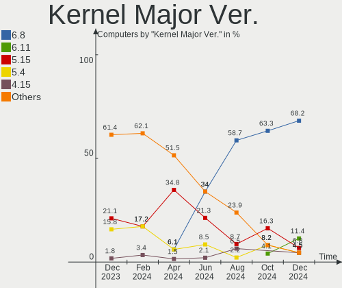
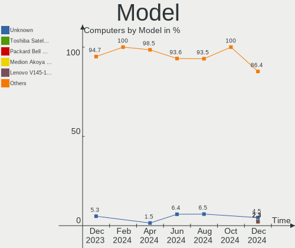
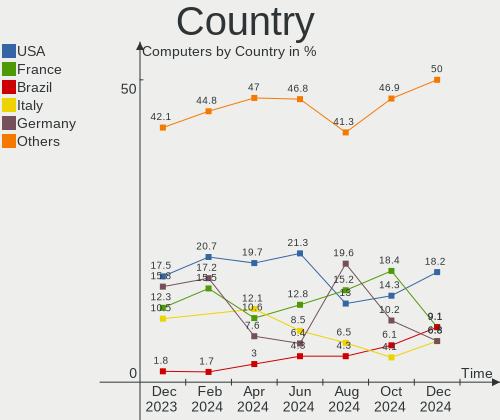
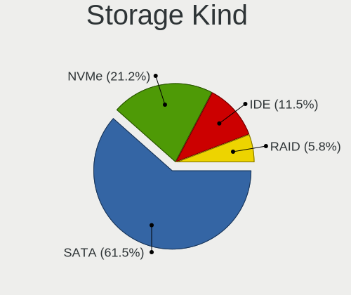
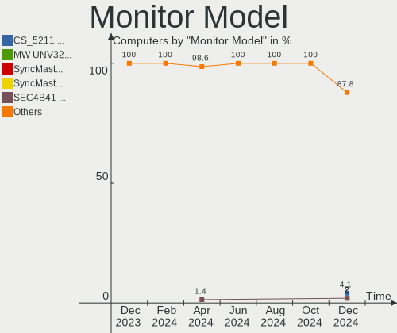
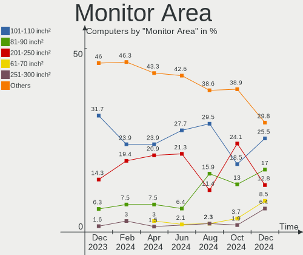
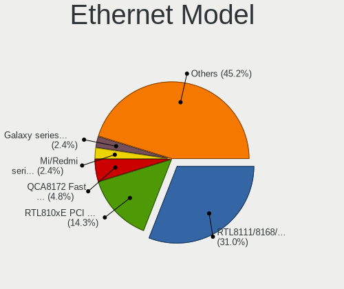
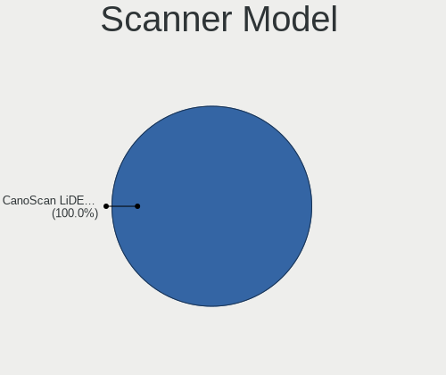

Xubuntu - Hardware Trends
-------------------------

A project to identify most popular hardware characteristics and track their change
over time based on data collected by Linux users at https://Linux-Hardware.org.

Anyone can contribute to this report by the [hw-probe](https://github.com/linuxhw/hw-probe) tool:

    sudo -E hw-probe -all -upload

This is a report for all computer types. See also reports for [desktops](/Dist/Xubuntu/Desktop/README.md) and [notebooks](/Dist/Xubuntu/Notebook/README.md).

This report is for one last month. Overall report since the beginning of time: [TestDays](https://github.com/linuxhw/TestDays)

Period: May, 2023.

Contents
--------

* [ System ](#system)
  - [ OS                       ](#os)
  - [ OS Family                ](#os-family)
  - [ Kernel                   ](#kernel)
  - [ Kernel Family            ](#kernel-family)
  - [ Kernel Major Ver.        ](#kernel-major-ver)
  - [ Arch                     ](#arch)
  - [ DE                       ](#de)
  - [ Display Server           ](#display-server)
  - [ Display Manager          ](#display-manager)
  - [ OS Lang                  ](#os-lang)
  - [ Boot Mode                ](#boot-mode)
  - [ Filesystem               ](#filesystem)
  - [ Part. scheme             ](#part-scheme)
  - [ Dual Boot with Linux/BSD ](#dual-boot-with-linuxbsd)
  - [ Dual Boot (Win)          ](#dual-boot-win)

* [ Board ](#board)
  - [ Vendor                   ](#vendor)
  - [ Model                    ](#model)
  - [ Model Family             ](#model-family)
  - [ MFG Year                 ](#mfg-year)
  - [ Form Factor              ](#form-factor)
  - [ Secure Boot              ](#secure-boot)
  - [ Coreboot                 ](#coreboot)
  - [ RAM Size                 ](#ram-size)
  - [ RAM Used                 ](#ram-used)
  - [ Total Drives             ](#total-drives)
  - [ Has CD-ROM               ](#has-cd-rom)
  - [ Has Ethernet             ](#has-ethernet)
  - [ Has WiFi                 ](#has-wifi)
  - [ Has Bluetooth            ](#has-bluetooth)

* [ Location ](#location)
  - [ Country                  ](#country)
  - [ City                     ](#city)

* [ Drives ](#drives)
  - [ Drive Vendor             ](#drive-vendor)
  - [ Drive Model              ](#drive-model)
  - [ HDD Vendor               ](#hdd-vendor)
  - [ SSD Vendor               ](#ssd-vendor)
  - [ Drive Kind               ](#drive-kind)
  - [ Drive Connector          ](#drive-connector)
  - [ Drive Size               ](#drive-size)
  - [ Space Total              ](#space-total)
  - [ Space Used               ](#space-used)
  - [ Malfunc. Drives          ](#malfunc-drives)
  - [ Malfunc. Drive Vendor    ](#malfunc-drive-vendor)
  - [ Malfunc. HDD Vendor      ](#malfunc-hdd-vendor)
  - [ Malfunc. Drive Kind      ](#malfunc-drive-kind)
  - [ Failed Drives            ](#failed-drives)
  - [ Failed Drive Vendor      ](#failed-drive-vendor)
  - [ Drive Status             ](#drive-status)

* [ Storage controller ](#storage-controller)
  - [ Storage Vendor           ](#storage-vendor)
  - [ Storage Model            ](#storage-model)
  - [ Storage Kind             ](#storage-kind)

* [ Processor ](#processor)
  - [ CPU Vendor               ](#cpu-vendor)
  - [ CPU Model                ](#cpu-model)
  - [ CPU Model Family         ](#cpu-model-family)
  - [ CPU Cores                ](#cpu-cores)
  - [ CPU Sockets              ](#cpu-sockets)
  - [ CPU Threads              ](#cpu-threads)
  - [ CPU Op-Modes             ](#cpu-op-modes)
  - [ CPU Microcode            ](#cpu-microcode)
  - [ CPU Microarch            ](#cpu-microarch)

* [ Graphics ](#graphics)
  - [ GPU Vendor               ](#gpu-vendor)
  - [ GPU Model                ](#gpu-model)
  - [ GPU Combo                ](#gpu-combo)
  - [ GPU Driver               ](#gpu-driver)
  - [ GPU Memory               ](#gpu-memory)

* [ Monitor ](#monitor)
  - [ Monitor Vendor           ](#monitor-vendor)
  - [ Monitor Model            ](#monitor-model)
  - [ Monitor Resolution       ](#monitor-resolution)
  - [ Monitor Diagonal         ](#monitor-diagonal)
  - [ Monitor Width            ](#monitor-width)
  - [ Aspect Ratio             ](#aspect-ratio)
  - [ Monitor Area             ](#monitor-area)
  - [ Pixel Density            ](#pixel-density)
  - [ Multiple Monitors        ](#multiple-monitors)

* [ Network ](#network)
  - [ Net Controller Vendor    ](#net-controller-vendor)
  - [ Net Controller Model     ](#net-controller-model)
  - [ Wireless Vendor          ](#wireless-vendor)
  - [ Wireless Model           ](#wireless-model)
  - [ Ethernet Vendor          ](#ethernet-vendor)
  - [ Ethernet Model           ](#ethernet-model)
  - [ Net Controller Kind      ](#net-controller-kind)
  - [ Used Controller          ](#used-controller)
  - [ NICs                     ](#nics)
  - [ IPv6                     ](#ipv6)

* [ Bluetooth ](#bluetooth)
  - [ Bluetooth Vendor         ](#bluetooth-vendor)
  - [ Bluetooth Model          ](#bluetooth-model)

* [ Sound ](#sound)
  - [ Sound Vendor             ](#sound-vendor)
  - [ Sound Model              ](#sound-model)

* [ Memory ](#memory)
  - [ Memory Vendor            ](#memory-vendor)
  - [ Memory Model             ](#memory-model)
  - [ Memory Kind              ](#memory-kind)
  - [ Memory Form Factor       ](#memory-form-factor)
  - [ Memory Size              ](#memory-size)
  - [ Memory Speed             ](#memory-speed)

* [ Printers & scanners ](#printers--scanners)
  - [ Printer Vendor           ](#printer-vendor)
  - [ Printer Model            ](#printer-model)
  - [ Scanner Vendor           ](#scanner-vendor)
  - [ Scanner Model            ](#scanner-model)

* [ Camera ](#camera)
  - [ Camera Vendor            ](#camera-vendor)
  - [ Camera Model             ](#camera-model)

* [ Security ](#security)
  - [ Fingerprint Vendor       ](#fingerprint-vendor)
  - [ Fingerprint Model        ](#fingerprint-model)
  - [ Chipcard Vendor          ](#chipcard-vendor)
  - [ Chipcard Model           ](#chipcard-model)

* [ Unsupported ](#unsupported)
  - [ Unsupported Devices      ](#unsupported-devices)
  - [ Unsupported Device Types ](#unsupported-device-types)

System
------

OS
--

Installed operating systems

| Name                 | Computers | Percent |
|----------------------|-----------|---------|
| Xubuntu 22.04        | 39        | 59.09%  |
| Xubuntu 23.04        | 11        | 16.67%  |
| Xubuntu 20.04        | 9         | 13.64%  |
| Xubuntu 22.10        | 3         | 4.55%   |
| Xubuntu 18.04        | 3         | 4.55%   |
| Xubuntu 2023.1-beta5 | 1         | 1.52%   |

OS Family
---------

OS without a version

| Name    | Computers | Percent |
|---------|-----------|---------|
| Xubuntu | 66        | 100%    |

Kernel
------

Version of the Linux kernel

| Version                | Computers | Percent |
|------------------------|-----------|---------|
| 5.19.0-41-generic      | 12        | 18.18%  |
| 5.15.0-71-generic      | 11        | 16.67%  |
| 6.2.0-20-generic       | 9         | 13.64%  |
| 5.15.0-71-lowlatency   | 7         | 10.61%  |
| 5.19.0-42-generic      | 4         | 6.06%   |
| 5.4.0-148-generic      | 2         | 3.03%   |
| 5.15.0-72-generic      | 2         | 3.03%   |
| 6.3.3-060303-generic   | 1         | 1.52%   |
| 6.3.2-060302-generic   | 1         | 1.52%   |
| 6.3.1-x64v2-xanmod1    | 1         | 1.52%   |
| 6.2.10-060210-generic  | 1         | 1.52%   |
| 6.2.0-10005-tuxedo     | 1         | 1.52%   |
| 6.2.0-060200-generic   | 1         | 1.52%   |
| 5.4.0-149-generic      | 1         | 1.52%   |
| 5.19.0-1024-lowlatency | 1         | 1.52%   |
| 5.18.0-051800-generic  | 1         | 1.52%   |
| 5.15.0-69-generic      | 1         | 1.52%   |
| 5.15.0-60-generic      | 1         | 1.52%   |
| 5.15.0-57-generic      | 1         | 1.52%   |
| 5.15.0-56-generic      | 1         | 1.52%   |
| 5.15.0-46-lowlatency   | 1         | 1.52%   |
| 5.15.0-46-generic      | 1         | 1.52%   |
| 5.15.0-43-generic      | 1         | 1.52%   |
| 5.13.0-40-generic      | 1         | 1.52%   |
| 4.15.0-211-generic     | 1         | 1.52%   |
| 4.15.0-206-generic     | 1         | 1.52%   |

Kernel Family
-------------

Linux kernel without a distro release

| Version | Computers | Percent |
|---------|-----------|---------|
| 5.15.0  | 27        | 40.91%  |
| 5.19.0  | 17        | 25.76%  |
| 6.2.0   | 11        | 16.67%  |
| 5.4.0   | 3         | 4.55%   |
| 4.15.0  | 2         | 3.03%   |
| 6.3.3   | 1         | 1.52%   |
| 6.3.2   | 1         | 1.52%   |
| 6.3.1   | 1         | 1.52%   |
| 6.2.10  | 1         | 1.52%   |
| 5.18.0  | 1         | 1.52%   |
| 5.13.0  | 1         | 1.52%   |

Kernel Major Ver.
-----------------

Linux kernel major version

| Version | Computers | Percent |
|---------|-----------|---------|
| 5.15    | 27        | 40.91%  |
| 5.19    | 17        | 25.76%  |
| 6.2     | 12        | 18.18%  |
| 6.3     | 3         | 4.55%   |
| 5.4     | 3         | 4.55%   |
| 4.15    | 2         | 3.03%   |
| 5.18    | 1         | 1.52%   |
| 5.13    | 1         | 1.52%   |

Arch
----

OS architecture (x86_64, i586, etc.)

| Name    | Computers | Percent |
|---------|-----------|---------|
| x86_64  | 64        | 96.97%  |
| i686    | 1         | 1.52%   |
| aarch64 | 1         | 1.52%   |

DE
--

Desktop Environment

| Name       | Computers | Percent |
|------------|-----------|---------|
| XFCE       | 64        | 96.97%  |
| X-Cinnamon | 1         | 1.52%   |
| GNOME      | 1         | 1.52%   |

Display Server
--------------

X11 or Wayland

| Name | Computers | Percent |
|------|-----------|---------|
| X11  | 64        | 96.97%  |
| Tty  | 2         | 3.03%   |

Display Manager
---------------

SDDM, LightDM, etc.

| Name    | Computers | Percent |
|---------|-----------|---------|
| LightDM | 57        | 86.36%  |
| Unknown | 9         | 13.64%  |

OS Lang
-------

Language

| Lang  | Computers | Percent |
|-------|-----------|---------|
| en_US | 30        | 45.45%  |
| fr_FR | 12        | 18.18%  |
| en_CA | 5         | 7.58%   |
| en_GB | 4         | 6.06%   |
| de_DE | 4         | 6.06%   |
| it_IT | 3         | 4.55%   |
| en_AU | 2         | 3.03%   |
| ru_RU | 1         | 1.52%   |
| pt_BR | 1         | 1.52%   |
| pl_PL | 1         | 1.52%   |
| lt_LT | 1         | 1.52%   |
| cs_CZ | 1         | 1.52%   |
| C     | 1         | 1.52%   |

Boot Mode
---------

EFI or BIOS

| Mode | Computers | Percent |
|------|-----------|---------|
| BIOS | 40        | 60.61%  |
| EFI  | 26        | 39.39%  |

Filesystem
----------

Type of filesystem

| Type    | Computers | Percent |
|---------|-----------|---------|
| Ext4    | 45        | 68.18%  |
| Tmpfs   | 19        | 28.79%  |
| Zfs     | 1         | 1.52%   |
| Overlay | 1         | 1.52%   |

Part. scheme
------------

Scheme of partitioning

| Type    | Computers | Percent |
|---------|-----------|---------|
| GPT     | 45        | 68.18%  |
| MBR     | 13        | 19.7%   |
| Unknown | 8         | 12.12%  |

Dual Boot with Linux/BSD
------------------------

Hosting more than one Linux/BSD

| Dual boot | Computers | Percent |
|-----------|-----------|---------|
| No        | 55        | 83.33%  |
| Yes       | 11        | 16.67%  |

Dual Boot (Win)
---------------

Hosting Linux and Windows

| Dual boot | Computers | Percent |
|-----------|-----------|---------|
| No        | 44        | 66.67%  |
| Yes       | 22        | 33.33%  |

Board
-----

Vendor
------

Motherboard manufacturer

| Name                | Computers | Percent |
|---------------------|-----------|---------|
| Dell                | 11        | 16.67%  |
| Lenovo              | 8         | 12.12%  |
| MSI                 | 7         | 10.61%  |
| Hewlett-Packard     | 6         | 9.09%   |
| Gigabyte Technology | 6         | 9.09%   |
| ASUSTek Computer    | 5         | 7.58%   |
| Google              | 4         | 6.06%   |
| Acer                | 4         | 6.06%   |
| Unknown             | 3         | 4.55%   |
| Samsung Electronics | 2         | 3.03%   |
| ASRock              | 2         | 3.03%   |
| Toshiba             | 1         | 1.52%   |
| Pegatron            | 1         | 1.52%   |
| Intel               | 1         | 1.52%   |
| GPU Company         | 1         | 1.52%   |
| Fujitsu Siemens     | 1         | 1.52%   |
| Fujitsu             | 1         | 1.52%   |
| Chuwi               | 1         | 1.52%   |
| Apple               | 1         | 1.52%   |

Model
-----

Motherboard model

| Name                                 | Computers | Percent |
|--------------------------------------|-----------|---------|
| Unknown                              | 3         | 4.55%   |
| Lenovo ThinkPad P50 20EN0013US       | 2         | 3.03%   |
| Google Snappy                        | 2         | 3.03%   |
| Toshiba Satellite L300               | 1         | 1.52%   |
| Samsung RV410/RV510/S3510/E3510      | 1         | 1.52%   |
| Samsung 730QCJ/730QCR                | 1         | 1.52%   |
| Pegatron FZ132AA-ABF m9456fr         | 1         | 1.52%   |
| MSI MS-7D40                          | 1         | 1.52%   |
| MSI MS-7D04                          | 1         | 1.52%   |
| MSI MS-7C51                          | 1         | 1.52%   |
| MSI MS-7C08                          | 1         | 1.52%   |
| MSI MS-7C02                          | 1         | 1.52%   |
| MSI MS-7721                          | 1         | 1.52%   |
| MSI Modern 15 A5M                    | 1         | 1.52%   |
| Lenovo ThinkPad X201 3680MG1         | 1         | 1.52%   |
| Lenovo ThinkPad W500 40626NG         | 1         | 1.52%   |
| Lenovo ThinkPad T61 7661V3L          | 1         | 1.52%   |
| Lenovo ThinkCentre M92P 3227BD2      | 1         | 1.52%   |
| Lenovo ThinkCentre M83 10AGS17E00    | 1         | 1.52%   |
| Lenovo ThinkCentre M82 2756AT9       | 1         | 1.52%   |
| Intel DP55WB AAE64798-205            | 1         | 1.52%   |
| HP xw8400 Workstation                | 1         | 1.52%   |
| HP ProBook 640 G1                    | 1         | 1.52%   |
| HP Pavilion dv6                      | 1         | 1.52%   |
| HP ENVY 4                            | 1         | 1.52%   |
| HP Compaq dc7600 Small Form Factor   | 1         | 1.52%   |
| HP 15                                | 1         | 1.52%   |
| GPU Company GWTC116-2                | 1         | 1.52%   |
| Google Edgar                         | 1         | 1.52%   |
| Google Auron_Yuna                    | 1         | 1.52%   |
| Gigabyte X58A-UD3R                   | 1         | 1.52%   |
| Gigabyte M68MT-S2                    | 1         | 1.52%   |
| Gigabyte H510M S2H V2                | 1         | 1.52%   |
| Gigabyte H270-HD3                    | 1         | 1.52%   |
| Gigabyte B550 AORUS ELITE            | 1         | 1.52%   |
| Gigabyte A7 K1                       | 1         | 1.52%   |
| Fujitsu Siemens ESPRIMO Mobile V6535 | 1         | 1.52%   |
| Fujitsu LIFEBOOK P702                | 1         | 1.52%   |
| Dell XPS 13 7390 2-in-1              | 1         | 1.52%   |
| Dell Vostro 5620                     | 1         | 1.52%   |

Model Family
------------

Motherboard model prefix

| Name                    | Computers | Percent |
|-------------------------|-----------|---------|
| Lenovo ThinkPad         | 5         | 7.58%   |
| Dell Latitude           | 4         | 6.06%   |
| Lenovo ThinkCentre      | 3         | 4.55%   |
| Unknown                 | 3         | 4.55%   |
| Google Snappy           | 2         | 3.03%   |
| Dell OptiPlex           | 2         | 3.03%   |
| Dell Inspiron           | 2         | 3.03%   |
| Acer Aspire             | 2         | 3.03%   |
| Toshiba Satellite       | 1         | 1.52%   |
| Samsung RV410           | 1         | 1.52%   |
| Samsung 730QCJ          | 1         | 1.52%   |
| Pegatron FZ132AA-ABF    | 1         | 1.52%   |
| MSI MS-7D40             | 1         | 1.52%   |
| MSI MS-7D04             | 1         | 1.52%   |
| MSI MS-7C51             | 1         | 1.52%   |
| MSI MS-7C08             | 1         | 1.52%   |
| MSI MS-7C02             | 1         | 1.52%   |
| MSI MS-7721             | 1         | 1.52%   |
| MSI Modern              | 1         | 1.52%   |
| Intel DP55WB            | 1         | 1.52%   |
| HP xw8400               | 1         | 1.52%   |
| HP ProBook              | 1         | 1.52%   |
| HP Pavilion             | 1         | 1.52%   |
| HP ENVY                 | 1         | 1.52%   |
| HP Compaq               | 1         | 1.52%   |
| HP 15                   | 1         | 1.52%   |
| GPU Company GWTC116-2   | 1         | 1.52%   |
| Google Edgar            | 1         | 1.52%   |
| Google Auron            | 1         | 1.52%   |
| Gigabyte X58A-UD3R      | 1         | 1.52%   |
| Gigabyte M68MT-S2       | 1         | 1.52%   |
| Gigabyte H510M          | 1         | 1.52%   |
| Gigabyte H270-HD3       | 1         | 1.52%   |
| Gigabyte B550           | 1         | 1.52%   |
| Gigabyte A7             | 1         | 1.52%   |
| Fujitsu Siemens ESPRIMO | 1         | 1.52%   |
| Fujitsu LIFEBOOK        | 1         | 1.52%   |
| Dell XPS                | 1         | 1.52%   |
| Dell Vostro             | 1         | 1.52%   |
| Dell G3                 | 1         | 1.52%   |

MFG Year
--------

Motherboard manufacture year

| Year | Computers | Percent |
|------|-----------|---------|
| 2021 | 8         | 12.12%  |
| 2022 | 7         | 10.61%  |
| 2013 | 7         | 10.61%  |
| 2015 | 5         | 7.58%   |
| 2010 | 5         | 7.58%   |
| 2008 | 5         | 7.58%   |
| 2020 | 4         | 6.06%   |
| 2019 | 4         | 6.06%   |
| 2009 | 4         | 6.06%   |
| 2023 | 3         | 4.55%   |
| 2018 | 3         | 4.55%   |
| 2016 | 3         | 4.55%   |
| 2012 | 2         | 3.03%   |
| 2007 | 2         | 3.03%   |
| 2014 | 1         | 1.52%   |
| 2011 | 1         | 1.52%   |
| 2006 | 1         | 1.52%   |
| 2005 | 1         | 1.52%   |

Form Factor
-----------

Physical design of the computer

| Name           | Computers | Percent |
|----------------|-----------|---------|
| Notebook       | 35        | 53.03%  |
| Desktop        | 28        | 42.42%  |
| System on chip | 1         | 1.52%   |
| Convertible    | 1         | 1.52%   |
| All in one     | 1         | 1.52%   |

Secure Boot
-----------

Enabled or disabled

| State    | Computers | Percent |
|----------|-----------|---------|
| Disabled | 64        | 96.97%  |
| Enabled  | 2         | 3.03%   |

Coreboot
--------

Have coreboot on board

| Used | Computers | Percent |
|------|-----------|---------|
| No   | 62        | 93.94%  |
| Yes  | 4         | 6.06%   |

RAM Size
--------

Total RAM memory

| Size in GB  | Computers | Percent |
|-------------|-----------|---------|
| 3.01-4.0    | 17        | 25.76%  |
| 4.01-8.0    | 12        | 18.18%  |
| 16.01-24.0  | 11        | 16.67%  |
| 8.01-16.0   | 11        | 16.67%  |
| 32.01-64.0  | 6         | 9.09%   |
| 64.01-256.0 | 6         | 9.09%   |
| 1.01-2.0    | 2         | 3.03%   |
| 24.01-32.0  | 1         | 1.52%   |

RAM Used
--------

Used RAM memory

| Used GB    | Computers | Percent |
|------------|-----------|---------|
| 1.01-2.0   | 22        | 33.33%  |
| 2.01-3.0   | 14        | 21.21%  |
| 4.01-8.0   | 11        | 16.67%  |
| 3.01-4.0   | 9         | 13.64%  |
| 0.51-1.0   | 5         | 7.58%   |
| 8.01-16.0  | 3         | 4.55%   |
| 16.01-24.0 | 2         | 3.03%   |

Total Drives
------------

Number of drives on board

| Drives | Computers | Percent |
|--------|-----------|---------|
| 1      | 41        | 62.12%  |
| 2      | 13        | 19.7%   |
| 5      | 4         | 6.06%   |
| 3      | 4         | 6.06%   |
| 6      | 2         | 3.03%   |
| 7      | 1         | 1.52%   |
| 4      | 1         | 1.52%   |

Has CD-ROM
----------

Has CD-ROM on board

| Presented | Computers | Percent |
|-----------|-----------|---------|
| No        | 41        | 62.12%  |
| Yes       | 25        | 37.88%  |

Has Ethernet
------------

Has Ethernet on board

| Presented | Computers | Percent |
|-----------|-----------|---------|
| Yes       | 54        | 81.82%  |
| No        | 12        | 18.18%  |

Has WiFi
--------

Has WiFi module

| Presented | Computers | Percent |
|-----------|-----------|---------|
| Yes       | 48        | 72.73%  |
| No        | 18        | 27.27%  |

Has Bluetooth
-------------

Has Bluetooth module

| Presented | Computers | Percent |
|-----------|-----------|---------|
| Yes       | 38        | 57.58%  |
| No        | 28        | 42.42%  |

Location
--------

Country
-------

Geographic location (country)

| Country     | Computers | Percent |
|-------------|-----------|---------|
| USA         | 11        | 16.67%  |
| France      | 10        | 15.15%  |
| Germany     | 7         | 10.61%  |
| Canada      | 5         | 7.58%   |
| Sweden      | 4         | 6.06%   |
| Italy       | 3         | 4.55%   |
| UK          | 2         | 3.03%   |
| Spain       | 2         | 3.03%   |
| Russia      | 2         | 3.03%   |
| Netherlands | 2         | 3.03%   |
| Denmark     | 2         | 3.03%   |
| Brazil      | 2         | 3.03%   |
| Australia   | 2         | 3.03%   |
| Argentina   | 2         | 3.03%   |
| Vietnam     | 1         | 1.52%   |
| Poland      | 1         | 1.52%   |
| Panama      | 1         | 1.52%   |
| Pakistan    | 1         | 1.52%   |
| Lithuania   | 1         | 1.52%   |
| Guadeloupe  | 1         | 1.52%   |
| Czechia     | 1         | 1.52%   |
| Bulgaria    | 1         | 1.52%   |
| Belgium     | 1         | 1.52%   |
| Algeria     | 1         | 1.52%   |

City
----

Geographic location (city)

| City                    | Computers | Percent |
|-------------------------|-----------|---------|
| Nykvarn                 | 3         | 4.55%   |
| Sydney                  | 2         | 3.03%   |
| London                  | 2         | 3.03%   |
| Copenhagen              | 2         | 3.03%   |
| Whitby                  | 1         | 1.52%   |
| Warsaw                  | 1         | 1.52%   |
| Wandsworth              | 1         | 1.52%   |
| Vilnius                 | 1         | 1.52%   |
| Veseli nad Luznici      | 1         | 1.52%   |
| Varna                   | 1         | 1.52%   |
| Toulouse                | 1         | 1.52%   |
| Tifton                  | 1         | 1.52%   |
| South Point             | 1         | 1.52%   |
| Seattle                 | 1         | 1.52%   |
| Sannazzaro de' Burgondi | 1         | 1.52%   |
| San Antonio de Areco    | 1         | 1.52%   |
| Saint-Nazaire           | 1         | 1.52%   |
| Rotterdam               | 1         | 1.52%   |
| Rome                    | 1         | 1.52%   |
| Realmont                | 1         | 1.52%   |
| Pointe-à-Pitre         | 1         | 1.52%   |
| Panama City             | 1         | 1.52%   |
| Palo Alto               | 1         | 1.52%   |
| Paiporta                | 1         | 1.52%   |
| Oelsnitz                | 1         | 1.52%   |
| Nyköping               | 1         | 1.52%   |
| North Hills             | 1         | 1.52%   |
| Muncie                  | 1         | 1.52%   |
| Moscow                  | 1         | 1.52%   |
| Milan                   | 1         | 1.52%   |
| Melvindale              | 1         | 1.52%   |
| Marienheide             | 1         | 1.52%   |
| Manises                 | 1         | 1.52%   |
| Longueuil               | 1         | 1.52%   |
| Les Andelys             | 1         | 1.52%   |
| Le Syndicat             | 1         | 1.52%   |
| Lahore                  | 1         | 1.52%   |
| Kemerovo                | 1         | 1.52%   |
| Juiz de Fora            | 1         | 1.52%   |
| Inzinzac-Lochrist       | 1         | 1.52%   |

Drives
------

Drive Vendor
------------

Hard drive vendors

| Vendor                      | Computers | Drives | Percent |
|-----------------------------|-----------|--------|---------|
| WDC                         | 23        | 28     | 22.77%  |
| Samsung Electronics         | 16        | 23     | 15.84%  |
| Seagate                     | 10        | 14     | 9.9%    |
| Unknown                     | 7         | 8      | 6.93%   |
| Kingston                    | 7         | 7      | 6.93%   |
| SanDisk                     | 4         | 6      | 3.96%   |
| PNY                         | 3         | 3      | 2.97%   |
| Unknown                     | 3         | 3      | 2.97%   |
| Toshiba                     | 2         | 3      | 1.98%   |
| KIOXIA                      | 2         | 2      | 1.98%   |
| Hitachi                     | 2         | 3      | 1.98%   |
| Crucial                     | 2         | 2      | 1.98%   |
| China                       | 2         | 2      | 1.98%   |
| ASMT                        | 2         | 3      | 1.98%   |
| WDC WDS1                    | 1         | 1      | 0.99%   |
| SPCC                        | 1         | 1      | 0.99%   |
| SK hynix                    | 1         | 1      | 0.99%   |
| ShiJi                       | 1         | 2      | 0.99%   |
| PM991a N                    | 1         | 1      | 0.99%   |
| Plextor                     | 1         | 1      | 0.99%   |
| Phison                      | 1         | 1      | 0.99%   |
| Netac                       | 1         | 1      | 0.99%   |
| Micron Technology           | 1         | 1      | 0.99%   |
| Kingston Technology Company | 1         | 1      | 0.99%   |
| KingSpec                    | 1         | 1      | 0.99%   |
| JMicron Technology          | 1         | 1      | 0.99%   |
| Intel                       | 1         | 1      | 0.99%   |
| HGST                        | 1         | 1      | 0.99%   |
| Emtec                       | 1         | 1      | 0.99%   |
| A-DATA Technology           | 1         | 1      | 0.99%   |

Drive Model
-----------

Hard drive models

| Model                                               | Computers | Percent |
|-----------------------------------------------------|-----------|---------|
| Samsung SSD 860 EVO 500GB                           | 3         | 2.59%   |
| Unknown                                             | 3         | 2.59%   |
| Unknown MMC Card  32GB                              | 2         | 1.72%   |
| Seagate ST500LT012-1DG142 500GB                     | 2         | 1.72%   |
| Seagate ST4000DM004-2CV104 4TB                      | 2         | 1.72%   |
| Samsung NVMe SSD Controller SM981/PM981/PM983 256GB | 2         | 1.72%   |
| Kingston SNVS1000G 1TB                              | 2         | 1.72%   |
| Kingston SA400S37480G 480GB SSD                     | 2         | 1.72%   |
| WDC WDS500G2B0A-00SM50 500GB SSD                    | 1         | 0.86%   |
| WDC WDS240G2G0A-00JH30 240GB SSD                    | 1         | 0.86%   |
| WDC WDS1 20G1G0A-00SS50 120GB SSD                   | 1         | 0.86%   |
| WDC WDBNCE0010PNC 1TB SSD                           | 1         | 0.86%   |
| WDC WD80EFBX-68AZZN0 8TB                            | 1         | 0.86%   |
| WDC WD80EFAX-68KNBN0 8TB                            | 1         | 0.86%   |
| WDC WD800JB-00FMA0 80GB                             | 1         | 0.86%   |
| WDC WD7500BPVX-22JC3T0 752GB                        | 1         | 0.86%   |
| WDC WD5000LPLX-22ZNTT0 500GB                        | 1         | 0.86%   |
| WDC WD5000BPVX-00JC3T0 500GB                        | 1         | 0.86%   |
| WDC WD5000AZLX-00K2TA0 500GB                        | 1         | 0.86%   |
| WDC WD5000AAKX-22ERMA0 500GB                        | 1         | 0.86%   |
| WDC WD5000AAKS-00V1A0 500GB                         | 1         | 0.86%   |
| WDC WD5000AADS-00L4B1 500GB                         | 1         | 0.86%   |
| WDC WD40EFRX-68WT0N0 4TB                            | 1         | 0.86%   |
| WDC WD40EFAX-68JH4N0 4TB                            | 1         | 0.86%   |
| WDC WD4005FZBX-00K5WB0 4TB                          | 1         | 0.86%   |
| WDC WD3200AAKS-00B3A0 320GB                         | 1         | 0.86%   |
| WDC WD3200AAJS-56M0A0 320GB                         | 1         | 0.86%   |
| WDC WD2500BEVT-00A23T0 250GB                        | 1         | 0.86%   |
| WDC WD2500AAJS-75M0A0 250GB                         | 1         | 0.86%   |
| WDC WD10SPZX-75Z10T3 1TB                            | 1         | 0.86%   |
| WDC WD10SPZX-00Z10T0 1TB                            | 1         | 0.86%   |
| WDC WD10JPVX-22JC3T0 1TB                            | 1         | 0.86%   |
| WDC WD10JPVT-00A1YT0 1TB                            | 1         | 0.86%   |
| WDC WD10EZEX-08M2NA0 1TB                            | 1         | 0.86%   |
| WDC WD1001FALS-40Y6A0 1TB                           | 1         | 0.86%   |
| WDC PC SN530 SDBPNPZ-512G-1114 512GB                | 1         | 0.86%   |
| Unknown MMC Card  64GB                              | 1         | 0.86%   |
| Unknown MMC Card  30MB                              | 1         | 0.86%   |
| Unknown MMC Card  1073GB                            | 1         | 0.86%   |
| Unknown MMC Card  1072GB                            | 1         | 0.86%   |

HDD Vendor
----------

Hard disk drive vendors

| Vendor              | Computers | Drives | Percent |
|---------------------|-----------|--------|---------|
| WDC                 | 19        | 24     | 54.29%  |
| Seagate             | 10        | 14     | 28.57%  |
| Hitachi             | 2         | 3      | 5.71%   |
| Toshiba             | 1         | 2      | 2.86%   |
| Samsung Electronics | 1         | 1      | 2.86%   |
| HGST                | 1         | 1      | 2.86%   |
| ASMT                | 1         | 1      | 2.86%   |

SSD Vendor
----------

Solid state drive vendors

| Vendor              | Computers | Drives | Percent |
|---------------------|-----------|--------|---------|
| Samsung Electronics | 10        | 14     | 23.81%  |
| Kingston            | 5         | 5      | 11.9%   |
| SanDisk             | 4         | 6      | 9.52%   |
| WDC                 | 3         | 3      | 7.14%   |
| PNY                 | 3         | 3      | 7.14%   |
| Crucial             | 2         | 2      | 4.76%   |
| China               | 2         | 2      | 4.76%   |
| WDC WDS1            | 1         | 1      | 2.38%   |
| Toshiba             | 1         | 1      | 2.38%   |
| SPCC                | 1         | 1      | 2.38%   |
| SK hynix            | 1         | 1      | 2.38%   |
| ShiJi               | 1         | 1      | 2.38%   |
| Plextor             | 1         | 1      | 2.38%   |
| Netac               | 1         | 1      | 2.38%   |
| Micron Technology   | 1         | 1      | 2.38%   |
| KingSpec            | 1         | 1      | 2.38%   |
| Intel               | 1         | 1      | 2.38%   |
| Emtec               | 1         | 1      | 2.38%   |
| ASMT                | 1         | 2      | 2.38%   |
| A-DATA Technology   | 1         | 1      | 2.38%   |

Drive Kind
----------

HDD or SSD

| Kind    | Computers | Drives | Percent |
|---------|-----------|--------|---------|
| SSD     | 36        | 49     | 39.56%  |
| HDD     | 28        | 46     | 30.77%  |
| NVMe    | 14        | 15     | 15.38%  |
| MMC     | 10        | 11     | 10.99%  |
| Unknown | 3         | 3      | 3.3%    |

Drive Connector
---------------

SATA, SAS, NVMe, etc.

| Type | Computers | Drives | Percent |
|------|-----------|--------|---------|
| SATA | 52        | 91     | 63.41%  |
| NVMe | 14        | 15     | 17.07%  |
| MMC  | 10        | 11     | 12.2%   |
| SAS  | 6         | 7      | 7.32%   |

Drive Size
----------

Size of hard drive

| Size in TB | Computers | Drives | Percent |
|------------|-----------|--------|---------|
| 0.01-0.5   | 37        | 52     | 53.62%  |
| 0.51-1.0   | 23        | 27     | 33.33%  |
| 1.01-2.0   | 4         | 6      | 5.8%    |
| 3.01-4.0   | 3         | 8      | 4.35%   |
| 4.01-10.0  | 2         | 2      | 2.9%    |

Space Total
-----------

Amount of disk space available on the file system

| Size in GB     | Computers | Percent |
|----------------|-----------|---------|
| 251-500        | 18        | 27.27%  |
| 101-250        | 15        | 22.73%  |
| 501-1000       | 10        | 15.15%  |
| More than 3000 | 6         | 9.09%   |
| 1-20           | 5         | 7.58%   |
| 1001-2000      | 4         | 6.06%   |
| 21-50          | 3         | 4.55%   |
| 51-100         | 3         | 4.55%   |
| 2001-3000      | 1         | 1.52%   |
| Unknown        | 1         | 1.52%   |

Space Used
----------

Amount of used disk space

| Used GB        | Computers | Percent |
|----------------|-----------|---------|
| 1-20           | 22        | 33.33%  |
| 21-50          | 11        | 16.67%  |
| 501-1000       | 10        | 15.15%  |
| 101-250        | 7         | 10.61%  |
| 51-100         | 6         | 9.09%   |
| 251-500        | 4         | 6.06%   |
| More than 3000 | 3         | 4.55%   |
| 2001-3000      | 1         | 1.52%   |
| 1001-2000      | 1         | 1.52%   |
| Unknown        | 1         | 1.52%   |

Malfunc. Drives
---------------

Drive models with a malfunction

| Model                                       | Computers | Drives | Percent |
|---------------------------------------------|-----------|--------|---------|
| SK hynix SC401 SATA 512GB SSD               | 1         | 1      | 20%     |
| Seagate ST500LT012-1DG142 500GB             | 1         | 1      | 20%     |
| Seagate ST1000DM003-1ER162 1TB              | 1         | 1      | 20%     |
| Samsung Electronics SSD PM810 FDE 2.5 128GB | 1         | 1      | 20%     |
| Kingston SNS4151S316GD 16GB SSD             | 1         | 1      | 20%     |

Malfunc. Drive Vendor
---------------------

Vendors of faulty drives

| Vendor              | Computers | Drives | Percent |
|---------------------|-----------|--------|---------|
| Seagate             | 2         | 2      | 40%     |
| SK hynix            | 1         | 1      | 20%     |
| Samsung Electronics | 1         | 1      | 20%     |
| Kingston            | 1         | 1      | 20%     |

Malfunc. HDD Vendor
-------------------

Vendors of faulty HDD drives

| Vendor  | Computers | Drives | Percent |
|---------|-----------|--------|---------|
| Seagate | 2         | 2      | 100%    |

Malfunc. Drive Kind
-------------------

Kinds of faulty drives

| Kind | Computers | Drives | Percent |
|------|-----------|--------|---------|
| SSD  | 3         | 3      | 60%     |
| HDD  | 2         | 2      | 40%     |

Failed Drives
-------------

Failed drive models

Zero info for selected period =(

Failed Drive Vendor
-------------------

Failed drive vendors

Zero info for selected period =(

Drive Status
------------

Number of failed and malfunc. drives

| Status   | Computers | Drives | Percent |
|----------|-----------|--------|---------|
| Detected | 38        | 70     | 53.52%  |
| Works    | 28        | 49     | 39.44%  |
| Malfunc  | 5         | 5      | 7.04%   |

Storage controller
------------------

Storage Vendor
--------------

Storage controller vendors

| Vendor                      | Computers | Percent |
|-----------------------------|-----------|---------|
| Intel                       | 47        | 59.49%  |
| AMD                         | 10        | 12.66%  |
| Samsung Electronics         | 7         | 8.86%   |
| Kingston Technology Company | 3         | 3.8%    |
| Marvell Technology Group    | 2         | 2.53%   |
| KIOXIA                      | 2         | 2.53%   |
| JMicron Technology          | 2         | 2.53%   |
| Silicon Image               | 1         | 1.27%   |
| SanDisk                     | 1         | 1.27%   |
| Phison Electronics          | 1         | 1.27%   |
| Nvidia                      | 1         | 1.27%   |
| Broadcom / LSI              | 1         | 1.27%   |
| ASMedia Technology          | 1         | 1.27%   |

Storage Model
-------------

Storage controller models

| Model                                                                            | Computers | Percent |
|----------------------------------------------------------------------------------|-----------|---------|
| AMD FCH SATA Controller [AHCI mode]                                              | 6         | 6.67%   |
| Intel 82801IBM/IEM (ICH9M/ICH9M-E) 4 port SATA Controller [AHCI mode]            | 4         | 4.44%   |
| Intel 82801 Mobile SATA Controller [RAID mode]                                   | 4         | 4.44%   |
| Samsung NVMe SSD Controller SM981/PM981/PM983                                    | 3         | 3.33%   |
| Samsung NVMe SSD Controller PM9A1/PM9A3/980PRO                                   | 3         | 3.33%   |
| Intel Celeron/Pentium Silver Processor SATA Controller                           | 3         | 3.33%   |
| Intel 8 Series/C220 Series Chipset Family 6-port SATA Controller 1 [AHCI mode]   | 3         | 3.33%   |
| Intel 7 Series/C210 Series Chipset Family 6-port SATA Controller [AHCI mode]     | 3         | 3.33%   |
| Intel 500 Series Chipset Family SATA AHCI Controller                             | 3         | 3.33%   |
| Intel 5 Series/3400 Series Chipset 6 port SATA AHCI Controller                   | 3         | 3.33%   |
| Samsung NVMe SSD Controller 980                                                  | 2         | 2.22%   |
| KIOXIA NVMe SSD Controller BG4                                                   | 2         | 2.22%   |
| Kingston Company SNVS2000G [NV1 NVMe PCIe SSD 2TB]                               | 2         | 2.22%   |
| JMicron JMB363 SATA/IDE Controller                                               | 2         | 2.22%   |
| Intel Wildcat Point-LP SATA Controller [AHCI Mode]                               | 2         | 2.22%   |
| Intel Q170/Q150/B150/H170/H110/Z170/CM236 Chipset SATA Controller [AHCI Mode]    | 2         | 2.22%   |
| Intel 82801JI (ICH10 Family) 4 port SATA IDE Controller #1                       | 2         | 2.22%   |
| Intel 82801JI (ICH10 Family) 2 port SATA IDE Controller #2                       | 2         | 2.22%   |
| Intel 7 Series Chipset Family 6-port SATA Controller [AHCI mode]                 | 2         | 2.22%   |
| Intel 200 Series PCH SATA controller [AHCI mode]                                 | 2         | 2.22%   |
| AMD 500 Series Chipset SATA Controller                                           | 2         | 2.22%   |
| Silicon Image SiI 3114 [SATALink/SATARaid] Serial ATA Controller                 | 1         | 1.11%   |
| SanDisk WD Blue SN550 NVMe SSD                                                   | 1         | 1.11%   |
| Phison E16 PCIe4 NVMe Controller                                                 | 1         | 1.11%   |
| Nvidia MCP61 SATA Controller                                                     | 1         | 1.11%   |
| Marvell Group 88SE91A3 SATA-600 Controller                                       | 1         | 1.11%   |
| Marvell Group 88SE6101/6102 single-port PATA133 interface                        | 1         | 1.11%   |
| Kingston Company Company Non-Volatile memory controller                          | 1         | 1.11%   |
| Intel Volume Management Device NVMe RAID Controller                              | 1         | 1.11%   |
| Intel Sunrise Point-LP SATA Controller [AHCI mode]                               | 1         | 1.11%   |
| Intel SATA Controller [RAID mode]                                                | 1         | 1.11%   |
| Intel NM10/ICH7 Family SATA Controller [IDE mode]                                | 1         | 1.11%   |
| Intel Mobile PM965/GM965 PT IDER Controller                                      | 1         | 1.11%   |
| Intel Celeron N3350/Pentium N4200/Atom E3900 Series SATA AHCI Controller         | 1         | 1.11%   |
| Intel Cannon Point-LP SATA Controller [AHCI Mode]                                | 1         | 1.11%   |
| Intel Atom/Celeron/Pentium Processor x5-E8000/J3xxx/N3xxx Series SATA Controller | 1         | 1.11%   |
| Intel 82801HR/HO/HH (ICH8R/DO/DH) 2 port SATA Controller [IDE mode]              | 1         | 1.11%   |
| Intel 82801HM/HEM (ICH8M/ICH8M-E) SATA Controller [AHCI mode]                    | 1         | 1.11%   |
| Intel 82801HM/HEM (ICH8M/ICH8M-E) IDE Controller                                 | 1         | 1.11%   |
| Intel 82801H (ICH8 Family) 4 port SATA Controller [IDE mode]                     | 1         | 1.11%   |

Storage Kind
------------

Kind of storage controller (IDE, SATA, NVMe, SAS, ...)

| Kind | Computers | Percent |
|------|-----------|---------|
| SATA | 45        | 58.44%  |
| NVMe | 14        | 18.18%  |
| IDE  | 9         | 11.69%  |
| RAID | 8         | 10.39%  |
| SCSI | 1         | 1.3%    |

Processor
---------

CPU Vendor
----------

Processor vendors

| Vendor | Computers | Percent |
|--------|-----------|---------|
| Intel  | 52        | 78.79%  |
| AMD    | 13        | 19.7%   |
| ARM    | 1         | 1.52%   |

CPU Model
---------

Processor models

| Model                                       | Computers | Percent |
|---------------------------------------------|-----------|---------|
| Intel Celeron CPU N3350 @ 1.10GHz           | 3         | 4.55%   |
| Intel Core i7-6700HQ CPU @ 2.60GHz          | 2         | 3.03%   |
| Intel Xeon CPU 5150 @ 2.66GHz               | 1         | 1.52%   |
| Intel Pentium Silver N5030 CPU @ 1.10GHz    | 1         | 1.52%   |
| Intel Pentium Dual-Core CPU T4200 @ 2.00GHz | 1         | 1.52%   |
| Intel Pentium Dual CPU T3400 @ 2.16GHz      | 1         | 1.52%   |
| Intel Pentium CPU N3700 @ 1.60GHz           | 1         | 1.52%   |
| Intel Pentium 4 CPU 3.00GHz                 | 1         | 1.52%   |
| Intel Core i7-8650U CPU @ 1.90GHz           | 1         | 1.52%   |
| Intel Core i7-7700K CPU @ 4.20GHz           | 1         | 1.52%   |
| Intel Core i7-3770 CPU @ 3.40GHz            | 1         | 1.52%   |
| Intel Core i7-1065G7 CPU @ 1.30GHz          | 1         | 1.52%   |
| Intel Core i7-10510U CPU @ 1.80GHz          | 1         | 1.52%   |
| Intel Core i7 CPU 930 @ 2.80GHz             | 1         | 1.52%   |
| Intel Core i5-8259U CPU @ 2.30GHz           | 1         | 1.52%   |
| Intel Core i5-7200U CPU @ 2.50GHz           | 1         | 1.52%   |
| Intel Core i5-6300U CPU @ 2.40GHz           | 1         | 1.52%   |
| Intel Core i5-4590 CPU @ 3.30GHz            | 1         | 1.52%   |
| Intel Core i5-4570 CPU @ 3.20GHz            | 1         | 1.52%   |
| Intel Core i5-4300M CPU @ 2.60GHz           | 1         | 1.52%   |
| Intel Core i5-3470 CPU @ 3.20GHz            | 1         | 1.52%   |
| Intel Core i5-3340M CPU @ 2.70GHz           | 1         | 1.52%   |
| Intel Core i5-3317U CPU @ 1.70GHz           | 1         | 1.52%   |
| Intel Core i5-10300H CPU @ 2.50GHz          | 1         | 1.52%   |
| Intel Core i5 CPU M 560 @ 2.67GHz           | 1         | 1.52%   |
| Intel Core i5 CPU M 520 @ 2.40GHz           | 1         | 1.52%   |
| Intel Core i5 CPU M 460 @ 2.53GHz           | 1         | 1.52%   |
| Intel Core i5 CPU 760 @ 2.80GHz             | 1         | 1.52%   |
| Intel Core i3-9100 CPU @ 3.60GHz            | 1         | 1.52%   |
| Intel Core i3-5005U CPU @ 2.00GHz           | 1         | 1.52%   |
| Intel Core i3-2377M CPU @ 1.50GHz           | 1         | 1.52%   |
| Intel Core i3-2100 CPU @ 3.10GHz            | 1         | 1.52%   |
| Intel Core i3-10105 CPU @ 3.70GHz           | 1         | 1.52%   |
| Intel Core i3-10100T CPU @ 3.00GHz          | 1         | 1.52%   |
| Intel Core i3 CPU 530 @ 2.93GHz             | 1         | 1.52%   |
| Intel Core 2 Quad CPU Q9400 @ 2.66GHz       | 1         | 1.52%   |
| Intel Core 2 Quad CPU Q8200 @ 2.33GHz       | 1         | 1.52%   |
| Intel Core 2 Duo CPU U9600 @ 1.60GHz        | 1         | 1.52%   |
| Intel Core 2 Duo CPU T9600 @ 2.80GHz        | 1         | 1.52%   |
| Intel Core 2 Duo CPU T7500 @ 2.20GHz        | 1         | 1.52%   |

CPU Model Family
----------------

Processor model prefix

| Model                   | Computers | Percent |
|-------------------------|-----------|---------|
| Intel Core i5           | 14        | 21.21%  |
| Intel Core i7           | 8         | 12.12%  |
| Intel Core i3           | 7         | 10.61%  |
| Intel Celeron           | 7         | 10.61%  |
| Other                   | 4         | 6.06%   |
| Intel Core 2 Duo        | 4         | 6.06%   |
| AMD Ryzen 5             | 4         | 6.06%   |
| AMD A8                  | 3         | 4.55%   |
| Intel Core 2 Quad       | 2         | 3.03%   |
| AMD Ryzen 7             | 2         | 3.03%   |
| Intel Xeon              | 1         | 1.52%   |
| Intel Pentium Silver    | 1         | 1.52%   |
| Intel Pentium Dual-Core | 1         | 1.52%   |
| Intel Pentium Dual      | 1         | 1.52%   |
| Intel Pentium 4         | 1         | 1.52%   |
| Intel Pentium           | 1         | 1.52%   |
| Intel Celeron Dual-Core | 1         | 1.52%   |
| AMD Ryzen 9             | 1         | 1.52%   |
| AMD Ryzen 7 PRO         | 1         | 1.52%   |
| AMD FX                  | 1         | 1.52%   |
| AMD Athlon II X2        | 1         | 1.52%   |

CPU Cores
---------

Number of processor cores

| Number  | Computers | Percent |
|---------|-----------|---------|
| 4       | 27        | 40.91%  |
| 2       | 27        | 40.91%  |
| 8       | 4         | 6.06%   |
| 6       | 3         | 4.55%   |
| 12      | 2         | 3.03%   |
| 24      | 1         | 1.52%   |
| 1       | 1         | 1.52%   |
| Unknown | 1         | 1.52%   |

CPU Sockets
-----------

Number of sockets

| Number  | Computers | Percent |
|---------|-----------|---------|
| 1       | 64        | 96.97%  |
| 2       | 1         | 1.52%   |
| Unknown | 1         | 1.52%   |

CPU Threads
-----------

Threads per core (Hyper-Threading)

| Number  | Computers | Percent |
|---------|-----------|---------|
| 2       | 39        | 59.09%  |
| 1       | 26        | 39.39%  |
| Unknown | 1         | 1.52%   |

CPU Op-Modes
------------

CPU Operation Modes (32-bit, 64-bit)

| Op mode        | Computers | Percent |
|----------------|-----------|---------|
| 32-bit, 64-bit | 66        | 100%    |

CPU Microcode
-------------

Microcode number

| Number     | Computers | Percent |
|------------|-----------|---------|
| Unknown    | 33        | 50%     |
| 0x506c9    | 3         | 4.55%   |
| 0x1067a    | 3         | 4.55%   |
| 0x806ea    | 2         | 3.03%   |
| 0x306c3    | 2         | 3.03%   |
| 0x306a9    | 2         | 3.03%   |
| 0x20655    | 2         | 3.03%   |
| 0xb0671    | 1         | 1.52%   |
| 0xa0671    | 1         | 1.52%   |
| 0xa0653    | 1         | 1.52%   |
| 0x906a3    | 1         | 1.52%   |
| 0x806e9    | 1         | 1.52%   |
| 0x706a8    | 1         | 1.52%   |
| 0x706a1    | 1         | 1.52%   |
| 0x6fd      | 1         | 1.52%   |
| 0x6fb      | 1         | 1.52%   |
| 0x506e3    | 1         | 1.52%   |
| 0x406e3    | 1         | 1.52%   |
| 0x306d4    | 1         | 1.52%   |
| 0x20652    | 1         | 1.52%   |
| 0x10677    | 1         | 1.52%   |
| 0x0a50000c | 1         | 1.52%   |
| 0x08608103 | 1         | 1.52%   |
| 0x08108109 | 1         | 1.52%   |
| 0x06000852 | 1         | 1.52%   |
| 0x010000c7 | 1         | 1.52%   |

CPU Microarch
-------------

Microarchitecture

| Name             | Computers | Percent |
|------------------|-----------|---------|
| Penryn           | 7         | 10.61%  |
| KabyLake         | 6         | 9.09%   |
| Westmere         | 4         | 6.06%   |
| IvyBridge        | 4         | 6.06%   |
| Zen 3            | 3         | 4.55%   |
| Zen 2            | 3         | 4.55%   |
| Skylake          | 3         | 4.55%   |
| Piledriver       | 3         | 4.55%   |
| Haswell          | 3         | 4.55%   |
| Goldmont plus    | 3         | 4.55%   |
| Goldmont         | 3         | 4.55%   |
| Core             | 3         | 4.55%   |
| CometLake        | 3         | 4.55%   |
| Unknown          | 3         | 4.55%   |
| Silvermont       | 2         | 3.03%   |
| SandyBridge      | 2         | 3.03%   |
| Nehalem          | 2         | 3.03%   |
| IceLake          | 2         | 3.03%   |
| Broadwell        | 2         | 3.03%   |
| Zen+             | 1         | 1.52%   |
| Puma             | 1         | 1.52%   |
| NetBurst         | 1         | 1.52%   |
| K10              | 1         | 1.52%   |
| Alderlake Hybrid | 1         | 1.52%   |

Graphics
--------

GPU Vendor
----------

Vendors of graphics cards

| Vendor | Computers | Percent |
|--------|-----------|---------|
| Intel  | 40        | 54.79%  |
| Nvidia | 19        | 26.03%  |
| AMD    | 14        | 19.18%  |

GPU Model
---------

Graphics card models

| Model                                                                                    | Computers | Percent |
|------------------------------------------------------------------------------------------|-----------|---------|
| Intel Mobile 4 Series Chipset Integrated Graphics Controller                             | 5         | 6.67%   |
| Intel HD Graphics 500                                                                    | 3         | 4%      |
| Intel Core Processor Integrated Graphics Controller                                      | 3         | 4%      |
| AMD Cezanne [Radeon Vega Series / Radeon Vega Mobile Series]                             | 3         | 4%      |
| Nvidia GM107GLM [Quadro M1000M]                                                          | 2         | 2.67%   |
| Nvidia GK208B [GeForce GT 710]                                                           | 2         | 2.67%   |
| Nvidia G86 [GeForce 8500 GT]                                                             | 2         | 2.67%   |
| Intel Xeon E3-1200 v3/4th Gen Core Processor Integrated Graphics Controller              | 2         | 2.67%   |
| Intel GeminiLake [UHD Graphics 600]                                                      | 2         | 2.67%   |
| Intel CometLake-S GT2 [UHD Graphics 630]                                                 | 2         | 2.67%   |
| Intel Atom/Celeron/Pentium Processor x5-E8000/J3xxx/N3xxx Integrated Graphics Controller | 2         | 2.67%   |
| Intel 3rd Gen Core processor Graphics Controller                                         | 2         | 2.67%   |
| Intel 2nd Generation Core Processor Family Integrated Graphics Controller                | 2         | 2.67%   |
| Nvidia TU117M                                                                            | 1         | 1.33%   |
| Nvidia TU117GL [T600]                                                                    | 1         | 1.33%   |
| Nvidia TU116 [GeForce GTX 1660]                                                          | 1         | 1.33%   |
| Nvidia TU116 [GeForce GTX 1660 SUPER]                                                    | 1         | 1.33%   |
| Nvidia TU106 [GeForce RTX 2060 SUPER]                                                    | 1         | 1.33%   |
| Nvidia GP104 [GeForce GTX 1070]                                                          | 1         | 1.33%   |
| Nvidia GM107GL [Quadro K620]                                                             | 1         | 1.33%   |
| Nvidia GK208BM [GeForce 920M]                                                            | 1         | 1.33%   |
| Nvidia GK208B [GeForce GT 730]                                                           | 1         | 1.33%   |
| Nvidia GF100 [GeForce GTX 465]                                                           | 1         | 1.33%   |
| Nvidia GA106M [GeForce RTX 3060 Mobile / Max-Q]                                          | 1         | 1.33%   |
| Nvidia G96 [GeForce 9500 GS]                                                             | 1         | 1.33%   |
| Nvidia G92 [GeForce 9800 GT]                                                             | 1         | 1.33%   |
| Intel UHD Graphics 620                                                                   | 1         | 1.33%   |
| Intel Skylake GT2 [HD Graphics 520]                                                      | 1         | 1.33%   |
| Intel Raptor Lake-S GT1 [UHD Graphics 770]                                               | 1         | 1.33%   |
| Intel Mobile GM965/GL960 Integrated Graphics Controller (secondary)                      | 1         | 1.33%   |
| Intel Mobile GM965/GL960 Integrated Graphics Controller (primary)                        | 1         | 1.33%   |
| Intel Iris Plus Graphics G7                                                              | 1         | 1.33%   |
| Intel HD Graphics 620                                                                    | 1         | 1.33%   |
| Intel HD Graphics 5500                                                                   | 1         | 1.33%   |
| Intel HD Graphics 530                                                                    | 1         | 1.33%   |
| Intel HD Graphics                                                                        | 1         | 1.33%   |
| Intel GeminiLake [UHD Graphics 605]                                                      | 1         | 1.33%   |
| Intel CometLake-U GT2 [UHD Graphics]                                                     | 1         | 1.33%   |
| Intel CometLake-H GT2 [UHD Graphics]                                                     | 1         | 1.33%   |
| Intel CoffeeLake-U GT3e [Iris Plus Graphics 655]                                         | 1         | 1.33%   |

GPU Combo
---------

Combinations of graphics cards

| Name           | Computers | Percent |
|----------------|-----------|---------|
| 1 x Intel      | 31        | 46.97%  |
| 1 x Nvidia     | 14        | 21.21%  |
| 1 x AMD        | 9         | 13.64%  |
| Intel + Nvidia | 4         | 6.06%   |
| Other          | 3         | 4.55%   |
| Intel + AMD    | 3         | 4.55%   |
| 2 x AMD        | 1         | 1.52%   |
| AMD + Nvidia   | 1         | 1.52%   |

GPU Driver
----------

Free vs proprietary

| Driver      | Computers | Percent |
|-------------|-----------|---------|
| Free        | 51        | 77.27%  |
| Proprietary | 10        | 15.15%  |
| Unknown     | 5         | 7.58%   |

GPU Memory
----------

Total video memory

| Size in GB | Computers | Percent |
|------------|-----------|---------|
| Unknown    | 48        | 72.73%  |
| 1.01-2.0   | 6         | 9.09%   |
| 0.01-0.5   | 4         | 6.06%   |
| 0.51-1.0   | 3         | 4.55%   |
| 7.01-8.0   | 2         | 3.03%   |
| 3.01-4.0   | 2         | 3.03%   |
| 5.01-6.0   | 1         | 1.52%   |

Monitor
-------

Monitor Vendor
--------------

Monitor vendors

| Vendor               | Computers | Percent |
|----------------------|-----------|---------|
| BOE                  | 9         | 13.64%  |
| Samsung Electronics  | 7         | 10.61%  |
| Dell                 | 6         | 9.09%   |
| Chimei Innolux       | 6         | 9.09%   |
| AU Optronics         | 6         | 9.09%   |
| LG Display           | 4         | 6.06%   |
| Lenovo               | 3         | 4.55%   |
| Acer                 | 3         | 4.55%   |
| LG Philips           | 2         | 3.03%   |
| Iiyama               | 2         | 3.03%   |
| Hewlett-Packard      | 2         | 3.03%   |
| Goldstar             | 2         | 3.03%   |
| Ancor Communications | 2         | 3.03%   |
| Westinghouse         | 1         | 1.52%   |
| ViewSonic            | 1         | 1.52%   |
| UGD                  | 1         | 1.52%   |
| Tech Concepts        | 1         | 1.52%   |
| TCL                  | 1         | 1.52%   |
| Sharp                | 1         | 1.52%   |
| RGT                  | 1         | 1.52%   |
| LG Electronics       | 1         | 1.52%   |
| JINGLITAI            | 1         | 1.52%   |
| BenQ                 | 1         | 1.52%   |
| Apple                | 1         | 1.52%   |
| AOC                  | 1         | 1.52%   |

Monitor Model
-------------

Monitor models

| Model                                                                  | Computers | Percent |
|------------------------------------------------------------------------|-----------|---------|
| Acer CB281HK ACR0477 3840x2160 621x341mm 27.9-inch                     | 2         | 2.9%    |
| Westinghouse VR-3225 WDT6400 1920x1080 710x400mm 32.1-inch             | 1         | 1.45%   |
| ViewSonic VX3209-2K VSC328F 2560x1440 698x393mm 31.5-inch              | 1         | 1.45%   |
| UGD CD220F (H) UGD2210 1920x1080 527x296mm 23.8-inch                   | 1         | 1.45%   |
| Tech Concepts LCD Monitor 32S327 1280x720                              | 1         | 1.45%   |
| TCL LCD TV TCL0030 1920x1080 708x398mm 32.0-inch                       | 1         | 1.45%   |
| Sharp LCD Monitor SHP14AF 1920x1200 288x180mm 13.4-inch                | 1         | 1.45%   |
| Samsung Electronics SyncMaster SAM05C4 1920x1080 510x290mm 23.1-inch   | 1         | 1.45%   |
| Samsung Electronics SE790C SAM0BFD 3440x1440 797x333mm 34.0-inch       | 1         | 1.45%   |
| Samsung Electronics LCD Monitor SEC5441 1280x800 331x207mm 15.4-inch   | 1         | 1.45%   |
| Samsung Electronics LCD Monitor SEC3651 1366x768 344x194mm 15.5-inch   | 1         | 1.45%   |
| Samsung Electronics LCD Monitor SEC3245 1366x768 344x194mm 15.5-inch   | 1         | 1.45%   |
| Samsung Electronics LCD Monitor SAM0C28 1920x1080 1209x680mm 54.6-inch | 1         | 1.45%   |
| Samsung Electronics LCD Monitor SAM03BB 1920x1080 886x498mm 40.0-inch  | 1         | 1.45%   |
| RGT LCD Monitor RGT1352 1920x1080 480x270mm 21.7-inch                  | 1         | 1.45%   |
| LG Philips LCD Monitor LPLA101 1440x900 367x230mm 17.1-inch            | 1         | 1.45%   |
| LG Philips LCD Monitor LPL1E01 1280x800 331x207mm 15.4-inch            | 1         | 1.45%   |
| LG Electronics LCD Monitor LG ULTRAWIDE 7680x1080                      | 1         | 1.45%   |
| LG Electronics LCD Monitor LG ULTRAWIDE                                | 1         | 1.45%   |
| LG Display LCD Monitor LGD04A7 1920x1080 344x194mm 15.5-inch           | 1         | 1.45%   |
| LG Display LCD Monitor LGD045E 1366x768 310x174mm 14.0-inch            | 1         | 1.45%   |
| LG Display LCD Monitor LGD024D 1366x768 294x166mm 13.3-inch            | 1         | 1.45%   |
| LG Display LCD Monitor LGD01F0 1280x800 261x163mm 12.1-inch            | 1         | 1.45%   |
| Lenovo LCD Monitor LEN4055 1920x1200 331x207mm 15.4-inch               | 1         | 1.45%   |
| Lenovo LCD Monitor LEN4031 1280x800 304x190mm 14.1-inch                | 1         | 1.45%   |
| Lenovo LCD Monitor LEN4011 1280x800 261x163mm 12.1-inch                | 1         | 1.45%   |
| JINGLITAI JRP7003 JRP7003 1280x1024 476x268mm 21.5-inch                | 1         | 1.45%   |
| Iiyama PLX2783H IVM6611 1920x1080 598x336mm 27.0-inch                  | 1         | 1.45%   |
| Iiyama PL3271Q IVM761C 2560x1440 698x393mm 31.5-inch                   | 1         | 1.45%   |
| Hewlett-Packard w1907 HWP26A2 1440x900 408x255mm 18.9-inch             | 1         | 1.45%   |
| Hewlett-Packard E231i HWP3151 1920x1080 509x286mm 23.0-inch            | 1         | 1.45%   |
| Goldstar W2261 GSM56CE 1920x1080 477x268mm 21.5-inch                   | 1         | 1.45%   |
| Goldstar 22EN33 GSM597C 1920x1080 480x270mm 21.7-inch                  | 1         | 1.45%   |
| Dell U2719DC DEL417C 2560x1440 597x336mm 27.0-inch                     | 1         | 1.45%   |
| Dell U2312HM DEL4072 1920x1080 510x287mm 23.0-inch                     | 1         | 1.45%   |
| Dell SE2719HR DELF115 1920x1080 598x336mm 27.0-inch                    | 1         | 1.45%   |
| Dell S2719DGF DELD0E4 2560x1440 597x336mm 27.0-inch                    | 1         | 1.45%   |
| Dell P2715Q DEL40BD 3840x2160 597x336mm 27.0-inch                      | 1         | 1.45%   |
| Dell P2312H DEL4077 1920x1080 510x287mm 23.0-inch                      | 1         | 1.45%   |
| Dell 1907FP DEL4015 1280x1024 376x301mm 19.0-inch                      | 1         | 1.45%   |

Monitor Resolution
------------------

Monitor screen resolution

| Resolution        | Computers | Percent |
|-------------------|-----------|---------|
| 1920x1080 (FHD)   | 26        | 38.81%  |
| 1366x768 (WXGA)   | 13        | 19.4%   |
| 2560x1440 (QHD)   | 5         | 7.46%   |
| 3840x2160 (4K)    | 4         | 5.97%   |
| 1280x800 (WXGA)   | 4         | 5.97%   |
| 1920x1200 (WUXGA) | 3         | 4.48%   |
| 1440x900 (WXGA+)  | 3         | 4.48%   |
| 1600x900 (HD+)    | 2         | 2.99%   |
| 1280x1024 (SXGA)  | 2         | 2.99%   |
| 7680x1080         | 1         | 1.49%   |
| 3440x1440         | 1         | 1.49%   |
| 2160x1440         | 1         | 1.49%   |
| 1280x720 (HD)     | 1         | 1.49%   |
| Unknown           | 1         | 1.49%   |

Monitor Diagonal
----------------

Diagonal size in inches

| Inches  | Computers | Percent |
|---------|-----------|---------|
| 15      | 14        | 20.59%  |
| 27      | 9         | 13.24%  |
| 23      | 6         | 8.82%   |
| 14      | 6         | 8.82%   |
| 21      | 5         | 7.35%   |
| 13      | 4         | 5.88%   |
| 17      | 3         | 4.41%   |
| 12      | 3         | 4.41%   |
| 32      | 2         | 2.94%   |
| 31      | 2         | 2.94%   |
| 24      | 2         | 2.94%   |
| 19      | 2         | 2.94%   |
| 11      | 2         | 2.94%   |
| Unknown | 2         | 2.94%   |
| 54      | 1         | 1.47%   |
| 40      | 1         | 1.47%   |
| 34      | 1         | 1.47%   |
| 20      | 1         | 1.47%   |
| 18      | 1         | 1.47%   |
| 16      | 1         | 1.47%   |

Monitor Width
-------------

Physical width

| Width in mm | Computers | Percent |
|-------------|-----------|---------|
| 301-350     | 21        | 31.34%  |
| 501-600     | 14        | 20.9%   |
| 401-500     | 8         | 11.94%  |
| 201-300     | 8         | 11.94%  |
| 351-400     | 5         | 7.46%   |
| 601-700     | 4         | 5.97%   |
| 701-800     | 3         | 4.48%   |
| Unknown     | 2         | 2.99%   |
| 801-900     | 1         | 1.49%   |
| 1001-1500   | 1         | 1.49%   |

Aspect Ratio
------------

Proportional relationship between the width and the height

| Ratio   | Computers | Percent |
|---------|-----------|---------|
| 16/9    | 47        | 75.81%  |
| 16/10   | 9         | 14.52%  |
| 3/2     | 2         | 3.23%   |
| Unknown | 2         | 3.23%   |
| 5/4     | 1         | 1.61%   |
| 21/9    | 1         | 1.61%   |

Monitor Area
------------

Area in inch²

| Area in inch² | Computers | Percent |
|----------------|-----------|---------|
| 101-110        | 14        | 20.9%   |
| 201-250        | 11        | 16.42%  |
| 301-350        | 9         | 13.43%  |
| 81-90          | 8         | 11.94%  |
| 351-500        | 5         | 7.46%   |
| 151-200        | 4         | 5.97%   |
| 61-70          | 3         | 4.48%   |
| 71-80          | 2         | 2.99%   |
| 51-60          | 2         | 2.99%   |
| 121-130        | 2         | 2.99%   |
| Unknown        | 2         | 2.99%   |
| More than 1000 | 1         | 1.49%   |
| 141-150        | 1         | 1.49%   |
| 131-140        | 1         | 1.49%   |
| 111-120        | 1         | 1.49%   |
| 501-1000       | 1         | 1.49%   |

Pixel Density
-------------

Pixels per inch

| Density | Computers | Percent |
|---------|-----------|---------|
| 51-100  | 22        | 33.33%  |
| 121-160 | 18        | 27.27%  |
| 101-120 | 18        | 27.27%  |
| 161-240 | 5         | 7.58%   |
| Unknown | 2         | 3.03%   |
| 1-50    | 1         | 1.52%   |

Multiple Monitors
-----------------

Total monitors connected

| Total | Computers | Percent |
|-------|-----------|---------|
| 1     | 52        | 78.79%  |
| 2     | 10        | 15.15%  |
| 0     | 4         | 6.06%   |

Network
-------

Net Controller Vendor
---------------------

Controller vendors

| Vendor                   | Computers | Percent |
|--------------------------|-----------|---------|
| Intel                    | 39        | 42.39%  |
| Realtek Semiconductor    | 30        | 32.61%  |
| Qualcomm Atheros         | 7         | 7.61%   |
| Marvell Technology Group | 2         | 2.17%   |
| Broadcom                 | 2         | 2.17%   |
| Zoom Telephonics         | 1         | 1.09%   |
| TP-Link                  | 1         | 1.09%   |
| Ralink Technology        | 1         | 1.09%   |
| Ralink                   | 1         | 1.09%   |
| Nvidia                   | 1         | 1.09%   |
| Microchip Technology     | 1         | 1.09%   |
| MediaTek                 | 1         | 1.09%   |
| DisplayLink              | 1         | 1.09%   |
| Dell                     | 1         | 1.09%   |
| Broadcom Limited         | 1         | 1.09%   |
| Belkin Components        | 1         | 1.09%   |
| Accton Technology        | 1         | 1.09%   |

Net Controller Model
--------------------

Controller models

| Model                                                                         | Computers | Percent |
|-------------------------------------------------------------------------------|-----------|---------|
| Realtek RTL8111/8168/8411 PCI Express Gigabit Ethernet Controller             | 19        | 17.12%  |
| Realtek RTL8125 2.5GbE Controller                                             | 4         | 3.6%    |
| Intel Wireless 7265                                                           | 4         | 3.6%    |
| Intel Wireless 7260                                                           | 4         | 3.6%    |
| Intel Ethernet Connection (2) I219-V                                          | 4         | 3.6%    |
| Realtek RTL810xE PCI Express Fast Ethernet controller                         | 3         | 2.7%    |
| Intel Wireless 8260                                                           | 3         | 2.7%    |
| Intel Wi-Fi 6 AX210/AX211/AX411 160MHz                                        | 3         | 2.7%    |
| Intel 82579LM Gigabit Network Connection (Lewisville)                         | 3         | 2.7%    |
| Realtek RTL8821CE 802.11ac PCIe Wireless Network Adapter                      | 2         | 1.8%    |
| Qualcomm Atheros AR242x / AR542x Wireless Network Adapter (PCI-Express)       | 2         | 1.8%    |
| Intel Wi-Fi 6 AX200                                                           | 2         | 1.8%    |
| Intel Ultimate N WiFi Link 5300                                               | 2         | 1.8%    |
| Intel Ethernet Controller I225-V                                              | 2         | 1.8%    |
| Intel Ethernet Connection I217-LM                                             | 2         | 1.8%    |
| Intel 82577LM Gigabit Network Connection                                      | 2         | 1.8%    |
| Zoom Telephonics V.92 56K Mini External Modem Model 3095                      | 1         | 0.9%    |
| TP-Link TL-WN722N v2/v3 [Realtek RTL8188EUS]                                  | 1         | 0.9%    |
| Realtek RTL8812AE 802.11ac PCIe Wireless Network Adapter                      | 1         | 0.9%    |
| Realtek RTL8723BE PCIe Wireless Network Adapter                               | 1         | 0.9%    |
| Realtek RTL8188EE Wireless Network Adapter                                    | 1         | 0.9%    |
| Realtek RTL-8100/8101L/8139 PCI Fast Ethernet Adapter                         | 1         | 0.9%    |
| Realtek 802.11n WLAN Adapter                                                  | 1         | 0.9%    |
| Ralink RT2501/RT2573 Wireless Adapter                                         | 1         | 0.9%    |
| Ralink RT2790 Wireless 802.11n 1T/2R PCIe                                     | 1         | 0.9%    |
| Qualcomm Atheros QCA9377 802.11ac Wireless Network Adapter                    | 1         | 0.9%    |
| Qualcomm Atheros QCA8171 Gigabit Ethernet                                     | 1         | 0.9%    |
| Qualcomm Atheros AR9462 Wireless Network Adapter                              | 1         | 0.9%    |
| Qualcomm Atheros AR928X Wireless Network Adapter (PCI-Express)                | 1         | 0.9%    |
| Qualcomm Atheros AR9285 Wireless Network Adapter (PCI-Express)                | 1         | 0.9%    |
| Qualcomm Atheros AR2413/AR2414 Wireless Network Adapter [AR5005G(S) 802.11bg] | 1         | 0.9%    |
| Nvidia MCP61 Ethernet                                                         | 1         | 0.9%    |
| Microchip SMSC9512/9514 Fast Ethernet Adapter                                 | 1         | 0.9%    |
| MediaTek MT7921K (RZ608) Wi-Fi 6E 80MHz                                       | 1         | 0.9%    |
| Marvell Group 88E8056 PCI-E Gigabit Ethernet Controller                       | 1         | 0.9%    |
| Marvell Group 88E8040 PCI-E Fast Ethernet Controller                          | 1         | 0.9%    |
| Marvell Group 88E8001 Gigabit Ethernet Controller                             | 1         | 0.9%    |
| Intel Wireless 8265 / 8275                                                    | 1         | 0.9%    |
| Intel Wireless 3165                                                           | 1         | 0.9%    |
| Intel PRO/Wireless 4965 AG or AGN [Kedron] Network Connection                 | 1         | 0.9%    |

Wireless Vendor
---------------

Wireless vendors

| Vendor                | Computers | Percent |
|-----------------------|-----------|---------|
| Intel                 | 30        | 61.22%  |
| Qualcomm Atheros      | 7         | 14.29%  |
| Realtek Semiconductor | 6         | 12.24%  |
| TP-Link               | 1         | 2.04%   |
| Ralink Technology     | 1         | 2.04%   |
| Ralink                | 1         | 2.04%   |
| MediaTek              | 1         | 2.04%   |
| Dell                  | 1         | 2.04%   |
| Belkin Components     | 1         | 2.04%   |

Wireless Model
--------------

Wireless models

| Model                                                                                 | Computers | Percent |
|---------------------------------------------------------------------------------------|-----------|---------|
| Intel Wireless 7265                                                                   | 4         | 8%      |
| Intel Wireless 7260                                                                   | 4         | 8%      |
| Intel Wireless 8260                                                                   | 3         | 6%      |
| Intel Wi-Fi 6 AX210/AX211/AX411 160MHz                                                | 3         | 6%      |
| Realtek RTL8821CE 802.11ac PCIe Wireless Network Adapter                              | 2         | 4%      |
| Qualcomm Atheros AR242x / AR542x Wireless Network Adapter (PCI-Express)               | 2         | 4%      |
| Intel Wi-Fi 6 AX200                                                                   | 2         | 4%      |
| Intel Ultimate N WiFi Link 5300                                                       | 2         | 4%      |
| TP-Link TL-WN722N v2/v3 [Realtek RTL8188EUS]                                          | 1         | 2%      |
| Realtek RTL8812AE 802.11ac PCIe Wireless Network Adapter                              | 1         | 2%      |
| Realtek RTL8723BE PCIe Wireless Network Adapter                                       | 1         | 2%      |
| Realtek RTL8188EE Wireless Network Adapter                                            | 1         | 2%      |
| Realtek 802.11n WLAN Adapter                                                          | 1         | 2%      |
| Ralink RT2501/RT2573 Wireless Adapter                                                 | 1         | 2%      |
| Ralink RT2790 Wireless 802.11n 1T/2R PCIe                                             | 1         | 2%      |
| Qualcomm Atheros QCA9377 802.11ac Wireless Network Adapter                            | 1         | 2%      |
| Qualcomm Atheros AR9462 Wireless Network Adapter                                      | 1         | 2%      |
| Qualcomm Atheros AR928X Wireless Network Adapter (PCI-Express)                        | 1         | 2%      |
| Qualcomm Atheros AR9285 Wireless Network Adapter (PCI-Express)                        | 1         | 2%      |
| Qualcomm Atheros AR2413/AR2414 Wireless Network Adapter [AR5005G(S) 802.11bg]         | 1         | 2%      |
| MediaTek MT7921K (RZ608) Wi-Fi 6E 80MHz                                               | 1         | 2%      |
| Intel Wireless 8265 / 8275                                                            | 1         | 2%      |
| Intel Wireless 3165                                                                   | 1         | 2%      |
| Intel PRO/Wireless 4965 AG or AGN [Kedron] Network Connection                         | 1         | 2%      |
| Intel Ice Lake-LP PCH CNVi WiFi                                                       | 1         | 2%      |
| Intel Gemini Lake PCH CNVi WiFi                                                       | 1         | 2%      |
| Intel Comet Lake PCH-LP CNVi WiFi                                                     | 1         | 2%      |
| Intel Comet Lake PCH CNVi WiFi                                                        | 1         | 2%      |
| Intel Centrino Wireless-N 1000 [Condor Peak]                                          | 1         | 2%      |
| Intel Centrino Ultimate-N 6300                                                        | 1         | 2%      |
| Intel Centrino Advanced-N 6205 [Taylor Peak]                                          | 1         | 2%      |
| Intel Centrino Advanced-N 6200                                                        | 1         | 2%      |
| Intel Alder Lake-P PCH CNVi WiFi                                                      | 1         | 2%      |
| Intel 700 Series Chipset Family Wi-Fi                                                 | 1         | 2%      |
| Dell Wireless 1450 Dual-band (802.11a/b/g) Adapter [Intersil ISL3887]                 | 1         | 2%      |
| Belkin Components F7D1102 N150/Surf Micro Wireless Adapter v1000 [Realtek RTL8188CUS] | 1         | 2%      |

Ethernet Vendor
---------------

Ethernet vendors

| Vendor                   | Computers | Percent |
|--------------------------|-----------|---------|
| Realtek Semiconductor    | 26        | 44.83%  |
| Intel                    | 22        | 37.93%  |
| Marvell Technology Group | 2         | 3.45%   |
| Broadcom                 | 2         | 3.45%   |
| Qualcomm Atheros         | 1         | 1.72%   |
| Nvidia                   | 1         | 1.72%   |
| Microchip Technology     | 1         | 1.72%   |
| DisplayLink              | 1         | 1.72%   |
| Broadcom Limited         | 1         | 1.72%   |
| Accton Technology        | 1         | 1.72%   |

Ethernet Model
--------------

Ethernet models

| Model                                                             | Computers | Percent |
|-------------------------------------------------------------------|-----------|---------|
| Realtek RTL8111/8168/8411 PCI Express Gigabit Ethernet Controller | 19        | 31.67%  |
| Realtek RTL8125 2.5GbE Controller                                 | 4         | 6.67%   |
| Intel Ethernet Connection (2) I219-V                              | 4         | 6.67%   |
| Realtek RTL810xE PCI Express Fast Ethernet controller             | 3         | 5%      |
| Intel 82579LM Gigabit Network Connection (Lewisville)             | 3         | 5%      |
| Intel Ethernet Controller I225-V                                  | 2         | 3.33%   |
| Intel Ethernet Connection I217-LM                                 | 2         | 3.33%   |
| Intel 82577LM Gigabit Network Connection                          | 2         | 3.33%   |
| Realtek RTL-8100/8101L/8139 PCI Fast Ethernet Adapter             | 1         | 1.67%   |
| Qualcomm Atheros QCA8171 Gigabit Ethernet                         | 1         | 1.67%   |
| Nvidia MCP61 Ethernet                                             | 1         | 1.67%   |
| Microchip SMSC9512/9514 Fast Ethernet Adapter                     | 1         | 1.67%   |
| Marvell Group 88E8056 PCI-E Gigabit Ethernet Controller           | 1         | 1.67%   |
| Marvell Group 88E8040 PCI-E Fast Ethernet Controller              | 1         | 1.67%   |
| Marvell Group 88E8001 Gigabit Ethernet Controller                 | 1         | 1.67%   |
| Intel Ethernet Controller 10-Gigabit X540-AT2                     | 1         | 1.67%   |
| Intel Ethernet Connection I219-LM                                 | 1         | 1.67%   |
| Intel Ethernet Connection (4) I219-LM                             | 1         | 1.67%   |
| Intel Ethernet Connection (14) I219-V                             | 1         | 1.67%   |
| Intel 82579V Gigabit Network Connection                           | 1         | 1.67%   |
| Intel 82567LM Gigabit Network Connection                          | 1         | 1.67%   |
| Intel 82567LF Gigabit Network Connection                          | 1         | 1.67%   |
| Intel 82566MM Gigabit Network Connection                          | 1         | 1.67%   |
| Intel 82546GB Gigabit Ethernet Controller (Copper)                | 1         | 1.67%   |
| DisplayLink Plugable UD_6950H                                     | 1         | 1.67%   |
| Broadcom NetXtreme BCM5764M Gigabit Ethernet PCIe                 | 1         | 1.67%   |
| Broadcom NetXtreme BCM5752 Gigabit Ethernet PCI Express           | 1         | 1.67%   |
| Broadcom Limited NetXtreme BCM5752 Gigabit Ethernet PCI Express   | 1         | 1.67%   |
| Accton SMC2-1211TX                                                | 1         | 1.67%   |

Net Controller Kind
-------------------

Ethernet, WiFi or modem

| Kind     | Computers | Percent |
|----------|-----------|---------|
| Ethernet | 54        | 52.43%  |
| WiFi     | 48        | 46.6%   |
| Modem    | 1         | 0.97%   |

Used Controller
---------------

Currently used network controller

| Kind     | Computers | Percent |
|----------|-----------|---------|
| WiFi     | 39        | 57.35%  |
| Ethernet | 29        | 42.65%  |

NICs
----

Total network controllers on board

| Total | Computers | Percent |
|-------|-----------|---------|
| 2     | 34        | 51.52%  |
| 1     | 27        | 40.91%  |
| 3     | 2         | 3.03%   |
| 0     | 2         | 3.03%   |
| 5     | 1         | 1.52%   |

IPv6
----

IPv6 vs IPv4

| Used | Computers | Percent |
|------|-----------|---------|
| No   | 46        | 69.7%   |
| Yes  | 20        | 30.3%   |

Bluetooth
---------

Bluetooth Vendor
----------------

Controller vendors

| Vendor                          | Computers | Percent |
|---------------------------------|-----------|---------|
| Intel                           | 23        | 60.53%  |
| Realtek Semiconductor           | 4         | 10.53%  |
| Cambridge Silicon Radio         | 3         | 7.89%   |
| Dell                            | 2         | 5.26%   |
| Qualcomm Atheros Communications | 1         | 2.63%   |
| MediaTek                        | 1         | 2.63%   |
| Lite-On Technology              | 1         | 2.63%   |
| Broadcom                        | 1         | 2.63%   |
| ASUSTek Computer                | 1         | 2.63%   |
| Apple                           | 1         | 2.63%   |

Bluetooth Model
---------------

Controller models

| Model                                               | Computers | Percent |
|-----------------------------------------------------|-----------|---------|
| Intel Bluetooth wireless interface                  | 13        | 33.33%  |
| Realtek Bluetooth Radio                             | 4         | 10.26%  |
| Intel AX210 Bluetooth                               | 3         | 7.69%   |
| Intel AX201 Bluetooth                               | 3         | 7.69%   |
| Cambridge Silicon Radio Bluetooth Dongle (HCI mode) | 3         | 7.69%   |
| Intel Bluetooth 9460/9560 Jefferson Peak (JfP)      | 2         | 5.13%   |
| Intel AX200 Bluetooth                               | 2         | 5.13%   |
| Qualcomm Atheros  Bluetooth Device                  | 1         | 2.56%   |
| MediaTek Wireless_Device                            | 1         | 2.56%   |
| Lite-On Bluetooth Device                            | 1         | 2.56%   |
| Intel Bluetooth Device                              | 1         | 2.56%   |
| Dell Wireless 365 Bluetooth                         | 1         | 2.56%   |
| Dell DW375 Bluetooth Module                         | 1         | 2.56%   |
| Broadcom BCM2045B (BDC-2) [Bluetooth Controller]    | 1         | 2.56%   |
| ASUS Broadcom BCM20702A0 Bluetooth                  | 1         | 2.56%   |
| Apple Built-in Bluetooth 2.0+EDR HCI                | 1         | 2.56%   |

Sound
-----

Sound Vendor
------------

Sound card vendors

| Vendor                     | Computers | Percent |
|----------------------------|-----------|---------|
| Intel                      | 51        | 57.3%   |
| Nvidia                     | 15        | 16.85%  |
| AMD                        | 15        | 16.85%  |
| BEHRINGER International    | 2         | 2.25%   |
| Texas Instruments          | 1         | 1.12%   |
| PreSonus Audio Electronics | 1         | 1.12%   |
| Micro Star International   | 1         | 1.12%   |
| GN Netcom                  | 1         | 1.12%   |
| DigiTech                   | 1         | 1.12%   |
| Creative Technology        | 1         | 1.12%   |

Sound Model
-----------

Sound card models

| Model                                                                                             | Computers | Percent |
|---------------------------------------------------------------------------------------------------|-----------|---------|
| Intel 82801I (ICH9 Family) HD Audio Controller                                                    | 6         | 5.77%   |
| Intel 7 Series/C216 Chipset Family High Definition Audio Controller                               | 6         | 5.77%   |
| Intel 5 Series/3400 Series Chipset High Definition Audio                                          | 5         | 4.81%   |
| AMD Family 17h/19h HD Audio Controller                                                            | 5         | 4.81%   |
| Nvidia GK208 HDMI/DP Audio Controller                                                             | 4         | 3.85%   |
| AMD Renoir Radeon High Definition Audio Controller                                                | 4         | 3.85%   |
| Nvidia GM107 High Definition Audio Controller [GeForce 940MX]                                     | 3         | 2.88%   |
| Intel Xeon E3-1200 v3/4th Gen Core Processor HD Audio Controller                                  | 3         | 2.88%   |
| Intel Sunrise Point-LP HD Audio                                                                   | 3         | 2.88%   |
| Intel Celeron/Pentium Silver Processor High Definition Audio                                      | 3         | 2.88%   |
| Intel Celeron N3350/Pentium N4200/Atom E3900 Series Audio Cluster                                 | 3         | 2.88%   |
| Intel 8 Series/C220 Series Chipset High Definition Audio Controller                               | 3         | 2.88%   |
| AMD Starship/Matisse HD Audio Controller                                                          | 3         | 2.88%   |
| AMD FCH Azalia Controller                                                                         | 3         | 2.88%   |
| Nvidia TU116 High Definition Audio Controller                                                     | 2         | 1.92%   |
| Nvidia TU107 GeForce GTX 1650 High Definition Audio Controller                                    | 2         | 1.92%   |
| Intel Wildcat Point-LP High Definition Audio Controller                                           | 2         | 1.92%   |
| Intel Smart Sound Technology (SST) Audio Controller                                               | 2         | 1.92%   |
| Intel Broadwell-U Audio Controller                                                                | 2         | 1.92%   |
| Intel Atom/Celeron/Pentium Processor x5-E8000/J3xxx/N3xxx Series High Definition Audio Controller | 2         | 1.92%   |
| Intel 82801JI (ICH10 Family) HD Audio Controller                                                  | 2         | 1.92%   |
| Intel 82801H (ICH8 Family) HD Audio Controller                                                    | 2         | 1.92%   |
| Intel 200 Series PCH HD Audio                                                                     | 2         | 1.92%   |
| Intel 100 Series/C230 Series Chipset Family HD Audio Controller                                   | 2         | 1.92%   |
| BEHRINGER International UMC404HD 192k                                                             | 2         | 1.92%   |
| AMD Juniper HDMI Audio [Radeon HD 5700 Series]                                                    | 2         | 1.92%   |
| Texas Instruments PCM2704 16-bit stereo audio DAC                                                 | 1         | 0.96%   |
| PreSonus Audio Electronics Studio 24c                                                             | 1         | 0.96%   |
| Nvidia TU106 High Definition Audio Controller                                                     | 1         | 0.96%   |
| Nvidia MCP61 High Definition Audio                                                                | 1         | 0.96%   |
| Nvidia GP104 High Definition Audio Controller                                                     | 1         | 0.96%   |
| Nvidia GF100 High Definition Audio Controller                                                     | 1         | 0.96%   |
| Nvidia GA106 High Definition Audio Controller                                                     | 1         | 0.96%   |
| Micro Star International USB Audio                                                                | 1         | 0.96%   |
| Intel Tiger Lake-H HD Audio Controller                                                            | 1         | 0.96%   |
| Intel NM10/ICH7 Family High Definition Audio Controller                                           | 1         | 0.96%   |
| Intel Ice Lake-LP Smart Sound Technology Audio Controller                                         | 1         | 0.96%   |
| Intel Comet Lake PCH-LP cAVS                                                                      | 1         | 0.96%   |
| Intel Comet Lake PCH cAVS                                                                         | 1         | 0.96%   |
| Intel Cannon Point-LP High Definition Audio Controller                                            | 1         | 0.96%   |

Memory
------

Memory Vendor
-------------

Memory module vendors

| Vendor              | Computers | Percent |
|---------------------|-----------|---------|
| Samsung Electronics | 11        | 23.91%  |
| SK hynix            | 7         | 15.22%  |
| Kingston            | 7         | 15.22%  |
| Crucial             | 5         | 10.87%  |
| Unknown (ABCD)      | 3         | 6.52%   |
| Unknown             | 3         | 6.52%   |
| Corsair             | 3         | 6.52%   |
| fef5                | 2         | 4.35%   |
| Unknown (AB)        | 1         | 2.17%   |
| Unknown (0x053E)    | 1         | 2.17%   |
| Qimonda             | 1         | 2.17%   |
| Kreton              | 1         | 2.17%   |
| G.Skill             | 1         | 2.17%   |

Memory Model
------------

Memory module models

| Model                                                             | Computers | Percent |
|-------------------------------------------------------------------|-----------|---------|
| Unknown (ABCD) RAM 123456789012345678 2GB SODIMM LPDDR4 2400MT/s  | 2         | 4.26%   |
| Samsung RAM K4F8E304HB-MGCJ 1GB 2400MT/s                          | 2         | 4.26%   |
| fef5 RAM K4F8E304HB-MGCJ 1GB 2400MT/s                             | 2         | 4.26%   |
| Unknown RAM Module 4GB DIMM 1066MT/s                              | 1         | 2.13%   |
| Unknown RAM Module 2GB DIMM DDR2 800MT/s                          | 1         | 2.13%   |
| Unknown RAM DDR4 NB 16G 2666 16384MB SODIMM DDR4 2667MT/s         | 1         | 2.13%   |
| Unknown (ABCD) RAM 123456789012345678 2GB DIMM LPDDR4 2400MT/s    | 1         | 2.13%   |
| Unknown (AB) RAM Module 2GB DIMM LPDDR3 1333MT/s                  | 1         | 2.13%   |
| Unknown (0x053E) RAM Module 2048MB DIMM DDR3 1333MT/s             | 1         | 2.13%   |
| SK hynix RAM HMT451S6BFR8A-PB 4GB SODIMM DDR3 1600MT/s            | 1         | 2.13%   |
| SK hynix RAM HMT451S6AFR8A-PB 4GB SODIMM DDR3 1600MT/s            | 1         | 2.13%   |
| SK hynix RAM HMT425S6CFR6A-PB 2GB SODIMM DDR3 1600MT/s            | 1         | 2.13%   |
| SK hynix RAM HMT41GS6AFR8A-PB 8GB SODIMM DDR3 1600MT/s            | 1         | 2.13%   |
| SK hynix RAM HMT112S6AFP8C-G7N0 1GB SODIMM DDR3 1066MT/s          | 1         | 2.13%   |
| SK hynix RAM HMAA2GS6AJR8N-XN 16384MB SODIMM DDR4 3200MT/s        | 1         | 2.13%   |
| SK hynix RAM HMA81GS6DJR8N-XN 8GB SODIMM DDR4 3200MT/s            | 1         | 2.13%   |
| SK hynix RAM H9HCNNNFAMALTR-NEE 16GB Row Of Chips LPDDR4 3733MT/s | 1         | 2.13%   |
| Samsung RAM M471B5773CHS-CH9 2GB SODIMM DDR3 4199MT/s             | 1         | 2.13%   |
| Samsung RAM M471B5673FH0-CF8 2GB SODIMM DDR3 1067MT/s             | 1         | 2.13%   |
| Samsung RAM M471B5273CH0-CH9 4GB SODIMM DDR3 1334MT/s             | 1         | 2.13%   |
| Samsung RAM M471A5244CB0-CWE 4GB SODIMM DDR4 3200MT/s             | 1         | 2.13%   |
| Samsung RAM M471A2K43BB1-CPB 16GB SODIMM DDR4 2133MT/s            | 1         | 2.13%   |
| Samsung RAM M471A1G44BB0-CWE 8GB SODIMM DDR4 3200MT/s             | 1         | 2.13%   |
| Samsung RAM M395T5160QZ4-CE66 4GB FB-DIMM DDR2 667MT/s            | 1         | 2.13%   |
| Samsung RAM M378B5273CH0-CK0 4GB DIMM DDR3 2000MT/s               | 1         | 2.13%   |
| Samsung RAM M3 78T5663QZ3-CF7 2048MB DIMM DDR2 800MT/s            | 1         | 2.13%   |
| Qimonda RAM 72T512920EFA3SC 4GB FB-DIMM DDR2 667MT/s              | 1         | 2.13%   |
| Kreton RAM Module 2048MB DIMM DDR3 1333MT/s                       | 1         | 2.13%   |
| Kingston RAM Module 4GB FB-DIMM DDR2 667MT/s                      | 1         | 2.13%   |
| Kingston RAM Module 4096MB DIMM DDR3 1333MT/s                     | 1         | 2.13%   |
| Kingston RAM KF3600C18D4/16GX 16GB DIMM DDR4 3600MT/s             | 1         | 2.13%   |
| Kingston RAM KF3200C16D4/8GX 8GB DIMM DDR4 3600MT/s               | 1         | 2.13%   |
| Kingston RAM K821PJ-MIE 16GB SODIMM DDR4 2400MT/s                 | 1         | 2.13%   |
| Kingston RAM 9905744-066.A00G 32GB SODIMM DDR4 3200MT/s           | 1         | 2.13%   |
| Kingston RAM 9905428-005.A02LF 4GB SODIMM DDR3 1067MT/s           | 1         | 2.13%   |
| G.Skill RAM F4-2400C15-16GIS 16GB DIMM DDR4 2400MT/s              | 1         | 2.13%   |
| Crucial RAM CT8G4SFS832A.C8FR 8GB SODIMM DDR4 3200MT/s            | 1         | 2.13%   |
| Crucial RAM CT16G4DFD8266.C16FE 16GB DIMM DDR4 3200MT/s           | 1         | 2.13%   |
| Crucial RAM CT102464BF160B.M16 8GB SODIMM DDR3 1600MT/s           | 1         | 2.13%   |
| Crucial RAM CT102464BD186D.M16 8GB DIMM DDR3 1333MT/s             | 1         | 2.13%   |

Memory Kind
-----------

Memory module kinds

| Kind    | Computers | Percent |
|---------|-----------|---------|
| DDR4    | 15        | 38.46%  |
| DDR3    | 10        | 25.64%  |
| LPDDR4  | 6         | 15.38%  |
| Unknown | 3         | 7.69%   |
| SDRAM   | 2         | 5.13%   |
| DDR2    | 2         | 5.13%   |
| LPDDR3  | 1         | 2.56%   |

Memory Form Factor
------------------

Physical design of the memory module

| Name         | Computers | Percent |
|--------------|-----------|---------|
| SODIMM       | 19        | 52.78%  |
| DIMM         | 13        | 36.11%  |
| Unknown      | 2         | 5.56%   |
| Row Of Chips | 1         | 2.78%   |
| FB-DIMM      | 1         | 2.78%   |

Memory Size
-----------

Memory module size

| Size  | Computers | Percent |
|-------|-----------|---------|
| 16384 | 10        | 25.64%  |
| 8192  | 10        | 25.64%  |
| 4096  | 7         | 17.95%  |
| 2048  | 7         | 17.95%  |
| 1024  | 3         | 7.69%   |
| 32768 | 2         | 5.13%   |

Memory Speed
------------

Memory module speed

| Speed | Computers | Percent |
|-------|-----------|---------|
| 3200  | 8         | 20%     |
| 2400  | 8         | 20%     |
| 1600  | 5         | 12.5%   |
| 1333  | 3         | 7.5%    |
| 3600  | 2         | 5%      |
| 2133  | 2         | 5%      |
| 1067  | 2         | 5%      |
| 1066  | 2         | 5%      |
| 4199  | 1         | 2.5%    |
| 3733  | 1         | 2.5%    |
| 2667  | 1         | 2.5%    |
| 2000  | 1         | 2.5%    |
| 1639  | 1         | 2.5%    |
| 1334  | 1         | 2.5%    |
| 800   | 1         | 2.5%    |
| 667   | 1         | 2.5%    |

Printers & scanners
-------------------

Printer Vendor
--------------

Printer device vendors

| Vendor          | Computers | Percent |
|-----------------|-----------|---------|
| Hewlett-Packard | 1         | 100%    |

Printer Model
-------------

Printer device models

| Model                | Computers | Percent |
|----------------------|-----------|---------|
| HP DeskJet 810c/812c | 1         | 100%    |

Scanner Vendor
--------------

Scanner device vendors

| Vendor | Computers | Percent |
|--------|-----------|---------|
| Canon  | 2         | 100%    |

Scanner Model
-------------

Scanner device models

| Model                   | Computers | Percent |
|-------------------------|-----------|---------|
| Canon CanoScan LiDE 110 | 1         | 50%     |
| Canon CanoScan 4400F    | 1         | 50%     |

Camera
------

Camera Vendor
-------------

Camera device vendors

| Vendor                                 | Computers | Percent |
|----------------------------------------|-----------|---------|
| Chicony Electronics                    | 7         | 19.44%  |
| Microdia                               | 5         | 13.89%  |
| Sunplus Innovation Technology          | 3         | 8.33%   |
| Realtek Semiconductor                  | 3         | 8.33%   |
| Logitech                               | 2         | 5.56%   |
| Lenovo                                 | 2         | 5.56%   |
| Cheng Uei Precision Industry (Foxlink) | 2         | 5.56%   |
| Z-Star Microelectronics                | 1         | 2.78%   |
| Silicon Motion                         | 1         | 2.78%   |
| Shenzhen Kingcome Optoelectronic       | 1         | 2.78%   |
| Razer USA                              | 1         | 2.78%   |
| Quanta                                 | 1         | 2.78%   |
| Microsoft                              | 1         | 2.78%   |
| Lite-On Technology                     | 1         | 2.78%   |
| KYE Systems (Mouse Systems)            | 1         | 2.78%   |
| IMC Networks                           | 1         | 2.78%   |
| icSpring                               | 1         | 2.78%   |
| Apple                                  | 1         | 2.78%   |
| Acer                                   | 1         | 2.78%   |

Camera Model
------------

Camera device models

| Model                                                           | Computers | Percent |
|-----------------------------------------------------------------|-----------|---------|
| Realtek HD WebCam                                               | 2         | 5.56%   |
| Microdia CameraA                                                | 2         | 5.56%   |
| Chicony Integrated Camera                                       | 2         | 5.56%   |
| Z-Star Laptop_Integrated_Webcam_2M                              | 1         | 2.78%   |
| Sunplus HP Truevision HD                                        | 1         | 2.78%   |
| Sunplus HD WebCam                                               | 1         | 2.78%   |
| Sunplus Dell E5570 integrated webcam                            | 1         | 2.78%   |
| Silicon Motion WebCam SCB-0355N                                 | 1         | 2.78%   |
| Shenzhen Kingcome Optoelectronic 720p HD Camera                 | 1         | 2.78%   |
| Realtek Integrated_Webcam_HD                                    | 1         | 2.78%   |
| Razer USA Gaming Webcam [Kiyo]                                  | 1         | 2.78%   |
| Quanta HP Webcam                                                | 1         | 2.78%   |
| Microsoft LifeCam Studio                                        | 1         | 2.78%   |
| Microdia Integrated_Webcam_FHD                                  | 1         | 2.78%   |
| Microdia Integrated_Webcam_2M                                   | 1         | 2.78%   |
| Microdia Integrated Webcam                                      | 1         | 2.78%   |
| Logitech Webcam C170                                            | 1         | 2.78%   |
| Logitech C922 Pro Stream Webcam                                 | 1         | 2.78%   |
| Lite-On HP HD Webcam                                            | 1         | 2.78%   |
| Lenovo UVC Camera                                               | 1         | 2.78%   |
| Lenovo Integrated Webcam                                        | 1         | 2.78%   |
| KYE Systems (Mouse Systems) Genius FaceCam 320                  | 1         | 2.78%   |
| IMC Networks USB2.0 VGA UVC WebCam                              | 1         | 2.78%   |
| icSpring camera                                                 | 1         | 2.78%   |
| Chicony USB2.0 Camera                                           | 1         | 2.78%   |
| Chicony HP Truevision HD camera                                 | 1         | 2.78%   |
| Chicony HD WebCam                                               | 1         | 2.78%   |
| Chicony HD User Facing                                          | 1         | 2.78%   |
| Chicony Camera                                                  | 1         | 2.78%   |
| Cheng Uei Precision Industry (Foxlink) HP Wide Vision HD Camera | 1         | 2.78%   |
| Cheng Uei Precision Industry (Foxlink) FM13FF-82                | 1         | 2.78%   |
| Apple Built-in iSight                                           | 1         | 2.78%   |
| Acer HD Webcam                                                  | 1         | 2.78%   |

Security
--------

Fingerprint Vendor
------------------

Fingerprint sensor vendors

| Vendor              | Computers | Percent |
|---------------------|-----------|---------|
| Validity Sensors    | 4         | 50%     |
| Upek                | 1         | 12.5%   |
| STMicroelectronics  | 1         | 12.5%   |
| Samsung Electronics | 1         | 12.5%   |
| AuthenTec           | 1         | 12.5%   |

Fingerprint Model
-----------------

Fingerprint sensor models

| Model                                                  | Computers | Percent |
|--------------------------------------------------------|-----------|---------|
| Validity Sensors VFS7500 Touch Fingerprint Sensor      | 2         | 25%     |
| Validity Sensors VFS495 Fingerprint Reader             | 1         | 12.5%   |
| Validity Sensors VFS301 Fingerprint Reader             | 1         | 12.5%   |
| Upek Biometric Touchchip/Touchstrip Fingerprint Sensor | 1         | 12.5%   |
| STMicroelectronics Fingerprint Reader                  | 1         | 12.5%   |
| Samsung Fingerprint Sensor Device - 730B               | 1         | 12.5%   |
| AuthenTec AES2810                                      | 1         | 12.5%   |

Chipcard Vendor
---------------

Chipcard module vendors

| Vendor     | Computers | Percent |
|------------|-----------|---------|
| Broadcom   | 4         | 66.67%  |
| O2 Micro   | 1         | 16.67%  |
| Clay Logic | 1         | 16.67%  |

Chipcard Model
--------------

Chipcard module models

| Model                                                                        | Computers | Percent |
|------------------------------------------------------------------------------|-----------|---------|
| Broadcom 5880                                                                | 2         | 33.33%  |
| O2 Micro OZ776 CCID Smartcard Reader                                         | 1         | 16.67%  |
| Clay Logic Nitrokey Pro                                                      | 1         | 16.67%  |
| Broadcom BCM5880 Secure Applications Processor with fingerprint swipe sensor | 1         | 16.67%  |
| Broadcom BCM5880 Secure Applications Processor                               | 1         | 16.67%  |

Unsupported
-----------

Unsupported Devices
-------------------

Total unsupported devices on board

| Total | Computers | Percent |
|-------|-----------|---------|
| 0     | 46        | 69.7%   |
| 1     | 17        | 25.76%  |
| 8     | 1         | 1.52%   |
| 3     | 1         | 1.52%   |
| 2     | 1         | 1.52%   |

Unsupported Device Types
------------------------

Types of unsupported devices

| Type                     | Computers | Percent |
|--------------------------|-----------|---------|
| Fingerprint reader       | 8         | 26.67%  |
| Graphics card            | 7         | 23.33%  |
| Chipcard                 | 6         | 20%     |
| Sound                    | 2         | 6.67%   |
| Storage/ide              | 1         | 3.33%   |
| Net/wireless             | 1         | 3.33%   |
| Multimedia controller    | 1         | 3.33%   |
| Communication controller | 1         | 3.33%   |
| Card reader              | 1         | 3.33%   |
| Camera                   | 1         | 3.33%   |
| Bluetooth                | 1         | 3.33%   |

