Zorin - Hardware Trends
-----------------------

A project to identify most popular hardware characteristics and track their change
over time based on data collected by Linux users at https://Linux-Hardware.org.

Anyone can contribute to this report by the [hw-probe](https://github.com/linuxhw/hw-probe) tool:

    sudo -E hw-probe -all -upload

This is a report for all computer types. See also reports for [desktops](/Dist/Zorin/Desktop/README.md) and [notebooks](/Dist/Zorin/Notebook/README.md).

This report is for one last month. Overall report since the beginning of time: [TestDays](https://github.com/linuxhw/TestDays)

Period: Dec, 2025.

Contents
--------

* [ System ](#system)
  - [ OS                       ](#os)
  - [ OS Family                ](#os-family)
  - [ Kernel                   ](#kernel)
  - [ Kernel Family            ](#kernel-family)
  - [ Kernel Major Ver.        ](#kernel-major-ver)
  - [ Arch                     ](#arch)
  - [ DE                       ](#de)
  - [ Display Server           ](#display-server)
  - [ Display Manager          ](#display-manager)
  - [ OS Lang                  ](#os-lang)
  - [ Boot Mode                ](#boot-mode)
  - [ Filesystem               ](#filesystem)
  - [ Part. scheme             ](#part-scheme)
  - [ Dual Boot with Linux/BSD ](#dual-boot-with-linuxbsd)
  - [ Dual Boot (Win)          ](#dual-boot-win)

* [ Board ](#board)
  - [ Vendor                   ](#vendor)
  - [ Model                    ](#model)
  - [ Model Family             ](#model-family)
  - [ MFG Year                 ](#mfg-year)
  - [ Form Factor              ](#form-factor)
  - [ Secure Boot              ](#secure-boot)
  - [ Coreboot                 ](#coreboot)
  - [ RAM Size                 ](#ram-size)
  - [ RAM Used                 ](#ram-used)
  - [ Total Drives             ](#total-drives)
  - [ Has CD-ROM               ](#has-cd-rom)
  - [ Has Ethernet             ](#has-ethernet)
  - [ Has WiFi                 ](#has-wifi)
  - [ Has Bluetooth            ](#has-bluetooth)

* [ Location ](#location)
  - [ Country                  ](#country)
  - [ City                     ](#city)

* [ Drives ](#drives)
  - [ Drive Vendor             ](#drive-vendor)
  - [ Drive Model              ](#drive-model)
  - [ HDD Vendor               ](#hdd-vendor)
  - [ SSD Vendor               ](#ssd-vendor)
  - [ Drive Kind               ](#drive-kind)
  - [ Drive Connector          ](#drive-connector)
  - [ Drive Size               ](#drive-size)
  - [ Space Total              ](#space-total)
  - [ Space Used               ](#space-used)
  - [ Malfunc. Drives          ](#malfunc-drives)
  - [ Malfunc. Drive Vendor    ](#malfunc-drive-vendor)
  - [ Malfunc. HDD Vendor      ](#malfunc-hdd-vendor)
  - [ Malfunc. Drive Kind      ](#malfunc-drive-kind)
  - [ Failed Drives            ](#failed-drives)
  - [ Failed Drive Vendor      ](#failed-drive-vendor)
  - [ Drive Status             ](#drive-status)

* [ Storage controller ](#storage-controller)
  - [ Storage Vendor           ](#storage-vendor)
  - [ Storage Model            ](#storage-model)
  - [ Storage Kind             ](#storage-kind)

* [ Processor ](#processor)
  - [ CPU Vendor               ](#cpu-vendor)
  - [ CPU Model                ](#cpu-model)
  - [ CPU Model Family         ](#cpu-model-family)
  - [ CPU Cores                ](#cpu-cores)
  - [ CPU Sockets              ](#cpu-sockets)
  - [ CPU Threads              ](#cpu-threads)
  - [ CPU Op-Modes             ](#cpu-op-modes)
  - [ CPU Microcode            ](#cpu-microcode)
  - [ CPU Microarch            ](#cpu-microarch)

* [ Graphics ](#graphics)
  - [ GPU Vendor               ](#gpu-vendor)
  - [ GPU Model                ](#gpu-model)
  - [ GPU Combo                ](#gpu-combo)
  - [ GPU Driver               ](#gpu-driver)
  - [ GPU Memory               ](#gpu-memory)

* [ Monitor ](#monitor)
  - [ Monitor Vendor           ](#monitor-vendor)
  - [ Monitor Model            ](#monitor-model)
  - [ Monitor Resolution       ](#monitor-resolution)
  - [ Monitor Diagonal         ](#monitor-diagonal)
  - [ Monitor Width            ](#monitor-width)
  - [ Aspect Ratio             ](#aspect-ratio)
  - [ Monitor Area             ](#monitor-area)
  - [ Pixel Density            ](#pixel-density)
  - [ Multiple Monitors        ](#multiple-monitors)

* [ Network ](#network)
  - [ Net Controller Vendor    ](#net-controller-vendor)
  - [ Net Controller Model     ](#net-controller-model)
  - [ Wireless Vendor          ](#wireless-vendor)
  - [ Wireless Model           ](#wireless-model)
  - [ Ethernet Vendor          ](#ethernet-vendor)
  - [ Ethernet Model           ](#ethernet-model)
  - [ Net Controller Kind      ](#net-controller-kind)
  - [ Used Controller          ](#used-controller)
  - [ NICs                     ](#nics)
  - [ IPv6                     ](#ipv6)

* [ Bluetooth ](#bluetooth)
  - [ Bluetooth Vendor         ](#bluetooth-vendor)
  - [ Bluetooth Model          ](#bluetooth-model)

* [ Sound ](#sound)
  - [ Sound Vendor             ](#sound-vendor)
  - [ Sound Model              ](#sound-model)

* [ Memory ](#memory)
  - [ Memory Vendor            ](#memory-vendor)
  - [ Memory Model             ](#memory-model)
  - [ Memory Kind              ](#memory-kind)
  - [ Memory Form Factor       ](#memory-form-factor)
  - [ Memory Size              ](#memory-size)
  - [ Memory Speed             ](#memory-speed)

* [ Printers & scanners ](#printers--scanners)
  - [ Printer Vendor           ](#printer-vendor)
  - [ Printer Model            ](#printer-model)
  - [ Scanner Vendor           ](#scanner-vendor)
  - [ Scanner Model            ](#scanner-model)

* [ Camera ](#camera)
  - [ Camera Vendor            ](#camera-vendor)
  - [ Camera Model             ](#camera-model)

* [ Security ](#security)
  - [ Fingerprint Vendor       ](#fingerprint-vendor)
  - [ Fingerprint Model        ](#fingerprint-model)
  - [ Chipcard Vendor          ](#chipcard-vendor)
  - [ Chipcard Model           ](#chipcard-model)

* [ Unsupported ](#unsupported)
  - [ Unsupported Devices      ](#unsupported-devices)
  - [ Unsupported Device Types ](#unsupported-device-types)

System
------

OS
--

Installed operating systems

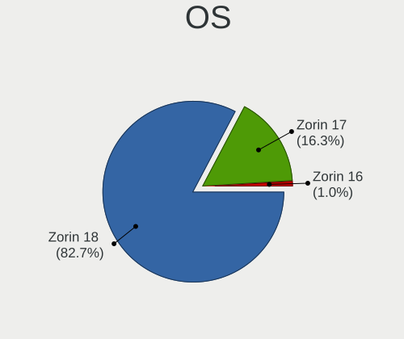

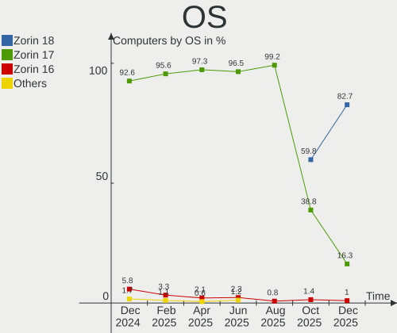

| Name     | Computers | Percent |
|----------|-----------|---------|
| Zorin 18 | 512       | 82.71%  |
| Zorin 17 | 101       | 16.32%  |
| Zorin 16 | 6         | 0.97%   |

OS Family
---------

OS without a version

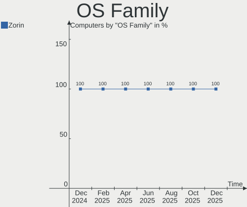

| Name  | Computers | Percent |
|-------|-----------|---------|
| Zorin | 619       | 100%    |

Kernel
------

Version of the Linux kernel

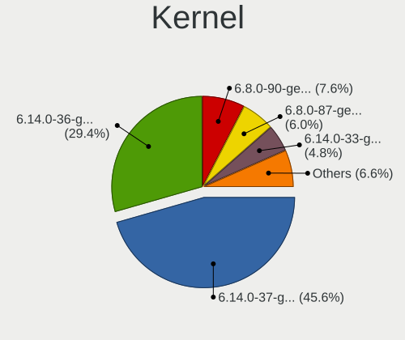

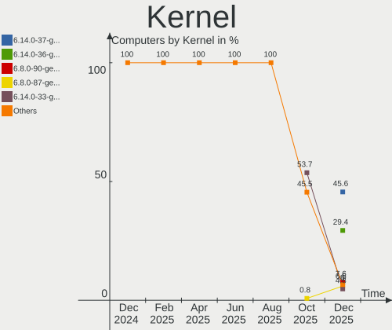

| Version                  | Computers | Percent |
|--------------------------|-----------|---------|
| 6.14.0-37-generic        | 282       | 45.56%  |
| 6.14.0-36-generic        | 182       | 29.4%   |
| 6.8.0-90-generic         | 47        | 7.59%   |
| 6.8.0-87-generic         | 37        | 5.98%   |
| 6.14.0-33-generic        | 30        | 4.85%   |
| 6.14.0-35-generic        | 11        | 1.78%   |
| 6.8.0-88-generic         | 5         | 0.81%   |
| 6.8.0-60-generic         | 4         | 0.65%   |
| 5.15.0-139-generic       | 4         | 0.65%   |
| 6.8.0-85-generic         | 3         | 0.48%   |
| 6.17.13-1-liquorix-amd64 | 2         | 0.32%   |
| 6.8.0-84-generic         | 1         | 0.16%   |
| 6.8.0-83-generic         | 1         | 0.16%   |
| 6.8.0-52-generic         | 1         | 0.16%   |
| 6.8.0-49-generic         | 1         | 0.16%   |
| 6.5.0-45-generic         | 1         | 0.16%   |
| 6.18.1-061801-generic    | 1         | 0.16%   |
| 6.17.9-1-t2-noble        | 1         | 0.16%   |
| 6.17.1-surface-2         | 1         | 0.16%   |
| 6.14.5-1-liquorix-amd64  | 1         | 0.16%   |
| 6.14.0-32-generic        | 1         | 0.16%   |
| 5.15.0-56-generic        | 1         | 0.16%   |
| 5.11.0-27-generic        | 1         | 0.16%   |

Kernel Family
-------------

Linux kernel without a distro release

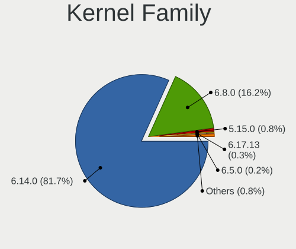

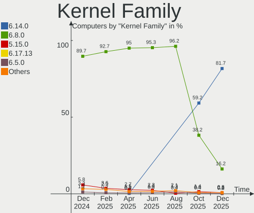

| Version | Computers | Percent |
|---------|-----------|---------|
| 6.14.0  | 506       | 81.74%  |
| 6.8.0   | 100       | 16.16%  |
| 5.15.0  | 5         | 0.81%   |
| 6.17.13 | 2         | 0.32%   |
| 6.5.0   | 1         | 0.16%   |
| 6.18.1  | 1         | 0.16%   |
| 6.17.9  | 1         | 0.16%   |
| 6.17.1  | 1         | 0.16%   |
| 6.14.5  | 1         | 0.16%   |
| 5.11.0  | 1         | 0.16%   |

Kernel Major Ver.
-----------------

Linux kernel major version

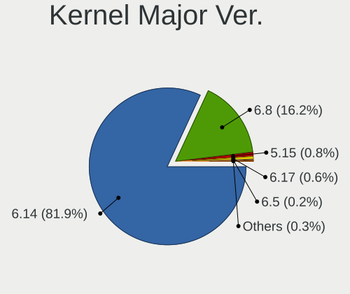

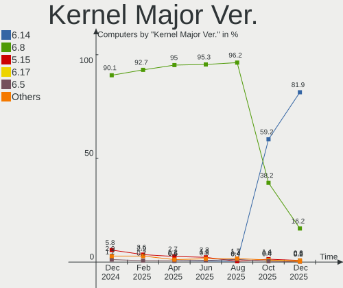

| Version | Computers | Percent |
|---------|-----------|---------|
| 6.14    | 507       | 81.91%  |
| 6.8     | 100       | 16.16%  |
| 5.15    | 5         | 0.81%   |
| 6.17    | 4         | 0.65%   |
| 6.5     | 1         | 0.16%   |
| 6.18    | 1         | 0.16%   |
| 5.11    | 1         | 0.16%   |

Arch
----

OS architecture (x86_64, i586, etc.)

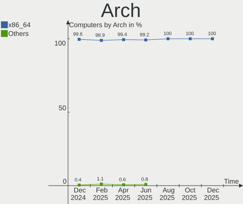

| Name   | Computers | Percent |
|--------|-----------|---------|
| x86_64 | 619       | 100%    |

DE
--

Desktop Environment

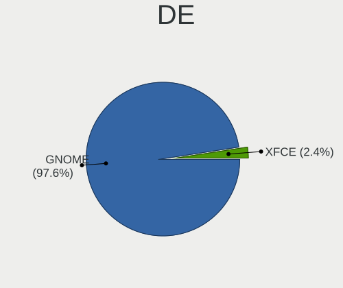

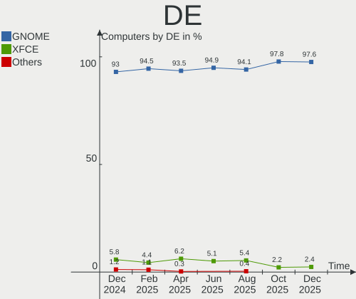

| Name  | Computers | Percent |
|-------|-----------|---------|
| GNOME | 604       | 97.58%  |
| XFCE  | 15        | 2.42%   |

Display Server
--------------

X11 or Wayland

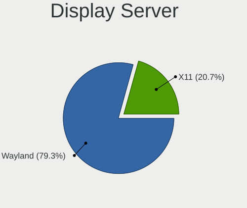

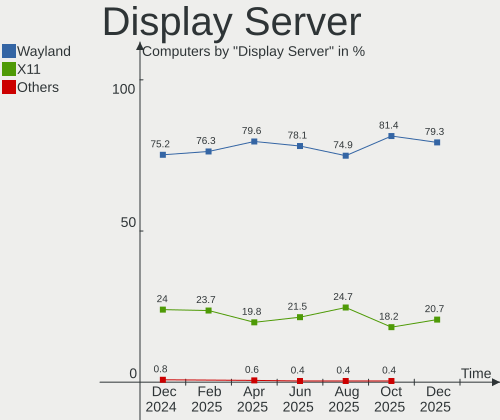

| Name    | Computers | Percent |
|---------|-----------|---------|
| Wayland | 491       | 79.32%  |
| X11     | 128       | 20.68%  |

Display Manager
---------------

SDDM, LightDM, etc.

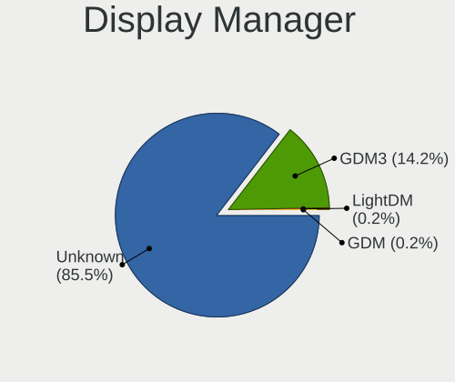

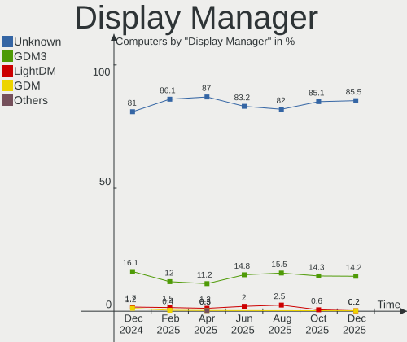

| Name    | Computers | Percent |
|---------|-----------|---------|
| Unknown | 529       | 85.46%  |
| GDM3    | 88        | 14.22%  |
| LightDM | 1         | 0.16%   |
| GDM     | 1         | 0.16%   |

OS Lang
-------

Language

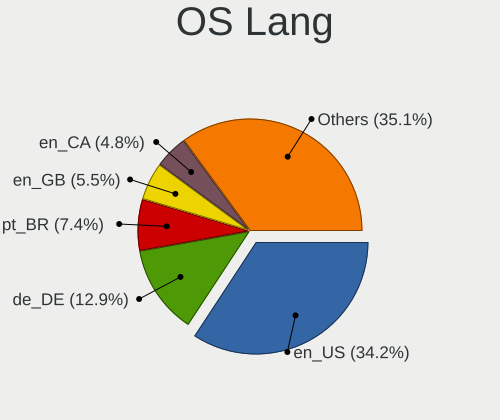

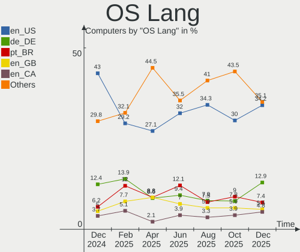

| Lang  | Computers | Percent |
|-------|-----------|---------|
| en_US | 212       | 34.25%  |
| de_DE | 80        | 12.92%  |
| pt_BR | 46        | 7.43%   |
| en_GB | 34        | 5.49%   |
| en_CA | 30        | 4.85%   |
| fr_FR | 29        | 4.68%   |
| es_ES | 21        | 3.39%   |
| it_IT | 18        | 2.91%   |
| en_AU | 15        | 2.42%   |
| pt_PT | 12        | 1.94%   |
| pl_PL | 11        | 1.78%   |
| nl_NL | 9         | 1.45%   |
| en_IN | 9         | 1.45%   |
| de_AT | 9         | 1.45%   |
| ru_RU | 8         | 1.29%   |
| es_MX | 8         | 1.29%   |
| es_CL | 7         | 1.13%   |
| hu_HU | 5         | 0.81%   |
| es_AR | 4         | 0.65%   |
| cs_CZ | 4         | 0.65%   |
| tr_TR | 3         | 0.48%   |
| es_CO | 3         | 0.48%   |
| en_NZ | 3         | 0.48%   |
| en_IE | 3         | 0.48%   |
| sv_SE | 2         | 0.32%   |
| fr_CA | 2         | 0.32%   |
| es_VE | 2         | 0.32%   |
| es_SV | 2         | 0.32%   |
| es_PE | 2         | 0.32%   |
| es_EC | 2         | 0.32%   |
| en_ZA | 2         | 0.32%   |
| en_IL | 2         | 0.32%   |
| de_CH | 2         | 0.32%   |
| bg_BG | 2         | 0.32%   |
| zh_TW | 1         | 0.16%   |
| zh_HK | 1         | 0.16%   |
| sr_RS | 1         | 0.16%   |
| sk_SK | 1         | 0.16%   |
| ro_RO | 1         | 0.16%   |
| nl_BE | 1         | 0.16%   |

Boot Mode
---------

EFI or BIOS

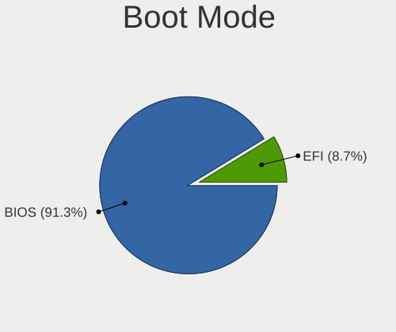

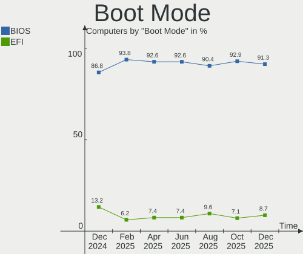

| Mode | Computers | Percent |
|------|-----------|---------|
| BIOS | 565       | 91.28%  |
| EFI  | 54        | 8.72%   |

Filesystem
----------

Type of filesystem

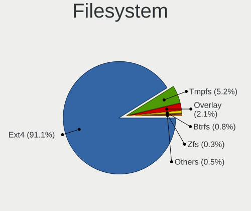

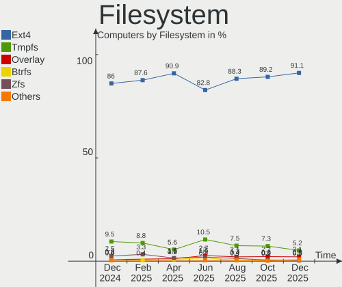

| Type    | Computers | Percent |
|---------|-----------|---------|
| Ext4    | 564       | 91.11%  |
| Tmpfs   | 32        | 5.17%   |
| Overlay | 13        | 2.1%    |
| Btrfs   | 5         | 0.81%   |
| Zfs     | 2         | 0.32%   |
| Ext3    | 2         | 0.32%   |
| Ext2    | 1         | 0.16%   |

Part. scheme
------------

Scheme of partitioning

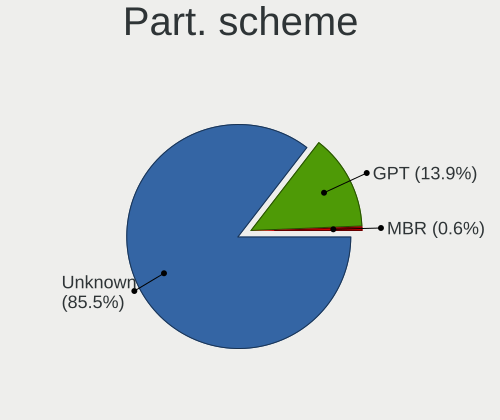

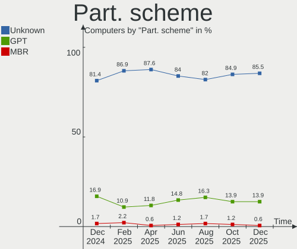

| Type    | Computers | Percent |
|---------|-----------|---------|
| Unknown | 529       | 85.46%  |
| GPT     | 86        | 13.89%  |
| MBR     | 4         | 0.65%   |

Dual Boot with Linux/BSD
------------------------

Hosting more than one Linux/BSD

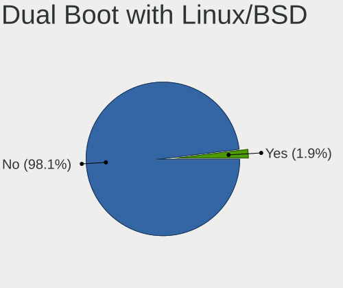

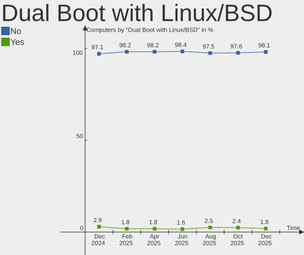

| Dual boot | Computers | Percent |
|-----------|-----------|---------|
| No        | 607       | 98.06%  |
| Yes       | 12        | 1.94%   |

Dual Boot (Win)
---------------

Hosting Linux and Windows

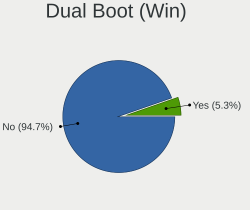

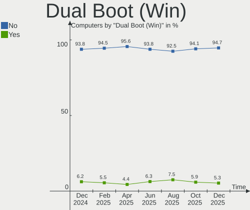

| Dual boot | Computers | Percent |
|-----------|-----------|---------|
| No        | 586       | 94.67%  |
| Yes       | 33        | 5.33%   |

Board
-----

Vendor
------

Motherboard manufacturer

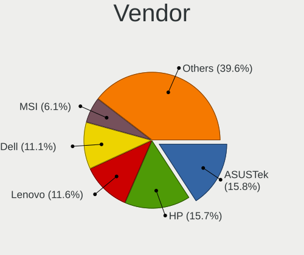

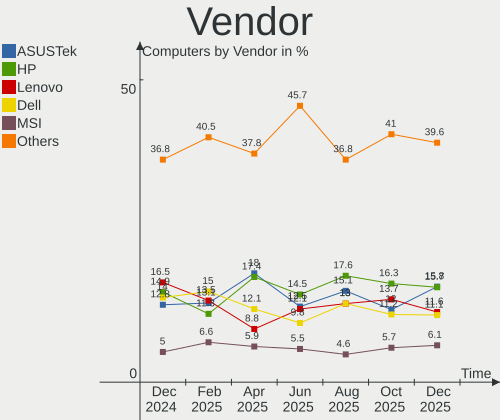

| Name                                 | Computers | Percent |
|--------------------------------------|-----------|---------|
| ASUSTek Computer                     | 98        | 15.83%  |
| Hewlett-Packard                      | 97        | 15.67%  |
| Lenovo                               | 72        | 11.63%  |
| Dell                                 | 69        | 11.15%  |
| MSI                                  | 38        | 6.14%   |
| Acer                                 | 38        | 6.14%   |
| Apple                                | 33        | 5.33%   |
| Gigabyte Technology                  | 30        | 4.85%   |
| ASRock                               | 18        | 2.91%   |
| Intel                                | 15        | 2.42%   |
| Samsung Electronics                  | 8         | 1.29%   |
| Toshiba                              | 7         | 1.13%   |
| Fujitsu                              | 7         | 1.13%   |
| Unknown                              | 7         | 1.13%   |
| Sony                                 | 6         | 0.97%   |
| Microsoft                            | 5         | 0.81%   |
| Biostar                              | 5         | 0.81%   |
| Packard Bell                         | 4         | 0.65%   |
| HUAWEI                               | 4         | 0.65%   |
| Shenzhen Meigao Electronic Equipment | 3         | 0.48%   |
| Pegatron                             | 3         | 0.48%   |
| Panasonic                            | 3         | 0.48%   |
| Medion                               | 3         | 0.48%   |
| Foxconn                              | 3         | 0.48%   |
| AZW                                  | 3         | 0.48%   |
| Alienware                            | 3         | 0.48%   |
| Positivo                             | 2         | 0.32%   |
| Multilaser                           | 2         | 0.32%   |
| Google                               | 2         | 0.32%   |
| GEEKOM                               | 2         | 0.32%   |
| Gateway                              | 2         | 0.32%   |
| AMI                                  | 2         | 0.32%   |
| ZR                                   | 1         | 0.16%   |
| XIAOMI                               | 1         | 0.16%   |
| Wortmann AG                          | 1         | 0.16%   |
| WARP                                 | 1         | 0.16%   |
| Supermicro                           | 1         | 0.16%   |
| Standard                             | 1         | 0.16%   |
| Semp Toshiba                         | 1         | 0.16%   |
| Quanta                               | 1         | 0.16%   |

Model
-----

Motherboard model

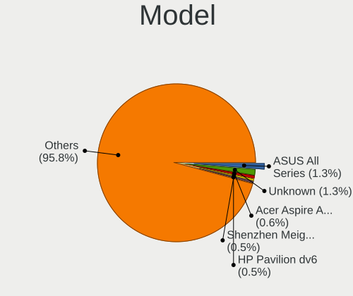

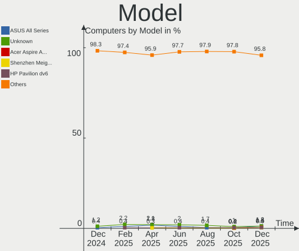

| Name                                                  | Computers | Percent |
|-------------------------------------------------------|-----------|---------|
| ASUS All Series                                       | 8         | 1.29%   |
| Unknown                                               | 8         | 1.29%   |
| Acer Aspire A515-51G                                  | 4         | 0.65%   |
| Shenzhen Meigao Electronic Equipment EliteMini Series | 3         | 0.48%   |
| HP Pavilion dv6                                       | 3         | 0.48%   |
| HP Notebook                                           | 3         | 0.48%   |
| HP Laptop 15-fd0xxx                                   | 3         | 0.48%   |
| Dell OptiPlex 7010                                    | 3         | 0.48%   |
| AZW U59                                               | 3         | 0.48%   |
| ASUS TUF Gaming X570-PLUS                             | 3         | 0.48%   |
| Apple MacBookPro9,2                                   | 3         | 0.48%   |
| Apple MacBookPro11,5                                  | 3         | 0.48%   |
| MSI MS-7C56                                           | 2         | 0.32%   |
| MSI MS-7C37                                           | 2         | 0.32%   |
| MSI MS-7917                                           | 2         | 0.32%   |
| MSI MS-7721                                           | 2         | 0.32%   |
| Microsoft Surface Pro 8                               | 2         | 0.32%   |
| Lenovo IdeaPad 310-15IKB 80TV                         | 2         | 0.32%   |
| Intel H61                                             | 2         | 0.32%   |
| Intel B75                                             | 2         | 0.32%   |
| HUAWEI FLMH-XX                                        | 2         | 0.32%   |
| HP Pavilion dv7                                       | 2         | 0.32%   |
| HP Pavilion All-in-One 24-xa0xxx                      | 2         | 0.32%   |
| HP Pavilion 17                                        | 2         | 0.32%   |
| HP G42                                                | 2         | 0.32%   |
| HP EliteDesk 800 G1 USDT                              | 2         | 0.32%   |
| HP EliteBook 840 G6                                   | 2         | 0.32%   |
| Dell Latitude E5470                                   | 2         | 0.32%   |
| Dell Latitude 3420                                    | 2         | 0.32%   |
| Dell Inspiron 7348                                    | 2         | 0.32%   |
| Biostar H61MGV3                                       | 2         | 0.32%   |
| ASUS Zenbook UM3402YA_UM3402YA                        | 2         | 0.32%   |
| ASUS Vivobook Go E1504FA_E1504FA                      | 2         | 0.32%   |
| ASUS UX360UAK                                         | 2         | 0.32%   |
| ASUS PRIME A320M-K                                    | 2         | 0.32%   |
| Apple MacBookPro8,1                                   | 2         | 0.32%   |
| Apple MacBookPro5,5                                   | 2         | 0.32%   |
| Apple MacBook5,2                                      | 2         | 0.32%   |
| Apple iMac9,1                                         | 2         | 0.32%   |
| Apple iMac11,3                                        | 2         | 0.32%   |

Model Family
------------

Motherboard model prefix

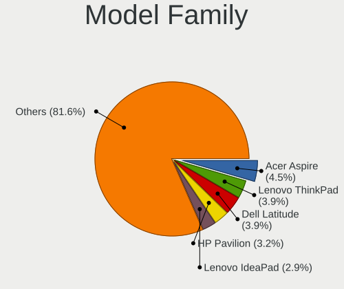

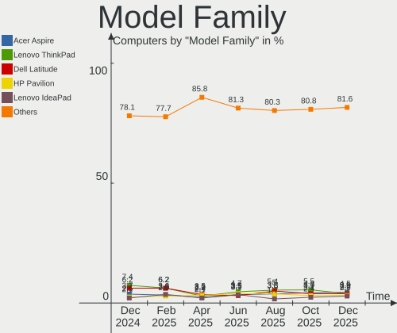

| Name                                           | Computers | Percent |
|------------------------------------------------|-----------|---------|
| Acer Aspire                                    | 28        | 4.52%   |
| Lenovo ThinkPad                                | 24        | 3.88%   |
| Dell Latitude                                  | 24        | 3.88%   |
| HP Pavilion                                    | 20        | 3.23%   |
| Lenovo IdeaPad                                 | 18        | 2.91%   |
| Dell Inspiron                                  | 17        | 2.75%   |
| ASUS PRIME                                     | 16        | 2.58%   |
| HP ProBook                                     | 11        | 1.78%   |
| HP Laptop                                      | 11        | 1.78%   |
| HP EliteBook                                   | 9         | 1.45%   |
| Dell OptiPlex                                  | 9         | 1.45%   |
| ASUS ROG                                       | 9         | 1.45%   |
| Dell Precision                                 | 8         | 1.29%   |
| ASUS All                                       | 8         | 1.29%   |
| Unknown                                        | 8         | 1.29%   |
| Lenovo ThinkCentre                             | 7         | 1.13%   |
| HP EliteDesk                                   | 7         | 1.13%   |
| ASUS VivoBook                                  | 7         | 1.13%   |
| ASUS TUF                                       | 7         | 1.13%   |
| ASUS ASUS                                      | 6         | 0.97%   |
| Toshiba Satellite                              | 5         | 0.81%   |
| Microsoft Surface                              | 5         | 0.81%   |
| Lenovo Yoga                                    | 5         | 0.81%   |
| Apple MacBookPro11                             | 5         | 0.81%   |
| Apple MacBookPro9                              | 4         | 0.65%   |
| Acer Nitro                                     | 4         | 0.65%   |
| Shenzhen Meigao Electronic Equipment EliteMini | 3         | 0.48%   |
| Lenovo Legion                                  | 3         | 0.48%   |
| HP Notebook                                    | 3         | 0.48%   |
| HP ENVY                                        | 3         | 0.48%   |
| HP Compaq                                      | 3         | 0.48%   |
| Fujitsu LIFEBOOK                               | 3         | 0.48%   |
| Fujitsu ESPRIMO                                | 3         | 0.48%   |
| Dell XPS                                       | 3         | 0.48%   |
| AZW U59                                        | 3         | 0.48%   |
| ASUS Zenbook                                   | 3         | 0.48%   |
| Apple MacBookPro5                              | 3         | 0.48%   |
| Toshiba TECRA                                  | 2         | 0.32%   |
| Packard Bell IMEDIA                            | 2         | 0.32%   |
| MSI MS-7C56                                    | 2         | 0.32%   |

MFG Year
--------

Motherboard manufacture year

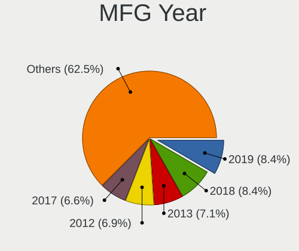

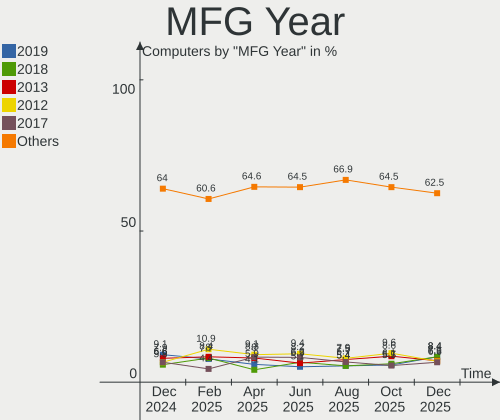

| Year | Computers | Percent |
|------|-----------|---------|
| 2019 | 52        | 8.4%    |
| 2018 | 52        | 8.4%    |
| 2013 | 44        | 7.11%   |
| 2012 | 43        | 6.95%   |
| 2017 | 41        | 6.62%   |
| 2016 | 40        | 6.46%   |
| 2014 | 37        | 5.98%   |
| 2021 | 35        | 5.65%   |
| 2011 | 35        | 5.65%   |
| 2024 | 32        | 5.17%   |
| 2020 | 32        | 5.17%   |
| 2009 | 31        | 5.01%   |
| 2022 | 26        | 4.2%    |
| 2015 | 26        | 4.2%    |
| 2025 | 24        | 3.88%   |
| 2023 | 24        | 3.88%   |
| 2010 | 24        | 3.88%   |
| 2008 | 13        | 2.1%    |
| 2007 | 4         | 0.65%   |
| 2006 | 3         | 0.48%   |
| 2005 | 1         | 0.16%   |

Form Factor
-----------

Physical design of the computer

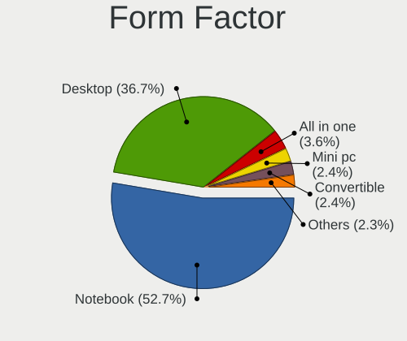

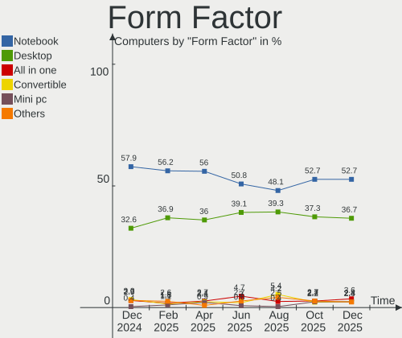

| Name        | Computers | Percent |
|-------------|-----------|---------|
| Notebook    | 326       | 52.67%  |
| Desktop     | 227       | 36.67%  |
| All in one  | 22        | 3.55%   |
| Convertible | 15        | 2.42%   |
| Mini pc     | 15        | 2.42%   |
| Tablet      | 11        | 1.78%   |
| Server      | 3         | 0.48%   |

Secure Boot
-----------

Enabled or disabled

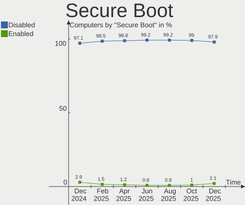

| State    | Computers | Percent |
|----------|-----------|---------|
| Disabled | 606       | 97.9%   |
| Enabled  | 13        | 2.1%    |

Coreboot
--------

Have coreboot on board

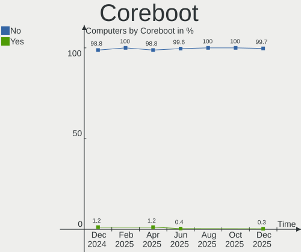

| Used | Computers | Percent |
|------|-----------|---------|
| No   | 617       | 99.68%  |
| Yes  | 2         | 0.32%   |

RAM Size
--------

Total RAM memory

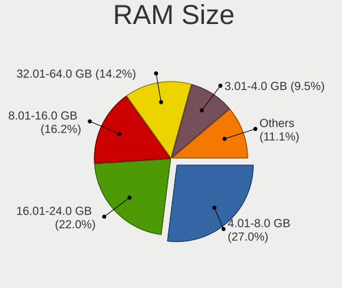

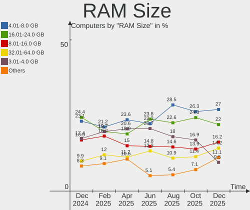

| Size in GB      | Computers | Percent |
|-----------------|-----------|---------|
| 4.01-8.0        | 167       | 26.98%  |
| 16.01-24.0      | 136       | 21.97%  |
| 8.01-16.0       | 100       | 16.16%  |
| 32.01-64.0      | 88        | 14.22%  |
| 3.01-4.0        | 59        | 9.53%   |
| 64.01-256.0     | 28        | 4.52%   |
| 24.01-32.0      | 22        | 3.55%   |
| 1.01-2.0        | 10        | 1.62%   |
| 2.01-3.0        | 8         | 1.29%   |
| More than 256.0 | 1         | 0.16%   |

RAM Used
--------

Used RAM memory

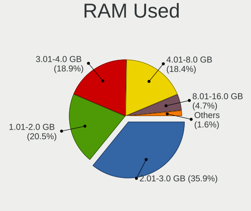

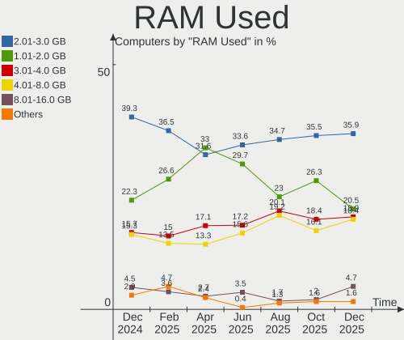

| Used GB    | Computers | Percent |
|------------|-----------|---------|
| 2.01-3.0   | 222       | 35.86%  |
| 1.01-2.0   | 127       | 20.52%  |
| 3.01-4.0   | 117       | 18.9%   |
| 4.01-8.0   | 114       | 18.42%  |
| 8.01-16.0  | 29        | 4.68%   |
| 0.51-1.0   | 7         | 1.13%   |
| 16.01-24.0 | 2         | 0.32%   |
| 32.01-64.0 | 1         | 0.16%   |

Total Drives
------------

Number of drives on board

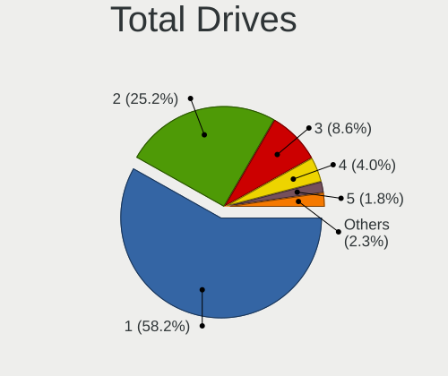

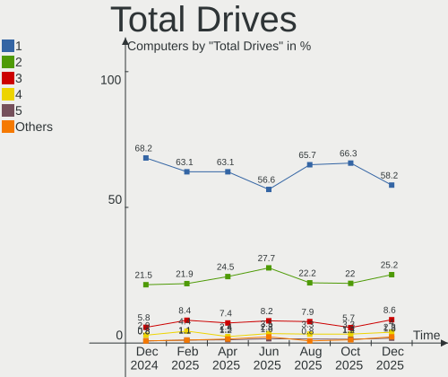

| Drives | Computers | Percent |
|--------|-----------|---------|
| 1      | 360       | 58.16%  |
| 2      | 156       | 25.2%   |
| 3      | 53        | 8.56%   |
| 4      | 25        | 4.04%   |
| 5      | 11        | 1.78%   |
| 6      | 7         | 1.13%   |
| 7      | 2         | 0.32%   |
| 0      | 2         | 0.32%   |
| 13     | 1         | 0.16%   |
| 9      | 1         | 0.16%   |
| 8      | 1         | 0.16%   |

Has CD-ROM
----------

Has CD-ROM on board

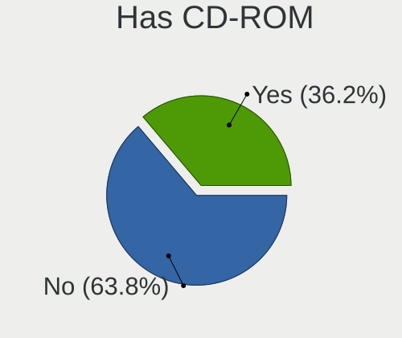

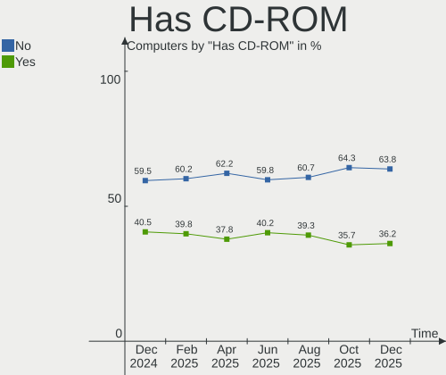

| Presented | Computers | Percent |
|-----------|-----------|---------|
| No        | 395       | 63.81%  |
| Yes       | 224       | 36.19%  |

Has Ethernet
------------

Has Ethernet on board

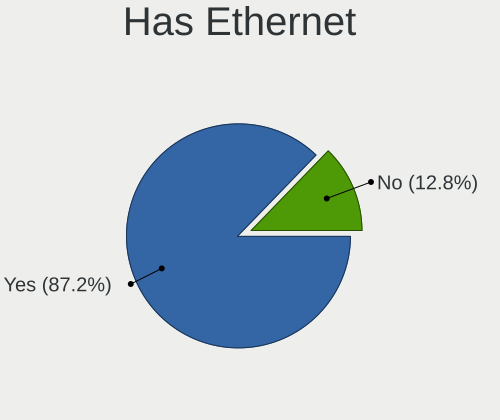

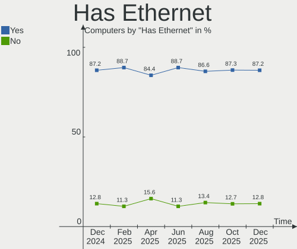

| Presented | Computers | Percent |
|-----------|-----------|---------|
| Yes       | 540       | 87.24%  |
| No        | 79        | 12.76%  |

Has WiFi
--------

Has WiFi module

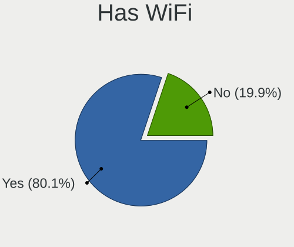

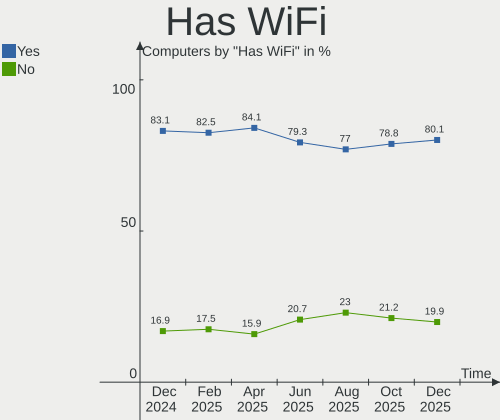

| Presented | Computers | Percent |
|-----------|-----------|---------|
| Yes       | 496       | 80.13%  |
| No        | 123       | 19.87%  |

Has Bluetooth
-------------

Has Bluetooth module

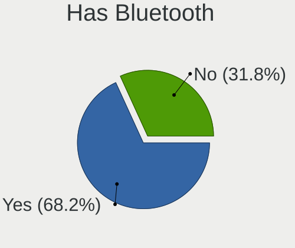

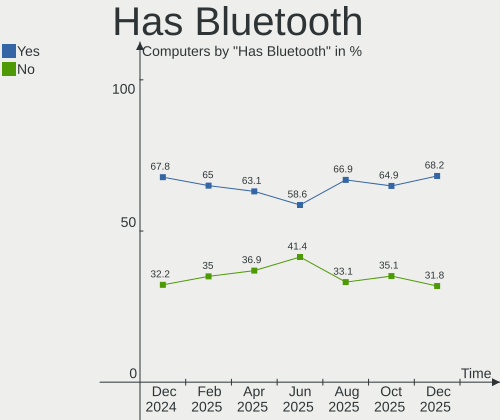

| Presented | Computers | Percent |
|-----------|-----------|---------|
| Yes       | 422       | 68.17%  |
| No        | 197       | 31.83%  |

Location
--------

Country
-------

Geographic location (country)

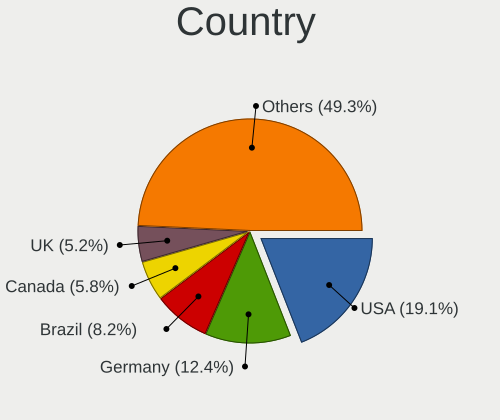

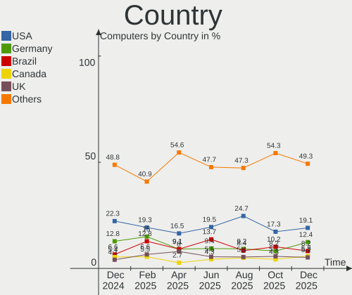

| Country         | Computers | Percent |
|-----------------|-----------|---------|
| USA             | 118       | 19.06%  |
| Germany         | 77        | 12.44%  |
| Brazil          | 51        | 8.24%   |
| Canada          | 36        | 5.82%   |
| UK              | 32        | 5.17%   |
| France          | 26        | 4.2%    |
| Italy           | 25        | 4.04%   |
| Spain           | 21        | 3.39%   |
| Netherlands     | 16        | 2.58%   |
| Australia       | 15        | 2.42%   |
| Austria         | 14        | 2.26%   |
| Portugal        | 13        | 2.1%    |
| Poland          | 11        | 1.78%   |
| Mexico          | 11        | 1.78%   |
| India           | 10        | 1.62%   |
| Turkey          | 8         | 1.29%   |
| Switzerland     | 8         | 1.29%   |
| Chile           | 8         | 1.29%   |
| Russia          | 6         | 0.97%   |
| Romania         | 6         | 0.97%   |
| Serbia          | 5         | 0.81%   |
| Hungary         | 5         | 0.81%   |
| Czechia         | 5         | 0.81%   |
| Belgium         | 5         | 0.81%   |
| Argentina       | 5         | 0.81%   |
| New Zealand     | 4         | 0.65%   |
| Colombia        | 4         | 0.65%   |
| The Netherlands | 3         | 0.48%   |
| Thailand        | 3         | 0.48%   |
| Sweden          | 3         | 0.48%   |
| South Africa    | 3         | 0.48%   |
| Slovakia        | 3         | 0.48%   |
| Malaysia        | 3         | 0.48%   |
| Japan           | 3         | 0.48%   |
| Ireland         | 3         | 0.48%   |
| Iran            | 3         | 0.48%   |
| Guatemala       | 3         | 0.48%   |
| Venezuela       | 2         | 0.32%   |
| UAE             | 2         | 0.32%   |
| Philippines     | 2         | 0.32%   |

City
----

Geographic location (city)

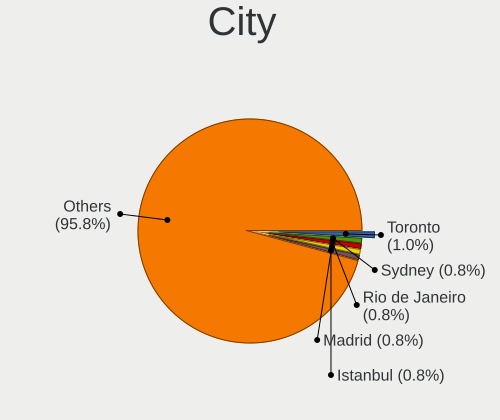

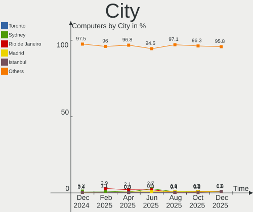

| City            | Computers | Percent |
|-----------------|-----------|---------|
| Toronto         | 6         | 0.97%   |
| Sydney          | 5         | 0.81%   |
| Rio de Janeiro  | 5         | 0.81%   |
| Madrid          | 5         | 0.81%   |
| Istanbul        | 5         | 0.81%   |
| Berlin          | 5         | 0.81%   |
| Warsaw          | 4         | 0.65%   |
| Vienna          | 4         | 0.65%   |
| Sao Paulo       | 4         | 0.65%   |
| Santiago        | 4         | 0.65%   |
| Perth           | 4         | 0.65%   |
| Nepean          | 4         | 0.65%   |
| Hamburg         | 4         | 0.65%   |
| Rosny-sous-Bois | 3         | 0.48%   |
| Rome            | 3         | 0.48%   |
| Prague          | 3         | 0.48%   |
| Porto Alegre    | 3         | 0.48%   |
| Munich          | 3         | 0.48%   |
| Milan           | 3         | 0.48%   |
| Melbourne       | 3         | 0.48%   |
| Louisville      | 3         | 0.48%   |
| Guatemala City  | 3         | 0.48%   |
| Bucharest       | 3         | 0.48%   |
| Belgrade        | 3         | 0.48%   |
| Ankara          | 3         | 0.48%   |
| Amsterdam       | 3         | 0.48%   |
| Adelaide        | 3         | 0.48%   |
| Utrecht         | 2         | 0.32%   |
| Tehran          | 2         | 0.32%   |
| Surrey          | 2         | 0.32%   |
| Slough          | 2         | 0.32%   |
| San Salvador    | 2         | 0.32%   |
| Rostov-on-Don   | 2         | 0.32%   |
| Osasco          | 2         | 0.32%   |
| Novosibirsk     | 2         | 0.32%   |
| New York        | 2         | 0.32%   |
| Montreal        | 2         | 0.32%   |
| Milwaukee       | 2         | 0.32%   |
| Marseille       | 2         | 0.32%   |
| Los Angeles     | 2         | 0.32%   |

Drives
------

Drive Vendor
------------

Hard drive vendors

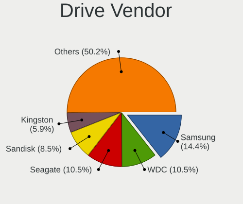

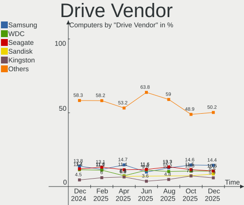

| Vendor                       | Computers | Drives | Percent |
|------------------------------|-----------|--------|---------|
| Samsung Electronics          | 135       | 166    | 14.38%  |
| WDC                          | 99        | 125    | 10.54%  |
| Seagate                      | 99        | 124    | 10.54%  |
| Sandisk                      | 80        | 87     | 8.52%   |
| Kingston                     | 55        | 57     | 5.86%   |
| Toshiba                      | 46        | 49     | 4.9%    |
| Crucial                      | 37        | 38     | 3.94%   |
| SK hynix                     | 30        | 30     | 3.19%   |
| Unknown                      | 26        | 28     | 2.77%   |
| Intel                        | 20        | 24     | 2.13%   |
| Micron Technology            | 18        | 18     | 1.92%   |
| Phison Electronics           | 16        | 18     | 1.7%    |
| Hitachi                      | 15        | 15     | 1.6%    |
| MAXIO Technology (Hangzhou)  | 14        | 18     | 1.49%   |
| China                        | 14        | 14     | 1.49%   |
| Apple                        | 14        | 17     | 1.49%   |
| Micron/Crucial Technology    | 13        | 13     | 1.38%   |
| HGST                         | 10        | 10     | 1.06%   |
| A-DATA Technology            | 10        | 10     | 1.06%   |
| Patriot                      | 9         | 10     | 0.96%   |
| Kingston Technology Company  | 9         | 9      | 0.96%   |
| KIOXIA                       | 8         | 10     | 0.85%   |
| Shenzhen Longsys Electronics | 6         | 6      | 0.64%   |
| SABRENT                      | 6         | 10     | 0.64%   |
| KingSpec                     | 6         | 6      | 0.64%   |
| Intenso                      | 6         | 7      | 0.64%   |
| Realtek                      | 5         | 6      | 0.53%   |
| PNY                          | 5         | 5      | 0.53%   |
| JMicron Technology           | 5         | 5      | 0.53%   |
| Unknown                      | 5         | 5      | 0.53%   |
| Transcend                    | 4         | 5      | 0.43%   |
| SPCC                         | 4         | 5      | 0.43%   |
| Silicon Motion               | 4         | 4      | 0.43%   |
| Realtek Semiconductor        | 4         | 4      | 0.43%   |
| LITEON                       | 4         | 4      | 0.43%   |
| Hewlett-Packard              | 4         | 4      | 0.43%   |
| Corsair                      | 4         | 5      | 0.43%   |
| ADATA Technology             | 4         | 4      | 0.43%   |
| XrayDisk                     | 3         | 3      | 0.32%   |
| Netac                        | 3         | 3      | 0.32%   |

Drive Model
-----------

Hard drive models

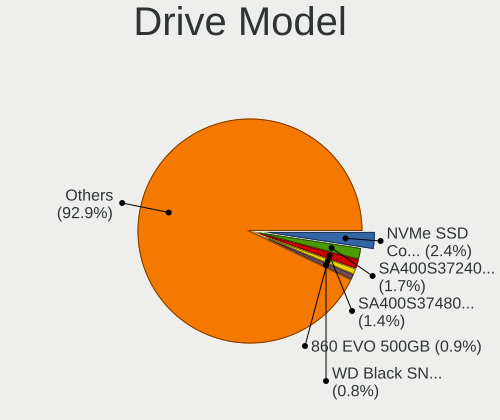

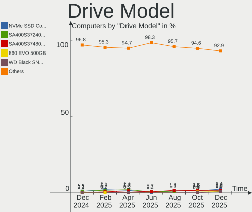

| Model                                                | Computers | Percent |
|------------------------------------------------------|-----------|---------|
| Samsung NVMe SSD Controller SM981/PM981/PM983 1TB    | 25        | 2.43%   |
| Kingston SA400S37240G 240GB SSD                      | 17        | 1.66%   |
| Kingston SA400S37480G 480GB SSD                      | 14        | 1.36%   |
| Samsung SSD 860 EVO 500GB                            | 9         | 0.88%   |
| Sandisk WD Black SN750 / PC SN730 NVMe SSD 500GB     | 8         | 0.78%   |
| Crucial CT240BX500SSD1 240GB                         | 8         | 0.78%   |
| Samsung SSD 850 EVO 500GB                            | 7         | 0.68%   |
| WDC WDS240G2G0A-00JH30 240GB SSD                     | 6         | 0.58%   |
| Unknown SD/MMC/MS PRO 2GB                            | 6         | 0.58%   |
| Toshiba MQ04ABF100 1TB                               | 6         | 0.58%   |
| SK hynix BC501 NVMe Solid State Drive 512GB          | 6         | 0.58%   |
| Samsung SSD 870 EVO 1TB                              | 6         | 0.58%   |
| Samsung NVMe SSD Controller PM9A1/PM9A3/980PRO 1TB   | 6         | 0.58%   |
| Unknown MMC Card  32GB                               | 5         | 0.49%   |
| Seagate ST1000LM035-1RK172 1TB                       | 5         | 0.49%   |
| Seagate ST1000DM003-1CH162 1TB                       | 5         | 0.49%   |
| Samsung SSD 850 EVO 250GB                            | 5         | 0.49%   |
| Samsung NVMe SSD Controller SM961/PM961/SM963 1024GB | 5         | 0.49%   |
| Samsung NVMe SSD Controller SM951/PM951 128GB        | 5         | 0.49%   |
| MAXIO (Hangzhou) NVMe SSD Controller MAP1202 2TB     | 5         | 0.49%   |
| Intel SSD Pro 7600p/760p/E 6100p Series 256GB        | 5         | 0.49%   |
| Unknown                                              | 5         | 0.49%   |
| Unknown MMC Card  64GB                               | 4         | 0.39%   |
| Seagate ST9500325AS 500GB                            | 4         | 0.39%   |
| Seagate ST500LM012 HN-M500MBB 500GB                  | 4         | 0.39%   |
| Seagate ST1000LM049-2GH172 1TB                       | 4         | 0.39%   |
| Seagate ST1000LM024 HN-M101MBB 1TB                   | 4         | 0.39%   |
| Sandisk WD_BLACK SN7100 1TB                          | 4         | 0.39%   |
| Samsung SSD 860 EVO 250GB                            | 4         | 0.39%   |
| Micron/Crucial P2 NVMe PCIe SSD 2TB                  | 4         | 0.39%   |
| Kingston SV300S37A120G 120GB SSD                     | 4         | 0.39%   |
| HGST HTS725050A7E630 500GB                           | 4         | 0.39%   |
| Crucial CT500MX500SSD1 500GB                         | 4         | 0.39%   |
| Crucial CT1000MX500SSD1 1TB                          | 4         | 0.39%   |
| Crucial CT1000BX500SSD1 1TB                          | 4         | 0.39%   |
| WDC WDS500G2B0A-00SM50 500GB                         | 3         | 0.29%   |
| WDC WD10SPZX-21Z10T0 1TB                             | 3         | 0.29%   |
| WDC WD10JPVX-22JC3T0 1TB                             | 3         | 0.29%   |
| WDC WD10EZEX-21M2NA0 1TB                             | 3         | 0.29%   |
| WDC WD Blue SA510 2.5 500GB                          | 3         | 0.29%   |

HDD Vendor
----------

Hard disk drive vendors

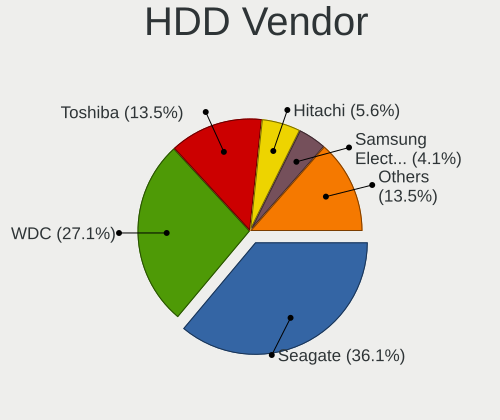

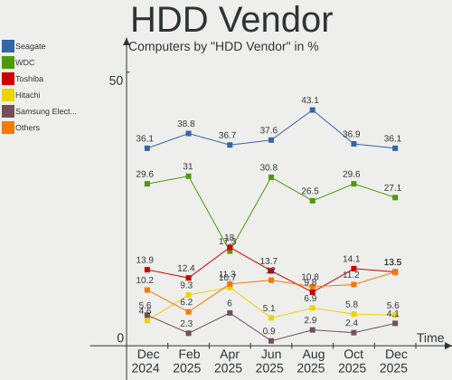

| Vendor              | Computers | Drives | Percent |
|---------------------|-----------|--------|---------|
| Seagate             | 96        | 120    | 36.09%  |
| WDC                 | 72        | 93     | 27.07%  |
| Toshiba             | 36        | 37     | 13.53%  |
| Hitachi             | 15        | 15     | 5.64%   |
| Samsung Electronics | 11        | 11     | 4.14%   |
| HGST                | 10        | 10     | 3.76%   |
| Apple               | 7         | 7      | 2.63%   |
| Unknown             | 6         | 6      | 2.26%   |
| JMicron Technology  | 3         | 3      | 1.13%   |
| Hewlett-Packard     | 3         | 3      | 1.13%   |
| SABRENT             | 2         | 5      | 0.75%   |
| ExcelStor           | 2         | 2      | 0.75%   |
| Maxtor              | 1         | 1      | 0.38%   |
| HGST HTS            | 1         | 1      | 0.38%   |
| Fujitsu             | 1         | 1      | 0.38%   |

SSD Vendor
----------

Solid state drive vendors

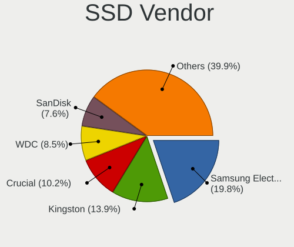

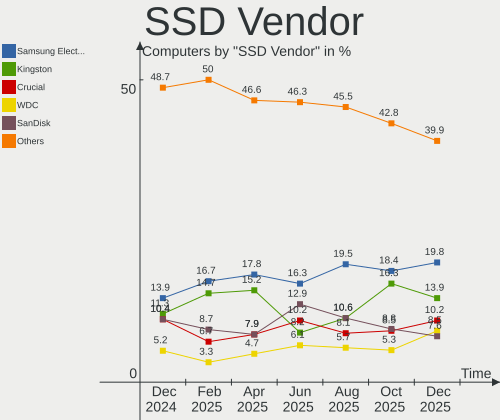

| Vendor              | Computers | Drives | Percent |
|---------------------|-----------|--------|---------|
| Samsung Electronics | 70        | 76     | 19.83%  |
| Kingston            | 49        | 50     | 13.88%  |
| Crucial             | 36        | 37     | 10.2%   |
| WDC                 | 30        | 31     | 8.5%    |
| SanDisk             | 27        | 27     | 7.65%   |
| China               | 14        | 14     | 3.97%   |
| Patriot             | 9         | 10     | 2.55%   |
| A-DATA Technology   | 9         | 9      | 2.55%   |
| Micron Technology   | 6         | 6      | 1.7%    |
| Apple               | 6         | 6      | 1.7%    |
| SABRENT             | 5         | 5      | 1.42%   |
| PNY                 | 5         | 5      | 1.42%   |
| Intenso             | 5         | 6      | 1.42%   |
| Intel               | 5         | 5      | 1.42%   |
| Transcend           | 4         | 5      | 1.13%   |
| SPCC                | 4         | 5      | 1.13%   |
| LITEON              | 4         | 4      | 1.13%   |
| KingSpec            | 4         | 4      | 1.13%   |
| SK hynix            | 3         | 3      | 0.85%   |
| XrayDisk            | 2         | 2      | 0.57%   |
| Toshiba             | 2         | 2      | 0.57%   |
| Plextor             | 2         | 2      | 0.57%   |
| OWC                 | 2         | 2      | 0.57%   |
| Netac               | 2         | 2      | 0.57%   |
| MSI                 | 2         | 2      | 0.57%   |
| Mercury             | 2         | 2      | 0.57%   |
| LITEONIT            | 2         | 2      | 0.57%   |
| Lexar               | 2         | 2      | 0.57%   |
| KIOXIA-EXCERIA      | 2         | 2      | 0.57%   |
| GeIL                | 2         | 2      | 0.57%   |
| Corsair             | 2         | 3      | 0.57%   |
| Unknown             | 2         | 2      | 0.57%   |
| ZADAK               | 1         | 1      | 0.28%   |
| XUM                 | 1         | 1      | 0.28%   |
| Verbatim            | 1         | 1      | 0.28%   |
| ThinkPlus           | 1         | 2      | 0.28%   |
| TCSUNBOW            | 1         | 1      | 0.28%   |
| T-FORCE             | 1         | 1      | 0.28%   |
| Rogueware           | 1         | 1      | 0.28%   |
| Rayson              | 1         | 1      | 0.28%   |

Drive Kind
----------

HDD or SSD

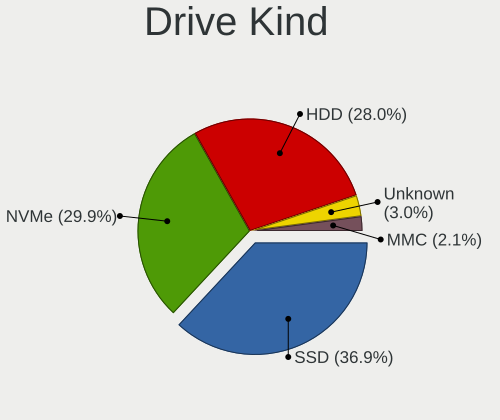

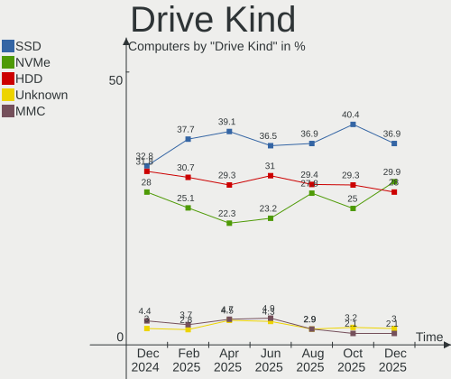

| Kind    | Computers | Drives | Percent |
|---------|-----------|--------|---------|
| SSD     | 315       | 368    | 36.93%  |
| NVMe    | 255       | 332    | 29.89%  |
| HDD     | 239       | 315    | 28.02%  |
| Unknown | 26        | 27     | 3.05%   |
| MMC     | 18        | 21     | 2.11%   |

Drive Connector
---------------

SATA, SAS, NVMe, etc.

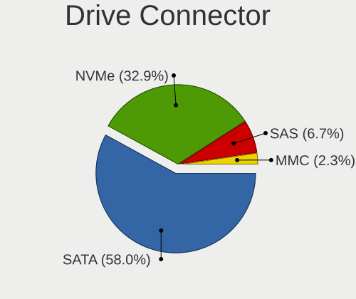

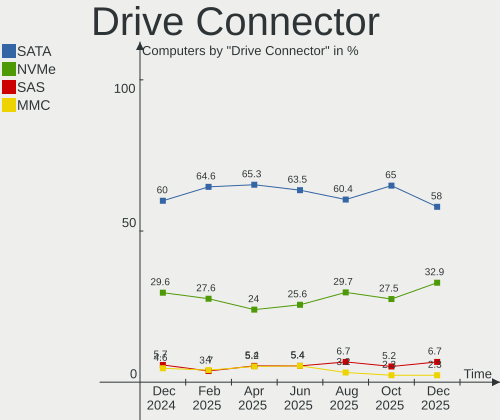

| Type | Computers | Drives | Percent |
|------|-----------|--------|---------|
| SATA | 447       | 640    | 57.98%  |
| NVMe | 254       | 326    | 32.94%  |
| SAS  | 52        | 76     | 6.74%   |
| MMC  | 18        | 21     | 2.33%   |

Drive Size
----------

Size of hard drive

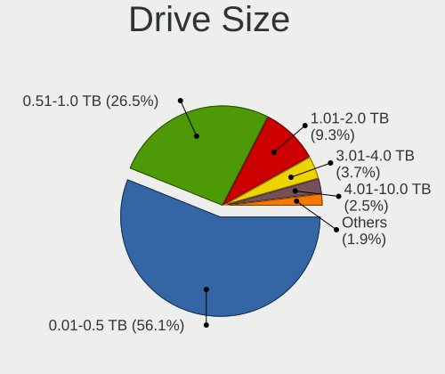

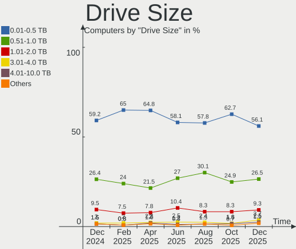

| Size in TB | Computers | Drives | Percent |
|------------|-----------|--------|---------|
| 0.01-0.5   | 318       | 381    | 56.08%  |
| 0.51-1.0   | 150       | 178    | 26.46%  |
| 1.01-2.0   | 53        | 67     | 9.35%   |
| 3.01-4.0   | 21        | 25     | 3.7%    |
| 4.01-10.0  | 14        | 19     | 2.47%   |
| 2.01-3.0   | 7         | 8      | 1.23%   |
| 20.01-50.0 | 2         | 2      | 0.35%   |
| 10.01-20.0 | 2         | 3      | 0.35%   |

Space Total
-----------

Amount of disk space available on the file system

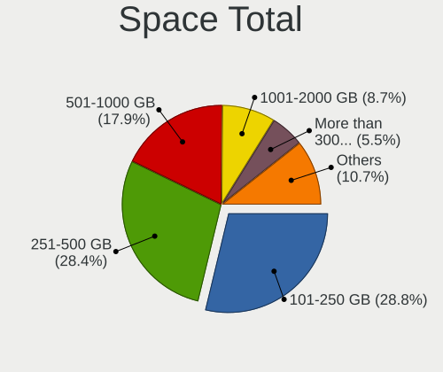

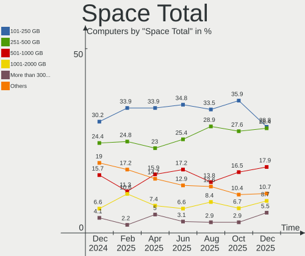

| Size in GB     | Computers | Percent |
|----------------|-----------|---------|
| 101-250        | 178       | 28.76%  |
| 251-500        | 176       | 28.43%  |
| 501-1000       | 111       | 17.93%  |
| 1001-2000      | 54        | 8.72%   |
| More than 3000 | 34        | 5.49%   |
| 51-100         | 26        | 4.2%    |
| 21-50          | 15        | 2.42%   |
| 2001-3000      | 13        | 2.1%    |
| 1-20           | 10        | 1.62%   |
| Unknown        | 2         | 0.32%   |

Space Used
----------

Amount of used disk space

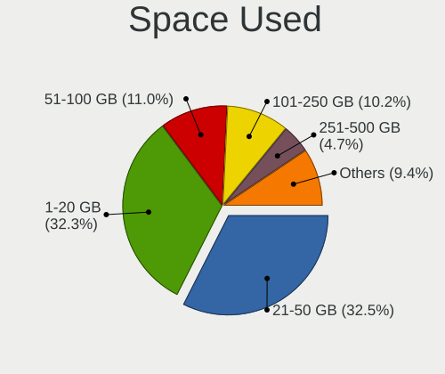

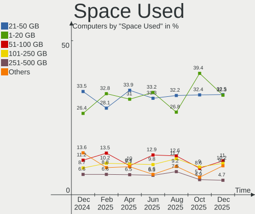

| Used GB        | Computers | Percent |
|----------------|-----------|---------|
| 21-50          | 201       | 32.47%  |
| 1-20           | 200       | 32.31%  |
| 51-100         | 68        | 10.99%  |
| 101-250        | 63        | 10.18%  |
| 251-500        | 29        | 4.68%   |
| 501-1000       | 26        | 4.2%    |
| More than 3000 | 15        | 2.42%   |
| 1001-2000      | 11        | 1.78%   |
| 2001-3000      | 4         | 0.65%   |
| Unknown        | 2         | 0.32%   |

Malfunc. Drives
---------------

Drive models with a malfunction

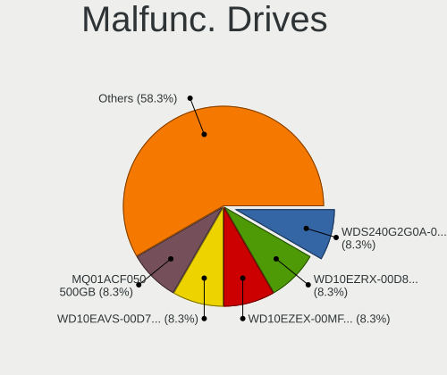

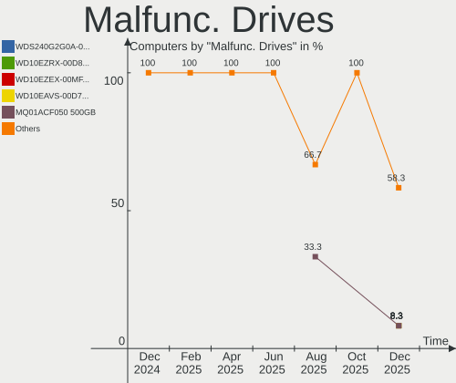

| Model                                          | Computers | Drives | Percent |
|------------------------------------------------|-----------|--------|---------|
| WDC WDS240G2G0A-00JH30 240GB SSD               | 1         | 1      | 8.33%   |
| WDC WD10EZRX-00D8PB0 1TB                       | 1         | 1      | 8.33%   |
| WDC WD10EZEX-00MFCA0 1TB                       | 1         | 1      | 8.33%   |
| WDC WD10EAVS-00D7B1 1TB                        | 1         | 1      | 8.33%   |
| Toshiba MQ01ACF050 500GB                       | 1         | 1      | 8.33%   |
| Seagate ST1000DM003-1CH162 1TB                 | 1         | 1      | 8.33%   |
| Samsung Electronics MZVPV256HDGL-000H1 256GB   | 1         | 1      | 8.33%   |
| Samsung Electronics MZVKW512HMJP-00000 512GB   | 1         | 1      | 8.33%   |
| Micron Technology 1100_MTFDDAK256TBN 256GB SSD | 1         | 1      | 8.33%   |
| Kingston SA400S37240G 240GB SSD                | 1         | 1      | 8.33%   |
| Intel SSDSC2BW240A4 240GB                      | 1         | 1      | 8.33%   |
| Hitachi HTS723225A7A364 250GB                  | 1         | 1      | 8.33%   |

Malfunc. Drive Vendor
---------------------

Vendors of faulty drives

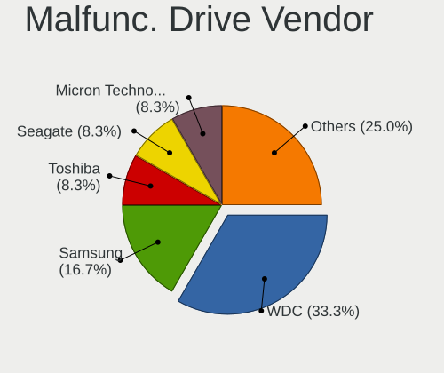

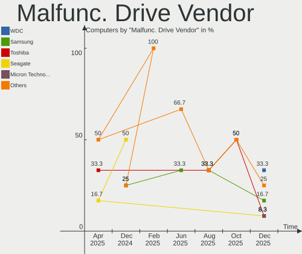

| Vendor              | Computers | Drives | Percent |
|---------------------|-----------|--------|---------|
| WDC                 | 4         | 4      | 33.33%  |
| Samsung Electronics | 2         | 2      | 16.67%  |
| Toshiba             | 1         | 1      | 8.33%   |
| Seagate             | 1         | 1      | 8.33%   |
| Micron Technology   | 1         | 1      | 8.33%   |
| Kingston            | 1         | 1      | 8.33%   |
| Intel               | 1         | 1      | 8.33%   |
| Hitachi             | 1         | 1      | 8.33%   |

Malfunc. HDD Vendor
-------------------

Vendors of faulty HDD drives

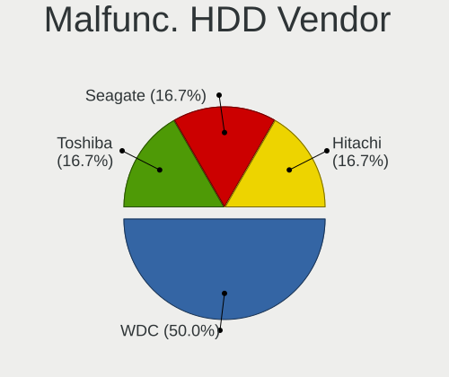

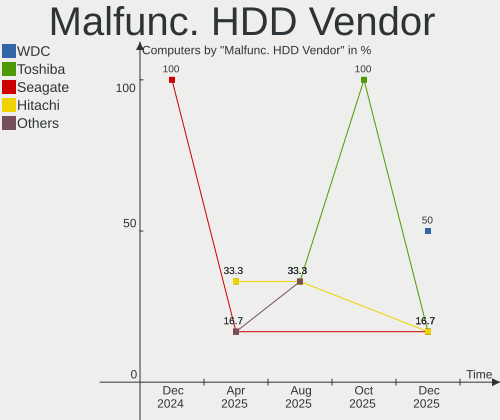

| Vendor  | Computers | Drives | Percent |
|---------|-----------|--------|---------|
| WDC     | 3         | 3      | 50%     |
| Toshiba | 1         | 1      | 16.67%  |
| Seagate | 1         | 1      | 16.67%  |
| Hitachi | 1         | 1      | 16.67%  |

Malfunc. Drive Kind
-------------------

Kinds of faulty drives

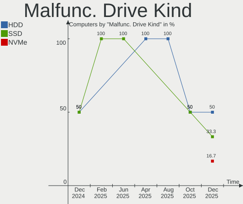

| Kind | Computers | Drives | Percent |
|------|-----------|--------|---------|
| HDD  | 6         | 6      | 50%     |
| SSD  | 4         | 4      | 33.33%  |
| NVMe | 2         | 2      | 16.67%  |

Failed Drives
-------------

Failed drive models

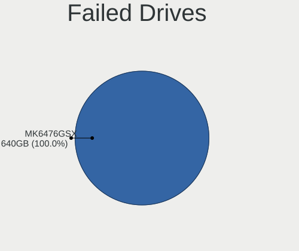

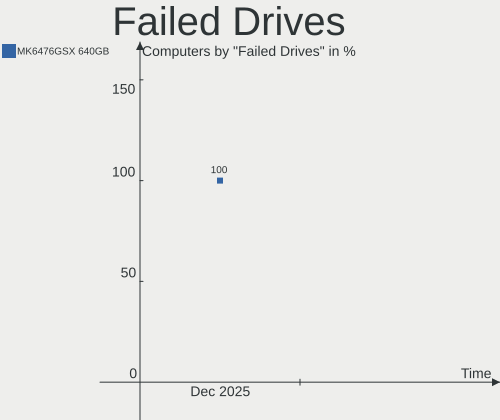

| Model                   | Computers | Drives | Percent |
|-------------------------|-----------|--------|---------|
| Toshiba MK6476GSX 640GB | 1         | 1      | 100%    |

Failed Drive Vendor
-------------------

Failed drive vendors

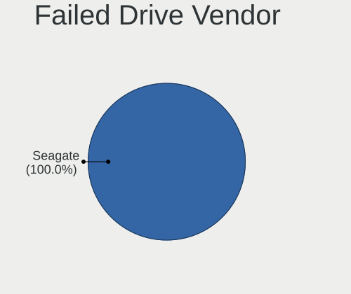

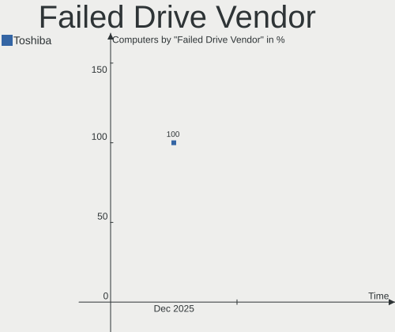

| Vendor  | Computers | Drives | Percent |
|---------|-----------|--------|---------|
| Toshiba | 1         | 1      | 100%    |

Drive Status
------------

Number of failed and malfunc. drives

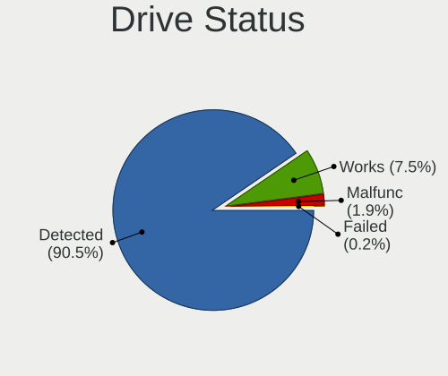

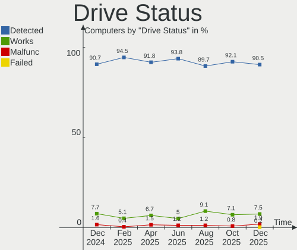

| Status   | Computers | Drives | Percent |
|----------|-----------|--------|---------|
| Detected | 570       | 981    | 90.48%  |
| Works    | 47        | 69     | 7.46%   |
| Malfunc  | 12        | 12     | 1.9%    |
| Failed   | 1         | 1      | 0.16%   |

Storage controller
------------------

Storage Vendor
--------------

Storage controller vendors

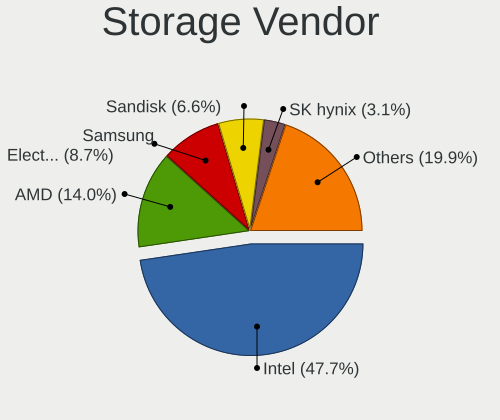

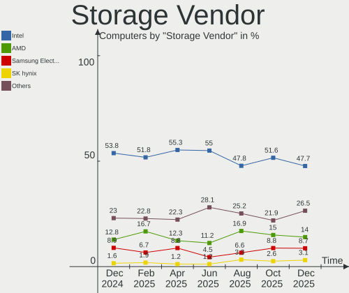

| Vendor                           | Computers | Percent |
|----------------------------------|-----------|---------|
| Intel                            | 398       | 47.66%  |
| AMD                              | 117       | 14.01%  |
| Samsung Electronics              | 73        | 8.74%   |
| Sandisk                          | 55        | 6.59%   |
| SK hynix                         | 26        | 3.11%   |
| Phison Electronics               | 21        | 2.51%   |
| MAXIO Technology (Hangzhou)      | 15        | 1.8%    |
| Kingston Technology Company      | 15        | 1.8%    |
| Micron/Crucial Technology        | 14        | 1.68%   |
| Nvidia                           | 12        | 1.44%   |
| Micron Technology                | 12        | 1.44%   |
| ASMedia Technology               | 11        | 1.32%   |
| Toshiba America Info Systems     | 9         | 1.08%   |
| KIOXIA                           | 8         | 0.96%   |
| Shenzhen Longsys Electronics     | 6         | 0.72%   |
| ADATA Technology                 | 5         | 0.6%    |
| Solid State Storage Technology   | 4         | 0.48%   |
| Silicon Motion                   | 4         | 0.48%   |
| Realtek Semiconductor            | 4         | 0.48%   |
| INNOGRIT                         | 4         | 0.48%   |
| Marvell Technology Group         | 3         | 0.36%   |
| JMicron Technology               | 3         | 0.36%   |
| VIA Technologies                 | 2         | 0.24%   |
| Broadcom / LSI                   | 2         | 0.24%   |
| Apple                            | 2         | 0.24%   |
| Yangtze Memory Technologies      | 1         | 0.12%   |
| Toshiba                          | 1         | 0.12%   |
| TenaFe                           | 1         | 0.12%   |
| Solidigm                         | 1         | 0.12%   |
| Silicon Integrated Systems [SiS] | 1         | 0.12%   |
| Shenzhen Wodposit Electronics    | 1         | 0.12%   |
| Seagate Technology               | 1         | 0.12%   |
| LSI Logic / Symbios Logic        | 1         | 0.12%   |
| Hewlett-Packard                  | 1         | 0.12%   |
| Biwin Storage Technology         | 1         | 0.12%   |

Storage Model
-------------

Storage controller models

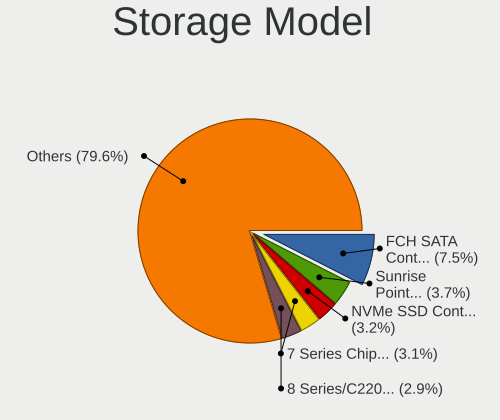

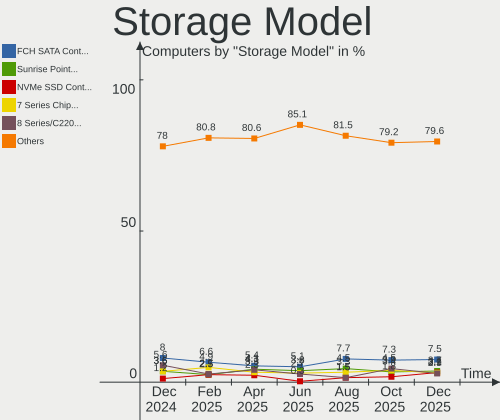

| Model                                                                          | Computers | Percent |
|--------------------------------------------------------------------------------|-----------|---------|
| AMD FCH SATA Controller [AHCI mode]                                            | 69        | 7.52%   |
| Intel Sunrise Point-LP SATA Controller [AHCI mode]                             | 34        | 3.71%   |
| Samsung NVMe SSD Controller SM981/PM981/PM983                                  | 29        | 3.16%   |
| Intel 7 Series Chipset Family 6-port SATA Controller [AHCI mode]               | 28        | 3.05%   |
| Intel 8 Series/C220 Series Chipset Family 6-port SATA Controller 1 [AHCI mode] | 27        | 2.94%   |
| Intel 6 Series/C200 Series Chipset Family 6 port Mobile SATA AHCI Controller   | 26        | 2.84%   |
| Intel 82801 Mobile SATA Controller [RAID mode]                                 | 24        | 2.62%   |
| Intel Q170/Q150/B150/H170/H110/Z170/CM236 Chipset SATA Controller [AHCI Mode]  | 19        | 2.07%   |
| SanDisk WD SN560/SN740/SN770/SN5000 NVMe SSD                                   | 17        | 1.85%   |
| AMD 400 Series Chipset SATA Controller                                         | 16        | 1.74%   |
| Intel 6 Series/C200 Series Chipset Family 6 port Desktop SATA AHCI Controller  | 14        | 1.53%   |
| AMD 500 Series Chipset SATA Controller                                         | 14        | 1.53%   |
| Intel 82801IBM/IEM (ICH9M/ICH9M-E) 4 port SATA Controller [AHCI mode]          | 13        | 1.42%   |
| Intel Cannon Lake PCH SATA AHCI Controller                                     | 12        | 1.31%   |
| Intel 8 Series SATA Controller 1 [AHCI mode]                                   | 12        | 1.31%   |
| AMD 600 Series Chipset SATA Controller                                         | 12        | 1.31%   |
| Intel 7 Series/C210 Series Chipset Family 6-port SATA Controller [AHCI mode]   | 11        | 1.2%    |
| Intel 200 Series PCH SATA controller [AHCI mode]                               | 11        | 1.2%    |
| ASMedia ASM1061/ASM1062 Serial ATA Controller                                  | 11        | 1.2%    |
| AMD SB7x0/SB8x0/SB9x0 SATA Controller [AHCI mode]                              | 11        | 1.2%    |
| Samsung NVMe SSD Controller 980 (DRAM-less)                                    | 10        | 1.09%   |
| Intel Wildcat Point-LP SATA Controller [AHCI Mode]                             | 10        | 1.09%   |
| Intel Volume Management Device NVMe RAID Controller                            | 10        | 1.09%   |
| Intel SATA Controller [RAID mode]                                              | 10        | 1.09%   |
| Intel 5 Series/3400 Series Chipset 4 port SATA AHCI Controller                 | 10        | 1.09%   |
| SanDisk Extreme Pro / WD Black SN750 / PC SN730 / Red SN700 NVMe SSD           | 8         | 0.87%   |
| MAXIO (Hangzhou) NVMe SSD Controller MAP1602 (DRAM-less)                       | 8         | 0.87%   |
| Samsung NVMe SSD Controller S4LV008[Pascal]                                    | 7         | 0.76%   |
| Nvidia MCP79 AHCI Controller                                                   | 7         | 0.76%   |
| MAXIO (Hangzhou) NVMe SSD Controller MAP1202 (DRAM-less)                       | 7         | 0.76%   |
| Intel SSD 670p Series [Keystone Harbor]                                        | 7         | 0.76%   |
| Intel Jasper Lake SATA AHCI Controller                                         | 7         | 0.76%   |
| Intel 9 Series Chipset Family SATA Controller [AHCI Mode]                      | 7         | 0.76%   |
| Intel 5 Series/3400 Series Chipset 6 port SATA AHCI Controller                 | 7         | 0.76%   |
| SK hynix BC901 NVMe Solid State Drive (DRAM-less)                              | 6         | 0.65%   |
| SK hynix BC501 NVMe Solid State Drive                                          | 6         | 0.65%   |
| Samsung NVMe SSD Controller SM961/PM961/SM963                                  | 6         | 0.65%   |
| Samsung NVMe SSD Controller SM951/PM951                                        | 6         | 0.65%   |
| Samsung NVMe SSD Controller PM9A1/PM9A3/980PRO                                 | 6         | 0.65%   |
| Intel Raptor Lake SATA AHCI Controller                                         | 6         | 0.65%   |

Storage Kind
------------

Kind of storage controller (IDE, SATA, NVMe, SAS, ...)

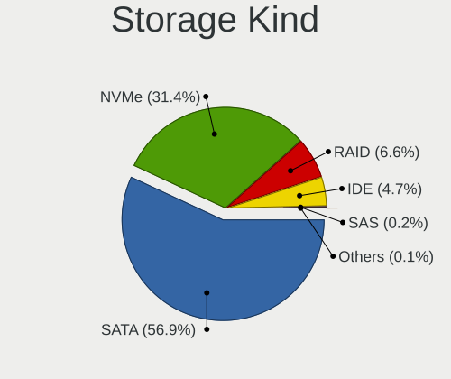

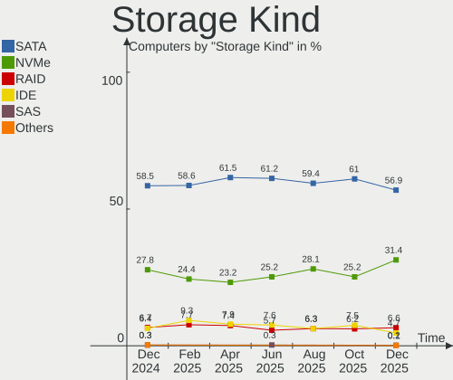

| Kind | Computers | Percent |
|------|-----------|---------|
| SATA | 460       | 56.93%  |
| NVMe | 254       | 31.44%  |
| RAID | 53        | 6.56%   |
| IDE  | 38        | 4.7%    |
| SAS  | 2         | 0.25%   |
| SCSI | 1         | 0.12%   |

Processor
---------

CPU Vendor
----------

Processor vendors

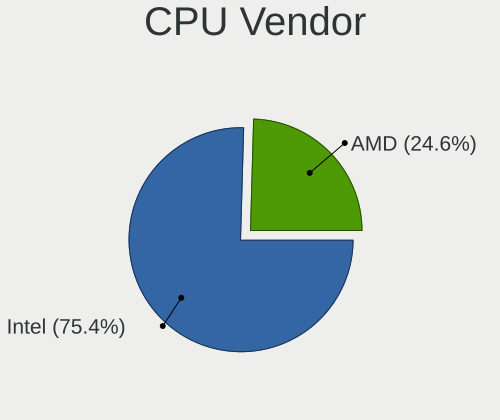

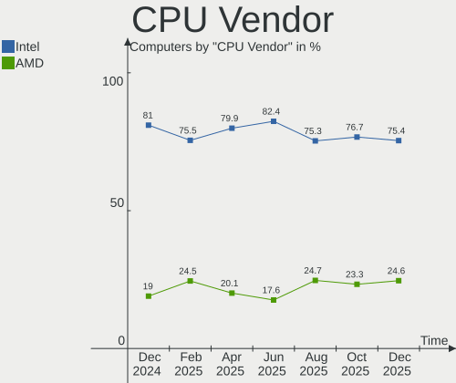

| Vendor | Computers | Percent |
|--------|-----------|---------|
| Intel  | 467       | 75.44%  |
| AMD    | 152       | 24.56%  |

CPU Model
---------

Processor models

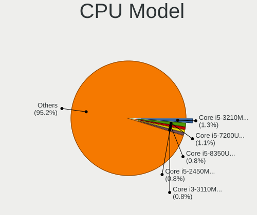

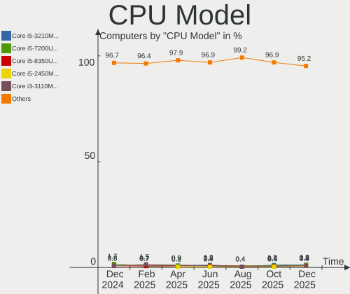

| Model                                       | Computers | Percent |
|---------------------------------------------|-----------|---------|
| Intel Core i5-3210M CPU @ 2.50GHz           | 8         | 1.29%   |
| Intel Core i5-7200U CPU @ 2.50GHz           | 7         | 1.13%   |
| Intel Core i5-8350U CPU @ 1.70GHz           | 5         | 0.81%   |
| Intel Core i5-2450M CPU @ 2.50GHz           | 5         | 0.81%   |
| Intel Core i3-3110M CPU @ 2.40GHz           | 5         | 0.81%   |
| Intel Celeron N5095 @ 2.00GHz               | 5         | 0.81%   |
| AMD Ryzen 5 3600 6-Core Processor           | 5         | 0.81%   |
| Intel Core i7-8550U CPU @ 1.80GHz           | 4         | 0.65%   |
| Intel Core i7-6700K CPU @ 4.00GHz           | 4         | 0.65%   |
| Intel Core i7-6500U CPU @ 2.50GHz           | 4         | 0.65%   |
| Intel Core i7-3610QM CPU @ 2.30GHz          | 4         | 0.65%   |
| Intel Core i7-2630QM CPU @ 2.00GHz          | 4         | 0.65%   |
| Intel Core i5-8250U CPU @ 1.60GHz           | 4         | 0.65%   |
| Intel Core i5-5200U CPU @ 2.20GHz           | 4         | 0.65%   |
| Intel Core i5-3470 CPU @ 3.20GHz            | 4         | 0.65%   |
| Intel Core i5-2520M CPU @ 2.50GHz           | 4         | 0.65%   |
| AMD Ryzen 9 3900X 12-Core Processor         | 4         | 0.65%   |
| AMD Ryzen 3 7320U with Radeon Graphics      | 4         | 0.65%   |
| Intel Pentium Dual-Core CPU T4400 @ 2.20GHz | 3         | 0.48%   |
| Intel Core i7-9700 CPU @ 3.00GHz            | 3         | 0.48%   |
| Intel Core i7-7700 CPU @ 3.60GHz            | 3         | 0.48%   |
| Intel Core i7-6700HQ CPU @ 2.60GHz          | 3         | 0.48%   |
| Intel Core i7-6700 CPU @ 3.40GHz            | 3         | 0.48%   |
| Intel Core i7-4870HQ CPU @ 2.50GHz          | 3         | 0.48%   |
| Intel Core i7-4510U CPU @ 2.00GHz           | 3         | 0.48%   |
| Intel Core i7-2670QM CPU @ 2.20GHz          | 3         | 0.48%   |
| Intel Core i7 CPU 860 @ 2.80GHz             | 3         | 0.48%   |
| Intel Core i5-7300U CPU @ 2.60GHz           | 3         | 0.48%   |
| Intel Core i5-7300HQ CPU @ 2.50GHz          | 3         | 0.48%   |
| Intel Core i5-6300U CPU @ 2.40GHz           | 3         | 0.48%   |
| Intel Core i5-6200U CPU @ 2.30GHz           | 3         | 0.48%   |
| Intel Core i5-5300U CPU @ 2.30GHz           | 3         | 0.48%   |
| Intel Core i5-4690 CPU @ 3.50GHz            | 3         | 0.48%   |
| Intel Core i5-4570 CPU @ 3.20GHz            | 3         | 0.48%   |
| Intel Core i5-4460 CPU @ 3.20GHz            | 3         | 0.48%   |
| Intel Core i5-2430M CPU @ 2.40GHz           | 3         | 0.48%   |
| Intel Core i5-2410M CPU @ 2.30GHz           | 3         | 0.48%   |
| Intel Core i5 CPU M 460 @ 2.53GHz           | 3         | 0.48%   |
| Intel Core i3-8130U CPU @ 2.20GHz           | 3         | 0.48%   |
| Intel Celeron N4020 CPU @ 1.10GHz           | 3         | 0.48%   |

CPU Model Family
----------------

Processor model prefix

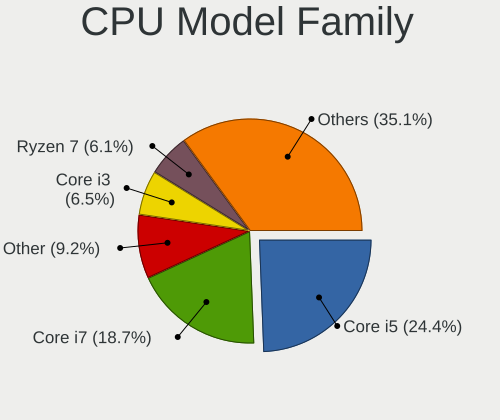

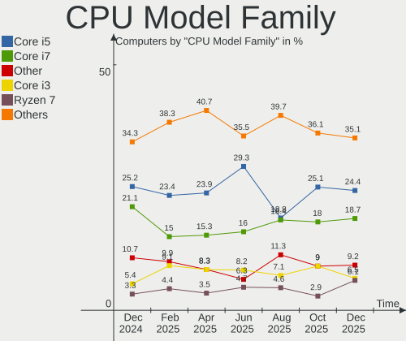

| Model                   | Computers | Percent |
|-------------------------|-----------|---------|
| Intel Core i5           | 151       | 24.39%  |
| Intel Core i7           | 116       | 18.74%  |
| Other                   | 57        | 9.21%   |
| Intel Core i3           | 40        | 6.46%   |
| AMD Ryzen 7             | 38        | 6.14%   |
| AMD Ryzen 5             | 34        | 5.49%   |
| Intel Celeron           | 24        | 3.88%   |
| Intel Core 2 Duo        | 21        | 3.39%   |
| AMD Ryzen 9             | 16        | 2.58%   |
| Intel Core              | 13        | 2.1%    |
| Intel Xeon              | 10        | 1.62%   |
| AMD Ryzen 3             | 10        | 1.62%   |
| Intel Pentium           | 9         | 1.45%   |
| AMD A6                  | 8         | 1.29%   |
| Intel Pentium Dual-Core | 6         | 0.97%   |
| Intel Core i9           | 5         | 0.81%   |
| AMD FX                  | 5         | 0.81%   |
| AMD A8                  | 5         | 0.81%   |
| Intel Core m5           | 4         | 0.65%   |
| AMD E1                  | 4         | 0.65%   |
| AMD A4                  | 4         | 0.65%   |
| AMD A10                 | 4         | 0.65%   |
| Intel Pentium Dual      | 3         | 0.48%   |
| Intel Core m3           | 3         | 0.48%   |
| AMD Phenom II X4        | 3         | 0.48%   |
| AMD E                   | 3         | 0.48%   |
| Intel Genuine           | 2         | 0.32%   |
| Intel Core 2            | 2         | 0.32%   |
| Intel Atom              | 2         | 0.32%   |
| AMD Athlon              | 2         | 0.32%   |
| Intel Pentium Silver    | 1         | 0.16%   |
| Intel Core M            | 1         | 0.16%   |
| Intel Core 2 Quad       | 1         | 0.16%   |
| AMD Turion 64 X2 Mobile | 1         | 0.16%   |
| AMD Ryzen Threadripper  | 1         | 0.16%   |
| AMD Ryzen 5 PRO         | 1         | 0.16%   |
| AMD Ryzen 3 PRO         | 1         | 0.16%   |
| AMD Quad-Core Opteron   | 1         | 0.16%   |
| AMD PRO A10             | 1         | 0.16%   |
| AMD E2                  | 1         | 0.16%   |

CPU Cores
---------

Number of processor cores

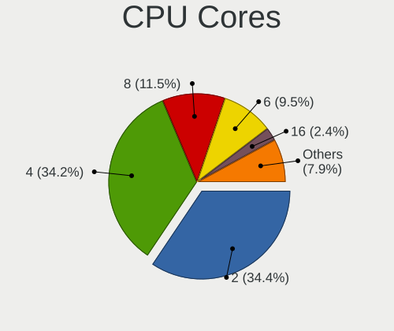

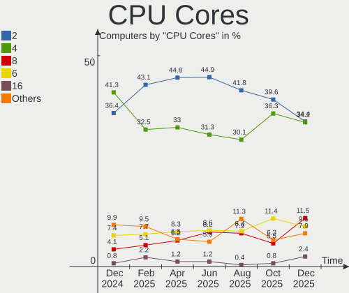

| Number | Computers | Percent |
|--------|-----------|---------|
| 2      | 213       | 34.41%  |
| 4      | 212       | 34.25%  |
| 8      | 71        | 11.47%  |
| 6      | 59        | 9.53%   |
| 16     | 15        | 2.42%   |
| 12     | 13        | 2.1%    |
| 10     | 13        | 2.1%    |
| 14     | 10        | 1.62%   |
| 24     | 5         | 0.81%   |
| 1      | 5         | 0.81%   |
| 18     | 2         | 0.32%   |
| 20     | 1         | 0.16%   |

CPU Sockets
-----------

Number of sockets

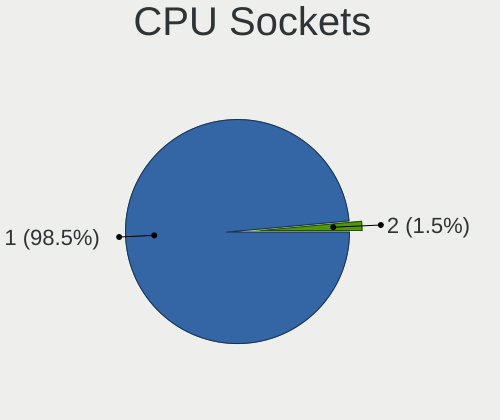

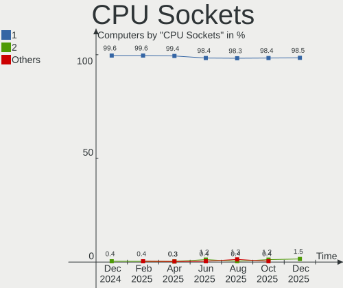

| Number | Computers | Percent |
|--------|-----------|---------|
| 1      | 610       | 98.55%  |
| 2      | 9         | 1.45%   |

CPU Threads
-----------

Threads per core (Hyper-Threading)

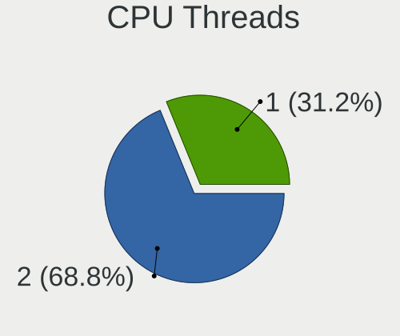

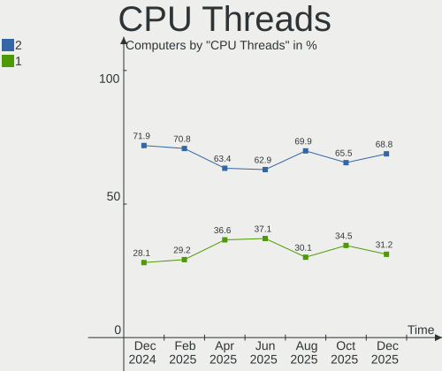

| Number | Computers | Percent |
|--------|-----------|---------|
| 2      | 426       | 68.82%  |
| 1      | 193       | 31.18%  |

CPU Op-Modes
------------

CPU Operation Modes (32-bit, 64-bit)

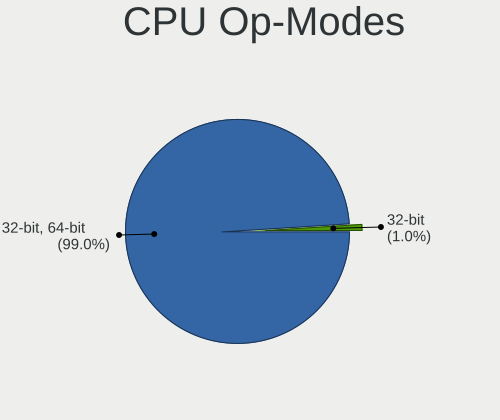

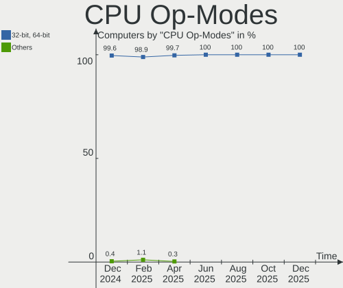

| Op mode        | Computers | Percent |
|----------------|-----------|---------|
| 32-bit, 64-bit | 619       | 100%    |

CPU Microcode
-------------

Microcode number

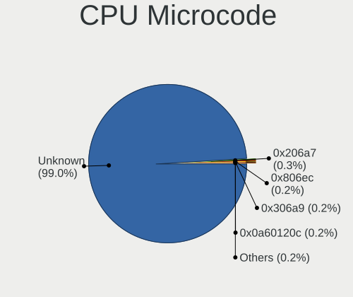

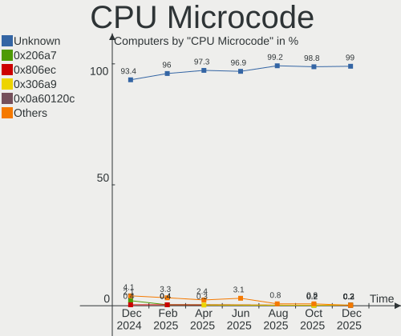

| Number     | Computers | Percent |
|------------|-----------|---------|
| Unknown    | 613       | 99.03%  |
| 0x206a7    | 2         | 0.32%   |
| 0x806ec    | 1         | 0.16%   |
| 0x306a9    | 1         | 0.16%   |
| 0x0a60120c | 1         | 0.16%   |
| 0x05000119 | 1         | 0.16%   |

CPU Microarch
-------------

Microarchitecture

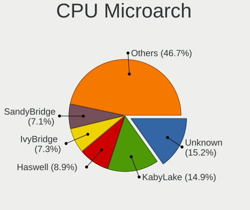

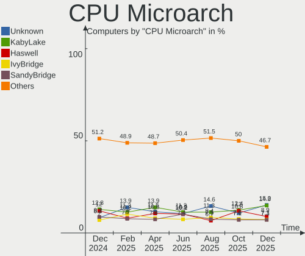

| Name               | Computers | Percent |
|--------------------|-----------|---------|
| Unknown            | 94        | 15.19%  |
| KabyLake           | 92        | 14.86%  |
| Haswell            | 55        | 8.89%   |
| IvyBridge          | 45        | 7.27%   |
| SandyBridge        | 44        | 7.11%   |
| Skylake            | 41        | 6.62%   |
| Penryn             | 28        | 4.52%   |
| Zen 3              | 26        | 4.2%    |
| Zen 2              | 18        | 2.91%   |
| Zen+               | 15        | 2.42%   |
| Westmere           | 15        | 2.42%   |
| Broadwell          | 14        | 2.26%   |
| Zen                | 11        | 1.78%   |
| Nehalem            | 11        | 1.78%   |
| CometLake          | 10        | 1.62%   |
| Silvermont         | 9         | 1.45%   |
| Piledriver         | 9         | 1.45%   |
| Core               | 9         | 1.45%   |
| TigerLake          | 8         | 1.29%   |
| Alderlake Hybrid   | 8         | 1.29%   |
| Puma               | 7         | 1.13%   |
| K10                | 7         | 1.13%   |
| Bobcat             | 7         | 1.13%   |
| Steamroller        | 5         | 0.81%   |
| IceLake            | 5         | 0.81%   |
| Goldmont plus      | 5         | 0.81%   |
| Goldmont           | 5         | 0.81%   |
| Excavator          | 4         | 0.65%   |
| K8 Hammer          | 3         | 0.48%   |
| Jaguar             | 3         | 0.48%   |
| Tremont            | 2         | 0.32%   |
| K10 Llano          | 2         | 0.32%   |
| ArrowLake-H Hybrid | 2         | 0.32%   |

Graphics
--------

GPU Vendor
----------

Vendors of graphics cards

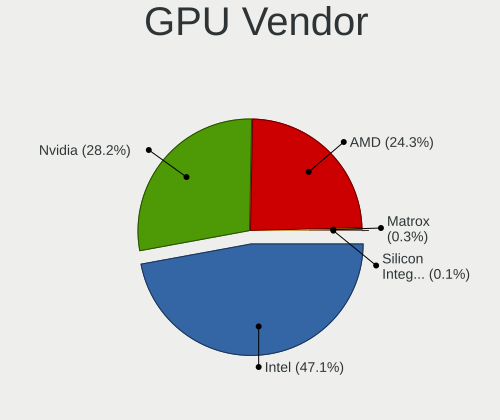

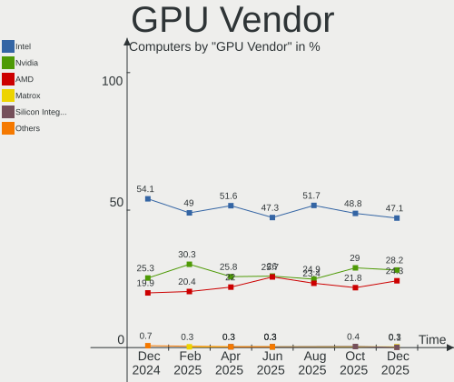

| Vendor                           | Computers | Percent |
|----------------------------------|-----------|---------|
| Intel                            | 351       | 47.11%  |
| Nvidia                           | 210       | 28.19%  |
| AMD                              | 181       | 24.3%   |
| Matrox Electronics Systems       | 2         | 0.27%   |
| Silicon Integrated Systems [SiS] | 1         | 0.13%   |

GPU Model
---------

Graphics card models

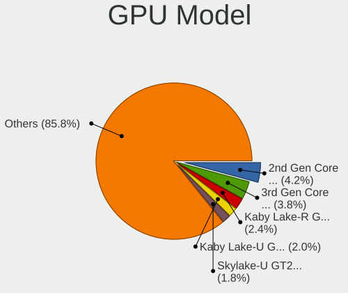

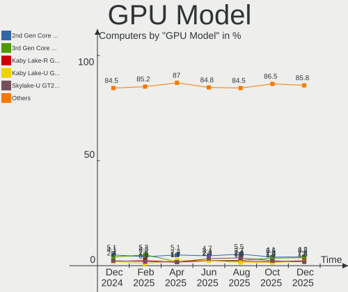

| Model                                                                                    | Computers | Percent |
|------------------------------------------------------------------------------------------|-----------|---------|
| Intel 2nd Generation Core Processor Family Integrated Graphics Controller                | 32        | 4.19%   |
| Intel 3rd Gen Core processor Graphics Controller                                         | 29        | 3.8%    |
| Intel Kaby Lake-R GT2 [UHD Graphics 620]                                                 | 18        | 2.36%   |
| Intel Kaby Lake-U GT2 [HD Graphics 620]                                                  | 15        | 1.97%   |
| Intel Skylake-U GT2 [HD Graphics 520]                                                    | 14        | 1.83%   |
| AMD Ellesmere [Radeon RX 470/480/570/570X/580/580X/590]                                  | 14        | 1.83%   |
| Intel Xeon E3-1200 v3/4th Gen Core Processor Integrated Graphics Controller              | 13        | 1.7%    |
| Intel Haswell-ULT Integrated Graphics Controller                                         | 13        | 1.7%    |
| Intel WhiskeyLake-U GT2 [UHD Graphics 620]                                               | 10        | 1.31%   |
| Intel Broadwell-U GT2 [HD Graphics 5500]                                                 | 10        | 1.31%   |
| Intel 4th Gen Core Processor Integrated Graphics Controller                              | 10        | 1.31%   |
| Intel Skylake-S GT2 [HD Graphics 530]                                                    | 9         | 1.18%   |
| Intel Core Processor Integrated Graphics Controller                                      | 9         | 1.18%   |
| Intel CoffeeLake-S GT2 [UHD Graphics 630]                                                | 9         | 1.18%   |
| Intel TigerLake-LP GT2 [Iris Xe Graphics]                                                | 8         | 1.05%   |
| Intel Mobile 4 Series Chipset Integrated Graphics Controller                             | 8         | 1.05%   |
| Intel JasperLake [UHD Graphics]                                                          | 8         | 1.05%   |
| Intel Atom/Celeron/Pentium Processor x5-E8000/J3xxx/N3xxx Integrated Graphics Controller | 8         | 1.05%   |
| AMD Seymour [Radeon HD 6400M/7400M Series]                                               | 8         | 1.05%   |
| AMD Raven Ridge [Radeon Vega Series / Radeon Vega Mobile Series]                         | 8         | 1.05%   |
| AMD Raphael                                                                              | 8         | 1.05%   |
| Intel Xeon E3-1200 v2/3rd Gen Core processor Graphics Controller                         | 7         | 0.92%   |
| Intel CoffeeLake-H GT2 [UHD Graphics 630]                                                | 7         | 0.92%   |
| AMD Picasso/Raven 2 [Radeon Vega Series / Radeon Vega Mobile Series]                     | 7         | 0.92%   |
| AMD Barcelo                                                                              | 7         | 0.92%   |
| Intel Skylake-Y GT2 [HD Graphics 515]                                                    | 6         | 0.79%   |
| AMD Mullins [Radeon R4/R5 Graphics]                                                      | 6         | 0.79%   |
| Nvidia GP108 [GeForce GT 1030]                                                           | 5         | 0.66%   |
| Nvidia GP107 [GeForce GTX 1050 Ti]                                                       | 5         | 0.66%   |
| Nvidia GK208B [GeForce GT 710]                                                           | 5         | 0.66%   |
| Intel Raptor Lake-P [Iris Xe Graphics]                                                   | 5         | 0.66%   |
| Intel GeminiLake [UHD Graphics 600]                                                      | 5         | 0.66%   |
| Intel CometLake-U GT2 [UHD Graphics]                                                     | 5         | 0.66%   |
| Intel CometLake-H GT2 [UHD Graphics]                                                     | 5         | 0.66%   |
| AMD Navi 31 [Radeon RX 7900 XT/7900 XTX/7900 GRE/7900M]                                  | 5         | 0.66%   |
| AMD Mendocino [Radeon 610M]                                                              | 5         | 0.66%   |
| AMD Lucienne                                                                             | 5         | 0.66%   |
| AMD HawkPoint1                                                                           | 5         | 0.66%   |
| Nvidia GF117M [GeForce 610M/710M/810M/820M / GT 620M/625M/630M/720M]                     | 4         | 0.52%   |
| Nvidia GF108M [GeForce GT 540M]                                                          | 4         | 0.52%   |

GPU Combo
---------

Combinations of graphics cards

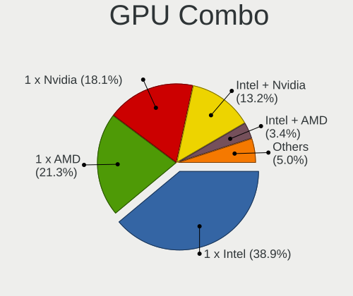

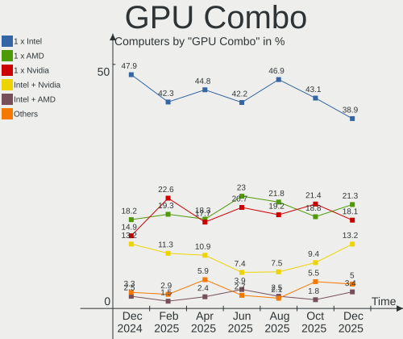

| Name            | Computers | Percent |
|-----------------|-----------|---------|
| 1 x Intel       | 241       | 38.93%  |
| 1 x AMD         | 132       | 21.32%  |
| 1 x Nvidia      | 112       | 18.09%  |
| Intel + Nvidia  | 82        | 13.25%  |
| Intel + AMD     | 21        | 3.39%   |
| 2 x AMD         | 14        | 2.26%   |
| AMD + Nvidia    | 11        | 1.78%   |
| 2 x Nvidia      | 2         | 0.32%   |
| Other           | 1         | 0.16%   |
| 1 x SiS         | 1         | 0.16%   |
| Nvidia + Matrox | 1         | 0.16%   |
| AMD + Matrox    | 1         | 0.16%   |

GPU Driver
----------

Free vs proprietary

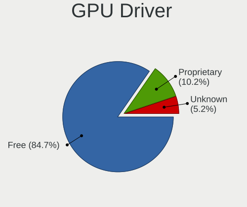

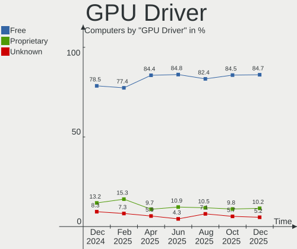

| Driver      | Computers | Percent |
|-------------|-----------|---------|
| Free        | 524       | 84.65%  |
| Proprietary | 63        | 10.18%  |
| Unknown     | 32        | 5.17%   |

GPU Memory
----------

Total video memory

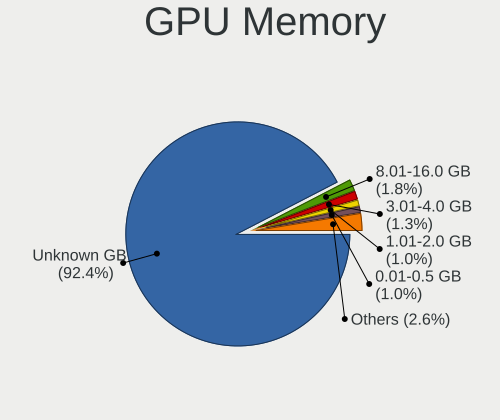

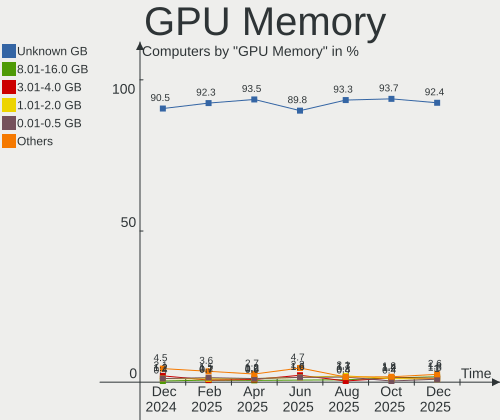

| Size in GB | Computers | Percent |
|------------|-----------|---------|
| Unknown    | 572       | 92.41%  |
| 8.01-16.0  | 11        | 1.78%   |
| 3.01-4.0   | 8         | 1.29%   |
| 1.01-2.0   | 6         | 0.97%   |
| 0.01-0.5   | 6         | 0.97%   |
| 7.01-8.0   | 5         | 0.81%   |
| 0.51-1.0   | 5         | 0.81%   |
| 5.01-6.0   | 4         | 0.65%   |
| 2.01-3.0   | 1         | 0.16%   |
| 16.01-24.0 | 1         | 0.16%   |

Monitor
-------

Monitor Vendor
--------------

Monitor vendors

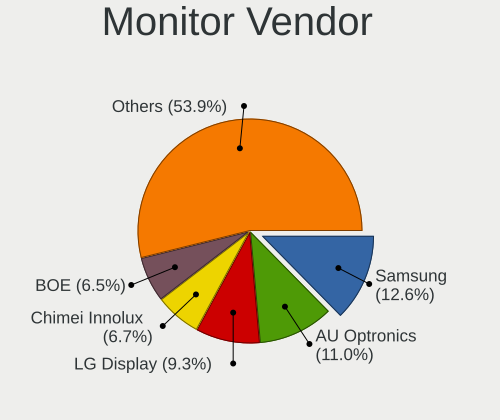

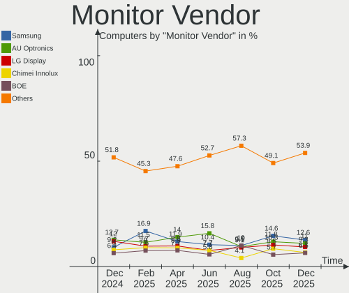

| Vendor                  | Computers | Percent |
|-------------------------|-----------|---------|
| Samsung Electronics     | 83        | 12.63%  |
| AU Optronics            | 72        | 10.96%  |
| LG Display              | 61        | 9.28%   |
| Chimei Innolux          | 44        | 6.7%    |
| BOE                     | 43        | 6.54%   |
| Goldstar                | 39        | 5.94%   |
| Apple                   | 28        | 4.26%   |
| Dell                    | 25        | 3.81%   |
| Acer                    | 25        | 3.81%   |
| Hewlett-Packard         | 22        | 3.35%   |
| Lenovo                  | 16        | 2.44%   |
| AOC                     | 15        | 2.28%   |
| Sharp                   | 13        | 1.98%   |
| Chi Mei Optoelectronics | 11        | 1.67%   |
| Philips                 | 10        | 1.52%   |
| Ancor Communications    | 10        | 1.52%   |
| BenQ                    | 9         | 1.37%   |
| Unknown                 | 6         | 0.91%   |
| Sony                    | 6         | 0.91%   |
| PANDA                   | 6         | 0.91%   |
| InfoVision              | 6         | 0.91%   |
| Iiyama                  | 6         | 0.91%   |
| ViewSonic               | 5         | 0.76%   |
| MSI                     | 5         | 0.76%   |
| Gigabyte Technology     | 5         | 0.76%   |
| HKC                     | 4         | 0.61%   |
| Fujitsu Siemens         | 4         | 0.61%   |
| CSOT                    | 4         | 0.61%   |
| ASUSTek Computer        | 4         | 0.61%   |
| RTK                     | 3         | 0.46%   |
| Panasonic               | 3         | 0.46%   |
| Insignia                | 3         | 0.46%   |
| EDO                     | 3         | 0.46%   |
| Vizio                   | 2         | 0.3%    |
| Unknown (XXX)           | 2         | 0.3%    |
| Toshiba                 | 2         | 0.3%    |
| SLD                     | 2         | 0.3%    |
| Skyworth                | 2         | 0.3%    |
| SKG                     | 2         | 0.3%    |
| SGT                     | 2         | 0.3%    |

Monitor Model
-------------

Monitor models

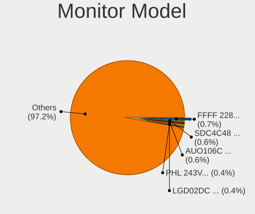

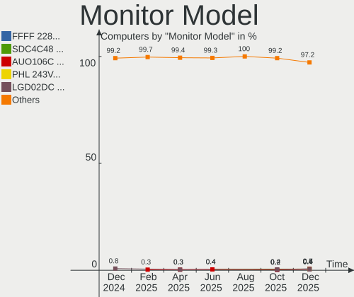

| Model                                                                 | Computers | Percent |
|-----------------------------------------------------------------------|-----------|---------|
| Unknown LCD Monitor FFFF 2288x1287 2550x2550mm 142.0-inch             | 5         | 0.74%   |
| Samsung Electronics LCD Monitor SDC4C48 1920x1080 293x165mm 13.2-inch | 4         | 0.6%    |
| AU Optronics LCD Monitor AUO106C 1366x768 276x155mm 12.5-inch         | 4         | 0.6%    |
| Philips PHL 243V7 PHLC155 1920x1080 527x296mm 23.8-inch               | 3         | 0.45%   |
| LG Display LCD Monitor LGD02DC 1366x768 344x194mm 15.5-inch           | 3         | 0.45%   |
| Goldstar FULL HD GSM5BDF 1920x1080 480x270mm 21.7-inch                | 3         | 0.45%   |
| Chimei Innolux LCD Monitor CMN15E7 1920x1080 344x193mm 15.5-inch      | 3         | 0.45%   |
| AU Optronics LCD Monitor AUO26EC 1366x768 344x193mm 15.5-inch         | 3         | 0.45%   |
| AU Optronics LCD Monitor AUO21ED 1920x1080 344x193mm 15.5-inch        | 3         | 0.45%   |
| AU Optronics LCD Monitor AUO139E 1600x900 382x214mm 17.2-inch         | 3         | 0.45%   |
| SLD LCD Monitor SLD003C 1366x768 309x173mm 13.9-inch                  | 2         | 0.3%    |
| Samsung Electronics LCD Monitor SEC5441 1280x800 331x207mm 15.4-inch  | 2         | 0.3%    |
| Samsung Electronics LCD Monitor SEC314C 1920x1080 344x194mm 15.5-inch | 2         | 0.3%    |
| Samsung Electronics LCD Monitor SAM0D4B 1366x768 609x347mm 27.6-inch  | 2         | 0.3%    |
| Samsung Electronics LCD Monitor SAM08FE 1920x1080                     | 2         | 0.3%    |
| MSI Optix MAG27CQ MSI1462 2560x1440 597x336mm 27.0-inch               | 2         | 0.3%    |
| LG Display LCD Monitor LGD0742 1920x1080 344x194mm 15.5-inch          | 2         | 0.3%    |
| LG Display LCD Monitor LGD06B1 2880x1920 274x183mm 13.0-inch          | 2         | 0.3%    |
| LG Display LCD Monitor LGD046F 1920x1080 344x194mm 15.5-inch          | 2         | 0.3%    |
| LG Display LCD Monitor LGD042C 1920x1080 345x194mm 15.6-inch          | 2         | 0.3%    |
| LG Display LCD Monitor LGD0395 1366x768 344x194mm 15.5-inch           | 2         | 0.3%    |
| LG Display LCD Monitor LGD033A 1366x768 344x194mm 15.5-inch           | 2         | 0.3%    |
| Lenovo Q24i-1L LEN66C0 1920x1080 530x300mm 24.0-inch                  | 2         | 0.3%    |
| Lenovo AIO PC LEN2000 1920x1080 510x290mm 23.1-inch                   | 2         | 0.3%    |
| InfoVision LCD Monitor IVO0536 1920x1080 294x165mm 13.3-inch          | 2         | 0.3%    |
| Hewlett-Packard E231 HWP3063 1920x1080 510x287mm 23.0-inch            | 2         | 0.3%    |
| Hewlett-Packard Compaq W17q HWP26E1 1440x900 408x255mm 18.9-inch      | 2         | 0.3%    |
| Hewlett-Packard ALL-in-One HPN4024 1920x1080 527x296mm 23.8-inch      | 2         | 0.3%    |
| Goldstar Ultra HD GSM5B08 3840x2160 600x340mm 27.2-inch               | 2         | 0.3%    |
| Goldstar MP59G GSM5B34 1920x1080 480x270mm 21.7-inch                  | 2         | 0.3%    |
| Goldstar HDR WFHD GSM7714 2560x1080 798x334mm 34.1-inch               | 2         | 0.3%    |
| Goldstar HDR 4K GSM7707 3840x2160 600x340mm 27.2-inch                 | 2         | 0.3%    |
| Goldstar FULL HD GSM5B55 1920x1080 480x270mm 21.7-inch                | 2         | 0.3%    |
| EDO EDO142 EDO0142                                                    | 2         | 0.3%    |
| Dell U3818DW DELA0F3 3840x1600 880x370mm 37.6-inch                    | 2         | 0.3%    |
| Dell P2421DC DELD0F9 2560x1440 530x300mm 24.0-inch                    | 2         | 0.3%    |
| Chimei Innolux LCD Monitor CMN1738 1920x1080 381x214mm 17.2-inch      | 2         | 0.3%    |
| Chimei Innolux LCD Monitor CMN15F5 1920x1080 344x193mm 15.5-inch      | 2         | 0.3%    |
| Chimei Innolux LCD Monitor CMN15DC 1366x768 344x193mm 15.5-inch       | 2         | 0.3%    |
| Chimei Innolux LCD Monitor CMN15DB 1366x768 344x193mm 15.5-inch       | 2         | 0.3%    |

Monitor Resolution
------------------

Monitor screen resolution

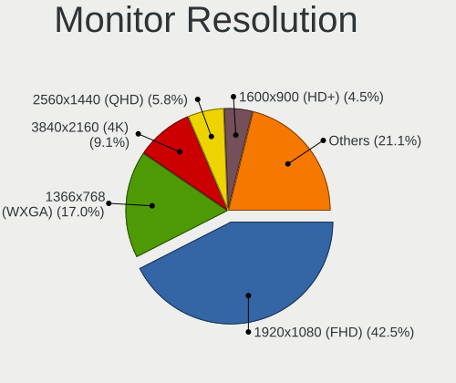

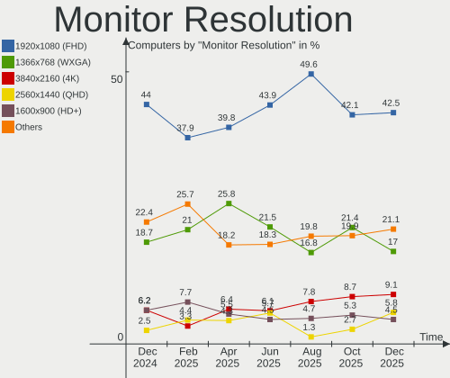

| Resolution         | Computers | Percent |
|--------------------|-----------|---------|
| 1920x1080 (FHD)    | 272       | 42.5%   |
| 1366x768 (WXGA)    | 109       | 17.03%  |
| 3840x2160 (4K)     | 58        | 9.06%   |
| 2560x1440 (QHD)    | 37        | 5.78%   |
| 1600x900 (HD+)     | 29        | 4.53%   |
| 1920x1200 (WUXGA)  | 24        | 3.75%   |
| 2560x1080          | 12        | 1.88%   |
| 1440x900 (WXGA+)   | 12        | 1.88%   |
| 1280x800 (WXGA)    | 11        | 1.72%   |
| 3440x1440          | 10        | 1.56%   |
| 2560x1600          | 9         | 1.41%   |
| 1680x1050 (WSXGA+) | 8         | 1.25%   |
| 2880x1800          | 5         | 0.78%   |
| 2288x1287          | 5         | 0.78%   |
| 2880x1920          | 4         | 0.63%   |
| 1360x768           | 4         | 0.63%   |
| 1280x1024 (SXGA)   | 4         | 0.63%   |
| Unknown            | 4         | 0.63%   |
| 3840x1600          | 3         | 0.47%   |
| 3840x1080          | 3         | 0.47%   |
| 2304x1440          | 2         | 0.31%   |
| 1920x540           | 2         | 0.31%   |
| 1920x1280          | 2         | 0.31%   |
| 1024x768 (XGA)     | 2         | 0.31%   |
| 3200x1800 (QHD+)   | 1         | 0.16%   |
| 3072x1920          | 1         | 0.16%   |
| 3000x2000          | 1         | 0.16%   |
| 2736x1824          | 1         | 0.16%   |
| 2240x1400          | 1         | 0.16%   |
| 2160x1440          | 1         | 0.16%   |
| 2048x1152          | 1         | 0.16%   |
| 1920x515           | 1         | 0.16%   |
| 1280x960           | 1         | 0.16%   |

Monitor Diagonal
----------------

Diagonal size in inches

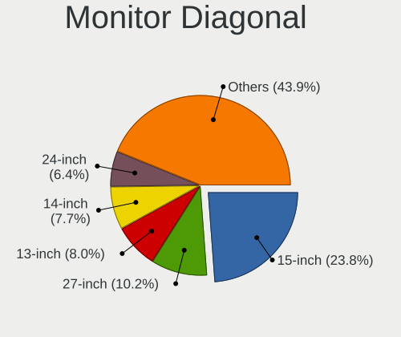

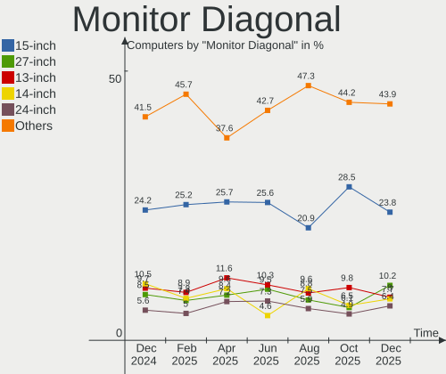

| Inches  | Computers | Percent |
|---------|-----------|---------|
| 15      | 157       | 23.82%  |
| 27      | 67        | 10.17%  |
| 13      | 53        | 8.04%   |
| 14      | 51        | 7.74%   |
| 24      | 42        | 6.37%   |
| 23      | 36        | 5.46%   |
| 17      | 29        | 4.4%    |
| 31      | 28        | 4.25%   |
| 21      | 24        | 3.64%   |
| 18      | 18        | 2.73%   |
| 16      | 17        | 2.58%   |
| 34      | 14        | 2.12%   |
| 12      | 14        | 2.12%   |
| Unknown | 13        | 1.97%   |
| 84      | 9         | 1.37%   |
| 32      | 9         | 1.37%   |
| 20      | 9         | 1.37%   |
| 19      | 9         | 1.37%   |
| 26      | 6         | 0.91%   |
| 142     | 5         | 0.76%   |
| 63      | 5         | 0.76%   |
| 54      | 4         | 0.61%   |
| 48      | 4         | 0.61%   |
| 40      | 4         | 0.61%   |
| 72      | 3         | 0.46%   |
| 52      | 3         | 0.46%   |
| 37      | 3         | 0.46%   |
| 22      | 3         | 0.46%   |
| 42      | 2         | 0.3%    |
| 33      | 2         | 0.3%    |
| 28      | 2         | 0.3%    |
| 86      | 1         | 0.15%   |
| 82      | 1         | 0.15%   |
| 75      | 1         | 0.15%   |
| 65      | 1         | 0.15%   |
| 60      | 1         | 0.15%   |
| 50      | 1         | 0.15%   |
| 49      | 1         | 0.15%   |
| 46      | 1         | 0.15%   |
| 44      | 1         | 0.15%   |

Monitor Width
-------------

Physical width

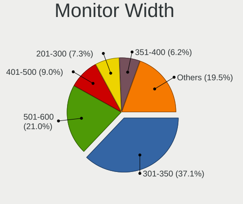

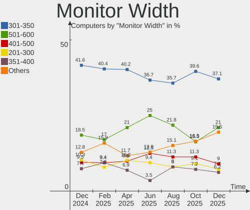

| Width in mm    | Computers | Percent |
|----------------|-----------|---------|
| 301-350        | 240       | 37.09%  |
| 501-600        | 136       | 21.02%  |
| 401-500        | 58        | 8.96%   |
| 201-300        | 47        | 7.26%   |
| 351-400        | 40        | 6.18%   |
| 601-700        | 36        | 5.56%   |
| 701-800        | 26        | 4.02%   |
| 1001-1500      | 22        | 3.4%    |
| 1501-2000      | 14        | 2.16%   |
| Unknown        | 13        | 2.01%   |
| 801-900        | 8         | 1.24%   |
| More than 2000 | 5         | 0.77%   |
| 901-1000       | 2         | 0.31%   |

Aspect Ratio
------------

Proportional relationship between the width and the height

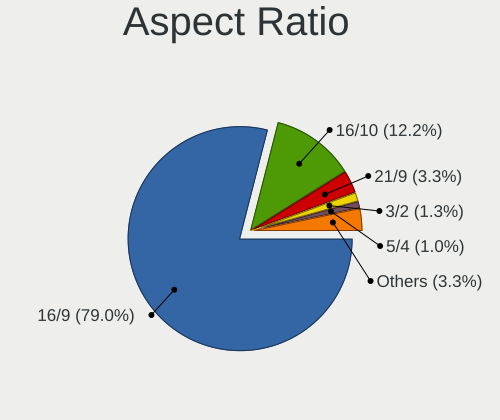

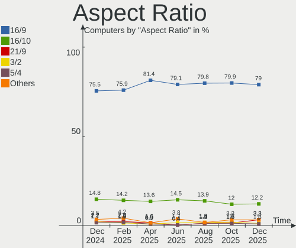

| Ratio   | Computers | Percent |
|---------|-----------|---------|
| 16/9    | 481       | 78.98%  |
| 16/10   | 74        | 12.15%  |
| 21/9    | 20        | 3.28%   |
| 3/2     | 8         | 1.31%   |
| 5/4     | 6         | 0.99%   |
| Unknown | 6         | 0.99%   |
| 1.00    | 5         | 0.82%   |
| 32/9    | 4         | 0.66%   |
| 4/3     | 2         | 0.33%   |
| 3.73    | 1         | 0.16%   |
| 2.00    | 1         | 0.16%   |
| 0.56    | 1         | 0.16%   |

Monitor Area
------------

Area in inch²

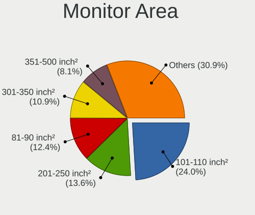

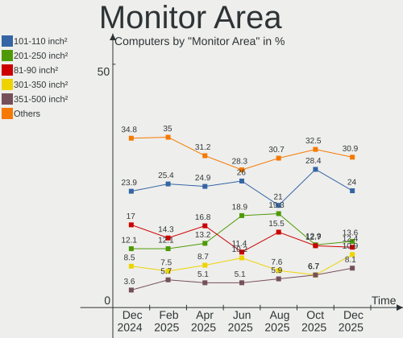

| Area in inch² | Computers | Percent |
|----------------|-----------|---------|
| 101-110        | 157       | 24.04%  |
| 201-250        | 89        | 13.63%  |
| 81-90          | 81        | 12.4%   |
| 301-350        | 71        | 10.87%  |
| 351-500        | 53        | 8.12%   |
| More than 1000 | 37        | 5.67%   |
| 121-130        | 28        | 4.29%   |
| 151-200        | 26        | 3.98%   |
| 71-80          | 21        | 3.22%   |
| 141-150        | 16        | 2.45%   |
| 501-1000       | 15        | 2.3%    |
| 61-70          | 14        | 2.14%   |
| 111-120        | 14        | 2.14%   |
| Unknown        | 13        | 1.99%   |
| 251-300        | 12        | 1.84%   |
| 131-140        | 2         | 0.31%   |
| 91-100         | 2         | 0.31%   |
| 51-60          | 1         | 0.15%   |
| 41-50          | 1         | 0.15%   |

Pixel Density
-------------

Pixels per inch

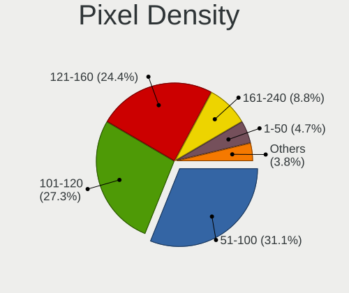

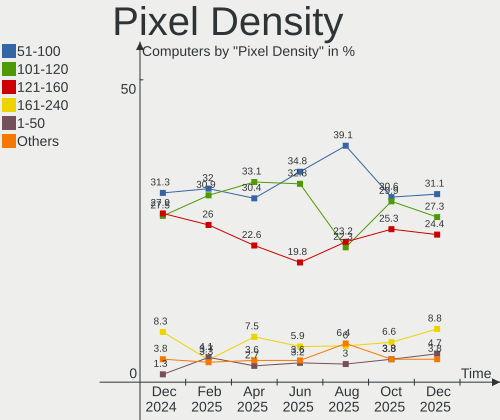

| Density       | Computers | Percent |
|---------------|-----------|---------|
| 51-100        | 199       | 31.09%  |
| 101-120       | 175       | 27.34%  |
| 121-160       | 156       | 24.38%  |
| 161-240       | 56        | 8.75%   |
| 1-50          | 30        | 4.69%   |
| Unknown       | 13        | 2.03%   |
| More than 240 | 11        | 1.72%   |

Multiple Monitors
-----------------

Total monitors connected

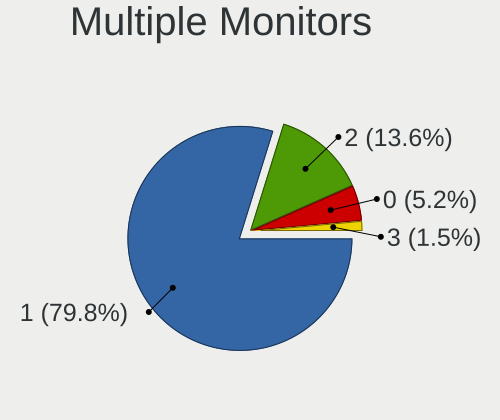

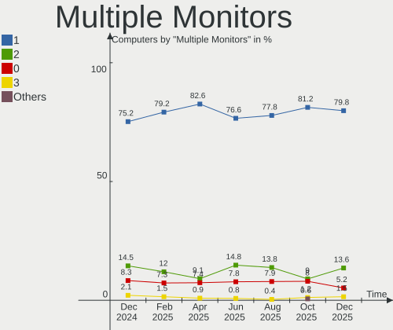

| Total | Computers | Percent |
|-------|-----------|---------|
| 1     | 494       | 79.81%  |
| 2     | 84        | 13.57%  |
| 0     | 32        | 5.17%   |
| 3     | 9         | 1.45%   |

Network
-------

Net Controller Vendor
---------------------

Controller vendors

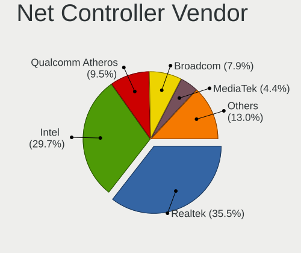

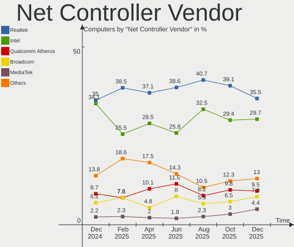

| Vendor                                 | Computers | Percent |
|----------------------------------------|-----------|---------|
| Realtek Semiconductor                  | 338       | 35.54%  |
| Intel                                  | 282       | 29.65%  |
| Qualcomm Atheros                       | 90        | 9.46%   |
| Broadcom                               | 75        | 7.89%   |
| MediaTek                               | 42        | 4.42%   |
| TP-Link                                | 12        | 1.26%   |
| Nvidia                                 | 11        | 1.16%   |
| Ralink Technology                      | 10        | 1.05%   |
| Sierra Wireless                        | 8         | 0.84%   |
| ASIX Electronics                       | 8         | 0.84%   |
| Ralink                                 | 7         | 0.74%   |
| Marvell Technology Group               | 6         | 0.63%   |
| Broadcom Limited                       | 6         | 0.63%   |
| Aquantia                               | 5         | 0.53%   |
| Samsung Electronics                    | 4         | 0.42%   |
| Realtek                                | 4         | 0.42%   |
| NetGear                                | 4         | 0.42%   |
| Microsoft                              | 4         | 0.42%   |
| Dell                                   | 4         | 0.42%   |
| ASUSTek Computer                       | 4         | 0.42%   |
| Xiaomi                                 | 3         | 0.32%   |
| DisplayLink                            | 3         | 0.32%   |
| Qualcomm Technologies                  | 2         | 0.21%   |
| Qualcomm                               | 2         | 0.21%   |
| QinHeng Electronics                    | 2         | 0.21%   |
| Motorola PCS                           | 2         | 0.21%   |
| Toshiba                                | 1         | 0.11%   |
| Tenda                                  | 1         | 0.11%   |
| Sony Ericsson Mobile Communications AB | 1         | 0.11%   |
| Silicon Integrated Systems [SiS]       | 1         | 0.11%   |
| NetXen Incorporated                    | 1         | 0.11%   |
| Mercucys                               | 1         | 0.11%   |
| JMicron Technology                     | 1         | 0.11%   |
| I-O Data Device                        | 1         | 0.11%   |
| Huawei Technologies                    | 1         | 0.11%   |
| Hewlett-Packard                        | 1         | 0.11%   |
| Google                                 | 1         | 0.11%   |
| Fibocom                                | 1         | 0.11%   |
| aicsemi                                | 1         | 0.11%   |

Net Controller Model
--------------------

Controller models

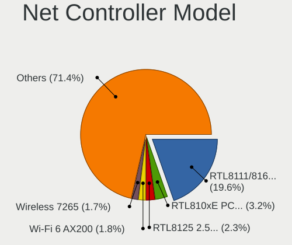

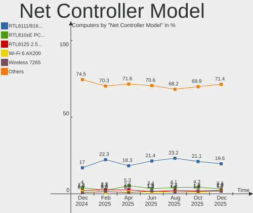

| Model                                                                  | Computers | Percent |
|------------------------------------------------------------------------|-----------|---------|
| Realtek RTL8111/8168/8211/8411 PCI Express Gigabit Ethernet Controller | 224       | 19.63%  |
| Realtek RTL810xE PCI Express Fast Ethernet controller                  | 36        | 3.16%   |
| Realtek RTL8125 2.5GbE Controller                                      | 26        | 2.28%   |
| Intel Wi-Fi 6 AX200                                                    | 21        | 1.84%   |
| Intel Wireless 7265                                                    | 19        | 1.67%   |
| Intel Wireless 8265 / 8275                                             | 17        | 1.49%   |
| Intel 82579LM Gigabit Network Connection (Lewisville)                  | 17        | 1.49%   |
| MediaTek MT7922 802.11ax PCI Express Wireless Network Adapter          | 15        | 1.31%   |
| Realtek RTL8821CE 802.11ac PCIe Wireless Network Adapter               | 14        | 1.23%   |
| MediaTek MT7902 802.11ax PCIe Wireless Network Adapter [Filogic 310]   | 14        | 1.23%   |
| Realtek RTL8153 Gigabit Ethernet Adapter                               | 13        | 1.14%   |
| Qualcomm Atheros QCA9377 802.11ac Wireless Network Adapter             | 13        | 1.14%   |
| Intel Wireless 8260                                                    | 12        | 1.05%   |
| Realtek 802.11ac NIC                                                   | 11        | 0.96%   |
| Qualcomm Atheros QCA9565 / AR9565 Wireless Network Adapter             | 11        | 0.96%   |
| Qualcomm Atheros AR9485 Wireless Network Adapter                       | 11        | 0.96%   |
| Qualcomm Atheros QCA6174 802.11ac Wireless Network Adapter             | 10        | 0.88%   |
| Intel Wi-Fi 6E(802.11ax) AX210/AX1675* 2x2 [Typhoon Peak]              | 10        | 0.88%   |
| Intel Ethernet Connection (4) I219-LM                                  | 10        | 0.88%   |
| Intel Ethernet Connection (2) I219-V                                   | 10        | 0.88%   |
| Broadcom BCM4313 802.11bgn Wireless Network Adapter                    | 10        | 0.88%   |
| Realtek RTL8852BE PCIe 802.11ax Wireless Network Controller            | 9         | 0.79%   |
| Intel Wireless 3165                                                    | 9         | 0.79%   |
| Intel Ethernet Controller I225-V                                       | 9         | 0.79%   |
| Intel Ethernet Connection I217-LM                                      | 9         | 0.79%   |
| Realtek RTL8188EUS 802.11n Wireless Network Adapter                    | 8         | 0.7%    |
| Qualcomm Atheros AR9285 Wireless Network Adapter (PCI-Express)         | 8         | 0.7%    |
| Intel Wireless 7260                                                    | 8         | 0.7%    |
| Intel Ethernet Controller I226-V                                       | 8         | 0.7%    |
| Intel Dual Band Wireless-AC 3168NGW [Stone Peak]                       | 8         | 0.7%    |
| Broadcom NetXtreme BCM57765 Gigabit Ethernet PCIe                      | 8         | 0.7%    |
| Broadcom BCM4360 802.11ac Dual Band Wireless Network Adapter           | 8         | 0.7%    |
| Broadcom BCM4322 802.11a/b/g/n Wireless LAN Controller                 | 8         | 0.7%    |
| ASIX AX88179 Gigabit Ethernet                                          | 8         | 0.7%    |
| Realtek RTL8822CE 802.11ac PCIe Wireless Network Adapter               | 7         | 0.61%   |
| Nvidia MCP79 Ethernet                                                  | 7         | 0.61%   |
| Intel Wi-Fi 6 AX201                                                    | 7         | 0.61%   |
| Intel Raptor Lake PCH CNVi WiFi                                        | 7         | 0.61%   |
| Intel I211 Gigabit Network Connection                                  | 7         | 0.61%   |
| Broadcom NetLink BCM57780 Gigabit Ethernet PCIe                        | 7         | 0.61%   |

Wireless Vendor
---------------

Wireless vendors

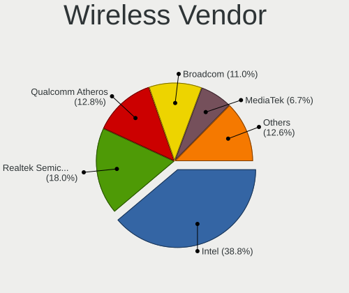

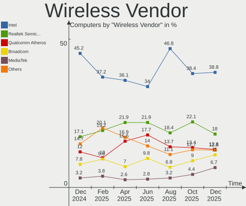

| Vendor                   | Computers | Percent |
|--------------------------|-----------|---------|
| Intel                    | 209       | 38.85%  |
| Realtek Semiconductor    | 97        | 18.03%  |
| Qualcomm Atheros         | 69        | 12.83%  |
| Broadcom                 | 59        | 10.97%  |
| MediaTek                 | 36        | 6.69%   |
| TP-Link                  | 12        | 2.23%   |
| Ralink Technology        | 10        | 1.86%   |
| Sierra Wireless          | 8         | 1.49%   |
| Ralink                   | 7         | 1.3%    |
| Broadcom Limited         | 5         | 0.93%   |
| Realtek                  | 4         | 0.74%   |
| NetGear                  | 4         | 0.74%   |
| ASUSTek Computer         | 4         | 0.74%   |
| Microsoft                | 3         | 0.56%   |
| Dell                     | 3         | 0.56%   |
| Marvell Technology Group | 2         | 0.37%   |
| Tenda                    | 1         | 0.19%   |
| Qualcomm Technologies    | 1         | 0.19%   |
| Qualcomm                 | 1         | 0.19%   |
| Mercucys                 | 1         | 0.19%   |
| I-O Data Device          | 1         | 0.19%   |
| Fibocom                  | 1         | 0.19%   |

Wireless Model
--------------

Wireless models

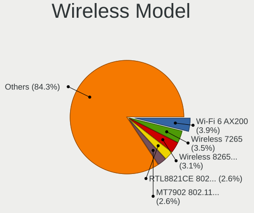

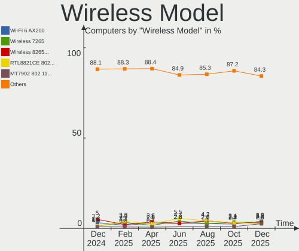

| Model                                                                | Computers | Percent |
|----------------------------------------------------------------------|-----------|---------|
| Intel Wi-Fi 6 AX200                                                  | 21        | 3.88%   |
| Intel Wireless 7265                                                  | 19        | 3.51%   |
| Intel Wireless 8265 / 8275                                           | 17        | 3.14%   |
| Realtek RTL8821CE 802.11ac PCIe Wireless Network Adapter             | 14        | 2.59%   |
| MediaTek MT7902 802.11ax PCIe Wireless Network Adapter [Filogic 310] | 14        | 2.59%   |
| Qualcomm Atheros QCA9377 802.11ac Wireless Network Adapter           | 13        | 2.4%    |
| Intel Wireless 8260                                                  | 12        | 2.22%   |
| Realtek 802.11ac NIC                                                 | 11        | 2.03%   |
| Qualcomm Atheros QCA9565 / AR9565 Wireless Network Adapter           | 11        | 2.03%   |
| Qualcomm Atheros AR9485 Wireless Network Adapter                     | 11        | 2.03%   |
| MediaTek MT7922 802.11ax PCI Express Wireless Network Adapter        | 11        | 2.03%   |
| Qualcomm Atheros QCA6174 802.11ac Wireless Network Adapter           | 10        | 1.85%   |
| Intel Wi-Fi 6E(802.11ax) AX210/AX1675* 2x2 [Typhoon Peak]            | 10        | 1.85%   |
| Broadcom BCM4313 802.11bgn Wireless Network Adapter                  | 10        | 1.85%   |
| Intel Wireless 3165                                                  | 9         | 1.66%   |
| Realtek RTL8188EUS 802.11n Wireless Network Adapter                  | 8         | 1.48%   |
| Qualcomm Atheros AR9285 Wireless Network Adapter (PCI-Express)       | 8         | 1.48%   |
| Intel Wireless 7260                                                  | 8         | 1.48%   |
| Intel Dual Band Wireless-AC 3168NGW [Stone Peak]                     | 8         | 1.48%   |
| Broadcom BCM4360 802.11ac Dual Band Wireless Network Adapter         | 8         | 1.48%   |
| Broadcom BCM4322 802.11a/b/g/n Wireless LAN Controller               | 8         | 1.48%   |
| Realtek RTL8822CE 802.11ac PCIe Wireless Network Adapter             | 7         | 1.29%   |
| Intel Wi-Fi 6 AX201                                                  | 7         | 1.29%   |
| Intel Raptor Lake PCH CNVi WiFi                                      | 7         | 1.29%   |
| Broadcom BCM4331 802.11a/b/g/n                                       | 7         | 1.29%   |
| Broadcom BCM43142 802.11b/g/n                                        | 7         | 1.29%   |
| Realtek RTL8723DE Wireless Network Adapter                           | 6         | 1.11%   |
| Intel Comet Lake PCH-LP CNVi WiFi                                    | 6         | 1.11%   |
| Realtek RTL8822BE 802.11a/b/g/n/ac WiFi adapter                      | 5         | 0.92%   |
| Realtek RTL8723BE PCIe Wireless Network Adapter                      | 5         | 0.92%   |
| Realtek RTL8188CE 802.11b/g/n WiFi Adapter                           | 5         | 0.92%   |
| Qualcomm Atheros AR928X Wireless Network Adapter (PCI-Express)       | 5         | 0.92%   |
| Intel Comet Lake PCH CNVi WiFi                                       | 5         | 0.92%   |
| Intel Centrino Wireless-N 2230                                       | 5         | 0.92%   |
| Intel Centrino Advanced-N 6235                                       | 5         | 0.92%   |
| Intel 700 Series Chipset CNVi WiFi                                   | 5         | 0.92%   |
| Broadcom BCM43602 802.11ac Wireless LAN SoC                          | 5         | 0.92%   |
| Realtek RTL8852BE PCIe 802.11ax Wireless Network Controller          | 4         | 0.74%   |
| Realtek 802.11ac WLAN Adapter                                        | 4         | 0.74%   |
| Ralink MT7601U Wireless Adapter                                      | 4         | 0.74%   |

Ethernet Vendor
---------------

Ethernet vendors

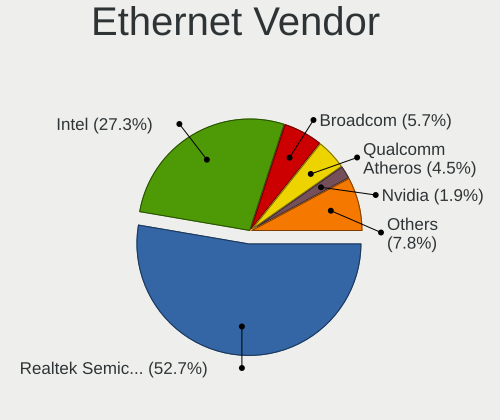

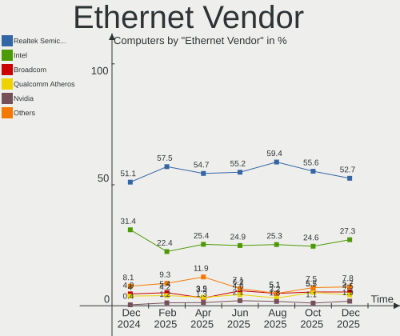

| Vendor                                 | Computers | Percent |
|----------------------------------------|-----------|---------|
| Realtek Semiconductor                  | 303       | 52.7%   |
| Intel                                  | 157       | 27.3%   |
| Broadcom                               | 33        | 5.74%   |
| Qualcomm Atheros                       | 26        | 4.52%   |
| Nvidia                                 | 11        | 1.91%   |
| ASIX Electronics                       | 8         | 1.39%   |
| MediaTek                               | 5         | 0.87%   |
| Aquantia                               | 5         | 0.87%   |
| Samsung Electronics                    | 4         | 0.7%    |
| Marvell Technology Group               | 4         | 0.7%    |
| Xiaomi                                 | 3         | 0.52%   |
| DisplayLink                            | 3         | 0.52%   |
| Motorola PCS                           | 2         | 0.35%   |
| Sony Ericsson Mobile Communications AB | 1         | 0.17%   |
| Silicon Integrated Systems [SiS]       | 1         | 0.17%   |
| Qualcomm Technologies                  | 1         | 0.17%   |
| Qualcomm                               | 1         | 0.17%   |
| QinHeng Electronics                    | 1         | 0.17%   |
| NetXen Incorporated                    | 1         | 0.17%   |
| Microsoft                              | 1         | 0.17%   |
| JMicron Technology                     | 1         | 0.17%   |
| Hewlett-Packard                        | 1         | 0.17%   |
| Google                                 | 1         | 0.17%   |
| Broadcom Limited                       | 1         | 0.17%   |

Ethernet Model
--------------

Ethernet models

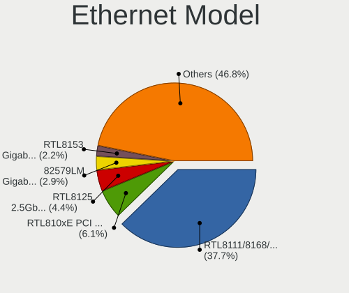

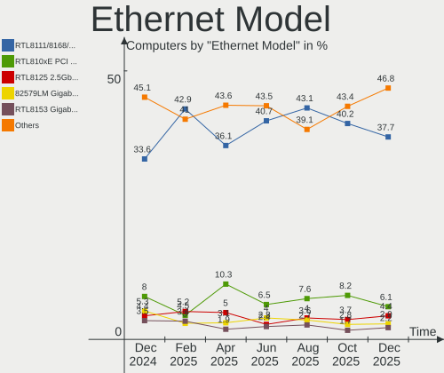

| Model                                                                  | Computers | Percent |
|------------------------------------------------------------------------|-----------|---------|
| Realtek RTL8111/8168/8211/8411 PCI Express Gigabit Ethernet Controller | 224       | 37.71%  |
| Realtek RTL810xE PCI Express Fast Ethernet controller                  | 36        | 6.06%   |
| Realtek RTL8125 2.5GbE Controller                                      | 26        | 4.38%   |
| Intel 82579LM Gigabit Network Connection (Lewisville)                  | 17        | 2.86%   |
| Realtek RTL8153 Gigabit Ethernet Adapter                               | 13        | 2.19%   |
| Intel Ethernet Connection (4) I219-LM                                  | 10        | 1.68%   |
| Intel Ethernet Connection (2) I219-V                                   | 10        | 1.68%   |
| Intel Ethernet Controller I225-V                                       | 9         | 1.52%   |
| Intel Ethernet Connection I217-LM                                      | 9         | 1.52%   |
| Intel Ethernet Controller I226-V                                       | 8         | 1.35%   |
| Broadcom NetXtreme BCM57765 Gigabit Ethernet PCIe                      | 8         | 1.35%   |
| ASIX AX88179 Gigabit Ethernet                                          | 8         | 1.35%   |
| Nvidia MCP79 Ethernet                                                  | 7         | 1.18%   |
| Intel I211 Gigabit Network Connection                                  | 7         | 1.18%   |
| Broadcom NetLink BCM57780 Gigabit Ethernet PCIe                        | 7         | 1.18%   |
| Intel Ethernet Connection I219-LM                                      | 6         | 1.01%   |
| Intel Ethernet Connection (7) I219-LM                                  | 6         | 1.01%   |
| Intel Ethernet Connection (3) I218-LM                                  | 6         | 1.01%   |
| Intel Ethernet Connection (2) I219-LM                                  | 6         | 1.01%   |
| Broadcom NetXtreme BCM57766 Gigabit Ethernet PCIe                      | 6         | 1.01%   |
| Realtek RTL8852BE PCIe 802.11ax Wireless Network Controller            | 5         | 0.84%   |
| Qualcomm Atheros AR8151 v2.0 Gigabit Ethernet                          | 5         | 0.84%   |
| Intel 82579V Gigabit Network Connection                                | 5         | 0.84%   |
| Qualcomm Atheros Killer E2400 Gigabit Ethernet Controller              | 4         | 0.67%   |
| Qualcomm Atheros AR8161 Gigabit Ethernet                               | 4         | 0.67%   |
| MediaTek MT7922 802.11ax PCI Express Wireless Network Adapter          | 4         | 0.67%   |
| Intel Ethernet Connection (7) I219-V                                   | 4         | 0.67%   |
| Intel 82567LM-3 Gigabit Network Connection                             | 4         | 0.67%   |
| Broadcom NetLink BCM57785 Gigabit Ethernet PCIe                        | 4         | 0.67%   |
| Samsung Galaxy series, misc. (tethering mode)                          | 3         | 0.51%   |
| Realtek Killer E2600 GbE Controller                                    | 3         | 0.51%   |
| Qualcomm Atheros Killer E220x Gigabit Ethernet Controller              | 3         | 0.51%   |
| Intel Ethernet Connection I217-V                                       | 3         | 0.51%   |
| Intel Ethernet Connection (4) I219-V                                   | 3         | 0.51%   |
| Intel Ethernet Connection (23) I219-V                                  | 3         | 0.51%   |
| Intel Ethernet Connection (14) I219-V                                  | 3         | 0.51%   |
| Intel 82574L Gigabit Network Connection                                | 3         | 0.51%   |
| Broadcom NetXtreme BCM5764M Gigabit Ethernet PCIe                      | 3         | 0.51%   |
| Xiaomi Mi/Redmi series (RNDIS)                                         | 2         | 0.34%   |
| Realtek Killer E3000 2.5GbE Controller                                 | 2         | 0.34%   |

Net Controller Kind
-------------------

Ethernet, WiFi or modem

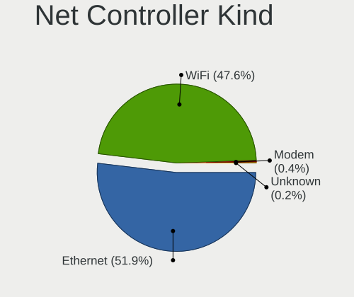

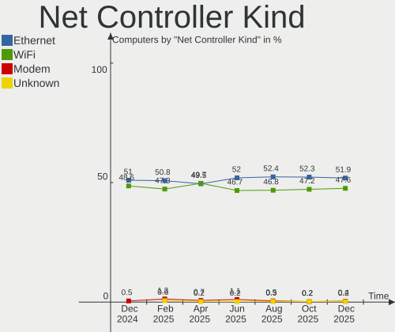

| Kind     | Computers | Percent |
|----------|-----------|---------|
| Ethernet | 540       | 51.87%  |
| WiFi     | 495       | 47.55%  |
| Modem    | 4         | 0.38%   |
| Unknown  | 2         | 0.19%   |

Used Controller
---------------

Currently used network controller

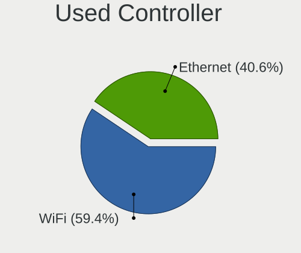

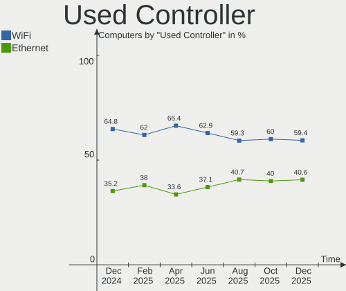

| Kind     | Computers | Percent |
|----------|-----------|---------|
| WiFi     | 379       | 59.4%   |
| Ethernet | 259       | 40.6%   |

NICs
----

Total network controllers on board

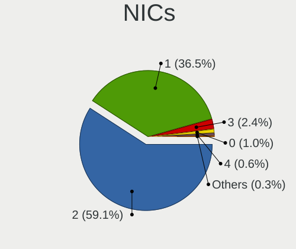

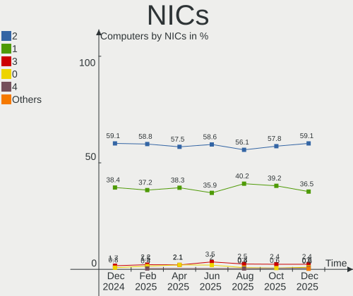

| Total | Computers | Percent |
|-------|-----------|---------|
| 2     | 366       | 59.13%  |
| 1     | 226       | 36.51%  |
| 3     | 15        | 2.42%   |
| 0     | 6         | 0.97%   |
| 4     | 4         | 0.65%   |
| 8     | 1         | 0.16%   |
| 5     | 1         | 0.16%   |

IPv6
----

IPv6 vs IPv4

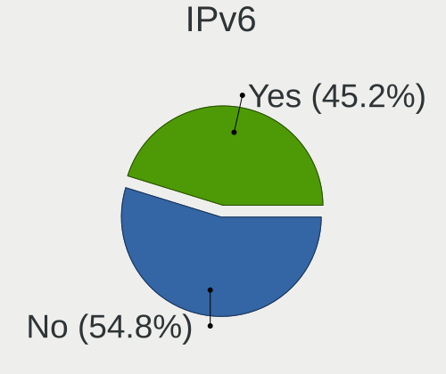

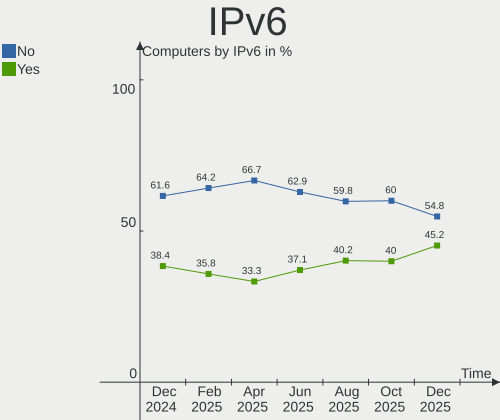

| Used | Computers | Percent |
|------|-----------|---------|
| No   | 339       | 54.77%  |
| Yes  | 280       | 45.23%  |

Bluetooth
---------

Bluetooth Vendor
----------------

Controller vendors

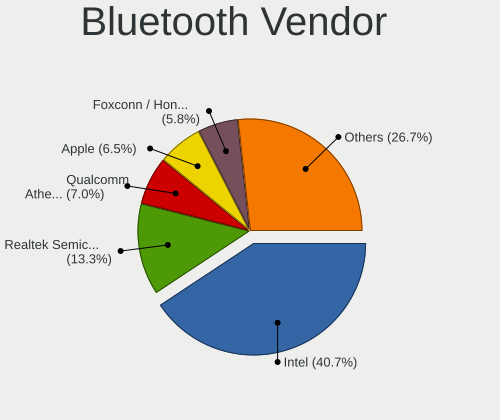

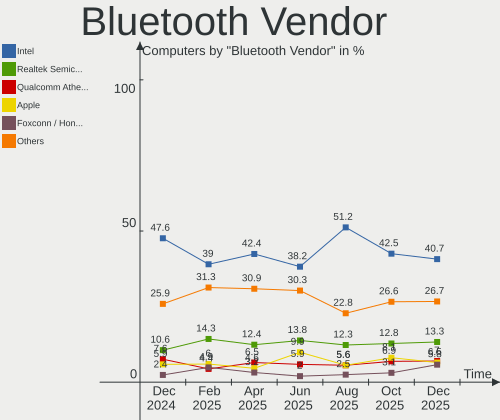

| Vendor                          | Computers | Percent |
|---------------------------------|-----------|---------|
| Intel                           | 175       | 40.7%   |
| Realtek Semiconductor           | 57        | 13.26%  |
| Qualcomm Atheros Communications | 30        | 6.98%   |
| Apple                           | 28        | 6.51%   |
| Foxconn / Hon Hai               | 25        | 5.81%   |
| IMC Networks                    | 20        | 4.65%   |
| Broadcom                        | 18        | 4.19%   |
| Cambridge Silicon Radio         | 16        | 3.72%   |
| MediaTek                        | 13        | 3.02%   |
| Lite-On Technology              | 13        | 3.02%   |
| ASUSTek Computer                | 7         | 1.63%   |
| TP-Link                         | 6         | 1.4%    |
| Unknown                         | 4         | 0.93%   |
| Ralink                          | 2         | 0.47%   |
| Marvell Semiconductor           | 2         | 0.47%   |
| Hewlett-Packard                 | 2         | 0.47%   |
| Dell                            | 2         | 0.47%   |
| Actions                         | 2         | 0.47%   |
| Toshiba                         | 1         | 0.23%   |
| Ralink Technology               | 1         | 0.23%   |
| Kensington                      | 1         | 0.23%   |
| Integrated System Solution      | 1         | 0.23%   |
| Fujitsu                         | 1         | 0.23%   |
| Foxconn International           | 1         | 0.23%   |
| Chicony Electronics             | 1         | 0.23%   |
| AICSemi                         | 1         | 0.23%   |

Bluetooth Model
---------------

Controller models

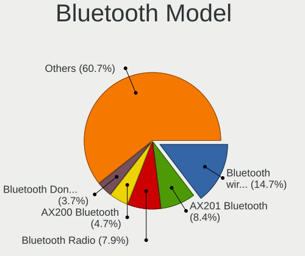

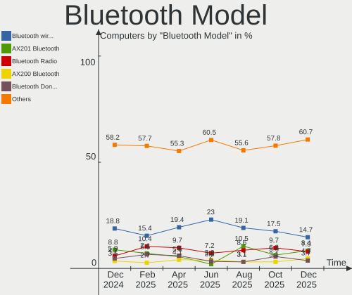

| Model                                                                               | Computers | Percent |
|-------------------------------------------------------------------------------------|-----------|---------|
| Intel Bluetooth wireless interface                                                  | 63        | 14.65%  |
| Intel AX201 Bluetooth                                                               | 36        | 8.37%   |
| Realtek Bluetooth Radio                                                             | 34        | 7.91%   |
| Intel AX200 Bluetooth                                                               | 20        | 4.65%   |
| Cambridge Silicon Radio Bluetooth Dongle (HCI mode)                                 | 16        | 3.72%   |
| Apple Bluetooth Host Controller                                                     | 16        | 3.72%   |
| Realtek  Bluetooth 4.2 Adapter                                                      | 15        | 3.49%   |
| Intel Bluetooth Device                                                              | 15        | 3.49%   |
| IMC Networks Wireless_Device                                                        | 15        | 3.49%   |
| Qualcomm Atheros  Bluetooth Device                                                  | 14        | 3.26%   |
| MediaTek Wireless_Device                                                            | 13        | 3.02%   |
| Intel Bluetooth 9460/9560 Jefferson Peak (JfP)                                      | 13        | 3.02%   |
| Intel AX210 Bluetooth                                                               | 10        | 2.33%   |
| Foxconn / Hon Hai Wireless_Device                                                   | 10        | 2.33%   |
| Intel Centrino Bluetooth Wireless Transceiver                                       | 8         | 1.86%   |
| Intel Wireless-AC 3168 Bluetooth                                                    | 7         | 1.63%   |
| Foxconn / Hon Hai Bluetooth Device                                                  | 7         | 1.63%   |
| Apple Built-in Bluetooth 2.0+EDR HCI                                                | 7         | 1.63%   |
| TP-Link TP-T@- UB500 Adapter                                                        | 6         | 1.4%    |
| Qualcomm Atheros AR3012 Bluetooth 4.0                                               | 6         | 1.4%    |
| IMC Networks Bluetooth Radio                                                        | 5         | 1.16%   |
| Apple Bluetooth USB Host Controller                                                 | 5         | 1.16%   |
| Realtek Bluetooth 5.4 Radio                                                         | 4         | 0.93%   |
| Qualcomm Atheros QCA61x4 Bluetooth 4.0                                              | 4         | 0.93%   |
| Qualcomm Atheros AR3011 Bluetooth                                                   | 4         | 0.93%   |
| Lite-On Qualcomm Atheros QCA9377 Bluetooth                                          | 4         | 0.93%   |
| Unknown                                                                             | 4         | 0.93%   |
| Lite-On Bluetooth Device                                                            | 3         | 0.7%    |
| Lite-On Atheros AR3012 Bluetooth                                                    | 3         | 0.7%    |
| Foxconn / Hon Hai Foxconn T77H114 BCM2070 [Single-Chip Bluetooth 2.1 + EDR Adapter] | 3         | 0.7%    |
| Broadcom BCM43142A0 Bluetooth 4.0                                                   | 3         | 0.7%    |
| Realtek RTL8821A Bluetooth                                                          | 2         | 0.47%   |
| Realtek 802.11ac WLAN Adapter                                                       | 2         | 0.47%   |
| Ralink RT3290 Bluetooth                                                             | 2         | 0.47%   |
| Marvell Bluetooth and Wireless LAN Composite                                        | 2         | 0.47%   |
| Lite-On Broadcom BCM43142A0 Bluetooth Device                                        | 2         | 0.47%   |
| Intel Wireless-AC 9260 Bluetooth Adapter                                            | 2         | 0.47%   |
| HP Broadcom 2070 Bluetooth Combo                                                    | 2         | 0.47%   |
| Foxconn / Hon Hai MediaTek Bluetooth Adapter                                        | 2         | 0.47%   |
| Foxconn / Hon Hai Acer Bluetooth module                                             | 2         | 0.47%   |

Sound
-----

Sound Vendor
------------

Sound card vendors

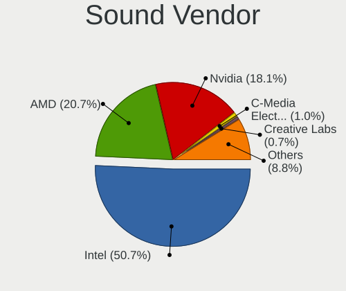

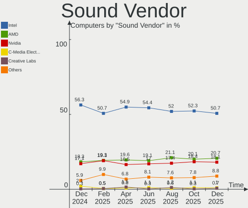

| Vendor                                       | Computers | Percent |
|----------------------------------------------|-----------|---------|
| Intel                                        | 454       | 50.73%  |
| AMD                                          | 185       | 20.67%  |
| Nvidia                                       | 162       | 18.1%   |
| C-Media Electronics                          | 9         | 1.01%   |
| Creative Labs                                | 6         | 0.67%   |
| Zoran Co. Personal Media Division (Nogatech) | 5         | 0.56%   |
| Jieli Technology                             | 5         | 0.56%   |
| KTMicro                                      | 4         | 0.45%   |
| ASUSTek Computer                             | 4         | 0.45%   |
| Realtek Semiconductor                        | 3         | 0.34%   |
| Micro Star International                     | 3         | 0.34%   |
| Logitech                                     | 3         | 0.34%   |
| GN Netcom                                    | 3         | 0.34%   |
| TTGK Technology                              | 2         | 0.22%   |
| PreSonus Audio Electronics                   | 2         | 0.22%   |
| liyuany                                      | 2         | 0.22%   |
| JMTek                                        | 2         | 0.22%   |
| Hewlett-Packard                              | 2         | 0.22%   |
| Unknown                                      | 2         | 0.22%   |
| Yamaha                                       | 1         | 0.11%   |
| XMOS                                         | 1         | 0.11%   |
| Xilinx                                       | 1         | 0.11%   |
| Turtle Beach                                 | 1         | 0.11%   |
| Trust                                        | 1         | 0.11%   |
| Thesycon Systemsoftware & Consulting         | 1         | 0.11%   |
| Texas Instruments                            | 1         | 0.11%   |
| SteelSeries ApS                              | 1         | 0.11%   |
| Silicon Integrated Systems [SiS]             | 1         | 0.11%   |
| Schiit Audio                                 | 1         | 0.11%   |
| RODE Microphones                             | 1         | 0.11%   |
| ROCCAT                                       | 1         | 0.11%   |
| Reloop                                       | 1         | 0.11%   |
| Razer USA                                    | 1         | 0.11%   |
| Plantronics                                  | 1         | 0.11%   |
| OPPO Electronics                             | 1         | 0.11%   |
| Native Instruments                           | 1         | 0.11%   |
| MV-SILICON                                   | 1         | 0.11%   |
| Microsoft                                    | 1         | 0.11%   |
| Maono                                        | 1         | 0.11%   |
| Kingston Technology                          | 1         | 0.11%   |

Sound Model
-----------

Sound card models

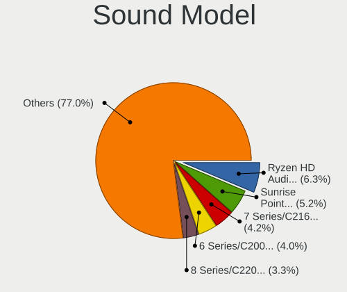

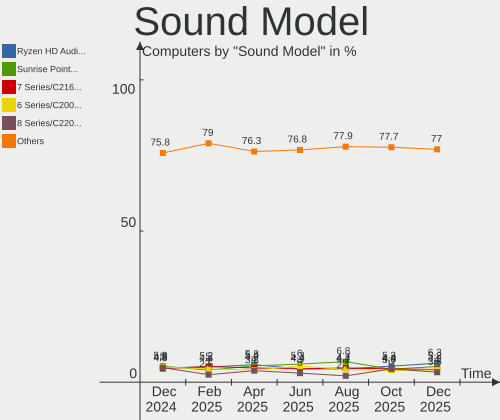

| Model                                                                      | Computers | Percent |
|----------------------------------------------------------------------------|-----------|---------|
| AMD Ryzen HD Audio Controller                                              | 68        | 6.33%   |
| Intel Sunrise Point-LP HD Audio                                            | 56        | 5.21%   |
| Intel 7 Series/C216 Chipset Family High Definition Audio Controller        | 45        | 4.19%   |
| Intel 6 Series/C200 Series Chipset Family High Definition Audio Controller | 43        | 4%      |
| Intel 8 Series/C220 Series Chipset High Definition Audio Controller        | 35        | 3.26%   |
| AMD Radeon High Definition Audio Controller                                | 28        | 2.61%   |
| AMD Starship/Matisse HD Audio Controller                                   | 27        | 2.51%   |
| AMD FCH Azalia Controller                                                  | 26        | 2.42%   |
| Intel Xeon E3-1200 v3/4th Gen Core Processor HD Audio Controller           | 23        | 2.14%   |
| Intel Cannon Lake PCH cAVS                                                 | 22        | 2.05%   |
| Intel 5 Series/3400 Series Chipset High Definition Audio                   | 22        | 2.05%   |
| Intel 100 Series/C230 Series Chipset Family HD Audio Controller            | 22        | 2.05%   |
| AMD Renoir/Cezanne HDMI/DP Audio Controller                                | 20        | 1.86%   |
| AMD Ellesmere HDMI Audio [Radeon RX 470/480 / 570/580/590]                 | 19        | 1.77%   |
| Intel 82801I (ICH9 Family) HD Audio Controller                             | 15        | 1.4%    |
| AMD Raven/Raven2/Fenghuang HDMI/DP Audio Controller                        | 14        | 1.3%    |
| Intel Haswell-ULT HD Audio Controller                                      | 13        | 1.21%   |
| Intel 8 Series HD Audio Controller                                         | 13        | 1.21%   |
| AMD SBx00 Azalia (Intel HDA)                                               | 13        | 1.21%   |
| Intel Broadwell-U Audio Controller                                         | 12        | 1.12%   |
| Intel 200 Series PCH HD Audio                                              | 12        | 1.12%   |
| Nvidia GF108 High Definition Audio Controller                              | 11        | 1.02%   |
| Intel Wildcat Point-LP High Definition Audio Controller                    | 11        | 1.02%   |
| Intel Raptor Lake-P/U/H cAVS                                               | 11        | 1.02%   |
| Intel Raptor Lake High Definition Audio Controller                         | 11        | 1.02%   |
| Intel Alder Lake PCH-P High Definition Audio Controller                    | 11        | 1.02%   |
| Intel Cannon Point-LP High Definition Audio Controller                     | 10        | 0.93%   |
| AMD Kabini HDMI/DP Audio                                                   | 10        | 0.93%   |
| Nvidia GP107GL High Definition Audio Controller                            | 9         | 0.84%   |
| Nvidia GK107 HDMI Audio Controller                                         | 9         | 0.84%   |
| Intel Tiger Lake-H HD Audio Controller                                     | 9         | 0.84%   |
| AMD Navi 21/23 HDMI/DP Audio Controller                                    | 9         | 0.84%   |
| Nvidia GK208 HDMI/DP Audio Controller                                      | 8         | 0.74%   |
| Intel Tiger Lake-LP Smart Sound Technology Audio Controller                | 8         | 0.74%   |
| Intel Jasper Lake HD Audio                                                 | 8         | 0.74%   |
| AMD Family 17h (Models 00h-0fh) HD Audio Controller                        | 8         | 0.74%   |
| Nvidia MCP79 High Definition Audio                                         | 7         | 0.65%   |
| Nvidia GA107 High Definition Audio Controller                              | 7         | 0.65%   |
| Nvidia GA104 High Definition Audio Controller                              | 7         | 0.65%   |
| Intel Comet Lake PCH cAVS                                                  | 7         | 0.65%   |

Memory
------

Memory Vendor
-------------

Memory module vendors

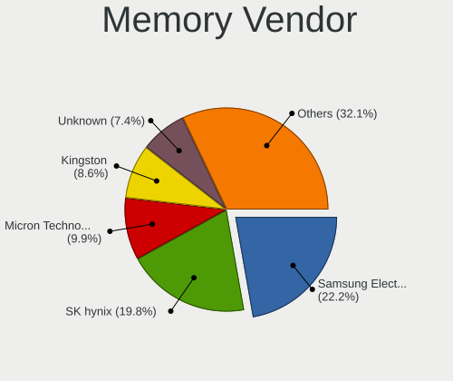

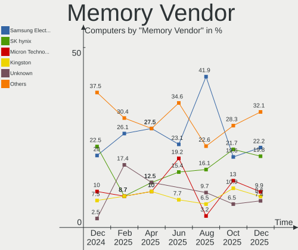

| Vendor              | Computers | Percent |
|---------------------|-----------|---------|
| Samsung Electronics | 18        | 22.22%  |
| SK hynix            | 16        | 19.75%  |
| Micron Technology   | 8         | 9.88%   |
| Kingston            | 7         | 8.64%   |
| Unknown             | 6         | 7.41%   |
| G.Skill             | 5         | 6.17%   |
| Corsair             | 4         | 4.94%   |
| Crucial             | 3         | 3.7%    |
| A-DATA Technology   | 3         | 3.7%    |
| Ramaxel Technology  | 2         | 2.47%   |
| Nanya Technology    | 2         | 2.47%   |
| Unknown             | 2         | 2.47%   |
| Wodposit            | 1         | 1.23%   |
| Unknown (ABCD)      | 1         | 1.23%   |
| Timetec             | 1         | 1.23%   |
| Team                | 1         | 1.23%   |
| Micron/Elpida       | 1         | 1.23%   |

Memory Model
------------

Memory module models

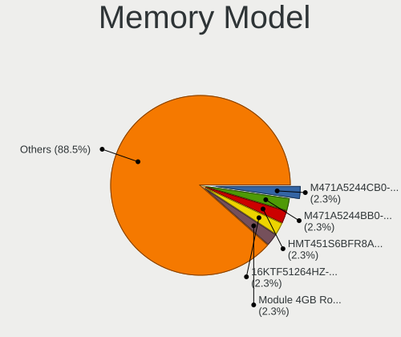

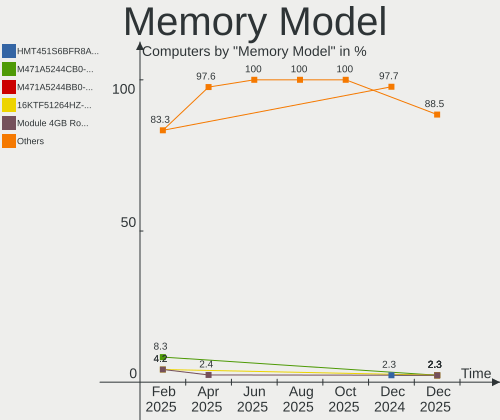

| Model                                                            | Computers | Percent |
|------------------------------------------------------------------|-----------|---------|
| SK hynix RAM HMT451S6BFR8A-PB 4GB SODIMM DDR3 1600MT/s           | 2         | 2.3%    |
| Samsung RAM M471A5244CB0-CTD 4GB SODIMM DDR4 3266MT/s            | 2         | 2.3%    |
| Samsung RAM M471A5244BB0-CRC 4GB SODIMM DDR4 2667MT/s            | 2         | 2.3%    |
| Micron RAM 16KTF51264HZ-1G6M1 4GB SODIMM DDR3 1600MT/s           | 2         | 2.3%    |
| Unknown                                                          | 2         | 2.3%    |
| Wodposit RAM WPBH26D408SWA-8G 8GB SODIMM DDR4 2667MT/s           | 1         | 1.15%   |
| Unknown RAM Module 8GB DIMM DDR3 1600MT/s                        | 1         | 1.15%   |
| Unknown RAM Module 4GB SODIMM DDR4 2400MT/s                      | 1         | 1.15%   |
| Unknown RAM Module 4GB SODIMM DDR3 1600MT/s                      | 1         | 1.15%   |
| Unknown RAM Module 4GB DIMM DDR3 1333MT/s                        | 1         | 1.15%   |
| Unknown RAM Module 2GB SODIMM DDR3 1600MT/s                      | 1         | 1.15%   |
| Unknown RAM Module 16GB SODIMM DDR4 2133MT/s                     | 1         | 1.15%   |
| Unknown (ABCD) RAM 123456789012345678 2GB SODIMM LPDDR4 2400MT/s | 1         | 1.15%   |
| Timetec RAM Module 8GB SODIMM DDR3 1067MT/s                      | 1         | 1.15%   |
| Team RAM TEAMGROUP-SD4-3200 16GB SODIMM DDR4 3200MT/s            | 1         | 1.15%   |
| SK hynix RAM Module 16GB SODIMM DDR4 2400MT/s                    | 1         | 1.15%   |
| SK hynix RAM HMT451S6AFR8A-PB 4GB SODIMM DDR3 1600MT/s           | 1         | 1.15%   |
| SK hynix RAM HMT351S6EFR8A-PB 4GB SODIMM DDR3 1600MT/s           | 1         | 1.15%   |
| SK hynix RAM HMT351S6CFR8C-PB 4GB SODIMM DDR3 1600MT/s           | 1         | 1.15%   |
| SK hynix RAM HMT351S6BFR8C-H9 4GB SODIMM 1334MT/s                | 1         | 1.15%   |
| SK hynix RAM HMAB2GS6AMR6N-XN 16GB SODIMM DDR4 3200MT/s          | 1         | 1.15%   |
| SK hynix RAM HMAA1GS6CJR6N-XN 8GB SODIMM DDR4 3200MT/s           | 1         | 1.15%   |
| SK hynix RAM HMA851S6AFR6N-UH 4GB SODIMM DDR4 2667MT/s           | 1         | 1.15%   |
| SK hynix RAM HMA82GS6DJR8N-XN 16GB SODIMM DDR4 3200MT/s          | 1         | 1.15%   |
| SK hynix RAM HMA82GS6AFR8N-UH 16GB SODIMM DDR4 2667MT/s          | 1         | 1.15%   |
| SK hynix RAM HMA81GU6CJR8N-VK 8GB DIMM DDR4 2667MT/s             | 1         | 1.15%   |
| SK hynix RAM HMA81GS6CJR8N-VK 8GB SODIMM DDR4 2667MT/s           | 1         | 1.15%   |
| SK hynix RAM HMA81GS6AFR8N-UH 8GB SODIMM DDR4 2667MT/s           | 1         | 1.15%   |
| SK hynix RAM HMA41GS6AFR8N-TF 8GB SODIMM DDR4 2667MT/s           | 1         | 1.15%   |
| SK hynix RAM H58G76BK7HX095 4GiB Row Of Chips LPDDR5 8533MT/s    | 1         | 1.15%   |
| Samsung RAM U6E3S4AA-MGCR 1GB Row Of Chips LPDDR4 4267MT/s       | 1         | 1.15%   |
| Samsung RAM Module 2GB SODIMM DDR3 1333MT/s                      | 1         | 1.15%   |
| Samsung RAM M471B5273DH0-CK0 4GB SODIMM DDR3 2400MT/s            | 1         | 1.15%   |
| Samsung RAM M471B5173BH0-YK0 4GB Chip DDR3 1600MT/s              | 1         | 1.15%   |
| Samsung RAM M471B1G73QH0-YK0 8GB SODIMM DDR3 1600MT/s            | 1         | 1.15%   |
| Samsung RAM M471B1G73EB0-YK0 8192MB SODIMM DDR3 1600MT/s         | 1         | 1.15%   |
| Samsung RAM M471A5244CB0-CRC 4GB SODIMM DDR4 2667MT/s            | 1         | 1.15%   |
| Samsung RAM M471A5244BB0-CPB 4GB SODIMM DDR4 2400MT/s            | 1         | 1.15%   |
| Samsung RAM M471A1G44BB0-CWE 8GB SODIMM DDR4 3200MT/s            | 1         | 1.15%   |
| Samsung RAM M425R1GB4BB0-CQKOL 8GB SODIMM DDR5 4800MT/s          | 1         | 1.15%   |

Memory Kind
-----------

Memory module kinds

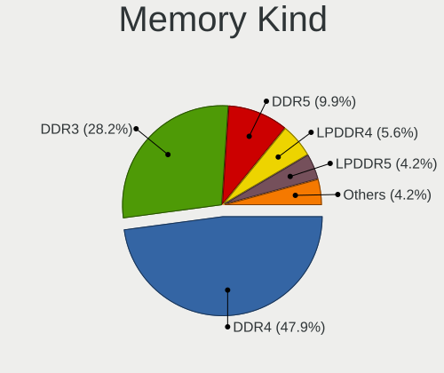

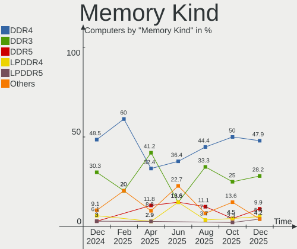

| Kind   | Computers | Percent |
|--------|-----------|---------|
| DDR4   | 34        | 47.89%  |
| DDR3   | 20        | 28.17%  |
| DDR5   | 7         | 9.86%   |
| LPDDR4 | 4         | 5.63%   |
| LPDDR5 | 3         | 4.23%   |
| DDR2   | 2         | 2.82%   |
| LPDDR3 | 1         | 1.41%   |

Memory Form Factor
------------------

Physical design of the memory module

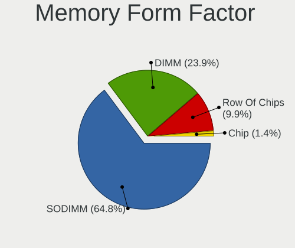

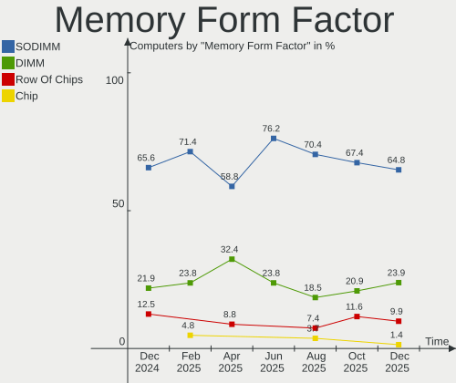

| Name         | Computers | Percent |
|--------------|-----------|---------|
| SODIMM       | 46        | 64.79%  |
| DIMM         | 17        | 23.94%  |
| Row Of Chips | 7         | 9.86%   |
| Chip         | 1         | 1.41%   |

Memory Size
-----------

Memory module size

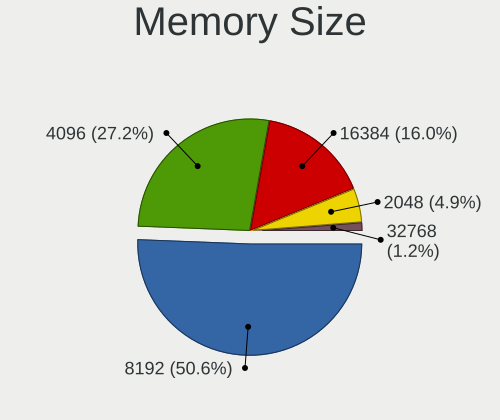

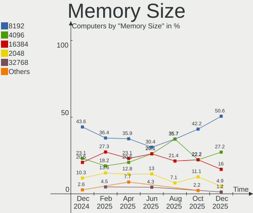

| Size  | Computers | Percent |
|-------|-----------|---------|
| 8192  | 41        | 50.62%  |
| 4096  | 22        | 27.16%  |
| 16384 | 13        | 16.05%  |
| 2048  | 4         | 4.94%   |
| 32768 | 1         | 1.23%   |

Memory Speed
------------

Memory module speed

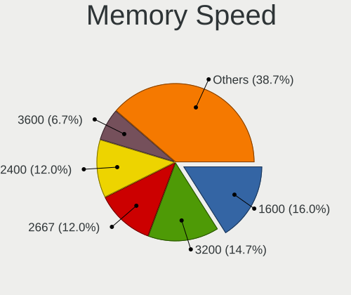

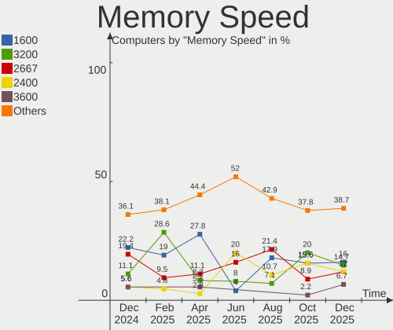

| Speed | Computers | Percent |
|-------|-----------|---------|
| 1600  | 12        | 16%     |
| 3200  | 11        | 14.67%  |
| 2667  | 9         | 12%     |
| 2400  | 9         | 12%     |
| 3600  | 5         | 6.67%   |
| 5600  | 4         | 5.33%   |
| 2133  | 3         | 4%      |
| 1334  | 3         | 4%      |
| 6400  | 2         | 2.67%   |
| 4800  | 2         | 2.67%   |
| 3266  | 2         | 2.67%   |
| 1333  | 2         | 2.67%   |
| 8533  | 1         | 1.33%   |
| 7500  | 1         | 1.33%   |
| 4267  | 1         | 1.33%   |
| 4000  | 1         | 1.33%   |
| 3800  | 1         | 1.33%   |
| 3466  | 1         | 1.33%   |
| 2666  | 1         | 1.33%   |
| 1867  | 1         | 1.33%   |
| 1067  | 1         | 1.33%   |
| 800   | 1         | 1.33%   |
| 667   | 1         | 1.33%   |

Printers & scanners
-------------------

Printer Vendor
--------------

Printer device vendors

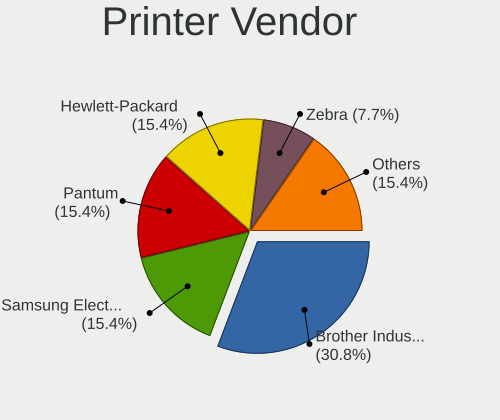

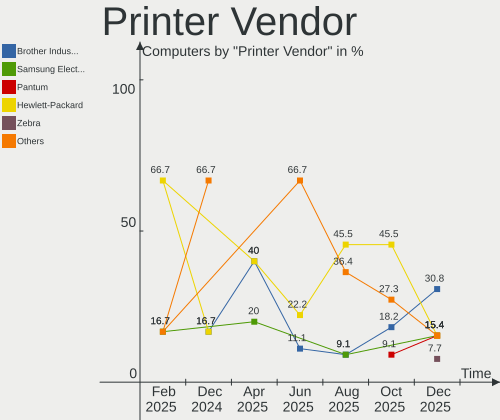

| Vendor              | Computers | Percent |
|---------------------|-----------|---------|
| Brother Industries  | 4         | 30.77%  |
| Samsung Electronics | 2         | 15.38%  |
| Pantum              | 2         | 15.38%  |
| Hewlett-Packard     | 2         | 15.38%  |
| Zebra               | 1         | 7.69%   |
| Dymo-CoStar         | 1         | 7.69%   |
| Canon               | 1         | 7.69%   |

Printer Model
-------------

Printer device models

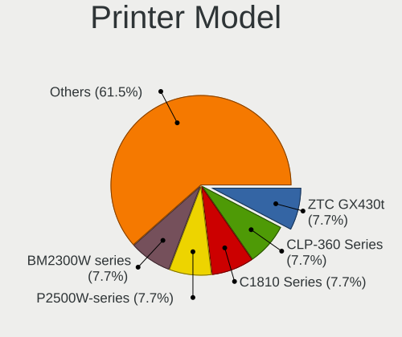

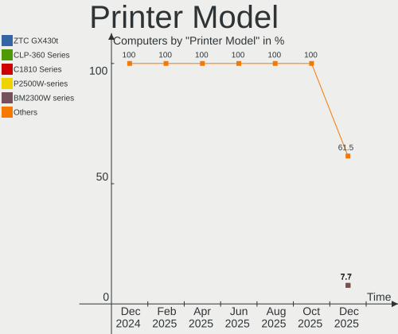

| Model                       | Computers | Percent |
|-----------------------------|-----------|---------|
| Zebra ZTC GX430t            | 1         | 7.69%   |
| Samsung CLP-360 Series      | 1         | 7.69%   |
| Samsung C1810 Series        | 1         | 7.69%   |
| Pantum P2500W-series        | 1         | 7.69%   |
| Pantum BM2300W series       | 1         | 7.69%   |
| HP Officejet 4630 series    | 1         | 7.69%   |
| HP LaserJet P2035           | 1         | 7.69%   |
| Dymo-CoStar LabelWriter 450 | 1         | 7.69%   |
| Canon LiDE 400              | 1         | 7.69%   |
| Brother MFC-L2713DW         | 1         | 7.69%   |
| Brother MFC-J4335DW         | 1         | 7.69%   |
| Brother MFC-J3540DW         | 1         | 7.69%   |
| Brother HL-1200 series      | 1         | 7.69%   |

Scanner Vendor
--------------

Scanner device vendors

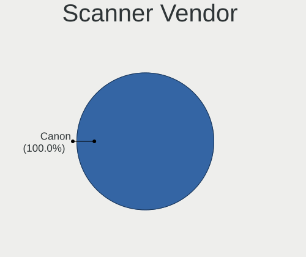

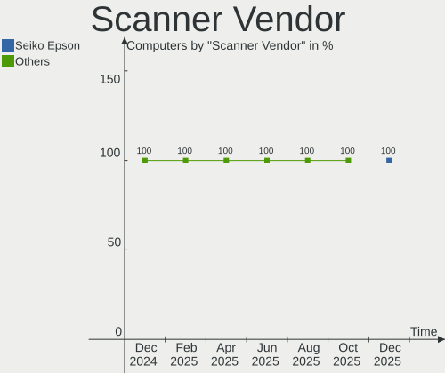

| Vendor      | Computers | Percent |
|-------------|-----------|---------|
| Seiko Epson | 1         | 100%    |

Scanner Model
-------------

Scanner device models

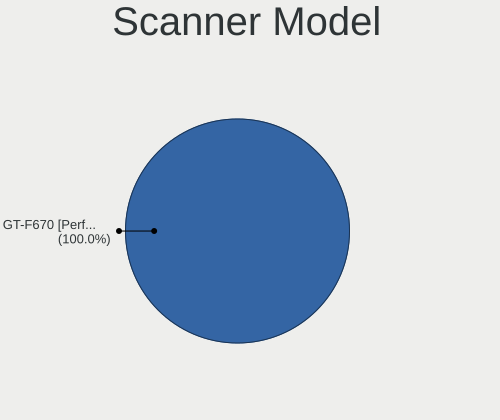

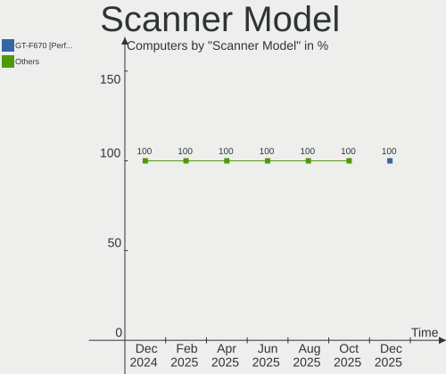

| Model                                       | Computers | Percent |
|---------------------------------------------|-----------|---------|
| Seiko Epson GT-F670 [Perfection V200 Photo] | 1         | 100%    |

Camera
------

Camera Vendor
-------------

Camera device vendors

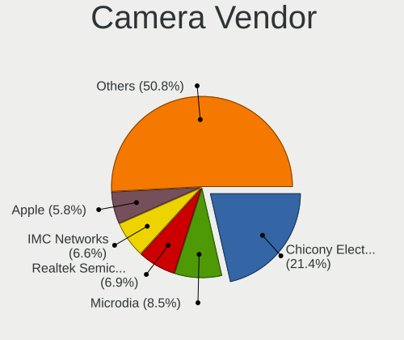

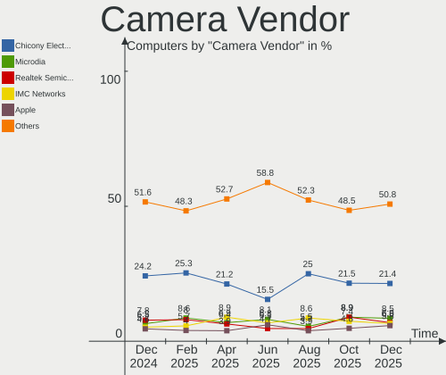

| Vendor                                 | Computers | Percent |
|----------------------------------------|-----------|---------|
| Chicony Electronics                    | 78        | 21.43%  |
| Microdia                               | 31        | 8.52%   |
| Realtek Semiconductor                  | 25        | 6.87%   |
| IMC Networks                           | 24        | 6.59%   |
| Apple                                  | 21        | 5.77%   |
| Quanta                                 | 19        | 5.22%   |
| Bison Electronics                      | 19        | 5.22%   |
| Sunplus Innovation Technology          | 17        | 4.67%   |
| Logitech                               | 16        | 4.4%    |
| Cheng Uei Precision Industry (Foxlink) | 15        | 4.12%   |
| Suyin                                  | 13        | 3.57%   |
| Luxvisions Innotech Limited            | 9         | 2.47%   |
| Lite-On Technology                     | 9         | 2.47%   |
| Syntek                                 | 8         | 2.2%    |
| Alcor Micro                            | 6         | 1.65%   |
| Silicon Motion                         | 5         | 1.37%   |
| ShineTech                              | 5         | 1.37%   |
| Ricoh                                  | 5         | 1.37%   |
| Sonix Technology                       | 3         | 0.82%   |
| Importek                               | 3         | 0.82%   |
| ALi                                    | 3         | 0.82%   |
| Z-Star Microelectronics                | 2         | 0.55%   |
| SunplusIT                              | 2         | 0.55%   |
| SenseTek                               | 2         | 0.55%   |
| Samsung Electronics                    | 2         | 0.55%   |
| Primax Electronics                     | 2         | 0.55%   |
| Microsoft                              | 2         | 0.55%   |
| MacroSilicon                           | 2         | 0.55%   |
| Unknown                                | 2         | 0.55%   |
| webcamvendor                           | 1         | 0.27%   |
| Trust                                  | 1         | 0.27%   |
| SHENZHEN EMEET TECHNOLOGY              | 1         | 0.27%   |
| Novatek Microelectronics               | 1         | 0.27%   |
| KYE Systems (Mouse Systems)            | 1         | 0.27%   |
| Jieli Technology                       | 1         | 0.27%   |
| Hewlett-Packard                        | 1         | 0.27%   |
| Guillemot                              | 1         | 0.27%   |
| Generalplus Technology                 | 1         | 0.27%   |
| Elgato Systems                         | 1         | 0.27%   |
| DigiTech                               | 1         | 0.27%   |

Camera Model
------------

Camera device models

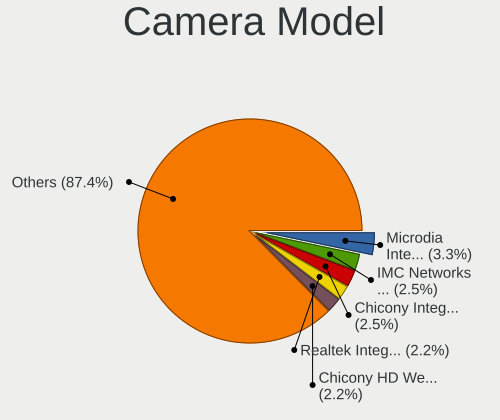

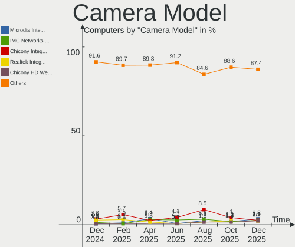

| Model                                         | Computers | Percent |
|-----------------------------------------------|-----------|---------|
| Microdia Integrated_Webcam_HD                 | 12        | 3.28%   |
| IMC Networks USB2.0 HD UVC WebCam             | 9         | 2.46%   |
| Chicony Integrated Camera                     | 9         | 2.46%   |
| Realtek Integrated_Webcam_HD                  | 8         | 2.19%   |
| Chicony HD WebCam                             | 8         | 2.19%   |
| Sunplus Integrated_Webcam_HD                  | 7         | 1.91%   |
| Apple Built-in iSight                         | 7         | 1.91%   |
| IMC Networks Integrated Camera                | 6         | 1.64%   |
| Apple FaceTime HD Camera (Built-in)           | 6         | 1.64%   |
| Apple FaceTime HD Camera                      | 6         | 1.64%   |
| Suyin HP Truevision HD                        | 5         | 1.37%   |
| Luxvisions Innotech Limited Integrated Camera | 5         | 1.37%   |
| Chicony EasyCamera                            | 5         | 1.37%   |
| Syntek Integrated Camera                      | 4         | 1.09%   |
| ShineTech USB2.0 HD UVC WebCam                | 4         | 1.09%   |
| Realtek USB Camera                            | 4         | 1.09%   |
| Microdia Laptop_Integrated_Webcam_HD          | 4         | 1.09%   |
| Microdia Integrated Webcam                    | 4         | 1.09%   |
| Chicony HP TrueVision HD                      | 4         | 1.09%   |
| Chicony ACER HD User Facing                   | 4         | 1.09%   |
| Bison Integrated Camera                       | 4         | 1.09%   |
| Ricoh Sony Vaio Integrated Webcam             | 3         | 0.82%   |
| Quanta HP Webcam                              | 3         | 0.82%   |
| Logitech Webcam C270                          | 3         | 0.82%   |
| Logitech C920 PRO HD Webcam                   | 3         | 0.82%   |
| Lite-On HP Wide Vision HD Camera              | 3         | 0.82%   |
| Chicony HP HD Camera                          | 3         | 0.82%   |
| Chicony FJ Camera                             | 3         | 0.82%   |
| Bison Integrated RGB Camera                   | 3         | 0.82%   |
| ALi Gateway Webcam                            | 3         | 0.82%   |
| Alcor Micro Asus Integrated Webcam            | 3         | 0.82%   |
| Unknown                                       | 3         | 0.82%   |
| Z-Star Lenovo USB2.0 UVC Camera               | 2         | 0.55%   |
| Syntek Lenovo EasyCamera                      | 2         | 0.55%   |
| Syntek EasyCamera                             | 2         | 0.55%   |
| Suyin HP Webcam-101                           | 2         | 0.55%   |
| Suyin HD Video WebCam                         | 2         | 0.55%   |
| Sunplus HD WebCam                             | 2         | 0.55%   |
| Sunplus FULL HD webcam                        | 2         | 0.55%   |
| Sunplus Asus Webcam                           | 2         | 0.55%   |

Security
--------

Fingerprint Vendor
------------------

Fingerprint sensor vendors

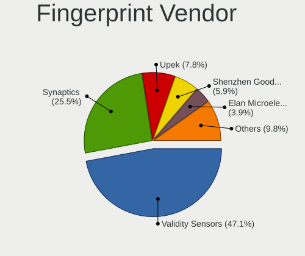

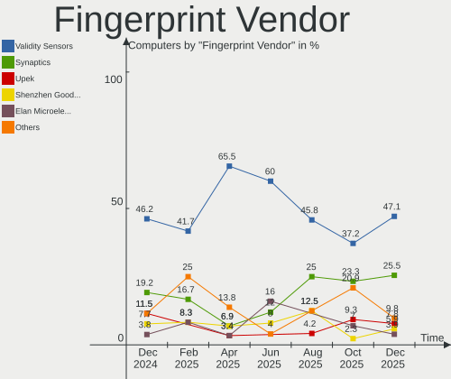

| Vendor                     | Computers | Percent |
|----------------------------|-----------|---------|
| Validity Sensors           | 24        | 47.06%  |
| Synaptics                  | 13        | 25.49%  |
| Upek                       | 4         | 7.84%   |
| Shenzhen Goodix Technology | 3         | 5.88%   |
| Elan Microelectronics      | 2         | 3.92%   |
| AuthenTec                  | 2         | 3.92%   |
| STMicroelectronics         | 1         | 1.96%   |
| LighTuning Technology      | 1         | 1.96%   |
| DigitalPersona             | 1         | 1.96%   |

Fingerprint Model
-----------------

Fingerprint sensor models

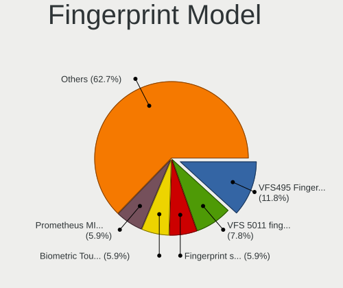

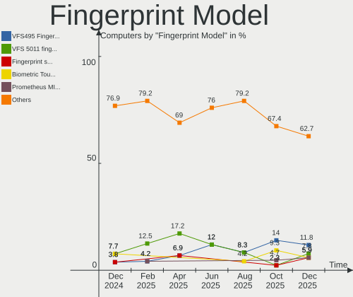

| Model                                                                      | Computers | Percent |
|----------------------------------------------------------------------------|-----------|---------|
| Validity Sensors VFS495 Fingerprint Reader                                 | 6         | 11.76%  |
| Validity Sensors VFS 5011 fingerprint sensor                               | 4         | 7.84%   |
| Validity Sensors Fingerprint scanner                                       | 3         | 5.88%   |
| Upek Biometric Touchchip/Touchstrip Fingerprint Sensor                     | 3         | 5.88%   |
| Synaptics Prometheus MIS Touch Fingerprint Reader                          | 3         | 5.88%   |
| Synaptics Metallica MIS Touch Fingerprint Reader                           | 3         | 5.88%   |
| Validity Sensors VFS5011 Fingerprint Reader                                | 2         | 3.92%   |
| Validity Sensors VFS491                                                    | 2         | 3.92%   |
| Validity Sensors Synaptics WBDI                                            | 2         | 3.92%   |
| Validity Sensors Swipe Fingerprint Sensor                                  | 2         | 3.92%   |
| Synaptics  WBDI                                                            | 2         | 3.92%   |
| Synaptics Fingerprint reader [HP G6]                                       | 2         | 3.92%   |
| Shenzhen Goodix Fingerprint Reader                                         | 2         | 3.92%   |
| Elan ELAN:Fingerprint                                                      | 2         | 3.92%   |
| Validity Sensors VFS471 Fingerprint Reader                                 | 1         | 1.96%   |
| Validity Sensors VFS451 Fingerprint Reader                                 | 1         | 1.96%   |
| Validity Sensors Synaptics VFS7552 Touch Fingerprint Sensor with PurePrint | 1         | 1.96%   |
| Upek TCS5B Fingerprint sensor                                              | 1         | 1.96%   |
| Synaptics WBDI                                                             | 1         | 1.96%   |
| Synaptics  FS7604 Touch Fingerprint Sensor with PurePrint                  | 1         | 1.96%   |
| Synaptics Metallica MOH Touch Fingerprint Reader                           | 1         | 1.96%   |
| STMicroelectronics Fingerprint Reader                                      | 1         | 1.96%   |
| Shenzhen Goodix  Fingerprint Device                                        | 1         | 1.96%   |
| LighTuning Fingerprint Reader                                              | 1         | 1.96%   |
| DigitalPersona Fingerprint Reader                                          | 1         | 1.96%   |
| AuthenTec Fingerprint Sensor                                               | 1         | 1.96%   |
| AuthenTec AES2810                                                          | 1         | 1.96%   |

Chipcard Vendor
---------------

Chipcard module vendors

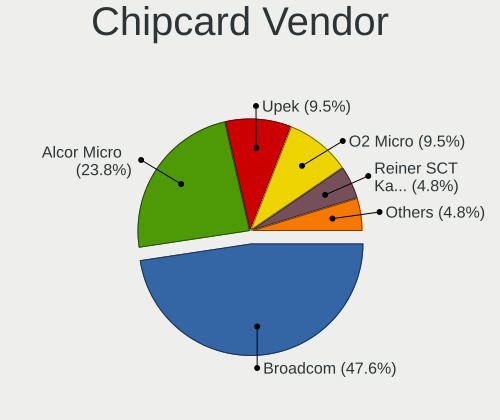

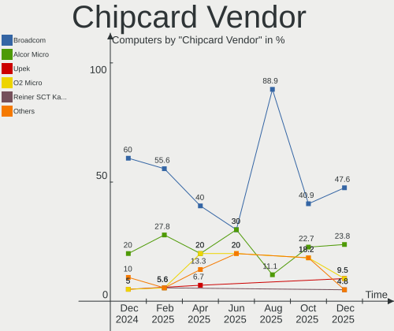

| Vendor                   | Computers | Percent |
|--------------------------|-----------|---------|
| Broadcom                 | 10        | 47.62%  |
| Alcor Micro              | 5         | 23.81%  |
| Upek                     | 2         | 9.52%   |
| O2 Micro                 | 2         | 9.52%   |
| Reiner SCT Kartensysteme | 1         | 4.76%   |
| NXP Semiconductors       | 1         | 4.76%   |

Chipcard Model
--------------

Chipcard module models

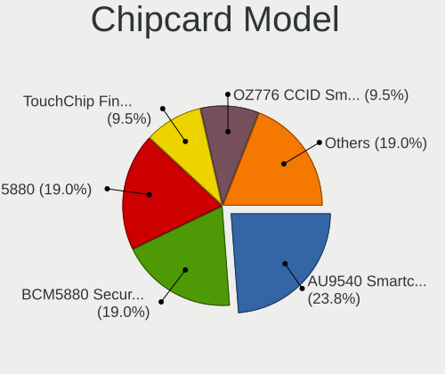

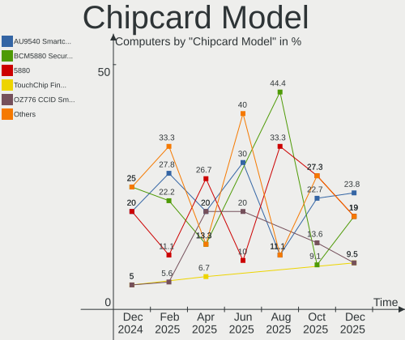

| Model                                                                       | Computers | Percent |
|-----------------------------------------------------------------------------|-----------|---------|
| Alcor Micro AU9540 Smartcard Reader                                         | 5         | 23.81%  |
| Broadcom BCM5880 Secure Applications Processor                              | 4         | 19.05%  |
| Broadcom 5880                                                               | 4         | 19.05%  |
| Upek TouchChip Fingerprint Coprocessor (WBF advanced mode)                  | 2         | 9.52%   |
| O2 Micro OZ776 CCID Smartcard Reader                                        | 2         | 9.52%   |
| Broadcom BCM58200 ControlVault 3 (FingerPrint sensor + Contacted SmartCard) | 2         | 9.52%   |
| Reiner SCT Kartensysteme cyberJack RFID basis contactless smartcard reader  | 1         | 4.76%   |
| NXP Semiconductors PR533                                                    | 1         | 4.76%   |

Unsupported
-----------

Unsupported Devices
-------------------

Total unsupported devices on board

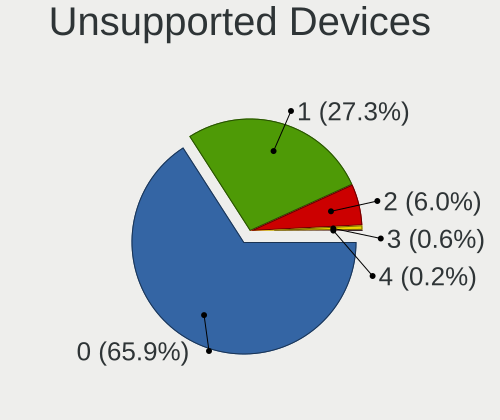

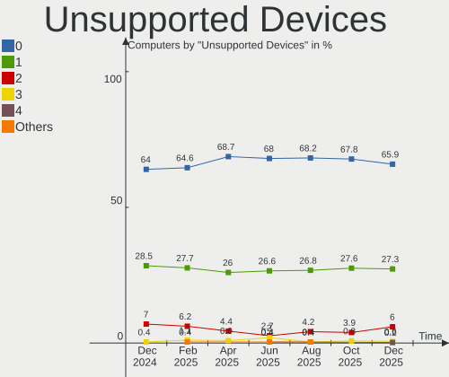

| Total | Computers | Percent |
|-------|-----------|---------|
| 0     | 408       | 65.91%  |
| 1     | 169       | 27.3%   |
| 2     | 37        | 5.98%   |
| 3     | 4         | 0.65%   |
| 4     | 1         | 0.16%   |

Unsupported Device Types
------------------------

Types of unsupported devices

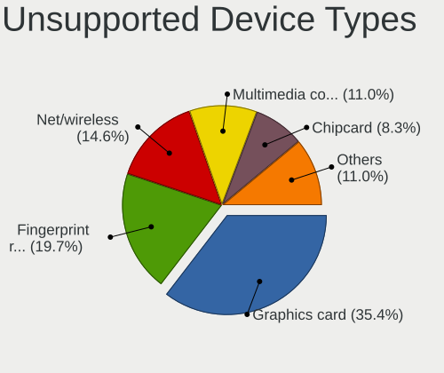

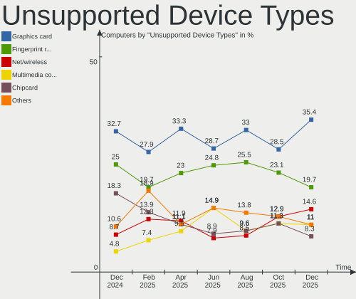

| Type                     | Computers | Percent |
|--------------------------|-----------|---------|
| Graphics card            | 90        | 35.43%  |
| Fingerprint reader       | 50        | 19.69%  |
| Net/wireless             | 37        | 14.57%  |
| Multimedia controller    | 28        | 11.02%  |
| Chipcard                 | 21        | 8.27%   |
| Bluetooth                | 7         | 2.76%   |
| Unassigned class         | 4         | 1.57%   |
| Communication controller | 4         | 1.57%   |
| Sound                    | 3         | 1.18%   |
| Storage/raid             | 2         | 0.79%   |
| Storage                  | 2         | 0.79%   |
| Network                  | 2         | 0.79%   |
| Storage/ide              | 1         | 0.39%   |
| Net/ethernet             | 1         | 0.39%   |
| Flash memory             | 1         | 0.39%   |
| Dvb card                 | 1         | 0.39%   |

