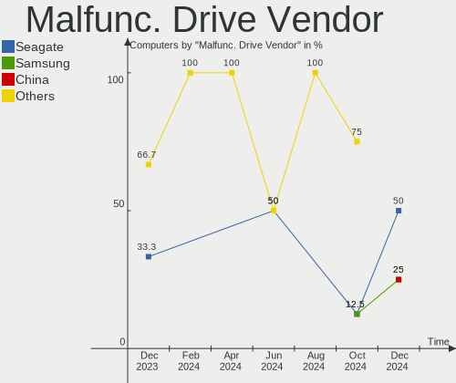

Zorin Hardware Trends
---------------------

A project to identify most popular hardware characteristics and track their change
over time based on data collected by Zorin users at https://Linux-Hardware.org.

Anyone can contribute to the study by uploading probes of their computers by
the [hw-probe](https://github.com/linuxhw/hw-probe) tool:

    sudo -E hw-probe -all -upload

This is a report for all computer types. See also reports for [desktops](/Dist/Zorin/Desktop/README.md) and [notebooks](/Dist/Zorin/Notebook/README.md).

Full-feature report is available here: https://linux-hardware.org/?view=trends

Period: Nov, 2020.

Contents
--------

- [ OS                       ](#os)
- [ OS Family                ](#os-family)
- [ Kernel                   ](#kernel)
- [ Kernel Family            ](#kernel-family)
- [ Kernel Major Ver.        ](#kernel-major-ver)
- [ Arch                     ](#arch)
- [ DE                       ](#de)
- [ Display Server           ](#display-server)
- [ Display Manager          ](#display-manager)
- [ OS Lang                  ](#os-lang)
- [ Boot Mode                ](#boot-mode)
- [ Filesystem               ](#filesystem)
- [ Part. scheme             ](#part-scheme)
- [ Dual Boot with Linux/BSD ](#dual-boot-with-linux/bsd)
- [ Dual Boot (Win)          ](#dual-boot-win)
- [ Country                  ](#country)
- [ City                     ](#city)
- [ Vendor                   ](#vendor)
- [ Model                    ](#model)
- [ Model Family             ](#model-family)
- [ MFG Year                 ](#mfg-year)
- [ Form Factor              ](#form-factor)
- [ Secure Boot              ](#secure-boot)
- [ Coreboot                 ](#coreboot)
- [ RAM Size                 ](#ram-size)
- [ RAM Used                 ](#ram-used)
- [ Has CD-ROM               ](#has-cd-rom)
- [ Total Drives             ](#total-drives)
- [ Has Ethernet             ](#has-ethernet)
- [ Drive Vendor             ](#drive-vendor)
- [ Drive Model              ](#drive-model)
- [ HDD Vendor               ](#hdd-vendor)
- [ SSD Vendor               ](#ssd-vendor)
- [ Drive Kind               ](#drive-kind)
- [ Drive Connector          ](#drive-connector)
- [ Drive Size               ](#drive-size)
- [ Space Total              ](#space-total)
- [ Space Used               ](#space-used)
- [ Malfunc. Drives          ](#malfunc-drives)
- [ Malfunc. Drive Vendor    ](#malfunc-drive-vendor)
- [ Malfunc. HDD Vendor      ](#malfunc-hdd-vendor)
- [ Malfunc. Drive Kind      ](#malfunc-drive-kind)
- [ Failed Drives            ](#failed-drives)
- [ Failed Drive Vendor      ](#failed-drive-vendor)
- [ Drive Status             ](#drive-status)
- [ Storage Vendor           ](#storage-vendor)
- [ Storage Model            ](#storage-model)
- [ Storage Kind             ](#storage-kind)
- [ CPU Vendor               ](#cpu-vendor)
- [ CPU Model                ](#cpu-model)
- [ CPU Model Family         ](#cpu-model-family)
- [ CPU Cores                ](#cpu-cores)
- [ CPU Sockets              ](#cpu-sockets)
- [ CPU Threads              ](#cpu-threads)
- [ CPU Op-Modes             ](#cpu-op-modes)
- [ CPU Microcode            ](#cpu-microcode)
- [ CPU Microarch            ](#cpu-microarch)
- [ GPU Vendor               ](#gpu-vendor)
- [ GPU Model                ](#gpu-model)
- [ GPU Combo                ](#gpu-combo)
- [ GPU Driver               ](#gpu-driver)
- [ GPU Memory               ](#gpu-memory)
- [ Monitor Vendor           ](#monitor-vendor)
- [ Monitor Model            ](#monitor-model)
- [ Monitor Resolution       ](#monitor-resolution)
- [ Monitor Diagonal         ](#monitor-diagonal)
- [ Monitor Width            ](#monitor-width)
- [ Aspect Ratio             ](#aspect-ratio)
- [ Monitor Area             ](#monitor-area)
- [ Pixel Density            ](#pixel-density)
- [ Multiple Monitors        ](#multiple-monitors)
- [ Net Controller Vendor    ](#net-controller-vendor)
- [ Net Controller Model     ](#net-controller-model)
- [ Wireless Vendor          ](#wireless-vendor)
- [ Wireless Model           ](#wireless-model)
- [ Ethernet Vendor          ](#ethernet-vendor)
- [ Ethernet Model           ](#ethernet-model)
- [ Net Controller Kind      ](#net-controller-kind)
- [ Used Controller          ](#used-controller)
- [ NICs                     ](#nics)
- [ Memory Vendor            ](#memory-vendor)
- [ Memory Model             ](#memory-model)
- [ Memory Kind              ](#memory-kind)
- [ Memory Form Factor       ](#memory-form-factor)
- [ Memory Size              ](#memory-size)
- [ Memory Speed             ](#memory-speed)
- [ Sound Vendor             ](#sound-vendor)
- [ Sound Model              ](#sound-model)
- [ Camera Vendor            ](#camera-vendor)
- [ Camera Model             ](#camera-model)
- [ Fingerprint Vendor       ](#fingerprint-vendor)
- [ Fingerprint Model        ](#fingerprint-model)
- [ Chipcard Vendor          ](#chipcard-vendor)
- [ Chipcard Model           ](#chipcard-model)
- [ Printer Vendor           ](#printer-vendor)
- [ Printer Model            ](#printer-model)
- [ Scanner Vendor           ](#scanner-vendor)
- [ Scanner Model            ](#scanner-model)
- [ Bluetooth Vendor         ](#bluetooth-vendor)
- [ Bluetooth Model          ](#bluetooth-model)
- [ Unsupported Devices      ](#unsupported-devices)
- [ Unsupported Device Types ](#unsupported-device-types)

OS
--

Installed operating systems

| Name     | Computers | Percent |
|----------|-----------|---------|
| Zorin 15 | 72        | 92.31%  |
| Zorin 12 | 6         | 7.69%   |

OS Family
---------

OS without a version

| Name  | Computers | Percent |
|-------|-----------|---------|
| Zorin | 78        | 100%    |

Kernel
------

Version of the Linux kernel

| Version            | Computers | Percent |
|--------------------|-----------|---------|
| 5.4.0-54-generic   | 23        | 29.49%  |
| 5.4.0-52-generic   | 21        | 26.92%  |
| 5.4.0-53-generic   | 14        | 17.95%  |
| 5.4.0-47-generic   | 6         | 7.69%   |
| 5.4.0-45-generic   | 4         | 5.13%   |
| 4.15.0-123-generic | 2         | 2.56%   |
| 4.15.0-122-generic | 2         | 2.56%   |
| 5.3.0-53-generic   | 1         | 1.28%   |
| 5.3.0-40-generic   | 1         | 1.28%   |
| 5.0.0-37-generic   | 1         | 1.28%   |
| 5.0.0-36-generic   | 1         | 1.28%   |
| 4.15.0-91-generic  | 1         | 1.28%   |
| 4.15.0-120-generic | 1         | 1.28%   |

Kernel Family
-------------

Linux kernel without a distro release

| Version | Computers | Percent |
|---------|-----------|---------|
| 5.4.0   | 68        | 87.18%  |
| 4.15.0  | 6         | 7.69%   |
| 5.3.0   | 2         | 2.56%   |
| 5.0.0   | 2         | 2.56%   |

Kernel Major Ver.
-----------------

Linux kernel major version

| Version | Computers | Percent |
|---------|-----------|---------|
| 5.4     | 68        | 87.18%  |
| 4.15    | 6         | 7.69%   |
| 5.3     | 2         | 2.56%   |
| 5.0     | 2         | 2.56%   |

Arch
----

OS architecture (x86_64, i586, etc.)

| Name   | Computers | Percent |
|--------|-----------|---------|
| x86_64 | 61        | 78.21%  |
| i686   | 17        | 21.79%  |

DE
--

Desktop Environment

| Name  | Computers | Percent |
|-------|-----------|---------|
| GNOME | 40        | 51.28%  |
| XFCE  | 38        | 48.72%  |

Display Server
--------------

X11 or Wayland

| Name | Computers | Percent |
|------|-----------|---------|
| X11  | 78        | 100%    |

Display Manager
---------------

SDDM, LightDM, etc.

| Name    | Computers | Percent |
|---------|-----------|---------|
| Unknown | 77        | 98.72%  |
| TDM     | 1         | 1.28%   |

OS Lang
-------

Language

| Lang  | Computers | Percent |
|-------|-----------|---------|
| en_US | 29        | 37.18%  |
| de_DE | 8         | 10.26%  |
| it_IT | 7         | 8.97%   |
| pt_PT | 4         | 5.13%   |
| pl_PL | 3         | 3.85%   |
| en_GB | 3         | 3.85%   |
| en_CA | 3         | 3.85%   |
| C     | 3         | 3.85%   |
| pt_BR | 2         | 2.56%   |
| nl_NL | 2         | 2.56%   |
| ja_JP | 2         | 2.56%   |
| es_AR | 2         | 2.56%   |
| ro_RO | 1         | 1.28%   |
| nl_BE | 1         | 1.28%   |
| hr_HR | 1         | 1.28%   |
| fr_FR | 1         | 1.28%   |
| es_ES | 1         | 1.28%   |
| es_EC | 1         | 1.28%   |
| en_PH | 1         | 1.28%   |
| en_IN | 1         | 1.28%   |
| en_AU | 1         | 1.28%   |
| cs_CZ | 1         | 1.28%   |

Boot Mode
---------

EFI or BIOS

| Mode | Computers | Percent |
|------|-----------|---------|
| BIOS | 59        | 75.64%  |
| EFI  | 19        | 24.36%  |

Filesystem
----------

Type of filesystem

| Type    | Computers | Percent |
|---------|-----------|---------|
| Ext4    | 72        | 92.31%  |
| Overlay | 6         | 7.69%   |

Part. scheme
------------

Scheme of partitioning

| Type    | Computers | Percent |
|---------|-----------|---------|
| Unknown | 77        | 98.72%  |
| MBR     | 1         | 1.28%   |

Dual Boot with Linux/BSD
------------------------

Hosting more than one Linux/BSD

| Dual boot | Computers | Percent |
|-----------|-----------|---------|
| No        | 67        | 85.9%   |
| Yes       | 11        | 14.1%   |

Dual Boot (Win)
---------------

Hosting Linux and Windows

| Dual boot | Computers | Percent |
|-----------|-----------|---------|
| No        | 53        | 67.95%  |
| Yes       | 25        | 32.05%  |

Country
-------

Geographic location (country)

| Country            | Computers | Percent |
|--------------------|-----------|---------|
| USA                | 12        | 15.38%  |
| Germany            | 11        | 14.1%   |
| Italy              | 8         | 10.26%  |
| Portugal           | 4         | 5.13%   |
| Canada             | 4         | 5.13%   |
| UK                 | 3         | 3.85%   |
| Netherlands        | 3         | 3.85%   |
| Romania            | 2         | 2.56%   |
| Poland             | 2         | 2.56%   |
| Japan              | 2         | 2.56%   |
| Greece             | 2         | 2.56%   |
| Brazil             | 2         | 2.56%   |
| Argentina          | 2         | 2.56%   |
| Thailand           | 1         | 1.28%   |
| Switzerland        | 1         | 1.28%   |
| Spain              | 1         | 1.28%   |
| Serbia             | 1         | 1.28%   |
| Philippines        | 1         | 1.28%   |
| Mexico             | 1         | 1.28%   |
| Korea, Republic of | 1         | 1.28%   |
| Kenya              | 1         | 1.28%   |
| Jordan             | 1         | 1.28%   |
| Ireland            | 1         | 1.28%   |
| Indonesia          | 1         | 1.28%   |
| India              | 1         | 1.28%   |
| France             | 1         | 1.28%   |
| Egypt              | 1         | 1.28%   |
| Ecuador            | 1         | 1.28%   |
| Czech Republic     | 1         | 1.28%   |
| Croatia            | 1         | 1.28%   |
| Belize             | 1         | 1.28%   |
| Belgium            | 1         | 1.28%   |
| Bangladesh         | 1         | 1.28%   |
| Australia          | 1         | 1.28%   |

City
----

Geographic location (city)

| City               | Computers | Percent |
|--------------------|-----------|---------|
| Winnipeg           | 2         | 2.56%   |
| Milan              | 2         | 2.56%   |
| Colorado Springs   | 2         | 2.56%   |
| Zurich             | 1         | 1.28%   |
| Zagreb             | 1         | 1.28%   |
| Wennigsen          | 1         | 1.28%   |
| Warsaw             | 1         | 1.28%   |
| Vlahita            | 1         | 1.28%   |
| Vicenza            | 1         | 1.28%   |
| Verona             | 1         | 1.28%   |
| Tucson             | 1         | 1.28%   |
| Tiffin             | 1         | 1.28%   |
| Tacoma             | 1         | 1.28%   |
| São Paulo         | 1         | 1.28%   |
| Someren            | 1         | 1.28%   |
| Sint Willebrord    | 1         | 1.28%   |
| Seregno            | 1         | 1.28%   |
| Salt Spring Island | 1         | 1.28%   |
| Saarbrücken       | 1         | 1.28%   |
| Riobamba           | 1         | 1.28%   |
| Rio Maior          | 1         | 1.28%   |
| Richmond           | 1         | 1.28%   |
| Petal              | 1         | 1.28%   |
| Perth              | 1         | 1.28%   |
| Pamplona           | 1         | 1.28%   |
| OElbronn-Duerrn    | 1         | 1.28%   |
| Odivelas           | 1         | 1.28%   |
| Nustrow            | 1         | 1.28%   |
| Newmarket          | 1         | 1.28%   |
| Nairobi            | 1         | 1.28%   |
| Munich             | 1         | 1.28%   |
| Minato-ku          | 1         | 1.28%   |
| Miami              | 1         | 1.28%   |
| Mesquita           | 1         | 1.28%   |
| Mannheim           | 1         | 1.28%   |
| Lyon               | 1         | 1.28%   |
| Lovendegem         | 1         | 1.28%   |
| Lodi               | 1         | 1.28%   |
| Littleton          | 1         | 1.28%   |
| Leszno             | 1         | 1.28%   |
| Langenfeld         | 1         | 1.28%   |
| Lakshmipur         | 1         | 1.28%   |
| Kladno             | 1         | 1.28%   |
| Kilsby             | 1         | 1.28%   |
| Karlsruhe          | 1         | 1.28%   |
| Jongno-gu          | 1         | 1.28%   |
| Ituzaingo          | 1         | 1.28%   |
| Ialysos            | 1         | 1.28%   |
| Honcho             | 1         | 1.28%   |
| Haviland           | 1         | 1.28%   |
| Guia               | 1         | 1.28%   |
| Giza               | 1         | 1.28%   |
| Gilbertsville      | 1         | 1.28%   |
| Garut              | 1         | 1.28%   |
| Galati             | 1         | 1.28%   |
| Dublin             | 1         | 1.28%   |
| Dresden            | 1         | 1.28%   |
| Dangriga           | 1         | 1.28%   |
| Dachau             | 1         | 1.28%   |
| Cleveland          | 1         | 1.28%   |

Vendor
------

Motherboard manufacturer

| Name                | Computers | Percent |
|---------------------|-----------|---------|
| Hewlett-Packard     | 18        | 23.08%  |
| Dell                | 14        | 17.95%  |
| Acer                | 9         | 11.54%  |
| ASUSTek Computer    | 8         | 10.26%  |
| Lenovo              | 7         | 8.97%   |
| Gigabyte Technology | 5         | 6.41%   |
| Toshiba             | 4         | 5.13%   |
| Notebook            | 2         | 2.56%   |
| Medion              | 2         | 2.56%   |
| eMachines           | 2         | 2.56%   |
| ASRock              | 2         | 2.56%   |
| Packard Bell        | 1         | 1.28%   |
| MSI                 | 1         | 1.28%   |
| Fujitsu Siemens     | 1         | 1.28%   |
| ARIMA               | 1         | 1.28%   |
| Unknown             | 1         | 1.28%   |

Model
-----

Motherboard model

| Name                                  | Computers | Percent |
|---------------------------------------|-----------|---------|
| Toshiba Satellite C660                | 2         | 2.56%   |
| HP Pavilion dv6                       | 2         | 2.56%   |
| ASUS ROG Zephyrus G14 GA401IV_GA401IV | 2         | 2.56%   |
| Toshiba Satellite Pro L550            | 1         | 1.28%   |
| Toshiba Satellite A100                | 1         | 1.28%   |
| Packard Bell EasyNote TJ65            | 1         | 1.28%   |
| Notebook RIM2520                      | 1         | 1.28%   |
| Notebook RIM2020                      | 1         | 1.28%   |
| MSI EG763AA-B14 a1209.be              | 1         | 1.28%   |
| Medion P7612                          | 1         | 1.28%   |
| Medion MS-7857                        | 1         | 1.28%   |
| Lenovo ThinkPad T530 23595JU          | 1         | 1.28%   |
| Lenovo ThinkPad T460 20FMS7DA00       | 1         | 1.28%   |
| Lenovo S20-30 Touch 20434             | 1         | 1.28%   |
| Lenovo IdeaPad L340-15IWL 81LG        | 1         | 1.28%   |
| Lenovo IdeaPad 330-14IKB 81G2         | 1         | 1.28%   |
| Lenovo IdeaPad 100S-14IBR 80R9        | 1         | 1.28%   |
| Lenovo G550 20023                     | 1         | 1.28%   |
| HP Presario V6500                     | 1         | 1.28%   |
| HP Pavilion x2 Detachable             | 1         | 1.28%   |
| HP Pavilion Notebook                  | 1         | 1.28%   |
| HP Pavilion g6                        | 1         | 1.28%   |
| HP Pavilion dv5000 (EP413UA#ABA)      | 1         | 1.28%   |
| HP G7000                              | 1         | 1.28%   |
| HP ENVY 15                            | 1         | 1.28%   |
| HP EliteBook 840 G3                   | 1         | 1.28%   |
| HP EliteBook 820 G2                   | 1         | 1.28%   |
| HP Compaq Presario CQ60               | 1         | 1.28%   |
| HP Compaq Mini 110c-1100              | 1         | 1.28%   |
| HP Compaq dc7600 Small Form Factor    | 1         | 1.28%   |
| HP Compaq 8100 Elite SFF PC           | 1         | 1.28%   |
| HP 530                                | 1         | 1.28%   |
| HP 2000                               | 1         | 1.28%   |
| HP 15                                 | 1         | 1.28%   |
| Gigabyte H87M-HD3                     | 1         | 1.28%   |
| Gigabyte GA-770TA-UD3                 | 1         | 1.28%   |
| Gigabyte G31M-S2C                     | 1         | 1.28%   |
| Gigabyte AM1M-S2H                     | 1         | 1.28%   |
| Gigabyte 970A-DS3P                    | 1         | 1.28%   |
| Fujitsu Siemens LIFEBOOK E8410        | 1         | 1.28%   |
| eMachines eM350                       | 1         | 1.28%   |
| eMachines E525                        | 1         | 1.28%   |
| Dell Vostro1710                       | 1         | 1.28%   |
| Dell Vostro A860                      | 1         | 1.28%   |
| Dell OptiPlex 755                     | 1         | 1.28%   |
| Dell Latitude E6500                   | 1         | 1.28%   |
| Dell Latitude E6410                   | 1         | 1.28%   |
| Dell Latitude E5440                   | 1         | 1.28%   |
| Dell Latitude D520                    | 1         | 1.28%   |
| Dell Latitude D430                    | 1         | 1.28%   |
| Dell Inspiron N7110                   | 1         | 1.28%   |
| Dell Inspiron 3737                    | 1         | 1.28%   |
| Dell Inspiron 3421                    | 1         | 1.28%   |
| Dell Inspiron 1545                    | 1         | 1.28%   |
| Dell Inspiron 15-3552                 | 1         | 1.28%   |
| Dell Dimension E521                   | 1         | 1.28%   |
| ASUS X550CC                           | 1         | 1.28%   |
| ASUS X405UA                           | 1         | 1.28%   |
| ASUS P5KPL-CM                         | 1         | 1.28%   |
| ASUS M50Vm                            | 1         | 1.28%   |

Model Family
------------

Motherboard model prefix

| Name                      | Computers | Percent |
|---------------------------|-----------|---------|
| Acer Aspire               | 8         | 10.26%  |
| HP Pavilion               | 6         | 7.69%   |
| Dell Latitude             | 5         | 6.41%   |
| Dell Inspiron             | 5         | 6.41%   |
| Toshiba Satellite         | 4         | 5.13%   |
| HP Compaq                 | 4         | 5.13%   |
| Lenovo IdeaPad            | 3         | 3.85%   |
| Lenovo ThinkPad           | 2         | 2.56%   |
| HP EliteBook              | 2         | 2.56%   |
| ASUS ROG                  | 2         | 2.56%   |
| Packard Bell EasyNote     | 1         | 1.28%   |
| Notebook RIM2520          | 1         | 1.28%   |
| Notebook RIM2020          | 1         | 1.28%   |
| MSI EG763AA-B14           | 1         | 1.28%   |
| Medion P7612              | 1         | 1.28%   |
| Medion MS-7857            | 1         | 1.28%   |
| Lenovo S20-30             | 1         | 1.28%   |
| Lenovo G550               | 1         | 1.28%   |
| HP Presario               | 1         | 1.28%   |
| HP G7000                  | 1         | 1.28%   |
| HP ENVY                   | 1         | 1.28%   |
| HP 530                    | 1         | 1.28%   |
| HP 2000                   | 1         | 1.28%   |
| HP 15                     | 1         | 1.28%   |
| Gigabyte H87M-HD3         | 1         | 1.28%   |
| Gigabyte GA-770TA-UD3     | 1         | 1.28%   |
| Gigabyte G31M-S2C         | 1         | 1.28%   |
| Gigabyte AM1M-S2H         | 1         | 1.28%   |
| Gigabyte 970A-DS3P        | 1         | 1.28%   |
| Fujitsu Siemens LIFEBOOK  | 1         | 1.28%   |
| eMachines eM350           | 1         | 1.28%   |
| eMachines E525            | 1         | 1.28%   |
| Dell Vostro1710           | 1         | 1.28%   |
| Dell Vostro               | 1         | 1.28%   |
| Dell OptiPlex             | 1         | 1.28%   |
| Dell Dimension            | 1         | 1.28%   |
| ASUS X550CC               | 1         | 1.28%   |
| ASUS X405UA               | 1         | 1.28%   |
| ASUS P5KPL-CM             | 1         | 1.28%   |
| ASUS M50Vm                | 1         | 1.28%   |
| ASUS GN566AA-ABA          | 1         | 1.28%   |
| ASUS 1001PXD              | 1         | 1.28%   |
| ASRock X370               | 1         | 1.28%   |
| ASRock ConRoeXFire-eSATA2 | 1         | 1.28%   |
| ARIMA W622-DCX            | 1         | 1.28%   |
| Acer V5-131               | 1         | 1.28%   |
| Unknown                   | 1         | 1.28%   |

MFG Year
--------

Motherboard manufacture year

| Year | Computers | Percent |
|------|-----------|---------|
| 2009 | 11        | 14.1%   |
| 2013 | 7         | 8.97%   |
| 2011 | 7         | 8.97%   |
| 2018 | 6         | 7.69%   |
| 2010 | 6         | 7.69%   |
| 2007 | 6         | 7.69%   |
| 2012 | 5         | 6.41%   |
| 2008 | 5         | 6.41%   |
| 2019 | 4         | 5.13%   |
| 2006 | 4         | 5.13%   |
| 2005 | 4         | 5.13%   |
| 2020 | 3         | 3.85%   |
| 2017 | 3         | 3.85%   |
| 2016 | 3         | 3.85%   |
| 2014 | 3         | 3.85%   |
| 2015 | 1         | 1.28%   |

Form Factor
-----------

Physical design of the computer

| Name       | Computers | Percent |
|------------|-----------|---------|
| Notebook   | 60        | 76.92%  |
| Desktop    | 17        | 21.79%  |
| All in one | 1         | 1.28%   |

Secure Boot
-----------

Enabled or disabled

| State    | Computers | Percent |
|----------|-----------|---------|
| Disabled | 75        | 96.15%  |
| Enabled  | 3         | 3.85%   |

Coreboot
--------

Have coreboot on board

| Used | Computers | Percent |
|------|-----------|---------|
| No   | 78        | 100%    |

RAM Size
--------

Total RAM memory

| Size in GB | Computers | Percent |
|------------|-----------|---------|
| 3.01-4.0   | 30        | 38.46%  |
| 1.01-2.0   | 12        | 15.38%  |
| 4.01-8.0   | 10        | 12.82%  |
| 2.01-3.0   | 8         | 10.26%  |
| 16.01-24.0 | 6         | 7.69%   |
| 8.01-16.0  | 6         | 7.69%   |
| 0.01-1.0   | 6         | 7.69%   |

RAM Used
--------

Used RAM memory

| Used GB  | Computers | Percent |
|----------|-----------|---------|
| 1.01-2.0 | 38        | 48.72%  |
| 0.01-1.0 | 19        | 24.36%  |
| 2.01-3.0 | 15        | 19.23%  |
| 3.01-4.0 | 5         | 6.41%   |
| 4.01-8.0 | 1         | 1.28%   |

Has CD-ROM
----------

Has CD-ROM on board

| Presented | Computers | Percent |
|-----------|-----------|---------|
| Yes       | 49        | 62.82%  |
| No        | 29        | 37.18%  |

Total Drives
------------

Number of drives on board

| Drives | Computers | Percent |
|--------|-----------|---------|
| 1      | 53        | 67.95%  |
| 2      | 22        | 28.21%  |
| 3      | 2         | 2.56%   |
| 4      | 1         | 1.28%   |

Has Ethernet
------------

Has Ethernet on board

| Presented | Computers | Percent |
|-----------|-----------|---------|
| Yes       | 74        | 94.87%  |
| No        | 4         | 5.13%   |

Drive Vendor
------------

Hard drive vendors

| Vendor              | Computers | Drives | Percent |
|---------------------|-----------|--------|---------|
| Seagate             | 19        | 21     | 20.65%  |
| WDC                 | 14        | 15     | 15.22%  |
| Toshiba             | 12        | 12     | 13.04%  |
| Samsung Electronics | 12        | 12     | 13.04%  |
| Hitachi             | 10        | 10     | 10.87%  |
| SanDisk             | 6         | 6      | 6.52%   |
| Unknown             | 4         | 5      | 4.35%   |
| Kingston            | 3         | 3      | 3.26%   |
| Intenso             | 2         | 2      | 2.17%   |
| Verbatim            | 1         | 1      | 1.09%   |
| SPCC                | 1         | 1      | 1.09%   |
| PNY                 | 1         | 1      | 1.09%   |
| Maxtor              | 1         | 1      | 1.09%   |
| LITEON              | 1         | 1      | 1.09%   |
| Leven               | 1         | 1      | 1.09%   |
| HGST                | 1         | 1      | 1.09%   |
| DREVO               | 1         | 1      | 1.09%   |
| Crucial             | 1         | 1      | 1.09%   |
| China               | 1         | 1      | 1.09%   |

Drive Model
-----------

Hard drive models

| Model                               | Computers | Percent |
|-------------------------------------|-----------|---------|
| Unknown MMC Card  64GB              | 2         | 2.08%   |
| Unknown MMC Card  32GB              | 2         | 2.08%   |
| Toshiba MQ01ABF050 500GB            | 2         | 2.08%   |
| Seagate ST9500325AS 500GB           | 2         | 2.08%   |
| Seagate ST9120822AS 120GB           | 2         | 2.08%   |
| SanDisk SDSSDHP256G 256GB           | 2         | 2.08%   |
| Sandisk NVMe SSD Drive 1024GB       | 2         | 2.08%   |
| Intenso SSD Sata III 128GB          | 2         | 2.08%   |
| Hitachi HTS545032B9A300 320GB       | 2         | 2.08%   |
| WDC WD800BEVS-22VAT0 80GB           | 1         | 1.04%   |
| WDC WD7500BPVX-22JC3T0 752GB        | 1         | 1.04%   |
| WDC WD6400BPVT-75HXZT3 640GB        | 1         | 1.04%   |
| WDC WD5000LPVT-80G33T2 500GB        | 1         | 1.04%   |
| WDC WD5000LPVT-22G33T0 500GB        | 1         | 1.04%   |
| WDC WD40EZRZ-00GXCB0 4TB            | 1         | 1.04%   |
| WDC WD40EZRX-00SPEB0 4TB            | 1         | 1.04%   |
| WDC WD3200BJKT-00F4T0 320GB         | 1         | 1.04%   |
| WDC WD2500BEVT-22ZCT0 250GB         | 1         | 1.04%   |
| WDC WD2500BEVS-22UST0 250GB         | 1         | 1.04%   |
| WDC WD2500BEKT-75A25T0 250GB        | 1         | 1.04%   |
| WDC WD2500AAJS-07M0A0 250GB         | 1         | 1.04%   |
| WDC WD1600AAJS-75WAA0 160GB         | 1         | 1.04%   |
| WDC WD1200BEVS-60UST0 120GB         | 1         | 1.04%   |
| WDC WD10JPVX-60JC3T0 1TB            | 1         | 1.04%   |
| Verbatim USB External SSD 256GB     | 1         | 1.04%   |
| Unknown MMC Card  2GB               | 1         | 1.04%   |
| Toshiba MQ04ABF100 1TB              | 1         | 1.04%   |
| Toshiba MK6008GAH 64GB              | 1         | 1.04%   |
| Toshiba MK3276GSX 320GB             | 1         | 1.04%   |
| Toshiba MK3265GSX 320GB             | 1         | 1.04%   |
| Toshiba MK2555GSX 250GB             | 1         | 1.04%   |
| Toshiba MK1661GSYFN 160GB           | 1         | 1.04%   |
| Toshiba MK1246GSX 120GB             | 1         | 1.04%   |
| Toshiba MK1031GAS 100GB             | 1         | 1.04%   |
| Toshiba HDWD110 1TB                 | 1         | 1.04%   |
| Toshiba A100 240GB SSD              | 1         | 1.04%   |
| SPCC Solid State Disk 256GB         | 1         | 1.04%   |
| Seagate ST9250827AS 250GB           | 1         | 1.04%   |
| Seagate ST9250315AS 250GB           | 1         | 1.04%   |
| Seagate ST9160314AS 160GB           | 1         | 1.04%   |
| Seagate ST9120821A 120GB            | 1         | 1.04%   |
| Seagate ST9100823A 100GB            | 1         | 1.04%   |
| Seagate ST500VT000-1DK142 500GB     | 1         | 1.04%   |
| Seagate ST4000DM004-2CV104 4TB      | 1         | 1.04%   |
| Seagate ST3250318AS 250GB           | 1         | 1.04%   |
| Seagate ST320LT020-9YG142 320GB     | 1         | 1.04%   |
| Seagate ST320LM001 HN-M320MBB 320GB | 1         | 1.04%   |
| Seagate ST3160815AS 160GB           | 1         | 1.04%   |
| Seagate ST3160023AS 160GB           | 1         | 1.04%   |
| Seagate ST3120827AS 120GB           | 1         | 1.04%   |
| Seagate ST3000DM001-1CH166 3TB      | 1         | 1.04%   |
| Seagate ST2000DM001-1CH164 2TB      | 1         | 1.04%   |
| Seagate ST1000LM035-1RK172 1TB      | 1         | 1.04%   |
| Seagate ST1000LM014-1EJ164 1TB      | 1         | 1.04%   |
| SanDisk SSD PLUS 120 GB             | 1         | 1.04%   |
| SanDisk SD7SB6S-256G-1006 256GB SSD | 1         | 1.04%   |
| Samsung SSD 860 QVO 1TB             | 1         | 1.04%   |
| Samsung SSD 860 EVO 500GB           | 1         | 1.04%   |
| Samsung SSD 850 EVO 500GB           | 1         | 1.04%   |
| Samsung SSD 850 EVO 250GB           | 1         | 1.04%   |

HDD Vendor
----------

Hard disk drive vendors

| Vendor              | Computers | Drives | Percent |
|---------------------|-----------|--------|---------|
| Seagate             | 19        | 21     | 31.67%  |
| WDC                 | 14        | 15     | 23.33%  |
| Toshiba             | 11        | 11     | 18.33%  |
| Hitachi             | 10        | 10     | 16.67%  |
| Samsung Electronics | 4         | 4      | 6.67%   |
| Maxtor              | 1         | 1      | 1.67%   |
| HGST                | 1         | 1      | 1.67%   |

SSD Vendor
----------

Solid state drive vendors

| Vendor              | Computers | Drives | Percent |
|---------------------|-----------|--------|---------|
| Samsung Electronics | 7         | 7      | 28%     |
| SanDisk             | 4         | 4      | 16%     |
| Kingston            | 3         | 3      | 12%     |
| Intenso             | 2         | 2      | 8%      |
| Verbatim            | 1         | 1      | 4%      |
| Toshiba             | 1         | 1      | 4%      |
| SPCC                | 1         | 1      | 4%      |
| PNY                 | 1         | 1      | 4%      |
| LITEON              | 1         | 1      | 4%      |
| Leven               | 1         | 1      | 4%      |
| DREVO               | 1         | 1      | 4%      |
| Crucial             | 1         | 1      | 4%      |
| China               | 1         | 1      | 4%      |

Drive Kind
----------

HDD or SSD

| Kind | Computers | Drives | Percent |
|------|-----------|--------|---------|
| HDD  | 58        | 63     | 65.91%  |
| SSD  | 23        | 25     | 26.14%  |
| MMC  | 4         | 5      | 4.55%   |
| NVMe | 3         | 3      | 3.41%   |

Drive Connector
---------------

SATA, SAS, NVMe, etc.

| Type | Computers | Drives | Percent |
|------|-----------|--------|---------|
| SATA | 73        | 86     | 89.02%  |
| MMC  | 4         | 5      | 4.88%   |
| NVMe | 3         | 3      | 3.66%   |
| SAS  | 2         | 2      | 2.44%   |

Drive Size
----------

Size of hard drive

| Size in TB | Computers | Drives | Percent |
|------------|-----------|--------|---------|
| 0.01-0.5   | 68        | 72     | 81.93%  |
| 0.51-1.0   | 11        | 11     | 13.25%  |
| 3.01-4.0   | 2         | 3      | 2.41%   |
| 2.01-3.0   | 1         | 1      | 1.2%    |
| 1.01-2.0   | 1         | 1      | 1.2%    |

Space Total
-----------

Amount of disk space available on the file system

| Size in GB     | Computers | Percent |
|----------------|-----------|---------|
| 101-250        | 34        | 43.59%  |
| 251-500        | 13        | 16.67%  |
| 51-100         | 7         | 8.97%   |
| 1-20           | 6         | 7.69%   |
| 501-1000       | 6         | 7.69%   |
| 21-50          | 5         | 6.41%   |
| 1001-2000      | 3         | 3.85%   |
| More than 3000 | 2         | 2.56%   |
| Unknown        | 2         | 2.56%   |

Space Used
----------

Amount of used disk space

| Used GB        | Computers | Percent |
|----------------|-----------|---------|
| 1-20           | 47        | 60.26%  |
| 21-50          | 11        | 14.1%   |
| 51-100         | 8         | 10.26%  |
| 101-250        | 5         | 6.41%   |
| 251-500        | 2         | 2.56%   |
| Unknown        | 2         | 2.56%   |
| More than 3000 | 1         | 1.28%   |
| 2001-3000      | 1         | 1.28%   |
| 1001-2000      | 1         | 1.28%   |

Malfunc. Drives
---------------

Drive models with a malfunction

| Model                     | Computers | Drives | Percent |
|---------------------------|-----------|--------|---------|
| Seagate ST9120822AS 120GB | 1         | 1      | 100%    |

Malfunc. Drive Vendor
---------------------

Vendors of faulty drives

| Vendor  | Computers | Drives | Percent |
|---------|-----------|--------|---------|
| Seagate | 1         | 1      | 100%    |

Malfunc. HDD Vendor
-------------------

Vendors of faulty HDD drives

| Vendor  | Computers | Drives | Percent |
|---------|-----------|--------|---------|
| Seagate | 1         | 1      | 100%    |

Malfunc. Drive Kind
-------------------

Kinds of faulty drives

| Kind | Computers | Drives | Percent |
|------|-----------|--------|---------|
| HDD  | 1         | 1      | 100%    |

Failed Drives
-------------

Failed drive models

Zero info for selected period =(

Failed Drive Vendor
-------------------

Failed drive vendors

Zero info for selected period =(

Drive Status
------------

Number of failed and malfunc. drives

| Status   | Computers | Drives | Percent |
|----------|-----------|--------|---------|
| Detected | 77        | 95     | 98.72%  |
| Malfunc  | 1         | 1      | 1.28%   |

Storage Vendor
--------------

Storage controller vendors

| Vendor                   | Computers | Percent |
|--------------------------|-----------|---------|
| Intel                    | 63        | 75.9%   |
| AMD                      | 10        | 12.05%  |
| Nvidia                   | 4         | 4.82%   |
| Sandisk                  | 2         | 2.41%   |
| Samsung Electronics      | 1         | 1.2%    |
| Marvell Technology Group | 1         | 1.2%    |
| JMicron Technology       | 1         | 1.2%    |
| ASMedia Technology       | 1         | 1.2%    |

Storage Model
-------------

Storage controller models

| Model                                                                            | Computers | Percent |
|----------------------------------------------------------------------------------|-----------|---------|
| Intel 82801IBM/IEM (ICH9M/ICH9M-E) 4 port SATA Controller [AHCI mode]            | 11        | 10.89%  |
| Intel 82801G (ICH7 Family) IDE Controller                                        | 8         | 7.92%   |
| Intel 7 Series Chipset Family 6-port SATA Controller [AHCI mode]                 | 7         | 6.93%   |
| AMD FCH SATA Controller [AHCI mode]                                              | 6         | 5.94%   |
| Intel Sunrise Point-LP SATA Controller [AHCI mode]                               | 5         | 4.95%   |
| Intel NM10/ICH7 Family SATA Controller [IDE mode]                                | 4         | 3.96%   |
| Intel 82801GBM/GHM (ICH7-M Family) SATA Controller [AHCI mode]                   | 4         | 3.96%   |
| Intel 6 Series/C200 Series Chipset Family 6 port Mobile SATA AHCI Controller     | 4         | 3.96%   |
| Intel NM10/ICH7 Family SATA Controller [AHCI mode]                               | 3         | 2.97%   |
| Intel 82801HM/HEM (ICH8M/ICH8M-E) SATA Controller [AHCI mode]                    | 3         | 2.97%   |
| Intel 82801HM/HEM (ICH8M/ICH8M-E) IDE Controller                                 | 3         | 2.97%   |
| Intel 82801GBM/GHM (ICH7-M Family) SATA Controller [IDE mode]                    | 3         | 2.97%   |
| Sandisk WD Blue SN550 NVMe SSD                                                   | 2         | 1.98%   |
| Nvidia MCP61 SATA Controller                                                     | 2         | 1.98%   |
| Nvidia MCP61 IDE                                                                 | 2         | 1.98%   |
| Intel Atom/Celeron/Pentium Processor x5-E8000/J3xxx/N3xxx Series SATA Controller | 2         | 1.98%   |
| Intel 8 Series/C220 Series Chipset Family 6-port SATA Controller 1 [AHCI mode]   | 2         | 1.98%   |
| Intel 8 Series SATA Controller 1 [AHCI mode]                                     | 2         | 1.98%   |
| AMD SB7x0/SB8x0/SB9x0 SATA Controller [AHCI mode]                                | 2         | 1.98%   |
| Samsung Electronics NVMe SSD Controller SM981/PM981/PM983                        | 1         | 0.99%   |
| Nvidia MCP67 IDE Controller                                                      | 1         | 0.99%   |
| Nvidia MCP67 AHCI Controller                                                     | 1         | 0.99%   |
| Nvidia MCP51 Serial ATA Controller                                               | 1         | 0.99%   |
| Marvell Technology Group 88SE91A3 SATA-600 Controller                            | 1         | 0.99%   |
| JMicron Technology JMB363 SATA/IDE Controller                                    | 1         | 0.99%   |
| Intel Wildcat Point-LP SATA Controller [AHCI Mode]                               | 1         | 0.99%   |
| Intel Cannon Point-LP SATA Controller [AHCI Mode]                                | 1         | 0.99%   |
| Intel Atom Processor E3800 Series SATA IDE Controller                            | 1         | 0.99%   |
| Intel Atom Processor E3800 Series SATA AHCI Controller                           | 1         | 0.99%   |
| Intel 82Q35 Express PT IDER Controller                                           | 1         | 0.99%   |
| Intel 82801IR/IO/IH (ICH9R/DO/DH) 6 port SATA Controller [AHCI mode]             | 1         | 0.99%   |
| Intel 82801HM/HEM (ICH8M/ICH8M-E) SATA Controller [IDE mode]                     | 1         | 0.99%   |
| Intel 82801FBM (ICH6M) SATA Controller                                           | 1         | 0.99%   |
| Intel 82801FB/FW (ICH6/ICH6W) SATA Controller                                    | 1         | 0.99%   |
| Intel 82801FB/FBM/FR/FW/FRW (ICH6 Family) IDE Controller                         | 1         | 0.99%   |
| Intel 82801 Mobile SATA Controller [RAID mode]                                   | 1         | 0.99%   |
| Intel 5 Series/3400 Series Chipset 6 port SATA AHCI Controller                   | 1         | 0.99%   |
| Intel 5 Series/3400 Series Chipset 4 port SATA IDE Controller                    | 1         | 0.99%   |
| Intel 5 Series/3400 Series Chipset 4 port SATA AHCI Controller                   | 1         | 0.99%   |
| Intel 5 Series/3400 Series Chipset 2 port SATA IDE Controller                    | 1         | 0.99%   |
| ASMedia Technology ASM1062 Serial ATA Controller                                 | 1         | 0.99%   |
| AMD X370 Series Chipset SATA Controller                                          | 1         | 0.99%   |
| AMD SB7x0/SB8x0/SB9x0 SATA Controller [IDE mode]                                 | 1         | 0.99%   |
| AMD SB7x0/SB8x0/SB9x0 IDE Controller                                             | 1         | 0.99%   |
| AMD IXP SB4x0 IDE Controller                                                     | 1         | 0.99%   |

Storage Kind
------------

Kind of storage controller (IDE, SATA, NVMe, SAS, ...)

| Kind | Computers | Percent |
|------|-----------|---------|
| SATA | 58        | 64.44%  |
| IDE  | 28        | 31.11%  |
| NVMe | 3         | 3.33%   |
| RAID | 1         | 1.11%   |

CPU Vendor
----------

Processor vendors

| Vendor | Computers | Percent |
|--------|-----------|---------|
| Intel  | 64        | 82.05%  |
| AMD    | 14        | 17.95%  |

CPU Model
---------

Processor models

| Model                                       | Computers | Percent |
|---------------------------------------------|-----------|---------|
| Intel Pentium CPU N3710 @ 1.60GHz           | 2         | 2.56%   |
| Intel Core i5-6300U CPU @ 2.40GHz           | 2         | 2.56%   |
| Intel Core i5-2410M CPU @ 2.30GHz           | 2         | 2.56%   |
| Intel Core i5 CPU M 520 @ 2.40GHz           | 2         | 2.56%   |
| Intel Core i3-3217U CPU @ 1.80GHz           | 2         | 2.56%   |
| Intel Core 2 Duo CPU T6500 @ 2.10GHz        | 2         | 2.56%   |
| Intel Core 2 Duo CPU T5870 @ 2.00GHz        | 2         | 2.56%   |
| Intel Celeron CPU 900 @ 2.20GHz             | 2         | 2.56%   |
| Intel Atom CPU N270 @ 1.60GHz               | 2         | 2.56%   |
| AMD Ryzen 9 4900HS with Radeon Graphics     | 2         | 2.56%   |
| Intel Pentium M processor 2.00GHz           | 1         | 1.28%   |
| Intel Pentium Dual-Core CPU T4500 @ 2.30GHz | 1         | 1.28%   |
| Intel Pentium Dual-Core CPU T4300 @ 2.10GHz | 1         | 1.28%   |
| Intel Pentium Dual-Core CPU E5300 @ 2.60GHz | 1         | 1.28%   |
| Intel Pentium Dual CPU E2160 @ 1.80GHz      | 1         | 1.28%   |
| Intel Pentium D CPU 3.00GHz                 | 1         | 1.28%   |
| Intel Pentium CPU 987 @ 1.50GHz             | 1         | 1.28%   |
| Intel Pentium CPU 5405U @ 2.30GHz           | 1         | 1.28%   |
| Intel Pentium 4 CPU 2.93GHz                 | 1         | 1.28%   |
| Intel Genuine CPU T2300 @ 1.66GHz           | 1         | 1.28%   |
| Intel Genuine CPU T2050 @ 1.60GHz           | 1         | 1.28%   |
| Intel Core i7-4700MQ CPU @ 2.40GHz          | 1         | 1.28%   |
| Intel Core i7-4500U CPU @ 1.80GHz           | 1         | 1.28%   |
| Intel Core i7-2630QM CPU @ 2.00GHz          | 1         | 1.28%   |
| Intel Core i5-8250U CPU @ 1.60GHz           | 1         | 1.28%   |
| Intel Core i5-7200U CPU @ 2.50GHz           | 1         | 1.28%   |
| Intel Core i5-5300U CPU @ 2.30GHz           | 1         | 1.28%   |
| Intel Core i5-4430 CPU @ 3.00GHz            | 1         | 1.28%   |
| Intel Core i5-4300U CPU @ 1.90GHz           | 1         | 1.28%   |
| Intel Core i5-3320M CPU @ 2.60GHz           | 1         | 1.28%   |
| Intel Core i5-2430M CPU @ 2.40GHz           | 1         | 1.28%   |
| Intel Core i5 CPU 650 @ 3.20GHz             | 1         | 1.28%   |
| Intel Core i3-6100U CPU @ 2.30GHz           | 1         | 1.28%   |
| Intel Core i3-3227U CPU @ 1.90GHz           | 1         | 1.28%   |
| Intel Core i3-2365M CPU @ 1.40GHz           | 1         | 1.28%   |
| Intel Core i3 CPU M 370 @ 2.40GHz           | 1         | 1.28%   |
| Intel Core 2 Duo CPU U7700 @ 1.33GHz        | 1         | 1.28%   |
| Intel Core 2 Duo CPU T9400 @ 2.53GHz        | 1         | 1.28%   |
| Intel Core 2 Duo CPU T7700 @ 2.40GHz        | 1         | 1.28%   |
| Intel Core 2 Duo CPU P8700 @ 2.53GHz        | 1         | 1.28%   |
| Intel Core 2 Duo CPU P8600 @ 2.40GHz        | 1         | 1.28%   |
| Intel Core 2 Duo CPU E8400 @ 3.00GHz        | 1         | 1.28%   |
| Intel Core 2 Duo CPU E4500 @ 2.20GHz        | 1         | 1.28%   |
| Intel Core 2 CPU T7200 @ 2.00GHz            | 1         | 1.28%   |
| Intel Core 2 CPU T5500 @ 1.66GHz            | 1         | 1.28%   |
| Intel Celeron M processor 1.60GHz           | 1         | 1.28%   |
| Intel Celeron M CPU 520 @ 1.60GHz           | 1         | 1.28%   |
| Intel Celeron Dual-Core CPU T3500 @ 2.10GHz | 1         | 1.28%   |
| Intel Celeron Dual-Core CPU T3000 @ 1.80GHz | 1         | 1.28%   |
| Intel Celeron CPU N2830 @ 2.16GHz           | 1         | 1.28%   |
| Intel Celeron CPU E1400 @ 2.00GHz           | 1         | 1.28%   |
| Intel Celeron CPU 540 @ 1.86GHz             | 1         | 1.28%   |
| Intel Celeron CPU 1007U @ 1.50GHz           | 1         | 1.28%   |
| Intel Atom x5-Z8300 CPU @ 1.44GHz           | 1         | 1.28%   |
| Intel Atom CPU N455 @ 1.66GHz               | 1         | 1.28%   |
| Intel Atom CPU N450 @ 1.66GHz               | 1         | 1.28%   |
| AMD Turion 64 X2 Mobile Technology TL-58    | 1         | 1.28%   |
| AMD Turion 64 Mobile Technology ML-40       | 1         | 1.28%   |
| AMD Sempron 2650 APU with Radeon R3         | 1         | 1.28%   |
| AMD Ryzen 7 1700X Eight-Core Processor      | 1         | 1.28%   |

CPU Model Family
----------------

Processor model prefix

| Model                   | Computers | Percent |
|-------------------------|-----------|---------|
| Intel Core i5           | 14        | 17.95%  |
| Intel Core 2 Duo        | 11        | 14.1%   |
| Intel Core i3           | 6         | 7.69%   |
| Intel Celeron           | 6         | 7.69%   |
| Intel Atom              | 5         | 6.41%   |
| Intel Pentium           | 4         | 5.13%   |
| Intel Pentium Dual-Core | 3         | 3.85%   |
| Intel Core i7           | 3         | 3.85%   |
| Intel Genuine           | 2         | 2.56%   |
| Intel Core 2            | 2         | 2.56%   |
| Intel Celeron M         | 2         | 2.56%   |
| Intel Celeron Dual-Core | 2         | 2.56%   |
| AMD Ryzen 9             | 2         | 2.56%   |
| AMD Athlon 64 X2        | 2         | 2.56%   |
| AMD A8                  | 2         | 2.56%   |
| Intel Pentium M         | 1         | 1.28%   |
| Intel Pentium Dual      | 1         | 1.28%   |
| Intel Pentium D         | 1         | 1.28%   |
| Intel Pentium 4         | 1         | 1.28%   |
| AMD Turion 64 X2 Mobile | 1         | 1.28%   |
| AMD Turion 64 Mobile    | 1         | 1.28%   |
| AMD Sempron             | 1         | 1.28%   |
| AMD Ryzen 7             | 1         | 1.28%   |
| AMD Phenom II X2        | 1         | 1.28%   |
| AMD FX                  | 1         | 1.28%   |
| AMD C-50                | 1         | 1.28%   |
| AMD Athlon 64           | 1         | 1.28%   |

CPU Cores
---------

Number of processor cores

| Number | Computers | Percent |
|--------|-----------|---------|
| 2      | 53        | 67.95%  |
| 1      | 13        | 16.67%  |
| 4      | 8         | 10.26%  |
| 8      | 3         | 3.85%   |
| 3      | 1         | 1.28%   |

CPU Sockets
-----------

Number of sockets

| Number | Computers | Percent |
|--------|-----------|---------|
| 1      | 78        | 100%    |

CPU Threads
-----------

Threads per core (Hyper-Threading)

| Number | Computers | Percent |
|--------|-----------|---------|
| 1      | 46        | 58.97%  |
| 2      | 32        | 41.03%  |

CPU Op-Modes
------------

CPU Operation Modes (32-bit, 64-bit)

| Op mode        | Computers | Percent |
|----------------|-----------|---------|
| 32-bit, 64-bit | 72        | 92.31%  |
| 32-bit         | 6         | 7.69%   |

CPU Microcode
-------------

Microcode number

| Number     | Computers | Percent |
|------------|-----------|---------|
| 0x1067a    | 11        | 14.1%   |
| Unknown    | 10        | 12.82%  |
| 0x206a7    | 6         | 7.69%   |
| 0x6fd      | 5         | 6.41%   |
| 0x306a9    | 5         | 6.41%   |
| 0x406e3    | 3         | 3.85%   |
| 0x20655    | 3         | 3.85%   |
| 0x6f6      | 2         | 2.56%   |
| 0x6e8      | 2         | 2.56%   |
| 0x6d8      | 2         | 2.56%   |
| 0x406c4    | 2         | 2.56%   |
| 0x40651    | 2         | 2.56%   |
| 0x306c3    | 2         | 2.56%   |
| 0x106ca    | 2         | 2.56%   |
| 0x106c2    | 2         | 2.56%   |
| 0xf41      | 1         | 1.28%   |
| 0x806ec    | 1         | 1.28%   |
| 0x806ea    | 1         | 1.28%   |
| 0x806e9    | 1         | 1.28%   |
| 0x6fb      | 1         | 1.28%   |
| 0x406c3    | 1         | 1.28%   |
| 0x306d4    | 1         | 1.28%   |
| 0x30678    | 1         | 1.28%   |
| 0x20652    | 1         | 1.28%   |
| 0x10676    | 1         | 1.28%   |
| 0x10661    | 1         | 1.28%   |
| 0x08600104 | 1         | 1.28%   |
| 0x08001129 | 1         | 1.28%   |
| 0x07030104 | 1         | 1.28%   |
| 0x0700010f | 1         | 1.28%   |
| 0x06001119 | 1         | 1.28%   |
| 0x06000852 | 1         | 1.28%   |
| 0x05000029 | 1         | 1.28%   |
| 0x010000c8 | 1         | 1.28%   |

CPU Microarch
-------------

Microarchitecture

| Name        | Computers | Percent |
|-------------|-----------|---------|
| Penryn      | 13        | 16.67%  |
| Core        | 11        | 14.1%   |
| SandyBridge | 6         | 7.69%   |
| K8 Hammer   | 5         | 6.41%   |
| IvyBridge   | 5         | 6.41%   |
| Westmere    | 4         | 5.13%   |
| Silvermont  | 4         | 5.13%   |
| P6          | 4         | 5.13%   |
| Haswell     | 4         | 5.13%   |
| Bonnell     | 4         | 5.13%   |
| Skylake     | 3         | 3.85%   |
| KabyLake    | 3         | 3.85%   |
| Zen 2       | 2         | 2.56%   |
| Piledriver  | 2         | 2.56%   |
| NetBurst    | 2         | 2.56%   |
| Zen         | 1         | 1.28%   |
| Puma        | 1         | 1.28%   |
| K10         | 1         | 1.28%   |
| Jaguar      | 1         | 1.28%   |
| Broadwell   | 1         | 1.28%   |
| Bobcat      | 1         | 1.28%   |

GPU Vendor
----------

Vendors of graphics cards

| Vendor | Computers | Percent |
|--------|-----------|---------|
| Intel  | 48        | 53.33%  |
| Nvidia | 24        | 26.67%  |
| AMD    | 18        | 20%     |

GPU Model
---------

Graphics card models

| Model                                                                                    | Computers | Percent |
|------------------------------------------------------------------------------------------|-----------|---------|
| Intel Mobile 4 Series Chipset Integrated Graphics Controller                             | 7         | 7.07%   |
| Intel Mobile 945GM/GMS/GME, 943/940GML Express Integrated Graphics Controller            | 6         | 6.06%   |
| Intel 3rd Gen Core processor Graphics Controller                                         | 5         | 5.05%   |
| Intel 2nd Generation Core Processor Family Integrated Graphics Controller                | 5         | 5.05%   |
| Intel Skylake GT2 [HD Graphics 520]                                                      | 3         | 3.03%   |
| Intel Mobile 945GSE Express Integrated Graphics Controller                               | 3         | 3.03%   |
| Intel Mobile 945GM/GMS, 943/940GML Express Integrated Graphics Controller                | 3         | 3.03%   |
| Intel Atom/Celeron/Pentium Processor x5-E8000/J3xxx/N3xxx Integrated Graphics Controller | 3         | 3.03%   |
| Nvidia TU106M [GeForce RTX 2060 Max-Q]                                                   | 2         | 2.02%   |
| Nvidia GF117M [GeForce 610M/710M/810M/820M / GT 620M/625M/630M/720M]                     | 2         | 2.02%   |
| Intel Mobile GM965/GL960 Integrated Graphics Controller (secondary)                      | 2         | 2.02%   |
| Intel Mobile GM965/GL960 Integrated Graphics Controller (primary)                        | 2         | 2.02%   |
| Intel Haswell-ULT Integrated Graphics Controller                                         | 2         | 2.02%   |
| Intel Core Processor Integrated Graphics Controller                                      | 2         | 2.02%   |
| Intel Atom Processor D4xx/D5xx/N4xx/N5xx Integrated Graphics Controller                  | 2         | 2.02%   |
| AMD Seymour [Radeon HD 6400M/7400M Series]                                               | 2         | 2.02%   |
| AMD Renoir                                                                               | 2         | 2.02%   |
| AMD Caicos XT [Radeon HD 7470/8470 / R5 235/310 OEM]                                     | 2         | 2.02%   |
| Nvidia NV43 [GeForce 6600]                                                               | 1         | 1.01%   |
| Nvidia NV43 [GeForce 6600 LE]                                                            | 1         | 1.01%   |
| Nvidia GT218M [GeForce G210M]                                                            | 1         | 1.01%   |
| Nvidia GT218M [GeForce 315M]                                                             | 1         | 1.01%   |
| Nvidia GT216M [GeForce GT 230M]                                                          | 1         | 1.01%   |
| Nvidia GM206 [GeForce GTX 950]                                                           | 1         | 1.01%   |
| Nvidia GM107 [GeForce GTX 750]                                                           | 1         | 1.01%   |
| Nvidia GK208M [GeForce GT 740M]                                                          | 1         | 1.01%   |
| Nvidia GK208M [GeForce GT 720M]                                                          | 1         | 1.01%   |
| Nvidia GK107 [GeForce GT 640]                                                            | 1         | 1.01%   |
| Nvidia GF119 [GeForce GT 610]                                                            | 1         | 1.01%   |
| Nvidia GF116 [GeForce GTX 550 Ti]                                                        | 1         | 1.01%   |
| Nvidia G98M [GeForce G 105M]                                                             | 1         | 1.01%   |
| Nvidia G96CM [GeForce 9600M GS]                                                          | 1         | 1.01%   |
| Nvidia G86M [GeForce 8600M GS]                                                           | 1         | 1.01%   |
| Nvidia G86M [GeForce 8400M G]                                                            | 1         | 1.01%   |
| Nvidia G72M [Quadro NVS 110M/GeForce Go 7300]                                            | 1         | 1.01%   |
| Nvidia G72M [GeForce Go 7400]                                                            | 1         | 1.01%   |
| Nvidia C67 [GeForce 7150M / nForce 630M]                                                 | 1         | 1.01%   |
| Nvidia C61 [GeForce 6100 nForce 405]                                                     | 1         | 1.01%   |
| Intel Xeon E3-1200 v3/4th Gen Core Processor Integrated Graphics Controller              | 1         | 1.01%   |
| Intel UHD Graphics 620                                                                   | 1         | 1.01%   |
| Intel Mobile 915GM/GMS/910GML Express Graphics Controller                                | 1         | 1.01%   |
| Intel HD Graphics 620                                                                    | 1         | 1.01%   |
| Intel HD Graphics 5500                                                                   | 1         | 1.01%   |
| Intel Coffee Lake UHD Graphics                                                           | 1         | 1.01%   |
| Intel Atom Processor Z36xxx/Z37xxx Series Graphics & Display                             | 1         | 1.01%   |
| Intel 82G33/G31 Express Integrated Graphics Controller                                   | 1         | 1.01%   |
| Intel 82915G/GV/910GL Integrated Graphics Controller                                     | 1         | 1.01%   |
| Intel 4th Gen Core Processor Integrated Graphics Controller                              | 1         | 1.01%   |
| Intel 4 Series Chipset Integrated Graphics Controller                                    | 1         | 1.01%   |
| AMD Wrestler [Radeon HD 6250]                                                            | 1         | 1.01%   |
| AMD Venus XT [Radeon HD 8870M / R9 M270X/M370X]                                          | 1         | 1.01%   |
| AMD Topaz XT [Radeon R7 M260/M265 / M340/M360 / M440/M445 / 530/535 / 620/625 Mobile]    | 1         | 1.01%   |
| AMD Sun XT [Radeon HD 8670A/8670M/8690M / R5 M330 / M430 / Radeon 520 Mobile]            | 1         | 1.01%   |
| AMD Sun LE [Radeon HD 8550M / R5 M230]                                                   | 1         | 1.01%   |
| AMD RV710/M92 [Mobility Radeon HD 4530/4570/545v]                                        | 1         | 1.01%   |
| AMD RV710 [Radeon HD 4350/4550]                                                          | 1         | 1.01%   |
| AMD RV410/M26 [Mobility Radeon X700]                                                     | 1         | 1.01%   |
| AMD RS480M [Mobility Radeon Xpress 200]                                                  | 1         | 1.01%   |
| AMD Richland [Radeon HD 8570D]                                                           | 1         | 1.01%   |
| AMD Park [Mobility Radeon HD 5430/5450/5470]                                             | 1         | 1.01%   |

GPU Combo
---------

Combinations of graphics cards

| Name           | Computers | Percent |
|----------------|-----------|---------|
| 1 x Intel      | 38        | 48.72%  |
| 1 x Nvidia     | 17        | 21.79%  |
| 1 x AMD        | 10        | 12.82%  |
| Intel + Nvidia | 5         | 6.41%   |
| Intel + AMD    | 5         | 6.41%   |
| AMD + Nvidia   | 2         | 2.56%   |
| 2 x AMD        | 1         | 1.28%   |

GPU Driver
----------

Free vs proprietary

| Driver      | Computers | Percent |
|-------------|-----------|---------|
| Free        | 64        | 82.05%  |
| Proprietary | 8         | 10.26%  |
| Unknown     | 6         | 7.69%   |

GPU Memory
----------

Total video memory

| Size in GB | Computers | Percent |
|------------|-----------|---------|
| Unknown    | 44        | 56.41%  |
| 0.01-0.5   | 16        | 20.51%  |
| 0.51-1.0   | 10        | 12.82%  |
| 1.01-2.0   | 7         | 8.97%   |
| 3.01-4.0   | 1         | 1.28%   |

Monitor Vendor
--------------

Monitor vendors

| Vendor                  | Computers | Percent |
|-------------------------|-----------|---------|
| AU Optronics            | 13        | 18.57%  |
| LG Display              | 12        | 17.14%  |
| Samsung Electronics     | 6         | 8.57%   |
| BOE                     | 5         | 7.14%   |
| Acer                    | 5         | 7.14%   |
| Chimei Innolux          | 4         | 5.71%   |
| Toshiba                 | 3         | 4.29%   |
| LG Philips              | 3         | 4.29%   |
| Chi Mei Optoelectronics | 3         | 4.29%   |
| InfoVision              | 2         | 2.86%   |
| HannStar                | 2         | 2.86%   |
| Targa                   | 1         | 1.43%   |
| SKY                     | 1         | 1.43%   |
| Quanta Display          | 1         | 1.43%   |
| Philips                 | 1         | 1.43%   |
| Packard Bell            | 1         | 1.43%   |
| InnoLux Display         | 1         | 1.43%   |
| Goldstar                | 1         | 1.43%   |
| Elo Touch               | 1         | 1.43%   |
| cPATH                   | 1         | 1.43%   |
| Apple                   | 1         | 1.43%   |
| AOC                     | 1         | 1.43%   |
| Ancor Communications    | 1         | 1.43%   |

Monitor Model
-------------

Monitor models

| Model                                                                    | Computers | Percent |
|--------------------------------------------------------------------------|-----------|---------|
| LG Display LCD Monitor LGD02AC 1366x768 344x194mm 15.5-inch              | 2         | 2.86%   |
| Toshiba TV TSB0206 1920x1080 886x498mm 40.0-inch                         | 1         | 1.43%   |
| Toshiba LCD Monitor LCD5000 1920x1200 331x207mm 15.4-inch                | 1         | 1.43%   |
| Toshiba LCD Monitor LCD3706 1280x800 261x163mm 12.1-inch                 | 1         | 1.43%   |
| Targa LCD Monitor LCDTV16 3200x1204                                      | 1         | 1.43%   |
| SKY TV-monitor SKY0402 1920x1080 885x498mm 40.0-inch                     | 1         | 1.43%   |
| Samsung Electronics SyncMaster SAM058B 1920x1080 531x298mm 24.0-inch     | 1         | 1.43%   |
| Samsung Electronics S27B550 SAM091B 1920x1080 598x336mm 27.0-inch        | 1         | 1.43%   |
| Samsung Electronics LCD Monitor SEC5541 1366x768 344x193mm 15.5-inch     | 1         | 1.43%   |
| Samsung Electronics LCD Monitor SEC544B 1600x900 382x214mm 17.2-inch     | 1         | 1.43%   |
| Samsung Electronics LCD Monitor SEC4D45 1280x800 331x207mm 15.4-inch     | 1         | 1.43%   |
| Samsung Electronics LCD Monitor SEC3046 1366x768 340x190mm 15.3-inch     | 1         | 1.43%   |
| Quanta Display LCD Monitor QDS0027 1280x800 331x207mm 15.4-inch          | 1         | 1.43%   |
| Philips 190C PHL0849 1280x1024 376x301mm 19.0-inch                       | 1         | 1.43%   |
| Packard Bell PKB VIS191WS PKB5067 1440x900 410x257mm 19.1-inch           | 1         | 1.43%   |
| LG Philips LCD Monitor LPLDB00 1280x800 331x207mm 15.4-inch              | 1         | 1.43%   |
| LG Philips LCD Monitor LPLBC00 1280x800 331x207mm 15.4-inch              | 1         | 1.43%   |
| LG Philips LCD Monitor LPL1188 1440x900 367x230mm 17.1-inch              | 1         | 1.43%   |
| LG Display LP156WH2-TLQA LGD026A 1366x768 344x194mm 15.5-inch            | 1         | 1.43%   |
| LG Display LP156WH2-TLE1 LGDCF01 1366x768 344x194mm 15.5-inch            | 1         | 1.43%   |
| LG Display LP101WSA-TLN1 LGD0295 1024x600 224x126mm 10.1-inch            | 1         | 1.43%   |
| LG Display LP101WSA-TLA1 LGD01B9 1024x600 224x126mm 10.1-inch            | 1         | 1.43%   |
| LG Display LCD Monitor LGD8C01 1366x768 344x194mm 15.5-inch              | 1         | 1.43%   |
| LG Display LCD Monitor LGD02F2 1366x768 344x194mm 15.5-inch              | 1         | 1.43%   |
| LG Display LCD Monitor LGD02A6 1366x768 345x194mm 15.6-inch              | 1         | 1.43%   |
| LG Display LCD Monitor LGD0250 1366x768 345x194mm 15.6-inch              | 1         | 1.43%   |
| LG Display LCD Monitor LGD01CA 1600x900 382x215mm 17.3-inch              | 1         | 1.43%   |
| LG Display LCD Monitor LGD016D 1280x800 331x207mm 15.4-inch              | 1         | 1.43%   |
| InnoLux Display LCD Monitor INL000A 1366x768 344x194mm 15.5-inch         | 1         | 1.43%   |
| InfoVision LCD Monitor IVO0489 1366x768 260x140mm 11.6-inch              | 1         | 1.43%   |
| InfoVision LCD Monitor IVO03F4 1920x1200 263x164mm 12.2-inch             | 1         | 1.43%   |
| HannStar M19W2 HSP4D37 1440x900 408x255mm 18.9-inch                      | 1         | 1.43%   |
| HannStar LCD Monitor HSD03E9 1024x600 220x129mm 10.0-inch                | 1         | 1.43%   |
| Goldstar LG ULTRAWIDE GSM59F1 1920x1080 580x240mm 24.7-inch              | 1         | 1.43%   |
| Elo Touch ET1727L-7CWF ELO1004 1280x1024 330x270mm 16.8-inch             | 1         | 1.43%   |
| cPATH LCD Monitor 1440x900                                               | 1         | 1.43%   |
| Chimei Innolux LCD Monitor CMN15BF 1366x768 344x193mm 15.5-inch          | 1         | 1.43%   |
| Chimei Innolux LCD Monitor CMN15AB 1366x768 350x190mm 15.7-inch          | 1         | 1.43%   |
| Chimei Innolux LCD Monitor CMN14D6 1366x768 309x173mm 13.9-inch          | 1         | 1.43%   |
| Chimei Innolux LCD Monitor CMN1487 1366x768 310x170mm 13.9-inch          | 1         | 1.43%   |
| Chi Mei Optoelectronics LCD Monitor CMO1718 1600x900 382x215mm 17.3-inch | 1         | 1.43%   |
| Chi Mei Optoelectronics LCD Monitor CMO1558 1366x768 344x193mm 15.5-inch | 1         | 1.43%   |
| Chi Mei Optoelectronics LCD Monitor 1280x800                             | 1         | 1.43%   |
| BOE LCD Monitor BOE0812 1920x1080 344x194mm 15.5-inch                    | 1         | 1.43%   |
| BOE LCD Monitor BOE0696 1366x768 309x173mm 13.9-inch                     | 1         | 1.43%   |
| BOE LCD Monitor BOE05F6 1366x768 309x173mm 13.9-inch                     | 1         | 1.43%   |
| BOE LCD Monitor BOE05F5 1366x768 277x156mm 12.5-inch                     | 1         | 1.43%   |
| BOE LCD Monitor BOE03F2 1280x800 217x136mm 10.1-inch                     | 1         | 1.43%   |
| AU Optronics LCD Monitor AUO5544 1280x800 303x189mm 14.1-inch            | 1         | 1.43%   |
| AU Optronics LCD Monitor AUO46EC 1366x768 344x193mm 15.5-inch            | 1         | 1.43%   |
| AU Optronics LCD Monitor AUO45EC 1366x768 340x190mm 15.3-inch            | 1         | 1.43%   |
| AU Optronics LCD Monitor AUO405C 1366x768 256x144mm 11.6-inch            | 1         | 1.43%   |
| AU Optronics LCD Monitor AUO32ED 1920x1080 344x193mm 15.5-inch           | 1         | 1.43%   |
| AU Optronics LCD Monitor AUO303C 1366x768 309x173mm 13.9-inch            | 1         | 1.43%   |
| AU Optronics LCD Monitor AUO2E3C 1366x768 309x173mm 13.9-inch            | 1         | 1.43%   |
| AU Optronics LCD Monitor AUO243D 1920x1080 309x173mm 13.9-inch           | 1         | 1.43%   |
| AU Optronics LCD Monitor AUO2351 1024x768 304x228mm 15.0-inch            | 1         | 1.43%   |
| AU Optronics LCD Monitor AUO21EC 1366x768 340x190mm 15.3-inch            | 1         | 1.43%   |
| AU Optronics LCD Monitor AUO123D 1920x1080 309x173mm 13.9-inch           | 1         | 1.43%   |
| AU Optronics LCD Monitor AUO11EC 1366x768 344x193mm 15.5-inch            | 1         | 1.43%   |

Monitor Resolution
------------------

Monitor screen resolution

| Resolution        | Computers | Percent |
|-------------------|-----------|---------|
| 1366x768 (WXGA)   | 29        | 41.43%  |
| 1920x1080 (FHD)   | 12        | 17.14%  |
| 1280x800 (WXGA)   | 9         | 12.86%  |
| 1600x900 (HD+)    | 5         | 7.14%   |
| 1440x900 (WXGA+)  | 5         | 7.14%   |
| 1024x600          | 3         | 4.29%   |
| 1920x1200 (WUXGA) | 2         | 2.86%   |
| 1280x1024 (SXGA)  | 2         | 2.86%   |
| 3200x1204         | 1         | 1.43%   |
| 2560x1080         | 1         | 1.43%   |
| 1024x768 (XGA)    | 1         | 1.43%   |

Monitor Diagonal
----------------

Diagonal size in inches

| Inches  | Computers | Percent |
|---------|-----------|---------|
| 15      | 29        | 41.43%  |
| 17      | 6         | 8.57%   |
| 13      | 6         | 8.57%   |
| 10      | 4         | 5.71%   |
| 14      | 3         | 4.29%   |
| Unknown | 3         | 4.29%   |
| 24      | 2         | 2.86%   |
| 21      | 2         | 2.86%   |
| 19      | 2         | 2.86%   |
| 18      | 2         | 2.86%   |
| 12      | 2         | 2.86%   |
| 11      | 2         | 2.86%   |
| 74      | 1         | 1.43%   |
| 40      | 1         | 1.43%   |
| 34      | 1         | 1.43%   |
| 27      | 1         | 1.43%   |
| 26      | 1         | 1.43%   |
| 20      | 1         | 1.43%   |
| 16      | 1         | 1.43%   |

Monitor Width
-------------

Physical width

| Width in mm | Computers | Percent |
|-------------|-----------|---------|
| 301-350     | 39        | 55.71%  |
| 201-300     | 8         | 11.43%  |
| 351-400     | 7         | 10%     |
| 401-500     | 6         | 8.57%   |
| 501-600     | 4         | 5.71%   |
| Unknown     | 3         | 4.29%   |
| 801-900     | 1         | 1.43%   |
| 701-800     | 1         | 1.43%   |
| 1501-2000   | 1         | 1.43%   |

Aspect Ratio
------------

Proportional relationship between the width and the height

| Ratio   | Computers | Percent |
|---------|-----------|---------|
| 16/9    | 46        | 67.65%  |
| 16/10   | 15        | 22.06%  |
| Unknown | 3         | 4.41%   |
| 6/5     | 1         | 1.47%   |
| 5/4     | 1         | 1.47%   |
| 4/3     | 1         | 1.47%   |
| 21/9    | 1         | 1.47%   |

Monitor Area
------------

Area in inch²

| Area in inch² | Computers | Percent |
|----------------|-----------|---------|
| 101-110        | 29        | 41.43%  |
| 81-90          | 9         | 12.86%  |
| 151-200        | 6         | 8.57%   |
| 41-50          | 4         | 5.71%   |
| 121-130        | 4         | 5.71%   |
| 131-140        | 3         | 4.29%   |
| Unknown        | 3         | 4.29%   |
| 61-70          | 2         | 2.86%   |
| 51-60          | 2         | 2.86%   |
| 301-350        | 2         | 2.86%   |
| 201-250        | 2         | 2.86%   |
| More than 1000 | 1         | 1.43%   |
| 351-500        | 1         | 1.43%   |
| 141-150        | 1         | 1.43%   |
| 501-1000       | 1         | 1.43%   |

Pixel Density
-------------

Pixels per inch

| Density | Computers | Percent |
|---------|-----------|---------|
| 101-120 | 33        | 47.83%  |
| 51-100  | 22        | 31.88%  |
| 121-160 | 10        | 14.49%  |
| Unknown | 3         | 4.35%   |
| 1-50    | 1         | 1.45%   |

Multiple Monitors
-----------------

Total monitors connected

| Total | Computers | Percent |
|-------|-----------|---------|
| 1     | 64        | 82.05%  |
| 0     | 8         | 10.26%  |
| 2     | 6         | 7.69%   |

Net Controller Vendor
---------------------

Controller vendors

| Vendor                         | Computers | Percent |
|--------------------------------|-----------|---------|
| Realtek Semiconductor          | 38        | 27.54%  |
| Intel                          | 31        | 22.46%  |
| Qualcomm Atheros               | 24        | 17.39%  |
| Broadcom Inc. and subsidiaries | 18        | 13.04%  |
| Marvell Technology Group       | 5         | 3.62%   |
| Ralink Technology              | 3         | 2.17%   |
| Nvidia                         | 2         | 1.45%   |
| Broadcom Limited               | 2         | 1.45%   |
| Broadcom                       | 2         | 1.45%   |
| TP-Link                        | 1         | 0.72%   |
| T & A Mobile Phones            | 1         | 0.72%   |
| Ralink                         | 1         | 0.72%   |
| Motorola PCS                   | 1         | 0.72%   |
| Linksys                        | 1         | 0.72%   |
| Gemtek                         | 1         | 0.72%   |
| Dell                           | 1         | 0.72%   |
| D-Link                         | 1         | 0.72%   |
| Attansic Technology            | 1         | 0.72%   |
| ASUSTek Computer               | 1         | 0.72%   |
| ASIX Electronics               | 1         | 0.72%   |
| Aquantia                       | 1         | 0.72%   |
| AMD                            | 1         | 0.72%   |

Net Controller Model
--------------------

Controller models

| Model                                                                     | Computers | Percent |
|---------------------------------------------------------------------------|-----------|---------|
| Realtek RTL8111/8168/8411 PCI Express Gigabit Ethernet Controller         | 16        | 10.13%  |
| Realtek RTL810xE PCI Express Fast Ethernet controller                     | 15        | 9.49%   |
| Qualcomm Atheros QCA9565 / AR9565 Wireless Network Adapter                | 5         | 3.16%   |
| Intel PRO/Wireless 3945ABG [Golan] Network Connection                     | 5         | 3.16%   |
| Broadcom Inc. and subsidiaries BCM4313 802.11bgn Wireless Network Adapter | 5         | 3.16%   |
| Qualcomm Atheros AR8132 Fast Ethernet                                     | 4         | 2.53%   |
| Broadcom Inc. and subsidiaries BCM4312 802.11b/g LP-PHY                   | 4         | 2.53%   |
| Qualcomm Atheros AR9485 Wireless Network Adapter                          | 3         | 1.9%    |
| Qualcomm Atheros AR9285 Wireless Network Adapter (PCI-Express)            | 3         | 1.9%    |
| Qualcomm Atheros AR242x / AR542x Wireless Network Adapter (PCI-Express)   | 3         | 1.9%    |
| Realtek RTL8188CE 802.11b/g/n WiFi Adapter                                | 2         | 1.27%   |
| Realtek RTL-8100/8101L/8139 PCI Fast Ethernet Adapter                     | 2         | 1.27%   |
| Qualcomm Atheros AR9462 Wireless Network Adapter                          | 2         | 1.27%   |
| Intel Wireless 3165                                                       | 2         | 1.27%   |
| Intel WiFi Link 5100                                                      | 2         | 1.27%   |
| Intel Wi-Fi 6 AX200                                                       | 2         | 1.27%   |
| Intel Ethernet Connection I219-LM                                         | 2         | 1.27%   |
| Broadcom Inc. and subsidiaries BCM4401-B0 100Base-TX                      | 2         | 1.27%   |
| TP-Link TL-WN823N v2/v3 [Realtek RTL8192EU]                               | 1         | 0.63%   |
| T & A Mobile Phones Alcatel POP 4+                                        | 1         | 0.63%   |
| Realtek RTL88x2bu [AC1200 Techkey]                                        | 1         | 0.63%   |
| Realtek RTL8821CE 802.11ac PCIe Wireless Network Adapter                  | 1         | 0.63%   |
| Realtek RTL8723BU 802.11b/g/n WLAN Adapter                                | 1         | 0.63%   |
| Realtek RTL8191SEvB Wireless LAN Controller                               | 1         | 0.63%   |
| Realtek RTL8188ETV Wireless LAN 802.11n Network Adapter                   | 1         | 0.63%   |
| Realtek RTL8188CUS 802.11n WLAN Adapter                                   | 1         | 0.63%   |
| Realtek RTL8187 Wireless Adapter                                          | 1         | 0.63%   |
| Realtek RTL8169 PCI Gigabit Ethernet Controller                           | 1         | 0.63%   |
| Ralink RT2870/RT3070 Wireless Adapter                                     | 1         | 0.63%   |
| Ralink RT2501/RT2573 Wireless Adapter                                     | 1         | 0.63%   |
| Ralink MT7601U Wireless Adapter                                           | 1         | 0.63%   |
| Ralink RT3290 Wireless 802.11n 1T/1R PCIe                                 | 1         | 0.63%   |
| Qualcomm Atheros QCA9377 802.11ac Wireless Network Adapter                | 1         | 0.63%   |
| Qualcomm Atheros AR928X Wireless Network Adapter (PCI-Express)            | 1         | 0.63%   |
| Qualcomm Atheros AR9287 Wireless Network Adapter (PCI-Express)            | 1         | 0.63%   |
| Qualcomm Atheros AR922X Wireless Network Adapter                          | 1         | 0.63%   |
| Qualcomm Atheros AR9227 Wireless Network Adapter                          | 1         | 0.63%   |
| Qualcomm Atheros AR8151 v2.0 Gigabit Ethernet                             | 1         | 0.63%   |
| Qualcomm Atheros AR8121/AR8113/AR8114 Gigabit or Fast Ethernet            | 1         | 0.63%   |
| Nvidia MCP67 Ethernet                                                     | 1         | 0.63%   |
| Nvidia MCP61 Ethernet                                                     | 1         | 0.63%   |
| Motorola PCS moto g(7) optimo maxx(XT1955DL)                              | 1         | 0.63%   |
| Marvell Group 88E8057 PCI-E Gigabit Ethernet Controller                   | 1         | 0.63%   |
| Marvell Group 88E8056 PCI-E Gigabit Ethernet Controller                   | 1         | 0.63%   |
| Marvell Group 88E8053 PCI-E Gigabit Ethernet Controller                   | 1         | 0.63%   |
| Marvell Group 88E8040 PCI-E Fast Ethernet Controller                      | 1         | 0.63%   |
| Marvell Group 88E8036 PCI-E Fast Ethernet Controller                      | 1         | 0.63%   |
| Linksys AE1000 v1 802.11n [Ralink RT3572]                                 | 1         | 0.63%   |
| Intel Wireless-AC 9260                                                    | 1         | 0.63%   |
| Intel Wireless 8265 / 8275                                                | 1         | 0.63%   |
| Intel Wireless 8260                                                       | 1         | 0.63%   |
| Intel Wireless 7265                                                       | 1         | 0.63%   |
| Intel Wireless 7260                                                       | 1         | 0.63%   |
| Intel Wireless 3160                                                       | 1         | 0.63%   |
| Intel PRO/Wireless 4965 AG or AGN [Kedron] Network Connection             | 1         | 0.63%   |
| Intel PRO/Wireless 2915ABG [Calexico2] Network Connection                 | 1         | 0.63%   |
| Intel PRO/Wireless 2200BG [Calexico2] Network Connection                  | 1         | 0.63%   |
| Intel PRO/100 VE Network Connection                                       | 1         | 0.63%   |
| Intel I211 Gigabit Network Connection                                     | 1         | 0.63%   |
| Intel Ethernet Connection I218-LM                                         | 1         | 0.63%   |

Wireless Vendor
---------------

Wireless vendors

| Vendor                         | Computers | Percent |
|--------------------------------|-----------|---------|
| Intel                          | 25        | 31.65%  |
| Qualcomm Atheros               | 21        | 26.58%  |
| Broadcom Inc. and subsidiaries | 13        | 16.46%  |
| Realtek Semiconductor          | 9         | 11.39%  |
| Ralink Technology              | 3         | 3.8%    |
| TP-Link                        | 1         | 1.27%   |
| Ralink                         | 1         | 1.27%   |
| Linksys                        | 1         | 1.27%   |
| Gemtek                         | 1         | 1.27%   |
| Dell                           | 1         | 1.27%   |
| D-Link                         | 1         | 1.27%   |
| Broadcom Limited               | 1         | 1.27%   |
| ASUSTek Computer               | 1         | 1.27%   |

Wireless Model
--------------

Wireless models

| Model                                                                                     | Computers | Percent |
|-------------------------------------------------------------------------------------------|-----------|---------|
| Qualcomm Atheros QCA9565 / AR9565 Wireless Network Adapter                                | 5         | 6.33%   |
| Intel PRO/Wireless 3945ABG [Golan] Network Connection                                     | 5         | 6.33%   |
| Broadcom Inc. and subsidiaries BCM4313 802.11bgn Wireless Network Adapter                 | 5         | 6.33%   |
| Broadcom Inc. and subsidiaries BCM4312 802.11b/g LP-PHY                                   | 4         | 5.06%   |
| Qualcomm Atheros AR9485 Wireless Network Adapter                                          | 3         | 3.8%    |
| Qualcomm Atheros AR9285 Wireless Network Adapter (PCI-Express)                            | 3         | 3.8%    |
| Qualcomm Atheros AR242x / AR542x Wireless Network Adapter (PCI-Express)                   | 3         | 3.8%    |
| Realtek RTL8188CE 802.11b/g/n WiFi Adapter                                                | 2         | 2.53%   |
| Qualcomm Atheros AR9462 Wireless Network Adapter                                          | 2         | 2.53%   |
| Intel Wireless 3165                                                                       | 2         | 2.53%   |
| Intel WiFi Link 5100                                                                      | 2         | 2.53%   |
| Intel Wi-Fi 6 AX200                                                                       | 2         | 2.53%   |
| TP-Link TL-WN823N v2/v3 [Realtek RTL8192EU]                                               | 1         | 1.27%   |
| Realtek RTL88x2bu [AC1200 Techkey]                                                        | 1         | 1.27%   |
| Realtek RTL8821CE 802.11ac PCIe Wireless Network Adapter                                  | 1         | 1.27%   |
| Realtek RTL8723BU 802.11b/g/n WLAN Adapter                                                | 1         | 1.27%   |
| Realtek RTL8191SEvB Wireless LAN Controller                                               | 1         | 1.27%   |
| Realtek RTL8188ETV Wireless LAN 802.11n Network Adapter                                   | 1         | 1.27%   |
| Realtek RTL8188CUS 802.11n WLAN Adapter                                                   | 1         | 1.27%   |
| Realtek RTL8187 Wireless Adapter                                                          | 1         | 1.27%   |
| Ralink RT2870/RT3070 Wireless Adapter                                                     | 1         | 1.27%   |
| Ralink RT2501/RT2573 Wireless Adapter                                                     | 1         | 1.27%   |
| Ralink MT7601U Wireless Adapter                                                           | 1         | 1.27%   |
| Ralink RT3290 Wireless 802.11n 1T/1R PCIe                                                 | 1         | 1.27%   |
| Qualcomm Atheros QCA9377 802.11ac Wireless Network Adapter                                | 1         | 1.27%   |
| Qualcomm Atheros AR928X Wireless Network Adapter (PCI-Express)                            | 1         | 1.27%   |
| Qualcomm Atheros AR9287 Wireless Network Adapter (PCI-Express)                            | 1         | 1.27%   |
| Qualcomm Atheros AR922X Wireless Network Adapter                                          | 1         | 1.27%   |
| Qualcomm Atheros AR9227 Wireless Network Adapter                                          | 1         | 1.27%   |
| Linksys AE1000 v1 802.11n [Ralink RT3572]                                                 | 1         | 1.27%   |
| Intel Wireless-AC 9260                                                                    | 1         | 1.27%   |
| Intel Wireless 8265 / 8275                                                                | 1         | 1.27%   |
| Intel Wireless 8260                                                                       | 1         | 1.27%   |
| Intel Wireless 7265                                                                       | 1         | 1.27%   |
| Intel Wireless 7260                                                                       | 1         | 1.27%   |
| Intel Wireless 3160                                                                       | 1         | 1.27%   |
| Intel PRO/Wireless 4965 AG or AGN [Kedron] Network Connection                             | 1         | 1.27%   |
| Intel PRO/Wireless 2915ABG [Calexico2] Network Connection                                 | 1         | 1.27%   |
| Intel PRO/Wireless 2200BG [Calexico2] Network Connection                                  | 1         | 1.27%   |
| Intel Dual Band Wireless-AC 3168NGW [Stone Peak]                                          | 1         | 1.27%   |
| Intel Centrino Wireless-N 130                                                             | 1         | 1.27%   |
| Intel Centrino Wireless-N 1030 [Rainbow Peak]                                             | 1         | 1.27%   |
| Intel Centrino Advanced-N 6235                                                            | 1         | 1.27%   |
| Intel Centrino Advanced-N 6200                                                            | 1         | 1.27%   |
| Gemtek WUBR-177G [Ralink RT2571W]                                                         | 1         | 1.27%   |
| Dell Hub of E-Port Replicator                                                             | 1         | 1.27%   |
| D-Link 11ac adapter                                                                       | 1         | 1.27%   |
| Broadcom Limited BCM4318 [AirForce 54g] 802.11a/b/g PCI Express Transceiver               | 1         | 1.27%   |
| Broadcom Inc. and subsidiaries BCM43224 802.11a/b/g/n                                     | 1         | 1.27%   |
| Broadcom Inc. and subsidiaries BCM4318 [AirForce One 54g] 802.11g Wireless LAN Controller | 1         | 1.27%   |
| Broadcom Inc. and subsidiaries BCM43142 802.11b/g/n                                       | 1         | 1.27%   |
| Broadcom Inc. and subsidiaries BCM4311 802.11b/g WLAN                                     | 1         | 1.27%   |
| ASUS USB-N13 802.11n Network Adapter (rev. B1) [Realtek RTL8192CU]                        | 1         | 1.27%   |

Ethernet Vendor
---------------

Ethernet vendors

| Vendor                         | Computers | Percent |
|--------------------------------|-----------|---------|
| Realtek Semiconductor          | 34        | 44.16%  |
| Intel                          | 15        | 19.48%  |
| Broadcom Inc. and subsidiaries | 7         | 9.09%   |
| Qualcomm Atheros               | 6         | 7.79%   |
| Marvell Technology Group       | 5         | 6.49%   |
| Nvidia                         | 2         | 2.6%    |
| Broadcom                       | 2         | 2.6%    |
| T & A Mobile Phones            | 1         | 1.3%    |
| Motorola PCS                   | 1         | 1.3%    |
| Broadcom Limited               | 1         | 1.3%    |
| Attansic Technology            | 1         | 1.3%    |
| ASIX Electronics               | 1         | 1.3%    |
| Aquantia                       | 1         | 1.3%    |

Ethernet Model
--------------

Ethernet models

| Model                                                                     | Computers | Percent |
|---------------------------------------------------------------------------|-----------|---------|
| Realtek RTL8111/8168/8411 PCI Express Gigabit Ethernet Controller         | 16        | 20.78%  |
| Realtek RTL810xE PCI Express Fast Ethernet controller                     | 15        | 19.48%  |
| Qualcomm Atheros AR8132 Fast Ethernet                                     | 4         | 5.19%   |
| Realtek RTL-8100/8101L/8139 PCI Fast Ethernet Adapter                     | 2         | 2.6%    |
| Intel Ethernet Connection I219-LM                                         | 2         | 2.6%    |
| Broadcom Inc. and subsidiaries BCM4401-B0 100Base-TX                      | 2         | 2.6%    |
| T & A Mobile Phones Alcatel POP 4+                                        | 1         | 1.3%    |
| Realtek RTL8169 PCI Gigabit Ethernet Controller                           | 1         | 1.3%    |
| Qualcomm Atheros AR8151 v2.0 Gigabit Ethernet                             | 1         | 1.3%    |
| Qualcomm Atheros AR8121/AR8113/AR8114 Gigabit or Fast Ethernet            | 1         | 1.3%    |
| Nvidia MCP67 Ethernet                                                     | 1         | 1.3%    |
| Nvidia MCP61 Ethernet                                                     | 1         | 1.3%    |
| Motorola PCS moto g(7) optimo maxx(XT1955DL)                              | 1         | 1.3%    |
| Marvell Group 88E8057 PCI-E Gigabit Ethernet Controller                   | 1         | 1.3%    |
| Marvell Group 88E8056 PCI-E Gigabit Ethernet Controller                   | 1         | 1.3%    |
| Marvell Group 88E8053 PCI-E Gigabit Ethernet Controller                   | 1         | 1.3%    |
| Marvell Group 88E8040 PCI-E Fast Ethernet Controller                      | 1         | 1.3%    |
| Marvell Group 88E8036 PCI-E Fast Ethernet Controller                      | 1         | 1.3%    |
| Intel PRO/100 VE Network Connection                                       | 1         | 1.3%    |
| Intel I211 Gigabit Network Connection                                     | 1         | 1.3%    |
| Intel Ethernet Connection I218-LM                                         | 1         | 1.3%    |
| Intel Ethernet Connection (3) I218-LM                                     | 1         | 1.3%    |
| Intel 82579LM Gigabit Network Connection (Lewisville)                     | 1         | 1.3%    |
| Intel 82578DM Gigabit Network Connection                                  | 1         | 1.3%    |
| Intel 82577LM Gigabit Network Connection                                  | 1         | 1.3%    |
| Intel 82573L Gigabit Ethernet Controller                                  | 1         | 1.3%    |
| Intel 82567LM Gigabit Network Connection                                  | 1         | 1.3%    |
| Intel 82566MM Gigabit Network Connection                                  | 1         | 1.3%    |
| Intel 82566DM-2 Gigabit Network Connection                                | 1         | 1.3%    |
| Intel 82562ET/EZ/GT/GZ - PRO/100 VE (LOM) Ethernet Controller Mobile      | 1         | 1.3%    |
| Intel 82562ET/EZ/GT/GZ - PRO/100 VE (LOM) Ethernet Controller             | 1         | 1.3%    |
| Broadcom NetXtreme BCM5752 Gigabit Ethernet PCI Express                   | 1         | 1.3%    |
| Broadcom Limited NetXtreme BCM5752 Gigabit Ethernet PCI Express           | 1         | 1.3%    |
| Broadcom Inc. and subsidiaries NetXtreme BCM57786 Gigabit Ethernet PCIe   | 1         | 1.3%    |
| Broadcom Inc. and subsidiaries NetLink BCM5906M Fast Ethernet PCI Express | 1         | 1.3%    |
| Broadcom Inc. and subsidiaries NetLink BCM5784M Gigabit Ethernet PCIe     | 1         | 1.3%    |
| Broadcom Inc. and subsidiaries NetLink BCM57785 Gigabit Ethernet PCIe     | 1         | 1.3%    |
| Broadcom Inc. and subsidiaries NetLink BCM57780 Gigabit Ethernet PCIe     | 1         | 1.3%    |
| Broadcom BCM4401-B0 100Base-TX                                            | 1         | 1.3%    |
| Attansic AR8152 v2.0 Fast Ethernet                                        | 1         | 1.3%    |
| ASIX AX88179 Gigabit Ethernet                                             | 1         | 1.3%    |
| Aquantia AQC108 NBase-T/IEEE 802.3bz Ethernet Controller [AQtion]         | 1         | 1.3%    |

Net Controller Kind
-------------------

Ethernet, WiFi or modem

| Kind     | Computers | Percent |
|----------|-----------|---------|
| Ethernet | 74        | 50.34%  |
| WiFi     | 71        | 48.3%   |
| Modem    | 2         | 1.36%   |

Used Controller
---------------

Currently used network controller

| Kind     | Computers | Percent |
|----------|-----------|---------|
| WiFi     | 57        | 67.86%  |
| Ethernet | 27        | 32.14%  |

NICs
----

Total network controllers on board

| Total | Computers | Percent |
|-------|-----------|---------|
| 2     | 58        | 74.36%  |
| 1     | 19        | 24.36%  |
| 3     | 1         | 1.28%   |

Memory Vendor
-------------

Memory module vendors

| Vendor              | Computers | Percent |
|---------------------|-----------|---------|
| Samsung Electronics | 7         | 35%     |
| SK Hynix            | 3         | 15%     |
| Unknown             | 2         | 10%     |
| Micron Technology   | 2         | 10%     |
| Kingston            | 2         | 10%     |
| Nanya Technology    | 1         | 5%      |
| Elpida              | 1         | 5%      |
| CSX                 | 1         | 5%      |
| A-DATA Technology   | 1         | 5%      |

Memory Model
------------

Memory module models

| Model                                                                     | Computers | Percent |
|---------------------------------------------------------------------------|-----------|---------|
| Unknown RAM Module 2GB SODIMM DDR                                         | 1         | 4.35%   |
| Unknown RAM Module 1GB SODIMM DDR                                         | 1         | 4.35%   |
| Unknown RAM Module 1GB DIMM 800MT/s                                       | 1         | 4.35%   |
| SK Hynix RAM Module 8GB SODIMM DDR4 2133MT/s                              | 1         | 4.35%   |
| SK Hynix RAM HMT451S6BFR8A-PB 4GB SODIMM DDR3 1600MT/s                    | 1         | 4.35%   |
| SK Hynix RAM HMT41GS6BFR8A-PB 8GB SODIMM DDR3 1600MT/s                    | 1         | 4.35%   |
| SK Hynix RAM HMT351S6CFR8A-PB 4096MB SODIMM DDR3 1600MT/s                 | 1         | 4.35%   |
| Samsung RAM Module 1GB SODIMM DDR2 533MT/s                                | 1         | 4.35%   |
| Samsung RAM M471B5773DH0-CH9 2048MB SODIMM DDR3 1600MT/s                  | 1         | 4.35%   |
| Samsung RAM M471B5773CHS-CH9 2GB SODIMM DDR3 4199MT/s                     | 1         | 4.35%   |
| Samsung RAM M471B5673EH1-CF8 2048MB SODIMM 4199MT/s                       | 1         | 4.35%   |
| Samsung RAM M471B5273DH0-CH9 4096MB SODIMM DDR3 1334MT/s                  | 1         | 4.35%   |
| Samsung RAM M471B1G73EB0-YK0 8192MB SODIMM DDR3 1600MT/s                  | 1         | 4.35%   |
| Samsung RAM M3 78T2953EZ3-CE6 1024MB DIMM DDR 667MT/s                     | 1         | 4.35%   |
| Nanya RAM NT2GC64B8HC0NS-CG 2048MB SODIMM 1334MT/s                        | 1         | 4.35%   |
| Micron RAM 8KTF25664HZ-1G4M1 2GB SODIMM 1334MT/s                          | 1         | 4.35%   |
| Micron RAM 16KTF1G64HZ-1G6N1 8192MB SODIMM DDR3 1600MT/s                  | 1         | 4.35%   |
| Kingston RAM ACR256X64D3S1333C9 2048MB SODIMM DDR3 1333MT/s               | 1         | 4.35%   |
| Kingston RAM ACR128X64D3S1333C9 1024MB SODIMM DDR3 1333MT/s               | 1         | 4.35%   |
| Kingston RAM 414352313238583634443253383030433620 1GB SODIMM DDR2 667MT/s | 1         | 4.35%   |
| Elpida RAM EBE11UD8AJWA-6E-E 1GB DIMM DDR2 667MT/s                        | 1         | 4.35%   |
| CSX RAM V01D2L81GB18818867 1GB DIMM DDR2 667MT/s                          | 1         | 4.35%   |
| A-DATA RAM AM1U16BC4P2-B19H 4096MB SODIMM DDR3 1600MT/s                   | 1         | 4.35%   |

Memory Kind
-----------

Memory module kinds

| Kind    | Computers | Percent |
|---------|-----------|---------|
| DDR3    | 8         | 47.06%  |
| SDRAM   | 3         | 17.65%  |
| DDR2    | 3         | 17.65%  |
| DDR4    | 1         | 5.88%   |
| DDR     | 1         | 5.88%   |
| Unknown | 1         | 5.88%   |

Memory Form Factor
------------------

Physical design of the memory module

| Name   | Computers | Percent |
|--------|-----------|---------|
| SODIMM | 12        | 85.71%  |
| DIMM   | 2         | 14.29%  |

Memory Size
-----------

Memory module size

| Size | Computers | Percent |
|------|-----------|---------|
| 1024 | 6         | 35.29%  |
| 2048 | 5         | 29.41%  |
| 8192 | 3         | 17.65%  |
| 4096 | 3         | 17.65%  |

Memory Speed
------------

Memory module speed

| Speed   | Computers | Percent |
|---------|-----------|---------|
| 1600    | 5         | 29.41%  |
| 1334    | 3         | 17.65%  |
| 4199    | 2         | 11.76%  |
| 667     | 2         | 11.76%  |
| 2133    | 1         | 5.88%   |
| 1333    | 1         | 5.88%   |
| 800     | 1         | 5.88%   |
| 533     | 1         | 5.88%   |
| Unknown | 1         | 5.88%   |

Sound Vendor
------------

Sound card vendors

| Vendor              | Computers | Percent |
|---------------------|-----------|---------|
| Intel               | 63        | 67.02%  |
| Nvidia              | 15        | 15.96%  |
| AMD                 | 15        | 15.96%  |
| C-Media Electronics | 1         | 1.06%   |

Sound Model
-----------

Sound card models

| Model                                                                                             | Computers | Percent |
|---------------------------------------------------------------------------------------------------|-----------|---------|
| Intel NM10/ICH7 Family High Definition Audio Controller                                           | 15        | 14.29%  |
| Intel 82801I (ICH9 Family) HD Audio Controller                                                    | 12        | 11.43%  |
| Intel 7 Series/C216 Chipset Family High Definition Audio Controller                               | 7         | 6.67%   |
| Intel Sunrise Point-LP HD Audio                                                                   | 5         | 4.76%   |
| Intel 82801H (ICH8 Family) HD Audio Controller                                                    | 4         | 3.81%   |
| Intel 6 Series/C200 Series Chipset Family High Definition Audio Controller                        | 4         | 3.81%   |
| Intel 5 Series/3400 Series Chipset High Definition Audio                                          | 4         | 3.81%   |
| AMD SBx00 Azalia (Intel HDA)                                                                      | 3         | 2.86%   |
| AMD FCH Azalia Controller                                                                         | 3         | 2.86%   |
| Nvidia TU106 High Definition Audio Controller                                                     | 2         | 1.9%    |
| Nvidia MCP61 High Definition Audio                                                                | 2         | 1.9%    |
| Nvidia High Definition Audio Controller                                                           | 2         | 1.9%    |
| Intel Xeon E3-1200 v3/4th Gen Core Processor HD Audio Controller                                  | 2         | 1.9%    |
| Intel Haswell-ULT HD Audio Controller                                                             | 2         | 1.9%    |
| Intel Atom/Celeron/Pentium Processor x5-E8000/J3xxx/N3xxx Series High Definition Audio Controller | 2         | 1.9%    |
| Intel 82801FB/FBM/FR/FW/FRW (ICH6 Family) High Definition Audio Controller                        | 2         | 1.9%    |
| Intel 8 Series/C220 Series Chipset High Definition Audio Controller                               | 2         | 1.9%    |
| Intel 8 Series HD Audio Controller                                                                | 2         | 1.9%    |
| AMD RV710/730 HDMI Audio [Radeon HD 4000 series]                                                  | 2         | 1.9%    |
| AMD Renoir Radeon High Definition Audio Controller                                                | 2         | 1.9%    |
| AMD Kabini HDMI/DP Audio                                                                          | 2         | 1.9%    |
| AMD Family 17h (Models 10h-1fh) HD Audio Controller                                               | 2         | 1.9%    |
| AMD Caicos HDMI Audio [Radeon HD 6450 / 7450/8450/8490 OEM / R5 230/235/235X OEM]                 | 2         | 1.9%    |
| Nvidia MCP67 High Definition Audio                                                                | 1         | 0.95%   |
| Nvidia MCP51 High Definition Audio                                                                | 1         | 0.95%   |
| Nvidia GT216 HDMI Audio Controller                                                                | 1         | 0.95%   |
| Nvidia GM206 High Definition Audio Controller                                                     | 1         | 0.95%   |
| Nvidia GM107 High Definition Audio Controller [GeForce 940MX]                                     | 1         | 0.95%   |
| Nvidia GK208 HDMI/DP Audio Controller                                                             | 1         | 0.95%   |
| Nvidia GK107 HDMI Audio Controller                                                                | 1         | 0.95%   |
| Nvidia GF119 HDMI Audio Controller                                                                | 1         | 0.95%   |
| Nvidia GF116 High Definition Audio Controller                                                     | 1         | 0.95%   |
| Intel Wildcat Point-LP High Definition Audio Controller                                           | 1         | 0.95%   |
| Intel Cannon Point-LP High Definition Audio Controller                                            | 1         | 0.95%   |
| Intel Broadwell-U Audio Controller                                                                | 1         | 0.95%   |
| Intel Atom Processor Z36xxx/Z37xxx Series High Definition Audio Controller                        | 1         | 0.95%   |
| Intel 82801FB/FBM/FR/FW/FRW (ICH6 Family) AC'97 Audio Controller                                  | 1         | 0.95%   |
| C-Media Electronics Audio Adapter (Unitek Y-247A)                                                 | 1         | 0.95%   |
| AMD Wrestler HDMI Audio                                                                           | 1         | 0.95%   |
| AMD Trinity HDMI Audio Controller                                                                 | 1         | 0.95%   |
| AMD IXP SB400 AC'97 Audio Controller                                                              | 1         | 0.95%   |
| AMD Family 17h (Models 00h-0fh) HD Audio Controller                                               | 1         | 0.95%   |
| AMD Cedar HDMI Audio [Radeon HD 5400/6300/7300 Series]                                            | 1         | 0.95%   |

Camera Vendor
-------------

Camera device vendors

| Vendor                                 | Computers | Percent |
|----------------------------------------|-----------|---------|
| Chicony Electronics                    | 14        | 32.56%  |
| Microdia                               | 6         | 13.95%  |
| Suyin                                  | 5         | 11.63%  |
| Sunplus Innovation Technology          | 3         | 6.98%   |
| Realtek Semiconductor                  | 3         | 6.98%   |
| Acer                                   | 3         | 6.98%   |
| Logitech                               | 2         | 4.65%   |
| IMC Networks                           | 2         | 4.65%   |
| Cheng Uei Precision Industry (Foxlink) | 2         | 4.65%   |
| Importek                               | 1         | 2.33%   |
| ALi                                    | 1         | 2.33%   |
| Alcor Micro                            | 1         | 2.33%   |

Camera Model
------------

Camera device models

| Model                                                | Computers | Percent |
|------------------------------------------------------|-----------|---------|
| Suyin HP Truevision HD                               | 2         | 4.65%   |
| Microdia Sonix USB 2.0 Camera                        | 2         | 4.65%   |
| Chicony Integrated Camera                            | 2         | 4.65%   |
| Chicony HD WebCam                                    | 2         | 4.65%   |
| Chicony CNF9055 Toshiba Webcam                       | 2         | 4.65%   |
| Acer Lenovo EasyCamera                               | 2         | 4.65%   |
| Suyin Laptop_Integrated_Webcam_HD                    | 1         | 2.33%   |
| Suyin HP TrueVision HD Integrated Webcam             | 1         | 2.33%   |
| Suyin Acer/HP Integrated Webcam [CN0314]             | 1         | 2.33%   |
| Sunplus Laptop_Integrated_Webcam_HD                  | 1         | 2.33%   |
| Sunplus HP Wide Vision HD                            | 1         | 2.33%   |
| Sunplus HD WebCam                                    | 1         | 2.33%   |
| Realtek USB2.0 HD UVC WebCam                         | 1         | 2.33%   |
| Realtek Integrated_Webcam_HD                         | 1         | 2.33%   |
| Realtek Integrated Webcam HD                         | 1         | 2.33%   |
| Microdia Sonix Integrated Webcam                     | 1         | 2.33%   |
| Microdia MSI Starcam Racer                           | 1         | 2.33%   |
| Microdia Integrated_Webcam_1.3M                      | 1         | 2.33%   |
| Microdia Camera                                      | 1         | 2.33%   |
| Logitech QuickCam Pro 9000                           | 1         | 2.33%   |
| Logitech Fujitsu Webcam                              | 1         | 2.33%   |
| Importek HP Webcam-50                                | 1         | 2.33%   |
| IMC Networks USB2.0 VGA UVC WebCam                   | 1         | 2.33%   |
| IMC Networks USB 2.0 UVC VGA WebCam                  | 1         | 2.33%   |
| Chicony USB2.0 UVC WebCam                            | 1         | 2.33%   |
| Chicony USB2.0 1.3M UVC WebCam                       | 1         | 2.33%   |
| Chicony USB 2.0 Camera                               | 1         | 2.33%   |
| Chicony Lenovo EasyCamera                            | 1         | 2.33%   |
| Chicony integrated USB webcam                        | 1         | 2.33%   |
| Chicony EasyCamera                                   | 1         | 2.33%   |
| Chicony Acer CrystalEye Webcam                       | 1         | 2.33%   |
| Chicony 1.3M Webcam                                  | 1         | 2.33%   |
| Cheng Uei Precision Industry (Foxlink) HP Webcam-101 | 1         | 2.33%   |
| Cheng Uei Precision Industry (Foxlink) HP HD Camera  | 1         | 2.33%   |
| ALi Gateway Webcam                                   | 1         | 2.33%   |
| Alcor Micro HP Webcam-101                            | 1         | 2.33%   |
| Acer ThinkPad Integrated Camera                      | 1         | 2.33%   |

Fingerprint Vendor
------------------

Fingerprint sensor vendors

| Vendor             | Computers | Percent |
|--------------------|-----------|---------|
| Validity Sensors   | 5         | 71.43%  |
| STMicroelectronics | 1         | 14.29%  |
| AuthenTec          | 1         | 14.29%  |

Fingerprint Model
-----------------

Fingerprint sensor models

| Model                                        | Computers | Percent |
|----------------------------------------------|-----------|---------|
| Validity Sensors VFS495 Fingerprint Reader   | 2         | 28.57%  |
| Validity Sensors VFS301 Fingerprint Reader   | 1         | 14.29%  |
| Validity Sensors VFS 5011 fingerprint sensor | 1         | 14.29%  |
| Validity Sensors Swipe Fingerprint Sensor    | 1         | 14.29%  |
| STMicroelectronics Fingerprint Reader        | 1         | 14.29%  |
| AuthenTec AES1600                            | 1         | 14.29%  |

Chipcard Vendor
---------------

Chipcard module vendors

| Vendor      | Computers | Percent |
|-------------|-----------|---------|
| O2 Micro    | 2         | 33.33%  |
| Broadcom    | 2         | 33.33%  |
| Alcor Micro | 2         | 33.33%  |

Chipcard Model
--------------

Chipcard module models

| Model                                                                        | Computers | Percent |
|------------------------------------------------------------------------------|-----------|---------|
| Alcor Micro AU9540 Smartcard Reader                                          | 2         | 33.33%  |
| O2 Micro Oz776 SmartCard Reader                                              | 1         | 16.67%  |
| O2 Micro OZ776 CCID Smartcard Reader                                         | 1         | 16.67%  |
| Broadcom BCM5880 Secure Applications Processor with fingerprint swipe sensor | 1         | 16.67%  |
| Broadcom BCM5880 Secure Applications Processor                               | 1         | 16.67%  |

Printer Vendor
--------------

Printer device vendors

Zero info for selected period =(

Printer Model
-------------

Printer device models

Zero info for selected period =(

Scanner Vendor
--------------

Scanner device vendors

Zero info for selected period =(

Scanner Model
-------------

Scanner device models

Zero info for selected period =(

Bluetooth Vendor
----------------

Controller vendors

| Vendor                          | Computers | Percent |
|---------------------------------|-----------|---------|
| Intel                           | 13        | 34.21%  |
| Qualcomm Atheros Communications | 6         | 15.79%  |
| Dell                            | 3         | 7.89%   |
| Broadcom                        | 3         | 7.89%   |
| Toshiba                         | 2         | 5.26%   |
| Lite-On Technology              | 2         | 5.26%   |
| Hewlett-Packard                 | 2         | 5.26%   |
| Taiyo Yuden                     | 1         | 2.63%   |
| Realtek Semiconductor           | 1         | 2.63%   |
| Ralink                          | 1         | 2.63%   |
| IMC Networks                    | 1         | 2.63%   |
| Foxconn International           | 1         | 2.63%   |
| Foxconn / Hon Hai               | 1         | 2.63%   |
| ASUSTek Computer                | 1         | 2.63%   |

Bluetooth Model
---------------

Controller models

| Model                                             | Computers | Percent |
|---------------------------------------------------|-----------|---------|
| Intel Bluetooth wireless interface                | 6         | 15.79%  |
| Qualcomm Atheros  Bluetooth Device                | 3         | 7.89%   |
| Qualcomm Atheros AR9462 Bluetooth                 | 2         | 5.26%   |
| Intel Centrino Advanced-N 6230 Bluetooth adapter  | 2         | 5.26%   |
| Intel AX200 Bluetooth                             | 2         | 5.26%   |
| Dell DW375 Bluetooth Module                       | 2         | 5.26%   |
| Broadcom BCM2035 Bluetooth dongle                 | 2         | 5.26%   |
| Toshiba Askey for                                 | 1         | 2.63%   |
| Toshiba Askey Bluetooth Module                    | 1         | 2.63%   |
| Taiyo Yuden Bluetooth Device (V2.0+EDR)           | 1         | 2.63%   |
| Realtek Bluetooth Radio                           | 1         | 2.63%   |
| Ralink RT3290 Bluetooth                           | 1         | 2.63%   |
| Qualcomm Atheros AR3011 Bluetooth                 | 1         | 2.63%   |
| Lite-On Bluetooth Device                          | 1         | 2.63%   |
| Lite-On Atheros AR3012 Bluetooth                  | 1         | 2.63%   |
| Intel Wireless-AC 9260 Bluetooth Adapter          | 1         | 2.63%   |
| Intel Wireless-AC 3168 Bluetooth                  | 1         | 2.63%   |
| Intel Centrino Bluetooth Wireless Transceiver     | 1         | 2.63%   |
| IMC Networks Atheros AR3012 Bluetooth 4.0 Adapter | 1         | 2.63%   |
| HP Broadcom 2070 Bluetooth Combo                  | 1         | 2.63%   |
| HP Bluetooth 2.0 Interface [Broadcom BCM2045]     | 1         | 2.63%   |
| Foxconn International BCM43142A0 Bluetooth module | 1         | 2.63%   |
| Foxconn / Hon Hai Bluetooth Device                | 1         | 2.63%   |
| Dell Wireless 360 Bluetooth                       | 1         | 2.63%   |
| Broadcom BCM2045 Bluetooth                        | 1         | 2.63%   |
| ASUS BT-253 Bluetooth Adapter                     | 1         | 2.63%   |

Unsupported Devices
-------------------

Total unsupported devices on board

| Total | Computers | Percent |
|-------|-----------|---------|
| 0     | 54        | 69.23%  |
| 1     | 15        | 19.23%  |
| 2     | 7         | 8.97%   |
| 4     | 1         | 1.28%   |
| 3     | 1         | 1.28%   |

Unsupported Device Types
------------------------

Types of unsupported devices

| Type                     | Computers | Percent |
|--------------------------|-----------|---------|
| Graphics card            | 9         | 26.47%  |
| Fingerprint reader       | 7         | 20.59%  |
| Net/wireless             | 5         | 14.71%  |
| Chipcard                 | 5         | 14.71%  |
| Storage                  | 2         | 5.88%   |
| Sound                    | 1         | 2.94%   |
| Modem                    | 1         | 2.94%   |
| Flash memory             | 1         | 2.94%   |
| Communication controller | 1         | 2.94%   |
| Camera                   | 1         | 2.94%   |
| Bluetooth                | 1         | 2.94%   |

