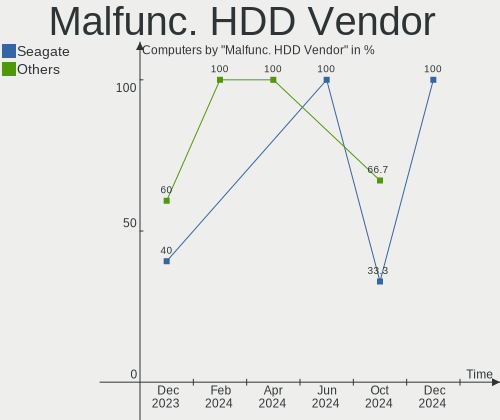
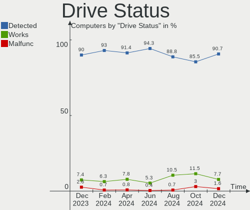
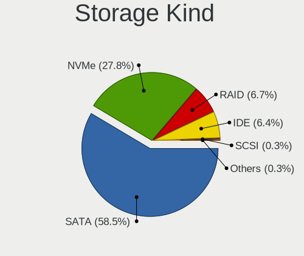
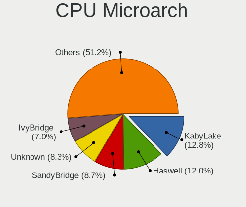

Zorin - Hardware Trends
-----------------------

A project to identify most popular hardware characteristics and track their change
over time based on data collected by Linux users at https://Linux-Hardware.org.

Anyone can contribute to this report by the [hw-probe](https://github.com/linuxhw/hw-probe) tool:

    sudo -E hw-probe -all -upload

This is a report for all computer types. See also reports for [desktops](/Dist/Zorin/Desktop/README.md) and [notebooks](/Dist/Zorin/Notebook/README.md).

This report is for one last month. Overall report since the beginning of time: [TestDays](https://github.com/linuxhw/TestDays)

Period: Sep, 2023.

Contents
--------

* [ System ](#system)
  - [ OS                       ](#os)
  - [ OS Family                ](#os-family)
  - [ Kernel                   ](#kernel)
  - [ Kernel Family            ](#kernel-family)
  - [ Kernel Major Ver.        ](#kernel-major-ver)
  - [ Arch                     ](#arch)
  - [ DE                       ](#de)
  - [ Display Server           ](#display-server)
  - [ Display Manager          ](#display-manager)
  - [ OS Lang                  ](#os-lang)
  - [ Boot Mode                ](#boot-mode)
  - [ Filesystem               ](#filesystem)
  - [ Part. scheme             ](#part-scheme)
  - [ Dual Boot with Linux/BSD ](#dual-boot-with-linuxbsd)
  - [ Dual Boot (Win)          ](#dual-boot-win)

* [ Board ](#board)
  - [ Vendor                   ](#vendor)
  - [ Model                    ](#model)
  - [ Model Family             ](#model-family)
  - [ MFG Year                 ](#mfg-year)
  - [ Form Factor              ](#form-factor)
  - [ Secure Boot              ](#secure-boot)
  - [ Coreboot                 ](#coreboot)
  - [ RAM Size                 ](#ram-size)
  - [ RAM Used                 ](#ram-used)
  - [ Total Drives             ](#total-drives)
  - [ Has CD-ROM               ](#has-cd-rom)
  - [ Has Ethernet             ](#has-ethernet)
  - [ Has WiFi                 ](#has-wifi)
  - [ Has Bluetooth            ](#has-bluetooth)

* [ Location ](#location)
  - [ Country                  ](#country)
  - [ City                     ](#city)

* [ Drives ](#drives)
  - [ Drive Vendor             ](#drive-vendor)
  - [ Drive Model              ](#drive-model)
  - [ HDD Vendor               ](#hdd-vendor)
  - [ SSD Vendor               ](#ssd-vendor)
  - [ Drive Kind               ](#drive-kind)
  - [ Drive Connector          ](#drive-connector)
  - [ Drive Size               ](#drive-size)
  - [ Space Total              ](#space-total)
  - [ Space Used               ](#space-used)
  - [ Malfunc. Drives          ](#malfunc-drives)
  - [ Malfunc. Drive Vendor    ](#malfunc-drive-vendor)
  - [ Malfunc. HDD Vendor      ](#malfunc-hdd-vendor)
  - [ Malfunc. Drive Kind      ](#malfunc-drive-kind)
  - [ Failed Drives            ](#failed-drives)
  - [ Failed Drive Vendor      ](#failed-drive-vendor)
  - [ Drive Status             ](#drive-status)

* [ Storage controller ](#storage-controller)
  - [ Storage Vendor           ](#storage-vendor)
  - [ Storage Model            ](#storage-model)
  - [ Storage Kind             ](#storage-kind)

* [ Processor ](#processor)
  - [ CPU Vendor               ](#cpu-vendor)
  - [ CPU Model                ](#cpu-model)
  - [ CPU Model Family         ](#cpu-model-family)
  - [ CPU Cores                ](#cpu-cores)
  - [ CPU Sockets              ](#cpu-sockets)
  - [ CPU Threads              ](#cpu-threads)
  - [ CPU Op-Modes             ](#cpu-op-modes)
  - [ CPU Microcode            ](#cpu-microcode)
  - [ CPU Microarch            ](#cpu-microarch)

* [ Graphics ](#graphics)
  - [ GPU Vendor               ](#gpu-vendor)
  - [ GPU Model                ](#gpu-model)
  - [ GPU Combo                ](#gpu-combo)
  - [ GPU Driver               ](#gpu-driver)
  - [ GPU Memory               ](#gpu-memory)

* [ Monitor ](#monitor)
  - [ Monitor Vendor           ](#monitor-vendor)
  - [ Monitor Model            ](#monitor-model)
  - [ Monitor Resolution       ](#monitor-resolution)
  - [ Monitor Diagonal         ](#monitor-diagonal)
  - [ Monitor Width            ](#monitor-width)
  - [ Aspect Ratio             ](#aspect-ratio)
  - [ Monitor Area             ](#monitor-area)
  - [ Pixel Density            ](#pixel-density)
  - [ Multiple Monitors        ](#multiple-monitors)

* [ Network ](#network)
  - [ Net Controller Vendor    ](#net-controller-vendor)
  - [ Net Controller Model     ](#net-controller-model)
  - [ Wireless Vendor          ](#wireless-vendor)
  - [ Wireless Model           ](#wireless-model)
  - [ Ethernet Vendor          ](#ethernet-vendor)
  - [ Ethernet Model           ](#ethernet-model)
  - [ Net Controller Kind      ](#net-controller-kind)
  - [ Used Controller          ](#used-controller)
  - [ NICs                     ](#nics)
  - [ IPv6                     ](#ipv6)

* [ Bluetooth ](#bluetooth)
  - [ Bluetooth Vendor         ](#bluetooth-vendor)
  - [ Bluetooth Model          ](#bluetooth-model)

* [ Sound ](#sound)
  - [ Sound Vendor             ](#sound-vendor)
  - [ Sound Model              ](#sound-model)

* [ Memory ](#memory)
  - [ Memory Vendor            ](#memory-vendor)
  - [ Memory Model             ](#memory-model)
  - [ Memory Kind              ](#memory-kind)
  - [ Memory Form Factor       ](#memory-form-factor)
  - [ Memory Size              ](#memory-size)
  - [ Memory Speed             ](#memory-speed)

* [ Printers & scanners ](#printers--scanners)
  - [ Printer Vendor           ](#printer-vendor)
  - [ Printer Model            ](#printer-model)
  - [ Scanner Vendor           ](#scanner-vendor)
  - [ Scanner Model            ](#scanner-model)

* [ Camera ](#camera)
  - [ Camera Vendor            ](#camera-vendor)
  - [ Camera Model             ](#camera-model)

* [ Security ](#security)
  - [ Fingerprint Vendor       ](#fingerprint-vendor)
  - [ Fingerprint Model        ](#fingerprint-model)
  - [ Chipcard Vendor          ](#chipcard-vendor)
  - [ Chipcard Model           ](#chipcard-model)

* [ Unsupported ](#unsupported)
  - [ Unsupported Devices      ](#unsupported-devices)
  - [ Unsupported Device Types ](#unsupported-device-types)

System
------

OS
--

Installed operating systems

| Name     | Computers | Percent |
|----------|-----------|---------|
| Zorin 16 | 156       | 100%    |

OS Family
---------

OS without a version

| Name  | Computers | Percent |
|-------|-----------|---------|
| Zorin | 156       | 100%    |

Kernel
------

Version of the Linux kernel

| Version                 | Computers | Percent |
|-------------------------|-----------|---------|
| 5.15.0-83-generic       | 56        | 35.9%   |
| 5.15.0-84-generic       | 48        | 30.77%  |
| 5.15.0-82-generic       | 23        | 14.74%  |
| 5.15.0-78-generic       | 8         | 5.13%   |
| 5.15.0-79-generic       | 6         | 3.85%   |
| 5.15.0-71-generic       | 3         | 1.92%   |
| 5.15.0-58-generic       | 2         | 1.28%   |
| 6.3.13-1-liquorix-amd64 | 1         | 0.64%   |
| 6.3.13-060313-generic   | 1         | 0.64%   |
| 6.1.8-060108-generic    | 1         | 0.64%   |
| 5.15.0-76-generic       | 1         | 0.64%   |
| 5.15.0-72-generic       | 1         | 0.64%   |
| 5.15.0-56-generic       | 1         | 0.64%   |
| 5.15.0-52-generic       | 1         | 0.64%   |
| 5.15.0-48-generic       | 1         | 0.64%   |
| 5.15.0-46-generic       | 1         | 0.64%   |
| 5.13.0-40-generic       | 1         | 0.64%   |

Kernel Family
-------------

Linux kernel without a distro release

| Version | Computers | Percent |
|---------|-----------|---------|
| 5.15.0  | 152       | 97.44%  |
| 6.3.13  | 2         | 1.28%   |
| 6.1.8   | 1         | 0.64%   |
| 5.13.0  | 1         | 0.64%   |

Kernel Major Ver.
-----------------

Linux kernel major version

| Version | Computers | Percent |
|---------|-----------|---------|
| 5.15    | 152       | 97.44%  |
| 6.3     | 2         | 1.28%   |
| 6.1     | 1         | 0.64%   |
| 5.13    | 1         | 0.64%   |

Arch
----

OS architecture (x86_64, i586, etc.)

| Name   | Computers | Percent |
|--------|-----------|---------|
| x86_64 | 156       | 100%    |

DE
--

Desktop Environment

| Name  | Computers | Percent |
|-------|-----------|---------|
| GNOME | 125       | 80.13%  |
| XFCE  | 29        | 18.59%  |
| Unity | 1         | 0.64%   |
| KDE5  | 1         | 0.64%   |

Display Server
--------------

X11 or Wayland

| Name    | Computers | Percent |
|---------|-----------|---------|
| X11     | 151       | 96.79%  |
| Wayland | 5         | 3.21%   |

Display Manager
---------------

SDDM, LightDM, etc.

| Name    | Computers | Percent |
|---------|-----------|---------|
| Unknown | 120       | 76.92%  |
| GDM     | 16        | 10.26%  |
| GDM3    | 11        | 7.05%   |
| LightDM | 9         | 5.77%   |

OS Lang
-------

Language

| Lang  | Computers | Percent |
|-------|-----------|---------|
| en_US | 56        | 35.9%   |
| de_DE | 21        | 13.46%  |
| en_GB | 8         | 5.13%   |
| pt_BR | 7         | 4.49%   |
| it_IT | 7         | 4.49%   |
| es_ES | 6         | 3.85%   |
| pl_PL | 5         | 3.21%   |
| en_IN | 5         | 3.21%   |
| en_CA | 4         | 2.56%   |
| nl_BE | 3         | 1.92%   |
| fr_FR | 3         | 1.92%   |
| en_NZ | 3         | 1.92%   |
| sv_SE | 2         | 1.28%   |
| sk_SK | 2         | 1.28%   |
| nl_NL | 2         | 1.28%   |
| hu_HU | 2         | 1.28%   |
| es_MX | 2         | 1.28%   |
| tr_TR | 1         | 0.64%   |
| sr_RS | 1         | 0.64%   |
| sl_SI | 1         | 0.64%   |
| ru_RU | 1         | 0.64%   |
| fr_CA | 1         | 0.64%   |
| fr_BE | 1         | 0.64%   |
| fi_FI | 1         | 0.64%   |
| es_SV | 1         | 0.64%   |
| es_CL | 1         | 0.64%   |
| es_AR | 1         | 0.64%   |
| en_PH | 1         | 0.64%   |
| en_IL | 1         | 0.64%   |
| en_HK | 1         | 0.64%   |
| en_AU | 1         | 0.64%   |
| de_CH | 1         | 0.64%   |
| da_DK | 1         | 0.64%   |
| cs_CZ | 1         | 0.64%   |
| bg_BG | 1         | 0.64%   |

Boot Mode
---------

EFI or BIOS

| Mode | Computers | Percent |
|------|-----------|---------|
| EFI  | 97        | 62.18%  |
| BIOS | 59        | 37.82%  |

Filesystem
----------

Type of filesystem

| Type    | Computers | Percent |
|---------|-----------|---------|
| Ext4    | 130       | 83.33%  |
| Tmpfs   | 15        | 9.62%   |
| Btrfs   | 5         | 3.21%   |
| Zfs     | 3         | 1.92%   |
| Overlay | 3         | 1.92%   |

Part. scheme
------------

Scheme of partitioning

| Type    | Computers | Percent |
|---------|-----------|---------|
| Unknown | 121       | 77.56%  |
| GPT     | 27        | 17.31%  |
| MBR     | 8         | 5.13%   |

Dual Boot with Linux/BSD
------------------------

Hosting more than one Linux/BSD

| Dual boot | Computers | Percent |
|-----------|-----------|---------|
| No        | 151       | 96.79%  |
| Yes       | 5         | 3.21%   |

Dual Boot (Win)
---------------

Hosting Linux and Windows

| Dual boot | Computers | Percent |
|-----------|-----------|---------|
| No        | 141       | 90.38%  |
| Yes       | 15        | 9.62%   |

Board
-----

Vendor
------

Motherboard manufacturer

| Name                | Computers | Percent |
|---------------------|-----------|---------|
| Lenovo              | 23        | 14.74%  |
| Dell                | 22        | 14.1%   |
| ASUSTek Computer    | 20        | 12.82%  |
| Hewlett-Packard     | 19        | 12.18%  |
| Acer                | 11        | 7.05%   |
| Gigabyte Technology | 9         | 5.77%   |
| MSI                 | 7         | 4.49%   |
| Apple               | 7         | 4.49%   |
| Intel               | 6         | 3.85%   |
| Toshiba             | 5         | 3.21%   |
| AZW                 | 3         | 1.92%   |
| Sony                | 2         | 1.28%   |
| Pegatron            | 2         | 1.28%   |
| Alienware           | 2         | 1.28%   |
| Unknown             | 2         | 1.28%   |
| Sary                | 1         | 0.64%   |
| Samsung Electronics | 1         | 0.64%   |
| Primux Tech         | 1         | 0.64%   |
| MP                  | 1         | 0.64%   |
| Microsoft           | 1         | 0.64%   |
| Medion              | 1         | 0.64%   |
| Itautec             | 1         | 0.64%   |
| Inventec            | 1         | 0.64%   |
| HUAWEI              | 1         | 0.64%   |
| Hometech            | 1         | 0.64%   |
| Framework           | 1         | 0.64%   |
| Colorful Technology | 1         | 0.64%   |
| Biostar             | 1         | 0.64%   |
| BESSTAR Tech        | 1         | 0.64%   |
| ASRock              | 1         | 0.64%   |
| AMI                 | 1         | 0.64%   |

Model
-----

Motherboard model

| Name                                | Computers | Percent |
|-------------------------------------|-----------|---------|
| Lenovo ThinkPad T560 20FJS2BX00     | 2         | 1.28%   |
| HP Pavilion dv7                     | 2         | 1.28%   |
| Unknown                             | 2         | 1.28%   |
| Toshiba Satellite Pro R40-D         | 1         | 0.64%   |
| Toshiba Satellite L50-A-1DL         | 1         | 0.64%   |
| Toshiba Satellite C870-1C2          | 1         | 0.64%   |
| Toshiba Satellite C70D-A            | 1         | 0.64%   |
| Toshiba Satellite A210              | 1         | 0.64%   |
| Sony VPCEB1E1E                      | 1         | 0.64%   |
| Sony SVF14A15CXB                    | 1         | 0.64%   |
| Sary Tab2                           | 1         | 0.64%   |
| Samsung 3570R/370R/470R/450R/510R   | 1         | 0.64%   |
| Primux Tech Primux_1406F_W10        | 1         | 0.64%   |
| Pegatron IPXSB-H61                  | 1         | 0.64%   |
| Pegatron h8-1350eo                  | 1         | 0.64%   |
| MSI MS-7D54                         | 1         | 0.64%   |
| MSI MS-7C56                         | 1         | 0.64%   |
| MSI MS-7C52                         | 1         | 0.64%   |
| MSI MS-7B86                         | 1         | 0.64%   |
| MSI MS-7B10                         | 1         | 0.64%   |
| MSI MS-7977                         | 1         | 0.64%   |
| MSI Bravo 15 A4DDR                  | 1         | 0.64%   |
| MP MS-7848                          | 1         | 0.64%   |
| Microsoft Surface Pro 4             | 1         | 0.64%   |
| Medion E6431 MD60112                | 1         | 0.64%   |
| Lenovo Yoga 520-14IKB 80YM          | 1         | 0.64%   |
| Lenovo V110-14IAP 80TF              | 1         | 0.64%   |
| Lenovo ThinkPad T570 20HAS1PC00     | 1         | 0.64%   |
| Lenovo ThinkPad T430 2349HNU        | 1         | 0.64%   |
| Lenovo ThinkPad T430 2349H2G        | 1         | 0.64%   |
| Lenovo ThinkPad S5-S540 20B30064MH  | 1         | 0.64%   |
| Lenovo ThinkPad R60 9461DXG         | 1         | 0.64%   |
| Lenovo ThinkPad E575 20H8000HUS     | 1         | 0.64%   |
| Lenovo ThinkPad E14 20RA0050US      | 1         | 0.64%   |
| Lenovo ThinkCentre M910t 10MNS1Y900 | 1         | 0.64%   |
| Lenovo ThinkCentre M910q 10MUS36E00 | 1         | 0.64%   |
| Lenovo MIIX 2 11 20327              | 1         | 0.64%   |
| Lenovo Legion S7 16IAH7 82TF        | 1         | 0.64%   |
| Lenovo IdeaPadFlex 5 14IAU7 82R7    | 1         | 0.64%   |
| Lenovo IdeaPad Slim 5 16IRL8 82XF   | 1         | 0.64%   |

Model Family
------------

Motherboard model prefix

| Name               | Computers | Percent |
|--------------------|-----------|---------|
| Lenovo ThinkPad    | 9         | 5.77%   |
| Acer Aspire        | 9         | 5.77%   |
| Dell Inspiron      | 7         | 4.49%   |
| Lenovo IdeaPad     | 6         | 3.85%   |
| Dell OptiPlex      | 6         | 3.85%   |
| Toshiba Satellite  | 5         | 3.21%   |
| Dell Latitude      | 4         | 2.56%   |
| HP Pavilion        | 3         | 1.92%   |
| HP Laptop          | 3         | 1.92%   |
| ASUS TUF           | 3         | 1.92%   |
| Lenovo ThinkCentre | 2         | 1.28%   |
| HP ProBook         | 2         | 1.28%   |
| HP EliteBook       | 2         | 1.28%   |
| Dell XPS           | 2         | 1.28%   |
| Dell Vostro        | 2         | 1.28%   |
| ASUS SABERTOOTH    | 2         | 1.28%   |
| ASUS PRIME         | 2         | 1.28%   |
| Unknown            | 2         | 1.28%   |
| Sony VPCEB1E1E     | 1         | 0.64%   |
| Sony SVF14A15CXB   | 1         | 0.64%   |
| Sary Tab2          | 1         | 0.64%   |
| Samsung 3570R      | 1         | 0.64%   |
| Primux Tech Primux | 1         | 0.64%   |
| Pegatron IPXSB-H61 | 1         | 0.64%   |
| Pegatron h8-1350eo | 1         | 0.64%   |
| MSI MS-7D54        | 1         | 0.64%   |
| MSI MS-7C56        | 1         | 0.64%   |
| MSI MS-7C52        | 1         | 0.64%   |
| MSI MS-7B86        | 1         | 0.64%   |
| MSI MS-7B10        | 1         | 0.64%   |
| MSI MS-7977        | 1         | 0.64%   |
| MSI Bravo          | 1         | 0.64%   |
| MP MS-7848         | 1         | 0.64%   |
| Microsoft Surface  | 1         | 0.64%   |
| Medion E6431       | 1         | 0.64%   |
| Lenovo Yoga        | 1         | 0.64%   |
| Lenovo V110-14IAP  | 1         | 0.64%   |
| Lenovo MIIX        | 1         | 0.64%   |
| Lenovo Legion      | 1         | 0.64%   |
| Lenovo IdeaPadFlex | 1         | 0.64%   |

MFG Year
--------

Motherboard manufacture year

| Year    | Computers | Percent |
|---------|-----------|---------|
| 2019    | 19        | 12.18%  |
| 2017    | 13        | 8.33%   |
| 2011    | 11        | 7.05%   |
| 2022    | 10        | 6.41%   |
| 2020    | 10        | 6.41%   |
| 2014    | 10        | 6.41%   |
| 2023    | 9         | 5.77%   |
| 2018    | 9         | 5.77%   |
| 2012    | 9         | 5.77%   |
| 2021    | 8         | 5.13%   |
| 2016    | 8         | 5.13%   |
| 2013    | 8         | 5.13%   |
| 2010    | 8         | 5.13%   |
| 2015    | 7         | 4.49%   |
| 2009    | 7         | 4.49%   |
| 2008    | 5         | 3.21%   |
| 2007    | 3         | 1.92%   |
| 2006    | 1         | 0.64%   |
| Unknown | 1         | 0.64%   |

Form Factor
-----------

Physical design of the computer

| Name        | Computers | Percent |
|-------------|-----------|---------|
| Notebook    | 84        | 53.85%  |
| Desktop     | 58        | 37.18%  |
| Convertible | 5         | 3.21%   |
| Mini pc     | 5         | 3.21%   |
| Tablet      | 3         | 1.92%   |
| Server      | 1         | 0.64%   |

Secure Boot
-----------

Enabled or disabled

| State    | Computers | Percent |
|----------|-----------|---------|
| Disabled | 138       | 88.46%  |
| Enabled  | 18        | 11.54%  |

Coreboot
--------

Have coreboot on board

| Used | Computers | Percent |
|------|-----------|---------|
| No   | 156       | 100%    |

RAM Size
--------

Total RAM memory

| Size in GB  | Computers | Percent |
|-------------|-----------|---------|
| 4.01-8.0    | 51        | 32.69%  |
| 16.01-24.0  | 32        | 20.51%  |
| 3.01-4.0    | 22        | 14.1%   |
| 8.01-16.0   | 21        | 13.46%  |
| 32.01-64.0  | 11        | 7.05%   |
| 64.01-256.0 | 7         | 4.49%   |
| 1.01-2.0    | 5         | 3.21%   |
| 24.01-32.0  | 3         | 1.92%   |
| 2.01-3.0    | 3         | 1.92%   |
| 0.51-1.0    | 1         | 0.64%   |

RAM Used
--------

Used RAM memory

| Used GB    | Computers | Percent |
|------------|-----------|---------|
| 2.01-3.0   | 58        | 37.18%  |
| 1.01-2.0   | 47        | 30.13%  |
| 3.01-4.0   | 23        | 14.74%  |
| 4.01-8.0   | 21        | 13.46%  |
| 8.01-16.0  | 3         | 1.92%   |
| 0.51-1.0   | 3         | 1.92%   |
| 24.01-32.0 | 1         | 0.64%   |

Total Drives
------------

Number of drives on board

| Drives | Computers | Percent |
|--------|-----------|---------|
| 1      | 100       | 64.1%   |
| 2      | 36        | 23.08%  |
| 3      | 10        | 6.41%   |
| 4      | 6         | 3.85%   |
| 6      | 2         | 1.28%   |
| 5      | 2         | 1.28%   |

Has CD-ROM
----------

Has CD-ROM on board

| Presented | Computers | Percent |
|-----------|-----------|---------|
| No        | 89        | 57.05%  |
| Yes       | 67        | 42.95%  |

Has Ethernet
------------

Has Ethernet on board

| Presented | Computers | Percent |
|-----------|-----------|---------|
| Yes       | 133       | 85.26%  |
| No        | 23        | 14.74%  |

Has WiFi
--------

Has WiFi module

| Presented | Computers | Percent |
|-----------|-----------|---------|
| Yes       | 130       | 83.33%  |
| No        | 26        | 16.67%  |

Has Bluetooth
-------------

Has Bluetooth module

| Presented | Computers | Percent |
|-----------|-----------|---------|
| Yes       | 99        | 63.46%  |
| No        | 57        | 36.54%  |

Location
--------

Country
-------

Geographic location (country)

| Country     | Computers | Percent |
|-------------|-----------|---------|
| USA         | 32        | 20.51%  |
| Germany     | 24        | 15.38%  |
| Brazil      | 8         | 5.13%   |
| UK          | 7         | 4.49%   |
| Italy       | 7         | 4.49%   |
| Spain       | 6         | 3.85%   |
| India       | 5         | 3.21%   |
| Canada      | 5         | 3.21%   |
| Belgium     | 5         | 3.21%   |
| Poland      | 4         | 2.56%   |
| Netherlands | 4         | 2.56%   |
| Turkey      | 3         | 1.92%   |
| Sweden      | 3         | 1.92%   |
| New Zealand | 3         | 1.92%   |
| Hungary     | 3         | 1.92%   |
| France      | 3         | 1.92%   |
| Bulgaria    | 3         | 1.92%   |
| Slovakia    | 2         | 1.28%   |
| Russia      | 2         | 1.28%   |
| Philippines | 2         | 1.28%   |
| Mexico      | 2         | 1.28%   |
| Ireland     | 2         | 1.28%   |
| Iceland     | 2         | 1.28%   |
| Finland     | 2         | 1.28%   |
| Denmark     | 2         | 1.28%   |
| Switzerland | 1         | 0.64%   |
| Slovenia    | 1         | 0.64%   |
| Serbia      | 1         | 0.64%   |
| Israel      | 1         | 0.64%   |
| Greece      | 1         | 0.64%   |
| El Salvador | 1         | 0.64%   |
| Egypt       | 1         | 0.64%   |
| Czechia     | 1         | 0.64%   |
| Chile       | 1         | 0.64%   |
| Bangladesh  | 1         | 0.64%   |
| Bahrain     | 1         | 0.64%   |
| Austria     | 1         | 0.64%   |
| Australia   | 1         | 0.64%   |
| Argentina   | 1         | 0.64%   |
| Algeria     | 1         | 0.64%   |

City
----

Geographic location (city)

| City               | Computers | Percent |
|--------------------|-----------|---------|
| Seattle            | 2         | 1.28%   |
| Nevis              | 2         | 1.28%   |
| Montreal           | 2         | 1.28%   |
| Minneapolis        | 2         | 1.28%   |
| Hechingen          | 2         | 1.28%   |
| Hamilton           | 2         | 1.28%   |
| Dallas             | 2         | 1.28%   |
| Berlin             | 2         | 1.28%   |
| Arnhem             | 2         | 1.28%   |
| Zogno              | 1         | 0.64%   |
| Wuppertal          | 1         | 0.64%   |
| Wroclaw            | 1         | 0.64%   |
| Wetzlar            | 1         | 0.64%   |
| Turbigo            | 1         | 0.64%   |
| Tullahoma          | 1         | 0.64%   |
| Trappes            | 1         | 0.64%   |
| Torrejón de Ardoz | 1         | 0.64%   |
| The Hague          | 1         | 0.64%   |
| Teresina           | 1         | 0.64%   |
| Tel Aviv           | 1         | 0.64%   |
| Taubate            | 1         | 0.64%   |
| Tarlac City        | 1         | 0.64%   |
| Tampere            | 1         | 0.64%   |
| Tamasi             | 1         | 0.64%   |
| Stuttgart          | 1         | 0.64%   |
| St. Albert         | 1         | 0.64%   |
| St Petersburg      | 1         | 0.64%   |
| Singen             | 1         | 0.64%   |
| Selanovtsi         | 1         | 0.64%   |
| Santa Tecla        | 1         | 0.64%   |
| San Antonio        | 1         | 0.64%   |
| San Angelo         | 1         | 0.64%   |
| Salt Lake City     | 1         | 0.64%   |
| Sabadell           | 1         | 0.64%   |
| Rio de Janeiro     | 1         | 0.64%   |
| Richardson         | 1         | 0.64%   |
| Reykjavik          | 1         | 0.64%   |
| Rancagua           | 1         | 0.64%   |
| Quezon City        | 1         | 0.64%   |
| Pune               | 1         | 0.64%   |

Drives
------

Drive Vendor
------------

Hard drive vendors

| Vendor                       | Computers | Drives | Percent |
|------------------------------|-----------|--------|---------|
| WDC                          | 27        | 34     | 12.27%  |
| Samsung Electronics          | 26        | 30     | 11.82%  |
| Seagate                      | 21        | 26     | 9.55%   |
| Sandisk                      | 20        | 24     | 9.09%   |
| Toshiba                      | 18        | 18     | 8.18%   |
| Kingston                     | 11        | 14     | 5%      |
| Unknown                      | 8         | 8      | 3.64%   |
| Hitachi                      | 8         | 8      | 3.64%   |
| SK hynix                     | 7         | 7      | 3.18%   |
| KIOXIA                       | 6         | 6      | 2.73%   |
| Crucial                      | 5         | 5      | 2.27%   |
| A-DATA Technology            | 5         | 5      | 2.27%   |
| Micron/Crucial Technology    | 4         | 4      | 1.82%   |
| Intel                        | 4         | 4      | 1.82%   |
| Apple                        | 4         | 4      | 1.82%   |
| Phison Electronics           | 3         | 4      | 1.36%   |
| Patriot                      | 3         | 3      | 1.36%   |
| MAXIO Technology (Hangzhou)  | 3         | 3      | 1.36%   |
| SPCC                         | 2         | 3      | 0.91%   |
| Silicon Motion               | 2         | 2      | 0.91%   |
| Phison                       | 2         | 2      | 0.91%   |
| Netac                        | 2         | 2      | 0.91%   |
| Kingston Technology Company  | 2         | 2      | 0.91%   |
| KingSpec                     | 2         | 2      | 0.91%   |
| Intenso                      | 2         | 2      | 0.91%   |
| China                        | 2         | 2      | 0.91%   |
| Apacer                       | 2         | 3      | 0.91%   |
| Unknown                      | 2         | 2      | 0.91%   |
| TS512GMT                     | 1         | 1      | 0.45%   |
| Teclast                      | 1         | 1      | 0.45%   |
| Team                         | 1         | 1      | 0.45%   |
| T-FORCE                      | 1         | 1      | 0.45%   |
| Shenzhen Longsys Electronics | 1         | 1      | 0.45%   |
| Realtek Semiconductor        | 1         | 1      | 0.45%   |
| Ramsta                       | 1         | 1      | 0.45%   |
| POLION                       | 1         | 1      | 0.45%   |
| PNY                          | 1         | 1      | 0.45%   |
| Micron Technology            | 1         | 1      | 0.45%   |
| LITEON                       | 1         | 1      | 0.45%   |
| KingFast                     | 1         | 1      | 0.45%   |

Drive Model
-----------

Hard drive models

| Model                                                 | Computers | Percent |
|-------------------------------------------------------|-----------|---------|
| Samsung NVMe SSD Controller SM981/PM981/PM983 256GB   | 4         | 1.65%   |
| Micron/Crucial P2 NVMe PCIe SSD 1TB                   | 4         | 1.65%   |
| Samsung SSD 870 EVO 1TB                               | 3         | 1.24%   |
| WDC WDS240G2G0A-00JH30 240GB SSD                      | 2         | 0.83%   |
| Toshiba BG3 NVMe SSD Controller 512GB                 | 2         | 0.83%   |
| Silicon Motion SM2263EN/SM2263XT SSD Controller 512GB | 2         | 0.83%   |
| Seagate ST1000LM035-1RK172 1TB                        | 2         | 0.83%   |
| Seagate ST1000DM010-2EP102 1TB                        | 2         | 0.83%   |
| Seagate Backup+ Hub BK 8TB                            | 2         | 0.83%   |
| Sandisk WD Black SN750 / PC SN730 NVMe SSD 512GB      | 2         | 0.83%   |
| SanDisk SSD PLUS 480GB                                | 2         | 0.83%   |
| Samsung SSD 850 EVO 250GB                             | 2         | 0.83%   |
| Samsung SSD 850 EVO 1TB                               | 2         | 0.83%   |
| Samsung SSD 750 EVO 250GB                             | 2         | 0.83%   |
| Phison E12 NVMe Controller 2TB                        | 2         | 0.83%   |
| MAXIO (Hangzhou) NVMe SSD Controller MAP1202 512GB    | 2         | 0.83%   |
| KIOXIA KBG40ZNV256G 256GB                             | 2         | 0.83%   |
| Kingston Company U-SNS8154P3 NVMe SSD 256GB           | 2         | 0.83%   |
| Kingston SV300S37A120G 120GB SSD                      | 2         | 0.83%   |
| Kingston SA400S37120G 120GB SSD                       | 2         | 0.83%   |
| KingSpec P3-512 512GB                                 | 2         | 0.83%   |
| Hitachi HDS721016CLA382 160GB                         | 2         | 0.83%   |
| Crucial CT480BX500SSD1 480GB                          | 2         | 0.83%   |
| Apacer AS350 128GB SSD                                | 2         | 0.83%   |
| Unknown                                               | 2         | 0.83%   |
| WDC WUH721816ALE6L4 16TB                              | 1         | 0.41%   |
| WDC WDS480G2G0A-00JH30 480GB SSD                      | 1         | 0.41%   |
| WDC WDS240G1G0B-00RC30 240GB SSD                      | 1         | 0.41%   |
| WDC WD5000LPVX-22V0TT0 500GB                          | 1         | 0.41%   |
| WDC WD5000LPCX-24C6HT0 500GB                          | 1         | 0.41%   |
| WDC WD5000AAKX-753CA1 500GB                           | 1         | 0.41%   |
| WDC WD5000AAKX-22ERMA0 500GB                          | 1         | 0.41%   |
| WDC WD5000AAKX-001CA0 500GB                           | 1         | 0.41%   |
| WDC WD5000AADS-00S9B0 500GB                           | 1         | 0.41%   |
| WDC WD40EZAZ-19SF3B0 4TB                              | 1         | 0.41%   |
| WDC WD4002FFWX-68TZ4N0 4TB                            | 1         | 0.41%   |
| WDC WD3200BJKT-75F4T0 320GB                           | 1         | 0.41%   |
| WDC WD3200AAJS-65M0A0 320GB                           | 1         | 0.41%   |
| WDC WD3200AAJS-00L7A0 320GB                           | 1         | 0.41%   |
| WDC WD2500BEKT-60A25T1 250GB                          | 1         | 0.41%   |

HDD Vendor
----------

Hard disk drive vendors

| Vendor              | Computers | Drives | Percent |
|---------------------|-----------|--------|---------|
| WDC                 | 24        | 28     | 34.29%  |
| Seagate             | 21        | 25     | 30%     |
| Toshiba             | 11        | 11     | 15.71%  |
| Hitachi             | 8         | 8      | 11.43%  |
| Samsung Electronics | 3         | 3      | 4.29%   |
| Hewlett-Packard     | 1         | 1      | 1.43%   |
| Fujitsu             | 1         | 1      | 1.43%   |
| Apple               | 1         | 1      | 1.43%   |

SSD Vendor
----------

Solid state drive vendors

| Vendor              | Computers | Drives | Percent |
|---------------------|-----------|--------|---------|
| Samsung Electronics | 17        | 18     | 21.79%  |
| SanDisk             | 10        | 12     | 12.82%  |
| Kingston            | 9         | 10     | 11.54%  |
| Crucial             | 5         | 5      | 6.41%   |
| WDC                 | 3         | 5      | 3.85%   |
| Patriot             | 3         | 3      | 3.85%   |
| A-DATA Technology   | 3         | 3      | 3.85%   |
| Toshiba             | 2         | 2      | 2.56%   |
| SPCC                | 2         | 3      | 2.56%   |
| SK hynix            | 2         | 2      | 2.56%   |
| Netac               | 2         | 2      | 2.56%   |
| KingSpec            | 2         | 2      | 2.56%   |
| Intenso             | 2         | 2      | 2.56%   |
| China               | 2         | 2      | 2.56%   |
| Apple               | 2         | 2      | 2.56%   |
| Apacer              | 2         | 3      | 2.56%   |
| Teclast             | 1         | 1      | 1.28%   |
| Team                | 1         | 1      | 1.28%   |
| Ramsta              | 1         | 1      | 1.28%   |
| POLION              | 1         | 1      | 1.28%   |
| PNY                 | 1         | 1      | 1.28%   |
| Phison              | 1         | 1      | 1.28%   |
| LITEON              | 1         | 1      | 1.28%   |
| Intel               | 1         | 1      | 1.28%   |
| AFOX                | 1         | 1      | 1.28%   |
| Unknown             | 1         | 1      | 1.28%   |

Drive Kind
----------

HDD or SSD

| Kind    | Computers | Drives | Percent |
|---------|-----------|--------|---------|
| SSD     | 73        | 86     | 36.32%  |
| HDD     | 59        | 78     | 29.35%  |
| NVMe    | 58        | 70     | 28.86%  |
| Unknown | 6         | 7      | 2.99%   |
| MMC     | 5         | 5      | 2.49%   |

Drive Connector
---------------

SATA, SAS, NVMe, etc.

| Type | Computers | Drives | Percent |
|------|-----------|--------|---------|
| SATA | 115       | 161    | 61.83%  |
| NVMe | 58        | 70     | 31.18%  |
| SAS  | 8         | 10     | 4.3%    |
| MMC  | 5         | 5      | 2.69%   |

Drive Size
----------

Size of hard drive

| Size in TB | Computers | Drives | Percent |
|------------|-----------|--------|---------|
| 0.01-0.5   | 81        | 98     | 58.27%  |
| 0.51-1.0   | 39        | 45     | 28.06%  |
| 1.01-2.0   | 12        | 14     | 8.63%   |
| 3.01-4.0   | 2         | 2      | 1.44%   |
| 2.01-3.0   | 2         | 2      | 1.44%   |
| 4.01-10.0  | 2         | 2      | 1.44%   |
| 10.01-20.0 | 1         | 1      | 0.72%   |

Space Total
-----------

Amount of disk space available on the file system

| Size in GB     | Computers | Percent |
|----------------|-----------|---------|
| 101-250        | 47        | 30.13%  |
| 251-500        | 40        | 25.64%  |
| 501-1000       | 28        | 17.95%  |
| 51-100         | 13        | 8.33%   |
| 1001-2000      | 10        | 6.41%   |
| More than 3000 | 6         | 3.85%   |
| 1-20           | 5         | 3.21%   |
| 21-50          | 4         | 2.56%   |
| Unknown        | 2         | 1.28%   |
| 2001-3000      | 1         | 0.64%   |

Space Used
----------

Amount of used disk space

| Used GB        | Computers | Percent |
|----------------|-----------|---------|
| 21-50          | 55        | 35.26%  |
| 1-20           | 45        | 28.85%  |
| 51-100         | 19        | 12.18%  |
| 101-250        | 18        | 11.54%  |
| 501-1000       | 6         | 3.85%   |
| 251-500        | 5         | 3.21%   |
| More than 3000 | 3         | 1.92%   |
| 1001-2000      | 2         | 1.28%   |
| Unknown        | 2         | 1.28%   |
| 2001-3000      | 1         | 0.64%   |

Malfunc. Drives
---------------

Drive models with a malfunction

| Model                          | Computers | Drives | Percent |
|--------------------------------|-----------|--------|---------|
| Toshiba MQ01ABD100 1TB         | 1         | 1      | 33.33%  |
| Seagate ST1000LM035-1RK172 1TB | 1         | 1      | 33.33%  |
| POLION SSD 240GB               | 1         | 1      | 33.33%  |

Malfunc. Drive Vendor
---------------------

Vendors of faulty drives

| Vendor  | Computers | Drives | Percent |
|---------|-----------|--------|---------|
| Toshiba | 1         | 1      | 33.33%  |
| Seagate | 1         | 1      | 33.33%  |
| POLION  | 1         | 1      | 33.33%  |

Malfunc. HDD Vendor
-------------------

Vendors of faulty HDD drives

| Vendor  | Computers | Drives | Percent |
|---------|-----------|--------|---------|
| Toshiba | 1         | 1      | 50%     |
| Seagate | 1         | 1      | 50%     |

Malfunc. Drive Kind
-------------------

Kinds of faulty drives

| Kind | Computers | Drives | Percent |
|------|-----------|--------|---------|
| HDD  | 2         | 2      | 66.67%  |
| SSD  | 1         | 1      | 33.33%  |

Failed Drives
-------------

Failed drive models

Zero info for selected period =(

Failed Drive Vendor
-------------------

Failed drive vendors

Zero info for selected period =(

Drive Status
------------

Number of failed and malfunc. drives

| Status   | Computers | Drives | Percent |
|----------|-----------|--------|---------|
| Detected | 141       | 227    | 88.68%  |
| Works    | 15        | 16     | 9.43%   |
| Malfunc  | 3         | 3      | 1.89%   |

Storage controller
------------------

Storage Vendor
--------------

Storage controller vendors

| Vendor                       | Computers | Percent |
|------------------------------|-----------|---------|
| Intel                        | 101       | 48.79%  |
| AMD                          | 30        | 14.49%  |
| SanDisk                      | 12        | 5.8%    |
| Samsung Electronics          | 8         | 3.86%   |
| KIOXIA                       | 6         | 2.9%    |
| Toshiba America Info Systems | 5         | 2.42%   |
| SK hynix                     | 5         | 2.42%   |
| Kingston Technology Company  | 5         | 2.42%   |
| Phison Electronics           | 4         | 1.93%   |
| Micron/Crucial Technology    | 4         | 1.93%   |
| MAXIO Technology (Hangzhou)  | 4         | 1.93%   |
| ASMedia Technology           | 4         | 1.93%   |
| Nvidia                       | 3         | 1.45%   |
| Marvell Technology Group     | 3         | 1.45%   |
| JMicron Technology           | 3         | 1.45%   |
| Silicon Motion               | 2         | 0.97%   |
| ADATA Technology             | 2         | 0.97%   |
| TenaFe                       | 1         | 0.48%   |
| Shenzhen Longsys Electronics | 1         | 0.48%   |
| Realtek Semiconductor        | 1         | 0.48%   |
| Micron Technology            | 1         | 0.48%   |
| INNOGRIT                     | 1         | 0.48%   |
| Apple                        | 1         | 0.48%   |

Storage Model
-------------

Storage controller models

| Model                                                                          | Computers | Percent |
|--------------------------------------------------------------------------------|-----------|---------|
| AMD FCH SATA Controller [AHCI mode]                                            | 20        | 8.26%   |
| Intel Sunrise Point-LP SATA Controller [AHCI mode]                             | 13        | 5.37%   |
| Intel Volume Management Device NVMe RAID Controller                            | 6         | 2.48%   |
| Intel 8 Series/C220 Series Chipset Family 6-port SATA Controller 1 [AHCI mode] | 6         | 2.48%   |
| Intel 7 Series Chipset Family 6-port SATA Controller [AHCI mode]               | 6         | 2.48%   |
| Intel 6 Series/C200 Series Chipset Family 6 port Mobile SATA AHCI Controller   | 6         | 2.48%   |
| KIOXIA NVMe SSD Controller BG4 (DRAM-less)                                     | 5         | 2.07%   |
| Intel Celeron/Pentium Silver Processor SATA Controller                         | 5         | 2.07%   |
| Intel 82801 Mobile SATA Controller [RAID mode]                                 | 5         | 2.07%   |
| Samsung NVMe SSD Controller SM981/PM981/PM983                                  | 4         | 1.65%   |
| Micron/Crucial P2 [Nick P2] / P3 / P3 Plus NVMe PCIe SSD (DRAM-less)           | 4         | 1.65%   |
| Intel 82801IBM/IEM (ICH9M/ICH9M-E) 4 port SATA Controller [AHCI mode]          | 4         | 1.65%   |
| Intel 82801G (ICH7 Family) IDE Controller                                      | 4         | 1.65%   |
| Intel 6 Series/C200 Series Chipset Family 6 port Desktop SATA AHCI Controller  | 4         | 1.65%   |
| Intel 200 Series PCH SATA controller [AHCI mode]                               | 4         | 1.65%   |
| AMD SB7x0/SB8x0/SB9x0 SATA Controller [IDE mode]                               | 4         | 1.65%   |
| AMD SB7x0/SB8x0/SB9x0 IDE Controller                                           | 4         | 1.65%   |
| SanDisk WD Black SN770 / PC SN740 256GB / PC SN560 (DRAM-less) NVMe SSD        | 3         | 1.24%   |
| MAXIO (Hangzhou) NVMe SSD Controller MAP1202                                   | 3         | 1.24%   |
| Kingston Company NVMe Controller                                               | 3         | 1.24%   |
| Intel SATA Controller [RAID mode]                                              | 3         | 1.24%   |
| Intel Q170/Q150/B150/H170/H110/Z170/CM236 Chipset SATA Controller [AHCI Mode]  | 3         | 1.24%   |
| Intel NM10/ICH7 Family SATA Controller [IDE mode]                              | 3         | 1.24%   |
| Intel 82801HM/HEM (ICH8M/ICH8M-E) SATA Controller [AHCI mode]                  | 3         | 1.24%   |
| Intel 82801HM/HEM (ICH8M/ICH8M-E) IDE Controller                               | 3         | 1.24%   |
| Intel 8 Series SATA Controller 1 [AHCI mode]                                   | 3         | 1.24%   |
| ASMedia ASM1062 Serial ATA Controller                                          | 3         | 1.24%   |
| AMD SB7x0/SB8x0/SB9x0 SATA Controller [AHCI mode]                              | 3         | 1.24%   |
| AMD FCH IDE Controller                                                         | 3         | 1.24%   |
| AMD 400 Series Chipset SATA Controller                                         | 3         | 1.24%   |
| Toshiba America Info Systems BG3 NVMe SSD Controller                           | 2         | 0.83%   |
| SK hynix Platinum P41/PC801 NVMe Solid State Drive                             | 2         | 0.83%   |
| Silicon Motion SM2263EN/SM2263XT (DRAM-less) NVMe SSD Controllers              | 2         | 0.83%   |
| Sandisk Western Digital WD Black SN850X NVMe SSD                               | 2         | 0.83%   |
| SanDisk WD Black SN750 / PC SN730 NVMe SSD                                     | 2         | 0.83%   |
| Samsung NVMe SSD Controller PM9B1                                              | 2         | 0.83%   |
| Phison E12 NVMe Controller                                                     | 2         | 0.83%   |
| Marvell Group 88SE9172 SATA 6Gb/s Controller                                   | 2         | 0.83%   |
| Kingston Company U-SNS8154P3 NVMe SSD                                          | 2         | 0.83%   |
| JMicron JMB363 SATA/IDE Controller                                             | 2         | 0.83%   |

Storage Kind
------------

Kind of storage controller (IDE, SATA, NVMe, SAS, ...)

| Kind | Computers | Percent |
|------|-----------|---------|
| SATA | 116       | 54.72%  |
| NVMe | 58        | 27.36%  |
| IDE  | 21        | 9.91%   |
| RAID | 16        | 7.55%   |
| SAS  | 1         | 0.47%   |

Processor
---------

CPU Vendor
----------

Processor vendors

| Vendor | Computers | Percent |
|--------|-----------|---------|
| Intel  | 119       | 76.28%  |
| AMD    | 37        | 23.72%  |

CPU Model
---------

Processor models

| Model                                         | Computers | Percent |
|-----------------------------------------------|-----------|---------|
| Intel Core i5-6300U CPU @ 2.40GHz             | 3         | 1.92%   |
| Intel Core i5-6200U CPU @ 2.30GHz             | 3         | 1.92%   |
| Intel Core i5-1035G1 CPU @ 1.00GHz            | 3         | 1.92%   |
| Intel Core i7-8550U CPU @ 1.80GHz             | 2         | 1.28%   |
| Intel Core i7-6700K CPU @ 4.00GHz             | 2         | 1.28%   |
| Intel Core i7-3520M CPU @ 2.90GHz             | 2         | 1.28%   |
| Intel Core i7-10510U CPU @ 1.80GHz            | 2         | 1.28%   |
| Intel Core i5-8365U CPU @ 1.60GHz             | 2         | 1.28%   |
| Intel Core i5-2430M CPU @ 2.40GHz             | 2         | 1.28%   |
| Intel Core i5-2400 CPU @ 3.10GHz              | 2         | 1.28%   |
| Intel Core i3-7100U CPU @ 2.40GHz             | 2         | 1.28%   |
| Intel Core i3-2370M CPU @ 2.40GHz             | 2         | 1.28%   |
| Intel 12th Gen Core i7-12700F                 | 2         | 1.28%   |
| AMD Ryzen 7 4800H with Radeon Graphics        | 2         | 1.28%   |
| AMD Ryzen 7 2700 Eight-Core Processor         | 2         | 1.28%   |
| AMD Phenom II X6 1055T Processor              | 2         | 1.28%   |
| AMD A8-7600 Radeon R7, 10 Compute Cores 4C+6G | 2         | 1.28%   |
| Intel Xeon CPU E5606 @ 2.13GHz                | 1         | 0.64%   |
| Intel Xeon CPU E5-2650 v2 @ 2.60GHz           | 1         | 0.64%   |
| Intel Xeon CPU E5-2620 0 @ 2.00GHz            | 1         | 0.64%   |
| Intel Xeon CPU E5-1620 v2 @ 3.70GHz           | 1         | 0.64%   |
| Intel Pentium Silver N5030 CPU @ 1.10GHz      | 1         | 0.64%   |
| Intel Pentium Silver N5000 CPU @ 1.10GHz      | 1         | 0.64%   |
| Intel Pentium Dual-Core CPU T4500 @ 2.30GHz   | 1         | 0.64%   |
| Intel Pentium Dual-Core CPU T4300 @ 2.10GHz   | 1         | 0.64%   |
| Intel Pentium Dual-Core CPU E6600 @ 3.06GHz   | 1         | 0.64%   |
| Intel Pentium Dual-Core CPU E5800 @ 3.20GHz   | 1         | 0.64%   |
| Intel Pentium Dual CPU T3200 @ 2.00GHz        | 1         | 0.64%   |
| Intel Pentium CPU B960 @ 2.20GHz              | 1         | 0.64%   |
| Intel N95                                     | 1         | 0.64%   |
| Intel Core i7-8700K CPU @ 3.70GHz             | 1         | 0.64%   |
| Intel Core i7-7700T CPU @ 2.90GHz             | 1         | 0.64%   |
| Intel Core i7-7700 CPU @ 3.60GHz              | 1         | 0.64%   |
| Intel Core i7-6700 CPU @ 3.40GHz              | 1         | 0.64%   |
| Intel Core i7-6567U CPU @ 3.30GHz             | 1         | 0.64%   |
| Intel Core i7-6500U CPU @ 2.50GHz             | 1         | 0.64%   |
| Intel Core i7-4790K CPU @ 4.00GHz             | 1         | 0.64%   |
| Intel Core i7-4700MQ CPU @ 2.40GHz            | 1         | 0.64%   |
| Intel Core i7-4650U CPU @ 1.70GHz             | 1         | 0.64%   |
| Intel Core i7-4558U CPU @ 2.80GHz             | 1         | 0.64%   |

CPU Model Family
----------------

Processor model prefix

| Model                          | Computers | Percent |
|--------------------------------|-----------|---------|
| Intel Core i5                  | 35        | 22.44%  |
| Intel Core i7                  | 26        | 16.67%  |
| Other                          | 17        | 10.9%   |
| Intel Core i3                  | 12        | 7.69%   |
| Intel Celeron                  | 8         | 5.13%   |
| AMD Ryzen 7                    | 8         | 5.13%   |
| Intel Core 2 Duo               | 6         | 3.85%   |
| AMD Ryzen 5                    | 6         | 3.85%   |
| Intel Xeon                     | 4         | 2.56%   |
| Intel Pentium Dual-Core        | 4         | 2.56%   |
| AMD Ryzen 9                    | 3         | 1.92%   |
| Intel Pentium Silver           | 2         | 1.28%   |
| Intel Atom                     | 2         | 1.28%   |
| AMD Phenom II X6               | 2         | 1.28%   |
| AMD FX                         | 2         | 1.28%   |
| AMD A8                         | 2         | 1.28%   |
| AMD A6                         | 2         | 1.28%   |
| AMD A4                         | 2         | 1.28%   |
| Intel Pentium Dual             | 1         | 0.64%   |
| Intel Pentium                  | 1         | 0.64%   |
| Intel Core 2 Quad              | 1         | 0.64%   |
| Intel Core 2                   | 1         | 0.64%   |
| AMD Turion X2 Dual-Core Mobile | 1         | 0.64%   |
| AMD Ryzen Embedded             | 1         | 0.64%   |
| AMD Ryzen 5 PRO                | 1         | 0.64%   |
| AMD Ryzen 3                    | 1         | 0.64%   |
| AMD Phenom II X4               | 1         | 0.64%   |
| AMD G                          | 1         | 0.64%   |
| AMD Athlon II X2               | 1         | 0.64%   |
| AMD Athlon 64 X2               | 1         | 0.64%   |
| AMD Athlon                     | 1         | 0.64%   |

CPU Cores
---------

Number of processor cores

| Number | Computers | Percent |
|--------|-----------|---------|
| 2      | 66        | 42.31%  |
| 4      | 56        | 35.9%   |
| 8      | 12        | 7.69%   |
| 6      | 9         | 5.77%   |
| 12     | 6         | 3.85%   |
| 16     | 2         | 1.28%   |
| 10     | 2         | 1.28%   |
| 1      | 2         | 1.28%   |
| 14     | 1         | 0.64%   |

CPU Sockets
-----------

Number of sockets

| Number | Computers | Percent |
|--------|-----------|---------|
| 1      | 155       | 99.36%  |
| 2      | 1         | 0.64%   |

CPU Threads
-----------

Threads per core (Hyper-Threading)

| Number | Computers | Percent |
|--------|-----------|---------|
| 2      | 104       | 66.67%  |
| 1      | 52        | 33.33%  |

CPU Op-Modes
------------

CPU Operation Modes (32-bit, 64-bit)

| Op mode        | Computers | Percent |
|----------------|-----------|---------|
| 32-bit, 64-bit | 156       | 100%    |

CPU Microcode
-------------

Microcode number

| Number     | Computers | Percent |
|------------|-----------|---------|
| 0x206a7    | 13        | 8.33%   |
| Unknown    | 12        | 7.69%   |
| 0x306a9    | 8         | 5.13%   |
| 0x1067a    | 8         | 5.13%   |
| 0x406e3    | 7         | 4.49%   |
| 0x306c3    | 7         | 4.49%   |
| 0x806ec    | 5         | 3.21%   |
| 0x806e9    | 5         | 3.21%   |
| 0x506e3    | 5         | 3.21%   |
| 0x40651    | 5         | 3.21%   |
| 0x806ea    | 4         | 2.56%   |
| 0x706e5    | 4         | 2.56%   |
| 0x906a3    | 3         | 1.92%   |
| 0x90672    | 3         | 1.92%   |
| 0x806c1    | 3         | 1.92%   |
| 0x706a8    | 3         | 1.92%   |
| 0x08108109 | 3         | 1.92%   |
| 0x0800820d | 3         | 1.92%   |
| 0x906e9    | 2         | 1.28%   |
| 0x706a1    | 2         | 1.28%   |
| 0x506c9    | 2         | 1.28%   |
| 0x306e4    | 2         | 1.28%   |
| 0x306d4    | 2         | 1.28%   |
| 0x20652    | 2         | 1.28%   |
| 0x0a404102 | 2         | 1.28%   |
| 0x0a20120a | 2         | 1.28%   |
| 0x06000852 | 2         | 1.28%   |
| 0x03000027 | 2         | 1.28%   |
| 0x010000dc | 2         | 1.28%   |
| 0xb06e0    | 1         | 0.64%   |
| 0xb06a3    | 1         | 0.64%   |
| 0xb0671    | 1         | 0.64%   |
| 0xa0655    | 1         | 0.64%   |
| 0x906ea    | 1         | 0.64%   |
| 0x906a4    | 1         | 0.64%   |
| 0x806d1    | 1         | 0.64%   |
| 0x806c2    | 1         | 0.64%   |
| 0x6fd      | 1         | 0.64%   |
| 0x6fa      | 1         | 0.64%   |
| 0x6f6      | 1         | 0.64%   |

CPU Microarch
-------------

Microarchitecture

| Name             | Computers | Percent |
|------------------|-----------|---------|
| KabyLake         | 18        | 11.54%  |
| SandyBridge      | 14        | 8.97%   |
| Skylake          | 13        | 8.33%   |
| Haswell          | 12        | 7.69%   |
| IvyBridge        | 11        | 7.05%   |
| Penryn           | 10        | 6.41%   |
| Unknown          | 10        | 6.41%   |
| Zen+             | 7         | 4.49%   |
| Alderlake Hybrid | 7         | 4.49%   |
| IceLake          | 6         | 3.85%   |
| Goldmont plus    | 5         | 3.21%   |
| Zen 3            | 4         | 2.56%   |
| TigerLake        | 4         | 2.56%   |
| K10              | 4         | 2.56%   |
| Core             | 4         | 2.56%   |
| Westmere         | 3         | 1.92%   |
| Silvermont       | 3         | 1.92%   |
| Zen 2            | 2         | 1.28%   |
| Zen              | 2         | 1.28%   |
| Steamroller      | 2         | 1.28%   |
| Piledriver       | 2         | 1.28%   |
| K10 Llano        | 2         | 1.28%   |
| Goldmont         | 2         | 1.28%   |
| Excavator        | 2         | 1.28%   |
| Broadwell        | 2         | 1.28%   |
| K8 Hammer        | 1         | 0.64%   |
| K8 & K10 hybrid  | 1         | 0.64%   |
| Jaguar           | 1         | 0.64%   |
| CometLake        | 1         | 0.64%   |
| Bobcat           | 1         | 0.64%   |

Graphics
--------

GPU Vendor
----------

Vendors of graphics cards

| Vendor                     | Computers | Percent |
|----------------------------|-----------|---------|
| Intel                      | 93        | 52.25%  |
| Nvidia                     | 42        | 23.6%   |
| AMD                        | 42        | 23.6%   |
| Matrox Electronics Systems | 1         | 0.56%   |

GPU Model
---------

Graphics card models

| Model                                                                         | Computers | Percent |
|-------------------------------------------------------------------------------|-----------|---------|
| Intel 2nd Generation Core Processor Family Integrated Graphics Controller     | 9         | 4.92%   |
| Intel Skylake GT2 [HD Graphics 520]                                           | 7         | 3.83%   |
| Intel 3rd Gen Core processor Graphics Controller                              | 7         | 3.83%   |
| Intel Xeon E3-1200 v3/4th Gen Core Processor Integrated Graphics Controller   | 4         | 2.19%   |
| Intel UHD Graphics 620                                                        | 4         | 2.19%   |
| Intel TigerLake-LP GT2 [Iris Xe Graphics]                                     | 4         | 2.19%   |
| Intel Mobile 4 Series Chipset Integrated Graphics Controller                  | 4         | 2.19%   |
| Intel Iris Plus Graphics G1 (Ice Lake)                                        | 4         | 2.19%   |
| Intel HD Graphics 620                                                         | 4         | 2.19%   |
| Intel Haswell-ULT Integrated Graphics Controller                              | 4         | 2.19%   |
| AMD Picasso/Raven 2 [Radeon Vega Series / Radeon Vega Mobile Series]          | 4         | 2.19%   |
| Nvidia TU116 [GeForce GTX 1660 Ti]                                            | 3         | 1.64%   |
| Nvidia GA104 [GeForce RTX 3060 Ti Lite Hash Rate]                             | 3         | 1.64%   |
| Intel WhiskeyLake-U GT2 [UHD Graphics 620]                                    | 3         | 1.64%   |
| Intel GeminiLake [UHD Graphics 600]                                           | 3         | 1.64%   |
| AMD Sun XT [Radeon HD 8670A/8670M/8690M / R5 M330 / M430 / Radeon 520 Mobile] | 3         | 1.64%   |
| AMD Ellesmere [Radeon RX 470/480/570/570X/580/580X/590]                       | 3         | 1.64%   |
| Intel Raptor Lake-P [UHD Graphics]                                            | 2         | 1.09%   |
| Intel Mobile GM965/GL960 Integrated Graphics Controller (secondary)           | 2         | 1.09%   |
| Intel Mobile GM965/GL960 Integrated Graphics Controller (primary)             | 2         | 1.09%   |
| Intel HD Graphics 630                                                         | 2         | 1.09%   |
| Intel HD Graphics 5500                                                        | 2         | 1.09%   |
| Intel HD Graphics 500                                                         | 2         | 1.09%   |
| Intel GeminiLake [UHD Graphics 605]                                           | 2         | 1.09%   |
| Intel CometLake-U GT2 [UHD Graphics]                                          | 2         | 1.09%   |
| Intel Atom Processor Z36xxx/Z37xxx Series Graphics & Display                  | 2         | 1.09%   |
| Intel Alder Lake-P Integrated Graphics Controller                             | 2         | 1.09%   |
| AMD Renoir                                                                    | 2         | 1.09%   |
| AMD Rembrandt [Radeon 680M]                                                   | 2         | 1.09%   |
| Nvidia TU117M [GeForce GTX 1650 Ti Mobile]                                    | 1         | 0.55%   |
| Nvidia TU117 [GeForce GTX 1650]                                               | 1         | 0.55%   |
| Nvidia TU116 [GeForce GTX 1660 SUPER]                                         | 1         | 0.55%   |
| Nvidia GP108M [GeForce MX250]                                                 | 1         | 0.55%   |
| Nvidia GP107 [GeForce GTX 1050]                                               | 1         | 0.55%   |
| Nvidia GP107 [GeForce GTX 1050 Ti]                                            | 1         | 0.55%   |
| Nvidia GP106 [GeForce GTX 1060 6GB]                                           | 1         | 0.55%   |
| Nvidia GP104 [GeForce GTX 1080]                                               | 1         | 0.55%   |
| Nvidia GP104 [GeForce GTX 1070]                                               | 1         | 0.55%   |
| Nvidia GM107M [GeForce GTX 950M]                                              | 1         | 0.55%   |
| Nvidia GM107GL [Quadro K2200]                                                 | 1         | 0.55%   |

GPU Combo
---------

Combinations of graphics cards

| Name            | Computers | Percent |
|-----------------|-----------|---------|
| 1 x Intel       | 75        | 48.08%  |
| 1 x AMD         | 32        | 20.51%  |
| 1 x Nvidia      | 25        | 16.03%  |
| Intel + Nvidia  | 12        | 7.69%   |
| Intel + AMD     | 6         | 3.85%   |
| 2 x AMD         | 2         | 1.28%   |
| AMD + Nvidia    | 2         | 1.28%   |
| 2 x Nvidia      | 1         | 0.64%   |
| Nvidia + Matrox | 1         | 0.64%   |

GPU Driver
----------

Free vs proprietary

| Driver      | Computers | Percent |
|-------------|-----------|---------|
| Free        | 120       | 76.92%  |
| Proprietary | 29        | 18.59%  |
| Unknown     | 7         | 4.49%   |

GPU Memory
----------

Total video memory

| Size in GB | Computers | Percent |
|------------|-----------|---------|
| Unknown    | 98        | 62.82%  |
| 0.01-0.5   | 16        | 10.26%  |
| 1.01-2.0   | 15        | 9.62%   |
| 7.01-8.0   | 10        | 6.41%   |
| 0.51-1.0   | 8         | 5.13%   |
| 3.01-4.0   | 5         | 3.21%   |
| 5.01-6.0   | 3         | 1.92%   |
| 2.01-3.0   | 1         | 0.64%   |

Monitor
-------

Monitor Vendor
--------------

Monitor vendors

| Vendor                  | Computers | Percent |
|-------------------------|-----------|---------|
| LG Display              | 21        | 13.38%  |
| BOE                     | 18        | 11.46%  |
| AU Optronics            | 16        | 10.19%  |
| Samsung Electronics     | 13        | 8.28%   |
| Chimei Innolux          | 11        | 7.01%   |
| Goldstar                | 10        | 6.37%   |
| Apple                   | 7         | 4.46%   |
| Lenovo                  | 5         | 3.18%   |
| Hewlett-Packard         | 5         | 3.18%   |
| AOC                     | 5         | 3.18%   |
| BenQ                    | 4         | 2.55%   |
| ViewSonic               | 3         | 1.91%   |
| Sony                    | 3         | 1.91%   |
| Philips                 | 3         | 1.91%   |
| Dell                    | 3         | 1.91%   |
| Ancor Communications    | 3         | 1.91%   |
| Unknown                 | 3         | 1.91%   |
| Sharp                   | 2         | 1.27%   |
| Pixio                   | 2         | 1.27%   |
| NEC Computers           | 2         | 1.27%   |
| LG Electronics          | 2         | 1.27%   |
| Wacom Tech              | 1         | 0.64%   |
| RTK                     | 1         | 0.64%   |
| PANDA                   | 1         | 0.64%   |
| Panasonic               | 1         | 0.64%   |
| Onkyo                   | 1         | 0.64%   |
| MStar                   | 1         | 0.64%   |
| LG Philips              | 1         | 0.64%   |
| Insignia                | 1         | 0.64%   |
| InfoVision              | 1         | 0.64%   |
| Iiyama                  | 1         | 0.64%   |
| Gigabyte Technology     | 1         | 0.64%   |
| CSO                     | 1         | 0.64%   |
| CPT                     | 1         | 0.64%   |
| Chi Mei Optoelectronics | 1         | 0.64%   |
| Beko                    | 1         | 0.64%   |
| ASUSTek Computer        | 1         | 0.64%   |

Monitor Model
-------------

Monitor models

| Model                                                                  | Computers | Percent |
|------------------------------------------------------------------------|-----------|---------|
| LG Display LCD Monitor LGD02DC 1366x768 344x194mm 15.5-inch            | 4         | 2.5%    |
| Unknown                                                                | 3         | 1.88%   |
| LG Display LCD Monitor LGD0565 1920x1080 344x194mm 15.5-inch           | 2         | 1.25%   |
| Wacom Tech LCD Monitor Cintiq 16                                       | 1         | 0.63%   |
| ViewSonic XG3220 SERIES VSC1D35 3840x2160 698x393mm 31.5-inch          | 1         | 0.63%   |
| ViewSonic VX2753 SERIES VSC7228 1920x1080 597x336mm 27.0-inch          | 1         | 0.63%   |
| ViewSonic LCD Monitor XG3220 SERIES 3840x2160                          | 1         | 0.63%   |
| Sony TV SNY3002 1920x1080 710x400mm 32.1-inch                          | 1         | 0.63%   |
| Sony LCD Monitor TV 1360x768                                           | 1         | 0.63%   |
| Sony LCD Monitor SNY05FA 1366x768 340x190mm 15.3-inch                  | 1         | 0.63%   |
| Sharp LCD Monitor SHP1449 1920x1080 294x165mm 13.3-inch                | 1         | 0.63%   |
| Sharp LCD Monitor SHP1447 1920x1080 294x165mm 13.3-inch                | 1         | 0.63%   |
| Samsung Electronics U32J59x SAM0F35 3840x2160 697x392mm 31.5-inch      | 1         | 0.63%   |
| Samsung Electronics T23C350 SAM0ABC 1920x1080 510x287mm 23.0-inch      | 1         | 0.63%   |
| Samsung Electronics SyncMaster SAM0372 1680x1050 459x296mm 21.5-inch   | 1         | 0.63%   |
| Samsung Electronics S34J55x SAM0F71 3440x1440 797x333mm 34.0-inch      | 1         | 0.63%   |
| Samsung Electronics S34J55x SAM0F70 3440x1440 797x333mm 34.0-inch      | 1         | 0.63%   |
| Samsung Electronics S24D390 SAM0B65 1920x1080 521x293mm 23.5-inch      | 1         | 0.63%   |
| Samsung Electronics LS24AG30x SAM7178 1920x1080 527x296mm 23.8-inch    | 1         | 0.63%   |
| Samsung Electronics LCD Monitor SDC3853 2736x1824 260x173mm 12.3-inch  | 1         | 0.63%   |
| Samsung Electronics LCD Monitor SDC280F 1366x768 344x193mm 15.5-inch   | 1         | 0.63%   |
| Samsung Electronics LCD Monitor SAM0A7A 1920x1080 1060x626mm 48.5-inch | 1         | 0.63%   |
| Samsung Electronics LCD Monitor SAM04FA 1920x1080 886x498mm 40.0-inch  | 1         | 0.63%   |
| Samsung Electronics LCD Monitor S27D390 1920x1080                      | 1         | 0.63%   |
| Samsung Electronics C32HG7x SAM0E13 2560x1440 697x392mm 31.5-inch      | 1         | 0.63%   |
| Samsung Electronics C27F591 SAM0D38 1920x1080 521x293mm 23.5-inch      | 1         | 0.63%   |
| RTK Verbatim M14 RTK0001 1920x1080 300x190mm 14.0-inch                 | 1         | 0.63%   |
| Pixio SFP24DFI FLAT WAM2380 1920x1080 527x296mm 23.8-inch              | 1         | 0.63%   |
| Pixio PXC243 PNS0243 1920x1080 521x297mm 23.6-inch                     | 1         | 0.63%   |
| Philips PHL 272E1 PHLC210 1920x1080 598x336mm 27.0-inch                | 1         | 0.63%   |
| Philips PHL 221S6L PHL08F9 1920x1080 477x268mm 21.5-inch               | 1         | 0.63%   |
| Philips LCD Monitor PHILIPS FTV 3840x1080                              | 1         | 0.63%   |
| PANDA LCD Monitor NCP0035 1920x1080 344x194mm 15.5-inch                | 1         | 0.63%   |
| Panasonic LCD Monitor TV 1920x1080                                     | 1         | 0.63%   |
| Onkyo HT-R538 ONK0A34 1920x1080                                        | 1         | 0.63%   |
| NEC Computers LCD195VXM+ NEC66C1 1280x1024 376x301mm 19.0-inch         | 1         | 0.63%   |
| NEC Computers LCD1770NX NEC6664 1280x1024 338x270mm 17.0-inch          | 1         | 0.63%   |
| MStar Demo MST0030 1360x765 1150x650mm 52.0-inch                       | 1         | 0.63%   |
| LG Philips LCD Monitor LPLDC00 1280x800 331x207mm 15.4-inch            | 1         | 0.63%   |
| LG Electronics LCD Monitor LG TV SSCR2 3840x2160                       | 1         | 0.63%   |

Monitor Resolution
------------------

Monitor screen resolution

| Resolution         | Computers | Percent |
|--------------------|-----------|---------|
| 1920x1080 (FHD)    | 54        | 34.39%  |
| 1366x768 (WXGA)    | 31        | 19.75%  |
| 3840x2160 (4K)     | 15        | 9.55%   |
| 1600x900 (HD+)     | 9         | 5.73%   |
| 1440x900 (WXGA+)   | 5         | 3.18%   |
| 3440x1440          | 4         | 2.55%   |
| 2560x1440 (QHD)    | 4         | 2.55%   |
| 1680x1050 (WSXGA+) | 4         | 2.55%   |
| 1280x800 (WXGA)    | 4         | 2.55%   |
| 1280x1024 (SXGA)   | 4         | 2.55%   |
| Unknown            | 4         | 2.55%   |
| 2560x1600          | 3         | 1.91%   |
| 2560x1080          | 3         | 1.91%   |
| 1920x1200 (WUXGA)  | 3         | 1.91%   |
| 3840x1080          | 2         | 1.27%   |
| 1360x768           | 2         | 1.27%   |
| 6880x1440          | 1         | 0.64%   |
| 2966x900           | 1         | 0.64%   |
| 2736x1824          | 1         | 0.64%   |
| 2256x1504          | 1         | 0.64%   |
| 2160x1440          | 1         | 0.64%   |
| 1400x1050          | 1         | 0.64%   |

Monitor Diagonal
----------------

Diagonal size in inches

| Inches  | Computers | Percent |
|---------|-----------|---------|
| 15      | 41        | 26.28%  |
| 13      | 17        | 10.9%   |
| 14      | 14        | 8.97%   |
| Unknown | 13        | 8.33%   |
| 17      | 10        | 6.41%   |
| 27      | 9         | 5.77%   |
| 34      | 7         | 4.49%   |
| 23      | 7         | 4.49%   |
| 31      | 6         | 3.85%   |
| 24      | 5         | 3.21%   |
| 21      | 5         | 3.21%   |
| 19      | 4         | 2.56%   |
| 11      | 3         | 1.92%   |
| 72      | 2         | 1.28%   |
| 18      | 2         | 1.28%   |
| 16      | 2         | 1.28%   |
| 12      | 2         | 1.28%   |
| 84      | 1         | 0.64%   |
| 52      | 1         | 0.64%   |
| 48      | 1         | 0.64%   |
| 46      | 1         | 0.64%   |
| 40      | 1         | 0.64%   |
| 22      | 1         | 0.64%   |
| 20      | 1         | 0.64%   |

Monitor Width
-------------

Physical width

| Width in mm | Computers | Percent |
|-------------|-----------|---------|
| 301-350     | 69        | 44.52%  |
| 501-600     | 19        | 12.26%  |
| 201-300     | 13        | 8.39%   |
| Unknown     | 13        | 8.39%   |
| 401-500     | 12        | 7.74%   |
| 351-400     | 8         | 5.16%   |
| 701-800     | 7         | 4.52%   |
| 601-700     | 7         | 4.52%   |
| 1501-2000   | 3         | 1.94%   |
| 1001-1500   | 3         | 1.94%   |
| 801-900     | 1         | 0.65%   |

Aspect Ratio
------------

Proportional relationship between the width and the height

| Ratio   | Computers | Percent |
|---------|-----------|---------|
| 16/9    | 101       | 68.24%  |
| 16/10   | 19        | 12.84%  |
| Unknown | 13        | 8.78%   |
| 21/9    | 7         | 4.73%   |
| 5/4     | 4         | 2.7%    |
| 3/2     | 3         | 2.03%   |
| 4/3     | 1         | 0.68%   |

Monitor Area
------------

Area in inch²

| Area in inch² | Computers | Percent |
|----------------|-----------|---------|
| 101-110        | 40        | 25.97%  |
| 81-90          | 26        | 16.88%  |
| 201-250        | 15        | 9.74%   |
| Unknown        | 13        | 8.44%   |
| 351-500        | 12        | 7.79%   |
| 301-350        | 9         | 5.84%   |
| 151-200        | 7         | 4.55%   |
| More than 1000 | 5         | 3.25%   |
| 71-80          | 5         | 3.25%   |
| 141-150        | 4         | 2.6%    |
| 121-130        | 4         | 2.6%    |
| 51-60          | 3         | 1.95%   |
| 131-140        | 3         | 1.95%   |
| 61-70          | 2         | 1.3%    |
| 111-120        | 2         | 1.3%    |
| 501-1000       | 2         | 1.3%    |
| 251-300        | 1         | 0.65%   |
| 91-100         | 1         | 0.65%   |

Pixel Density
-------------

Pixels per inch

| Density       | Computers | Percent |
|---------------|-----------|---------|
| 101-120       | 43        | 27.74%  |
| 51-100        | 41        | 26.45%  |
| 121-160       | 39        | 25.16%  |
| Unknown       | 13        | 8.39%   |
| 161-240       | 11        | 7.1%    |
| 1-50          | 6         | 3.87%   |
| More than 240 | 2         | 1.29%   |

Multiple Monitors
-----------------

Total monitors connected

| Total | Computers | Percent |
|-------|-----------|---------|
| 1     | 130       | 83.33%  |
| 2     | 19        | 12.18%  |
| 0     | 7         | 4.49%   |

Network
-------

Net Controller Vendor
---------------------

Controller vendors

| Vendor                            | Computers | Percent |
|-----------------------------------|-----------|---------|
| Realtek Semiconductor             | 89        | 36.48%  |
| Intel                             | 76        | 31.15%  |
| Qualcomm Atheros                  | 28        | 11.48%  |
| Broadcom                          | 15        | 6.15%   |
| Marvell Technology Group          | 6         | 2.46%   |
| Ralink Technology                 | 5         | 2.05%   |
| Broadcom Limited                  | 5         | 2.05%   |
| TP-Link                           | 3         | 1.23%   |
| Nvidia                            | 3         | 1.23%   |
| MediaTek                          | 3         | 1.23%   |
| Samsung Electronics               | 2         | 0.82%   |
| Ralink                            | 2         | 0.82%   |
| Qualcomm Atheros Communications   | 2         | 0.82%   |
| QinHeng Electronics               | 1         | 0.41%   |
| ICS Advent                        | 1         | 0.41%   |
| Ericsson Business Mobile Networks | 1         | 0.41%   |
| D-Link System                     | 1         | 0.41%   |
| ASIX Electronics                  | 1         | 0.41%   |

Net Controller Model
--------------------

Controller models

| Model                                                                   | Computers | Percent |
|-------------------------------------------------------------------------|-----------|---------|
| Realtek RTL8111/8168/8411 PCI Express Gigabit Ethernet Controller       | 55        | 19.78%  |
| Realtek RTL810xE PCI Express Fast Ethernet controller                   | 13        | 4.68%   |
| Intel Wireless 8265 / 8275                                              | 8         | 2.88%   |
| Intel Wi-Fi 6 AX200                                                     | 6         | 2.16%   |
| Realtek RTL8821CE 802.11ac PCIe Wireless Network Adapter                | 5         | 1.8%    |
| Qualcomm Atheros QCA9377 802.11ac Wireless Network Adapter              | 5         | 1.8%    |
| Realtek RTL8852BE PCIe 802.11ax Wireless Network Controller             | 4         | 1.44%   |
| Realtek RTL8153 Gigabit Ethernet Adapter                                | 4         | 1.44%   |
| Realtek RTL8125 2.5GbE Controller                                       | 4         | 1.44%   |
| Qualcomm Atheros QCA6174 802.11ac Wireless Network Adapter              | 4         | 1.44%   |
| Intel Wireless 7260                                                     | 4         | 1.44%   |
| Intel Wireless 3165                                                     | 4         | 1.44%   |
| Intel Wi-Fi 6 AX210/AX211/AX411 160MHz                                  | 4         | 1.44%   |
| Intel Centrino Advanced-N 6205 [Taylor Peak]                            | 4         | 1.44%   |
| Intel 82579LM Gigabit Network Connection (Lewisville)                   | 4         | 1.44%   |
| Realtek RTL8822CE 802.11ac PCIe Wireless Network Adapter                | 3         | 1.08%   |
| Realtek 802.11ac NIC                                                    | 3         | 1.08%   |
| Intel Wireless 7265                                                     | 3         | 1.08%   |
| Intel Wi-Fi 6 AX201                                                     | 3         | 1.08%   |
| Intel Dual Band Wireless-AC 3168NGW [Stone Peak]                        | 3         | 1.08%   |
| Intel Alder Lake-P PCH CNVi WiFi                                        | 3         | 1.08%   |
| Broadcom NetLink BCM57785 Gigabit Ethernet PCIe                         | 3         | 1.08%   |
| Broadcom BCM43142 802.11b/g/n                                           | 3         | 1.08%   |
| Samsung Galaxy series, misc. (tethering mode)                           | 2         | 0.72%   |
| Realtek RTL8192EU 802.11b/g/n WLAN Adapter                              | 2         | 0.72%   |
| Realtek RTL8188EUS 802.11n Wireless Network Adapter                     | 2         | 0.72%   |
| Ralink MT7601U Wireless Adapter                                         | 2         | 0.72%   |
| Ralink RT5390 Wireless 802.11n 1T/1R PCIe                               | 2         | 0.72%   |
| Qualcomm Atheros QCA9565 / AR9565 Wireless Network Adapter              | 2         | 0.72%   |
| Qualcomm Atheros Killer E2400 Gigabit Ethernet Controller               | 2         | 0.72%   |
| Qualcomm Atheros AR9271 802.11n                                         | 2         | 0.72%   |
| Qualcomm Atheros AR9485 Wireless Network Adapter                        | 2         | 0.72%   |
| Qualcomm Atheros AR9287 Wireless Network Adapter (PCI-Express)          | 2         | 0.72%   |
| Qualcomm Atheros AR9285 Wireless Network Adapter (PCI-Express)          | 2         | 0.72%   |
| Qualcomm Atheros AR242x / AR542x Wireless Network Adapter (PCI-Express) | 2         | 0.72%   |
| Nvidia MCP79 Ethernet                                                   | 2         | 0.72%   |
| Marvell Group 88E8058 PCI-E Gigabit Ethernet Controller                 | 2         | 0.72%   |
| Intel Wireless-AC 9260                                                  | 2         | 0.72%   |
| Intel Wireless 8260                                                     | 2         | 0.72%   |
| Intel Wireless 3160                                                     | 2         | 0.72%   |

Wireless Vendor
---------------

Wireless vendors

| Vendor                          | Computers | Percent |
|---------------------------------|-----------|---------|
| Intel                           | 63        | 45.65%  |
| Realtek Semiconductor           | 25        | 18.12%  |
| Qualcomm Atheros                | 22        | 15.94%  |
| Broadcom                        | 8         | 5.8%    |
| Ralink Technology               | 5         | 3.62%   |
| TP-Link                         | 3         | 2.17%   |
| MediaTek                        | 3         | 2.17%   |
| Broadcom Limited                | 3         | 2.17%   |
| Ralink                          | 2         | 1.45%   |
| Qualcomm Atheros Communications | 2         | 1.45%   |
| Marvell Technology Group        | 1         | 0.72%   |
| D-Link System                   | 1         | 0.72%   |

Wireless Model
--------------

Wireless models

| Model                                                                   | Computers | Percent |
|-------------------------------------------------------------------------|-----------|---------|
| Intel Wireless 8265 / 8275                                              | 8         | 5.8%    |
| Intel Wi-Fi 6 AX200                                                     | 6         | 4.35%   |
| Realtek RTL8821CE 802.11ac PCIe Wireless Network Adapter                | 5         | 3.62%   |
| Qualcomm Atheros QCA9377 802.11ac Wireless Network Adapter              | 5         | 3.62%   |
| Realtek RTL8852BE PCIe 802.11ax Wireless Network Controller             | 4         | 2.9%    |
| Qualcomm Atheros QCA6174 802.11ac Wireless Network Adapter              | 4         | 2.9%    |
| Intel Wireless 7260                                                     | 4         | 2.9%    |
| Intel Wireless 3165                                                     | 4         | 2.9%    |
| Intel Wi-Fi 6 AX210/AX211/AX411 160MHz                                  | 4         | 2.9%    |
| Intel Centrino Advanced-N 6205 [Taylor Peak]                            | 4         | 2.9%    |
| Realtek RTL8822CE 802.11ac PCIe Wireless Network Adapter                | 3         | 2.17%   |
| Realtek 802.11ac NIC                                                    | 3         | 2.17%   |
| Intel Wireless 7265                                                     | 3         | 2.17%   |
| Intel Wi-Fi 6 AX201                                                     | 3         | 2.17%   |
| Intel Dual Band Wireless-AC 3168NGW [Stone Peak]                        | 3         | 2.17%   |
| Intel Alder Lake-P PCH CNVi WiFi                                        | 3         | 2.17%   |
| Broadcom BCM43142 802.11b/g/n                                           | 3         | 2.17%   |
| Realtek RTL8192EU 802.11b/g/n WLAN Adapter                              | 2         | 1.45%   |
| Realtek RTL8188EUS 802.11n Wireless Network Adapter                     | 2         | 1.45%   |
| Ralink MT7601U Wireless Adapter                                         | 2         | 1.45%   |
| Ralink RT5390 Wireless 802.11n 1T/1R PCIe                               | 2         | 1.45%   |
| Qualcomm Atheros QCA9565 / AR9565 Wireless Network Adapter              | 2         | 1.45%   |
| Qualcomm Atheros AR9271 802.11n                                         | 2         | 1.45%   |
| Qualcomm Atheros AR9485 Wireless Network Adapter                        | 2         | 1.45%   |
| Qualcomm Atheros AR9287 Wireless Network Adapter (PCI-Express)          | 2         | 1.45%   |
| Qualcomm Atheros AR9285 Wireless Network Adapter (PCI-Express)          | 2         | 1.45%   |
| Qualcomm Atheros AR242x / AR542x Wireless Network Adapter (PCI-Express) | 2         | 1.45%   |
| Intel Wireless-AC 9260                                                  | 2         | 1.45%   |
| Intel Wireless 8260                                                     | 2         | 1.45%   |
| Intel Wireless 3160                                                     | 2         | 1.45%   |
| Intel Ice Lake-LP PCH CNVi WiFi                                         | 2         | 1.45%   |
| Broadcom Limited BCM4360 802.11ac Wireless Network Adapter              | 2         | 1.45%   |
| TP-Link RTL8812AU Archer T4U 802.11ac                                   | 1         | 0.72%   |
| TP-Link Archer T3U [Realtek RTL8812BU]                                  | 1         | 0.72%   |
| TP-Link AC600 wireless Realtek RTL8811AU [Archer T2U Nano]              | 1         | 0.72%   |
| Realtek RTL88x2bu [AC1200 Techkey]                                      | 1         | 0.72%   |
| Realtek RTL8814AU 802.11a/b/g/n/ac Wireless Adapter                     | 1         | 0.72%   |
| Realtek RTL8723AE PCIe Wireless Network Adapter                         | 1         | 0.72%   |
| Realtek RTL8188EE Wireless Network Adapter                              | 1         | 0.72%   |
| Realtek RTL8188CE 802.11b/g/n WiFi Adapter                              | 1         | 0.72%   |

Ethernet Vendor
---------------

Ethernet vendors

| Vendor                   | Computers | Percent |
|--------------------------|-----------|---------|
| Realtek Semiconductor    | 77        | 56.2%   |
| Intel                    | 28        | 20.44%  |
| Qualcomm Atheros         | 10        | 7.3%    |
| Broadcom                 | 8         | 5.84%   |
| Marvell Technology Group | 5         | 3.65%   |
| Nvidia                   | 3         | 2.19%   |
| Samsung Electronics      | 2         | 1.46%   |
| Broadcom Limited         | 2         | 1.46%   |
| ICS Advent               | 1         | 0.73%   |
| ASIX Electronics         | 1         | 0.73%   |

Ethernet Model
--------------

Ethernet models

| Model                                                                          | Computers | Percent |
|--------------------------------------------------------------------------------|-----------|---------|
| Realtek RTL8111/8168/8411 PCI Express Gigabit Ethernet Controller              | 55        | 39.86%  |
| Realtek RTL810xE PCI Express Fast Ethernet controller                          | 13        | 9.42%   |
| Realtek RTL8153 Gigabit Ethernet Adapter                                       | 4         | 2.9%    |
| Realtek RTL8125 2.5GbE Controller                                              | 4         | 2.9%    |
| Intel 82579LM Gigabit Network Connection (Lewisville)                          | 4         | 2.9%    |
| Broadcom NetLink BCM57785 Gigabit Ethernet PCIe                                | 3         | 2.17%   |
| Samsung Galaxy series, misc. (tethering mode)                                  | 2         | 1.45%   |
| Qualcomm Atheros Killer E2400 Gigabit Ethernet Controller                      | 2         | 1.45%   |
| Nvidia MCP79 Ethernet                                                          | 2         | 1.45%   |
| Marvell Group 88E8058 PCI-E Gigabit Ethernet Controller                        | 2         | 1.45%   |
| Intel Ethernet Controller I225-V                                               | 2         | 1.45%   |
| Intel Ethernet Connection I219-LM                                              | 2         | 1.45%   |
| Intel Ethernet Connection I217-V                                               | 2         | 1.45%   |
| Intel Ethernet Connection I217-LM                                              | 2         | 1.45%   |
| Intel Ethernet Connection (6) I219-LM                                          | 2         | 1.45%   |
| Intel Ethernet Connection (5) I219-LM                                          | 2         | 1.45%   |
| Intel Ethernet Connection (4) I219-LM                                          | 2         | 1.45%   |
| Intel Ethernet Connection (2) I219-LM                                          | 2         | 1.45%   |
| Broadcom NetXtreme BCM5761 Gigabit Ethernet PCIe                               | 2         | 1.45%   |
| Realtek USB 10/100/1G/2.5G LAN                                                 | 1         | 0.72%   |
| Realtek Killer E3000 2.5GbE Controller                                         | 1         | 0.72%   |
| Qualcomm Atheros QCA8171 Gigabit Ethernet                                      | 1         | 0.72%   |
| Qualcomm Atheros Killer E2500 Gigabit Ethernet Controller                      | 1         | 0.72%   |
| Qualcomm Atheros Killer E220x Gigabit Ethernet Controller                      | 1         | 0.72%   |
| Qualcomm Atheros Attansic L1 Gigabit Ethernet                                  | 1         | 0.72%   |
| Qualcomm Atheros AR8162 Fast Ethernet                                          | 1         | 0.72%   |
| Qualcomm Atheros AR8161 Gigabit Ethernet                                       | 1         | 0.72%   |
| Qualcomm Atheros AR8151 v2.0 Gigabit Ethernet                                  | 1         | 0.72%   |
| Qualcomm Atheros AR8121/AR8113/AR8114 Gigabit or Fast Ethernet                 | 1         | 0.72%   |
| Nvidia MCP61 Ethernet                                                          | 1         | 0.72%   |
| Marvell Group Yukon Optima 88E8059 [PCIe Gigabit Ethernet Controller with AVB] | 1         | 0.72%   |
| Marvell Group 88E8071 PCI-E Gigabit Ethernet Controller                        | 1         | 0.72%   |
| Marvell Group 88E8039 PCI-E Fast Ethernet Controller                           | 1         | 0.72%   |
| Intel I350 Gigabit Network Connection                                          | 1         | 0.72%   |
| Intel Ethernet Controller I226-V                                               | 1         | 0.72%   |
| Intel Ethernet Connection (4) I219-V                                           | 1         | 0.72%   |
| Intel Ethernet Connection (2) I219-V                                           | 1         | 0.72%   |
| Intel Ethernet Connection (17) I219-LM                                         | 1         | 0.72%   |
| Intel 82579V Gigabit Network Connection                                        | 1         | 0.72%   |
| Intel 82578DC Gigabit Network Connection                                       | 1         | 0.72%   |

Net Controller Kind
-------------------

Ethernet, WiFi or modem

| Kind     | Computers | Percent |
|----------|-----------|---------|
| Ethernet | 133       | 50.19%  |
| WiFi     | 130       | 49.06%  |
| Modem    | 2         | 0.75%   |

Used Controller
---------------

Currently used network controller

| Kind     | Computers | Percent |
|----------|-----------|---------|
| WiFi     | 94        | 58.02%  |
| Ethernet | 68        | 41.98%  |

NICs
----

Total network controllers on board

| Total | Computers | Percent |
|-------|-----------|---------|
| 2     | 83        | 53.21%  |
| 1     | 64        | 41.03%  |
| 3     | 7         | 4.49%   |
| 0     | 2         | 1.28%   |

IPv6
----

IPv6 vs IPv4

| Used | Computers | Percent |
|------|-----------|---------|
| No   | 102       | 65.38%  |
| Yes  | 54        | 34.62%  |

Bluetooth
---------

Bluetooth Vendor
----------------

Controller vendors

| Vendor                          | Computers | Percent |
|---------------------------------|-----------|---------|
| Intel                           | 52        | 51.49%  |
| Realtek Semiconductor           | 9         | 8.91%   |
| Qualcomm Atheros Communications | 8         | 7.92%   |
| Broadcom                        | 6         | 5.94%   |
| Apple                           | 6         | 5.94%   |
| Cambridge Silicon Radio         | 5         | 4.95%   |
| Foxconn / Hon Hai               | 4         | 3.96%   |
| IMC Networks                    | 3         | 2.97%   |
| Toshiba                         | 2         | 1.98%   |
| Realtek                         | 1         | 0.99%   |
| MediaTek                        | 1         | 0.99%   |
| Marvell Semiconductor           | 1         | 0.99%   |
| Logitech                        | 1         | 0.99%   |
| Integrated System Solution      | 1         | 0.99%   |
| Dell                            | 1         | 0.99%   |

Bluetooth Model
---------------

Controller models

| Model                                                 | Computers | Percent |
|-------------------------------------------------------|-----------|---------|
| Intel Bluetooth wireless interface                    | 22        | 21.78%  |
| Realtek Bluetooth Radio                               | 8         | 7.92%   |
| Intel AX201 Bluetooth                                 | 7         | 6.93%   |
| Intel AX200 Bluetooth                                 | 5         | 4.95%   |
| Cambridge Silicon Radio Bluetooth Dongle (HCI mode)   | 5         | 4.95%   |
| Qualcomm Atheros  Bluetooth Device                    | 4         | 3.96%   |
| Intel Bluetooth 9460/9560 Jefferson Peak (JfP)        | 4         | 3.96%   |
| Qualcomm Atheros QCA61x4 Bluetooth 4.0                | 3         | 2.97%   |
| Intel Wireless-AC 3168 Bluetooth                      | 3         | 2.97%   |
| Intel Bluetooth Device                                | 3         | 2.97%   |
| Intel AX210 Bluetooth                                 | 3         | 2.97%   |
| Intel Wireless-AC 9260 Bluetooth Adapter              | 2         | 1.98%   |
| Intel Centrino Bluetooth Wireless Transceiver         | 2         | 1.98%   |
| IMC Networks Bluetooth Radio                          | 2         | 1.98%   |
| Apple Bluetooth USB Host Controller                   | 2         | 1.98%   |
| Apple Bluetooth Host Controller                       | 2         | 1.98%   |
| Apple Bluetooth HCI                                   | 2         | 1.98%   |
| Toshiba RT Bluetooth Radio                            | 1         | 0.99%   |
| Toshiba Bluetooth Device                              | 1         | 0.99%   |
| Realtek  Bluetooth 4.2 Adapter                        | 1         | 0.99%   |
| Realtek Bluetooth Radio                               | 1         | 0.99%   |
| Qualcomm Atheros AR3012 Bluetooth 4.0                 | 1         | 0.99%   |
| MediaTek Wireless_Device                              | 1         | 0.99%   |
| Marvell Bluetooth and Wireless LAN Composite          | 1         | 0.99%   |
| Logitech BT Mini-Receiver (HCI mode)                  | 1         | 0.99%   |
| Intel Centrino Advanced-N 6230 Bluetooth adapter      | 1         | 0.99%   |
| Integrated System Solution KY-BT100 Bluetooth Adapter | 1         | 0.99%   |
| IMC Networks Bluetooth Device                         | 1         | 0.99%   |
| Foxconn / Hon Hai Wireless_Device                     | 1         | 0.99%   |
| Foxconn / Hon Hai Bluetooth USB Host Controller       | 1         | 0.99%   |
| Foxconn / Hon Hai Bluetooth Device                    | 1         | 0.99%   |
| Foxconn / Hon Hai BCM43142A0                          | 1         | 0.99%   |
| Dell Wireless 370 Bluetooth Mini-card                 | 1         | 0.99%   |
| Broadcom Bluetooth Device                             | 1         | 0.99%   |
| Broadcom BCM92046DG-CL1ROM Bluetooth 2.1 Adapter      | 1         | 0.99%   |
| Broadcom BCM43142A0 Bluetooth 4.0                     | 1         | 0.99%   |
| Broadcom BCM43142 Bluetooth 4.0                       | 1         | 0.99%   |
| Broadcom BCM20702A0 Bluetooth 4.0                     | 1         | 0.99%   |
| Broadcom BCM20702 Bluetooth 4.0 [ThinkPad]            | 1         | 0.99%   |

Sound
-----

Sound Vendor
------------

Sound card vendors

| Vendor                      | Computers | Percent |
|-----------------------------|-----------|---------|
| Intel                       | 113       | 53.05%  |
| AMD                         | 42        | 19.72%  |
| Nvidia                      | 38        | 17.84%  |
| C-Media Electronics         | 4         | 1.88%   |
| Creative Labs               | 2         | 0.94%   |
| ASUSTek Computer            | 2         | 0.94%   |
| Texas Instruments           | 1         | 0.47%   |
| Plantronics                 | 1         | 0.47%   |
| Nektar                      | 1         | 0.47%   |
| Microsoft                   | 1         | 0.47%   |
| Logitech                    | 1         | 0.47%   |
| JMTek                       | 1         | 0.47%   |
| Hewlett-Packard             | 1         | 0.47%   |
| GN Netcom                   | 1         | 0.47%   |
| Focusrite-Novation          | 1         | 0.47%   |
| FiiO Electronics Technology | 1         | 0.47%   |
| Cambridge Silicon Radio     | 1         | 0.47%   |
| Apple                       | 1         | 0.47%   |

Sound Model
-----------

Sound card models

| Model                                                                      | Computers | Percent |
|----------------------------------------------------------------------------|-----------|---------|
| Intel Sunrise Point-LP HD Audio                                            | 17        | 6.77%   |
| Intel 6 Series/C200 Series Chipset Family High Definition Audio Controller | 12        | 4.78%   |
| AMD Family 17h/19h HD Audio Controller                                     | 12        | 4.78%   |
| Intel 7 Series/C216 Chipset Family High Definition Audio Controller        | 11        | 4.38%   |
| AMD SBx00 Azalia (Intel HDA)                                               | 8         | 3.19%   |
| Nvidia GA104 High Definition Audio Controller                              | 6         | 2.39%   |
| Nvidia Audio device                                                        | 6         | 2.39%   |
| Intel Xeon E3-1200 v3/4th Gen Core Processor HD Audio Controller           | 6         | 2.39%   |
| Intel 8 Series/C220 Series Chipset High Definition Audio Controller        | 6         | 2.39%   |
| Nvidia GF108 High Definition Audio Controller                              | 5         | 1.99%   |
| Intel Haswell-ULT HD Audio Controller                                      | 5         | 1.99%   |
| Intel Celeron/Pentium Silver Processor High Definition Audio               | 5         | 1.99%   |
| Intel 8 Series HD Audio Controller                                         | 5         | 1.99%   |
| AMD Rembrandt Radeon High Definition Audio Controller                      | 5         | 1.99%   |
| AMD Raven/Raven2/Fenghuang HDMI/DP Audio Controller                        | 5         | 1.99%   |
| AMD FCH Azalia Controller                                                  | 5         | 1.99%   |
| Nvidia TU116 High Definition Audio Controller                              | 4         | 1.59%   |
| Intel Tiger Lake-LP Smart Sound Technology Audio Controller                | 4         | 1.59%   |
| Intel NM10/ICH7 Family High Definition Audio Controller                    | 4         | 1.59%   |
| Intel Ice Lake-LP Smart Sound Technology Audio Controller                  | 4         | 1.59%   |
| Intel Alder Lake PCH-P High Definition Audio Controller                    | 4         | 1.59%   |
| Intel 82801I (ICH9 Family) HD Audio Controller                             | 4         | 1.59%   |
| Intel 200 Series PCH HD Audio                                              | 4         | 1.59%   |
| Intel Cannon Point-LP High Definition Audio Controller                     | 3         | 1.2%    |
| Intel 82801H (ICH8 Family) HD Audio Controller                             | 3         | 1.2%    |
| AMD Family 17h (Models 00h-0fh) HD Audio Controller                        | 3         | 1.2%    |
| AMD Ellesmere HDMI Audio [Radeon RX 470/480 / 570/580/590]                 | 3         | 1.2%    |
| Nvidia TU107 GeForce GTX 1650 High Definition Audio Controller             | 2         | 0.8%    |
| Nvidia MCP79 High Definition Audio                                         | 2         | 0.8%    |
| Nvidia GP107GL High Definition Audio Controller                            | 2         | 0.8%    |
| Nvidia GP104 High Definition Audio Controller                              | 2         | 0.8%    |
| Nvidia GF119 HDMI Audio Controller                                         | 2         | 0.8%    |
| Intel Wildcat Point-LP High Definition Audio Controller                    | 2         | 0.8%    |
| Intel Raptor Lake-P/U/H cAVS                                               | 2         | 0.8%    |
| Intel Comet Lake PCH-LP cAVS                                               | 2         | 0.8%    |
| Intel Celeron N3350/Pentium N4200/Atom E3900 Series Audio Cluster          | 2         | 0.8%    |
| Intel Cannon Lake PCH cAVS                                                 | 2         | 0.8%    |
| Intel Broadwell-U Audio Controller                                         | 2         | 0.8%    |
| Intel Alder Lake-S HD Audio Controller                                     | 2         | 0.8%    |
| Intel 700 Series Chipset Family Precise Touch and Stylus Port #1           | 2         | 0.8%    |

Memory
------

Memory Vendor
-------------

Memory module vendors

| Vendor              | Computers | Percent |
|---------------------|-----------|---------|
| Samsung Electronics | 8         | 28.57%  |
| SK hynix            | 7         | 25%     |
| Micron Technology   | 3         | 10.71%  |
| Kingston            | 3         | 10.71%  |
| Unknown             | 1         | 3.57%   |
| Team                | 1         | 3.57%   |
| Smart               | 1         | 3.57%   |
| Corsair             | 1         | 3.57%   |
| Apacer              | 1         | 3.57%   |
| A-DATA Technology   | 1         | 3.57%   |
| Unknown             | 1         | 3.57%   |

Memory Model
------------

Memory module models

| Model                                                       | Computers | Percent |
|-------------------------------------------------------------|-----------|---------|
| SK hynix RAM HMT451S6BFR8A-PB 4GB SODIMM DDR3 1600MT/s      | 2         | 6.67%   |
| Samsung RAM M471A5244CB0-CTD 4GB Row Of Chips DDR4 2667MT/s | 2         | 6.67%   |
| Samsung RAM K3LKBKB@BM-MGCP 2048MB Row Of Chips 6400MT/s    | 2         | 6.67%   |
| Unknown RAM Module 1024MB SODIMM DDR3 1333MT/s              | 1         | 3.33%   |
| Team RAM TEAMGROUP-SD4-2666 8GB SODIMM DDR4 2667MT/s        | 1         | 3.33%   |
| Smart RAM SF4642G8CK8IEHLSBG 16384MB SODIMM DDR4 2667MT/s   | 1         | 3.33%   |
| SK hynix RAM Module 2048MB SODIMM DDR3 1066MT/s             | 1         | 3.33%   |
| SK hynix RAM HMA851S6CJR6N-VK 4096MB SODIMM DDR4 2667MT/s   | 1         | 3.33%   |
| SK hynix RAM HMA851S6AFR6N-UH 4GB SODIMM DDR4 2667MT/s      | 1         | 3.33%   |
| SK hynix RAM HMA81GS6CJR8N-VK 8GB SODIMM DDR4 2667MT/s      | 1         | 3.33%   |
| SK hynix RAM HMA81GS6AFR8N-UH 8GB SODIMM DDR4 2667MT/s      | 1         | 3.33%   |
| Samsung RAM Module 32GB SODIMM 4800MT/s                     | 1         | 3.33%   |
| Samsung RAM M471B5173QH0-YK0 4GB SODIMM DDR3 1600MT/s       | 1         | 3.33%   |
| Samsung RAM M471B1G73EB0-YK0 8192MB Chip DDR3 1600MT/s      | 1         | 3.33%   |
| Samsung RAM M471A1K43CB1-CTD 8GB SODIMM DDR4 2667MT/s       | 1         | 3.33%   |
| Micron RAM Module 8GB SODIMM DDR4 3200MT/s                  | 1         | 3.33%   |
| Micron RAM 8KTF51264HZ-1G6E1 4096MB SODIMM DDR3 1600MT/s    | 1         | 3.33%   |
| Micron RAM 8KTF51264HZ-1G6E1 4096MB Chip DDR3 1600MT/s      | 1         | 3.33%   |
| Micron RAM 4ATF51264HZ-2G6E1 4GB SODIMM DDR4 2667MT/s       | 1         | 3.33%   |
| Kingston RAM KHYXPX-MID 8192MB SODIMM DDR4 2667MT/s         | 1         | 3.33%   |
| Kingston RAM ACR16D3LS1KBGR/8G 8GB SODIMM DDR3 1600MT/s     | 1         | 3.33%   |
| Kingston RAM 9905789-014.A00G 32GB SODIMM 4800MT/s          | 1         | 3.33%   |
| Corsair RAM CMH32GX5M2B6200C36 16384MB DIMM 4800MT/s        | 1         | 3.33%   |
| Apacer RAM 37352E4238344445 4096MB SODIMM DDR3 1600MT/s     | 1         | 3.33%   |
| A-DATA RAM AD4S3200J4G22-B 4096MB SODIMM DDR4 3200MT/s      | 1         | 3.33%   |
| A-DATA RAM 4JQA-0622AC 4096MB SODIMM DDR4 3200MT/s          | 1         | 3.33%   |
| Unknown                                                     | 1         | 3.33%   |

Memory Kind
-----------

Memory module kinds

| Kind    | Computers | Percent |
|---------|-----------|---------|
| DDR4    | 11        | 45.83%  |
| DDR3    | 8         | 33.33%  |
| LPDDR5  | 2         | 8.33%   |
| Unknown | 2         | 8.33%   |
| LPDDR4  | 1         | 4.17%   |

Memory Form Factor
------------------

Physical design of the memory module

| Name         | Computers | Percent |
|--------------|-----------|---------|
| SODIMM       | 19        | 73.08%  |
| Row Of Chips | 4         | 15.38%  |
| Chip         | 2         | 7.69%   |
| DIMM         | 1         | 3.85%   |

Memory Size
-----------

Memory module size

| Size  | Computers | Percent |
|-------|-----------|---------|
| 8192  | 11        | 44%     |
| 4096  | 8         | 32%     |
| 32768 | 2         | 8%      |
| 16384 | 2         | 8%      |
| 2048  | 1         | 4%      |
| 1024  | 1         | 4%      |

Memory Speed
------------

Memory module speed

| Speed | Computers | Percent |
|-------|-----------|---------|
| 2667  | 9         | 37.5%   |
| 1600  | 6         | 25%     |
| 3200  | 3         | 12.5%   |
| 6400  | 2         | 8.33%   |
| 4800  | 2         | 8.33%   |
| 1333  | 1         | 4.17%   |
| 1066  | 1         | 4.17%   |

Printers & scanners
-------------------

Printer Vendor
--------------

Printer device vendors

| Vendor             | Computers | Percent |
|--------------------|-----------|---------|
| Canon              | 2         | 40%     |
| Seiko Epson        | 1         | 20%     |
| Hewlett-Packard    | 1         | 20%     |
| Brother Industries | 1         | 20%     |

Printer Model
-------------

Printer device models

| Model                        | Computers | Percent |
|------------------------------|-----------|---------|
| Seiko Epson ET-2710 Series   | 1         | 20%     |
| HP Color LaserJet CP1215     | 1         | 20%     |
| Canon TS3300 series          | 1         | 20%     |
| Canon LBP6020                | 1         | 20%     |
| Brother QL-500 label printer | 1         | 20%     |

Scanner Vendor
--------------

Scanner device vendors

Zero info for selected period =(

Scanner Model
-------------

Scanner device models

Zero info for selected period =(

Camera
------

Camera Vendor
-------------

Camera device vendors

| Vendor                                 | Computers | Percent |
|----------------------------------------|-----------|---------|
| Chicony Electronics                    | 23        | 24.73%  |
| Microdia                               | 13        | 13.98%  |
| Realtek Semiconductor                  | 8         | 8.6%    |
| Bison Electronics                      | 6         | 6.45%   |
| Logitech                               | 5         | 5.38%   |
| IMC Networks                           | 4         | 4.3%    |
| Apple                                  | 4         | 4.3%    |
| Suyin                                  | 3         | 3.23%   |
| Sunplus Innovation Technology          | 3         | 3.23%   |
| Quanta                                 | 3         | 3.23%   |
| Cheng Uei Precision Industry (Foxlink) | 3         | 3.23%   |
| Syntek                                 | 2         | 2.15%   |
| Luxvisions Innotech Limited            | 2         | 2.15%   |
| Alcor Micro                            | 2         | 2.15%   |
| Acer                                   | 2         | 2.15%   |
| Z-Star Microelectronics                | 1         | 1.08%   |
| Trust                                  | 1         | 1.08%   |
| Silicon Motion                         | 1         | 1.08%   |
| Razer USA                              | 1         | 1.08%   |
| Lite-On Technology                     | 1         | 1.08%   |
| KYE Systems (Mouse Systems)            | 1         | 1.08%   |
| Jieli Technology                       | 1         | 1.08%   |
| Intel                                  | 1         | 1.08%   |
| Anker PowerConf C200                   | 1         | 1.08%   |
| A4Tech                                 | 1         | 1.08%   |

Camera Model
------------

Camera device models

| Model                                               | Computers | Percent |
|-----------------------------------------------------|-----------|---------|
| Realtek Integrated_Webcam_HD                        | 6         | 6.32%   |
| Chicony Integrated Camera                           | 6         | 6.32%   |
| Microdia Integrated_Webcam_HD                       | 3         | 3.16%   |
| Bison Integrated Camera                             | 3         | 3.16%   |
| Syntek Integrated Camera                            | 2         | 2.11%   |
| Suyin 1.3M HD WebCam                                | 2         | 2.11%   |
| Quanta HP HD Camera                                 | 2         | 2.11%   |
| Microdia Webcam Vitade AF                           | 2         | 2.11%   |
| Microdia Integrated Webcam HD                       | 2         | 2.11%   |
| Microdia Dell Integrated HD Webcam                  | 2         | 2.11%   |
| Logitech Webcam C270                                | 2         | 2.11%   |
| Chicony TOSHIBA Web Camera - HD                     | 2         | 2.11%   |
| Chicony HD WebCam                                   | 2         | 2.11%   |
| Chicony EasyCamera                                  | 2         | 2.11%   |
| Apple Built-in iSight                               | 2         | 2.11%   |
| Acer Integrated Camera                              | 2         | 2.11%   |
| Z-Star USB 2.0 Camera                               | 1         | 1.05%   |
| Trust Webcam                                        | 1         | 1.05%   |
| Suyin Acer/HP Integrated Webcam [CN0314]            | 1         | 1.05%   |
| Sunplus Laptop_Integrated_Webcam_FHD                | 1         | 1.05%   |
| Sunplus Integrated_Webcam_HD                        | 1         | 1.05%   |
| Sunplus HP HD Webcam [Fixed]                        | 1         | 1.05%   |
| Silicon Motion HP Webcam                            | 1         | 1.05%   |
| Realtek USB2.0 HD UVC WebCam                        | 1         | 1.05%   |
| Realtek USB Camera                                  | 1         | 1.05%   |
| Realtek Integrated_Webcam_5M                        | 1         | 1.05%   |
| Razer USA Gaming Webcam [Kiyo]                      | 1         | 1.05%   |
| Quanta HP TrueVision HD Camera                      | 1         | 1.05%   |
| Microdia Webcam SC-10HDD12636P                      | 1         | 1.05%   |
| Microdia Webcam                                     | 1         | 1.05%   |
| Microdia USB 2.0 Camera                             | 1         | 1.05%   |
| Microdia Laptop_Integrated_Webcam_2M                | 1         | 1.05%   |
| Luxvisions Innotech Limited Integrated RGB Camera   | 1         | 1.05%   |
| Luxvisions Innotech Limited HP TrueVision HD Camera | 1         | 1.05%   |
| Logitech HD Webcam C615                             | 1         | 1.05%   |
| Logitech HD Pro Webcam C920                         | 1         | 1.05%   |
| Logitech BRIO 4K Stream Edition                     | 1         | 1.05%   |
| Lite-On TOSHIBA Web Camera - HD                     | 1         | 1.05%   |
| KYE Systems (Mouse Systems) PC-LM1E Camera          | 1         | 1.05%   |
| Jieli USB PHY 2.0                                   | 1         | 1.05%   |

Security
--------

Fingerprint Vendor
------------------

Fingerprint sensor vendors

| Vendor                     | Computers | Percent |
|----------------------------|-----------|---------|
| Validity Sensors           | 6         | 37.5%   |
| Shenzhen Goodix Technology | 3         | 18.75%  |
| Synaptics                  | 2         | 12.5%   |
| Elan Microelectronics      | 2         | 12.5%   |
| Upek                       | 1         | 6.25%   |
| STMicroelectronics         | 1         | 6.25%   |
| LighTuning Technology      | 1         | 6.25%   |

Fingerprint Model
-----------------

Fingerprint sensor models

| Model                                                                      | Computers | Percent |
|----------------------------------------------------------------------------|-----------|---------|
| Validity Sensors VFS5011 Fingerprint Reader                                | 2         | 12.5%   |
| Shenzhen Goodix Fingerprint Reader                                         | 2         | 12.5%   |
| Validity Sensors VFS491                                                    | 1         | 6.25%   |
| Validity Sensors VFS Fingerprint sensor                                    | 1         | 6.25%   |
| Validity Sensors Synaptics VFS7552 Touch Fingerprint Sensor with PurePrint | 1         | 6.25%   |
| Validity Sensors Fingerprint scanner                                       | 1         | 6.25%   |
| Upek Biometric Touchchip/Touchstrip Fingerprint Sensor                     | 1         | 6.25%   |
| Synaptics  WBDI                                                            | 1         | 6.25%   |
| Synaptics Fingerprint reader [HP G6]                                       | 1         | 6.25%   |
| STMicroelectronics Fingerprint Reader                                      | 1         | 6.25%   |
| Shenzhen Goodix  Fingerprint Device                                        | 1         | 6.25%   |
| LighTuning Fingerprint Sensor                                              | 1         | 6.25%   |
| Elan ELAN:Fingerprint                                                      | 1         | 6.25%   |
| Elan ELAN:ARM-M4                                                           | 1         | 6.25%   |

Chipcard Vendor
---------------

Chipcard module vendors

| Vendor      | Computers | Percent |
|-------------|-----------|---------|
| Broadcom    | 2         | 50%     |
| Upek        | 1         | 25%     |
| Alcor Micro | 1         | 25%     |

Chipcard Model
--------------

Chipcard module models

| Model                                                                        | Computers | Percent |
|------------------------------------------------------------------------------|-----------|---------|
| Upek TouchChip Fingerprint Coprocessor (WBF advanced mode)                   | 1         | 25%     |
| Broadcom BCM5880 Secure Applications Processor with fingerprint swipe sensor | 1         | 25%     |
| Broadcom 58200                                                               | 1         | 25%     |
| Alcor Micro AU9540 Smartcard Reader                                          | 1         | 25%     |

Unsupported
-----------

Unsupported Devices
-------------------

Total unsupported devices on board

| Total | Computers | Percent |
|-------|-----------|---------|
| 0     | 105       | 67.31%  |
| 1     | 43        | 27.56%  |
| 2     | 5         | 3.21%   |
| 3     | 3         | 1.92%   |

Unsupported Device Types
------------------------

Types of unsupported devices

| Type                     | Computers | Percent |
|--------------------------|-----------|---------|
| Net/wireless             | 16        | 26.23%  |
| Fingerprint reader       | 16        | 26.23%  |
| Graphics card            | 14        | 22.95%  |
| Multimedia controller    | 5         | 8.2%    |
| Chipcard                 | 4         | 6.56%   |
| Communication controller | 3         | 4.92%   |
| Sound                    | 2         | 3.28%   |
| Bluetooth                | 1         | 1.64%   |

