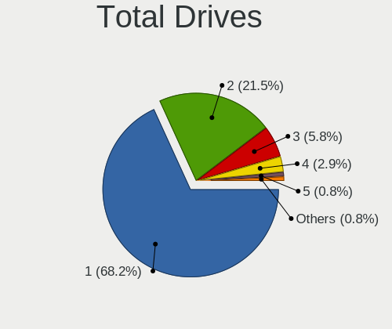
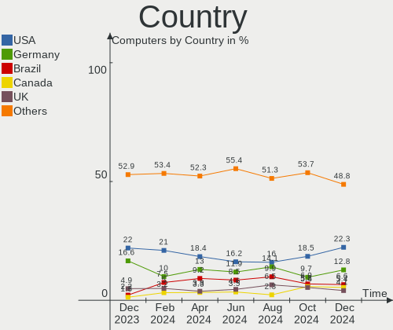
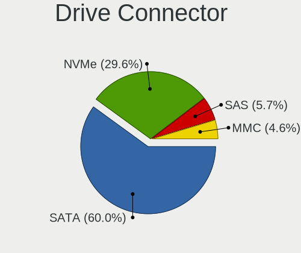
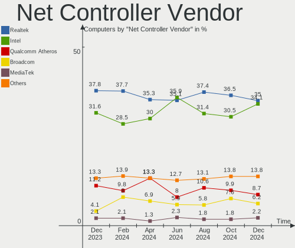
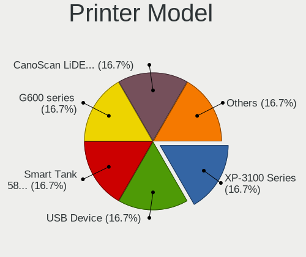

Zorin Hardware Trends
---------------------

A project to identify most popular hardware characteristics and track their change
over time based on data collected by Zorin users at https://Linux-Hardware.org.

Anyone can contribute to this report by the [hw-probe](https://github.com/linuxhw/hw-probe) tool:

    sudo -E hw-probe -all -upload

This is a report for all computer types. See also reports for [desktops](/Dist/Zorin/Desktop/README.md) and [notebooks](/Dist/Zorin/Notebook/README.md).

Full-feature report is available here: https://linux-hardware.org/?view=trends

Period: Sep, 2021.

Contents
--------

* [ System ](#system)
  - [ OS                       ](#os)
  - [ OS Family                ](#os-family)
  - [ Kernel                   ](#kernel)
  - [ Kernel Family            ](#kernel-family)
  - [ Kernel Major Ver.        ](#kernel-major-ver)
  - [ Arch                     ](#arch)
  - [ DE                       ](#de)
  - [ Display Server           ](#display-server)
  - [ Display Manager          ](#display-manager)
  - [ OS Lang                  ](#os-lang)
  - [ Boot Mode                ](#boot-mode)
  - [ Filesystem               ](#filesystem)
  - [ Part. scheme             ](#part-scheme)
  - [ Dual Boot with Linux/BSD ](#dual-boot-with-linuxbsd)
  - [ Dual Boot (Win)          ](#dual-boot-win)

* [ Board ](#board)
  - [ Vendor                   ](#vendor)
  - [ Model                    ](#model)
  - [ Model Family             ](#model-family)
  - [ MFG Year                 ](#mfg-year)
  - [ Form Factor              ](#form-factor)
  - [ Secure Boot              ](#secure-boot)
  - [ Coreboot                 ](#coreboot)
  - [ RAM Size                 ](#ram-size)
  - [ RAM Used                 ](#ram-used)
  - [ Total Drives             ](#total-drives)
  - [ Has CD-ROM               ](#has-cd-rom)
  - [ Has Ethernet             ](#has-ethernet)
  - [ Has WiFi                 ](#has-wifi)
  - [ Has Bluetooth            ](#has-bluetooth)

* [ Location ](#location)
  - [ Country                  ](#country)
  - [ City                     ](#city)

* [ Drives ](#drives)
  - [ Drive Vendor             ](#drive-vendor)
  - [ Drive Model              ](#drive-model)
  - [ HDD Vendor               ](#hdd-vendor)
  - [ SSD Vendor               ](#ssd-vendor)
  - [ Drive Kind               ](#drive-kind)
  - [ Drive Connector          ](#drive-connector)
  - [ Drive Size               ](#drive-size)
  - [ Space Total              ](#space-total)
  - [ Space Used               ](#space-used)
  - [ Malfunc. Drives          ](#malfunc-drives)
  - [ Malfunc. Drive Vendor    ](#malfunc-drive-vendor)
  - [ Malfunc. HDD Vendor      ](#malfunc-hdd-vendor)
  - [ Malfunc. Drive Kind      ](#malfunc-drive-kind)
  - [ Failed Drives            ](#failed-drives)
  - [ Failed Drive Vendor      ](#failed-drive-vendor)
  - [ Drive Status             ](#drive-status)

* [ Storage controller ](#storage-controller)
  - [ Storage Vendor           ](#storage-vendor)
  - [ Storage Model            ](#storage-model)
  - [ Storage Kind             ](#storage-kind)

* [ Processor ](#processor)
  - [ CPU Vendor               ](#cpu-vendor)
  - [ CPU Model                ](#cpu-model)
  - [ CPU Model Family         ](#cpu-model-family)
  - [ CPU Cores                ](#cpu-cores)
  - [ CPU Sockets              ](#cpu-sockets)
  - [ CPU Threads              ](#cpu-threads)
  - [ CPU Op-Modes             ](#cpu-op-modes)
  - [ CPU Microcode            ](#cpu-microcode)
  - [ CPU Microarch            ](#cpu-microarch)

* [ Graphics ](#graphics)
  - [ GPU Vendor               ](#gpu-vendor)
  - [ GPU Model                ](#gpu-model)
  - [ GPU Combo                ](#gpu-combo)
  - [ GPU Driver               ](#gpu-driver)
  - [ GPU Memory               ](#gpu-memory)

* [ Monitor ](#monitor)
  - [ Monitor Vendor           ](#monitor-vendor)
  - [ Monitor Model            ](#monitor-model)
  - [ Monitor Resolution       ](#monitor-resolution)
  - [ Monitor Diagonal         ](#monitor-diagonal)
  - [ Monitor Width            ](#monitor-width)
  - [ Aspect Ratio             ](#aspect-ratio)
  - [ Monitor Area             ](#monitor-area)
  - [ Pixel Density            ](#pixel-density)
  - [ Multiple Monitors        ](#multiple-monitors)

* [ Network ](#network)
  - [ Net Controller Vendor    ](#net-controller-vendor)
  - [ Net Controller Model     ](#net-controller-model)
  - [ Wireless Vendor          ](#wireless-vendor)
  - [ Wireless Model           ](#wireless-model)
  - [ Ethernet Vendor          ](#ethernet-vendor)
  - [ Ethernet Model           ](#ethernet-model)
  - [ Net Controller Kind      ](#net-controller-kind)
  - [ Used Controller          ](#used-controller)
  - [ NICs                     ](#nics)
  - [ IPv6                     ](#ipv6)

* [ Bluetooth ](#bluetooth)
  - [ Bluetooth Vendor         ](#bluetooth-vendor)
  - [ Bluetooth Model          ](#bluetooth-model)

* [ Sound ](#sound)
  - [ Sound Vendor             ](#sound-vendor)
  - [ Sound Model              ](#sound-model)

* [ Memory ](#memory)
  - [ Memory Vendor            ](#memory-vendor)
  - [ Memory Model             ](#memory-model)
  - [ Memory Kind              ](#memory-kind)
  - [ Memory Form Factor       ](#memory-form-factor)
  - [ Memory Size              ](#memory-size)
  - [ Memory Speed             ](#memory-speed)

* [ Printers & scanners ](#printers--scanners)
  - [ Printer Vendor           ](#printer-vendor)
  - [ Printer Model            ](#printer-model)
  - [ Scanner Vendor           ](#scanner-vendor)
  - [ Scanner Model            ](#scanner-model)

* [ Camera ](#camera)
  - [ Camera Vendor            ](#camera-vendor)
  - [ Camera Model             ](#camera-model)

* [ Security ](#security)
  - [ Fingerprint Vendor       ](#fingerprint-vendor)
  - [ Fingerprint Model        ](#fingerprint-model)
  - [ Chipcard Vendor          ](#chipcard-vendor)
  - [ Chipcard Model           ](#chipcard-model)

* [ Unsupported ](#unsupported)
  - [ Unsupported Devices      ](#unsupported-devices)
  - [ Unsupported Device Types ](#unsupported-device-types)

System
------

OS
--

Installed operating systems

| Name     | Computers | Percent |
|----------|-----------|---------|
| Zorin 16 | 207       | 83.13%  |
| Zorin 15 | 41        | 16.47%  |
| Zorin 12 | 1         | 0.4%    |

OS Family
---------

OS without a version

| Name  | Computers | Percent |
|-------|-----------|---------|
| Zorin | 249       | 100%    |

Kernel
------

Version of the Linux kernel

| Version           | Computers | Percent |
|-------------------|-----------|---------|
| 5.11.0-34-generic | 92        | 36.95%  |
| 5.11.0-27-generic | 67        | 26.91%  |
| 5.11.0-36-generic | 37        | 14.86%  |
| 5.4.0-81-generic  | 16        | 6.43%   |
| 5.11.0-37-generic | 9         | 3.61%   |
| 5.4.0-84-generic  | 8         | 3.21%   |
| 5.4.0-86-generic  | 6         | 2.41%   |
| 5.4.0-87-generic  | 2         | 0.8%    |
| 5.4.0-47-generic  | 2         | 0.8%    |
| 5.4.0-45-generic  | 2         | 0.8%    |
| 5.4.0-80-generic  | 1         | 0.4%    |
| 5.4.0-74-generic  | 1         | 0.4%    |
| 5.4.0-73-generic  | 1         | 0.4%    |
| 5.4.0-72-generic  | 1         | 0.4%    |
| 5.3.0-51-generic  | 1         | 0.4%    |
| 5.13.18-xanmod1   | 1         | 0.4%    |
| 5.11.0-25-generic | 1         | 0.4%    |
| 4.13.0-37-generic | 1         | 0.4%    |

Kernel Family
-------------

Linux kernel without a distro release

| Version | Computers | Percent |
|---------|-----------|---------|
| 5.11.0  | 206       | 82.73%  |
| 5.4.0   | 40        | 16.06%  |
| 5.3.0   | 1         | 0.4%    |
| 5.13.18 | 1         | 0.4%    |
| 4.13.0  | 1         | 0.4%    |

Kernel Major Ver.
-----------------

Linux kernel major version

| Version | Computers | Percent |
|---------|-----------|---------|
| 5.11    | 206       | 82.73%  |
| 5.4     | 40        | 16.06%  |
| 5.3     | 1         | 0.4%    |
| 5.13    | 1         | 0.4%    |
| 4.13    | 1         | 0.4%    |

Arch
----

OS architecture (x86_64, i586, etc.)

| Name   | Computers | Percent |
|--------|-----------|---------|
| x86_64 | 235       | 94.38%  |
| i686   | 14        | 5.62%   |

DE
--

Desktop Environment

| Name    | Computers | Percent |
|---------|-----------|---------|
| GNOME   | 214       | 85.94%  |
| XFCE    | 28        | 11.24%  |
| Unknown | 6         | 2.41%   |
| Budgie  | 1         | 0.4%    |

Display Server
--------------

X11 or Wayland

| Name    | Computers | Percent |
|---------|-----------|---------|
| X11     | 243       | 97.59%  |
| Wayland | 4         | 1.61%   |
| Unknown | 2         | 0.8%    |

Display Manager
---------------

SDDM, LightDM, etc.

| Name    | Computers | Percent |
|---------|-----------|---------|
| Unknown | 216       | 86.75%  |
| GDM     | 16        | 6.43%   |
| GDM3    | 10        | 4.02%   |
| LightDM | 7         | 2.81%   |

OS Lang
-------

Language

| Lang  | Computers | Percent |
|-------|-----------|---------|
| en_US | 94        | 37.75%  |
| en_GB | 24        | 9.64%   |
| pt_BR | 19        | 7.63%   |
| de_DE | 17        | 6.83%   |
| en_IN | 10        | 4.02%   |
| en_CA | 9         | 3.61%   |
| it_IT | 7         | 2.81%   |
| en_AU | 7         | 2.81%   |
| fr_FR | 6         | 2.41%   |
| pt_PT | 5         | 2.01%   |
| es_MX | 5         | 2.01%   |
| es_ES | 5         | 2.01%   |
| en_ZA | 4         | 1.61%   |
| cs_CZ | 4         | 1.61%   |
| fr_CA | 3         | 1.2%    |
| en_NZ | 3         | 1.2%    |
| sv_SE | 2         | 0.8%    |
| nl_NL | 2         | 0.8%    |
| fi_FI | 2         | 0.8%    |
| es_CL | 2         | 0.8%    |
| es_AR | 2         | 0.8%    |
| el_GR | 2         | 0.8%    |
| de_CH | 2         | 0.8%    |
| zh_CN | 1         | 0.4%    |
| sk_SK | 1         | 0.4%    |
| ru_RU | 1         | 0.4%    |
| pl_PL | 1         | 0.4%    |
| nl_BE | 1         | 0.4%    |
| hu_HU | 1         | 0.4%    |
| fr_BE | 1         | 0.4%    |
| es_PA | 1         | 0.4%    |
| es_GT | 1         | 0.4%    |
| es_CO | 1         | 0.4%    |
| en_PH | 1         | 0.4%    |
| de_AT | 1         | 0.4%    |
| C     | 1         | 0.4%    |

Boot Mode
---------

EFI or BIOS

| Mode | Computers | Percent |
|------|-----------|---------|
| EFI  | 128       | 51.41%  |
| BIOS | 121       | 48.59%  |

Filesystem
----------

Type of filesystem

| Type    | Computers | Percent |
|---------|-----------|---------|
| Ext4    | 233       | 93.57%  |
| Zfs     | 7         | 2.81%   |
| Overlay | 3         | 1.2%    |
| Btrfs   | 3         | 1.2%    |
| Xfs     | 1         | 0.4%    |
| Ext3    | 1         | 0.4%    |
| Ext2    | 1         | 0.4%    |

Part. scheme
------------

Scheme of partitioning

| Type    | Computers | Percent |
|---------|-----------|---------|
| Unknown | 229       | 91.97%  |
| GPT     | 16        | 6.43%   |
| MBR     | 4         | 1.61%   |

Dual Boot with Linux/BSD
------------------------

Hosting more than one Linux/BSD

| Dual boot | Computers | Percent |
|-----------|-----------|---------|
| No        | 246       | 98.8%   |
| Yes       | 3         | 1.2%    |

Dual Boot (Win)
---------------

Hosting Linux and Windows

| Dual boot | Computers | Percent |
|-----------|-----------|---------|
| No        | 219       | 87.95%  |
| Yes       | 30        | 12.05%  |

Board
-----

Vendor
------

Motherboard manufacturer

| Name                        | Computers | Percent |
|-----------------------------|-----------|---------|
| Hewlett-Packard             | 43        | 17.27%  |
| ASUSTek Computer            | 40        | 16.06%  |
| Dell                        | 32        | 12.85%  |
| Lenovo                      | 29        | 11.65%  |
| Acer                        | 23        | 9.24%   |
| MSI                         | 11        | 4.42%   |
| Gigabyte Technology         | 11        | 4.42%   |
| Toshiba                     | 10        | 4.02%   |
| ASRock                      | 8         | 3.21%   |
| Intel                       | 6         | 2.41%   |
| Apple                       | 5         | 2.01%   |
| Sony                        | 3         | 1.2%    |
| Unknown                     | 3         | 1.2%    |
| eMachines                   | 2         | 0.8%    |
| Biostar                     | 2         | 0.8%    |
| UNOWHY                      | 1         | 0.4%    |
| TianBei                     | 1         | 0.4%    |
| Sapphire Technology Limited | 1         | 0.4%    |
| Samsung Electronics         | 1         | 0.4%    |
| RCA                         | 1         | 0.4%    |
| Positivo                    | 1         | 0.4%    |
| Philco                      | 1         | 0.4%    |
| Pendo Industries            | 1         | 0.4%    |
| NCR                         | 1         | 0.4%    |
| LG Electronics              | 1         | 0.4%    |
| KOGAN                       | 1         | 0.4%    |
| Jumper                      | 1         | 0.4%    |
| JOOYON                      | 1         | 0.4%    |
| GPD                         | 1         | 0.4%    |
| Google                      | 1         | 0.4%    |
| Fujitsu Siemens             | 1         | 0.4%    |
| Fujitsu                     | 1         | 0.4%    |
| Foxconn                     | 1         | 0.4%    |
| Dynabook                    | 1         | 0.4%    |
| Digibras                    | 1         | 0.4%    |
| Cube                        | 1         | 0.4%    |

Model
-----

Motherboard model

| Name                                     | Computers | Percent |
|------------------------------------------|-----------|---------|
| Unknown                                  | 4         | 1.61%   |
| MSI MS-7817                              | 2         | 0.8%    |
| HP Notebook                              | 2         | 0.8%    |
| Gigabyte A320M-S2H                       | 2         | 0.8%    |
| Dell Latitude E6430                      | 2         | 0.8%    |
| Dell Inspiron 15 7000 Gaming             | 2         | 0.8%    |
| ASUS PRIME B450M-GAMING/BR               | 2         | 0.8%    |
| Acer One S1003                           | 2         | 0.8%    |
| Acer Aspire V3-571G                      | 2         | 0.8%    |
| UNOWHY Y13G011S4EI                       | 1         | 0.4%    |
| Toshiba Satellite Pro L450D              | 1         | 0.4%    |
| Toshiba Satellite PRO C850-1H8           | 1         | 0.4%    |
| Toshiba Satellite L755                   | 1         | 0.4%    |
| Toshiba Satellite C870-1C2               | 1         | 0.4%    |
| Toshiba Satellite C850D-11C              | 1         | 0.4%    |
| Toshiba Satellite C850-1CP               | 1         | 0.4%    |
| Toshiba Satellite C75D-B                 | 1         | 0.4%    |
| Toshiba Satellite C50-B                  | 1         | 0.4%    |
| Toshiba PORTEGE Z30-A                    | 1         | 0.4%    |
| Toshiba PORTEGE R700                     | 1         | 0.4%    |
| TianBei TB-H7                            | 1         | 0.4%    |
| Sony VPCS135FX                           | 1         | 0.4%    |
| Sony VPCF215FX                           | 1         | 0.4%    |
| Sony VGN-SR5                             | 1         | 0.4%    |
| Sapphire Limited PURE PLATINUM 970A-PLUS | 1         | 0.4%    |
| Samsung 550P5C/550P7C                    | 1         | 0.4%    |
| RCA W101-CS                              | 1         | 0.4%    |
| Positivo Mobile                          | 1         | 0.4%    |
| Philco 14F                               | 1         | 0.4%    |
| Pendo PNDFWXUFD11BLK6                    | 1         | 0.4%    |
| NCR xxxx-xxxx-xxxx                       | 1         | 0.4%    |
| MSI WE136AA-UUZ p6337ch                  | 1         | 0.4%    |
| MSI MS-B10611                            | 1         | 0.4%    |
| MSI MS-7D18                              | 1         | 0.4%    |
| MSI MS-7B89                              | 1         | 0.4%    |
| MSI MS-7798                              | 1         | 0.4%    |
| MSI Modern 15 A11M                       | 1         | 0.4%    |
| MSI GS75 Stealth 10SF                    | 1         | 0.4%    |
| MSI GL62 7RDX                            | 1         | 0.4%    |
| MSI GE75 Raider 8RF                      | 1         | 0.4%    |
| LG C400-G.BC22P1                         | 1         | 0.4%    |
| Lenovo Yoga 530-14ARR 81H9               | 1         | 0.4%    |
| Lenovo Yoga 510-14ISK 80S7               | 1         | 0.4%    |
| Lenovo ThinkPad W520 4284AW3             | 1         | 0.4%    |
| Lenovo ThinkPad T61 765818U              | 1         | 0.4%    |
| Lenovo ThinkPad T520 42435GG             | 1         | 0.4%    |
| Lenovo ThinkPad T520 4242W19             | 1         | 0.4%    |
| Lenovo ThinkPad T470s W10DG 20JTS0280G   | 1         | 0.4%    |
| Lenovo ThinkPad T460 20FMS7DA00          | 1         | 0.4%    |
| Lenovo ThinkPad T440s 20ARS10700         | 1         | 0.4%    |
| Lenovo ThinkPad P50 20EN001EUS           | 1         | 0.4%    |
| Lenovo ThinkPad P14s Gen 1 20Y1CTO1WW    | 1         | 0.4%    |
| Lenovo ThinkPad Edge E531 688528U        | 1         | 0.4%    |
| Lenovo ThinkPad E15 Gen 2 20TD000HZA     | 1         | 0.4%    |
| Lenovo ThinkPad E14 20RAS1Q800           | 1         | 0.4%    |
| Lenovo ThinkCentre M93p 10A8A04FBR       | 1         | 0.4%    |
| Lenovo ThinkCentre M81 0385AW6           | 1         | 0.4%    |
| Lenovo ThinkCentre M73 10B7S02L00        | 1         | 0.4%    |
| Lenovo ThinkCentre M58 3231W2Y           | 1         | 0.4%    |
| Lenovo MIIX 520-12IKB 20M3               | 1         | 0.4%    |

Model Family
------------

Motherboard model prefix

| Name                  | Computers | Percent |
|-----------------------|-----------|---------|
| Acer Aspire           | 17        | 6.83%   |
| Lenovo ThinkPad       | 12        | 4.82%   |
| Dell Latitude         | 10        | 4.02%   |
| Toshiba Satellite     | 8         | 3.21%   |
| HP Pavilion           | 8         | 3.21%   |
| HP EliteBook          | 7         | 2.81%   |
| Dell Inspiron         | 7         | 2.81%   |
| ASUS VivoBook         | 5         | 2.01%   |
| Lenovo ThinkCentre    | 4         | 1.61%   |
| Lenovo IdeaPad        | 4         | 1.61%   |
| Dell XPS              | 4         | 1.61%   |
| Dell OptiPlex         | 4         | 1.61%   |
| ASUS ROG              | 4         | 1.61%   |
| ASUS PRIME            | 4         | 1.61%   |
| Unknown               | 4         | 1.61%   |
| HP ProBook            | 3         | 1.2%    |
| HP ENVY               | 3         | 1.2%    |
| HP Compaq             | 3         | 1.2%    |
| HP 255                | 3         | 1.2%    |
| Dell Precision        | 3         | 1.2%    |
| Toshiba PORTEGE       | 2         | 0.8%    |
| MSI MS-7817           | 2         | 0.8%    |
| Lenovo Yoga           | 2         | 0.8%    |
| Lenovo MIIX           | 2         | 0.8%    |
| HP t620               | 2         | 0.8%    |
| HP Notebook           | 2         | 0.8%    |
| Gigabyte A320M-S2H    | 2         | 0.8%    |
| Dell Vostro           | 2         | 0.8%    |
| ASUS ZenBook          | 2         | 0.8%    |
| ASUS M5A97            | 2         | 0.8%    |
| Acer One              | 2         | 0.8%    |
| UNOWHY Y13G011S4EI    | 1         | 0.4%    |
| TianBei TB-H7         | 1         | 0.4%    |
| Sony VPCS135FX        | 1         | 0.4%    |
| Sony VPCF215FX        | 1         | 0.4%    |
| Sony VGN-SR5          | 1         | 0.4%    |
| Sapphire Limited PURE | 1         | 0.4%    |
| Samsung 550P5C        | 1         | 0.4%    |
| RCA W101-CS           | 1         | 0.4%    |
| Positivo Mobile       | 1         | 0.4%    |
| Philco 14F            | 1         | 0.4%    |
| Pendo PNDFWXUFD11BLK6 | 1         | 0.4%    |
| NCR xxxx-xxxx-xxxx    | 1         | 0.4%    |
| MSI WE136AA-UUZ       | 1         | 0.4%    |
| MSI MS-B10611         | 1         | 0.4%    |
| MSI MS-7D18           | 1         | 0.4%    |
| MSI MS-7B89           | 1         | 0.4%    |
| MSI MS-7798           | 1         | 0.4%    |
| MSI Modern            | 1         | 0.4%    |
| MSI GS75              | 1         | 0.4%    |
| MSI GL62              | 1         | 0.4%    |
| MSI GE75              | 1         | 0.4%    |
| LG C400-G.BC22P1      | 1         | 0.4%    |
| Lenovo IdeaCentre     | 1         | 0.4%    |
| Lenovo G580           | 1         | 0.4%    |
| Lenovo G505s          | 1         | 0.4%    |
| Lenovo G50-80         | 1         | 0.4%    |
| Lenovo B50-30         | 1         | 0.4%    |
| KOGAN KAL11C250SB     | 1         | 0.4%    |
| Jumper EZpad          | 1         | 0.4%    |

MFG Year
--------

Motherboard manufacture year

| Year | Computers | Percent |
|------|-----------|---------|
| 2020 | 37        | 14.86%  |
| 2021 | 34        | 13.65%  |
| 2011 | 23        | 9.24%   |
| 2019 | 20        | 8.03%   |
| 2018 | 20        | 8.03%   |
| 2013 | 17        | 6.83%   |
| 2010 | 16        | 6.43%   |
| 2014 | 14        | 5.62%   |
| 2012 | 12        | 4.82%   |
| 2016 | 10        | 4.02%   |
| 2009 | 10        | 4.02%   |
| 2017 | 8         | 3.21%   |
| 2015 | 8         | 3.21%   |
| 2008 | 7         | 2.81%   |
| 2007 | 4         | 1.61%   |
| 2006 | 4         | 1.61%   |
| 2005 | 4         | 1.61%   |
| 2004 | 1         | 0.4%    |

Form Factor
-----------

Physical design of the computer

| Name        | Computers | Percent |
|-------------|-----------|---------|
| Notebook    | 147       | 59.04%  |
| Desktop     | 82        | 32.93%  |
| Tablet      | 6         | 2.41%   |
| Convertible | 5         | 2.01%   |
| All in one  | 4         | 1.61%   |
| Mini pc     | 3         | 1.2%    |
| Other       | 1         | 0.4%    |
| Server      | 1         | 0.4%    |

Secure Boot
-----------

Enabled or disabled

| State    | Computers | Percent |
|----------|-----------|---------|
| Disabled | 220       | 88.35%  |
| Enabled  | 29        | 11.65%  |

Coreboot
--------

Have coreboot on board

| Used | Computers | Percent |
|------|-----------|---------|
| No   | 248       | 99.6%   |
| Yes  | 1         | 0.4%    |

RAM Size
--------

Total RAM memory

| Size in GB  | Computers | Percent |
|-------------|-----------|---------|
| 4.01-8.0    | 68        | 27.31%  |
| 3.01-4.0    | 59        | 23.69%  |
| 8.01-16.0   | 45        | 18.07%  |
| 16.01-24.0  | 28        | 11.24%  |
| 32.01-64.0  | 20        | 8.03%   |
| 1.01-2.0    | 17        | 6.83%   |
| 2.01-3.0    | 4         | 1.61%   |
| 0.51-1.0    | 4         | 1.61%   |
| 24.01-32.0  | 2         | 0.8%    |
| 64.01-256.0 | 2         | 0.8%    |

RAM Used
--------

Used RAM memory

| Used GB    | Computers | Percent |
|------------|-----------|---------|
| 1.01-2.0   | 104       | 41.77%  |
| 2.01-3.0   | 76        | 30.52%  |
| 3.01-4.0   | 34        | 13.65%  |
| 4.01-8.0   | 18        | 7.23%   |
| 0.51-1.0   | 12        | 4.82%   |
| 0.01-0.5   | 2         | 0.8%    |
| 24.01-32.0 | 1         | 0.4%    |
| 16.01-24.0 | 1         | 0.4%    |
| 8.01-16.0  | 1         | 0.4%    |

Total Drives
------------

Number of drives on board

| Drives | Computers | Percent |
|--------|-----------|---------|
| 1      | 162       | 65.06%  |
| 2      | 59        | 23.69%  |
| 3      | 13        | 5.22%   |
| 4      | 10        | 4.02%   |
| 5      | 4         | 1.61%   |
| 6      | 1         | 0.4%    |

Has CD-ROM
----------

Has CD-ROM on board

| Presented | Computers | Percent |
|-----------|-----------|---------|
| No        | 137       | 55.02%  |
| Yes       | 112       | 44.98%  |

Has Ethernet
------------

Has Ethernet on board

| Presented | Computers | Percent |
|-----------|-----------|---------|
| Yes       | 217       | 87.15%  |
| No        | 32        | 12.85%  |

Has WiFi
--------

Has WiFi module

| Presented | Computers | Percent |
|-----------|-----------|---------|
| Yes       | 204       | 81.93%  |
| No        | 45        | 18.07%  |

Has Bluetooth
-------------

Has Bluetooth module

| Presented | Computers | Percent |
|-----------|-----------|---------|
| Yes       | 143       | 57.43%  |
| No        | 106       | 42.57%  |

Location
--------

Country
-------

Geographic location (country)

| Country      | Computers | Percent |
|--------------|-----------|---------|
| USA          | 49        | 19.68%  |
| Brazil       | 22        | 8.84%   |
| UK           | 21        | 8.43%   |
| Germany      | 18        | 7.23%   |
| Canada       | 13        | 5.22%   |
| India        | 10        | 4.02%   |
| Italy        | 8         | 3.21%   |
| South Africa | 7         | 2.81%   |
| France       | 7         | 2.81%   |
| Australia    | 7         | 2.81%   |
| Netherlands  | 6         | 2.41%   |
| Mexico       | 6         | 2.41%   |
| Sweden       | 5         | 2.01%   |
| Spain        | 5         | 2.01%   |
| Greece       | 5         | 2.01%   |
| Hungary      | 4         | 1.61%   |
| Czechia      | 4         | 1.61%   |
| Switzerland  | 3         | 1.2%    |
| Portugal     | 3         | 1.2%    |
| New Zealand  | 3         | 1.2%    |
| Chile        | 3         | 1.2%    |
| Belgium      | 3         | 1.2%    |
| Austria      | 3         | 1.2%    |
| Argentina    | 3         | 1.2%    |
| Thailand     | 2         | 0.8%    |
| Romania      | 2         | 0.8%    |
| Philippines  | 2         | 0.8%    |
| Morocco      | 2         | 0.8%    |
| Indonesia    | 2         | 0.8%    |
| Finland      | 2         | 0.8%    |
| Turkey       | 1         | 0.4%    |
| Tanzania     | 1         | 0.4%    |
| Slovakia     | 1         | 0.4%    |
| Serbia       | 1         | 0.4%    |
| Russia       | 1         | 0.4%    |
| Poland       | 1         | 0.4%    |
| Panama       | 1         | 0.4%    |
| Norway       | 1         | 0.4%    |
| Nepal        | 1         | 0.4%    |
| Mozambique   | 1         | 0.4%    |
| Malaysia     | 1         | 0.4%    |
| Israel       | 1         | 0.4%    |
| Iran         | 1         | 0.4%    |
| Guatemala    | 1         | 0.4%    |
| El Salvador  | 1         | 0.4%    |
| Colombia     | 1         | 0.4%    |
| China        | 1         | 0.4%    |
| Belarus      | 1         | 0.4%    |
| Angola       | 1         | 0.4%    |

City
----

Geographic location (city)

| City                  | Computers | Percent |
|-----------------------|-----------|---------|
| Stockholm             | 3         | 1.2%    |
| Paris                 | 3         | 1.2%    |
| Vienna                | 2         | 0.8%    |
| Vadodara              | 2         | 0.8%    |
| S??o Paulo            | 2         | 0.8%    |
| Rome                  | 2         | 0.8%    |
| Rio de Janeiro        | 2         | 0.8%    |
| Montreal              | 2         | 0.8%    |
| Milan                 | 2         | 0.8%    |
| Mentor                | 2         | 0.8%    |
| Maca?©                | 2         | 0.8%    |
| London                | 2         | 0.8%    |
| Johannesburg          | 2         | 0.8%    |
| Helsinki              | 2         | 0.8%    |
| Glasgow               | 2         | 0.8%    |
| Dunedin               | 2         | 0.8%    |
| Drummondville         | 2         | 0.8%    |
| Budapest              | 2         | 0.8%    |
| Brisbane              | 2         | 0.8%    |
| Berlin                | 2         | 0.8%    |
| Athens                | 2         | 0.8%    |
| Aberdeen              | 2         | 0.8%    |
| Zurich                | 1         | 0.4%    |
| Zoetermeer            | 1         | 0.4%    |
| Zionsville            | 1         | 0.4%    |
| Zaventem              | 1         | 0.4%    |
| Zacatecas City        | 1         | 0.4%    |
| Winnipeg              | 1         | 0.4%    |
| Wilderness Rim        | 1         | 0.4%    |
| Wigan                 | 1         | 0.4%    |
| West Jordan           | 1         | 0.4%    |
| Warrenton             | 1         | 0.4%    |
| Wandsworth            | 1         | 0.4%    |
| Vincennes             | 1         | 0.4%    |
| Veracruz              | 1         | 0.4%    |
| Vancouver             | 1         | 0.4%    |
| Valley Stream         | 1         | 0.4%    |
| Utrecht               | 1         | 0.4%    |
| Unterschleissheim     | 1         | 0.4%    |
| Twinsburg             | 1         | 0.4%    |
| Tucson                | 1         | 0.4%    |
| Toronto               | 1         | 0.4%    |
| Thame                 | 1         | 0.4%    |
| Tangier               | 1         | 0.4%    |
| Taby                  | 1         | 0.4%    |
| Taboao da Serra       | 1         | 0.4%    |
| Sydney                | 1         | 0.4%    |
| Stuttgart             | 1         | 0.4%    |
| St Albans             | 1         | 0.4%    |
| Spartanburg           | 1         | 0.4%    |
| Solingen              | 1         | 0.4%    |
| Sigless               | 1         | 0.4%    |
| Shenzhen              | 1         | 0.4%    |
| Sechelt               | 1         | 0.4%    |
| S??o Lu?­s            | 1         | 0.4%    |
| S??o Jos?© dos Campos | 1         | 0.4%    |
| Satu Mare             | 1         | 0.4%    |
| Santiago              | 1         | 0.4%    |
| Santander             | 1         | 0.4%    |
| Santa Tecla           | 1         | 0.4%    |

Drives
------

Drive Vendor
------------

Hard drive vendors

| Vendor                         | Computers | Drives | Percent |
|--------------------------------|-----------|--------|---------|
| Seagate                        | 49        | 53     | 14.45%  |
| WDC                            | 48        | 56     | 14.16%  |
| Samsung Electronics            | 46        | 58     | 13.57%  |
| Toshiba                        | 25        | 25     | 7.37%   |
| Unknown                        | 22        | 27     | 6.49%   |
| Hitachi                        | 17        | 18     | 5.01%   |
| Sandisk                        | 16        | 17     | 4.72%   |
| Kingston                       | 12        | 12     | 3.54%   |
| Crucial                        | 12        | 12     | 3.54%   |
| HGST                           | 10        | 11     | 2.95%   |
| SK Hynix                       | 9         | 11     | 2.65%   |
| A-DATA Technology              | 6         | 7      | 1.77%   |
| Micron Technology              | 5         | 5      | 1.47%   |
| Silicon Motion                 | 4         | 5      | 1.18%   |
| Intel                          | 4         | 7      | 1.18%   |
| SPCC                           | 3         | 3      | 0.88%   |
| PNY                            | 3         | 3      | 0.88%   |
| Intenso                        | 3         | 3      | 0.88%   |
| Verbatim                       | 2         | 2      | 0.59%   |
| Team                           | 2         | 2      | 0.59%   |
| SABRENT                        | 2         | 2      | 0.59%   |
| Phison                         | 2         | 3      | 0.59%   |
| Patriot                        | 2         | 2      | 0.59%   |
| MAXTOR                         | 2         | 2      | 0.59%   |
| Lite-On                        | 2         | 2      | 0.59%   |
| Lexar                          | 2         | 2      | 0.59%   |
| JMicron                        | 2         | 3      | 0.59%   |
| Gigabyte Technology            | 2         | 2      | 0.59%   |
| Fujitsu                        | 2         | 2      | 0.59%   |
| Apple                          | 2         | 3      | 0.59%   |
| Vaseky                         | 1         | 1      | 0.29%   |
| Transcend                      | 1         | 1      | 0.29%   |
| T-FORCE                        | 1         | 1      | 0.29%   |
| Super Talent                   | 1         | 1      | 0.29%   |
| Solid State Storage Technology | 1         | 1      | 0.29%   |
| Realtek Semiconductor          | 1         | 1      | 0.29%   |
| OWC                            | 1         | 1      | 0.29%   |
| Netac                          | 1         | 1      | 0.29%   |
| Micron/Crucial Technology      | 1         | 1      | 0.29%   |
| LITEONIT                       | 1         | 1      | 0.29%   |
| Leven                          | 1         | 1      | 0.29%   |
| KIOXIA                         | 1         | 1      | 0.29%   |
| KingSpec                       | 1         | 2      | 0.29%   |
| IBM/Hitachi                    | 1         | 1      | 0.29%   |
| Hewlett-Packard                | 1         | 1      | 0.29%   |
| GOODRAM                        | 1         | 1      | 0.29%   |
| Config                         | 1         | 1      | 0.29%   |
| China                          | 1         | 1      | 0.29%   |
| BIWIN                          | 1         | 1      | 0.29%   |
| ASMT109x                       | 1         | 1      | 0.29%   |
| Unknown                        | 1         | 1      | 0.29%   |

Drive Model
-----------

Hard drive models

| Model                                | Computers | Percent |
|--------------------------------------|-----------|---------|
| Unknown MMC Card  64GB               | 9         | 2.4%    |
| Unknown MMC Card  32GB               | 5         | 1.33%   |
| Samsung SSD 850 EVO 500GB            | 5         | 1.33%   |
| Samsung NVMe SSD Drive 256GB         | 5         | 1.33%   |
| Crucial CT240BX500SSD1 240GB         | 5         | 1.33%   |
| Seagate ST1000LM035-1RK172 1TB       | 4         | 1.07%   |
| Seagate ST1000LM024 HN-M101MBB 1TB   | 4         | 1.07%   |
| Samsung SSD 860 EVO 500GB            | 4         | 1.07%   |
| Samsung NVMe SSD Drive 1TB           | 4         | 1.07%   |
| Unknown SD/MMC/MS PRO 128GB          | 3         | 0.8%    |
| Toshiba MQ01ABF050 500GB             | 3         | 0.8%    |
| SK Hynix NVMe SSD Drive 256GB        | 3         | 0.8%    |
| Seagate ST9500420AS 500GB            | 3         | 0.8%    |
| Seagate ST500DM002-1BD142 500GB      | 3         | 0.8%    |
| Samsung SSD 860 EVO 250GB            | 3         | 0.8%    |
| Samsung NVMe SSD Drive 512GB         | 3         | 0.8%    |
| Kingston SA400S37240G 240GB SSD      | 3         | 0.8%    |
| Kingston SA400S37120G 120GB SSD      | 3         | 0.8%    |
| HGST HTS721010A9E630 1TB             | 3         | 0.8%    |
| WDC WDS100T2B0A-00SM50 1TB SSD       | 2         | 0.53%   |
| WDC WD6400BEVT-22A0RT0 640GB         | 2         | 0.53%   |
| WDC WD10EZEX-60WN4A0 1TB             | 2         | 0.53%   |
| WDC WD10EZEX-22BN5A0 1TB             | 2         | 0.53%   |
| Unknown MMC Card  128GB              | 2         | 0.53%   |
| Toshiba MQ04ABF100 1TB               | 2         | 0.53%   |
| Toshiba MQ01ABD032 320GB             | 2         | 0.53%   |
| Toshiba KBG30ZMS128G 128GB NVMe SSD  | 2         | 0.53%   |
| Toshiba DT01ACA200 2TB               | 2         | 0.53%   |
| Toshiba DT01ACA050 500GB             | 2         | 0.53%   |
| Seagate ST9500325AS 500GB            | 2         | 0.53%   |
| Seagate ST500VT000-1DK142 500GB      | 2         | 0.53%   |
| Seagate Expansion 1TB                | 2         | 0.53%   |
| SanDisk SDSSDA240G 240GB             | 2         | 0.53%   |
| SanDisk SDSSDA120G 120GB             | 2         | 0.53%   |
| Sandisk NVMe SSD Drive 512GB         | 2         | 0.53%   |
| Samsung SSD 970 EVO Plus 1TB         | 2         | 0.53%   |
| Samsung SSD 850 EVO 250GB            | 2         | 0.53%   |
| Samsung SSD 840 EVO 250GB            | 2         | 0.53%   |
| Samsung NVMe SSD Drive 500GB         | 2         | 0.53%   |
| SABRENT Disk 1TB                     | 2         | 0.53%   |
| Micron NVMe SSD Drive 512GB          | 2         | 0.53%   |
| Kingston NVMe SSD Drive 500GB        | 2         | 0.53%   |
| Intenso SSD Sata III 120GB           | 2         | 0.53%   |
| Intel NVMe SSD Drive 1024GB          | 2         | 0.53%   |
| Hitachi HTS547575A9E384 752GB        | 2         | 0.53%   |
| Hitachi HTS545032B9A300 320GB        | 2         | 0.53%   |
| HGST HTS545050A7E380 500GB           | 2         | 0.53%   |
| Gigabyte GP-GSTFS31120GNTD 120GB SSD | 2         | 0.53%   |
| WDC WDS240G2G0B-00EPW0 240GB SSD     | 1         | 0.27%   |
| WDC WDS240G2G0A-00JH30 240GB SSD     | 1         | 0.27%   |
| WDC WDS100T2G0A-00JH30 1TB SSD       | 1         | 0.27%   |
| WDC WD800JD-75MSA3 80GB              | 1         | 0.27%   |
| WDC WD800BEVE-00UYT0 80GB            | 1         | 0.27%   |
| WDC WD7500BPKX-00HPJT0 752GB         | 1         | 0.27%   |
| WDC WD7500AADS-00M2B0 752GB          | 1         | 0.27%   |
| WDC WD6400AADS-00M2B0 640GB          | 1         | 0.27%   |
| WDC WD5000LPCX-60VHAT0 500GB         | 1         | 0.27%   |
| WDC WD5000BEVT-22ZAT0 500GB          | 1         | 0.27%   |
| WDC WD5000AVDS-63U7B1 500GB          | 1         | 0.27%   |
| WDC WD5000AAKX-60U6AA0 500GB         | 1         | 0.27%   |

HDD Vendor
----------

Hard disk drive vendors

| Vendor              | Computers | Drives | Percent |
|---------------------|-----------|--------|---------|
| Seagate             | 48        | 52     | 31.79%  |
| WDC                 | 42        | 49     | 27.81%  |
| Toshiba             | 19        | 19     | 12.58%  |
| Hitachi             | 17        | 18     | 11.26%  |
| HGST                | 10        | 11     | 6.62%   |
| Samsung Electronics | 4         | 4      | 2.65%   |
| Unknown             | 3         | 3      | 1.99%   |
| MAXTOR              | 2         | 2      | 1.32%   |
| Fujitsu             | 2         | 2      | 1.32%   |
| IBM/Hitachi         | 1         | 1      | 0.66%   |
| Hewlett-Packard     | 1         | 1      | 0.66%   |
| ASMT109x            | 1         | 1      | 0.66%   |
| Apple               | 1         | 1      | 0.66%   |

SSD Vendor
----------

Solid state drive vendors

| Vendor              | Computers | Drives | Percent |
|---------------------|-----------|--------|---------|
| Samsung Electronics | 27        | 29     | 24.32%  |
| SanDisk             | 11        | 12     | 9.91%   |
| Crucial             | 11        | 11     | 9.91%   |
| Kingston            | 10        | 10     | 9.01%   |
| WDC                 | 5         | 5      | 4.5%    |
| A-DATA Technology   | 5         | 6      | 4.5%    |
| SK Hynix            | 4         | 4      | 3.6%    |
| Toshiba             | 3         | 3      | 2.7%    |
| SPCC                | 3         | 3      | 2.7%    |
| PNY                 | 3         | 3      | 2.7%    |
| Micron Technology   | 3         | 3      | 2.7%    |
| Intenso             | 3         | 3      | 2.7%    |
| Verbatim            | 2         | 2      | 1.8%    |
| Team                | 2         | 2      | 1.8%    |
| SABRENT             | 2         | 2      | 1.8%    |
| Patriot             | 2         | 2      | 1.8%    |
| Lexar               | 2         | 2      | 1.8%    |
| Gigabyte Technology | 2         | 2      | 1.8%    |
| Transcend           | 1         | 1      | 0.9%    |
| Super Talent        | 1         | 1      | 0.9%    |
| OWC                 | 1         | 1      | 0.9%    |
| Netac               | 1         | 1      | 0.9%    |
| LITEONIT            | 1         | 1      | 0.9%    |
| Leven               | 1         | 1      | 0.9%    |
| KingSpec            | 1         | 2      | 0.9%    |
| Intel               | 1         | 1      | 0.9%    |
| GOODRAM             | 1         | 1      | 0.9%    |
| China               | 1         | 1      | 0.9%    |
| BIWIN               | 1         | 1      | 0.9%    |

Drive Kind
----------

HDD or SSD

| Kind    | Computers | Drives | Percent |
|---------|-----------|--------|---------|
| HDD     | 126       | 164    | 41.04%  |
| SSD     | 101       | 116    | 32.9%   |
| NVMe    | 55        | 72     | 17.92%  |
| MMC     | 16        | 20     | 5.21%   |
| Unknown | 9         | 10     | 2.93%   |

Drive Connector
---------------

SATA, SAS, NVMe, etc.

| Type | Computers | Drives | Percent |
|------|-----------|--------|---------|
| SATA | 202       | 275    | 70.63%  |
| NVMe | 54        | 70     | 18.88%  |
| MMC  | 16        | 20     | 5.59%   |
| SAS  | 14        | 17     | 4.9%    |

Drive Size
----------

Size of hard drive

| Size in TB | Computers | Drives | Percent |
|------------|-----------|--------|---------|
| 0.01-0.5   | 156       | 183    | 65.82%  |
| 0.51-1.0   | 62        | 74     | 26.16%  |
| 1.01-2.0   | 14        | 16     | 5.91%   |
| 3.01-4.0   | 3         | 5      | 1.27%   |
| 4.01-10.0  | 2         | 2      | 0.84%   |

Space Total
-----------

Amount of disk space available on the file system

| Size in GB     | Computers | Percent |
|----------------|-----------|---------|
| 101-250        | 84        | 33.73%  |
| 251-500        | 62        | 24.9%   |
| 501-1000       | 34        | 13.65%  |
| 51-100         | 33        | 13.25%  |
| 1001-2000      | 9         | 3.61%   |
| 21-50          | 8         | 3.21%   |
| More than 3000 | 5         | 2.01%   |
| 2001-3000      | 5         | 2.01%   |
| Unknown        | 5         | 2.01%   |
| 1-20           | 4         | 1.61%   |

Space Used
----------

Amount of used disk space

| Used GB        | Computers | Percent |
|----------------|-----------|---------|
| 1-20           | 127       | 51%     |
| 21-50          | 55        | 22.09%  |
| 101-250        | 25        | 10.04%  |
| 51-100         | 19        | 7.63%   |
| 251-500        | 8         | 3.21%   |
| 501-1000       | 5         | 2.01%   |
| Unknown        | 5         | 2.01%   |
| More than 3000 | 3         | 1.2%    |
| 1001-2000      | 2         | 0.8%    |

Malfunc. Drives
---------------

Drive models with a malfunction

| Model                          | Computers | Drives | Percent |
|--------------------------------|-----------|--------|---------|
| WDC WD10JPVX-22JC3T0 1TB       | 1         | 1      | 25%     |
| Seagate ST9500420AS 500GB      | 1         | 1      | 25%     |
| Seagate ST9200420ASG 200GB     | 1         | 1      | 25%     |
| Seagate ST4000DM004-2CV104 4TB | 1         | 1      | 25%     |

Malfunc. Drive Vendor
---------------------

Vendors of faulty drives

| Vendor  | Computers | Drives | Percent |
|---------|-----------|--------|---------|
| Seagate | 3         | 3      | 75%     |
| WDC     | 1         | 1      | 25%     |

Malfunc. HDD Vendor
-------------------

Vendors of faulty HDD drives

| Vendor  | Computers | Drives | Percent |
|---------|-----------|--------|---------|
| Seagate | 3         | 3      | 75%     |
| WDC     | 1         | 1      | 25%     |

Malfunc. Drive Kind
-------------------

Kinds of faulty drives

| Kind | Computers | Drives | Percent |
|------|-----------|--------|---------|
| HDD  | 4         | 4      | 100%    |

Failed Drives
-------------

Failed drive models

Zero info for selected period =(

Failed Drive Vendor
-------------------

Failed drive vendors

Zero info for selected period =(

Drive Status
------------

Number of failed and malfunc. drives

| Status   | Computers | Drives | Percent |
|----------|-----------|--------|---------|
| Detected | 230       | 341    | 89.15%  |
| Works    | 24        | 37     | 9.3%    |
| Malfunc  | 4         | 4      | 1.55%   |

Storage controller
------------------

Storage Vendor
--------------

Storage controller vendors

| Vendor                           | Computers | Percent |
|----------------------------------|-----------|---------|
| Intel                            | 168       | 58.95%  |
| AMD                              | 46        | 16.14%  |
| Samsung Electronics              | 23        | 8.07%   |
| Sandisk                          | 6         | 2.11%   |
| SK Hynix                         | 5         | 1.75%   |
| Nvidia                           | 5         | 1.75%   |
| Silicon Motion                   | 4         | 1.4%    |
| Toshiba America Info Systems     | 3         | 1.05%   |
| Silicon Integrated Systems [SiS] | 3         | 1.05%   |
| ASMedia Technology               | 3         | 1.05%   |
| VIA Technologies                 | 2         | 0.7%    |
| Phison Electronics               | 2         | 0.7%    |
| Micron Technology                | 2         | 0.7%    |
| Lite-On Technology               | 2         | 0.7%    |
| Kingston Technology Company      | 2         | 0.7%    |
| Solid State Storage Technology   | 1         | 0.35%   |
| Realtek Semiconductor            | 1         | 0.35%   |
| Micron/Crucial Technology        | 1         | 0.35%   |
| Marvell Technology Group         | 1         | 0.35%   |
| LSI Logic / Symbios Logic        | 1         | 0.35%   |
| KIOXIA                           | 1         | 0.35%   |
| Broadcom / LSI                   | 1         | 0.35%   |
| Apple                            | 1         | 0.35%   |
| ADATA Technology                 | 1         | 0.35%   |

Storage Model
-------------

Storage controller models

| Model                                                                                   | Computers | Percent |
|-----------------------------------------------------------------------------------------|-----------|---------|
| AMD FCH SATA Controller [AHCI mode]                                                     | 26        | 7.83%   |
| Intel Sunrise Point-LP SATA Controller [AHCI mode]                                      | 16        | 4.82%   |
| Intel 7 Series Chipset Family 6-port SATA Controller [AHCI mode]                        | 14        | 4.22%   |
| Samsung NVMe SSD Controller SM981/PM981/PM983                                           | 12        | 3.61%   |
| Intel 6 Series/C200 Series Chipset Family 6 port Mobile SATA AHCI Controller            | 12        | 3.61%   |
| Intel 82801 Mobile SATA Controller [RAID mode]                                          | 10        | 3.01%   |
| AMD SB7x0/SB8x0/SB9x0 SATA Controller [AHCI mode]                                       | 9         | 2.71%   |
| Intel 82801G (ICH7 Family) IDE Controller                                               | 8         | 2.41%   |
| AMD 400 Series Chipset SATA Controller                                                  | 8         | 2.41%   |
| Intel SATA Controller [RAID mode]                                                       | 7         | 2.11%   |
| Intel Q170/Q150/B150/H170/H110/Z170/CM236 Chipset SATA Controller [AHCI Mode]           | 7         | 2.11%   |
| Intel NM10/ICH7 Family SATA Controller [IDE mode]                                       | 7         | 2.11%   |
| AMD SB7x0/SB8x0/SB9x0 IDE Controller                                                    | 7         | 2.11%   |
| Intel 6 Series/C200 Series Chipset Family 6 port Desktop SATA AHCI Controller           | 6         | 1.81%   |
| Samsung NVMe SSD Controller 980                                                         | 5         | 1.51%   |
| Intel Celeron N3350/Pentium N4200/Atom E3900 Series SATA AHCI Controller                | 5         | 1.51%   |
| Intel Atom Processor E3800 Series SATA AHCI Controller                                  | 5         | 1.51%   |
| Intel 82801HM/HEM (ICH8M/ICH8M-E) IDE Controller                                        | 5         | 1.51%   |
| Intel 8 Series/C220 Series Chipset Family 6-port SATA Controller 1 [AHCI mode]          | 5         | 1.51%   |
| Intel 8 Series SATA Controller 1 [AHCI mode]                                            | 5         | 1.51%   |
| Intel 5 Series/3400 Series Chipset 4 port SATA AHCI Controller                          | 5         | 1.51%   |
| SK Hynix BC501 NVMe Solid State Drive                                                   | 4         | 1.2%    |
| Silicon Motion SM2263EN/SM2263XT SSD Controller                                         | 4         | 1.2%    |
| Intel Comet Lake SATA AHCI Controller                                                   | 4         | 1.2%    |
| Intel Celeron/Pentium Silver Processor SATA Controller                                  | 4         | 1.2%    |
| Intel 7 Series/C210 Series Chipset Family 6-port SATA Controller [AHCI mode]            | 4         | 1.2%    |
| Silicon Integrated Systems [SiS] 5513 IDE Controller                                    | 3         | 0.9%    |
| Sandisk WD Blue SN500 / PC SN520 NVMe SSD                                               | 3         | 0.9%    |
| Samsung NVMe SSD Controller SM951/PM951                                                 | 3         | 0.9%    |
| Intel HM170/QM170 Chipset SATA Controller [AHCI Mode]                                   | 3         | 0.9%    |
| Intel 82801IBM/IEM (ICH9M/ICH9M-E) 4 port SATA Controller [AHCI mode]                   | 3         | 0.9%    |
| Intel 82801HM/HEM (ICH8M/ICH8M-E) SATA Controller [AHCI mode]                           | 3         | 0.9%    |
| Intel 5 Series/3400 Series Chipset 6 port SATA AHCI Controller                          | 3         | 0.9%    |
| ASMedia ASM1062 Serial ATA Controller                                                   | 3         | 0.9%    |
| VIA VT82C586A/B/VT82C686/A/B/VT823x/A/C PIPC Bus Master IDE                             | 2         | 0.6%    |
| Silicon Integrated Systems [SiS] SATA Controller / IDE mode                             | 2         | 0.6%    |
| Samsung NVMe SSD Controller SM961/PM961/SM963                                           | 2         | 0.6%    |
| Nvidia MCP61 SATA Controller                                                            | 2         | 0.6%    |
| Nvidia MCP61 IDE                                                                        | 2         | 0.6%    |
| Micron Non-Volatile memory controller                                                   | 2         | 0.6%    |
| Lite-On Non-Volatile memory controller                                                  | 2         | 0.6%    |
| Intel Wildcat Point-LP SATA Controller [AHCI Mode]                                      | 2         | 0.6%    |
| Intel SSD 660P Series                                                                   | 2         | 0.6%    |
| Intel Ice Lake-LP SATA Controller [AHCI mode]                                           | 2         | 0.6%    |
| Intel Cannon Point-LP SATA Controller [AHCI Mode]                                       | 2         | 0.6%    |
| Intel 82801JI (ICH10 Family) SATA AHCI Controller                                       | 2         | 0.6%    |
| Intel 82801HM/HEM (ICH8M/ICH8M-E) SATA Controller [IDE mode]                            | 2         | 0.6%    |
| Intel 82801H (ICH8 Family) 4 port SATA Controller [IDE mode]                            | 2         | 0.6%    |
| Intel 82801GBM/GHM (ICH7-M Family) SATA Controller [AHCI mode]                          | 2         | 0.6%    |
| Intel 82801FBM (ICH6M) SATA Controller                                                  | 2         | 0.6%    |
| Intel 82801FB/FBM/FR/FW/FRW (ICH6 Family) IDE Controller                                | 2         | 0.6%    |
| Intel 6 Series/C200 Series Chipset Family Desktop SATA Controller (IDE mode, ports 4-5) | 2         | 0.6%    |
| Intel 6 Series/C200 Series Chipset Family Desktop SATA Controller (IDE mode, ports 0-3) | 2         | 0.6%    |
| Intel 500 Series Chipset Family SATA AHCI Controller                                    | 2         | 0.6%    |
| AMD Starship/Matisse Chipset SATA Controller [AHCI mode]                                | 2         | 0.6%    |
| AMD FCH SATA Controller D                                                               | 2         | 0.6%    |
| AMD FCH IDE Controller                                                                  | 2         | 0.6%    |
| VIA VIA VT6420 SATA RAID Controller                                                     | 1         | 0.3%    |
| VIA Serial ATA Controller                                                               | 1         | 0.3%    |
| Toshiba America Info Systems Toshiba America Info Non-Volatile memory controller        | 1         | 0.3%    |

Storage Kind
------------

Kind of storage controller (IDE, SATA, NVMe, SAS, ...)

| Kind | Computers | Percent |
|------|-----------|---------|
| SATA | 170       | 57.05%  |
| NVMe | 54        | 18.12%  |
| IDE  | 52        | 17.45%  |
| RAID | 21        | 7.05%   |
| SCSI | 1         | 0.34%   |

Processor
---------

CPU Vendor
----------

Processor vendors

| Vendor | Computers | Percent |
|--------|-----------|---------|
| Intel  | 192       | 77.11%  |
| AMD    | 57        | 22.89%  |

CPU Model
---------

Processor models

| Model                                         | Computers | Percent |
|-----------------------------------------------|-----------|---------|
| Intel Atom x5-Z8350 CPU @ 1.44GHz             | 7         | 2.81%   |
| Intel Core i5-8250U CPU @ 1.60GHz             | 5         | 2.01%   |
| AMD Ryzen 5 3600 6-Core Processor             | 5         | 2.01%   |
| Intel Core i7-8550U CPU @ 1.80GHz             | 4         | 1.61%   |
| Intel Core i5-3210M CPU @ 2.50GHz             | 4         | 1.61%   |
| Intel Core i5-2400 CPU @ 3.10GHz              | 4         | 1.61%   |
| Intel 11th Gen Core i7-1165G7 @ 2.80GHz       | 4         | 1.61%   |
| Intel Core i7-2630QM CPU @ 2.00GHz            | 3         | 1.2%    |
| Intel Core i5-7200U CPU @ 2.50GHz             | 3         | 1.2%    |
| Intel Core i5-6600K CPU @ 3.50GHz             | 3         | 1.2%    |
| Intel Core i3-4130 CPU @ 3.40GHz              | 3         | 1.2%    |
| Intel Pentium CPU N4200 @ 1.10GHz             | 2         | 0.8%    |
| Intel Core i7-7700HQ CPU @ 2.80GHz            | 2         | 0.8%    |
| Intel Core i7-6820HQ CPU @ 2.70GHz            | 2         | 0.8%    |
| Intel Core i7-6700 CPU @ 3.40GHz              | 2         | 0.8%    |
| Intel Core i7-3632QM CPU @ 2.20GHz            | 2         | 0.8%    |
| Intel Core i5-7300HQ CPU @ 2.50GHz            | 2         | 0.8%    |
| Intel Core i5-6300U CPU @ 2.40GHz             | 2         | 0.8%    |
| Intel Core i5-4310U CPU @ 2.00GHz             | 2         | 0.8%    |
| Intel Core i5-3470 CPU @ 3.20GHz              | 2         | 0.8%    |
| Intel Core i5-2520M CPU @ 2.50GHz             | 2         | 0.8%    |
| Intel Core i5-2410M CPU @ 2.30GHz             | 2         | 0.8%    |
| Intel Core i5-10210U CPU @ 1.60GHz            | 2         | 0.8%    |
| Intel Core i5 CPU M 520 @ 2.40GHz             | 2         | 0.8%    |
| Intel Core i5 CPU M 480 @ 2.67GHz             | 2         | 0.8%    |
| Intel Core i5 CPU 650 @ 3.20GHz               | 2         | 0.8%    |
| Intel Core i3-1005G1 CPU @ 1.20GHz            | 2         | 0.8%    |
| Intel Core 2 Duo CPU T7500 @ 2.20GHz          | 2         | 0.8%    |
| Intel Core 2 Duo CPU P8400 @ 2.26GHz          | 2         | 0.8%    |
| Intel Core 2 Duo CPU E8400 @ 3.00GHz          | 2         | 0.8%    |
| Intel Core 2 Duo CPU E7400 @ 2.80GHz          | 2         | 0.8%    |
| Intel Celeron N4120 CPU @ 1.10GHz             | 2         | 0.8%    |
| Intel Celeron CPU N3350 @ 1.10GHz             | 2         | 0.8%    |
| Intel Celeron CPU N2840 @ 2.16GHz             | 2         | 0.8%    |
| AMD Ryzen 5 3500U with Radeon Vega Mobile Gfx | 2         | 0.8%    |
| AMD Ryzen 3 3200U with Radeon Vega Mobile Gfx | 2         | 0.8%    |
| AMD Ryzen 3 2200G with Radeon Vega Graphics   | 2         | 0.8%    |
| AMD A6-7310 APU with AMD Radeon R4 Graphics   | 2         | 0.8%    |
| AMD A6-6310 APU with AMD Radeon R4 Graphics   | 2         | 0.8%    |
| Intel Xeon CPU X5670 @ 2.93GHz                | 1         | 0.4%    |
| Intel Xeon CPU X5650 @ 2.67GHz                | 1         | 0.4%    |
| Intel Xeon CPU E5-2650 v2 @ 2.60GHz           | 1         | 0.4%    |
| Intel Xeon CPU E5-2620 v3 @ 2.40GHz           | 1         | 0.4%    |
| Intel Xeon CPU E3-1240 V2 @ 3.40GHz           | 1         | 0.4%    |
| Intel Pentium Silver N6000 @ 1.10GHz          | 1         | 0.4%    |
| Intel Pentium Silver J5005 CPU @ 1.50GHz      | 1         | 0.4%    |
| Intel Pentium M processor 1.86GHz             | 1         | 0.4%    |
| Intel Pentium M processor 1.60GHz             | 1         | 0.4%    |
| Intel Pentium Dual-Core CPU E5700 @ 3.00GHz   | 1         | 0.4%    |
| Intel Pentium Dual CPU E2220 @ 2.40GHz        | 1         | 0.4%    |
| Intel Pentium Dual CPU E2200 @ 2.20GHz        | 1         | 0.4%    |
| Intel Pentium Dual CPU E2160 @ 1.80GHz        | 1         | 0.4%    |
| Intel Pentium Dual CPU E2140 @ 1.60GHz        | 1         | 0.4%    |
| Intel Pentium CPU P6200 @ 2.13GHz             | 1         | 0.4%    |
| Intel Pentium CPU P6100 @ 2.00GHz             | 1         | 0.4%    |
| Intel Pentium CPU J2900 @ 2.41GHz             | 1         | 0.4%    |
| Intel Pentium CPU B970 @ 2.30GHz              | 1         | 0.4%    |
| Intel Pentium CPU 3825U @ 1.90GHz             | 1         | 0.4%    |
| Intel Pentium 4 CPU 3.40GHz                   | 1         | 0.4%    |
| Intel Pentium 4 CPU 3.00GHz                   | 1         | 0.4%    |

CPU Model Family
----------------

Processor model prefix

| Model                                | Computers | Percent |
|--------------------------------------|-----------|---------|
| Intel Core i5                        | 62        | 24.9%   |
| Intel Core i7                        | 35        | 14.06%  |
| Intel Core 2 Duo                     | 18        | 7.23%   |
| Intel Core i3                        | 17        | 6.83%   |
| Intel Celeron                        | 15        | 6.02%   |
| AMD Ryzen 5                          | 13        | 5.22%   |
| Intel Atom                           | 10        | 4.02%   |
| Intel Pentium                        | 7         | 2.81%   |
| AMD A6                               | 6         | 2.41%   |
| Other                                | 5         | 2.01%   |
| Intel Xeon                           | 5         | 2.01%   |
| AMD Ryzen 3                          | 5         | 2.01%   |
| Intel Pentium Dual                   | 4         | 1.61%   |
| AMD Ryzen 7                          | 4         | 1.61%   |
| AMD FX                               | 4         | 1.61%   |
| Intel Core 2 Quad                    | 3         | 1.2%    |
| AMD Athlon 64 X2                     | 3         | 1.2%    |
| Intel Pentium Silver                 | 2         | 0.8%    |
| Intel Pentium M                      | 2         | 0.8%    |
| Intel Pentium 4                      | 2         | 0.8%    |
| Intel Celeron M                      | 2         | 0.8%    |
| AMD Phenom II X4                     | 2         | 0.8%    |
| AMD GX                               | 2         | 0.8%    |
| AMD E1                               | 2         | 0.8%    |
| Intel Pentium Dual-Core              | 1         | 0.4%    |
| Intel Genuine                        | 1         | 0.4%    |
| Intel Core i9                        | 1         | 0.4%    |
| Intel Core 2                         | 1         | 0.4%    |
| AMD Turion X2 Ultra Dual-Core Mobile | 1         | 0.4%    |
| AMD Turion 64 Mobile                 | 1         | 0.4%    |
| AMD Ryzen 7 PRO                      | 1         | 0.4%    |
| AMD Opteron                          | 1         | 0.4%    |
| AMD Mobile Sempron                   | 1         | 0.4%    |
| AMD Mobile Athlon 64                 | 1         | 0.4%    |
| AMD E                                | 1         | 0.4%    |
| AMD C-50                             | 1         | 0.4%    |
| AMD Athlon X4                        | 1         | 0.4%    |
| AMD Athlon II X3                     | 1         | 0.4%    |
| AMD Athlon II X2                     | 1         | 0.4%    |
| AMD Athlon                           | 1         | 0.4%    |
| AMD A8                               | 1         | 0.4%    |
| AMD A4                               | 1         | 0.4%    |
| AMD A10                              | 1         | 0.4%    |

CPU Cores
---------

Number of processor cores

| Number | Computers | Percent |
|--------|-----------|---------|
| 2      | 112       | 44.98%  |
| 4      | 98        | 39.36%  |
| 6      | 17        | 6.83%   |
| 1      | 11        | 4.42%   |
| 8      | 7         | 2.81%   |
| 3      | 2         | 0.8%    |
| 12     | 1         | 0.4%    |
| 10     | 1         | 0.4%    |

CPU Sockets
-----------

Number of sockets

| Number | Computers | Percent |
|--------|-----------|---------|
| 1      | 248       | 99.6%   |
| 2      | 1         | 0.4%    |

CPU Threads
-----------

Threads per core (Hyper-Threading)

| Number | Computers | Percent |
|--------|-----------|---------|
| 2      | 139       | 55.82%  |
| 1      | 110       | 44.18%  |

CPU Op-Modes
------------

CPU Operation Modes (32-bit, 64-bit)

| Op mode        | Computers | Percent |
|----------------|-----------|---------|
| 32-bit, 64-bit | 242       | 97.19%  |
| 32-bit         | 7         | 2.81%   |

CPU Microcode
-------------

Microcode number

| Number     | Computers | Percent |
|------------|-----------|---------|
| 0x206a7    | 24        | 9.64%   |
| Unknown    | 21        | 8.43%   |
| 0x306a9    | 19        | 7.63%   |
| 0x1067a    | 13        | 5.22%   |
| 0x806ea    | 10        | 4.02%   |
| 0x506e3    | 9         | 3.61%   |
| 0x406c4    | 8         | 3.21%   |
| 0x406e3    | 7         | 2.81%   |
| 0x30678    | 6         | 2.41%   |
| 0x08701021 | 6         | 2.41%   |
| 0x6fd      | 5         | 2.01%   |
| 0x6fb      | 5         | 2.01%   |
| 0x506c9    | 5         | 2.01%   |
| 0x306c3    | 5         | 2.01%   |
| 0x20655    | 5         | 2.01%   |
| 0x906ea    | 4         | 1.61%   |
| 0x806ec    | 4         | 1.61%   |
| 0x806e9    | 4         | 1.61%   |
| 0x806c1    | 4         | 1.61%   |
| 0x08108102 | 4         | 1.61%   |
| 0x010000c8 | 4         | 1.61%   |
| 0xa0655    | 3         | 1.2%    |
| 0x906e9    | 3         | 1.2%    |
| 0x706e5    | 3         | 1.2%    |
| 0x6d8      | 3         | 1.2%    |
| 0x40651    | 3         | 1.2%    |
| 0x20652    | 3         | 1.2%    |
| 0x07030105 | 3         | 1.2%    |
| 0x06000852 | 3         | 1.2%    |
| 0xa0652    | 2         | 0.8%    |
| 0x806eb    | 2         | 0.8%    |
| 0x706a8    | 2         | 0.8%    |
| 0x706a1    | 2         | 0.8%    |
| 0x6f6      | 2         | 0.8%    |
| 0x306d4    | 2         | 0.8%    |
| 0x206c2    | 2         | 0.8%    |
| 0x10676    | 2         | 0.8%    |
| 0x08600106 | 2         | 0.8%    |
| 0x08108109 | 2         | 0.8%    |
| 0x08101016 | 2         | 0.8%    |
| 0x07030106 | 2         | 0.8%    |
| 0x0700010f | 2         | 0.8%    |
| 0x06001119 | 2         | 0.8%    |
| 0x0600063e | 2         | 0.8%    |
| 0x05000029 | 2         | 0.8%    |
| 0xf43      | 1         | 0.4%    |
| 0xf33      | 1         | 0.4%    |
| 0xa0653    | 1         | 0.4%    |
| 0x906c0    | 1         | 0.4%    |
| 0x6fa      | 1         | 0.4%    |
| 0x6e8      | 1         | 0.4%    |
| 0x306f2    | 1         | 0.4%    |
| 0x306e4    | 1         | 0.4%    |
| 0x106ca    | 1         | 0.4%    |
| 0x106c2    | 1         | 0.4%    |
| 0x0a201016 | 1         | 0.4%    |
| 0x0a201009 | 1         | 0.4%    |
| 0x08701013 | 1         | 0.4%    |
| 0x08600104 | 1         | 0.4%    |
| 0x0810100b | 1         | 0.4%    |

CPU Microarch
-------------

Microarchitecture

| Name            | Computers | Percent |
|-----------------|-----------|---------|
| KabyLake        | 32        | 12.85%  |
| SandyBridge     | 25        | 10.04%  |
| IvyBridge       | 20        | 8.03%   |
| Skylake         | 16        | 6.43%   |
| Penryn          | 16        | 6.43%   |
| Silvermont      | 14        | 5.62%   |
| Core            | 13        | 5.22%   |
| Haswell         | 12        | 4.82%   |
| Westmere        | 11        | 4.42%   |
| Zen 2           | 10        | 4.02%   |
| Zen+            | 7         | 2.81%   |
| Puma            | 6         | 2.41%   |
| K8 Hammer       | 6         | 2.41%   |
| CometLake       | 6         | 2.41%   |
| Piledriver      | 5         | 2.01%   |
| Goldmont        | 5         | 2.01%   |
| Zen             | 4         | 1.61%   |
| TigerLake       | 4         | 1.61%   |
| P6              | 4         | 1.61%   |
| K10             | 4         | 1.61%   |
| Jaguar          | 4         | 1.61%   |
| Goldmont plus   | 4         | 1.61%   |
| Zen 3           | 3         | 1.2%    |
| IceLake         | 3         | 1.2%    |
| Bobcat          | 3         | 1.2%    |
| NetBurst        | 2         | 0.8%    |
| Bulldozer       | 2         | 0.8%    |
| Broadwell       | 2         | 0.8%    |
| Bonnell         | 2         | 0.8%    |
| Tremont         | 1         | 0.4%    |
| K8 & K10 hybrid | 1         | 0.4%    |
| K10 Llano       | 1         | 0.4%    |
| Excavator       | 1         | 0.4%    |

Graphics
--------

GPU Vendor
----------

Vendors of graphics cards

| Vendor                           | Computers | Percent |
|----------------------------------|-----------|---------|
| Intel                            | 144       | 52.17%  |
| Nvidia                           | 68        | 24.64%  |
| AMD                              | 59        | 21.38%  |
| VIA Technologies                 | 2         | 0.72%   |
| Silicon Integrated Systems [SiS] | 2         | 0.72%   |
| Matrox Electronics Systems       | 1         | 0.36%   |

GPU Model
---------

Graphics card models

| Model                                                                                      | Computers | Percent |
|--------------------------------------------------------------------------------------------|-----------|---------|
| Intel 2nd Generation Core Processor Family Integrated Graphics Controller                  | 17        | 5.94%   |
| Intel 3rd Gen Core processor Graphics Controller                                           | 13        | 4.55%   |
| Intel UHD Graphics 620                                                                     | 10        | 3.5%    |
| Intel Atom/Celeron/Pentium Processor x5-E8000/J3xxx/N3xxx Integrated Graphics Controller   | 8         | 2.8%    |
| Intel Core Processor Integrated Graphics Controller                                        | 7         | 2.45%   |
| Nvidia GK208B [GeForce GT 710]                                                             | 6         | 2.1%    |
| Intel Skylake GT2 [HD Graphics 520]                                                        | 6         | 2.1%    |
| AMD Picasso                                                                                | 6         | 2.1%    |
| Intel HD Graphics 630                                                                      | 5         | 1.75%   |
| Intel Haswell-ULT Integrated Graphics Controller                                           | 5         | 1.75%   |
| Intel Atom Processor Z36xxx/Z37xxx Series Graphics & Display                               | 5         | 1.75%   |
| AMD Mullins [Radeon R4/R5 Graphics]                                                        | 5         | 1.75%   |
| Intel TigerLake-LP GT2 [Iris Xe Graphics]                                                  | 4         | 1.4%    |
| Intel Mobile GM965/GL960 Integrated Graphics Controller (secondary)                        | 4         | 1.4%    |
| Intel Mobile GM965/GL960 Integrated Graphics Controller (primary)                          | 4         | 1.4%    |
| Intel 4 Series Chipset Integrated Graphics Controller                                      | 4         | 1.4%    |
| Nvidia GP107M [GeForce GTX 1050 Mobile]                                                    | 3         | 1.05%   |
| Nvidia GF119 [GeForce GT 610]                                                              | 3         | 1.05%   |
| Intel WhiskeyLake-U GT2 [UHD Graphics 620]                                                 | 3         | 1.05%   |
| Intel Iris Plus Graphics G1 (Ice Lake)                                                     | 3         | 1.05%   |
| Intel HD Graphics 620                                                                      | 3         | 1.05%   |
| Intel HD Graphics 530                                                                      | 3         | 1.05%   |
| Intel HD Graphics 500                                                                      | 3         | 1.05%   |
| Intel GeminiLake [UHD Graphics 600]                                                        | 3         | 1.05%   |
| Intel CometLake-U GT2 [UHD Graphics]                                                       | 3         | 1.05%   |
| AMD Renoir                                                                                 | 3         | 1.05%   |
| AMD Caicos [Radeon HD 6450/7450/8450 / R5 230 OEM]                                         | 3         | 1.05%   |
| Nvidia TU116M [GeForce GTX 1660 Ti Mobile]                                                 | 2         | 0.7%    |
| Nvidia GP108M [GeForce MX150]                                                              | 2         | 0.7%    |
| Nvidia GP107M [GeForce GTX 1050 Ti Mobile]                                                 | 2         | 0.7%    |
| Nvidia GM204 [GeForce GTX 970]                                                             | 2         | 0.7%    |
| Nvidia GM107 [GeForce GTX 750 Ti]                                                          | 2         | 0.7%    |
| Nvidia GF119M [Quadro NVS 4200M]                                                           | 2         | 0.7%    |
| Nvidia GF117M [GeForce 610M/710M/810M/820M / GT 620M/625M/630M/720M]                       | 2         | 0.7%    |
| Intel Xeon E3-1200 v2/3rd Gen Core processor Graphics Controller                           | 2         | 0.7%    |
| Intel Mobile 945GM/GMS/GME, 943/940GML Express Integrated Graphics Controller              | 2         | 0.7%    |
| Intel Mobile 945GM/GMS, 943/940GML Express Integrated Graphics Controller                  | 2         | 0.7%    |
| Intel Mobile 915GM/GMS/910GML Express Graphics Controller                                  | 2         | 0.7%    |
| Intel Mobile 4 Series Chipset Integrated Graphics Controller                               | 2         | 0.7%    |
| Intel CometLake-S GT2 [UHD Graphics 630]                                                   | 2         | 0.7%    |
| Intel CoffeeLake-H GT2 [UHD Graphics 630]                                                  | 2         | 0.7%    |
| Intel Celeron N3350/Pentium N4200/Atom E3900 Series Integrated Graphics Controller         | 2         | 0.7%    |
| Intel 82Q963/Q965 Integrated Graphics Controller                                           | 2         | 0.7%    |
| Intel 82G33/G31 Express Integrated Graphics Controller                                     | 2         | 0.7%    |
| Intel 4th Generation Core Processor Family Integrated Graphics Controller                  | 2         | 0.7%    |
| AMD RS880 [Radeon HD 4250]                                                                 | 2         | 0.7%    |
| AMD Raven Ridge [Radeon Vega Series / Radeon Vega Mobile Series]                           | 2         | 0.7%    |
| AMD Ellesmere [Radeon RX 470/480/570/570X/580/580X/590]                                    | 2         | 0.7%    |
| AMD Cedar [Radeon HD 5000/6000/7350/8350 Series]                                           | 2         | 0.7%    |
| AMD Cape Verde PRO [Radeon HD 7750/8740 / R7 250E]                                         | 2         | 0.7%    |
| AMD Baffin [Radeon RX 460/560D / Pro 450/455/460/555/555X/560/560X]                        | 2         | 0.7%    |
| VIA Technologies P4M890 [S3 UniChrome Pro]                                                 | 1         | 0.35%   |
| VIA Technologies CN700/P4M800 Pro/P4M800 CE/VN800 Graphics [S3 UniChrome Pro]              | 1         | 0.35%   |
| Silicon Integrated Systems [SiS] 771/671 PCIE VGA Display Adapter                          | 1         | 0.35%   |
| Silicon Integrated Systems [SiS] 661/741/760 PCI/AGP or 662/761Gx PCIE VGA Display Adapter | 1         | 0.35%   |
| Nvidia TU117M [GeForce GTX 1650 Mobile / Max-Q]                                            | 1         | 0.35%   |
| Nvidia TU117M                                                                              | 1         | 0.35%   |
| Nvidia TU117 [GeForce GTX 1650]                                                            | 1         | 0.35%   |
| Nvidia TU116 [GeForce GTX 1660]                                                            | 1         | 0.35%   |
| Nvidia TU116 [GeForce GTX 1650 SUPER]                                                      | 1         | 0.35%   |

GPU Combo
---------

Combinations of graphics cards

| Name           | Computers | Percent |
|----------------|-----------|---------|
| 1 x Intel      | 120       | 48.19%  |
| 1 x AMD        | 50        | 20.08%  |
| 1 x Nvidia     | 44        | 17.67%  |
| Intel + Nvidia | 20        | 8.03%   |
| AMD + Nvidia   | 4         | 1.61%   |
| 2 x AMD        | 3         | 1.2%    |
| 1 x VIA        | 2         | 0.8%    |
| 1 x SiS        | 2         | 0.8%    |
| Intel + AMD    | 2         | 0.8%    |
| 2 x Intel      | 1         | 0.4%    |
| 1 x Matrox     | 1         | 0.4%    |

GPU Driver
----------

Free vs proprietary

| Driver      | Computers | Percent |
|-------------|-----------|---------|
| Free        | 198       | 79.52%  |
| Proprietary | 37        | 14.86%  |
| Unknown     | 14        | 5.62%   |

GPU Memory
----------

Total video memory

| Size in GB | Computers | Percent |
|------------|-----------|---------|
| Unknown    | 148       | 59.44%  |
| 0.51-1.0   | 27        | 10.84%  |
| 0.01-0.5   | 26        | 10.44%  |
| 1.01-2.0   | 23        | 9.24%   |
| 3.01-4.0   | 12        | 4.82%   |
| 7.01-8.0   | 6         | 2.41%   |
| 5.01-6.0   | 5         | 2.01%   |
| 2.01-3.0   | 1         | 0.4%    |
| 8.01-16.0  | 1         | 0.4%    |

Monitor
-------

Monitor Vendor
--------------

Monitor vendors

| Vendor                  | Computers | Percent |
|-------------------------|-----------|---------|
| AU Optronics            | 33        | 14.1%   |
| Samsung Electronics     | 26        | 11.11%  |
| Chimei Innolux          | 24        | 10.26%  |
| BOE                     | 22        | 9.4%    |
| LG Display              | 21        | 8.97%   |
| Goldstar                | 12        | 5.13%   |
| Dell                    | 9         | 3.85%   |
| Acer                    | 9         | 3.85%   |
| AOC                     | 8         | 3.42%   |
| BenQ                    | 7         | 2.99%   |
| Lenovo                  | 6         | 2.56%   |
| Sharp                   | 5         | 2.14%   |
| Hewlett-Packard         | 5         | 2.14%   |
| Chi Mei Optoelectronics | 5         | 2.14%   |
| Unknown                 | 4         | 1.71%   |
| LG Electronics          | 4         | 1.71%   |
| Apple                   | 4         | 1.71%   |
| PANDA                   | 3         | 1.28%   |
| Philips                 | 2         | 0.85%   |
| LG Philips              | 2         | 0.85%   |
| Iiyama                  | 2         | 0.85%   |
| HPN                     | 2         | 0.85%   |
| CPT                     | 2         | 0.85%   |
| Vizio                   | 1         | 0.43%   |
| Vestel Elektronik       | 1         | 0.43%   |
| Vestel                  | 1         | 0.43%   |
| Sony                    | 1         | 0.43%   |
| Sceptre Tech            | 1         | 0.43%   |
| PKB                     | 1         | 0.43%   |
| Panasonic               | 1         | 0.43%   |
| ONN                     | 1         | 0.43%   |
| OEM                     | 1         | 0.43%   |
| LGD                     | 1         | 0.43%   |
| InnoLux Display         | 1         | 0.43%   |
| InfoVision              | 1         | 0.43%   |
| HannStar                | 1         | 0.43%   |
| GDH                     | 1         | 0.43%   |
| Fujitsu Siemens         | 1         | 0.43%   |
| AUS                     | 1         | 0.43%   |
| Ancor Communications    | 1         | 0.43%   |

Monitor Model
-------------

Monitor models

| Model                                                                   | Computers | Percent |
|-------------------------------------------------------------------------|-----------|---------|
| LG Display LCD Monitor LGD033A 1366x768 340x190mm 15.3-inch             | 2         | 0.84%   |
| LG Display LCD Monitor LGD02E9 1366x768 309x174mm 14.0-inch             | 2         | 0.84%   |
| Lenovo LCD Monitor LEN40B2 1920x1080 344x193mm 15.5-inch                | 2         | 0.84%   |
| Goldstar Ultra HD GSM5B09 3840x2160 600x340mm 27.2-inch                 | 2         | 0.84%   |
| Goldstar LG ULTRAWIDE GSM59F1 1920x1080 580x240mm 24.7-inch             | 2         | 0.84%   |
| Chimei Innolux LCD Monitor CMN15F5 1920x1080 344x193mm 15.5-inch        | 2         | 0.84%   |
| Chimei Innolux LCD Monitor CMN15BF 1366x768 344x193mm 15.5-inch         | 2         | 0.84%   |
| Chimei Innolux LCD Monitor CMN14D4 1920x1080 309x173mm 13.9-inch        | 2         | 0.84%   |
| Chimei Innolux LCD Monitor CMN14C3 1366x768 309x173mm 13.9-inch         | 2         | 0.84%   |
| BOE LCD Monitor BOE0687 1920x1080 344x193mm 15.5-inch                   | 2         | 0.84%   |
| BenQ GL2450H BNQ78A7 1920x1080 530x300mm 24.0-inch                      | 2         | 0.84%   |
| AU Optronics LCD Monitor AUO26EC 1366x768 344x193mm 15.5-inch           | 2         | 0.84%   |
| AU Optronics LCD Monitor AUO193C 1366x768 309x173mm 13.9-inch           | 2         | 0.84%   |
| Apple Color LCD APP9C5B 1280x800 290x180mm 13.4-inch                    | 2         | 0.84%   |
| Vizio VO37LFHDTV10A VIZ0043 1920x1080 820x460mm 37.0-inch               | 1         | 0.42%   |
| Vestel LCD Monitor 48UHD_LCD_TV 3840x2160                               | 1         | 0.42%   |
| Vestel Elektronik 50UHD_LCD_TV VES3700 3840x2160 1872x1053mm 84.6-inch  | 1         | 0.42%   |
| Unknown LCD Monitor SAMSUNG 2464x900                                    | 1         | 0.42%   |
| Unknown LCD Monitor RTK                                                 | 1         | 0.42%   |
| Unknown LCD Monitor OPD PX227H-HDMI1 4160x1440                          | 1         | 0.42%   |
| Unknown LCD Monitor Kingston Technology 40'TV 1834x1031                 | 1         | 0.42%   |
| Unknown LCD Monitor GKK MONITOR 1920x1080                               | 1         | 0.42%   |
| Sony TV *02 SNY9403 1920x1080 1218x685mm 55.0-inch                      | 1         | 0.42%   |
| Sharp LCD Monitor SHP14D1 1920x1200 336x210mm 15.6-inch                 | 1         | 0.42%   |
| Sharp LCD Monitor SHP146B 3200x1800 294x165mm 13.3-inch                 | 1         | 0.42%   |
| Sharp LCD Monitor SHP144A 3200x1800 294x165mm 13.3-inch                 | 1         | 0.42%   |
| Sharp LCD Monitor SHP143B 3840x2160 350x190mm 15.7-inch                 | 1         | 0.42%   |
| Sharp HDMI SHP101E 1920x1080 820x460mm 37.0-inch                        | 1         | 0.42%   |
| Sceptre Tech E248W-1920 SPT099D 1920x1080 443x249mm 20.0-inch           | 1         | 0.42%   |
| Samsung Electronics T22B300 SAM092D 1920x1080 477x268mm 21.5-inch       | 1         | 0.42%   |
| Samsung Electronics SyncMaster SAM0546 1920x1080 510x287mm 23.0-inch    | 1         | 0.42%   |
| Samsung Electronics SyncMaster SAM03E5 1680x1050 470x300mm 22.0-inch    | 1         | 0.42%   |
| Samsung Electronics SMB2270HD SAM070D 1920x1080 476x268mm 21.5-inch     | 1         | 0.42%   |
| Samsung Electronics S24D300 SAM0B45 1920x1080 521x293mm 23.5-inch       | 1         | 0.42%   |
| Samsung Electronics S22F350 SAM0D1A 1920x1080 480x270mm 21.7-inch       | 1         | 0.42%   |
| Samsung Electronics S19D300 SAM0B34 1280x720 410x230mm 18.5-inch        | 1         | 0.42%   |
| Samsung Electronics LCD Monitor U28E590 3840x2160                       | 1         | 0.42%   |
| Samsung Electronics LCD Monitor SyncMaster                              | 1         | 0.42%   |
| Samsung Electronics LCD Monitor SEC544B 1600x900 382x214mm 17.2-inch    | 1         | 0.42%   |
| Samsung Electronics LCD Monitor SEC4C42 1280x800 303x190mm 14.1-inch    | 1         | 0.42%   |
| Samsung Electronics LCD Monitor SEC3642 1366x768 344x194mm 15.5-inch    | 1         | 0.42%   |
| Samsung Electronics LCD Monitor SEC325A 1366x768 344x194mm 15.5-inch    | 1         | 0.42%   |
| Samsung Electronics LCD Monitor SEC324A 1366x768 344x194mm 15.5-inch    | 1         | 0.42%   |
| Samsung Electronics LCD Monitor SEC314C 1920x1080 344x194mm 15.5-inch   | 1         | 0.42%   |
| Samsung Electronics LCD Monitor SDC4E51 1366x768 340x190mm 15.3-inch    | 1         | 0.42%   |
| Samsung Electronics LCD Monitor SDC484E 1600x900 309x174mm 14.0-inch    | 1         | 0.42%   |
| Samsung Electronics LCD Monitor SDC4651 1366x768 344x194mm 15.5-inch    | 1         | 0.42%   |
| Samsung Electronics LCD Monitor SDC3352 1366x768 344x194mm 15.5-inch    | 1         | 0.42%   |
| Samsung Electronics LCD Monitor SAM7017 3840x2160 1872x1053mm 84.6-inch | 1         | 0.42%   |
| Samsung Electronics LCD Monitor SAM0FEE 3840x2160 950x540mm 43.0-inch   | 1         | 0.42%   |
| Samsung Electronics LCD Monitor SAM094E 1920x1080 1020x570mm 46.0-inch  | 1         | 0.42%   |
| Samsung Electronics LCD Monitor SAM07BC 1360x768                        | 1         | 0.42%   |
| Samsung Electronics LCD Monitor SAM04FB 1920x1080                       | 1         | 0.42%   |
| Samsung Electronics LCD Monitor SA300/SA350 1920x1080                   | 1         | 0.42%   |
| Samsung Electronics LCD Monitor S27F350 1920x1080                       | 1         | 0.42%   |
| Samsung Electronics LCD Monitor C24F390 3840x1080                       | 1         | 0.42%   |
| Samsung Electronics LCD Monitor C24F390                                 | 1         | 0.42%   |
| PKB LCD Monitor Viseo 190 W 1366x768                                    | 1         | 0.42%   |
| Philips PHL 245E1 PHLC20B 2560x1440 527x296mm 23.8-inch                 | 1         | 0.42%   |
| Philips LCD Monitor PHL 328P6V 5760x2160                                | 1         | 0.42%   |

Monitor Resolution
------------------

Monitor screen resolution

| Resolution         | Computers | Percent |
|--------------------|-----------|---------|
| 1920x1080 (FHD)    | 91        | 38.89%  |
| 1366x768 (WXGA)    | 65        | 27.78%  |
| 3840x2160 (4K)     | 12        | 5.13%   |
| 1280x800 (WXGA)    | 9         | 3.85%   |
| Unknown            | 9         | 3.85%   |
| 1600x900 (HD+)     | 8         | 3.42%   |
| 1440x900 (WXGA+)   | 5         | 2.14%   |
| 3840x1080          | 4         | 1.71%   |
| 1680x1050 (WSXGA+) | 4         | 1.71%   |
| 1920x1200 (WUXGA)  | 3         | 1.28%   |
| 3440x1440          | 2         | 0.85%   |
| 3200x1800 (QHD+)   | 2         | 0.85%   |
| 2560x1440 (QHD)    | 2         | 0.85%   |
| 2560x1080          | 2         | 0.85%   |
| 1024x600           | 2         | 0.85%   |
| 5760x2160          | 1         | 0.43%   |
| 4160x1440          | 1         | 0.43%   |
| 3600x1080          | 1         | 0.43%   |
| 3360x1080          | 1         | 0.43%   |
| 2944x1080          | 1         | 0.43%   |
| 2880x1800          | 1         | 0.43%   |
| 2464x900           | 1         | 0.43%   |
| 2256x1504          | 1         | 0.43%   |
| 1920x540           | 1         | 0.43%   |
| 1920x515           | 1         | 0.43%   |
| 1834x1031          | 1         | 0.43%   |
| 1360x768           | 1         | 0.43%   |
| 1280x1024 (SXGA)   | 1         | 0.43%   |
| 1024x768 (XGA)     | 1         | 0.43%   |

Monitor Diagonal
----------------

Diagonal size in inches

| Inches  | Computers | Percent |
|---------|-----------|---------|
| 15      | 66        | 28.82%  |
| 13      | 35        | 15.28%  |
| Unknown | 23        | 10.04%  |
| 14      | 18        | 7.86%   |
| 24      | 14        | 6.11%   |
| 23      | 13        | 5.68%   |
| 21      | 10        | 4.37%   |
| 17      | 8         | 3.49%   |
| 27      | 7         | 3.06%   |
| 34      | 4         | 1.75%   |
| 31      | 4         | 1.75%   |
| 11      | 4         | 1.75%   |
| 84      | 3         | 1.31%   |
| 18      | 3         | 1.31%   |
| 25      | 2         | 0.87%   |
| 22      | 2         | 0.87%   |
| 20      | 2         | 0.87%   |
| 19      | 2         | 0.87%   |
| 10      | 2         | 0.87%   |
| 55      | 1         | 0.44%   |
| 46      | 1         | 0.44%   |
| 41      | 1         | 0.44%   |
| 37      | 1         | 0.44%   |
| 32      | 1         | 0.44%   |
| 16      | 1         | 0.44%   |
| 12      | 1         | 0.44%   |

Monitor Width
-------------

Physical width

| Width in mm | Computers | Percent |
|-------------|-----------|---------|
| 301-350     | 103       | 45.18%  |
| 501-600     | 34        | 14.91%  |
| Unknown     | 23        | 10.09%  |
| 201-300     | 22        | 9.65%   |
| 401-500     | 18        | 7.89%   |
| 351-400     | 11        | 4.82%   |
| 701-800     | 5         | 2.19%   |
| 601-700     | 5         | 2.19%   |
| 1501-2000   | 3         | 1.32%   |
| 1001-1500   | 2         | 0.88%   |
| 801-900     | 1         | 0.44%   |
| 901-1000    | 1         | 0.44%   |

Aspect Ratio
------------

Proportional relationship between the width and the height

| Ratio   | Computers | Percent |
|---------|-----------|---------|
| 16/9    | 164       | 75.58%  |
| 16/10   | 24        | 11.06%  |
| Unknown | 21        | 9.68%   |
| 21/9    | 4         | 1.84%   |
| 5/4     | 1         | 0.46%   |
| 4/3     | 1         | 0.46%   |
| 3/2     | 1         | 0.46%   |
| 3.73    | 1         | 0.46%   |

Monitor Area
------------

Area in inch²

| Area in inch² | Computers | Percent |
|----------------|-----------|---------|
| 101-110        | 67        | 29.39%  |
| 81-90          | 43        | 18.86%  |
| 201-250        | 29        | 12.72%  |
| Unknown        | 23        | 10.09%  |
| 71-80          | 10        | 4.39%   |
| 351-500        | 9         | 3.95%   |
| 151-200        | 8         | 3.51%   |
| 301-350        | 7         | 3.07%   |
| 251-300        | 7         | 3.07%   |
| 121-130        | 6         | 2.63%   |
| More than 1000 | 4         | 1.75%   |
| 51-60          | 4         | 1.75%   |
| 141-150        | 3         | 1.32%   |
| 501-1000       | 3         | 1.32%   |
| 41-50          | 2         | 0.88%   |
| 131-140        | 2         | 0.88%   |
| 61-70          | 1         | 0.44%   |

Pixel Density
-------------

Pixels per inch

| Density       | Computers | Percent |
|---------------|-----------|---------|
| 101-120       | 79        | 35.27%  |
| 51-100        | 56        | 25%     |
| 121-160       | 49        | 21.88%  |
| Unknown       | 23        | 10.27%  |
| 161-240       | 9         | 4.02%   |
| More than 240 | 5         | 2.23%   |
| 1-50          | 3         | 1.34%   |

Multiple Monitors
-----------------

Total monitors connected

| Total | Computers | Percent |
|-------|-----------|---------|
| 1     | 211       | 84.74%  |
| 2     | 25        | 10.04%  |
| 0     | 12        | 4.82%   |
| 3     | 1         | 0.4%    |

Network
-------

Net Controller Vendor
---------------------

Controller vendors

| Vendor                           | Computers | Percent |
|----------------------------------|-----------|---------|
| Realtek Semiconductor            | 123       | 31.62%  |
| Intel                            | 116       | 29.82%  |
| Qualcomm Atheros                 | 47        | 12.08%  |
| Broadcom                         | 25        | 6.43%   |
| Broadcom Limited                 | 11        | 2.83%   |
| Ralink Technology                | 10        | 2.57%   |
| Xiaomi                           | 4         | 1.03%   |
| Ralink                           | 4         | 1.03%   |
| Nvidia                           | 4         | 1.03%   |
| Huawei Technologies              | 4         | 1.03%   |
| TP-Link                          | 3         | 0.77%   |
| Silicon Integrated Systems [SiS] | 3         | 0.77%   |
| Marvell Technology Group         | 3         | 0.77%   |
| DisplayLink                      | 3         | 0.77%   |
| VIA Technologies                 | 2         | 0.51%   |
| Qualcomm Atheros Communications  | 2         | 0.51%   |
| OPPO                             | 2         | 0.51%   |
| Dell                             | 2         | 0.51%   |
| D-Link                           | 2         | 0.51%   |
| ZyXEL Communications             | 1         | 0.26%   |
| Sitecom Europe                   | 1         | 0.26%   |
| Sierra Wireless                  | 1         | 0.26%   |
| Samsung Electronics              | 1         | 0.26%   |
| Qualcomm                         | 1         | 0.26%   |
| NetGear                          | 1         | 0.26%   |
| Microsoft                        | 1         | 0.26%   |
| MediaTek                         | 1         | 0.26%   |
| Linksys                          | 1         | 0.26%   |
| Lenovo                           | 1         | 0.26%   |
| JMicron Technology               | 1         | 0.26%   |
| Google                           | 1         | 0.26%   |
| Gemtek                           | 1         | 0.26%   |
| FIBOCOM                          | 1         | 0.26%   |
| Edimax Technology                | 1         | 0.26%   |
| D-Link System                    | 1         | 0.26%   |
| Belkin Components                | 1         | 0.26%   |
| ASIX Electronics                 | 1         | 0.26%   |
| AMD                              | 1         | 0.26%   |

Net Controller Model
--------------------

Controller models

| Model                                                                       | Computers | Percent |
|-----------------------------------------------------------------------------|-----------|---------|
| Realtek RTL8111/8168/8411 PCI Express Gigabit Ethernet Controller           | 86        | 18.34%  |
| Intel 82579LM Gigabit Network Connection (Lewisville)                       | 15        | 3.2%    |
| Realtek RTL810xE PCI Express Fast Ethernet controller                       | 14        | 2.99%   |
| Qualcomm Atheros QCA9377 802.11ac Wireless Network Adapter                  | 9         | 1.92%   |
| Intel Wi-Fi 6 AX200                                                         | 9         | 1.92%   |
| Intel Wireless 8265 / 8275                                                  | 8         | 1.71%   |
| Intel Wireless 8260                                                         | 7         | 1.49%   |
| Realtek RTL8821CE 802.11ac PCIe Wireless Network Adapter                    | 6         | 1.28%   |
| Realtek RTL8188CE 802.11b/g/n WiFi Adapter                                  | 6         | 1.28%   |
| Qualcomm Atheros QCA9565 / AR9565 Wireless Network Adapter                  | 6         | 1.28%   |
| Intel Wireless 3165                                                         | 6         | 1.28%   |
| Realtek RTL8153 Gigabit Ethernet Adapter                                    | 5         | 1.07%   |
| Qualcomm Atheros AR9485 Wireless Network Adapter                            | 5         | 1.07%   |
| Qualcomm Atheros AR9285 Wireless Network Adapter (PCI-Express)              | 5         | 1.07%   |
| Qualcomm Atheros AR8151 v2.0 Gigabit Ethernet                               | 5         | 1.07%   |
| Intel Wireless 7265                                                         | 5         | 1.07%   |
| Intel Centrino Advanced-N 6205 [Taylor Peak]                                | 5         | 1.07%   |
| Realtek RTL8188FTV 802.11b/g/n 1T1R 2.4G WLAN Adapter                       | 4         | 0.85%   |
| Realtek 802.11ac NIC                                                        | 4         | 0.85%   |
| Ralink MT7601U Wireless Adapter                                             | 4         | 0.85%   |
| Qualcomm Atheros AR9462 Wireless Network Adapter                            | 4         | 0.85%   |
| Intel Wireless 7260                                                         | 4         | 0.85%   |
| Intel Ethernet Connection (2) I219-V                                        | 4         | 0.85%   |
| Intel Dual Band Wireless-AC 3168NGW [Stone Peak]                            | 4         | 0.85%   |
| Intel Cannon Lake PCH CNVi WiFi                                             | 4         | 0.85%   |
| Broadcom NetLink BCM57785 Gigabit Ethernet PCIe                             | 4         | 0.85%   |
| Xiaomi Mi/Redmi series (RNDIS)                                              | 3         | 0.64%   |
| Realtek RTL8723BE PCIe Wireless Network Adapter                             | 3         | 0.64%   |
| Realtek RTL8188EUS 802.11n Wireless Network Adapter                         | 3         | 0.64%   |
| Realtek RTL8188EE Wireless Network Adapter                                  | 3         | 0.64%   |
| Realtek RTL8169 PCI Gigabit Ethernet Controller                             | 3         | 0.64%   |
| Realtek RTL8125 2.5GbE Controller                                           | 3         | 0.64%   |
| Intel WiFi Link 5100                                                        | 3         | 0.64%   |
| Intel Wi-Fi 6 AX201                                                         | 3         | 0.64%   |
| Intel Ethernet Controller I225-V                                            | 3         | 0.64%   |
| Intel Ethernet Connection I219-LM                                           | 3         | 0.64%   |
| Intel Ethernet Connection I218-LM                                           | 3         | 0.64%   |
| Intel Ethernet Connection (2) I219-LM                                       | 3         | 0.64%   |
| Intel Comet Lake PCH-LP CNVi WiFi                                           | 3         | 0.64%   |
| Intel Centrino Advanced-N 6235                                              | 3         | 0.64%   |
| Intel Centrino Advanced-N 6200                                              | 3         | 0.64%   |
| Intel 82801FB/FBM/FR/FW/FRW (ICH6 Family) AC'97 Modem Controller            | 3         | 0.64%   |
| Broadcom NetXtreme BCM5761 Gigabit Ethernet PCIe                            | 3         | 0.64%   |
| Broadcom Limited BCM4318 [AirForce One 54g] 802.11g Wireless LAN Controller | 3         | 0.64%   |
| Broadcom BCM43142 802.11b/g/n                                               | 3         | 0.64%   |
| Broadcom BCM4313 802.11bgn Wireless Network Adapter                         | 3         | 0.64%   |
| TP-Link TL-WN823N v2/v3 [Realtek RTL8192EU]                                 | 2         | 0.43%   |
| Silicon Integrated Systems [SiS] 191 Gigabit Ethernet Adapter               | 2         | 0.43%   |
| Realtek RTL88x2bu [AC1200 Techkey]                                          | 2         | 0.43%   |
| Realtek RTL8822BE 802.11a/b/g/n/ac WiFi adapter                             | 2         | 0.43%   |
| Realtek RTL8812AU 802.11a/b/g/n/ac 2T2R DB WLAN Adapter                     | 2         | 0.43%   |
| Ralink RT2870/RT3070 Wireless Adapter                                       | 2         | 0.43%   |
| Ralink RT2501/RT2573 Wireless Adapter                                       | 2         | 0.43%   |
| Qualcomm Atheros QCA8171 Gigabit Ethernet                                   | 2         | 0.43%   |
| Qualcomm Atheros AR9271 802.11n                                             | 2         | 0.43%   |
| Qualcomm Atheros Attansic L2 Fast Ethernet                                  | 2         | 0.43%   |
| Qualcomm Atheros AR9287 Wireless Network Adapter (PCI-Express)              | 2         | 0.43%   |
| Qualcomm Atheros AR8131 Gigabit Ethernet                                    | 2         | 0.43%   |
| OPPO SDM665-IDP _SN:6A6C23F9                                                | 2         | 0.43%   |
| Nvidia MCP61 Ethernet                                                       | 2         | 0.43%   |

Wireless Vendor
---------------

Wireless vendors

| Vendor                          | Computers | Percent |
|---------------------------------|-----------|---------|
| Intel                           | 92        | 41.44%  |
| Realtek Semiconductor           | 43        | 19.37%  |
| Qualcomm Atheros                | 34        | 15.32%  |
| Broadcom                        | 12        | 5.41%   |
| Ralink Technology               | 10        | 4.5%    |
| Broadcom Limited                | 8         | 3.6%    |
| Ralink                          | 4         | 1.8%    |
| TP-Link                         | 3         | 1.35%   |
| Qualcomm Atheros Communications | 2         | 0.9%    |
| D-Link                          | 2         | 0.9%    |
| ZyXEL Communications            | 1         | 0.45%   |
| Sitecom Europe                  | 1         | 0.45%   |
| Sierra Wireless                 | 1         | 0.45%   |
| NetGear                         | 1         | 0.45%   |
| Microsoft                       | 1         | 0.45%   |
| Linksys                         | 1         | 0.45%   |
| Gemtek                          | 1         | 0.45%   |
| FIBOCOM                         | 1         | 0.45%   |
| Edimax Technology               | 1         | 0.45%   |
| Dell                            | 1         | 0.45%   |
| D-Link System                   | 1         | 0.45%   |
| Belkin Components               | 1         | 0.45%   |

Wireless Model
--------------

Wireless models

| Model                                                                       | Computers | Percent |
|-----------------------------------------------------------------------------|-----------|---------|
| Qualcomm Atheros QCA9377 802.11ac Wireless Network Adapter                  | 9         | 4.02%   |
| Intel Wi-Fi 6 AX200                                                         | 9         | 4.02%   |
| Intel Wireless 8265 / 8275                                                  | 8         | 3.57%   |
| Intel Wireless 8260                                                         | 7         | 3.13%   |
| Realtek RTL8821CE 802.11ac PCIe Wireless Network Adapter                    | 6         | 2.68%   |
| Realtek RTL8188CE 802.11b/g/n WiFi Adapter                                  | 6         | 2.68%   |
| Qualcomm Atheros QCA9565 / AR9565 Wireless Network Adapter                  | 6         | 2.68%   |
| Intel Wireless 3165                                                         | 6         | 2.68%   |
| Qualcomm Atheros AR9485 Wireless Network Adapter                            | 5         | 2.23%   |
| Qualcomm Atheros AR9285 Wireless Network Adapter (PCI-Express)              | 5         | 2.23%   |
| Intel Wireless 7265                                                         | 5         | 2.23%   |
| Intel Centrino Advanced-N 6205 [Taylor Peak]                                | 5         | 2.23%   |
| Realtek RTL8188FTV 802.11b/g/n 1T1R 2.4G WLAN Adapter                       | 4         | 1.79%   |
| Realtek 802.11ac NIC                                                        | 4         | 1.79%   |
| Ralink MT7601U Wireless Adapter                                             | 4         | 1.79%   |
| Qualcomm Atheros AR9462 Wireless Network Adapter                            | 4         | 1.79%   |
| Intel Wireless 7260                                                         | 4         | 1.79%   |
| Intel Dual Band Wireless-AC 3168NGW [Stone Peak]                            | 4         | 1.79%   |
| Intel Cannon Lake PCH CNVi WiFi                                             | 4         | 1.79%   |
| Realtek RTL8723BE PCIe Wireless Network Adapter                             | 3         | 1.34%   |
| Realtek RTL8188EUS 802.11n Wireless Network Adapter                         | 3         | 1.34%   |
| Realtek RTL8188EE Wireless Network Adapter                                  | 3         | 1.34%   |
| Intel WiFi Link 5100                                                        | 3         | 1.34%   |
| Intel Wi-Fi 6 AX201                                                         | 3         | 1.34%   |
| Intel Comet Lake PCH-LP CNVi WiFi                                           | 3         | 1.34%   |
| Intel Centrino Advanced-N 6235                                              | 3         | 1.34%   |
| Intel Centrino Advanced-N 6200                                              | 3         | 1.34%   |
| Broadcom Limited BCM4318 [AirForce One 54g] 802.11g Wireless LAN Controller | 3         | 1.34%   |
| Broadcom BCM43142 802.11b/g/n                                               | 3         | 1.34%   |
| Broadcom BCM4313 802.11bgn Wireless Network Adapter                         | 3         | 1.34%   |
| TP-Link TL-WN823N v2/v3 [Realtek RTL8192EU]                                 | 2         | 0.89%   |
| Realtek RTL88x2bu [AC1200 Techkey]                                          | 2         | 0.89%   |
| Realtek RTL8822BE 802.11a/b/g/n/ac WiFi adapter                             | 2         | 0.89%   |
| Realtek RTL8812AU 802.11a/b/g/n/ac 2T2R DB WLAN Adapter                     | 2         | 0.89%   |
| Ralink RT2870/RT3070 Wireless Adapter                                       | 2         | 0.89%   |
| Ralink RT2501/RT2573 Wireless Adapter                                       | 2         | 0.89%   |
| Qualcomm Atheros AR9271 802.11n                                             | 2         | 0.89%   |
| Qualcomm Atheros AR9287 Wireless Network Adapter (PCI-Express)              | 2         | 0.89%   |
| Intel Wireless 3160                                                         | 2         | 0.89%   |
| Intel Wi-Fi 6 AX210/AX211/AX411 160MHz                                      | 2         | 0.89%   |
| Intel PRO/Wireless 4965 AG or AGN [Kedron] Network Connection               | 2         | 0.89%   |
| Intel Dual Band Wireless-AC 3165 Plus Bluetooth                             | 2         | 0.89%   |
| Intel Comet Lake PCH CNVi WiFi                                              | 2         | 0.89%   |
| Intel Centrino Wireless-N 2230                                              | 2         | 0.89%   |
| Intel Centrino Ultimate-N 6300                                              | 2         | 0.89%   |
| Broadcom Limited BCM4312 802.11b/g LP-PHY                                   | 2         | 0.89%   |
| Broadcom BCM4350 802.11ac Wireless Network Adapter                          | 2         | 0.89%   |
| ZyXEL NWD-270N Wireless N-lite USB Adapter                                  | 1         | 0.45%   |
| TP-Link 802.11ac NIC                                                        | 1         | 0.45%   |
| Sitecom Europe WL-344 Wireless Adapter 300N X2 [Ralink RT3071]              | 1         | 0.45%   |
| Sierra Wireless EM7455 Qualcomm Snapdragon X7 LTE-A                         | 1         | 0.45%   |
| Realtek RTL8852AE 802.11ax PCIe Wireless Network Adapter                    | 1         | 0.45%   |
| Realtek RTL8822CE 802.11ac PCIe Wireless Network Adapter                    | 1         | 0.45%   |
| Realtek RTL8821AE 802.11ac PCIe Wireless Network Adapter                    | 1         | 0.45%   |
| Realtek RTL8811AU 802.11a/b/g/n/ac WLAN Adapter                             | 1         | 0.45%   |
| Realtek RTL8723BU 802.11b/g/n WLAN Adapter                                  | 1         | 0.45%   |
| Realtek RTL8723AE PCIe Wireless Network Adapter                             | 1         | 0.45%   |
| Realtek RTL8192EU 802.11b/g/n WLAN Adapter                                  | 1         | 0.45%   |
| Realtek RTL8192EE PCIe Wireless Network Adapter                             | 1         | 0.45%   |
| Realtek RTL8191SU 802.11n WLAN Adapter                                      | 1         | 0.45%   |

Ethernet Vendor
---------------

Ethernet vendors

| Vendor                           | Computers | Percent |
|----------------------------------|-----------|---------|
| Realtek Semiconductor            | 111       | 47.44%  |
| Intel                            | 55        | 23.5%   |
| Qualcomm Atheros                 | 18        | 7.69%   |
| Broadcom                         | 15        | 6.41%   |
| Xiaomi                           | 4         | 1.71%   |
| Nvidia                           | 4         | 1.71%   |
| Huawei Technologies              | 4         | 1.71%   |
| Broadcom Limited                 | 4         | 1.71%   |
| Silicon Integrated Systems [SiS] | 3         | 1.28%   |
| Marvell Technology Group         | 3         | 1.28%   |
| DisplayLink                      | 3         | 1.28%   |
| VIA Technologies                 | 2         | 0.85%   |
| OPPO                             | 2         | 0.85%   |
| Samsung Electronics              | 1         | 0.43%   |
| Qualcomm                         | 1         | 0.43%   |
| MediaTek                         | 1         | 0.43%   |
| JMicron Technology               | 1         | 0.43%   |
| Google                           | 1         | 0.43%   |
| ASIX Electronics                 | 1         | 0.43%   |

Ethernet Model
--------------

Ethernet models

| Model                                                             | Computers | Percent |
|-------------------------------------------------------------------|-----------|---------|
| Realtek RTL8111/8168/8411 PCI Express Gigabit Ethernet Controller | 86        | 36.13%  |
| Intel 82579LM Gigabit Network Connection (Lewisville)             | 15        | 6.3%    |
| Realtek RTL810xE PCI Express Fast Ethernet controller             | 14        | 5.88%   |
| Realtek RTL8153 Gigabit Ethernet Adapter                          | 5         | 2.1%    |
| Qualcomm Atheros AR8151 v2.0 Gigabit Ethernet                     | 5         | 2.1%    |
| Intel Ethernet Connection (2) I219-V                              | 4         | 1.68%   |
| Broadcom NetLink BCM57785 Gigabit Ethernet PCIe                   | 4         | 1.68%   |
| Xiaomi Mi/Redmi series (RNDIS)                                    | 3         | 1.26%   |
| Realtek RTL8169 PCI Gigabit Ethernet Controller                   | 3         | 1.26%   |
| Realtek RTL8125 2.5GbE Controller                                 | 3         | 1.26%   |
| Intel Ethernet Controller I225-V                                  | 3         | 1.26%   |
| Intel Ethernet Connection I219-LM                                 | 3         | 1.26%   |
| Intel Ethernet Connection I218-LM                                 | 3         | 1.26%   |
| Intel Ethernet Connection (2) I219-LM                             | 3         | 1.26%   |
| Broadcom NetXtreme BCM5761 Gigabit Ethernet PCIe                  | 3         | 1.26%   |
| Silicon Integrated Systems [SiS] 191 Gigabit Ethernet Adapter     | 2         | 0.84%   |
| Qualcomm Atheros QCA8171 Gigabit Ethernet                         | 2         | 0.84%   |
| Qualcomm Atheros Attansic L2 Fast Ethernet                        | 2         | 0.84%   |
| Qualcomm Atheros AR8131 Gigabit Ethernet                          | 2         | 0.84%   |
| OPPO SDM665-IDP _SN:6A6C23F9                                      | 2         | 0.84%   |
| Nvidia MCP61 Ethernet                                             | 2         | 0.84%   |
| Intel Ethernet Connection I219-V                                  | 2         | 0.84%   |
| Intel Ethernet Connection I218-V                                  | 2         | 0.84%   |
| Intel Ethernet Connection I217-LM                                 | 2         | 0.84%   |
| Intel Ethernet Connection (4) I219-V                              | 2         | 0.84%   |
| Intel 82579V Gigabit Network Connection                           | 2         | 0.84%   |
| Huawei E353/E3131                                                 | 2         | 0.84%   |
| Huawei ANE-LX1                                                    | 2         | 0.84%   |
| Broadcom NetLink BCM57780 Gigabit Ethernet PCIe                   | 2         | 0.84%   |
| Xiaomi Mi/Redmi series (RNDIS + ADB)                              | 1         | 0.42%   |
| VIA VT6105/VT6106S [Rhine-III]                                    | 1         | 0.42%   |
| VIA VT6102/VT6103 [Rhine-II]                                      | 1         | 0.42%   |
| Silicon Integrated Systems [SiS] SiS900 PCI Fast Ethernet         | 1         | 0.42%   |
| Samsung Galaxy series, misc. (tethering mode)                     | 1         | 0.42%   |
| Realtek RTL-8100/8101L/8139 PCI Fast Ethernet Adapter             | 1         | 0.42%   |
| Qualcomm SM8250-APOLLO _SN:B760817D                               | 1         | 0.42%   |
| Qualcomm Atheros QCA8172 Fast Ethernet                            | 1         | 0.42%   |
| Qualcomm Atheros Killer E2500 Gigabit Ethernet Controller         | 1         | 0.42%   |
| Qualcomm Atheros Killer E2400 Gigabit Ethernet Controller         | 1         | 0.42%   |
| Qualcomm Atheros AR8162 Fast Ethernet                             | 1         | 0.42%   |
| Qualcomm Atheros AR8161 Gigabit Ethernet                          | 1         | 0.42%   |
| Qualcomm Atheros AR8152 v1.1 Fast Ethernet                        | 1         | 0.42%   |
| Qualcomm Atheros AR8121/AR8113/AR8114 Gigabit or Fast Ethernet    | 1         | 0.42%   |
| Nvidia MCP79 Ethernet                                             | 1         | 0.42%   |
| Nvidia CK8S Ethernet Controller                                   | 1         | 0.42%   |
| MediaTek Titan                                                    | 1         | 0.42%   |
| Marvell Group 88E8058 PCI-E Gigabit Ethernet Controller           | 1         | 0.42%   |
| Marvell Group 88E8053 PCI-E Gigabit Ethernet Controller           | 1         | 0.42%   |
| Marvell Group 88E8040 PCI-E Fast Ethernet Controller              | 1         | 0.42%   |
| JMicron JMC250 PCI Express Gigabit Ethernet Controller            | 1         | 0.42%   |
| Intel PRO/100 VE Network Connection                               | 1         | 0.42%   |
| Intel I211 Gigabit Network Connection                             | 1         | 0.42%   |
| Intel Ethernet controller                                         | 1         | 0.42%   |
| Intel Ethernet Connection (7) I219-V                              | 1         | 0.42%   |
| Intel Ethernet Connection (5) I219-LM                             | 1         | 0.42%   |
| Intel 82578DM Gigabit Network Connection                          | 1         | 0.42%   |
| Intel 82577LM Gigabit Network Connection                          | 1         | 0.42%   |
| Intel 82577LC Gigabit Network Connection                          | 1         | 0.42%   |
| Intel 82574L Gigabit Network Connection                           | 1         | 0.42%   |
| Intel 82567LM-3 Gigabit Network Connection                        | 1         | 0.42%   |

Net Controller Kind
-------------------

Ethernet, WiFi or modem

| Kind     | Computers | Percent |
|----------|-----------|---------|
| Ethernet | 217       | 50.7%   |
| WiFi     | 204       | 47.66%  |
| Modem    | 6         | 1.4%    |
| Unknown  | 1         | 0.23%   |

Used Controller
---------------

Currently used network controller

| Kind     | Computers | Percent |
|----------|-----------|---------|
| WiFi     | 190       | 52.05%  |
| Ethernet | 174       | 47.67%  |
| Unknown  | 1         | 0.27%   |

NICs
----

Total network controllers on board

| Total | Computers | Percent |
|-------|-----------|---------|
| 2     | 152       | 61.04%  |
| 1     | 84        | 33.73%  |
| 0     | 11        | 4.42%   |
| 3     | 2         | 0.8%    |

IPv6
----

IPv6 vs IPv4

| Used | Computers | Percent |
|------|-----------|---------|
| No   | 180       | 72.29%  |
| Yes  | 69        | 27.71%  |

Bluetooth
---------

Bluetooth Vendor
----------------

Controller vendors

| Vendor                          | Computers | Percent |
|---------------------------------|-----------|---------|
| Intel                           | 67        | 46.21%  |
| Realtek Semiconductor           | 15        | 10.34%  |
| Qualcomm Atheros Communications | 11        | 7.59%   |
| Foxconn / Hon Hai               | 7         | 4.83%   |
| Cambridge Silicon Radio         | 7         | 4.83%   |
| IMC Networks                    | 6         | 4.14%   |
| Dell                            | 6         | 4.14%   |
| Lite-On Technology              | 5         | 3.45%   |
| Broadcom                        | 5         | 3.45%   |
| Toshiba                         | 4         | 2.76%   |
| Apple                           | 4         | 2.76%   |
| ASUSTek Computer                | 2         | 1.38%   |
| Ralink                          | 1         | 0.69%   |
| Micro Star International        | 1         | 0.69%   |
| Integrated System Solution      | 1         | 0.69%   |
| Hewlett-Packard                 | 1         | 0.69%   |
| Belkin Components               | 1         | 0.69%   |
| Alps Electric                   | 1         | 0.69%   |

Bluetooth Model
---------------

Controller models

| Model                                                                               | Computers | Percent |
|-------------------------------------------------------------------------------------|-----------|---------|
| Intel Bluetooth wireless interface                                                  | 21        | 14.48%  |
| Intel Bluetooth Device                                                              | 16        | 11.03%  |
| Realtek Bluetooth Radio                                                             | 12        | 8.28%   |
| Intel AX201 Bluetooth                                                               | 8         | 5.52%   |
| Intel Bluetooth 9460/9560 Jefferson Peak (JfP)                                      | 7         | 4.83%   |
| Intel AX200 Bluetooth                                                               | 7         | 4.83%   |
| Cambridge Silicon Radio Bluetooth Dongle (HCI mode)                                 | 7         | 4.83%   |
| Qualcomm Atheros  Bluetooth Device                                                  | 6         | 4.14%   |
| Intel Centrino Bluetooth Wireless Transceiver                                       | 5         | 3.45%   |
| Realtek  Bluetooth 4.2 Adapter                                                      | 3         | 2.07%   |
| IMC Networks Bluetooth Radio                                                        | 3         | 2.07%   |
| IMC Networks Bluetooth Device                                                       | 3         | 2.07%   |
| Foxconn / Hon Hai Bluetooth Device                                                  | 3         | 2.07%   |
| Dell BCM20702A0                                                                     | 3         | 2.07%   |
| Qualcomm Atheros AR3012 Bluetooth 4.0                                               | 2         | 1.38%   |
| Qualcomm Atheros AR3011 Bluetooth                                                   | 2         | 1.38%   |
| Lite-On Qualcomm Atheros QCA9377 Bluetooth                                          | 2         | 1.38%   |
| Lite-On Atheros AR3012 Bluetooth                                                    | 2         | 1.38%   |
| Intel AX210 Bluetooth                                                               | 2         | 1.38%   |
| Foxconn / Hon Hai Foxconn T77H114 BCM2070 [Single-Chip Bluetooth 2.1 + EDR Adapter] | 2         | 1.38%   |
| Broadcom BCM43142A0 Bluetooth 4.0                                                   | 2         | 1.38%   |
| Apple Bluetooth HCI                                                                 | 2         | 1.38%   |
| Toshiba RT Bluetooth Radio                                                          | 1         | 0.69%   |
| Toshiba BRCM Bluetooth Controller BCM2070                                           | 1         | 0.69%   |
| Toshiba Bluetooth Device                                                            | 1         | 0.69%   |
| Toshiba BCM43142A0                                                                  | 1         | 0.69%   |
| Ralink RT3290 Bluetooth                                                             | 1         | 0.69%   |
| Qualcomm Atheros Bluetooth USB Host Controller                                      | 1         | 0.69%   |
| Micro Star International Bluetooth Device                                           | 1         | 0.69%   |
| Lite-On Bluetooth Device                                                            | 1         | 0.69%   |
| Intel Centrino Advanced-N 6230 Bluetooth adapter                                    | 1         | 0.69%   |
| Integrated System Solution KY-BT100 Bluetooth Adapter                               | 1         | 0.69%   |
| HP Broadcom 2070 Bluetooth Combo                                                    | 1         | 0.69%   |
| Foxconn / Hon Hai Acer Module                                                       | 1         | 0.69%   |
| Foxconn / Hon Hai Acer Bluetooth module                                             | 1         | 0.69%   |
| Dell Wireless 360 Bluetooth                                                         | 1         | 0.69%   |
| Dell Wireless 350 Bluetooth                                                         | 1         | 0.69%   |
| Dell BT Mini-Receiver                                                               | 1         | 0.69%   |
| Broadcom BCM2045B (BDC-2.1)                                                         | 1         | 0.69%   |
| Broadcom BCM2045B (BDC-2) [Bluetooth Controller]                                    | 1         | 0.69%   |
| Broadcom BCM2045A0                                                                  | 1         | 0.69%   |
| Belkin Components F8T065BF Mini Bluetooth 4.0 Adapter                               | 1         | 0.69%   |
| ASUS Qualcomm Bluetooth 4.1                                                         | 1         | 0.69%   |
| ASUS Broadcom BCM20702A0 Bluetooth                                                  | 1         | 0.69%   |
| Apple Built-in Bluetooth 2.0+EDR HCI                                                | 1         | 0.69%   |
| Apple Bluetooth USB Host Controller                                                 | 1         | 0.69%   |
| Alps Electric BCM2046 Bluetooth Device                                              | 1         | 0.69%   |

Sound
-----

Sound Vendor
------------

Sound card vendors

| Vendor                           | Computers | Percent |
|----------------------------------|-----------|---------|
| Intel                            | 178       | 55.97%  |
| AMD                              | 66        | 20.75%  |
| Nvidia                           | 54        | 16.98%  |
| Silicon Integrated Systems [SiS] | 3         | 0.94%   |
| C-Media Electronics              | 3         | 0.94%   |
| VIA Technologies                 | 2         | 0.63%   |
| Corsair                          | 2         | 0.63%   |
| Valve Software                   | 1         | 0.31%   |
| SteelSeries ApS                  | 1         | 0.31%   |
| Samsung Electronics              | 1         | 0.31%   |
| Razer USA                        | 1         | 0.31%   |
| GN Netcom                        | 1         | 0.31%   |
| GEMBIRD                          | 1         | 0.31%   |
| Focusrite-Novation               | 1         | 0.31%   |
| FIFINE Microphones               | 1         | 0.31%   |
| Creative Labs                    | 1         | 0.31%   |
| ASUSTek Computer                 | 1         | 0.31%   |

Sound Model
-----------

Sound card models

| Model                                                                             | Computers | Percent |
|-----------------------------------------------------------------------------------|-----------|---------|
| Intel Sunrise Point-LP HD Audio                                                   | 23        | 6.27%   |
| Intel 7 Series/C216 Chipset Family High Definition Audio Controller               | 23        | 6.27%   |
| Intel 6 Series/C200 Series Chipset Family High Definition Audio Controller        | 22        | 5.99%   |
| AMD Family 17h (Models 10h-1fh) HD Audio Controller                               | 15        | 4.09%   |
| AMD FCH Azalia Controller                                                         | 14        | 3.81%   |
| AMD SBx00 Azalia (Intel HDA)                                                      | 12        | 3.27%   |
| Intel NM10/ICH7 Family High Definition Audio Controller                           | 10        | 2.72%   |
| AMD Kabini HDMI/DP Audio                                                          | 10        | 2.72%   |
| Intel 5 Series/3400 Series Chipset High Definition Audio                          | 9         | 2.45%   |
| Intel 100 Series/C230 Series Chipset Family HD Audio Controller                   | 9         | 2.45%   |
| AMD Starship/Matisse HD Audio Controller                                          | 9         | 2.45%   |
| Nvidia GK208 HDMI/DP Audio Controller                                             | 7         | 1.91%   |
| Intel 82801H (ICH8 Family) HD Audio Controller                                    | 7         | 1.91%   |
| AMD Raven/Raven2/Fenghuang HDMI/DP Audio Controller                               | 7         | 1.91%   |
| Intel 82801I (ICH9 Family) HD Audio Controller                                    | 6         | 1.63%   |
| Intel 8 Series/C220 Series Chipset High Definition Audio Controller               | 6         | 1.63%   |
| Nvidia GF119 HDMI Audio Controller                                                | 5         | 1.36%   |
| Nvidia GF108 High Definition Audio Controller                                     | 5         | 1.36%   |
| Intel Haswell-ULT HD Audio Controller                                             | 5         | 1.36%   |
| Intel CM238 HD Audio Controller                                                   | 5         | 1.36%   |
| Intel Celeron N3350/Pentium N4200/Atom E3900 Series Audio Cluster                 | 5         | 1.36%   |
| Intel Atom Processor Z36xxx/Z37xxx Series High Definition Audio Controller        | 5         | 1.36%   |
| Intel 8 Series HD Audio Controller                                                | 5         | 1.36%   |
| Nvidia TU116 High Definition Audio Controller                                     | 4         | 1.09%   |
| Nvidia GP107GL High Definition Audio Controller                                   | 4         | 1.09%   |
| Nvidia GM107 High Definition Audio Controller [GeForce 940MX]                     | 4         | 1.09%   |
| Intel Xeon E3-1200 v3/4th Gen Core Processor HD Audio Controller                  | 4         | 1.09%   |
| Intel Tiger Lake-LP Smart Sound Technology Audio Controller                       | 4         | 1.09%   |
| Intel Comet Lake PCH cAVS                                                         | 4         | 1.09%   |
| Intel Celeron/Pentium Silver Processor High Definition Audio                      | 4         | 1.09%   |
| Intel Cannon Lake PCH cAVS                                                        | 4         | 1.09%   |
| AMD RV710/730 HDMI Audio [Radeon HD 4000 series]                                  | 4         | 1.09%   |
| AMD Caicos HDMI Audio [Radeon HD 6450 / 7450/8450/8490 OEM / R5 230/235/235X OEM] | 4         | 1.09%   |
| Nvidia TU106 High Definition Audio Controller                                     | 3         | 0.82%   |
| Nvidia GM204 High Definition Audio Controller                                     | 3         | 0.82%   |
| Nvidia GF106 High Definition Audio Controller                                     | 3         | 0.82%   |
| Intel Ice Lake-LP Smart Sound Technology Audio Controller                         | 3         | 0.82%   |
| Intel Comet Lake PCH-LP cAVS                                                      | 3         | 0.82%   |
| Intel Cannon Point-LP High Definition Audio Controller                            | 3         | 0.82%   |
| Intel 82801FB/FBM/FR/FW/FRW (ICH6 Family) AC'97 Audio Controller                  | 3         | 0.82%   |
| AMD Renoir Radeon High Definition Audio Controller                                | 3         | 0.82%   |
| AMD Baffin HDMI/DP Audio [Radeon RX 550 640SP / RX 560/560X]                      | 3         | 0.82%   |
| Silicon Integrated Systems [SiS] Azalia Audio Controller                          | 2         | 0.54%   |
| Nvidia TU107 GeForce GTX 1650 High Definition Audio Controller                    | 2         | 0.54%   |
| Nvidia MCP61 High Definition Audio                                                | 2         | 0.54%   |
| Intel Wildcat Point-LP High Definition Audio Controller                           | 2         | 0.54%   |
| Intel Broadwell-U Audio Controller                                                | 2         | 0.54%   |
| Intel Audio device                                                                | 2         | 0.54%   |
| Intel 82801JI (ICH10 Family) HD Audio Controller                                  | 2         | 0.54%   |
| Intel 82801JD/DO (ICH10 Family) HD Audio Controller                               | 2         | 0.54%   |
| AMD Wrestler HDMI Audio                                                           | 2         | 0.54%   |
| AMD RS880 HDMI Audio [Radeon HD 4200 Series]                                      | 2         | 0.54%   |
| AMD RS780 HDMI Audio [Radeon 3000/3100 / HD 3200/3300]                            | 2         | 0.54%   |
| AMD Oland/Hainan/Cape Verde/Pitcairn HDMI Audio [Radeon HD 7000 Series]           | 2         | 0.54%   |
| AMD Ellesmere HDMI Audio [Radeon RX 470/480 / 570/580/590]                        | 2         | 0.54%   |
| VIA Technologies VX900/VT8xxx High Definition Audio Controller                    | 1         | 0.27%   |
| VIA Technologies VT8233/A/8235/8237 AC97 Audio Controller                         | 1         | 0.27%   |
| Valve Software Valve VR Radio & HMD Mic                                           | 1         | 0.27%   |
| SteelSeries ApS SteelSeries Arctis 1 Wireless                                     | 1         | 0.27%   |
| Silicon Integrated Systems [SiS] SiS7012 AC'97 Sound Controller                   | 1         | 0.27%   |

Memory
------

Memory Vendor
-------------

Memory module vendors

| Vendor              | Computers | Percent |
|---------------------|-----------|---------|
| Samsung Electronics | 12        | 22.22%  |
| SK Hynix            | 10        | 18.52%  |
| Unknown             | 9         | 16.67%  |
| Micron Technology   | 4         | 7.41%   |
| G.Skill             | 3         | 5.56%   |
| Corsair             | 3         | 5.56%   |
| A-DATA Technology   | 3         | 5.56%   |
| Ramaxel Technology  | 2         | 3.7%    |
| Kingston            | 2         | 3.7%    |
| Crucial             | 2         | 3.7%    |
| Unknown (ABCD)      | 1         | 1.85%   |
| Strontium           | 1         | 1.85%   |
| Smart               | 1         | 1.85%   |
| Nanya Technology    | 1         | 1.85%   |

Memory Model
------------

Memory module models

| Model                                                            | Computers | Percent |
|------------------------------------------------------------------|-----------|---------|
| Samsung RAM M471A5244CB0-CTD 4096MB SODIMM DDR4 3266MT/s         | 3         | 5%      |
| Unknown RAM Module 1GB DIMM DDR2                                 | 2         | 3.33%   |
| SK Hynix RAM HMA81GS6AFR8N-UH 8192MB SODIMM DDR4 2667MT/s        | 2         | 3.33%   |
| Micron RAM 8ATF1G64HZ-3G2J1 8GB SODIMM DDR4 3200MT/s             | 2         | 3.33%   |
| Unknown SODIMM 2048MB SODIMM DDR2 667MT/s                        | 1         | 1.67%   |
| Unknown RAM TM44D18UD04MU-NUK 4096MB DIMM DDR4 2400MT/s          | 1         | 1.67%   |
| Unknown RAM Module 8192MB DIMM DDR4 2400MT/s                     | 1         | 1.67%   |
| Unknown RAM Module 4GB DIMM 1600MT/s                             | 1         | 1.67%   |
| Unknown RAM Module 4096MB SODIMM DDR4 2667MT/s                   | 1         | 1.67%   |
| Unknown RAM Module 2GB DIMM DDR 667MT/s                          | 1         | 1.67%   |
| Unknown RAM Module 2048MB SODIMM SDRAM                           | 1         | 1.67%   |
| Unknown RAM Module 1GB DIMM SDRAM                                | 1         | 1.67%   |
| Unknown RAM Module 1024MB SODIMM SDRAM                           | 1         | 1.67%   |
| Unknown RAM 04S2400CL17A 4096MB DIMM DDR4 2400MT/s               | 1         | 1.67%   |
| Unknown (ABCD) RAM 123456789012345678 3GB SODIMM LPDDR4 2400MT/s | 1         | 1.67%   |
| Strontium RAM SRT4G86S1-P9H 4GB SODIMM DDR3 1600MT/s             | 1         | 1.67%   |
| Smart RAM SH564128FH8NZPHSCR 4GB DIMM DDR3 1333MT/s              | 1         | 1.67%   |
| SK Hynix RAM HMT451S6MFR8C-PB 4GB SODIMM DDR3 1600MT/s           | 1         | 1.67%   |
| SK Hynix RAM HMT351S6EFR8C-PB 4096MB SODIMM DDR3 1600MT/s        | 1         | 1.67%   |
| SK Hynix RAM HMT351S6CFR8C-PB 4096MB SODIMM DDR3 1600MT/s        | 1         | 1.67%   |
| SK Hynix RAM HMT325U6EFR8C-PB 2048MB DIMM DDR3 1600MT/s          | 1         | 1.67%   |
| SK Hynix RAM HMT112S6BFR6C-G7 1024MB SODIMM DDR3 1067MT/s        | 1         | 1.67%   |
| SK Hynix RAM HMA851S6AFR6N-UH 4GB SODIMM DDR4 2667MT/s           | 1         | 1.67%   |
| SK Hynix RAM HMA81GS6DJR8N-XN 8192MB SODIMM DDR4 3200MT/s        | 1         | 1.67%   |
| SK Hynix RAM HCNNNCPMBLHR-NEE 2GB Row Of Chips LPDDR4 4267MT/s   | 1         | 1.67%   |
| SK Hynix RAM H9CCNNNCLGALAR-NVD 8GB Row Of Chips LPDDR3 2133MT/s | 1         | 1.67%   |
| Samsung RAM Module 8192MB SODIMM DDR4 2133MT/s                   | 1         | 1.67%   |
| Samsung RAM M471B5773DH0-CH9 2048MB SODIMM DDR3 1600MT/s         | 1         | 1.67%   |
| Samsung RAM M471B5773CHS-CK0 2GB SODIMM DDR3 1600MT/s            | 1         | 1.67%   |
| Samsung RAM M471B5673EH1-CF8 2048MB SODIMM DDR3 4199MT/s         | 1         | 1.67%   |
| Samsung RAM M471B5273DH0-CH9 4096MB SODIMM DDR3 1334MT/s         | 1         | 1.67%   |
| Samsung RAM M471B2873FHS-CH9 1GB SODIMM DDR3 1334MT/s            | 1         | 1.67%   |
| Samsung RAM M471A5244BB0-CRC 4096MB SODIMM DDR4 2667MT/s         | 1         | 1.67%   |
| Samsung RAM M471A1K43DB1-CWE 8192MB SODIMM DDR4 3200MT/s         | 1         | 1.67%   |
| Samsung RAM M471A1K43CB1-CTD 8192MB SODIMM DDR4 2667MT/s         | 1         | 1.67%   |
| Samsung RAM M378B5273DH0-CH9 4GB DIMM DDR3 2133MT/s              | 1         | 1.67%   |
| Samsung RAM M378B1G73DB0-CK0 8GB DIMM DDR3 2133MT/s              | 1         | 1.67%   |
| Ramaxel RAM RMSA3270ME86H9F-2666 4096MB SODIMM DDR4 2667MT/s     | 1         | 1.67%   |
| Ramaxel RAM RMR5030ED58E8W1600 2048MB DIMM DDR3 1600MT/s         | 1         | 1.67%   |
| Nanya RAM NT1GT64U8HB0BN-3C 1024MB SODIMM DDR 667MT/s            | 1         | 1.67%   |
| Micron RAM Module 2GB SODIMM DDR2 800MT/s                        | 1         | 1.67%   |
| Micron RAM 4ATF51264HZ-3G2J1 4GB SODIMM DDR4 3200MT/s            | 1         | 1.67%   |
| Kingston RAM ACR16D3LS1KFG/4G 4096MB SODIMM DDR3 1600MT/s        | 1         | 1.67%   |
| Kingston RAM 99U5403-065.A00LF 4GB DIMM DDR3 1600MT/s            | 1         | 1.67%   |
| G.Skill RAM F4-3600C19-8GVRB 8192MB DIMM DDR4 2933MT/s           | 1         | 1.67%   |
| G.Skill RAM F4-3000C16-16GISB 16384MB DIMM DDR4 3000MT/s         | 1         | 1.67%   |
| G.Skill RAM F4-2666C15-8GVR 8GB DIMM DDR4 2800MT/s               | 1         | 1.67%   |
| Crucial RAM CT51264BA160BJ.C8F 4096MB DIMM DDR3 1600MT/s         | 1         | 1.67%   |
| Crucial RAM BL8G32C16U4R.M8FE 8GB DIMM DDR4 2133MT/s             | 1         | 1.67%   |
| Corsair RAM CMK32GX4M4D3600C18 8192MB DIMM DDR4 3600MT/s         | 1         | 1.67%   |
| Corsair RAM CMD16GX4M2B3200C16 8GB DIMM DDR4 3200MT/s            | 1         | 1.67%   |
| Corsair RAM CMD16GX4M2A2666C15 8192MB DIMM DDR4 2667MT/s         | 1         | 1.67%   |
| A-DATA RAM Module 8192MB SODIMM DDR4 2667MT/s                    | 1         | 1.67%   |
| A-DATA RAM DOVF1B163BE 2048MB SODIMM DDR 800MT/s                 | 1         | 1.67%   |
| A-DATA RAM AM1P24HC4U1-BBGS 4096MB SODIMM DDR4 2400MT/s          | 1         | 1.67%   |

Memory Kind
-----------

Memory module kinds

| Kind    | Computers | Percent |
|---------|-----------|---------|
| DDR4    | 20        | 45.45%  |
| DDR3    | 10        | 22.73%  |
| DDR2    | 5         | 11.36%  |
| SDRAM   | 3         | 6.82%   |
| LPDDR4  | 3         | 6.82%   |
| LPDDR3  | 1         | 2.27%   |
| DDR     | 1         | 2.27%   |
| Unknown | 1         | 2.27%   |

Memory Form Factor
------------------

Physical design of the memory module

| Name         | Computers | Percent |
|--------------|-----------|---------|
| SODIMM       | 24        | 57.14%  |
| DIMM         | 16        | 38.1%   |
| Row Of Chips | 2         | 4.76%   |

Memory Size
-----------

Memory module size

| Size  | Computers | Percent |
|-------|-----------|---------|
| 8192  | 18        | 34.62%  |
| 4096  | 18        | 34.62%  |
| 2048  | 9         | 17.31%  |
| 1024  | 6         | 11.54%  |
| 16384 | 1         | 1.92%   |

Memory Speed
------------

Memory module speed

| Speed   | Computers | Percent |
|---------|-----------|---------|
| 1600    | 8         | 16%     |
| 2667    | 7         | 14%     |
| 3200    | 5         | 10%     |
| 2133    | 5         | 10%     |
| Unknown | 4         | 8%      |
| 3266    | 3         | 6%      |
| 2400    | 3         | 6%      |
| 667     | 3         | 6%      |
| 1334    | 2         | 4%      |
| 800     | 2         | 4%      |
| 4267    | 1         | 2%      |
| 4199    | 1         | 2%      |
| 3600    | 1         | 2%      |
| 3000    | 1         | 2%      |
| 2933    | 1         | 2%      |
| 2800    | 1         | 2%      |
| 1333    | 1         | 2%      |
| 1067    | 1         | 2%      |

Printers & scanners
-------------------

Printer Vendor
--------------

Printer device vendors

| Vendor          | Computers | Percent |
|-----------------|-----------|---------|
| Hewlett-Packard | 1         | 100%    |

Printer Model
-------------

Printer device models

| Model                  | Computers | Percent |
|------------------------|-----------|---------|
| HP DeskJet 2700 series | 1         | 100%    |

Scanner Vendor
--------------

Scanner device vendors

| Vendor | Computers | Percent |
|--------|-----------|---------|
| Canon  | 1         | 100%    |

Scanner Model
-------------

Scanner device models

| Model                | Computers | Percent |
|----------------------|-----------|---------|
| Canon CanoScan 8800F | 1         | 100%    |

Camera
------

Camera Vendor
-------------

Camera device vendors

| Vendor                                 | Computers | Percent |
|----------------------------------------|-----------|---------|
| Chicony Electronics                    | 28        | 21.21%  |
| Realtek Semiconductor                  | 15        | 11.36%  |
| IMC Networks                           | 11        | 8.33%   |
| Sunplus Innovation Technology          | 10        | 7.58%   |
| Quanta                                 | 8         | 6.06%   |
| Microdia                               | 8         | 6.06%   |
| Acer                                   | 7         | 5.3%    |
| Lite-On Technology                     | 6         | 4.55%   |
| Cheng Uei Precision Industry (Foxlink) | 6         | 4.55%   |
| Suyin                                  | 5         | 3.79%   |
| Syntek                                 | 4         | 3.03%   |
| Logitech                               | 4         | 3.03%   |
| Apple                                  | 3         | 2.27%   |
| Ricoh                                  | 2         | 1.52%   |
| Primax Electronics                     | 2         | 1.52%   |
| YGTek                                  | 1         | 0.76%   |
| Sunplus Technology                     | 1         | 0.76%   |
| Silicon Motion                         | 1         | 0.76%   |
| OmniVision Technologies                | 1         | 0.76%   |
| KYE Systems (Mouse Systems)            | 1         | 0.76%   |
| Jieli Technology                       | 1         | 0.76%   |
| Importek                               | 1         | 0.76%   |
| Genesys Logic                          | 1         | 0.76%   |
| Generalplus Technology                 | 1         | 0.76%   |
| GEMBIRD                                | 1         | 0.76%   |
| DJKCVA1BIDQ8CL                         | 1         | 0.76%   |
| ALi                                    | 1         | 0.76%   |
| Alcor Micro                            | 1         | 0.76%   |

Camera Model
------------

Camera device models

| Model                                               | Computers | Percent |
|-----------------------------------------------------|-----------|---------|
| IMC Networks USB2.0 HD UVC WebCam                   | 5         | 3.79%   |
| Chicony TOSHIBA Web Camera - HD                     | 5         | 3.79%   |
| Realtek Integrated_Webcam_HD                        | 4         | 3.03%   |
| IMC Networks USB2.0 VGA UVC WebCam                  | 4         | 3.03%   |
| Chicony Integrated Camera                           | 4         | 3.03%   |
| Syntek Integrated Camera                            | 3         | 2.27%   |
| Realtek USB Camera                                  | 3         | 2.27%   |
| Realtek Integrated Webcam                           | 3         | 2.27%   |
| Quanta HP Wide Vision HD Camera                     | 3         | 2.27%   |
| Microdia Integrated Webcam                          | 3         | 2.27%   |
| Chicony HD WebCam                                   | 3         | 2.27%   |
| Quanta VGA WebCam                                   | 2         | 1.52%   |
| Quanta HP TrueVision HD Camera                      | 2         | 1.52%   |
| Microdia Webcam Vitade AF                           | 2         | 1.52%   |
| Chicony VGA Webcam                                  | 2         | 1.52%   |
| Chicony HP Truevision HD                            | 2         | 1.52%   |
| Chicony EasyCamera                                  | 2         | 1.52%   |
| Cheng Uei Precision Industry (Foxlink) HP Webcam    | 2         | 1.52%   |
| Acer Integrated Camera                              | 2         | 1.52%   |
| YGTek webcam                                        | 1         | 0.76%   |
| Syntek Sonix 1.3MPixel USB 2.0 Camera               | 1         | 0.76%   |
| Suyin WebCam                                        | 1         | 0.76%   |
| Suyin Integrated Webcam                             | 1         | 0.76%   |
| Suyin HP Truevision HD                              | 1         | 0.76%   |
| Suyin Acer/HP Integrated Webcam [CN0314]            | 1         | 0.76%   |
| Suyin 1.3M HD WebCam                                | 1         | 0.76%   |
| Sunplus 1.3M HD WebCam                              | 1         | 0.76%   |
| Sunplus Laptop_Integrated_Webcam_HD                 | 1         | 0.76%   |
| Sunplus Laptop_Integrated_Webcam_FHD                | 1         | 0.76%   |
| Sunplus Laptop_Integrated_Webcam_1.3M               | 1         | 0.76%   |
| Sunplus Integrated_Webcam_HD                        | 1         | 0.76%   |
| Sunplus Integrated Webcam                           | 1         | 0.76%   |
| Sunplus HP Wide Vision HD                           | 1         | 0.76%   |
| Sunplus HP HD Webcam [Fixed]                        | 1         | 0.76%   |
| Sunplus HD Webcam                                   | 1         | 0.76%   |
| Sunplus HD 720P webcam                              | 1         | 0.76%   |
| Sunplus ASUS USB2.0 Webcam                          | 1         | 0.76%   |
| Silicon Motion WebCam SC-13HDL11939N                | 1         | 0.76%   |
| Ricoh Visual Communication Camera VGP-VCC9 [R5U870] | 1         | 0.76%   |
| Ricoh USB2.0 Camera                                 | 1         | 0.76%   |
| Realtek LG Webcam                                   | 1         | 0.76%   |
| Realtek Lenovo EasyCamera                           | 1         | 0.76%   |
| Realtek Integrated_Webcam_FHD                       | 1         | 0.76%   |
| Realtek HD WebCam                                   | 1         | 0.76%   |
| Realtek 2SF001                                      | 1         | 0.76%   |
| Quanta HD User Facing                               | 1         | 0.76%   |
| Primax Villem                                       | 1         | 0.76%   |
| Primax HP HD Webcam [Fixed]                         | 1         | 0.76%   |
| OmniVision OV2640 Webcam                            | 1         | 0.76%   |
| Microdia Integrated_Webcam_HD                       | 1         | 0.76%   |
| Microdia Integrated Webcam HD                       | 1         | 0.76%   |
| Microdia Camera                                     | 1         | 0.76%   |
| Logitech Webcam C270                                | 1         | 0.76%   |
| Logitech HD Webcam C910                             | 1         | 0.76%   |
| Logitech HD Pro Webcam C920                         | 1         | 0.76%   |
| Logitech C922 Pro Stream Webcam                     | 1         | 0.76%   |
| Lite-On TOSHIBA Web Camera - HD                     | 1         | 0.76%   |
| Lite-On Integrated Camera                           | 1         | 0.76%   |
| Lite-On HP Wide Vision HD Camera                    | 1         | 0.76%   |
| Lite-On HP Wide Vision FHD Camera                   | 1         | 0.76%   |

Security
--------

Fingerprint Vendor
------------------

Fingerprint sensor vendors

| Vendor                     | Computers | Percent |
|----------------------------|-----------|---------|
| Validity Sensors           | 16        | 50%     |
| Upek                       | 6         | 18.75%  |
| AuthenTec                  | 3         | 9.38%   |
| Synaptics                  | 2         | 6.25%   |
| STMicroelectronics         | 2         | 6.25%   |
| Shenzhen Goodix Technology | 1         | 3.13%   |
| Focal-systems.Corp         | 1         | 3.13%   |
| Elan Microelectronics      | 1         | 3.13%   |

Fingerprint Model
-----------------

Fingerprint sensor models

| Model                                                                      | Computers | Percent |
|----------------------------------------------------------------------------|-----------|---------|
| Upek Biometric Touchchip/Touchstrip Fingerprint Sensor                     | 5         | 15.63%  |
| Validity Sensors VFS5011 Fingerprint Reader                                | 2         | 6.25%   |
| Validity Sensors VFS495 Fingerprint Reader                                 | 2         | 6.25%   |
| Validity Sensors VFS471 Fingerprint Reader                                 | 2         | 6.25%   |
| Validity Sensors Synaptics VFS7552 Touch Fingerprint Sensor with PurePrint | 2         | 6.25%   |
| STMicroelectronics Fingerprint Reader                                      | 2         | 6.25%   |
| Validity Sensors VFS7552 Touch Fingerprint Sensor                          | 1         | 3.13%   |
| Validity Sensors VFS7500 Touch Fingerprint Sensor                          | 1         | 3.13%   |
| Validity Sensors VFS491                                                    | 1         | 3.13%   |
| Validity Sensors VFS Fingerprint sensor                                    | 1         | 3.13%   |
| Validity Sensors VFS 5011 fingerprint sensor                               | 1         | 3.13%   |
| Validity Sensors Synaptics WBDI                                            | 1         | 3.13%   |
| Validity Sensors Swipe Fingerprint Sensor                                  | 1         | 3.13%   |
| Validity Sensors Fingerprint scanner                                       | 1         | 3.13%   |
| Upek TCS5B Fingerprint sensor                                              | 1         | 3.13%   |
| Synaptics  WBDI                                                            | 1         | 3.13%   |
| Synaptics Prometheus MIS Touch Fingerprint Reader                          | 1         | 3.13%   |
| Shenzhen Goodix FingerPrint                                                | 1         | 3.13%   |
| Focal-systems.Corp FT9201Fingerprint.                                      | 1         | 3.13%   |
| Elan ELAN:Fingerprint                                                      | 1         | 3.13%   |
| AuthenTec Fingerprint Sensor                                               | 1         | 3.13%   |
| AuthenTec AES2810                                                          | 1         | 3.13%   |
| AuthenTec AES1600                                                          | 1         | 3.13%   |

Chipcard Vendor
---------------

Chipcard module vendors

| Vendor                | Computers | Percent |
|-----------------------|-----------|---------|
| Broadcom              | 6         | 42.86%  |
| Alcor Micro           | 3         | 21.43%  |
| O2 Micro              | 2         | 14.29%  |
| Lenovo                | 2         | 14.29%  |
| Advanced Card Systems | 1         | 7.14%   |

Chipcard Model
--------------

Chipcard module models

| Model                                                                        | Computers | Percent |
|------------------------------------------------------------------------------|-----------|---------|
| Broadcom BCM5880 Secure Applications Processor with fingerprint swipe sensor | 3         | 21.43%  |
| Alcor Micro AU9540 Smartcard Reader                                          | 3         | 21.43%  |
| O2 Micro OZ776 CCID Smartcard Reader                                         | 2         | 14.29%  |
| Lenovo Integrated Smart Card Reader                                          | 2         | 14.29%  |
| Broadcom BCM5880 Secure Applications Processor                               | 2         | 14.29%  |
| Broadcom 5880                                                                | 1         | 7.14%   |
| Advanced Card Systems ACR39U                                                 | 1         | 7.14%   |

Unsupported
-----------

Unsupported Devices
-------------------

Total unsupported devices on board

| Total | Computers | Percent |
|-------|-----------|---------|
| 0     | 154       | 61.85%  |
| 1     | 77        | 30.92%  |
| 2     | 17        | 6.83%   |
| 3     | 1         | 0.4%    |

Unsupported Device Types
------------------------

Types of unsupported devices

| Type                     | Computers | Percent |
|--------------------------|-----------|---------|
| Fingerprint reader       | 32        | 28.57%  |
| Graphics card            | 26        | 23.21%  |
| Net/wireless             | 19        | 16.96%  |
| Chipcard                 | 12        | 10.71%  |
| Multimedia controller    | 10        | 8.93%   |
| Modem                    | 4         | 3.57%   |
| Storage                  | 2         | 1.79%   |
| Sound                    | 2         | 1.79%   |
| Communication controller | 2         | 1.79%   |
| Unassigned class         | 1         | 0.89%   |
| Storage/ide              | 1         | 0.89%   |
| Bluetooth                | 1         | 0.89%   |

