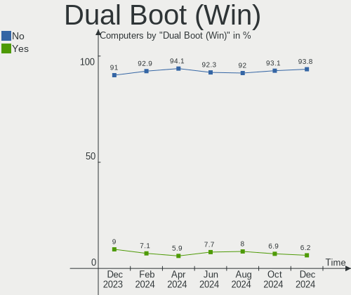
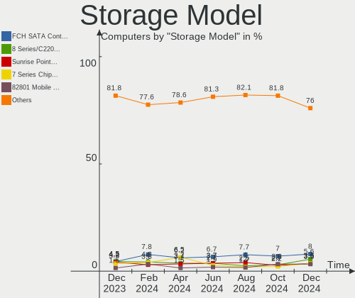
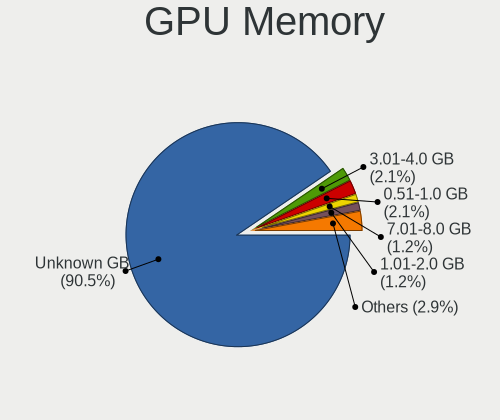
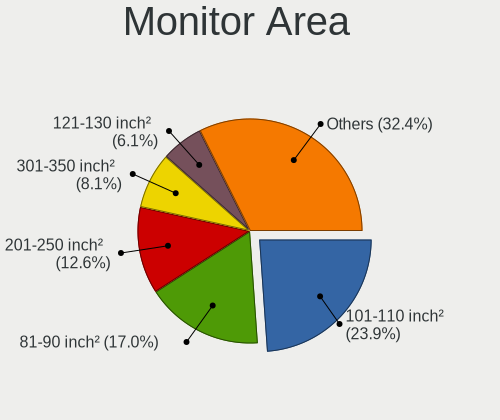
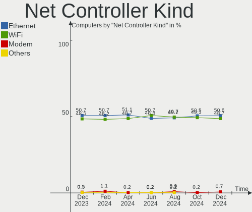

Zorin - Hardware Trends
-----------------------

A project to identify most popular hardware characteristics and track their change
over time based on data collected by Linux users at https://Linux-Hardware.org.

Anyone can contribute to this report by the [hw-probe](https://github.com/linuxhw/hw-probe) tool:

    sudo -E hw-probe -all -upload

This is a report for all computer types. See also reports for [desktops](/Dist/Zorin/Desktop/README.md) and [notebooks](/Dist/Zorin/Notebook/README.md).

This report is for one last month. Overall report since the beginning of time: [TestDays](https://github.com/linuxhw/TestDays)

Period: Apr, 2023.

Contents
--------

* [ System ](#system)
  - [ OS                       ](#os)
  - [ OS Family                ](#os-family)
  - [ Kernel                   ](#kernel)
  - [ Kernel Family            ](#kernel-family)
  - [ Kernel Major Ver.        ](#kernel-major-ver)
  - [ Arch                     ](#arch)
  - [ DE                       ](#de)
  - [ Display Server           ](#display-server)
  - [ Display Manager          ](#display-manager)
  - [ OS Lang                  ](#os-lang)
  - [ Boot Mode                ](#boot-mode)
  - [ Filesystem               ](#filesystem)
  - [ Part. scheme             ](#part-scheme)
  - [ Dual Boot with Linux/BSD ](#dual-boot-with-linuxbsd)
  - [ Dual Boot (Win)          ](#dual-boot-win)

* [ Board ](#board)
  - [ Vendor                   ](#vendor)
  - [ Model                    ](#model)
  - [ Model Family             ](#model-family)
  - [ MFG Year                 ](#mfg-year)
  - [ Form Factor              ](#form-factor)
  - [ Secure Boot              ](#secure-boot)
  - [ Coreboot                 ](#coreboot)
  - [ RAM Size                 ](#ram-size)
  - [ RAM Used                 ](#ram-used)
  - [ Total Drives             ](#total-drives)
  - [ Has CD-ROM               ](#has-cd-rom)
  - [ Has Ethernet             ](#has-ethernet)
  - [ Has WiFi                 ](#has-wifi)
  - [ Has Bluetooth            ](#has-bluetooth)

* [ Location ](#location)
  - [ Country                  ](#country)
  - [ City                     ](#city)

* [ Drives ](#drives)
  - [ Drive Vendor             ](#drive-vendor)
  - [ Drive Model              ](#drive-model)
  - [ HDD Vendor               ](#hdd-vendor)
  - [ SSD Vendor               ](#ssd-vendor)
  - [ Drive Kind               ](#drive-kind)
  - [ Drive Connector          ](#drive-connector)
  - [ Drive Size               ](#drive-size)
  - [ Space Total              ](#space-total)
  - [ Space Used               ](#space-used)
  - [ Malfunc. Drives          ](#malfunc-drives)
  - [ Malfunc. Drive Vendor    ](#malfunc-drive-vendor)
  - [ Malfunc. HDD Vendor      ](#malfunc-hdd-vendor)
  - [ Malfunc. Drive Kind      ](#malfunc-drive-kind)
  - [ Failed Drives            ](#failed-drives)
  - [ Failed Drive Vendor      ](#failed-drive-vendor)
  - [ Drive Status             ](#drive-status)

* [ Storage controller ](#storage-controller)
  - [ Storage Vendor           ](#storage-vendor)
  - [ Storage Model            ](#storage-model)
  - [ Storage Kind             ](#storage-kind)

* [ Processor ](#processor)
  - [ CPU Vendor               ](#cpu-vendor)
  - [ CPU Model                ](#cpu-model)
  - [ CPU Model Family         ](#cpu-model-family)
  - [ CPU Cores                ](#cpu-cores)
  - [ CPU Sockets              ](#cpu-sockets)
  - [ CPU Threads              ](#cpu-threads)
  - [ CPU Op-Modes             ](#cpu-op-modes)
  - [ CPU Microcode            ](#cpu-microcode)
  - [ CPU Microarch            ](#cpu-microarch)

* [ Graphics ](#graphics)
  - [ GPU Vendor               ](#gpu-vendor)
  - [ GPU Model                ](#gpu-model)
  - [ GPU Combo                ](#gpu-combo)
  - [ GPU Driver               ](#gpu-driver)
  - [ GPU Memory               ](#gpu-memory)

* [ Monitor ](#monitor)
  - [ Monitor Vendor           ](#monitor-vendor)
  - [ Monitor Model            ](#monitor-model)
  - [ Monitor Resolution       ](#monitor-resolution)
  - [ Monitor Diagonal         ](#monitor-diagonal)
  - [ Monitor Width            ](#monitor-width)
  - [ Aspect Ratio             ](#aspect-ratio)
  - [ Monitor Area             ](#monitor-area)
  - [ Pixel Density            ](#pixel-density)
  - [ Multiple Monitors        ](#multiple-monitors)

* [ Network ](#network)
  - [ Net Controller Vendor    ](#net-controller-vendor)
  - [ Net Controller Model     ](#net-controller-model)
  - [ Wireless Vendor          ](#wireless-vendor)
  - [ Wireless Model           ](#wireless-model)
  - [ Ethernet Vendor          ](#ethernet-vendor)
  - [ Ethernet Model           ](#ethernet-model)
  - [ Net Controller Kind      ](#net-controller-kind)
  - [ Used Controller          ](#used-controller)
  - [ NICs                     ](#nics)
  - [ IPv6                     ](#ipv6)

* [ Bluetooth ](#bluetooth)
  - [ Bluetooth Vendor         ](#bluetooth-vendor)
  - [ Bluetooth Model          ](#bluetooth-model)

* [ Sound ](#sound)
  - [ Sound Vendor             ](#sound-vendor)
  - [ Sound Model              ](#sound-model)

* [ Memory ](#memory)
  - [ Memory Vendor            ](#memory-vendor)
  - [ Memory Model             ](#memory-model)
  - [ Memory Kind              ](#memory-kind)
  - [ Memory Form Factor       ](#memory-form-factor)
  - [ Memory Size              ](#memory-size)
  - [ Memory Speed             ](#memory-speed)

* [ Printers & scanners ](#printers--scanners)
  - [ Printer Vendor           ](#printer-vendor)
  - [ Printer Model            ](#printer-model)
  - [ Scanner Vendor           ](#scanner-vendor)
  - [ Scanner Model            ](#scanner-model)

* [ Camera ](#camera)
  - [ Camera Vendor            ](#camera-vendor)
  - [ Camera Model             ](#camera-model)

* [ Security ](#security)
  - [ Fingerprint Vendor       ](#fingerprint-vendor)
  - [ Fingerprint Model        ](#fingerprint-model)
  - [ Chipcard Vendor          ](#chipcard-vendor)
  - [ Chipcard Model           ](#chipcard-model)

* [ Unsupported ](#unsupported)
  - [ Unsupported Devices      ](#unsupported-devices)
  - [ Unsupported Device Types ](#unsupported-device-types)

System
------

OS
--

Installed operating systems

| Name     | Computers | Percent |
|----------|-----------|---------|
| Zorin 16 | 159       | 96.95%  |
| Zorin 15 | 5         | 3.05%   |

OS Family
---------

OS without a version

| Name  | Computers | Percent |
|-------|-----------|---------|
| Zorin | 164       | 100%    |

Kernel
------

Version of the Linux kernel

| Version              | Computers | Percent |
|----------------------|-----------|---------|
| 5.15.0-69-generic    | 115       | 70.12%  |
| 5.15.0-71-generic    | 17        | 10.37%  |
| 5.15.0-67-generic    | 9         | 5.49%   |
| 5.15.0-56-generic    | 8         | 4.88%   |
| 5.4.0-147-generic    | 3         | 1.83%   |
| 5.15.0-58-generic    | 3         | 1.83%   |
| 5.4.0-146-generic    | 2         | 1.22%   |
| 5.15.0-70-generic    | 2         | 1.22%   |
| 5.15.0-57-generic    | 2         | 1.22%   |
| 6.1.8-060108-generic | 1         | 0.61%   |
| 5.4.0-136-generic    | 1         | 0.61%   |
| 5.13.0-48-generic    | 1         | 0.61%   |

Kernel Family
-------------

Linux kernel without a distro release

| Version | Computers | Percent |
|---------|-----------|---------|
| 5.15.0  | 156       | 95.12%  |
| 5.4.0   | 6         | 3.66%   |
| 6.1.8   | 1         | 0.61%   |
| 5.13.0  | 1         | 0.61%   |

Kernel Major Ver.
-----------------

Linux kernel major version

| Version | Computers | Percent |
|---------|-----------|---------|
| 5.15    | 156       | 95.12%  |
| 5.4     | 6         | 3.66%   |
| 6.1     | 1         | 0.61%   |
| 5.13    | 1         | 0.61%   |

Arch
----

OS architecture (x86_64, i586, etc.)

| Name   | Computers | Percent |
|--------|-----------|---------|
| x86_64 | 162       | 98.78%  |
| i686   | 2         | 1.22%   |

DE
--

Desktop Environment

| Name  | Computers | Percent |
|-------|-----------|---------|
| GNOME | 129       | 78.66%  |
| XFCE  | 35        | 21.34%  |

Display Server
--------------

X11 or Wayland

| Name    | Computers | Percent |
|---------|-----------|---------|
| X11     | 161       | 98.17%  |
| Wayland | 2         | 1.22%   |
| Tty     | 1         | 0.61%   |

Display Manager
---------------

SDDM, LightDM, etc.

| Name    | Computers | Percent |
|---------|-----------|---------|
| Unknown | 125       | 76.22%  |
| GDM     | 17        | 10.37%  |
| GDM3    | 12        | 7.32%   |
| LightDM | 10        | 6.1%    |

OS Lang
-------

Language

| Lang  | Computers | Percent |
|-------|-----------|---------|
| en_US | 70        | 42.68%  |
| de_DE | 16        | 9.76%   |
| en_GB | 10        | 6.1%    |
| pt_BR | 9         | 5.49%   |
| fr_FR | 9         | 5.49%   |
| es_ES | 5         | 3.05%   |
| nl_NL | 4         | 2.44%   |
| en_IN | 4         | 2.44%   |
| en_CA | 4         | 2.44%   |
| pl_PL | 3         | 1.83%   |
| en_AU | 3         | 1.83%   |
| ru_RU | 2         | 1.22%   |
| it_IT | 2         | 1.22%   |
| hu_HU | 2         | 1.22%   |
| fi_FI | 2         | 1.22%   |
| es_MX | 2         | 1.22%   |
| es_AR | 2         | 1.22%   |
| cs_CZ | 2         | 1.22%   |
| sv_SE | 1         | 0.61%   |
| sr_RS | 1         | 0.61%   |
| fr_CA | 1         | 0.61%   |
| es_VE | 1         | 0.61%   |
| es_GT | 1         | 0.61%   |
| en_ZA | 1         | 0.61%   |
| en_SG | 1         | 0.61%   |
| en_NZ | 1         | 0.61%   |
| en_IL | 1         | 0.61%   |
| de_CH | 1         | 0.61%   |
| de_AT | 1         | 0.61%   |
| ca_ES | 1         | 0.61%   |
| bg_BG | 1         | 0.61%   |

Boot Mode
---------

EFI or BIOS

| Mode | Computers | Percent |
|------|-----------|---------|
| EFI  | 86        | 52.44%  |
| BIOS | 78        | 47.56%  |

Filesystem
----------

Type of filesystem

| Type    | Computers | Percent |
|---------|-----------|---------|
| Ext4    | 154       | 93.9%   |
| Tmpfs   | 4         | 2.44%   |
| Overlay | 3         | 1.83%   |
| Zfs     | 1         | 0.61%   |
| Jfs     | 1         | 0.61%   |
| Ext2    | 1         | 0.61%   |

Part. scheme
------------

Scheme of partitioning

| Type    | Computers | Percent |
|---------|-----------|---------|
| Unknown | 127       | 77.44%  |
| GPT     | 27        | 16.46%  |
| MBR     | 10        | 6.1%    |

Dual Boot with Linux/BSD
------------------------

Hosting more than one Linux/BSD

| Dual boot | Computers | Percent |
|-----------|-----------|---------|
| No        | 160       | 97.56%  |
| Yes       | 4         | 2.44%   |

Dual Boot (Win)
---------------

Hosting Linux and Windows

| Dual boot | Computers | Percent |
|-----------|-----------|---------|
| No        | 150       | 91.46%  |
| Yes       | 14        | 8.54%   |

Board
-----

Vendor
------

Motherboard manufacturer

| Name                | Computers | Percent |
|---------------------|-----------|---------|
| Lenovo              | 33        | 20.12%  |
| Hewlett-Packard     | 19        | 11.59%  |
| Dell                | 17        | 10.37%  |
| ASUSTek Computer    | 16        | 9.76%   |
| Gigabyte Technology | 11        | 6.71%   |
| Apple               | 11        | 6.71%   |
| Acer                | 10        | 6.1%    |
| MSI                 | 6         | 3.66%   |
| Toshiba             | 3         | 1.83%   |
| Pegatron            | 3         | 1.83%   |
| Medion              | 3         | 1.83%   |
| Intel               | 3         | 1.83%   |
| Unknown             | 3         | 1.83%   |
| Positivo            | 2         | 1.22%   |
| Notebook            | 2         | 1.22%   |
| Microsoft           | 2         | 1.22%   |
| Fujitsu             | 2         | 1.22%   |
| Foxconn             | 2         | 1.22%   |
| ASRock              | 2         | 1.22%   |
| Thomson             | 1         | 0.61%   |
| Sony                | 1         | 0.61%   |
| Samsung Electronics | 1         | 0.61%   |
| Quanta              | 1         | 0.61%   |
| QIYIDA              | 1         | 0.61%   |
| Monster             | 1         | 0.61%   |
| HOUTER              | 1         | 0.61%   |
| HONOR               | 1         | 0.61%   |
| Google              | 1         | 0.61%   |
| eMachines           | 1         | 0.61%   |
| Biostar             | 1         | 0.61%   |
| AZW                 | 1         | 0.61%   |
| ASL                 | 1         | 0.61%   |
| AIERXUAN            | 1         | 0.61%   |

Model
-----

Motherboard model

| Name                                       | Computers | Percent |
|--------------------------------------------|-----------|---------|
| Unknown                                    | 3         | 1.83%   |
| Gigabyte GA-MA74GM-S2H                     | 2         | 1.22%   |
| ASUS All Series                            | 2         | 1.22%   |
| Toshiba Satellite C650D                    | 1         | 0.61%   |
| Toshiba Satellite C650                     | 1         | 0.61%   |
| Toshiba Satellite C45-A                    | 1         | 0.61%   |
| Thomson WWNEO14C-4BK32F                    | 1         | 0.61%   |
| Sony VPCF215FX                             | 1         | 0.61%   |
| Samsung 355V4C/356V4C/3445VC/3545VC        | 1         | 0.61%   |
| Quanta CA27                                | 1         | 0.61%   |
| QIYIDA X99-H9 V2.0                         | 1         | 0.61%   |
| Positivo S14CT01                           | 1         | 0.61%   |
| Positivo Q4128C-S                          | 1         | 0.61%   |
| Pegatron p6-2001cs                         | 1         | 0.61%   |
| Pegatron IPM41-D3                          | 1         | 0.61%   |
| Pegatron Elite 7300 Series MT              | 1         | 0.61%   |
| Notebook NL40_50CU                         | 1         | 0.61%   |
| Notebook NJ50GU                            | 1         | 0.61%   |
| MSI WC963AA-ABF p6355fr                    | 1         | 0.61%   |
| MSI MS-7C35                                | 1         | 0.61%   |
| MSI MS-7B84                                | 1         | 0.61%   |
| MSI MS-7808                                | 1         | 0.61%   |
| MSI GS73VR 7RF                             | 1         | 0.61%   |
| MSI GP62 7RD                               | 1         | 0.61%   |
| Monster HUMA H4 V5.2                       | 1         | 0.61%   |
| Microsoft Surface Pro                      | 1         | 0.61%   |
| Microsoft Surface Book                     | 1         | 0.61%   |
| Medion MS-7707                             | 1         | 0.61%   |
| Medion H61H2-LM3                           | 1         | 0.61%   |
| Medion E2215T MD60198                      | 1         | 0.61%   |
| Lenovo Yoga Duet 7 13ITL6 82MA             | 1         | 0.61%   |
| Lenovo Yoga 520-14IKB 80X8                 | 1         | 0.61%   |
| Lenovo Yoga 300-11IBR 80M1                 | 1         | 0.61%   |
| Lenovo Yoga 2 13 20344                     | 1         | 0.61%   |
| Lenovo Y50-70 20378                        | 1         | 0.61%   |
| Lenovo V570 1066EDG                        | 1         | 0.61%   |
| Lenovo ThinkPad X1 Carbon Gen 9 20XXS1KS00 | 1         | 0.61%   |
| Lenovo ThinkPad X1 Carbon Gen 8 20UAS4H800 | 1         | 0.61%   |
| Lenovo ThinkPad T440s 20ARS1BH0H           | 1         | 0.61%   |
| Lenovo ThinkPad T430s 2352CTO              | 1         | 0.61%   |

Model Family
------------

Motherboard model prefix

| Name                    | Computers | Percent |
|-------------------------|-----------|---------|
| Lenovo ThinkPad         | 11        | 6.71%   |
| Dell OptiPlex           | 7         | 4.27%   |
| Acer Aspire             | 7         | 4.27%   |
| Lenovo Yoga             | 4         | 2.44%   |
| Lenovo IdeaPad          | 4         | 2.44%   |
| HP Pavilion             | 4         | 2.44%   |
| Toshiba Satellite       | 3         | 1.83%   |
| Lenovo ThinkCentre      | 3         | 1.83%   |
| HP EliteBook            | 3         | 1.83%   |
| Dell Vostro             | 3         | 1.83%   |
| Dell Inspiron           | 3         | 1.83%   |
| ASUS TUF                | 3         | 1.83%   |
| ASUS PRIME              | 3         | 1.83%   |
| Unknown                 | 3         | 1.83%   |
| Microsoft Surface       | 2         | 1.22%   |
| Lenovo MIIX             | 2         | 1.22%   |
| HP Stream               | 2         | 1.22%   |
| HP Compaq               | 2         | 1.22%   |
| Gigabyte GA-MA74GM-S2H  | 2         | 1.22%   |
| Dell XPS                | 2         | 1.22%   |
| ASUS All                | 2         | 1.22%   |
| Thomson WWNEO14C-4BK32F | 1         | 0.61%   |
| Sony VPCF215FX          | 1         | 0.61%   |
| Samsung 355V4C          | 1         | 0.61%   |
| Quanta CA27             | 1         | 0.61%   |
| QIYIDA X99-H9           | 1         | 0.61%   |
| Positivo S14CT01        | 1         | 0.61%   |
| Positivo Q4128C-S       | 1         | 0.61%   |
| Pegatron p6-2001cs      | 1         | 0.61%   |
| Pegatron IPM41-D3       | 1         | 0.61%   |
| Pegatron Elite          | 1         | 0.61%   |
| Notebook NL40           | 1         | 0.61%   |
| Notebook NJ50GU         | 1         | 0.61%   |
| MSI WC963AA-ABF         | 1         | 0.61%   |
| MSI MS-7C35             | 1         | 0.61%   |
| MSI MS-7B84             | 1         | 0.61%   |
| MSI MS-7808             | 1         | 0.61%   |
| MSI GS73VR              | 1         | 0.61%   |
| MSI GP62                | 1         | 0.61%   |
| Monster HUMA            | 1         | 0.61%   |

MFG Year
--------

Motherboard manufacture year

| Year | Computers | Percent |
|------|-----------|---------|
| 2012 | 16        | 9.76%   |
| 2021 | 14        | 8.54%   |
| 2011 | 12        | 7.32%   |
| 2010 | 12        | 7.32%   |
| 2008 | 11        | 6.71%   |
| 2020 | 10        | 6.1%    |
| 2018 | 10        | 6.1%    |
| 2017 | 10        | 6.1%    |
| 2014 | 10        | 6.1%    |
| 2009 | 10        | 6.1%    |
| 2022 | 9         | 5.49%   |
| 2019 | 9         | 5.49%   |
| 2016 | 9         | 5.49%   |
| 2015 | 8         | 4.88%   |
| 2013 | 8         | 4.88%   |
| 2007 | 3         | 1.83%   |
| 2023 | 2         | 1.22%   |
| 2006 | 1         | 0.61%   |

Form Factor
-----------

Physical design of the computer

| Name        | Computers | Percent |
|-------------|-----------|---------|
| Notebook    | 76        | 46.34%  |
| Desktop     | 65        | 39.63%  |
| All in one  | 8         | 4.88%   |
| Tablet      | 7         | 4.27%   |
| Convertible | 5         | 3.05%   |
| Mini pc     | 3         | 1.83%   |

Secure Boot
-----------

Enabled or disabled

| State    | Computers | Percent |
|----------|-----------|---------|
| Disabled | 148       | 90.24%  |
| Enabled  | 16        | 9.76%   |

Coreboot
--------

Have coreboot on board

| Used | Computers | Percent |
|------|-----------|---------|
| No   | 163       | 99.39%  |
| Yes  | 1         | 0.61%   |

RAM Size
--------

Total RAM memory

| Size in GB  | Computers | Percent |
|-------------|-----------|---------|
| 4.01-8.0    | 41        | 25%     |
| 3.01-4.0    | 39        | 23.78%  |
| 16.01-24.0  | 37        | 22.56%  |
| 8.01-16.0   | 22        | 13.41%  |
| 32.01-64.0  | 9         | 5.49%   |
| 1.01-2.0    | 7         | 4.27%   |
| 24.01-32.0  | 3         | 1.83%   |
| 2.01-3.0    | 2         | 1.22%   |
| 64.01-256.0 | 2         | 1.22%   |
| 0.51-1.0    | 2         | 1.22%   |

RAM Used
--------

Used RAM memory

| Used GB   | Computers | Percent |
|-----------|-----------|---------|
| 1.01-2.0  | 66        | 40.24%  |
| 2.01-3.0  | 51        | 31.1%   |
| 3.01-4.0  | 22        | 13.41%  |
| 4.01-8.0  | 16        | 9.76%   |
| 0.51-1.0  | 8         | 4.88%   |
| 8.01-16.0 | 1         | 0.61%   |

Total Drives
------------

Number of drives on board

| Drives | Computers | Percent |
|--------|-----------|---------|
| 1      | 108       | 65.85%  |
| 2      | 35        | 21.34%  |
| 3      | 8         | 4.88%   |
| 5      | 6         | 3.66%   |
| 4      | 6         | 3.66%   |
| 7      | 1         | 0.61%   |

Has CD-ROM
----------

Has CD-ROM on board

| Presented | Computers | Percent |
|-----------|-----------|---------|
| No        | 92        | 56.1%   |
| Yes       | 72        | 43.9%   |

Has Ethernet
------------

Has Ethernet on board

| Presented | Computers | Percent |
|-----------|-----------|---------|
| Yes       | 133       | 81.1%   |
| No        | 31        | 18.9%   |

Has WiFi
--------

Has WiFi module

| Presented | Computers | Percent |
|-----------|-----------|---------|
| Yes       | 131       | 79.88%  |
| No        | 33        | 20.12%  |

Has Bluetooth
-------------

Has Bluetooth module

| Presented | Computers | Percent |
|-----------|-----------|---------|
| Yes       | 93        | 56.71%  |
| No        | 71        | 43.29%  |

Location
--------

Country
-------

Geographic location (country)

| Country             | Computers | Percent |
|---------------------|-----------|---------|
| USA                 | 40        | 24.39%  |
| Germany             | 17        | 10.37%  |
| Brazil              | 10        | 6.1%    |
| UK                  | 9         | 5.49%   |
| France              | 9         | 5.49%   |
| Netherlands         | 8         | 4.88%   |
| Spain               | 5         | 3.05%   |
| India               | 4         | 2.44%   |
| Czechia             | 4         | 2.44%   |
| Canada              | 4         | 2.44%   |
| Russia              | 3         | 1.83%   |
| Poland              | 3         | 1.83%   |
| Italy               | 3         | 1.83%   |
| Finland             | 3         | 1.83%   |
| Austria             | 3         | 1.83%   |
| Australia           | 3         | 1.83%   |
| Venezuela           | 2         | 1.22%   |
| Turkey              | 2         | 1.22%   |
| Switzerland         | 2         | 1.22%   |
| Romania             | 2         | 1.22%   |
| Norway              | 2         | 1.22%   |
| Mexico              | 2         | 1.22%   |
| Bulgaria            | 2         | 1.22%   |
| Argentina           | 2         | 1.22%   |
| Trinidad and Tobago | 1         | 0.61%   |
| Sweden              | 1         | 0.61%   |
| South Africa        | 1         | 0.61%   |
| Singapore           | 1         | 0.61%   |
| Serbia              | 1         | 0.61%   |
| Saint Lucia         | 1         | 0.61%   |
| New Zealand         | 1         | 0.61%   |
| Malaysia            | 1         | 0.61%   |
| Madagascar          | 1         | 0.61%   |
| Jordan              | 1         | 0.61%   |
| Israel              | 1         | 0.61%   |
| Indonesia           | 1         | 0.61%   |
| Hungary             | 1         | 0.61%   |
| Guatemala           | 1         | 0.61%   |
| Ghana               | 1         | 0.61%   |
| El Salvador         | 1         | 0.61%   |

City
----

Geographic location (city)

| City                  | Computers | Percent |
|-----------------------|-----------|---------|
| Rome                  | 3         | 1.83%   |
| Vienna                | 2         | 1.22%   |
| The Hague             | 2         | 1.22%   |
| Sao Paulo             | 2         | 1.22%   |
| Mumbai                | 2         | 1.22%   |
| Medford               | 2         | 1.22%   |
| Madrid                | 2         | 1.22%   |
| Helsinki              | 2         | 1.22%   |
| Échirolles           | 2         | 1.22%   |
| Dortmund              | 2         | 1.22%   |
| Birmingham            | 2         | 1.22%   |
| Berlin                | 2         | 1.22%   |
| Amersfoort            | 2         | 1.22%   |
| Zadar                 | 1         | 0.61%   |
| Würzburg             | 1         | 0.61%   |
| Wisconsin Rapids      | 1         | 0.61%   |
| Wigan                 | 1         | 0.61%   |
| West Lebanon          | 1         | 0.61%   |
| Wenham                | 1         | 0.61%   |
| Warsaw                | 1         | 0.61%   |
| Vitoria-Gasteiz       | 1         | 0.61%   |
| Viedma                | 1         | 0.61%   |
| Vernon                | 1         | 0.61%   |
| Venustiano Carranza   | 1         | 0.61%   |
| Tulsa                 | 1         | 0.61%   |
| Tucson                | 1         | 0.61%   |
| Tübingen             | 1         | 0.61%   |
| Toronto               | 1         | 0.61%   |
| Toluca                | 1         | 0.61%   |
| Sydney                | 1         | 0.61%   |
| Świnoujście         | 1         | 0.61%   |
| Swansea               | 1         | 0.61%   |
| Stuttgart             | 1         | 0.61%   |
| Stockholm             | 1         | 0.61%   |
| Singapore             | 1         | 0.61%   |
| Sibiu                 | 1         | 0.61%   |
| Schomberg             | 1         | 0.61%   |
| Sarnia                | 1         | 0.61%   |
| Sao Jose do Rio Preto | 1         | 0.61%   |
| Sao Caetano do Sul    | 1         | 0.61%   |

Drives
------

Drive Vendor
------------

Hard drive vendors

| Vendor                    | Computers | Drives | Percent |
|---------------------------|-----------|--------|---------|
| Samsung Electronics       | 38        | 42     | 15.9%   |
| WDC                       | 34        | 36     | 14.23%  |
| Seagate                   | 34        | 40     | 14.23%  |
| Kingston                  | 18        | 23     | 7.53%   |
| Sandisk                   | 16        | 19     | 6.69%   |
| Unknown                   | 15        | 17     | 6.28%   |
| Toshiba                   | 13        | 13     | 5.44%   |
| Crucial                   | 6         | 7      | 2.51%   |
| JMicron Technology        | 4         | 4      | 1.67%   |
| Hitachi                   | 4         | 4      | 1.67%   |
| HGST                      | 4         | 4      | 1.67%   |
| A-DATA Technology         | 4         | 4      | 1.67%   |
| Silicon Motion            | 3         | 3      | 1.26%   |
| Micron/Crucial Technology | 3         | 3      | 1.26%   |
| KIOXIA                    | 3         | 3      | 1.26%   |
| Intenso                   | 3         | 3      | 1.26%   |
| Apple                     | 3         | 4      | 1.26%   |
| XrayDisk                  | 2         | 2      | 0.84%   |
| SK hynix                  | 2         | 2      | 0.84%   |
| Micron Technology         | 2         | 2      | 0.84%   |
| China                     | 2         | 2      | 0.84%   |
| Unknown                   | 2         | 2      | 0.84%   |
| X12                       | 1         | 1      | 0.42%   |
| VERICO                    | 1         | 1      | 0.42%   |
| USB30                     | 1         | 1      | 0.42%   |
| SPCC                      | 1         | 1      | 0.42%   |
| Realtek Semiconductor     | 1         | 1      | 0.42%   |
| PNY                       | 1         | 1      | 0.42%   |
| Phison Electronics        | 1         | 1      | 0.42%   |
| Patriot                   | 1         | 1      | 0.42%   |
| Netac                     | 1         | 1      | 0.42%   |
| Mushkin                   | 1         | 1      | 0.42%   |
| LaCie                     | 1         | 1      | 0.42%   |
| KLEVV                     | 1         | 1      | 0.42%   |
| INTEL SS                  | 1         | 1      | 0.42%   |
| Intel                     | 1         | 1      | 0.42%   |
| HUSKY                     | 1         | 1      | 0.42%   |
| HUAWEI                    | 1         | 1      | 0.42%   |
| Gigabyte Technology       | 1         | 1      | 0.42%   |
| EDGE                      | 1         | 1      | 0.42%   |

Drive Model
-----------

Hard drive models

| Model                                                  | Computers | Percent |
|--------------------------------------------------------|-----------|---------|
| Unknown MMC Card  32GB                                 | 6         | 2.32%   |
| Kingston SA400S37240G 240GB SSD                        | 6         | 2.32%   |
| Unknown MMC Card  64GB                                 | 4         | 1.54%   |
| Unknown MMC Card  128GB                                | 3         | 1.16%   |
| Toshiba DT01ACA100 1TB                                 | 3         | 1.16%   |
| Silicon Motion SM2263EN/SM2263XT SSD Controller 1024GB | 3         | 1.16%   |
| Seagate ST500DM002-1BD142 500GB                        | 3         | 1.16%   |
| Samsung NVMe SSD Controller SM961/PM961/SM963 500GB    | 3         | 1.16%   |
| JMicron Generic 1TB                                    | 3         | 1.16%   |
| WDC WDS240G2G0A-00JH30 240GB SSD                       | 2         | 0.77%   |
| WDC WD10JPVX-22JC3T0 1TB                               | 2         | 0.77%   |
| Unknown SD/MMC/MS PRO 249GB                            | 2         | 0.77%   |
| Seagate ST500LT012-1DG142 500GB                        | 2         | 0.77%   |
| Seagate ST1000LM035-1RK172 970GB                       | 2         | 0.77%   |
| Seagate ST1000LM024 HN-M101MBB 1TB                     | 2         | 0.77%   |
| Seagate ST1000DM010-2EP102 1TB                         | 2         | 0.77%   |
| Seagate ST1000DM003-1SB10C 1TB                         | 2         | 0.77%   |
| Sandisk WD Black SN750 / PC SN730 NVMe SSD 512GB       | 2         | 0.77%   |
| SanDisk SDSSDA240G 240GB                               | 2         | 0.77%   |
| Samsung SSD 870 QVO 1TB                                | 2         | 0.77%   |
| Samsung SSD 860 EVO 250GB                              | 2         | 0.77%   |
| Samsung NVMe SSD Controller SM981/PM981/PM983 1TB      | 2         | 0.77%   |
| Samsung NVMe SSD Controller SM951/PM951 256GB          | 2         | 0.77%   |
| Samsung NVMe SSD Controller PM9A1/PM9A3/980PRO 2TB     | 2         | 0.77%   |
| Micron/Crucial P2 NVMe PCIe SSD 1TB                    | 2         | 0.77%   |
| Kingston SV300S37A120G 120GB SSD                       | 2         | 0.77%   |
| Kingston SA400S37120G 120GB SSD                        | 2         | 0.77%   |
| HGST HTS721010A9E630 1TB                               | 2         | 0.77%   |
| Crucial CT2000MX500SSD1 2TB                            | 2         | 0.77%   |
| Crucial CT1000MX500SSD1 1TB                            | 2         | 0.77%   |
| Unknown                                                | 2         | 0.77%   |
| XrayDisk 1TB SSD                                       | 1         | 0.39%   |
| XrayDisk 128GB                                         | 1         | 0.39%   |
| X12 SSD 1TB                                            | 1         | 0.39%   |
| WDC WDS500G2B0A-00SM50 500GB SSD                       | 1         | 0.39%   |
| WDC WDS500G2B0A 500GB SSD                              | 1         | 0.39%   |
| WDC WDS120G2G0B-00EPW0 120GB SSD                       | 1         | 0.39%   |
| WDC WD6401AALS-00L3B2 640GB                            | 1         | 0.39%   |
| WDC WD6400AAKS-75A7B2 640GB                            | 1         | 0.39%   |
| WDC WD60EZRX-11MVLB1 6TB                               | 1         | 0.39%   |

HDD Vendor
----------

Hard disk drive vendors

| Vendor              | Computers | Drives | Percent |
|---------------------|-----------|--------|---------|
| Seagate             | 33        | 38     | 36.26%  |
| WDC                 | 27        | 28     | 29.67%  |
| Toshiba             | 11        | 11     | 12.09%  |
| Samsung Electronics | 6         | 6      | 6.59%   |
| Hitachi             | 4         | 4      | 4.4%    |
| HGST                | 4         | 4      | 4.4%    |
| JMicron Technology  | 3         | 3      | 3.3%    |
| Unknown             | 2         | 2      | 2.2%    |
| Apple               | 1         | 1      | 1.1%    |

SSD Vendor
----------

Solid state drive vendors

| Vendor              | Computers | Drives | Percent |
|---------------------|-----------|--------|---------|
| Kingston            | 17        | 21     | 20.99%  |
| Samsung Electronics | 16        | 17     | 19.75%  |
| SanDisk             | 6         | 7      | 7.41%   |
| Crucial             | 6         | 7      | 7.41%   |
| WDC                 | 5         | 5      | 6.17%   |
| A-DATA Technology   | 4         | 4      | 4.94%   |
| Intenso             | 3         | 3      | 3.7%    |
| China               | 2         | 2      | 2.47%   |
| XrayDisk            | 1         | 1      | 1.23%   |
| X12                 | 1         | 1      | 1.23%   |
| VERICO              | 1         | 1      | 1.23%   |
| USB30               | 1         | 1      | 1.23%   |
| SPCC                | 1         | 1      | 1.23%   |
| SK hynix            | 1         | 1      | 1.23%   |
| PNY                 | 1         | 1      | 1.23%   |
| Patriot             | 1         | 1      | 1.23%   |
| Netac               | 1         | 1      | 1.23%   |
| Mushkin             | 1         | 1      | 1.23%   |
| Micron Technology   | 1         | 1      | 1.23%   |
| KLEVV               | 1         | 1      | 1.23%   |
| INTEL SS            | 1         | 1      | 1.23%   |
| Intel               | 1         | 1      | 1.23%   |
| HUSKY               | 1         | 1      | 1.23%   |
| Gigabyte Technology | 1         | 1      | 1.23%   |
| EDGE                | 1         | 1      | 1.23%   |
| Drevo               | 1         | 1      | 1.23%   |
| Corsair             | 1         | 2      | 1.23%   |
| Apple               | 1         | 1      | 1.23%   |
| AFOX                | 1         | 1      | 1.23%   |
| Unknown             | 1         | 1      | 1.23%   |

Drive Kind
----------

HDD or SSD

| Kind    | Computers | Drives | Percent |
|---------|-----------|--------|---------|
| HDD     | 78        | 97     | 36.79%  |
| SSD     | 68        | 89     | 32.08%  |
| NVMe    | 46        | 55     | 21.7%   |
| MMC     | 14        | 17     | 6.6%    |
| Unknown | 6         | 6      | 2.83%   |

Drive Connector
---------------

SATA, SAS, NVMe, etc.

| Type | Computers | Drives | Percent |
|------|-----------|--------|---------|
| SATA | 124       | 179    | 62.94%  |
| NVMe | 46        | 55     | 23.35%  |
| MMC  | 14        | 17     | 7.11%   |
| SAS  | 13        | 13     | 6.6%    |

Drive Size
----------

Size of hard drive

| Size in TB | Computers | Drives | Percent |
|------------|-----------|--------|---------|
| 0.01-0.5   | 93        | 113    | 60.39%  |
| 0.51-1.0   | 43        | 54     | 27.92%  |
| 1.01-2.0   | 8         | 9      | 5.19%   |
| 3.01-4.0   | 4         | 4      | 2.6%    |
| 2.01-3.0   | 3         | 3      | 1.95%   |
| 4.01-10.0  | 3         | 3      | 1.95%   |

Space Total
-----------

Amount of disk space available on the file system

| Size in GB     | Computers | Percent |
|----------------|-----------|---------|
| 101-250        | 55        | 33.54%  |
| 251-500        | 38        | 23.17%  |
| 501-1000       | 24        | 14.63%  |
| 51-100         | 14        | 8.54%   |
| 1001-2000      | 12        | 7.32%   |
| 1-20           | 8         | 4.88%   |
| 21-50          | 7         | 4.27%   |
| More than 3000 | 4         | 2.44%   |
| 2001-3000      | 2         | 1.22%   |

Space Used
----------

Amount of used disk space

| Used GB        | Computers | Percent |
|----------------|-----------|---------|
| 1-20           | 57        | 34.76%  |
| 21-50          | 44        | 26.83%  |
| 51-100         | 31        | 18.9%   |
| 101-250        | 17        | 10.37%  |
| 251-500        | 7         | 4.27%   |
| 1001-2000      | 3         | 1.83%   |
| 501-1000       | 3         | 1.83%   |
| More than 3000 | 1         | 0.61%   |
| 2001-3000      | 1         | 0.61%   |

Malfunc. Drives
---------------

Drive models with a malfunction

| Model                            | Computers | Drives | Percent |
|----------------------------------|-----------|--------|---------|
| WDC WD1200BEVS-60UST0 120GB      | 1         | 1      | 14.29%  |
| Toshiba DT01ACA100 1TB           | 1         | 1      | 14.29%  |
| Seagate ST3360320AS 360GB        | 1         | 1      | 14.29%  |
| Seagate ST320LT007-9ZV142 320GB  | 1         | 1      | 14.29%  |
| Seagate ST1000LM035-1RK172 970GB | 1         | 1      | 14.29%  |
| Kingston SV300S37A120G 120GB SSD | 1         | 1      | 14.29%  |
| Drevo X1 SSD 120GB               | 1         | 1      | 14.29%  |

Malfunc. Drive Vendor
---------------------

Vendors of faulty drives

| Vendor   | Computers | Drives | Percent |
|----------|-----------|--------|---------|
| Seagate  | 3         | 3      | 42.86%  |
| WDC      | 1         | 1      | 14.29%  |
| Toshiba  | 1         | 1      | 14.29%  |
| Kingston | 1         | 1      | 14.29%  |
| Drevo    | 1         | 1      | 14.29%  |

Malfunc. HDD Vendor
-------------------

Vendors of faulty HDD drives

| Vendor  | Computers | Drives | Percent |
|---------|-----------|--------|---------|
| Seagate | 3         | 3      | 60%     |
| WDC     | 1         | 1      | 20%     |
| Toshiba | 1         | 1      | 20%     |

Malfunc. Drive Kind
-------------------

Kinds of faulty drives

| Kind | Computers | Drives | Percent |
|------|-----------|--------|---------|
| HDD  | 4         | 5      | 66.67%  |
| SSD  | 2         | 2      | 33.33%  |

Failed Drives
-------------

Failed drive models

Zero info for selected period =(

Failed Drive Vendor
-------------------

Failed drive vendors

Zero info for selected period =(

Drive Status
------------

Number of failed and malfunc. drives

| Status   | Computers | Drives | Percent |
|----------|-----------|--------|---------|
| Detected | 142       | 223    | 82.56%  |
| Works    | 24        | 34     | 13.95%  |
| Malfunc  | 6         | 7      | 3.49%   |

Storage controller
------------------

Storage Vendor
--------------

Storage controller vendors

| Vendor                       | Computers | Percent |
|------------------------------|-----------|---------|
| Intel                        | 106       | 54.36%  |
| AMD                          | 29        | 14.87%  |
| Samsung Electronics          | 18        | 9.23%   |
| SanDisk                      | 10        | 5.13%   |
| Nvidia                       | 7         | 3.59%   |
| Silicon Motion               | 4         | 2.05%   |
| Micron/Crucial Technology    | 3         | 1.54%   |
| KIOXIA                       | 3         | 1.54%   |
| Toshiba America Info Systems | 2         | 1.03%   |
| Marvell Technology Group     | 2         | 1.03%   |
| Kingston Technology Company  | 2         | 1.03%   |
| VIA Technologies             | 1         | 0.51%   |
| TenaFe                       | 1         | 0.51%   |
| SK hynix                     | 1         | 0.51%   |
| Seagate Technology           | 1         | 0.51%   |
| Realtek Semiconductor        | 1         | 0.51%   |
| Phison Electronics           | 1         | 0.51%   |
| Micron Technology            | 1         | 0.51%   |
| JMicron Technology           | 1         | 0.51%   |
| ASMedia Technology           | 1         | 0.51%   |

Storage Model
-------------

Storage controller models

| Model                                                                            | Computers | Percent |
|----------------------------------------------------------------------------------|-----------|---------|
| AMD FCH SATA Controller [AHCI mode]                                              | 16        | 7.02%   |
| Intel 8 Series/C220 Series Chipset Family 6-port SATA Controller 1 [AHCI mode]   | 8         | 3.51%   |
| Intel 7 Series Chipset Family 6-port SATA Controller [AHCI mode]                 | 8         | 3.51%   |
| Samsung NVMe SSD Controller 980                                                  | 7         | 3.07%   |
| Intel NM10/ICH7 Family SATA Controller [IDE mode]                                | 7         | 3.07%   |
| Intel 6 Series/C200 Series Chipset Family 6 port Desktop SATA AHCI Controller    | 7         | 3.07%   |
| Intel 82801G (ICH7 Family) IDE Controller                                        | 6         | 2.63%   |
| Intel Volume Management Device NVMe RAID Controller                              | 5         | 2.19%   |
| Silicon Motion SM2263EN/SM2263XT SSD Controller                                  | 4         | 1.75%   |
| Intel HM170/QM170 Chipset SATA Controller [AHCI Mode]                            | 4         | 1.75%   |
| Intel 82801 Mobile SATA Controller [RAID mode]                                   | 4         | 1.75%   |
| Intel 8 Series SATA Controller 1 [AHCI mode]                                     | 4         | 1.75%   |
| Intel 5 Series/3400 Series Chipset 6 port SATA AHCI Controller                   | 4         | 1.75%   |
| AMD SB7x0/SB8x0/SB9x0 SATA Controller [AHCI mode]                                | 4         | 1.75%   |
| AMD SB7x0/SB8x0/SB9x0 IDE Controller                                             | 4         | 1.75%   |
| AMD 500 Series Chipset SATA Controller                                           | 4         | 1.75%   |
| SanDisk WD Black SN770 NVMe SSD                                                  | 3         | 1.32%   |
| SanDisk WD Black SN750 / PC SN730 NVMe SSD                                       | 3         | 1.32%   |
| Samsung NVMe SSD Controller SM981/PM981/PM983                                    | 3         | 1.32%   |
| Samsung NVMe SSD Controller SM961/PM961/SM963                                    | 3         | 1.32%   |
| Nvidia MCP79 AHCI Controller                                                     | 3         | 1.32%   |
| Intel Wildcat Point-LP SATA Controller [AHCI Mode]                               | 3         | 1.32%   |
| Intel SATA Controller [RAID mode]                                                | 3         | 1.32%   |
| Intel Q170/Q150/B150/H170/H110/Z170/CM236 Chipset SATA Controller [AHCI Mode]    | 3         | 1.32%   |
| Intel Atom/Celeron/Pentium Processor x5-E8000/J3xxx/N3xxx Series SATA Controller | 3         | 1.32%   |
| Intel 82801IBM/IEM (ICH9M/ICH9M-E) 4 port SATA Controller [AHCI mode]            | 3         | 1.32%   |
| Intel 82801HM/HEM (ICH8M/ICH8M-E) SATA Controller [AHCI mode]                    | 3         | 1.32%   |
| Intel 82801HM/HEM (ICH8M/ICH8M-E) IDE Controller                                 | 3         | 1.32%   |
| Intel 6 Series/C200 Series Chipset Family 6 port Mobile SATA AHCI Controller     | 3         | 1.32%   |
| Intel 200 Series PCH SATA controller [AHCI mode]                                 | 3         | 1.32%   |
| AMD SB7x0/SB8x0/SB9x0 SATA Controller [IDE mode]                                 | 3         | 1.32%   |
| AMD 400 Series Chipset SATA Controller                                           | 3         | 1.32%   |
| SanDisk WD Blue SN550 NVMe SSD                                                   | 2         | 0.88%   |
| SanDisk NVMe Controller                                                          | 2         | 0.88%   |
| Samsung NVMe SSD Controller SM951/PM951                                          | 2         | 0.88%   |
| Samsung NVMe SSD Controller PM9A1/PM9A3/980PRO                                   | 2         | 0.88%   |
| Nvidia MCP61 SATA Controller                                                     | 2         | 0.88%   |
| Micron/Crucial P2 NVMe PCIe SSD                                                  | 2         | 0.88%   |
| Intel Tiger Lake-LP SATA Controller                                              | 2         | 0.88%   |
| Intel Sunrise Point-LP SATA Controller [AHCI mode]                               | 2         | 0.88%   |

Storage Kind
------------

Kind of storage controller (IDE, SATA, NVMe, SAS, ...)

| Kind | Computers | Percent |
|------|-----------|---------|
| SATA | 116       | 56.86%  |
| NVMe | 45        | 22.06%  |
| IDE  | 30        | 14.71%  |
| RAID | 13        | 6.37%   |

Processor
---------

CPU Vendor
----------

Processor vendors

| Vendor | Computers | Percent |
|--------|-----------|---------|
| Intel  | 130       | 79.27%  |
| AMD    | 34        | 20.73%  |

CPU Model
---------

Processor models

| Model                                       | Computers | Percent |
|---------------------------------------------|-----------|---------|
| Intel Atom x5-Z8350 CPU @ 1.44GHz           | 5         | 3.05%   |
| AMD Ryzen 5 5600G with Radeon Graphics      | 5         | 3.05%   |
| Intel Core i5-3320M CPU @ 2.60GHz           | 4         | 2.44%   |
| Intel Core i7-2600 CPU @ 3.40GHz            | 3         | 1.83%   |
| Intel Core i5-6500 CPU @ 3.20GHz            | 3         | 1.83%   |
| Intel Core i5-3210M CPU @ 2.50GHz           | 3         | 1.83%   |
| Intel Celeron CPU N3060 @ 1.60GHz           | 3         | 1.83%   |
| Intel Core i7-7700HQ CPU @ 2.80GHz          | 2         | 1.22%   |
| Intel Core i7-4790 CPU @ 3.60GHz            | 2         | 1.22%   |
| Intel Core i5-8265U CPU @ 1.60GHz           | 2         | 1.22%   |
| Intel Core i5-2520M CPU @ 2.50GHz           | 2         | 1.22%   |
| Intel Core i3-3110M CPU @ 2.40GHz           | 2         | 1.22%   |
| Intel Core 2 Duo CPU E7500 @ 2.93GHz        | 2         | 1.22%   |
| Intel 11th Gen Core i7-1165G7 @ 2.80GHz     | 2         | 1.22%   |
| Intel 11th Gen Core i5-1135G7 @ 2.40GHz     | 2         | 1.22%   |
| AMD Ryzen 5 4500U with Radeon Graphics      | 2         | 1.22%   |
| Intel Xeon CPU E5506 @ 2.13GHz              | 1         | 0.61%   |
| Intel Xeon CPU E5-2630L v3 @ 1.80GHz        | 1         | 0.61%   |
| Intel Pentium Silver N5030 CPU @ 1.10GHz    | 1         | 0.61%   |
| Intel Pentium Dual-Core CPU T4500 @ 2.30GHz | 1         | 0.61%   |
| Intel Pentium Dual-Core CPU E5700 @ 3.00GHz | 1         | 0.61%   |
| Intel Pentium Dual CPU E2140 @ 1.60GHz      | 1         | 0.61%   |
| Intel Pentium CPU N3700 @ 1.60GHz           | 1         | 0.61%   |
| Intel Pentium CPU N3530 @ 2.16GHz           | 1         | 0.61%   |
| Intel Pentium CPU G3420 @ 3.20GHz           | 1         | 0.61%   |
| Intel Pentium CPU G2030 @ 3.00GHz           | 1         | 0.61%   |
| Intel Pentium CPU 6405U @ 2.40GHz           | 1         | 0.61%   |
| Intel Pentium CPU 4415U @ 2.30GHz           | 1         | 0.61%   |
| Intel Pentium 4 CPU 3.40GHz                 | 1         | 0.61%   |
| Intel Core i7-8700K CPU @ 3.70GHz           | 1         | 0.61%   |
| Intel Core i7-8650U CPU @ 1.90GHz           | 1         | 0.61%   |
| Intel Core i7-6600U CPU @ 2.60GHz           | 1         | 0.61%   |
| Intel Core i7-4770 CPU @ 3.40GHz            | 1         | 0.61%   |
| Intel Core i7-4750HQ CPU @ 2.00GHz          | 1         | 0.61%   |
| Intel Core i7-4710HQ CPU @ 2.50GHz          | 1         | 0.61%   |
| Intel Core i7-4702MQ CPU @ 2.20GHz          | 1         | 0.61%   |
| Intel Core i7-4702HQ CPU @ 2.20GHz          | 1         | 0.61%   |
| Intel Core i7-2630QM CPU @ 2.00GHz          | 1         | 0.61%   |
| Intel Core i7-1065G7 CPU @ 1.30GHz          | 1         | 0.61%   |
| Intel Core i7-10610U CPU @ 1.80GHz          | 1         | 0.61%   |

CPU Model Family
----------------

Processor model prefix

| Model                   | Computers | Percent |
|-------------------------|-----------|---------|
| Intel Core i5           | 38        | 23.17%  |
| Intel Core i7           | 20        | 12.2%   |
| Intel Core 2 Duo        | 15        | 9.15%   |
| Intel Core i3           | 14        | 8.54%   |
| AMD Ryzen 5             | 12        | 7.32%   |
| Other                   | 11        | 6.71%   |
| Intel Celeron           | 9         | 5.49%   |
| Intel Atom              | 9         | 5.49%   |
| Intel Pentium           | 6         | 3.66%   |
| AMD Athlon II X2        | 4         | 2.44%   |
| AMD Ryzen 7             | 3         | 1.83%   |
| Intel Xeon              | 2         | 1.22%   |
| Intel Pentium Dual-Core | 2         | 1.22%   |
| AMD Ryzen 9             | 2         | 1.22%   |
| AMD FX                  | 2         | 1.22%   |
| AMD A8                  | 2         | 1.22%   |
| AMD A4                  | 2         | 1.22%   |
| Intel Pentium Silver    | 1         | 0.61%   |
| Intel Pentium Dual      | 1         | 0.61%   |
| Intel Pentium 4         | 1         | 0.61%   |
| Intel Core 2 Quad       | 1         | 0.61%   |
| Intel Core 2            | 1         | 0.61%   |
| AMD Ryzen 3             | 1         | 0.61%   |
| AMD Phenom II X6        | 1         | 0.61%   |
| AMD E                   | 1         | 0.61%   |
| AMD Athlon II Neo       | 1         | 0.61%   |
| AMD Athlon 64 X2        | 1         | 0.61%   |
| AMD A10                 | 1         | 0.61%   |

CPU Cores
---------

Number of processor cores

| Number | Computers | Percent |
|--------|-----------|---------|
| 2      | 76        | 46.34%  |
| 4      | 59        | 35.98%  |
| 6      | 14        | 8.54%   |
| 8      | 4         | 2.44%   |
| 1      | 4         | 2.44%   |
| 16     | 2         | 1.22%   |
| 10     | 2         | 1.22%   |
| 14     | 1         | 0.61%   |
| 12     | 1         | 0.61%   |
| 3      | 1         | 0.61%   |

CPU Sockets
-----------

Number of sockets

| Number | Computers | Percent |
|--------|-----------|---------|
| 1      | 164       | 100%    |

CPU Threads
-----------

Threads per core (Hyper-Threading)

| Number | Computers | Percent |
|--------|-----------|---------|
| 2      | 90        | 54.88%  |
| 1      | 74        | 45.12%  |

CPU Op-Modes
------------

CPU Operation Modes (32-bit, 64-bit)

| Op mode        | Computers | Percent |
|----------------|-----------|---------|
| 32-bit, 64-bit | 164       | 100%    |

CPU Microcode
-------------

Microcode number

| Number     | Computers | Percent |
|------------|-----------|---------|
| Unknown    | 18        | 10.98%  |
| 0x206a7    | 12        | 7.32%   |
| 0x1067a    | 12        | 7.32%   |
| 0x306a9    | 11        | 6.71%   |
| 0x406c4    | 10        | 6.1%    |
| 0x306c3    | 7         | 4.27%   |
| 0x806c1    | 6         | 3.66%   |
| 0x906e9    | 5         | 3.05%   |
| 0x806ec    | 4         | 2.44%   |
| 0x506e3    | 4         | 2.44%   |
| 0x40651    | 4         | 2.44%   |
| 0x0a50000d | 4         | 2.44%   |
| 0x806e9    | 3         | 1.83%   |
| 0x6fd      | 3         | 1.83%   |
| 0x306d4    | 3         | 1.83%   |
| 0x30678    | 3         | 1.83%   |
| 0x010000c8 | 3         | 1.83%   |
| 0x906a4    | 2         | 1.22%   |
| 0x806ea    | 2         | 1.22%   |
| 0x706e5    | 2         | 1.22%   |
| 0x6fb      | 2         | 1.22%   |
| 0x406e3    | 2         | 1.22%   |
| 0x20655    | 2         | 1.22%   |
| 0x10676    | 2         | 1.22%   |
| 0x0a601203 | 2         | 1.22%   |
| 0x0a50000c | 2         | 1.22%   |
| 0x06006118 | 2         | 1.22%   |
| 0x03000027 | 2         | 1.22%   |
| 0xf65      | 1         | 0.61%   |
| 0xa0653    | 1         | 0.61%   |
| 0x906ea    | 1         | 0.61%   |
| 0x906c0    | 1         | 0.61%   |
| 0x90672    | 1         | 0.61%   |
| 0x806eb    | 1         | 0.61%   |
| 0x706a8    | 1         | 0.61%   |
| 0x6f6      | 1         | 0.61%   |
| 0x406c3    | 1         | 0.61%   |
| 0x40671    | 1         | 0.61%   |
| 0x40661    | 1         | 0.61%   |
| 0x306f2    | 1         | 0.61%   |

CPU Microarch
-------------

Microarchitecture

| Name             | Computers | Percent |
|------------------|-----------|---------|
| KabyLake         | 17        | 10.37%  |
| Penryn           | 15        | 9.15%   |
| Silvermont       | 14        | 8.54%   |
| IvyBridge        | 14        | 8.54%   |
| Haswell          | 14        | 8.54%   |
| SandyBridge      | 12        | 7.32%   |
| Zen 3            | 9         | 5.49%   |
| Skylake          | 7         | 4.27%   |
| TigerLake        | 6         | 3.66%   |
| K10              | 6         | 3.66%   |
| Core             | 6         | 3.66%   |
| Westmere         | 4         | 2.44%   |
| Broadwell        | 4         | 2.44%   |
| Unknown          | 4         | 2.44%   |
| Zen 2            | 3         | 1.83%   |
| Nehalem          | 3         | 1.83%   |
| Excavator        | 3         | 1.83%   |
| Alderlake Hybrid | 3         | 1.83%   |
| Zen              | 2         | 1.22%   |
| Piledriver       | 2         | 1.22%   |
| K10 Llano        | 2         | 1.22%   |
| IceLake          | 2         | 1.22%   |
| Goldmont plus    | 2         | 1.22%   |
| Bonnell          | 2         | 1.22%   |
| Zen+             | 1         | 0.61%   |
| Tremont          | 1         | 0.61%   |
| NetBurst         | 1         | 0.61%   |
| K8 Hammer        | 1         | 0.61%   |
| Goldmont         | 1         | 0.61%   |
| CometLake        | 1         | 0.61%   |
| Bulldozer        | 1         | 0.61%   |
| Bobcat           | 1         | 0.61%   |

Graphics
--------

GPU Vendor
----------

Vendors of graphics cards

| Vendor | Computers | Percent |
|--------|-----------|---------|
| Intel  | 101       | 54.3%   |
| Nvidia | 44        | 23.66%  |
| AMD    | 41        | 22.04%  |

GPU Model
---------

Graphics card models

| Model                                                                                    | Computers | Percent |
|------------------------------------------------------------------------------------------|-----------|---------|
| Intel Atom/Celeron/Pentium Processor x5-E8000/J3xxx/N3xxx Integrated Graphics Controller | 11        | 5.73%   |
| Intel 3rd Gen Core processor Graphics Controller                                         | 10        | 5.21%   |
| Intel 2nd Generation Core Processor Family Integrated Graphics Controller                | 6         | 3.13%   |
| Intel TigerLake-LP GT2 [Iris Xe Graphics]                                                | 5         | 2.6%    |
| Intel HD Graphics 630                                                                    | 5         | 2.6%    |
| Intel HD Graphics 530                                                                    | 5         | 2.6%    |
| Intel 4 Series Chipset Integrated Graphics Controller                                    | 5         | 2.6%    |
| Intel Haswell-ULT Integrated Graphics Controller                                         | 4         | 2.08%   |
| Intel Mobile 4 Series Chipset Integrated Graphics Controller                             | 3         | 1.56%   |
| Intel Atom Processor Z36xxx/Z37xxx Series Graphics & Display                             | 3         | 1.56%   |
| Intel 82G33/G31 Express Integrated Graphics Controller                                   | 3         | 1.56%   |
| Intel 4th Gen Core Processor Integrated Graphics Controller                              | 3         | 1.56%   |
| Nvidia GP107M [GeForce GTX 1050 Mobile]                                                  | 2         | 1.04%   |
| Nvidia GP102 [GeForce GTX 1080 Ti]                                                       | 2         | 1.04%   |
| Nvidia GK208B [GeForce GT 710]                                                           | 2         | 1.04%   |
| Nvidia GK107M [GeForce GT 750M]                                                          | 2         | 1.04%   |
| Nvidia C79 [GeForce 9400M]                                                               | 2         | 1.04%   |
| Intel Xeon E3-1200 v3/4th Gen Core Processor Integrated Graphics Controller              | 2         | 1.04%   |
| Intel Xeon E3-1200 v2/3rd Gen Core processor Graphics Controller                         | 2         | 1.04%   |
| Intel WhiskeyLake-U GT2 [UHD Graphics 620]                                               | 2         | 1.04%   |
| Intel UHD Graphics 620                                                                   | 2         | 1.04%   |
| Intel Skylake GT2 [HD Graphics 520]                                                      | 2         | 1.04%   |
| Intel HD Graphics 5500                                                                   | 2         | 1.04%   |
| Intel CometLake-U GT2 [UHD Graphics]                                                     | 2         | 1.04%   |
| Intel Alder Lake-UP3 GT2 [Iris Xe Graphics]                                              | 2         | 1.04%   |
| AMD Whistler [Radeon HD 6630M/6650M/6750M/7670M/7690M]                                   | 2         | 1.04%   |
| AMD Wani [Radeon R5/R6/R7 Graphics]                                                      | 2         | 1.04%   |
| AMD RV730/M96-XT [Mobility Radeon HD 4670]                                               | 2         | 1.04%   |
| AMD RS740 [Radeon 2100]                                                                  | 2         | 1.04%   |
| AMD Renoir                                                                               | 2         | 1.04%   |
| AMD Raphael                                                                              | 2         | 1.04%   |
| AMD Navi 22 [Radeon RX 6700/6700 XT/6750 XT / 6800M/6850M XT]                            | 2         | 1.04%   |
| AMD Cedar [Radeon HD 5000/6000/7350/8350 Series]                                         | 2         | 1.04%   |
| AMD Baffin [Radeon RX 550 640SP / RX 560/560X]                                           | 2         | 1.04%   |
| Nvidia TU117 [GeForce GTX 1650]                                                          | 1         | 0.52%   |
| Nvidia MCP89 [GeForce 320M]                                                              | 1         | 0.52%   |
| Nvidia GP108GLM [Quadro P500 Mobile]                                                     | 1         | 0.52%   |
| Nvidia GP108 [GeForce GT 1030]                                                           | 1         | 0.52%   |
| Nvidia GP107 [GeForce GTX 1050]                                                          | 1         | 0.52%   |
| Nvidia GP107 [GeForce GTX 1050 Ti]                                                       | 1         | 0.52%   |

GPU Combo
---------

Combinations of graphics cards

| Name           | Computers | Percent |
|----------------|-----------|---------|
| 1 x Intel      | 83        | 50.61%  |
| 1 x AMD        | 32        | 19.51%  |
| 1 x Nvidia     | 26        | 15.85%  |
| Intel + Nvidia | 13        | 7.93%   |
| 2 x AMD        | 3         | 1.83%   |
| Intel + AMD    | 3         | 1.83%   |
| AMD + Nvidia   | 3         | 1.83%   |
| 2 x Nvidia     | 1         | 0.61%   |

GPU Driver
----------

Free vs proprietary

| Driver      | Computers | Percent |
|-------------|-----------|---------|
| Free        | 140       | 85.37%  |
| Proprietary | 19        | 11.59%  |
| Unknown     | 5         | 3.05%   |

GPU Memory
----------

Total video memory

| Size in GB | Computers | Percent |
|------------|-----------|---------|
| Unknown    | 104       | 63.41%  |
| 0.01-0.5   | 27        | 16.46%  |
| 1.01-2.0   | 11        | 6.71%   |
| 0.51-1.0   | 8         | 4.88%   |
| 3.01-4.0   | 5         | 3.05%   |
| 7.01-8.0   | 4         | 2.44%   |
| 8.01-16.0  | 4         | 2.44%   |
| 2.01-3.0   | 1         | 0.61%   |

Monitor
-------

Monitor Vendor
--------------

Monitor vendors

| Vendor               | Computers | Percent |
|----------------------|-----------|---------|
| AU Optronics         | 21        | 13.73%  |
| Samsung Electronics  | 20        | 13.07%  |
| BOE                  | 14        | 9.15%   |
| Chimei Innolux       | 10        | 6.54%   |
| LG Display           | 9         | 5.88%   |
| Apple                | 8         | 5.23%   |
| AOC                  | 5         | 3.27%   |
| Acer                 | 5         | 3.27%   |
| Goldstar             | 4         | 2.61%   |
| Dell                 | 4         | 2.61%   |
| Sharp                | 3         | 1.96%   |
| LG Electronics       | 3         | 1.96%   |
| Lenovo               | 3         | 1.96%   |
| InfoVision           | 3         | 1.96%   |
| Hewlett-Packard      | 3         | 1.96%   |
| Fujitsu Siemens      | 3         | 1.96%   |
| Vizio                | 2         | 1.31%   |
| Philips              | 2         | 1.31%   |
| LG Philips           | 2         | 1.31%   |
| Ancor Communications | 2         | 1.31%   |
| Unknown              | 2         | 1.31%   |
| Xiangye              | 1         | 0.65%   |
| ViewSonic            | 1         | 0.65%   |
| Vestel               | 1         | 0.65%   |
| Unknown (XXX)        | 1         | 0.65%   |
| SLD                  | 1         | 0.65%   |
| Sceptre Tech         | 1         | 0.65%   |
| SANYO                | 1         | 0.65%   |
| Roku                 | 1         | 0.65%   |
| PANDA                | 1         | 0.65%   |
| Panasonic            | 1         | 0.65%   |
| Orion                | 1         | 0.65%   |
| ONN                  | 1         | 0.65%   |
| MSI                  | 1         | 0.65%   |
| JRY                  | 1         | 0.65%   |
| InnoLux Display      | 1         | 0.65%   |
| Iiyama               | 1         | 0.65%   |
| Idek Iiyama          | 1         | 0.65%   |
| Hisense              | 1         | 0.65%   |
| HannStar             | 1         | 0.65%   |

Monitor Model
-------------

Monitor models

| Model                                                                   | Computers | Percent |
|-------------------------------------------------------------------------|-----------|---------|
| BOE LCD Monitor BOE0696 1366x768 309x173mm 13.9-inch                    | 3         | 1.95%   |
| Samsung Electronics LCD Monitor SEC5441 1366x768 344x194mm 15.5-inch    | 2         | 1.3%    |
| AU Optronics LCD Monitor AUO205C 1366x768 256x144mm 11.6-inch           | 2         | 1.3%    |
| AU Optronics LCD Monitor AUO119E 1600x900 382x214mm 17.2-inch           | 2         | 1.3%    |
| Unknown                                                                 | 2         | 1.3%    |
| Xiangye XY2400 XYE2400 2560x1440 531x299mm 24.0-inch                    | 1         | 0.65%   |
| Vizio PC VIZCA27 1920x1080 597x336mm 27.0-inch                          | 1         | 0.65%   |
| Vizio E50-D1 VIZ1003 1920x1080 1095x616mm 49.5-inch                     | 1         | 0.65%   |
| ViewSonic VE710b-2 VSC3919 1280x1024 338x270mm 17.0-inch                | 1         | 0.65%   |
| Vestel LCD Monitor 43FHD_LCD_TV 1920x1080                               | 1         | 0.65%   |
| Unknown (XXX) Beyond TV XXX2851 3840x2160 1209x680mm 54.6-inch          | 1         | 0.65%   |
| SLD LCD Monitor SLD003C 1366x768 309x173mm 13.9-inch                    | 1         | 0.65%   |
| Sharp LCD Monitor SHP1420 1920x1080 294x165mm 13.3-inch                 | 1         | 0.65%   |
| Sharp LCD Monitor SHP141B 1920x1080 294x165mm 13.3-inch                 | 1         | 0.65%   |
| Sharp LCD Monitor SHP13F8 3200x1800 346x194mm 15.6-inch                 | 1         | 0.65%   |
| Sceptre Tech E20 SPT0812 1366x768 575x323mm 26.0-inch                   | 1         | 0.65%   |
| SANYO LCD-32K40H* SAN0B85 1024x768 679x392mm 30.9-inch                  | 1         | 0.65%   |
| Samsung Electronics SyncMaster SAM0626 1920x1080                        | 1         | 0.65%   |
| Samsung Electronics SyncMaster SAM05B0 1920x1080                        | 1         | 0.65%   |
| Samsung Electronics SyncMaster SAM03E4 1680x1050 474x296mm 22.0-inch    | 1         | 0.65%   |
| Samsung Electronics SyncMaster SAM03E3 1680x1050 433x271mm 20.1-inch    | 1         | 0.65%   |
| Samsung Electronics SMBX2231 SAM076D 1920x1080 477x268mm 21.5-inch      | 1         | 0.65%   |
| Samsung Electronics S22D300 SAM0B3B 1920x1080 477x268mm 21.5-inch       | 1         | 0.65%   |
| Samsung Electronics LCD Monitor SEC5541 1366x768 344x193mm 15.5-inch    | 1         | 0.65%   |
| Samsung Electronics LCD Monitor SEC4641 1280x800 261x163mm 12.1-inch    | 1         | 0.65%   |
| Samsung Electronics LCD Monitor SEC3152 1366x768 344x194mm 15.5-inch    | 1         | 0.65%   |
| Samsung Electronics LCD Monitor SEC3150 1366x768 344x193mm 15.5-inch    | 1         | 0.65%   |
| Samsung Electronics LCD Monitor SEC3030 1024x600 223x125mm 10.1-inch    | 1         | 0.65%   |
| Samsung Electronics LCD Monitor SDC4752 1366x768 344x194mm 15.5-inch    | 1         | 0.65%   |
| Samsung Electronics LCD Monitor SDC4148 3000x2000 285x190mm 13.5-inch   | 1         | 0.65%   |
| Samsung Electronics LCD Monitor SAM0FEE 3840x2160 1872x1053mm 84.6-inch | 1         | 0.65%   |
| Samsung Electronics LCD Monitor SAM0B7C 1920x1080 886x498mm 40.0-inch   | 1         | 0.65%   |
| Samsung Electronics LCD Monitor C24F390                                 | 1         | 0.65%   |
| Samsung Electronics C49RG9x SAM0F9C 3840x1080 1193x336mm 48.8-inch      | 1         | 0.65%   |
| Samsung Electronics C27F390 SAM0D33 1920x1080 598x336mm 27.0-inch       | 1         | 0.65%   |
| Samsung Electronics C27F390 SAM0D32 1920x1080 598x336mm 27.0-inch       | 1         | 0.65%   |
| Roku TV RKU8520 1920x1080 698x392mm 31.5-inch                           | 1         | 0.65%   |
| Philips PHL 241V8 PHLC212 1920x1080 527x296mm 23.8-inch                 | 1         | 0.65%   |
| Philips PHL 203V5 PHLC0CE 1600x900 434x236mm 19.4-inch                  | 1         | 0.65%   |
| PANDA LCD Monitor NCP0046 1920x1080 344x194mm 15.5-inch                 | 1         | 0.65%   |

Monitor Resolution
------------------

Monitor screen resolution

| Resolution         | Computers | Percent |
|--------------------|-----------|---------|
| 1920x1080 (FHD)    | 61        | 40.4%   |
| 1366x768 (WXGA)    | 31        | 20.53%  |
| 1600x900 (HD+)     | 9         | 5.96%   |
| 2560x1440 (QHD)    | 6         | 3.97%   |
| 1680x1050 (WSXGA+) | 6         | 3.97%   |
| 3840x2160 (4K)     | 5         | 3.31%   |
| 1280x800 (WXGA)    | 5         | 3.31%   |
| 1920x1200 (WUXGA)  | 4         | 2.65%   |
| 3840x1080          | 3         | 1.99%   |
| 1440x900 (WXGA+)   | 3         | 1.99%   |
| 1280x1024 (SXGA)   | 3         | 1.99%   |
| Unknown            | 3         | 1.99%   |
| 2880x1800          | 2         | 1.32%   |
| 1024x768 (XGA)     | 2         | 1.32%   |
| 3520x1080          | 1         | 0.66%   |
| 3440x1440          | 1         | 0.66%   |
| 3200x1800 (QHD+)   | 1         | 0.66%   |
| 3000x2000          | 1         | 0.66%   |
| 2736x1824          | 1         | 0.66%   |
| 2160x1350          | 1         | 0.66%   |
| 1920x540           | 1         | 0.66%   |
| 1280x960           | 1         | 0.66%   |

Monitor Diagonal
----------------

Diagonal size in inches

| Inches  | Computers | Percent |
|---------|-----------|---------|
| 15      | 36        | 24.16%  |
| 13      | 17        | 11.41%  |
| 14      | 14        | 9.4%    |
| Unknown | 12        | 8.05%   |
| 27      | 8         | 5.37%   |
| 21      | 8         | 5.37%   |
| 17      | 8         | 5.37%   |
| 31      | 6         | 4.03%   |
| 24      | 6         | 4.03%   |
| 20      | 4         | 2.68%   |
| 11      | 4         | 2.68%   |
| 23      | 3         | 2.01%   |
| 22      | 3         | 2.01%   |
| 19      | 3         | 2.01%   |
| 18      | 3         | 2.01%   |
| 26      | 2         | 1.34%   |
| 12      | 2         | 1.34%   |
| 84      | 1         | 0.67%   |
| 58      | 1         | 0.67%   |
| 54      | 1         | 0.67%   |
| 49      | 1         | 0.67%   |
| 48      | 1         | 0.67%   |
| 40      | 1         | 0.67%   |
| 34      | 1         | 0.67%   |
| 32      | 1         | 0.67%   |
| 30      | 1         | 0.67%   |
| 10      | 1         | 0.67%   |

Monitor Width
-------------

Physical width

| Width in mm | Computers | Percent |
|-------------|-----------|---------|
| 301-350     | 57        | 38.51%  |
| 401-500     | 19        | 12.84%  |
| 501-600     | 18        | 12.16%  |
| 201-300     | 16        | 10.81%  |
| Unknown     | 12        | 8.11%   |
| 351-400     | 11        | 7.43%   |
| 601-700     | 8         | 5.41%   |
| 1001-1500   | 3         | 2.03%   |
| 701-800     | 2         | 1.35%   |
| 801-900     | 1         | 0.68%   |
| 1501-2000   | 1         | 0.68%   |

Aspect Ratio
------------

Proportional relationship between the width and the height

| Ratio   | Computers | Percent |
|---------|-----------|---------|
| 16/9    | 107       | 73.29%  |
| 16/10   | 21        | 14.38%  |
| Unknown | 9         | 6.16%   |
| 5/4     | 3         | 2.05%   |
| 32/9    | 2         | 1.37%   |
| 3/2     | 2         | 1.37%   |
| 4/3     | 1         | 0.68%   |
| 21/9    | 1         | 0.68%   |

Monitor Area
------------

Area in inch²

| Area in inch² | Computers | Percent |
|----------------|-----------|---------|
| 101-110        | 36        | 24.16%  |
| 81-90          | 24        | 16.11%  |
| 201-250        | 15        | 10.07%  |
| Unknown        | 12        | 8.05%   |
| 351-500        | 9         | 6.04%   |
| 151-200        | 9         | 6.04%   |
| 71-80          | 8         | 5.37%   |
| 301-350        | 8         | 5.37%   |
| 121-130        | 7         | 4.7%    |
| 251-300        | 5         | 3.36%   |
| More than 1000 | 4         | 2.68%   |
| 51-60          | 4         | 2.68%   |
| 141-150        | 4         | 2.68%   |
| 501-1000       | 2         | 1.34%   |
| 61-70          | 1         | 0.67%   |
| 41-50          | 1         | 0.67%   |

Pixel Density
-------------

Pixels per inch

| Density       | Computers | Percent |
|---------------|-----------|---------|
| 51-100        | 45        | 30.2%   |
| 101-120       | 39        | 26.17%  |
| 121-160       | 36        | 24.16%  |
| Unknown       | 12        | 8.05%   |
| 161-240       | 10        | 6.71%   |
| 1-50          | 4         | 2.68%   |
| More than 240 | 3         | 2.01%   |

Multiple Monitors
-----------------

Total monitors connected

| Total | Computers | Percent |
|-------|-----------|---------|
| 1     | 148       | 90.24%  |
| 2     | 11        | 6.71%   |
| 0     | 5         | 3.05%   |

Network
-------

Net Controller Vendor
---------------------

Controller vendors

| Vendor                   | Computers | Percent |
|--------------------------|-----------|---------|
| Realtek Semiconductor    | 87        | 36.71%  |
| Intel                    | 65        | 27.43%  |
| Qualcomm Atheros         | 27        | 11.39%  |
| Broadcom                 | 20        | 8.44%   |
| Broadcom Limited         | 8         | 3.38%   |
| Nvidia                   | 6         | 2.53%   |
| MediaTek                 | 6         | 2.53%   |
| Marvell Technology Group | 4         | 1.69%   |
| TP-Link                  | 3         | 1.27%   |
| Ralink Technology        | 3         | 1.27%   |
| Sierra Wireless          | 2         | 0.84%   |
| Ralink                   | 2         | 0.84%   |
| Samsung Electronics      | 1         | 0.42%   |
| NetGear                  | 1         | 0.42%   |
| Motorola PCS             | 1         | 0.42%   |
| LSI                      | 1         | 0.42%   |

Net Controller Model
--------------------

Controller models

| Model                                                             | Computers | Percent |
|-------------------------------------------------------------------|-----------|---------|
| Realtek RTL8111/8168/8411 PCI Express Gigabit Ethernet Controller | 60        | 21.98%  |
| Intel Wireless 7265                                               | 9         | 3.3%    |
| Intel 82579LM Gigabit Network Connection (Lewisville)             | 7         | 2.56%   |
| Realtek RTL8125 2.5GbE Controller                                 | 6         | 2.2%    |
| Realtek RTL810xE PCI Express Fast Ethernet controller             | 6         | 2.2%    |
| Intel Wi-Fi 6 AX201                                               | 5         | 1.83%   |
| Intel Wi-Fi 6 AX200                                               | 5         | 1.83%   |
| Realtek RTL88x2bu [AC1200 Techkey]                                | 4         | 1.47%   |
| Qualcomm Atheros QCA9565 / AR9565 Wireless Network Adapter        | 4         | 1.47%   |
| MediaTek MT7921K (RZ608) Wi-Fi 6E 80MHz                           | 4         | 1.47%   |
| Realtek RTL8822CE 802.11ac PCIe Wireless Network Adapter          | 3         | 1.1%    |
| Qualcomm Atheros QCA9377 802.11ac Wireless Network Adapter        | 3         | 1.1%    |
| Nvidia MCP79 Ethernet                                             | 3         | 1.1%    |
| Intel Wireless 7260                                               | 3         | 1.1%    |
| Intel Wi-Fi 6 AX210/AX211/AX411 160MHz                            | 3         | 1.1%    |
| Intel Ethernet Connection (2) I219-V                              | 3         | 1.1%    |
| Intel Comet Lake PCH-LP CNVi WiFi                                 | 3         | 1.1%    |
| Intel Centrino Advanced-N 6205 [Taylor Peak]                      | 3         | 1.1%    |
| Broadcom NetXtreme BCM57765 Gigabit Ethernet PCIe                 | 3         | 1.1%    |
| Broadcom BCM43142 802.11b/g/n                                     | 3         | 1.1%    |
| Realtek RTL8188EUS 802.11n Wireless Network Adapter               | 2         | 0.73%   |
| Realtek RTL8188EE Wireless Network Adapter                        | 2         | 0.73%   |
| Realtek RTL8188CE 802.11b/g/n WiFi Adapter                        | 2         | 0.73%   |
| Realtek RTL8153 Gigabit Ethernet Adapter                          | 2         | 0.73%   |
| Ralink MT7601U Wireless Adapter                                   | 2         | 0.73%   |
| Ralink RT5390 Wireless 802.11n 1T/1R PCIe                         | 2         | 0.73%   |
| Qualcomm Atheros QCA6174 802.11ac Wireless Network Adapter        | 2         | 0.73%   |
| Qualcomm Atheros Killer E2500 Gigabit Ethernet Controller         | 2         | 0.73%   |
| Qualcomm Atheros AR9485 Wireless Network Adapter                  | 2         | 0.73%   |
| Qualcomm Atheros AR9462 Wireless Network Adapter                  | 2         | 0.73%   |
| Qualcomm Atheros AR928X Wireless Network Adapter (PCI-Express)    | 2         | 0.73%   |
| Qualcomm Atheros AR8162 Fast Ethernet                             | 2         | 0.73%   |
| Qualcomm Atheros AR8152 v1.1 Fast Ethernet                        | 2         | 0.73%   |
| Nvidia MCP61 Ethernet                                             | 2         | 0.73%   |
| Marvell Group 88W8897 [AVASTAR] 802.11ac Wireless                 | 2         | 0.73%   |
| Intel Ice Lake-LP PCH CNVi WiFi                                   | 2         | 0.73%   |
| Intel I211 Gigabit Network Connection                             | 2         | 0.73%   |
| Intel Ethernet Controller I225-V                                  | 2         | 0.73%   |
| Intel Dual Band Wireless-AC 3168NGW [Stone Peak]                  | 2         | 0.73%   |
| Intel Dual Band Wireless-AC 3165 Plus Bluetooth                   | 2         | 0.73%   |

Wireless Vendor
---------------

Wireless vendors

| Vendor                   | Computers | Percent |
|--------------------------|-----------|---------|
| Intel                    | 52        | 38.81%  |
| Realtek Semiconductor    | 24        | 17.91%  |
| Qualcomm Atheros         | 20        | 14.93%  |
| Broadcom                 | 15        | 11.19%  |
| MediaTek                 | 6         | 4.48%   |
| Broadcom Limited         | 5         | 3.73%   |
| Ralink Technology        | 3         | 2.24%   |
| TP-Link                  | 2         | 1.49%   |
| Sierra Wireless          | 2         | 1.49%   |
| Ralink                   | 2         | 1.49%   |
| Marvell Technology Group | 2         | 1.49%   |
| NetGear                  | 1         | 0.75%   |

Wireless Model
--------------

Wireless models

| Model                                                              | Computers | Percent |
|--------------------------------------------------------------------|-----------|---------|
| Intel Wireless 7265                                                | 9         | 6.67%   |
| Intel Wi-Fi 6 AX201                                                | 5         | 3.7%    |
| Intel Wi-Fi 6 AX200                                                | 5         | 3.7%    |
| Realtek RTL88x2bu [AC1200 Techkey]                                 | 4         | 2.96%   |
| Qualcomm Atheros QCA9565 / AR9565 Wireless Network Adapter         | 4         | 2.96%   |
| MediaTek MT7921K (RZ608) Wi-Fi 6E 80MHz                            | 4         | 2.96%   |
| Realtek RTL8822CE 802.11ac PCIe Wireless Network Adapter           | 3         | 2.22%   |
| Qualcomm Atheros QCA9377 802.11ac Wireless Network Adapter         | 3         | 2.22%   |
| Intel Wireless 7260                                                | 3         | 2.22%   |
| Intel Wi-Fi 6 AX210/AX211/AX411 160MHz                             | 3         | 2.22%   |
| Intel Comet Lake PCH-LP CNVi WiFi                                  | 3         | 2.22%   |
| Intel Centrino Advanced-N 6205 [Taylor Peak]                       | 3         | 2.22%   |
| Broadcom BCM43142 802.11b/g/n                                      | 3         | 2.22%   |
| Realtek RTL8188EUS 802.11n Wireless Network Adapter                | 2         | 1.48%   |
| Realtek RTL8188EE Wireless Network Adapter                         | 2         | 1.48%   |
| Realtek RTL8188CE 802.11b/g/n WiFi Adapter                         | 2         | 1.48%   |
| Ralink MT7601U Wireless Adapter                                    | 2         | 1.48%   |
| Ralink RT5390 Wireless 802.11n 1T/1R PCIe                          | 2         | 1.48%   |
| Qualcomm Atheros QCA6174 802.11ac Wireless Network Adapter         | 2         | 1.48%   |
| Qualcomm Atheros AR9485 Wireless Network Adapter                   | 2         | 1.48%   |
| Qualcomm Atheros AR9462 Wireless Network Adapter                   | 2         | 1.48%   |
| Qualcomm Atheros AR928X Wireless Network Adapter (PCI-Express)     | 2         | 1.48%   |
| Marvell Group 88W8897 [AVASTAR] 802.11ac Wireless                  | 2         | 1.48%   |
| Intel Ice Lake-LP PCH CNVi WiFi                                    | 2         | 1.48%   |
| Intel Dual Band Wireless-AC 3168NGW [Stone Peak]                   | 2         | 1.48%   |
| Intel Dual Band Wireless-AC 3165 Plus Bluetooth                    | 2         | 1.48%   |
| Intel Centrino Wireless-N 1000 [Condor Peak]                       | 2         | 1.48%   |
| Broadcom BCM43224 802.11a/b/g/n                                    | 2         | 1.48%   |
| Broadcom BCM4313 802.11bgn Wireless Network Adapter                | 2         | 1.48%   |
| TP-Link TL-WN823N v2/v3 [Realtek RTL8192EU]                        | 1         | 0.74%   |
| TP-Link AC600 wireless Realtek RTL8811AU [Archer T2U Nano]         | 1         | 0.74%   |
| Sierra Wireless EM7345 4G LTE                                      | 1         | 0.74%   |
| Sierra Wireless EM7305 Modem                                       | 1         | 0.74%   |
| Realtek RTL8852BE PCIe 802.11ax Wireless Network Controller [1T1R] | 1         | 0.74%   |
| Realtek RTL8852AE 802.11ax PCIe Wireless Network Adapter           | 1         | 0.74%   |
| Realtek RTL8822BE 802.11a/b/g/n/ac WiFi adapter                    | 1         | 0.74%   |
| Realtek RTL8821CE 802.11ac PCIe Wireless Network Adapter           | 1         | 0.74%   |
| Realtek RTL8812AU 802.11a/b/g/n/ac 2T2R DB WLAN Adapter            | 1         | 0.74%   |
| Realtek RTL8723BU 802.11b/g/n WLAN Adapter                         | 1         | 0.74%   |
| Realtek RTL8723BE PCIe Wireless Network Adapter                    | 1         | 0.74%   |

Ethernet Vendor
---------------

Ethernet vendors

| Vendor                   | Computers | Percent |
|--------------------------|-----------|---------|
| Realtek Semiconductor    | 75        | 55.15%  |
| Intel                    | 31        | 22.79%  |
| Qualcomm Atheros         | 9         | 6.62%   |
| Broadcom                 | 8         | 5.88%   |
| Nvidia                   | 6         | 4.41%   |
| Broadcom Limited         | 3         | 2.21%   |
| Marvell Technology Group | 2         | 1.47%   |
| TP-Link                  | 1         | 0.74%   |
| Motorola PCS             | 1         | 0.74%   |

Ethernet Model
--------------

Ethernet models

| Model                                                             | Computers | Percent |
|-------------------------------------------------------------------|-----------|---------|
| Realtek RTL8111/8168/8411 PCI Express Gigabit Ethernet Controller | 60        | 44.12%  |
| Intel 82579LM Gigabit Network Connection (Lewisville)             | 7         | 5.15%   |
| Realtek RTL8125 2.5GbE Controller                                 | 6         | 4.41%   |
| Realtek RTL810xE PCI Express Fast Ethernet controller             | 6         | 4.41%   |
| Nvidia MCP79 Ethernet                                             | 3         | 2.21%   |
| Intel Ethernet Connection (2) I219-V                              | 3         | 2.21%   |
| Broadcom NetXtreme BCM57765 Gigabit Ethernet PCIe                 | 3         | 2.21%   |
| Realtek RTL8153 Gigabit Ethernet Adapter                          | 2         | 1.47%   |
| Qualcomm Atheros Killer E2500 Gigabit Ethernet Controller         | 2         | 1.47%   |
| Qualcomm Atheros AR8162 Fast Ethernet                             | 2         | 1.47%   |
| Qualcomm Atheros AR8152 v1.1 Fast Ethernet                        | 2         | 1.47%   |
| Nvidia MCP61 Ethernet                                             | 2         | 1.47%   |
| Intel I211 Gigabit Network Connection                             | 2         | 1.47%   |
| Intel Ethernet Controller I225-V                                  | 2         | 1.47%   |
| Intel 82567LM-3 Gigabit Network Connection                        | 2         | 1.47%   |
| TP-Link UE300 10/100/1000 LAN (ethernet mode) [Realtek RTL8153]   | 1         | 0.74%   |
| Realtek RTL-8100/8101L/8139 PCI Fast Ethernet Adapter             | 1         | 0.74%   |
| Qualcomm Atheros QCA8172 Fast Ethernet                            | 1         | 0.74%   |
| Qualcomm Atheros AR8152 v2.0 Fast Ethernet                        | 1         | 0.74%   |
| Qualcomm Atheros AR8121/AR8113/AR8114 Gigabit or Fast Ethernet    | 1         | 0.74%   |
| Nvidia MCP67 Ethernet                                             | 1         | 0.74%   |
| Motorola PCS motorola razr 2022                                   | 1         | 0.74%   |
| Marvell Group 88E8058 PCI-E Gigabit Ethernet Controller           | 1         | 0.74%   |
| Marvell Group 88E8040 PCI-E Fast Ethernet Controller              | 1         | 0.74%   |
| Intel PRO/100 VE Network Connection                               | 1         | 0.74%   |
| Intel Ethernet Connection I218-V                                  | 1         | 0.74%   |
| Intel Ethernet Connection I218-LM                                 | 1         | 0.74%   |
| Intel Ethernet Connection I217-LM                                 | 1         | 0.74%   |
| Intel Ethernet Connection (6) I219-V                              | 1         | 0.74%   |
| Intel Ethernet Connection (5) I219-LM                             | 1         | 0.74%   |
| Intel Ethernet Connection (4) I219-LM                             | 1         | 0.74%   |
| Intel Ethernet Connection (3) I218-LM                             | 1         | 0.74%   |
| Intel Ethernet Connection (2) I219-LM                             | 1         | 0.74%   |
| Intel Ethernet Connection (13) I219-V                             | 1         | 0.74%   |
| Intel Ethernet Connection (10) I219-LM                            | 1         | 0.74%   |
| Intel 82579V Gigabit Network Connection                           | 1         | 0.74%   |
| Intel 82578DC Gigabit Network Connection                          | 1         | 0.74%   |
| Intel 82577LM Gigabit Network Connection                          | 1         | 0.74%   |
| Intel 82567LM Gigabit Network Connection                          | 1         | 0.74%   |
| Broadcom NetXtreme BCM57766 Gigabit Ethernet PCIe                 | 1         | 0.74%   |

Net Controller Kind
-------------------

Ethernet, WiFi or modem

| Kind     | Computers | Percent |
|----------|-----------|---------|
| Ethernet | 133       | 50%     |
| WiFi     | 131       | 49.25%  |
| Modem    | 2         | 0.75%   |

Used Controller
---------------

Currently used network controller

| Kind     | Computers | Percent |
|----------|-----------|---------|
| WiFi     | 101       | 60.84%  |
| Ethernet | 65        | 39.16%  |

NICs
----

Total network controllers on board

| Total | Computers | Percent |
|-------|-----------|---------|
| 2     | 89        | 54.27%  |
| 1     | 69        | 42.07%  |
| 0     | 6         | 3.66%   |

IPv6
----

IPv6 vs IPv4

| Used | Computers | Percent |
|------|-----------|---------|
| No   | 117       | 71.34%  |
| Yes  | 47        | 28.66%  |

Bluetooth
---------

Bluetooth Vendor
----------------

Controller vendors

| Vendor                          | Computers | Percent |
|---------------------------------|-----------|---------|
| Intel                           | 39        | 41.49%  |
| Apple                           | 10        | 10.64%  |
| Realtek Semiconductor           | 9         | 9.57%   |
| Qualcomm Atheros Communications | 7         | 7.45%   |
| Broadcom                        | 6         | 6.38%   |
| Foxconn / Hon Hai               | 5         | 5.32%   |
| MediaTek                        | 4         | 4.26%   |
| Cambridge Silicon Radio         | 4         | 4.26%   |
| Lite-On Technology              | 3         | 3.19%   |
| Marvell Semiconductor           | 2         | 2.13%   |
| Hewlett-Packard                 | 2         | 2.13%   |
| Foxconn International           | 1         | 1.06%   |
| Dell                            | 1         | 1.06%   |
| Unknown                         | 1         | 1.06%   |

Bluetooth Model
---------------

Controller models

| Model                                                                               | Computers | Percent |
|-------------------------------------------------------------------------------------|-----------|---------|
| Intel Bluetooth wireless interface                                                  | 17        | 18.09%  |
| Intel AX201 Bluetooth                                                               | 8         | 8.51%   |
| Realtek Bluetooth Radio                                                             | 7         | 7.45%   |
| Intel AX200 Bluetooth                                                               | 5         | 5.32%   |
| Apple Bluetooth Host Controller                                                     | 5         | 5.32%   |
| Qualcomm Atheros  Bluetooth Device                                                  | 4         | 4.26%   |
| MediaTek Wireless_Device                                                            | 4         | 4.26%   |
| Intel Bluetooth 9460/9560 Jefferson Peak (JfP)                                      | 4         | 4.26%   |
| Cambridge Silicon Radio Bluetooth Dongle (HCI mode)                                 | 4         | 4.26%   |
| Apple Built-in Bluetooth 2.0+EDR HCI                                                | 3         | 3.19%   |
| Qualcomm Atheros AR3012 Bluetooth 4.0                                               | 2         | 2.13%   |
| Marvell Bluetooth and Wireless LAN Composite                                        | 2         | 2.13%   |
| Intel Wireless-AC 3168 Bluetooth                                                    | 2         | 2.13%   |
| Intel AX210 Bluetooth                                                               | 2         | 2.13%   |
| Foxconn / Hon Hai Bluetooth Device                                                  | 2         | 2.13%   |
| Realtek RTL8822BE Bluetooth 4.2 Adapter                                             | 1         | 1.06%   |
| Realtek RTL8723B Bluetooth                                                          | 1         | 1.06%   |
| Qualcomm Atheros AR3012 Bluetooth                                                   | 1         | 1.06%   |
| Lite-On Wireless_Device                                                             | 1         | 1.06%   |
| Lite-On Qualcomm Atheros QCA9377 Bluetooth                                          | 1         | 1.06%   |
| Lite-On Bluetooth Device                                                            | 1         | 1.06%   |
| Intel Wireless-AC 9260 Bluetooth Adapter                                            | 1         | 1.06%   |
| HP Broadcom 2070 Bluetooth Combo                                                    | 1         | 1.06%   |
| HP Bluetooth 2.0 Interface [Broadcom BCM2045]                                       | 1         | 1.06%   |
| Foxconn International BCM43142A0 Bluetooth module                                   | 1         | 1.06%   |
| Foxconn / Hon Hai Foxconn T77H114 BCM2070 [Single-Chip Bluetooth 2.1 + EDR Adapter] | 1         | 1.06%   |
| Foxconn / Hon Hai Broadcom Bluetooth 2.1 Device                                     | 1         | 1.06%   |
| Foxconn / Hon Hai Broadcom BCM20702 Bluetooth                                       | 1         | 1.06%   |
| Dell Wireless 355 Bluetooth                                                         | 1         | 1.06%   |
| Broadcom BCM43142A0 Bluetooth 4.0                                                   | 1         | 1.06%   |
| Broadcom BCM20702A0 Bluetooth 4.0                                                   | 1         | 1.06%   |
| Broadcom BCM20702A0 Bluetooth                                                       | 1         | 1.06%   |
| Broadcom BCM20702 Bluetooth 4.0 [ThinkPad]                                          | 1         | 1.06%   |
| Broadcom BCM2045B (BDC-2.1)                                                         | 1         | 1.06%   |
| Broadcom BCM2045 Bluetooth                                                          | 1         | 1.06%   |
| Apple Bluetooth USB Host Controller                                                 | 1         | 1.06%   |
| Apple Bluetooth HCI                                                                 | 1         | 1.06%   |
| Unknown                                                                             | 1         | 1.06%   |

Sound
-----

Sound Vendor
------------

Sound card vendors

| Vendor                                       | Computers | Percent |
|----------------------------------------------|-----------|---------|
| Intel                                        | 119       | 56.67%  |
| AMD                                          | 44        | 20.95%  |
| Nvidia                                       | 34        | 16.19%  |
| C-Media Electronics                          | 3         | 1.43%   |
| Creative Labs                                | 2         | 0.95%   |
| Zoran Co. Personal Media Division (Nogatech) | 1         | 0.48%   |
| Yamaha                                       | 1         | 0.48%   |
| Logitech                                     | 1         | 0.48%   |
| Lenovo                                       | 1         | 0.48%   |
| Focusrite-Novation                           | 1         | 0.48%   |
| ASUSTek Computer                             | 1         | 0.48%   |
| Astro Gaming                                 | 1         | 0.48%   |
| Antelope Audio                               | 1         | 0.48%   |

Sound Model
-----------

Sound card models

| Model                                                                                             | Computers | Percent |
|---------------------------------------------------------------------------------------------------|-----------|---------|
| Intel 7 Series/C216 Chipset Family High Definition Audio Controller                               | 13        | 5.16%   |
| Intel 6 Series/C200 Series Chipset Family High Definition Audio Controller                        | 13        | 5.16%   |
| AMD Family 17h/19h HD Audio Controller                                                            | 13        | 5.16%   |
| Intel 8 Series/C220 Series Chipset High Definition Audio Controller                               | 10        | 3.97%   |
| Intel NM10/ICH7 Family High Definition Audio Controller                                           | 9         | 3.57%   |
| AMD Renoir Radeon High Definition Audio Controller                                                | 9         | 3.57%   |
| Intel Sunrise Point-LP HD Audio                                                                   | 7         | 2.78%   |
| AMD SBx00 Azalia (Intel HDA)                                                                      | 7         | 2.78%   |
| Intel Xeon E3-1200 v3/4th Gen Core Processor HD Audio Controller                                  | 6         | 2.38%   |
| Intel Tiger Lake-LP Smart Sound Technology Audio Controller                                       | 6         | 2.38%   |
| Nvidia GK208 HDMI/DP Audio Controller                                                             | 5         | 1.98%   |
| Intel Atom/Celeron/Pentium Processor x5-E8000/J3xxx/N3xxx Series High Definition Audio Controller | 5         | 1.98%   |
| Intel 82801I (ICH9 Family) HD Audio Controller                                                    | 5         | 1.98%   |
| Intel 5 Series/3400 Series Chipset High Definition Audio                                          | 5         | 1.98%   |
| Nvidia GF108 High Definition Audio Controller                                                     | 4         | 1.59%   |
| Intel Haswell-ULT HD Audio Controller                                                             | 4         | 1.59%   |
| Intel Broadwell-U Audio Controller                                                                | 4         | 1.59%   |
| Intel 8 Series HD Audio Controller                                                                | 4         | 1.59%   |
| Intel 200 Series PCH HD Audio                                                                     | 4         | 1.59%   |
| Intel 100 Series/C230 Series Chipset Family HD Audio Controller                                   | 4         | 1.59%   |
| Nvidia MCP79 High Definition Audio                                                                | 3         | 1.19%   |
| Intel Wildcat Point-LP High Definition Audio Controller                                           | 3         | 1.19%   |
| Intel Comet Lake PCH-LP cAVS                                                                      | 3         | 1.19%   |
| Intel CM238 HD Audio Controller                                                                   | 3         | 1.19%   |
| Intel Cannon Point-LP High Definition Audio Controller                                            | 3         | 1.19%   |
| Intel 82801JI (ICH10 Family) HD Audio Controller                                                  | 3         | 1.19%   |
| Intel 82801H (ICH8 Family) HD Audio Controller                                                    | 3         | 1.19%   |
| AMD Starship/Matisse HD Audio Controller                                                          | 3         | 1.19%   |
| AMD Navi 21/23 HDMI/DP Audio Controller                                                           | 3         | 1.19%   |
| AMD FCH Azalia Controller                                                                         | 3         | 1.19%   |
| AMD Family 15h (Models 60h-6fh) Audio Controller                                                  | 3         | 1.19%   |
| AMD Cedar HDMI Audio [Radeon HD 5400/6300/7300 Series]                                            | 3         | 1.19%   |
| Nvidia MCP61 High Definition Audio                                                                | 2         | 0.79%   |
| Nvidia GP107GL High Definition Audio Controller                                                   | 2         | 0.79%   |
| Nvidia GP102 HDMI Audio Controller                                                                | 2         | 0.79%   |
| Nvidia GF119 HDMI Audio Controller                                                                | 2         | 0.79%   |
| Nvidia GA106 High Definition Audio Controller                                                     | 2         | 0.79%   |
| Intel Ice Lake-LP Smart Sound Technology Audio Controller                                         | 2         | 0.79%   |
| Intel Celeron/Pentium Silver Processor High Definition Audio                                      | 2         | 0.79%   |
| Intel Atom Processor Z36xxx/Z37xxx Series High Definition Audio Controller                        | 2         | 0.79%   |

Memory
------

Memory Vendor
-------------

Memory module vendors

| Vendor              | Computers | Percent |
|---------------------|-----------|---------|
| Samsung Electronics | 8         | 20%     |
| Unknown             | 7         | 17.5%   |
| SK hynix            | 7         | 17.5%   |
| Crucial             | 4         | 10%     |
| Micron Technology   | 3         | 7.5%    |
| Kingston            | 2         | 5%      |
| Unknown (07F7)      | 1         | 2.5%    |
| Team                | 1         | 2.5%    |
| Ramaxel Technology  | 1         | 2.5%    |
| PNY                 | 1         | 2.5%    |
| Nanya Technology    | 1         | 2.5%    |
| G.Skill             | 1         | 2.5%    |
| Elpida              | 1         | 2.5%    |
| Apacer              | 1         | 2.5%    |
| Unknown             | 1         | 2.5%    |

Memory Model
------------

Memory module models

| Model                                                             | Computers | Percent |
|-------------------------------------------------------------------|-----------|---------|
| Unknown RAM Module 8192MB DIMM DDR3 1333MT/s                      | 1         | 2.38%   |
| Unknown RAM Module 512MB SODIMM DDR2 667MT/s                      | 1         | 2.38%   |
| Unknown RAM Module 4096MB SODIMM DDR3 1067MT/s                    | 1         | 2.38%   |
| Unknown RAM Module 4096MB DIMM DDR3 1333MT/s                      | 1         | 2.38%   |
| Unknown RAM Module 2048MB SODIMM LPDDR3 1600MT/s                  | 1         | 2.38%   |
| Unknown RAM Module 2048MB SODIMM DDR3 1600MT/s                    | 1         | 2.38%   |
| Unknown RAM Module 2048MB DIMM 5354MT/s                           | 1         | 2.38%   |
| Unknown RAM 4400 C19 Series 8GB DIMM DDR4 2133MT/s                | 1         | 2.38%   |
| Unknown (07F7) RAM CMB6-5FAA1BAR01B00 4096MB SODIMM DDR4 2667MT/s | 1         | 2.38%   |
| Team RAM TEAMGROUP-UD4-2666 8GB DIMM DDR4 3000MT/s                | 1         | 2.38%   |
| SK hynix RAM Module 8192MB SODIMM DDR3 1333MT/s                   | 1         | 2.38%   |
| SK hynix RAM Module 4GB SODIMM DDR3 1600MT/s                      | 1         | 2.38%   |
| SK hynix RAM HMT425S6AFR6A-PB 2GB SODIMM DDR3 3200MT/s            | 1         | 2.38%   |
| SK hynix RAM HMT351S6CFR8C-PB 4GB SODIMM DDR3 1600MT/s            | 1         | 2.38%   |
| SK hynix RAM HMT325S6CFR8C-PB 2048MB SODIMM DDR3 1600MT/s         | 1         | 2.38%   |
| SK hynix RAM HMT112U6BFR8C-H9 1GB DIMM DDR3 1333MT/s              | 1         | 2.38%   |
| SK hynix RAM HMAA1GS6CJR6N-XN 8GB SODIMM DDR4 3200MT/s            | 1         | 2.38%   |
| SK hynix RAM H5AN8G6NCJR-VKC 4GB SODIMM DDR4 2667MT/s             | 1         | 2.38%   |
| Samsung RAM M471B5273DH0-CK0 4GB SODIMM DDR3 1600MT/s             | 1         | 2.38%   |
| Samsung RAM M471B5173BH0-CK0 4GB SODIMM DDR3 1600MT/s             | 1         | 2.38%   |
| Samsung RAM M471B1G73DB0-YK0 8GB SODIMM DDR3 1600MT/s             | 1         | 2.38%   |
| Samsung RAM M471A5244CB0-CWE 4GB SODIMM DDR4 3200MT/s             | 1         | 2.38%   |
| Samsung RAM M471A1K43EB1-CWE 8GB SODIMM DDR4 3200MT/s             | 1         | 2.38%   |
| Samsung RAM M471A1K43CB1-CTD 8GB SODIMM DDR4 2667MT/s             | 1         | 2.38%   |
| Samsung RAM M471A1G44AB0-CWE 8GB SODIMM DDR4 3200MT/s             | 1         | 2.38%   |
| Samsung RAM M378A1K43EB2-CWE 8192MB DIMM DDR4 3200MT/s            | 1         | 2.38%   |
| Ramaxel RAM RMT3170EF68F9W1600 4GB SODIMM DDR3 1600MT/s           | 1         | 2.38%   |
| PNY RAM M4S08S681JGGG39-12 8192MB SODIMM DDR4 2400MT/s            | 1         | 2.38%   |
| Nanya RAM M2F2G64CB88G7N-CG 2GB DIMM DDR3 1333MT/s                | 1         | 2.38%   |
| Micron RAM Module 8192MB SODIMM DDR4 3200MT/s                     | 1         | 2.38%   |
| Micron RAM Module 4096MB SODIMM LPDDR3 2133MT/s                   | 1         | 2.38%   |
| Micron RAM 8ATS2G64HZ-3G2B1 16384MB Row Of Chips DDR4 3200MT/s    | 1         | 2.38%   |
| Kingston RAM KHYXPX-MIE 8GB SODIMM DDR4 2667MT/s                  | 1         | 2.38%   |
| Kingston RAM 99P5471-011.A00LF 4GB DIMM DDR3 1333MT/s             | 1         | 2.38%   |
| G.Skill RAM F4-3200C22-32GRS 32GB SODIMM DDR4 3200MT/s            | 1         | 2.38%   |
| Elpida RAM 8KTS51264HDZ-1G6E1 4096MB Chip DDR3 1600MT/s           | 1         | 2.38%   |
| Crucial RAM CT8G4SFS832A.M8FR 8GB SODIMM DDR4 3200MT/s            | 1         | 2.38%   |
| Crucial RAM CT8G4DFD8213.C16FHP 8192MB DIMM DDR4 2133MT/s         | 1         | 2.38%   |
| Crucial RAM CT51264BF1339.M16F 4GB SODIMM DDR3 1333MT/s           | 1         | 2.38%   |
| Crucial RAM CT102464BF160B.M16 8GB SODIMM DDR3 1600MT/s           | 1         | 2.38%   |

Memory Kind
-----------

Memory module kinds

| Kind    | Computers | Percent |
|---------|-----------|---------|
| DDR3    | 17        | 45.95%  |
| DDR4    | 16        | 43.24%  |
| LPDDR3  | 2         | 5.41%   |
| DDR2    | 1         | 2.7%    |
| Unknown | 1         | 2.7%    |

Memory Form Factor
------------------

Physical design of the memory module

| Name         | Computers | Percent |
|--------------|-----------|---------|
| SODIMM       | 25        | 67.57%  |
| DIMM         | 10        | 27.03%  |
| Row Of Chips | 1         | 2.7%    |
| Chip         | 1         | 2.7%    |

Memory Size
-----------

Memory module size

| Size  | Computers | Percent |
|-------|-----------|---------|
| 8192  | 15        | 36.59%  |
| 4096  | 15        | 36.59%  |
| 2048  | 6         | 14.63%  |
| 32768 | 2         | 4.88%   |
| 16384 | 1         | 2.44%   |
| 1024  | 1         | 2.44%   |
| 512   | 1         | 2.44%   |

Memory Speed
------------

Memory module speed

| Speed | Computers | Percent |
|-------|-----------|---------|
| 1600  | 10        | 26.32%  |
| 3200  | 9         | 23.68%  |
| 1333  | 5         | 13.16%  |
| 2667  | 4         | 10.53%  |
| 3000  | 2         | 5.26%   |
| 2133  | 2         | 5.26%   |
| 5354  | 1         | 2.63%   |
| 4266  | 1         | 2.63%   |
| 2400  | 1         | 2.63%   |
| 1334  | 1         | 2.63%   |
| 1067  | 1         | 2.63%   |
| 667   | 1         | 2.63%   |

Printers & scanners
-------------------

Printer Vendor
--------------

Printer device vendors

| Vendor                | Computers | Percent |
|-----------------------|-----------|---------|
| Brother Industries    | 3         | 42.86%  |
| Hewlett-Packard       | 2         | 28.57%  |
| Seiko Epson           | 1         | 14.29%  |
| Lexmark International | 1         | 14.29%  |

Printer Model
-------------

Printer device models

| Model                         | Computers | Percent |
|-------------------------------|-----------|---------|
| Seiko Epson L365 Series       | 1         | 14.29%  |
| Lexmark International MX317dn | 1         | 14.29%  |
| HP ENVY 4520 series           | 1         | 14.29%  |
| HP Deskjet 4610 series        | 1         | 14.29%  |
| Brother MFC-9330CDW           | 1         | 14.29%  |
| Brother MFC-1810              | 1         | 14.29%  |
| Brother HL-5440D series       | 1         | 14.29%  |

Scanner Vendor
--------------

Scanner device vendors

Zero info for selected period =(

Scanner Model
-------------

Scanner device models

Zero info for selected period =(

Camera
------

Camera Vendor
-------------

Camera device vendors

| Vendor                                 | Computers | Percent |
|----------------------------------------|-----------|---------|
| Chicony Electronics                    | 15        | 17.86%  |
| Bison Electronics                      | 9         | 10.71%  |
| Microdia                               | 8         | 9.52%   |
| Apple                                  | 7         | 8.33%   |
| IMC Networks                           | 6         | 7.14%   |
| Realtek Semiconductor                  | 5         | 5.95%   |
| Syntek                                 | 4         | 4.76%   |
| Logitech                               | 4         | 4.76%   |
| Acer                                   | 4         | 4.76%   |
| Quanta                                 | 3         | 3.57%   |
| Cheng Uei Precision Industry (Foxlink) | 3         | 3.57%   |
| Sunplus Innovation Technology          | 2         | 2.38%   |
| Lite-On Technology                     | 2         | 2.38%   |
| ALi                                    | 2         | 2.38%   |
| Tobii Technology AB                    | 1         | 1.19%   |
| Suyin                                  | 1         | 1.19%   |
| SunplusIT                              | 1         | 1.19%   |
| Silicon Motion                         | 1         | 1.19%   |
| Samsung Electronics                    | 1         | 1.19%   |
| Ricoh                                  | 1         | 1.19%   |
| Microsoft                              | 1         | 1.19%   |
| Lenovo                                 | 1         | 1.19%   |
| icSpring                               | 1         | 1.19%   |
| GEMBIRD                                | 1         | 1.19%   |

Camera Model
------------

Camera device models

| Model                                     | Computers | Percent |
|-------------------------------------------|-----------|---------|
| Apple Built-in iSight                     | 5         | 5.95%   |
| IMC Networks Integrated Camera            | 3         | 3.57%   |
| Bison Integrated Camera                   | 3         | 3.57%   |
| Acer Lenovo EasyCamera                    | 3         | 3.57%   |
| Syntek Lenovo EasyCamera                  | 2         | 2.38%   |
| Syntek Integrated Camera                  | 2         | 2.38%   |
| Realtek Integrated_Webcam_HD              | 2         | 2.38%   |
| Microdia Webcam Vitade AF                 | 2         | 2.38%   |
| Microdia Sonix Integrated Webcam          | 2         | 2.38%   |
| Microdia Integrated_Webcam_HD             | 2         | 2.38%   |
| Chicony Lenovo EasyCamera                 | 2         | 2.38%   |
| Chicony Integrated Camera                 | 2         | 2.38%   |
| Chicony HP Wide Vision HD Camera          | 2         | 2.38%   |
| Chicony HD WebCam                         | 2         | 2.38%   |
| Bison BisonCam,NB Pro                     | 2         | 2.38%   |
| Apple FaceTime HD Camera (Built-in)       | 2         | 2.38%   |
| Tobii AB EyeChip                          | 1         | 1.19%   |
| Suyin Acer/Lenovo Webcam [CN0316]         | 1         | 1.19%   |
| SunplusIT PC Camera                       | 1         | 1.19%   |
| Sunplus Laptop Integrated WebCam HD       | 1         | 1.19%   |
| Sunplus HD WebCam                         | 1         | 1.19%   |
| Silicon Motion 300k Pixel Camera          | 1         | 1.19%   |
| Samsung Galaxy series, misc. (MTP mode)   | 1         | 1.19%   |
| Ricoh USB2.0 Camera                       | 1         | 1.19%   |
| Realtek USB Camera                        | 1         | 1.19%   |
| Realtek HP Webcam                         | 1         | 1.19%   |
| Realtek Acer 640 x 480 laptop camera      | 1         | 1.19%   |
| Quanta VGA WebCam                         | 1         | 1.19%   |
| Quanta HP Wide Vision HD Camera           | 1         | 1.19%   |
| Quanta ACER HD User Facing                | 1         | 1.19%   |
| Microsoft LifeCam HD-3000                 | 1         | 1.19%   |
| Microdia WebCam SC-13HDL12639P            | 1         | 1.19%   |
| Microdia Dell Laptop Integrated Webcam HD | 1         | 1.19%   |
| Logitech Webcam C310                      | 1         | 1.19%   |
| Logitech Webcam C270                      | 1         | 1.19%   |
| Logitech QuickCam Orbit/Sphere AF         | 1         | 1.19%   |
| Logitech C922 Pro Stream Webcam           | 1         | 1.19%   |
| Lite-On HP TrueVision HD Camera           | 1         | 1.19%   |
| Lite-On HP HD Camera                      | 1         | 1.19%   |
| Lenovo Integrated Webcam [R5U877]         | 1         | 1.19%   |

Security
--------

Fingerprint Vendor
------------------

Fingerprint sensor vendors

| Vendor                     | Computers | Percent |
|----------------------------|-----------|---------|
| Synaptics                  | 6         | 40%     |
| Validity Sensors           | 2         | 13.33%  |
| Shenzhen Goodix Technology | 2         | 13.33%  |
| AuthenTec                  | 2         | 13.33%  |
| Upek                       | 1         | 6.67%   |
| Next Biometrics            | 1         | 6.67%   |
| Elan Microelectronics      | 1         | 6.67%   |

Fingerprint Model
-----------------

Fingerprint sensor models

| Model                                                      | Computers | Percent |
|------------------------------------------------------------|-----------|---------|
| Synaptics  WBDI                                            | 2         | 13.33%  |
| Shenzhen Goodix  FingerPrint Device                        | 2         | 13.33%  |
| Validity Sensors VFS471 Fingerprint Reader                 | 1         | 6.67%   |
| Validity Sensors Fingerprint scanner                       | 1         | 6.67%   |
| Upek Biometric Touchchip/Touchstrip Fingerprint Sensor     | 1         | 6.67%   |
| Synaptics UWP WBDI                                         | 1         | 6.67%   |
| Synaptics  VFS7552 Touch Fingerprint Sensor with PurePrint | 1         | 6.67%   |
| Synaptics Prometheus MIS Touch Fingerprint Reader          | 1         | 6.67%   |
| Synaptics Metallica MIS Touch Fingerprint Reader           | 1         | 6.67%   |
| Next Biometrics NB-2020-U                                  | 1         | 6.67%   |
| Elan ELAN:ARM-M4                                           | 1         | 6.67%   |
| AuthenTec AES2810                                          | 1         | 6.67%   |
| AuthenTec AES2501 Fingerprint Sensor                       | 1         | 6.67%   |

Chipcard Vendor
---------------

Chipcard module vendors

| Vendor                    | Computers | Percent |
|---------------------------|-----------|---------|
| O2 Micro                  | 1         | 33.33%  |
| Fujitsu Siemens Computers | 1         | 33.33%  |
| Alcor Micro               | 1         | 33.33%  |

Chipcard Model
--------------

Chipcard module models

| Model                                         | Computers | Percent |
|-----------------------------------------------|-----------|---------|
| O2 Micro OZ776 CCID Smartcard Reader          | 1         | 33.33%  |
| Fujitsu Siemens Computers SmartCard Reader 2A | 1         | 33.33%  |
| Alcor Micro AU9540 Smartcard Reader           | 1         | 33.33%  |

Unsupported
-----------

Unsupported Devices
-------------------

Total unsupported devices on board

| Total | Computers | Percent |
|-------|-----------|---------|
| 0     | 123       | 75%     |
| 1     | 28        | 17.07%  |
| 2     | 11        | 6.71%   |
| 3     | 2         | 1.22%   |

Unsupported Device Types
------------------------

Types of unsupported devices

| Type                  | Computers | Percent |
|-----------------------|-----------|---------|
| Fingerprint reader    | 15        | 28.85%  |
| Multimedia controller | 10        | 19.23%  |
| Net/wireless          | 9         | 17.31%  |
| Graphics card         | 8         | 15.38%  |
| Chipcard              | 3         | 5.77%   |
| Storage               | 2         | 3.85%   |
| Storage/raid          | 1         | 1.92%   |
| Storage/ide           | 1         | 1.92%   |
| Net/ethernet          | 1         | 1.92%   |
| Modem                 | 1         | 1.92%   |
| Camera                | 1         | 1.92%   |

