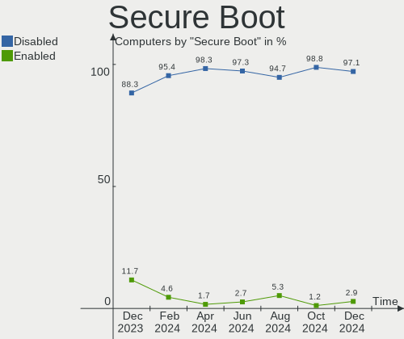
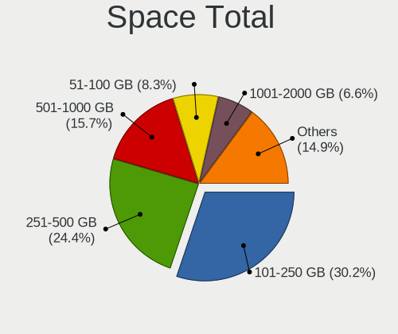
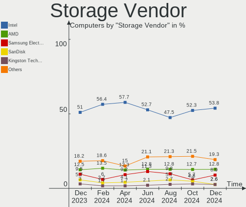
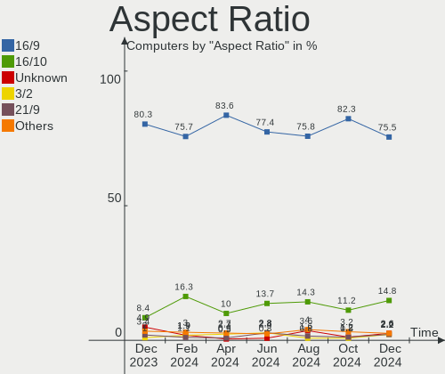
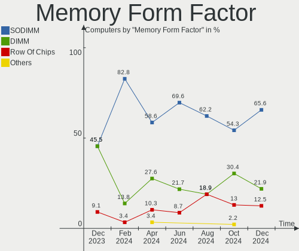

Zorin - Hardware Trends
-----------------------

A project to identify most popular hardware characteristics and track their change
over time based on data collected by Linux users at https://Linux-Hardware.org.

Anyone can contribute to this report by the [hw-probe](https://github.com/linuxhw/hw-probe) tool:

    sudo -E hw-probe -all -upload

This is a report for all computer types. See also reports for [desktops](/Dist/Zorin/Desktop/README.md) and [notebooks](/Dist/Zorin/Notebook/README.md).

This report is for one last month. Overall report since the beginning of time: [TestDays](https://github.com/linuxhw/TestDays)

Period: Jun, 2023.

Contents
--------

* [ System ](#system)
  - [ OS                       ](#os)
  - [ OS Family                ](#os-family)
  - [ Kernel                   ](#kernel)
  - [ Kernel Family            ](#kernel-family)
  - [ Kernel Major Ver.        ](#kernel-major-ver)
  - [ Arch                     ](#arch)
  - [ DE                       ](#de)
  - [ Display Server           ](#display-server)
  - [ Display Manager          ](#display-manager)
  - [ OS Lang                  ](#os-lang)
  - [ Boot Mode                ](#boot-mode)
  - [ Filesystem               ](#filesystem)
  - [ Part. scheme             ](#part-scheme)
  - [ Dual Boot with Linux/BSD ](#dual-boot-with-linuxbsd)
  - [ Dual Boot (Win)          ](#dual-boot-win)

* [ Board ](#board)
  - [ Vendor                   ](#vendor)
  - [ Model                    ](#model)
  - [ Model Family             ](#model-family)
  - [ MFG Year                 ](#mfg-year)
  - [ Form Factor              ](#form-factor)
  - [ Secure Boot              ](#secure-boot)
  - [ Coreboot                 ](#coreboot)
  - [ RAM Size                 ](#ram-size)
  - [ RAM Used                 ](#ram-used)
  - [ Total Drives             ](#total-drives)
  - [ Has CD-ROM               ](#has-cd-rom)
  - [ Has Ethernet             ](#has-ethernet)
  - [ Has WiFi                 ](#has-wifi)
  - [ Has Bluetooth            ](#has-bluetooth)

* [ Location ](#location)
  - [ Country                  ](#country)
  - [ City                     ](#city)

* [ Drives ](#drives)
  - [ Drive Vendor             ](#drive-vendor)
  - [ Drive Model              ](#drive-model)
  - [ HDD Vendor               ](#hdd-vendor)
  - [ SSD Vendor               ](#ssd-vendor)
  - [ Drive Kind               ](#drive-kind)
  - [ Drive Connector          ](#drive-connector)
  - [ Drive Size               ](#drive-size)
  - [ Space Total              ](#space-total)
  - [ Space Used               ](#space-used)
  - [ Malfunc. Drives          ](#malfunc-drives)
  - [ Malfunc. Drive Vendor    ](#malfunc-drive-vendor)
  - [ Malfunc. HDD Vendor      ](#malfunc-hdd-vendor)
  - [ Malfunc. Drive Kind      ](#malfunc-drive-kind)
  - [ Failed Drives            ](#failed-drives)
  - [ Failed Drive Vendor      ](#failed-drive-vendor)
  - [ Drive Status             ](#drive-status)

* [ Storage controller ](#storage-controller)
  - [ Storage Vendor           ](#storage-vendor)
  - [ Storage Model            ](#storage-model)
  - [ Storage Kind             ](#storage-kind)

* [ Processor ](#processor)
  - [ CPU Vendor               ](#cpu-vendor)
  - [ CPU Model                ](#cpu-model)
  - [ CPU Model Family         ](#cpu-model-family)
  - [ CPU Cores                ](#cpu-cores)
  - [ CPU Sockets              ](#cpu-sockets)
  - [ CPU Threads              ](#cpu-threads)
  - [ CPU Op-Modes             ](#cpu-op-modes)
  - [ CPU Microcode            ](#cpu-microcode)
  - [ CPU Microarch            ](#cpu-microarch)

* [ Graphics ](#graphics)
  - [ GPU Vendor               ](#gpu-vendor)
  - [ GPU Model                ](#gpu-model)
  - [ GPU Combo                ](#gpu-combo)
  - [ GPU Driver               ](#gpu-driver)
  - [ GPU Memory               ](#gpu-memory)

* [ Monitor ](#monitor)
  - [ Monitor Vendor           ](#monitor-vendor)
  - [ Monitor Model            ](#monitor-model)
  - [ Monitor Resolution       ](#monitor-resolution)
  - [ Monitor Diagonal         ](#monitor-diagonal)
  - [ Monitor Width            ](#monitor-width)
  - [ Aspect Ratio             ](#aspect-ratio)
  - [ Monitor Area             ](#monitor-area)
  - [ Pixel Density            ](#pixel-density)
  - [ Multiple Monitors        ](#multiple-monitors)

* [ Network ](#network)
  - [ Net Controller Vendor    ](#net-controller-vendor)
  - [ Net Controller Model     ](#net-controller-model)
  - [ Wireless Vendor          ](#wireless-vendor)
  - [ Wireless Model           ](#wireless-model)
  - [ Ethernet Vendor          ](#ethernet-vendor)
  - [ Ethernet Model           ](#ethernet-model)
  - [ Net Controller Kind      ](#net-controller-kind)
  - [ Used Controller          ](#used-controller)
  - [ NICs                     ](#nics)
  - [ IPv6                     ](#ipv6)

* [ Bluetooth ](#bluetooth)
  - [ Bluetooth Vendor         ](#bluetooth-vendor)
  - [ Bluetooth Model          ](#bluetooth-model)

* [ Sound ](#sound)
  - [ Sound Vendor             ](#sound-vendor)
  - [ Sound Model              ](#sound-model)

* [ Memory ](#memory)
  - [ Memory Vendor            ](#memory-vendor)
  - [ Memory Model             ](#memory-model)
  - [ Memory Kind              ](#memory-kind)
  - [ Memory Form Factor       ](#memory-form-factor)
  - [ Memory Size              ](#memory-size)
  - [ Memory Speed             ](#memory-speed)

* [ Printers & scanners ](#printers--scanners)
  - [ Printer Vendor           ](#printer-vendor)
  - [ Printer Model            ](#printer-model)
  - [ Scanner Vendor           ](#scanner-vendor)
  - [ Scanner Model            ](#scanner-model)

* [ Camera ](#camera)
  - [ Camera Vendor            ](#camera-vendor)
  - [ Camera Model             ](#camera-model)

* [ Security ](#security)
  - [ Fingerprint Vendor       ](#fingerprint-vendor)
  - [ Fingerprint Model        ](#fingerprint-model)
  - [ Chipcard Vendor          ](#chipcard-vendor)
  - [ Chipcard Model           ](#chipcard-model)

* [ Unsupported ](#unsupported)
  - [ Unsupported Devices      ](#unsupported-devices)
  - [ Unsupported Device Types ](#unsupported-device-types)

System
------

OS
--

Installed operating systems

| Name     | Computers | Percent |
|----------|-----------|---------|
| Zorin 16 | 116       | 94.31%  |
| Zorin 15 | 7         | 5.69%   |

OS Family
---------

OS without a version

| Name  | Computers | Percent |
|-------|-----------|---------|
| Zorin | 123       | 100%    |

Kernel
------

Version of the Linux kernel

| Version                | Computers | Percent |
|------------------------|-----------|---------|
| 5.15.0-73-generic      | 61        | 49.59%  |
| 5.15.0-75-generic      | 32        | 26.02%  |
| 5.4.0-150-generic      | 5         | 4.07%   |
| 5.15.0-56-generic      | 5         | 4.07%   |
| 5.15.0-72-generic      | 4         | 3.25%   |
| 5.15.0-71-generic      | 4         | 3.25%   |
| 5.15.0-52-generic      | 2         | 1.63%   |
| 6.3.1-060301-generic   | 1         | 0.81%   |
| 6.2.16-060216-generic  | 1         | 0.81%   |
| 5.4.0-66-generic       | 1         | 0.81%   |
| 5.4.0-149-generic      | 1         | 0.81%   |
| 5.19.12-051912-generic | 1         | 0.81%   |
| 5.15.0-76-generic      | 1         | 0.81%   |
| 5.15.0-72-lowlatency   | 1         | 0.81%   |
| 5.15.0-67-generic      | 1         | 0.81%   |
| 5.13.0-39-generic      | 1         | 0.81%   |
| 5.13.0-30-generic      | 1         | 0.81%   |

Kernel Family
-------------

Linux kernel without a distro release

| Version | Computers | Percent |
|---------|-----------|---------|
| 5.15.0  | 111       | 90.24%  |
| 5.4.0   | 7         | 5.69%   |
| 5.13.0  | 2         | 1.63%   |
| 6.3.1   | 1         | 0.81%   |
| 6.2.16  | 1         | 0.81%   |
| 5.19.12 | 1         | 0.81%   |

Kernel Major Ver.
-----------------

Linux kernel major version

| Version | Computers | Percent |
|---------|-----------|---------|
| 5.15    | 111       | 90.24%  |
| 5.4     | 7         | 5.69%   |
| 5.13    | 2         | 1.63%   |
| 6.3     | 1         | 0.81%   |
| 6.2     | 1         | 0.81%   |
| 5.19    | 1         | 0.81%   |

Arch
----

OS architecture (x86_64, i586, etc.)

| Name   | Computers | Percent |
|--------|-----------|---------|
| x86_64 | 120       | 97.56%  |
| i686   | 3         | 2.44%   |

DE
--

Desktop Environment

| Name  | Computers | Percent |
|-------|-----------|---------|
| GNOME | 93        | 75.61%  |
| XFCE  | 30        | 24.39%  |

Display Server
--------------

X11 or Wayland

| Name    | Computers | Percent |
|---------|-----------|---------|
| X11     | 122       | 99.19%  |
| Wayland | 1         | 0.81%   |

Display Manager
---------------

SDDM, LightDM, etc.

| Name    | Computers | Percent |
|---------|-----------|---------|
| Unknown | 90        | 73.17%  |
| GDM3    | 17        | 13.82%  |
| LightDM | 10        | 8.13%   |
| GDM     | 6         | 4.88%   |

OS Lang
-------

Language

| Lang        | Computers | Percent |
|-------------|-----------|---------|
| en_US       | 47        | 38.21%  |
| pt_BR       | 8         | 6.5%    |
| es_ES       | 8         | 6.5%    |
| de_DE       | 8         | 6.5%    |
| en_GB       | 7         | 5.69%   |
| pl_PL       | 6         | 4.88%   |
| fr_FR       | 6         | 4.88%   |
| it_IT       | 4         | 3.25%   |
| nl_NL       | 3         | 2.44%   |
| es_MX       | 3         | 2.44%   |
| nl_BE       | 2         | 1.63%   |
| en_IN       | 2         | 1.63%   |
| en_CA       | 2         | 1.63%   |
| zh_CN       | 1         | 0.81%   |
| sr_RS@latin | 1         | 0.81%   |
| sl_SI       | 1         | 0.81%   |
| ru_RU       | 1         | 0.81%   |
| pt_PT       | 1         | 0.81%   |
| ko_KR       | 1         | 0.81%   |
| ja_JP       | 1         | 0.81%   |
| hu_HU       | 1         | 0.81%   |
| fr_BE       | 1         | 0.81%   |
| es_HN       | 1         | 0.81%   |
| en_ZA       | 1         | 0.81%   |
| en_PH       | 1         | 0.81%   |
| en_NZ       | 1         | 0.81%   |
| en_AU       | 1         | 0.81%   |
| de_AT       | 1         | 0.81%   |
| da_DK       | 1         | 0.81%   |
| ca_ES       | 1         | 0.81%   |

Boot Mode
---------

EFI or BIOS

| Mode | Computers | Percent |
|------|-----------|---------|
| EFI  | 66        | 53.66%  |
| BIOS | 57        | 46.34%  |

Filesystem
----------

Type of filesystem

| Type    | Computers | Percent |
|---------|-----------|---------|
| Ext4    | 99        | 80.49%  |
| Tmpfs   | 23        | 18.7%   |
| Overlay | 1         | 0.81%   |

Part. scheme
------------

Scheme of partitioning

| Type    | Computers | Percent |
|---------|-----------|---------|
| Unknown | 93        | 75.61%  |
| GPT     | 20        | 16.26%  |
| MBR     | 10        | 8.13%   |

Dual Boot with Linux/BSD
------------------------

Hosting more than one Linux/BSD

| Dual boot | Computers | Percent |
|-----------|-----------|---------|
| No        | 115       | 93.5%   |
| Yes       | 8         | 6.5%    |

Dual Boot (Win)
---------------

Hosting Linux and Windows

| Dual boot | Computers | Percent |
|-----------|-----------|---------|
| No        | 111       | 90.24%  |
| Yes       | 12        | 9.76%   |

Board
-----

Vendor
------

Motherboard manufacturer

| Name                                 | Computers | Percent |
|--------------------------------------|-----------|---------|
| Hewlett-Packard                      | 22        | 17.89%  |
| Dell                                 | 17        | 13.82%  |
| ASUSTek Computer                     | 16        | 13.01%  |
| Lenovo                               | 14        | 11.38%  |
| MSI                                  | 7         | 5.69%   |
| Apple                                | 5         | 4.07%   |
| Acer                                 | 5         | 4.07%   |
| Toshiba                              | 4         | 3.25%   |
| Gigabyte Technology                  | 4         | 3.25%   |
| Intel                                | 3         | 2.44%   |
| ASRock                               | 3         | 2.44%   |
| Samsung Electronics                  | 2         | 1.63%   |
| Google                               | 2         | 1.63%   |
| AZW                                  | 2         | 1.63%   |
| Vorke                                | 1         | 0.81%   |
| Sony                                 | 1         | 0.81%   |
| Shenzhen Meigao Electronic Equipment | 1         | 0.81%   |
| Semp Toshiba                         | 1         | 0.81%   |
| Positivo                             | 1         | 0.81%   |
| Pegatron                             | 1         | 0.81%   |
| Packard Bell                         | 1         | 0.81%   |
| Nvidia                               | 1         | 0.81%   |
| Notebook                             | 1         | 0.81%   |
| MP                                   | 1         | 0.81%   |
| Microsoft                            | 1         | 0.81%   |
| IPASON                               | 1         | 0.81%   |
| Haier                                | 1         | 0.81%   |
| GPU Company                          | 1         | 0.81%   |
| Gateway                              | 1         | 0.81%   |
| Fujitsu                              | 1         | 0.81%   |
| eMachines                            | 1         | 0.81%   |

Model
-----

Motherboard model

| Name                                            | Computers | Percent |
|-------------------------------------------------|-----------|---------|
| Dell OptiPlex 9020                              | 2         | 1.63%   |
| Vorke V1 Plus                                   | 1         | 0.81%   |
| Toshiba TECRA M10                               | 1         | 0.81%   |
| Toshiba Satellite U400                          | 1         | 0.81%   |
| Toshiba Satellite L650                          | 1         | 0.81%   |
| Toshiba 4900C45                                 | 1         | 0.81%   |
| Sony VPCCA15FX                                  | 1         | 0.81%   |
| Shenzhen Meigao Electronic Equipment UM773 Lite | 1         | 0.81%   |
| Semp Toshiba IS 1412                            | 1         | 0.81%   |
| Samsung N150/N210/N220                          | 1         | 0.81%   |
| Samsung 300E5M/300E5L                           | 1         | 0.81%   |
| Positivo POS-AT SERIES F (CAD)                  | 1         | 0.81%   |
| Pegatron Compaq dx2450                          | 1         | 0.81%   |
| Packard Bell EasyNote TE11BZ                    | 1         | 0.81%   |
| Nvidia MCP79                                    | 1         | 0.81%   |
| Notebook NJ50_70CU                              | 1         | 0.81%   |
| MSI MS-7C91                                     | 1         | 0.81%   |
| MSI MS-7C02                                     | 1         | 0.81%   |
| MSI MS-7B93                                     | 1         | 0.81%   |
| MSI MS-7817                                     | 1         | 0.81%   |
| MSI MS-7788                                     | 1         | 0.81%   |
| MSI MS-7640                                     | 1         | 0.81%   |
| MSI GL62M 7RDX                                  | 1         | 0.81%   |
| MP MS-7848                                      | 1         | 0.81%   |
| Microsoft Surface Pro 7                         | 1         | 0.81%   |
| Lenovo V110-15IKB 80TH                          | 1         | 0.81%   |
| Lenovo ThinkPad Yoga 11e 20DA502                | 1         | 0.81%   |
| Lenovo ThinkPad T450 20BUS0LW02                 | 1         | 0.81%   |
| Lenovo ThinkPad T440 20B7S0VA05                 | 1         | 0.81%   |
| Lenovo ThinkPad T430 2349HNU                    | 1         | 0.81%   |
| Lenovo ThinkPad E560 20EV000UIX                 | 1         | 0.81%   |
| Lenovo ThinkPad 10 2nd 20E4S0JA00               | 1         | 0.81%   |
| Lenovo ThinkCentre M91p 4524WAP                 | 1         | 0.81%   |
| Lenovo ThinkCentre M83 10EAS01G00               | 1         | 0.81%   |
| Lenovo ThinkCentre M700 10J0S2QU00              | 1         | 0.81%   |
| Lenovo ThinkBook 15 G2 ITL 20VE                 | 1         | 0.81%   |
| Lenovo IdeaPad S145-15IIL 82DJ                  | 1         | 0.81%   |
| Lenovo IdeaPad 3 17ITL6 82H9                    | 1         | 0.81%   |
| Lenovo C540 10110                               | 1         | 0.81%   |
| IPASON P3                                       | 1         | 0.81%   |

Model Family
------------

Motherboard model prefix

| Name                                       | Computers | Percent |
|--------------------------------------------|-----------|---------|
| HP Pavilion                                | 7         | 5.69%   |
| Lenovo ThinkPad                            | 6         | 4.88%   |
| Dell OptiPlex                              | 4         | 3.25%   |
| Dell Latitude                              | 4         | 3.25%   |
| Acer Aspire                                | 4         | 3.25%   |
| Lenovo ThinkCentre                         | 3         | 2.44%   |
| ASUS ROG                                   | 3         | 2.44%   |
| Toshiba Satellite                          | 2         | 1.63%   |
| Lenovo IdeaPad                             | 2         | 1.63%   |
| HP Stream                                  | 2         | 1.63%   |
| HP Laptop                                  | 2         | 1.63%   |
| HP EliteBook                               | 2         | 1.63%   |
| Dell Vostro                                | 2         | 1.63%   |
| Dell Precision                             | 2         | 1.63%   |
| Dell Inspiron                              | 2         | 1.63%   |
| ASUS VivoBook                              | 2         | 1.63%   |
| Vorke V1                                   | 1         | 0.81%   |
| Toshiba TECRA                              | 1         | 0.81%   |
| Toshiba 4900C45                            | 1         | 0.81%   |
| Sony VPCCA15FX                             | 1         | 0.81%   |
| Shenzhen Meigao Electronic Equipment UM773 | 1         | 0.81%   |
| Semp Toshiba IS                            | 1         | 0.81%   |
| Samsung N150                               | 1         | 0.81%   |
| Samsung 300E5M                             | 1         | 0.81%   |
| Positivo POS-AT                            | 1         | 0.81%   |
| Pegatron Compaq                            | 1         | 0.81%   |
| Packard Bell EasyNote                      | 1         | 0.81%   |
| Nvidia MCP79                               | 1         | 0.81%   |
| Notebook NJ50                              | 1         | 0.81%   |
| MSI MS-7C91                                | 1         | 0.81%   |
| MSI MS-7C02                                | 1         | 0.81%   |
| MSI MS-7B93                                | 1         | 0.81%   |
| MSI MS-7817                                | 1         | 0.81%   |
| MSI MS-7788                                | 1         | 0.81%   |
| MSI MS-7640                                | 1         | 0.81%   |
| MSI GL62M                                  | 1         | 0.81%   |
| MP MS-7848                                 | 1         | 0.81%   |
| Microsoft Surface                          | 1         | 0.81%   |
| Lenovo V110-15IKB                          | 1         | 0.81%   |
| Lenovo ThinkBook                           | 1         | 0.81%   |

MFG Year
--------

Motherboard manufacture year

| Year | Computers | Percent |
|------|-----------|---------|
| 2017 | 12        | 9.76%   |
| 2010 | 11        | 8.94%   |
| 2019 | 9         | 7.32%   |
| 2021 | 8         | 6.5%    |
| 2015 | 8         | 6.5%    |
| 2012 | 8         | 6.5%    |
| 2009 | 8         | 6.5%    |
| 2022 | 7         | 5.69%   |
| 2018 | 7         | 5.69%   |
| 2014 | 7         | 5.69%   |
| 2013 | 7         | 5.69%   |
| 2011 | 6         | 4.88%   |
| 2020 | 5         | 4.07%   |
| 2008 | 5         | 4.07%   |
| 2023 | 4         | 3.25%   |
| 2016 | 4         | 3.25%   |
| 2007 | 4         | 3.25%   |
| 2006 | 2         | 1.63%   |
| 2005 | 1         | 0.81%   |

Form Factor
-----------

Physical design of the computer

| Name        | Computers | Percent |
|-------------|-----------|---------|
| Notebook    | 65        | 52.85%  |
| Desktop     | 46        | 37.4%   |
| All in one  | 5         | 4.07%   |
| Tablet      | 3         | 2.44%   |
| Convertible | 2         | 1.63%   |
| Mini pc     | 2         | 1.63%   |

Secure Boot
-----------

Enabled or disabled

| State    | Computers | Percent |
|----------|-----------|---------|
| Disabled | 105       | 85.37%  |
| Enabled  | 18        | 14.63%  |

Coreboot
--------

Have coreboot on board

| Used | Computers | Percent |
|------|-----------|---------|
| No   | 121       | 98.37%  |
| Yes  | 2         | 1.63%   |

RAM Size
--------

Total RAM memory

| Size in GB | Computers | Percent |
|------------|-----------|---------|
| 3.01-4.0   | 37        | 30.08%  |
| 4.01-8.0   | 32        | 26.02%  |
| 8.01-16.0  | 17        | 13.82%  |
| 16.01-24.0 | 15        | 12.2%   |
| 32.01-64.0 | 8         | 6.5%    |
| 24.01-32.0 | 5         | 4.07%   |
| 2.01-3.0   | 5         | 4.07%   |
| 1.01-2.0   | 4         | 3.25%   |

RAM Used
--------

Used RAM memory

| Used GB   | Computers | Percent |
|-----------|-----------|---------|
| 1.01-2.0  | 54        | 43.9%   |
| 2.01-3.0  | 35        | 28.46%  |
| 4.01-8.0  | 20        | 16.26%  |
| 3.01-4.0  | 11        | 8.94%   |
| 0.51-1.0  | 2         | 1.63%   |
| 8.01-16.0 | 1         | 0.81%   |

Total Drives
------------

Number of drives on board

| Drives | Computers | Percent |
|--------|-----------|---------|
| 1      | 80        | 65.04%  |
| 2      | 33        | 26.83%  |
| 3      | 6         | 4.88%   |
| 5      | 3         | 2.44%   |
| 0      | 1         | 0.81%   |

Has CD-ROM
----------

Has CD-ROM on board

| Presented | Computers | Percent |
|-----------|-----------|---------|
| No        | 64        | 52.03%  |
| Yes       | 59        | 47.97%  |

Has Ethernet
------------

Has Ethernet on board

| Presented | Computers | Percent |
|-----------|-----------|---------|
| Yes       | 105       | 85.37%  |
| No        | 18        | 14.63%  |

Has WiFi
--------

Has WiFi module

| Presented | Computers | Percent |
|-----------|-----------|---------|
| Yes       | 101       | 82.11%  |
| No        | 22        | 17.89%  |

Has Bluetooth
-------------

Has Bluetooth module

| Presented | Computers | Percent |
|-----------|-----------|---------|
| Yes       | 72        | 58.54%  |
| No        | 51        | 41.46%  |

Location
--------

Country
-------

Geographic location (country)

| Country      | Computers | Percent |
|--------------|-----------|---------|
| USA          | 31        | 25.2%   |
| Germany      | 9         | 7.32%   |
| Brazil       | 9         | 7.32%   |
| Spain        | 8         | 6.5%    |
| UK           | 6         | 4.88%   |
| Poland       | 6         | 4.88%   |
| Netherlands  | 6         | 4.88%   |
| Mexico       | 6         | 4.88%   |
| Italy        | 5         | 4.07%   |
| France       | 5         | 4.07%   |
| Canada       | 3         | 2.44%   |
| Belgium      | 3         | 2.44%   |
| Indonesia    | 2         | 1.63%   |
| India        | 2         | 1.63%   |
| Switzerland  | 1         | 0.81%   |
| South Korea  | 1         | 0.81%   |
| South Africa | 1         | 0.81%   |
| Slovenia     | 1         | 0.81%   |
| Slovakia     | 1         | 0.81%   |
| Russia       | 1         | 0.81%   |
| Portugal     | 1         | 0.81%   |
| Philippines  | 1         | 0.81%   |
| Pakistan     | 1         | 0.81%   |
| Nigeria      | 1         | 0.81%   |
| New Zealand  | 1         | 0.81%   |
| Mali         | 1         | 0.81%   |
| Lithuania    | 1         | 0.81%   |
| Kenya        | 1         | 0.81%   |
| Japan        | 1         | 0.81%   |
| Honduras     | 1         | 0.81%   |
| Denmark      | 1         | 0.81%   |
| China        | 1         | 0.81%   |
| Bulgaria     | 1         | 0.81%   |
| Benin        | 1         | 0.81%   |
| Austria      | 1         | 0.81%   |
| Australia    | 1         | 0.81%   |

City
----

Geographic location (city)

| City                | Computers | Percent |
|---------------------|-----------|---------|
| Tijuana             | 2         | 1.63%   |
| Paris               | 2         | 1.63%   |
| Milan               | 2         | 1.63%   |
| Hyderabad           | 2         | 1.63%   |
| Dortmund            | 2         | 1.63%   |
| Charlotte           | 2         | 1.63%   |
| Yokohama            | 1         | 0.81%   |
| Warsaw              | 1         | 0.81%   |
| Waghausel           | 1         | 0.81%   |
| Voorthuizen         | 1         | 0.81%   |
| Vienna              | 1         | 0.81%   |
| Vernon              | 1         | 0.81%   |
| Venustiano Carranza | 1         | 0.81%   |
| Valladolid          | 1         | 0.81%   |
| Trenton             | 1         | 0.81%   |
| Trapani             | 1         | 0.81%   |
| Tlalnepantla        | 1         | 0.81%   |
| Sydney              | 1         | 0.81%   |
| Surrey              | 1         | 0.81%   |
| Sudbury             | 1         | 0.81%   |
| Stranraer           | 1         | 0.81%   |
| St. Catharines      | 1         | 0.81%   |
| Spirit Lake         | 1         | 0.81%   |
| Sofia               | 1         | 0.81%   |
| Shenzhen            | 1         | 0.81%   |
| Seville             | 1         | 0.81%   |
| Seongdong-gu        | 1         | 0.81%   |
| Sao Paulo           | 1         | 0.81%   |
| Sao Goncalo         | 1         | 0.81%   |
| Santo André        | 1         | 0.81%   |
| Sant Pere de Ribes  | 1         | 0.81%   |
| San Francisco       | 1         | 0.81%   |
| San Fernando City   | 1         | 0.81%   |
| San Diego           | 1         | 0.81%   |
| Ruda Śląska       | 1         | 0.81%   |
| Rome                | 1         | 0.81%   |
| Rockville           | 1         | 0.81%   |
| Rochester           | 1         | 0.81%   |
| Rio de Janeiro      | 1         | 0.81%   |
| Rio Comayagua       | 1         | 0.81%   |

Drives
------

Drive Vendor
------------

Hard drive vendors

| Vendor                      | Computers | Drives | Percent |
|-----------------------------|-----------|--------|---------|
| Seagate                     | 21        | 25     | 13.38%  |
| WDC                         | 20        | 22     | 12.74%  |
| Samsung Electronics         | 15        | 17     | 9.55%   |
| Kingston                    | 13        | 15     | 8.28%   |
| Unknown                     | 9         | 11     | 5.73%   |
| Sandisk                     | 7         | 8      | 4.46%   |
| Toshiba                     | 5         | 5      | 3.18%   |
| HGST                        | 5         | 5      | 3.18%   |
| Apple                       | 5         | 5      | 3.18%   |
| KIOXIA                      | 4         | 4      | 2.55%   |
| Crucial                     | 4         | 5      | 2.55%   |
| A-DATA Technology           | 4         | 4      | 2.55%   |
| SK hynix                    | 3         | 3      | 1.91%   |
| Micron Technology           | 3         | 3      | 1.91%   |
| Intel                       | 3         | 3      | 1.91%   |
| Hitachi                     | 3         | 3      | 1.91%   |
| China                       | 3         | 3      | 1.91%   |
| Patriot                     | 2         | 2      | 1.27%   |
| MAXIO Technology (Hangzhou) | 2         | 2      | 1.27%   |
| GOODRAM                     | 2         | 2      | 1.27%   |
| Unknown                     | 2         | 2      | 1.27%   |
| X12                         | 1         | 1      | 0.64%   |
| TXRUI                       | 1         | 2      | 0.64%   |
| SPCC                        | 1         | 1      | 0.64%   |
| Solid State Storage         | 1         | 1      | 0.64%   |
| Silicon Motion              | 1         | 1      | 0.64%   |
| Seagate Technology          | 1         | 1      | 0.64%   |
| Phison Electronics          | 1         | 1      | 0.64%   |
| Phison                      | 1         | 1      | 0.64%   |
| OYUNKEY                     | 1         | 1      | 0.64%   |
| Micron/Crucial Technology   | 1         | 1      | 0.64%   |
| Maxtor                      | 1         | 1      | 0.64%   |
| LITEON                      | 1         | 1      | 0.64%   |
| KIOXIA-EXCERIA              | 1         | 1      | 0.64%   |
| Kingston Technology Company | 1         | 1      | 0.64%   |
| KingSpec                    | 1         | 1      | 0.64%   |
| Intenso                     | 1         | 1      | 0.64%   |
| HS-SSD-E100                 | 1         | 1      | 0.64%   |
| Gigabyte Technology         | 1         | 1      | 0.64%   |
| FORESEE                     | 1         | 1      | 0.64%   |

Drive Model
-----------

Hard drive models

| Model                                               | Computers | Percent |
|-----------------------------------------------------|-----------|---------|
| Kingston SA400S37240G 240GB SSD                     | 8         | 4.82%   |
| Unknown MMC Card  64GB                              | 4         | 2.41%   |
| Unknown MMC Card  32GB                              | 3         | 1.81%   |
| Seagate ST9500325AS 500GB                           | 3         | 1.81%   |
| Unknown MMC Card  128GB                             | 2         | 1.2%    |
| Seagate ST500LT012-1DG142 500GB                     | 2         | 1.2%    |
| Seagate ST31000528AS 1TB                            | 2         | 1.2%    |
| Seagate ST1000LM035-1RK172 1TB                      | 2         | 1.2%    |
| Seagate ST1000DM003-9YN162 1TB                      | 2         | 1.2%    |
| Seagate ST1000DM003-1CH162 1TB                      | 2         | 1.2%    |
| Samsung SSD 870 EVO 500GB                           | 2         | 1.2%    |
| Samsung NVMe SSD Controller SM981/PM981/PM983 250GB | 2         | 1.2%    |
| Samsung NVMe SSD Controller SM961/PM961/SM963 256GB | 2         | 1.2%    |
| MAXIO (Hangzhou) NVMe SSD Controller MAP1202 512GB  | 2         | 1.2%    |
| KIOXIA KBG40ZNV256G 256GB                           | 2         | 1.2%    |
| Apple HDD ST1000DM003 1TB                           | 2         | 1.2%    |
| Unknown                                             | 2         | 1.2%    |
| X12 SSD 1TB                                         | 1         | 0.6%    |
| WDC WDS240G2G0A-00JH30 240GB SSD                    | 1         | 0.6%    |
| WDC WD800JD-75MSA3 80GB                             | 1         | 0.6%    |
| WDC WD6400BPVT-80HXZT1 640GB                        | 1         | 0.6%    |
| WDC WD5003ABYX-01WERA1 500GB                        | 1         | 0.6%    |
| WDC WD5000LUCX-63HWNY0 500GB                        | 1         | 0.6%    |
| WDC WD5000LPVX-75V0TT0 500GB                        | 1         | 0.6%    |
| WDC WD5000LPVT-22G33T0 500GB                        | 1         | 0.6%    |
| WDC WD5000LPCX-60VHAT1 500GB                        | 1         | 0.6%    |
| WDC WD5000BEVT-22A0RT0 500GB                        | 1         | 0.6%    |
| WDC WD5000AAKS-60A7B0 500GB                         | 1         | 0.6%    |
| WDC WD5000AAKS-40V6A0 500GB                         | 1         | 0.6%    |
| WDC WD5000AAKS-00M9A0 500GB                         | 1         | 0.6%    |
| WDC WD400BD-75JMC0 40GB                             | 1         | 0.6%    |
| WDC WD3200BPVT-24JJ5T0 320GB                        | 1         | 0.6%    |
| WDC WD30EZRX-00D8PB0 3TB                            | 1         | 0.6%    |
| WDC WD20SPZX-08UA7 2TB                              | 1         | 0.6%    |
| WDC WD1200BEVT-75ZCT2 120GB                         | 1         | 0.6%    |
| WDC WD10SPZX-75Z10T3 1TB                            | 1         | 0.6%    |
| WDC WD10JPCX-24UE4T0 1TB                            | 1         | 0.6%    |
| WDC WD10EZEX-00WN4A0 1TB                            | 1         | 0.6%    |
| WDC WD10EADS-00L5B1 1TB                             | 1         | 0.6%    |
| WDC PC SN520 SDAPNUW-256G-1006 256GB                | 1         | 0.6%    |

HDD Vendor
----------

Hard disk drive vendors

| Vendor              | Computers | Drives | Percent |
|---------------------|-----------|--------|---------|
| Seagate             | 21        | 25     | 36.21%  |
| WDC                 | 18        | 20     | 31.03%  |
| HGST                | 5         | 5      | 8.62%   |
| Samsung Electronics | 4         | 4      | 6.9%    |
| Toshiba             | 3         | 3      | 5.17%   |
| Hitachi             | 3         | 3      | 5.17%   |
| Apple               | 3         | 3      | 5.17%   |
| Maxtor              | 1         | 1      | 1.72%   |

SSD Vendor
----------

Solid state drive vendors

| Vendor              | Computers | Drives | Percent |
|---------------------|-----------|--------|---------|
| Kingston            | 12        | 13     | 20.69%  |
| Samsung Electronics | 8         | 8      | 13.79%  |
| SanDisk             | 5         | 5      | 8.62%   |
| Crucial             | 4         | 5      | 6.9%    |
| A-DATA Technology   | 4         | 4      | 6.9%    |
| Intel               | 3         | 3      | 5.17%   |
| China               | 3         | 3      | 5.17%   |
| Toshiba             | 2         | 2      | 3.45%   |
| Patriot             | 2         | 2      | 3.45%   |
| GOODRAM             | 2         | 2      | 3.45%   |
| Apple               | 2         | 2      | 3.45%   |
| X12                 | 1         | 1      | 1.72%   |
| WDC                 | 1         | 1      | 1.72%   |
| SPCC                | 1         | 1      | 1.72%   |
| LITEON              | 1         | 1      | 1.72%   |
| KIOXIA-EXCERIA      | 1         | 1      | 1.72%   |
| KingSpec            | 1         | 1      | 1.72%   |
| Intenso             | 1         | 1      | 1.72%   |
| Gigabyte Technology | 1         | 1      | 1.72%   |
| FORESEE             | 1         | 1      | 1.72%   |
| External            | 1         | 1      | 1.72%   |
| Unknown             | 1         | 1      | 1.72%   |

Drive Kind
----------

HDD or SSD

| Kind    | Computers | Drives | Percent |
|---------|-----------|--------|---------|
| HDD     | 53        | 64     | 36.3%   |
| SSD     | 51        | 60     | 34.93%  |
| NVMe    | 28        | 31     | 19.18%  |
| MMC     | 9         | 11     | 6.16%   |
| Unknown | 5         | 6      | 3.42%   |

Drive Connector
---------------

SATA, SAS, NVMe, etc.

| Type | Computers | Drives | Percent |
|------|-----------|--------|---------|
| SATA | 96        | 127    | 70.59%  |
| NVMe | 28        | 31     | 20.59%  |
| MMC  | 9         | 11     | 6.62%   |
| SAS  | 3         | 3      | 2.21%   |

Drive Size
----------

Size of hard drive

| Size in TB | Computers | Drives | Percent |
|------------|-----------|--------|---------|
| 0.01-0.5   | 66        | 80     | 64.08%  |
| 0.51-1.0   | 25        | 30     | 24.27%  |
| 1.01-2.0   | 9         | 9      | 8.74%   |
| 2.01-3.0   | 1         | 1      | 0.97%   |
| 10.01-20.0 | 1         | 3      | 0.97%   |
| 4.01-10.0  | 1         | 1      | 0.97%   |

Space Total
-----------

Amount of disk space available on the file system

| Size in GB     | Computers | Percent |
|----------------|-----------|---------|
| 101-250        | 46        | 37.4%   |
| 251-500        | 34        | 27.64%  |
| 501-1000       | 19        | 15.45%  |
| 51-100         | 7         | 5.69%   |
| 1001-2000      | 5         | 4.07%   |
| 21-50          | 4         | 3.25%   |
| 2001-3000      | 4         | 3.25%   |
| More than 3000 | 2         | 1.63%   |
| 1-20           | 2         | 1.63%   |

Space Used
----------

Amount of used disk space

| Used GB        | Computers | Percent |
|----------------|-----------|---------|
| 1-20           | 37        | 30.08%  |
| 21-50          | 32        | 26.02%  |
| 51-100         | 26        | 21.14%  |
| 101-250        | 17        | 13.82%  |
| 251-500        | 5         | 4.07%   |
| More than 3000 | 2         | 1.63%   |
| 501-1000       | 2         | 1.63%   |
| 2001-3000      | 1         | 0.81%   |
| 1001-2000      | 1         | 0.81%   |

Malfunc. Drives
---------------

Drive models with a malfunction

| Model                                | Computers | Drives | Percent |
|--------------------------------------|-----------|--------|---------|
| SK hynix BC711 HFM512GD3JX013N 512GB | 1         | 1      | 33.33%  |
| Seagate ST3500418ASQ 500GB           | 1         | 1      | 33.33%  |
| Unknown                              | 1         | 1      | 33.33%  |

Malfunc. Drive Vendor
---------------------

Vendors of faulty drives

| Vendor   | Computers | Drives | Percent |
|----------|-----------|--------|---------|
| SK hynix | 1         | 1      | 33.33%  |
| Seagate  | 1         | 1      | 33.33%  |
| Unknown  | 1         | 1      | 33.33%  |

Malfunc. HDD Vendor
-------------------

Vendors of faulty HDD drives

| Vendor  | Computers | Drives | Percent |
|---------|-----------|--------|---------|
| Seagate | 1         | 1      | 100%    |

Malfunc. Drive Kind
-------------------

Kinds of faulty drives

| Kind | Computers | Drives | Percent |
|------|-----------|--------|---------|
| NVMe | 1         | 1      | 33.33%  |
| SSD  | 1         | 1      | 33.33%  |
| HDD  | 1         | 1      | 33.33%  |

Failed Drives
-------------

Failed drive models

Zero info for selected period =(

Failed Drive Vendor
-------------------

Failed drive vendors

Zero info for selected period =(

Drive Status
------------

Number of failed and malfunc. drives

| Status   | Computers | Drives | Percent |
|----------|-----------|--------|---------|
| Detected | 115       | 163    | 93.5%   |
| Works    | 5         | 6      | 4.07%   |
| Malfunc  | 3         | 3      | 2.44%   |

Storage controller
------------------

Storage Vendor
--------------

Storage controller vendors

| Vendor                         | Computers | Percent |
|--------------------------------|-----------|---------|
| Intel                          | 85        | 59.44%  |
| AMD                            | 16        | 11.19%  |
| Samsung Electronics            | 8         | 5.59%   |
| SanDisk                        | 4         | 2.8%    |
| Nvidia                         | 4         | 2.8%    |
| KIOXIA                         | 4         | 2.8%    |
| SK hynix                       | 3         | 2.1%    |
| Micron Technology              | 3         | 2.1%    |
| JMicron Technology             | 3         | 2.1%    |
| Phison Electronics             | 2         | 1.4%    |
| MAXIO Technology (Hangzhou)    | 2         | 1.4%    |
| Kingston Technology Company    | 2         | 1.4%    |
| ASMedia Technology             | 2         | 1.4%    |
| Solid State Storage Technology | 1         | 0.7%    |
| Silicon Motion                 | 1         | 0.7%    |
| Seagate Technology             | 1         | 0.7%    |
| Micron/Crucial Technology      | 1         | 0.7%    |
| Marvell Technology Group       | 1         | 0.7%    |

Storage Model
-------------

Storage controller models

| Model                                                                          | Computers | Percent |
|--------------------------------------------------------------------------------|-----------|---------|
| Intel 82801IBM/IEM (ICH9M/ICH9M-E) 4 port SATA Controller [AHCI mode]          | 9         | 5.66%   |
| AMD FCH SATA Controller [AHCI mode]                                            | 9         | 5.66%   |
| Intel 82801 Mobile SATA Controller [RAID mode]                                 | 6         | 3.77%   |
| Intel Wildcat Point-LP SATA Controller [AHCI Mode]                             | 5         | 3.14%   |
| Intel Sunrise Point-LP SATA Controller [AHCI mode]                             | 5         | 3.14%   |
| Intel 8 Series/C220 Series Chipset Family 6-port SATA Controller 1 [AHCI mode] | 5         | 3.14%   |
| KIOXIA NVMe SSD Controller BG4                                                 | 4         | 2.52%   |
| Intel Q170/Q150/B150/H170/H110/Z170/CM236 Chipset SATA Controller [AHCI Mode]  | 4         | 2.52%   |
| Intel NM10/ICH7 Family SATA Controller [IDE mode]                              | 4         | 2.52%   |
| Intel NM10/ICH7 Family SATA Controller [AHCI mode]                             | 4         | 2.52%   |
| Intel 82801G (ICH7 Family) IDE Controller                                      | 4         | 2.52%   |
| JMicron JMB363 SATA/IDE Controller                                             | 3         | 1.89%   |
| Intel SATA Controller [RAID mode]                                              | 3         | 1.89%   |
| Intel Cannon Point-LP SATA Controller [AHCI Mode]                              | 3         | 1.89%   |
| Intel 7 Series/C210 Series Chipset Family 6-port SATA Controller [AHCI mode]   | 3         | 1.89%   |
| Intel 7 Series Chipset Family 6-port SATA Controller [AHCI mode]               | 3         | 1.89%   |
| Intel 5 Series/3400 Series Chipset 4 port SATA AHCI Controller                 | 3         | 1.89%   |
| Intel 200 Series PCH SATA controller [AHCI mode]                               | 3         | 1.89%   |
| AMD 400 Series Chipset SATA Controller                                         | 3         | 1.89%   |
| SK hynix Gold P31/BC711/PC711 NVMe Solid State Drive                           | 2         | 1.26%   |
| Samsung NVMe SSD Controller SM981/PM981/PM983                                  | 2         | 1.26%   |
| Samsung NVMe SSD Controller SM961/PM961/SM963                                  | 2         | 1.26%   |
| Samsung Electronics SATA controller                                            | 2         | 1.26%   |
| Nvidia MCP79 AHCI Controller                                                   | 2         | 1.26%   |
| Micron NVMe Storage Controller                                                 | 2         | 1.26%   |
| MAXIO (Hangzhou) NVMe SSD Controller MAP1202                                   | 2         | 1.26%   |
| Intel Volume Management Device NVMe RAID Controller                            | 2         | 1.26%   |
| Intel Tiger Lake-LP SATA Controller                                            | 2         | 1.26%   |
| Intel HM170/QM170 Chipset SATA Controller [AHCI Mode]                          | 2         | 1.26%   |
| Intel Celeron N3350/Pentium N4200/Atom E3900 Series SATA AHCI Controller       | 2         | 1.26%   |
| Intel 8 Series SATA Controller 1 [AHCI mode]                                   | 2         | 1.26%   |
| Intel 6 Series/C200 Series Chipset Family 6 port Mobile SATA AHCI Controller   | 2         | 1.26%   |
| Intel 6 Series/C200 Series Chipset Family 6 port Desktop SATA AHCI Controller  | 2         | 1.26%   |
| Intel 5 Series/3400 Series Chipset 6 port SATA AHCI Controller                 | 2         | 1.26%   |
| ASMedia ASM1062 Serial ATA Controller                                          | 2         | 1.26%   |
| AMD SB7x0/SB8x0/SB9x0 SATA Controller [IDE mode]                               | 2         | 1.26%   |
| AMD SB7x0/SB8x0/SB9x0 SATA Controller [AHCI mode]                              | 2         | 1.26%   |
| AMD SB7x0/SB8x0/SB9x0 IDE Controller                                           | 2         | 1.26%   |
| AMD 500 Series Chipset SATA Controller                                         | 2         | 1.26%   |
| Solid State Storage CL1-3D256-Q11 NVMe SSD M.2                                 | 1         | 0.63%   |

Storage Kind
------------

Kind of storage controller (IDE, SATA, NVMe, SAS, ...)

| Kind | Computers | Percent |
|------|-----------|---------|
| SATA | 89        | 62.24%  |
| NVMe | 28        | 19.58%  |
| IDE  | 15        | 10.49%  |
| RAID | 11        | 7.69%   |

Processor
---------

CPU Vendor
----------

Processor vendors

| Vendor | Computers | Percent |
|--------|-----------|---------|
| Intel  | 100       | 81.3%   |
| AMD    | 23        | 18.7%   |

CPU Model
---------

Processor models

| Model                                       | Computers | Percent |
|---------------------------------------------|-----------|---------|
| Intel Pentium Dual-Core CPU T4500 @ 2.30GHz | 3         | 2.44%   |
| Intel Core i3-4160 CPU @ 3.60GHz            | 3         | 2.44%   |
| Intel Pentium Dual-Core CPU T4300 @ 2.10GHz | 2         | 1.63%   |
| Intel Core i7-6700 CPU @ 3.40GHz            | 2         | 1.63%   |
| Intel Core i5-5300U CPU @ 2.30GHz           | 2         | 1.63%   |
| Intel Core 2 Duo CPU P8600 @ 2.40GHz        | 2         | 1.63%   |
| Intel Celeron N4000 CPU @ 1.10GHz           | 2         | 1.63%   |
| Intel Celeron CPU N3060 @ 1.60GHz           | 2         | 1.63%   |
| AMD Ryzen 7 5800H with Radeon Graphics      | 2         | 1.63%   |
| AMD Ryzen 5 5600X 6-Core Processor          | 2         | 1.63%   |
| Intel Pentium Silver N6000 @ 1.10GHz        | 1         | 0.81%   |
| Intel Pentium Gold 7505 @ 2.00GHz           | 1         | 0.81%   |
| Intel Pentium Dual-Core CPU T4400 @ 2.20GHz | 1         | 0.81%   |
| Intel Pentium Dual-Core CPU E5500 @ 2.80GHz | 1         | 0.81%   |
| Intel Pentium Dual-Core CPU E5300 @ 2.60GHz | 1         | 0.81%   |
| Intel Pentium Dual CPU T2390 @ 1.86GHz      | 1         | 0.81%   |
| Intel Pentium CPU N4200 @ 1.10GHz           | 1         | 0.81%   |
| Intel Pentium CPU G860 @ 3.00GHz            | 1         | 0.81%   |
| Intel Pentium CPU 4415U @ 2.30GHz           | 1         | 0.81%   |
| Intel Pentium CPU 3825U @ 1.90GHz           | 1         | 0.81%   |
| Intel Pentium 4 CPU 3.00GHz                 | 1         | 0.81%   |
| Intel N100                                  | 1         | 0.81%   |
| Intel Core m7-6Y75 CPU @ 1.20GHz            | 1         | 0.81%   |
| Intel Core M-5Y10c CPU @ 0.80GHz            | 1         | 0.81%   |
| Intel Core i7-8750H CPU @ 2.20GHz           | 1         | 0.81%   |
| Intel Core i7-7Y75 CPU @ 1.30GHz            | 1         | 0.81%   |
| Intel Core i7-7700HQ CPU @ 2.80GHz          | 1         | 0.81%   |
| Intel Core i7-7700 CPU @ 3.60GHz            | 1         | 0.81%   |
| Intel Core i7-6820HQ CPU @ 2.70GHz          | 1         | 0.81%   |
| Intel Core i7-6700HQ CPU @ 2.60GHz          | 1         | 0.81%   |
| Intel Core i7-4790 CPU @ 3.60GHz            | 1         | 0.81%   |
| Intel Core i7-4771 CPU @ 3.50GHz            | 1         | 0.81%   |
| Intel Core i7-4750HQ CPU @ 2.00GHz          | 1         | 0.81%   |
| Intel Core i7-1065G7 CPU @ 1.30GHz          | 1         | 0.81%   |
| Intel Core i5-9400 CPU @ 2.90GHz            | 1         | 0.81%   |
| Intel Core i5-9300H CPU @ 2.40GHz           | 1         | 0.81%   |
| Intel Core i5-8365U CPU @ 1.60GHz           | 1         | 0.81%   |
| Intel Core i5-8265U CPU @ 1.60GHz           | 1         | 0.81%   |
| Intel Core i5-7Y57 CPU @ 1.20GHz            | 1         | 0.81%   |
| Intel Core i5-6500T CPU @ 2.50GHz           | 1         | 0.81%   |

CPU Model Family
----------------

Processor model prefix

| Model                   | Computers | Percent |
|-------------------------|-----------|---------|
| Intel Core i5           | 28        | 22.76%  |
| Intel Core i3           | 15        | 12.2%   |
| Intel Core i7           | 12        | 9.76%   |
| Intel Pentium Dual-Core | 8         | 6.5%    |
| Intel Celeron           | 8         | 6.5%    |
| Intel Core 2 Duo        | 6         | 4.88%   |
| Intel Atom              | 5         | 4.07%   |
| AMD Ryzen 7             | 5         | 4.07%   |
| AMD Ryzen 5             | 5         | 4.07%   |
| Intel Pentium           | 4         | 3.25%   |
| Other                   | 3         | 2.44%   |
| Intel Core 2 Quad       | 2         | 1.63%   |
| Intel Core 2            | 2         | 1.63%   |
| AMD Ryzen 9             | 2         | 1.63%   |
| AMD Ryzen 3             | 2         | 1.63%   |
| Intel Pentium Silver    | 1         | 0.81%   |
| Intel Pentium Gold      | 1         | 0.81%   |
| Intel Pentium Dual      | 1         | 0.81%   |
| Intel Pentium 4         | 1         | 0.81%   |
| Intel Core m7           | 1         | 0.81%   |
| Intel Core M            | 1         | 0.81%   |
| Intel Celeron Dual-Core | 1         | 0.81%   |
| AMD V120                | 1         | 0.81%   |
| AMD Sempron             | 1         | 0.81%   |
| AMD Phenom II X4        | 1         | 0.81%   |
| AMD E2                  | 1         | 0.81%   |
| AMD E1                  | 1         | 0.81%   |
| AMD E                   | 1         | 0.81%   |
| AMD Athlon II X2        | 1         | 0.81%   |
| AMD Athlon Dual Core    | 1         | 0.81%   |
| AMD A10                 | 1         | 0.81%   |

CPU Cores
---------

Number of processor cores

| Number | Computers | Percent |
|--------|-----------|---------|
| 2      | 67        | 54.47%  |
| 4      | 37        | 30.08%  |
| 6      | 7         | 5.69%   |
| 8      | 5         | 4.07%   |
| 1      | 5         | 4.07%   |
| 16     | 1         | 0.81%   |
| 12     | 1         | 0.81%   |

CPU Sockets
-----------

Number of sockets

| Number | Computers | Percent |
|--------|-----------|---------|
| 1      | 123       | 100%    |

CPU Threads
-----------

Threads per core (Hyper-Threading)

| Number | Computers | Percent |
|--------|-----------|---------|
| 2      | 70        | 56.91%  |
| 1      | 53        | 43.09%  |

CPU Op-Modes
------------

CPU Operation Modes (32-bit, 64-bit)

| Op mode        | Computers | Percent |
|----------------|-----------|---------|
| 32-bit, 64-bit | 123       | 100%    |

CPU Microcode
-------------

Microcode number

| Number     | Computers | Percent |
|------------|-----------|---------|
| 0x1067a    | 12        | 9.76%   |
| 0x306c3    | 7         | 5.69%   |
| 0x206a7    | 7         | 5.69%   |
| 0x506e3    | 6         | 4.88%   |
| 0x306d4    | 6         | 4.88%   |
| 0x806e9    | 5         | 4.07%   |
| 0x306a9    | 5         | 4.07%   |
| Unknown    | 5         | 4.07%   |
| 0x20655    | 4         | 3.25%   |
| 0x906e9    | 3         | 2.44%   |
| 0x806ec    | 3         | 2.44%   |
| 0x706e5    | 3         | 2.44%   |
| 0x406e3    | 3         | 2.44%   |
| 0x0a50000d | 3         | 2.44%   |
| 0x010000c8 | 3         | 2.44%   |
| 0x906ea    | 2         | 1.63%   |
| 0x806c1    | 2         | 1.63%   |
| 0x706a1    | 2         | 1.63%   |
| 0x6f6      | 2         | 1.63%   |
| 0x506c9    | 2         | 1.63%   |
| 0x40651    | 2         | 1.63%   |
| 0x30678    | 2         | 1.63%   |
| 0x10676    | 2         | 1.63%   |
| 0x0a404102 | 2         | 1.63%   |
| 0x08108109 | 2         | 1.63%   |
| 0x05000119 | 2         | 1.63%   |
| 0xf43      | 1         | 0.81%   |
| 0xb06e0    | 1         | 0.81%   |
| 0x906ed    | 1         | 0.81%   |
| 0x906c0    | 1         | 0.81%   |
| 0x806eb    | 1         | 0.81%   |
| 0x806ea    | 1         | 0.81%   |
| 0x706a8    | 1         | 0.81%   |
| 0x6fd      | 1         | 0.81%   |
| 0x6fb      | 1         | 0.81%   |
| 0x6f7      | 1         | 0.81%   |
| 0x406c4    | 1         | 0.81%   |
| 0x406c3    | 1         | 0.81%   |
| 0x40661    | 1         | 0.81%   |
| 0x30661    | 1         | 0.81%   |

CPU Microarch
-------------

Microarchitecture

| Name          | Computers | Percent |
|---------------|-----------|---------|
| KabyLake      | 16        | 13.01%  |
| Penryn        | 15        | 12.2%   |
| Haswell       | 10        | 8.13%   |
| Skylake       | 9         | 7.32%   |
| Zen 3         | 7         | 5.69%   |
| SandyBridge   | 7         | 5.69%   |
| Broadwell     | 6         | 4.88%   |
| Westmere      | 5         | 4.07%   |
| Silvermont    | 5         | 4.07%   |
| IvyBridge     | 5         | 4.07%   |
| Core          | 5         | 4.07%   |
| Unknown       | 5         | 4.07%   |
| K10           | 3         | 2.44%   |
| IceLake       | 3         | 2.44%   |
| Goldmont plus | 3         | 2.44%   |
| Bonnell       | 3         | 2.44%   |
| Zen+          | 2         | 1.63%   |
| TigerLake     | 2         | 1.63%   |
| K8 Hammer     | 2         | 1.63%   |
| Goldmont      | 2         | 1.63%   |
| Bobcat        | 2         | 1.63%   |
| Zen 2         | 1         | 0.81%   |
| Zen           | 1         | 0.81%   |
| Tremont       | 1         | 0.81%   |
| Piledriver    | 1         | 0.81%   |
| NetBurst      | 1         | 0.81%   |
| Excavator     | 1         | 0.81%   |

Graphics
--------

GPU Vendor
----------

Vendors of graphics cards

| Vendor | Computers | Percent |
|--------|-----------|---------|
| Intel  | 83        | 59.71%  |
| Nvidia | 29        | 20.86%  |
| AMD    | 27        | 19.42%  |

GPU Model
---------

Graphics card models

| Model                                                                                    | Computers | Percent |
|------------------------------------------------------------------------------------------|-----------|---------|
| Intel Mobile 4 Series Chipset Integrated Graphics Controller                             | 8         | 5.63%   |
| Intel HD Graphics 530                                                                    | 5         | 3.52%   |
| Intel 2nd Generation Core Processor Family Integrated Graphics Controller                | 5         | 3.52%   |
| Intel Xeon E3-1200 v3/4th Gen Core Processor Integrated Graphics Controller              | 4         | 2.82%   |
| Nvidia GT218 [GeForce 210]                                                               | 3         | 2.11%   |
| Intel Xeon E3-1200 v2/3rd Gen Core processor Graphics Controller                         | 3         | 2.11%   |
| Intel WhiskeyLake-U GT2 [UHD Graphics 620]                                               | 3         | 2.11%   |
| Intel HD Graphics 5500                                                                   | 3         | 2.11%   |
| Intel GeminiLake [UHD Graphics 600]                                                      | 3         | 2.11%   |
| Intel Core Processor Integrated Graphics Controller                                      | 3         | 2.11%   |
| Intel Atom/Celeron/Pentium Processor x5-E8000/J3xxx/N3xxx Integrated Graphics Controller | 3         | 2.11%   |
| Intel 4th Generation Core Processor Family Integrated Graphics Controller                | 3         | 2.11%   |
| AMD Cezanne [Radeon Vega Series / Radeon Vega Mobile Series]                             | 3         | 2.11%   |
| Nvidia GP107 [GeForce GTX 1050 Ti]                                                       | 2         | 1.41%   |
| Intel Skylake GT2 [HD Graphics 520]                                                      | 2         | 1.41%   |
| Intel HD Graphics 615                                                                    | 2         | 1.41%   |
| Intel HD Graphics 610                                                                    | 2         | 1.41%   |
| Intel Haswell-ULT Integrated Graphics Controller                                         | 2         | 1.41%   |
| Intel CoffeeLake-H GT2 [UHD Graphics 630]                                                | 2         | 1.41%   |
| Intel Atom Processor Z36xxx/Z37xxx Series Graphics & Display                             | 2         | 1.41%   |
| Intel 82G33/G31 Express Integrated Graphics Controller                                   | 2         | 1.41%   |
| Intel 3rd Gen Core processor Graphics Controller                                         | 2         | 1.41%   |
| AMD Rembrandt [Radeon 680M]                                                              | 2         | 1.41%   |
| AMD Picasso/Raven 2 [Radeon Vega Series / Radeon Vega Mobile Series]                     | 2         | 1.41%   |
| AMD Cedar [Radeon HD 5000/6000/7350/8350 Series]                                         | 2         | 1.41%   |
| Nvidia TU117M [GeForce GTX 1650 Mobile / Max-Q]                                          | 1         | 0.7%    |
| Nvidia TU117 [GeForce GTX 1650]                                                          | 1         | 0.7%    |
| Nvidia MCP7A [GeForce 9400]                                                              | 1         | 0.7%    |
| Nvidia GT218M [GeForce 310M]                                                             | 1         | 0.7%    |
| Nvidia GP107M [GeForce GTX 1050 Mobile]                                                  | 1         | 0.7%    |
| Nvidia GP106M [GeForce GTX 1060 Mobile]                                                  | 1         | 0.7%    |
| Nvidia GP104 [GeForce GTX 1070 Ti]                                                       | 1         | 0.7%    |
| Nvidia GM206M [GeForce GTX 965M]                                                         | 1         | 0.7%    |
| Nvidia GM206GLM [Quadro M2200 Mobile]                                                    | 1         | 0.7%    |
| Nvidia GM107GL [Quadro K2200]                                                            | 1         | 0.7%    |
| Nvidia GK208BM [GeForce 920M]                                                            | 1         | 0.7%    |
| Nvidia GK208B [GeForce GT 730]                                                           | 1         | 0.7%    |
| Nvidia GK208B [GeForce GT 710]                                                           | 1         | 0.7%    |
| Nvidia GK107M [GeForce GT 640M]                                                          | 1         | 0.7%    |
| Nvidia GF119 [GeForce 605]                                                               | 1         | 0.7%    |

GPU Combo
---------

Combinations of graphics cards

| Name                 | Computers | Percent |
|----------------------|-----------|---------|
| 1 x Intel            | 71        | 57.72%  |
| 1 x AMD              | 21        | 17.07%  |
| 1 x Nvidia           | 16        | 13.01%  |
| Intel + Nvidia       | 9         | 7.32%   |
| Intel + AMD          | 2         | 1.63%   |
| AMD + Nvidia         | 2         | 1.63%   |
| 2 x AMD + 1 x Nvidia | 1         | 0.81%   |
| 2 x AMD              | 1         | 0.81%   |

GPU Driver
----------

Free vs proprietary

| Driver      | Computers | Percent |
|-------------|-----------|---------|
| Free        | 107       | 86.99%  |
| Proprietary | 14        | 11.38%  |
| Unknown     | 2         | 1.63%   |

GPU Memory
----------

Total video memory

| Size in GB | Computers | Percent |
|------------|-----------|---------|
| Unknown    | 77        | 62.6%   |
| 0.01-0.5   | 20        | 16.26%  |
| 0.51-1.0   | 8         | 6.5%    |
| 1.01-2.0   | 7         | 5.69%   |
| 3.01-4.0   | 6         | 4.88%   |
| 7.01-8.0   | 2         | 1.63%   |
| 5.01-6.0   | 1         | 0.81%   |
| 2.01-3.0   | 1         | 0.81%   |
| 8.01-16.0  | 1         | 0.81%   |

Monitor
-------

Monitor Vendor
--------------

Monitor vendors

| Vendor                  | Computers | Percent |
|-------------------------|-----------|---------|
| Samsung Electronics     | 18        | 14.29%  |
| BOE                     | 15        | 11.9%   |
| AU Optronics            | 15        | 11.9%   |
| LG Display              | 9         | 7.14%   |
| Chimei Innolux          | 8         | 6.35%   |
| Hewlett-Packard         | 7         | 5.56%   |
| Goldstar                | 5         | 3.97%   |
| Apple                   | 5         | 3.97%   |
| AOC                     | 5         | 3.97%   |
| Acer                    | 5         | 3.97%   |
| Dell                    | 4         | 3.17%   |
| Sharp                   | 3         | 2.38%   |
| Philips                 | 3         | 2.38%   |
| BenQ                    | 3         | 2.38%   |
| RTK                     | 2         | 1.59%   |
| Fujitsu Siemens         | 2         | 1.59%   |
| Chi Mei Optoelectronics | 2         | 1.59%   |
| VIE                     | 1         | 0.79%   |
| Unknown                 | 1         | 0.79%   |
| Sony                    | 1         | 0.79%   |
| Sceptre Tech            | 1         | 0.79%   |
| Pixio                   | 1         | 0.79%   |
| Panasonic               | 1         | 0.79%   |
| MTD                     | 1         | 0.79%   |
| LG Philips              | 1         | 0.79%   |
| Lenovo                  | 1         | 0.79%   |
| Iiyama                  | 1         | 0.79%   |
| HannStar                | 1         | 0.79%   |
| Envision                | 1         | 0.79%   |
| CTV                     | 1         | 0.79%   |
| CPT                     | 1         | 0.79%   |
| Ancor Communications    | 1         | 0.79%   |

Monitor Model
-------------

Monitor models

| Model                                                                  | Computers | Percent |
|------------------------------------------------------------------------|-----------|---------|
| Samsung Electronics SyncMaster SAM03E4 1680x1050 474x296mm 22.0-inch   | 2         | 1.55%   |
| Hewlett-Packard 2009 HWP2827 1600x900 440x250mm 19.9-inch              | 2         | 1.55%   |
| AU Optronics LCD Monitor AUO2D3C 1366x768 309x173mm 13.9-inch          | 2         | 1.55%   |
| VIE VK-H270Q75-2K VIE2700 2560x1440 597x336mm 27.0-inch                | 1         | 0.78%   |
| Unknown LCD Monitor SZM DSGi TV 1280x720                               | 1         | 0.78%   |
| Sony TV *01 SNYD902 1920x1080 1218x685mm 55.0-inch                     | 1         | 0.78%   |
| Sharp LQ173M1JW04 SHP14E1 1920x1080 382x215mm 17.3-inch                | 1         | 0.78%   |
| Sharp LCD Monitor SHP146B 3200x1800 294x165mm 13.3-inch                | 1         | 0.78%   |
| Sharp LCD Monitor SHP1461 3200x1800 294x165mm 13.3-inch                | 1         | 0.78%   |
| Sceptre Tech Sceptre J20 SPT080D 1600x900 435x237mm 19.5-inch          | 1         | 0.78%   |
| Samsung Electronics SyncMaster SAM0471 1360x768 344x194mm 15.5-inch    | 1         | 0.78%   |
| Samsung Electronics SyncMaster SAM044C 1680x1050 474x296mm 22.0-inch   | 1         | 0.78%   |
| Samsung Electronics SyncMaster SAM03C2 1680x1050 459x296mm 21.5-inch   | 1         | 0.78%   |
| Samsung Electronics SyncMaster SAM037C 1680x1050 474x296mm 22.0-inch   | 1         | 0.78%   |
| Samsung Electronics SMT24A550 SAM07B5 1920x1080 531x299mm 24.0-inch    | 1         | 0.78%   |
| Samsung Electronics SMBX2431 SAM0771 1920x1080 531x299mm 24.0-inch     | 1         | 0.78%   |
| Samsung Electronics S24F350 SAM0D20 1920x1080 521x293mm 23.5-inch      | 1         | 0.78%   |
| Samsung Electronics S19B150 SAM08A2 1366x768 410x230mm 18.5-inch       | 1         | 0.78%   |
| Samsung Electronics LCD Monitor SEC544B 1600x900 382x215mm 17.3-inch   | 1         | 0.78%   |
| Samsung Electronics LCD Monitor SEC3741 1280x800 331x207mm 15.4-inch   | 1         | 0.78%   |
| Samsung Electronics LCD Monitor SEC3046 1366x768 344x193mm 15.5-inch   | 1         | 0.78%   |
| Samsung Electronics LCD Monitor SDC4C48 1920x1080 409x230mm 18.5-inch  | 1         | 0.78%   |
| Samsung Electronics LCD Monitor SDC314D 1366x768 309x174mm 14.0-inch   | 1         | 0.78%   |
| Samsung Electronics LCD Monitor SAM71A5 1920x1080 1210x680mm 54.6-inch | 1         | 0.78%   |
| Samsung Electronics LCD Monitor SAM7103 3840x2160 700x390mm 31.5-inch  | 1         | 0.78%   |
| Samsung Electronics C27F390 SAM0D32 1920x1080 598x336mm 27.0-inch      | 1         | 0.78%   |
| RTK WCS Display RTK1A1B 3840x2160 609x355mm 27.8-inch                  | 1         | 0.78%   |
| RTK MONITOR RTK4A4B 3840x2160 596x335mm 26.9-inch                      | 1         | 0.78%   |
| Pixio U28I4K WAM2800 3840x2160 620x350mm 28.0-inch                     | 1         | 0.78%   |
| Pixio G27P WAM2700 3840x2160 600x330mm 27.0-inch                       | 1         | 0.78%   |
| Philips PHL 221S6L PHL08F9 1920x1080 477x268mm 21.5-inch               | 1         | 0.78%   |
| Philips LCD Monitor PHL4650 1280x768 530x398mm 26.1-inch               | 1         | 0.78%   |
| Philips LCD Monitor FTV 1920x1080                                      | 1         | 0.78%   |
| Panasonic LCD Monitor TV 1920x1080                                     | 1         | 0.78%   |
| MTD LCD Monitor MTD0001 1280x800 303x190mm 14.1-inch                   | 1         | 0.78%   |
| LG Philips LP154WX4-TLCB LPL3101 1280x800 331x207mm 15.4-inch          | 1         | 0.78%   |
| LG Display LP156WH2-TLQ2 LGD027C 1366x768 344x194mm 15.5-inch          | 1         | 0.78%   |
| LG Display LCD Monitor LGD0621 1920x1080 382x215mm 17.3-inch           | 1         | 0.78%   |
| LG Display LCD Monitor LGD060F 1920x1080 309x174mm 14.0-inch           | 1         | 0.78%   |
| LG Display LCD Monitor LGD05D0 1920x1080 344x194mm 15.5-inch           | 1         | 0.78%   |

Monitor Resolution
------------------

Monitor screen resolution

| Resolution         | Computers | Percent |
|--------------------|-----------|---------|
| 1920x1080 (FHD)    | 43        | 34.4%   |
| 1366x768 (WXGA)    | 31        | 24.8%   |
| 1600x900 (HD+)     | 10        | 8%      |
| 3840x2160 (4K)     | 8         | 6.4%    |
| 1680x1050 (WSXGA+) | 7         | 5.6%    |
| 1440x900 (WXGA+)   | 5         | 4%      |
| 2560x1080          | 3         | 2.4%    |
| 3200x1800 (QHD+)   | 2         | 1.6%    |
| 2560x1440 (QHD)    | 2         | 1.6%    |
| 1280x800 (WXGA)    | 2         | 1.6%    |
| 1280x1024 (SXGA)   | 2         | 1.6%    |
| 3840x1080          | 1         | 0.8%    |
| 2880x1800          | 1         | 0.8%    |
| 2736x1824          | 1         | 0.8%    |
| 1920x1280          | 1         | 0.8%    |
| 1600x1200          | 1         | 0.8%    |
| 1360x768           | 1         | 0.8%    |
| 1280x768           | 1         | 0.8%    |
| 1280x720 (HD)      | 1         | 0.8%    |
| 1024x600           | 1         | 0.8%    |
| Unknown            | 1         | 0.8%    |

Monitor Diagonal
----------------

Diagonal size in inches

| Inches  | Computers | Percent |
|---------|-----------|---------|
| 15      | 28        | 22.05%  |
| 13      | 12        | 9.45%   |
| 17      | 8         | 6.3%    |
| 27      | 7         | 5.51%   |
| 21      | 7         | 5.51%   |
| 14      | 7         | 5.51%   |
| Unknown | 7         | 5.51%   |
| 24      | 6         | 4.72%   |
| 22      | 6         | 4.72%   |
| 20      | 6         | 4.72%   |
| 19      | 5         | 3.94%   |
| 23      | 4         | 3.15%   |
| 11      | 4         | 3.15%   |
| 34      | 3         | 2.36%   |
| 18      | 3         | 2.36%   |
| 12      | 3         | 2.36%   |
| 26      | 2         | 1.57%   |
| 55      | 1         | 0.79%   |
| 54      | 1         | 0.79%   |
| 43      | 1         | 0.79%   |
| 40      | 1         | 0.79%   |
| 32      | 1         | 0.79%   |
| 31      | 1         | 0.79%   |
| 28      | 1         | 0.79%   |
| 16      | 1         | 0.79%   |
| 10      | 1         | 0.79%   |

Monitor Width
-------------

Physical width

| Width in mm | Computers | Percent |
|-------------|-----------|---------|
| 301-350     | 44        | 35.2%   |
| 401-500     | 23        | 18.4%   |
| 501-600     | 18        | 14.4%   |
| 201-300     | 12        | 9.6%    |
| 351-400     | 10        | 8%      |
| Unknown     | 7         | 5.6%    |
| 701-800     | 4         | 3.2%    |
| 601-700     | 3         | 2.4%    |
| 1001-1500   | 2         | 1.6%    |
| 801-900     | 1         | 0.8%    |
| 901-1000    | 1         | 0.8%    |

Aspect Ratio
------------

Proportional relationship between the width and the height

| Ratio   | Computers | Percent |
|---------|-----------|---------|
| 16/9    | 89        | 74.79%  |
| 16/10   | 15        | 12.61%  |
| Unknown | 7         | 5.88%   |
| 5/4     | 3         | 2.52%   |
| 3/2     | 2         | 1.68%   |
| 21/9    | 2         | 1.68%   |
| 4/3     | 1         | 0.84%   |

Monitor Area
------------

Area in inch²

| Area in inch² | Computers | Percent |
|----------------|-----------|---------|
| 101-110        | 29        | 23.39%  |
| 201-250        | 19        | 15.32%  |
| 81-90          | 16        | 12.9%   |
| 151-200        | 14        | 11.29%  |
| 301-350        | 9         | 7.26%   |
| 121-130        | 7         | 5.65%   |
| Unknown        | 7         | 5.65%   |
| 71-80          | 4         | 3.23%   |
| 51-60          | 4         | 3.23%   |
| 351-500        | 4         | 3.23%   |
| 141-150        | 3         | 2.42%   |
| 501-1000       | 3         | 2.42%   |
| More than 1000 | 2         | 1.61%   |
| 61-70          | 2         | 1.61%   |
| 41-50          | 1         | 0.81%   |

Pixel Density
-------------

Pixels per inch

| Density       | Computers | Percent |
|---------------|-----------|---------|
| 101-120       | 39        | 31.97%  |
| 51-100        | 38        | 31.15%  |
| 121-160       | 27        | 22.13%  |
| Unknown       | 7         | 5.74%   |
| 161-240       | 5         | 4.1%    |
| More than 240 | 3         | 2.46%   |
| 1-50          | 3         | 2.46%   |

Multiple Monitors
-----------------

Total monitors connected

| Total | Computers | Percent |
|-------|-----------|---------|
| 1     | 107       | 86.99%  |
| 2     | 14        | 11.38%  |
| 3     | 1         | 0.81%   |
| 0     | 1         | 0.81%   |

Network
-------

Net Controller Vendor
---------------------

Controller vendors

| Vendor                   | Computers | Percent |
|--------------------------|-----------|---------|
| Intel                    | 59        | 33.15%  |
| Realtek Semiconductor    | 55        | 30.9%   |
| Qualcomm Atheros         | 24        | 13.48%  |
| Broadcom                 | 11        | 6.18%   |
| Broadcom Limited         | 6         | 3.37%   |
| MediaTek                 | 4         | 2.25%   |
| Nvidia                   | 3         | 1.69%   |
| Marvell Technology Group | 3         | 1.69%   |
| Ralink                   | 2         | 1.12%   |
| Dell                     | 2         | 1.12%   |
| TRENDnet                 | 1         | 0.56%   |
| Samsung Electronics      | 1         | 0.56%   |
| Ralink Technology        | 1         | 0.56%   |
| Microsoft                | 1         | 0.56%   |
| Linksys                  | 1         | 0.56%   |
| JMicron Technology       | 1         | 0.56%   |
| D-Link                   | 1         | 0.56%   |
| Belkin Components        | 1         | 0.56%   |
| ASIX Electronics         | 1         | 0.56%   |

Net Controller Model
--------------------

Controller models

| Model                                                                      | Computers | Percent |
|----------------------------------------------------------------------------|-----------|---------|
| Realtek RTL8111/8168/8411 PCI Express Gigabit Ethernet Controller          | 35        | 16.43%  |
| Intel Wireless 7265                                                        | 8         | 3.76%   |
| Realtek RTL810xE PCI Express Fast Ethernet controller                      | 7         | 3.29%   |
| Intel Wi-Fi 6 AX200                                                        | 7         | 3.29%   |
| Intel Wireless 7260                                                        | 6         | 2.82%   |
| Qualcomm Atheros AR9285 Wireless Network Adapter (PCI-Express)             | 5         | 2.35%   |
| Intel 82579LM Gigabit Network Connection (Lewisville)                      | 5         | 2.35%   |
| Intel Ethernet Controller I225-V                                           | 4         | 1.88%   |
| Qualcomm Atheros AR928X Wireless Network Adapter (PCI-Express)             | 3         | 1.41%   |
| Qualcomm Atheros AR8121/AR8113/AR8114 Gigabit or Fast Ethernet             | 3         | 1.41%   |
| Intel Wireless 8265 / 8275                                                 | 3         | 1.41%   |
| Intel WiFi Link 5100                                                       | 3         | 1.41%   |
| Intel Ethernet Connection I217-LM                                          | 3         | 1.41%   |
| Intel Ethernet Connection (5) I219-LM                                      | 3         | 1.41%   |
| Intel Cannon Point-LP CNVi [Wireless-AC]                                   | 3         | 1.41%   |
| Intel 82567LM Gigabit Network Connection                                   | 3         | 1.41%   |
| Broadcom Limited NetLink BCM57780 Gigabit Ethernet PCIe                    | 3         | 1.41%   |
| Realtek RTL8852BE PCIe 802.11ax Wireless Network Controller                | 2         | 0.94%   |
| Realtek RTL8822BE 802.11a/b/g/n/ac WiFi adapter                            | 2         | 0.94%   |
| Realtek RTL8723DE Wireless Network Adapter                                 | 2         | 0.94%   |
| Realtek RTL8192EU 802.11b/g/n WLAN Adapter                                 | 2         | 0.94%   |
| Realtek RTL8187B Wireless 802.11g 54Mbps Network Adapter                   | 2         | 0.94%   |
| Realtek RTL8125 2.5GbE Controller                                          | 2         | 0.94%   |
| Qualcomm Atheros QCA9377 802.11ac Wireless Network Adapter                 | 2         | 0.94%   |
| Qualcomm Atheros QCA8171 Gigabit Ethernet                                  | 2         | 0.94%   |
| Qualcomm Atheros AR8151 v2.0 Gigabit Ethernet                              | 2         | 0.94%   |
| Qualcomm Atheros AR8131 Gigabit Ethernet                                   | 2         | 0.94%   |
| Nvidia MCP79 Ethernet                                                      | 2         | 0.94%   |
| Intel Wireless 8260                                                        | 2         | 0.94%   |
| Intel Ice Lake-LP PCH CNVi WiFi                                            | 2         | 0.94%   |
| Intel Ethernet Connection (3) I218-LM                                      | 2         | 0.94%   |
| Intel Centrino Wireless-N 1000 [Condor Peak]                               | 2         | 0.94%   |
| Intel Centrino Advanced-N 6205 [Taylor Peak]                               | 2         | 0.94%   |
| Broadcom NetXtreme BCM5764M Gigabit Ethernet PCIe                          | 2         | 0.94%   |
| TRENDnet TEW-805UB 300Mbps+867Mbps Wireless AC Adapter [Realtek RTL8812AU] | 1         | 0.47%   |
| Samsung Galaxy series, misc. (tethering mode)                              | 1         | 0.47%   |
| Realtek RTL8852AE 802.11ax PCIe Wireless Network Adapter                   | 1         | 0.47%   |
| Realtek RTL8822CE 802.11ac PCIe Wireless Network Adapter                   | 1         | 0.47%   |
| Realtek RTL8821CE 802.11ac PCIe Wireless Network Adapter                   | 1         | 0.47%   |
| Realtek RTL8821AE 802.11ac PCIe Wireless Network Adapter                   | 1         | 0.47%   |

Wireless Vendor
---------------

Wireless vendors

| Vendor                | Computers | Percent |
|-----------------------|-----------|---------|
| Intel                 | 47        | 44.34%  |
| Realtek Semiconductor | 21        | 19.81%  |
| Qualcomm Atheros      | 14        | 13.21%  |
| Broadcom              | 9         | 8.49%   |
| MediaTek              | 4         | 3.77%   |
| Ralink                | 2         | 1.89%   |
| Broadcom Limited      | 2         | 1.89%   |
| TRENDnet              | 1         | 0.94%   |
| Ralink Technology     | 1         | 0.94%   |
| Microsoft             | 1         | 0.94%   |
| Linksys               | 1         | 0.94%   |
| Dell                  | 1         | 0.94%   |
| D-Link                | 1         | 0.94%   |
| Belkin Components     | 1         | 0.94%   |

Wireless Model
--------------

Wireless models

| Model                                                                      | Computers | Percent |
|----------------------------------------------------------------------------|-----------|---------|
| Intel Wireless 7265                                                        | 8         | 7.55%   |
| Intel Wi-Fi 6 AX200                                                        | 7         | 6.6%    |
| Intel Wireless 7260                                                        | 6         | 5.66%   |
| Qualcomm Atheros AR9285 Wireless Network Adapter (PCI-Express)             | 5         | 4.72%   |
| Qualcomm Atheros AR928X Wireless Network Adapter (PCI-Express)             | 3         | 2.83%   |
| Intel Wireless 8265 / 8275                                                 | 3         | 2.83%   |
| Intel WiFi Link 5100                                                       | 3         | 2.83%   |
| Intel Cannon Point-LP CNVi [Wireless-AC]                                   | 3         | 2.83%   |
| Realtek RTL8852BE PCIe 802.11ax Wireless Network Controller                | 2         | 1.89%   |
| Realtek RTL8822BE 802.11a/b/g/n/ac WiFi adapter                            | 2         | 1.89%   |
| Realtek RTL8723DE Wireless Network Adapter                                 | 2         | 1.89%   |
| Realtek RTL8192EU 802.11b/g/n WLAN Adapter                                 | 2         | 1.89%   |
| Realtek RTL8187B Wireless 802.11g 54Mbps Network Adapter                   | 2         | 1.89%   |
| Qualcomm Atheros QCA9377 802.11ac Wireless Network Adapter                 | 2         | 1.89%   |
| Intel Wireless 8260                                                        | 2         | 1.89%   |
| Intel Ice Lake-LP PCH CNVi WiFi                                            | 2         | 1.89%   |
| Intel Centrino Wireless-N 1000 [Condor Peak]                               | 2         | 1.89%   |
| Intel Centrino Advanced-N 6205 [Taylor Peak]                               | 2         | 1.89%   |
| TRENDnet TEW-805UB 300Mbps+867Mbps Wireless AC Adapter [Realtek RTL8812AU] | 1         | 0.94%   |
| Realtek RTL8852AE 802.11ax PCIe Wireless Network Adapter                   | 1         | 0.94%   |
| Realtek RTL8822CE 802.11ac PCIe Wireless Network Adapter                   | 1         | 0.94%   |
| Realtek RTL8821CE 802.11ac PCIe Wireless Network Adapter                   | 1         | 0.94%   |
| Realtek RTL8821AE 802.11ac PCIe Wireless Network Adapter                   | 1         | 0.94%   |
| Realtek RTL8723BU 802.11b/g/n WLAN Adapter                                 | 1         | 0.94%   |
| Realtek RTL8191SU 802.11n WLAN Adapter                                     | 1         | 0.94%   |
| Realtek RTL8191SEvB Wireless LAN Controller                                | 1         | 0.94%   |
| Realtek RTL8188FTV 802.11b/g/n 1T1R 2.4G WLAN Adapter                      | 1         | 0.94%   |
| Realtek RTL8188EE Wireless Network Adapter                                 | 1         | 0.94%   |
| Realtek RTL8188CE 802.11b/g/n WiFi Adapter                                 | 1         | 0.94%   |
| Realtek 802.11n WLAN Adapter                                               | 1         | 0.94%   |
| Ralink MT7601U Wireless Adapter                                            | 1         | 0.94%   |
| Ralink RT3290 Wireless 802.11n 1T/1R PCIe                                  | 1         | 0.94%   |
| Ralink RT2561/RT61 802.11g PCI                                             | 1         | 0.94%   |
| Qualcomm Atheros QCA9565 / AR9565 Wireless Network Adapter                 | 1         | 0.94%   |
| Qualcomm Atheros AR9485 Wireless Network Adapter                           | 1         | 0.94%   |
| Qualcomm Atheros AR9462 Wireless Network Adapter                           | 1         | 0.94%   |
| Qualcomm Atheros AR9287 Wireless Network Adapter (PCI-Express)             | 1         | 0.94%   |
| Microsoft Xbox 360 Wireless Adapter                                        | 1         | 0.94%   |
| MediaTek WiFi                                                              | 1         | 0.94%   |
| MediaTek MT7922 802.11ax PCI Express Wireless Network Adapter              | 1         | 0.94%   |

Ethernet Vendor
---------------

Ethernet vendors

| Vendor                   | Computers | Percent |
|--------------------------|-----------|---------|
| Realtek Semiconductor    | 45        | 42.86%  |
| Intel                    | 31        | 29.52%  |
| Qualcomm Atheros         | 12        | 11.43%  |
| Broadcom Limited         | 4         | 3.81%   |
| Broadcom                 | 4         | 3.81%   |
| Nvidia                   | 3         | 2.86%   |
| Marvell Technology Group | 3         | 2.86%   |
| Samsung Electronics      | 1         | 0.95%   |
| JMicron Technology       | 1         | 0.95%   |
| ASIX Electronics         | 1         | 0.95%   |

Ethernet Model
--------------

Ethernet models

| Model                                                             | Computers | Percent |
|-------------------------------------------------------------------|-----------|---------|
| Realtek RTL8111/8168/8411 PCI Express Gigabit Ethernet Controller | 35        | 33.02%  |
| Realtek RTL810xE PCI Express Fast Ethernet controller             | 7         | 6.6%    |
| Intel 82579LM Gigabit Network Connection (Lewisville)             | 5         | 4.72%   |
| Intel Ethernet Controller I225-V                                  | 4         | 3.77%   |
| Qualcomm Atheros AR8121/AR8113/AR8114 Gigabit or Fast Ethernet    | 3         | 2.83%   |
| Intel Ethernet Connection I217-LM                                 | 3         | 2.83%   |
| Intel Ethernet Connection (5) I219-LM                             | 3         | 2.83%   |
| Intel 82567LM Gigabit Network Connection                          | 3         | 2.83%   |
| Broadcom Limited NetLink BCM57780 Gigabit Ethernet PCIe           | 3         | 2.83%   |
| Realtek RTL8125 2.5GbE Controller                                 | 2         | 1.89%   |
| Qualcomm Atheros QCA8171 Gigabit Ethernet                         | 2         | 1.89%   |
| Qualcomm Atheros AR8151 v2.0 Gigabit Ethernet                     | 2         | 1.89%   |
| Qualcomm Atheros AR8131 Gigabit Ethernet                          | 2         | 1.89%   |
| Nvidia MCP79 Ethernet                                             | 2         | 1.89%   |
| Intel Ethernet Connection (3) I218-LM                             | 2         | 1.89%   |
| Broadcom NetXtreme BCM5764M Gigabit Ethernet PCIe                 | 2         | 1.89%   |
| Samsung Galaxy series, misc. (tethering mode)                     | 1         | 0.94%   |
| Realtek RTL8153 Gigabit Ethernet Adapter                          | 1         | 0.94%   |
| Realtek RTL8152 Fast Ethernet Adapter                             | 1         | 0.94%   |
| Qualcomm Atheros Killer E2400 Gigabit Ethernet Controller         | 1         | 0.94%   |
| Qualcomm Atheros Attansic L1 Gigabit Ethernet                     | 1         | 0.94%   |
| Qualcomm Atheros AR8152 v1.1 Fast Ethernet                        | 1         | 0.94%   |
| Nvidia MCP61 Ethernet                                             | 1         | 0.94%   |
| Marvell Group 88E8053 PCI-E Gigabit Ethernet Controller           | 1         | 0.94%   |
| Marvell Group 88E8040T PCI-E Fast Ethernet Controller             | 1         | 0.94%   |
| Marvell Group 88E8040 PCI-E Fast Ethernet Controller              | 1         | 0.94%   |
| JMicron JMC250 PCI Express Gigabit Ethernet Controller            | 1         | 0.94%   |
| Intel PRO/100 VE Network Connection                               | 1         | 0.94%   |
| Intel I211 Gigabit Network Connection                             | 1         | 0.94%   |
| Intel Ethernet Connection I219-V                                  | 1         | 0.94%   |
| Intel Ethernet Connection I219-LM                                 | 1         | 0.94%   |
| Intel Ethernet Connection I218-V                                  | 1         | 0.94%   |
| Intel Ethernet Connection I218-LM                                 | 1         | 0.94%   |
| Intel Ethernet Connection (6) I219-V                              | 1         | 0.94%   |
| Intel Ethernet Connection (6) I219-LM                             | 1         | 0.94%   |
| Intel Ethernet Connection (2) I219-V                              | 1         | 0.94%   |
| Intel Ethernet Connection (2) I219-LM                             | 1         | 0.94%   |
| Intel Ethernet Connection (10) I219-V                             | 1         | 0.94%   |
| Broadcom NetXtreme BCM57766 Gigabit Ethernet PCIe                 | 1         | 0.94%   |
| Broadcom NetXtreme BCM57762 Gigabit Ethernet PCIe                 | 1         | 0.94%   |

Net Controller Kind
-------------------

Ethernet, WiFi or modem

| Kind     | Computers | Percent |
|----------|-----------|---------|
| Ethernet | 103       | 50%     |
| WiFi     | 102       | 49.51%  |
| Modem    | 1         | 0.49%   |

Used Controller
---------------

Currently used network controller

| Kind     | Computers | Percent |
|----------|-----------|---------|
| WiFi     | 80        | 63.49%  |
| Ethernet | 46        | 36.51%  |

NICs
----

Total network controllers on board

| Total | Computers | Percent |
|-------|-----------|---------|
| 2     | 71        | 57.72%  |
| 1     | 49        | 39.84%  |
| 0     | 3         | 2.44%   |

IPv6
----

IPv6 vs IPv4

| Used | Computers | Percent |
|------|-----------|---------|
| No   | 79        | 64.23%  |
| Yes  | 44        | 35.77%  |

Bluetooth
---------

Bluetooth Vendor
----------------

Controller vendors

| Vendor                          | Computers | Percent |
|---------------------------------|-----------|---------|
| Intel                           | 34        | 47.22%  |
| Realtek Semiconductor           | 9         | 12.5%   |
| Apple                           | 5         | 6.94%   |
| Cambridge Silicon Radio         | 4         | 5.56%   |
| Broadcom                        | 4         | 5.56%   |
| Qualcomm Atheros Communications | 3         | 4.17%   |
| Foxconn / Hon Hai               | 2         | 2.78%   |
| Dell                            | 2         | 2.78%   |
| ASUSTek Computer                | 2         | 2.78%   |
| Ralink                          | 1         | 1.39%   |
| MediaTek                        | 1         | 1.39%   |
| IMC Networks                    | 1         | 1.39%   |
| Hewlett-Packard                 | 1         | 1.39%   |
| Dynex                           | 1         | 1.39%   |
| Belkin Components               | 1         | 1.39%   |
| Unknown                         | 1         | 1.39%   |

Bluetooth Model
---------------

Controller models

| Model                                                    | Computers | Percent |
|----------------------------------------------------------|-----------|---------|
| Intel Bluetooth wireless interface                       | 17        | 23.29%  |
| Intel Bluetooth 9460/9560 Jefferson Peak (JfP)           | 6         | 8.22%   |
| Intel AX200 Bluetooth                                    | 6         | 8.22%   |
| Realtek Bluetooth Radio                                  | 5         | 6.85%   |
| Realtek  Bluetooth 4.2 Adapter                           | 4         | 5.48%   |
| Cambridge Silicon Radio Bluetooth Dongle (HCI mode)      | 4         | 5.48%   |
| Qualcomm Atheros  Bluetooth Device                       | 3         | 4.11%   |
| Intel AX201 Bluetooth                                    | 3         | 4.11%   |
| Broadcom BCM20702A0 Bluetooth 4.0                        | 2         | 2.74%   |
| Apple Built-in Bluetooth 2.0+EDR HCI                     | 2         | 2.74%   |
| Apple Bluetooth USB Host Controller                      | 2         | 2.74%   |
| Ralink RT3290 Bluetooth                                  | 1         | 1.37%   |
| MediaTek Wireless_Device                                 | 1         | 1.37%   |
| Intel Wireless-AC 3168 Bluetooth                         | 1         | 1.37%   |
| Intel AX210 Bluetooth                                    | 1         | 1.37%   |
| IMC Networks Wireless_Device                             | 1         | 1.37%   |
| HP Bluetooth 2.0 Interface [Broadcom BCM2045]            | 1         | 1.37%   |
| Foxconn / Hon Hai Wireless_Device                        | 1         | 1.37%   |
| Foxconn / Hon Hai Bluetooth Device                       | 1         | 1.37%   |
| Dynex Bluetooth 4.0 Adapter [Broadcom, 1.12, BCM20702A0] | 1         | 1.37%   |
| Dell Wireless 370 Bluetooth Mini-card                    | 1         | 1.37%   |
| Dell Wireless 355 Bluetooth                              | 1         | 1.37%   |
| Broadcom Bluetooth 2.1 Device                            | 1         | 1.37%   |
| Broadcom BCM92046DG-CL1ROM Bluetooth 2.1 Adapter         | 1         | 1.37%   |
| Broadcom BCM43142A0 Bluetooth 4.0                        | 1         | 1.37%   |
| Belkin Components Bluetooth Mini Dongle                  | 1         | 1.37%   |
| ASUS BT-250                                              | 1         | 1.37%   |
| ASUS Broadcom BCM20702A0 Bluetooth                       | 1         | 1.37%   |
| Apple Bluetooth Host Controller                          | 1         | 1.37%   |
| Unknown                                                  | 1         | 1.37%   |

Sound
-----

Sound Vendor
------------

Sound card vendors

| Vendor                 | Computers | Percent |
|------------------------|-----------|---------|
| Intel                  | 96        | 61.15%  |
| AMD                    | 27        | 17.2%   |
| Nvidia                 | 24        | 15.29%  |
| C-Media Electronics    | 3         | 1.91%   |
| ASUSTek Computer       | 2         | 1.27%   |
| XMOS                   | 1         | 0.64%   |
| Plantronics            | 1         | 0.64%   |
| Generalplus Technology | 1         | 0.64%   |
| Afatech                | 1         | 0.64%   |
| Unknown                | 1         | 0.64%   |

Sound Model
-----------

Sound card models

| Model                                                                                             | Computers | Percent |
|---------------------------------------------------------------------------------------------------|-----------|---------|
| Intel 82801I (ICH9 Family) HD Audio Controller                                                    | 11        | 5.88%   |
| AMD Family 17h/19h HD Audio Controller                                                            | 9         | 4.81%   |
| Intel Sunrise Point-LP HD Audio                                                                   | 8         | 4.28%   |
| Intel NM10/ICH7 Family High Definition Audio Controller                                           | 8         | 4.28%   |
| Intel 8 Series/C220 Series Chipset High Definition Audio Controller                               | 8         | 4.28%   |
| Intel Xeon E3-1200 v3/4th Gen Core Processor HD Audio Controller                                  | 7         | 3.74%   |
| Intel 7 Series/C216 Chipset Family High Definition Audio Controller                               | 7         | 3.74%   |
| Intel Wildcat Point-LP High Definition Audio Controller                                           | 6         | 3.21%   |
| Intel Broadwell-U Audio Controller                                                                | 6         | 3.21%   |
| Intel 6 Series/C200 Series Chipset Family High Definition Audio Controller                        | 5         | 2.67%   |
| Intel 5 Series/3400 Series Chipset High Definition Audio                                          | 5         | 2.67%   |
| Intel 100 Series/C230 Series Chipset Family HD Audio Controller                                   | 5         | 2.67%   |
| Nvidia High Definition Audio Controller                                                           | 4         | 2.14%   |
| Intel Cannon Point-LP High Definition Audio Controller                                            | 4         | 2.14%   |
| AMD Starship/Matisse HD Audio Controller                                                          | 4         | 2.14%   |
| AMD SBx00 Azalia (Intel HDA)                                                                      | 4         | 2.14%   |
| AMD Renoir Radeon High Definition Audio Controller                                                | 4         | 2.14%   |
| Nvidia GK208 HDMI/DP Audio Controller                                                             | 3         | 1.6%    |
| Intel Ice Lake-LP Smart Sound Technology Audio Controller                                         | 3         | 1.6%    |
| Intel Celeron/Pentium Silver Processor High Definition Audio                                      | 3         | 1.6%    |
| Intel 200 Series PCH HD Audio                                                                     | 3         | 1.6%    |
| AMD Rembrandt Radeon High Definition Audio Controller                                             | 3         | 1.6%    |
| Nvidia TU107 GeForce GTX 1650 High Definition Audio Controller                                    | 2         | 1.07%   |
| Nvidia MCP79 High Definition Audio                                                                | 2         | 1.07%   |
| Nvidia GP107GL High Definition Audio Controller                                                   | 2         | 1.07%   |
| Nvidia GM206 High Definition Audio Controller                                                     | 2         | 1.07%   |
| Nvidia GA106 High Definition Audio Controller                                                     | 2         | 1.07%   |
| Intel Tiger Lake-LP Smart Sound Technology Audio Controller                                       | 2         | 1.07%   |
| Intel Haswell-ULT HD Audio Controller                                                             | 2         | 1.07%   |
| Intel CM238 HD Audio Controller                                                                   | 2         | 1.07%   |
| Intel Celeron N3350/Pentium N4200/Atom E3900 Series Audio Cluster                                 | 2         | 1.07%   |
| Intel Cannon Lake PCH cAVS                                                                        | 2         | 1.07%   |
| Intel Atom/Celeron/Pentium Processor x5-E8000/J3xxx/N3xxx Series High Definition Audio Controller | 2         | 1.07%   |
| Intel 82801H (ICH8 Family) HD Audio Controller                                                    | 2         | 1.07%   |
| Intel 8 Series HD Audio Controller                                                                | 2         | 1.07%   |
| ASUSTek Computer USB Audio                                                                        | 2         | 1.07%   |
| AMD Wrestler HDMI Audio                                                                           | 2         | 1.07%   |
| AMD RV710/730 HDMI Audio [Radeon HD 4000 series]                                                  | 2         | 1.07%   |
| AMD Raven/Raven2/Fenghuang HDMI/DP Audio Controller                                               | 2         | 1.07%   |
| AMD FCH Azalia Controller                                                                         | 2         | 1.07%   |

Memory
------

Memory Vendor
-------------

Memory module vendors

| Vendor              | Computers | Percent |
|---------------------|-----------|---------|
| SK hynix            | 5         | 22.73%  |
| Unknown             | 3         | 13.64%  |
| Samsung Electronics | 3         | 13.64%  |
| Micron Technology   | 3         | 13.64%  |
| Crucial             | 2         | 9.09%   |
| Unknown (ABCD)      | 1         | 4.55%   |
| Team                | 1         | 4.55%   |
| Smart Brazil        | 1         | 4.55%   |
| Nanya Technology    | 1         | 4.55%   |
| Kingston            | 1         | 4.55%   |
| Unknown             | 1         | 4.55%   |

Memory Model
------------

Memory module models

| Model                                                              | Computers | Percent |
|--------------------------------------------------------------------|-----------|---------|
| SK hynix RAM HMAA1GS6CJR6N-XN 8GB SODIMM DDR4 3200MT/s             | 2         | 8.33%   |
| Samsung RAM M4 70T5663EH3-CF7 2GB SODIMM DDR2 975MT/s              | 2         | 8.33%   |
| Crucial RAM CT16G48C40S5.M8A1 16GB SODIMM DDR5 4800MT/s            | 2         | 8.33%   |
| Unknown RAM Module 512MB DIMM 667MT/s                              | 1         | 4.17%   |
| Unknown RAM Module 2GB DIMM 800MT/s                                | 1         | 4.17%   |
| Unknown RAM Module 2048MB SODIMM DDR3                              | 1         | 4.17%   |
| Unknown RAM Module 2048MB SODIMM DDR2 533MT/s                      | 1         | 4.17%   |
| Unknown RAM Module 1024MB SODIMM DDR2 533MT/s                      | 1         | 4.17%   |
| Unknown (ABCD) RAM 123456789012345678 3GB SODIMM LPDDR4 2400MT/s   | 1         | 4.17%   |
| Team RAM TEAMGROUP-UD4-2666 16384MB DIMM DDR4 2933MT/s             | 1         | 4.17%   |
| Smart Brazil RAM SMS4TDC3C0K0446SCG 4GB Row Of Chips DDR4 2667MT/s | 1         | 4.17%   |
| SK hynix RAM Module 4096MB SODIMM DDR3 1600MT/s                    | 1         | 4.17%   |
| SK hynix RAM HYMP125S64CP8-S6 2GB SODIMM DDR 800MT/s               | 1         | 4.17%   |
| SK hynix RAM HMA851U6CJR6N-VK 4096MB DIMM DDR4 2667MT/s            | 1         | 4.17%   |
| Samsung RAM M471A1K43DB1-CWE 8GB SODIMM DDR4 3200MT/s              | 1         | 4.17%   |
| Nanya RAM Module 4096MB SODIMM DDR3 1067MT/s                       | 1         | 4.17%   |
| Micron RAM Module 8GB SODIMM DDR4 3200MT/s                         | 1         | 4.17%   |
| Micron RAM Module 4GB Row Of Chips LPDDR4 3733MT/s                 | 1         | 4.17%   |
| Micron RAM 8ATF1G64HZ-2G3E1 8GB SODIMM DDR4 2400MT/s               | 1         | 4.17%   |
| Kingston RAM KF426S151B1/16 16GB SODIMM DDR4 2400MT/s              | 1         | 4.17%   |
| Unknown                                                            | 1         | 4.17%   |

Memory Kind
-----------

Memory module kinds

| Kind    | Computers | Percent |
|---------|-----------|---------|
| DDR4    | 7         | 35%     |
| DDR3    | 4         | 20%     |
| SDRAM   | 2         | 10%     |
| LPDDR4  | 2         | 10%     |
| DDR5    | 2         | 10%     |
| DDR2    | 2         | 10%     |
| Unknown | 1         | 5%      |

Memory Form Factor
------------------

Physical design of the memory module

| Name         | Computers | Percent |
|--------------|-----------|---------|
| SODIMM       | 15        | 75%     |
| DIMM         | 3         | 15%     |
| Row Of Chips | 2         | 10%     |

Memory Size
-----------

Memory module size

| Size  | Computers | Percent |
|-------|-----------|---------|
| 8192  | 5         | 22.73%  |
| 4096  | 5         | 22.73%  |
| 2048  | 5         | 22.73%  |
| 16384 | 4         | 18.18%  |
| 1024  | 2         | 9.09%   |
| 512   | 1         | 4.55%   |

Memory Speed
------------

Memory module speed

| Speed   | Computers | Percent |
|---------|-----------|---------|
| 3200    | 4         | 17.39%  |
| 2400    | 3         | 13.04%  |
| 4800    | 2         | 8.7%    |
| 2667    | 2         | 8.7%    |
| 2048    | 2         | 8.7%    |
| 3733    | 1         | 4.35%   |
| 2933    | 1         | 4.35%   |
| 1866    | 1         | 4.35%   |
| 1600    | 1         | 4.35%   |
| 1067    | 1         | 4.35%   |
| 975     | 1         | 4.35%   |
| 800     | 1         | 4.35%   |
| 667     | 1         | 4.35%   |
| 533     | 1         | 4.35%   |
| Unknown | 1         | 4.35%   |

Printers & scanners
-------------------

Printer Vendor
--------------

Printer device vendors

| Vendor                | Computers | Percent |
|-----------------------|-----------|---------|
| Lexmark International | 1         | 100%    |

Printer Model
-------------

Printer device models

| Model                                    | Computers | Percent |
|------------------------------------------|-----------|---------|
| Lexmark International Laser Printer E232 | 1         | 100%    |

Scanner Vendor
--------------

Scanner device vendors

| Vendor | Computers | Percent |
|--------|-----------|---------|
| Canon  | 1         | 100%    |

Scanner Model
-------------

Scanner device models

| Model                              | Computers | Percent |
|------------------------------------|-----------|---------|
| Canon CanoScan N670U/N676U/LiDE 20 | 1         | 100%    |

Camera
------

Camera Vendor
-------------

Camera device vendors

| Vendor                                 | Computers | Percent |
|----------------------------------------|-----------|---------|
| Chicony Electronics                    | 12        | 18.18%  |
| Realtek Semiconductor                  | 6         | 9.09%   |
| Apple                                  | 6         | 9.09%   |
| IMC Networks                           | 5         | 7.58%   |
| Microdia                               | 4         | 6.06%   |
| Bison Electronics                      | 4         | 6.06%   |
| Suyin                                  | 3         | 4.55%   |
| Sunplus Innovation Technology          | 3         | 4.55%   |
| ALi                                    | 3         | 4.55%   |
| Z-Star Microelectronics                | 2         | 3.03%   |
| Syntek                                 | 2         | 3.03%   |
| Quanta                                 | 2         | 3.03%   |
| Logitech                               | 2         | 3.03%   |
| Lite-On Technology                     | 2         | 3.03%   |
| Cheng Uei Precision Industry (Foxlink) | 2         | 3.03%   |
| Alcor Micro                            | 2         | 3.03%   |
| WaveRider Communications               | 1         | 1.52%   |
| Silicon Motion                         | 1         | 1.52%   |
| Primax Electronics                     | 1         | 1.52%   |
| Microsoft                              | 1         | 1.52%   |
| Acer                                   | 1         | 1.52%   |
| A4Tech                                 | 1         | 1.52%   |

Camera Model
------------

Camera device models

| Model                                    | Computers | Percent |
|------------------------------------------|-----------|---------|
| Apple iPhone 5/5C/5S/6/SE/7/8/X          | 3         | 4.55%   |
| Syntek Integrated Camera                 | 2         | 3.03%   |
| Realtek Integrated Webcam                | 2         | 3.03%   |
| Microdia Integrated_Webcam_HD            | 2         | 3.03%   |
| Chicony Integrated Camera                | 2         | 3.03%   |
| Chicony HP Webcam                        | 2         | 3.03%   |
| Chicony HD WebCam                        | 2         | 3.03%   |
| Chicony 2.0M UVC Webcam / CNF7129        | 2         | 3.03%   |
| Bison Integrated Camera                  | 2         | 3.03%   |
| Apple Built-in iSight                    | 2         | 3.03%   |
| ALi Gateway Webcam                       | 2         | 3.03%   |
| Z-Star Webcam                            | 1         | 1.52%   |
| Z-Star Lenovo USB2.0 UVC Camera          | 1         | 1.52%   |
| WaveRider USB 2.0 Camera                 | 1         | 1.52%   |
| Suyin HP Webcam-101                      | 1         | 1.52%   |
| Suyin HP Webcam                          | 1         | 1.52%   |
| Suyin Acer/HP Integrated Webcam [CN0314] | 1         | 1.52%   |
| Sunplus Hy-HD(75M2)-Camera               | 1         | 1.52%   |
| Sunplus HP Wide Vision HD                | 1         | 1.52%   |
| Sunplus HD WebCam                        | 1         | 1.52%   |
| Silicon Motion Web Camera                | 1         | 1.52%   |
| Realtek USB2.0 camera                    | 1         | 1.52%   |
| Realtek Integrated_Webcam_HD             | 1         | 1.52%   |
| Realtek Integrated Webcam HD             | 1         | 1.52%   |
| Realtek HP Truevision HD                 | 1         | 1.52%   |
| Quanta HP Wide Vision HD Camera          | 1         | 1.52%   |
| Quanta HP Webcam                         | 1         | 1.52%   |
| Primax HP HD Webcam [Fixed]              | 1         | 1.52%   |
| Microsoft LifeCam HD-3000                | 1         | 1.52%   |
| Microdia Sonix Integrated Webcam         | 1         | 1.52%   |
| Microdia REDRAGON Live Camera Audio      | 1         | 1.52%   |
| Logitech QuickCam Pro for Notebooks      | 1         | 1.52%   |
| Logitech C920 PRO HD Webcam              | 1         | 1.52%   |
| Lite-On HP Wide Vision HD Camera         | 1         | 1.52%   |
| Lite-On HP HD Camera                     | 1         | 1.52%   |
| IMC Networks USB2.0 VGA UVC WebCam       | 1         | 1.52%   |
| IMC Networks USB2.0 HD UVC WebCam        | 1         | 1.52%   |
| IMC Networks Integrated Webcam           | 1         | 1.52%   |
| IMC Networks EasyCamera                  | 1         | 1.52%   |
| IMC Networks 2M Integrated Webcam        | 1         | 1.52%   |

Security
--------

Fingerprint Vendor
------------------

Fingerprint sensor vendors

| Vendor                     | Computers | Percent |
|----------------------------|-----------|---------|
| Validity Sensors           | 7         | 46.67%  |
| Shenzhen Goodix Technology | 3         | 20%     |
| AuthenTec                  | 2         | 13.33%  |
| Synaptics                  | 1         | 6.67%   |
| LighTuning Technology      | 1         | 6.67%   |
| Elan Microelectronics      | 1         | 6.67%   |

Fingerprint Model
-----------------

Fingerprint sensor models

| Model                                                       | Computers | Percent |
|-------------------------------------------------------------|-----------|---------|
| Shenzhen Goodix  FingerPrint Device                         | 2         | 13.33%  |
| Validity Sensors VFS7552 Touch Fingerprint Sensor           | 1         | 6.67%   |
| Validity Sensors VFS5011 Fingerprint Reader                 | 1         | 6.67%   |
| Validity Sensors VFS495 Fingerprint Reader                  | 1         | 6.67%   |
| Validity Sensors VFS471 Fingerprint Reader                  | 1         | 6.67%   |
| Validity Sensors VFS 5011 fingerprint sensor                | 1         | 6.67%   |
| Validity Sensors Synaptics VFS7552 Touch Fingerprint Sensor | 1         | 6.67%   |
| Validity Sensors Fingerprint scanner                        | 1         | 6.67%   |
| Synaptics  VFS7552 Touch Fingerprint Sensor with PurePrint  | 1         | 6.67%   |
| Shenzhen Goodix Fingerprint Reader                          | 1         | 6.67%   |
| LighTuning Fingerprint Sensor                               | 1         | 6.67%   |
| Elan ELAN:ARM-M4                                            | 1         | 6.67%   |
| AuthenTec AES2501 Fingerprint Sensor                        | 1         | 6.67%   |
| AuthenTec AES1600                                           | 1         | 6.67%   |

Chipcard Vendor
---------------

Chipcard module vendors

| Vendor   | Computers | Percent |
|----------|-----------|---------|
| Broadcom | 4         | 80%     |
| O2 Micro | 1         | 20%     |

Chipcard Model
--------------

Chipcard module models

| Model                                          | Computers | Percent |
|------------------------------------------------|-----------|---------|
| Broadcom BCM5880 Secure Applications Processor | 2         | 40%     |
| Broadcom 5880                                  | 2         | 40%     |
| O2 Micro OZ776 CCID Smartcard Reader           | 1         | 20%     |

Unsupported
-----------

Unsupported Devices
-------------------

Total unsupported devices on board

| Total | Computers | Percent |
|-------|-----------|---------|
| 0     | 90        | 73.17%  |
| 1     | 26        | 21.14%  |
| 2     | 5         | 4.07%   |
| 3     | 2         | 1.63%   |

Unsupported Device Types
------------------------

Types of unsupported devices

| Type                     | Computers | Percent |
|--------------------------|-----------|---------|
| Fingerprint reader       | 15        | 36.59%  |
| Net/wireless             | 6         | 14.63%  |
| Multimedia controller    | 6         | 14.63%  |
| Graphics card            | 5         | 12.2%   |
| Chipcard                 | 5         | 12.2%   |
| Communication controller | 2         | 4.88%   |
| Storage                  | 1         | 2.44%   |
| Bluetooth                | 1         | 2.44%   |

