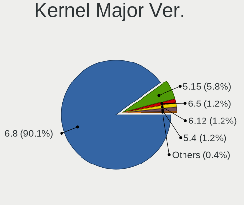
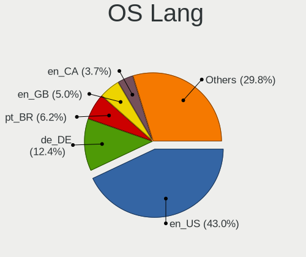
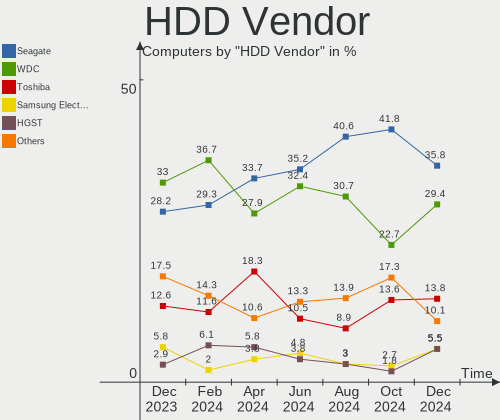
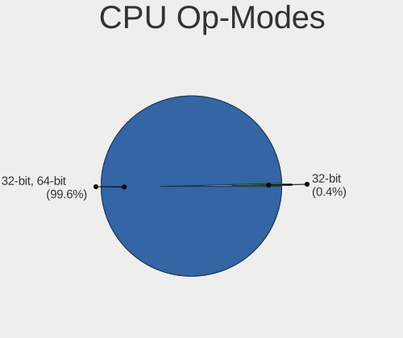
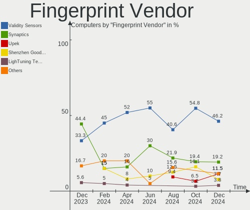

Zorin - Hardware Trends
-----------------------

A project to identify most popular hardware characteristics and track their change
over time based on data collected by Linux users at https://Linux-Hardware.org.

Anyone can contribute to this report by the [hw-probe](https://github.com/linuxhw/hw-probe) tool:

    sudo -E hw-probe -all -upload

This is a report for all computer types. See also reports for [desktops](/Dist/Zorin/Desktop/README.md) and [notebooks](/Dist/Zorin/Notebook/README.md).

This report is for one last month. Overall report since the beginning of time: [TestDays](https://github.com/linuxhw/TestDays)

Period: Feb, 2023.

Contents
--------

* [ System ](#system)
  - [ OS                       ](#os)
  - [ OS Family                ](#os-family)
  - [ Kernel                   ](#kernel)
  - [ Kernel Family            ](#kernel-family)
  - [ Kernel Major Ver.        ](#kernel-major-ver)
  - [ Arch                     ](#arch)
  - [ DE                       ](#de)
  - [ Display Server           ](#display-server)
  - [ Display Manager          ](#display-manager)
  - [ OS Lang                  ](#os-lang)
  - [ Boot Mode                ](#boot-mode)
  - [ Filesystem               ](#filesystem)
  - [ Part. scheme             ](#part-scheme)
  - [ Dual Boot with Linux/BSD ](#dual-boot-with-linuxbsd)
  - [ Dual Boot (Win)          ](#dual-boot-win)

* [ Board ](#board)
  - [ Vendor                   ](#vendor)
  - [ Model                    ](#model)
  - [ Model Family             ](#model-family)
  - [ MFG Year                 ](#mfg-year)
  - [ Form Factor              ](#form-factor)
  - [ Secure Boot              ](#secure-boot)
  - [ Coreboot                 ](#coreboot)
  - [ RAM Size                 ](#ram-size)
  - [ RAM Used                 ](#ram-used)
  - [ Total Drives             ](#total-drives)
  - [ Has CD-ROM               ](#has-cd-rom)
  - [ Has Ethernet             ](#has-ethernet)
  - [ Has WiFi                 ](#has-wifi)
  - [ Has Bluetooth            ](#has-bluetooth)

* [ Location ](#location)
  - [ Country                  ](#country)
  - [ City                     ](#city)

* [ Drives ](#drives)
  - [ Drive Vendor             ](#drive-vendor)
  - [ Drive Model              ](#drive-model)
  - [ HDD Vendor               ](#hdd-vendor)
  - [ SSD Vendor               ](#ssd-vendor)
  - [ Drive Kind               ](#drive-kind)
  - [ Drive Connector          ](#drive-connector)
  - [ Drive Size               ](#drive-size)
  - [ Space Total              ](#space-total)
  - [ Space Used               ](#space-used)
  - [ Malfunc. Drives          ](#malfunc-drives)
  - [ Malfunc. Drive Vendor    ](#malfunc-drive-vendor)
  - [ Malfunc. HDD Vendor      ](#malfunc-hdd-vendor)
  - [ Malfunc. Drive Kind      ](#malfunc-drive-kind)
  - [ Failed Drives            ](#failed-drives)
  - [ Failed Drive Vendor      ](#failed-drive-vendor)
  - [ Drive Status             ](#drive-status)

* [ Storage controller ](#storage-controller)
  - [ Storage Vendor           ](#storage-vendor)
  - [ Storage Model            ](#storage-model)
  - [ Storage Kind             ](#storage-kind)

* [ Processor ](#processor)
  - [ CPU Vendor               ](#cpu-vendor)
  - [ CPU Model                ](#cpu-model)
  - [ CPU Model Family         ](#cpu-model-family)
  - [ CPU Cores                ](#cpu-cores)
  - [ CPU Sockets              ](#cpu-sockets)
  - [ CPU Threads              ](#cpu-threads)
  - [ CPU Op-Modes             ](#cpu-op-modes)
  - [ CPU Microcode            ](#cpu-microcode)
  - [ CPU Microarch            ](#cpu-microarch)

* [ Graphics ](#graphics)
  - [ GPU Vendor               ](#gpu-vendor)
  - [ GPU Model                ](#gpu-model)
  - [ GPU Combo                ](#gpu-combo)
  - [ GPU Driver               ](#gpu-driver)
  - [ GPU Memory               ](#gpu-memory)

* [ Monitor ](#monitor)
  - [ Monitor Vendor           ](#monitor-vendor)
  - [ Monitor Model            ](#monitor-model)
  - [ Monitor Resolution       ](#monitor-resolution)
  - [ Monitor Diagonal         ](#monitor-diagonal)
  - [ Monitor Width            ](#monitor-width)
  - [ Aspect Ratio             ](#aspect-ratio)
  - [ Monitor Area             ](#monitor-area)
  - [ Pixel Density            ](#pixel-density)
  - [ Multiple Monitors        ](#multiple-monitors)

* [ Network ](#network)
  - [ Net Controller Vendor    ](#net-controller-vendor)
  - [ Net Controller Model     ](#net-controller-model)
  - [ Wireless Vendor          ](#wireless-vendor)
  - [ Wireless Model           ](#wireless-model)
  - [ Ethernet Vendor          ](#ethernet-vendor)
  - [ Ethernet Model           ](#ethernet-model)
  - [ Net Controller Kind      ](#net-controller-kind)
  - [ Used Controller          ](#used-controller)
  - [ NICs                     ](#nics)
  - [ IPv6                     ](#ipv6)

* [ Bluetooth ](#bluetooth)
  - [ Bluetooth Vendor         ](#bluetooth-vendor)
  - [ Bluetooth Model          ](#bluetooth-model)

* [ Sound ](#sound)
  - [ Sound Vendor             ](#sound-vendor)
  - [ Sound Model              ](#sound-model)

* [ Memory ](#memory)
  - [ Memory Vendor            ](#memory-vendor)
  - [ Memory Model             ](#memory-model)
  - [ Memory Kind              ](#memory-kind)
  - [ Memory Form Factor       ](#memory-form-factor)
  - [ Memory Size              ](#memory-size)
  - [ Memory Speed             ](#memory-speed)

* [ Printers & scanners ](#printers--scanners)
  - [ Printer Vendor           ](#printer-vendor)
  - [ Printer Model            ](#printer-model)
  - [ Scanner Vendor           ](#scanner-vendor)
  - [ Scanner Model            ](#scanner-model)

* [ Camera ](#camera)
  - [ Camera Vendor            ](#camera-vendor)
  - [ Camera Model             ](#camera-model)

* [ Security ](#security)
  - [ Fingerprint Vendor       ](#fingerprint-vendor)
  - [ Fingerprint Model        ](#fingerprint-model)
  - [ Chipcard Vendor          ](#chipcard-vendor)
  - [ Chipcard Model           ](#chipcard-model)

* [ Unsupported ](#unsupported)
  - [ Unsupported Devices      ](#unsupported-devices)
  - [ Unsupported Device Types ](#unsupported-device-types)

System
------

OS
--

Installed operating systems

| Name     | Computers | Percent |
|----------|-----------|---------|
| Zorin 16 | 172       | 93.99%  |
| Zorin 15 | 11        | 6.01%   |

OS Family
---------

OS without a version

| Name  | Computers | Percent |
|-------|-----------|---------|
| Zorin | 183       | 100%    |

Kernel
------

Version of the Linux kernel

| Version           | Computers | Percent |
|-------------------|-----------|---------|
| 5.15.0-60-generic | 90        | 49.18%  |
| 5.15.0-58-generic | 56        | 30.6%   |
| 5.15.0-56-generic | 13        | 7.1%    |
| 5.4.0-139-generic | 6         | 3.28%   |
| 5.4.0-137-generic | 5         | 2.73%   |
| 5.15.0-57-generic | 2         | 1.09%   |
| 5.11.0-38-generic | 2         | 1.09%   |
| 5.15.0-67-generic | 1         | 0.55%   |
| 5.15.0-50-generic | 1         | 0.55%   |
| 5.14.0-1057-oem   | 1         | 0.55%   |
| 5.14.0-1056-oem   | 1         | 0.55%   |
| 5.13.0-51-generic | 1         | 0.55%   |
| 5.13.0-48-generic | 1         | 0.55%   |
| 5.13.0-30-generic | 1         | 0.55%   |
| 5.13.0-28-generic | 1         | 0.55%   |
| 5.11.0-25-generic | 1         | 0.55%   |

Kernel Family
-------------

Linux kernel without a distro release

| Version | Computers | Percent |
|---------|-----------|---------|
| 5.15.0  | 163       | 89.07%  |
| 5.4.0   | 11        | 6.01%   |
| 5.13.0  | 4         | 2.19%   |
| 5.11.0  | 3         | 1.64%   |
| 5.14.0  | 2         | 1.09%   |

Kernel Major Ver.
-----------------

Linux kernel major version

| Version | Computers | Percent |
|---------|-----------|---------|
| 5.15    | 163       | 89.07%  |
| 5.4     | 11        | 6.01%   |
| 5.13    | 4         | 2.19%   |
| 5.11    | 3         | 1.64%   |
| 5.14    | 2         | 1.09%   |

Arch
----

OS architecture (x86_64, i586, etc.)

| Name   | Computers | Percent |
|--------|-----------|---------|
| x86_64 | 177       | 96.72%  |
| i686   | 6         | 3.28%   |

DE
--

Desktop Environment

| Name       | Computers | Percent |
|------------|-----------|---------|
| GNOME      | 147       | 80.33%  |
| XFCE       | 34        | 18.58%  |
| X-Cinnamon | 1         | 0.55%   |
| Cinnamon   | 1         | 0.55%   |

Display Server
--------------

X11 or Wayland

| Name    | Computers | Percent |
|---------|-----------|---------|
| X11     | 179       | 97.81%  |
| Wayland | 4         | 2.19%   |

Display Manager
---------------

SDDM, LightDM, etc.

| Name    | Computers | Percent |
|---------|-----------|---------|
| Unknown | 131       | 71.58%  |
| GDM3    | 18        | 9.84%   |
| LightDM | 17        | 9.29%   |
| GDM     | 17        | 9.29%   |

OS Lang
-------

Language

| Lang  | Computers | Percent |
|-------|-----------|---------|
| en_US | 71        | 38.8%   |
| de_DE | 22        | 12.02%  |
| pt_BR | 11        | 6.01%   |
| en_GB | 9         | 4.92%   |
| it_IT | 8         | 4.37%   |
| fr_FR | 7         | 3.83%   |
| en_CA | 6         | 3.28%   |
| de_CH | 6         | 3.28%   |
| pt_PT | 5         | 2.73%   |
| en_IN | 5         | 2.73%   |
| es_ES | 4         | 2.19%   |
| pl_PL | 3         | 1.64%   |
| ru_RU | 2         | 1.09%   |
| nl_BE | 2         | 1.09%   |
| hu_HU | 2         | 1.09%   |
| en_NZ | 2         | 1.09%   |
| de_AT | 2         | 1.09%   |
| cs_CZ | 2         | 1.09%   |
| zh_CN | 1         | 0.55%   |
| tr_TR | 1         | 0.55%   |
| sv_SE | 1         | 0.55%   |
| sr_RS | 1         | 0.55%   |
| sl_SI | 1         | 0.55%   |
| ro_RO | 1         | 0.55%   |
| fr_BE | 1         | 0.55%   |
| fi_FI | 1         | 0.55%   |
| es_UY | 1         | 0.55%   |
| es_MX | 1         | 0.55%   |
| es_CU | 1         | 0.55%   |
| es_CO | 1         | 0.55%   |
| en_ZA | 1         | 0.55%   |
| en_PH | 1         | 0.55%   |

Boot Mode
---------

EFI or BIOS

| Mode | Computers | Percent |
|------|-----------|---------|
| EFI  | 102       | 55.74%  |
| BIOS | 81        | 44.26%  |

Filesystem
----------

Type of filesystem

| Type    | Computers | Percent |
|---------|-----------|---------|
| Ext4    | 176       | 96.17%  |
| Xfs     | 2         | 1.09%   |
| Overlay | 2         | 1.09%   |
| Btrfs   | 2         | 1.09%   |
| Zfs     | 1         | 0.55%   |

Part. scheme
------------

Scheme of partitioning

| Type    | Computers | Percent |
|---------|-----------|---------|
| Unknown | 136       | 74.32%  |
| GPT     | 32        | 17.49%  |
| MBR     | 15        | 8.2%    |

Dual Boot with Linux/BSD
------------------------

Hosting more than one Linux/BSD

| Dual boot | Computers | Percent |
|-----------|-----------|---------|
| No        | 176       | 96.17%  |
| Yes       | 7         | 3.83%   |

Dual Boot (Win)
---------------

Hosting Linux and Windows

| Dual boot | Computers | Percent |
|-----------|-----------|---------|
| No        | 167       | 91.26%  |
| Yes       | 16        | 8.74%   |

Board
-----

Vendor
------

Motherboard manufacturer

| Name                | Computers | Percent |
|---------------------|-----------|---------|
| Lenovo              | 28        | 15.3%   |
| Hewlett-Packard     | 28        | 15.3%   |
| ASUSTek Computer    | 24        | 13.11%  |
| Dell                | 23        | 12.57%  |
| MSI                 | 13        | 7.1%    |
| Gigabyte Technology | 11        | 6.01%   |
| Acer                | 11        | 6.01%   |
| Apple               | 6         | 3.28%   |
| Toshiba             | 3         | 1.64%   |
| Multilaser          | 3         | 1.64%   |
| Intel               | 3         | 1.64%   |
| Google              | 3         | 1.64%   |
| Sony                | 2         | 1.09%   |
| Samsung Electronics | 2         | 1.09%   |
| IBM                 | 2         | 1.09%   |
| AZW                 | 2         | 1.09%   |
| Unknown             | 2         | 1.09%   |
| TWC                 | 1         | 0.55%   |
| Teclast             | 1         | 0.55%   |
| Quanta              | 1         | 0.55%   |
| Positivo            | 1         | 0.55%   |
| Packard Bell        | 1         | 0.55%   |
| Microsoft           | 1         | 0.55%   |
| Medion              | 1         | 0.55%   |
| HUAWEI              | 1         | 0.55%   |
| HOUTER              | 1         | 0.55%   |
| HONOR               | 1         | 0.55%   |
| Fujitsu             | 1         | 0.55%   |
| Foxconn             | 1         | 0.55%   |
| eMachines           | 1         | 0.55%   |
| Digibras            | 1         | 0.55%   |
| DERE                | 1         | 0.55%   |
| ASRock              | 1         | 0.55%   |
| Alienware           | 1         | 0.55%   |

Model
-----

Motherboard model

| Name                                       | Computers | Percent |
|--------------------------------------------|-----------|---------|
| Unknown                                    | 5         | 2.73%   |
| MSI MS-7817                                | 2         | 1.09%   |
| Lenovo IdeaPad 3 15ITL05 81X8              | 2         | 1.09%   |
| HP 620                                     | 2         | 1.09%   |
| Gigabyte AB350-Gaming 3                    | 2         | 1.09%   |
| Dell OptiPlex 380                          | 2         | 1.09%   |
| Toshiba Satellite L50D-B                   | 1         | 0.55%   |
| Toshiba Satellite L50-B                    | 1         | 0.55%   |
| Toshiba PORTEGE Z30-A                      | 1         | 0.55%   |
| Teclast F7                                 | 1         | 0.55%   |
| Sony VPCEG36FX                             | 1         | 0.55%   |
| Sony VGN-Z31XN_B                           | 1         | 0.55%   |
| Samsung 700T1C                             | 1         | 0.55%   |
| Samsung 300E4A/300E5A/300E7A/3430EA/3530EA | 1         | 0.55%   |
| Quanta CA27                                | 1         | 0.55%   |
| Positivo Smash2                            | 1         | 0.55%   |
| Packard Bell EasyNote TS11HR               | 1         | 0.55%   |
| Multilaser UB23X LINUX                     | 1         | 0.55%   |
| Multilaser MLSH1H LINUX                    | 1         | 0.55%   |
| Multilaser DS133                           | 1         | 0.55%   |
| MSI Z1-7641                                | 1         | 0.55%   |
| MSI Raider GE66 12UHS                      | 1         | 0.55%   |
| MSI MS-7C91                                | 1         | 0.55%   |
| MSI MS-7C02                                | 1         | 0.55%   |
| MSI MS-7B54                                | 1         | 0.55%   |
| MSI MS-7A72                                | 1         | 0.55%   |
| MSI MS-7808                                | 1         | 0.55%   |
| MSI MS-7597                                | 1         | 0.55%   |
| MSI H310 Gaming Codex S (MS-B927)          | 1         | 0.55%   |
| MSI GF63 Thin 11UC                         | 1         | 0.55%   |
| MSI B360 Gaming Aegis 3 8 (MS-B918)        | 1         | 0.55%   |
| Microsoft Surface Pro 4                    | 1         | 0.55%   |
| Medion E7220                               | 1         | 0.55%   |
| Lenovo Yoga 7 14ACN6 82N7                  | 1         | 0.55%   |
| Lenovo Yoga 500-14ACL 80NA                 | 1         | 0.55%   |
| Lenovo V570 1066EDG                        | 1         | 0.55%   |
| Lenovo V14-IIL 82C4                        | 1         | 0.55%   |
| Lenovo ThinkPad X260 20F600A2MZ            | 1         | 0.55%   |
| Lenovo ThinkPad X1 Carbon 2nd 20A7CTO000   | 1         | 0.55%   |
| Lenovo ThinkPad T570 20H90002MZ            | 1         | 0.55%   |

Model Family
------------

Motherboard model prefix

| Name                  | Computers | Percent |
|-----------------------|-----------|---------|
| Lenovo ThinkPad       | 11        | 6.01%   |
| Dell Latitude         | 8         | 4.37%   |
| Lenovo IdeaPad        | 6         | 3.28%   |
| Dell Inspiron         | 6         | 3.28%   |
| HP Pavilion           | 5         | 2.73%   |
| Dell OptiPlex         | 5         | 2.73%   |
| ASUS ROG              | 5         | 2.73%   |
| Acer Aspire           | 5         | 2.73%   |
| Unknown               | 5         | 2.73%   |
| HP Laptop             | 4         | 2.19%   |
| HP Compaq             | 4         | 2.19%   |
| HP ENVY               | 3         | 1.64%   |
| HP EliteDesk          | 3         | 1.64%   |
| Toshiba Satellite     | 2         | 1.09%   |
| MSI MS-7817           | 2         | 1.09%   |
| Lenovo Yoga           | 2         | 1.09%   |
| Lenovo ThinkCentre    | 2         | 1.09%   |
| HP 620                | 2         | 1.09%   |
| Gigabyte AB350-Gaming | 2         | 1.09%   |
| Dell Vostro           | 2         | 1.09%   |
| ASUS ZenBook          | 2         | 1.09%   |
| Apple iMac14          | 2         | 1.09%   |
| Acer TravelMate       | 2         | 1.09%   |
| Toshiba PORTEGE       | 1         | 0.55%   |
| Teclast F7            | 1         | 0.55%   |
| Sony VPCEG36FX        | 1         | 0.55%   |
| Sony VGN-Z31XN        | 1         | 0.55%   |
| Samsung 700T1C        | 1         | 0.55%   |
| Samsung 300E4A        | 1         | 0.55%   |
| Quanta CA27           | 1         | 0.55%   |
| Positivo Smash2       | 1         | 0.55%   |
| Packard Bell EasyNote | 1         | 0.55%   |
| Multilaser UB23X      | 1         | 0.55%   |
| Multilaser MLSH1H     | 1         | 0.55%   |
| Multilaser DS133      | 1         | 0.55%   |
| MSI Z1-7641           | 1         | 0.55%   |
| MSI Raider            | 1         | 0.55%   |
| MSI MS-7C91           | 1         | 0.55%   |
| MSI MS-7C02           | 1         | 0.55%   |
| MSI MS-7B54           | 1         | 0.55%   |

MFG Year
--------

Motherboard manufacture year

| Year    | Computers | Percent |
|---------|-----------|---------|
| 2021    | 19        | 10.38%  |
| 2011    | 17        | 9.29%   |
| 2012    | 14        | 7.65%   |
| 2017    | 13        | 7.1%    |
| 2013    | 13        | 7.1%    |
| 2020    | 12        | 6.56%   |
| 2018    | 12        | 6.56%   |
| 2015    | 11        | 6.01%   |
| 2014    | 11        | 6.01%   |
| 2022    | 10        | 5.46%   |
| 2016    | 9         | 4.92%   |
| 2010    | 9         | 4.92%   |
| 2019    | 8         | 4.37%   |
| 2009    | 7         | 3.83%   |
| 2007    | 7         | 3.83%   |
| 2008    | 5         | 2.73%   |
| 2023    | 3         | 1.64%   |
| 2005    | 2         | 1.09%   |
| Unknown | 1         | 0.55%   |

Form Factor
-----------

Physical design of the computer

| Name        | Computers | Percent |
|-------------|-----------|---------|
| Notebook    | 103       | 56.28%  |
| Desktop     | 69        | 37.7%   |
| All in one  | 4         | 2.19%   |
| Tablet      | 3         | 1.64%   |
| Convertible | 2         | 1.09%   |
| Mini pc     | 2         | 1.09%   |

Secure Boot
-----------

Enabled or disabled

| State    | Computers | Percent |
|----------|-----------|---------|
| Disabled | 163       | 89.07%  |
| Enabled  | 20        | 10.93%  |

Coreboot
--------

Have coreboot on board

| Used | Computers | Percent |
|------|-----------|---------|
| No   | 180       | 98.36%  |
| Yes  | 3         | 1.64%   |

RAM Size
--------

Total RAM memory

| Size in GB      | Computers | Percent |
|-----------------|-----------|---------|
| 4.01-8.0        | 53        | 28.96%  |
| 3.01-4.0        | 35        | 19.13%  |
| 16.01-24.0      | 27        | 14.75%  |
| 8.01-16.0       | 27        | 14.75%  |
| 32.01-64.0      | 18        | 9.84%   |
| 1.01-2.0        | 10        | 5.46%   |
| 2.01-3.0        | 5         | 2.73%   |
| 24.01-32.0      | 4         | 2.19%   |
| 64.01-256.0     | 2         | 1.09%   |
| More than 256.0 | 1         | 0.55%   |
| 0.51-1.0        | 1         | 0.55%   |

RAM Used
--------

Used RAM memory

| Used GB    | Computers | Percent |
|------------|-----------|---------|
| 1.01-2.0   | 65        | 35.52%  |
| 2.01-3.0   | 55        | 30.05%  |
| 4.01-8.0   | 26        | 14.21%  |
| 3.01-4.0   | 25        | 13.66%  |
| 0.51-1.0   | 8         | 4.37%   |
| 8.01-16.0  | 3         | 1.64%   |
| 32.01-64.0 | 1         | 0.55%   |

Total Drives
------------

Number of drives on board

| Drives | Computers | Percent |
|--------|-----------|---------|
| 1      | 118       | 64.48%  |
| 2      | 45        | 24.59%  |
| 4      | 8         | 4.37%   |
| 3      | 8         | 4.37%   |
| 6      | 2         | 1.09%   |
| 7      | 1         | 0.55%   |
| 5      | 1         | 0.55%   |

Has CD-ROM
----------

Has CD-ROM on board

| Presented | Computers | Percent |
|-----------|-----------|---------|
| No        | 115       | 62.84%  |
| Yes       | 68        | 37.16%  |

Has Ethernet
------------

Has Ethernet on board

| Presented | Computers | Percent |
|-----------|-----------|---------|
| Yes       | 154       | 84.15%  |
| No        | 29        | 15.85%  |

Has WiFi
--------

Has WiFi module

| Presented | Computers | Percent |
|-----------|-----------|---------|
| Yes       | 147       | 80.33%  |
| No        | 36        | 19.67%  |

Has Bluetooth
-------------

Has Bluetooth module

| Presented | Computers | Percent |
|-----------|-----------|---------|
| Yes       | 106       | 57.92%  |
| No        | 77        | 42.08%  |

Location
--------

Country
-------

Geographic location (country)

| Country      | Computers | Percent |
|--------------|-----------|---------|
| USA          | 46        | 25.14%  |
| Germany      | 23        | 12.57%  |
| Brazil       | 14        | 7.65%   |
| UK           | 9         | 4.92%   |
| Canada       | 9         | 4.92%   |
| Italy        | 7         | 3.83%   |
| Switzerland  | 6         | 3.28%   |
| Spain        | 5         | 2.73%   |
| Portugal     | 5         | 2.73%   |
| Poland       | 5         | 2.73%   |
| India        | 5         | 2.73%   |
| France       | 4         | 2.19%   |
| Belgium      | 4         | 2.19%   |
| Czechia      | 3         | 1.64%   |
| Turkey       | 2         | 1.09%   |
| Serbia       | 2         | 1.09%   |
| Russia       | 2         | 1.09%   |
| New Zealand  | 2         | 1.09%   |
| Netherlands  | 2         | 1.09%   |
| Austria      | 2         | 1.09%   |
| Algeria      | 2         | 1.09%   |
| Uruguay      | 1         | 0.55%   |
| Sweden       | 1         | 0.55%   |
| Sri Lanka    | 1         | 0.55%   |
| South Africa | 1         | 0.55%   |
| Slovenia     | 1         | 0.55%   |
| Senegal      | 1         | 0.55%   |
| Saudi Arabia | 1         | 0.55%   |
| Saint Lucia  | 1         | 0.55%   |
| Romania      | 1         | 0.55%   |
| Philippines  | 1         | 0.55%   |
| Norway       | 1         | 0.55%   |
| Morocco      | 1         | 0.55%   |
| Mexico       | 1         | 0.55%   |
| Malaysia     | 1         | 0.55%   |
| Israel       | 1         | 0.55%   |
| Hungary      | 1         | 0.55%   |
| Greece       | 1         | 0.55%   |
| Finland      | 1         | 0.55%   |
| Egypt        | 1         | 0.55%   |

City
----

Geographic location (city)

| City                 | Computers | Percent |
|----------------------|-----------|---------|
| Diepoldsau           | 6         | 3.28%   |
| Berlin               | 3         | 1.64%   |
| Wylie                | 2         | 1.09%   |
| Santo André         | 2         | 1.09%   |
| Salt Lake City       | 2         | 1.09%   |
| Porto                | 2         | 1.09%   |
| Newport              | 2         | 1.09%   |
| Montreal             | 2         | 1.09%   |
| Memphis              | 2         | 1.09%   |
| Manaus               | 2         | 1.09%   |
| Kolkata              | 2         | 1.09%   |
| Istanbul             | 2         | 1.09%   |
| Bradford             | 2         | 1.09%   |
| Wyoming              | 1         | 0.55%   |
| Wuppertal            | 1         | 0.55%   |
| Wroclaw              | 1         | 0.55%   |
| Windsor              | 1         | 0.55%   |
| Walsall              | 1         | 0.55%   |
| Vila Franca de Xira  | 1         | 0.55%   |
| Upplands Vasby       | 1         | 0.55%   |
| Upper Marlboro       | 1         | 0.55%   |
| Turnisce             | 1         | 0.55%   |
| Tulsa                | 1         | 0.55%   |
| Trondheim            | 1         | 0.55%   |
| Toronto              | 1         | 0.55%   |
| Toluca               | 1         | 0.55%   |
| Toledo               | 1         | 0.55%   |
| Tamworth             | 1         | 0.55%   |
| Świętochłowice    | 1         | 0.55%   |
| Sunderland           | 1         | 0.55%   |
| Stuttgart            | 1         | 0.55%   |
| Sora                 | 1         | 0.55%   |
| Somme-Leuze          | 1         | 0.55%   |
| Sherbrooke           | 1         | 0.55%   |
| Shenzhen             | 1         | 0.55%   |
| Selbitz              | 1         | 0.55%   |
| Schomberg            | 1         | 0.55%   |
| Saoula               | 1         | 0.55%   |
| Sao Paulo            | 1         | 0.55%   |
| Sao José dos Campos | 1         | 0.55%   |

Drives
------

Drive Vendor
------------

Hard drive vendors

| Vendor                      | Computers | Drives | Percent |
|-----------------------------|-----------|--------|---------|
| Seagate                     | 36        | 47     | 14.06%  |
| WDC                         | 35        | 36     | 13.67%  |
| Samsung Electronics         | 32        | 37     | 12.5%   |
| Unknown                     | 18        | 20     | 7.03%   |
| Toshiba                     | 16        | 16     | 6.25%   |
| Sandisk                     | 16        | 19     | 6.25%   |
| Kingston                    | 14        | 14     | 5.47%   |
| Intel                       | 11        | 12     | 4.3%    |
| Hitachi                     | 9         | 11     | 3.52%   |
| Crucial                     | 7         | 8      | 2.73%   |
| Intenso                     | 4         | 4      | 1.56%   |
| HGST                        | 4         | 4      | 1.56%   |
| SK hynix                    | 3         | 3      | 1.17%   |
| Patriot                     | 3         | 3      | 1.17%   |
| Micron Technology           | 3         | 3      | 1.17%   |
| China                       | 3         | 3      | 1.17%   |
| Apple                       | 3         | 3      | 1.17%   |
| ADATA Technology            | 3         | 3      | 1.17%   |
| A-DATA Technology           | 3         | 3      | 1.17%   |
| SPCC                        | 2         | 2      | 0.78%   |
| Phison Electronics          | 2         | 2      | 0.78%   |
| Maxtor                      | 2         | 2      | 0.78%   |
| LITEONIT                    | 2         | 2      | 0.78%   |
| KIOXIA                      | 2         | 2      | 0.78%   |
| VERICO                      | 1         | 1      | 0.39%   |
| USB30                       | 1         | 1      | 0.39%   |
| Transcend                   | 1         | 1      | 0.39%   |
| Timetec                     | 1         | 1      | 0.39%   |
| Teclast                     | 1         | 1      | 0.39%   |
| Team                        | 1         | 1      | 0.39%   |
| SSK                         | 1         | 1      | 0.39%   |
| ShanDianZhe                 | 1         | 1      | 0.39%   |
| Seagate Technology          | 1         | 1      | 0.39%   |
| NN                          | 1         | 1      | 0.39%   |
| MAXIO Technology (Hangzhou) | 1         | 1      | 0.39%   |
| LITEON                      | 1         | 1      | 0.39%   |
| Kingston Technology Company | 1         | 1      | 0.39%   |
| KingSpec                    | 1         | 1      | 0.39%   |
| HS-SSD-C100                 | 1         | 1      | 0.39%   |
| Hoodisk                     | 1         | 1      | 0.39%   |

Drive Model
-----------

Hard drive models

| Model                                                           | Computers | Percent |
|-----------------------------------------------------------------|-----------|---------|
| Unknown MMC Card  32GB                                          | 5         | 1.82%   |
| Samsung NVMe SSD Controller SM981/PM981/PM983 250GB             | 5         | 1.82%   |
| Seagate ST500DM002-1BD142 500GB                                 | 4         | 1.46%   |
| Unknown MMC Card  64GB                                          | 3         | 1.09%   |
| Unknown MMC Card  16GB                                          | 3         | 1.09%   |
| Toshiba MQ04ABF100 1TB                                          | 3         | 1.09%   |
| Samsung NVMe SSD Controller SM961/PM961/SM963 512GB             | 3         | 1.09%   |
| Samsung NVMe SSD Controller PM9A1/PM9A3/980PRO 960GB            | 3         | 1.09%   |
| ADATA XPG SX8200 Pro PCIe Gen3x4 M.2 2280 Solid State Drive 2TB | 3         | 1.09%   |
| WDC WDS500G2B0A-00SM50 500GB SSD                                | 2         | 0.73%   |
| WDC WD5000LPCX-60VHAT0 500GB                                    | 2         | 0.73%   |
| Toshiba MQ01ABD050 500GB                                        | 2         | 0.73%   |
| Toshiba MQ01ABD032 320GB                                        | 2         | 0.73%   |
| Seagate ST9500325AS 500GB                                       | 2         | 0.73%   |
| Seagate ST3250310AS 250GB                                       | 2         | 0.73%   |
| Seagate ST2000DX002-2DV164 2TB                                  | 2         | 0.73%   |
| Seagate ST2000DM001-1ER164 2TB                                  | 2         | 0.73%   |
| Seagate ST1000LM024 HN-M101MBB 1TB                              | 2         | 0.73%   |
| Sandisk WD Black SN750 / PC SN730 NVMe SSD 512GB                | 2         | 0.73%   |
| Samsung SSD 850 EVO 250GB                                       | 2         | 0.73%   |
| Micron 2400_MTFDKBA512QFM 512GB                                 | 2         | 0.73%   |
| Hitachi HTS547550A9E384 500GB                                   | 2         | 0.73%   |
| Crucial CT2000MX500SSD1 2TB                                     | 2         | 0.73%   |
| China SATA SSD 120GB                                            | 2         | 0.73%   |
| WDC WDS240G2G0A-00JH30 240GB SSD                                | 1         | 0.36%   |
| WDC WDS100T2G0A-00JH30 1TB SSD                                  | 1         | 0.36%   |
| WDC WDBNCE2500PNC 250GB SSD                                     | 1         | 0.36%   |
| WDC WD7500BPVX-22JC3T0 752GB                                    | 1         | 0.36%   |
| WDC WD6400AAKS-22A7B2 640GB                                     | 1         | 0.36%   |
| WDC WD5000LPVT-60G33T0 500GB                                    | 1         | 0.36%   |
| WDC WD5000LPCX-24C6HT0 500GB                                    | 1         | 0.36%   |
| WDC WD5000BPVT-22HXZT3 500GB                                    | 1         | 0.36%   |
| WDC WD5000BEVT-22ZAT0 500GB                                     | 1         | 0.36%   |
| WDC WD5000AVDS-63U7B1 500GB                                     | 1         | 0.36%   |
| WDC WD5000AAKX-60U6AA0 500GB                                    | 1         | 0.36%   |
| WDC WD5000AADS-00S9B0 500GB                                     | 1         | 0.36%   |
| WDC WD3200BPVT-75JJ5T0 320GB                                    | 1         | 0.36%   |
| WDC WD3200BPVT-22ZEST0 320GB                                    | 1         | 0.36%   |
| WDC WD3003FZEX-00Z4SA0 3TB                                      | 1         | 0.36%   |
| WDC WD2500BEVT-22A23T0 250GB                                    | 1         | 0.36%   |

HDD Vendor
----------

Hard disk drive vendors

| Vendor              | Computers | Drives | Percent |
|---------------------|-----------|--------|---------|
| Seagate             | 36        | 47     | 35.64%  |
| WDC                 | 28        | 29     | 27.72%  |
| Toshiba             | 15        | 15     | 14.85%  |
| Hitachi             | 9         | 11     | 8.91%   |
| HGST                | 4         | 4      | 3.96%   |
| Samsung Electronics | 3         | 3      | 2.97%   |
| Maxtor              | 2         | 2      | 1.98%   |
| Apple               | 2         | 2      | 1.98%   |
| Unknown             | 1         | 1      | 0.99%   |
| ACASIS              | 1         | 1      | 0.99%   |

SSD Vendor
----------

Solid state drive vendors

| Vendor              | Computers | Drives | Percent |
|---------------------|-----------|--------|---------|
| Samsung Electronics | 16        | 16     | 19.75%  |
| Kingston            | 10        | 10     | 12.35%  |
| SanDisk             | 7         | 7      | 8.64%   |
| WDC                 | 6         | 6      | 7.41%   |
| Crucial             | 6         | 7      | 7.41%   |
| Intel               | 4         | 4      | 4.94%   |
| Patriot             | 3         | 3      | 3.7%    |
| Intenso             | 3         | 3      | 3.7%    |
| China               | 3         | 3      | 3.7%    |
| A-DATA Technology   | 3         | 3      | 3.7%    |
| SPCC                | 2         | 2      | 2.47%   |
| LITEONIT            | 2         | 2      | 2.47%   |
| VERICO              | 1         | 1      | 1.23%   |
| USB30               | 1         | 1      | 1.23%   |
| Transcend           | 1         | 1      | 1.23%   |
| Toshiba             | 1         | 1      | 1.23%   |
| Timetec             | 1         | 1      | 1.23%   |
| Teclast             | 1         | 1      | 1.23%   |
| Team                | 1         | 1      | 1.23%   |
| SK hynix            | 1         | 1      | 1.23%   |
| NN                  | 1         | 1      | 1.23%   |
| LITEON              | 1         | 1      | 1.23%   |
| KingSpec            | 1         | 1      | 1.23%   |
| Hoodisk             | 1         | 1      | 1.23%   |
| GOODRAM             | 1         | 1      | 1.23%   |
| Apple               | 1         | 1      | 1.23%   |
| Apacer              | 1         | 1      | 1.23%   |
| Acer                | 1         | 1      | 1.23%   |

Drive Kind
----------

HDD or SSD

| Kind    | Computers | Drives | Percent |
|---------|-----------|--------|---------|
| HDD     | 92        | 115    | 38.49%  |
| SSD     | 75        | 82     | 31.38%  |
| NVMe    | 48        | 59     | 20.08%  |
| MMC     | 17        | 19     | 7.11%   |
| Unknown | 7         | 7      | 2.93%   |

Drive Connector
---------------

SATA, SAS, NVMe, etc.

| Type | Computers | Drives | Percent |
|------|-----------|--------|---------|
| SATA | 140       | 194    | 65.73%  |
| NVMe | 48        | 59     | 22.54%  |
| MMC  | 17        | 19     | 7.98%   |
| SAS  | 8         | 10     | 3.76%   |

Drive Size
----------

Size of hard drive

| Size in TB | Computers | Drives | Percent |
|------------|-----------|--------|---------|
| 0.01-0.5   | 109       | 121    | 64.12%  |
| 0.51-1.0   | 40        | 48     | 23.53%  |
| 1.01-2.0   | 17        | 22     | 10%     |
| 3.01-4.0   | 2         | 4      | 1.18%   |
| 2.01-3.0   | 1         | 1      | 0.59%   |
| 4.01-10.0  | 1         | 1      | 0.59%   |

Space Total
-----------

Amount of disk space available on the file system

| Size in GB     | Computers | Percent |
|----------------|-----------|---------|
| 101-250        | 67        | 36.61%  |
| 251-500        | 41        | 22.4%   |
| 501-1000       | 25        | 13.66%  |
| 1001-2000      | 14        | 7.65%   |
| 51-100         | 13        | 7.1%    |
| 21-50          | 7         | 3.83%   |
| More than 3000 | 6         | 3.28%   |
| 1-20           | 5         | 2.73%   |
| 2001-3000      | 4         | 2.19%   |
| Unknown        | 1         | 0.55%   |

Space Used
----------

Amount of used disk space

| Used GB        | Computers | Percent |
|----------------|-----------|---------|
| 1-20           | 75        | 40.98%  |
| 21-50          | 45        | 24.59%  |
| 51-100         | 22        | 12.02%  |
| 101-250        | 16        | 8.74%   |
| 251-500        | 12        | 6.56%   |
| 501-1000       | 6         | 3.28%   |
| 1001-2000      | 3         | 1.64%   |
| More than 3000 | 2         | 1.09%   |
| 2001-3000      | 1         | 0.55%   |
| Unknown        | 1         | 0.55%   |

Malfunc. Drives
---------------

Drive models with a malfunction

| Model                                    | Computers | Drives | Percent |
|------------------------------------------|-----------|--------|---------|
| WDC WD5000LPCX-60VHAT0 500GB             | 1         | 1      | 10%     |
| Toshiba THNSNK256GVN8 M.2 2280 256GB SSD | 1         | 1      | 10%     |
| Toshiba MQ01ABD100 1TB                   | 1         | 1      | 10%     |
| Teclast 128GB NS550-2242 SSD             | 1         | 1      | 10%     |
| Seagate ST9160411ASG 160GB               | 1         | 1      | 10%     |
| Seagate ST2000DX002-2DV164 2TB           | 1         | 1      | 10%     |
| Seagate ST1000LM048-2E7172 1TB           | 1         | 1      | 10%     |
| Samsung Electronics HM160JI 160GB        | 1         | 1      | 10%     |
| Hitachi HTS543280L9SA00 80GB             | 1         | 1      | 10%     |
| HGST HTS541010A9E680 1TB                 | 1         | 1      | 10%     |

Malfunc. Drive Vendor
---------------------

Vendors of faulty drives

| Vendor              | Computers | Drives | Percent |
|---------------------|-----------|--------|---------|
| Seagate             | 3         | 3      | 30%     |
| Toshiba             | 2         | 2      | 20%     |
| WDC                 | 1         | 1      | 10%     |
| Teclast             | 1         | 1      | 10%     |
| Samsung Electronics | 1         | 1      | 10%     |
| Hitachi             | 1         | 1      | 10%     |
| HGST                | 1         | 1      | 10%     |

Malfunc. HDD Vendor
-------------------

Vendors of faulty HDD drives

| Vendor              | Computers | Drives | Percent |
|---------------------|-----------|--------|---------|
| Seagate             | 3         | 3      | 37.5%   |
| WDC                 | 1         | 1      | 12.5%   |
| Toshiba             | 1         | 1      | 12.5%   |
| Samsung Electronics | 1         | 1      | 12.5%   |
| Hitachi             | 1         | 1      | 12.5%   |
| HGST                | 1         | 1      | 12.5%   |

Malfunc. Drive Kind
-------------------

Kinds of faulty drives

| Kind | Computers | Drives | Percent |
|------|-----------|--------|---------|
| HDD  | 7         | 8      | 77.78%  |
| SSD  | 2         | 2      | 22.22%  |

Failed Drives
-------------

Failed drive models

Zero info for selected period =(

Failed Drive Vendor
-------------------

Failed drive vendors

Zero info for selected period =(

Drive Status
------------

Number of failed and malfunc. drives

| Status   | Computers | Drives | Percent |
|----------|-----------|--------|---------|
| Detected | 162       | 242    | 84.82%  |
| Works    | 20        | 30     | 10.47%  |
| Malfunc  | 9         | 10     | 4.71%   |

Storage controller
------------------

Storage Vendor
--------------

Storage controller vendors

| Vendor                      | Computers | Percent |
|-----------------------------|-----------|---------|
| Intel                       | 124       | 56.62%  |
| AMD                         | 34        | 15.53%  |
| Samsung Electronics         | 16        | 7.31%   |
| SanDisk                     | 10        | 4.57%   |
| Marvell Technology Group    | 5         | 2.28%   |
| Kingston Technology Company | 5         | 2.28%   |
| Nvidia                      | 4         | 1.83%   |
| Micron Technology           | 3         | 1.37%   |
| ASMedia Technology          | 3         | 1.37%   |
| ADATA Technology            | 3         | 1.37%   |
| SK hynix                    | 2         | 0.91%   |
| Phison Electronics          | 2         | 0.91%   |
| KIOXIA                      | 2         | 0.91%   |
| JMicron Technology          | 2         | 0.91%   |
| Seagate Technology          | 1         | 0.46%   |
| Micron/Crucial Technology   | 1         | 0.46%   |
| MAXIO Technology (Hangzhou) | 1         | 0.46%   |
| HighPoint Technologies      | 1         | 0.46%   |

Storage Model
-------------

Storage controller models

| Model                                                                          | Computers | Percent |
|--------------------------------------------------------------------------------|-----------|---------|
| AMD FCH SATA Controller [AHCI mode]                                            | 21        | 8.24%   |
| Intel 8 Series/C220 Series Chipset Family 6-port SATA Controller 1 [AHCI mode] | 12        | 4.71%   |
| Intel Sunrise Point-LP SATA Controller [AHCI mode]                             | 11        | 4.31%   |
| Intel 6 Series/C200 Series Chipset Family 6 port Mobile SATA AHCI Controller   | 11        | 4.31%   |
| Intel 82801IBM/IEM (ICH9M/ICH9M-E) 4 port SATA Controller [AHCI mode]          | 7         | 2.75%   |
| Intel 82801 Mobile SATA Controller [RAID mode]                                 | 7         | 2.75%   |
| Intel 8 Series SATA Controller 1 [AHCI mode]                                   | 7         | 2.75%   |
| Intel 7 Series Chipset Family 6-port SATA Controller [AHCI mode]               | 7         | 2.75%   |
| Intel Volume Management Device NVMe RAID Controller                            | 6         | 2.35%   |
| Intel NM10/ICH7 Family SATA Controller [IDE mode]                              | 6         | 2.35%   |
| Intel 82801G (ICH7 Family) IDE Controller                                      | 6         | 2.35%   |
| Samsung NVMe SSD Controller SM981/PM981/PM983                                  | 5         | 1.96%   |
| Intel Q170/Q150/B150/H170/H110/Z170/CM236 Chipset SATA Controller [AHCI Mode]  | 5         | 1.96%   |
| AMD SB7x0/SB8x0/SB9x0 IDE Controller                                           | 5         | 1.96%   |
| SanDisk Non-Volatile memory controller                                         | 4         | 1.57%   |
| Samsung NVMe SSD Controller 980                                                | 4         | 1.57%   |
| Intel 500 Series Chipset Family SATA AHCI Controller                           | 4         | 1.57%   |
| AMD SB7x0/SB8x0/SB9x0 SATA Controller [AHCI mode]                              | 4         | 1.57%   |
| AMD 400 Series Chipset SATA Controller                                         | 4         | 1.57%   |
| Samsung NVMe SSD Controller SM961/PM961/SM963                                  | 3         | 1.18%   |
| Samsung NVMe SSD Controller PM9A1/PM9A3/980PRO                                 | 3         | 1.18%   |
| Micron Non-Volatile memory controller                                          | 3         | 1.18%   |
| Intel Non-Volatile memory controller                                           | 3         | 1.18%   |
| Intel Celeron/Pentium Silver Processor SATA Controller                         | 3         | 1.18%   |
| Intel 82801HM/HEM (ICH8M/ICH8M-E) IDE Controller                               | 3         | 1.18%   |
| Intel 6 Series/C200 Series Chipset Family 6 port Desktop SATA AHCI Controller  | 3         | 1.18%   |
| Intel 5 Series/3400 Series Chipset 6 port SATA AHCI Controller                 | 3         | 1.18%   |
| Intel 200 Series PCH SATA controller [AHCI mode]                               | 3         | 1.18%   |
| ASMedia ASM1062 Serial ATA Controller                                          | 3         | 1.18%   |
| AMD 500 Series Chipset SATA Controller                                         | 3         | 1.18%   |
| ADATA XPG SX8200 Pro PCIe Gen3x4 M.2 2280 Solid State Drive                    | 3         | 1.18%   |
| SanDisk WD Blue SN570 NVMe SSD                                                 | 2         | 0.78%   |
| SanDisk WD Black SN750 / PC SN730 NVMe SSD                                     | 2         | 0.78%   |
| Nvidia MCP61 SATA Controller                                                   | 2         | 0.78%   |
| Nvidia MCP61 IDE                                                               | 2         | 0.78%   |
| Marvell Group 88SE9172 SATA 6Gb/s Controller                                   | 2         | 0.78%   |
| KIOXIA NVMe SSD Controller BG4                                                 | 2         | 0.78%   |
| Kingston Company A2000 NVMe SSD                                                | 2         | 0.78%   |
| Intel Wildcat Point-LP SATA Controller [AHCI Mode]                             | 2         | 0.78%   |
| Intel Tiger Lake-LP SATA Controller                                            | 2         | 0.78%   |

Storage Kind
------------

Kind of storage controller (IDE, SATA, NVMe, SAS, ...)

| Kind | Computers | Percent |
|------|-----------|---------|
| SATA | 131       | 59.01%  |
| NVMe | 48        | 21.62%  |
| IDE  | 28        | 12.61%  |
| RAID | 15        | 6.76%   |

Processor
---------

CPU Vendor
----------

Processor vendors

| Vendor | Computers | Percent |
|--------|-----------|---------|
| Intel  | 141       | 77.05%  |
| AMD    | 42        | 22.95%  |

CPU Model
---------

Processor models

| Model                                       | Computers | Percent |
|---------------------------------------------|-----------|---------|
| Intel Core i5-6200U CPU @ 2.30GHz           | 4         | 2.19%   |
| Intel Pentium 4 CPU 3.00GHz                 | 3         | 1.64%   |
| Intel Core i5-8250U CPU @ 1.60GHz           | 3         | 1.64%   |
| Intel Core i5-4200U CPU @ 1.60GHz           | 3         | 1.64%   |
| Intel Atom x5-Z8350 CPU @ 1.44GHz           | 3         | 1.64%   |
| Intel 11th Gen Core i3-1115G4 @ 3.00GHz     | 3         | 1.64%   |
| AMD Ryzen 5 3600 6-Core Processor           | 3         | 1.64%   |
| Intel Pentium Dual-Core CPU E5700 @ 3.00GHz | 2         | 1.09%   |
| Intel Core i7-8550U CPU @ 1.80GHz           | 2         | 1.09%   |
| Intel Core i7-6700 CPU @ 3.40GHz            | 2         | 1.09%   |
| Intel Core i7-4600U CPU @ 2.10GHz           | 2         | 1.09%   |
| Intel Core i5-8400 CPU @ 2.80GHz            | 2         | 1.09%   |
| Intel Core i5-7200U CPU @ 2.50GHz           | 2         | 1.09%   |
| Intel Core i5-6500 CPU @ 3.20GHz            | 2         | 1.09%   |
| Intel Core i5-4570S CPU @ 2.90GHz           | 2         | 1.09%   |
| Intel Core i5-4570 CPU @ 3.20GHz            | 2         | 1.09%   |
| Intel Core i5-2430M CPU @ 2.40GHz           | 2         | 1.09%   |
| Intel Core i5-2410M CPU @ 2.30GHz           | 2         | 1.09%   |
| Intel Core i3-7020U CPU @ 2.30GHz           | 2         | 1.09%   |
| Intel Core i3-2330M CPU @ 2.20GHz           | 2         | 1.09%   |
| Intel Celeron N4020 CPU @ 1.10GHz           | 2         | 1.09%   |
| Intel Atom CPU Z3735F @ 1.33GHz             | 2         | 1.09%   |
| Intel 11th Gen Core i7-1165G7 @ 2.80GHz     | 2         | 1.09%   |
| Intel 11th Gen Core i5-1135G7 @ 2.40GHz     | 2         | 1.09%   |
| AMD Ryzen 5 1600 Six-Core Processor         | 2         | 1.09%   |
| Intel Xeon CPU X5650 @ 2.67GHz              | 1         | 0.55%   |
| Intel Xeon CPU E5-2680 v4 @ 2.40GHz         | 1         | 0.55%   |
| Intel Pentium Silver N5000 CPU @ 1.10GHz    | 1         | 0.55%   |
| Intel Pentium M processor 1500MHz           | 1         | 0.55%   |
| Intel Pentium Dual-Core CPU T4300 @ 2.10GHz | 1         | 0.55%   |
| Intel Pentium CPU G645 @ 2.90GHz            | 1         | 0.55%   |
| Intel Genuine CPU 575 @ 2.00GHz             | 1         | 0.55%   |
| Intel Core i9-10900F CPU @ 2.80GHz          | 1         | 0.55%   |
| Intel Core i7-8700 CPU @ 3.20GHz            | 1         | 0.55%   |
| Intel Core i7-7700HQ CPU @ 2.80GHz          | 1         | 0.55%   |
| Intel Core i7-6650U CPU @ 2.20GHz           | 1         | 0.55%   |
| Intel Core i7-6500U CPU @ 2.50GHz           | 1         | 0.55%   |
| Intel Core i7-4790 CPU @ 3.60GHz            | 1         | 0.55%   |
| Intel Core i7-4770K CPU @ 3.50GHz           | 1         | 0.55%   |
| Intel Core i7-4710HQ CPU @ 2.50GHz          | 1         | 0.55%   |

CPU Model Family
----------------

Processor model prefix

| Model                   | Computers | Percent |
|-------------------------|-----------|---------|
| Intel Core i5           | 49        | 26.78%  |
| Intel Core i7           | 20        | 10.93%  |
| Intel Core i3           | 16        | 8.74%   |
| Other                   | 13        | 7.1%    |
| Intel Core 2 Duo        | 13        | 7.1%    |
| AMD Ryzen 5             | 11        | 6.01%   |
| AMD Ryzen 7             | 8         | 4.37%   |
| Intel Celeron           | 7         | 3.83%   |
| Intel Atom              | 7         | 3.83%   |
| AMD Ryzen 9             | 4         | 2.19%   |
| AMD FX                  | 4         | 2.19%   |
| Intel Pentium Dual-Core | 3         | 1.64%   |
| Intel Pentium 4         | 3         | 1.64%   |
| AMD A4                  | 3         | 1.64%   |
| Intel Xeon              | 2         | 1.09%   |
| Intel Core 2            | 2         | 1.09%   |
| AMD Athlon II X2        | 2         | 1.09%   |
| AMD A10                 | 2         | 1.09%   |
| Intel Pentium Silver    | 1         | 0.55%   |
| Intel Pentium M         | 1         | 0.55%   |
| Intel Pentium           | 1         | 0.55%   |
| Intel Genuine           | 1         | 0.55%   |
| Intel Core i9           | 1         | 0.55%   |
| Intel Core 2 Quad       | 1         | 0.55%   |
| Intel Celeron Dual-Core | 1         | 0.55%   |
| AMD Turion 64 X2 Mobile | 1         | 0.55%   |
| AMD Ryzen 5 PRO         | 1         | 0.55%   |
| AMD Phenom II X3        | 1         | 0.55%   |
| AMD E                   | 1         | 0.55%   |
| AMD Athlon              | 1         | 0.55%   |
| AMD A8                  | 1         | 0.55%   |
| AMD A6                  | 1         | 0.55%   |

CPU Cores
---------

Number of processor cores

| Number | Computers | Percent |
|--------|-----------|---------|
| 2      | 85        | 46.45%  |
| 4      | 54        | 29.51%  |
| 6      | 18        | 9.84%   |
| 8      | 10        | 5.46%   |
| 1      | 8         | 4.37%   |
| 14     | 2         | 1.09%   |
| 10     | 2         | 1.09%   |
| 28     | 1         | 0.55%   |
| 16     | 1         | 0.55%   |
| 12     | 1         | 0.55%   |
| 3      | 1         | 0.55%   |

CPU Sockets
-----------

Number of sockets

| Number | Computers | Percent |
|--------|-----------|---------|
| 1      | 182       | 99.45%  |
| 2      | 1         | 0.55%   |

CPU Threads
-----------

Threads per core (Hyper-Threading)

| Number | Computers | Percent |
|--------|-----------|---------|
| 2      | 120       | 65.57%  |
| 1      | 63        | 34.43%  |

CPU Op-Modes
------------

CPU Operation Modes (32-bit, 64-bit)

| Op mode        | Computers | Percent |
|----------------|-----------|---------|
| 32-bit, 64-bit | 180       | 98.36%  |
| 32-bit         | 3         | 1.64%   |

CPU Microcode
-------------

Microcode number

| Number     | Computers | Percent |
|------------|-----------|---------|
| 0x206a7    | 17        | 9.29%   |
| 0x306c3    | 13        | 7.1%    |
| 0x1067a    | 13        | 7.1%    |
| Unknown    | 11        | 6.01%   |
| 0x40651    | 8         | 4.37%   |
| 0x806c1    | 7         | 3.83%   |
| 0x406e3    | 7         | 3.83%   |
| 0x306a9    | 7         | 3.83%   |
| 0x806ea    | 6         | 3.28%   |
| 0x506e3    | 5         | 2.73%   |
| 0x20655    | 4         | 2.19%   |
| 0x0a50000c | 4         | 2.19%   |
| 0x08701021 | 4         | 2.19%   |
| 0x06000852 | 4         | 2.19%   |
| 0x906ea    | 3         | 1.64%   |
| 0x806e9    | 3         | 1.64%   |
| 0x506c9    | 3         | 1.64%   |
| 0x406c4    | 3         | 1.64%   |
| 0x306d4    | 3         | 1.64%   |
| 0x0a50000d | 3         | 1.64%   |
| 0xa0655    | 2         | 1.09%   |
| 0x906e9    | 2         | 1.09%   |
| 0x706e5    | 2         | 1.09%   |
| 0x706a8    | 2         | 1.09%   |
| 0x6fd      | 2         | 1.09%   |
| 0x6f6      | 2         | 1.09%   |
| 0x406c3    | 2         | 1.09%   |
| 0x30678    | 2         | 1.09%   |
| 0x10676    | 2         | 1.09%   |
| 0x0a20120a | 2         | 1.09%   |
| 0x06006118 | 2         | 1.09%   |
| 0x06001119 | 2         | 1.09%   |
| 0xf43      | 1         | 0.55%   |
| 0xf41      | 1         | 0.55%   |
| 0xf34      | 1         | 0.55%   |
| 0xb06f2    | 1         | 0.55%   |
| 0xa0653    | 1         | 0.55%   |
| 0x906c0    | 1         | 0.55%   |
| 0x906a3    | 1         | 0.55%   |
| 0x806ec    | 1         | 0.55%   |

CPU Microarch
-------------

Microarchitecture

| Name             | Computers | Percent |
|------------------|-----------|---------|
| Haswell          | 22        | 12.02%  |
| SandyBridge      | 18        | 9.84%   |
| KabyLake         | 16        | 8.74%   |
| Penryn           | 15        | 8.2%    |
| Skylake          | 12        | 6.56%   |
| Zen 3            | 9         | 4.92%   |
| Zen 2            | 7         | 3.83%   |
| TigerLake        | 7         | 3.83%   |
| Silvermont       | 7         | 3.83%   |
| Piledriver       | 7         | 3.83%   |
| IvyBridge        | 7         | 3.83%   |
| Unknown          | 7         | 3.83%   |
| Westmere         | 6         | 3.28%   |
| Core             | 6         | 3.28%   |
| Broadwell        | 4         | 2.19%   |
| Zen              | 3         | 1.64%   |
| NetBurst         | 3         | 1.64%   |
| K10              | 3         | 1.64%   |
| IceLake          | 3         | 1.64%   |
| Goldmont plus    | 3         | 1.64%   |
| Goldmont         | 3         | 1.64%   |
| Excavator        | 3         | 1.64%   |
| CometLake        | 3         | 1.64%   |
| Zen+             | 2         | 1.09%   |
| Puma             | 2         | 1.09%   |
| Tremont          | 1         | 0.55%   |
| P6               | 1         | 0.55%   |
| K8 Hammer        | 1         | 0.55%   |
| Bobcat           | 1         | 0.55%   |
| Alderlake Hybrid | 1         | 0.55%   |

Graphics
--------

GPU Vendor
----------

Vendors of graphics cards

| Vendor | Computers | Percent |
|--------|-----------|---------|
| Intel  | 116       | 55.24%  |
| AMD    | 49        | 23.33%  |
| Nvidia | 45        | 21.43%  |

GPU Model
---------

Graphics card models

| Model                                                                                    | Computers | Percent |
|------------------------------------------------------------------------------------------|-----------|---------|
| Intel 2nd Generation Core Processor Family Integrated Graphics Controller                | 16        | 7.34%   |
| Intel Mobile 4 Series Chipset Integrated Graphics Controller                             | 9         | 4.13%   |
| Intel Haswell-ULT Integrated Graphics Controller                                         | 8         | 3.67%   |
| Intel Xeon E3-1200 v3/4th Gen Core Processor Integrated Graphics Controller              | 6         | 2.75%   |
| Intel UHD Graphics 620                                                                   | 6         | 2.75%   |
| Intel Skylake GT2 [HD Graphics 520]                                                      | 6         | 2.75%   |
| Intel 3rd Gen Core processor Graphics Controller                                         | 6         | 2.75%   |
| Intel Atom/Celeron/Pentium Processor x5-E8000/J3xxx/N3xxx Integrated Graphics Controller | 5         | 2.29%   |
| AMD Cezanne [Radeon Vega Series / Radeon Vega Mobile Series]                             | 5         | 2.29%   |
| Intel TigerLake-LP GT2 [Iris Xe Graphics]                                                | 4         | 1.83%   |
| Intel HD Graphics 620                                                                    | 4         | 1.83%   |
| Intel HD Graphics 530                                                                    | 4         | 1.83%   |
| Nvidia GP107 [GeForce GTX 1050 Ti]                                                       | 3         | 1.38%   |
| Intel Tiger Lake-LP GT2 [UHD Graphics G4]                                                | 3         | 1.38%   |
| Intel Mobile GM965/GL960 Integrated Graphics Controller (secondary)                      | 3         | 1.38%   |
| Intel Mobile GM965/GL960 Integrated Graphics Controller (primary)                        | 3         | 1.38%   |
| Intel HD Graphics 500                                                                    | 3         | 1.38%   |
| Intel Core Processor Integrated Graphics Controller                                      | 3         | 1.38%   |
| Intel 4 Series Chipset Integrated Graphics Controller                                    | 3         | 1.38%   |
| Nvidia TU106 [GeForce RTX 2060 Rev. A]                                                   | 2         | 0.92%   |
| Nvidia GP108M [GeForce MX150]                                                            | 2         | 0.92%   |
| Nvidia GP106 [GeForce GTX 1060 6GB]                                                      | 2         | 0.92%   |
| Nvidia GF117M [GeForce 610M/710M/810M/820M / GT 620M/625M/630M/720M]                     | 2         | 0.92%   |
| Nvidia GF108M [GeForce GT 540M]                                                          | 2         | 0.92%   |
| Intel Iris Plus Graphics G1 (Ice Lake)                                                   | 2         | 0.92%   |
| Intel HD Graphics 630                                                                    | 2         | 0.92%   |
| Intel GeminiLake [UHD Graphics 600]                                                      | 2         | 0.92%   |
| Intel Atom Processor Z36xxx/Z37xxx Series Graphics & Display                             | 2         | 0.92%   |
| Intel Alder Lake-P Integrated Graphics Controller                                        | 2         | 0.92%   |
| Intel 4th Generation Core Processor Family Integrated Graphics Controller                | 2         | 0.92%   |
| Intel 4th Gen Core Processor Integrated Graphics Controller                              | 2         | 0.92%   |
| AMD Sun XT [Radeon HD 8670A/8670M/8690M / R5 M330 / M430 / Radeon 520 Mobile]            | 2         | 0.92%   |
| AMD Seymour [Radeon HD 6400M/7400M Series]                                               | 2         | 0.92%   |
| AMD Renoir                                                                               | 2         | 0.92%   |
| AMD Picasso/Raven 2 [Radeon Vega Series / Radeon Vega Mobile Series]                     | 2         | 0.92%   |
| AMD Lucienne                                                                             | 2         | 0.92%   |
| AMD Ellesmere [Radeon RX 470/480/570/570X/580/580X/590]                                  | 2         | 0.92%   |
| AMD Barcelo                                                                              | 2         | 0.92%   |
| AMD Baffin [Radeon RX 460/560D / Pro 450/455/460/555/555X/560/560X]                      | 2         | 0.92%   |
| Nvidia TU117M [GeForce MX450]                                                            | 1         | 0.46%   |

GPU Combo
---------

Combinations of graphics cards

| Name           | Computers | Percent |
|----------------|-----------|---------|
| 1 x Intel      | 92        | 50.27%  |
| 1 x AMD        | 38        | 20.77%  |
| 1 x Nvidia     | 22        | 12.02%  |
| Intel + Nvidia | 17        | 9.29%   |
| Intel + AMD    | 6         | 3.28%   |
| AMD + Nvidia   | 3         | 1.64%   |
| 2 x Nvidia     | 2         | 1.09%   |
| 2 x AMD        | 2         | 1.09%   |
| Other          | 1         | 0.55%   |

GPU Driver
----------

Free vs proprietary

| Driver      | Computers | Percent |
|-------------|-----------|---------|
| Free        | 152       | 83.06%  |
| Proprietary | 24        | 13.11%  |
| Unknown     | 7         | 3.83%   |

GPU Memory
----------

Total video memory

| Size in GB | Computers | Percent |
|------------|-----------|---------|
| Unknown    | 117       | 63.93%  |
| 0.01-0.5   | 19        | 10.38%  |
| 0.51-1.0   | 15        | 8.2%    |
| 1.01-2.0   | 11        | 6.01%   |
| 3.01-4.0   | 10        | 5.46%   |
| 7.01-8.0   | 8         | 4.37%   |
| 5.01-6.0   | 3         | 1.64%   |

Monitor
-------

Monitor Vendor
--------------

Monitor vendors

| Vendor                  | Computers | Percent |
|-------------------------|-----------|---------|
| AU Optronics            | 25        | 14.71%  |
| LG Display              | 22        | 12.94%  |
| Samsung Electronics     | 17        | 10%     |
| BOE                     | 15        | 8.82%   |
| Chimei Innolux          | 13        | 7.65%   |
| Goldstar                | 8         | 4.71%   |
| Acer                    | 7         | 4.12%   |
| Dell                    | 6         | 3.53%   |
| Apple                   | 6         | 3.53%   |
| Philips                 | 5         | 2.94%   |
| Hewlett-Packard         | 5         | 2.94%   |
| Chi Mei Optoelectronics | 4         | 2.35%   |
| LG Philips              | 3         | 1.76%   |
| Ancor Communications    | 3         | 1.76%   |
| Vizio                   | 2         | 1.18%   |
| TMX                     | 2         | 1.18%   |
| SLD                     | 2         | 1.18%   |
| MSI                     | 2         | 1.18%   |
| Lenovo                  | 2         | 1.18%   |
| BenQ                    | 2         | 1.18%   |
| ViewSonic               | 1         | 0.59%   |
| Toshiba                 | 1         | 0.59%   |
| Skyworth                | 1         | 0.59%   |
| Sharp                   | 1         | 0.59%   |
| Sceptre Tech            | 1         | 0.59%   |
| S2-Tek                  | 1         | 0.59%   |
| RTK                     | 1         | 0.59%   |
| Roku                    | 1         | 0.59%   |
| Plain Tree Systems      | 1         | 0.59%   |
| PANDA                   | 1         | 0.59%   |
| MStar                   | 1         | 0.59%   |
| InfoVision              | 1         | 0.59%   |
| IBM                     | 1         | 0.59%   |
| Gateway                 | 1         | 0.59%   |
| FUS                     | 1         | 0.59%   |
| Eizo                    | 1         | 0.59%   |
| Denver                  | 1         | 0.59%   |
| AOC                     | 1         | 0.59%   |
| Unknown                 | 1         | 0.59%   |

Monitor Model
-------------

Monitor models

| Model                                                                 | Computers | Percent |
|-----------------------------------------------------------------------|-----------|---------|
| SLD LCD Monitor SLD003C 1366x768 309x173mm 13.9-inch                  | 2         | 1.14%   |
| Samsung Electronics SMT27A550 SAM07B8 1920x1080 598x336mm 27.0-inch   | 2         | 1.14%   |
| BOE LCD Monitor BOE0816 1366x768 344x193mm 15.5-inch                  | 2         | 1.14%   |
| AU Optronics LCD Monitor AUO20EC 1366x768 344x193mm 15.5-inch         | 2         | 1.14%   |
| Vizio VA26LHDTV10T VIZ0035 1920x1080 640x360mm 28.9-inch              | 1         | 0.57%   |
| Vizio PC VIZCA27 1920x1080 597x336mm 27.0-inch                        | 1         | 0.57%   |
| ViewSonic VX3276-UHD VSC5138 2048x1152 700x390mm 31.5-inch            | 1         | 0.57%   |
| Toshiba TV TSB0106 1920x540 708x398mm 32.0-inch                       | 1         | 0.57%   |
| TMX TL140VDXP10 TMX1485 1920x1200 301x188mm 14.0-inch                 | 1         | 0.57%   |
| TMX TL140BDXP01-0 TMX1400 2560x1440 310x174mm 14.0-inch               | 1         | 0.57%   |
| Skyworth SII SPRT RPT SII9575 1920x1080 698x392mm 31.5-inch           | 1         | 0.57%   |
| Sharp LCD Monitor SHP141B 1920x1080 294x165mm 13.3-inch               | 1         | 0.57%   |
| Sceptre Tech Sceptre C27 SPT0AD7 1920x1080 598x336mm 27.0-inch        | 1         | 0.57%   |
| Samsung Electronics T23C350 SAM0ABC 1920x1080 510x287mm 23.0-inch     | 1         | 0.57%   |
| Samsung Electronics SyncMaster SAM021C 1400x1050 408x300mm 19.9-inch  | 1         | 0.57%   |
| Samsung Electronics SMB2030 SAM063C 1600x900 443x249mm 20.0-inch      | 1         | 0.57%   |
| Samsung Electronics SAMTRON STN0006 1024x768 312x234mm 15.4-inch      | 1         | 0.57%   |
| Samsung Electronics S22D300 SAM0B3E 1920x1080 477x268mm 21.5-inch     | 1         | 0.57%   |
| Samsung Electronics LS34A650U SAM7146 3440x1440 798x334mm 34.1-inch   | 1         | 0.57%   |
| Samsung Electronics LS34A650U SAM7145 3440x1440 798x334mm 34.1-inch   | 1         | 0.57%   |
| Samsung Electronics LCD Monitor SEC4249 1366x768 309x174mm 14.0-inch  | 1         | 0.57%   |
| Samsung Electronics LCD Monitor SEC3649 1366x768 309x174mm 14.0-inch  | 1         | 0.57%   |
| Samsung Electronics LCD Monitor SEC3157 1280x800 303x190mm 14.1-inch  | 1         | 0.57%   |
| Samsung Electronics LCD Monitor SEC304C 1366x768 353x198mm 15.9-inch  | 1         | 0.57%   |
| Samsung Electronics LCD Monitor SDC4752 1366x768 344x194mm 15.5-inch  | 1         | 0.57%   |
| Samsung Electronics LCD Monitor SDC4158 1920x1080 294x165mm 13.3-inch | 1         | 0.57%   |
| Samsung Electronics LCD Monitor SDC3853 2736x1824 260x173mm 12.3-inch | 1         | 0.57%   |
| Samsung Electronics LCD Monitor SAM0C39 1920x1080 885x498mm 40.0-inch | 1         | 0.57%   |
| Samsung Electronics C32F39M SAM100B 1920x1080 698x393mm 31.5-inch     | 1         | 0.57%   |
| Samsung Electronics C24F390 SAM0D2C 1920x1080 521x293mm 23.5-inch     | 1         | 0.57%   |
| S2-Tek TV STK531A 1920x1080 930x530mm 42.1-inch                       | 1         | 0.57%   |
| RTK ARZOPA RTK3B3D 1920x1080 344x195mm 15.6-inch                      | 1         | 0.57%   |
| Roku TV RKU7824 3840x2160 800x450mm 36.1-inch                         | 1         | 0.57%   |
| Plain Tree Systems EC-1992-LCD PTS07CA 1440x900 410x256mm 19.0-inch   | 1         | 0.57%   |
| Philips PHL 345E2 PHLC237 3440x1440 800x335mm 34.1-inch               | 1         | 0.57%   |
| Philips PHL 278E1 PHLC217 3840x2160 597x336mm 27.0-inch               | 1         | 0.57%   |
| Philips PHL 243V5 PHLC0D1 1920x1080 521x293mm 23.5-inch               | 1         | 0.57%   |
| Philips LCD Monitor FTV 3840x2160                                     | 1         | 0.57%   |
| Philips 190VW PHLC021 1440x900 408x255mm 18.9-inch                    | 1         | 0.57%   |
| PANDA LM156LF1L03 NCP001C 1920x1080 344x194mm 15.5-inch               | 1         | 0.57%   |

Monitor Resolution
------------------

Monitor screen resolution

| Resolution         | Computers | Percent |
|--------------------|-----------|---------|
| 1920x1080 (FHD)    | 64        | 37.43%  |
| 1366x768 (WXGA)    | 45        | 26.32%  |
| 3840x2160 (4K)     | 8         | 4.68%   |
| 2560x1440 (QHD)    | 8         | 4.68%   |
| 1600x900 (HD+)     | 7         | 4.09%   |
| 1440x900 (WXGA+)   | 7         | 4.09%   |
| 1280x800 (WXGA)    | 7         | 4.09%   |
| 1280x1024 (SXGA)   | 4         | 2.34%   |
| 3440x1440          | 3         | 1.75%   |
| 2560x1080          | 3         | 1.75%   |
| 1920x1200 (WUXGA)  | 3         | 1.75%   |
| 1680x1050 (WSXGA+) | 3         | 1.75%   |
| 2736x1824          | 2         | 1.17%   |
| 3840x1080          | 1         | 0.58%   |
| 2560x1600          | 1         | 0.58%   |
| 2240x1400          | 1         | 0.58%   |
| 2160x1440          | 1         | 0.58%   |
| 1920x540           | 1         | 0.58%   |
| 1400x1050          | 1         | 0.58%   |
| Unknown            | 1         | 0.58%   |

Monitor Diagonal
----------------

Diagonal size in inches

| Inches  | Computers | Percent |
|---------|-----------|---------|
| 15      | 46        | 26.74%  |
| 14      | 21        | 12.21%  |
| 13      | 20        | 11.63%  |
| 27      | 12        | 6.98%   |
| 24      | 9         | 5.23%   |
| 23      | 9         | 5.23%   |
| 17      | 6         | 3.49%   |
| 34      | 5         | 2.91%   |
| 31      | 5         | 2.91%   |
| 20      | 5         | 2.91%   |
| 19      | 5         | 2.91%   |
| Unknown | 5         | 2.91%   |
| 18      | 3         | 1.74%   |
| 12      | 3         | 1.74%   |
| 11      | 3         | 1.74%   |
| 47      | 2         | 1.16%   |
| 36      | 2         | 1.16%   |
| 29      | 2         | 1.16%   |
| 22      | 2         | 1.16%   |
| 21      | 2         | 1.16%   |
| 16      | 2         | 1.16%   |
| 57      | 1         | 0.58%   |
| 52      | 1         | 0.58%   |
| 42      | 1         | 0.58%   |

Monitor Width
-------------

Physical width

| Width in mm | Computers | Percent |
|-------------|-----------|---------|
| 301-350     | 78        | 45.61%  |
| 501-600     | 29        | 16.96%  |
| 201-300     | 15        | 8.77%   |
| 401-500     | 14        | 8.19%   |
| 351-400     | 11        | 6.43%   |
| 701-800     | 7         | 4.09%   |
| 601-700     | 7         | 4.09%   |
| Unknown     | 5         | 2.92%   |
| 1001-1500   | 4         | 2.34%   |
| 901-1000    | 1         | 0.58%   |

Aspect Ratio
------------

Proportional relationship between the width and the height

| Ratio   | Computers | Percent |
|---------|-----------|---------|
| 16/9    | 119       | 73.01%  |
| 16/10   | 23        | 14.11%  |
| 21/9    | 7         | 4.29%   |
| Unknown | 5         | 3.07%   |
| 3/2     | 4         | 2.45%   |
| 5/4     | 3         | 1.84%   |
| 4/3     | 2         | 1.23%   |

Monitor Area
------------

Area in inch²

| Area in inch² | Computers | Percent |
|----------------|-----------|---------|
| 101-110        | 46        | 26.74%  |
| 81-90          | 35        | 20.35%  |
| 201-250        | 19        | 11.05%  |
| 301-350        | 14        | 8.14%   |
| 151-200        | 11        | 6.4%    |
| 351-500        | 10        | 5.81%   |
| 71-80          | 6         | 3.49%   |
| 501-1000       | 5         | 2.91%   |
| Unknown        | 5         | 2.91%   |
| 121-130        | 4         | 2.33%   |
| 61-70          | 3         | 1.74%   |
| 51-60          | 3         | 1.74%   |
| 251-300        | 3         | 1.74%   |
| More than 1000 | 2         | 1.16%   |
| 141-150        | 2         | 1.16%   |
| 131-140        | 2         | 1.16%   |
| 111-120        | 2         | 1.16%   |

Pixel Density
-------------

Pixels per inch

| Density       | Computers | Percent |
|---------------|-----------|---------|
| 101-120       | 58        | 33.92%  |
| 51-100        | 53        | 30.99%  |
| 121-160       | 35        | 20.47%  |
| 161-240       | 12        | 7.02%   |
| 1-50          | 5         | 2.92%   |
| Unknown       | 5         | 2.92%   |
| More than 240 | 3         | 1.75%   |

Multiple Monitors
-----------------

Total monitors connected

| Total | Computers | Percent |
|-------|-----------|---------|
| 1     | 158       | 86.34%  |
| 2     | 17        | 9.29%   |
| 0     | 7         | 3.83%   |
| 3     | 1         | 0.55%   |

Network
-------

Net Controller Vendor
---------------------

Controller vendors

| Vendor                            | Computers | Percent |
|-----------------------------------|-----------|---------|
| Realtek Semiconductor             | 91        | 32.85%  |
| Intel                             | 84        | 30.32%  |
| Qualcomm Atheros                  | 30        | 10.83%  |
| Broadcom                          | 23        | 8.3%    |
| MediaTek                          | 7         | 2.53%   |
| Broadcom Limited                  | 5         | 1.81%   |
| Xiaomi                            | 3         | 1.08%   |
| TP-Link                           | 3         | 1.08%   |
| Ralink Technology                 | 3         | 1.08%   |
| Nvidia                            | 3         | 1.08%   |
| ASIX Electronics                  | 3         | 1.08%   |
| Ralink                            | 2         | 0.72%   |
| OPPO                              | 2         | 0.72%   |
| Marvell Technology Group          | 2         | 0.72%   |
| Huawei Technologies               | 2         | 0.72%   |
| D-Link                            | 2         | 0.72%   |
| Sundance Technology Inc / IC Plus | 1         | 0.36%   |
| Sierra Wireless                   | 1         | 0.36%   |
| Samsung Electronics               | 1         | 0.36%   |
| Qualcomm Atheros Communications   | 1         | 0.36%   |
| Qualcomm                          | 1         | 0.36%   |
| NetGear                           | 1         | 0.36%   |
| Motorola                          | 1         | 0.36%   |
| Microsoft                         | 1         | 0.36%   |
| LSI                               | 1         | 0.36%   |
| LG Electronics                    | 1         | 0.36%   |
| Dell                              | 1         | 0.36%   |
| ASUSTek Computer                  | 1         | 0.36%   |

Net Controller Model
--------------------

Controller models

| Model                                                             | Computers | Percent |
|-------------------------------------------------------------------|-----------|---------|
| Realtek RTL8111/8168/8411 PCI Express Gigabit Ethernet Controller | 54        | 16.56%  |
| Realtek RTL810xE PCI Express Fast Ethernet controller             | 11        | 3.37%   |
| Intel Wireless 7260                                               | 8         | 2.45%   |
| Intel Wireless 7265                                               | 7         | 2.15%   |
| Qualcomm Atheros QCA9377 802.11ac Wireless Network Adapter        | 6         | 1.84%   |
| Intel Wireless 3165                                               | 6         | 1.84%   |
| Intel Wi-Fi 6 AX201                                               | 6         | 1.84%   |
| Intel Wi-Fi 6 AX200                                               | 6         | 1.84%   |
| Realtek RTL8821CE 802.11ac PCIe Wireless Network Adapter          | 5         | 1.53%   |
| Realtek RTL8125 2.5GbE Controller                                 | 5         | 1.53%   |
| Qualcomm Atheros AR9285 Wireless Network Adapter (PCI-Express)    | 5         | 1.53%   |
| Intel Wireless 8265 / 8275                                        | 5         | 1.53%   |
| MediaTek MT7921 802.11ax PCI Express Wireless Network Adapter     | 4         | 1.23%   |
| Intel Ethernet Connection I217-LM                                 | 4         | 1.23%   |
| Intel Ethernet Connection (2) I219-V                              | 4         | 1.23%   |
| Broadcom NetLink BCM57785 Gigabit Ethernet PCIe                   | 4         | 1.23%   |
| Broadcom BCM4360 802.11ac Wireless Network Adapter                | 4         | 1.23%   |
| Realtek RTL8822CE 802.11ac PCIe Wireless Network Adapter          | 3         | 0.92%   |
| Realtek RTL8188FTV 802.11b/g/n 1T1R 2.4G WLAN Adapter             | 3         | 0.92%   |
| Realtek RTL8153 Gigabit Ethernet Adapter                          | 3         | 0.92%   |
| Realtek 802.11ac NIC                                              | 3         | 0.92%   |
| Intel Wireless 8260                                               | 3         | 0.92%   |
| Intel WiFi Link 5100                                              | 3         | 0.92%   |
| Intel I211 Gigabit Network Connection                             | 3         | 0.92%   |
| Intel Ethernet Connection I219-V                                  | 3         | 0.92%   |
| Intel Ethernet Connection I218-LM                                 | 3         | 0.92%   |
| Intel Ethernet Connection (2) I219-LM                             | 3         | 0.92%   |
| Xiaomi Mi/Redmi series (RNDIS)                                    | 2         | 0.61%   |
| Realtek RTL8191SEvA Wireless LAN Controller                       | 2         | 0.61%   |
| Realtek RTL8152 Fast Ethernet Adapter                             | 2         | 0.61%   |
| Realtek Killer E3000 2.5GbE Controller                            | 2         | 0.61%   |
| Realtek 802.11n WLAN Adapter                                      | 2         | 0.61%   |
| Ralink MT7601U Wireless Adapter                                   | 2         | 0.61%   |
| Qualcomm Atheros QCA6174 802.11ac Wireless Network Adapter        | 2         | 0.61%   |
| Qualcomm Atheros Attansic L1 Gigabit Ethernet                     | 2         | 0.61%   |
| Qualcomm Atheros AR9485 Wireless Network Adapter                  | 2         | 0.61%   |
| Qualcomm Atheros AR9462 Wireless Network Adapter                  | 2         | 0.61%   |
| Qualcomm Atheros AR928X Wireless Network Adapter (PCI-Express)    | 2         | 0.61%   |
| Qualcomm Atheros AR9287 Wireless Network Adapter (PCI-Express)    | 2         | 0.61%   |
| Qualcomm Atheros AR8151 v2.0 Gigabit Ethernet                     | 2         | 0.61%   |

Wireless Vendor
---------------

Wireless vendors

| Vendor                          | Computers | Percent |
|---------------------------------|-----------|---------|
| Intel                           | 66        | 42.58%  |
| Realtek Semiconductor           | 30        | 19.35%  |
| Qualcomm Atheros                | 23        | 14.84%  |
| Broadcom                        | 13        | 8.39%   |
| MediaTek                        | 6         | 3.87%   |
| TP-Link                         | 3         | 1.94%   |
| Ralink Technology               | 3         | 1.94%   |
| Ralink                          | 2         | 1.29%   |
| D-Link                          | 2         | 1.29%   |
| Sierra Wireless                 | 1         | 0.65%   |
| Qualcomm Atheros Communications | 1         | 0.65%   |
| NetGear                         | 1         | 0.65%   |
| Microsoft                       | 1         | 0.65%   |
| Marvell Technology Group        | 1         | 0.65%   |
| Broadcom Limited                | 1         | 0.65%   |
| ASUSTek Computer                | 1         | 0.65%   |

Wireless Model
--------------

Wireless models

| Model                                                          | Computers | Percent |
|----------------------------------------------------------------|-----------|---------|
| Intel Wireless 7260                                            | 8         | 5.1%    |
| Intel Wireless 7265                                            | 7         | 4.46%   |
| Qualcomm Atheros QCA9377 802.11ac Wireless Network Adapter     | 6         | 3.82%   |
| Intel Wireless 3165                                            | 6         | 3.82%   |
| Intel Wi-Fi 6 AX201                                            | 6         | 3.82%   |
| Intel Wi-Fi 6 AX200                                            | 6         | 3.82%   |
| Realtek RTL8821CE 802.11ac PCIe Wireless Network Adapter       | 5         | 3.18%   |
| Qualcomm Atheros AR9285 Wireless Network Adapter (PCI-Express) | 5         | 3.18%   |
| Intel Wireless 8265 / 8275                                     | 5         | 3.18%   |
| Broadcom BCM4360 802.11ac Wireless Network Adapter             | 4         | 2.55%   |
| Realtek RTL8822CE 802.11ac PCIe Wireless Network Adapter       | 3         | 1.91%   |
| Realtek RTL8188FTV 802.11b/g/n 1T1R 2.4G WLAN Adapter          | 3         | 1.91%   |
| Realtek 802.11ac NIC                                           | 3         | 1.91%   |
| MediaTek MT7921 802.11ax PCI Express Wireless Network Adapter  | 3         | 1.91%   |
| Intel Wireless 8260                                            | 3         | 1.91%   |
| Intel WiFi Link 5100                                           | 3         | 1.91%   |
| Realtek RTL8191SEvA Wireless LAN Controller                    | 2         | 1.27%   |
| Realtek 802.11n WLAN Adapter                                   | 2         | 1.27%   |
| Ralink MT7601U Wireless Adapter                                | 2         | 1.27%   |
| Qualcomm Atheros QCA6174 802.11ac Wireless Network Adapter     | 2         | 1.27%   |
| Qualcomm Atheros AR9485 Wireless Network Adapter               | 2         | 1.27%   |
| Qualcomm Atheros AR9462 Wireless Network Adapter               | 2         | 1.27%   |
| Qualcomm Atheros AR928X Wireless Network Adapter (PCI-Express) | 2         | 1.27%   |
| Qualcomm Atheros AR9287 Wireless Network Adapter (PCI-Express) | 2         | 1.27%   |
| MediaTek MT7921K (RZ608) Wi-Fi 6E 80MHz                        | 2         | 1.27%   |
| Intel PRO/Wireless 5100 AGN [Shiloh] Network Connection        | 2         | 1.27%   |
| Intel Centrino Wireless-N 2230                                 | 2         | 1.27%   |
| Intel Centrino Wireless-N 1030 [Rainbow Peak]                  | 2         | 1.27%   |
| Intel Centrino Advanced-N 6205 [Taylor Peak]                   | 2         | 1.27%   |
| Intel Alder Lake-P PCH CNVi WiFi                               | 2         | 1.27%   |
| Broadcom BCM4311 802.11b/g WLAN                                | 2         | 1.27%   |
| TP-Link Archer T9UH v1 [Realtek RTL8814AU]                     | 1         | 0.64%   |
| TP-Link AC600 wireless Realtek RTL8811AU [Archer T2U Nano]     | 1         | 0.64%   |
| TP-Link 802.11ac NIC                                           | 1         | 0.64%   |
| Sierra Wireless EM7305                                         | 1         | 0.64%   |
| Realtek RTL88x2bu [AC1200 Techkey]                             | 1         | 0.64%   |
| Realtek RTL8821AE 802.11ac PCIe Wireless Network Adapter       | 1         | 0.64%   |
| Realtek RTL8814AU 802.11a/b/g/n/ac Wireless Adapter            | 1         | 0.64%   |
| Realtek RTL8812AU 802.11a/b/g/n/ac 2T2R DB WLAN Adapter        | 1         | 0.64%   |
| Realtek RTL8723DE Wireless Network Adapter                     | 1         | 0.64%   |

Ethernet Vendor
---------------

Ethernet vendors

| Vendor                            | Computers | Percent |
|-----------------------------------|-----------|---------|
| Realtek Semiconductor             | 77        | 47.24%  |
| Intel                             | 42        | 25.77%  |
| Broadcom                          | 13        | 7.98%   |
| Qualcomm Atheros                  | 8         | 4.91%   |
| Broadcom Limited                  | 4         | 2.45%   |
| Xiaomi                            | 3         | 1.84%   |
| Nvidia                            | 3         | 1.84%   |
| ASIX Electronics                  | 3         | 1.84%   |
| OPPO                              | 2         | 1.23%   |
| Huawei Technologies               | 2         | 1.23%   |
| Sundance Technology Inc / IC Plus | 1         | 0.61%   |
| Samsung Electronics               | 1         | 0.61%   |
| Qualcomm                          | 1         | 0.61%   |
| MediaTek                          | 1         | 0.61%   |
| Marvell Technology Group          | 1         | 0.61%   |
| LG Electronics                    | 1         | 0.61%   |

Ethernet Model
--------------

Ethernet models

| Model                                                                      | Computers | Percent |
|----------------------------------------------------------------------------|-----------|---------|
| Realtek RTL8111/8168/8411 PCI Express Gigabit Ethernet Controller          | 54        | 32.73%  |
| Realtek RTL810xE PCI Express Fast Ethernet controller                      | 11        | 6.67%   |
| Realtek RTL8125 2.5GbE Controller                                          | 5         | 3.03%   |
| Intel Ethernet Connection I217-LM                                          | 4         | 2.42%   |
| Intel Ethernet Connection (2) I219-V                                       | 4         | 2.42%   |
| Broadcom NetLink BCM57785 Gigabit Ethernet PCIe                            | 4         | 2.42%   |
| Realtek RTL8153 Gigabit Ethernet Adapter                                   | 3         | 1.82%   |
| Intel I211 Gigabit Network Connection                                      | 3         | 1.82%   |
| Intel Ethernet Connection I219-V                                           | 3         | 1.82%   |
| Intel Ethernet Connection I218-LM                                          | 3         | 1.82%   |
| Intel Ethernet Connection (2) I219-LM                                      | 3         | 1.82%   |
| Xiaomi Mi/Redmi series (RNDIS)                                             | 2         | 1.21%   |
| Realtek RTL8152 Fast Ethernet Adapter                                      | 2         | 1.21%   |
| Realtek Killer E3000 2.5GbE Controller                                     | 2         | 1.21%   |
| Qualcomm Atheros Attansic L1 Gigabit Ethernet                              | 2         | 1.21%   |
| Qualcomm Atheros AR8151 v2.0 Gigabit Ethernet                              | 2         | 1.21%   |
| OPPO CPH1923                                                               | 2         | 1.21%   |
| Intel Ethernet Connection (4) I219-V                                       | 2         | 1.21%   |
| Intel Ethernet Connection (4) I219-LM                                      | 2         | 1.21%   |
| Intel 82579V Gigabit Network Connection                                    | 2         | 1.21%   |
| Intel 82579LM Gigabit Network Connection (Lewisville)                      | 2         | 1.21%   |
| Intel 82567LM Gigabit Network Connection                                   | 2         | 1.21%   |
| Broadcom NetXtreme BCM57766 Gigabit Ethernet PCIe                          | 2         | 1.21%   |
| Broadcom NetXtreme BCM5764M Gigabit Ethernet PCIe                          | 2         | 1.21%   |
| Broadcom NetLink BCM57780 Gigabit Ethernet PCIe                            | 2         | 1.21%   |
| Broadcom Limited NetLink BCM5787M Gigabit Ethernet PCI Express             | 2         | 1.21%   |
| ASIX AX88179 Gigabit Ethernet                                              | 2         | 1.21%   |
| Xiaomi Mi/Redmi series (RNDIS + ADB)                                       | 1         | 0.61%   |
| Sundance Inc / IC Plus IC Plus IP100A Integrated 10/100 Ethernet MAC + PHY | 1         | 0.61%   |
| Samsung GT-I9070 (network tethering, USB debugging enabled)                | 1         | 0.61%   |
| Realtek RTL-8100/8101L/8139 PCI Fast Ethernet Adapter                      | 1         | 0.61%   |
| Qualcomm Redmi Note 7                                                      | 1         | 0.61%   |
| Qualcomm Atheros QCA8172 Fast Ethernet                                     | 1         | 0.61%   |
| Qualcomm Atheros QCA8171 Gigabit Ethernet                                  | 1         | 0.61%   |
| Qualcomm Atheros AR8161 Gigabit Ethernet                                   | 1         | 0.61%   |
| Qualcomm Atheros AR8121/AR8113/AR8114 Gigabit or Fast Ethernet             | 1         | 0.61%   |
| Nvidia MCP79 Ethernet                                                      | 1         | 0.61%   |
| Nvidia MCP67 Ethernet                                                      | 1         | 0.61%   |
| Nvidia MCP61 Ethernet                                                      | 1         | 0.61%   |
| MediaTek MT7921 802.11ax PCI Express Wireless Network Adapter              | 1         | 0.61%   |

Net Controller Kind
-------------------

Ethernet, WiFi or modem

| Kind     | Computers | Percent |
|----------|-----------|---------|
| Ethernet | 152       | 50.17%  |
| WiFi     | 147       | 48.51%  |
| Modem    | 4         | 1.32%   |

Used Controller
---------------

Currently used network controller

| Kind     | Computers | Percent |
|----------|-----------|---------|
| WiFi     | 116       | 62.37%  |
| Ethernet | 70        | 37.63%  |

NICs
----

Total network controllers on board

| Total | Computers | Percent |
|-------|-----------|---------|
| 2     | 96        | 52.46%  |
| 1     | 77        | 42.08%  |
| 0     | 7         | 3.83%   |
| 3     | 3         | 1.64%   |

IPv6
----

IPv6 vs IPv4

| Used | Computers | Percent |
|------|-----------|---------|
| No   | 128       | 69.95%  |
| Yes  | 55        | 30.05%  |

Bluetooth
---------

Bluetooth Vendor
----------------

Controller vendors

| Vendor                          | Computers | Percent |
|---------------------------------|-----------|---------|
| Intel                           | 49        | 46.23%  |
| Realtek Semiconductor           | 10        | 9.43%   |
| Cambridge Silicon Radio         | 7         | 6.6%    |
| Qualcomm Atheros Communications | 6         | 5.66%   |
| IMC Networks                    | 5         | 4.72%   |
| Foxconn / Hon Hai               | 5         | 4.72%   |
| Apple                           | 5         | 4.72%   |
| Lite-On Technology              | 3         | 2.83%   |
| Hewlett-Packard                 | 3         | 2.83%   |
| Realtek                         | 2         | 1.89%   |
| TP-Link                         | 1         | 0.94%   |
| Toshiba                         | 1         | 0.94%   |
| Ralink                          | 1         | 0.94%   |
| Mobile Action Technology        | 1         | 0.94%   |
| MediaTek                        | 1         | 0.94%   |
| Marvell Semiconductor           | 1         | 0.94%   |
| Integrated System Solution      | 1         | 0.94%   |
| Dynex                           | 1         | 0.94%   |
| Dell                            | 1         | 0.94%   |
| Broadcom                        | 1         | 0.94%   |
| Alps Electric                   | 1         | 0.94%   |

Bluetooth Model
---------------

Controller models

| Model                                                    | Computers | Percent |
|----------------------------------------------------------|-----------|---------|
| Intel Bluetooth wireless interface                       | 26        | 24.53%  |
| Intel AX201 Bluetooth                                    | 8         | 7.55%   |
| Realtek Bluetooth Radio                                  | 7         | 6.6%    |
| Cambridge Silicon Radio Bluetooth Dongle (HCI mode)      | 7         | 6.6%    |
| Intel AX200 Bluetooth                                    | 5         | 4.72%   |
| Realtek  Bluetooth 4.2 Adapter                           | 3         | 2.83%   |
| Intel Centrino Bluetooth Wireless Transceiver            | 3         | 2.83%   |
| Foxconn / Hon Hai Wireless_Device                        | 3         | 2.83%   |
| Realtek 802.11ac WLAN Adapter                            | 2         | 1.89%   |
| Qualcomm Atheros  Bluetooth Device                       | 2         | 1.89%   |
| Qualcomm Atheros QCA61x4 Bluetooth 4.0                   | 2         | 1.89%   |
| Lite-On Qualcomm Atheros QCA9377 Bluetooth               | 2         | 1.89%   |
| Intel Centrino Advanced-N 6230 Bluetooth adapter         | 2         | 1.89%   |
| Intel Bluetooth Device                                   | 2         | 1.89%   |
| IMC Networks Wireless_Device                             | 2         | 1.89%   |
| HP Bluetooth 2.0 Interface [Broadcom BCM2045]            | 2         | 1.89%   |
| Apple Bluetooth USB Host Controller                      | 2         | 1.89%   |
| Apple Bluetooth Host Controller                          | 2         | 1.89%   |
| TP-Link TPuLink UB500 Adapter                            | 1         | 0.94%   |
| Toshiba BCM43142A0                                       | 1         | 0.94%   |
| Ralink RT3290 Bluetooth                                  | 1         | 0.94%   |
| Qualcomm Atheros AR3012 Bluetooth 4.0                    | 1         | 0.94%   |
| Qualcomm Atheros AR3011 Bluetooth                        | 1         | 0.94%   |
| Mobile Action MA-700 Bluetooth Adapter                   | 1         | 0.94%   |
| MediaTek Wireless_Device                                 | 1         | 0.94%   |
| Marvell Bluetooth and Wireless LAN Composite             | 1         | 0.94%   |
| Lite-On Bluetooth Device                                 | 1         | 0.94%   |
| Intel Wireless-AC 9260 Bluetooth Adapter                 | 1         | 0.94%   |
| Intel Bluetooth 9460/9560 Jefferson Peak (JfP)           | 1         | 0.94%   |
| Intel AX210 Bluetooth                                    | 1         | 0.94%   |
| Integrated System Solution KY-BT100 Bluetooth Adapter    | 1         | 0.94%   |
| IMC Networks Bluetooth Radio                             | 1         | 0.94%   |
| IMC Networks Bluetooth Device                            | 1         | 0.94%   |
| IMC Networks Bluetooth                                   | 1         | 0.94%   |
| HP Broadcom 2070 Bluetooth Combo                         | 1         | 0.94%   |
| Foxconn / Hon Hai Bluetooth Device                       | 1         | 0.94%   |
| Foxconn / Hon Hai BCM2045A0                              | 1         | 0.94%   |
| Dynex Bluetooth 4.0 Adapter [Broadcom, 1.12, BCM20702A0] | 1         | 0.94%   |
| Dell Wireless 360 Bluetooth                              | 1         | 0.94%   |
| Broadcom BCM2070 Bluetooth 2.1 + EDR                     | 1         | 0.94%   |

Sound
-----

Sound Vendor
------------

Sound card vendors

| Vendor                                       | Computers | Percent |
|----------------------------------------------|-----------|---------|
| Intel                                        | 131       | 55.74%  |
| AMD                                          | 49        | 20.85%  |
| Nvidia                                       | 31        | 13.19%  |
| Creative Labs                                | 3         | 1.28%   |
| Kingston Technology                          | 2         | 0.85%   |
| Generalplus Technology                       | 2         | 0.85%   |
| Zoran Co. Personal Media Division (Nogatech) | 1         | 0.43%   |
| Yamaha                                       | 1         | 0.43%   |
| Universal Audio                              | 1         | 0.43%   |
| Tenx Technology                              | 1         | 0.43%   |
| Sony                                         | 1         | 0.43%   |
| Razer USA                                    | 1         | 0.43%   |
| Plantronics                                  | 1         | 0.43%   |
| Micro Star International                     | 1         | 0.43%   |
| Logitech                                     | 1         | 0.43%   |
| Lenovo                                       | 1         | 0.43%   |
| Focusrite-Novation                           | 1         | 0.43%   |
| Dell                                         | 1         | 0.43%   |
| DCMT Technology                              | 1         | 0.43%   |
| Creative Technology                          | 1         | 0.43%   |
| C-Media Electronics                          | 1         | 0.43%   |
| ASUSTek Computer                             | 1         | 0.43%   |
| Antlion Audio                                | 1         | 0.43%   |

Sound Model
-----------

Sound card models

| Model                                                                      | Computers | Percent |
|----------------------------------------------------------------------------|-----------|---------|
| Intel Sunrise Point-LP HD Audio                                            | 17        | 5.92%   |
| Intel 6 Series/C200 Series Chipset Family High Definition Audio Controller | 15        | 5.23%   |
| AMD Family 17h/19h HD Audio Controller                                     | 14        | 4.88%   |
| Intel 8 Series/C220 Series Chipset High Definition Audio Controller        | 13        | 4.53%   |
| Intel 82801I (ICH9 Family) HD Audio Controller                             | 11        | 3.83%   |
| AMD Renoir Radeon High Definition Audio Controller                         | 11        | 3.83%   |
| Intel 7 Series/C216 Chipset Family High Definition Audio Controller        | 10        | 3.48%   |
| Intel Xeon E3-1200 v3/4th Gen Core Processor HD Audio Controller           | 8         | 2.79%   |
| Intel Haswell-ULT HD Audio Controller                                      | 8         | 2.79%   |
| Intel 8 Series HD Audio Controller                                         | 8         | 2.79%   |
| Intel Tiger Lake-LP Smart Sound Technology Audio Controller                | 7         | 2.44%   |
| AMD Starship/Matisse HD Audio Controller                                   | 7         | 2.44%   |
| Intel NM10/ICH7 Family High Definition Audio Controller                    | 6         | 2.09%   |
| AMD SBx00 Azalia (Intel HDA)                                               | 6         | 2.09%   |
| Nvidia GF108 High Definition Audio Controller                              | 5         | 1.74%   |
| Intel 5 Series/3400 Series Chipset High Definition Audio                   | 5         | 1.74%   |
| AMD FCH Azalia Controller                                                  | 5         | 1.74%   |
| Intel 100 Series/C230 Series Chipset Family HD Audio Controller            | 4         | 1.39%   |
| Nvidia TU106 High Definition Audio Controller                              | 3         | 1.05%   |
| Nvidia GP107GL High Definition Audio Controller                            | 3         | 1.05%   |
| Nvidia GP106 High Definition Audio Controller                              | 3         | 1.05%   |
| Nvidia GA104 High Definition Audio Controller                              | 3         | 1.05%   |
| Intel Celeron/Pentium Silver Processor High Definition Audio               | 3         | 1.05%   |
| Intel Celeron N3350/Pentium N4200/Atom E3900 Series Audio Cluster          | 3         | 1.05%   |
| Intel Broadwell-U Audio Controller                                         | 3         | 1.05%   |
| Intel 82801H (ICH8 Family) HD Audio Controller                             | 3         | 1.05%   |
| Intel 200 Series PCH HD Audio                                              | 3         | 1.05%   |
| AMD Trinity HDMI Audio Controller                                          | 3         | 1.05%   |
| AMD Raven/Raven2/Fenghuang HDMI/DP Audio Controller                        | 3         | 1.05%   |
| AMD Navi 21/23 HDMI/DP Audio Controller                                    | 3         | 1.05%   |
| AMD Kabini HDMI/DP Audio                                                   | 3         | 1.05%   |
| AMD Family 15h (Models 60h-6fh) Audio Controller                           | 3         | 1.05%   |
| AMD Ellesmere HDMI Audio [Radeon RX 470/480 / 570/580/590]                 | 3         | 1.05%   |
| AMD Baffin HDMI/DP Audio [Radeon RX 550 640SP / RX 560/560X]               | 3         | 1.05%   |
| Nvidia MCP61 High Definition Audio                                         | 2         | 0.7%    |
| Nvidia GK107 HDMI Audio Controller                                         | 2         | 0.7%    |
| Nvidia Audio device                                                        | 2         | 0.7%    |
| Intel Wildcat Point-LP High Definition Audio Controller                    | 2         | 0.7%    |
| Intel Tiger Lake-H HD Audio Controller                                     | 2         | 0.7%    |
| Intel Ice Lake-LP Smart Sound Technology Audio Controller                  | 2         | 0.7%    |

Memory
------

Memory Vendor
-------------

Memory module vendors

| Vendor                 | Computers | Percent |
|------------------------|-----------|---------|
| SK hynix               | 6         | 15.38%  |
| Unknown                | 5         | 12.82%  |
| Samsung Electronics    | 5         | 12.82%  |
| Kingston               | 3         | 7.69%   |
| Elpida                 | 3         | 7.69%   |
| Smart                  | 2         | 5.13%   |
| Micron Technology      | 2         | 5.13%   |
| G.Skill                | 2         | 5.13%   |
| Wilk                   | 1         | 2.56%   |
| Unknown (ABCD)         | 1         | 2.56%   |
| Unknown (000080B30080) | 1         | 2.56%   |
| Transcend              | 1         | 2.56%   |
| Team                   | 1         | 2.56%   |
| Ramaxel Technology     | 1         | 2.56%   |
| ProMos/Mosel Vitelic   | 1         | 2.56%   |
| Patriot Memory         | 1         | 2.56%   |
| fef5                   | 1         | 2.56%   |
| Crucial                | 1         | 2.56%   |
| Corsair                | 1         | 2.56%   |

Memory Model
------------

Memory module models

| Model                                                                  | Computers | Percent |
|------------------------------------------------------------------------|-----------|---------|
| Unknown RAM Module 4GB DIMM DDR3 1333MT/s                              | 2         | 4.88%   |
| Wilk RAM GX3236D464S/8GSBS1 8192MB DIMM DDR4 3467MT/s                  | 1         | 2.44%   |
| Unknown RAM Module 2GB DIMM 667MT/s                                    | 1         | 2.44%   |
| Unknown RAM Module 2048MB SODIMM DDR3 1333MT/s                         | 1         | 2.44%   |
| Unknown RAM Module 1024MB SODIMM DDR2 667MT/s                          | 1         | 2.44%   |
| Unknown (ABCD) RAM 123456789012345678 2GB SODIMM LPDDR4 2400MT/s       | 1         | 2.44%   |
| Unknown (000080B30080) RAM DDR4 NB 8G 2666 8192MB SODIMM DDR4 2667MT/s | 1         | 2.44%   |
| Transcend RAM JM1333KLN-4G 4GB DIMM DDR3 1600MT/s                      | 1         | 2.44%   |
| Team RAM TEAMGROUP-UD4-3200 16384MB DIMM DDR4 3733MT/s                 | 1         | 2.44%   |
| Smart RAM SH564568FH8NZPHSCR 2GB SODIMM DDR3 1333MT/s                  | 1         | 2.44%   |
| Smart RAM SH564128FH8NZPHSCR 4GB SODIMM DDR3 1333MT/s                  | 1         | 2.44%   |
| Smart RAM SH564128FH8NZPHSCG 4096MB SODIMM DDR3 1334MT/s               | 1         | 2.44%   |
| SK hynix RAM HMT451S6AFR8A-PB 4GB SODIMM DDR3 1600MT/s                 | 1         | 2.44%   |
| SK hynix RAM HMT425S6CFR6A-PB 2048MB SODIMM DDR3 1600MT/s              | 1         | 2.44%   |
| SK hynix RAM HMT41GU7BFR8A-H9 8192MB DIMM DDR3 1333MT/s                | 1         | 2.44%   |
| SK hynix RAM HMP125S6EFR8C-S6 2048MB SODIMM DDR 800MT/s                | 1         | 2.44%   |
| SK hynix RAM HMAB2GS6AMR6N-XN 16GB SODIMM DDR4 3200MT/s                | 1         | 2.44%   |
| SK hynix RAM H9HCNNNBKMMLXR-NEE 4096MB SODIMM LPDDR4 4266MT/s          | 1         | 2.44%   |
| Samsung RAM Module 1024MB DIMM DDR2 667MT/s                            | 1         | 2.44%   |
| Samsung RAM M471A5244CB0-CTD 4GB SODIMM DDR4 3266MT/s                  | 1         | 2.44%   |
| Samsung RAM M471A1G44BB0-CWE 8GB Row Of Chips DDR4 3200MT/s            | 1         | 2.44%   |
| Samsung RAM M425R2GA3BB0-CQKOD 16384MB SODIMM 4800MT/s                 | 1         | 2.44%   |
| Samsung RAM M393A5143DB0-CRC 4096MB DIMM DDR4 2400MT/s                 | 1         | 2.44%   |
| Samsung RAM M393A4K40BB1-CRC 32GB DIMM DDR4 2400MT/s                   | 1         | 2.44%   |
| Ramaxel RAM RMSA3260NA78HAF-2400 8192MB SODIMM DDR4 2400MT/s           | 1         | 2.44%   |
| ProMos/Mosel Vitelic RAM V916765G24QCFW-F5 1024MB SODIMM DDR2 667MT/s  | 1         | 2.44%   |
| Patriot Memory RAM 3200 C16 Series 8192MB DIMM DDR4 3200MT/s           | 1         | 2.44%   |
| Micron RAM MT53B256M32D1NP 1024MB 2400MT/s                             | 1         | 2.44%   |
| Micron RAM 8ATF1G64HZ-3G2R1 8GB SODIMM DDR4 3200MT/s                   | 1         | 2.44%   |
| Kingston RAM Module 2048MB SODIMM DDR2 667MT/s                         | 1         | 2.44%   |
| Kingston RAM ASU16D3LU1KBG/4G 4GB DIMM DDR3 3200MT/s                   | 1         | 2.44%   |
| Kingston RAM 9905474-019.A00LF 2048MB DIMM DDR3 1333MT/s               | 1         | 2.44%   |
| G.Skill RAM F4-3200C16-16GVK 16GB DIMM DDR4 3600MT/s                   | 1         | 2.44%   |
| G.Skill RAM F4-2400C16-16GRS 16GB SODIMM DDR4 2667MT/s                 | 1         | 2.44%   |
| fef5 RAM MT53B256M32D1NP 1024MB 2400MT/s                               | 1         | 2.44%   |
| Elpida RAM Module 4096MB SODIMM DDR3 1867MT/s                          | 1         | 2.44%   |
| Elpida RAM Module 2048MB DIMM DDR2 667MT/s                             | 1         | 2.44%   |
| Elpida RAM EBJ40UG8EFU0-GN-F 4GB SODIMM DDR3 1600MT/s                  | 1         | 2.44%   |
| Crucial RAM BLS8G3D1609DS1S00. 8GB DIMM DDR3 1600MT/s                  | 1         | 2.44%   |
| Corsair RAM CMSX16GX4M1A2666C18 16GB SODIMM DDR4 2667MT/s              | 1         | 2.44%   |

Memory Kind
-----------

Memory module kinds

| Kind    | Computers | Percent |
|---------|-----------|---------|
| DDR4    | 13        | 38.24%  |
| DDR3    | 11        | 32.35%  |
| DDR2    | 4         | 11.76%  |
| LPDDR4  | 3         | 8.82%   |
| Unknown | 2         | 5.88%   |
| DDR5    | 1         | 2.94%   |

Memory Form Factor
------------------

Physical design of the memory module

| Name         | Computers | Percent |
|--------------|-----------|---------|
| SODIMM       | 19        | 57.58%  |
| DIMM         | 12        | 36.36%  |
| Row Of Chips | 1         | 3.03%   |
| Unknown      | 1         | 3.03%   |

Memory Size
-----------

Memory module size

| Size  | Computers | Percent |
|-------|-----------|---------|
| 4096  | 11        | 28.21%  |
| 8192  | 8         | 20.51%  |
| 2048  | 8         | 20.51%  |
| 16384 | 5         | 12.82%  |
| 1024  | 4         | 10.26%  |
| 32768 | 3         | 7.69%   |

Memory Speed
------------

Memory module speed

| Speed | Computers | Percent |
|-------|-----------|---------|
| 3200  | 5         | 14.29%  |
| 1333  | 5         | 14.29%  |
| 2400  | 4         | 11.43%  |
| 1600  | 4         | 11.43%  |
| 667   | 4         | 11.43%  |
| 2667  | 3         | 8.57%   |
| 1334  | 2         | 5.71%   |
| 4800  | 1         | 2.86%   |
| 4266  | 1         | 2.86%   |
| 3733  | 1         | 2.86%   |
| 3600  | 1         | 2.86%   |
| 3467  | 1         | 2.86%   |
| 3266  | 1         | 2.86%   |
| 1867  | 1         | 2.86%   |
| 800   | 1         | 2.86%   |

Printers & scanners
-------------------

Printer Vendor
--------------

Printer device vendors

| Vendor              | Computers | Percent |
|---------------------|-----------|---------|
| Seiko Epson         | 4         | 36.36%  |
| Canon               | 4         | 36.36%  |
| Brother Industries  | 2         | 18.18%  |
| Samsung Electronics | 1         | 9.09%   |

Printer Model
-------------

Printer device models

| Model                                        | Computers | Percent |
|----------------------------------------------|-----------|---------|
| Seiko Epson XP-225 Series                    | 1         | 9.09%   |
| Seiko Epson ME 320/330 Series [Stylus SX125] | 1         | 9.09%   |
| Seiko Epson ET-2810 Series                   | 1         | 9.09%   |
| Seiko Epson ET-2710 Series                   | 1         | 9.09%   |
| Samsung SCX-4623 Series                      | 1         | 9.09%   |
| Canon PIXMA MX490 Series                     | 1         | 9.09%   |
| Canon PIXMA MG3200 Series                    | 1         | 9.09%   |
| Canon MF240 Series UFRII LT                  | 1         | 9.09%   |
| Canon LiDE 400                               | 1         | 9.09%   |
| Brother VC-500W                              | 1         | 9.09%   |
| Brother HL-2140 series                       | 1         | 9.09%   |

Scanner Vendor
--------------

Scanner device vendors

Zero info for selected period =(

Scanner Model
-------------

Scanner device models

Zero info for selected period =(

Camera
------

Camera Vendor
-------------

Camera device vendors

| Vendor                                 | Computers | Percent |
|----------------------------------------|-----------|---------|
| Chicony Electronics                    | 18        | 17.65%  |
| Microdia                               | 11        | 10.78%  |
| Acer                                   | 8         | 7.84%   |
| Suyin                                  | 7         | 6.86%   |
| Quanta                                 | 7         | 6.86%   |
| Cheng Uei Precision Industry (Foxlink) | 7         | 6.86%   |
| IMC Networks                           | 6         | 5.88%   |
| Sunplus Innovation Technology          | 5         | 4.9%    |
| Realtek Semiconductor                  | 5         | 4.9%    |
| Apple                                  | 4         | 3.92%   |
| Logitech                               | 3         | 2.94%   |
| Y Media                                | 2         | 1.96%   |
| Silicon Motion                         | 2         | 1.96%   |
| Microsoft                              | 2         | 1.96%   |
| Lite-On Technology                     | 2         | 1.96%   |
| Alcor Micro                            | 2         | 1.96%   |
| Tobii AB                               | 1         | 0.98%   |
| Ricoh                                  | 1         | 0.98%   |
| Razer USA                              | 1         | 0.98%   |
| Primax Electronics                     | 1         | 0.98%   |
| MacroSilicon                           | 1         | 0.98%   |
| Luxvisions Innotech Limited            | 1         | 0.98%   |
| Intel                                  | 1         | 0.98%   |
| icSpring                               | 1         | 0.98%   |
| HD USB Camera                          | 1         | 0.98%   |
| GEMBIRD                                | 1         | 0.98%   |
| Creative Technology                    | 1         | 0.98%   |

Camera Model
------------

Camera device models

| Model                                         | Computers | Percent |
|-----------------------------------------------|-----------|---------|
| Chicony Integrated Camera                     | 6         | 5.83%   |
| Acer Integrated Camera                        | 5         | 4.85%   |
| IMC Networks Integrated Camera                | 3         | 2.91%   |
| Y Media USB Camera                            | 2         | 1.94%   |
| Suyin 1.3M HD WebCam                          | 2         | 1.94%   |
| Realtek Lenovo EasyCamera                     | 2         | 1.94%   |
| Quanta HD Webcam                              | 2         | 1.94%   |
| Microdia Integrated_Webcam_HD                 | 2         | 1.94%   |
| Microdia Integrated_Webcam_FHD                | 2         | 1.94%   |
| Lite-On Integrated Camera                     | 2         | 1.94%   |
| IMC Networks USB2.0 HD UVC WebCam             | 2         | 1.94%   |
| Chicony HD WebCam                             | 2         | 1.94%   |
| Cheng Uei Precision Industry (Foxlink) Webcam | 2         | 1.94%   |
| Apple FaceTime HD Camera (Built-in)           | 2         | 1.94%   |
| Apple Built-in iSight                         | 2         | 1.94%   |
| Tobii AB EyeChip                              | 1         | 0.97%   |
| Suyin USB 2.0 Camera                          | 1         | 0.97%   |
| Suyin HP Webcam                               | 1         | 0.97%   |
| Suyin HP TrueVision HD Integrated Webcam      | 1         | 0.97%   |
| Suyin HD WebCam                               | 1         | 0.97%   |
| Suyin Acer/HP Integrated Webcam [CN0314]      | 1         | 0.97%   |
| Sunplus Laptop_Integrated_Webcam_HD           | 1         | 0.97%   |
| Sunplus Integrated_Webcam_HD                  | 1         | 0.97%   |
| Sunplus HP TrueVision HD Camera               | 1         | 0.97%   |
| Sunplus HP Truevision HD                      | 1         | 0.97%   |
| Sunplus HD WebCam                             | 1         | 0.97%   |
| Silicon Motion WebCam SCB-1100N               | 1         | 0.97%   |
| Silicon Motion WebCam SC-50AFL11C54N          | 1         | 0.97%   |
| Silicon Motion WebCam SC-20HDM12347N          | 1         | 0.97%   |
| Ricoh Sony Vaio Integrated Webcam             | 1         | 0.97%   |
| Realtek Integrated Webcam HD                  | 1         | 0.97%   |
| Realtek Integrated Webcam                     | 1         | 0.97%   |
| Realtek HP Truevision HD                      | 1         | 0.97%   |
| Razer USA Razer Kiyo                          | 1         | 0.97%   |
| Quanta WEBCAM                                 | 1         | 0.97%   |
| Quanta VGA WebCam                             | 1         | 0.97%   |
| Quanta HP Wide Vision HD Camera               | 1         | 0.97%   |
| Quanta HP TrueVision HD Camera                | 1         | 0.97%   |
| Quanta HD Camera                              | 1         | 0.97%   |
| Primax Villem                                 | 1         | 0.97%   |

Security
--------

Fingerprint Vendor
------------------

Fingerprint sensor vendors

| Vendor                     | Computers | Percent |
|----------------------------|-----------|---------|
| Validity Sensors           | 4         | 26.67%  |
| Shenzhen Goodix Technology | 3         | 20%     |
| Synaptics                  | 2         | 13.33%  |
| LighTuning Technology      | 2         | 13.33%  |
| Upek                       | 1         | 6.67%   |
| STMicroelectronics         | 1         | 6.67%   |
| Elan Microelectronics      | 1         | 6.67%   |
| AuthenTec                  | 1         | 6.67%   |

Fingerprint Model
-----------------

Fingerprint sensor models

| Model                                                  | Computers | Percent |
|--------------------------------------------------------|-----------|---------|
| Shenzhen Goodix Fingerprint Reader                     | 2         | 13.33%  |
| Validity Sensors VFS495 Fingerprint Reader             | 1         | 6.67%   |
| Validity Sensors VFS491                                | 1         | 6.67%   |
| Validity Sensors VFS 5011 fingerprint sensor           | 1         | 6.67%   |
| Validity Sensors Fingerprint scanner                   | 1         | 6.67%   |
| Upek Biometric Touchchip/Touchstrip Fingerprint Sensor | 1         | 6.67%   |
| Synaptics Prometheus MIS Touch Fingerprint Reader      | 1         | 6.67%   |
| Synaptics Metallica MIS Touch Fingerprint Reader       | 1         | 6.67%   |
| STMicroelectronics Fingerprint Reader                  | 1         | 6.67%   |
| Shenzhen Goodix  Fingerprint Device                    | 1         | 6.67%   |
| LighTuning Fingerprint Sensor                          | 1         | 6.67%   |
| LighTuning ES603 Swipe Fingerprint Sensor              | 1         | 6.67%   |
| Elan ELAN:ARM-M4                                       | 1         | 6.67%   |
| AuthenTec AES2501 Fingerprint Sensor                   | 1         | 6.67%   |

Chipcard Vendor
---------------

Chipcard module vendors

| Vendor                            | Computers | Percent |
|-----------------------------------|-----------|---------|
| O2 Micro                          | 2         | 28.57%  |
| Broadcom                          | 2         | 28.57%  |
| Alcor Micro                       | 2         | 28.57%  |
| VASCO Data Security International | 1         | 14.29%  |

Chipcard Model
--------------

Chipcard module models

| Model                                                           | Computers | Percent |
|-----------------------------------------------------------------|-----------|---------|
| O2 Micro OZ776 CCID Smartcard Reader                            | 2         | 28.57%  |
| Alcor Micro AU9540 Smartcard Reader                             | 2         | 28.57%  |
| VASCO Data Security International Digipass 905 SmartCard Reader | 1         | 14.29%  |
| Broadcom BCM5880 Secure Applications Processor                  | 1         | 14.29%  |
| Broadcom 5880                                                   | 1         | 14.29%  |

Unsupported
-----------

Unsupported Devices
-------------------

Total unsupported devices on board

| Total | Computers | Percent |
|-------|-----------|---------|
| 0     | 128       | 69.95%  |
| 1     | 40        | 21.86%  |
| 2     | 13        | 7.1%    |
| 4     | 1         | 0.55%   |
| 3     | 1         | 0.55%   |

Unsupported Device Types
------------------------

Types of unsupported devices

| Type                  | Computers | Percent |
|-----------------------|-----------|---------|
| Fingerprint reader    | 15        | 22.06%  |
| Net/wireless          | 14        | 20.59%  |
| Graphics card         | 12        | 17.65%  |
| Multimedia controller | 7         | 10.29%  |
| Chipcard              | 7         | 10.29%  |
| Sound                 | 4         | 5.88%   |
| Modem                 | 3         | 4.41%   |
| Storage               | 2         | 2.94%   |
| Bluetooth             | 2         | 2.94%   |
| Unassigned class      | 1         | 1.47%   |
| Storage/raid          | 1         | 1.47%   |

