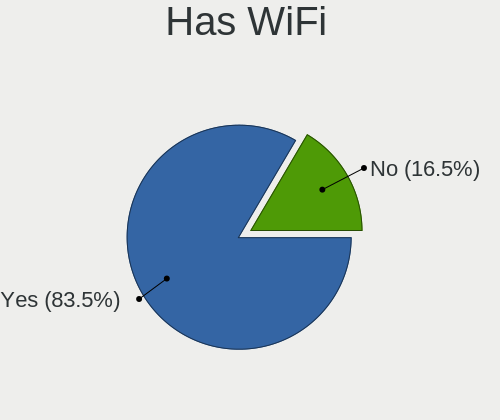
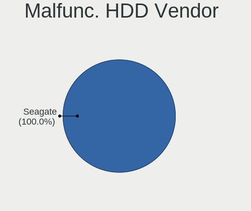
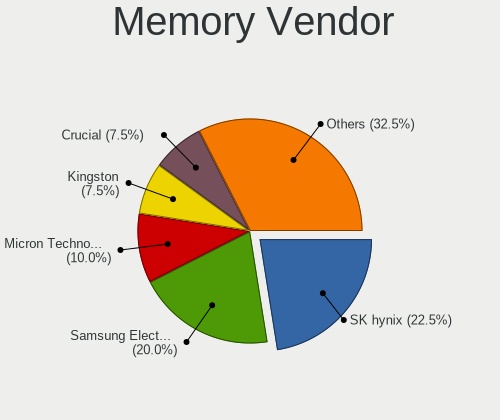
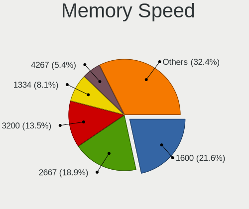
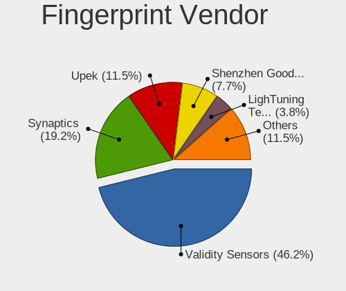

Zorin - Hardware Trends
-----------------------

A project to identify most popular hardware characteristics and track their change
over time based on data collected by Linux users at https://Linux-Hardware.org.

Anyone can contribute to this report by the [hw-probe](https://github.com/linuxhw/hw-probe) tool:

    sudo -E hw-probe -all -upload

This is a report for all computer types. See also reports for [desktops](/Dist/Zorin/Desktop/README.md) and [notebooks](/Dist/Zorin/Notebook/README.md).

This report is for one last month. Overall report since the beginning of time: [TestCoverage](https://github.com/linuxhw/TestCoverage)

Period: May, 2022.

Contents
--------

* [ System ](#system)
  - [ OS                       ](#os)
  - [ OS Family                ](#os-family)
  - [ Kernel                   ](#kernel)
  - [ Kernel Family            ](#kernel-family)
  - [ Kernel Major Ver.        ](#kernel-major-ver)
  - [ Arch                     ](#arch)
  - [ DE                       ](#de)
  - [ Display Server           ](#display-server)
  - [ Display Manager          ](#display-manager)
  - [ OS Lang                  ](#os-lang)
  - [ Boot Mode                ](#boot-mode)
  - [ Filesystem               ](#filesystem)
  - [ Part. scheme             ](#part-scheme)
  - [ Dual Boot with Linux/BSD ](#dual-boot-with-linuxbsd)
  - [ Dual Boot (Win)          ](#dual-boot-win)

* [ Board ](#board)
  - [ Vendor                   ](#vendor)
  - [ Model                    ](#model)
  - [ Model Family             ](#model-family)
  - [ MFG Year                 ](#mfg-year)
  - [ Form Factor              ](#form-factor)
  - [ Secure Boot              ](#secure-boot)
  - [ Coreboot                 ](#coreboot)
  - [ RAM Size                 ](#ram-size)
  - [ RAM Used                 ](#ram-used)
  - [ Total Drives             ](#total-drives)
  - [ Has CD-ROM               ](#has-cd-rom)
  - [ Has Ethernet             ](#has-ethernet)
  - [ Has WiFi                 ](#has-wifi)
  - [ Has Bluetooth            ](#has-bluetooth)

* [ Location ](#location)
  - [ Country                  ](#country)
  - [ City                     ](#city)

* [ Drives ](#drives)
  - [ Drive Vendor             ](#drive-vendor)
  - [ Drive Model              ](#drive-model)
  - [ HDD Vendor               ](#hdd-vendor)
  - [ SSD Vendor               ](#ssd-vendor)
  - [ Drive Kind               ](#drive-kind)
  - [ Drive Connector          ](#drive-connector)
  - [ Drive Size               ](#drive-size)
  - [ Space Total              ](#space-total)
  - [ Space Used               ](#space-used)
  - [ Malfunc. Drives          ](#malfunc-drives)
  - [ Malfunc. Drive Vendor    ](#malfunc-drive-vendor)
  - [ Malfunc. HDD Vendor      ](#malfunc-hdd-vendor)
  - [ Malfunc. Drive Kind      ](#malfunc-drive-kind)
  - [ Failed Drives            ](#failed-drives)
  - [ Failed Drive Vendor      ](#failed-drive-vendor)
  - [ Drive Status             ](#drive-status)

* [ Storage controller ](#storage-controller)
  - [ Storage Vendor           ](#storage-vendor)
  - [ Storage Model            ](#storage-model)
  - [ Storage Kind             ](#storage-kind)

* [ Processor ](#processor)
  - [ CPU Vendor               ](#cpu-vendor)
  - [ CPU Model                ](#cpu-model)
  - [ CPU Model Family         ](#cpu-model-family)
  - [ CPU Cores                ](#cpu-cores)
  - [ CPU Sockets              ](#cpu-sockets)
  - [ CPU Threads              ](#cpu-threads)
  - [ CPU Op-Modes             ](#cpu-op-modes)
  - [ CPU Microcode            ](#cpu-microcode)
  - [ CPU Microarch            ](#cpu-microarch)

* [ Graphics ](#graphics)
  - [ GPU Vendor               ](#gpu-vendor)
  - [ GPU Model                ](#gpu-model)
  - [ GPU Combo                ](#gpu-combo)
  - [ GPU Driver               ](#gpu-driver)
  - [ GPU Memory               ](#gpu-memory)

* [ Monitor ](#monitor)
  - [ Monitor Vendor           ](#monitor-vendor)
  - [ Monitor Model            ](#monitor-model)
  - [ Monitor Resolution       ](#monitor-resolution)
  - [ Monitor Diagonal         ](#monitor-diagonal)
  - [ Monitor Width            ](#monitor-width)
  - [ Aspect Ratio             ](#aspect-ratio)
  - [ Monitor Area             ](#monitor-area)
  - [ Pixel Density            ](#pixel-density)
  - [ Multiple Monitors        ](#multiple-monitors)

* [ Network ](#network)
  - [ Net Controller Vendor    ](#net-controller-vendor)
  - [ Net Controller Model     ](#net-controller-model)
  - [ Wireless Vendor          ](#wireless-vendor)
  - [ Wireless Model           ](#wireless-model)
  - [ Ethernet Vendor          ](#ethernet-vendor)
  - [ Ethernet Model           ](#ethernet-model)
  - [ Net Controller Kind      ](#net-controller-kind)
  - [ Used Controller          ](#used-controller)
  - [ NICs                     ](#nics)
  - [ IPv6                     ](#ipv6)

* [ Bluetooth ](#bluetooth)
  - [ Bluetooth Vendor         ](#bluetooth-vendor)
  - [ Bluetooth Model          ](#bluetooth-model)

* [ Sound ](#sound)
  - [ Sound Vendor             ](#sound-vendor)
  - [ Sound Model              ](#sound-model)

* [ Memory ](#memory)
  - [ Memory Vendor            ](#memory-vendor)
  - [ Memory Model             ](#memory-model)
  - [ Memory Kind              ](#memory-kind)
  - [ Memory Form Factor       ](#memory-form-factor)
  - [ Memory Size              ](#memory-size)
  - [ Memory Speed             ](#memory-speed)

* [ Printers & scanners ](#printers--scanners)
  - [ Printer Vendor           ](#printer-vendor)
  - [ Printer Model            ](#printer-model)
  - [ Scanner Vendor           ](#scanner-vendor)
  - [ Scanner Model            ](#scanner-model)

* [ Camera ](#camera)
  - [ Camera Vendor            ](#camera-vendor)
  - [ Camera Model             ](#camera-model)

* [ Security ](#security)
  - [ Fingerprint Vendor       ](#fingerprint-vendor)
  - [ Fingerprint Model        ](#fingerprint-model)
  - [ Chipcard Vendor          ](#chipcard-vendor)
  - [ Chipcard Model           ](#chipcard-model)

* [ Unsupported ](#unsupported)
  - [ Unsupported Devices      ](#unsupported-devices)
  - [ Unsupported Device Types ](#unsupported-device-types)

System
------

OS
--

Installed operating systems

| Name     | Computers | Percent |
|----------|-----------|---------|
| Zorin 16 | 166       | 94.86%  |
| Zorin 15 | 8         | 4.57%   |
| Zorin 12 | 1         | 0.57%   |

OS Family
---------

OS without a version

| Name  | Computers | Percent |
|-------|-----------|---------|
| Zorin | 175       | 100%    |

Kernel
------

Version of the Linux kernel

| Version                     | Computers | Percent |
|-----------------------------|-----------|---------|
| 5.13.0-40-generic           | 53        | 30.29%  |
| 5.13.0-41-generic           | 51        | 29.14%  |
| 5.13.0-44-generic           | 41        | 23.43%  |
| 5.13.0-30-generic           | 6         | 3.43%   |
| 5.13.0-39-generic           | 4         | 2.29%   |
| 5.4.0-110-generic           | 2         | 1.14%   |
| 5.4.0-109-generic           | 2         | 1.14%   |
| 5.11.0-40-generic           | 2         | 1.14%   |
| 5.4.0-97-generic            | 1         | 0.57%   |
| 5.4.0-89-generic            | 1         | 0.57%   |
| 5.4.0-113-generic           | 1         | 0.57%   |
| 5.4.0-105-generic           | 1         | 0.57%   |
| 5.17.9-051709-generic       | 1         | 0.57%   |
| 5.17.5-xanmod1              | 1         | 0.57%   |
| 5.14.0-1038-oem             | 1         | 0.57%   |
| 5.13.0-352203222222-generic | 1         | 0.57%   |
| 5.13.0-35-generic           | 1         | 0.57%   |
| 5.13.0-28-generic           | 1         | 0.57%   |
| 5.13.0-27-generic           | 1         | 0.57%   |
| 5.11.0-41-generic           | 1         | 0.57%   |
| 5.11.0-38-generic           | 1         | 0.57%   |
| 4.15.0-70-generic           | 1         | 0.57%   |

Kernel Family
-------------

Linux kernel without a distro release

| Version | Computers | Percent |
|---------|-----------|---------|
| 5.13.0  | 159       | 90.86%  |
| 5.4.0   | 8         | 4.57%   |
| 5.11.0  | 4         | 2.29%   |
| 5.17.9  | 1         | 0.57%   |
| 5.17.5  | 1         | 0.57%   |
| 5.14.0  | 1         | 0.57%   |
| 4.15.0  | 1         | 0.57%   |

Kernel Major Ver.
-----------------

Linux kernel major version

| Version | Computers | Percent |
|---------|-----------|---------|
| 5.13    | 159       | 90.86%  |
| 5.4     | 8         | 4.57%   |
| 5.11    | 4         | 2.29%   |
| 5.17    | 2         | 1.14%   |
| 5.14    | 1         | 0.57%   |
| 4.15    | 1         | 0.57%   |

Arch
----

OS architecture (x86_64, i586, etc.)

| Name   | Computers | Percent |
|--------|-----------|---------|
| x86_64 | 172       | 98.29%  |
| i686   | 3         | 1.71%   |

DE
--

Desktop Environment

| Name       | Computers | Percent |
|------------|-----------|---------|
| GNOME      | 138       | 78.86%  |
| XFCE       | 31        | 17.71%  |
| X-Cinnamon | 2         | 1.14%   |
| KDE5       | 2         | 1.14%   |
| Unity      | 1         | 0.57%   |
| Cinnamon   | 1         | 0.57%   |

Display Server
--------------

X11 or Wayland

| Name    | Computers | Percent |
|---------|-----------|---------|
| X11     | 171       | 97.71%  |
| Wayland | 3         | 1.71%   |
| Tty     | 1         | 0.57%   |

Display Manager
---------------

SDDM, LightDM, etc.

| Name    | Computers | Percent |
|---------|-----------|---------|
| Unknown | 124       | 70.86%  |
| GDM3    | 23        | 13.14%  |
| GDM     | 18        | 10.29%  |
| LightDM | 9         | 5.14%   |
| SDDM    | 1         | 0.57%   |

OS Lang
-------

Language

| Lang  | Computers | Percent |
|-------|-----------|---------|
| en_US | 65        | 37.14%  |
| pt_BR | 14        | 8%      |
| de_DE | 14        | 8%      |
| en_AU | 9         | 5.14%   |
| es_MX | 8         | 4.57%   |
| fr_FR | 7         | 4%      |
| en_GB | 7         | 4%      |
| es_ES | 6         | 3.43%   |
| ru_RU | 5         | 2.86%   |
| pl_PL | 5         | 2.86%   |
| en_IN | 4         | 2.29%   |
| it_IT | 3         | 1.71%   |
| en_ZA | 3         | 1.71%   |
| cs_CZ | 3         | 1.71%   |
| tr_TR | 2         | 1.14%   |
| sv_SE | 2         | 1.14%   |
| nl_NL | 2         | 1.14%   |
| nl_BE | 2         | 1.14%   |
| es_CO | 2         | 1.14%   |
| pt_PT | 1         | 0.57%   |
| lt_LT | 1         | 0.57%   |
| hu_HU | 1         | 0.57%   |
| es_PR | 1         | 0.57%   |
| es_PE | 1         | 0.57%   |
| es_CL | 1         | 0.57%   |
| en_PH | 1         | 0.57%   |
| en_IE | 1         | 0.57%   |
| en_CA | 1         | 0.57%   |
| el_GR | 1         | 0.57%   |
| da_DK | 1         | 0.57%   |
| bg_BG | 1         | 0.57%   |

Boot Mode
---------

EFI or BIOS

| Mode | Computers | Percent |
|------|-----------|---------|
| BIOS | 91        | 52%     |
| EFI  | 84        | 48%     |

Filesystem
----------

Type of filesystem

| Type    | Computers | Percent |
|---------|-----------|---------|
| Ext4    | 164       | 93.71%  |
| Zfs     | 5         | 2.86%   |
| Btrfs   | 3         | 1.71%   |
| Overlay | 2         | 1.14%   |
| Xfs     | 1         | 0.57%   |

Part. scheme
------------

Scheme of partitioning

| Type    | Computers | Percent |
|---------|-----------|---------|
| Unknown | 147       | 84%     |
| GPT     | 20        | 11.43%  |
| MBR     | 8         | 4.57%   |

Dual Boot with Linux/BSD
------------------------

Hosting more than one Linux/BSD

| Dual boot | Computers | Percent |
|-----------|-----------|---------|
| No        | 170       | 97.14%  |
| Yes       | 5         | 2.86%   |

Dual Boot (Win)
---------------

Hosting Linux and Windows

| Dual boot | Computers | Percent |
|-----------|-----------|---------|
| No        | 154       | 88%     |
| Yes       | 21        | 12%     |

Board
-----

Vendor
------

Motherboard manufacturer

| Name                | Computers | Percent |
|---------------------|-----------|---------|
| ASUSTek Computer    | 35        | 20%     |
| Hewlett-Packard     | 28        | 16%     |
| Dell                | 19        | 10.86%  |
| Gigabyte Technology | 18        | 10.29%  |
| Lenovo              | 16        | 9.14%   |
| MSI                 | 9         | 5.14%   |
| Acer                | 8         | 4.57%   |
| Intel               | 7         | 4%      |
| Toshiba             | 5         | 2.86%   |
| ASRock              | 4         | 2.29%   |
| Apple               | 3         | 1.71%   |
| Positivo            | 2         | 1.14%   |
| HUAWEI              | 2         | 1.14%   |
| Gateway             | 2         | 1.14%   |
| Foxconn             | 2         | 1.14%   |
| Thomson             | 1         | 0.57%   |
| Sony                | 1         | 0.57%   |
| Samsung Electronics | 1         | 0.57%   |
| Pegatron            | 1         | 0.57%   |
| Microsoft           | 1         | 0.57%   |
| Medion              | 1         | 0.57%   |
| Maxtone             | 1         | 0.57%   |
| GPU Company         | 1         | 0.57%   |
| Google              | 1         | 0.57%   |
| Fujitsu             | 1         | 0.57%   |
| Chuwi               | 1         | 0.57%   |
| AOpen               | 1         | 0.57%   |
| AMI                 | 1         | 0.57%   |
| Alienware           | 1         | 0.57%   |
| Unknown             | 1         | 0.57%   |

Model
-----

Motherboard model

| Name                                  | Computers | Percent |
|---------------------------------------|-----------|---------|
| ASUS All Series                       | 4         | 2.29%   |
| Toshiba Satellite C55-C               | 2         | 1.14%   |
| Intel NUC11PAHi5                      | 2         | 1.14%   |
| Gigabyte H410M H V3                   | 2         | 1.14%   |
| Toshiba TECRA A50-E                   | 1         | 0.57%   |
| Toshiba Satellite L75D-A              | 1         | 0.57%   |
| Toshiba Satellite L10W-C              | 1         | 0.57%   |
| Thomson NEO14SBK                      | 1         | 0.57%   |
| Sony VGN-FW51MF_H                     | 1         | 0.57%   |
| Samsung 930QDB                        | 1         | 0.57%   |
| Positivo POS-PIG41BA                  | 1         | 0.57%   |
| Positivo CHT14B                       | 1         | 0.57%   |
| Pegatron Compaq 505B Microtower PC    | 1         | 0.57%   |
| MSI MS-7D19                           | 1         | 0.57%   |
| MSI MS-7D09                           | 1         | 0.57%   |
| MSI MS-7B10                           | 1         | 0.57%   |
| MSI MS-7A32                           | 1         | 0.57%   |
| MSI MS-7984                           | 1         | 0.57%   |
| MSI MS-7914                           | 1         | 0.57%   |
| MSI MS-7823                           | 1         | 0.57%   |
| MSI MS-7641                           | 1         | 0.57%   |
| MSI MS-7260                           | 1         | 0.57%   |
| Microsoft Surface Pro 4               | 1         | 0.57%   |
| Medion Akoya S6214T                   | 1         | 0.57%   |
| Maxtone HIS-G41L V1.1                 | 1         | 0.57%   |
| Lenovo Yoga 2 13 20344                | 1         | 0.57%   |
| Lenovo ThinkPad X301 277418G          | 1         | 0.57%   |
| Lenovo ThinkPad X230 2324FV6          | 1         | 0.57%   |
| Lenovo ThinkPad T61 7661V72           | 1         | 0.57%   |
| Lenovo ThinkPad T420 4236MBU          | 1         | 0.57%   |
| Lenovo ThinkPad P50 20EQS28400        | 1         | 0.57%   |
| Lenovo ThinkPad L560 20F1001YGE       | 1         | 0.57%   |
| Lenovo ThinkBook 14-IIL 20SL          | 1         | 0.57%   |
| Lenovo IdeaPadFlex 5 14ALC05 82HU     | 1         | 0.57%   |
| Lenovo IdeaPad Z580                   | 1         | 0.57%   |
| Lenovo IdeaPad 5 15ARE05 81YQ         | 1         | 0.57%   |
| Lenovo IdeaPad 110-14IBR 80UJ         | 1         | 0.57%   |
| Lenovo IdeaPad 100-15IBY 80MJ         | 1         | 0.57%   |
| Lenovo IdeaCentre K410 10089          | 1         | 0.57%   |
| Lenovo G500 20236                     | 1         | 0.57%   |
| Lenovo G50-30 80G0                    | 1         | 0.57%   |
| Intel S5520HC                         | 1         | 0.57%   |
| Intel NUC5i3RYB H41000-507            | 1         | 0.57%   |
| Intel H55                             | 1         | 0.57%   |
| Intel DH77EB AAG39073-304             | 1         | 0.57%   |
| Intel D946GZIS AAD66165-301           | 1         | 0.57%   |
| HUAWEI NBLK-WAX9X                     | 1         | 0.57%   |
| HUAWEI DRC-WXX                        | 1         | 0.57%   |
| HP ZHAN 66 Pro A 14 G3                | 1         | 0.57%   |
| HP ZBook 15 G2                        | 1         | 0.57%   |
| HP Z230 SFF Workstation               | 1         | 0.57%   |
| HP Spectre x360 Convertible 15-eb0xxx | 1         | 0.57%   |
| HP ProBook 450 G1                     | 1         | 0.57%   |
| HP Pavilion Notebook                  | 1         | 0.57%   |
| HP Pavilion Laptop 15-eg0xxx          | 1         | 0.57%   |
| HP Pavilion g4                        | 1         | 0.57%   |
| HP Pavilion dv7                       | 1         | 0.57%   |
| HP Pavilion dv6                       | 1         | 0.57%   |
| HP Pavilion 17                        | 1         | 0.57%   |
| HP OMEN Laptop 15-en0xxx              | 1         | 0.57%   |

Model Family
------------

Motherboard model prefix

| Name                   | Computers | Percent |
|------------------------|-----------|---------|
| Acer Aspire            | 7         | 4%      |
| Lenovo ThinkPad        | 6         | 3.43%   |
| HP Pavilion            | 6         | 3.43%   |
| ASUS ROG               | 6         | 3.43%   |
| HP EliteBook           | 5         | 2.86%   |
| Dell Latitude          | 5         | 2.86%   |
| Dell Inspiron          | 5         | 2.86%   |
| Toshiba Satellite      | 4         | 2.29%   |
| Lenovo IdeaPad         | 4         | 2.29%   |
| HP Laptop              | 4         | 2.29%   |
| HP Compaq              | 4         | 2.29%   |
| Dell OptiPlex          | 4         | 2.29%   |
| ASUS All               | 4         | 2.29%   |
| ASUS PRIME             | 3         | 1.71%   |
| Intel NUC11PAHi5       | 2         | 1.14%   |
| HP OMEN                | 2         | 1.14%   |
| Gigabyte H410M         | 2         | 1.14%   |
| Gigabyte GA-78LMT-USB3 | 2         | 1.14%   |
| Gigabyte G1.Sniper     | 2         | 1.14%   |
| ASUS VivoBook          | 2         | 1.14%   |
| ASUS TUF               | 2         | 1.14%   |
| Toshiba TECRA          | 1         | 0.57%   |
| Thomson NEO14SBK       | 1         | 0.57%   |
| Sony VGN-FW51MF        | 1         | 0.57%   |
| Samsung 930QDB         | 1         | 0.57%   |
| Positivo POS-PIG41BA   | 1         | 0.57%   |
| Positivo CHT14B        | 1         | 0.57%   |
| Pegatron Compaq        | 1         | 0.57%   |
| MSI MS-7D19            | 1         | 0.57%   |
| MSI MS-7D09            | 1         | 0.57%   |
| MSI MS-7B10            | 1         | 0.57%   |
| MSI MS-7A32            | 1         | 0.57%   |
| MSI MS-7984            | 1         | 0.57%   |
| MSI MS-7914            | 1         | 0.57%   |
| MSI MS-7823            | 1         | 0.57%   |
| MSI MS-7641            | 1         | 0.57%   |
| MSI MS-7260            | 1         | 0.57%   |
| Microsoft Surface      | 1         | 0.57%   |
| Medion Akoya           | 1         | 0.57%   |
| Maxtone HIS-G41L       | 1         | 0.57%   |
| Lenovo Yoga            | 1         | 0.57%   |
| Lenovo ThinkBook       | 1         | 0.57%   |
| Lenovo IdeaPadFlex     | 1         | 0.57%   |
| Lenovo IdeaCentre      | 1         | 0.57%   |
| Lenovo G500            | 1         | 0.57%   |
| Lenovo G50-30          | 1         | 0.57%   |
| Intel S5520HC          | 1         | 0.57%   |
| Intel NUC5i3RYB        | 1         | 0.57%   |
| Intel H55              | 1         | 0.57%   |
| Intel DH77EB           | 1         | 0.57%   |
| Intel D946GZIS         | 1         | 0.57%   |
| HUAWEI NBLK-WAX9X      | 1         | 0.57%   |
| HUAWEI DRC-WXX         | 1         | 0.57%   |
| HP ZHAN                | 1         | 0.57%   |
| HP ZBook               | 1         | 0.57%   |
| HP Z230                | 1         | 0.57%   |
| HP Spectre             | 1         | 0.57%   |
| HP ProBook             | 1         | 0.57%   |
| HP Notebook            | 1         | 0.57%   |
| HP EW7-I7D22875GR1     | 1         | 0.57%   |

MFG Year
--------

Motherboard manufacture year

| Year | Computers | Percent |
|------|-----------|---------|
| 2021 | 18        | 10.29%  |
| 2013 | 17        | 9.71%   |
| 2014 | 16        | 9.14%   |
| 2019 | 14        | 8%      |
| 2012 | 14        | 8%      |
| 2010 | 14        | 8%      |
| 2011 | 13        | 7.43%   |
| 2015 | 11        | 6.29%   |
| 2020 | 10        | 5.71%   |
| 2017 | 9         | 5.14%   |
| 2016 | 8         | 4.57%   |
| 2009 | 8         | 4.57%   |
| 2008 | 8         | 4.57%   |
| 2018 | 6         | 3.43%   |
| 2007 | 4         | 2.29%   |
| 2006 | 3         | 1.71%   |
| 2022 | 2         | 1.14%   |

Form Factor
-----------

Physical design of the computer

| Name        | Computers | Percent |
|-------------|-----------|---------|
| Notebook    | 89        | 50.86%  |
| Desktop     | 72        | 41.14%  |
| Mini pc     | 5         | 2.86%   |
| Convertible | 4         | 2.29%   |
| Tablet      | 2         | 1.14%   |
| All in one  | 2         | 1.14%   |
| Server      | 1         | 0.57%   |

Secure Boot
-----------

Enabled or disabled

| State    | Computers | Percent |
|----------|-----------|---------|
| Disabled | 157       | 89.71%  |
| Enabled  | 18        | 10.29%  |

Coreboot
--------

Have coreboot on board

| Used | Computers | Percent |
|------|-----------|---------|
| No   | 174       | 99.43%  |
| Yes  | 1         | 0.57%   |

RAM Size
--------

Total RAM memory

| Size in GB  | Computers | Percent |
|-------------|-----------|---------|
| 3.01-4.0    | 40        | 22.86%  |
| 4.01-8.0    | 37        | 21.14%  |
| 16.01-24.0  | 34        | 19.43%  |
| 8.01-16.0   | 31        | 17.71%  |
| 32.01-64.0  | 15        | 8.57%   |
| 1.01-2.0    | 10        | 5.71%   |
| 64.01-256.0 | 4         | 2.29%   |
| 24.01-32.0  | 2         | 1.14%   |
| 2.01-3.0    | 1         | 0.57%   |
| 0.51-1.0    | 1         | 0.57%   |

RAM Used
--------

Used RAM memory

| Used GB    | Computers | Percent |
|------------|-----------|---------|
| 1.01-2.0   | 69        | 39.43%  |
| 2.01-3.0   | 63        | 36%     |
| 4.01-8.0   | 17        | 9.71%   |
| 3.01-4.0   | 16        | 9.14%   |
| 8.01-16.0  | 5         | 2.86%   |
| 0.51-1.0   | 4         | 2.29%   |
| 16.01-24.0 | 1         | 0.57%   |

Total Drives
------------

Number of drives on board

| Drives | Computers | Percent |
|--------|-----------|---------|
| 1      | 108       | 61.71%  |
| 2      | 38        | 21.71%  |
| 4      | 9         | 5.14%   |
| 3      | 9         | 5.14%   |
| 0      | 4         | 2.29%   |
| 7      | 3         | 1.71%   |
| 6      | 2         | 1.14%   |
| 5      | 2         | 1.14%   |

Has CD-ROM
----------

Has CD-ROM on board

| Presented | Computers | Percent |
|-----------|-----------|---------|
| No        | 93        | 53.14%  |
| Yes       | 82        | 46.86%  |

Has Ethernet
------------

Has Ethernet on board

| Presented | Computers | Percent |
|-----------|-----------|---------|
| Yes       | 151       | 86.29%  |
| No        | 24        | 13.71%  |

Has WiFi
--------

Has WiFi module

| Presented | Computers | Percent |
|-----------|-----------|---------|
| Yes       | 128       | 73.14%  |
| No        | 47        | 26.86%  |

Has Bluetooth
-------------

Has Bluetooth module

| Presented | Computers | Percent |
|-----------|-----------|---------|
| Yes       | 97        | 55.43%  |
| No        | 78        | 44.57%  |

Location
--------

Country
-------

Geographic location (country)

| Country                | Computers | Percent |
|------------------------|-----------|---------|
| USA                    | 38        | 21.71%  |
| Brazil                 | 16        | 9.14%   |
| Germany                | 15        | 8.57%   |
| Australia              | 9         | 5.14%   |
| Mexico                 | 8         | 4.57%   |
| UK                     | 7         | 4%      |
| France                 | 7         | 4%      |
| Spain                  | 6         | 3.43%   |
| Canada                 | 6         | 3.43%   |
| Poland                 | 5         | 2.86%   |
| Slovenia               | 4         | 2.29%   |
| Russia                 | 4         | 2.29%   |
| India                  | 4         | 2.29%   |
| South Africa           | 3         | 1.71%   |
| Netherlands            | 3         | 1.71%   |
| Italy                  | 3         | 1.71%   |
| Czechia                | 3         | 1.71%   |
| Turkey                 | 2         | 1.14%   |
| Sweden                 | 2         | 1.14%   |
| Portugal               | 2         | 1.14%   |
| Philippines            | 2         | 1.14%   |
| Indonesia              | 2         | 1.14%   |
| Greece                 | 2         | 1.14%   |
| Colombia               | 2         | 1.14%   |
| Belgium                | 2         | 1.14%   |
| Sri Lanka              | 1         | 0.57%   |
| Saudi Arabia           | 1         | 0.57%   |
| Puerto Rico            | 1         | 0.57%   |
| Peru                   | 1         | 0.57%   |
| Pakistan               | 1         | 0.57%   |
| Norway                 | 1         | 0.57%   |
| Lithuania              | 1         | 0.57%   |
| Kenya                  | 1         | 0.57%   |
| Japan                  | 1         | 0.57%   |
| Ireland                | 1         | 0.57%   |
| Hungary                | 1         | 0.57%   |
| Estonia                | 1         | 0.57%   |
| Denmark                | 1         | 0.57%   |
| Chile                  | 1         | 0.57%   |
| Bulgaria               | 1         | 0.57%   |
| Bosnia and Herzegovina | 1         | 0.57%   |
| Belarus                | 1         | 0.57%   |
| Argentina              | 1         | 0.57%   |

City
----

Geographic location (city)

| City                     | Computers | Percent |
|--------------------------|-----------|---------|
| Sydney                   | 4         | 2.29%   |
| Glasgow                  | 3         | 1.71%   |
| Acapulco de Juárez      | 3         | 1.71%   |
| Vrhnika                  | 2         | 1.14%   |
| Sao Paulo                | 2         | 1.14%   |
| Richmond                 | 2         | 1.14%   |
| Potchefstroom            | 2         | 1.14%   |
| Munich                   | 2         | 1.14%   |
| Montreal                 | 2         | 1.14%   |
| Madrid                   | 2         | 1.14%   |
| Burgkunstadt             | 2         | 1.14%   |
| Bucyrus                  | 2         | 1.14%   |
| Brisbane                 | 2         | 1.14%   |
| Bogotá                  | 2         | 1.14%   |
| Berlin                   | 2         | 1.14%   |
| Wylie                    | 1         | 0.57%   |
| Wołomin                 | 1         | 0.57%   |
| Willingboro              | 1         | 0.57%   |
| Wattala                  | 1         | 0.57%   |
| Washington               | 1         | 0.57%   |
| Vohrenbach               | 1         | 0.57%   |
| Vitória da Conquista    | 1         | 0.57%   |
| Veroia                   | 1         | 0.57%   |
| Vanse                    | 1         | 0.57%   |
| Uppsala                  | 1         | 0.57%   |
| Union Dale               | 1         | 0.57%   |
| Twinsburg                | 1         | 0.57%   |
| Tuzla                    | 1         | 0.57%   |
| Trujillo                 | 1         | 0.57%   |
| Toronto                  | 1         | 0.57%   |
| Teplice                  | 1         | 0.57%   |
| Tangerang                | 1         | 0.57%   |
| Tallinn                  | 1         | 0.57%   |
| Świnoujście            | 1         | 0.57%   |
| Stuttgart                | 1         | 0.57%   |
| Stockholm                | 1         | 0.57%   |
| Stafford                 | 1         | 0.57%   |
| Seville                  | 1         | 0.57%   |
| Serra da Raiz            | 1         | 0.57%   |
| Seattle                  | 1         | 0.57%   |
| Schenectady              | 1         | 0.57%   |
| Santo André             | 1         | 0.57%   |
| Santa Coloma de Gramenet | 1         | 0.57%   |
| Sandusky                 | 1         | 0.57%   |
| San Luis Río Colorado   | 1         | 0.57%   |
| San Juan                 | 1         | 0.57%   |
| Salvador                 | 1         | 0.57%   |
| Salt Lake City           | 1         | 0.57%   |
| Saint-Nazaire            | 1         | 0.57%   |
| Saint John               | 1         | 0.57%   |
| Rositz                   | 1         | 0.57%   |
| Riyadh                   | 1         | 0.57%   |
| Rio de Janeiro           | 1         | 0.57%   |
| Putte                    | 1         | 0.57%   |
| Prague                   | 1         | 0.57%   |
| Porto Alegre             | 1         | 0.57%   |
| Phoenix                  | 1         | 0.57%   |
| Philadelphia             | 1         | 0.57%   |
| Pflugerville             | 1         | 0.57%   |
| Perth                    | 1         | 0.57%   |

Drives
------

Drive Vendor
------------

Hard drive vendors

| Vendor                    | Computers | Drives | Percent |
|---------------------------|-----------|--------|---------|
| Seagate                   | 48        | 51     | 19.05%  |
| WDC                       | 31        | 41     | 12.3%   |
| Samsung Electronics       | 29        | 41     | 11.51%  |
| Toshiba                   | 19        | 20     | 7.54%   |
| Crucial                   | 16        | 16     | 6.35%   |
| Unknown                   | 13        | 16     | 5.16%   |
| Kingston                  | 12        | 12     | 4.76%   |
| SanDisk                   | 10        | 10     | 3.97%   |
| HGST                      | 8         | 8      | 3.17%   |
| Intel                     | 5         | 6      | 1.98%   |
| SK Hynix                  | 4         | 4      | 1.59%   |
| Micron Technology         | 4         | 4      | 1.59%   |
| A-DATA Technology         | 4         | 5      | 1.59%   |
| Phison                    | 3         | 3      | 1.19%   |
| LITEON                    | 3         | 3      | 1.19%   |
| Hitachi                   | 3         | 3      | 1.19%   |
| Silicon Motion            | 2         | 2      | 0.79%   |
| PNY                       | 2         | 2      | 0.79%   |
| PLEXTOR                   | 2         | 2      | 0.79%   |
| Pioneer                   | 2         | 2      | 0.79%   |
| Patriot                   | 2         | 2      | 0.79%   |
| OCZ                       | 2         | 3      | 0.79%   |
| Netac                     | 2         | 2      | 0.79%   |
| Leven                     | 2         | 2      | 0.79%   |
| Gigabyte Technology       | 2         | 3      | 0.79%   |
| China                     | 2         | 2      | 0.79%   |
| XPG                       | 1         | 1      | 0.4%    |
| walram                    | 1         | 1      | 0.4%    |
| USB3.2                    | 1         | 1      | 0.4%    |
| USB3.0                    | 1         | 1      | 0.4%    |
| Timetec                   | 1         | 1      | 0.4%    |
| SABRENT                   | 1         | 1      | 0.4%    |
| Micron/Crucial Technology | 1         | 1      | 0.4%    |
| LITEONIT                  | 1         | 1      | 0.4%    |
| KIOXIA                    | 1         | 1      | 0.4%    |
| JMicron                   | 1         | 1      | 0.4%    |
| Intenso                   | 1         | 1      | 0.4%    |
| HS-SSD-E100               | 1         | 1      | 0.4%    |
| HS-SSD-C100               | 1         | 1      | 0.4%    |
| GOODRAM                   | 1         | 1      | 0.4%    |
| faspeed                   | 1         | 1      | 0.4%    |
| Dogfish                   | 1         | 1      | 0.4%    |
| Corsair                   | 1         | 1      | 0.4%    |
| Apple                     | 1         | 1      | 0.4%    |
| Apacer                    | 1         | 1      | 0.4%    |
| Unknown                   | 1         | 1      | 0.4%    |

Drive Model
-----------

Hard drive models

| Model                              | Computers | Percent |
|------------------------------------|-----------|---------|
| Unknown MMC Card  64GB             | 5         | 1.8%    |
| Seagate ST1000DM010-2EP102 1TB     | 5         | 1.8%    |
| HGST HTS721010A9E630 1TB           | 4         | 1.44%   |
| Unknown MMC Card  32GB             | 3         | 1.08%   |
| Unknown MMC Card  16GB             | 3         | 1.08%   |
| Toshiba MQ01ABD100 1TB             | 3         | 1.08%   |
| Samsung SSD 850 EVO 250GB          | 3         | 1.08%   |
| Kingston SA400S37120G 120GB SSD    | 3         | 1.08%   |
| Crucial CT500MX500SSD1 500GB       | 3         | 1.08%   |
| A-DATA SU650 120GB SSD             | 3         | 1.08%   |
| Toshiba MK1646GSX 160GB            | 2         | 0.72%   |
| Toshiba HDWL110 1TB                | 2         | 0.72%   |
| Seagate ST500DM002-1BD142 500GB    | 2         | 0.72%   |
| Seagate ST320LT012-9WS14C 320GB    | 2         | 0.72%   |
| Seagate ST1000LM035-1RK172 1TB     | 2         | 0.72%   |
| Seagate ST1000LM024 HN-M101MBB 1TB | 2         | 0.72%   |
| Seagate Expansion 4TB              | 2         | 0.72%   |
| Samsung SSD 970 EVO Plus 500GB     | 2         | 0.72%   |
| Samsung SSD 870 EVO 1TB            | 2         | 0.72%   |
| Samsung SSD 860 EVO 500GB          | 2         | 0.72%   |
| Samsung SSD 850 EVO 500GB          | 2         | 0.72%   |
| Samsung NVMe SSD Drive 256GB       | 2         | 0.72%   |
| Samsung HD103SJ 1TB                | 2         | 0.72%   |
| Pioneer APS-SL3N-120 120GB         | 2         | 0.72%   |
| Leven JAJS600M256C 256GB           | 2         | 0.72%   |
| Kingston SV300S37A120G 120GB SSD   | 2         | 0.72%   |
| Crucial CT240BX500SSD1 240GB       | 2         | 0.72%   |
| Crucial CT1000MX500SSD1 1TB        | 2         | 0.72%   |
| XPG NVMe SSD Drive 1024GB          | 1         | 0.36%   |
| WDC WDS250G2B0A-00SM50 250GB SSD   | 1         | 0.36%   |
| WDC WDS240G2G0A-00JH30 240GB SSD   | 1         | 0.36%   |
| WDC WDS100T2B0B-00YS70 1TB SSD     | 1         | 0.36%   |
| WDC WDS100T1B0A-00H9H0 1TB SSD     | 1         | 0.36%   |
| WDC WD800BD-22LRA0 80GB            | 1         | 0.36%   |
| WDC WD6402AAEX-00Z3A0 640GB        | 1         | 0.36%   |
| WDC WD6402AAEX-00Y9A0 640GB        | 1         | 0.36%   |
| WDC WD5000LPVX-75V0TT0 500GB       | 1         | 0.36%   |
| WDC WD5000LPVT-75G33T0 500GB       | 1         | 0.36%   |
| WDC WD5000LPLX-75ZNTT0 500GB       | 1         | 0.36%   |
| WDC WD5000LPCX-24VHAT0 500GB       | 1         | 0.36%   |
| WDC WD5000LPCX-22VHAT0 500GB       | 1         | 0.36%   |
| WDC WD5000AAKX-60U6AA0 500GB       | 1         | 0.36%   |
| WDC WD5000AAKX-22ERMA0 500GB       | 1         | 0.36%   |
| WDC WD5000AAKX-00U6AA0 500GB       | 1         | 0.36%   |
| WDC WD40 EFRX-68WT0N0 4TB          | 1         | 0.36%   |
| WDC WD3200LPVX-22V0TT0 320GB       | 1         | 0.36%   |
| WDC WD3200BEVT-75ZCT2 320GB        | 1         | 0.36%   |
| WDC WD2500LPVX-22V0TT0 250GB       | 1         | 0.36%   |
| WDC WD20EARX-00PASB0 2TB           | 1         | 0.36%   |
| WDC WD20EARS-00MVWB0 2TB           | 1         | 0.36%   |
| WDC WD2000FYYZ-01UL1B2 2TB         | 1         | 0.36%   |
| WDC WD1600BEVS-60RST0 160GB        | 1         | 0.36%   |
| WDC WD15EARS-00MVWB0 1TB           | 1         | 0.36%   |
| WDC WD1200BEVS-75UST0 120GB        | 1         | 0.36%   |
| WDC WD10EZEX-75M2NA0 1TB           | 1         | 0.36%   |
| WDC WD10EZEX-60WN4A1 1TB           | 1         | 0.36%   |
| WDC WD10EZEX-08WN4A0 1TB           | 1         | 0.36%   |
| WDC WD10EZEX-00WN4A0 1TB           | 1         | 0.36%   |
| WDC WD10EZEX-00BN5A0 1TB           | 1         | 0.36%   |
| WDC WD10EARS-22Y5B1 1TB            | 1         | 0.36%   |

HDD Vendor
----------

Hard disk drive vendors

| Vendor              | Computers | Drives | Percent |
|---------------------|-----------|--------|---------|
| Seagate             | 47        | 50     | 43.52%  |
| WDC                 | 27        | 36     | 25%     |
| Toshiba             | 15        | 16     | 13.89%  |
| HGST                | 8         | 8      | 7.41%   |
| Samsung Electronics | 5         | 5      | 4.63%   |
| Hitachi             | 3         | 3      | 2.78%   |
| USB3.0              | 1         | 1      | 0.93%   |
| SABRENT             | 1         | 1      | 0.93%   |
| Apple               | 1         | 1      | 0.93%   |

SSD Vendor
----------

Solid state drive vendors

| Vendor              | Computers | Drives | Percent |
|---------------------|-----------|--------|---------|
| Samsung Electronics | 17        | 23     | 18.89%  |
| Crucial             | 14        | 14     | 15.56%  |
| SanDisk             | 7         | 7      | 7.78%   |
| Kingston            | 7         | 7      | 7.78%   |
| WDC                 | 4         | 4      | 4.44%   |
| A-DATA Technology   | 4         | 5      | 4.44%   |
| LITEON              | 3         | 3      | 3.33%   |
| Intel               | 3         | 3      | 3.33%   |
| Toshiba             | 2         | 2      | 2.22%   |
| PNY                 | 2         | 2      | 2.22%   |
| PLEXTOR             | 2         | 2      | 2.22%   |
| Pioneer             | 2         | 2      | 2.22%   |
| Patriot             | 2         | 2      | 2.22%   |
| OCZ                 | 2         | 3      | 2.22%   |
| Netac               | 2         | 2      | 2.22%   |
| Micron Technology   | 2         | 2      | 2.22%   |
| Leven               | 2         | 2      | 2.22%   |
| Gigabyte Technology | 2         | 3      | 2.22%   |
| China               | 2         | 2      | 2.22%   |
| SK Hynix            | 1         | 1      | 1.11%   |
| LITEONIT            | 1         | 1      | 1.11%   |
| JMicron             | 1         | 1      | 1.11%   |
| HS-SSD-E100         | 1         | 1      | 1.11%   |
| GOODRAM             | 1         | 1      | 1.11%   |
| faspeed             | 1         | 1      | 1.11%   |
| Dogfish             | 1         | 1      | 1.11%   |
| Apacer              | 1         | 1      | 1.11%   |
| Unknown             | 1         | 1      | 1.11%   |

Drive Kind
----------

HDD or SSD

| Kind    | Computers | Drives | Percent |
|---------|-----------|--------|---------|
| HDD     | 92        | 121    | 40.17%  |
| SSD     | 81        | 99     | 35.37%  |
| NVMe    | 37        | 43     | 16.16%  |
| MMC     | 12        | 13     | 5.24%   |
| Unknown | 7         | 9      | 3.06%   |

Drive Connector
---------------

SATA, SAS, NVMe, etc.

| Type | Computers | Drives | Percent |
|------|-----------|--------|---------|
| SATA | 144       | 213    | 69.57%  |
| NVMe | 37        | 43     | 17.87%  |
| SAS  | 14        | 16     | 6.76%   |
| MMC  | 12        | 13     | 5.8%    |

Drive Size
----------

Size of hard drive

| Size in TB | Computers | Drives | Percent |
|------------|-----------|--------|---------|
| 0.01-0.5   | 103       | 126    | 58.19%  |
| 0.51-1.0   | 51        | 65     | 28.81%  |
| 1.01-2.0   | 11        | 16     | 6.21%   |
| 4.01-10.0  | 6         | 7      | 3.39%   |
| 3.01-4.0   | 5         | 5      | 2.82%   |
| 2.01-3.0   | 1         | 1      | 0.56%   |

Space Total
-----------

Amount of disk space available on the file system

| Size in GB     | Computers | Percent |
|----------------|-----------|---------|
| 101-250        | 51        | 29.14%  |
| 251-500        | 44        | 25.14%  |
| 501-1000       | 29        | 16.57%  |
| 51-100         | 14        | 8%      |
| 21-50          | 11        | 6.29%   |
| More than 3000 | 7         | 4%      |
| 1001-2000      | 7         | 4%      |
| 1-20           | 6         | 3.43%   |
| 2001-3000      | 3         | 1.71%   |
| Unknown        | 3         | 1.71%   |

Space Used
----------

Amount of used disk space

| Used GB        | Computers | Percent |
|----------------|-----------|---------|
| 1-20           | 65        | 37.14%  |
| 21-50          | 54        | 30.86%  |
| 51-100         | 20        | 11.43%  |
| 101-250        | 13        | 7.43%   |
| 251-500        | 11        | 6.29%   |
| More than 3000 | 4         | 2.29%   |
| 501-1000       | 3         | 1.71%   |
| Unknown        | 3         | 1.71%   |
| 2001-3000      | 2         | 1.14%   |

Malfunc. Drives
---------------

Drive models with a malfunction

| Model                                         | Computers | Drives | Percent |
|-----------------------------------------------|-----------|--------|---------|
| WDC WD5000LPVX-75V0TT0 500GB                  | 1         | 1      | 33.33%  |
| Toshiba MQ01ABD100 1TB                        | 1         | 1      | 33.33%  |
| Samsung Electronics MMCRE64G8MPP-0VA 64GB SSD | 1         | 1      | 33.33%  |

Malfunc. Drive Vendor
---------------------

Vendors of faulty drives

| Vendor              | Computers | Drives | Percent |
|---------------------|-----------|--------|---------|
| WDC                 | 1         | 1      | 33.33%  |
| Toshiba             | 1         | 1      | 33.33%  |
| Samsung Electronics | 1         | 1      | 33.33%  |

Malfunc. HDD Vendor
-------------------

Vendors of faulty HDD drives

| Vendor  | Computers | Drives | Percent |
|---------|-----------|--------|---------|
| WDC     | 1         | 1      | 50%     |
| Toshiba | 1         | 1      | 50%     |

Malfunc. Drive Kind
-------------------

Kinds of faulty drives

| Kind | Computers | Drives | Percent |
|------|-----------|--------|---------|
| HDD  | 2         | 2      | 66.67%  |
| SSD  | 1         | 1      | 33.33%  |

Failed Drives
-------------

Failed drive models

Zero info for selected period =(

Failed Drive Vendor
-------------------

Failed drive vendors

Zero info for selected period =(

Drive Status
------------

Number of failed and malfunc. drives

| Status   | Computers | Drives | Percent |
|----------|-----------|--------|---------|
| Detected | 147       | 242    | 84%     |
| Works    | 25        | 40     | 14.29%  |
| Malfunc  | 3         | 3      | 1.71%   |

Storage controller
------------------

Storage Vendor
--------------

Storage controller vendors

| Vendor                       | Computers | Percent |
|------------------------------|-----------|---------|
| Intel                        | 123       | 58.85%  |
| AMD                          | 32        | 15.31%  |
| Samsung Electronics          | 12        | 5.74%   |
| Kingston Technology Company  | 5         | 2.39%   |
| Sandisk                      | 4         | 1.91%   |
| Phison Electronics           | 4         | 1.91%   |
| Nvidia                       | 4         | 1.91%   |
| SK Hynix                     | 3         | 1.44%   |
| Micron/Crucial Technology    | 3         | 1.44%   |
| Marvell Technology Group     | 3         | 1.44%   |
| JMicron Technology           | 3         | 1.44%   |
| ASMedia Technology           | 3         | 1.44%   |
| Silicon Motion               | 2         | 0.96%   |
| Micron Technology            | 2         | 0.96%   |
| KIOXIA                       | 2         | 0.96%   |
| Toshiba America Info Systems | 1         | 0.48%   |
| Silicon Image                | 1         | 0.48%   |
| ADATA Technology             | 1         | 0.48%   |
| Adaptec                      | 1         | 0.48%   |

Storage Model
-------------

Storage controller models

| Model                                                                                   | Computers | Percent |
|-----------------------------------------------------------------------------------------|-----------|---------|
| AMD FCH SATA Controller [AHCI mode]                                                     | 19        | 7.79%   |
| Intel 8 Series/C220 Series Chipset Family 6-port SATA Controller 1 [AHCI mode]          | 10        | 4.1%    |
| Intel 7 Series Chipset Family 6-port SATA Controller [AHCI mode]                        | 9         | 3.69%   |
| Intel 6 Series/C200 Series Chipset Family 6 port Mobile SATA AHCI Controller            | 9         | 3.69%   |
| Intel NM10/ICH7 Family SATA Controller [IDE mode]                                       | 8         | 3.28%   |
| Intel Sunrise Point-LP SATA Controller [AHCI mode]                                      | 6         | 2.46%   |
| Intel 82801 Mobile SATA Controller [RAID mode]                                          | 6         | 2.46%   |
| Samsung NVMe SSD Controller SM981/PM981/PM983                                           | 5         | 2.05%   |
| Intel Atom Processor E3800 Series SATA AHCI Controller                                  | 5         | 2.05%   |
| Intel 82801IBM/IEM (ICH9M/ICH9M-E) 4 port SATA Controller [AHCI mode]                   | 5         | 2.05%   |
| Intel 82801G (ICH7 Family) IDE Controller                                               | 5         | 2.05%   |
| Intel 500 Series Chipset Family SATA AHCI Controller                                    | 5         | 2.05%   |
| Intel 9 Series Chipset Family SATA Controller [AHCI Mode]                               | 4         | 1.64%   |
| Intel 82801HM/HEM (ICH8M/ICH8M-E) IDE Controller                                        | 4         | 1.64%   |
| Intel 8 Series SATA Controller 1 [AHCI mode]                                            | 4         | 1.64%   |
| AMD SB7x0/SB8x0/SB9x0 IDE Controller                                                    | 4         | 1.64%   |
| AMD 500 Series Chipset SATA Controller                                                  | 4         | 1.64%   |
| Samsung NVMe SSD Controller PM9A1/PM9A3/980PRO                                          | 3         | 1.23%   |
| Samsung NVMe SSD Controller 980                                                         | 3         | 1.23%   |
| Kingston Company A2000 NVMe SSD                                                         | 3         | 1.23%   |
| JMicron JMB363 SATA/IDE Controller                                                      | 3         | 1.23%   |
| Intel Wildcat Point-LP SATA Controller [AHCI Mode]                                      | 3         | 1.23%   |
| Intel SATA Controller [RAID mode]                                                       | 3         | 1.23%   |
| Intel Cannon Lake PCH SATA AHCI Controller                                              | 3         | 1.23%   |
| Intel 82801JI (ICH10 Family) 4 port SATA IDE Controller #1                              | 3         | 1.23%   |
| Intel 82801JI (ICH10 Family) 2 port SATA IDE Controller #2                              | 3         | 1.23%   |
| Intel 82801HM/HEM (ICH8M/ICH8M-E) SATA Controller [AHCI mode]                           | 3         | 1.23%   |
| Intel 5 Series/3400 Series Chipset 6 port SATA AHCI Controller                          | 3         | 1.23%   |
| Intel 5 Series/3400 Series Chipset 4 port SATA AHCI Controller                          | 3         | 1.23%   |
| ASMedia ASM1062 Serial ATA Controller                                                   | 3         | 1.23%   |
| AMD SB7x0/SB8x0/SB9x0 SATA Controller [IDE mode]                                        | 3         | 1.23%   |
| AMD SB7x0/SB8x0/SB9x0 SATA Controller [AHCI mode]                                       | 3         | 1.23%   |
| AMD FCH IDE Controller                                                                  | 3         | 1.23%   |
| SK Hynix Gold P31 SSD                                                                   | 2         | 0.82%   |
| Nvidia MCP61 SATA Controller                                                            | 2         | 0.82%   |
| Micron/Crucial Non-Volatile memory controller                                           | 2         | 0.82%   |
| Micron Non-Volatile memory controller                                                   | 2         | 0.82%   |
| Intel Volume Management Device NVMe RAID Controller                                     | 2         | 0.82%   |
| Intel Tiger Lake-LP SATA Controller [AHCI mode]                                         | 2         | 0.82%   |
| Intel Q170/Q150/B150/H170/H110/Z170/CM236 Chipset SATA Controller [AHCI Mode]           | 2         | 0.82%   |
| Intel HM170/QM170 Chipset SATA Controller [AHCI Mode]                                   | 2         | 0.82%   |
| Intel C600/X79 series chipset 6-Port SATA AHCI Controller                               | 2         | 0.82%   |
| Intel 7 Series/C210 Series Chipset Family 6-port SATA Controller [AHCI mode]            | 2         | 0.82%   |
| Intel 6 Series/C200 Series Chipset Family Desktop SATA Controller (IDE mode, ports 4-5) | 2         | 0.82%   |
| Intel 6 Series/C200 Series Chipset Family Desktop SATA Controller (IDE mode, ports 0-3) | 2         | 0.82%   |
| Intel 6 Series/C200 Series Chipset Family 6 port Desktop SATA AHCI Controller           | 2         | 0.82%   |
| Intel 200 Series PCH SATA controller [AHCI mode]                                        | 2         | 0.82%   |
| AMD FCH SATA Controller [IDE mode]                                                      | 2         | 0.82%   |
| AMD FCH SATA Controller D                                                               | 2         | 0.82%   |
| AMD 400 Series Chipset SATA Controller                                                  | 2         | 0.82%   |
| Toshiba America Info Systems BG3 NVMe SSD Controller                                    | 1         | 0.41%   |
| SK Hynix BC501 NVMe Solid State Drive                                                   | 1         | 0.41%   |
| Silicon Motion SM2263EN/SM2263XT SSD Controller                                         | 1         | 0.41%   |
| Silicon Motion Non-Volatile memory controller                                           | 1         | 0.41%   |
| Silicon Image SiI 3124 PCI-X Serial ATA Controller                                      | 1         | 0.41%   |
| Sandisk WD Blue SN550 NVMe SSD                                                          | 1         | 0.41%   |
| Sandisk WD Blue SN500 / PC SN520 NVMe SSD                                               | 1         | 0.41%   |
| Sandisk WD Black SN750 / PC SN730 NVMe SSD                                              | 1         | 0.41%   |
| Sandisk WD Black 2018/SN750 / PC SN720 NVMe SSD                                         | 1         | 0.41%   |
| Samsung NVMe SSD Controller SM961/PM961/SM963                                           | 1         | 0.41%   |

Storage Kind
------------

Kind of storage controller (IDE, SATA, NVMe, SAS, ...)

| Kind | Computers | Percent |
|------|-----------|---------|
| SATA | 127       | 59.07%  |
| NVMe | 38        | 17.67%  |
| IDE  | 34        | 15.81%  |
| RAID | 14        | 6.51%   |
| SAS  | 2         | 0.93%   |

Processor
---------

CPU Vendor
----------

Processor vendors

| Vendor | Computers | Percent |
|--------|-----------|---------|
| Intel  | 136       | 77.71%  |
| AMD    | 39        | 22.29%  |

CPU Model
---------

Processor models

| Model                                       | Computers | Percent |
|---------------------------------------------|-----------|---------|
| AMD Ryzen 5 5600X 6-Core Processor          | 4         | 2.29%   |
| Intel Core i5-3230M CPU @ 2.60GHz           | 3         | 1.71%   |
| Intel Celeron CPU N2840 @ 2.16GHz           | 3         | 1.71%   |
| Intel Core i7-8550U CPU @ 1.80GHz           | 2         | 1.14%   |
| Intel Core i7-6500U CPU @ 2.50GHz           | 2         | 1.14%   |
| Intel Core i7-4810MQ CPU @ 2.80GHz          | 2         | 1.14%   |
| Intel Core i5-4460 CPU @ 3.20GHz            | 2         | 1.14%   |
| Intel Core i5-4200U CPU @ 1.60GHz           | 2         | 1.14%   |
| Intel Core i5-2540M CPU @ 2.60GHz           | 2         | 1.14%   |
| Intel Core i5-10400F CPU @ 2.90GHz          | 2         | 1.14%   |
| Intel Core i3-5010U CPU @ 2.10GHz           | 2         | 1.14%   |
| Intel Core i3-4005U CPU @ 1.70GHz           | 2         | 1.14%   |
| Intel Core 2 Duo CPU T8300 @ 2.40GHz        | 2         | 1.14%   |
| Intel Core 2 Duo CPU T7500 @ 2.20GHz        | 2         | 1.14%   |
| Intel Core 2 Duo CPU P8700 @ 2.53GHz        | 2         | 1.14%   |
| Intel Celeron N4020 CPU @ 1.10GHz           | 2         | 1.14%   |
| Intel Celeron CPU N2830 @ 2.16GHz           | 2         | 1.14%   |
| Intel Atom x5-Z8350 CPU @ 1.44GHz           | 2         | 1.14%   |
| Intel 11th Gen Core i7-1165G7 @ 2.80GHz     | 2         | 1.14%   |
| Intel 11th Gen Core i5-1135G7 @ 2.40GHz     | 2         | 1.14%   |
| Intel 11th Gen Core i5-1130G7 @ 1.10GHz     | 2         | 1.14%   |
| AMD Ryzen 7 4800H with Radeon Graphics      | 2         | 1.14%   |
| AMD A4-5000 APU with Radeon HD Graphics     | 2         | 1.14%   |
| Intel Xeon E-2224G CPU @ 3.50GHz            | 1         | 0.57%   |
| Intel Xeon CPU X5570 @ 2.93GHz              | 1         | 0.57%   |
| Intel Xeon CPU E5620 @ 2.40GHz              | 1         | 0.57%   |
| Intel Xeon CPU E5-2690 0 @ 2.90GHz          | 1         | 0.57%   |
| Intel Xeon CPU E5-1620 0 @ 3.60GHz          | 1         | 0.57%   |
| Intel Xeon CPU E3-1231 v3 @ 3.40GHz         | 1         | 0.57%   |
| Intel Xeon CPU E3-1225 v3 @ 3.20GHz         | 1         | 0.57%   |
| Intel Pentium Gold G6400 CPU @ 4.00GHz      | 1         | 0.57%   |
| Intel Pentium Dual-Core CPU E5400 @ 2.70GHz | 1         | 0.57%   |
| Intel Pentium Dual CPU E2200 @ 2.20GHz      | 1         | 0.57%   |
| Intel Pentium CPU N3540 @ 2.16GHz           | 1         | 0.57%   |
| Intel Pentium CPU G860 @ 3.00GHz            | 1         | 0.57%   |
| Intel Pentium CPU G2020 @ 2.90GHz           | 1         | 0.57%   |
| Intel Pentium CPU B940 @ 2.00GHz            | 1         | 0.57%   |
| Intel Pentium CPU 2117U @ 1.80GHz           | 1         | 0.57%   |
| Intel Genuine CPU 2140 @ 1.60GHz            | 1         | 0.57%   |
| Intel Core i9-9900KF CPU @ 3.60GHz          | 1         | 0.57%   |
| Intel Core i9-9900K CPU @ 3.60GHz           | 1         | 0.57%   |
| Intel Core i7-9750H CPU @ 2.60GHz           | 1         | 0.57%   |
| Intel Core i7-9700F CPU @ 3.00GHz           | 1         | 0.57%   |
| Intel Core i7-8700K CPU @ 3.70GHz           | 1         | 0.57%   |
| Intel Core i7-6820HQ CPU @ 2.70GHz          | 1         | 0.57%   |
| Intel Core i7-6700K CPU @ 4.00GHz           | 1         | 0.57%   |
| Intel Core i7-6700HQ CPU @ 2.60GHz          | 1         | 0.57%   |
| Intel Core i7-4910MQ CPU @ 2.90GHz          | 1         | 0.57%   |
| Intel Core i7-4790S CPU @ 3.20GHz           | 1         | 0.57%   |
| Intel Core i7-4790K CPU @ 4.00GHz           | 1         | 0.57%   |
| Intel Core i7-4790 CPU @ 3.60GHz            | 1         | 0.57%   |
| Intel Core i7-4770K CPU @ 3.50GHz           | 1         | 0.57%   |
| Intel Core i7-3610QM CPU @ 2.30GHz          | 1         | 0.57%   |
| Intel Core i7-3520M CPU @ 2.90GHz           | 1         | 0.57%   |
| Intel Core i7-2820QM CPU @ 2.30GHz          | 1         | 0.57%   |
| Intel Core i7-2670QM CPU @ 2.20GHz          | 1         | 0.57%   |
| Intel Core i7-2630QM CPU @ 2.00GHz          | 1         | 0.57%   |
| Intel Core i7-10750H CPU @ 2.60GHz          | 1         | 0.57%   |
| Intel Core i7 CPU 965 @ 3.20GHz             | 1         | 0.57%   |
| Intel Core i7 CPU 870 @ 2.93GHz             | 1         | 0.57%   |

CPU Model Family
----------------

Processor model prefix

| Model                   | Computers | Percent |
|-------------------------|-----------|---------|
| Intel Core i5           | 33        | 18.86%  |
| Intel Core i7           | 25        | 14.29%  |
| Intel Core i3           | 16        | 9.14%   |
| Intel Celeron           | 15        | 8.57%   |
| Intel Core 2 Duo        | 12        | 6.86%   |
| AMD Ryzen 5             | 9         | 5.14%   |
| Other                   | 7         | 4%      |
| Intel Xeon              | 7         | 4%      |
| Intel Pentium           | 5         | 2.86%   |
| AMD Ryzen 7             | 5         | 2.86%   |
| Intel Atom              | 4         | 2.29%   |
| Intel Core 2 Quad       | 3         | 1.71%   |
| Intel Core 2            | 3         | 1.71%   |
| AMD A8                  | 3         | 1.71%   |
| AMD A6                  | 3         | 1.71%   |
| AMD A4                  | 3         | 1.71%   |
| Intel Core i9           | 2         | 1.14%   |
| AMD Ryzen 9             | 2         | 1.14%   |
| AMD FX                  | 2         | 1.14%   |
| AMD Athlon II X4        | 2         | 1.14%   |
| AMD Athlon              | 2         | 1.14%   |
| Intel Pentium Gold      | 1         | 0.57%   |
| Intel Pentium Dual-Core | 1         | 0.57%   |
| Intel Pentium Dual      | 1         | 0.57%   |
| Intel Genuine           | 1         | 0.57%   |
| AMD Ryzen 3             | 1         | 0.57%   |
| AMD PRO A10             | 1         | 0.57%   |
| AMD Phenom II X6        | 1         | 0.57%   |
| AMD Phenom II X4        | 1         | 0.57%   |
| AMD E1                  | 1         | 0.57%   |
| AMD E                   | 1         | 0.57%   |
| AMD Athlon II X2        | 1         | 0.57%   |
| AMD Athlon 64 X2        | 1         | 0.57%   |

CPU Cores
---------

Number of processor cores

| Number | Computers | Percent |
|--------|-----------|---------|
| 2      | 78        | 44.57%  |
| 4      | 66        | 37.71%  |
| 6      | 15        | 8.57%   |
| 8      | 10        | 5.71%   |
| 1      | 3         | 1.71%   |
| 12     | 2         | 1.14%   |
| 3      | 1         | 0.57%   |

CPU Sockets
-----------

Number of sockets

| Number | Computers | Percent |
|--------|-----------|---------|
| 1      | 175       | 100%    |

CPU Threads
-----------

Threads per core (Hyper-Threading)

| Number | Computers | Percent |
|--------|-----------|---------|
| 2      | 98        | 56%     |
| 1      | 77        | 44%     |

CPU Op-Modes
------------

CPU Operation Modes (32-bit, 64-bit)

| Op mode        | Computers | Percent |
|----------------|-----------|---------|
| 32-bit, 64-bit | 175       | 100%    |

CPU Microcode
-------------

Microcode number

| Number     | Computers | Percent |
|------------|-----------|---------|
| 0x306c3    | 15        | 8.57%   |
| 0x306a9    | 13        | 7.43%   |
| Unknown    | 13        | 7.43%   |
| 0x206a7    | 11        | 6.29%   |
| 0x1067a    | 9         | 5.14%   |
| 0x30678    | 6         | 3.43%   |
| 0x806c1    | 5         | 2.86%   |
| 0x906ed    | 4         | 2.29%   |
| 0x20655    | 4         | 2.29%   |
| 0xa0653    | 3         | 1.71%   |
| 0x906ea    | 3         | 1.71%   |
| 0x806ea    | 3         | 1.71%   |
| 0x6f2      | 3         | 1.71%   |
| 0x506e3    | 3         | 1.71%   |
| 0x406e3    | 3         | 1.71%   |
| 0x406c4    | 3         | 1.71%   |
| 0x40651    | 3         | 1.71%   |
| 0x306d4    | 3         | 1.71%   |
| 0x10676    | 3         | 1.71%   |
| 0x0a201016 | 3         | 1.71%   |
| 0x08701021 | 3         | 1.71%   |
| 0x07030105 | 3         | 1.71%   |
| 0x0700010f | 3         | 1.71%   |
| 0x806ec    | 2         | 1.14%   |
| 0x706e5    | 2         | 1.14%   |
| 0x706a8    | 2         | 1.14%   |
| 0x6fb      | 2         | 1.14%   |
| 0x406c3    | 2         | 1.14%   |
| 0x206d7    | 2         | 1.14%   |
| 0x20652    | 2         | 1.14%   |
| 0x10661    | 2         | 1.14%   |
| 0x08600106 | 2         | 1.14%   |
| 0x08108109 | 2         | 1.14%   |
| 0x06001119 | 2         | 1.14%   |
| 0x06000852 | 2         | 1.14%   |
| 0x010000db | 2         | 1.14%   |
| 0xa0655    | 1         | 0.57%   |
| 0xa0652    | 1         | 0.57%   |
| 0x906eb    | 1         | 0.57%   |
| 0x906e9    | 1         | 0.57%   |
| 0x906c0    | 1         | 0.57%   |
| 0x806e9    | 1         | 0.57%   |
| 0x806d1    | 1         | 0.57%   |
| 0x6fd      | 1         | 0.57%   |
| 0x6f6      | 1         | 0.57%   |
| 0x30679    | 1         | 0.57%   |
| 0x30673    | 1         | 0.57%   |
| 0x206c2    | 1         | 0.57%   |
| 0x106e5    | 1         | 0.57%   |
| 0x106a5    | 1         | 0.57%   |
| 0x106a4    | 1         | 0.57%   |
| 0x10677    | 1         | 0.57%   |
| 0x0a50000c | 1         | 0.57%   |
| 0x0a201205 | 1         | 0.57%   |
| 0x08608103 | 1         | 0.57%   |
| 0x08600103 | 1         | 0.57%   |
| 0x0810100b | 1         | 0.57%   |
| 0x0800820c | 1         | 0.57%   |
| 0x06006705 | 1         | 0.57%   |
| 0x06003106 | 1         | 0.57%   |

CPU Microarch
-------------

Microarchitecture

| Name          | Computers | Percent |
|---------------|-----------|---------|
| Haswell       | 19        | 10.86%  |
| KabyLake      | 15        | 8.57%   |
| SandyBridge   | 14        | 8%      |
| IvyBridge     | 14        | 8%      |
| Silvermont    | 13        | 7.43%   |
| Penryn        | 13        | 7.43%   |
| Core          | 10        | 5.71%   |
| Zen 2         | 7         | 4%      |
| Westmere      | 7         | 4%      |
| Skylake       | 7         | 4%      |
| Zen 3         | 6         | 3.43%   |
| TigerLake     | 6         | 3.43%   |
| CometLake     | 6         | 3.43%   |
| K10           | 5         | 2.86%   |
| Piledriver    | 4         | 2.29%   |
| Zen+          | 3         | 1.71%   |
| Puma          | 3         | 1.71%   |
| Nehalem       | 3         | 1.71%   |
| Jaguar        | 3         | 1.71%   |
| IceLake       | 3         | 1.71%   |
| Broadwell     | 3         | 1.71%   |
| Zen           | 2         | 1.14%   |
| Goldmont plus | 2         | 1.14%   |
| Tremont       | 1         | 0.57%   |
| Steamroller   | 1         | 0.57%   |
| K8 Hammer     | 1         | 0.57%   |
| K10 Llano     | 1         | 0.57%   |
| Excavator     | 1         | 0.57%   |
| Bobcat        | 1         | 0.57%   |
| Unknown       | 1         | 0.57%   |

Graphics
--------

GPU Vendor
----------

Vendors of graphics cards

| Vendor | Computers | Percent |
|--------|-----------|---------|
| Intel  | 100       | 50.25%  |
| Nvidia | 58        | 29.15%  |
| AMD    | 41        | 20.6%   |

GPU Model
---------

Graphics card models

| Model                                                                                    | Computers | Percent |
|------------------------------------------------------------------------------------------|-----------|---------|
| Intel 3rd Gen Core processor Graphics Controller                                         | 11        | 5.34%   |
| Intel 2nd Generation Core Processor Family Integrated Graphics Controller                | 9         | 4.37%   |
| Intel Atom Processor Z36xxx/Z37xxx Series Graphics & Display                             | 8         | 3.88%   |
| Intel Core Processor Integrated Graphics Controller                                      | 6         | 2.91%   |
| Intel Atom/Celeron/Pentium Processor x5-E8000/J3xxx/N3xxx Integrated Graphics Controller | 5         | 2.43%   |
| Intel 4 Series Chipset Integrated Graphics Controller                                    | 5         | 2.43%   |
| Nvidia GF119 [GeForce GT 610]                                                            | 4         | 1.94%   |
| Intel TigerLake-LP GT2 [Iris Xe Graphics]                                                | 4         | 1.94%   |
| Intel Skylake GT2 [HD Graphics 520]                                                      | 4         | 1.94%   |
| Intel Mobile GM965/GL960 Integrated Graphics Controller (secondary)                      | 4         | 1.94%   |
| Intel Mobile GM965/GL960 Integrated Graphics Controller (primary)                        | 4         | 1.94%   |
| Intel Haswell-ULT Integrated Graphics Controller                                         | 4         | 1.94%   |
| AMD Renoir                                                                               | 4         | 1.94%   |
| Nvidia GM107 [GeForce GTX 750 Ti]                                                        | 3         | 1.46%   |
| Intel UHD Graphics 620                                                                   | 3         | 1.46%   |
| Intel Mobile 4 Series Chipset Integrated Graphics Controller                             | 3         | 1.46%   |
| Intel HD Graphics 5500                                                                   | 3         | 1.46%   |
| Nvidia TU117M [GeForce GTX 1650 Ti Mobile]                                               | 2         | 0.97%   |
| Nvidia TU116 [GeForce GTX 1650 SUPER]                                                    | 2         | 0.97%   |
| Nvidia GP107 [GeForce GTX 1050 Ti]                                                       | 2         | 0.97%   |
| Nvidia GP104 [GeForce GTX 1080]                                                          | 2         | 0.97%   |
| Nvidia GK208B [GeForce GT 710]                                                           | 2         | 0.97%   |
| Nvidia GF117M [GeForce 610M/710M/810M/820M / GT 620M/625M/630M/720M]                     | 2         | 0.97%   |
| Nvidia GA106M [GeForce RTX 3060 Mobile / Max-Q]                                          | 2         | 0.97%   |
| Nvidia GA104 [GeForce RTX 3060 Ti Lite Hash Rate]                                        | 2         | 0.97%   |
| Intel Xeon E3-1200 v3/4th Gen Core Processor Integrated Graphics Controller              | 2         | 0.97%   |
| Intel Xeon E3-1200 v2/3rd Gen Core processor Graphics Controller                         | 2         | 0.97%   |
| Intel Tiger Lake Iris Xe Graphics                                                        | 2         | 0.97%   |
| Intel HD Graphics 530                                                                    | 2         | 0.97%   |
| Intel GeminiLake [UHD Graphics 600]                                                      | 2         | 0.97%   |
| Intel 4th Gen Core Processor Integrated Graphics Controller                              | 2         | 0.97%   |
| AMD Whistler [Radeon HD 6630M/6650M/6750M/7670M/7690M]                                   | 2         | 0.97%   |
| AMD Topaz XT [Radeon R7 M260/M265 / M340/M360 / M440/M445 / 530/535 / 620/625 Mobile]    | 2         | 0.97%   |
| AMD Picasso/Raven 2 [Radeon Vega Series / Radeon Vega Mobile Series]                     | 2         | 0.97%   |
| AMD Mullins [Radeon R4/R5 Graphics]                                                      | 2         | 0.97%   |
| AMD Kabini [Radeon HD 8330]                                                              | 2         | 0.97%   |
| Nvidia TU117M [GeForce MX450]                                                            | 1         | 0.49%   |
| Nvidia TU117M [GeForce GTX 1650 Mobile / Max-Q]                                          | 1         | 0.49%   |
| Nvidia TU117 [GeForce GTX 1650]                                                          | 1         | 0.49%   |
| Nvidia TU106 [GeForce RTX 2060 SUPER]                                                    | 1         | 0.49%   |
| Nvidia TU104 [GeForce RTX 2070 SUPER]                                                    | 1         | 0.49%   |
| Nvidia TU102 [GeForce RTX 2080 Ti Rev. A]                                                | 1         | 0.49%   |
| Nvidia GT218M [GeForce 310M]                                                             | 1         | 0.49%   |
| Nvidia GT216 [GeForce GT 220]                                                            | 1         | 0.49%   |
| Nvidia GT215 [GeForce GT 320]                                                            | 1         | 0.49%   |
| Nvidia GT215 [GeForce GT 240]                                                            | 1         | 0.49%   |
| Nvidia GP108M [GeForce MX230]                                                            | 1         | 0.49%   |
| Nvidia GP107M [GeForce GTX 1050 Mobile]                                                  | 1         | 0.49%   |
| Nvidia GP106 [GeForce GTX 1060 6GB]                                                      | 1         | 0.49%   |
| Nvidia GM204M [GeForce GTX 980M]                                                         | 1         | 0.49%   |
| Nvidia GM107M [GeForce GTX 960M]                                                         | 1         | 0.49%   |
| Nvidia GM107GLM [Quadro M2000M]                                                          | 1         | 0.49%   |
| Nvidia GM107 [GeForce GTX 750]                                                           | 1         | 0.49%   |
| Nvidia GM107 [GeForce 940MX]                                                             | 1         | 0.49%   |
| Nvidia GK107GLM [Quadro K1100M]                                                          | 1         | 0.49%   |
| Nvidia GK107GL [Quadro K600]                                                             | 1         | 0.49%   |
| Nvidia GK107 [GeForce GT 640]                                                            | 1         | 0.49%   |
| Nvidia GK106 [GeForce GTX 660]                                                           | 1         | 0.49%   |
| Nvidia GF116M [GeForce GT 560M]                                                          | 1         | 0.49%   |
| Nvidia GF114 [GeForce GTX 560 Ti]                                                        | 1         | 0.49%   |

GPU Combo
---------

Combinations of graphics cards

| Name           | Computers | Percent |
|----------------|-----------|---------|
| 1 x Intel      | 79        | 45.14%  |
| 1 x Nvidia     | 42        | 24%     |
| 1 x AMD        | 31        | 17.71%  |
| Intel + Nvidia | 13        | 7.43%   |
| Intel + AMD    | 6         | 3.43%   |
| 2 x AMD        | 2         | 1.14%   |
| AMD + Nvidia   | 2         | 1.14%   |

GPU Driver
----------

Free vs proprietary

| Driver      | Computers | Percent |
|-------------|-----------|---------|
| Free        | 130       | 74.29%  |
| Proprietary | 36        | 20.57%  |
| Unknown     | 9         | 5.14%   |

GPU Memory
----------

Total video memory

| Size in GB | Computers | Percent |
|------------|-----------|---------|
| Unknown    | 103       | 58.86%  |
| 0.51-1.0   | 19        | 10.86%  |
| 1.01-2.0   | 15        | 8.57%   |
| 0.01-0.5   | 13        | 7.43%   |
| 7.01-8.0   | 10        | 5.71%   |
| 3.01-4.0   | 10        | 5.71%   |
| 8.01-16.0  | 3         | 1.71%   |
| 5.01-6.0   | 2         | 1.14%   |

Monitor
-------

Monitor Vendor
--------------

Monitor vendors

| Vendor                  | Computers | Percent |
|-------------------------|-----------|---------|
| Samsung Electronics     | 29        | 16.2%   |
| LG Display              | 20        | 11.17%  |
| Chimei Innolux          | 20        | 11.17%  |
| Dell                    | 14        | 7.82%   |
| AU Optronics            | 13        | 7.26%   |
| BOE                     | 11        | 6.15%   |
| Goldstar                | 10        | 5.59%   |
| Philips                 | 6         | 3.35%   |
| Hewlett-Packard         | 5         | 2.79%   |
| Lenovo                  | 4         | 2.23%   |
| Ancor Communications    | 4         | 2.23%   |
| Acer                    | 4         | 2.23%   |
| Sony                    | 3         | 1.68%   |
| Eizo                    | 3         | 1.68%   |
| Chi Mei Optoelectronics | 3         | 1.68%   |
| Vizio                   | 2         | 1.12%   |
| STD                     | 2         | 1.12%   |
| BenQ                    | 2         | 1.12%   |
| ASUSTek Computer        | 2         | 1.12%   |
| Apple                   | 2         | 1.12%   |
| AOC                     | 2         | 1.12%   |
| Unknown                 | 2         | 1.12%   |
| ZZZ                     | 1         | 0.56%   |
| VOR                     | 1         | 0.56%   |
| ViewSonic               | 1         | 0.56%   |
| Unknown (XXX)           | 1         | 0.56%   |
| SKY                     | 1         | 0.56%   |
| Sharp                   | 1         | 0.56%   |
| Plain Tree Systems      | 1         | 0.56%   |
| Pixio                   | 1         | 0.56%   |
| MSI                     | 1         | 0.56%   |
| MiTAC                   | 1         | 0.56%   |
| LG Electronics          | 1         | 0.56%   |
| Iiyama                  | 1         | 0.56%   |
| Gigabyte Technology     | 1         | 0.56%   |
| Gateway                 | 1         | 0.56%   |
| CPT                     | 1         | 0.56%   |
| AUS                     | 1         | 0.56%   |

Monitor Model
-------------

Monitor models

| Model                                                                  | Computers | Percent |
|------------------------------------------------------------------------|-----------|---------|
| STD HDMI TV STD00C7 1680x1050 698x392mm 31.5-inch                      | 2         | 1.1%    |
| Samsung Electronics U28D590 SAM0B81 3840x2160 608x345mm 27.5-inch      | 2         | 1.1%    |
| LG Display LCD Monitor LGD046F 1920x1080 344x194mm 15.5-inch           | 2         | 1.1%    |
| LG Display LCD Monitor LGD0456 1366x768 344x194mm 15.5-inch            | 2         | 1.1%    |
| Hewlett-Packard 24f HPN3546 1920x1080 527x296mm 23.8-inch              | 2         | 1.1%    |
| Goldstar W1943 GSM4BAD 1360x768 406x229mm 18.4-inch                    | 2         | 1.1%    |
| Chimei Innolux LCD Monitor CMN15F5 1920x1080 344x193mm 15.5-inch       | 2         | 1.1%    |
| Chimei Innolux LCD Monitor CMN15E6 1366x768 344x193mm 15.5-inch        | 2         | 1.1%    |
| Chimei Innolux LCD Monitor CMN15DC 1366x768 340x190mm 15.3-inch        | 2         | 1.1%    |
| Chimei Innolux LCD Monitor CMN1130 1366x768 256x144mm 11.6-inch        | 2         | 1.1%    |
| Unknown                                                                | 2         | 1.1%    |
| ZZZ HDMI ZZZE435 1600x900 442x240mm 19.8-inch                          | 1         | 0.55%   |
| VOR LED19204 VOR1950 1366x768 410x220mm 18.3-inch                      | 1         | 0.55%   |
| Vizio XVT553SV VIZ0063 1920x1080 1210x680mm 54.6-inch                  | 1         | 0.55%   |
| Vizio D32f-E1 VIZ1027 1920x1080 698x392mm 31.5-inch                    | 1         | 0.55%   |
| ViewSonic VX3276-QHD VSCE635 2560x1440 698x393mm 31.5-inch             | 1         | 0.55%   |
| Unknown (XXX) LEDTV XXX0001 1366x768 575x323mm 26.0-inch               | 1         | 0.55%   |
| Sony TV SNYEB01 1360x768                                               | 1         | 0.55%   |
| Sony LCD Monitor TV 1920x1080                                          | 1         | 0.55%   |
| Sony BW8 MS_9001 2560x1600                                             | 1         | 0.55%   |
| SKY BenQ G2420HD SKY6400 1920x1080 531x299mm 24.0-inch                 | 1         | 0.55%   |
| Sharp LQ156M1JW26 SHP1532 1920x1080 344x194mm 15.5-inch                | 1         | 0.55%   |
| Samsung Electronics SyncMaster SAM0522 1600x900 443x249mm 20.0-inch    | 1         | 0.55%   |
| Samsung Electronics SyncMaster SAM044B 1680x1050 474x296mm 22.0-inch   | 1         | 0.55%   |
| Samsung Electronics SyncMaster SAM00D2 1280x1024 338x270mm 17.0-inch   | 1         | 0.55%   |
| Samsung Electronics SMT27A550 SAM07B6 1920x1080 598x336mm 27.0-inch    | 1         | 0.55%   |
| Samsung Electronics SMBX2335 SAM0702 1920x1080 510x287mm 23.0-inch     | 1         | 0.55%   |
| Samsung Electronics SA300/SA350 SAM0789 1366x768 410x230mm 18.5-inch   | 1         | 0.55%   |
| Samsung Electronics LCD Monitor SyncMaster 1280x1024                   | 1         | 0.55%   |
| Samsung Electronics LCD Monitor SEC544B 1600x900 310x174mm 14.0-inch   | 1         | 0.55%   |
| Samsung Electronics LCD Monitor SEC5044 1920x1080 382x215mm 17.3-inch  | 1         | 0.55%   |
| Samsung Electronics LCD Monitor SEC4C42 1280x800 303x190mm 14.1-inch   | 1         | 0.55%   |
| Samsung Electronics LCD Monitor SEC4545 1280x800 331x207mm 15.4-inch   | 1         | 0.55%   |
| Samsung Electronics LCD Monitor SEC4149 1366x768 292x174mm 13.4-inch   | 1         | 0.55%   |
| Samsung Electronics LCD Monitor SEC3849 1366x768 309x174mm 14.0-inch   | 1         | 0.55%   |
| Samsung Electronics LCD Monitor SEC3454 1600x900 382x215mm 17.3-inch   | 1         | 0.55%   |
| Samsung Electronics LCD Monitor SEC3047 1366x768 277x156mm 12.5-inch   | 1         | 0.55%   |
| Samsung Electronics LCD Monitor SDC5441 1366x768 344x193mm 15.5-inch   | 1         | 0.55%   |
| Samsung Electronics LCD Monitor SDC4158 1920x1080 294x165mm 13.3-inch  | 1         | 0.55%   |
| Samsung Electronics LCD Monitor SDC4156 1920x1080 294x165mm 13.3-inch  | 1         | 0.55%   |
| Samsung Electronics LCD Monitor SDC4143 3840x2160 344x194mm 15.5-inch  | 1         | 0.55%   |
| Samsung Electronics LCD Monitor SDC3853 2736x1824 260x173mm 12.3-inch  | 1         | 0.55%   |
| Samsung Electronics LCD Monitor SDC3654 1600x900 382x215mm 17.3-inch   | 1         | 0.55%   |
| Samsung Electronics LCD Monitor SAM0F9F 3840x2160 1210x680mm 54.6-inch | 1         | 0.55%   |
| Samsung Electronics LCD Monitor SAM0B32 1366x768 607x345mm 27.5-inch   | 1         | 0.55%   |
| Samsung Electronics LCD Monitor SAM07BF 1920x1080 886x498mm 40.0-inch  | 1         | 0.55%   |
| Samsung Electronics LCD Monitor S23C350 1920x1080                      | 1         | 0.55%   |
| Samsung Electronics LCD Monitor S19B150 1366x768                       | 1         | 0.55%   |
| Samsung Electronics LC32G7xT SAM7058 2560x1440 698x393mm 31.5-inch     | 1         | 0.55%   |
| Plain Tree Systems Monitor PTS0899 1680x1050 474x296mm 22.0-inch       | 1         | 0.55%   |
| Pixio U32I4K WAM3150 3840x2160 700x390mm 31.5-inch                     | 1         | 0.55%   |
| Philips PHL 328E9Q PHLC180 1920x1080 698x393mm 31.5-inch               | 1         | 0.55%   |
| Philips PHL 322E1 PHLC20F 1920x1080 698x393mm 31.5-inch                | 1         | 0.55%   |
| Philips PHL 243V5 PHLC0D1 1920x1080 521x293mm 23.5-inch                | 1         | 0.55%   |
| Philips PHL 243B9 PHL0941 1920x1080 527x296mm 23.8-inch                | 1         | 0.55%   |
| Philips LCD Monitor FTV 1920x1080                                      | 1         | 0.55%   |
| Philips 196VL PHLC07F 1366x768 409x230mm 18.5-inch                     | 1         | 0.55%   |
| MSI MAG271CR MSI3FA6 1920x1080 598x336mm 27.0-inch                     | 1         | 0.55%   |
| MiTAC MTC26T42 MTC0B01 1920x540 708x398mm 32.0-inch                    | 1         | 0.55%   |
| LG Electronics LCD Monitor LG TV SSCR2 3840x2160                       | 1         | 0.55%   |

Monitor Resolution
------------------

Monitor screen resolution

| Resolution         | Computers | Percent |
|--------------------|-----------|---------|
| 1920x1080 (FHD)    | 65        | 37.36%  |
| 1366x768 (WXGA)    | 45        | 25.86%  |
| 1600x900 (HD+)     | 13        | 7.47%   |
| 2560x1440 (QHD)    | 9         | 5.17%   |
| 3840x2160 (4K)     | 7         | 4.02%   |
| 1280x800 (WXGA)    | 6         | 3.45%   |
| 1280x1024 (SXGA)   | 6         | 3.45%   |
| 1680x1050 (WSXGA+) | 5         | 2.87%   |
| 1440x900 (WXGA+)   | 3         | 1.72%   |
| 1360x768           | 3         | 1.72%   |
| 3440x1440          | 2         | 1.15%   |
| 1920x1200 (WUXGA)  | 2         | 1.15%   |
| 3840x1080          | 1         | 0.57%   |
| 2736x1824          | 1         | 0.57%   |
| 2560x1600          | 1         | 0.57%   |
| 2560x1080          | 1         | 0.57%   |
| 2160x1440          | 1         | 0.57%   |
| 1920x540           | 1         | 0.57%   |
| 1850x1030          | 1         | 0.57%   |
| Unknown            | 1         | 0.57%   |

Monitor Diagonal
----------------

Diagonal size in inches

| Inches  | Computers | Percent |
|---------|-----------|---------|
| 15      | 38        | 21.11%  |
| Unknown | 17        | 9.44%   |
| 14      | 15        | 8.33%   |
| 17      | 13        | 7.22%   |
| 13      | 13        | 7.22%   |
| 27      | 11        | 6.11%   |
| 23      | 10        | 5.56%   |
| 24      | 9         | 5%      |
| 31      | 8         | 4.44%   |
| 18      | 8         | 4.44%   |
| 11      | 7         | 3.89%   |
| 22      | 5         | 2.78%   |
| 21      | 5         | 2.78%   |
| 19      | 4         | 2.22%   |
| 20      | 3         | 1.67%   |
| 40      | 2         | 1.11%   |
| 34      | 2         | 1.11%   |
| 12      | 2         | 1.11%   |
| 84      | 1         | 0.56%   |
| 72      | 1         | 0.56%   |
| 54      | 1         | 0.56%   |
| 49      | 1         | 0.56%   |
| 32      | 1         | 0.56%   |
| 26      | 1         | 0.56%   |
| 25      | 1         | 0.56%   |
| 8       | 1         | 0.56%   |

Monitor Width
-------------

Physical width

| Width in mm | Computers | Percent |
|-------------|-----------|---------|
| 301-350     | 60        | 33.71%  |
| 501-600     | 28        | 15.73%  |
| 401-500     | 24        | 13.48%  |
| 201-300     | 17        | 9.55%   |
| Unknown     | 17        | 9.55%   |
| 351-400     | 12        | 6.74%   |
| 601-700     | 10        | 5.62%   |
| 701-800     | 3         | 1.69%   |
| 801-900     | 2         | 1.12%   |
| 1501-2000   | 2         | 1.12%   |
| 1001-1500   | 2         | 1.12%   |
| 101-200     | 1         | 0.56%   |

Aspect Ratio
------------

Proportional relationship between the width and the height

| Ratio   | Computers | Percent |
|---------|-----------|---------|
| 16/9    | 125       | 75.76%  |
| Unknown | 17        | 10.3%   |
| 16/10   | 15        | 9.09%   |
| 5/4     | 3         | 1.82%   |
| 3/2     | 2         | 1.21%   |
| 21/9    | 2         | 1.21%   |
| 0.62    | 1         | 0.61%   |

Monitor Area
------------

Area in inch²

| Area in inch² | Computers | Percent |
|----------------|-----------|---------|
| 101-110        | 38        | 21.23%  |
| 201-250        | 25        | 13.97%  |
| 81-90          | 22        | 12.29%  |
| Unknown        | 17        | 9.5%    |
| 351-500        | 11        | 6.15%   |
| 301-350        | 11        | 6.15%   |
| 121-130        | 11        | 6.15%   |
| 141-150        | 9         | 5.03%   |
| 151-200        | 8         | 4.47%   |
| 51-60          | 7         | 3.91%   |
| 71-80          | 6         | 3.35%   |
| More than 1000 | 4         | 2.23%   |
| 251-300        | 4         | 2.23%   |
| 61-70          | 2         | 1.12%   |
| 501-1000       | 2         | 1.12%   |
| 1-40           | 1         | 0.56%   |
| 131-140        | 1         | 0.56%   |

Pixel Density
-------------

Pixels per inch

| Density       | Computers | Percent |
|---------------|-----------|---------|
| 51-100        | 58        | 33.14%  |
| 101-120       | 48        | 27.43%  |
| 121-160       | 39        | 22.29%  |
| Unknown       | 17        | 9.71%   |
| 161-240       | 6         | 3.43%   |
| 1-50          | 4         | 2.29%   |
| More than 240 | 3         | 1.71%   |

Multiple Monitors
-----------------

Total monitors connected

| Total | Computers | Percent |
|-------|-----------|---------|
| 1     | 146       | 83.43%  |
| 2     | 20        | 11.43%  |
| 0     | 8         | 4.57%   |
| 3     | 1         | 0.57%   |

Network
-------

Net Controller Vendor
---------------------

Controller vendors

| Vendor                            | Computers | Percent |
|-----------------------------------|-----------|---------|
| Realtek Semiconductor             | 90        | 34.62%  |
| Intel                             | 80        | 30.77%  |
| Qualcomm Atheros                  | 30        | 11.54%  |
| Broadcom                          | 18        | 6.92%   |
| Ralink Technology                 | 6         | 2.31%   |
| Broadcom Limited                  | 6         | 2.31%   |
| Nvidia                            | 4         | 1.54%   |
| MEDIATEK                          | 4         | 1.54%   |
| TP-Link                           | 3         | 1.15%   |
| Ralink                            | 3         | 1.15%   |
| Marvell Technology Group          | 3         | 1.15%   |
| Huawei Technologies               | 2         | 0.77%   |
| VIA Technologies                  | 1         | 0.38%   |
| Sundance Technology Inc / IC Plus | 1         | 0.38%   |
| Sierra Wireless                   | 1         | 0.38%   |
| Samsung Electronics               | 1         | 0.38%   |
| Qualcomm Atheros Communications   | 1         | 0.38%   |
| NetGear                           | 1         | 0.38%   |
| Motorola                          | 1         | 0.38%   |
| Linksys                           | 1         | 0.38%   |
| Hewlett-Packard                   | 1         | 0.38%   |
| Edimax Technology                 | 1         | 0.38%   |
| D-Link                            | 1         | 0.38%   |

Net Controller Model
--------------------

Controller models

| Model                                                                      | Computers | Percent |
|----------------------------------------------------------------------------|-----------|---------|
| Realtek RTL8111/8168/8411 PCI Express Gigabit Ethernet Controller          | 53        | 17.43%  |
| Realtek RTL810xE PCI Express Fast Ethernet controller                      | 18        | 5.92%   |
| Intel 82579LM Gigabit Network Connection (Lewisville)                      | 9         | 2.96%   |
| Qualcomm Atheros QCA9565 / AR9565 Wireless Network Adapter                 | 7         | 2.3%    |
| Realtek RTL8153 Gigabit Ethernet Adapter                                   | 5         | 1.64%   |
| Qualcomm Atheros AR9485 Wireless Network Adapter                           | 5         | 1.64%   |
| Intel Wi-Fi 6 AX201                                                        | 5         | 1.64%   |
| Intel Wi-Fi 6 AX200                                                        | 5         | 1.64%   |
| Intel I211 Gigabit Network Connection                                      | 5         | 1.64%   |
| Intel Centrino Advanced-N 6205 [Taylor Peak]                               | 5         | 1.64%   |
| Realtek RTL8723BE PCIe Wireless Network Adapter                            | 4         | 1.32%   |
| Intel Wireless 8265 / 8275                                                 | 4         | 1.32%   |
| Intel Wireless 8260                                                        | 4         | 1.32%   |
| Intel Wireless 7260                                                        | 4         | 1.32%   |
| Intel Ethernet Connection (2) I219-V                                       | 4         | 1.32%   |
| Broadcom BCM43142 802.11b/g/n                                              | 4         | 1.32%   |
| Broadcom BCM4313 802.11bgn Wireless Network Adapter                        | 4         | 1.32%   |
| Realtek RTL8821AE 802.11ac PCIe Wireless Network Adapter                   | 3         | 0.99%   |
| Realtek RTL8188EUS 802.11n Wireless Network Adapter                        | 3         | 0.99%   |
| Realtek RTL8188EE Wireless Network Adapter                                 | 3         | 0.99%   |
| Realtek RTL8125 2.5GbE Controller                                          | 3         | 0.99%   |
| Ralink MT7601U Wireless Adapter                                            | 3         | 0.99%   |
| Qualcomm Atheros QCA9377 802.11ac Wireless Network Adapter                 | 3         | 0.99%   |
| Qualcomm Atheros AR8162 Fast Ethernet                                      | 3         | 0.99%   |
| MEDIATEK MT7921 802.11ax PCI Express Wireless Network Adapter              | 3         | 0.99%   |
| Intel Wi-Fi 6 AX210/AX211/AX411 160MHz                                     | 3         | 0.99%   |
| Intel PRO/Wireless 5100 AGN [Shiloh] Network Connection                    | 3         | 0.99%   |
| Intel Ethernet Controller I225-V                                           | 3         | 0.99%   |
| Intel Ethernet Connection I217-LM                                          | 3         | 0.99%   |
| Intel Ethernet Connection (2) I218-V                                       | 3         | 0.99%   |
| Realtek RTL88x2bu [AC1200 Techkey]                                         | 2         | 0.66%   |
| Realtek RTL8822CE 802.11ac PCIe Wireless Network Adapter                   | 2         | 0.66%   |
| Realtek RTL8821CE 802.11ac PCIe Wireless Network Adapter                   | 2         | 0.66%   |
| Realtek RTL8723DE Wireless Network Adapter                                 | 2         | 0.66%   |
| Ralink RT2870/RT3070 Wireless Adapter                                      | 2         | 0.66%   |
| Qualcomm Atheros QCA8172 Fast Ethernet                                     | 2         | 0.66%   |
| Qualcomm Atheros QCA8171 Gigabit Ethernet                                  | 2         | 0.66%   |
| Qualcomm Atheros Killer E220x Gigabit Ethernet Controller                  | 2         | 0.66%   |
| Qualcomm Atheros AR9285 Wireless Network Adapter (PCI-Express)             | 2         | 0.66%   |
| Nvidia MCP61 Ethernet                                                      | 2         | 0.66%   |
| Intel Wireless 7265                                                        | 2         | 0.66%   |
| Intel Wireless 3165                                                        | 2         | 0.66%   |
| Intel PRO/Wireless 3945ABG [Golan] Network Connection                      | 2         | 0.66%   |
| Intel Ethernet Connection I219-V                                           | 2         | 0.66%   |
| Intel Ethernet Connection (14) I219-V                                      | 2         | 0.66%   |
| Intel 82579V Gigabit Network Connection                                    | 2         | 0.66%   |
| Broadcom NetXtreme BCM57765 Gigabit Ethernet PCIe                          | 2         | 0.66%   |
| Broadcom NetLink BCM57785 Gigabit Ethernet PCIe                            | 2         | 0.66%   |
| Broadcom NetLink BCM57780 Gigabit Ethernet PCIe                            | 2         | 0.66%   |
| Broadcom Limited NetLink BCM5787M Gigabit Ethernet PCI Express             | 2         | 0.66%   |
| Broadcom BCM4352 802.11ac Wireless Network Adapter                         | 2         | 0.66%   |
| VIA VT6105/VT6106S [Rhine-III]                                             | 1         | 0.33%   |
| TP-Link USB 10/100/1000 LAN                                                | 1         | 0.33%   |
| TP-Link TL-WN823N v2/v3 [Realtek RTL8192EU]                                | 1         | 0.33%   |
| TP-Link Archer T3U [Realtek RTL8812BU]                                     | 1         | 0.33%   |
| Sundance Inc / IC Plus IC Plus IP100A Integrated 10/100 Ethernet MAC + PHY | 1         | 0.33%   |
| Sierra Wireless EM7455                                                     | 1         | 0.33%   |
| Samsung Galaxy series, misc. (tethering mode)                              | 1         | 0.33%   |
| Realtek RTL8723BU 802.11b/g/n WLAN Adapter                                 | 1         | 0.33%   |
| Realtek RTL8192EE PCIe Wireless Network Adapter                            | 1         | 0.33%   |

Wireless Vendor
---------------

Wireless vendors

| Vendor                          | Computers | Percent |
|---------------------------------|-----------|---------|
| Intel                           | 55        | 40.15%  |
| Realtek Semiconductor           | 24        | 17.52%  |
| Qualcomm Atheros                | 20        | 14.6%   |
| Broadcom                        | 14        | 10.22%  |
| Ralink Technology               | 6         | 4.38%   |
| MEDIATEK                        | 4         | 2.92%   |
| Ralink                          | 3         | 2.19%   |
| TP-Link                         | 2         | 1.46%   |
| Broadcom Limited                | 2         | 1.46%   |
| Sierra Wireless                 | 1         | 0.73%   |
| Qualcomm Atheros Communications | 1         | 0.73%   |
| NetGear                         | 1         | 0.73%   |
| Marvell Technology Group        | 1         | 0.73%   |
| Linksys                         | 1         | 0.73%   |
| Edimax Technology               | 1         | 0.73%   |
| D-Link                          | 1         | 0.73%   |

Wireless Model
--------------

Wireless models

| Model                                                                                | Computers | Percent |
|--------------------------------------------------------------------------------------|-----------|---------|
| Qualcomm Atheros QCA9565 / AR9565 Wireless Network Adapter                           | 7         | 5.07%   |
| Qualcomm Atheros AR9485 Wireless Network Adapter                                     | 5         | 3.62%   |
| Intel Wi-Fi 6 AX201                                                                  | 5         | 3.62%   |
| Intel Wi-Fi 6 AX200                                                                  | 5         | 3.62%   |
| Intel Centrino Advanced-N 6205 [Taylor Peak]                                         | 5         | 3.62%   |
| Realtek RTL8723BE PCIe Wireless Network Adapter                                      | 4         | 2.9%    |
| Intel Wireless 8265 / 8275                                                           | 4         | 2.9%    |
| Intel Wireless 8260                                                                  | 4         | 2.9%    |
| Intel Wireless 7260                                                                  | 4         | 2.9%    |
| Broadcom BCM43142 802.11b/g/n                                                        | 4         | 2.9%    |
| Broadcom BCM4313 802.11bgn Wireless Network Adapter                                  | 4         | 2.9%    |
| Realtek RTL8821AE 802.11ac PCIe Wireless Network Adapter                             | 3         | 2.17%   |
| Realtek RTL8188EUS 802.11n Wireless Network Adapter                                  | 3         | 2.17%   |
| Realtek RTL8188EE Wireless Network Adapter                                           | 3         | 2.17%   |
| Ralink MT7601U Wireless Adapter                                                      | 3         | 2.17%   |
| Qualcomm Atheros QCA9377 802.11ac Wireless Network Adapter                           | 3         | 2.17%   |
| MEDIATEK MT7921 802.11ax PCI Express Wireless Network Adapter                        | 3         | 2.17%   |
| Intel Wi-Fi 6 AX210/AX211/AX411 160MHz                                               | 3         | 2.17%   |
| Intel PRO/Wireless 5100 AGN [Shiloh] Network Connection                              | 3         | 2.17%   |
| Realtek RTL88x2bu [AC1200 Techkey]                                                   | 2         | 1.45%   |
| Realtek RTL8822CE 802.11ac PCIe Wireless Network Adapter                             | 2         | 1.45%   |
| Realtek RTL8821CE 802.11ac PCIe Wireless Network Adapter                             | 2         | 1.45%   |
| Realtek RTL8723DE Wireless Network Adapter                                           | 2         | 1.45%   |
| Ralink RT2870/RT3070 Wireless Adapter                                                | 2         | 1.45%   |
| Qualcomm Atheros AR9285 Wireless Network Adapter (PCI-Express)                       | 2         | 1.45%   |
| Intel Wireless 7265                                                                  | 2         | 1.45%   |
| Intel Wireless 3165                                                                  | 2         | 1.45%   |
| Intel PRO/Wireless 3945ABG [Golan] Network Connection                                | 2         | 1.45%   |
| Broadcom BCM4352 802.11ac Wireless Network Adapter                                   | 2         | 1.45%   |
| TP-Link TL-WN823N v2/v3 [Realtek RTL8192EU]                                          | 1         | 0.72%   |
| TP-Link Archer T3U [Realtek RTL8812BU]                                               | 1         | 0.72%   |
| Sierra Wireless EM7455                                                               | 1         | 0.72%   |
| Realtek RTL8723BU 802.11b/g/n WLAN Adapter                                           | 1         | 0.72%   |
| Realtek RTL8192EE PCIe Wireless Network Adapter                                      | 1         | 0.72%   |
| Realtek RTL8188FTV 802.11b/g/n 1T1R 2.4G WLAN Adapter                                | 1         | 0.72%   |
| Realtek 802.11n WLAN Adapter                                                         | 1         | 0.72%   |
| Ralink RT5370 Wireless Adapter                                                       | 1         | 0.72%   |
| Ralink RT3290 Wireless 802.11n 1T/1R PCIe                                            | 1         | 0.72%   |
| Ralink RT2790 Wireless 802.11n 1T/2R PCIe                                            | 1         | 0.72%   |
| Ralink RT2500 Wireless 802.11bg                                                      | 1         | 0.72%   |
| Qualcomm Atheros TP-Link TL-WN821N v3 / TL-WN822N v2 802.11n [Atheros AR7010+AR9287] | 1         | 0.72%   |
| Qualcomm Atheros AR928X Wireless Network Adapter (PCI-Express)                       | 1         | 0.72%   |
| Qualcomm Atheros AR5212/5213/2414 Wireless Network Adapter                           | 1         | 0.72%   |
| Qualcomm Atheros AR242x / AR542x Wireless Network Adapter (PCI-Express)              | 1         | 0.72%   |
| NetGear A6100 AC600 DB Wireless Adapter [Realtek RTL8811AU]                          | 1         | 0.72%   |
| MediaTek WiFi                                                                        | 1         | 0.72%   |
| Marvell Group 88W8897 [AVASTAR] 802.11ac Wireless                                    | 1         | 0.72%   |
| Linksys WUSB6100M 802.11a/b/g/n/ac Wireless Adapter                                  | 1         | 0.72%   |
| Intel Wireless-AC 9260                                                               | 1         | 0.72%   |
| Intel Wireless 3160                                                                  | 1         | 0.72%   |
| Intel WiFi Link 5100                                                                 | 1         | 0.72%   |
| Intel Tiger Lake PCH CNVi WiFi                                                       | 1         | 0.72%   |
| Intel PRO/Wireless 4965 AG or AGN [Kedron] Network Connection                        | 1         | 0.72%   |
| Intel Ice Lake-LP PCH CNVi WiFi                                                      | 1         | 0.72%   |
| Intel Dual Band Wireless-AC 3168NGW [Stone Peak]                                     | 1         | 0.72%   |
| Intel Comet Lake PCH-LP CNVi WiFi                                                    | 1         | 0.72%   |
| Intel Comet Lake PCH CNVi WiFi                                                       | 1         | 0.72%   |
| Intel Centrino Wireless-N 2230                                                       | 1         | 0.72%   |
| Intel Centrino Wireless-N 1030 [Rainbow Peak]                                        | 1         | 0.72%   |
| Intel Centrino Wireless-N 1000 [Condor Peak]                                         | 1         | 0.72%   |

Ethernet Vendor
---------------

Ethernet vendors

| Vendor                            | Computers | Percent |
|-----------------------------------|-----------|---------|
| Realtek Semiconductor             | 79        | 49.07%  |
| Intel                             | 43        | 26.71%  |
| Qualcomm Atheros                  | 13        | 8.07%   |
| Broadcom                          | 9         | 5.59%   |
| Nvidia                            | 4         | 2.48%   |
| Broadcom Limited                  | 4         | 2.48%   |
| Marvell Technology Group          | 2         | 1.24%   |
| Huawei Technologies               | 2         | 1.24%   |
| VIA Technologies                  | 1         | 0.62%   |
| TP-Link                           | 1         | 0.62%   |
| Sundance Technology Inc / IC Plus | 1         | 0.62%   |
| Samsung Electronics               | 1         | 0.62%   |
| Hewlett-Packard                   | 1         | 0.62%   |

Ethernet Model
--------------

Ethernet models

| Model                                                                      | Computers | Percent |
|----------------------------------------------------------------------------|-----------|---------|
| Realtek RTL8111/8168/8411 PCI Express Gigabit Ethernet Controller          | 53        | 32.12%  |
| Realtek RTL810xE PCI Express Fast Ethernet controller                      | 18        | 10.91%  |
| Intel 82579LM Gigabit Network Connection (Lewisville)                      | 9         | 5.45%   |
| Realtek RTL8153 Gigabit Ethernet Adapter                                   | 5         | 3.03%   |
| Intel I211 Gigabit Network Connection                                      | 5         | 3.03%   |
| Intel Ethernet Connection (2) I219-V                                       | 4         | 2.42%   |
| Realtek RTL8125 2.5GbE Controller                                          | 3         | 1.82%   |
| Qualcomm Atheros AR8162 Fast Ethernet                                      | 3         | 1.82%   |
| Intel Ethernet Controller I225-V                                           | 3         | 1.82%   |
| Intel Ethernet Connection I217-LM                                          | 3         | 1.82%   |
| Intel Ethernet Connection (2) I218-V                                       | 3         | 1.82%   |
| Qualcomm Atheros QCA8172 Fast Ethernet                                     | 2         | 1.21%   |
| Qualcomm Atheros QCA8171 Gigabit Ethernet                                  | 2         | 1.21%   |
| Qualcomm Atheros Killer E220x Gigabit Ethernet Controller                  | 2         | 1.21%   |
| Nvidia MCP61 Ethernet                                                      | 2         | 1.21%   |
| Intel Ethernet Connection I219-V                                           | 2         | 1.21%   |
| Intel Ethernet Connection (14) I219-V                                      | 2         | 1.21%   |
| Intel 82579V Gigabit Network Connection                                    | 2         | 1.21%   |
| Broadcom NetXtreme BCM57765 Gigabit Ethernet PCIe                          | 2         | 1.21%   |
| Broadcom NetLink BCM57785 Gigabit Ethernet PCIe                            | 2         | 1.21%   |
| Broadcom NetLink BCM57780 Gigabit Ethernet PCIe                            | 2         | 1.21%   |
| Broadcom Limited NetLink BCM5787M Gigabit Ethernet PCI Express             | 2         | 1.21%   |
| VIA VT6105/VT6106S [Rhine-III]                                             | 1         | 0.61%   |
| TP-Link USB 10/100/1000 LAN                                                | 1         | 0.61%   |
| Sundance Inc / IC Plus IC Plus IP100A Integrated 10/100 Ethernet MAC + PHY | 1         | 0.61%   |
| Samsung Galaxy series, misc. (tethering mode)                              | 1         | 0.61%   |
| Realtek RTL-8110SC/8169SC Gigabit Ethernet                                 | 1         | 0.61%   |
| Qualcomm Atheros Killer E2500 Gigabit Ethernet Controller                  | 1         | 0.61%   |
| Qualcomm Atheros AR8151 v2.0 Gigabit Ethernet                              | 1         | 0.61%   |
| Qualcomm Atheros AR8151 v1.0 Gigabit Ethernet                              | 1         | 0.61%   |
| Qualcomm Atheros AR8131 Gigabit Ethernet                                   | 1         | 0.61%   |
| Nvidia MCP79 Ethernet                                                      | 1         | 0.61%   |
| Nvidia MCP55 Ethernet                                                      | 1         | 0.61%   |
| Marvell Group 88E8055 PCI-E Gigabit Ethernet Controller                    | 1         | 0.61%   |
| Marvell Group 88E8042 PCI-E Fast Ethernet Controller                       | 1         | 0.61%   |
| Intel PRO/100 VE Network Connection                                        | 1         | 0.61%   |
| Intel Ethernet Connection I217-V                                           | 1         | 0.61%   |
| Intel Ethernet Connection (4) I219-V                                       | 1         | 0.61%   |
| Intel Ethernet Connection (3) I218-V                                       | 1         | 0.61%   |
| Intel Ethernet Connection (2) I219-LM                                      | 1         | 0.61%   |
| Intel 82577LM Gigabit Network Connection                                   | 1         | 0.61%   |
| Intel 82575EB Gigabit Network Connection                                   | 1         | 0.61%   |
| Intel 82574L Gigabit Network Connection                                    | 1         | 0.61%   |
| Intel 82567LM-3 Gigabit Network Connection                                 | 1         | 0.61%   |
| Intel 82567LM Gigabit Network Connection                                   | 1         | 0.61%   |
| Intel 82566MM Gigabit Network Connection                                   | 1         | 0.61%   |
| Intel 82566DM-2 Gigabit Network Connection                                 | 1         | 0.61%   |
| Intel 82540EM Gigabit Ethernet Controller                                  | 1         | 0.61%   |
| Huawei MAR-LX1A                                                            | 1         | 0.61%   |
| Huawei HUAWEI                                                              | 1         | 0.61%   |
| HP lt4120 Snapdragon X5 LTE                                                | 1         | 0.61%   |
| Broadcom NetXtreme BCM5755M Gigabit Ethernet PCI Express                   | 1         | 0.61%   |
| Broadcom NetLink BCM5787M Gigabit Ethernet PCI Express                     | 1         | 0.61%   |
| Broadcom Limited NetLink BCM57788 Gigabit Ethernet PCIe                    | 1         | 0.61%   |
| Broadcom Limited NetLink BCM57780 Gigabit Ethernet PCIe                    | 1         | 0.61%   |
| Broadcom BCM4401-B0 100Base-TX                                             | 1         | 0.61%   |

Net Controller Kind
-------------------

Ethernet, WiFi or modem

| Kind     | Computers | Percent |
|----------|-----------|---------|
| Ethernet | 152       | 54.09%  |
| WiFi     | 128       | 45.55%  |
| Modem    | 1         | 0.36%   |

Used Controller
---------------

Currently used network controller

| Kind     | Computers | Percent |
|----------|-----------|---------|
| WiFi     | 98        | 53.55%  |
| Ethernet | 85        | 46.45%  |

NICs
----

Total network controllers on board

| Total | Computers | Percent |
|-------|-----------|---------|
| 2     | 94        | 53.71%  |
| 1     | 71        | 40.57%  |
| 3     | 5         | 2.86%   |
| 0     | 5         | 2.86%   |

IPv6
----

IPv6 vs IPv4

| Used | Computers | Percent |
|------|-----------|---------|
| No   | 120       | 68.57%  |
| Yes  | 55        | 31.43%  |

Bluetooth
---------

Bluetooth Vendor
----------------

Controller vendors

| Vendor                          | Computers | Percent |
|---------------------------------|-----------|---------|
| Intel                           | 40        | 40.82%  |
| IMC Networks                    | 8         | 8.16%   |
| Realtek Semiconductor           | 7         | 7.14%   |
| Qualcomm Atheros Communications | 7         | 7.14%   |
| Cambridge Silicon Radio         | 7         | 7.14%   |
| Broadcom                        | 7         | 7.14%   |
| Lite-On Technology              | 3         | 3.06%   |
| Hewlett-Packard                 | 3         | 3.06%   |
| Foxconn / Hon Hai               | 3         | 3.06%   |
| Apple                           | 3         | 3.06%   |
| Dell                            | 2         | 2.04%   |
| ASUSTek Computer                | 2         | 2.04%   |
| TP-Link                         | 1         | 1.02%   |
| Realtek                         | 1         | 1.02%   |
| Ralink                          | 1         | 1.02%   |
| Marvell Semiconductor           | 1         | 1.02%   |
| Integrated System Solution      | 1         | 1.02%   |
| Chicony Electronics             | 1         | 1.02%   |

Bluetooth Model
---------------

Controller models

| Model                                               | Computers | Percent |
|-----------------------------------------------------|-----------|---------|
| Intel Bluetooth wireless interface                  | 17        | 17.35%  |
| Intel AX201 Bluetooth                               | 8         | 8.16%   |
| Cambridge Silicon Radio Bluetooth Dongle (HCI mode) | 7         | 7.14%   |
| Intel AX200 Bluetooth                               | 5         | 5.1%    |
| Qualcomm Atheros  Bluetooth Device                  | 4         | 4.08%   |
| Realtek  Bluetooth 4.2 Adapter                      | 3         | 3.06%   |
| Intel AX210 Bluetooth                               | 3         | 3.06%   |
| Realtek Bluetooth Radio                             | 2         | 2.04%   |
| Intel Centrino Bluetooth Wireless Transceiver       | 2         | 2.04%   |
| Intel Bluetooth 9460/9560 Jefferson Peak (JfP)      | 2         | 2.04%   |
| IMC Networks Wireless_Device                        | 2         | 2.04%   |
| IMC Networks Bluetooth Radio                        | 2         | 2.04%   |
| IMC Networks Bluetooth Device                       | 2         | 2.04%   |
| HP Bluetooth 2.0 Interface [Broadcom BCM2045]       | 2         | 2.04%   |
| Broadcom BCM43142A0 Bluetooth 4.0                   | 2         | 2.04%   |
| Broadcom BCM2070 Bluetooth 2.1 + EDR                | 2         | 2.04%   |
| Apple Bluetooth Host Controller                     | 2         | 2.04%   |
| TP-Link UB500 Adapter                               | 1         | 1.02%   |
| Realtek RTL8723B Bluetooth                          | 1         | 1.02%   |
| Realtek 802.11ac WLAN Adapter                       | 1         | 1.02%   |
| Realtek Bluetooth Radio                             | 1         | 1.02%   |
| Ralink RT3290 Bluetooth                             | 1         | 1.02%   |
| Qualcomm Atheros Bluetooth USB Host Controller      | 1         | 1.02%   |
| Qualcomm Atheros AR3012 Bluetooth                   | 1         | 1.02%   |
| Qualcomm Atheros AR3011 Bluetooth                   | 1         | 1.02%   |
| Marvell Bluetooth and Wireless LAN Composite        | 1         | 1.02%   |
| Lite-On Qualcomm Atheros QCA9377 Bluetooth          | 1         | 1.02%   |
| Lite-On Atheros Bluetooth                           | 1         | 1.02%   |
| Lite-On Atheros AR3012 Bluetooth                    | 1         | 1.02%   |
| Intel Wireless-AC 9260 Bluetooth Adapter            | 1         | 1.02%   |
| Intel Wireless-AC 3168 Bluetooth                    | 1         | 1.02%   |
| Intel Centrino Advanced-N 6230 Bluetooth adapter    | 1         | 1.02%   |
| Integrated System Solution Bluetooth Device         | 1         | 1.02%   |
| IMC Networks BCM20702A0                             | 1         | 1.02%   |
| IMC Networks Atheros AR3012 Bluetooth 4.0 Adapter   | 1         | 1.02%   |
| HP Broadcom 2070 Bluetooth Combo                    | 1         | 1.02%   |
| Foxconn / Hon Hai Wireless_Device                   | 1         | 1.02%   |
| Foxconn / Hon Hai Broadcom BCM20702 Bluetooth       | 1         | 1.02%   |
| Foxconn / Hon Hai BCM20702A0                        | 1         | 1.02%   |
| Dell Wireless 365 Bluetooth                         | 1         | 1.02%   |
| Dell DW375 Bluetooth Module                         | 1         | 1.02%   |
| Chicony Bluetooth Radio                             | 1         | 1.02%   |
| Broadcom Bluetooth Device                           | 1         | 1.02%   |
| Broadcom Bluetooth 3.0+HS USB Adapter               | 1         | 1.02%   |
| Broadcom BCM20702 Bluetooth 4.0 [ThinkPad]          | 1         | 1.02%   |
| ASUS Bluetooth Radio                                | 1         | 1.02%   |
| ASUS BCM20702A0                                     | 1         | 1.02%   |
| Apple Built-in Bluetooth 2.0+EDR HCI                | 1         | 1.02%   |

Sound
-----

Sound Vendor
------------

Sound card vendors

| Vendor                     | Computers | Percent |
|----------------------------|-----------|---------|
| Intel                      | 131       | 53.47%  |
| Nvidia                     | 53        | 21.63%  |
| AMD                        | 46        | 18.78%  |
| C-Media Electronics        | 3         | 1.22%   |
| Logitech                   | 2         | 0.82%   |
| JMTek                      | 2         | 0.82%   |
| Texas Instruments          | 1         | 0.41%   |
| Realtek Semiconductor      | 1         | 0.41%   |
| PreSonus Audio Electronics | 1         | 0.41%   |
| Generalplus Technology     | 1         | 0.41%   |
| Evolution Electronics      | 1         | 0.41%   |
| eMeet                      | 1         | 0.41%   |
| Creative Technology        | 1         | 0.41%   |
| Blue Microphones           | 1         | 0.41%   |

Sound Model
-----------

Sound card models

| Model                                                                                             | Computers | Percent |
|---------------------------------------------------------------------------------------------------|-----------|---------|
| Intel 7 Series/C216 Chipset Family High Definition Audio Controller                               | 13        | 4.64%   |
| Intel 6 Series/C200 Series Chipset Family High Definition Audio Controller                        | 13        | 4.64%   |
| Intel 8 Series/C220 Series Chipset High Definition Audio Controller                               | 11        | 3.93%   |
| AMD FCH Azalia Controller                                                                         | 10        | 3.57%   |
| Intel NM10/ICH7 Family High Definition Audio Controller                                           | 9         | 3.21%   |
| AMD Family 17h/19h HD Audio Controller                                                            | 9         | 3.21%   |
| Intel Sunrise Point-LP HD Audio                                                                   | 8         | 2.86%   |
| AMD Starship/Matisse HD Audio Controller                                                          | 8         | 2.86%   |
| Intel Atom Processor Z36xxx/Z37xxx Series High Definition Audio Controller                        | 7         | 2.5%    |
| Intel 82801I (ICH9 Family) HD Audio Controller                                                    | 7         | 2.5%    |
| Intel 5 Series/3400 Series Chipset High Definition Audio                                          | 7         | 2.5%    |
| Nvidia GM107 High Definition Audio Controller [GeForce 940MX]                                     | 6         | 2.14%   |
| Intel Tiger Lake-LP Smart Sound Technology Audio Controller                                       | 6         | 2.14%   |
| Intel Xeon E3-1200 v3/4th Gen Core Processor HD Audio Controller                                  | 5         | 1.79%   |
| Intel Audio device                                                                                | 5         | 1.79%   |
| AMD SBx00 Azalia (Intel HDA)                                                                      | 5         | 1.79%   |
| AMD Renoir Radeon High Definition Audio Controller                                                | 5         | 1.79%   |
| AMD Kabini HDMI/DP Audio                                                                          | 5         | 1.79%   |
| Nvidia TU107 GeForce GTX 1650 High Definition Audio Controller                                    | 4         | 1.43%   |
| Nvidia GF119 HDMI Audio Controller                                                                | 4         | 1.43%   |
| Nvidia GF108 High Definition Audio Controller                                                     | 4         | 1.43%   |
| Nvidia Audio device                                                                               | 4         | 1.43%   |
| Intel Haswell-ULT HD Audio Controller                                                             | 4         | 1.43%   |
| Intel Cannon Lake PCH cAVS                                                                        | 4         | 1.43%   |
| Intel 9 Series Chipset Family HD Audio Controller                                                 | 4         | 1.43%   |
| Intel 82801H (ICH8 Family) HD Audio Controller                                                    | 4         | 1.43%   |
| Intel 8 Series HD Audio Controller                                                                | 4         | 1.43%   |
| Intel 200 Series PCH HD Audio                                                                     | 4         | 1.43%   |
| Nvidia High Definition Audio Controller                                                           | 3         | 1.07%   |
| Nvidia GP107GL High Definition Audio Controller                                                   | 3         | 1.07%   |
| Nvidia GK107 HDMI Audio Controller                                                                | 3         | 1.07%   |
| Nvidia GA104 High Definition Audio Controller                                                     | 3         | 1.07%   |
| Intel Wildcat Point-LP High Definition Audio Controller                                           | 3         | 1.07%   |
| Intel Broadwell-U Audio Controller                                                                | 3         | 1.07%   |
| Intel 82801JI (ICH10 Family) HD Audio Controller                                                  | 3         | 1.07%   |
| Intel 100 Series/C230 Series Chipset Family HD Audio Controller                                   | 3         | 1.07%   |
| AMD Raven/Raven2/Fenghuang HDMI/DP Audio Controller                                               | 3         | 1.07%   |
| Nvidia TU116 High Definition Audio Controller                                                     | 2         | 0.71%   |
| Nvidia MCP61 High Definition Audio                                                                | 2         | 0.71%   |
| Nvidia GP104 High Definition Audio Controller                                                     | 2         | 0.71%   |
| Nvidia GK208 HDMI/DP Audio Controller                                                             | 2         | 0.71%   |
| Intel Ice Lake-LP Smart Sound Technology Audio Controller                                         | 2         | 0.71%   |
| Intel Celeron/Pentium Silver Processor High Definition Audio                                      | 2         | 0.71%   |
| Intel C600/X79 series chipset High Definition Audio Controller                                    | 2         | 0.71%   |
| Intel Atom/Celeron/Pentium Processor x5-E8000/J3xxx/N3xxx Series High Definition Audio Controller | 2         | 0.71%   |
| AMD RV710/730 HDMI Audio [Radeon HD 4000 series]                                                  | 2         | 0.71%   |
| AMD Family 17h (Models 00h-0fh) HD Audio Controller                                               | 2         | 0.71%   |
| AMD Caicos HDMI Audio [Radeon HD 6450 / 7450/8450/8490 OEM / R5 230/235/235X OEM]                 | 2         | 0.71%   |
| AMD Baffin HDMI/DP Audio [Radeon RX 550 640SP / RX 560/560X]                                      | 2         | 0.71%   |
| Texas Instruments PCM2902 Audio Codec                                                             | 1         | 0.36%   |
| Realtek Semiconductor USB Audio                                                                   | 1         | 0.36%   |
| PreSonus Audio Electronics AudioBox USB 96                                                        | 1         | 0.36%   |
| Nvidia TU106 High Definition Audio Controller                                                     | 1         | 0.36%   |
| Nvidia TU104 HD Audio Controller                                                                  | 1         | 0.36%   |
| Nvidia TU102 High Definition Audio Controller                                                     | 1         | 0.36%   |
| Nvidia MCP79 High Definition Audio                                                                | 1         | 0.36%   |
| Nvidia MCP55 High Definition Audio                                                                | 1         | 0.36%   |
| Nvidia GT216 HDMI Audio Controller                                                                | 1         | 0.36%   |
| Nvidia GP106 High Definition Audio Controller                                                     | 1         | 0.36%   |
| Nvidia GM204 High Definition Audio Controller                                                     | 1         | 0.36%   |

Memory
------

Memory Vendor
-------------

Memory module vendors

| Vendor              | Computers | Percent |
|---------------------|-----------|---------|
| Samsung Electronics | 14        | 35.9%   |
| SK Hynix            | 6         | 15.38%  |
| Micron Technology   | 5         | 12.82%  |
| Unknown             | 3         | 7.69%   |
| Crucial             | 3         | 7.69%   |
| Nanya Technology    | 2         | 5.13%   |
| G.Skill             | 2         | 5.13%   |
| Patriot             | 1         | 2.56%   |
| Kingston            | 1         | 2.56%   |
| ELPIDA              | 1         | 2.56%   |
| A-DATA Technology   | 1         | 2.56%   |

Memory Model
------------

Memory module models

| Model                                                         | Computers | Percent |
|---------------------------------------------------------------|-----------|---------|
| SK Hynix RAM HMT41GS6AFR8A-PB 8GB SODIMM DDR3 1600MT/s        | 2         | 4.88%   |
| Samsung RAM UBE3D4AA-MGCR 2GB Row Of Chips LPDDR4 4267MT/s    | 2         | 4.88%   |
| Unknown RAM Module 4GB DIMM 400MT/s                           | 1         | 2.44%   |
| Unknown RAM Module 2GB DIMM DDR2                              | 1         | 2.44%   |
| Unknown RAM Module 2048MB SODIMM DDR3 1600MT/s                | 1         | 2.44%   |
| Unknown RAM Module 1GB DIMM 400MT/s                           | 1         | 2.44%   |
| SK Hynix RAM HMT451S6BFR8A-PB 4GB SODIMM DDR3 1600MT/s        | 1         | 2.44%   |
| SK Hynix RAM HMT325S6CFR8C-PB 2048MB SODIMM DDR3 1600MT/s     | 1         | 2.44%   |
| SK Hynix RAM HMAA1GS6CJR6N-XN 8GB Row Of Chips DDR4 3200MT/s  | 1         | 2.44%   |
| SK Hynix RAM HMA851S6CJR6N-VK 4GB Row Of Chips DDR4 2667MT/s  | 1         | 2.44%   |
| Samsung RAM Module 4096MB SODIMM DDR4 3200MT/s                | 1         | 2.44%   |
| Samsung RAM Module 4096MB SODIMM DDR3 1600MT/s                | 1         | 2.44%   |
| Samsung RAM Module 2048MB Row Of Chips LPDDR4 4267MT/s        | 1         | 2.44%   |
| Samsung RAM M471B5273DH0-CK0 4096MB SODIMM DDR3 1600MT/s      | 1         | 2.44%   |
| Samsung RAM M471B5273DH0-CH9 4GB SODIMM DDR3 1334MT/s         | 1         | 2.44%   |
| Samsung RAM M471B5173QH0-YK0 4GB SODIMM DDR3 1600MT/s         | 1         | 2.44%   |
| Samsung RAM M471B1G73DB0-YK0 8192MB DIMM DDR3 1600MT/s        | 1         | 2.44%   |
| Samsung RAM M471A2K43CB1-CTD 16GB SODIMM DDR4 2667MT/s        | 1         | 2.44%   |
| Samsung RAM M471A1G44AB0-CWE 8GB Row Of Chips DDR4 3200MT/s   | 1         | 2.44%   |
| Samsung RAM M393B2G70BH0 16GB DIMM DDR3 1600MT/s              | 1         | 2.44%   |
| Samsung RAM M378B5773DH0-CH9 2GB DIMM DDR3 1333MT/s           | 1         | 2.44%   |
| Samsung RAM M378B1G73DB0-CK0 8GB DIMM DDR3 2133MT/s           | 1         | 2.44%   |
| Patriot RAM 3200 C16 Series 8GB DIMM DDR4 3200MT/s            | 1         | 2.44%   |
| Nanya RAM NT2GC64B88B0NS-CG 2GB SODIMM DDR3 1334MT/s          | 1         | 2.44%   |
| Nanya RAM Module 4096MB DIMM DDR4 2400MT/s                    | 1         | 2.44%   |
| Micron RAM 8ATF2G64HZ-3G2F1 16384MB SODIMM DDR4 3200MT/s      | 1         | 2.44%   |
| Micron RAM 4ATF1G64HZ-3G2E2 8GB SODIMM DDR4 3200MT/s          | 1         | 2.44%   |
| Micron RAM 36JSF2G72PZ-1 16384MB DIMM DDR3 1866MT/s           | 1         | 2.44%   |
| Micron RAM 18KSF51272PDZ1G6M1 4GB DIMM DDR3 1600MT/s          | 1         | 2.44%   |
| Micron RAM 16JSF25664HY-1G1D1 2048MB SODIMM DDR3 1066MT/s     | 1         | 2.44%   |
| Kingston RAM 9905700-011.A00G 8192MB SODIMM DDR4 2400MT/s     | 1         | 2.44%   |
| G.Skill RAM F4-3200C16-8GVKB 8GB DIMM DDR4 3200MT/s           | 1         | 2.44%   |
| G.Skill RAM F4-3200C16-8GTZR 8192MB DIMM DDR4 3200MT/s        | 1         | 2.44%   |
| ELPIDA RAM EBJ21UE8BDS0-DJ-F 2048MB SODIMM DDR3 1334MT/s      | 1         | 2.44%   |
| Crucial RAM CT16G4SFD824A.M16FRS 16384MB SODIMM DDR4 2400MT/s | 1         | 2.44%   |
| Crucial RAM CT16G4SFD824A.C16FN 16384MB SODIMM DDR4 2400MT/s  | 1         | 2.44%   |
| Crucial RAM BL8G36C16U4W.M8FE1 8192MB DIMM DDR4 3600MT/s      | 1         | 2.44%   |
| Crucial RAM BL16G32C16U4B.16FE 16GB DIMM DDR4 3200MT/s        | 1         | 2.44%   |
| A-DATA RAM Module 16GB SODIMM DDR4 3200MT/s                   | 1         | 2.44%   |

Memory Kind
-----------

Memory module kinds

| Kind    | Computers | Percent |
|---------|-----------|---------|
| DDR4    | 14        | 41.18%  |
| DDR3    | 14        | 41.18%  |
| LPDDR4  | 3         | 8.82%   |
| SDRAM   | 1         | 2.94%   |
| DDR2    | 1         | 2.94%   |
| Unknown | 1         | 2.94%   |

Memory Form Factor
------------------

Physical design of the memory module

| Name         | Computers | Percent |
|--------------|-----------|---------|
| SODIMM       | 16        | 47.06%  |
| DIMM         | 12        | 35.29%  |
| Row Of Chips | 6         | 17.65%  |

Memory Size
-----------

Memory module size

| Size  | Computers | Percent |
|-------|-----------|---------|
| 8192  | 14        | 36.84%  |
| 4096  | 9         | 23.68%  |
| 2048  | 7         | 18.42%  |
| 16384 | 6         | 15.79%  |
| 32768 | 1         | 2.63%   |
| 1024  | 1         | 2.63%   |

Memory Speed
------------

Memory module speed

| Speed   | Computers | Percent |
|---------|-----------|---------|
| 1600    | 10        | 27.03%  |
| 3200    | 7         | 18.92%  |
| 4267    | 3         | 8.11%   |
| 2400    | 3         | 8.11%   |
| 1334    | 3         | 8.11%   |
| 3600    | 2         | 5.41%   |
| 2667    | 2         | 5.41%   |
| 3466    | 1         | 2.7%    |
| 2133    | 1         | 2.7%    |
| 1866    | 1         | 2.7%    |
| 1333    | 1         | 2.7%    |
| 1066    | 1         | 2.7%    |
| 400     | 1         | 2.7%    |
| Unknown | 1         | 2.7%    |

Printers & scanners
-------------------

Printer Vendor
--------------

Printer device vendors

| Vendor             | Computers | Percent |
|--------------------|-----------|---------|
| Brother Industries | 2         | 40%     |
| Seiko Epson        | 1         | 20%     |
| Hewlett-Packard    | 1         | 20%     |
| Canon              | 1         | 20%     |

Printer Model
-------------

Printer device models

| Model                     | Computers | Percent |
|---------------------------|-----------|---------|
| Seiko Epson L3110 Series  | 1         | 20%     |
| HP ENVY 4520 series       | 1         | 20%     |
| Canon PIXMA MG2500 Series | 1         | 20%     |
| Brother HL-3142CW series  | 1         | 20%     |
| Brother HL-2140 series    | 1         | 20%     |

Scanner Vendor
--------------

Scanner device vendors

| Vendor | Computers | Percent |
|--------|-----------|---------|
| Canon  | 1         | 100%    |

Scanner Model
-------------

Scanner device models

| Model                   | Computers | Percent |
|-------------------------|-----------|---------|
| Canon CanoScan LiDE 100 | 1         | 100%    |

Camera
------

Camera Vendor
-------------

Camera device vendors

| Vendor                                 | Computers | Percent |
|----------------------------------------|-----------|---------|
| Chicony Electronics                    | 24        | 26.09%  |
| Microdia                               | 10        | 10.87%  |
| Sunplus Innovation Technology          | 8         | 8.7%    |
| Realtek Semiconductor                  | 7         | 7.61%   |
| IMC Networks                           | 6         | 6.52%   |
| Luxvisions Innotech Limited            | 3         | 3.26%   |
| Logitech                               | 3         | 3.26%   |
| Generalplus Technology                 | 3         | 3.26%   |
| Cheng Uei Precision Industry (Foxlink) | 3         | 3.26%   |
| Apple                                  | 3         | 3.26%   |
| Suyin                                  | 2         | 2.17%   |
| Samsung Electronics                    | 2         | 2.17%   |
| Ricoh                                  | 2         | 2.17%   |
| Lite-On Technology                     | 2         | 2.17%   |
| Acer                                   | 2         | 2.17%   |
| Unknown                                | 1         | 1.09%   |
| Syntek                                 | 1         | 1.09%   |
| SunplusIT                              | 1         | 1.09%   |
| Sonix Technology                       | 1         | 1.09%   |
| Quanta                                 | 1         | 1.09%   |
| Primax Electronics                     | 1         | 1.09%   |
| Pixart Imaging                         | 1         | 1.09%   |
| Microsoft                              | 1         | 1.09%   |
| Lenovo                                 | 1         | 1.09%   |
| Jieli Technology                       | 1         | 1.09%   |
| GEMBIRD                                | 1         | 1.09%   |
| ALi                                    | 1         | 1.09%   |

Camera Model
------------

Camera device models

| Model                                                | Computers | Percent |
|------------------------------------------------------|-----------|---------|
| Chicony integrated camera                            | 5         | 5.43%   |
| Sunplus HD WebCam                                    | 3         | 3.26%   |
| Chicony USB2.0 HD UVC WebCam                         | 3         | 3.26%   |
| Chicony TOSHIBA Web Camera - HD                      | 3         | 3.26%   |
| Chicony HP Truevision HD                             | 3         | 3.26%   |
| Sunplus Integrated_Webcam_HD                         | 2         | 2.17%   |
| Samsung Galaxy A5 (MTP)                              | 2         | 2.17%   |
| Luxvisions Innotech Limited HP Wide Vision HD Camera | 2         | 2.17%   |
| IMC Networks USB2.0 HD UVC WebCam                    | 2         | 2.17%   |
| Generalplus CAMERA - UVC                             | 2         | 2.17%   |
| Cheng Uei Precision Industry (Foxlink) HP Webcam     | 2         | 2.17%   |
| Unknown 720p HD Camera                               | 1         | 1.09%   |
| Syntek Lenovo EasyCamera                             | 1         | 1.09%   |
| Suyin HP Truevision HD                               | 1         | 1.09%   |
| Suyin Acer CrystalEye Webcam                         | 1         | 1.09%   |
| SunplusIT USB Camera                                 | 1         | 1.09%   |
| Sunplus Lenovo EasyCamera                            | 1         | 1.09%   |
| Sunplus HP Wide Vision HD                            | 1         | 1.09%   |
| Sunplus HP HD Webcam [Fixed]                         | 1         | 1.09%   |
| Sonix USB2.0 HD UVC WebCam                           | 1         | 1.09%   |
| Ricoh Sony Vaio Integrated Webcam                    | 1         | 1.09%   |
| Ricoh HD Webcam                                      | 1         | 1.09%   |
| Realtek USB2.0 VGA UVC WebCam                        | 1         | 1.09%   |
| Realtek USB2.0 HD UVC WebCam                         | 1         | 1.09%   |
| Realtek Integrated_Webcam_HD                         | 1         | 1.09%   |
| Realtek Integrated Webcam                            | 1         | 1.09%   |
| Realtek HP Truevision HD                             | 1         | 1.09%   |
| Realtek HD WebCam                                    | 1         | 1.09%   |
| Realtek Asus laptop camera                           | 1         | 1.09%   |
| Quanta HP TrueVision HD Camera                       | 1         | 1.09%   |
| Primax webcam                                        | 1         | 1.09%   |
| Pixart Imaging VGA Webcam                            | 1         | 1.09%   |
| Microsoft LifeCam Cinema                             | 1         | 1.09%   |
| Microdia Webcam Vitade AF                            | 1         | 1.09%   |
| Microdia USB Live camera                             | 1         | 1.09%   |
| Microdia USB Camera                                  | 1         | 1.09%   |
| Microdia USB 2.0 Camera                              | 1         | 1.09%   |
| Microdia Lenovo EasyCamera                           | 1         | 1.09%   |
| Microdia Laptop_Integrated_Webcam_HD                 | 1         | 1.09%   |
| Microdia Laptop_Integrated_Webcam_FHD                | 1         | 1.09%   |
| Microdia Laptop_Integrated_Webcam_2M                 | 1         | 1.09%   |
| Microdia Integrated_Webcam_HD                        | 1         | 1.09%   |
| Microdia Integrated Webcam                           | 1         | 1.09%   |
| Luxvisions Innotech Limited HP TrueVision HD Camera  | 1         | 1.09%   |
| Logitech Webcam C930e                                | 1         | 1.09%   |
| Logitech HD Webcam C910                              | 1         | 1.09%   |
| Logitech HD Pro Webcam C920                          | 1         | 1.09%   |
| Lite-On Integrated Camera                            | 1         | 1.09%   |
| Lite-On HP HD Camera                                 | 1         | 1.09%   |
| Lenovo UVC Camera                                    | 1         | 1.09%   |
| Jieli USB PHY 2.0                                    | 1         | 1.09%   |
| IMC Networks USB2.0 VGA UVC WebCam                   | 1         | 1.09%   |
| IMC Networks USB 2.0 Camera                          | 1         | 1.09%   |
| IMC Networks ov9734_azurewave_camera                 | 1         | 1.09%   |
| IMC Networks Integrated Webcam                       | 1         | 1.09%   |
| Generalplus 808 Camera                               | 1         | 1.09%   |
| GEMBIRD Generic UVC 1.00 camera [AppoTech AX2311]    | 1         | 1.09%   |
| Chicony USB2.0 VGA UVC WebCam                        | 1         | 1.09%   |
| Chicony Lenovo EasyCamera                            | 1         | 1.09%   |
| Chicony HP HD Webcam [Fixed]                         | 1         | 1.09%   |

Security
--------

Fingerprint Vendor
------------------

Fingerprint sensor vendors

| Vendor                     | Computers | Percent |
|----------------------------|-----------|---------|
| Validity Sensors           | 9         | 52.94%  |
| Shenzhen Goodix Technology | 4         | 23.53%  |
| AuthenTec                  | 2         | 11.76%  |
| Upek                       | 1         | 5.88%   |
| Synaptics                  | 1         | 5.88%   |

Fingerprint Model
-----------------

Fingerprint sensor models

| Model                                                                      | Computers | Percent |
|----------------------------------------------------------------------------|-----------|---------|
| Validity Sensors Fingerprint scanner                                       | 3         | 17.65%  |
| Shenzhen Goodix  FingerPrint Device                                        | 3         | 17.65%  |
| AuthenTec AES2810                                                          | 2         | 11.76%  |
| Validity Sensors VFS7500 Touch Fingerprint Sensor                          | 1         | 5.88%   |
| Validity Sensors VFS495 Fingerprint Reader                                 | 1         | 5.88%   |
| Validity Sensors VFS471 Fingerprint Reader                                 | 1         | 5.88%   |
| Validity Sensors VFS300 Fingerprint Reader                                 | 1         | 5.88%   |
| Validity Sensors VFS 5011 fingerprint sensor                               | 1         | 5.88%   |
| Validity Sensors Synaptics VFS7552 Touch Fingerprint Sensor with PurePrint | 1         | 5.88%   |
| Upek Biometric Touchchip/Touchstrip Fingerprint Sensor                     | 1         | 5.88%   |
| Shenzhen Goodix Fingerprint Reader                                         | 1         | 5.88%   |
| Unknown                                                                    | 1         | 5.88%   |

Chipcard Vendor
---------------

Chipcard module vendors

| Vendor                            | Computers | Percent |
|-----------------------------------|-----------|---------|
| VASCO Data Security International | 1         | 20%     |
| OmniKey                           | 1         | 20%     |
| O2 Micro                          | 1         | 20%     |
| Broadcom                          | 1         | 20%     |
| Alcor Micro                       | 1         | 20%     |

Chipcard Model
--------------

Chipcard module models

| Model                                          | Computers | Percent |
|------------------------------------------------|-----------|---------|
| VASCO Data Security International DIGIPASS 870 | 1         | 20%     |
| OmniKey CardMan 3021 / 3121                    | 1         | 20%     |
| O2 Micro OZ776 CCID Smartcard Reader           | 1         | 20%     |
| Broadcom BCM5880 Secure Applications Processor | 1         | 20%     |
| Alcor Micro AU9540 Smartcard Reader            | 1         | 20%     |

Unsupported
-----------

Unsupported Devices
-------------------

Total unsupported devices on board

| Total | Computers | Percent |
|-------|-----------|---------|
| 0     | 131       | 74.86%  |
| 1     | 40        | 22.86%  |
| 2     | 3         | 1.71%   |
| 3     | 1         | 0.57%   |

Unsupported Device Types
------------------------

Types of unsupported devices

| Type                  | Computers | Percent |
|-----------------------|-----------|---------|
| Fingerprint reader    | 17        | 35.42%  |
| Graphics card         | 13        | 27.08%  |
| Net/wireless          | 9         | 18.75%  |
| Multimedia controller | 3         | 6.25%   |
| Chipcard              | 3         | 6.25%   |
| Modem                 | 1         | 2.08%   |
| Camera                | 1         | 2.08%   |
| Bluetooth             | 1         | 2.08%   |

