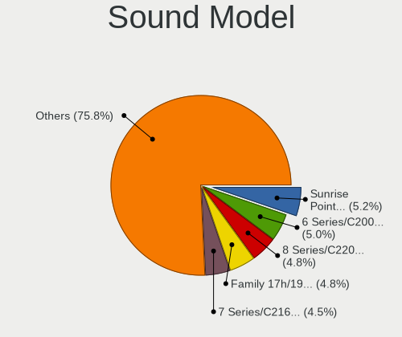
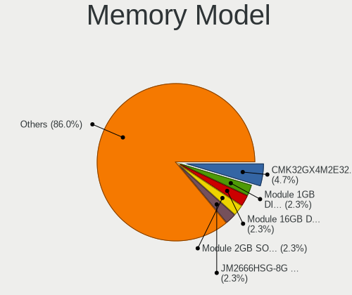

Zorin - Hardware Trends
-----------------------

A project to identify most popular hardware characteristics and track their change
over time based on data collected by Linux users at https://Linux-Hardware.org.

Anyone can contribute to this report by the [hw-probe](https://github.com/linuxhw/hw-probe) tool:

    sudo -E hw-probe -all -upload

This is a report for all computer types. See also reports for [desktops](/Dist/Zorin/Desktop/README.md) and [notebooks](/Dist/Zorin/Notebook/README.md).

This report is for one last month. Overall report since the beginning of time: [TestDays](https://github.com/linuxhw/TestDays)

Period: Jan, 2024.

Contents
--------

* [ System ](#system)
  - [ OS                       ](#os)
  - [ OS Family                ](#os-family)
  - [ Kernel                   ](#kernel)
  - [ Kernel Family            ](#kernel-family)
  - [ Kernel Major Ver.        ](#kernel-major-ver)
  - [ Arch                     ](#arch)
  - [ DE                       ](#de)
  - [ Display Server           ](#display-server)
  - [ Display Manager          ](#display-manager)
  - [ OS Lang                  ](#os-lang)
  - [ Boot Mode                ](#boot-mode)
  - [ Filesystem               ](#filesystem)
  - [ Part. scheme             ](#part-scheme)
  - [ Dual Boot with Linux/BSD ](#dual-boot-with-linuxbsd)
  - [ Dual Boot (Win)          ](#dual-boot-win)

* [ Board ](#board)
  - [ Vendor                   ](#vendor)
  - [ Model                    ](#model)
  - [ Model Family             ](#model-family)
  - [ MFG Year                 ](#mfg-year)
  - [ Form Factor              ](#form-factor)
  - [ Secure Boot              ](#secure-boot)
  - [ Coreboot                 ](#coreboot)
  - [ RAM Size                 ](#ram-size)
  - [ RAM Used                 ](#ram-used)
  - [ Total Drives             ](#total-drives)
  - [ Has CD-ROM               ](#has-cd-rom)
  - [ Has Ethernet             ](#has-ethernet)
  - [ Has WiFi                 ](#has-wifi)
  - [ Has Bluetooth            ](#has-bluetooth)

* [ Location ](#location)
  - [ Country                  ](#country)
  - [ City                     ](#city)

* [ Drives ](#drives)
  - [ Drive Vendor             ](#drive-vendor)
  - [ Drive Model              ](#drive-model)
  - [ HDD Vendor               ](#hdd-vendor)
  - [ SSD Vendor               ](#ssd-vendor)
  - [ Drive Kind               ](#drive-kind)
  - [ Drive Connector          ](#drive-connector)
  - [ Drive Size               ](#drive-size)
  - [ Space Total              ](#space-total)
  - [ Space Used               ](#space-used)
  - [ Malfunc. Drives          ](#malfunc-drives)
  - [ Malfunc. Drive Vendor    ](#malfunc-drive-vendor)
  - [ Malfunc. HDD Vendor      ](#malfunc-hdd-vendor)
  - [ Malfunc. Drive Kind      ](#malfunc-drive-kind)
  - [ Failed Drives            ](#failed-drives)
  - [ Failed Drive Vendor      ](#failed-drive-vendor)
  - [ Drive Status             ](#drive-status)

* [ Storage controller ](#storage-controller)
  - [ Storage Vendor           ](#storage-vendor)
  - [ Storage Model            ](#storage-model)
  - [ Storage Kind             ](#storage-kind)

* [ Processor ](#processor)
  - [ CPU Vendor               ](#cpu-vendor)
  - [ CPU Model                ](#cpu-model)
  - [ CPU Model Family         ](#cpu-model-family)
  - [ CPU Cores                ](#cpu-cores)
  - [ CPU Sockets              ](#cpu-sockets)
  - [ CPU Threads              ](#cpu-threads)
  - [ CPU Op-Modes             ](#cpu-op-modes)
  - [ CPU Microcode            ](#cpu-microcode)
  - [ CPU Microarch            ](#cpu-microarch)

* [ Graphics ](#graphics)
  - [ GPU Vendor               ](#gpu-vendor)
  - [ GPU Model                ](#gpu-model)
  - [ GPU Combo                ](#gpu-combo)
  - [ GPU Driver               ](#gpu-driver)
  - [ GPU Memory               ](#gpu-memory)

* [ Monitor ](#monitor)
  - [ Monitor Vendor           ](#monitor-vendor)
  - [ Monitor Model            ](#monitor-model)
  - [ Monitor Resolution       ](#monitor-resolution)
  - [ Monitor Diagonal         ](#monitor-diagonal)
  - [ Monitor Width            ](#monitor-width)
  - [ Aspect Ratio             ](#aspect-ratio)
  - [ Monitor Area             ](#monitor-area)
  - [ Pixel Density            ](#pixel-density)
  - [ Multiple Monitors        ](#multiple-monitors)

* [ Network ](#network)
  - [ Net Controller Vendor    ](#net-controller-vendor)
  - [ Net Controller Model     ](#net-controller-model)
  - [ Wireless Vendor          ](#wireless-vendor)
  - [ Wireless Model           ](#wireless-model)
  - [ Ethernet Vendor          ](#ethernet-vendor)
  - [ Ethernet Model           ](#ethernet-model)
  - [ Net Controller Kind      ](#net-controller-kind)
  - [ Used Controller          ](#used-controller)
  - [ NICs                     ](#nics)
  - [ IPv6                     ](#ipv6)

* [ Bluetooth ](#bluetooth)
  - [ Bluetooth Vendor         ](#bluetooth-vendor)
  - [ Bluetooth Model          ](#bluetooth-model)

* [ Sound ](#sound)
  - [ Sound Vendor             ](#sound-vendor)
  - [ Sound Model              ](#sound-model)

* [ Memory ](#memory)
  - [ Memory Vendor            ](#memory-vendor)
  - [ Memory Model             ](#memory-model)
  - [ Memory Kind              ](#memory-kind)
  - [ Memory Form Factor       ](#memory-form-factor)
  - [ Memory Size              ](#memory-size)
  - [ Memory Speed             ](#memory-speed)

* [ Printers & scanners ](#printers--scanners)
  - [ Printer Vendor           ](#printer-vendor)
  - [ Printer Model            ](#printer-model)
  - [ Scanner Vendor           ](#scanner-vendor)
  - [ Scanner Model            ](#scanner-model)

* [ Camera ](#camera)
  - [ Camera Vendor            ](#camera-vendor)
  - [ Camera Model             ](#camera-model)

* [ Security ](#security)
  - [ Fingerprint Vendor       ](#fingerprint-vendor)
  - [ Fingerprint Model        ](#fingerprint-model)
  - [ Chipcard Vendor          ](#chipcard-vendor)
  - [ Chipcard Model           ](#chipcard-model)

* [ Unsupported ](#unsupported)
  - [ Unsupported Devices      ](#unsupported-devices)
  - [ Unsupported Device Types ](#unsupported-device-types)

System
------

OS
--

Installed operating systems

| Name     | Computers | Percent |
|----------|-----------|---------|
| Zorin 17 | 217       | 66.77%  |
| Zorin 16 | 105       | 32.31%  |
| Zorin 15 | 3         | 0.92%   |

OS Family
---------

OS without a version

| Name  | Computers | Percent |
|-------|-----------|---------|
| Zorin | 325       | 100%    |

Kernel
------

Version of the Linux kernel

| Version               | Computers | Percent |
|-----------------------|-----------|---------|
| 6.5.0-14-generic      | 97        | 29.85%  |
| 6.2.0-39-generic      | 82        | 25.23%  |
| 5.15.0-91-generic     | 71        | 21.85%  |
| 6.5.0-15-generic      | 36        | 11.08%  |
| 5.15.0-92-generic     | 14        | 4.31%   |
| 5.15.0-78-generic     | 6         | 1.85%   |
| 5.15.0-89-generic     | 4         | 1.23%   |
| 5.4.0-150-generic     | 2         | 0.62%   |
| 5.15.0-86-generic     | 2         | 0.62%   |
| 5.15.0-56-generic     | 2         | 0.62%   |
| 6.6.13-060613-generic | 1         | 0.31%   |
| 6.6.11-surface-1      | 1         | 0.31%   |
| 6.0.9-060009-generic  | 1         | 0.31%   |
| 5.8.0-49-generic      | 1         | 0.31%   |
| 5.4.0-45-generic      | 1         | 0.31%   |
| 5.15.0-84-generic     | 1         | 0.31%   |
| 5.15.0-76-generic     | 1         | 0.31%   |
| 5.15.0-72-generic     | 1         | 0.31%   |
| 5.15.0-71-generic     | 1         | 0.31%   |

Kernel Family
-------------

Linux kernel without a distro release

| Version | Computers | Percent |
|---------|-----------|---------|
| 6.5.0   | 133       | 40.92%  |
| 5.15.0  | 103       | 31.69%  |
| 6.2.0   | 82        | 25.23%  |
| 5.4.0   | 3         | 0.92%   |
| 6.6.13  | 1         | 0.31%   |
| 6.6.11  | 1         | 0.31%   |
| 6.0.9   | 1         | 0.31%   |
| 5.8.0   | 1         | 0.31%   |

Kernel Major Ver.
-----------------

Linux kernel major version

| Version | Computers | Percent |
|---------|-----------|---------|
| 6.5     | 133       | 40.92%  |
| 5.15    | 103       | 31.69%  |
| 6.2     | 82        | 25.23%  |
| 5.4     | 3         | 0.92%   |
| 6.6     | 2         | 0.62%   |
| 6.0     | 1         | 0.31%   |
| 5.8     | 1         | 0.31%   |

Arch
----

OS architecture (x86_64, i586, etc.)

| Name   | Computers | Percent |
|--------|-----------|---------|
| x86_64 | 323       | 99.38%  |
| i686   | 2         | 0.62%   |

DE
--

Desktop Environment

| Name       | Computers | Percent |
|------------|-----------|---------|
| GNOME      | 289       | 88.92%  |
| XFCE       | 31        | 9.54%   |
| KDE5       | 3         | 0.92%   |
| X-Cinnamon | 1         | 0.31%   |
| Budgie     | 1         | 0.31%   |

Display Server
--------------

X11 or Wayland

| Name    | Computers | Percent |
|---------|-----------|---------|
| X11     | 169       | 52%     |
| Wayland | 154       | 47.38%  |
| Unknown | 2         | 0.62%   |

Display Manager
---------------

SDDM, LightDM, etc.

| Name    | Computers | Percent |
|---------|-----------|---------|
| Unknown | 272       | 83.69%  |
| GDM3    | 44        | 13.54%  |
| GDM     | 5         | 1.54%   |
| LightDM | 4         | 1.23%   |

OS Lang
-------

Language

| Lang        | Computers | Percent |
|-------------|-----------|---------|
| en_US       | 133       | 40.92%  |
| de_DE       | 33        | 10.15%  |
| en_GB       | 21        | 6.46%   |
| pt_BR       | 18        | 5.54%   |
| fr_FR       | 12        | 3.69%   |
| es_ES       | 12        | 3.69%   |
| it_IT       | 10        | 3.08%   |
| en_CA       | 10        | 3.08%   |
| en_IN       | 8         | 2.46%   |
| nl_NL       | 7         | 2.15%   |
| pt_PT       | 6         | 1.85%   |
| es_MX       | 6         | 1.85%   |
| pl_PL       | 5         | 1.54%   |
| hu_HU       | 5         | 1.54%   |
| en_AU       | 4         | 1.23%   |
| en_NZ       | 3         | 0.92%   |
| de_AT       | 3         | 0.92%   |
| tr_TR       | 2         | 0.62%   |
| ru_RU       | 2         | 0.62%   |
| ro_RO       | 2         | 0.62%   |
| es_AR       | 2         | 0.62%   |
| en_ZA       | 2         | 0.62%   |
| cs_CZ       | 2         | 0.62%   |
| sv_SE       | 1         | 0.31%   |
| sr_RS@latin | 1         | 0.31%   |
| sq_AL       | 1         | 0.31%   |
| nl_BE       | 1         | 0.31%   |
| fr_BE       | 1         | 0.31%   |
| es_VE       | 1         | 0.31%   |
| es_UY       | 1         | 0.31%   |
| es_PY       | 1         | 0.31%   |
| es_PE       | 1         | 0.31%   |
| es_CR       | 1         | 0.31%   |
| es_BO       | 1         | 0.31%   |
| en_SG       | 1         | 0.31%   |
| en_HK       | 1         | 0.31%   |
| de_IT       | 1         | 0.31%   |
| C           | 1         | 0.31%   |
| ar_SA       | 1         | 0.31%   |
| ar_EG       | 1         | 0.31%   |

Boot Mode
---------

EFI or BIOS

| Mode | Computers | Percent |
|------|-----------|---------|
| BIOS | 260       | 80%     |
| EFI  | 65        | 20%     |

Filesystem
----------

Type of filesystem

| Type    | Computers | Percent |
|---------|-----------|---------|
| Ext4    | 283       | 87.08%  |
| Tmpfs   | 30        | 9.23%   |
| Overlay | 4         | 1.23%   |
| Zfs     | 3         | 0.92%   |
| Btrfs   | 3         | 0.92%   |
| Ext3    | 1         | 0.31%   |
| Ext2    | 1         | 0.31%   |

Part. scheme
------------

Scheme of partitioning

| Type    | Computers | Percent |
|---------|-----------|---------|
| Unknown | 272       | 83.69%  |
| GPT     | 45        | 13.85%  |
| MBR     | 8         | 2.46%   |

Dual Boot with Linux/BSD
------------------------

Hosting more than one Linux/BSD

| Dual boot | Computers | Percent |
|-----------|-----------|---------|
| No        | 319       | 98.15%  |
| Yes       | 6         | 1.85%   |

Dual Boot (Win)
---------------

Hosting Linux and Windows

| Dual boot | Computers | Percent |
|-----------|-----------|---------|
| No        | 308       | 94.77%  |
| Yes       | 17        | 5.23%   |

Board
-----

Vendor
------

Motherboard manufacturer

| Name                | Computers | Percent |
|---------------------|-----------|---------|
| ASUSTek Computer    | 57        | 17.54%  |
| Hewlett-Packard     | 44        | 13.54%  |
| Lenovo              | 41        | 12.62%  |
| Dell                | 38        | 11.69%  |
| Acer                | 22        | 6.77%   |
| Gigabyte Technology | 15        | 4.62%   |
| MSI                 | 14        | 4.31%   |
| Apple               | 14        | 4.31%   |
| Toshiba             | 12        | 3.69%   |
| Intel               | 10        | 3.08%   |
| Sony                | 5         | 1.54%   |
| Samsung Electronics | 5         | 1.54%   |
| ASRock              | 5         | 1.54%   |
| Fujitsu             | 4         | 1.23%   |
| Microsoft           | 3         | 0.92%   |
| HUAWEI              | 3         | 0.92%   |
| Unknown             | 3         | 0.92%   |
| Shuttle             | 2         | 0.62%   |
| Medion              | 2         | 0.62%   |
| Google              | 2         | 0.62%   |
| AZW                 | 2         | 0.62%   |
| Alienware           | 2         | 0.62%   |
| Supermicro          | 1         | 0.31%   |
| SGIN                | 1         | 0.31%   |
| Semp Toshiba        | 1         | 0.31%   |
| Quanta              | 1         | 0.31%   |
| Panasonic           | 1         | 0.31%   |
| Packard Bell        | 1         | 0.31%   |
| MACHINIST           | 1         | 0.31%   |
| LTD Delovoy Office  | 1         | 0.31%   |
| iQual               | 1         | 0.31%   |
| Huanan              | 1         | 0.31%   |
| HONOR               | 1         | 0.31%   |
| GPD                 | 1         | 0.31%   |
| Gateway             | 1         | 0.31%   |
| Foxconn             | 1         | 0.31%   |
| ECS                 | 1         | 0.31%   |
| Compal              | 1         | 0.31%   |
| Colorful Technology | 1         | 0.31%   |
| Chuwi               | 1         | 0.31%   |

Model
-----

Motherboard model

| Name                         | Computers | Percent |
|------------------------------|-----------|---------|
| Unknown                      | 5         | 1.54%   |
| ASUS All Series              | 4         | 1.23%   |
| ASUS A0000001                | 3         | 0.92%   |
| MSI MS-7850                  | 2         | 0.62%   |
| HP Notebook                  | 2         | 0.62%   |
| HP Compaq 8000 Elite CMT PC  | 2         | 0.62%   |
| Gigabyte H110M-H             | 2         | 0.62%   |
| Dell OptiPlex 790            | 2         | 0.62%   |
| Dell OptiPlex 7050           | 2         | 0.62%   |
| Dell Latitude E5470          | 2         | 0.62%   |
| Dell Inspiron 1545           | 2         | 0.62%   |
| AZW SER                      | 2         | 0.62%   |
| ASUS ROG STRIX X570-E GAMING | 2         | 0.62%   |
| ASUS P5G41T-M LX             | 2         | 0.62%   |
| ASRock G31M-S                | 2         | 0.62%   |
| Apple Macmini3,1             | 2         | 0.62%   |
| Apple MacBookPro5,5          | 2         | 0.62%   |
| Apple MacBookPro14,1         | 2         | 0.62%   |
| Toshiba Satellite R630       | 1         | 0.31%   |
| Toshiba Satellite P200       | 1         | 0.31%   |
| Toshiba Satellite L845       | 1         | 0.31%   |
| Toshiba Satellite L750       | 1         | 0.31%   |
| Toshiba Satellite L640       | 1         | 0.31%   |
| Toshiba Satellite L55-C      | 1         | 0.31%   |
| Toshiba Satellite C850-B820  | 1         | 0.31%   |
| Toshiba Satellite C850       | 1         | 0.31%   |
| Toshiba Satellite C55D-B     | 1         | 0.31%   |
| Toshiba Satellite A665       | 1         | 0.31%   |
| Toshiba Satellite A350       | 1         | 0.31%   |
| Toshiba NB550D               | 1         | 0.31%   |
| Supermicro C2SBC-Q           | 1         | 0.31%   |
| Sony VPCEB3B4E               | 1         | 0.31%   |
| Sony VPCEB2JFX               | 1         | 0.31%   |
| Sony VJF153                  | 1         | 0.31%   |
| Sony VGN-NW11S_S             | 1         | 0.31%   |
| Sony VGN-NS11Z_S             | 1         | 0.31%   |
| Shuttle SZ87R                | 1         | 0.31%   |
| Shuttle SG31                 | 1         | 0.31%   |
| SGIN M15                     | 1         | 0.31%   |
| Semp Toshiba STI NI 1401     | 1         | 0.31%   |

Model Family
------------

Motherboard model prefix

| Name               | Computers | Percent |
|--------------------|-----------|---------|
| Acer Aspire        | 15        | 4.62%   |
| Lenovo ThinkPad    | 14        | 4.31%   |
| Dell Inspiron      | 13        | 4%      |
| Toshiba Satellite  | 11        | 3.38%   |
| Dell OptiPlex      | 10        | 3.08%   |
| ASUS ROG           | 10        | 3.08%   |
| Lenovo ThinkCentre | 9         | 2.77%   |
| Lenovo IdeaPad     | 9         | 2.77%   |
| Dell Latitude      | 9         | 2.77%   |
| ASUS PRIME         | 9         | 2.77%   |
| HP Pavilion        | 8         | 2.46%   |
| HP ZBook           | 5         | 1.54%   |
| HP Laptop          | 5         | 1.54%   |
| HP EliteBook       | 5         | 1.54%   |
| Unknown            | 5         | 1.54%   |
| HP Compaq          | 4         | 1.23%   |
| ASUS All           | 4         | 1.23%   |
| Microsoft Surface  | 3         | 0.92%   |
| ASUS Zenbook       | 3         | 0.92%   |
| ASUS A0000001      | 3         | 0.92%   |
| MSI MS-7850        | 2         | 0.62%   |
| Lenovo Legion      | 2         | 0.62%   |
| HP ProBook         | 2         | 0.62%   |
| HP Notebook        | 2         | 0.62%   |
| HP ENVY            | 2         | 0.62%   |
| HP EliteDesk       | 2         | 0.62%   |
| Gigabyte H110M-H   | 2         | 0.62%   |
| Fujitsu LIFEBOOK   | 2         | 0.62%   |
| Dell XPS           | 2         | 0.62%   |
| AZW SER            | 2         | 0.62%   |
| ASUS VivoBook      | 2         | 0.62%   |
| ASUS P5G41T-M      | 2         | 0.62%   |
| ASRock G31M-S      | 2         | 0.62%   |
| Apple Macmini3     | 2         | 0.62%   |
| Apple MacBookPro5  | 2         | 0.62%   |
| Apple MacBookPro14 | 2         | 0.62%   |
| Apple MacBookPro10 | 2         | 0.62%   |
| Acer Swift         | 2         | 0.62%   |
| Toshiba NB550D     | 1         | 0.31%   |
| Supermicro C2SBC-Q | 1         | 0.31%   |

MFG Year
--------

Motherboard manufacture year

| Year | Computers | Percent |
|------|-----------|---------|
| 2013 | 28        | 8.62%   |
| 2012 | 26        | 8%      |
| 2020 | 23        | 7.08%   |
| 2017 | 23        | 7.08%   |
| 2010 | 23        | 7.08%   |
| 2019 | 22        | 6.77%   |
| 2018 | 20        | 6.15%   |
| 2011 | 20        | 6.15%   |
| 2022 | 19        | 5.85%   |
| 2016 | 18        | 5.54%   |
| 2015 | 18        | 5.54%   |
| 2014 | 18        | 5.54%   |
| 2021 | 17        | 5.23%   |
| 2009 | 15        | 4.62%   |
| 2008 | 15        | 4.62%   |
| 2023 | 13        | 4%      |
| 2007 | 5         | 1.54%   |
| 2006 | 2         | 0.62%   |

Form Factor
-----------

Physical design of the computer

| Name        | Computers | Percent |
|-------------|-----------|---------|
| Notebook    | 166       | 51.08%  |
| Desktop     | 131       | 40.31%  |
| Mini pc     | 10        | 3.08%   |
| Tablet      | 6         | 1.85%   |
| Convertible | 6         | 1.85%   |
| All in one  | 6         | 1.85%   |

Secure Boot
-----------

Enabled or disabled

| State    | Computers | Percent |
|----------|-----------|---------|
| Disabled | 307       | 94.46%  |
| Enabled  | 18        | 5.54%   |

Coreboot
--------

Have coreboot on board

| Used | Computers | Percent |
|------|-----------|---------|
| No   | 323       | 99.38%  |
| Yes  | 2         | 0.62%   |

RAM Size
--------

Total RAM memory

| Size in GB      | Computers | Percent |
|-----------------|-----------|---------|
| 4.01-8.0        | 100       | 30.77%  |
| 16.01-24.0      | 59        | 18.15%  |
| 3.01-4.0        | 54        | 16.62%  |
| 8.01-16.0       | 54        | 16.62%  |
| 32.01-64.0      | 29        | 8.92%   |
| 64.01-256.0     | 12        | 3.69%   |
| 1.01-2.0        | 8         | 2.46%   |
| 24.01-32.0      | 6         | 1.85%   |
| 2.01-3.0        | 2         | 0.62%   |
| More than 256.0 | 1         | 0.31%   |

RAM Used
--------

Used RAM memory

| Used GB   | Computers | Percent |
|-----------|-----------|---------|
| 2.01-3.0  | 143       | 44%     |
| 1.01-2.0  | 69        | 21.23%  |
| 4.01-8.0  | 55        | 16.92%  |
| 3.01-4.0  | 46        | 14.15%  |
| 0.51-1.0  | 8         | 2.46%   |
| 8.01-16.0 | 4         | 1.23%   |

Total Drives
------------

Number of drives on board

| Drives | Computers | Percent |
|--------|-----------|---------|
| 1      | 199       | 61.23%  |
| 2      | 80        | 24.62%  |
| 3      | 24        | 7.38%   |
| 4      | 12        | 3.69%   |
| 5      | 4         | 1.23%   |
| 6      | 3         | 0.92%   |
| 8      | 2         | 0.62%   |
| 9      | 1         | 0.31%   |

Has CD-ROM
----------

Has CD-ROM on board

| Presented | Computers | Percent |
|-----------|-----------|---------|
| No        | 184       | 56.62%  |
| Yes       | 141       | 43.38%  |

Has Ethernet
------------

Has Ethernet on board

| Presented | Computers | Percent |
|-----------|-----------|---------|
| Yes       | 284       | 87.38%  |
| No        | 41        | 12.62%  |

Has WiFi
--------

Has WiFi module

| Presented | Computers | Percent |
|-----------|-----------|---------|
| Yes       | 255       | 78.46%  |
| No        | 70        | 21.54%  |

Has Bluetooth
-------------

Has Bluetooth module

| Presented | Computers | Percent |
|-----------|-----------|---------|
| Yes       | 205       | 63.08%  |
| No        | 120       | 36.92%  |

Location
--------

Country
-------

Geographic location (country)

| Country                | Computers | Percent |
|------------------------|-----------|---------|
| USA                    | 69        | 21.23%  |
| Germany                | 40        | 12.31%  |
| UK                     | 20        | 6.15%   |
| Brazil                 | 20        | 6.15%   |
| Netherlands            | 13        | 4%      |
| France                 | 12        | 3.69%   |
| Canada                 | 12        | 3.69%   |
| Spain                  | 11        | 3.38%   |
| Italy                  | 11        | 3.38%   |
| India                  | 8         | 2.46%   |
| Belgium                | 8         | 2.46%   |
| Portugal               | 7         | 2.15%   |
| Mexico                 | 7         | 2.15%   |
| Austria                | 6         | 1.85%   |
| Romania                | 5         | 1.54%   |
| Sweden                 | 4         | 1.23%   |
| Poland                 | 4         | 1.23%   |
| Indonesia              | 4         | 1.23%   |
| Egypt                  | 4         | 1.23%   |
| Australia              | 4         | 1.23%   |
| Saudi Arabia           | 3         | 0.92%   |
| Russia                 | 3         | 0.92%   |
| New Zealand            | 3         | 0.92%   |
| Jamaica                | 3         | 0.92%   |
| Hungary                | 3         | 0.92%   |
| Greece                 | 3         | 0.92%   |
| Turkey                 | 2         | 0.62%   |
| Thailand               | 2         | 0.62%   |
| Switzerland            | 2         | 0.62%   |
| South Africa           | 2         | 0.62%   |
| Peru                   | 2         | 0.62%   |
| Malaysia               | 2         | 0.62%   |
| Czechia                | 2         | 0.62%   |
| Bosnia and Herzegovina | 2         | 0.62%   |
| Argentina              | 2         | 0.62%   |
| Venezuela              | 1         | 0.31%   |
| Uruguay                | 1         | 0.31%   |
| Singapore              | 1         | 0.31%   |
| Serbia                 | 1         | 0.31%   |
| Qatar                  | 1         | 0.31%   |

City
----

Geographic location (city)

| City                      | Computers | Percent |
|---------------------------|-----------|---------|
| Vienna                    | 4         | 1.23%   |
| Lisbon                    | 4         | 1.23%   |
| Minneapolis               | 3         | 0.92%   |
| Madrid                    | 3         | 0.92%   |
| Calgary                   | 3         | 0.92%   |
| Berlin                    | 3         | 0.92%   |
| Wauwatosa                 | 2         | 0.62%   |
| Wakefield                 | 2         | 0.62%   |
| Thornton                  | 2         | 0.62%   |
| Sydney                    | 2         | 0.62%   |
| Stockton                  | 2         | 0.62%   |
| Sarajevo                  | 2         | 0.62%   |
| Sao Paulo                 | 2         | 0.62%   |
| Saint-Germain-les-Arpajon | 2         | 0.62%   |
| Rio Rancho                | 2         | 0.62%   |
| Richmond                  | 2         | 0.62%   |
| Paris                     | 2         | 0.62%   |
| Marshfield                | 2         | 0.62%   |
| Manaus                    | 2         | 0.62%   |
| Louisville                | 2         | 0.62%   |
| Lima                      | 2         | 0.62%   |
| Kingston                  | 2         | 0.62%   |
| Indianapolis              | 2         | 0.62%   |
| Glasgow                   | 2         | 0.62%   |
| Columbus                  | 2         | 0.62%   |
| Ciudad Obregón           | 2         | 0.62%   |
| Chennai                   | 2         | 0.62%   |
| Cairo                     | 2         | 0.62%   |
| Brussels                  | 2         | 0.62%   |
| Bangkok                   | 2         | 0.62%   |
| Baia Mare                 | 2         | 0.62%   |
| Atlanta                   | 2         | 0.62%   |
| Athens                    | 2         | 0.62%   |
| Amsterdam                 | 2         | 0.62%   |
| Adelaide                  | 2         | 0.62%   |
| Zurich                    | 1         | 0.31%   |
| Zuid-Scharwoude           | 1         | 0.31%   |
| Würzburg                 | 1         | 0.31%   |
| Wuppertal                 | 1         | 0.31%   |
| Wunstorf                  | 1         | 0.31%   |

Drives
------

Drive Vendor
------------

Hard drive vendors

| Vendor                       | Computers | Drives | Percent |
|------------------------------|-----------|--------|---------|
| Samsung Electronics          | 77        | 93     | 16.14%  |
| WDC                          | 61        | 69     | 12.79%  |
| Seagate                      | 59        | 67     | 12.37%  |
| Kingston                     | 33        | 37     | 6.92%   |
| Sandisk                      | 28        | 39     | 5.87%   |
| Toshiba                      | 26        | 26     | 5.45%   |
| Crucial                      | 17        | 18     | 3.56%   |
| Unknown                      | 16        | 18     | 3.35%   |
| SK hynix                     | 16        | 16     | 3.35%   |
| Hitachi                      | 11        | 11     | 2.31%   |
| China                        | 9         | 9      | 1.89%   |
| Micron/Crucial Technology    | 8         | 9      | 1.68%   |
| HGST                         | 8         | 8      | 1.68%   |
| Silicon Motion               | 6         | 6      | 1.26%   |
| Kingston Technology Company  | 6         | 6      | 1.26%   |
| Intenso                      | 6         | 6      | 1.26%   |
| Phison Electronics           | 5         | 6      | 1.05%   |
| Micron Technology            | 5         | 5      | 1.05%   |
| Intel                        | 5         | 7      | 1.05%   |
| Transcend                    | 4         | 5      | 0.84%   |
| PNY                          | 4         | 4      | 0.84%   |
| Apple                        | 4         | 6      | 0.84%   |
| A-DATA Technology            | 4         | 4      | 0.84%   |
| Netac                        | 3         | 3      | 0.63%   |
| MAXIO Technology (Hangzhou)  | 3         | 3      | 0.63%   |
| LITEONIT                     | 3         | 3      | 0.63%   |
| ADATA Technology             | 3         | 3      | 0.63%   |
| Lexar                        | 2         | 2      | 0.42%   |
| Gigabyte Technology          | 2         | 2      | 0.42%   |
| Fanxiang                     | 2         | 2      | 0.42%   |
| X12                          | 1         | 1      | 0.21%   |
| Verbatim                     | 1         | 2      | 0.21%   |
| USB30                        | 1         | 1      | 0.21%   |
| UMIS                         | 1         | 1      | 0.21%   |
| Timetec                      | 1         | 1      | 0.21%   |
| TEAM T25                     | 1         | 1      | 0.21%   |
| Team                         | 1         | 1      | 0.21%   |
| T-FORCE                      | 1         | 1      | 0.21%   |
| SPCC                         | 1         | 1      | 0.21%   |
| Shenzhen Longsys Electronics | 1         | 1      | 0.21%   |

Drive Model
-----------

Hard drive models

| Model                                                 | Computers | Percent |
|-------------------------------------------------------|-----------|---------|
| Kingston SA400S37240G 240GB SSD                       | 10        | 1.94%   |
| Samsung NVMe SSD Controller SM981/PM981/PM983 1TB     | 9         | 1.75%   |
| Unknown MMC Card  64GB                                | 7         | 1.36%   |
| Micron/Crucial P2 NVMe PCIe SSD 1TB                   | 7         | 1.36%   |
| Samsung SSD 860 EVO 500GB                             | 6         | 1.17%   |
| Silicon Motion SM2263EN/SM2263XT SSD Controller 128GB | 5         | 0.97%   |
| Seagate ST500DM002-1BD142 500GB                       | 4         | 0.78%   |
| Seagate ST1000LM035-1RK172 1TB                        | 4         | 0.78%   |
| Seagate ST1000DM010-2EP102 1TB                        | 4         | 0.78%   |
| Kingston SV300S37A240G 240GB SSD                      | 4         | 0.78%   |
| Kingston SA400S37120G 120GB SSD                       | 4         | 0.78%   |
| WDC WD10JPVX-22JC3T0 1TB                              | 3         | 0.58%   |
| Unknown MMC Card  32GB                                | 3         | 0.58%   |
| Toshiba MQ01ABD100 1TB                                | 3         | 0.58%   |
| SK hynix BC511 256GB                                  | 3         | 0.58%   |
| Samsung SSD 870 EVO 500GB                             | 3         | 0.58%   |
| Samsung SSD 860 EVO 250GB                             | 3         | 0.58%   |
| Samsung SSD 850 EVO 500GB                             | 3         | 0.58%   |
| Samsung SSD 840 Series 120GB                          | 3         | 0.58%   |
| Samsung NVMe SSD Controller SM961/PM961/SM963 256GB   | 3         | 0.58%   |
| Samsung NVMe SSD Controller PM9A1/PM9A3/980PRO 2TB    | 3         | 0.58%   |
| Kingston SNVS1000G 1TB                                | 3         | 0.58%   |
| WDC WDS500G2B0A-00SM50 500GB SSD                      | 2         | 0.39%   |
| WDC WDBNCE5000PNC 500GB SSD                           | 2         | 0.39%   |
| WDC WD20EARX-00PASB0 2TB                              | 2         | 0.39%   |
| WDC WD1003FZEX-00MK2A0 1TB                            | 2         | 0.39%   |
| Toshiba MQ04ABF100 1TB                                | 2         | 0.39%   |
| Toshiba MQ01ABF050 500GB                              | 2         | 0.39%   |
| Toshiba HDWD110 1TB                                   | 2         | 0.39%   |
| Toshiba DT01ACA200 2TB                                | 2         | 0.39%   |
| Toshiba DT01ACA100 1TB                                | 2         | 0.39%   |
| SK hynix BC501 NVMe Solid State Drive 512GB           | 2         | 0.39%   |
| Seagate ST980811AS 80GB                               | 2         | 0.39%   |
| Seagate ST9500325AS 500GB                             | 2         | 0.39%   |
| Seagate ST500LT012-1DG142 500GB                       | 2         | 0.39%   |
| Seagate ST500LM021-1KJ152 500GB                       | 2         | 0.39%   |
| Seagate ST500LM012 HN-M500MBB 500GB                   | 2         | 0.39%   |
| Seagate ST4000DM004-2CV104 4TB                        | 2         | 0.39%   |
| Seagate ST3500312CS 500GB                             | 2         | 0.39%   |
| Seagate ST31000524AS 1TB                              | 2         | 0.39%   |

HDD Vendor
----------

Hard disk drive vendors

| Vendor              | Computers | Drives | Percent |
|---------------------|-----------|--------|---------|
| Seagate             | 57        | 64     | 36.77%  |
| WDC                 | 48        | 55     | 30.97%  |
| Toshiba             | 22        | 22     | 14.19%  |
| Hitachi             | 11        | 11     | 7.1%    |
| HGST                | 8         | 8      | 5.16%   |
| Samsung Electronics | 5         | 5      | 3.23%   |
| Unknown             | 1         | 1      | 0.65%   |
| JMicron Technology  | 1         | 1      | 0.65%   |
| Intenso             | 1         | 1      | 0.65%   |
| External            | 1         | 1      | 0.65%   |

SSD Vendor
----------

Solid state drive vendors

| Vendor              | Computers | Drives | Percent |
|---------------------|-----------|--------|---------|
| Samsung Electronics | 47        | 55     | 26.11%  |
| Kingston            | 26        | 29     | 14.44%  |
| Crucial             | 17        | 18     | 9.44%   |
| SanDisk             | 14        | 16     | 7.78%   |
| WDC                 | 9         | 10     | 5%      |
| China               | 9         | 9      | 5%      |
| SK hynix            | 5         | 5      | 2.78%   |
| Transcend           | 4         | 5      | 2.22%   |
| PNY                 | 4         | 4      | 2.22%   |
| A-DATA Technology   | 4         | 4      | 2.22%   |
| LITEONIT            | 3         | 3      | 1.67%   |
| Toshiba             | 2         | 2      | 1.11%   |
| Micron Technology   | 2         | 2      | 1.11%   |
| Lexar               | 2         | 2      | 1.11%   |
| Intenso             | 2         | 2      | 1.11%   |
| Gigabyte Technology | 2         | 2      | 1.11%   |
| Apple               | 2         | 2      | 1.11%   |
| X12                 | 1         | 1      | 0.56%   |
| Verbatim            | 1         | 2      | 0.56%   |
| USB30               | 1         | 1      | 0.56%   |
| Timetec             | 1         | 1      | 0.56%   |
| TEAM T25            | 1         | 1      | 0.56%   |
| Team                | 1         | 1      | 0.56%   |
| SPCC                | 1         | 1      | 0.56%   |
| Seagate             | 1         | 2      | 0.56%   |
| SABRENT             | 1         | 1      | 0.56%   |
| S3+                 | 1         | 1      | 0.56%   |
| ROG                 | 1         | 1      | 0.56%   |
| Phison              | 1         | 1      | 0.56%   |
| Patriot             | 1         | 1      | 0.56%   |
| OWC                 | 1         | 1      | 0.56%   |
| NT-512              | 1         | 1      | 0.56%   |
| Netac               | 1         | 1      | 0.56%   |
| Mushkin             | 1         | 1      | 0.56%   |
| MOVESPEED           | 1         | 1      | 0.56%   |
| Min Yi U            | 1         | 1      | 0.56%   |
| KingSpec            | 1         | 1      | 0.56%   |
| Intel               | 1         | 1      | 0.56%   |
| GOODRAM             | 1         | 2      | 0.56%   |
| Emtec               | 1         | 1      | 0.56%   |

Drive Kind
----------

HDD or SSD

| Kind    | Computers | Drives | Percent |
|---------|-----------|--------|---------|
| SSD     | 160       | 199    | 37.47%  |
| HDD     | 137       | 169    | 32.08%  |
| NVMe    | 100       | 136    | 23.42%  |
| Unknown | 17        | 19     | 3.98%   |
| MMC     | 13        | 13     | 3.04%   |

Drive Connector
---------------

SATA, SAS, NVMe, etc.

| Type | Computers | Drives | Percent |
|------|-----------|--------|---------|
| SATA | 251       | 364    | 65.36%  |
| NVMe | 100       | 136    | 26.04%  |
| SAS  | 20        | 23     | 5.21%   |
| MMC  | 13        | 13     | 3.39%   |

Drive Size
----------

Size of hard drive

| Size in TB | Computers | Drives | Percent |
|------------|-----------|--------|---------|
| 0.01-0.5   | 184       | 226    | 60.93%  |
| 0.51-1.0   | 79        | 94     | 26.16%  |
| 1.01-2.0   | 21        | 26     | 6.95%   |
| 3.01-4.0   | 7         | 10     | 2.32%   |
| 2.01-3.0   | 5         | 5      | 1.66%   |
| 4.01-10.0  | 5         | 6      | 1.66%   |
| 10.01-20.0 | 1         | 1      | 0.33%   |

Space Total
-----------

Amount of disk space available on the file system

| Size in GB     | Computers | Percent |
|----------------|-----------|---------|
| 101-250        | 106       | 32.62%  |
| 251-500        | 71        | 21.85%  |
| 501-1000       | 51        | 15.69%  |
| 51-100         | 31        | 9.54%   |
| 1001-2000      | 28        | 8.62%   |
| More than 3000 | 18        | 5.54%   |
| 21-50          | 10        | 3.08%   |
| 1-20           | 4         | 1.23%   |
| 2001-3000      | 3         | 0.92%   |
| Unknown        | 3         | 0.92%   |

Space Used
----------

Amount of used disk space

| Used GB        | Computers | Percent |
|----------------|-----------|---------|
| 21-50          | 104       | 32%     |
| 1-20           | 93        | 28.62%  |
| 51-100         | 40        | 12.31%  |
| 101-250        | 32        | 9.85%   |
| 251-500        | 24        | 7.38%   |
| 501-1000       | 14        | 4.31%   |
| 2001-3000      | 6         | 1.85%   |
| 1001-2000      | 5         | 1.54%   |
| More than 3000 | 4         | 1.23%   |
| Unknown        | 3         | 0.92%   |

Malfunc. Drives
---------------

Drive models with a malfunction

| Model                                 | Computers | Drives | Percent |
|---------------------------------------|-----------|--------|---------|
| WDC WD10JPVX-60JC3T0 1TB              | 1         | 1      | 20%     |
| Samsung Electronics SSD 870 EVO 500GB | 1         | 1      | 20%     |
| Hitachi HTS723232L9A360 320GB         | 1         | 1      | 20%     |
| Hitachi HTS541616J9SA00 160GB         | 1         | 1      | 20%     |
| HGST HTS721010A9E630 1TB              | 1         | 1      | 20%     |

Malfunc. Drive Vendor
---------------------

Vendors of faulty drives

| Vendor              | Computers | Drives | Percent |
|---------------------|-----------|--------|---------|
| Hitachi             | 2         | 2      | 40%     |
| WDC                 | 1         | 1      | 20%     |
| Samsung Electronics | 1         | 1      | 20%     |
| HGST                | 1         | 1      | 20%     |

Malfunc. HDD Vendor
-------------------

Vendors of faulty HDD drives

| Vendor  | Computers | Drives | Percent |
|---------|-----------|--------|---------|
| Hitachi | 2         | 2      | 50%     |
| WDC     | 1         | 1      | 25%     |
| HGST    | 1         | 1      | 25%     |

Malfunc. Drive Kind
-------------------

Kinds of faulty drives

| Kind | Computers | Drives | Percent |
|------|-----------|--------|---------|
| HDD  | 4         | 4      | 80%     |
| SSD  | 1         | 1      | 20%     |

Failed Drives
-------------

Failed drive models

Zero info for selected period =(

Failed Drive Vendor
-------------------

Failed drive vendors

Zero info for selected period =(

Drive Status
------------

Number of failed and malfunc. drives

| Status   | Computers | Drives | Percent |
|----------|-----------|--------|---------|
| Detected | 304       | 501    | 91.84%  |
| Works    | 22        | 30     | 6.65%   |
| Malfunc  | 5         | 5      | 1.51%   |

Storage controller
------------------

Storage Vendor
--------------

Storage controller vendors

| Vendor                        | Computers | Percent |
|-------------------------------|-----------|---------|
| Intel                         | 239       | 56.24%  |
| AMD                           | 46        | 10.82%  |
| Samsung Electronics           | 31        | 7.29%   |
| SanDisk                       | 18        | 4.24%   |
| SK hynix                      | 11        | 2.59%   |
| Kingston Technology Company   | 11        | 2.59%   |
| Micron/Crucial Technology     | 8         | 1.88%   |
| Silicon Motion                | 7         | 1.65%   |
| Marvell Technology Group      | 7         | 1.65%   |
| ASMedia Technology            | 7         | 1.65%   |
| Nvidia                        | 6         | 1.41%   |
| Phison Electronics            | 5         | 1.18%   |
| JMicron Technology            | 5         | 1.18%   |
| Micron Technology             | 3         | 0.71%   |
| MAXIO Technology (Hangzhou)   | 3         | 0.71%   |
| ADATA Technology              | 3         | 0.71%   |
| Netac Technology              | 2         | 0.47%   |
| KIOXIA                        | 2         | 0.47%   |
| Integrated Technology Express | 2         | 0.47%   |
| Apple                         | 2         | 0.47%   |
| Union Memory (Shenzhen)       | 1         | 0.24%   |
| Toshiba America Info Systems  | 1         | 0.24%   |
| Shenzhen Longsys Electronics  | 1         | 0.24%   |
| Seagate Technology            | 1         | 0.24%   |
| Realtek Semiconductor         | 1         | 0.24%   |
| Adaptec                       | 1         | 0.24%   |
| Unknown                       | 1         | 0.24%   |

Storage Model
-------------

Storage controller models

| Model                                                                          | Computers | Percent |
|--------------------------------------------------------------------------------|-----------|---------|
| AMD FCH SATA Controller [AHCI mode]                                            | 32        | 6.69%   |
| Intel 8 Series/C220 Series Chipset Family 6-port SATA Controller 1 [AHCI mode] | 20        | 4.18%   |
| Intel Sunrise Point-LP SATA Controller [AHCI mode]                             | 17        | 3.56%   |
| Intel 7 Series Chipset Family 6-port SATA Controller [AHCI mode]               | 17        | 3.56%   |
| Samsung NVMe SSD Controller SM981/PM981/PM983                                  | 13        | 2.72%   |
| Intel Q170/Q150/B150/H170/H110/Z170/CM236 Chipset SATA Controller [AHCI Mode]  | 13        | 2.72%   |
| Intel 82801 Mobile SATA Controller [RAID mode]                                 | 13        | 2.72%   |
| Intel 6 Series/C200 Series Chipset Family 6 port Desktop SATA AHCI Controller  | 12        | 2.51%   |
| Intel 6 Series/C200 Series Chipset Family 6 port Mobile SATA AHCI Controller   | 11        | 2.3%    |
| Intel 82801IBM/IEM (ICH9M/ICH9M-E) 4 port SATA Controller [AHCI mode]          | 10        | 2.09%   |
| Intel NM10/ICH7 Family SATA Controller [IDE mode]                              | 8         | 1.67%   |
| Intel 82801G (ICH7 Family) IDE Controller                                      | 8         | 1.67%   |
| Intel 8 Series SATA Controller 1 [AHCI mode]                                   | 8         | 1.67%   |
| Intel 5 Series/3400 Series Chipset 4 port SATA AHCI Controller                 | 8         | 1.67%   |
| Micron/Crucial P2 [Nick P2] / P3 / P3 Plus NVMe PCIe SSD (DRAM-less)           | 7         | 1.46%   |
| Intel Volume Management Device NVMe RAID Controller                            | 7         | 1.46%   |
| Intel Comet Lake SATA AHCI Controller                                          | 7         | 1.46%   |
| Intel Celeron/Pentium Silver Processor SATA Controller                         | 7         | 1.46%   |
| ASMedia ASM1061/ASM1062 Serial ATA Controller                                  | 7         | 1.46%   |
| Silicon Motion SM2263EN/SM2263XT (DRAM-less) NVMe SSD Controllers              | 6         | 1.26%   |
| Intel Alder Lake-S PCH SATA Controller [AHCI Mode]                             | 6         | 1.26%   |
| Intel 5 Series/3400 Series Chipset 6 port SATA AHCI Controller                 | 6         | 1.26%   |
| Intel 200 Series PCH SATA controller [AHCI mode]                               | 6         | 1.26%   |
| AMD SB7x0/SB8x0/SB9x0 SATA Controller [AHCI mode]                              | 6         | 1.26%   |
| AMD SB7x0/SB8x0/SB9x0 IDE Controller                                           | 6         | 1.26%   |
| Intel Wildcat Point-LP SATA Controller [AHCI Mode]                             | 5         | 1.05%   |
| AMD 400 Series Chipset SATA Controller                                         | 5         | 1.05%   |
| SK hynix Gold P31/BC711/PC711 NVMe Solid State Drive                           | 4         | 0.84%   |
| SanDisk WD Black SN770 / PC SN740 256GB / PC SN560 (DRAM-less) NVMe SSD        | 4         | 0.84%   |
| SanDisk Extreme Pro / WD Black SN750 / PC SN730 / Red SN700 NVMe SSD           | 4         | 0.84%   |
| Samsung NVMe SSD Controller PM9A1/PM9A3/980PRO                                 | 4         | 0.84%   |
| Nvidia MCP79 AHCI Controller                                                   | 4         | 0.84%   |
| Intel SATA Controller [RAID mode]                                              | 4         | 0.84%   |
| Intel Celeron N3350/Pentium N4200/Atom E3900 Series SATA AHCI Controller       | 4         | 0.84%   |
| Intel Cannon Lake PCH SATA AHCI Controller                                     | 4         | 0.84%   |
| Intel Atom Processor E3800 Series SATA AHCI Controller                         | 4         | 0.84%   |
| Intel 7 Series/C210 Series Chipset Family 6-port SATA Controller [AHCI mode]   | 4         | 0.84%   |
| AMD FCH SATA Controller D                                                      | 4         | 0.84%   |
| SK hynix BC511 NVMe SSD                                                        | 3         | 0.63%   |
| SanDisk Ultra 3D / WD Blue SN570 NVMe SSD (DRAM-less)                          | 3         | 0.63%   |

Storage Kind
------------

Kind of storage controller (IDE, SATA, NVMe, SAS, ...)

| Kind | Computers | Percent |
|------|-----------|---------|
| SATA | 246       | 59.71%  |
| NVMe | 100       | 24.27%  |
| IDE  | 36        | 8.74%   |
| RAID | 30        | 7.28%   |

Processor
---------

CPU Vendor
----------

Processor vendors

| Vendor | Computers | Percent |
|--------|-----------|---------|
| Intel  | 263       | 80.92%  |
| AMD    | 62        | 19.08%  |

CPU Model
---------

Processor models

| Model                                | Computers | Percent |
|--------------------------------------|-----------|---------|
| Intel Core i5-4460 CPU @ 3.20GHz     | 5         | 1.54%   |
| Intel Core i5-6300U CPU @ 2.40GHz    | 4         | 1.23%   |
| Intel Core i5-3210M CPU @ 2.50GHz    | 4         | 1.23%   |
| Intel Core i5-2520M CPU @ 2.50GHz    | 4         | 1.23%   |
| Intel Core i3-6006U CPU @ 2.00GHz    | 4         | 1.23%   |
| Intel Core i3-2120 CPU @ 3.30GHz     | 4         | 1.23%   |
| Intel Core 2 Duo CPU P7550 @ 2.26GHz | 4         | 1.23%   |
| Intel Core i7-4790K CPU @ 4.00GHz    | 3         | 0.92%   |
| Intel Core i7-1065G7 CPU @ 1.30GHz   | 3         | 0.92%   |
| Intel Core i5-8265U CPU @ 1.60GHz    | 3         | 0.92%   |
| Intel Core i5-7400 CPU @ 3.00GHz     | 3         | 0.92%   |
| Intel Core i5-7200U CPU @ 2.50GHz    | 3         | 0.92%   |
| Intel Core i5-6200U CPU @ 2.30GHz    | 3         | 0.92%   |
| Intel Core i5-3320M CPU @ 2.60GHz    | 3         | 0.92%   |
| Intel Core i5-2400 CPU @ 3.10GHz     | 3         | 0.92%   |
| Intel Core i5 CPU M 460 @ 2.53GHz    | 3         | 0.92%   |
| Intel Core i3-10110U CPU @ 2.10GHz   | 3         | 0.92%   |
| Intel Celeron N4000 CPU @ 1.10GHz    | 3         | 0.92%   |
| Intel Core i7-6700K CPU @ 4.00GHz    | 2         | 0.62%   |
| Intel Core i7-5500U CPU @ 2.40GHz    | 2         | 0.62%   |
| Intel Core i7-4650U CPU @ 1.70GHz    | 2         | 0.62%   |
| Intel Core i7-4500U CPU @ 1.80GHz    | 2         | 0.62%   |
| Intel Core i7-3770 CPU @ 3.40GHz     | 2         | 0.62%   |
| Intel Core i7-3630QM CPU @ 2.40GHz   | 2         | 0.62%   |
| Intel Core i7-2760QM CPU @ 2.40GHz   | 2         | 0.62%   |
| Intel Core i7-10700K CPU @ 3.80GHz   | 2         | 0.62%   |
| Intel Core i5-8350U CPU @ 1.70GHz    | 2         | 0.62%   |
| Intel Core i5-7500 CPU @ 3.40GHz     | 2         | 0.62%   |
| Intel Core i5-7360U CPU @ 2.30GHz    | 2         | 0.62%   |
| Intel Core i5-6500T CPU @ 2.50GHz    | 2         | 0.62%   |
| Intel Core i5-5300U CPU @ 2.30GHz    | 2         | 0.62%   |
| Intel Core i5-5200U CPU @ 2.20GHz    | 2         | 0.62%   |
| Intel Core i5-3437U CPU @ 1.90GHz    | 2         | 0.62%   |
| Intel Core i5-3230M CPU @ 2.60GHz    | 2         | 0.62%   |
| Intel Core i5 CPU M 520 @ 2.40GHz    | 2         | 0.62%   |
| Intel Core i5 CPU 750 @ 2.67GHz      | 2         | 0.62%   |
| Intel Core i3-6100U CPU @ 2.30GHz    | 2         | 0.62%   |
| Intel Core i3-4160 CPU @ 3.60GHz     | 2         | 0.62%   |
| Intel Core i3 CPU M 350 @ 2.27GHz    | 2         | 0.62%   |
| Intel Core i3 CPU 550 @ 3.20GHz      | 2         | 0.62%   |

CPU Model Family
----------------

Processor model prefix

| Model                                | Computers | Percent |
|--------------------------------------|-----------|---------|
| Intel Core i5                        | 84        | 25.85%  |
| Intel Core i7                        | 54        | 16.62%  |
| Intel Core i3                        | 32        | 9.85%   |
| Other                                | 24        | 7.38%   |
| Intel Celeron                        | 20        | 6.15%   |
| Intel Core 2 Duo                     | 17        | 5.23%   |
| AMD Ryzen 5                          | 17        | 5.23%   |
| AMD Ryzen 7                          | 10        | 3.08%   |
| Intel Pentium                        | 7         | 2.15%   |
| Intel Xeon                           | 6         | 1.85%   |
| Intel Core 2 Quad                    | 6         | 1.85%   |
| AMD A8                               | 5         | 1.54%   |
| AMD Ryzen 9                          | 4         | 1.23%   |
| AMD FX                               | 4         | 1.23%   |
| Intel Pentium Dual-Core              | 3         | 0.92%   |
| Intel Pentium Dual                   | 3         | 0.92%   |
| Intel Genuine                        | 2         | 0.62%   |
| Intel Core i9                        | 2         | 0.62%   |
| AMD Ryzen Threadripper               | 2         | 0.62%   |
| AMD Ryzen 3                          | 2         | 0.62%   |
| AMD E2                               | 2         | 0.62%   |
| AMD Athlon II                        | 2         | 0.62%   |
| AMD A6                               | 2         | 0.62%   |
| AMD A12                              | 2         | 0.62%   |
| Intel Core m5                        | 1         | 0.31%   |
| Intel Core m3                        | 1         | 0.31%   |
| Intel Core 2                         | 1         | 0.31%   |
| Intel Celeron M                      | 1         | 0.31%   |
| AMD Turion X2 Ultra Dual-Core Mobile | 1         | 0.31%   |
| AMD Turion X2 Dual-Core Mobile       | 1         | 0.31%   |
| AMD Ryzen Embedded                   | 1         | 0.31%   |
| AMD Ryzen 5 PRO                      | 1         | 0.31%   |
| AMD Phenom II X4                     | 1         | 0.31%   |
| AMD C-60                             | 1         | 0.31%   |
| AMD Athlon                           | 1         | 0.31%   |
| AMD A4                               | 1         | 0.31%   |
| AMD A10                              | 1         | 0.31%   |

CPU Cores
---------

Number of processor cores

| Number | Computers | Percent |
|--------|-----------|---------|
| 2      | 150       | 46.15%  |
| 4      | 103       | 31.69%  |
| 6      | 24        | 7.38%   |
| 8      | 19        | 5.85%   |
| 1      | 7         | 2.15%   |
| 12     | 6         | 1.85%   |
| 10     | 6         | 1.85%   |
| 16     | 3         | 0.92%   |
| 14     | 3         | 0.92%   |
| 3      | 2         | 0.62%   |
| 32     | 1         | 0.31%   |
| 24     | 1         | 0.31%   |

CPU Sockets
-----------

Number of sockets

| Number | Computers | Percent |
|--------|-----------|---------|
| 1      | 325       | 100%    |

CPU Threads
-----------

Threads per core (Hyper-Threading)

| Number | Computers | Percent |
|--------|-----------|---------|
| 2      | 215       | 66.15%  |
| 1      | 110       | 33.85%  |

CPU Op-Modes
------------

CPU Operation Modes (32-bit, 64-bit)

| Op mode        | Computers | Percent |
|----------------|-----------|---------|
| 32-bit, 64-bit | 323       | 99.38%  |
| 32-bit         | 2         | 0.62%   |

CPU Microcode
-------------

Microcode number

| Number     | Computers | Percent |
|------------|-----------|---------|
| Unknown    | 222       | 68.31%  |
| 0x306a9    | 13        | 4%      |
| 0x206a7    | 10        | 3.08%   |
| 0x1067a    | 8         | 2.46%   |
| 0x306c3    | 6         | 1.85%   |
| 0x6fd      | 4         | 1.23%   |
| 0x20655    | 4         | 1.23%   |
| 0x906e9    | 3         | 0.92%   |
| 0x806c1    | 3         | 0.92%   |
| 0x506e3    | 3         | 0.92%   |
| 0x506c9    | 3         | 0.92%   |
| 0x406e3    | 3         | 0.92%   |
| 0xa0655    | 2         | 0.62%   |
| 0x806ec    | 2         | 0.62%   |
| 0x806e9    | 2         | 0.62%   |
| 0x40651    | 2         | 0.62%   |
| 0x0a601203 | 2         | 0.62%   |
| 0x0a50000d | 2         | 0.62%   |
| 0x08600106 | 2         | 0.62%   |
| 0x08108109 | 2         | 0.62%   |
| 0xb0671    | 1         | 0.31%   |
| 0xa0671    | 1         | 0.31%   |
| 0x906ea    | 1         | 0.31%   |
| 0x906a3    | 1         | 0.31%   |
| 0x806eb    | 1         | 0.31%   |
| 0x706a1    | 1         | 0.31%   |
| 0x6f6      | 1         | 0.31%   |
| 0x6ec      | 1         | 0.31%   |
| 0x6e8      | 1         | 0.31%   |
| 0x406c4    | 1         | 0.31%   |
| 0x306f2    | 1         | 0.31%   |
| 0x30678    | 1         | 0.31%   |
| 0x20652    | 1         | 0.31%   |
| 0x10661    | 1         | 0.31%   |
| 0x0a50000c | 1         | 0.31%   |
| 0x08a00008 | 1         | 0.31%   |
| 0x08608103 | 1         | 0.31%   |
| 0x08108102 | 1         | 0.31%   |
| 0x08101016 | 1         | 0.31%   |
| 0x0800820d | 1         | 0.31%   |

CPU Microarch
-------------

Microarchitecture

| Name             | Computers | Percent |
|------------------|-----------|---------|
| KabyLake         | 36        | 11.08%  |
| Haswell          | 35        | 10.77%  |
| IvyBridge        | 28        | 8.62%   |
| SandyBridge      | 27        | 8.31%   |
| Skylake          | 26        | 8%      |
| Penryn           | 24        | 7.38%   |
| Unknown          | 20        | 6.15%   |
| Zen 3            | 13        | 4%      |
| Westmere         | 13        | 4%      |
| Core             | 10        | 3.08%   |
| Zen 2            | 9         | 2.77%   |
| Goldmont plus    | 8         | 2.46%   |
| Broadwell        | 8         | 2.46%   |
| Zen+             | 7         | 2.15%   |
| Piledriver       | 7         | 2.15%   |
| Excavator        | 7         | 2.15%   |
| CometLake        | 7         | 2.15%   |
| TigerLake        | 5         | 1.54%   |
| Silvermont       | 5         | 1.54%   |
| IceLake          | 5         | 1.54%   |
| Goldmont         | 4         | 1.23%   |
| Zen              | 3         | 0.92%   |
| Nehalem          | 3         | 0.92%   |
| K10              | 3         | 0.92%   |
| Alderlake Hybrid | 3         | 0.92%   |
| Puma             | 2         | 0.62%   |
| P6               | 2         | 0.62%   |
| K8 & K10 hybrid  | 2         | 0.62%   |
| Steamroller      | 1         | 0.31%   |
| Bulldozer        | 1         | 0.31%   |
| Bobcat           | 1         | 0.31%   |

Graphics
--------

GPU Vendor
----------

Vendors of graphics cards

| Vendor | Computers | Percent |
|--------|-----------|---------|
| Intel  | 193       | 51.19%  |
| Nvidia | 100       | 26.53%  |
| AMD    | 84        | 22.28%  |

GPU Model
---------

Graphics card models

| Model                                                                                 | Computers | Percent |
|---------------------------------------------------------------------------------------|-----------|---------|
| Intel 2nd Generation Core Processor Family Integrated Graphics Controller             | 19        | 4.94%   |
| Intel 3rd Gen Core processor Graphics Controller                                      | 18        | 4.68%   |
| Intel Skylake GT2 [HD Graphics 520]                                                   | 13        | 3.38%   |
| Intel Core Processor Integrated Graphics Controller                                   | 12        | 3.12%   |
| Intel Xeon E3-1200 v3/4th Gen Core Processor Integrated Graphics Controller           | 8         | 2.08%   |
| Intel Haswell-ULT Integrated Graphics Controller                                      | 8         | 2.08%   |
| Intel GeminiLake [UHD Graphics 600]                                                   | 8         | 2.08%   |
| AMD Cezanne [Radeon Vega Series / Radeon Vega Mobile Series]                          | 8         | 2.08%   |
| Intel Mobile 4 Series Chipset Integrated Graphics Controller                          | 7         | 1.82%   |
| Intel HD Graphics 530                                                                 | 7         | 1.82%   |
| Intel HD Graphics 620                                                                 | 6         | 1.56%   |
| Intel HD Graphics 5500                                                                | 6         | 1.56%   |
| Intel 4th Gen Core Processor Integrated Graphics Controller                           | 6         | 1.56%   |
| AMD Picasso/Raven 2 [Radeon Vega Series / Radeon Vega Mobile Series]                  | 6         | 1.56%   |
| Intel Xeon E3-1200 v2/3rd Gen Core processor Graphics Controller                      | 5         | 1.3%    |
| AMD Renoir [Radeon RX Vega 6 (Ryzen 4000/5000 Mobile Series)]                         | 5         | 1.3%    |
| Nvidia GK208B [GeForce GT 710]                                                        | 4         | 1.04%   |
| Nvidia GA104 [GeForce RTX 3060 Ti Lite Hash Rate]                                     | 4         | 1.04%   |
| Intel WhiskeyLake-U GT2 [UHD Graphics 620]                                            | 4         | 1.04%   |
| Intel UHD Graphics 620                                                                | 4         | 1.04%   |
| Intel Iris Plus Graphics G7                                                           | 4         | 1.04%   |
| Intel HD Graphics 630                                                                 | 4         | 1.04%   |
| Intel HD Graphics 500                                                                 | 4         | 1.04%   |
| Intel CometLake-U GT2 [UHD Graphics]                                                  | 4         | 1.04%   |
| Intel Atom Processor Z36xxx/Z37xxx Series Graphics & Display                          | 4         | 1.04%   |
| AMD Ellesmere [Radeon RX 470/480/570/570X/580/580X/590]                               | 4         | 1.04%   |
| Nvidia GT218 [GeForce 210]                                                            | 3         | 0.78%   |
| Nvidia GP107M [GeForce GTX 1050 Mobile]                                               | 3         | 0.78%   |
| Nvidia GM206 [GeForce GTX 960]                                                        | 3         | 0.78%   |
| Nvidia GF119 [GeForce GT 610]                                                         | 3         | 0.78%   |
| Nvidia GF117M [GeForce 610M/710M/810M/820M / GT 620M/625M/630M/720M]                  | 3         | 0.78%   |
| Nvidia GA106M [GeForce RTX 3060 Mobile / Max-Q]                                       | 3         | 0.78%   |
| Intel TigerLake-LP GT2 [Iris Xe Graphics]                                             | 3         | 0.78%   |
| Intel CometLake-S GT2 [UHD Graphics 630]                                              | 3         | 0.78%   |
| Intel CoffeeLake-S GT2 [UHD Graphics 630]                                             | 3         | 0.78%   |
| Intel 4 Series Chipset Integrated Graphics Controller                                 | 3         | 0.78%   |
| AMD Wani [Radeon R5/R6/R7 Graphics]                                                   | 3         | 0.78%   |
| AMD Topaz XT [Radeon R7 M260/M265 / M340/M360 / M440/M445 / 530/535 / 620/625 Mobile] | 3         | 0.78%   |
| AMD Stoney [Radeon R2/R3/R4/R5 Graphics]                                              | 3         | 0.78%   |
| AMD RV710/M92 [Mobility Radeon HD 4530/4570/5145/530v/540v/545v]                      | 3         | 0.78%   |

GPU Combo
---------

Combinations of graphics cards

| Name           | Computers | Percent |
|----------------|-----------|---------|
| 1 x Intel      | 150       | 46.15%  |
| 1 x AMD        | 66        | 20.31%  |
| 1 x Nvidia     | 58        | 17.85%  |
| Intel + Nvidia | 32        | 9.85%   |
| AMD + Nvidia   | 8         | 2.46%   |
| Intel + AMD    | 6         | 1.85%   |
| 2 x AMD        | 4         | 1.23%   |
| 2 x Nvidia     | 1         | 0.31%   |

GPU Driver
----------

Free vs proprietary

| Driver      | Computers | Percent |
|-------------|-----------|---------|
| Free        | 258       | 79.38%  |
| Proprietary | 52        | 16%     |
| Unknown     | 15        | 4.62%   |

GPU Memory
----------

Total video memory

| Size in GB | Computers | Percent |
|------------|-----------|---------|
| Unknown    | 260       | 80%     |
| 0.01-0.5   | 17        | 5.23%   |
| 0.51-1.0   | 13        | 4%      |
| 1.01-2.0   | 11        | 3.38%   |
| 7.01-8.0   | 10        | 3.08%   |
| 3.01-4.0   | 6         | 1.85%   |
| 5.01-6.0   | 4         | 1.23%   |
| 8.01-16.0  | 4         | 1.23%   |

Monitor
-------

Monitor Vendor
--------------

Monitor vendors

| Vendor                  | Computers | Percent |
|-------------------------|-----------|---------|
| Samsung Electronics     | 62        | 19.08%  |
| AU Optronics            | 36        | 11.08%  |
| BOE                     | 29        | 8.92%   |
| LG Display              | 28        | 8.62%   |
| Chimei Innolux          | 20        | 6.15%   |
| Goldstar                | 16        | 4.92%   |
| Dell                    | 14        | 4.31%   |
| Hewlett-Packard         | 13        | 4%      |
| Apple                   | 11        | 3.38%   |
| ViewSonic               | 10        | 3.08%   |
| BenQ                    | 9         | 2.77%   |
| Acer                    | 8         | 2.46%   |
| Lenovo                  | 7         | 2.15%   |
| Philips                 | 5         | 1.54%   |
| ASUSTek Computer        | 5         | 1.54%   |
| AOC                     | 5         | 1.54%   |
| Ancor Communications    | 5         | 1.54%   |
| Sony                    | 3         | 0.92%   |
| Sharp                   | 3         | 0.92%   |
| InfoVision              | 3         | 0.92%   |
| Vizio                   | 2         | 0.62%   |
| PANDA                   | 2         | 0.62%   |
| NEC Computers           | 2         | 0.62%   |
| Medion                  | 2         | 0.62%   |
| Hitachi                 | 2         | 0.62%   |
| Chi Mei Optoelectronics | 2         | 0.62%   |
| Vestel Elektronik       | 1         | 0.31%   |
| Toshiba                 | 1         | 0.31%   |
| TMX                     | 1         | 0.31%   |
| TMA                     | 1         | 0.31%   |
| STD                     | 1         | 0.31%   |
| Sceptre Tech            | 1         | 0.31%   |
| Panasonic               | 1         | 0.31%   |
| Packard Bell            | 1         | 0.31%   |
| MSI                     | 1         | 0.31%   |
| HUAWEI                  | 1         | 0.31%   |
| HannStar                | 1         | 0.31%   |
| Gigabyte Technology     | 1         | 0.31%   |
| Fujitsu Siemens         | 1         | 0.31%   |
| Eizo                    | 1         | 0.31%   |

Monitor Model
-------------

Monitor models

| Model                                                                  | Computers | Percent |
|------------------------------------------------------------------------|-----------|---------|
| Samsung Electronics LU28R55 SAM1017 3840x2160 632x360mm 28.6-inch      | 3         | 0.9%    |
| Samsung Electronics LCD Monitor SEC5441 1366x768 344x194mm 15.5-inch   | 3         | 0.9%    |
| Goldstar HDR WFHD GSM7714 2560x1080 798x334mm 34.1-inch                | 3         | 0.9%    |
| Samsung Electronics U28E590 SAM0C4D 3840x2160 607x345mm 27.5-inch      | 2         | 0.6%    |
| Samsung Electronics LCD Monitor SAM71B4 3840x2160 1210x680mm 54.6-inch | 2         | 0.6%    |
| Samsung Electronics C27F390 SAM0D32 1920x1080 598x336mm 27.0-inch      | 2         | 0.6%    |
| LG Display LCD Monitor LGD039F 1366x768 345x194mm 15.6-inch            | 2         | 0.6%    |
| LG Display LCD Monitor LGD0362 1600x900 309x174mm 14.0-inch            | 2         | 0.6%    |
| Hitachi HISENSE HEC002F 3840x2160 1872x1053mm 84.6-inch                | 2         | 0.6%    |
| Dell IN1910N DELA04C 1366x768 410x230mm 18.5-inch                      | 2         | 0.6%    |
| Chimei Innolux LCD Monitor CMN15F5 1920x1080 344x193mm 15.5-inch       | 2         | 0.6%    |
| Chimei Innolux LCD Monitor CMN15D5 1920x1080 344x193mm 15.5-inch       | 2         | 0.6%    |
| BOE LCD Monitor BOE0872 1920x1080 344x194mm 15.5-inch                  | 2         | 0.6%    |
| BOE LCD Monitor BOE06A4 1366x768 344x194mm 15.5-inch                   | 2         | 0.6%    |
| AU Optronics LCD Monitor AUO70EC 1366x768 344x193mm 15.5-inch          | 2         | 0.6%    |
| AU Optronics LCD Monitor AUO36ED 1920x1080 344x193mm 15.5-inch         | 2         | 0.6%    |
| AU Optronics LCD Monitor AUO32EC 1366x768 344x193mm 15.5-inch          | 2         | 0.6%    |
| AU Optronics LCD Monitor AUO305C 1366x768 256x144mm 11.6-inch          | 2         | 0.6%    |
| AU Optronics LCD Monitor AUO235C 1366x768 256x144mm 11.6-inch          | 2         | 0.6%    |
| Apple Color LCD APPA037 2880x1800 286x179mm 13.3-inch                  | 2         | 0.6%    |
| Apple Color LCD APP9C9E 1280x800 286x179mm 13.3-inch                   | 2         | 0.6%    |
| Vizio PC VIZCA27 1920x1080 597x336mm 27.0-inch                         | 1         | 0.3%    |
| Vizio D32f-E1 VIZ1027 1920x1080 698x392mm 31.5-inch                    | 1         | 0.3%    |
| ViewSonic XG3220 SERIES VSC1D35 3840x2160 698x393mm 31.5-inch          | 1         | 0.3%    |
| ViewSonic VX2457 VSCB931 1920x1080 521x293mm 23.5-inch                 | 1         | 0.3%    |
| ViewSonic VX2416-FHD VSC423D 1920x1080 527x296mm 23.8-inch             | 1         | 0.3%    |
| ViewSonic VX2370 SERIES VSC342C 1920x1080 509x286mm 23.0-inch          | 1         | 0.3%    |
| ViewSonic VX2025wm VSCE51D 1680x1050 433x271mm 20.1-inch               | 1         | 0.3%    |
| ViewSonic VA702-3SERIES VSCB51D 1280x1024 338x270mm 17.0-inch          | 1         | 0.3%    |
| ViewSonic VA2037 SERIES VSCCC2C 1600x900 432x240mm 19.5-inch           | 1         | 0.3%    |
| ViewSonic LCD Monitor XG3220 SERIES 3840x2160                          | 1         | 0.3%    |
| ViewSonic LCD Monitor VX922 1280x1024                                  | 1         | 0.3%    |
| ViewSonic LCD Monitor VX2457                                           | 1         | 0.3%    |
| Vestel Elektronik 32FHD_LCD_TV VES3700 1920x1080 700x400mm 31.7-inch   | 1         | 0.3%    |
| Toshiba  32FPDEU-DA20 TOS2237 1280x720                                 | 1         | 0.3%    |
| TMX TL142GDXP02-0 TMX1420 2520x1680 300x200mm 14.2-inch                | 1         | 0.3%    |
| TMA LCD Monitor TMA1201 2160x1440 254x169mm 12.0-inch                  | 1         | 0.3%    |
| STD HDMI TV STD00C7 1440x900 698x392mm 31.5-inch                       | 1         | 0.3%    |
| Sony TV SNY6604 1920x1080                                              | 1         | 0.3%    |
| Sony TV *00 SNY7E04 3840x2160 1660x934mm 75.0-inch                     | 1         | 0.3%    |

Monitor Resolution
------------------

Monitor screen resolution

| Resolution         | Computers | Percent |
|--------------------|-----------|---------|
| 1920x1080 (FHD)    | 124       | 38.75%  |
| 1366x768 (WXGA)    | 73        | 22.81%  |
| 3840x2160 (4K)     | 33        | 10.31%  |
| 1600x900 (HD+)     | 12        | 3.75%   |
| 2560x1440 (QHD)    | 11        | 3.44%   |
| 1440x900 (WXGA+)   | 11        | 3.44%   |
| 1920x1200 (WUXGA)  | 7         | 2.19%   |
| 1680x1050 (WSXGA+) | 6         | 1.88%   |
| 1280x800 (WXGA)    | 6         | 1.88%   |
| 2880x1800          | 5         | 1.56%   |
| 2560x1600          | 4         | 1.25%   |
| 2560x1080          | 4         | 1.25%   |
| 3840x1080          | 3         | 0.94%   |
| 3440x1440          | 3         | 0.94%   |
| 1280x1024 (SXGA)   | 3         | 0.94%   |
| 2160x1440          | 2         | 0.63%   |
| 1360x768           | 2         | 0.63%   |
| Unknown            | 2         | 0.63%   |
| 3840x2400          | 1         | 0.31%   |
| 2880x1440          | 1         | 0.31%   |
| 2736x1824          | 1         | 0.31%   |
| 2520x1680          | 1         | 0.31%   |
| 2256x1504          | 1         | 0.31%   |
| 1920x540           | 1         | 0.31%   |
| 1920x1280          | 1         | 0.31%   |
| 1680x945           | 1         | 0.31%   |
| 1024x600           | 1         | 0.31%   |

Monitor Diagonal
----------------

Diagonal size in inches

| Inches  | Computers | Percent |
|---------|-----------|---------|
| 15      | 83        | 25.38%  |
| 13      | 27        | 8.26%   |
| 14      | 26        | 7.95%   |
| 27      | 25        | 7.65%   |
| 23      | 20        | 6.12%   |
| 24      | 19        | 5.81%   |
| 21      | 15        | 4.59%   |
| 18      | 14        | 4.28%   |
| Unknown | 14        | 4.28%   |
| 17      | 13        | 3.98%   |
| 31      | 10        | 3.06%   |
| 84      | 7         | 2.14%   |
| 34      | 7         | 2.14%   |
| 16      | 7         | 2.14%   |
| 19      | 6         | 1.83%   |
| 12      | 6         | 1.83%   |
| 40      | 5         | 1.53%   |
| 11      | 5         | 1.53%   |
| 28      | 3         | 0.92%   |
| 22      | 3         | 0.92%   |
| 72      | 2         | 0.61%   |
| 49      | 2         | 0.61%   |
| 20      | 2         | 0.61%   |
| 75      | 1         | 0.31%   |
| 63      | 1         | 0.31%   |
| 48      | 1         | 0.31%   |
| 39      | 1         | 0.31%   |
| 26      | 1         | 0.31%   |
| 10      | 1         | 0.31%   |

Monitor Width
-------------

Physical width

| Width in mm | Computers | Percent |
|-------------|-----------|---------|
| 301-350     | 121       | 37.81%  |
| 501-600     | 56        | 17.5%   |
| 401-500     | 35        | 10.94%  |
| 201-300     | 26        | 8.13%   |
| 351-400     | 24        | 7.5%    |
| 601-700     | 17        | 5.31%   |
| Unknown     | 14        | 4.38%   |
| 1501-2000   | 10        | 3.13%   |
| 701-800     | 7         | 2.19%   |
| 801-900     | 5         | 1.56%   |
| 1001-1500   | 4         | 1.25%   |
| 901-1000    | 1         | 0.31%   |

Aspect Ratio
------------

Proportional relationship between the width and the height

| Ratio   | Computers | Percent |
|---------|-----------|---------|
| 16/9    | 234       | 76.97%  |
| 16/10   | 37        | 12.17%  |
| Unknown | 10        | 3.29%   |
| 21/9    | 8         | 2.63%   |
| 3/2     | 7         | 2.3%    |
| 6/5     | 2         | 0.66%   |
| 5/4     | 2         | 0.66%   |
| 32/9    | 2         | 0.66%   |
| 2.00    | 1         | 0.33%   |
| 0.80    | 1         | 0.33%   |

Monitor Area
------------

Area in inch²

| Area in inch² | Computers | Percent |
|----------------|-----------|---------|
| 101-110        | 85        | 26.15%  |
| 201-250        | 44        | 13.54%  |
| 81-90          | 43        | 13.23%  |
| 301-350        | 25        | 7.69%   |
| 351-500        | 20        | 6.15%   |
| 151-200        | 18        | 5.54%   |
| Unknown        | 14        | 4.31%   |
| More than 1000 | 13        | 4%      |
| 141-150        | 10        | 3.08%   |
| 121-130        | 10        | 3.08%   |
| 71-80          | 9         | 2.77%   |
| 251-300        | 7         | 2.15%   |
| 501-1000       | 7         | 2.15%   |
| 61-70          | 6         | 1.85%   |
| 51-60          | 5         | 1.54%   |
| 111-120        | 4         | 1.23%   |
| 131-140        | 3         | 0.92%   |
| 41-50          | 1         | 0.31%   |
| 91-100         | 1         | 0.31%   |

Pixel Density
-------------

Pixels per inch

| Density       | Computers | Percent |
|---------------|-----------|---------|
| 51-100        | 109       | 34.6%   |
| 101-120       | 81        | 25.71%  |
| 121-160       | 77        | 24.44%  |
| 161-240       | 20        | 6.35%   |
| Unknown       | 14        | 4.44%   |
| More than 240 | 10        | 3.17%   |
| 1-50          | 4         | 1.27%   |

Multiple Monitors
-----------------

Total monitors connected

| Total | Computers | Percent |
|-------|-----------|---------|
| 1     | 271       | 83.38%  |
| 2     | 31        | 9.54%   |
| 0     | 19        | 5.85%   |
| 3     | 3         | 0.92%   |
| 4     | 1         | 0.31%   |

Network
-------

Net Controller Vendor
---------------------

Controller vendors

| Vendor                          | Computers | Percent |
|---------------------------------|-----------|---------|
| Realtek Semiconductor           | 175       | 35.07%  |
| Intel                           | 158       | 31.66%  |
| Qualcomm Atheros                | 55        | 11.02%  |
| Broadcom                        | 32        | 6.41%   |
| Marvell Technology Group        | 12        | 2.4%    |
| Broadcom Limited                | 11        | 2.2%    |
| TP-Link                         | 8         | 1.6%    |
| MediaTek                        | 8         | 1.6%    |
| Ralink                          | 7         | 1.4%    |
| Sierra Wireless                 | 4         | 0.8%    |
| Samsung Electronics             | 4         | 0.8%    |
| Ralink Technology               | 4         | 0.8%    |
| Nvidia                          | 4         | 0.8%    |
| DisplayLink                     | 3         | 0.6%    |
| Aquantia                        | 3         | 0.6%    |
| Microsoft                       | 2         | 0.4%    |
| Hewlett-Packard                 | 2         | 0.4%    |
| Edimax Technology               | 2         | 0.4%    |
| ZyXEL Communications            | 1         | 0.2%    |
| Wilocity                        | 1         | 0.2%    |
| Qualcomm Atheros Communications | 1         | 0.2%    |
| JMicron Technology              | 1         | 0.2%    |
| ASIX Electronics                | 1         | 0.2%    |

Net Controller Model
--------------------

Controller models

| Model                                                                  | Computers | Percent |
|------------------------------------------------------------------------|-----------|---------|
| Realtek RTL8111/8168/8211/8411 PCI Express Gigabit Ethernet Controller | 107       | 18.29%  |
| Realtek RTL810xE PCI Express Fast Ethernet controller                  | 26        | 4.44%   |
| Intel 82579LM Gigabit Network Connection (Lewisville)                  | 15        | 2.56%   |
| Qualcomm Atheros AR9285 Wireless Network Adapter (PCI-Express)         | 10        | 1.71%   |
| Intel Wireless 7265                                                    | 10        | 1.71%   |
| Intel Wi-Fi 6 AX200                                                    | 10        | 1.71%   |
| Realtek RTL8125 2.5GbE Controller                                      | 9         | 1.54%   |
| Qualcomm Atheros QCA9565 / AR9565 Wireless Network Adapter             | 9         | 1.54%   |
| Qualcomm Atheros QCA9377 802.11ac Wireless Network Adapter             | 9         | 1.54%   |
| Intel Wireless 7260                                                    | 9         | 1.54%   |
| Intel Wireless 8265 / 8275                                             | 8         | 1.37%   |
| Intel I211 Gigabit Network Connection                                  | 8         | 1.37%   |
| Intel Wireless 8260                                                    | 7         | 1.2%    |
| Qualcomm Atheros AR9485 Wireless Network Adapter                       | 6         | 1.03%   |
| Intel Wireless 3165                                                    | 6         | 1.03%   |
| Intel Ethernet Connection (2) I219-V                                   | 6         | 1.03%   |
| Realtek RTL8821CE 802.11ac PCIe Wireless Network Adapter               | 5         | 0.85%   |
| Realtek RTL8192EU 802.11b/g/n WLAN Adapter                             | 5         | 0.85%   |
| Intel Ethernet Controller I225-V                                       | 5         | 0.85%   |
| Intel Ethernet Connection (2) I219-LM                                  | 5         | 0.85%   |
| Intel Centrino Advanced-N 6205 [Taylor Peak]                           | 5         | 0.85%   |
| Realtek RTL88x2bu [AC1200 Techkey]                                     | 4         | 0.68%   |
| Realtek RTL8822CE 802.11ac PCIe Wireless Network Adapter               | 4         | 0.68%   |
| Realtek 802.11ac NIC                                                   | 4         | 0.68%   |
| Qualcomm Atheros AR8151 v2.0 Gigabit Ethernet                          | 4         | 0.68%   |
| Nvidia MCP79 Ethernet                                                  | 4         | 0.68%   |
| MediaTek MT7921 802.11ax PCI Express Wireless Network Adapter          | 4         | 0.68%   |
| Intel WiFi Link 5100                                                   | 4         | 0.68%   |
| Intel Wi-Fi 6E(802.11ax) AX210/AX1675* 2x2 [Typhoon Peak]              | 4         | 0.68%   |
| Intel Wi-Fi 6 AX201                                                    | 4         | 0.68%   |
| Intel Ice Lake-LP PCH CNVi WiFi                                        | 4         | 0.68%   |
| Intel Ethernet Connection I219-LM                                      | 4         | 0.68%   |
| Intel Ethernet Connection I217-LM                                      | 4         | 0.68%   |
| Intel Ethernet Connection (4) I219-LM                                  | 4         | 0.68%   |
| Intel Centrino Advanced-N 6200                                         | 4         | 0.68%   |
| Broadcom NetXtreme BCM57765 Gigabit Ethernet PCIe                      | 4         | 0.68%   |
| Broadcom BCM4313 802.11bgn Wireless Network Adapter                    | 4         | 0.68%   |
| Samsung GT-I9070 (network tethering, USB debugging enabled)            | 3         | 0.51%   |
| Realtek RTL8723BE PCIe Wireless Network Adapter                        | 3         | 0.51%   |
| Realtek RTL8153 Gigabit Ethernet Adapter                               | 3         | 0.51%   |

Wireless Vendor
---------------

Wireless vendors

| Vendor                          | Computers | Percent |
|---------------------------------|-----------|---------|
| Intel                           | 111       | 39.78%  |
| Realtek Semiconductor           | 50        | 17.92%  |
| Qualcomm Atheros                | 48        | 17.2%   |
| Broadcom                        | 24        | 8.6%    |
| TP-Link                         | 8         | 2.87%   |
| Ralink                          | 7         | 2.51%   |
| MediaTek                        | 7         | 2.51%   |
| Broadcom Limited                | 6         | 2.15%   |
| Sierra Wireless                 | 4         | 1.43%   |
| Ralink Technology               | 4         | 1.43%   |
| Microsoft                       | 2         | 0.72%   |
| Marvell Technology Group        | 2         | 0.72%   |
| Edimax Technology               | 2         | 0.72%   |
| ZyXEL Communications            | 1         | 0.36%   |
| Wilocity                        | 1         | 0.36%   |
| Qualcomm Atheros Communications | 1         | 0.36%   |
| Hewlett-Packard                 | 1         | 0.36%   |

Wireless Model
--------------

Wireless models

| Model                                                          | Computers | Percent |
|----------------------------------------------------------------|-----------|---------|
| Qualcomm Atheros AR9285 Wireless Network Adapter (PCI-Express) | 10        | 3.56%   |
| Intel Wireless 7265                                            | 10        | 3.56%   |
| Intel Wi-Fi 6 AX200                                            | 10        | 3.56%   |
| Qualcomm Atheros QCA9565 / AR9565 Wireless Network Adapter     | 9         | 3.2%    |
| Qualcomm Atheros QCA9377 802.11ac Wireless Network Adapter     | 9         | 3.2%    |
| Intel Wireless 7260                                            | 9         | 3.2%    |
| Intel Wireless 8265 / 8275                                     | 8         | 2.85%   |
| Intel Wireless 8260                                            | 7         | 2.49%   |
| Qualcomm Atheros AR9485 Wireless Network Adapter               | 6         | 2.14%   |
| Intel Wireless 3165                                            | 6         | 2.14%   |
| Realtek RTL8821CE 802.11ac PCIe Wireless Network Adapter       | 5         | 1.78%   |
| Realtek RTL8192EU 802.11b/g/n WLAN Adapter                     | 5         | 1.78%   |
| Intel Centrino Advanced-N 6205 [Taylor Peak]                   | 5         | 1.78%   |
| Realtek RTL88x2bu [AC1200 Techkey]                             | 4         | 1.42%   |
| Realtek RTL8822CE 802.11ac PCIe Wireless Network Adapter       | 4         | 1.42%   |
| Realtek 802.11ac NIC                                           | 4         | 1.42%   |
| MediaTek MT7921 802.11ax PCI Express Wireless Network Adapter  | 4         | 1.42%   |
| Intel WiFi Link 5100                                           | 4         | 1.42%   |
| Intel Wi-Fi 6E(802.11ax) AX210/AX1675* 2x2 [Typhoon Peak]      | 4         | 1.42%   |
| Intel Wi-Fi 6 AX201                                            | 4         | 1.42%   |
| Intel Ice Lake-LP PCH CNVi WiFi                                | 4         | 1.42%   |
| Intel Centrino Advanced-N 6200                                 | 4         | 1.42%   |
| Broadcom BCM4313 802.11bgn Wireless Network Adapter            | 4         | 1.42%   |
| Realtek RTL8723BE PCIe Wireless Network Adapter                | 3         | 1.07%   |
| Ralink MT7601U Wireless Adapter                                | 3         | 1.07%   |
| Qualcomm Atheros QCA6174 802.11ac Wireless Network Adapter     | 3         | 1.07%   |
| Qualcomm Atheros AR9462 Wireless Network Adapter               | 3         | 1.07%   |
| Intel Dual Band Wireless-AC 3165 Plus Bluetooth                | 3         | 1.07%   |
| Intel Comet Lake PCH-LP CNVi WiFi                              | 3         | 1.07%   |
| Intel Cannon Point-LP CNVi [Wireless-AC]                       | 3         | 1.07%   |
| Intel Alder Lake-S PCH CNVi WiFi                               | 3         | 1.07%   |
| Intel Alder Lake-P PCH CNVi WiFi                               | 3         | 1.07%   |
| Broadcom BCM4331 802.11a/b/g/n                                 | 3         | 1.07%   |
| TP-Link AC600 wireless Realtek RTL8811AU [Archer T2U Nano]     | 2         | 0.71%   |
| Sierra Wireless EM7305 Modem                                   | 2         | 0.71%   |
| Realtek RTL8852CE PCIe 802.11ax Wireless Network Controller    | 2         | 0.71%   |
| Realtek RTL8852AE 802.11ax PCIe Wireless Network Adapter       | 2         | 0.71%   |
| Realtek RTL8821AE 802.11ac PCIe Wireless Network Adapter       | 2         | 0.71%   |
| Realtek RTL8723DE Wireless Network Adapter                     | 2         | 0.71%   |
| Realtek RTL8723AE PCIe Wireless Network Adapter                | 2         | 0.71%   |

Ethernet Vendor
---------------

Ethernet vendors

| Vendor                   | Computers | Percent |
|--------------------------|-----------|---------|
| Realtek Semiconductor    | 150       | 49.83%  |
| Intel                    | 88        | 29.24%  |
| Qualcomm Atheros         | 16        | 5.32%   |
| Broadcom                 | 14        | 4.65%   |
| Marvell Technology Group | 10        | 3.32%   |
| Broadcom Limited         | 5         | 1.66%   |
| Samsung Electronics      | 4         | 1.33%   |
| Nvidia                   | 4         | 1.33%   |
| DisplayLink              | 3         | 1%      |
| Aquantia                 | 3         | 1%      |
| MediaTek                 | 1         | 0.33%   |
| JMicron Technology       | 1         | 0.33%   |
| Hewlett-Packard          | 1         | 0.33%   |
| ASIX Electronics         | 1         | 0.33%   |

Ethernet Model
--------------

Ethernet models

| Model                                                                          | Computers | Percent |
|--------------------------------------------------------------------------------|-----------|---------|
| Realtek RTL8111/8168/8211/8411 PCI Express Gigabit Ethernet Controller         | 107       | 35.2%   |
| Realtek RTL810xE PCI Express Fast Ethernet controller                          | 26        | 8.55%   |
| Intel 82579LM Gigabit Network Connection (Lewisville)                          | 15        | 4.93%   |
| Realtek RTL8125 2.5GbE Controller                                              | 9         | 2.96%   |
| Intel I211 Gigabit Network Connection                                          | 8         | 2.63%   |
| Intel Ethernet Connection (2) I219-V                                           | 6         | 1.97%   |
| Intel Ethernet Controller I225-V                                               | 5         | 1.64%   |
| Intel Ethernet Connection (2) I219-LM                                          | 5         | 1.64%   |
| Qualcomm Atheros AR8151 v2.0 Gigabit Ethernet                                  | 4         | 1.32%   |
| Nvidia MCP79 Ethernet                                                          | 4         | 1.32%   |
| Intel Ethernet Connection I219-LM                                              | 4         | 1.32%   |
| Intel Ethernet Connection I217-LM                                              | 4         | 1.32%   |
| Intel Ethernet Connection (4) I219-LM                                          | 4         | 1.32%   |
| Broadcom NetXtreme BCM57765 Gigabit Ethernet PCIe                              | 4         | 1.32%   |
| Samsung GT-I9070 (network tethering, USB debugging enabled)                    | 3         | 0.99%   |
| Realtek RTL8153 Gigabit Ethernet Adapter                                       | 3         | 0.99%   |
| Realtek Killer E2600 GbE Controller                                            | 3         | 0.99%   |
| Qualcomm Atheros AR8121/AR8113/AR8114 Gigabit or Fast Ethernet                 | 3         | 0.99%   |
| Marvell Group 88E8057 PCI-E Gigabit Ethernet Controller                        | 3         | 0.99%   |
| Marvell Group 88E8040 PCI-E Fast Ethernet Controller                           | 3         | 0.99%   |
| Intel Ethernet Connection I218-LM                                              | 3         | 0.99%   |
| Intel Ethernet Connection I217-V                                               | 3         | 0.99%   |
| Intel Ethernet Connection (3) I218-LM                                          | 3         | 0.99%   |
| Intel 82579V Gigabit Network Connection                                        | 3         | 0.99%   |
| Broadcom NetXtreme BCM57786 Gigabit Ethernet PCIe                              | 3         | 0.99%   |
| Qualcomm Atheros Killer E220x Gigabit Ethernet Controller                      | 2         | 0.66%   |
| Qualcomm Atheros AR8152 v2.0 Fast Ethernet                                     | 2         | 0.66%   |
| Qualcomm Atheros AR8131 Gigabit Ethernet                                       | 2         | 0.66%   |
| Marvell Group Yukon Optima 88E8059 [PCIe Gigabit Ethernet Controller with AVB] | 2         | 0.66%   |
| Intel Ethernet Controller I226-V                                               | 2         | 0.66%   |
| Intel Ethernet Connection (5) I219-LM                                          | 2         | 0.66%   |
| Intel 82577LM Gigabit Network Connection                                       | 2         | 0.66%   |
| Intel 82567LM-3 Gigabit Network Connection                                     | 2         | 0.66%   |
| DisplayLink USB-C Triple-4K Dock                                               | 2         | 0.66%   |
| Broadcom NetLink BCM5784M Gigabit Ethernet PCIe                                | 2         | 0.66%   |
| Broadcom Limited NetXtreme BCM5761 Gigabit Ethernet PCIe                       | 2         | 0.66%   |
| Broadcom Limited NetLink BCM57780 Gigabit Ethernet PCIe                        | 2         | 0.66%   |
| Aquantia AQtion AQC107 NBase-T/IEEE 802.3an Ethernet Controller [Atlantic 10G] | 2         | 0.66%   |
| Samsung Galaxy series, misc. (tethering mode)                                  | 1         | 0.33%   |
| Realtek RTL8152 Fast Ethernet Adapter                                          | 1         | 0.33%   |

Net Controller Kind
-------------------

Ethernet, WiFi or modem

| Kind     | Computers | Percent |
|----------|-----------|---------|
| Ethernet | 284       | 52.69%  |
| WiFi     | 255       | 47.31%  |

Used Controller
---------------

Currently used network controller

| Kind     | Computers | Percent |
|----------|-----------|---------|
| WiFi     | 199       | 59.76%  |
| Ethernet | 134       | 40.24%  |

NICs
----

Total network controllers on board

| Total | Computers | Percent |
|-------|-----------|---------|
| 2     | 189       | 58.15%  |
| 1     | 129       | 39.69%  |
| 3     | 4         | 1.23%   |
| 4     | 2         | 0.62%   |
| 0     | 1         | 0.31%   |

IPv6
----

IPv6 vs IPv4

| Used | Computers | Percent |
|------|-----------|---------|
| No   | 197       | 60.62%  |
| Yes  | 128       | 39.38%  |

Bluetooth
---------

Bluetooth Vendor
----------------

Controller vendors

| Vendor                          | Computers | Percent |
|---------------------------------|-----------|---------|
| Intel                           | 86        | 41.75%  |
| Realtek Semiconductor           | 21        | 10.19%  |
| Cambridge Silicon Radio         | 21        | 10.19%  |
| Qualcomm Atheros Communications | 17        | 8.25%   |
| Apple                           | 12        | 5.83%   |
| Toshiba                         | 8         | 3.88%   |
| IMC Networks                    | 7         | 3.4%    |
| Foxconn / Hon Hai               | 6         | 2.91%   |
| Broadcom                        | 5         | 2.43%   |
| ASUSTek Computer                | 5         | 2.43%   |
| Lite-On Technology              | 4         | 1.94%   |
| Dell                            | 4         | 1.94%   |
| Hewlett-Packard                 | 3         | 1.46%   |
| Marvell Semiconductor           | 2         | 0.97%   |
| Integrated System Solution      | 2         | 0.97%   |
| Realtek                         | 1         | 0.49%   |
| MediaTek                        | 1         | 0.49%   |
| Actions                         | 1         | 0.49%   |

Bluetooth Model
---------------

Controller models

| Model                                                 | Computers | Percent |
|-------------------------------------------------------|-----------|---------|
| Intel Bluetooth wireless interface                    | 42        | 20.39%  |
| Cambridge Silicon Radio Bluetooth Dongle (HCI mode)   | 21        | 10.19%  |
| Realtek Bluetooth Radio                               | 14        | 6.8%    |
| Intel AX201 Bluetooth                                 | 14        | 6.8%    |
| Qualcomm Atheros  Bluetooth Device                    | 11        | 5.34%   |
| Intel Bluetooth 9460/9560 Jefferson Peak (JfP)        | 9         | 4.37%   |
| Intel AX200 Bluetooth                                 | 9         | 4.37%   |
| Realtek  Bluetooth 4.2 Adapter                        | 6         | 2.91%   |
| Apple Bluetooth Host Controller                       | 6         | 2.91%   |
| Intel Bluetooth Device                                | 5         | 2.43%   |
| Apple Bluetooth USB Host Controller                   | 5         | 2.43%   |
| Intel AX210 Bluetooth                                 | 3         | 1.46%   |
| IMC Networks Wireless_Device                          | 3         | 1.46%   |
| Toshiba Bluetooth Device                              | 2         | 0.97%   |
| Toshiba Askey Bluetooth Module                        | 2         | 0.97%   |
| Qualcomm Atheros AR3011 Bluetooth                     | 2         | 0.97%   |
| Lite-On Wireless_Device                               | 2         | 0.97%   |
| Lite-On Atheros AR3012 Bluetooth                      | 2         | 0.97%   |
| Intel Centrino Bluetooth Wireless Transceiver         | 2         | 0.97%   |
| Integrated System Solution KY-BT100 Bluetooth Adapter | 2         | 0.97%   |
| IMC Networks Bluetooth Device                         | 2         | 0.97%   |
| HP Broadcom 2070 Bluetooth Combo                      | 2         | 0.97%   |
| Foxconn / Hon Hai Bluetooth Device                    | 2         | 0.97%   |
| Dell Wireless 365 Bluetooth                           | 2         | 0.97%   |
| Broadcom BCM2045B (BDC-2.1)                           | 2         | 0.97%   |
| ASUS ASUS USB-BT500                                   | 2         | 0.97%   |
| Toshiba RT Bluetooth Radio                            | 1         | 0.49%   |
| Toshiba Integrated Bluetooth (Taiyo Yuden)            | 1         | 0.49%   |
| Toshiba Bluetooth USB Host Controller                 | 1         | 0.49%   |
| Toshiba BCM43142A0                                    | 1         | 0.49%   |
| Realtek RTL8723B Bluetooth                            | 1         | 0.49%   |
| Realtek Bluetooth Radio                               | 1         | 0.49%   |
| Qualcomm Atheros QCA61x4 Bluetooth 4.0                | 1         | 0.49%   |
| Qualcomm Atheros AR9462 Bluetooth                     | 1         | 0.49%   |
| Qualcomm Atheros AR3012 Bluetooth 4.0                 | 1         | 0.49%   |
| Qualcomm Atheros AR3012 Bluetooth                     | 1         | 0.49%   |
| MediaTek Wireless_Device                              | 1         | 0.49%   |
| Marvell Bluetooth and Wireless LAN Composite Device   | 1         | 0.49%   |
| Marvell Bluetooth and Wireless LAN Composite          | 1         | 0.49%   |
| Intel Wireless-AC 9260 Bluetooth Adapter              | 1         | 0.49%   |

Sound
-----

Sound Vendor
------------

Sound card vendors

| Vendor                               | Computers | Percent |
|--------------------------------------|-----------|---------|
| Intel                                | 256       | 56.39%  |
| AMD                                  | 83        | 18.28%  |
| Nvidia                               | 78        | 17.18%  |
| JMTek                                | 5         | 1.1%    |
| C-Media Electronics                  | 5         | 1.1%    |
| ASUSTek Computer                     | 5         | 1.1%    |
| Creative Labs                        | 4         | 0.88%   |
| Texas Instruments                    | 2         | 0.44%   |
| Realtek Semiconductor                | 2         | 0.44%   |
| USB Audio                            | 1         | 0.22%   |
| Trust                                | 1         | 0.22%   |
| Thesycon Systemsoftware & Consulting | 1         | 0.22%   |
| Tenx Technology                      | 1         | 0.22%   |
| Sony                                 | 1         | 0.22%   |
| Setek Elektronik                     | 1         | 0.22%   |
| Razer USA                            | 1         | 0.22%   |
| Logitech                             | 1         | 0.22%   |
| Lautsprecher Teufel                  | 1         | 0.22%   |
| Jieli Technology                     | 1         | 0.22%   |
| Hewlett-Packard                      | 1         | 0.22%   |
| Creative Technology                  | 1         | 0.22%   |
| BEHRINGER International              | 1         | 0.22%   |
| Apple                                | 1         | 0.22%   |

Sound Model
-----------

Sound card models

| Model                                                                      | Computers | Percent |
|----------------------------------------------------------------------------|-----------|---------|
| Intel Sunrise Point-LP HD Audio                                            | 27        | 5.05%   |
| Intel 7 Series/C216 Chipset Family High Definition Audio Controller        | 27        | 5.05%   |
| AMD Family 17h/19h HD Audio Controller                                     | 26        | 4.86%   |
| Intel 8 Series/C220 Series Chipset High Definition Audio Controller        | 25        | 4.67%   |
| Intel 6 Series/C200 Series Chipset Family High Definition Audio Controller | 25        | 4.67%   |
| Intel Xeon E3-1200 v3/4th Gen Core Processor HD Audio Controller           | 15        | 2.8%    |
| Intel 5 Series/3400 Series Chipset High Definition Audio                   | 15        | 2.8%    |
| Intel 82801I (ICH9 Family) HD Audio Controller                             | 14        | 2.62%   |
| AMD Renoir Radeon High Definition Audio Controller                         | 14        | 2.62%   |
| Intel 100 Series/C230 Series Chipset Family HD Audio Controller            | 13        | 2.43%   |
| Intel NM10/ICH7 Family High Definition Audio Controller                    | 11        | 2.06%   |
| AMD SBx00 Azalia (Intel HDA)                                               | 9         | 1.68%   |
| Intel Haswell-ULT HD Audio Controller                                      | 8         | 1.5%    |
| Intel Celeron/Pentium Silver Processor High Definition Audio               | 8         | 1.5%    |
| Intel 8 Series HD Audio Controller                                         | 8         | 1.5%    |
| Nvidia GP107GL High Definition Audio Controller                            | 7         | 1.31%   |
| Nvidia GA104 High Definition Audio Controller                              | 7         | 1.31%   |
| Intel Wildcat Point-LP High Definition Audio Controller                    | 7         | 1.31%   |
| Intel Broadwell-U Audio Controller                                         | 7         | 1.31%   |
| AMD Raven/Raven2/Fenghuang HDMI/DP Audio Controller                        | 7         | 1.31%   |
| AMD FCH Azalia Controller                                                  | 7         | 1.31%   |
| AMD Family 15h (Models 60h-6fh) Audio Controller                           | 7         | 1.31%   |
| Nvidia High Definition Audio Controller                                    | 6         | 1.12%   |
| Nvidia GF119 HDMI Audio Controller                                         | 6         | 1.12%   |
| Nvidia GA106 High Definition Audio Controller                              | 6         | 1.12%   |
| Nvidia Audio device                                                        | 6         | 1.12%   |
| Intel Cannon Lake PCH cAVS                                                 | 6         | 1.12%   |
| Intel Alder Lake-S HD Audio Controller                                     | 6         | 1.12%   |
| AMD Starship/Matisse HD Audio Controller                                   | 6         | 1.12%   |
| AMD Ellesmere HDMI Audio [Radeon RX 470/480 / 570/580/590]                 | 6         | 1.12%   |
| Nvidia TU116 High Definition Audio Controller                              | 5         | 0.93%   |
| Intel Tiger Lake-LP Smart Sound Technology Audio Controller                | 5         | 0.93%   |
| Intel Cannon Point-LP High Definition Audio Controller                     | 5         | 0.93%   |
| Intel 200 Series PCH HD Audio                                              | 5         | 0.93%   |
| AMD Kabini HDMI/DP Audio                                                   | 5         | 0.93%   |
| Nvidia TU106 High Definition Audio Controller                              | 4         | 0.75%   |
| Nvidia MCP79 High Definition Audio                                         | 4         | 0.75%   |
| Nvidia GK208 HDMI/DP Audio Controller                                      | 4         | 0.75%   |
| Nvidia GK106 HDMI Audio Controller                                         | 4         | 0.75%   |
| Intel Ice Lake-LP Smart Sound Technology Audio Controller                  | 4         | 0.75%   |

Memory
------

Memory Vendor
-------------

Memory module vendors

| Vendor              | Computers | Percent |
|---------------------|-----------|---------|
| Samsung Electronics | 8         | 20%     |
| Unknown             | 6         | 15%     |
| SK hynix            | 6         | 15%     |
| Micron Technology   | 5         | 12.5%   |
| Kingston            | 4         | 10%     |
| G.Skill             | 2         | 5%      |
| Corsair             | 2         | 5%      |
| Unknown (ABCD)      | 1         | 2.5%    |
| Unknown (0x8945)    | 1         | 2.5%    |
| Team                | 1         | 2.5%    |
| Smart Brazil        | 1         | 2.5%    |
| Ramaxel Technology  | 1         | 2.5%    |
| Elpida              | 1         | 2.5%    |
| Crucial             | 1         | 2.5%    |

Memory Model
------------

Memory module models

| Model                                                               | Computers | Percent |
|---------------------------------------------------------------------|-----------|---------|
| Micron RAM 4ATF1G64HZ-3G2E1 8GB Row Of Chips DDR4 3200MT/s          | 3         | 6.82%   |
| Unknown RAM Module 4GB SODIMM DDR3                                  | 1         | 2.27%   |
| Unknown RAM Module 4GB SODIMM DDR2                                  | 1         | 2.27%   |
| Unknown RAM Module 4GB DIMM                                         | 1         | 2.27%   |
| Unknown RAM Module 4096MB Chip DDR4 2133MT/s                        | 1         | 2.27%   |
| Unknown RAM Module 2GB SODIMM DDR2 800MT/s                          | 1         | 2.27%   |
| Unknown RAM Module 1024MB SODIMM DDR                                | 1         | 2.27%   |
| Unknown (ABCD) RAM 123456789012345678 2048MB SODIMM LPDDR4 2400MT/s | 1         | 2.27%   |
| Unknown (0x8945) RAM Module 8GB SODIMM DDR4 2400MT/s                | 1         | 2.27%   |
| Team RAM TEAMGROUP-UD4-3200 16GB DIMM DDR4 3733MT/s                 | 1         | 2.27%   |
| Smart Brazil RAM SMS4TDC3C0K0446SCG 4GB SODIMM DDR4 2667MT/s        | 1         | 2.27%   |
| SK hynix RAM Module 4GB SODIMM DDR4 2400MT/s                        | 1         | 2.27%   |
| SK hynix RAM Module 2GB Row Of Chips LPDDR3 1867MT/s                | 1         | 2.27%   |
| SK hynix RAM HMT41GU6BFR8A-PBT 8192MB DIMM DDR3 1333MT/s            | 1         | 2.27%   |
| SK hynix RAM HMT41GU6AFR8A-PB 8192MB DIMM DDR3 1333MT/s             | 1         | 2.27%   |
| SK hynix RAM HMA851S6CJR6N-VK 4GB SODIMM DDR4 2667MT/s              | 1         | 2.27%   |
| SK hynix RAM HMA81GS6JJR8N-VK 8GB SODIMM DDR4 2667MT/s              | 1         | 2.27%   |
| SK hynix RAM HMA81GS6AFR8N-UH 8GB SODIMM DDR4 2667MT/s              | 1         | 2.27%   |
| SK hynix RAM HMA81GS6AFR8N-UH 8GB SODIMM DDR4 2400MT/s              | 1         | 2.27%   |
| SK hynix RAM H5AN8G6NCJR-VKC 4096MB SODIMM DDR4 2667MT/s            | 1         | 2.27%   |
| Samsung RAM Module 16384MB SODIMM DDR4 2667MT/s                     | 1         | 2.27%   |
| Samsung RAM M471A2K43CB1-CRC 16GB SODIMM DDR4 2667MT/s              | 1         | 2.27%   |
| Samsung RAM M471A1K44BM0-CRC 8GB SODIMM DDR4 2400MT/s               | 1         | 2.27%   |
| Samsung RAM M471A1G44AB0-CWE 8GB SODIMM DDR4 3200MT/s               | 1         | 2.27%   |
| Samsung RAM M471A1G44AB0-CWE 8GB Row Of Chips DDR4 3200MT/s         | 1         | 2.27%   |
| Samsung RAM M425R2GA3BB0-CWMOD 16GB SODIMM DDR5 5600MT/s            | 1         | 2.27%   |
| Samsung RAM K4UBE3D4AA-MGCL 8GB Row Of Chips LPDDR4 4267MT/s        | 1         | 2.27%   |
| Samsung RAM K3LKBKB0BM-MGCP 4GB Row Of Chips LPDDR5 6400MT/s        | 1         | 2.27%   |
| Ramaxel RAM RMSA3320MR78HAF-3200 8GB SODIMM DDR4 3200MT/s           | 1         | 2.27%   |
| Micron RAM MT53E2G32D8QD-046 16GB Row Of Chips LPDDR4 4267MT/s      | 1         | 2.27%   |
| Micron RAM 4ATF1G64HZ-3G2F1 8GB SODIMM DDR4 3200MT/s                | 1         | 2.27%   |
| Kingston RAM TSB1600D3S1ELD/4GE 4096MB SODIMM DDR3 1600MT/s         | 1         | 2.27%   |
| Kingston RAM Module 16GB DIMM DDR4 3200MT/s                         | 1         | 2.27%   |
| Kingston RAM KHX2400C15/8G 8GB DIMM DDR4 3400MT/s                   | 1         | 2.27%   |
| Kingston RAM HP26D4S9S8MD-8 8GB SODIMM DDR4 2667MT/s                | 1         | 2.27%   |
| Kingston RAM HP16D3LS1KBG/4G 4GB SODIMM DDR3 1600MT/s               | 1         | 2.27%   |
| G.Skill RAM Module 4096MB SODIMM DDR3 1067MT/s                      | 1         | 2.27%   |
| G.Skill RAM F4-2400C16-8GRS 8GB SODIMM DDR4 2400MT/s                | 1         | 2.27%   |
| Elpida RAM EBE11UE6ACUA-8G-E 1GB SODIMM DDR 800MT/s                 | 1         | 2.27%   |
| Crucial RAM CT16G4SFD824A.M16FE 16384MB SODIMM DDR4 2400MT/s        | 1         | 2.27%   |

Memory Kind
-----------

Memory module kinds

| Kind    | Computers | Percent |
|---------|-----------|---------|
| DDR4    | 19        | 54.29%  |
| DDR3    | 5         | 14.29%  |
| LPDDR4  | 3         | 8.57%   |
| DDR2    | 3         | 8.57%   |
| LPDDR5  | 1         | 2.86%   |
| LPDDR3  | 1         | 2.86%   |
| DDR5    | 1         | 2.86%   |
| DDR     | 1         | 2.86%   |
| Unknown | 1         | 2.86%   |

Memory Form Factor
------------------

Physical design of the memory module

| Name         | Computers | Percent |
|--------------|-----------|---------|
| SODIMM       | 23        | 60.53%  |
| Row Of Chips | 8         | 21.05%  |
| DIMM         | 6         | 15.79%  |
| Chip         | 1         | 2.63%   |

Memory Size
-----------

Memory module size

| Size  | Computers | Percent |
|-------|-----------|---------|
| 8192  | 15        | 40.54%  |
| 4096  | 10        | 27.03%  |
| 16384 | 6         | 16.22%  |
| 32768 | 2         | 5.41%   |
| 2048  | 2         | 5.41%   |
| 1024  | 2         | 5.41%   |

Memory Speed
------------

Memory module speed

| Speed   | Computers | Percent |
|---------|-----------|---------|
| 3200    | 7         | 18.92%  |
| 2667    | 7         | 18.92%  |
| 2400    | 5         | 13.51%  |
| Unknown | 4         | 10.81%  |
| 4267    | 2         | 5.41%   |
| 1333    | 2         | 5.41%   |
| 800     | 2         | 5.41%   |
| 6400    | 1         | 2.7%    |
| 5600    | 1         | 2.7%    |
| 3733    | 1         | 2.7%    |
| 3400    | 1         | 2.7%    |
| 2133    | 1         | 2.7%    |
| 1867    | 1         | 2.7%    |
| 1600    | 1         | 2.7%    |
| 1067    | 1         | 2.7%    |

Printers & scanners
-------------------

Printer Vendor
--------------

Printer device vendors

| Vendor             | Computers | Percent |
|--------------------|-----------|---------|
| Hewlett-Packard    | 4         | 40%     |
| Brother Industries | 4         | 40%     |
| Seiko Epson        | 1         | 10%     |
| Dymo-CoStar        | 1         | 10%     |

Printer Model
-------------

Printer device models

| Model                       | Computers | Percent |
|-----------------------------|-----------|---------|
| Seiko Epson ET-4850 Series  | 1         | 10%     |
| HP LaserJet 400 M401dn      | 1         | 10%     |
| HP ENVY 5000 series         | 1         | 10%     |
| HP ENVY 4520 series         | 1         | 10%     |
| HP Color LaserJet CP1215    | 1         | 10%     |
| Dymo-CoStar LabelWriter 450 | 1         | 10%     |
| Brother Printer             | 1         | 10%     |
| Brother MFC-1910W           | 1         | 10%     |
| Brother HL-L2350DW series   | 1         | 10%     |
| Brother DCP-T300            | 1         | 10%     |

Scanner Vendor
--------------

Scanner device vendors

| Vendor | Computers | Percent |
|--------|-----------|---------|
| Canon  | 3         | 100%    |

Scanner Model
-------------

Scanner device models

| Model                   | Computers | Percent |
|-------------------------|-----------|---------|
| Canon CanoScan LiDE 90  | 1         | 33.33%  |
| Canon CanoScan LiDE 220 | 1         | 33.33%  |
| Canon CanoScan LiDE 200 | 1         | 33.33%  |

Camera
------

Camera Vendor
-------------

Camera device vendors

| Vendor                                 | Computers | Percent |
|----------------------------------------|-----------|---------|
| Chicony Electronics                    | 36        | 19.78%  |
| Microdia                               | 16        | 8.79%   |
| Realtek Semiconductor                  | 15        | 8.24%   |
| IMC Networks                           | 15        | 8.24%   |
| Quanta                                 | 11        | 6.04%   |
| Logitech                               | 10        | 5.49%   |
| Bison Electronics                      | 9         | 4.95%   |
| Suyin                                  | 8         | 4.4%    |
| Sunplus Innovation Technology          | 8         | 4.4%    |
| Cheng Uei Precision Industry (Foxlink) | 8         | 4.4%    |
| Apple                                  | 8         | 4.4%    |
| Lite-On Technology                     | 7         | 3.85%   |
| Microsoft                              | 4         | 2.2%    |
| Luxvisions Innotech Limited            | 4         | 2.2%    |
| Syntek                                 | 3         | 1.65%   |
| Alcor Micro                            | 3         | 1.65%   |
| Silicon Motion                         | 2         | 1.1%    |
| Y Media                                | 1         | 0.55%   |
| USB Camera CS                          | 1         | 0.55%   |
| Sonix Technology                       | 1         | 0.55%   |
| SJ-180517-N                            | 1         | 0.55%   |
| ShineTech                              | 1         | 0.55%   |
| Ricoh                                  | 1         | 0.55%   |
| OmniVision Technologies                | 1         | 0.55%   |
| MacroSilicon                           | 1         | 0.55%   |
| Lenovo                                 | 1         | 0.55%   |
| Importek                               | 1         | 0.55%   |
| Genesys Logic                          | 1         | 0.55%   |
| Generalplus Technology                 | 1         | 0.55%   |
| eMeet                                  | 1         | 0.55%   |
| Aveo Technology                        | 1         | 0.55%   |
| 8SSC21K12273V1SR33X2817                | 1         | 0.55%   |

Camera Model
------------

Camera device models

| Model                                                   | Computers | Percent |
|---------------------------------------------------------|-----------|---------|
| Chicony Integrated Camera                               | 6         | 3.26%   |
| Logitech Webcam C270                                    | 5         | 2.72%   |
| Quanta HD User Facing                                   | 4         | 2.17%   |
| IMC Networks USB2.0 HD UVC WebCam                       | 4         | 2.17%   |
| Apple FaceTime HD Camera (Built-in)                     | 4         | 2.17%   |
| Realtek USB Camera                                      | 3         | 1.63%   |
| Realtek Integrated_Webcam_HD                            | 3         | 1.63%   |
| Microdia Integrated_Webcam_HD                           | 3         | 1.63%   |
| Lite-On TOSHIBA Web Camera - HD                         | 3         | 1.63%   |
| IMC Networks Integrated Camera                          | 3         | 1.63%   |
| Chicony USB 2.0 Camera                                  | 3         | 1.63%   |
| Bison Integrated Camera                                 | 3         | 1.63%   |
| Syntek Integrated Camera                                | 2         | 1.09%   |
| Suyin HD WebCam                                         | 2         | 1.09%   |
| Suyin Acer/HP Integrated Webcam [CN0314]                | 2         | 1.09%   |
| Sunplus Integrated_Webcam_HD                            | 2         | 1.09%   |
| Sunplus Asus Webcam                                     | 2         | 1.09%   |
| Realtek Integrated Webcam HD                            | 2         | 1.09%   |
| Luxvisions Innotech Limited HP TrueVision HD Camera     | 2         | 1.09%   |
| Logitech HD Pro Webcam C920                             | 2         | 1.09%   |
| Lite-On Integrated Camera                               | 2         | 1.09%   |
| Lite-On HP HD Camera                                    | 2         | 1.09%   |
| IMC Networks HD Camera                                  | 2         | 1.09%   |
| Chicony HP Webcam                                       | 2         | 1.09%   |
| Chicony HP Truevision HD                                | 2         | 1.09%   |
| Chicony HP HD Camera                                    | 2         | 1.09%   |
| Chicony HD WebCam                                       | 2         | 1.09%   |
| Chicony FJ Camera                                       | 2         | 1.09%   |
| Chicony CNF9055 Toshiba Webcam                          | 2         | 1.09%   |
| Chicony 2.0M UVC Webcam / CNF7129                       | 2         | 1.09%   |
| Cheng Uei Precision Industry (Foxlink) HP TrueVision HD | 2         | 1.09%   |
| Bison Lenovo EasyCamera                                 | 2         | 1.09%   |
| Apple Built-in iSight                                   | 2         | 1.09%   |
| Alcor Micro USB 2.0 Camera                              | 2         | 1.09%   |
| Y Media USB Camera                                      | 1         | 0.54%   |
| USB Camera CS USB Camera CS                             | 1         | 0.54%   |
| Syntek EasyCamera                                       | 1         | 0.54%   |
| Suyin USB 2.0 Camera                                    | 1         | 0.54%   |
| Suyin Lenovo EasyCamera Integrated Webcam               | 1         | 0.54%   |
| Suyin HP Webcam-101                                     | 1         | 0.54%   |

Security
--------

Fingerprint Vendor
------------------

Fingerprint sensor vendors

| Vendor                             | Computers | Percent |
|------------------------------------|-----------|---------|
| Validity Sensors                   | 12        | 44.44%  |
| Synaptics                          | 6         | 22.22%  |
| Shenzhen Goodix Technology         | 3         | 11.11%  |
| Upek                               | 2         | 7.41%   |
| AuthenTec                          | 2         | 7.41%   |
| Realtek USB2.0 Finger Print Bridge | 1         | 3.7%    |
| Elan Microelectronics              | 1         | 3.7%    |

Fingerprint Model
-----------------

Fingerprint sensor models

| Model                                                                      | Computers | Percent |
|----------------------------------------------------------------------------|-----------|---------|
| Validity Sensors VFS495 Fingerprint Reader                                 | 4         | 14.81%  |
| Shenzhen Goodix  Fingerprint Device                                        | 3         | 11.11%  |
| Validity Sensors VFS 5011 fingerprint sensor                               | 2         | 7.41%   |
| Upek Biometric Touchchip/Touchstrip Fingerprint Sensor                     | 2         | 7.41%   |
| Synaptics WBDI                                                             | 2         | 7.41%   |
| Validity Sensors VFS5011 Fingerprint Reader                                | 1         | 3.7%    |
| Validity Sensors VFS471 Fingerprint Reader                                 | 1         | 3.7%    |
| Validity Sensors VFS451 Fingerprint Reader                                 | 1         | 3.7%    |
| Validity Sensors Synaptics WBDI                                            | 1         | 3.7%    |
| Validity Sensors Synaptics VFS7552 Touch Fingerprint Sensor with PurePrint | 1         | 3.7%    |
| Validity Sensors Fingerprint scanner                                       | 1         | 3.7%    |
| Synaptics  WBDI                                                            | 1         | 3.7%    |
| Synaptics Prometheus MIS Touch Fingerprint Reader                          | 1         | 3.7%    |
| Synaptics Metallica MIS Touch Fingerprint Reader                           | 1         | 3.7%    |
| Synaptics Fingerprint reader [HP G6]                                       | 1         | 3.7%    |
| Realtek USB2.0 Finger Print Bridge FocalTech Fingerprint Device            | 1         | 3.7%    |
| Elan ELAN:Fingerprint                                                      | 1         | 3.7%    |
| AuthenTec Fingerprint Sensor                                               | 1         | 3.7%    |
| AuthenTec AES2810                                                          | 1         | 3.7%    |

Chipcard Vendor
---------------

Chipcard module vendors

| Vendor                            | Computers | Percent |
|-----------------------------------|-----------|---------|
| Broadcom                          | 4         | 36.36%  |
| Alcor Micro                       | 2         | 18.18%  |
| VASCO Data Security International | 1         | 9.09%   |
| Upek                              | 1         | 9.09%   |
| SCM Microsystems                  | 1         | 9.09%   |
| Lenovo                            | 1         | 9.09%   |
| Hewlett-Packard                   | 1         | 9.09%   |

Chipcard Model
--------------

Chipcard module models

| Model                                                                        | Computers | Percent |
|------------------------------------------------------------------------------|-----------|---------|
| Broadcom 5880                                                                | 3         | 27.27%  |
| Alcor Micro AU9540 Smartcard Reader                                          | 2         | 18.18%  |
| VASCO Data Security International DIGIPASS 870                               | 1         | 9.09%   |
| Upek TouchChip Fingerprint Coprocessor (WBF advanced mode)                   | 1         | 9.09%   |
| SCM Microsystems SCR3340 - ExpressCard54 Smart Card Reader                   | 1         | 9.09%   |
| Lenovo Integrated Smart Card Reader                                          | 1         | 9.09%   |
| Hewlett-Packard SC Keyboard - Apollo (Liteon)                                | 1         | 9.09%   |
| Broadcom BCM5880 Secure Applications Processor with fingerprint swipe sensor | 1         | 9.09%   |

Unsupported
-----------

Unsupported Devices
-------------------

Total unsupported devices on board

| Total | Computers | Percent |
|-------|-----------|---------|
| 0     | 232       | 71.38%  |
| 1     | 82        | 25.23%  |
| 2     | 9         | 2.77%   |
| 3     | 2         | 0.62%   |

Unsupported Device Types
------------------------

Types of unsupported devices

| Type                     | Computers | Percent |
|--------------------------|-----------|---------|
| Graphics card            | 28        | 26.92%  |
| Fingerprint reader       | 27        | 25.96%  |
| Net/wireless             | 15        | 14.42%  |
| Multimedia controller    | 13        | 12.5%   |
| Chipcard                 | 8         | 7.69%   |
| Net/ethernet             | 4         | 3.85%   |
| Storage                  | 2         | 1.92%   |
| Unassigned class         | 1         | 0.96%   |
| Storage/raid             | 1         | 0.96%   |
| Storage/ide              | 1         | 0.96%   |
| Communication controller | 1         | 0.96%   |
| Card reader              | 1         | 0.96%   |
| Camera                   | 1         | 0.96%   |
| Bluetooth                | 1         | 0.96%   |

