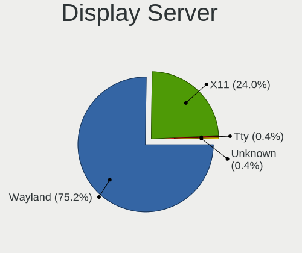
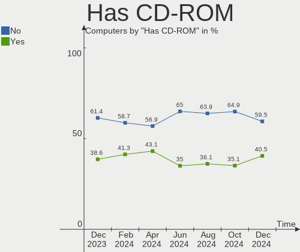
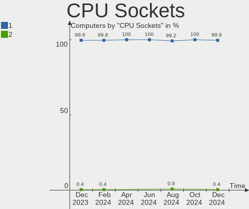
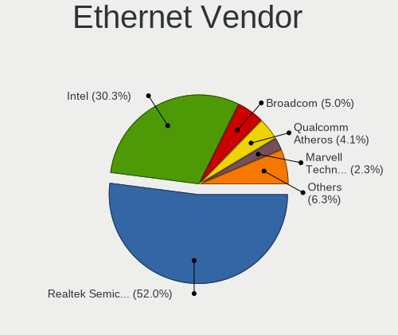
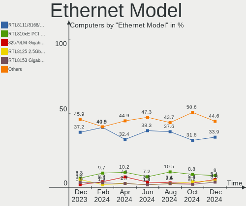
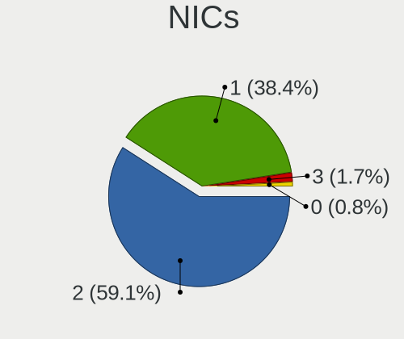

Zorin - Hardware Trends
-----------------------

A project to identify most popular hardware characteristics and track their change
over time based on data collected by Linux users at https://Linux-Hardware.org.

Anyone can contribute to this report by the [hw-probe](https://github.com/linuxhw/hw-probe) tool:

    sudo -E hw-probe -all -upload

This is a report for all computer types. See also reports for [desktops](/Dist/Zorin/Desktop/README.md) and [notebooks](/Dist/Zorin/Notebook/README.md).

This report is for one last month. Overall report since the beginning of time: [TestDays](https://github.com/linuxhw/TestDays)

Period: Dec, 2023.

Contents
--------

* [ System ](#system)
  - [ OS                       ](#os)
  - [ OS Family                ](#os-family)
  - [ Kernel                   ](#kernel)
  - [ Kernel Family            ](#kernel-family)
  - [ Kernel Major Ver.        ](#kernel-major-ver)
  - [ Arch                     ](#arch)
  - [ DE                       ](#de)
  - [ Display Server           ](#display-server)
  - [ Display Manager          ](#display-manager)
  - [ OS Lang                  ](#os-lang)
  - [ Boot Mode                ](#boot-mode)
  - [ Filesystem               ](#filesystem)
  - [ Part. scheme             ](#part-scheme)
  - [ Dual Boot with Linux/BSD ](#dual-boot-with-linuxbsd)
  - [ Dual Boot (Win)          ](#dual-boot-win)

* [ Board ](#board)
  - [ Vendor                   ](#vendor)
  - [ Model                    ](#model)
  - [ Model Family             ](#model-family)
  - [ MFG Year                 ](#mfg-year)
  - [ Form Factor              ](#form-factor)
  - [ Secure Boot              ](#secure-boot)
  - [ Coreboot                 ](#coreboot)
  - [ RAM Size                 ](#ram-size)
  - [ RAM Used                 ](#ram-used)
  - [ Total Drives             ](#total-drives)
  - [ Has CD-ROM               ](#has-cd-rom)
  - [ Has Ethernet             ](#has-ethernet)
  - [ Has WiFi                 ](#has-wifi)
  - [ Has Bluetooth            ](#has-bluetooth)

* [ Location ](#location)
  - [ Country                  ](#country)
  - [ City                     ](#city)

* [ Drives ](#drives)
  - [ Drive Vendor             ](#drive-vendor)
  - [ Drive Model              ](#drive-model)
  - [ HDD Vendor               ](#hdd-vendor)
  - [ SSD Vendor               ](#ssd-vendor)
  - [ Drive Kind               ](#drive-kind)
  - [ Drive Connector          ](#drive-connector)
  - [ Drive Size               ](#drive-size)
  - [ Space Total              ](#space-total)
  - [ Space Used               ](#space-used)
  - [ Malfunc. Drives          ](#malfunc-drives)
  - [ Malfunc. Drive Vendor    ](#malfunc-drive-vendor)
  - [ Malfunc. HDD Vendor      ](#malfunc-hdd-vendor)
  - [ Malfunc. Drive Kind      ](#malfunc-drive-kind)
  - [ Failed Drives            ](#failed-drives)
  - [ Failed Drive Vendor      ](#failed-drive-vendor)
  - [ Drive Status             ](#drive-status)

* [ Storage controller ](#storage-controller)
  - [ Storage Vendor           ](#storage-vendor)
  - [ Storage Model            ](#storage-model)
  - [ Storage Kind             ](#storage-kind)

* [ Processor ](#processor)
  - [ CPU Vendor               ](#cpu-vendor)
  - [ CPU Model                ](#cpu-model)
  - [ CPU Model Family         ](#cpu-model-family)
  - [ CPU Cores                ](#cpu-cores)
  - [ CPU Sockets              ](#cpu-sockets)
  - [ CPU Threads              ](#cpu-threads)
  - [ CPU Op-Modes             ](#cpu-op-modes)
  - [ CPU Microcode            ](#cpu-microcode)
  - [ CPU Microarch            ](#cpu-microarch)

* [ Graphics ](#graphics)
  - [ GPU Vendor               ](#gpu-vendor)
  - [ GPU Model                ](#gpu-model)
  - [ GPU Combo                ](#gpu-combo)
  - [ GPU Driver               ](#gpu-driver)
  - [ GPU Memory               ](#gpu-memory)

* [ Monitor ](#monitor)
  - [ Monitor Vendor           ](#monitor-vendor)
  - [ Monitor Model            ](#monitor-model)
  - [ Monitor Resolution       ](#monitor-resolution)
  - [ Monitor Diagonal         ](#monitor-diagonal)
  - [ Monitor Width            ](#monitor-width)
  - [ Aspect Ratio             ](#aspect-ratio)
  - [ Monitor Area             ](#monitor-area)
  - [ Pixel Density            ](#pixel-density)
  - [ Multiple Monitors        ](#multiple-monitors)

* [ Network ](#network)
  - [ Net Controller Vendor    ](#net-controller-vendor)
  - [ Net Controller Model     ](#net-controller-model)
  - [ Wireless Vendor          ](#wireless-vendor)
  - [ Wireless Model           ](#wireless-model)
  - [ Ethernet Vendor          ](#ethernet-vendor)
  - [ Ethernet Model           ](#ethernet-model)
  - [ Net Controller Kind      ](#net-controller-kind)
  - [ Used Controller          ](#used-controller)
  - [ NICs                     ](#nics)
  - [ IPv6                     ](#ipv6)

* [ Bluetooth ](#bluetooth)
  - [ Bluetooth Vendor         ](#bluetooth-vendor)
  - [ Bluetooth Model          ](#bluetooth-model)

* [ Sound ](#sound)
  - [ Sound Vendor             ](#sound-vendor)
  - [ Sound Model              ](#sound-model)

* [ Memory ](#memory)
  - [ Memory Vendor            ](#memory-vendor)
  - [ Memory Model             ](#memory-model)
  - [ Memory Kind              ](#memory-kind)
  - [ Memory Form Factor       ](#memory-form-factor)
  - [ Memory Size              ](#memory-size)
  - [ Memory Speed             ](#memory-speed)

* [ Printers & scanners ](#printers--scanners)
  - [ Printer Vendor           ](#printer-vendor)
  - [ Printer Model            ](#printer-model)
  - [ Scanner Vendor           ](#scanner-vendor)
  - [ Scanner Model            ](#scanner-model)

* [ Camera ](#camera)
  - [ Camera Vendor            ](#camera-vendor)
  - [ Camera Model             ](#camera-model)

* [ Security ](#security)
  - [ Fingerprint Vendor       ](#fingerprint-vendor)
  - [ Fingerprint Model        ](#fingerprint-model)
  - [ Chipcard Vendor          ](#chipcard-vendor)
  - [ Chipcard Model           ](#chipcard-model)

* [ Unsupported ](#unsupported)
  - [ Unsupported Devices      ](#unsupported-devices)
  - [ Unsupported Device Types ](#unsupported-device-types)

System
------

OS
--

Installed operating systems

| Name     | Computers | Percent |
|----------|-----------|---------|
| Zorin 16 | 139       | 62.33%  |
| Zorin 17 | 78        | 34.98%  |
| Zorin 15 | 6         | 2.69%   |

OS Family
---------

OS without a version

| Name  | Computers | Percent |
|-------|-----------|---------|
| Zorin | 223       | 100%    |

Kernel
------

Version of the Linux kernel

| Version                 | Computers | Percent |
|-------------------------|-----------|---------|
| 5.15.0-91-generic       | 79        | 35.43%  |
| 6.2.0-39-generic        | 73        | 32.74%  |
| 5.15.0-89-generic       | 36        | 16.14%  |
| 5.4.0-150-generic       | 6         | 2.69%   |
| 5.15.0-88-generic       | 6         | 2.69%   |
| 5.15.0-78-generic       | 6         | 2.69%   |
| 6.2.0-37-generic        | 5         | 2.24%   |
| 5.15.0-82-generic       | 2         | 0.9%    |
| 5.15.0-73-generic       | 2         | 0.9%    |
| 5.15.0-71-generic       | 2         | 0.9%    |
| 6.6.7-060607-generic    | 1         | 0.45%   |
| 6.3.13-1-liquorix-amd64 | 1         | 0.45%   |
| 5.15.0-87-generic       | 1         | 0.45%   |
| 5.15.0-56-generic       | 1         | 0.45%   |
| 5.13.0-48-generic       | 1         | 0.45%   |
| 5.11.0-41-generic       | 1         | 0.45%   |

Kernel Family
-------------

Linux kernel without a distro release

| Version | Computers | Percent |
|---------|-----------|---------|
| 5.15.0  | 135       | 60.54%  |
| 6.2.0   | 78        | 34.98%  |
| 5.4.0   | 6         | 2.69%   |
| 6.6.7   | 1         | 0.45%   |
| 6.3.13  | 1         | 0.45%   |
| 5.13.0  | 1         | 0.45%   |
| 5.11.0  | 1         | 0.45%   |

Kernel Major Ver.
-----------------

Linux kernel major version

| Version | Computers | Percent |
|---------|-----------|---------|
| 5.15    | 135       | 60.54%  |
| 6.2     | 78        | 34.98%  |
| 5.4     | 6         | 2.69%   |
| 6.6     | 1         | 0.45%   |
| 6.3     | 1         | 0.45%   |
| 5.13    | 1         | 0.45%   |
| 5.11    | 1         | 0.45%   |

Arch
----

OS architecture (x86_64, i586, etc.)

| Name   | Computers | Percent |
|--------|-----------|---------|
| x86_64 | 220       | 98.65%  |
| i686   | 3         | 1.35%   |

DE
--

Desktop Environment

| Name    | Computers | Percent |
|---------|-----------|---------|
| GNOME   | 194       | 87%     |
| XFCE    | 28        | 12.56%  |
| Unknown | 1         | 0.45%   |

Display Server
--------------

X11 or Wayland

| Name    | Computers | Percent |
|---------|-----------|---------|
| X11     | 157       | 70.4%   |
| Wayland | 64        | 28.7%   |
| Unknown | 2         | 0.9%    |

Display Manager
---------------

SDDM, LightDM, etc.

| Name    | Computers | Percent |
|---------|-----------|---------|
| Unknown | 181       | 81.17%  |
| GDM3    | 25        | 11.21%  |
| GDM     | 10        | 4.48%   |
| LightDM | 7         | 3.14%   |

OS Lang
-------

Language

| Lang  | Computers | Percent |
|-------|-----------|---------|
| en_US | 86        | 38.57%  |
| de_DE | 32        | 14.35%  |
| en_GB | 12        | 5.38%   |
| nl_NL | 7         | 3.14%   |
| fr_FR | 7         | 3.14%   |
| es_ES | 7         | 3.14%   |
| it_IT | 6         | 2.69%   |
| pl_PL | 5         | 2.24%   |
| en_IN | 5         | 2.24%   |
| es_MX | 4         | 1.79%   |
| en_CA | 4         | 1.79%   |
| en_AU | 4         | 1.79%   |
| cs_CZ | 4         | 1.79%   |
| ru_RU | 3         | 1.35%   |
| pt_BR | 3         | 1.35%   |
| en_ZA | 3         | 1.35%   |
| bg_BG | 3         | 1.35%   |
| pt_PT | 2         | 0.9%    |
| hu_HU | 2         | 0.9%    |
| en_NZ | 2         | 0.9%    |
| de_AT | 2         | 0.9%    |
| da_DK | 2         | 0.9%    |
| sv_SE | 1         | 0.45%   |
| sr_RS | 1         | 0.45%   |
| sk_SK | 1         | 0.45%   |
| ro_RO | 1         | 0.45%   |
| nl_BE | 1         | 0.45%   |
| nb_NO | 1         | 0.45%   |
| et_EE | 1         | 0.45%   |
| es_VE | 1         | 0.45%   |
| es_US | 1         | 0.45%   |
| es_PE | 1         | 0.45%   |
| es_DO | 1         | 0.45%   |
| es_CO | 1         | 0.45%   |
| es_CL | 1         | 0.45%   |
| es_AR | 1         | 0.45%   |
| en_SG | 1         | 0.45%   |
| en_IL | 1         | 0.45%   |
| en_IE | 1         | 0.45%   |
| de_CH | 1         | 0.45%   |

Boot Mode
---------

EFI or BIOS

| Mode | Computers | Percent |
|------|-----------|---------|
| BIOS | 128       | 57.4%   |
| EFI  | 95        | 42.6%   |

Filesystem
----------

Type of filesystem

| Type    | Computers | Percent |
|---------|-----------|---------|
| Ext4    | 184       | 82.51%  |
| Tmpfs   | 22        | 9.87%   |
| Zfs     | 10        | 4.48%   |
| Btrfs   | 4         | 1.79%   |
| Overlay | 3         | 1.35%   |

Part. scheme
------------

Scheme of partitioning

| Type    | Computers | Percent |
|---------|-----------|---------|
| Unknown | 184       | 82.51%  |
| GPT     | 31        | 13.9%   |
| MBR     | 8         | 3.59%   |

Dual Boot with Linux/BSD
------------------------

Hosting more than one Linux/BSD

| Dual boot | Computers | Percent |
|-----------|-----------|---------|
| No        | 220       | 98.65%  |
| Yes       | 3         | 1.35%   |

Dual Boot (Win)
---------------

Hosting Linux and Windows

| Dual boot | Computers | Percent |
|-----------|-----------|---------|
| No        | 203       | 91.03%  |
| Yes       | 20        | 8.97%   |

Board
-----

Vendor
------

Motherboard manufacturer

| Name                | Computers | Percent |
|---------------------|-----------|---------|
| Hewlett-Packard     | 46        | 20.63%  |
| ASUSTek Computer    | 37        | 16.59%  |
| Dell                | 31        | 13.9%   |
| Lenovo              | 26        | 11.66%  |
| Gigabyte Technology | 13        | 5.83%   |
| Acer                | 10        | 4.48%   |
| MSI                 | 7         | 3.14%   |
| Apple               | 6         | 2.69%   |
| Toshiba             | 4         | 1.79%   |
| Sony                | 4         | 1.79%   |
| Medion              | 4         | 1.79%   |
| Fujitsu             | 4         | 1.79%   |
| ASRock              | 4         | 1.79%   |
| Unknown             | 4         | 1.79%   |
| Pegatron            | 2         | 0.9%    |
| Packard Bell        | 2         | 0.9%    |
| Intel               | 2         | 0.9%    |
| Gateway             | 2         | 0.9%    |
| VTEX                | 1         | 0.45%   |
| UNOWHY              | 1         | 0.45%   |
| TUXEDO              | 1         | 0.45%   |
| Teclast             | 1         | 0.45%   |
| SONIQ Digital Media | 1         | 0.45%   |
| Positivo            | 1         | 0.45%   |
| Microsoft           | 1         | 0.45%   |
| MACHINIST           | 1         | 0.45%   |
| Juana Manso         | 1         | 0.45%   |
| Irbis               | 1         | 0.45%   |
| Hampoo              | 1         | 0.45%   |
| Google              | 1         | 0.45%   |
| Framework           | 1         | 0.45%   |
| DERE                | 1         | 0.45%   |
| AZW                 | 1         | 0.45%   |

Model
-----

Motherboard model

| Name                                                    | Computers | Percent |
|---------------------------------------------------------|-----------|---------|
| Unknown                                                 | 6         | 2.69%   |
| HP Notebook                                             | 3         | 1.35%   |
| Lenovo IdeaPad 1 15ALC7 82R4                            | 2         | 0.9%    |
| HP Pavilion dv7                                         | 2         | 0.9%    |
| HP EliteDesk 800 G1 SFF                                 | 2         | 0.9%    |
| HP 15                                                   | 2         | 0.9%    |
| ASUS TUF Gaming X570-PLUS                               | 2         | 0.9%    |
| VTEX NOTEBOOK                                           | 1         | 0.45%   |
| UNOWHY Y13G012S4EI                                      | 1         | 0.45%   |
| TUXEDO InfinityBook Pro Gen8 (MK2)                      | 1         | 0.45%   |
| Toshiba Satellite Pro R50-C                             | 1         | 0.45%   |
| Toshiba Satellite Pro C50-A-1E2                         | 1         | 0.45%   |
| Toshiba Satellite C850                                  | 1         | 0.45%   |
| Toshiba QOSMIO X770                                     | 1         | 0.45%   |
| Teclast F6 Plus                                         | 1         | 0.45%   |
| Sony VPCF215FX                                          | 1         | 0.45%   |
| Sony VGN-FW455J                                         | 1         | 0.45%   |
| Sony VGN-CS21Z_Q                                        | 1         | 0.45%   |
| Sony VGN-CR21S_W                                        | 1         | 0.45%   |
| SONIQ Digital Media Soniq 11.6inch Convertible Notebook | 1         | 0.45%   |
| Positivo POS-PIQ57BQ                                    | 1         | 0.45%   |
| Pegatron 600-1352                                       | 1         | 0.45%   |
| Pegatron 600-1265qd                                     | 1         | 0.45%   |
| Packard Bell EasyNote TN36                              | 1         | 0.45%   |
| Packard Bell EasyNote TE11BZ                            | 1         | 0.45%   |
| MSI p6-2317c                                            | 1         | 0.45%   |
| MSI MS-B09012                                           | 1         | 0.45%   |
| MSI MS-7D75                                             | 1         | 0.45%   |
| MSI MS-7D12                                             | 1         | 0.45%   |
| MSI MS-7C75                                             | 1         | 0.45%   |
| MSI MS-7599                                             | 1         | 0.45%   |
| MSI MS-7309                                             | 1         | 0.45%   |
| Microsoft Surface Go 2                                  | 1         | 0.45%   |
| Medion X682X                                            | 1         | 0.45%   |
| Medion P7624                                            | 1         | 0.45%   |
| Medion E6246 MD63200                                    | 1         | 0.45%   |
| Medion E4251 MD61435                                    | 1         | 0.45%   |
| MACHINIST X99-RS9 V2.0                                  | 1         | 0.45%   |
| Lenovo Yoga 7 16IRL8 82YN                               | 1         | 0.45%   |
| Lenovo YB1-X91L                                         | 1         | 0.45%   |

Model Family
------------

Motherboard model prefix

| Name                  | Computers | Percent |
|-----------------------|-----------|---------|
| Lenovo ThinkPad       | 9         | 4.04%   |
| Dell Inspiron         | 9         | 4.04%   |
| Dell Latitude         | 8         | 3.59%   |
| HP Pavilion           | 7         | 3.14%   |
| Dell OptiPlex         | 6         | 2.69%   |
| Unknown               | 6         | 2.69%   |
| ASUS TUF              | 5         | 2.24%   |
| ASUS ROG              | 5         | 2.24%   |
| ASUS PRIME            | 5         | 2.24%   |
| Lenovo IdeaPad        | 4         | 1.79%   |
| HP ProBook            | 4         | 1.79%   |
| HP ENVY               | 4         | 1.79%   |
| HP EliteDesk          | 4         | 1.79%   |
| HP Compaq             | 4         | 1.79%   |
| Fujitsu LIFEBOOK      | 4         | 1.79%   |
| Acer Aspire           | 4         | 1.79%   |
| Toshiba Satellite     | 3         | 1.35%   |
| HP Notebook           | 3         | 1.35%   |
| HP Laptop             | 3         | 1.35%   |
| HP EliteBook          | 3         | 1.35%   |
| Dell XPS              | 3         | 1.35%   |
| Packard Bell EasyNote | 2         | 0.9%    |
| Lenovo ThinkCentre    | 2         | 0.9%    |
| HP Victus             | 2         | 0.9%    |
| HP 255                | 2         | 0.9%    |
| HP 15                 | 2         | 0.9%    |
| Gigabyte Z790         | 2         | 0.9%    |
| Dell Vostro           | 2         | 0.9%    |
| Dell Precision        | 2         | 0.9%    |
| ASUS VivoBook         | 2         | 0.9%    |
| Acer Swift            | 2         | 0.9%    |
| Acer Nitro            | 2         | 0.9%    |
| VTEX NOTEBOOK         | 1         | 0.45%   |
| UNOWHY Y13G012S4EI    | 1         | 0.45%   |
| TUXEDO InfinityBook   | 1         | 0.45%   |
| Toshiba QOSMIO        | 1         | 0.45%   |
| Teclast F6            | 1         | 0.45%   |
| Sony VPCF215FX        | 1         | 0.45%   |
| Sony VGN-FW455J       | 1         | 0.45%   |
| Sony VGN-CS21Z        | 1         | 0.45%   |

MFG Year
--------

Motherboard manufacture year

| Year    | Computers | Percent |
|---------|-----------|---------|
| 2022    | 21        | 9.42%   |
| 2020    | 19        | 8.52%   |
| 2019    | 19        | 8.52%   |
| 2013    | 17        | 7.62%   |
| 2017    | 16        | 7.17%   |
| 2012    | 14        | 6.28%   |
| 2011    | 14        | 6.28%   |
| 2016    | 13        | 5.83%   |
| 2021    | 12        | 5.38%   |
| 2018    | 12        | 5.38%   |
| 2015    | 12        | 5.38%   |
| 2010    | 12        | 5.38%   |
| 2023    | 10        | 4.48%   |
| 2014    | 10        | 4.48%   |
| 2008    | 7         | 3.14%   |
| 2009    | 6         | 2.69%   |
| 2007    | 4         | 1.79%   |
| 2006    | 3         | 1.35%   |
| 2005    | 1         | 0.45%   |
| Unknown | 1         | 0.45%   |

Form Factor
-----------

Physical design of the computer

| Name        | Computers | Percent |
|-------------|-----------|---------|
| Notebook    | 124       | 55.61%  |
| Desktop     | 83        | 37.22%  |
| Convertible | 10        | 4.48%   |
| All in one  | 4         | 1.79%   |
| Tablet      | 1         | 0.45%   |
| Mini pc     | 1         | 0.45%   |

Secure Boot
-----------

Enabled or disabled

| State    | Computers | Percent |
|----------|-----------|---------|
| Disabled | 197       | 88.34%  |
| Enabled  | 26        | 11.66%  |

Coreboot
--------

Have coreboot on board

| Used | Computers | Percent |
|------|-----------|---------|
| No   | 222       | 99.55%  |
| Yes  | 1         | 0.45%   |

RAM Size
--------

Total RAM memory

| Size in GB  | Computers | Percent |
|-------------|-----------|---------|
| 4.01-8.0    | 67        | 30.04%  |
| 16.01-24.0  | 39        | 17.49%  |
| 3.01-4.0    | 37        | 16.59%  |
| 8.01-16.0   | 32        | 14.35%  |
| 32.01-64.0  | 25        | 11.21%  |
| 64.01-256.0 | 9         | 4.04%   |
| 24.01-32.0  | 4         | 1.79%   |
| 2.01-3.0    | 4         | 1.79%   |
| 1.01-2.0    | 4         | 1.79%   |
| 0.51-1.0    | 2         | 0.9%    |

RAM Used
--------

Used RAM memory

| Used GB    | Computers | Percent |
|------------|-----------|---------|
| 2.01-3.0   | 79        | 35.43%  |
| 1.01-2.0   | 53        | 23.77%  |
| 3.01-4.0   | 41        | 18.39%  |
| 4.01-8.0   | 32        | 14.35%  |
| 8.01-16.0  | 11        | 4.93%   |
| 0.51-1.0   | 4         | 1.79%   |
| 16.01-24.0 | 2         | 0.9%    |
| 24.01-32.0 | 1         | 0.45%   |

Total Drives
------------

Number of drives on board

| Drives | Computers | Percent |
|--------|-----------|---------|
| 1      | 130       | 58.3%   |
| 2      | 62        | 27.8%   |
| 3      | 14        | 6.28%   |
| 4      | 10        | 4.48%   |
| 8      | 2         | 0.9%    |
| 6      | 2         | 0.9%    |
| 5      | 2         | 0.9%    |
| 11     | 1         | 0.45%   |

Has CD-ROM
----------

Has CD-ROM on board

| Presented | Computers | Percent |
|-----------|-----------|---------|
| No        | 138       | 61.88%  |
| Yes       | 85        | 38.12%  |

Has Ethernet
------------

Has Ethernet on board

| Presented | Computers | Percent |
|-----------|-----------|---------|
| Yes       | 190       | 85.2%   |
| No        | 33        | 14.8%   |

Has WiFi
--------

Has WiFi module

| Presented | Computers | Percent |
|-----------|-----------|---------|
| Yes       | 183       | 82.06%  |
| No        | 40        | 17.94%  |

Has Bluetooth
-------------

Has Bluetooth module

| Presented | Computers | Percent |
|-----------|-----------|---------|
| Yes       | 149       | 66.82%  |
| No        | 74        | 33.18%  |

Location
--------

Country
-------

Geographic location (country)

| Country         | Computers | Percent |
|-----------------|-----------|---------|
| USA             | 49        | 21.97%  |
| Germany         | 37        | 16.59%  |
| UK              | 11        | 4.93%   |
| Italy           | 8         | 3.59%   |
| Spain           | 7         | 3.14%   |
| Netherlands     | 7         | 3.14%   |
| Mexico          | 6         | 2.69%   |
| India           | 6         | 2.69%   |
| Poland          | 5         | 2.24%   |
| France          | 5         | 2.24%   |
| Brazil          | 5         | 2.24%   |
| Sweden          | 4         | 1.79%   |
| Finland         | 4         | 1.79%   |
| Denmark         | 4         | 1.79%   |
| Czechia         | 4         | 1.79%   |
| Australia       | 4         | 1.79%   |
| The Netherlands | 3         | 1.35%   |
| South Africa    | 3         | 1.35%   |
| Canada          | 3         | 1.35%   |
| Serbia          | 2         | 0.9%    |
| Russia          | 2         | 0.9%    |
| Romania         | 2         | 0.9%    |
| Portugal        | 2         | 0.9%    |
| New Zealand     | 2         | 0.9%    |
| Israel          | 2         | 0.9%    |
| Greece          | 2         | 0.9%    |
| Croatia         | 2         | 0.9%    |
| Colombia        | 2         | 0.9%    |
| Bulgaria        | 2         | 0.9%    |
| Austria         | 2         | 0.9%    |
| Argentina       | 2         | 0.9%    |
| Venezuela       | 1         | 0.45%   |
| Ukraine         | 1         | 0.45%   |
| Thailand        | 1         | 0.45%   |
| Switzerland     | 1         | 0.45%   |
| Slovakia        | 1         | 0.45%   |
| Singapore       | 1         | 0.45%   |
| Réunion        | 1         | 0.45%   |
| Peru            | 1         | 0.45%   |
| Norway          | 1         | 0.45%   |

City
----

Geographic location (city)

| City            | Computers | Percent |
|-----------------|-----------|---------|
| Berlin          | 4         | 1.79%   |
| Milan           | 3         | 1.35%   |
| Warsaw          | 2         | 0.9%    |
| Verona          | 2         | 0.9%    |
| Tel Aviv        | 2         | 0.9%    |
| Stockholm       | 2         | 0.9%    |
| Rio Rancho      | 2         | 0.9%    |
| New York        | 2         | 0.9%    |
| Mumbai          | 2         | 0.9%    |
| Las Vegas       | 2         | 0.9%    |
| Helsinki        | 2         | 0.9%    |
| Fremont         | 2         | 0.9%    |
| Dortmund        | 2         | 0.9%    |
| Auckland        | 2         | 0.9%    |
| Atlanta         | 2         | 0.9%    |
| Zweidlen-Dorf   | 1         | 0.45%   |
| Zumbrota        | 1         | 0.45%   |
| Zaragoza        | 1         | 0.45%   |
| Zagreb          | 1         | 0.45%   |
| Wylie           | 1         | 0.45%   |
| Würzburg       | 1         | 0.45%   |
| Woerden         | 1         | 0.45%   |
| Winfield        | 1         | 0.45%   |
| Wilrijk         | 1         | 0.45%   |
| West Warwick    | 1         | 0.45%   |
| Wegberg         | 1         | 0.45%   |
| Waterloo        | 1         | 0.45%   |
| Waldorf         | 1         | 0.45%   |
| Varna           | 1         | 0.45%   |
| Utrecht         | 1         | 0.45%   |
| Uppsala         | 1         | 0.45%   |
| Tuban           | 1         | 0.45%   |
| Tres Arroyos    | 1         | 0.45%   |
| Trenčín       | 1         | 0.45%   |
| Toledo          | 1         | 0.45%   |
| Timișoara      | 1         | 0.45%   |
| The Hague       | 1         | 0.45%   |
| The Bronx       | 1         | 0.45%   |
| Tarnowskie Gory | 1         | 0.45%   |
| Tårnby         | 1         | 0.45%   |

Drives
------

Drive Vendor
------------

Hard drive vendors

| Vendor                       | Computers | Drives | Percent |
|------------------------------|-----------|--------|---------|
| Samsung Electronics          | 57        | 83     | 17.43%  |
| WDC                          | 40        | 50     | 12.23%  |
| Seagate                      | 31        | 33     | 9.48%   |
| Unknown                      | 25        | 28     | 7.65%   |
| SanDisk                      | 22        | 27     | 6.73%   |
| Toshiba                      | 15        | 15     | 4.59%   |
| Kingston                     | 15        | 16     | 4.59%   |
| Hitachi                      | 11        | 11     | 3.36%   |
| Crucial                      | 10        | 10     | 3.06%   |
| China                        | 10        | 10     | 3.06%   |
| Micron Technology            | 8         | 8      | 2.45%   |
| SK hynix                     | 7         | 8      | 2.14%   |
| PNY                          | 5         | 7      | 1.53%   |
| KIOXIA                       | 5         | 5      | 1.53%   |
| Kingston Technology Company  | 4         | 4      | 1.22%   |
| Apple                        | 4         | 5      | 1.22%   |
| Micron/Crucial Technology    | 3         | 3      | 0.92%   |
| Lexar                        | 3         | 3      | 0.92%   |
| Intenso                      | 3         | 3      | 0.92%   |
| HGST                         | 3         | 6      | 0.92%   |
| Fanxiang                     | 3         | 3      | 0.92%   |
| Unknown                      | 3         | 3      | 0.92%   |
| SPCC                         | 2         | 2      | 0.61%   |
| Phison                       | 2         | 2      | 0.61%   |
| LITEONIT                     | 2         | 2      | 0.61%   |
| Intel                        | 2         | 2      | 0.61%   |
| Verbatim                     | 1         | 2      | 0.31%   |
| USB                          | 1         | 1      | 0.31%   |
| TEXTORM                      | 1         | 1      | 0.31%   |
| Teutons                      | 1         | 1      | 0.31%   |
| Teclast                      | 1         | 1      | 0.31%   |
| Team                         | 1         | 1      | 0.31%   |
| Silicon Motion               | 1         | 1      | 0.31%   |
| Shenzhen Longsys Electronics | 1         | 1      | 0.31%   |
| SD                           | 1         | 1      | 0.31%   |
| SCUDA                        | 1         | 1      | 0.31%   |
| ROG                          | 1         | 1      | 0.31%   |
| Realtek Semiconductor        | 1         | 1      | 0.31%   |
| Realtek                      | 1         | 1      | 0.31%   |
| QSSDS25240G                  | 1         | 1      | 0.31%   |

Drive Model
-----------

Hard drive models

| Model                                               | Computers | Percent |
|-----------------------------------------------------|-----------|---------|
| Unknown MMC Card  64GB                              | 9         | 2.47%   |
| Unknown MMC Card  32GB                              | 5         | 1.37%   |
| Unknown MMC Card  128GB                             | 5         | 1.37%   |
| Samsung NVMe SSD Controller PM9A1/PM9A3/980PRO 2TB  | 5         | 1.37%   |
| Samsung NVMe SSD Controller SM981/PM981/PM983 512GB | 4         | 1.1%    |
| Kingston SA400S37120G 120GB SSD                     | 4         | 1.1%    |
| WDC WD10JPVX-22JC3T0 1TB                            | 3         | 0.82%   |
| Seagate ST1000LM035-1RK172 1TB                      | 3         | 0.82%   |
| Samsung SSD 990 PRO 2TB                             | 3         | 0.82%   |
| Samsung SSD 850 EVO 500GB                           | 3         | 0.82%   |
| Samsung MZVLQ256HAJD-000H1 256GB                    | 3         | 0.82%   |
| Micron/Crucial P2 NVMe PCIe SSD 4TB                 | 3         | 0.82%   |
| Unknown                                             | 3         | 0.82%   |
| WDC WDS120G2G0A-00JH30 120GB SSD                    | 2         | 0.55%   |
| WDC WD5000AAKS-00V1A0 500GB                         | 2         | 0.55%   |
| WDC WD10EZEX-60WN4A0 1TB                            | 2         | 0.55%   |
| WDC WD10EZEX-08WN4A0 1TB                            | 2         | 0.55%   |
| Unknown SD/MMC/MS PRO 512GB                         | 2         | 0.55%   |
| Toshiba MQ01ABD050 500GB                            | 2         | 0.55%   |
| Seagate ST9500325AS 500GB                           | 2         | 0.55%   |
| Seagate ST1000LM024 HN-M101MBB 1TB                  | 2         | 0.55%   |
| Sandisk WD Blue SN570 1TB                           | 2         | 0.55%   |
| Sandisk WD Blue SN550 NVMe SSD 1TB                  | 2         | 0.55%   |
| Sandisk WD Black SN850 1024GB                       | 2         | 0.55%   |
| SanDisk SD8SN8U-256G-1006 256GB SSD                 | 2         | 0.55%   |
| Samsung SSD 870 EVO 500GB                           | 2         | 0.55%   |
| Samsung SSD 860 PRO 256GB                           | 2         | 0.55%   |
| Samsung SSD 860 EVO 500GB                           | 2         | 0.55%   |
| Samsung SSD 850 EVO 250GB                           | 2         | 0.55%   |
| Samsung SSD 840 Series 120GB                        | 2         | 0.55%   |
| Samsung NVMe SSD Controller SM961/PM961/SM963 250GB | 2         | 0.55%   |
| PNY CS900 240GB SSD                                 | 2         | 0.55%   |
| Lexar 128GB SSD                                     | 2         | 0.55%   |
| KIOXIA KBG40ZNS256G NVMe 256GB                      | 2         | 0.55%   |
| Kingston SA400S37480G 480GB SSD                     | 2         | 0.55%   |
| Kingston SA400S37240G 240GB SSD                     | 2         | 0.55%   |
| Crucial CT240BX500SSD1 240GB                        | 2         | 0.55%   |
| Crucial CT240BX200SSD1 240GB                        | 2         | 0.55%   |
| Crucial CT1000BX500SSD1 1TB                         | 2         | 0.55%   |
| China SSD 1TB                                       | 2         | 0.55%   |

HDD Vendor
----------

Hard disk drive vendors

| Vendor              | Computers | Drives | Percent |
|---------------------|-----------|--------|---------|
| WDC                 | 34        | 40     | 33.33%  |
| Seagate             | 29        | 31     | 28.43%  |
| Toshiba             | 13        | 13     | 12.75%  |
| Hitachi             | 11        | 11     | 10.78%  |
| Samsung Electronics | 6         | 6      | 5.88%   |
| HGST                | 3         | 6      | 2.94%   |
| Unknown             | 2         | 2      | 1.96%   |
| Intenso             | 1         | 1      | 0.98%   |
| Fujitsu             | 1         | 1      | 0.98%   |
| External            | 1         | 1      | 0.98%   |
| Apple               | 1         | 1      | 0.98%   |

SSD Vendor
----------

Solid state drive vendors

| Vendor              | Computers | Drives | Percent |
|---------------------|-----------|--------|---------|
| Samsung Electronics | 30        | 37     | 25.42%  |
| Kingston            | 11        | 11     | 9.32%   |
| Crucial             | 10        | 10     | 8.47%   |
| China               | 10        | 10     | 8.47%   |
| SanDisk             | 8         | 10     | 6.78%   |
| WDC                 | 7         | 8      | 5.93%   |
| PNY                 | 5         | 7      | 4.24%   |
| Lexar               | 3         | 3      | 2.54%   |
| SPCC                | 2         | 2      | 1.69%   |
| Phison              | 2         | 2      | 1.69%   |
| Micron Technology   | 2         | 2      | 1.69%   |
| LITEONIT            | 2         | 2      | 1.69%   |
| Apple               | 2         | 2      | 1.69%   |
| Verbatim            | 1         | 2      | 0.85%   |
| TEXTORM             | 1         | 1      | 0.85%   |
| Teutons             | 1         | 1      | 0.85%   |
| Teclast             | 1         | 1      | 0.85%   |
| Team                | 1         | 1      | 0.85%   |
| Seagate             | 1         | 1      | 0.85%   |
| SD                  | 1         | 1      | 0.85%   |
| SCUDA               | 1         | 1      | 0.85%   |
| ROG                 | 1         | 1      | 0.85%   |
| QSSDS25240G         | 1         | 1      | 0.85%   |
| OCZ                 | 1         | 1      | 0.85%   |
| Netac               | 1         | 1      | 0.85%   |
| JMicron Technology  | 1         | 1      | 0.85%   |
| Intenso             | 1         | 1      | 0.85%   |
| Intel               | 1         | 1      | 0.85%   |
| Integral            | 1         | 1      | 0.85%   |
| Hewlett-Packard     | 1         | 1      | 0.85%   |
| GLOWAY              | 1         | 1      | 0.85%   |
| Fanxiang            | 1         | 1      | 0.85%   |
| Drevo               | 1         | 2      | 0.85%   |
| ASMT                | 1         | 1      | 0.85%   |
| ASMedia             | 1         | 1      | 0.85%   |
| Apacer              | 1         | 1      | 0.85%   |
| A-DATA Technology   | 1         | 1      | 0.85%   |

Drive Kind
----------

HDD or SSD

| Kind    | Computers | Drives | Percent |
|---------|-----------|--------|---------|
| SSD     | 99        | 132    | 33.56%  |
| HDD     | 89        | 113    | 30.17%  |
| NVMe    | 77        | 106    | 26.1%   |
| MMC     | 22        | 25     | 7.46%   |
| Unknown | 8         | 8      | 2.71%   |

Drive Connector
---------------

SATA, SAS, NVMe, etc.

| Type | Computers | Drives | Percent |
|------|-----------|--------|---------|
| SATA | 158       | 237    | 58.3%   |
| NVMe | 77        | 105    | 28.41%  |
| MMC  | 22        | 25     | 8.12%   |
| SAS  | 14        | 17     | 5.17%   |

Drive Size
----------

Size of hard drive

| Size in TB | Computers | Drives | Percent |
|------------|-----------|--------|---------|
| 0.01-0.5   | 113       | 140    | 56.78%  |
| 0.51-1.0   | 60        | 73     | 30.15%  |
| 1.01-2.0   | 16        | 18     | 8.04%   |
| 3.01-4.0   | 4         | 4      | 2.01%   |
| 2.01-3.0   | 2         | 2      | 1.01%   |
| 10.01-20.0 | 2         | 2      | 1.01%   |
| 20.01-50.0 | 1         | 1      | 0.5%    |
| 4.01-10.0  | 1         | 5      | 0.5%    |

Space Total
-----------

Amount of disk space available on the file system

| Size in GB     | Computers | Percent |
|----------------|-----------|---------|
| 101-250        | 70        | 31.39%  |
| 251-500        | 50        | 22.42%  |
| 501-1000       | 37        | 16.59%  |
| 51-100         | 18        | 8.07%   |
| 1001-2000      | 15        | 6.73%   |
| More than 3000 | 8         | 3.59%   |
| 21-50          | 7         | 3.14%   |
| Unknown        | 7         | 3.14%   |
| 1-20           | 6         | 2.69%   |
| 2001-3000      | 5         | 2.24%   |

Space Used
----------

Amount of used disk space

| Used GB        | Computers | Percent |
|----------------|-----------|---------|
| 1-20           | 73        | 32.74%  |
| 21-50          | 62        | 27.8%   |
| 51-100         | 34        | 15.25%  |
| 101-250        | 19        | 8.52%   |
| 251-500        | 13        | 5.83%   |
| 501-1000       | 8         | 3.59%   |
| Unknown        | 7         | 3.14%   |
| More than 3000 | 3         | 1.35%   |
| 1001-2000      | 3         | 1.35%   |
| 2001-3000      | 1         | 0.45%   |

Malfunc. Drives
---------------

Drive models with a malfunction

| Model                           | Computers | Drives | Percent |
|---------------------------------|-----------|--------|---------|
| WDC WD20EZRX-22D8PB0 2TB        | 1         | 1      | 16.67%  |
| Seagate ST500LM000-1EJ162 500GB | 1         | 1      | 16.67%  |
| Seagate ST2000LM007-1R8174 2TB  | 1         | 1      | 16.67%  |
| SanDisk SSD PLUS 480GB          | 1         | 1      | 16.67%  |
| Hitachi HDS721680PLA380 80GB    | 1         | 1      | 16.67%  |
| Apple HDD HTS541010A9E662 1TB   | 1         | 1      | 16.67%  |

Malfunc. Drive Vendor
---------------------

Vendors of faulty drives

| Vendor  | Computers | Drives | Percent |
|---------|-----------|--------|---------|
| Seagate | 2         | 2      | 33.33%  |
| WDC     | 1         | 1      | 16.67%  |
| SanDisk | 1         | 1      | 16.67%  |
| Hitachi | 1         | 1      | 16.67%  |
| Apple   | 1         | 1      | 16.67%  |

Malfunc. HDD Vendor
-------------------

Vendors of faulty HDD drives

| Vendor  | Computers | Drives | Percent |
|---------|-----------|--------|---------|
| Seagate | 2         | 2      | 40%     |
| WDC     | 1         | 1      | 20%     |
| Hitachi | 1         | 1      | 20%     |
| Apple   | 1         | 1      | 20%     |

Malfunc. Drive Kind
-------------------

Kinds of faulty drives

| Kind | Computers | Drives | Percent |
|------|-----------|--------|---------|
| HDD  | 5         | 5      | 83.33%  |
| SSD  | 1         | 1      | 16.67%  |

Failed Drives
-------------

Failed drive models

Zero info for selected period =(

Failed Drive Vendor
-------------------

Failed drive vendors

Zero info for selected period =(

Drive Status
------------

Number of failed and malfunc. drives

| Status   | Computers | Drives | Percent |
|----------|-----------|--------|---------|
| Detected | 207       | 342    | 90%     |
| Works    | 17        | 36     | 7.39%   |
| Malfunc  | 6         | 6      | 2.61%   |

Storage controller
------------------

Storage Vendor
--------------

Storage controller vendors

| Vendor                        | Computers | Percent |
|-------------------------------|-----------|---------|
| Intel                         | 151       | 51.01%  |
| AMD                           | 37        | 12.5%   |
| Samsung Electronics           | 28        | 9.46%   |
| SanDisk                       | 17        | 5.74%   |
| Kingston Technology Company   | 9         | 3.04%   |
| SK hynix                      | 7         | 2.36%   |
| JMicron Technology            | 7         | 2.36%   |
| Micron Technology             | 6         | 2.03%   |
| ASMedia Technology            | 6         | 2.03%   |
| KIOXIA                        | 5         | 1.69%   |
| Micron/Crucial Technology     | 3         | 1.01%   |
| Marvell Technology Group      | 3         | 1.01%   |
| VIA Technologies              | 2         | 0.68%   |
| Toshiba America Info Systems  | 2         | 0.68%   |
| Phison Electronics            | 2         | 0.68%   |
| Nvidia                        | 2         | 0.68%   |
| Silicon Motion                | 1         | 0.34%   |
| Shenzhen Longsys Electronics  | 1         | 0.34%   |
| Seagate Technology            | 1         | 0.34%   |
| Realtek Semiconductor         | 1         | 0.34%   |
| Nextorage                     | 1         | 0.34%   |
| MAXIO Technology (Hangzhou)   | 1         | 0.34%   |
| Integrated Technology Express | 1         | 0.34%   |
| HighPoint Technologies        | 1         | 0.34%   |
| Apple                         | 1         | 0.34%   |

Storage Model
-------------

Storage controller models

| Model                                                                                   | Computers | Percent |
|-----------------------------------------------------------------------------------------|-----------|---------|
| AMD FCH SATA Controller [AHCI mode]                                                     | 18        | 5.36%   |
| Intel 8 Series/C220 Series Chipset Family 6-port SATA Controller 1 [AHCI mode]          | 15        | 4.46%   |
| Intel Sunrise Point-LP SATA Controller [AHCI mode]                                      | 14        | 4.17%   |
| Intel 7 Series Chipset Family 6-port SATA Controller [AHCI mode]                        | 12        | 3.57%   |
| Intel Celeron/Pentium Silver Processor SATA Controller                                  | 10        | 2.98%   |
| AMD SB7x0/SB8x0/SB9x0 IDE Controller                                                    | 9         | 2.68%   |
| Intel Volume Management Device NVMe RAID Controller                                     | 8         | 2.38%   |
| Samsung NVMe SSD Controller PM9A1/PM9A3/980PRO                                          | 7         | 2.08%   |
| AMD SB7x0/SB8x0/SB9x0 SATA Controller [AHCI mode]                                       | 7         | 2.08%   |
| Samsung NVMe SSD Controller SM981/PM981/PM983                                           | 6         | 1.79%   |
| Intel 6 Series/C200 Series Chipset Family 6 port Mobile SATA AHCI Controller            | 6         | 1.79%   |
| ASMedia ASM1062 Serial ATA Controller                                                   | 6         | 1.79%   |
| Samsung NVMe SSD Controller S4LV008[Pascal]                                             | 5         | 1.49%   |
| Samsung NVMe SSD Controller 980 (DRAM-less)                                             | 5         | 1.49%   |
| Intel Q170/Q150/B150/H170/H110/Z170/CM236 Chipset SATA Controller [AHCI Mode]           | 5         | 1.49%   |
| Intel Celeron N3350/Pentium N4200/Atom E3900 Series SATA AHCI Controller                | 5         | 1.49%   |
| Intel 82801IBM/IEM (ICH9M/ICH9M-E) 4 port SATA Controller [AHCI mode]                   | 5         | 1.49%   |
| Intel 82801 Mobile SATA Controller [RAID mode]                                          | 5         | 1.49%   |
| Intel 5 Series/3400 Series Chipset 6 port SATA AHCI Controller                          | 5         | 1.49%   |
| AMD SB7x0/SB8x0/SB9x0 SATA Controller [IDE mode]                                        | 5         | 1.49%   |
| AMD 500 Series Chipset SATA Controller                                                  | 5         | 1.49%   |
| SanDisk Ultra 3D / WD Blue SN570 NVMe SSD (DRAM-less)                                   | 4         | 1.19%   |
| KIOXIA NVMe SSD Controller BG4 (DRAM-less)                                              | 4         | 1.19%   |
| Intel 8 Series SATA Controller 1 [AHCI mode]                                            | 4         | 1.19%   |
| Intel 700 Series Chipset Family SATA AHCI Controller                                    | 4         | 1.19%   |
| Intel 7 Series/C210 Series Chipset Family 6-port SATA Controller [AHCI mode]            | 4         | 1.19%   |
| AMD 400 Series Chipset SATA Controller                                                  | 4         | 1.19%   |
| SK hynix Gold P31/BC711/PC711 NVMe Solid State Drive                                    | 3         | 0.89%   |
| SanDisk WD Black SN770 / PC SN740 256GB / PC SN560 (DRAM-less) NVMe SSD                 | 3         | 0.89%   |
| Micron/Crucial P2 [Nick P2] / P3 / P3 Plus NVMe PCIe SSD (DRAM-less)                    | 3         | 0.89%   |
| JMicron JMB368 IDE controller                                                           | 3         | 0.89%   |
| Intel Wildcat Point-LP SATA Controller [AHCI Mode]                                      | 3         | 0.89%   |
| Intel Tiger Lake-LP SATA Controller                                                     | 3         | 0.89%   |
| Intel HM170/QM170 Chipset SATA Controller [AHCI Mode]                                   | 3         | 0.89%   |
| Intel Cannon Lake PCH SATA AHCI Controller                                              | 3         | 0.89%   |
| Intel 6 Series/C200 Series Chipset Family Desktop SATA Controller (IDE mode, ports 4-5) | 3         | 0.89%   |
| Intel 6 Series/C200 Series Chipset Family Desktop SATA Controller (IDE mode, ports 0-3) | 3         | 0.89%   |
| Intel 200 Series PCH SATA controller [AHCI mode]                                        | 3         | 0.89%   |
| VIA VT82C586A/B/VT82C686/A/B/VT823x/A/C PIPC Bus Master IDE                             | 2         | 0.6%    |
| Toshiba America Info Systems XG5 NVMe SSD Controller                                    | 2         | 0.6%    |

Storage Kind
------------

Kind of storage controller (IDE, SATA, NVMe, SAS, ...)

| Kind | Computers | Percent |
|------|-----------|---------|
| SATA | 166       | 57.84%  |
| NVMe | 77        | 26.83%  |
| IDE  | 27        | 9.41%   |
| RAID | 17        | 5.92%   |

Processor
---------

CPU Vendor
----------

Processor vendors

| Vendor | Computers | Percent |
|--------|-----------|---------|
| Intel  | 174       | 78.03%  |
| AMD    | 49        | 21.97%  |

CPU Model
---------

Processor models

| Model                                    | Computers | Percent |
|------------------------------------------|-----------|---------|
| Intel Celeron CPU N3350 @ 1.10GHz        | 5         | 2.24%   |
| Intel 11th Gen Core i7-1165G7 @ 2.80GHz  | 5         | 2.24%   |
| Intel Core i7-6700HQ CPU @ 2.60GHz       | 4         | 1.79%   |
| AMD Phenom II X4 955 Processor           | 4         | 1.79%   |
| Intel Core i3-6006U CPU @ 2.00GHz        | 3         | 1.35%   |
| Intel Celeron N4020 CPU @ 1.10GHz        | 3         | 1.35%   |
| Intel Core i7-7700 CPU @ 3.60GHz         | 2         | 0.9%    |
| Intel Core i7-4770 CPU @ 3.40GHz         | 2         | 0.9%    |
| Intel Core i7-3770 CPU @ 3.40GHz         | 2         | 0.9%    |
| Intel Core i7-2630QM CPU @ 2.00GHz       | 2         | 0.9%    |
| Intel Core i7 CPU Q 720 @ 1.60GHz        | 2         | 0.9%    |
| Intel Core i5-8365U CPU @ 1.60GHz        | 2         | 0.9%    |
| Intel Core i5-6300U CPU @ 2.40GHz        | 2         | 0.9%    |
| Intel Core i5-6200U CPU @ 2.30GHz        | 2         | 0.9%    |
| Intel Core i5-4300M CPU @ 2.60GHz        | 2         | 0.9%    |
| Intel Core i5-3437U CPU @ 1.90GHz        | 2         | 0.9%    |
| Intel Core i5-3230M CPU @ 2.60GHz        | 2         | 0.9%    |
| Intel Core i3-4005U CPU @ 1.70GHz        | 2         | 0.9%    |
| Intel Core i3-3110M CPU @ 2.40GHz        | 2         | 0.9%    |
| Intel Celeron N4120 CPU @ 1.10GHz        | 2         | 0.9%    |
| Intel Celeron N4100 CPU @ 1.10GHz        | 2         | 0.9%    |
| Intel Celeron N4000 CPU @ 1.10GHz        | 2         | 0.9%    |
| Intel 13th Gen Core i9-13900K            | 2         | 0.9%    |
| Intel 11th Gen Core i5-1135G7 @ 2.40GHz  | 2         | 0.9%    |
| AMD Ryzen 7 3700X 8-Core Processor       | 2         | 0.9%    |
| AMD Ryzen 5 5600G with Radeon Graphics   | 2         | 0.9%    |
| AMD Ryzen 5 5500U with Radeon Graphics   | 2         | 0.9%    |
| AMD Ryzen 5 3600 6-Core Processor        | 2         | 0.9%    |
| AMD Phenom II X4 945 Processor           | 2         | 0.9%    |
| Intel Xeon CPU W3565 @ 3.20GHz           | 1         | 0.45%   |
| Intel Xeon CPU E5430 @ 2.66GHz           | 1         | 0.45%   |
| Intel Xeon CPU E5-2699 v3 @ 2.30GHz      | 1         | 0.45%   |
| Intel Xeon CPU E5-2696 v2 @ 2.50GHz      | 1         | 0.45%   |
| Intel Xeon CPU E5-2630 v4 @ 2.20GHz      | 1         | 0.45%   |
| Intel Xeon CPU E5-1650 v3 @ 3.50GHz      | 1         | 0.45%   |
| Intel Pentium Silver N5000 CPU @ 1.10GHz | 1         | 0.45%   |
| Intel Pentium Dual CPU T3400 @ 2.16GHz   | 1         | 0.45%   |
| Intel Pentium Dual CPU E2180 @ 2.00GHz   | 1         | 0.45%   |
| Intel Pentium CPU P6100 @ 2.00GHz        | 1         | 0.45%   |
| Intel Pentium CPU N3540 @ 2.16GHz        | 1         | 0.45%   |

CPU Model Family
----------------

Processor model prefix

| Model                  | Computers | Percent |
|------------------------|-----------|---------|
| Intel Core i5          | 44        | 19.73%  |
| Intel Core i7          | 37        | 16.59%  |
| Other                  | 24        | 10.76%  |
| Intel Core i3          | 22        | 9.87%   |
| Intel Celeron          | 19        | 8.52%   |
| AMD Ryzen 5            | 12        | 5.38%   |
| AMD Ryzen 7            | 9         | 4.04%   |
| Intel Core 2 Duo       | 8         | 3.59%   |
| Intel Xeon             | 6         | 2.69%   |
| AMD Phenom II X4       | 6         | 2.69%   |
| Intel Pentium          | 5         | 2.24%   |
| AMD Ryzen 9            | 5         | 2.24%   |
| AMD FX                 | 5         | 2.24%   |
| Intel Atom             | 4         | 1.79%   |
| Intel Pentium Dual     | 2         | 0.9%    |
| AMD Ryzen 3            | 2         | 0.9%    |
| AMD A6                 | 2         | 0.9%    |
| Intel Pentium Silver   | 1         | 0.45%   |
| Intel Pentium 4        | 1         | 0.45%   |
| Intel Core 2 Quad      | 1         | 0.45%   |
| Intel Celeron M        | 1         | 0.45%   |
| AMD Turion II          | 1         | 0.45%   |
| AMD Ryzen Threadripper | 1         | 0.45%   |
| AMD Ryzen 5 PRO        | 1         | 0.45%   |
| AMD E1                 | 1         | 0.45%   |
| AMD Athlon II X2       | 1         | 0.45%   |
| AMD Athlon 64 X2       | 1         | 0.45%   |
| AMD A4                 | 1         | 0.45%   |

CPU Cores
---------

Number of processor cores

| Number | Computers | Percent |
|--------|-----------|---------|
| 2      | 86        | 38.57%  |
| 4      | 80        | 35.87%  |
| 6      | 18        | 8.07%   |
| 8      | 14        | 6.28%   |
| 16     | 5         | 2.24%   |
| 12     | 4         | 1.79%   |
| 10     | 4         | 1.79%   |
| 1      | 4         | 1.79%   |
| 14     | 3         | 1.35%   |
| 24     | 2         | 0.9%    |
| 3      | 2         | 0.9%    |
| 18     | 1         | 0.45%   |

CPU Sockets
-----------

Number of sockets

| Number | Computers | Percent |
|--------|-----------|---------|
| 1      | 222       | 99.55%  |
| 2      | 1         | 0.45%   |

CPU Threads
-----------

Threads per core (Hyper-Threading)

| Number | Computers | Percent |
|--------|-----------|---------|
| 2      | 147       | 65.92%  |
| 1      | 76        | 34.08%  |

CPU Op-Modes
------------

CPU Operation Modes (32-bit, 64-bit)

| Op mode        | Computers | Percent |
|----------------|-----------|---------|
| 32-bit, 64-bit | 222       | 99.55%  |
| 32-bit         | 1         | 0.45%   |

CPU Microcode
-------------

Microcode number

| Number     | Computers | Percent |
|------------|-----------|---------|
| Unknown    | 84        | 37.67%  |
| 0x306a9    | 12        | 5.38%   |
| 0x306c3    | 10        | 4.48%   |
| 0x206a7    | 8         | 3.59%   |
| 0x406e3    | 7         | 3.14%   |
| 0x806c1    | 5         | 2.24%   |
| 0x0a50000d | 5         | 2.24%   |
| 0x20655    | 4         | 1.79%   |
| 0x906ea    | 3         | 1.35%   |
| 0x806ec    | 3         | 1.35%   |
| 0x806e9    | 3         | 1.35%   |
| 0x706a1    | 3         | 1.35%   |
| 0x6fd      | 3         | 1.35%   |
| 0x40651    | 3         | 1.35%   |
| 0x30678    | 3         | 1.35%   |
| 0x1067a    | 3         | 1.35%   |
| 0x010000db | 3         | 1.35%   |
| 0x010000c8 | 3         | 1.35%   |
| 0x906a3    | 2         | 0.9%    |
| 0x806c2    | 2         | 0.9%    |
| 0x706e5    | 2         | 0.9%    |
| 0x706a8    | 2         | 0.9%    |
| 0x506e3    | 2         | 0.9%    |
| 0x506c9    | 2         | 0.9%    |
| 0x106e5    | 2         | 0.9%    |
| 0x0a601206 | 2         | 0.9%    |
| 0x0a601203 | 2         | 0.9%    |
| 0x0a20120a | 2         | 0.9%    |
| 0x08701030 | 2         | 0.9%    |
| 0xf41      | 1         | 0.45%   |
| 0xb06a3    | 1         | 0.45%   |
| 0xb06a2    | 1         | 0.45%   |
| 0xb0671    | 1         | 0.45%   |
| 0xa0671    | 1         | 0.45%   |
| 0xa0655    | 1         | 0.45%   |
| 0xa0653    | 1         | 0.45%   |
| 0xa0652    | 1         | 0.45%   |
| 0x906ed    | 1         | 0.45%   |
| 0x906e9    | 1         | 0.45%   |
| 0x906a4    | 1         | 0.45%   |

CPU Microarch
-------------

Microarchitecture

| Name             | Computers | Percent |
|------------------|-----------|---------|
| KabyLake         | 25        | 11.21%  |
| Haswell          | 21        | 9.42%   |
| IvyBridge        | 18        | 8.07%   |
| Unknown          | 18        | 8.07%   |
| Skylake          | 15        | 6.73%   |
| SandyBridge      | 13        | 5.83%   |
| Goldmont plus    | 12        | 5.38%   |
| Zen 3            | 10        | 4.48%   |
| TigerLake        | 9         | 4.04%   |
| K10              | 8         | 3.59%   |
| Penryn           | 7         | 3.14%   |
| Zen 2            | 6         | 2.69%   |
| Silvermont       | 6         | 2.69%   |
| Broadwell        | 6         | 2.69%   |
| Westmere         | 5         | 2.24%   |
| Goldmont         | 5         | 2.24%   |
| Core             | 5         | 2.24%   |
| Zen+             | 4         | 1.79%   |
| Nehalem          | 4         | 1.79%   |
| Alderlake Hybrid | 4         | 1.79%   |
| Zen              | 3         | 1.35%   |
| Piledriver       | 3         | 1.35%   |
| IceLake          | 3         | 1.35%   |
| CometLake        | 3         | 1.35%   |
| Bulldozer        | 3         | 1.35%   |
| P6               | 1         | 0.45%   |
| NetBurst         | 1         | 0.45%   |
| K8 Hammer        | 1         | 0.45%   |
| K10 Llano        | 1         | 0.45%   |
| Excavator        | 1         | 0.45%   |
| Bonnell          | 1         | 0.45%   |
| Bobcat           | 1         | 0.45%   |

Graphics
--------

GPU Vendor
----------

Vendors of graphics cards

| Vendor           | Computers | Percent |
|------------------|-----------|---------|
| Intel            | 140       | 54.26%  |
| Nvidia           | 63        | 24.42%  |
| AMD              | 54        | 20.93%  |
| VIA Technologies | 1         | 0.39%   |

GPU Model
---------

Graphics card models

| Model                                                                                    | Computers | Percent |
|------------------------------------------------------------------------------------------|-----------|---------|
| Intel GeminiLake [UHD Graphics 600]                                                      | 11        | 4.14%   |
| Intel 3rd Gen Core processor Graphics Controller                                         | 11        | 4.14%   |
| Intel 2nd Generation Core Processor Family Integrated Graphics Controller                | 10        | 3.76%   |
| Intel TigerLake-LP GT2 [Iris Xe Graphics]                                                | 9         | 3.38%   |
| Intel Xeon E3-1200 v3/4th Gen Core Processor Integrated Graphics Controller              | 8         | 3.01%   |
| Intel Skylake GT2 [HD Graphics 520]                                                      | 7         | 2.63%   |
| Intel HD Graphics 530                                                                    | 5         | 1.88%   |
| Intel HD Graphics 500                                                                    | 5         | 1.88%   |
| Intel Core Processor Integrated Graphics Controller                                      | 5         | 1.88%   |
| AMD Picasso/Raven 2 [Radeon Vega Series / Radeon Vega Mobile Series]                     | 5         | 1.88%   |
| Intel WhiskeyLake-U GT2 [UHD Graphics 620]                                               | 4         | 1.5%    |
| Intel HD Graphics 620                                                                    | 4         | 1.5%    |
| Intel Haswell-ULT Integrated Graphics Controller                                         | 4         | 1.5%    |
| Intel Atom Processor Z36xxx/Z37xxx Series Graphics & Display                             | 4         | 1.5%    |
| Intel 4th Gen Core Processor Integrated Graphics Controller                              | 4         | 1.5%    |
| AMD Raphael                                                                              | 4         | 1.5%    |
| AMD Ellesmere [Radeon RX 470/480/570/570X/580/580X/590]                                  | 4         | 1.5%    |
| Nvidia GF117M [GeForce 610M/710M/810M/820M / GT 620M/625M/630M/720M]                     | 3         | 1.13%   |
| Nvidia GA106 [GeForce RTX 3060 Lite Hash Rate]                                           | 3         | 1.13%   |
| Intel HD Graphics 5500                                                                   | 3         | 1.13%   |
| AMD Lucienne                                                                             | 3         | 1.13%   |
| AMD Cezanne [Radeon Vega Series / Radeon Vega Mobile Series]                             | 3         | 1.13%   |
| AMD Caicos [Radeon HD 6450/7450/8450 / R5 230 OEM]                                       | 3         | 1.13%   |
| Nvidia TU117M [GeForce MX450]                                                            | 2         | 0.75%   |
| Nvidia GM206 [GeForce GTX 950]                                                           | 2         | 0.75%   |
| Nvidia GM107M [GeForce GTX 960M]                                                         | 2         | 0.75%   |
| Nvidia GK208B [GeForce GT 710]                                                           | 2         | 0.75%   |
| Nvidia GA104 [GeForce RTX 3070 Lite Hash Rate]                                           | 2         | 0.75%   |
| Intel Xeon E3-1200 v2/3rd Gen Core processor Graphics Controller                         | 2         | 0.75%   |
| Intel UHD Graphics 620                                                                   | 2         | 0.75%   |
| Intel Raptor Lake-P [Iris Xe Graphics]                                                   | 2         | 0.75%   |
| Intel Mobile GM965/GL960 Integrated Graphics Controller (secondary)                      | 2         | 0.75%   |
| Intel Mobile GM965/GL960 Integrated Graphics Controller (primary)                        | 2         | 0.75%   |
| Intel Mobile 4 Series Chipset Integrated Graphics Controller                             | 2         | 0.75%   |
| Intel Iris Plus Graphics G1 (Ice Lake)                                                   | 2         | 0.75%   |
| Intel HD Graphics 630                                                                    | 2         | 0.75%   |
| Intel HD Graphics 610                                                                    | 2         | 0.75%   |
| Intel CoffeeLake-S GT2 [UHD Graphics 630]                                                | 2         | 0.75%   |
| Intel CoffeeLake-H GT2 [UHD Graphics 630]                                                | 2         | 0.75%   |
| Intel Atom/Celeron/Pentium Processor x5-E8000/J3xxx/N3xxx Integrated Graphics Controller | 2         | 0.75%   |

GPU Combo
---------

Combinations of graphics cards

| Name           | Computers | Percent |
|----------------|-----------|---------|
| 1 x Intel      | 107       | 47.98%  |
| 1 x AMD        | 39        | 17.49%  |
| 1 x Nvidia     | 35        | 15.7%   |
| Intel + Nvidia | 25        | 11.21%  |
| 2 x AMD        | 6         | 2.69%   |
| Intel + AMD    | 6         | 2.69%   |
| AMD + Nvidia   | 3         | 1.35%   |
| Other          | 1         | 0.45%   |
| 1 x VIA        | 1         | 0.45%   |

GPU Driver
----------

Free vs proprietary

| Driver      | Computers | Percent |
|-------------|-----------|---------|
| Free        | 177       | 79.37%  |
| Proprietary | 37        | 16.59%  |
| Unknown     | 9         | 4.04%   |

GPU Memory
----------

Total video memory

| Size in GB | Computers | Percent |
|------------|-----------|---------|
| Unknown    | 165       | 73.99%  |
| 1.01-2.0   | 14        | 6.28%   |
| 0.01-0.5   | 13        | 5.83%   |
| 0.51-1.0   | 12        | 5.38%   |
| 3.01-4.0   | 7         | 3.14%   |
| 7.01-8.0   | 5         | 2.24%   |
| 8.01-16.0  | 5         | 2.24%   |
| 5.01-6.0   | 1         | 0.45%   |
| 2.01-3.0   | 1         | 0.45%   |

Monitor
-------

Monitor Vendor
--------------

Monitor vendors

| Vendor                  | Computers | Percent |
|-------------------------|-----------|---------|
| AU Optronics            | 33        | 14.86%  |
| BOE                     | 28        | 12.61%  |
| Samsung Electronics     | 25        | 11.26%  |
| LG Display              | 18        | 8.11%   |
| Chimei Innolux          | 16        | 7.21%   |
| Goldstar                | 12        | 5.41%   |
| Dell                    | 10        | 4.5%    |
| Acer                    | 8         | 3.6%    |
| Ancor Communications    | 6         | 2.7%    |
| Sharp                   | 5         | 2.25%   |
| Lenovo                  | 5         | 2.25%   |
| Hewlett-Packard         | 5         | 2.25%   |
| Apple                   | 5         | 2.25%   |
| ViewSonic               | 4         | 1.8%    |
| AOC                     | 4         | 1.8%    |
| Sony                    | 3         | 1.35%   |
| Chi Mei Optoelectronics | 3         | 1.35%   |
| Philips                 | 2         | 0.9%    |
| InfoVision              | 2         | 0.9%    |
| BenQ                    | 2         | 0.9%    |
| ASUSTek Computer        | 2         | 0.9%    |
| Xiaomi                  | 1         | 0.45%   |
| Vizio                   | 1         | 0.45%   |
| Vestel                  | 1         | 0.45%   |
| Unknown                 | 1         | 0.45%   |
| UGD                     | 1         | 0.45%   |
| Toshiba                 | 1         | 0.45%   |
| TopView                 | 1         | 0.45%   |
| STA                     | 1         | 0.45%   |
| SLD                     | 1         | 0.45%   |
| Sceptre Tech            | 1         | 0.45%   |
| RTK                     | 1         | 0.45%   |
| PANDA                   | 1         | 0.45%   |
| MSI                     | 1         | 0.45%   |
| LG Philips              | 1         | 0.45%   |
| KDB                     | 1         | 0.45%   |
| JINGLITAI               | 1         | 0.45%   |
| JDZ                     | 1         | 0.45%   |
| Iiyama                  | 1         | 0.45%   |
| Idek Iiyama             | 1         | 0.45%   |

Monitor Model
-------------

Monitor models

| Model                                                                | Computers | Percent |
|----------------------------------------------------------------------|-----------|---------|
| Goldstar HDR WFHD GSM7714 2560x1080 798x334mm 34.1-inch              | 2         | 0.88%   |
| Chimei Innolux LCD Monitor CMN15E6 1366x768 344x193mm 15.5-inch      | 2         | 0.88%   |
| Chimei Innolux LCD Monitor CMN14FF 1920x1080 309x173mm 13.9-inch     | 2         | 0.88%   |
| Chimei Innolux LCD Monitor CMN14D4 1920x1080 309x173mm 13.9-inch     | 2         | 0.88%   |
| BOE LCD Monitor BOE0675 1366x768 344x194mm 15.5-inch                 | 2         | 0.88%   |
| AU Optronics LCD Monitor AUO38ED 1920x1080 344x193mm 15.5-inch       | 2         | 0.88%   |
| AU Optronics LCD Monitor AUO36ED 1920x1080 344x193mm 15.5-inch       | 2         | 0.88%   |
| AU Optronics LCD Monitor AUO2992 1920x1080 344x193mm 15.5-inch       | 2         | 0.88%   |
| AU Optronics LCD Monitor AUO193C 1366x768 309x173mm 13.9-inch        | 2         | 0.88%   |
| AU Optronics LCD Monitor AUO139E 1600x900 382x214mm 17.2-inch        | 2         | 0.88%   |
| Xiaomi Mi TV XMD0002 1920x1080 708x398mm 32.0-inch                   | 1         | 0.44%   |
| Vizio E280-A1 VIZ0095 1360x768 607x345mm 27.5-inch                   | 1         | 0.44%   |
| ViewSonic VX2457 VSCB931 1920x1080 521x293mm 23.5-inch               | 1         | 0.44%   |
| ViewSonic VX2025wm VSCE51D 1680x1050 433x271mm 20.1-inch             | 1         | 0.44%   |
| ViewSonic VA2855 SERIES VSCD62F 1920x1080 621x341mm 27.9-inch        | 1         | 0.44%   |
| ViewSonic LCD Monitor VX2457 1920x1080                               | 1         | 0.44%   |
| Vestel LCD Monitor 55UHD_LCD_TV                                      | 1         | 0.44%   |
| Unknown LCD Monitor SAMSUNG 1366x768                                 | 1         | 0.44%   |
| UGD Artist22R Pro UGD2202 1920x1080 476x268mm 21.5-inch              | 1         | 0.44%   |
| Toshiba LCD-MONITOR LCDE980 1440x900 408x255mm 18.9-inch             | 1         | 0.44%   |
| TopView Digital TOP0001 1920x1080                                    | 1         | 0.44%   |
| STA LCD Monitor STA0001 1366x768 256x144mm 11.6-inch                 | 1         | 0.44%   |
| Sony TV *01 SNYD902 1920x1080 1107x623mm 50.0-inch                   | 1         | 0.44%   |
| Sony SDM-S75A/E SNY3400 1280x1024 338x270mm 17.0-inch                | 1         | 0.44%   |
| Sony LCD Monitor TV  *30 3840x2160                                   | 1         | 0.44%   |
| SLD LCD Monitor SLD003C 1366x768 309x173mm 13.9-inch                 | 1         | 0.44%   |
| Sharp LQ133M1JW01 SHP141B 1920x1080 294x165mm 13.3-inch              | 1         | 0.44%   |
| Sharp LCD Monitor SHP14AB 1920x1080 294x165mm 13.3-inch              | 1         | 0.44%   |
| Sharp LCD Monitor SHP1453 1920x1080 346x194mm 15.6-inch              | 1         | 0.44%   |
| Sharp LCD Monitor SHP1449 1920x1080 294x165mm 13.3-inch              | 1         | 0.44%   |
| Sharp LCD Monitor SHP140B 1920x1080 239x134mm 10.8-inch              | 1         | 0.44%   |
| Sceptre Tech Sceptre F27 SPT0AD7 1920x1080 600x330mm 27.0-inch       | 1         | 0.44%   |
| Samsung Electronics T22D390 SAM0B6B 1920x1080 477x268mm 21.5-inch    | 1         | 0.44%   |
| Samsung Electronics T22C300 SAM0AB3 1920x1080 480x270mm 21.7-inch    | 1         | 0.44%   |
| Samsung Electronics SyncMaster SAM05CB 1920x1080 530x300mm 24.0-inch | 1         | 0.44%   |
| Samsung Electronics SyncMaster SAM0471 1360x768 344x194mm 15.5-inch  | 1         | 0.44%   |
| Samsung Electronics SyncMaster SAM037C 1680x1050 474x296mm 22.0-inch | 1         | 0.44%   |
| Samsung Electronics SyncMaster SAM0225 1440x900 410x257mm 19.1-inch  | 1         | 0.44%   |
| Samsung Electronics SMXL2370HD SAM0729 1920x1080 510x287mm 23.0-inch | 1         | 0.44%   |
| Samsung Electronics S24D300 SAM0B43 1920x1080 531x299mm 24.0-inch    | 1         | 0.44%   |

Monitor Resolution
------------------

Monitor screen resolution

| Resolution         | Computers | Percent |
|--------------------|-----------|---------|
| 1920x1080 (FHD)    | 105       | 48.61%  |
| 1366x768 (WXGA)    | 49        | 22.69%  |
| 3840x2160 (4K)     | 10        | 4.63%   |
| 1600x900 (HD+)     | 8         | 3.7%    |
| 2560x1440 (QHD)    | 7         | 3.24%   |
| 1440x900 (WXGA+)   | 5         | 2.31%   |
| 2560x1080          | 4         | 1.85%   |
| 3840x1080          | 3         | 1.39%   |
| 1920x1200 (WUXGA)  | 3         | 1.39%   |
| 1680x1050 (WSXGA+) | 3         | 1.39%   |
| 1280x1024 (SXGA)   | 3         | 1.39%   |
| 1360x768           | 2         | 0.93%   |
| 1280x800 (WXGA)    | 2         | 0.93%   |
| 7680x2160          | 1         | 0.46%   |
| 3840x2400          | 1         | 0.46%   |
| 3440x1440          | 1         | 0.46%   |
| 3072x1920          | 1         | 0.46%   |
| 2880x1800          | 1         | 0.46%   |
| 2880x1440          | 1         | 0.46%   |
| 2256x1504          | 1         | 0.46%   |
| 1920x515           | 1         | 0.46%   |
| 1920x1280          | 1         | 0.46%   |
| 1280x720 (HD)      | 1         | 0.46%   |
| 1024x600           | 1         | 0.46%   |
| Unknown            | 1         | 0.46%   |

Monitor Diagonal
----------------

Diagonal size in inches

| Inches  | Computers | Percent |
|---------|-----------|---------|
| 15      | 54        | 24.55%  |
| 13      | 28        | 12.73%  |
| 27      | 16        | 7.27%   |
| 14      | 16        | 7.27%   |
| Unknown | 14        | 6.36%   |
| 24      | 13        | 5.91%   |
| 17      | 13        | 5.91%   |
| 23      | 11        | 5%      |
| 21      | 11        | 5%      |
| 11      | 6         | 2.73%   |
| 34      | 4         | 1.82%   |
| 20      | 4         | 1.82%   |
| 40      | 3         | 1.36%   |
| 18      | 3         | 1.36%   |
| 16      | 3         | 1.36%   |
| 12      | 3         | 1.36%   |
| 10      | 3         | 1.36%   |
| 48      | 2         | 0.91%   |
| 31      | 2         | 0.91%   |
| 19      | 2         | 0.91%   |
| 72      | 1         | 0.45%   |
| 65      | 1         | 0.45%   |
| 55      | 1         | 0.45%   |
| 54      | 1         | 0.45%   |
| 46      | 1         | 0.45%   |
| 44      | 1         | 0.45%   |
| 32      | 1         | 0.45%   |
| 26      | 1         | 0.45%   |
| 22      | 1         | 0.45%   |

Monitor Width
-------------

Physical width

| Width in mm | Computers | Percent |
|-------------|-----------|---------|
| 301-350     | 85        | 38.99%  |
| 501-600     | 37        | 16.97%  |
| 201-300     | 27        | 12.39%  |
| 401-500     | 21        | 9.63%   |
| 351-400     | 14        | 6.42%   |
| Unknown     | 14        | 6.42%   |
| 1001-1500   | 7         | 3.21%   |
| 701-800     | 5         | 2.29%   |
| 601-700     | 4         | 1.83%   |
| 801-900     | 3         | 1.38%   |
| 1501-2000   | 1         | 0.46%   |

Aspect Ratio
------------

Proportional relationship between the width and the height

| Ratio   | Computers | Percent |
|---------|-----------|---------|
| 16/9    | 163       | 80.3%   |
| 16/10   | 17        | 8.37%   |
| Unknown | 10        | 4.93%   |
| 21/9    | 4         | 1.97%   |
| 32/9    | 3         | 1.48%   |
| 5/4     | 2         | 0.99%   |
| 3/2     | 2         | 0.99%   |
| 3.73    | 1         | 0.49%   |
| 2.00    | 1         | 0.49%   |

Monitor Area
------------

Area in inch²

| Area in inch² | Computers | Percent |
|----------------|-----------|---------|
| 101-110        | 55        | 25.11%  |
| 81-90          | 32        | 14.61%  |
| 201-250        | 28        | 12.79%  |
| 301-350        | 17        | 7.76%   |
| Unknown        | 14        | 6.39%   |
| 151-200        | 13        | 5.94%   |
| 71-80          | 12        | 5.48%   |
| 121-130        | 10        | 4.57%   |
| 51-60          | 7         | 3.2%    |
| 351-500        | 7         | 3.2%    |
| 501-1000       | 7         | 3.2%    |
| 141-150        | 4         | 1.83%   |
| More than 1000 | 3         | 1.37%   |
| 61-70          | 3         | 1.37%   |
| 41-50          | 2         | 0.91%   |
| 251-300        | 2         | 0.91%   |
| 131-140        | 2         | 0.91%   |
| 111-120        | 1         | 0.46%   |

Pixel Density
-------------

Pixels per inch

| Density       | Computers | Percent |
|---------------|-----------|---------|
| 51-100        | 63        | 29.17%  |
| 121-160       | 58        | 26.85%  |
| 101-120       | 55        | 25.46%  |
| 161-240       | 18        | 8.33%   |
| Unknown       | 14        | 6.48%   |
| 1-50          | 5         | 2.31%   |
| More than 240 | 3         | 1.39%   |

Multiple Monitors
-----------------

Total monitors connected

| Total | Computers | Percent |
|-------|-----------|---------|
| 1     | 182       | 81.61%  |
| 2     | 26        | 11.66%  |
| 0     | 13        | 5.83%   |
| 4     | 1         | 0.45%   |
| 3     | 1         | 0.45%   |

Network
-------

Net Controller Vendor
---------------------

Controller vendors

| Vendor                                | Computers | Percent |
|---------------------------------------|-----------|---------|
| Realtek Semiconductor                 | 128       | 37.76%  |
| Intel                                 | 107       | 31.56%  |
| Qualcomm Atheros                      | 38        | 11.21%  |
| Broadcom                              | 14        | 4.13%   |
| MediaTek                              | 7         | 2.06%   |
| TP-Link                               | 6         | 1.77%   |
| Broadcom Limited                      | 5         | 1.47%   |
| Ralink                                | 4         | 1.18%   |
| DisplayLink                           | 4         | 1.18%   |
| Sierra Wireless                       | 2         | 0.59%   |
| Samsung Electronics                   | 2         | 0.59%   |
| Ralink Technology                     | 2         | 0.59%   |
| Marvell Technology Group              | 2         | 0.59%   |
| ASIX Electronics                      | 2         | 0.59%   |
| ZyDAS                                 | 1         | 0.29%   |
| vivo                                  | 1         | 0.29%   |
| VIA Technologies                      | 1         | 0.29%   |
| Qualcomm                              | 1         | 0.29%   |
| OPPO Electronics                      | 1         | 0.29%   |
| Nvidia                                | 1         | 0.29%   |
| NetGear                               | 1         | 0.29%   |
| Motorola PCS                          | 1         | 0.29%   |
| Linksys                               | 1         | 0.29%   |
| Huawei Technologies                   | 1         | 0.29%   |
| Ericsson Business Mobile Networks     | 1         | 0.29%   |
| D-Link System                         | 1         | 0.29%   |
| D-Link                                | 1         | 0.29%   |
| Compal Electronics                    | 1         | 0.29%   |
| ASUSTek Computer                      | 1         | 0.29%   |
| 802.11g Adapter [Linksys WUSB54GC v3] | 1         | 0.29%   |

Net Controller Model
--------------------

Controller models

| Model                                                             | Computers | Percent |
|-------------------------------------------------------------------|-----------|---------|
| Realtek RTL8111/8168/8411 PCI Express Gigabit Ethernet Controller | 77        | 19.35%  |
| Realtek RTL810xE PCI Express Fast Ethernet controller             | 13        | 3.27%   |
| Realtek RTL8125 2.5GbE Controller                                 | 11        | 2.76%   |
| Realtek RTL8153 Gigabit Ethernet Adapter                          | 7         | 1.76%   |
| Qualcomm Atheros AR9485 Wireless Network Adapter                  | 7         | 1.76%   |
| Intel Wireless 7260                                               | 7         | 1.76%   |
| Intel Wi-Fi 6 AX201                                               | 7         | 1.76%   |
| Intel Gemini Lake PCH CNVi WiFi                                   | 7         | 1.76%   |
| Intel Ethernet Connection I217-LM                                 | 7         | 1.76%   |
| Intel Wireless 3165                                               | 6         | 1.51%   |
| Qualcomm Atheros AR8151 v2.0 Gigabit Ethernet                     | 5         | 1.26%   |
| Intel Wireless 7265                                               | 5         | 1.26%   |
| Intel Wi-Fi 6 AX210/AX211/AX411 160MHz                            | 5         | 1.26%   |
| Realtek RTL8852BE PCIe 802.11ax Wireless Network Controller       | 4         | 1.01%   |
| Realtek RTL8822CE 802.11ac PCIe Wireless Network Adapter          | 4         | 1.01%   |
| Realtek RTL8821CE 802.11ac PCIe Wireless Network Adapter          | 4         | 1.01%   |
| Qualcomm Atheros QCA9377 802.11ac Wireless Network Adapter        | 4         | 1.01%   |
| Qualcomm Atheros QCA6174 802.11ac Wireless Network Adapter        | 4         | 1.01%   |
| Qualcomm Atheros AR9285 Wireless Network Adapter (PCI-Express)    | 4         | 1.01%   |
| Intel Wireless 8260                                               | 4         | 1.01%   |
| Intel Wi-Fi 6 AX200                                               | 4         | 1.01%   |
| Intel Cannon Point-LP CNVi [Wireless-AC]                          | 4         | 1.01%   |
| Intel Cannon Lake PCH CNVi WiFi                                   | 4         | 1.01%   |
| Intel 82579LM Gigabit Network Connection (Lewisville)             | 4         | 1.01%   |
| Realtek RTL8188EE Wireless Network Adapter                        | 3         | 0.75%   |
| Qualcomm Atheros AR9287 Wireless Network Adapter (PCI-Express)    | 3         | 0.75%   |
| MediaTek MT7922 802.11ax PCI Express Wireless Network Adapter     | 3         | 0.75%   |
| Intel WiFi Link 5100                                              | 3         | 0.75%   |
| Intel Raptor Lake PCH CNVi WiFi                                   | 3         | 0.75%   |
| Intel I211 Gigabit Network Connection                             | 3         | 0.75%   |
| Intel Ethernet Connection I219-V                                  | 3         | 0.75%   |
| Intel Ethernet Connection (7) I219-V                              | 3         | 0.75%   |
| Intel Dual Band Wireless-AC 3168NGW [Stone Peak]                  | 3         | 0.75%   |
| Intel 700 Series Chipset Family Wi-Fi                             | 3         | 0.75%   |
| TP-Link 802.11ac NIC                                              | 2         | 0.5%    |
| Samsung Galaxy series, misc. (tethering mode)                     | 2         | 0.5%    |
| Realtek USB 10/100/1G/2.5G LAN                                    | 2         | 0.5%    |
| Realtek RTL8723DE Wireless Network Adapter                        | 2         | 0.5%    |
| Realtek RTL8723BE PCIe Wireless Network Adapter                   | 2         | 0.5%    |
| Realtek RTL8192EU 802.11b/g/n WLAN Adapter                        | 2         | 0.5%    |

Wireless Vendor
---------------

Wireless vendors

| Vendor                                | Computers | Percent |
|---------------------------------------|-----------|---------|
| Intel                                 | 87        | 45.79%  |
| Realtek Semiconductor                 | 37        | 19.47%  |
| Qualcomm Atheros                      | 28        | 14.74%  |
| Broadcom                              | 9         | 4.74%   |
| TP-Link                               | 6         | 3.16%   |
| MediaTek                              | 6         | 3.16%   |
| Ralink                                | 4         | 2.11%   |
| Broadcom Limited                      | 3         | 1.58%   |
| Sierra Wireless                       | 2         | 1.05%   |
| Ralink Technology                     | 2         | 1.05%   |
| ZyDAS                                 | 1         | 0.53%   |
| NetGear                               | 1         | 0.53%   |
| Ericsson Business Mobile Networks     | 1         | 0.53%   |
| D-Link System                         | 1         | 0.53%   |
| D-Link                                | 1         | 0.53%   |
| 802.11g Adapter [Linksys WUSB54GC v3] | 1         | 0.53%   |

Wireless Model
--------------

Wireless models

| Model                                                          | Computers | Percent |
|----------------------------------------------------------------|-----------|---------|
| Qualcomm Atheros AR9485 Wireless Network Adapter               | 7         | 3.68%   |
| Intel Wireless 7260                                            | 7         | 3.68%   |
| Intel Wi-Fi 6 AX201                                            | 7         | 3.68%   |
| Intel Gemini Lake PCH CNVi WiFi                                | 7         | 3.68%   |
| Intel Wireless 3165                                            | 6         | 3.16%   |
| Intel Wireless 7265                                            | 5         | 2.63%   |
| Intel Wi-Fi 6 AX210/AX211/AX411 160MHz                         | 5         | 2.63%   |
| Realtek RTL8852BE PCIe 802.11ax Wireless Network Controller    | 4         | 2.11%   |
| Realtek RTL8822CE 802.11ac PCIe Wireless Network Adapter       | 4         | 2.11%   |
| Realtek RTL8821CE 802.11ac PCIe Wireless Network Adapter       | 4         | 2.11%   |
| Qualcomm Atheros QCA9377 802.11ac Wireless Network Adapter     | 4         | 2.11%   |
| Qualcomm Atheros QCA6174 802.11ac Wireless Network Adapter     | 4         | 2.11%   |
| Qualcomm Atheros AR9285 Wireless Network Adapter (PCI-Express) | 4         | 2.11%   |
| Intel Wireless 8260                                            | 4         | 2.11%   |
| Intel Wi-Fi 6 AX200                                            | 4         | 2.11%   |
| Intel Cannon Point-LP CNVi [Wireless-AC]                       | 4         | 2.11%   |
| Intel Cannon Lake PCH CNVi WiFi                                | 4         | 2.11%   |
| Realtek RTL8188EE Wireless Network Adapter                     | 3         | 1.58%   |
| Qualcomm Atheros AR9287 Wireless Network Adapter (PCI-Express) | 3         | 1.58%   |
| MediaTek MT7922 802.11ax PCI Express Wireless Network Adapter  | 3         | 1.58%   |
| Intel WiFi Link 5100                                           | 3         | 1.58%   |
| Intel Raptor Lake PCH CNVi WiFi                                | 3         | 1.58%   |
| Intel Dual Band Wireless-AC 3168NGW [Stone Peak]               | 3         | 1.58%   |
| Intel 700 Series Chipset Family Wi-Fi                          | 3         | 1.58%   |
| TP-Link 802.11ac NIC                                           | 2         | 1.05%   |
| Realtek RTL8723DE Wireless Network Adapter                     | 2         | 1.05%   |
| Realtek RTL8723BE PCIe Wireless Network Adapter                | 2         | 1.05%   |
| Realtek RTL8192EU 802.11b/g/n WLAN Adapter                     | 2         | 1.05%   |
| Realtek RTL8192CU 802.11n WLAN Adapter                         | 2         | 1.05%   |
| Realtek RTL8192CE PCIe Wireless Network Adapter                | 2         | 1.05%   |
| Realtek Realtek WLAN controller                                | 2         | 1.05%   |
| Qualcomm Atheros QCA9565 / AR9565 Wireless Network Adapter     | 2         | 1.05%   |
| Qualcomm Atheros AR928X Wireless Network Adapter (PCI-Express) | 2         | 1.05%   |
| MediaTek MT7921 802.11ax PCI Express Wireless Network Adapter  | 2         | 1.05%   |
| Intel Wireless-AC 9260                                         | 2         | 1.05%   |
| Intel Wireless 8265 / 8275                                     | 2         | 1.05%   |
| Intel PRO/Wireless 5100 AGN [Shiloh] Network Connection        | 2         | 1.05%   |
| Intel Alder Lake-P PCH CNVi WiFi                               | 2         | 1.05%   |
| Broadcom BCM4360 802.11ac Dual Band Wireless Network Adapter   | 2         | 1.05%   |
| ZyDAS ZD1211B 802.11g                                          | 1         | 0.53%   |

Ethernet Vendor
---------------

Ethernet vendors

| Vendor                   | Computers | Percent |
|--------------------------|-----------|---------|
| Realtek Semiconductor    | 113       | 55.67%  |
| Intel                    | 47        | 23.15%  |
| Qualcomm Atheros         | 13        | 6.4%    |
| Broadcom                 | 9         | 4.43%   |
| DisplayLink              | 4         | 1.97%   |
| Samsung Electronics      | 2         | 0.99%   |
| Marvell Technology Group | 2         | 0.99%   |
| Broadcom Limited         | 2         | 0.99%   |
| ASIX Electronics         | 2         | 0.99%   |
| VIA Technologies         | 1         | 0.49%   |
| Qualcomm                 | 1         | 0.49%   |
| OPPO Electronics         | 1         | 0.49%   |
| Nvidia                   | 1         | 0.49%   |
| Motorola PCS             | 1         | 0.49%   |
| MediaTek                 | 1         | 0.49%   |
| Linksys                  | 1         | 0.49%   |
| Huawei Technologies      | 1         | 0.49%   |
| ASUSTek Computer         | 1         | 0.49%   |

Ethernet Model
--------------

Ethernet models

| Model                                                             | Computers | Percent |
|-------------------------------------------------------------------|-----------|---------|
| Realtek RTL8111/8168/8411 PCI Express Gigabit Ethernet Controller | 77        | 37.56%  |
| Realtek RTL810xE PCI Express Fast Ethernet controller             | 13        | 6.34%   |
| Realtek RTL8125 2.5GbE Controller                                 | 11        | 5.37%   |
| Realtek RTL8153 Gigabit Ethernet Adapter                          | 7         | 3.41%   |
| Intel Ethernet Connection I217-LM                                 | 7         | 3.41%   |
| Qualcomm Atheros AR8151 v2.0 Gigabit Ethernet                     | 5         | 2.44%   |
| Intel 82579LM Gigabit Network Connection (Lewisville)             | 4         | 1.95%   |
| Intel I211 Gigabit Network Connection                             | 3         | 1.46%   |
| Intel Ethernet Connection I219-V                                  | 3         | 1.46%   |
| Intel Ethernet Connection (7) I219-V                              | 3         | 1.46%   |
| Samsung Galaxy series, misc. (tethering mode)                     | 2         | 0.98%   |
| Realtek USB 10/100/1G/2.5G LAN                                    | 2         | 0.98%   |
| Realtek RTL8152 Fast Ethernet Adapter                             | 2         | 0.98%   |
| Qualcomm Atheros AR8161 Gigabit Ethernet                          | 2         | 0.98%   |
| Intel Ethernet Controller I225-V                                  | 2         | 0.98%   |
| Intel Ethernet Connection I219-LM                                 | 2         | 0.98%   |
| Intel Ethernet Connection I218-LM                                 | 2         | 0.98%   |
| Intel Ethernet Connection I217-V                                  | 2         | 0.98%   |
| Intel Ethernet Connection (6) I219-V                              | 2         | 0.98%   |
| Intel Ethernet Connection (6) I219-LM                             | 2         | 0.98%   |
| Intel Ethernet Connection (2) I219-LM                             | 2         | 0.98%   |
| Intel 82579V Gigabit Network Connection                           | 2         | 0.98%   |
| Broadcom NetXtreme BCM5764M Gigabit Ethernet PCIe                 | 2         | 0.98%   |
| ASIX AX88179 Gigabit Ethernet                                     | 2         | 0.98%   |
| VIA VT6102/VT6103 [Rhine-II]                                      | 1         | 0.49%   |
| Realtek RTL-8100/8101L/8139 PCI Fast Ethernet Adapter             | 1         | 0.49%   |
| Realtek Killer E2600 Gigabit Ethernet Controller                  | 1         | 0.49%   |
| Qualcomm MDM9207-MTP _SN:E28CB43E                                 | 1         | 0.49%   |
| Qualcomm Atheros QCA8171 Gigabit Ethernet                         | 1         | 0.49%   |
| Qualcomm Atheros Killer E220x Gigabit Ethernet Controller         | 1         | 0.49%   |
| Qualcomm Atheros Attansic L1 Gigabit Ethernet                     | 1         | 0.49%   |
| Qualcomm Atheros AR8162 Fast Ethernet                             | 1         | 0.49%   |
| Qualcomm Atheros AR8152 v2.0 Fast Ethernet                        | 1         | 0.49%   |
| Qualcomm Atheros AR8151 v1.0 Gigabit Ethernet                     | 1         | 0.49%   |
| OPPO SM8350-IDP _SN:27BAACC8                                      | 1         | 0.49%   |
| Nvidia MCP61 Ethernet                                             | 1         | 0.49%   |
| Motorola PCS motorola edge 40                                     | 1         | 0.49%   |
| MediaTek M40Air_EEA                                               | 1         | 0.49%   |
| Marvell Group 88E8055 PCI-E Gigabit Ethernet Controller           | 1         | 0.49%   |
| Marvell Group 88E8040 PCI-E Fast Ethernet Controller              | 1         | 0.49%   |

Net Controller Kind
-------------------

Ethernet, WiFi or modem

| Kind     | Computers | Percent |
|----------|-----------|---------|
| Ethernet | 190       | 50.53%  |
| WiFi     | 183       | 48.67%  |
| Unknown  | 2         | 0.53%   |
| Modem    | 1         | 0.27%   |

Used Controller
---------------

Currently used network controller

| Kind     | Computers | Percent |
|----------|-----------|---------|
| WiFi     | 141       | 60.26%  |
| Ethernet | 92        | 39.32%  |
| Unknown  | 1         | 0.43%   |

NICs
----

Total network controllers on board

| Total | Computers | Percent |
|-------|-----------|---------|
| 2     | 120       | 53.81%  |
| 1     | 93        | 41.7%   |
| 3     | 5         | 2.24%   |
| 0     | 5         | 2.24%   |

IPv6
----

IPv6 vs IPv4

| Used | Computers | Percent |
|------|-----------|---------|
| No   | 145       | 65.02%  |
| Yes  | 78        | 34.98%  |

Bluetooth
---------

Bluetooth Vendor
----------------

Controller vendors

| Vendor                          | Computers | Percent |
|---------------------------------|-----------|---------|
| Intel                           | 74        | 50%     |
| Realtek Semiconductor           | 22        | 14.86%  |
| Cambridge Silicon Radio         | 9         | 6.08%   |
| Qualcomm Atheros Communications | 8         | 5.41%   |
| IMC Networks                    | 7         | 4.73%   |
| Broadcom                        | 5         | 3.38%   |
| Apple                           | 5         | 3.38%   |
| Foxconn / Hon Hai               | 4         | 2.7%    |
| ASUSTek Computer                | 3         | 2.03%   |
| Toshiba                         | 2         | 1.35%   |
| Lite-On Technology              | 2         | 1.35%   |
| TP-Link                         | 1         | 0.68%   |
| MediaTek                        | 1         | 0.68%   |
| Hewlett-Packard                 | 1         | 0.68%   |
| Dell                            | 1         | 0.68%   |
| Askey Computer                  | 1         | 0.68%   |
| Alps Electric                   | 1         | 0.68%   |
| Actions                         | 1         | 0.68%   |

Bluetooth Model
---------------

Controller models

| Model                                                                               | Computers | Percent |
|-------------------------------------------------------------------------------------|-----------|---------|
| Intel Bluetooth wireless interface                                                  | 25        | 16.89%  |
| Realtek Bluetooth Radio                                                             | 17        | 11.49%  |
| Intel Bluetooth Device                                                              | 16        | 10.81%  |
| Intel Bluetooth 9460/9560 Jefferson Peak (JfP)                                      | 16        | 10.81%  |
| Cambridge Silicon Radio Bluetooth Dongle (HCI mode)                                 | 9         | 6.08%   |
| Intel AX210 Bluetooth                                                               | 5         | 3.38%   |
| Realtek  Bluetooth 4.2 Adapter                                                      | 4         | 2.7%    |
| Intel AX200 Bluetooth                                                               | 4         | 2.7%    |
| IMC Networks Wireless_Device                                                        | 4         | 2.7%    |
| Qualcomm Atheros  Bluetooth Device                                                  | 3         | 2.03%   |
| Intel Wireless-AC 3168 Bluetooth                                                    | 3         | 2.03%   |
| IMC Networks Bluetooth Device                                                       | 3         | 2.03%   |
| Apple Bluetooth USB Host Controller                                                 | 3         | 2.03%   |
| Qualcomm Atheros QCA61x4 Bluetooth 4.0                                              | 2         | 1.35%   |
| Intel Wireless-AC 9260 Bluetooth Adapter                                            | 2         | 1.35%   |
| Intel Centrino Bluetooth Wireless Transceiver                                       | 2         | 1.35%   |
| Broadcom BCM20702A0 Bluetooth 4.0                                                   | 2         | 1.35%   |
| ASUS Bluetooth Device                                                               | 2         | 1.35%   |
| Apple Bluetooth Host Controller                                                     | 2         | 1.35%   |
| TP-Link UB500 Adapter                                                               | 1         | 0.68%   |
| Toshiba RT Bluetooth Radio                                                          | 1         | 0.68%   |
| Toshiba Atheros AR3012 Bluetooth                                                    | 1         | 0.68%   |
| Realtek Bluetooth 5.1 Radio                                                         | 1         | 0.68%   |
| Qualcomm Atheros Bluetooth USB Host Controller                                      | 1         | 0.68%   |
| Qualcomm Atheros Bluetooth                                                          | 1         | 0.68%   |
| Qualcomm Atheros AR3011 Bluetooth                                                   | 1         | 0.68%   |
| MediaTek Wireless_Device                                                            | 1         | 0.68%   |
| Lite-On Qualcomm Atheros QCA9377 Bluetooth                                          | 1         | 0.68%   |
| Lite-On Atheros AR3012 Bluetooth                                                    | 1         | 0.68%   |
| Intel Centrino Advanced-N 6230 Bluetooth adapter                                    | 1         | 0.68%   |
| HP Bluetooth 2.0 Interface [Broadcom BCM2045]                                       | 1         | 0.68%   |
| Foxconn / Hon Hai Wireless_Device                                                   | 1         | 0.68%   |
| Foxconn / Hon Hai Foxconn T77H114 BCM2070 [Single-Chip Bluetooth 2.1 + EDR Adapter] | 1         | 0.68%   |
| Foxconn / Hon Hai Broadcom Bluetooth 2.1 Device                                     | 1         | 0.68%   |
| Foxconn / Hon Hai Bluetooth USB Host Controller                                     | 1         | 0.68%   |
| Dell BCM20702A0 Bluetooth Module                                                    | 1         | 0.68%   |
| Broadcom HP Bluetooth Module                                                        | 1         | 0.68%   |
| Broadcom Bluetooth 2.0+eDR dongle                                                   | 1         | 0.68%   |
| Broadcom BCM43142A0 Bluetooth 4.0                                                   | 1         | 0.68%   |
| ASUS Broadcom BCM20702A0 Bluetooth                                                  | 1         | 0.68%   |

Sound
-----

Sound Vendor
------------

Sound card vendors

| Vendor                   | Computers | Percent |
|--------------------------|-----------|---------|
| Intel                    | 168       | 55.81%  |
| AMD                      | 58        | 19.27%  |
| Nvidia                   | 49        | 16.28%  |
| C-Media Electronics      | 5         | 1.66%   |
| Creative Labs            | 4         | 1.33%   |
| JMTek                    | 3         | 1%      |
| VIA Technologies         | 2         | 0.66%   |
| Micro Star International | 2         | 0.66%   |
| ASUSTek Computer         | 2         | 0.66%   |
| USB Audio                | 1         | 0.33%   |
| SteelSeries ApS          | 1         | 0.33%   |
| Realtek Semiconductor    | 1         | 0.33%   |
| KORG                     | 1         | 0.33%   |
| Huawei Technologies      | 1         | 0.33%   |
| Hewlett-Packard          | 1         | 0.33%   |
| GN Netcom                | 1         | 0.33%   |
| Creative Technology      | 1         | 0.33%   |

Sound Model
-----------

Sound card models

| Model                                                                             | Computers | Percent |
|-----------------------------------------------------------------------------------|-----------|---------|
| AMD Family 17h/19h HD Audio Controller                                            | 21        | 5.82%   |
| Intel 7 Series/C216 Chipset Family High Definition Audio Controller               | 18        | 4.99%   |
| Intel Sunrise Point-LP HD Audio                                                   | 17        | 4.71%   |
| Intel 8 Series/C220 Series Chipset High Definition Audio Controller               | 16        | 4.43%   |
| Intel Xeon E3-1200 v3/4th Gen Core Processor HD Audio Controller                  | 12        | 3.32%   |
| Intel Celeron/Pentium Silver Processor High Definition Audio                      | 12        | 3.32%   |
| Intel 6 Series/C200 Series Chipset Family High Definition Audio Controller        | 12        | 3.32%   |
| AMD SBx00 Azalia (Intel HDA)                                                      | 11        | 3.05%   |
| AMD Renoir Radeon High Definition Audio Controller                                | 11        | 3.05%   |
| Intel Tiger Lake-LP Smart Sound Technology Audio Controller                       | 9         | 2.49%   |
| Intel 100 Series/C230 Series Chipset Family HD Audio Controller                   | 9         | 2.49%   |
| Intel 5 Series/3400 Series Chipset High Definition Audio                          | 8         | 2.22%   |
| AMD Starship/Matisse HD Audio Controller                                          | 8         | 2.22%   |
| Nvidia Audio device                                                               | 6         | 1.66%   |
| Intel Cannon Lake PCH cAVS                                                        | 6         | 1.66%   |
| Intel 82801I (ICH9 Family) HD Audio Controller                                    | 6         | 1.66%   |
| Nvidia GP107GL High Definition Audio Controller                                   | 5         | 1.39%   |
| Intel Celeron N3350/Pentium N4200/Atom E3900 Series Audio Cluster                 | 5         | 1.39%   |
| Intel Broadwell-U Audio Controller                                                | 5         | 1.39%   |
| AMD Raven/Raven2/Fenghuang HDMI/DP Audio Controller                               | 5         | 1.39%   |
| Nvidia GM206 High Definition Audio Controller                                     | 4         | 1.11%   |
| Nvidia GA106 High Definition Audio Controller                                     | 4         | 1.11%   |
| Nvidia GA104 High Definition Audio Controller                                     | 4         | 1.11%   |
| Intel Wildcat Point-LP High Definition Audio Controller                           | 4         | 1.11%   |
| Intel Haswell-ULT HD Audio Controller                                             | 4         | 1.11%   |
| Intel Cannon Point-LP High Definition Audio Controller                            | 4         | 1.11%   |
| Intel Alder Lake PCH-P High Definition Audio Controller                           | 4         | 1.11%   |
| Intel 8 Series HD Audio Controller                                                | 4         | 1.11%   |
| Intel 700 Series Chipset Family Precise Touch and Stylus Port #1                  | 4         | 1.11%   |
| AMD Caicos HDMI Audio [Radeon HD 6450 / 7450/8450/8490 OEM / R5 230/235/235X OEM] | 4         | 1.11%   |
| Nvidia GM107 High Definition Audio Controller [GeForce 940MX]                     | 3         | 0.83%   |
| Nvidia GK208 HDMI/DP Audio Controller                                             | 3         | 0.83%   |
| Nvidia GF108 High Definition Audio Controller                                     | 3         | 0.83%   |
| Intel Raptor Lake-P/U/H cAVS                                                      | 3         | 0.83%   |
| Intel 200 Series PCH HD Audio                                                     | 3         | 0.83%   |
| AMD RV710/730 HDMI Audio [Radeon HD 4000 series]                                  | 3         | 0.83%   |
| AMD Rembrandt Radeon High Definition Audio Controller                             | 3         | 0.83%   |
| AMD Navi 31 HDMI/DP Audio                                                         | 3         | 0.83%   |
| AMD FCH Azalia Controller                                                         | 3         | 0.83%   |
| AMD Ellesmere HDMI Audio [Radeon RX 470/480 / 570/580/590]                        | 3         | 0.83%   |

Memory
------

Memory Vendor
-------------

Memory module vendors

| Vendor              | Computers | Percent |
|---------------------|-----------|---------|
| Samsung Electronics | 7         | 17.95%  |
| Micron Technology   | 6         | 15.38%  |
| Kingston            | 6         | 15.38%  |
| Corsair             | 6         | 15.38%  |
| SK hynix            | 4         | 10.26%  |
| G.Skill             | 4         | 10.26%  |
| Unknown             | 2         | 5.13%   |
| Transcend           | 1         | 2.56%   |
| Teikon              | 1         | 2.56%   |
| Team                | 1         | 2.56%   |
| Crucial             | 1         | 2.56%   |

Memory Model
------------

Memory module models

| Model                                                          | Computers | Percent |
|----------------------------------------------------------------|-----------|---------|
| Samsung RAM M471B1G73DB0-YK0 8GB SODIMM DDR3 1600MT/s          | 2         | 5%      |
| Micron RAM 8KTF51264HZ-1G6E1 4096MB SODIMM DDR3 1600MT/s       | 2         | 5%      |
| Corsair RAM CMK16GX4M2B3200C16 8GB DIMM DDR4 3600MT/s          | 2         | 5%      |
| Unknown RAM Module 2048MB DIMM DDR3 1333MT/s                   | 1         | 2.5%    |
| Unknown RAM Module 1024MB SODIMM DDR2                          | 1         | 2.5%    |
| Transcend RAM JM3200HSB-8G 8192MB SODIMM DDR4 3200MT/s         | 1         | 2.5%    |
| Teikon RAM TMT451S6BFR8A-PBSC 4GB SODIMM DDR3 1600MT/s         | 1         | 2.5%    |
| Team RAM TEAMGROUP-UD4-3200 8GB DIMM DDR4 3733MT/s             | 1         | 2.5%    |
| SK hynix RAM Module 4096MB SODIMM DDR3 1867MT/s                | 1         | 2.5%    |
| SK hynix RAM HMA82GS6CJR8N-VK 16GB SODIMM DDR4 2667MT/s        | 1         | 2.5%    |
| SK hynix RAM HMA81GU6DJR8N-VK 8GB DIMM DDR4 2667MT/s           | 1         | 2.5%    |
| SK hynix RAM HCNNNCPMBLHR-NEE 2GB Row Of Chips LPDDR4 4267MT/s | 1         | 2.5%    |
| Samsung RAM Module 16384MB SODIMM DDR4 3200MT/s                | 1         | 2.5%    |
| Samsung RAM M471B1G73EB0-YK0 8192MB SODIMM DDR3 1600MT/s       | 1         | 2.5%    |
| Samsung RAM M471A1K43EB1-CWE 8GB SODIMM DDR4 3200MT/s          | 1         | 2.5%    |
| Samsung RAM M471A1G44AB0-CWE 8GB Row Of Chips DDR4 3200MT/s    | 1         | 2.5%    |
| Samsung RAM M378B5173DB0-CK0 4GB DIMM DDR3 1600MT/s            | 1         | 2.5%    |
| Samsung RAM M378B1G73QH0-CK0 8GB DIMM DDR3 1600MT/s            | 1         | 2.5%    |
| Micron RAM 8JTF51264AZ-1G6E1 4GB DIMM DDR3 1600MT/s            | 1         | 2.5%    |
| Micron RAM 53E2G32D4NQ-046 4096MB Row Of Chips LPDDR4 4267MT/s | 1         | 2.5%    |
| Micron RAM 18JSF51272AZ-1G6K1 4GB DIMM 1333MT/s                | 1         | 2.5%    |
| Micron RAM 16KTF1G64HZ-1G6E1 8GB SODIMM DDR3 1600MT/s          | 1         | 2.5%    |
| Kingston RAM KVT8FP-HYC 4GB DIMM 1600MT/s                      | 1         | 2.5%    |
| Kingston RAM KVR16N11/8 8GB DIMM DDR3 1600MT/s                 | 1         | 2.5%    |
| Kingston RAM KHX1600C9S3/8G 8192MB SODIMM DDR3 1600MT/s        | 1         | 2.5%    |
| Kingston RAM HP594908-HR1-ELD 2048MB SODIMM DDR3 1333MT/s      | 1         | 2.5%    |
| Kingston RAM 9905744-005.A00G 16384MB SODIMM DDR4 2400MT/s     | 1         | 2.5%    |
| Kingston RAM 9905428-131.A00LF 4GB SODIMM DDR3 1067MT/s        | 1         | 2.5%    |
| G.Skill RAM F5-6400J3239G16G 16GB DIMM DDR5 7000MT/s           | 1         | 2.5%    |
| G.Skill RAM F4-3200C22-16GRS 16GB SODIMM DDR4 3200MT/s         | 1         | 2.5%    |
| G.Skill RAM F4-3200C16-8GIS 8GB DIMM DDR4 3200MT/s             | 1         | 2.5%    |
| G.Skill RAM F4-3000C16-8GISB 8192MB DIMM DDR4 3200MT/s         | 1         | 2.5%    |
| Crucial RAM CT102464BD160B.M16 8GB DIMM DDR3 1600MT/s          | 1         | 2.5%    |
| Corsair RAM CMW32GX4M4C3200C16 8192MB DIMM DDR4 3200MT/s       | 1         | 2.5%    |
| Corsair RAM CMK32GX4M2E3200C16 16GB DIMM DDR4 3534MT/s         | 1         | 2.5%    |
| Corsair RAM CMH32GX5M2E6000C36 16GB DIMM DDR5 4800MT/s         | 1         | 2.5%    |
| Corsair RAM CMH32GX5M2B6000Z30 16GB DIMM DDR5 4800MT/s         | 1         | 2.5%    |

Memory Kind
-----------

Memory module kinds

| Kind    | Computers | Percent |
|---------|-----------|---------|
| DDR4    | 13        | 39.39%  |
| DDR3    | 13        | 39.39%  |
| DDR5    | 3         | 9.09%   |
| LPDDR4  | 2         | 6.06%   |
| DDR2    | 1         | 3.03%   |
| Unknown | 1         | 3.03%   |

Memory Form Factor
------------------

Physical design of the memory module

| Name         | Computers | Percent |
|--------------|-----------|---------|
| SODIMM       | 15        | 45.45%  |
| DIMM         | 15        | 45.45%  |
| Row Of Chips | 3         | 9.09%   |

Memory Size
-----------

Memory module size

| Size  | Computers | Percent |
|-------|-----------|---------|
| 8192  | 15        | 44.12%  |
| 16384 | 8         | 23.53%  |
| 4096  | 7         | 20.59%  |
| 2048  | 2         | 5.88%   |
| 32768 | 1         | 2.94%   |
| 1024  | 1         | 2.94%   |

Memory Speed
------------

Memory module speed

| Speed   | Computers | Percent |
|---------|-----------|---------|
| 1600    | 11        | 30.56%  |
| 3200    | 7         | 19.44%  |
| 1333    | 3         | 8.33%   |
| 4800    | 2         | 5.56%   |
| 4267    | 2         | 5.56%   |
| 3600    | 2         | 5.56%   |
| 2667    | 2         | 5.56%   |
| 7000    | 1         | 2.78%   |
| 3733    | 1         | 2.78%   |
| 3534    | 1         | 2.78%   |
| 2400    | 1         | 2.78%   |
| 1867    | 1         | 2.78%   |
| 1067    | 1         | 2.78%   |
| Unknown | 1         | 2.78%   |

Printers & scanners
-------------------

Printer Vendor
--------------

Printer device vendors

| Vendor                | Computers | Percent |
|-----------------------|-----------|---------|
| Hewlett-Packard       | 2         | 28.57%  |
| Canon                 | 2         | 28.57%  |
| Brother Industries    | 2         | 28.57%  |
| Lexmark International | 1         | 14.29%  |

Printer Model
-------------

Printer device models

| Model                         | Computers | Percent |
|-------------------------------|-----------|---------|
| Lexmark International CX310dn | 1         | 14.29%  |
| HP LaserJet 1020              | 1         | 14.29%  |
| HP Deskjet D1400 series       | 1         | 14.29%  |
| Canon TS5100 series           | 1         | 14.29%  |
| Canon PIXMA MP230             | 1         | 14.29%  |
| Brother MFC-J5730DW           | 1         | 14.29%  |
| Brother HL-L2350DW series     | 1         | 14.29%  |

Scanner Vendor
--------------

Scanner device vendors

| Vendor | Computers | Percent |
|--------|-----------|---------|
| Canon  | 3         | 100%    |

Scanner Model
-------------

Scanner device models

| Model                                  | Computers | Percent |
|----------------------------------------|-----------|---------|
| Canon CanoScan LiDE 90                 | 1         | 33.33%  |
| Canon CanoScan LiDE 50/LiDE 35/LiDE 40 | 1         | 33.33%  |
| Canon CanoScan LiDE 220                | 1         | 33.33%  |

Camera
------

Camera Vendor
-------------

Camera device vendors

| Vendor                                 | Computers | Percent |
|----------------------------------------|-----------|---------|
| Chicony Electronics                    | 29        | 20.28%  |
| Realtek Semiconductor                  | 16        | 11.19%  |
| Microdia                               | 13        | 9.09%   |
| IMC Networks                           | 10        | 6.99%   |
| Lite-On Technology                     | 7         | 4.9%    |
| Bison Electronics                      | 7         | 4.9%    |
| Sunplus Innovation Technology          | 6         | 4.2%    |
| Quanta                                 | 6         | 4.2%    |
| Syntek                                 | 4         | 2.8%    |
| Suyin                                  | 4         | 2.8%    |
| Ricoh                                  | 4         | 2.8%    |
| Logitech                               | 4         | 2.8%    |
| Cheng Uei Precision Industry (Foxlink) | 4         | 2.8%    |
| Apple                                  | 4         | 2.8%    |
| Alcor Micro                            | 4         | 2.8%    |
| Silicon Motion                         | 3         | 2.1%    |
| Acer                                   | 3         | 2.1%    |
| SunplusIT                              | 2         | 1.4%    |
| Microsoft                              | 2         | 1.4%    |
| Luxvisions Innotech Limited            | 2         | 1.4%    |
| icSpring                               | 2         | 1.4%    |
| Z-Star Microelectronics                | 1         | 0.7%    |
| Sonix Technology                       | 1         | 0.7%    |
| Importek                               | 1         | 0.7%    |
| Generalplus Technology                 | 1         | 0.7%    |
| GEMBIRD                                | 1         | 0.7%    |
| Elecom                                 | 1         | 0.7%    |
| DQYGF0A9IHU4ID                         | 1         | 0.7%    |

Camera Model
------------

Camera device models

| Model                                                          | Computers | Percent |
|----------------------------------------------------------------|-----------|---------|
| Microdia Integrated_Webcam_HD                                  | 5         | 3.5%    |
| Realtek USB Camera                                             | 4         | 2.8%    |
| Realtek Integrated_Webcam_HD                                   | 4         | 2.8%    |
| IMC Networks Integrated Camera                                 | 4         | 2.8%    |
| Sunplus Integrated_Webcam_HD                                   | 3         | 2.1%    |
| Quanta HD User Facing                                          | 3         | 2.1%    |
| Lite-On HP HD Camera                                           | 3         | 2.1%    |
| IMC Networks USB2.0 VGA UVC WebCam                             | 3         | 2.1%    |
| IMC Networks USB2.0 HD UVC WebCam                              | 3         | 2.1%    |
| Chicony Integrated Camera                                      | 3         | 2.1%    |
| Chicony HP Webcam                                              | 3         | 2.1%    |
| Chicony FJ Camera                                              | 3         | 2.1%    |
| Syntek Integrated Camera                                       | 2         | 1.4%    |
| Realtek HP Truevision HD                                       | 2         | 1.4%    |
| Quanta HP Wide Vision HD Camera                                | 2         | 1.4%    |
| Microdia Dell Integrated HD Webcam                             | 2         | 1.4%    |
| icSpring camera                                                | 2         | 1.4%    |
| Chicony HP Wide Vision HD Camera                               | 2         | 1.4%    |
| Chicony HP HD Camera                                           | 2         | 1.4%    |
| Chicony CNF8050 Webcam                                         | 2         | 1.4%    |
| Cheng Uei Precision Industry (Foxlink) HP TrueVision HD Camera | 2         | 1.4%    |
| Bison SunplusIT INC. Integrated Camera                         | 2         | 1.4%    |
| Bison Integrated Camera                                        | 2         | 1.4%    |
| Alcor Micro USB 2.0 Camera                                     | 2         | 1.4%    |
| Alcor Micro Asus Integrated Webcam                             | 2         | 1.4%    |
| Z-Star Lenovo USB2.0 UVC Camera                                | 1         | 0.7%    |
| Syntek HP Webcam                                               | 1         | 0.7%    |
| Syntek EasyCamera                                              | 1         | 0.7%    |
| Suyin WebCam                                                   | 1         | 0.7%    |
| Suyin HP TrueVision HD Integrated Webcam                       | 1         | 0.7%    |
| Suyin HP Truevision HD                                         | 1         | 0.7%    |
| Suyin 1.3M WebCam (notebook emachines E730, Acer sub-brand)    | 1         | 0.7%    |
| SunplusIT USB 2M Camera                                        | 1         | 0.7%    |
| SunplusIT FHD Webcam                                           | 1         | 0.7%    |
| Sunplus Integrated Webcam                                      | 1         | 0.7%    |
| Sunplus HP Wide Vision HD                                      | 1         | 0.7%    |
| Sunplus HD WebCam                                              | 1         | 0.7%    |
| Sonix USB2.0 HD UVC WebCam                                     | 1         | 0.7%    |
| Silicon Motion USB 2.0 PC Cam                                  | 1         | 0.7%    |
| Silicon Motion HP Webcam                                       | 1         | 0.7%    |

Security
--------

Fingerprint Vendor
------------------

Fingerprint sensor vendors

| Vendor                | Computers | Percent |
|-----------------------|-----------|---------|
| Synaptics             | 7         | 41.18%  |
| Validity Sensors      | 6         | 35.29%  |
| AuthenTec             | 2         | 11.76%  |
| LighTuning Technology | 1         | 5.88%   |
| Elan Microelectronics | 1         | 5.88%   |

Fingerprint Model
-----------------

Fingerprint sensor models

| Model                                            | Computers | Percent |
|--------------------------------------------------|-----------|---------|
| Synaptics Fingerprint reader [HP G6]             | 3         | 17.65%  |
| Validity Sensors VFS495 Fingerprint Reader       | 2         | 11.76%  |
| Validity Sensors Fingerprint scanner             | 2         | 11.76%  |
| Synaptics Metallica MIS Touch Fingerprint Reader | 2         | 11.76%  |
| Validity Sensors VFS5011 Fingerprint Reader      | 1         | 5.88%   |
| Validity Sensors Swipe Fingerprint Sensor        | 1         | 5.88%   |
| Synaptics UWP WBDI                               | 1         | 5.88%   |
| Synaptics Metallica MOH Touch Fingerprint Reader | 1         | 5.88%   |
| LighTuning Fingerprint Reader                    | 1         | 5.88%   |
| Elan ELAN:ARM-M4                                 | 1         | 5.88%   |
| AuthenTec AES2550 Fingerprint Sensor             | 1         | 5.88%   |
| AuthenTec AES2501 Fingerprint Sensor             | 1         | 5.88%   |

Chipcard Vendor
---------------

Chipcard module vendors

| Vendor                            | Computers | Percent |
|-----------------------------------|-----------|---------|
| Broadcom                          | 4         | 44.44%  |
| O2 Micro                          | 2         | 22.22%  |
| VASCO Data Security International | 1         | 11.11%  |
| Gemalto (was Gemplus)             | 1         | 11.11%  |
| Alcor Micro                       | 1         | 11.11%  |

Chipcard Model
--------------

Chipcard module models

| Model                                             | Computers | Percent |
|---------------------------------------------------|-----------|---------|
| O2 Micro OZ776 CCID Smartcard Reader              | 2         | 22.22%  |
| Broadcom 5880                                     | 2         | 22.22%  |
| VASCO Data Security International DIGIPASS 870    | 1         | 11.11%  |
| Gemalto (was Gemplus) GemPC Twin SmartCard Reader | 1         | 11.11%  |
| Broadcom BCM5880 Secure Applications Processor    | 1         | 11.11%  |
| Broadcom 58200                                    | 1         | 11.11%  |
| Alcor Micro AU9540 Smartcard Reader               | 1         | 11.11%  |

Unsupported
-----------

Unsupported Devices
-------------------

Total unsupported devices on board

| Total | Computers | Percent |
|-------|-----------|---------|
| 0     | 163       | 73.09%  |
| 1     | 49        | 21.97%  |
| 2     | 10        | 4.48%   |
| 3     | 1         | 0.45%   |

Unsupported Device Types
------------------------

Types of unsupported devices

| Type                     | Computers | Percent |
|--------------------------|-----------|---------|
| Graphics card            | 19        | 26.76%  |
| Fingerprint reader       | 17        | 23.94%  |
| Net/wireless             | 14        | 19.72%  |
| Multimedia controller    | 8         | 11.27%  |
| Chipcard                 | 8         | 11.27%  |
| Storage                  | 2         | 2.82%   |
| Unassigned class         | 1         | 1.41%   |
| Communication controller | 1         | 1.41%   |
| Camera                   | 1         | 1.41%   |

