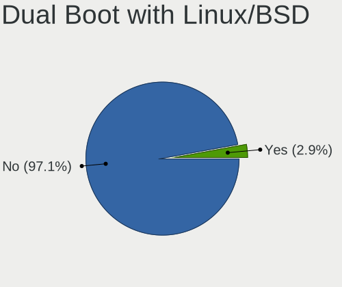
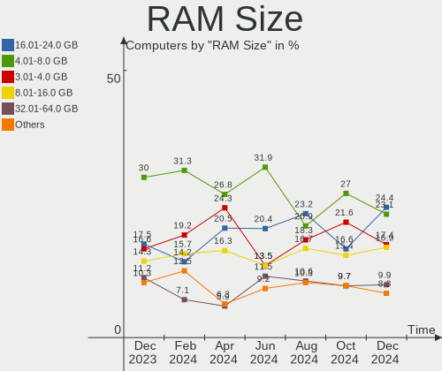
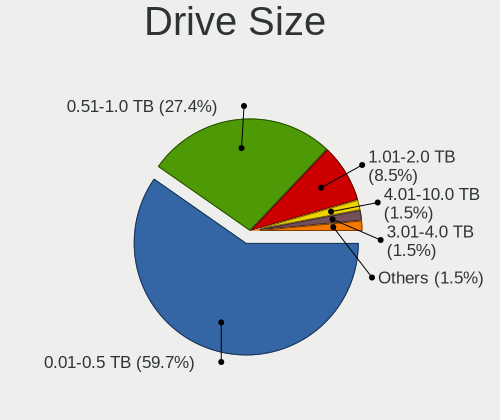
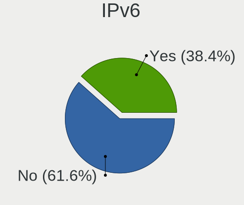

Zorin - Hardware Trends
-----------------------

A project to identify most popular hardware characteristics and track their change
over time based on data collected by Linux users at https://Linux-Hardware.org.

Anyone can contribute to this report by the [hw-probe](https://github.com/linuxhw/hw-probe) tool:

    sudo -E hw-probe -all -upload

This is a report for all computer types. See also reports for [desktops](/Dist/Zorin/Desktop/README.md) and [notebooks](/Dist/Zorin/Notebook/README.md).

This report is for one last month. Overall report since the beginning of time: [TestCoverage](https://github.com/linuxhw/TestCoverage)

Period: Aug, 2022.

Contents
--------

* [ System ](#system)
  - [ OS                       ](#os)
  - [ OS Family                ](#os-family)
  - [ Kernel                   ](#kernel)
  - [ Kernel Family            ](#kernel-family)
  - [ Kernel Major Ver.        ](#kernel-major-ver)
  - [ Arch                     ](#arch)
  - [ DE                       ](#de)
  - [ Display Server           ](#display-server)
  - [ Display Manager          ](#display-manager)
  - [ OS Lang                  ](#os-lang)
  - [ Boot Mode                ](#boot-mode)
  - [ Filesystem               ](#filesystem)
  - [ Part. scheme             ](#part-scheme)
  - [ Dual Boot with Linux/BSD ](#dual-boot-with-linuxbsd)
  - [ Dual Boot (Win)          ](#dual-boot-win)

* [ Board ](#board)
  - [ Vendor                   ](#vendor)
  - [ Model                    ](#model)
  - [ Model Family             ](#model-family)
  - [ MFG Year                 ](#mfg-year)
  - [ Form Factor              ](#form-factor)
  - [ Secure Boot              ](#secure-boot)
  - [ Coreboot                 ](#coreboot)
  - [ RAM Size                 ](#ram-size)
  - [ RAM Used                 ](#ram-used)
  - [ Total Drives             ](#total-drives)
  - [ Has CD-ROM               ](#has-cd-rom)
  - [ Has Ethernet             ](#has-ethernet)
  - [ Has WiFi                 ](#has-wifi)
  - [ Has Bluetooth            ](#has-bluetooth)

* [ Location ](#location)
  - [ Country                  ](#country)
  - [ City                     ](#city)

* [ Drives ](#drives)
  - [ Drive Vendor             ](#drive-vendor)
  - [ Drive Model              ](#drive-model)
  - [ HDD Vendor               ](#hdd-vendor)
  - [ SSD Vendor               ](#ssd-vendor)
  - [ Drive Kind               ](#drive-kind)
  - [ Drive Connector          ](#drive-connector)
  - [ Drive Size               ](#drive-size)
  - [ Space Total              ](#space-total)
  - [ Space Used               ](#space-used)
  - [ Malfunc. Drives          ](#malfunc-drives)
  - [ Malfunc. Drive Vendor    ](#malfunc-drive-vendor)
  - [ Malfunc. HDD Vendor      ](#malfunc-hdd-vendor)
  - [ Malfunc. Drive Kind      ](#malfunc-drive-kind)
  - [ Failed Drives            ](#failed-drives)
  - [ Failed Drive Vendor      ](#failed-drive-vendor)
  - [ Drive Status             ](#drive-status)

* [ Storage controller ](#storage-controller)
  - [ Storage Vendor           ](#storage-vendor)
  - [ Storage Model            ](#storage-model)
  - [ Storage Kind             ](#storage-kind)

* [ Processor ](#processor)
  - [ CPU Vendor               ](#cpu-vendor)
  - [ CPU Model                ](#cpu-model)
  - [ CPU Model Family         ](#cpu-model-family)
  - [ CPU Cores                ](#cpu-cores)
  - [ CPU Sockets              ](#cpu-sockets)
  - [ CPU Threads              ](#cpu-threads)
  - [ CPU Op-Modes             ](#cpu-op-modes)
  - [ CPU Microcode            ](#cpu-microcode)
  - [ CPU Microarch            ](#cpu-microarch)

* [ Graphics ](#graphics)
  - [ GPU Vendor               ](#gpu-vendor)
  - [ GPU Model                ](#gpu-model)
  - [ GPU Combo                ](#gpu-combo)
  - [ GPU Driver               ](#gpu-driver)
  - [ GPU Memory               ](#gpu-memory)

* [ Monitor ](#monitor)
  - [ Monitor Vendor           ](#monitor-vendor)
  - [ Monitor Model            ](#monitor-model)
  - [ Monitor Resolution       ](#monitor-resolution)
  - [ Monitor Diagonal         ](#monitor-diagonal)
  - [ Monitor Width            ](#monitor-width)
  - [ Aspect Ratio             ](#aspect-ratio)
  - [ Monitor Area             ](#monitor-area)
  - [ Pixel Density            ](#pixel-density)
  - [ Multiple Monitors        ](#multiple-monitors)

* [ Network ](#network)
  - [ Net Controller Vendor    ](#net-controller-vendor)
  - [ Net Controller Model     ](#net-controller-model)
  - [ Wireless Vendor          ](#wireless-vendor)
  - [ Wireless Model           ](#wireless-model)
  - [ Ethernet Vendor          ](#ethernet-vendor)
  - [ Ethernet Model           ](#ethernet-model)
  - [ Net Controller Kind      ](#net-controller-kind)
  - [ Used Controller          ](#used-controller)
  - [ NICs                     ](#nics)
  - [ IPv6                     ](#ipv6)

* [ Bluetooth ](#bluetooth)
  - [ Bluetooth Vendor         ](#bluetooth-vendor)
  - [ Bluetooth Model          ](#bluetooth-model)

* [ Sound ](#sound)
  - [ Sound Vendor             ](#sound-vendor)
  - [ Sound Model              ](#sound-model)

* [ Memory ](#memory)
  - [ Memory Vendor            ](#memory-vendor)
  - [ Memory Model             ](#memory-model)
  - [ Memory Kind              ](#memory-kind)
  - [ Memory Form Factor       ](#memory-form-factor)
  - [ Memory Size              ](#memory-size)
  - [ Memory Speed             ](#memory-speed)

* [ Printers & scanners ](#printers--scanners)
  - [ Printer Vendor           ](#printer-vendor)
  - [ Printer Model            ](#printer-model)
  - [ Scanner Vendor           ](#scanner-vendor)
  - [ Scanner Model            ](#scanner-model)

* [ Camera ](#camera)
  - [ Camera Vendor            ](#camera-vendor)
  - [ Camera Model             ](#camera-model)

* [ Security ](#security)
  - [ Fingerprint Vendor       ](#fingerprint-vendor)
  - [ Fingerprint Model        ](#fingerprint-model)
  - [ Chipcard Vendor          ](#chipcard-vendor)
  - [ Chipcard Model           ](#chipcard-model)

* [ Unsupported ](#unsupported)
  - [ Unsupported Devices      ](#unsupported-devices)
  - [ Unsupported Device Types ](#unsupported-device-types)

System
------

OS
--

Installed operating systems

| Name     | Computers | Percent |
|----------|-----------|---------|
| Zorin 16 | 146       | 91.82%  |
| Zorin 15 | 12        | 7.55%   |
| Zorin 12 | 1         | 0.63%   |

OS Family
---------

OS without a version

| Name  | Computers | Percent |
|-------|-----------|---------|
| Zorin | 159       | 100%    |

Kernel
------

Version of the Linux kernel

| Version                 | Computers | Percent |
|-------------------------|-----------|---------|
| 5.15.0-46-generic       | 74        | 46.54%  |
| 5.15.0-43-generic       | 37        | 23.27%  |
| 5.15.0-41-generic       | 20        | 12.58%  |
| 5.4.0-124-generic       | 7         | 4.4%    |
| 5.13.0-30-generic       | 5         | 3.14%   |
| 5.4.0-122-generic       | 3         | 1.89%   |
| 5.13.0-51-generic       | 2         | 1.26%   |
| 5.4.180-0504180-generic | 1         | 0.63%   |
| 5.4.0-110-generic       | 1         | 0.63%   |
| 5.4.0-104-generic       | 1         | 0.63%   |
| 5.19.2-051902-generic   | 1         | 0.63%   |
| 5.18.15-xanmod1         | 1         | 0.63%   |
| 5.17.5-051705-generic   | 1         | 0.63%   |
| 5.17.1-t2               | 1         | 0.63%   |
| 5.14.0-1050-oem         | 1         | 0.63%   |
| 5.13.0-48-generic       | 1         | 0.63%   |
| 5.13.0-39-generic       | 1         | 0.63%   |
| 4.15.0-142-generic      | 1         | 0.63%   |

Kernel Family
-------------

Linux kernel without a distro release

| Version | Computers | Percent |
|---------|-----------|---------|
| 5.15.0  | 131       | 82.39%  |
| 5.4.0   | 12        | 7.55%   |
| 5.13.0  | 9         | 5.66%   |
| 5.4.180 | 1         | 0.63%   |
| 5.19.2  | 1         | 0.63%   |
| 5.18.15 | 1         | 0.63%   |
| 5.17.5  | 1         | 0.63%   |
| 5.17.1  | 1         | 0.63%   |
| 5.14.0  | 1         | 0.63%   |
| 4.15.0  | 1         | 0.63%   |

Kernel Major Ver.
-----------------

Linux kernel major version

| Version | Computers | Percent |
|---------|-----------|---------|
| 5.15    | 131       | 82.39%  |
| 5.4     | 13        | 8.18%   |
| 5.13    | 9         | 5.66%   |
| 5.17    | 2         | 1.26%   |
| 5.19    | 1         | 0.63%   |
| 5.18    | 1         | 0.63%   |
| 5.14    | 1         | 0.63%   |
| 4.15    | 1         | 0.63%   |

Arch
----

OS architecture (x86_64, i586, etc.)

| Name   | Computers | Percent |
|--------|-----------|---------|
| x86_64 | 153       | 96.23%  |
| i686   | 6         | 3.77%   |

DE
--

Desktop Environment

| Name       | Computers | Percent |
|------------|-----------|---------|
| GNOME      | 126       | 79.25%  |
| XFCE       | 29        | 18.24%  |
| Unknown    | 3         | 1.89%   |
| X-Cinnamon | 1         | 0.63%   |

Display Server
--------------

X11 or Wayland

| Name    | Computers | Percent |
|---------|-----------|---------|
| X11     | 153       | 96.23%  |
| Wayland | 5         | 3.14%   |
| Unknown | 1         | 0.63%   |

Display Manager
---------------

SDDM, LightDM, etc.

| Name    | Computers | Percent |
|---------|-----------|---------|
| Unknown | 107       | 67.3%   |
| GDM3    | 19        | 11.95%  |
| GDM     | 19        | 11.95%  |
| LightDM | 14        | 8.81%   |

OS Lang
-------

Language

| Lang  | Computers | Percent |
|-------|-----------|---------|
| en_US | 56        | 35.22%  |
| en_GB | 15        | 9.43%   |
| de_DE | 15        | 9.43%   |
| pt_BR | 11        | 6.92%   |
| en_AU | 7         | 4.4%    |
| nl_NL | 5         | 3.14%   |
| en_CA | 5         | 3.14%   |
| es_AR | 4         | 2.52%   |
| en_IN | 4         | 2.52%   |
| fr_FR | 3         | 1.89%   |
| fr_CA | 3         | 1.89%   |
| fi_FI | 3         | 1.89%   |
| es_ES | 3         | 1.89%   |
| sr_RS | 2         | 1.26%   |
| sk_SK | 2         | 1.26%   |
| nl_BE | 2         | 1.26%   |
| es_US | 2         | 1.26%   |
| es_MX | 2         | 1.26%   |
| en_IL | 2         | 1.26%   |
| de_AT | 2         | 1.26%   |
| ru_RU | 1         | 0.63%   |
| nb_NO | 1         | 0.63%   |
| ko_KR | 1         | 0.63%   |
| it_IT | 1         | 0.63%   |
| id_ID | 1         | 0.63%   |
| fr_BE | 1         | 0.63%   |
| es_CR | 1         | 0.63%   |
| es_CL | 1         | 0.63%   |
| en_IE | 1         | 0.63%   |
| da_DK | 1         | 0.63%   |
| cs_CZ | 1         | 0.63%   |

Boot Mode
---------

EFI or BIOS

| Mode | Computers | Percent |
|------|-----------|---------|
| EFI  | 94        | 59.12%  |
| BIOS | 65        | 40.88%  |

Filesystem
----------

Type of filesystem

| Type  | Computers | Percent |
|-------|-----------|---------|
| Ext4  | 153       | 96.23%  |
| Zfs   | 2         | 1.26%   |
| Xfs   | 2         | 1.26%   |
| Ext2  | 1         | 0.63%   |
| Btrfs | 1         | 0.63%   |

Part. scheme
------------

Scheme of partitioning

| Type    | Computers | Percent |
|---------|-----------|---------|
| Unknown | 136       | 85.53%  |
| GPT     | 19        | 11.95%  |
| MBR     | 4         | 2.52%   |

Dual Boot with Linux/BSD
------------------------

Hosting more than one Linux/BSD

| Dual boot | Computers | Percent |
|-----------|-----------|---------|
| No        | 155       | 97.48%  |
| Yes       | 4         | 2.52%   |

Dual Boot (Win)
---------------

Hosting Linux and Windows

| Dual boot | Computers | Percent |
|-----------|-----------|---------|
| No        | 142       | 89.31%  |
| Yes       | 17        | 10.69%  |

Board
-----

Vendor
------

Motherboard manufacturer

| Name                | Computers | Percent |
|---------------------|-----------|---------|
| ASUSTek Computer    | 28        | 17.61%  |
| Hewlett-Packard     | 26        | 16.35%  |
| Lenovo              | 17        | 10.69%  |
| Dell                | 17        | 10.69%  |
| MSI                 | 13        | 8.18%   |
| Gigabyte Technology | 7         | 4.4%    |
| Toshiba             | 5         | 3.14%   |
| ASRock              | 5         | 3.14%   |
| Apple               | 5         | 3.14%   |
| Acer                | 4         | 2.52%   |
| Samsung Electronics | 3         | 1.89%   |
| Microsoft           | 2         | 1.26%   |
| Google              | 2         | 1.26%   |
| BESSTAR Tech        | 2         | 1.26%   |
| Alienware           | 2         | 1.26%   |
| ZOTAC               | 1         | 0.63%   |
| WIPRO               | 1         | 0.63%   |
| Positivo            | 1         | 0.63%   |
| Pegatron            | 1         | 0.63%   |
| Packard Bell        | 1         | 0.63%   |
| Notebook            | 1         | 0.63%   |
| MP                  | 1         | 0.63%   |
| Medion              | 1         | 0.63%   |
| MAXSUN              | 1         | 0.63%   |
| LORD ELECTRONICS    | 1         | 0.63%   |
| JGINYUE             | 1         | 0.63%   |
| IP3 Tech            | 1         | 0.63%   |
| Intel               | 1         | 0.63%   |
| HUAWEI              | 1         | 0.63%   |
| GPU Company         | 1         | 0.63%   |
| GHIA                | 1         | 0.63%   |
| Fujitsu Siemens     | 1         | 0.63%   |
| Framework           | 1         | 0.63%   |
| Ematic              | 1         | 0.63%   |
| AMI                 | 1         | 0.63%   |
| Unknown             | 1         | 0.63%   |

Model
-----

Motherboard model

| Name                                    | Computers | Percent |
|-----------------------------------------|-----------|---------|
| ASUS All Series                         | 3         | 1.89%   |
| HP Compaq Pro 6300 SFF                  | 2         | 1.26%   |
| Unknown                                 | 2         | 1.26%   |
| ZOTAC ZBOX-CI323NANO                    | 1         | 0.63%   |
| WIPRO G31T-M                            | 1         | 0.63%   |
| Toshiba Satellite Pro L670              | 1         | 0.63%   |
| Toshiba Satellite P205                  | 1         | 0.63%   |
| Toshiba Satellite P200                  | 1         | 0.63%   |
| Toshiba Satellite L855                  | 1         | 0.63%   |
| Toshiba Satellite L655                  | 1         | 0.63%   |
| Samsung Galaxy Book 12 LTE              | 1         | 0.63%   |
| Samsung 600B4B/600B5B                   | 1         | 0.63%   |
| Samsung 300E5M/300E5L                   | 1         | 0.63%   |
| Positivo C14CU51                        | 1         | 0.63%   |
| Pegatron NE502AV-ABA a6750t             | 1         | 0.63%   |
| Packard Bell EasyNote TE69KB            | 1         | 0.63%   |
| Notebook NJ50GU                         | 1         | 0.63%   |
| MSI Vector GP76 12UH                    | 1         | 0.63%   |
| MSI MS-AE6111                           | 1         | 0.63%   |
| MSI MS-7D54                             | 1         | 0.63%   |
| MSI MS-7C94                             | 1         | 0.63%   |
| MSI MS-7C91                             | 1         | 0.63%   |
| MSI MS-7C89                             | 1         | 0.63%   |
| MSI MS-7C02                             | 1         | 0.63%   |
| MSI MS-7A74                             | 1         | 0.63%   |
| MSI MS-7917                             | 1         | 0.63%   |
| MSI MS-7885                             | 1         | 0.63%   |
| MSI FJ452AA-AC4 a6615br                 | 1         | 0.63%   |
| MSI Creator Z16 Hiroshi F A11UE         | 1         | 0.63%   |
| MSI CR620                               | 1         | 0.63%   |
| MP MS-7848                              | 1         | 0.63%   |
| Microsoft Surface Pro 6                 | 1         | 0.63%   |
| Microsoft Surface Pro                   | 1         | 0.63%   |
| Medion E7419 MD60990                    | 1         | 0.63%   |
| MAXSUN MS-TZZ A520M                     | 1         | 0.63%   |
| LORD ELECTRONICS GM965 Series           | 1         | 0.63%   |
| Lenovo Yoga S740-15IRH 81NX             | 1         | 0.63%   |
| Lenovo ThinkPad T500 2055A38            | 1         | 0.63%   |
| Lenovo ThinkPad T420 4236VTQ            | 1         | 0.63%   |
| Lenovo ThinkPad L440 20ASA1V8BP         | 1         | 0.63%   |
| Lenovo ThinkCentre M72e 4004H1U         | 1         | 0.63%   |
| Lenovo ThinkCentre M57 6087YD2          | 1         | 0.63%   |
| Lenovo MIIX 310-10ICR 80SG              | 1         | 0.63%   |
| Lenovo IdeaPadFlex 15D 20334            | 1         | 0.63%   |
| Lenovo IdeaPad Z580                     | 1         | 0.63%   |
| Lenovo IdeaPad S145-14IIL 81W6          | 1         | 0.63%   |
| Lenovo IdeaPad S130-11IGM 81J1          | 1         | 0.63%   |
| Lenovo IdeaPad Gaming 3 15ARH05 82EY    | 1         | 0.63%   |
| Lenovo IdeaPad C340-14IWL 81N4          | 1         | 0.63%   |
| Lenovo IdeaPad 110-14IBR 80UJ           | 1         | 0.63%   |
| Lenovo IdeaCentre 310S-08ASR 90G9002XNY | 1         | 0.63%   |
| Lenovo H30-05 90BJ00CNMT                | 1         | 0.63%   |
| Lenovo G505s 20255                      | 1         | 0.63%   |
| JGINYUE B85M VH PLUS V1.0               | 1         | 0.63%   |
| IP3 Tech AP34 PRO                       | 1         | 0.63%   |
| Intel powered classmate PC              | 1         | 0.63%   |
| HUAWEI KLVD-WXX9                        | 1         | 0.63%   |
| HP Z420 Workstation                     | 1         | 0.63%   |
| HP Stream Notebook PC 13                | 1         | 0.63%   |
| HP ProDesk 600 G1 SFF                   | 1         | 0.63%   |

Model Family
------------

Motherboard model prefix

| Name                   | Computers | Percent |
|------------------------|-----------|---------|
| Dell Inspiron          | 7         | 4.4%    |
| Lenovo IdeaPad         | 6         | 3.77%   |
| HP Pavilion            | 6         | 3.77%   |
| Toshiba Satellite      | 5         | 3.14%   |
| HP Laptop              | 4         | 2.52%   |
| Dell Latitude          | 4         | 2.52%   |
| ASUS VivoBook          | 4         | 2.52%   |
| ASUS PRIME             | 4         | 2.52%   |
| Lenovo ThinkPad        | 3         | 1.89%   |
| HP Compaq              | 3         | 1.89%   |
| Dell OptiPlex          | 3         | 1.89%   |
| ASUS All               | 3         | 1.89%   |
| Microsoft Surface      | 2         | 1.26%   |
| Lenovo ThinkCentre     | 2         | 1.26%   |
| Dell XPS               | 2         | 1.26%   |
| ASUS ROG               | 2         | 1.26%   |
| ASRock B450            | 2         | 1.26%   |
| Alienware 15           | 2         | 1.26%   |
| Acer Aspire            | 2         | 1.26%   |
| Unknown                | 2         | 1.26%   |
| ZOTAC ZBOX-CI323NANO   | 1         | 0.63%   |
| WIPRO G31T-M           | 1         | 0.63%   |
| Samsung Galaxy         | 1         | 0.63%   |
| Samsung 600B4B         | 1         | 0.63%   |
| Samsung 300E5M         | 1         | 0.63%   |
| Positivo C14CU51       | 1         | 0.63%   |
| Pegatron NE502AV-ABA   | 1         | 0.63%   |
| Packard Bell EasyNote  | 1         | 0.63%   |
| Notebook NJ50GU        | 1         | 0.63%   |
| MSI Vector             | 1         | 0.63%   |
| MSI MS-AE6111          | 1         | 0.63%   |
| MSI MS-7D54            | 1         | 0.63%   |
| MSI MS-7C94            | 1         | 0.63%   |
| MSI MS-7C91            | 1         | 0.63%   |
| MSI MS-7C89            | 1         | 0.63%   |
| MSI MS-7C02            | 1         | 0.63%   |
| MSI MS-7A74            | 1         | 0.63%   |
| MSI MS-7917            | 1         | 0.63%   |
| MSI MS-7885            | 1         | 0.63%   |
| MSI FJ452AA-AC4        | 1         | 0.63%   |
| MSI Creator            | 1         | 0.63%   |
| MSI CR620              | 1         | 0.63%   |
| MP MS-7848             | 1         | 0.63%   |
| Medion E7419           | 1         | 0.63%   |
| MAXSUN MS-TZZ          | 1         | 0.63%   |
| LORD ELECTRONICS GM965 | 1         | 0.63%   |
| Lenovo Yoga            | 1         | 0.63%   |
| Lenovo MIIX            | 1         | 0.63%   |
| Lenovo IdeaPadFlex     | 1         | 0.63%   |
| Lenovo IdeaCentre      | 1         | 0.63%   |
| Lenovo H30-05          | 1         | 0.63%   |
| Lenovo G505s           | 1         | 0.63%   |
| JGINYUE B85M           | 1         | 0.63%   |
| IP3 Tech AP34          | 1         | 0.63%   |
| Intel powered          | 1         | 0.63%   |
| HUAWEI KLVD-WXX9       | 1         | 0.63%   |
| HP Z420                | 1         | 0.63%   |
| HP Stream              | 1         | 0.63%   |
| HP ProDesk             | 1         | 0.63%   |
| HP ProBook             | 1         | 0.63%   |

MFG Year
--------

Motherboard manufacture year

| Year | Computers | Percent |
|------|-----------|---------|
| 2021 | 20        | 12.58%  |
| 2019 | 15        | 9.43%   |
| 2014 | 15        | 9.43%   |
| 2013 | 14        | 8.81%   |
| 2012 | 14        | 8.81%   |
| 2018 | 12        | 7.55%   |
| 2020 | 11        | 6.92%   |
| 2016 | 11        | 6.92%   |
| 2017 | 7         | 4.4%    |
| 2011 | 7         | 4.4%    |
| 2008 | 7         | 4.4%    |
| 2007 | 7         | 4.4%    |
| 2010 | 6         | 3.77%   |
| 2022 | 5         | 3.14%   |
| 2015 | 4         | 2.52%   |
| 2009 | 3         | 1.89%   |
| 2006 | 1         | 0.63%   |

Form Factor
-----------

Physical design of the computer

| Name        | Computers | Percent |
|-------------|-----------|---------|
| Notebook    | 86        | 54.09%  |
| Desktop     | 60        | 37.74%  |
| Tablet      | 5         | 3.14%   |
| Mini pc     | 3         | 1.89%   |
| All in one  | 3         | 1.89%   |
| Convertible | 2         | 1.26%   |

Secure Boot
-----------

Enabled or disabled

| State    | Computers | Percent |
|----------|-----------|---------|
| Disabled | 137       | 86.16%  |
| Enabled  | 22        | 13.84%  |

Coreboot
--------

Have coreboot on board

| Used | Computers | Percent |
|------|-----------|---------|
| No   | 156       | 98.11%  |
| Yes  | 3         | 1.89%   |

RAM Size
--------

Total RAM memory

| Size in GB  | Computers | Percent |
|-------------|-----------|---------|
| 4.01-8.0    | 37        | 23.27%  |
| 8.01-16.0   | 32        | 20.13%  |
| 3.01-4.0    | 31        | 19.5%   |
| 16.01-24.0  | 24        | 15.09%  |
| 32.01-64.0  | 17        | 10.69%  |
| 1.01-2.0    | 7         | 4.4%    |
| 2.01-3.0    | 4         | 2.52%   |
| 0.51-1.0    | 3         | 1.89%   |
| 24.01-32.0  | 2         | 1.26%   |
| 64.01-256.0 | 2         | 1.26%   |

RAM Used
--------

Used RAM memory

| Used GB    | Computers | Percent |
|------------|-----------|---------|
| 1.01-2.0   | 55        | 34.59%  |
| 2.01-3.0   | 54        | 33.96%  |
| 4.01-8.0   | 18        | 11.32%  |
| 3.01-4.0   | 16        | 10.06%  |
| 8.01-16.0  | 9         | 5.66%   |
| 0.51-1.0   | 4         | 2.52%   |
| 16.01-24.0 | 2         | 1.26%   |
| 0.01-0.5   | 1         | 0.63%   |

Total Drives
------------

Number of drives on board

| Drives | Computers | Percent |
|--------|-----------|---------|
| 1      | 112       | 70.44%  |
| 2      | 32        | 20.13%  |
| 3      | 8         | 5.03%   |
| 4      | 3         | 1.89%   |
| 5      | 2         | 1.26%   |
| 8      | 1         | 0.63%   |
| 0      | 1         | 0.63%   |

Has CD-ROM
----------

Has CD-ROM on board

| Presented | Computers | Percent |
|-----------|-----------|---------|
| No        | 83        | 52.2%   |
| Yes       | 76        | 47.8%   |

Has Ethernet
------------

Has Ethernet on board

| Presented | Computers | Percent |
|-----------|-----------|---------|
| Yes       | 126       | 79.25%  |
| No        | 33        | 20.75%  |

Has WiFi
--------

Has WiFi module

| Presented | Computers | Percent |
|-----------|-----------|---------|
| Yes       | 130       | 81.76%  |
| No        | 29        | 18.24%  |

Has Bluetooth
-------------

Has Bluetooth module

| Presented | Computers | Percent |
|-----------|-----------|---------|
| Yes       | 92        | 57.86%  |
| No        | 67        | 42.14%  |

Location
--------

Country
-------

Geographic location (country)

| Country     | Computers | Percent |
|-------------|-----------|---------|
| USA         | 29        | 18.24%  |
| Germany     | 17        | 10.69%  |
| UK          | 14        | 8.81%   |
| Brazil      | 11        | 6.92%   |
| Netherlands | 8         | 5.03%   |
| Canada      | 8         | 5.03%   |
| Australia   | 7         | 4.4%    |
| Spain       | 6         | 3.77%   |
| India       | 4         | 2.52%   |
| France      | 4         | 2.52%   |
| Belgium     | 4         | 2.52%   |
| Argentina   | 4         | 2.52%   |
| Serbia      | 3         | 1.89%   |
| Finland     | 3         | 1.89%   |
| Denmark     | 3         | 1.89%   |
| Austria     | 3         | 1.89%   |
| Slovakia    | 2         | 1.26%   |
| Russia      | 2         | 1.26%   |
| Norway      | 2         | 1.26%   |
| Mexico      | 2         | 1.26%   |
| Israel      | 2         | 1.26%   |
| Czechia     | 2         | 1.26%   |
| Vietnam     | 1         | 0.63%   |
| Venezuela   | 1         | 0.63%   |
| Switzerland | 1         | 0.63%   |
| Sweden      | 1         | 0.63%   |
| South Korea | 1         | 0.63%   |
| Slovenia    | 1         | 0.63%   |
| Nigeria     | 1         | 0.63%   |
| Malta       | 1         | 0.63%   |
| Malaysia    | 1         | 0.63%   |
| Lithuania   | 1         | 0.63%   |
| Italy       | 1         | 0.63%   |
| Ireland     | 1         | 0.63%   |
| Indonesia   | 1         | 0.63%   |
| Hungary     | 1         | 0.63%   |
| Greece      | 1         | 0.63%   |
| El Salvador | 1         | 0.63%   |
| Cyprus      | 1         | 0.63%   |
| Costa Rica  | 1         | 0.63%   |
| Chile       | 1         | 0.63%   |

City
----

Geographic location (city)

| City                  | Computers | Percent |
|-----------------------|-----------|---------|
| Madrid                | 3         | 1.89%   |
| Tel Aviv              | 2         | 1.26%   |
| Sydney                | 2         | 1.26%   |
| Oosterbeek            | 2         | 1.26%   |
| Joliette              | 2         | 1.26%   |
| Copenhagen            | 2         | 1.26%   |
| Bexley                | 2         | 1.26%   |
| Belgrade              | 2         | 1.26%   |
| Zeist                 | 1         | 0.63%   |
| Worcester             | 1         | 0.63%   |
| Willoughby            | 1         | 0.63%   |
| Wiednitz              | 1         | 0.63%   |
| Watford               | 1         | 0.63%   |
| Vrhnika               | 1         | 0.63%   |
| Vilnius               | 1         | 0.63%   |
| Vienna                | 1         | 0.63%   |
| Vieiras               | 1         | 0.63%   |
| Victoria              | 1         | 0.63%   |
| Umeå                 | 1         | 0.63%   |
| Tring                 | 1         | 0.63%   |
| Toronto               | 1         | 0.63%   |
| Thesee                | 1         | 0.63%   |
| Tampere               | 1         | 0.63%   |
| Stuttgart             | 1         | 0.63%   |
| Stevenage             | 1         | 0.63%   |
| Springdale            | 1         | 0.63%   |
| Sheffield             | 1         | 0.63%   |
| Seoul                 | 1         | 0.63%   |
| Scranton              | 1         | 0.63%   |
| Sarpsborg             | 1         | 0.63%   |
| Sao Paulo             | 1         | 0.63%   |
| Santiago              | 1         | 0.63%   |
| San Salvador          | 1         | 0.63%   |
| Saarbrücken          | 1         | 0.63%   |
| Ronnenberg            | 1         | 0.63%   |
| Rome                  | 1         | 0.63%   |
| Red Oak               | 1         | 0.63%   |
| Prague                | 1         | 0.63%   |
| Porto Alegre          | 1         | 0.63%   |
| Philadelphia          | 1         | 0.63%   |
| Perth                 | 1         | 0.63%   |
| Perryville            | 1         | 0.63%   |
| Oslo                  | 1         | 0.63%   |
| Oklahoma City         | 1         | 0.63%   |
| Ogdensburg            | 1         | 0.63%   |
| Novi Sad              | 1         | 0.63%   |
| Northampton           | 1         | 0.63%   |
| Nieuwpoort            | 1         | 0.63%   |
| Niederndodeleben      | 1         | 0.63%   |
| New York              | 1         | 0.63%   |
| New Delhi             | 1         | 0.63%   |
| Neuhofen an der Krems | 1         | 0.63%   |
| Nashville             | 1         | 0.63%   |
| Munich                | 1         | 0.63%   |
| Mumbai                | 1         | 0.63%   |
| Moscow                | 1         | 0.63%   |
| Montreal              | 1         | 0.63%   |
| Montbrio del Camp     | 1         | 0.63%   |
| Montague              | 1         | 0.63%   |
| Mexico City           | 1         | 0.63%   |

Drives
------

Drive Vendor
------------

Hard drive vendors

| Vendor                      | Computers | Drives | Percent |
|-----------------------------|-----------|--------|---------|
| Seagate                     | 27        | 33     | 13.24%  |
| Samsung Electronics         | 26        | 33     | 12.75%  |
| WDC                         | 22        | 25     | 10.78%  |
| SanDisk                     | 17        | 17     | 8.33%   |
| Kingston                    | 17        | 18     | 8.33%   |
| Unknown                     | 9         | 10     | 4.41%   |
| Toshiba                     | 9         | 9      | 4.41%   |
| Crucial                     | 9         | 9      | 4.41%   |
| Micron Technology           | 6         | 6      | 2.94%   |
| Intenso                     | 4         | 5      | 1.96%   |
| Intel                       | 4         | 5      | 1.96%   |
| Hitachi                     | 4         | 5      | 1.96%   |
| HGST                        | 4         | 4      | 1.96%   |
| A-DATA Technology           | 4         | 4      | 1.96%   |
| SK hynix                    | 3         | 3      | 1.47%   |
| LITEON                      | 3         | 3      | 1.47%   |
| China                       | 3         | 4      | 1.47%   |
| Apple                       | 3         | 3      | 1.47%   |
| T-CREATE                    | 2         | 2      | 0.98%   |
| PNY                         | 2         | 2      | 0.98%   |
| MAXIO Technology (Hangzhou) | 2         | 2      | 0.98%   |
| KIOXIA                      | 2         | 2      | 0.98%   |
| Unknown                     | 2         | 2      | 0.98%   |
| Zheino                      | 1         | 1      | 0.49%   |
| Yangtze Memory Technologies | 1         | 1      | 0.49%   |
| WD MediaMax                 | 1         | 1      | 0.49%   |
| USB3.0                      | 1         | 1      | 0.49%   |
| Team                        | 1         | 1      | 0.49%   |
| SSK                         | 1         | 1      | 0.49%   |
| SPCC                        | 1         | 1      | 0.49%   |
| Phison                      | 1         | 1      | 0.49%   |
| Patriot                     | 1         | 1      | 0.49%   |
| KingSpec                    | 1         | 1      | 0.49%   |
| KingDian                    | 1         | 1      | 0.49%   |
| JMicron Technology          | 1         | 1      | 0.49%   |
| HS-SSD-C100                 | 1         | 1      | 0.49%   |
| Corsair                     | 1         | 1      | 0.49%   |
| ASMT                        | 1         | 1      | 0.49%   |
| ASMedia                     | 1         | 1      | 0.49%   |
| AFOX                        | 1         | 1      | 0.49%   |
| addlink                     | 1         | 2      | 0.49%   |
| ADATA Technology            | 1         | 1      | 0.49%   |
| Acer                        | 1         | 1      | 0.49%   |

Drive Model
-----------

Hard drive models

| Model                                   | Computers | Percent |
|-----------------------------------------|-----------|---------|
| Kingston SA400S37480G 480GB SSD         | 4         | 1.79%   |
| Seagate ST500DM002-1BD142 500GB         | 3         | 1.35%   |
| Seagate ST1000LM035-1RK172 1TB          | 3         | 1.35%   |
| SanDisk NVMe SSD Drive 1TB              | 3         | 1.35%   |
| Crucial CT240BX500SSD1 240GB            | 3         | 1.35%   |
| Unknown MMC Card  64GB                  | 2         | 0.9%    |
| Unknown MMC Card  32GB                  | 2         | 0.9%    |
| Toshiba KBG30ZMS128G 128GB NVMe SSD     | 2         | 0.9%    |
| T-CREATE T253TA001T 1024GB              | 2         | 0.9%    |
| Seagate ST1000DM003-1SB102 1TB          | 2         | 0.9%    |
| Seagate Expansion Desk 4TB              | 2         | 0.9%    |
| SanDisk SSD PLUS 480GB                  | 2         | 0.9%    |
| SanDisk SDSSDH3 250G                    | 2         | 0.9%    |
| SanDisk NVMe SSD Drive 500GB            | 2         | 0.9%    |
| SanDisk NVMe SSD Drive 256GB            | 2         | 0.9%    |
| SanDisk DF4032  32GB                    | 2         | 0.9%    |
| Samsung SSD 850 EVO 500GB               | 2         | 0.9%    |
| Samsung SM963 2.5" NVMe PCIe SSD 1024GB | 2         | 0.9%    |
| Samsung NVMe SSD Drive 500GB            | 2         | 0.9%    |
| Samsung NVMe SSD Drive 1TB              | 2         | 0.9%    |
| Samsung KUS030202M-B000 256GB           | 2         | 0.9%    |
| Kingston SA400S37240G 240GB SSD         | 2         | 0.9%    |
| Kingston SA400S37120G 120GB SSD         | 2         | 0.9%    |
| Intel SSDPEKNU512GZH 512GB              | 2         | 0.9%    |
| Crucial CT2000MX500SSD1 2TB             | 2         | 0.9%    |
| Crucial CT1000MX500SSD1 1TB             | 2         | 0.9%    |
| China SATA SSD 120GB                    | 2         | 0.9%    |
| Unknown                                 | 2         | 0.9%    |
| Zheino CHN-25SATAC3-128 128GB           | 1         | 0.45%   |
| Yangtze Memory NVMe SSD Drive 512GB     | 1         | 0.45%   |
| WDC WUH721816ALE6L4 16TB                | 1         | 0.45%   |
| WDC WDS500G2B0A-00SM50 500GB SSD        | 1         | 0.45%   |
| WDC WDS100T2B0B 1TB SSD                 | 1         | 0.45%   |
| WDC WDS100T2B0A-00SM50 1TB SSD          | 1         | 0.45%   |
| WDC WDBNCE5000PNC 500GB SSD             | 1         | 0.45%   |
| WDC WD60EFZX-68B3FN0 6TB                | 1         | 0.45%   |
| WDC WD5000LPVX-22V0TT0 500GB            | 1         | 0.45%   |
| WDC WD5000LPCX-75VHAT0 500GB            | 1         | 0.45%   |
| WDC WD5000LPCX-35VHAT0 500GB            | 1         | 0.45%   |
| WDC WD5000LPCX-24VHAT0 500GB            | 1         | 0.45%   |
| WDC WD5000BPVT-75HXZT1 500GB            | 1         | 0.45%   |
| WDC WD5000BEVT-22ZAT0 500GB             | 1         | 0.45%   |
| WDC WD5000AAKX-22ERMA0 500GB            | 1         | 0.45%   |
| WDC WD5000AAKX-00U6AA0 500GB            | 1         | 0.45%   |
| WDC WD5000AAKS-00UU3A0 500GB            | 1         | 0.45%   |
| WDC WD40EZAZ-19SF3B0 4TB                | 1         | 0.45%   |
| WDC WD3200AVVS-63L2B0 320GB             | 1         | 0.45%   |
| WDC WD3200AAKS-00SBA0 320GB             | 1         | 0.45%   |
| WDC WD2500BEVS-60UST0 250GB             | 1         | 0.45%   |
| WDC WD20EARX-00PASB0 2TB                | 1         | 0.45%   |
| WDC WD1200UE-22KVT0 120GB               | 1         | 0.45%   |
| WDC WD10EZEX-75WN4A1 1TB                | 1         | 0.45%   |
| WDC WD10EZEX-00WN4A0 1TB                | 1         | 0.45%   |
| WDC WD My Passport 25F3 512GB           | 1         | 0.45%   |
| WD MediaMax WL500GSA1672B 500GB         | 1         | 0.45%   |
| USB3.0 Super Speed 128GB                | 1         | 0.45%   |
| Unknown SLD64G  64GB                    | 1         | 0.45%   |
| Unknown SD/MMC/MS PRO 128GB             | 1         | 0.45%   |
| Unknown SC128  128GB                    | 1         | 0.45%   |
| Unknown S0J38Y  64GB                    | 1         | 0.45%   |

HDD Vendor
----------

Hard disk drive vendors

| Vendor              | Computers | Drives | Percent |
|---------------------|-----------|--------|---------|
| Seagate             | 26        | 32     | 40.63%  |
| WDC                 | 18        | 20     | 28.13%  |
| Toshiba             | 5         | 5      | 7.81%   |
| Hitachi             | 4         | 5      | 6.25%   |
| HGST                | 4         | 4      | 6.25%   |
| Samsung Electronics | 2         | 2      | 3.13%   |
| Apple               | 2         | 2      | 3.13%   |
| USB3.0              | 1         | 1      | 1.56%   |
| Unknown             | 1         | 1      | 1.56%   |
| ASMT                | 1         | 1      | 1.56%   |

SSD Vendor
----------

Solid state drive vendors

| Vendor              | Computers | Drives | Percent |
|---------------------|-----------|--------|---------|
| Samsung Electronics | 11        | 13     | 14.67%  |
| Kingston            | 11        | 11     | 14.67%  |
| Crucial             | 9         | 9      | 12%     |
| SanDisk             | 7         | 7      | 9.33%   |
| A-DATA Technology   | 4         | 4      | 5.33%   |
| WDC                 | 3         | 4      | 4%      |
| Micron Technology   | 3         | 3      | 4%      |
| LITEON              | 3         | 3      | 4%      |
| Intenso             | 3         | 4      | 4%      |
| China               | 3         | 4      | 4%      |
| T-CREATE            | 2         | 2      | 2.67%   |
| PNY                 | 2         | 2      | 2.67%   |
| Intel               | 2         | 2      | 2.67%   |
| Toshiba             | 1         | 1      | 1.33%   |
| Team                | 1         | 1      | 1.33%   |
| SPCC                | 1         | 1      | 1.33%   |
| SK hynix            | 1         | 1      | 1.33%   |
| Patriot             | 1         | 1      | 1.33%   |
| KingSpec            | 1         | 1      | 1.33%   |
| KingDian            | 1         | 1      | 1.33%   |
| HS-SSD-C100         | 1         | 1      | 1.33%   |
| Apple               | 1         | 1      | 1.33%   |
| AFOX                | 1         | 1      | 1.33%   |
| addlink             | 1         | 1      | 1.33%   |
| Acer                | 1         | 1      | 1.33%   |

Drive Kind
----------

HDD or SSD

| Kind    | Computers | Drives | Percent |
|---------|-----------|--------|---------|
| SSD     | 71        | 80     | 36.6%   |
| HDD     | 59        | 73     | 30.41%  |
| NVMe    | 44        | 52     | 22.68%  |
| MMC     | 11        | 12     | 5.67%   |
| Unknown | 9         | 10     | 4.64%   |

Drive Connector
---------------

SATA, SAS, NVMe, etc.

| Type | Computers | Drives | Percent |
|------|-----------|--------|---------|
| SATA | 113       | 145    | 63.13%  |
| NVMe | 44        | 52     | 24.58%  |
| SAS  | 11        | 18     | 6.15%   |
| MMC  | 11        | 12     | 6.15%   |

Drive Size
----------

Size of hard drive

| Size in TB | Computers | Drives | Percent |
|------------|-----------|--------|---------|
| 0.01-0.5   | 84        | 94     | 62.22%  |
| 0.51-1.0   | 31        | 36     | 22.96%  |
| 1.01-2.0   | 12        | 14     | 8.89%   |
| 3.01-4.0   | 3         | 3      | 2.22%   |
| 4.01-10.0  | 3         | 4      | 2.22%   |
| 2.01-3.0   | 1         | 1      | 0.74%   |
| 10.01-20.0 | 1         | 1      | 0.74%   |

Space Total
-----------

Amount of disk space available on the file system

| Size in GB     | Computers | Percent |
|----------------|-----------|---------|
| 101-250        | 62        | 38.99%  |
| 251-500        | 33        | 20.75%  |
| 501-1000       | 22        | 13.84%  |
| 51-100         | 12        | 7.55%   |
| 21-50          | 8         | 5.03%   |
| 1001-2000      | 8         | 5.03%   |
| More than 3000 | 6         | 3.77%   |
| 2001-3000      | 4         | 2.52%   |
| 1-20           | 2         | 1.26%   |
| Unknown        | 2         | 1.26%   |

Space Used
----------

Amount of used disk space

| Used GB        | Computers | Percent |
|----------------|-----------|---------|
| 1-20           | 56        | 35.22%  |
| 21-50          | 50        | 31.45%  |
| 51-100         | 18        | 11.32%  |
| 101-250        | 15        | 9.43%   |
| 251-500        | 8         | 5.03%   |
| 1001-2000      | 3         | 1.89%   |
| 501-1000       | 3         | 1.89%   |
| More than 3000 | 2         | 1.26%   |
| 2001-3000      | 2         | 1.26%   |
| Unknown        | 2         | 1.26%   |

Malfunc. Drives
---------------

Drive models with a malfunction

| Model                                | Computers | Drives | Percent |
|--------------------------------------|-----------|--------|---------|
| SK hynix BC711 HFM512GD3JX013N 512GB | 1         | 1      | 50%     |
| Seagate ST500DM002-1BD142 500GB      | 1         | 1      | 50%     |

Malfunc. Drive Vendor
---------------------

Vendors of faulty drives

| Vendor   | Computers | Drives | Percent |
|----------|-----------|--------|---------|
| SK hynix | 1         | 1      | 50%     |
| Seagate  | 1         | 1      | 50%     |

Malfunc. HDD Vendor
-------------------

Vendors of faulty HDD drives

| Vendor  | Computers | Drives | Percent |
|---------|-----------|--------|---------|
| Seagate | 1         | 1      | 100%    |

Malfunc. Drive Kind
-------------------

Kinds of faulty drives

| Kind | Computers | Drives | Percent |
|------|-----------|--------|---------|
| NVMe | 1         | 1      | 50%     |
| HDD  | 1         | 1      | 50%     |

Failed Drives
-------------

Failed drive models

Zero info for selected period =(

Failed Drive Vendor
-------------------

Failed drive vendors

Zero info for selected period =(

Drive Status
------------

Number of failed and malfunc. drives

| Status   | Computers | Drives | Percent |
|----------|-----------|--------|---------|
| Detected | 140       | 198    | 86.96%  |
| Works    | 19        | 27     | 11.8%   |
| Malfunc  | 2         | 2      | 1.24%   |

Storage controller
------------------

Storage Vendor
--------------

Storage controller vendors

| Vendor                       | Computers | Percent |
|------------------------------|-----------|---------|
| Intel                        | 109       | 55.9%   |
| AMD                          | 29        | 14.87%  |
| Samsung Electronics          | 16        | 8.21%   |
| SanDisk                      | 8         | 4.1%    |
| Kingston Technology Company  | 6         | 3.08%   |
| Micron Technology            | 4         | 2.05%   |
| ASMedia Technology           | 4         | 2.05%   |
| Toshiba America Info Systems | 3         | 1.54%   |
| Nvidia                       | 3         | 1.54%   |
| SK hynix                     | 2         | 1.03%   |
| Silicon Image                | 2         | 1.03%   |
| Phison Electronics           | 2         | 1.03%   |
| MAXIO Technology (Hangzhou)  | 2         | 1.03%   |
| KIOXIA                       | 2         | 1.03%   |
| Yangtze Memory Technologies  | 1         | 0.51%   |
| VIA Technologies             | 1         | 0.51%   |
| ADATA Technology             | 1         | 0.51%   |

Storage Model
-------------

Storage controller models

| Model                                                                            | Computers | Percent |
|----------------------------------------------------------------------------------|-----------|---------|
| AMD FCH SATA Controller [AHCI mode]                                              | 20        | 8.85%   |
| Intel 8 Series/C220 Series Chipset Family 6-port SATA Controller 1 [AHCI mode]   | 10        | 4.42%   |
| Intel Volume Management Device NVMe RAID Controller                              | 9         | 3.98%   |
| Samsung NVMe SSD Controller SM981/PM981/PM983                                    | 8         | 3.54%   |
| Intel Sunrise Point-LP SATA Controller [AHCI mode]                               | 7         | 3.1%    |
| Intel 82801 Mobile SATA Controller [RAID mode]                                   | 5         | 2.21%   |
| Intel 8 Series SATA Controller 1 [AHCI mode]                                     | 5         | 2.21%   |
| Intel 7 Series Chipset Family 6-port SATA Controller [AHCI mode]                 | 5         | 2.21%   |
| Intel 6 Series/C200 Series Chipset Family 6 port Mobile SATA AHCI Controller     | 5         | 2.21%   |
| Micron Non-Volatile memory controller                                            | 4         | 1.77%   |
| Kingston Company Company Non-Volatile memory controller                          | 4         | 1.77%   |
| Intel NM10/ICH7 Family SATA Controller [IDE mode]                                | 4         | 1.77%   |
| Intel 82801G (ICH7 Family) IDE Controller                                        | 4         | 1.77%   |
| Intel 7 Series/C210 Series Chipset Family 6-port SATA Controller [AHCI mode]     | 4         | 1.77%   |
| Intel 6 Series/C200 Series Chipset Family 6 port Desktop SATA AHCI Controller    | 4         | 1.77%   |
| ASMedia ASM1062 Serial ATA Controller                                            | 4         | 1.77%   |
| AMD 500 Series Chipset SATA Controller                                           | 4         | 1.77%   |
| AMD 400 Series Chipset SATA Controller                                           | 4         | 1.77%   |
| SanDisk WD Blue SN550 NVMe SSD                                                   | 3         | 1.33%   |
| Samsung NVMe SSD Controller PM9A1/PM9A3/980PRO                                   | 3         | 1.33%   |
| Samsung Electronics Non-Volatile memory controller                               | 3         | 1.33%   |
| Intel Tiger Lake-LP SATA Controller                                              | 3         | 1.33%   |
| Intel SATA Controller [RAID mode]                                                | 3         | 1.33%   |
| Intel Celeron/Pentium Silver Processor SATA Controller                           | 3         | 1.33%   |
| Intel Atom/Celeron/Pentium Processor x5-E8000/J3xxx/N3xxx Series SATA Controller | 3         | 1.33%   |
| Intel 82801IR/IO/IH (ICH9R/DO/DH) 6 port SATA Controller [AHCI mode]             | 3         | 1.33%   |
| Intel 82801HM/HEM (ICH8M/ICH8M-E) IDE Controller                                 | 3         | 1.33%   |
| Intel 82801GBM/GHM (ICH7-M Family) SATA Controller [IDE mode]                    | 3         | 1.33%   |
| Intel 5 Series/3400 Series Chipset 4 port SATA AHCI Controller                   | 3         | 1.33%   |
| AMD SB7x0/SB8x0/SB9x0 SATA Controller [AHCI mode]                                | 3         | 1.33%   |
| Toshiba America Info Systems BG3 NVMe SSD Controller                             | 2         | 0.88%   |
| SanDisk WD Black SN750 / PC SN730 NVMe SSD                                       | 2         | 0.88%   |
| Samsung NVMe SSD Controller 980                                                  | 2         | 0.88%   |
| Phison E12 NVMe Controller                                                       | 2         | 0.88%   |
| Nvidia MCP79 AHCI Controller                                                     | 2         | 0.88%   |
| MAXIO (Hangzhou) NVMe SSD Controller MAP1202                                     | 2         | 0.88%   |
| KIOXIA NVMe SSD Controller BG4                                                   | 2         | 0.88%   |
| Intel Wildcat Point-LP SATA Controller [AHCI Mode]                               | 2         | 0.88%   |
| Intel Non-Volatile memory controller                                             | 2         | 0.88%   |
| Intel Celeron N3350/Pentium N4200/Atom E3900 Series SATA AHCI Controller         | 2         | 0.88%   |
| Intel Cannon Lake PCH SATA AHCI Controller                                       | 2         | 0.88%   |
| Intel Cannon Lake Mobile PCH SATA AHCI Controller                                | 2         | 0.88%   |
| Intel Alder Lake-S PCH SATA Controller [AHCI Mode]                               | 2         | 0.88%   |
| Intel 9 Series Chipset Family SATA Controller [AHCI Mode]                        | 2         | 0.88%   |
| Intel 82801HM/HEM (ICH8M/ICH8M-E) SATA Controller [AHCI mode]                    | 2         | 0.88%   |
| Intel 7 Series/C210 Series Chipset Family 4-port SATA Controller [IDE mode]      | 2         | 0.88%   |
| Intel 7 Series/C210 Series Chipset Family 2-port SATA Controller [IDE mode]      | 2         | 0.88%   |
| Intel 7 Series Chipset Family 4-port SATA Controller [IDE mode]                  | 2         | 0.88%   |
| Intel 7 Series Chipset Family 2-port SATA Controller [IDE mode]                  | 2         | 0.88%   |
| Yangtze Memory Non-Volatile memory controller                                    | 1         | 0.44%   |
| VIA VT82C586A/B/VT82C686/A/B/VT823x/A/C PIPC Bus Master IDE                      | 1         | 0.44%   |
| VIA VT8237A SATA 2-Port Controller                                               | 1         | 0.44%   |
| Toshiba America Info Systems XG6 NVMe SSD Controller                             | 1         | 0.44%   |
| SK hynix Gold P31 SSD                                                            | 1         | 0.44%   |
| SK hynix BC511                                                                   | 1         | 0.44%   |
| Silicon Image SiI 3132 Serial ATA Raid II Controller                             | 1         | 0.44%   |
| Silicon Image SiI 3114 [SATALink/SATARaid] Serial ATA Controller                 | 1         | 0.44%   |
| SanDisk WD Blue SN570 NVMe SSD                                                   | 1         | 0.44%   |
| SanDisk WD Blue SN500 / PC SN520 NVMe SSD                                        | 1         | 0.44%   |
| SanDisk Non-Volatile memory controller                                           | 1         | 0.44%   |

Storage Kind
------------

Kind of storage controller (IDE, SATA, NVMe, SAS, ...)

| Kind | Computers | Percent |
|------|-----------|---------|
| SATA | 111       | 55.5%   |
| NVMe | 45        | 22.5%   |
| IDE  | 23        | 11.5%   |
| RAID | 20        | 10%     |
| SAS  | 1         | 0.5%    |

Processor
---------

CPU Vendor
----------

Processor vendors

| Vendor | Computers | Percent |
|--------|-----------|---------|
| Intel  | 125       | 78.62%  |
| AMD    | 34        | 21.38%  |

CPU Model
---------

Processor models

| Model                                       | Computers | Percent |
|---------------------------------------------|-----------|---------|
| Intel Core i7-3770 CPU @ 3.40GHz            | 3         | 1.89%   |
| Intel Core i5-7200U CPU @ 2.50GHz           | 3         | 1.89%   |
| Intel Atom x5-Z8350 CPU @ 1.44GHz           | 3         | 1.89%   |
| Intel 11th Gen Core i5-1135G7 @ 2.40GHz     | 3         | 1.89%   |
| AMD Ryzen 5 5500U with Radeon Graphics      | 3         | 1.89%   |
| Intel Pentium Silver N5030 CPU @ 1.10GHz    | 2         | 1.26%   |
| Intel Core i7-8750H CPU @ 2.20GHz           | 2         | 1.26%   |
| Intel Core i5-9300H CPU @ 2.40GHz           | 2         | 1.26%   |
| Intel Core i5-4590 CPU @ 3.30GHz            | 2         | 1.26%   |
| Intel Core i5-3470 CPU @ 3.20GHz            | 2         | 1.26%   |
| Intel Core i5-3230M CPU @ 2.60GHz           | 2         | 1.26%   |
| Intel Core i5-2520M CPU @ 2.50GHz           | 2         | 1.26%   |
| Intel Core i3-1005G1 CPU @ 1.20GHz          | 2         | 1.26%   |
| Intel Celeron CPU N3050 @ 1.60GHz           | 2         | 1.26%   |
| Intel 11th Gen Core i7-11800H @ 2.30GHz     | 2         | 1.26%   |
| Intel 11th Gen Core i7-1165G7 @ 2.80GHz     | 2         | 1.26%   |
| AMD Ryzen 7 5800X 8-Core Processor          | 2         | 1.26%   |
| Intel Xeon CPU E5-1650 v3 @ 3.50GHz         | 1         | 0.63%   |
| Intel Xeon CPU E5-1650 0 @ 3.20GHz          | 1         | 0.63%   |
| Intel Xeon CPU E3-1231 v3 @ 3.40GHz         | 1         | 0.63%   |
| Intel Pentium Gold 7505 @ 2.00GHz           | 1         | 0.63%   |
| Intel Pentium Dual-Core CPU T4200 @ 2.00GHz | 1         | 0.63%   |
| Intel Pentium Dual-Core CPU E5800 @ 3.20GHz | 1         | 0.63%   |
| Intel Pentium Dual-Core CPU E5300 @ 2.60GHz | 1         | 0.63%   |
| Intel Pentium Dual-Core CPU E5200 @ 2.50GHz | 1         | 0.63%   |
| Intel Pentium Dual CPU E2200 @ 2.20GHz      | 1         | 0.63%   |
| Intel Pentium Dual CPU E2140 @ 1.60GHz      | 1         | 0.63%   |
| Intel Pentium CPU P6100 @ 2.00GHz           | 1         | 0.63%   |
| Intel Pentium CPU G3220 @ 3.00GHz           | 1         | 0.63%   |
| Intel Pentium CPU G2030T @ 2.60GHz          | 1         | 0.63%   |
| Intel Pentium CPU G2030 @ 3.00GHz           | 1         | 0.63%   |
| Intel Pentium CPU 4405U @ 2.10GHz           | 1         | 0.63%   |
| Intel Pentium CPU 2020M @ 2.40GHz           | 1         | 0.63%   |
| Intel Genuine CPU T2050 @ 1.60GHz           | 1         | 0.63%   |
| Intel Core M-5Y10c CPU @ 0.80GHz            | 1         | 0.63%   |
| Intel Core i9-9900KS CPU @ 4.00GHz          | 1         | 0.63%   |
| Intel Core i7-8700 CPU @ 3.20GHz            | 1         | 0.63%   |
| Intel Core i7-8550U CPU @ 1.80GHz           | 1         | 0.63%   |
| Intel Core i7-6700HQ CPU @ 2.60GHz          | 1         | 0.63%   |
| Intel Core i7-6500U CPU @ 2.50GHz           | 1         | 0.63%   |
| Intel Core i7-5500U CPU @ 2.40GHz           | 1         | 0.63%   |
| Intel Core i7-4790K CPU @ 4.00GHz           | 1         | 0.63%   |
| Intel Core i7-4770R CPU @ 3.20GHz           | 1         | 0.63%   |
| Intel Core i7-4770K CPU @ 3.50GHz           | 1         | 0.63%   |
| Intel Core i7-4710HQ CPU @ 2.50GHz          | 1         | 0.63%   |
| Intel Core i7-4600U CPU @ 2.10GHz           | 1         | 0.63%   |
| Intel Core i7-3820 CPU @ 3.60GHz            | 1         | 0.63%   |
| Intel Core i7-3630QM CPU @ 2.40GHz          | 1         | 0.63%   |
| Intel Core i7-2640M CPU @ 2.80GHz           | 1         | 0.63%   |
| Intel Core i7-2630QM CPU @ 2.00GHz          | 1         | 0.63%   |
| Intel Core i7-1065G7 CPU @ 1.30GHz          | 1         | 0.63%   |
| Intel Core i5-9400 CPU @ 2.90GHz            | 1         | 0.63%   |
| Intel Core i5-8250U CPU @ 1.60GHz           | 1         | 0.63%   |
| Intel Core i5-7300U CPU @ 2.60GHz           | 1         | 0.63%   |
| Intel Core i5-6600 CPU @ 3.30GHz            | 1         | 0.63%   |
| Intel Core i5-5350U CPU @ 1.80GHz           | 1         | 0.63%   |
| Intel Core i5-4570 CPU @ 3.20GHz            | 1         | 0.63%   |
| Intel Core i5-4460 CPU @ 3.20GHz            | 1         | 0.63%   |
| Intel Core i5-4310U CPU @ 2.00GHz           | 1         | 0.63%   |
| Intel Core i5-4302Y CPU @ 1.60GHz           | 1         | 0.63%   |

CPU Model Family
----------------

Processor model prefix

| Model                   | Computers | Percent |
|-------------------------|-----------|---------|
| Intel Core i5           | 29        | 18.24%  |
| Intel Core i7           | 20        | 12.58%  |
| Other                   | 14        | 8.81%   |
| Intel Core i3           | 14        | 8.81%   |
| Intel Celeron           | 12        | 7.55%   |
| AMD Ryzen 5             | 9         | 5.66%   |
| Intel Core 2 Duo        | 8         | 5.03%   |
| AMD Ryzen 7             | 7         | 4.4%    |
| Intel Pentium           | 6         | 3.77%   |
| Intel Atom              | 5         | 3.14%   |
| Intel Pentium Dual-Core | 4         | 2.52%   |
| Intel Xeon              | 3         | 1.89%   |
| AMD Ryzen 9             | 3         | 1.89%   |
| AMD A6                  | 3         | 1.89%   |
| Intel Pentium Silver    | 2         | 1.26%   |
| Intel Pentium Dual      | 2         | 1.26%   |
| Intel Core 2 Quad       | 2         | 1.26%   |
| AMD FX                  | 2         | 1.26%   |
| AMD A4                  | 2         | 1.26%   |
| Intel Pentium Gold      | 1         | 0.63%   |
| Intel Genuine           | 1         | 0.63%   |
| Intel Core M            | 1         | 0.63%   |
| Intel Core i9           | 1         | 0.63%   |
| Intel Core Duo          | 1         | 0.63%   |
| Intel Celeron M         | 1         | 0.63%   |
| AMD Turion 64 X2 Mobile | 1         | 0.63%   |
| AMD Ryzen 3 PRO         | 1         | 0.63%   |
| AMD E1                  | 1         | 0.63%   |
| AMD Athlon II           | 1         | 0.63%   |
| AMD A8                  | 1         | 0.63%   |
| AMD A10                 | 1         | 0.63%   |

CPU Cores
---------

Number of processor cores

| Number | Computers | Percent |
|--------|-----------|---------|
| 2      | 77        | 48.43%  |
| 4      | 50        | 31.45%  |
| 6      | 15        | 9.43%   |
| 8      | 12        | 7.55%   |
| 1      | 2         | 1.26%   |
| 16     | 1         | 0.63%   |
| 14     | 1         | 0.63%   |
| 12     | 1         | 0.63%   |

CPU Sockets
-----------

Number of sockets

| Number | Computers | Percent |
|--------|-----------|---------|
| 1      | 159       | 100%    |

CPU Threads
-----------

Threads per core (Hyper-Threading)

| Number | Computers | Percent |
|--------|-----------|---------|
| 2      | 95        | 59.75%  |
| 1      | 64        | 40.25%  |

CPU Op-Modes
------------

CPU Operation Modes (32-bit, 64-bit)

| Op mode        | Computers | Percent |
|----------------|-----------|---------|
| 32-bit, 64-bit | 156       | 98.11%  |
| 32-bit         | 3         | 1.89%   |

CPU Microcode
-------------

Microcode number

| Number     | Computers | Percent |
|------------|-----------|---------|
| 0x306a9    | 16        | 10.06%  |
| 0x306c3    | 9         | 5.66%   |
| 0x1067a    | 9         | 5.66%   |
| 0x40651    | 7         | 4.4%    |
| 0x206a7    | 7         | 4.4%    |
| Unknown    | 7         | 4.4%    |
| 0x806c1    | 6         | 3.77%   |
| 0x806e9    | 5         | 3.14%   |
| 0x6fd      | 5         | 3.14%   |
| 0x406c4    | 5         | 3.14%   |
| 0x20655    | 5         | 3.14%   |
| 0x906ea    | 4         | 2.52%   |
| 0x06006705 | 4         | 2.52%   |
| 0x706e5    | 3         | 1.89%   |
| 0x406c3    | 3         | 1.89%   |
| 0x306d4    | 3         | 1.89%   |
| 0x0a201016 | 3         | 1.89%   |
| 0x806ea    | 2         | 1.26%   |
| 0x806d1    | 2         | 1.26%   |
| 0x706a8    | 2         | 1.26%   |
| 0x6e8      | 2         | 1.26%   |
| 0x506e3    | 2         | 1.26%   |
| 0x506c9    | 2         | 1.26%   |
| 0x406e3    | 2         | 1.26%   |
| 0x206d7    | 2         | 1.26%   |
| 0x08608103 | 2         | 1.26%   |
| 0x08600104 | 2         | 1.26%   |
| 0x08108109 | 2         | 1.26%   |
| 0x0700010f | 2         | 1.26%   |
| 0x06001119 | 2         | 1.26%   |
| 0x06000852 | 2         | 1.26%   |
| 0xa0653    | 1         | 0.63%   |
| 0xa0652    | 1         | 0.63%   |
| 0x906ed    | 1         | 0.63%   |
| 0x906e9    | 1         | 0.63%   |
| 0x906a3    | 1         | 0.63%   |
| 0x90675    | 1         | 0.63%   |
| 0x90672    | 1         | 0.63%   |
| 0x806ec    | 1         | 0.63%   |
| 0x806c2    | 1         | 0.63%   |
| 0x706a1    | 1         | 0.63%   |
| 0x6fb      | 1         | 0.63%   |
| 0x6ec      | 1         | 0.63%   |
| 0x40661    | 1         | 0.63%   |
| 0x306f2    | 1         | 0.63%   |
| 0x30678    | 1         | 0.63%   |
| 0x106ca    | 1         | 0.63%   |
| 0x10676    | 1         | 0.63%   |
| 0x0a50000c | 1         | 0.63%   |
| 0x0a50000b | 1         | 0.63%   |
| 0x0a201205 | 1         | 0.63%   |
| 0x08701021 | 1         | 0.63%   |
| 0x08701013 | 1         | 0.63%   |
| 0x08608102 | 1         | 0.63%   |
| 0x08600106 | 1         | 0.63%   |
| 0x08101016 | 1         | 0.63%   |
| 0x08001138 | 1         | 0.63%   |
| 0x07030105 | 1         | 0.63%   |
| 0x06006704 | 1         | 0.63%   |
| 0x010000c8 | 1         | 0.63%   |

CPU Microarch
-------------

Microarchitecture

| Name             | Computers | Percent |
|------------------|-----------|---------|
| Haswell          | 20        | 12.58%  |
| KabyLake         | 16        | 10.06%  |
| IvyBridge        | 16        | 10.06%  |
| Penryn           | 10        | 6.29%   |
| Silvermont       | 9         | 5.66%   |
| SandyBridge      | 9         | 5.66%   |
| TigerLake        | 8         | 5.03%   |
| Zen 3            | 7         | 4.4%    |
| Zen 2            | 6         | 3.77%   |
| Core             | 6         | 3.77%   |
| Westmere         | 5         | 3.14%   |
| IceLake          | 5         | 3.14%   |
| Excavator        | 5         | 3.14%   |
| Skylake          | 4         | 2.52%   |
| Piledriver       | 4         | 2.52%   |
| P6               | 3         | 1.89%   |
| Goldmont plus    | 3         | 1.89%   |
| Broadwell        | 3         | 1.89%   |
| Alderlake Hybrid | 3         | 1.89%   |
| Unknown          | 3         | 1.89%   |
| Zen+             | 2         | 1.26%   |
| Zen              | 2         | 1.26%   |
| Jaguar           | 2         | 1.26%   |
| Goldmont         | 2         | 1.26%   |
| CometLake        | 2         | 1.26%   |
| Puma             | 1         | 0.63%   |
| K8 Hammer        | 1         | 0.63%   |
| K10              | 1         | 0.63%   |
| Bonnell          | 1         | 0.63%   |

Graphics
--------

GPU Vendor
----------

Vendors of graphics cards

| Vendor           | Computers | Percent |
|------------------|-----------|---------|
| Intel            | 98        | 54.44%  |
| Nvidia           | 43        | 23.89%  |
| AMD              | 38        | 21.11%  |
| VIA Technologies | 1         | 0.56%   |

GPU Model
---------

Graphics card models

| Model                                                                                    | Computers | Percent |
|------------------------------------------------------------------------------------------|-----------|---------|
| Intel Atom/Celeron/Pentium Processor x5-E8000/J3xxx/N3xxx Integrated Graphics Controller | 8         | 4.35%   |
| Intel 2nd Generation Core Processor Family Integrated Graphics Controller                | 7         | 3.8%    |
| Intel TigerLake-LP GT2 [Iris Xe Graphics]                                                | 6         | 3.26%   |
| Intel Haswell-ULT Integrated Graphics Controller                                         | 6         | 3.26%   |
| Intel 3rd Gen Core processor Graphics Controller                                         | 6         | 3.26%   |
| Intel Xeon E3-1200 v2/3rd Gen Core processor Graphics Controller                         | 5         | 2.72%   |
| AMD Stoney [Radeon R2/R3/R4/R5 Graphics]                                                 | 5         | 2.72%   |
| Intel Mobile GM965/GL960 Integrated Graphics Controller (secondary)                      | 4         | 2.17%   |
| Intel Mobile GM965/GL960 Integrated Graphics Controller (primary)                        | 4         | 2.17%   |
| Intel HD Graphics 620                                                                    | 4         | 2.17%   |
| Intel Core Processor Integrated Graphics Controller                                      | 4         | 2.17%   |
| Intel CoffeeLake-H GT2 [UHD Graphics 630]                                                | 4         | 2.17%   |
| Nvidia TU117M [GeForce GTX 1650 Mobile / Max-Q]                                          | 3         | 1.63%   |
| Intel 82G33/G31 Express Integrated Graphics Controller                                   | 3         | 1.63%   |
| AMD Renoir                                                                               | 3         | 1.63%   |
| AMD Lucienne                                                                             | 3         | 1.63%   |
| Nvidia GM206 [GeForce GTX 960]                                                           | 2         | 1.09%   |
| Nvidia GM204 [GeForce GTX 980]                                                           | 2         | 1.09%   |
| Nvidia GK208B [GeForce GT 730]                                                           | 2         | 1.09%   |
| Nvidia GK106 [GeForce GTX 660]                                                           | 2         | 1.09%   |
| Nvidia GA104 [GeForce RTX 3060 Ti Lite Hash Rate]                                        | 2         | 1.09%   |
| Nvidia C79 [GeForce 9400M]                                                               | 2         | 1.09%   |
| Intel Xeon E3-1200 v3/4th Gen Core Processor Integrated Graphics Controller              | 2         | 1.09%   |
| Intel UHD Graphics 620                                                                   | 2         | 1.09%   |
| Intel TigerLake-H GT1 [UHD Graphics]                                                     | 2         | 1.09%   |
| Intel Tiger Lake UHD Graphics                                                            | 2         | 1.09%   |
| Intel IvyBridge GT2 [HD Graphics 4000]                                                   | 2         | 1.09%   |
| Intel Iris Plus Graphics G1 (Ice Lake)                                                   | 2         | 1.09%   |
| Intel HD Graphics 530                                                                    | 2         | 1.09%   |
| Intel HD Graphics 500                                                                    | 2         | 1.09%   |
| Intel GeminiLake [UHD Graphics 605]                                                      | 2         | 1.09%   |
| Intel 4th Gen Core Processor Integrated Graphics Controller                              | 2         | 1.09%   |
| AMD Picasso/Raven 2 [Radeon Vega Series / Radeon Vega Mobile Series]                     | 2         | 1.09%   |
| AMD Cezanne                                                                              | 2         | 1.09%   |
| VIA Technologies CN896/VN896/P4M900 [Chrome 9 HC]                                        | 1         | 0.54%   |
| Nvidia TU117M [GeForce MX450]                                                            | 1         | 0.54%   |
| Nvidia TU117M [GeForce GTX 1650 Ti Mobile]                                               | 1         | 0.54%   |
| Nvidia TU117 [GeForce GTX 1650]                                                          | 1         | 0.54%   |
| Nvidia TU116 [GeForce GTX 1660 Ti]                                                       | 1         | 0.54%   |
| Nvidia TU116 [GeForce GTX 1660 SUPER]                                                    | 1         | 0.54%   |
| Nvidia TU106M [GeForce RTX 2060 Max-Q]                                                   | 1         | 0.54%   |
| Nvidia GP108 [GeForce GT 1030]                                                           | 1         | 0.54%   |
| Nvidia GP107M [GeForce GTX 1050 Ti Mobile]                                               | 1         | 0.54%   |
| Nvidia GP107 [GeForce GTX 1050 Ti]                                                       | 1         | 0.54%   |
| Nvidia GP106M [GeForce GTX 1060 Mobile]                                                  | 1         | 0.54%   |
| Nvidia GP106 [GeForce GTX 1060 3GB]                                                      | 1         | 0.54%   |
| Nvidia GP104M [GeForce GTX 1070 Mobile]                                                  | 1         | 0.54%   |
| Nvidia GP102 [GeForce GTX 1080 Ti]                                                       | 1         | 0.54%   |
| Nvidia GM107M [GeForce GTX 850M]                                                         | 1         | 0.54%   |
| Nvidia GM107 [GeForce GTX 745]                                                           | 1         | 0.54%   |
| Nvidia GM107 [GeForce 940MX]                                                             | 1         | 0.54%   |
| Nvidia GK208 [GeForce GT 630 Rev. 2]                                                     | 1         | 0.54%   |
| Nvidia GK107M [GeForce GT 640M]                                                          | 1         | 0.54%   |
| Nvidia GK107 [GeForce GT 740]                                                            | 1         | 0.54%   |
| Nvidia GK104 [GeForce GTX 760]                                                           | 1         | 0.54%   |
| Nvidia GF108 [GeForce GT 730]                                                            | 1         | 0.54%   |
| Nvidia GF108 [GeForce GT 430]                                                            | 1         | 0.54%   |
| Nvidia GA107M [GeForce RTX 3050 Ti Mobile]                                               | 1         | 0.54%   |
| Nvidia GA106M [GeForce RTX 3060 Mobile / Max-Q]                                          | 1         | 0.54%   |
| Nvidia GA104M [GeForce RTX 3080 Mobile / Max-Q 8GB/16GB]                                 | 1         | 0.54%   |

GPU Combo
---------

Combinations of graphics cards

| Name           | Computers | Percent |
|----------------|-----------|---------|
| 1 x Intel      | 81        | 50.94%  |
| 1 x AMD        | 33        | 20.75%  |
| 1 x Nvidia     | 27        | 16.98%  |
| Intel + Nvidia | 12        | 7.55%   |
| AMD + Nvidia   | 3         | 1.89%   |
| Intel + AMD    | 2         | 1.26%   |
| 1 x VIA        | 1         | 0.63%   |

GPU Driver
----------

Free vs proprietary

| Driver      | Computers | Percent |
|-------------|-----------|---------|
| Free        | 123       | 77.36%  |
| Proprietary | 34        | 21.38%  |
| Unknown     | 2         | 1.26%   |

GPU Memory
----------

Total video memory

| Size in GB | Computers | Percent |
|------------|-----------|---------|
| Unknown    | 95        | 59.75%  |
| 0.01-0.5   | 20        | 12.58%  |
| 3.01-4.0   | 15        | 9.43%   |
| 1.01-2.0   | 13        | 8.18%   |
| 0.51-1.0   | 7         | 4.4%    |
| 7.01-8.0   | 4         | 2.52%   |
| 5.01-6.0   | 2         | 1.26%   |
| 8.01-16.0  | 2         | 1.26%   |
| 2.01-3.0   | 1         | 0.63%   |

Monitor
-------

Monitor Vendor
--------------

Monitor vendors

| Vendor                  | Computers | Percent |
|-------------------------|-----------|---------|
| Samsung Electronics     | 18        | 10.78%  |
| Chimei Innolux          | 17        | 10.18%  |
| AU Optronics            | 16        | 9.58%   |
| LG Display              | 15        | 8.98%   |
| BOE                     | 13        | 7.78%   |
| Dell                    | 12        | 7.19%   |
| Philips                 | 11        | 6.59%   |
| Goldstar                | 8         | 4.79%   |
| Apple                   | 5         | 2.99%   |
| AOC                     | 5         | 2.99%   |
| Acer                    | 5         | 2.99%   |
| Sharp                   | 3         | 1.8%    |
| LG Philips              | 3         | 1.8%    |
| LG Electronics          | 3         | 1.8%    |
| BenQ                    | 3         | 1.8%    |
| ViewSonic               | 2         | 1.2%    |
| Sceptre Tech            | 2         | 1.2%    |
| PKB                     | 2         | 1.2%    |
| PANDA                   | 2         | 1.2%    |
| MSI                     | 2         | 1.2%    |
| Lenovo                  | 2         | 1.2%    |
| Hewlett-Packard         | 2         | 1.2%    |
| Unknown                 | 2         | 1.2%    |
| Unknown                 | 1         | 0.6%    |
| TLW                     | 1         | 0.6%    |
| TFG                     | 1         | 0.6%    |
| Sony                    | 1         | 0.6%    |
| OOO                     | 1         | 0.6%    |
| LGD                     | 1         | 0.6%    |
| KDI                     | 1         | 0.6%    |
| JRY                     | 1         | 0.6%    |
| HPN                     | 1         | 0.6%    |
| Gateway                 | 1         | 0.6%    |
| Eizo                    | 1         | 0.6%    |
| Chi Mei Optoelectronics | 1         | 0.6%    |
| ASUSTek Computer        | 1         | 0.6%    |
| Ancor Communications    | 1         | 0.6%    |

Monitor Model
-------------

Monitor models

| Model                                                                   | Computers | Percent |
|-------------------------------------------------------------------------|-----------|---------|
| Philips FTV PHL01EA 1920x1080 1440x810mm 65.0-inch                      | 2         | 1.18%   |
| LG Display LCD Monitor LGD0555 1536x1024 263x175mm 12.4-inch            | 2         | 1.18%   |
| Goldstar IPS225 GSM587B 1920x1080 510x290mm 23.1-inch                   | 2         | 1.18%   |
| Dell P2719H DEL4185 1920x1080 598x336mm 27.0-inch                       | 2         | 1.18%   |
| Chimei Innolux LCD Monitor CMN15E7 1920x1080 344x193mm 15.5-inch        | 2         | 1.18%   |
| BOE LCD Monitor BOE095F 2256x1504 285x190mm 13.5-inch                   | 2         | 1.18%   |
| AU Optronics LCD Monitor AUO10EC 1366x768 344x193mm 15.5-inch           | 2         | 1.18%   |
| Unknown                                                                 | 2         | 1.18%   |
| ViewSonic LCD Monitor VX2703 SERIES 1920x1080                           | 1         | 0.59%   |
| ViewSonic LCD Monitor VSCDE2E 1920x1080 520x290mm 23.4-inch             | 1         | 0.59%   |
| Unknown LCD Monitor XMI Mi Monitor 3440x1440                            | 1         | 0.59%   |
| TLW MATRIX TLWF01D 1920x1080 510x287mm 23.0-inch                        | 1         | 0.59%   |
| TFG WET TV TFG5633 3840x2160 800x450mm 36.1-inch                        | 1         | 0.59%   |
| Sony LCD Monitor TV XV 1920x1080                                        | 1         | 0.59%   |
| Sharp LQ173M1JW08 SHP1544 1920x1080 382x215mm 17.3-inch                 | 1         | 0.59%   |
| Sharp LCD Monitor SHP14D1 1920x1200 336x210mm 15.6-inch                 | 1         | 0.59%   |
| Sharp LCD Monitor SHP148D 3840x2160 344x194mm 15.5-inch                 | 1         | 0.59%   |
| Sceptre Tech Sceptre C27 SPT0AD7 1920x1080 598x336mm 27.0-inch          | 1         | 0.59%   |
| Sceptre Tech H32 SPT0CB8 1920x1080 575x323mm 26.0-inch                  | 1         | 0.59%   |
| Samsung Electronics U32R59x SAM0F94 3840x2160 697x392mm 31.5-inch       | 1         | 0.59%   |
| Samsung Electronics SMBX2335 SAM0702 1920x1080 510x287mm 23.0-inch      | 1         | 0.59%   |
| Samsung Electronics S24D300 SAM0B43 1920x1080 531x299mm 24.0-inch       | 1         | 0.59%   |
| Samsung Electronics LCD Monitor SEC5441 1366x768 344x194mm 15.5-inch    | 1         | 0.59%   |
| Samsung Electronics LCD Monitor SEC3847 1440x900 367x230mm 17.1-inch    | 1         | 0.59%   |
| Samsung Electronics LCD Monitor SEC3651 1366x768 344x194mm 15.5-inch    | 1         | 0.59%   |
| Samsung Electronics LCD Monitor SEC3449 1366x768 309x174mm 14.0-inch    | 1         | 0.59%   |
| Samsung Electronics LCD Monitor SEC3358 1280x800 331x207mm 15.4-inch    | 1         | 0.59%   |
| Samsung Electronics LCD Monitor SEC3157 1280x800 303x190mm 14.1-inch    | 1         | 0.59%   |
| Samsung Electronics LCD Monitor SEC3030 1024x600 223x125mm 10.1-inch    | 1         | 0.59%   |
| Samsung Electronics LCD Monitor SDC4651 1366x768 344x194mm 15.5-inch    | 1         | 0.59%   |
| Samsung Electronics LCD Monitor SDC3654 1600x900 382x215mm 17.3-inch    | 1         | 0.59%   |
| Samsung Electronics LCD Monitor SAM0F9F 3840x2160 1872x1053mm 84.6-inch | 1         | 0.59%   |
| Samsung Electronics LCD Monitor SAM0D4F 1920x1080 1210x680mm 54.6-inch  | 1         | 0.59%   |
| Samsung Electronics LCD Monitor SAM0C3C 1366x768 609x347mm 27.6-inch    | 1         | 0.59%   |
| Samsung Electronics LCD Monitor SAM0679 1360x768 410x256mm 19.0-inch    | 1         | 0.59%   |
| Samsung Electronics LC27G5xT SAM7079 2560x1440 597x336mm 27.0-inch      | 1         | 0.59%   |
| Samsung Electronics Color LCD SDCA029 2160x1440 252x168mm 11.9-inch     | 1         | 0.59%   |
| Samsung Electronics C27F390 SAM0D32 1920x1080 600x340mm 27.2-inch       | 1         | 0.59%   |
| PKB LCD Monitor Viseo 223Ws 1680x1050                                   | 1         | 0.59%   |
| PKB LCD Monitor Maestro 242DX 3840x1080                                 | 1         | 0.59%   |
| PKB LCD Monitor Maestro 242DX                                           | 1         | 0.59%   |
| Philips PHL 277E6 PHLC0E6 1920x1080 598x336mm 27.0-inch                 | 1         | 0.59%   |
| Philips PHL 243V7 PHLC155 1920x1080 527x296mm 23.8-inch                 | 1         | 0.59%   |
| Philips PHL 221S8L PHL091C 1920x1080 477x268mm 21.5-inch                | 1         | 0.59%   |
| Philips PHL 221S6L PHL08F9 1920x1080 477x268mm 21.5-inch                | 1         | 0.59%   |
| Philips PHL 203V5 PHLC0CE 1600x900 434x236mm 19.4-inch                  | 1         | 0.59%   |
| Philips LCD Monitor PHL 288E2 3840x2160                                 | 1         | 0.59%   |
| Philips LCD Monitor FTV 1920x1080                                       | 1         | 0.59%   |
| Philips 202EL PHLC05C 1600x900 443x249mm 20.0-inch                      | 1         | 0.59%   |
| Philips 170C5 PHLC00B 1280x1024 338x270mm 17.0-inch                     | 1         | 0.59%   |
| PANDA LM156LF1L03 NCP001C 1920x1080 344x194mm 15.5-inch                 | 1         | 0.59%   |
| PANDA LCD Monitor NCP0035 1920x1080 309x174mm 14.0-inch                 | 1         | 0.59%   |
| OOO 23.8' monitor OOO0001 1920x1080 409x230mm 18.5-inch                 | 1         | 0.59%   |
| MSI G271 MSI3CB5 1920x1080 598x336mm 27.0-inch                          | 1         | 0.59%   |
| MSI AIO PC MSI0001 1920x1080 476x268mm 21.5-inch                        | 1         | 0.59%   |
| LGD LCD Monitor 1920x1080                                               | 1         | 0.59%   |
| LG Philips LCD Monitor LPLA104 1440x900 367x230mm 17.1-inch             | 1         | 0.59%   |
| LG Philips LCD Monitor LPLA002 1440x900 367x230mm 17.1-inch             | 1         | 0.59%   |
| LG Philips LCD Monitor LPL2388 1440x900 367x230mm 17.1-inch             | 1         | 0.59%   |
| LG Electronics LCD Monitor W2353 1920x1080                              | 1         | 0.59%   |

Monitor Resolution
------------------

Monitor screen resolution

| Resolution         | Computers | Percent |
|--------------------|-----------|---------|
| 1920x1080 (FHD)    | 56        | 35.22%  |
| 1366x768 (WXGA)    | 37        | 23.27%  |
| 3840x2160 (4K)     | 11        | 6.92%   |
| 1440x900 (WXGA+)   | 11        | 6.92%   |
| 1600x900 (HD+)     | 8         | 5.03%   |
| 2560x1440 (QHD)    | 6         | 3.77%   |
| 1680x1050 (WSXGA+) | 5         | 3.14%   |
| 1920x1200 (WUXGA)  | 4         | 2.52%   |
| 1360x768           | 3         | 1.89%   |
| 1280x800 (WXGA)    | 3         | 1.89%   |
| 3840x1600          | 2         | 1.26%   |
| 3440x1440          | 2         | 1.26%   |
| 2736x1824          | 2         | 1.26%   |
| 2256x1504          | 2         | 1.26%   |
| 1280x1024 (SXGA)   | 2         | 1.26%   |
| Unknown            | 2         | 1.26%   |
| 3840x1080          | 1         | 0.63%   |
| 2160x1440          | 1         | 0.63%   |
| 1024x768 (XGA)     | 1         | 0.63%   |

Monitor Diagonal
----------------

Diagonal size in inches

| Inches  | Computers | Percent |
|---------|-----------|---------|
| 15      | 41        | 24.7%   |
| Unknown | 17        | 10.24%  |
| 17      | 13        | 7.83%   |
| 14      | 13        | 7.83%   |
| 13      | 13        | 7.83%   |
| 27      | 12        | 7.23%   |
| 24      | 9         | 5.42%   |
| 23      | 9         | 5.42%   |
| 31      | 6         | 3.61%   |
| 21      | 5         | 3.01%   |
| 12      | 5         | 3.01%   |
| 19      | 4         | 2.41%   |
| 20      | 3         | 1.81%   |
| 11      | 3         | 1.81%   |
| 65      | 2         | 1.2%    |
| 34      | 2         | 1.2%    |
| 22      | 2         | 1.2%    |
| 84      | 1         | 0.6%    |
| 54      | 1         | 0.6%    |
| 37      | 1         | 0.6%    |
| 36      | 1         | 0.6%    |
| 29      | 1         | 0.6%    |
| 25      | 1         | 0.6%    |
| 18      | 1         | 0.6%    |

Monitor Width
-------------

Physical width

| Width in mm | Computers | Percent |
|-------------|-----------|---------|
| 301-350     | 60        | 37.5%   |
| 501-600     | 25        | 15.63%  |
| Unknown     | 17        | 10.63%  |
| 201-300     | 16        | 10%     |
| 401-500     | 15        | 9.38%   |
| 351-400     | 12        | 7.5%    |
| 601-700     | 7         | 4.38%   |
| 701-800     | 3         | 1.88%   |
| 1001-1500   | 3         | 1.88%   |
| 801-900     | 1         | 0.63%   |
| 1501-2000   | 1         | 0.63%   |

Aspect Ratio
------------

Proportional relationship between the width and the height

| Ratio   | Computers | Percent |
|---------|-----------|---------|
| 16/9    | 104       | 68.42%  |
| 16/10   | 20        | 13.16%  |
| Unknown | 17        | 11.18%  |
| 3/2     | 5         | 3.29%   |
| 21/9    | 3         | 1.97%   |
| 5/4     | 2         | 1.32%   |
| 4/3     | 1         | 0.66%   |

Monitor Area
------------

Area in inch²

| Area in inch² | Computers | Percent |
|----------------|-----------|---------|
| 101-110        | 41        | 24.85%  |
| 81-90          | 23        | 13.94%  |
| 201-250        | 18        | 10.91%  |
| Unknown        | 17        | 10.3%   |
| 301-350        | 12        | 7.27%   |
| 151-200        | 11        | 6.67%   |
| 351-500        | 10        | 6.06%   |
| 121-130        | 7         | 4.24%   |
| 71-80          | 5         | 3.03%   |
| More than 1000 | 4         | 2.42%   |
| 131-140        | 4         | 2.42%   |
| 61-70          | 3         | 1.82%   |
| 51-60          | 3         | 1.82%   |
| 251-300        | 3         | 1.82%   |
| 141-150        | 3         | 1.82%   |
| 501-1000       | 1         | 0.61%   |

Pixel Density
-------------

Pixels per inch

| Density       | Computers | Percent |
|---------------|-----------|---------|
| 51-100        | 46        | 29.11%  |
| 101-120       | 42        | 26.58%  |
| 121-160       | 38        | 24.05%  |
| Unknown       | 17        | 10.76%  |
| 161-240       | 9         | 5.7%    |
| 1-50          | 4         | 2.53%   |
| More than 240 | 2         | 1.27%   |

Multiple Monitors
-----------------

Total monitors connected

| Total | Computers | Percent |
|-------|-----------|---------|
| 1     | 133       | 83.65%  |
| 2     | 18        | 11.32%  |
| 0     | 5         | 3.14%   |
| 3     | 2         | 1.26%   |
| 4     | 1         | 0.63%   |

Network
-------

Net Controller Vendor
---------------------

Controller vendors

| Vendor                            | Computers | Percent |
|-----------------------------------|-----------|---------|
| Realtek Semiconductor             | 96        | 39.67%  |
| Intel                             | 55        | 22.73%  |
| Qualcomm Atheros                  | 38        | 15.7%   |
| Broadcom                          | 17        | 7.02%   |
| TP-Link                           | 4         | 1.65%   |
| Samsung Electronics               | 4         | 1.65%   |
| Ralink Technology                 | 4         | 1.65%   |
| Ralink                            | 3         | 1.24%   |
| Nvidia                            | 3         | 1.24%   |
| Marvell Technology Group          | 3         | 1.24%   |
| Broadcom Limited                  | 3         | 1.24%   |
| Qualcomm Atheros Communications   | 2         | 0.83%   |
| MediaTek                          | 2         | 0.83%   |
| DisplayLink                       | 2         | 0.83%   |
| VIA Technologies                  | 1         | 0.41%   |
| Microsoft                         | 1         | 0.41%   |
| HMD Global                        | 1         | 0.41%   |
| Ericsson Business Mobile Networks | 1         | 0.41%   |
| Dell                              | 1         | 0.41%   |
| ASUSTek Computer                  | 1         | 0.41%   |

Net Controller Model
--------------------

Controller models

| Model                                                             | Computers | Percent |
|-------------------------------------------------------------------|-----------|---------|
| Realtek RTL8111/8168/8411 PCI Express Gigabit Ethernet Controller | 45        | 16.3%   |
| Realtek RTL810xE PCI Express Fast Ethernet controller             | 21        | 7.61%   |
| Realtek RTL8125 2.5GbE Controller                                 | 8         | 2.9%    |
| Intel 82579LM Gigabit Network Connection (Lewisville)             | 8         | 2.9%    |
| Qualcomm Atheros QCA9565 / AR9565 Wireless Network Adapter        | 7         | 2.54%   |
| Qualcomm Atheros QCA9377 802.11ac Wireless Network Adapter        | 7         | 2.54%   |
| Realtek 802.11ac NIC                                              | 4         | 1.45%   |
| Qualcomm Atheros QCA6174 802.11ac Wireless Network Adapter        | 4         | 1.45%   |
| Qualcomm Atheros Killer E220x Gigabit Ethernet Controller         | 4         | 1.45%   |
| Intel Wireless 7260                                               | 4         | 1.45%   |
| Intel Wi-Fi 6 AX200                                               | 4         | 1.45%   |
| Realtek RTL88x2bu [AC1200 Techkey]                                | 3         | 1.09%   |
| Realtek RTL8821CE 802.11ac PCIe Wireless Network Adapter          | 3         | 1.09%   |
| Realtek RTL8188EE Wireless Network Adapter                        | 3         | 1.09%   |
| Realtek RTL8153 Gigabit Ethernet Adapter                          | 3         | 1.09%   |
| Qualcomm Atheros AR9485 Wireless Network Adapter                  | 3         | 1.09%   |
| Qualcomm Atheros AR8151 v2.0 Gigabit Ethernet                     | 3         | 1.09%   |
| Intel Wireless 7265                                               | 3         | 1.09%   |
| Intel Wireless 3165                                               | 3         | 1.09%   |
| Intel Wi-Fi 6 AX210/AX211/AX411 160MHz                            | 3         | 1.09%   |
| Intel Wi-Fi 6 AX201                                               | 3         | 1.09%   |
| Intel Ethernet Connection I218-LM                                 | 3         | 1.09%   |
| Broadcom BCM4360 802.11ac Wireless Network Adapter                | 3         | 1.09%   |
| Broadcom BCM43142 802.11b/g/n                                     | 3         | 1.09%   |
| Broadcom BCM4313 802.11bgn Wireless Network Adapter               | 3         | 1.09%   |
| Samsung GT-I9070 (network tethering, USB debugging enabled)       | 2         | 0.72%   |
| Realtek RTL8822BE 802.11a/b/g/n/ac WiFi adapter                   | 2         | 0.72%   |
| Realtek RTL8821AE 802.11ac PCIe Wireless Network Adapter          | 2         | 0.72%   |
| Realtek RTL8723BU 802.11b/g/n WLAN Adapter                        | 2         | 0.72%   |
| Realtek RTL8723BE PCIe Wireless Network Adapter                   | 2         | 0.72%   |
| Realtek RTL8192EE PCIe Wireless Network Adapter                   | 2         | 0.72%   |
| Realtek RTL8188EUS 802.11n Wireless Network Adapter               | 2         | 0.72%   |
| Realtek Realtek Network controller                                | 2         | 0.72%   |
| Qualcomm Atheros AR9462 Wireless Network Adapter                  | 2         | 0.72%   |
| Nvidia MCP79 Ethernet                                             | 2         | 0.72%   |
| Marvell Group 88W8897 [AVASTAR] 802.11ac Wireless                 | 2         | 0.72%   |
| Intel PRO/Wireless 3945ABG [Golan] Network Connection             | 2         | 0.72%   |
| Intel I211 Gigabit Network Connection                             | 2         | 0.72%   |
| Intel Ethernet Controller I225-V                                  | 2         | 0.72%   |
| Intel Ethernet Connection I217-LM                                 | 2         | 0.72%   |
| Intel Centrino Ultimate-N 6300                                    | 2         | 0.72%   |
| Intel 82567LM Gigabit Network Connection                          | 2         | 0.72%   |
| Broadcom NetXtreme BCM57766 Gigabit Ethernet PCIe                 | 2         | 0.72%   |
| Broadcom BCM4322 802.11a/b/g/n Wireless LAN Controller            | 2         | 0.72%   |
| VIA VT6102/VT6103 [Rhine-II]                                      | 1         | 0.36%   |
| TP-Link UE300 10/100/1000 LAN (ethernet mode) [Realtek RTL8153]   | 1         | 0.36%   |
| TP-Link TL-WN823N v2/v3 [Realtek RTL8192EU]                       | 1         | 0.36%   |
| TP-Link TL-WN821N v5/v6 [RTL8192EU]                               | 1         | 0.36%   |
| TP-Link AC600 wireless Realtek RTL8811AU [Archer T2U Nano]        | 1         | 0.36%   |
| Samsung Kiera                                                     | 1         | 0.36%   |
| Samsung Galaxy series, misc. (tethering mode)                     | 1         | 0.36%   |
| Realtek RTL8852AE 802.11ax PCIe Wireless Network Adapter          | 1         | 0.36%   |
| Realtek RTL8822CE 802.11ac PCIe Wireless Network Adapter          | 1         | 0.36%   |
| Realtek RTL8723DE Wireless Network Adapter                        | 1         | 0.36%   |
| Realtek RTL8723AE PCIe Wireless Network Adapter                   | 1         | 0.36%   |
| Realtek RTL8192EU 802.11b/g/n WLAN Adapter                        | 1         | 0.36%   |
| Realtek RTL8192CU 802.11n WLAN Adapter                            | 1         | 0.36%   |
| Realtek RTL8191SEvB Wireless LAN Controller                       | 1         | 0.36%   |
| Realtek RTL8188FTV 802.11b/g/n 1T1R 2.4G WLAN Adapter             | 1         | 0.36%   |
| Realtek 802.11n WLAN Adapter                                      | 1         | 0.36%   |

Wireless Vendor
---------------

Wireless vendors

| Vendor                          | Computers | Percent |
|---------------------------------|-----------|---------|
| Intel                           | 39        | 28.06%  |
| Realtek Semiconductor           | 36        | 25.9%   |
| Qualcomm Atheros                | 27        | 19.42%  |
| Broadcom                        | 16        | 11.51%  |
| Ralink Technology               | 4         | 2.88%   |
| TP-Link                         | 3         | 2.16%   |
| Ralink                          | 3         | 2.16%   |
| Broadcom Limited                | 3         | 2.16%   |
| Qualcomm Atheros Communications | 2         | 1.44%   |
| MediaTek                        | 2         | 1.44%   |
| Marvell Technology Group        | 2         | 1.44%   |
| Dell                            | 1         | 0.72%   |
| ASUSTek Computer                | 1         | 0.72%   |

Wireless Model
--------------

Wireless models

| Model                                                                                | Computers | Percent |
|--------------------------------------------------------------------------------------|-----------|---------|
| Qualcomm Atheros QCA9565 / AR9565 Wireless Network Adapter                           | 7         | 5.04%   |
| Qualcomm Atheros QCA9377 802.11ac Wireless Network Adapter                           | 7         | 5.04%   |
| Realtek 802.11ac NIC                                                                 | 4         | 2.88%   |
| Qualcomm Atheros QCA6174 802.11ac Wireless Network Adapter                           | 4         | 2.88%   |
| Intel Wireless 7260                                                                  | 4         | 2.88%   |
| Intel Wi-Fi 6 AX200                                                                  | 4         | 2.88%   |
| Realtek RTL88x2bu [AC1200 Techkey]                                                   | 3         | 2.16%   |
| Realtek RTL8821CE 802.11ac PCIe Wireless Network Adapter                             | 3         | 2.16%   |
| Realtek RTL8188EE Wireless Network Adapter                                           | 3         | 2.16%   |
| Qualcomm Atheros AR9485 Wireless Network Adapter                                     | 3         | 2.16%   |
| Intel Wireless 7265                                                                  | 3         | 2.16%   |
| Intel Wireless 3165                                                                  | 3         | 2.16%   |
| Intel Wi-Fi 6 AX210/AX211/AX411 160MHz                                               | 3         | 2.16%   |
| Intel Wi-Fi 6 AX201                                                                  | 3         | 2.16%   |
| Broadcom BCM4360 802.11ac Wireless Network Adapter                                   | 3         | 2.16%   |
| Broadcom BCM43142 802.11b/g/n                                                        | 3         | 2.16%   |
| Broadcom BCM4313 802.11bgn Wireless Network Adapter                                  | 3         | 2.16%   |
| Realtek RTL8822BE 802.11a/b/g/n/ac WiFi adapter                                      | 2         | 1.44%   |
| Realtek RTL8821AE 802.11ac PCIe Wireless Network Adapter                             | 2         | 1.44%   |
| Realtek RTL8723BU 802.11b/g/n WLAN Adapter                                           | 2         | 1.44%   |
| Realtek RTL8723BE PCIe Wireless Network Adapter                                      | 2         | 1.44%   |
| Realtek RTL8192EE PCIe Wireless Network Adapter                                      | 2         | 1.44%   |
| Realtek RTL8188EUS 802.11n Wireless Network Adapter                                  | 2         | 1.44%   |
| Realtek Realtek Network controller                                                   | 2         | 1.44%   |
| Qualcomm Atheros AR9462 Wireless Network Adapter                                     | 2         | 1.44%   |
| Marvell Group 88W8897 [AVASTAR] 802.11ac Wireless                                    | 2         | 1.44%   |
| Intel PRO/Wireless 3945ABG [Golan] Network Connection                                | 2         | 1.44%   |
| Intel Centrino Ultimate-N 6300                                                       | 2         | 1.44%   |
| Broadcom BCM4322 802.11a/b/g/n Wireless LAN Controller                               | 2         | 1.44%   |
| TP-Link TL-WN823N v2/v3 [Realtek RTL8192EU]                                          | 1         | 0.72%   |
| TP-Link TL-WN821N v5/v6 [RTL8192EU]                                                  | 1         | 0.72%   |
| TP-Link AC600 wireless Realtek RTL8811AU [Archer T2U Nano]                           | 1         | 0.72%   |
| Realtek RTL8852AE 802.11ax PCIe Wireless Network Adapter                             | 1         | 0.72%   |
| Realtek RTL8822CE 802.11ac PCIe Wireless Network Adapter                             | 1         | 0.72%   |
| Realtek RTL8723DE Wireless Network Adapter                                           | 1         | 0.72%   |
| Realtek RTL8723AE PCIe Wireless Network Adapter                                      | 1         | 0.72%   |
| Realtek RTL8192EU 802.11b/g/n WLAN Adapter                                           | 1         | 0.72%   |
| Realtek RTL8192CU 802.11n WLAN Adapter                                               | 1         | 0.72%   |
| Realtek RTL8191SEvB Wireless LAN Controller                                          | 1         | 0.72%   |
| Realtek RTL8188FTV 802.11b/g/n 1T1R 2.4G WLAN Adapter                                | 1         | 0.72%   |
| Realtek 802.11n WLAN Adapter                                                         | 1         | 0.72%   |
| Ralink RT3572 Wireless Adapter                                                       | 1         | 0.72%   |
| Ralink RT2870/RT3070 Wireless Adapter                                                | 1         | 0.72%   |
| Ralink MT7610U ("Archer T2U" 2.4G+5G WLAN Adapter                                    | 1         | 0.72%   |
| Ralink MT7601U Wireless Adapter                                                      | 1         | 0.72%   |
| Ralink RT5390 Wireless 802.11n 1T/1R PCIe                                            | 1         | 0.72%   |
| Ralink RT3290 Wireless 802.11n 1T/1R PCIe                                            | 1         | 0.72%   |
| Ralink RT3090 Wireless 802.11n 1T/1R PCIe                                            | 1         | 0.72%   |
| Qualcomm Atheros TP-Link TL-WN821N v3 / TL-WN822N v2 802.11n [Atheros AR7010+AR9287] | 1         | 0.72%   |
| Qualcomm Atheros AR9271 802.11n                                                      | 1         | 0.72%   |
| Qualcomm Atheros AR9285 Wireless Network Adapter (PCI-Express)                       | 1         | 0.72%   |
| Qualcomm Atheros AR5212/5213/2414 Wireless Network Adapter                           | 1         | 0.72%   |
| Qualcomm Atheros AR242x / AR542x Wireless Network Adapter (PCI-Express)              | 1         | 0.72%   |
| Qualcomm Atheros AR2413/AR2414 Wireless Network Adapter [AR5005G(S) 802.11bg]        | 1         | 0.72%   |
| MediaTek MT7921K (RZ608) Wi-Fi 6E 80MHz                                              | 1         | 0.72%   |
| MediaTek MT7921 802.11ax PCI Express Wireless Network Adapter                        | 1         | 0.72%   |
| Intel Wireless-AC 9260                                                               | 1         | 0.72%   |
| Intel Wireless 8265 / 8275                                                           | 1         | 0.72%   |
| Intel Wireless 3160                                                                  | 1         | 0.72%   |
| Intel Tiger Lake PCH CNVi WiFi                                                       | 1         | 0.72%   |

Ethernet Vendor
---------------

Ethernet vendors

| Vendor                   | Computers | Percent |
|--------------------------|-----------|---------|
| Realtek Semiconductor    | 75        | 56.39%  |
| Intel                    | 27        | 20.3%   |
| Qualcomm Atheros         | 15        | 11.28%  |
| Samsung Electronics      | 4         | 3.01%   |
| Nvidia                   | 3         | 2.26%   |
| Broadcom                 | 3         | 2.26%   |
| DisplayLink              | 2         | 1.5%    |
| VIA Technologies         | 1         | 0.75%   |
| TP-Link                  | 1         | 0.75%   |
| Marvell Technology Group | 1         | 0.75%   |
| HMD Global               | 1         | 0.75%   |

Ethernet Model
--------------

Ethernet models

| Model                                                             | Computers | Percent |
|-------------------------------------------------------------------|-----------|---------|
| Realtek RTL8111/8168/8411 PCI Express Gigabit Ethernet Controller | 45        | 33.33%  |
| Realtek RTL810xE PCI Express Fast Ethernet controller             | 21        | 15.56%  |
| Realtek RTL8125 2.5GbE Controller                                 | 8         | 5.93%   |
| Intel 82579LM Gigabit Network Connection (Lewisville)             | 8         | 5.93%   |
| Qualcomm Atheros Killer E220x Gigabit Ethernet Controller         | 4         | 2.96%   |
| Realtek RTL8153 Gigabit Ethernet Adapter                          | 3         | 2.22%   |
| Qualcomm Atheros AR8151 v2.0 Gigabit Ethernet                     | 3         | 2.22%   |
| Intel Ethernet Connection I218-LM                                 | 3         | 2.22%   |
| Samsung GT-I9070 (network tethering, USB debugging enabled)       | 2         | 1.48%   |
| Nvidia MCP79 Ethernet                                             | 2         | 1.48%   |
| Intel I211 Gigabit Network Connection                             | 2         | 1.48%   |
| Intel Ethernet Controller I225-V                                  | 2         | 1.48%   |
| Intel Ethernet Connection I217-LM                                 | 2         | 1.48%   |
| Intel 82567LM Gigabit Network Connection                          | 2         | 1.48%   |
| Broadcom NetXtreme BCM57766 Gigabit Ethernet PCIe                 | 2         | 1.48%   |
| VIA VT6102/VT6103 [Rhine-II]                                      | 1         | 0.74%   |
| TP-Link UE300 10/100/1000 LAN (ethernet mode) [Realtek RTL8153]   | 1         | 0.74%   |
| Samsung Kiera                                                     | 1         | 0.74%   |
| Samsung Galaxy series, misc. (tethering mode)                     | 1         | 0.74%   |
| Qualcomm Atheros QCA8172 Fast Ethernet                            | 1         | 0.74%   |
| Qualcomm Atheros QCA8171 Gigabit Ethernet                         | 1         | 0.74%   |
| Qualcomm Atheros Killer E2500 Gigabit Ethernet Controller         | 1         | 0.74%   |
| Qualcomm Atheros Killer E2400 Gigabit Ethernet Controller         | 1         | 0.74%   |
| Qualcomm Atheros Attansic L2 Fast Ethernet                        | 1         | 0.74%   |
| Qualcomm Atheros AR8161 Gigabit Ethernet                          | 1         | 0.74%   |
| Qualcomm Atheros AR8152 v2.0 Fast Ethernet                        | 1         | 0.74%   |
| Qualcomm Atheros AR8152 v1.1 Fast Ethernet                        | 1         | 0.74%   |
| Nvidia MCP67 Ethernet                                             | 1         | 0.74%   |
| Marvell Group 88E8040 PCI-E Fast Ethernet Controller              | 1         | 0.74%   |
| Intel Ethernet Connection I217-V                                  | 1         | 0.74%   |
| Intel Ethernet Connection (7) I219-V                              | 1         | 0.74%   |
| Intel Ethernet Connection (2) I219-V                              | 1         | 0.74%   |
| Intel Ethernet Connection (17) I219-V                             | 1         | 0.74%   |
| Intel Ethernet Connection (12) I219-V                             | 1         | 0.74%   |
| Intel 82579V Gigabit Network Connection                           | 1         | 0.74%   |
| Intel 82567LM-3 Gigabit Network Connection                        | 1         | 0.74%   |
| Intel 82566DM-2 Gigabit Network Connection                        | 1         | 0.74%   |
| HMD Global TA-1032                                                | 1         | 0.74%   |
| DisplayLink USB3.0 Dual Video Dock                                | 1         | 0.74%   |
| DisplayLink USB-C Dual-4K Dock                                    | 1         | 0.74%   |
| Broadcom NetLink BCM5784M Gigabit Ethernet PCIe                   | 1         | 0.74%   |

Net Controller Kind
-------------------

Ethernet, WiFi or modem

| Kind     | Computers | Percent |
|----------|-----------|---------|
| WiFi     | 131       | 50.58%  |
| Ethernet | 126       | 48.65%  |
| Modem    | 1         | 0.39%   |
| Unknown  | 1         | 0.39%   |

Used Controller
---------------

Currently used network controller

| Kind     | Computers | Percent |
|----------|-----------|---------|
| WiFi     | 101       | 60.48%  |
| Ethernet | 66        | 39.52%  |

NICs
----

Total network controllers on board

| Total | Computers | Percent |
|-------|-----------|---------|
| 2     | 78        | 49.06%  |
| 1     | 71        | 44.65%  |
| 0     | 6         | 3.77%   |
| 3     | 4         | 2.52%   |

IPv6
----

IPv6 vs IPv4

| Used | Computers | Percent |
|------|-----------|---------|
| No   | 109       | 68.55%  |
| Yes  | 50        | 31.45%  |

Bluetooth
---------

Bluetooth Vendor
----------------

Controller vendors

| Vendor                          | Computers | Percent |
|---------------------------------|-----------|---------|
| Intel                           | 29        | 31.52%  |
| Realtek Semiconductor           | 14        | 15.22%  |
| Qualcomm Atheros Communications | 10        | 10.87%  |
| IMC Networks                    | 10        | 10.87%  |
| Cambridge Silicon Radio         | 5         | 5.43%   |
| Apple                           | 5         | 5.43%   |
| Broadcom                        | 4         | 4.35%   |
| ASUSTek Computer                | 4         | 4.35%   |
| Marvell Semiconductor           | 2         | 2.17%   |
| Lite-On Technology              | 2         | 2.17%   |
| Foxconn / Hon Hai               | 2         | 2.17%   |
| Toshiba                         | 1         | 1.09%   |
| Ralink                          | 1         | 1.09%   |
| MediaTek                        | 1         | 1.09%   |
| Edimax Technology               | 1         | 1.09%   |
| Dell                            | 1         | 1.09%   |

Bluetooth Model
---------------

Controller models

| Model                                               | Computers | Percent |
|-----------------------------------------------------|-----------|---------|
| Intel Bluetooth wireless interface                  | 11        | 11.96%  |
| Realtek Bluetooth Radio                             | 9         | 9.78%   |
| IMC Networks Bluetooth Device                       | 7         | 7.61%   |
| Qualcomm Atheros  Bluetooth Device                  | 6         | 6.52%   |
| Intel AX201 Bluetooth                               | 6         | 6.52%   |
| Cambridge Silicon Radio Bluetooth Dongle (HCI mode) | 5         | 5.43%   |
| Realtek  Bluetooth 4.2 Adapter                      | 3         | 3.26%   |
| Intel Bluetooth 9460/9560 Jefferson Peak (JfP)      | 3         | 3.26%   |
| Intel AX200 Bluetooth                               | 3         | 3.26%   |
| ASUS Broadcom BCM20702A0 Bluetooth                  | 3         | 3.26%   |
| Apple Bluetooth USB Host Controller                 | 3         | 3.26%   |
| Qualcomm Atheros QCA61x4 Bluetooth 4.0              | 2         | 2.17%   |
| Qualcomm Atheros AR3012 Bluetooth 4.0               | 2         | 2.17%   |
| Marvell Bluetooth and Wireless LAN Composite        | 2         | 2.17%   |
| Intel AX210 Bluetooth                               | 2         | 2.17%   |
| Broadcom BCM43142A0 Bluetooth 4.0                   | 2         | 2.17%   |
| Apple Bluetooth Host Controller                     | 2         | 2.17%   |
| Toshiba RT Bluetooth Radio                          | 1         | 1.09%   |
| Realtek RTL8822BE Bluetooth 4.2 Adapter             | 1         | 1.09%   |
| Realtek RTL8821A Bluetooth                          | 1         | 1.09%   |
| Ralink RT3290 Bluetooth                             | 1         | 1.09%   |
| MediaTek Wireless_Device                            | 1         | 1.09%   |
| Lite-On Bluetooth Device                            | 1         | 1.09%   |
| Lite-On Atheros AR3012 Bluetooth                    | 1         | 1.09%   |
| Intel Wireless-AC 9260 Bluetooth Adapter            | 1         | 1.09%   |
| Intel Wireless-AC 3168 Bluetooth                    | 1         | 1.09%   |
| Intel Centrino Advanced-N 6230 Bluetooth adapter    | 1         | 1.09%   |
| Intel Bluetooth Device                              | 1         | 1.09%   |
| IMC Networks Wireless_Device                        | 1         | 1.09%   |
| IMC Networks Bluetooth Radio                        | 1         | 1.09%   |
| IMC Networks Atheros AR3012 Bluetooth 4.0 Adapter   | 1         | 1.09%   |
| Foxconn / Hon Hai Broadcom BCM20702 Bluetooth       | 1         | 1.09%   |
| Foxconn / Hon Hai Bluetooth Device                  | 1         | 1.09%   |
| Edimax Bluetooth Adapter                            | 1         | 1.09%   |
| Dell Wireless 360 Bluetooth                         | 1         | 1.09%   |
| Broadcom BCM43142 Bluetooth 4.0                     | 1         | 1.09%   |
| Broadcom BCM2045B (BDC-2.1) [Bluetooth Controller]  | 1         | 1.09%   |
| ASUS ASUS USB-BT500                                 | 1         | 1.09%   |

Sound
-----

Sound Vendor
------------

Sound card vendors

| Vendor                    | Computers | Percent |
|---------------------------|-----------|---------|
| Intel                     | 116       | 53.46%  |
| AMD                       | 41        | 18.89%  |
| Nvidia                    | 35        | 16.13%  |
| C-Media Electronics       | 5         | 2.3%    |
| Texas Instruments         | 2         | 0.92%   |
| SteelSeries ApS           | 2         | 0.92%   |
| Sennheiser Communications | 2         | 0.92%   |
| VIA Technologies          | 1         | 0.46%   |
| Tenx Technology           | 1         | 0.46%   |
| Samsung Electronics       | 1         | 0.46%   |
| Roland                    | 1         | 0.46%   |
| Plantronics               | 1         | 0.46%   |
| Micro Star International  | 1         | 0.46%   |
| Logitech                  | 1         | 0.46%   |
| Kingston Technology       | 1         | 0.46%   |
| GN Netcom                 | 1         | 0.46%   |
| EGO SYStems               | 1         | 0.46%   |
| DigiTech                  | 1         | 0.46%   |
| Creative Labs             | 1         | 0.46%   |
| Cambridge Audio           | 1         | 0.46%   |
| ASUSTek Computer          | 1         | 0.46%   |

Sound Model
-----------

Sound card models

| Model                                                                                             | Computers | Percent |
|---------------------------------------------------------------------------------------------------|-----------|---------|
| Intel 7 Series/C216 Chipset Family High Definition Audio Controller                               | 13        | 5.08%   |
| AMD Family 17h/19h HD Audio Controller                                                            | 11        | 4.3%    |
| Intel 8 Series/C220 Series Chipset High Definition Audio Controller                               | 10        | 3.91%   |
| Intel 6 Series/C200 Series Chipset Family High Definition Audio Controller                        | 10        | 3.91%   |
| Intel Sunrise Point-LP HD Audio                                                                   | 9         | 3.52%   |
| Intel Tiger Lake-LP Smart Sound Technology Audio Controller                                       | 8         | 3.13%   |
| Intel NM10/ICH7 Family High Definition Audio Controller                                           | 8         | 3.13%   |
| Intel Haswell-ULT HD Audio Controller                                                             | 7         | 2.73%   |
| Intel Cannon Lake PCH cAVS                                                                        | 7         | 2.73%   |
| Intel 8 Series HD Audio Controller                                                                | 7         | 2.73%   |
| AMD Starship/Matisse HD Audio Controller                                                          | 7         | 2.73%   |
| AMD Renoir Radeon High Definition Audio Controller                                                | 7         | 2.73%   |
| Intel 5 Series/3400 Series Chipset High Definition Audio                                          | 5         | 1.95%   |
| AMD High Definition Audio Controller                                                              | 5         | 1.95%   |
| AMD FCH Azalia Controller                                                                         | 5         | 1.95%   |
| Nvidia TU107 GeForce GTX 1650 High Definition Audio Controller                                    | 4         | 1.56%   |
| Intel Xeon E3-1200 v3/4th Gen Core Processor HD Audio Controller                                  | 4         | 1.56%   |
| Intel Atom/Celeron/Pentium Processor x5-E8000/J3xxx/N3xxx Series High Definition Audio Controller | 4         | 1.56%   |
| Intel 82801I (ICH9 Family) HD Audio Controller                                                    | 4         | 1.56%   |
| AMD Oland/Hainan/Cape Verde/Pitcairn HDMI Audio [Radeon HD 7000 Series]                           | 4         | 1.56%   |
| AMD Family 15h (Models 60h-6fh) Audio Controller                                                  | 4         | 1.56%   |
| Nvidia GK208 HDMI/DP Audio Controller                                                             | 3         | 1.17%   |
| Nvidia GA104 High Definition Audio Controller                                                     | 3         | 1.17%   |
| Intel Wildcat Point-LP High Definition Audio Controller                                           | 3         | 1.17%   |
| Intel Ice Lake-LP Smart Sound Technology Audio Controller                                         | 3         | 1.17%   |
| Intel Celeron/Pentium Silver Processor High Definition Audio                                      | 3         | 1.17%   |
| Intel Broadwell-U Audio Controller                                                                | 3         | 1.17%   |
| Intel 82801H (ICH8 Family) HD Audio Controller                                                    | 3         | 1.17%   |
| AMD SBx00 Azalia (Intel HDA)                                                                      | 3         | 1.17%   |
| AMD Raven/Raven2/Fenghuang HDMI/DP Audio Controller                                               | 3         | 1.17%   |
| AMD Kabini HDMI/DP Audio                                                                          | 3         | 1.17%   |
| Sennheiser Communications Sennheiser USB headset                                                  | 2         | 0.78%   |
| Nvidia TU116 High Definition Audio Controller                                                     | 2         | 0.78%   |
| Nvidia MCP79 High Definition Audio                                                                | 2         | 0.78%   |
| Nvidia GP106 High Definition Audio Controller                                                     | 2         | 0.78%   |
| Nvidia GM206 High Definition Audio Controller                                                     | 2         | 0.78%   |
| Nvidia GM204 High Definition Audio Controller                                                     | 2         | 0.78%   |
| Nvidia GM107 High Definition Audio Controller [GeForce 940MX]                                     | 2         | 0.78%   |
| Nvidia GK106 HDMI Audio Controller                                                                | 2         | 0.78%   |
| Nvidia GF108 High Definition Audio Controller                                                     | 2         | 0.78%   |
| Intel Tiger Lake-H HD Audio Controller                                                            | 2         | 0.78%   |
| Intel Celeron N3350/Pentium N4200/Atom E3900 Series Audio Cluster                                 | 2         | 0.78%   |
| Intel C600/X79 series chipset High Definition Audio Controller                                    | 2         | 0.78%   |
| Intel Alder Lake-S HD Audio Controller                                                            | 2         | 0.78%   |
| Intel 9 Series Chipset Family HD Audio Controller                                                 | 2         | 0.78%   |
| Intel 100 Series/C230 Series Chipset Family HD Audio Controller                                   | 2         | 0.78%   |
| C-Media Electronics Audio Adapter (Unitek Y-247A)                                                 | 2         | 0.78%   |
| AMD Trinity HDMI Audio Controller                                                                 | 2         | 0.78%   |
| AMD Navi 21/23 HDMI/DP Audio Controller                                                           | 2         | 0.78%   |
| AMD Baffin HDMI/DP Audio [Radeon RX 550 640SP / RX 560/560X]                                      | 2         | 0.78%   |
| VIA Technologies VX900/VT8xxx High Definition Audio Controller                                    | 1         | 0.39%   |
| Texas Instruments PCM2902 Audio Codec                                                             | 1         | 0.39%   |
| Texas Instruments PCM2704 16-bit stereo audio DAC                                                 | 1         | 0.39%   |
| Tenx Technology USB AUDIO                                                                         | 1         | 0.39%   |
| SteelSeries ApS SteelSeries GameDAC                                                               | 1         | 0.39%   |
| SteelSeries ApS Arctis 7P+                                                                        | 1         | 0.39%   |
| Samsung Electronics USBC Headset                                                                  | 1         | 0.39%   |
| Roland QUAD-CAPTURE                                                                               | 1         | 0.39%   |
| Plantronics RIG WD1                                                                               | 1         | 0.39%   |
| Nvidia TU106 High Definition Audio Controller                                                     | 1         | 0.39%   |

Memory
------

Memory Vendor
-------------

Memory module vendors

| Vendor              | Computers | Percent |
|---------------------|-----------|---------|
| Samsung Electronics | 7         | 18.92%  |
| Kingston            | 7         | 18.92%  |
| SK hynix            | 6         | 16.22%  |
| Micron Technology   | 4         | 10.81%  |
| G.Skill             | 4         | 10.81%  |
| Unknown             | 3         | 8.11%   |
| Crucial             | 3         | 8.11%   |
| Unknown (ABCD)      | 1         | 2.7%    |
| Qimonda             | 1         | 2.7%    |
| A-DATA Technology   | 1         | 2.7%    |

Memory Model
------------

Memory module models

| Model                                                               | Computers | Percent |
|---------------------------------------------------------------------|-----------|---------|
| Samsung RAM Module 4096MB Row Of Chips LPDDR3 1867MT/s              | 2         | 5.26%   |
| Unknown RAM Module 512MB SODIMM DDR2 533MT/s                        | 1         | 2.63%   |
| Unknown RAM Module 4GB DIMM DDR 1333MT/s                            | 1         | 2.63%   |
| Unknown RAM Module 2GB SODIMM DDR3 1600MT/s                         | 1         | 2.63%   |
| Unknown (ABCD) RAM 123456789012345678 2048MB SODIMM LPDDR4 2400MT/s | 1         | 2.63%   |
| SK hynix RAM Module 4GB SODIMM DDR3 1066MT/s                        | 1         | 2.63%   |
| SK hynix RAM HMT351U6CFR8C-PB 4GB DIMM DDR3 1800MT/s                | 1         | 2.63%   |
| SK hynix RAM HMT351S6EFR8A-PB 4GB SODIMM DDR3 1600MT/s              | 1         | 2.63%   |
| SK hynix RAM HMAA1GS6CJR6N-XN 8GB SODIMM DDR4 3200MT/s              | 1         | 2.63%   |
| SK hynix RAM HMA81GS6AFR8N-UH 8GB SODIMM DDR4 2667MT/s              | 1         | 2.63%   |
| SK hynix RAM H9HCNNNBKMMLXR-NEE 4096MB SODIMM LPDDR4 4266MT/s       | 1         | 2.63%   |
| Samsung RAM M471B5173DB0-YK0 4096MB SODIMM DDR3 1600MT/s            | 1         | 2.63%   |
| Samsung RAM M471A5244CB0-CWE 4GB SODIMM DDR4 3200MT/s               | 1         | 2.63%   |
| Samsung RAM M471A5244CB0-CRC 4GB SODIMM DDR4 2667MT/s               | 1         | 2.63%   |
| Samsung RAM M471A1K43CB1-CRC 8GB SODIMM DDR4 2667MT/s               | 1         | 2.63%   |
| Samsung RAM M471A1G44AB0-CWE 8GB SODIMM DDR4 3200MT/s               | 1         | 2.63%   |
| Qimonda RAM 64T128021EDL3SB2 1GB SODIMM DDR 667MT/s                 | 1         | 2.63%   |
| Micron RAM Mt41K512M8rH-125:E 4096MB SODIMM DDR3 1600MT/s           | 1         | 2.63%   |
| Micron RAM MT40A512M16LY-075:E 4GB SODIMM DDR4 3200MT/s             | 1         | 2.63%   |
| Micron RAM 4ATF51264HZ-3G2R1 4GB SODIMM DDR4 3200MT/s               | 1         | 2.63%   |
| Micron RAM 4ATF1G64HZ-3G2E1 8GB SODIMM DDR4 3200MT/s                | 1         | 2.63%   |
| Kingston RAM KHX2933C17S4/16G 16384MB SODIMM DDR4 2933MT/s          | 1         | 2.63%   |
| Kingston RAM KF3600C16D4/16GX 16384MB DIMM DDR4 3600MT/s            | 1         | 2.63%   |
| Kingston RAM KF3200C16D4/16GX 16GB DIMM DDR4 3200MT/s               | 1         | 2.63%   |
| Kingston RAM HX424S14IB2/8 8GB SODIMM DDR4 2133MT/s                 | 1         | 2.63%   |
| Kingston RAM HP16D3LS1KFG/8G 8GB SODIMM DDR3 1600MT/s               | 1         | 2.63%   |
| Kingston RAM 99U5428-040.A01LF 4GB SODIMM DDR3 1334MT/s             | 1         | 2.63%   |
| Kingston RAM 99U5295-011.A00LF 2GB SODIMM DDR 667MT/s               | 1         | 2.63%   |
| G.Skill RAM F4-3600C18-16GTZN 16GB DIMM DDR4 3666MT/s               | 1         | 2.63%   |
| G.Skill RAM F4-3200C16-16GTZR 16384MB DIMM DDR4 3333MT/s            | 1         | 2.63%   |
| G.Skill RAM F4-3000C16-8GISB 8GB DIMM DDR4 3200MT/s                 | 1         | 2.63%   |
| G.Skill RAM F4-2666C19-32GRS 32GB SODIMM DDR4 2667MT/s              | 1         | 2.63%   |
| G.Skill RAM F3-1600C9-4GRSL 4096MB DIMM DDR3 1600MT/s               | 1         | 2.63%   |
| Crucial RAM CT51264BF160B.C16F 4GB SODIMM DDR3 1600MT/s             | 1         | 2.63%   |
| Crucial RAM CT51264BA160B.C16F 4GB DIMM DDR3 1600MT/s               | 1         | 2.63%   |
| Crucial RAM CT16G4SFD832A.M16FRS 16GB SODIMM DDR4 3200MT/s          | 1         | 2.63%   |
| A-DATA RAM AO1P24HC8T1-BSFS 8GB SODIMM DDR4 2400MT/s                | 1         | 2.63%   |

Memory Kind
-----------

Memory module kinds

| Kind   | Computers | Percent |
|--------|-----------|---------|
| DDR4   | 16        | 51.61%  |
| DDR3   | 8         | 25.81%  |
| LPDDR4 | 2         | 6.45%   |
| LPDDR3 | 2         | 6.45%   |
| DDR2   | 2         | 6.45%   |
| DDR    | 1         | 3.23%   |

Memory Form Factor
------------------

Physical design of the memory module

| Name         | Computers | Percent |
|--------------|-----------|---------|
| SODIMM       | 22        | 70.97%  |
| DIMM         | 7         | 22.58%  |
| Row Of Chips | 2         | 6.45%   |

Memory Size
-----------

Memory module size

| Size  | Computers | Percent |
|-------|-----------|---------|
| 4096  | 16        | 45.71%  |
| 8192  | 9         | 25.71%  |
| 16384 | 5         | 14.29%  |
| 2048  | 2         | 5.71%   |
| 32768 | 1         | 2.86%   |
| 1024  | 1         | 2.86%   |
| 512   | 1         | 2.86%   |

Memory Speed
------------

Memory module speed

| Speed | Computers | Percent |
|-------|-----------|---------|
| 3200  | 9         | 25.71%  |
| 1600  | 6         | 17.14%  |
| 2667  | 4         | 11.43%  |
| 2400  | 2         | 5.71%   |
| 1867  | 2         | 5.71%   |
| 4266  | 1         | 2.86%   |
| 3666  | 1         | 2.86%   |
| 3600  | 1         | 2.86%   |
| 3333  | 1         | 2.86%   |
| 2933  | 1         | 2.86%   |
| 2133  | 1         | 2.86%   |
| 1800  | 1         | 2.86%   |
| 1334  | 1         | 2.86%   |
| 1333  | 1         | 2.86%   |
| 1066  | 1         | 2.86%   |
| 667   | 1         | 2.86%   |
| 533   | 1         | 2.86%   |

Printers & scanners
-------------------

Printer Vendor
--------------

Printer device vendors

| Vendor                | Computers | Percent |
|-----------------------|-----------|---------|
| Zebra                 | 1         | 20%     |
| Seiko Epson           | 1         | 20%     |
| Lexmark International | 1         | 20%     |
| Canon                 | 1         | 20%     |
| Brother Industries    | 1         | 20%     |

Printer Model
-------------

Printer device models

| Model                             | Computers | Percent |
|-----------------------------------|-----------|---------|
| Zebra ZP 450 Printer              | 1         | 20%     |
| Seiko Epson Printer               | 1         | 20%     |
| Lexmark International 2400 series | 1         | 20%     |
| Canon G3010 series                | 1         | 20%     |
| Brother MFC-1810                  | 1         | 20%     |

Scanner Vendor
--------------

Scanner device vendors

| Vendor | Computers | Percent |
|--------|-----------|---------|
| Canon  | 2         | 100%    |

Scanner Model
-------------

Scanner device models

| Model                   | Computers | Percent |
|-------------------------|-----------|---------|
| Canon CanoScan LiDE 60  | 1         | 50%     |
| Canon CanoScan LiDE 100 | 1         | 50%     |

Camera
------

Camera Vendor
-------------

Camera device vendors

| Vendor                                 | Computers | Percent |
|----------------------------------------|-----------|---------|
| Chicony Electronics                    | 18        | 19.35%  |
| Microdia                               | 10        | 10.75%  |
| Acer                                   | 9         | 9.68%   |
| Sunplus Innovation Technology          | 7         | 7.53%   |
| Realtek Semiconductor                  | 7         | 7.53%   |
| IMC Networks                           | 6         | 6.45%   |
| Cheng Uei Precision Industry (Foxlink) | 5         | 5.38%   |
| Quanta                                 | 4         | 4.3%    |
| Logitech                               | 4         | 4.3%    |
| Apple                                  | 4         | 4.3%    |
| Suyin                                  | 2         | 2.15%   |
| Silicon Motion                         | 2         | 2.15%   |
| GEMBIRD                                | 2         | 2.15%   |
| ARC International                      | 2         | 2.15%   |
| webcam                                 | 1         | 1.08%   |
| SunplusIT                              | 1         | 1.08%   |
| Sunplus Technology                     | 1         | 1.08%   |
| SHENZHEN EMEET TECHNOLOGY              | 1         | 1.08%   |
| Ricoh                                  | 1         | 1.08%   |
| Luxvisions Innotech Limited            | 1         | 1.08%   |
| Lite-On Technology                     | 1         | 1.08%   |
| Lenovo                                 | 1         | 1.08%   |
| Jieli Technology                       | 1         | 1.08%   |
| Importek                               | 1         | 1.08%   |
| Cubeternet                             | 1         | 1.08%   |

Camera Model
------------

Camera device models

| Model                                                                 | Computers | Percent |
|-----------------------------------------------------------------------|-----------|---------|
| Microdia Integrated_Webcam_HD                                         | 4         | 4.26%   |
| IMC Networks USB2.0 VGA UVC WebCam                                    | 4         | 4.26%   |
| Chicony Integrated Camera                                             | 4         | 4.26%   |
| Chicony USB 2.0 Camera                                                | 3         | 3.19%   |
| Sunplus HD WebCam                                                     | 2         | 2.13%   |
| Microdia Integrated Webcam                                            | 2         | 2.13%   |
| Logitech Webcam C270                                                  | 2         | 2.13%   |
| GEMBIRD Generic UVC 1.00 camera [AppoTech AX2311]                     | 2         | 2.13%   |
| Chicony HP Truevision HD                                              | 2         | 2.13%   |
| Chicony HD WebCam                                                     | 2         | 2.13%   |
| Chicony CNF9055 Toshiba Webcam                                        | 2         | 2.13%   |
| Cheng Uei Precision Industry (Foxlink) HP Webcam                      | 2         | 2.13%   |
| ARC International Camera                                              | 2         | 2.13%   |
| Apple FaceTime HD Camera (Built-in)                                   | 2         | 2.13%   |
| Apple Built-in iSight                                                 | 2         | 2.13%   |
| Acer Integrated Camera                                                | 2         | 2.13%   |
| webcam webcam                                                         | 1         | 1.06%   |
| Suyin Integrated_Webcam_HD                                            | 1         | 1.06%   |
| Suyin HP Truevision HD                                                | 1         | 1.06%   |
| SunplusIT MTD camera                                                  | 1         | 1.06%   |
| Sunplus General Image Device                                          | 1         | 1.06%   |
| Sunplus Lenovo EasyCamera                                             | 1         | 1.06%   |
| Sunplus Laptop Integrated WebCam HD                                   | 1         | 1.06%   |
| Sunplus Integrated_Webcam_HD                                          | 1         | 1.06%   |
| Sunplus Integrated Camera                                             | 1         | 1.06%   |
| Sunplus 5Mega Webcam                                                  | 1         | 1.06%   |
| Silicon Motion WebCam SC-13HDN10939N                                  | 1         | 1.06%   |
| Silicon Motion Web Camera                                             | 1         | 1.06%   |
| SHENZHEN EMEET TECHNOLOGY HD Webcam eMeet C960                        | 1         | 1.06%   |
| Ricoh Laptop_Integrated_Webcam_FHD                                    | 1         | 1.06%   |
| Realtek USB2.0 VGA UVC WebCam                                         | 1         | 1.06%   |
| Realtek USB Camera                                                    | 1         | 1.06%   |
| Realtek Laptop Camera                                                 | 1         | 1.06%   |
| Realtek Integrated Webcam HD                                          | 1         | 1.06%   |
| Realtek Integrated Webcam                                             | 1         | 1.06%   |
| Realtek HP Truevision HD                                              | 1         | 1.06%   |
| Realtek Built-In Video Camera                                         | 1         | 1.06%   |
| Quanta USB2.0 HD UVC WebCam                                           | 1         | 1.06%   |
| Quanta HP Wide Vision HD Camera                                       | 1         | 1.06%   |
| Quanta HP TrueVision HD Camera                                        | 1         | 1.06%   |
| Quanta HD Camera                                                      | 1         | 1.06%   |
| Microdia USB 2.0 Camera                                               | 1         | 1.06%   |
| Microdia Laptop_Integrated_Webcam_7645BB9590586C77DC683CD9114697FF.3M | 1         | 1.06%   |
| Microdia Integrated_Webcam_FHD                                        | 1         | 1.06%   |
| Microdia 1.3 MPixel Integrated Webcam                                 | 1         | 1.06%   |
| Luxvisions Innotech Limited HP TrueVision HD Camera                   | 1         | 1.06%   |
| Logitech Webcam C930e                                                 | 1         | 1.06%   |
| Logitech C922 Pro Stream Webcam                                       | 1         | 1.06%   |
| Lite-On HP Wide Vision HD Camera                                      | 1         | 1.06%   |
| Lenovo UVC Camera                                                     | 1         | 1.06%   |
| Jieli USB PHY 2.0                                                     | 1         | 1.06%   |
| Importek TOSHIBA Web Camera - HD                                      | 1         | 1.06%   |
| IMC Networks UVC VGA Webcam                                           | 1         | 1.06%   |
| IMC Networks USB2.0 HD UVC WebCam                                     | 1         | 1.06%   |
| Cubeternet GL-UPC822 UVC WebCam                                       | 1         | 1.06%   |
| Chicony USB2.0 VGA UVC WebCam                                         | 1         | 1.06%   |
| Chicony Lenovo EasyCamera                                             | 1         | 1.06%   |
| Chicony HP Truevision HD camera                                       | 1         | 1.06%   |
| Chicony HP Full HD Camera                                             | 1         | 1.06%   |
| Chicony HP 5MP Camera                                                 | 1         | 1.06%   |

Security
--------

Fingerprint Vendor
------------------

Fingerprint sensor vendors

| Vendor                     | Computers | Percent |
|----------------------------|-----------|---------|
| Validity Sensors           | 2         | 18.18%  |
| Synaptics                  | 2         | 18.18%  |
| Elan Microelectronics      | 2         | 18.18%  |
| AuthenTec                  | 2         | 18.18%  |
| Upek                       | 1         | 9.09%   |
| STMicroelectronics         | 1         | 9.09%   |
| Shenzhen Goodix Technology | 1         | 9.09%   |

Fingerprint Model
-----------------

Fingerprint sensor models

| Model                                                  | Computers | Percent |
|--------------------------------------------------------|-----------|---------|
| Elan ELAN:ARM-M4                                       | 2         | 18.18%  |
| AuthenTec AES2810                                      | 2         | 18.18%  |
| Unknown                                                | 2         | 18.18%  |
| Validity Sensors VFS495 Fingerprint Reader             | 1         | 9.09%   |
| Validity Sensors Fingerprint scanner                   | 1         | 9.09%   |
| Upek Biometric Touchchip/Touchstrip Fingerprint Sensor | 1         | 9.09%   |
| STMicroelectronics Fingerprint Reader                  | 1         | 9.09%   |
| Shenzhen Goodix  Fingerprint Device                    | 1         | 9.09%   |

Chipcard Vendor
---------------

Chipcard module vendors

| Vendor                | Computers | Percent |
|-----------------------|-----------|---------|
| Broadcom              | 2         | 33.33%  |
| Realtek Semiconductor | 1         | 16.67%  |
| O2 Micro              | 1         | 16.67%  |
| Lenovo                | 1         | 16.67%  |
| Alcor Micro           | 1         | 16.67%  |

Chipcard Model
--------------

Chipcard module models

| Model                                                                        | Computers | Percent |
|------------------------------------------------------------------------------|-----------|---------|
| Realtek Semiconductor Smart Card Reader Interface                            | 1         | 16.67%  |
| O2 Micro OZ776 CCID Smartcard Reader                                         | 1         | 16.67%  |
| Lenovo Integrated Smart Card Reader                                          | 1         | 16.67%  |
| Broadcom BCM5880 Secure Applications Processor with fingerprint swipe sensor | 1         | 16.67%  |
| Broadcom BCM5880 Secure Applications Processor                               | 1         | 16.67%  |
| Alcor Micro AU9540 Smartcard Reader                                          | 1         | 16.67%  |

Unsupported
-----------

Unsupported Devices
-------------------

Total unsupported devices on board

| Total | Computers | Percent |
|-------|-----------|---------|
| 0     | 122       | 76.73%  |
| 1     | 31        | 19.5%   |
| 2     | 5         | 3.14%   |
| 3     | 1         | 0.63%   |

Unsupported Device Types
------------------------

Types of unsupported devices

| Type                     | Computers | Percent |
|--------------------------|-----------|---------|
| Fingerprint reader       | 11        | 25%     |
| Net/wireless             | 8         | 18.18%  |
| Multimedia controller    | 7         | 15.91%  |
| Chipcard                 | 6         | 13.64%  |
| Graphics card            | 5         | 11.36%  |
| Unassigned class         | 1         | 2.27%   |
| Storage/nvme             | 1         | 2.27%   |
| Storage                  | 1         | 2.27%   |
| Modem                    | 1         | 2.27%   |
| Dvb card                 | 1         | 2.27%   |
| Communication controller | 1         | 2.27%   |
| Bluetooth                | 1         | 2.27%   |

