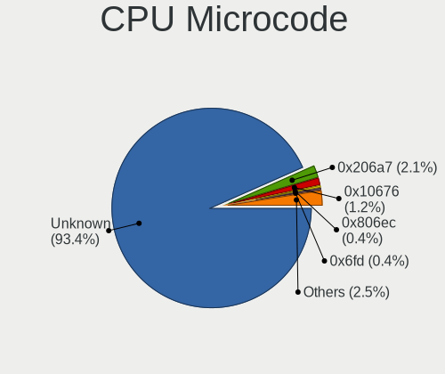
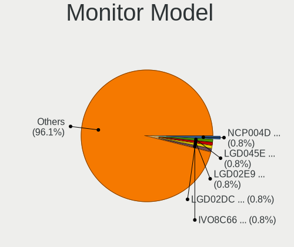
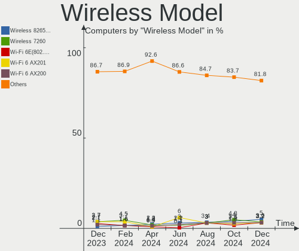
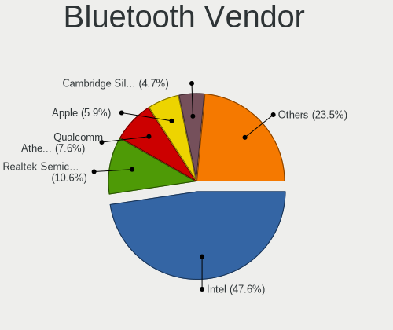

Zorin Hardware Trends
---------------------

A project to identify most popular hardware characteristics and track their change
over time based on data collected by Zorin users at https://Linux-Hardware.org.

Anyone can contribute to this report by the [hw-probe](https://github.com/linuxhw/hw-probe) tool:

    sudo -E hw-probe -all -upload

This is a report for all computer types. See also reports for [desktops](/Dist/Zorin/Desktop/README.md) and [notebooks](/Dist/Zorin/Notebook/README.md).

This report is for one last month. Overall report since the beginning of time: [TestCoverage](https://github.com/linuxhw/TestCoverage)

Period: Apr, 2022.

Contents
--------

* [ System ](#system)
  - [ OS                       ](#os)
  - [ OS Family                ](#os-family)
  - [ Kernel                   ](#kernel)
  - [ Kernel Family            ](#kernel-family)
  - [ Kernel Major Ver.        ](#kernel-major-ver)
  - [ Arch                     ](#arch)
  - [ DE                       ](#de)
  - [ Display Server           ](#display-server)
  - [ Display Manager          ](#display-manager)
  - [ OS Lang                  ](#os-lang)
  - [ Boot Mode                ](#boot-mode)
  - [ Filesystem               ](#filesystem)
  - [ Part. scheme             ](#part-scheme)
  - [ Dual Boot with Linux/BSD ](#dual-boot-with-linuxbsd)
  - [ Dual Boot (Win)          ](#dual-boot-win)

* [ Board ](#board)
  - [ Vendor                   ](#vendor)
  - [ Model                    ](#model)
  - [ Model Family             ](#model-family)
  - [ MFG Year                 ](#mfg-year)
  - [ Form Factor              ](#form-factor)
  - [ Secure Boot              ](#secure-boot)
  - [ Coreboot                 ](#coreboot)
  - [ RAM Size                 ](#ram-size)
  - [ RAM Used                 ](#ram-used)
  - [ Total Drives             ](#total-drives)
  - [ Has CD-ROM               ](#has-cd-rom)
  - [ Has Ethernet             ](#has-ethernet)
  - [ Has WiFi                 ](#has-wifi)
  - [ Has Bluetooth            ](#has-bluetooth)

* [ Location ](#location)
  - [ Country                  ](#country)
  - [ City                     ](#city)

* [ Drives ](#drives)
  - [ Drive Vendor             ](#drive-vendor)
  - [ Drive Model              ](#drive-model)
  - [ HDD Vendor               ](#hdd-vendor)
  - [ SSD Vendor               ](#ssd-vendor)
  - [ Drive Kind               ](#drive-kind)
  - [ Drive Connector          ](#drive-connector)
  - [ Drive Size               ](#drive-size)
  - [ Space Total              ](#space-total)
  - [ Space Used               ](#space-used)
  - [ Malfunc. Drives          ](#malfunc-drives)
  - [ Malfunc. Drive Vendor    ](#malfunc-drive-vendor)
  - [ Malfunc. HDD Vendor      ](#malfunc-hdd-vendor)
  - [ Malfunc. Drive Kind      ](#malfunc-drive-kind)
  - [ Failed Drives            ](#failed-drives)
  - [ Failed Drive Vendor      ](#failed-drive-vendor)
  - [ Drive Status             ](#drive-status)

* [ Storage controller ](#storage-controller)
  - [ Storage Vendor           ](#storage-vendor)
  - [ Storage Model            ](#storage-model)
  - [ Storage Kind             ](#storage-kind)

* [ Processor ](#processor)
  - [ CPU Vendor               ](#cpu-vendor)
  - [ CPU Model                ](#cpu-model)
  - [ CPU Model Family         ](#cpu-model-family)
  - [ CPU Cores                ](#cpu-cores)
  - [ CPU Sockets              ](#cpu-sockets)
  - [ CPU Threads              ](#cpu-threads)
  - [ CPU Op-Modes             ](#cpu-op-modes)
  - [ CPU Microcode            ](#cpu-microcode)
  - [ CPU Microarch            ](#cpu-microarch)

* [ Graphics ](#graphics)
  - [ GPU Vendor               ](#gpu-vendor)
  - [ GPU Model                ](#gpu-model)
  - [ GPU Combo                ](#gpu-combo)
  - [ GPU Driver               ](#gpu-driver)
  - [ GPU Memory               ](#gpu-memory)

* [ Monitor ](#monitor)
  - [ Monitor Vendor           ](#monitor-vendor)
  - [ Monitor Model            ](#monitor-model)
  - [ Monitor Resolution       ](#monitor-resolution)
  - [ Monitor Diagonal         ](#monitor-diagonal)
  - [ Monitor Width            ](#monitor-width)
  - [ Aspect Ratio             ](#aspect-ratio)
  - [ Monitor Area             ](#monitor-area)
  - [ Pixel Density            ](#pixel-density)
  - [ Multiple Monitors        ](#multiple-monitors)

* [ Network ](#network)
  - [ Net Controller Vendor    ](#net-controller-vendor)
  - [ Net Controller Model     ](#net-controller-model)
  - [ Wireless Vendor          ](#wireless-vendor)
  - [ Wireless Model           ](#wireless-model)
  - [ Ethernet Vendor          ](#ethernet-vendor)
  - [ Ethernet Model           ](#ethernet-model)
  - [ Net Controller Kind      ](#net-controller-kind)
  - [ Used Controller          ](#used-controller)
  - [ NICs                     ](#nics)
  - [ IPv6                     ](#ipv6)

* [ Bluetooth ](#bluetooth)
  - [ Bluetooth Vendor         ](#bluetooth-vendor)
  - [ Bluetooth Model          ](#bluetooth-model)

* [ Sound ](#sound)
  - [ Sound Vendor             ](#sound-vendor)
  - [ Sound Model              ](#sound-model)

* [ Memory ](#memory)
  - [ Memory Vendor            ](#memory-vendor)
  - [ Memory Model             ](#memory-model)
  - [ Memory Kind              ](#memory-kind)
  - [ Memory Form Factor       ](#memory-form-factor)
  - [ Memory Size              ](#memory-size)
  - [ Memory Speed             ](#memory-speed)

* [ Printers & scanners ](#printers--scanners)
  - [ Printer Vendor           ](#printer-vendor)
  - [ Printer Model            ](#printer-model)
  - [ Scanner Vendor           ](#scanner-vendor)
  - [ Scanner Model            ](#scanner-model)

* [ Camera ](#camera)
  - [ Camera Vendor            ](#camera-vendor)
  - [ Camera Model             ](#camera-model)

* [ Security ](#security)
  - [ Fingerprint Vendor       ](#fingerprint-vendor)
  - [ Fingerprint Model        ](#fingerprint-model)
  - [ Chipcard Vendor          ](#chipcard-vendor)
  - [ Chipcard Model           ](#chipcard-model)

* [ Unsupported ](#unsupported)
  - [ Unsupported Devices      ](#unsupported-devices)
  - [ Unsupported Device Types ](#unsupported-device-types)

System
------

OS
--

Installed operating systems

| Name     | Computers | Percent |
|----------|-----------|---------|
| Zorin 16 | 160       | 91.43%  |
| Zorin 15 | 15        | 8.57%   |

OS Family
---------

OS without a version

| Name  | Computers | Percent |
|-------|-----------|---------|
| Zorin | 175       | 100%    |

Kernel
------

Version of the Linux kernel

| Version               | Computers | Percent |
|-----------------------|-----------|---------|
| 5.13.0-39-generic     | 104       | 59.43%  |
| 5.13.0-40-generic     | 34        | 19.43%  |
| 5.13.0-30-generic     | 7         | 4%      |
| 5.4.0-107-generic     | 6         | 3.43%   |
| 5.13.0-37-generic     | 5         | 2.86%   |
| 5.4.0-109-generic     | 4         | 2.29%   |
| 5.13.0-35-generic     | 3         | 1.71%   |
| 5.4.0-90-generic      | 1         | 0.57%   |
| 5.4.0-45-generic      | 1         | 0.57%   |
| 5.4.0-104-generic     | 1         | 0.57%   |
| 5.4.0-100-generic     | 1         | 0.57%   |
| 5.17.1-051701-generic | 1         | 0.57%   |
| 5.14.0-1033-oem       | 1         | 0.57%   |
| 5.14.0-1031-oem       | 1         | 0.57%   |
| 5.13.0-41-generic     | 1         | 0.57%   |
| 5.11.0-41-generic     | 1         | 0.57%   |
| 5.11.0-40-generic     | 1         | 0.57%   |
| 5.11.0-38-generic     | 1         | 0.57%   |
| 4.18.0-21-generic     | 1         | 0.57%   |

Kernel Family
-------------

Linux kernel without a distro release

| Version | Computers | Percent |
|---------|-----------|---------|
| 5.13.0  | 154       | 88%     |
| 5.4.0   | 14        | 8%      |
| 5.11.0  | 3         | 1.71%   |
| 5.14.0  | 2         | 1.14%   |
| 5.17.1  | 1         | 0.57%   |
| 4.18.0  | 1         | 0.57%   |

Kernel Major Ver.
-----------------

Linux kernel major version

| Version | Computers | Percent |
|---------|-----------|---------|
| 5.13    | 154       | 88%     |
| 5.4     | 14        | 8%      |
| 5.11    | 3         | 1.71%   |
| 5.14    | 2         | 1.14%   |
| 5.17    | 1         | 0.57%   |
| 4.18    | 1         | 0.57%   |

Arch
----

OS architecture (x86_64, i586, etc.)

| Name   | Computers | Percent |
|--------|-----------|---------|
| x86_64 | 165       | 94.29%  |
| i686   | 10        | 5.71%   |

DE
--

Desktop Environment

| Name       | Computers | Percent |
|------------|-----------|---------|
| GNOME      | 136       | 77.71%  |
| XFCE       | 37        | 21.14%  |
| X-Cinnamon | 1         | 0.57%   |
| Unknown    | 1         | 0.57%   |

Display Server
--------------

X11 or Wayland

| Name    | Computers | Percent |
|---------|-----------|---------|
| X11     | 174       | 99.43%  |
| Wayland | 1         | 0.57%   |

Display Manager
---------------

SDDM, LightDM, etc.

| Name    | Computers | Percent |
|---------|-----------|---------|
| Unknown | 128       | 73.14%  |
| LightDM | 21        | 12%     |
| GDM3    | 13        | 7.43%   |
| GDM     | 13        | 7.43%   |

OS Lang
-------

Language

| Lang  | Computers | Percent |
|-------|-----------|---------|
| en_US | 64        | 36.57%  |
| en_GB | 15        | 8.57%   |
| de_DE | 15        | 8.57%   |
| pt_BR | 9         | 5.14%   |
| nl_NL | 7         | 4%      |
| es_ES | 7         | 4%      |
| ru_RU | 6         | 3.43%   |
| it_IT | 6         | 3.43%   |
| en_CA | 5         | 2.86%   |
| en_AU | 5         | 2.86%   |
| pl_PL | 4         | 2.29%   |
| fr_CA | 4         | 2.29%   |
| es_MX | 3         | 1.71%   |
| sv_SE | 2         | 1.14%   |
| pt_PT | 2         | 1.14%   |
| nl_BE | 2         | 1.14%   |
| hu_HU | 2         | 1.14%   |
| fr_FR | 2         | 1.14%   |
| fr_BE | 2         | 1.14%   |
| en_IN | 2         | 1.14%   |
| sl_SI | 1         | 0.57%   |
| lt_LT | 1         | 0.57%   |
| hr_HR | 1         | 0.57%   |
| es_EC | 1         | 0.57%   |
| es_CO | 1         | 0.57%   |
| es_BO | 1         | 0.57%   |
| en_ZA | 1         | 0.57%   |
| en_PH | 1         | 0.57%   |
| de_AT | 1         | 0.57%   |
| cs_CZ | 1         | 0.57%   |
| ar_EG | 1         | 0.57%   |

Boot Mode
---------

EFI or BIOS

| Mode | Computers | Percent |
|------|-----------|---------|
| EFI  | 88        | 50.29%  |
| BIOS | 87        | 49.71%  |

Filesystem
----------

Type of filesystem

| Type    | Computers | Percent |
|---------|-----------|---------|
| Ext4    | 169       | 96.57%  |
| Zfs     | 3         | 1.71%   |
| Overlay | 3         | 1.71%   |

Part. scheme
------------

Scheme of partitioning

| Type    | Computers | Percent |
|---------|-----------|---------|
| Unknown | 153       | 87.43%  |
| GPT     | 19        | 10.86%  |
| MBR     | 3         | 1.71%   |

Dual Boot with Linux/BSD
------------------------

Hosting more than one Linux/BSD

| Dual boot | Computers | Percent |
|-----------|-----------|---------|
| No        | 172       | 98.29%  |
| Yes       | 3         | 1.71%   |

Dual Boot (Win)
---------------

Hosting Linux and Windows

| Dual boot | Computers | Percent |
|-----------|-----------|---------|
| No        | 157       | 89.71%  |
| Yes       | 18        | 10.29%  |

Board
-----

Vendor
------

Motherboard manufacturer

| Name                | Computers | Percent |
|---------------------|-----------|---------|
| ASUSTek Computer    | 31        | 17.71%  |
| Hewlett-Packard     | 27        | 15.43%  |
| Dell                | 19        | 10.86%  |
| Lenovo              | 17        | 9.71%   |
| Gigabyte Technology | 11        | 6.29%   |
| MSI                 | 10        | 5.71%   |
| Toshiba             | 9         | 5.14%   |
| Acer                | 8         | 4.57%   |
| ASRock              | 7         | 4%      |
| Apple               | 6         | 3.43%   |
| Samsung Electronics | 2         | 1.14%   |
| Packard Bell        | 2         | 1.14%   |
| Medion              | 2         | 1.14%   |
| Fujitsu             | 2         | 1.14%   |
| Foxconn             | 2         | 1.14%   |
| AMI                 | 2         | 1.14%   |
| Unknown             | 2         | 1.14%   |
| Razer               | 1         | 0.57%   |
| Pegatron            | 1         | 0.57%   |
| Notebook            | 1         | 0.57%   |
| Multilaser          | 1         | 0.57%   |
| Microsoft           | 1         | 0.57%   |
| Intel               | 1         | 0.57%   |
| Insignia            | 1         | 0.57%   |
| Huanan              | 1         | 0.57%   |
| Google              | 1         | 0.57%   |
| Gateway             | 1         | 0.57%   |
| Fujitsu Siemens     | 1         | 0.57%   |
| Framework           | 1         | 0.57%   |
| ECS                 | 1         | 0.57%   |
| BESSTAR Tech        | 1         | 0.57%   |
| AWOW                | 1         | 0.57%   |
| Alienware           | 1         | 0.57%   |

Model
-----

Motherboard model

| Name                               | Computers | Percent |
|------------------------------------|-----------|---------|
| HP Notebook                        | 4         | 2.29%   |
| HP Pavilion Notebook               | 2         | 1.14%   |
| ASUS All Series                    | 2         | 1.14%   |
| Unknown                            | 2         | 1.14%   |
| Toshiba Satellite Pro R50-B        | 1         | 0.57%   |
| Toshiba Satellite P50t-A           | 1         | 0.57%   |
| Toshiba Satellite L755             | 1         | 0.57%   |
| Toshiba Satellite E55-A            | 1         | 0.57%   |
| Toshiba Satellite C870-1C2         | 1         | 0.57%   |
| Toshiba Satellite C55-C            | 1         | 0.57%   |
| Toshiba Satellite C55-A-1J8        | 1         | 0.57%   |
| Toshiba Satellite A200             | 1         | 0.57%   |
| Toshiba BDB                        | 1         | 0.57%   |
| Samsung 950QDB                     | 1         | 0.57%   |
| Samsung 550XCJ/550XCR              | 1         | 0.57%   |
| Razer Blade                        | 1         | 0.57%   |
| Pegatron Compaq 505B Microtower PC | 1         | 0.57%   |
| Packard Bell EasyNote TS11HR       | 1         | 0.57%   |
| Packard Bell EasyNote TN36         | 1         | 0.57%   |
| Notebook NJ50_70CU                 | 1         | 0.57%   |
| Multilaser PC121                   | 1         | 0.57%   |
| MSI MS-7C82                        | 1         | 0.57%   |
| MSI MS-7C02                        | 1         | 0.57%   |
| MSI MS-7B85                        | 1         | 0.57%   |
| MSI MS-7A38                        | 1         | 0.57%   |
| MSI MS-7977                        | 1         | 0.57%   |
| MSI MS-7758                        | 1         | 0.57%   |
| MSI MS-7641                        | 1         | 0.57%   |
| MSI MS-7204                        | 1         | 0.57%   |
| MSI MS-6701                        | 1         | 0.57%   |
| MSI 700-056                        | 1         | 0.57%   |
| Microsoft Surface Book             | 1         | 0.57%   |
| Medion S6417 MD99651               | 1         | 0.57%   |
| Medion MS-7366                     | 1         | 0.57%   |
| Lenovo Z40-70 20366                | 1         | 0.57%   |
| Lenovo ThinkStation E31 2552CTO    | 1         | 0.57%   |
| Lenovo ThinkPad X220 4286A78       | 1         | 0.57%   |
| Lenovo ThinkPad T430 2349D53       | 1         | 0.57%   |
| Lenovo ThinkPad T430 23473B2       | 1         | 0.57%   |
| Lenovo ThinkPad R61 8933W4F        | 1         | 0.57%   |
| Lenovo ThinkPad L560 20F1001YGE    | 1         | 0.57%   |
| Lenovo ThinkPad L412 440332U       | 1         | 0.57%   |
| Lenovo ThinkPad E520 11433BU       | 1         | 0.57%   |
| Lenovo ThinkCentre M91p 7052A9G    | 1         | 0.57%   |
| Lenovo ThinkCentre A62 7057A77     | 1         | 0.57%   |
| Lenovo IdeaPad 330-15IKB 81FD      | 1         | 0.57%   |
| Lenovo IdeaPad 3 15IML05 81WB      | 1         | 0.57%   |
| Lenovo H30-50 90B8003BGE           | 1         | 0.57%   |
| Lenovo G40-80 80JE                 | 1         | 0.57%   |
| Lenovo Flex 2-15 20405             | 1         | 0.57%   |
| Lenovo B590 37612LG                | 1         | 0.57%   |
| Intel DCP847SKE G80890-105         | 1         | 0.57%   |
| Insignia NS-P89W6100               | 1         | 0.57%   |
| Huanan X79 249PC V2.2              | 1         | 0.57%   |
| HP ZBook 15 G3                     | 1         | 0.57%   |
| HP Z220 SFF Workstation            | 1         | 0.57%   |
| HP ProBook 4530s                   | 1         | 0.57%   |
| HP Presario C500 (GF852EA#ABH)     | 1         | 0.57%   |
| HP Pavilion x2 Detachable          | 1         | 0.57%   |
| HP Pavilion dv6000 (GA443UA#ABA)   | 1         | 0.57%   |

Model Family
------------

Motherboard model prefix

| Name                  | Computers | Percent |
|-----------------------|-----------|---------|
| Toshiba Satellite     | 8         | 4.57%   |
| Lenovo ThinkPad       | 7         | 4%      |
| Dell Latitude         | 7         | 4%      |
| ASUS ROG              | 7         | 4%      |
| Dell Inspiron         | 5         | 2.86%   |
| HP Pavilion           | 4         | 2.29%   |
| HP Notebook           | 4         | 2.29%   |
| HP Laptop             | 4         | 2.29%   |
| Acer Aspire           | 4         | 2.29%   |
| Dell OptiPlex         | 3         | 1.71%   |
| Packard Bell EasyNote | 2         | 1.14%   |
| Lenovo ThinkCentre    | 2         | 1.14%   |
| Lenovo IdeaPad        | 2         | 1.14%   |
| HP EliteDesk          | 2         | 1.14%   |
| HP EliteBook          | 2         | 1.14%   |
| HP Compaq             | 2         | 1.14%   |
| Dell Precision        | 2         | 1.14%   |
| ASUS PRIME            | 2         | 1.14%   |
| ASUS M5A78L-M         | 2         | 1.14%   |
| ASUS All              | 2         | 1.14%   |
| Acer Nitro            | 2         | 1.14%   |
| Unknown               | 2         | 1.14%   |
| Toshiba BDB           | 1         | 0.57%   |
| Samsung 950QDB        | 1         | 0.57%   |
| Samsung 550XCJ        | 1         | 0.57%   |
| Razer Blade           | 1         | 0.57%   |
| Pegatron Compaq       | 1         | 0.57%   |
| Notebook NJ50         | 1         | 0.57%   |
| Multilaser PC121      | 1         | 0.57%   |
| MSI MS-7C82           | 1         | 0.57%   |
| MSI MS-7C02           | 1         | 0.57%   |
| MSI MS-7B85           | 1         | 0.57%   |
| MSI MS-7A38           | 1         | 0.57%   |
| MSI MS-7977           | 1         | 0.57%   |
| MSI MS-7758           | 1         | 0.57%   |
| MSI MS-7641           | 1         | 0.57%   |
| MSI MS-7204           | 1         | 0.57%   |
| MSI MS-6701           | 1         | 0.57%   |
| MSI 700-056           | 1         | 0.57%   |
| Microsoft Surface     | 1         | 0.57%   |
| Medion S6417          | 1         | 0.57%   |
| Medion MS-7366        | 1         | 0.57%   |
| Lenovo Z40-70         | 1         | 0.57%   |
| Lenovo ThinkStation   | 1         | 0.57%   |
| Lenovo H30-50         | 1         | 0.57%   |
| Lenovo G40-80         | 1         | 0.57%   |
| Lenovo Flex           | 1         | 0.57%   |
| Lenovo B590           | 1         | 0.57%   |
| Intel DCP847SKE       | 1         | 0.57%   |
| Insignia NS-P89W6100  | 1         | 0.57%   |
| Huanan X79            | 1         | 0.57%   |
| HP ZBook              | 1         | 0.57%   |
| HP Z220               | 1         | 0.57%   |
| HP ProBook            | 1         | 0.57%   |
| HP Presario           | 1         | 0.57%   |
| HP OMEN               | 1         | 0.57%   |
| HP ENVY               | 1         | 0.57%   |
| HP 255                | 1         | 0.57%   |
| HP 240                | 1         | 0.57%   |
| HP 15                 | 1         | 0.57%   |

MFG Year
--------

Motherboard manufacture year

| Year    | Computers | Percent |
|---------|-----------|---------|
| 2018    | 17        | 9.71%   |
| 2021    | 16        | 9.14%   |
| 2012    | 16        | 9.14%   |
| 2015    | 15        | 8.57%   |
| 2011    | 15        | 8.57%   |
| 2013    | 12        | 6.86%   |
| 2020    | 11        | 6.29%   |
| 2014    | 11        | 6.29%   |
| 2019    | 10        | 5.71%   |
| 2010    | 10        | 5.71%   |
| 2017    | 9         | 5.14%   |
| 2007    | 9         | 5.14%   |
| 2008    | 7         | 4%      |
| 2009    | 5         | 2.86%   |
| 2016    | 3         | 1.71%   |
| 2006    | 3         | 1.71%   |
| 2005    | 3         | 1.71%   |
| 2022    | 2         | 1.14%   |
| Unknown | 1         | 0.57%   |

Form Factor
-----------

Physical design of the computer

| Name        | Computers | Percent |
|-------------|-----------|---------|
| Notebook    | 88        | 50.29%  |
| Desktop     | 74        | 42.29%  |
| All in one  | 4         | 2.29%   |
| Tablet      | 3         | 1.71%   |
| Convertible | 3         | 1.71%   |
| Mini pc     | 2         | 1.14%   |
| Server      | 1         | 0.57%   |

Secure Boot
-----------

Enabled or disabled

| State    | Computers | Percent |
|----------|-----------|---------|
| Disabled | 159       | 90.86%  |
| Enabled  | 16        | 9.14%   |

Coreboot
--------

Have coreboot on board

| Used | Computers | Percent |
|------|-----------|---------|
| No   | 174       | 99.43%  |
| Yes  | 1         | 0.57%   |

RAM Size
--------

Total RAM memory

| Size in GB  | Computers | Percent |
|-------------|-----------|---------|
| 3.01-4.0    | 37        | 21.14%  |
| 4.01-8.0    | 32        | 18.29%  |
| 8.01-16.0   | 32        | 18.29%  |
| 16.01-24.0  | 30        | 17.14%  |
| 32.01-64.0  | 14        | 8%      |
| 1.01-2.0    | 10        | 5.71%   |
| 24.01-32.0  | 6         | 3.43%   |
| 2.01-3.0    | 5         | 2.86%   |
| 0.51-1.0    | 5         | 2.86%   |
| 64.01-256.0 | 4         | 2.29%   |

RAM Used
--------

Used RAM memory

| Used GB    | Computers | Percent |
|------------|-----------|---------|
| 1.01-2.0   | 63        | 36%     |
| 2.01-3.0   | 46        | 26.29%  |
| 4.01-8.0   | 25        | 14.29%  |
| 3.01-4.0   | 25        | 14.29%  |
| 0.51-1.0   | 12        | 6.86%   |
| 8.01-16.0  | 2         | 1.14%   |
| 24.01-32.0 | 1         | 0.57%   |
| 0.01-0.5   | 1         | 0.57%   |

Total Drives
------------

Number of drives on board

| Drives | Computers | Percent |
|--------|-----------|---------|
| 1      | 104       | 59.43%  |
| 2      | 50        | 28.57%  |
| 3      | 14        | 8%      |
| 4      | 2         | 1.14%   |
| 0      | 2         | 1.14%   |
| 8      | 1         | 0.57%   |
| 6      | 1         | 0.57%   |
| 5      | 1         | 0.57%   |

Has CD-ROM
----------

Has CD-ROM on board

| Presented | Computers | Percent |
|-----------|-----------|---------|
| Yes       | 96        | 54.86%  |
| No        | 79        | 45.14%  |

Has Ethernet
------------

Has Ethernet on board

| Presented | Computers | Percent |
|-----------|-----------|---------|
| Yes       | 157       | 89.71%  |
| No        | 18        | 10.29%  |

Has WiFi
--------

Has WiFi module

| Presented | Computers | Percent |
|-----------|-----------|---------|
| Yes       | 137       | 78.29%  |
| No        | 38        | 21.71%  |

Has Bluetooth
-------------

Has Bluetooth module

| Presented | Computers | Percent |
|-----------|-----------|---------|
| Yes       | 95        | 54.29%  |
| No        | 80        | 45.71%  |

Location
--------

Country
-------

Geographic location (country)

| Country      | Computers | Percent |
|--------------|-----------|---------|
| USA          | 39        | 22.29%  |
| Germany      | 15        | 8.57%   |
| UK           | 13        | 7.43%   |
| Brazil       | 12        | 6.86%   |
| Netherlands  | 8         | 4.57%   |
| Canada       | 7         | 4%      |
| Italy        | 6         | 3.43%   |
| Spain        | 5         | 2.86%   |
| Russia       | 5         | 2.86%   |
| Australia    | 5         | 2.86%   |
| Poland       | 4         | 2.29%   |
| Belgium      | 4         | 2.29%   |
| Sweden       | 3         | 1.71%   |
| Slovenia     | 3         | 1.71%   |
| Serbia       | 3         | 1.71%   |
| Romania      | 3         | 1.71%   |
| Mexico       | 3         | 1.71%   |
| India        | 3         | 1.71%   |
| France       | 3         | 1.71%   |
| Thailand     | 2         | 1.14%   |
| Portugal     | 2         | 1.14%   |
| Norway       | 2         | 1.14%   |
| Hungary      | 2         | 1.14%   |
| Egypt        | 2         | 1.14%   |
| Croatia      | 2         | 1.14%   |
| Switzerland  | 1         | 0.57%   |
| South Africa | 1         | 0.57%   |
| Puerto Rico  | 1         | 0.57%   |
| Panama       | 1         | 0.57%   |
| Morocco      | 1         | 0.57%   |
| Mauritius    | 1         | 0.57%   |
| Malta        | 1         | 0.57%   |
| Lithuania    | 1         | 0.57%   |
| Latvia       | 1         | 0.57%   |
| Japan        | 1         | 0.57%   |
| Hong Kong    | 1         | 0.57%   |
| Greece       | 1         | 0.57%   |
| Ecuador      | 1         | 0.57%   |
| Czechia      | 1         | 0.57%   |
| Colombia     | 1         | 0.57%   |
| Bolivia      | 1         | 0.57%   |
| Austria      | 1         | 0.57%   |
| Armenia      | 1         | 0.57%   |
| Argentina    | 1         | 0.57%   |

City
----

Geographic location (city)

| City                | Computers | Percent |
|---------------------|-----------|---------|
| Rome                | 3         | 1.71%   |
| Zagreb              | 2         | 1.14%   |
| Walled Lake         | 2         | 1.14%   |
| Munich              | 2         | 1.14%   |
| Milwaukee           | 2         | 1.14%   |
| Madrid              | 2         | 1.14%   |
| Laval               | 2         | 1.14%   |
| Harrow              | 2         | 1.14%   |
| Chicago             | 2         | 1.14%   |
| Bangkok             | 2         | 1.14%   |
| Athens              | 2         | 1.14%   |
| Acapulco de Juárez | 2         | 1.14%   |
| Yerevan             | 1         | 0.57%   |
| Wołomin            | 1         | 0.57%   |
| Woking              | 1         | 0.57%   |
| Williston           | 1         | 0.57%   |
| West Monroe         | 1         | 0.57%   |
| West Lafayette      | 1         | 0.57%   |
| Vrhnika             | 1         | 0.57%   |
| Volta Redonda       | 1         | 0.57%   |
| Volgograd           | 1         | 0.57%   |
| Vila Nova de Gaia   | 1         | 0.57%   |
| Vienna              | 1         | 0.57%   |
| Veghel              | 1         | 0.57%   |
| Vaestra Froelunda   | 1         | 0.57%   |
| Ubatuba             | 1         | 0.57%   |
| Toulouse            | 1         | 0.57%   |
| Tokyo               | 1         | 0.57%   |
| The Hague           | 1         | 0.57%   |
| Temple              | 1         | 0.57%   |
| Sydney              | 1         | 0.57%   |
| Sulmona             | 1         | 0.57%   |
| Sucre               | 1         | 0.57%   |
| Stuttgart           | 1         | 0.57%   |
| Sturgeon Bay        | 1         | 0.57%   |
| Stony Plain         | 1         | 0.57%   |
| Stavanger           | 1         | 0.57%   |
| Smederevo           | 1         | 0.57%   |
| Skultuna            | 1         | 0.57%   |
| Seville             | 1         | 0.57%   |
| Seguin              | 1         | 0.57%   |
| Scottsburg          | 1         | 0.57%   |
| Schenectady         | 1         | 0.57%   |
| Sao Paulo           | 1         | 0.57%   |
| Santo André        | 1         | 0.57%   |
| Santa Cruz          | 1         | 0.57%   |
| Salt Lake City      | 1         | 0.57%   |
| Sacramento          | 1         | 0.57%   |
| Roosendaal          | 1         | 0.57%   |
| Rio de Janeiro      | 1         | 0.57%   |
| Rimouski            | 1         | 0.57%   |
| Riga                | 1         | 0.57%   |
| Richmond            | 1         | 0.57%   |
| Reutlingen          | 1         | 0.57%   |
| Raipur              | 1         | 0.57%   |
| Quito               | 1         | 0.57%   |
| Queretaro           | 1         | 0.57%   |
| Quatre Bornes       | 1         | 0.57%   |
| Prague              | 1         | 0.57%   |
| Poznan              | 1         | 0.57%   |

Drives
------

Drive Vendor
------------

Hard drive vendors

| Vendor                | Computers | Drives | Percent |
|-----------------------|-----------|--------|---------|
| Seagate               | 44        | 52     | 18.18%  |
| WDC                   | 41        | 46     | 16.94%  |
| Samsung Electronics   | 23        | 31     | 9.5%    |
| Toshiba               | 20        | 20     | 8.26%   |
| Kingston              | 17        | 17     | 7.02%   |
| Hitachi               | 10        | 10     | 4.13%   |
| Unknown               | 9         | 12     | 3.72%   |
| SanDisk               | 9         | 9      | 3.72%   |
| Crucial               | 9         | 10     | 3.72%   |
| Intel                 | 5         | 5      | 2.07%   |
| HGST                  | 5         | 5      | 2.07%   |
| SK Hynix              | 3         | 3      | 1.24%   |
| Silicon Motion        | 3         | 4      | 1.24%   |
| Micron Technology     | 3         | 3      | 1.24%   |
| China                 | 3         | 3      | 1.24%   |
| Apple                 | 3         | 3      | 1.24%   |
| PNY                   | 2         | 3      | 0.83%   |
| Lite-On               | 2         | 2      | 0.83%   |
| Gigabyte Technology   | 2         | 3      | 0.83%   |
| FORESEE               | 2         | 2      | 0.83%   |
| A-DATA Technology     | 2         | 3      | 0.83%   |
| TwinMOS               | 1         | 1      | 0.41%   |
| Transcend             | 1         | 1      | 0.41%   |
| SABRENT               | 1         | 1      | 0.41%   |
| S3+                   | 1         | 1      | 0.41%   |
| Realtek Semiconductor | 1         | 1      | 0.41%   |
| PLEXTOR               | 1         | 1      | 0.41%   |
| Patriot               | 1         | 1      | 0.41%   |
| OCZ                   | 1         | 1      | 0.41%   |
| Netac                 | 1         | 1      | 0.41%   |
| LITEONIT              | 1         | 1      | 0.41%   |
| LITEON                | 1         | 1      | 0.41%   |
| Lexar                 | 1         | 1      | 0.41%   |
| Leven                 | 1         | 1      | 0.41%   |
| KIOXIA-EXCERIA        | 1         | 1      | 0.41%   |
| KIOXIA                | 1         | 1      | 0.41%   |
| Hewlett-Packard       | 1         | 1      | 0.41%   |
| GOODRAM               | 1         | 1      | 0.41%   |
| Fujitsu               | 1         | 1      | 0.41%   |
| DREVO                 | 1         | 1      | 0.41%   |
| Dell                  | 1         | 1      | 0.41%   |
| BHT                   | 1         | 1      | 0.41%   |
| ASMT                  | 1         | 1      | 0.41%   |
| AFOX                  | 1         | 1      | 0.41%   |
| ADATA SU              | 1         | 1      | 0.41%   |
| Acer                  | 1         | 1      | 0.41%   |

Drive Model
-----------

Hard drive models

| Model                               | Computers | Percent |
|-------------------------------------|-----------|---------|
| Unknown MMC Card  32GB              | 4         | 1.5%    |
| Samsung NVMe SSD Drive 512GB        | 4         | 1.5%    |
| Kingston SA400S37240G 240GB SSD     | 4         | 1.5%    |
| WDC WD10EZEX-00WN4A0 1TB            | 3         | 1.13%   |
| Seagate ST1000DM003-1CH162 1TB      | 3         | 1.13%   |
| Samsung SSD 850 EVO 500GB           | 3         | 1.13%   |
| Samsung NVMe SSD Drive 2TB          | 3         | 1.13%   |
| Kingston SV300S37A120G 120GB SSD    | 3         | 1.13%   |
| Crucial CT240BX500SSD1 240GB        | 3         | 1.13%   |
| WDC WDS500G2B0A-00SM50 500GB SSD    | 2         | 0.75%   |
| WDC WD5000AAKX-00ERMA0 500GB        | 2         | 0.75%   |
| Unknown MMC Card  16GB              | 2         | 0.75%   |
| Toshiba NVMe SSD Drive 512GB        | 2         | 0.75%   |
| Toshiba MQ01ABF050 500GB            | 2         | 0.75%   |
| Toshiba KBG30ZMS128G 128GB NVMe SSD | 2         | 0.75%   |
| Toshiba HDWD110 1TB                 | 2         | 0.75%   |
| Toshiba DT01ACA100 1TB              | 2         | 0.75%   |
| Seagate ST500LM000-SSHD-8GB         | 2         | 0.75%   |
| Seagate ST4000DM000-1F2168 4TB      | 2         | 0.75%   |
| Seagate ST1000LM035-1RK172 1TB      | 2         | 0.75%   |
| Seagate ST1000DM003-1SB102 1TB      | 2         | 0.75%   |
| Seagate Expansion+ 2TB              | 2         | 0.75%   |
| Samsung SSD 860 EVO 500GB           | 2         | 0.75%   |
| Samsung NVMe SSD Drive 500GB        | 2         | 0.75%   |
| Samsung NVMe SSD Drive 1TB          | 2         | 0.75%   |
| Kingston SA400S37480G 480GB SSD     | 2         | 0.75%   |
| Kingston NVMe SSD Drive 500GB       | 2         | 0.75%   |
| Hitachi HTS545050A7E380 500GB       | 2         | 0.75%   |
| HGST HTS725050A7E630 500GB          | 2         | 0.75%   |
| Crucial CT480BX500SSD1 480GB        | 2         | 0.75%   |
| China SSD 128GB                     | 2         | 0.75%   |
| WDC WDS240G2G0A-00JH30 240GB SSD    | 1         | 0.38%   |
| WDC WDS100T2B0B-00YS70 1TB SSD      | 1         | 0.38%   |
| WDC WDBNCE5000PNC 500GB SSD         | 1         | 0.38%   |
| WDC WD800JD-60LSA5 80GB             | 1         | 0.38%   |
| WDC WD6402AAEX-00Z3A0 640GB         | 1         | 0.38%   |
| WDC WD6402AAEX-00Y9A0 640GB         | 1         | 0.38%   |
| WDC WD5000LPVX-08V0TT2 500GB        | 1         | 0.38%   |
| WDC WD5000LPVT-22G33T0 500GB        | 1         | 0.38%   |
| WDC WD5000LPLX-08ZNTT0 500GB        | 1         | 0.38%   |
| WDC WD5000LPCX-60VHAT1 500GB        | 1         | 0.38%   |
| WDC WD5000BUCT-57LS5Y1 500GB        | 1         | 0.38%   |
| WDC WD5000BPVT-75HXZT1 500GB        | 1         | 0.38%   |
| WDC WD5000BPVT-00A1YT0 500GB        | 1         | 0.38%   |
| WDC WD5000AAKX-22ERMA0 500GB        | 1         | 0.38%   |
| WDC WD5000AAKX-08U6AA0 500GB        | 1         | 0.38%   |
| WDC WD5000AAKS-00UU3A0 500GB        | 1         | 0.38%   |
| WDC WD3200BEVT-08A23T1 320GB        | 1         | 0.38%   |
| WDC WD3200BEKT-08PVMT1 320GB        | 1         | 0.38%   |
| WDC WD3200AAKS-00SBA0 320GB         | 1         | 0.38%   |
| WDC WD20SPZX-08UA7 2TB              | 1         | 0.38%   |
| WDC WD1600JS-60NCB1 160GB           | 1         | 0.38%   |
| WDC WD1600AAJS-22PSA0 160GB         | 1         | 0.38%   |
| WDC WD1600AAJS-07M0A0 160GB         | 1         | 0.38%   |
| WDC WD1200UE-22KVT0 120GB           | 1         | 0.38%   |
| WDC WD10SPZX-60Z10T0 1TB            | 1         | 0.38%   |
| WDC WD10SPZX-35Z10T0 1TB            | 1         | 0.38%   |
| WDC WD10SPZX-24Z10 1TB              | 1         | 0.38%   |
| WDC WD10SPZX-21Z10T0 1TB            | 1         | 0.38%   |
| WDC WD10SPZX-08Z10 1TB              | 1         | 0.38%   |

HDD Vendor
----------

Hard disk drive vendors

| Vendor              | Computers | Drives | Percent |
|---------------------|-----------|--------|---------|
| Seagate             | 44        | 51     | 37.29%  |
| WDC                 | 37        | 41     | 31.36%  |
| Toshiba             | 14        | 14     | 11.86%  |
| Hitachi             | 10        | 10     | 8.47%   |
| HGST                | 5         | 5      | 4.24%   |
| Samsung Electronics | 2         | 2      | 1.69%   |
| Apple               | 2         | 2      | 1.69%   |
| Unknown             | 1         | 1      | 0.85%   |
| SABRENT             | 1         | 1      | 0.85%   |
| Fujitsu             | 1         | 1      | 0.85%   |
| ASMT                | 1         | 1      | 0.85%   |

SSD Vendor
----------

Solid state drive vendors

| Vendor              | Computers | Drives | Percent |
|---------------------|-----------|--------|---------|
| Kingston            | 12        | 12     | 14.63%  |
| Samsung Electronics | 10        | 12     | 12.2%   |
| Crucial             | 9         | 10     | 10.98%  |
| WDC                 | 5         | 5      | 6.1%    |
| SanDisk             | 5         | 5      | 6.1%    |
| Intel               | 4         | 4      | 4.88%   |
| China               | 3         | 3      | 3.66%   |
| Toshiba             | 2         | 2      | 2.44%   |
| PNY                 | 2         | 3      | 2.44%   |
| Micron Technology   | 2         | 2      | 2.44%   |
| Gigabyte Technology | 2         | 3      | 2.44%   |
| FORESEE             | 2         | 2      | 2.44%   |
| A-DATA Technology   | 2         | 3      | 2.44%   |
| TwinMOS             | 1         | 1      | 1.22%   |
| Transcend           | 1         | 1      | 1.22%   |
| Seagate             | 1         | 1      | 1.22%   |
| S3+                 | 1         | 1      | 1.22%   |
| PLEXTOR             | 1         | 1      | 1.22%   |
| Patriot             | 1         | 1      | 1.22%   |
| OCZ                 | 1         | 1      | 1.22%   |
| Netac               | 1         | 1      | 1.22%   |
| LITEONIT            | 1         | 1      | 1.22%   |
| LITEON              | 1         | 1      | 1.22%   |
| Lite-On             | 1         | 1      | 1.22%   |
| Leven               | 1         | 1      | 1.22%   |
| KIOXIA-EXCERIA      | 1         | 1      | 1.22%   |
| Hewlett-Packard     | 1         | 1      | 1.22%   |
| GOODRAM             | 1         | 1      | 1.22%   |
| DREVO               | 1         | 1      | 1.22%   |
| Dell                | 1         | 1      | 1.22%   |
| BHT                 | 1         | 1      | 1.22%   |
| Apple               | 1         | 1      | 1.22%   |
| AFOX                | 1         | 1      | 1.22%   |
| ADATA SU            | 1         | 1      | 1.22%   |
| Acer                | 1         | 1      | 1.22%   |

Drive Kind
----------

HDD or SSD

| Kind    | Computers | Drives | Percent |
|---------|-----------|--------|---------|
| HDD     | 106       | 129    | 47.32%  |
| SSD     | 75        | 88     | 33.48%  |
| NVMe    | 33        | 41     | 14.73%  |
| MMC     | 9         | 12     | 4.02%   |
| Unknown | 1         | 1      | 0.45%   |

Drive Connector
---------------

SATA, SAS, NVMe, etc.

| Type | Computers | Drives | Percent |
|------|-----------|--------|---------|
| SATA | 147       | 206    | 73.5%   |
| NVMe | 33        | 41     | 16.5%   |
| SAS  | 11        | 12     | 5.5%    |
| MMC  | 9         | 12     | 4.5%    |

Drive Size
----------

Size of hard drive

| Size in TB | Computers | Drives | Percent |
|------------|-----------|--------|---------|
| 0.01-0.5   | 110       | 132    | 60.11%  |
| 0.51-1.0   | 52        | 60     | 28.42%  |
| 1.01-2.0   | 12        | 13     | 6.56%   |
| 3.01-4.0   | 5         | 6      | 2.73%   |
| 4.01-10.0  | 3         | 5      | 1.64%   |
| 2.01-3.0   | 1         | 1      | 0.55%   |

Space Total
-----------

Amount of disk space available on the file system

| Size in GB     | Computers | Percent |
|----------------|-----------|---------|
| 101-250        | 49        | 28%     |
| 251-500        | 44        | 25.14%  |
| 501-1000       | 27        | 15.43%  |
| 1001-2000      | 14        | 8%      |
| 51-100         | 13        | 7.43%   |
| 21-50          | 11        | 6.29%   |
| 2001-3000      | 8         | 4.57%   |
| More than 3000 | 6         | 3.43%   |
| 1-20           | 2         | 1.14%   |
| Unknown        | 1         | 0.57%   |

Space Used
----------

Amount of used disk space

| Used GB        | Computers | Percent |
|----------------|-----------|---------|
| 1-20           | 62        | 35.43%  |
| 21-50          | 45        | 25.71%  |
| 51-100         | 21        | 12%     |
| 101-250        | 19        | 10.86%  |
| 251-500        | 16        | 9.14%   |
| 501-1000       | 5         | 2.86%   |
| 1001-2000      | 3         | 1.71%   |
| 2001-3000      | 2         | 1.14%   |
| More than 3000 | 1         | 0.57%   |
| Unknown        | 1         | 0.57%   |

Malfunc. Drives
---------------

Drive models with a malfunction

| Model                              | Computers | Drives | Percent |
|------------------------------------|-----------|--------|---------|
| Toshiba MQ01ABD075 752GB           | 1         | 1      | 16.67%  |
| Toshiba MG03ACA200 2TB             | 1         | 1      | 16.67%  |
| Silicon Motion Inland NVMe SSD 1TB | 1         | 1      | 16.67%  |
| Seagate ST500LM000-SSHD-8GB        | 1         | 1      | 16.67%  |
| Seagate ST3500413AS 500GB          | 1         | 1      | 16.67%  |
| OCZ VERTEX3 120GB SSD              | 1         | 1      | 16.67%  |

Malfunc. Drive Vendor
---------------------

Vendors of faulty drives

| Vendor         | Computers | Drives | Percent |
|----------------|-----------|--------|---------|
| Toshiba        | 2         | 2      | 33.33%  |
| Seagate        | 2         | 2      | 33.33%  |
| Silicon Motion | 1         | 1      | 16.67%  |
| OCZ            | 1         | 1      | 16.67%  |

Malfunc. HDD Vendor
-------------------

Vendors of faulty HDD drives

| Vendor  | Computers | Drives | Percent |
|---------|-----------|--------|---------|
| Toshiba | 2         | 2      | 50%     |
| Seagate | 2         | 2      | 50%     |

Malfunc. Drive Kind
-------------------

Kinds of faulty drives

| Kind | Computers | Drives | Percent |
|------|-----------|--------|---------|
| HDD  | 4         | 4      | 66.67%  |
| NVMe | 1         | 1      | 16.67%  |
| SSD  | 1         | 1      | 16.67%  |

Failed Drives
-------------

Failed drive models

Zero info for selected period =(

Failed Drive Vendor
-------------------

Failed drive vendors

Zero info for selected period =(

Drive Status
------------

Number of failed and malfunc. drives

| Status   | Computers | Drives | Percent |
|----------|-----------|--------|---------|
| Detected | 154       | 240    | 86.52%  |
| Works    | 18        | 25     | 10.11%  |
| Malfunc  | 6         | 6      | 3.37%   |

Storage controller
------------------

Storage Vendor
--------------

Storage controller vendors

| Vendor                           | Computers | Percent |
|----------------------------------|-----------|---------|
| Intel                            | 119       | 60.1%   |
| AMD                              | 38        | 19.19%  |
| Samsung Electronics              | 11        | 5.56%   |
| Nvidia                           | 5         | 2.53%   |
| Kingston Technology Company      | 5         | 2.53%   |
| Toshiba America Info Systems     | 4         | 2.02%   |
| Sandisk                          | 4         | 2.02%   |
| Silicon Motion                   | 3         | 1.52%   |
| SK Hynix                         | 2         | 1.01%   |
| Silicon Integrated Systems [SiS] | 2         | 1.01%   |
| Silicon Image                    | 1         | 0.51%   |
| Realtek Semiconductor            | 1         | 0.51%   |
| Micron Technology                | 1         | 0.51%   |
| Lite-On Technology               | 1         | 0.51%   |
| KIOXIA                           | 1         | 0.51%   |

Storage Model
-------------

Storage controller models

| Model                                                                                   | Computers | Percent |
|-----------------------------------------------------------------------------------------|-----------|---------|
| AMD FCH SATA Controller [AHCI mode]                                                     | 27        | 11.25%  |
| Intel 7 Series Chipset Family 6-port SATA Controller [AHCI mode]                        | 13        | 5.42%   |
| Intel Sunrise Point-LP SATA Controller [AHCI mode]                                      | 7         | 2.92%   |
| Intel 8 Series/C220 Series Chipset Family 6-port SATA Controller 1 [AHCI mode]          | 7         | 2.92%   |
| Intel 8 Series SATA Controller 1 [AHCI mode]                                            | 7         | 2.92%   |
| Intel SATA Controller [RAID mode]                                                       | 6         | 2.5%    |
| Intel NM10/ICH7 Family SATA Controller [IDE mode]                                       | 6         | 2.5%    |
| Intel 6 Series/C200 Series Chipset Family 6 port Mobile SATA AHCI Controller            | 6         | 2.5%    |
| Samsung NVMe SSD Controller SM981/PM981/PM983                                           | 5         | 2.08%   |
| Samsung NVMe SSD Controller PM9A1/PM9A3/980PRO                                          | 5         | 2.08%   |
| Intel 82801 Mobile SATA Controller [RAID mode]                                          | 5         | 2.08%   |
| AMD SB7x0/SB8x0/SB9x0 SATA Controller [IDE mode]                                        | 5         | 2.08%   |
| AMD SB7x0/SB8x0/SB9x0 IDE Controller                                                    | 5         | 2.08%   |
| AMD 400 Series Chipset SATA Controller                                                  | 5         | 2.08%   |
| Intel Volume Management Device NVMe RAID Controller                                     | 4         | 1.67%   |
| Intel 82801IBM/IEM (ICH9M/ICH9M-E) 4 port SATA Controller [AHCI mode]                   | 4         | 1.67%   |
| Intel 82801G (ICH7 Family) IDE Controller                                               | 4         | 1.67%   |
| Intel 7 Series/C210 Series Chipset Family 6-port SATA Controller [AHCI mode]            | 4         | 1.67%   |
| Silicon Motion SM2263EN/SM2263XT SSD Controller                                         | 3         | 1.25%   |
| Kingston Company A2000 NVMe SSD                                                         | 3         | 1.25%   |
| Intel Wildcat Point-LP SATA Controller [AHCI Mode]                                      | 3         | 1.25%   |
| Intel Q170/Q150/B150/H170/H110/Z170/CM236 Chipset SATA Controller [AHCI Mode]           | 3         | 1.25%   |
| Intel Comet Lake SATA AHCI Controller                                                   | 3         | 1.25%   |
| Intel Cannon Lake PCH SATA AHCI Controller                                              | 3         | 1.25%   |
| Intel 82801HM/HEM (ICH8M/ICH8M-E) SATA Controller [AHCI mode]                           | 3         | 1.25%   |
| Intel 82801HM/HEM (ICH8M/ICH8M-E) IDE Controller                                        | 3         | 1.25%   |
| Intel 5 Series/3400 Series Chipset 4 port SATA AHCI Controller                          | 3         | 1.25%   |
| Toshiba America Info Systems BG3 NVMe SSD Controller                                    | 2         | 0.83%   |
| Silicon Integrated Systems [SiS] 5513 IDE Controller                                    | 2         | 0.83%   |
| Sandisk WD Black SN750 / PC SN730 NVMe SSD                                              | 2         | 0.83%   |
| Samsung NVMe SSD Controller 980                                                         | 2         | 0.83%   |
| Nvidia MCP51 Serial ATA Controller                                                      | 2         | 0.83%   |
| Nvidia MCP51 IDE                                                                        | 2         | 0.83%   |
| Intel Celeron N3350/Pentium N4200/Atom E3900 Series SATA AHCI Controller                | 2         | 0.83%   |
| Intel Cannon Lake Mobile PCH SATA AHCI Controller                                       | 2         | 0.83%   |
| Intel Atom Processor E3800 Series SATA AHCI Controller                                  | 2         | 0.83%   |
| Intel 7 Series/C210 Series Chipset Family 4-port SATA Controller [IDE mode]             | 2         | 0.83%   |
| Intel 7 Series/C210 Series Chipset Family 2-port SATA Controller [IDE mode]             | 2         | 0.83%   |
| Intel 6 Series/C200 Series Chipset Family Desktop SATA Controller (IDE mode, ports 4-5) | 2         | 0.83%   |
| Intel 6 Series/C200 Series Chipset Family Desktop SATA Controller (IDE mode, ports 0-3) | 2         | 0.83%   |
| Intel 6 Series/C200 Series Chipset Family 6 port Desktop SATA AHCI Controller           | 2         | 0.83%   |
| Intel 400 Series Chipset Family SATA AHCI Controller                                    | 2         | 0.83%   |
| Intel 200 Series PCH SATA controller [AHCI mode]                                        | 2         | 0.83%   |
| AMD SB7x0/SB8x0/SB9x0 SATA Controller [AHCI mode]                                       | 2         | 0.83%   |
| AMD FCH SATA Controller D                                                               | 2         | 0.83%   |
| AMD 500 Series Chipset SATA Controller                                                  | 2         | 0.83%   |
| Toshiba America Info Systems Toshiba America Info Non-Volatile memory controller        | 1         | 0.42%   |
| Toshiba America Info Systems NVMe Controller                                            | 1         | 0.42%   |
| SK Hynix BC511                                                                          | 1         | 0.42%   |
| SK Hynix BC501 NVMe Solid State Drive                                                   | 1         | 0.42%   |
| Silicon Integrated Systems [SiS] SATA Controller / IDE mode                             | 1         | 0.42%   |
| Silicon Image SiI 3132 Serial ATA Raid II Controller                                    | 1         | 0.42%   |
| Sandisk WD Blue SN570 NVMe SSD                                                          | 1         | 0.42%   |
| Sandisk WD Blue SN500 / PC SN520 NVMe SSD                                               | 1         | 0.42%   |
| Samsung NVMe SSD Controller SM961/PM961/SM963                                           | 1         | 0.42%   |
| Samsung Apple PCIe SSD                                                                  | 1         | 0.42%   |
| Realtek Realtek Non-Volatile memory controller                                          | 1         | 0.42%   |
| Nvidia MCP79 AHCI Controller                                                            | 1         | 0.42%   |
| Nvidia MCP73 IDE Controller                                                             | 1         | 0.42%   |
| Nvidia MCP61 SATA Controller                                                            | 1         | 0.42%   |

Storage Kind
------------

Kind of storage controller (IDE, SATA, NVMe, SAS, ...)

| Kind | Computers | Percent |
|------|-----------|---------|
| SATA | 129       | 60.85%  |
| IDE  | 34        | 16.04%  |
| NVMe | 32        | 15.09%  |
| RAID | 17        | 8.02%   |

Processor
---------

CPU Vendor
----------

Processor vendors

| Vendor | Computers | Percent |
|--------|-----------|---------|
| Intel  | 133       | 76%     |
| AMD    | 42        | 24%     |

CPU Model
---------

Processor models

| Model                                        | Computers | Percent |
|----------------------------------------------|-----------|---------|
| Intel Core i3-4005U CPU @ 1.70GHz            | 3         | 1.71%   |
| Intel 11th Gen Core i7-1165G7 @ 2.80GHz      | 3         | 1.71%   |
| AMD Ryzen 5 2600 Six-Core Processor          | 3         | 1.71%   |
| Intel Pentium D CPU 3.00GHz                  | 2         | 1.14%   |
| Intel Pentium CPU N3540 @ 2.16GHz            | 2         | 1.14%   |
| Intel Core i7-9750H CPU @ 2.60GHz            | 2         | 1.14%   |
| Intel Core i7-8700K CPU @ 3.70GHz            | 2         | 1.14%   |
| Intel Core i7-6500U CPU @ 2.50GHz            | 2         | 1.14%   |
| Intel Core i7-4700MQ CPU @ 2.40GHz           | 2         | 1.14%   |
| Intel Core i7-3770 CPU @ 3.40GHz             | 2         | 1.14%   |
| Intel Core i5-6200U CPU @ 2.30GHz            | 2         | 1.14%   |
| Intel Core i5-5200U CPU @ 2.20GHz            | 2         | 1.14%   |
| Intel Core i5-4210U CPU @ 1.70GHz            | 2         | 1.14%   |
| Intel Core i5-4200U CPU @ 1.60GHz            | 2         | 1.14%   |
| Intel Core i5-2400 CPU @ 3.10GHz             | 2         | 1.14%   |
| Intel Core i5-10210U CPU @ 1.60GHz           | 2         | 1.14%   |
| Intel Core i3-8100 CPU @ 3.60GHz             | 2         | 1.14%   |
| Intel Core i3-4160 CPU @ 3.60GHz             | 2         | 1.14%   |
| Intel Core i3-2310M CPU @ 2.10GHz            | 2         | 1.14%   |
| Intel Core 2 Duo CPU P8700 @ 2.53GHz         | 2         | 1.14%   |
| Intel Celeron CPU J3455 @ 1.50GHz            | 2         | 1.14%   |
| Intel Atom CPU Z3735F @ 1.33GHz              | 2         | 1.14%   |
| AMD Ryzen 5 3600 6-Core Processor            | 2         | 1.14%   |
| AMD A6-9225 RADEON R4, 5 COMPUTE CORES 2C+3G | 2         | 1.14%   |
| AMD A6-5200 APU with Radeon HD Graphics      | 2         | 1.14%   |
| Intel Xeon Gold 6242R CPU @ 3.10GHz          | 1         | 0.57%   |
| Intel Xeon CPU X5472 @ 3.00GHz               | 1         | 0.57%   |
| Intel Xeon CPU W3503 @ 2.40GHz               | 1         | 0.57%   |
| Intel Xeon CPU E5-2680 v2 @ 2.80GHz          | 1         | 0.57%   |
| Intel Xeon CPU E3-1270 V2 @ 3.50GHz          | 1         | 0.57%   |
| Intel Pentium Dual-Core CPU E5200 @ 2.50GHz  | 1         | 0.57%   |
| Intel Pentium Dual CPU T3400 @ 2.16GHz       | 1         | 0.57%   |
| Intel Pentium Dual CPU E2140 @ 1.60GHz       | 1         | 0.57%   |
| Intel Pentium CPU G2030 @ 3.00GHz            | 1         | 0.57%   |
| Intel Pentium CPU B960 @ 2.20GHz             | 1         | 0.57%   |
| Intel Pentium CPU B940 @ 2.00GHz             | 1         | 0.57%   |
| Intel Pentium CPU 6405U @ 2.40GHz            | 1         | 0.57%   |
| Intel Pentium 4 CPU 3.00GHz                  | 1         | 0.57%   |
| Intel Pentium 4 CPU 2.66GHz                  | 1         | 0.57%   |
| Intel Genuine CPU T2050 @ 1.60GHz            | 1         | 0.57%   |
| Intel Genuine CPU T1600 @ 1.66GHz            | 1         | 0.57%   |
| Intel Core M-5Y31 CPU @ 0.90GHz              | 1         | 0.57%   |
| Intel Core i9-9900KS CPU @ 4.00GHz           | 1         | 0.57%   |
| Intel Core i7-8750H CPU @ 2.20GHz            | 1         | 0.57%   |
| Intel Core i7-8550U CPU @ 1.80GHz            | 1         | 0.57%   |
| Intel Core i7-6820HQ CPU @ 2.70GHz           | 1         | 0.57%   |
| Intel Core i7-6700 CPU @ 3.40GHz             | 1         | 0.57%   |
| Intel Core i7-6600U CPU @ 2.60GHz            | 1         | 0.57%   |
| Intel Core i7-4790 CPU @ 3.60GHz             | 1         | 0.57%   |
| Intel Core i7-3667U CPU @ 2.00GHz            | 1         | 0.57%   |
| Intel Core i7-3630QM CPU @ 2.40GHz           | 1         | 0.57%   |
| Intel Core i7-3540M CPU @ 3.00GHz            | 1         | 0.57%   |
| Intel Core i7-3520M CPU @ 2.90GHz            | 1         | 0.57%   |
| Intel Core i7-2720QM CPU @ 2.20GHz           | 1         | 0.57%   |
| Intel Core i7-10610U CPU @ 1.80GHz           | 1         | 0.57%   |
| Intel Core i7 CPU M 640 @ 2.80GHz            | 1         | 0.57%   |
| Intel Core i7 CPU 920 @ 2.67GHz              | 1         | 0.57%   |
| Intel Core i5-9600K CPU @ 3.70GHz            | 1         | 0.57%   |
| Intel Core i5-8400 CPU @ 2.80GHz             | 1         | 0.57%   |
| Intel Core i5-7Y57 CPU @ 1.20GHz             | 1         | 0.57%   |

CPU Model Family
----------------

Processor model prefix

| Model                   | Computers | Percent |
|-------------------------|-----------|---------|
| Intel Core i5           | 30        | 17.14%  |
| Intel Core i7           | 24        | 13.71%  |
| Intel Core i3           | 23        | 13.14%  |
| Intel Core 2 Duo        | 10        | 5.71%   |
| Intel Celeron           | 10        | 5.71%   |
| AMD Ryzen 5             | 9         | 5.14%   |
| Other                   | 6         | 3.43%   |
| Intel Pentium           | 6         | 3.43%   |
| AMD A6                  | 6         | 3.43%   |
| Intel Atom              | 5         | 2.86%   |
| AMD Ryzen 7             | 5         | 2.86%   |
| Intel Xeon              | 4         | 2.29%   |
| Intel Pentium Dual      | 2         | 1.14%   |
| Intel Pentium D         | 2         | 1.14%   |
| Intel Pentium 4         | 2         | 1.14%   |
| Intel Genuine           | 2         | 1.14%   |
| Intel Core 2            | 2         | 1.14%   |
| AMD Ryzen 9             | 2         | 1.14%   |
| AMD PRO A10             | 2         | 1.14%   |
| AMD FX                  | 2         | 1.14%   |
| AMD A8                  | 2         | 1.14%   |
| AMD A4                  | 2         | 1.14%   |
| Intel Xeon Gold         | 1         | 0.57%   |
| Intel Pentium Dual-Core | 1         | 0.57%   |
| Intel Core M            | 1         | 0.57%   |
| Intel Core i9           | 1         | 0.57%   |
| Intel Celeron M         | 1         | 0.57%   |
| AMD Turion 64 X2 Mobile | 1         | 0.57%   |
| AMD Sempron             | 1         | 0.57%   |
| AMD Ryzen Threadripper  | 1         | 0.57%   |
| AMD Ryzen 3             | 1         | 0.57%   |
| AMD Phenom II X6        | 1         | 0.57%   |
| AMD Phenom II X4        | 1         | 0.57%   |
| AMD E                   | 1         | 0.57%   |
| AMD Athlon II X4        | 1         | 0.57%   |
| AMD Athlon II X2        | 1         | 0.57%   |
| AMD Athlon II           | 1         | 0.57%   |
| AMD Athlon 64 X2        | 1         | 0.57%   |
| AMD A10                 | 1         | 0.57%   |

CPU Cores
---------

Number of processor cores

| Number | Computers | Percent |
|--------|-----------|---------|
| 2      | 88        | 50.29%  |
| 4      | 50        | 28.57%  |
| 6      | 17        | 9.71%   |
| 8      | 9         | 5.14%   |
| 1      | 5         | 2.86%   |
| 10     | 2         | 1.14%   |
| 40     | 1         | 0.57%   |
| 16     | 1         | 0.57%   |
| 12     | 1         | 0.57%   |
| 3      | 1         | 0.57%   |

CPU Sockets
-----------

Number of sockets

| Number | Computers | Percent |
|--------|-----------|---------|
| 1      | 173       | 98.86%  |
| 2      | 2         | 1.14%   |

CPU Threads
-----------

Threads per core (Hyper-Threading)

| Number | Computers | Percent |
|--------|-----------|---------|
| 2      | 96        | 54.86%  |
| 1      | 79        | 45.14%  |

CPU Op-Modes
------------

CPU Operation Modes (32-bit, 64-bit)

| Op mode        | Computers | Percent |
|----------------|-----------|---------|
| 32-bit, 64-bit | 172       | 98.29%  |
| 32-bit         | 3         | 1.71%   |

CPU Microcode
-------------

Microcode number

| Number     | Computers | Percent |
|------------|-----------|---------|
| 0x306a9    | 15        | 8.57%   |
| 0x206a7    | 15        | 8.57%   |
| Unknown    | 14        | 8%      |
| 0x40651    | 8         | 4.57%   |
| 0x306c3    | 7         | 4%      |
| 0x906ea    | 6         | 3.43%   |
| 0x30678    | 6         | 3.43%   |
| 0x1067a    | 6         | 3.43%   |
| 0x6fd      | 5         | 2.86%   |
| 0x406e3    | 5         | 2.86%   |
| 0x806ec    | 4         | 2.29%   |
| 0x806c1    | 4         | 2.29%   |
| 0x506e3    | 4         | 2.29%   |
| 0x20655    | 4         | 2.29%   |
| 0x306d4    | 3         | 1.71%   |
| 0x0800820d | 3         | 1.71%   |
| 0x06006705 | 3         | 1.71%   |
| 0x906ed    | 2         | 1.14%   |
| 0x906eb    | 2         | 1.14%   |
| 0x806e9    | 2         | 1.14%   |
| 0x6fb      | 2         | 1.14%   |
| 0x6f2      | 2         | 1.14%   |
| 0x106a5    | 2         | 1.14%   |
| 0x10676    | 2         | 1.14%   |
| 0x0a50000c | 2         | 1.14%   |
| 0x0a201016 | 2         | 1.14%   |
| 0x08701021 | 2         | 1.14%   |
| 0x08001137 | 2         | 1.14%   |
| 0x06001119 | 2         | 1.14%   |
| 0x010000c8 | 2         | 1.14%   |
| 0xf65      | 1         | 0.57%   |
| 0xf47      | 1         | 0.57%   |
| 0xf43      | 1         | 0.57%   |
| 0xf27      | 1         | 0.57%   |
| 0xa0671    | 1         | 0.57%   |
| 0xa0660    | 1         | 0.57%   |
| 0xa0655    | 1         | 0.57%   |
| 0xa0653    | 1         | 0.57%   |
| 0x906e9    | 1         | 0.57%   |
| 0x90672    | 1         | 0.57%   |
| 0x806ea    | 1         | 0.57%   |
| 0x706e5    | 1         | 0.57%   |
| 0x706a8    | 1         | 0.57%   |
| 0x6ec      | 1         | 0.57%   |
| 0x6e8      | 1         | 0.57%   |
| 0x506ca    | 1         | 0.57%   |
| 0x506c9    | 1         | 0.57%   |
| 0x50657    | 1         | 0.57%   |
| 0x406c4    | 1         | 0.57%   |
| 0x406c3    | 1         | 0.57%   |
| 0x306e4    | 1         | 0.57%   |
| 0x30673    | 1         | 0.57%   |
| 0x20652    | 1         | 0.57%   |
| 0x10661    | 1         | 0.57%   |
| 0x08608103 | 1         | 0.57%   |
| 0x08600103 | 1         | 0.57%   |
| 0x08101016 | 1         | 0.57%   |
| 0x0800820c | 1         | 0.57%   |
| 0x07030105 | 1         | 0.57%   |
| 0x07030104 | 1         | 0.57%   |

CPU Microarch
-------------

Microarchitecture

| Name             | Computers | Percent |
|------------------|-----------|---------|
| KabyLake         | 18        | 10.29%  |
| IvyBridge        | 17        | 9.71%   |
| Haswell          | 16        | 9.14%   |
| SandyBridge      | 15        | 8.57%   |
| Skylake          | 11        | 6.29%   |
| Core             | 10        | 5.71%   |
| Silvermont       | 9         | 5.14%   |
| Penryn           | 8         | 4.57%   |
| Zen+             | 5         | 2.86%   |
| Zen 2            | 5         | 2.86%   |
| Westmere         | 5         | 2.86%   |
| K10              | 5         | 2.86%   |
| Excavator        | 5         | 2.86%   |
| Zen 3            | 4         | 2.29%   |
| TigerLake        | 4         | 2.29%   |
| NetBurst         | 4         | 2.29%   |
| Zen              | 3         | 1.71%   |
| Piledriver       | 3         | 1.71%   |
| K8 Hammer        | 3         | 1.71%   |
| Jaguar           | 3         | 1.71%   |
| CometLake        | 3         | 1.71%   |
| Broadwell        | 3         | 1.71%   |
| Puma             | 2         | 1.14%   |
| P6               | 2         | 1.14%   |
| Nehalem          | 2         | 1.14%   |
| Icelake          | 2         | 1.14%   |
| Goldmont         | 2         | 1.14%   |
| Steamroller      | 1         | 0.57%   |
| Goldmont plus    | 1         | 0.57%   |
| Bulldozer        | 1         | 0.57%   |
| Bobcat           | 1         | 0.57%   |
| Alderlake Hybrid | 1         | 0.57%   |
| Unknown          | 1         | 0.57%   |

Graphics
--------

GPU Vendor
----------

Vendors of graphics cards

| Vendor                           | Computers | Percent |
|----------------------------------|-----------|---------|
| Intel                            | 94        | 49.21%  |
| Nvidia                           | 53        | 27.75%  |
| AMD                              | 43        | 22.51%  |
| Silicon Integrated Systems [SiS] | 1         | 0.52%   |

GPU Model
---------

Graphics card models

| Model                                                                                    | Computers | Percent |
|------------------------------------------------------------------------------------------|-----------|---------|
| Intel 2nd Generation Core Processor Family Integrated Graphics Controller                | 12        | 6.12%   |
| Intel Haswell-ULT Integrated Graphics Controller                                         | 8         | 4.08%   |
| Intel Atom Processor Z36xxx/Z37xxx Series Graphics & Display                             | 7         | 3.57%   |
| Intel 3rd Gen Core processor Graphics Controller                                         | 7         | 3.57%   |
| Intel Skylake GT2 [HD Graphics 520]                                                      | 6         | 3.06%   |
| Intel Mobile 4 Series Chipset Integrated Graphics Controller                             | 5         | 2.55%   |
| Intel TigerLake-LP GT2 [Iris Xe Graphics]                                                | 4         | 2.04%   |
| Intel Core Processor Integrated Graphics Controller                                      | 4         | 2.04%   |
| AMD Stoney [Radeon R2/R3/R4/R5 Graphics]                                                 | 4         | 2.04%   |
| Nvidia GP107 [GeForce GTX 1050 Ti]                                                       | 3         | 1.53%   |
| Intel HD Graphics 530                                                                    | 3         | 1.53%   |
| Intel CometLake-U GT2 [UHD Graphics]                                                     | 3         | 1.53%   |
| Nvidia GK107GL [Quadro K600]                                                             | 2         | 1.02%   |
| Nvidia GK107 [GeForce GT 740]                                                            | 2         | 1.02%   |
| Nvidia GF119 [GeForce GT 705]                                                            | 2         | 1.02%   |
| Nvidia GF119 [GeForce GT 610]                                                            | 2         | 1.02%   |
| Intel Xeon E3-1200 v2/3rd Gen Core processor Graphics Controller                         | 2         | 1.02%   |
| Intel Mobile GM965/GL960 Integrated Graphics Controller (secondary)                      | 2         | 1.02%   |
| Intel Mobile GM965/GL960 Integrated Graphics Controller (primary)                        | 2         | 1.02%   |
| Intel HD Graphics 5500                                                                   | 2         | 1.02%   |
| Intel HD Graphics 500                                                                    | 2         | 1.02%   |
| Intel Comet Lake UHD Graphics                                                            | 2         | 1.02%   |
| Intel CoffeeLake-S GT2 [UHD Graphics 630]                                                | 2         | 1.02%   |
| Intel CoffeeLake-H GT2 [UHD Graphics 630]                                                | 2         | 1.02%   |
| Intel Atom/Celeron/Pentium Processor x5-E8000/J3xxx/N3xxx Integrated Graphics Controller | 2         | 1.02%   |
| Intel 82945G/GZ Integrated Graphics Controller                                           | 2         | 1.02%   |
| Intel 4th Gen Core Processor Integrated Graphics Controller                              | 2         | 1.02%   |
| AMD Seymour [Radeon HD 6400M/7400M Series]                                               | 2         | 1.02%   |
| AMD RS880 [Radeon HD 4200]                                                               | 2         | 1.02%   |
| AMD Renoir                                                                               | 2         | 1.02%   |
| AMD Kabini [Radeon HD 8400 / R3 Series]                                                  | 2         | 1.02%   |
| AMD Ellesmere [Radeon RX 470/480/570/570X/580/580X/590]                                  | 2         | 1.02%   |
| AMD Cezanne                                                                              | 2         | 1.02%   |
| AMD Baffin [Radeon RX 460/560D / Pro 450/455/460/555/555X/560/560X]                      | 2         | 1.02%   |
| Silicon Integrated Systems [SiS] 771/671 PCIE VGA Display Adapter                        | 1         | 0.51%   |
| Nvidia TU117M [GeForce GTX 1650 Mobile / Max-Q]                                          | 1         | 0.51%   |
| Nvidia TU117M                                                                            | 1         | 0.51%   |
| Nvidia TU117 [GeForce GTX 1650]                                                          | 1         | 0.51%   |
| Nvidia TU116 [GeForce GTX 1650]                                                          | 1         | 0.51%   |
| Nvidia TU106 [GeForce RTX 2060 SUPER]                                                    | 1         | 0.51%   |
| Nvidia TU104GL [Quadro RTX 4000]                                                         | 1         | 0.51%   |
| Nvidia TU104BM [GeForce RTX 2080 Mobile]                                                 | 1         | 0.51%   |
| Nvidia TU104 [GeForce RTX 2080 Rev. A]                                                   | 1         | 0.51%   |
| Nvidia NV43 [GeForce 6700 XL]                                                            | 1         | 0.51%   |
| Nvidia NV28 [GeForce4 Ti 4200 AGP 8x]                                                    | 1         | 0.51%   |
| Nvidia GT218 [GeForce 8400 GS Rev. 3]                                                    | 1         | 0.51%   |
| Nvidia GT200 [GeForce GTX 260]                                                           | 1         | 0.51%   |
| Nvidia GP108M [GeForce MX150]                                                            | 1         | 0.51%   |
| Nvidia GP106M [GeForce GTX 1060 Mobile]                                                  | 1         | 0.51%   |
| Nvidia GP104 [GeForce GTX 1070]                                                          | 1         | 0.51%   |
| Nvidia GM206 [GeForce GTX 960]                                                           | 1         | 0.51%   |
| Nvidia GM108M [GeForce 940M]                                                             | 1         | 0.51%   |
| Nvidia GM107GLM [Quadro M2000M]                                                          | 1         | 0.51%   |
| Nvidia GM107 [GeForce 940MX]                                                             | 1         | 0.51%   |
| Nvidia GK208BM [GeForce 920M]                                                            | 1         | 0.51%   |
| Nvidia GK208B [GeForce GT 730]                                                           | 1         | 0.51%   |
| Nvidia GK208B [GeForce GT 710]                                                           | 1         | 0.51%   |
| Nvidia GK107M [GeForce GT 745M]                                                          | 1         | 0.51%   |
| Nvidia GK107 [GeForce GTX 650]                                                           | 1         | 0.51%   |
| Nvidia GK107 [GeForce GT 640]                                                            | 1         | 0.51%   |

GPU Combo
---------

Combinations of graphics cards

| Name           | Computers | Percent |
|----------------|-----------|---------|
| 1 x Intel      | 80        | 45.71%  |
| 1 x Nvidia     | 41        | 23.43%  |
| 1 x AMD        | 40        | 22.86%  |
| Intel + Nvidia | 10        | 5.71%   |
| AMD + Nvidia   | 2         | 1.14%   |
| 2 x AMD        | 1         | 0.57%   |
| 1 x SiS        | 1         | 0.57%   |

GPU Driver
----------

Free vs proprietary

| Driver      | Computers | Percent |
|-------------|-----------|---------|
| Free        | 136       | 77.71%  |
| Proprietary | 34        | 19.43%  |
| Unknown     | 5         | 2.86%   |

GPU Memory
----------

Total video memory

| Size in GB | Computers | Percent |
|------------|-----------|---------|
| Unknown    | 106       | 60.57%  |
| 0.01-0.5   | 21        | 12%     |
| 0.51-1.0   | 19        | 10.86%  |
| 3.01-4.0   | 9         | 5.14%   |
| 1.01-2.0   | 9         | 5.14%   |
| 7.01-8.0   | 7         | 4%      |
| 8.01-16.0  | 2         | 1.14%   |
| 5.01-6.0   | 1         | 0.57%   |
| 16.01-24.0 | 1         | 0.57%   |

Monitor
-------

Monitor Vendor
--------------

Monitor vendors

| Vendor                  | Computers | Percent |
|-------------------------|-----------|---------|
| Samsung Electronics     | 31        | 17.13%  |
| AU Optronics            | 18        | 9.94%   |
| LG Display              | 16        | 8.84%   |
| Chimei Innolux          | 13        | 7.18%   |
| Dell                    | 10        | 5.52%   |
| Hewlett-Packard         | 9         | 4.97%   |
| Goldstar                | 9         | 4.97%   |
| BOE                     | 9         | 4.97%   |
| Philips                 | 7         | 3.87%   |
| Ancor Communications    | 7         | 3.87%   |
| Apple                   | 4         | 2.21%   |
| Acer                    | 4         | 2.21%   |
| LG Philips              | 3         | 1.66%   |
| LG Electronics          | 3         | 1.66%   |
| CPT                     | 3         | 1.66%   |
| Unknown                 | 3         | 1.66%   |
| Vizio                   | 2         | 1.1%    |
| ViewSonic               | 2         | 1.1%    |
| Sony                    | 2         | 1.1%    |
| Iiyama                  | 2         | 1.1%    |
| Chi Mei Optoelectronics | 2         | 1.1%    |
| BenQ                    | 2         | 1.1%    |
| VIZ                     | 1         | 0.55%   |
| TMX                     | 1         | 0.55%   |
| Sharp                   | 1         | 0.55%   |
| PKB                     | 1         | 0.55%   |
| Panasonic               | 1         | 0.55%   |
| OEM                     | 1         | 0.55%   |
| NEC Computers           | 1         | 0.55%   |
| Medion                  | 1         | 0.55%   |
| Lenovo                  | 1         | 0.55%   |
| InnoLux Display         | 1         | 0.55%   |
| Idek Iiyama             | 1         | 0.55%   |
| IBM                     | 1         | 0.55%   |
| HRG                     | 1         | 0.55%   |
| HPN                     | 1         | 0.55%   |
| HannStar                | 1         | 0.55%   |
| Fujitsu Siemens         | 1         | 0.55%   |
| Envision                | 1         | 0.55%   |
| CMN                     | 1         | 0.55%   |
| ASUSTek Computer        | 1         | 0.55%   |
| AOC                     | 1         | 0.55%   |

Monitor Model
-------------

Monitor models

| Model                                                                   | Computers | Percent |
|-------------------------------------------------------------------------|-----------|---------|
| Goldstar ULTRAWIDE GSM59F1 2560x1080 677x290mm 29.0-inch                | 4         | 2.19%   |
| Chimei Innolux LCD Monitor CMN15CA 1366x768 344x193mm 15.5-inch         | 3         | 1.64%   |
| Unknown                                                                 | 3         | 1.64%   |
| LG Display LCD Monitor LGD038E 1366x768 344x194mm 15.5-inch             | 2         | 1.09%   |
| CPT LCD Monitor CPT1415 1280x800 331x207mm 15.4-inch                    | 2         | 1.09%   |
| BOE LCD Monitor BOE095F 2256x1504 285x190mm 13.5-inch                   | 2         | 1.09%   |
| AU Optronics LCD Monitor AUO30ED 1920x1080 344x193mm 15.5-inch          | 2         | 1.09%   |
| AU Optronics LCD Monitor AUO235C 1366x768 256x144mm 11.6-inch           | 2         | 1.09%   |
| AU Optronics LCD Monitor AUO22EC 1366x768 344x193mm 15.5-inch           | 2         | 1.09%   |
| Vizio E420VO VIZ0070 1920x1080 930x523mm 42.0-inch                      | 1         | 0.55%   |
| Vizio E40-D0 VIZ2001 1920x1080 885x498mm 40.0-inch                      | 1         | 0.55%   |
| VIZ LCD Monitor 320AR 1360x768                                          | 1         | 0.55%   |
| ViewSonic VX2457 VSCB931 1920x1080 521x293mm 23.5-inch                  | 1         | 0.55%   |
| ViewSonic VX2370 SERIES VSC342C 1920x1080 509x286mm 23.0-inch           | 1         | 0.55%   |
| TMX TL140BDXP01-0 TMX1400 2560x1440 310x174mm 14.0-inch                 | 1         | 0.55%   |
| Sony TV *00 SNYF303 1920x1080 952x535mm 43.0-inch                       | 1         | 0.55%   |
| Sony SDM-HS95P SNY2600 1280x1024 376x301mm 19.0-inch                    | 1         | 0.55%   |
| Sharp LCD Monitor SHP1482 2880x1920 259x173mm 12.3-inch                 | 1         | 0.55%   |
| Samsung Electronics U28D590 SAM0B81 3840x2160 610x350mm 27.7-inch       | 1         | 0.55%   |
| Samsung Electronics SyncMaster SAM0599 1600x900 443x249mm 20.0-inch     | 1         | 0.55%   |
| Samsung Electronics SyncMaster SAM044B 1680x1050 474x296mm 22.0-inch    | 1         | 0.55%   |
| Samsung Electronics SyncMaster SAM02B6 1920x1200 518x324mm 24.1-inch    | 1         | 0.55%   |
| Samsung Electronics SyncMaster SAM0288 1680x1050 474x296mm 22.0-inch    | 1         | 0.55%   |
| Samsung Electronics S19D300 SAM0B36 1366x768 410x230mm 18.5-inch        | 1         | 0.55%   |
| Samsung Electronics S16B110 SAM097E 1366x768 360x210mm 16.4-inch        | 1         | 0.55%   |
| Samsung Electronics LS27A70 SAM719F 3840x2160 597x336mm 27.0-inch       | 1         | 0.55%   |
| Samsung Electronics LCD Monitor U28E590 4480x1440                       | 1         | 0.55%   |
| Samsung Electronics LCD Monitor SyncMaster 1280x1024                    | 1         | 0.55%   |
| Samsung Electronics LCD Monitor SyncMaster                              | 1         | 0.55%   |
| Samsung Electronics LCD Monitor SEC5441 1366x768 309x174mm 14.0-inch    | 1         | 0.55%   |
| Samsung Electronics LCD Monitor SEC5145 1280x800 331x207mm 15.4-inch    | 1         | 0.55%   |
| Samsung Electronics LCD Monitor SEC4351 1366x768 344x194mm 15.5-inch    | 1         | 0.55%   |
| Samsung Electronics LCD Monitor SEC3754 1366x768 293x165mm 13.2-inch    | 1         | 0.55%   |
| Samsung Electronics LCD Monitor SEC3645 1280x800 331x207mm 15.4-inch    | 1         | 0.55%   |
| Samsung Electronics LCD Monitor SEC3152 1366x768 344x194mm 15.5-inch    | 1         | 0.55%   |
| Samsung Electronics LCD Monitor SDC5451 1366x768 344x194mm 15.5-inch    | 1         | 0.55%   |
| Samsung Electronics LCD Monitor SDC4E42 1366x768 309x174mm 14.0-inch    | 1         | 0.55%   |
| Samsung Electronics LCD Monitor SDC4651 1366x768 344x194mm 15.5-inch    | 1         | 0.55%   |
| Samsung Electronics LCD Monitor SDC4161 1920x1080 344x194mm 15.5-inch   | 1         | 0.55%   |
| Samsung Electronics LCD Monitor SDC4159 1920x1080 344x194mm 15.5-inch   | 1         | 0.55%   |
| Samsung Electronics LCD Monitor SAM71B4 3840x2160 950x540mm 43.0-inch   | 1         | 0.55%   |
| Samsung Electronics LCD Monitor SAM7016 3840x2160 1872x1053mm 84.6-inch | 1         | 0.55%   |
| Samsung Electronics LCD Monitor SAM0F9F 3840x2160 1872x1053mm 84.6-inch | 1         | 0.55%   |
| Samsung Electronics LCD Monitor SAM0210 1920x540                        | 1         | 0.55%   |
| Samsung Electronics LCD Monitor SAM0200 1280x720                        | 1         | 0.55%   |
| Samsung Electronics LCD Monitor SAM01D1 1360x768                        | 1         | 0.55%   |
| Samsung Electronics LCD Monitor SA300/SA350 1366x768                    | 1         | 0.55%   |
| Samsung Electronics LC34G55T SAM711A 3440x1440 798x334mm 34.1-inch      | 1         | 0.55%   |
| Samsung Electronics C32F391 SAM0D34 1920x1080 698x393mm 31.5-inch       | 1         | 0.55%   |
| PKB LCD Monitor Viseo 223Ws 1680x1050                                   | 1         | 0.55%   |
| Philips PHL BDM3270 PHL08E7 2560x1440 708x398mm 32.0-inch               | 1         | 0.55%   |
| Philips PHL 243V7 PHLC155 1920x1080 527x296mm 23.8-inch                 | 1         | 0.55%   |
| Philips PHL 221S8L PHL091C 1920x1080 477x268mm 21.5-inch                | 1         | 0.55%   |
| Philips PHL 203V5 PHLC0CE 1600x900 434x236mm 19.4-inch                  | 1         | 0.55%   |
| Philips LCD Monitor PHL 328P6VU 3840x2160                               | 1         | 0.55%   |
| Philips LCD Monitor 226V4 1920x1080                                     | 1         | 0.55%   |
| Philips FTV PHL01EA 1920x1080 640x360mm 28.9-inch                       | 1         | 0.55%   |
| Panasonic LCD Monitor MEI96A2 2560x1440 309x173mm 13.9-inch             | 1         | 0.55%   |
| OEM 32W_LCD_TV OEM3700 1920x540                                         | 1         | 0.55%   |
| NEC Computers LCD Monitor EA231WMi 1920x1080                            | 1         | 0.55%   |

Monitor Resolution
------------------

Monitor screen resolution

| Resolution         | Computers | Percent |
|--------------------|-----------|---------|
| 1366x768 (WXGA)    | 48        | 27.12%  |
| 1920x1080 (FHD)    | 46        | 25.99%  |
| 1600x900 (HD+)     | 9         | 5.08%   |
| 3840x2160 (4K)     | 8         | 4.52%   |
| 1680x1050 (WSXGA+) | 8         | 4.52%   |
| 1440x900 (WXGA+)   | 8         | 4.52%   |
| 2560x1440 (QHD)    | 7         | 3.95%   |
| 1280x800 (WXGA)    | 7         | 3.95%   |
| 1280x1024 (SXGA)   | 6         | 3.39%   |
| 2560x1080          | 5         | 2.82%   |
| Unknown            | 5         | 2.82%   |
| 1920x1200 (WUXGA)  | 4         | 2.26%   |
| 1360x768           | 3         | 1.69%   |
| 2256x1504          | 2         | 1.13%   |
| 1920x540           | 2         | 1.13%   |
| 7680x2160          | 1         | 0.56%   |
| 4480x1440          | 1         | 0.56%   |
| 3440x1440          | 1         | 0.56%   |
| 3200x1200          | 1         | 0.56%   |
| 3120x1050          | 1         | 0.56%   |
| 3040x1050          | 1         | 0.56%   |
| 2880x1920          | 1         | 0.56%   |
| 2560x1600          | 1         | 0.56%   |
| 1280x720 (HD)      | 1         | 0.56%   |

Monitor Diagonal
----------------

Diagonal size in inches

| Inches  | Computers | Percent |
|---------|-----------|---------|
| 15      | 47        | 26.7%   |
| Unknown | 20        | 11.36%  |
| 24      | 13        | 7.39%   |
| 17      | 11        | 6.25%   |
| 14      | 11        | 6.25%   |
| 19      | 10        | 5.68%   |
| 27      | 8         | 4.55%   |
| 20      | 7         | 3.98%   |
| 13      | 7         | 3.98%   |
| 34      | 5         | 2.84%   |
| 23      | 5         | 2.84%   |
| 11      | 5         | 2.84%   |
| 31      | 4         | 2.27%   |
| 21      | 4         | 2.27%   |
| 84      | 3         | 1.7%    |
| 22      | 3         | 1.7%    |
| 18      | 3         | 1.7%    |
| 12      | 2         | 1.14%   |
| 75      | 1         | 0.57%   |
| 65      | 1         | 0.57%   |
| 42      | 1         | 0.57%   |
| 40      | 1         | 0.57%   |
| 32      | 1         | 0.57%   |
| 29      | 1         | 0.57%   |
| 16      | 1         | 0.57%   |
| 10      | 1         | 0.57%   |

Monitor Width
-------------

Physical width

| Width in mm | Computers | Percent |
|-------------|-----------|---------|
| 301-350     | 63        | 36%     |
| 401-500     | 25        | 14.29%  |
| 501-600     | 23        | 13.14%  |
| Unknown     | 20        | 11.43%  |
| 351-400     | 14        | 8%      |
| 201-300     | 11        | 6.29%   |
| 701-800     | 6         | 3.43%   |
| 601-700     | 6         | 3.43%   |
| 1501-2000   | 4         | 2.29%   |
| 801-900     | 1         | 0.57%   |
| 1001-1500   | 1         | 0.57%   |
| 901-1000    | 1         | 0.57%   |

Aspect Ratio
------------

Proportional relationship between the width and the height

| Ratio   | Computers | Percent |
|---------|-----------|---------|
| 16/9    | 110       | 65.87%  |
| 16/10   | 26        | 15.57%  |
| Unknown | 17        | 10.18%  |
| 5/4     | 5         | 2.99%   |
| 21/9    | 5         | 2.99%   |
| 3/2     | 3         | 1.8%    |
| 32/9    | 1         | 0.6%    |

Monitor Area
------------

Area in inch²

| Area in inch² | Computers | Percent |
|----------------|-----------|---------|
| 101-110        | 47        | 26.7%   |
| Unknown        | 20        | 11.36%  |
| 201-250        | 19        | 10.8%   |
| 151-200        | 19        | 10.8%   |
| 81-90          | 17        | 9.66%   |
| 351-500        | 11        | 6.25%   |
| 301-350        | 8         | 4.55%   |
| 121-130        | 6         | 3.41%   |
| More than 1000 | 5         | 2.84%   |
| 51-60          | 5         | 2.84%   |
| 141-150        | 5         | 2.84%   |
| 251-300        | 4         | 2.27%   |
| 131-140        | 3         | 1.7%    |
| 61-70          | 2         | 1.14%   |
| 501-1000       | 2         | 1.14%   |
| 71-80          | 1         | 0.57%   |
| 41-50          | 1         | 0.57%   |
| 111-120        | 1         | 0.57%   |

Pixel Density
-------------

Pixels per inch

| Density       | Computers | Percent |
|---------------|-----------|---------|
| 51-100        | 68        | 39.08%  |
| 101-120       | 46        | 26.44%  |
| 121-160       | 30        | 17.24%  |
| Unknown       | 20        | 11.49%  |
| 161-240       | 5         | 2.87%   |
| 1-50          | 3         | 1.72%   |
| More than 240 | 2         | 1.15%   |

Multiple Monitors
-----------------

Total monitors connected

| Total | Computers | Percent |
|-------|-----------|---------|
| 1     | 150       | 85.71%  |
| 2     | 19        | 10.86%  |
| 0     | 5         | 2.86%   |
| 3     | 1         | 0.57%   |

Network
-------

Net Controller Vendor
---------------------

Controller vendors

| Vendor                                | Computers | Percent |
|---------------------------------------|-----------|---------|
| Realtek Semiconductor                 | 90        | 33.09%  |
| Intel                                 | 74        | 27.21%  |
| Qualcomm Atheros                      | 33        | 12.13%  |
| Broadcom                              | 27        | 9.93%   |
| Marvell Technology Group              | 6         | 2.21%   |
| Nvidia                                | 5         | 1.84%   |
| Ralink Technology                     | 4         | 1.47%   |
| Ralink                                | 4         | 1.47%   |
| TP-Link                               | 3         | 1.1%    |
| NetGear                               | 3         | 1.1%    |
| Broadcom Limited                      | 3         | 1.1%    |
| Silicon Integrated Systems [SiS]      | 2         | 0.74%   |
| Microsoft                             | 2         | 0.74%   |
| Aquantia                              | 2         | 0.74%   |
| ZyDAS                                 | 1         | 0.37%   |
| Samsung Electronics                   | 1         | 0.37%   |
| OnePlus                               | 1         | 0.37%   |
| MEDIATEK                              | 1         | 0.37%   |
| LSI                                   | 1         | 0.37%   |
| Huawei Technologies                   | 1         | 0.37%   |
| Gemtek                                | 1         | 0.37%   |
| Ericsson Business Mobile Networks     | 1         | 0.37%   |
| Dell                                  | 1         | 0.37%   |
| D-Link System                         | 1         | 0.37%   |
| D-Link                                | 1         | 0.37%   |
| ASUSTek Computer                      | 1         | 0.37%   |
| ASIX Electronics                      | 1         | 0.37%   |
| 802.11g Adapter [Linksys WUSB54GC v3] | 1         | 0.37%   |

Net Controller Model
--------------------

Controller models

| Model                                                                   | Computers | Percent |
|-------------------------------------------------------------------------|-----------|---------|
| Realtek RTL8111/8168/8411 PCI Express Gigabit Ethernet Controller       | 61        | 18.89%  |
| Realtek RTL810xE PCI Express Fast Ethernet controller                   | 18        | 5.57%   |
| Qualcomm Atheros QCA9565 / AR9565 Wireless Network Adapter              | 9         | 2.79%   |
| Intel 82579LM Gigabit Network Connection (Lewisville)                   | 9         | 2.79%   |
| Intel Wi-Fi 6 AX200                                                     | 8         | 2.48%   |
| Qualcomm Atheros AR9485 Wireless Network Adapter                        | 5         | 1.55%   |
| Qualcomm Atheros AR9285 Wireless Network Adapter (PCI-Express)          | 5         | 1.55%   |
| Intel I211 Gigabit Network Connection                                   | 5         | 1.55%   |
| Realtek RTL8188EE Wireless Network Adapter                              | 4         | 1.24%   |
| Qualcomm Atheros AR8161 Gigabit Ethernet                                | 4         | 1.24%   |
| Intel Comet Lake PCH-LP CNVi WiFi                                       | 4         | 1.24%   |
| Broadcom BCM4360 802.11ac Wireless Network Adapter                      | 4         | 1.24%   |
| Broadcom BCM43142 802.11b/g/n                                           | 4         | 1.24%   |
| Realtek RTL8723DE Wireless Network Adapter                              | 3         | 0.93%   |
| Ralink MT7601U Wireless Adapter                                         | 3         | 0.93%   |
| Qualcomm Atheros AR8151 v2.0 Gigabit Ethernet                           | 3         | 0.93%   |
| Qualcomm Atheros AR242x / AR542x Wireless Network Adapter (PCI-Express) | 3         | 0.93%   |
| Intel Wireless-AC 9260                                                  | 3         | 0.93%   |
| Intel Wireless 8260                                                     | 3         | 0.93%   |
| Intel Wireless 7265                                                     | 3         | 0.93%   |
| Intel Wireless 7260                                                     | 3         | 0.93%   |
| Intel Wireless 3165                                                     | 3         | 0.93%   |
| Intel Wi-Fi 6 AX210/AX211/AX411 160MHz                                  | 3         | 0.93%   |
| Intel Ethernet Controller I225-V                                        | 3         | 0.93%   |
| Intel Ethernet Connection (2) I219-V                                    | 3         | 0.93%   |
| Intel Centrino Advanced-N 6205 [Taylor Peak]                            | 3         | 0.93%   |
| Realtek RTL8821CE 802.11ac PCIe Wireless Network Adapter                | 2         | 0.62%   |
| Realtek RTL8723BE PCIe Wireless Network Adapter                         | 2         | 0.62%   |
| Realtek RTL8192EE PCIe Wireless Network Adapter                         | 2         | 0.62%   |
| Realtek RTL8191SEvB Wireless LAN Controller                             | 2         | 0.62%   |
| Realtek RTL8125 2.5GbE Controller                                       | 2         | 0.62%   |
| Realtek RTL-8100/8101L/8139 PCI Fast Ethernet Adapter                   | 2         | 0.62%   |
| Qualcomm Atheros AR9287 Wireless Network Adapter (PCI-Express)          | 2         | 0.62%   |
| Nvidia MCP51 Ethernet Controller                                        | 2         | 0.62%   |
| Microsoft XBOX ACC                                                      | 2         | 0.62%   |
| Marvell Group 88E8040 PCI-E Fast Ethernet Controller                    | 2         | 0.62%   |
| Intel Wireless 8265 / 8275                                              | 2         | 0.62%   |
| Intel Wi-Fi 6 AX201                                                     | 2         | 0.62%   |
| Intel Ethernet Connection I217-V                                        | 2         | 0.62%   |
| Intel Dual Band Wireless-AC 3168NGW [Stone Peak]                        | 2         | 0.62%   |
| Intel Centrino Ultimate-N 6300                                          | 2         | 0.62%   |
| Intel Cannon Lake PCH CNVi WiFi                                         | 2         | 0.62%   |
| Intel 82577LM Gigabit Network Connection                                | 2         | 0.62%   |
| Broadcom NetXtreme BCM57766 Gigabit Ethernet PCIe                       | 2         | 0.62%   |
| Broadcom NetXtreme BCM5761 Gigabit Ethernet PCIe                        | 2         | 0.62%   |
| Broadcom NetLink BCM57785 Gigabit Ethernet PCIe                         | 2         | 0.62%   |
| Broadcom NetLink BCM57780 Gigabit Ethernet PCIe                         | 2         | 0.62%   |
| Broadcom Limited BCM4312 802.11b/g LP-PHY                               | 2         | 0.62%   |
| Broadcom BCM4313 802.11bgn Wireless Network Adapter                     | 2         | 0.62%   |
| Broadcom BCM4311 802.11b/g WLAN                                         | 2         | 0.62%   |
| ZyDAS ZD1211 802.11g                                                    | 1         | 0.31%   |
| TP-Link TL-WN823N v2/v3 [Realtek RTL8192EU]                             | 1         | 0.31%   |
| TP-Link Archer T4U ver.3                                                | 1         | 0.31%   |
| TP-Link 802.11ac WLAN Adapter                                           | 1         | 0.31%   |
| Silicon Integrated Systems [SiS] SiS900 PCI Fast Ethernet               | 1         | 0.31%   |
| Silicon Integrated Systems [SiS] 191 Gigabit Ethernet Adapter           | 1         | 0.31%   |
| Samsung Galaxy series, misc. (tethering mode)                           | 1         | 0.31%   |
| Realtek RTL88x2bu [AC1200 Techkey]                                      | 1         | 0.31%   |
| Realtek RTL8822BE 802.11a/b/g/n/ac WiFi adapter                         | 1         | 0.31%   |
| Realtek RTL8821AE 802.11ac PCIe Wireless Network Adapter                | 1         | 0.31%   |

Wireless Vendor
---------------

Wireless vendors

| Vendor                                | Computers | Percent |
|---------------------------------------|-----------|---------|
| Intel                                 | 56        | 37.09%  |
| Qualcomm Atheros                      | 27        | 17.88%  |
| Realtek Semiconductor                 | 24        | 15.89%  |
| Broadcom                              | 18        | 11.92%  |
| Ralink Technology                     | 4         | 2.65%   |
| Ralink                                | 4         | 2.65%   |
| TP-Link                               | 3         | 1.99%   |
| NetGear                               | 3         | 1.99%   |
| Microsoft                             | 2         | 1.32%   |
| Broadcom Limited                      | 2         | 1.32%   |
| ZyDAS                                 | 1         | 0.66%   |
| MEDIATEK                              | 1         | 0.66%   |
| Marvell Technology Group              | 1         | 0.66%   |
| Gemtek                                | 1         | 0.66%   |
| D-Link System                         | 1         | 0.66%   |
| D-Link                                | 1         | 0.66%   |
| ASUSTek Computer                      | 1         | 0.66%   |
| 802.11g Adapter [Linksys WUSB54GC v3] | 1         | 0.66%   |

Wireless Model
--------------

Wireless models

| Model                                                                     | Computers | Percent |
|---------------------------------------------------------------------------|-----------|---------|
| Qualcomm Atheros QCA9565 / AR9565 Wireless Network Adapter                | 9         | 5.92%   |
| Intel Wi-Fi 6 AX200                                                       | 8         | 5.26%   |
| Qualcomm Atheros AR9485 Wireless Network Adapter                          | 5         | 3.29%   |
| Qualcomm Atheros AR9285 Wireless Network Adapter (PCI-Express)            | 5         | 3.29%   |
| Realtek RTL8188EE Wireless Network Adapter                                | 4         | 2.63%   |
| Intel Comet Lake PCH-LP CNVi WiFi                                         | 4         | 2.63%   |
| Broadcom BCM4360 802.11ac Wireless Network Adapter                        | 4         | 2.63%   |
| Broadcom BCM43142 802.11b/g/n                                             | 4         | 2.63%   |
| Realtek RTL8723DE Wireless Network Adapter                                | 3         | 1.97%   |
| Ralink MT7601U Wireless Adapter                                           | 3         | 1.97%   |
| Qualcomm Atheros AR242x / AR542x Wireless Network Adapter (PCI-Express)   | 3         | 1.97%   |
| Intel Wireless-AC 9260                                                    | 3         | 1.97%   |
| Intel Wireless 8260                                                       | 3         | 1.97%   |
| Intel Wireless 7265                                                       | 3         | 1.97%   |
| Intel Wireless 7260                                                       | 3         | 1.97%   |
| Intel Wireless 3165                                                       | 3         | 1.97%   |
| Intel Wi-Fi 6 AX210/AX211/AX411 160MHz                                    | 3         | 1.97%   |
| Intel Centrino Advanced-N 6205 [Taylor Peak]                              | 3         | 1.97%   |
| Realtek RTL8821CE 802.11ac PCIe Wireless Network Adapter                  | 2         | 1.32%   |
| Realtek RTL8723BE PCIe Wireless Network Adapter                           | 2         | 1.32%   |
| Realtek RTL8192EE PCIe Wireless Network Adapter                           | 2         | 1.32%   |
| Realtek RTL8191SEvB Wireless LAN Controller                               | 2         | 1.32%   |
| Qualcomm Atheros AR9287 Wireless Network Adapter (PCI-Express)            | 2         | 1.32%   |
| Microsoft XBOX ACC                                                        | 2         | 1.32%   |
| Intel Wireless 8265 / 8275                                                | 2         | 1.32%   |
| Intel Wi-Fi 6 AX201                                                       | 2         | 1.32%   |
| Intel Dual Band Wireless-AC 3168NGW [Stone Peak]                          | 2         | 1.32%   |
| Intel Centrino Ultimate-N 6300                                            | 2         | 1.32%   |
| Intel Cannon Lake PCH CNVi WiFi                                           | 2         | 1.32%   |
| Broadcom Limited BCM4312 802.11b/g LP-PHY                                 | 2         | 1.32%   |
| Broadcom BCM4313 802.11bgn Wireless Network Adapter                       | 2         | 1.32%   |
| Broadcom BCM4311 802.11b/g WLAN                                           | 2         | 1.32%   |
| ZyDAS ZD1211 802.11g                                                      | 1         | 0.66%   |
| TP-Link TL-WN823N v2/v3 [Realtek RTL8192EU]                               | 1         | 0.66%   |
| TP-Link Archer T4U ver.3                                                  | 1         | 0.66%   |
| TP-Link 802.11ac WLAN Adapter                                             | 1         | 0.66%   |
| Realtek RTL88x2bu [AC1200 Techkey]                                        | 1         | 0.66%   |
| Realtek RTL8822BE 802.11a/b/g/n/ac WiFi adapter                           | 1         | 0.66%   |
| Realtek RTL8821AE 802.11ac PCIe Wireless Network Adapter                  | 1         | 0.66%   |
| Realtek RTL8814AU 802.11a/b/g/n/ac Wireless Adapter                       | 1         | 0.66%   |
| Realtek RTL8812AE 802.11ac PCIe Wireless Network Adapter                  | 1         | 0.66%   |
| Realtek RTL8811AU 802.11a/b/g/n/ac WLAN Adapter                           | 1         | 0.66%   |
| Realtek RTL8723AE PCIe Wireless Network Adapter                           | 1         | 0.66%   |
| Realtek RTL8188ETV Wireless LAN 802.11n Network Adapter                   | 1         | 0.66%   |
| Realtek RTL8188CUS 802.11n WLAN Adapter                                   | 1         | 0.66%   |
| Realtek RTL8188CE 802.11b/g/n WiFi Adapter                                | 1         | 0.66%   |
| Ralink MT7610U ("Archer T2U" 2.4G+5G WLAN Adapter                         | 1         | 0.66%   |
| Ralink RT3290 Wireless 802.11n 1T/1R PCIe                                 | 1         | 0.66%   |
| Ralink RT3090 Wireless 802.11n 1T/1R PCIe                                 | 1         | 0.66%   |
| Ralink RT2790 Wireless 802.11n 1T/2R PCIe                                 | 1         | 0.66%   |
| Ralink RT2561/RT61 802.11g PCI                                            | 1         | 0.66%   |
| Qualcomm Atheros AR928X Wireless Network Adapter (PCI-Express)            | 1         | 0.66%   |
| Qualcomm Atheros AR9227 Wireless Network Adapter                          | 1         | 0.66%   |
| Qualcomm Atheros AR5212/5213/2414 Wireless Network Adapter                | 1         | 0.66%   |
| NetGear Nighthawk A7000 802.11ac Wireless Adapter AC1900 [Realtek 8814AU] | 1         | 0.66%   |
| NetGear A6210                                                             | 1         | 0.66%   |
| NetGear A6100 AC600 DB Wireless Adapter [Realtek RTL8811AU]               | 1         | 0.66%   |
| MEDIATEK RZ608 Wi-Fi 6E 80MHz                                             | 1         | 0.66%   |
| Marvell Group 88W8897 [AVASTAR] 802.11ac Wireless                         | 1         | 0.66%   |
| Intel Wireless 3160                                                       | 1         | 0.66%   |

Ethernet Vendor
---------------

Ethernet vendors

| Vendor                           | Computers | Percent |
|----------------------------------|-----------|---------|
| Realtek Semiconductor            | 86        | 52.44%  |
| Intel                            | 37        | 22.56%  |
| Broadcom                         | 12        | 7.32%   |
| Qualcomm Atheros                 | 11        | 6.71%   |
| Nvidia                           | 5         | 3.05%   |
| Marvell Technology Group         | 5         | 3.05%   |
| Silicon Integrated Systems [SiS] | 2         | 1.22%   |
| Aquantia                         | 2         | 1.22%   |
| Samsung Electronics              | 1         | 0.61%   |
| Huawei Technologies              | 1         | 0.61%   |
| Broadcom Limited                 | 1         | 0.61%   |
| ASIX Electronics                 | 1         | 0.61%   |

Ethernet Model
--------------

Ethernet models

| Model                                                             | Computers | Percent |
|-------------------------------------------------------------------|-----------|---------|
| Realtek RTL8111/8168/8411 PCI Express Gigabit Ethernet Controller | 61        | 36.75%  |
| Realtek RTL810xE PCI Express Fast Ethernet controller             | 18        | 10.84%  |
| Intel 82579LM Gigabit Network Connection (Lewisville)             | 9         | 5.42%   |
| Intel I211 Gigabit Network Connection                             | 5         | 3.01%   |
| Qualcomm Atheros AR8161 Gigabit Ethernet                          | 4         | 2.41%   |
| Qualcomm Atheros AR8151 v2.0 Gigabit Ethernet                     | 3         | 1.81%   |
| Intel Ethernet Controller I225-V                                  | 3         | 1.81%   |
| Intel Ethernet Connection (2) I219-V                              | 3         | 1.81%   |
| Realtek RTL8125 2.5GbE Controller                                 | 2         | 1.2%    |
| Realtek RTL-8100/8101L/8139 PCI Fast Ethernet Adapter             | 2         | 1.2%    |
| Nvidia MCP51 Ethernet Controller                                  | 2         | 1.2%    |
| Marvell Group 88E8040 PCI-E Fast Ethernet Controller              | 2         | 1.2%    |
| Intel Ethernet Connection I217-V                                  | 2         | 1.2%    |
| Intel 82577LM Gigabit Network Connection                          | 2         | 1.2%    |
| Broadcom NetXtreme BCM57766 Gigabit Ethernet PCIe                 | 2         | 1.2%    |
| Broadcom NetXtreme BCM5761 Gigabit Ethernet PCIe                  | 2         | 1.2%    |
| Broadcom NetLink BCM57785 Gigabit Ethernet PCIe                   | 2         | 1.2%    |
| Broadcom NetLink BCM57780 Gigabit Ethernet PCIe                   | 2         | 1.2%    |
| Silicon Integrated Systems [SiS] SiS900 PCI Fast Ethernet         | 1         | 0.6%    |
| Silicon Integrated Systems [SiS] 191 Gigabit Ethernet Adapter     | 1         | 0.6%    |
| Samsung Galaxy series, misc. (tethering mode)                     | 1         | 0.6%    |
| Realtek RTL8169 PCI Gigabit Ethernet Controller                   | 1         | 0.6%    |
| Realtek Killer E3000 2.5GbE Controller                            | 1         | 0.6%    |
| Realtek Killer E2600 Gigabit Ethernet Controller                  | 1         | 0.6%    |
| Qualcomm Atheros QCA8172 Fast Ethernet                            | 1         | 0.6%    |
| Qualcomm Atheros QCA8171 Gigabit Ethernet                         | 1         | 0.6%    |
| Qualcomm Atheros Killer E2400 Gigabit Ethernet Controller         | 1         | 0.6%    |
| Qualcomm Atheros Attansic L2 Fast Ethernet                        | 1         | 0.6%    |
| Nvidia MCP79 Ethernet                                             | 1         | 0.6%    |
| Nvidia MCP73 Ethernet                                             | 1         | 0.6%    |
| Nvidia MCP61 Ethernet                                             | 1         | 0.6%    |
| Marvell Group 88E8070 based Ethernet Controller                   | 1         | 0.6%    |
| Marvell Group 88E8058 PCI-E Gigabit Ethernet Controller           | 1         | 0.6%    |
| Marvell Group 88E8053 PCI-E Gigabit Ethernet Controller           | 1         | 0.6%    |
| Intel WiMAX Connection 2400m                                      | 1         | 0.6%    |
| Intel I210 Gigabit Network Connection                             | 1         | 0.6%    |
| Intel Ethernet Connection I219-V                                  | 1         | 0.6%    |
| Intel Ethernet Connection I218-LM                                 | 1         | 0.6%    |
| Intel Ethernet Connection (7) I219-V                              | 1         | 0.6%    |
| Intel Ethernet Connection (7) I219-LM                             | 1         | 0.6%    |
| Intel Ethernet Connection (3) I219-LM                             | 1         | 0.6%    |
| Intel Ethernet Connection (2) I219-LM                             | 1         | 0.6%    |
| Intel Ethernet Connection (2) I218-V                              | 1         | 0.6%    |
| Intel Ethernet Connection (12) I219-V                             | 1         | 0.6%    |
| Intel Ethernet Connection (10) I219-V                             | 1         | 0.6%    |
| Intel 82579V Gigabit Network Connection                           | 1         | 0.6%    |
| Intel 82574L Gigabit Network Connection                           | 1         | 0.6%    |
| Intel 82566DM-2 Gigabit Network Connection                        | 1         | 0.6%    |
| Intel 80003ES2LAN Gigabit Ethernet Controller (Copper)            | 1         | 0.6%    |
| Huawei HUAWEI                                                     | 1         | 0.6%    |
| Broadcom NetXtreme BCM5762 Gigabit Ethernet PCIe                  | 1         | 0.6%    |
| Broadcom NetXtreme BCM5761e Gigabit Ethernet PCIe                 | 1         | 0.6%    |
| Broadcom NetLink BCM5787M Gigabit Ethernet PCI Express            | 1         | 0.6%    |
| Broadcom NetLink BCM5784M Gigabit Ethernet PCIe                   | 1         | 0.6%    |
| Broadcom Limited NetLink BCM5787M Gigabit Ethernet PCI Express    | 1         | 0.6%    |
| ASIX AX88179 Gigabit Ethernet                                     | 1         | 0.6%    |
| Aquantia AQC111 NBase-T/IEEE 802.3bz Ethernet Controller [AQtion] | 1         | 0.6%    |
| Aquantia AQC107 NBase-T/IEEE 802.3bz Ethernet Controller [AQtion] | 1         | 0.6%    |

Net Controller Kind
-------------------

Ethernet, WiFi or modem

| Kind     | Computers | Percent |
|----------|-----------|---------|
| Ethernet | 156       | 52.35%  |
| WiFi     | 137       | 45.97%  |
| Modem    | 4         | 1.34%   |
| Unknown  | 1         | 0.34%   |

Used Controller
---------------

Currently used network controller

| Kind     | Computers | Percent |
|----------|-----------|---------|
| WiFi     | 102       | 56.98%  |
| Ethernet | 77        | 43.02%  |

NICs
----

Total network controllers on board

| Total | Computers | Percent |
|-------|-----------|---------|
| 2     | 108       | 61.71%  |
| 1     | 54        | 30.86%  |
| 3     | 7         | 4%      |
| 0     | 5         | 2.86%   |
| 4     | 1         | 0.57%   |

IPv6
----

IPv6 vs IPv4

| Used | Computers | Percent |
|------|-----------|---------|
| No   | 120       | 68.57%  |
| Yes  | 55        | 31.43%  |

Bluetooth
---------

Bluetooth Vendor
----------------

Controller vendors

| Vendor                          | Computers | Percent |
|---------------------------------|-----------|---------|
| Intel                           | 40        | 41.24%  |
| Realtek Semiconductor           | 11        | 11.34%  |
| Qualcomm Atheros Communications | 8         | 8.25%   |
| Cambridge Silicon Radio         | 7         | 7.22%   |
| Broadcom                        | 6         | 6.19%   |
| Apple                           | 6         | 6.19%   |
| IMC Networks                    | 5         | 5.15%   |
| Toshiba                         | 4         | 4.12%   |
| Hewlett-Packard                 | 2         | 2.06%   |
| Dynex                           | 2         | 2.06%   |
| Ralink                          | 1         | 1.03%   |
| MediaTek                        | 1         | 1.03%   |
| Marvell Semiconductor           | 1         | 1.03%   |
| Lite-On Technology              | 1         | 1.03%   |
| Dell                            | 1         | 1.03%   |
| Askey Computer                  | 1         | 1.03%   |

Bluetooth Model
---------------

Controller models

| Model                                                    | Computers | Percent |
|----------------------------------------------------------|-----------|---------|
| Intel Bluetooth wireless interface                       | 14        | 14.43%  |
| Intel AX200 Bluetooth                                    | 8         | 8.25%   |
| Cambridge Silicon Radio Bluetooth Dongle (HCI mode)      | 7         | 7.22%   |
| Realtek Bluetooth Radio                                  | 5         | 5.15%   |
| Intel Bluetooth 9460/9560 Jefferson Peak (JfP)           | 5         | 5.15%   |
| Realtek  Bluetooth 4.2 Adapter                           | 4         | 4.12%   |
| Qualcomm Atheros AR3011 Bluetooth                        | 4         | 4.12%   |
| Intel Bluetooth Device                                   | 4         | 4.12%   |
| Intel Wireless-AC 9260 Bluetooth Adapter                 | 3         | 3.09%   |
| Intel AX210 Bluetooth                                    | 3         | 3.09%   |
| Realtek RTL8723B Bluetooth                               | 2         | 2.06%   |
| Qualcomm Atheros AR3012 Bluetooth 4.0                    | 2         | 2.06%   |
| Intel Wireless-AC 3168 Bluetooth                         | 2         | 2.06%   |
| IMC Networks Bluetooth Device                            | 2         | 2.06%   |
| IMC Networks Atheros AR3012 Bluetooth 4.0 Adapter        | 2         | 2.06%   |
| Dynex Bluetooth 4.0 Adapter [Broadcom, 1.12, BCM20702A0] | 2         | 2.06%   |
| Broadcom BCM43142A0 Bluetooth 4.0                        | 2         | 2.06%   |
| Broadcom BCM20702 Bluetooth 4.0 [ThinkPad]               | 2         | 2.06%   |
| Apple Built-in Bluetooth 2.0+EDR HCI                     | 2         | 2.06%   |
| Apple Bluetooth USB Host Controller                      | 2         | 2.06%   |
| Apple Bluetooth HCI                                      | 2         | 2.06%   |
| Toshiba RT Bluetooth Radio                               | 1         | 1.03%   |
| Toshiba Integrated Bluetooth HCI                         | 1         | 1.03%   |
| Toshiba Bluetooth Device                                 | 1         | 1.03%   |
| Toshiba BCM43142A0                                       | 1         | 1.03%   |
| Ralink RT3290 Bluetooth                                  | 1         | 1.03%   |
| Qualcomm Atheros  Bluetooth Device                       | 1         | 1.03%   |
| Qualcomm Atheros AR9462 Bluetooth                        | 1         | 1.03%   |
| MediaTek Wireless_Device                                 | 1         | 1.03%   |
| Marvell Bluetooth and Wireless LAN Composite             | 1         | 1.03%   |
| Lite-On Atheros AR3012 Bluetooth                         | 1         | 1.03%   |
| Intel Centrino Bluetooth Wireless Transceiver            | 1         | 1.03%   |
| IMC Networks Bluetooth Radio                             | 1         | 1.03%   |
| HP Broadcom 2070 Bluetooth Combo                         | 1         | 1.03%   |
| HP Bluetooth 2.0 Interface [Broadcom BCM2045]            | 1         | 1.03%   |
| Dell BCM20702A0 Bluetooth Module                         | 1         | 1.03%   |
| Broadcom Bluetooth Device                                | 1         | 1.03%   |
| Broadcom BCM2045B (BDC-2) [Bluetooth Controller]         | 1         | 1.03%   |
| Askey Bluetooth Device                                   | 1         | 1.03%   |

Sound
-----

Sound Vendor
------------

Sound card vendors

| Vendor                           | Computers | Percent |
|----------------------------------|-----------|---------|
| Intel                            | 124       | 52.32%  |
| AMD                              | 52        | 21.94%  |
| Nvidia                           | 46        | 19.41%  |
| C-Media Electronics              | 3         | 1.27%   |
| Silicon Integrated Systems [SiS] | 2         | 0.84%   |
| Texas Instruments                | 1         | 0.42%   |
| Sennheiser Communications        | 1         | 0.42%   |
| Qualcomm                         | 1         | 0.42%   |
| Medeli Electronics               | 1         | 0.42%   |
| Kingston Technology              | 1         | 0.42%   |
| Generalplus Technology           | 1         | 0.42%   |
| Focusrite-Novation               | 1         | 0.42%   |
| ASUSTek Computer                 | 1         | 0.42%   |
| AKAI Professional M.I.           | 1         | 0.42%   |
| A4Tech                           | 1         | 0.42%   |

Sound Model
-----------

Sound card models

| Model                                                                             | Computers | Percent |
|-----------------------------------------------------------------------------------|-----------|---------|
| Intel 7 Series/C216 Chipset Family High Definition Audio Controller               | 20        | 7.27%   |
| Intel 6 Series/C200 Series Chipset Family High Definition Audio Controller        | 11        | 4%      |
| Intel Sunrise Point-LP HD Audio                                                   | 9         | 3.27%   |
| Intel NM10/ICH7 Family High Definition Audio Controller                           | 8         | 2.91%   |
| Intel 8 Series HD Audio Controller                                                | 8         | 2.91%   |
| AMD SBx00 Azalia (Intel HDA)                                                      | 8         | 2.91%   |
| AMD FCH Azalia Controller                                                         | 8         | 2.91%   |
| Intel Haswell-ULT HD Audio Controller                                             | 7         | 2.55%   |
| Intel Cannon Lake PCH cAVS                                                        | 7         | 2.55%   |
| Intel 8 Series/C220 Series Chipset High Definition Audio Controller               | 7         | 2.55%   |
| AMD Family 17h (Models 00h-0fh) HD Audio Controller                               | 7         | 2.55%   |
| Nvidia GK107 HDMI Audio Controller                                                | 6         | 2.18%   |
| Intel 82801I (ICH9 Family) HD Audio Controller                                    | 6         | 2.18%   |
| AMD Family 17h/19h HD Audio Controller                                            | 6         | 2.18%   |
| Intel Comet Lake PCH-LP cAVS                                                      | 5         | 1.82%   |
| Intel 5 Series/3400 Series Chipset High Definition Audio                          | 5         | 1.82%   |
| AMD Starship/Matisse HD Audio Controller                                          | 5         | 1.82%   |
| AMD Kabini HDMI/DP Audio                                                          | 5         | 1.82%   |
| AMD Family 15h (Models 60h-6fh) Audio Controller                                  | 5         | 1.82%   |
| Nvidia GF119 HDMI Audio Controller                                                | 4         | 1.45%   |
| Intel Tiger Lake-LP Smart Sound Technology Audio Controller                       | 4         | 1.45%   |
| Intel 82801H (ICH8 Family) HD Audio Controller                                    | 4         | 1.45%   |
| Intel 200 Series PCH HD Audio                                                     | 4         | 1.45%   |
| AMD Renoir Radeon High Definition Audio Controller                                | 4         | 1.45%   |
| AMD High Definition Audio Controller                                              | 4         | 1.45%   |
| AMD Caicos HDMI Audio [Radeon HD 6450 / 7450/8450/8490 OEM / R5 230/235/235X OEM] | 4         | 1.45%   |
| Nvidia TU107 GeForce GTX 1650 High Definition Audio Controller                    | 3         | 1.09%   |
| Nvidia TU104 HD Audio Controller                                                  | 3         | 1.09%   |
| Nvidia GP107GL High Definition Audio Controller                                   | 3         | 1.09%   |
| Nvidia GK208 HDMI/DP Audio Controller                                             | 3         | 1.09%   |
| Nvidia GF108 High Definition Audio Controller                                     | 3         | 1.09%   |
| Intel Xeon E3-1200 v3/4th Gen Core Processor HD Audio Controller                  | 3         | 1.09%   |
| Intel Wildcat Point-LP High Definition Audio Controller                           | 3         | 1.09%   |
| Intel Broadwell-U Audio Controller                                                | 3         | 1.09%   |
| Intel Atom Processor Z36xxx/Z37xxx Series High Definition Audio Controller        | 3         | 1.09%   |
| Intel 100 Series/C230 Series Chipset Family HD Audio Controller                   | 3         | 1.09%   |
| Nvidia MCP51 High Definition Audio                                                | 2         | 0.73%   |
| Nvidia GM107 High Definition Audio Controller [GeForce 940MX]                     | 2         | 0.73%   |
| Nvidia GK104 HDMI Audio Controller                                                | 2         | 0.73%   |
| Nvidia Audio device                                                               | 2         | 0.73%   |
| Intel Comet Lake PCH-V cAVS                                                       | 2         | 0.73%   |
| Intel Celeron N3350/Pentium N4200/Atom E3900 Series Audio Cluster                 | 2         | 0.73%   |
| Intel 82801JI (ICH10 Family) HD Audio Controller                                  | 2         | 0.73%   |
| C-Media Electronics Audio Adapter (Unitek Y-247A)                                 | 2         | 0.73%   |
| AMD RV710/730 HDMI Audio [Radeon HD 4000 series]                                  | 2         | 0.73%   |
| AMD RS880 HDMI Audio [Radeon HD 4200 Series]                                      | 2         | 0.73%   |
| AMD Navi 21/23 HDMI/DP Audio Controller                                           | 2         | 0.73%   |
| AMD Ellesmere HDMI Audio [Radeon RX 470/480 / 570/580/590]                        | 2         | 0.73%   |
| AMD Baffin HDMI/DP Audio [Radeon RX 550 640SP / RX 560/560X]                      | 2         | 0.73%   |
| Texas Instruments PCM2902 Audio Codec                                             | 1         | 0.36%   |
| Silicon Integrated Systems [SiS] SiS7012 AC'97 Sound Controller                   | 1         | 0.36%   |
| Silicon Integrated Systems [SiS] Azalia Audio Controller                          | 1         | 0.36%   |
| Sennheiser Communications Headset [PC 8]                                          | 1         | 0.36%   |
| Qualcomm Shure 50                                                                 | 1         | 0.36%   |
| Nvidia TU116 High Definition Audio Controller                                     | 1         | 0.36%   |
| Nvidia TU106 High Definition Audio Controller                                     | 1         | 0.36%   |
| Nvidia MCP79 High Definition Audio                                                | 1         | 0.36%   |
| Nvidia MCP73 High Definition Audio                                                | 1         | 0.36%   |
| Nvidia MCP61 High Definition Audio                                                | 1         | 0.36%   |
| Nvidia High Definition Audio Controller                                           | 1         | 0.36%   |

Memory
------

Memory Vendor
-------------

Memory module vendors

| Vendor              | Computers | Percent |
|---------------------|-----------|---------|
| Samsung Electronics | 10        | 23.81%  |
| SK Hynix            | 6         | 14.29%  |
| Micron Technology   | 4         | 9.52%   |
| Kingston            | 4         | 9.52%   |
| Crucial             | 4         | 9.52%   |
| Corsair             | 3         | 7.14%   |
| Unknown             | 2         | 4.76%   |
| G.Skill             | 2         | 4.76%   |
| Elpida              | 2         | 4.76%   |
| Unknown (ABCD)      | 1         | 2.38%   |
| Unknown (08B5)      | 1         | 2.38%   |
| Team                | 1         | 2.38%   |
| Ramaxel Technology  | 1         | 2.38%   |
| A-DATA Technology   | 1         | 2.38%   |

Memory Model
------------

Memory module models

| Model                                                            | Computers | Percent |
|------------------------------------------------------------------|-----------|---------|
| Samsung RAM M471A5244CB0-CTD 4096MB SODIMM DDR4 3266MT/s         | 2         | 4.65%   |
| Crucial RAM CT102464BF160B.M16 8GB SODIMM DDR3 1600MT/s          | 2         | 4.65%   |
| Unknown RAM Module 2048MB SODIMM DDR2 667MT/s                    | 1         | 2.33%   |
| Unknown RAM Module 1GB DIMM DDR2 333MT/s                         | 1         | 2.33%   |
| Unknown (ABCD) RAM 123456789012345678 3GB SODIMM LPDDR4 2400MT/s | 1         | 2.33%   |
| Unknown (08B5) RAM IM308GU16N16 8192MB SODIMM DDR3 1333MT/s      | 1         | 2.33%   |
| Team RAM TEAMGROUP-UD4-3600 8192MB DIMM DDR4 3600MT/s            | 1         | 2.33%   |
| SK Hynix RAM Module 2048MB SODIMM DDR3 1066MT/s                  | 1         | 2.33%   |
| SK Hynix RAM HMT451S6BFR8A-PB 4096MB SODIMM DDR3 1600MT/s        | 1         | 2.33%   |
| SK Hynix RAM HMT451S6AFR8A-PB 4GB SODIMM DDR3 1600MT/s           | 1         | 2.33%   |
| SK Hynix RAM HMT425S6AFR6A-PB 2GB SODIMM DDR3 1600MT/s           | 1         | 2.33%   |
| SK Hynix RAM HMT41GU6AFR8A-PB 8192MB DIMM DDR3 1600MT/s          | 1         | 2.33%   |
| SK Hynix RAM H5TC4G63AFR_PBA 2048MB SODIMM DDR3 1600MT/s         | 1         | 2.33%   |
| Samsung RAM M471B5173QH0-YK0 4GB SODIMM DDR3 1600MT/s            | 1         | 2.33%   |
| Samsung RAM M471B5173DB0-YK0 4096MB SODIMM DDR3 1600MT/s         | 1         | 2.33%   |
| Samsung RAM M471B1G73EB0-YK0 8192MB SODIMM DDR3 1600MT/s         | 1         | 2.33%   |
| Samsung RAM M471B1G73DH0-CH9 8192MB SODIMM DDR3 1333MT/s         | 1         | 2.33%   |
| Samsung RAM M471A5244CB0-CWE 4GB SODIMM DDR4 3200MT/s            | 1         | 2.33%   |
| Samsung RAM M471A5244CB0-CWE 4GB Row Of Chips DDR4 3200MT/s      | 1         | 2.33%   |
| Samsung RAM M471A5244BB0-CWE 4096MB SODIMM DDR4 3200MT/s         | 1         | 2.33%   |
| Samsung RAM M471A1K43CB1-CRC 8GB SODIMM DDR4 2667MT/s            | 1         | 2.33%   |
| Samsung RAM M378B5273DH0-CK0 4GB DIMM DDR3 2200MT/s              | 1         | 2.33%   |
| Ramaxel RAM RMT3160ED58E9W1600 4GB SODIMM DDR3 1600MT/s          | 1         | 2.33%   |
| Micron RAM Module 4096MB FB-DIMM DDR2 800MT/s                    | 1         | 2.33%   |
| Micron RAM 8KTF51264HZ-1G6N1 4GB SODIMM DDR3 1600MT/s            | 1         | 2.33%   |
| Micron RAM 16KTF51264HZ-1G6M1 4096MB SODIMM DDR3 1600MT/s        | 1         | 2.33%   |
| Micron RAM 16HTF25664HY-800J1 2048MB SODIMM DDR2 2048MT/s        | 1         | 2.33%   |
| Kingston RAM KHX2133C14D4/8G 8GB DIMM DDR4 2667MT/s              | 1         | 2.33%   |
| Kingston RAM KHX2133C14/8G 8192MB DIMM DDR4 2400MT/s             | 1         | 2.33%   |
| Kingston RAM KF3200C16D4/16GX 16GB DIMM DDR4 3200MT/s            | 1         | 2.33%   |
| Kingston RAM 9905700-076.A00G 8192MB SODIMM DDR4 2400MT/s        | 1         | 2.33%   |
| G.Skill RAM F4-3200C16-8GVKB 8192MB DIMM DDR4 3200MT/s           | 1         | 2.33%   |
| G.Skill RAM F3-8500CL7-4GBRL00 4096MB DIMM 976MT/s               | 1         | 2.33%   |
| Elpida RAM Module 2048MB FB-DIMM DDR2 800MT/s                    | 1         | 2.33%   |
| Elpida RAM EDJ4216EFBG-L 2048MB SODIMM DDR3 1600MT/s             | 1         | 2.33%   |
| Crucial RAM CT8G4SFS8266.M8FJ 8GB SODIMM DDR4 2667MT/s           | 1         | 2.33%   |
| Crucial RAM CT8G4SFRA32A.M8FR 8GB SODIMM DDR4 3200MT/s           | 1         | 2.33%   |
| Corsair RAM CMW32GX4M2D3600C18 16384MB DIMM DDR4 3600MT/s        | 1         | 2.33%   |
| Corsair RAM CMK16GX4M2Z4000C16 8192MB DIMM DDR4 4000MT/s         | 1         | 2.33%   |
| Corsair RAM CMK16GX4M2B3200C16 8GB DIMM DDR4 3600MT/s            | 1         | 2.33%   |
| A-DATA RAM AM1L16BC8R2-B1XS 8GB SODIMM DDR3 1600MT/s             | 1         | 2.33%   |

Memory Kind
-----------

Memory module kinds

| Kind    | Computers | Percent |
|---------|-----------|---------|
| DDR4    | 14        | 42.42%  |
| DDR3    | 13        | 39.39%  |
| DDR2    | 3         | 9.09%   |
| SDRAM   | 1         | 3.03%   |
| LPDDR4  | 1         | 3.03%   |
| Unknown | 1         | 3.03%   |

Memory Form Factor
------------------

Physical design of the memory module

| Name         | Computers | Percent |
|--------------|-----------|---------|
| SODIMM       | 21        | 61.76%  |
| DIMM         | 11        | 32.35%  |
| Row Of Chips | 1         | 2.94%   |
| FB-DIMM      | 1         | 2.94%   |

Memory Size
-----------

Memory module size

| Size  | Computers | Percent |
|-------|-----------|---------|
| 8192  | 14        | 35.9%   |
| 4096  | 14        | 35.9%   |
| 2048  | 7         | 17.95%  |
| 16384 | 3         | 7.69%   |
| 1024  | 1         | 2.56%   |

Memory Speed
------------

Memory module speed

| Speed | Computers | Percent |
|-------|-----------|---------|
| 1600  | 11        | 30.56%  |
| 3200  | 4         | 11.11%  |
| 3600  | 3         | 8.33%   |
| 2667  | 3         | 8.33%   |
| 2400  | 3         | 8.33%   |
| 3266  | 2         | 5.56%   |
| 4000  | 1         | 2.78%   |
| 3466  | 1         | 2.78%   |
| 2200  | 1         | 2.78%   |
| 2048  | 1         | 2.78%   |
| 1333  | 1         | 2.78%   |
| 1066  | 1         | 2.78%   |
| 976   | 1         | 2.78%   |
| 800   | 1         | 2.78%   |
| 667   | 1         | 2.78%   |
| 333   | 1         | 2.78%   |

Printers & scanners
-------------------

Printer Vendor
--------------

Printer device vendors

| Vendor              | Computers | Percent |
|---------------------|-----------|---------|
| Seiko Epson         | 2         | 40%     |
| Hewlett-Packard     | 2         | 40%     |
| Samsung Electronics | 1         | 20%     |

Printer Model
-------------

Printer device models

| Model                                | Computers | Percent |
|--------------------------------------|-----------|---------|
| Seiko Epson XP-7100 Series           | 1         | 20%     |
| Seiko Epson ET-2820 Series           | 1         | 20%     |
| Samsung ML-216x Series Laser Printer | 1         | 20%     |
| HP Smart Tank 510 series             | 1         | 20%     |
| HP ENVY Photo 6200 series            | 1         | 20%     |

Scanner Vendor
--------------

Scanner device vendors

Zero info for selected period =(

Scanner Model
-------------

Scanner device models

Zero info for selected period =(

Camera
------

Camera Vendor
-------------

Camera device vendors

| Vendor                                 | Computers | Percent |
|----------------------------------------|-----------|---------|
| Chicony Electronics                    | 21        | 24.14%  |
| Cheng Uei Precision Industry (Foxlink) | 7         | 8.05%   |
| Apple                                  | 7         | 8.05%   |
| IMC Networks                           | 6         | 6.9%    |
| Sunplus Innovation Technology          | 5         | 5.75%   |
| Microdia                               | 5         | 5.75%   |
| Realtek Semiconductor                  | 4         | 4.6%    |
| Quanta                                 | 4         | 4.6%    |
| Logitech                               | 3         | 3.45%   |
| Lite-On Technology                     | 3         | 3.45%   |
| Acer                                   | 3         | 3.45%   |
| Unknown                                | 2         | 2.3%    |
| Suyin                                  | 2         | 2.3%    |
| Silicon Motion                         | 2         | 2.3%    |
| Samsung Electronics                    | 2         | 2.3%    |
| Sunplus Technology                     | 1         | 1.15%   |
| OmniVision Technologies                | 1         | 1.15%   |
| Microsoft                              | 1         | 1.15%   |
| Luxvisions Innotech Limited            | 1         | 1.15%   |
| Lenovo                                 | 1         | 1.15%   |
| Importek                               | 1         | 1.15%   |
| Generalplus Technology                 | 1         | 1.15%   |
| Cubeternet                             | 1         | 1.15%   |
| ARC International                      | 1         | 1.15%   |
| ALi                                    | 1         | 1.15%   |
| Alcor Micro                            | 1         | 1.15%   |

Camera Model
------------

Camera device models

| Model                                            | Computers | Percent |
|--------------------------------------------------|-----------|---------|
| Cheng Uei Precision Industry (Foxlink) HP Webcam | 5         | 5.68%   |
| Apple FaceTime HD Camera (Built-in)              | 3         | 3.41%   |
| Samsung Galaxy A5 (MTP)                          | 2         | 2.27%   |
| Lite-On HP Webcam                                | 2         | 2.27%   |
| IMC Networks TOSHIBA Web Camera - HD             | 2         | 2.27%   |
| Chicony TOSHIBA Web Camera - HD                  | 2         | 2.27%   |
| Chicony Integrated Camera                        | 2         | 2.27%   |
| Apple iPhone 5/5C/5S/6/SE                        | 2         | 2.27%   |
| Apple Built-in iSight                            | 2         | 2.27%   |
| Acer Lenovo EasyCamera                           | 2         | 2.27%   |
| Unknown HD camera                                | 1         | 1.14%   |
| Unknown 720p HD Camera                           | 1         | 1.14%   |
| Suyin Integrated_Webcam_HD                       | 1         | 1.14%   |
| Suyin HD WebCam                                  | 1         | 1.14%   |
| Sunplus General Image Device                     | 1         | 1.14%   |
| Sunplus Laptop Integrated WebCam HD              | 1         | 1.14%   |
| Sunplus HP HD Webcam [Fixed]                     | 1         | 1.14%   |
| Sunplus Dell HD Webcam                           | 1         | 1.14%   |
| Sunplus Aukey-PC-LM1E Camera                     | 1         | 1.14%   |
| Sunplus Asus Webcam                              | 1         | 1.14%   |
| Silicon Motion Web Camera                        | 1         | 1.14%   |
| Silicon Motion USB 2.0 PC Cam                    | 1         | 1.14%   |
| Realtek USB2.0 VGA UVC WebCam                    | 1         | 1.14%   |
| Realtek USB Camera                               | 1         | 1.14%   |
| Realtek Integrated Webcam HD                     | 1         | 1.14%   |
| Realtek EasyCamera                               | 1         | 1.14%   |
| Quanta USB2.0 HD UVC WebCam                      | 1         | 1.14%   |
| Quanta HP Webcam                                 | 1         | 1.14%   |
| Quanta HP TrueVision HD Camera                   | 1         | 1.14%   |
| Quanta HD User Facing                            | 1         | 1.14%   |
| OmniVision OV2640 Webcam                         | 1         | 1.14%   |
| Microsoft LifeCam HD-3000                        | 1         | 1.14%   |
| Microdia Sonix 1.3 MP Laptop Integrated Webcam   | 1         | 1.14%   |
| Microdia Laptop_Integrated_Webcam_2M             | 1         | 1.14%   |
| Microdia Integrated_Webcam_HD                    | 1         | 1.14%   |
| Microdia Integrated Webcam                       | 1         | 1.14%   |
| Microdia Dell Integrated HD Webcam               | 1         | 1.14%   |
| Luxvisions Innotech Limited HP HD Camera         | 1         | 1.14%   |
| Logitech Webcam C310                             | 1         | 1.14%   |
| Logitech Webcam C270                             | 1         | 1.14%   |
| Logitech QuickCam E 3500                         | 1         | 1.14%   |
| Logitech CrystalCam                              | 1         | 1.14%   |
| Lite-On TOSHIBA Web Camera - HD                  | 1         | 1.14%   |
| Lenovo Integrated Webcam [R5U877]                | 1         | 1.14%   |
| Importek Webcam HD                               | 1         | 1.14%   |
| IMC Networks VGA UVC WebCam                      | 1         | 1.14%   |
| IMC Networks USB2.0 UVC HD Webcam                | 1         | 1.14%   |
| IMC Networks USB Camera                          | 1         | 1.14%   |
| IMC Networks Lenovo EasyCamera                   | 1         | 1.14%   |
| Generalplus GENERAL WEBCAM                       | 1         | 1.14%   |
| Cubeternet GL-UPC822 UVC WebCam                  | 1         | 1.14%   |
| Chicony Webcam                                   | 1         | 1.14%   |
| Chicony UVC 1.00 device HD UVC WebCam            | 1         | 1.14%   |
| Chicony USB2.0 VGA UVC WebCam                    | 1         | 1.14%   |
| Chicony USB2.0 HD UVC WebCam                     | 1         | 1.14%   |
| Chicony USB 2.0 Camera                           | 1         | 1.14%   |
| Chicony thinkpad t430s camera                    | 1         | 1.14%   |
| Chicony Integrated HP HD Webcam                  | 1         | 1.14%   |
| Chicony HP Wide Vision HD Camera                 | 1         | 1.14%   |
| Chicony HP Truevision HD camera                  | 1         | 1.14%   |

Security
--------

Fingerprint Vendor
------------------

Fingerprint sensor vendors

| Vendor                | Computers | Percent |
|-----------------------|-----------|---------|
| Validity Sensors      | 3         | 42.86%  |
| Upek                  | 1         | 14.29%  |
| Synaptics             | 1         | 14.29%  |
| Elan Microelectronics | 1         | 14.29%  |
| AuthenTec             | 1         | 14.29%  |

Fingerprint Model
-----------------

Fingerprint sensor models

| Model                                                     | Computers | Percent |
|-----------------------------------------------------------|-----------|---------|
| Validity Sensors VFS471 Fingerprint Reader                | 2         | 28.57%  |
| Validity Sensors VFS 5011 fingerprint sensor              | 1         | 14.29%  |
| Upek Biometric Touchchip/Touchstrip Fingerprint Sensor    | 1         | 14.29%  |
| Synaptics  FS7604 Touch Fingerprint Sensor with PurePrint | 1         | 14.29%  |
| Elan ELAN:Fingerprint                                     | 1         | 14.29%  |
| AuthenTec AES2810                                         | 1         | 14.29%  |

Chipcard Vendor
---------------

Chipcard module vendors

| Vendor                | Computers | Percent |
|-----------------------|-----------|---------|
| Broadcom              | 2         | 28.57%  |
| Alcor Micro           | 2         | 28.57%  |
| Upek                  | 1         | 14.29%  |
| Realtek Semiconductor | 1         | 14.29%  |
| Lenovo                | 1         | 14.29%  |

Chipcard Model
--------------

Chipcard module models

| Model                                                                        | Computers | Percent |
|------------------------------------------------------------------------------|-----------|---------|
| Alcor Micro AU9540 Smartcard Reader                                          | 2         | 28.57%  |
| Upek TouchChip Fingerprint Coprocessor (WBF advanced mode)                   | 1         | 14.29%  |
| Realtek Semiconductor Smart Card Reader Interface                            | 1         | 14.29%  |
| Lenovo Integrated Smart Card Reader                                          | 1         | 14.29%  |
| Broadcom BCM5880 Secure Applications Processor with fingerprint swipe sensor | 1         | 14.29%  |
| Broadcom BCM5880 Secure Applications Processor                               | 1         | 14.29%  |

Unsupported
-----------

Unsupported Devices
-------------------

Total unsupported devices on board

| Total | Computers | Percent |
|-------|-----------|---------|
| 0     | 132       | 75.43%  |
| 1     | 37        | 21.14%  |
| 2     | 5         | 2.86%   |
| 3     | 1         | 0.57%   |

Unsupported Device Types
------------------------

Types of unsupported devices

| Type                     | Computers | Percent |
|--------------------------|-----------|---------|
| Net/wireless             | 10        | 20%     |
| Graphics card            | 8         | 16%     |
| Chipcard                 | 7         | 14%     |
| Fingerprint reader       | 6         | 12%     |
| Multimedia controller    | 4         | 8%      |
| Communication controller | 3         | 6%      |
| Sound                    | 2         | 4%      |
| Modem                    | 2         | 4%      |
| Bluetooth                | 2         | 4%      |
| Unassigned class         | 1         | 2%      |
| Storage/raid             | 1         | 2%      |
| Storage/ide              | 1         | 2%      |
| Storage                  | 1         | 2%      |
| Card reader              | 1         | 2%      |
| Camera                   | 1         | 2%      |

