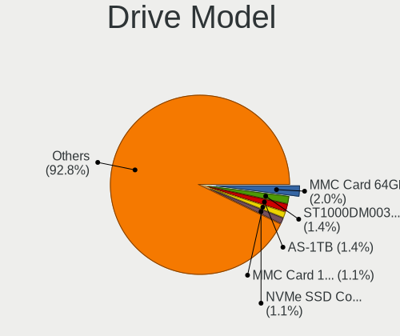
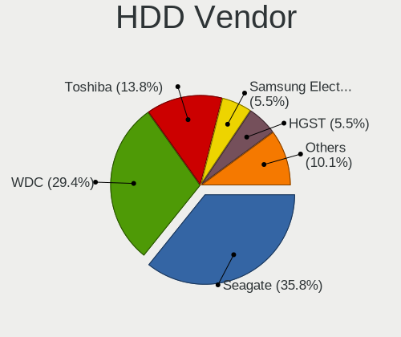
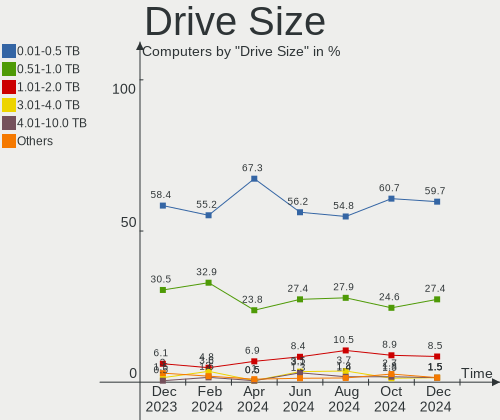
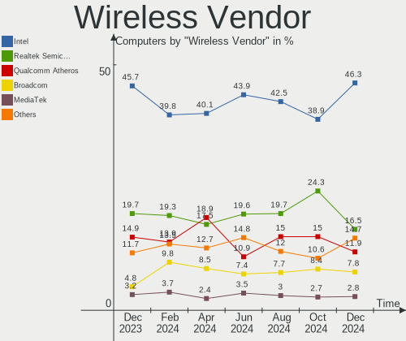
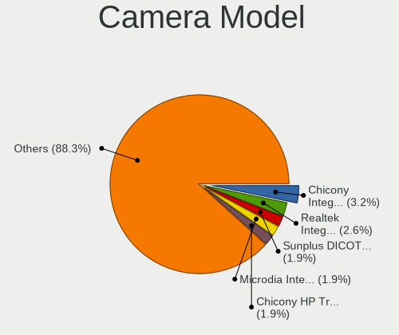
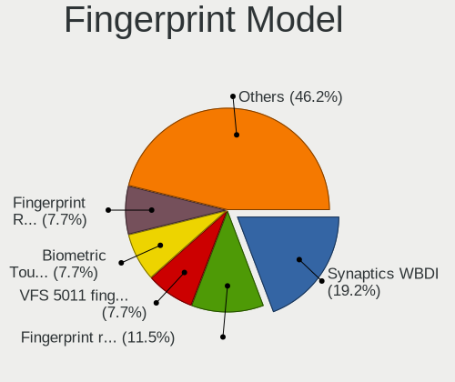
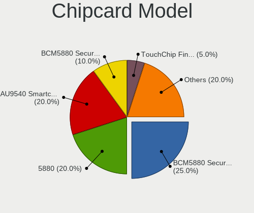

Zorin Hardware Trends
---------------------

A project to identify most popular hardware characteristics and track their change
over time based on data collected by Zorin users at https://Linux-Hardware.org.

Anyone can contribute to the study by uploading probes of their computers by
the [hw-probe](https://github.com/linuxhw/hw-probe) tool:

    sudo -E hw-probe -all -upload

This is a report for all computer types. See also reports for [desktops](/Dist/Zorin/Desktop/README.md) and [notebooks](/Dist/Zorin/Notebook/README.md).

Full-feature report is available here: https://linux-hardware.org/?view=trends

Period: Dec, 2020.

Contents
--------

- [ OS                       ](#os)
- [ OS Family                ](#os-family)
- [ Kernel                   ](#kernel)
- [ Kernel Family            ](#kernel-family)
- [ Kernel Major Ver.        ](#kernel-major-ver)
- [ Arch                     ](#arch)
- [ DE                       ](#de)
- [ Display Server           ](#display-server)
- [ Display Manager          ](#display-manager)
- [ OS Lang                  ](#os-lang)
- [ Boot Mode                ](#boot-mode)
- [ Filesystem               ](#filesystem)
- [ Part. scheme             ](#part-scheme)
- [ Dual Boot with Linux/BSD ](#dual-boot-with-linux/bsd)
- [ Dual Boot (Win)          ](#dual-boot-win)
- [ Country                  ](#country)
- [ City                     ](#city)
- [ Vendor                   ](#vendor)
- [ Model                    ](#model)
- [ Model Family             ](#model-family)
- [ MFG Year                 ](#mfg-year)
- [ Form Factor              ](#form-factor)
- [ Secure Boot              ](#secure-boot)
- [ Coreboot                 ](#coreboot)
- [ RAM Size                 ](#ram-size)
- [ RAM Used                 ](#ram-used)
- [ Has CD-ROM               ](#has-cd-rom)
- [ Total Drives             ](#total-drives)
- [ Has Ethernet             ](#has-ethernet)
- [ Drive Vendor             ](#drive-vendor)
- [ Drive Model              ](#drive-model)
- [ HDD Vendor               ](#hdd-vendor)
- [ SSD Vendor               ](#ssd-vendor)
- [ Drive Kind               ](#drive-kind)
- [ Drive Connector          ](#drive-connector)
- [ Drive Size               ](#drive-size)
- [ Space Total              ](#space-total)
- [ Space Used               ](#space-used)
- [ Malfunc. Drives          ](#malfunc-drives)
- [ Malfunc. Drive Vendor    ](#malfunc-drive-vendor)
- [ Malfunc. HDD Vendor      ](#malfunc-hdd-vendor)
- [ Malfunc. Drive Kind      ](#malfunc-drive-kind)
- [ Failed Drives            ](#failed-drives)
- [ Failed Drive Vendor      ](#failed-drive-vendor)
- [ Drive Status             ](#drive-status)
- [ Storage Vendor           ](#storage-vendor)
- [ Storage Model            ](#storage-model)
- [ Storage Kind             ](#storage-kind)
- [ CPU Vendor               ](#cpu-vendor)
- [ CPU Model                ](#cpu-model)
- [ CPU Model Family         ](#cpu-model-family)
- [ CPU Cores                ](#cpu-cores)
- [ CPU Sockets              ](#cpu-sockets)
- [ CPU Threads              ](#cpu-threads)
- [ CPU Op-Modes             ](#cpu-op-modes)
- [ CPU Microcode            ](#cpu-microcode)
- [ CPU Microarch            ](#cpu-microarch)
- [ GPU Vendor               ](#gpu-vendor)
- [ GPU Model                ](#gpu-model)
- [ GPU Combo                ](#gpu-combo)
- [ GPU Driver               ](#gpu-driver)
- [ GPU Memory               ](#gpu-memory)
- [ Monitor Vendor           ](#monitor-vendor)
- [ Monitor Model            ](#monitor-model)
- [ Monitor Resolution       ](#monitor-resolution)
- [ Monitor Diagonal         ](#monitor-diagonal)
- [ Monitor Width            ](#monitor-width)
- [ Aspect Ratio             ](#aspect-ratio)
- [ Monitor Area             ](#monitor-area)
- [ Pixel Density            ](#pixel-density)
- [ Multiple Monitors        ](#multiple-monitors)
- [ Net Controller Vendor    ](#net-controller-vendor)
- [ Net Controller Model     ](#net-controller-model)
- [ Wireless Vendor          ](#wireless-vendor)
- [ Wireless Model           ](#wireless-model)
- [ Ethernet Vendor          ](#ethernet-vendor)
- [ Ethernet Model           ](#ethernet-model)
- [ Net Controller Kind      ](#net-controller-kind)
- [ Used Controller          ](#used-controller)
- [ NICs                     ](#nics)
- [ Memory Vendor            ](#memory-vendor)
- [ Memory Model             ](#memory-model)
- [ Memory Kind              ](#memory-kind)
- [ Memory Form Factor       ](#memory-form-factor)
- [ Memory Size              ](#memory-size)
- [ Memory Speed             ](#memory-speed)
- [ Sound Vendor             ](#sound-vendor)
- [ Sound Model              ](#sound-model)
- [ Camera Vendor            ](#camera-vendor)
- [ Camera Model             ](#camera-model)
- [ Fingerprint Vendor       ](#fingerprint-vendor)
- [ Fingerprint Model        ](#fingerprint-model)
- [ Chipcard Vendor          ](#chipcard-vendor)
- [ Chipcard Model           ](#chipcard-model)
- [ Printer Vendor           ](#printer-vendor)
- [ Printer Model            ](#printer-model)
- [ Scanner Vendor           ](#scanner-vendor)
- [ Scanner Model            ](#scanner-model)
- [ Bluetooth Vendor         ](#bluetooth-vendor)
- [ Bluetooth Model          ](#bluetooth-model)
- [ Unsupported Devices      ](#unsupported-devices)
- [ Unsupported Device Types ](#unsupported-device-types)

OS
--

Installed operating systems

| Name     | Computers | Percent |
|----------|-----------|---------|
| Zorin 15 | 82        | 93.18%  |
| Zorin 12 | 6         | 6.82%   |

OS Family
---------

OS without a version

| Name  | Computers | Percent |
|-------|-----------|---------|
| Zorin | 88        | 100%    |

Kernel
------

Version of the Linux kernel

| Version               | Computers | Percent |
|-----------------------|-----------|---------|
| 5.4.0-58-generic      | 36        | 40.91%  |
| 5.4.0-56-generic      | 22        | 25%     |
| 5.4.0-54-generic      | 11        | 12.5%   |
| 4.15.0-126-generic    | 3         | 3.41%   |
| 5.4.0-52-generic      | 2         | 2.27%   |
| 5.4.0-47-generic      | 2         | 2.27%   |
| 5.4.0-45-generic      | 2         | 2.27%   |
| 5.4.0-42-generic      | 2         | 2.27%   |
| 5.9.12-050912-generic | 1         | 1.14%   |
| 5.4.0-52-lowlatency   | 1         | 1.14%   |
| 5.4.0-48-generic      | 1         | 1.14%   |
| 5.0.0-37-generic      | 1         | 1.14%   |
| 5.0.0-36-generic      | 1         | 1.14%   |
| 4.15.0-91-generic     | 1         | 1.14%   |
| 4.15.0-128-generic    | 1         | 1.14%   |
| 4.15.0-123-generic    | 1         | 1.14%   |

Kernel Family
-------------

Linux kernel without a distro release

| Version | Computers | Percent |
|---------|-----------|---------|
| 5.4.0   | 79        | 89.77%  |
| 4.15.0  | 6         | 6.82%   |
| 5.0.0   | 2         | 2.27%   |
| 5.9.12  | 1         | 1.14%   |

Kernel Major Ver.
-----------------

Linux kernel major version

| Version | Computers | Percent |
|---------|-----------|---------|
| 5.4     | 79        | 89.77%  |
| 4.15    | 6         | 6.82%   |
| 5.0     | 2         | 2.27%   |
| 5.9     | 1         | 1.14%   |

Arch
----

OS architecture (x86_64, i586, etc.)

| Name   | Computers | Percent |
|--------|-----------|---------|
| x86_64 | 76        | 86.36%  |
| i686   | 12        | 13.64%  |

DE
--

Desktop Environment

| Name  | Computers | Percent |
|-------|-----------|---------|
| GNOME | 60        | 68.18%  |
| XFCE  | 28        | 31.82%  |

Display Server
--------------

X11 or Wayland

| Name    | Computers | Percent |
|---------|-----------|---------|
| X11     | 85        | 96.59%  |
| Wayland | 3         | 3.41%   |

Display Manager
---------------

SDDM, LightDM, etc.

| Name    | Computers | Percent |
|---------|-----------|---------|
| Unknown | 87        | 98.86%  |
| GDM     | 1         | 1.14%   |

OS Lang
-------

Language

| Lang  | Computers | Percent |
|-------|-----------|---------|
| en_US | 38        | 43.18%  |
| it_IT | 8         | 9.09%   |
| de_DE | 7         | 7.95%   |
| pt_BR | 4         | 4.55%   |
| en_GB | 4         | 4.55%   |
| nl_NL | 3         | 3.41%   |
| pt_PT | 2         | 2.27%   |
| pl_PL | 2         | 2.27%   |
| ja_JP | 2         | 2.27%   |
| fr_FR | 2         | 2.27%   |
| en_IN | 2         | 2.27%   |
| cs_CZ | 2         | 2.27%   |
| bg_BG | 2         | 2.27%   |
| ru_RU | 1         | 1.14%   |
| nl_BE | 1         | 1.14%   |
| id_ID | 1         | 1.14%   |
| fi_FI | 1         | 1.14%   |
| eu_ES | 1         | 1.14%   |
| es_UY | 1         | 1.14%   |
| es_ES | 1         | 1.14%   |
| es_AR | 1         | 1.14%   |
| en_IN | 1         | 1.14%   |
| en_CA | 1         | 1.14%   |

Boot Mode
---------

EFI or BIOS

| Mode | Computers | Percent |
|------|-----------|---------|
| BIOS | 63        | 71.59%  |
| EFI  | 25        | 28.41%  |

Filesystem
----------

Type of filesystem

| Type    | Computers | Percent |
|---------|-----------|---------|
| Ext4    | 84        | 95.45%  |
| Overlay | 3         | 3.41%   |
| Ext2    | 1         | 1.14%   |

Part. scheme
------------

Scheme of partitioning

| Type    | Computers | Percent |
|---------|-----------|---------|
| Unknown | 87        | 98.86%  |
| GPT     | 1         | 1.14%   |

Dual Boot with Linux/BSD
------------------------

Hosting more than one Linux/BSD

| Dual boot | Computers | Percent |
|-----------|-----------|---------|
| No        | 80        | 90.91%  |
| Yes       | 8         | 9.09%   |

Dual Boot (Win)
---------------

Hosting Linux and Windows

| Dual boot | Computers | Percent |
|-----------|-----------|---------|
| No        | 55        | 62.5%   |
| Yes       | 33        | 37.5%   |

Country
-------

Geographic location (country)

| Country        | Computers | Percent |
|----------------|-----------|---------|
| USA            | 19        | 21.59%  |
| Germany        | 10        | 11.36%  |
| Italy          | 8         | 9.09%   |
| UK             | 4         | 4.55%   |
| Netherlands    | 4         | 4.55%   |
| India          | 4         | 4.55%   |
| Brazil         | 4         | 4.55%   |
| Portugal       | 3         | 3.41%   |
| Poland         | 3         | 3.41%   |
| Japan          | 3         | 3.41%   |
| Bulgaria       | 3         | 3.41%   |
| Spain          | 2         | 2.27%   |
| Greece         | 2         | 2.27%   |
| France         | 2         | 2.27%   |
| Finland        | 2         | 2.27%   |
| Czech Republic | 2         | 2.27%   |
| Canada         | 2         | 2.27%   |
| Uruguay        | 1         | 1.14%   |
| Switzerland    | 1         | 1.14%   |
| Sweden         | 1         | 1.14%   |
| Serbia         | 1         | 1.14%   |
| Russia         | 1         | 1.14%   |
| Mexico         | 1         | 1.14%   |
| Kenya          | 1         | 1.14%   |
| Jordan         | 1         | 1.14%   |
| Indonesia      | 1         | 1.14%   |
| Belgium        | 1         | 1.14%   |
| Argentina      | 1         | 1.14%   |

City
----

Geographic location (city)

| City               | Computers | Percent |
|--------------------|-----------|---------|
| Rome               | 3         | 3.41%   |
| São Paulo         | 2         | 2.27%   |
| San Francisco      | 2         | 2.27%   |
| Athens             | 2         | 2.27%   |
| Yokohama           | 1         | 1.14%   |
| Wuppertal          | 1         | 1.14%   |
| Willoughby         | 1         | 1.14%   |
| Warsaw             | 1         | 1.14%   |
| Vicenza            | 1         | 1.14%   |
| Vernonia           | 1         | 1.14%   |
| Veliko Tarnovo     | 1         | 1.14%   |
| Varna              | 1         | 1.14%   |
| Vaasa              | 1         | 1.14%   |
| Umeå              | 1         | 1.14%   |
| Tucson             | 1         | 1.14%   |
| Szczecin           | 1         | 1.14%   |
| Surabaya           | 1         | 1.14%   |
| Southampton        | 1         | 1.14%   |
| Samora Correia     | 1         | 1.14%   |
| Salt Spring Island | 1         | 1.14%   |
| Saint-Magne        | 1         | 1.14%   |
| Sacramento         | 1         | 1.14%   |
| Rochester          | 1         | 1.14%   |
| Roanoke            | 1         | 1.14%   |
| Ridderkerk         | 1         | 1.14%   |
| Richmond           | 1         | 1.14%   |
| Revnice            | 1         | 1.14%   |
| Reggio Emilia      | 1         | 1.14%   |
| Radecznica         | 1         | 1.14%   |
| Portland           | 1         | 1.14%   |
| Podolsk            | 1         | 1.14%   |
| Phoenix            | 1         | 1.14%   |
| Ostseebad Binz     | 1         | 1.14%   |
| Nueva Helvecia     | 1         | 1.14%   |
| Nobleboro          | 1         | 1.14%   |
| Naumburg           | 1         | 1.14%   |
| Naples             | 1         | 1.14%   |
| Nairobi            | 1         | 1.14%   |
| Mumbai             | 1         | 1.14%   |
| Monza              | 1         | 1.14%   |
| Minneapolis        | 1         | 1.14%   |
| Minato-ku          | 1         | 1.14%   |
| Mexico City        | 1         | 1.14%   |
| Mengerskirchen     | 1         | 1.14%   |
| Marnhull           | 1         | 1.14%   |
| Mannheim           | 1         | 1.14%   |
| Madrid             | 1         | 1.14%   |
| Ludhiana           | 1         | 1.14%   |
| Lovendegem         | 1         | 1.14%   |
| Los Angeles        | 1         | 1.14%   |
| Leipzig            | 1         | 1.14%   |
| Kerkrade           | 1         | 1.14%   |
| Hoorn              | 1         | 1.14%   |
| Helsinki           | 1         | 1.14%   |
| Haskovo            | 1         | 1.14%   |
| Guia               | 1         | 1.14%   |
| Gruenstadt         | 1         | 1.14%   |
| Grenoble           | 1         | 1.14%   |
| Goiânia           | 1         | 1.14%   |
| Gernsbach          | 1         | 1.14%   |

Vendor
------

Motherboard manufacturer

| Name                | Computers | Percent |
|---------------------|-----------|---------|
| Hewlett-Packard     | 18        | 20.45%  |
| Lenovo              | 9         | 10.23%  |
| Dell                | 9         | 10.23%  |
| ASUSTek Computer    | 6         | 6.82%   |
| ASRock              | 6         | 6.82%   |
| Acer                | 6         | 6.82%   |
| Gigabyte Technology | 5         | 5.68%   |
| MSI                 | 4         | 4.55%   |
| Toshiba             | 3         | 3.41%   |
| Fujitsu             | 3         | 3.41%   |
| NEC Computers       | 2         | 2.27%   |
| Insyde              | 2         | 2.27%   |
| ZOTAC               | 1         | 1.14%   |
| Supermicro          | 1         | 1.14%   |
| Phoenix/SiS         | 1         | 1.14%   |
| Philco              | 1         | 1.14%   |
| Panasonic           | 1         | 1.14%   |
| MiTAC               | 1         | 1.14%   |
| Medion              | 1         | 1.14%   |
| IP3 Tech            | 1         | 1.14%   |
| Intel               | 1         | 1.14%   |
| Hampoo              | 1         | 1.14%   |
| Gateway             | 1         | 1.14%   |
| Ematic              | 1         | 1.14%   |
| ELSA                | 1         | 1.14%   |
| BGH                 | 1         | 1.14%   |
| Unknown             | 1         | 1.14%   |

Model
-----

Motherboard model

| Name                               | Computers | Percent |
|------------------------------------|-----------|---------|
| ZOTAC Board                        | 1         | 1.14%   |
| Toshiba Satellite L40              | 1         | 1.14%   |
| Toshiba PORTEGE M800               | 1         | 1.14%   |
| Toshiba NB500                      | 1         | 1.14%   |
| Supermicro X10SLL-F                | 1         | 1.14%   |
| Phoenix/SiS M720SR                 | 1         | 1.14%   |
| Philco 14A4                        | 1         | 1.14%   |
| Panasonic CF-31JEGAX1M             | 1         | 1.14%   |
| NEC Computers PC-VY25AACZ9         | 1         | 1.14%   |
| NEC Computers PC-VY16AWZE4         | 1         | 1.14%   |
| MSI PPPPPPP-CCC#MMMMMMMM           | 1         | 1.14%   |
| MSI MS-7A38                        | 1         | 1.14%   |
| MSI MS-7817                        | 1         | 1.14%   |
| MSI MS-7816                        | 1         | 1.14%   |
| MiTAC E220 6A7                     | 1         | 1.14%   |
| Medion P7612                       | 1         | 1.14%   |
| Lenovo ThinkPad T460 20FMS7DA00    | 1         | 1.14%   |
| Lenovo ThinkPad T440p 20AWS37D00   | 1         | 1.14%   |
| Lenovo ThinkCentre M800 10FWCTO1WW | 1         | 1.14%   |
| Lenovo ThinkCentre M57p 9088A55    | 1         | 1.14%   |
| Lenovo S20-30 Touch 20434          | 1         | 1.14%   |
| Lenovo MIIX 320-10ICR 80XF         | 1         | 1.14%   |
| Lenovo G780 20138                  | 1         | 1.14%   |
| Lenovo G700 20251                  | 1         | 1.14%   |
| Lenovo Board                       | 1         | 1.14%   |
| IP3 Tech AP34 PRO                  | 1         | 1.14%   |
| Intel X64                          | 1         | 1.14%   |
| Insyde CherryTrail                 | 1         | 1.14%   |
| Insyde CAVION BASE 8 MS            | 1         | 1.14%   |
| HP ZBook 17 G5                     | 1         | 1.14%   |
| HP Stream Notebook PC 14           | 1         | 1.14%   |
| HP Stream Laptop 11-y0XX           | 1         | 1.14%   |
| HP ProBook 6560b                   | 1         | 1.14%   |
| HP ProBook 450 G3                  | 1         | 1.14%   |
| HP Pavilion Laptop 14-ce3xxx       | 1         | 1.14%   |
| HP Pavilion g7                     | 1         | 1.14%   |
| HP Pavilion dv9700                 | 1         | 1.14%   |
| HP Mini 110-3100                   | 1         | 1.14%   |
| HP Mini 110-1000                   | 1         | 1.14%   |
| HP Laptop 15s-eq0xxx               | 1         | 1.14%   |
| HP Laptop 15-bw0xx                 | 1         | 1.14%   |
| HP EliteBook 2560p                 | 1         | 1.14%   |
| HP DC5800                          | 1         | 1.14%   |
| HP Compaq Presario CQ61            | 1         | 1.14%   |
| HP Compaq 8200 Elite CMT PC        | 1         | 1.14%   |
| HP 550                             | 1         | 1.14%   |
| HP 255 G5                          | 1         | 1.14%   |
| Hampoo I1D6_C189_2051              | 1         | 1.14%   |
| Gigabyte H87M-HD3                  | 1         | 1.14%   |
| Gigabyte H61M-S2P-R3               | 1         | 1.14%   |
| Gigabyte H110-D3A                  | 1         | 1.14%   |
| Gigabyte B450M DS3H                | 1         | 1.14%   |
| Gigabyte B450 I AORUS PRO WIFI     | 1         | 1.14%   |
| Gateway GT5686j                    | 1         | 1.14%   |
| Fujitsu ESPRIMO E700               | 1         | 1.14%   |
| Fujitsu ESPRIMO E520               | 1         | 1.14%   |
| Fujitsu CELSIUS H710               | 1         | 1.14%   |
| Ematic EWT127                      | 1         | 1.14%   |
| ELSA P45IA-R2 1048                 | 1         | 1.14%   |
| Dell Precision 3520                | 1         | 1.14%   |

Model Family
------------

Motherboard model prefix

| Name                       | Computers | Percent |
|----------------------------|-----------|---------|
| Dell Inspiron              | 6         | 6.82%   |
| Acer Aspire                | 5         | 5.68%   |
| HP Pavilion                | 3         | 3.41%   |
| Lenovo ThinkPad            | 2         | 2.27%   |
| Lenovo ThinkCentre         | 2         | 2.27%   |
| HP Stream                  | 2         | 2.27%   |
| HP ProBook                 | 2         | 2.27%   |
| HP Mini                    | 2         | 2.27%   |
| HP Laptop                  | 2         | 2.27%   |
| HP Compaq                  | 2         | 2.27%   |
| Fujitsu ESPRIMO            | 2         | 2.27%   |
| ZOTAC Board                | 1         | 1.14%   |
| Toshiba Satellite          | 1         | 1.14%   |
| Toshiba PORTEGE            | 1         | 1.14%   |
| Toshiba NB500              | 1         | 1.14%   |
| Supermicro X10SLL-F        | 1         | 1.14%   |
| Phoenix/SiS M720SR         | 1         | 1.14%   |
| Philco 14A4                | 1         | 1.14%   |
| Panasonic CF-31JEGAX1M     | 1         | 1.14%   |
| NEC Computers PC-VY25AACZ9 | 1         | 1.14%   |
| NEC Computers PC-VY16AWZE4 | 1         | 1.14%   |
| MSI PPPPPPP-CCC#MMMMMMMM   | 1         | 1.14%   |
| MSI MS-7A38                | 1         | 1.14%   |
| MSI MS-7817                | 1         | 1.14%   |
| MSI MS-7816                | 1         | 1.14%   |
| MiTAC E220                 | 1         | 1.14%   |
| Medion P7612               | 1         | 1.14%   |
| Lenovo S20-30              | 1         | 1.14%   |
| Lenovo MIIX                | 1         | 1.14%   |
| Lenovo G780                | 1         | 1.14%   |
| Lenovo G700                | 1         | 1.14%   |
| Lenovo Board               | 1         | 1.14%   |
| IP3 Tech AP34              | 1         | 1.14%   |
| Intel X64                  | 1         | 1.14%   |
| Insyde CherryTrail         | 1         | 1.14%   |
| Insyde CAVION              | 1         | 1.14%   |
| HP ZBook                   | 1         | 1.14%   |
| HP EliteBook               | 1         | 1.14%   |
| HP DC5800                  | 1         | 1.14%   |
| HP 550                     | 1         | 1.14%   |
| HP 255                     | 1         | 1.14%   |
| Hampoo I1D6                | 1         | 1.14%   |
| Gigabyte H87M-HD3          | 1         | 1.14%   |
| Gigabyte H61M-S2P-R3       | 1         | 1.14%   |
| Gigabyte H110-D3A          | 1         | 1.14%   |
| Gigabyte B450M             | 1         | 1.14%   |
| Gigabyte B450              | 1         | 1.14%   |
| Gateway GT5686j            | 1         | 1.14%   |
| Fujitsu CELSIUS            | 1         | 1.14%   |
| Ematic EWT127              | 1         | 1.14%   |
| ELSA P45IA-R2              | 1         | 1.14%   |
| Dell Precision             | 1         | 1.14%   |
| Dell OptiPlex              | 1         | 1.14%   |
| Dell Latitude              | 1         | 1.14%   |
| BGH C46G                   | 1         | 1.14%   |
| ASUS X405UA                | 1         | 1.14%   |
| ASUS P8P67-M               | 1         | 1.14%   |
| ASUS P5QD                  | 1         | 1.14%   |
| ASUS P4P800-E              | 1         | 1.14%   |
| ASUS M5A78L-M              | 1         | 1.14%   |

MFG Year
--------

Motherboard manufacture year

| Year | Computers | Percent |
|------|-----------|---------|
| 2020 | 9         | 10.23%  |
| 2011 | 9         | 10.23%  |
| 2019 | 8         | 9.09%   |
| 2014 | 8         | 9.09%   |
| 2008 | 8         | 9.09%   |
| 2018 | 7         | 7.95%   |
| 2013 | 7         | 7.95%   |
| 2016 | 5         | 5.68%   |
| 2015 | 5         | 5.68%   |
| 2010 | 5         | 5.68%   |
| 2009 | 5         | 5.68%   |
| 2017 | 4         | 4.55%   |
| 2012 | 3         | 3.41%   |
| 2007 | 3         | 3.41%   |
| 2005 | 2         | 2.27%   |

Form Factor
-----------

Physical design of the computer

| Name     | Computers | Percent |
|----------|-----------|---------|
| Notebook | 48        | 54.55%  |
| Desktop  | 36        | 40.91%  |
| Tablet   | 2         | 2.27%   |
| Mini pc  | 1         | 1.14%   |
| Server   | 1         | 1.14%   |

Secure Boot
-----------

Enabled or disabled

| State    | Computers | Percent |
|----------|-----------|---------|
| Disabled | 84        | 95.45%  |
| Enabled  | 4         | 4.55%   |

Coreboot
--------

Have coreboot on board

| Used | Computers | Percent |
|------|-----------|---------|
| No   | 88        | 100%    |

RAM Size
--------

Total RAM memory

| Size in GB  | Computers | Percent |
|-------------|-----------|---------|
| 3.01-4.0    | 26        | 29.55%  |
| 4.01-8.0    | 18        | 20.45%  |
| 1.01-2.0    | 13        | 14.77%  |
| 8.01-16.0   | 13        | 14.77%  |
| 16.01-24.0  | 8         | 9.09%   |
| 0.51-1.0    | 5         | 5.68%   |
| 2.01-3.0    | 3         | 3.41%   |
| 32.01-64.0  | 1         | 1.14%   |
| 64.01-256.0 | 1         | 1.14%   |

RAM Used
--------

Used RAM memory

| Used GB   | Computers | Percent |
|-----------|-----------|---------|
| 1.01-2.0  | 44        | 50%     |
| 2.01-3.0  | 16        | 18.18%  |
| 3.01-4.0  | 9         | 10.23%  |
| 4.01-8.0  | 8         | 9.09%   |
| 0.51-1.0  | 8         | 9.09%   |
| 0.01-0.5  | 2         | 2.27%   |
| 8.01-16.0 | 1         | 1.14%   |

Has CD-ROM
----------

Has CD-ROM on board

| Presented | Computers | Percent |
|-----------|-----------|---------|
| No        | 49        | 55.68%  |
| Yes       | 39        | 44.32%  |

Total Drives
------------

Number of drives on board

| Drives | Computers | Percent |
|--------|-----------|---------|
| 1      | 59        | 67.05%  |
| 2      | 15        | 17.05%  |
| 3      | 9         | 10.23%  |
| 5      | 2         | 2.27%   |
| 4      | 2         | 2.27%   |
| 6      | 1         | 1.14%   |

Has Ethernet
------------

Has Ethernet on board

| Presented | Computers | Percent |
|-----------|-----------|---------|
| Yes       | 80        | 90.91%  |
| No        | 8         | 9.09%   |

Drive Vendor
------------

Hard drive vendors

| Vendor                    | Computers | Drives | Percent |
|---------------------------|-----------|--------|---------|
| Seagate                   | 20        | 25     | 17.09%  |
| WDC                       | 19        | 21     | 16.24%  |
| Unknown                   | 11        | 15     | 9.4%    |
| Samsung Electronics       | 11        | 14     | 9.4%    |
| Kingston                  | 9         | 10     | 7.69%   |
| Toshiba                   | 8         | 8      | 6.84%   |
| SanDisk                   | 8         | 8      | 6.84%   |
| Hitachi                   | 8         | 8      | 6.84%   |
| Intel                     | 3         | 3      | 2.56%   |
| SPCC                      | 2         | 2      | 1.71%   |
| Patriot                   | 2         | 2      | 1.71%   |
| Crucial                   | 2         | 2      | 1.71%   |
| USB3.0                    | 1         | 1      | 0.85%   |
| Transcend                 | 1         | 1      | 0.85%   |
| TO Exter                  | 1         | 1      | 0.85%   |
| TCSUNBOW                  | 1         | 1      | 0.85%   |
| SK Hynix                  | 1         | 1      | 0.85%   |
| Silicon Motion            | 1         | 1      | 0.85%   |
| PNY                       | 1         | 1      | 0.85%   |
| Phison                    | 1         | 1      | 0.85%   |
| Mushkin                   | 1         | 1      | 0.85%   |
| Micron/Crucial Technology | 1         | 1      | 0.85%   |
| MAXTOR                    | 1         | 1      | 0.85%   |
| KIOXIA                    | 1         | 1      | 0.85%   |
| Intenso                   | 1         | 1      | 0.85%   |
| BHT                       | 1         | 1      | 0.85%   |

Drive Model
-----------

Hard drive models

| Model                               | Computers | Percent |
|-------------------------------------|-----------|---------|
| Unknown MMC Card  64GB              | 3         | 2.33%   |
| Unknown MMC Card  32GB              | 3         | 2.33%   |
| Kingston SA400S37240G 240GB SSD     | 3         | 2.33%   |
| WDC WD5000AAKX-07U6AA0 500GB        | 2         | 1.55%   |
| Unknown SD/MMC/MS PRO 128GB         | 2         | 1.55%   |
| Unknown MMC Card  128GB             | 2         | 1.55%   |
| Toshiba MK1652GSX 160GB             | 2         | 1.55%   |
| Seagate ST1000DM003-1CH162 1TB      | 2         | 1.55%   |
| Samsung SSD 860 EVO 500GB           | 2         | 1.55%   |
| Kingston SV300S37A120G 120GB SSD    | 2         | 1.55%   |
| Hitachi HTS543232A7A384 320GB       | 2         | 1.55%   |
| WDC WDS240G2G0A-00JH30 240GB SSD    | 1         | 0.78%   |
| WDC WD800BEVS-22VAT0 80GB           | 1         | 0.78%   |
| WDC WD7500BPVX-22JC3T0 752GB        | 1         | 0.78%   |
| WDC WD6400AAKS-00A7B0 640GB         | 1         | 0.78%   |
| WDC WD5000LPVX-08V0TT5 500GB        | 1         | 0.78%   |
| WDC WD5000AVVS-63ZWB0 500GB         | 1         | 0.78%   |
| WDC WD5000AAKX-60U6AA0 500GB        | 1         | 0.78%   |
| WDC WD5000AACS-00ZUB0 500GB         | 1         | 0.78%   |
| WDC WD40EZRZ-00GXCB0 4TB            | 1         | 0.78%   |
| WDC WD40EZRX-00SPEB0 4TB            | 1         | 0.78%   |
| WDC WD3200AAJS-22B4A0 320GB         | 1         | 0.78%   |
| WDC WD3200AAJS-08L7A0 320GB         | 1         | 0.78%   |
| WDC WD1600BEVT-22A23T0 160GB        | 1         | 0.78%   |
| WDC WD10SPZX-24Z10 1TB              | 1         | 0.78%   |
| WDC WD10JPVX-60JC3T1 1TB            | 1         | 0.78%   |
| WDC WD10JPVX-60JC3T0 1TB            | 1         | 0.78%   |
| WDC WD10EZEX-22MFCA0 1TB            | 1         | 0.78%   |
| WDC WD10EZEX-00BN5A0 1TB            | 1         | 0.78%   |
| WDC WD10EVDS-63N5B1 1TB             | 1         | 0.78%   |
| USB3.0 Super Speed 250GB            | 1         | 0.78%   |
| Unknown SD/MMC/M.S.PRO 32GB         | 1         | 0.78%   |
| Unknown SD/MMC 8GB                  | 1         | 0.78%   |
| Unknown MMC Card  2GB               | 1         | 0.78%   |
| Unknown MMC Card  16GB              | 1         | 0.78%   |
| Transcend TS64GSSD420K 64GB         | 1         | 0.78%   |
| Toshiba THNSNJ512GCSU 512GB SSD     | 1         | 0.78%   |
| Toshiba MQ01ACF032 320GB            | 1         | 0.78%   |
| Toshiba MQ01ABF050 500GB            | 1         | 0.78%   |
| Toshiba MK8037GSX 40 40GB           | 1         | 0.78%   |
| Toshiba MK4058GSX 400GB             | 1         | 0.78%   |
| Toshiba MK3256GSY 320GB             | 1         | 0.78%   |
| TO Exter nal USB 3.0 752GB          | 1         | 0.78%   |
| TCSUNBOW X3 60GB                    | 1         | 0.78%   |
| SPCC Solid State Disk 128GB         | 1         | 0.78%   |
| SPCC M.2 PCIe SSD 1TB               | 1         | 0.78%   |
| SK Hynix SC210 2.5 7MM 256GB SSD    | 1         | 0.78%   |
| Silicon Motion NVMe SSD Drive 128GB | 1         | 0.78%   |
| Seagate ST9640320AS 640GB           | 1         | 0.78%   |
| Seagate ST9500423AS 500GB           | 1         | 0.78%   |
| Seagate ST9500325AS 500GB           | 1         | 0.78%   |
| Seagate ST9250827AS 250GB           | 1         | 0.78%   |
| Seagate ST500VT000-1DK142 500GB     | 1         | 0.78%   |
| Seagate ST500LM000-SSHD-8GB         | 1         | 0.78%   |
| Seagate ST500LM000-1EJ162 500GB     | 1         | 0.78%   |
| Seagate ST500DM002-1BD142 500GB     | 1         | 0.78%   |
| Seagate ST4000DM004-2CV104 4TB      | 1         | 0.78%   |
| Seagate ST3500418AS 500GB           | 1         | 0.78%   |
| Seagate ST3500414CS 500GB           | 1         | 0.78%   |
| Seagate ST3500413AS 500GB           | 1         | 0.78%   |

HDD Vendor
----------

Hard disk drive vendors

| Vendor              | Computers | Drives | Percent |
|---------------------|-----------|--------|---------|
| WDC                 | 18        | 20     | 31.03%  |
| Seagate             | 18        | 23     | 31.03%  |
| Hitachi             | 8         | 8      | 13.79%  |
| Toshiba             | 7         | 7      | 12.07%  |
| Samsung Electronics | 4         | 4      | 6.9%    |
| USB3.0              | 1         | 1      | 1.72%   |
| TO Exter            | 1         | 1      | 1.72%   |
| MAXTOR              | 1         | 1      | 1.72%   |

SSD Vendor
----------

Solid state drive vendors

| Vendor              | Computers | Drives | Percent |
|---------------------|-----------|--------|---------|
| Samsung Electronics | 8         | 8      | 21.62%  |
| Kingston            | 8         | 9      | 21.62%  |
| SanDisk             | 6         | 6      | 16.22%  |
| Patriot             | 2         | 2      | 5.41%   |
| Intel               | 2         | 2      | 5.41%   |
| Crucial             | 2         | 2      | 5.41%   |
| WDC                 | 1         | 1      | 2.7%    |
| Transcend           | 1         | 1      | 2.7%    |
| Toshiba             | 1         | 1      | 2.7%    |
| TCSUNBOW            | 1         | 1      | 2.7%    |
| SPCC                | 1         | 1      | 2.7%    |
| SK Hynix            | 1         | 1      | 2.7%    |
| PNY                 | 1         | 1      | 2.7%    |
| Mushkin             | 1         | 1      | 2.7%    |
| Intenso             | 1         | 1      | 2.7%    |

Drive Kind
----------

HDD or SSD

| Kind    | Computers | Drives | Percent |
|---------|-----------|--------|---------|
| HDD     | 52        | 65     | 47.71%  |
| SSD     | 33        | 38     | 30.28%  |
| MMC     | 9         | 11     | 8.26%   |
| NVMe    | 9         | 11     | 8.26%   |
| Unknown | 6         | 7      | 5.5%    |

Drive Connector
---------------

SATA, SAS, NVMe, etc.

| Type | Computers | Drives | Percent |
|------|-----------|--------|---------|
| SATA | 77        | 102    | 76.24%  |
| NVMe | 9         | 11     | 8.91%   |
| MMC  | 9         | 11     | 8.91%   |
| SAS  | 6         | 8      | 5.94%   |

Drive Size
----------

Size of hard drive

| Size in TB | Computers | Drives | Percent |
|------------|-----------|--------|---------|
| 0.01-0.5   | 61        | 74     | 69.32%  |
| 0.51-1.0   | 21        | 22     | 23.86%  |
| 1.01-2.0   | 3         | 3      | 3.41%   |
| 3.01-4.0   | 2         | 3      | 2.27%   |
| 2.01-3.0   | 1         | 1      | 1.14%   |

Space Total
-----------

Amount of disk space available on the file system

| Size in GB     | Computers | Percent |
|----------------|-----------|---------|
| 101-250        | 30        | 34.09%  |
| 251-500        | 20        | 22.73%  |
| 51-100         | 12        | 13.64%  |
| 501-1000       | 8         | 9.09%   |
| 1001-2000      | 7         | 7.95%   |
| 21-50          | 6         | 6.82%   |
| More than 3000 | 3         | 3.41%   |
| 1-20           | 2         | 2.27%   |

Space Used
----------

Amount of used disk space

| Used GB        | Computers | Percent |
|----------------|-----------|---------|
| 1-20           | 39        | 44.32%  |
| 21-50          | 17        | 19.32%  |
| 51-100         | 11        | 12.5%   |
| 101-250        | 10        | 11.36%  |
| 251-500        | 4         | 4.55%   |
| 1001-2000      | 3         | 3.41%   |
| 501-1000       | 2         | 2.27%   |
| More than 3000 | 1         | 1.14%   |
| 2001-3000      | 1         | 1.14%   |

Malfunc. Drives
---------------

Drive models with a malfunction

Zero info for selected period =(

Malfunc. Drive Vendor
---------------------

Vendors of faulty drives

Zero info for selected period =(

Malfunc. HDD Vendor
-------------------

Vendors of faulty HDD drives

Zero info for selected period =(

Malfunc. Drive Kind
-------------------

Kinds of faulty drives

Zero info for selected period =(

Failed Drives
-------------

Failed drive models

Zero info for selected period =(

Failed Drive Vendor
-------------------

Failed drive vendors

Zero info for selected period =(

Drive Status
------------

Number of failed and malfunc. drives

| Status   | Computers | Drives | Percent |
|----------|-----------|--------|---------|
| Detected | 85        | 127    | 96.59%  |
| Works    | 3         | 5      | 3.41%   |

Storage Vendor
--------------

Storage controller vendors

| Vendor                           | Computers | Percent |
|----------------------------------|-----------|---------|
| Intel                            | 65        | 68.42%  |
| AMD                              | 13        | 13.68%  |
| Silicon Integrated Systems [SiS] | 2         | 2.11%   |
| Sandisk                          | 2         | 2.11%   |
| Phison Electronics               | 2         | 2.11%   |
| Marvell Technology Group         | 2         | 2.11%   |
| Kingston Technology Company      | 2         | 2.11%   |
| Silicon Motion                   | 1         | 1.05%   |
| Samsung Electronics              | 1         | 1.05%   |
| Promise Technology               | 1         | 1.05%   |
| Nvidia                           | 1         | 1.05%   |
| Micron/Crucial Technology        | 1         | 1.05%   |
| KIOXIA                           | 1         | 1.05%   |
| ASMedia Technology               | 1         | 1.05%   |

Storage Model
-------------

Storage controller models

| Model                                                                                   | Computers | Percent |
|-----------------------------------------------------------------------------------------|-----------|---------|
| AMD FCH SATA Controller [AHCI mode]                                                     | 9         | 7.26%   |
| Intel 8 Series/C220 Series Chipset Family 6-port SATA Controller 1 [AHCI mode]          | 8         | 6.45%   |
| Intel 6 Series/C200 Series Chipset Family 6 port Mobile SATA AHCI Controller            | 7         | 5.65%   |
| Intel 82801IBM/IEM (ICH9M/ICH9M-E) 4 port SATA Controller [AHCI mode]                   | 5         | 4.03%   |
| Intel 82801I (ICH9 Family) 2 port SATA Controller [IDE mode]                            | 4         | 3.23%   |
| Intel 82801HM/HEM (ICH8M/ICH8M-E) SATA Controller [AHCI mode]                           | 4         | 3.23%   |
| Intel 82801HM/HEM (ICH8M/ICH8M-E) IDE Controller                                        | 4         | 3.23%   |
| Intel 7 Series Chipset Family 6-port SATA Controller [AHCI mode]                        | 4         | 3.23%   |
| Intel Sunrise Point-LP SATA Controller [AHCI mode]                                      | 3         | 2.42%   |
| Intel Atom Processor E3800 Series SATA AHCI Controller                                  | 3         | 2.42%   |
| Intel 82801IR/IO/IH (ICH9R/DO/DH) 4 port SATA Controller [IDE mode]                     | 3         | 2.42%   |
| AMD 300 Series Chipset SATA Controller                                                  | 3         | 2.42%   |
| Silicon Integrated Systems [SiS] SATA Controller / IDE mode                             | 2         | 1.61%   |
| Silicon Integrated Systems [SiS] 5513 IDE Controller                                    | 2         | 1.61%   |
| Phison E12 NVMe Controller                                                              | 2         | 1.61%   |
| Intel Q170/Q150/B150/H170/H110/Z170/CM236 Chipset SATA Controller [AHCI Mode]           | 2         | 1.61%   |
| Intel NM10/ICH7 Family SATA Controller [IDE mode]                                       | 2         | 1.61%   |
| Intel NM10/ICH7 Family SATA Controller [AHCI mode]                                      | 2         | 1.61%   |
| Intel 82801G (ICH7 Family) IDE Controller                                               | 2         | 1.61%   |
| Intel 82801 Mobile SATA Controller [RAID mode]                                          | 2         | 1.61%   |
| Intel 6 Series/C200 Series Chipset Family Desktop SATA Controller (IDE mode, ports 4-5) | 2         | 1.61%   |
| Intel 6 Series/C200 Series Chipset Family Desktop SATA Controller (IDE mode, ports 0-3) | 2         | 1.61%   |
| Intel 6 Series/C200 Series Chipset Family 6 port Desktop SATA AHCI Controller           | 2         | 1.61%   |
| AMD SB7x0/SB8x0/SB9x0 SATA Controller [AHCI mode]                                       | 2         | 1.61%   |
| AMD SB7x0/SB8x0/SB9x0 IDE Controller                                                    | 2         | 1.61%   |
| AMD 400 Series Chipset SATA Controller                                                  | 2         | 1.61%   |
| Silicon Motion SM2263EN/SM2263XT SSD Controller                                         | 1         | 0.81%   |
| Sandisk WD Blue SN550 NVMe SSD                                                          | 1         | 0.81%   |
| Sandisk WD Black SN750 / PC SN730 NVMe SSD                                              | 1         | 0.81%   |
| Samsung NVMe SSD Controller SM981/PM981/PM983                                           | 1         | 0.81%   |
| Promise PDC20378 (FastTrak 378/SATA 378)                                                | 1         | 0.81%   |
| Nvidia MCP78S [GeForce 8200] IDE                                                        | 1         | 0.81%   |
| Nvidia MCP78S [GeForce 8200] AHCI Controller                                            | 1         | 0.81%   |
| Micron/Crucial P1 NVMe PCIe SSD                                                         | 1         | 0.81%   |
| Marvell Group 92xx SATA 6G Controller                                                   | 1         | 0.81%   |
| Marvell Group 88SE9172 SATA III 6Gb/s RAID Controller                                   | 1         | 0.81%   |
| KIOXIA Non-Volatile memory controller                                                   | 1         | 0.81%   |
| Kingston Company U-SNS8154P3 NVMe SSD                                                   | 1         | 0.81%   |
| Kingston Company HyperX Predator PCIe AHCI SSD                                          | 1         | 0.81%   |
| Intel SSD Pro 7600p/760p/E 6100p Series                                                 | 1         | 0.81%   |
| Intel SATA Controller [RAID mode]                                                       | 1         | 0.81%   |
| Intel Comet Lake SATA AHCI Controller                                                   | 1         | 0.81%   |
| Intel Celeron/Pentium Silver Processor SATA Controller                                  | 1         | 0.81%   |
| Intel Celeron N3350/Pentium N4200/Atom E3900 Series SATA AHCI Controller                | 1         | 0.81%   |
| Intel Cannon Lake Mobile PCH SATA AHCI Controller                                       | 1         | 0.81%   |
| Intel C600/X79 series chipset 6-Port SATA AHCI Controller                               | 1         | 0.81%   |
| Intel 9 Series Chipset Family SATA Controller [AHCI Mode]                               | 1         | 0.81%   |
| Intel 82Q35 Express PT IDER Controller                                                  | 1         | 0.81%   |
| Intel 82801JI (ICH10 Family) SATA AHCI Controller                                       | 1         | 0.81%   |
| Intel 82801JI (ICH10 Family) 4 port SATA IDE Controller #1                              | 1         | 0.81%   |
| Intel 82801JI (ICH10 Family) 2 port SATA IDE Controller #2                              | 1         | 0.81%   |
| Intel 82801IB (ICH9) 2 port SATA Controller [IDE mode]                                  | 1         | 0.81%   |
| Intel 82801GR/GDH (ICH7R/ICH7DH) SATA Controller [RAID mode]                            | 1         | 0.81%   |
| Intel 82801GBM/GHM (ICH7-M Family) SATA Controller [IDE mode]                           | 1         | 0.81%   |
| Intel 82801FBM (ICH6M) SATA Controller                                                  | 1         | 0.81%   |
| Intel 82801EB/ER (ICH5/ICH5R) IDE Controller                                            | 1         | 0.81%   |
| Intel 82801EB (ICH5) SATA Controller                                                    | 1         | 0.81%   |
| Intel 8 Series SATA Controller 1 [AHCI mode]                                            | 1         | 0.81%   |
| Intel 5 Series/3400 Series Chipset 4 port SATA AHCI Controller                          | 1         | 0.81%   |
| ASMedia ASM1062 Serial ATA Controller                                                   | 1         | 0.81%   |

Storage Kind
------------

Kind of storage controller (IDE, SATA, NVMe, SAS, ...)

| Kind | Computers | Percent |
|------|-----------|---------|
| SATA | 62        | 61.39%  |
| IDE  | 25        | 24.75%  |
| NVMe | 9         | 8.91%   |
| RAID | 5         | 4.95%   |

CPU Vendor
----------

Processor vendors

| Vendor | Computers | Percent |
|--------|-----------|---------|
| Intel  | 74        | 84.09%  |
| AMD    | 14        | 15.91%  |

CPU Model
---------

Processor models

| Model                                       | Computers | Percent |
|---------------------------------------------|-----------|---------|
| Intel Atom x5-Z8350 CPU @ 1.44GHz           | 3         | 3.41%   |
| Intel Pentium CPU G3260 @ 3.30GHz           | 2         | 2.27%   |
| Intel Core i7-2630QM CPU @ 2.00GHz          | 2         | 2.27%   |
| Intel Core 2 Duo CPU E4600 @ 2.40GHz        | 2         | 2.27%   |
| Intel Atom CPU N455 @ 1.66GHz               | 2         | 2.27%   |
| Intel Xeon E-2186M CPU @ 2.90GHz            | 1         | 1.14%   |
| Intel Xeon CPU E5-2630 v2 @ 2.60GHz         | 1         | 1.14%   |
| Intel Pentium M processor 1.50GHz           | 1         | 1.14%   |
| Intel Pentium Dual-Core CPU E5300 @ 2.60GHz | 1         | 1.14%   |
| Intel Pentium Dual CPU T3400 @ 2.16GHz      | 1         | 1.14%   |
| Intel Pentium Dual CPU T2330 @ 1.60GHz      | 1         | 1.14%   |
| Intel Pentium CPU G630 @ 2.70GHz            | 1         | 1.14%   |
| Intel Pentium CPU G2020 @ 2.90GHz           | 1         | 1.14%   |
| Intel Pentium 4 CPU 3.20GHz                 | 1         | 1.14%   |
| Intel Genuine CPU 2140 @ 1.60GHz            | 1         | 1.14%   |
| Intel Core i7-7700HQ CPU @ 2.80GHz          | 1         | 1.14%   |
| Intel Core i7-6700 CPU @ 3.40GHz            | 1         | 1.14%   |
| Intel Core i7-4810MQ CPU @ 2.80GHz          | 1         | 1.14%   |
| Intel Core i7-4790K CPU @ 4.00GHz           | 1         | 1.14%   |
| Intel Core i7-4710MQ CPU @ 2.50GHz          | 1         | 1.14%   |
| Intel Core i7-4500U CPU @ 1.80GHz           | 1         | 1.14%   |
| Intel Core i7-2820QM CPU @ 2.30GHz          | 1         | 1.14%   |
| Intel Core i7-2600 CPU @ 3.40GHz            | 1         | 1.14%   |
| Intel Core i5-7200U CPU @ 2.50GHz           | 1         | 1.14%   |
| Intel Core i5-6400 CPU @ 2.70GHz            | 1         | 1.14%   |
| Intel Core i5-6300U CPU @ 2.40GHz           | 1         | 1.14%   |
| Intel Core i5-6200U CPU @ 2.30GHz           | 1         | 1.14%   |
| Intel Core i5-4460 CPU @ 3.20GHz            | 1         | 1.14%   |
| Intel Core i5-4430 CPU @ 3.00GHz            | 1         | 1.14%   |
| Intel Core i5-4200U CPU @ 1.60GHz           | 1         | 1.14%   |
| Intel Core i5-3230M CPU @ 2.60GHz           | 1         | 1.14%   |
| Intel Core i5-2540M CPU @ 2.60GHz           | 1         | 1.14%   |
| Intel Core i5-2520M CPU @ 2.50GHz           | 1         | 1.14%   |
| Intel Core i5-2400 CPU @ 3.10GHz            | 1         | 1.14%   |
| Intel Core i5-10210U CPU @ 1.60GHz          | 1         | 1.14%   |
| Intel Core i3-4160 CPU @ 3.60GHz            | 1         | 1.14%   |
| Intel Core i3-4130 CPU @ 3.40GHz            | 1         | 1.14%   |
| Intel Core i3-3217U CPU @ 1.80GHz           | 1         | 1.14%   |
| Intel Core i3-3110M CPU @ 2.40GHz           | 1         | 1.14%   |
| Intel Core i3-2310M CPU @ 2.10GHz           | 1         | 1.14%   |
| Intel Core i3-1005G1 CPU @ 1.20GHz          | 1         | 1.14%   |
| Intel Core i3 CPU M 350 @ 2.27GHz           | 1         | 1.14%   |
| Intel Core 2 Quad CPU Q9650 @ 3.00GHz       | 1         | 1.14%   |
| Intel Core 2 Quad CPU Q6700 @ 2.66GHz       | 1         | 1.14%   |
| Intel Core 2 Quad CPU Q6600 @ 2.40GHz       | 1         | 1.14%   |
| Intel Core 2 Duo CPU T9550 @ 2.66GHz        | 1         | 1.14%   |
| Intel Core 2 Duo CPU T7500 @ 2.20GHz        | 1         | 1.14%   |
| Intel Core 2 Duo CPU T6500 @ 2.10GHz        | 1         | 1.14%   |
| Intel Core 2 Duo CPU T6400 @ 2.00GHz        | 1         | 1.14%   |
| Intel Core 2 Duo CPU P8700 @ 2.53GHz        | 1         | 1.14%   |
| Intel Core 2 Duo CPU P7450 @ 2.13GHz        | 1         | 1.14%   |
| Intel Core 2 Duo CPU E8400 @ 3.00GHz        | 1         | 1.14%   |
| Intel Core 2 Duo CPU E6750 @ 2.66GHz        | 1         | 1.14%   |
| Intel Core 2 CPU T5500 @ 1.66GHz            | 1         | 1.14%   |
| Intel Celeron N4100 CPU @ 1.10GHz           | 1         | 1.14%   |
| Intel Celeron Dual-Core CPU T3000 @ 1.80GHz | 1         | 1.14%   |
| Intel Celeron CPU N3450 @ 1.10GHz           | 1         | 1.14%   |
| Intel Celeron CPU N3060 @ 1.60GHz           | 1         | 1.14%   |
| Intel Celeron CPU N2840 @ 2.16GHz           | 1         | 1.14%   |
| Intel Celeron CPU N2830 @ 2.16GHz           | 1         | 1.14%   |

CPU Model Family
----------------

Processor model prefix

| Model                   | Computers | Percent |
|-------------------------|-----------|---------|
| Intel Core i5           | 12        | 13.64%  |
| Intel Core i7           | 10        | 11.36%  |
| Intel Core 2 Duo        | 10        | 11.36%  |
| Intel Celeron           | 10        | 11.36%  |
| Intel Atom              | 8         | 9.09%   |
| Intel Core i3           | 7         | 7.95%   |
| Intel Pentium           | 4         | 4.55%   |
| Intel Core 2 Quad       | 3         | 3.41%   |
| AMD Ryzen 7             | 3         | 3.41%   |
| Intel Xeon              | 2         | 2.27%   |
| Intel Pentium Dual      | 2         | 2.27%   |
| AMD FX                  | 2         | 2.27%   |
| Other                   | 1         | 1.14%   |
| Intel Pentium M         | 1         | 1.14%   |
| Intel Pentium Dual-Core | 1         | 1.14%   |
| Intel Pentium 4         | 1         | 1.14%   |
| Intel Genuine           | 1         | 1.14%   |
| Intel Core 2            | 1         | 1.14%   |
| Intel Celeron Dual-Core | 1         | 1.14%   |
| AMD Ryzen 5             | 1         | 1.14%   |
| AMD Ryzen 3             | 1         | 1.14%   |
| AMD E2                  | 1         | 1.14%   |
| AMD C-60                | 1         | 1.14%   |
| AMD Athlon Dual Core    | 1         | 1.14%   |
| AMD Athlon              | 1         | 1.14%   |
| AMD A4                  | 1         | 1.14%   |
| AMD A10                 | 1         | 1.14%   |

CPU Cores
---------

Number of processor cores

| Number | Computers | Percent |
|--------|-----------|---------|
| 2      | 46        | 52.27%  |
| 4      | 31        | 35.23%  |
| 1      | 7         | 7.95%   |
| 8      | 2         | 2.27%   |
| 6      | 2         | 2.27%   |

CPU Sockets
-----------

Number of sockets

| Number | Computers | Percent |
|--------|-----------|---------|
| 1      | 88        | 100%    |

CPU Threads
-----------

Threads per core (Hyper-Threading)

| Number | Computers | Percent |
|--------|-----------|---------|
| 1      | 49        | 55.68%  |
| 2      | 39        | 44.32%  |

CPU Op-Modes
------------

CPU Operation Modes (32-bit, 64-bit)

| Op mode        | Computers | Percent |
|----------------|-----------|---------|
| 32-bit, 64-bit | 85        | 96.59%  |
| 32-bit         | 3         | 3.41%   |

CPU Microcode
-------------

Microcode number

| Number     | Computers | Percent |
|------------|-----------|---------|
| 0x206a7    | 10        | 11.36%  |
| 0x306c3    | 9         | 10.23%  |
| Unknown    | 9         | 10.23%  |
| 0x1067a    | 7         | 7.95%   |
| 0x306a9    | 5         | 5.68%   |
| 0x6fd      | 4         | 4.55%   |
| 0x6fb      | 4         | 4.55%   |
| 0x406c4    | 4         | 4.55%   |
| 0x506e3    | 2         | 2.27%   |
| 0x406e3    | 2         | 2.27%   |
| 0x40651    | 2         | 2.27%   |
| 0x30678    | 2         | 2.27%   |
| 0x106ca    | 2         | 2.27%   |
| 0x10661    | 2         | 2.27%   |
| 0x0800820d | 2         | 2.27%   |
| 0x06000852 | 2         | 2.27%   |
| 0xf41      | 1         | 1.14%   |
| 0x906e9    | 1         | 1.14%   |
| 0x806ec    | 1         | 1.14%   |
| 0x806e9    | 1         | 1.14%   |
| 0x706e5    | 1         | 1.14%   |
| 0x706a1    | 1         | 1.14%   |
| 0x6f2      | 1         | 1.14%   |
| 0x6d8      | 1         | 1.14%   |
| 0x406c3    | 1         | 1.14%   |
| 0x306e4    | 1         | 1.14%   |
| 0x20655    | 1         | 1.14%   |
| 0x106c2    | 1         | 1.14%   |
| 0x10676    | 1         | 1.14%   |
| 0x08108109 | 1         | 1.14%   |
| 0x08101016 | 1         | 1.14%   |
| 0x08101013 | 1         | 1.14%   |
| 0x0800111c | 1         | 1.14%   |
| 0x07030105 | 1         | 1.14%   |
| 0x06006705 | 1         | 1.14%   |
| 0x06001119 | 1         | 1.14%   |

CPU Microarch
-------------

Microarchitecture

| Name          | Computers | Percent |
|---------------|-----------|---------|
| Core          | 12        | 13.64%  |
| Haswell       | 11        | 12.5%   |
| SandyBridge   | 10        | 11.36%  |
| Silvermont    | 9         | 10.23%  |
| Penryn        | 9         | 10.23%  |
| IvyBridge     | 6         | 6.82%   |
| Skylake       | 4         | 4.55%   |
| KabyLake      | 4         | 4.55%   |
| Zen+          | 3         | 3.41%   |
| Zen           | 3         | 3.41%   |
| Piledriver    | 3         | 3.41%   |
| Bonnell       | 3         | 3.41%   |
| Puma          | 2         | 2.27%   |
| Westmere      | 1         | 1.14%   |
| P6            | 1         | 1.14%   |
| NetBurst      | 1         | 1.14%   |
| K8 Hammer     | 1         | 1.14%   |
| IceLake       | 1         | 1.14%   |
| Goldmont plus | 1         | 1.14%   |
| Goldmont      | 1         | 1.14%   |
| Excavator     | 1         | 1.14%   |
| Bobcat        | 1         | 1.14%   |

GPU Vendor
----------

Vendors of graphics cards

| Vendor                           | Computers | Percent |
|----------------------------------|-----------|---------|
| Intel                            | 51        | 52.04%  |
| Nvidia                           | 22        | 22.45%  |
| AMD                              | 22        | 22.45%  |
| Silicon Integrated Systems [SiS] | 2         | 2.04%   |
| ASPEED Technology                | 1         | 1.02%   |

GPU Model
---------

Graphics card models

| Model                                                                                    | Computers | Percent |
|------------------------------------------------------------------------------------------|-----------|---------|
| Intel Atom/Celeron/Pentium Processor x5-E8000/J3xxx/N3xxx Integrated Graphics Controller | 5         | 4.85%   |
| Intel 2nd Generation Core Processor Family Integrated Graphics Controller                | 5         | 4.85%   |
| Intel Atom Processor Z36xxx/Z37xxx Series Graphics & Display                             | 4         | 3.88%   |
| Intel 3rd Gen Core processor Graphics Controller                                         | 4         | 3.88%   |
| Intel Xeon E3-1200 v3/4th Gen Core Processor Integrated Graphics Controller              | 3         | 2.91%   |
| Intel Mobile 4 Series Chipset Integrated Graphics Controller                             | 3         | 2.91%   |
| AMD Ellesmere [Radeon RX 470/480/570/570X/580/580X/590]                                  | 3         | 2.91%   |
| Silicon Integrated Systems [SiS] 771/671 PCIE VGA Display Adapter                        | 2         | 1.94%   |
| Nvidia GP108 [GeForce GT 1030]                                                           | 2         | 1.94%   |
| Intel Skylake GT2 [HD Graphics 520]                                                      | 2         | 1.94%   |
| Intel Mobile GM965/GL960 Integrated Graphics Controller (secondary)                      | 2         | 1.94%   |
| Intel Mobile GM965/GL960 Integrated Graphics Controller (primary)                        | 2         | 1.94%   |
| Intel Haswell-ULT Integrated Graphics Controller                                         | 2         | 1.94%   |
| Intel Atom Processor D4xx/D5xx/N4xx/N5xx Integrated Graphics Controller                  | 2         | 1.94%   |
| Intel 82G33/G31 Express Integrated Graphics Controller                                   | 2         | 1.94%   |
| Intel 4th Gen Core Processor Integrated Graphics Controller                              | 2         | 1.94%   |
| Nvidia TU117 [GeForce GTX 1650]                                                          | 1         | 0.97%   |
| Nvidia NV41 [GeForce 6800 XT]                                                            | 1         | 0.97%   |
| Nvidia GT218M [GeForce G210M]                                                            | 1         | 0.97%   |
| Nvidia GT218 [GeForce 210]                                                               | 1         | 0.97%   |
| Nvidia GT216 [GeForce GT 220]                                                            | 1         | 0.97%   |
| Nvidia GP106 [GeForce GTX 1060 6GB]                                                      | 1         | 0.97%   |
| Nvidia GP104GLM [Quadro P4200 Mobile]                                                    | 1         | 0.97%   |
| Nvidia GM107GLM [Quadro M620 Mobile]                                                     | 1         | 0.97%   |
| Nvidia GK208M [GeForce GT 730M]                                                          | 1         | 0.97%   |
| Nvidia GK208B [GeForce GT 730]                                                           | 1         | 0.97%   |
| Nvidia GK208B [GeForce GT 710]                                                           | 1         | 0.97%   |
| Nvidia GK107 [GeForce GT 640]                                                            | 1         | 0.97%   |
| Nvidia GK106 [GeForce GTX 660]                                                           | 1         | 0.97%   |
| Nvidia GF117M [GeForce 610M/710M/810M/820M / GT 620M/625M/630M/720M]                     | 1         | 0.97%   |
| Nvidia GF116M [GeForce GT 560M]                                                          | 1         | 0.97%   |
| Nvidia GF116 [GeForce GTX 550 Ti]                                                        | 1         | 0.97%   |
| Nvidia GF108M [GeForce GT 635M]                                                          | 1         | 0.97%   |
| Nvidia GF108GLM [Quadro 1000M]                                                           | 1         | 0.97%   |
| Nvidia G86M [GeForce 8600M GS]                                                           | 1         | 0.97%   |
| Nvidia C77 [GeForce 8200]                                                                | 1         | 0.97%   |
| Intel Xeon E3-1200 v2/3rd Gen Core processor Graphics Controller                         | 1         | 0.97%   |
| Intel UHD Graphics 605                                                                   | 1         | 0.97%   |
| Intel UHD Graphics                                                                       | 1         | 0.97%   |
| Intel Mobile GME965/GLE960 Integrated Graphics Controller                                | 1         | 0.97%   |
| Intel Mobile 945GSE Express Integrated Graphics Controller                               | 1         | 0.97%   |
| Intel Mobile 945GM/GMS/GME, 943/940GML Express Integrated Graphics Controller            | 1         | 0.97%   |
| Intel Mobile 915GM/GMS/910GML Express Graphics Controller                                | 1         | 0.97%   |
| Intel Iris Plus Graphics G1 (Ice Lake)                                                   | 1         | 0.97%   |
| Intel HD Graphics 630                                                                    | 1         | 0.97%   |
| Intel HD Graphics 620                                                                    | 1         | 0.97%   |
| Intel HD Graphics 530                                                                    | 1         | 0.97%   |
| Intel HD Graphics 500                                                                    | 1         | 0.97%   |
| Intel Core Processor Integrated Graphics Controller                                      | 1         | 0.97%   |
| Intel 82Q35 Express Integrated Graphics Controller                                       | 1         | 0.97%   |
| Intel 82Q33 Express Integrated Graphics Controller                                       | 1         | 0.97%   |
| Intel 4th Generation Core Processor Family Integrated Graphics Controller                | 1         | 0.97%   |
| ASPEED Technology ASPEED Graphics Family                                                 | 1         | 0.97%   |
| AMD Wrestler [Radeon HD 6290]                                                            | 1         | 0.97%   |
| AMD Venus XT [Radeon HD 8870M / R9 M270X/M370X]                                          | 1         | 0.97%   |
| AMD Trinity [Radeon HD 7660D]                                                            | 1         | 0.97%   |
| AMD Stoney [Radeon R2/R3/R4/R5 Graphics]                                                 | 1         | 0.97%   |
| AMD Seymour [Radeon HD 6400M/7400M Series]                                               | 1         | 0.97%   |
| AMD RV770 [Radeon HD 4850]                                                               | 1         | 0.97%   |
| AMD RV610 [Radeon HD 2400 PRO/XT]                                                        | 1         | 0.97%   |

GPU Combo
---------

Combinations of graphics cards

| Name            | Computers | Percent |
|-----------------|-----------|---------|
| 1 x Intel       | 43        | 48.86%  |
| 1 x AMD         | 18        | 20.45%  |
| 1 x Nvidia      | 16        | 18.18%  |
| Intel + Nvidia  | 5         | 5.68%   |
| 1 x SiS         | 2         | 2.27%   |
| Intel + AMD     | 2         | 2.27%   |
| 2 x AMD         | 1         | 1.14%   |
| Nvidia + ASPEED | 1         | 1.14%   |

GPU Driver
----------

Free vs proprietary

| Driver      | Computers | Percent |
|-------------|-----------|---------|
| Free        | 74        | 84.09%  |
| Proprietary | 11        | 12.5%   |
| Unknown     | 3         | 3.41%   |

GPU Memory
----------

Total video memory

| Size in GB | Computers | Percent |
|------------|-----------|---------|
| Unknown    | 52        | 59.09%  |
| 1.01-2.0   | 11        | 12.5%   |
| 0.51-1.0   | 9         | 10.23%  |
| 0.01-0.5   | 8         | 9.09%   |
| 3.01-4.0   | 5         | 5.68%   |
| 7.01-8.0   | 2         | 2.27%   |
| 5.01-6.0   | 1         | 1.14%   |

Monitor Vendor
--------------

Monitor vendors

| Vendor                  | Computers | Percent |
|-------------------------|-----------|---------|
| Samsung Electronics     | 16        | 18.6%   |
| AU Optronics            | 12        | 13.95%  |
| LG Display              | 5         | 5.81%   |
| Chimei Innolux          | 5         | 5.81%   |
| Hewlett-Packard         | 4         | 4.65%   |
| Goldstar                | 4         | 4.65%   |
| BenQ                    | 4         | 4.65%   |
| InfoVision              | 3         | 3.49%   |
| BOE                     | 3         | 3.49%   |
| Unknown                 | 2         | 2.33%   |
| Philips                 | 2         | 2.33%   |
| LG Philips              | 2         | 2.33%   |
| Iiyama                  | 2         | 2.33%   |
| Fujitsu Siemens         | 2         | 2.33%   |
| Envision                | 2         | 2.33%   |
| Dell                    | 2         | 2.33%   |
| Chi Mei Optoelectronics | 2         | 2.33%   |
| AOC                     | 2         | 2.33%   |
| Acer                    | 2         | 2.33%   |
| ViewSonic               | 1         | 1.16%   |
| Sharp                   | 1         | 1.16%   |
| Sceptre Tech            | 1         | 1.16%   |
| Nvidia                  | 1         | 1.16%   |
| MStar                   | 1         | 1.16%   |
| LG Electronics          | 1         | 1.16%   |
| KTC                     | 1         | 1.16%   |
| Gateway                 | 1         | 1.16%   |
| Eizo                    | 1         | 1.16%   |
| Apple                   | 1         | 1.16%   |

Monitor Model
-------------

Monitor models

| Model                                                                 | Computers | Percent |
|-----------------------------------------------------------------------|-----------|---------|
| Samsung Electronics LCD Monitor SEC4256 1600x900 382x215mm 17.3-inch  | 2         | 2.22%   |
| AU Optronics LCD Monitor AUO235C 1366x768 260x140mm 11.6-inch         | 2         | 2.22%   |
| ViewSonic VA2231 Series VSCBB25 1920x1080 477x268mm 21.5-inch         | 1         | 1.11%   |
| Unknown LCD Monitor MEA MD20830                                       | 1         | 1.11%   |
| Unknown 1780 07E7 1280x1024 337x270mm 17.0-inch                       | 1         | 1.11%   |
| Sharp LCDTV SHP1003 1360x768 440x250mm 19.9-inch                      | 1         | 1.11%   |
| Sceptre Tech H50 SPT13C0 1920x1080 575x323mm 26.0-inch                | 1         | 1.11%   |
| Samsung Electronics SyncMaster SAM05EC 1920x1080 597x336mm 27.0-inch  | 1         | 1.11%   |
| Samsung Electronics SyncMaster SAM02E3 1440x900 367x229mm 17.0-inch   | 1         | 1.11%   |
| Samsung Electronics SyncMaster SAM02B6 1920x1200 518x324mm 24.1-inch  | 1         | 1.11%   |
| Samsung Electronics SyncMaster SAM01D3 1440x900 410x260mm 19.1-inch   | 1         | 1.11%   |
| Samsung Electronics SMXL2370HD SAM0729 1920x1080 510x287mm 23.0-inch  | 1         | 1.11%   |
| Samsung Electronics LCD Monitor SMS23A550H 1920x1080                  | 1         | 1.11%   |
| Samsung Electronics LCD Monitor SMB2220N 5760x1080                    | 1         | 1.11%   |
| Samsung Electronics LCD Monitor SEC544B 1600x900 382x214mm 17.2-inch  | 1         | 1.11%   |
| Samsung Electronics LCD Monitor SEC5441 1366x768 344x194mm 15.5-inch  | 1         | 1.11%   |
| Samsung Electronics LCD Monitor SEC4E45 1280x800 331x207mm 15.4-inch  | 1         | 1.11%   |
| Samsung Electronics LCD Monitor SEC364E 1024x600 223x125mm 10.1-inch  | 1         | 1.11%   |
| Samsung Electronics LCD Monitor SEC3155 1920x1200 367x230mm 17.1-inch | 1         | 1.11%   |
| Samsung Electronics LCD Monitor SDC4C48 1920x1080 409x230mm 18.5-inch | 1         | 1.11%   |
| Samsung Electronics LCD Monitor SAM0B30 1920x1080 890x500mm 40.2-inch | 1         | 1.11%   |
| Samsung Electronics LCD Monitor S24D300                               | 1         | 1.11%   |
| Philips PHL 278E1 PHLC217 3840x2160 597x336mm 27.0-inch               | 1         | 1.11%   |
| Philips FTV PHL04C3 1920x1080 1440x810mm 65.0-inch                    | 1         | 1.11%   |
| Nvidia LCD Monitor Default Flat Panel 1600x900                        | 1         | 1.11%   |
| MStar TV_MONITOR MST0030 1440x900 1150x650mm 52.0-inch                | 1         | 1.11%   |
| LG Philips LCD Monitor LPL0A01 1440x900 367x230mm 17.1-inch           | 1         | 1.11%   |
| LG Philips LCD Monitor LPL0124 1024x768 304x228mm 15.0-inch           | 1         | 1.11%   |
| LG Electronics LCD Monitor E2770 1920x1080                            | 1         | 1.11%   |
| LG Display LCD Monitor LGD0546 1920x1080 344x194mm 15.5-inch          | 1         | 1.11%   |
| LG Display LCD Monitor LGD0466 1366x768 309x174mm 14.0-inch           | 1         | 1.11%   |
| LG Display LCD Monitor LGD0465 1366x768 344x194mm 15.5-inch           | 1         | 1.11%   |
| LG Display LCD Monitor LGD01DD 1600x900 382x215mm 17.3-inch           | 1         | 1.11%   |
| LG Display LCD Monitor LGD0171 1366x768 344x194mm 15.5-inch           | 1         | 1.11%   |
| KTC 42 TV KTC4200 1920x1080 983x576mm 44.9-inch                       | 1         | 1.11%   |
| InfoVision M140NWR2 R1 IVO057A 1366x768 309x174mm 14.0-inch           | 1         | 1.11%   |
| InfoVision LCD Monitor IVO0489 1366x768 260x140mm 11.6-inch           | 1         | 1.11%   |
| InfoVision LCD Monitor IVO03F4 1920x1200 263x164mm 12.2-inch          | 1         | 1.11%   |
| Iiyama PL2730H IVM663B 1920x1080 598x336mm 27.0-inch                  | 1         | 1.11%   |
| Iiyama PL2530H IVM6133 1920x1080 540x300mm 24.3-inch                  | 1         | 1.11%   |
| Hewlett-Packard x22LED HWP2913 1920x1080 477x268mm 21.5-inch          | 1         | 1.11%   |
| Hewlett-Packard LCD Monitor LA2306 1920x1080                          | 1         | 1.11%   |
| Hewlett-Packard LA2306 HWP294B 1920x1080 510x290mm 23.1-inch          | 1         | 1.11%   |
| Hewlett-Packard E243 HPN3469 1920x1080 527x296mm 23.8-inch            | 1         | 1.11%   |
| Hewlett-Packard Compaq WF1907 HWP26A4 1440x900 408x255mm 18.9-inch    | 1         | 1.11%   |
| Goldstar WX942 GSM4B80 1440x900 408x255mm 18.9-inch                   | 1         | 1.11%   |
| Goldstar MP59HT GSM5B44 1920x1080 480x270mm 21.7-inch                 | 1         | 1.11%   |
| Goldstar HDR 4K GSM7707 3840x2160 600x340mm 27.2-inch                 | 1         | 1.11%   |
| Goldstar 2D HD LG TV GSM59CA 1920x1080 510x290mm 23.1-inch            | 1         | 1.11%   |
| Gateway FHD2400 GWY096C 1920x1200 518x291mm 23.4-inch                 | 1         | 1.11%   |
| Gateway FHD2400 GWY096B 1920x1200 518x324mm 24.1-inch                 | 1         | 1.11%   |
| Gateway FHD2400 GWY096A 1920x1200 518x324mm 24.1-inch                 | 1         | 1.11%   |
| Fujitsu Siemens B22W-7 LED FUS0836 1680x1050 474x296mm 22.0-inch      | 1         | 1.11%   |
| Fujitsu Siemens B22W-5 ECO FUS07C4 1680x1050 474x296mm 22.0-inch      | 1         | 1.11%   |
| Envision H19W EPI1906 1440x900 410x257mm 19.1-inch                    | 1         | 1.11%   |
| Envision G22LWk EPI2202 1680x1050 474x297mm 22.0-inch                 | 1         | 1.11%   |
| Eizo L557 ENC1690 1280x1024 337x270mm 17.0-inch                       | 1         | 1.11%   |
| Dell P2419H DELD0DA 1920x1080 527x296mm 23.8-inch                     | 1         | 1.11%   |
| Dell E1912H DELF03E 1366x768 410x230mm 18.5-inch                      | 1         | 1.11%   |
| Chimei Innolux LCD Monitor CMN1728 1600x900 382x215mm 17.3-inch       | 1         | 1.11%   |

Monitor Resolution
------------------

Monitor screen resolution

| Resolution         | Computers | Percent |
|--------------------|-----------|---------|
| 1920x1080 (FHD)    | 32        | 37.21%  |
| 1366x768 (WXGA)    | 16        | 18.6%   |
| 1600x900 (HD+)     | 9         | 10.47%  |
| 1440x900 (WXGA+)   | 6         | 6.98%   |
| 1920x1200 (WUXGA)  | 4         | 4.65%   |
| 1280x800 (WXGA)    | 4         | 4.65%   |
| 3840x2160 (4K)     | 3         | 3.49%   |
| 1680x1050 (WSXGA+) | 3         | 3.49%   |
| 1280x1024 (SXGA)   | 2         | 2.33%   |
| 1024x600           | 2         | 2.33%   |
| 5760x1080          | 1         | 1.16%   |
| 2560x1440 (QHD)    | 1         | 1.16%   |
| 1360x768           | 1         | 1.16%   |
| 1024x768 (XGA)     | 1         | 1.16%   |
| Unknown            | 1         | 1.16%   |

Monitor Diagonal
----------------

Diagonal size in inches

| Inches  | Computers | Percent |
|---------|-----------|---------|
| 15      | 14        | 16.09%  |
| 17      | 12        | 13.79%  |
| 27      | 8         | 9.2%    |
| Unknown | 8         | 9.2%    |
| 24      | 6         | 6.9%    |
| 11      | 5         | 5.75%   |
| 23      | 4         | 4.6%    |
| 18      | 4         | 4.6%    |
| 14      | 4         | 4.6%    |
| 13      | 4         | 4.6%    |
| 22      | 3         | 3.45%   |
| 21      | 3         | 3.45%   |
| 19      | 3         | 3.45%   |
| 10      | 2         | 2.3%    |
| 65      | 1         | 1.15%   |
| 52      | 1         | 1.15%   |
| 44      | 1         | 1.15%   |
| 40      | 1         | 1.15%   |
| 26      | 1         | 1.15%   |
| 20      | 1         | 1.15%   |
| 12      | 1         | 1.15%   |

Monitor Width
-------------

Physical width

| Width in mm | Computers | Percent |
|-------------|-----------|---------|
| 301-350     | 22        | 26.19%  |
| 501-600     | 17        | 20.24%  |
| 401-500     | 13        | 15.48%  |
| 351-400     | 11        | 13.1%   |
| 201-300     | 9         | 10.71%  |
| Unknown     | 8         | 9.52%   |
| 1001-1500   | 2         | 2.38%   |
| 801-900     | 1         | 1.19%   |
| 901-1000    | 1         | 1.19%   |

Aspect Ratio
------------

Proportional relationship between the width and the height

| Ratio   | Computers | Percent |
|---------|-----------|---------|
| 16/9    | 57        | 68.67%  |
| 16/10   | 15        | 18.07%  |
| Unknown | 8         | 9.64%   |
| 5/4     | 2         | 2.41%   |
| 4/3     | 1         | 1.2%    |

Monitor Area
------------

Area in inch²

| Area in inch² | Computers | Percent |
|----------------|-----------|---------|
| 101-110        | 14        | 16.09%  |
| 201-250        | 12        | 13.79%  |
| 81-90          | 8         | 9.2%    |
| 301-350        | 8         | 9.2%    |
| Unknown        | 8         | 9.2%    |
| 151-200        | 7         | 8.05%   |
| 51-60          | 5         | 5.75%   |
| 131-140        | 5         | 5.75%   |
| 121-130        | 5         | 5.75%   |
| 251-300        | 4         | 4.6%    |
| 141-150        | 4         | 4.6%    |
| More than 1000 | 2         | 2.3%    |
| 41-50          | 2         | 2.3%    |
| 501-1000       | 2         | 2.3%    |
| 61-70          | 1         | 1.15%   |

Pixel Density
-------------

Pixels per inch

| Density | Computers | Percent |
|---------|-----------|---------|
| 51-100  | 34        | 40.48%  |
| 101-120 | 24        | 28.57%  |
| 121-160 | 12        | 14.29%  |
| Unknown | 8         | 9.52%   |
| 1-50    | 3         | 3.57%   |
| 161-240 | 3         | 3.57%   |

Multiple Monitors
-----------------

Total monitors connected

| Total | Computers | Percent |
|-------|-----------|---------|
| 1     | 75        | 85.23%  |
| 2     | 7         | 7.95%   |
| 0     | 4         | 4.55%   |
| 3     | 2         | 2.27%   |

Net Controller Vendor
---------------------

Controller vendors

| Vendor                           | Computers | Percent |
|----------------------------------|-----------|---------|
| Realtek Semiconductor            | 42        | 31.11%  |
| Intel                            | 38        | 28.15%  |
| Qualcomm Atheros                 | 18        | 13.33%  |
| Broadcom Inc. and subsidiaries   | 15        | 11.11%  |
| Ralink Technology                | 3         | 2.22%   |
| Marvell Technology Group         | 3         | 2.22%   |
| TP-Link                          | 2         | 1.48%   |
| Samsung Electronics              | 2         | 1.48%   |
| D-Link System                    | 2         | 1.48%   |
| Broadcom Limited                 | 2         | 1.48%   |
| Silicon Integrated Systems [SiS] | 1         | 0.74%   |
| Sierra Wireless                  | 1         | 0.74%   |
| Ralink                           | 1         | 0.74%   |
| Nvidia                           | 1         | 0.74%   |
| Motorola PCS                     | 1         | 0.74%   |
| JMicron Technology               | 1         | 0.74%   |
| Hewlett-Packard                  | 1         | 0.74%   |
| D-Link                           | 1         | 0.74%   |

Net Controller Model
--------------------

Controller models

| Model                                                                     | Computers | Percent |
|---------------------------------------------------------------------------|-----------|---------|
| Realtek RTL8111/8168/8411 PCI Express Gigabit Ethernet Controller         | 26        | 16.77%  |
| Realtek RTL810xE PCI Express Fast Ethernet controller                     | 10        | 6.45%   |
| Intel Wireless 3165                                                       | 5         | 3.23%   |
| Intel 82579LM Gigabit Network Connection (Lewisville)                     | 4         | 2.58%   |
| Qualcomm Atheros QCA9565 / AR9565 Wireless Network Adapter                | 3         | 1.94%   |
| Qualcomm Atheros AR9285 Wireless Network Adapter (PCI-Express)            | 3         | 1.94%   |
| Intel Wireless 7260                                                       | 3         | 1.94%   |
| Intel Ethernet Connection I217-LM                                         | 3         | 1.94%   |
| Intel Centrino Advanced-N 6205 [Taylor Peak]                              | 3         | 1.94%   |
| Broadcom Inc. and subsidiaries BCM43142 802.11b/g/n                       | 3         | 1.94%   |
| Broadcom Inc. and subsidiaries BCM4313 802.11bgn Wireless Network Adapter | 3         | 1.94%   |
| Realtek RTL8191SEvB Wireless LAN Controller                               | 2         | 1.29%   |
| Realtek RTL8188FTV 802.11b/g/n 1T1R 2.4G WLAN Adapter                     | 2         | 1.29%   |
| Ralink MT7601U Wireless Adapter                                           | 2         | 1.29%   |
| Qualcomm Atheros AR9485 Wireless Network Adapter                          | 2         | 1.29%   |
| Qualcomm Atheros AR242x / AR542x Wireless Network Adapter (PCI-Express)   | 2         | 1.29%   |
| Intel Wireless 8265 / 8275                                                | 2         | 1.29%   |
| Intel Wireless 8260                                                       | 2         | 1.29%   |
| Intel I211 Gigabit Network Connection                                     | 2         | 1.29%   |
| Intel 82579V Gigabit Network Connection                                   | 2         | 1.29%   |
| Intel 82566DM-2 Gigabit Network Connection                                | 2         | 1.29%   |
| Broadcom Inc. and subsidiaries NetLink BCM5784M Gigabit Ethernet PCIe     | 2         | 1.29%   |
| Broadcom Inc. and subsidiaries BCM4312 802.11b/g LP-PHY                   | 2         | 1.29%   |
| TP-Link TL-WN722N v2/v3 [Realtek RTL8188EUS]                              | 1         | 0.65%   |
| TP-Link AC600 wireless Realtek RTL8811AU [Archer T2U Nano]                | 1         | 0.65%   |
| Silicon Integrated Systems [SiS] 191 Gigabit Ethernet Adapter             | 1         | 0.65%   |
| Sierra Wireless MC8305                                                    | 1         | 0.65%   |
| Samsung GT-I9070 (network tethering, USB debugging enabled)               | 1         | 0.65%   |
| Samsung Galaxy series, misc. (tethering mode)                             | 1         | 0.65%   |
| Realtek RTL8821CE 802.11ac PCIe Wireless Network Adapter                  | 1         | 0.65%   |
| Realtek RTL8723DE Wireless Network Adapter                                | 1         | 0.65%   |
| Realtek RTL8188CE 802.11b/g/n WiFi Adapter                                | 1         | 0.65%   |
| Realtek RTL8187B Wireless Adapter                                         | 1         | 0.65%   |
| Realtek RTL8187B Wireless 802.11g 54Mbps Network Adapter                  | 1         | 0.65%   |
| Realtek RTL8153 Gigabit Ethernet Adapter                                  | 1         | 0.65%   |
| Realtek RTL-8100/8101L/8139 PCI Fast Ethernet Adapter                     | 1         | 0.65%   |
| Ralink RT2501/RT2573 Wireless Adapter                                     | 1         | 0.65%   |
| Ralink RT2561/RT61 802.11g PCI                                            | 1         | 0.65%   |
| Qualcomm Atheros QCA8172 Fast Ethernet                                    | 1         | 0.65%   |
| Qualcomm Atheros QCA8171 Gigabit Ethernet                                 | 1         | 0.65%   |
| Qualcomm Atheros Killer E220x Gigabit Ethernet Controller                 | 1         | 0.65%   |
| Qualcomm Atheros AR93xx Wireless Network Adapter                          | 1         | 0.65%   |
| Qualcomm Atheros AR928X Wireless Network Adapter (PCI-Express)            | 1         | 0.65%   |
| Qualcomm Atheros AR922X Wireless Network Adapter                          | 1         | 0.65%   |
| Qualcomm Atheros AR8162 Fast Ethernet                                     | 1         | 0.65%   |
| Qualcomm Atheros AR8132 Fast Ethernet                                     | 1         | 0.65%   |
| Qualcomm Atheros AR8121/AR8113/AR8114 Gigabit or Fast Ethernet            | 1         | 0.65%   |
| Nvidia MCP77 Ethernet                                                     | 1         | 0.65%   |
| Motorola PCS moto g(8) power                                              | 1         | 0.65%   |
| Marvell Group 88E8057 PCI-E Gigabit Ethernet Controller                   | 1         | 0.65%   |
| Marvell Group 88E8040T PCI-E Fast Ethernet Controller                     | 1         | 0.65%   |
| Marvell Group 88E8001 Gigabit Ethernet Controller                         | 1         | 0.65%   |
| JMicron JMC250 PCI Express Gigabit Ethernet Controller                    | 1         | 0.65%   |
| Intel Wireless-AC 9560 [Jefferson Peak]                                   | 1         | 0.65%   |
| Intel Wireless-AC 9260                                                    | 1         | 0.65%   |
| Intel Wireless 7265                                                       | 1         | 0.65%   |
| Intel WiFi Link 5100                                                      | 1         | 0.65%   |
| Intel PRO/Wireless 3945ABG [Golan] Network Connection                     | 1         | 0.65%   |
| Intel PRO/Wireless 2200BG [Calexico2] Network Connection                  | 1         | 0.65%   |
| Intel Killer Wi-Fi 6 AX1650i 160MHz Wireless Network Adapter (201NGW)     | 1         | 0.65%   |

Wireless Vendor
---------------

Wireless vendors

| Vendor                         | Computers | Percent |
|--------------------------------|-----------|---------|
| Intel                          | 26        | 38.81%  |
| Qualcomm Atheros               | 13        | 19.4%   |
| Realtek Semiconductor          | 9         | 13.43%  |
| Broadcom Inc. and subsidiaries | 9         | 13.43%  |
| Ralink Technology              | 3         | 4.48%   |
| TP-Link                        | 2         | 2.99%   |
| D-Link System                  | 2         | 2.99%   |
| Sierra Wireless                | 1         | 1.49%   |
| Ralink                         | 1         | 1.49%   |
| D-Link                         | 1         | 1.49%   |

Wireless Model
--------------

Wireless models

| Model                                                                       | Computers | Percent |
|-----------------------------------------------------------------------------|-----------|---------|
| Intel Wireless 3165                                                         | 5         | 7.35%   |
| Qualcomm Atheros QCA9565 / AR9565 Wireless Network Adapter                  | 3         | 4.41%   |
| Qualcomm Atheros AR9285 Wireless Network Adapter (PCI-Express)              | 3         | 4.41%   |
| Intel Wireless 7260                                                         | 3         | 4.41%   |
| Intel Centrino Advanced-N 6205 [Taylor Peak]                                | 3         | 4.41%   |
| Broadcom Inc. and subsidiaries BCM43142 802.11b/g/n                         | 3         | 4.41%   |
| Broadcom Inc. and subsidiaries BCM4313 802.11bgn Wireless Network Adapter   | 3         | 4.41%   |
| Realtek RTL8191SEvB Wireless LAN Controller                                 | 2         | 2.94%   |
| Realtek RTL8188FTV 802.11b/g/n 1T1R 2.4G WLAN Adapter                       | 2         | 2.94%   |
| Ralink MT7601U Wireless Adapter                                             | 2         | 2.94%   |
| Qualcomm Atheros AR9485 Wireless Network Adapter                            | 2         | 2.94%   |
| Qualcomm Atheros AR242x / AR542x Wireless Network Adapter (PCI-Express)     | 2         | 2.94%   |
| Intel Wireless 8265 / 8275                                                  | 2         | 2.94%   |
| Intel Wireless 8260                                                         | 2         | 2.94%   |
| Broadcom Inc. and subsidiaries BCM4312 802.11b/g LP-PHY                     | 2         | 2.94%   |
| TP-Link TL-WN722N v2/v3 [Realtek RTL8188EUS]                                | 1         | 1.47%   |
| TP-Link AC600 wireless Realtek RTL8811AU [Archer T2U Nano]                  | 1         | 1.47%   |
| Sierra Wireless MC8305                                                      | 1         | 1.47%   |
| Realtek RTL8821CE 802.11ac PCIe Wireless Network Adapter                    | 1         | 1.47%   |
| Realtek RTL8723DE Wireless Network Adapter                                  | 1         | 1.47%   |
| Realtek RTL8188CE 802.11b/g/n WiFi Adapter                                  | 1         | 1.47%   |
| Realtek RTL8187B Wireless Adapter                                           | 1         | 1.47%   |
| Realtek RTL8187B Wireless 802.11g 54Mbps Network Adapter                    | 1         | 1.47%   |
| Ralink RT2501/RT2573 Wireless Adapter                                       | 1         | 1.47%   |
| Ralink RT2561/RT61 802.11g PCI                                              | 1         | 1.47%   |
| Qualcomm Atheros AR93xx Wireless Network Adapter                            | 1         | 1.47%   |
| Qualcomm Atheros AR928X Wireless Network Adapter (PCI-Express)              | 1         | 1.47%   |
| Qualcomm Atheros AR922X Wireless Network Adapter                            | 1         | 1.47%   |
| Intel Wireless-AC 9560 [Jefferson Peak]                                     | 1         | 1.47%   |
| Intel Wireless-AC 9260                                                      | 1         | 1.47%   |
| Intel Wireless 7265                                                         | 1         | 1.47%   |
| Intel WiFi Link 5100                                                        | 1         | 1.47%   |
| Intel PRO/Wireless 3945ABG [Golan] Network Connection                       | 1         | 1.47%   |
| Intel PRO/Wireless 2200BG [Calexico2] Network Connection                    | 1         | 1.47%   |
| Intel Killer Wi-Fi 6 AX1650i 160MHz Wireless Network Adapter (201NGW)       | 1         | 1.47%   |
| Intel Dual Band Wireless-AC 3168NGW [Stone Peak]                            | 1         | 1.47%   |
| Intel Comet Lake PCH-LP CNVi WiFi                                           | 1         | 1.47%   |
| Intel Centrino Wireless-N 6150                                              | 1         | 1.47%   |
| Intel Centrino Wireless-N + WiMAX 6150                                      | 1         | 1.47%   |
| Intel AC 1550i Wireless                                                     | 1         | 1.47%   |
| D-Link System DWA-160 Xtreme N Dual Band USB Adapter(rev.B) [Ralink RT2870] | 1         | 1.47%   |
| D-Link System DWA-110 Wireless G Adapter(rev.A1) [Ralink RT2571W]           | 1         | 1.47%   |
| D-Link 802.11ac NIC                                                         | 1         | 1.47%   |
| Broadcom Inc. and subsidiaries BCM43228 802.11a/b/g/n                       | 1         | 1.47%   |

Ethernet Vendor
---------------

Ethernet vendors

| Vendor                           | Computers | Percent |
|----------------------------------|-----------|---------|
| Realtek Semiconductor            | 38        | 45.24%  |
| Intel                            | 23        | 27.38%  |
| Qualcomm Atheros                 | 6         | 7.14%   |
| Broadcom Inc. and subsidiaries   | 6         | 7.14%   |
| Marvell Technology Group         | 3         | 3.57%   |
| Samsung Electronics              | 2         | 2.38%   |
| Broadcom Limited                 | 2         | 2.38%   |
| Silicon Integrated Systems [SiS] | 1         | 1.19%   |
| Nvidia                           | 1         | 1.19%   |
| Motorola PCS                     | 1         | 1.19%   |
| JMicron Technology               | 1         | 1.19%   |

Ethernet Model
--------------

Ethernet models

| Model                                                                        | Computers | Percent |
|------------------------------------------------------------------------------|-----------|---------|
| Realtek RTL8111/8168/8411 PCI Express Gigabit Ethernet Controller            | 26        | 30.59%  |
| Realtek RTL810xE PCI Express Fast Ethernet controller                        | 10        | 11.76%  |
| Intel 82579LM Gigabit Network Connection (Lewisville)                        | 4         | 4.71%   |
| Intel Ethernet Connection I217-LM                                            | 3         | 3.53%   |
| Intel I211 Gigabit Network Connection                                        | 2         | 2.35%   |
| Intel 82579V Gigabit Network Connection                                      | 2         | 2.35%   |
| Intel 82566DM-2 Gigabit Network Connection                                   | 2         | 2.35%   |
| Broadcom Inc. and subsidiaries NetLink BCM5784M Gigabit Ethernet PCIe        | 2         | 2.35%   |
| Silicon Integrated Systems [SiS] 191 Gigabit Ethernet Adapter                | 1         | 1.18%   |
| Samsung GT-I9070 (network tethering, USB debugging enabled)                  | 1         | 1.18%   |
| Samsung Galaxy series, misc. (tethering mode)                                | 1         | 1.18%   |
| Realtek RTL8153 Gigabit Ethernet Adapter                                     | 1         | 1.18%   |
| Realtek RTL-8100/8101L/8139 PCI Fast Ethernet Adapter                        | 1         | 1.18%   |
| Qualcomm Atheros QCA8172 Fast Ethernet                                       | 1         | 1.18%   |
| Qualcomm Atheros QCA8171 Gigabit Ethernet                                    | 1         | 1.18%   |
| Qualcomm Atheros Killer E220x Gigabit Ethernet Controller                    | 1         | 1.18%   |
| Qualcomm Atheros AR8162 Fast Ethernet                                        | 1         | 1.18%   |
| Qualcomm Atheros AR8132 Fast Ethernet                                        | 1         | 1.18%   |
| Qualcomm Atheros AR8121/AR8113/AR8114 Gigabit or Fast Ethernet               | 1         | 1.18%   |
| Nvidia MCP77 Ethernet                                                        | 1         | 1.18%   |
| Motorola PCS moto g(8) power                                                 | 1         | 1.18%   |
| Marvell Group 88E8057 PCI-E Gigabit Ethernet Controller                      | 1         | 1.18%   |
| Marvell Group 88E8040T PCI-E Fast Ethernet Controller                        | 1         | 1.18%   |
| Marvell Group 88E8001 Gigabit Ethernet Controller                            | 1         | 1.18%   |
| JMicron JMC250 PCI Express Gigabit Ethernet Controller                       | 1         | 1.18%   |
| Intel I210 Gigabit Network Connection                                        | 1         | 1.18%   |
| Intel Ethernet Connection I219-LM                                            | 1         | 1.18%   |
| Intel Ethernet Connection I217-V                                             | 1         | 1.18%   |
| Intel Ethernet Connection (7) I219-LM                                        | 1         | 1.18%   |
| Intel Ethernet Connection (5) I219-LM                                        | 1         | 1.18%   |
| Intel Ethernet Connection (2) I219-LM                                        | 1         | 1.18%   |
| Intel Ethernet Connection (2) I218-V                                         | 1         | 1.18%   |
| Intel 82567V-2 Gigabit Network Connection                                    | 1         | 1.18%   |
| Intel 82566DC-2 Gigabit Network Connection                                   | 1         | 1.18%   |
| Intel 82562V-2 10/100 Network Connection                                     | 1         | 1.18%   |
| Intel 82562GT 10/100 Network Connection                                      | 1         | 1.18%   |
| Broadcom Limited NetLink BCM5787 Gigabit Ethernet PCI Express                | 1         | 1.18%   |
| Broadcom Limited BCM4401-B0 100Base-TX                                       | 1         | 1.18%   |
| Broadcom Inc. and subsidiaries NetXtreme BCM57786 Gigabit Ethernet PCIe      | 1         | 1.18%   |
| Broadcom Inc. and subsidiaries NetLink BCM5906M Fast Ethernet PCI Express    | 1         | 1.18%   |
| Broadcom Inc. and subsidiaries NetLink BCM5787M Gigabit Ethernet PCI Express | 1         | 1.18%   |
| Broadcom Inc. and subsidiaries NetLink BCM57785 Gigabit Ethernet PCIe        | 1         | 1.18%   |

Net Controller Kind
-------------------

Ethernet, WiFi or modem

| Kind     | Computers | Percent |
|----------|-----------|---------|
| Ethernet | 80        | 54.79%  |
| WiFi     | 64        | 43.84%  |
| Modem    | 2         | 1.37%   |

Used Controller
---------------

Currently used network controller

| Kind     | Computers | Percent |
|----------|-----------|---------|
| WiFi     | 52        | 56.52%  |
| Ethernet | 40        | 43.48%  |

NICs
----

Total network controllers on board

| Total | Computers | Percent |
|-------|-----------|---------|
| 2     | 48        | 54.55%  |
| 1     | 34        | 38.64%  |
| 0     | 4         | 4.55%   |
| 3     | 2         | 2.27%   |

Memory Vendor
-------------

Memory module vendors

| Vendor              | Computers | Percent |
|---------------------|-----------|---------|
| SK Hynix            | 5         | 31.25%  |
| Kingston            | 4         | 25%     |
| Samsung Electronics | 3         | 18.75%  |
| Micron Technology   | 2         | 12.5%   |
| Unknown             | 1         | 6.25%   |
| Crucial             | 1         | 6.25%   |

Memory Model
------------

Memory module models

| Model                                                   | Computers | Percent |
|---------------------------------------------------------|-----------|---------|
| Unknown RAM Module 4GB SODIMM DDR3 1600MT/s             | 1         | 5.88%   |
| SK Hynix RAM Module 4GB SODIMM DDR4 2133MT/s            | 1         | 5.88%   |
| SK Hynix RAM Module 2GB SODIMM DDR3 1066MT/s            | 1         | 5.88%   |
| SK Hynix RAM HMT151R7BFR4C 4096MB DIMM DDR3 1333MT/s    | 1         | 5.88%   |
| SK Hynix RAM HMA82GS6AFR8N-UH 16GB SODIMM DDR4 2400MT/s | 1         | 5.88%   |
| SK Hynix RAM H5TC4G63AFR-PBA 2GB SODIMM DDR3 1600MT/s   | 1         | 5.88%   |
| Samsung RAM Module 4GB SODIMM DDR4 2133MT/s             | 1         | 5.88%   |
| Samsung RAM M471B5173DB0-YK0 4GB SODIMM DDR3 1600MT/s   | 1         | 5.88%   |
| Samsung RAM M471B1G73EB0-YK0 8GB SODIMM DDR3 1600MT/s   | 1         | 5.88%   |
| Micron RAM 8KTF51264HZ-1G6E1 4GB SODIMM DDR3 1600MT/s   | 1         | 5.88%   |
| Micron RAM 18KSF1G72AZ-1G6E1 8GB DIMM DDR3 1600MT/s     | 1         | 5.88%   |
| Kingston RAM KHX3200C16D4/8GX 8192MB DIMM DDR4 3533MT/s | 1         | 5.88%   |
| Kingston RAM HP26D4S9S8HJ-8 8GB SODIMM DDR4 2667MT/s    | 1         | 5.88%   |
| Kingston RAM 9905678-041.A00G 4GB DIMM DDR4 2133MT/s    | 1         | 5.88%   |
| Kingston RAM 9905678-024.A00G 4GB DIMM DDR4 2133MT/s    | 1         | 5.88%   |
| Kingston RAM 9905471-006.A02LF 4GB DIMM DDR3 1333MT/s   | 1         | 5.88%   |
| Crucial RAM BLS8G3D1609DS1S00. 8GB DIMM DDR3 1600MT/s   | 1         | 5.88%   |

Memory Kind
-----------

Memory module kinds

| Kind | Computers | Percent |
|------|-----------|---------|
| DDR3 | 9         | 64.29%  |
| DDR4 | 5         | 35.71%  |

Memory Form Factor
------------------

Physical design of the memory module

| Name   | Computers | Percent |
|--------|-----------|---------|
| SODIMM | 8         | 57.14%  |
| DIMM   | 6         | 42.86%  |

Memory Size
-----------

Memory module size

| Size  | Computers | Percent |
|-------|-----------|---------|
| 4096  | 6         | 42.86%  |
| 8192  | 5         | 35.71%  |
| 2048  | 2         | 14.29%  |
| 16384 | 1         | 7.14%   |

Memory Speed
------------

Memory module speed

| Speed | Computers | Percent |
|-------|-----------|---------|
| 1600  | 6         | 42.86%  |
| 2133  | 2         | 14.29%  |
| 1333  | 2         | 14.29%  |
| 3533  | 1         | 7.14%   |
| 2667  | 1         | 7.14%   |
| 2400  | 1         | 7.14%   |
| 1066  | 1         | 7.14%   |

Sound Vendor
------------

Sound card vendors

| Vendor                           | Computers | Percent |
|----------------------------------|-----------|---------|
| Intel                            | 66        | 60.55%  |
| AMD                              | 20        | 18.35%  |
| Nvidia                           | 18        | 16.51%  |
| Silicon Integrated Systems [SiS] | 2         | 1.83%   |
| C-Media Electronics              | 2         | 1.83%   |
| Creative Labs                    | 1         | 0.92%   |

Sound Model
-----------

Sound card models

| Model                                                                                             | Computers | Percent |
|---------------------------------------------------------------------------------------------------|-----------|---------|
| Intel 6 Series/C200 Series Chipset Family High Definition Audio Controller                        | 11        | 8.73%   |
| Intel 82801I (ICH9 Family) HD Audio Controller                                                    | 9         | 7.14%   |
| Intel 8 Series/C220 Series Chipset High Definition Audio Controller                               | 7         | 5.56%   |
| Intel NM10/ICH7 Family High Definition Audio Controller                                           | 6         | 4.76%   |
| Intel Xeon E3-1200 v3/4th Gen Core Processor HD Audio Controller                                  | 4         | 3.17%   |
| Intel 82801H (ICH8 Family) HD Audio Controller                                                    | 4         | 3.17%   |
| Intel 7 Series/C216 Chipset Family High Definition Audio Controller                               | 4         | 3.17%   |
| Nvidia GK208 HDMI/DP Audio Controller                                                             | 3         | 2.38%   |
| Intel Sunrise Point-LP HD Audio                                                                   | 3         | 2.38%   |
| Intel Atom Processor Z36xxx/Z37xxx Series High Definition Audio Controller                        | 3         | 2.38%   |
| AMD FCH Azalia Controller                                                                         | 3         | 2.38%   |
| AMD Family 17h (Models 10h-1fh) HD Audio Controller                                               | 3         | 2.38%   |
| AMD Family 17h (Models 00h-0fh) HD Audio Controller                                               | 3         | 2.38%   |
| AMD Ellesmere HDMI Audio [Radeon RX 470/480 / 570/580/590]                                        | 3         | 2.38%   |
| Silicon Integrated Systems [SiS] Azalia Audio Controller                                          | 2         | 1.59%   |
| Nvidia High Definition Audio Controller                                                           | 2         | 1.59%   |
| Nvidia GP108 High Definition Audio Controller                                                     | 2         | 1.59%   |
| Nvidia GF116 High Definition Audio Controller                                                     | 2         | 1.59%   |
| Nvidia GF108 High Definition Audio Controller                                                     | 2         | 1.59%   |
| Intel Haswell-ULT HD Audio Controller                                                             | 2         | 1.59%   |
| Intel 82801JI (ICH10 Family) HD Audio Controller                                                  | 2         | 1.59%   |
| Intel 8 Series HD Audio Controller                                                                | 2         | 1.59%   |
| Intel 100 Series/C230 Series Chipset Family HD Audio Controller                                   | 2         | 1.59%   |
| AMD SBx00 Azalia (Intel HDA)                                                                      | 2         | 1.59%   |
| AMD Raven/Raven2/Fenghuang HDMI/DP Audio Controller                                               | 2         | 1.59%   |
| AMD Oland/Hainan/Cape Verde/Pitcairn HDMI Audio [Radeon HD 7000 Series]                           | 2         | 1.59%   |
| AMD Kabini HDMI/DP Audio                                                                          | 2         | 1.59%   |
| AMD Caicos HDMI Audio [Radeon HD 6450 / 7450/8450/8490 OEM / R5 230/235/235X OEM]                 | 2         | 1.59%   |
| Nvidia TU107 GeForce GTX 1650 High Definition Audio Controller                                    | 1         | 0.79%   |
| Nvidia MCP72XE/MCP72P/MCP78U/MCP78S High Definition Audio                                         | 1         | 0.79%   |
| Nvidia GT216 HDMI Audio Controller                                                                | 1         | 0.79%   |
| Nvidia GP106 High Definition Audio Controller                                                     | 1         | 0.79%   |
| Nvidia GP104 High Definition Audio Controller                                                     | 1         | 0.79%   |
| Nvidia GK107 HDMI Audio Controller                                                                | 1         | 0.79%   |
| Nvidia GK106 HDMI Audio Controller                                                                | 1         | 0.79%   |
| Intel Ice Lake-LP Smart Sound Technology Audio Controller                                         | 1         | 0.79%   |
| Intel Comet Lake PCH-LP cAVS                                                                      | 1         | 0.79%   |
| Intel CM238 HD Audio Controller                                                                   | 1         | 0.79%   |
| Intel Celeron/Pentium Silver Processor High Definition Audio                                      | 1         | 0.79%   |
| Intel Celeron N3350/Pentium N4200/Atom E3900 Series Audio Cluster                                 | 1         | 0.79%   |
| Intel Cannon Lake PCH cAVS                                                                        | 1         | 0.79%   |
| Intel C600/X79 series chipset High Definition Audio Controller                                    | 1         | 0.79%   |
| Intel Atom/Celeron/Pentium Processor x5-E8000/J3xxx/N3xxx Series Low Power Engine Audio           | 1         | 0.79%   |
| Intel Atom/Celeron/Pentium Processor x5-E8000/J3xxx/N3xxx Series High Definition Audio Controller | 1         | 0.79%   |
| Intel 9 Series Chipset Family HD Audio Controller                                                 | 1         | 0.79%   |
| Intel 82801FB/FBM/FR/FW/FRW (ICH6 Family) AC'97 Audio Controller                                  | 1         | 0.79%   |
| Intel 82801EB/ER (ICH5/ICH5R) AC'97 Audio Controller                                              | 1         | 0.79%   |
| Intel 5 Series/3400 Series Chipset High Definition Audio                                          | 1         | 0.79%   |
| Creative Labs EMU10k2/CA0100/CA0102/CA10200 [Sound Blaster Audigy Series]                         | 1         | 0.79%   |
| C-Media Electronics Philips SPA5210                                                               | 1         | 0.79%   |
| C-Media Electronics CM106 Like Sound Device                                                       | 1         | 0.79%   |
| AMD Wrestler HDMI Audio                                                                           | 1         | 0.79%   |
| AMD Trinity HDMI Audio Controller                                                                 | 1         | 0.79%   |
| AMD RV770 HDMI Audio [Radeon HD 4850/4870]                                                        | 1         | 0.79%   |
| AMD RV610 HDMI Audio [Radeon HD 2350 PRO / 2400 PRO/XT / HD 3410]                                 | 1         | 0.79%   |
| AMD Redwood HDMI Audio [Radeon HD 5000 Series]                                                    | 1         | 0.79%   |
| AMD IXP SB4x0 High Definition Audio Controller                                                    | 1         | 0.79%   |
| AMD High Definition Audio Controller                                                              | 1         | 0.79%   |
| AMD Family 15h (Models 60h-6fh) Audio Controller                                                  | 1         | 0.79%   |
| AMD Barts HDMI Audio [Radeon HD 6790/6850/6870 / 7720 OEM]                                        | 1         | 0.79%   |

Camera Vendor
-------------

Camera device vendors

| Vendor                                 | Computers | Percent |
|----------------------------------------|-----------|---------|
| Chicony Electronics                    | 11        | 30.56%  |
| Microdia                               | 6         | 16.67%  |
| Acer                                   | 3         | 8.33%   |
| Suyin                                  | 2         | 5.56%   |
| Sunplus Innovation Technology          | 2         | 5.56%   |
| Realtek Semiconductor                  | 2         | 5.56%   |
| Cheng Uei Precision Industry (Foxlink) | 2         | 5.56%   |
| Silicon Motion                         | 1         | 2.78%   |
| Quanta                                 | 1         | 2.78%   |
| Microsoft                              | 1         | 2.78%   |
| Lite-On Technology                     | 1         | 2.78%   |
| LG Electronics                         | 1         | 2.78%   |
| IMC Networks                           | 1         | 2.78%   |
| GEMBIRD                                | 1         | 2.78%   |
| Apple                                  | 1         | 2.78%   |

Camera Model
------------

Camera device models

| Model                                                | Computers | Percent |
|------------------------------------------------------|-----------|---------|
| Chicony HP Webcam                                    | 2         | 5.56%   |
| Chicony HP Truevision HD camera                      | 2         | 5.56%   |
| Chicony HD WebCam                                    | 2         | 5.56%   |
| Acer Lenovo Integrated Webcam                        | 2         | 5.56%   |
| Suyin HP Webcam                                      | 1         | 2.78%   |
| Suyin Acer CrystalEye Webcam                         | 1         | 2.78%   |
| Sunplus HD WebCam                                    | 1         | 2.78%   |
| Sunplus ASUS Webcam                                  | 1         | 2.78%   |
| Silicon Motion HP Webcam-101                         | 1         | 2.78%   |
| Realtek Integrated_Webcam_HD                         | 1         | 2.78%   |
| Realtek Integrated Webcam HD                         | 1         | 2.78%   |
| Quanta HP TrueVision HD Camera                       | 1         | 2.78%   |
| Microsoft LifeCam VX-2000                            | 1         | 2.78%   |
| Microdia Sonix USB 2.0 Camera                        | 1         | 2.78%   |
| Microdia Laptop_Integrated_Webcam_0.3M               | 1         | 2.78%   |
| Microdia Integrated Webcam                           | 1         | 2.78%   |
| Microdia Integrated HD Webcam                        | 1         | 2.78%   |
| Microdia HP Webcam                                   | 1         | 2.78%   |
| Microdia Camera                                      | 1         | 2.78%   |
| Lite-On Integrated Camera                            | 1         | 2.78%   |
| LG AN-VC500 Camera                                   | 1         | 2.78%   |
| IMC Networks USB2.0 VGA UVC WebCam                   | 1         | 2.78%   |
| GEMBIRD Generic UVC 1.00 camera [AppoTech AX2311]    | 1         | 2.78%   |
| Chicony USB 2.0 Camera                               | 1         | 2.78%   |
| Chicony Integrated HP HD Webcam                      | 1         | 2.78%   |
| Chicony Integrated Camera                            | 1         | 2.78%   |
| Chicony HP Wide Vision FHD Camera                    | 1         | 2.78%   |
| Chicony CNF9055 Toshiba Webcam                       | 1         | 2.78%   |
| Cheng Uei Precision Industry (Foxlink) HP Webcam-101 | 1         | 2.78%   |
| Cheng Uei Precision Industry (Foxlink) HP HD Camera  | 1         | 2.78%   |
| Apple iPhone 5/5C/5S/6/SE                            | 1         | 2.78%   |
| Acer Lenovo EasyCamera                               | 1         | 2.78%   |

Fingerprint Vendor
------------------

Fingerprint sensor vendors

| Vendor           | Computers | Percent |
|------------------|-----------|---------|
| Validity Sensors | 3         | 60%     |
| AuthenTec        | 2         | 40%     |

Fingerprint Model
-----------------

Fingerprint sensor models

| Model                                                                      | Computers | Percent |
|----------------------------------------------------------------------------|-----------|---------|
| Validity Sensors VFS 5011 fingerprint sensor                               | 2         | 40%     |
| Validity Sensors Synaptics VFS7552 Touch Fingerprint Sensor with PurePrint | 1         | 20%     |
| AuthenTec AES2501 Fingerprint Sensor                                       | 1         | 20%     |
| AuthenTec AES1600                                                          | 1         | 20%     |

Chipcard Vendor
---------------

Chipcard module vendors

| Vendor      | Computers | Percent |
|-------------|-----------|---------|
| O2 Micro    | 1         | 50%     |
| Alcor Micro | 1         | 50%     |

Chipcard Model
--------------

Chipcard module models

| Model                                | Computers | Percent |
|--------------------------------------|-----------|---------|
| O2 Micro OZ776 CCID Smartcard Reader | 1         | 50%     |
| Alcor Micro AU9540 Smartcard Reader  | 1         | 50%     |

Printer Vendor
--------------

Printer device vendors

| Vendor             | Computers | Percent |
|--------------------|-----------|---------|
| Brother Industries | 1         | 100%    |

Printer Model
-------------

Printer device models

| Model              | Computers | Percent |
|--------------------|-----------|---------|
| Brother HL-L2380DW | 1         | 100%    |

Scanner Vendor
--------------

Scanner device vendors

Zero info for selected period =(

Scanner Model
-------------

Scanner device models

Zero info for selected period =(

Bluetooth Vendor
----------------

Controller vendors

| Vendor                          | Computers | Percent |
|---------------------------------|-----------|---------|
| Intel                           | 16        | 47.06%  |
| Broadcom                        | 3         | 8.82%   |
| Realtek Semiconductor           | 2         | 5.88%   |
| Qualcomm Atheros Communications | 2         | 5.88%   |
| Lite-On Technology              | 2         | 5.88%   |
| Foxconn International           | 2         | 5.88%   |
| Cambridge Silicon Radio         | 2         | 5.88%   |
| Toshiba                         | 1         | 2.94%   |
| Hewlett-Packard                 | 1         | 2.94%   |
| Dynex                           | 1         | 2.94%   |
| Askey Computer                  | 1         | 2.94%   |
| Alps Electric                   | 1         | 2.94%   |

Bluetooth Model
---------------

Controller models

| Model                                                    | Computers | Percent |
|----------------------------------------------------------|-----------|---------|
| Intel Bluetooth wireless interface                       | 8         | 23.53%  |
| Intel Bluetooth Device                                   | 3         | 8.82%   |
| Intel Bluetooth 9460/9560 Jefferson Peak (JfP)           | 3         | 8.82%   |
| Realtek  Bluetooth 4.2 Adapter                           | 2         | 5.88%   |
| Lite-On Atheros AR3012 Bluetooth                         | 2         | 5.88%   |
| Foxconn International BCM43142A0 Bluetooth module        | 2         | 5.88%   |
| Cambridge Silicon Radio Bluetooth Dongle (HCI mode)      | 2         | 5.88%   |
| Toshiba Integrated Bluetooth (Taiyo Yuden)               | 1         | 2.94%   |
| Qualcomm Atheros AR9462 Bluetooth                        | 1         | 2.94%   |
| Qualcomm Atheros AR3012 Bluetooth 4.0                    | 1         | 2.94%   |
| Intel Wireless-AC 9260 Bluetooth Adapter                 | 1         | 2.94%   |
| Intel Wireless-AC 3168 Bluetooth                         | 1         | 2.94%   |
| HP Bluetooth 2.0 Interface [Broadcom BCM2045]            | 1         | 2.94%   |
| Dynex Bluetooth 4.0 Adapter [Broadcom, 1.12, BCM20702A0] | 1         | 2.94%   |
| Broadcom BCM92045B3 ROM                                  | 1         | 2.94%   |
| Broadcom BCM43142A0 Bluetooth 4.0                        | 1         | 2.94%   |
| Broadcom BCM2070 Bluetooth 2.1 + EDR                     | 1         | 2.94%   |
| Askey Bluetooth Device                                   | 1         | 2.94%   |
| Alps Electric UGTZ4 Bluetooth                            | 1         | 2.94%   |

Unsupported Devices
-------------------

Total unsupported devices on board

| Total | Computers | Percent |
|-------|-----------|---------|
| 0     | 65        | 73.86%  |
| 1     | 19        | 21.59%  |
| 2     | 4         | 4.55%   |

Unsupported Device Types
------------------------

Types of unsupported devices

| Type                     | Computers | Percent |
|--------------------------|-----------|---------|
| Graphics card            | 5         | 20%     |
| Fingerprint reader       | 5         | 20%     |
| Communication controller | 4         | 16%     |
| Net/wireless             | 3         | 12%     |
| Chipcard                 | 2         | 8%      |
| Unassigned class         | 1         | 4%      |
| Storage                  | 1         | 4%      |
| Sound                    | 1         | 4%      |
| Multimedia controller    | 1         | 4%      |
| Modem                    | 1         | 4%      |
| Flash memory             | 1         | 4%      |

