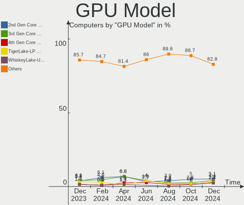
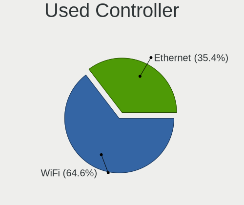
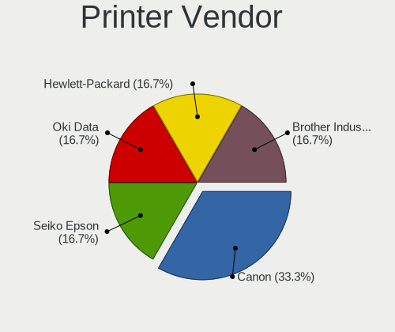

Zorin Hardware Trends
---------------------

A project to identify most popular hardware characteristics and track their change
over time based on data collected by Zorin users at https://Linux-Hardware.org.

Anyone can contribute to this report by the [hw-probe](https://github.com/linuxhw/hw-probe) tool:

    sudo -E hw-probe -all -upload

This is a report for all computer types. See also reports for [desktops](/Dist/Zorin/Desktop/README.md) and [notebooks](/Dist/Zorin/Notebook/README.md).

Full-feature report is available here: https://linux-hardware.org/?view=trends

Period: Feb, 2022.

Contents
--------

* [ System ](#system)
  - [ OS                       ](#os)
  - [ OS Family                ](#os-family)
  - [ Kernel                   ](#kernel)
  - [ Kernel Family            ](#kernel-family)
  - [ Kernel Major Ver.        ](#kernel-major-ver)
  - [ Arch                     ](#arch)
  - [ DE                       ](#de)
  - [ Display Server           ](#display-server)
  - [ Display Manager          ](#display-manager)
  - [ OS Lang                  ](#os-lang)
  - [ Boot Mode                ](#boot-mode)
  - [ Filesystem               ](#filesystem)
  - [ Part. scheme             ](#part-scheme)
  - [ Dual Boot with Linux/BSD ](#dual-boot-with-linuxbsd)
  - [ Dual Boot (Win)          ](#dual-boot-win)

* [ Board ](#board)
  - [ Vendor                   ](#vendor)
  - [ Model                    ](#model)
  - [ Model Family             ](#model-family)
  - [ MFG Year                 ](#mfg-year)
  - [ Form Factor              ](#form-factor)
  - [ Secure Boot              ](#secure-boot)
  - [ Coreboot                 ](#coreboot)
  - [ RAM Size                 ](#ram-size)
  - [ RAM Used                 ](#ram-used)
  - [ Total Drives             ](#total-drives)
  - [ Has CD-ROM               ](#has-cd-rom)
  - [ Has Ethernet             ](#has-ethernet)
  - [ Has WiFi                 ](#has-wifi)
  - [ Has Bluetooth            ](#has-bluetooth)

* [ Location ](#location)
  - [ Country                  ](#country)
  - [ City                     ](#city)

* [ Drives ](#drives)
  - [ Drive Vendor             ](#drive-vendor)
  - [ Drive Model              ](#drive-model)
  - [ HDD Vendor               ](#hdd-vendor)
  - [ SSD Vendor               ](#ssd-vendor)
  - [ Drive Kind               ](#drive-kind)
  - [ Drive Connector          ](#drive-connector)
  - [ Drive Size               ](#drive-size)
  - [ Space Total              ](#space-total)
  - [ Space Used               ](#space-used)
  - [ Malfunc. Drives          ](#malfunc-drives)
  - [ Malfunc. Drive Vendor    ](#malfunc-drive-vendor)
  - [ Malfunc. HDD Vendor      ](#malfunc-hdd-vendor)
  - [ Malfunc. Drive Kind      ](#malfunc-drive-kind)
  - [ Failed Drives            ](#failed-drives)
  - [ Failed Drive Vendor      ](#failed-drive-vendor)
  - [ Drive Status             ](#drive-status)

* [ Storage controller ](#storage-controller)
  - [ Storage Vendor           ](#storage-vendor)
  - [ Storage Model            ](#storage-model)
  - [ Storage Kind             ](#storage-kind)

* [ Processor ](#processor)
  - [ CPU Vendor               ](#cpu-vendor)
  - [ CPU Model                ](#cpu-model)
  - [ CPU Model Family         ](#cpu-model-family)
  - [ CPU Cores                ](#cpu-cores)
  - [ CPU Sockets              ](#cpu-sockets)
  - [ CPU Threads              ](#cpu-threads)
  - [ CPU Op-Modes             ](#cpu-op-modes)
  - [ CPU Microcode            ](#cpu-microcode)
  - [ CPU Microarch            ](#cpu-microarch)

* [ Graphics ](#graphics)
  - [ GPU Vendor               ](#gpu-vendor)
  - [ GPU Model                ](#gpu-model)
  - [ GPU Combo                ](#gpu-combo)
  - [ GPU Driver               ](#gpu-driver)
  - [ GPU Memory               ](#gpu-memory)

* [ Monitor ](#monitor)
  - [ Monitor Vendor           ](#monitor-vendor)
  - [ Monitor Model            ](#monitor-model)
  - [ Monitor Resolution       ](#monitor-resolution)
  - [ Monitor Diagonal         ](#monitor-diagonal)
  - [ Monitor Width            ](#monitor-width)
  - [ Aspect Ratio             ](#aspect-ratio)
  - [ Monitor Area             ](#monitor-area)
  - [ Pixel Density            ](#pixel-density)
  - [ Multiple Monitors        ](#multiple-monitors)

* [ Network ](#network)
  - [ Net Controller Vendor    ](#net-controller-vendor)
  - [ Net Controller Model     ](#net-controller-model)
  - [ Wireless Vendor          ](#wireless-vendor)
  - [ Wireless Model           ](#wireless-model)
  - [ Ethernet Vendor          ](#ethernet-vendor)
  - [ Ethernet Model           ](#ethernet-model)
  - [ Net Controller Kind      ](#net-controller-kind)
  - [ Used Controller          ](#used-controller)
  - [ NICs                     ](#nics)
  - [ IPv6                     ](#ipv6)

* [ Bluetooth ](#bluetooth)
  - [ Bluetooth Vendor         ](#bluetooth-vendor)
  - [ Bluetooth Model          ](#bluetooth-model)

* [ Sound ](#sound)
  - [ Sound Vendor             ](#sound-vendor)
  - [ Sound Model              ](#sound-model)

* [ Memory ](#memory)
  - [ Memory Vendor            ](#memory-vendor)
  - [ Memory Model             ](#memory-model)
  - [ Memory Kind              ](#memory-kind)
  - [ Memory Form Factor       ](#memory-form-factor)
  - [ Memory Size              ](#memory-size)
  - [ Memory Speed             ](#memory-speed)

* [ Printers & scanners ](#printers--scanners)
  - [ Printer Vendor           ](#printer-vendor)
  - [ Printer Model            ](#printer-model)
  - [ Scanner Vendor           ](#scanner-vendor)
  - [ Scanner Model            ](#scanner-model)

* [ Camera ](#camera)
  - [ Camera Vendor            ](#camera-vendor)
  - [ Camera Model             ](#camera-model)

* [ Security ](#security)
  - [ Fingerprint Vendor       ](#fingerprint-vendor)
  - [ Fingerprint Model        ](#fingerprint-model)
  - [ Chipcard Vendor          ](#chipcard-vendor)
  - [ Chipcard Model           ](#chipcard-model)

* [ Unsupported ](#unsupported)
  - [ Unsupported Devices      ](#unsupported-devices)
  - [ Unsupported Device Types ](#unsupported-device-types)

System
------

OS
--

Installed operating systems

| Name     | Computers | Percent |
|----------|-----------|---------|
| Zorin 16 | 149       | 85.14%  |
| Zorin 15 | 25        | 14.29%  |
| Zorin 12 | 1         | 0.57%   |

OS Family
---------

OS without a version

| Name  | Computers | Percent |
|-------|-----------|---------|
| Zorin | 175       | 100%    |

Kernel
------

Version of the Linux kernel

| Version            | Computers | Percent |
|--------------------|-----------|---------|
| 5.13.0-28-generic  | 71        | 40.57%  |
| 5.13.0-30-generic  | 40        | 22.86%  |
| 5.11.0-38-generic  | 15        | 8.57%   |
| 5.13.0-27-generic  | 12        | 6.86%   |
| 5.4.0-99-generic   | 10        | 5.71%   |
| 5.4.0-97-generic   | 6         | 3.43%   |
| 5.4.0-100-generic  | 5         | 2.86%   |
| 5.11.0-41-generic  | 3         | 1.71%   |
| 5.11.0-46-generic  | 2         | 1.14%   |
| 5.4.0-96-generic   | 1         | 0.57%   |
| 5.4.0-94-generic   | 1         | 0.57%   |
| 5.4.0-84-generic   | 1         | 0.57%   |
| 5.4.0-45-generic   | 1         | 0.57%   |
| 5.16.5-surface     | 1         | 0.57%   |
| 5.15.24-xanmod1    | 1         | 0.57%   |
| 5.11.0-44-generic  | 1         | 0.57%   |
| 5.11.0-43-generic  | 1         | 0.57%   |
| 5.11.0-27-generic  | 1         | 0.57%   |
| 5.11.0-25-generic  | 1         | 0.57%   |
| 4.15.0-142-generic | 1         | 0.57%   |

Kernel Family
-------------

Linux kernel without a distro release

| Version | Computers | Percent |
|---------|-----------|---------|
| 5.13.0  | 123       | 70.29%  |
| 5.4.0   | 25        | 14.29%  |
| 5.11.0  | 24        | 13.71%  |
| 5.16.5  | 1         | 0.57%   |
| 5.15.24 | 1         | 0.57%   |
| 4.15.0  | 1         | 0.57%   |

Kernel Major Ver.
-----------------

Linux kernel major version

| Version | Computers | Percent |
|---------|-----------|---------|
| 5.13    | 123       | 70.29%  |
| 5.4     | 25        | 14.29%  |
| 5.11    | 24        | 13.71%  |
| 5.16    | 1         | 0.57%   |
| 5.15    | 1         | 0.57%   |
| 4.15    | 1         | 0.57%   |

Arch
----

OS architecture (x86_64, i586, etc.)

| Name   | Computers | Percent |
|--------|-----------|---------|
| x86_64 | 163       | 93.14%  |
| i686   | 12        | 6.86%   |

DE
--

Desktop Environment

| Name    | Computers | Percent |
|---------|-----------|---------|
| GNOME   | 142       | 81.14%  |
| XFCE    | 32        | 18.29%  |
| Unknown | 1         | 0.57%   |

Display Server
--------------

X11 or Wayland

| Name    | Computers | Percent |
|---------|-----------|---------|
| X11     | 171       | 97.71%  |
| Wayland | 4         | 2.29%   |

Display Manager
---------------

SDDM, LightDM, etc.

| Name    | Computers | Percent |
|---------|-----------|---------|
| Unknown | 119       | 68%     |
| GDM3    | 23        | 13.14%  |
| LightDM | 18        | 10.29%  |
| GDM     | 15        | 8.57%   |

OS Lang
-------

Language

| Lang  | Computers | Percent |
|-------|-----------|---------|
| en_US | 73        | 41.71%  |
| pt_BR | 15        | 8.57%   |
| en_GB | 15        | 8.57%   |
| de_DE | 15        | 8.57%   |
| en_AU | 7         | 4%      |
| es_ES | 6         | 3.43%   |
| it_IT | 5         | 2.86%   |
| fr_FR | 5         | 2.86%   |
| pl_PL | 4         | 2.29%   |
| ru_RU | 3         | 1.71%   |
| en_IN | 3         | 1.71%   |
| pt_PT | 2         | 1.14%   |
| cs_CZ | 2         | 1.14%   |
| tr_TR | 1         | 0.57%   |
| sl_SI | 1         | 0.57%   |
| ru_UA | 1         | 0.57%   |
| nl_NL | 1         | 0.57%   |
| nb_NO | 1         | 0.57%   |
| ja_JP | 1         | 0.57%   |
| hr_HR | 1         | 0.57%   |
| fr_BE | 1         | 0.57%   |
| es_PY | 1         | 0.57%   |
| es_NI | 1         | 0.57%   |
| es_MX | 1         | 0.57%   |
| es_CO | 1         | 0.57%   |
| es_BO | 1         | 0.57%   |
| es_AR | 1         | 0.57%   |
| en_IL | 1         | 0.57%   |
| en_CA | 1         | 0.57%   |
| de_AT | 1         | 0.57%   |
| C     | 1         | 0.57%   |
| bg_BG | 1         | 0.57%   |
| ar_EG | 1         | 0.57%   |

Boot Mode
---------

EFI or BIOS

| Mode | Computers | Percent |
|------|-----------|---------|
| BIOS | 92        | 52.57%  |
| EFI  | 83        | 47.43%  |

Filesystem
----------

Type of filesystem

| Type    | Computers | Percent |
|---------|-----------|---------|
| Ext4    | 169       | 96.57%  |
| Zfs     | 2         | 1.14%   |
| Overlay | 2         | 1.14%   |
| Btrfs   | 2         | 1.14%   |

Part. scheme
------------

Scheme of partitioning

| Type    | Computers | Percent |
|---------|-----------|---------|
| Unknown | 159       | 90.86%  |
| GPT     | 13        | 7.43%   |
| MBR     | 3         | 1.71%   |

Dual Boot with Linux/BSD
------------------------

Hosting more than one Linux/BSD

| Dual boot | Computers | Percent |
|-----------|-----------|---------|
| No        | 171       | 97.71%  |
| Yes       | 4         | 2.29%   |

Dual Boot (Win)
---------------

Hosting Linux and Windows

| Dual boot | Computers | Percent |
|-----------|-----------|---------|
| No        | 154       | 88%     |
| Yes       | 21        | 12%     |

Board
-----

Vendor
------

Motherboard manufacturer

| Name                | Computers | Percent |
|---------------------|-----------|---------|
| Hewlett-Packard     | 32        | 18.29%  |
| ASUSTek Computer    | 25        | 14.29%  |
| Lenovo              | 23        | 13.14%  |
| Dell                | 23        | 13.14%  |
| Gigabyte Technology | 16        | 9.14%   |
| Acer                | 8         | 4.57%   |
| MSI                 | 6         | 3.43%   |
| Toshiba             | 5         | 2.86%   |
| ASRock              | 4         | 2.29%   |
| Samsung Electronics | 3         | 1.71%   |
| Intel               | 3         | 1.71%   |
| Apple               | 3         | 1.71%   |
| Sony                | 2         | 1.14%   |
| Packard Bell        | 2         | 1.14%   |
| IBM                 | 2         | 1.14%   |
| Fujitsu             | 2         | 1.14%   |
| Unknown             | 2         | 1.14%   |
| RCA                 | 1         | 0.57%   |
| Quanta              | 1         | 0.57%   |
| Pegatron            | 1         | 0.57%   |
| Novatech            | 1         | 0.57%   |
| Multilaser          | 1         | 0.57%   |
| Microsoft           | 1         | 0.57%   |
| Medion              | 1         | 0.57%   |
| HUAWEI              | 1         | 0.57%   |
| Google              | 1         | 0.57%   |
| GEO                 | 1         | 0.57%   |
| e-shop.gr           | 1         | 0.57%   |
| BESSTAR Tech        | 1         | 0.57%   |
| BenQ                | 1         | 0.57%   |
| ATI                 | 1         | 0.57%   |

Model
-----

Motherboard model

| Name                                       | Computers | Percent |
|--------------------------------------------|-----------|---------|
| Unknown                                    | 3         | 1.71%   |
| Intel X79M-S                               | 2         | 1.14%   |
| Toshiba Satellite S55t-C                   | 1         | 0.57%   |
| Toshiba Satellite Pro C660                 | 1         | 0.57%   |
| Toshiba Satellite C55-B                    | 1         | 0.57%   |
| Toshiba Satellite C50-A283                 | 1         | 0.57%   |
| Toshiba QOSMIO X70-A                       | 1         | 0.57%   |
| Sony VPCEH3L1E                             | 1         | 0.57%   |
| Sony VGN-Z575FN                            | 1         | 0.57%   |
| Samsung 600B4B/600B5B                      | 1         | 0.57%   |
| Samsung 340XAA/350XAA/550XAA               | 1         | 0.57%   |
| Samsung 300E4A/300E5A/300E7A/3430EA/3530EA | 1         | 0.57%   |
| RCA W101SA23T2                             | 1         | 0.57%   |
| Quanta CA27                                | 1         | 0.57%   |
| Pegatron h8-1217c                          | 1         | 0.57%   |
| Packard Bell EasyNote TK85                 | 1         | 0.57%   |
| Packard Bell DOT S                         | 1         | 0.57%   |
| Novatech 15.6 nSpire Laptop                | 1         | 0.57%   |
| Multilaser DS133                           | 1         | 0.57%   |
| MSI MS-7D19                                | 1         | 0.57%   |
| MSI MS-7D06                                | 1         | 0.57%   |
| MSI MS-7B24                                | 1         | 0.57%   |
| MSI MS-7817                                | 1         | 0.57%   |
| MSI MS-7695                                | 1         | 0.57%   |
| MSI 500-017c                               | 1         | 0.57%   |
| Microsoft Surface Pro 7                    | 1         | 0.57%   |
| Medion MS-7707                             | 1         | 0.57%   |
| Lenovo Yoga 2 Pro 20266                    | 1         | 0.57%   |
| Lenovo ThinkPad X1 Extreme 2nd 20QVCTO1WW  | 1         | 0.57%   |
| Lenovo ThinkPad T61 7658CTO                | 1         | 0.57%   |
| Lenovo ThinkPad T61 6458CTO                | 1         | 0.57%   |
| Lenovo ThinkPad T470 W10DG 20JNA03U0A      | 1         | 0.57%   |
| Lenovo ThinkPad T440 20B7008ABR            | 1         | 0.57%   |
| Lenovo ThinkPad T420 4236KU9               | 1         | 0.57%   |
| Lenovo ThinkPad T420 4178A47               | 1         | 0.57%   |
| Lenovo ThinkPad Edge E540 20C60043SC       | 1         | 0.57%   |
| Lenovo ThinkPad Edge E530 32599JJ          | 1         | 0.57%   |
| Lenovo ThinkCentre M91p 4480B2G            | 1         | 0.57%   |
| Lenovo ThinkCentre M700 10J0S55S00         | 1         | 0.57%   |
| Lenovo ThinkBook 15 G2 ITL 20VE            | 1         | 0.57%   |
| Lenovo MIIX 320-10ICR 80XF                 | 1         | 0.57%   |
| Lenovo IdeaPad S145-15API 81V7             | 1         | 0.57%   |
| Lenovo IdeaPad S130-11IGM 81J1             | 1         | 0.57%   |
| Lenovo IdeaPad L340-15IRH Gaming 81LK      | 1         | 0.57%   |
| Lenovo IdeaPad C340-14IML 81TK             | 1         | 0.57%   |
| Lenovo IdeaPad 110-14IBR 80UJ              | 1         | 0.57%   |
| Lenovo IdeaPad 100S-11IBY 80R2             | 1         | 0.57%   |
| Lenovo G710 20252                          | 1         | 0.57%   |
| Lenovo G40-80 80JE                         | 1         | 0.57%   |
| Lenovo Flex 2-15 20405                     | 1         | 0.57%   |
| Intel H61                                  | 1         | 0.57%   |
| IBM 819046G                                | 1         | 0.57%   |
| IBM 81077AG                                | 1         | 0.57%   |
| HUAWEI NBLK-WAX9X                          | 1         | 0.57%   |
| HP Z600 Workstation                        | 1         | 0.57%   |
| HP Z230 SFF Workstation                    | 1         | 0.57%   |
| HP Stream Laptop 11-ak0xxx                 | 1         | 0.57%   |
| HP Stream Laptop 11-ah0XX                  | 1         | 0.57%   |
| HP Spectre x360 Convertible                | 1         | 0.57%   |
| HP ProDesk 400 G2 MT                       | 1         | 0.57%   |

Model Family
------------

Motherboard model prefix

| Name                  | Computers | Percent |
|-----------------------|-----------|---------|
| Lenovo ThinkPad       | 9         | 5.14%   |
| Dell Inspiron         | 7         | 4%      |
| Lenovo IdeaPad        | 6         | 3.43%   |
| Toshiba Satellite     | 4         | 2.29%   |
| HP ProBook            | 4         | 2.29%   |
| HP Pavilion           | 4         | 2.29%   |
| Dell OptiPlex         | 4         | 2.29%   |
| Dell Latitude         | 4         | 2.29%   |
| Acer Aspire           | 4         | 2.29%   |
| ASUS TUF              | 3         | 1.71%   |
| Unknown               | 3         | 1.71%   |
| Lenovo ThinkCentre    | 2         | 1.14%   |
| Intel X79M-S          | 2         | 1.14%   |
| HP Stream             | 2         | 1.14%   |
| HP OMEN               | 2         | 1.14%   |
| HP Compaq             | 2         | 1.14%   |
| HP 255                | 2         | 1.14%   |
| Gigabyte X570         | 2         | 1.14%   |
| Dell Vostro           | 2         | 1.14%   |
| Dell Precision        | 2         | 1.14%   |
| ASUS ZenBook          | 2         | 1.14%   |
| ASUS ROG              | 2         | 1.14%   |
| ASUS PRIME            | 2         | 1.14%   |
| Toshiba QOSMIO        | 1         | 0.57%   |
| Sony VPCEH3L1E        | 1         | 0.57%   |
| Sony VGN-Z575FN       | 1         | 0.57%   |
| Samsung 600B4B        | 1         | 0.57%   |
| Samsung 340XAA        | 1         | 0.57%   |
| Samsung 300E4A        | 1         | 0.57%   |
| RCA W101SA23T2        | 1         | 0.57%   |
| Quanta CA27           | 1         | 0.57%   |
| Pegatron h8-1217c     | 1         | 0.57%   |
| Packard Bell EasyNote | 1         | 0.57%   |
| Packard Bell DOT      | 1         | 0.57%   |
| Novatech 15.6         | 1         | 0.57%   |
| Multilaser DS133      | 1         | 0.57%   |
| MSI MS-7D19           | 1         | 0.57%   |
| MSI MS-7D06           | 1         | 0.57%   |
| MSI MS-7B24           | 1         | 0.57%   |
| MSI MS-7817           | 1         | 0.57%   |
| MSI MS-7695           | 1         | 0.57%   |
| MSI 500-017c          | 1         | 0.57%   |
| Microsoft Surface     | 1         | 0.57%   |
| Medion MS-7707        | 1         | 0.57%   |
| Lenovo Yoga           | 1         | 0.57%   |
| Lenovo ThinkBook      | 1         | 0.57%   |
| Lenovo MIIX           | 1         | 0.57%   |
| Lenovo G710           | 1         | 0.57%   |
| Lenovo G40-80         | 1         | 0.57%   |
| Lenovo Flex           | 1         | 0.57%   |
| Intel H61             | 1         | 0.57%   |
| IBM 819046G           | 1         | 0.57%   |
| IBM 81077AG           | 1         | 0.57%   |
| HUAWEI NBLK-WAX9X     | 1         | 0.57%   |
| HP Z600               | 1         | 0.57%   |
| HP Z230               | 1         | 0.57%   |
| HP Spectre            | 1         | 0.57%   |
| HP ProDesk            | 1         | 0.57%   |
| HP Notebook           | 1         | 0.57%   |
| HP ENVY               | 1         | 0.57%   |

MFG Year
--------

Motherboard manufacture year

| Year | Computers | Percent |
|------|-----------|---------|
| 2021 | 17        | 9.71%   |
| 2013 | 17        | 9.71%   |
| 2019 | 15        | 8.57%   |
| 2011 | 15        | 8.57%   |
| 2017 | 14        | 8%      |
| 2012 | 13        | 7.43%   |
| 2018 | 12        | 6.86%   |
| 2014 | 11        | 6.29%   |
| 2009 | 10        | 5.71%   |
| 2010 | 8         | 4.57%   |
| 2020 | 7         | 4%      |
| 2016 | 7         | 4%      |
| 2015 | 7         | 4%      |
| 2008 | 7         | 4%      |
| 2007 | 7         | 4%      |
| 2006 | 4         | 2.29%   |
| 2005 | 2         | 1.14%   |
| 2022 | 1         | 0.57%   |
| 2004 | 1         | 0.57%   |

Form Factor
-----------

Physical design of the computer

| Name        | Computers | Percent |
|-------------|-----------|---------|
| Notebook    | 94        | 53.71%  |
| Desktop     | 67        | 38.29%  |
| All in one  | 6         | 3.43%   |
| Convertible | 4         | 2.29%   |
| Tablet      | 3         | 1.71%   |
| Server      | 1         | 0.57%   |

Secure Boot
-----------

Enabled or disabled

| State    | Computers | Percent |
|----------|-----------|---------|
| Disabled | 163       | 93.14%  |
| Enabled  | 12        | 6.86%   |

Coreboot
--------

Have coreboot on board

| Used | Computers | Percent |
|------|-----------|---------|
| No   | 174       | 99.43%  |
| Yes  | 1         | 0.57%   |

RAM Size
--------

Total RAM memory

| Size in GB  | Computers | Percent |
|-------------|-----------|---------|
| 3.01-4.0    | 40        | 22.86%  |
| 4.01-8.0    | 38        | 21.71%  |
| 16.01-24.0  | 25        | 14.29%  |
| 8.01-16.0   | 25        | 14.29%  |
| 32.01-64.0  | 20        | 11.43%  |
| 1.01-2.0    | 17        | 9.71%   |
| 64.01-256.0 | 3         | 1.71%   |
| 0.51-1.0    | 3         | 1.71%   |
| 24.01-32.0  | 2         | 1.14%   |
| 2.01-3.0    | 2         | 1.14%   |

RAM Used
--------

Used RAM memory

| Used GB   | Computers | Percent |
|-----------|-----------|---------|
| 1.01-2.0  | 66        | 37.71%  |
| 2.01-3.0  | 61        | 34.86%  |
| 3.01-4.0  | 20        | 11.43%  |
| 4.01-8.0  | 12        | 6.86%   |
| 0.51-1.0  | 12        | 6.86%   |
| 8.01-16.0 | 2         | 1.14%   |
| 0.01-0.5  | 2         | 1.14%   |

Total Drives
------------

Number of drives on board

| Drives | Computers | Percent |
|--------|-----------|---------|
| 1      | 110       | 62.86%  |
| 2      | 43        | 24.57%  |
| 3      | 12        | 6.86%   |
| 4      | 4         | 2.29%   |
| 5      | 2         | 1.14%   |
| 11     | 1         | 0.57%   |
| 7      | 1         | 0.57%   |
| 6      | 1         | 0.57%   |
| 0      | 1         | 0.57%   |

Has CD-ROM
----------

Has CD-ROM on board

| Presented | Computers | Percent |
|-----------|-----------|---------|
| Yes       | 88        | 50.29%  |
| No        | 87        | 49.71%  |

Has Ethernet
------------

Has Ethernet on board

| Presented | Computers | Percent |
|-----------|-----------|---------|
| Yes       | 152       | 86.86%  |
| No        | 23        | 13.14%  |

Has WiFi
--------

Has WiFi module

| Presented | Computers | Percent |
|-----------|-----------|---------|
| Yes       | 138       | 78.86%  |
| No        | 37        | 21.14%  |

Has Bluetooth
-------------

Has Bluetooth module

| Presented | Computers | Percent |
|-----------|-----------|---------|
| Yes       | 97        | 55.43%  |
| No        | 78        | 44.57%  |

Location
--------

Country
-------

Geographic location (country)

| Country                | Computers | Percent |
|------------------------|-----------|---------|
| USA                    | 47        | 26.86%  |
| Germany                | 16        | 9.14%   |
| Brazil                 | 14        | 8%      |
| UK                     | 12        | 6.86%   |
| Australia              | 8         | 4.57%   |
| Spain                  | 7         | 4%      |
| Russia                 | 5         | 2.86%   |
| Poland                 | 5         | 2.86%   |
| Italy                  | 5         | 2.86%   |
| Belgium                | 4         | 2.29%   |
| Netherlands            | 3         | 1.71%   |
| India                  | 3         | 1.71%   |
| Greece                 | 3         | 1.71%   |
| France                 | 3         | 1.71%   |
| Turkey                 | 2         | 1.14%   |
| Slovenia               | 2         | 1.14%   |
| Romania                | 2         | 1.14%   |
| Portugal               | 2         | 1.14%   |
| Philippines            | 2         | 1.14%   |
| Mexico                 | 2         | 1.14%   |
| Japan                  | 2         | 1.14%   |
| Egypt                  | 2         | 1.14%   |
| Czechia                | 2         | 1.14%   |
| Austria                | 2         | 1.14%   |
| Ukraine                | 1         | 0.57%   |
| Sweden                 | 1         | 0.57%   |
| South Africa           | 1         | 0.57%   |
| Serbia                 | 1         | 0.57%   |
| Paraguay               | 1         | 0.57%   |
| Norway                 | 1         | 0.57%   |
| Nicaragua              | 1         | 0.57%   |
| Kenya                  | 1         | 0.57%   |
| Israel                 | 1         | 0.57%   |
| Ireland                | 1         | 0.57%   |
| Croatia                | 1         | 0.57%   |
| Colombia               | 1         | 0.57%   |
| China                  | 1         | 0.57%   |
| Canada                 | 1         | 0.57%   |
| Bulgaria               | 1         | 0.57%   |
| Bosnia and Herzegovina | 1         | 0.57%   |
| Bolivia                | 1         | 0.57%   |
| Bangladesh             | 1         | 0.57%   |
| Argentina              | 1         | 0.57%   |
| Algeria                | 1         | 0.57%   |

City
----

Geographic location (city)

| City                      | Computers | Percent |
|---------------------------|-----------|---------|
| Athens                    | 5         | 2.86%   |
| Sydney                    | 3         | 1.71%   |
| São Paulo              | 2         | 1.14%   |
| Ripon                     | 2         | 1.14%   |
| Richmond                  | 2         | 1.14%   |
| Mount Olive               | 2         | 1.14%   |
| Madison Heights           | 2         | 1.14%   |
| La Louvière            | 2         | 1.14%   |
| Hamburg                   | 2         | 1.14%   |
| Ferraz de Vasconcelos     | 2         | 1.14%   |
| Dallas                    | 2         | 1.14%   |
| Chennai                   | 2         | 1.14%   |
| Cairo                     | 2         | 1.14%   |
| Almería                | 2         | 1.14%   |
| Adelaide                  | 2         | 1.14%   |
| Yekaterinburg             | 1         | 0.57%   |
| Willis                    | 1         | 0.57%   |
| Warsaw                    | 1         | 0.57%   |
| Waldbroel                 | 1         | 0.57%   |
| Volta Redonda             | 1         | 0.57%   |
| Visoko                    | 1         | 0.57%   |
| Villepinte                | 1         | 0.57%   |
| Tulsa                     | 1         | 0.57%   |
| Tucano                    | 1         | 0.57%   |
| Tring                     | 1         | 0.57%   |
| The Hague                 | 1         | 0.57%   |
| Tepic                     | 1         | 0.57%   |
| Syracuse                  | 1         | 0.57%   |
| Stockton                  | 1         | 0.57%   |
| Sterling                  | 1         | 0.57%   |
| St Louis                  | 1         | 0.57%   |
| Sirinhaem                 | 1         | 0.57%   |
| Seattle                   | 1         | 0.57%   |
| Schloss Holte-Stukenbrock | 1         | 0.57%   |
| Sarajevo                  | 1         | 0.57%   |
| San Jose                  | 1         | 0.57%   |
| Salzburg                  | 1         | 0.57%   |
| Saint Paul                | 1         | 0.57%   |
| Sabadell                  | 1         | 0.57%   |
| Rome                      | 1         | 0.57%   |
| Rennes                    | 1         | 0.57%   |
| Ravenna                   | 1         | 0.57%   |
| Radomsko                  | 1         | 0.57%   |
| Prague                    | 1         | 0.57%   |
| Poznan                    | 1         | 0.57%   |
| Porto Alegre              | 1         | 0.57%   |
| Portland                  | 1         | 0.57%   |
| Port Angeles              | 1         | 0.57%   |
| Perth                     | 1         | 0.57%   |
| Paris                     | 1         | 0.57%   |
| Paranaque City            | 1         | 0.57%   |
| Palma                     | 1         | 0.57%   |
| Padova                    | 1         | 0.57%   |
| Osseo                     | 1         | 0.57%   |
| Ofakim                    | 1         | 0.57%   |
| O'Fallon                  | 1         | 0.57%   |
| Nykvarn                   | 1         | 0.57%   |
| Novska                    | 1         | 0.57%   |
| Novosibirsk               | 1         | 0.57%   |
| Niederndodeleben          | 1         | 0.57%   |

Drives
------

Drive Vendor
------------

Hard drive vendors

| Vendor                | Computers | Drives | Percent |
|-----------------------|-----------|--------|---------|
| Seagate               | 44        | 55     | 17.96%  |
| WDC                   | 32        | 34     | 13.06%  |
| Samsung Electronics   | 25        | 32     | 10.2%   |
| Kingston              | 18        | 20     | 7.35%   |
| Unknown               | 16        | 19     | 6.53%   |
| Toshiba               | 15        | 17     | 6.12%   |
| Hitachi               | 13        | 13     | 5.31%   |
| SanDisk               | 11        | 11     | 4.49%   |
| SK Hynix              | 8         | 8      | 3.27%   |
| Crucial               | 5         | 6      | 2.04%   |
| SPCC                  | 4         | 4      | 1.63%   |
| China                 | 4         | 4      | 1.63%   |
| A-DATA Technology     | 4         | 4      | 1.63%   |
| MAXTOR                | 3         | 4      | 1.22%   |
| Intel                 | 3         | 4      | 1.22%   |
| Transcend             | 2         | 2      | 0.82%   |
| Phison                | 2         | 2      | 0.82%   |
| Lite-On               | 2         | 2      | 0.82%   |
| HGST                  | 2         | 2      | 0.82%   |
| GOODRAM               | 2         | 2      | 0.82%   |
| Fujitsu               | 2         | 2      | 0.82%   |
| Corsair               | 2         | 2      | 0.82%   |
| Apple                 | 2         | 2      | 0.82%   |
| XrayDisk              | 1         | 1      | 0.41%   |
| WD MediaMax           | 1         | 1      | 0.41%   |
| USB30                 | 1         | 1      | 0.41%   |
| TO Exter              | 1         | 1      | 0.41%   |
| Teclast               | 1         | 1      | 0.41%   |
| T-FORCE               | 1         | 1      | 0.41%   |
| Super Talent          | 1         | 1      | 0.41%   |
| Silicon Motion        | 1         | 2      | 0.41%   |
| Realtek Semiconductor | 1         | 1      | 0.41%   |
| PNY                   | 1         | 1      | 0.41%   |
| Patriot               | 1         | 1      | 0.41%   |
| OCZ-VERTEX            | 1         | 1      | 0.41%   |
| OCZ                   | 1         | 1      | 0.41%   |
| Netac                 | 1         | 1      | 0.41%   |
| Micron Technology     | 1         | 1      | 0.41%   |
| Lexar                 | 1         | 1      | 0.41%   |
| LaCie                 | 1         | 1      | 0.41%   |
| KIOXIA                | 1         | 1      | 0.41%   |
| KingSpec              | 1         | 1      | 0.41%   |
| JMicron               | 1         | 1      | 0.41%   |
| Hewlett-Packard       | 1         | 1      | 0.41%   |
| GALAX                 | 1         | 1      | 0.41%   |
| DragonDiamond         | 1         | 1      | 0.41%   |
| Apacer                | 1         | 1      | 0.41%   |

Drive Model
-----------

Hard drive models

| Model                                | Computers | Percent |
|--------------------------------------|-----------|---------|
| Unknown MMC Card  64GB               | 6         | 2.24%   |
| Unknown MMC Card  32GB               | 6         | 2.24%   |
| Seagate ST500DM002-1BD142 500GB      | 4         | 1.49%   |
| Unknown SD/MMC/MS PRO 64GB           | 3         | 1.12%   |
| Toshiba MQ01ABD100 1TB               | 3         | 1.12%   |
| Seagate ST3500312CS 500GB            | 3         | 1.12%   |
| Seagate ST1000LM024 HN-M101MBB 1TB   | 3         | 1.12%   |
| SanDisk SSD PLUS 240GB               | 3         | 1.12%   |
| Samsung NVMe SSD Drive 1TB           | 3         | 1.12%   |
| Kingston SA400S37480G 480GB SSD      | 3         | 1.12%   |
| WDC WDBNCE5000PNC 500GB SSD          | 2         | 0.75%   |
| WDC WD5000LPLX-08ZNTT0 500GB         | 2         | 0.75%   |
| WDC WD5000AAKS-00V1A0 500GB          | 2         | 0.75%   |
| WDC WD30EZRX-00DC0B0 3TB             | 2         | 0.75%   |
| WDC WD10SPZX-24Z10 1TB               | 2         | 0.75%   |
| Unknown MMC Card  4GB                | 2         | 0.75%   |
| Toshiba MQ04ABF100 1TB               | 2         | 0.75%   |
| Seagate ST3500413AS 500GB            | 2         | 0.75%   |
| Seagate Expansion+ 2TB               | 2         | 0.75%   |
| Sandisk NVMe SSD Drive 512GB         | 2         | 0.75%   |
| Samsung SSD 870 EVO 1TB              | 2         | 0.75%   |
| Samsung SSD 860 EVO 500GB            | 2         | 0.75%   |
| Samsung SSD 850 EVO 250GB            | 2         | 0.75%   |
| Samsung NVMe SSD Drive 2TB           | 2         | 0.75%   |
| Lite-On NVMe SSD Drive 128GB         | 2         | 0.75%   |
| Kingston SA400S37240G 240GB SSD      | 2         | 0.75%   |
| Kingston SA400S37120G 120GB SSD      | 2         | 0.75%   |
| Intel NVMe SSD Drive 512GB           | 2         | 0.75%   |
| Hitachi HTS725032A9A364 320GB        | 2         | 0.75%   |
| Hitachi HDS723020BLA642 2TB          | 2         | 0.75%   |
| Hitachi HDS721050CLA362 500GB        | 2         | 0.75%   |
| Crucial CT500MX500SSD1 500GB         | 2         | 0.75%   |
| Crucial CT1000MX500SSD1 1TB          | 2         | 0.75%   |
| A-DATA SU650 120GB SSD               | 2         | 0.75%   |
| XrayDisk 128GB                       | 1         | 0.37%   |
| WDC WD800BEVS-75RST0 80GB            | 1         | 0.37%   |
| WDC WD7500AADS-00M2B0 752GB          | 1         | 0.37%   |
| WDC WD5000LPVX-22V0TT0 500GB         | 1         | 0.37%   |
| WDC WD5000LPVX-08V0TT5 500GB         | 1         | 0.37%   |
| WDC WD5000LPSX-08A6W 500GB           | 1         | 0.37%   |
| WDC WD5000LPCX-24VHAT0 500GB         | 1         | 0.37%   |
| WDC WD5000BPVT-08HXZT3 500GB         | 1         | 0.37%   |
| WDC WD5000BEKT-60KA9T0 500GB         | 1         | 0.37%   |
| WDC WD3200BPVT-00ZEST0 320GB         | 1         | 0.37%   |
| WDC WD2500BJKT-75F4T0 250GB          | 1         | 0.37%   |
| WDC WD1600BEVS-60RST0 160GB          | 1         | 0.37%   |
| WDC WD15EARS-00MVWB0 1TB             | 1         | 0.37%   |
| WDC WD1200BEVS-75UST0 120GB          | 1         | 0.37%   |
| WDC WD10SPZX-35Z10T0 1TB             | 1         | 0.37%   |
| WDC WD10JPVX-80JC3T0 1TB             | 1         | 0.37%   |
| WDC WD10JPVX-60JC3T0 1TB             | 1         | 0.37%   |
| WDC WD10JPVT-00A1YT0 1TB             | 1         | 0.37%   |
| WDC WD10EZEX-60WN4A0 1TB             | 1         | 0.37%   |
| WDC WD10EZEX-08WN4A0 1TB             | 1         | 0.37%   |
| WDC WD10EZEX-08M2NA0 1TB             | 1         | 0.37%   |
| WDC WD10EALX-009BA0 1TB              | 1         | 0.37%   |
| WDC WD1001FALS-00J7B0 1TB            | 1         | 0.37%   |
| WDC PC SN730 SDBPNTY-256G-1027 256GB | 1         | 0.37%   |
| WDC PC SN520 SDAPNUW-128G-1014 128GB | 1         | 0.37%   |
| WD MediaMax WL1000GSA6472 1TB        | 1         | 0.37%   |

HDD Vendor
----------

Hard disk drive vendors

| Vendor              | Computers | Drives | Percent |
|---------------------|-----------|--------|---------|
| Seagate             | 44        | 55     | 38.6%   |
| WDC                 | 30        | 30     | 26.32%  |
| Toshiba             | 14        | 15     | 12.28%  |
| Hitachi             | 13        | 13     | 11.4%   |
| Unknown             | 3         | 3      | 2.63%   |
| MAXTOR              | 3         | 4      | 2.63%   |
| HGST                | 2         | 2      | 1.75%   |
| Fujitsu             | 2         | 2      | 1.75%   |
| Samsung Electronics | 1         | 1      | 0.88%   |
| Hewlett-Packard     | 1         | 1      | 0.88%   |
| Apple               | 1         | 1      | 0.88%   |

SSD Vendor
----------

Solid state drive vendors

| Vendor              | Computers | Drives | Percent |
|---------------------|-----------|--------|---------|
| Kingston            | 15        | 16     | 19.48%  |
| Samsung Electronics | 13        | 15     | 16.88%  |
| SanDisk             | 7         | 7      | 9.09%   |
| Crucial             | 5         | 6      | 6.49%   |
| China               | 4         | 4      | 5.19%   |
| SPCC                | 3         | 3      | 3.9%    |
| SK Hynix            | 3         | 3      | 3.9%    |
| A-DATA Technology   | 3         | 3      | 3.9%    |
| WDC                 | 2         | 2      | 2.6%    |
| Transcend           | 2         | 2      | 2.6%    |
| Toshiba             | 2         | 2      | 2.6%    |
| GOODRAM             | 2         | 2      | 2.6%    |
| USB30               | 1         | 1      | 1.3%    |
| TO Exter            | 1         | 1      | 1.3%    |
| Teclast             | 1         | 1      | 1.3%    |
| Super Talent        | 1         | 1      | 1.3%    |
| PNY                 | 1         | 1      | 1.3%    |
| Patriot             | 1         | 1      | 1.3%    |
| OCZ-VERTEX          | 1         | 1      | 1.3%    |
| OCZ                 | 1         | 1      | 1.3%    |
| Netac               | 1         | 1      | 1.3%    |
| Micron Technology   | 1         | 1      | 1.3%    |
| Lexar               | 1         | 1      | 1.3%    |
| KingSpec            | 1         | 1      | 1.3%    |
| GALAX               | 1         | 1      | 1.3%    |
| Corsair             | 1         | 1      | 1.3%    |
| Apple               | 1         | 1      | 1.3%    |
| Apacer              | 1         | 1      | 1.3%    |

Drive Kind
----------

HDD or SSD

| Kind    | Computers | Drives | Percent |
|---------|-----------|--------|---------|
| HDD     | 100       | 127    | 45.45%  |
| SSD     | 62        | 81     | 28.18%  |
| NVMe    | 38        | 46     | 17.27%  |
| MMC     | 15        | 17     | 6.82%   |
| Unknown | 5         | 5      | 2.27%   |

Drive Connector
---------------

SATA, SAS, NVMe, etc.

| Type | Computers | Drives | Percent |
|------|-----------|--------|---------|
| SATA | 140       | 204    | 70%     |
| NVMe | 37        | 45     | 18.5%   |
| MMC  | 15        | 17     | 7.5%    |
| SAS  | 8         | 10     | 4%      |

Drive Size
----------

Size of hard drive

| Size in TB | Computers | Drives | Percent |
|------------|-----------|--------|---------|
| 0.01-0.5   | 105       | 135    | 63.64%  |
| 0.51-1.0   | 41        | 46     | 24.85%  |
| 1.01-2.0   | 10        | 13     | 6.06%   |
| 2.01-3.0   | 4         | 4      | 2.42%   |
| 4.01-10.0  | 3         | 6      | 1.82%   |
| 3.01-4.0   | 2         | 4      | 1.21%   |

Space Total
-----------

Amount of disk space available on the file system

| Size in GB     | Computers | Percent |
|----------------|-----------|---------|
| 101-250        | 52        | 29.71%  |
| 251-500        | 42        | 24%     |
| 501-1000       | 26        | 14.86%  |
| 51-100         | 22        | 12.57%  |
| 21-50          | 11        | 6.29%   |
| More than 3000 | 10        | 5.71%   |
| 1001-2000      | 5         | 2.86%   |
| 1-20           | 4         | 2.29%   |
| Unknown        | 2         | 1.14%   |
| 2001-3000      | 1         | 0.57%   |

Space Used
----------

Amount of used disk space

| Used GB        | Computers | Percent |
|----------------|-----------|---------|
| 1-20           | 71        | 40.57%  |
| 21-50          | 49        | 28%     |
| 51-100         | 18        | 10.29%  |
| 101-250        | 15        | 8.57%   |
| 501-1000       | 7         | 4%      |
| 251-500        | 6         | 3.43%   |
| 1001-2000      | 4         | 2.29%   |
| More than 3000 | 3         | 1.71%   |
| Unknown        | 2         | 1.14%   |

Malfunc. Drives
---------------

Drive models with a malfunction

| Model                              | Computers | Drives | Percent |
|------------------------------------|-----------|--------|---------|
| Seagate ST2000LM003 HN-M201RAD 2TB | 1         | 1      | 33.33%  |
| Hitachi HTS725032A9A364 320GB      | 1         | 1      | 33.33%  |
| A-DATA Technology SX8200PNP 256GB  | 1         | 1      | 33.33%  |

Malfunc. Drive Vendor
---------------------

Vendors of faulty drives

| Vendor            | Computers | Drives | Percent |
|-------------------|-----------|--------|---------|
| Seagate           | 1         | 1      | 33.33%  |
| Hitachi           | 1         | 1      | 33.33%  |
| A-DATA Technology | 1         | 1      | 33.33%  |

Malfunc. HDD Vendor
-------------------

Vendors of faulty HDD drives

| Vendor  | Computers | Drives | Percent |
|---------|-----------|--------|---------|
| Seagate | 1         | 1      | 50%     |
| Hitachi | 1         | 1      | 50%     |

Malfunc. Drive Kind
-------------------

Kinds of faulty drives

| Kind | Computers | Drives | Percent |
|------|-----------|--------|---------|
| HDD  | 2         | 2      | 66.67%  |
| NVMe | 1         | 1      | 33.33%  |

Failed Drives
-------------

Failed drive models

Zero info for selected period =(

Failed Drive Vendor
-------------------

Failed drive vendors

Zero info for selected period =(

Drive Status
------------

Number of failed and malfunc. drives

| Status   | Computers | Drives | Percent |
|----------|-----------|--------|---------|
| Detected | 159       | 250    | 89.33%  |
| Works    | 16        | 23     | 8.99%   |
| Malfunc  | 3         | 3      | 1.69%   |

Storage controller
------------------

Storage Vendor
--------------

Storage controller vendors

| Vendor                      | Computers | Percent |
|-----------------------------|-----------|---------|
| Intel                       | 127       | 62.87%  |
| AMD                         | 26        | 12.87%  |
| Samsung Electronics         | 14        | 6.93%   |
| SK Hynix                    | 5         | 2.48%   |
| Sandisk                     | 5         | 2.48%   |
| JMicron Technology          | 4         | 1.98%   |
| Marvell Technology Group    | 3         | 1.49%   |
| Kingston Technology Company | 3         | 1.49%   |
| ASMedia Technology          | 3         | 1.49%   |
| Silicon Motion              | 2         | 0.99%   |
| Phison Electronics          | 2         | 0.99%   |
| Lite-On Technology          | 2         | 0.99%   |
| VIA Technologies            | 1         | 0.5%    |
| Realtek Semiconductor       | 1         | 0.5%    |
| Nvidia                      | 1         | 0.5%    |
| LSI Logic / Symbios Logic   | 1         | 0.5%    |
| KIOXIA                      | 1         | 0.5%    |
| ADATA Technology            | 1         | 0.5%    |

Storage Model
-------------

Storage controller models

| Model                                                                            | Computers | Percent |
|----------------------------------------------------------------------------------|-----------|---------|
| AMD FCH SATA Controller [AHCI mode]                                              | 15        | 6.3%    |
| Intel 8 Series/C220 Series Chipset Family 6-port SATA Controller 1 [AHCI mode]   | 10        | 4.2%    |
| Intel 6 Series/C200 Series Chipset Family 6 port Desktop SATA AHCI Controller    | 9         | 3.78%   |
| Samsung NVMe SSD Controller SM981/PM981/PM983                                    | 8         | 3.36%   |
| Intel 82801HM/HEM (ICH8M/ICH8M-E) SATA Controller [AHCI mode]                    | 8         | 3.36%   |
| Intel 82801HM/HEM (ICH8M/ICH8M-E) IDE Controller                                 | 8         | 3.36%   |
| Intel 82801IBM/IEM (ICH9M/ICH9M-E) 4 port SATA Controller [AHCI mode]            | 6         | 2.52%   |
| Intel 7 Series Chipset Family 6-port SATA Controller [AHCI mode]                 | 6         | 2.52%   |
| AMD SB7x0/SB8x0/SB9x0 IDE Controller                                             | 6         | 2.52%   |
| Intel Sunrise Point-LP SATA Controller [AHCI mode]                               | 5         | 2.1%    |
| Intel Q170/Q150/B150/H170/H110/Z170/CM236 Chipset SATA Controller [AHCI Mode]    | 5         | 2.1%    |
| Intel 82801G (ICH7 Family) IDE Controller                                        | 5         | 2.1%    |
| Intel 6 Series/C200 Series Chipset Family 6 port Mobile SATA AHCI Controller     | 5         | 2.1%    |
| AMD SB7x0/SB8x0/SB9x0 SATA Controller [AHCI mode]                                | 5         | 2.1%    |
| Samsung NVMe SSD Controller PM9A1/PM9A3/980PRO                                   | 4         | 1.68%   |
| Intel Wildcat Point-LP SATA Controller [AHCI Mode]                               | 4         | 1.68%   |
| Intel Volume Management Device NVMe RAID Controller                              | 4         | 1.68%   |
| Intel HM170/QM170 Chipset SATA Controller [AHCI Mode]                            | 4         | 1.68%   |
| Intel Atom/Celeron/Pentium Processor x5-E8000/J3xxx/N3xxx Series SATA Controller | 4         | 1.68%   |
| Intel 8 Series SATA Controller 1 [AHCI mode]                                     | 4         | 1.68%   |
| Intel 500 Series Chipset Family SATA AHCI Controller                             | 4         | 1.68%   |
| AMD SB7x0/SB8x0/SB9x0 SATA Controller [IDE mode]                                 | 4         | 1.68%   |
| Sandisk WD Blue SN500 / PC SN520 NVMe SSD                                        | 3         | 1.26%   |
| Intel Tiger Lake-LP SATA Controller [AHCI mode]                                  | 3         | 1.26%   |
| Intel NM10/ICH7 Family SATA Controller [IDE mode]                                | 3         | 1.26%   |
| Intel Atom Processor E3800 Series SATA AHCI Controller                           | 3         | 1.26%   |
| Intel 82801 Mobile SATA Controller [RAID mode]                                   | 3         | 1.26%   |
| Intel 200 Series PCH SATA controller [AHCI mode]                                 | 3         | 1.26%   |
| ASMedia ASM1062 Serial ATA Controller                                            | 3         | 1.26%   |
| SK Hynix Gold P31 SSD                                                            | 2         | 0.84%   |
| SK Hynix BC501 NVMe Solid State Drive                                            | 2         | 0.84%   |
| Silicon Motion SM2263EN/SM2263XT SSD Controller                                  | 2         | 0.84%   |
| Phison E12 NVMe Controller                                                       | 2         | 0.84%   |
| Lite-On Non-Volatile memory controller                                           | 2         | 0.84%   |
| JMicron JMB368 IDE controller                                                    | 2         | 0.84%   |
| JMicron JMB363 SATA/IDE Controller                                               | 2         | 0.84%   |
| Intel NM10/ICH7 Family SATA Controller [AHCI mode]                               | 2         | 0.84%   |
| Intel Celeron/Pentium Silver Processor SATA Controller                           | 2         | 0.84%   |
| Intel Cannon Lake Mobile PCH SATA AHCI Controller                                | 2         | 0.84%   |
| Intel 82Q35 Express PT IDER Controller                                           | 2         | 0.84%   |
| Intel 82801GBM/GHM (ICH7-M Family) SATA Controller [IDE mode]                    | 2         | 0.84%   |
| Intel 82801EB/ER (ICH5/ICH5R) IDE Controller                                     | 2         | 0.84%   |
| Intel 7 Series/C210 Series Chipset Family 6-port SATA Controller [AHCI mode]     | 2         | 0.84%   |
| Intel 5 Series/3400 Series Chipset 4 port SATA AHCI Controller                   | 2         | 0.84%   |
| Intel 400 Series Chipset Family SATA AHCI Controller                             | 2         | 0.84%   |
| AMD X370 Series Chipset SATA Controller                                          | 2         | 0.84%   |
| VIA VT82C586A/B/VT82C686/A/B/VT823x/A/C PIPC Bus Master IDE                      | 1         | 0.42%   |
| VIA VIA VT6420 SATA RAID Controller                                              | 1         | 0.42%   |
| SK Hynix BC511                                                                   | 1         | 0.42%   |
| Sandisk WD Blue SN550 NVMe SSD                                                   | 1         | 0.42%   |
| Sandisk WD Black SN750 / PC SN730 NVMe SSD                                       | 1         | 0.42%   |
| Samsung NVMe SSD Controller 980                                                  | 1         | 0.42%   |
| Samsung Apple PCIe SSD                                                           | 1         | 0.42%   |
| Realtek Realtek Non-Volatile memory controller                                   | 1         | 0.42%   |
| Nvidia MCP79 AHCI Controller                                                     | 1         | 0.42%   |
| Marvell Group 88SS9183 PCIe SSD Controller                                       | 1         | 0.42%   |
| Marvell Group 88SE9215 PCIe 2.0 x1 4-port SATA 6 Gb/s Controller                 | 1         | 0.42%   |
| Marvell Group 88SE91A3 SATA-600 Controller                                       | 1         | 0.42%   |
| Marvell Group 88SE9172 SATA 6Gb/s Controller                                     | 1         | 0.42%   |
| LSI Logic / Symbios Logic MegaRAID SAS 2108 [Liberator]                          | 1         | 0.42%   |

Storage Kind
------------

Kind of storage controller (IDE, SATA, NVMe, SAS, ...)

| Kind | Computers | Percent |
|------|-----------|---------|
| SATA | 132       | 61.97%  |
| NVMe | 37        | 17.37%  |
| IDE  | 35        | 16.43%  |
| RAID | 9         | 4.23%   |

Processor
---------

CPU Vendor
----------

Processor vendors

| Vendor | Computers | Percent |
|--------|-----------|---------|
| Intel  | 145       | 82.86%  |
| AMD    | 30        | 17.14%  |

CPU Model
---------

Processor models

| Model                                         | Computers | Percent |
|-----------------------------------------------|-----------|---------|
| Intel Core 2 Duo CPU T7500 @ 2.20GHz          | 4         | 2.29%   |
| Intel Atom x5-Z8350 CPU @ 1.44GHz             | 4         | 2.29%   |
| Intel Core i7-9750H CPU @ 2.60GHz             | 3         | 1.71%   |
| Intel Core i7-7700HQ CPU @ 2.80GHz            | 3         | 1.71%   |
| Intel Core i5-3210M CPU @ 2.50GHz             | 3         | 1.71%   |
| Intel Core i5-2450M CPU @ 2.50GHz             | 3         | 1.71%   |
| Intel 11th Gen Core i5-1135G7 @ 2.40GHz       | 3         | 1.71%   |
| Intel Pentium 4 CPU 3.00GHz                   | 2         | 1.14%   |
| Intel Core i7-4720HQ CPU @ 2.60GHz            | 2         | 1.14%   |
| Intel Core i5-2520M CPU @ 2.50GHz             | 2         | 1.14%   |
| Intel Core i5-2400 CPU @ 3.10GHz              | 2         | 1.14%   |
| Intel Core i5-10600K CPU @ 4.10GHz            | 2         | 1.14%   |
| Intel Core i5-10400 CPU @ 2.90GHz             | 2         | 1.14%   |
| Intel Core i3-5005U CPU @ 2.00GHz             | 2         | 1.14%   |
| Intel Core i3-3220 CPU @ 3.30GHz              | 2         | 1.14%   |
| Intel Core i3 CPU M 370 @ 2.40GHz             | 2         | 1.14%   |
| Intel Core 2 Duo CPU P8400 @ 2.26GHz          | 2         | 1.14%   |
| Intel Celeron N4020 CPU @ 1.10GHz             | 2         | 1.14%   |
| Intel Celeron N4000 CPU @ 1.10GHz             | 2         | 1.14%   |
| AMD Ryzen 7 4700U with Radeon Graphics        | 2         | 1.14%   |
| AMD Ryzen 5 3500U with Radeon Vega Mobile Gfx | 2         | 1.14%   |
| AMD FX-8350 Eight-Core Processor              | 2         | 1.14%   |
| AMD A6-6310 APU with AMD Radeon R4 Graphics   | 2         | 1.14%   |
| Intel Xeon CPU X5670 @ 2.93GHz                | 1         | 0.57%   |
| Intel Xeon CPU X5650 @ 2.67GHz                | 1         | 0.57%   |
| Intel Xeon CPU E5-2650 v2 @ 2.60GHz           | 1         | 0.57%   |
| Intel Xeon CPU E5-2630 0 @ 2.30GHz            | 1         | 0.57%   |
| Intel Xeon CPU E3-1240 v3 @ 3.40GHz           | 1         | 0.57%   |
| Intel Xeon CPU E3-1231 v3 @ 3.40GHz           | 1         | 0.57%   |
| Intel Pentium Silver N6000 @ 1.10GHz          | 1         | 0.57%   |
| Intel Pentium Dual-Core CPU T4400 @ 2.20GHz   | 1         | 0.57%   |
| Intel Pentium Dual-Core CPU E6700 @ 3.20GHz   | 1         | 0.57%   |
| Intel Pentium Dual CPU E2220 @ 2.40GHz        | 1         | 0.57%   |
| Intel Pentium CPU N3540 @ 2.16GHz             | 1         | 0.57%   |
| Intel Pentium CPU J3710 @ 1.60GHz             | 1         | 0.57%   |
| Intel Pentium CPU G4560 @ 3.50GHz             | 1         | 0.57%   |
| Intel Pentium CPU B960 @ 2.20GHz              | 1         | 0.57%   |
| Intel Pentium 4 CPU 3.06GHz                   | 1         | 0.57%   |
| Intel Genuine CPU T2050 @ 1.60GHz             | 1         | 0.57%   |
| Intel Core m5-6Y57 CPU @ 1.10GHz              | 1         | 0.57%   |
| Intel Core i7-9700K CPU @ 3.60GHz             | 1         | 0.57%   |
| Intel Core i7-7820X CPU @ 3.60GHz             | 1         | 0.57%   |
| Intel Core i7-6700HQ CPU @ 2.60GHz            | 1         | 0.57%   |
| Intel Core i7-6700 CPU @ 3.40GHz              | 1         | 0.57%   |
| Intel Core i7-6500U CPU @ 2.50GHz             | 1         | 0.57%   |
| Intel Core i7-5500U CPU @ 2.40GHz             | 1         | 0.57%   |
| Intel Core i7-4810MQ CPU @ 2.80GHz            | 1         | 0.57%   |
| Intel Core i7-4700MQ CPU @ 2.40GHz            | 1         | 0.57%   |
| Intel Core i7-4500U CPU @ 1.80GHz             | 1         | 0.57%   |
| Intel Core i7-3770K CPU @ 3.50GHz             | 1         | 0.57%   |
| Intel Core i7-2600 CPU @ 3.40GHz              | 1         | 0.57%   |
| Intel Core i7-10510U CPU @ 1.80GHz            | 1         | 0.57%   |
| Intel Core i5-8365U CPU @ 1.60GHz             | 1         | 0.57%   |
| Intel Core i5-8265U CPU @ 1.60GHz             | 1         | 0.57%   |
| Intel Core i5-8250U CPU @ 1.60GHz             | 1         | 0.57%   |
| Intel Core i5-7400 CPU @ 3.00GHz              | 1         | 0.57%   |
| Intel Core i5-7200U CPU @ 2.50GHz             | 1         | 0.57%   |
| Intel Core i5-6500T CPU @ 2.50GHz             | 1         | 0.57%   |
| Intel Core i5-6400T CPU @ 2.20GHz             | 1         | 0.57%   |
| Intel Core i5-6200U CPU @ 2.30GHz             | 1         | 0.57%   |

CPU Model Family
----------------

Processor model prefix

| Model                   | Computers | Percent |
|-------------------------|-----------|---------|
| Intel Core i5           | 37        | 21.14%  |
| Intel Core i7           | 20        | 11.43%  |
| Intel Core i3           | 17        | 9.71%   |
| Intel Core 2 Duo        | 16        | 9.14%   |
| Intel Celeron           | 12        | 6.86%   |
| Intel Atom              | 10        | 5.71%   |
| Other                   | 9         | 5.14%   |
| Intel Xeon              | 6         | 3.43%   |
| AMD Ryzen 7             | 5         | 2.86%   |
| AMD Ryzen 5             | 5         | 2.86%   |
| Intel Pentium           | 4         | 2.29%   |
| AMD FX                  | 4         | 2.29%   |
| AMD A6                  | 4         | 2.29%   |
| Intel Pentium 4         | 3         | 1.71%   |
| Intel Pentium Dual-Core | 2         | 1.14%   |
| Intel Core 2 Quad       | 2         | 1.14%   |
| Intel Core 2            | 2         | 1.14%   |
| AMD Ryzen 9             | 2         | 1.14%   |
| Intel Pentium Silver    | 1         | 0.57%   |
| Intel Pentium Dual      | 1         | 0.57%   |
| Intel Genuine           | 1         | 0.57%   |
| Intel Core m5           | 1         | 0.57%   |
| Intel Celeron M         | 1         | 0.57%   |
| AMD Turion II           | 1         | 0.57%   |
| AMD Sempron             | 1         | 0.57%   |
| AMD Phenom II X6        | 1         | 0.57%   |
| AMD Phenom II X4        | 1         | 0.57%   |
| AMD E2                  | 1         | 0.57%   |
| AMD E1                  | 1         | 0.57%   |
| AMD E                   | 1         | 0.57%   |
| AMD Athlon II X4        | 1         | 0.57%   |
| AMD A8                  | 1         | 0.57%   |
| AMD A10                 | 1         | 0.57%   |

CPU Cores
---------

Number of processor cores

| Number | Computers | Percent |
|--------|-----------|---------|
| 2      | 75        | 42.86%  |
| 4      | 64        | 36.57%  |
| 6      | 14        | 8%      |
| 8      | 10        | 5.71%   |
| 1      | 8         | 4.57%   |
| 12     | 3         | 1.71%   |
| 10     | 1         | 0.57%   |

CPU Sockets
-----------

Number of sockets

| Number | Computers | Percent |
|--------|-----------|---------|
| 1      | 173       | 98.86%  |
| 2      | 2         | 1.14%   |

CPU Threads
-----------

Threads per core (Hyper-Threading)

| Number | Computers | Percent |
|--------|-----------|---------|
| 2      | 94        | 53.71%  |
| 1      | 81        | 46.29%  |

CPU Op-Modes
------------

CPU Operation Modes (32-bit, 64-bit)

| Op mode        | Computers | Percent |
|----------------|-----------|---------|
| 32-bit, 64-bit | 170       | 97.14%  |
| 32-bit         | 5         | 2.86%   |

CPU Microcode
-------------

Microcode number

| Number     | Computers | Percent |
|------------|-----------|---------|
| 0x206a7    | 14        | 8%      |
| Unknown    | 14        | 8%      |
| 0x306c3    | 12        | 6.86%   |
| 0x1067a    | 10        | 5.71%   |
| 0x306a9    | 9         | 5.14%   |
| 0x406c4    | 8         | 4.57%   |
| 0x906e9    | 6         | 3.43%   |
| 0x40651    | 5         | 2.86%   |
| 0x806c1    | 4         | 2.29%   |
| 0x6fb      | 4         | 2.29%   |
| 0x506e3    | 4         | 2.29%   |
| 0x306d4    | 4         | 2.29%   |
| 0x10676    | 4         | 2.29%   |
| 0x806ec    | 3         | 1.71%   |
| 0x6fd      | 3         | 1.71%   |
| 0x406e3    | 3         | 1.71%   |
| 0x30678    | 3         | 1.71%   |
| 0x20655    | 3         | 1.71%   |
| 0x06000852 | 3         | 1.71%   |
| 0xa0671    | 2         | 1.14%   |
| 0xa0655    | 2         | 1.14%   |
| 0x806e9    | 2         | 1.14%   |
| 0x706a8    | 2         | 1.14%   |
| 0x706a1    | 2         | 1.14%   |
| 0x6f6      | 2         | 1.14%   |
| 0x106c2    | 2         | 1.14%   |
| 0x10661    | 2         | 1.14%   |
| 0x0a201016 | 2         | 1.14%   |
| 0x08600106 | 2         | 1.14%   |
| 0xf49      | 1         | 0.57%   |
| 0xf41      | 1         | 0.57%   |
| 0xf34      | 1         | 0.57%   |
| 0xa0653    | 1         | 0.57%   |
| 0x906ed    | 1         | 0.57%   |
| 0x906eb    | 1         | 0.57%   |
| 0x906ea    | 1         | 0.57%   |
| 0x906c0    | 1         | 0.57%   |
| 0x90672    | 1         | 0.57%   |
| 0x806ea    | 1         | 0.57%   |
| 0x806d1    | 1         | 0.57%   |
| 0x6e8      | 1         | 0.57%   |
| 0x506c9    | 1         | 0.57%   |
| 0x50654    | 1         | 0.57%   |
| 0x406c3    | 1         | 0.57%   |
| 0x306e4    | 1         | 0.57%   |
| 0x30673    | 1         | 0.57%   |
| 0x30661    | 1         | 0.57%   |
| 0x206d7    | 1         | 0.57%   |
| 0x206c2    | 1         | 0.57%   |
| 0x0a50000b | 1         | 0.57%   |
| 0x0a201204 | 1         | 0.57%   |
| 0x08701021 | 1         | 0.57%   |
| 0x08701013 | 1         | 0.57%   |
| 0x08608103 | 1         | 0.57%   |
| 0x08108109 | 1         | 0.57%   |
| 0x08108102 | 1         | 0.57%   |
| 0x0800820d | 1         | 0.57%   |
| 0x07030106 | 1         | 0.57%   |
| 0x07030105 | 1         | 0.57%   |
| 0x07030104 | 1         | 0.57%   |

CPU Microarch
-------------

Microarchitecture

| Name             | Computers | Percent |
|------------------|-----------|---------|
| KabyLake         | 18        | 10.29%  |
| Haswell          | 18        | 10.29%  |
| SandyBridge      | 15        | 8.57%   |
| Silvermont       | 14        | 8%      |
| Penryn           | 14        | 8%      |
| Core             | 11        | 6.29%   |
| IvyBridge        | 10        | 5.71%   |
| Skylake          | 8         | 4.57%   |
| Westmere         | 5         | 2.86%   |
| TigerLake        | 5         | 2.86%   |
| Icelake          | 5         | 2.86%   |
| Zen 3            | 4         | 2.29%   |
| Zen 2            | 4         | 2.29%   |
| Puma             | 4         | 2.29%   |
| Piledriver       | 4         | 2.29%   |
| K10              | 4         | 2.29%   |
| Goldmont plus    | 4         | 2.29%   |
| CometLake        | 4         | 2.29%   |
| Broadwell        | 4         | 2.29%   |
| Zen+             | 3         | 1.71%   |
| NetBurst         | 3         | 1.71%   |
| Bonnell          | 3         | 1.71%   |
| Tremont          | 1         | 0.57%   |
| Steamroller      | 1         | 0.57%   |
| P6               | 1         | 0.57%   |
| K8 Hammer        | 1         | 0.57%   |
| K10 Llano        | 1         | 0.57%   |
| Jaguar           | 1         | 0.57%   |
| Goldmont         | 1         | 0.57%   |
| Bulldozer        | 1         | 0.57%   |
| Bobcat           | 1         | 0.57%   |
| Alderlake Hybrid | 1         | 0.57%   |
| Unknown          | 1         | 0.57%   |

Graphics
--------

GPU Vendor
----------

Vendors of graphics cards

| Vendor                     | Computers | Percent |
|----------------------------|-----------|---------|
| Intel                      | 113       | 55.67%  |
| Nvidia                     | 46        | 22.66%  |
| AMD                        | 43        | 21.18%  |
| Matrox Electronics Systems | 1         | 0.49%   |

GPU Model
---------

Graphics card models

| Model                                                                                    | Computers | Percent |
|------------------------------------------------------------------------------------------|-----------|---------|
| Intel 2nd Generation Core Processor Family Integrated Graphics Controller                | 10        | 4.74%   |
| Intel Atom/Celeron/Pentium Processor x5-E8000/J3xxx/N3xxx Integrated Graphics Controller | 9         | 4.27%   |
| Intel Mobile 4 Series Chipset Integrated Graphics Controller                             | 7         | 3.32%   |
| Intel 4th Gen Core Processor Integrated Graphics Controller                              | 6         | 2.84%   |
| Intel TigerLake-LP GT2 [Iris Xe Graphics]                                                | 5         | 2.37%   |
| Intel Haswell-ULT Integrated Graphics Controller                                         | 5         | 2.37%   |
| Intel Atom Processor Z36xxx/Z37xxx Series Graphics & Display                             | 5         | 2.37%   |
| Intel 3rd Gen Core processor Graphics Controller                                         | 5         | 2.37%   |
| Intel Mobile GM965/GL960 Integrated Graphics Controller (secondary)                      | 4         | 1.9%    |
| Intel Mobile GM965/GL960 Integrated Graphics Controller (primary)                        | 4         | 1.9%    |
| Intel HD Graphics 630                                                                    | 4         | 1.9%    |
| Intel HD Graphics 5500                                                                   | 4         | 1.9%    |
| Intel GeminiLake [UHD Graphics 600]                                                      | 4         | 1.9%    |
| Intel Xeon E3-1200 v3/4th Gen Core Processor Integrated Graphics Controller              | 3         | 1.42%   |
| Intel HD Graphics 530                                                                    | 3         | 1.42%   |
| Intel Core Processor Integrated Graphics Controller                                      | 3         | 1.42%   |
| Intel CoffeeLake-H GT2 [UHD Graphics 630]                                                | 3         | 1.42%   |
| AMD Ellesmere [Radeon RX 470/480/570/570X/580/580X/590]                                  | 3         | 1.42%   |
| Nvidia TU117M [GeForce GTX 1650 Mobile / Max-Q]                                          | 2         | 0.95%   |
| Nvidia GP107 [GeForce GTX 1050 Ti]                                                       | 2         | 0.95%   |
| Nvidia GP106 [GeForce GTX 1060 6GB]                                                      | 2         | 0.95%   |
| Nvidia GK208B [GeForce GT 710]                                                           | 2         | 0.95%   |
| Intel Xeon E3-1200 v2/3rd Gen Core processor Graphics Controller                         | 2         | 0.95%   |
| Intel WhiskeyLake-U GT2 [UHD Graphics 620]                                               | 2         | 0.95%   |
| Intel Skylake GT2 [HD Graphics 520]                                                      | 2         | 0.95%   |
| Intel Mobile 945GM/GMS/GME, 943/940GML Express Integrated Graphics Controller            | 2         | 0.95%   |
| Intel HD Graphics 620                                                                    | 2         | 0.95%   |
| Intel CometLake-U GT2 [UHD Graphics]                                                     | 2         | 0.95%   |
| Intel CometLake-S GT2 [UHD Graphics 630]                                                 | 2         | 0.95%   |
| Intel 4 Series Chipset Integrated Graphics Controller                                    | 2         | 0.95%   |
| AMD Renoir                                                                               | 2         | 0.95%   |
| AMD Picasso/Raven 2 [Radeon Vega Series / Radeon Vega Mobile Series]                     | 2         | 0.95%   |
| AMD Mullins [Radeon R4/R5 Graphics]                                                      | 2         | 0.95%   |
| Nvidia TU117M [GeForce MX450]                                                            | 1         | 0.47%   |
| Nvidia TU106M [GeForce RTX 2060 Mobile]                                                  | 1         | 0.47%   |
| Nvidia TU106 [GeForce GTX 1650]                                                          | 1         | 0.47%   |
| Nvidia NV44 [Quadro NVS 285]                                                             | 1         | 0.47%   |
| Nvidia NV43 [GeForce 6600 GT]                                                            | 1         | 0.47%   |
| Nvidia NV34 [GeForce FX 5200]                                                            | 1         | 0.47%   |
| Nvidia GP108BM [GeForce MX250]                                                           | 1         | 0.47%   |
| Nvidia GP107M [GeForce GTX 1050 Ti Mobile]                                               | 1         | 0.47%   |
| Nvidia GP107M [GeForce GTX 1050 Mobile]                                                  | 1         | 0.47%   |
| Nvidia GP106M [GeForce GTX 1060 Mobile]                                                  | 1         | 0.47%   |
| Nvidia GP104 [GeForce GTX 1070 Ti]                                                       | 1         | 0.47%   |
| Nvidia GP104 [GeForce GTX 1060 6GB]                                                      | 1         | 0.47%   |
| Nvidia GM204M [GeForce GTX 970M]                                                         | 1         | 0.47%   |
| Nvidia GM107M [GeForce GTX 960M]                                                         | 1         | 0.47%   |
| Nvidia GM107 [GeForce GTX 750 Ti]                                                        | 1         | 0.47%   |
| Nvidia GK107M [GeForce GT 650M]                                                          | 1         | 0.47%   |
| Nvidia GK107M [GeForce GT 640M LE]                                                       | 1         | 0.47%   |
| Nvidia GK106M [GeForce GTX 770M]                                                         | 1         | 0.47%   |
| Nvidia GK106GLM [Quadro K2100M]                                                          | 1         | 0.47%   |
| Nvidia GK106 [GeForce GTX 660]                                                           | 1         | 0.47%   |
| Nvidia GF119M [GeForce GT 520MX]                                                         | 1         | 0.47%   |
| Nvidia GF119M [GeForce 410M]                                                             | 1         | 0.47%   |
| Nvidia GF119 [NVS 315]                                                                   | 1         | 0.47%   |
| Nvidia GF119 [GeForce GT 705]                                                            | 1         | 0.47%   |
| Nvidia GF119 [GeForce GT 610]                                                            | 1         | 0.47%   |
| Nvidia GF117M [GeForce 610M/710M/810M/820M / GT 620M/625M/630M/720M]                     | 1         | 0.47%   |
| Nvidia GF116 [GeForce GT 545]                                                            | 1         | 0.47%   |

GPU Combo
---------

Combinations of graphics cards

| Name           | Computers | Percent |
|----------------|-----------|---------|
| 1 x Intel      | 89        | 50.86%  |
| 1 x AMD        | 34        | 19.43%  |
| 1 x Nvidia     | 24        | 13.71%  |
| Intel + Nvidia | 18        | 10.29%  |
| Intel + AMD    | 5         | 2.86%   |
| 2 x AMD        | 2         | 1.14%   |
| AMD + Nvidia   | 2         | 1.14%   |
| 1 x Matrox     | 1         | 0.57%   |

GPU Driver
----------

Free vs proprietary

| Driver      | Computers | Percent |
|-------------|-----------|---------|
| Free        | 142       | 81.14%  |
| Proprietary | 30        | 17.14%  |
| Unknown     | 3         | 1.71%   |

GPU Memory
----------

Total video memory

| Size in GB | Computers | Percent |
|------------|-----------|---------|
| Unknown    | 96        | 54.86%  |
| 0.01-0.5   | 21        | 12%     |
| 0.51-1.0   | 18        | 10.29%  |
| 1.01-2.0   | 14        | 8%      |
| 3.01-4.0   | 12        | 6.86%   |
| 5.01-6.0   | 6         | 3.43%   |
| 7.01-8.0   | 4         | 2.29%   |
| 2.01-3.0   | 2         | 1.14%   |
| 16.01-24.0 | 1         | 0.57%   |
| 8.01-16.0  | 1         | 0.57%   |

Monitor
-------

Monitor Vendor
--------------

Monitor vendors

| Vendor                  | Computers | Percent |
|-------------------------|-----------|---------|
| Samsung Electronics     | 31        | 17.42%  |
| AU Optronics            | 25        | 14.04%  |
| LG Display              | 17        | 9.55%   |
| Chimei Innolux          | 11        | 6.18%   |
| Hewlett-Packard         | 10        | 5.62%   |
| Goldstar                | 9         | 5.06%   |
| Dell                    | 9         | 5.06%   |
| BOE                     | 9         | 5.06%   |
| AOC                     | 6         | 3.37%   |
| LG Electronics          | 5         | 2.81%   |
| Philips                 | 4         | 2.25%   |
| Sharp                   | 3         | 1.69%   |
| Chi Mei Optoelectronics | 3         | 1.69%   |
| Apple                   | 3         | 1.69%   |
| Vizio                   | 2         | 1.12%   |
| Sceptre Tech            | 2         | 1.12%   |
| Quanta Display          | 2         | 1.12%   |
| Panasonic               | 2         | 1.12%   |
| Lenovo                  | 2         | 1.12%   |
| Ancor Communications    | 2         | 1.12%   |
| Acer                    | 2         | 1.12%   |
| ViewSonic               | 1         | 0.56%   |
| Toshiba                 | 1         | 0.56%   |
| Medion                  | 1         | 0.56%   |
| KDC                     | 1         | 0.56%   |
| IOD                     | 1         | 0.56%   |
| InfoVision              | 1         | 0.56%   |
| Iiyama                  | 1         | 0.56%   |
| IBM                     | 1         | 0.56%   |
| HSI                     | 1         | 0.56%   |
| HRG                     | 1         | 0.56%   |
| HPN                     | 1         | 0.56%   |
| HCG                     | 1         | 0.56%   |
| HannStar Display        | 1         | 0.56%   |
| HannStar                | 1         | 0.56%   |
| Eizo                    | 1         | 0.56%   |
| BenQ                    | 1         | 0.56%   |
| AUS                     | 1         | 0.56%   |
| ASUSTek Computer        | 1         | 0.56%   |
| Unknown                 | 1         | 0.56%   |

Monitor Model
-------------

Monitor models

| Model                                                                  | Computers | Percent |
|------------------------------------------------------------------------|-----------|---------|
| Samsung Electronics LCD Monitor SEC3358 1280x800 331x207mm 15.4-inch   | 2         | 1.1%    |
| LG Display LCD Monitor LGD02DC 1366x768 344x194mm 15.5-inch            | 2         | 1.1%    |
| Goldstar LG HDR 4K GSM7706 3840x2160 600x340mm 27.2-inch               | 2         | 1.1%    |
| Vizio PC VIZCA27 1920x1080 597x336mm 27.0-inch                         | 1         | 0.55%   |
| Vizio E321VL VIZ0083 1920x1080 700x400mm 31.7-inch                     | 1         | 0.55%   |
| ViewSonic Q9-2 Series VSCC01D 1280x1024 380x300mm 19.1-inch            | 1         | 0.55%   |
| Toshiba ScreenXpert TSB8888 1080x2160                                  | 1         | 0.55%   |
| Sharp LQ156M1JW25 SHP152C 1920x1080 344x194mm 15.5-inch                | 1         | 0.55%   |
| Sharp LCD Monitor SHP14D1 1920x1200 336x210mm 15.6-inch                | 1         | 0.55%   |
| Sharp LC-32LB261U SHP3243 1920x1080 698x392mm 31.5-inch                | 1         | 0.55%   |
| Sceptre Tech X505BV-FMQC SPT13C0 1920x1080                             | 1         | 0.55%   |
| Sceptre Tech Sceptre H40 SPT0FF1 1920x1080 575x323mm 26.0-inch         | 1         | 0.55%   |
| Samsung Electronics U28E590 SAM0C4C 3840x2160 608x345mm 27.5-inch      | 1         | 0.55%   |
| Samsung Electronics SyncMaster SAM0626 1920x1080                       | 1         | 0.55%   |
| Samsung Electronics SyncMaster SAM0467 1920x1200 518x324mm 24.1-inch   | 1         | 0.55%   |
| Samsung Electronics SyncMaster SAM02B6 1920x1200 518x324mm 24.1-inch   | 1         | 0.55%   |
| Samsung Electronics SyncMaster SAM0115 1280x1024 376x301mm 19.0-inch   | 1         | 0.55%   |
| Samsung Electronics SMBX2335 SAM0702 1920x1080 510x287mm 23.0-inch     | 1         | 0.55%   |
| Samsung Electronics LCD Monitor SyncMaster 1680x1050                   | 1         | 0.55%   |
| Samsung Electronics LCD Monitor SEC5641 1366x768 344x193mm 15.5-inch   | 1         | 0.55%   |
| Samsung Electronics LCD Monitor SEC5541 1366x768 344x193mm 15.5-inch   | 1         | 0.55%   |
| Samsung Electronics LCD Monitor SEC5441 1366x768 344x194mm 15.5-inch   | 1         | 0.55%   |
| Samsung Electronics LCD Monitor SEC4E45 1280x800 331x207mm 15.4-inch   | 1         | 0.55%   |
| Samsung Electronics LCD Monitor SEC4C42 1280x800 303x190mm 14.1-inch   | 1         | 0.55%   |
| Samsung Electronics LCD Monitor SEC4542 1366x768 309x174mm 14.0-inch   | 1         | 0.55%   |
| Samsung Electronics LCD Monitor SEC4351 1366x768 344x194mm 15.5-inch   | 1         | 0.55%   |
| Samsung Electronics LCD Monitor SEC4256 1600x900 382x215mm 17.3-inch   | 1         | 0.55%   |
| Samsung Electronics LCD Monitor SEC3551 1366x768 344x194mm 15.5-inch   | 1         | 0.55%   |
| Samsung Electronics LCD Monitor SEC3449 1366x768 309x174mm 14.0-inch   | 1         | 0.55%   |
| Samsung Electronics LCD Monitor SEC324A 1366x768 344x194mm 15.5-inch   | 1         | 0.55%   |
| Samsung Electronics LCD Monitor SEC3152 1366x768 344x194mm 15.5-inch   | 1         | 0.55%   |
| Samsung Electronics LCD Monitor SEC304C 1366x768 353x198mm 15.9-inch   | 1         | 0.55%   |
| Samsung Electronics LCD Monitor SEC3046 1366x768 344x193mm 15.5-inch   | 1         | 0.55%   |
| Samsung Electronics LCD Monitor SDC5344 1920x1080 344x194mm 15.5-inch  | 1         | 0.55%   |
| Samsung Electronics LCD Monitor SDC4C48 1920x1080 293x165mm 13.2-inch  | 1         | 0.55%   |
| Samsung Electronics LCD Monitor SDC424A 3200x1800 293x165mm 13.2-inch  | 1         | 0.55%   |
| Samsung Electronics LCD Monitor SDC4146 1366x768 344x194mm 15.5-inch   | 1         | 0.55%   |
| Samsung Electronics LCD Monitor SDC314D 1366x768 309x174mm 14.0-inch   | 1         | 0.55%   |
| Samsung Electronics LCD Monitor SAM0E35 1920x1080 1210x680mm 54.6-inch | 1         | 0.55%   |
| Samsung Electronics LCD Monitor SAM08FC 1366x768                       | 1         | 0.55%   |
| Samsung Electronics LCD Monitor SAM0658 1920x1080 886x498mm 40.0-inch  | 1         | 0.55%   |
| Samsung Electronics C32F391 SAM0D35 1920x1080 698x393mm 31.5-inch      | 1         | 0.55%   |
| Quanta Display LCD Monitor QDS004C 1280x800 331x207mm 15.4-inch        | 1         | 0.55%   |
| Quanta Display LCD Monitor QDS0027 1280x800 331x207mm 15.4-inch        | 1         | 0.55%   |
| Philips PHL 243V7 PHLC155 1920x1080 527x296mm 23.8-inch                | 1         | 0.55%   |
| Philips LCD Monitor PHL 284E5 1920x1080                                | 1         | 0.55%   |
| Philips LCD Monitor PHL 223V5 1920x1080                                | 1         | 0.55%   |
| Philips LCD Monitor 226V4 1920x1080                                    | 1         | 0.55%   |
| Panasonic VVX10T025J00 MEI96A2 2560x1600 223x125mm 10.1-inch           | 1         | 0.55%   |
| Panasonic TV MEIC13C 1920x540 708x398mm 32.0-inch                      | 1         | 0.55%   |
| Medion MD 20310 MED3647 1920x1080 521x293mm 23.5-inch                  | 1         | 0.55%   |
| LG Electronics LCD Monitor W2252 1680x1050                             | 1         | 0.55%   |
| LG Electronics LCD Monitor LG ULTRAWIDE 2560x1080                      | 1         | 0.55%   |
| LG Electronics LCD Monitor LG FULL HD 1920x1080                        | 1         | 0.55%   |
| LG Electronics LCD Monitor L194W                                       | 1         | 0.55%   |
| LG Electronics LCD Monitor E2441                                       | 1         | 0.55%   |
| LG Display LCD Monitor LGD7001 1366x768 344x194mm 15.5-inch            | 1         | 0.55%   |
| LG Display LCD Monitor LGD06B8 1920x1080 344x194mm 15.5-inch           | 1         | 0.55%   |
| LG Display LCD Monitor LGD062F 1920x1080 344x194mm 15.5-inch           | 1         | 0.55%   |
| LG Display LCD Monitor LGD060F 1920x1080 309x174mm 14.0-inch           | 1         | 0.55%   |

Monitor Resolution
------------------

Monitor screen resolution

| Resolution         | Computers | Percent |
|--------------------|-----------|---------|
| 1920x1080 (FHD)    | 65        | 36.93%  |
| 1366x768 (WXGA)    | 48        | 27.27%  |
| 1280x800 (WXGA)    | 9         | 5.11%   |
| 1280x1024 (SXGA)   | 8         | 4.55%   |
| 3840x2160 (4K)     | 7         | 3.98%   |
| 1680x1050 (WSXGA+) | 6         | 3.41%   |
| 1920x1200 (WUXGA)  | 5         | 2.84%   |
| 2560x1440 (QHD)    | 4         | 2.27%   |
| 1600x900 (HD+)     | 4         | 2.27%   |
| 1440x900 (WXGA+)   | 4         | 2.27%   |
| 2560x1600          | 2         | 1.14%   |
| Unknown            | 2         | 1.14%   |
| 3840x1080          | 1         | 0.57%   |
| 3440x1440          | 1         | 0.57%   |
| 3360x1080          | 1         | 0.57%   |
| 3200x1800 (QHD+)   | 1         | 0.57%   |
| 2736x1824          | 1         | 0.57%   |
| 2560x1080          | 1         | 0.57%   |
| 1920x540           | 1         | 0.57%   |
| 1920x515           | 1         | 0.57%   |
| 1360x768           | 1         | 0.57%   |
| 1280x960           | 1         | 0.57%   |
| 1024x600           | 1         | 0.57%   |
| 1024x576           | 1         | 0.57%   |

Monitor Diagonal
----------------

Diagonal size in inches

| Inches  | Computers | Percent |
|---------|-----------|---------|
| 15      | 55        | 30.9%   |
| Unknown | 16        | 8.99%   |
| 23      | 13        | 7.3%    |
| 14      | 13        | 7.3%    |
| 13      | 12        | 6.74%   |
| 27      | 10        | 5.62%   |
| 24      | 9         | 5.06%   |
| 17      | 9         | 5.06%   |
| 19      | 7         | 3.93%   |
| 31      | 5         | 2.81%   |
| 11      | 5         | 2.81%   |
| 21      | 4         | 2.25%   |
| 18      | 4         | 2.25%   |
| 26      | 3         | 1.69%   |
| 40      | 2         | 1.12%   |
| 34      | 2         | 1.12%   |
| 25      | 2         | 1.12%   |
| 10      | 2         | 1.12%   |
| 54      | 1         | 0.56%   |
| 32      | 1         | 0.56%   |
| 22      | 1         | 0.56%   |
| 20      | 1         | 0.56%   |
| 12      | 1         | 0.56%   |

Monitor Width
-------------

Physical width

| Width in mm | Computers | Percent |
|-------------|-----------|---------|
| 301-350     | 75        | 42.61%  |
| 501-600     | 32        | 18.18%  |
| Unknown     | 16        | 9.09%   |
| 401-500     | 14        | 7.95%   |
| 201-300     | 14        | 7.95%   |
| 351-400     | 13        | 7.39%   |
| 601-700     | 6         | 3.41%   |
| 701-800     | 3         | 1.7%    |
| 801-900     | 2         | 1.14%   |
| 1001-1500   | 1         | 0.57%   |

Aspect Ratio
------------

Proportional relationship between the width and the height

| Ratio   | Computers | Percent |
|---------|-----------|---------|
| 16/9    | 120       | 70.59%  |
| 16/10   | 23        | 13.53%  |
| Unknown | 13        | 7.65%   |
| 5/4     | 8         | 4.71%   |
| 3/2     | 2         | 1.18%   |
| 21/9    | 2         | 1.18%   |
| 4/3     | 1         | 0.59%   |
| 3.73    | 1         | 0.59%   |

Monitor Area
------------

Area in inch²

| Area in inch² | Computers | Percent |
|----------------|-----------|---------|
| 101-110        | 55        | 30.9%   |
| 201-250        | 20        | 11.24%  |
| 81-90          | 19        | 10.67%  |
| Unknown        | 16        | 8.99%   |
| 151-200        | 13        | 7.3%    |
| 301-350        | 11        | 6.18%   |
| 351-500        | 8         | 4.49%   |
| 71-80          | 7         | 3.93%   |
| 251-300        | 7         | 3.93%   |
| 141-150        | 6         | 3.37%   |
| 121-130        | 6         | 3.37%   |
| 51-60          | 5         | 2.81%   |
| 41-50          | 2         | 1.12%   |
| 501-1000       | 2         | 1.12%   |
| More than 1000 | 1         | 0.56%   |

Pixel Density
-------------

Pixels per inch

| Density       | Computers | Percent |
|---------------|-----------|---------|
| 51-100        | 61        | 34.86%  |
| 101-120       | 51        | 29.14%  |
| 121-160       | 32        | 18.29%  |
| Unknown       | 16        | 9.14%   |
| 161-240       | 10        | 5.71%   |
| 1-50          | 3         | 1.71%   |
| More than 240 | 2         | 1.14%   |

Multiple Monitors
-----------------

Total monitors connected

| Total | Computers | Percent |
|-------|-----------|---------|
| 1     | 156       | 89.14%  |
| 2     | 16        | 9.14%   |
| 0     | 2         | 1.14%   |
| 4     | 1         | 0.57%   |

Network
-------

Net Controller Vendor
---------------------

Controller vendors

| Vendor                            | Computers | Percent |
|-----------------------------------|-----------|---------|
| Realtek Semiconductor             | 92        | 34.98%  |
| Intel                             | 72        | 27.38%  |
| Qualcomm Atheros                  | 33        | 12.55%  |
| Broadcom                          | 19        | 7.22%   |
| Broadcom Limited                  | 9         | 3.42%   |
| TP-Link                           | 4         | 1.52%   |
| Samsung Electronics               | 4         | 1.52%   |
| Ralink                            | 4         | 1.52%   |
| Marvell Technology Group          | 4         | 1.52%   |
| ASIX Electronics                  | 3         | 1.14%   |
| Qualcomm Atheros Communications   | 2         | 0.76%   |
| MediaTek                          | 2         | 0.76%   |
| ZyDAS                             | 1         | 0.38%   |
| Sundance Technology Inc / IC Plus | 1         | 0.38%   |
| Sierra Wireless                   | 1         | 0.38%   |
| Ralink Technology                 | 1         | 0.38%   |
| Nvidia                            | 1         | 0.38%   |
| NetGear                           | 1         | 0.38%   |
| Motorola PCS                      | 1         | 0.38%   |
| Microsoft                         | 1         | 0.38%   |
| JMicron Technology                | 1         | 0.38%   |
| IMC Networks                      | 1         | 0.38%   |
| Edimax Technology                 | 1         | 0.38%   |
| DJI Technology                    | 1         | 0.38%   |
| DisplayLink                       | 1         | 0.38%   |
| D-Link                            | 1         | 0.38%   |
| Belkin Components                 | 1         | 0.38%   |

Net Controller Model
--------------------

Controller models

| Model                                                                      | Computers | Percent |
|----------------------------------------------------------------------------|-----------|---------|
| Realtek RTL8111/8168/8411 PCI Express Gigabit Ethernet Controller          | 62        | 20.06%  |
| Realtek RTL810xE PCI Express Fast Ethernet controller                      | 14        | 4.53%   |
| Qualcomm Atheros QCA9565 / AR9565 Wireless Network Adapter                 | 9         | 2.91%   |
| Intel Wi-Fi 6 AX200                                                        | 8         | 2.59%   |
| Qualcomm Atheros QCA9377 802.11ac Wireless Network Adapter                 | 6         | 1.94%   |
| Intel Wireless 7260                                                        | 6         | 1.94%   |
| Intel Wireless 8260                                                        | 5         | 1.62%   |
| Intel I211 Gigabit Network Connection                                      | 5         | 1.62%   |
| Broadcom BCM4312 802.11b/g LP-PHY                                          | 5         | 1.62%   |
| Qualcomm Atheros AR9485 Wireless Network Adapter                           | 4         | 1.29%   |
| Qualcomm Atheros AR9285 Wireless Network Adapter (PCI-Express)             | 4         | 1.29%   |
| Qualcomm Atheros AR8161 Gigabit Ethernet                                   | 4         | 1.29%   |
| Intel Wireless 7265                                                        | 4         | 1.29%   |
| Intel PRO/Wireless 3945ABG [Golan] Network Connection                      | 4         | 1.29%   |
| Intel Ethernet Controller I225-V                                           | 4         | 1.29%   |
| Intel 82579LM Gigabit Network Connection (Lewisville)                      | 4         | 1.29%   |
| Broadcom BCM4313 802.11bgn Wireless Network Adapter                        | 4         | 1.29%   |
| Realtek RTL8821CE 802.11ac PCIe Wireless Network Adapter                   | 3         | 0.97%   |
| Realtek RTL8153 Gigabit Ethernet Adapter                                   | 3         | 0.97%   |
| Realtek RTL8125 2.5GbE Controller                                          | 3         | 0.97%   |
| Realtek RTL-8100/8101L/8139 PCI Fast Ethernet Adapter                      | 3         | 0.97%   |
| Realtek 802.11ac NIC                                                       | 3         | 0.97%   |
| Intel PRO/Wireless 4965 AG or AGN [Kedron] Network Connection              | 3         | 0.97%   |
| Intel Ethernet Connection (2) I219-V                                       | 3         | 0.97%   |
| Intel 82566MM Gigabit Network Connection                                   | 3         | 0.97%   |
| Samsung Galaxy series, misc. (tethering mode)                              | 2         | 0.65%   |
| Realtek RTL88x2bu [AC1200 Techkey]                                         | 2         | 0.65%   |
| Realtek RTL8822CE 802.11ac PCIe Wireless Network Adapter                   | 2         | 0.65%   |
| Realtek RTL8821AE 802.11ac PCIe Wireless Network Adapter                   | 2         | 0.65%   |
| Realtek RTL8723BE PCIe Wireless Network Adapter                            | 2         | 0.65%   |
| Realtek RTL8188CE 802.11b/g/n WiFi Adapter                                 | 2         | 0.65%   |
| Ralink RT5390 Wireless 802.11n 1T/1R PCIe                                  | 2         | 0.65%   |
| Qualcomm Atheros QCA8172 Fast Ethernet                                     | 2         | 0.65%   |
| Qualcomm Atheros AR9271 802.11n                                            | 2         | 0.65%   |
| Marvell Group 88E8072 PCI-E Gigabit Ethernet Controller                    | 2         | 0.65%   |
| Marvell Group 88E8040 PCI-E Fast Ethernet Controller                       | 2         | 0.65%   |
| Intel Wireless 8265 / 8275                                                 | 2         | 0.65%   |
| Intel Wireless 3165                                                        | 2         | 0.65%   |
| Intel WiFi Link 5100                                                       | 2         | 0.65%   |
| Intel Wi-Fi 6 AX210/AX211/AX411 160MHz                                     | 2         | 0.65%   |
| Intel Wi-Fi 6 AX201                                                        | 2         | 0.65%   |
| Intel Ice Lake-LP PCH CNVi WiFi                                            | 2         | 0.65%   |
| Intel Ethernet Connection I217-LM                                          | 2         | 0.65%   |
| Intel Centrino Wireless-N 2230                                             | 2         | 0.65%   |
| Intel Centrino Advanced-N 6205 [Taylor Peak]                               | 2         | 0.65%   |
| Intel 82579V Gigabit Network Connection                                    | 2         | 0.65%   |
| Intel 82566DM-2 Gigabit Network Connection                                 | 2         | 0.65%   |
| Broadcom NetLink BCM57780 Gigabit Ethernet PCIe                            | 2         | 0.65%   |
| Broadcom Limited BCM4401-B0 100Base-TX                                     | 2         | 0.65%   |
| Broadcom Limited BCM4312 802.11b/g LP-PHY                                  | 2         | 0.65%   |
| Broadcom BCM43142 802.11b/g/n                                              | 2         | 0.65%   |
| ASIX AX88179 Gigabit Ethernet                                              | 2         | 0.65%   |
| ZyDAS ZD1211B 802.11g                                                      | 1         | 0.32%   |
| TP-Link UE300 10/100/1000 LAN (ethernet mode) [Realtek RTL8153]            | 1         | 0.32%   |
| TP-Link TL-WN821N v5/v6 [RTL8192EU]                                        | 1         | 0.32%   |
| TP-Link TL WN823N RTL8192EU                                                | 1         | 0.32%   |
| TP-Link AC600 wireless Realtek RTL8811AU [Archer T2U Nano]                 | 1         | 0.32%   |
| Sundance Inc / IC Plus IC Plus IP100A Integrated 10/100 Ethernet MAC + PHY | 1         | 0.32%   |
| Sierra Wireless EM7455 Qualcomm Snapdragon™ X7 LTE-A                | 1         | 0.32%   |
| Samsung Kiera                                                              | 1         | 0.32%   |

Wireless Vendor
---------------

Wireless vendors

| Vendor                          | Computers | Percent |
|---------------------------------|-----------|---------|
| Intel                           | 57        | 39.31%  |
| Qualcomm Atheros                | 29        | 20%     |
| Realtek Semiconductor           | 24        | 16.55%  |
| Broadcom                        | 11        | 7.59%   |
| Ralink                          | 4         | 2.76%   |
| Broadcom Limited                | 4         | 2.76%   |
| TP-Link                         | 3         | 2.07%   |
| Qualcomm Atheros Communications | 2         | 1.38%   |
| MEDIATEK                        | 2         | 1.38%   |
| ZyDAS                           | 1         | 0.69%   |
| Sierra Wireless                 | 1         | 0.69%   |
| Ralink Technology               | 1         | 0.69%   |
| NetGear                         | 1         | 0.69%   |
| Microsoft                       | 1         | 0.69%   |
| IMC Networks                    | 1         | 0.69%   |
| Edimax Technology               | 1         | 0.69%   |
| D-Link                          | 1         | 0.69%   |
| Belkin Components               | 1         | 0.69%   |

Wireless Model
--------------

Wireless models

| Model                                                                          | Computers | Percent |
|--------------------------------------------------------------------------------|-----------|---------|
| Qualcomm Atheros QCA9565 / AR9565 Wireless Network Adapter                     | 9         | 6.16%   |
| Intel Wi-Fi 6 AX200                                                            | 8         | 5.48%   |
| Qualcomm Atheros QCA9377 802.11ac Wireless Network Adapter                     | 6         | 4.11%   |
| Intel Wireless 7260                                                            | 6         | 4.11%   |
| Intel Wireless 8260                                                            | 5         | 3.42%   |
| Broadcom BCM4312 802.11b/g LP-PHY                                              | 5         | 3.42%   |
| Qualcomm Atheros AR9485 Wireless Network Adapter                               | 4         | 2.74%   |
| Qualcomm Atheros AR9285 Wireless Network Adapter (PCI-Express)                 | 4         | 2.74%   |
| Intel Wireless 7265                                                            | 4         | 2.74%   |
| Intel PRO/Wireless 3945ABG [Golan] Network Connection                          | 4         | 2.74%   |
| Broadcom BCM4313 802.11bgn Wireless Network Adapter                            | 4         | 2.74%   |
| Realtek RTL8821CE 802.11ac PCIe Wireless Network Adapter                       | 3         | 2.05%   |
| Realtek 802.11ac NIC                                                           | 3         | 2.05%   |
| Intel PRO/Wireless 4965 AG or AGN [Kedron] Network Connection                  | 3         | 2.05%   |
| Realtek RTL88x2bu [AC1200 Techkey]                                             | 2         | 1.37%   |
| Realtek RTL8822CE 802.11ac PCIe Wireless Network Adapter                       | 2         | 1.37%   |
| Realtek RTL8821AE 802.11ac PCIe Wireless Network Adapter                       | 2         | 1.37%   |
| Realtek RTL8723BE PCIe Wireless Network Adapter                                | 2         | 1.37%   |
| Realtek RTL8188CE 802.11b/g/n WiFi Adapter                                     | 2         | 1.37%   |
| Ralink RT5390 Wireless 802.11n 1T/1R PCIe                                      | 2         | 1.37%   |
| Qualcomm Atheros AR9271 802.11n                                                | 2         | 1.37%   |
| Intel Wireless 8265 / 8275                                                     | 2         | 1.37%   |
| Intel Wireless 3165                                                            | 2         | 1.37%   |
| Intel WiFi Link 5100                                                           | 2         | 1.37%   |
| Intel Wi-Fi 6 AX210/AX211/AX411 160MHz                                         | 2         | 1.37%   |
| Intel Wi-Fi 6 AX201                                                            | 2         | 1.37%   |
| Intel Ice Lake-LP PCH CNVi WiFi                                                | 2         | 1.37%   |
| Intel Centrino Wireless-N 2230                                                 | 2         | 1.37%   |
| Intel Centrino Advanced-N 6205 [Taylor Peak]                                   | 2         | 1.37%   |
| Broadcom Limited BCM4312 802.11b/g LP-PHY                                      | 2         | 1.37%   |
| Broadcom BCM43142 802.11b/g/n                                                  | 2         | 1.37%   |
| ZyDAS ZD1211B 802.11g                                                          | 1         | 0.68%   |
| TP-Link TL-WN821N v5/v6 [RTL8192EU]                                            | 1         | 0.68%   |
| TP-Link TL WN823N RTL8192EU                                                    | 1         | 0.68%   |
| TP-Link AC600 wireless Realtek RTL8811AU [Archer T2U Nano]                     | 1         | 0.68%   |
| Sierra Wireless EM7455 Qualcomm Snapdragon™ X7 LTE-A                    | 1         | 0.68%   |
| Realtek RTL8852AE 802.11ax PCIe Wireless Network Adapter                       | 1         | 0.68%   |
| Realtek RTL8822BE 802.11a/b/g/n/ac WiFi adapter                                | 1         | 0.68%   |
| Realtek RTL8811AU 802.11a/b/g/n/ac WLAN Adapter                                | 1         | 0.68%   |
| Realtek RTL8192EU 802.11b/g/n WLAN Adapter                                     | 1         | 0.68%   |
| Realtek RTL8192EE PCIe Wireless Network Adapter                                | 1         | 0.68%   |
| Realtek RTL8191SU 802.11n WLAN Adapter                                         | 1         | 0.68%   |
| Realtek RTL8188FTV 802.11b/g/n 1T1R 2.4G WLAN Adapter                          | 1         | 0.68%   |
| Realtek RTL8188EUS 802.11n Wireless Network Adapter                            | 1         | 0.68%   |
| Realtek RTL8188ETV Wireless LAN 802.11n Network Adapter                        | 1         | 0.68%   |
| Ralink MT7601U Wireless Adapter                                                | 1         | 0.68%   |
| Ralink RT5390R 802.11bgn PCIe Wireless Network Adapter                         | 1         | 0.68%   |
| Ralink RT2561/RT61 802.11g PCI                                                 | 1         | 0.68%   |
| Qualcomm Atheros QCA6174 802.11ac Wireless Network Adapter                     | 1         | 0.68%   |
| Qualcomm Atheros AR9462 Wireless Network Adapter                               | 1         | 0.68%   |
| Qualcomm Atheros AR93xx Wireless Network Adapter                               | 1         | 0.68%   |
| Qualcomm Atheros AR928X Wireless Network Adapter (PCI-Express)                 | 1         | 0.68%   |
| Qualcomm Atheros AR9287 Wireless Network Adapter (PCI-Express)                 | 1         | 0.68%   |
| Qualcomm Atheros AR5413/AR5414 Wireless Network Adapter [AR5006X(S) 802.11abg] | 1         | 0.68%   |
| NetGear A6210                                                                  | 1         | 0.68%   |
| Microsoft Xbox 360 Wireless Adapter                                            | 1         | 0.68%   |
| MEDIATEK Network controller                                                    | 1         | 0.68%   |
| MediaTek MT7612U 802.11a/b/g/n/ac Wireless Adapter                             | 1         | 0.68%   |
| Intel Wireless-AC 9260                                                         | 1         | 0.68%   |
| Intel Wi-Fi 6 AX201 160MHz                                                     | 1         | 0.68%   |

Ethernet Vendor
---------------

Ethernet vendors

| Vendor                            | Computers | Percent |
|-----------------------------------|-----------|---------|
| Realtek Semiconductor             | 85        | 54.14%  |
| Intel                             | 35        | 22.29%  |
| Qualcomm Atheros                  | 8         | 5.1%    |
| Broadcom                          | 8         | 5.1%    |
| Broadcom Limited                  | 6         | 3.82%   |
| Marvell Technology Group          | 4         | 2.55%   |
| Samsung Electronics               | 3         | 1.91%   |
| ASIX Electronics                  | 3         | 1.91%   |
| TP-Link                           | 1         | 0.64%   |
| Sundance Technology Inc / IC Plus | 1         | 0.64%   |
| Nvidia                            | 1         | 0.64%   |
| JMicron Technology                | 1         | 0.64%   |
| DisplayLink                       | 1         | 0.64%   |

Ethernet Model
--------------

Ethernet models

| Model                                                                      | Computers | Percent |
|----------------------------------------------------------------------------|-----------|---------|
| Realtek RTL8111/8168/8411 PCI Express Gigabit Ethernet Controller          | 62        | 38.75%  |
| Realtek RTL810xE PCI Express Fast Ethernet controller                      | 14        | 8.75%   |
| Intel I211 Gigabit Network Connection                                      | 5         | 3.13%   |
| Qualcomm Atheros AR8161 Gigabit Ethernet                                   | 4         | 2.5%    |
| Intel Ethernet Controller I225-V                                           | 4         | 2.5%    |
| Intel 82579LM Gigabit Network Connection (Lewisville)                      | 4         | 2.5%    |
| Realtek RTL8153 Gigabit Ethernet Adapter                                   | 3         | 1.88%   |
| Realtek RTL8125 2.5GbE Controller                                          | 3         | 1.88%   |
| Realtek RTL-8100/8101L/8139 PCI Fast Ethernet Adapter                      | 3         | 1.88%   |
| Intel Ethernet Connection (2) I219-V                                       | 3         | 1.88%   |
| Intel 82566MM Gigabit Network Connection                                   | 3         | 1.88%   |
| Samsung Galaxy series, misc. (tethering mode)                              | 2         | 1.25%   |
| Qualcomm Atheros QCA8172 Fast Ethernet                                     | 2         | 1.25%   |
| Marvell Group 88E8072 PCI-E Gigabit Ethernet Controller                    | 2         | 1.25%   |
| Marvell Group 88E8040 PCI-E Fast Ethernet Controller                       | 2         | 1.25%   |
| Intel Ethernet Connection I217-LM                                          | 2         | 1.25%   |
| Intel 82579V Gigabit Network Connection                                    | 2         | 1.25%   |
| Intel 82566DM-2 Gigabit Network Connection                                 | 2         | 1.25%   |
| Broadcom NetLink BCM57780 Gigabit Ethernet PCIe                            | 2         | 1.25%   |
| Broadcom Limited BCM4401-B0 100Base-TX                                     | 2         | 1.25%   |
| ASIX AX88179 Gigabit Ethernet                                              | 2         | 1.25%   |
| TP-Link UE300 10/100/1000 LAN (ethernet mode) [Realtek RTL8153]            | 1         | 0.63%   |
| Sundance Inc / IC Plus IC Plus IP100A Integrated 10/100 Ethernet MAC + PHY | 1         | 0.63%   |
| Samsung GT-I9070 (network tethering, USB debugging enabled)                | 1         | 0.63%   |
| Realtek RTL8169 PCI Gigabit Ethernet Controller                            | 1         | 0.63%   |
| Realtek Killer E2500 Gigabit Ethernet Controller                           | 1         | 0.63%   |
| Qualcomm Atheros Killer E2400 Gigabit Ethernet Controller                  | 1         | 0.63%   |
| Qualcomm Atheros Killer E220x Gigabit Ethernet Controller                  | 1         | 0.63%   |
| Nvidia MCP79 Ethernet                                                      | 1         | 0.63%   |
| JMicron JMC260 PCI Express Fast Ethernet Controller                        | 1         | 0.63%   |
| Intel Ethernet Connection I219-V                                           | 1         | 0.63%   |
| Intel Ethernet Connection I218-LM                                          | 1         | 0.63%   |
| Intel Ethernet Connection I217-V                                           | 1         | 0.63%   |
| Intel Ethernet Connection (7) I219-V                                       | 1         | 0.63%   |
| Intel Ethernet Connection (6) I219-LM                                      | 1         | 0.63%   |
| Intel Ethernet Connection (14) I219-V                                      | 1         | 0.63%   |
| Intel Ethernet Connection (12) I219-V                                      | 1         | 0.63%   |
| Intel 82567LM Gigabit Network Connection                                   | 1         | 0.63%   |
| Intel 82562GT 10/100 Network Connection                                    | 1         | 0.63%   |
| Intel 82562EZ 10/100 Ethernet Controller                                   | 1         | 0.63%   |
| Intel 82541EI Gigabit Ethernet Controller                                  | 1         | 0.63%   |
| DisplayLink USB-C Dual-4K Dock                                             | 1         | 0.63%   |
| Broadcom NetXtreme BCM57765 Gigabit Ethernet PCIe                          | 1         | 0.63%   |
| Broadcom NetXtreme BCM5764M Gigabit Ethernet PCIe                          | 1         | 0.63%   |
| Broadcom NetXtreme BCM5761e Gigabit Ethernet PCIe                          | 1         | 0.63%   |
| Broadcom NetXtreme BCM5705_2 Gigabit Ethernet                              | 1         | 0.63%   |
| Broadcom NetLink BCM57785 Gigabit Ethernet PCIe                            | 1         | 0.63%   |
| Broadcom Limited NetXtreme II BCM5709 Gigabit Ethernet                     | 1         | 0.63%   |
| Broadcom Limited NetXtreme BCM5754 Gigabit Ethernet PCI Express            | 1         | 0.63%   |
| Broadcom Limited NetLink BCM5787M Gigabit Ethernet PCI Express             | 1         | 0.63%   |
| Broadcom Limited NetLink BCM5784M Gigabit Ethernet PCIe                    | 1         | 0.63%   |
| Broadcom BCM4401-B0 100Base-TX                                             | 1         | 0.63%   |
| ASIX AX88772B                                                              | 1         | 0.63%   |

Net Controller Kind
-------------------

Ethernet, WiFi or modem

| Kind     | Computers | Percent |
|----------|-----------|---------|
| Ethernet | 151       | 51.71%  |
| WiFi     | 138       | 47.26%  |
| Modem    | 2         | 0.68%   |
| Unknown  | 1         | 0.34%   |

Used Controller
---------------

Currently used network controller

| Kind     | Computers | Percent |
|----------|-----------|---------|
| Ethernet | 144       | 52.94%  |
| WiFi     | 127       | 46.69%  |
| Modem    | 1         | 0.37%   |

NICs
----

Total network controllers on board

| Total | Computers | Percent |
|-------|-----------|---------|
| 2     | 96        | 54.86%  |
| 1     | 67        | 38.29%  |
| 0     | 8         | 4.57%   |
| 3     | 4         | 2.29%   |

IPv6
----

IPv6 vs IPv4

| Used | Computers | Percent |
|------|-----------|---------|
| No   | 121       | 69.14%  |
| Yes  | 54        | 30.86%  |

Bluetooth
---------

Bluetooth Vendor
----------------

Controller vendors

| Vendor                          | Computers | Percent |
|---------------------------------|-----------|---------|
| Intel                           | 36        | 37.11%  |
| Qualcomm Atheros Communications | 12        | 12.37%  |
| Realtek Semiconductor           | 11        | 11.34%  |
| Broadcom                        | 7         | 7.22%   |
| Cambridge Silicon Radio         | 5         | 5.15%   |
| IMC Networks                    | 4         | 4.12%   |
| Hewlett-Packard                 | 4         | 4.12%   |
| Qualcomm Atheros                | 3         | 3.09%   |
| Apple                           | 3         | 3.09%   |
| Toshiba                         | 2         | 2.06%   |
| MediaTek                        | 2         | 2.06%   |
| Dell                            | 2         | 2.06%   |
| Realtek                         | 1         | 1.03%   |
| Lite-On Technology              | 1         | 1.03%   |
| Integrated System Solution      | 1         | 1.03%   |
| Foxconn / Hon Hai               | 1         | 1.03%   |
| D-Link System                   | 1         | 1.03%   |
| Alps Electric                   | 1         | 1.03%   |

Bluetooth Model
---------------

Controller models

| Model                                                 | Computers | Percent |
|-------------------------------------------------------|-----------|---------|
| Intel Bluetooth Device                                | 10        | 10.31%  |
| Realtek Bluetooth Radio                               | 9         | 9.28%   |
| Intel Bluetooth wireless interface                    | 8         | 8.25%   |
| Qualcomm Atheros  Bluetooth Device                    | 7         | 7.22%   |
| Intel AX201 Bluetooth                                 | 7         | 7.22%   |
| Intel AX200 Bluetooth                                 | 7         | 7.22%   |
| Cambridge Silicon Radio Bluetooth Dongle (HCI mode)   | 5         | 5.15%   |
| Qualcomm Atheros AR3011 Bluetooth                     | 4         | 4.12%   |
| Qualcomm Atheros AR3012 Bluetooth 4.0                 | 3         | 3.09%   |
| HP Bluetooth 2.0 Interface [Broadcom BCM2045]         | 3         | 3.09%   |
| Toshiba Bluetooth Device                              | 2         | 2.06%   |
| Realtek  Bluetooth 4.2 Adapter                        | 2         | 2.06%   |
| MediaTek Wireless_Device                              | 2         | 2.06%   |
| Intel Centrino Bluetooth Wireless Transceiver         | 2         | 2.06%   |
| IMC Networks Bluetooth Device                         | 2         | 2.06%   |
| Broadcom BCM2045B (BDC-2.1)                           | 2         | 2.06%   |
| Apple Built-in Bluetooth 2.0+EDR HCI                  | 2         | 2.06%   |
| Realtek Bluetooth Radio                               | 1         | 1.03%   |
| Qualcomm Atheros Bluetooth (AR3011)                   | 1         | 1.03%   |
| Lite-On Bluetooth Device                              | 1         | 1.03%   |
| Intel Wireless-AC 9260 Bluetooth Adapter              | 1         | 1.03%   |
| Intel Wireless-AC 3168 Bluetooth                      | 1         | 1.03%   |
| Integrated System Solution KY-BT100 Bluetooth Adapter | 1         | 1.03%   |
| IMC Networks Internal Bluetooth                       | 1         | 1.03%   |
| IMC Networks Bluetooth Radio                          | 1         | 1.03%   |
| HP Broadcom 2070 Bluetooth Combo                      | 1         | 1.03%   |
| Foxconn / Hon Hai Bluetooth Device                    | 1         | 1.03%   |
| Dell Wireless 370 Bluetooth Mini-card                 | 1         | 1.03%   |
| Dell Wireless 365 Bluetooth                           | 1         | 1.03%   |
| D-Link System DBT-122 Bluetooth                       | 1         | 1.03%   |
| Broadcom Bluetooth 2.0+EDR dongle                     | 1         | 1.03%   |
| Broadcom BCM43142A0 Bluetooth 4.0                     | 1         | 1.03%   |
| Broadcom BCM43142 Bluetooth 4.0                       | 1         | 1.03%   |
| Broadcom BCM2070 Bluetooth 2.1 + EDR                  | 1         | 1.03%   |
| Broadcom BCM2045B (BDC-2) [Bluetooth Controller]      | 1         | 1.03%   |
| Apple Bluetooth Host Controller                       | 1         | 1.03%   |
| Alps Electric BCM2046 Bluetooth Device                | 1         | 1.03%   |

Sound
-----

Sound Vendor
------------

Sound card vendors

| Vendor                   | Computers | Percent |
|--------------------------|-----------|---------|
| Intel                    | 135       | 61.36%  |
| AMD                      | 40        | 18.18%  |
| Nvidia                   | 29        | 13.18%  |
| C-Media Electronics      | 3         | 1.36%   |
| VIA Technologies         | 2         | 0.91%   |
| Realtek Semiconductor    | 2         | 0.91%   |
| SteelSeries ApS          | 1         | 0.45%   |
| Plantronics              | 1         | 0.45%   |
| Numark                   | 1         | 0.45%   |
| Micro Star International | 1         | 0.45%   |
| Kingston Technology      | 1         | 0.45%   |
| GN Netcom                | 1         | 0.45%   |
| Creative Labs            | 1         | 0.45%   |
| Conexant Systems         | 1         | 0.45%   |
| AudioQuest               | 1         | 0.45%   |

Sound Model
-----------

Sound card models

| Model                                                                                             | Computers | Percent |
|---------------------------------------------------------------------------------------------------|-----------|---------|
| Intel 6 Series/C200 Series Chipset Family High Definition Audio Controller                        | 16        | 6.13%   |
| Intel 8 Series/C220 Series Chipset High Definition Audio Controller                               | 12        | 4.6%    |
| Intel Xeon E3-1200 v3/4th Gen Core Processor HD Audio Controller                                  | 9         | 3.45%   |
| Intel 82801I (ICH9 Family) HD Audio Controller                                                    | 9         | 3.45%   |
| Intel 7 Series/C216 Chipset Family High Definition Audio Controller                               | 9         | 3.45%   |
| Intel NM10/ICH7 Family High Definition Audio Controller                                           | 8         | 3.07%   |
| Intel 82801H (ICH8 Family) HD Audio Controller                                                    | 8         | 3.07%   |
| AMD SBx00 Azalia (Intel HDA)                                                                      | 8         | 3.07%   |
| AMD FCH Azalia Controller                                                                         | 8         | 3.07%   |
| Intel Sunrise Point-LP HD Audio                                                                   | 6         | 2.3%    |
| Intel 100 Series/C230 Series Chipset Family HD Audio Controller                                   | 6         | 2.3%    |
| AMD Family 17h/19h HD Audio Controller                                                            | 6         | 2.3%    |
| Intel Tiger Lake-LP Smart Sound Technology Audio Controller                                       | 5         | 1.92%   |
| Intel Haswell-ULT HD Audio Controller                                                             | 5         | 1.92%   |
| Intel 8 Series HD Audio Controller                                                                | 5         | 1.92%   |
| AMD Starship/Matisse HD Audio Controller                                                          | 5         | 1.92%   |
| Nvidia GP107GL High Definition Audio Controller                                                   | 4         | 1.53%   |
| Nvidia GF119 HDMI Audio Controller                                                                | 4         | 1.53%   |
| Intel Wildcat Point-LP High Definition Audio Controller                                           | 4         | 1.53%   |
| Intel Celeron/Pentium Silver Processor High Definition Audio                                      | 4         | 1.53%   |
| Intel Cannon Lake PCH cAVS                                                                        | 4         | 1.53%   |
| Intel Broadwell-U Audio Controller                                                                | 4         | 1.53%   |
| Intel Atom/Celeron/Pentium Processor x5-E8000/J3xxx/N3xxx Series High Definition Audio Controller | 4         | 1.53%   |
| AMD Renoir Radeon High Definition Audio Controller                                                | 4         | 1.53%   |
| AMD Kabini HDMI/DP Audio                                                                          | 4         | 1.53%   |
| Nvidia GP106 High Definition Audio Controller                                                     | 3         | 1.15%   |
| Nvidia GK106 HDMI Audio Controller                                                                | 3         | 1.15%   |
| Intel Tiger Lake-H HD Audio Controller                                                            | 3         | 1.15%   |
| Intel CM238 HD Audio Controller                                                                   | 3         | 1.15%   |
| Intel Atom Processor Z36xxx/Z37xxx Series High Definition Audio Controller                        | 3         | 1.15%   |
| Intel 5 Series/3400 Series Chipset High Definition Audio                                          | 3         | 1.15%   |
| Intel 200 Series PCH HD Audio                                                                     | 3         | 1.15%   |
| AMD Turks HDMI Audio [Radeon HD 6500/6600 / 6700M Series]                                         | 3         | 1.15%   |
| AMD Ellesmere HDMI Audio [Radeon RX 470/480 / 570/580/590]                                        | 3         | 1.15%   |
| Realtek Semiconductor USB Audio                                                                   | 2         | 0.77%   |
| Nvidia TU107 GeForce GTX 1650 High Definition Audio Controller                                    | 2         | 0.77%   |
| Nvidia TU106 High Definition Audio Controller                                                     | 2         | 0.77%   |
| Nvidia GP104 High Definition Audio Controller                                                     | 2         | 0.77%   |
| Nvidia GK208 HDMI/DP Audio Controller                                                             | 2         | 0.77%   |
| Intel Ice Lake-LP Smart Sound Technology Audio Controller                                         | 2         | 0.77%   |
| Intel Comet Lake PCH-V cAVS                                                                       | 2         | 0.77%   |
| Intel Comet Lake PCH-LP cAVS                                                                      | 2         | 0.77%   |
| Intel Cannon Point-LP High Definition Audio Controller                                            | 2         | 0.77%   |
| Intel Audio device                                                                                | 2         | 0.77%   |
| Intel 82801JI (ICH10 Family) HD Audio Controller                                                  | 2         | 0.77%   |
| Intel 82801EB/ER (ICH5/ICH5R) AC'97 Audio Controller                                              | 2         | 0.77%   |
| AMD RV710/730 HDMI Audio [Radeon HD 4000 series]                                                  | 2         | 0.77%   |
| AMD RS880 HDMI Audio [Radeon HD 4200 Series]                                                      | 2         | 0.77%   |
| AMD Raven/Raven2/Fenghuang HDMI/DP Audio Controller                                               | 2         | 0.77%   |
| AMD Oland/Hainan/Cape Verde/Pitcairn HDMI Audio [Radeon HD 7000 Series]                           | 2         | 0.77%   |
| AMD Navi 21 HDMI Audio [Radeon RX 6800/6800 XT / 6900 XT]                                         | 2         | 0.77%   |
| VIA Technologies VT8233/A/8235/8237 AC97 Audio Controller                                         | 1         | 0.38%   |
| VIA Technologies MAYA U5                                                                          | 1         | 0.38%   |
| SteelSeries ApS SteelSeries Arctis Pro                                                            | 1         | 0.38%   |
| Plantronics Audio 628 USB                                                                         | 1         | 0.38%   |
| Nvidia MCP79 High Definition Audio                                                                | 1         | 0.38%   |
| Nvidia GM204 High Definition Audio Controller                                                     | 1         | 0.38%   |
| Nvidia GM107 High Definition Audio Controller [GeForce 940MX]                                     | 1         | 0.38%   |
| Nvidia GF116 High Definition Audio Controller                                                     | 1         | 0.38%   |
| Nvidia GF108 High Definition Audio Controller                                                     | 1         | 0.38%   |

Memory
------

Memory Vendor
-------------

Memory module vendors

| Vendor              | Computers | Percent |
|---------------------|-----------|---------|
| Samsung Electronics | 10        | 27.03%  |
| Unknown             | 6         | 16.22%  |
| SK Hynix            | 4         | 10.81%  |
| Kingston            | 4         | 10.81%  |
| Crucial             | 4         | 10.81%  |
| Micron Technology   | 2         | 5.41%   |
| G.Skill             | 2         | 5.41%   |
| Unknown (ABCD)      | 1         | 2.7%    |
| Qimonda             | 1         | 2.7%    |
| Patriot             | 1         | 2.7%    |
| Corsair             | 1         | 2.7%    |
| Unknown             | 1         | 2.7%    |

Memory Model
------------

Memory module models

| Model                                                             | Computers | Percent |
|-------------------------------------------------------------------|-----------|---------|
| Unknown RAM Module 512MB SODIMM DDR2                              | 1         | 2.56%   |
| Unknown RAM Module 512MB DIMM 400MT/s                             | 1         | 2.56%   |
| Unknown RAM Module 512MB DIMM 333MT/s                             | 1         | 2.56%   |
| Unknown RAM Module 4GB DIMM 1333MT/s                              | 1         | 2.56%   |
| Unknown RAM Module 4096MB DIMM DDR3 1333MT/s                      | 1         | 2.56%   |
| Unknown RAM Module 2GB SODIMM DDR3 1066MT/s                       | 1         | 2.56%   |
| Unknown RAM Module 2GB SODIMM DDR2                                | 1         | 2.56%   |
| Unknown (ABCD) RAM 123456789012345678 2GB SODIMM LPDDR4 2400MT/s  | 1         | 2.56%   |
| SK Hynix RAM HYMP112S64CP6-Y5 1024MB SODIMM DDR 667MT/s           | 1         | 2.56%   |
| SK Hynix RAM HMT351U6CFR8C-H9 4GB DIMM DDR3 1600MT/s              | 1         | 2.56%   |
| SK Hynix RAM HKNNNFBMAVAR-NEH 2048MB Row Of Chips LPDDR4 3200MT/s | 1         | 2.56%   |
| SK Hynix RAM H9CCNNNCPTMLBR-NTE 4096MB SODIMM LPDDR3 1600MT/s     | 1         | 2.56%   |
| Samsung RAM U6E3S4AA-MGCR 4096MB Row Of Chips LPDDR4 4267MT/s     | 1         | 2.56%   |
| Samsung RAM M471B5673EH1-CH9 2GB SODIMM DDR3 1334MT/s             | 1         | 2.56%   |
| Samsung RAM M471A5244CB0-CTD 4GB Row Of Chips DDR4 2667MT/s       | 1         | 2.56%   |
| Samsung RAM M471A5244CB0-CTD 4096MB SODIMM DDR4 3266MT/s          | 1         | 2.56%   |
| Samsung RAM M471A1K43CB1-CRC 8192MB SODIMM DDR4 2667MT/s          | 1         | 2.56%   |
| Samsung RAM M4 70T2953CZ3-CD5 1GB SODIMM DDR2 533MT/s             | 1         | 2.56%   |
| Samsung RAM M4 70T2864QZ3-CF7 1024MB SODIMM DDR 2048MT/s          | 1         | 2.56%   |
| Samsung RAM M378B5273DH0-CH9 4096MB DIMM DDR3 2133MT/s            | 1         | 2.56%   |
| Samsung RAM M378B5173QH0-CK0 4GB DIMM DDR3 1866MT/s               | 1         | 2.56%   |
| Samsung RAM K4A4G165WE-BCRC 2048MB Row Of Chips DDR4 2400MT/s     | 1         | 2.56%   |
| Qimonda RAM 64T128021EDL3SB2 1GB SODIMM DDR2 667MT/s              | 1         | 2.56%   |
| Patriot RAM 2400 C15 Series 16GB SODIMM DDR4 2667MT/s             | 1         | 2.56%   |
| Micron RAM 8JSF25664HZ-1G4D1 2GB SODIMM DDR3 1334MT/s             | 1         | 2.56%   |
| Micron RAM 36KSF1G72PZ-1 8192MB DIMM DDR3 1600MT/s                | 1         | 2.56%   |
| Kingston RAM Module 2GB SODIMM DDR2 975MT/s                       | 1         | 2.56%   |
| Kingston RAM KHX2666C16/8G 8GB DIMM DDR4 3200MT/s                 | 1         | 2.56%   |
| Kingston RAM KHX2666C15S4/16G 16384MB SODIMM DDR4 2667MT/s        | 1         | 2.56%   |
| Kingston RAM KHX2666C15D4/4G 4096MB DIMM DDR4 3200MT/s            | 1         | 2.56%   |
| Kingston RAM 99U5471-056.A00LF 8GB DIMM DDR3 1600MT/s             | 1         | 2.56%   |
| G.Skill RAM F4-3600C16-16GTZNC 16GB DIMM DDR4 3600MT/s            | 1         | 2.56%   |
| G.Skill RAM F4-3200C16-16GTZR 16384MB DIMM DDR4 3333MT/s          | 1         | 2.56%   |
| Crucial RAM ST102464BA1339.16F 8GB DIMM DDR3 1333MT/s             | 1         | 2.56%   |
| Crucial RAM CT16G4SFRA32A.M16FR 16GB SODIMM DDR4 3200MT/s         | 1         | 2.56%   |
| Crucial RAM CT16G4SFRA266.M16FR 16384MB SODIMM DDR4 2667MT/s      | 1         | 2.56%   |
| Crucial RAM BL8G32C16S4B.M8FE 8192MB SODIMM DDR4 2667MT/s         | 1         | 2.56%   |
| Corsair RAM CMK16GX4M2Z2933C16 8192MB DIMM DDR4 3000MT/s          | 1         | 2.56%   |
| Unknown                                                           | 1         | 2.56%   |

Memory Kind
-----------

Memory module kinds

| Kind    | Computers | Percent |
|---------|-----------|---------|
| DDR4    | 12        | 37.5%   |
| DDR3    | 7         | 21.88%  |
| DDR2    | 5         | 15.63%  |
| LPDDR4  | 3         | 9.38%   |
| Unknown | 3         | 9.38%   |
| SDRAM   | 1         | 3.13%   |
| LPDDR3  | 1         | 3.13%   |

Memory Form Factor
------------------

Physical design of the memory module

| Name         | Computers | Percent |
|--------------|-----------|---------|
| SODIMM       | 15        | 48.39%  |
| DIMM         | 12        | 38.71%  |
| Row Of Chips | 4         | 12.9%   |

Memory Size
-----------

Memory module size

| Size  | Computers | Percent |
|-------|-----------|---------|
| 4096  | 10        | 29.41%  |
| 8192  | 8         | 23.53%  |
| 2048  | 6         | 17.65%  |
| 16384 | 5         | 14.71%  |
| 1024  | 2         | 5.88%   |
| 512   | 2         | 5.88%   |
| 32768 | 1         | 2.94%   |

Memory Speed
------------

Memory module speed

| Speed   | Computers | Percent |
|---------|-----------|---------|
| 2667    | 6         | 16.22%  |
| 1600    | 4         | 10.81%  |
| 3200    | 3         | 8.11%   |
| 1333    | 3         | 8.11%   |
| 2400    | 2         | 5.41%   |
| 667     | 2         | 5.41%   |
| Unknown | 2         | 5.41%   |
| 4267    | 1         | 2.7%    |
| 3600    | 1         | 2.7%    |
| 3333    | 1         | 2.7%    |
| 3266    | 1         | 2.7%    |
| 3000    | 1         | 2.7%    |
| 2133    | 1         | 2.7%    |
| 2048    | 1         | 2.7%    |
| 1866    | 1         | 2.7%    |
| 1800    | 1         | 2.7%    |
| 1334    | 1         | 2.7%    |
| 1066    | 1         | 2.7%    |
| 975     | 1         | 2.7%    |
| 533     | 1         | 2.7%    |
| 400     | 1         | 2.7%    |
| 333     | 1         | 2.7%    |

Printers & scanners
-------------------

Printer Vendor
--------------

Printer device vendors

| Vendor          | Computers | Percent |
|-----------------|-----------|---------|
| Hewlett-Packard | 3         | 100%    |

Printer Model
-------------

Printer device models

| Model                  | Computers | Percent |
|------------------------|-----------|---------|
| HP LaserJet 1000       | 1         | 33.33%  |
| HP DeskJet 1110 series | 1         | 33.33%  |
| HP Deskjet 1050 J410   | 1         | 33.33%  |

Scanner Vendor
--------------

Scanner device vendors

| Vendor | Computers | Percent |
|--------|-----------|---------|
| Canon  | 1         | 100%    |

Scanner Model
-------------

Scanner device models

| Model                   | Computers | Percent |
|-------------------------|-----------|---------|
| Canon CanoScan LiDE 100 | 1         | 100%    |

Camera
------

Camera Vendor
-------------

Camera device vendors

| Vendor                                 | Computers | Percent |
|----------------------------------------|-----------|---------|
| Chicony Electronics                    | 19        | 21.11%  |
| Cheng Uei Precision Industry (Foxlink) | 8         | 8.89%   |
| Acer                                   | 7         | 7.78%   |
| Realtek Semiconductor                  | 6         | 6.67%   |
| Microdia                               | 6         | 6.67%   |
| IMC Networks                           | 6         | 6.67%   |
| Suyin                                  | 5         | 5.56%   |
| Sunplus Innovation Technology          | 5         | 5.56%   |
| Silicon Motion                         | 3         | 3.33%   |
| Samsung Electronics                    | 3         | 3.33%   |
| Apple                                  | 3         | 3.33%   |
| Quanta                                 | 2         | 2.22%   |
| Primax Electronics                     | 2         | 2.22%   |
| Logitech                               | 2         | 2.22%   |
| Lite-On Technology                     | 2         | 2.22%   |
| Genesys Logic                          | 2         | 2.22%   |
| Syntek                                 | 1         | 1.11%   |
| SunplusIT                              | 1         | 1.11%   |
| Ricoh                                  | 1         | 1.11%   |
| Microsoft                              | 1         | 1.11%   |
| Luxvisions Innotech Limited            | 1         | 1.11%   |
| icSpring                               | 1         | 1.11%   |
| GenesysLogic Technology                | 1         | 1.11%   |
| DJKANA1BIF866I                         | 1         | 1.11%   |
| ARC International                      | 1         | 1.11%   |

Camera Model
------------

Camera device models

| Model                                                           | Computers | Percent |
|-----------------------------------------------------------------|-----------|---------|
| Chicony Integrated Camera                                       | 5         | 5.56%   |
| Samsung Galaxy A5 (MTP)                                         | 3         | 3.33%   |
| Microdia Integrated_Webcam_HD                                   | 3         | 3.33%   |
| Chicony TOSHIBA Web Camera - HD                                 | 3         | 3.33%   |
| Sunplus HP Truevision Full HD                                   | 2         | 2.22%   |
| Chicony HP Webcam                                               | 2         | 2.22%   |
| Cheng Uei Precision Industry (Foxlink) HP Wide Vision HD Camera | 2         | 2.22%   |
| Cheng Uei Precision Industry (Foxlink) HP Webcam-101            | 2         | 2.22%   |
| Acer Integrated Camera                                          | 2         | 2.22%   |
| Syntek Integrated Camera                                        | 1         | 1.11%   |
| Suyin Sony Visual Communication Camera                          | 1         | 1.11%   |
| Suyin HP Webcam                                                 | 1         | 1.11%   |
| Suyin HP Integrated Webcam                                      | 1         | 1.11%   |
| Suyin HD WebCam                                                 | 1         | 1.11%   |
| Suyin 1.3M WebCam (notebook emachines E730, Acer sub-brand)     | 1         | 1.11%   |
| SunplusIT MTD camera                                            | 1         | 1.11%   |
| Sunplus Lenovo EasyCamera                                       | 1         | 1.11%   |
| Sunplus Integrated_Webcam_HD                                    | 1         | 1.11%   |
| Sunplus HD WebCam                                               | 1         | 1.11%   |
| Silicon Motion WebCam SC-13HDN10939N                            | 1         | 1.11%   |
| Silicon Motion WebCam SC-0311139N                               | 1         | 1.11%   |
| Silicon Motion Web Camera                                       | 1         | 1.11%   |
| Ricoh Integrated Camera                                         | 1         | 1.11%   |
| Realtek USB2.0 HD UVC WebCam                                    | 1         | 1.11%   |
| Realtek USB Camera                                              | 1         | 1.11%   |
| Realtek Integrated_Webcam_HD                                    | 1         | 1.11%   |
| Realtek Integrated Camera                                       | 1         | 1.11%   |
| Realtek HP Truevision HD integrated webcam                      | 1         | 1.11%   |
| Realtek HD Webcam - Realtek                                     | 1         | 1.11%   |
| Quanta HP HD Camera                                             | 1         | 1.11%   |
| Quanta HD User Facing                                           | 1         | 1.11%   |
| Primax webcam                                                   | 1         | 1.11%   |
| Primax Villem                                                   | 1         | 1.11%   |
| Microsoft LifeCam HD-3000                                       | 1         | 1.11%   |
| Microdia Sonix USB 2.0 Camera                                   | 1         | 1.11%   |
| Microdia Sonix 1.3 MP Laptop Integrated Webcam                  | 1         | 1.11%   |
| Microdia Integrated Webcam                                      | 1         | 1.11%   |
| Luxvisions Innotech Limited HP HD Camera                        | 1         | 1.11%   |
| Logitech QuickCam Pro 4000                                      | 1         | 1.11%   |
| Logitech HD Webcam C910                                         | 1         | 1.11%   |
| Lite-On Integrated Camera                                       | 1         | 1.11%   |
| Lite-On HP HD Camera                                            | 1         | 1.11%   |
| IMC Networks USB2.0 VGA UVC WebCam                              | 1         | 1.11%   |
| IMC Networks USB2.0 UVC HD Webcam                               | 1         | 1.11%   |
| IMC Networks USB2.0 HD UVC WebCam                               | 1         | 1.11%   |
| IMC Networks ov9734_azurewave_camera                            | 1         | 1.11%   |
| IMC Networks Lenovo EasyCamera                                  | 1         | 1.11%   |
| IMC Networks Integrated Camera                                  | 1         | 1.11%   |
| icSpring camera                                                 | 1         | 1.11%   |
| GenesysLogic USB2.0 UVC PC Camera                               | 1         | 1.11%   |
| Genesys Logic USB2.0 UVC PC Camera                              | 1         | 1.11%   |
| Genesys Logic Camera                                            | 1         | 1.11%   |
| DJKANA1BIF866I HP Wide Vision HD Camera                         | 1         | 1.11%   |
| Chicony WebCam                                                  | 1         | 1.11%   |
| Chicony Lenovo EasyCamera                                       | 1         | 1.11%   |
| Chicony HP TrueVision HD                                        | 1         | 1.11%   |
| Chicony HP High Definition 1MP Webcam                           | 1         | 1.11%   |
| Chicony HD WebCam                                               | 1         | 1.11%   |
| Chicony Gateway Webcam                                          | 1         | 1.11%   |
| Chicony EasyCamera                                              | 1         | 1.11%   |

Security
--------

Fingerprint Vendor
------------------

Fingerprint sensor vendors

| Vendor                     | Computers | Percent |
|----------------------------|-----------|---------|
| AuthenTec                  | 4         | 28.57%  |
| Validity Sensors           | 2         | 14.29%  |
| Upek                       | 2         | 14.29%  |
| Synaptics                  | 2         | 14.29%  |
| STMicroelectronics         | 2         | 14.29%  |
| Shenzhen Goodix Technology | 2         | 14.29%  |

Fingerprint Model
-----------------

Fingerprint sensor models

| Model                                                      | Computers | Percent |
|------------------------------------------------------------|-----------|---------|
| Upek Biometric Touchchip/Touchstrip Fingerprint Sensor     | 2         | 14.29%  |
| STMicroelectronics Fingerprint Reader                      | 2         | 14.29%  |
| AuthenTec AES2810                                          | 2         | 14.29%  |
| AuthenTec AES2501 Fingerprint Sensor                       | 2         | 14.29%  |
| Validity Sensors VFS495 Fingerprint Reader                 | 1         | 7.14%   |
| Validity Sensors VFS 5011 fingerprint sensor               | 1         | 7.14%   |
| Synaptics  VFS7552 Touch Fingerprint Sensor with PurePrint | 1         | 7.14%   |
| Synaptics Prometheus MIS Touch Fingerprint Reader          | 1         | 7.14%   |
| Shenzhen Goodix  Fingerprint Device                        | 1         | 7.14%   |
| Shenzhen Goodix Fingerprint Reader                         | 1         | 7.14%   |

Chipcard Vendor
---------------

Chipcard module vendors

| Vendor                | Computers | Percent |
|-----------------------|-----------|---------|
| Broadcom              | 3         | 50%     |
| Realtek Semiconductor | 1         | 16.67%  |
| Lenovo                | 1         | 16.67%  |
| Alcor Micro           | 1         | 16.67%  |

Chipcard Model
--------------

Chipcard module models

| Model                                             | Computers | Percent |
|---------------------------------------------------|-----------|---------|
| Realtek Semiconductor Smart Card Reader Interface | 1         | 16.67%  |
| Lenovo Integrated Smart Card Reader               | 1         | 16.67%  |
| Broadcom BCM5880 Secure Applications Processor    | 1         | 16.67%  |
| Broadcom 5880                                     | 1         | 16.67%  |
| Broadcom 58200                                    | 1         | 16.67%  |
| Alcor Micro AU9540 Smartcard Reader               | 1         | 16.67%  |

Unsupported
-----------

Unsupported Devices
-------------------

Total unsupported devices on board

| Total | Computers | Percent |
|-------|-----------|---------|
| 0     | 135       | 77.14%  |
| 1     | 34        | 19.43%  |
| 2     | 5         | 2.86%   |
| 3     | 1         | 0.57%   |

Unsupported Device Types
------------------------

Types of unsupported devices

| Type                  | Computers | Percent |
|-----------------------|-----------|---------|
| Fingerprint reader    | 14        | 31.11%  |
| Multimedia controller | 10        | 22.22%  |
| Graphics card         | 7         | 15.56%  |
| Net/wireless          | 6         | 13.33%  |
| Chipcard              | 6         | 13.33%  |
| Card reader           | 1         | 2.22%   |
| Camera                | 1         | 2.22%   |

