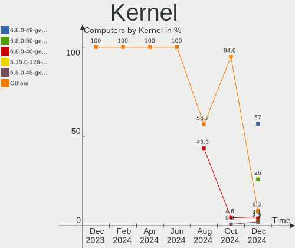
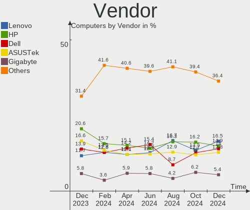
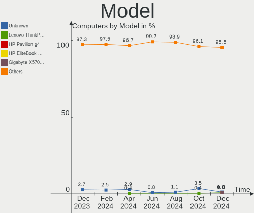
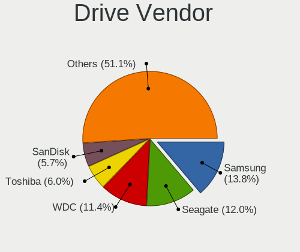
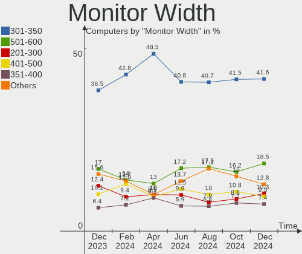

Zorin Hardware Trends
---------------------

A project to identify most popular hardware characteristics and track their change
over time based on data collected by Zorin users at https://Linux-Hardware.org.

Anyone can contribute to the study by uploading probes of their computers by
the [hw-probe](https://github.com/linuxhw/hw-probe) tool:

    sudo hw-probe -all -upload

This is a report for all computer types. See also reports for [desktops](/Dist/Zorin/Desktop/README.md) and [notebooks](/Dist/Zorin/Notebook/README.md).

Full-feature report is available here: https://linux-hardware.org/?view=trends

Period: Feb, 2020.

Contents
--------

- [ OS                       ](#os)
- [ OS Family                ](#os-family)
- [ Kernel                   ](#kernel)
- [ Kernel Family            ](#kernel-family)
- [ Kernel Major Ver.        ](#kernel-major-ver)
- [ Arch                     ](#arch)
- [ DE                       ](#de)
- [ Display Server           ](#display-server)
- [ OS Lang                  ](#os-lang)
- [ Boot Mode                ](#boot-mode)
- [ Filesystem               ](#filesystem)
- [ Dual Boot with Linux     ](#dual-boot-with-linux)
- [ Dual Boot (Win)          ](#dual-boot-win)
- [ Country                  ](#country)
- [ City                     ](#city)
- [ Vendor                   ](#vendor)
- [ Model                    ](#model)
- [ Model Family             ](#model-family)
- [ MFG Year                 ](#mfg-year)
- [ Form Factor              ](#form-factor)
- [ Secure Boot              ](#secure-boot)
- [ Coreboot                 ](#coreboot)
- [ RAM Size                 ](#ram-size)
- [ RAM Used                 ](#ram-used)
- [ Drive Vendor             ](#drive-vendor)
- [ Drive Model              ](#drive-model)
- [ Drive Kind               ](#drive-kind)
- [ Drive Connector          ](#drive-connector)
- [ Drive Size               ](#drive-size)
- [ Space Total              ](#space-total)
- [ Space Used               ](#space-used)
- [ Malfunc. Drives          ](#malfunc-drives)
- [ Malfunc. Drive Vendor    ](#malfunc-drive-vendor)
- [ Malfunc. Drive Kind      ](#malfunc-drive-kind)
- [ Failed Drives            ](#failed-drives)
- [ Failed Drive Vendor      ](#failed-drive-vendor)
- [ Drive Status             ](#drive-status)
- [ Storage Vendor           ](#storage-vendor)
- [ Storage Model            ](#storage-model)
- [ Storage Kind             ](#storage-kind)
- [ CPU Vendor               ](#cpu-vendor)
- [ CPU Model                ](#cpu-model)
- [ CPU Model Family         ](#cpu-model-family)
- [ CPU Cores                ](#cpu-cores)
- [ CPU Sockets              ](#cpu-sockets)
- [ CPU Threads              ](#cpu-threads)
- [ CPU Op-Modes             ](#cpu-op-modes)
- [ CPU Microarch            ](#cpu-microarch)
- [ CPU Microcode            ](#cpu-microcode)
- [ GPU Vendor               ](#gpu-vendor)
- [ GPU Model                ](#gpu-model)
- [ GPU Combo                ](#gpu-combo)
- [ GPU Driver               ](#gpu-driver)
- [ GPU Memory               ](#gpu-memory)
- [ Monitor Vendor           ](#monitor-vendor)
- [ Monitor Model            ](#monitor-model)
- [ Monitor Resolution       ](#monitor-resolution)
- [ Monitor Diagonal         ](#monitor-diagonal)
- [ Monitor Width            ](#monitor-width)
- [ Aspect Ratio             ](#aspect-ratio)
- [ Monitor Area             ](#monitor-area)
- [ Pixel Density            ](#pixel-density)
- [ Multiple Monitors        ](#multiple-monitors)
- [ Net Controller Vendor    ](#net-controller-vendor)
- [ Net Controller Model     ](#net-controller-model)
- [ Net Controller Kind      ](#net-controller-kind)
- [ Used Controller          ](#used-controller)
- [ NICs                     ](#nics)
- [ Unsupported Devices      ](#unsupported-devices)
- [ Unsupported Device Types ](#unsupported-device-types)

OS
--

Installed operating systems

| Name     | Computers | Percent |
|----------|-----------|---------|
| Zorin 15 | 55        | 91.67%  |
| Zorin 12 | 5         | 8.33%   |

OS Family
---------

OS without a version

| Name  | Computers | Percent |
|-------|-----------|---------|
| Zorin | 60        | 100%    |

Kernel
------

Version of the Linux kernel

| Version           | Computers | Percent |
|-------------------|-----------|---------|
| 5.3.0-28-generic  | 29        | 48.33%  |
| 5.3.0-40-generic  | 17        | 28.33%  |
| 5.0.0-37-generic  | 6         | 10%     |
| 4.15.0-76-generic | 2         | 3.33%   |
| 5.3.0-26-generic  | 1         | 1.67%   |
| 5.0.0-36-generic  | 1         | 1.67%   |
| 4.18.0-21-generic | 1         | 1.67%   |
| 4.15.0-88-generic | 1         | 1.67%   |
| 4.15.0-70-generic | 1         | 1.67%   |
| 4.15.0-30-generic | 1         | 1.67%   |

Kernel Family
-------------

Linux kernel without a distro release

| Version | Computers | Percent |
|---------|-----------|---------|
| 5.3.0   | 47        | 78.33%  |
| 5.0.0   | 7         | 11.67%  |
| 4.15.0  | 5         | 8.33%   |
| 4.18.0  | 1         | 1.67%   |

Kernel Major Ver.
-----------------

Linux kernel major version

| Version | Computers | Percent |
|---------|-----------|---------|
| 5.3     | 47        | 78.33%  |
| 5.0     | 7         | 11.67%  |
| 4.15    | 5         | 8.33%   |
| 4.18    | 1         | 1.67%   |

Arch
----

OS architecture (x86_64, i586, etc.)

| Name   | Computers | Percent |
|--------|-----------|---------|
| x86_64 | 50        | 83.33%  |
| i686   | 10        | 16.67%  |

DE
--

Desktop Environment

| Name       | Computers | Percent |
|------------|-----------|---------|
| GNOME      | 41        | 68.33%  |
| XFCE       | 14        | 23.33%  |
| Unknown    | 4         | 6.67%   |
| X-Cinnamon | 1         | 1.67%   |

Display Server
--------------

X11 or Wayland

| Name    | Computers | Percent |
|---------|-----------|---------|
| X11     | 56        | 93.33%  |
| Unknown | 3         | 5%      |
| Wayland | 1         | 1.67%   |

OS Lang
-------

Language

| Lang  | Computers | Percent |
|-------|-----------|---------|
| en_US | 24        | 40%     |
| en_GB | 7         | 11.67%  |
| de_DE | 5         | 8.33%   |
| ru_RU | 2         | 3.33%   |
| pt_BR | 2         | 3.33%   |
| it_IT | 2         | 3.33%   |
| es_PE | 2         | 3.33%   |
| es_ES | 2         | 3.33%   |
| sv_SE | 1         | 1.67%   |
| pl_PL | 1         | 1.67%   |
| nb_NO | 1         | 1.67%   |
| ja_JP | 1         | 1.67%   |
| id_ID | 1         | 1.67%   |
| fr_CA | 1         | 1.67%   |
| es_MX | 1         | 1.67%   |
| es_AR | 1         | 1.67%   |
| en_ZM | 1         | 1.67%   |
| en_ZA | 1         | 1.67%   |
| en_NZ | 1         | 1.67%   |
| en_IN | 1         | 1.67%   |
| cs_CZ | 1         | 1.67%   |
| C     | 1         | 1.67%   |

Boot Mode
---------

EFI or BIOS

| Mode | Computers | Percent |
|------|-----------|---------|
| BIOS | 36        | 60%     |
| EFI  | 24        | 40%     |

Filesystem
----------

Type of filesystem

| Type    | Computers | Percent |
|---------|-----------|---------|
| Ext4    | 56        | 93.33%  |
| Overlay | 4         | 6.67%   |

Dual Boot with Linux
--------------------

Hosting more than one Linux

| Dual boot | Computers | Percent |
|-----------|-----------|---------|
| No        | 53        | 88.33%  |
| Yes       | 7         | 11.67%  |

Dual Boot (Win)
---------------

Hosting Linux and Windows

| Dual boot | Computers | Percent |
|-----------|-----------|---------|
| No        | 35        | 58.33%  |
| Yes       | 25        | 41.67%  |

Country
-------

Geographic location (country)

| Country        | Computers | Percent |
|----------------|-----------|---------|
| USA            | 17        | 28.33%  |
| UK             | 5         | 8.33%   |
| Indonesia      | 3         | 5%      |
| Germany        | 3         | 5%      |
| Spain          | 2         | 3.33%   |
| South Africa   | 2         | 3.33%   |
| Peru           | 2         | 3.33%   |
| New Zealand    | 2         | 3.33%   |
| Mexico         | 2         | 3.33%   |
| Italy          | 2         | 3.33%   |
| India          | 2         | 3.33%   |
| Brazil         | 2         | 3.33%   |
| Austria        | 2         | 3.33%   |
| Zambia         | 1         | 1.67%   |
| Thailand       | 1         | 1.67%   |
| Sweden         | 1         | 1.67%   |
| Serbia         | 1         | 1.67%   |
| Russia         | 1         | 1.67%   |
| Poland         | 1         | 1.67%   |
| Norway         | 1         | 1.67%   |
| Japan          | 1         | 1.67%   |
| Hungary        | 1         | 1.67%   |
| Georgia        | 1         | 1.67%   |
| Denmark        | 1         | 1.67%   |
| Czech Republic | 1         | 1.67%   |
| Canada         | 1         | 1.67%   |
| Argentina      | 1         | 1.67%   |

City
----

Geographic location (city)

| City                  | Computers | Percent |
|-----------------------|-----------|---------|
| Las Vegas             | 3         | 5%      |
| Madrid                | 2         | 3.33%   |
| Auckland              | 2         | 3.33%   |
| Yokawacho-toyooka     | 1         | 1.67%   |
| Wrocław              | 1         | 1.67%   |
| Warrington            | 1         | 1.67%   |
| Warangal              | 1         | 1.67%   |
| Vienna                | 1         | 1.67%   |
| Vereeniging           | 1         | 1.67%   |
| Trujillo              | 1         | 1.67%   |
| Tbilisi               | 1         | 1.67%   |
| São Paulo            | 1         | 1.67%   |
| Södertälje          | 1         | 1.67%   |
| Surprise              | 1         | 1.67%   |
| Summerville           | 1         | 1.67%   |
| Stary Oskol           | 1         | 1.67%   |
| San Luis Potosí City | 1         | 1.67%   |
| Salzburg              | 1         | 1.67%   |
| Roverbella            | 1         | 1.67%   |
| Probolinggo           | 1         | 1.67%   |
| Pinellas Park         | 1         | 1.67%   |
| Pattaya               | 1         | 1.67%   |
| Pardubice             | 1         | 1.67%   |
| National City         | 1         | 1.67%   |
| Münster              | 1         | 1.67%   |
| Montreal              | 1         | 1.67%   |
| Milan                 | 1         | 1.67%   |
| Middlesbrough         | 1         | 1.67%   |
| Mexico City           | 1         | 1.67%   |
| Mason                 | 1         | 1.67%   |
| Manchester            | 1         | 1.67%   |
| Mahopac               | 1         | 1.67%   |
| Lusaka                | 1         | 1.67%   |
| London                | 1         | 1.67%   |
| Lohne                 | 1         | 1.67%   |
| Lincoln               | 1         | 1.67%   |
| Lima                  | 1         | 1.67%   |
| Kenosha               | 1         | 1.67%   |
| Jakarta               | 1         | 1.67%   |
| Houston               | 1         | 1.67%   |
| Honefoss              | 1         | 1.67%   |
| High Point            | 1         | 1.67%   |
| Garbsen               | 1         | 1.67%   |
| Durban                | 1         | 1.67%   |
| Delhi                 | 1         | 1.67%   |
| Corrientes            | 1         | 1.67%   |
| Copenhagen            | 1         | 1.67%   |
| Clearwater            | 1         | 1.67%   |
| Chicago               | 1         | 1.67%   |
| Békéscsaba          | 1         | 1.67%   |
| Brookings             | 1         | 1.67%   |
| Bristol               | 1         | 1.67%   |
| Bojongkalong          | 1         | 1.67%   |
| Belgrade              | 1         | 1.67%   |
| Baton Rouge           | 1         | 1.67%   |
| Araruama              | 1         | 1.67%   |

Vendor
------

Motherboard manufacturer

| Name                | Computers | Percent |
|---------------------|-----------|---------|
| ASUSTek Computer    | 10        | 16.67%  |
| Hewlett-Packard     | 9         | 15%     |
| Lenovo              | 6         | 10%     |
| Gigabyte Technology | 5         | 8.33%   |
| Dell                | 5         | 8.33%   |
| MSI                 | 3         | 5%      |
| ASRock              | 3         | 5%      |
| Toshiba             | 2         | 3.33%   |
| Pegatron            | 2         | 3.33%   |
| Apple               | 2         | 3.33%   |
| Acer                | 2         | 3.33%   |
| TrekStor            | 1         | 1.67%   |
| Samsung Electronics | 1         | 1.67%   |
| QDI                 | 1         | 1.67%   |
| Packard Bell        | 1         | 1.67%   |
| NEC Computers       | 1         | 1.67%   |
| IBM                 | 1         | 1.67%   |
| HUAWEI              | 1         | 1.67%   |
| Google              | 1         | 1.67%   |
| Fujitsu Siemens     | 1         | 1.67%   |
| AXIOO               | 1         | 1.67%   |
| Alienware           | 1         | 1.67%   |

Model
-----

Motherboard model

| Name                                     | Computers | Percent |
|------------------------------------------|-----------|---------|
| MSI MS-7C02                              | 2         | 3.33%   |
| TrekStor Notebook Slim S130              | 1         | 1.67%   |
| Toshiba Satellite L55-C                  | 1         | 1.67%   |
| Toshiba PORTEGE Z30-A                    | 1         | 1.67%   |
| Samsung Electronics 305E4A/305E5A/305E7A | 1         | 1.67%   |
| QDI P4I865MA                             | 1         | 1.67%   |
| Pegatron NE502AV-ABA a6750t              | 1         | 1.67%   |
| Pegatron FZ116AA-ACP a6551.at            | 1         | 1.67%   |
| Packard Bell imedia S3720                | 1         | 1.67%   |
| NEC Computers PC-VY25AACZ9               | 1         | 1.67%   |
| MSI GT72 2PC                             | 1         | 1.67%   |
| Lenovo XXXX 2222222                      | 1         | 1.67%   |
| Lenovo ThinkPad T440p 20ANCTO1WW         | 1         | 1.67%   |
| Lenovo ThinkPad E550 20DF0040US          | 1         | 1.67%   |
| Lenovo IdeaPad 330-15ARR 81D2            | 1         | 1.67%   |
| Lenovo IdeaPad 310-15ISK 80SM            | 1         | 1.67%   |
| Lenovo G505 20240                        | 1         | 1.67%   |
| IBM ThinkPad T43 26688AG                 | 1         | 1.67%   |
| HUAWEI BOHK-WAX9X                        | 1         | 1.67%   |
| HP ProBook 4530s                         | 1         | 1.67%   |
| HP Pavilion dv2000 (RG408UA#ABA)         | 1         | 1.67%   |
| HP Pavilion dm1                          | 1         | 1.67%   |
| HP Laptop 15-da0xxx                      | 1         | 1.67%   |
| HP EliteDesk 800 G1 SFF                  | 1         | 1.67%   |
| HP EliteBook 840 G3                      | 1         | 1.67%   |
| HP EliteBook 840 G1                      | 1         | 1.67%   |
| HP Compaq 8000 Elite USDT PC             | 1         | 1.67%   |
| HP 20-c013w                              | 1         | 1.67%   |
| Google Enguarde                          | 1         | 1.67%   |
| Gigabyte Mission one                     | 1         | 1.67%   |
| Gigabyte M68MT-S2                        | 1         | 1.67%   |
| Gigabyte B450M DS3H                      | 1         | 1.67%   |
| Gigabyte B450 AORUS M                    | 1         | 1.67%   |
| Gigabyte 945GCM-S2C                      | 1         | 1.67%   |
| Fujitsu Siemens AMILO M1451G Series      | 1         | 1.67%   |
| Dell Vostro 3750                         | 1         | 1.67%   |
| Dell Vostro 3550                         | 1         | 1.67%   |
| Dell Precision WorkStation T3500         | 1         | 1.67%   |
| Dell PowerEdge R410                      | 1         | 1.67%   |
| Dell OptiPlex 790                        | 1         | 1.67%   |
| AXIOO NEON MNW                           | 1         | 1.67%   |
| ASUS X555LD                              | 1         | 1.67%   |
| ASUS VivoBook_ASUSLaptop X580GD_N580GD   | 1         | 1.67%   |
| ASUS P8H61                               | 1         | 1.67%   |
| ASUS P4R800-VM                           | 1         | 1.67%   |
| ASUS H61M-K                              | 1         | 1.67%   |
| ASUS GX501VIK                            | 1         | 1.67%   |
| ASUS E203NA                              | 1         | 1.67%   |
| ASUS CG8580                              | 1         | 1.67%   |
| ASUS All Series                          | 1         | 1.67%   |
| ASUS A6Km                                | 1         | 1.67%   |
| ASRock H81M-ITX/WiFi                     | 1         | 1.67%   |
| ASRock FM2A75M-HD+                       | 1         | 1.67%   |
| ASRock 970 Pro3 R2.0                     | 1         | 1.67%   |
| Apple MacBook4,1                         | 1         | 1.67%   |
| Apple iMac14,2                           | 1         | 1.67%   |
| Alienware X51                            | 1         | 1.67%   |
| Acer Nitro AN515-42                      | 1         | 1.67%   |
| Acer Aspire M5811                        | 1         | 1.67%   |

Model Family
------------

Motherboard model prefix

| Name                       | Computers | Percent |
|----------------------------|-----------|---------|
| MSI MS-7C02                | 2         | 3.33%   |
| Lenovo ThinkPad            | 2         | 3.33%   |
| Lenovo IdeaPad             | 2         | 3.33%   |
| HP Pavilion                | 2         | 3.33%   |
| HP EliteBook               | 2         | 3.33%   |
| Dell Vostro                | 2         | 3.33%   |
| TrekStor Notebook          | 1         | 1.67%   |
| Toshiba Satellite          | 1         | 1.67%   |
| Toshiba PORTEGE            | 1         | 1.67%   |
| Samsung Electronics 305E4A | 1         | 1.67%   |
| QDI P4I865MA               | 1         | 1.67%   |
| Pegatron NE502AV-ABA       | 1         | 1.67%   |
| Pegatron FZ116AA-ACP       | 1         | 1.67%   |
| Packard Bell imedia        | 1         | 1.67%   |
| NEC Computers PC-VY25AACZ9 | 1         | 1.67%   |
| MSI GT72                   | 1         | 1.67%   |
| Lenovo XXXX                | 1         | 1.67%   |
| Lenovo G505                | 1         | 1.67%   |
| IBM ThinkPad               | 1         | 1.67%   |
| HUAWEI BOHK-WAX9X          | 1         | 1.67%   |
| HP ProBook                 | 1         | 1.67%   |
| HP Laptop                  | 1         | 1.67%   |
| HP EliteDesk               | 1         | 1.67%   |
| HP Compaq                  | 1         | 1.67%   |
| HP 20-c013w                | 1         | 1.67%   |
| Google Enguarde            | 1         | 1.67%   |
| Gigabyte Mission           | 1         | 1.67%   |
| Gigabyte M68MT-S2          | 1         | 1.67%   |
| Gigabyte B450M             | 1         | 1.67%   |
| Gigabyte B450              | 1         | 1.67%   |
| Gigabyte 945GCM-S2C        | 1         | 1.67%   |
| Fujitsu Siemens AMILO      | 1         | 1.67%   |
| Dell Precision             | 1         | 1.67%   |
| Dell PowerEdge             | 1         | 1.67%   |
| Dell OptiPlex              | 1         | 1.67%   |
| AXIOO NEON                 | 1         | 1.67%   |
| ASUS X555LD                | 1         | 1.67%   |
| ASUS VivoBook              | 1         | 1.67%   |
| ASUS P8H61                 | 1         | 1.67%   |
| ASUS P4R800-VM             | 1         | 1.67%   |
| ASUS H61M-K                | 1         | 1.67%   |
| ASUS GX501VIK              | 1         | 1.67%   |
| ASUS E203NA                | 1         | 1.67%   |
| ASUS CG8580                | 1         | 1.67%   |
| ASUS All                   | 1         | 1.67%   |
| ASUS A6Km                  | 1         | 1.67%   |
| ASRock H81M-ITX            | 1         | 1.67%   |
| ASRock FM2A75M-HD+         | 1         | 1.67%   |
| ASRock 970                 | 1         | 1.67%   |
| Apple MacBook4             | 1         | 1.67%   |
| Apple iMac14               | 1         | 1.67%   |
| Alienware X51              | 1         | 1.67%   |
| Acer Nitro                 | 1         | 1.67%   |
| Acer Aspire                | 1         | 1.67%   |

MFG Year
--------

Motherboard manufacture year

| Year | Computers | Percent |
|------|-----------|---------|
| 2019 | 15        | 25%     |
| 2018 | 7         | 11.67%  |
| 2014 | 6         | 10%     |
| 2010 | 5         | 8.33%   |
| 2012 | 4         | 6.67%   |
| 2016 | 3         | 5%      |
| 2013 | 3         | 5%      |
| 2011 | 3         | 5%      |
| 2009 | 3         | 5%      |
| 2008 | 3         | 5%      |
| 2006 | 2         | 3.33%   |
| 2003 | 2         | 3.33%   |
| 2017 | 1         | 1.67%   |
| 2015 | 1         | 1.67%   |
| 2007 | 1         | 1.67%   |
| 2005 | 1         | 1.67%   |

Form Factor
-----------

Physical design of the computer

| Name       | Computers | Percent |
|------------|-----------|---------|
| Notebook   | 31        | 51.67%  |
| Desktop    | 26        | 43.33%  |
| All in one | 2         | 3.33%   |
| Server     | 1         | 1.67%   |

Secure Boot
-----------

Enabled or disabled

| State    | Computers | Percent |
|----------|-----------|---------|
| Disabled | 55        | 91.67%  |
| Enabled  | 5         | 8.33%   |

Coreboot
--------

Have coreboot on board

| Used | Computers | Percent |
|------|-----------|---------|
| No   | 59        | 98.33%  |
| Yes  | 1         | 1.67%   |

RAM Size
--------

Total RAM memory

| Size in GB | Computers | Percent |
|------------|-----------|---------|
| 3.01-4.0   | 12        | 20%     |
| 8.01-16.0  | 12        | 20%     |
| 4.01-8.0   | 11        | 18.33%  |
| 16.01-24.0 | 11        | 18.33%  |
| 1.01-2.0   | 7         | 11.67%  |
| 0.01-1.0   | 4         | 6.67%   |
| 32.01-64.0 | 2         | 3.33%   |
| 2.01-3.0   | 1         | 1.67%   |

RAM Used
--------

Used RAM memory

| Used GB  | Computers | Percent |
|----------|-----------|---------|
| 1.01-2.0 | 26        | 43.33%  |
| 0.01-1.0 | 13        | 21.67%  |
| 2.01-3.0 | 11        | 18.33%  |
| 3.01-4.0 | 7         | 11.67%  |
| 4.01-8.0 | 3         | 5%      |

Drive Vendor
------------

Hard drive vendors

| Vendor              | Computers | Drives | Percent |
|---------------------|-----------|--------|---------|
| Seagate             | 18        | 20     | 24%     |
| WDC                 | 14        | 18     | 18.67%  |
| Samsung Electronics | 8         | 8      | 10.67%  |
| Unknown             | 5         | 6      | 6.67%   |
| Toshiba             | 5         | 6      | 6.67%   |
| Crucial             | 3         | 3      | 4%      |
| SanDisk             | 2         | 2      | 2.67%   |
| MAXTOR              | 2         | 3      | 2.67%   |
| Kingston            | 2         | 2      | 2.67%   |
| Intel               | 2         | 2      | 2.67%   |
| Hitachi             | 2         | 2      | 2.67%   |
| Transcend           | 1         | 1      | 1.33%   |
| SABRENT             | 1         | 1      | 1.33%   |
| OCZ                 | 1         | 1      | 1.33%   |
| Micron Technology   | 1         | 1      | 1.33%   |
| Integral            | 1         | 1      | 1.33%   |
| HGST                | 1         | 1      | 1.33%   |
| Generic             | 1         | 1      | 1.33%   |
| Fujitsu             | 1         | 1      | 1.33%   |
| ASMT                | 1         | 1      | 1.33%   |
| ASMedia             | 1         | 1      | 1.33%   |
| Apple               | 1         | 1      | 1.33%   |
| A-DATA Technology   | 1         | 1      | 1.33%   |

Drive Model
-----------

Hard drive models

| Model                             | Computers | Percent |
|-----------------------------------|-----------|---------|
| WD10EZEX-08WN4A0 1TB              | 3         | 3.61%   |
| ST500DM002-1BD142 500GB           | 3         | 3.61%   |
| MMC Card  32GB                    | 3         | 3.61%   |
| WD10SPZX-22Z10T1 1TB              | 2         | 2.41%   |
| SSD 850 EVO 500GB                 | 2         | 2.41%   |
| MQ04ABF100 1TB                    | 2         | 2.41%   |
| WDS500G2B0A-00SM50 500GB SSD      | 1         | 1.2%    |
| WDS250G2B0B-00YS70 250GB SSD      | 1         | 1.2%    |
| WD800JD-75JNA0 80GB               | 1         | 1.2%    |
| WD6400AAKS-65A7B0 640GB           | 1         | 1.2%    |
| WD5000LPVX-75V0TT0 500GB          | 1         | 1.2%    |
| WD5000AAKX-753CA1 500GB           | 1         | 1.2%    |
| WD5000AAKX-60U6AA0 500GB          | 1         | 1.2%    |
| WD3200BEKT-60PVMT0 320GB          | 1         | 1.2%    |
| WD2500AAKX-08ERMA0 250GB          | 1         | 1.2%    |
| WD20EARX-00PASB0 2TB              | 1         | 1.2%    |
| WD10SPZX-21Z10T0 1TB              | 1         | 1.2%    |
| WD10JPCX-24UE4T0 1TB              | 1         | 1.2%    |
| VERTEX4 128GB SSD                 | 1         | 1.2%    |
| V Series SATA SSD 240GB           | 1         | 1.2%    |
| USB 3.1 Storage 500GB             | 1         | 1.2%    |
| TS64GSSD420K 64GB                 | 1         | 1.2%    |
| SV100S2128G 128GB SSD             | 1         | 1.2%    |
| SU650 240GB SSD                   | 1         | 1.2%    |
| STM3160212A 160GB                 | 1         | 1.2%    |
| ST9160412AS 160GB                 | 1         | 1.2%    |
| ST500LT012-9WS142 500GB           | 1         | 1.2%    |
| ST500DM002-1SB10A 500GB           | 1         | 1.2%    |
| ST3750640NS 752GB                 | 1         | 1.2%    |
| ST3500413AS 500GB                 | 1         | 1.2%    |
| ST340016A 40GB                    | 1         | 1.2%    |
| ST340014A 40GB                    | 1         | 1.2%    |
| ST3320418AS 320GB                 | 1         | 1.2%    |
| ST31500341AS 1TB                  | 1         | 1.2%    |
| ST2000VM003-1CT164 2TB            | 1         | 1.2%    |
| ST2000DM006-2DM164 2TB            | 1         | 1.2%    |
| ST2000DM001-1ER164 2TB            | 1         | 1.2%    |
| ST2000DM001-1CH164 2TB            | 1         | 1.2%    |
| ST1000LM048-2E7172 1TB            | 1         | 1.2%    |
| ST1000LM035-1RK172 1TB            | 1         | 1.2%    |
| ST1000DM003-1ER162 1TB            | 1         | 1.2%    |
| SSDSC2BW120A4 120GB               | 1         | 1.2%    |
| SSDMCEAW120A4 120GB               | 1         | 1.2%    |
| SSD SD0128F 121GB                 | 1         | 1.2%    |
| SSD 860 EVO 250GB                 | 1         | 1.2%    |
| SSD 850 PRO 256GB                 | 1         | 1.2%    |
| SDSSDA240G 240GB                  | 1         | 1.2%    |
| SD8SN8U-256G-1006 256GB SSD       | 1         | 1.2%    |
| SD/MMC/MS PRO 64GB                | 1         | 1.2%    |
| SA400S37480G 480GB SSD            | 1         | 1.2%    |
| OOS320G32M 320GB                  | 1         | 1.2%    |
| MZMTE256HMHP-00000 256GB SSD      | 1         | 1.2%    |
| MTFDDAK256MAY-1AH12ABHA 256GB SSD | 1         | 1.2%    |
| MQ01ABD075 752GB                  | 1         | 1.2%    |
| MMC Card  16GB                    | 1         | 1.2%    |
| MK8025GAS 80GB                    | 1         | 1.2%    |
| MHV2080BH 80GB                    | 1         | 1.2%    |
| HTS725050A7E630 500GB             | 1         | 1.2%    |
| HTS542516K9SA00 160GB             | 1         | 1.2%    |
| HTS541060G9AT00 64GB              | 1         | 1.2%    |

Drive Kind
----------

HDD or SSD

| Kind    | Computers | Drives | Percent |
|---------|-----------|--------|---------|
| HDD     | 41        | 54     | 59.42%  |
| SSD     | 21        | 22     | 30.43%  |
| Unknown | 4         | 4      | 5.8%    |
| MMC     | 3         | 4      | 4.35%   |

Drive Connector
---------------

SATA, SAS, NVMe, etc.

| Type | Computers | Drives | Percent |
|------|-----------|--------|---------|
| SATA | 54        | 75     | 88.52%  |
| SAS  | 4         | 5      | 6.56%   |
| MMC  | 3         | 4      | 4.92%   |

Drive Size
----------

Size of hard drive

| Size in TB | Computers | Drives | Percent |
|------------|-----------|--------|---------|
| 0.01-0.5   | 43        | 57     | 63.24%  |
| 0.51-1.0   | 20        | 22     | 29.41%  |
| 1.01-2.0   | 5         | 5      | 7.35%   |

Space Total
-----------

Amount of disk space available on the file system

| Size in GB     | Computers | Percent |
|----------------|-----------|---------|
| 101-250        | 15        | 25%     |
| 251-500        | 10        | 16.67%  |
| 501-1000       | 9         | 15%     |
| 51-100         | 9         | 15%     |
| 1001-2000      | 7         | 11.67%  |
| 21-50          | 4         | 6.67%   |
| 1-20           | 4         | 6.67%   |
| More than 3000 | 1         | 1.67%   |
| 2001-3000      | 1         | 1.67%   |

Space Used
----------

Amount of used disk space

| Used GB        | Computers | Percent |
|----------------|-----------|---------|
| 1-20           | 39        | 65%     |
| 251-500        | 7         | 11.67%  |
| 101-250        | 4         | 6.67%   |
| 51-100         | 4         | 6.67%   |
| 21-50          | 2         | 3.33%   |
| 501-1000       | 2         | 3.33%   |
| More than 3000 | 1         | 1.67%   |
| 1001-2000      | 1         | 1.67%   |

Malfunc. Drives
---------------

Drive models with a malfunction

Zero info for selected period =(

Malfunc. Drive Vendor
---------------------

Vendors of faulty drives

Zero info for selected period =(

Malfunc. Drive Kind
-------------------

Kinds of faulty drives

Zero info for selected period =(

Failed Drives
-------------

Failed drive models

Zero info for selected period =(

Failed Drive Vendor
-------------------

Failed drive vendors

Zero info for selected period =(

Drive Status
------------

Number of failed and malfunc. drives

| Status   | Computers | Drives | Percent |
|----------|-----------|--------|---------|
| Detected | 56        | 84     | 100%    |

Storage Vendor
--------------

Storage controller vendors

| Vendor                           | Computers | Percent |
|----------------------------------|-----------|---------|
| Intel                            | 40        | 58.82%  |
| AMD                              | 13        | 19.12%  |
| Samsung Electronics              | 3         | 4.41%   |
| Nvidia                           | 3         | 4.41%   |
| Silicon Integrated Systems [SiS] | 2         | 2.94%   |
| Phison Electronics               | 2         | 2.94%   |
| ASMedia Technology               | 2         | 2.94%   |
| Sandisk                          | 1         | 1.47%   |
| Marvell Technology Group         | 1         | 1.47%   |
| JMicron Technology               | 1         | 1.47%   |

Storage Model
-------------

Storage controller models

| Model                                                                             | Computers | Percent |
|-----------------------------------------------------------------------------------|-----------|---------|
| FCH SATA Controller [AHCI mode]                                                   | 9         | 11.25%  |
| 8 Series/C220 Series Chipset Family 6-port SATA Controller 1 [AHCI mode]          | 6         | 7.5%    |
| 400 Series Chipset SATA Controller                                                | 4         | 5%      |
| 8 Series SATA Controller 1 [AHCI mode]                                            | 3         | 3.75%   |
| 6 Series/C200 Series Chipset Family 6 port Mobile SATA AHCI Controller            | 3         | 3.75%   |
| 6 Series/C200 Series Chipset Family 6 port Desktop SATA AHCI Controller           | 3         | 3.75%   |
| Wildcat Point-LP SATA Controller [AHCI Mode]                                      | 2         | 2.5%    |
| Sunrise Point-LP SATA Controller [AHCI mode]                                      | 2         | 2.5%    |
| SB7x0/SB8x0/SB9x0 SATA Controller [AHCI mode]                                     | 2         | 2.5%    |
| SATA Controller [RAID mode]                                                       | 2         | 2.5%    |
| NVMe SSD Controller SM981/PM981/PM983                                             | 2         | 2.5%    |
| NM10/ICH7 Family SATA Controller [IDE mode]                                       | 2         | 2.5%    |
| E12 NVMe Controller                                                               | 2         | 2.5%    |
| Celeron N3350/Pentium N4200/Atom E3900 Series SATA AHCI Controller                | 2         | 2.5%    |
| ASM1062 Serial ATA Controller                                                     | 2         | 2.5%    |
| 82801IR/IO/IH (ICH9R/DO/DH) 6 port SATA Controller [AHCI mode]                    | 2         | 2.5%    |
| 82801FBM (ICH6M) SATA Controller                                                  | 2         | 2.5%    |
| WD Black 2018/PC SN520 NVMe SSD                                                   | 1         | 1.25%   |
| SB200 IDE Controller                                                              | 1         | 1.25%   |
| NVMe SSD Controller SM961/PM961                                                   | 1         | 1.25%   |
| MCP73 IDE Controller                                                              | 1         | 1.25%   |
| MCP61 SATA Controller                                                             | 1         | 1.25%   |
| MCP51 Serial ATA Controller                                                       | 1         | 1.25%   |
| MCP51 IDE                                                                         | 1         | 1.25%   |
| JMB363 SATA/IDE Controller                                                        | 1         | 1.25%   |
| GeForce 7100/nForce 630i SATA                                                     | 1         | 1.25%   |
| FCH SATA Controller [IDE mode]                                                    | 1         | 1.25%   |
| FCH IDE Controller                                                                | 1         | 1.25%   |
| Cannon Lake Mobile PCH SATA AHCI Controller                                       | 1         | 1.25%   |
| Atom/Celeron/Pentium Processor x5-E8000/J3xxx/N3xxx Series SATA Controller        | 1         | 1.25%   |
| Atom Processor E3800 Series SATA AHCI Controller                                  | 1         | 1.25%   |
| AHCI IDE Controller (0106)                                                        | 1         | 1.25%   |
| 88SS9183 PCIe SSD Controller                                                      | 1         | 1.25%   |
| 82801JI (ICH10 Family) SATA AHCI Controller                                       | 1         | 1.25%   |
| 82801JI (ICH10 Family) 4 port SATA IDE Controller #1                              | 1         | 1.25%   |
| 82801JI (ICH10 Family) 2 port SATA IDE Controller #2                              | 1         | 1.25%   |
| 82801JD/DO (ICH10 Family) SATA AHCI Controller                                    | 1         | 1.25%   |
| 82801IBM/IEM (ICH9M/ICH9M-E) 4 port SATA Controller [AHCI mode]                   | 1         | 1.25%   |
| 82801HM/HEM (ICH8M/ICH8M-E) SATA Controller [AHCI mode]                           | 1         | 1.25%   |
| 82801HM/HEM (ICH8M/ICH8M-E) IDE Controller                                        | 1         | 1.25%   |
| 82801EB/ER (ICH5/ICH5R) IDE Controller                                            | 1         | 1.25%   |
| 82801EB (ICH5) SATA Controller                                                    | 1         | 1.25%   |
| 82801 Mobile SATA Controller [RAID mode]                                          | 1         | 1.25%   |
| 6 Series/C200 Series Chipset Family Desktop SATA Controller (IDE mode, ports 4-5) | 1         | 1.25%   |
| 6 Series/C200 Series Chipset Family Desktop SATA Controller (IDE mode, ports 0-3) | 1         | 1.25%   |
| 5513 IDE Controller                                                               | 1         | 1.25%   |
| 4 Series Chipset PT IDER Controller                                               | 1         | 1.25%   |

Storage Kind
------------

Kind of storage controller (IDE, SATA, NVMe, SAS, ...)

| Kind | Computers | Percent |
|------|-----------|---------|
| SATA | 45        | 64.29%  |
| IDE  | 16        | 22.86%  |
| NVMe | 6         | 8.57%   |
| RAID | 3         | 4.29%   |

CPU Vendor
----------

Processor vendors

| Vendor | Computers | Percent |
|--------|-----------|---------|
| Intel  | 45        | 75%     |
| AMD    | 15        | 25%     |

CPU Model
---------

Processor models

| Model                                         | Computers | Percent |
|-----------------------------------------------|-----------|---------|
| Intel Celeron CPU N3350 @ 1.10GHz             | 2         | 3.33%   |
| AMD Ryzen 7 2700 Eight-Core Processor         | 2         | 3.33%   |
| Intel Xeon CPU W3530 @ 2.80GHz                | 1         | 1.67%   |
| Intel Xeon CPU E5620 @ 2.40GHz                | 1         | 1.67%   |
| Intel Pentium M processor 1.86GHz             | 1         | 1.67%   |
| Intel Pentium M processor 1.60GHz             | 1         | 1.67%   |
| Intel Pentium Dual-Core CPU E5300 @ 2.60GHz   | 1         | 1.67%   |
| Intel Pentium Dual CPU E2200 @ 2.20GHz        | 1         | 1.67%   |
| Intel Pentium 4 CPU 2.40GHz                   | 1         | 1.67%   |
| Intel Core i7-8750H CPU @ 2.20GHz             | 1         | 1.67%   |
| Intel Core i7-7700HQ CPU @ 2.80GHz            | 1         | 1.67%   |
| Intel Core i7-5500U CPU @ 2.40GHz             | 1         | 1.67%   |
| Intel Core i7-4771 CPU @ 3.50GHz              | 1         | 1.67%   |
| Intel Core i7-4710HQ CPU @ 2.50GHz            | 1         | 1.67%   |
| Intel Core i7-4600U CPU @ 2.10GHz             | 1         | 1.67%   |
| Intel Core i7-3770K CPU @ 3.50GHz             | 1         | 1.67%   |
| Intel Core i7-2670QM CPU @ 2.20GHz            | 1         | 1.67%   |
| Intel Core i7-2620M CPU @ 2.70GHz             | 1         | 1.67%   |
| Intel Core i5-6300U CPU @ 2.40GHz             | 1         | 1.67%   |
| Intel Core i5-5200U CPU @ 2.20GHz             | 1         | 1.67%   |
| Intel Core i5-4440 CPU @ 3.10GHz              | 1         | 1.67%   |
| Intel Core i5-4310U CPU @ 2.00GHz             | 1         | 1.67%   |
| Intel Core i5-4200M CPU @ 2.50GHz             | 1         | 1.67%   |
| Intel Core i5-3570 CPU @ 3.40GHz              | 1         | 1.67%   |
| Intel Core i5-3470S CPU @ 2.90GHz             | 1         | 1.67%   |
| Intel Core i5-2430M CPU @ 2.40GHz             | 1         | 1.67%   |
| Intel Core i5-2400 CPU @ 3.10GHz              | 1         | 1.67%   |
| Intel Core i5 CPU 650 @ 3.20GHz               | 1         | 1.67%   |
| Intel Core i3-7100U CPU @ 2.40GHz             | 1         | 1.67%   |
| Intel Core i3-6006U CPU @ 2.00GHz             | 1         | 1.67%   |
| Intel Core i3-4170 CPU @ 3.70GHz              | 1         | 1.67%   |
| Intel Core i3-4160 CPU @ 3.60GHz              | 1         | 1.67%   |
| Intel Core i3-4030U CPU @ 1.90GHz             | 1         | 1.67%   |
| Intel Core i3-2100 CPU @ 3.10GHz              | 1         | 1.67%   |
| Intel Core 2 Quad CPU Q8300 @ 2.50GHz         | 1         | 1.67%   |
| Intel Core 2 Quad CPU Q6600 @ 2.40GHz         | 1         | 1.67%   |
| Intel Core 2 Duo CPU T8300 @ 2.40GHz          | 1         | 1.67%   |
| Intel Core 2 Duo CPU P8700 @ 2.53GHz          | 1         | 1.67%   |
| Intel Core 2 Duo CPU P7370 @ 2.00GHz          | 1         | 1.67%   |
| Intel Core 2 Duo CPU E8400 @ 3.00GHz          | 1         | 1.67%   |
| Intel Core 2 Duo CPU E7400 @ 2.80GHz          | 1         | 1.67%   |
| Intel Celeron CPU N2840 @ 2.16GHz             | 1         | 1.67%   |
| Intel Celeron CPU N2807 @ 1.58GHz             | 1         | 1.67%   |
| Intel Celeron CPU J3060 @ 1.60GHz             | 1         | 1.67%   |
| Intel Celeron CPU 2.40GHz                     | 1         | 1.67%   |
| AMD Turion 64 X2                              | 1         | 1.67%   |
| AMD Turion 64 Mobile Technology MT-34         | 1         | 1.67%   |
| AMD Sempron 140 Processor                     | 1         | 1.67%   |
| AMD Ryzen 5 3600 6-Core Processor             | 1         | 1.67%   |
| AMD Ryzen 5 3500U with Radeon Vega Mobile Gfx | 1         | 1.67%   |
| AMD Ryzen 5 2500U with Radeon Vega Mobile Gfx | 1         | 1.67%   |
| AMD Ryzen 5 1600 Six-Core Processor           | 1         | 1.67%   |
| AMD Ryzen 3 2200U with Radeon Vega Mobile Gfx | 1         | 1.67%   |
| AMD Phenom II X4 B50 Processor                | 1         | 1.67%   |
| AMD E1-2100 APU with Radeon HD Graphics       | 1         | 1.67%   |
| AMD E-350 Processor                           | 1         | 1.67%   |
| AMD A6-3420M APU with Radeon HD Graphics      | 1         | 1.67%   |
| AMD A4-5300 APU with Radeon HD Graphics       | 1         | 1.67%   |

CPU Model Family
----------------

Processor model prefix

| Model                   | Computers | Percent |
|-------------------------|-----------|---------|
| Intel Core i5           | 10        | 16.67%  |
| Intel Core i7           | 9         | 15%     |
| Intel Core i3           | 6         | 10%     |
| Intel Celeron           | 6         | 10%     |
| Intel Core 2 Duo        | 5         | 8.33%   |
| AMD Ryzen 5             | 4         | 6.67%   |
| Intel Xeon              | 2         | 3.33%   |
| Intel Pentium M         | 2         | 3.33%   |
| Intel Core 2 Quad       | 2         | 3.33%   |
| AMD Ryzen 7             | 2         | 3.33%   |
| Intel Pentium Dual-Core | 1         | 1.67%   |
| Intel Pentium Dual      | 1         | 1.67%   |
| Intel Pentium 4         | 1         | 1.67%   |
| AMD Turion 64 X2        | 1         | 1.67%   |
| AMD Turion 64 Mobile    | 1         | 1.67%   |
| AMD Sempron             | 1         | 1.67%   |
| AMD Ryzen 3             | 1         | 1.67%   |
| AMD Phenom II X4        | 1         | 1.67%   |
| AMD E1                  | 1         | 1.67%   |
| AMD E                   | 1         | 1.67%   |
| AMD A6                  | 1         | 1.67%   |
| AMD A4                  | 1         | 1.67%   |

CPU Cores
---------

Number of processor cores

| Number | Computers | Percent |
|--------|-----------|---------|
| 2      | 31        | 51.67%  |
| 4      | 16        | 26.67%  |
| 1      | 7         | 11.67%  |
| 8      | 3         | 5%      |
| 6      | 3         | 5%      |

CPU Sockets
-----------

Number of sockets

| Number | Computers | Percent |
|--------|-----------|---------|
| 1      | 59        | 98.33%  |
| 2      | 1         | 1.67%   |

CPU Threads
-----------

Threads per core (Hyper-Threading)

| Number | Computers | Percent |
|--------|-----------|---------|
| 2      | 32        | 53.33%  |
| 1      | 28        | 46.67%  |

CPU Op-Modes
------------

CPU Operation Modes (32-bit, 64-bit)

| Op mode        | Computers | Percent |
|----------------|-----------|---------|
| 32-bit, 64-bit | 56        | 93.33%  |
| 32-bit         | 4         | 6.67%   |

CPU Microarch
-------------

Microarchitecture

| Name        | Computers | Percent |
|-------------|-----------|---------|
| Haswell     | 9         | 15%     |
| Core        | 9         | 15%     |
| Skylake     | 5         | 8.33%   |
| SandyBridge | 5         | 8.33%   |
| Zen+        | 4         | 6.67%   |
| Silvermont  | 3         | 5%      |
| IvyBridge   | 3         | 5%      |
| Zen         | 2         | 3.33%   |
| Westmere    | 2         | 3.33%   |
| P6          | 2         | 3.33%   |
| NetBurst    | 2         | 3.33%   |
| K8 Hammer   | 2         | 3.33%   |
| K10         | 2         | 3.33%   |
| Goldmont    | 2         | 3.33%   |
| Broadwell   | 2         | 3.33%   |
| Zen 2       | 1         | 1.67%   |
| Piledriver  | 1         | 1.67%   |
| Nehalem     | 1         | 1.67%   |
| K10 Llano   | 1         | 1.67%   |
| Jaguar      | 1         | 1.67%   |
| Bobcat      | 1         | 1.67%   |

CPU Microcode
-------------

Microcode number

| Number     | Computers | Percent |
|------------|-----------|---------|
| 0x306c3    | 6         | 10%     |
| 0x206a7    | 5         | 8.33%   |
| 0x1067a    | 5         | 8.33%   |
| 0x40651    | 3         | 5%      |
| 0x306a9    | 3         | 5%      |
| Unknown    | 3         | 5%      |
| 0xf29      | 2         | 3.33%   |
| 0x6d8      | 2         | 3.33%   |
| 0x506c9    | 2         | 3.33%   |
| 0x406e3    | 2         | 3.33%   |
| 0x306d4    | 2         | 3.33%   |
| 0x30678    | 2         | 3.33%   |
| 0x10676    | 2         | 3.33%   |
| 0x0810100b | 2         | 3.33%   |
| 0x0800820d | 2         | 3.33%   |
| 0x906ea    | 1         | 1.67%   |
| 0x906e9    | 1         | 1.67%   |
| 0x806e9    | 1         | 1.67%   |
| 0x6fd      | 1         | 1.67%   |
| 0x6fb      | 1         | 1.67%   |
| 0x406c4    | 1         | 1.67%   |
| 0x20652    | 1         | 1.67%   |
| 0x106a5    | 1         | 1.67%   |
| 0x08701013 | 1         | 1.67%   |
| 0x08108109 | 1         | 1.67%   |
| 0x0800820b | 1         | 1.67%   |
| 0x0700010f | 1         | 1.67%   |
| 0x06001119 | 1         | 1.67%   |
| 0x05000029 | 1         | 1.67%   |
| 0x03000027 | 1         | 1.67%   |
| 0x010000c8 | 1         | 1.67%   |
| 0x010000c7 | 1         | 1.67%   |

GPU Vendor
----------

Vendors of graphics cards

| Vendor                           | Computers | Percent |
|----------------------------------|-----------|---------|
| Intel                            | 27        | 39.71%  |
| AMD                              | 20        | 29.41%  |
| Nvidia                           | 19        | 27.94%  |
| Silicon Integrated Systems [SiS] | 1         | 1.47%   |
| Matrox Electronics Systems       | 1         | 1.47%   |

GPU Model
---------

Graphics card models

| Model                                                                              | Computers | Percent |
|------------------------------------------------------------------------------------|-----------|---------|
| Haswell-ULT Integrated Graphics Controller                                         | 3         | 4.29%   |
| 2nd Generation Core Processor Family Integrated Graphics Controller                | 3         | 4.29%   |
| RV370/M22 [Mobility Radeon X300]                                                   | 2         | 2.86%   |
| Raven Ridge [Radeon Vega Series / Radeon Vega Mobile Series]                       | 2         | 2.86%   |
| HD Graphics 5500                                                                   | 2         | 2.86%   |
| HD Graphics 500                                                                    | 2         | 2.86%   |
| GK208B [GeForce GT 710]                                                            | 2         | 2.86%   |
| GF108 [GeForce GT 730]                                                             | 2         | 2.86%   |
| Ellesmere [Radeon RX 470/480/570/570X/580/580X/590]                                | 2         | 2.86%   |
| Baffin [Radeon RX 460/560D / Pro 450/455/460/555/555X/560/560X]                    | 2         | 2.86%   |
| Atom Processor Z36xxx/Z37xxx Series Graphics & Display                             | 2         | 2.86%   |
| 4th Gen Core Processor Integrated Graphics Controller                              | 2         | 2.86%   |
| Xeon E3-1200 v3/4th Gen Core Processor Integrated Graphics Controller              | 1         | 1.43%   |
| Xeon E3-1200 v2/3rd Gen Core processor Graphics Controller                         | 1         | 1.43%   |
| Wrestler [Radeon HD 6310]                                                          | 1         | 1.43%   |
| Whistler [Radeon HD 6630M/6650M/6750M/7670M/7690M]                                 | 1         | 1.43%   |
| UHD Graphics 630 (Mobile)                                                          | 1         | 1.43%   |
| Trinity 2 [Radeon HD 7480D]                                                        | 1         | 1.43%   |
| Sumo [Radeon HD 6520G]                                                             | 1         | 1.43%   |
| Skylake GT2 [HD Graphics 520]                                                      | 1         | 1.43%   |
| RV610 [Radeon HD 2400 PRO]                                                         | 1         | 1.43%   |
| RS300 [Radeon 9100 IGP]                                                            | 1         | 1.43%   |
| Picasso                                                                            | 1         | 1.43%   |
| Opal XT [Radeon R7 M265/M365X/M465]                                                | 1         | 1.43%   |
| Oland PRO [Radeon R7 240/340]                                                      | 1         | 1.43%   |
| Navi 10 [Radeon RX 5600 OEM/5600 XT / 5700/5700 XT]                                | 1         | 1.43%   |
| Mobile GM965/GL960 Integrated Graphics Controller (secondary)                      | 1         | 1.43%   |
| Mobile GM965/GL960 Integrated Graphics Controller (primary)                        | 1         | 1.43%   |
| Mobile 4 Series Chipset Integrated Graphics Controller                             | 1         | 1.43%   |
| MGA G200eW WPCM450                                                                 | 1         | 1.43%   |
| Mars [Radeon HD 8730M]                                                             | 1         | 1.43%   |
| Kabini [Radeon HD 8210]                                                            | 1         | 1.43%   |
| HD Graphics 620                                                                    | 1         | 1.43%   |
| HD Graphics 520                                                                    | 1         | 1.43%   |
| GT218 [GeForce G210]                                                               | 1         | 1.43%   |
| GT218 [GeForce 210]                                                                | 1         | 1.43%   |
| GP107M [GeForce GTX 1050 Mobile]                                                   | 1         | 1.43%   |
| GP104BM [GeForce GTX 1080 Mobile]                                                  | 1         | 1.43%   |
| GP104 [GeForce GTX 1070]                                                           | 1         | 1.43%   |
| GK208B [GeForce GT 730]                                                            | 1         | 1.43%   |
| GK104M [GeForce GTX 780M Mac Edition]                                              | 1         | 1.43%   |
| GK104 [GeForce GTX 660 OEM]                                                        | 1         | 1.43%   |
| GF117M [GeForce 610M/710M/810M/820M / GT 620M/625M/630M/720M]                      | 1         | 1.43%   |
| GF114 [GeForce GTX 560 Ti]                                                         | 1         | 1.43%   |
| GF108M [GeForce GT 525M]                                                           | 1         | 1.43%   |
| G96C [GeForce 9400 GT]                                                             | 1         | 1.43%   |
| G72M [Quadro NVS 110M/GeForce Go 7300]                                             | 1         | 1.43%   |
| Cedar [Radeon HD 5000/6000/7350/8350 Series]                                       | 1         | 1.43%   |
| C61 [GeForce 7025 / nForce 630a]                                                   | 1         | 1.43%   |
| C51 [GeForce Go 6150]                                                              | 1         | 1.43%   |
| Atom/Celeron/Pentium Processor x5-E8000/J3xxx/N3xxx Integrated Graphics Controller | 1         | 1.43%   |
| 82945G/GZ Integrated Graphics Controller                                           | 1         | 1.43%   |
| 82865G Integrated Graphics Controller                                              | 1         | 1.43%   |
| 771/671 PCIE VGA Display Adapter                                                   | 1         | 1.43%   |
| 4th Generation Core Processor Family Integrated Graphics Controller                | 1         | 1.43%   |
| 4 Series Chipset Integrated Graphics Controller                                    | 1         | 1.43%   |

GPU Combo
---------

Combinations of graphics cards

| Name           | Computers | Percent |
|----------------|-----------|---------|
| 1 x Intel      | 19        | 31.67%  |
| 1 x Nvidia     | 16        | 26.67%  |
| 1 x AMD        | 16        | 26.67%  |
| Intel + Nvidia | 3         | 5%      |
| Intel + AMD    | 3         | 5%      |
| 2 x AMD        | 1         | 1.67%   |
| 1 x SiS        | 1         | 1.67%   |
| 1 x Matrox     | 1         | 1.67%   |

GPU Driver
----------

Free vs proprietary

| Driver      | Computers | Percent |
|-------------|-----------|---------|
| Free        | 47        | 78.33%  |
| Proprietary | 8         | 13.33%  |
| Unknown     | 5         | 8.33%   |

GPU Memory
----------

Total video memory

| Size in GB | Computers | Percent |
|------------|-----------|---------|
| Unknown    | 25        | 41.67%  |
| 0.01-0.5   | 13        | 21.67%  |
| 1.01-2.0   | 7         | 11.67%  |
| 0.51-1.0   | 6         | 10%     |
| 7.01-8.0   | 4         | 6.67%   |
| 3.01-4.0   | 4         | 6.67%   |
| 5.01-6.0   | 1         | 1.67%   |

Monitor Vendor
--------------

Monitor vendors

| Vendor                  | Computers | Percent |
|-------------------------|-----------|---------|
| AU Optronics            | 10        | 18.18%  |
| Samsung Electronics     | 6         | 10.91%  |
| Chimei Innolux          | 5         | 9.09%   |
| Acer                    | 5         | 9.09%   |
| LG Display              | 4         | 7.27%   |
| Chi Mei Optoelectronics | 3         | 5.45%   |
| Philips                 | 2         | 3.64%   |
| Iiyama                  | 2         | 3.64%   |
| Hewlett-Packard         | 2         | 3.64%   |
| Goldstar                | 2         | 3.64%   |
| BOE                     | 2         | 3.64%   |
| Ancor Communications    | 2         | 3.64%   |
| Vizio                   | 1         | 1.82%   |
| VIZ                     | 1         | 1.82%   |
| ViewSonic               | 1         | 1.82%   |
| Toshiba                 | 1         | 1.82%   |
| MStar                   | 1         | 1.82%   |
| MSI                     | 1         | 1.82%   |
| LG Philips              | 1         | 1.82%   |
| LG Electronics          | 1         | 1.82%   |
| BenQ                    | 1         | 1.82%   |
| Apple                   | 1         | 1.82%   |

Monitor Model
-------------

Monitor models

| Model                                               | Computers | Percent |
|-----------------------------------------------------|-----------|---------|
| LCD Monitor AUO123D 1920x1080 309x173mm 13.9-inch   | 2         | 3.64%   |
| X34 ACR0462 3440x1440 797x333mm 34.0-inch           | 1         | 1.82%   |
| W1643 GSM3E88 1360x768 406x229mm 18.4-inch          | 1         | 1.82%   |
| VX2260WM VSCFC21 1920x1080 477x268mm 21.5-inch      | 1         | 1.82%   |
| vs17 HWP2647 1280x1024 340x270mm 17.1-inch          | 1         | 1.82%   |
| VN279 ACI27A4 1920x1080 597x336mm 27.0-inch         | 1         | 1.82%   |
| VA19L HDTV10T VIZ0019 1360x768 410x230mm 18.5-inch  | 1         | 1.82%   |
| V173 ACR0019 1280x1024 340x270mm 17.1-inch          | 1         | 1.82%   |
| TV_MONITOR MST0030 1440x900 1150x650mm 52.0-inch    | 1         | 1.82%   |
| SyncMaster SAM03E5 1680x1050 470x300mm 22.0-inch    | 1         | 1.82%   |
| S19D300 SAM0B35 1366x768 410x230mm 18.5-inch        | 1         | 1.82%   |
| PL2776HD IVM6605 1920x1080 598x336mm 27.0-inch      | 1         | 1.82%   |
| PL2730H IVM663A 1920x1080 598x336mm 27.0-inch       | 1         | 1.82%   |
| Optix MAG27CQ MSI1462 2560x1440 597x336mm 27.0-inch | 1         | 1.82%   |
| LCD-MONITOR LCDEC80 1680x1050 470x300mm 22.0-inch   | 1         | 1.82%   |
| LCD Monitor X223W 1680x1050                         | 1         | 1.82%   |
| LCD Monitor SEC3053 1366x768 256x144mm 11.6-inch    | 1         | 1.82%   |
| LCD Monitor SAM03D4 1920x1080                       | 1         | 1.82%   |
| LCD Monitor PHILIPS FTV 1920x1080                   | 1         | 1.82%   |
| LCD Monitor LPLA500 1280x800 304x190mm 14.1-inch    | 1         | 1.82%   |
| LCD Monitor LGD05D8 1920x1080 344x194mm 15.5-inch   | 1         | 1.82%   |
| LCD Monitor LGD045C 1366x768 350x190mm 15.7-inch    | 1         | 1.82%   |
| LCD Monitor LGD03D7 1366x768 309x174mm 14.0-inch    | 1         | 1.82%   |
| LCD Monitor LGD0171 1366x768 344x194mm 15.5-inch    | 1         | 1.82%   |
| LCD Monitor LG TV 1280x720                          | 1         | 1.82%   |
| LCD Monitor GW2765 2560x1440                        | 1         | 1.82%   |
| LCD Monitor E320VT 1920x1080                        | 1         | 1.82%   |
| LCD Monitor CMO15A7 1366x768 350x190mm 15.7-inch    | 1         | 1.82%   |
| LCD Monitor CMO15A3 1366x768 344x193mm 15.5-inch    | 1         | 1.82%   |
| LCD Monitor CMO15A1 1366x768 344x193mm 15.5-inch    | 1         | 1.82%   |
| LCD Monitor CMN1735 1920x1080 382x215mm 17.3-inch   | 1         | 1.82%   |
| LCD Monitor CMN1731 1600x900 382x215mm 17.3-inch    | 1         | 1.82%   |
| LCD Monitor CMN15DB 1366x768 344x193mm 15.5-inch    | 1         | 1.82%   |
| LCD Monitor CMN15C6 1366x768 340x190mm 15.3-inch    | 1         | 1.82%   |
| LCD Monitor CMN1355 1366x768 293x165mm 13.2-inch    | 1         | 1.82%   |
| LCD Monitor BOE06F0 1366x768 344x194mm 15.5-inch    | 1         | 1.82%   |
| LCD Monitor BOE0672 1366x768 344x194mm 15.5-inch    | 1         | 1.82%   |
| LCD Monitor AUO71EC 1366x768 340x190mm 15.3-inch    | 1         | 1.82%   |
| LCD Monitor AUO61ED 1920x1080 340x190mm 15.3-inch   | 1         | 1.82%   |
| LCD Monitor AUO28ED 1920x1080 344x193mm 15.5-inch   | 1         | 1.82%   |
| LCD Monitor AUO235C 1366x768 260x140mm 11.6-inch    | 1         | 1.82%   |
| LCD Monitor AUO225C 1366x768 256x144mm 11.6-inch    | 1         | 1.82%   |
| LCD Monitor AUO21EC 1366x768 340x190mm 15.3-inch    | 1         | 1.82%   |
| LCD Monitor AUO1974 1280x800 331x207mm 15.4-inch    | 1         | 1.82%   |
| LCD Monitor APP9C5F 1280x800 286x179mm 13.3-inch    | 1         | 1.82%   |
| LCD Monitor 1920x1080                               | 1         | 1.82%   |
| K272HL ACR03DC 1920x1080 600x340mm 27.2-inch        | 1         | 1.82%   |
| K222HQL ACR040D 1920x1080 480x270mm 21.7-inch       | 1         | 1.82%   |
| FTV PHL01EA 1920x1080 1440x810mm 65.0-inch          | 1         | 1.82%   |
| E2041 GSM4EC9 1600x900 443x249mm 20.0-inch          | 1         | 1.82%   |
| C32F391 SAM0D34 1920x1080 698x393mm 31.5-inch       | 1         | 1.82%   |
| C24F390 SAM0D2C 1920x1080 520x290mm 23.4-inch       | 1         | 1.82%   |
| ASUS VE278 ACI27F6 1920x1080 598x336mm 27.0-inch    | 1         | 1.82%   |
| All-in-One HWP4243 1600x900 434x236mm 19.4-inch     | 1         | 1.82%   |

Monitor Resolution
------------------

Monitor screen resolution

| Resolution         | Computers | Percent |
|--------------------|-----------|---------|
| 1920x1080 (FHD)    | 20        | 37.04%  |
| 1366x768 (WXGA)    | 17        | 31.48%  |
| 1680x1050 (WSXGA+) | 3         | 5.56%   |
| 1600x900 (HD+)     | 3         | 5.56%   |
| 1280x800 (WXGA)    | 3         | 5.56%   |
| 1360x768           | 2         | 3.7%    |
| 1280x720 (HD)      | 2         | 3.7%    |
| 1280x1024 (SXGA)   | 2         | 3.7%    |
| 3440x1440          | 1         | 1.85%   |
| 2560x1440 (QHD)    | 1         | 1.85%   |

Monitor Diagonal
----------------

Diagonal size in inches

| Inches  | Computers | Percent |
|---------|-----------|---------|
| 15      | 15        | 27.27%  |
| Unknown | 7         | 12.73%  |
| 27      | 6         | 10.91%  |
| 17      | 4         | 7.27%   |
| 13      | 4         | 7.27%   |
| 18      | 3         | 5.45%   |
| 11      | 3         | 5.45%   |
| 22      | 2         | 3.64%   |
| 21      | 2         | 3.64%   |
| 14      | 2         | 3.64%   |
| 65      | 1         | 1.82%   |
| 34      | 1         | 1.82%   |
| 32      | 1         | 1.82%   |
| 31      | 1         | 1.82%   |
| 23      | 1         | 1.82%   |
| 20      | 1         | 1.82%   |
| 19      | 1         | 1.82%   |

Monitor Width
-------------

Physical width

| Width in mm | Computers | Percent |
|-------------|-----------|---------|
| 301-350     | 21        | 38.18%  |
| 401-500     | 9         | 16.36%  |
| 501-600     | 7         | 12.73%  |
| Unknown     | 7         | 12.73%  |
| 201-300     | 5         | 9.09%   |
| 701-800     | 2         | 3.64%   |
| 351-400     | 2         | 3.64%   |
| 601-700     | 1         | 1.82%   |
| 1001-1500   | 1         | 1.82%   |

Aspect Ratio
------------

Proportional relationship between the width and the height

| Ratio   | Computers | Percent |
|---------|-----------|---------|
| 16/9    | 38        | 73.08%  |
| Unknown | 6         | 11.54%  |
| 16/10   | 5         | 9.62%   |
| 5/4     | 2         | 3.85%   |
| 21/9    | 1         | 1.92%   |

Monitor Area
------------

Area in inch²

| Area in inch² | Computers | Percent |
|----------------|-----------|---------|
| 101-110        | 15        | 27.27%  |
| Unknown        | 7         | 12.73%  |
| 301-350        | 6         | 10.91%  |
| 141-150        | 5         | 9.09%   |
| 81-90          | 4         | 7.27%   |
| 151-200        | 4         | 7.27%   |
| 51-60          | 3         | 5.45%   |
| 351-500        | 3         | 5.45%   |
| 201-250        | 3         | 5.45%   |
| 71-80          | 2         | 3.64%   |
| 121-130        | 2         | 3.64%   |
| More than 1000 | 1         | 1.82%   |

Pixel Density
-------------

Pixels per inch

| Density | Computers | Percent |
|---------|-----------|---------|
| 101-120 | 19        | 34.55%  |
| 51-100  | 19        | 34.55%  |
| 121-160 | 9         | 16.36%  |
| Unknown | 7         | 12.73%  |
| 1-50    | 1         | 1.82%   |

Multiple Monitors
-----------------

Total monitors connected

| Total | Computers | Percent |
|-------|-----------|---------|
| 1     | 50        | 83.33%  |
| 0     | 6         | 10%     |
| 2     | 4         | 6.67%   |

Net Controller Vendor
---------------------

Controller vendors

| Vendor                           | Computers | Percent |
|----------------------------------|-----------|---------|
| Intel                            | 6         | 37.5%   |
| Nvidia                           | 2         | 12.5%   |
| Xiaomi                           | 1         | 6.25%   |
| TP-Link                          | 1         | 6.25%   |
| Silicon Integrated Systems [SiS] | 1         | 6.25%   |
| Sierra Wireless                  | 1         | 6.25%   |
| Realtek Semiconductor            | 1         | 6.25%   |
| Hewlett-Packard                  | 1         | 6.25%   |
| Dell                             | 1         | 6.25%   |
| D-Link System                    | 1         | 6.25%   |

Net Controller Model
--------------------

Controller models

| Model                                                      | Computers | Percent |
|------------------------------------------------------------|-----------|---------|
| RTL8192EE PCIe Wireless Network Adapter                    | 1         | 6.25%   |
| RTL8153 TP-Link UE300 USB 10/100/1000 LAN                  | 1         | 6.25%   |
| NM10/ICH7 Family LAN Controller                            | 1         | 6.25%   |
| MCP61 Ethernet                                             | 1         | 6.25%   |
| MCP51 Ethernet Controller                                  | 1         | 6.25%   |
| lt4112 Gobi 4G Module Network Device                       | 1         | 6.25%   |
| F3607gw v2 Mobile Broadband Module                         | 1         | 6.25%   |
| EM7305                                                     | 1         | 6.25%   |
| DWA-140 RangeBooster N Adapter(rev.B2) [Ralink RT3072]     | 1         | 6.25%   |
| AC'97 Modem Controller                                     | 1         | 6.25%   |
| 82801FB/FBM/FR/FW/FRW (ICH6 Family) AC'97 Modem Controller | 1         | 6.25%   |
| 82579V Gigabit Network Connection                          | 1         | 6.25%   |
| 82579LM Gigabit Network Connection (Lewisville)            | 1         | 6.25%   |
| 82578DC Gigabit Network Connection                         | 1         | 6.25%   |
| 82567LM-3 Gigabit Network Connection                       | 1         | 6.25%   |
| 100Mbps Network Card Adapter                               | 1         | 6.25%   |

Net Controller Kind
-------------------

Ethernet, WiFi or modem

| Kind     | Computers | Percent |
|----------|-----------|---------|
| Ethernet | 9         | 56.25%  |
| WiFi     | 4         | 25%     |
| Modem    | 3         | 18.75%  |

Used Controller
---------------

Currently used network controller

| Kind     | Computers | Percent |
|----------|-----------|---------|
| Ethernet | 5         | 71.43%  |
| WiFi     | 2         | 28.57%  |

NICs
----

Total network controllers on board

| Total | Computers | Percent |
|-------|-----------|---------|
| 2     | 31        | 51.67%  |
| 1     | 28        | 46.67%  |
| 3     | 1         | 1.67%   |

Unsupported Devices
-------------------

Total unsupported devices on board

| Total | Computers | Percent |
|-------|-----------|---------|
| 0     | 40        | 66.67%  |
| 1     | 17        | 28.33%  |
| 2     | 3         | 5%      |

Unsupported Device Types
------------------------

Types of unsupported devices

| Type                  | Computers | Percent |
|-----------------------|-----------|---------|
| Fingerprint reader    | 8         | 36.36%  |
| Graphics card         | 6         | 27.27%  |
| Net/wireless          | 5         | 22.73%  |
| Modem                 | 2         | 9.09%   |
| Multimedia controller | 1         | 4.55%   |

