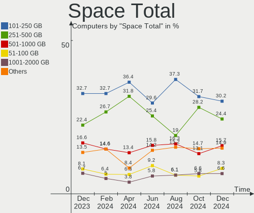
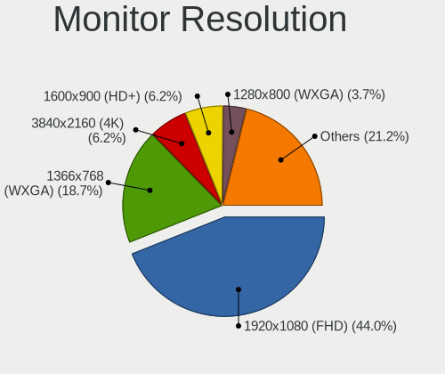
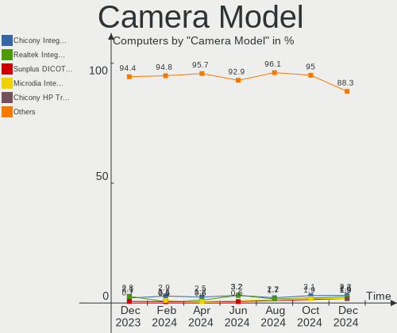

Zorin - Hardware Trends
-----------------------

A project to identify most popular hardware characteristics and track their change
over time based on data collected by Linux users at https://Linux-Hardware.org.

Anyone can contribute to this report by the [hw-probe](https://github.com/linuxhw/hw-probe) tool:

    sudo -E hw-probe -all -upload

This is a report for all computer types. See also reports for [desktops](/Dist/Zorin/Desktop/README.md) and [notebooks](/Dist/Zorin/Notebook/README.md).

This report is for one last month. Overall report since the beginning of time: [TestCoverage](https://github.com/linuxhw/TestCoverage)

Period: Jan, 2023.

Contents
--------

* [ System ](#system)
  - [ OS                       ](#os)
  - [ OS Family                ](#os-family)
  - [ Kernel                   ](#kernel)
  - [ Kernel Family            ](#kernel-family)
  - [ Kernel Major Ver.        ](#kernel-major-ver)
  - [ Arch                     ](#arch)
  - [ DE                       ](#de)
  - [ Display Server           ](#display-server)
  - [ Display Manager          ](#display-manager)
  - [ OS Lang                  ](#os-lang)
  - [ Boot Mode                ](#boot-mode)
  - [ Filesystem               ](#filesystem)
  - [ Part. scheme             ](#part-scheme)
  - [ Dual Boot with Linux/BSD ](#dual-boot-with-linuxbsd)
  - [ Dual Boot (Win)          ](#dual-boot-win)

* [ Board ](#board)
  - [ Vendor                   ](#vendor)
  - [ Model                    ](#model)
  - [ Model Family             ](#model-family)
  - [ MFG Year                 ](#mfg-year)
  - [ Form Factor              ](#form-factor)
  - [ Secure Boot              ](#secure-boot)
  - [ Coreboot                 ](#coreboot)
  - [ RAM Size                 ](#ram-size)
  - [ RAM Used                 ](#ram-used)
  - [ Total Drives             ](#total-drives)
  - [ Has CD-ROM               ](#has-cd-rom)
  - [ Has Ethernet             ](#has-ethernet)
  - [ Has WiFi                 ](#has-wifi)
  - [ Has Bluetooth            ](#has-bluetooth)

* [ Location ](#location)
  - [ Country                  ](#country)
  - [ City                     ](#city)

* [ Drives ](#drives)
  - [ Drive Vendor             ](#drive-vendor)
  - [ Drive Model              ](#drive-model)
  - [ HDD Vendor               ](#hdd-vendor)
  - [ SSD Vendor               ](#ssd-vendor)
  - [ Drive Kind               ](#drive-kind)
  - [ Drive Connector          ](#drive-connector)
  - [ Drive Size               ](#drive-size)
  - [ Space Total              ](#space-total)
  - [ Space Used               ](#space-used)
  - [ Malfunc. Drives          ](#malfunc-drives)
  - [ Malfunc. Drive Vendor    ](#malfunc-drive-vendor)
  - [ Malfunc. HDD Vendor      ](#malfunc-hdd-vendor)
  - [ Malfunc. Drive Kind      ](#malfunc-drive-kind)
  - [ Failed Drives            ](#failed-drives)
  - [ Failed Drive Vendor      ](#failed-drive-vendor)
  - [ Drive Status             ](#drive-status)

* [ Storage controller ](#storage-controller)
  - [ Storage Vendor           ](#storage-vendor)
  - [ Storage Model            ](#storage-model)
  - [ Storage Kind             ](#storage-kind)

* [ Processor ](#processor)
  - [ CPU Vendor               ](#cpu-vendor)
  - [ CPU Model                ](#cpu-model)
  - [ CPU Model Family         ](#cpu-model-family)
  - [ CPU Cores                ](#cpu-cores)
  - [ CPU Sockets              ](#cpu-sockets)
  - [ CPU Threads              ](#cpu-threads)
  - [ CPU Op-Modes             ](#cpu-op-modes)
  - [ CPU Microcode            ](#cpu-microcode)
  - [ CPU Microarch            ](#cpu-microarch)

* [ Graphics ](#graphics)
  - [ GPU Vendor               ](#gpu-vendor)
  - [ GPU Model                ](#gpu-model)
  - [ GPU Combo                ](#gpu-combo)
  - [ GPU Driver               ](#gpu-driver)
  - [ GPU Memory               ](#gpu-memory)

* [ Monitor ](#monitor)
  - [ Monitor Vendor           ](#monitor-vendor)
  - [ Monitor Model            ](#monitor-model)
  - [ Monitor Resolution       ](#monitor-resolution)
  - [ Monitor Diagonal         ](#monitor-diagonal)
  - [ Monitor Width            ](#monitor-width)
  - [ Aspect Ratio             ](#aspect-ratio)
  - [ Monitor Area             ](#monitor-area)
  - [ Pixel Density            ](#pixel-density)
  - [ Multiple Monitors        ](#multiple-monitors)

* [ Network ](#network)
  - [ Net Controller Vendor    ](#net-controller-vendor)
  - [ Net Controller Model     ](#net-controller-model)
  - [ Wireless Vendor          ](#wireless-vendor)
  - [ Wireless Model           ](#wireless-model)
  - [ Ethernet Vendor          ](#ethernet-vendor)
  - [ Ethernet Model           ](#ethernet-model)
  - [ Net Controller Kind      ](#net-controller-kind)
  - [ Used Controller          ](#used-controller)
  - [ NICs                     ](#nics)
  - [ IPv6                     ](#ipv6)

* [ Bluetooth ](#bluetooth)
  - [ Bluetooth Vendor         ](#bluetooth-vendor)
  - [ Bluetooth Model          ](#bluetooth-model)

* [ Sound ](#sound)
  - [ Sound Vendor             ](#sound-vendor)
  - [ Sound Model              ](#sound-model)

* [ Memory ](#memory)
  - [ Memory Vendor            ](#memory-vendor)
  - [ Memory Model             ](#memory-model)
  - [ Memory Kind              ](#memory-kind)
  - [ Memory Form Factor       ](#memory-form-factor)
  - [ Memory Size              ](#memory-size)
  - [ Memory Speed             ](#memory-speed)

* [ Printers & scanners ](#printers--scanners)
  - [ Printer Vendor           ](#printer-vendor)
  - [ Printer Model            ](#printer-model)
  - [ Scanner Vendor           ](#scanner-vendor)
  - [ Scanner Model            ](#scanner-model)

* [ Camera ](#camera)
  - [ Camera Vendor            ](#camera-vendor)
  - [ Camera Model             ](#camera-model)

* [ Security ](#security)
  - [ Fingerprint Vendor       ](#fingerprint-vendor)
  - [ Fingerprint Model        ](#fingerprint-model)
  - [ Chipcard Vendor          ](#chipcard-vendor)
  - [ Chipcard Model           ](#chipcard-model)

* [ Unsupported ](#unsupported)
  - [ Unsupported Devices      ](#unsupported-devices)
  - [ Unsupported Device Types ](#unsupported-device-types)

System
------

OS
--

Installed operating systems

| Name     | Computers | Percent |
|----------|-----------|---------|
| Zorin 16 | 177       | 93.65%  |
| Zorin 15 | 12        | 6.35%   |

OS Family
---------

OS without a version

| Name  | Computers | Percent |
|-------|-----------|---------|
| Zorin | 189       | 100%    |

Kernel
------

Version of the Linux kernel

| Version              | Computers | Percent |
|----------------------|-----------|---------|
| 5.15.0-58-generic    | 93        | 49.21%  |
| 5.15.0-56-generic    | 42        | 22.22%  |
| 5.15.0-57-generic    | 31        | 16.4%   |
| 5.4.0-136-generic    | 6         | 3.17%   |
| 5.4.0-137-generic    | 2         | 1.06%   |
| 5.15.0-53-generic    | 2         | 1.06%   |
| 6.1.7-060107-generic | 1         | 0.53%   |
| 5.4.0-89-generic     | 1         | 0.53%   |
| 5.4.0-45-generic     | 1         | 0.53%   |
| 5.4.0-135-generic    | 1         | 0.53%   |
| 5.4.0-117-generic    | 1         | 0.53%   |
| 5.15.0-52-generic    | 1         | 0.53%   |
| 5.15.0-48-generic    | 1         | 0.53%   |
| 5.15.0-46-generic    | 1         | 0.53%   |
| 5.15.0-43-generic    | 1         | 0.53%   |
| 5.15.0-41-generic    | 1         | 0.53%   |
| 5.13.0-30-generic    | 1         | 0.53%   |
| 5.13.0-27-generic    | 1         | 0.53%   |
| 5.11.0-38-generic    | 1         | 0.53%   |

Kernel Family
-------------

Linux kernel without a distro release

| Version | Computers | Percent |
|---------|-----------|---------|
| 5.15.0  | 173       | 91.53%  |
| 5.4.0   | 12        | 6.35%   |
| 5.13.0  | 2         | 1.06%   |
| 6.1.7   | 1         | 0.53%   |
| 5.11.0  | 1         | 0.53%   |

Kernel Major Ver.
-----------------

Linux kernel major version

| Version | Computers | Percent |
|---------|-----------|---------|
| 5.15    | 173       | 91.53%  |
| 5.4     | 12        | 6.35%   |
| 5.13    | 2         | 1.06%   |
| 6.1     | 1         | 0.53%   |
| 5.11    | 1         | 0.53%   |

Arch
----

OS architecture (x86_64, i586, etc.)

| Name   | Computers | Percent |
|--------|-----------|---------|
| x86_64 | 183       | 96.83%  |
| i686   | 6         | 3.17%   |

DE
--

Desktop Environment

| Name    | Computers | Percent |
|---------|-----------|---------|
| GNOME   | 141       | 74.6%   |
| XFCE    | 46        | 24.34%  |
| KDE5    | 1         | 0.53%   |
| Unknown | 1         | 0.53%   |

Display Server
--------------

X11 or Wayland

| Name    | Computers | Percent |
|---------|-----------|---------|
| X11     | 186       | 98.41%  |
| Wayland | 3         | 1.59%   |

Display Manager
---------------

SDDM, LightDM, etc.

| Name    | Computers | Percent |
|---------|-----------|---------|
| Unknown | 132       | 69.84%  |
| GDM3    | 23        | 12.17%  |
| LightDM | 20        | 10.58%  |
| GDM     | 13        | 6.88%   |
| SDDM    | 1         | 0.53%   |

OS Lang
-------

Language

| Lang        | Computers | Percent |
|-------------|-----------|---------|
| en_US       | 83        | 43.92%  |
| de_DE       | 16        | 8.47%   |
| en_CA       | 9         | 4.76%   |
| fr_FR       | 8         | 4.23%   |
| pl_PL       | 7         | 3.7%    |
| it_IT       | 7         | 3.7%    |
| en_AU       | 6         | 3.17%   |
| pt_BR       | 5         | 2.65%   |
| en_GB       | 5         | 2.65%   |
| nl_NL       | 4         | 2.12%   |
| es_ES       | 3         | 1.59%   |
| es_CL       | 3         | 1.59%   |
| en_NZ       | 3         | 1.59%   |
| en_IN       | 3         | 1.59%   |
| ru_RU       | 2         | 1.06%   |
| ja_JP       | 2         | 1.06%   |
| hu_HU       | 2         | 1.06%   |
| es_MX       | 2         | 1.06%   |
| en_ZA       | 2         | 1.06%   |
| de_AT       | 2         | 1.06%   |
| cs_CZ       | 2         | 1.06%   |
| C           | 2         | 1.06%   |
| sv_SE       | 1         | 0.53%   |
| sr_RS@latin | 1         | 0.53%   |
| pt_PT       | 1         | 0.53%   |
| nl_BE       | 1         | 0.53%   |
| hr_HR       | 1         | 0.53%   |
| fi_FI       | 1         | 0.53%   |
| es_DO       | 1         | 0.53%   |
| es_CR       | 1         | 0.53%   |
| es_AR       | 1         | 0.53%   |
| de_CH       | 1         | 0.53%   |
| ar_EG       | 1         | 0.53%   |

Boot Mode
---------

EFI or BIOS

| Mode | Computers | Percent |
|------|-----------|---------|
| EFI  | 102       | 53.97%  |
| BIOS | 87        | 46.03%  |

Filesystem
----------

Type of filesystem

| Type    | Computers | Percent |
|---------|-----------|---------|
| Ext4    | 179       | 94.71%  |
| Zfs     | 5         | 2.65%   |
| Overlay | 4         | 2.12%   |
| Btrfs   | 1         | 0.53%   |

Part. scheme
------------

Scheme of partitioning

| Type    | Computers | Percent |
|---------|-----------|---------|
| Unknown | 137       | 72.49%  |
| GPT     | 38        | 20.11%  |
| MBR     | 14        | 7.41%   |

Dual Boot with Linux/BSD
------------------------

Hosting more than one Linux/BSD

| Dual boot | Computers | Percent |
|-----------|-----------|---------|
| No        | 179       | 94.71%  |
| Yes       | 10        | 5.29%   |

Dual Boot (Win)
---------------

Hosting Linux and Windows

| Dual boot | Computers | Percent |
|-----------|-----------|---------|
| No        | 171       | 90.48%  |
| Yes       | 18        | 9.52%   |

Board
-----

Vendor
------

Motherboard manufacturer

| Name                        | Computers | Percent |
|-----------------------------|-----------|---------|
| Hewlett-Packard             | 45        | 23.81%  |
| Lenovo                      | 30        | 15.87%  |
| ASUSTek Computer            | 24        | 12.7%   |
| Dell                        | 21        | 11.11%  |
| Acer                        | 11        | 5.82%   |
| Apple                       | 7         | 3.7%    |
| Sony                        | 5         | 2.65%   |
| MSI                         | 5         | 2.65%   |
| ASRock                      | 5         | 2.65%   |
| Fujitsu                     | 4         | 2.12%   |
| Toshiba                     | 3         | 1.59%   |
| Wortmann AG                 | 2         | 1.06%   |
| Packard Bell                | 2         | 1.06%   |
| Microsoft                   | 2         | 1.06%   |
| Google                      | 2         | 1.06%   |
| Gigabyte Technology         | 2         | 1.06%   |
| Alienware                   | 2         | 1.06%   |
| Timi                        | 1         | 0.53%   |
| Tactus                      | 1         | 0.53%   |
| Standard                    | 1         | 0.53%   |
| Samsung Electronics         | 1         | 0.53%   |
| Multilaser                  | 1         | 0.53%   |
| Medion                      | 1         | 0.53%   |
| MAXSUN                      | 1         | 0.53%   |
| Kiano                       | 1         | 0.53%   |
| Itautec                     | 1         | 0.53%   |
| I-Life Digital Technologies | 1         | 0.53%   |
| HUAWEI                      | 1         | 0.53%   |
| Huanan                      | 1         | 0.53%   |
| HC                          | 1         | 0.53%   |
| GPU Company                 | 1         | 0.53%   |
| Foxconn                     | 1         | 0.53%   |
| Chuwi                       | 1         | 0.53%   |
| Unknown                     | 1         | 0.53%   |

Model
-----

Motherboard model

| Name                                  | Computers | Percent |
|---------------------------------------|-----------|---------|
| Lenovo Z51-70 80K6                    | 2         | 1.06%   |
| HP Pavilion dv6                       | 2         | 1.06%   |
| HP Notebook                           | 2         | 1.06%   |
| HP Compaq Elite 8300 SFF              | 2         | 1.06%   |
| Dell OptiPlex 380                     | 2         | 1.06%   |
| Wortmann AG TERRA_MOBILE_1062         | 1         | 0.53%   |
| Wortmann AG Mobile 1524               | 1         | 0.53%   |
| Toshiba Satellite C50D-B              | 1         | 0.53%   |
| Toshiba Satellite C50-B               | 1         | 0.53%   |
| Toshiba QOSMIO X770                   | 1         | 0.53%   |
| Timi Mi Notebook Pro                  | 1         | 0.53%   |
| Tactus GeoPad 110                     | 1         | 0.53%   |
| Standard X50-V2                       | 1         | 0.53%   |
| Sony VPCJ23S1R                        | 1         | 0.53%   |
| Sony VPCEB3L1E                        | 1         | 0.53%   |
| Sony VGN-SR16GN_B                     | 1         | 0.53%   |
| Sony SVE1513U1ESI                     | 1         | 0.53%   |
| Sony SVE1513C5E                       | 1         | 0.53%   |
| Samsung R520/R522/R620                | 1         | 0.53%   |
| Packard Bell EasyNote TM82            | 1         | 0.53%   |
| Packard Bell EasyNote TE69KB          | 1         | 0.53%   |
| Multilaser PC024                      | 1         | 0.53%   |
| MSI Pentino H-Series                  | 1         | 0.53%   |
| MSI MS-7D46                           | 1         | 0.53%   |
| MSI MS-7A32                           | 1         | 0.53%   |
| MSI MS-7641                           | 1         | 0.53%   |
| MSI CR62 6M                           | 1         | 0.53%   |
| Microsoft Surface Pro                 | 1         | 0.53%   |
| Microsoft Surface Go 3                | 1         | 0.53%   |
| Medion MS-7707                        | 1         | 0.53%   |
| MAXSUN MS-TZZ A320M.2-VH              | 1         | 0.53%   |
| Lenovo Yoga 6 13ALC7 82UD             | 1         | 0.53%   |
| Lenovo Yoga 520-14IKB 80X8            | 1         | 0.53%   |
| Lenovo V14-IIL 82C4                   | 1         | 0.53%   |
| Lenovo V110-15IAP 80TG                | 1         | 0.53%   |
| Lenovo ThinkPad T470 20HES0PF00       | 1         | 0.53%   |
| Lenovo ThinkPad T460s 20FAS1F200      | 1         | 0.53%   |
| Lenovo ThinkPad S1 Yoga 20CD0038MZ    | 1         | 0.53%   |
| Lenovo ThinkPad S1 Yoga 12 20DL0079US | 1         | 0.53%   |
| Lenovo ThinkPad R61 8918DEG           | 1         | 0.53%   |

Model Family
------------

Motherboard model prefix

| Name                  | Computers | Percent |
|-----------------------|-----------|---------|
| Lenovo IdeaPad        | 12        | 6.35%   |
| HP Pavilion           | 10        | 5.29%   |
| Acer Aspire           | 8         | 4.23%   |
| HP EliteBook          | 7         | 3.7%    |
| Dell Inspiron         | 7         | 3.7%    |
| Dell Latitude         | 6         | 3.17%   |
| Lenovo ThinkPad       | 5         | 2.65%   |
| HP Compaq             | 4         | 2.12%   |
| HP ProBook            | 3         | 1.59%   |
| HP Laptop             | 3         | 1.59%   |
| Dell Precision        | 3         | 1.59%   |
| Dell OptiPlex         | 3         | 1.59%   |
| ASUS ROG              | 3         | 1.59%   |
| Toshiba Satellite     | 2         | 1.06%   |
| Packard Bell EasyNote | 2         | 1.06%   |
| Microsoft Surface     | 2         | 1.06%   |
| Lenovo Z51-70         | 2         | 1.06%   |
| Lenovo Yoga           | 2         | 1.06%   |
| Lenovo G560           | 2         | 1.06%   |
| HP Notebook           | 2         | 1.06%   |
| HP ENVY               | 2         | 1.06%   |
| Fujitsu ESPRIMO       | 2         | 1.06%   |
| Dell Vostro           | 2         | 1.06%   |
| ASUS TUF              | 2         | 1.06%   |
| Wortmann AG TERRA     | 1         | 0.53%   |
| Wortmann AG Mobile    | 1         | 0.53%   |
| Toshiba QOSMIO        | 1         | 0.53%   |
| Timi Mi               | 1         | 0.53%   |
| Tactus GeoPad         | 1         | 0.53%   |
| Standard X50-V2       | 1         | 0.53%   |
| Sony VPCJ23S1R        | 1         | 0.53%   |
| Sony VPCEB3L1E        | 1         | 0.53%   |
| Sony VGN-SR16GN       | 1         | 0.53%   |
| Sony SVE1513U1ESI     | 1         | 0.53%   |
| Sony SVE1513C5E       | 1         | 0.53%   |
| Samsung R520          | 1         | 0.53%   |
| Multilaser PC024      | 1         | 0.53%   |
| MSI Pentino           | 1         | 0.53%   |
| MSI MS-7D46           | 1         | 0.53%   |
| MSI MS-7A32           | 1         | 0.53%   |

MFG Year
--------

Motherboard manufacture year

| Year | Computers | Percent |
|------|-----------|---------|
| 2010 | 17        | 8.99%   |
| 2022 | 16        | 8.47%   |
| 2018 | 16        | 8.47%   |
| 2013 | 15        | 7.94%   |
| 2015 | 14        | 7.41%   |
| 2012 | 14        | 7.41%   |
| 2017 | 13        | 6.88%   |
| 2011 | 13        | 6.88%   |
| 2021 | 12        | 6.35%   |
| 2016 | 11        | 5.82%   |
| 2020 | 10        | 5.29%   |
| 2019 | 8         | 4.23%   |
| 2014 | 8         | 4.23%   |
| 2008 | 8         | 4.23%   |
| 2009 | 7         | 3.7%    |
| 2007 | 6         | 3.17%   |
| 2005 | 1         | 0.53%   |

Form Factor
-----------

Physical design of the computer

| Name        | Computers | Percent |
|-------------|-----------|---------|
| Notebook    | 117       | 61.9%   |
| Desktop     | 53        | 28.04%  |
| Convertible | 9         | 4.76%   |
| Tablet      | 5         | 2.65%   |
| All in one  | 4         | 2.12%   |
| Mini pc     | 1         | 0.53%   |

Secure Boot
-----------

Enabled or disabled

| State    | Computers | Percent |
|----------|-----------|---------|
| Disabled | 168       | 88.89%  |
| Enabled  | 21        | 11.11%  |

Coreboot
--------

Have coreboot on board

| Used | Computers | Percent |
|------|-----------|---------|
| No   | 187       | 98.94%  |
| Yes  | 2         | 1.06%   |

RAM Size
--------

Total RAM memory

| Size in GB  | Computers | Percent |
|-------------|-----------|---------|
| 4.01-8.0    | 52        | 27.51%  |
| 3.01-4.0    | 43        | 22.75%  |
| 16.01-24.0  | 33        | 17.46%  |
| 8.01-16.0   | 29        | 15.34%  |
| 1.01-2.0    | 14        | 7.41%   |
| 32.01-64.0  | 10        | 5.29%   |
| 2.01-3.0    | 5         | 2.65%   |
| 64.01-256.0 | 2         | 1.06%   |
| 24.01-32.0  | 1         | 0.53%   |

RAM Used
--------

Used RAM memory

| Used GB    | Computers | Percent |
|------------|-----------|---------|
| 1.01-2.0   | 75        | 39.68%  |
| 2.01-3.0   | 62        | 32.8%   |
| 4.01-8.0   | 24        | 12.7%   |
| 3.01-4.0   | 18        | 9.52%   |
| 8.01-16.0  | 5         | 2.65%   |
| 0.51-1.0   | 4         | 2.12%   |
| 24.01-32.0 | 1         | 0.53%   |

Total Drives
------------

Number of drives on board

| Drives | Computers | Percent |
|--------|-----------|---------|
| 1      | 133       | 70.37%  |
| 2      | 43        | 22.75%  |
| 3      | 7         | 3.7%    |
| 4      | 3         | 1.59%   |
| 7      | 1         | 0.53%   |
| 6      | 1         | 0.53%   |
| 5      | 1         | 0.53%   |

Has CD-ROM
----------

Has CD-ROM on board

| Presented | Computers | Percent |
|-----------|-----------|---------|
| No        | 98        | 51.85%  |
| Yes       | 91        | 48.15%  |

Has Ethernet
------------

Has Ethernet on board

| Presented | Computers | Percent |
|-----------|-----------|---------|
| Yes       | 150       | 79.37%  |
| No        | 39        | 20.63%  |

Has WiFi
--------

Has WiFi module

| Presented | Computers | Percent |
|-----------|-----------|---------|
| Yes       | 163       | 86.24%  |
| No        | 26        | 13.76%  |

Has Bluetooth
-------------

Has Bluetooth module

| Presented | Computers | Percent |
|-----------|-----------|---------|
| Yes       | 116       | 61.38%  |
| No        | 73        | 38.62%  |

Location
--------

Country
-------

Geographic location (country)

| Country      | Computers | Percent |
|--------------|-----------|---------|
| USA          | 55        | 29.1%   |
| Germany      | 18        | 9.52%   |
| Italy        | 9         | 4.76%   |
| Canada       | 9         | 4.76%   |
| UK           | 7         | 3.7%    |
| Poland       | 7         | 3.7%    |
| Netherlands  | 7         | 3.7%    |
| France       | 7         | 3.7%    |
| Brazil       | 5         | 2.65%   |
| Australia    | 5         | 2.65%   |
| Chile        | 4         | 2.12%   |
| Spain        | 3         | 1.59%   |
| Portugal     | 3         | 1.59%   |
| New Zealand  | 3         | 1.59%   |
| India        | 3         | 1.59%   |
| Hungary      | 3         | 1.59%   |
| Switzerland  | 2         | 1.06%   |
| Sweden       | 2         | 1.06%   |
| South Africa | 2         | 1.06%   |
| Serbia       | 2         | 1.06%   |
| Russia       | 2         | 1.06%   |
| Mexico       | 2         | 1.06%   |
| Japan        | 2         | 1.06%   |
| Finland      | 2         | 1.06%   |
| Czechia      | 2         | 1.06%   |
| Belgium      | 2         | 1.06%   |
| Austria      | 2         | 1.06%   |
| Algeria      | 2         | 1.06%   |
| Yemen        | 1         | 0.53%   |
| Tunisia      | 1         | 0.53%   |
| South Korea  | 1         | 0.53%   |
| Saudi Arabia | 1         | 0.53%   |
| Romania      | 1         | 0.53%   |
| Philippines  | 1         | 0.53%   |
| Norway       | 1         | 0.53%   |
| Mali         | 1         | 0.53%   |
| Luxembourg   | 1         | 0.53%   |
| Jordan       | 1         | 0.53%   |
| Israel       | 1         | 0.53%   |
| Indonesia    | 1         | 0.53%   |

City
----

Geographic location (city)

| City                | Computers | Percent |
|---------------------|-----------|---------|
| Melbourne           | 3         | 1.59%   |
| Calgary             | 3         | 1.59%   |
| Vienna              | 2         | 1.06%   |
| Toronto             | 2         | 1.06%   |
| St Louis            | 2         | 1.06%   |
| Santiago            | 2         | 1.06%   |
| San José           | 2         | 1.06%   |
| New York            | 2         | 1.06%   |
| Las Vegas           | 2         | 1.06%   |
| Herentals           | 2         | 1.06%   |
| Hamilton            | 2         | 1.06%   |
| Belgrade            | 2         | 1.06%   |
| Apeldoorn           | 2         | 1.06%   |
| Zulawki             | 1         | 0.53%   |
| Wingham             | 1         | 0.53%   |
| Willoughby          | 1         | 0.53%   |
| West Monroe         | 1         | 0.53%   |
| Wesley Chapel       | 1         | 0.53%   |
| Wernigerode         | 1         | 0.53%   |
| Werneuchen          | 1         | 0.53%   |
| Wendeburg           | 1         | 0.53%   |
| Warsaw              | 1         | 0.53%   |
| Vila Verde          | 1         | 0.53%   |
| Vaxjo               | 1         | 0.53%   |
| Valparaiso de Goias | 1         | 0.53%   |
| Valparaíso         | 1         | 0.53%   |
| Valencia            | 1         | 0.53%   |
| UEllo               | 1         | 0.53%   |
| Tunis               | 1         | 0.53%   |
| Troy                | 1         | 0.53%   |
| Tonbridge           | 1         | 0.53%   |
| Tokyo               | 1         | 0.53%   |
| The Bronx           | 1         | 0.53%   |
| Tencin              | 1         | 0.53%   |
| Tel Aviv            | 1         | 0.53%   |
| Tampere             | 1         | 0.53%   |
| Sydney              | 1         | 0.53%   |
| Sun City            | 1         | 0.53%   |
| Stoutland           | 1         | 0.53%   |
| Stockholm           | 1         | 0.53%   |

Drives
------

Drive Vendor
------------

Hard drive vendors

| Vendor                      | Computers | Drives | Percent |
|-----------------------------|-----------|--------|---------|
| Seagate                     | 37        | 42     | 14.86%  |
| Samsung Electronics         | 37        | 39     | 14.86%  |
| WDC                         | 30        | 35     | 12.05%  |
| Unknown                     | 20        | 25     | 8.03%   |
| Toshiba                     | 12        | 13     | 4.82%   |
| SanDisk                     | 12        | 13     | 4.82%   |
| Crucial                     | 12        | 12     | 4.82%   |
| Kingston                    | 11        | 12     | 4.42%   |
| Intel                       | 10        | 11     | 4.02%   |
| Hitachi                     | 8         | 8      | 3.21%   |
| HGST                        | 7         | 7      | 2.81%   |
| Silicon Motion              | 6         | 6      | 2.41%   |
| SK hynix                    | 5         | 5      | 2.01%   |
| KIOXIA                      | 4         | 4      | 1.61%   |
| Apple                       | 4         | 4      | 1.61%   |
| Kingston Technology Company | 3         | 3      | 1.2%    |
| China                       | 3         | 3      | 1.2%    |
| Patriot                     | 2         | 2      | 0.8%    |
| Micron Technology           | 2         | 2      | 0.8%    |
| Maxtor                      | 2         | 2      | 0.8%    |
| Fujitsu                     | 2         | 2      | 0.8%    |
| A-DATA Technology           | 2         | 2      | 0.8%    |
| SSD 2TB                     | 1         | 1      | 0.4%    |
| SPCC                        | 1         | 1      | 0.4%    |
| Realtek Semiconductor       | 1         | 1      | 0.4%    |
| PNY                         | 1         | 1      | 0.4%    |
| Plextor                     | 1         | 1      | 0.4%    |
| Netac                       | 1         | 1      | 0.4%    |
| LITEONIT                    | 1         | 1      | 0.4%    |
| KIOXIA-EXCERIA              | 1         | 1      | 0.4%    |
| JMicron Technology          | 1         | 1      | 0.4%    |
| Intenso                     | 1         | 1      | 0.4%    |
| HUAWEI                      | 1         | 1      | 0.4%    |
| Hewlett-Packard             | 1         | 1      | 0.4%    |
| GOODRAM                     | 1         | 1      | 0.4%    |
| Fanxiang                    | 1         | 1      | 0.4%    |
| Corsair                     | 1         | 2      | 0.4%    |
| AFOX                        | 1         | 1      | 0.4%    |
| Acer                        | 1         | 1      | 0.4%    |
| Unknown                     | 1         | 1      | 0.4%    |

Drive Model
-----------

Hard drive models

| Model                                                 | Computers | Percent |
|-------------------------------------------------------|-----------|---------|
| Unknown MMC Card  32GB                                | 7         | 2.66%   |
| Unknown MMC Card  64GB                                | 6         | 2.28%   |
| Silicon Motion SM2263EN/SM2263XT SSD Controller 512GB | 5         | 1.9%    |
| Samsung NVMe SSD Controller SM981/PM981/PM983 500GB   | 5         | 1.9%    |
| Seagate ST1000LM035-1RK172 1TB                        | 4         | 1.52%   |
| Samsung SSD 860 EVO 500GB                             | 4         | 1.52%   |
| Kingston SA400S37240G 240GB SSD                       | 4         | 1.52%   |
| Intel SSD 660P Series 512GB                           | 4         | 1.52%   |
| HGST HTS541010A9E680 1TB                              | 4         | 1.52%   |
| Toshiba MQ01ABD100 1TB                                | 3         | 1.14%   |
| Toshiba BG3 NVMe SSD Controller 256GB                 | 3         | 1.14%   |
| Seagate ST500LT012-1DG142 500GB                       | 3         | 1.14%   |
| Hitachi HTS547575A9E384 752GB                         | 3         | 1.14%   |
| Crucial CT500MX500SSD1 500GB                          | 3         | 1.14%   |
| WDC WD30EZRX-00D8PB0 3TB                              | 2         | 0.76%   |
| WDC WD20EARS-00MVWB0 2TB                              | 2         | 0.76%   |
| Unknown SD/MMC/MS PRO 2GB                             | 2         | 0.76%   |
| Unknown MMC Card  16GB                                | 2         | 0.76%   |
| Unknown MMC Card  128GB                               | 2         | 0.76%   |
| Toshiba MQ04ABF100 1TB                                | 2         | 0.76%   |
| Seagate ST500LM012 HN-M500MBB 500GB                   | 2         | 0.76%   |
| Seagate ST3500418AS 500GB                             | 2         | 0.76%   |
| Samsung SSD 850 EVO 500GB                             | 2         | 0.76%   |
| Samsung NVMe SSD Controller SM961/PM961/SM963 256GB   | 2         | 0.76%   |
| Samsung HM161GI 160GB                                 | 2         | 0.76%   |
| KIOXIA KBG40ZNV512G 512GB                             | 2         | 0.76%   |
| Kingston Company U-SNS8154P3 NVMe SSD 256GB           | 2         | 0.76%   |
| Kingston SA400S37120G 120GB SSD                       | 2         | 0.76%   |
| HGST HTS721010A9E630 1TB                              | 2         | 0.76%   |
| WDC WDS500G2B0A-00SM50 500GB SSD                      | 1         | 0.38%   |
| WDC WDS200T2B0A-00SM50 2TB SSD                        | 1         | 0.38%   |
| WDC WDS100T3XHC-00SJG0 1TB                            | 1         | 0.38%   |
| WDC WD7500BPVX-22JC3T0 752GB                          | 1         | 0.38%   |
| WDC WD7500BPVT-55HXZT4 752GB                          | 1         | 0.38%   |
| WDC WD6400AAKS-75A7B2 640GB                           | 1         | 0.38%   |
| WDC WD5000LUCT-63C26Y0 500GB                          | 1         | 0.38%   |
| WDC WD5000LPVX-60V0TT0 500GB                          | 1         | 0.38%   |
| WDC WD5000LPVX-22V0TT0 500GB                          | 1         | 0.38%   |
| WDC WD5000LPLX-75ZNTT0 500GB                          | 1         | 0.38%   |
| WDC WD5000LPCX-75VHAT0 500GB                          | 1         | 0.38%   |

HDD Vendor
----------

Hard disk drive vendors

| Vendor              | Computers | Drives | Percent |
|---------------------|-----------|--------|---------|
| Seagate             | 37        | 42     | 35.58%  |
| WDC                 | 28        | 32     | 26.92%  |
| Toshiba             | 8         | 8      | 7.69%   |
| Samsung Electronics | 8         | 8      | 7.69%   |
| Hitachi             | 8         | 8      | 7.69%   |
| HGST                | 7         | 7      | 6.73%   |
| Unknown             | 2         | 2      | 1.92%   |
| Maxtor              | 2         | 2      | 1.92%   |
| Fujitsu             | 2         | 2      | 1.92%   |
| Apple               | 2         | 2      | 1.92%   |

SSD Vendor
----------

Solid state drive vendors

| Vendor              | Computers | Drives | Percent |
|---------------------|-----------|--------|---------|
| Samsung Electronics | 17        | 17     | 23.61%  |
| Crucial             | 12        | 12     | 16.67%  |
| Kingston            | 10        | 11     | 13.89%  |
| SanDisk             | 7         | 7      | 9.72%   |
| China               | 3         | 3      | 4.17%   |
| WDC                 | 2         | 2      | 2.78%   |
| Patriot             | 2         | 2      | 2.78%   |
| Intel               | 2         | 2      | 2.78%   |
| A-DATA Technology   | 2         | 2      | 2.78%   |
| Toshiba             | 1         | 1      | 1.39%   |
| SPCC                | 1         | 1      | 1.39%   |
| PNY                 | 1         | 1      | 1.39%   |
| Plextor             | 1         | 1      | 1.39%   |
| Netac               | 1         | 1      | 1.39%   |
| Micron Technology   | 1         | 1      | 1.39%   |
| LITEONIT            | 1         | 1      | 1.39%   |
| KIOXIA-EXCERIA      | 1         | 1      | 1.39%   |
| JMicron Technology  | 1         | 1      | 1.39%   |
| Hewlett-Packard     | 1         | 1      | 1.39%   |
| GOODRAM             | 1         | 1      | 1.39%   |
| Corsair             | 1         | 2      | 1.39%   |
| Apple               | 1         | 1      | 1.39%   |
| AFOX                | 1         | 1      | 1.39%   |
| Acer                | 1         | 1      | 1.39%   |

Drive Kind
----------

HDD or SSD

| Kind    | Computers | Drives | Percent |
|---------|-----------|--------|---------|
| HDD     | 93        | 113    | 39.74%  |
| SSD     | 67        | 74     | 28.63%  |
| NVMe    | 50        | 56     | 21.37%  |
| MMC     | 20        | 24     | 8.55%   |
| Unknown | 4         | 4      | 1.71%   |

Drive Connector
---------------

SATA, SAS, NVMe, etc.

| Type | Computers | Drives | Percent |
|------|-----------|--------|---------|
| SATA | 144       | 181    | 64.57%  |
| NVMe | 50        | 56     | 22.42%  |
| MMC  | 20        | 24     | 8.97%   |
| SAS  | 9         | 10     | 4.04%   |

Drive Size
----------

Size of hard drive

| Size in TB | Computers | Drives | Percent |
|------------|-----------|--------|---------|
| 0.01-0.5   | 104       | 121    | 63.8%   |
| 0.51-1.0   | 42        | 47     | 25.77%  |
| 1.01-2.0   | 10        | 11     | 6.13%   |
| 3.01-4.0   | 3         | 4      | 1.84%   |
| 2.01-3.0   | 3         | 3      | 1.84%   |
| 4.01-10.0  | 1         | 1      | 0.61%   |

Space Total
-----------

Amount of disk space available on the file system

| Size in GB     | Computers | Percent |
|----------------|-----------|---------|
| 251-500        | 56        | 29.63%  |
| 101-250        | 53        | 28.04%  |
| 501-1000       | 26        | 13.76%  |
| 51-100         | 18        | 9.52%   |
| 1001-2000      | 12        | 6.35%   |
| 21-50          | 9         | 4.76%   |
| 1-20           | 5         | 2.65%   |
| More than 3000 | 4         | 2.12%   |
| 2001-3000      | 4         | 2.12%   |
| Unknown        | 2         | 1.06%   |

Space Used
----------

Amount of used disk space

| Used GB        | Computers | Percent |
|----------------|-----------|---------|
| 1-20           | 64        | 33.86%  |
| 21-50          | 47        | 24.87%  |
| 51-100         | 31        | 16.4%   |
| 101-250        | 28        | 14.81%  |
| 501-1000       | 9         | 4.76%   |
| 251-500        | 5         | 2.65%   |
| 1001-2000      | 2         | 1.06%   |
| Unknown        | 2         | 1.06%   |
| More than 3000 | 1         | 0.53%   |

Malfunc. Drives
---------------

Drive models with a malfunction

| Model                           | Computers | Drives | Percent |
|---------------------------------|-----------|--------|---------|
| WDC WD5000BEVT-24A0RT0 500GB    | 1         | 1      | 20%     |
| Seagate ST9320310AS 320GB       | 1         | 1      | 20%     |
| Kingston SA400S37120G 120GB SSD | 1         | 1      | 20%     |
| Hitachi HTS547575A9E384 752GB   | 1         | 1      | 20%     |
| HGST HTS541010A7E630 1TB        | 1         | 1      | 20%     |

Malfunc. Drive Vendor
---------------------

Vendors of faulty drives

| Vendor   | Computers | Drives | Percent |
|----------|-----------|--------|---------|
| WDC      | 1         | 1      | 20%     |
| Seagate  | 1         | 1      | 20%     |
| Kingston | 1         | 1      | 20%     |
| Hitachi  | 1         | 1      | 20%     |
| HGST     | 1         | 1      | 20%     |

Malfunc. HDD Vendor
-------------------

Vendors of faulty HDD drives

| Vendor  | Computers | Drives | Percent |
|---------|-----------|--------|---------|
| WDC     | 1         | 1      | 25%     |
| Seagate | 1         | 1      | 25%     |
| Hitachi | 1         | 1      | 25%     |
| HGST    | 1         | 1      | 25%     |

Malfunc. Drive Kind
-------------------

Kinds of faulty drives

| Kind | Computers | Drives | Percent |
|------|-----------|--------|---------|
| HDD  | 4         | 4      | 80%     |
| SSD  | 1         | 1      | 20%     |

Failed Drives
-------------

Failed drive models

Zero info for selected period =(

Failed Drive Vendor
-------------------

Failed drive vendors

Zero info for selected period =(

Drive Status
------------

Number of failed and malfunc. drives

| Status   | Computers | Drives | Percent |
|----------|-----------|--------|---------|
| Detected | 172       | 247    | 89.58%  |
| Works    | 15        | 19     | 7.81%   |
| Malfunc  | 5         | 5      | 2.6%    |

Storage controller
------------------

Storage Vendor
--------------

Storage controller vendors

| Vendor                           | Computers | Percent |
|----------------------------------|-----------|---------|
| Intel                            | 129       | 58.11%  |
| AMD                              | 36        | 16.22%  |
| Samsung Electronics              | 13        | 5.86%   |
| Silicon Motion                   | 6         | 2.7%    |
| SK hynix                         | 5         | 2.25%   |
| SanDisk                          | 5         | 2.25%   |
| Toshiba America Info Systems     | 4         | 1.8%    |
| Nvidia                           | 4         | 1.8%    |
| KIOXIA                           | 4         | 1.8%    |
| Kingston Technology Company      | 4         | 1.8%    |
| Marvell Technology Group         | 2         | 0.9%    |
| JMicron Technology               | 2         | 0.9%    |
| ASMedia Technology               | 2         | 0.9%    |
| Silicon Integrated Systems [SiS] | 1         | 0.45%   |
| Realtek Semiconductor            | 1         | 0.45%   |
| Micron Technology                | 1         | 0.45%   |
| Broadcom / LSI                   | 1         | 0.45%   |
| Apple                            | 1         | 0.45%   |
| Unknown                          | 1         | 0.45%   |

Storage Model
-------------

Storage controller models

| Model                                                                          | Computers | Percent |
|--------------------------------------------------------------------------------|-----------|---------|
| AMD FCH SATA Controller [AHCI mode]                                            | 25        | 9.92%   |
| Intel Sunrise Point-LP SATA Controller [AHCI mode]                             | 15        | 5.95%   |
| Intel 8 Series/C220 Series Chipset Family 6-port SATA Controller 1 [AHCI mode] | 8         | 3.17%   |
| Intel 7 Series Chipset Family 6-port SATA Controller [AHCI mode]               | 8         | 3.17%   |
| Samsung NVMe SSD Controller SM981/PM981/PM983                                  | 7         | 2.78%   |
| Intel 6 Series/C200 Series Chipset Family 6 port Mobile SATA AHCI Controller   | 7         | 2.78%   |
| Intel Wildcat Point-LP SATA Controller [AHCI Mode]                             | 6         | 2.38%   |
| Intel Volume Management Device NVMe RAID Controller                            | 6         | 2.38%   |
| Intel Q170/Q150/B150/H170/H110/Z170/CM236 Chipset SATA Controller [AHCI Mode]  | 6         | 2.38%   |
| Intel 82801 Mobile SATA Controller [RAID mode]                                 | 6         | 2.38%   |
| Intel 6 Series/C200 Series Chipset Family 6 port Desktop SATA AHCI Controller  | 6         | 2.38%   |
| AMD SB7x0/SB8x0/SB9x0 SATA Controller [AHCI mode]                              | 6         | 2.38%   |
| Silicon Motion SM2263EN/SM2263XT SSD Controller                                | 5         | 1.98%   |
| Intel 82801IBM/IEM (ICH9M/ICH9M-E) 4 port SATA Controller [AHCI mode]          | 5         | 1.98%   |
| Intel 5 Series/3400 Series Chipset 4 port SATA AHCI Controller                 | 5         | 1.98%   |
| SK hynix Gold P31/PC711 NVMe Solid State Drive                                 | 4         | 1.59%   |
| KIOXIA NVMe SSD Controller BG4                                                 | 4         | 1.59%   |
| Intel 82801G (ICH7 Family) IDE Controller                                      | 4         | 1.59%   |
| Toshiba America Info Systems BG3 NVMe SSD Controller                           | 3         | 1.19%   |
| Samsung NVMe SSD Controller 980                                                | 3         | 1.19%   |
| Intel SSD 660P Series                                                          | 3         | 1.19%   |
| Intel Non-Volatile memory controller                                           | 3         | 1.19%   |
| Intel NM10/ICH7 Family SATA Controller [IDE mode]                              | 3         | 1.19%   |
| Intel Celeron/Pentium Silver Processor SATA Controller                         | 3         | 1.19%   |
| Intel Celeron N3350/Pentium N4200/Atom E3900 Series SATA AHCI Controller       | 3         | 1.19%   |
| Intel Cannon Lake PCH SATA AHCI Controller                                     | 3         | 1.19%   |
| Intel Atom Processor E3800 Series SATA AHCI Controller                         | 3         | 1.19%   |
| Intel 82801HM/HEM (ICH8M/ICH8M-E) SATA Controller [AHCI mode]                  | 3         | 1.19%   |
| Intel 82801HM/HEM (ICH8M/ICH8M-E) IDE Controller                               | 3         | 1.19%   |
| Intel 7 Series/C210 Series Chipset Family 6-port SATA Controller [AHCI mode]   | 3         | 1.19%   |
| AMD SB7x0/SB8x0/SB9x0 IDE Controller                                           | 3         | 1.19%   |
| SanDisk Non-Volatile memory controller                                         | 2         | 0.79%   |
| Samsung NVMe SSD Controller SM961/PM961/SM963                                  | 2         | 0.79%   |
| Kingston Company U-SNS8154P3 NVMe SSD                                          | 2         | 0.79%   |
| JMicron JMB363 SATA/IDE Controller                                             | 2         | 0.79%   |
| Intel Tiger Lake-LP SATA Controller                                            | 2         | 0.79%   |
| Intel SATA Controller [RAID mode]                                              | 2         | 0.79%   |
| Intel Jasper Lake SATA AHCI Controller                                         | 2         | 0.79%   |
| Intel Comet Lake SATA AHCI Controller                                          | 2         | 0.79%   |
| Intel Alder Lake-S PCH SATA Controller [AHCI Mode]                             | 2         | 0.79%   |

Storage Kind
------------

Kind of storage controller (IDE, SATA, NVMe, SAS, ...)

| Kind | Computers | Percent |
|------|-----------|---------|
| SATA | 145       | 62.23%  |
| NVMe | 49        | 21.03%  |
| IDE  | 23        | 9.87%   |
| RAID | 15        | 6.44%   |
| SAS  | 1         | 0.43%   |

Processor
---------

CPU Vendor
----------

Processor vendors

| Vendor | Computers | Percent |
|--------|-----------|---------|
| Intel  | 146       | 77.25%  |
| AMD    | 43        | 22.75%  |

CPU Model
---------

Processor models

| Model                                        | Computers | Percent |
|----------------------------------------------|-----------|---------|
| Intel Core i7-6500U CPU @ 2.50GHz            | 4         | 2.12%   |
| Intel Core i7-2670QM CPU @ 2.20GHz           | 3         | 1.59%   |
| Intel Core i5-3230M CPU @ 2.60GHz            | 3         | 1.59%   |
| Intel Celeron N4020 CPU @ 1.10GHz            | 3         | 1.59%   |
| Intel Celeron CPU N3350 @ 1.10GHz            | 3         | 1.59%   |
| Intel Celeron CPU N2840 @ 2.16GHz            | 3         | 1.59%   |
| Intel Atom x5-Z8350 CPU @ 1.44GHz            | 3         | 1.59%   |
| Intel 11th Gen Core i5-1135G7 @ 2.40GHz      | 3         | 1.59%   |
| Intel Core i7-3632QM CPU @ 2.20GHz           | 2         | 1.06%   |
| Intel Core i5-8250U CPU @ 1.60GHz            | 2         | 1.06%   |
| Intel Core i5-7300U CPU @ 2.60GHz            | 2         | 1.06%   |
| Intel Core i5-7200U CPU @ 2.50GHz            | 2         | 1.06%   |
| Intel Core i5-6300U CPU @ 2.40GHz            | 2         | 1.06%   |
| Intel Core i5-6200U CPU @ 2.30GHz            | 2         | 1.06%   |
| Intel Core i5-5200U CPU @ 2.20GHz            | 2         | 1.06%   |
| Intel Core i5-3570 CPU @ 3.40GHz             | 2         | 1.06%   |
| Intel Core i5-3470 CPU @ 3.20GHz             | 2         | 1.06%   |
| Intel Core i5-2540M CPU @ 2.60GHz            | 2         | 1.06%   |
| Intel Core i3-10110U CPU @ 2.10GHz           | 2         | 1.06%   |
| Intel Core i3 CPU M 370 @ 2.40GHz            | 2         | 1.06%   |
| Intel Core 2 Duo CPU E7500 @ 2.93GHz         | 2         | 1.06%   |
| Intel Atom CPU Z3735F @ 1.33GHz              | 2         | 1.06%   |
| AMD Ryzen 5 5600G with Radeon Graphics       | 2         | 1.06%   |
| AMD Ryzen 5 2400G with Radeon Vega Graphics  | 2         | 1.06%   |
| AMD Athlon II P360 Dual-Core Processor       | 2         | 1.06%   |
| AMD A9-9425 RADEON R5, 5 COMPUTE CORES 2C+3G | 2         | 1.06%   |
| AMD A6-5200 APU with Radeon HD Graphics      | 2         | 1.06%   |
| Intel Xeon CPU W3550 @ 3.07GHz               | 1         | 0.53%   |
| Intel Xeon CPU E5-2690 0 @ 2.90GHz           | 1         | 0.53%   |
| Intel Xeon CPU E5-2637 v4 @ 3.50GHz          | 1         | 0.53%   |
| Intel Pentium Silver N6000 @ 1.10GHz         | 1         | 0.53%   |
| Intel Pentium Dual-Core CPU T4500 @ 2.30GHz  | 1         | 0.53%   |
| Intel Pentium Dual-Core CPU T4300 @ 2.10GHz  | 1         | 0.53%   |
| Intel Pentium Dual-Core CPU E5700 @ 3.00GHz  | 1         | 0.53%   |
| Intel Pentium Dual CPU T3200 @ 2.00GHz       | 1         | 0.53%   |
| Intel Pentium Dual CPU T2330 @ 1.60GHz       | 1         | 0.53%   |
| Intel Pentium CPU P6200 @ 2.13GHz            | 1         | 0.53%   |
| Intel Pentium CPU P6100 @ 2.00GHz            | 1         | 0.53%   |
| Intel Pentium CPU GOLD 6500Y @ 1.10GHz       | 1         | 0.53%   |
| Intel Pentium CPU G860 @ 3.00GHz             | 1         | 0.53%   |

CPU Model Family
----------------

Processor model prefix

| Model                   | Computers | Percent |
|-------------------------|-----------|---------|
| Intel Core i5           | 41        | 21.69%  |
| Intel Core i7           | 32        | 16.93%  |
| Intel Celeron           | 15        | 7.94%   |
| Intel Core i3           | 12        | 6.35%   |
| Other                   | 11        | 5.82%   |
| Intel Core 2 Duo        | 9         | 4.76%   |
| AMD Ryzen 5             | 9         | 4.76%   |
| AMD Ryzen 7             | 8         | 4.23%   |
| Intel Atom              | 7         | 3.7%    |
| Intel Pentium           | 6         | 3.17%   |
| Intel Xeon              | 3         | 1.59%   |
| Intel Pentium Dual-Core | 3         | 1.59%   |
| AMD Athlon II X2        | 3         | 1.59%   |
| Intel Pentium Dual      | 2         | 1.06%   |
| Intel Core M            | 2         | 1.06%   |
| AMD Athlon II           | 2         | 1.06%   |
| AMD Athlon 64 X2        | 2         | 1.06%   |
| AMD Athlon              | 2         | 1.06%   |
| AMD A6                  | 2         | 1.06%   |
| AMD A10                 | 2         | 1.06%   |
| Intel Pentium Silver    | 1         | 0.53%   |
| Intel Genuine           | 1         | 0.53%   |
| Intel Core i9           | 1         | 0.53%   |
| Intel Core 2            | 1         | 0.53%   |
| Intel Celeron M         | 1         | 0.53%   |
| AMD V120                | 1         | 0.53%   |
| AMD Turion 64 X2 Mobile | 1         | 0.53%   |
| AMD Ryzen 9             | 1         | 0.53%   |
| AMD Ryzen 5 PRO         | 1         | 0.53%   |
| AMD Phenom II X4        | 1         | 0.53%   |
| AMD Mobile Sempron      | 1         | 0.53%   |
| AMD FX                  | 1         | 0.53%   |
| AMD E2                  | 1         | 0.53%   |
| AMD E1                  | 1         | 0.53%   |
| AMD A8                  | 1         | 0.53%   |
| AMD A12                 | 1         | 0.53%   |

CPU Cores
---------

Number of processor cores

| Number | Computers | Percent |
|--------|-----------|---------|
| 2      | 104       | 55.03%  |
| 4      | 58        | 30.69%  |
| 8      | 13        | 6.88%   |
| 6      | 9         | 4.76%   |
| 1      | 3         | 1.59%   |
| 12     | 1         | 0.53%   |
| 10     | 1         | 0.53%   |

CPU Sockets
-----------

Number of sockets

| Number | Computers | Percent |
|--------|-----------|---------|
| 1      | 188       | 99.47%  |
| 2      | 1         | 0.53%   |

CPU Threads
-----------

Threads per core (Hyper-Threading)

| Number | Computers | Percent |
|--------|-----------|---------|
| 2      | 112       | 59.26%  |
| 1      | 77        | 40.74%  |

CPU Op-Modes
------------

CPU Operation Modes (32-bit, 64-bit)

| Op mode        | Computers | Percent |
|----------------|-----------|---------|
| 32-bit, 64-bit | 187       | 98.94%  |
| 32-bit         | 2         | 1.06%   |

CPU Microcode
-------------

Microcode number

| Number     | Computers | Percent |
|------------|-----------|---------|
| 0x306a9    | 14        | 7.41%   |
| Unknown    | 13        | 6.88%   |
| 0x206a7    | 12        | 6.35%   |
| 0x406e3    | 9         | 4.76%   |
| 0x306c3    | 9         | 4.76%   |
| 0x1067a    | 9         | 4.76%   |
| 0x306d4    | 8         | 4.23%   |
| 0x30678    | 7         | 3.7%    |
| 0x806e9    | 6         | 3.17%   |
| 0x20655    | 6         | 3.17%   |
| 0x806ea    | 5         | 2.65%   |
| 0x806c1    | 5         | 2.65%   |
| 0x0a50000c | 5         | 2.65%   |
| 0x010000c8 | 5         | 2.65%   |
| 0x706a8    | 4         | 2.12%   |
| 0x506e3    | 4         | 2.12%   |
| 0x40651    | 4         | 2.12%   |
| 0x906e9    | 3         | 1.59%   |
| 0x506c9    | 3         | 1.59%   |
| 0x406c4    | 3         | 1.59%   |
| 0x06006705 | 3         | 1.59%   |
| 0x906c0    | 2         | 1.06%   |
| 0x806ec    | 2         | 1.06%   |
| 0x6fd      | 2         | 1.06%   |
| 0x20652    | 2         | 1.06%   |
| 0x10676    | 2         | 1.06%   |
| 0x0a50000d | 2         | 1.06%   |
| 0x08101016 | 2         | 1.06%   |
| 0x08001138 | 2         | 1.06%   |
| 0xa0655    | 1         | 0.53%   |
| 0x906ed    | 1         | 0.53%   |
| 0x906ec    | 1         | 0.53%   |
| 0x906eb    | 1         | 0.53%   |
| 0x906ea    | 1         | 0.53%   |
| 0x906a4    | 1         | 0.53%   |
| 0x90675    | 1         | 0.53%   |
| 0x90672    | 1         | 0.53%   |
| 0x806eb    | 1         | 0.53%   |
| 0x806c2    | 1         | 0.53%   |
| 0x706e5    | 1         | 0.53%   |

CPU Microarch
-------------

Microarchitecture

| Name             | Computers | Percent |
|------------------|-----------|---------|
| KabyLake         | 22        | 11.64%  |
| IvyBridge        | 15        | 7.94%   |
| Skylake          | 13        | 6.88%   |
| SandyBridge      | 13        | 6.88%   |
| Haswell          | 13        | 6.88%   |
| Penryn           | 12        | 6.35%   |
| Silvermont       | 10        | 5.29%   |
| Broadwell        | 10        | 5.29%   |
| Zen 3            | 8         | 4.23%   |
| Westmere         | 8         | 4.23%   |
| K10              | 7         | 3.7%    |
| TigerLake        | 6         | 3.17%   |
| Zen              | 5         | 2.65%   |
| Goldmont plus    | 5         | 2.65%   |
| Excavator        | 5         | 2.65%   |
| K8 Hammer        | 4         | 2.12%   |
| Core             | 4         | 2.12%   |
| Unknown          | 4         | 2.12%   |
| Zen+             | 3         | 1.59%   |
| Nehalem          | 3         | 1.59%   |
| Jaguar           | 3         | 1.59%   |
| Goldmont         | 3         | 1.59%   |
| Alderlake Hybrid | 3         | 1.59%   |
| Tremont          | 2         | 1.06%   |
| Zen 2            | 1         | 0.53%   |
| Puma             | 1         | 0.53%   |
| Piledriver       | 1         | 0.53%   |
| P6               | 1         | 0.53%   |
| IceLake          | 1         | 0.53%   |
| CometLake        | 1         | 0.53%   |
| Bulldozer        | 1         | 0.53%   |
| Bonnell          | 1         | 0.53%   |

Graphics
--------

GPU Vendor
----------

Vendors of graphics cards

| Vendor                           | Computers | Percent |
|----------------------------------|-----------|---------|
| Intel                            | 114       | 52.05%  |
| AMD                              | 65        | 29.68%  |
| Nvidia                           | 39        | 17.81%  |
| Silicon Integrated Systems [SiS] | 1         | 0.46%   |

GPU Model
---------

Graphics card models

| Model                                                                                    | Computers | Percent |
|------------------------------------------------------------------------------------------|-----------|---------|
| Intel Skylake GT2 [HD Graphics 520]                                                      | 9         | 3.96%   |
| Intel 2nd Generation Core Processor Family Integrated Graphics Controller                | 9         | 3.96%   |
| Intel Atom Processor Z36xxx/Z37xxx Series Graphics & Display                             | 7         | 3.08%   |
| Intel HD Graphics 620                                                                    | 6         | 2.64%   |
| Intel 3rd Gen Core processor Graphics Controller                                         | 6         | 2.64%   |
| Intel Xeon E3-1200 v2/3rd Gen Core processor Graphics Controller                         | 5         | 2.2%    |
| Intel TigerLake-LP GT2 [Iris Xe Graphics]                                                | 5         | 2.2%    |
| Intel HD Graphics 5500                                                                   | 5         | 2.2%    |
| Intel GeminiLake [UHD Graphics 600]                                                      | 5         | 2.2%    |
| AMD Cezanne [Radeon Vega Series / Radeon Vega Mobile Series]                             | 5         | 2.2%    |
| Intel Xeon E3-1200 v3/4th Gen Core Processor Integrated Graphics Controller              | 4         | 1.76%   |
| Intel UHD Graphics 620                                                                   | 4         | 1.76%   |
| Intel Haswell-ULT Integrated Graphics Controller                                         | 4         | 1.76%   |
| Intel Core Processor Integrated Graphics Controller                                      | 4         | 1.76%   |
| Intel HD Graphics 500                                                                    | 3         | 1.32%   |
| Intel Atom/Celeron/Pentium Processor x5-E8000/J3xxx/N3xxx Integrated Graphics Controller | 3         | 1.32%   |
| Intel 4th Gen Core Processor Integrated Graphics Controller                              | 3         | 1.32%   |
| Intel 4 Series Chipset Integrated Graphics Controller                                    | 3         | 1.32%   |
| AMD Thames [Radeon HD 7550M/7570M/7650M]                                                 | 3         | 1.32%   |
| AMD Sun XT [Radeon HD 8670A/8670M/8690M / R5 M330 / M430 / Radeon 520 Mobile]            | 3         | 1.32%   |
| AMD Stoney [Radeon R2/R3/R4/R5 Graphics]                                                 | 3         | 1.32%   |
| AMD RS880M [Mobility Radeon HD 4225/4250]                                                | 3         | 1.32%   |
| AMD Raven Ridge [Radeon Vega Series / Radeon Vega Mobile Series]                         | 3         | 1.32%   |
| AMD Picasso/Raven 2 [Radeon Vega Series / Radeon Vega Mobile Series]                     | 3         | 1.32%   |
| Nvidia GP107 [GeForce GTX 1050 Ti]                                                       | 2         | 0.88%   |
| Nvidia GF117M [GeForce 610M/710M/810M/820M / GT 620M/625M/630M/720M]                     | 2         | 0.88%   |
| Nvidia GF116M [GeForce GT 560M]                                                          | 2         | 0.88%   |
| Nvidia GF108M [GeForce GT 540M]                                                          | 2         | 0.88%   |
| Intel Mobile GM965/GL960 Integrated Graphics Controller (secondary)                      | 2         | 0.88%   |
| Intel Mobile GM965/GL960 Integrated Graphics Controller (primary)                        | 2         | 0.88%   |
| Intel Mobile 945GM/GMS/GME, 943/940GML Express Integrated Graphics Controller            | 2         | 0.88%   |
| Intel Mobile 945GM/GMS, 943/940GML Express Integrated Graphics Controller                | 2         | 0.88%   |
| Intel Mobile 4 Series Chipset Integrated Graphics Controller                             | 2         | 0.88%   |
| Intel JasperLake [UHD Graphics]                                                          | 2         | 0.88%   |
| Intel HD Graphics 5300                                                                   | 2         | 0.88%   |
| Intel HD Graphics 530                                                                    | 2         | 0.88%   |
| Intel CometLake-U GT2 [UHD Graphics]                                                     | 2         | 0.88%   |
| AMD Wani [Radeon R5/R6/R7 Graphics]                                                      | 2         | 0.88%   |
| AMD Topaz XT [Radeon R7 M260/M265 / M340/M360 / M440/M445 / 530/535 / 620/625 Mobile]    | 2         | 0.88%   |
| AMD Seymour [Radeon HD 6400M/7400M Series]                                               | 2         | 0.88%   |

GPU Combo
---------

Combinations of graphics cards

| Name           | Computers | Percent |
|----------------|-----------|---------|
| 1 x Intel      | 86        | 45.5%   |
| 1 x AMD        | 47        | 24.87%  |
| 1 x Nvidia     | 23        | 12.17%  |
| Intel + Nvidia | 13        | 6.88%   |
| Intel + AMD    | 11        | 5.82%   |
| 2 x AMD        | 4         | 2.12%   |
| AMD + Nvidia   | 3         | 1.59%   |
| Other          | 1         | 0.53%   |
| 1 x SiS        | 1         | 0.53%   |

GPU Driver
----------

Free vs proprietary

| Driver      | Computers | Percent |
|-------------|-----------|---------|
| Free        | 171       | 90.48%  |
| Proprietary | 15        | 7.94%   |
| Unknown     | 3         | 1.59%   |

GPU Memory
----------

Total video memory

| Size in GB | Computers | Percent |
|------------|-----------|---------|
| Unknown    | 102       | 53.97%  |
| 0.01-0.5   | 33        | 17.46%  |
| 1.01-2.0   | 20        | 10.58%  |
| 0.51-1.0   | 15        | 7.94%   |
| 3.01-4.0   | 9         | 4.76%   |
| 7.01-8.0   | 4         | 2.12%   |
| 2.01-3.0   | 3         | 1.59%   |
| 8.01-16.0  | 3         | 1.59%   |

Monitor
-------

Monitor Vendor
--------------

Monitor vendors

| Vendor                  | Computers | Percent |
|-------------------------|-----------|---------|
| Chimei Innolux          | 29        | 15.59%  |
| AU Optronics            | 25        | 13.44%  |
| Samsung Electronics     | 19        | 10.22%  |
| BOE                     | 18        | 9.68%   |
| LG Display              | 15        | 8.06%   |
| Chi Mei Optoelectronics | 8         | 4.3%    |
| Hewlett-Packard         | 6         | 3.23%   |
| Goldstar                | 6         | 3.23%   |
| Apple                   | 6         | 3.23%   |
| Lenovo                  | 5         | 2.69%   |
| Acer                    | 5         | 2.69%   |
| InfoVision              | 4         | 2.15%   |
| Dell                    | 4         | 2.15%   |
| BenQ                    | 4         | 2.15%   |
| Sharp                   | 3         | 1.61%   |
| Vizio                   | 2         | 1.08%   |
| Sony                    | 2         | 1.08%   |
| MStar                   | 2         | 1.08%   |
| Iiyama                  | 2         | 1.08%   |
| AOC                     | 2         | 1.08%   |
| ViewSonic               | 1         | 0.54%   |
| Skyworth                | 1         | 0.54%   |
| Plain Tree Systems      | 1         | 0.54%   |
| Philips                 | 1         | 0.54%   |
| PANDA                   | 1         | 0.54%   |
| Panasonic               | 1         | 0.54%   |
| LG Philips              | 1         | 0.54%   |
| LaCie                   | 1         | 0.54%   |
| JRY                     | 1         | 0.54%   |
| InnoLux Display         | 1         | 0.54%   |
| IBM                     | 1         | 0.54%   |
| HKC                     | 1         | 0.54%   |
| HGC                     | 1         | 0.54%   |
| Fujitsu Siemens         | 1         | 0.54%   |
| DVL                     | 1         | 0.54%   |
| ASUSTek Computer        | 1         | 0.54%   |
| Ancor Communications    | 1         | 0.54%   |
| AGO                     | 1         | 0.54%   |
| Unknown                 | 1         | 0.54%   |

Monitor Model
-------------

Monitor models

| Model                                                                   | Computers | Percent |
|-------------------------------------------------------------------------|-----------|---------|
| Chimei Innolux LCD Monitor CMN15F5 1920x1080 344x193mm 15.5-inch        | 3         | 1.58%   |
| Samsung Electronics LCD Monitor SEC5441 1366x768 344x194mm 15.5-inch    | 2         | 1.05%   |
| LG Display LCD Monitor LGD0437 1920x1080 276x156mm 12.5-inch            | 2         | 1.05%   |
| Chimei Innolux LCD Monitor CMN15DB 1366x768 344x193mm 15.5-inch         | 2         | 1.05%   |
| Chimei Innolux LCD Monitor CMN15CA 1366x768 344x193mm 15.5-inch         | 2         | 1.05%   |
| Chimei Innolux LCD Monitor CMN14D4 1920x1080 309x173mm 13.9-inch        | 2         | 1.05%   |
| AU Optronics LCD Monitor AUO46EC 1366x768 344x193mm 15.5-inch           | 2         | 1.05%   |
| AU Optronics LCD Monitor AUO2D3C 1366x768 309x173mm 13.9-inch           | 2         | 1.05%   |
| Vizio V435-J01 VIZ1039 3840x2160 941x529mm 42.5-inch                    | 1         | 0.53%   |
| Vizio E320VT VIZ0067 1920x1080 698x392mm 31.5-inch                      | 1         | 0.53%   |
| ViewSonic VX2255wm-4 VSC9B1F 1680x1050 470x300mm 22.0-inch              | 1         | 0.53%   |
| Sony TV *02 SNYC403 1920x1080 1085x610mm 49.0-inch                      | 1         | 0.53%   |
| Sony TV *02 SNY045B 1920x1080 1085x610mm 49.0-inch                      | 1         | 0.53%   |
| Sony Nvidia Defaul t Flat Panel SNY05FA 1366x768 309x174mm 14.0-inch    | 1         | 0.53%   |
| Skyworth SII SPRT RPT SII9575 1920x1080 698x392mm 31.5-inch             | 1         | 0.53%   |
| Sharp LCD Monitor SHP149A 1920x1080 344x194mm 15.5-inch                 | 1         | 0.53%   |
| Sharp LCD Monitor SHP1445 3840x2160 346x194mm 15.6-inch                 | 1         | 0.53%   |
| Sharp LCD Monitor SHP13C2 1920x1200 366x229mm 17.0-inch                 | 1         | 0.53%   |
| Samsung Electronics SyncMaster SAM0626 1920x1080                        | 1         | 0.53%   |
| Samsung Electronics SyncMaster SAM03E3 1680x1050 433x271mm 20.1-inch    | 1         | 0.53%   |
| Samsung Electronics SyncMaster SAM011E 1280x1024 338x270mm 17.0-inch    | 1         | 0.53%   |
| Samsung Electronics S24F350 SAM0D20 1920x1080 521x293mm 23.5-inch       | 1         | 0.53%   |
| Samsung Electronics LCD Monitor SEC4251 1366x768 344x194mm 15.5-inch    | 1         | 0.53%   |
| Samsung Electronics LCD Monitor SEC3345 1280x800 331x207mm 15.4-inch    | 1         | 0.53%   |
| Samsung Electronics LCD Monitor SDC4A52 1366x768 344x194mm 15.5-inch    | 1         | 0.53%   |
| Samsung Electronics LCD Monitor SDC4158 1920x1080 294x165mm 13.3-inch   | 1         | 0.53%   |
| Samsung Electronics LCD Monitor SDC4146 1366x768 344x194mm 15.5-inch    | 1         | 0.53%   |
| Samsung Electronics LCD Monitor SAM7210 3840x2160 1872x1053mm 84.6-inch | 1         | 0.53%   |
| Samsung Electronics LCD Monitor SAM7017 3840x2160 1872x1053mm 84.6-inch | 1         | 0.53%   |
| Samsung Electronics LCD Monitor SAM7016 3840x2160 1872x1053mm 84.6-inch | 1         | 0.53%   |
| Samsung Electronics LCD Monitor SAM0C39 1920x1080 885x498mm 40.0-inch   | 1         | 0.53%   |
| Samsung Electronics LCD Monitor SAM07B9 1920x1080 886x498mm 40.0-inch   | 1         | 0.53%   |
| Samsung Electronics LCD Monitor SAM03D4 1280x720                        | 1         | 0.53%   |
| Samsung Electronics CF791 SAM0DC3 3440x1440 797x333mm 34.0-inch         | 1         | 0.53%   |
| Samsung Electronics C27F390 SAM0D32 1920x1080 598x336mm 27.0-inch       | 1         | 0.53%   |
| Samsung Electronics 173HT02-T01 SEC5044 1920x1080 382x215mm 17.3-inch   | 1         | 0.53%   |
| Plain Tree Systems Monitor PTS0899 1680x1050 474x296mm 22.0-inch        | 1         | 0.53%   |
| Philips PHL 203V5 PHLC0CE 1600x900 434x236mm 19.4-inch                  | 1         | 0.53%   |
| PANDA LCD Monitor NCP0058 1920x1080 344x194mm 15.5-inch                 | 1         | 0.53%   |
| Panasonic LCD Monitor MEI4100 1920x1200 216x135mm 10.0-inch             | 1         | 0.53%   |

Monitor Resolution
------------------

Monitor screen resolution

| Resolution         | Computers | Percent |
|--------------------|-----------|---------|
| 1920x1080 (FHD)    | 68        | 36.96%  |
| 1366x768 (WXGA)    | 51        | 27.72%  |
| 1600x900 (HD+)     | 12        | 6.52%   |
| 3840x2160 (4K)     | 8         | 4.35%   |
| 2560x1440 (QHD)    | 6         | 3.26%   |
| 1920x1200 (WUXGA)  | 6         | 3.26%   |
| 1680x1050 (WSXGA+) | 6         | 3.26%   |
| 1280x800 (WXGA)    | 5         | 2.72%   |
| 1280x1024 (SXGA)   | 4         | 2.17%   |
| 2560x1600          | 2         | 1.09%   |
| 1920x540           | 2         | 1.09%   |
| 1440x900 (WXGA+)   | 2         | 1.09%   |
| 4480x1600          | 1         | 0.54%   |
| 3840x1600          | 1         | 0.54%   |
| 3440x1440          | 1         | 0.54%   |
| 2736x1824          | 1         | 0.54%   |
| 2304x1440          | 1         | 0.54%   |
| 2288x1287          | 1         | 0.54%   |
| 2160x1440          | 1         | 0.54%   |
| 1920x1280          | 1         | 0.54%   |
| 1600x1200          | 1         | 0.54%   |
| 1360x768           | 1         | 0.54%   |
| 1024x768 (XGA)     | 1         | 0.54%   |
| Unknown            | 1         | 0.54%   |

Monitor Diagonal
----------------

Diagonal size in inches

| Inches  | Computers | Percent |
|---------|-----------|---------|
| 15      | 55        | 29.57%  |
| 17      | 20        | 10.75%  |
| 13      | 16        | 8.6%    |
| 14      | 15        | 8.06%   |
| 12      | 9         | 4.84%   |
| 24      | 8         | 4.3%    |
| Unknown | 7         | 3.76%   |
| 31      | 6         | 3.23%   |
| 27      | 6         | 3.23%   |
| 21      | 6         | 3.23%   |
| 23      | 5         | 2.69%   |
| 22      | 5         | 2.69%   |
| 20      | 3         | 1.61%   |
| 19      | 3         | 1.61%   |
| 11      | 3         | 1.61%   |
| 84      | 2         | 1.08%   |
| 40      | 2         | 1.08%   |
| 18      | 2         | 1.08%   |
| 16      | 2         | 1.08%   |
| 10      | 2         | 1.08%   |
| 69      | 1         | 0.54%   |
| 65      | 1         | 0.54%   |
| 57      | 1         | 0.54%   |
| 55      | 1         | 0.54%   |
| 52      | 1         | 0.54%   |
| 47      | 1         | 0.54%   |
| 34      | 1         | 0.54%   |
| 32      | 1         | 0.54%   |
| 26      | 1         | 0.54%   |

Monitor Width
-------------

Physical width

| Width in mm | Computers | Percent |
|-------------|-----------|---------|
| 301-350     | 79        | 43.41%  |
| 351-400     | 22        | 12.09%  |
| 201-300     | 21        | 11.54%  |
| 501-600     | 18        | 9.89%   |
| 401-500     | 18        | 9.89%   |
| Unknown     | 7         | 3.85%   |
| 601-700     | 6         | 3.3%    |
| 1001-1500   | 4         | 2.2%    |
| 1501-2000   | 3         | 1.65%   |
| 801-900     | 2         | 1.1%    |
| 701-800     | 2         | 1.1%    |

Aspect Ratio
------------

Proportional relationship between the width and the height

| Ratio   | Computers | Percent |
|---------|-----------|---------|
| 16/9    | 138       | 78.86%  |
| 16/10   | 24        | 13.71%  |
| Unknown | 5         | 2.86%   |
| 5/4     | 4         | 2.29%   |
| 3/2     | 3         | 1.71%   |
| 21/9    | 1         | 0.57%   |

Monitor Area
------------

Area in inch²

| Area in inch² | Computers | Percent |
|----------------|-----------|---------|
| 101-110        | 55        | 29.73%  |
| 81-90          | 26        | 14.05%  |
| 201-250        | 18        | 9.73%   |
| 121-130        | 15        | 8.11%   |
| 151-200        | 9         | 4.86%   |
| 61-70          | 8         | 4.32%   |
| 351-500        | 8         | 4.32%   |
| 301-350        | 7         | 3.78%   |
| Unknown        | 7         | 3.78%   |
| More than 1000 | 6         | 3.24%   |
| 71-80          | 6         | 3.24%   |
| 141-150        | 5         | 2.7%    |
| 51-60          | 4         | 2.16%   |
| 251-300        | 3         | 1.62%   |
| 501-1000       | 3         | 1.62%   |
| 131-140        | 2         | 1.08%   |
| 41-50          | 1         | 0.54%   |
| 111-120        | 1         | 0.54%   |
| 91-100         | 1         | 0.54%   |

Pixel Density
-------------

Pixels per inch

| Density       | Computers | Percent |
|---------------|-----------|---------|
| 101-120       | 60        | 33.33%  |
| 51-100        | 47        | 26.11%  |
| 121-160       | 46        | 25.56%  |
| 161-240       | 15        | 8.33%   |
| Unknown       | 7         | 3.89%   |
| 1-50          | 4         | 2.22%   |
| More than 240 | 1         | 0.56%   |

Multiple Monitors
-----------------

Total monitors connected

| Total | Computers | Percent |
|-------|-----------|---------|
| 1     | 166       | 87.83%  |
| 2     | 18        | 9.52%   |
| 3     | 3         | 1.59%   |
| 0     | 2         | 1.06%   |

Network
-------

Net Controller Vendor
---------------------

Controller vendors

| Vendor                           | Computers | Percent |
|----------------------------------|-----------|---------|
| Realtek Semiconductor            | 97        | 33.45%  |
| Intel                            | 79        | 27.24%  |
| Qualcomm Atheros                 | 39        | 13.45%  |
| Broadcom                         | 25        | 8.62%   |
| Broadcom Limited                 | 7         | 2.41%   |
| Marvell Technology Group         | 6         | 2.07%   |
| Ralink Technology                | 5         | 1.72%   |
| TP-Link                          | 4         | 1.38%   |
| Nvidia                           | 4         | 1.38%   |
| Huawei Technologies              | 3         | 1.03%   |
| Hewlett-Packard                  | 3         | 1.03%   |
| Samsung Electronics              | 2         | 0.69%   |
| NetGear                          | 2         | 0.69%   |
| MediaTek                         | 2         | 0.69%   |
| JMicron Technology               | 2         | 0.69%   |
| VIA Technologies                 | 1         | 0.34%   |
| Smart Link                       | 1         | 0.34%   |
| Silicon Integrated Systems [SiS] | 1         | 0.34%   |
| OPPO Electronics                 | 1         | 0.34%   |
| Microsoft                        | 1         | 0.34%   |
| Linksys                          | 1         | 0.34%   |
| Google                           | 1         | 0.34%   |
| Edimax Technology                | 1         | 0.34%   |
| Dell                             | 1         | 0.34%   |
| Belkin Components                | 1         | 0.34%   |

Net Controller Model
--------------------

Controller models

| Model                                                             | Computers | Percent |
|-------------------------------------------------------------------|-----------|---------|
| Realtek RTL8111/8168/8411 PCI Express Gigabit Ethernet Controller | 52        | 15.2%   |
| Realtek RTL810xE PCI Express Fast Ethernet controller             | 18        | 5.26%   |
| Qualcomm Atheros QCA9377 802.11ac Wireless Network Adapter        | 9         | 2.63%   |
| Intel 82579LM Gigabit Network Connection (Lewisville)             | 9         | 2.63%   |
| Qualcomm Atheros AR9285 Wireless Network Adapter (PCI-Express)    | 7         | 2.05%   |
| Intel Wireless 8265 / 8275                                        | 7         | 2.05%   |
| Intel Wireless 3165                                               | 7         | 2.05%   |
| Realtek RTL8821CE 802.11ac PCIe Wireless Network Adapter          | 6         | 1.75%   |
| Qualcomm Atheros AR9485 Wireless Network Adapter                  | 6         | 1.75%   |
| Qualcomm Atheros QCA9565 / AR9565 Wireless Network Adapter        | 5         | 1.46%   |
| Intel Wireless 8260                                               | 5         | 1.46%   |
| Intel Wireless 7260                                               | 5         | 1.46%   |
| Intel Wi-Fi 6 AX201                                               | 5         | 1.46%   |
| Realtek RTL8188EE Wireless Network Adapter                        | 4         | 1.17%   |
| Intel Wireless 7265                                               | 4         | 1.17%   |
| Broadcom BCM4313 802.11bgn Wireless Network Adapter               | 4         | 1.17%   |
| Broadcom BCM4311 802.11b/g WLAN                                   | 4         | 1.17%   |
| Realtek RTL88x2bu [AC1200 Techkey]                                | 3         | 0.88%   |
| Realtek RTL8852AE 802.11ax PCIe Wireless Network Adapter          | 3         | 0.88%   |
| Realtek RTL8153 Gigabit Ethernet Adapter                          | 3         | 0.88%   |
| Realtek Realtek Network controller                                | 3         | 0.88%   |
| Ralink MT7601U Wireless Adapter                                   | 3         | 0.88%   |
| Qualcomm Atheros QCA8171 Gigabit Ethernet                         | 3         | 0.88%   |
| Intel Wireless 3160                                               | 3         | 0.88%   |
| Intel Wi-Fi 6 AX210/AX211/AX411 160MHz                            | 3         | 0.88%   |
| Intel Wi-Fi 6 AX200                                               | 3         | 0.88%   |
| Intel Ethernet Connection I219-LM                                 | 3         | 0.88%   |
| Intel Ethernet Connection I217-LM                                 | 3         | 0.88%   |
| Intel Centrino Wireless-N 1000 [Condor Peak]                      | 3         | 0.88%   |
| Intel Centrino Advanced-N 6205 [Taylor Peak]                      | 3         | 0.88%   |
| Broadcom NetXtreme BCM57766 Gigabit Ethernet PCIe                 | 3         | 0.88%   |
| Broadcom Limited NetLink BCM57780 Gigabit Ethernet PCIe           | 3         | 0.88%   |
| Broadcom BCM43602 802.11ac Wireless LAN SoC                       | 3         | 0.88%   |
| TP-Link TL-WN722N v2/v3 [Realtek RTL8188EUS]                      | 2         | 0.58%   |
| Realtek RTL8822CE 802.11ac PCIe Wireless Network Adapter          | 2         | 0.58%   |
| Realtek RTL8822BE 802.11a/b/g/n/ac WiFi adapter                   | 2         | 0.58%   |
| Realtek RTL8821AE 802.11ac PCIe Wireless Network Adapter          | 2         | 0.58%   |
| Realtek RTL8814AU 802.11a/b/g/n/ac Wireless Adapter               | 2         | 0.58%   |
| Realtek RTL8723BE PCIe Wireless Network Adapter                   | 2         | 0.58%   |
| Realtek RTL8188EUS 802.11n Wireless Network Adapter               | 2         | 0.58%   |

Wireless Vendor
---------------

Wireless vendors

| Vendor                   | Computers | Percent |
|--------------------------|-----------|---------|
| Intel                    | 65        | 37.14%  |
| Realtek Semiconductor    | 39        | 22.29%  |
| Qualcomm Atheros         | 33        | 18.86%  |
| Broadcom                 | 18        | 10.29%  |
| Ralink Technology        | 5         | 2.86%   |
| TP-Link                  | 3         | 1.71%   |
| Broadcom Limited         | 3         | 1.71%   |
| NetGear                  | 2         | 1.14%   |
| MediaTek                 | 2         | 1.14%   |
| Marvell Technology Group | 1         | 0.57%   |
| Linksys                  | 1         | 0.57%   |
| Edimax Technology        | 1         | 0.57%   |
| Dell                     | 1         | 0.57%   |
| Belkin Components        | 1         | 0.57%   |

Wireless Model
--------------

Wireless models

| Model                                                          | Computers | Percent |
|----------------------------------------------------------------|-----------|---------|
| Qualcomm Atheros QCA9377 802.11ac Wireless Network Adapter     | 9         | 5.03%   |
| Qualcomm Atheros AR9285 Wireless Network Adapter (PCI-Express) | 7         | 3.91%   |
| Intel Wireless 8265 / 8275                                     | 7         | 3.91%   |
| Intel Wireless 3165                                            | 7         | 3.91%   |
| Realtek RTL8821CE 802.11ac PCIe Wireless Network Adapter       | 6         | 3.35%   |
| Qualcomm Atheros AR9485 Wireless Network Adapter               | 6         | 3.35%   |
| Qualcomm Atheros QCA9565 / AR9565 Wireless Network Adapter     | 5         | 2.79%   |
| Intel Wireless 8260                                            | 5         | 2.79%   |
| Intel Wireless 7260                                            | 5         | 2.79%   |
| Intel Wi-Fi 6 AX201                                            | 5         | 2.79%   |
| Realtek RTL8188EE Wireless Network Adapter                     | 4         | 2.23%   |
| Intel Wireless 7265                                            | 4         | 2.23%   |
| Broadcom BCM4313 802.11bgn Wireless Network Adapter            | 4         | 2.23%   |
| Broadcom BCM4311 802.11b/g WLAN                                | 4         | 2.23%   |
| Realtek RTL88x2bu [AC1200 Techkey]                             | 3         | 1.68%   |
| Realtek RTL8852AE 802.11ax PCIe Wireless Network Adapter       | 3         | 1.68%   |
| Realtek Realtek Network controller                             | 3         | 1.68%   |
| Ralink MT7601U Wireless Adapter                                | 3         | 1.68%   |
| Intel Wireless 3160                                            | 3         | 1.68%   |
| Intel Wi-Fi 6 AX210/AX211/AX411 160MHz                         | 3         | 1.68%   |
| Intel Wi-Fi 6 AX200                                            | 3         | 1.68%   |
| Intel Centrino Wireless-N 1000 [Condor Peak]                   | 3         | 1.68%   |
| Intel Centrino Advanced-N 6205 [Taylor Peak]                   | 3         | 1.68%   |
| Broadcom BCM43602 802.11ac Wireless LAN SoC                    | 3         | 1.68%   |
| TP-Link TL-WN722N v2/v3 [Realtek RTL8188EUS]                   | 2         | 1.12%   |
| Realtek RTL8822CE 802.11ac PCIe Wireless Network Adapter       | 2         | 1.12%   |
| Realtek RTL8822BE 802.11a/b/g/n/ac WiFi adapter                | 2         | 1.12%   |
| Realtek RTL8821AE 802.11ac PCIe Wireless Network Adapter       | 2         | 1.12%   |
| Realtek RTL8814AU 802.11a/b/g/n/ac Wireless Adapter            | 2         | 1.12%   |
| Realtek RTL8723BE PCIe Wireless Network Adapter                | 2         | 1.12%   |
| Realtek RTL8188EUS 802.11n Wireless Network Adapter            | 2         | 1.12%   |
| Realtek 802.11n WLAN Adapter                                   | 2         | 1.12%   |
| Qualcomm Atheros QCA6174 802.11ac Wireless Network Adapter     | 2         | 1.12%   |
| Qualcomm Atheros AR93xx Wireless Network Adapter               | 2         | 1.12%   |
| Intel Gemini Lake PCH CNVi WiFi                                | 2         | 1.12%   |
| Intel Comet Lake PCH-LP CNVi WiFi                              | 2         | 1.12%   |
| Intel Centrino Wireless-N 2230                                 | 2         | 1.12%   |
| Intel Centrino Advanced-N 6200                                 | 2         | 1.12%   |
| Broadcom BCM4322 802.11a/b/g/n Wireless LAN Controller         | 2         | 1.12%   |
| TP-Link AC600 wireless Realtek RTL8811AU [Archer T2U Nano]     | 1         | 0.56%   |

Ethernet Vendor
---------------

Ethernet vendors

| Vendor                   | Computers | Percent |
|--------------------------|-----------|---------|
| Realtek Semiconductor    | 76        | 49.03%  |
| Intel                    | 34        | 21.94%  |
| Broadcom                 | 11        | 7.1%    |
| Qualcomm Atheros         | 9         | 5.81%   |
| Marvell Technology Group | 5         | 3.23%   |
| Nvidia                   | 4         | 2.58%   |
| Broadcom Limited         | 4         | 2.58%   |
| Huawei Technologies      | 3         | 1.94%   |
| Samsung Electronics      | 2         | 1.29%   |
| JMicron Technology       | 2         | 1.29%   |
| VIA Technologies         | 1         | 0.65%   |
| TP-Link                  | 1         | 0.65%   |
| OPPO Electronics         | 1         | 0.65%   |
| Microsoft                | 1         | 0.65%   |
| Google                   | 1         | 0.65%   |

Ethernet Model
--------------

Ethernet models

| Model                                                                          | Computers | Percent |
|--------------------------------------------------------------------------------|-----------|---------|
| Realtek RTL8111/8168/8411 PCI Express Gigabit Ethernet Controller              | 52        | 32.91%  |
| Realtek RTL810xE PCI Express Fast Ethernet controller                          | 18        | 11.39%  |
| Intel 82579LM Gigabit Network Connection (Lewisville)                          | 9         | 5.7%    |
| Realtek RTL8153 Gigabit Ethernet Adapter                                       | 3         | 1.9%    |
| Qualcomm Atheros QCA8171 Gigabit Ethernet                                      | 3         | 1.9%    |
| Intel Ethernet Connection I219-LM                                              | 3         | 1.9%    |
| Intel Ethernet Connection I217-LM                                              | 3         | 1.9%    |
| Broadcom NetXtreme BCM57766 Gigabit Ethernet PCIe                              | 3         | 1.9%    |
| Broadcom Limited NetLink BCM57780 Gigabit Ethernet PCIe                        | 3         | 1.9%    |
| Qualcomm Atheros AR8151 v2.0 Gigabit Ethernet                                  | 2         | 1.27%   |
| Qualcomm Atheros AR8131 Gigabit Ethernet                                       | 2         | 1.27%   |
| Qualcomm Atheros AR8121/AR8113/AR8114 Gigabit or Fast Ethernet                 | 2         | 1.27%   |
| Marvell Group 88E8040 PCI-E Fast Ethernet Controller                           | 2         | 1.27%   |
| JMicron JMC260 PCI Express Fast Ethernet Controller                            | 2         | 1.27%   |
| Intel I211 Gigabit Network Connection                                          | 2         | 1.27%   |
| Intel Ethernet Controller I225-V                                               | 2         | 1.27%   |
| Intel Ethernet Connection I217-V                                               | 2         | 1.27%   |
| Huawei E353/E3131                                                              | 2         | 1.27%   |
| Broadcom NetLink BCM5787M Gigabit Ethernet PCI Express                         | 2         | 1.27%   |
| Broadcom NetLink BCM57780 Gigabit Ethernet PCIe                                | 2         | 1.27%   |
| VIA VT6105/VT6106S [Rhine-III]                                                 | 1         | 0.63%   |
| TP-Link UE300 10/100/1000 LAN (ethernet mode) [Realtek RTL8153]                | 1         | 0.63%   |
| Samsung GT-I9070 (network tethering, USB debugging enabled)                    | 1         | 0.63%   |
| Samsung Galaxy series, misc. (tethering mode)                                  | 1         | 0.63%   |
| Realtek RTL8125 2.5GbE Controller                                              | 1         | 0.63%   |
| Realtek RTL-8129                                                               | 1         | 0.63%   |
| Realtek RTL-8100/8101L/8139 PCI Fast Ethernet Adapter                          | 1         | 0.63%   |
| OPPO SDM710-MTP _SN:2396E2D4                                                   | 1         | 0.63%   |
| Nvidia MCP79 Ethernet                                                          | 1         | 0.63%   |
| Nvidia MCP61 Ethernet                                                          | 1         | 0.63%   |
| Nvidia MCP55 Ethernet                                                          | 1         | 0.63%   |
| Nvidia MCP51 Ethernet Controller                                               | 1         | 0.63%   |
| Microsoft RTL8153 GigE [Surface Ethernet Adapter]                              | 1         | 0.63%   |
| Marvell Group Yukon Optima 88E8059 [PCIe Gigabit Ethernet Controller with AVB] | 1         | 0.63%   |
| Marvell Group 88E8072 PCI-E Gigabit Ethernet Controller                        | 1         | 0.63%   |
| Marvell Group 88E8057 PCI-E Gigabit Ethernet Controller                        | 1         | 0.63%   |
| Intel WiMAX Connection 2400m                                                   | 1         | 0.63%   |
| Intel PRO/100 VE Network Connection                                            | 1         | 0.63%   |
| Intel I210 Gigabit Network Connection                                          | 1         | 0.63%   |
| Intel Ethernet Connection I219-V                                               | 1         | 0.63%   |

Net Controller Kind
-------------------

Ethernet, WiFi or modem

| Kind     | Computers | Percent |
|----------|-----------|---------|
| WiFi     | 163       | 51.26%  |
| Ethernet | 150       | 47.17%  |
| Modem    | 5         | 1.57%   |

Used Controller
---------------

Currently used network controller

| Kind     | Computers | Percent |
|----------|-----------|---------|
| WiFi     | 132       | 71.35%  |
| Ethernet | 53        | 28.65%  |

NICs
----

Total network controllers on board

| Total | Computers | Percent |
|-------|-----------|---------|
| 2     | 110       | 58.2%   |
| 1     | 69        | 36.51%  |
| 0     | 7         | 3.7%    |
| 3     | 2         | 1.06%   |
| 4     | 1         | 0.53%   |

IPv6
----

IPv6 vs IPv4

| Used | Computers | Percent |
|------|-----------|---------|
| No   | 115       | 60.85%  |
| Yes  | 74        | 39.15%  |

Bluetooth
---------

Bluetooth Vendor
----------------

Controller vendors

| Vendor                          | Computers | Percent |
|---------------------------------|-----------|---------|
| Intel                           | 49        | 42.24%  |
| Realtek Semiconductor           | 19        | 16.38%  |
| Qualcomm Atheros Communications | 13        | 11.21%  |
| Apple                           | 6         | 5.17%   |
| Foxconn / Hon Hai               | 5         | 4.31%   |
| Lite-On Technology              | 4         | 3.45%   |
| Cambridge Silicon Radio         | 4         | 3.45%   |
| Broadcom                        | 4         | 3.45%   |
| Toshiba                         | 2         | 1.72%   |
| IMC Networks                    | 2         | 1.72%   |
| Dell                            | 2         | 1.72%   |
| Realtek                         | 1         | 0.86%   |
| MediaTek                        | 1         | 0.86%   |
| Marvell Semiconductor           | 1         | 0.86%   |
| Integrated System Solution      | 1         | 0.86%   |
| Hewlett-Packard                 | 1         | 0.86%   |
| Alps Electric                   | 1         | 0.86%   |

Bluetooth Model
---------------

Controller models

| Model                                                 | Computers | Percent |
|-------------------------------------------------------|-----------|---------|
| Intel Bluetooth wireless interface                    | 31        | 26.72%  |
| Realtek Bluetooth Radio                               | 14        | 12.07%  |
| Qualcomm Atheros  Bluetooth Device                    | 7         | 6.03%   |
| Intel Bluetooth 9460/9560 Jefferson Peak (JfP)        | 7         | 6.03%   |
| Realtek  Bluetooth 4.2 Adapter                        | 4         | 3.45%   |
| Intel Bluetooth Device                                | 4         | 3.45%   |
| Cambridge Silicon Radio Bluetooth Dongle (HCI mode)   | 4         | 3.45%   |
| Lite-On Bluetooth Device                              | 3         | 2.59%   |
| Intel AX210 Bluetooth                                 | 3         | 2.59%   |
| Apple Bluetooth Host Controller                       | 3         | 2.59%   |
| Toshiba Bluetooth Device                              | 2         | 1.72%   |
| Qualcomm Atheros QCA61x4 Bluetooth 4.0                | 2         | 1.72%   |
| Qualcomm Atheros AR3011 Bluetooth                     | 2         | 1.72%   |
| Intel Centrino Bluetooth Wireless Transceiver         | 2         | 1.72%   |
| Intel AX200 Bluetooth                                 | 2         | 1.72%   |
| Foxconn / Hon Hai Bluetooth USB Host Controller       | 2         | 1.72%   |
| Dell DW375 Bluetooth Module                           | 2         | 1.72%   |
| Apple Bluetooth USB Host Controller                   | 2         | 1.72%   |
| Realtek RTL8821A Bluetooth                            | 1         | 0.86%   |
| Realtek Bluetooth Radio                               | 1         | 0.86%   |
| Qualcomm Atheros Bluetooth                            | 1         | 0.86%   |
| Qualcomm Atheros AR3012 Bluetooth 4.0                 | 1         | 0.86%   |
| MediaTek Wireless_Device                              | 1         | 0.86%   |
| Marvell Bluetooth and Wireless LAN Composite          | 1         | 0.86%   |
| Lite-On Atheros AR3012 Bluetooth                      | 1         | 0.86%   |
| Integrated System Solution KY-BT100 Bluetooth Adapter | 1         | 0.86%   |
| IMC Networks Bluetooth Radio                          | 1         | 0.86%   |
| IMC Networks BCM20702A0                               | 1         | 0.86%   |
| HP Bluetooth 2.0 Interface [Broadcom BCM2045]         | 1         | 0.86%   |
| Foxconn / Hon Hai Wireless_Device                     | 1         | 0.86%   |
| Foxconn / Hon Hai Broadcom Bluetooth 2.1 Device       | 1         | 0.86%   |
| Foxconn / Hon Hai Bluetooth Device                    | 1         | 0.86%   |
| Broadcom BCM92046DG-CL1ROM Bluetooth 2.1 Adapter      | 1         | 0.86%   |
| Broadcom BCM43142A0 Bluetooth 4.0                     | 1         | 0.86%   |
| Broadcom BCM2070 Bluetooth 2.1 + EDR                  | 1         | 0.86%   |
| Broadcom BCM2045B (BDC-2) [Bluetooth Controller]      | 1         | 0.86%   |
| Apple Built-in Bluetooth 2.0+EDR HCI                  | 1         | 0.86%   |
| Alps Electric BCM2046 Bluetooth Device                | 1         | 0.86%   |

Sound
-----

Sound Vendor
------------

Sound card vendors

| Vendor                           | Computers | Percent |
|----------------------------------|-----------|---------|
| Intel                            | 139       | 58.4%   |
| AMD                              | 52        | 21.85%  |
| Nvidia                           | 29        | 12.18%  |
| C-Media Electronics              | 3         | 1.26%   |
| Texas Instruments                | 2         | 0.84%   |
| JMTek                            | 2         | 0.84%   |
| Tenx Technology                  | 1         | 0.42%   |
| Silicon Integrated Systems [SiS] | 1         | 0.42%   |
| SAVITECH                         | 1         | 0.42%   |
| Logitech                         | 1         | 0.42%   |
| Jieli Technology                 | 1         | 0.42%   |
| Hewlett-Packard                  | 1         | 0.42%   |
| Generalplus Technology           | 1         | 0.42%   |
| Dell                             | 1         | 0.42%   |
| Creative Technology              | 1         | 0.42%   |
| Cambridge Audio                  | 1         | 0.42%   |
| ASUSTek Computer                 | 1         | 0.42%   |

Sound Model
-----------

Sound card models

| Model                                                                      | Computers | Percent |
|----------------------------------------------------------------------------|-----------|---------|
| Intel Sunrise Point-LP HD Audio                                            | 21        | 7.12%   |
| AMD Family 17h/19h HD Audio Controller                                     | 17        | 5.76%   |
| Intel 6 Series/C200 Series Chipset Family High Definition Audio Controller | 15        | 5.08%   |
| Intel 7 Series/C216 Chipset Family High Definition Audio Controller        | 12        | 4.07%   |
| Intel Broadwell-U Audio Controller                                         | 9         | 3.05%   |
| Intel 8 Series/C220 Series Chipset High Definition Audio Controller        | 9         | 3.05%   |
| Intel 5 Series/3400 Series Chipset High Definition Audio                   | 9         | 3.05%   |
| AMD Renoir Radeon High Definition Audio Controller                         | 9         | 3.05%   |
| Intel Wildcat Point-LP High Definition Audio Controller                    | 8         | 2.71%   |
| AMD SBx00 Azalia (Intel HDA)                                               | 8         | 2.71%   |
| Intel Xeon E3-1200 v3/4th Gen Core Processor HD Audio Controller           | 7         | 2.37%   |
| Intel 100 Series/C230 Series Chipset Family HD Audio Controller            | 7         | 2.37%   |
| Intel Tiger Lake-LP Smart Sound Technology Audio Controller                | 6         | 2.03%   |
| Intel NM10/ICH7 Family High Definition Audio Controller                    | 6         | 2.03%   |
| Intel 82801I (ICH9 Family) HD Audio Controller                             | 6         | 2.03%   |
| AMD Raven/Raven2/Fenghuang HDMI/DP Audio Controller                        | 6         | 2.03%   |
| AMD Kabini HDMI/DP Audio                                                   | 6         | 2.03%   |
| Intel Celeron/Pentium Silver Processor High Definition Audio               | 5         | 1.69%   |
| AMD FCH Azalia Controller                                                  | 5         | 1.69%   |
| AMD Family 15h (Models 60h-6fh) Audio Controller                           | 5         | 1.69%   |
| Intel Haswell-ULT HD Audio Controller                                      | 4         | 1.36%   |
| Intel Cannon Lake PCH cAVS                                                 | 4         | 1.36%   |
| Intel Atom Processor Z36xxx/Z37xxx Series High Definition Audio Controller | 4         | 1.36%   |
| Intel 82801JI (ICH10 Family) HD Audio Controller                           | 4         | 1.36%   |
| Intel 8 Series HD Audio Controller                                         | 4         | 1.36%   |
| AMD Turks HDMI Audio [Radeon HD 6500/6600 / 6700M Series]                  | 4         | 1.36%   |
| Nvidia GP107GL High Definition Audio Controller                            | 3         | 1.02%   |
| Nvidia GF108 High Definition Audio Controller                              | 3         | 1.02%   |
| Intel Celeron N3350/Pentium N4200/Atom E3900 Series Audio Cluster          | 3         | 1.02%   |
| Intel 82801H (ICH8 Family) HD Audio Controller                             | 3         | 1.02%   |
| AMD RS880 HDMI Audio [Radeon HD 4200 Series]                               | 3         | 1.02%   |
| AMD Navi 21/23 HDMI/DP Audio Controller                                    | 3         | 1.02%   |
| AMD High Definition Audio Controller                                       | 3         | 1.02%   |
| AMD Baffin HDMI/DP Audio [Radeon RX 550 640SP / RX 560/560X]               | 3         | 1.02%   |
| Nvidia TU107 GeForce GTX 1650 High Definition Audio Controller             | 2         | 0.68%   |
| Nvidia GP104 High Definition Audio Controller                              | 2         | 0.68%   |
| Nvidia GM107 High Definition Audio Controller [GeForce 940MX]              | 2         | 0.68%   |
| Nvidia GK107 HDMI Audio Controller                                         | 2         | 0.68%   |
| Nvidia GF116 High Definition Audio Controller                              | 2         | 0.68%   |
| Intel Jasper Lake HD Audio                                                 | 2         | 0.68%   |

Memory
------

Memory Vendor
-------------

Memory module vendors

| Vendor              | Computers | Percent |
|---------------------|-----------|---------|
| Samsung Electronics | 11        | 26.19%  |
| SK hynix            | 8         | 19.05%  |
| Unknown             | 5         | 11.9%   |
| Kingston            | 4         | 9.52%   |
| Ramaxel Technology  | 3         | 7.14%   |
| Micron Technology   | 2         | 4.76%   |
| Unknown (ABCD)      | 1         | 2.38%   |
| Smart               | 1         | 2.38%   |
| SHARETRONIC         | 1         | 2.38%   |
| Kllisre             | 1         | 2.38%   |
| ff                  | 1         | 2.38%   |
| Elpida              | 1         | 2.38%   |
| A-DATA Technology   | 1         | 2.38%   |
| 4ea5                | 1         | 2.38%   |
| Unknown             | 1         | 2.38%   |

Memory Model
------------

Memory module models

| Model                                                            | Computers | Percent |
|------------------------------------------------------------------|-----------|---------|
| Unknown RAM Module 4096MB SODIMM DDR3                            | 2         | 4.35%   |
| Unknown RAM Module 2048MB SODIMM DDR3                            | 2         | 4.35%   |
| Samsung RAM M471B5273CH0-CH9 4GB SODIMM DDR3 1334MT/s            | 2         | 4.35%   |
| Samsung RAM M471B1G73EB0-YK0 8GB SODIMM DDR3 1600MT/s            | 2         | 4.35%   |
| Samsung RAM M471A1G44BB0-CWE 8192MB Row Of Chips DDR4 3200MT/s   | 2         | 4.35%   |
| Unknown RAM Module 4096MB SODIMM LPDDR3 1600MT/s                 | 1         | 2.17%   |
| Unknown RAM Module 2GB SODIMM DDR3 1066MT/s                      | 1         | 2.17%   |
| Unknown RAM Module 2048MB SODIMM DDR3 1600MT/s                   | 1         | 2.17%   |
| Unknown (ABCD) RAM 123456789012345678 2GB SODIMM LPDDR4 2400MT/s | 1         | 2.17%   |
| Smart RAM SH564568FJ8NZRNSDR 2GB SODIMM DDR3 1600MT/s            | 1         | 2.17%   |
| SK hynix RAM Module 8192MB SODIMM DDR4 2133MT/s                  | 1         | 2.17%   |
| SK hynix RAM Module 4096MB Row Of Chips LPDDR3 2133MT/s          | 1         | 2.17%   |
| SK hynix RAM HMT851S6AMR6R-PB 4096MB SODIMM DDR3 1600MT/s        | 1         | 2.17%   |
| SK hynix RAM HMT451S6BFR8A-PB 4GB SODIMM DDR3 1600MT/s           | 1         | 2.17%   |
| SK hynix RAM HMT425S6AFR6A-PB 2GB SODIMM DDR3 3200MT/s           | 1         | 2.17%   |
| SK hynix RAM HMA851S6CJR6N-XN 4GB SODIMM DDR4 3200MT/s           | 1         | 2.17%   |
| SK hynix RAM HMA82GS6JJR8N-VK 16GB SODIMM DDR4 2667MT/s          | 1         | 2.17%   |
| SK hynix RAM HMA41GS6AFR8N-TF 8GB SODIMM DDR4 2667MT/s           | 1         | 2.17%   |
| SK hynix RAM H9HCNNN8KUMLHR-NME 1024MB LPDDR4 2400MT/s           | 1         | 2.17%   |
| SHARETRONIC RAM Module 8192MB SODIMM DDR3 800MT/s                | 1         | 2.17%   |
| Samsung RAM M471B5674QH0-YK0 2GB SODIMM DDR3 1600MT/s            | 1         | 2.17%   |
| Samsung RAM M471B5673FH0-CH9 2GB SODIMM DDR3 1334MT/s            | 1         | 2.17%   |
| Samsung RAM M471B5173QH0-YK0 4GB SODIMM DDR3 1600MT/s            | 1         | 2.17%   |
| Samsung RAM M471B5173EB0-YK0 4GB SODIMM DDR3 1600MT/s            | 1         | 2.17%   |
| Samsung RAM M471B5173DB0-YK0 4GB SODIMM DDR3 1600MT/s            | 1         | 2.17%   |
| Samsung RAM M471A1K43BB1-CRC 8GB SODIMM DDR4 2667MT/s            | 1         | 2.17%   |
| Ramaxel RAM RMT1970ED48E8F1066 2048MB SODIMM DDR3 1067MT/s       | 1         | 2.17%   |
| Ramaxel RAM RMSA3260ME78HAF-2666 8192MB SODIMM DDR4 2667MT/s     | 1         | 2.17%   |
| Ramaxel RAM Module 8192MB SODIMM DDR4 2400MT/s                   | 1         | 2.17%   |
| Micron RAM 8KTF51264HZ-1G6E1 4GB SODIMM DDR3 1600MT/s            | 1         | 2.17%   |
| Micron RAM 8JSF25664HZ-1G4D1 2GB SODIMM DDR3 1334MT/s            | 1         | 2.17%   |
| Kllisre RAM KRE-D3S1600M/8G 8GB SODIMM DDR3 1600MT/s             | 1         | 2.17%   |
| Kingston RAM Module 8192MB SODIMM DDR4 2400MT/s                  | 1         | 2.17%   |
| Kingston RAM ACR16D3LS1NBG/4G 4GB SODIMM DDR3 1600MT/s           | 1         | 2.17%   |
| Kingston RAM ACR16D3LS1KBGR/8G 8GB SODIMM DDR3 1600MT/s          | 1         | 2.17%   |
| Kingston RAM 9905678-027.A00G 8192MB DIMM DDR4 2133MT/s          | 1         | 2.17%   |
| ff RAM H9HCNNN8KUMLHR-NME 1024MB LPDDR4 2400MT/s                 | 1         | 2.17%   |
| Elpida RAM Module 4096MB Chip DDR3 1600MT/s                      | 1         | 2.17%   |
| A-DATA RAM DDR4 3600 8192MB DIMM DDR4 3800MT/s                   | 1         | 2.17%   |
| 4ea5 RAM H9HCNNN8KUMLHR-NME 1024MB LPDDR4 2400MT/s               | 1         | 2.17%   |

Memory Kind
-----------

Memory module kinds

| Kind   | Computers | Percent |
|--------|-----------|---------|
| DDR3   | 18        | 54.55%  |
| DDR4   | 10        | 30.3%   |
| LPDDR4 | 3         | 9.09%   |
| LPDDR3 | 2         | 6.06%   |

Memory Form Factor
------------------

Physical design of the memory module

| Name         | Computers | Percent |
|--------------|-----------|---------|
| SODIMM       | 25        | 75.76%  |
| Row Of Chips | 4         | 12.12%  |
| DIMM         | 2         | 6.06%   |
| Chip         | 1         | 3.03%   |
| Unknown      | 1         | 3.03%   |

Memory Size
-----------

Memory module size

| Size  | Computers | Percent |
|-------|-----------|---------|
| 4096  | 14        | 34.15%  |
| 8192  | 13        | 31.71%  |
| 2048  | 10        | 24.39%  |
| 16384 | 3         | 7.32%   |
| 1024  | 1         | 2.44%   |

Memory Speed
------------

Memory module speed

| Speed   | Computers | Percent |
|---------|-----------|---------|
| 1600    | 12        | 35.29%  |
| 3200    | 4         | 11.76%  |
| 2667    | 3         | 8.82%   |
| 2400    | 3         | 8.82%   |
| 2133    | 3         | 8.82%   |
| 1334    | 2         | 5.88%   |
| Unknown | 2         | 5.88%   |
| 4266    | 1         | 2.94%   |
| 3800    | 1         | 2.94%   |
| 1067    | 1         | 2.94%   |
| 1066    | 1         | 2.94%   |
| 800     | 1         | 2.94%   |

Printers & scanners
-------------------

Printer Vendor
--------------

Printer device vendors

| Vendor             | Computers | Percent |
|--------------------|-----------|---------|
| Hewlett-Packard    | 1         | 50%     |
| Brother Industries | 1         | 50%     |

Printer Model
-------------

Printer device models

| Model               | Computers | Percent |
|---------------------|-----------|---------|
| HP ENVY 4520 series | 1         | 50%     |
| Brother MFC-1810    | 1         | 50%     |

Scanner Vendor
--------------

Scanner device vendors

| Vendor | Computers | Percent |
|--------|-----------|---------|
| Canon  | 1         | 100%    |

Scanner Model
-------------

Scanner device models

| Model                   | Computers | Percent |
|-------------------------|-----------|---------|
| Canon CanoScan LiDE 110 | 1         | 100%    |

Camera
------

Camera Vendor
-------------

Camera device vendors

| Vendor                                 | Computers | Percent |
|----------------------------------------|-----------|---------|
| Chicony Electronics                    | 25        | 19.23%  |
| Microdia                               | 13        | 10%     |
| Acer                                   | 12        | 9.23%   |
| Realtek Semiconductor                  | 10        | 7.69%   |
| IMC Networks                           | 9         | 6.92%   |
| Sunplus Innovation Technology          | 8         | 6.15%   |
| Suyin                                  | 6         | 4.62%   |
| Quanta                                 | 6         | 4.62%   |
| Syntek                                 | 5         | 3.85%   |
| Cheng Uei Precision Industry (Foxlink) | 5         | 3.85%   |
| Apple                                  | 5         | 3.85%   |
| Logitech                               | 4         | 3.08%   |
| Lite-On Technology                     | 4         | 3.08%   |
| Ricoh                                  | 2         | 1.54%   |
| Microsoft                              | 2         | 1.54%   |
| Luxvisions Innotech Limited            | 2         | 1.54%   |
| Alcor Micro                            | 2         | 1.54%   |
| Z-Star Microelectronics                | 1         | 0.77%   |
| Xiaomi                                 | 1         | 0.77%   |
| vivo                                   | 1         | 0.77%   |
| Samsung Electronics                    | 1         | 0.77%   |
| OmniVision Technologies                | 1         | 0.77%   |
| lihappe8                               | 1         | 0.77%   |
| Intel                                  | 1         | 0.77%   |
| GEMBIRD                                | 1         | 0.77%   |
| Dell                                   | 1         | 0.77%   |
| Camera                                 | 1         | 0.77%   |

Camera Model
------------

Camera device models

| Model                                                           | Computers | Percent |
|-----------------------------------------------------------------|-----------|---------|
| Chicony Integrated Camera                                       | 5         | 3.85%   |
| Acer Lenovo EasyCamera                                          | 5         | 3.85%   |
| Microdia USB 2.0 Camera                                         | 3         | 2.31%   |
| Logitech HD Pro Webcam C920                                     | 3         | 2.31%   |
| Apple FaceTime HD Camera (Built-in)                             | 3         | 2.31%   |
| Syntek Lenovo EasyCamera                                        | 2         | 1.54%   |
| Syntek Integrated Camera                                        | 2         | 1.54%   |
| Sunplus Integrated Webcam                                       | 2         | 1.54%   |
| Sunplus HD WebCam                                               | 2         | 1.54%   |
| Realtek USB Camera                                              | 2         | 1.54%   |
| Microdia Laptop_Integrated_Webcam_2M                            | 2         | 1.54%   |
| Microdia Integrated_Webcam_HD                                   | 2         | 1.54%   |
| Microdia Integrated Webcam                                      | 2         | 1.54%   |
| Luxvisions Innotech Limited HP TrueVision HD Camera             | 2         | 1.54%   |
| IMC Networks USB2.0 HD UVC WebCam                               | 2         | 1.54%   |
| IMC Networks EasyCamera                                         | 2         | 1.54%   |
| Chicony Lenovo EasyCamera                                       | 2         | 1.54%   |
| Chicony HP Truevision HD camera                                 | 2         | 1.54%   |
| Chicony HP Truevision HD                                        | 2         | 1.54%   |
| Chicony HP HD Webcam [Fixed]                                    | 2         | 1.54%   |
| Cheng Uei Precision Industry (Foxlink) HP Wide Vision HD Camera | 2         | 1.54%   |
| Acer USB2.0 Camera                                              | 2         | 1.54%   |
| Z-Star Namuga 1.3M Webcam                                       | 1         | 0.77%   |
| Xiaomi Mi 10 Lite 5G                                            | 1         | 0.77%   |
| vivo V2142                                                      | 1         | 0.77%   |
| Syntek EasyCamera                                               | 1         | 0.77%   |
| Suyin Lenovo EasyCamera Integrated Webcam                       | 1         | 0.77%   |
| Suyin HP Webcam                                                 | 1         | 0.77%   |
| Suyin HP TrueVision HD Integrated Webcam                        | 1         | 0.77%   |
| Suyin HP TrueVision FHD RGB-IR                                  | 1         | 0.77%   |
| Suyin HP Integrated Webcam                                      | 1         | 0.77%   |
| Suyin 1.3M WebCam (notebook emachines E730, Acer sub-brand)     | 1         | 0.77%   |
| Sunplus XiaoMi USB 2.0 Webcam                                   | 1         | 0.77%   |
| Sunplus Laptop_Integrated_Webcam_HD                             | 1         | 0.77%   |
| Sunplus Laptop_Integrated_Webcam_FHD                            | 1         | 0.77%   |
| Sunplus HP HD Webcam [Fixed]                                    | 1         | 0.77%   |
| Samsung Galaxy A5 (MTP)                                         | 1         | 0.77%   |
| Ricoh Visual Communication Camera VGP-VCC9 [R5U870]             | 1         | 0.77%   |
| Ricoh HD Webcam                                                 | 1         | 0.77%   |
| Realtek USB2.0 HD UVC WebCam                                    | 1         | 0.77%   |

Security
--------

Fingerprint Vendor
------------------

Fingerprint sensor vendors

| Vendor                     | Computers | Percent |
|----------------------------|-----------|---------|
| Validity Sensors           | 13        | 65%     |
| Upek                       | 2         | 10%     |
| Shenzhen Goodix Technology | 2         | 10%     |
| Synaptics                  | 1         | 5%      |
| HOLTEK                     | 1         | 5%      |
| Elan Microelectronics      | 1         | 5%      |

Fingerprint Model
-----------------

Fingerprint sensor models

| Model                                                                      | Computers | Percent |
|----------------------------------------------------------------------------|-----------|---------|
| Validity Sensors VFS491                                                    | 3         | 15%     |
| Validity Sensors VFS5011 Fingerprint Reader                                | 2         | 10%     |
| Validity Sensors VFS495 Fingerprint Reader                                 | 2         | 10%     |
| Validity Sensors Synaptics VFS7552 Touch Fingerprint Sensor with PurePrint | 2         | 10%     |
| Upek Biometric Touchchip/Touchstrip Fingerprint Sensor                     | 2         | 10%     |
| Validity Sensors VFS7500 Touch Fingerprint Sensor                          | 1         | 5%      |
| Validity Sensors VFS471 Fingerprint Reader                                 | 1         | 5%      |
| Validity Sensors Synaptics WBDI                                            | 1         | 5%      |
| Validity Sensors Fingerprint scanner                                       | 1         | 5%      |
| Synaptics  WBDI                                                            | 1         | 5%      |
| Shenzhen Goodix  FingerPrint Device                                        | 1         | 5%      |
| Shenzhen Goodix Fingerprint Reader                                         | 1         | 5%      |
| HOLTEK FocalTech Fingerprint Device                                        | 1         | 5%      |
| Elan ELAN:ARM-M4                                                           | 1         | 5%      |

Chipcard Vendor
---------------

Chipcard module vendors

| Vendor      | Computers | Percent |
|-------------|-----------|---------|
| Broadcom    | 4         | 50%     |
| O2 Micro    | 3         | 37.5%   |
| Alcor Micro | 1         | 12.5%   |

Chipcard Model
--------------

Chipcard module models

| Model                                                                        | Computers | Percent |
|------------------------------------------------------------------------------|-----------|---------|
| O2 Micro OZ776 CCID Smartcard Reader                                         | 2         | 25%     |
| Broadcom BCM5880 Secure Applications Processor                               | 2         | 25%     |
| O2 Micro Oz776 SmartCard Reader                                              | 1         | 12.5%   |
| Broadcom BCM5880 Secure Applications Processor with fingerprint swipe sensor | 1         | 12.5%   |
| Broadcom 5880                                                                | 1         | 12.5%   |
| Alcor Micro AU9540 Smartcard Reader                                          | 1         | 12.5%   |

Unsupported
-----------

Unsupported Devices
-------------------

Total unsupported devices on board

| Total | Computers | Percent |
|-------|-----------|---------|
| 0     | 135       | 71.43%  |
| 1     | 43        | 22.75%  |
| 2     | 11        | 5.82%   |

Unsupported Device Types
------------------------

Types of unsupported devices

| Type                  | Computers | Percent |
|-----------------------|-----------|---------|
| Fingerprint reader    | 19        | 29.23%  |
| Net/wireless          | 11        | 16.92%  |
| Multimedia controller | 9         | 13.85%  |
| Chipcard              | 8         | 12.31%  |
| Graphics card         | 7         | 10.77%  |
| Storage               | 3         | 4.62%   |
| Modem                 | 3         | 4.62%   |
| Camera                | 2         | 3.08%   |
| Unassigned class      | 1         | 1.54%   |
| Net/ethernet          | 1         | 1.54%   |
| Bluetooth             | 1         | 1.54%   |

