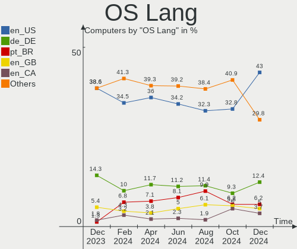
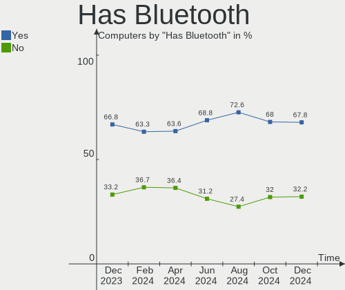
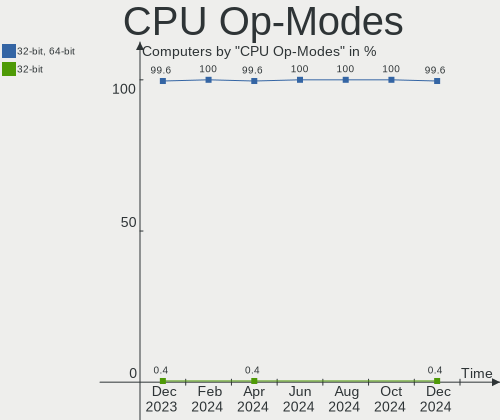
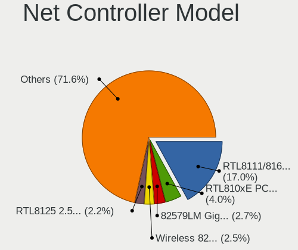

Zorin Hardware Trends
---------------------

A project to identify most popular hardware characteristics and track their change
over time based on data collected by Zorin users at https://Linux-Hardware.org.

Anyone can contribute to this report by the [hw-probe](https://github.com/linuxhw/hw-probe) tool:

    sudo -E hw-probe -all -upload

This is a report for all computer types. See also reports for [desktops](/Dist/Zorin/Desktop/README.md) and [notebooks](/Dist/Zorin/Notebook/README.md).

Full-feature report is available here: https://linux-hardware.org/?view=trends

Period: Mar, 2022.

Contents
--------

* [ System ](#system)
  - [ OS                       ](#os)
  - [ OS Family                ](#os-family)
  - [ Kernel                   ](#kernel)
  - [ Kernel Family            ](#kernel-family)
  - [ Kernel Major Ver.        ](#kernel-major-ver)
  - [ Arch                     ](#arch)
  - [ DE                       ](#de)
  - [ Display Server           ](#display-server)
  - [ Display Manager          ](#display-manager)
  - [ OS Lang                  ](#os-lang)
  - [ Boot Mode                ](#boot-mode)
  - [ Filesystem               ](#filesystem)
  - [ Part. scheme             ](#part-scheme)
  - [ Dual Boot with Linux/BSD ](#dual-boot-with-linuxbsd)
  - [ Dual Boot (Win)          ](#dual-boot-win)

* [ Board ](#board)
  - [ Vendor                   ](#vendor)
  - [ Model                    ](#model)
  - [ Model Family             ](#model-family)
  - [ MFG Year                 ](#mfg-year)
  - [ Form Factor              ](#form-factor)
  - [ Secure Boot              ](#secure-boot)
  - [ Coreboot                 ](#coreboot)
  - [ RAM Size                 ](#ram-size)
  - [ RAM Used                 ](#ram-used)
  - [ Total Drives             ](#total-drives)
  - [ Has CD-ROM               ](#has-cd-rom)
  - [ Has Ethernet             ](#has-ethernet)
  - [ Has WiFi                 ](#has-wifi)
  - [ Has Bluetooth            ](#has-bluetooth)

* [ Location ](#location)
  - [ Country                  ](#country)
  - [ City                     ](#city)

* [ Drives ](#drives)
  - [ Drive Vendor             ](#drive-vendor)
  - [ Drive Model              ](#drive-model)
  - [ HDD Vendor               ](#hdd-vendor)
  - [ SSD Vendor               ](#ssd-vendor)
  - [ Drive Kind               ](#drive-kind)
  - [ Drive Connector          ](#drive-connector)
  - [ Drive Size               ](#drive-size)
  - [ Space Total              ](#space-total)
  - [ Space Used               ](#space-used)
  - [ Malfunc. Drives          ](#malfunc-drives)
  - [ Malfunc. Drive Vendor    ](#malfunc-drive-vendor)
  - [ Malfunc. HDD Vendor      ](#malfunc-hdd-vendor)
  - [ Malfunc. Drive Kind      ](#malfunc-drive-kind)
  - [ Failed Drives            ](#failed-drives)
  - [ Failed Drive Vendor      ](#failed-drive-vendor)
  - [ Drive Status             ](#drive-status)

* [ Storage controller ](#storage-controller)
  - [ Storage Vendor           ](#storage-vendor)
  - [ Storage Model            ](#storage-model)
  - [ Storage Kind             ](#storage-kind)

* [ Processor ](#processor)
  - [ CPU Vendor               ](#cpu-vendor)
  - [ CPU Model                ](#cpu-model)
  - [ CPU Model Family         ](#cpu-model-family)
  - [ CPU Cores                ](#cpu-cores)
  - [ CPU Sockets              ](#cpu-sockets)
  - [ CPU Threads              ](#cpu-threads)
  - [ CPU Op-Modes             ](#cpu-op-modes)
  - [ CPU Microcode            ](#cpu-microcode)
  - [ CPU Microarch            ](#cpu-microarch)

* [ Graphics ](#graphics)
  - [ GPU Vendor               ](#gpu-vendor)
  - [ GPU Model                ](#gpu-model)
  - [ GPU Combo                ](#gpu-combo)
  - [ GPU Driver               ](#gpu-driver)
  - [ GPU Memory               ](#gpu-memory)

* [ Monitor ](#monitor)
  - [ Monitor Vendor           ](#monitor-vendor)
  - [ Monitor Model            ](#monitor-model)
  - [ Monitor Resolution       ](#monitor-resolution)
  - [ Monitor Diagonal         ](#monitor-diagonal)
  - [ Monitor Width            ](#monitor-width)
  - [ Aspect Ratio             ](#aspect-ratio)
  - [ Monitor Area             ](#monitor-area)
  - [ Pixel Density            ](#pixel-density)
  - [ Multiple Monitors        ](#multiple-monitors)

* [ Network ](#network)
  - [ Net Controller Vendor    ](#net-controller-vendor)
  - [ Net Controller Model     ](#net-controller-model)
  - [ Wireless Vendor          ](#wireless-vendor)
  - [ Wireless Model           ](#wireless-model)
  - [ Ethernet Vendor          ](#ethernet-vendor)
  - [ Ethernet Model           ](#ethernet-model)
  - [ Net Controller Kind      ](#net-controller-kind)
  - [ Used Controller          ](#used-controller)
  - [ NICs                     ](#nics)
  - [ IPv6                     ](#ipv6)

* [ Bluetooth ](#bluetooth)
  - [ Bluetooth Vendor         ](#bluetooth-vendor)
  - [ Bluetooth Model          ](#bluetooth-model)

* [ Sound ](#sound)
  - [ Sound Vendor             ](#sound-vendor)
  - [ Sound Model              ](#sound-model)

* [ Memory ](#memory)
  - [ Memory Vendor            ](#memory-vendor)
  - [ Memory Model             ](#memory-model)
  - [ Memory Kind              ](#memory-kind)
  - [ Memory Form Factor       ](#memory-form-factor)
  - [ Memory Size              ](#memory-size)
  - [ Memory Speed             ](#memory-speed)

* [ Printers & scanners ](#printers--scanners)
  - [ Printer Vendor           ](#printer-vendor)
  - [ Printer Model            ](#printer-model)
  - [ Scanner Vendor           ](#scanner-vendor)
  - [ Scanner Model            ](#scanner-model)

* [ Camera ](#camera)
  - [ Camera Vendor            ](#camera-vendor)
  - [ Camera Model             ](#camera-model)

* [ Security ](#security)
  - [ Fingerprint Vendor       ](#fingerprint-vendor)
  - [ Fingerprint Model        ](#fingerprint-model)
  - [ Chipcard Vendor          ](#chipcard-vendor)
  - [ Chipcard Model           ](#chipcard-model)

* [ Unsupported ](#unsupported)
  - [ Unsupported Devices      ](#unsupported-devices)
  - [ Unsupported Device Types ](#unsupported-device-types)

System
------

OS
--

Installed operating systems

| Name     | Computers | Percent |
|----------|-----------|---------|
| Zorin 16 | 164       | 93.18%  |
| Zorin 15 | 11        | 6.25%   |
| Zorin 12 | 1         | 0.57%   |

OS Family
---------

OS without a version

| Name  | Computers | Percent |
|-------|-----------|---------|
| Zorin | 176       | 100%    |

Kernel
------

Version of the Linux kernel

| Version                | Computers | Percent |
|------------------------|-----------|---------|
| 5.13.0-35-generic      | 72        | 40.91%  |
| 5.13.0-30-generic      | 45        | 25.57%  |
| 5.13.0-37-generic      | 23        | 13.07%  |
| 5.13.0-39-generic      | 9         | 5.11%   |
| 5.4.0-105-generic      | 5         | 2.84%   |
| 5.11.0-38-generic      | 5         | 2.84%   |
| 5.4.0-100-generic      | 4         | 2.27%   |
| 5.13.0-27-generic      | 4         | 2.27%   |
| 5.13.0-28-generic      | 3         | 1.7%    |
| 5.4.0-99-generic       | 1         | 0.57%   |
| 5.4.0-104-generic      | 1         | 0.57%   |
| 5.16.14-051614-generic | 1         | 0.57%   |
| 5.16.12-051612-generic | 1         | 0.57%   |
| 5.11.0-41-generic      | 1         | 0.57%   |
| 4.15.0-123-generic     | 1         | 0.57%   |

Kernel Family
-------------

Linux kernel without a distro release

| Version | Computers | Percent |
|---------|-----------|---------|
| 5.13.0  | 156       | 88.64%  |
| 5.4.0   | 11        | 6.25%   |
| 5.11.0  | 6         | 3.41%   |
| 5.16.14 | 1         | 0.57%   |
| 5.16.12 | 1         | 0.57%   |
| 4.15.0  | 1         | 0.57%   |

Kernel Major Ver.
-----------------

Linux kernel major version

| Version | Computers | Percent |
|---------|-----------|---------|
| 5.13    | 156       | 88.64%  |
| 5.4     | 11        | 6.25%   |
| 5.11    | 6         | 3.41%   |
| 5.16    | 2         | 1.14%   |
| 4.15    | 1         | 0.57%   |

Arch
----

OS architecture (x86_64, i586, etc.)

| Name   | Computers | Percent |
|--------|-----------|---------|
| x86_64 | 170       | 96.59%  |
| i686   | 6         | 3.41%   |

DE
--

Desktop Environment

| Name       | Computers | Percent |
|------------|-----------|---------|
| GNOME      | 140       | 79.55%  |
| XFCE       | 34        | 19.32%  |
| X-Cinnamon | 2         | 1.14%   |

Display Server
--------------

X11 or Wayland

| Name | Computers | Percent |
|------|-----------|---------|
| X11  | 176       | 100%    |

Display Manager
---------------

SDDM, LightDM, etc.

| Name    | Computers | Percent |
|---------|-----------|---------|
| Unknown | 132       | 75%     |
| GDM3    | 23        | 13.07%  |
| LightDM | 14        | 7.95%   |
| GDM     | 7         | 3.98%   |

OS Lang
-------

Language

| Lang  | Computers | Percent |
|-------|-----------|---------|
| en_US | 64        | 36.36%  |
| de_DE | 19        | 10.8%   |
| pt_BR | 11        | 6.25%   |
| it_IT | 8         | 4.55%   |
| en_GB | 7         | 3.98%   |
| pl_PL | 5         | 2.84%   |
| nl_NL | 5         | 2.84%   |
| fr_FR | 5         | 2.84%   |
| es_ES | 5         | 2.84%   |
| en_CA | 5         | 2.84%   |
| pt_PT | 3         | 1.7%    |
| es_MX | 3         | 1.7%    |
| es_EC | 3         | 1.7%    |
| es_AR | 3         | 1.7%    |
| en_ZA | 3         | 1.7%    |
| cs_CZ | 3         | 1.7%    |
| tr_TR | 2         | 1.14%   |
| ru_RU | 2         | 1.14%   |
| nl_BE | 2         | 1.14%   |
| en_IN | 2         | 1.14%   |
| el_GR | 2         | 1.14%   |
| de_AT | 2         | 1.14%   |
| ar_EG | 2         | 1.14%   |
| sv_SE | 1         | 0.57%   |
| hu_HU | 1         | 0.57%   |
| es_VE | 1         | 0.57%   |
| es_PR | 1         | 0.57%   |
| es_PE | 1         | 0.57%   |
| es_CO | 1         | 0.57%   |
| en_PH | 1         | 0.57%   |
| en_IL | 1         | 0.57%   |
| en_AU | 1         | 0.57%   |
| da_DK | 1         | 0.57%   |

Boot Mode
---------

EFI or BIOS

| Mode | Computers | Percent |
|------|-----------|---------|
| EFI  | 92        | 52.27%  |
| BIOS | 84        | 47.73%  |

Filesystem
----------

Type of filesystem

| Type    | Computers | Percent |
|---------|-----------|---------|
| Ext4    | 165       | 93.75%  |
| Zfs     | 5         | 2.84%   |
| Overlay | 3         | 1.7%    |
| Btrfs   | 2         | 1.14%   |
| Ext3    | 1         | 0.57%   |

Part. scheme
------------

Scheme of partitioning

| Type    | Computers | Percent |
|---------|-----------|---------|
| Unknown | 165       | 93.75%  |
| GPT     | 8         | 4.55%   |
| MBR     | 3         | 1.7%    |

Dual Boot with Linux/BSD
------------------------

Hosting more than one Linux/BSD

| Dual boot | Computers | Percent |
|-----------|-----------|---------|
| No        | 173       | 98.3%   |
| Yes       | 3         | 1.7%    |

Dual Boot (Win)
---------------

Hosting Linux and Windows

| Dual boot | Computers | Percent |
|-----------|-----------|---------|
| No        | 161       | 91.48%  |
| Yes       | 15        | 8.52%   |

Board
-----

Vendor
------

Motherboard manufacturer

| Name                | Computers | Percent |
|---------------------|-----------|---------|
| ASUSTek Computer    | 29        | 16.48%  |
| Hewlett-Packard     | 28        | 15.91%  |
| Dell                | 27        | 15.34%  |
| Lenovo              | 21        | 11.93%  |
| Acer                | 10        | 5.68%   |
| Toshiba             | 8         | 4.55%   |
| MSI                 | 8         | 4.55%   |
| Gigabyte Technology | 7         | 3.98%   |
| Apple               | 5         | 2.84%   |
| Samsung Electronics | 3         | 1.7%    |
| Intel               | 3         | 1.7%    |
| Biostar             | 3         | 1.7%    |
| ASRock              | 3         | 1.7%    |
| Insyde              | 2         | 1.14%   |
| Google              | 2         | 1.14%   |
| TYAN Computer       | 1         | 0.57%   |
| Sony                | 1         | 0.57%   |
| Shuttle             | 1         | 0.57%   |
| Quanta              | 1         | 0.57%   |
| Positivo            | 1         | 0.57%   |
| Pegatron            | 1         | 0.57%   |
| Panasonic           | 1         | 0.57%   |
| Packard Bell        | 1         | 0.57%   |
| Notebook            | 1         | 0.57%   |
| Microsoft           | 1         | 0.57%   |
| GMKTEC              | 1         | 0.57%   |
| Gateway             | 1         | 0.57%   |
| Fujitsu             | 1         | 0.57%   |
| Chuwi               | 1         | 0.57%   |
| BGH e-Nova          | 1         | 0.57%   |
| BESSTAR Tech        | 1         | 0.57%   |
| AXDIA International | 1         | 0.57%   |

Model
-----

Motherboard model

| Name                                       | Computers | Percent |
|--------------------------------------------|-----------|---------|
| HP ProBook 640 G1                          | 2         | 1.14%   |
| HP Notebook                                | 2         | 1.14%   |
| Dell Inspiron 5400 AIO                     | 2         | 1.14%   |
| ASUS All Series                            | 2         | 1.14%   |
| Unknown                                    | 2         | 1.14%   |
| TYAN CELSIUS R650                          | 1         | 0.57%   |
| Toshiba Satellite S55t-C                   | 1         | 0.57%   |
| Toshiba Satellite M505                     | 1         | 0.57%   |
| Toshiba Satellite L875                     | 1         | 0.57%   |
| Toshiba Satellite C855                     | 1         | 0.57%   |
| Toshiba Satellite C660                     | 1         | 0.57%   |
| Toshiba Satellite C55-C                    | 1         | 0.57%   |
| Toshiba Satellite C50D-A-14E               | 1         | 0.57%   |
| Toshiba Satellite A660                     | 1         | 0.57%   |
| Sony SVT13125CLS                           | 1         | 0.57%   |
| Shuttle X50V2PLUS                          | 1         | 0.57%   |
| Samsung Galaxy Book 12 LTE                 | 1         | 0.57%   |
| Samsung 930QCA                             | 1         | 0.57%   |
| Samsung 300E4A/300E5A/300E7A/3430EA/3530EA | 1         | 0.57%   |
| Quanta CA27                                | 1         | 0.57%   |
| Positivo C14CU51                           | 1         | 0.57%   |
| Pegatron NY428AA-ABA p6110f                | 1         | 0.57%   |
| Panasonic CF-31ACJAXPM                     | 1         | 0.57%   |
| Packard Bell EasyNote LS11HR               | 1         | 0.57%   |
| Notebook NJ50_70CU                         | 1         | 0.57%   |
| MSI MS-7D41                                | 1         | 0.57%   |
| MSI MS-7C37                                | 1         | 0.57%   |
| MSI MS-7A15                                | 1         | 0.57%   |
| MSI MS-7823                                | 1         | 0.57%   |
| MSI MS-7721                                | 1         | 0.57%   |
| MSI MS-7695                                | 1         | 0.57%   |
| MSI MS-7512                                | 1         | 0.57%   |
| MSI CR643                                  | 1         | 0.57%   |
| Microsoft Surface Pro 4                    | 1         | 0.57%   |
| Lenovo V110-15IAP 80TG                     | 1         | 0.57%   |
| Lenovo ThinkPad X220 Tablet 42984TU        | 1         | 0.57%   |
| Lenovo ThinkPad T520 424067G               | 1         | 0.57%   |
| Lenovo ThinkPad SL500 274677G              | 1         | 0.57%   |
| Lenovo ThinkCentre M91p 4524WAP            | 1         | 0.57%   |
| Lenovo Legion 5 15ACH6H 82JU               | 1         | 0.57%   |
| Lenovo IdeaPad Z580                        | 1         | 0.57%   |
| Lenovo IdeaPad Y550 20017                  | 1         | 0.57%   |
| Lenovo IdeaPad Slim 1-14AST-05 81VS        | 1         | 0.57%   |
| Lenovo IdeaPad S145-15IIL 82DJ             | 1         | 0.57%   |
| Lenovo IdeaPad S145-15IIL 82C5             | 1         | 0.57%   |
| Lenovo IdeaPad S145-14IWL 81MU             | 1         | 0.57%   |
| Lenovo IdeaPad Flex-14API 81SS             | 1         | 0.57%   |
| Lenovo IdeaPad 5 Pro 16ACH6 82L5           | 1         | 0.57%   |
| Lenovo IdeaPad 5 15ARE05 81YQ              | 1         | 0.57%   |
| Lenovo IdeaPad 330-15IKB 81DE              | 1         | 0.57%   |
| Lenovo IdeaPad 330-14AST 81D5              | 1         | 0.57%   |
| Lenovo IdeaPad 320S-15IKB 81BQ             | 1         | 0.57%   |
| Lenovo HuronRiver Platform                 | 1         | 0.57%   |
| Lenovo G560 0679                           | 1         | 0.57%   |
| Lenovo 500w Gen 3 82J3                     | 1         | 0.57%   |
| Intel NUC7i3BNH                            | 1         | 0.57%   |
| Intel H61                                  | 1         | 0.57%   |
| Intel DH55HC AAE70933-505                  | 1         | 0.57%   |
| Insyde i101c                               | 1         | 0.57%   |
| Insyde GeminiLake                          | 1         | 0.57%   |

Model Family
------------

Motherboard model prefix

| Name                   | Computers | Percent |
|------------------------|-----------|---------|
| Lenovo IdeaPad         | 12        | 6.82%   |
| Dell Inspiron          | 10        | 5.68%   |
| Toshiba Satellite      | 8         | 4.55%   |
| HP ProBook             | 6         | 3.41%   |
| HP Pavilion            | 6         | 3.41%   |
| Dell Vostro            | 5         | 2.84%   |
| Acer Aspire            | 5         | 2.84%   |
| HP Laptop              | 4         | 2.27%   |
| Dell Latitude          | 4         | 2.27%   |
| Lenovo ThinkPad        | 3         | 1.7%    |
| HP Compaq              | 3         | 1.7%    |
| Dell Precision         | 3         | 1.7%    |
| ASUS VivoBook          | 3         | 1.7%    |
| HP Notebook            | 2         | 1.14%   |
| Dell OptiPlex          | 2         | 1.14%   |
| ASUS ZenBook           | 2         | 1.14%   |
| ASUS TUF               | 2         | 1.14%   |
| ASUS All               | 2         | 1.14%   |
| Unknown                | 2         | 1.14%   |
| TYAN CELSIUS           | 1         | 0.57%   |
| Sony SVT13125CLS       | 1         | 0.57%   |
| Shuttle X50V2PLUS      | 1         | 0.57%   |
| Samsung Galaxy         | 1         | 0.57%   |
| Samsung 930QCA         | 1         | 0.57%   |
| Samsung 300E4A         | 1         | 0.57%   |
| Quanta CA27            | 1         | 0.57%   |
| Positivo C14CU51       | 1         | 0.57%   |
| Pegatron NY428AA-ABA   | 1         | 0.57%   |
| Panasonic CF-31ACJAXPM | 1         | 0.57%   |
| Packard Bell EasyNote  | 1         | 0.57%   |
| Notebook NJ50          | 1         | 0.57%   |
| MSI MS-7D41            | 1         | 0.57%   |
| MSI MS-7C37            | 1         | 0.57%   |
| MSI MS-7A15            | 1         | 0.57%   |
| MSI MS-7823            | 1         | 0.57%   |
| MSI MS-7721            | 1         | 0.57%   |
| MSI MS-7695            | 1         | 0.57%   |
| MSI MS-7512            | 1         | 0.57%   |
| MSI CR643              | 1         | 0.57%   |
| Microsoft Surface      | 1         | 0.57%   |
| Lenovo V110-15IAP      | 1         | 0.57%   |
| Lenovo ThinkCentre     | 1         | 0.57%   |
| Lenovo Legion          | 1         | 0.57%   |
| Lenovo HuronRiver      | 1         | 0.57%   |
| Lenovo G560            | 1         | 0.57%   |
| Lenovo 500w            | 1         | 0.57%   |
| Intel NUC7i3BNH        | 1         | 0.57%   |
| Intel H61              | 1         | 0.57%   |
| Intel DH55HC           | 1         | 0.57%   |
| Insyde i101c           | 1         | 0.57%   |
| Insyde GeminiLake      | 1         | 0.57%   |
| HP Z220                | 1         | 0.57%   |
| HP Stream              | 1         | 0.57%   |
| HP ENVY                | 1         | 0.57%   |
| HP EliteDesk           | 1         | 0.57%   |
| HP EliteBook           | 1         | 0.57%   |
| HP All-in-One          | 1         | 0.57%   |
| HP 1000                | 1         | 0.57%   |
| Google Panther         | 1         | 0.57%   |
| Google Buddy           | 1         | 0.57%   |

MFG Year
--------

Motherboard manufacture year

| Year | Computers | Percent |
|------|-----------|---------|
| 2011 | 20        | 11.36%  |
| 2021 | 19        | 10.8%   |
| 2018 | 16        | 9.09%   |
| 2012 | 16        | 9.09%   |
| 2013 | 13        | 7.39%   |
| 2017 | 12        | 6.82%   |
| 2010 | 12        | 6.82%   |
| 2020 | 11        | 6.25%   |
| 2009 | 10        | 5.68%   |
| 2014 | 9         | 5.11%   |
| 2019 | 8         | 4.55%   |
| 2015 | 8         | 4.55%   |
| 2008 | 6         | 3.41%   |
| 2016 | 5         | 2.84%   |
| 2007 | 5         | 2.84%   |
| 2006 | 4         | 2.27%   |
| 2022 | 2         | 1.14%   |

Form Factor
-----------

Physical design of the computer

| Name        | Computers | Percent |
|-------------|-----------|---------|
| Notebook    | 103       | 58.52%  |
| Desktop     | 52        | 29.55%  |
| All in one  | 10        | 5.68%   |
| Mini pc     | 5         | 2.84%   |
| Tablet      | 3         | 1.7%    |
| Convertible | 3         | 1.7%    |

Secure Boot
-----------

Enabled or disabled

| State    | Computers | Percent |
|----------|-----------|---------|
| Disabled | 149       | 84.66%  |
| Enabled  | 27        | 15.34%  |

Coreboot
--------

Have coreboot on board

| Used | Computers | Percent |
|------|-----------|---------|
| No   | 174       | 98.86%  |
| Yes  | 2         | 1.14%   |

RAM Size
--------

Total RAM memory

| Size in GB  | Computers | Percent |
|-------------|-----------|---------|
| 4.01-8.0    | 53        | 30.11%  |
| 3.01-4.0    | 45        | 25.57%  |
| 8.01-16.0   | 32        | 18.18%  |
| 16.01-24.0  | 26        | 14.77%  |
| 1.01-2.0    | 9         | 5.11%   |
| 32.01-64.0  | 8         | 4.55%   |
| 2.01-3.0    | 1         | 0.57%   |
| 64.01-256.0 | 1         | 0.57%   |
| 0.51-1.0    | 1         | 0.57%   |

RAM Used
--------

Used RAM memory

| Used GB   | Computers | Percent |
|-----------|-----------|---------|
| 1.01-2.0  | 73        | 41.48%  |
| 2.01-3.0  | 51        | 28.98%  |
| 4.01-8.0  | 23        | 13.07%  |
| 3.01-4.0  | 20        | 11.36%  |
| 0.51-1.0  | 7         | 3.98%   |
| 8.01-16.0 | 2         | 1.14%   |

Total Drives
------------

Number of drives on board

| Drives | Computers | Percent |
|--------|-----------|---------|
| 1      | 113       | 64.2%   |
| 2      | 42        | 23.86%  |
| 3      | 10        | 5.68%   |
| 4      | 5         | 2.84%   |
| 5      | 2         | 1.14%   |
| 0      | 2         | 1.14%   |
| 7      | 1         | 0.57%   |
| 6      | 1         | 0.57%   |

Has CD-ROM
----------

Has CD-ROM on board

| Presented | Computers | Percent |
|-----------|-----------|---------|
| No        | 90        | 51.14%  |
| Yes       | 86        | 48.86%  |

Has Ethernet
------------

Has Ethernet on board

| Presented | Computers | Percent |
|-----------|-----------|---------|
| Yes       | 145       | 82.39%  |
| No        | 31        | 17.61%  |

Has WiFi
--------

Has WiFi module

| Presented | Computers | Percent |
|-----------|-----------|---------|
| Yes       | 140       | 79.55%  |
| No        | 36        | 20.45%  |

Has Bluetooth
-------------

Has Bluetooth module

| Presented | Computers | Percent |
|-----------|-----------|---------|
| Yes       | 97        | 55.11%  |
| No        | 79        | 44.89%  |

Location
--------

Country
-------

Geographic location (country)

| Country             | Computers | Percent |
|---------------------|-----------|---------|
| USA                 | 43        | 24.43%  |
| Germany             | 16        | 9.09%   |
| Brazil              | 14        | 7.95%   |
| Italy               | 8         | 4.55%   |
| Canada              | 8         | 4.55%   |
| UK                  | 7         | 3.98%   |
| Netherlands         | 6         | 3.41%   |
| Poland              | 5         | 2.84%   |
| Mexico              | 5         | 2.84%   |
| France              | 5         | 2.84%   |
| Turkey              | 4         | 2.27%   |
| Spain               | 4         | 2.27%   |
| Portugal            | 4         | 2.27%   |
| South Africa        | 3         | 1.7%    |
| Russia              | 3         | 1.7%    |
| Ecuador             | 3         | 1.7%    |
| Czechia             | 3         | 1.7%    |
| Austria             | 3         | 1.7%    |
| Argentina           | 3         | 1.7%    |
| Switzerland         | 2         | 1.14%   |
| Sweden              | 2         | 1.14%   |
| Romania             | 2         | 1.14%   |
| India               | 2         | 1.14%   |
| Greece              | 2         | 1.14%   |
| Vietnam             | 1         | 0.57%   |
| U.S. Virgin Islands | 1         | 0.57%   |
| Taiwan              | 1         | 0.57%   |
| Slovenia            | 1         | 0.57%   |
| Slovakia            | 1         | 0.57%   |
| Saudi Arabia        | 1         | 0.57%   |
| Puerto Rico         | 1         | 0.57%   |
| Philippines         | 1         | 0.57%   |
| Peru                | 1         | 0.57%   |
| Palestine           | 1         | 0.57%   |
| Morocco             | 1         | 0.57%   |
| Lithuania           | 1         | 0.57%   |
| Israel              | 1         | 0.57%   |
| Hungary             | 1         | 0.57%   |
| Denmark             | 1         | 0.57%   |
| Colombia            | 1         | 0.57%   |
| Bulgaria            | 1         | 0.57%   |
| Belgium             | 1         | 0.57%   |
| Australia           | 1         | 0.57%   |

City
----

Geographic location (city)

| City                           | Computers | Percent |
|--------------------------------|-----------|---------|
| Athens                         | 4         | 2.27%   |
| New York                       | 3         | 1.7%    |
| Vienna                         | 2         | 1.14%   |
| Thousand Oaks                  | 2         | 1.14%   |
| St Petersburg                  | 2         | 1.14%   |
| Rio de Janeiro                 | 2         | 1.14%   |
| Quito                          | 2         | 1.14%   |
| Prague                         | 2         | 1.14%   |
| Johannesburg                   | 2         | 1.14%   |
| Delft                          | 2         | 1.14%   |
| Cancún                        | 2         | 1.14%   |
| Boise                          | 2         | 1.14%   |
| Birmingham                     | 2         | 1.14%   |
| Zurich                         | 1         | 0.57%   |
| Żory                          | 1         | 0.57%   |
| Zeven                          | 1         | 0.57%   |
| Zell an der Pram               | 1         | 0.57%   |
| Yukon                          | 1         | 0.57%   |
| Wichita                        | 1         | 0.57%   |
| Werneck                        | 1         | 0.57%   |
| Watertown                      | 1         | 0.57%   |
| Warsaw                         | 1         | 0.57%   |
| Vrhnika                        | 1         | 0.57%   |
| Vilnius                        | 1         | 0.57%   |
| Villeparisis                   | 1         | 0.57%   |
| Vila Nova de Gaia              | 1         | 0.57%   |
| Velikiye Luki                  | 1         | 0.57%   |
| Undi                           | 1         | 0.57%   |
| Turin                          | 1         | 0.57%   |
| Toronto                        | 1         | 0.57%   |
| Tlaxcala City                  | 1         | 0.57%   |
| The Hague                      | 1         | 0.57%   |
| Telford                        | 1         | 0.57%   |
| Tel Aviv                       | 1         | 0.57%   |
| Taubate                        | 1         | 0.57%   |
| Tarquinia                      | 1         | 0.57%   |
| Taipei                         | 1         | 0.57%   |
| Suceava                        | 1         | 0.57%   |
| Strasbourg                     | 1         | 0.57%   |
| Stockton                       | 1         | 0.57%   |
| Stockholm                      | 1         | 0.57%   |
| Sheffield                      | 1         | 0.57%   |
| Schiedam                       | 1         | 0.57%   |
| Sao Paulo                      | 1         | 0.57%   |
| Santo Domingo de los Colorados | 1         | 0.57%   |
| Santander                      | 1         | 0.57%   |
| Santa Luzia                    | 1         | 0.57%   |
| Sandton                        | 1         | 0.57%   |
| San Juan                       | 1         | 0.57%   |
| Salé                          | 1         | 0.57%   |
| Royersford                     | 1         | 0.57%   |
| Rotterdam                      | 1         | 0.57%   |
| Roosendaal                     | 1         | 0.57%   |
| Rome                           | 1         | 0.57%   |
| Riyadh                         | 1         | 0.57%   |
| Riverside                      | 1         | 0.57%   |
| Rimavská Sobota               | 1         | 0.57%   |
| Richmond                       | 1         | 0.57%   |
| Reading                        | 1         | 0.57%   |
| Ratingen                       | 1         | 0.57%   |

Drives
------

Drive Vendor
------------

Hard drive vendors

| Vendor                         | Computers | Drives | Percent |
|--------------------------------|-----------|--------|---------|
| Seagate                        | 43        | 49     | 17.92%  |
| Samsung Electronics            | 32        | 34     | 13.33%  |
| WDC                            | 31        | 37     | 12.92%  |
| Toshiba                        | 18        | 18     | 7.5%    |
| SanDisk                        | 15        | 15     | 6.25%   |
| Kingston                       | 15        | 16     | 6.25%   |
| Unknown                        | 14        | 17     | 5.83%   |
| Hitachi                        | 13        | 13     | 5.42%   |
| SK Hynix                       | 7         | 7      | 2.92%   |
| Intel                          | 4         | 5      | 1.67%   |
| HGST                           | 4         | 4      | 1.67%   |
| JMicron                        | 3         | 3      | 1.25%   |
| Crucial                        | 3         | 3      | 1.25%   |
| China                          | 3         | 3      | 1.25%   |
| Apple                          | 3         | 3      | 1.25%   |
| SPCC                           | 2         | 2      | 0.83%   |
| Silicon Motion                 | 2         | 2      | 0.83%   |
| Patriot                        | 2         | 2      | 0.83%   |
| OCZ                            | 2         | 2      | 0.83%   |
| Micron/Crucial Technology      | 2         | 2      | 0.83%   |
| Intenso                        | 2         | 2      | 0.83%   |
| GOODRAM                        | 2         | 2      | 0.83%   |
| Gigabyte Technology            | 2         | 2      | 0.83%   |
| WD MediaMax                    | 1         | 1      | 0.42%   |
| USB30                          | 1         | 1      | 0.42%   |
| Transcend                      | 1         | 1      | 0.42%   |
| Solid State Storage Technology | 1         | 1      | 0.42%   |
| Realtek                        | 1         | 1      | 0.42%   |
| PNY                            | 1         | 1      | 0.42%   |
| Phison                         | 1         | 1      | 0.42%   |
| Netac SS                       | 1         | 1      | 0.42%   |
| Netac                          | 1         | 1      | 0.42%   |
| LITEONIT                       | 1         | 1      | 0.42%   |
| LITEON                         | 1         | 1      | 0.42%   |
| Lexar                          | 1         | 1      | 0.42%   |
| KIOXIA-EXCERIA                 | 1         | 1      | 0.42%   |
| KIOXIA                         | 1         | 1      | 0.42%   |
| Hewlett-Packard                | 1         | 1      | 0.42%   |
| A-DATA Technology              | 1         | 1      | 0.42%   |

Drive Model
-----------

Hard drive models

| Model                               | Computers | Percent |
|-------------------------------------|-----------|---------|
| Unknown MMC Card  64GB              | 6         | 2.34%   |
| Seagate ST1000LM035-1RK172 1TB      | 5         | 1.95%   |
| Seagate ST1000LM024 HN-M101MBB 1TB  | 4         | 1.56%   |
| Seagate ST500LT012-1DG142 500GB     | 3         | 1.17%   |
| Sandisk NVMe SSD Drive 256GB        | 3         | 1.17%   |
| Samsung SSD 860 EVO 500GB           | 3         | 1.17%   |
| Samsung NVMe SSD Drive 256GB        | 3         | 1.17%   |
| WDC WD3200BPVT-24ZEST0 320GB        | 2         | 0.78%   |
| Unknown MMC Card  32GB              | 2         | 0.78%   |
| Unknown MMC Card  128GB             | 2         | 0.78%   |
| Toshiba MQ04ABF100 1TB              | 2         | 0.78%   |
| Toshiba MQ01ABF050 500GB            | 2         | 0.78%   |
| Toshiba MQ01ABD100 1TB              | 2         | 0.78%   |
| Silicon Motion NVMe SSD Drive 512GB | 2         | 0.78%   |
| Seagate ST500LM021-1KJ152 500GB     | 2         | 0.78%   |
| Seagate ST500DM002-1BD142 500GB     | 2         | 0.78%   |
| Seagate ST1000LX015-1U7172 1TB      | 2         | 0.78%   |
| SanDisk SSD PLUS 240GB              | 2         | 0.78%   |
| Samsung NVMe SSD Drive 128GB        | 2         | 0.78%   |
| Samsung HD103SJ 1TB                 | 2         | 0.78%   |
| Micron/Crucial NVMe SSD Drive 500GB | 2         | 0.78%   |
| Kingston SA400S37240G 240GB SSD     | 2         | 0.78%   |
| JMicron Generic 2TB                 | 2         | 0.78%   |
| Intel NVMe SSD Drive 512GB          | 2         | 0.78%   |
| Hitachi HDS721050CLA362 500GB       | 2         | 0.78%   |
| Crucial CT240BX500SSD1 240GB        | 2         | 0.78%   |
| China SATA3 1TB SSD                 | 2         | 0.78%   |
| WDC WDS500G2B0A-00SM50 500GB SSD    | 1         | 0.39%   |
| WDC WDS100T2B0B-00YS70 1TB SSD      | 1         | 0.39%   |
| WDC WD800BEVS-22RST0 80GB           | 1         | 0.39%   |
| WDC WD7500BPKX-80HPJT0 752GB        | 1         | 0.39%   |
| WDC WD7500AADS-00M2B0 752GB         | 1         | 0.39%   |
| WDC WD6400BPVT-60HXZT1 640GB        | 1         | 0.39%   |
| WDC WD5003ABYX-01WERA1 500GB        | 1         | 0.39%   |
| WDC WD5000LUCT-63Y8HY0 500GB        | 1         | 0.39%   |
| WDC WD5000LPVX-22V0TT0 500GB        | 1         | 0.39%   |
| WDC WD5000LPCX-22VHAT1 500GB        | 1         | 0.39%   |
| WDC WD5000AZRX-00A8LB0 500GB        | 1         | 0.39%   |
| WDC WD5000AAKX-60U6AA0 500GB        | 1         | 0.39%   |
| WDC WD40EFZX-68AWUN0 4TB            | 1         | 0.39%   |
| WDC WD40 EFRX-68WT0N0 4TB           | 1         | 0.39%   |
| WDC WD3200BPVT-22JJ5T0 320GB        | 1         | 0.39%   |
| WDC WD3200BPVT-00JJ5T0 320GB        | 1         | 0.39%   |
| WDC WD3200BEVT-75A23T0 320GB        | 1         | 0.39%   |
| WDC WD3200BEVT-22ZCT0 320GB         | 1         | 0.39%   |
| WDC WD3200AAJS-00L7A0 320GB         | 1         | 0.39%   |
| WDC WD30EZRX-00DC0B0 3TB            | 1         | 0.39%   |
| WDC WD2500BEKT-60A25T1 250GB        | 1         | 0.39%   |
| WDC WD2500AAJS-60Z0A0 250GB         | 1         | 0.39%   |
| WDC WD20SPZX-08UA7 2TB              | 1         | 0.39%   |
| WDC WD2000FYYZ-01UL1B2 2TB          | 1         | 0.39%   |
| WDC WD1600BEVT-00A1TT0 160GB        | 1         | 0.39%   |
| WDC WD10SPZX-24Z10 1TB              | 1         | 0.39%   |
| WDC WD10SPCX-24HWST1 1TB            | 1         | 0.39%   |
| WDC WD10JPVX-75JC3T0 1TB            | 1         | 0.39%   |
| WDC WD10JPVX-60JC3T0 1TB            | 1         | 0.39%   |
| WDC WD10EZEX-60WN4A1 1TB            | 1         | 0.39%   |
| WDC WD10EZEX-00WN4A0 1TB            | 1         | 0.39%   |
| WDC WD1001FALS-00J7B0 1TB           | 1         | 0.39%   |
| WDC WD10 EADS-65M2B0 1TB            | 1         | 0.39%   |

HDD Vendor
----------

Hard disk drive vendors

| Vendor              | Computers | Drives | Percent |
|---------------------|-----------|--------|---------|
| Seagate             | 43        | 48     | 38.39%  |
| WDC                 | 30        | 34     | 26.79%  |
| Toshiba             | 14        | 14     | 12.5%   |
| Hitachi             | 13        | 13     | 11.61%  |
| Samsung Electronics | 4         | 4      | 3.57%   |
| HGST                | 4         | 4      | 3.57%   |
| Unknown             | 1         | 1      | 0.89%   |
| JMicron             | 1         | 1      | 0.89%   |
| Hewlett-Packard     | 1         | 1      | 0.89%   |
| Apple               | 1         | 1      | 0.89%   |

SSD Vendor
----------

Solid state drive vendors

| Vendor              | Computers | Drives | Percent |
|---------------------|-----------|--------|---------|
| Samsung Electronics | 16        | 17     | 20.51%  |
| Kingston            | 13        | 13     | 16.67%  |
| SanDisk             | 9         | 9      | 11.54%  |
| Toshiba             | 3         | 3      | 3.85%   |
| SK Hynix            | 3         | 3      | 3.85%   |
| Crucial             | 3         | 3      | 3.85%   |
| China               | 3         | 3      | 3.85%   |
| WDC                 | 2         | 2      | 2.56%   |
| SPCC                | 2         | 2      | 2.56%   |
| Patriot             | 2         | 2      | 2.56%   |
| OCZ                 | 2         | 2      | 2.56%   |
| JMicron             | 2         | 2      | 2.56%   |
| GOODRAM             | 2         | 2      | 2.56%   |
| Gigabyte Technology | 2         | 2      | 2.56%   |
| Apple               | 2         | 2      | 2.56%   |
| USB30               | 1         | 1      | 1.28%   |
| Transcend           | 1         | 1      | 1.28%   |
| Seagate             | 1         | 1      | 1.28%   |
| PNY                 | 1         | 1      | 1.28%   |
| Netac               | 1         | 1      | 1.28%   |
| LITEONIT            | 1         | 1      | 1.28%   |
| LITEON              | 1         | 1      | 1.28%   |
| Lexar               | 1         | 1      | 1.28%   |
| KIOXIA-EXCERIA      | 1         | 1      | 1.28%   |
| Intenso             | 1         | 1      | 1.28%   |
| Intel               | 1         | 1      | 1.28%   |
| A-DATA Technology   | 1         | 1      | 1.28%   |

Drive Kind
----------

HDD or SSD

| Kind    | Computers | Drives | Percent |
|---------|-----------|--------|---------|
| HDD     | 101       | 121    | 44.69%  |
| SSD     | 73        | 79     | 32.3%   |
| NVMe    | 33        | 37     | 14.6%   |
| MMC     | 14        | 16     | 6.19%   |
| Unknown | 5         | 6      | 2.21%   |

Drive Connector
---------------

SATA, SAS, NVMe, etc.

| Type | Computers | Drives | Percent |
|------|-----------|--------|---------|
| SATA | 145       | 191    | 71.08%  |
| NVMe | 33        | 36     | 16.18%  |
| MMC  | 14        | 16     | 6.86%   |
| SAS  | 12        | 16     | 5.88%   |

Drive Size
----------

Size of hard drive

| Size in TB | Computers | Drives | Percent |
|------------|-----------|--------|---------|
| 0.01-0.5   | 107       | 127    | 62.57%  |
| 0.51-1.0   | 42        | 48     | 24.56%  |
| 1.01-2.0   | 12        | 13     | 7.02%   |
| 3.01-4.0   | 5         | 7      | 2.92%   |
| 2.01-3.0   | 3         | 3      | 1.75%   |
| 4.01-10.0  | 2         | 2      | 1.17%   |

Space Total
-----------

Amount of disk space available on the file system

| Size in GB     | Computers | Percent |
|----------------|-----------|---------|
| 101-250        | 57        | 32.39%  |
| 251-500        | 47        | 26.7%   |
| 501-1000       | 25        | 14.2%   |
| 51-100         | 12        | 6.82%   |
| More than 3000 | 9         | 5.11%   |
| 21-50          | 8         | 4.55%   |
| 1-20           | 7         | 3.98%   |
| 2001-3000      | 4         | 2.27%   |
| 1001-2000      | 4         | 2.27%   |
| Unknown        | 3         | 1.7%    |

Space Used
----------

Amount of used disk space

| Used GB        | Computers | Percent |
|----------------|-----------|---------|
| 1-20           | 75        | 42.61%  |
| 21-50          | 52        | 29.55%  |
| 51-100         | 16        | 9.09%   |
| 101-250        | 11        | 6.25%   |
| 251-500        | 7         | 3.98%   |
| 501-1000       | 6         | 3.41%   |
| More than 3000 | 3         | 1.7%    |
| Unknown        | 3         | 1.7%    |
| 2001-3000      | 2         | 1.14%   |
| 1001-2000      | 1         | 0.57%   |

Malfunc. Drives
---------------

Drive models with a malfunction

| Model                           | Computers | Drives | Percent |
|---------------------------------|-----------|--------|---------|
| WDC WD3200AAJS-00L7A0 320GB     | 1         | 1      | 50%     |
| Kingston SNS4151S316GD 16GB SSD | 1         | 1      | 50%     |

Malfunc. Drive Vendor
---------------------

Vendors of faulty drives

| Vendor   | Computers | Drives | Percent |
|----------|-----------|--------|---------|
| WDC      | 1         | 1      | 50%     |
| Kingston | 1         | 1      | 50%     |

Malfunc. HDD Vendor
-------------------

Vendors of faulty HDD drives

| Vendor | Computers | Drives | Percent |
|--------|-----------|--------|---------|
| WDC    | 1         | 1      | 100%    |

Malfunc. Drive Kind
-------------------

Kinds of faulty drives

| Kind | Computers | Drives | Percent |
|------|-----------|--------|---------|
| SSD  | 1         | 1      | 50%     |
| HDD  | 1         | 1      | 50%     |

Failed Drives
-------------

Failed drive models

Zero info for selected period =(

Failed Drive Vendor
-------------------

Failed drive vendors

Zero info for selected period =(

Drive Status
------------

Number of failed and malfunc. drives

| Status   | Computers | Drives | Percent |
|----------|-----------|--------|---------|
| Detected | 164       | 248    | 93.71%  |
| Works    | 9         | 9      | 5.14%   |
| Malfunc  | 2         | 2      | 1.14%   |

Storage controller
------------------

Storage Vendor
--------------

Storage controller vendors

| Vendor                           | Computers | Percent |
|----------------------------------|-----------|---------|
| Intel                            | 129       | 63.86%  |
| AMD                              | 27        | 13.37%  |
| Samsung Electronics              | 13        | 6.44%   |
| Sandisk                          | 5         | 2.48%   |
| Nvidia                           | 4         | 1.98%   |
| ASMedia Technology               | 4         | 1.98%   |
| SK Hynix                         | 3         | 1.49%   |
| Kingston Technology Company      | 3         | 1.49%   |
| JMicron Technology               | 3         | 1.49%   |
| Silicon Motion                   | 2         | 0.99%   |
| Micron/Crucial Technology        | 2         | 0.99%   |
| VIA Technologies                 | 1         | 0.5%    |
| Toshiba America Info Systems     | 1         | 0.5%    |
| Solid State Storage Technology   | 1         | 0.5%    |
| Silicon Integrated Systems [SiS] | 1         | 0.5%    |
| Phison Electronics               | 1         | 0.5%    |
| Marvell Technology Group         | 1         | 0.5%    |
| KIOXIA                           | 1         | 0.5%    |

Storage Model
-------------

Storage controller models

| Model                                                                                   | Computers | Percent |
|-----------------------------------------------------------------------------------------|-----------|---------|
| AMD FCH SATA Controller [AHCI mode]                                                     | 19        | 8.37%   |
| Intel 7 Series Chipset Family 6-port SATA Controller [AHCI mode]                        | 13        | 5.73%   |
| Intel 82801 Mobile SATA Controller [RAID mode]                                          | 12        | 5.29%   |
| Intel 8 Series/C220 Series Chipset Family 6-port SATA Controller 1 [AHCI mode]          | 11        | 4.85%   |
| Intel Sunrise Point-LP SATA Controller [AHCI mode]                                      | 8         | 3.52%   |
| Intel 6 Series/C200 Series Chipset Family 6 port Mobile SATA AHCI Controller            | 8         | 3.52%   |
| Intel 6 Series/C200 Series Chipset Family 6 port Desktop SATA AHCI Controller           | 8         | 3.52%   |
| Samsung NVMe SSD Controller 980                                                         | 5         | 2.2%    |
| Intel SATA Controller [RAID mode]                                                       | 5         | 2.2%    |
| Samsung NVMe SSD Controller SM981/PM981/PM983                                           | 4         | 1.76%   |
| Intel HM170/QM170 Chipset SATA Controller [AHCI Mode]                                   | 4         | 1.76%   |
| Intel 82801IBM/IEM (ICH9M/ICH9M-E) 4 port SATA Controller [AHCI mode]                   | 4         | 1.76%   |
| Intel 8 Series SATA Controller 1 [AHCI mode]                                            | 4         | 1.76%   |
| Intel 5 Series/3400 Series Chipset 6 port SATA AHCI Controller                          | 4         | 1.76%   |
| Intel 5 Series/3400 Series Chipset 4 port SATA AHCI Controller                          | 4         | 1.76%   |
| ASMedia ASM1062 Serial ATA Controller                                                   | 4         | 1.76%   |
| Sandisk WD Blue SN550 NVMe SSD                                                          | 3         | 1.32%   |
| Intel Wildcat Point-LP SATA Controller [AHCI Mode]                                      | 3         | 1.32%   |
| Intel Q170/Q150/B150/H170/H110/Z170/CM236 Chipset SATA Controller [AHCI Mode]           | 3         | 1.32%   |
| Intel 82801GBM/GHM (ICH7-M Family) SATA Controller [IDE mode]                           | 3         | 1.32%   |
| AMD SB7x0/SB8x0/SB9x0 SATA Controller [AHCI mode]                                       | 3         | 1.32%   |
| Silicon Motion SM2263EN/SM2263XT SSD Controller                                         | 2         | 0.88%   |
| Nvidia MCP79 AHCI Controller                                                            | 2         | 0.88%   |
| Nvidia MCP51 Serial ATA Controller                                                      | 2         | 0.88%   |
| Nvidia MCP51 IDE                                                                        | 2         | 0.88%   |
| JMicron JMB363 SATA/IDE Controller                                                      | 2         | 0.88%   |
| Intel Tiger Lake-LP SATA Controller [AHCI mode]                                         | 2         | 0.88%   |
| Intel Non-Volatile memory controller                                                    | 2         | 0.88%   |
| Intel Ice Lake-LP SATA Controller [AHCI mode]                                           | 2         | 0.88%   |
| Intel Celeron/Pentium Silver Processor SATA Controller                                  | 2         | 0.88%   |
| Intel Celeron N3350/Pentium N4200/Atom E3900 Series SATA AHCI Controller                | 2         | 0.88%   |
| Intel Alder Lake-S PCH SATA Controller [AHCI Mode]                                      | 2         | 0.88%   |
| Intel 82801IR/IO/IH (ICH9R/DO/DH) 4 port SATA Controller [IDE mode]                     | 2         | 0.88%   |
| Intel 82801IBM/IEM (ICH9M/ICH9M-E) 2 port SATA Controller [IDE mode]                    | 2         | 0.88%   |
| Intel 82801I (ICH9 Family) 2 port SATA Controller [IDE mode]                            | 2         | 0.88%   |
| Intel 82801HM/HEM (ICH8M/ICH8M-E) IDE Controller                                        | 2         | 0.88%   |
| Intel 6 Series/C200 Series Chipset Family Desktop SATA Controller (IDE mode, ports 4-5) | 2         | 0.88%   |
| Intel 6 Series/C200 Series Chipset Family Desktop SATA Controller (IDE mode, ports 0-3) | 2         | 0.88%   |
| AMD X370 Series Chipset SATA Controller                                                 | 2         | 0.88%   |
| AMD SB7x0/SB8x0/SB9x0 IDE Controller                                                    | 2         | 0.88%   |
| VIA VT82C586A/B/VT82C686/A/B/VT823x/A/C PIPC Bus Master IDE                             | 1         | 0.44%   |
| VIA Serial ATA Controller                                                               | 1         | 0.44%   |
| Toshiba America Info Systems BG3 NVMe SSD Controller                                    | 1         | 0.44%   |
| Solid State Storage Non-Volatile memory controller                                      | 1         | 0.44%   |
| SK Hynix Non-Volatile memory controller                                                 | 1         | 0.44%   |
| SK Hynix Gold P31 SSD                                                                   | 1         | 0.44%   |
| SK Hynix BC501 NVMe Solid State Drive                                                   | 1         | 0.44%   |
| Silicon Integrated Systems [SiS] SATA Controller / IDE mode                             | 1         | 0.44%   |
| Silicon Integrated Systems [SiS] 5513 IDE Controller                                    | 1         | 0.44%   |
| Sandisk WD Blue SN500 / PC SN520 NVMe SSD                                               | 1         | 0.44%   |
| Sandisk WD Black SN750 / PC SN730 NVMe SSD                                              | 1         | 0.44%   |
| Samsung NVMe SSD Controller SM951/PM951                                                 | 1         | 0.44%   |
| Samsung NVMe SSD Controller PM9A1/PM9A3/980PRO                                          | 1         | 0.44%   |
| Samsung Electronics SATA controller                                                     | 1         | 0.44%   |
| Samsung Electronics Non-Volatile memory controller                                      | 1         | 0.44%   |
| Phison E12 NVMe Controller                                                              | 1         | 0.44%   |
| Micron/Crucial P2 NVMe PCIe SSD                                                         | 1         | 0.44%   |
| Micron/Crucial Non-Volatile memory controller                                           | 1         | 0.44%   |
| Marvell Group 88SE9172 SATA 6Gb/s Controller                                            | 1         | 0.44%   |
| KIOXIA Non-Volatile memory controller                                                   | 1         | 0.44%   |

Storage Kind
------------

Kind of storage controller (IDE, SATA, NVMe, SAS, ...)

| Kind | Computers | Percent |
|------|-----------|---------|
| SATA | 126       | 62.38%  |
| NVMe | 33        | 16.34%  |
| IDE  | 25        | 12.38%  |
| RAID | 18        | 8.91%   |

Processor
---------

CPU Vendor
----------

Processor vendors

| Vendor | Computers | Percent |
|--------|-----------|---------|
| Intel  | 145       | 82.39%  |
| AMD    | 31        | 17.61%  |

CPU Model
---------

Processor models

| Model                                         | Computers | Percent |
|-----------------------------------------------|-----------|---------|
| Intel Core i5-7200U CPU @ 2.50GHz             | 4         | 2.27%   |
| Intel Core i5-3210M CPU @ 2.50GHz             | 3         | 1.7%    |
| Intel Core i5-2400 CPU @ 3.10GHz              | 3         | 1.7%    |
| Intel Core i5 CPU M 520 @ 2.40GHz             | 3         | 1.7%    |
| AMD Ryzen 7 5800H with Radeon Graphics        | 3         | 1.7%    |
| Intel Pentium Silver N6000 @ 1.10GHz          | 2         | 1.14%   |
| Intel Pentium CPU B940 @ 2.00GHz              | 2         | 1.14%   |
| Intel Core i7-8550U CPU @ 1.80GHz             | 2         | 1.14%   |
| Intel Core i7-6700HQ CPU @ 2.60GHz            | 2         | 1.14%   |
| Intel Core i7-3630QM CPU @ 2.40GHz            | 2         | 1.14%   |
| Intel Core i7-2640M CPU @ 2.80GHz             | 2         | 1.14%   |
| Intel Core i5-5200U CPU @ 2.20GHz             | 2         | 1.14%   |
| Intel Core i5-4300M CPU @ 2.60GHz             | 2         | 1.14%   |
| Intel Core i5-4200U CPU @ 1.60GHz             | 2         | 1.14%   |
| Intel Core i5-3470 CPU @ 3.20GHz              | 2         | 1.14%   |
| Intel Core i5-3230M CPU @ 2.60GHz             | 2         | 1.14%   |
| Intel Core i5-2450M CPU @ 2.50GHz             | 2         | 1.14%   |
| Intel Core i5-10210U CPU @ 1.60GHz            | 2         | 1.14%   |
| Intel Core i3-4030U CPU @ 1.90GHz             | 2         | 1.14%   |
| Intel Core i3-3240 CPU @ 3.40GHz              | 2         | 1.14%   |
| Intel Core i3-3120M CPU @ 2.50GHz             | 2         | 1.14%   |
| Intel Core i3-2350M CPU @ 2.30GHz             | 2         | 1.14%   |
| Intel Core i3-1005G1 CPU @ 1.20GHz            | 2         | 1.14%   |
| Intel Atom x5-Z8350 CPU @ 1.44GHz             | 2         | 1.14%   |
| Intel 11th Gen Core i5-1135G7 @ 2.40GHz       | 2         | 1.14%   |
| AMD Ryzen 5 3500U with Radeon Vega Mobile Gfx | 2         | 1.14%   |
| AMD A6-9225 RADEON R4, 5 COMPUTE CORES 2C+3G  | 2         | 1.14%   |
| Intel Xeon CPU X3360 @ 2.83GHz                | 1         | 0.57%   |
| Intel Xeon CPU W3503 @ 2.40GHz                | 1         | 0.57%   |
| Intel Xeon CPU E5440 @ 2.83GHz                | 1         | 0.57%   |
| Intel Pentium Dual-Core CPU T4400 @ 2.20GHz   | 1         | 0.57%   |
| Intel Pentium Dual-Core CPU T4200 @ 2.00GHz   | 1         | 0.57%   |
| Intel Pentium Dual-Core CPU E5300 @ 2.60GHz   | 1         | 0.57%   |
| Intel Pentium Dual CPU T3200 @ 2.00GHz        | 1         | 0.57%   |
| Intel Pentium Dual CPU E2140 @ 1.60GHz        | 1         | 0.57%   |
| Intel Pentium D CPU 2.80GHz                   | 1         | 0.57%   |
| Intel Pentium CPU P6200 @ 2.13GHz             | 1         | 0.57%   |
| Intel Pentium CPU G645 @ 2.90GHz              | 1         | 0.57%   |
| Intel Pentium CPU G3220 @ 3.00GHz             | 1         | 0.57%   |
| Intel Pentium CPU 5405U @ 2.30GHz             | 1         | 0.57%   |
| Intel Genuine CPU T2060 @ 1.60GHz             | 1         | 0.57%   |
| Intel Genuine CPU T2050 @ 1.60GHz             | 1         | 0.57%   |
| Intel Core i7-8700 CPU @ 3.20GHz              | 1         | 0.57%   |
| Intel Core i7-7700HQ CPU @ 2.80GHz            | 1         | 0.57%   |
| Intel Core i7-6700 CPU @ 3.40GHz              | 1         | 0.57%   |
| Intel Core i7-5500U CPU @ 2.40GHz             | 1         | 0.57%   |
| Intel Core i7-4810MQ CPU @ 2.80GHz            | 1         | 0.57%   |
| Intel Core i7-4790 CPU @ 3.60GHz              | 1         | 0.57%   |
| Intel Core i7-4770 CPU @ 3.40GHz              | 1         | 0.57%   |
| Intel Core i7-4720HQ CPU @ 2.60GHz            | 1         | 0.57%   |
| Intel Core i7-3940XM CPU @ 3.00GHz            | 1         | 0.57%   |
| Intel Core i7-3720QM CPU @ 2.60GHz            | 1         | 0.57%   |
| Intel Core i7-2600K CPU @ 3.40GHz             | 1         | 0.57%   |
| Intel Core i7-10700T CPU @ 2.00GHz            | 1         | 0.57%   |
| Intel Core i7 CPU Q 740 @ 1.73GHz             | 1         | 0.57%   |
| Intel Core i7 CPU M 620 @ 2.67GHz             | 1         | 0.57%   |
| Intel Core i5-8300H CPU @ 2.30GHz             | 1         | 0.57%   |
| Intel Core i5-8265U CPU @ 1.60GHz             | 1         | 0.57%   |
| Intel Core i5-8250U CPU @ 1.60GHz             | 1         | 0.57%   |
| Intel Core i5-7300HQ CPU @ 2.50GHz            | 1         | 0.57%   |

CPU Model Family
----------------

Processor model prefix

| Model                   | Computers | Percent |
|-------------------------|-----------|---------|
| Intel Core i5           | 48        | 27.27%  |
| Intel Core i7           | 22        | 12.5%   |
| Intel Core i3           | 22        | 12.5%   |
| Intel Core 2 Duo        | 10        | 5.68%   |
| Intel Celeron           | 10        | 5.68%   |
| Intel Atom              | 7         | 3.98%   |
| AMD Ryzen 5             | 7         | 3.98%   |
| Other                   | 6         | 3.41%   |
| Intel Pentium           | 6         | 3.41%   |
| AMD Ryzen 7             | 6         | 3.41%   |
| AMD A6                  | 5         | 2.84%   |
| Intel Xeon              | 3         | 1.7%    |
| Intel Pentium Dual-Core | 3         | 1.7%    |
| AMD Athlon 64 X2        | 3         | 1.7%    |
| Intel Pentium Silver    | 2         | 1.14%   |
| Intel Pentium Dual      | 2         | 1.14%   |
| Intel Genuine           | 2         | 1.14%   |
| AMD Ryzen 3             | 2         | 1.14%   |
| AMD FX                  | 2         | 1.14%   |
| AMD A10                 | 2         | 1.14%   |
| Intel Pentium D         | 1         | 0.57%   |
| Intel Celeron M         | 1         | 0.57%   |
| AMD Ryzen 9             | 1         | 0.57%   |
| AMD Phenom II X6        | 1         | 0.57%   |
| AMD E1                  | 1         | 0.57%   |
| AMD Athlon II           | 1         | 0.57%   |

CPU Cores
---------

Number of processor cores

| Number | Computers | Percent |
|--------|-----------|---------|
| 2      | 97        | 55.11%  |
| 4      | 59        | 33.52%  |
| 6      | 8         | 4.55%   |
| 8      | 7         | 3.98%   |
| 12     | 2         | 1.14%   |
| 1      | 2         | 1.14%   |
| 16     | 1         | 0.57%   |

CPU Sockets
-----------

Number of sockets

| Number | Computers | Percent |
|--------|-----------|---------|
| 1      | 175       | 99.43%  |
| 2      | 1         | 0.57%   |

CPU Threads
-----------

Threads per core (Hyper-Threading)

| Number | Computers | Percent |
|--------|-----------|---------|
| 2      | 101       | 57.39%  |
| 1      | 75        | 42.61%  |

CPU Op-Modes
------------

CPU Operation Modes (32-bit, 64-bit)

| Op mode        | Computers | Percent |
|----------------|-----------|---------|
| 32-bit, 64-bit | 174       | 98.86%  |
| 32-bit         | 2         | 1.14%   |

CPU Microcode
-------------

Microcode number

| Number     | Computers | Percent |
|------------|-----------|---------|
| 0x306a9    | 19        | 10.8%   |
| 0x206a7    | 19        | 10.8%   |
| Unknown    | 16        | 9.09%   |
| 0x1067a    | 13        | 7.39%   |
| 0x306c3    | 10        | 5.68%   |
| 0x20655    | 6         | 3.41%   |
| 0x40651    | 5         | 2.84%   |
| 0x806ea    | 4         | 2.27%   |
| 0x806e9    | 4         | 2.27%   |
| 0x806c1    | 4         | 2.27%   |
| 0x506e3    | 4         | 2.27%   |
| 0x306d4    | 4         | 2.27%   |
| 0x0a50000c | 4         | 2.27%   |
| 0x906ea    | 3         | 1.7%    |
| 0x906e9    | 3         | 1.7%    |
| 0x6fd      | 3         | 1.7%    |
| 0x08108109 | 3         | 1.7%    |
| 0xa0653    | 2         | 1.14%   |
| 0x906c0    | 2         | 1.14%   |
| 0x806ec    | 2         | 1.14%   |
| 0x706e5    | 2         | 1.14%   |
| 0x706a8    | 2         | 1.14%   |
| 0x506c9    | 2         | 1.14%   |
| 0x406c3    | 2         | 1.14%   |
| 0x30678    | 2         | 1.14%   |
| 0x20652    | 2         | 1.14%   |
| 0x06006705 | 2         | 1.14%   |
| 0x06006704 | 2         | 1.14%   |
| 0xf47      | 1         | 0.57%   |
| 0xa0652    | 1         | 0.57%   |
| 0x90672    | 1         | 0.57%   |
| 0x806eb    | 1         | 0.57%   |
| 0x706a1    | 1         | 0.57%   |
| 0x6fb      | 1         | 0.57%   |
| 0x6f6      | 1         | 0.57%   |
| 0x6ec      | 1         | 0.57%   |
| 0x6e8      | 1         | 0.57%   |
| 0x406e3    | 1         | 0.57%   |
| 0x406c4    | 1         | 0.57%   |
| 0x30673    | 1         | 0.57%   |
| 0x106e5    | 1         | 0.57%   |
| 0x106ca    | 1         | 0.57%   |
| 0x106a5    | 1         | 0.57%   |
| 0x0a50000b | 1         | 0.57%   |
| 0x0a201009 | 1         | 0.57%   |
| 0x08701021 | 1         | 0.57%   |
| 0x08608103 | 1         | 0.57%   |
| 0x08600106 | 1         | 0.57%   |
| 0x0800820d | 1         | 0.57%   |
| 0x0800820c | 1         | 0.57%   |
| 0x08001138 | 1         | 0.57%   |
| 0x0700010f | 1         | 0.57%   |
| 0x0600611a | 1         | 0.57%   |
| 0x06003106 | 1         | 0.57%   |
| 0x06000852 | 1         | 0.57%   |
| 0x03000027 | 1         | 0.57%   |
| 0x010000dc | 1         | 0.57%   |
| 0x010000c8 | 1         | 0.57%   |

CPU Microarch
-------------

Microarchitecture

| Name             | Computers | Percent |
|------------------|-----------|---------|
| KabyLake         | 21        | 11.93%  |
| SandyBridge      | 19        | 10.8%   |
| IvyBridge        | 19        | 10.8%   |
| Haswell          | 18        | 10.23%  |
| Penryn           | 13        | 7.39%   |
| Westmere         | 8         | 4.55%   |
| Silvermont       | 7         | 3.98%   |
| Zen 3            | 6         | 3.41%   |
| Skylake          | 6         | 3.41%   |
| Zen+             | 5         | 2.84%   |
| Excavator        | 5         | 2.84%   |
| Core             | 5         | 2.84%   |
| TigerLake        | 4         | 2.27%   |
| CometLake        | 4         | 2.27%   |
| Broadwell        | 4         | 2.27%   |
| Zen 2            | 3         | 1.7%    |
| K8 Hammer        | 3         | 1.7%    |
| Goldmont plus    | 3         | 1.7%    |
| Tremont          | 2         | 1.14%   |
| Piledriver       | 2         | 1.14%   |
| P6               | 2         | 1.14%   |
| Nehalem          | 2         | 1.14%   |
| K10              | 2         | 1.14%   |
| IceLake          | 2         | 1.14%   |
| Goldmont         | 2         | 1.14%   |
| Unknown          | 2         | 1.14%   |
| Zen              | 1         | 0.57%   |
| Steamroller      | 1         | 0.57%   |
| NetBurst         | 1         | 0.57%   |
| K10 Llano        | 1         | 0.57%   |
| Jaguar           | 1         | 0.57%   |
| Bonnell          | 1         | 0.57%   |
| Alderlake Hybrid | 1         | 0.57%   |

Graphics
--------

GPU Vendor
----------

Vendors of graphics cards

| Vendor                           | Computers | Percent |
|----------------------------------|-----------|---------|
| Intel                            | 119       | 59.2%   |
| Nvidia                           | 44        | 21.89%  |
| AMD                              | 36        | 17.91%  |
| VIA Technologies                 | 1         | 0.5%    |
| Silicon Integrated Systems [SiS] | 1         | 0.5%    |

GPU Model
---------

Graphics card models

| Model                                                                                    | Computers | Percent |
|------------------------------------------------------------------------------------------|-----------|---------|
| Intel 2nd Generation Core Processor Family Integrated Graphics Controller                | 16        | 7.8%    |
| Intel 3rd Gen Core processor Graphics Controller                                         | 13        | 6.34%   |
| Intel Xeon E3-1200 v3/4th Gen Core Processor Integrated Graphics Controller              | 6         | 2.93%   |
| Intel Mobile 4 Series Chipset Integrated Graphics Controller                             | 6         | 2.93%   |
| Intel HD Graphics 620                                                                    | 6         | 2.93%   |
| Intel Haswell-ULT Integrated Graphics Controller                                         | 6         | 2.93%   |
| Intel Core Processor Integrated Graphics Controller                                      | 5         | 2.44%   |
| Intel UHD Graphics 620                                                                   | 4         | 1.95%   |
| Intel HD Graphics 630                                                                    | 4         | 1.95%   |
| Intel Atom/Celeron/Pentium Processor x5-E8000/J3xxx/N3xxx Integrated Graphics Controller | 4         | 1.95%   |
| Intel 4th Gen Core Processor Integrated Graphics Controller                              | 4         | 1.95%   |
| AMD Stoney [Radeon R2/R3/R4/R5 Graphics]                                                 | 4         | 1.95%   |
| AMD Cezanne                                                                              | 4         | 1.95%   |
| Nvidia GK208B [GeForce GT 730]                                                           | 3         | 1.46%   |
| Intel Xeon E3-1200 v2/3rd Gen Core processor Graphics Controller                         | 3         | 1.46%   |
| Intel TigerLake-LP GT2 [Iris Xe Graphics]                                                | 3         | 1.46%   |
| Intel HD Graphics 5500                                                                   | 3         | 1.46%   |
| Intel HD Graphics 530                                                                    | 3         | 1.46%   |
| Intel GeminiLake [UHD Graphics 600]                                                      | 3         | 1.46%   |
| Intel Atom Processor Z36xxx/Z37xxx Series Graphics & Display                             | 3         | 1.46%   |
| AMD Picasso/Raven 2 [Radeon Vega Series / Radeon Vega Mobile Series]                     | 3         | 1.46%   |
| Nvidia GP108 [GeForce GT 1030]                                                           | 2         | 0.98%   |
| Nvidia GP107M [GeForce GTX 1050 Mobile]                                                  | 2         | 0.98%   |
| Nvidia GM108M [GeForce MX130]                                                            | 2         | 0.98%   |
| Nvidia GK208B [GeForce GT 710]                                                           | 2         | 0.98%   |
| Intel Skylake GT2 [HD Graphics 520]                                                      | 2         | 0.98%   |
| Intel Mobile GM965/GL960 Integrated Graphics Controller (secondary)                      | 2         | 0.98%   |
| Intel Mobile GM965/GL960 Integrated Graphics Controller (primary)                        | 2         | 0.98%   |
| Intel Mobile 945GM/GMS/GME, 943/940GML Express Integrated Graphics Controller            | 2         | 0.98%   |
| Intel Mobile 945GM/GMS, 943/940GML Express Integrated Graphics Controller                | 2         | 0.98%   |
| Intel JasperLake [UHD Graphics]                                                          | 2         | 0.98%   |
| Intel Iris Plus Graphics G1 (Ice Lake)                                                   | 2         | 0.98%   |
| Intel HD Graphics 500                                                                    | 2         | 0.98%   |
| Intel CometLake-U GT2 [UHD Graphics]                                                     | 2         | 0.98%   |
| Intel AlderLake-S GT1                                                                    | 2         | 0.98%   |
| Intel 82G33/G31 Express Integrated Graphics Controller                                   | 2         | 0.98%   |
| AMD Whistler [Radeon HD 6630M/6650M/6750M/7670M/7690M]                                   | 2         | 0.98%   |
| AMD Seymour [Radeon HD 6400M/7400M Series]                                               | 2         | 0.98%   |
| AMD Renoir                                                                               | 2         | 0.98%   |
| VIA Technologies CN896/VN896/P4M900 [Chrome 9 HC]                                        | 1         | 0.49%   |
| Silicon Integrated Systems [SiS] 771/671 PCIE VGA Display Adapter                        | 1         | 0.49%   |
| Nvidia TU117 [GeForce GTX 1650]                                                          | 1         | 0.49%   |
| Nvidia TU116M [GeForce GTX 1660 Ti Mobile]                                               | 1         | 0.49%   |
| Nvidia NV43 [GeForce 6600 GT]                                                            | 1         | 0.49%   |
| Nvidia GT218M [GeForce G210M]                                                            | 1         | 0.49%   |
| Nvidia GT218M [GeForce G 105M]                                                           | 1         | 0.49%   |
| Nvidia GT218M [GeForce 315M]                                                             | 1         | 0.49%   |
| Nvidia GT218 [GeForce 210]                                                               | 1         | 0.49%   |
| Nvidia GT216M [NVS 5100M]                                                                | 1         | 0.49%   |
| Nvidia GT216M [GeForce GT 330M]                                                          | 1         | 0.49%   |
| Nvidia GT216 [GeForce GT 220]                                                            | 1         | 0.49%   |
| Nvidia GP108M [GeForce MX330]                                                            | 1         | 0.49%   |
| Nvidia GP108M [GeForce MX150]                                                            | 1         | 0.49%   |
| Nvidia GP106M [GeForce GTX 1060 Mobile]                                                  | 1         | 0.49%   |
| Nvidia GM204M [GeForce GTX 970M]                                                         | 1         | 0.49%   |
| Nvidia GM204 [GeForce GTX 970]                                                           | 1         | 0.49%   |
| Nvidia GM107M [GeForce GTX 960M]                                                         | 1         | 0.49%   |
| Nvidia GK107M [GeForce GTX 660M]                                                         | 1         | 0.49%   |
| Nvidia GK107M [GeForce GT 650M Mac Edition]                                              | 1         | 0.49%   |
| Nvidia GK107M [GeForce GT 640M LE]                                                       | 1         | 0.49%   |

GPU Combo
---------

Combinations of graphics cards

| Name           | Computers | Percent |
|----------------|-----------|---------|
| 1 x Intel      | 94        | 53.41%  |
| 1 x AMD        | 30        | 17.05%  |
| 1 x Nvidia     | 28        | 15.91%  |
| Intel + Nvidia | 16        | 9.09%   |
| Intel + AMD    | 6         | 3.41%   |
| 1 x VIA        | 1         | 0.57%   |
| 1 x SiS        | 1         | 0.57%   |

GPU Driver
----------

Free vs proprietary

| Driver      | Computers | Percent |
|-------------|-----------|---------|
| Free        | 143       | 81.25%  |
| Proprietary | 26        | 14.77%  |
| Unknown     | 7         | 3.98%   |

GPU Memory
----------

Total video memory

| Size in GB | Computers | Percent |
|------------|-----------|---------|
| Unknown    | 108       | 61.36%  |
| 0.01-0.5   | 20        | 11.36%  |
| 0.51-1.0   | 19        | 10.8%   |
| 1.01-2.0   | 16        | 9.09%   |
| 3.01-4.0   | 9         | 5.11%   |
| 5.01-6.0   | 3         | 1.7%    |
| 8.01-16.0  | 1         | 0.57%   |

Monitor
-------

Monitor Vendor
--------------

Monitor vendors

| Vendor                  | Computers | Percent |
|-------------------------|-----------|---------|
| Samsung Electronics     | 27        | 15.25%  |
| AU Optronics            | 24        | 13.56%  |
| LG Display              | 19        | 10.73%  |
| Chimei Innolux          | 13        | 7.34%   |
| BOE                     | 13        | 7.34%   |
| Dell                    | 11        | 6.21%   |
| Goldstar                | 6         | 3.39%   |
| Acer                    | 6         | 3.39%   |
| Lenovo                  | 4         | 2.26%   |
| Apple                   | 4         | 2.26%   |
| Philips                 | 3         | 1.69%   |
| LG Philips              | 3         | 1.69%   |
| Eizo                    | 3         | 1.69%   |
| Chi Mei Optoelectronics | 3         | 1.69%   |
| BenQ                    | 3         | 1.69%   |
| Hewlett-Packard         | 2         | 1.13%   |
| Fujitsu Siemens         | 2         | 1.13%   |
| AOC                     | 2         | 1.13%   |
| Ancor Communications    | 2         | 1.13%   |
| Westinghouse            | 1         | 0.56%   |
| Vizio                   | 1         | 0.56%   |
| Unknown                 | 1         | 0.56%   |
| Toshiba                 | 1         | 0.56%   |
| Sharp                   | 1         | 0.56%   |
| Sceptre Tech            | 1         | 0.56%   |
| Sanyo                   | 1         | 0.56%   |
| PRI                     | 1         | 0.56%   |
| Panasonic               | 1         | 0.56%   |
| OOO                     | 1         | 0.56%   |
| NEC Computers           | 1         | 0.56%   |
| MSI                     | 1         | 0.56%   |
| Microstep               | 1         | 0.56%   |
| Medion                  | 1         | 0.56%   |
| MEB                     | 1         | 0.56%   |
| LG Electronics          | 1         | 0.56%   |
| KTC                     | 1         | 0.56%   |
| KDC                     | 1         | 0.56%   |
| ITE                     | 1         | 0.56%   |
| HDE                     | 1         | 0.56%   |
| Gateway                 | 1         | 0.56%   |
| FUS                     | 1         | 0.56%   |
| CVT                     | 1         | 0.56%   |
| CHR                     | 1         | 0.56%   |
| BOE Technology Group    | 1         | 0.56%   |
| ASUSTek Computer        | 1         | 0.56%   |
| Unknown                 | 1         | 0.56%   |

Monitor Model
-------------

Monitor models

| Model                                                                  | Computers | Percent |
|------------------------------------------------------------------------|-----------|---------|
| AU Optronics LCD Monitor AUO22EC 1366x768 344x193mm 15.5-inch          | 3         | 1.64%   |
| Philips PHL 223V5 PHLC0CF 1920x1080 477x268mm 21.5-inch                | 2         | 1.09%   |
| Goldstar ULTRAWIDE GSM59F1 2560x1080 673x284mm 28.8-inch               | 2         | 1.09%   |
| Dell Inspiron 540X DEL9407 1920x1080 527x296mm 23.8-inch               | 2         | 1.09%   |
| BOE LCD Monitor BOE0696 1366x768 309x173mm 13.9-inch                   | 2         | 1.09%   |
| AU Optronics LCD Monitor AUO20EC 1366x768 344x193mm 15.5-inch          | 2         | 1.09%   |
| AU Optronics LCD Monitor AUO109E 1600x900 380x210mm 17.1-inch          | 2         | 1.09%   |
| Acer S240HL ACR0289 1920x1080 531x299mm 24.0-inch                      | 2         | 1.09%   |
| Westinghouse WE58UB4108 WET6586 1920x1080 708x398mm 32.0-inch          | 1         | 0.55%   |
| Vizio PC VIZCA27 1920x1080 597x336mm 27.0-inch                         | 1         | 0.55%   |
| Unknown LCD Monitor SAMSUNG                                            | 1         | 0.55%   |
| Toshiba LCD Monitor LCD2109 1280x800 261x163mm 12.1-inch               | 1         | 0.55%   |
| Sharp HDMI SHP0FD0 1280x720                                            | 1         | 0.55%   |
| Sceptre Tech X505BV-FMQC SPT13C0 1920x1080                             | 1         | 0.55%   |
| Sanyo LCD SAN0B87 1360x768 570x320mm 25.7-inch                         | 1         | 0.55%   |
| Samsung Electronics T24B301 SAM098E 1920x1080 520x290mm 23.4-inch      | 1         | 0.55%   |
| Samsung Electronics SyncMaster SAM05CB 1920x1080 530x300mm 24.0-inch   | 1         | 0.55%   |
| Samsung Electronics SyncMaster SAM0288 1680x1050 474x296mm 22.0-inch   | 1         | 0.55%   |
| Samsung Electronics SyncMaster SAM0272 1280x1024 338x270mm 17.0-inch   | 1         | 0.55%   |
| Samsung Electronics S27R35A SAM7126 1920x1080 598x336mm 27.0-inch      | 1         | 0.55%   |
| Samsung Electronics S24F350 SAM0D20 1920x1080 521x293mm 23.5-inch      | 1         | 0.55%   |
| Samsung Electronics S24B350 SAM08DA 1920x1080 531x299mm 24.0-inch      | 1         | 0.55%   |
| Samsung Electronics S19A33x SAM7120 1366x768 410x230mm 18.5-inch       | 1         | 0.55%   |
| Samsung Electronics LCD Monitor SyncMaster 2720x1024                   | 1         | 0.55%   |
| Samsung Electronics LCD Monitor SyncMaster 1680x1050                   | 1         | 0.55%   |
| Samsung Electronics LCD Monitor SEC5541 1366x768 344x193mm 15.5-inch   | 1         | 0.55%   |
| Samsung Electronics LCD Monitor SEC5145 1280x800 331x207mm 15.4-inch   | 1         | 0.55%   |
| Samsung Electronics LCD Monitor SEC504B 1600x900 382x215mm 17.3-inch   | 1         | 0.55%   |
| Samsung Electronics LCD Monitor SEC3651 1366x768 344x194mm 15.5-inch   | 1         | 0.55%   |
| Samsung Electronics LCD Monitor SEC3641 1366x768 353x198mm 15.9-inch   | 1         | 0.55%   |
| Samsung Electronics LCD Monitor SEC3454 1600x900 382x215mm 17.3-inch   | 1         | 0.55%   |
| Samsung Electronics LCD Monitor SEC3441 1366x768 309x174mm 14.0-inch   | 1         | 0.55%   |
| Samsung Electronics LCD Monitor SEC324A 1366x768 344x194mm 15.5-inch   | 1         | 0.55%   |
| Samsung Electronics LCD Monitor SEC3150 1366x768 344x193mm 15.5-inch   | 1         | 0.55%   |
| Samsung Electronics LCD Monitor SDCA029 3840x2160 344x194mm 15.5-inch  | 1         | 0.55%   |
| Samsung Electronics LCD Monitor SDC5451 1366x768 344x194mm 15.5-inch   | 1         | 0.55%   |
| Samsung Electronics LCD Monitor SDC5441 1366x768 344x194mm 15.5-inch   | 1         | 0.55%   |
| Samsung Electronics LCD Monitor SDC4161 1920x1080 344x194mm 15.5-inch  | 1         | 0.55%   |
| Samsung Electronics LCD Monitor SDC4141 1366x768 344x194mm 15.5-inch   | 1         | 0.55%   |
| Samsung Electronics LCD Monitor SDC3853 2736x1824 260x173mm 12.3-inch  | 1         | 0.55%   |
| Samsung Electronics LCD Monitor SAM0D4F 1920x1080 1210x680mm 54.6-inch | 1         | 0.55%   |
| Samsung Electronics LCD Monitor SAM0B7C 1920x1080 886x498mm 40.0-inch  | 1         | 0.55%   |
| Samsung Electronics LCD Monitor SA300/SA350 1366x768                   | 1         | 0.55%   |
| Samsung Electronics LC27T55 SAM701E 1920x1080 609x349mm 27.6-inch      | 1         | 0.55%   |
| PRI BBY LCD TV PRI0032 1360x768 484x272mm 21.9-inch                    | 1         | 0.55%   |
| Philips PHL 272V8 PHLC21A 1920x1080 598x336mm 27.0-inch                | 1         | 0.55%   |
| Panasonic TV MEIA0A7 1920x1080 698x392mm 31.5-inch                     | 1         | 0.55%   |
| OOO MA2223J OOO2223 1920x1080 410x230mm 18.5-inch                      | 1         | 0.55%   |
| NEC Computers LCD1760V NEC65EE 1280x1024 338x270mm 17.0-inch           | 1         | 0.55%   |
| MSI Optix MAG27C MSI1462 1920x1080 598x336mm 27.0-inch                 | 1         | 0.55%   |
| Microstep LCD Monitor Optix MAG27CQ 4480x1440                          | 1         | 0.55%   |
| Medion MD30422PV MED86F7 1680x1050 474x296mm 22.0-inch                 | 1         | 0.55%   |
| MEB LCD Monitor MD20491 1920x1080                                      | 1         | 0.55%   |
| LG Philips LCD Monitor LPLCA00 1280x800 331x207mm 15.4-inch            | 1         | 0.55%   |
| LG Philips LCD Monitor LPL0201 1280x800 331x207mm 15.4-inch            | 1         | 0.55%   |
| LG Philips LCD Monitor LPL0129 1280x800 304x190mm 14.1-inch            | 1         | 0.55%   |
| LG Electronics LCD Monitor L1953H                                      | 1         | 0.55%   |
| LG Display LP156WH2-TLAA LGD0230 1366x768 344x194mm 15.5-inch          | 1         | 0.55%   |
| LG Display LM238WF1-SLE1 LGD2380 1920x1080 521x293mm 23.5-inch         | 1         | 0.55%   |
| LG Display LCD Monitor LGD065A 1920x1080 340x190mm 15.3-inch           | 1         | 0.55%   |

Monitor Resolution
------------------

Monitor screen resolution

| Resolution         | Computers | Percent |
|--------------------|-----------|---------|
| 1920x1080 (FHD)    | 56        | 32.94%  |
| 1366x768 (WXGA)    | 52        | 30.59%  |
| 1600x900 (HD+)     | 10        | 5.88%   |
| 1280x800 (WXGA)    | 7         | 4.12%   |
| 1280x1024 (SXGA)   | 7         | 4.12%   |
| 3840x2160 (4K)     | 6         | 3.53%   |
| Unknown            | 5         | 2.94%   |
| 1680x1050 (WSXGA+) | 4         | 2.35%   |
| 1360x768           | 4         | 2.35%   |
| 1024x768 (XGA)     | 3         | 1.76%   |
| 3840x1080          | 2         | 1.18%   |
| 3440x1440          | 2         | 1.18%   |
| 2560x1600          | 2         | 1.18%   |
| 2560x1080          | 2         | 1.18%   |
| 5440x1080          | 1         | 0.59%   |
| 4480x1440          | 1         | 0.59%   |
| 2880x1800          | 1         | 0.59%   |
| 2736x1824          | 1         | 0.59%   |
| 2720x1024          | 1         | 0.59%   |
| 2560x1440 (QHD)    | 1         | 0.59%   |
| 1920x1200 (WUXGA)  | 1         | 0.59%   |
| 1440x900 (WXGA+)   | 1         | 0.59%   |

Monitor Diagonal
----------------

Diagonal size in inches

| Inches  | Computers | Percent |
|---------|-----------|---------|
| 15      | 53        | 30.46%  |
| 17      | 13        | 7.47%   |
| 13      | 13        | 7.47%   |
| Unknown | 13        | 7.47%   |
| 24      | 12        | 6.9%    |
| 14      | 10        | 5.75%   |
| 27      | 9         | 5.17%   |
| 23      | 9         | 5.17%   |
| 21      | 5         | 2.87%   |
| 19      | 5         | 2.87%   |
| 34      | 4         | 2.3%    |
| 18      | 4         | 2.3%    |
| 12      | 4         | 2.3%    |
| 11      | 4         | 2.3%    |
| 20      | 3         | 1.72%   |
| 32      | 2         | 1.15%   |
| 26      | 2         | 1.15%   |
| 22      | 2         | 1.15%   |
| 16      | 2         | 1.15%   |
| 54      | 1         | 0.57%   |
| 40      | 1         | 0.57%   |
| 33      | 1         | 0.57%   |
| 31      | 1         | 0.57%   |
| 25      | 1         | 0.57%   |

Monitor Width
-------------

Physical width

| Width in mm | Computers | Percent |
|-------------|-----------|---------|
| 301-350     | 74        | 42.53%  |
| 501-600     | 31        | 17.82%  |
| 351-400     | 16        | 9.2%    |
| 401-500     | 15        | 8.62%   |
| 201-300     | 13        | 7.47%   |
| Unknown     | 13        | 7.47%   |
| 701-800     | 7         | 4.02%   |
| 601-700     | 3         | 1.72%   |
| 801-900     | 1         | 0.57%   |
| 1001-1500   | 1         | 0.57%   |

Aspect Ratio
------------

Proportional relationship between the width and the height

| Ratio   | Computers | Percent |
|---------|-----------|---------|
| 16/9    | 119       | 73.46%  |
| 16/10   | 16        | 9.88%   |
| Unknown | 12        | 7.41%   |
| 5/4     | 7         | 4.32%   |
| 21/9    | 4         | 2.47%   |
| 4/3     | 3         | 1.85%   |
| 3/2     | 1         | 0.62%   |

Monitor Area
------------

Area in inch²

| Area in inch² | Computers | Percent |
|----------------|-----------|---------|
| 101-110        | 54        | 31.03%  |
| 201-250        | 25        | 14.37%  |
| 81-90          | 19        | 10.92%  |
| Unknown        | 13        | 7.47%   |
| 301-350        | 10        | 5.75%   |
| 121-130        | 10        | 5.75%   |
| 151-200        | 9         | 5.17%   |
| 351-500        | 8         | 4.6%    |
| 141-150        | 7         | 4.02%   |
| 71-80          | 4         | 2.3%    |
| 61-70          | 4         | 2.3%    |
| 51-60          | 4         | 2.3%    |
| 251-300        | 4         | 2.3%    |
| More than 1000 | 1         | 0.57%   |
| 111-120        | 1         | 0.57%   |
| 501-1000       | 1         | 0.57%   |

Pixel Density
-------------

Pixels per inch

| Density       | Computers | Percent |
|---------------|-----------|---------|
| 51-100        | 61        | 35.67%  |
| 101-120       | 56        | 32.75%  |
| 121-160       | 28        | 16.37%  |
| Unknown       | 13        | 7.6%    |
| 161-240       | 8         | 4.68%   |
| More than 240 | 3         | 1.75%   |
| 1-50          | 2         | 1.17%   |

Multiple Monitors
-----------------

Total monitors connected

| Total | Computers | Percent |
|-------|-----------|---------|
| 1     | 145       | 82.39%  |
| 2     | 21        | 11.93%  |
| 0     | 7         | 3.98%   |
| 3     | 3         | 1.7%    |

Network
-------

Net Controller Vendor
---------------------

Controller vendors

| Vendor                                | Computers | Percent |
|---------------------------------------|-----------|---------|
| Realtek Semiconductor                 | 104       | 39.69%  |
| Intel                                 | 60        | 22.9%   |
| Qualcomm Atheros                      | 36        | 13.74%  |
| Broadcom                              | 18        | 6.87%   |
| Broadcom Limited                      | 8         | 3.05%   |
| TP-Link                               | 4         | 1.53%   |
| Ralink Technology                     | 4         | 1.53%   |
| Ralink                                | 3         | 1.15%   |
| Nvidia                                | 3         | 1.15%   |
| MediaTek                              | 3         | 1.15%   |
| Marvell Technology Group              | 3         | 1.15%   |
| NetGear                               | 2         | 0.76%   |
| Xiaomi                                | 1         | 0.38%   |
| VIA Technologies                      | 1         | 0.38%   |
| Toshiba                               | 1         | 0.38%   |
| Silicon Integrated Systems [SiS]      | 1         | 0.38%   |
| Samsung Electronics                   | 1         | 0.38%   |
| Qualcomm Atheros Communications       | 1         | 0.38%   |
| OPPO Electronics                      | 1         | 0.38%   |
| JMicron Technology                    | 1         | 0.38%   |
| Huawei Technologies                   | 1         | 0.38%   |
| Gemtek                                | 1         | 0.38%   |
| Dell                                  | 1         | 0.38%   |
| AVM                                   | 1         | 0.38%   |
| ASIX Electronics                      | 1         | 0.38%   |
| 802.11g Adapter [Linksys WUSB54GC v3] | 1         | 0.38%   |

Net Controller Model
--------------------

Controller models

| Model                                                             | Computers | Percent |
|-------------------------------------------------------------------|-----------|---------|
| Realtek RTL8111/8168/8411 PCI Express Gigabit Ethernet Controller | 65        | 21.89%  |
| Realtek RTL810xE PCI Express Fast Ethernet controller             | 15        | 5.05%   |
| Qualcomm Atheros AR9485 Wireless Network Adapter                  | 8         | 2.69%   |
| Qualcomm Atheros AR9285 Wireless Network Adapter (PCI-Express)    | 8         | 2.69%   |
| Intel 82579LM Gigabit Network Connection (Lewisville)             | 8         | 2.69%   |
| Realtek RTL8821CE 802.11ac PCIe Wireless Network Adapter          | 6         | 2.02%   |
| Realtek RTL8125 2.5GbE Controller                                 | 6         | 2.02%   |
| Qualcomm Atheros QCA9565 / AR9565 Wireless Network Adapter        | 5         | 1.68%   |
| Qualcomm Atheros QCA9377 802.11ac Wireless Network Adapter        | 5         | 1.68%   |
| Intel Wireless 7265                                               | 5         | 1.68%   |
| Intel Wireless 7260                                               | 5         | 1.68%   |
| Intel Ethernet Connection I217-LM                                 | 5         | 1.68%   |
| Realtek RTL8822CE 802.11ac PCIe Wireless Network Adapter          | 4         | 1.35%   |
| Intel Wireless 3165                                               | 4         | 1.35%   |
| Realtek RTL8723DE Wireless Network Adapter                        | 3         | 1.01%   |
| Realtek RTL8723BE PCIe Wireless Network Adapter                   | 3         | 1.01%   |
| Ralink MT7601U Wireless Adapter                                   | 3         | 1.01%   |
| Qualcomm Atheros AR9462 Wireless Network Adapter                  | 3         | 1.01%   |
| Qualcomm Atheros AR8151 v2.0 Gigabit Ethernet                     | 3         | 1.01%   |
| Intel Wireless 8265 / 8275                                        | 3         | 1.01%   |
| Intel Wireless 8260                                               | 3         | 1.01%   |
| Intel WiFi Link 5100                                              | 3         | 1.01%   |
| Intel Wi-Fi 6 AX201                                               | 3         | 1.01%   |
| Intel Wi-Fi 6 AX200                                               | 3         | 1.01%   |
| Intel PRO/Wireless 5100 AGN [Shiloh] Network Connection           | 3         | 1.01%   |
| Broadcom BCM4313 802.11bgn Wireless Network Adapter               | 3         | 1.01%   |
| Realtek RTL8188CE 802.11b/g/n WiFi Adapter                        | 2         | 0.67%   |
| Realtek RTL8153 Gigabit Ethernet Adapter                          | 2         | 0.67%   |
| Realtek 802.11ac NIC                                              | 2         | 0.67%   |
| Qualcomm Atheros QCA6174 802.11ac Wireless Network Adapter        | 2         | 0.67%   |
| Nvidia MCP51 Ethernet Controller                                  | 2         | 0.67%   |
| MEDIATEK MT7921 802.11ax PCI Express Wireless Network Adapter     | 2         | 0.67%   |
| Intel Wi-Fi 6 AX201 160MHz                                        | 2         | 0.67%   |
| Intel 82577LM Gigabit Network Connection                          | 2         | 0.67%   |
| Broadcom NetLink BCM57785 Gigabit Ethernet PCIe                   | 2         | 0.67%   |
| Broadcom BCM4401-B0 100Base-TX                                    | 2         | 0.67%   |
| Broadcom BCM43142 802.11b/g/n                                     | 2         | 0.67%   |
| Xiaomi Mi/Redmi series (RNDIS + ADB)                              | 1         | 0.34%   |
| VIA VT6102/VT6103 [Rhine-II]                                      | 1         | 0.34%   |
| TP-Link UE300 10/100/1000 LAN (ethernet mode) [Realtek RTL8153]   | 1         | 0.34%   |
| TP-Link TL-WN722N v2/v3 [Realtek RTL8188EUS]                      | 1         | 0.34%   |
| TP-Link Archer T4U ver.3                                          | 1         | 0.34%   |
| TP-Link 802.11n NIC                                               | 1         | 0.34%   |
| Toshiba Mobile Broadband                                          | 1         | 0.34%   |
| Silicon Integrated Systems [SiS] 191 Gigabit Ethernet Adapter     | 1         | 0.34%   |
| Samsung Android                                                   | 1         | 0.34%   |
| Realtek RTL88x2bu [AC1200 Techkey]                                | 1         | 0.34%   |
| Realtek RTL8852AE 802.11ax PCIe Wireless Network Adapter          | 1         | 0.34%   |
| Realtek RTL8822BE 802.11a/b/g/n/ac WiFi adapter                   | 1         | 0.34%   |
| Realtek RTL8821AE 802.11ac PCIe Wireless Network Adapter          | 1         | 0.34%   |
| Realtek RTL8723BU 802.11b/g/n WLAN Adapter                        | 1         | 0.34%   |
| Realtek RTL8192EE PCIe Wireless Network Adapter                   | 1         | 0.34%   |
| Realtek RTL8191SEvB Wireless LAN Controller                       | 1         | 0.34%   |
| Realtek RTL8188EUS 802.11n Wireless Network Adapter               | 1         | 0.34%   |
| Realtek RTL8188ETV Wireless LAN 802.11n Network Adapter           | 1         | 0.34%   |
| Realtek RTL8188EE Wireless Network Adapter                        | 1         | 0.34%   |
| Realtek RTL8187SE Wireless LAN Controller                         | 1         | 0.34%   |
| Ralink RT5370 Wireless Adapter                                    | 1         | 0.34%   |
| Ralink RT5390R 802.11bgn PCIe Wireless Network Adapter            | 1         | 0.34%   |
| Ralink RT3090 Wireless 802.11n 1T/1R PCIe                         | 1         | 0.34%   |

Wireless Vendor
---------------

Wireless vendors

| Vendor                                | Computers | Percent |
|---------------------------------------|-----------|---------|
| Intel                                 | 44        | 30.34%  |
| Qualcomm Atheros                      | 34        | 23.45%  |
| Realtek Semiconductor                 | 31        | 21.38%  |
| Broadcom                              | 10        | 6.9%    |
| Broadcom Limited                      | 6         | 4.14%   |
| Ralink Technology                     | 4         | 2.76%   |
| TP-Link                               | 3         | 2.07%   |
| Ralink                                | 3         | 2.07%   |
| NetGear                               | 2         | 1.38%   |
| MEDIATEK                              | 2         | 1.38%   |
| Samsung Electronics                   | 1         | 0.69%   |
| Qualcomm Atheros Communications       | 1         | 0.69%   |
| Marvell Technology Group              | 1         | 0.69%   |
| Gemtek                                | 1         | 0.69%   |
| AVM                                   | 1         | 0.69%   |
| 802.11g Adapter [Linksys WUSB54GC v3] | 1         | 0.69%   |

Wireless Model
--------------

Wireless models

| Model                                                                   | Computers | Percent |
|-------------------------------------------------------------------------|-----------|---------|
| Qualcomm Atheros AR9485 Wireless Network Adapter                        | 8         | 5.52%   |
| Qualcomm Atheros AR9285 Wireless Network Adapter (PCI-Express)          | 8         | 5.52%   |
| Realtek RTL8821CE 802.11ac PCIe Wireless Network Adapter                | 6         | 4.14%   |
| Qualcomm Atheros QCA9565 / AR9565 Wireless Network Adapter              | 5         | 3.45%   |
| Qualcomm Atheros QCA9377 802.11ac Wireless Network Adapter              | 5         | 3.45%   |
| Intel Wireless 7265                                                     | 5         | 3.45%   |
| Intel Wireless 7260                                                     | 5         | 3.45%   |
| Realtek RTL8822CE 802.11ac PCIe Wireless Network Adapter                | 4         | 2.76%   |
| Intel Wireless 3165                                                     | 4         | 2.76%   |
| Realtek RTL8723DE Wireless Network Adapter                              | 3         | 2.07%   |
| Realtek RTL8723BE PCIe Wireless Network Adapter                         | 3         | 2.07%   |
| Ralink MT7601U Wireless Adapter                                         | 3         | 2.07%   |
| Qualcomm Atheros AR9462 Wireless Network Adapter                        | 3         | 2.07%   |
| Intel Wireless 8265 / 8275                                              | 3         | 2.07%   |
| Intel Wireless 8260                                                     | 3         | 2.07%   |
| Intel WiFi Link 5100                                                    | 3         | 2.07%   |
| Intel Wi-Fi 6 AX201                                                     | 3         | 2.07%   |
| Intel Wi-Fi 6 AX200                                                     | 3         | 2.07%   |
| Intel PRO/Wireless 5100 AGN [Shiloh] Network Connection                 | 3         | 2.07%   |
| Broadcom BCM4313 802.11bgn Wireless Network Adapter                     | 3         | 2.07%   |
| Realtek RTL8188CE 802.11b/g/n WiFi Adapter                              | 2         | 1.38%   |
| Realtek 802.11ac NIC                                                    | 2         | 1.38%   |
| Qualcomm Atheros QCA6174 802.11ac Wireless Network Adapter              | 2         | 1.38%   |
| MEDIATEK MT7921 802.11ax PCI Express Wireless Network Adapter           | 2         | 1.38%   |
| Intel Wi-Fi 6 AX201 160MHz                                              | 2         | 1.38%   |
| Broadcom BCM43142 802.11b/g/n                                           | 2         | 1.38%   |
| TP-Link TL-WN722N v2/v3 [Realtek RTL8188EUS]                            | 1         | 0.69%   |
| TP-Link Archer T4U ver.3                                                | 1         | 0.69%   |
| TP-Link 802.11n NIC                                                     | 1         | 0.69%   |
| Samsung Android                                                         | 1         | 0.69%   |
| Realtek RTL88x2bu [AC1200 Techkey]                                      | 1         | 0.69%   |
| Realtek RTL8852AE 802.11ax PCIe Wireless Network Adapter                | 1         | 0.69%   |
| Realtek RTL8822BE 802.11a/b/g/n/ac WiFi adapter                         | 1         | 0.69%   |
| Realtek RTL8821AE 802.11ac PCIe Wireless Network Adapter                | 1         | 0.69%   |
| Realtek RTL8723BU 802.11b/g/n WLAN Adapter                              | 1         | 0.69%   |
| Realtek RTL8192EE PCIe Wireless Network Adapter                         | 1         | 0.69%   |
| Realtek RTL8191SEvB Wireless LAN Controller                             | 1         | 0.69%   |
| Realtek RTL8188EUS 802.11n Wireless Network Adapter                     | 1         | 0.69%   |
| Realtek RTL8188ETV Wireless LAN 802.11n Network Adapter                 | 1         | 0.69%   |
| Realtek RTL8188EE Wireless Network Adapter                              | 1         | 0.69%   |
| Realtek RTL8187SE Wireless LAN Controller                               | 1         | 0.69%   |
| Ralink RT5370 Wireless Adapter                                          | 1         | 0.69%   |
| Ralink RT5390R 802.11bgn PCIe Wireless Network Adapter                  | 1         | 0.69%   |
| Ralink RT3090 Wireless 802.11n 1T/1R PCIe                               | 1         | 0.69%   |
| Ralink RT2561/RT61 802.11g PCI                                          | 1         | 0.69%   |
| Qualcomm Atheros AR9271 802.11n                                         | 1         | 0.69%   |
| Qualcomm Atheros AR93xx Wireless Network Adapter                        | 1         | 0.69%   |
| Qualcomm Atheros AR9287 Wireless Network Adapter (PCI-Express)          | 1         | 0.69%   |
| Qualcomm Atheros AR242x / AR542x Wireless Network Adapter (PCI-Express) | 1         | 0.69%   |
| NetGear A6210                                                           | 1         | 0.69%   |
| NetGear A6100 AC600 DB Wireless Adapter [Realtek RTL8811AU]             | 1         | 0.69%   |
| Marvell Group 88W8897 [AVASTAR] 802.11ac Wireless                       | 1         | 0.69%   |
| Intel Dual Band Wireless-AC 3168NGW [Stone Peak]                        | 1         | 0.69%   |
| Intel Centrino Wireless-N 130                                           | 1         | 0.69%   |
| Intel Centrino Wireless-N 1000 [Condor Peak]                            | 1         | 0.69%   |
| Intel Centrino Ultimate-N 6300                                          | 1         | 0.69%   |
| Intel Centrino Advanced-N 6205 [Taylor Peak]                            | 1         | 0.69%   |
| Intel Centrino Advanced-N 6200                                          | 1         | 0.69%   |
| Intel Centrino Advanced-N + WiMAX 6250 [Kilmer Peak]                    | 1         | 0.69%   |
| Intel Cannon Point-LP CNVi [Wireless-AC]                                | 1         | 0.69%   |

Ethernet Vendor
---------------

Ethernet vendors

| Vendor                           | Computers | Percent |
|----------------------------------|-----------|---------|
| Realtek Semiconductor            | 88        | 58.67%  |
| Intel                            | 28        | 18.67%  |
| Broadcom                         | 11        | 7.33%   |
| Qualcomm Atheros                 | 7         | 4.67%   |
| Nvidia                           | 3         | 2%      |
| Marvell Technology Group         | 2         | 1.33%   |
| Broadcom Limited                 | 2         | 1.33%   |
| Xiaomi                           | 1         | 0.67%   |
| VIA Technologies                 | 1         | 0.67%   |
| TP-Link                          | 1         | 0.67%   |
| Silicon Integrated Systems [SiS] | 1         | 0.67%   |
| OPPO Electronics                 | 1         | 0.67%   |
| MediaTek                         | 1         | 0.67%   |
| JMicron Technology               | 1         | 0.67%   |
| Huawei Technologies              | 1         | 0.67%   |
| ASIX Electronics                 | 1         | 0.67%   |

Ethernet Model
--------------

Ethernet models

| Model                                                                          | Computers | Percent |
|--------------------------------------------------------------------------------|-----------|---------|
| Realtek RTL8111/8168/8411 PCI Express Gigabit Ethernet Controller              | 65        | 43.33%  |
| Realtek RTL810xE PCI Express Fast Ethernet controller                          | 15        | 10%     |
| Intel 82579LM Gigabit Network Connection (Lewisville)                          | 8         | 5.33%   |
| Realtek RTL8125 2.5GbE Controller                                              | 6         | 4%      |
| Intel Ethernet Connection I217-LM                                              | 5         | 3.33%   |
| Qualcomm Atheros AR8151 v2.0 Gigabit Ethernet                                  | 3         | 2%      |
| Realtek RTL8153 Gigabit Ethernet Adapter                                       | 2         | 1.33%   |
| Nvidia MCP51 Ethernet Controller                                               | 2         | 1.33%   |
| Intel 82577LM Gigabit Network Connection                                       | 2         | 1.33%   |
| Broadcom NetLink BCM57785 Gigabit Ethernet PCIe                                | 2         | 1.33%   |
| Broadcom BCM4401-B0 100Base-TX                                                 | 2         | 1.33%   |
| Xiaomi Mi/Redmi series (RNDIS + ADB)                                           | 1         | 0.67%   |
| VIA VT6102/VT6103 [Rhine-II]                                                   | 1         | 0.67%   |
| TP-Link UE300 10/100/1000 LAN (ethernet mode) [Realtek RTL8153]                | 1         | 0.67%   |
| Silicon Integrated Systems [SiS] 191 Gigabit Ethernet Adapter                  | 1         | 0.67%   |
| Qualcomm Atheros QCA8172 Fast Ethernet                                         | 1         | 0.67%   |
| Qualcomm Atheros Killer E2400 Gigabit Ethernet Controller                      | 1         | 0.67%   |
| Qualcomm Atheros AR8162 Fast Ethernet                                          | 1         | 0.67%   |
| Qualcomm Atheros AR8152 v2.0 Fast Ethernet                                     | 1         | 0.67%   |
| OPPO RMX2001                                                                   | 1         | 0.67%   |
| Nvidia MCP79 Ethernet                                                          | 1         | 0.67%   |
| MediaTek U FEEL                                                                | 1         | 0.67%   |
| Marvell Group Yukon Optima 88E8059 [PCIe Gigabit Ethernet Controller with AVB] | 1         | 0.67%   |
| Marvell Group 88E8038 PCI-E Fast Ethernet Controller                           | 1         | 0.67%   |
| JMicron JMC260 PCI Express Fast Ethernet Controller                            | 1         | 0.67%   |
| Intel WiMAX Connection 2400m                                                   | 1         | 0.67%   |
| Intel I211 Gigabit Network Connection                                          | 1         | 0.67%   |
| Intel Ethernet Connection I218-LM                                              | 1         | 0.67%   |
| Intel Ethernet Connection I217-V                                               | 1         | 0.67%   |
| Intel Ethernet Connection (7) I219-V                                           | 1         | 0.67%   |
| Intel Ethernet Connection (4) I219-V                                           | 1         | 0.67%   |
| Intel Ethernet Connection (12) I219-V                                          | 1         | 0.67%   |
| Intel Ethernet Connection (10) I219-V                                          | 1         | 0.67%   |
| Intel 82578DC Gigabit Network Connection                                       | 1         | 0.67%   |
| Intel 82567LM Gigabit Network Connection                                       | 1         | 0.67%   |
| Intel 82566DM-2 Gigabit Network Connection                                     | 1         | 0.67%   |
| Intel 82562V-2 10/100 Network Connection                                       | 1         | 0.67%   |
| Intel 80003ES2LAN Gigabit Ethernet Controller (Copper)                         | 1         | 0.67%   |
| Huawei SNE-LX3                                                                 | 1         | 0.67%   |
| Broadcom NetXtreme BCM57786 Gigabit Ethernet PCIe                              | 1         | 0.67%   |
| Broadcom NetXtreme BCM57766 Gigabit Ethernet PCIe                              | 1         | 0.67%   |
| Broadcom NetXtreme BCM57765 Gigabit Ethernet PCIe                              | 1         | 0.67%   |
| Broadcom NetXtreme BCM5761e Gigabit Ethernet PCIe                              | 1         | 0.67%   |
| Broadcom NetXtreme BCM5761 Gigabit Ethernet PCIe                               | 1         | 0.67%   |
| Broadcom NetLink BCM5784M Gigabit Ethernet PCIe                                | 1         | 0.67%   |
| Broadcom NetLink BCM57780 Gigabit Ethernet PCIe                                | 1         | 0.67%   |
| Broadcom Limited NetLink BCM5787M Gigabit Ethernet PCI Express                 | 1         | 0.67%   |
| Broadcom Limited BCM4401-B0 100Base-TX                                         | 1         | 0.67%   |
| ASIX AX88179 Gigabit Ethernet                                                  | 1         | 0.67%   |

Net Controller Kind
-------------------

Ethernet, WiFi or modem

| Kind     | Computers | Percent |
|----------|-----------|---------|
| Ethernet | 145       | 50.52%  |
| WiFi     | 140       | 48.78%  |
| Modem    | 2         | 0.7%    |

Used Controller
---------------

Currently used network controller

| Kind     | Computers | Percent |
|----------|-----------|---------|
| WiFi     | 118       | 55.66%  |
| Ethernet | 94        | 44.34%  |

NICs
----

Total network controllers on board

| Total | Computers | Percent |
|-------|-----------|---------|
| 2     | 98        | 55.68%  |
| 1     | 72        | 40.91%  |
| 0     | 6         | 3.41%   |

IPv6
----

IPv6 vs IPv4

| Used | Computers | Percent |
|------|-----------|---------|
| No   | 120       | 68.18%  |
| Yes  | 56        | 31.82%  |

Bluetooth
---------

Bluetooth Vendor
----------------

Controller vendors

| Vendor                          | Computers | Percent |
|---------------------------------|-----------|---------|
| Intel                           | 30        | 30.93%  |
| Realtek Semiconductor           | 21        | 21.65%  |
| Qualcomm Atheros Communications | 13        | 13.4%   |
| IMC Networks                    | 7         | 7.22%   |
| Cambridge Silicon Radio         | 5         | 5.15%   |
| Hewlett-Packard                 | 3         | 3.09%   |
| Foxconn / Hon Hai               | 3         | 3.09%   |
| Broadcom                        | 3         | 3.09%   |
| Apple                           | 3         | 3.09%   |
| Toshiba                         | 2         | 2.06%   |
| Lite-On Technology              | 2         | 2.06%   |
| Dell                            | 2         | 2.06%   |
| Marvell Semiconductor           | 1         | 1.03%   |
| ASUSTek Computer                | 1         | 1.03%   |
| Unknown                         | 1         | 1.03%   |

Bluetooth Model
---------------

Controller models

| Model                                               | Computers | Percent |
|-----------------------------------------------------|-----------|---------|
| Intel Bluetooth wireless interface                  | 18        | 18.56%  |
| Realtek Bluetooth Radio                             | 15        | 15.46%  |
| Cambridge Silicon Radio Bluetooth Dongle (HCI mode) | 5         | 5.15%   |
| Realtek  Bluetooth 4.2 Adapter                      | 4         | 4.12%   |
| Qualcomm Atheros  Bluetooth Device                  | 4         | 4.12%   |
| Qualcomm Atheros AR3011 Bluetooth                   | 4         | 4.12%   |
| Intel AX201 Bluetooth                               | 4         | 4.12%   |
| Intel Bluetooth 9460/9560 Jefferson Peak (JfP)      | 3         | 3.09%   |
| Intel AX200 Bluetooth                               | 3         | 3.09%   |
| IMC Networks Bluetooth Device                       | 3         | 3.09%   |
| Qualcomm Atheros QCA61x4 Bluetooth 4.0              | 2         | 2.06%   |
| IMC Networks Bluetooth Radio                        | 2         | 2.06%   |
| HP Broadcom 2070 Bluetooth Combo                    | 2         | 2.06%   |
| Apple Bluetooth Host Controller                     | 2         | 2.06%   |
| Toshiba Bluetooth USB Host Controller               | 1         | 1.03%   |
| Toshiba BCM43142A0                                  | 1         | 1.03%   |
| Realtek RTL8822BE Bluetooth 4.2 Adapter             | 1         | 1.03%   |
| Realtek RTL8821A Bluetooth                          | 1         | 1.03%   |
| Qualcomm Atheros Bluetooth USB Host Controller      | 1         | 1.03%   |
| Qualcomm Atheros AR9462 Bluetooth                   | 1         | 1.03%   |
| Qualcomm Atheros AR3012 Bluetooth                   | 1         | 1.03%   |
| Marvell Bluetooth and Wireless LAN Composite        | 1         | 1.03%   |
| Lite-On Bluetooth Device                            | 1         | 1.03%   |
| Lite-On Atheros AR3012 Bluetooth                    | 1         | 1.03%   |
| Intel Wireless-AC 3168 Bluetooth                    | 1         | 1.03%   |
| Intel Centrino Advanced-N 6230 Bluetooth adapter    | 1         | 1.03%   |
| IMC Networks Wireless_Device                        | 1         | 1.03%   |
| IMC Networks Atheros AR3012 Bluetooth 4.0 Adapter   | 1         | 1.03%   |
| HP Bluetooth 2.0 Interface [Broadcom BCM2045]       | 1         | 1.03%   |
| Foxconn / Hon Hai Wireless_Device                   | 1         | 1.03%   |
| Foxconn / Hon Hai Broadcom BCM20702 Bluetooth       | 1         | 1.03%   |
| Foxconn / Hon Hai BCM20702A0                        | 1         | 1.03%   |
| Dell Wireless 360 Bluetooth                         | 1         | 1.03%   |
| Dell BCM20702A0 Bluetooth Module                    | 1         | 1.03%   |
| Broadcom BCM43142 Bluetooth 4.0                     | 1         | 1.03%   |
| Broadcom BCM2045B (BDC-2.1) [Bluetooth Controller]  | 1         | 1.03%   |
| Broadcom BCM2045B (BDC-2.1)                         | 1         | 1.03%   |
| ASUS Broadcom BCM20702A0 Bluetooth                  | 1         | 1.03%   |
| Apple Bluetooth USB Host Controller                 | 1         | 1.03%   |
| Unknown                                             | 1         | 1.03%   |

Sound
-----

Sound Vendor
------------

Sound card vendors

| Vendor                           | Computers | Percent |
|----------------------------------|-----------|---------|
| Intel                            | 136       | 61.82%  |
| AMD                              | 39        | 17.73%  |
| Nvidia                           | 35        | 15.91%  |
| VIA Technologies                 | 2         | 0.91%   |
| C-Media Electronics              | 2         | 0.91%   |
| Silicon Integrated Systems [SiS] | 1         | 0.45%   |
| Kingston Technology              | 1         | 0.45%   |
| JMTek                            | 1         | 0.45%   |
| Jieli Technology                 | 1         | 0.45%   |
| Focusrite-Novation               | 1         | 0.45%   |
| Creative Labs                    | 1         | 0.45%   |

Sound Model
-----------

Sound card models

| Model                                                                       | Computers | Percent |
|-----------------------------------------------------------------------------|-----------|---------|
| Intel 6 Series/C200 Series Chipset Family High Definition Audio Controller  | 20        | 7.72%   |
| Intel 7 Series/C216 Chipset Family High Definition Audio Controller         | 18        | 6.95%   |
| Intel Sunrise Point-LP HD Audio                                             | 12        | 4.63%   |
| Intel 8 Series/C220 Series Chipset High Definition Audio Controller         | 12        | 4.63%   |
| AMD Family 17h/19h HD Audio Controller                                      | 11        | 4.25%   |
| Intel Xeon E3-1200 v3/4th Gen Core Processor HD Audio Controller            | 10        | 3.86%   |
| Intel 82801I (ICH9 Family) HD Audio Controller                              | 10        | 3.86%   |
| Intel 5 Series/3400 Series Chipset High Definition Audio                    | 9         | 3.47%   |
| AMD Renoir Radeon High Definition Audio Controller                          | 7         | 2.7%    |
| Intel Haswell-ULT HD Audio Controller                                       | 6         | 2.32%   |
| Intel 8 Series HD Audio Controller                                          | 6         | 2.32%   |
| Nvidia GK208 HDMI/DP Audio Controller                                       | 5         | 1.93%   |
| Intel 100 Series/C230 Series Chipset Family HD Audio Controller             | 5         | 1.93%   |
| AMD SBx00 Azalia (Intel HDA)                                                | 5         | 1.93%   |
| AMD Family 15h (Models 60h-6fh) Audio Controller                            | 5         | 1.93%   |
| Nvidia High Definition Audio Controller                                     | 4         | 1.54%   |
| Intel Tiger Lake-LP Smart Sound Technology Audio Controller                 | 4         | 1.54%   |
| Intel NM10/ICH7 Family High Definition Audio Controller                     | 4         | 1.54%   |
| Intel Broadwell-U Audio Controller                                          | 4         | 1.54%   |
| AMD High Definition Audio Controller                                        | 4         | 1.54%   |
| Nvidia GT216 HDMI Audio Controller                                          | 3         | 1.16%   |
| Nvidia GK107 HDMI Audio Controller                                          | 3         | 1.16%   |
| Intel Wildcat Point-LP High Definition Audio Controller                     | 3         | 1.16%   |
| Intel Celeron/Pentium Silver Processor High Definition Audio                | 3         | 1.16%   |
| Intel Cannon Lake PCH cAVS                                                  | 3         | 1.16%   |
| AMD Raven/Raven2/Fenghuang HDMI/DP Audio Controller                         | 3         | 1.16%   |
| AMD FCH Azalia Controller                                                   | 3         | 1.16%   |
| AMD Family 17h (Models 00h-0fh) HD Audio Controller                         | 3         | 1.16%   |
| Nvidia MCP79 High Definition Audio                                          | 2         | 0.77%   |
| Nvidia MCP51 High Definition Audio                                          | 2         | 0.77%   |
| Nvidia GP108 High Definition Audio Controller                               | 2         | 0.77%   |
| Nvidia GM204 High Definition Audio Controller                               | 2         | 0.77%   |
| Intel Jasper Lake HD Audio                                                  | 2         | 0.77%   |
| Intel Ice Lake-LP Smart Sound Technology Audio Controller                   | 2         | 0.77%   |
| Intel Comet Lake PCH-V cAVS                                                 | 2         | 0.77%   |
| Intel Comet Lake PCH-LP cAVS                                                | 2         | 0.77%   |
| Intel CM238 HD Audio Controller                                             | 2         | 0.77%   |
| Intel Celeron N3350/Pentium N4200/Atom E3900 Series Audio Cluster           | 2         | 0.77%   |
| Intel Cannon Point-LP High Definition Audio Controller                      | 2         | 0.77%   |
| Intel Alder Lake-S HD Audio Controller                                      | 2         | 0.77%   |
| Intel 82801JI (ICH10 Family) HD Audio Controller                            | 2         | 0.77%   |
| Intel 82801H (ICH8 Family) HD Audio Controller                              | 2         | 0.77%   |
| AMD Turks HDMI Audio [Radeon HD 6500/6600 / 6700M Series]                   | 2         | 0.77%   |
| AMD Starship/Matisse HD Audio Controller                                    | 2         | 0.77%   |
| AMD Kabini HDMI/DP Audio                                                    | 2         | 0.77%   |
| VIA Technologies VX900/VT8xxx High Definition Audio Controller              | 1         | 0.39%   |
| VIA Technologies VT1720/24 [Envy24PT/HT] PCI Multi-Channel Audio Controller | 1         | 0.39%   |
| Silicon Integrated Systems [SiS] Azalia Audio Controller                    | 1         | 0.39%   |
| Nvidia TU116 High Definition Audio Controller                               | 1         | 0.39%   |
| Nvidia TU107 GeForce GTX 1650 High Definition Audio Controller              | 1         | 0.39%   |
| Nvidia GP107GL High Definition Audio Controller                             | 1         | 0.39%   |
| Nvidia GP106 High Definition Audio Controller                               | 1         | 0.39%   |
| Nvidia GK106 HDMI Audio Controller                                          | 1         | 0.39%   |
| Nvidia GK104 HDMI Audio Controller                                          | 1         | 0.39%   |
| Nvidia GF119 HDMI Audio Controller                                          | 1         | 0.39%   |
| Nvidia GF114 HDMI Audio Controller                                          | 1         | 0.39%   |
| Nvidia GF108 High Definition Audio Controller                               | 1         | 0.39%   |
| Nvidia GF104 High Definition Audio Controller                               | 1         | 0.39%   |
| Nvidia GA102 High Definition Audio Controller                               | 1         | 0.39%   |
| Nvidia Audio device                                                         | 1         | 0.39%   |

Memory
------

Memory Vendor
-------------

Memory module vendors

| Vendor              | Computers | Percent |
|---------------------|-----------|---------|
| Samsung Electronics | 5         | 27.78%  |
| Unknown             | 3         | 16.67%  |
| Unknown (ABCD)      | 2         | 11.11%  |
| Kingston            | 2         | 11.11%  |
| Transcend           | 1         | 5.56%   |
| Team                | 1         | 5.56%   |
| Smart               | 1         | 5.56%   |
| SK Hynix            | 1         | 5.56%   |
| Patriot             | 1         | 5.56%   |
| Micron Technology   | 1         | 5.56%   |

Memory Model
------------

Memory module models

| Model                                                               | Computers | Percent |
|---------------------------------------------------------------------|-----------|---------|
| Unknown (ABCD) RAM 123456789012345678 2048MB SODIMM LPDDR4 2400MT/s | 2         | 11.11%  |
| Samsung RAM M471A1G44AB0-CWE 8GB Row Of Chips DDR4 3200MT/s         | 2         | 11.11%  |
| Unknown RAM Module 2GB SODIMM DRAM                                  | 1         | 5.56%   |
| Unknown RAM Module 2048MB SODIMM DDR3 1600MT/s                      | 1         | 5.56%   |
| Unknown RAM Module 1024MB SODIMM DDR3 1066MT/s                      | 1         | 5.56%   |
| Transcend RAM JM1333KSN-4G 4096MB SODIMM DDR3 1334MT/s              | 1         | 5.56%   |
| Team RAM Elite-1333 8GB SODIMM DDR3 1334MT/s                        | 1         | 5.56%   |
| Smart RAM SH564128FJ8NZRNSDG 4096MB SODIMM DDR3 1600MT/s            | 1         | 5.56%   |
| SK Hynix RAM HMT351S6CFR8C-H9 4096MB SODIMM DDR3 1333MT/s           | 1         | 5.56%   |
| Samsung RAM Module 2GB Row Of Chips LPDDR3 1867MT/s                 | 1         | 5.56%   |
| Samsung RAM M471B5173QH0-YK0 4096MB SODIMM DDR3 1600MT/s            | 1         | 5.56%   |
| Samsung RAM M471A1G44AB0-CWE 8GB SODIMM DDR4 3200MT/s               | 1         | 5.56%   |
| Patriot RAM PSD416G320081S 16384MB SODIMM DDR4 3200MT/s             | 1         | 5.56%   |
| Micron RAM Module 2048MB SODIMM DDR3 1600MT/s                       | 1         | 5.56%   |
| Kingston RAM ASU16D3LS1KBG/4G 4096MB SODIMM DDR3 1600MT/s           | 1         | 5.56%   |
| Kingston RAM 99U5471-033.A00LF 4096MB DIMM DDR3                     | 1         | 5.56%   |

Memory Kind
-----------

Memory module kinds

| Kind   | Computers | Percent |
|--------|-----------|---------|
| DDR3   | 8         | 50%     |
| DDR4   | 4         | 25%     |
| LPDDR4 | 2         | 12.5%   |
| LPDDR3 | 1         | 6.25%   |
| DRAM   | 1         | 6.25%   |

Memory Form Factor
------------------

Physical design of the memory module

| Name         | Computers | Percent |
|--------------|-----------|---------|
| SODIMM       | 12        | 75%     |
| Row Of Chips | 3         | 18.75%  |
| DIMM         | 1         | 6.25%   |

Memory Size
-----------

Memory module size

| Size  | Computers | Percent |
|-------|-----------|---------|
| 4096  | 7         | 41.18%  |
| 8192  | 4         | 23.53%  |
| 2048  | 4         | 23.53%  |
| 16384 | 1         | 5.88%   |
| 1024  | 1         | 5.88%   |

Memory Speed
------------

Memory module speed

| Speed   | Computers | Percent |
|---------|-----------|---------|
| 1600    | 5         | 29.41%  |
| 3200    | 4         | 23.53%  |
| 2400    | 2         | 11.76%  |
| 1334    | 2         | 11.76%  |
| 1867    | 1         | 5.88%   |
| 1333    | 1         | 5.88%   |
| 1066    | 1         | 5.88%   |
| Unknown | 1         | 5.88%   |

Printers & scanners
-------------------

Printer Vendor
--------------

Printer device vendors

| Vendor              | Computers | Percent |
|---------------------|-----------|---------|
| Seiko Epson         | 2         | 50%     |
| Samsung Electronics | 1         | 25%     |
| Brother Industries  | 1         | 25%     |

Printer Model
-------------

Printer device models

| Model                      | Computers | Percent |
|----------------------------|-----------|---------|
| Seiko Epson XP-7100 Series | 1         | 25%     |
| Seiko Epson L3110 Series   | 1         | 25%     |
| Samsung M2020 Series       | 1         | 25%     |
| Brother MFC-J1010DW        | 1         | 25%     |

Scanner Vendor
--------------

Scanner device vendors

| Vendor      | Computers | Percent |
|-------------|-----------|---------|
| Seiko Epson | 1         | 100%    |

Scanner Model
-------------

Scanner device models

| Model                                       | Computers | Percent |
|---------------------------------------------|-----------|---------|
| Seiko Epson GT-X750 [Perfection 4490 Photo] | 1         | 100%    |

Camera
------

Camera Vendor
-------------

Camera device vendors

| Vendor                                 | Computers | Percent |
|----------------------------------------|-----------|---------|
| Chicony Electronics                    | 19        | 18.1%   |
| Sunplus Innovation Technology          | 9         | 8.57%   |
| Suyin                                  | 8         | 7.62%   |
| Realtek Semiconductor                  | 8         | 7.62%   |
| Quanta                                 | 8         | 7.62%   |
| IMC Networks                           | 8         | 7.62%   |
| Acer                                   | 7         | 6.67%   |
| Microdia                               | 6         | 5.71%   |
| Apple                                  | 6         | 5.71%   |
| Logitech                               | 4         | 3.81%   |
| Cheng Uei Precision Industry (Foxlink) | 3         | 2.86%   |
| Syntek                                 | 2         | 1.9%    |
| Silicon Motion                         | 2         | 1.9%    |
| Primax Electronics                     | 2         | 1.9%    |
| USB Camera                             | 1         | 0.95%   |
| Unknown                                | 1         | 0.95%   |
| Sunplus Technology                     | 1         | 0.95%   |
| Sonix Technology                       | 1         | 0.95%   |
| Ricoh                                  | 1         | 0.95%   |
| Luxvisions Innotech Limited            | 1         | 0.95%   |
| Lenovo                                 | 1         | 0.95%   |
| Importek                               | 1         | 0.95%   |
| Guillemot                              | 1         | 0.95%   |
| Creative Technology                    | 1         | 0.95%   |
| ARC International                      | 1         | 0.95%   |
| ALi                                    | 1         | 0.95%   |
| Alcor Micro                            | 1         | 0.95%   |

Camera Model
------------

Camera device models

| Model                                               | Computers | Percent |
|-----------------------------------------------------|-----------|---------|
| Chicony Integrated Camera                           | 4         | 3.77%   |
| IMC Networks USB2.0 HD UVC WebCam                   | 3         | 2.83%   |
| Apple iPhone 5/5C/5S/6/SE                           | 3         | 2.83%   |
| Apple FaceTime HD Camera (Built-in)                 | 3         | 2.83%   |
| Suyin HP TrueVision HD Integrated Webcam            | 2         | 1.89%   |
| Suyin HD WebCam                                     | 2         | 1.89%   |
| Sunplus HD WebCam                                   | 2         | 1.89%   |
| Realtek HP Truevision HD                            | 2         | 1.89%   |
| Quanta HP Webcam                                    | 2         | 1.89%   |
| Quanta HP TrueVision HD Camera                      | 2         | 1.89%   |
| IMC Networks EasyCamera                             | 2         | 1.89%   |
| Chicony USB2.0 HD UVC WebCam                        | 2         | 1.89%   |
| Chicony HP HD Webcam                                | 2         | 1.89%   |
| Chicony CNF9055 Toshiba Webcam                      | 2         | 1.89%   |
| Acer EasyCamera                                     | 2         | 1.89%   |
| USB Camera USB Camera                               | 1         | 0.94%   |
| Unknown 720p HD Camera                              | 1         | 0.94%   |
| Syntek USB Video Device                             | 1         | 0.94%   |
| Syntek Integrated Camera                            | 1         | 0.94%   |
| Suyin UVC 1.3MPixel WebCam                          | 1         | 0.94%   |
| Suyin Integrated_Webcam_2M                          | 1         | 0.94%   |
| Suyin HP webcam [dv6-1190en]                        | 1         | 0.94%   |
| Suyin Acer/Lenovo Webcam [CN0316]                   | 1         | 0.94%   |
| Sunplus 1.3M HD WebCam                              | 1         | 0.94%   |
| Sunplus Lenovo EasyCamera                           | 1         | 0.94%   |
| Sunplus Laptop_Integrated_Webcam_HD                 | 1         | 0.94%   |
| Sunplus Laptop_Integrated_Webcam_FHD                | 1         | 0.94%   |
| Sunplus Laptop Integrated WebCam HD                 | 1         | 0.94%   |
| Sunplus Integrated_Webcam_HD                        | 1         | 0.94%   |
| Sunplus HD 720P webcam                              | 1         | 0.94%   |
| Sunplus ASUS Webcam                                 | 1         | 0.94%   |
| Sonix USB2.0 HD UVC WebCam                          | 1         | 0.94%   |
| Silicon Motion WebCam SC-0311139N                   | 1         | 0.94%   |
| Silicon Motion Lenovo EasyCamera                    | 1         | 0.94%   |
| Ricoh USB2.0 Camera                                 | 1         | 0.94%   |
| Realtek Integrated_Webcam_HD                        | 1         | 0.94%   |
| Realtek Integrated Webcam HD                        | 1         | 0.94%   |
| Realtek Integrated Webcam                           | 1         | 0.94%   |
| Realtek HP Webcam                                   | 1         | 0.94%   |
| Realtek HD Webcam - Realtek                         | 1         | 0.94%   |
| Realtek Acer 640 x 480 laptop camera                | 1         | 0.94%   |
| Quanta USB2.0 VGA UVC WebCam                        | 1         | 0.94%   |
| Quanta HP HD Camera                                 | 1         | 0.94%   |
| Quanta HP 2.0MP High Definition Webcam              | 1         | 0.94%   |
| Quanta HD Webcam                                    | 1         | 0.94%   |
| Primax Villem                                       | 1         | 0.94%   |
| Primax HP HD Webcam [Fixed]                         | 1         | 0.94%   |
| Microdia Laptop_Integrated_Webcam_HD                | 1         | 0.94%   |
| Microdia Integrated_Webcam_HD                       | 1         | 0.94%   |
| Microdia Integrated_Webcam_2M                       | 1         | 0.94%   |
| Microdia Integrated Webcam                          | 1         | 0.94%   |
| Microdia Integrated HD Webcam                       | 1         | 0.94%   |
| Microdia HP Integrated Webcam                       | 1         | 0.94%   |
| Luxvisions Innotech Limited HP TrueVision HD Camera | 1         | 0.94%   |
| Logitech Webcam C270                                | 1         | 0.94%   |
| Logitech Webcam C110                                | 1         | 0.94%   |
| Logitech HD Webcam C615                             | 1         | 0.94%   |
| Logitech B525 HD Webcam                             | 1         | 0.94%   |
| Lenovo CNF7237&CNF7238                              | 1         | 0.94%   |
| Importek TOSHIBA Web Camera - HD                    | 1         | 0.94%   |

Security
--------

Fingerprint Vendor
------------------

Fingerprint sensor vendors

| Vendor                     | Computers | Percent |
|----------------------------|-----------|---------|
| Validity Sensors           | 8         | 53.33%  |
| Upek                       | 2         | 13.33%  |
| Shenzhen Goodix Technology | 2         | 13.33%  |
| Samsung Electronics        | 1         | 6.67%   |
| Elan Microelectronics      | 1         | 6.67%   |
| AuthenTec                  | 1         | 6.67%   |

Fingerprint Model
-----------------

Fingerprint sensor models

| Model                                                  | Computers | Percent |
|--------------------------------------------------------|-----------|---------|
| Validity Sensors VFS495 Fingerprint Reader             | 2         | 13.33%  |
| Validity Sensors VFS451 Fingerprint Reader             | 2         | 13.33%  |
| Upek Biometric Touchchip/Touchstrip Fingerprint Sensor | 2         | 13.33%  |
| Validity Sensors VFS5011 Fingerprint Reader            | 1         | 6.67%   |
| Validity Sensors VFS471 Fingerprint Reader             | 1         | 6.67%   |
| Validity Sensors VFS301 Fingerprint Reader             | 1         | 6.67%   |
| Validity Sensors Fingerprint scanner                   | 1         | 6.67%   |
| Shenzhen Goodix  FingerPrint Device                    | 1         | 6.67%   |
| Shenzhen Goodix Fingerprint Reader                     | 1         | 6.67%   |
| Samsung Fingerprint Sensor Device - 730B               | 1         | 6.67%   |
| Elan ELAN:Fingerprint                                  | 1         | 6.67%   |
| AuthenTec AES2810                                      | 1         | 6.67%   |

Chipcard Vendor
---------------

Chipcard module vendors

| Vendor                            | Computers | Percent |
|-----------------------------------|-----------|---------|
| Broadcom                          | 3         | 60%     |
| VASCO Data Security International | 1         | 20%     |
| OmniKey                           | 1         | 20%     |

Chipcard Model
--------------

Chipcard module models

| Model                                                                        | Computers | Percent |
|------------------------------------------------------------------------------|-----------|---------|
| Broadcom BCM5880 Secure Applications Processor                               | 2         | 40%     |
| VASCO Data Security International DIGIPASS 870                               | 1         | 20%     |
| OmniKey CardMan 3021 / 3121                                                  | 1         | 20%     |
| Broadcom BCM5880 Secure Applications Processor with fingerprint swipe sensor | 1         | 20%     |

Unsupported
-----------

Unsupported Devices
-------------------

Total unsupported devices on board

| Total | Computers | Percent |
|-------|-----------|---------|
| 0     | 131       | 74.43%  |
| 1     | 40        | 22.73%  |
| 2     | 5         | 2.84%   |

Unsupported Device Types
------------------------

Types of unsupported devices

| Type                     | Computers | Percent |
|--------------------------|-----------|---------|
| Fingerprint reader       | 15        | 30.61%  |
| Net/wireless             | 9         | 18.37%  |
| Graphics card            | 9         | 18.37%  |
| Multimedia controller    | 5         | 10.2%   |
| Chipcard                 | 3         | 6.12%   |
| Communication controller | 2         | 4.08%   |
| Unclassified device      | 1         | 2.04%   |
| Storage                  | 1         | 2.04%   |
| Sound                    | 1         | 2.04%   |
| Network                  | 1         | 2.04%   |
| Net/ethernet             | 1         | 2.04%   |
| Flash memory             | 1         | 2.04%   |

