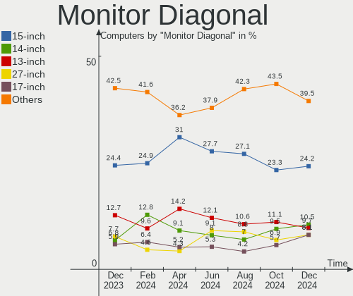
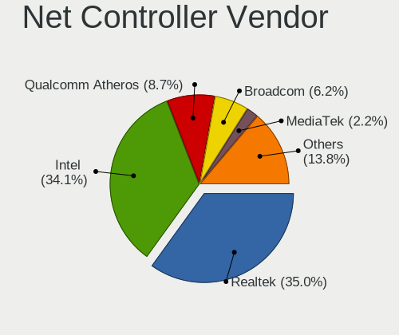

Zorin Hardware Trends
---------------------

A project to identify most popular hardware characteristics and track their change
over time based on data collected by Zorin users at https://Linux-Hardware.org.

Anyone can contribute to the study by uploading probes of their computers by
the [hw-probe](https://github.com/linuxhw/hw-probe) tool:

    sudo hw-probe -all -upload

This is a report for all computer types. See also reports for [desktops](/Dist/Zorin/Desktop/README.md) and [notebooks](/Dist/Zorin/Notebook/README.md).

Full-feature report is available here: https://linux-hardware.org/?view=trends

Period: Jan, 2020.

Contents
--------

- [ OS                       ](#os)
- [ OS Family                ](#os-family)
- [ Kernel                   ](#kernel)
- [ Kernel Family            ](#kernel-family)
- [ Kernel Major Ver.        ](#kernel-major-ver)
- [ Arch                     ](#arch)
- [ DE                       ](#de)
- [ Display Server           ](#display-server)
- [ OS Lang                  ](#os-lang)
- [ Boot Mode                ](#boot-mode)
- [ Filesystem               ](#filesystem)
- [ Dual Boot with Linux     ](#dual-boot-with-linux)
- [ Dual Boot (Win)          ](#dual-boot-win)
- [ Country                  ](#country)
- [ City                     ](#city)
- [ Vendor                   ](#vendor)
- [ Model                    ](#model)
- [ Model Family             ](#model-family)
- [ MFG Year                 ](#mfg-year)
- [ Form Factor              ](#form-factor)
- [ Secure Boot              ](#secure-boot)
- [ Coreboot                 ](#coreboot)
- [ RAM Size                 ](#ram-size)
- [ RAM Used                 ](#ram-used)
- [ Drive Vendor             ](#drive-vendor)
- [ Drive Model              ](#drive-model)
- [ Drive Kind               ](#drive-kind)
- [ Drive Connector          ](#drive-connector)
- [ Drive Size               ](#drive-size)
- [ Space Total              ](#space-total)
- [ Space Used               ](#space-used)
- [ Malfunc. Drives          ](#malfunc-drives)
- [ Malfunc. Drive Vendor    ](#malfunc-drive-vendor)
- [ Malfunc. Drive Kind      ](#malfunc-drive-kind)
- [ Failed Drives            ](#failed-drives)
- [ Failed Drive Vendor      ](#failed-drive-vendor)
- [ Drive Status             ](#drive-status)
- [ Storage Vendor           ](#storage-vendor)
- [ Storage Model            ](#storage-model)
- [ Storage Kind             ](#storage-kind)
- [ CPU Vendor               ](#cpu-vendor)
- [ CPU Model                ](#cpu-model)
- [ CPU Model Family         ](#cpu-model-family)
- [ CPU Cores                ](#cpu-cores)
- [ CPU Sockets              ](#cpu-sockets)
- [ CPU Threads              ](#cpu-threads)
- [ CPU Op-Modes             ](#cpu-op-modes)
- [ CPU Microarch            ](#cpu-microarch)
- [ CPU Microcode            ](#cpu-microcode)
- [ GPU Vendor               ](#gpu-vendor)
- [ GPU Model                ](#gpu-model)
- [ GPU Combo                ](#gpu-combo)
- [ GPU Driver               ](#gpu-driver)
- [ GPU Memory               ](#gpu-memory)
- [ Monitor Vendor           ](#monitor-vendor)
- [ Monitor Model            ](#monitor-model)
- [ Monitor Resolution       ](#monitor-resolution)
- [ Monitor Diagonal         ](#monitor-diagonal)
- [ Monitor Width            ](#monitor-width)
- [ Aspect Ratio             ](#aspect-ratio)
- [ Monitor Area             ](#monitor-area)
- [ Pixel Density            ](#pixel-density)
- [ Multiple Monitors        ](#multiple-monitors)
- [ Net Controller Vendor    ](#net-controller-vendor)
- [ Net Controller Model     ](#net-controller-model)
- [ Net Controller Kind      ](#net-controller-kind)
- [ Used Controller          ](#used-controller)
- [ NICs                     ](#nics)
- [ Unsupported Devices      ](#unsupported-devices)
- [ Unsupported Device Types ](#unsupported-device-types)

OS
--

Installed operating systems

| Name     | Computers | Percent |
|----------|-----------|---------|
| Zorin 15 | 48        | 87.27%  |
| Zorin 12 | 7         | 12.73%  |

OS Family
---------

OS without a version

| Name  | Computers | Percent |
|-------|-----------|---------|
| Zorin | 55        | 100%    |

Kernel
------

Version of the Linux kernel

| Version              | Computers | Percent |
|----------------------|-----------|---------|
| 5.0.0-37-generic     | 29        | 52.73%  |
| 5.3.0-26-generic     | 10        | 18.18%  |
| 5.3.0-28-generic     | 6         | 10.91%  |
| 4.15.0-74-generic    | 4         | 7.27%   |
| 4.15.0-72-generic    | 2         | 3.64%   |
| 5.4.0-050400-generic | 1         | 1.82%   |
| 5.0.0-29-generic     | 1         | 1.82%   |
| 4.18.0-21-generic    | 1         | 1.82%   |
| 4.15.0-76-generic    | 1         | 1.82%   |

Kernel Family
-------------

Linux kernel without a distro release

| Version | Computers | Percent |
|---------|-----------|---------|
| 5.0.0   | 30        | 54.55%  |
| 5.3.0   | 16        | 29.09%  |
| 4.15.0  | 7         | 12.73%  |
| 5.4.0   | 1         | 1.82%   |
| 4.18.0  | 1         | 1.82%   |

Kernel Major Ver.
-----------------

Linux kernel major version

| Version | Computers | Percent |
|---------|-----------|---------|
| 5.0     | 30        | 54.55%  |
| 5.3     | 16        | 29.09%  |
| 4.15    | 7         | 12.73%  |
| 5.4     | 1         | 1.82%   |
| 4.18    | 1         | 1.82%   |

Arch
----

OS architecture (x86_64, i586, etc.)

| Name   | Computers | Percent |
|--------|-----------|---------|
| x86_64 | 42        | 76.36%  |
| i686   | 13        | 23.64%  |

DE
--

Desktop Environment

| Name       | Computers | Percent |
|------------|-----------|---------|
| GNOME      | 34        | 61.82%  |
| XFCE       | 18        | 32.73%  |
| Unknown    | 2         | 3.64%   |
| X-Cinnamon | 1         | 1.82%   |

Display Server
--------------

X11 or Wayland

| Name    | Computers | Percent |
|---------|-----------|---------|
| X11     | 54        | 98.18%  |
| Unknown | 1         | 1.82%   |

OS Lang
-------

Language

| Lang  | Computers | Percent |
|-------|-----------|---------|
| en_US | 23        | 41.82%  |
| de_DE | 5         | 9.09%   |
| en_GB | 4         | 7.27%   |
| it_IT | 2         | 3.64%   |
| en_CA | 2         | 3.64%   |
| tr_TR | 1         | 1.82%   |
| sr_RS | 1         | 1.82%   |
| sk_SK | 1         | 1.82%   |
| ru_RU | 1         | 1.82%   |
| ro_RO | 1         | 1.82%   |
| pt_PT | 1         | 1.82%   |
| pt_BR | 1         | 1.82%   |
| nl_NL | 1         | 1.82%   |
| id_ID | 1         | 1.82%   |
| fr_FR | 1         | 1.82%   |
| fr_CA | 1         | 1.82%   |
| es_MX | 1         | 1.82%   |
| es_ES | 1         | 1.82%   |
| es_CR | 1         | 1.82%   |
| es_CL | 1         | 1.82%   |
| en_IN | 1         | 1.82%   |
| en_HK | 1         | 1.82%   |
| en_AU | 1         | 1.82%   |
| ar_EG | 1         | 1.82%   |

Boot Mode
---------

EFI or BIOS

| Mode | Computers | Percent |
|------|-----------|---------|
| BIOS | 37        | 67.27%  |
| EFI  | 18        | 32.73%  |

Filesystem
----------

Type of filesystem

| Type    | Computers | Percent |
|---------|-----------|---------|
| Ext4    | 51        | 92.73%  |
| Overlay | 3         | 5.45%   |
| Ext2    | 1         | 1.82%   |

Dual Boot with Linux
--------------------

Hosting more than one Linux

| Dual boot | Computers | Percent |
|-----------|-----------|---------|
| No        | 49        | 89.09%  |
| Yes       | 6         | 10.91%  |

Dual Boot (Win)
---------------

Hosting Linux and Windows

| Dual boot | Computers | Percent |
|-----------|-----------|---------|
| No        | 37        | 67.27%  |
| Yes       | 18        | 32.73%  |

Country
-------

Geographic location (country)

| Country      | Computers | Percent |
|--------------|-----------|---------|
| USA          | 13        | 23.64%  |
| Germany      | 6         | 10.91%  |
| UK           | 4         | 7.27%   |
| Italy        | 3         | 5.45%   |
| Canada       | 3         | 5.45%   |
| Brazil       | 3         | 5.45%   |
| Indonesia    | 2         | 3.64%   |
| Turkey       | 1         | 1.82%   |
| Spain        | 1         | 1.82%   |
| Serbia       | 1         | 1.82%   |
| Saudi Arabia | 1         | 1.82%   |
| Russia       | 1         | 1.82%   |
| Romania      | 1         | 1.82%   |
| Portugal     | 1         | 1.82%   |
| Pakistan     | 1         | 1.82%   |
| Netherlands  | 1         | 1.82%   |
| Mexico       | 1         | 1.82%   |
| Kenya        | 1         | 1.82%   |
| India        | 1         | 1.82%   |
| Hungary      | 1         | 1.82%   |
| Hong Kong    | 1         | 1.82%   |
| France       | 1         | 1.82%   |
| Croatia      | 1         | 1.82%   |
| Costa Rica   | 1         | 1.82%   |
| Chile        | 1         | 1.82%   |
| Belgium      | 1         | 1.82%   |
| Austria      | 1         | 1.82%   |
| Australia    | 1         | 1.82%   |

City
----

Geographic location (city)

| City                    | Computers | Percent |
|-------------------------|-----------|---------|
| London                  | 2         | 3.64%   |
| Jakarta                 | 2         | 3.64%   |
| Virovitica              | 1         | 1.82%   |
| Vienna                  | 1         | 1.82%   |
| Stendal                 | 1         | 1.82%   |
| Springfield             | 1         | 1.82%   |
| Sherbrooke              | 1         | 1.82%   |
| Sarasota                | 1         | 1.82%   |
| Santo Angel             | 1         | 1.82%   |
| San José               | 1         | 1.82%   |
| San Antonio             | 1         | 1.82%   |
| Salvador                | 1         | 1.82%   |
| Rho                     | 1         | 1.82%   |
| Québec                 | 1         | 1.82%   |
| Queluz                  | 1         | 1.82%   |
| Pennsburg               | 1         | 1.82%   |
| Paucourt                | 1         | 1.82%   |
| Paracin                 | 1         | 1.82%   |
| Overland Park           | 1         | 1.82%   |
| Orlando                 | 1         | 1.82%   |
| Nairobi                 | 1         | 1.82%   |
| Moscow                  | 1         | 1.82%   |
| Meredith                | 1         | 1.82%   |
| León                   | 1         | 1.82%   |
| Las Vegas               | 1         | 1.82%   |
| Lahore                  | 1         | 1.82%   |
| Kolkata                 | 1         | 1.82%   |
| Kitchener               | 1         | 1.82%   |
| Kenosha                 | 1         | 1.82%   |
| Jeddah                  | 1         | 1.82%   |
| Heves                   | 1         | 1.82%   |
| Glandore                | 1         | 1.82%   |
| Genoa                   | 1         | 1.82%   |
| Gaylord                 | 1         | 1.82%   |
| Frome                   | 1         | 1.82%   |
| Falkensee               | 1         | 1.82%   |
| Engelskirchen           | 1         | 1.82%   |
| Elgin                   | 1         | 1.82%   |
| De Meern                | 1         | 1.82%   |
| Codlea                  | 1         | 1.82%   |
| Chemnitz                | 1         | 1.82%   |
| Central                 | 1         | 1.82%   |
| Canterbury              | 1         | 1.82%   |
| Cachoeiro de Itapemirim | 1         | 1.82%   |
| Burleson                | 1         | 1.82%   |
| Berlin                  | 1         | 1.82%   |
| Belo Horizonte          | 1         | 1.82%   |
| Arica                   | 1         | 1.82%   |
| Ankara                  | 1         | 1.82%   |
| Acworth                 | 1         | 1.82%   |
| Abano Terme             | 1         | 1.82%   |
| Aalst                   | 1         | 1.82%   |
| Aachen                  | 1         | 1.82%   |

Vendor
------

Motherboard manufacturer

| Name                | Computers | Percent |
|---------------------|-----------|---------|
| Hewlett-Packard     | 11        | 20%     |
| Lenovo              | 8         | 14.55%  |
| Gigabyte Technology | 6         | 10.91%  |
| Acer                | 6         | 10.91%  |
| Packard Bell        | 3         | 5.45%   |
| Dell                | 3         | 5.45%   |
| ASUSTek Computer    | 3         | 5.45%   |
| WinFast             | 2         | 3.64%   |
| Toshiba             | 2         | 3.64%   |
| ASRock              | 2         | 3.64%   |
| Samsung Electronics | 1         | 1.82%   |
| Pegatron            | 1         | 1.82%   |
| NF531M              | 1         | 1.82%   |
| Fujitsu             | 1         | 1.82%   |
| ECS                 | 1         | 1.82%   |
| Dixonsxp            | 1         | 1.82%   |
| Apple               | 1         | 1.82%   |
| AMI                 | 1         | 1.82%   |
| Unknown             | 1         | 1.82%   |

Model
-----

Motherboard model

| Name                                   | Computers | Percent |
|----------------------------------------|-----------|---------|
| Gigabyte H97M-D3H                      | 2         | 3.64%   |
| Unknown                                | 2         | 3.64%   |
| WinFast NF4UK8AA                       | 1         | 1.82%   |
| WinFast 761GXK8MC                      | 1         | 1.82%   |
| Toshiba Satellite L55-B                | 1         | 1.82%   |
| Toshiba Satellite A215                 | 1         | 1.82%   |
| Samsung Electronics R710               | 1         | 1.82%   |
| Pegatron FZ116AA-ACP a6551.at          | 1         | 1.82%   |
| Packard Bell EasyNote TJ65             | 1         | 1.82%   |
| Packard Bell EasyNote MH36             | 1         | 1.82%   |
| Packard Bell EasyNote MH35             | 1         | 1.82%   |
| NF531M 1.0                             | 1         | 1.82%   |
| Lenovo V155-15API 81V5                 | 1         | 1.82%   |
| Lenovo ThinkCentre M93p 10AAS0GQ00     | 1         | 1.82%   |
| Lenovo ThinkCentre M71z 1761E3U        | 1         | 1.82%   |
| Lenovo MIIX 320-10ICR 80XF             | 1         | 1.82%   |
| Lenovo IdeaPad Z400 Touch VIWZ1        | 1         | 1.82%   |
| Lenovo IdeaPad N581 7505               | 1         | 1.82%   |
| Lenovo IdeaPad 330-15IKB 81DE          | 1         | 1.82%   |
| Lenovo IdeaPad 100-14IBY 80MH          | 1         | 1.82%   |
| HP Split 13 x2 Detachable PC           | 1         | 1.82%   |
| HP ProDesk 600 G1 SFF                  | 1         | 1.82%   |
| HP ProBook 450 G1                      | 1         | 1.82%   |
| HP Presario C500 (RU924PA#UUF)         | 1         | 1.82%   |
| HP Pavilion dv7                        | 1         | 1.82%   |
| HP Pavilion dv6700                     | 1         | 1.82%   |
| HP Laptop 15-da0xxx                    | 1         | 1.82%   |
| HP Laptop 15-bw0xx                     | 1         | 1.82%   |
| HP Compaq Presario CQ50                | 1         | 1.82%   |
| HP Compaq dc7600 Convertible Minitower | 1         | 1.82%   |
| HP Compaq 8200 Elite SFF PC            | 1         | 1.82%   |
| Gigabyte Z170X-Gaming 7                | 1         | 1.82%   |
| Gigabyte PERSONAL COMPUTER             | 1         | 1.82%   |
| Gigabyte P55A-UD3                      | 1         | 1.82%   |
| Gigabyte AB350M-DS3H V2                | 1         | 1.82%   |
| Fujitsu ESPRIMO P2560                  | 1         | 1.82%   |
| ECS P4M800-M                           | 1         | 1.82%   |
| Dell Vostro 430                        | 1         | 1.82%   |
| Dell Vostro 1500                       | 1         | 1.82%   |
| Dell OptiPlex 790                      | 1         | 1.82%   |
| ASUS X405UA                            | 1         | 1.82%   |
| ASUS P5B                               | 1         | 1.82%   |
| ASUS P-P5N9300                         | 1         | 1.82%   |
| ASRock H110M-DGS                       | 1         | 1.82%   |
| ASRock 775i65GV                        | 1         | 1.82%   |
| Apple iMac12,2                         | 1         | 1.82%   |
| AMI HiBox-hero                         | 1         | 1.82%   |
| Acer Switch SW312-31                   | 1         | 1.82%   |
| Acer Aspire 5750                       | 1         | 1.82%   |
| Acer Aspire 5735                       | 1         | 1.82%   |
| Acer Aspire 5336                       | 1         | 1.82%   |
| Acer Aspire 4752                       | 1         | 1.82%   |
| Acer AOA150                            | 1         | 1.82%   |

Model Family
------------

Motherboard model prefix

| Name                     | Computers | Percent |
|--------------------------|-----------|---------|
| Lenovo IdeaPad           | 4         | 7.27%   |
| Acer Aspire              | 4         | 7.27%   |
| Packard Bell EasyNote    | 3         | 5.45%   |
| HP Compaq                | 3         | 5.45%   |
| Toshiba Satellite        | 2         | 3.64%   |
| Lenovo ThinkCentre       | 2         | 3.64%   |
| HP Pavilion              | 2         | 3.64%   |
| HP Laptop                | 2         | 3.64%   |
| Gigabyte H97M-D3H        | 2         | 3.64%   |
| Dell Vostro              | 2         | 3.64%   |
| Unknown                  | 2         | 3.64%   |
| WinFast NF4UK8AA         | 1         | 1.82%   |
| WinFast 761GXK8MC        | 1         | 1.82%   |
| Samsung Electronics R710 | 1         | 1.82%   |
| Pegatron FZ116AA-ACP     | 1         | 1.82%   |
| NF531M 1.0               | 1         | 1.82%   |
| Lenovo V155-15API        | 1         | 1.82%   |
| Lenovo MIIX              | 1         | 1.82%   |
| HP Split                 | 1         | 1.82%   |
| HP ProDesk               | 1         | 1.82%   |
| HP ProBook               | 1         | 1.82%   |
| HP Presario              | 1         | 1.82%   |
| Gigabyte Z170X-Gaming    | 1         | 1.82%   |
| Gigabyte PERSONAL        | 1         | 1.82%   |
| Gigabyte P55A-UD3        | 1         | 1.82%   |
| Gigabyte AB350M-DS3H     | 1         | 1.82%   |
| Fujitsu ESPRIMO          | 1         | 1.82%   |
| ECS P4M800-M             | 1         | 1.82%   |
| Dell OptiPlex            | 1         | 1.82%   |
| ASUS X405UA              | 1         | 1.82%   |
| ASUS P5B                 | 1         | 1.82%   |
| ASUS P-P5N9300           | 1         | 1.82%   |
| ASRock H110M-DGS         | 1         | 1.82%   |
| ASRock 775i65GV          | 1         | 1.82%   |
| Apple iMac12             | 1         | 1.82%   |
| AMI HiBox-hero           | 1         | 1.82%   |
| Acer Switch              | 1         | 1.82%   |
| Acer AOA150              | 1         | 1.82%   |

MFG Year
--------

Motherboard manufacture year

| Year | Computers | Percent |
|------|-----------|---------|
| 2008 | 10        | 18.18%  |
| 2019 | 8         | 14.55%  |
| 2018 | 5         | 9.09%   |
| 2017 | 4         | 7.27%   |
| 2012 | 4         | 7.27%   |
| 2011 | 4         | 7.27%   |
| 2015 | 3         | 5.45%   |
| 2009 | 3         | 5.45%   |
| 2005 | 3         | 5.45%   |
| 2016 | 2         | 3.64%   |
| 2014 | 2         | 3.64%   |
| 2010 | 2         | 3.64%   |
| 2007 | 2         | 3.64%   |
| 2006 | 2         | 3.64%   |
| 2013 | 1         | 1.82%   |

Form Factor
-----------

Physical design of the computer

| Name       | Computers | Percent |
|------------|-----------|---------|
| Notebook   | 28        | 50.91%  |
| Desktop    | 24        | 43.64%  |
| Tablet     | 2         | 3.64%   |
| All in one | 1         | 1.82%   |

Secure Boot
-----------

Enabled or disabled

| State    | Computers | Percent |
|----------|-----------|---------|
| Disabled | 52        | 94.55%  |
| Enabled  | 3         | 5.45%   |

Coreboot
--------

Have coreboot on board

| Used | Computers | Percent |
|------|-----------|---------|
| No   | 55        | 100%    |

RAM Size
--------

Total RAM memory

| Size in GB | Computers | Percent |
|------------|-----------|---------|
| 3.01-4.0   | 16        | 29.09%  |
| 4.01-8.0   | 11        | 20%     |
| 1.01-2.0   | 10        | 18.18%  |
| 8.01-16.0  | 7         | 12.73%  |
| 2.01-3.0   | 5         | 9.09%   |
| 16.01-24.0 | 5         | 9.09%   |
| 0.01-1.0   | 1         | 1.82%   |

RAM Used
--------

Used RAM memory

| Used GB  | Computers | Percent |
|----------|-----------|---------|
| 1.01-2.0 | 22        | 40%     |
| 0.01-1.0 | 15        | 27.27%  |
| 2.01-3.0 | 11        | 20%     |
| 4.01-8.0 | 4         | 7.27%   |
| 3.01-4.0 | 3         | 5.45%   |

Drive Vendor
------------

Hard drive vendors

| Vendor              | Computers | Drives | Percent |
|---------------------|-----------|--------|---------|
| WDC                 | 20        | 20     | 28.17%  |
| Seagate             | 10        | 12     | 14.08%  |
| Toshiba             | 8         | 8      | 11.27%  |
| Hitachi             | 7         | 7      | 9.86%   |
| Samsung Electronics | 6         | 7      | 8.45%   |
| Unknown             | 5         | 5      | 7.04%   |
| SanDisk             | 4         | 5      | 5.63%   |
| Kingston            | 2         | 2      | 2.82%   |
| Intel               | 2         | 2      | 2.82%   |
| Crucial             | 2         | 2      | 2.82%   |
| JMicron             | 1         | 2      | 1.41%   |
| Intenso             | 1         | 1      | 1.41%   |
| Hikvision           | 1         | 1      | 1.41%   |
| Hewlett-Packard     | 1         | 1      | 1.41%   |
| Fujitsu             | 1         | 1      | 1.41%   |

Drive Model
-----------

Hard drive models

| Model                        | Computers | Percent |
|------------------------------|-----------|---------|
| WD10JPVT-24A1YT0 1TB         | 2         | 2.67%   |
| ST3500418AS 500GB            | 2         | 2.67%   |
| ST1000DM003-1CH162 1TB       | 2         | 2.67%   |
| SSD 860 EVO 250GB            | 2         | 2.67%   |
| WDS240G2G0A-00JH30 240GB SSD | 1         | 1.33%   |
| WD6400AAKS-65A7B0 640GB      | 1         | 1.33%   |
| WD5000M21K-60JU6T0 500GB     | 1         | 1.33%   |
| WD5000LPCX-24VHAT0 500GB     | 1         | 1.33%   |
| WD5000BPVT-80HXZT3 500GB     | 1         | 1.33%   |
| WD5000BPVT-22HXZT3 500GB     | 1         | 1.33%   |
| WD5000AZRX-00A8LB0 500GB     | 1         | 1.33%   |
| WD400BD-60LRA0 40GB          | 1         | 1.33%   |
| WD3200BEVT-22ZCT0 320GB      | 1         | 1.33%   |
| WD30EZRZ-00Z5HB0 3TB         | 1         | 1.33%   |
| WD2500AAKX-083CA1 250GB      | 1         | 1.33%   |
| WD2500AAJS-75M0A0 250GB      | 1         | 1.33%   |
| WD1600BEVT-22ZCT0 160GB      | 1         | 1.33%   |
| WD1600BEVS-08VAT2 160GB      | 1         | 1.33%   |
| WD1600BB-00GUC0 160GB        | 1         | 1.33%   |
| WD10JPVX-60JC3T1 1TB         | 1         | 1.33%   |
| WD10JPVX-22JC3T0 1TB         | 1         | 1.33%   |
| WD10EZEX-08WN4A0 1TB         | 1         | 1.33%   |
| Ultra II 960GB SSD           | 1         | 1.33%   |
| ST98823AS 80GB               | 1         | 1.33%   |
| ST9500325AS 500GB            | 1         | 1.33%   |
| ST9250315AS 250GB            | 1         | 1.33%   |
| ST380817AS 80GB              | 1         | 1.33%   |
| ST3500414CS 500GB            | 1         | 1.33%   |
| ST3500320AS 500GB            | 1         | 1.33%   |
| ST31000528AS 1TB             | 1         | 1.33%   |
| ST2000DM001-1ER164 2TB       | 1         | 1.33%   |
| SSDSC2BW120H6 120GB          | 1         | 1.33%   |
| SSDMCEAW120A4 120GB          | 1         | 1.33%   |
| SSD SATAIII 240GB            | 1         | 1.33%   |
| SSD PM841 2.5 7mm 256GB      | 1         | 1.33%   |
| SSD 860 EVO 500GB            | 1         | 1.33%   |
| SSD 860 EVO 1TB              | 1         | 1.33%   |
| SSD 830 Series 256GB         | 1         | 1.33%   |
| SDSSDH3512G 512GB            | 1         | 1.33%   |
| SDSSDH3 1T02 1024GB          | 1         | 1.33%   |
| SDSSDA120G 120GB             | 1         | 1.33%   |
| SA400S37480G 480GB SSD       | 1         | 1.33%   |
| SA400S37120G 120GB SSD       | 1         | 1.33%   |
| MQ04ABF100 1TB               | 1         | 1.33%   |
| MQ01ABF050 500GB             | 1         | 1.33%   |
| MQ01ABD100 1TB               | 1         | 1.33%   |
| MQ01ABD075 752GB             | 1         | 1.33%   |
| MMC Card  64GB               | 1         | 1.33%   |
| MMC Card  32GB               | 1         | 1.33%   |
| MK2555GSX 250GB              | 1         | 1.33%   |
| MK2035GSS 200GB              | 1         | 1.33%   |
| MHY2120BH 120GB              | 1         | 1.33%   |
| HUA723020ALA640 2TB          | 1         | 1.33%   |
| HTS547575A9E384 752GB        | 1         | 1.33%   |
| HTS547550A9E384 500GB        | 1         | 1.33%   |
| HTS545032B9SA02 320GB        | 1         | 1.33%   |
| HTS545032A7E380 320GB        | 1         | 1.33%   |
| HTS542516K9SA00 160GB        | 1         | 1.33%   |
| HS-SSD-E100 256GB            | 1         | 1.33%   |
| HCP725016GLAT80 160GB        | 1         | 1.33%   |

Drive Kind
----------

HDD or SSD

| Kind    | Computers | Drives | Percent |
|---------|-----------|--------|---------|
| HDD     | 39        | 47     | 62.9%   |
| SSD     | 15        | 20     | 24.19%  |
| MMC     | 5         | 5      | 8.06%   |
| Unknown | 3         | 4      | 4.84%   |

Drive Connector
---------------

SATA, SAS, NVMe, etc.

| Type | Computers | Drives | Percent |
|------|-----------|--------|---------|
| SATA | 49        | 68     | 87.5%   |
| MMC  | 5         | 5      | 8.93%   |
| SAS  | 2         | 3      | 3.57%   |

Drive Size
----------

Size of hard drive

| Size in TB | Computers | Drives | Percent |
|------------|-----------|--------|---------|
| 0.01-0.5   | 44        | 52     | 69.84%  |
| 0.51-1.0   | 14        | 19     | 22.22%  |
| 1.01-2.0   | 3         | 3      | 4.76%   |
| 2.01-3.0   | 2         | 2      | 3.17%   |

Space Total
-----------

Amount of disk space available on the file system

| Size in GB     | Computers | Percent |
|----------------|-----------|---------|
| 101-250        | 20        | 36.36%  |
| 251-500        | 12        | 21.82%  |
| 501-1000       | 6         | 10.91%  |
| 21-50          | 5         | 9.09%   |
| 51-100         | 5         | 9.09%   |
| 1-20           | 4         | 7.27%   |
| 1001-2000      | 2         | 3.64%   |
| More than 3000 | 1         | 1.82%   |

Space Used
----------

Amount of used disk space

| Used GB | Computers | Percent |
|---------|-----------|---------|
| 1-20    | 40        | 72.73%  |
| 21-50   | 9         | 16.36%  |
| 51-100  | 4         | 7.27%   |
| 251-500 | 2         | 3.64%   |

Malfunc. Drives
---------------

Drive models with a malfunction

Zero info for selected period =(

Malfunc. Drive Vendor
---------------------

Vendors of faulty drives

Zero info for selected period =(

Malfunc. Drive Kind
-------------------

Kinds of faulty drives

Zero info for selected period =(

Failed Drives
-------------

Failed drive models

Zero info for selected period =(

Failed Drive Vendor
-------------------

Failed drive vendors

Zero info for selected period =(

Drive Status
------------

Number of failed and malfunc. drives

| Status   | Computers | Drives | Percent |
|----------|-----------|--------|---------|
| Detected | 53        | 76     | 100%    |

Storage Vendor
--------------

Storage controller vendors

| Vendor                           | Computers | Percent |
|----------------------------------|-----------|---------|
| Intel                            | 40        | 68.97%  |
| AMD                              | 5         | 8.62%   |
| Nvidia                           | 4         | 6.9%    |
| Silicon Integrated Systems [SiS] | 2         | 3.45%   |
| VIA Technologies                 | 1         | 1.72%   |
| Silicon Motion                   | 1         | 1.72%   |
| Sandisk                          | 1         | 1.72%   |
| Samsung Electronics              | 1         | 1.72%   |
| Marvell Technology Group         | 1         | 1.72%   |
| JMicron Technology               | 1         | 1.72%   |
| ASMedia Technology               | 1         | 1.72%   |

Storage Model
-------------

Storage controller models

| Model                                                                      | Computers | Percent |
|----------------------------------------------------------------------------|-----------|---------|
| FCH SATA Controller [AHCI mode]                                            | 4         | 5.63%   |
| 82801IBM/IEM (ICH9M/ICH9M-E) 4 port SATA Controller [AHCI mode]            | 4         | 5.63%   |
| 8 Series/C220 Series Chipset Family 6-port SATA Controller 1 [AHCI mode]   | 4         | 5.63%   |
| 6 Series/C200 Series Chipset Family 6 port Desktop SATA AHCI Controller    | 4         | 5.63%   |
| Sunrise Point-LP SATA Controller [AHCI mode]                               | 2         | 2.82%   |
| Q170/Q150/B150/H170/H110/Z170/CM236 Chipset SATA Controller [AHCI Mode]    | 2         | 2.82%   |
| Non-Volatile memory controller                                             | 2         | 2.82%   |
| NM10/ICH7 Family SATA Controller [IDE mode]                                | 2         | 2.82%   |
| 9 Series Chipset Family SATA Controller [AHCI Mode]                        | 2         | 2.82%   |
| 82801GBM/GHM (ICH7-M Family) SATA Controller [IDE mode]                    | 2         | 2.82%   |
| 82801G (ICH7 Family) IDE Controller                                        | 2         | 2.82%   |
| 8 Series SATA Controller 1 [AHCI mode]                                     | 2         | 2.82%   |
| 7 Series Chipset Family 6-port SATA Controller [AHCI mode]                 | 2         | 2.82%   |
| 6 Series/C200 Series Chipset Family 6 port Mobile SATA AHCI Controller     | 2         | 2.82%   |
| 5513 IDE Controller                                                        | 2         | 2.82%   |
| 5 Series/3400 Series Chipset 6 port SATA AHCI Controller                   | 2         | 2.82%   |
| VT82C586A/B/VT82C686/A/B/VT823x/A/C PIPC Bus Master IDE                    | 1         | 1.41%   |
| VIA VT6420 SATA RAID Controller                                            | 1         | 1.41%   |
| SB600 Non-Raid-5 SATA                                                      | 1         | 1.41%   |
| SB600 IDE                                                                  | 1         | 1.41%   |
| SATA Controller / IDE mode                                                 | 1         | 1.41%   |
| RAID bus controller 180 SATA/PATA  [SiS]                                   | 1         | 1.41%   |
| NVMe SSD Controller SM981/PM981/PM983                                      | 1         | 1.41%   |
| MCP79 AHCI Controller                                                      | 1         | 1.41%   |
| MCP78S [GeForce 8200] SATA Controller (non-AHCI mode)                      | 1         | 1.41%   |
| MCP78S [GeForce 8200] IDE                                                  | 1         | 1.41%   |
| MCP67 IDE Controller                                                       | 1         | 1.41%   |
| MCP67 AHCI Controller                                                      | 1         | 1.41%   |
| JMB363 SATA/IDE Controller                                                 | 1         | 1.41%   |
| FCH IDE Controller                                                         | 1         | 1.41%   |
| CK804 Serial ATA Controller                                                | 1         | 1.41%   |
| CK804 IDE                                                                  | 1         | 1.41%   |
| Celeron N3350/Pentium N4200/Atom E3900 Series SATA AHCI Controller         | 1         | 1.41%   |
| Atom/Celeron/Pentium Processor x5-E8000/J3xxx/N3xxx Series SATA Controller | 1         | 1.41%   |
| Atom Processor E3800 Series SATA AHCI Controller                           | 1         | 1.41%   |
| ASM1062 Serial ATA Controller                                              | 1         | 1.41%   |
| 88SE9128 PCIe SATA 6 Gb/s RAID controller                                  | 1         | 1.41%   |
| 82801IR/IO/IH (ICH9R/DO/DH) 6 port SATA Controller [AHCI mode]             | 1         | 1.41%   |
| 82801IBM/IEM (ICH9M/ICH9M-E) 2 port SATA Controller [IDE mode]             | 1         | 1.41%   |
| 82801HR/HO/HH (ICH8R/DO/DH) 2 port SATA Controller [IDE mode]              | 1         | 1.41%   |
| 82801HM/HEM (ICH8M/ICH8M-E) SATA Controller [AHCI mode]                    | 1         | 1.41%   |
| 82801HM/HEM (ICH8M/ICH8M-E) IDE Controller                                 | 1         | 1.41%   |
| 82801GBM/GHM (ICH7-M Family) SATA Controller [AHCI mode]                   | 1         | 1.41%   |
| 82801EB/ER (ICH5/ICH5R) IDE Controller                                     | 1         | 1.41%   |
| 82801EB (ICH5) SATA Controller                                             | 1         | 1.41%   |
| 82801 Mobile SATA Controller [RAID mode]                                   | 1         | 1.41%   |
| 300 Series Chipset SATA Controller                                         | 1         | 1.41%   |

Storage Kind
------------

Kind of storage controller (IDE, SATA, NVMe, SAS, ...)

| Kind | Computers | Percent |
|------|-----------|---------|
| SATA | 38        | 64.41%  |
| IDE  | 17        | 28.81%  |
| RAID | 2         | 3.39%   |
| NVMe | 2         | 3.39%   |

CPU Vendor
----------

Processor vendors

| Vendor | Computers | Percent |
|--------|-----------|---------|
| Intel  | 46        | 83.64%  |
| AMD    | 9         | 16.36%  |

CPU Model
---------

Processor models

| Model                                         | Computers | Percent |
|-----------------------------------------------|-----------|---------|
| Intel Pentium Dual CPU T3400 @ 2.16GHz        | 2         | 3.64%   |
| Intel Core i5-2400 CPU @ 3.10GHz              | 2         | 3.64%   |
| Intel Atom x5-Z8350 CPU @ 1.44GHz             | 2         | 3.64%   |
| Intel Atom CPU N270 @ 1.60GHz                 | 2         | 3.64%   |
| AMD Athlon 64 X2 Dual-Core Processor TK-57    | 2         | 3.64%   |
| Intel Pentium Dual-Core CPU E6700 @ 3.20GHz   | 1         | 1.82%   |
| Intel Pentium Dual CPU T2330 @ 1.60GHz        | 1         | 1.82%   |
| Intel Pentium CPU N4200 @ 1.10GHz             | 1         | 1.82%   |
| Intel Pentium CPU G630 @ 2.70GHz              | 1         | 1.82%   |
| Intel Pentium CPU B960 @ 2.20GHz              | 1         | 1.82%   |
| Intel Pentium CPU B950 @ 2.10GHz              | 1         | 1.82%   |
| Intel Pentium 4 CPU 3.20GHz                   | 1         | 1.82%   |
| Intel Pentium 4 CPU 3.00GHz                   | 1         | 1.82%   |
| Intel Genuine CPU T2060 @ 1.60GHz             | 1         | 1.82%   |
| Intel Core i7-4770 CPU @ 3.40GHz              | 1         | 1.82%   |
| Intel Core i7-4600M CPU @ 2.90GHz             | 1         | 1.82%   |
| Intel Core i7-3612QM CPU @ 2.10GHz            | 1         | 1.82%   |
| Intel Core i7 CPU 860 @ 2.80GHz               | 1         | 1.82%   |
| Intel Core i5-7200U CPU @ 2.50GHz             | 1         | 1.82%   |
| Intel Core i5-6600K CPU @ 3.50GHz             | 1         | 1.82%   |
| Intel Core i5-6400T CPU @ 2.20GHz             | 1         | 1.82%   |
| Intel Core i5-4590 CPU @ 3.30GHz              | 1         | 1.82%   |
| Intel Core i5-4570T CPU @ 2.90GHz             | 1         | 1.82%   |
| Intel Core i5-4460 CPU @ 3.20GHz              | 1         | 1.82%   |
| Intel Core i5-4210U CPU @ 1.70GHz             | 1         | 1.82%   |
| Intel Core i5-2500S CPU @ 2.70GHz             | 1         | 1.82%   |
| Intel Core i3-8130U CPU @ 2.20GHz             | 1         | 1.82%   |
| Intel Core i3-7100U CPU @ 2.40GHz             | 1         | 1.82%   |
| Intel Core i3-4130 CPU @ 3.40GHz              | 1         | 1.82%   |
| Intel Core i3-4012Y CPU @ 1.50GHz             | 1         | 1.82%   |
| Intel Core i3-2330M CPU @ 2.20GHz             | 1         | 1.82%   |
| Intel Core i3 CPU 550 @ 3.20GHz               | 1         | 1.82%   |
| Intel Core 2 Quad CPU Q9400 @ 2.66GHz         | 1         | 1.82%   |
| Intel Core 2 Quad CPU Q6600 @ 2.40GHz         | 1         | 1.82%   |
| Intel Core 2 Duo CPU T7300 @ 2.00GHz          | 1         | 1.82%   |
| Intel Core 2 Duo CPU T6600 @ 2.20GHz          | 1         | 1.82%   |
| Intel Core 2 Duo CPU T6400 @ 2.00GHz          | 1         | 1.82%   |
| Intel Core 2 CPU 6300 @ 1.86GHz               | 1         | 1.82%   |
| Intel Celeron CPU N3160 @ 1.60GHz             | 1         | 1.82%   |
| Intel Celeron CPU N2940 @ 1.83GHz             | 1         | 1.82%   |
| Intel Celeron CPU 900 @ 2.20GHz               | 1         | 1.82%   |
| Intel Celeron CPU 2.66GHz                     | 1         | 1.82%   |
| Intel Atom x7-Z8750 CPU @ 1.60GHz             | 1         | 1.82%   |
| AMD Turion Dual-Core RM-70                    | 1         | 1.82%   |
| AMD Sempron Processor 2600+                   | 1         | 1.82%   |
| AMD Ryzen 5 3500U with Radeon Vega Mobile Gfx | 1         | 1.82%   |
| AMD Ryzen 3 2200G with Radeon Vega Graphics   | 1         | 1.82%   |
| AMD Athlon 64 X2 Dual Core Processor 4400+    | 1         | 1.82%   |
| AMD A6-9220 RADEON R4, 5 COMPUTE CORES 2C+3G  | 1         | 1.82%   |
| AMD A6-3400M APU with Radeon HD Graphics      | 1         | 1.82%   |

CPU Model Family
----------------

Processor model prefix

| Model                   | Computers | Percent |
|-------------------------|-----------|---------|
| Intel Core i5           | 10        | 18.18%  |
| Intel Core i3           | 6         | 10.91%  |
| Intel Atom              | 5         | 9.09%   |
| Intel Pentium           | 4         | 7.27%   |
| Intel Core i7           | 4         | 7.27%   |
| Intel Celeron           | 4         | 7.27%   |
| Intel Pentium Dual      | 3         | 5.45%   |
| Intel Core 2 Duo        | 3         | 5.45%   |
| AMD Athlon 64 X2        | 3         | 5.45%   |
| Intel Pentium 4         | 2         | 3.64%   |
| Intel Core 2 Quad       | 2         | 3.64%   |
| AMD A6                  | 2         | 3.64%   |
| Intel Pentium Dual-Core | 1         | 1.82%   |
| Intel Genuine           | 1         | 1.82%   |
| Intel Core 2            | 1         | 1.82%   |
| AMD Turion Dual-Core    | 1         | 1.82%   |
| AMD Sempron             | 1         | 1.82%   |
| AMD Ryzen 5             | 1         | 1.82%   |
| AMD Ryzen 3             | 1         | 1.82%   |

CPU Cores
---------

Number of processor cores

| Number | Computers | Percent |
|--------|-----------|---------|
| 2      | 27        | 49.09%  |
| 4      | 21        | 38.18%  |
| 1      | 7         | 12.73%  |

CPU Sockets
-----------

Number of sockets

| Number | Computers | Percent |
|--------|-----------|---------|
| 1      | 55        | 100%    |

CPU Threads
-----------

Threads per core (Hyper-Threading)

| Number | Computers | Percent |
|--------|-----------|---------|
| 1      | 37        | 67.27%  |
| 2      | 18        | 32.73%  |

CPU Op-Modes
------------

CPU Operation Modes (32-bit, 64-bit)

| Op mode        | Computers | Percent |
|----------------|-----------|---------|
| 32-bit, 64-bit | 50        | 90.91%  |
| 32-bit         | 5         | 9.09%   |

CPU Microarch
-------------

Microarchitecture

| Name            | Computers | Percent |
|-----------------|-----------|---------|
| Core            | 11        | 20%     |
| Haswell         | 8         | 14.55%  |
| SandyBridge     | 7         | 12.73%  |
| Silvermont      | 5         | 9.09%   |
| Skylake         | 4         | 7.27%   |
| K8 Hammer       | 4         | 7.27%   |
| NetBurst        | 3         | 5.45%   |
| Bonnell         | 2         | 3.64%   |
| Zen+            | 1         | 1.82%   |
| Zen             | 1         | 1.82%   |
| Westmere        | 1         | 1.82%   |
| P6              | 1         | 1.82%   |
| Nehalem         | 1         | 1.82%   |
| KabyLake        | 1         | 1.82%   |
| K8 & K10 hybrid | 1         | 1.82%   |
| K10 Llano       | 1         | 1.82%   |
| IvyBridge       | 1         | 1.82%   |
| Goldmont        | 1         | 1.82%   |
| Excavator       | 1         | 1.82%   |

CPU Microcode
-------------

Microcode number

| Number     | Computers | Percent |
|------------|-----------|---------|
| 0x206a7    | 7         | 12.73%  |
| Unknown    | 7         | 12.73%  |
| 0x306c3    | 6         | 10.91%  |
| 0x1067a    | 5         | 9.09%   |
| 0x406c4    | 3         | 5.45%   |
| 0x6fd      | 2         | 3.64%   |
| 0x506e3    | 2         | 3.64%   |
| 0x40651    | 2         | 3.64%   |
| 0x106c2    | 2         | 3.64%   |
| 0xf49      | 1         | 1.82%   |
| 0xf43      | 1         | 1.82%   |
| 0xf41      | 1         | 1.82%   |
| 0x806ea    | 1         | 1.82%   |
| 0x806e9    | 1         | 1.82%   |
| 0x6fb      | 1         | 1.82%   |
| 0x6fa      | 1         | 1.82%   |
| 0x6f6      | 1         | 1.82%   |
| 0x6ec      | 1         | 1.82%   |
| 0x506c9    | 1         | 1.82%   |
| 0x306a9    | 1         | 1.82%   |
| 0x30678    | 1         | 1.82%   |
| 0x20655    | 1         | 1.82%   |
| 0x106e5    | 1         | 1.82%   |
| 0x08108102 | 1         | 1.82%   |
| 0x08101016 | 1         | 1.82%   |
| 0x06006704 | 1         | 1.82%   |
| 0x03000027 | 1         | 1.82%   |
| 0x02000032 | 1         | 1.82%   |

GPU Vendor
----------

Vendors of graphics cards

| Vendor                           | Computers | Percent |
|----------------------------------|-----------|---------|
| Intel                            | 33        | 55%     |
| Nvidia                           | 15        | 25%     |
| AMD                              | 11        | 18.33%  |
| Silicon Integrated Systems [SiS] | 1         | 1.67%   |

GPU Model
---------

Graphics card models

| Model                                                                              | Computers | Percent |
|------------------------------------------------------------------------------------|-----------|---------|
| 2nd Generation Core Processor Family Integrated Graphics Controller                | 5         | 7.69%   |
| Xeon E3-1200 v3/4th Gen Core Processor Integrated Graphics Controller              | 4         | 6.15%   |
| Atom/Celeron/Pentium Processor x5-E8000/J3xxx/N3xxx Integrated Graphics Controller | 4         | 6.15%   |
| Mobile 945GM/GMS/GME, 943/940GML Express Integrated Graphics Controller            | 3         | 4.62%   |
| Mobile 4 Series Chipset Integrated Graphics Controller                             | 3         | 4.62%   |
| Mobile 945GSE Express Integrated Graphics Controller                               | 2         | 3.08%   |
| HD Graphics 620                                                                    | 2         | 3.08%   |
| GK208B [GeForce GT 710]                                                            | 2         | 3.08%   |
| Whistler [Radeon HD 6730M/6770M/7690M XT]                                          | 1         | 1.54%   |
| Vega 10 XL/XT [Radeon RX Vega 56/64]                                               | 1         | 1.54%   |
| UHD Graphics 620                                                                   | 1         | 1.54%   |
| Tobago PRO [Radeon R7 360 / R9 360 OEM]                                            | 1         | 1.54%   |
| Sumo [Radeon HD 6520G]                                                             | 1         | 1.54%   |
| Stoney [Radeon R2/R3/R4/R5 Graphics]                                               | 1         | 1.54%   |
| RV505 CE [Radeon X1550 64-bit]                                                     | 1         | 1.54%   |
| RV350 [Radeon 9600]                                                                | 1         | 1.54%   |
| RS690M [Radeon Xpress 1200/1250/1270]                                              | 1         | 1.54%   |
| Raven Ridge [Radeon Vega Series / Radeon Vega Mobile Series]                       | 1         | 1.54%   |
| Radeon X1300 Series Secondary                                                      | 1         | 1.54%   |
| Radeon 9600 Series Secondary                                                       | 1         | 1.54%   |
| Picasso                                                                            | 1         | 1.54%   |
| NV18 [GeForce4 MX 440 AGP 8x]                                                      | 1         | 1.54%   |
| Mobile 945GM/GMS, 943/940GML Express Integrated Graphics Controller                | 1         | 1.54%   |
| HD Graphics 530                                                                    | 1         | 1.54%   |
| Haswell-ULT Integrated Graphics Controller                                         | 1         | 1.54%   |
| Haswell-ULT High Definition Audio Controller [HD Graphics]                         | 1         | 1.54%   |
| GT216M [GeForce GT 240M]                                                           | 1         | 1.54%   |
| GK208B [GeForce GT 730]                                                            | 1         | 1.54%   |
| GK208B [GeForce GT 720]                                                            | 1         | 1.54%   |
| GF108M [GeForce GT 635M]                                                           | 1         | 1.54%   |
| GF108 [GeForce GT 730]                                                             | 1         | 1.54%   |
| GF108 [GeForce GT 520]                                                             | 1         | 1.54%   |
| G98M [GeForce 9300M GS]                                                            | 1         | 1.54%   |
| G94 [GeForce 9600 GT]                                                              | 1         | 1.54%   |
| G84M [GeForce 8600M GT]                                                            | 1         | 1.54%   |
| Core Processor Integrated Graphics Controller                                      | 1         | 1.54%   |
| Celeron N3350/Pentium N4200/Atom E3900 Series Integrated Graphics Controller       | 1         | 1.54%   |
| Cedar [Radeon HD 5000/6000/7350/8350 Series]                                       | 1         | 1.54%   |
| C79 [GeForce 9300 / nForce 730i]                                                   | 1         | 1.54%   |
| C77 [GeForce 8200M G]                                                              | 1         | 1.54%   |
| C67 [GeForce 7150M / nForce 630M]                                                  | 1         | 1.54%   |
| Atom Processor Z36xxx/Z37xxx Series Graphics & Display                             | 1         | 1.54%   |
| 82945G/GZ Integrated Graphics Controller                                           | 1         | 1.54%   |
| 82865G Integrated Graphics Controller                                              | 1         | 1.54%   |
| 771/671 PCIE VGA Display Adapter                                                   | 1         | 1.54%   |
| 4th Generation Core Processor Family Integrated Graphics Controller                | 1         | 1.54%   |
| 4th Gen Core Processor Integrated Graphics Controller                              | 1         | 1.54%   |
| 3rd Gen Core processor Graphics Controller                                         | 1         | 1.54%   |

GPU Combo
---------

Combinations of graphics cards

| Name           | Computers | Percent |
|----------------|-----------|---------|
| 1 x Intel      | 28        | 50.91%  |
| 1 x Nvidia     | 13        | 23.64%  |
| 1 x AMD        | 7         | 12.73%  |
| 2 x AMD        | 2         | 3.64%   |
| Intel + Nvidia | 2         | 3.64%   |
| Intel + AMD    | 2         | 3.64%   |
| 1 x SiS        | 1         | 1.82%   |

GPU Driver
----------

Free vs proprietary

| Driver      | Computers | Percent |
|-------------|-----------|---------|
| Free        | 47        | 85.45%  |
| Proprietary | 4         | 7.27%   |
| Unknown     | 4         | 7.27%   |

GPU Memory
----------

Total video memory

| Size in GB | Computers | Percent |
|------------|-----------|---------|
| Unknown    | 29        | 52.73%  |
| 0.01-0.5   | 13        | 23.64%  |
| 1.01-2.0   | 7         | 12.73%  |
| 0.51-1.0   | 4         | 7.27%   |
| 7.01-8.0   | 1         | 1.82%   |
| 3.01-4.0   | 1         | 1.82%   |

Monitor Vendor
--------------

Monitor vendors

| Vendor                  | Computers | Percent |
|-------------------------|-----------|---------|
| Samsung Electronics     | 7         | 14%     |
| LG Display              | 6         | 12%     |
| Goldstar                | 3         | 6%      |
| Dell                    | 3         | 6%      |
| AU Optronics            | 3         | 6%      |
| Acer                    | 3         | 6%      |
| InfoVision              | 2         | 4%      |
| Chi Mei Optoelectronics | 2         | 4%      |
| BOE                     | 2         | 4%      |
| Ancor Communications    | 2         | 4%      |
| TRL/RIC                 | 1         | 2%      |
| Toshiba                 | 1         | 2%      |
| Sony                    | 1         | 2%      |
| Quanta Display          | 1         | 2%      |
| Philips                 | 1         | 2%      |
| NRC                     | 1         | 2%      |
| NIK                     | 1         | 2%      |
| MStar                   | 1         | 2%      |
| LPL                     | 1         | 2%      |
| LGD                     | 1         | 2%      |
| LG Philips              | 1         | 2%      |
| Lenovo                  | 1         | 2%      |
| Insignia                | 1         | 2%      |
| Hewlett-Packard         | 1         | 2%      |
| Chimei Innolux          | 1         | 2%      |
| Belinea                 | 1         | 2%      |
| Apple                   | 1         | 2%      |

Monitor Model
-------------

Monitor models

| Model                                               | Computers | Percent |
|-----------------------------------------------------|-----------|---------|
| TV_MONITOR MST0030 1440x900 1150x650mm 52.0-inch    | 1         | 2%      |
| TV TSB2017 3840x2160                                | 1         | 2%      |
| TV SNY2A03 1920x1080 1600x900mm 72.3-inch           | 1         | 2%      |
| SyncMaster SAM03E5 1680x1050 470x300mm 22.0-inch    | 1         | 2%      |
| S22C650 SAM09DB 1920x1080 477x268mm 21.5-inch       | 1         | 2%      |
| P226HQV ACR01C7 1920x1080 477x268mm 21.5-inch       | 1         | 2%      |
| NS19D220NA16A BBY0019 1680x1050 640x384mm 29.4-inch | 1         | 2%      |
| NIKO-1920R NIK03C6 1280x1024 376x301mm 19.0-inch    | 1         | 2%      |
| Monitor TRL1012 1280x1024 320x240mm 15.7-inch       | 1         | 2%      |
| M237WA GSM5726 1920x1080 509x286mm 23.0-inch        | 1         | 2%      |
| LM560 NRC1500 1024x768 304x228mm 15.0-inch          | 1         | 2%      |
| LCD Monitor SyncMaster 1920x1080                    | 1         | 2%      |
| LCD Monitor SEC4E45 1280x800 331x207mm 15.4-inch    | 1         | 2%      |
| LCD Monitor SEC3633 1280x800 331x207mm 15.4-inch    | 1         | 2%      |
| LCD Monitor SDC4652 1366x768 344x194mm 15.5-inch    | 1         | 2%      |
| LCD Monitor SDC4146 1366x768 344x194mm 15.5-inch    | 1         | 2%      |
| LCD Monitor QDS0027 1280x800 331x207mm 15.4-inch    | 1         | 2%      |
| LCD Monitor LPL3B01 1280x800 330x210mm 15.4-inch    | 1         | 2%      |
| LCD Monitor LP156WH2-TLE1 1366x768                  | 1         | 2%      |
| LCD Monitor LGD040B 1366x768 293x165mm 13.2-inch    | 1         | 2%      |
| LCD Monitor LGD033F 1366x768 309x174mm 14.0-inch    | 1         | 2%      |
| LCD Monitor LGD033A 1366x768 340x190mm 15.3-inch    | 1         | 2%      |
| LCD Monitor LGD02F8 1366x768 309x174mm 14.0-inch    | 1         | 2%      |
| LCD Monitor LGD02DC 1366x768 344x194mm 15.5-inch    | 1         | 2%      |
| LCD Monitor LGD0250 1366x768 345x194mm 15.6-inch    | 1         | 2%      |
| LCD Monitor K242HL 1920x1080                        | 1         | 2%      |
| LCD Monitor IVO057C 1366x768 310x170mm 13.9-inch    | 1         | 2%      |
| LCD Monitor IVO03F4 1920x1200 263x164mm 12.2-inch   | 1         | 2%      |
| LCD Monitor CMO1719 1600x900 382x215mm 17.3-inch    | 1         | 2%      |
| LCD Monitor CMO0209 1024x600 195x113mm 8.9-inch     | 1         | 2%      |
| LCD Monitor CMN14D6 1366x768 309x173mm 13.9-inch    | 1         | 2%      |
| LCD Monitor BOE06F0 1366x768 344x194mm 15.5-inch    | 1         | 2%      |
| LCD Monitor BOE06A5 1366x768 344x194mm 15.5-inch    | 1         | 2%      |
| LCD Monitor AUO71EC 1366x768 340x190mm 15.3-inch    | 1         | 2%      |
| LCD Monitor AUO61ED 1920x1080 340x190mm 15.3-inch   | 1         | 2%      |
| LCD Monitor AUO10EC 1366x768 340x190mm 15.3-inch    | 1         | 2%      |
| LCD Monitor 1680x1050                               | 1         | 2%      |
| L1752S GSM4432 1280x1024 338x270mm 17.0-inch        | 1         | 2%      |
| K272HUL ACR0524 2560x1440 598x336mm 27.0-inch       | 1         | 2%      |
| iMac APPA007 2560x1440 597x336mm 27.0-inch          | 1         | 2%      |
| H61 LEN520B 1600x900 410x230mm 18.5-inch            | 1         | 2%      |
| B101902 MAX0783 1280x1024 376x301mm 19.0-inch       | 1         | 2%      |
| ASUS VW193S ACI19D4 1440x900 408x255mm 18.9-inch    | 1         | 2%      |
| ASUS PA238QR ACI23A1 1920x1080 509x286mm 23.0-inch  | 1         | 2%      |
| 27q HPN3565 2560x1440 597x336mm 27.0-inch           | 1         | 2%      |
| 27EA53 GSM59AF 1920x1080 600x340mm 27.2-inch        | 1         | 2%      |
| 2407WFP DELA016 1920x1200 519x324mm 24.1-inch       | 1         | 2%      |
| 2405FPW DELA010 1920x1200 519x324mm 24.1-inch       | 1         | 2%      |
| 190E PHLC031 1440x900 408x255mm 18.9-inch           | 1         | 2%      |
| 1704FPT DEL4004 1280x1024 338x270mm 17.0-inch       | 1         | 2%      |

Monitor Resolution
------------------

Monitor screen resolution

| Resolution         | Computers | Percent |
|--------------------|-----------|---------|
| 1366x768 (WXGA)    | 15        | 30.61%  |
| 1920x1080 (FHD)    | 10        | 20.41%  |
| 1280x800 (WXGA)    | 4         | 8.16%   |
| 1280x1024 (SXGA)   | 4         | 8.16%   |
| 2560x1440 (QHD)    | 3         | 6.12%   |
| 1920x1200 (WUXGA)  | 2         | 4.08%   |
| 1680x1050 (WSXGA+) | 2         | 4.08%   |
| 1600x900 (HD+)     | 2         | 4.08%   |
| 1440x900 (WXGA+)   | 2         | 4.08%   |
| 1024x600           | 2         | 4.08%   |
| 3840x2160 (4K)     | 1         | 2.04%   |
| 1360x768           | 1         | 2.04%   |
| 1024x768 (XGA)     | 1         | 2.04%   |

Monitor Diagonal
----------------

Diagonal size in inches

| Inches  | Computers | Percent |
|---------|-----------|---------|
| 15      | 16        | 32%     |
| 27      | 4         | 8%      |
| Unknown | 4         | 8%      |
| 18      | 3         | 6%      |
| 17      | 3         | 6%      |
| 14      | 3         | 6%      |
| 72      | 2         | 4%      |
| 24      | 2         | 4%      |
| 23      | 2         | 4%      |
| 21      | 2         | 4%      |
| 19      | 2         | 4%      |
| 13      | 2         | 4%      |
| 32      | 1         | 2%      |
| 29      | 1         | 2%      |
| 22      | 1         | 2%      |
| 10      | 1         | 2%      |
| 8       | 1         | 2%      |

Monitor Width
-------------

Physical width

| Width in mm | Computers | Percent |
|-------------|-----------|---------|
| 301-350     | 22        | 44.9%   |
| 501-600     | 8         | 16.33%  |
| 401-500     | 5         | 10.2%   |
| Unknown     | 4         | 8.16%   |
| 351-400     | 3         | 6.12%   |
| 201-300     | 2         | 4.08%   |
| 1501-2000   | 2         | 4.08%   |
| 701-800     | 1         | 2.04%   |
| 601-700     | 1         | 2.04%   |
| 101-200     | 1         | 2.04%   |

Aspect Ratio
------------

Proportional relationship between the width and the height

| Ratio   | Computers | Percent |
|---------|-----------|---------|
| 16/9    | 29        | 61.7%   |
| 16/10   | 9         | 19.15%  |
| Unknown | 4         | 8.51%   |
| 5/4     | 3         | 6.38%   |
| 4/3     | 2         | 4.26%   |

Monitor Area
------------

Area in inch²

| Area in inch² | Computers | Percent |
|----------------|-----------|---------|
| 101-110        | 15        | 30.61%  |
| 151-200        | 5         | 10.2%   |
| 81-90          | 4         | 8.16%   |
| 301-350        | 4         | 8.16%   |
| Unknown        | 4         | 8.16%   |
| 201-250        | 3         | 6.12%   |
| 141-150        | 3         | 6.12%   |
| More than 1000 | 2         | 4.08%   |
| 351-500        | 2         | 4.08%   |
| 251-300        | 2         | 4.08%   |
| 71-80          | 1         | 2.04%   |
| 41-50          | 1         | 2.04%   |
| 1-40           | 1         | 2.04%   |
| 121-130        | 1         | 2.04%   |
| 111-120        | 1         | 2.04%   |

Pixel Density
-------------

Pixels per inch

| Density | Computers | Percent |
|---------|-----------|---------|
| 101-120 | 22        | 44.9%   |
| 51-100  | 20        | 40.82%  |
| Unknown | 4         | 8.16%   |
| 121-160 | 2         | 4.08%   |
| 1-50    | 1         | 2.04%   |

Multiple Monitors
-----------------

Total monitors connected

| Total | Computers | Percent |
|-------|-----------|---------|
| 1     | 45        | 81.82%  |
| 2     | 5         | 9.09%   |
| 0     | 5         | 9.09%   |

Net Controller Vendor
---------------------

Controller vendors

| Vendor                | Computers | Percent |
|-----------------------|-----------|---------|
| Intel                 | 3         | 25%     |
| MediaTek              | 2         | 16.67%  |
| VIA Technologies      | 1         | 8.33%   |
| Realtek Semiconductor | 1         | 8.33%   |
| Nvidia                | 1         | 8.33%   |
| GCT Semiconductor     | 1         | 8.33%   |
| D-Link System         | 1         | 8.33%   |
| Broadcom Limited      | 1         | 8.33%   |
| ASIX Electronics      | 1         | 8.33%   |

Net Controller Model
--------------------

Controller models

| Model                                                  | Computers | Percent |
|--------------------------------------------------------|-----------|---------|
| 82579LM Gigabit Network Connection (Lewisville)        | 2         | 16.67%  |
| RTL8723DE Wireless Network Adapter                     | 1         | 8.33%   |
| Power Ice Evo                                          | 1         | 8.33%   |
| LU150 LTE Modem [Yota LU150]                           | 1         | 8.33%   |
| I211 Gigabit Network Connection                        | 1         | 8.33%   |
| DWA-140 RangeBooster N Adapter(rev.B2) [Ralink RT3072] | 1         | 8.33%   |
| CPH1717                                                | 1         | 8.33%   |
| CK804 Ethernet Controller                              | 1         | 8.33%   |
| BCM4401-B0 100Base-TX                                  | 1         | 8.33%   |
| AX88772                                                | 1         | 8.33%   |
| AC'97 Modem Controller                                 | 1         | 8.33%   |

Net Controller Kind
-------------------

Ethernet, WiFi or modem

| Kind     | Computers | Percent |
|----------|-----------|---------|
| Ethernet | 9         | 75%     |
| WiFi     | 2         | 16.67%  |
| Modem    | 1         | 8.33%   |

Used Controller
---------------

Currently used network controller

| Kind     | Computers | Percent |
|----------|-----------|---------|
| Ethernet | 5         | 83.33%  |
| WiFi     | 1         | 16.67%  |

NICs
----

Total network controllers on board

| Total | Computers | Percent |
|-------|-----------|---------|
| 2     | 28        | 50.91%  |
| 1     | 26        | 47.27%  |
| 3     | 1         | 1.82%   |

Unsupported Devices
-------------------

Total unsupported devices on board

| Total | Computers | Percent |
|-------|-----------|---------|
| 0     | 41        | 74.55%  |
| 1     | 11        | 20%     |
| 2     | 3         | 5.45%   |

Unsupported Device Types
------------------------

Types of unsupported devices

| Type                  | Computers | Percent |
|-----------------------|-----------|---------|
| Graphics card         | 7         | 43.75%  |
| Net/wireless          | 5         | 31.25%  |
| Storage               | 1         | 6.25%   |
| Network               | 1         | 6.25%   |
| Multimedia controller | 1         | 6.25%   |
| Fingerprint reader    | 1         | 6.25%   |

