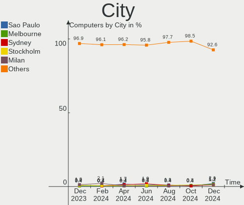
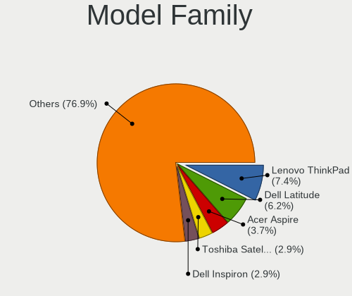
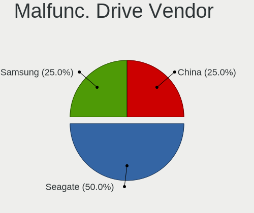
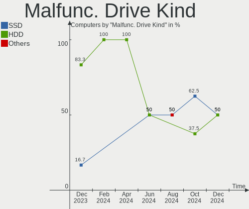
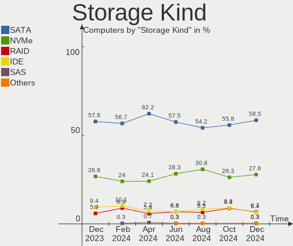

Zorin Hardware Trends
---------------------

A project to identify most popular hardware characteristics and track their change
over time based on data collected by Zorin users at https://Linux-Hardware.org.

Anyone can contribute to the study by uploading probes of their computers by
the [hw-probe](https://github.com/linuxhw/hw-probe) tool:

    sudo -E hw-probe -all -upload

This is a report for all computer types. See also reports for [desktops](/Dist/Zorin/Desktop/README.md) and [notebooks](/Dist/Zorin/Notebook/README.md).

Full-feature report is available here: https://linux-hardware.org/?view=trends

Period: May, 2020.

Contents
--------

- [ OS                       ](#os)
- [ OS Family                ](#os-family)
- [ Kernel                   ](#kernel)
- [ Kernel Family            ](#kernel-family)
- [ Kernel Major Ver.        ](#kernel-major-ver)
- [ Arch                     ](#arch)
- [ DE                       ](#de)
- [ Display Server           ](#display-server)
- [ Display Manager          ](#display-manager)
- [ OS Lang                  ](#os-lang)
- [ Boot Mode                ](#boot-mode)
- [ Filesystem               ](#filesystem)
- [ Part. scheme             ](#part-scheme)
- [ Dual Boot with Linux/BSD ](#dual-boot-with-linux/bsd)
- [ Dual Boot (Win)          ](#dual-boot-win)
- [ Country                  ](#country)
- [ City                     ](#city)
- [ Vendor                   ](#vendor)
- [ Model                    ](#model)
- [ Model Family             ](#model-family)
- [ MFG Year                 ](#mfg-year)
- [ Form Factor              ](#form-factor)
- [ Secure Boot              ](#secure-boot)
- [ Coreboot                 ](#coreboot)
- [ RAM Size                 ](#ram-size)
- [ RAM Used                 ](#ram-used)
- [ Drive Vendor             ](#drive-vendor)
- [ Drive Model              ](#drive-model)
- [ Drive Kind               ](#drive-kind)
- [ Drive Connector          ](#drive-connector)
- [ Drive Size               ](#drive-size)
- [ Space Total              ](#space-total)
- [ Space Used               ](#space-used)
- [ Malfunc. Drives          ](#malfunc-drives)
- [ Malfunc. Drive Vendor    ](#malfunc-drive-vendor)
- [ Malfunc. Drive Kind      ](#malfunc-drive-kind)
- [ Failed Drives            ](#failed-drives)
- [ Failed Drive Vendor      ](#failed-drive-vendor)
- [ Drive Status             ](#drive-status)
- [ Storage Vendor           ](#storage-vendor)
- [ Storage Model            ](#storage-model)
- [ Storage Kind             ](#storage-kind)
- [ CPU Vendor               ](#cpu-vendor)
- [ CPU Model                ](#cpu-model)
- [ CPU Model Family         ](#cpu-model-family)
- [ CPU Cores                ](#cpu-cores)
- [ CPU Sockets              ](#cpu-sockets)
- [ CPU Threads              ](#cpu-threads)
- [ CPU Op-Modes             ](#cpu-op-modes)
- [ CPU Microcode            ](#cpu-microcode)
- [ CPU Microarch            ](#cpu-microarch)
- [ GPU Vendor               ](#gpu-vendor)
- [ GPU Model                ](#gpu-model)
- [ GPU Combo                ](#gpu-combo)
- [ GPU Driver               ](#gpu-driver)
- [ GPU Memory               ](#gpu-memory)
- [ Monitor Vendor           ](#monitor-vendor)
- [ Monitor Model            ](#monitor-model)
- [ Monitor Resolution       ](#monitor-resolution)
- [ Monitor Diagonal         ](#monitor-diagonal)
- [ Monitor Width            ](#monitor-width)
- [ Aspect Ratio             ](#aspect-ratio)
- [ Monitor Area             ](#monitor-area)
- [ Pixel Density            ](#pixel-density)
- [ Multiple Monitors        ](#multiple-monitors)
- [ Net Controller Vendor    ](#net-controller-vendor)
- [ Net Controller Model     ](#net-controller-model)
- [ Net Controller Kind      ](#net-controller-kind)
- [ Used Controller          ](#used-controller)
- [ NICs                     ](#nics)
- [ Unsupported Devices      ](#unsupported-devices)
- [ Unsupported Device Types ](#unsupported-device-types)

OS
--

Installed operating systems

| Name     | Computers | Percent |
|----------|-----------|---------|
| Zorin 15 | 107       | 96.4%   |
| Zorin 12 | 4         | 3.6%    |

OS Family
---------

OS without a version

| Name  | Computers | Percent |
|-------|-----------|---------|
| Zorin | 111       | 100%    |

Kernel
------

Version of the Linux kernel

| Version            | Computers | Percent |
|--------------------|-----------|---------|
| 5.3.0-51-generic   | 59        | 53.15%  |
| 5.3.0-53-generic   | 31        | 27.93%  |
| 5.3.0-40-generic   | 8         | 7.21%   |
| 5.3.0-46-generic   | 3         | 2.7%    |
| 5.0.0-37-generic   | 2         | 1.8%    |
| 4.18.0-21-generic  | 2         | 1.8%    |
| 4.15.0-99-generic  | 2         | 1.8%    |
| 4.15.0-101-generic | 2         | 1.8%    |
| 5.3.0-45-generic   | 1         | 0.9%    |
| 5.3.0-28-generic   | 1         | 0.9%    |

Kernel Family
-------------

Linux kernel without a distro release

| Version | Computers | Percent |
|---------|-----------|---------|
| 5.3.0   | 103       | 92.79%  |
| 4.15.0  | 4         | 3.6%    |
| 5.0.0   | 2         | 1.8%    |
| 4.18.0  | 2         | 1.8%    |

Kernel Major Ver.
-----------------

Linux kernel major version

| Version | Computers | Percent |
|---------|-----------|---------|
| 5.3     | 103       | 92.79%  |
| 4.15    | 4         | 3.6%    |
| 5.0     | 2         | 1.8%    |
| 4.18    | 2         | 1.8%    |

Arch
----

OS architecture (x86_64, i586, etc.)

| Name   | Computers | Percent |
|--------|-----------|---------|
| x86_64 | 91        | 81.98%  |
| i686   | 20        | 18.02%  |

DE
--

Desktop Environment

| Name    | Computers | Percent |
|---------|-----------|---------|
| GNOME   | 71        | 63.96%  |
| XFCE    | 39        | 35.14%  |
| Unknown | 1         | 0.9%    |

Display Server
--------------

X11 or Wayland

| Name | Computers | Percent |
|------|-----------|---------|
| X11  | 111       | 100%    |

Display Manager
---------------

SDDM, LightDM, etc.

| Name    | Computers | Percent |
|---------|-----------|---------|
| Unknown | 110       | 99.1%   |
| LightDM | 1         | 0.9%    |

OS Lang
-------

Language

| Lang  | Computers | Percent |
|-------|-----------|---------|
| en_US | 38        | 34.23%  |
| it_IT | 7         | 6.31%   |
| pt_BR | 6         | 5.41%   |
| en_IN | 6         | 5.41%   |
| en_CA | 5         | 4.5%    |
| ru_RU | 4         | 3.6%    |
| de_DE | 4         | 3.6%    |
| pl_PL | 3         | 2.7%    |
| es_ES | 3         | 2.7%    |
| es_AR | 3         | 2.7%    |
| en_ZA | 3         | 2.7%    |
| en_GB | 3         | 2.7%    |
| pt_PT | 2         | 1.8%    |
| nl_BE | 2         | 1.8%    |
| fr_FR | 2         | 1.8%    |
| es_MX | 2         | 1.8%    |
| ro_RO | 1         | 0.9%    |
| hu_HU | 1         | 0.9%    |
| he_IL | 1         | 0.9%    |
| fr_CH | 1         | 0.9%    |
| es_UY | 1         | 0.9%    |
| es_PE | 1         | 0.9%    |
| es_PA | 1         | 0.9%    |
| es_NI | 1         | 0.9%    |
| es_CO | 1         | 0.9%    |
| es_CL | 1         | 0.9%    |
| en_IL | 1         | 0.9%    |
| en_IE | 1         | 0.9%    |
| en_AU | 1         | 0.9%    |
| el_GR | 1         | 0.9%    |
| de_CH | 1         | 0.9%    |
| de_BE | 1         | 0.9%    |
| C     | 1         | 0.9%    |
| bg_BG | 1         | 0.9%    |

Boot Mode
---------

EFI or BIOS

| Mode | Computers | Percent |
|------|-----------|---------|
| BIOS | 77        | 69.37%  |
| EFI  | 34        | 30.63%  |

Filesystem
----------

Type of filesystem

| Type    | Computers | Percent |
|---------|-----------|---------|
| Ext4    | 109       | 98.2%   |
| Overlay | 1         | 0.9%    |
| Ext3    | 1         | 0.9%    |

Part. scheme
------------

Scheme of partitioning

| Type    | Computers | Percent |
|---------|-----------|---------|
| Unknown | 111       | 100%    |

Dual Boot with Linux/BSD
------------------------

Hosting more than one Linux/BSD

| Dual boot | Computers | Percent |
|-----------|-----------|---------|
| No        | 102       | 91.89%  |
| Yes       | 9         | 8.11%   |

Dual Boot (Win)
---------------

Hosting Linux and Windows

| Dual boot | Computers | Percent |
|-----------|-----------|---------|
| No        | 76        | 68.47%  |
| Yes       | 35        | 31.53%  |

Country
-------

Geographic location (country)

| Country      | Computers | Percent |
|--------------|-----------|---------|
| USA          | 19        | 17.12%  |
| Germany      | 9         | 8.11%   |
| Italy        | 6         | 5.41%   |
| India        | 6         | 5.41%   |
| Brazil       | 6         | 5.41%   |
| Romania      | 5         | 4.5%    |
| Canada       | 5         | 4.5%    |
| Spain        | 4         | 3.6%    |
| Russia       | 4         | 3.6%    |
| Argentina    | 4         | 3.6%    |
| UK           | 3         | 2.7%    |
| Switzerland  | 3         | 2.7%    |
| South Africa | 3         | 2.7%    |
| Poland       | 3         | 2.7%    |
| Belgium      | 3         | 2.7%    |
| Sweden       | 2         | 1.8%    |
| Portugal     | 2         | 1.8%    |
| Mexico       | 2         | 1.8%    |
| Israel       | 2         | 1.8%    |
| France       | 2         | 1.8%    |
| Bulgaria     | 2         | 1.8%    |
| Uruguay      | 1         | 0.9%    |
| UAE          | 1         | 0.9%    |
| Suriname     | 1         | 0.9%    |
| Sri Lanka    | 1         | 0.9%    |
| Serbia       | 1         | 0.9%    |
| Peru         | 1         | 0.9%    |
| Panama       | 1         | 0.9%    |
| Pakistan     | 1         | 0.9%    |
| Nicaragua    | 1         | 0.9%    |
| Netherlands  | 1         | 0.9%    |
| Kazakhstan   | 1         | 0.9%    |
| Ireland      | 1         | 0.9%    |
| Greece       | 1         | 0.9%    |
| Colombia     | 1         | 0.9%    |
| Chile        | 1         | 0.9%    |
| Australia    | 1         | 0.9%    |

City
----

Geographic location (city)

| City               | Computers | Percent |
|--------------------|-----------|---------|
| Toronto            | 3         | 2.7%    |
| Zurich             | 2         | 1.8%    |
| São Paulo         | 2         | 1.8%    |
| Sofia              | 2         | 1.8%    |
| Rome               | 2         | 1.8%    |
| Mahwah             | 2         | 1.8%    |
| Johannesburg       | 2         | 1.8%    |
| Bucharest          | 2         | 1.8%    |
| Wrocław           | 1         | 0.9%    |
| Westport           | 1         | 0.9%    |
| Vlahita            | 1         | 0.9%    |
| Vincentown         | 1         | 0.9%    |
| Vancouver          | 1         | 0.9%    |
| Tulcea             | 1         | 0.9%    |
| Trujillo           | 1         | 0.9%    |
| Teramo             | 1         | 0.9%    |
| Telford            | 1         | 0.9%    |
| Tel Aviv           | 1         | 0.9%    |
| Sunne              | 1         | 0.9%    |
| Stoke-on-Trent     | 1         | 0.9%    |
| Slatina            | 1         | 0.9%    |
| Sintra             | 1         | 0.9%    |
| Saratov            | 1         | 0.9%    |
| Santiago de Cali   | 1         | 0.9%    |
| Santiago           | 1         | 0.9%    |
| San Pedro Mixtepec | 1         | 0.9%    |
| Saint Charles      | 1         | 0.9%    |
| Sabac              | 1         | 0.9%    |
| Riverside          | 1         | 0.9%    |
| Pretoria           | 1         | 0.9%    |
| Praia da Vitoria   | 1         | 0.9%    |
| Perugia            | 1         | 0.9%    |
| Pavlodar           | 1         | 0.9%    |
| Parker             | 1         | 0.9%    |
| Paramaribo         | 1         | 0.9%    |
| Palakkad           | 1         | 0.9%    |
| Osasco             | 1         | 0.9%    |
| Oosterbeek         | 1         | 0.9%    |
| Obernai            | 1         | 0.9%    |
| New Brighton       | 1         | 0.9%    |
| Neuss              | 1         | 0.9%    |
| Naples             | 1         | 0.9%    |
| Mumbai             | 1         | 0.9%    |
| Moscow             | 1         | 0.9%    |
| Morada Nova        | 1         | 0.9%    |
| Montevideo         | 1         | 0.9%    |
| Milan              | 1         | 0.9%    |
| Mequon             | 1         | 0.9%    |
| McKinney           | 1         | 0.9%    |
| Mansfield          | 1         | 0.9%    |
| Managua            | 1         | 0.9%    |
| Mamming            | 1         | 0.9%    |
| Maldegem           | 1         | 0.9%    |
| Madrid             | 1         | 0.9%    |
| Mableton           | 1         | 0.9%    |
| Lyon               | 1         | 0.9%    |
| Longwood           | 1         | 0.9%    |
| Lahore             | 1         | 0.9%    |
| La Chorrera        | 1         | 0.9%    |
| Katerini           | 1         | 0.9%    |

Vendor
------

Motherboard manufacturer

| Name                | Computers | Percent |
|---------------------|-----------|---------|
| Hewlett-Packard     | 23        | 20.72%  |
| ASUSTek Computer    | 18        | 16.22%  |
| Dell                | 16        | 14.41%  |
| Acer                | 12        | 10.81%  |
| Lenovo              | 7         | 6.31%   |
| Gigabyte Technology | 7         | 6.31%   |
| MSI                 | 3         | 2.7%    |
| Fujitsu             | 3         | 2.7%    |
| ASRock              | 3         | 2.7%    |
| Samsung Electronics | 2         | 1.8%    |
| Intel               | 2         | 1.8%    |
| ECS                 | 2         | 1.8%    |
| Durabook            | 2         | 1.8%    |
| soyocomputer        | 1         | 0.9%    |
| Sony                | 1         | 0.9%    |
| Positivo            | 1         | 0.9%    |
| Pegatron            | 1         | 0.9%    |
| Notebook            | 1         | 0.9%    |
| Medion              | 1         | 0.9%    |
| Insyde              | 1         | 0.9%    |
| Fujitsu Siemens     | 1         | 0.9%    |
| Foxconn             | 1         | 0.9%    |
| Apple               | 1         | 0.9%    |
| Advantec            | 1         | 0.9%    |

Model
-----

Motherboard model

| Name                                  | Computers | Percent |
|---------------------------------------|-----------|---------|
| HP Pavilion dv7                       | 2         | 1.8%    |
| HP 635                                | 2         | 1.8%    |
| HP 15                                 | 2         | 1.8%    |
| Durabook S15H                         | 2         | 1.8%    |
| soyocomputer P4IPE                    | 1         | 0.9%    |
| Sony VGN-AW11Z_B                      | 1         | 0.9%    |
| Samsung Electronics R425D/R525D       | 1         | 0.9%    |
| Samsung Electronics N150P/N210P/N220P | 1         | 0.9%    |
| Positivo S14CT01                      | 1         | 0.9%    |
| Pegatron G5329es                      | 1         | 0.9%    |
| Notebook P570WM                       | 1         | 0.9%    |
| MSI MS-7721                           | 1         | 0.9%    |
| MSI GL63 8RD                          | 1         | 0.9%    |
| MSI EP043AA-UUZ a1315.ch              | 1         | 0.9%    |
| Medion ERAZER X7853 MD60604           | 1         | 0.9%    |
| Lenovo V145-15AST 81MT                | 1         | 0.9%    |
| Lenovo ThinkPad X240 20AMS72T00       | 1         | 0.9%    |
| Lenovo ThinkPad X140e 20BMS00E00      | 1         | 0.9%    |
| Lenovo ThinkPad E585 20KV0010US       | 1         | 0.9%    |
| Lenovo ThinkCentre M57 6072W2A        | 1         | 0.9%    |
| Lenovo Lenovo                         | 1         | 0.9%    |
| Lenovo IdeaPad 120S-14IAP 81A5        | 1         | 0.9%    |
| Intel SBC-FITPC2                      | 1         | 0.9%    |
| Intel QC6003                          | 1         | 0.9%    |
| Insyde TW36                           | 1         | 0.9%    |
| HP ZBook 17 G5                        | 1         | 0.9%    |
| HP Z600 Workstation                   | 1         | 0.9%    |
| HP Stream Laptop 14-ax0XX             | 1         | 0.9%    |
| HP ProDesk 600 G1 SFF                 | 1         | 0.9%    |
| HP ProBook 450 G2                     | 1         | 0.9%    |
| HP Presario V5000 (EX096PA#ACJ)       | 1         | 0.9%    |
| HP Pavilion dv6000 (RP986EA#ABZ)      | 1         | 0.9%    |
| HP Pavilion dv6                       | 1         | 0.9%    |
| HP Pavilion (EC436AV#ABA)             | 1         | 0.9%    |
| HP Notebook                           | 1         | 0.9%    |
| HP Laptop 15-rb0xx                    | 1         | 0.9%    |
| HP Laptop 15-dw0xxx                   | 1         | 0.9%    |
| HP EliteBook x360 1030 G2             | 1         | 0.9%    |
| HP EliteBook Folio 9480m              | 1         | 0.9%    |
| HP EliteBook 840 G1                   | 1         | 0.9%    |
| HP EliteBook 6930p                    | 1         | 0.9%    |
| HP Compaq 6735s                       | 1         | 0.9%    |
| Gigabyte Z68MA-D2H-B3                 | 1         | 0.9%    |
| Gigabyte H61M-S1                      | 1         | 0.9%    |
| Gigabyte GA-MA78G-DS3H                | 1         | 0.9%    |
| Gigabyte GA-78LMT-USB3 6.0            | 1         | 0.9%    |
| Gigabyte GA-78LMT-S2PT                | 1         | 0.9%    |
| Gigabyte B75MS                        | 1         | 0.9%    |
| Gigabyte 970A-DS3P                    | 1         | 0.9%    |
| Fujitsu Siemens ESPRIMO Mobile V6555  | 1         | 0.9%    |
| Fujitsu LIFEBOOK S752                 | 1         | 0.9%    |
| Fujitsu LIFEBOOK S710                 | 1         | 0.9%    |
| Fujitsu LIFEBOOK AH531/GFO            | 1         | 0.9%    |
| Foxconn SG3-360FR                     | 1         | 0.9%    |
| ECS G41T-M                            | 1         | 0.9%    |
| ECS A740GM-M                          | 1         | 0.9%    |
| Dell Vostro 3550                      | 1         | 0.9%    |
| Dell Studio XPS 9100                  | 1         | 0.9%    |
| Dell Studio 1737                      | 1         | 0.9%    |
| Dell Precision M4800                  | 1         | 0.9%    |

Model Family
------------

Motherboard model prefix

| Name                      | Computers | Percent |
|---------------------------|-----------|---------|
| Dell Inspiron             | 6         | 5.41%   |
| Acer Aspire               | 6         | 5.41%   |
| HP Pavilion               | 5         | 4.5%    |
| HP EliteBook              | 4         | 3.6%    |
| Dell Latitude             | 4         | 3.6%    |
| Lenovo ThinkPad           | 3         | 2.7%    |
| Fujitsu LIFEBOOK          | 3         | 2.7%    |
| HP Laptop                 | 2         | 1.8%    |
| HP 635                    | 2         | 1.8%    |
| HP 15                     | 2         | 1.8%    |
| Durabook S15H             | 2         | 1.8%    |
| Dell Studio               | 2         | 1.8%    |
| soyocomputer P4IPE        | 1         | 0.9%    |
| Sony VGN-AW11Z            | 1         | 0.9%    |
| Samsung Electronics R425D | 1         | 0.9%    |
| Samsung Electronics N150P | 1         | 0.9%    |
| Positivo S14CT01          | 1         | 0.9%    |
| Pegatron G5329es          | 1         | 0.9%    |
| Notebook P570WM           | 1         | 0.9%    |
| MSI MS-7721               | 1         | 0.9%    |
| MSI GL63                  | 1         | 0.9%    |
| MSI EP043AA-UUZ           | 1         | 0.9%    |
| Medion ERAZER             | 1         | 0.9%    |
| Lenovo V145-15AST         | 1         | 0.9%    |
| Lenovo ThinkCentre        | 1         | 0.9%    |
| Lenovo Lenovo             | 1         | 0.9%    |
| Lenovo IdeaPad            | 1         | 0.9%    |
| Intel SBC-FITPC2          | 1         | 0.9%    |
| Intel QC6003              | 1         | 0.9%    |
| Insyde TW36               | 1         | 0.9%    |
| HP ZBook                  | 1         | 0.9%    |
| HP Z600                   | 1         | 0.9%    |
| HP Stream                 | 1         | 0.9%    |
| HP ProDesk                | 1         | 0.9%    |
| HP ProBook                | 1         | 0.9%    |
| HP Presario               | 1         | 0.9%    |
| HP Notebook               | 1         | 0.9%    |
| HP Compaq                 | 1         | 0.9%    |
| Gigabyte Z68MA-D2H-B3     | 1         | 0.9%    |
| Gigabyte H61M-S1          | 1         | 0.9%    |
| Gigabyte GA-MA78G-DS3H    | 1         | 0.9%    |
| Gigabyte GA-78LMT-USB3    | 1         | 0.9%    |
| Gigabyte GA-78LMT-S2PT    | 1         | 0.9%    |
| Gigabyte B75MS            | 1         | 0.9%    |
| Gigabyte 970A-DS3P        | 1         | 0.9%    |
| Fujitsu Siemens ESPRIMO   | 1         | 0.9%    |
| Foxconn SG3-360FR         | 1         | 0.9%    |
| ECS G41T-M                | 1         | 0.9%    |
| ECS A740GM-M              | 1         | 0.9%    |
| Dell Vostro               | 1         | 0.9%    |
| Dell Precision            | 1         | 0.9%    |
| Dell OptiPlex             | 1         | 0.9%    |
| Dell DM051                | 1         | 0.9%    |
| ASUS Z450LA               | 1         | 0.9%    |
| ASUS X750JA               | 1         | 0.9%    |
| ASUS X302LA               | 1         | 0.9%    |
| ASUS UX331UA              | 1         | 0.9%    |
| ASUS UL20A                | 1         | 0.9%    |
| ASUS T100TA               | 1         | 0.9%    |
| ASUS PRIME                | 1         | 0.9%    |

MFG Year
--------

Motherboard manufacture year

| Year | Computers | Percent |
|------|-----------|---------|
| 2011 | 13        | 11.71%  |
| 2009 | 13        | 11.71%  |
| 2015 | 10        | 9.01%   |
| 2019 | 9         | 8.11%   |
| 2018 | 9         | 8.11%   |
| 2010 | 9         | 8.11%   |
| 2016 | 8         | 7.21%   |
| 2014 | 7         | 6.31%   |
| 2013 | 6         | 5.41%   |
| 2012 | 6         | 5.41%   |
| 2017 | 4         | 3.6%    |
| 2007 | 4         | 3.6%    |
| 2006 | 4         | 3.6%    |
| 2008 | 3         | 2.7%    |
| 2020 | 2         | 1.8%    |
| 2005 | 2         | 1.8%    |
| 2004 | 1         | 0.9%    |
| 2003 | 1         | 0.9%    |

Form Factor
-----------

Physical design of the computer

| Name        | Computers | Percent |
|-------------|-----------|---------|
| Notebook    | 75        | 67.57%  |
| Desktop     | 33        | 29.73%  |
| Convertible | 2         | 1.8%    |
| Mini pc     | 1         | 0.9%    |

Secure Boot
-----------

Enabled or disabled

| State    | Computers | Percent |
|----------|-----------|---------|
| Disabled | 105       | 94.59%  |
| Enabled  | 6         | 5.41%   |

Coreboot
--------

Have coreboot on board

| Used | Computers | Percent |
|------|-----------|---------|
| No   | 111       | 100%    |

RAM Size
--------

Total RAM memory

| Size in GB  | Computers | Percent |
|-------------|-----------|---------|
| 3.01-4.0    | 35        | 31.53%  |
| 4.01-8.0    | 22        | 19.82%  |
| 1.01-2.0    | 18        | 16.22%  |
| 8.01-16.0   | 10        | 9.01%   |
| 0.01-1.0    | 10        | 9.01%   |
| 16.01-24.0  | 9         | 8.11%   |
| 32.01-64.0  | 4         | 3.6%    |
| 2.01-3.0    | 2         | 1.8%    |
| 64.01-256.0 | 1         | 0.9%    |

RAM Used
--------

Used RAM memory

| Used GB   | Computers | Percent |
|-----------|-----------|---------|
| 1.01-2.0  | 56        | 50.45%  |
| 0.01-1.0  | 21        | 18.92%  |
| 2.01-3.0  | 18        | 16.22%  |
| 3.01-4.0  | 9         | 8.11%   |
| 4.01-8.0  | 6         | 5.41%   |
| 8.01-16.0 | 1         | 0.9%    |

Drive Vendor
------------

Hard drive vendors

| Vendor              | Computers | Drives | Percent |
|---------------------|-----------|--------|---------|
| WDC                 | 32        | 33     | 23.19%  |
| Seagate             | 25        | 27     | 18.12%  |
| Unknown             | 16        | 20     | 11.59%  |
| Samsung Electronics | 11        | 11     | 7.97%   |
| Hitachi             | 11        | 11     | 7.97%   |
| Toshiba             | 8         | 8      | 5.8%    |
| Kingston            | 7         | 7      | 5.07%   |
| Crucial             | 5         | 5      | 3.62%   |
| SanDisk             | 4         | 4      | 2.9%    |
| Intel               | 3         | 3      | 2.17%   |
| PLEXTOR             | 2         | 2      | 1.45%   |
| OCZ                 | 2         | 2      | 1.45%   |
| HGST                | 2         | 2      | 1.45%   |
| Team                | 1         | 1      | 0.72%   |
| SK Hynix            | 1         | 1      | 0.72%   |
| Patriot             | 1         | 1      | 0.72%   |
| MAXTOR              | 1         | 1      | 0.72%   |
| JMicron             | 1         | 1      | 0.72%   |
| HL-DT-ST            | 1         | 1      | 0.72%   |
| FC-1307             | 1         | 1      | 0.72%   |
| EMTEC               | 1         | 1      | 0.72%   |
| Corsair             | 1         | 1      | 0.72%   |
| A-DATA Technology   | 1         | 1      | 0.72%   |

Drive Model
-----------

Hard drive models

| Model                        | Computers | Percent |
|------------------------------|-----------|---------|
| MMC Card  32GB               | 9         | 6.29%   |
| HTS545016B9A300 160GB        | 3         | 2.1%    |
| WD3200BPVT-22JJ5T0 320GB     | 2         | 1.4%    |
| WD10JPVX-22JC3T0 1TB         | 2         | 1.4%    |
| ST9160314AS 160GB            | 2         | 1.4%    |
| SA400S37480G 480GB SSD       | 2         | 1.4%    |
| SA400S37240G 240GB SSD       | 2         | 1.4%    |
| PX-512M6S 512GB SSD          | 2         | 1.4%    |
| MMC Card  64GB               | 2         | 1.4%    |
| MMC Card  128GB              | 2         | 1.4%    |
| X150 240GB                   | 1         | 0.7%    |
| WDS240G2G0A-00JH30 240GB SSD | 1         | 0.7%    |
| WD800JD-60LUA0 80GB          | 1         | 0.7%    |
| WD800BEVS-22RST0 80GB        | 1         | 0.7%    |
| WD6400BPVT-22HXZT3 640GB     | 1         | 0.7%    |
| WD6400AAKS-00A7B0 640GB      | 1         | 0.7%    |
| WD5000LPVX-80V0TT0 500GB     | 1         | 0.7%    |
| WD5000LPVX-22V0TT0 500GB     | 1         | 0.7%    |
| WD5000LPCX-75VHAT0 500GB     | 1         | 0.7%    |
| WD5000LPCX-60VHAT1 500GB     | 1         | 0.7%    |
| WD5000LPCX-60VHAT0 500GB     | 1         | 0.7%    |
| WD5000BPVT-22HXZT3 500GB     | 1         | 0.7%    |
| WD5000BEVT-22A0RT0 500GB     | 1         | 0.7%    |
| WD5000AVVS-63ZWB0 500GB      | 1         | 0.7%    |
| WD5000AAKX-00ERMA0 500GB     | 1         | 0.7%    |
| WD5000AAKS-00D2B0 500GB      | 1         | 0.7%    |
| WD3200BEVT-75A23T0 320GB     | 1         | 0.7%    |
| WD3200BEVE-00A0HT0 320GB     | 1         | 0.7%    |
| WD3200AAJS-60Z0A0 320GB      | 1         | 0.7%    |
| WD2500JB-00REA0 250GB        | 1         | 0.7%    |
| WD2500BEKT-60A25T1 250GB     | 1         | 0.7%    |
| WD2500AAJS-00VTA0 250GB      | 1         | 0.7%    |
| WD2002FAEX-007BA0 2TB        | 1         | 0.7%    |
| WD1600BEVT-22A23T0 160GB     | 1         | 0.7%    |
| WD15EARS-00MVWB0 1TB         | 1         | 0.7%    |
| WD10SPZX-75Z10T2 1TB         | 1         | 0.7%    |
| WD10SPCX-75KHST0 1TB         | 1         | 0.7%    |
| WD10JPVX-60JC3T0 1TB         | 1         | 0.7%    |
| WD10EZRX-00A3KB0 1TB         | 1         | 0.7%    |
| WD10EARX-00N0YB0 1TB         | 1         | 0.7%    |
| VERTEX3 120GB SSD            | 1         | 0.7%    |
| USD00  32GB                  | 1         | 0.7%    |
| TRION150 240GB SSD           | 1         | 0.7%    |
| Tech 250GB                   | 1         | 0.7%    |
| T253X2128G 128GB SSD         | 1         | 0.7%    |
| SV4012H 40GB                 | 1         | 0.7%    |
| SV100S2128G 128GB SSD        | 1         | 0.7%    |
| SUV400S37120G 120GB SSD      | 1         | 0.7%    |
| SU810NS38 SATA 128 GB SSD    | 1         | 0.7%    |
| STM3160815AS 160GB           | 1         | 0.7%    |
| ST95005620AS 500GB           | 1         | 0.7%    |
| ST9500325AS 500GB            | 1         | 0.7%    |
| ST500LT012-9WS142 500GB      | 1         | 0.7%    |
| ST500LT012-1DG142 500GB      | 1         | 0.7%    |
| ST500LM030-2E717D 500GB      | 1         | 0.7%    |
| ST500LM021-1KJ152 500GB      | 1         | 0.7%    |
| ST500LM000-1EJ162 500GB      | 1         | 0.7%    |
| ST500DM002-1BD142 500GB      | 1         | 0.7%    |
| ST3750630AS 752GB            | 1         | 0.7%    |
| ST3500630AS 500GB            | 1         | 0.7%    |

Drive Kind
----------

HDD or SSD

| Kind    | Computers | Drives | Percent |
|---------|-----------|--------|---------|
| HDD     | 76        | 84     | 58.91%  |
| SSD     | 33        | 37     | 25.58%  |
| MMC     | 15        | 19     | 11.63%  |
| Unknown | 5         | 5      | 3.88%   |

Drive Connector
---------------

SATA, SAS, NVMe, etc.

| Type | Computers | Drives | Percent |
|------|-----------|--------|---------|
| SATA | 101       | 119    | 84.17%  |
| MMC  | 15        | 19     | 12.5%   |
| SAS  | 4         | 7      | 3.33%   |

Drive Size
----------

Size of hard drive

| Size in TB | Computers | Drives | Percent |
|------------|-----------|--------|---------|
| 0.01-0.5   | 91        | 108    | 73.39%  |
| 0.51-1.0   | 27        | 28     | 21.77%  |
| 1.01-2.0   | 5         | 6      | 4.03%   |
| 3.01-4.0   | 1         | 3      | 0.81%   |

Space Total
-----------

Amount of disk space available on the file system

| Size in GB     | Computers | Percent |
|----------------|-----------|---------|
| 251-500        | 34        | 30.63%  |
| 101-250        | 34        | 30.63%  |
| 51-100         | 11        | 9.91%   |
| 21-50          | 10        | 9.01%   |
| 501-1000       | 10        | 9.01%   |
| 1-20           | 5         | 4.5%    |
| 1001-2000      | 3         | 2.7%    |
| More than 3000 | 2         | 1.8%    |
| 2001-3000      | 2         | 1.8%    |

Space Used
----------

Amount of used disk space

| Used GB        | Computers | Percent |
|----------------|-----------|---------|
| 1-20           | 61        | 54.95%  |
| 21-50          | 21        | 18.92%  |
| 51-100         | 14        | 12.61%  |
| 101-250        | 8         | 7.21%   |
| 1001-2000      | 3         | 2.7%    |
| 251-500        | 2         | 1.8%    |
| More than 3000 | 1         | 0.9%    |
| 2001-3000      | 1         | 0.9%    |

Malfunc. Drives
---------------

Drive models with a malfunction

| Model             | Computers | Drives | Percent |
|-------------------|-----------|--------|---------|
| ST9160314AS 160GB | 1         | 1      | 100%    |

Malfunc. Drive Vendor
---------------------

Vendors of faulty drives

| Vendor  | Computers | Drives | Percent |
|---------|-----------|--------|---------|
| Seagate | 1         | 1      | 100%    |

Malfunc. Drive Kind
-------------------

Kinds of faulty drives

| Kind | Computers | Drives | Percent |
|------|-----------|--------|---------|
| HDD  | 1         | 1      | 100%    |

Failed Drives
-------------

Failed drive models

Zero info for selected period =(

Failed Drive Vendor
-------------------

Failed drive vendors

Zero info for selected period =(

Drive Status
------------

Number of failed and malfunc. drives

| Status   | Computers | Drives | Percent |
|----------|-----------|--------|---------|
| Detected | 107       | 142    | 97.27%  |
| Works    | 2         | 2      | 1.82%   |
| Malfunc  | 1         | 1      | 0.91%   |

Storage Vendor
--------------

Storage controller vendors

| Vendor                      | Computers | Percent |
|-----------------------------|-----------|---------|
| Intel                       | 76        | 66.67%  |
| AMD                         | 24        | 21.05%  |
| Nvidia                      | 4         | 3.51%   |
| JMicron Technology          | 4         | 3.51%   |
| Samsung Electronics         | 3         | 2.63%   |
| VIA Technologies            | 1         | 0.88%   |
| SK Hynix                    | 1         | 0.88%   |
| Kingston Technology Company | 1         | 0.88%   |

Storage Model
-------------

Storage controller models

| Model                                                                             | Computers | Percent |
|-----------------------------------------------------------------------------------|-----------|---------|
| FCH SATA Controller [AHCI mode]                                                   | 9         | 6.12%   |
| 82801G (ICH7 Family) IDE Controller                                               | 8         | 5.44%   |
| SB7x0/SB8x0/SB9x0 SATA Controller [AHCI mode]                                     | 7         | 4.76%   |
| 82801 Mobile SATA Controller [RAID mode]                                          | 7         | 4.76%   |
| SB7x0/SB8x0/SB9x0 SATA Controller [IDE mode]                                      | 6         | 4.08%   |
| SB7x0/SB8x0/SB9x0 IDE Controller                                                  | 6         | 4.08%   |
| NM10/ICH7 Family SATA Controller [IDE mode]                                       | 6         | 4.08%   |
| 6 Series/C200 Series Chipset Family 6 port Mobile SATA AHCI Controller            | 6         | 4.08%   |
| 82801IBM/IEM (ICH9M/ICH9M-E) 4 port SATA Controller [AHCI mode]                   | 5         | 3.4%    |
| 8 Series/C220 Series Chipset Family 6-port SATA Controller 1 [AHCI mode]          | 4         | 2.72%   |
| 8 Series SATA Controller 1 [AHCI mode]                                            | 4         | 2.72%   |
| Atom/Celeron/Pentium Processor x5-E8000/J3xxx/N3xxx Series SATA Controller        | 3         | 2.04%   |
| 82801GBM/GHM (ICH7-M Family) SATA Controller [AHCI mode]                          | 3         | 2.04%   |
| 7 Series Chipset Family 6-port SATA Controller [AHCI mode]                        | 3         | 2.04%   |
| Wildcat Point-LP SATA Controller [AHCI Mode]                                      | 2         | 1.36%   |
| Sunrise Point-LP SATA Controller [AHCI mode]                                      | 2         | 1.36%   |
| NVMe SSD Controller SM981/PM981/PM983                                             | 2         | 1.36%   |
| NM10/ICH7 Family SATA Controller [AHCI mode]                                      | 2         | 1.36%   |
| MCP61 SATA Controller                                                             | 2         | 1.36%   |
| JMB368 IDE controller                                                             | 2         | 1.36%   |
| IXP SB4x0 IDE Controller                                                          | 2         | 1.36%   |
| Celeron N3350/Pentium N4200/Atom E3900 Series SATA AHCI Controller                | 2         | 1.36%   |
| Cannon Lake Mobile PCH SATA AHCI Controller                                       | 2         | 1.36%   |
| Atom Processor E3800 Series SATA AHCI Controller                                  | 2         | 1.36%   |
| 82801JI (ICH10 Family) 4 port SATA IDE Controller #1                              | 2         | 1.36%   |
| 82801JI (ICH10 Family) 2 port SATA IDE Controller #2                              | 2         | 1.36%   |
| 82801HM/HEM (ICH8M/ICH8M-E) SATA Controller [IDE mode]                            | 2         | 1.36%   |
| 82801HM/HEM (ICH8M/ICH8M-E) IDE Controller                                        | 2         | 1.36%   |
| 82801GBM/GHM (ICH7-M Family) SATA Controller [IDE mode]                           | 2         | 1.36%   |
| 6 Series/C200 Series Chipset Family Desktop SATA Controller (IDE mode, ports 4-5) | 2         | 1.36%   |
| 6 Series/C200 Series Chipset Family Desktop SATA Controller (IDE mode, ports 0-3) | 2         | 1.36%   |
| VT82C586A/B/VT82C686/A/B/VT823x/A/C PIPC Bus Master IDE                           | 1         | 0.68%   |
| VT8237A SATA 2-Port Controller                                                    | 1         | 0.68%   |
| US15W/US15X/US15L/UL11L SCH [Poulsbo] IDE Controller                              | 1         | 0.68%   |
| SSD Pro 7600p/760p/E 6100p Series                                                 | 1         | 0.68%   |
| SSD 660P Series                                                                   | 1         | 0.68%   |
| SATA Controller [RAID mode]                                                       | 1         | 0.68%   |
| PC300 NVMe Solid State Drive 512GB                                                | 1         | 0.68%   |
| NVMe SSD Controller SM961/PM961                                                   | 1         | 0.68%   |
| Non-Volatile memory controller                                                    | 1         | 0.68%   |
| Mobile 4 Series Chipset PT IDER Controller                                        | 1         | 0.68%   |
| MCP79 SATA Controller                                                             | 1         | 0.68%   |
| MCP73 SATA Controller (IDE mode)                                                  | 1         | 0.68%   |
| MCP73 IDE Controller                                                              | 1         | 0.68%   |
| MCP61 IDE                                                                         | 1         | 0.68%   |
| JMB363 SATA/IDE Controller                                                        | 1         | 0.68%   |
| JMB360 AHCI Controller                                                            | 1         | 0.68%   |
| IXP SB4x0 Serial ATA Controller                                                   | 1         | 0.68%   |
| HM170/QM170 Chipset SATA Controller [AHCI Mode]                                   | 1         | 0.68%   |
| FCH SATA Controller D                                                             | 1         | 0.68%   |
| C600/X79 series chipset 6-Port SATA AHCI Controller                               | 1         | 0.68%   |
| 82801JI (ICH10 Family) SATA AHCI Controller                                       | 1         | 0.68%   |
| 82801IR/IO/IH (ICH9R/DO/DH) 4 port SATA Controller [IDE mode]                     | 1         | 0.68%   |
| 82801IBM/IEM (ICH9M/ICH9M-E) 2 port SATA Controller [IDE mode]                    | 1         | 0.68%   |
| 82801I (ICH9 Family) 2 port SATA Controller [IDE mode]                            | 1         | 0.68%   |
| 82801EB/ER (ICH5/ICH5R) IDE Controller                                            | 1         | 0.68%   |
| 82801EB (ICH5) SATA Controller                                                    | 1         | 0.68%   |
| 82801CAM IDE U100 Controller                                                      | 1         | 0.68%   |
| 7 Series/C210 Series Chipset Family 6-port SATA Controller [AHCI mode]            | 1         | 0.68%   |
| 7 Series/C210 Series Chipset Family 4-port SATA Controller [IDE mode]             | 1         | 0.68%   |

Storage Kind
------------

Kind of storage controller (IDE, SATA, NVMe, SAS, ...)

| Kind | Computers | Percent |
|------|-----------|---------|
| SATA | 69        | 57.5%   |
| IDE  | 37        | 30.83%  |
| RAID | 8         | 6.67%   |
| NVMe | 6         | 5%      |

CPU Vendor
----------

Processor vendors

| Vendor | Computers | Percent |
|--------|-----------|---------|
| Intel  | 85        | 76.58%  |
| AMD    | 26        | 23.42%  |

CPU Model
---------

Processor models

| Model                                       | Computers | Percent |
|---------------------------------------------|-----------|---------|
| Intel Atom CPU N450 @ 1.66GHz               | 3         | 2.7%    |
| Intel Core i7-8565U CPU @ 1.80GHz           | 2         | 1.8%    |
| Intel Core i7-4600M CPU @ 2.90GHz           | 2         | 1.8%    |
| Intel Core i5-4310U CPU @ 2.00GHz           | 2         | 1.8%    |
| Intel Core i5-2410M CPU @ 2.30GHz           | 2         | 1.8%    |
| Intel Core i3-4005U CPU @ 1.70GHz           | 2         | 1.8%    |
| Intel Core 2 Duo CPU T6400 @ 2.00GHz        | 2         | 1.8%    |
| Intel Core 2 Duo CPU P8700 @ 2.53GHz        | 2         | 1.8%    |
| Intel Core 2 Duo CPU E7500 @ 2.93GHz        | 2         | 1.8%    |
| Intel Celeron CPU N3060 @ 1.60GHz           | 2         | 1.8%    |
| Intel Celeron CPU N3050 @ 1.60GHz           | 2         | 1.8%    |
| Intel Atom CPU N270 @ 1.60GHz               | 2         | 1.8%    |
| AMD E-450 APU with Radeon HD Graphics       | 2         | 1.8%    |
| AMD A8-5600K APU with Radeon HD Graphics    | 2         | 1.8%    |
| Intel Xeon E-2186M CPU @ 2.90GHz            | 1         | 0.9%    |
| Intel Xeon CPU E5520 @ 2.27GHz              | 1         | 0.9%    |
| Intel Pentium Dual-Core CPU T4200 @ 2.00GHz | 1         | 0.9%    |
| Intel Pentium Dual CPU E2220 @ 2.40GHz      | 1         | 0.9%    |
| Intel Pentium Dual CPU E2200 @ 2.20GHz      | 1         | 0.9%    |
| Intel Pentium D CPU 3.00GHz                 | 1         | 0.9%    |
| Intel Pentium D CPU 2.80GHz                 | 1         | 0.9%    |
| Intel Pentium CPU N4200 @ 1.10GHz           | 1         | 0.9%    |
| Intel Pentium CPU N3540 @ 2.16GHz           | 1         | 0.9%    |
| Intel Pentium 4 CPU 3.00GHz                 | 1         | 0.9%    |
| Intel Pentium 4 CPU 1.80GHz                 | 1         | 0.9%    |
| Intel Genuine CPU U2300 @ 1.20GHz           | 1         | 0.9%    |
| Intel Genuine CPU T2300 @ 1.66GHz           | 1         | 0.9%    |
| Intel Genuine CPU T2250 @ 1.73GHz           | 1         | 0.9%    |
| Intel Core i7-8750H CPU @ 2.20GHz           | 1         | 0.9%    |
| Intel Core i7-8550U CPU @ 1.80GHz           | 1         | 0.9%    |
| Intel Core i7-7700HQ CPU @ 2.80GHz          | 1         | 0.9%    |
| Intel Core i7-7600U CPU @ 2.80GHz           | 1         | 0.9%    |
| Intel Core i7-6600U CPU @ 2.60GHz           | 1         | 0.9%    |
| Intel Core i7-5500U CPU @ 2.40GHz           | 1         | 0.9%    |
| Intel Core i7-4940MX CPU @ 3.10GHz          | 1         | 0.9%    |
| Intel Core i7-4820K CPU @ 3.70GHz           | 1         | 0.9%    |
| Intel Core i7-4790 CPU @ 3.60GHz            | 1         | 0.9%    |
| Intel Core i7-4700HQ CPU @ 2.40GHz          | 1         | 0.9%    |
| Intel Core i7-2670QM CPU @ 2.20GHz          | 1         | 0.9%    |
| Intel Core i7-2620M CPU @ 2.70GHz           | 1         | 0.9%    |
| Intel Core i7-2600 CPU @ 3.40GHz            | 1         | 0.9%    |
| Intel Core i7 CPU Q 740 @ 1.73GHz           | 1         | 0.9%    |
| Intel Core i7 CPU 930 @ 2.80GHz             | 1         | 0.9%    |
| Intel Core i5-7600K CPU @ 3.80GHz           | 1         | 0.9%    |
| Intel Core i5-4300U CPU @ 1.90GHz           | 1         | 0.9%    |
| Intel Core i5-3340M CPU @ 2.70GHz           | 1         | 0.9%    |
| Intel Core i5-3210M CPU @ 2.50GHz           | 1         | 0.9%    |
| Intel Core i5-2430M CPU @ 2.40GHz           | 1         | 0.9%    |
| Intel Core i3-7020U CPU @ 2.30GHz           | 1         | 0.9%    |
| Intel Core i3-5010U CPU @ 2.10GHz           | 1         | 0.9%    |
| Intel Core i3-3240 CPU @ 3.40GHz            | 1         | 0.9%    |
| Intel Core i3-2370M CPU @ 2.40GHz           | 1         | 0.9%    |
| Intel Core i3-2330M CPU @ 2.20GHz           | 1         | 0.9%    |
| Intel Core i3-2100 CPU @ 3.10GHz            | 1         | 0.9%    |
| Intel Core i3 CPU M 370 @ 2.40GHz           | 1         | 0.9%    |
| Intel Core 2 Quad CPU Q8200 @ 2.33GHz       | 1         | 0.9%    |
| Intel Core 2 Duo CPU U9400 @ 1.40GHz        | 1         | 0.9%    |
| Intel Core 2 Duo CPU T9400 @ 2.53GHz        | 1         | 0.9%    |
| Intel Core 2 Duo CPU T5250 @ 1.50GHz        | 1         | 0.9%    |
| Intel Core 2 Duo CPU E4500 @ 2.20GHz        | 1         | 0.9%    |

CPU Model Family
----------------

Processor model prefix

| Model                   | Computers | Percent |
|-------------------------|-----------|---------|
| Intel Core i7           | 19        | 17.12%  |
| Intel Atom              | 11        | 9.91%   |
| Intel Core 2 Duo        | 10        | 9.01%   |
| Intel Celeron           | 10        | 9.01%   |
| Intel Core i5           | 9         | 8.11%   |
| Intel Core i3           | 9         | 8.11%   |
| Intel Genuine           | 3         | 2.7%    |
| AMD FX                  | 3         | 2.7%    |
| AMD A8                  | 3         | 2.7%    |
| Intel Xeon              | 2         | 1.8%    |
| Intel Pentium Dual      | 2         | 1.8%    |
| Intel Pentium D         | 2         | 1.8%    |
| Intel Pentium 4         | 2         | 1.8%    |
| Intel Pentium           | 2         | 1.8%    |
| AMD E                   | 2         | 1.8%    |
| AMD Athlon II X2        | 2         | 1.8%    |
| AMD A4                  | 2         | 1.8%    |
| Other                   | 1         | 0.9%    |
| Intel Pentium Dual-Core | 1         | 0.9%    |
| Intel Core 2 Quad       | 1         | 0.9%    |
| Intel Core 2            | 1         | 0.9%    |
| Intel Celeron M         | 1         | 0.9%    |
| AMD Turion 64 Mobile    | 1         | 0.9%    |
| AMD Sempron             | 1         | 0.9%    |
| AMD Ryzen 3             | 1         | 0.9%    |
| AMD Phenom II X4        | 1         | 0.9%    |
| AMD Phenom II X2        | 1         | 0.9%    |
| AMD Phenom II           | 1         | 0.9%    |
| AMD Phenom              | 1         | 0.9%    |
| AMD E1                  | 1         | 0.9%    |
| AMD C-60                | 1         | 0.9%    |
| AMD Athlon X2           | 1         | 0.9%    |
| AMD Athlon 64 X2        | 1         | 0.9%    |
| AMD Athlon 64           | 1         | 0.9%    |
| AMD A6                  | 1         | 0.9%    |

CPU Cores
---------

Number of processor cores

| Number | Computers | Percent |
|--------|-----------|---------|
| 2      | 66        | 59.46%  |
| 4      | 27        | 24.32%  |
| 1      | 16        | 14.41%  |
| 6      | 2         | 1.8%    |

CPU Sockets
-----------

Number of sockets

| Number | Computers | Percent |
|--------|-----------|---------|
| 1      | 111       | 100%    |

CPU Threads
-----------

Threads per core (Hyper-Threading)

| Number | Computers | Percent |
|--------|-----------|---------|
| 1      | 58        | 52.25%  |
| 2      | 53        | 47.75%  |

CPU Op-Modes
------------

CPU Operation Modes (32-bit, 64-bit)

| Op mode        | Computers | Percent |
|----------------|-----------|---------|
| 32-bit, 64-bit | 103       | 92.79%  |
| 32-bit         | 8         | 7.21%   |

CPU Microcode
-------------

Microcode number

| Number     | Computers | Percent |
|------------|-----------|---------|
| Unknown    | 10        | 9.01%   |
| 0x206a7    | 9         | 8.11%   |
| 0x1067a    | 9         | 8.11%   |
| 0x40651    | 5         | 4.5%    |
| 0x010000c8 | 5         | 4.5%    |
| 0x6fd      | 4         | 3.6%    |
| 0x306c3    | 4         | 3.6%    |
| 0x6e8      | 3         | 2.7%    |
| 0x406c4    | 3         | 2.7%    |
| 0x406c3    | 3         | 2.7%    |
| 0x306a9    | 3         | 2.7%    |
| 0x106ca    | 3         | 2.7%    |
| 0x106c2    | 3         | 2.7%    |
| 0x06001119 | 3         | 2.7%    |
| 0x06000852 | 3         | 2.7%    |
| 0x906ea    | 2         | 1.8%    |
| 0x906e9    | 2         | 1.8%    |
| 0x806ec    | 2         | 1.8%    |
| 0x806e9    | 2         | 1.8%    |
| 0x506c9    | 2         | 1.8%    |
| 0x306d4    | 2         | 1.8%    |
| 0x30673    | 2         | 1.8%    |
| 0x06006705 | 2         | 1.8%    |
| 0x05000119 | 2         | 1.8%    |
| 0x02000032 | 2         | 1.8%    |
| 0xf65      | 1         | 0.9%    |
| 0xf47      | 1         | 0.9%    |
| 0xf41      | 1         | 0.9%    |
| 0xf24      | 1         | 0.9%    |
| 0x806ea    | 1         | 0.9%    |
| 0x6f6      | 1         | 0.9%    |
| 0x406e3    | 1         | 0.9%    |
| 0x306e4    | 1         | 0.9%    |
| 0x30678    | 1         | 0.9%    |
| 0x30661    | 1         | 0.9%    |
| 0x20655    | 1         | 0.9%    |
| 0x106e5    | 1         | 0.9%    |
| 0x106a5    | 1         | 0.9%    |
| 0x10677    | 1         | 0.9%    |
| 0x10676    | 1         | 0.9%    |
| 0x10661    | 1         | 0.9%    |
| 0x0810100b | 1         | 0.9%    |
| 0x07030104 | 1         | 0.9%    |
| 0x07000110 | 1         | 0.9%    |
| 0x0600611a | 1         | 0.9%    |
| 0x01000095 | 1         | 0.9%    |

CPU Microarch
-------------

Microarchitecture

| Name            | Computers | Percent |
|-----------------|-----------|---------|
| Core            | 16        | 14.41%  |
| Skylake         | 10        | 9.01%   |
| Silvermont      | 10        | 9.01%   |
| SandyBridge     | 10        | 9.01%   |
| Haswell         | 10        | 9.01%   |
| Bonnell         | 7         | 6.31%   |
| Piledriver      | 6         | 5.41%   |
| K10             | 6         | 5.41%   |
| IvyBridge       | 5         | 4.5%    |
| NetBurst        | 4         | 3.6%    |
| P6              | 3         | 2.7%    |
| Nehalem         | 3         | 2.7%    |
| K8 Hammer       | 3         | 2.7%    |
| Excavator       | 3         | 2.7%    |
| Bobcat          | 3         | 2.7%    |
| Penryn          | 2         | 1.8%    |
| K8 & K10 hybrid | 2         | 1.8%    |
| Goldmont        | 2         | 1.8%    |
| Broadwell       | 2         | 1.8%    |
| Zen             | 1         | 0.9%    |
| Westmere        | 1         | 0.9%    |
| Puma            | 1         | 0.9%    |
| Jaguar          | 1         | 0.9%    |

GPU Vendor
----------

Vendors of graphics cards

| Vendor | Computers | Percent |
|--------|-----------|---------|
| Intel  | 63        | 51.64%  |
| AMD    | 33        | 27.05%  |
| Nvidia | 26        | 21.31%  |

GPU Model
---------

Graphics card models

| Model                                                                              | Computers | Percent |
|------------------------------------------------------------------------------------|-----------|---------|
| 2nd Generation Core Processor Family Integrated Graphics Controller                | 8         | 6.11%   |
| Atom/Celeron/Pentium Processor x5-E8000/J3xxx/N3xxx Integrated Graphics Controller | 6         | 4.58%   |
| Mobile 4 Series Chipset Integrated Graphics Controller                             | 5         | 3.82%   |
| Haswell-ULT Integrated Graphics Controller                                         | 5         | 3.82%   |
| Atom Processor Z36xxx/Z37xxx Series Graphics & Display                             | 4         | 3.05%   |
| 4th Gen Core Processor Integrated Graphics Controller                              | 4         | 3.05%   |
| Seymour [Radeon HD 6400M/7400M Series]                                             | 3         | 2.29%   |
| RS780L [Radeon 3000]                                                               | 3         | 2.29%   |
| Mobile 945GM/GMS/GME, 943/940GML Express Integrated Graphics Controller            | 3         | 2.29%   |
| GT218 [GeForce 8400 GS Rev. 3]                                                     | 3         | 2.29%   |
| Atom Processor D4xx/D5xx/N4xx/N5xx Integrated Graphics Controller                  | 3         | 2.29%   |
| 3rd Gen Core processor Graphics Controller                                         | 3         | 2.29%   |
| Wrestler [Radeon HD 6320]                                                          | 2         | 1.53%   |
| UHD Graphics 620 (Whiskey Lake)                                                    | 2         | 1.53%   |
| Trinity [Radeon HD 7560D]                                                          | 2         | 1.53%   |
| Stoney [Radeon R2/R3/R4/R5 Graphics]                                               | 2         | 1.53%   |
| RS780M [Mobility Radeon HD 3200]                                                   | 2         | 1.53%   |
| Mobile GM965/GL960 Integrated Graphics Controller (secondary)                      | 2         | 1.53%   |
| Mobile GM965/GL960 Integrated Graphics Controller (primary)                        | 2         | 1.53%   |
| Mobile 945GSE Express Integrated Graphics Controller                               | 2         | 1.53%   |
| Mobile 945GM/GMS, 943/940GML Express Integrated Graphics Controller                | 2         | 1.53%   |
| HD Graphics 5500                                                                   | 2         | 1.53%   |
| GK208B [GeForce GT 710]                                                            | 2         | 1.53%   |
| Xeon E3-1200 v3/4th Gen Core Processor Integrated Graphics Controller              | 1         | 0.76%   |
| Wrestler [Radeon HD 6290]                                                          | 1         | 0.76%   |
| Whistler [Radeon HD 6730M/6770M/7690M XT]                                          | 1         | 0.76%   |
| Whistler [Radeon HD 6630M/6650M/6750M/7670M/7690M]                                 | 1         | 0.76%   |
| Wani [Radeon R5/R6/R7 Graphics]                                                    | 1         | 0.76%   |
| US15W/US15X SCH [Poulsbo] Graphics Controller                                      | 1         | 0.76%   |
| UHD Graphics 630 (Mobile)                                                          | 1         | 0.76%   |
| UHD Graphics 620                                                                   | 1         | 0.76%   |
| Trinity 2 [Radeon HD 7480D]                                                        | 1         | 0.76%   |
| Topaz XT [Radeon R7 M260/M265 / M340/M360 / M440/M445 / 530/535 / 620/625 Mobile]  | 1         | 0.76%   |
| Sun LE [Radeon HD 8550M / R5 M230]                                                 | 1         | 0.76%   |
| Skylake GT2 [HD Graphics 520]                                                      | 1         | 0.76%   |
| RV730 PRO [Radeon HD 4650]                                                         | 1         | 0.76%   |
| RV710/M92 [Mobility Radeon HD 4530/4570/545v]                                      | 1         | 0.76%   |
| RV635/M86 [Mobility Radeon HD 3650]                                                | 1         | 0.76%   |
| RV380 [Radeon X300/X550/X1050 Series] (Secondary)                                  | 1         | 0.76%   |
| RV370 [Radeon X600/X600 SE]                                                        | 1         | 0.76%   |
| RS880M [Mobility Radeon HD 4225/4250]                                              | 1         | 0.76%   |
| RS740 [Radeon 2100]                                                                | 1         | 0.76%   |
| RS480M [Mobility Radeon Xpress 200]                                                | 1         | 0.76%   |
| Raven Ridge [Radeon Vega Series / Radeon Vega Mobile Series]                       | 1         | 0.76%   |
| Rage 128 PRO Ultra AGP 4x                                                          | 1         | 0.76%   |
| Opal XT [Radeon R7 M265/M365X/M465]                                                | 1         | 0.76%   |
| NV44 [GeForce 6200 SE TurboCache]                                                  | 1         | 0.76%   |
| NV43 [GeForce 6600 GT]                                                             | 1         | 0.76%   |
| Mullins [Radeon R4/R5 Graphics]                                                    | 1         | 0.76%   |
| MCP79 [GeForce 8200M G]                                                            | 1         | 0.76%   |
| Kaby Lake-U GT2f Integrated Graphics Controller                                    | 1         | 0.76%   |
| Kabini [Radeon HD 8240 / R3 Series]                                                | 1         | 0.76%   |
| Juniper XT [Radeon HD 5770]                                                        | 1         | 0.76%   |
| HD Graphics 630                                                                    | 1         | 0.76%   |
| HD Graphics 620                                                                    | 1         | 0.76%   |
| HD Graphics 500                                                                    | 1         | 0.76%   |
| GP108M [GeForce MX150]                                                             | 1         | 0.76%   |
| GP107M [GeForce GTX 1050 Ti Mobile]                                                | 1         | 0.76%   |
| GP104GLM [Quadro P4200 Mobile]                                                     | 1         | 0.76%   |
| GP104BM [GeForce GTX 1070 Mobile]                                                  | 1         | 0.76%   |

GPU Combo
---------

Combinations of graphics cards

| Name           | Computers | Percent |
|----------------|-----------|---------|
| 1 x Intel      | 52        | 46.85%  |
| 1 x AMD        | 24        | 21.62%  |
| 1 x Nvidia     | 19        | 17.12%  |
| Intel + AMD    | 6         | 5.41%   |
| Intel + Nvidia | 5         | 4.5%    |
| 2 x AMD        | 4         | 3.6%    |
| AMD + Nvidia   | 1         | 0.9%    |

GPU Driver
----------

Free vs proprietary

| Driver      | Computers | Percent |
|-------------|-----------|---------|
| Free        | 92        | 82.88%  |
| Proprietary | 13        | 11.71%  |
| Unknown     | 6         | 5.41%   |

GPU Memory
----------

Total video memory

| Size in GB | Computers | Percent |
|------------|-----------|---------|
| Unknown    | 62        | 55.86%  |
| 0.01-0.5   | 25        | 22.52%  |
| 1.01-2.0   | 10        | 9.01%   |
| 0.51-1.0   | 9         | 8.11%   |
| 3.01-4.0   | 4         | 3.6%    |
| 7.01-8.0   | 1         | 0.9%    |

Monitor Vendor
--------------

Monitor vendors

| Vendor                  | Computers | Percent |
|-------------------------|-----------|---------|
| AU Optronics            | 19        | 17.43%  |
| Samsung Electronics     | 17        | 15.6%   |
| LG Display              | 14        | 12.84%  |
| Chimei Innolux          | 10        | 9.17%   |
| Chi Mei Optoelectronics | 6         | 5.5%    |
| Goldstar                | 4         | 3.67%   |
| InfoVision              | 3         | 2.75%   |
| Dell                    | 3         | 2.75%   |
| Ancor Communications    | 3         | 2.75%   |
| ViewSonic               | 2         | 1.83%   |
| Unknown                 | 2         | 1.83%   |
| Hewlett-Packard         | 2         | 1.83%   |
| HannStar                | 2         | 1.83%   |
| BenQ                    | 2         | 1.83%   |
| AOC                     | 2         | 1.83%   |
| ___                     | 1         | 0.92%   |
| VIZ                     | 1         | 0.92%   |
| Vita                    | 1         | 0.92%   |
| STD                     | 1         | 0.92%   |
| Sony                    | 1         | 0.92%   |
| Sharp                   | 1         | 0.92%   |
| Seiko/Epson             | 1         | 0.92%   |
| PRI                     | 1         | 0.92%   |
| Philips                 | 1         | 0.92%   |
| Nvidia                  | 1         | 0.92%   |
| Medion                  | 1         | 0.92%   |
| LG Philips              | 1         | 0.92%   |
| InnoLux Display         | 1         | 0.92%   |
| Eizo                    | 1         | 0.92%   |
| CVT                     | 1         | 0.92%   |
| CPT                     | 1         | 0.92%   |
| BOE                     | 1         | 0.92%   |
| Acer                    | 1         | 0.92%   |

Monitor Model
-------------

Monitor models

| Model                                                                             | Computers | Percent |
|-----------------------------------------------------------------------------------|-----------|---------|
| LCD Monitor SEC5441 1366x768 344x194mm 15.5-inch                                  | 3         | 2.75%   |
| LCD Monitor LGD02DC 1366x768 344x194mm 15.5-inch                                  | 2         | 1.83%   |
| LCD Monitor AUO20EC 1366x768 344x193mm 15.5-inch                                  | 2         | 1.83%   |
| LCD Monitor AUO10ED 1920x1080 344x193mm 15.5-inch                                 | 2         | 1.83%   |
| X193HQ ACR0064 1366x768 344x194mm 15.5-inch                                       | 1         | 0.92%   |
| W1942 GSM4B70 1440x900 408x255mm 18.9-inch                                        | 1         | 0.92%   |
| W1941 GSM4B91 1360x768 406x229mm 18.4-inch                                        | 1         | 0.92%   |
| VX248 ACI24C5 1920x1080 530x300mm 24.0-inch                                       | 1         | 0.92%   |
| VT988 VIT03DC 1280x1024 376x301mm 19.0-inch                                       | 1         | 0.92%   |
| vs19x HWP2658 1280x1024 376x301mm 19.0-inch                                       | 1         | 0.92%   |
| VA1913 series VSC1A22 1366x768 410x230mm 18.5-inch                                | 1         | 0.92%   |
| U2415 DELA0B9 1920x1080 518x324mm 24.1-inch                                       | 1         | 0.92%   |
| TV SNY1601 1280x768 1200x900mm 59.1-inch                                          | 1         | 0.92%   |
| SyncMaster SAM058A 1920x1080 531x298mm 24.0-inch                                  | 1         | 0.92%   |
| SA300/SA350 SAM0788 1366x768 410x230mm 18.5-inch                                  | 1         | 0.92%   |
| S24D300 SAM0B44 1920x1080 521x293mm 23.5-inch                                     | 1         | 0.92%   |
| PD271F AOC2710 1920x1080 598x336mm 27.0-inch                                      | 1         | 0.92%   |
| P2214H DELA098 1920x1080 480x270mm 21.7-inch                                      | 1         | 0.92%   |
| Monitor ranges (GTF): 48-62Hz V, 14-68kHz H, max dotclock 150MHz ___9000 1440x900 | 1         | 0.92%   |
| MD30219PH MED09B9 1280x1024 376x301mm 19.0-inch                                   | 1         | 0.92%   |
| M2762D GSM576F 1920x1080 598x336mm 27.0-inch                                      | 1         | 0.92%   |
| LQ133M1JW01 SHP141B 1920x1080 294x165mm 13.3-inch                                 | 1         | 0.92%   |
| LP154WX4-TLAB LPL3D01 1280x800 331x207mm 15.4-inch                                | 1         | 0.92%   |
| LCDTV16 9000 1360x768 1600x900mm 72.3-inch                                        | 1         | 0.92%   |
| LCD Monitor VX2262wm 3600x1080                                                    | 1         | 0.92%   |
| LCD Monitor SyncMaster 1440x900                                                   | 1         | 0.92%   |
| LCD Monitor STD0001 1920x1080                                                     | 1         | 0.92%   |
| LCD Monitor SMB2230 1920x1080                                                     | 1         | 0.92%   |
| LCD Monitor SEC4C42 1280x800 303x190mm 14.1-inch                                  | 1         | 0.92%   |
| LCD Monitor SEC4351 1366x768 344x194mm 15.5-inch                                  | 1         | 0.92%   |
| LCD Monitor SEC344C 1366x768 353x198mm 15.9-inch                                  | 1         | 0.92%   |
| LCD Monitor SEC3345 1280x800 331x207mm 15.4-inch                                  | 1         | 0.92%   |
| LCD Monitor SEC325A 1366x768 344x194mm 15.5-inch                                  | 1         | 0.92%   |
| LCD Monitor SEC314F 1600x900 382x215mm 17.3-inch                                  | 1         | 0.92%   |
| LCD Monitor SEC3030 1024x600 223x125mm 10.1-inch                                  | 1         | 0.92%   |
| LCD Monitor SAMSUNG 1920x1080                                                     | 1         | 0.92%   |
| LCD Monitor SAM0508 1920x1080 886x498mm 40.0-inch                                 | 1         | 0.92%   |
| LCD Monitor SA300/SA350 1366x768                                                  | 1         | 0.92%   |
| LCD Monitor LGD0503 1366x768 340x190mm 15.3-inch                                  | 1         | 0.92%   |
| LCD Monitor LGD04AF 1366x768 344x194mm 15.5-inch                                  | 1         | 0.92%   |
| LCD Monitor LGD047C 1366x768 310x174mm 14.0-inch                                  | 1         | 0.92%   |
| LCD Monitor LGD046F 1920x1080 344x194mm 15.5-inch                                 | 1         | 0.92%   |
| LCD Monitor LGD0465 1366x768 344x194mm 15.5-inch                                  | 1         | 0.92%   |
| LCD Monitor LGD043D 1366x768 344x194mm 15.5-inch                                  | 1         | 0.92%   |
| LCD Monitor LGD0437 1920x1080 276x156mm 12.5-inch                                 | 1         | 0.92%   |
| LCD Monitor LGD034C 1366x768 293x165mm 13.2-inch                                  | 1         | 0.92%   |
| LCD Monitor LGD033E 1366x768 309x174mm 14.0-inch                                  | 1         | 0.92%   |
| LCD Monitor LGD02F8 1366x768 309x174mm 14.0-inch                                  | 1         | 0.92%   |
| LCD Monitor LGD01B5 1366x768 310x174mm 14.0-inch                                  | 1         | 0.92%   |
| LCD Monitor LGD01B3 1920x1200 367x230mm 17.1-inch                                 | 1         | 0.92%   |
| LCD Monitor IVO0535 1920x1080 294x165mm 13.3-inch                                 | 1         | 0.92%   |
| LCD Monitor IVO0533 1366x768 293x164mm 13.2-inch                                  | 1         | 0.92%   |
| LCD Monitor IVO0489 1366x768 260x140mm 11.6-inch                                  | 1         | 0.92%   |
| LCD Monitor INL0014 1366x768 309x174mm 14.0-inch                                  | 1         | 0.92%   |
| LCD Monitor HSD03E9 1024x600 220x129mm 10.0-inch                                  | 1         | 0.92%   |
| LCD Monitor EW2775ZH 1920x1080                                                    | 1         | 0.92%   |
| LCD Monitor E220VA                                                                | 1         | 0.92%   |
| LCD Monitor E178FP 1280x1024                                                      | 1         | 0.92%   |
| LCD Monitor Default Flat Panel 1920x1080                                          | 1         | 0.92%   |
| LCD Monitor CPT04C4 1024x600 222x130mm 10.1-inch                                  | 1         | 0.92%   |

Monitor Resolution
------------------

Monitor screen resolution

| Resolution         | Computers | Percent |
|--------------------|-----------|---------|
| 1366x768 (WXGA)    | 39        | 36.11%  |
| 1920x1080 (FHD)    | 32        | 29.63%  |
| 1280x800 (WXGA)    | 7         | 6.48%   |
| 1024x600           | 6         | 5.56%   |
| 1600x900 (HD+)     | 5         | 4.63%   |
| 1280x1024 (SXGA)   | 5         | 4.63%   |
| 1440x900 (WXGA+)   | 3         | 2.78%   |
| 1360x768           | 3         | 2.78%   |
| 1680x1050 (WSXGA+) | 2         | 1.85%   |
| 1280x768           | 2         | 1.85%   |
| 3600x1080          | 1         | 0.93%   |
| 2560x1440 (QHD)    | 1         | 0.93%   |
| 1920x1200 (WUXGA)  | 1         | 0.93%   |
| Unknown            | 1         | 0.93%   |

Monitor Diagonal
----------------

Diagonal size in inches

| Inches  | Computers | Percent |
|---------|-----------|---------|
| 15      | 31        | 28.7%   |
| Unknown | 12        | 11.11%  |
| 13      | 11        | 10.19%  |
| 14      | 8         | 7.41%   |
| 17      | 7         | 6.48%   |
| 18      | 6         | 5.56%   |
| 10      | 6         | 5.56%   |
| 19      | 4         | 3.7%    |
| 27      | 3         | 2.78%   |
| 24      | 3         | 2.78%   |
| 21      | 3         | 2.78%   |
| 12      | 3         | 2.78%   |
| 11      | 3         | 2.78%   |
| 23      | 2         | 1.85%   |
| 72      | 1         | 0.93%   |
| 59      | 1         | 0.93%   |
| 40      | 1         | 0.93%   |
| 31      | 1         | 0.93%   |
| 26      | 1         | 0.93%   |
| 20      | 1         | 0.93%   |

Monitor Width
-------------

Physical width

| Width in mm | Computers | Percent |
|-------------|-----------|---------|
| 301-350     | 45        | 41.67%  |
| 201-300     | 17        | 15.74%  |
| Unknown     | 12        | 11.11%  |
| 351-400     | 11        | 10.19%  |
| 401-500     | 10        | 9.26%   |
| 501-600     | 9         | 8.33%   |
| 801-900     | 1         | 0.93%   |
| 601-700     | 1         | 0.93%   |
| 1501-2000   | 1         | 0.93%   |
| 1001-1500   | 1         | 0.93%   |

Aspect Ratio
------------

Proportional relationship between the width and the height

| Ratio   | Computers | Percent |
|---------|-----------|---------|
| 16/9    | 75        | 73.53%  |
| 16/10   | 11        | 10.78%  |
| Unknown | 10        | 9.8%    |
| 5/4     | 5         | 4.9%    |
| 4/3     | 1         | 0.98%   |

Monitor Area
------------

Area in inch²

| Area in inch² | Computers | Percent |
|----------------|-----------|---------|
| 101-110        | 30        | 27.78%  |
| 81-90          | 14        | 12.96%  |
| Unknown        | 12        | 11.11%  |
| 151-200        | 9         | 8.33%   |
| 41-50          | 6         | 5.56%   |
| 71-80          | 5         | 4.63%   |
| 201-250        | 5         | 4.63%   |
| 141-150        | 5         | 4.63%   |
| 61-70          | 3         | 2.78%   |
| 51-60          | 3         | 2.78%   |
| 301-350        | 3         | 2.78%   |
| 131-140        | 3         | 2.78%   |
| 121-130        | 3         | 2.78%   |
| More than 1000 | 2         | 1.85%   |
| 251-300        | 2         | 1.85%   |
| 351-500        | 1         | 0.93%   |
| 501-1000       | 1         | 0.93%   |
| 91-100         | 1         | 0.93%   |

Pixel Density
-------------

Pixels per inch

| Density | Computers | Percent |
|---------|-----------|---------|
| 101-120 | 50        | 46.3%   |
| 51-100  | 25        | 23.15%  |
| 121-160 | 15        | 13.89%  |
| Unknown | 12        | 11.11%  |
| 161-240 | 4         | 3.7%    |
| 1-50    | 2         | 1.85%   |

Multiple Monitors
-----------------

Total monitors connected

| Total | Computers | Percent |
|-------|-----------|---------|
| 1     | 100       | 90.09%  |
| 2     | 8         | 7.21%   |
| 0     | 2         | 1.8%    |
| 3     | 1         | 0.9%    |

Net Controller Vendor
---------------------

Controller vendors

| Vendor                | Computers | Percent |
|-----------------------|-----------|---------|
| Intel                 | 14        | 58.33%  |
| Realtek Semiconductor | 2         | 8.33%   |
| Nvidia                | 2         | 8.33%   |
| Dell                  | 2         | 8.33%   |
| Xiaomi                | 1         | 4.17%   |
| VIA Technologies      | 1         | 4.17%   |
| Sierra Wireless       | 1         | 4.17%   |
| AMD                   | 1         | 4.17%   |

Net Controller Model
--------------------

Controller models

| Model                                           | Computers | Percent |
|-------------------------------------------------|-----------|---------|
| 82567LM Gigabit Network Connection              | 3         | 12%     |
| MCP61 Ethernet                                  | 2         | 8%      |
| Centrino Ultimate-N 6300                        | 2         | 8%      |
| 82579V Gigabit Network Connection               | 2         | 8%      |
| 82579LM Gigabit Network Connection (Lewisville) | 2         | 8%      |
| Wireless 8265 / 8275                            | 1         | 4%      |
| VT6102/VT6103 [Rhine-II]                        | 1         | 4%      |
| RTL8723DE Wireless Network Adapter              | 1         | 4%      |
| RTL8187 Wireless Adapter                        | 1         | 4%      |
| PRO/100 VE Network Connection                   | 1         | 4%      |
| NM10/ICH7 Family LAN Controller                 | 1         | 4%      |
| Mi/Redmi series (RNDIS)                         | 1         | 4%      |
| MC7710                                          | 1         | 4%      |
| IXP SB400 AC'97 Modem Controller                | 1         | 4%      |
| F3607gw v2 Mobile Broadband Module              | 1         | 4%      |
| DW5560                                          | 1         | 4%      |
| 82577LM Gigabit Network Connection              | 1         | 4%      |
| 82567LF-2 Gigabit Network Connection            | 1         | 4%      |
| 82566DM-2 Gigabit Network Connection            | 1         | 4%      |

Net Controller Kind
-------------------

Ethernet, WiFi or modem

| Kind     | Computers | Percent |
|----------|-----------|---------|
| Ethernet | 15        | 62.5%   |
| WiFi     | 6         | 25%     |
| Modem    | 3         | 12.5%   |

Used Controller
---------------

Currently used network controller

| Kind     | Computers | Percent |
|----------|-----------|---------|
| Ethernet | 4         | 57.14%  |
| WiFi     | 3         | 42.86%  |

NICs
----

Total network controllers on board

| Total | Computers | Percent |
|-------|-----------|---------|
| 2     | 68        | 61.26%  |
| 1     | 39        | 35.14%  |
| 0     | 4         | 3.6%    |

Unsupported Devices
-------------------

Total unsupported devices on board

| Total | Computers | Percent |
|-------|-----------|---------|
| 0     | 79        | 71.17%  |
| 1     | 30        | 27.03%  |
| 2     | 2         | 1.8%    |

Unsupported Device Types
------------------------

Types of unsupported devices

| Type                     | Computers | Percent |
|--------------------------|-----------|---------|
| Fingerprint reader       | 11        | 32.35%  |
| Graphics card            | 10        | 29.41%  |
| Chipcard                 | 7         | 20.59%  |
| Storage                  | 2         | 5.88%   |
| Net/wireless             | 1         | 2.94%   |
| Multimedia controller    | 1         | 2.94%   |
| Communication controller | 1         | 2.94%   |
| Bluetooth                | 1         | 2.94%   |

