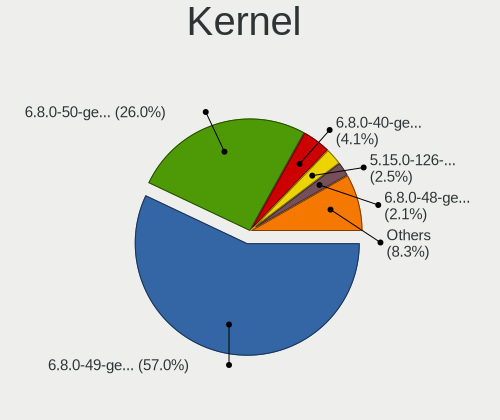
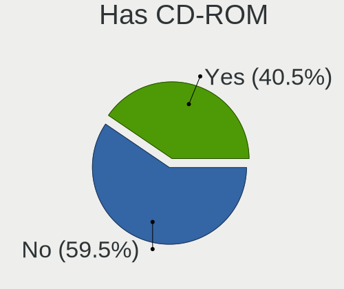
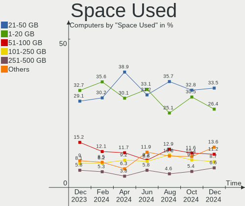
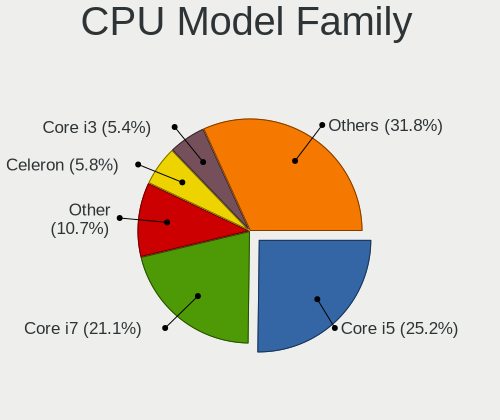

Zorin Hardware Trends
---------------------

A project to identify most popular hardware characteristics and track their change
over time based on data collected by Zorin users at https://Linux-Hardware.org.

Anyone can contribute to the study by uploading probes of their computers by
the [hw-probe](https://github.com/linuxhw/hw-probe) tool:

    sudo -E hw-probe -all -upload

This is a report for all computer types. See also reports for [desktops](/Dist/Zorin/Desktop/README.md) and [notebooks](/Dist/Zorin/Notebook/README.md).

Full-feature report is available here: https://linux-hardware.org/?view=trends

Period: Sep, 2020.

Contents
--------

- [ OS                       ](#os)
- [ OS Family                ](#os-family)
- [ Kernel                   ](#kernel)
- [ Kernel Family            ](#kernel-family)
- [ Kernel Major Ver.        ](#kernel-major-ver)
- [ Arch                     ](#arch)
- [ DE                       ](#de)
- [ Display Server           ](#display-server)
- [ Display Manager          ](#display-manager)
- [ OS Lang                  ](#os-lang)
- [ Boot Mode                ](#boot-mode)
- [ Filesystem               ](#filesystem)
- [ Part. scheme             ](#part-scheme)
- [ Dual Boot with Linux/BSD ](#dual-boot-with-linux/bsd)
- [ Dual Boot (Win)          ](#dual-boot-win)
- [ Country                  ](#country)
- [ City                     ](#city)
- [ Vendor                   ](#vendor)
- [ Model                    ](#model)
- [ Model Family             ](#model-family)
- [ MFG Year                 ](#mfg-year)
- [ Form Factor              ](#form-factor)
- [ Secure Boot              ](#secure-boot)
- [ Coreboot                 ](#coreboot)
- [ RAM Size                 ](#ram-size)
- [ RAM Used                 ](#ram-used)
- [ Has CD-ROM               ](#has-cd-rom)
- [ Total Drives             ](#total-drives)
- [ Has Ethernet             ](#has-ethernet)
- [ Drive Vendor             ](#drive-vendor)
- [ HDD Vendor               ](#hdd-vendor)
- [ SSD Vendor               ](#ssd-vendor)
- [ Drive Model              ](#drive-model)
- [ Drive Kind               ](#drive-kind)
- [ Drive Connector          ](#drive-connector)
- [ Drive Size               ](#drive-size)
- [ Space Total              ](#space-total)
- [ Space Used               ](#space-used)
- [ Malfunc. Drives          ](#malfunc-drives)
- [ Malfunc. Drive Vendor    ](#malfunc-drive-vendor)
- [ Malfunc. HDD Vendor      ](#malfunc-hdd-vendor)
- [ Malfunc. Drive Kind      ](#malfunc-drive-kind)
- [ Failed Drives            ](#failed-drives)
- [ Failed Drive Vendor      ](#failed-drive-vendor)
- [ Drive Status             ](#drive-status)
- [ Storage Vendor           ](#storage-vendor)
- [ Storage Model            ](#storage-model)
- [ Storage Kind             ](#storage-kind)
- [ CPU Vendor               ](#cpu-vendor)
- [ CPU Model                ](#cpu-model)
- [ CPU Model Family         ](#cpu-model-family)
- [ CPU Cores                ](#cpu-cores)
- [ CPU Sockets              ](#cpu-sockets)
- [ CPU Threads              ](#cpu-threads)
- [ CPU Op-Modes             ](#cpu-op-modes)
- [ CPU Microcode            ](#cpu-microcode)
- [ CPU Microarch            ](#cpu-microarch)
- [ GPU Vendor               ](#gpu-vendor)
- [ GPU Model                ](#gpu-model)
- [ GPU Combo                ](#gpu-combo)
- [ GPU Driver               ](#gpu-driver)
- [ GPU Memory               ](#gpu-memory)
- [ Monitor Vendor           ](#monitor-vendor)
- [ Monitor Model            ](#monitor-model)
- [ Monitor Resolution       ](#monitor-resolution)
- [ Monitor Diagonal         ](#monitor-diagonal)
- [ Monitor Width            ](#monitor-width)
- [ Aspect Ratio             ](#aspect-ratio)
- [ Monitor Area             ](#monitor-area)
- [ Pixel Density            ](#pixel-density)
- [ Multiple Monitors        ](#multiple-monitors)
- [ Net Controller Vendor    ](#net-controller-vendor)
- [ Net Controller Model     ](#net-controller-model)
- [ Wireless Vendor          ](#wireless-vendor)
- [ Wireless Model           ](#wireless-model)
- [ Ethernet Vendor          ](#ethernet-vendor)
- [ Ethernet Model           ](#ethernet-model)
- [ Net Controller Kind      ](#net-controller-kind)
- [ Used Controller          ](#used-controller)
- [ NICs                     ](#nics)
- [ Memory Vendor            ](#memory-vendor)
- [ Memory Model             ](#memory-model)
- [ Memory Kind              ](#memory-kind)
- [ Memory Form Factor       ](#memory-form-factor)
- [ Memory Size              ](#memory-size)
- [ Memory Speed             ](#memory-speed)
- [ Sound Vendor             ](#sound-vendor)
- [ Sound Model              ](#sound-model)
- [ Camera Vendor            ](#camera-vendor)
- [ Camera Model             ](#camera-model)
- [ Fingerprint Vendor       ](#fingerprint-vendor)
- [ Fingerprint Model        ](#fingerprint-model)
- [ Chipcard Vendor          ](#chipcard-vendor)
- [ Chipcard Model           ](#chipcard-model)
- [ Printer Vendor           ](#printer-vendor)
- [ Printer Model            ](#printer-model)
- [ Scanner Vendor           ](#scanner-vendor)
- [ Scanner Model            ](#scanner-model)
- [ Bluetooth Vendor         ](#bluetooth-vendor)
- [ Bluetooth Model          ](#bluetooth-model)
- [ Unsupported Devices      ](#unsupported-devices)
- [ Unsupported Device Types ](#unsupported-device-types)

OS
--

Installed operating systems

| Name     | Computers | Percent |
|----------|-----------|---------|
| Zorin 15 | 81        | 93.1%   |
| Zorin 12 | 6         | 6.9%    |

OS Family
---------

OS without a version

| Name  | Computers | Percent |
|-------|-----------|---------|
| Zorin | 87        | 100%    |

Kernel
------

Version of the Linux kernel

| Version              | Computers | Percent |
|----------------------|-----------|---------|
| 5.4.0-47-generic     | 29        | 33.33%  |
| 5.4.0-48-generic     | 19        | 21.84%  |
| 5.4.0-45-generic     | 16        | 18.39%  |
| 5.4.0-42-generic     | 12        | 13.79%  |
| 4.15.0-112-generic   | 3         | 3.45%   |
| 4.15.0-118-generic   | 2         | 2.3%    |
| 5.8.5-xanmod1        | 1         | 1.15%   |
| 5.7.1-050701-generic | 1         | 1.15%   |
| 5.3.0-51-generic     | 1         | 1.15%   |
| 5.3.0-40-generic     | 1         | 1.15%   |
| 5.0.0-37-generic     | 1         | 1.15%   |
| 4.15.0-117-generic   | 1         | 1.15%   |

Kernel Family
-------------

Linux kernel without a distro release

| Version | Computers | Percent |
|---------|-----------|---------|
| 5.4.0   | 76        | 87.36%  |
| 4.15.0  | 6         | 6.9%    |
| 5.3.0   | 2         | 2.3%    |
| 5.8.5   | 1         | 1.15%   |
| 5.7.1   | 1         | 1.15%   |
| 5.0.0   | 1         | 1.15%   |

Kernel Major Ver.
-----------------

Linux kernel major version

| Version | Computers | Percent |
|---------|-----------|---------|
| 5.4     | 76        | 87.36%  |
| 4.15    | 6         | 6.9%    |
| 5.3     | 2         | 2.3%    |
| 5.8     | 1         | 1.15%   |
| 5.7     | 1         | 1.15%   |
| 5.0     | 1         | 1.15%   |

Arch
----

OS architecture (x86_64, i586, etc.)

| Name   | Computers | Percent |
|--------|-----------|---------|
| x86_64 | 72        | 82.76%  |
| i686   | 15        | 17.24%  |

DE
--

Desktop Environment

| Name    | Computers | Percent |
|---------|-----------|---------|
| GNOME   | 51        | 58.62%  |
| XFCE    | 35        | 40.23%  |
| Unknown | 1         | 1.15%   |

Display Server
--------------

X11 or Wayland

| Name | Computers | Percent |
|------|-----------|---------|
| X11  | 87        | 100%    |

Display Manager
---------------

SDDM, LightDM, etc.

| Name    | Computers | Percent |
|---------|-----------|---------|
| Unknown | 84        | 96.55%  |
| GDM     | 2         | 2.3%    |
| TDM     | 1         | 1.15%   |

OS Lang
-------

Language

| Lang  | Computers | Percent |
|-------|-----------|---------|
| en_US | 37        | 42.53%  |
| pt_BR | 5         | 5.75%   |
| nl_NL | 5         | 5.75%   |
| en_IN | 4         | 4.6%    |
| pt_PT | 3         | 3.45%   |
| it_IT | 3         | 3.45%   |
| es_CO | 3         | 3.45%   |
| es_CL | 3         | 3.45%   |
| en_GB | 3         | 3.45%   |
| pl_PL | 2         | 2.3%    |
| fr_FR | 2         | 2.3%    |
| es_ES | 2         | 2.3%    |
| en_CA | 2         | 2.3%    |
| en_AU | 2         | 2.3%    |
| de_DE | 2         | 2.3%    |
| ro_RO | 1         | 1.15%   |
| hu_HU | 1         | 1.15%   |
| es_VE | 1         | 1.15%   |
| es_NI | 1         | 1.15%   |
| es_MX | 1         | 1.15%   |
| es_EC | 1         | 1.15%   |
| de_AT | 1         | 1.15%   |
| da_DK | 1         | 1.15%   |
| C     | 1         | 1.15%   |

Boot Mode
---------

EFI or BIOS

| Mode | Computers | Percent |
|------|-----------|---------|
| BIOS | 63        | 72.41%  |
| EFI  | 24        | 27.59%  |

Filesystem
----------

Type of filesystem

| Type    | Computers | Percent |
|---------|-----------|---------|
| Ext4    | 81        | 93.1%   |
| Overlay | 3         | 3.45%   |
| Ext3    | 1         | 1.15%   |
| Ext2    | 1         | 1.15%   |
| Unknown | 1         | 1.15%   |

Part. scheme
------------

Scheme of partitioning

| Type    | Computers | Percent |
|---------|-----------|---------|
| Unknown | 85        | 97.7%   |
| MBR     | 1         | 1.15%   |
| GPT     | 1         | 1.15%   |

Dual Boot with Linux/BSD
------------------------

Hosting more than one Linux/BSD

| Dual boot | Computers | Percent |
|-----------|-----------|---------|
| No        | 79        | 90.8%   |
| Yes       | 8         | 9.2%    |

Dual Boot (Win)
---------------

Hosting Linux and Windows

| Dual boot | Computers | Percent |
|-----------|-----------|---------|
| No        | 63        | 72.41%  |
| Yes       | 24        | 27.59%  |

Country
-------

Geographic location (country)

| Country     | Computers | Percent |
|-------------|-----------|---------|
| USA         | 25        | 28.74%  |
| UK          | 5         | 5.75%   |
| Netherlands | 5         | 5.75%   |
| Brazil      | 5         | 5.75%   |
| India       | 4         | 4.6%    |
| Colombia    | 4         | 4.6%    |
| Romania     | 3         | 3.45%   |
| Portugal    | 3         | 3.45%   |
| France      | 3         | 3.45%   |
| Chile       | 3         | 3.45%   |
| Poland      | 2         | 2.3%    |
| Italy       | 2         | 2.3%    |
| Germany     | 2         | 2.3%    |
| Denmark     | 2         | 2.3%    |
| Canada      | 2         | 2.3%    |
| Australia   | 2         | 2.3%    |
| Venezuela   | 1         | 1.15%   |
| UAE         | 1         | 1.15%   |
| Taiwan      | 1         | 1.15%   |
| Sweden      | 1         | 1.15%   |
| Sri Lanka   | 1         | 1.15%   |
| Spain       | 1         | 1.15%   |
| Serbia      | 1         | 1.15%   |
| Nicaragua   | 1         | 1.15%   |
| Mexico      | 1         | 1.15%   |
| Luxembourg  | 1         | 1.15%   |
| Indonesia   | 1         | 1.15%   |
| Hungary     | 1         | 1.15%   |
| Ecuador     | 1         | 1.15%   |
| Austria     | 1         | 1.15%   |
| Argentina   | 1         | 1.15%   |

City
----

Geographic location (city)

| City                  | Computers | Percent |
|-----------------------|-----------|---------|
| Bogotá               | 3         | 3.45%   |
| Santiago              | 2         | 2.3%    |
| Paris                 | 2         | 2.3%    |
| Düsseldorf           | 2         | 2.3%    |
| Dumbravita            | 2         | 2.3%    |
| Łódź               | 1         | 1.15%   |
| Zaniemysl             | 1         | 1.15%   |
| West Bloomfield       | 1         | 1.15%   |
| Waukegan              | 1         | 1.15%   |
| Watford               | 1         | 1.15%   |
| Vienna                | 1         | 1.15%   |
| Vestal                | 1         | 1.15%   |
| Verona                | 1         | 1.15%   |
| Vadodara              | 1         | 1.15%   |
| Toronto               | 1         | 1.15%   |
| Teresina              | 1         | 1.15%   |
| Taipei                | 1         | 1.15%   |
| São Paulo            | 1         | 1.15%   |
| Szentgotthard         | 1         | 1.15%   |
| Sydney                | 1         | 1.15%   |
| Stockholm             | 1         | 1.15%   |
| Steenwijk             | 1         | 1.15%   |
| St Helens             | 1         | 1.15%   |
| South Bend            | 1         | 1.15%   |
| Sikeston              | 1         | 1.15%   |
| Santiago de Cali      | 1         | 1.15%   |
| Sant Fruitos de Bages | 1         | 1.15%   |
| San Diego             | 1         | 1.15%   |
| Samora Correia        | 1         | 1.15%   |
| Sacramento            | 1         | 1.15%   |
| Rotterdam             | 1         | 1.15%   |
| Rockledge             | 1         | 1.15%   |
| Roanoke               | 1         | 1.15%   |
| Rio Maior             | 1         | 1.15%   |
| Rio de Mouro          | 1         | 1.15%   |
| Redwood City          | 1         | 1.15%   |
| Quito                 | 1         | 1.15%   |
| Puyallup              | 1         | 1.15%   |
| Portland              | 1         | 1.15%   |
| Ploieşti             | 1         | 1.15%   |
| Phoenix               | 1         | 1.15%   |
| New York              | 1         | 1.15%   |
| Neath                 | 1         | 1.15%   |
| Moore                 | 1         | 1.15%   |
| Miami                 | 1         | 1.15%   |
| Mexico City           | 1         | 1.15%   |
| Managua               | 1         | 1.15%   |
| Lyon                  | 1         | 1.15%   |
| Lubbock               | 1         | 1.15%   |
| Lowestoft             | 1         | 1.15%   |
| Los Angeles           | 1         | 1.15%   |
| London                | 1         | 1.15%   |
| Leiden                | 1         | 1.15%   |
| La Plata              | 1         | 1.15%   |
| Kobenhavn S           | 1         | 1.15%   |
| Kobenhavn N           | 1         | 1.15%   |
| Kelaniya              | 1         | 1.15%   |
| João Pessoa          | 1         | 1.15%   |
| Jakarta               | 1         | 1.15%   |
| Jaipur                | 1         | 1.15%   |

Vendor
------

Motherboard manufacturer

| Name                | Computers | Percent |
|---------------------|-----------|---------|
| Hewlett-Packard     | 17        | 19.54%  |
| ASUSTek Computer    | 15        | 17.24%  |
| Dell                | 9         | 10.34%  |
| Acer                | 8         | 9.2%    |
| Lenovo              | 5         | 5.75%   |
| ASRock              | 4         | 4.6%    |
| Toshiba             | 3         | 3.45%   |
| MSI                 | 3         | 3.45%   |
| Intel               | 3         | 3.45%   |
| Gigabyte Technology | 3         | 3.45%   |
| Apple               | 3         | 3.45%   |
| Unknown             | 3         | 3.45%   |
| Foxconn             | 2         | 2.3%    |
| Sony                | 1         | 1.15%   |
| Semp Toshiba        | 1         | 1.15%   |
| Samsung Electronics | 1         | 1.15%   |
| Pegatron            | 1         | 1.15%   |
| Packard Bell        | 1         | 1.15%   |
| Nexcom              | 1         | 1.15%   |
| Fujitsu Siemens     | 1         | 1.15%   |
| Biostar             | 1         | 1.15%   |
| AMI                 | 1         | 1.15%   |

Model
-----

Motherboard model

| Name                                                          | Computers | Percent |
|---------------------------------------------------------------|-----------|---------|
| Unknown                                                       | 3         | 3.45%   |
| HP Pavilion x360 Convertible PC                               | 2         | 2.3%    |
| HP 530                                                        | 2         | 2.3%    |
| Toshiba Satellite L855D                                       | 1         | 1.15%   |
| Toshiba Satellite C660                                        | 1         | 1.15%   |
| Toshiba Satellite C650D                                       | 1         | 1.15%   |
| Sony VGN-SZ4VWN_X                                             | 1         | 1.15%   |
| Semp Toshiba NA 1402                                          | 1         | 1.15%   |
| Samsung Electronics RV420/RV520/RV720/E3530/S3530/E3420/E3520 | 1         | 1.15%   |
| Pegatron NC701AA-ABA IQ524                                    | 1         | 1.15%   |
| Packard Bell EasyNote ENTF71BM                                | 1         | 1.15%   |
| Nexcom SKLD4-P1                                               | 1         | 1.15%   |
| MSI MS-7969                                                   | 1         | 1.15%   |
| MSI MS-7596                                                   | 1         | 1.15%   |
| MSI MS-7312                                                   | 1         | 1.15%   |
| Lenovo ThinkPad X230 23252EG                                  | 1         | 1.15%   |
| Lenovo ThinkPad T520 4239CTO                                  | 1         | 1.15%   |
| Lenovo MIIX 310-10ICR 80SG                                    | 1         | 1.15%   |
| Lenovo IdeaPad 320S-13IKB 81AK                                | 1         | 1.15%   |
| Lenovo 3000 N200 0769B6G                                      | 1         | 1.15%   |
| Intel NUC8i3BEH                                               | 1         | 1.15%   |
| Intel DH55PJ AAE93812-301                                     | 1         | 1.15%   |
| Intel 945GCT-M                                                | 1         | 1.15%   |
| HP ZBook 17 G2                                                | 1         | 1.15%   |
| HP ProBook 4540s                                              | 1         | 1.15%   |
| HP Presario CQ57                                              | 1         | 1.15%   |
| HP Pavilion dv5                                               | 1         | 1.15%   |
| HP Mini 210-1100                                              | 1         | 1.15%   |
| HP Laptop 15-bw0xx                                            | 1         | 1.15%   |
| HP ENVY Notebook                                              | 1         | 1.15%   |
| HP EliteDesk 800 G1 DM                                        | 1         | 1.15%   |
| HP EliteBook 840 G6                                           | 1         | 1.15%   |
| HP EliteBook 840 G4                                           | 1         | 1.15%   |
| HP Compaq Presario C700                                       | 1         | 1.15%   |
| HP Compaq dc5850 SFF PC                                       | 1         | 1.15%   |
| HP Compaq 8200 Elite CMT PC                                   | 1         | 1.15%   |
| Gigabyte OP-DTW1-BK                                           | 1         | 1.15%   |
| Gigabyte G31M-S2C                                             | 1         | 1.15%   |
| Gigabyte A320M-S2H                                            | 1         | 1.15%   |
| Fujitsu Siemens AMILO Li3710                                  | 1         | 1.15%   |
| Foxconn SG3-360FR                                             | 1         | 1.15%   |
| Foxconn BK428AA-ABA s5412p                                    | 1         | 1.15%   |
| Dell Vostro 3700                                              | 1         | 1.15%   |
| Dell OptiPlex 790                                             | 1         | 1.15%   |
| Dell OptiPlex 745                                             | 1         | 1.15%   |
| Dell Latitude D630                                            | 1         | 1.15%   |
| Dell Inspiron N4010                                           | 1         | 1.15%   |
| Dell Inspiron 5577                                            | 1         | 1.15%   |
| Dell Inspiron 5537                                            | 1         | 1.15%   |
| Dell Inspiron 3542                                            | 1         | 1.15%   |
| Dell Inspiron 1110                                            | 1         | 1.15%   |
| Biostar N61PC-M2S                                             | 1         | 1.15%   |
| ASUS W7J                                                      | 1         | 1.15%   |
| ASUS UNLOCK INSTALL                                           | 1         | 1.15%   |
| ASUS ROG Maximus XII FORMULA                                  | 1         | 1.15%   |
| ASUS PRIME Z390-A                                             | 1         | 1.15%   |
| ASUS PRIME Z270-P                                             | 1         | 1.15%   |
| ASUS P8H77-M PRO                                              | 1         | 1.15%   |
| ASUS P8H61-M LX                                               | 1         | 1.15%   |
| ASUS P5N-D                                                    | 1         | 1.15%   |

Model Family
------------

Motherboard model prefix

| Name                      | Computers | Percent |
|---------------------------|-----------|---------|
| Dell Inspiron             | 5         | 5.75%   |
| Acer Aspire               | 4         | 4.6%    |
| Toshiba Satellite         | 3         | 3.45%   |
| HP Pavilion               | 3         | 3.45%   |
| HP Compaq                 | 3         | 3.45%   |
| Unknown                   | 3         | 3.45%   |
| Lenovo ThinkPad           | 2         | 2.3%    |
| HP EliteBook              | 2         | 2.3%    |
| HP 530                    | 2         | 2.3%    |
| Dell OptiPlex             | 2         | 2.3%    |
| ASUS PRIME                | 2         | 2.3%    |
| Sony VGN-SZ4VWN           | 1         | 1.15%   |
| Semp Toshiba NA           | 1         | 1.15%   |
| Samsung Electronics RV420 | 1         | 1.15%   |
| Pegatron NC701AA-ABA      | 1         | 1.15%   |
| Packard Bell EasyNote     | 1         | 1.15%   |
| Nexcom SKLD4-P1           | 1         | 1.15%   |
| MSI MS-7969               | 1         | 1.15%   |
| MSI MS-7596               | 1         | 1.15%   |
| MSI MS-7312               | 1         | 1.15%   |
| Lenovo MIIX               | 1         | 1.15%   |
| Lenovo IdeaPad            | 1         | 1.15%   |
| Lenovo 3000               | 1         | 1.15%   |
| Intel NUC8i3BEH           | 1         | 1.15%   |
| Intel DH55PJ              | 1         | 1.15%   |
| Intel 945GCT-M            | 1         | 1.15%   |
| HP ZBook                  | 1         | 1.15%   |
| HP ProBook                | 1         | 1.15%   |
| HP Presario               | 1         | 1.15%   |
| HP Mini                   | 1         | 1.15%   |
| HP Laptop                 | 1         | 1.15%   |
| HP ENVY                   | 1         | 1.15%   |
| HP EliteDesk              | 1         | 1.15%   |
| Gigabyte OP-DTW1-BK       | 1         | 1.15%   |
| Gigabyte G31M-S2C         | 1         | 1.15%   |
| Gigabyte A320M-S2H        | 1         | 1.15%   |
| Fujitsu Siemens AMILO     | 1         | 1.15%   |
| Foxconn SG3-360FR         | 1         | 1.15%   |
| Foxconn BK428AA-ABA       | 1         | 1.15%   |
| Dell Vostro               | 1         | 1.15%   |
| Dell Latitude             | 1         | 1.15%   |
| Biostar N61PC-M2S         | 1         | 1.15%   |
| ASUS W7J                  | 1         | 1.15%   |
| ASUS UNLOCK               | 1         | 1.15%   |
| ASUS ROG                  | 1         | 1.15%   |
| ASUS P8H77-M              | 1         | 1.15%   |
| ASUS P8H61-M              | 1         | 1.15%   |
| ASUS P5N-D                | 1         | 1.15%   |
| ASUS N750JK               | 1         | 1.15%   |
| ASUS M5A97                | 1         | 1.15%   |
| ASUS M4A87TD              | 1         | 1.15%   |
| ASUS K54C                 | 1         | 1.15%   |
| ASUS K52F                 | 1         | 1.15%   |
| ASUS G74Sx                | 1         | 1.15%   |
| ASUS A55BM-E              | 1         | 1.15%   |
| ASRock X570               | 1         | 1.15%   |
| ASRock A320M-HD           | 1         | 1.15%   |
| ASRock 775i65G            | 1         | 1.15%   |
| ASRock 760GM-HDV          | 1         | 1.15%   |
| Apple MacBookPro8         | 1         | 1.15%   |

MFG Year
--------

Motherboard manufacture year

| Year | Computers | Percent |
|------|-----------|---------|
| 2019 | 10        | 11.49%  |
| 2008 | 10        | 11.49%  |
| 2018 | 9         | 10.34%  |
| 2011 | 9         | 10.34%  |
| 2020 | 7         | 8.05%   |
| 2012 | 7         | 8.05%   |
| 2010 | 7         | 8.05%   |
| 2009 | 6         | 6.9%    |
| 2014 | 5         | 5.75%   |
| 2007 | 5         | 5.75%   |
| 2016 | 4         | 4.6%    |
| 2015 | 3         | 3.45%   |
| 2013 | 2         | 2.3%    |
| 2006 | 2         | 2.3%    |
| 2004 | 1         | 1.15%   |

Form Factor
-----------

Physical design of the computer

| Name        | Computers | Percent |
|-------------|-----------|---------|
| Notebook    | 50        | 57.47%  |
| Desktop     | 33        | 37.93%  |
| Convertible | 2         | 2.3%    |
| Tablet      | 1         | 1.15%   |
| Mini pc     | 1         | 1.15%   |

Secure Boot
-----------

Enabled or disabled

| State    | Computers | Percent |
|----------|-----------|---------|
| Disabled | 83        | 95.4%   |
| Enabled  | 4         | 4.6%    |

Coreboot
--------

Have coreboot on board

| Used | Computers | Percent |
|------|-----------|---------|
| No   | 87        | 100%    |

RAM Size
--------

Total RAM memory

| Size in GB  | Computers | Percent |
|-------------|-----------|---------|
| 3.01-4.0    | 24        | 27.59%  |
| 1.01-2.0    | 16        | 18.39%  |
| 8.01-16.0   | 15        | 17.24%  |
| 16.01-24.0  | 10        | 11.49%  |
| 2.01-3.0    | 8         | 9.2%    |
| 4.01-8.0    | 7         | 8.05%   |
| 32.01-64.0  | 3         | 3.45%   |
| 0.01-1.0    | 3         | 3.45%   |
| 64.01-256.0 | 1         | 1.15%   |

RAM Used
--------

Used RAM memory

| Used GB  | Computers | Percent |
|----------|-----------|---------|
| 1.01-2.0 | 41        | 47.13%  |
| 0.01-1.0 | 19        | 21.84%  |
| 2.01-3.0 | 18        | 20.69%  |
| 3.01-4.0 | 7         | 8.05%   |
| 4.01-8.0 | 2         | 2.3%    |

Has CD-ROM
----------

Has CD-ROM on board

| Presented | Computers | Percent |
|-----------|-----------|---------|
| Yes       | 48        | 55.17%  |
| No        | 39        | 44.83%  |

Total Drives
------------

Number of drives on board

| Drives | Computers | Percent |
|--------|-----------|---------|
| 1      | 63        | 72.41%  |
| 2      | 14        | 16.09%  |
| 3      | 5         | 5.75%   |
| 4      | 3         | 3.45%   |
| 6      | 2         | 2.3%    |

Has Ethernet
------------

Has Ethernet on board

| Presented | Computers | Percent |
|-----------|-----------|---------|
| Yes       | 86        | 98.85%  |
| No        | 1         | 1.15%   |

Drive Vendor
------------

Hard drive vendors

| Vendor                    | Computers | Drives | Percent |
|---------------------------|-----------|--------|---------|
| Seagate                   | 25        | 29     | 22.12%  |
| WDC                       | 19        | 19     | 16.81%  |
| Samsung Electronics       | 15        | 15     | 13.27%  |
| Toshiba                   | 10        | 11     | 8.85%   |
| Unknown                   | 6         | 6      | 5.31%   |
| Intel                     | 5         | 5      | 4.42%   |
| Hitachi                   | 5         | 6      | 4.42%   |
| SanDisk                   | 4         | 4      | 3.54%   |
| PNY                       | 4         | 4      | 3.54%   |
| Kingston                  | 4         | 4      | 3.54%   |
| Phison                    | 2         | 2      | 1.77%   |
| Maxtor                    | 2         | 2      | 1.77%   |
| HGST                      | 2         | 2      | 1.77%   |
| Fujitsu                   | 2         | 2      | 1.77%   |
| Transcend                 | 1         | 1      | 0.88%   |
| Team                      | 1         | 1      | 0.88%   |
| SK Hynix                  | 1         | 1      | 0.88%   |
| SABRENT                   | 1         | 1      | 0.88%   |
| Micron/Crucial Technology | 1         | 1      | 0.88%   |
| HUAWEI                    | 1         | 1      | 0.88%   |
| Corsair                   | 1         | 1      | 0.88%   |
| Apple                     | 1         | 1      | 0.88%   |

HDD Vendor
----------

Hard disk drive vendors

| Vendor              | Computers | Drives | Percent |
|---------------------|-----------|--------|---------|
| Seagate             | 24        | 28     | 36.92%  |
| WDC                 | 16        | 16     | 24.62%  |
| Toshiba             | 8         | 9      | 12.31%  |
| Samsung Electronics | 6         | 6      | 9.23%   |
| Hitachi             | 5         | 6      | 7.69%   |
| Maxtor              | 2         | 2      | 3.08%   |
| HGST                | 2         | 2      | 3.08%   |
| Fujitsu             | 2         | 2      | 3.08%   |

SSD Vendor
----------

Solid state drive vendors

| Vendor              | Computers | Drives | Percent |
|---------------------|-----------|--------|---------|
| Samsung Electronics | 5         | 5      | 16.13%  |
| PNY                 | 4         | 4      | 12.9%   |
| Kingston            | 4         | 4      | 12.9%   |
| WDC                 | 3         | 3      | 9.68%   |
| SanDisk             | 3         | 3      | 9.68%   |
| Intel               | 3         | 3      | 9.68%   |
| Toshiba             | 2         | 2      | 6.45%   |
| Unknown             | 1         | 1      | 3.23%   |
| Transcend           | 1         | 1      | 3.23%   |
| Team                | 1         | 1      | 3.23%   |
| Seagate             | 1         | 1      | 3.23%   |
| SABRENT             | 1         | 1      | 3.23%   |
| Corsair             | 1         | 1      | 3.23%   |
| Apple               | 1         | 1      | 3.23%   |

Drive Model
-----------

Hard drive models

| Model                           | Computers | Percent |
|---------------------------------|-----------|---------|
| NVMe SSD Drive 512GB            | 3         | 2.59%   |
| NVMe SSD Drive 250GB            | 3         | 2.59%   |
| CS900 240GB SSD                 | 3         | 2.59%   |
| WDS120G2G0A-00JH30 120GB SSD    | 2         | 1.72%   |
| WD40EZRZ-00GXCB0 4TB            | 2         | 1.72%   |
| ST9320423AS 320GB               | 2         | 1.72%   |
| ST9320325AS 320GB               | 2         | 1.72%   |
| ST9160821AS 160GB               | 2         | 1.72%   |
| ST5000DM002-1XY17X 5TB          | 2         | 1.72%   |
| ST4000DM000-1F2168 4TB          | 2         | 1.72%   |
| SSDSC2BW180A3L 180GB            | 2         | 1.72%   |
| SSD 860 EVO 500GB               | 2         | 1.72%   |
| SA400S37240G 240GB SSD          | 2         | 1.72%   |
| NVMe SSD Drive 1TB              | 2         | 1.72%   |
| NVMe SSD Drive 1024GB           | 2         | 1.72%   |
| MMC Card  32GB                  | 2         | 1.72%   |
| WDS240G2G0A-00JH30 240GB SSD    | 1         | 0.86%   |
| WD5000BPVT-22HXZT3 500GB        | 1         | 0.86%   |
| WD5000AAKS-65V0A0 500GB         | 1         | 0.86%   |
| WD3200BPVT-22JJ5T0 320GB        | 1         | 0.86%   |
| WD3200BEVT-22ZCT0 320GB         | 1         | 0.86%   |
| WD2500BEVT-08A23T1 250GB        | 1         | 0.86%   |
| WD2500BEVS-22UST0 250GB         | 1         | 0.86%   |
| WD20EARX-00PASB0 2TB            | 1         | 0.86%   |
| WD1600BEVT-22ZCT0 160GB         | 1         | 0.86%   |
| WD15EADS-22P8B0 1TB             | 1         | 0.86%   |
| WD10PURX-64D85Y0 1TB            | 1         | 0.86%   |
| WD10JPVX-75JC3T0 1TB            | 1         | 0.86%   |
| WD10EZEX-60WN4A0 1TB            | 1         | 0.86%   |
| WD10EZEX-22RKKA0 1TB            | 1         | 0.86%   |
| WD10EZEX-00BN5A0 1TB            | 1         | 0.86%   |
| VX500 256GB SSD                 | 1         | 0.86%   |
| TS32GSSD630 32GB                | 1         | 0.86%   |
| THNSNJ256GCSU 256GB SSD         | 1         | 0.86%   |
| TF CARD Storage 2GB             | 1         | 0.86%   |
| T253X2256G 256GB SSD            | 1         | 0.86%   |
| SV300S37A60G 64GB SSD           | 1         | 0.86%   |
| SV300S37A120G 120GB SSD         | 1         | 0.86%   |
| ST980811AS 80GB                 | 1         | 0.86%   |
| ST9500423AS 500GB               | 1         | 0.86%   |
| ST9250315AS 250GB               | 1         | 0.86%   |
| ST9160827AS 160GB               | 1         | 0.86%   |
| ST500LT012-1DG142 500GB         | 1         | 0.86%   |
| ST500LM012 HN-M500MBB 500GB     | 1         | 0.86%   |
| ST3160815AS 160GB               | 1         | 0.86%   |
| ST3160316AS 160GB               | 1         | 0.86%   |
| ST3160023AS 160GB               | 1         | 0.86%   |
| ST31500341AS 1TB                | 1         | 0.86%   |
| ST3120827AS 120GB               | 1         | 0.86%   |
| ST31000528AS 1TB                | 1         | 0.86%   |
| ST31000424CS 1TB                | 1         | 0.86%   |
| ST2000DM001-1ER164 2TB          | 1         | 0.86%   |
| ST1000VM002-1ET162 1TB          | 1         | 0.86%   |
| ST1000DM003-9YN162 1TB          | 1         | 0.86%   |
| SSDSC2BF180A4H 180GB            | 1         | 0.86%   |
| SSD2SC240G1CS2754D117-488 240GB | 1         | 0.86%   |
| SSD TS256C 256GB                | 1         | 0.86%   |
| SSD 850 EVO 250GB               | 1         | 0.86%   |
| SSD 830 Series 128GB            | 1         | 0.86%   |
| SP0802N 80GB                    | 1         | 0.86%   |

Drive Kind
----------

HDD or SSD

| Kind    | Computers | Drives | Percent |
|---------|-----------|--------|---------|
| HDD     | 58        | 71     | 56.86%  |
| SSD     | 27        | 31     | 26.47%  |
| NVMe    | 12        | 12     | 11.76%  |
| MMC     | 4         | 4      | 3.92%   |
| Unknown | 1         | 1      | 0.98%   |

Drive Connector
---------------

SATA, SAS, NVMe, etc.

| Type | Computers | Drives | Percent |
|------|-----------|--------|---------|
| SATA | 74        | 98     | 77.89%  |
| NVMe | 12        | 12     | 12.63%  |
| SAS  | 5         | 5      | 5.26%   |
| MMC  | 4         | 4      | 4.21%   |

Drive Size
----------

Size of hard drive

| Size in TB | Computers | Drives | Percent |
|------------|-----------|--------|---------|
| 0.01-0.5   | 74        | 81     | 72.55%  |
| 0.51-1.0   | 18        | 24     | 17.65%  |
| 1.01-2.0   | 6         | 8      | 5.88%   |
| 3.01-4.0   | 2         | 4      | 1.96%   |
| 4.01-10.0  | 2         | 2      | 1.96%   |

Space Total
-----------

Amount of disk space available on the file system

| Size in GB     | Computers | Percent |
|----------------|-----------|---------|
| 101-250        | 33        | 37.93%  |
| 251-500        | 19        | 21.84%  |
| 501-1000       | 8         | 9.2%    |
| 51-100         | 8         | 9.2%    |
| 21-50          | 5         | 5.75%   |
| 1001-2000      | 5         | 5.75%   |
| 1-20           | 4         | 4.6%    |
| More than 3000 | 3         | 3.45%   |
| 2001-3000      | 1         | 1.15%   |
| Unknown        | 1         | 1.15%   |

Space Used
----------

Amount of used disk space

| Used GB   | Computers | Percent |
|-----------|-----------|---------|
| 1-20      | 48        | 55.17%  |
| 21-50     | 13        | 14.94%  |
| 101-250   | 10        | 11.49%  |
| 51-100    | 7         | 8.05%   |
| 251-500   | 4         | 4.6%    |
| 1001-2000 | 2         | 2.3%    |
| 501-1000  | 2         | 2.3%    |
| Unknown   | 1         | 1.15%   |

Malfunc. Drives
---------------

Drive models with a malfunction

| Model                 | Computers | Drives | Percent |
|-----------------------|-----------|--------|---------|
| HTS545050B9A300 500GB | 1         | 1      | 100%    |

Malfunc. Drive Vendor
---------------------

Vendors of faulty drives

| Vendor  | Computers | Drives | Percent |
|---------|-----------|--------|---------|
| Hitachi | 1         | 1      | 100%    |

Malfunc. HDD Vendor
-------------------

Vendors of faulty HDD drives

| Vendor  | Computers | Drives | Percent |
|---------|-----------|--------|---------|
| Hitachi | 1         | 1      | 100%    |

Malfunc. Drive Kind
-------------------

Kinds of faulty drives

| Kind | Computers | Drives | Percent |
|------|-----------|--------|---------|
| HDD  | 1         | 1      | 100%    |

Failed Drives
-------------

Failed drive models

Zero info for selected period =(

Failed Drive Vendor
-------------------

Failed drive vendors

Zero info for selected period =(

Drive Status
------------

Number of failed and malfunc. drives

| Status   | Computers | Drives | Percent |
|----------|-----------|--------|---------|
| Detected | 84        | 117    | 97.67%  |
| Malfunc  | 1         | 1      | 1.16%   |
| Works    | 1         | 1      | 1.16%   |

Storage Vendor
--------------

Storage controller vendors

| Vendor                    | Computers | Percent |
|---------------------------|-----------|---------|
| Intel                     | 60        | 61.86%  |
| AMD                       | 19        | 19.59%  |
| Samsung Electronics       | 4         | 4.12%   |
| Nvidia                    | 4         | 4.12%   |
| Phison Electronics        | 2         | 2.06%   |
| JMicron Technology        | 2         | 2.06%   |
| VIA Technologies          | 1         | 1.03%   |
| Union Memory (Shenzhen)   | 1         | 1.03%   |
| SK Hynix                  | 1         | 1.03%   |
| Sandisk                   | 1         | 1.03%   |
| Micron/Crucial Technology | 1         | 1.03%   |
| Marvell Technology Group  | 1         | 1.03%   |

Storage Model
-------------

Storage controller models

| Model                                                                             | Computers | Percent |
|-----------------------------------------------------------------------------------|-----------|---------|
| FCH SATA Controller [AHCI mode]                                                   | 11        | 8.87%   |
| 82801G (ICH7 Family) IDE Controller                                               | 6         | 4.84%   |
| 82801IBM/IEM (ICH9M/ICH9M-E) 4 port SATA Controller [AHCI mode]                   | 5         | 4.03%   |
| 6 Series/C200 Series Chipset Family 6 port Mobile SATA AHCI Controller            | 5         | 4.03%   |
| SB7x0/SB8x0/SB9x0 SATA Controller [IDE mode]                                      | 4         | 3.23%   |
| SB7x0/SB8x0/SB9x0 SATA Controller [AHCI mode]                                     | 4         | 3.23%   |
| 82801HM/HEM (ICH8M/ICH8M-E) IDE Controller                                        | 4         | 3.23%   |
| 82801GBM/GHM (ICH7-M Family) SATA Controller [IDE mode]                           | 4         | 3.23%   |
| Sunrise Point-LP SATA Controller [AHCI mode]                                      | 3         | 2.42%   |
| SB7x0/SB8x0/SB9x0 IDE Controller                                                  | 3         | 2.42%   |
| NVMe SSD Controller SM981/PM981/PM983                                             | 3         | 2.42%   |
| Non-Volatile memory controller                                                    | 3         | 2.42%   |
| NM10/ICH7 Family SATA Controller [IDE mode]                                       | 3         | 2.42%   |
| NM10/ICH7 Family SATA Controller [AHCI mode]                                      | 3         | 2.42%   |
| 82801HM/HEM (ICH8M/ICH8M-E) SATA Controller [AHCI mode]                           | 3         | 2.42%   |
| 8 Series/C220 Series Chipset Family 6-port SATA Controller 1 [AHCI mode]          | 3         | 2.42%   |
| SSD 660P Series                                                                   | 2         | 1.61%   |
| HM170/QM170 Chipset SATA Controller [AHCI Mode]                                   | 2         | 1.61%   |
| FCH SATA Controller D                                                             | 2         | 1.61%   |
| Cannon Lake PCH SATA AHCI Controller                                              | 2         | 1.61%   |
| 82801GBM/GHM (ICH7-M Family) SATA Controller [AHCI mode]                          | 2         | 1.61%   |
| 82801EB/ER (ICH5/ICH5R) IDE Controller                                            | 2         | 1.61%   |
| 82801 Mobile SATA Controller [RAID mode]                                          | 2         | 1.61%   |
| 8 Series SATA Controller 1 [AHCI mode]                                            | 2         | 1.61%   |
| 7 Series Chipset Family 6-port SATA Controller [AHCI mode]                        | 2         | 1.61%   |
| 6 Series/C200 Series Chipset Family Desktop SATA Controller (IDE mode, ports 4-5) | 2         | 1.61%   |
| 6 Series/C200 Series Chipset Family Desktop SATA Controller (IDE mode, ports 0-3) | 2         | 1.61%   |
| 6 Series/C200 Series Chipset Family 6 port Desktop SATA AHCI Controller           | 2         | 1.61%   |
| 5 Series/3400 Series Chipset 6 port SATA AHCI Controller                          | 2         | 1.61%   |
| VT82C586A/B/VT82C686/A/B/VT823x/A/C PIPC Bus Master IDE                           | 1         | 0.81%   |
| VIA VT6420 SATA RAID Controller                                                   | 1         | 0.81%   |
| SATA Controller [RAID mode]                                                       | 1         | 0.81%   |
| P1 NVMe PCIe SSD                                                                  | 1         | 0.81%   |
| NVMe SSD Controller SM961/PM961                                                   | 1         | 0.81%   |
| MCP79 AHCI Controller                                                             | 1         | 0.81%   |
| MCP67 AHCI Controller                                                             | 1         | 0.81%   |
| MCP61 SATA Controller                                                             | 1         | 0.81%   |
| MCP61 IDE                                                                         | 1         | 0.81%   |
| MCP51 Serial ATA Controller                                                       | 1         | 0.81%   |
| MCP51 IDE                                                                         | 1         | 0.81%   |
| JMB363 SATA/IDE Controller                                                        | 1         | 0.81%   |
| JMB361 AHCI/IDE                                                                   | 1         | 0.81%   |
| E16 PCIe4 NVMe Controller                                                         | 1         | 0.81%   |
| E12 NVMe Controller                                                               | 1         | 0.81%   |
| Cannon Point-LP SATA Controller [AHCI Mode]                                       | 1         | 0.81%   |
| Atom Processor E3800 Series SATA AHCI Controller                                  | 1         | 0.81%   |
| 88SE9172 SATA III 6Gb/s RAID Controller                                           | 1         | 0.81%   |
| 82801IBM/IEM (ICH9M/ICH9M-E) 2 port SATA Controller [IDE mode]                    | 1         | 0.81%   |
| 82801HR/HO/HH (ICH8R/DO/DH) 2 port SATA Controller [IDE mode]                     | 1         | 0.81%   |
| 82801HM/HEM (ICH8M/ICH8M-E) SATA Controller [IDE mode]                            | 1         | 0.81%   |
| 82801H (ICH8 Family) 4 port SATA Controller [IDE mode]                            | 1         | 0.81%   |
| 82801EB (ICH5) SATA Controller                                                    | 1         | 0.81%   |
| 7 Series/C210 Series Chipset Family 4-port SATA Controller [IDE mode]             | 1         | 0.81%   |
| 7 Series/C210 Series Chipset Family 2-port SATA Controller [IDE mode]             | 1         | 0.81%   |
| 6 Series/C200 Series Chipset Family Mobile SATA Controller (IDE mode, ports 4-5)  | 1         | 0.81%   |
| 6 Series/C200 Series Chipset Family Mobile SATA Controller (IDE mode, ports 0-3)  | 1         | 0.81%   |
| 5 Series/3400 Series Chipset PT IDER Controller                                   | 1         | 0.81%   |
| 5 Series/3400 Series Chipset 4 port SATA IDE Controller                           | 1         | 0.81%   |
| 5 Series/3400 Series Chipset 4 port SATA AHCI Controller                          | 1         | 0.81%   |
| 400 Series Chipset Family SATA AHCI Controller                                    | 1         | 0.81%   |

Storage Kind
------------

Kind of storage controller (IDE, SATA, NVMe, SAS, ...)

| Kind | Computers | Percent |
|------|-----------|---------|
| SATA | 60        | 57.69%  |
| IDE  | 29        | 27.88%  |
| NVMe | 12        | 11.54%  |
| RAID | 3         | 2.88%   |

CPU Vendor
----------

Processor vendors

| Vendor | Computers | Percent |
|--------|-----------|---------|
| Intel  | 65        | 74.71%  |
| AMD    | 22        | 25.29%  |

CPU Model
---------

Processor models

| Model                                       | Computers | Percent |
|---------------------------------------------|-----------|---------|
| Intel Core i5-2400 CPU @ 3.10GHz            | 3         | 3.45%   |
| AMD FX-6300 Six-Core Processor              | 3         | 3.45%   |
| Intel Core i5-8265U CPU @ 1.60GHz           | 2         | 2.3%    |
| Intel Atom CPU N455 @ 1.66GHz               | 2         | 2.3%    |
| AMD C-50 Processor                          | 2         | 2.3%    |
| Intel Pentium Dual-Core CPU T4500 @ 2.30GHz | 1         | 1.15%   |
| Intel Pentium Dual-Core CPU E5400 @ 2.70GHz | 1         | 1.15%   |
| Intel Pentium Dual CPU T2310 @ 1.46GHz      | 1         | 1.15%   |
| Intel Pentium Dual CPU E2180 @ 2.00GHz      | 1         | 1.15%   |
| Intel Pentium CPU T4300 @ 2.10GHz           | 1         | 1.15%   |
| Intel Pentium CPU B940 @ 2.00GHz            | 1         | 1.15%   |
| Intel Pentium 4 CPU 3.00GHz                 | 1         | 1.15%   |
| Intel Genuine CPU U4100 @ 1.30GHz           | 1         | 1.15%   |
| Intel Genuine CPU T2500 @ 2.00GHz           | 1         | 1.15%   |
| Intel Genuine CPU T1600 @ 1.66GHz           | 1         | 1.15%   |
| Intel Genuine CPU T1350 @ 1.86GHz           | 1         | 1.15%   |
| Intel Core i9-10850K CPU @ 3.60GHz          | 1         | 1.15%   |
| Intel Core i7-9700K CPU @ 3.60GHz           | 1         | 1.15%   |
| Intel Core i7-8700 CPU @ 3.20GHz            | 1         | 1.15%   |
| Intel Core i7-8565U CPU @ 1.80GHz           | 1         | 1.15%   |
| Intel Core i7-7700HQ CPU @ 2.80GHz          | 1         | 1.15%   |
| Intel Core i7-6700HQ CPU @ 2.60GHz          | 1         | 1.15%   |
| Intel Core i7-4800MQ CPU @ 2.70GHz          | 1         | 1.15%   |
| Intel Core i7-4700HQ CPU @ 2.40GHz          | 1         | 1.15%   |
| Intel Core i7-3520M CPU @ 2.90GHz           | 1         | 1.15%   |
| Intel Core i7-2630QM CPU @ 2.00GHz          | 1         | 1.15%   |
| Intel Core i5-8250U CPU @ 1.60GHz           | 1         | 1.15%   |
| Intel Core i5-7500 CPU @ 3.40GHz            | 1         | 1.15%   |
| Intel Core i5-7200U CPU @ 2.50GHz           | 1         | 1.15%   |
| Intel Core i5-6200U CPU @ 2.30GHz           | 1         | 1.15%   |
| Intel Core i5-4590T CPU @ 2.00GHz           | 1         | 1.15%   |
| Intel Core i5-4210U CPU @ 1.70GHz           | 1         | 1.15%   |
| Intel Core i5-4200U CPU @ 1.60GHz           | 1         | 1.15%   |
| Intel Core i5-3330 CPU @ 3.00GHz            | 1         | 1.15%   |
| Intel Core i5-2520M CPU @ 2.50GHz           | 1         | 1.15%   |
| Intel Core i5-2430M CPU @ 2.40GHz           | 1         | 1.15%   |
| Intel Core i5-2415M CPU @ 2.30GHz           | 1         | 1.15%   |
| Intel Core i5 CPU M 460 @ 2.53GHz           | 1         | 1.15%   |
| Intel Core i3-8109U CPU @ 3.00GHz           | 1         | 1.15%   |
| Intel Core i3-2310M CPU @ 2.10GHz           | 1         | 1.15%   |
| Intel Core i3-2100 CPU @ 3.10GHz            | 1         | 1.15%   |
| Intel Core i3 CPU M 370 @ 2.40GHz           | 1         | 1.15%   |
| Intel Core i3 CPU M 350 @ 2.27GHz           | 1         | 1.15%   |
| Intel Core i3 CPU 530 @ 2.93GHz             | 1         | 1.15%   |
| Intel Core Duo CPU T2500 @ 2.00GHz          | 1         | 1.15%   |
| Intel Core 2 Quad CPU Q6600 @ 2.40GHz       | 1         | 1.15%   |
| Intel Core 2 Duo CPU T9300 @ 2.50GHz        | 1         | 1.15%   |
| Intel Core 2 Duo CPU T7250 @ 2.00GHz        | 1         | 1.15%   |
| Intel Core 2 Duo CPU T6400 @ 2.00GHz        | 1         | 1.15%   |
| Intel Core 2 Duo CPU T5450 @ 1.66GHz        | 1         | 1.15%   |
| Intel Core 2 Duo CPU P7450 @ 2.13GHz        | 1         | 1.15%   |
| Intel Core 2 Duo CPU P7350 @ 2.00GHz        | 1         | 1.15%   |
| Intel Core 2 CPU T7400 @ 2.16GHz            | 1         | 1.15%   |
| Intel Core 2 CPU T7200 @ 2.00GHz            | 1         | 1.15%   |
| Intel Core 2 CPU 4400 @ 2.00GHz             | 1         | 1.15%   |
| Intel Celeron CPU N2830 @ 2.16GHz           | 1         | 1.15%   |
| Intel Celeron CPU E1400 @ 2.00GHz           | 1         | 1.15%   |
| Intel Celeron CPU B820 @ 1.70GHz            | 1         | 1.15%   |
| Intel Celeron CPU 3.20GHz                   | 1         | 1.15%   |
| Intel Atom x5-Z8350 CPU @ 1.44GHz           | 1         | 1.15%   |

CPU Model Family
----------------

Processor model prefix

| Model                   | Computers | Percent |
|-------------------------|-----------|---------|
| Intel Core i5           | 17        | 19.54%  |
| Intel Core i7           | 9         | 10.34%  |
| Intel Core i3           | 6         | 6.9%    |
| Intel Core 2 Duo        | 6         | 6.9%    |
| Intel Atom              | 6         | 6.9%    |
| Intel Genuine           | 4         | 4.6%    |
| Intel Celeron           | 4         | 4.6%    |
| AMD A8                  | 4         | 4.6%    |
| Intel Core 2            | 3         | 3.45%   |
| AMD FX                  | 3         | 3.45%   |
| Intel Pentium Dual-Core | 2         | 2.3%    |
| Intel Pentium Dual      | 2         | 2.3%    |
| Intel Pentium           | 2         | 2.3%    |
| AMD Ryzen 5             | 2         | 2.3%    |
| AMD C-50                | 2         | 2.3%    |
| AMD Athlon 64 X2        | 2         | 2.3%    |
| AMD A6                  | 2         | 2.3%    |
| Intel Pentium 4         | 1         | 1.15%   |
| Intel Core i9           | 1         | 1.15%   |
| Intel Core Duo          | 1         | 1.15%   |
| Intel Core 2 Quad       | 1         | 1.15%   |
| AMD Sempron             | 1         | 1.15%   |
| AMD Ryzen 7             | 1         | 1.15%   |
| AMD Phenom II X6        | 1         | 1.15%   |
| AMD Phenom              | 1         | 1.15%   |
| AMD E1                  | 1         | 1.15%   |
| AMD Athlon II X2        | 1         | 1.15%   |
| AMD A10                 | 1         | 1.15%   |

CPU Cores
---------

Number of processor cores

| Number | Computers | Percent |
|--------|-----------|---------|
| 2      | 51        | 58.62%  |
| 4      | 19        | 21.84%  |
| 1      | 7         | 8.05%   |
| 3      | 4         | 4.6%    |
| 6      | 3         | 3.45%   |
| 8      | 2         | 2.3%    |
| 10     | 1         | 1.15%   |

CPU Sockets
-----------

Number of sockets

| Number | Computers | Percent |
|--------|-----------|---------|
| 1      | 87        | 100%    |

CPU Threads
-----------

Threads per core (Hyper-Threading)

| Number | Computers | Percent |
|--------|-----------|---------|
| 1      | 46        | 52.87%  |
| 2      | 41        | 47.13%  |

CPU Op-Modes
------------

CPU Operation Modes (32-bit, 64-bit)

| Op mode        | Computers | Percent |
|----------------|-----------|---------|
| 32-bit, 64-bit | 81        | 93.1%   |
| 32-bit         | 5         | 5.75%   |
| Unknown        | 1         | 1.15%   |

CPU Microcode
-------------

Microcode number

| Number     | Computers | Percent |
|------------|-----------|---------|
| 0x206a7    | 10        | 11.49%  |
| Unknown    | 8         | 9.2%    |
| 0x6fd      | 6         | 6.9%    |
| 0x1067a    | 5         | 5.75%   |
| 0x806ec    | 3         | 3.45%   |
| 0x306c3    | 3         | 3.45%   |
| 0x06000852 | 3         | 3.45%   |
| 0x906e9    | 2         | 2.3%    |
| 0x806ea    | 2         | 2.3%    |
| 0x6f6      | 2         | 2.3%    |
| 0x6e8      | 2         | 2.3%    |
| 0x40651    | 2         | 2.3%    |
| 0x306a9    | 2         | 2.3%    |
| 0x20652    | 2         | 2.3%    |
| 0x106ca    | 2         | 2.3%    |
| 0x10676    | 2         | 2.3%    |
| 0x0600611a | 2         | 2.3%    |
| 0x06001119 | 2         | 2.3%    |
| 0x05000029 | 2         | 2.3%    |
| 0xf49      | 1         | 1.15%   |
| 0xf34      | 1         | 1.15%   |
| 0xa0655    | 1         | 1.15%   |
| 0x906ed    | 1         | 1.15%   |
| 0x906ea    | 1         | 1.15%   |
| 0x806e9    | 1         | 1.15%   |
| 0x6f2      | 1         | 1.15%   |
| 0x6ec      | 1         | 1.15%   |
| 0x506e3    | 1         | 1.15%   |
| 0x406e3    | 1         | 1.15%   |
| 0x406c3    | 1         | 1.15%   |
| 0x30678    | 1         | 1.15%   |
| 0x30661    | 1         | 1.15%   |
| 0x20655    | 1         | 1.15%   |
| 0x106c2    | 1         | 1.15%   |
| 0x08600102 | 1         | 1.15%   |
| 0x08108109 | 1         | 1.15%   |
| 0x0800820b | 1         | 1.15%   |
| 0x0700010f | 1         | 1.15%   |
| 0x06006705 | 1         | 1.15%   |
| 0x06003106 | 1         | 1.15%   |
| 0x0600111f | 1         | 1.15%   |
| 0x010000dc | 1         | 1.15%   |
| 0x010000c8 | 1         | 1.15%   |
| 0x01000083 | 1         | 1.15%   |

CPU Microarch
-------------

Microarchitecture

| Name        | Computers | Percent |
|-------------|-----------|---------|
| Core        | 18        | 20.69%  |
| Skylake     | 13        | 14.94%  |
| SandyBridge | 11        | 12.64%  |
| Piledriver  | 6         | 6.9%    |
| Haswell     | 5         | 5.75%   |
| Westmere    | 4         | 4.6%    |
| Bonnell     | 4         | 4.6%    |
| Silvermont  | 3         | 3.45%   |
| P6          | 3         | 3.45%   |
| K8 Hammer   | 3         | 3.45%   |
| K10         | 3         | 3.45%   |
| Excavator   | 3         | 3.45%   |
| Zen+        | 2         | 2.3%    |
| NetBurst    | 2         | 2.3%    |
| IvyBridge   | 2         | 2.3%    |
| Bobcat      | 2         | 2.3%    |
| Zen 2       | 1         | 1.15%   |
| Steamroller | 1         | 1.15%   |
| Jaguar      | 1         | 1.15%   |

GPU Vendor
----------

Vendors of graphics cards

| Vendor           | Computers | Percent |
|------------------|-----------|---------|
| Intel            | 49        | 52.13%  |
| Nvidia           | 22        | 23.4%   |
| AMD              | 22        | 23.4%   |
| VIA Technologies | 1         | 1.06%   |

GPU Model
---------

Graphics card models

| Model                                                                              | Computers | Percent |
|------------------------------------------------------------------------------------|-----------|---------|
| 2nd Generation Core Processor Family Integrated Graphics Controller                | 8         | 7.77%   |
| Mobile 945GM/GMS/GME, 943/940GML Express Integrated Graphics Controller            | 5         | 4.85%   |
| Mobile 4 Series Chipset Integrated Graphics Controller                             | 4         | 3.88%   |
| Core Processor Integrated Graphics Controller                                      | 4         | 3.88%   |
| UHD Graphics 620 (Whiskey Lake)                                                    | 3         | 2.91%   |
| Mobile GM965/GL960 Integrated Graphics Controller (secondary)                      | 3         | 2.91%   |
| Mobile GM965/GL960 Integrated Graphics Controller (primary)                        | 3         | 2.91%   |
| Mobile 945GSE Express Integrated Graphics Controller                               | 3         | 2.91%   |
| Wrestler [Radeon HD 6250]                                                          | 2         | 1.94%   |
| Wani [Radeon R5/R6/R7 Graphics]                                                    | 2         | 1.94%   |
| Mobile 945GM/GMS, 943/940GML Express Integrated Graphics Controller                | 2         | 1.94%   |
| Haswell-ULT Integrated Graphics Controller                                         | 2         | 1.94%   |
| GP108 [GeForce GT 1030]                                                            | 2         | 1.94%   |
| Ellesmere [Radeon RX 470/480/570/570X/580/580X/590]                                | 2         | 1.94%   |
| Atom/Celeron/Pentium Processor x5-E8000/J3xxx/N3xxx Integrated Graphics Controller | 2         | 1.94%   |
| Atom Processor D4xx/D5xx/N4xx/N5xx Integrated Graphics Controller                  | 2         | 1.94%   |
| Xeon E3-1200 v3/4th Gen Core Processor Integrated Graphics Controller              | 1         | 0.97%   |
| UHD Graphics 630 (Desktop 9 Series)                                                | 1         | 0.97%   |
| UHD Graphics 620                                                                   | 1         | 0.97%   |
| Turks XT [Radeon HD 6670/7670]                                                     | 1         | 0.97%   |
| Trinity [Radeon HD 7640G]                                                          | 1         | 0.97%   |
| Trinity [Radeon HD 7560D]                                                          | 1         | 0.97%   |
| Topaz XT [Radeon R7 M260/M265 / M340/M360 / M440/M445 / 530/535 / 620/625 Mobile]  | 1         | 0.97%   |
| Thames [Radeon HD 7550M/7570M/7650M]                                               | 1         | 0.97%   |
| Sun XT [Radeon HD 8670A/8670M/8690M / R5 M330 / M430 / Radeon 520 Mobile]          | 1         | 0.97%   |
| Stoney [Radeon R2/R3/R4/R5 Graphics]                                               | 1         | 0.97%   |
| Skylake GT2 [HD Graphics 520]                                                      | 1         | 0.97%   |
| RV730 XT [Radeon HD 4670]                                                          | 1         | 0.97%   |
| RV710 [Radeon HD 4350/4550]                                                        | 1         | 0.97%   |
| RS780L [Radeon 3000]                                                               | 1         | 0.97%   |
| RS780C [Radeon 3100]                                                               | 1         | 0.97%   |
| Richland [Radeon HD 8450G]                                                         | 1         | 0.97%   |
| Renoir                                                                             | 1         | 0.97%   |
| Picasso                                                                            | 1         | 0.97%   |
| NV34 [GeForce FX 5200]                                                             | 1         | 0.97%   |
| Kaveri [Radeon R7 Graphics]                                                        | 1         | 0.97%   |
| Kabini [Radeon HD 8210]                                                            | 1         | 0.97%   |
| K8M800/K8N800/K8N800A [S3 UniChrome Pro]                                           | 1         | 0.97%   |
| Iris Plus Graphics 655                                                             | 1         | 0.97%   |
| HD Graphics 630                                                                    | 1         | 0.97%   |
| HD Graphics 620                                                                    | 1         | 0.97%   |
| HD Graphics 530                                                                    | 1         | 0.97%   |
| GP107M [GeForce GTX 1050 Mobile]                                                   | 1         | 0.97%   |
| GP104 [GeForce GTX 1070]                                                           | 1         | 0.97%   |
| GM206 [GeForce GTX 960]                                                            | 1         | 0.97%   |
| GM107M [GeForce GTX 950M]                                                          | 1         | 0.97%   |
| GM107M [GeForce GTX 850M]                                                          | 1         | 0.97%   |
| GK208B [GeForce GT 710]                                                            | 1         | 0.97%   |
| GK110B [GeForce GTX 780 Ti]                                                        | 1         | 0.97%   |
| GK106GLM [Quadro K2100M]                                                           | 1         | 0.97%   |
| GF117M [GeForce 610M/710M/810M/820M / GT 620M/625M/630M/720M]                      | 1         | 0.97%   |
| GF116M [GeForce GT 560M]                                                           | 1         | 0.97%   |
| GF114 [GeForce GTX 560 SE]                                                         | 1         | 0.97%   |
| G98M [GeForce 9200M GS]                                                            | 1         | 0.97%   |
| G96CM [GeForce 9600M GT]                                                           | 1         | 0.97%   |
| G92 [GeForce GTS 250]                                                              | 1         | 0.97%   |
| G72M [Quadro NVS 110M/GeForce Go 7300]                                             | 1         | 0.97%   |
| G72M [GeForce Go 7400]                                                             | 1         | 0.97%   |
| C79 [GeForce 9400M G]                                                              | 1         | 0.97%   |
| C67 [GeForce 7000M / nForce 610M]                                                  | 1         | 0.97%   |

GPU Combo
---------

Combinations of graphics cards

| Name           | Computers | Percent |
|----------------|-----------|---------|
| 1 x Intel      | 42        | 48.28%  |
| 1 x AMD        | 18        | 20.69%  |
| 1 x Nvidia     | 17        | 19.54%  |
| Intel + Nvidia | 5         | 5.75%   |
| Intel + AMD    | 2         | 2.3%    |
| Other          | 1         | 1.15%   |
| 2 x AMD        | 1         | 1.15%   |
| 1 x VIA        | 1         | 1.15%   |

GPU Driver
----------

Free vs proprietary

| Driver      | Computers | Percent |
|-------------|-----------|---------|
| Free        | 68        | 78.16%  |
| Proprietary | 12        | 13.79%  |
| Unknown     | 7         | 8.05%   |

GPU Memory
----------

Total video memory

| Size in GB | Computers | Percent |
|------------|-----------|---------|
| Unknown    | 47        | 54.02%  |
| 0.01-0.5   | 16        | 18.39%  |
| 1.01-2.0   | 11        | 12.64%  |
| 0.51-1.0   | 7         | 8.05%   |
| 3.01-4.0   | 4         | 4.6%    |
| 7.01-8.0   | 1         | 1.15%   |
| 2.01-3.0   | 1         | 1.15%   |

Monitor Vendor
--------------

Monitor vendors

| Vendor                  | Computers | Percent |
|-------------------------|-----------|---------|
| Samsung Electronics     | 11        | 13.41%  |
| LG Display              | 9         | 10.98%  |
| AU Optronics            | 9         | 10.98%  |
| BOE                     | 5         | 6.1%    |
| Apple                   | 4         | 4.88%   |
| Philips                 | 3         | 3.66%   |
| LG Philips              | 3         | 3.66%   |
| Goldstar                | 3         | 3.66%   |
| Chimei Innolux          | 3         | 3.66%   |
| Chi Mei Optoelectronics | 3         | 3.66%   |
| ASUSTek Computer        | 3         | 3.66%   |
| Unknown                 | 2         | 2.44%   |
| InfoVision              | 2         | 2.44%   |
| Hewlett-Packard         | 2         | 2.44%   |
| Dell                    | 2         | 2.44%   |
| AOC                     | 2         | 2.44%   |
| Acer                    | 2         | 2.44%   |
| Vizio                   | 1         | 1.22%   |
| ViewSonic               | 1         | 1.22%   |
| Seiko/Epson             | 1         | 1.22%   |
| Sceptre                 | 1         | 1.22%   |
| Lenovo                  | 1         | 1.22%   |
| KTC                     | 1         | 1.22%   |
| InnoLux Display         | 1         | 1.22%   |
| Iiyama                  | 1         | 1.22%   |
| Hyundai ImageQuest      | 1         | 1.22%   |
| HSI                     | 1         | 1.22%   |
| Compaq Computer         | 1         | 1.22%   |
| CHI                     | 1         | 1.22%   |
| BenQ                    | 1         | 1.22%   |
| Ancor Communications    | 1         | 1.22%   |

Monitor Model
-------------

Monitor models

| Model                                              | Computers | Percent |
|----------------------------------------------------|-----------|---------|
| PG349Q AUS343B 3440x1440 798x335mm 34.1-inch       | 2         | 2.33%   |
| LCD Monitor BOE076E 1366x768 344x194mm 15.5-inch   | 2         | 2.33%   |
| X183H ACR0065 1366x768 344x194mm 15.5-inch         | 1         | 1.16%   |
| W2243 GSM56FE 1920x1080 477x269mm 21.6-inch        | 1         | 1.16%   |
| W2010S1 KTC2002 1600x900 443x249mm 20.0-inch       | 1         | 1.16%   |
| VZ229 AUS22CC 1920x1080 476x268mm 21.5-inch        | 1         | 1.16%   |
| VGA DISPLAY CHIBD1B 1920x1080 880x500mm 39.8-inch  | 1         | 1.16%   |
| VA1913 series VSC1A22 1366x768 410x230mm 18.5-inch | 1         | 1.16%   |
| U2419H DEL415D 1920x1080 527x296mm 23.8-inch       | 1         | 1.16%   |
| SMB2030N SAM0634 1440x900 440x250mm 19.9-inch      | 1         | 1.16%   |
| S211HL ACR01AA 1920x1080 477x268mm 21.5-inch       | 1         | 1.16%   |
| PL2282H IVM5632 1920x1080 476x268mm 21.5-inch      | 1         | 1.16%   |
| MP59G GSM5B34 1920x1080 480x270mm 21.7-inch        | 1         | 1.16%   |
| M320NV VIZ0070 1920x1080 700x390mm 31.5-inch       | 1         | 1.16%   |
| M140NWR2 R1 IVO057A 1366x768 309x174mm 14.0-inch   | 1         | 1.16%   |
| LP156WH1-TLA1 LGD6301 1366x768 344x194mm 15.5-inch | 1         | 1.16%   |
| LP116WH1-TLA1 LGD021C 1366x768 256x144mm 11.6-inch | 1         | 1.16%   |
| LE26W154 AOC2615 1360x768 575x323mm 26.0-inch      | 1         | 1.16%   |
| LCD Monitor T27 6400x1080                          | 1         | 1.16%   |
| LCD Monitor T27 3840x1080                          | 1         | 1.16%   |
| LCD Monitor T27                                    | 1         | 1.16%   |
| LCD Monitor ST2220L                                | 1         | 1.16%   |
| LCD Monitor SEC5541 1366x768 344x193mm 15.5-inch   | 1         | 1.16%   |
| LCD Monitor SEC4D45 1280x800 331x207mm 15.4-inch   | 1         | 1.16%   |
| LCD Monitor SEC4945 1280x800 330x210mm 15.4-inch   | 1         | 1.16%   |
| LCD Monitor SEC4251 1366x768 344x194mm 15.5-inch   | 1         | 1.16%   |
| LCD Monitor SEC3633 1280x800 331x207mm 15.4-inch   | 1         | 1.16%   |
| LCD Monitor SEC324A 1366x768 344x194mm 15.5-inch   | 1         | 1.16%   |
| LCD Monitor SEC3150 1366x768 344x193mm 15.5-inch   | 1         | 1.16%   |
| LCD Monitor SAMSUNG 3840x2160                      | 1         | 1.16%   |
| LCD Monitor SAM07C0 1920x1080 700x390mm 31.5-inch  | 1         | 1.16%   |
| LCD Monitor SAM0658 1920x1080 886x498mm 40.0-inch  | 1         | 1.16%   |
| LCD Monitor PHL4650 1280x768 530x398mm 26.1-inch   | 1         | 1.16%   |
| LCD Monitor P30                                    | 1         | 1.16%   |
| LCD Monitor P170S 3200x1080                        | 1         | 1.16%   |
| LCD Monitor LPLDB00 1280x800 331x207mm 15.4-inch   | 1         | 1.16%   |
| LCD Monitor LPLA002 1440x900 367x230mm 17.1-inch   | 1         | 1.16%   |
| LCD Monitor LPL00E5 1440x900 304x190mm 14.1-inch   | 1         | 1.16%   |
| LCD Monitor LGD033A 1366x768 340x190mm 15.3-inch   | 1         | 1.16%   |
| LCD Monitor LGD02D8 1366x768 277x156mm 12.5-inch   | 1         | 1.16%   |
| LCD Monitor LGD02A7 1366x768 310x170mm 13.9-inch   | 1         | 1.16%   |
| LCD Monitor LGD02A6 1366x768 345x194mm 15.6-inch   | 1         | 1.16%   |
| LCD Monitor LGD0289 1600x900 382x215mm 17.3-inch   | 1         | 1.16%   |
| LCD Monitor LGD021E 1366x768 256x144mm 11.6-inch   | 1         | 1.16%   |
| LCD Monitor LGD01DD 1600x900 382x215mm 17.3-inch   | 1         | 1.16%   |
| LCD Monitor LEN40B1 1600x900 344x194mm 15.5-inch   | 1         | 1.16%   |
| LCD Monitor IVO8C69 1920x1080 309x174mm 14.0-inch  | 1         | 1.16%   |
| LCD Monitor CMO1720 1920x1080 382x215mm 17.3-inch  | 1         | 1.16%   |
| LCD Monitor CMO1592 1366x768 344x193mm 15.5-inch   | 1         | 1.16%   |
| LCD Monitor CMO1526 1280x800 331x207mm 15.4-inch   | 1         | 1.16%   |
| LCD Monitor CMN15E6 1366x768 344x193mm 15.5-inch   | 1         | 1.16%   |
| LCD Monitor CMN15B6 1366x768 340x190mm 15.3-inch   | 1         | 1.16%   |
| LCD Monitor CMN1495 1366x768 309x174mm 14.0-inch   | 1         | 1.16%   |
| LCD Monitor C32F391 1920x1080                      | 1         | 1.16%   |
| LCD Monitor BOE06FA 1920x1080 294x165mm 13.3-inch  | 1         | 1.16%   |
| LCD Monitor BOE06A4 1366x768 344x194mm 15.5-inch   | 1         | 1.16%   |
| LCD Monitor BOE05EA 1366x768 309x173mm 13.9-inch   | 1         | 1.16%   |
| LCD Monitor AUO61D2 1024x600 220x130mm 10.1-inch   | 1         | 1.16%   |
| LCD Monitor AUO40EC 1366x768 340x190mm 15.3-inch   | 1         | 1.16%   |
| LCD Monitor AUO38ED 1920x1080 340x190mm 15.3-inch  | 1         | 1.16%   |

Monitor Resolution
------------------

Monitor screen resolution

| Resolution       | Computers | Percent |
|------------------|-----------|---------|
| 1366x768 (WXGA)  | 25        | 30.12%  |
| 1920x1080 (FHD)  | 24        | 28.92%  |
| 1280x800 (WXGA)  | 9         | 10.84%  |
| 1600x900 (HD+)   | 5         | 6.02%   |
| 1024x600         | 4         | 4.82%   |
| 1440x900 (WXGA+) | 3         | 3.61%   |
| 1280x1024 (SXGA) | 3         | 3.61%   |
| 3440x1440        | 2         | 2.41%   |
| Unknown          | 2         | 2.41%   |
| 6400x1080        | 1         | 1.2%    |
| 3840x2160 (4K)   | 1         | 1.2%    |
| 3840x1080        | 1         | 1.2%    |
| 3200x1080        | 1         | 1.2%    |
| 1360x768         | 1         | 1.2%    |
| 1280x768         | 1         | 1.2%    |

Monitor Diagonal
----------------

Diagonal size in inches

| Inches  | Computers | Percent |
|---------|-----------|---------|
| 15      | 24        | 29.27%  |
| Unknown | 8         | 9.76%   |
| 13      | 7         | 8.54%   |
| 21      | 6         | 7.32%   |
| 17      | 6         | 7.32%   |
| 14      | 4         | 4.88%   |
| 23      | 3         | 3.66%   |
| 18      | 3         | 3.66%   |
| 11      | 3         | 3.66%   |
| 10      | 3         | 3.66%   |
| 40      | 2         | 2.44%   |
| 34      | 2         | 2.44%   |
| 27      | 2         | 2.44%   |
| 26      | 2         | 2.44%   |
| 20      | 2         | 2.44%   |
| 39      | 1         | 1.22%   |
| 37      | 1         | 1.22%   |
| 32      | 1         | 1.22%   |
| 16      | 1         | 1.22%   |
| 12      | 1         | 1.22%   |

Monitor Width
-------------

Physical width

| Width in mm | Computers | Percent |
|-------------|-----------|---------|
| 301-350     | 33        | 40.24%  |
| 401-500     | 11        | 13.41%  |
| 201-300     | 11        | 13.41%  |
| Unknown     | 8         | 9.76%   |
| 501-600     | 7         | 8.54%   |
| 351-400     | 5         | 6.1%    |
| 801-900     | 4         | 4.88%   |
| 701-800     | 3         | 3.66%   |

Aspect Ratio
------------

Proportional relationship between the width and the height

| Ratio   | Computers | Percent |
|---------|-----------|---------|
| 16/9    | 53        | 67.95%  |
| 16/10   | 11        | 14.1%   |
| Unknown | 8         | 10.26%  |
| 4/3     | 2         | 2.56%   |
| 21/9    | 2         | 2.56%   |
| 6/5     | 1         | 1.28%   |
| 5/4     | 1         | 1.28%   |

Monitor Area
------------

Area in inch²

| Area in inch² | Computers | Percent |
|----------------|-----------|---------|
| 101-110        | 23        | 28.05%  |
| 151-200        | 8         | 9.76%   |
| Unknown        | 8         | 9.76%   |
| 81-90          | 7         | 8.54%   |
| 71-80          | 4         | 4.88%   |
| 201-250        | 4         | 4.88%   |
| 121-130        | 4         | 4.88%   |
| 501-1000       | 4         | 4.88%   |
| 51-60          | 3         | 3.66%   |
| 351-500        | 3         | 3.66%   |
| 41-50          | 3         | 3.66%   |
| 301-350        | 3         | 3.66%   |
| 141-150        | 3         | 3.66%   |
| 131-140        | 2         | 2.44%   |
| 61-70          | 1         | 1.22%   |
| 251-300        | 1         | 1.22%   |
| 111-120        | 1         | 1.22%   |

Pixel Density
-------------

Pixels per inch

| Density | Computers | Percent |
|---------|-----------|---------|
| 101-120 | 39        | 47.56%  |
| 51-100  | 25        | 30.49%  |
| 121-160 | 9         | 10.98%  |
| Unknown | 8         | 9.76%   |
| 161-240 | 1         | 1.22%   |

Multiple Monitors
-----------------

Total monitors connected

| Total | Computers | Percent |
|-------|-----------|---------|
| 1     | 73        | 83.91%  |
| 2     | 7         | 8.05%   |
| 0     | 6         | 6.9%    |
| 3     | 1         | 1.15%   |

Net Controller Vendor
---------------------

Controller vendors

| Vendor                            | Computers | Percent |
|-----------------------------------|-----------|---------|
| Realtek Semiconductor             | 50        | 34.25%  |
| Intel                             | 28        | 19.18%  |
| Qualcomm Atheros                  | 21        | 14.38%  |
| Broadcom Inc. and subsidiaries    | 11        | 7.53%   |
| Nvidia                            | 4         | 2.74%   |
| Broadcom Limited                  | 4         | 2.74%   |
| Xiaomi                            | 2         | 1.37%   |
| Samsung Electronics               | 2         | 1.37%   |
| Ralink Technology                 | 2         | 1.37%   |
| Ralink                            | 2         | 1.37%   |
| Marvell Technology Group          | 2         | 1.37%   |
| JMicron Technology                | 2         | 1.37%   |
| Huawei Technologies               | 2         | 1.37%   |
| VIA Technologies                  | 1         | 0.68%   |
| TP-Link                           | 1         | 0.68%   |
| Qualcomm                          | 1         | 0.68%   |
| OPPO                              | 1         | 0.68%   |
| NetGear                           | 1         | 0.68%   |
| Motorola                          | 1         | 0.68%   |
| Linksys                           | 1         | 0.68%   |
| Ericsson Business Mobile Networks | 1         | 0.68%   |
| Edimax Technology                 | 1         | 0.68%   |
| DisplayLink                       | 1         | 0.68%   |
| Davicom Semiconductor             | 1         | 0.68%   |
| D-Link                            | 1         | 0.68%   |
| ASUSTek Computer                  | 1         | 0.68%   |
| Aquantia                          | 1         | 0.68%   |

Net Controller Model
--------------------

Controller models

| Model                                                          | Computers | Percent |
|----------------------------------------------------------------|-----------|---------|
| RTL8111/8168/8411 PCI Express Gigabit Ethernet Controller      | 29        | 16.96%  |
| RTL810xE PCI Express Fast Ethernet controller                  | 11        | 6.43%   |
| PRO/Wireless 3945ABG [Golan] Network Connection                | 5         | 2.92%   |
| BCM4313 802.11bgn Wireless Network Adapter                     | 4         | 2.34%   |
| 82579LM Gigabit Network Connection (Lewisville)                | 4         | 2.34%   |
| Wireless 7260                                                  | 3         | 1.75%   |
| Wi-Fi 6 AX200                                                  | 3         | 1.75%   |
| RTL8188CE 802.11b/g/n WiFi Adapter                             | 3         | 1.75%   |
| RTL8153 Gigabit Ethernet Adapter                               | 3         | 1.75%   |
| QCA9565 / AR9565 Wireless Network Adapter                      | 3         | 1.75%   |
| AR9485 Wireless Network Adapter                                | 3         | 1.75%   |
| RTL8821CE 802.11ac PCIe Wireless Network Adapter               | 2         | 1.17%   |
| RTL-8100/8101L/8139 PCI Fast Ethernet Adapter                  | 2         | 1.17%   |
| QCA9377 802.11ac Wireless Network Adapter                      | 2         | 1.17%   |
| NetXtreme BCM5754 Gigabit Ethernet PCI Express                 | 2         | 1.17%   |
| Mi/Redmi series (RNDIS)                                        | 2         | 1.17%   |
| Ethernet Connection I217-LM                                    | 2         | 1.17%   |
| Ethernet Connection (6) I219-V                                 | 2         | 1.17%   |
| AR9285 Wireless Network Adapter (PCI-Express)                  | 2         | 1.17%   |
| AR8152 v1.1 Fast Ethernet                                      | 2         | 1.17%   |
| AR8121/AR8113/AR8114 Gigabit or Fast Ethernet                  | 2         | 1.17%   |
| AR242x / AR542x Wireless Network Adapter (PCI-Express)         | 2         | 1.17%   |
| 82562ET/EZ/GT/GZ - PRO/100 VE (LOM) Ethernet Controller Mobile | 2         | 1.17%   |
| 802.11n                                                        | 2         | 1.17%   |
| WUSB6100M 802.11a/b/g/n/ac Wireless Adapter                    | 1         | 0.58%   |
| WNDA3100v1 802.11abgn [Atheros AR9170+AR9104]                  | 1         | 0.58%   |
| Wireless 8265 / 8275                                           | 1         | 0.58%   |
| Wireless 7265                                                  | 1         | 0.58%   |
| Wireless 3165                                                  | 1         | 0.58%   |
| WiMAX/WiFi Link 5150                                           | 1         | 0.58%   |
| WiMAX Connection 2400m                                         | 1         | 0.58%   |
| WiFi Link 5100                                                 | 1         | 0.58%   |
| VT6102/VT6103 [Rhine-II]                                       | 1         | 0.58%   |
| USB3.0 Dual Video Dock                                         | 1         | 0.58%   |
| TL WN823N RTL8192EU                                            | 1         | 0.58%   |
| SM56 Data Fax Modem                                            | 1         | 0.58%   |
| SDM450-MTP _SN:B089C325                                        | 1         | 0.58%   |
| RTL8821AE 802.11ac PCIe Wireless Network Adapter               | 1         | 0.58%   |
| RTL8723DE Wireless Network Adapter                             | 1         | 0.58%   |
| RTL8192CU 802.11n WLAN Adapter                                 | 1         | 0.58%   |
| RTL8191SU 802.11n WLAN Adapter                                 | 1         | 0.58%   |
| RTL8191SEvB Wireless LAN Controller                            | 1         | 0.58%   |
| RTL8187B Wireless 802.11g 54Mbps Network Adapter               | 1         | 0.58%   |
| RTL-8185 IEEE 802.11a/b/g Wireless LAN Controller              | 1         | 0.58%   |
| RT5390 Wireless 802.11n 1T/1R PCIe                             | 1         | 0.58%   |
| RT5372 Wireless Adapter                                        | 1         | 0.58%   |
| RT2790 Wireless 802.11n 1T/2R PCIe                             | 1         | 0.58%   |
| PRO/Wireless 5100 AGN [Shiloh] Network Connection              | 1         | 0.58%   |
| NetXtreme BCM57765 Gigabit Ethernet PCIe                       | 1         | 0.58%   |
| NetXtreme BCM5755M Gigabit Ethernet PCI Express                | 1         | 0.58%   |
| NetLink BCM5906M Fast Ethernet PCI Express                     | 1         | 0.58%   |
| NetLink BCM5787M Gigabit Ethernet PCI Express                  | 1         | 0.58%   |
| N10 Nano 802.11n Network Adapter [Realtek RTL8192CU]           | 1         | 0.58%   |
| MT7601U Wireless Adapter                                       | 1         | 0.58%   |
| Modem/Networkcard                                              | 1         | 0.58%   |
| MCP79 Ethernet                                                 | 1         | 0.58%   |
| MCP67 Ethernet                                                 | 1         | 0.58%   |
| MCP61 Ethernet                                                 | 1         | 0.58%   |
| MCP51 Ethernet Controller                                      | 1         | 0.58%   |
| Lenovo Z5 Pro GT                                               | 1         | 0.58%   |

Wireless Vendor
---------------

Wireless vendors

| Vendor                         | Computers | Percent |
|--------------------------------|-----------|---------|
| Intel                          | 22        | 30.56%  |
| Realtek Semiconductor          | 15        | 20.83%  |
| Qualcomm Atheros               | 14        | 19.44%  |
| Broadcom Inc. and subsidiaries | 9         | 12.5%   |
| Ralink Technology              | 2         | 2.78%   |
| Ralink                         | 2         | 2.78%   |
| Broadcom Limited               | 2         | 2.78%   |
| TP-Link                        | 1         | 1.39%   |
| NetGear                        | 1         | 1.39%   |
| Linksys                        | 1         | 1.39%   |
| Edimax Technology              | 1         | 1.39%   |
| D-Link                         | 1         | 1.39%   |
| ASUSTek Computer               | 1         | 1.39%   |

Wireless Model
--------------

Wireless models

| Model                                                   | Computers | Percent |
|---------------------------------------------------------|-----------|---------|
| PRO/Wireless 3945ABG [Golan] Network Connection         | 5         | 6.85%   |
| BCM4313 802.11bgn Wireless Network Adapter              | 4         | 5.48%   |
| Wireless 7260                                           | 3         | 4.11%   |
| Wi-Fi 6 AX200                                           | 3         | 4.11%   |
| RTL8188CE 802.11b/g/n WiFi Adapter                      | 3         | 4.11%   |
| QCA9565 / AR9565 Wireless Network Adapter               | 3         | 4.11%   |
| AR9485 Wireless Network Adapter                         | 3         | 4.11%   |
| RTL8821CE 802.11ac PCIe Wireless Network Adapter        | 2         | 2.74%   |
| QCA9377 802.11ac Wireless Network Adapter               | 2         | 2.74%   |
| AR9285 Wireless Network Adapter (PCI-Express)           | 2         | 2.74%   |
| AR242x / AR542x Wireless Network Adapter (PCI-Express)  | 2         | 2.74%   |
| 802.11n                                                 | 2         | 2.74%   |
| WUSB6100M 802.11a/b/g/n/ac Wireless Adapter             | 1         | 1.37%   |
| WNDA3100v1 802.11abgn [Atheros AR9170+AR9104]           | 1         | 1.37%   |
| Wireless 8265 / 8275                                    | 1         | 1.37%   |
| Wireless 7265                                           | 1         | 1.37%   |
| Wireless 3165                                           | 1         | 1.37%   |
| WiMAX/WiFi Link 5150                                    | 1         | 1.37%   |
| WiFi Link 5100                                          | 1         | 1.37%   |
| TL WN823N RTL8192EU                                     | 1         | 1.37%   |
| RTL8821AE 802.11ac PCIe Wireless Network Adapter        | 1         | 1.37%   |
| RTL8723DE Wireless Network Adapter                      | 1         | 1.37%   |
| RTL8192CU 802.11n WLAN Adapter                          | 1         | 1.37%   |
| RTL8191SU 802.11n WLAN Adapter                          | 1         | 1.37%   |
| RTL8191SEvB Wireless LAN Controller                     | 1         | 1.37%   |
| RTL8187B Wireless 802.11g 54Mbps Network Adapter        | 1         | 1.37%   |
| RTL-8185 IEEE 802.11a/b/g Wireless LAN Controller       | 1         | 1.37%   |
| RT5390 Wireless 802.11n 1T/1R PCIe                      | 1         | 1.37%   |
| RT5372 Wireless Adapter                                 | 1         | 1.37%   |
| RT2790 Wireless 802.11n 1T/2R PCIe                      | 1         | 1.37%   |
| PRO/Wireless 5100 AGN [Shiloh] Network Connection       | 1         | 1.37%   |
| N10 Nano 802.11n Network Adapter [Realtek RTL8192CU]    | 1         | 1.37%   |
| MT7601U Wireless Adapter                                | 1         | 1.37%   |
| EW-7811Un 802.11n Wireless Adapter [Realtek RTL8188CUS] | 1         | 1.37%   |
| DWA-125 Wireless N 150 Adapter(rev.A3) [Ralink RT5370]  | 1         | 1.37%   |
| Comet Lake PCH CNVi WiFi                                | 1         | 1.37%   |
| Centrino Wireless-N 6150                                | 1         | 1.37%   |
| Centrino Wireless-N + WiMAX 6150                        | 1         | 1.37%   |
| Centrino Ultimate-N 6300                                | 1         | 1.37%   |
| Centrino Advanced-N 6205 [Taylor Peak]                  | 1         | 1.37%   |
| Cannon Point-LP CNVi [Wireless-AC]                      | 1         | 1.37%   |
| BCM4331 802.11a/b/g/n                                   | 1         | 1.37%   |
| BCM43228 802.11a/b/g/n                                  | 1         | 1.37%   |
| BCM43225 802.11b/g/n                                    | 1         | 1.37%   |
| BCM4322 802.11a/b/g/n Wireless LAN Controller           | 1         | 1.37%   |
| BCM4312 802.11b/g LP-PHY                                | 1         | 1.37%   |
| BCM4311 802.11b/g WLAN                                  | 1         | 1.37%   |
| BCM4311 802.11a/b/g                                     | 1         | 1.37%   |
| AR922X Wireless Network Adapter                         | 1         | 1.37%   |
| AR9227 Wireless Network Adapter                         | 1         | 1.37%   |
| 802.11n WLAN Adapter                                    | 1         | 1.37%   |

Ethernet Vendor
---------------

Ethernet vendors

| Vendor                         | Computers | Percent |
|--------------------------------|-----------|---------|
| Realtek Semiconductor          | 45        | 47.87%  |
| Intel                          | 17        | 18.09%  |
| Qualcomm Atheros               | 8         | 8.51%   |
| Nvidia                         | 4         | 4.26%   |
| Broadcom Inc. and subsidiaries | 4         | 4.26%   |
| Xiaomi                         | 2         | 2.13%   |
| Samsung Electronics            | 2         | 2.13%   |
| Marvell Technology Group       | 2         | 2.13%   |
| JMicron Technology             | 2         | 2.13%   |
| Broadcom Limited               | 2         | 2.13%   |
| VIA Technologies               | 1         | 1.06%   |
| OPPO                           | 1         | 1.06%   |
| Huawei Technologies            | 1         | 1.06%   |
| DisplayLink                    | 1         | 1.06%   |
| Davicom Semiconductor          | 1         | 1.06%   |
| Aquantia                       | 1         | 1.06%   |

Ethernet Model
--------------

Ethernet models

| Model                                                          | Computers | Percent |
|----------------------------------------------------------------|-----------|---------|
| RTL8111/8168/8411 PCI Express Gigabit Ethernet Controller      | 29        | 30.85%  |
| RTL810xE PCI Express Fast Ethernet controller                  | 11        | 11.7%   |
| 82579LM Gigabit Network Connection (Lewisville)                | 4         | 4.26%   |
| RTL8153 Gigabit Ethernet Adapter                               | 3         | 3.19%   |
| RTL-8100/8101L/8139 PCI Fast Ethernet Adapter                  | 2         | 2.13%   |
| NetXtreme BCM5754 Gigabit Ethernet PCI Express                 | 2         | 2.13%   |
| Mi/Redmi series (RNDIS)                                        | 2         | 2.13%   |
| Ethernet Connection I217-LM                                    | 2         | 2.13%   |
| Ethernet Connection (6) I219-V                                 | 2         | 2.13%   |
| AR8152 v1.1 Fast Ethernet                                      | 2         | 2.13%   |
| AR8121/AR8113/AR8114 Gigabit or Fast Ethernet                  | 2         | 2.13%   |
| 82562ET/EZ/GT/GZ - PRO/100 VE (LOM) Ethernet Controller Mobile | 2         | 2.13%   |
| WiMAX Connection 2400m                                         | 1         | 1.06%   |
| VT6102/VT6103 [Rhine-II]                                       | 1         | 1.06%   |
| USB3.0 Dual Video Dock                                         | 1         | 1.06%   |
| SDM450-MTP _SN:B089C325                                        | 1         | 1.06%   |
| NetXtreme BCM57765 Gigabit Ethernet PCIe                       | 1         | 1.06%   |
| NetXtreme BCM5755M Gigabit Ethernet PCI Express                | 1         | 1.06%   |
| NetLink BCM5906M Fast Ethernet PCI Express                     | 1         | 1.06%   |
| NetLink BCM5787M Gigabit Ethernet PCI Express                  | 1         | 1.06%   |
| MCP79 Ethernet                                                 | 1         | 1.06%   |
| MCP67 Ethernet                                                 | 1         | 1.06%   |
| MCP61 Ethernet                                                 | 1         | 1.06%   |
| MCP51 Ethernet Controller                                      | 1         | 1.06%   |
| JMC260 PCI Express Fast Ethernet Controller                    | 1         | 1.06%   |
| JMC250 PCI Express Gigabit Ethernet Controller                 | 1         | 1.06%   |
| I211 Gigabit Network Connection                                | 1         | 1.06%   |
| GT-I9070 (network tethering, USB debugging enabled)            | 1         | 1.06%   |
| Galaxy series, misc. (tethering mode)                          | 1         | 1.06%   |
| FIG-LX1                                                        | 1         | 1.06%   |
| Ethernet Controller I225-V                                     | 1         | 1.06%   |
| Ethernet Connection (7) I219-V                                 | 1         | 1.06%   |
| Ethernet Connection (4) I219-V                                 | 1         | 1.06%   |
| DM9621A USB To FastEther                                       | 1         | 1.06%   |
| AR8162 Fast Ethernet                                           | 1         | 1.06%   |
| AR8152 v2.0 Fast Ethernet                                      | 1         | 1.06%   |
| AR8151 v2.0 Gigabit Ethernet                                   | 1         | 1.06%   |
| AR8132 Fast Ethernet                                           | 1         | 1.06%   |
| AQC107 NBase-T/IEEE 802.3bz Ethernet Controller [AQtion]       | 1         | 1.06%   |
| 88E8053 PCI-E Gigabit Ethernet Controller                      | 1         | 1.06%   |
| 88E8036 PCI-E Fast Ethernet Controller                         | 1         | 1.06%   |
| 82578DC Gigabit Network Connection                             | 1         | 1.06%   |
| 82562EZ 10/100 Ethernet Controller                             | 1         | 1.06%   |

Net Controller Kind
-------------------

Ethernet, WiFi or modem

| Kind     | Computers | Percent |
|----------|-----------|---------|
| Ethernet | 86        | 54.78%  |
| WiFi     | 67        | 42.68%  |
| Modem    | 3         | 1.91%   |
| Unknown  | 1         | 0.64%   |

Used Controller
---------------

Currently used network controller

| Kind     | Computers | Percent |
|----------|-----------|---------|
| WiFi     | 49        | 55.06%  |
| Ethernet | 39        | 43.82%  |
| Modem    | 1         | 1.12%   |

NICs
----

Total network controllers on board

| Total | Computers | Percent |
|-------|-----------|---------|
| 2     | 53        | 60.92%  |
| 1     | 31        | 35.63%  |
| 0     | 2         | 2.3%    |
| 3     | 1         | 1.15%   |

Memory Vendor
-------------

Memory module vendors

| Vendor              | Computers | Percent |
|---------------------|-----------|---------|
| SK Hynix            | 5         | 35.71%  |
| Unknown             | 3         | 21.43%  |
| Samsung Electronics | 2         | 14.29%  |
| Qimonda             | 1         | 7.14%   |
| PNY                 | 1         | 7.14%   |
| G.Skill             | 1         | 7.14%   |
| Corsair             | 1         | 7.14%   |

Memory Model
------------

Memory module models

| Model                                                               | Computers | Percent |
|---------------------------------------------------------------------|-----------|---------|
| RAM Module 8192MB SODIMM DDR4 2133MT/s                              | 1         | 6.25%   |
| RAM Module 8192MB DIMM SDRAM                                        | 1         | 6.25%   |
| RAM Module 8192MB DIMM DDR3 1333MT/s                                | 1         | 6.25%   |
| RAM Module 512MB SODIMM DDR2 667MT/s                                | 1         | 6.25%   |
| RAM Module 4096MB DIMM DDR3 1066MT/s                                | 1         | 6.25%   |
| RAM Module 1024MB SODIMM DDR2 667MT/s                               | 1         | 6.25%   |
| RAM Module 1024MB DIMM 800MT/s                                      | 1         | 6.25%   |
| RAM M471B5173QH0-YK0 4096MB SODIMM DDR3 1600MT/s                    | 1         | 6.25%   |
| RAM M471B1G73QH0-YK0 8192MB SODIMM DDR3 1600MT/s                    | 1         | 6.25%   |
| RAM HMT325S6BFR8C-H9 2048MB SODIMM DDR3 1333MT/s                    | 1         | 6.25%   |
| RAM HMT125U6DFR8C-H9 2048MB DIMM DDR3 1333MT/s                      | 1         | 6.25%   |
| RAM H9HCNNNCPUMLHR-NME 4096MB LPDDR4 3733MT/s                       | 1         | 6.25%   |
| RAM F4-3600C19-16GVRB 16GB DIMM DDR4 3600MT/s                       | 1         | 6.25%   |
| RAM CMK16GX4M1A2666C16 16384MB DIMM DDR4 2667MT/s                   | 1         | 6.25%   |
| RAM 444444444444444444444444444444444444 2048MB SODIMM DDR2 800MT/s | 1         | 6.25%   |
| RAM 222222222222222222222222222222222222 2048MB SODIMM DDR2 800MT/s | 1         | 6.25%   |

Memory Kind
-----------

Memory module kinds

| Kind    | Computers | Percent |
|---------|-----------|---------|
| DDR3    | 4         | 33.33%  |
| DDR4    | 3         | 25%     |
| DDR2    | 2         | 16.67%  |
| SDRAM   | 1         | 8.33%   |
| LPDDR4  | 1         | 8.33%   |
| Unknown | 1         | 8.33%   |

Memory Form Factor
------------------

Physical design of the memory module

| Name    | Computers | Percent |
|---------|-----------|---------|
| DIMM    | 6         | 50%     |
| SODIMM  | 5         | 41.67%  |
| Unknown | 1         | 8.33%   |

Memory Size
-----------

Memory module size

| Size  | Computers | Percent |
|-------|-----------|---------|
| 8192  | 4         | 26.67%  |
| 4096  | 3         | 20%     |
| 2048  | 3         | 20%     |
| 1024  | 2         | 13.33%  |
| 16384 | 1         | 6.67%   |
| 16000 | 1         | 6.67%   |
| 512   | 1         | 6.67%   |

Memory Speed
------------

Memory module speed

| Speed   | Computers | Percent |
|---------|-----------|---------|
| 1333    | 3         | 23.08%  |
| 2133    | 2         | 15.38%  |
| 800     | 2         | 15.38%  |
| 3733    | 1         | 7.69%   |
| 3200    | 1         | 7.69%   |
| 1600    | 1         | 7.69%   |
| 1066    | 1         | 7.69%   |
| 667     | 1         | 7.69%   |
| Unknown | 1         | 7.69%   |

Sound Vendor
------------

Sound card vendors

| Vendor           | Computers | Percent |
|------------------|-----------|---------|
| Intel            | 61        | 61.62%  |
| AMD              | 23        | 23.23%  |
| Nvidia           | 13        | 13.13%  |
| VIA Technologies | 1         | 1.01%   |
| Razer USA        | 1         | 1.01%   |

Sound Model
-----------

Sound card models

| Model                                                                | Computers | Percent |
|----------------------------------------------------------------------|-----------|---------|
| NM10/ICH7 Family High Definition Audio Controller                    | 12        | 10.43%  |
| 6 Series/C200 Series Chipset Family High Definition Audio Controller | 10        | 8.7%    |
| SBx00 Azalia (Intel HDA)                                             | 8         | 6.96%   |
| 82801I (ICH9 Family) HD Audio Controller                             | 6         | 5.22%   |
| FCH Azalia Controller                                                | 5         | 4.35%   |
| 82801H (ICH8 Family) HD Audio Controller                             | 5         | 4.35%   |
| Cannon Point-LP High Definition Audio Controller                     | 4         | 3.48%   |
| 5 Series/3400 Series Chipset High Definition Audio                   | 4         | 3.48%   |
| Sunrise Point-LP HD Audio                                            | 3         | 2.61%   |
| Kabini HDMI/DP Audio                                                 | 3         | 2.61%   |
| Family 15h (Models 60h-6fh) Audio Controller                         | 3         | 2.61%   |
| 8 Series/C220 Series Chipset High Definition Audio Controller        | 3         | 2.61%   |
| 7 Series/C216 Chipset Family High Definition Audio Controller        | 3         | 2.61%   |
| Xeon E3-1200 v3/4th Gen Core Processor HD Audio Controller           | 2         | 1.74%   |
| Trinity HDMI Audio Controller                                        | 2         | 1.74%   |
| RV710/730 HDMI Audio [Radeon HD 4000 series]                         | 2         | 1.74%   |
| Haswell-ULT HD Audio Controller                                      | 2         | 1.74%   |
| GP108 High Definition Audio Controller                               | 2         | 1.74%   |
| Family 17h (Models 10h-1fh) HD Audio Controller                      | 2         | 1.74%   |
| Ellesmere HDMI Audio [Radeon RX 470/480 / 570/580/590]               | 2         | 1.74%   |
| Cannon Lake PCH cAVS                                                 | 2         | 1.74%   |
| 82801EB/ER (ICH5/ICH5R) AC'97 Audio Controller                       | 2         | 1.74%   |
| 8 Series HD Audio Controller                                         | 2         | 1.74%   |
| Wrestler HDMI Audio                                                  | 1         | 0.87%   |
| VT8233/A/8235/8237 AC97 Audio Controller                             | 1         | 0.87%   |
| Turks HDMI Audio [Radeon HD 6500/6600 / 6700M Series]                | 1         | 0.87%   |
| Renoir Radeon High Definition Audio Controller                       | 1         | 0.87%   |
| Razer Kraken Tournament Edition                                      | 1         | 0.87%   |
| Raven/Raven2/Fenghuang HDMI/DP Audio Controller                      | 1         | 0.87%   |
| MCP79 High Definition Audio                                          | 1         | 0.87%   |
| MCP67 High Definition Audio                                          | 1         | 0.87%   |
| MCP61 High Definition Audio                                          | 1         | 0.87%   |
| MCP51 High Definition Audio                                          | 1         | 0.87%   |
| Kaveri HDMI/DP Audio Controller                                      | 1         | 0.87%   |
| High Definition Audio Controller                                     | 1         | 0.87%   |
| GP104 High Definition Audio Controller                               | 1         | 0.87%   |
| GM206 High Definition Audio Controller                               | 1         | 0.87%   |
| GK208 HDMI/DP Audio Controller                                       | 1         | 0.87%   |
| GK110 High Definition Audio Controller                               | 1         | 0.87%   |
| GK106 HDMI Audio Controller                                          | 1         | 0.87%   |
| GF116 High Definition Audio Controller                               | 1         | 0.87%   |
| GF114 HDMI Audio Controller                                          | 1         | 0.87%   |
| Family 17h (Models 00h-0fh) HD Audio Controller                      | 1         | 0.87%   |
| Comet Lake PCH cAVS                                                  | 1         | 0.87%   |
| CM238 HD Audio Controller                                            | 1         | 0.87%   |
| Baffin HDMI/DP Audio [Radeon RX 550 640SP / RX 560/560X]             | 1         | 0.87%   |
| Atom Processor Z36xxx/Z37xxx Series High Definition Audio Controller | 1         | 0.87%   |
| 200 Series PCH HD Audio                                              | 1         | 0.87%   |
| 100 Series/C230 Series Chipset Family HD Audio Controller            | 1         | 0.87%   |

Camera Vendor
-------------

Camera device vendors

| Vendor                                 | Computers | Percent |
|----------------------------------------|-----------|---------|
| Chicony Electronics                    | 10        | 24.39%  |
| Microdia                               | 5         | 12.2%   |
| Sunplus Innovation Technology          | 4         | 9.76%   |
| Suyin                                  | 3         | 7.32%   |
| Quanta                                 | 3         | 7.32%   |
| Importek                               | 2         | 4.88%   |
| IMC Networks                           | 2         | 4.88%   |
| Cheng Uei Precision Industry (Foxlink) | 2         | 4.88%   |
| Apple                                  | 2         | 4.88%   |
| Silicon Motion                         | 1         | 2.44%   |
| Ricoh                                  | 1         | 2.44%   |
| Logitech                               | 1         | 2.44%   |
| Lite-On Technology                     | 1         | 2.44%   |
| Intel                                  | 1         | 2.44%   |
| Generalplus Technology                 | 1         | 2.44%   |
| Arkmicro Technologies                  | 1         | 2.44%   |
| ALi                                    | 1         | 2.44%   |

Camera Model
------------

Camera device models

| Model                                         | Computers | Percent |
|-----------------------------------------------|-----------|---------|
| WebCam                                        | 2         | 4.88%   |
| VGA Webcam                                    | 2         | 4.88%   |
| Laptop_Integrated_Webcam_1.3M                 | 2         | 4.88%   |
| Integrated_Webcam_HD                          | 2         | 4.88%   |
| HP Wide Vision HD Camera                      | 2         | 4.88%   |
| HP HD Camera                                  | 2         | 4.88%   |
| WebCam SCB-0385N                              | 1         | 2.44%   |
| Webcam Carrefour                              | 1         | 2.44%   |
| Webcam C310                                   | 1         | 2.44%   |
| Visual Communication Camera VGP-VCC5 [R5U870] | 1         | 2.44%   |
| UVC VGA Webcam                                | 1         | 2.44%   |
| TOSHIBA Web Camera - HD                       | 1         | 2.44%   |
| TOSHIBA Web Camera                            | 1         | 2.44%   |
| RealSense 3D Camera (Front F200)              | 1         | 2.44%   |
| Lenovo Integrated Camera (0.3MP)              | 1         | 2.44%   |
| Laptop_Integrated_Webcam_HD                   | 1         | 2.44%   |
| Laptop_Integrated_Webcam_2M                   | 1         | 2.44%   |
| Integrated Webcam                             | 1         | 2.44%   |
| Integrated Camera [ThinkPad]                  | 1         | 2.44%   |
| HP Webcam-50                                  | 1         | 2.44%   |
| HP Webcam-101                                 | 1         | 2.44%   |
| HP Webcam                                     | 1         | 2.44%   |
| HP TrueVision HD Camera                       | 1         | 2.44%   |
| HP HD Webcam [Fixed]                          | 1         | 2.44%   |
| HD WebCam (Asus N-series)                     | 1         | 2.44%   |
| HD User Facing                                | 1         | 2.44%   |
| GENERAL - UVC                                 | 1         | 2.44%   |
| FaceTime HD Camera                            | 1         | 2.44%   |
| EasyCamera                                    | 1         | 2.44%   |
| CNF9055 Toshiba Webcam                        | 1         | 2.44%   |
| CNF7042                                       | 1         | 2.44%   |
| Built-in iSight [Micron]                      | 1         | 2.44%   |
| ASUS Webcam                                   | 1         | 2.44%   |
| Acer/HP Integrated Webcam [CN0314]            | 1         | 2.44%   |
| Acer CrystalEye Webcam                        | 1         | 2.44%   |

Fingerprint Vendor
------------------

Fingerprint sensor vendors

| Vendor             | Computers | Percent |
|--------------------|-----------|---------|
| Validity Sensors   | 3         | 50%     |
| Synaptics          | 1         | 16.67%  |
| STMicroelectronics | 1         | 16.67%  |
| AuthenTec          | 1         | 16.67%  |

Fingerprint Model
-----------------

Fingerprint sensor models

| Model                                                     | Computers | Percent |
|-----------------------------------------------------------|-----------|---------|
| VFS495 Fingerprint Reader                                 | 1         | 16.67%  |
| VFS491                                                    | 1         | 16.67%  |
| Synaptics VFS7552 Touch Fingerprint Sensor with PurePrint | 1         | 16.67%  |
| Swipe Fingerprint Sensor                                  | 1         | 16.67%  |
| Fingerprint Reader                                        | 1         | 16.67%  |
| AES2501 Fingerprint Sensor                                | 1         | 16.67%  |

Chipcard Vendor
---------------

Chipcard module vendors

| Vendor   | Computers | Percent |
|----------|-----------|---------|
| Upek     | 1         | 33.33%  |
| O2 Micro | 1         | 33.33%  |
| Lenovo   | 1         | 33.33%  |

Chipcard Model
--------------

Chipcard module models

| Model                                                 | Computers | Percent |
|-------------------------------------------------------|-----------|---------|
| TouchChip Fingerprint Coprocessor (WBF advanced mode) | 1         | 33.33%  |
| OZ776 CCID Smartcard Reader                           | 1         | 33.33%  |
| Integrated Smart Card Reader                          | 1         | 33.33%  |

Printer Vendor
--------------

Printer device vendors

| Vendor              | Computers | Percent |
|---------------------|-----------|---------|
| Canon               | 2         | 50%     |
| Samsung Electronics | 1         | 25%     |
| Brother Industries  | 1         | 25%     |

Printer Model
-------------

Printer device models

| Model           | Computers | Percent |
|-----------------|-----------|---------|
| MF4010 series   | 2         | 50%     |
| HL-2130 series  | 1         | 25%     |
| CLX-3300 Series | 1         | 25%     |

Scanner Vendor
--------------

Scanner device vendors

Zero info for selected period =(

Scanner Model
-------------

Scanner device models

Zero info for selected period =(

Bluetooth Vendor
----------------

Controller vendors

| Vendor                          | Computers | Percent |
|---------------------------------|-----------|---------|
| Intel                           | 10        | 27.78%  |
| Broadcom                        | 5         | 13.89%  |
| Realtek Semiconductor           | 3         | 8.33%   |
| Qualcomm Atheros Communications | 3         | 8.33%   |
| Apple                           | 3         | 8.33%   |
| Lite-On Technology              | 2         | 5.56%   |
| Dell                            | 2         | 5.56%   |
| Cambridge Silicon Radio         | 2         | 5.56%   |
| Toshiba                         | 1         | 2.78%   |
| Realtek                         | 1         | 2.78%   |
| IMC Networks                    | 1         | 2.78%   |
| Hewlett-Packard                 | 1         | 2.78%   |
| Dynex                           | 1         | 2.78%   |
| Alps Electric                   | 1         | 2.78%   |

Bluetooth Model
---------------

Controller models

| Model                                      | Computers | Percent |
|--------------------------------------------|-----------|---------|
| Bluetooth Device                           | 11        | 30.56%  |
| Qualcomm Atheros Bluetooth Device          | 3         | 8.33%   |
| Bluetooth Radio                            | 3         | 8.33%   |
| BCM2045 Bluetooth                          | 3         | 8.33%   |
| Bluetooth Dongle (HCI mode)                | 2         | 5.56%   |
| Wireless 365 Bluetooth                     | 1         | 2.78%   |
| Wireless 360 Bluetooth                     | 1         | 2.78%   |
| Built-in Bluetooth 2.0+EDR HCI             | 1         | 2.78%   |
| Bluetooth USB Host Controller              | 1         | 2.78%   |
| Bluetooth Host Controller                  | 1         | 2.78%   |
| Bluetooth HCI                              | 1         | 2.78%   |
| Bluetooth Controller (ALPS/UGPZ6)          | 1         | 2.78%   |
| Bluetooth 2.0 Interface [Broadcom BCM2045] | 1         | 2.78%   |
| BCM20702A0                                 | 1         | 2.78%   |
| BCM20702 Bluetooth 4.0 [ThinkPad]          | 1         | 2.78%   |
| BCM2045B (BDC-2.1)                         | 1         | 2.78%   |
| Atheros AR3012 Bluetooth                   | 1         | 2.78%   |
| Askey Bluetooth Module                     | 1         | 2.78%   |
| 802.11n WLAN Adapter                       | 1         | 2.78%   |

Unsupported Devices
-------------------

Total unsupported devices on board

| Total | Computers | Percent |
|-------|-----------|---------|
| 0     | 62        | 71.26%  |
| 1     | 22        | 25.29%  |
| 2     | 2         | 2.3%    |
| 7     | 1         | 1.15%   |

Unsupported Device Types
------------------------

Types of unsupported devices

| Type                  | Computers | Percent |
|-----------------------|-----------|---------|
| Net/wireless          | 9         | 28.13%  |
| Graphics card         | 8         | 25%     |
| Fingerprint reader    | 6         | 18.75%  |
| Chipcard              | 3         | 9.38%   |
| Storage/ata           | 1         | 3.13%   |
| Sound                 | 1         | 3.13%   |
| Net/ethernet          | 1         | 3.13%   |
| Multimedia controller | 1         | 3.13%   |
| Modem                 | 1         | 3.13%   |
| Card reader           | 1         | 3.13%   |

