Zorin Hardware Trends (Desktop)
-------------------------------

A project to identify most popular hardware characteristics and track their change
over time based on data collected by Zorin users at https://Linux-Hardware.org.

Anyone can contribute to the study by uploading probes of their computers by
the [hw-probe](https://github.com/linuxhw/hw-probe) tool:

    sudo -E hw-probe -all -upload

Full-feature report is available here: https://linux-hardware.org/?view=trends&formfactor=desktop

Period: Dec, 2020.

Contents
--------

- [ OS                       ](#os)
- [ OS Family                ](#os-family)
- [ Kernel                   ](#kernel)
- [ Kernel Family            ](#kernel-family)
- [ Kernel Major Ver.        ](#kernel-major-ver)
- [ Arch                     ](#arch)
- [ DE                       ](#de)
- [ Display Server           ](#display-server)
- [ Display Manager          ](#display-manager)
- [ OS Lang                  ](#os-lang)
- [ Boot Mode                ](#boot-mode)
- [ Filesystem               ](#filesystem)
- [ Part. scheme             ](#part-scheme)
- [ Dual Boot with Linux/BSD ](#dual-boot-with-linux/bsd)
- [ Dual Boot (Win)          ](#dual-boot-win)
- [ Country                  ](#country)
- [ City                     ](#city)
- [ Vendor                   ](#vendor)
- [ Model                    ](#model)
- [ Model Family             ](#model-family)
- [ MFG Year                 ](#mfg-year)
- [ Form Factor              ](#form-factor)
- [ Secure Boot              ](#secure-boot)
- [ Coreboot                 ](#coreboot)
- [ RAM Size                 ](#ram-size)
- [ RAM Used                 ](#ram-used)
- [ Has CD-ROM               ](#has-cd-rom)
- [ Total Drives             ](#total-drives)
- [ Has Ethernet             ](#has-ethernet)
- [ Drive Vendor             ](#drive-vendor)
- [ Drive Model              ](#drive-model)
- [ HDD Vendor               ](#hdd-vendor)
- [ SSD Vendor               ](#ssd-vendor)
- [ Drive Kind               ](#drive-kind)
- [ Drive Connector          ](#drive-connector)
- [ Drive Size               ](#drive-size)
- [ Space Total              ](#space-total)
- [ Space Used               ](#space-used)
- [ Malfunc. Drives          ](#malfunc-drives)
- [ Malfunc. Drive Vendor    ](#malfunc-drive-vendor)
- [ Malfunc. HDD Vendor      ](#malfunc-hdd-vendor)
- [ Malfunc. Drive Kind      ](#malfunc-drive-kind)
- [ Failed Drives            ](#failed-drives)
- [ Failed Drive Vendor      ](#failed-drive-vendor)
- [ Drive Status             ](#drive-status)
- [ Storage Vendor           ](#storage-vendor)
- [ Storage Model            ](#storage-model)
- [ Storage Kind             ](#storage-kind)
- [ CPU Vendor               ](#cpu-vendor)
- [ CPU Model                ](#cpu-model)
- [ CPU Model Family         ](#cpu-model-family)
- [ CPU Cores                ](#cpu-cores)
- [ CPU Sockets              ](#cpu-sockets)
- [ CPU Threads              ](#cpu-threads)
- [ CPU Op-Modes             ](#cpu-op-modes)
- [ CPU Microcode            ](#cpu-microcode)
- [ CPU Microarch            ](#cpu-microarch)
- [ GPU Vendor               ](#gpu-vendor)
- [ GPU Model                ](#gpu-model)
- [ GPU Combo                ](#gpu-combo)
- [ GPU Driver               ](#gpu-driver)
- [ GPU Memory               ](#gpu-memory)
- [ Monitor Vendor           ](#monitor-vendor)
- [ Monitor Model            ](#monitor-model)
- [ Monitor Resolution       ](#monitor-resolution)
- [ Monitor Diagonal         ](#monitor-diagonal)
- [ Monitor Width            ](#monitor-width)
- [ Aspect Ratio             ](#aspect-ratio)
- [ Monitor Area             ](#monitor-area)
- [ Pixel Density            ](#pixel-density)
- [ Multiple Monitors        ](#multiple-monitors)
- [ Net Controller Vendor    ](#net-controller-vendor)
- [ Net Controller Model     ](#net-controller-model)
- [ Wireless Vendor          ](#wireless-vendor)
- [ Wireless Model           ](#wireless-model)
- [ Ethernet Vendor          ](#ethernet-vendor)
- [ Ethernet Model           ](#ethernet-model)
- [ Net Controller Kind      ](#net-controller-kind)
- [ Used Controller          ](#used-controller)
- [ NICs                     ](#nics)
- [ Memory Vendor            ](#memory-vendor)
- [ Memory Model             ](#memory-model)
- [ Memory Kind              ](#memory-kind)
- [ Memory Form Factor       ](#memory-form-factor)
- [ Memory Size              ](#memory-size)
- [ Memory Speed             ](#memory-speed)
- [ Sound Vendor             ](#sound-vendor)
- [ Sound Model              ](#sound-model)
- [ Camera Vendor            ](#camera-vendor)
- [ Camera Model             ](#camera-model)
- [ Fingerprint Vendor       ](#fingerprint-vendor)
- [ Fingerprint Model        ](#fingerprint-model)
- [ Chipcard Vendor          ](#chipcard-vendor)
- [ Chipcard Model           ](#chipcard-model)
- [ Printer Vendor           ](#printer-vendor)
- [ Printer Model            ](#printer-model)
- [ Scanner Vendor           ](#scanner-vendor)
- [ Scanner Model            ](#scanner-model)
- [ Bluetooth Vendor         ](#bluetooth-vendor)
- [ Bluetooth Model          ](#bluetooth-model)
- [ Unsupported Devices      ](#unsupported-devices)
- [ Unsupported Device Types ](#unsupported-device-types)

OS
--

Installed operating systems

| Name     | Desktops | Percent |
|----------|----------|---------|
| Zorin 15 | 35       | 97.22%  |
| Zorin 12 | 1        | 2.78%   |

OS Family
---------

OS without a version

| Name  | Desktops | Percent |
|-------|----------|---------|
| Zorin | 36       | 100%    |

Kernel
------

Version of the Linux kernel

| Version            | Desktops | Percent |
|--------------------|----------|---------|
| 5.4.0-58-generic   | 13       | 36.11%  |
| 5.4.0-56-generic   | 11       | 30.56%  |
| 5.4.0-54-generic   | 9        | 25%     |
| 5.4.0-42-generic   | 1        | 2.78%   |
| 5.0.0-37-generic   | 1        | 2.78%   |
| 4.15.0-126-generic | 1        | 2.78%   |

Kernel Family
-------------

Linux kernel without a distro release

| Version | Desktops | Percent |
|---------|----------|---------|
| 5.4.0   | 34       | 94.44%  |
| 5.0.0   | 1        | 2.78%   |
| 4.15.0  | 1        | 2.78%   |

Kernel Major Ver.
-----------------

Linux kernel major version

| Version | Desktops | Percent |
|---------|----------|---------|
| 5.4     | 34       | 94.44%  |
| 5.0     | 1        | 2.78%   |
| 4.15    | 1        | 2.78%   |

Arch
----

OS architecture (x86_64, i586, etc.)

| Name   | Desktops | Percent |
|--------|----------|---------|
| x86_64 | 33       | 91.67%  |
| i686   | 3        | 8.33%   |

DE
--

Desktop Environment

| Name  | Desktops | Percent |
|-------|----------|---------|
| GNOME | 25       | 69.44%  |
| XFCE  | 11       | 30.56%  |

Display Server
--------------

X11 or Wayland

| Name | Desktops | Percent |
|------|----------|---------|
| X11  | 36       | 100%    |

Display Manager
---------------

SDDM, LightDM, etc.

| Name    | Desktops | Percent |
|---------|----------|---------|
| Unknown | 35       | 97.22%  |
| GDM     | 1        | 2.78%   |

OS Lang
-------

Language

| Lang  | Desktops | Percent |
|-------|----------|---------|
| en_US | 16       | 44.44%  |
| pt_BR | 3        | 8.33%   |
| de_DE | 3        | 8.33%   |
| it_IT | 2        | 5.56%   |
| en_IN | 2        | 5.56%   |
| bg_BG | 2        | 5.56%   |
| pl_PL | 1        | 2.78%   |
| nl_NL | 1        | 2.78%   |
| nl_BE | 1        | 2.78%   |
| fr_FR | 1        | 2.78%   |
| fi_FI | 1        | 2.78%   |
| eu_ES | 1        | 2.78%   |
| en_GB | 1        | 2.78%   |
| en_CA | 1        | 2.78%   |

Boot Mode
---------

EFI or BIOS

| Mode | Desktops | Percent |
|------|----------|---------|
| BIOS | 25       | 69.44%  |
| EFI  | 11       | 30.56%  |

Filesystem
----------

Type of filesystem

| Type    | Desktops | Percent |
|---------|----------|---------|
| Ext4    | 34       | 94.44%  |
| Overlay | 1        | 2.78%   |
| Ext2    | 1        | 2.78%   |

Part. scheme
------------

Scheme of partitioning

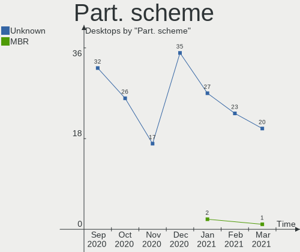

| Type    | Desktops | Percent |
|---------|----------|---------|
| Unknown | 35       | 97.22%  |
| GPT     | 1        | 2.78%   |

Dual Boot with Linux/BSD
------------------------

Hosting more than one Linux/BSD

| Dual boot | Desktops | Percent |
|-----------|----------|---------|
| No        | 33       | 91.67%  |
| Yes       | 3        | 8.33%   |

Dual Boot (Win)
---------------

Hosting Linux and Windows

| Dual boot | Desktops | Percent |
|-----------|----------|---------|
| No        | 19       | 52.78%  |
| Yes       | 17       | 47.22%  |

Country
-------

Geographic location (country)

| Country     | Desktops | Percent |
|-------------|----------|---------|
| USA         | 12       | 33.33%  |
| India       | 3        | 8.33%   |
| Germany     | 3        | 8.33%   |
| Brazil      | 3        | 8.33%   |
| Netherlands | 2        | 5.56%   |
| Italy       | 2        | 5.56%   |
| Bulgaria    | 2        | 5.56%   |
| UK          | 1        | 2.78%   |
| Spain       | 1        | 2.78%   |
| Poland      | 1        | 2.78%   |
| Jordan      | 1        | 2.78%   |
| Japan       | 1        | 2.78%   |
| France      | 1        | 2.78%   |
| Finland     | 1        | 2.78%   |
| Canada      | 1        | 2.78%   |
| Belgium     | 1        | 2.78%   |

City
----

Geographic location (city)

| City             | Desktops | Percent |
|------------------|----------|---------|
| Willoughby       | 1        | 2.78%   |
| Varna            | 1        | 2.78%   |
| Vaasa            | 1        | 2.78%   |
| São Paulo       | 1        | 2.78%   |
| San Francisco    | 1        | 2.78%   |
| Saint-Magne      | 1        | 2.78%   |
| Rome             | 1        | 2.78%   |
| Rochester        | 1        | 2.78%   |
| Roanoke          | 1        | 2.78%   |
| Ridderkerk       | 1        | 2.78%   |
| Richmond         | 1        | 2.78%   |
| Radecznica       | 1        | 2.78%   |
| Portland         | 1        | 2.78%   |
| Phoenix          | 1        | 2.78%   |
| Nobleboro        | 1        | 2.78%   |
| Mumbai           | 1        | 2.78%   |
| Monza            | 1        | 2.78%   |
| Minneapolis      | 1        | 2.78%   |
| Minato-ku        | 1        | 2.78%   |
| Mengerskirchen   | 1        | 2.78%   |
| Marnhull         | 1        | 2.78%   |
| Madrid           | 1        | 2.78%   |
| Lovendegem       | 1        | 2.78%   |
| Leipzig          | 1        | 2.78%   |
| Kerkrade         | 1        | 2.78%   |
| Haskovo          | 1        | 2.78%   |
| Gruenstadt       | 1        | 2.78%   |
| Goiânia         | 1        | 2.78%   |
| Fayetteville     | 1        | 2.78%   |
| Cordova          | 1        | 2.78%   |
| Colorado Springs | 1        | 2.78%   |
| Cochrane         | 1        | 2.78%   |
| Belgaum          | 1        | 2.78%   |
| Barueri          | 1        | 2.78%   |
| Amman            | 1        | 2.78%   |
| Ahmedabad        | 1        | 2.78%   |

Vendor
------

Motherboard manufacturer

| Name                | Desktops | Percent |
|---------------------|----------|---------|
| ASRock              | 6        | 16.67%  |
| Gigabyte Technology | 5        | 13.89%  |
| MSI                 | 4        | 11.11%  |
| ASUSTek Computer    | 4        | 11.11%  |
| Lenovo              | 3        | 8.33%   |
| Hewlett-Packard     | 2        | 5.56%   |
| Fujitsu             | 2        | 5.56%   |
| Dell                | 2        | 5.56%   |
| ZOTAC               | 1        | 2.78%   |
| Philco              | 1        | 2.78%   |
| MiTAC               | 1        | 2.78%   |
| Intel               | 1        | 2.78%   |
| Gateway             | 1        | 2.78%   |
| ELSA                | 1        | 2.78%   |
| Acer                | 1        | 2.78%   |
| Unknown             | 1        | 2.78%   |

Model
-----

Motherboard model

| Name                               | Desktops | Percent |
|------------------------------------|----------|---------|
| ZOTAC Board                        | 1        | 2.78%   |
| Philco 14A4                        | 1        | 2.78%   |
| MSI PPPPPPP-CCC#MMMMMMMM           | 1        | 2.78%   |
| MSI MS-7A38                        | 1        | 2.78%   |
| MSI MS-7817                        | 1        | 2.78%   |
| MSI MS-7816                        | 1        | 2.78%   |
| MiTAC E220 6A7                     | 1        | 2.78%   |
| Lenovo ThinkCentre M800 10FWCTO1WW | 1        | 2.78%   |
| Lenovo ThinkCentre M57p 9088A55    | 1        | 2.78%   |
| Lenovo Board                       | 1        | 2.78%   |
| Intel X64                          | 1        | 2.78%   |
| HP DC5800                          | 1        | 2.78%   |
| HP Compaq 8200 Elite CMT PC        | 1        | 2.78%   |
| Gigabyte H87M-HD3                  | 1        | 2.78%   |
| Gigabyte H61M-S2P-R3               | 1        | 2.78%   |
| Gigabyte H110-D3A                  | 1        | 2.78%   |
| Gigabyte B450M DS3H                | 1        | 2.78%   |
| Gigabyte B450 I AORUS PRO WIFI     | 1        | 2.78%   |
| Gateway GT5686j                    | 1        | 2.78%   |
| Fujitsu ESPRIMO E700               | 1        | 2.78%   |
| Fujitsu ESPRIMO E520               | 1        | 2.78%   |
| ELSA P45IA-R2 1048                 | 1        | 2.78%   |
| Dell OptiPlex 330                  | 1        | 2.78%   |
| Dell Inspiron 530                  | 1        | 2.78%   |
| ASUS P8P67-M PRO                   | 1        | 2.78%   |
| ASUS P5QD TURBO                    | 1        | 2.78%   |
| ASUS P4P800-E                      | 1        | 2.78%   |
| ASUS M5A78L-M/USB3                 | 1        | 2.78%   |
| ASRock Z97 Extreme6                | 1        | 2.78%   |
| ASRock H81M-GL                     | 1        | 2.78%   |
| ASRock G41C-GS                     | 1        | 2.78%   |
| ASRock AB350M-HDV                  | 1        | 2.78%   |
| ASRock AB350 Gaming-ITX/ac         | 1        | 2.78%   |
| ASRock 960GC-GS FX                 | 1        | 2.78%   |
| Acer Aspire X1200                  | 1        | 2.78%   |
| Unknown                            | 1        | 2.78%   |

Model Family
------------

Motherboard model prefix

| Name                     | Desktops | Percent |
|--------------------------|----------|---------|
| Lenovo ThinkCentre       | 2        | 5.56%   |
| Fujitsu ESPRIMO          | 2        | 5.56%   |
| ZOTAC Board              | 1        | 2.78%   |
| Philco 14A4              | 1        | 2.78%   |
| MSI PPPPPPP-CCC#MMMMMMMM | 1        | 2.78%   |
| MSI MS-7A38              | 1        | 2.78%   |
| MSI MS-7817              | 1        | 2.78%   |
| MSI MS-7816              | 1        | 2.78%   |
| MiTAC E220               | 1        | 2.78%   |
| Lenovo Board             | 1        | 2.78%   |
| Intel X64                | 1        | 2.78%   |
| HP DC5800                | 1        | 2.78%   |
| HP Compaq                | 1        | 2.78%   |
| Gigabyte H87M-HD3        | 1        | 2.78%   |
| Gigabyte H61M-S2P-R3     | 1        | 2.78%   |
| Gigabyte H110-D3A        | 1        | 2.78%   |
| Gigabyte B450M           | 1        | 2.78%   |
| Gigabyte B450            | 1        | 2.78%   |
| Gateway GT5686j          | 1        | 2.78%   |
| ELSA P45IA-R2            | 1        | 2.78%   |
| Dell OptiPlex            | 1        | 2.78%   |
| Dell Inspiron            | 1        | 2.78%   |
| ASUS P8P67-M             | 1        | 2.78%   |
| ASUS P5QD                | 1        | 2.78%   |
| ASUS P4P800-E            | 1        | 2.78%   |
| ASUS M5A78L-M            | 1        | 2.78%   |
| ASRock Z97               | 1        | 2.78%   |
| ASRock H81M-GL           | 1        | 2.78%   |
| ASRock G41C-GS           | 1        | 2.78%   |
| ASRock AB350M-HDV        | 1        | 2.78%   |
| ASRock AB350             | 1        | 2.78%   |
| ASRock 960GC-GS          | 1        | 2.78%   |
| Acer Aspire              | 1        | 2.78%   |
| Unknown                  | 1        | 2.78%   |

MFG Year
--------

Motherboard manufacture year

| Year | Desktops | Percent |
|------|----------|---------|
| 2020 | 4        | 11.11%  |
| 2014 | 4        | 11.11%  |
| 2011 | 4        | 11.11%  |
| 2008 | 4        | 11.11%  |
| 2019 | 3        | 8.33%   |
| 2018 | 3        | 8.33%   |
| 2015 | 3        | 8.33%   |
| 2013 | 3        | 8.33%   |
| 2017 | 2        | 5.56%   |
| 2009 | 2        | 5.56%   |
| 2007 | 2        | 5.56%   |
| 2012 | 1        | 2.78%   |
| 2005 | 1        | 2.78%   |

Form Factor
-----------

Physical design of the computer

| Name    | Desktops | Percent |
|---------|----------|---------|
| Desktop | 36       | 100%    |

Secure Boot
-----------

Enabled or disabled

| State    | Desktops | Percent |
|----------|----------|---------|
| Disabled | 35       | 97.22%  |
| Enabled  | 1        | 2.78%   |

Coreboot
--------

Have coreboot on board

| Used | Desktops | Percent |
|------|----------|---------|
| No   | 36       | 100%    |

RAM Size
--------

Total RAM memory

| Size in GB | Desktops | Percent |
|------------|----------|---------|
| 3.01-4.0   | 11       | 30.56%  |
| 4.01-8.0   | 8        | 22.22%  |
| 8.01-16.0  | 6        | 16.67%  |
| 16.01-24.0 | 5        | 13.89%  |
| 1.01-2.0   | 2        | 5.56%   |
| 0.51-1.0   | 2        | 5.56%   |
| 32.01-64.0 | 1        | 2.78%   |
| 2.01-3.0   | 1        | 2.78%   |

RAM Used
--------

Used RAM memory

| Used GB  | Desktops | Percent |
|----------|----------|---------|
| 1.01-2.0 | 18       | 50%     |
| 2.01-3.0 | 9        | 25%     |
| 3.01-4.0 | 4        | 11.11%  |
| 4.01-8.0 | 2        | 5.56%   |
| 0.51-1.0 | 2        | 5.56%   |
| 0.01-0.5 | 1        | 2.78%   |

Has CD-ROM
----------

Has CD-ROM on board

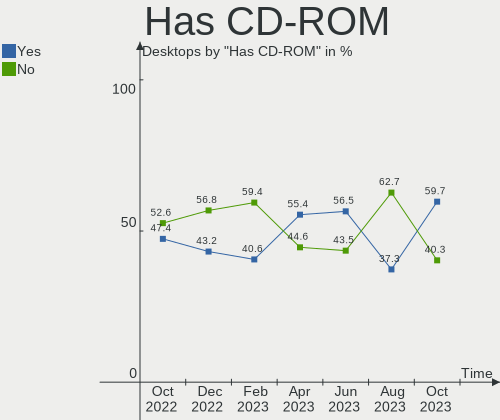

| Presented | Desktops | Percent |
|-----------|----------|---------|
| No        | 19       | 52.78%  |
| Yes       | 17       | 47.22%  |

Total Drives
------------

Number of drives on board

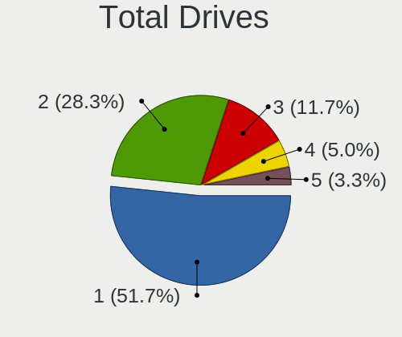

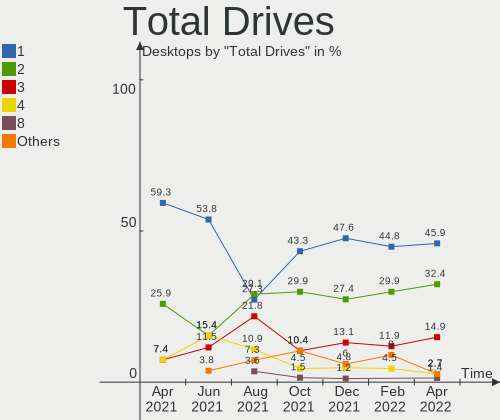

| Drives | Desktops | Percent |
|--------|----------|---------|
| 1      | 18       | 50%     |
| 2      | 8        | 22.22%  |
| 3      | 6        | 16.67%  |
| 5      | 2        | 5.56%   |
| 6      | 1        | 2.78%   |
| 4      | 1        | 2.78%   |

Has Ethernet
------------

Has Ethernet on board

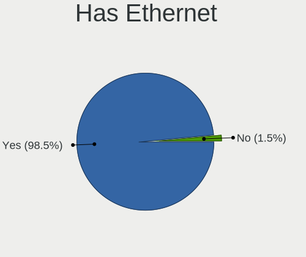

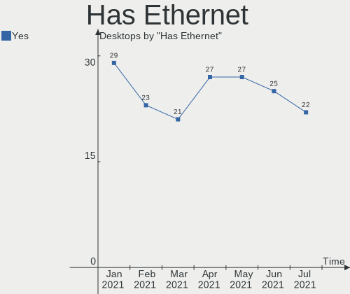

| Presented | Desktops | Percent |
|-----------|----------|---------|
| Yes       | 36       | 100%    |

Drive Vendor
------------

Hard drive vendors

| Vendor              | Desktops | Drives | Percent |
|---------------------|----------|--------|---------|
| WDC                 | 13       | 15     | 23.21%  |
| Seagate             | 9        | 13     | 16.07%  |
| Kingston            | 7        | 8      | 12.5%   |
| Samsung Electronics | 5        | 6      | 8.93%   |
| Sandisk             | 3        | 3      | 5.36%   |
| Hitachi             | 3        | 3      | 5.36%   |
| Unknown             | 2        | 4      | 3.57%   |
| Patriot             | 2        | 2      | 3.57%   |
| Crucial             | 2        | 2      | 3.57%   |
| USB3.0              | 1        | 1      | 1.79%   |
| Toshiba             | 1        | 1      | 1.79%   |
| SPCC                | 1        | 1      | 1.79%   |
| Silicon Motion      | 1        | 1      | 1.79%   |
| PNY                 | 1        | 1      | 1.79%   |
| Phison              | 1        | 1      | 1.79%   |
| Mushkin             | 1        | 1      | 1.79%   |
| MAXTOR              | 1        | 1      | 1.79%   |
| Intenso             | 1        | 1      | 1.79%   |
| Intel               | 1        | 1      | 1.79%   |

Drive Model
-----------

Hard drive models

| Model                               | Desktops | Percent |
|-------------------------------------|----------|---------|
| WDC WD5000AAKX-07U6AA0 500GB        | 2        | 3.03%   |
| Kingston SV300S37A120G 120GB SSD    | 2        | 3.03%   |
| Kingston SA400S37240G 240GB SSD     | 2        | 3.03%   |
| WDC WDS240G2G0A-00JH30 240GB SSD    | 1        | 1.52%   |
| WDC WD6400AAKS-00A7B0 640GB         | 1        | 1.52%   |
| WDC WD5000AVVS-63ZWB0 500GB         | 1        | 1.52%   |
| WDC WD5000AAKX-60U6AA0 500GB        | 1        | 1.52%   |
| WDC WD5000AACS-00ZUB0 500GB         | 1        | 1.52%   |
| WDC WD40EZRZ-00GXCB0 4TB            | 1        | 1.52%   |
| WDC WD40EZRX-00SPEB0 4TB            | 1        | 1.52%   |
| WDC WD3200AAJS-22B4A0 320GB         | 1        | 1.52%   |
| WDC WD3200AAJS-08L7A0 320GB         | 1        | 1.52%   |
| WDC WD10SPZX-24Z10 1TB              | 1        | 1.52%   |
| WDC WD10EZEX-22MFCA0 1TB            | 1        | 1.52%   |
| WDC WD10EZEX-00BN5A0 1TB            | 1        | 1.52%   |
| WDC WD10EVDS-63N5B1 1TB             | 1        | 1.52%   |
| USB3.0 Super Speed 250GB            | 1        | 1.52%   |
| Unknown SD/MMC/MS PRO 128GB         | 1        | 1.52%   |
| Unknown SD/MMC/M.S.PRO 32GB         | 1        | 1.52%   |
| Unknown SD/MMC 8GB                  | 1        | 1.52%   |
| Unknown MMC Card  64GB              | 1        | 1.52%   |
| Toshiba MK3256GSY 320GB             | 1        | 1.52%   |
| SPCC M.2 PCIe SSD 1TB               | 1        | 1.52%   |
| Silicon Motion NVMe SSD Drive 128GB | 1        | 1.52%   |
| Seagate ST500DM002-1BD142 500GB     | 1        | 1.52%   |
| Seagate ST4000DM004-2CV104 4TB      | 1        | 1.52%   |
| Seagate ST3500418AS 500GB           | 1        | 1.52%   |
| Seagate ST3500414CS 500GB           | 1        | 1.52%   |
| Seagate ST3500413AS 500GB           | 1        | 1.52%   |
| Seagate ST3500320AS 500GB           | 1        | 1.52%   |
| Seagate ST3160827AS 160GB           | 1        | 1.52%   |
| Seagate ST3000DM001-1CH166 3TB      | 1        | 1.52%   |
| Seagate ST2000DM008-2FR102 2TB      | 1        | 1.52%   |
| Seagate ST2000DM001-1CH164 2TB      | 1        | 1.52%   |
| Seagate ST1000DM003-1ER162 1TB      | 1        | 1.52%   |
| Seagate ST1000DM003-1CH162 1TB      | 1        | 1.52%   |
| Seagate Backup+ Hub BK 8TB          | 1        | 1.52%   |
| SanDisk SDSSDP064G 64GB             | 1        | 1.52%   |
| SanDisk SDSSDH3 512G                | 1        | 1.52%   |
| Sandisk NVMe SSD Drive 500GB        | 1        | 1.52%   |
| Samsung SSD 860 EVO 500GB           | 1        | 1.52%   |
| Samsung SSD 850 EVO 500GB           | 1        | 1.52%   |
| Samsung SSD 850 EVO 120GB           | 1        | 1.52%   |
| Samsung SSD 840 Series 120GB        | 1        | 1.52%   |
| Samsung HD204UI 2TB                 | 1        | 1.52%   |
| Samsung HD161HJ 41R0186LEN 160GB    | 1        | 1.52%   |
| PNY CS900 120GB SSD                 | 1        | 1.52%   |
| Phison NVMe SSD Drive 256GB         | 1        | 1.52%   |
| Patriot Spark 256GB SSD             | 1        | 1.52%   |
| Patriot Burst 120GB SSD             | 1        | 1.52%   |
| Mushkin MKNSSDCR120GB-G2            | 1        | 1.52%   |
| MAXTOR STM3500630AS 500GB           | 1        | 1.52%   |
| Kingston SHPM2280P2H 240G SSD       | 1        | 1.52%   |
| Kingston SH103S3120G 120GB SSD      | 1        | 1.52%   |
| Kingston SA400S37960G 960GB SSD     | 1        | 1.52%   |
| Kingston NVMe SSD Drive 240GB       | 1        | 1.52%   |
| Intenso SSD SATAIII 480GB           | 1        | 1.52%   |
| Intel SSDSC2CW180A3 180GB           | 1        | 1.52%   |
| Hitachi HTS543232A7A384 320GB       | 1        | 1.52%   |
| Hitachi HDT725025VLA380 250GB       | 1        | 1.52%   |

HDD Vendor
----------

Hard disk drive vendors

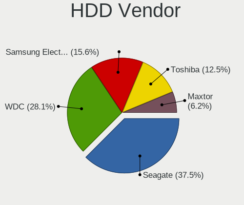

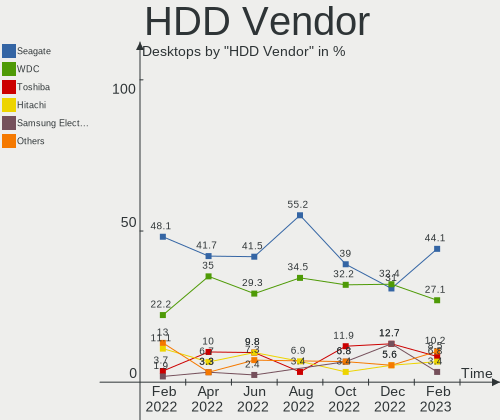

| Vendor              | Desktops | Drives | Percent |
|---------------------|----------|--------|---------|
| WDC                 | 12       | 14     | 42.86%  |
| Seagate             | 8        | 12     | 28.57%  |
| Hitachi             | 3        | 3      | 10.71%  |
| Samsung Electronics | 2        | 2      | 7.14%   |
| USB3.0              | 1        | 1      | 3.57%   |
| Toshiba             | 1        | 1      | 3.57%   |
| MAXTOR              | 1        | 1      | 3.57%   |

SSD Vendor
----------

Solid state drive vendors

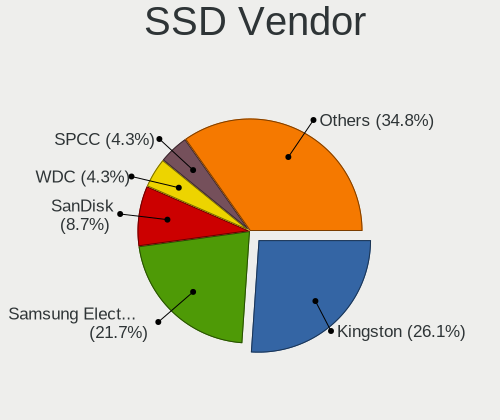

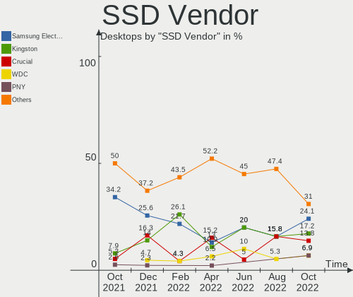

| Vendor              | Desktops | Drives | Percent |
|---------------------|----------|--------|---------|
| Kingston            | 6        | 7      | 28.57%  |
| Samsung Electronics | 4        | 4      | 19.05%  |
| SanDisk             | 2        | 2      | 9.52%   |
| Patriot             | 2        | 2      | 9.52%   |
| Crucial             | 2        | 2      | 9.52%   |
| WDC                 | 1        | 1      | 4.76%   |
| PNY                 | 1        | 1      | 4.76%   |
| Mushkin             | 1        | 1      | 4.76%   |
| Intenso             | 1        | 1      | 4.76%   |
| Intel               | 1        | 1      | 4.76%   |

Drive Kind
----------

HDD or SSD

| Kind    | Desktops | Drives | Percent |
|---------|----------|--------|---------|
| HDD     | 23       | 34     | 45.1%   |
| SSD     | 19       | 22     | 37.25%  |
| NVMe    | 5        | 5      | 9.8%    |
| Unknown | 3        | 4      | 5.88%   |
| MMC     | 1        | 1      | 1.96%   |

Drive Connector
---------------

SATA, SAS, NVMe, etc.

| Type | Desktops | Drives | Percent |
|------|----------|--------|---------|
| SATA | 35       | 55     | 77.78%  |
| NVMe | 5        | 5      | 11.11%  |
| SAS  | 4        | 5      | 8.89%   |
| MMC  | 1        | 1      | 2.22%   |

Drive Size
----------

Size of hard drive

| Size in TB | Desktops | Drives | Percent |
|------------|----------|--------|---------|
| 0.01-0.5   | 29       | 38     | 63.04%  |
| 0.51-1.0   | 11       | 11     | 23.91%  |
| 1.01-2.0   | 3        | 3      | 6.52%   |
| 3.01-4.0   | 2        | 3      | 4.35%   |
| 2.01-3.0   | 1        | 1      | 2.17%   |

Space Total
-----------

Amount of disk space available on the file system

| Size in GB     | Desktops | Percent |
|----------------|----------|---------|
| 101-250        | 15       | 41.67%  |
| 251-500        | 6        | 16.67%  |
| 501-1000       | 5        | 13.89%  |
| More than 3000 | 3        | 8.33%   |
| 1001-2000      | 3        | 8.33%   |
| 51-100         | 3        | 8.33%   |
| 21-50          | 1        | 2.78%   |

Space Used
----------

Amount of used disk space

| Used GB        | Desktops | Percent |
|----------------|----------|---------|
| 1-20           | 16       | 44.44%  |
| 21-50          | 6        | 16.67%  |
| 251-500        | 3        | 8.33%   |
| 101-250        | 3        | 8.33%   |
| 51-100         | 3        | 8.33%   |
| 1001-2000      | 2        | 5.56%   |
| More than 3000 | 1        | 2.78%   |
| 2001-3000      | 1        | 2.78%   |
| 501-1000       | 1        | 2.78%   |

Malfunc. Drives
---------------

Drive models with a malfunction

Zero info for selected period =(

Malfunc. Drive Vendor
---------------------

Vendors of faulty drives

Zero info for selected period =(

Malfunc. HDD Vendor
-------------------

Vendors of faulty HDD drives

Zero info for selected period =(

Malfunc. Drive Kind
-------------------

Kinds of faulty drives

Zero info for selected period =(

Failed Drives
-------------

Failed drive models

Zero info for selected period =(

Failed Drive Vendor
-------------------

Failed drive vendors

Zero info for selected period =(

Drive Status
------------

Number of failed and malfunc. drives

| Status   | Desktops | Drives | Percent |
|----------|----------|--------|---------|
| Detected | 34       | 62     | 94.44%  |
| Works    | 2        | 4      | 5.56%   |

Storage Vendor
--------------

Storage controller vendors

| Vendor                           | Desktops | Percent |
|----------------------------------|----------|---------|
| Intel                            | 26       | 56.52%  |
| AMD                              | 8        | 17.39%  |
| Phison Electronics               | 2        | 4.35%   |
| Marvell Technology Group         | 2        | 4.35%   |
| Kingston Technology Company      | 2        | 4.35%   |
| Silicon Motion                   | 1        | 2.17%   |
| Silicon Integrated Systems [SiS] | 1        | 2.17%   |
| Sandisk                          | 1        | 2.17%   |
| Promise Technology               | 1        | 2.17%   |
| Nvidia                           | 1        | 2.17%   |
| ASMedia Technology               | 1        | 2.17%   |

Storage Model
-------------

Storage controller models

| Model                                                                                   | Desktops | Percent |
|-----------------------------------------------------------------------------------------|----------|---------|
| AMD FCH SATA Controller [AHCI mode]                                                     | 6        | 8.96%   |
| Intel 8 Series/C220 Series Chipset Family 6-port SATA Controller 1 [AHCI mode]          | 5        | 7.46%   |
| Intel 82801I (ICH9 Family) 2 port SATA Controller [IDE mode]                            | 4        | 5.97%   |
| Intel 82801IR/IO/IH (ICH9R/DO/DH) 4 port SATA Controller [IDE mode]                     | 3        | 4.48%   |
| AMD 300 Series Chipset SATA Controller                                                  | 3        | 4.48%   |
| Phison E12 NVMe Controller                                                              | 2        | 2.99%   |
| Intel Q170/Q150/B150/H170/H110/Z170/CM236 Chipset SATA Controller [AHCI Mode]           | 2        | 2.99%   |
| Intel NM10/ICH7 Family SATA Controller [IDE mode]                                       | 2        | 2.99%   |
| Intel 82801G (ICH7 Family) IDE Controller                                               | 2        | 2.99%   |
| Intel 6 Series/C200 Series Chipset Family Desktop SATA Controller (IDE mode, ports 4-5) | 2        | 2.99%   |
| Intel 6 Series/C200 Series Chipset Family Desktop SATA Controller (IDE mode, ports 0-3) | 2        | 2.99%   |
| Intel 6 Series/C200 Series Chipset Family 6 port Desktop SATA AHCI Controller           | 2        | 2.99%   |
| AMD SB7x0/SB8x0/SB9x0 IDE Controller                                                    | 2        | 2.99%   |
| AMD 400 Series Chipset SATA Controller                                                  | 2        | 2.99%   |
| Silicon Motion SM2263EN/SM2263XT SSD Controller                                         | 1        | 1.49%   |
| Silicon Integrated Systems [SiS] SATA Controller / IDE mode                             | 1        | 1.49%   |
| Silicon Integrated Systems [SiS] 5513 IDE Controller                                    | 1        | 1.49%   |
| Sandisk WD Blue SN550 NVMe SSD                                                          | 1        | 1.49%   |
| Promise PDC20378 (FastTrak 378/SATA 378)                                                | 1        | 1.49%   |
| Nvidia MCP78S [GeForce 8200] IDE                                                        | 1        | 1.49%   |
| Nvidia MCP78S [GeForce 8200] AHCI Controller                                            | 1        | 1.49%   |
| Marvell Group 92xx SATA 6G Controller                                                   | 1        | 1.49%   |
| Marvell Group 88SE9172 SATA III 6Gb/s RAID Controller                                   | 1        | 1.49%   |
| Kingston Company U-SNS8154P3 NVMe SSD                                                   | 1        | 1.49%   |
| Kingston Company HyperX Predator PCIe AHCI SSD                                          | 1        | 1.49%   |
| Intel Celeron/Pentium Silver Processor SATA Controller                                  | 1        | 1.49%   |
| Intel C600/X79 series chipset 6-Port SATA AHCI Controller                               | 1        | 1.49%   |
| Intel Atom Processor E3800 Series SATA AHCI Controller                                  | 1        | 1.49%   |
| Intel 9 Series Chipset Family SATA Controller [AHCI Mode]                               | 1        | 1.49%   |
| Intel 82Q35 Express PT IDER Controller                                                  | 1        | 1.49%   |
| Intel 82801JI (ICH10 Family) SATA AHCI Controller                                       | 1        | 1.49%   |
| Intel 82801JI (ICH10 Family) 4 port SATA IDE Controller #1                              | 1        | 1.49%   |
| Intel 82801JI (ICH10 Family) 2 port SATA IDE Controller #2                              | 1        | 1.49%   |
| Intel 82801IB (ICH9) 2 port SATA Controller [IDE mode]                                  | 1        | 1.49%   |
| Intel 82801GR/GDH (ICH7R/ICH7DH) SATA Controller [RAID mode]                            | 1        | 1.49%   |
| Intel 82801EB/ER (ICH5/ICH5R) IDE Controller                                            | 1        | 1.49%   |
| Intel 82801EB (ICH5) SATA Controller                                                    | 1        | 1.49%   |
| Intel 6 Series/C200 Series Chipset Family 6 port Mobile SATA AHCI Controller            | 1        | 1.49%   |
| ASMedia ASM1062 Serial ATA Controller                                                   | 1        | 1.49%   |
| AMD SB7x0/SB8x0/SB9x0 SATA Controller [IDE mode]                                        | 1        | 1.49%   |
| AMD SB7x0/SB8x0/SB9x0 SATA Controller [AHCI mode]                                       | 1        | 1.49%   |
| AMD FCH IDE Controller                                                                  | 1        | 1.49%   |

Storage Kind
------------

Kind of storage controller (IDE, SATA, NVMe, SAS, ...)

| Kind | Desktops | Percent |
|------|----------|---------|
| SATA | 24       | 50%     |
| IDE  | 17       | 35.42%  |
| NVMe | 5        | 10.42%  |
| RAID | 2        | 4.17%   |

CPU Vendor
----------

Processor vendors

| Vendor | Desktops | Percent |
|--------|----------|---------|
| Intel  | 27       | 75%     |
| AMD    | 9        | 25%     |

CPU Model
---------

Processor models

| Model                                       | Desktops | Percent |
|---------------------------------------------|----------|---------|
| Intel Pentium CPU G3260 @ 3.30GHz           | 2        | 5.56%   |
| Intel Core 2 Duo CPU E4600 @ 2.40GHz        | 2        | 5.56%   |
| Intel Xeon CPU E5-2630 v2 @ 2.60GHz         | 1        | 2.78%   |
| Intel Pentium Dual-Core CPU E5300 @ 2.60GHz | 1        | 2.78%   |
| Intel Pentium CPU G630 @ 2.70GHz            | 1        | 2.78%   |
| Intel Pentium CPU G2020 @ 2.90GHz           | 1        | 2.78%   |
| Intel Pentium 4 CPU 3.20GHz                 | 1        | 2.78%   |
| Intel Genuine CPU 2140 @ 1.60GHz            | 1        | 2.78%   |
| Intel Core i7-6700 CPU @ 3.40GHz            | 1        | 2.78%   |
| Intel Core i7-4790K CPU @ 4.00GHz           | 1        | 2.78%   |
| Intel Core i7-2630QM CPU @ 2.00GHz          | 1        | 2.78%   |
| Intel Core i7-2600 CPU @ 3.40GHz            | 1        | 2.78%   |
| Intel Core i5-6400 CPU @ 2.70GHz            | 1        | 2.78%   |
| Intel Core i5-4460 CPU @ 3.20GHz            | 1        | 2.78%   |
| Intel Core i5-4430 CPU @ 3.00GHz            | 1        | 2.78%   |
| Intel Core i5-2400 CPU @ 3.10GHz            | 1        | 2.78%   |
| Intel Core i3-4130 CPU @ 3.40GHz            | 1        | 2.78%   |
| Intel Core 2 Quad CPU Q9650 @ 3.00GHz       | 1        | 2.78%   |
| Intel Core 2 Quad CPU Q6700 @ 2.66GHz       | 1        | 2.78%   |
| Intel Core 2 Quad CPU Q6600 @ 2.40GHz       | 1        | 2.78%   |
| Intel Core 2 Duo CPU E8400 @ 3.00GHz        | 1        | 2.78%   |
| Intel Core 2 Duo CPU E6750 @ 2.66GHz        | 1        | 2.78%   |
| Intel Celeron N4100 CPU @ 1.10GHz           | 1        | 2.78%   |
| Intel Celeron CPU J1900 @ 1.99GHz           | 1        | 2.78%   |
| Intel Celeron CPU 420 @ 1.60GHz             | 1        | 2.78%   |
| AMD Ryzen 7 2700X Eight-Core Processor      | 1        | 2.78%   |
| AMD Ryzen 7 2700 Eight-Core Processor       | 1        | 2.78%   |
| AMD Ryzen 5 1400 Quad-Core Processor        | 1        | 2.78%   |
| AMD Ryzen 3 2200G with Radeon Vega Graphics | 1        | 2.78%   |
| AMD FX-8350 Eight-Core Processor            | 1        | 2.78%   |
| AMD FX-4300 Quad-Core Processor             | 1        | 2.78%   |
| AMD Athlon Dual Core Processor 4050e        | 1        | 2.78%   |
| AMD Athlon 200GE with Radeon Vega Graphics  | 1        | 2.78%   |
| AMD A10-5800B APU with Radeon HD Graphics   | 1        | 2.78%   |

CPU Model Family
----------------

Processor model prefix

| Model                   | Desktops | Percent |
|-------------------------|----------|---------|
| Intel Pentium           | 4        | 11.11%  |
| Intel Core i7           | 4        | 11.11%  |
| Intel Core i5           | 4        | 11.11%  |
| Intel Core 2 Duo        | 4        | 11.11%  |
| Intel Core 2 Quad       | 3        | 8.33%   |
| Intel Celeron           | 3        | 8.33%   |
| AMD Ryzen 7             | 2        | 5.56%   |
| AMD FX                  | 2        | 5.56%   |
| Intel Xeon              | 1        | 2.78%   |
| Intel Pentium Dual-Core | 1        | 2.78%   |
| Intel Pentium 4         | 1        | 2.78%   |
| Intel Genuine           | 1        | 2.78%   |
| Intel Core i3           | 1        | 2.78%   |
| AMD Ryzen 5             | 1        | 2.78%   |
| AMD Ryzen 3             | 1        | 2.78%   |
| AMD Athlon Dual Core    | 1        | 2.78%   |
| AMD Athlon              | 1        | 2.78%   |
| AMD A10                 | 1        | 2.78%   |

CPU Cores
---------

Number of processor cores

| Number | Desktops | Percent |
|--------|----------|---------|
| 4      | 16       | 44.44%  |
| 2      | 15       | 41.67%  |
| 8      | 2        | 5.56%   |
| 1      | 2        | 5.56%   |
| 6      | 1        | 2.78%   |

CPU Sockets
-----------

Number of sockets

| Number | Desktops | Percent |
|--------|----------|---------|
| 1      | 36       | 100%    |

CPU Threads
-----------

Threads per core (Hyper-Threading)

| Number | Desktops | Percent |
|--------|----------|---------|
| 1      | 22       | 61.11%  |
| 2      | 14       | 38.89%  |

CPU Op-Modes
------------

CPU Operation Modes (32-bit, 64-bit)

| Op mode        | Desktops | Percent |
|----------------|----------|---------|
| 32-bit, 64-bit | 35       | 97.22%  |
| 32-bit         | 1        | 2.78%   |

CPU Microcode
-------------

Microcode number

| Number     | Desktops | Percent |
|------------|----------|---------|
| 0x306c3    | 6        | 16.67%  |
| 0x206a7    | 4        | 11.11%  |
| 0x6fb      | 3        | 8.33%   |
| 0x1067a    | 3        | 8.33%   |
| 0x6fd      | 2        | 5.56%   |
| 0x506e3    | 2        | 5.56%   |
| 0x0800820d | 2        | 5.56%   |
| 0x06000852 | 2        | 5.56%   |
| 0xf41      | 1        | 2.78%   |
| 0x706a1    | 1        | 2.78%   |
| 0x6f2      | 1        | 2.78%   |
| 0x306e4    | 1        | 2.78%   |
| 0x306a9    | 1        | 2.78%   |
| 0x30678    | 1        | 2.78%   |
| 0x10661    | 1        | 2.78%   |
| 0x08101016 | 1        | 2.78%   |
| 0x08101013 | 1        | 2.78%   |
| 0x0800111c | 1        | 2.78%   |
| 0x06001119 | 1        | 2.78%   |
| Unknown    | 1        | 2.78%   |

CPU Microarch
-------------

Microarchitecture

| Name          | Desktops | Percent |
|---------------|----------|---------|
| Core          | 7        | 19.44%  |
| Haswell       | 6        | 16.67%  |
| SandyBridge   | 4        | 11.11%  |
| Zen           | 3        | 8.33%   |
| Piledriver    | 3        | 8.33%   |
| Penryn        | 3        | 8.33%   |
| Zen+          | 2        | 5.56%   |
| Skylake       | 2        | 5.56%   |
| IvyBridge     | 2        | 5.56%   |
| Silvermont    | 1        | 2.78%   |
| NetBurst      | 1        | 2.78%   |
| K8 Hammer     | 1        | 2.78%   |
| Goldmont plus | 1        | 2.78%   |

GPU Vendor
----------

Vendors of graphics cards

| Vendor                           | Desktops | Percent |
|----------------------------------|----------|---------|
| Intel                            | 14       | 35.9%   |
| Nvidia                           | 12       | 30.77%  |
| AMD                              | 12       | 30.77%  |
| Silicon Integrated Systems [SiS] | 1        | 2.56%   |

GPU Model
---------

Graphics card models

| Model                                                                       | Desktops | Percent |
|-----------------------------------------------------------------------------|----------|---------|
| Intel Xeon E3-1200 v3/4th Gen Core Processor Integrated Graphics Controller | 3        | 7.32%   |
| AMD Ellesmere [Radeon RX 470/480/570/570X/580/580X/590]                     | 3        | 7.32%   |
| Intel 82G33/G31 Express Integrated Graphics Controller                      | 2        | 4.88%   |
| Intel 2nd Generation Core Processor Family Integrated Graphics Controller   | 2        | 4.88%   |
| Silicon Integrated Systems [SiS] 771/671 PCIE VGA Display Adapter           | 1        | 2.44%   |
| Nvidia TU117 [GeForce GTX 1650]                                             | 1        | 2.44%   |
| Nvidia NV41 [GeForce 6800 XT]                                               | 1        | 2.44%   |
| Nvidia GT218 [GeForce 210]                                                  | 1        | 2.44%   |
| Nvidia GT216 [GeForce GT 220]                                               | 1        | 2.44%   |
| Nvidia GP108 [GeForce GT 1030]                                              | 1        | 2.44%   |
| Nvidia GP106 [GeForce GTX 1060 6GB]                                         | 1        | 2.44%   |
| Nvidia GK208B [GeForce GT 730]                                              | 1        | 2.44%   |
| Nvidia GK208B [GeForce GT 710]                                              | 1        | 2.44%   |
| Nvidia GK107 [GeForce GT 640]                                               | 1        | 2.44%   |
| Nvidia GK106 [GeForce GTX 660]                                              | 1        | 2.44%   |
| Nvidia GF116 [GeForce GTX 550 Ti]                                           | 1        | 2.44%   |
| Nvidia C77 [GeForce 8200]                                                   | 1        | 2.44%   |
| Intel Xeon E3-1200 v2/3rd Gen Core processor Graphics Controller            | 1        | 2.44%   |
| Intel UHD Graphics 605                                                      | 1        | 2.44%   |
| Intel HD Graphics 530                                                       | 1        | 2.44%   |
| Intel Atom Processor Z36xxx/Z37xxx Series Graphics & Display                | 1        | 2.44%   |
| Intel 82Q35 Express Integrated Graphics Controller                          | 1        | 2.44%   |
| Intel 82Q33 Express Integrated Graphics Controller                          | 1        | 2.44%   |
| Intel 4th Generation Core Processor Family Integrated Graphics Controller   | 1        | 2.44%   |
| AMD Trinity [Radeon HD 7660D]                                               | 1        | 2.44%   |
| AMD RV770 [Radeon HD 4850]                                                  | 1        | 2.44%   |
| AMD RV610 [Radeon HD 2400 PRO/XT]                                           | 1        | 2.44%   |
| AMD RV350 [Radeon 9550/9600/X1050 Series] (Secondary)                       | 1        | 2.44%   |
| AMD RV350 [Radeon 9550/9600/X1050 Series]                                   | 1        | 2.44%   |
| AMD RS780L [Radeon 3000]                                                    | 1        | 2.44%   |
| AMD Raven Ridge [Radeon Vega Series / Radeon Vega Mobile Series]            | 1        | 2.44%   |
| AMD Oland [Radeon HD 8570 / R5 430 OEM / R7 240/340 / Radeon 520 OEM]       | 1        | 2.44%   |
| AMD Curacao XT / Trinidad XT [Radeon R7 370 / R9 270X/370X]                 | 1        | 2.44%   |
| AMD Caicos XT [Radeon HD 7470/8470 / R5 235/310 OEM]                        | 1        | 2.44%   |
| AMD Barts PRO [Radeon HD 6850]                                              | 1        | 2.44%   |

GPU Combo
---------

Combinations of graphics cards

| Name           | Desktops | Percent |
|----------------|----------|---------|
| 1 x Intel      | 12       | 33.33%  |
| 1 x Nvidia     | 11       | 30.56%  |
| 1 x AMD        | 10       | 27.78%  |
| 2 x AMD        | 1        | 2.78%   |
| 1 x SiS        | 1        | 2.78%   |
| Intel + Nvidia | 1        | 2.78%   |

GPU Driver
----------

Free vs proprietary

| Driver      | Desktops | Percent |
|-------------|----------|---------|
| Free        | 26       | 72.22%  |
| Proprietary | 8        | 22.22%  |
| Unknown     | 2        | 5.56%   |

GPU Memory
----------

Total video memory

| Size in GB | Desktops | Percent |
|------------|----------|---------|
| Unknown    | 16       | 44.44%  |
| 0.51-1.0   | 7        | 19.44%  |
| 3.01-4.0   | 4        | 11.11%  |
| 0.01-0.5   | 4        | 11.11%  |
| 1.01-2.0   | 3        | 8.33%   |
| 7.01-8.0   | 1        | 2.78%   |
| 5.01-6.0   | 1        | 2.78%   |

Monitor Vendor
--------------

Monitor vendors

| Vendor              | Desktops | Percent |
|---------------------|----------|---------|
| Samsung Electronics | 8        | 21.62%  |
| Hewlett-Packard     | 3        | 8.11%   |
| Goldstar            | 3        | 8.11%   |
| BenQ                | 3        | 8.11%   |
| Philips             | 2        | 5.41%   |
| Iiyama              | 2        | 5.41%   |
| Fujitsu Siemens     | 2        | 5.41%   |
| Envision            | 2        | 5.41%   |
| Dell                | 2        | 5.41%   |
| Acer                | 2        | 5.41%   |
| ViewSonic           | 1        | 2.7%    |
| Unknown             | 1        | 2.7%    |
| Sharp               | 1        | 2.7%    |
| Sceptre Tech        | 1        | 2.7%    |
| LG Electronics      | 1        | 2.7%    |
| KTC                 | 1        | 2.7%    |
| InfoVision          | 1        | 2.7%    |
| AOC                 | 1        | 2.7%    |

Monitor Model
-------------

Monitor models

| Model                                                                 | Desktops | Percent |
|-----------------------------------------------------------------------|----------|---------|
| ViewSonic VA2231 Series VSCBB25 1920x1080 477x268mm 21.5-inch         | 1        | 2.56%   |
| Unknown LCD Monitor MEA MD20830                                       | 1        | 2.56%   |
| Sharp LCDTV SHP1003 1360x768 440x250mm 19.9-inch                      | 1        | 2.56%   |
| Sceptre Tech H50 SPT13C0 1920x1080 575x323mm 26.0-inch                | 1        | 2.56%   |
| Samsung Electronics SyncMaster SAM05EC 1920x1080 597x336mm 27.0-inch  | 1        | 2.56%   |
| Samsung Electronics SyncMaster SAM02E3 1440x900 367x229mm 17.0-inch   | 1        | 2.56%   |
| Samsung Electronics SyncMaster SAM02B6 1920x1200 518x324mm 24.1-inch  | 1        | 2.56%   |
| Samsung Electronics SyncMaster SAM01D3 1440x900 410x260mm 19.1-inch   | 1        | 2.56%   |
| Samsung Electronics SMXL2370HD SAM0729 1920x1080 510x287mm 23.0-inch  | 1        | 2.56%   |
| Samsung Electronics LCD Monitor SMS23A550H 1920x1080                  | 1        | 2.56%   |
| Samsung Electronics LCD Monitor SMB2220N 5760x1080                    | 1        | 2.56%   |
| Samsung Electronics LCD Monitor SAM0B30 1920x1080 890x500mm 40.2-inch | 1        | 2.56%   |
| Samsung Electronics LCD Monitor S24D300                               | 1        | 2.56%   |
| Philips PHL 278E1 PHLC217 3840x2160 597x336mm 27.0-inch               | 1        | 2.56%   |
| Philips FTV PHL04C3 1920x1080 1440x810mm 65.0-inch                    | 1        | 2.56%   |
| LG Electronics LCD Monitor E2770 1920x1080                            | 1        | 2.56%   |
| KTC 42 TV KTC4200 1920x1080 983x576mm 44.9-inch                       | 1        | 2.56%   |
| InfoVision M140NWR2 R1 IVO057A 1366x768 309x174mm 14.0-inch           | 1        | 2.56%   |
| Iiyama PL2730H IVM663B 1920x1080 598x336mm 27.0-inch                  | 1        | 2.56%   |
| Iiyama PL2530H IVM6133 1920x1080 540x300mm 24.3-inch                  | 1        | 2.56%   |
| Hewlett-Packard x22LED HWP2913 1920x1080 477x268mm 21.5-inch          | 1        | 2.56%   |
| Hewlett-Packard LCD Monitor LA2306 1920x1080                          | 1        | 2.56%   |
| Hewlett-Packard LA2306 HWP294B 1920x1080 510x290mm 23.1-inch          | 1        | 2.56%   |
| Hewlett-Packard Compaq WF1907 HWP26A4 1440x900 408x255mm 18.9-inch    | 1        | 2.56%   |
| Goldstar WX942 GSM4B80 1440x900 408x255mm 18.9-inch                   | 1        | 2.56%   |
| Goldstar MP59HT GSM5B44 1920x1080 480x270mm 21.7-inch                 | 1        | 2.56%   |
| Goldstar 2D HD LG TV GSM59CA 1920x1080 510x290mm 23.1-inch            | 1        | 2.56%   |
| Fujitsu Siemens B22W-7 LED FUS0836 1680x1050 474x296mm 22.0-inch      | 1        | 2.56%   |
| Fujitsu Siemens B22W-5 ECO FUS07C4 1680x1050 474x296mm 22.0-inch      | 1        | 2.56%   |
| Envision H19W EPI1906 1440x900 410x257mm 19.1-inch                    | 1        | 2.56%   |
| Envision G22LWk EPI2202 1680x1050 474x297mm 22.0-inch                 | 1        | 2.56%   |
| Dell P2419H DELD0DA 1920x1080 527x296mm 23.8-inch                     | 1        | 2.56%   |
| Dell E1912H DELF03E 1366x768 410x230mm 18.5-inch                      | 1        | 2.56%   |
| BenQ GW2780 BNQ78E6 1920x1080 598x336mm 27.0-inch                     | 1        | 2.56%   |
| BenQ GW2760HS BNQ78CA 1920x1080 598x336mm 27.0-inch                   | 1        | 2.56%   |
| BenQ EW2775ZH BNQ7944 1920x1080 598x336mm 27.0-inch                   | 1        | 2.56%   |
| AOC LCD Monitor 24B1W1 1920x1080                                      | 1        | 2.56%   |
| Acer X203H ACR0073 1600x900 443x249mm 20.0-inch                       | 1        | 2.56%   |
| Acer LCD Monitor S271HL 1920x1080                                     | 1        | 2.56%   |

Monitor Resolution
------------------

Monitor screen resolution

| Resolution         | Desktops | Percent |
|--------------------|----------|---------|
| 1920x1080 (FHD)    | 21       | 56.76%  |
| 1440x900 (WXGA+)   | 5        | 13.51%  |
| 1680x1050 (WSXGA+) | 3        | 8.11%   |
| 1366x768 (WXGA)    | 2        | 5.41%   |
| 5760x1080          | 1        | 2.7%    |
| 3840x2160 (4K)     | 1        | 2.7%    |
| 1920x1200 (WUXGA)  | 1        | 2.7%    |
| 1600x900 (HD+)     | 1        | 2.7%    |
| 1360x768           | 1        | 2.7%    |
| Unknown            | 1        | 2.7%    |

Monitor Diagonal
----------------

Diagonal size in inches

| Inches  | Desktops | Percent |
|---------|----------|---------|
| 27      | 6        | 16.22%  |
| Unknown | 6        | 16.22%  |
| 24      | 3        | 8.11%   |
| 23      | 3        | 8.11%   |
| 22      | 3        | 8.11%   |
| 21      | 3        | 8.11%   |
| 19      | 3        | 8.11%   |
| 18      | 3        | 8.11%   |
| 65      | 1        | 2.7%    |
| 44      | 1        | 2.7%    |
| 40      | 1        | 2.7%    |
| 26      | 1        | 2.7%    |
| 20      | 1        | 2.7%    |
| 17      | 1        | 2.7%    |
| 14      | 1        | 2.7%    |

Monitor Width
-------------

Physical width

| Width in mm | Desktops | Percent |
|-------------|----------|---------|
| 501-600     | 12       | 34.29%  |
| 401-500     | 12       | 34.29%  |
| Unknown     | 6        | 17.14%  |
| 801-900     | 1        | 2.86%   |
| 351-400     | 1        | 2.86%   |
| 301-350     | 1        | 2.86%   |
| 1001-1500   | 1        | 2.86%   |
| 901-1000    | 1        | 2.86%   |

Aspect Ratio
------------

Proportional relationship between the width and the height

| Ratio   | Desktops | Percent |
|---------|----------|---------|
| 16/9    | 21       | 60%     |
| 16/10   | 8        | 22.86%  |
| Unknown | 6        | 17.14%  |

Monitor Area
------------

Area in inch²

| Area in inch² | Desktops | Percent |
|----------------|----------|---------|
| 201-250        | 9        | 24.32%  |
| 151-200        | 7        | 18.92%  |
| 301-350        | 6        | 16.22%  |
| Unknown        | 6        | 16.22%  |
| 251-300        | 3        | 8.11%   |
| 501-1000       | 2        | 5.41%   |
| More than 1000 | 1        | 2.7%    |
| 81-90          | 1        | 2.7%    |
| 141-150        | 1        | 2.7%    |
| 131-140        | 1        | 2.7%    |

Pixel Density
-------------

Pixels per inch

| Density | Desktops | Percent |
|---------|----------|---------|
| 51-100  | 23       | 63.89%  |
| Unknown | 6        | 16.67%  |
| 101-120 | 4        | 11.11%  |
| 1-50    | 2        | 5.56%   |
| 161-240 | 1        | 2.78%   |

Multiple Monitors
-----------------

Total monitors connected

| Total | Desktops | Percent |
|-------|----------|---------|
| 1     | 30       | 83.33%  |
| 2     | 3        | 8.33%   |
| 0     | 2        | 5.56%   |
| 3     | 1        | 2.78%   |

Net Controller Vendor
---------------------

Controller vendors

| Vendor                         | Desktops | Percent |
|--------------------------------|----------|---------|
| Realtek Semiconductor          | 20       | 37.04%  |
| Intel                          | 14       | 25.93%  |
| Qualcomm Atheros               | 5        | 9.26%   |
| Ralink Technology              | 3        | 5.56%   |
| Samsung Electronics            | 2        | 3.7%    |
| D-Link System                  | 2        | 3.7%    |
| TP-Link                        | 1        | 1.85%   |
| Ralink                         | 1        | 1.85%   |
| Nvidia                         | 1        | 1.85%   |
| Marvell Technology Group       | 1        | 1.85%   |
| JMicron Technology             | 1        | 1.85%   |
| D-Link                         | 1        | 1.85%   |
| Broadcom Limited               | 1        | 1.85%   |
| Broadcom Inc. and subsidiaries | 1        | 1.85%   |

Net Controller Model
--------------------

Controller models

| Model                                                                       | Desktops | Percent |
|-----------------------------------------------------------------------------|----------|---------|
| Realtek RTL8111/8168/8411 PCI Express Gigabit Ethernet Controller           | 16       | 27.59%  |
| Realtek RTL8188FTV 802.11b/g/n 1T1R 2.4G WLAN Adapter                       | 2        | 3.45%   |
| Realtek RTL810xE PCI Express Fast Ethernet controller                       | 2        | 3.45%   |
| Ralink MT7601U Wireless Adapter                                             | 2        | 3.45%   |
| Intel I211 Gigabit Network Connection                                       | 2        | 3.45%   |
| Intel 82566DM-2 Gigabit Network Connection                                  | 2        | 3.45%   |
| TP-Link AC600 wireless Realtek RTL8811AU [Archer T2U Nano]                  | 1        | 1.72%   |
| Samsung GT-I9070 (network tethering, USB debugging enabled)                 | 1        | 1.72%   |
| Samsung Galaxy series, misc. (tethering mode)                               | 1        | 1.72%   |
| Realtek RTL8191SEvB Wireless LAN Controller                                 | 1        | 1.72%   |
| Ralink RT2501/RT2573 Wireless Adapter                                       | 1        | 1.72%   |
| Ralink RT2561/RT61 802.11g PCI                                              | 1        | 1.72%   |
| Qualcomm Atheros QCA8171 Gigabit Ethernet                                   | 1        | 1.72%   |
| Qualcomm Atheros Killer E220x Gigabit Ethernet Controller                   | 1        | 1.72%   |
| Qualcomm Atheros AR93xx Wireless Network Adapter                            | 1        | 1.72%   |
| Qualcomm Atheros AR922X Wireless Network Adapter                            | 1        | 1.72%   |
| Qualcomm Atheros AR8121/AR8113/AR8114 Gigabit or Fast Ethernet              | 1        | 1.72%   |
| Nvidia MCP77 Ethernet                                                       | 1        | 1.72%   |
| Marvell Group 88E8001 Gigabit Ethernet Controller                           | 1        | 1.72%   |
| JMicron JMC250 PCI Express Gigabit Ethernet Controller                      | 1        | 1.72%   |
| Intel Wireless-AC 9260                                                      | 1        | 1.72%   |
| Intel Wireless 8260                                                         | 1        | 1.72%   |
| Intel Wireless 3165                                                         | 1        | 1.72%   |
| Intel Ethernet Connection I217-V                                            | 1        | 1.72%   |
| Intel Ethernet Connection (2) I219-LM                                       | 1        | 1.72%   |
| Intel Ethernet Connection (2) I218-V                                        | 1        | 1.72%   |
| Intel Dual Band Wireless-AC 3168NGW [Stone Peak]                            | 1        | 1.72%   |
| Intel AC 1550i Wireless                                                     | 1        | 1.72%   |
| Intel 82579V Gigabit Network Connection                                     | 1        | 1.72%   |
| Intel 82579LM Gigabit Network Connection (Lewisville)                       | 1        | 1.72%   |
| Intel 82567V-2 Gigabit Network Connection                                   | 1        | 1.72%   |
| Intel 82566DC-2 Gigabit Network Connection                                  | 1        | 1.72%   |
| Intel 82562V-2 10/100 Network Connection                                    | 1        | 1.72%   |
| D-Link System DWA-160 Xtreme N Dual Band USB Adapter(rev.B) [Ralink RT2870] | 1        | 1.72%   |
| D-Link System DWA-110 Wireless G Adapter(rev.A1) [Ralink RT2571W]           | 1        | 1.72%   |
| D-Link 802.11ac NIC                                                         | 1        | 1.72%   |
| Broadcom Limited NetLink BCM5787 Gigabit Ethernet PCI Express               | 1        | 1.72%   |
| Broadcom Inc. and subsidiaries BCM43228 802.11a/b/g/n                       | 1        | 1.72%   |

Wireless Vendor
---------------

Wireless vendors

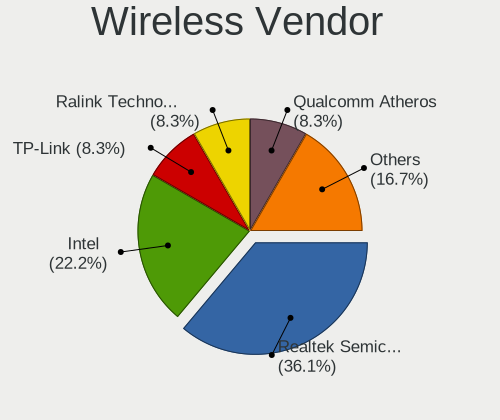

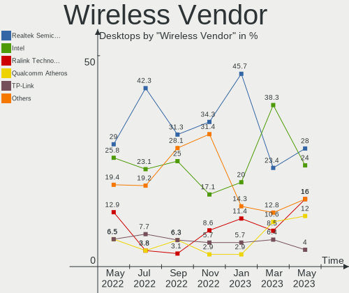

| Vendor                         | Desktops | Percent |
|--------------------------------|----------|---------|
| Intel                          | 5        | 26.32%  |
| Realtek Semiconductor          | 3        | 15.79%  |
| Ralink Technology              | 3        | 15.79%  |
| Qualcomm Atheros               | 2        | 10.53%  |
| D-Link System                  | 2        | 10.53%  |
| TP-Link                        | 1        | 5.26%   |
| Ralink                         | 1        | 5.26%   |
| D-Link                         | 1        | 5.26%   |
| Broadcom Inc. and subsidiaries | 1        | 5.26%   |

Wireless Model
--------------

Wireless models

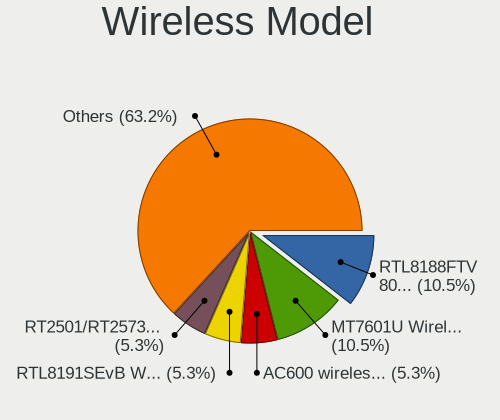

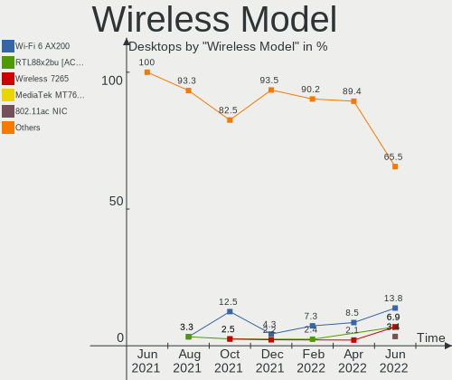

| Model                                                                       | Desktops | Percent |
|-----------------------------------------------------------------------------|----------|---------|
| Realtek RTL8188FTV 802.11b/g/n 1T1R 2.4G WLAN Adapter                       | 2        | 10.53%  |
| Ralink MT7601U Wireless Adapter                                             | 2        | 10.53%  |
| TP-Link AC600 wireless Realtek RTL8811AU [Archer T2U Nano]                  | 1        | 5.26%   |
| Realtek RTL8191SEvB Wireless LAN Controller                                 | 1        | 5.26%   |
| Ralink RT2501/RT2573 Wireless Adapter                                       | 1        | 5.26%   |
| Ralink RT2561/RT61 802.11g PCI                                              | 1        | 5.26%   |
| Qualcomm Atheros AR93xx Wireless Network Adapter                            | 1        | 5.26%   |
| Qualcomm Atheros AR922X Wireless Network Adapter                            | 1        | 5.26%   |
| Intel Wireless-AC 9260                                                      | 1        | 5.26%   |
| Intel Wireless 8260                                                         | 1        | 5.26%   |
| Intel Wireless 3165                                                         | 1        | 5.26%   |
| Intel Dual Band Wireless-AC 3168NGW [Stone Peak]                            | 1        | 5.26%   |
| Intel AC 1550i Wireless                                                     | 1        | 5.26%   |
| D-Link System DWA-160 Xtreme N Dual Band USB Adapter(rev.B) [Ralink RT2870] | 1        | 5.26%   |
| D-Link System DWA-110 Wireless G Adapter(rev.A1) [Ralink RT2571W]           | 1        | 5.26%   |
| D-Link 802.11ac NIC                                                         | 1        | 5.26%   |
| Broadcom Inc. and subsidiaries BCM43228 802.11a/b/g/n                       | 1        | 5.26%   |

Ethernet Vendor
---------------

Ethernet vendors

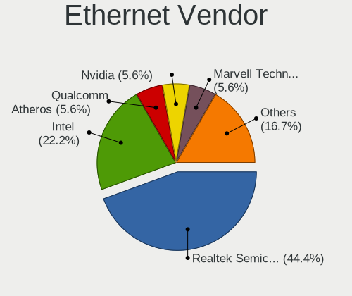

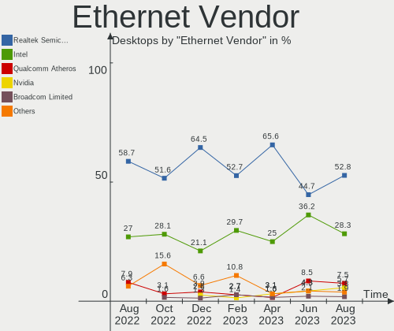

| Vendor                   | Desktops | Percent |
|--------------------------|----------|---------|
| Realtek Semiconductor    | 18       | 46.15%  |
| Intel                    | 12       | 30.77%  |
| Qualcomm Atheros         | 3        | 7.69%   |
| Samsung Electronics      | 2        | 5.13%   |
| Nvidia                   | 1        | 2.56%   |
| Marvell Technology Group | 1        | 2.56%   |
| JMicron Technology       | 1        | 2.56%   |
| Broadcom Limited         | 1        | 2.56%   |

Ethernet Model
--------------

Ethernet models

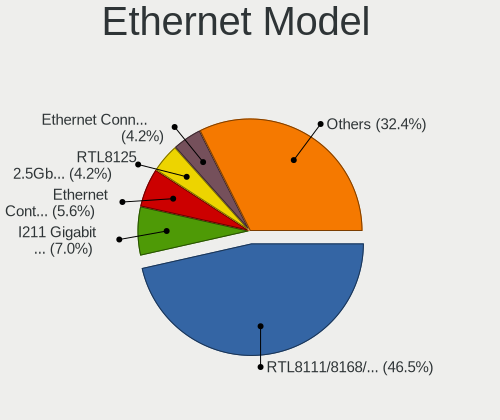

| Model                                                             | Desktops | Percent |
|-------------------------------------------------------------------|----------|---------|
| Realtek RTL8111/8168/8411 PCI Express Gigabit Ethernet Controller | 16       | 41.03%  |
| Realtek RTL810xE PCI Express Fast Ethernet controller             | 2        | 5.13%   |
| Intel I211 Gigabit Network Connection                             | 2        | 5.13%   |
| Intel 82566DM-2 Gigabit Network Connection                        | 2        | 5.13%   |
| Samsung GT-I9070 (network tethering, USB debugging enabled)       | 1        | 2.56%   |
| Samsung Galaxy series, misc. (tethering mode)                     | 1        | 2.56%   |
| Qualcomm Atheros QCA8171 Gigabit Ethernet                         | 1        | 2.56%   |
| Qualcomm Atheros Killer E220x Gigabit Ethernet Controller         | 1        | 2.56%   |
| Qualcomm Atheros AR8121/AR8113/AR8114 Gigabit or Fast Ethernet    | 1        | 2.56%   |
| Nvidia MCP77 Ethernet                                             | 1        | 2.56%   |
| Marvell Group 88E8001 Gigabit Ethernet Controller                 | 1        | 2.56%   |
| JMicron JMC250 PCI Express Gigabit Ethernet Controller            | 1        | 2.56%   |
| Intel Ethernet Connection I217-V                                  | 1        | 2.56%   |
| Intel Ethernet Connection (2) I219-LM                             | 1        | 2.56%   |
| Intel Ethernet Connection (2) I218-V                              | 1        | 2.56%   |
| Intel 82579V Gigabit Network Connection                           | 1        | 2.56%   |
| Intel 82579LM Gigabit Network Connection (Lewisville)             | 1        | 2.56%   |
| Intel 82567V-2 Gigabit Network Connection                         | 1        | 2.56%   |
| Intel 82566DC-2 Gigabit Network Connection                        | 1        | 2.56%   |
| Intel 82562V-2 10/100 Network Connection                          | 1        | 2.56%   |
| Broadcom Limited NetLink BCM5787 Gigabit Ethernet PCI Express     | 1        | 2.56%   |

Net Controller Kind
-------------------

Ethernet, WiFi or modem

| Kind     | Desktops | Percent |
|----------|----------|---------|
| Ethernet | 36       | 67.92%  |
| WiFi     | 17       | 32.08%  |

Used Controller
---------------

Currently used network controller

| Kind     | Desktops | Percent |
|----------|----------|---------|
| Ethernet | 27       | 72.97%  |
| WiFi     | 10       | 27.03%  |

NICs
----

Total network controllers on board

| Total | Desktops | Percent |
|-------|----------|---------|
| 1     | 26       | 72.22%  |
| 2     | 8        | 22.22%  |
| 3     | 2        | 5.56%   |

Memory Vendor
-------------

Memory module vendors

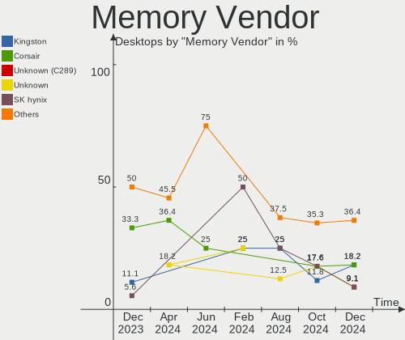

| Vendor   | Desktops | Percent |
|----------|----------|---------|
| Kingston | 3        | 60%     |
| SK Hynix | 1        | 20%     |
| Crucial  | 1        | 20%     |

Memory Model
------------

Memory module models

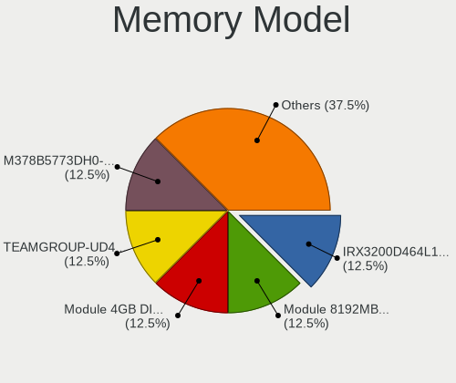

| Model                                                   | Desktops | Percent |
|---------------------------------------------------------|----------|---------|
| SK Hynix RAM HMT151R7BFR4C 4096MB DIMM DDR3 1333MT/s    | 1        | 16.67%  |
| Kingston RAM KHX3200C16D4/8GX 8192MB DIMM DDR4 3533MT/s | 1        | 16.67%  |
| Kingston RAM 9905678-041.A00G 4GB DIMM DDR4 2133MT/s    | 1        | 16.67%  |
| Kingston RAM 9905678-024.A00G 4GB DIMM DDR4 2133MT/s    | 1        | 16.67%  |
| Kingston RAM 9905471-006.A02LF 4GB DIMM DDR3 1333MT/s   | 1        | 16.67%  |
| Crucial RAM BLS8G3D1609DS1S00. 8GB DIMM DDR3 1600MT/s   | 1        | 16.67%  |

Memory Kind
-----------

Memory module kinds

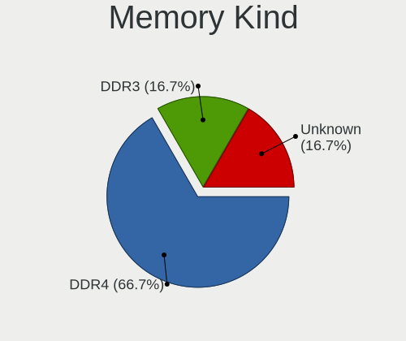

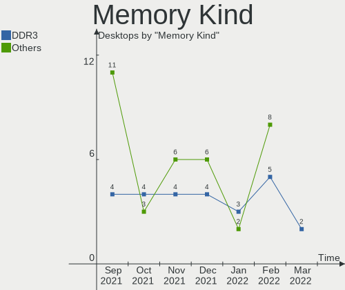

| Kind | Desktops | Percent |
|------|----------|---------|
| DDR3 | 3        | 60%     |
| DDR4 | 2        | 40%     |

Memory Form Factor
------------------

Physical design of the memory module

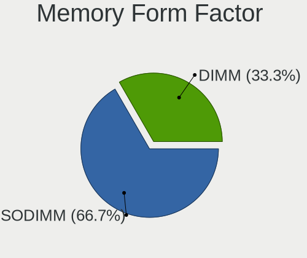

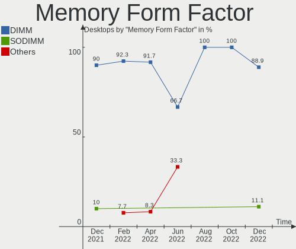

| Name | Desktops | Percent |
|------|----------|---------|
| DIMM | 5        | 100%    |

Memory Size
-----------

Memory module size

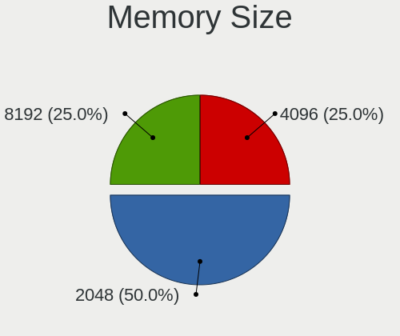

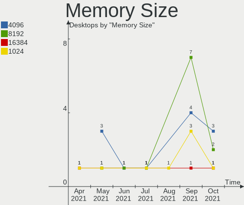

| Size | Desktops | Percent |
|------|----------|---------|
| 4096 | 3        | 60%     |
| 8192 | 2        | 40%     |

Memory Speed
------------

Memory module speed

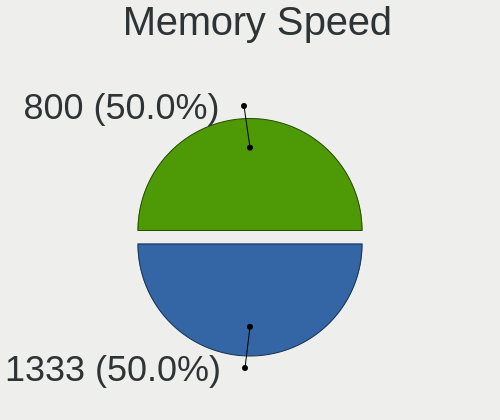

| Speed | Desktops | Percent |
|-------|----------|---------|
| 1333  | 2        | 40%     |
| 3533  | 1        | 20%     |
| 2133  | 1        | 20%     |
| 1600  | 1        | 20%     |

Sound Vendor
------------

Sound card vendors

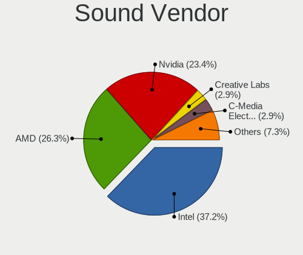

| Vendor                           | Desktops | Percent |
|----------------------------------|----------|---------|
| Intel                            | 26       | 50%     |
| AMD                              | 12       | 23.08%  |
| Nvidia                           | 11       | 21.15%  |
| Silicon Integrated Systems [SiS] | 1        | 1.92%   |
| Creative Labs                    | 1        | 1.92%   |
| C-Media Electronics              | 1        | 1.92%   |

Sound Model
-----------

Sound card models

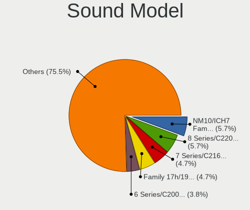

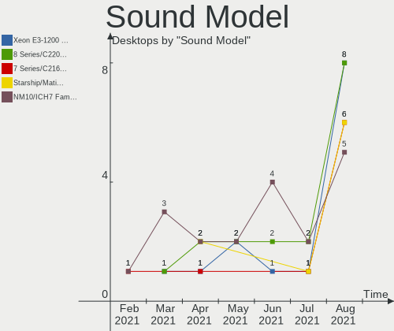

| Model                                                                             | Desktops | Percent |
|-----------------------------------------------------------------------------------|----------|---------|
| Intel 8 Series/C220 Series Chipset High Definition Audio Controller               | 5        | 8.33%   |
| Intel 6 Series/C200 Series Chipset Family High Definition Audio Controller        | 5        | 8.33%   |
| Intel 82801I (ICH9 Family) HD Audio Controller                                    | 4        | 6.67%   |
| Intel NM10/ICH7 Family High Definition Audio Controller                           | 3        | 5%      |
| AMD Family 17h (Models 00h-0fh) HD Audio Controller                               | 3        | 5%      |
| AMD Ellesmere HDMI Audio [Radeon RX 470/480 / 570/580/590]                        | 3        | 5%      |
| Nvidia GK208 HDMI/DP Audio Controller                                             | 2        | 3.33%   |
| Intel Xeon E3-1200 v3/4th Gen Core Processor HD Audio Controller                  | 2        | 3.33%   |
| Intel 82801JI (ICH10 Family) HD Audio Controller                                  | 2        | 3.33%   |
| Intel 100 Series/C230 Series Chipset Family HD Audio Controller                   | 2        | 3.33%   |
| AMD Oland/Hainan/Cape Verde/Pitcairn HDMI Audio [Radeon HD 7000 Series]           | 2        | 3.33%   |
| AMD Family 17h (Models 10h-1fh) HD Audio Controller                               | 2        | 3.33%   |
| Silicon Integrated Systems [SiS] Azalia Audio Controller                          | 1        | 1.67%   |
| Nvidia TU107 GeForce GTX 1650 High Definition Audio Controller                    | 1        | 1.67%   |
| Nvidia MCP72XE/MCP72P/MCP78U/MCP78S High Definition Audio                         | 1        | 1.67%   |
| Nvidia High Definition Audio Controller                                           | 1        | 1.67%   |
| Nvidia GT216 HDMI Audio Controller                                                | 1        | 1.67%   |
| Nvidia GP108 High Definition Audio Controller                                     | 1        | 1.67%   |
| Nvidia GP106 High Definition Audio Controller                                     | 1        | 1.67%   |
| Nvidia GK107 HDMI Audio Controller                                                | 1        | 1.67%   |
| Nvidia GK106 HDMI Audio Controller                                                | 1        | 1.67%   |
| Nvidia GF116 High Definition Audio Controller                                     | 1        | 1.67%   |
| Intel Celeron/Pentium Silver Processor High Definition Audio                      | 1        | 1.67%   |
| Intel C600/X79 series chipset High Definition Audio Controller                    | 1        | 1.67%   |
| Intel Atom Processor Z36xxx/Z37xxx Series High Definition Audio Controller        | 1        | 1.67%   |
| Intel 9 Series Chipset Family HD Audio Controller                                 | 1        | 1.67%   |
| Intel 82801EB/ER (ICH5/ICH5R) AC'97 Audio Controller                              | 1        | 1.67%   |
| Creative Labs EMU10k2/CA0100/CA0102/CA10200 [Sound Blaster Audigy Series]         | 1        | 1.67%   |
| C-Media Electronics Philips SPA5210                                               | 1        | 1.67%   |
| AMD Trinity HDMI Audio Controller                                                 | 1        | 1.67%   |
| AMD SBx00 Azalia (Intel HDA)                                                      | 1        | 1.67%   |
| AMD RV770 HDMI Audio [Radeon HD 4850/4870]                                        | 1        | 1.67%   |
| AMD RV610 HDMI Audio [Radeon HD 2350 PRO / 2400 PRO/XT / HD 3410]                 | 1        | 1.67%   |
| AMD Raven/Raven2/Fenghuang HDMI/DP Audio Controller                               | 1        | 1.67%   |
| AMD FCH Azalia Controller                                                         | 1        | 1.67%   |
| AMD Caicos HDMI Audio [Radeon HD 6450 / 7450/8450/8490 OEM / R5 230/235/235X OEM] | 1        | 1.67%   |
| AMD Barts HDMI Audio [Radeon HD 6790/6850/6870 / 7720 OEM]                        | 1        | 1.67%   |

Camera Vendor
-------------

Camera device vendors

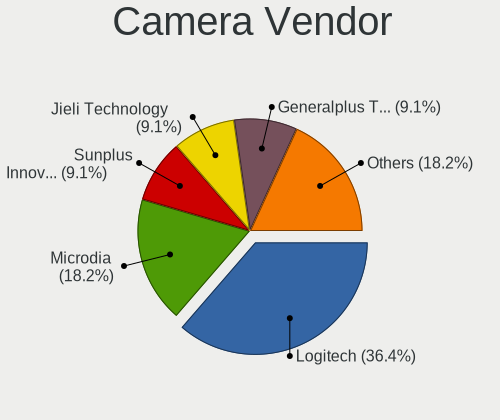

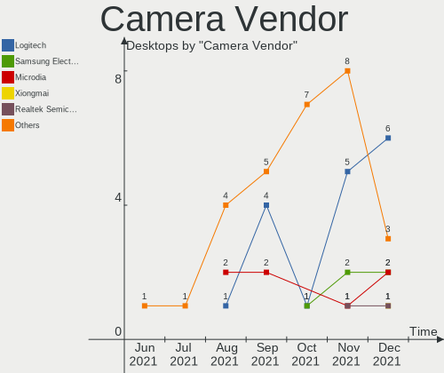

| Vendor         | Desktops | Percent |
|----------------|----------|---------|
| Microsoft      | 1        | 25%     |
| Microdia       | 1        | 25%     |
| LG Electronics | 1        | 25%     |
| Apple          | 1        | 25%     |

Camera Model
------------

Camera device models

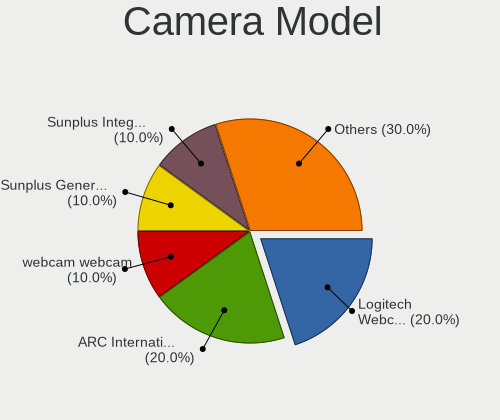

| Model                     | Desktops | Percent |
|---------------------------|----------|---------|
| Microsoft LifeCam VX-2000 | 1        | 25%     |
| Microdia Camera           | 1        | 25%     |
| LG AN-VC500 Camera        | 1        | 25%     |
| Apple iPhone 5/5C/5S/6/SE | 1        | 25%     |

Fingerprint Vendor
------------------

Fingerprint sensor vendors

Zero info for selected period =(

Fingerprint Model
-----------------

Fingerprint sensor models

Zero info for selected period =(

Chipcard Vendor
---------------

Chipcard module vendors

Zero info for selected period =(

Chipcard Model
--------------

Chipcard module models

Zero info for selected period =(

Printer Vendor
--------------

Printer device vendors

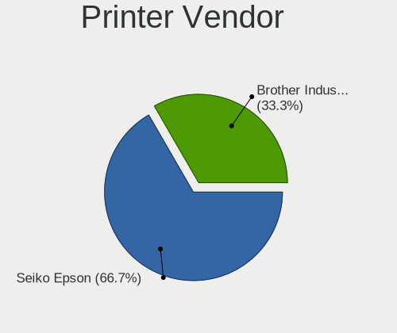

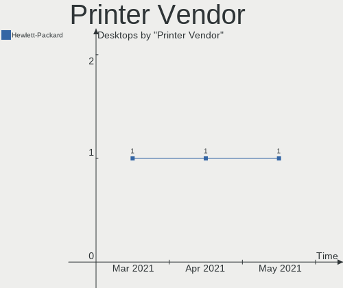

| Vendor             | Desktops | Percent |
|--------------------|----------|---------|
| Brother Industries | 1        | 100%    |

Printer Model
-------------

Printer device models

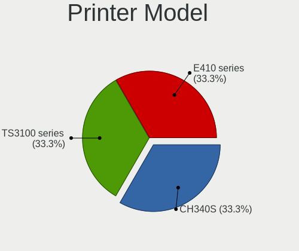

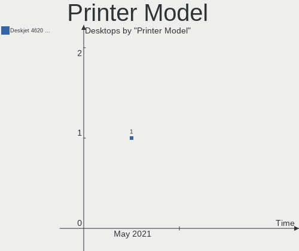

| Model              | Desktops | Percent |
|--------------------|----------|---------|
| Brother HL-L2380DW | 1        | 100%    |

Scanner Vendor
--------------

Scanner device vendors

Zero info for selected period =(

Scanner Model
-------------

Scanner device models

Zero info for selected period =(

Bluetooth Vendor
----------------

Controller vendors

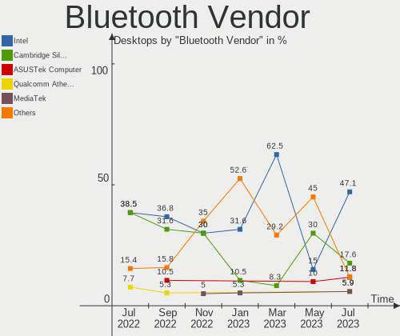

| Vendor                  | Desktops | Percent |
|-------------------------|----------|---------|
| Intel                   | 4        | 57.14%  |
| Dynex                   | 1        | 14.29%  |
| Cambridge Silicon Radio | 1        | 14.29%  |
| Broadcom                | 1        | 14.29%  |

Bluetooth Model
---------------

Controller models

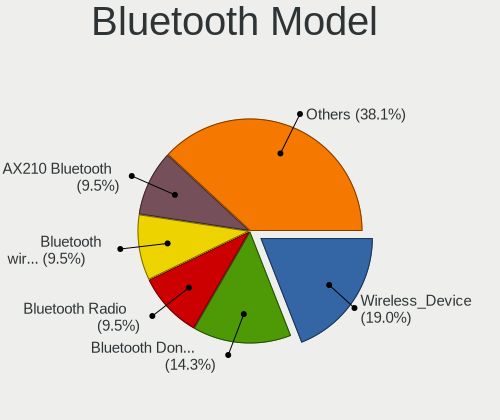

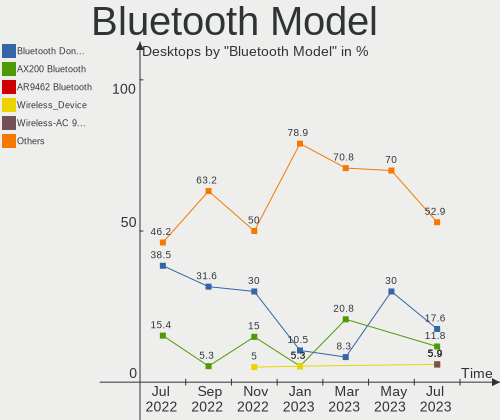

| Model                                                    | Desktops | Percent |
|----------------------------------------------------------|----------|---------|
| Intel Wireless-AC 9260 Bluetooth Adapter                 | 1        | 14.29%  |
| Intel Wireless-AC 3168 Bluetooth                         | 1        | 14.29%  |
| Intel Bluetooth wireless interface                       | 1        | 14.29%  |
| Intel Bluetooth 9460/9560 Jefferson Peak (JfP)           | 1        | 14.29%  |
| Dynex Bluetooth 4.0 Adapter [Broadcom, 1.12, BCM20702A0] | 1        | 14.29%  |
| Cambridge Silicon Radio Bluetooth Dongle (HCI mode)      | 1        | 14.29%  |
| Broadcom BCM92045B3 ROM                                  | 1        | 14.29%  |

Unsupported Devices
-------------------

Total unsupported devices on board

| Total | Desktops | Percent |
|-------|----------|---------|
| 0     | 26       | 72.22%  |
| 1     | 9        | 25%     |
| 2     | 1        | 2.78%   |

Unsupported Device Types
------------------------

Types of unsupported devices

| Type                     | Desktops | Percent |
|--------------------------|----------|---------|
| Communication controller | 4        | 40%     |
| Net/wireless             | 3        | 30%     |
| Graphics card            | 2        | 20%     |
| Unassigned class         | 1        | 10%     |

