Zorin - Hardware Trends (Desktops)
----------------------------------

A project to identify most popular hardware characteristics and track their change
over time based on data collected by Linux users at https://Linux-Hardware.org.

Anyone can contribute to this report by the [hw-probe](https://github.com/linuxhw/hw-probe) tool:

    sudo -E hw-probe -all -upload

This report is for one last month. Overall report since the beginning of time: [TestDays](https://github.com/linuxhw/TestDays)

Period: Dec, 2025.

Contents
--------

* [ System ](#system)
  - [ OS                       ](#os)
  - [ OS Family                ](#os-family)
  - [ Kernel                   ](#kernel)
  - [ Kernel Family            ](#kernel-family)
  - [ Kernel Major Ver.        ](#kernel-major-ver)
  - [ Arch                     ](#arch)
  - [ DE                       ](#de)
  - [ Display Server           ](#display-server)
  - [ Display Manager          ](#display-manager)
  - [ OS Lang                  ](#os-lang)
  - [ Boot Mode                ](#boot-mode)
  - [ Filesystem               ](#filesystem)
  - [ Part. scheme             ](#part-scheme)
  - [ Dual Boot with Linux/BSD ](#dual-boot-with-linuxbsd)
  - [ Dual Boot (Win)          ](#dual-boot-win)

* [ Board ](#board)
  - [ Vendor                   ](#vendor)
  - [ Model                    ](#model)
  - [ Model Family             ](#model-family)
  - [ MFG Year                 ](#mfg-year)
  - [ Form Factor              ](#form-factor)
  - [ Secure Boot              ](#secure-boot)
  - [ Coreboot                 ](#coreboot)
  - [ RAM Size                 ](#ram-size)
  - [ RAM Used                 ](#ram-used)
  - [ Total Drives             ](#total-drives)
  - [ Has CD-ROM               ](#has-cd-rom)
  - [ Has Ethernet             ](#has-ethernet)
  - [ Has WiFi                 ](#has-wifi)
  - [ Has Bluetooth            ](#has-bluetooth)

* [ Location ](#location)
  - [ Country                  ](#country)
  - [ City                     ](#city)

* [ Drives ](#drives)
  - [ Drive Vendor             ](#drive-vendor)
  - [ Drive Model              ](#drive-model)
  - [ HDD Vendor               ](#hdd-vendor)
  - [ SSD Vendor               ](#ssd-vendor)
  - [ Drive Kind               ](#drive-kind)
  - [ Drive Connector          ](#drive-connector)
  - [ Drive Size               ](#drive-size)
  - [ Space Total              ](#space-total)
  - [ Space Used               ](#space-used)
  - [ Malfunc. Drives          ](#malfunc-drives)
  - [ Malfunc. Drive Vendor    ](#malfunc-drive-vendor)
  - [ Malfunc. HDD Vendor      ](#malfunc-hdd-vendor)
  - [ Malfunc. Drive Kind      ](#malfunc-drive-kind)
  - [ Failed Drives            ](#failed-drives)
  - [ Failed Drive Vendor      ](#failed-drive-vendor)
  - [ Drive Status             ](#drive-status)

* [ Storage controller ](#storage-controller)
  - [ Storage Vendor           ](#storage-vendor)
  - [ Storage Model            ](#storage-model)
  - [ Storage Kind             ](#storage-kind)

* [ Processor ](#processor)
  - [ CPU Vendor               ](#cpu-vendor)
  - [ CPU Model                ](#cpu-model)
  - [ CPU Model Family         ](#cpu-model-family)
  - [ CPU Cores                ](#cpu-cores)
  - [ CPU Sockets              ](#cpu-sockets)
  - [ CPU Threads              ](#cpu-threads)
  - [ CPU Op-Modes             ](#cpu-op-modes)
  - [ CPU Microcode            ](#cpu-microcode)
  - [ CPU Microarch            ](#cpu-microarch)

* [ Graphics ](#graphics)
  - [ GPU Vendor               ](#gpu-vendor)
  - [ GPU Model                ](#gpu-model)
  - [ GPU Combo                ](#gpu-combo)
  - [ GPU Driver               ](#gpu-driver)
  - [ GPU Memory               ](#gpu-memory)

* [ Monitor ](#monitor)
  - [ Monitor Vendor           ](#monitor-vendor)
  - [ Monitor Model            ](#monitor-model)
  - [ Monitor Resolution       ](#monitor-resolution)
  - [ Monitor Diagonal         ](#monitor-diagonal)
  - [ Monitor Width            ](#monitor-width)
  - [ Aspect Ratio             ](#aspect-ratio)
  - [ Monitor Area             ](#monitor-area)
  - [ Pixel Density            ](#pixel-density)
  - [ Multiple Monitors        ](#multiple-monitors)

* [ Network ](#network)
  - [ Net Controller Vendor    ](#net-controller-vendor)
  - [ Net Controller Model     ](#net-controller-model)
  - [ Wireless Vendor          ](#wireless-vendor)
  - [ Wireless Model           ](#wireless-model)
  - [ Ethernet Vendor          ](#ethernet-vendor)
  - [ Ethernet Model           ](#ethernet-model)
  - [ Net Controller Kind      ](#net-controller-kind)
  - [ Used Controller          ](#used-controller)
  - [ NICs                     ](#nics)
  - [ IPv6                     ](#ipv6)

* [ Bluetooth ](#bluetooth)
  - [ Bluetooth Vendor         ](#bluetooth-vendor)
  - [ Bluetooth Model          ](#bluetooth-model)

* [ Sound ](#sound)
  - [ Sound Vendor             ](#sound-vendor)
  - [ Sound Model              ](#sound-model)

* [ Memory ](#memory)
  - [ Memory Vendor            ](#memory-vendor)
  - [ Memory Model             ](#memory-model)
  - [ Memory Kind              ](#memory-kind)
  - [ Memory Form Factor       ](#memory-form-factor)
  - [ Memory Size              ](#memory-size)
  - [ Memory Speed             ](#memory-speed)

* [ Printers & scanners ](#printers--scanners)
  - [ Printer Vendor           ](#printer-vendor)
  - [ Printer Model            ](#printer-model)
  - [ Scanner Vendor           ](#scanner-vendor)
  - [ Scanner Model            ](#scanner-model)

* [ Camera ](#camera)
  - [ Camera Vendor            ](#camera-vendor)
  - [ Camera Model             ](#camera-model)

* [ Security ](#security)
  - [ Fingerprint Vendor       ](#fingerprint-vendor)
  - [ Fingerprint Model        ](#fingerprint-model)
  - [ Chipcard Vendor          ](#chipcard-vendor)
  - [ Chipcard Model           ](#chipcard-model)

* [ Unsupported ](#unsupported)
  - [ Unsupported Devices      ](#unsupported-devices)
  - [ Unsupported Device Types ](#unsupported-device-types)

System
------

OS
--

Installed operating systems

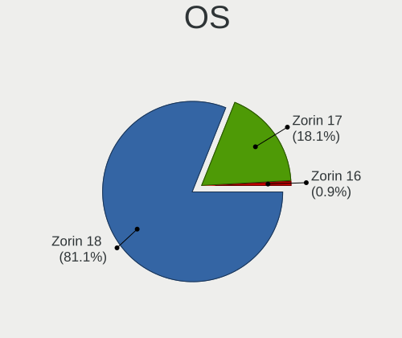

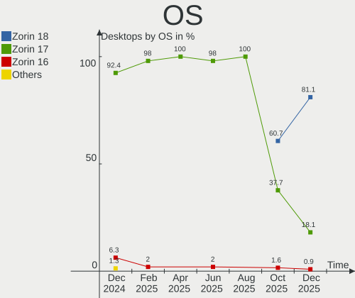

| Name     | Desktops | Percent |
|----------|----------|---------|
| Zorin 18 | 184      | 81.06%  |
| Zorin 17 | 41       | 18.06%  |
| Zorin 16 | 2        | 0.88%   |

OS Family
---------

OS without a version

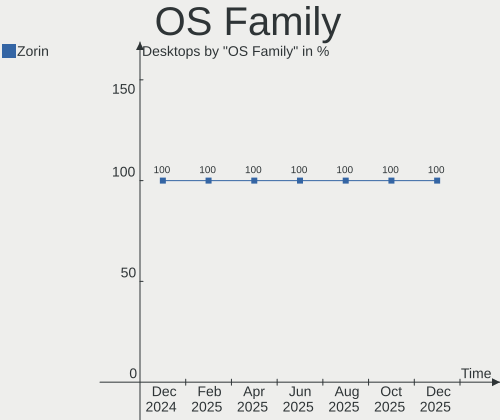

| Name  | Desktops | Percent |
|-------|----------|---------|
| Zorin | 227      | 100%    |

Kernel
------

Version of the Linux kernel

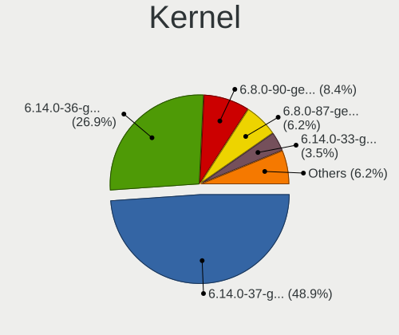

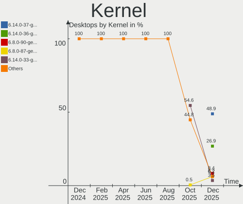

| Version                 | Desktops | Percent |
|-------------------------|----------|---------|
| 6.14.0-37-generic       | 111      | 48.9%   |
| 6.14.0-36-generic       | 61       | 26.87%  |
| 6.8.0-90-generic        | 19       | 8.37%   |
| 6.8.0-87-generic        | 14       | 6.17%   |
| 6.14.0-33-generic       | 8        | 3.52%   |
| 6.8.0-60-generic        | 3        | 1.32%   |
| 6.14.0-35-generic       | 3        | 1.32%   |
| 6.8.0-88-generic        | 2        | 0.88%   |
| 6.8.0-85-generic        | 1        | 0.44%   |
| 6.8.0-84-generic        | 1        | 0.44%   |
| 6.8.0-49-generic        | 1        | 0.44%   |
| 6.14.5-1-liquorix-amd64 | 1        | 0.44%   |
| 5.15.0-56-generic       | 1        | 0.44%   |
| 5.15.0-139-generic      | 1        | 0.44%   |

Kernel Family
-------------

Linux kernel without a distro release

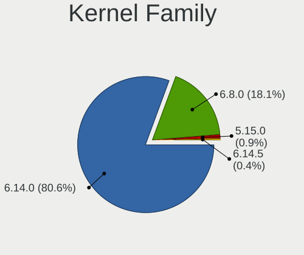

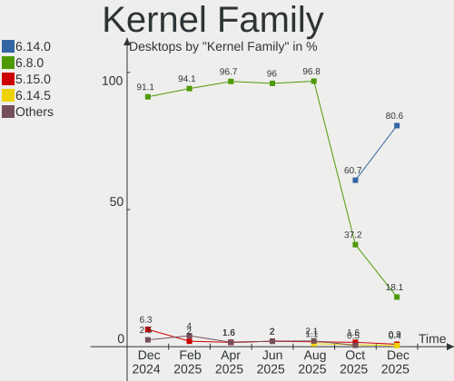

| Version | Desktops | Percent |
|---------|----------|---------|
| 6.14.0  | 183      | 80.62%  |
| 6.8.0   | 41       | 18.06%  |
| 5.15.0  | 2        | 0.88%   |
| 6.14.5  | 1        | 0.44%   |

Kernel Major Ver.
-----------------

Linux kernel major version

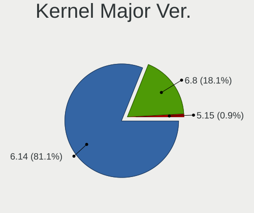

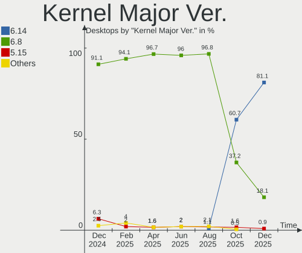

| Version | Desktops | Percent |
|---------|----------|---------|
| 6.14    | 184      | 81.06%  |
| 6.8     | 41       | 18.06%  |
| 5.15    | 2        | 0.88%   |

Arch
----

OS architecture (x86_64, i586, etc.)

| Name   | Desktops | Percent |
|--------|----------|---------|
| x86_64 | 227      | 100%    |

DE
--

Desktop Environment

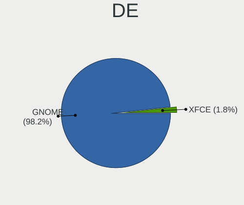

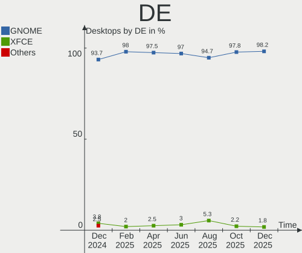

| Name  | Desktops | Percent |
|-------|----------|---------|
| GNOME | 223      | 98.24%  |
| XFCE  | 4        | 1.76%   |

Display Server
--------------

X11 or Wayland

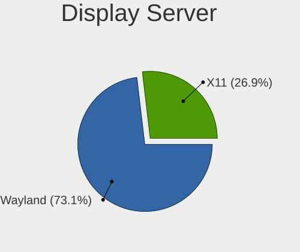

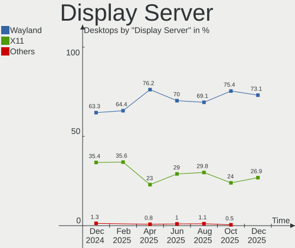

| Name    | Desktops | Percent |
|---------|----------|---------|
| Wayland | 166      | 73.13%  |
| X11     | 61       | 26.87%  |

Display Manager
---------------

SDDM, LightDM, etc.

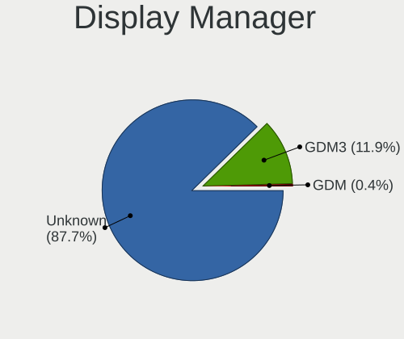

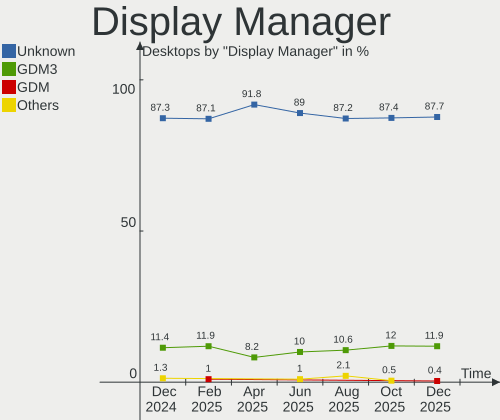

| Name    | Desktops | Percent |
|---------|----------|---------|
| Unknown | 199      | 87.67%  |
| GDM3    | 27       | 11.89%  |
| GDM     | 1        | 0.44%   |

OS Lang
-------

Language

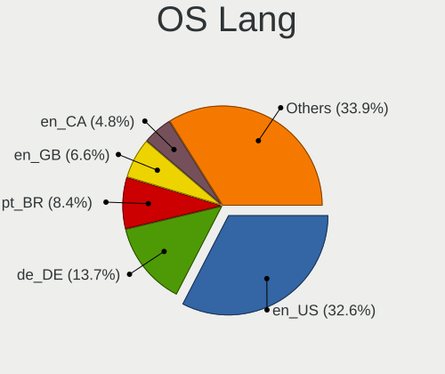

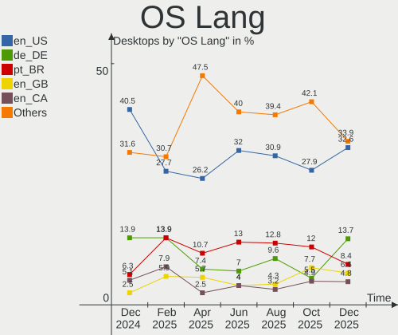

| Lang  | Desktops | Percent |
|-------|----------|---------|
| en_US | 74       | 32.6%   |
| de_DE | 31       | 13.66%  |
| pt_BR | 19       | 8.37%   |
| en_GB | 15       | 6.61%   |
| en_CA | 11       | 4.85%   |
| fr_FR | 10       | 4.41%   |
| en_AU | 9        | 3.96%   |
| it_IT | 6        | 2.64%   |
| en_IN | 5        | 2.2%    |
| de_AT | 5        | 2.2%    |
| ru_RU | 4        | 1.76%   |
| hu_HU | 4        | 1.76%   |
| es_MX | 4        | 1.76%   |
| es_ES | 4        | 1.76%   |
| pt_PT | 3        | 1.32%   |
| es_CL | 3        | 1.32%   |
| nl_NL | 2        | 0.88%   |
| fr_CA | 2        | 0.88%   |
| es_VE | 2        | 0.88%   |
| es_AR | 2        | 0.88%   |
| zh_HK | 1        | 0.44%   |
| sk_SK | 1        | 0.44%   |
| pl_PL | 1        | 0.44%   |
| fr_BE | 1        | 0.44%   |
| es_PE | 1        | 0.44%   |
| es_CO | 1        | 0.44%   |
| en_NZ | 1        | 0.44%   |
| en_IL | 1        | 0.44%   |
| en_IE | 1        | 0.44%   |
| de_CH | 1        | 0.44%   |
| cs_CZ | 1        | 0.44%   |
| ca_ES | 1        | 0.44%   |

Boot Mode
---------

EFI or BIOS

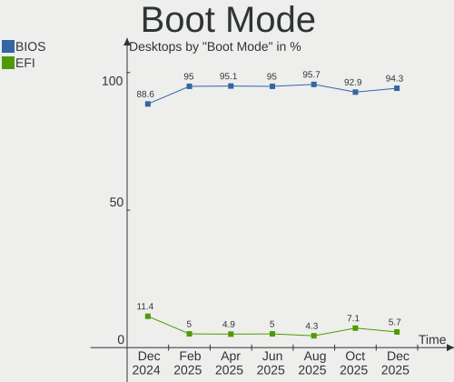

| Mode | Desktops | Percent |
|------|----------|---------|
| BIOS | 214      | 94.27%  |
| EFI  | 13       | 5.73%   |

Filesystem
----------

Type of filesystem

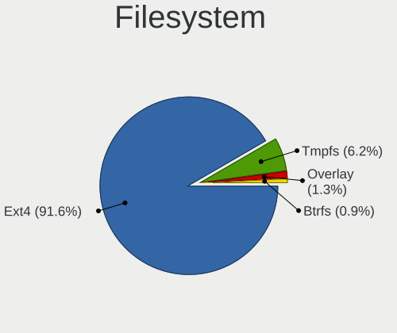

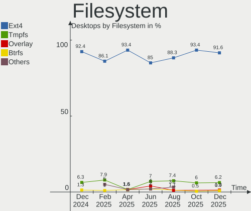

| Type    | Desktops | Percent |
|---------|----------|---------|
| Ext4    | 208      | 91.63%  |
| Tmpfs   | 14       | 6.17%   |
| Overlay | 3        | 1.32%   |
| Btrfs   | 2        | 0.88%   |

Part. scheme
------------

Scheme of partitioning

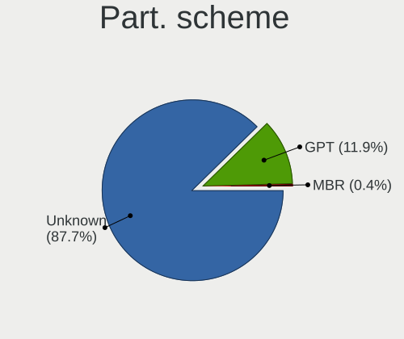

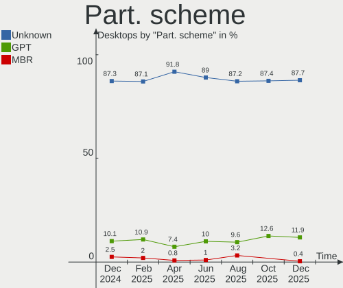

| Type    | Desktops | Percent |
|---------|----------|---------|
| Unknown | 199      | 87.67%  |
| GPT     | 27       | 11.89%  |
| MBR     | 1        | 0.44%   |

Dual Boot with Linux/BSD
------------------------

Hosting more than one Linux/BSD

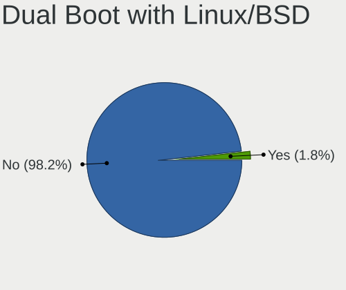

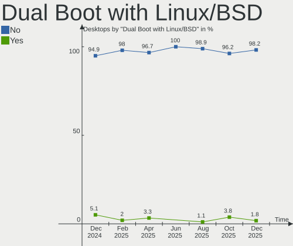

| Dual boot | Desktops | Percent |
|-----------|----------|---------|
| No        | 223      | 98.24%  |
| Yes       | 4        | 1.76%   |

Dual Boot (Win)
---------------

Hosting Linux and Windows

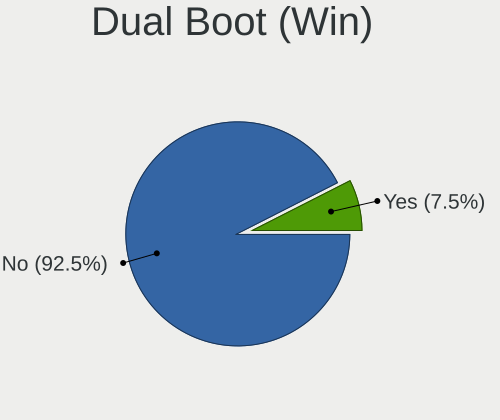

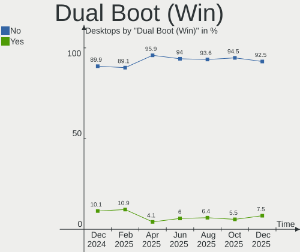

| Dual boot | Desktops | Percent |
|-----------|----------|---------|
| No        | 210      | 92.51%  |
| Yes       | 17       | 7.49%   |

Board
-----

Vendor
------

Motherboard manufacturer

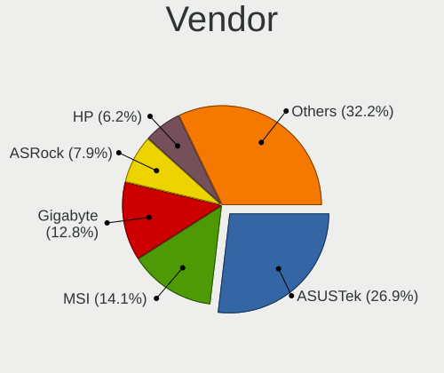

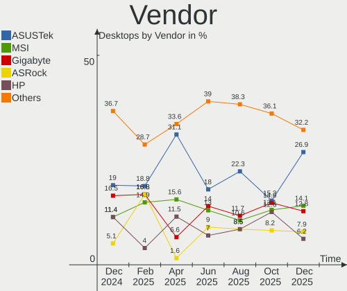

| Name                | Desktops | Percent |
|---------------------|----------|---------|
| ASUSTek Computer    | 61       | 26.87%  |
| MSI                 | 32       | 14.1%   |
| Gigabyte Technology | 29       | 12.78%  |
| ASRock              | 18       | 7.93%   |
| Hewlett-Packard     | 14       | 6.17%   |
| Dell                | 14       | 6.17%   |
| Intel               | 11       | 4.85%   |
| Lenovo              | 7        | 3.08%   |
| Biostar             | 5        | 2.2%    |
| Unknown             | 5        | 2.2%    |
| Pegatron            | 3        | 1.32%   |
| Fujitsu             | 3        | 1.32%   |
| Foxconn             | 3        | 1.32%   |
| AZW                 | 3        | 1.32%   |
| Acer                | 3        | 1.32%   |
| Packard Bell        | 2        | 0.88%   |
| Apple               | 2        | 0.88%   |
| Alienware           | 2        | 0.88%   |
| ZR                  | 1        | 0.44%   |
| WARP                | 1        | 0.44%   |
| Supermicro          | 1        | 0.44%   |
| Positivo            | 1        | 0.44%   |
| PELADN              | 1        | 0.44%   |
| MUCAI               | 1        | 0.44%   |
| Lanix               | 1        | 0.44%   |
| JINGSHA             | 1        | 0.44%   |
| HC Technology.      | 1        | 0.44%   |
| GEEKOM              | 1        | 0.44%   |

Model
-----

Motherboard model

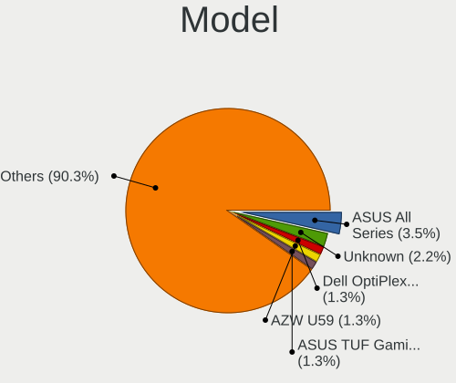

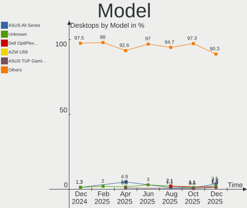

| Name                                 | Desktops | Percent |
|--------------------------------------|----------|---------|
| ASUS All Series                      | 8        | 3.52%   |
| Unknown                              | 5        | 2.2%    |
| Dell OptiPlex 7010                   | 3        | 1.32%   |
| AZW U59                              | 3        | 1.32%   |
| ASUS TUF Gaming X570-PLUS            | 3        | 1.32%   |
| MSI MS-7C56                          | 2        | 0.88%   |
| MSI MS-7C37                          | 2        | 0.88%   |
| MSI MS-7917                          | 2        | 0.88%   |
| MSI MS-7721                          | 2        | 0.88%   |
| Intel H61                            | 2        | 0.88%   |
| Intel B75                            | 2        | 0.88%   |
| HP EliteDesk 800 G1 USDT             | 2        | 0.88%   |
| Biostar H61MGV3                      | 2        | 0.88%   |
| ASUS PRIME A320M-K                   | 2        | 0.88%   |
| ZR B450M-F                           | 1        | 0.44%   |
| WARP B760M4                          | 1        | 0.44%   |
| Supermicro X8SAX                     | 1        | 0.44%   |
| Positivo POS-AG31AP                  | 1        | 0.44%   |
| PELADN HA-3                          | 1        | 0.44%   |
| Pegatron TouchSmart 7320 Lavaca-B PC | 1        | 0.44%   |
| Pegatron Rfrb 700-010xt              | 1        | 0.44%   |
| Pegatron p7-1017c                    | 1        | 0.44%   |
| Packard Bell IMEDIA S3800            | 1        | 0.44%   |
| Packard Bell IMEDIA S2185            | 1        | 0.44%   |
| MUCAI H61 V91                        | 1        | 0.44%   |
| MSI US Desktop Aegis RS              | 1        | 0.44%   |
| MSI MS-7E70                          | 1        | 0.44%   |
| MSI MS-7E12                          | 1        | 0.44%   |
| MSI MS-7E09                          | 1        | 0.44%   |
| MSI MS-7D95                          | 1        | 0.44%   |
| MSI MS-7D27                          | 1        | 0.44%   |
| MSI MS-7D09                          | 1        | 0.44%   |
| MSI MS-7C96                          | 1        | 0.44%   |
| MSI MS-7C52                          | 1        | 0.44%   |
| MSI MS-7C35                          | 1        | 0.44%   |
| MSI MS-7C02                          | 1        | 0.44%   |
| MSI MS-7B89                          | 1        | 0.44%   |
| MSI MS-7B87                          | 1        | 0.44%   |
| MSI MS-7B86                          | 1        | 0.44%   |
| MSI MS-7B84                          | 1        | 0.44%   |

Model Family
------------

Motherboard model prefix

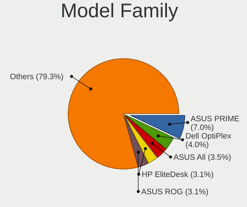

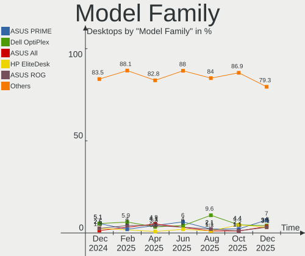

| Name                | Desktops | Percent |
|---------------------|----------|---------|
| ASUS PRIME          | 16       | 7.05%   |
| Dell OptiPlex       | 9        | 3.96%   |
| ASUS All            | 8        | 3.52%   |
| HP EliteDesk        | 7        | 3.08%   |
| ASUS ROG            | 7        | 3.08%   |
| Lenovo ThinkCentre  | 6        | 2.64%   |
| ASUS TUF            | 6        | 2.64%   |
| Unknown             | 5        | 2.2%    |
| Fujitsu ESPRIMO     | 3        | 1.32%   |
| AZW U59             | 3        | 1.32%   |
| Packard Bell IMEDIA | 2        | 0.88%   |
| MSI MS-7C56         | 2        | 0.88%   |
| MSI MS-7C37         | 2        | 0.88%   |
| MSI MS-7917         | 2        | 0.88%   |
| MSI MS-7721         | 2        | 0.88%   |
| Intel H61           | 2        | 0.88%   |
| Intel B75           | 2        | 0.88%   |
| Gigabyte Z790       | 2        | 0.88%   |
| Gigabyte Z390       | 2        | 0.88%   |
| Gigabyte X870E      | 2        | 0.88%   |
| Dell Precision      | 2        | 0.88%   |
| Biostar H61MGV3     | 2        | 0.88%   |
| Biostar A320MH      | 2        | 0.88%   |
| ASRock B450M        | 2        | 0.88%   |
| ZR B450M-F          | 1        | 0.44%   |
| WARP B760M4         | 1        | 0.44%   |
| Supermicro X8SAX    | 1        | 0.44%   |
| Positivo POS-AG31AP | 1        | 0.44%   |
| PELADN HA-3         | 1        | 0.44%   |
| Pegatron TouchSmart | 1        | 0.44%   |
| Pegatron Rfrb       | 1        | 0.44%   |
| Pegatron p7-1017c   | 1        | 0.44%   |
| MUCAI H61           | 1        | 0.44%   |
| MSI US              | 1        | 0.44%   |
| MSI MS-7E70         | 1        | 0.44%   |
| MSI MS-7E12         | 1        | 0.44%   |
| MSI MS-7E09         | 1        | 0.44%   |
| MSI MS-7D95         | 1        | 0.44%   |
| MSI MS-7D27         | 1        | 0.44%   |
| MSI MS-7D09         | 1        | 0.44%   |

MFG Year
--------

Motherboard manufacture year

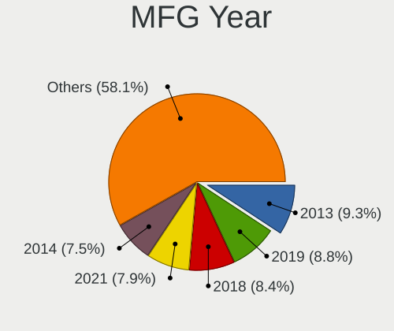

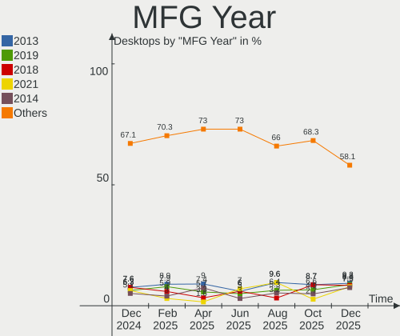

| Year | Desktops | Percent |
|------|----------|---------|
| 2013 | 21       | 9.25%   |
| 2019 | 20       | 8.81%   |
| 2018 | 19       | 8.37%   |
| 2021 | 18       | 7.93%   |
| 2014 | 17       | 7.49%   |
| 2017 | 16       | 7.05%   |
| 2016 | 15       | 6.61%   |
| 2024 | 13       | 5.73%   |
| 2023 | 12       | 5.29%   |
| 2009 | 12       | 5.29%   |
| 2020 | 11       | 4.85%   |
| 2012 | 11       | 4.85%   |
| 2022 | 9        | 3.96%   |
| 2011 | 9        | 3.96%   |
| 2010 | 8        | 3.52%   |
| 2015 | 6        | 2.64%   |
| 2025 | 5        | 2.2%    |
| 2008 | 2        | 0.88%   |
| 2007 | 2        | 0.88%   |
| 2005 | 1        | 0.44%   |

Form Factor
-----------

Physical design of the computer

| Name    | Desktops | Percent |
|---------|----------|---------|
| Desktop | 227      | 100%    |

Secure Boot
-----------

Enabled or disabled

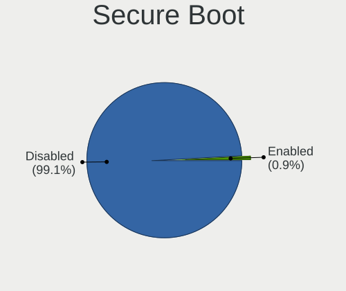

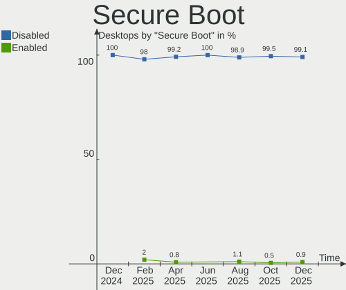

| State    | Desktops | Percent |
|----------|----------|---------|
| Disabled | 225      | 99.12%  |
| Enabled  | 2        | 0.88%   |

Coreboot
--------

Have coreboot on board

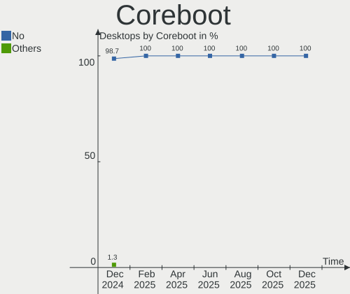

| Used | Desktops | Percent |
|------|----------|---------|
| No   | 227      | 100%    |

RAM Size
--------

Total RAM memory

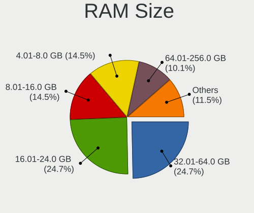

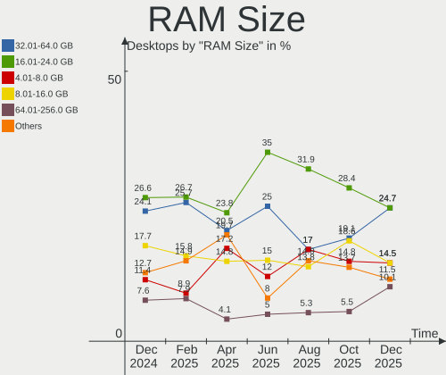

| Size in GB  | Desktops | Percent |
|-------------|----------|---------|
| 32.01-64.0  | 56       | 24.67%  |
| 16.01-24.0  | 56       | 24.67%  |
| 4.01-8.0    | 33       | 14.54%  |
| 8.01-16.0   | 33       | 14.54%  |
| 64.01-256.0 | 23       | 10.13%  |
| 24.01-32.0  | 16       | 7.05%   |
| 3.01-4.0    | 6        | 2.64%   |
| 1.01-2.0    | 3        | 1.32%   |
| 2.01-3.0    | 1        | 0.44%   |

RAM Used
--------

Used RAM memory

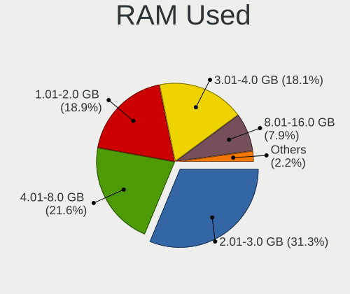

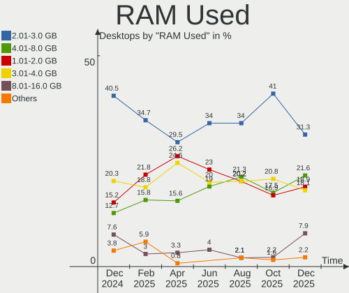

| Used GB    | Desktops | Percent |
|------------|----------|---------|
| 2.01-3.0   | 71       | 31.28%  |
| 4.01-8.0   | 49       | 21.59%  |
| 1.01-2.0   | 43       | 18.94%  |
| 3.01-4.0   | 41       | 18.06%  |
| 8.01-16.0  | 18       | 7.93%   |
| 0.51-1.0   | 3        | 1.32%   |
| 32.01-64.0 | 1        | 0.44%   |
| 16.01-24.0 | 1        | 0.44%   |

Total Drives
------------

Number of drives on board

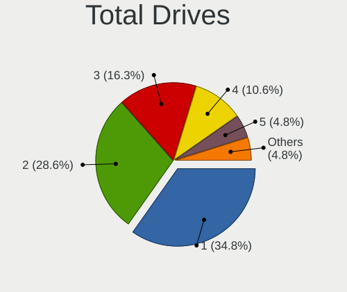

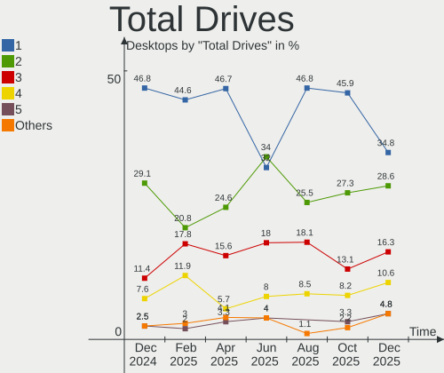

| Drives | Desktops | Percent |
|--------|----------|---------|
| 1      | 79       | 34.8%   |
| 2      | 65       | 28.63%  |
| 3      | 37       | 16.3%   |
| 4      | 24       | 10.57%  |
| 5      | 11       | 4.85%   |
| 6      | 6        | 2.64%   |
| 7      | 2        | 0.88%   |
| 13     | 1        | 0.44%   |
| 9      | 1        | 0.44%   |
| 8      | 1        | 0.44%   |

Has CD-ROM
----------

Has CD-ROM on board

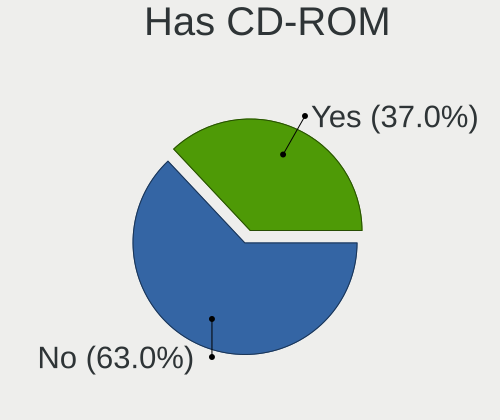

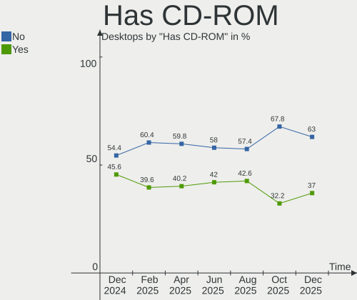

| Presented | Desktops | Percent |
|-----------|----------|---------|
| No        | 143      | 63%     |
| Yes       | 84       | 37%     |

Has Ethernet
------------

Has Ethernet on board

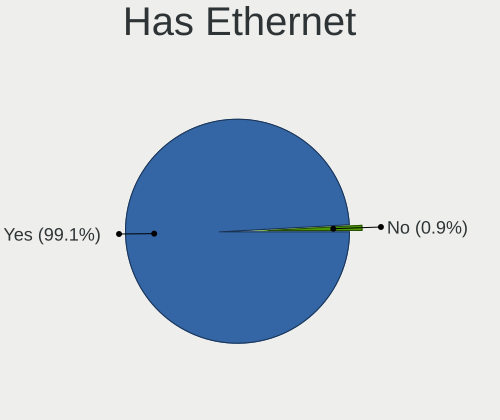

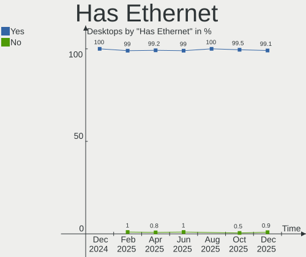

| Presented | Desktops | Percent |
|-----------|----------|---------|
| Yes       | 225      | 99.12%  |
| No        | 2        | 0.88%   |

Has WiFi
--------

Has WiFi module

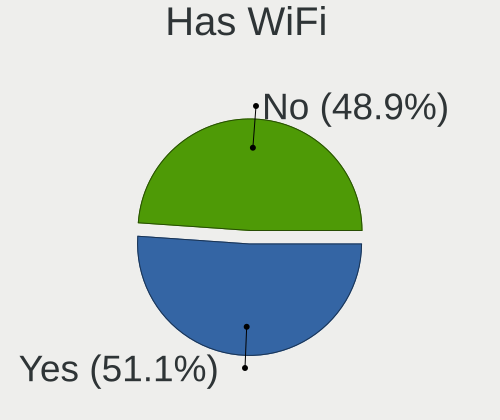

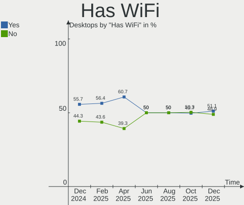

| Presented | Desktops | Percent |
|-----------|----------|---------|
| Yes       | 116      | 51.1%   |
| No        | 111      | 48.9%   |

Has Bluetooth
-------------

Has Bluetooth module

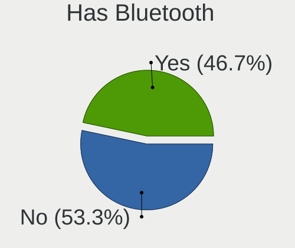

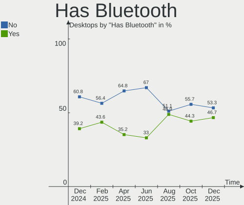

| Presented | Desktops | Percent |
|-----------|----------|---------|
| No        | 121      | 53.3%   |
| Yes       | 106      | 46.7%   |

Location
--------

Country
-------

Geographic location (country)

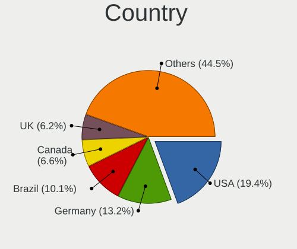

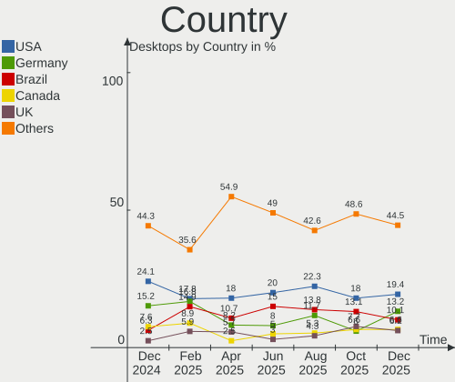

| Country         | Desktops | Percent |
|-----------------|----------|---------|
| USA             | 44       | 19.38%  |
| Germany         | 30       | 13.22%  |
| Brazil          | 23       | 10.13%  |
| Canada          | 15       | 6.61%   |
| UK              | 14       | 6.17%   |
| Italy           | 10       | 4.41%   |
| France          | 9        | 3.96%   |
| Australia       | 9        | 3.96%   |
| Mexico          | 5        | 2.2%    |
| India           | 5        | 2.2%    |
| Austria         | 5        | 2.2%    |
| Hungary         | 4        | 1.76%   |
| Turkey          | 3        | 1.32%   |
| Switzerland     | 3        | 1.32%   |
| Spain           | 3        | 1.32%   |
| Russia          | 3        | 1.32%   |
| Portugal        | 3        | 1.32%   |
| Netherlands     | 3        | 1.32%   |
| Chile           | 3        | 1.32%   |
| Belgium         | 3        | 1.32%   |
| Venezuela       | 2        | 0.88%   |
| Slovakia        | 2        | 0.88%   |
| Serbia          | 2        | 0.88%   |
| Poland          | 2        | 0.88%   |
| New Zealand     | 2        | 0.88%   |
| Colombia        | 2        | 0.88%   |
| Argentina       | 2        | 0.88%   |
| UAE             | 1        | 0.44%   |
| The Netherlands | 1        | 0.44%   |
| Slovenia        | 1        | 0.44%   |
| Saudi Arabia    | 1        | 0.44%   |
| Romania         | 1        | 0.44%   |
| Réunion        | 1        | 0.44%   |
| Puerto Rico     | 1        | 0.44%   |
| Moldova         | 1        | 0.44%   |
| Malaysia        | 1        | 0.44%   |
| Latvia          | 1        | 0.44%   |
| Japan           | 1        | 0.44%   |
| Israel          | 1        | 0.44%   |
| Ireland         | 1        | 0.44%   |

City
----

Geographic location (city)

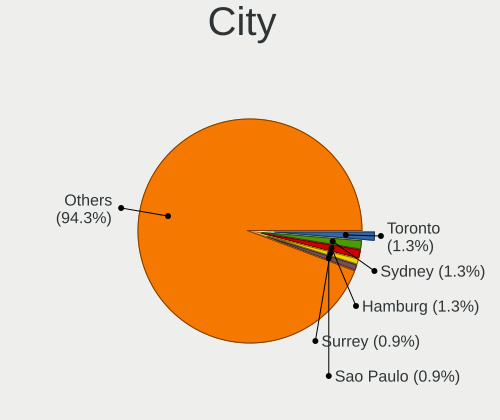

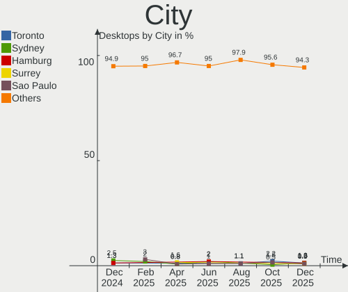

| City                | Desktops | Percent |
|---------------------|----------|---------|
| Toronto             | 3        | 1.32%   |
| Sydney              | 3        | 1.32%   |
| Hamburg             | 3        | 1.32%   |
| Surrey              | 2        | 0.88%   |
| Sao Paulo           | 2        | 0.88%   |
| Rosny-sous-Bois     | 2        | 0.88%   |
| Perth               | 2        | 0.88%   |
| Munich              | 2        | 0.88%   |
| Milwaukee           | 2        | 0.88%   |
| Melbourne           | 2        | 0.88%   |
| Marseille           | 2        | 0.88%   |
| Istanbul            | 2        | 0.88%   |
| Budapest            | 2        | 0.88%   |
| Berlin              | 2        | 0.88%   |
| Belo Horizonte      | 2        | 0.88%   |
| Adelaide            | 2        | 0.88%   |
| Zweidlen-Dorf       | 1        | 0.44%   |
| Yuma                | 1        | 0.44%   |
| Yokohama            | 1        | 0.44%   |
| Wroclaw             | 1        | 0.44%   |
| Windsor             | 1        | 0.44%   |
| Wilfleinsdorf       | 1        | 0.44%   |
| Welling             | 1        | 0.44%   |
| Weilheim            | 1        | 0.44%   |
| Warsaw              | 1        | 0.44%   |
| Warendorf           | 1        | 0.44%   |
| Wakefield           | 1        | 0.44%   |
| Vitrolles           | 1        | 0.44%   |
| Vila Olímpia       | 1        | 0.44%   |
| Vila Nova de Gaia   | 1        | 0.44%   |
| Vienna              | 1        | 0.44%   |
| Valparaiso de Goias | 1        | 0.44%   |
| Valencia            | 1        | 0.44%   |
| Utrecht             | 1        | 0.44%   |
| Union City          | 1        | 0.44%   |
| Twin Valley         | 1        | 0.44%   |
| Turin               | 1        | 0.44%   |
| Tupper Lake         | 1        | 0.44%   |
| Tulsa               | 1        | 0.44%   |
| Troy                | 1        | 0.44%   |

Drives
------

Drive Vendor
------------

Hard drive vendors

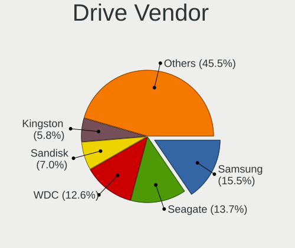

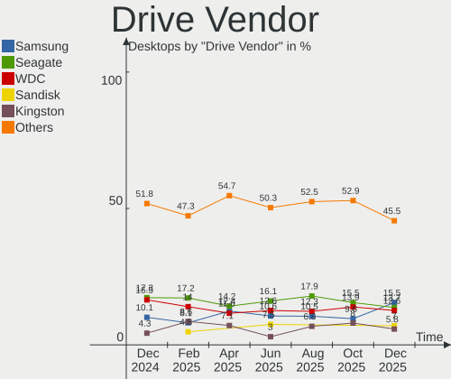

| Vendor                       | Desktops | Drives | Percent |
|------------------------------|----------|--------|---------|
| Samsung Electronics          | 69       | 93     | 15.47%  |
| Seagate                      | 61       | 85     | 13.68%  |
| WDC                          | 56       | 81     | 12.56%  |
| Sandisk                      | 31       | 36     | 6.95%   |
| Kingston                     | 26       | 28     | 5.83%   |
| Toshiba                      | 21       | 23     | 4.71%   |
| Crucial                      | 15       | 16     | 3.36%   |
| Phison Electronics           | 11       | 13     | 2.47%   |
| Micron/Crucial Technology    | 10       | 10     | 2.24%   |
| MAXIO Technology (Hangzhou)  | 10       | 14     | 2.24%   |
| Hitachi                      | 10       | 10     | 2.24%   |
| Micron Technology            | 7        | 7      | 1.57%   |
| China                        | 7        | 7      | 1.57%   |
| SK hynix                     | 6        | 6      | 1.35%   |
| Patriot                      | 5        | 6      | 1.12%   |
| Kingston Technology Company  | 5        | 5      | 1.12%   |
| Intenso                      | 5        | 6      | 1.12%   |
| Shenzhen Longsys Electronics | 4        | 4      | 0.9%    |
| Realtek Semiconductor        | 4        | 4      | 0.9%    |
| Intel                        | 4        | 7      | 0.9%    |
| Unknown                      | 3        | 3      | 0.67%   |
| SABRENT                      | 3        | 4      | 0.67%   |
| KIOXIA                       | 3        | 5      | 0.67%   |
| JMicron Technology           | 3        | 3      | 0.67%   |
| Corsair                      | 3        | 4      | 0.67%   |
| A-DATA Technology            | 3        | 3      | 0.67%   |
| XrayDisk                     | 2        | 2      | 0.45%   |
| Transcend                    | 2        | 3      | 0.45%   |
| SPCC                         | 2        | 2      | 0.45%   |
| Solid State Storage          | 2        | 2      | 0.45%   |
| Silicon Motion               | 2        | 2      | 0.45%   |
| Realtek                      | 2        | 3      | 0.45%   |
| PNY                          | 2        | 2      | 0.45%   |
| MSI                          | 2        | 2      | 0.45%   |
| Hewlett-Packard              | 2        | 2      | 0.45%   |
| Gigabyte Technology          | 2        | 2      | 0.45%   |
| FIKWOT                       | 2        | 2      | 0.45%   |
| ExcelStor                    | 2        | 2      | 0.45%   |
| ADATA Technology             | 2        | 2      | 0.45%   |
| Unknown                      | 2        | 2      | 0.45%   |

Drive Model
-----------

Hard drive models

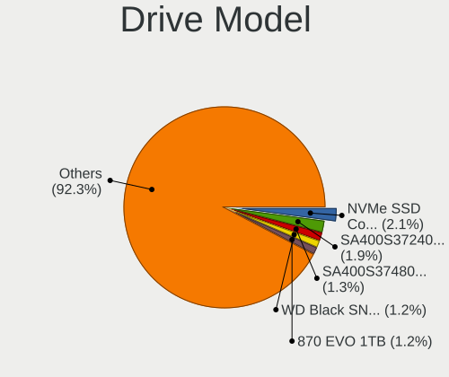

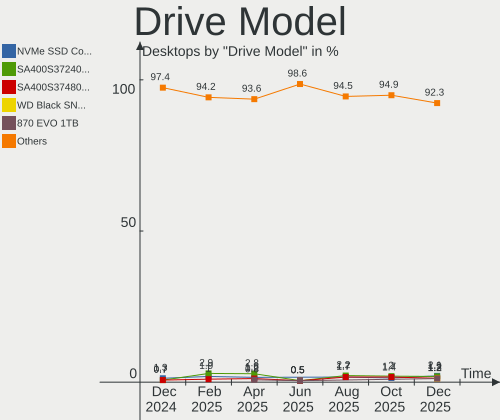

| Model                                                 | Desktops | Percent |
|-------------------------------------------------------|----------|---------|
| Samsung NVMe SSD Controller SM981/PM981/PM983 1TB     | 11       | 2.11%   |
| Kingston SA400S37240G 240GB SSD                       | 10       | 1.92%   |
| Kingston SA400S37480G 480GB SSD                       | 7        | 1.34%   |
| Sandisk WD Black SN750 / PC SN730 NVMe SSD 500GB      | 6        | 1.15%   |
| Samsung SSD 870 EVO 1TB                               | 6        | 1.15%   |
| Samsung SSD 860 EVO 500GB                             | 6        | 1.15%   |
| Samsung NVMe SSD Controller PM9A1/PM9A3/980PRO 1TB    | 6        | 1.15%   |
| WDC WDS240G2G0A-00JH30 240GB SSD                      | 4        | 0.77%   |
| Samsung SSD 860 EVO 250GB                             | 4        | 0.77%   |
| Samsung SSD 850 EVO 250GB                             | 4        | 0.77%   |
| WDC WD10EZEX-21M2NA0 1TB                              | 3        | 0.58%   |
| Toshiba DT01ACA100 1TB                                | 3        | 0.58%   |
| Seagate ST500DM002-1BD142 500GB                       | 3        | 0.58%   |
| Seagate ST3500418AS 500GB                             | 3        | 0.58%   |
| Seagate ST2000DM008-2UB102 2TB                        | 3        | 0.58%   |
| Seagate ST1000DM010-2EP102 1TB                        | 3        | 0.58%   |
| Seagate ST1000DM003-1SB102 1TB                        | 3        | 0.58%   |
| Seagate ST1000DM003-1CH162 1TB                        | 3        | 0.58%   |
| Sandisk WD_BLACK SN7100 1TB                           | 3        | 0.58%   |
| Samsung SSD 870 QVO 1TB                               | 3        | 0.58%   |
| Samsung SSD 870 EVO 500GB                             | 3        | 0.58%   |
| Phison E16 PCIe4 NVMe Controller 1TB                  | 3        | 0.58%   |
| Micron/Crucial P2 NVMe PCIe SSD 2TB                   | 3        | 0.58%   |
| MAXIO (Hangzhou) NVMe SSD Controller MAP1202 2TB      | 3        | 0.58%   |
| Crucial CT240BX500SSD1 240GB                          | 3        | 0.58%   |
| WDC WDS500G2B0A-00SM50 500GB                          | 2        | 0.38%   |
| WDC WD40EZAX-00C8UB0 4TB                              | 2        | 0.38%   |
| WDC WD30EFRX-68EUZN0 3TB                              | 2        | 0.38%   |
| WDC WD2002FYPS-01U1B1 2TB                             | 2        | 0.38%   |
| WDC WD15EADS-00P8B0 1TB                               | 2        | 0.38%   |
| WDC WD10EZEX-60ZF5A0 1TB                              | 2        | 0.38%   |
| Unknown SD/MMC/MS PRO 2GB                             | 2        | 0.38%   |
| Toshiba MQ04ABF100 1TB                                | 2        | 0.38%   |
| Toshiba MQ01ABF050 500GB                              | 2        | 0.38%   |
| SK hynix PC601 HFS512GD9TNG-L2A0A 512GB               | 2        | 0.38%   |
| Silicon Motion SM2263EN/SM2263XT SSD Controller 512GB | 2        | 0.38%   |
| Seagate ST9500325AS 500GB                             | 2        | 0.38%   |
| Seagate ST8000DM004-2U9188 8TB                        | 2        | 0.38%   |
| Seagate ST500LM012 HN-M500MBB 500GB                   | 2        | 0.38%   |
| Seagate ST4000DM005-2DP166 4TB                        | 2        | 0.38%   |

HDD Vendor
----------

Hard disk drive vendors

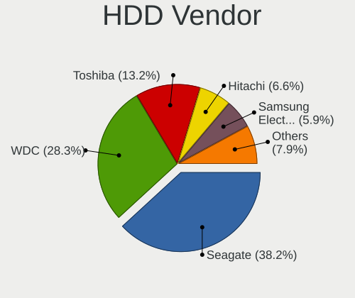

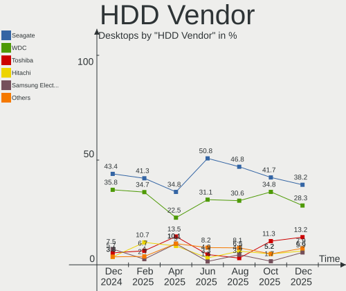

| Vendor              | Desktops | Drives | Percent |
|---------------------|----------|--------|---------|
| Seagate             | 58       | 81     | 38.16%  |
| WDC                 | 43       | 63     | 28.29%  |
| Toshiba             | 20       | 21     | 13.16%  |
| Hitachi             | 10       | 10     | 6.58%   |
| Samsung Electronics | 9        | 9      | 5.92%   |
| Unknown             | 2        | 2      | 1.32%   |
| JMicron Technology  | 2        | 2      | 1.32%   |
| Hewlett-Packard     | 2        | 2      | 1.32%   |
| ExcelStor           | 2        | 2      | 1.32%   |
| SABRENT             | 1        | 2      | 0.66%   |
| Maxtor              | 1        | 1      | 0.66%   |
| HGST                | 1        | 1      | 0.66%   |
| Apple               | 1        | 1      | 0.66%   |

SSD Vendor
----------

Solid state drive vendors

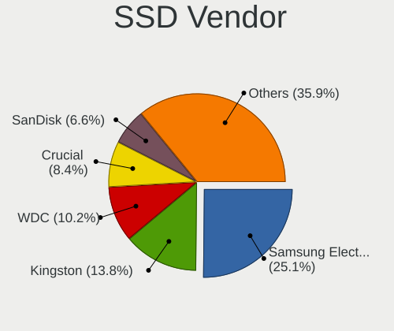

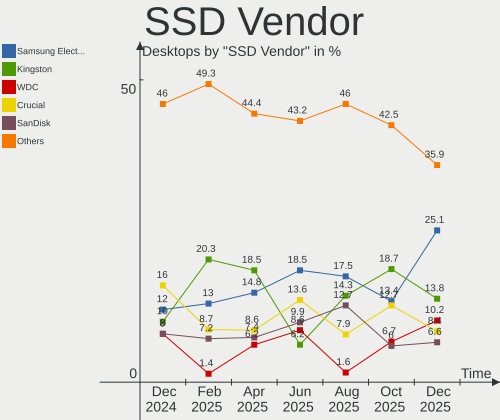

| Vendor              | Desktops | Drives | Percent |
|---------------------|----------|--------|---------|
| Samsung Electronics | 42       | 44     | 25.15%  |
| Kingston            | 23       | 24     | 13.77%  |
| WDC                 | 17       | 18     | 10.18%  |
| Crucial             | 14       | 15     | 8.38%   |
| SanDisk             | 11       | 11     | 6.59%   |
| China               | 7        | 7      | 4.19%   |
| Patriot             | 5        | 6      | 2.99%   |
| Micron Technology   | 4        | 4      | 2.4%    |
| Intenso             | 4        | 5      | 2.4%    |
| A-DATA Technology   | 3        | 3      | 1.8%    |
| Transcend           | 2        | 3      | 1.2%    |
| SPCC                | 2        | 2      | 1.2%    |
| SABRENT             | 2        | 2      | 1.2%    |
| PNY                 | 2        | 2      | 1.2%    |
| MSI                 | 2        | 2      | 1.2%    |
| Corsair             | 2        | 3      | 1.2%    |
| ZADAK               | 1        | 1      | 0.6%    |
| XUM                 | 1        | 1      | 0.6%    |
| XrayDisk            | 1        | 1      | 0.6%    |
| ThinkPlus           | 1        | 2      | 0.6%    |
| T-FORCE             | 1        | 1      | 0.6%    |
| SK hynix            | 1        | 1      | 0.6%    |
| Rayson              | 1        | 1      | 0.6%    |
| NGFF                | 1        | 1      | 0.6%    |
| Mushkin             | 1        | 1      | 0.6%    |
| LITEONIT            | 1        | 1      | 0.6%    |
| LITEON              | 1        | 1      | 0.6%    |
| Lexar               | 1        | 1      | 0.6%    |
| KIOXIA-EXCERIA      | 1        | 1      | 0.6%    |
| KingSpec            | 1        | 1      | 0.6%    |
| KBM                 | 1        | 1      | 0.6%    |
| Intel               | 1        | 1      | 0.6%    |
| Inland              | 1        | 1      | 0.6%    |
| Green House         | 1        | 1      | 0.6%    |
| Gigabyte Technology | 1        | 1      | 0.6%    |
| GeIL                | 1        | 1      | 0.6%    |
| FIKWOT              | 1        | 1      | 0.6%    |
| BUFFALO             | 1        | 1      | 0.6%    |
| Apacer              | 1        | 1      | 0.6%    |
| AMD                 | 1        | 1      | 0.6%    |

Drive Kind
----------

HDD or SSD

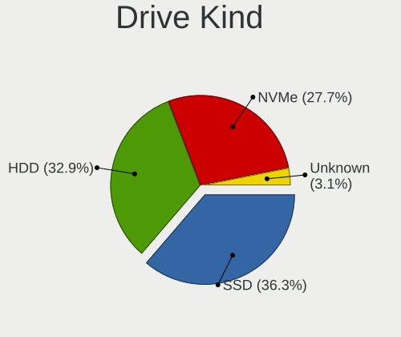

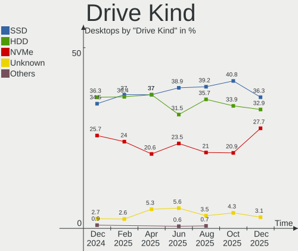

| Kind    | Desktops | Drives | Percent |
|---------|----------|--------|---------|
| SSD     | 139      | 177    | 36.29%  |
| HDD     | 126      | 197    | 32.9%   |
| NVMe    | 106      | 161    | 27.68%  |
| Unknown | 12       | 13     | 3.13%   |

Drive Connector
---------------

SATA, SAS, NVMe, etc.

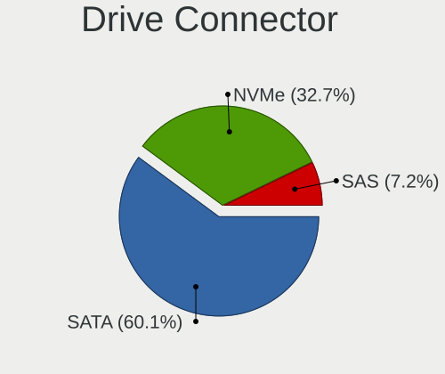

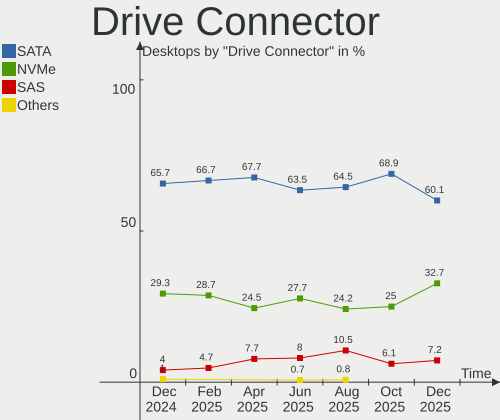

| Type | Desktops | Drives | Percent |
|------|----------|--------|---------|
| SATA | 193      | 351    | 60.12%  |
| NVMe | 105      | 157    | 32.71%  |
| SAS  | 23       | 40     | 7.17%   |

Drive Size
----------

Size of hard drive

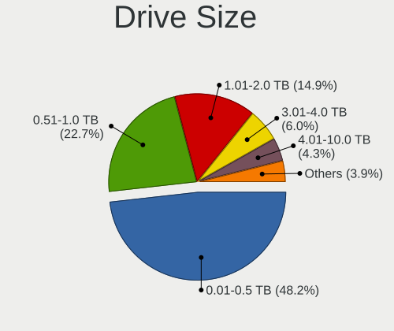

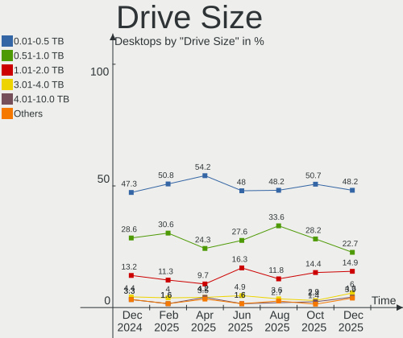

| Size in TB | Desktops | Drives | Percent |
|------------|----------|--------|---------|
| 0.01-0.5   | 136      | 182    | 48.23%  |
| 0.51-1.0   | 64       | 88     | 22.7%   |
| 1.01-2.0   | 42       | 54     | 14.89%  |
| 3.01-4.0   | 17       | 20     | 6.03%   |
| 4.01-10.0  | 12       | 17     | 4.26%   |
| 2.01-3.0   | 7        | 8      | 2.48%   |
| 20.01-50.0 | 2        | 2      | 0.71%   |
| 10.01-20.0 | 2        | 3      | 0.71%   |

Space Total
-----------

Amount of disk space available on the file system

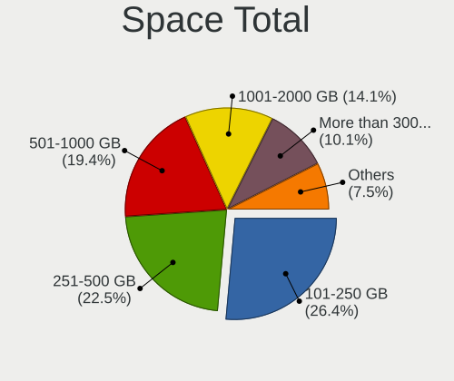

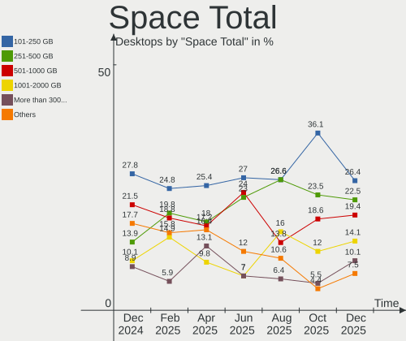

| Size in GB     | Desktops | Percent |
|----------------|----------|---------|
| 101-250        | 60       | 26.43%  |
| 251-500        | 51       | 22.47%  |
| 501-1000       | 44       | 19.38%  |
| 1001-2000      | 32       | 14.1%   |
| More than 3000 | 23       | 10.13%  |
| 2001-3000      | 10       | 4.41%   |
| 51-100         | 4        | 1.76%   |
| 1-20           | 2        | 0.88%   |
| 21-50          | 1        | 0.44%   |

Space Used
----------

Amount of used disk space

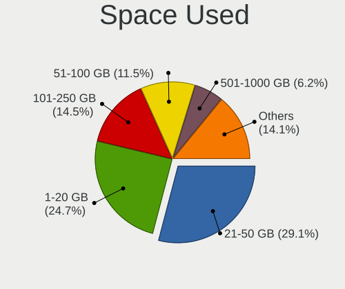

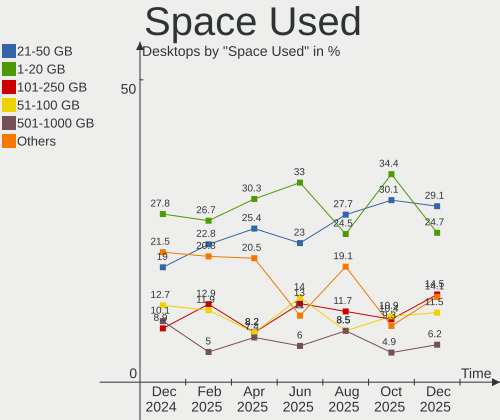

| Used GB        | Desktops | Percent |
|----------------|----------|---------|
| 21-50          | 66       | 29.07%  |
| 1-20           | 56       | 24.67%  |
| 101-250        | 33       | 14.54%  |
| 51-100         | 26       | 11.45%  |
| 501-1000       | 14       | 6.17%   |
| More than 3000 | 12       | 5.29%   |
| 1001-2000      | 11       | 4.85%   |
| 251-500        | 8        | 3.52%   |
| 2001-3000      | 1        | 0.44%   |

Malfunc. Drives
---------------

Drive models with a malfunction

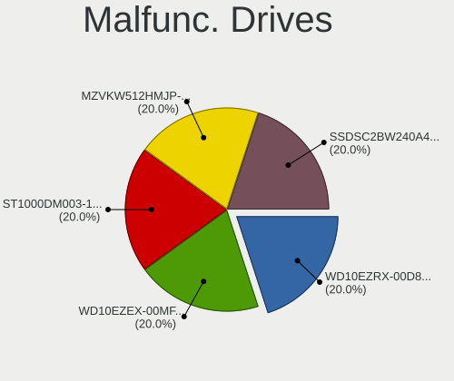

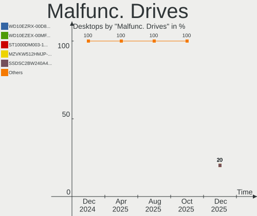

| Model                                        | Desktops | Drives | Percent |
|----------------------------------------------|----------|--------|---------|
| WDC WD10EZRX-00D8PB0 1TB                     | 1        | 1      | 20%     |
| WDC WD10EZEX-00MFCA0 1TB                     | 1        | 1      | 20%     |
| Seagate ST1000DM003-1CH162 1TB               | 1        | 1      | 20%     |
| Samsung Electronics MZVKW512HMJP-00000 512GB | 1        | 1      | 20%     |
| Intel SSDSC2BW240A4 240GB                    | 1        | 1      | 20%     |

Malfunc. Drive Vendor
---------------------

Vendors of faulty drives

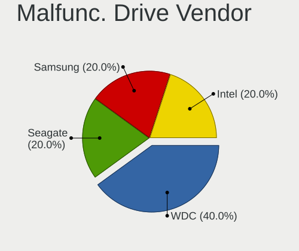

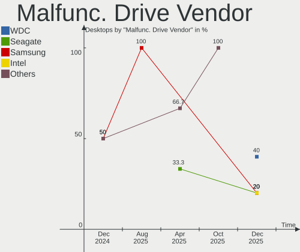

| Vendor              | Desktops | Drives | Percent |
|---------------------|----------|--------|---------|
| WDC                 | 2        | 2      | 40%     |
| Seagate             | 1        | 1      | 20%     |
| Samsung Electronics | 1        | 1      | 20%     |
| Intel               | 1        | 1      | 20%     |

Malfunc. HDD Vendor
-------------------

Vendors of faulty HDD drives

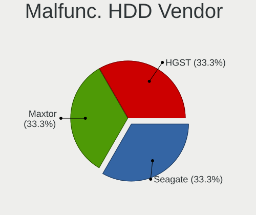

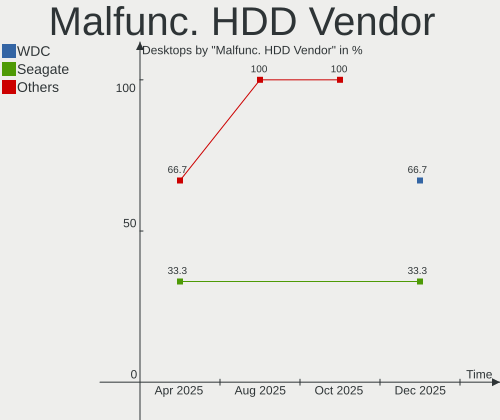

| Vendor  | Desktops | Drives | Percent |
|---------|----------|--------|---------|
| WDC     | 2        | 2      | 66.67%  |
| Seagate | 1        | 1      | 33.33%  |

Malfunc. Drive Kind
-------------------

Kinds of faulty drives

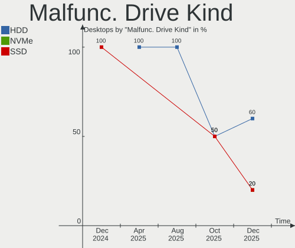

| Kind | Desktops | Drives | Percent |
|------|----------|--------|---------|
| HDD  | 3        | 3      | 60%     |
| NVMe | 1        | 1      | 20%     |
| SSD  | 1        | 1      | 20%     |

Failed Drives
-------------

Failed drive models

Zero info for selected period =(

Failed Drive Vendor
-------------------

Failed drive vendors

Zero info for selected period =(

Drive Status
------------

Number of failed and malfunc. drives

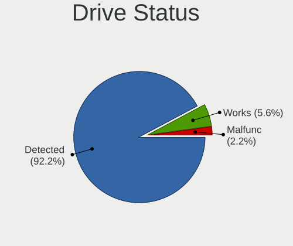

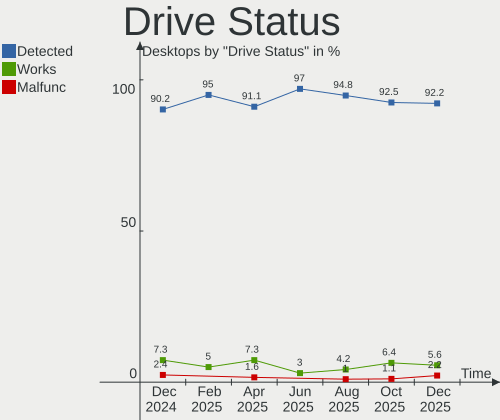

| Status   | Desktops | Drives | Percent |
|----------|----------|--------|---------|
| Detected | 213      | 513    | 92.21%  |
| Works    | 13       | 30     | 5.63%   |
| Malfunc  | 5        | 5      | 2.16%   |

Storage controller
------------------

Storage Vendor
--------------

Storage controller vendors

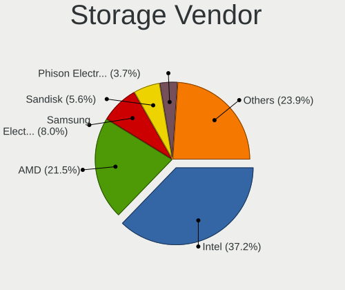

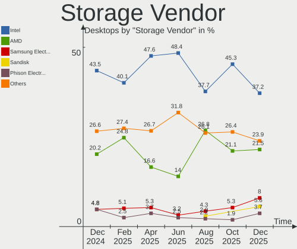

| Vendor                         | Desktops | Percent |
|--------------------------------|----------|---------|
| Intel                          | 140      | 37.23%  |
| AMD                            | 81       | 21.54%  |
| Samsung Electronics            | 30       | 7.98%   |
| Sandisk                        | 21       | 5.59%   |
| Phison Electronics             | 14       | 3.72%   |
| Micron/Crucial Technology      | 11       | 2.93%   |
| ASMedia Technology             | 11       | 2.93%   |
| MAXIO Technology (Hangzhou)    | 10       | 2.66%   |
| Kingston Technology Company    | 8        | 2.13%   |
| SK hynix                       | 5        | 1.33%   |
| Nvidia                         | 5        | 1.33%   |
| Shenzhen Longsys Electronics   | 4        | 1.06%   |
| Realtek Semiconductor          | 4        | 1.06%   |
| Solid State Storage Technology | 3        | 0.8%    |
| Micron Technology              | 3        | 0.8%    |
| Marvell Technology Group       | 3        | 0.8%    |
| KIOXIA                         | 3        | 0.8%    |
| JMicron Technology             | 3        | 0.8%    |
| INNOGRIT                       | 3        | 0.8%    |
| VIA Technologies               | 2        | 0.53%   |
| Silicon Motion                 | 2        | 0.53%   |
| ADATA Technology               | 2        | 0.53%   |
| Toshiba America Info Systems   | 1        | 0.27%   |
| Toshiba                        | 1        | 0.27%   |
| TenaFe                         | 1        | 0.27%   |
| Solidigm                       | 1        | 0.27%   |
| Seagate Technology             | 1        | 0.27%   |
| LSI Logic / Symbios Logic      | 1        | 0.27%   |
| Broadcom / LSI                 | 1        | 0.27%   |
| Biwin Storage Technology       | 1        | 0.27%   |

Storage Model
-------------

Storage controller models

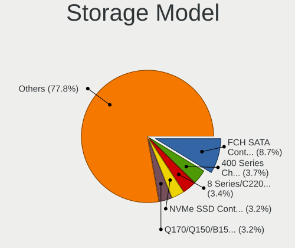

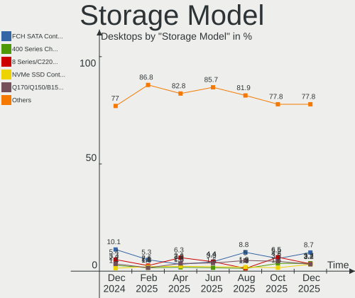

| Model                                                                          | Desktops | Percent |
|--------------------------------------------------------------------------------|----------|---------|
| AMD FCH SATA Controller [AHCI mode]                                            | 38       | 8.7%    |
| AMD 400 Series Chipset SATA Controller                                         | 16       | 3.66%   |
| Intel 8 Series/C220 Series Chipset Family 6-port SATA Controller 1 [AHCI mode] | 15       | 3.43%   |
| Samsung NVMe SSD Controller SM981/PM981/PM983                                  | 14       | 3.2%    |
| Intel Q170/Q150/B150/H170/H110/Z170/CM236 Chipset SATA Controller [AHCI Mode]  | 14       | 3.2%    |
| AMD 500 Series Chipset SATA Controller                                         | 14       | 3.2%    |
| Intel 6 Series/C200 Series Chipset Family 6 port Desktop SATA AHCI Controller  | 12       | 2.75%   |
| AMD 600 Series Chipset SATA Controller                                         | 12       | 2.75%   |
| Intel 7 Series/C210 Series Chipset Family 6-port SATA Controller [AHCI mode]   | 11       | 2.52%   |
| Intel 200 Series PCH SATA controller [AHCI mode]                               | 11       | 2.52%   |
| ASMedia ASM1061/ASM1062 Serial ATA Controller                                  | 11       | 2.52%   |
| Intel SATA Controller [RAID mode]                                              | 9        | 2.06%   |
| Intel Cannon Lake PCH SATA AHCI Controller                                     | 8        | 1.83%   |
| AMD SB7x0/SB8x0/SB9x0 SATA Controller [AHCI mode]                              | 8        | 1.83%   |
| MAXIO (Hangzhou) NVMe SSD Controller MAP1602 (DRAM-less)                       | 7        | 1.6%    |
| Intel 9 Series Chipset Family SATA Controller [AHCI Mode]                      | 7        | 1.6%    |
| SanDisk WD SN560/SN740/SN770/SN5000 NVMe SSD                                   | 6        | 1.37%   |
| SanDisk Extreme Pro / WD Black SN750 / PC SN730 / Red SN700 NVMe SSD           | 6        | 1.37%   |
| Samsung NVMe SSD Controller PM9A1/PM9A3/980PRO                                 | 6        | 1.37%   |
| Intel Raptor Lake SATA AHCI Controller                                         | 6        | 1.37%   |
| Intel 500 Series Chipset Family SATA AHCI Controller                           | 6        | 1.37%   |
| Samsung NVMe SSD Controller S4LV008[Pascal]                                    | 5        | 1.14%   |
| Intel Alder Lake-S PCH SATA Controller [AHCI Mode]                             | 5        | 1.14%   |
| AMD A320 Chipset SATA Controller [AHCI mode]                                   | 5        | 1.14%   |
| Samsung NVMe SSD Controller 980 (DRAM-less)                                    | 4        | 0.92%   |
| Micron/Crucial P2 [Nick P2] / P3 / P3 Plus NVMe PCIe SSD (DRAM-less)           | 4        | 0.92%   |
| Intel Jasper Lake SATA AHCI Controller                                         | 4        | 0.92%   |
| Intel Comet Lake SATA AHCI Controller                                          | 4        | 0.92%   |
| AMD SB7x0/SB8x0/SB9x0 IDE Controller                                           | 4        | 0.92%   |
| Sandisk WD_BLACK SN7100/WD PC SN7100S M.2 2280 NVMe SSD (DRAM-less)            | 3        | 0.69%   |
| Samsung NVMe SSD Controller SM961/PM961/SM963                                  | 3        | 0.69%   |
| Phison E16 PCIe4 NVMe Controller                                               | 3        | 0.69%   |
| Micron/Crucial P310 NVMe PCIe SSD (DRAM-less)                                  | 3        | 0.69%   |
| MAXIO (Hangzhou) NVMe SSD Controller MAP1202 (DRAM-less)                       | 3        | 0.69%   |
| Intel 82801JI (ICH10 Family) SATA AHCI Controller                              | 3        | 0.69%   |
| Intel 5 Series/3400 Series Chipset 6 port SATA AHCI Controller                 | 3        | 0.69%   |
| Intel 5 Series/3400 Series Chipset 4 port SATA IDE Controller                  | 3        | 0.69%   |
| Intel 5 Series/3400 Series Chipset 2 port SATA IDE Controller                  | 3        | 0.69%   |
| Intel 4 Series Chipset PT IDER Controller                                      | 3        | 0.69%   |
| Solid State Storage CL1-3D256-Q11 NVMe SSD M.2                                 | 2        | 0.46%   |

Storage Kind
------------

Kind of storage controller (IDE, SATA, NVMe, SAS, ...)

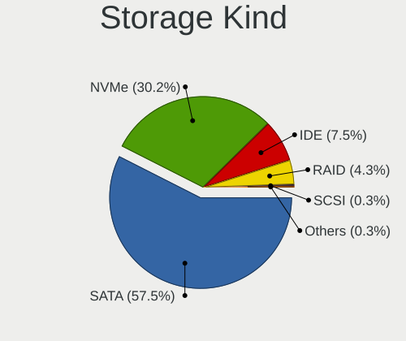

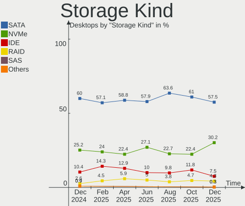

| Kind | Desktops | Percent |
|------|----------|---------|
| SATA | 200      | 57.47%  |
| NVMe | 105      | 30.17%  |
| IDE  | 26       | 7.47%   |
| RAID | 15       | 4.31%   |
| SAS  | 1        | 0.29%   |
| SCSI | 1        | 0.29%   |

Processor
---------

CPU Vendor
----------

Processor vendors

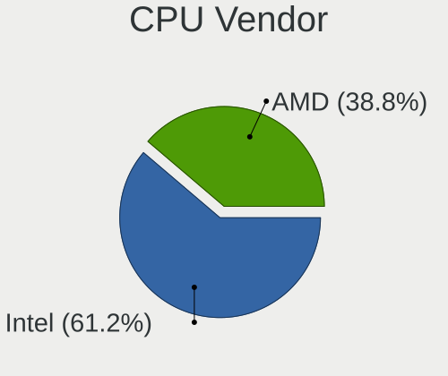

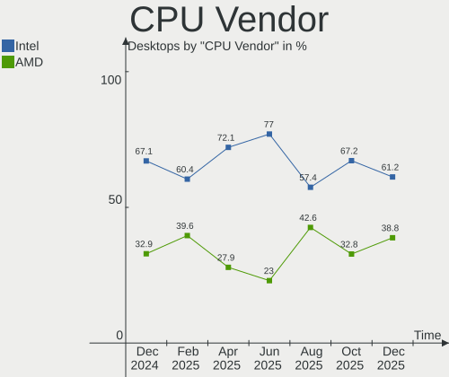

| Vendor | Desktops | Percent |
|--------|----------|---------|
| Intel  | 139      | 61.23%  |
| AMD    | 88       | 38.77%  |

CPU Model
---------

Processor models

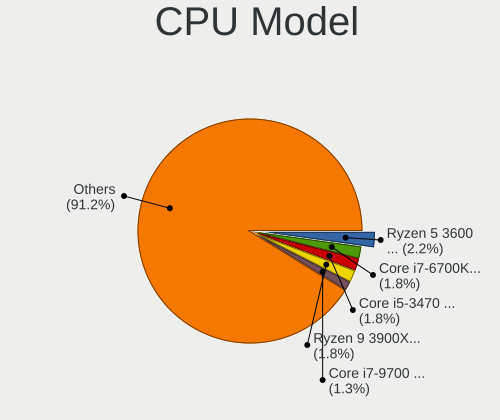

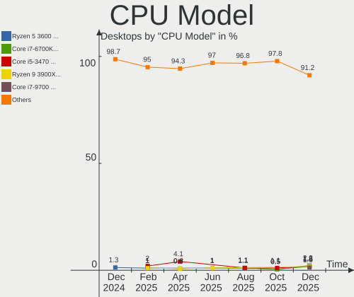

| Model                                       | Desktops | Percent |
|---------------------------------------------|----------|---------|
| AMD Ryzen 5 3600 6-Core Processor           | 5        | 2.2%    |
| Intel Core i7-6700K CPU @ 4.00GHz           | 4        | 1.76%   |
| Intel Core i5-3470 CPU @ 3.20GHz            | 4        | 1.76%   |
| AMD Ryzen 9 3900X 12-Core Processor         | 4        | 1.76%   |
| Intel Core i7-9700 CPU @ 3.00GHz            | 3        | 1.32%   |
| Intel Core i7-7700 CPU @ 3.60GHz            | 3        | 1.32%   |
| Intel Core i7 CPU 860 @ 2.80GHz             | 3        | 1.32%   |
| Intel Core i5-4570 CPU @ 3.20GHz            | 3        | 1.32%   |
| Intel Core i5-4460 CPU @ 3.20GHz            | 3        | 1.32%   |
| Intel Celeron N5095 @ 2.00GHz               | 3        | 1.32%   |
| AMD Ryzen 9 5900X 12-Core Processor         | 3        | 1.32%   |
| AMD Ryzen 7 2700X Eight-Core Processor      | 3        | 1.32%   |
| AMD Ryzen 3 2200G with Radeon Vega Graphics | 3        | 1.32%   |
| Intel Core i7-8700 CPU @ 3.20GHz            | 2        | 0.88%   |
| Intel Core i7-6700 CPU @ 3.40GHz            | 2        | 0.88%   |
| Intel Core i7-4790K CPU @ 4.00GHz           | 2        | 0.88%   |
| Intel Core i7-4790 CPU @ 3.60GHz            | 2        | 0.88%   |
| Intel Core i7-4770 CPU @ 3.40GHz            | 2        | 0.88%   |
| Intel Core i7-2600K CPU @ 3.40GHz           | 2        | 0.88%   |
| Intel Core i7-2600 CPU @ 3.40GHz            | 2        | 0.88%   |
| Intel Core i5-9400 CPU @ 2.90GHz            | 2        | 0.88%   |
| Intel Core i5-7600K CPU @ 3.80GHz           | 2        | 0.88%   |
| Intel Core i5-6500 CPU @ 3.20GHz            | 2        | 0.88%   |
| Intel Core i5-6400 CPU @ 2.70GHz            | 2        | 0.88%   |
| Intel Core i5-4690 CPU @ 3.50GHz            | 2        | 0.88%   |
| Intel Core i5-4590S CPU @ 3.00GHz           | 2        | 0.88%   |
| Intel Core i5-3330 CPU @ 3.00GHz            | 2        | 0.88%   |
| Intel Core 2 Duo CPU E8400 @ 3.00GHz        | 2        | 0.88%   |
| Intel 12th Gen Core i9-12900KF              | 2        | 0.88%   |
| Intel 11th Gen Core i9-11900K @ 3.50GHz     | 2        | 0.88%   |
| AMD Ryzen 9 9950X3D 16-Core Processor       | 2        | 0.88%   |
| AMD Ryzen 9 5950X 16-Core Processor         | 2        | 0.88%   |
| AMD Ryzen 7 9800X3D 8-Core Processor        | 2        | 0.88%   |
| AMD Ryzen 7 7700X 8-Core Processor          | 2        | 0.88%   |
| AMD Ryzen 7 5800X 8-Core Processor          | 2        | 0.88%   |
| AMD Ryzen 7 5700X 8-Core Processor          | 2        | 0.88%   |
| AMD Ryzen 7 3700X 8-Core Processor          | 2        | 0.88%   |
| AMD Ryzen 5 7600X 6-Core Processor          | 2        | 0.88%   |
| AMD Ryzen 5 5600X 6-Core Processor          | 2        | 0.88%   |
| AMD Ryzen 5 5600G with Radeon Graphics      | 2        | 0.88%   |

CPU Model Family
----------------

Processor model prefix

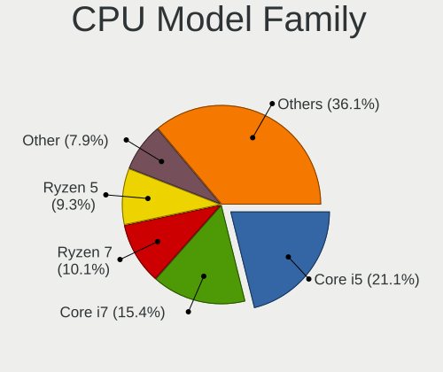

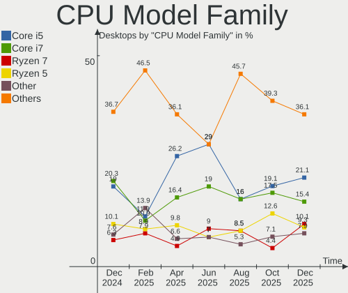

| Model                   | Desktops | Percent |
|-------------------------|----------|---------|
| Intel Core i5           | 48       | 21.15%  |
| Intel Core i7           | 35       | 15.42%  |
| AMD Ryzen 7             | 23       | 10.13%  |
| AMD Ryzen 5             | 21       | 9.25%   |
| Other                   | 18       | 7.93%   |
| AMD Ryzen 9             | 14       | 6.17%   |
| Intel Core i3           | 11       | 4.85%   |
| Intel Xeon              | 6        | 2.64%   |
| Intel Celeron           | 6        | 2.64%   |
| AMD Ryzen 3             | 5        | 2.2%    |
| AMD FX                  | 5        | 2.2%    |
| Intel Core 2 Duo        | 4        | 1.76%   |
| Intel Pentium           | 3        | 1.32%   |
| Intel Core i9           | 3        | 1.32%   |
| AMD Phenom II X4        | 3        | 1.32%   |
| AMD A4                  | 3        | 1.32%   |
| AMD A10                 | 3        | 1.32%   |
| AMD A6                  | 2        | 0.88%   |
| Intel Pentium Dual-Core | 1        | 0.44%   |
| Intel Pentium Dual      | 1        | 0.44%   |
| Intel Genuine           | 1        | 0.44%   |
| Intel Core 2 Quad       | 1        | 0.44%   |
| Intel Core              | 1        | 0.44%   |
| AMD Ryzen Threadripper  | 1        | 0.44%   |
| AMD Quad-Core Opteron   | 1        | 0.44%   |
| AMD E1                  | 1        | 0.44%   |
| AMD E                   | 1        | 0.44%   |
| AMD Athlon II X2        | 1        | 0.44%   |
| AMD Athlon 64 X2        | 1        | 0.44%   |
| AMD Athlon 64           | 1        | 0.44%   |
| AMD Athlon              | 1        | 0.44%   |
| AMD A8                  | 1        | 0.44%   |

CPU Cores
---------

Number of processor cores

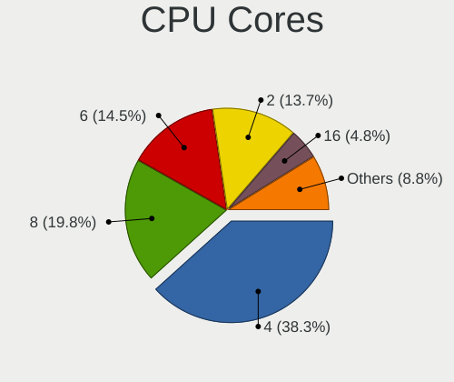

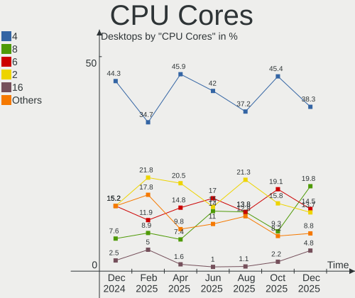

| Number | Desktops | Percent |
|--------|----------|---------|
| 4      | 87       | 38.33%  |
| 8      | 45       | 19.82%  |
| 6      | 33       | 14.54%  |
| 2      | 31       | 13.66%  |
| 16     | 11       | 4.85%   |
| 12     | 9        | 3.96%   |
| 14     | 4        | 1.76%   |
| 24     | 3        | 1.32%   |
| 18     | 2        | 0.88%   |
| 1      | 2        | 0.88%   |

CPU Sockets
-----------

Number of sockets

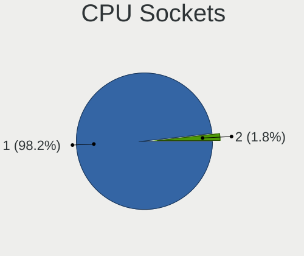

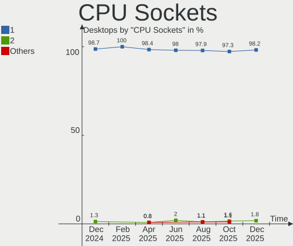

| Number | Desktops | Percent |
|--------|----------|---------|
| 1      | 223      | 98.24%  |
| 2      | 4        | 1.76%   |

CPU Threads
-----------

Threads per core (Hyper-Threading)

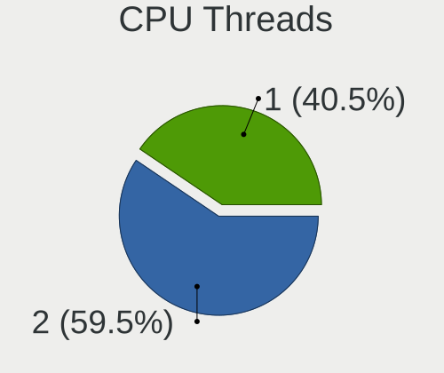

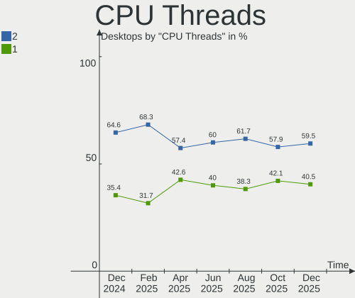

| Number | Desktops | Percent |
|--------|----------|---------|
| 2      | 135      | 59.47%  |
| 1      | 92       | 40.53%  |

CPU Op-Modes
------------

CPU Operation Modes (32-bit, 64-bit)

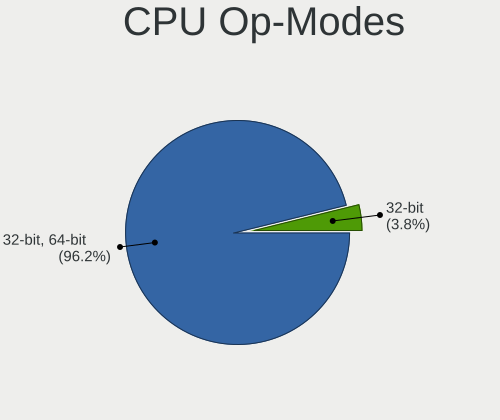

| Op mode        | Desktops | Percent |
|----------------|----------|---------|
| 32-bit, 64-bit | 227      | 100%    |

CPU Microcode
-------------

Microcode number

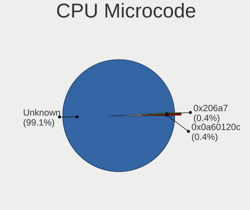

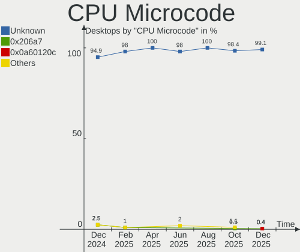

| Number     | Desktops | Percent |
|------------|----------|---------|
| Unknown    | 225      | 99.12%  |
| 0x206a7    | 1        | 0.44%   |
| 0x0a60120c | 1        | 0.44%   |

CPU Microarch
-------------

Microarchitecture

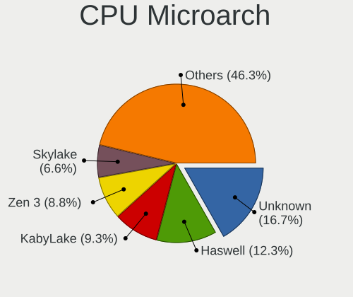

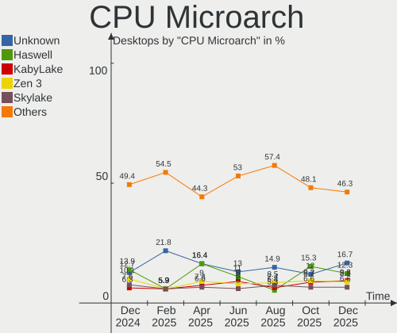

| Name             | Desktops | Percent |
|------------------|----------|---------|
| Unknown          | 38       | 16.74%  |
| Haswell          | 28       | 12.33%  |
| KabyLake         | 21       | 9.25%   |
| Zen 3            | 20       | 8.81%   |
| Skylake          | 15       | 6.61%   |
| Zen 2            | 14       | 6.17%   |
| SandyBridge      | 14       | 6.17%   |
| IvyBridge        | 12       | 5.29%   |
| Zen+             | 9        | 3.96%   |
| Zen              | 7        | 3.08%   |
| Penryn           | 7        | 3.08%   |
| Nehalem          | 7        | 3.08%   |
| Piledriver       | 6        | 2.64%   |
| Steamroller      | 5        | 2.2%    |
| K10              | 5        | 2.2%    |
| CometLake        | 4        | 1.76%   |
| Westmere         | 3        | 1.32%   |
| K8 Hammer        | 2        | 0.88%   |
| Bobcat           | 2        | 0.88%   |
| Alderlake Hybrid | 2        | 0.88%   |
| Tremont          | 1        | 0.44%   |
| K10 Llano        | 1        | 0.44%   |
| Jaguar           | 1        | 0.44%   |
| Excavator        | 1        | 0.44%   |
| Core             | 1        | 0.44%   |
| Broadwell        | 1        | 0.44%   |

Graphics
--------

GPU Vendor
----------

Vendors of graphics cards

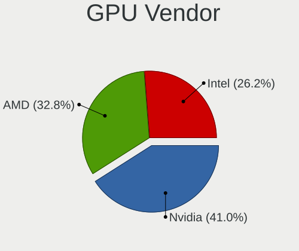

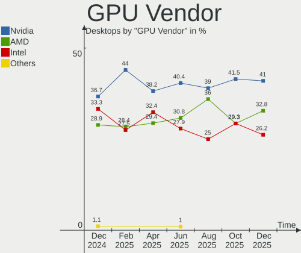

| Vendor | Desktops | Percent |
|--------|----------|---------|
| Nvidia | 100      | 40.98%  |
| AMD    | 80       | 32.79%  |
| Intel  | 64       | 26.23%  |

GPU Model
---------

Graphics card models

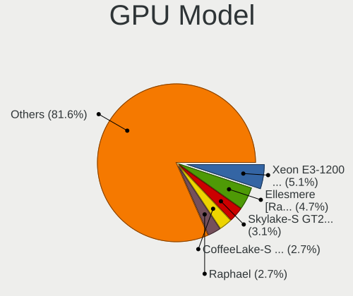

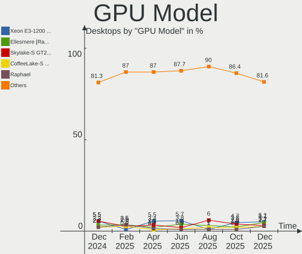

| Model                                                                       | Desktops | Percent |
|-----------------------------------------------------------------------------|----------|---------|
| Intel Xeon E3-1200 v3/4th Gen Core Processor Integrated Graphics Controller | 13       | 5.1%    |
| AMD Ellesmere [Radeon RX 470/480/570/570X/580/580X/590]                     | 12       | 4.71%   |
| Intel Skylake-S GT2 [HD Graphics 530]                                       | 8        | 3.14%   |
| Intel CoffeeLake-S GT2 [UHD Graphics 630]                                   | 7        | 2.75%   |
| AMD Raphael                                                                 | 7        | 2.75%   |
| Intel Xeon E3-1200 v2/3rd Gen Core processor Graphics Controller            | 6        | 2.35%   |
| Intel 2nd Generation Core Processor Family Integrated Graphics Controller   | 6        | 2.35%   |
| Nvidia GP108 [GeForce GT 1030]                                              | 5        | 1.96%   |
| Nvidia GP107 [GeForce GTX 1050 Ti]                                          | 5        | 1.96%   |
| Nvidia GK208B [GeForce GT 710]                                              | 5        | 1.96%   |
| AMD Navi 31 [Radeon RX 7900 XT/7900 XTX/7900 GRE/7900M]                     | 5        | 1.96%   |
| Nvidia GA106 [GeForce RTX 3060 Lite Hash Rate]                              | 4        | 1.57%   |
| Nvidia GA104 [GeForce RTX 3070 Ti]                                          | 4        | 1.57%   |
| Intel JasperLake [UHD Graphics]                                             | 4        | 1.57%   |
| AMD Raven Ridge [Radeon Vega Series / Radeon Vega Mobile Series]            | 4        | 1.57%   |
| AMD Polaris 20 XL [Radeon RX 580 2048SP]                                    | 4        | 1.57%   |
| AMD Navi 23 [Radeon RX 6600/6600 XT/6600M]                                  | 4        | 1.57%   |
| AMD Granite Ridge [Radeon Graphics]                                         | 4        | 1.57%   |
| AMD Cezanne [Radeon Vega Series / Radeon Vega Mobile Series]                | 4        | 1.57%   |
| Nvidia AD106 [GeForce RTX 4060 Ti]                                          | 3        | 1.18%   |
| Intel Raptor Lake-S GT1 [UHD Graphics 770]                                  | 3        | 1.18%   |
| Intel Kaby Lake-S GT2 [HD Graphics 630]                                     | 3        | 1.18%   |
| AMD Navi 48 [Radeon RX 9070/9070 XT/9070 GRE]                               | 3        | 1.18%   |
| AMD Navi 22 [Radeon RX 6700/6700 XT/6750 XT / 6800M/6850M XT]               | 3        | 1.18%   |
| AMD Navi 10 [Radeon RX 5600 OEM/5600 XT / 5700/5700 XT]                     | 3        | 1.18%   |
| Nvidia TU116 [GeForce GTX 1660]                                             | 2        | 0.78%   |
| Nvidia GT218 [GeForce G210]                                                 | 2        | 0.78%   |
| Nvidia GT218 [GeForce 210]                                                  | 2        | 0.78%   |
| Nvidia GP106 [GeForce GTX 1060 6GB]                                         | 2        | 0.78%   |
| Nvidia GP104 [GeForce GTX 1080]                                             | 2        | 0.78%   |
| Nvidia GP104 [GeForce GTX 1070]                                             | 2        | 0.78%   |
| Nvidia GM204 [GeForce GTX 970]                                              | 2        | 0.78%   |
| Nvidia GM107 [GeForce GTX 750 Ti]                                           | 2        | 0.78%   |
| Nvidia GK208B [GeForce GT 730]                                              | 2        | 0.78%   |
| Nvidia GK107 [GeForce GT 640 OEM]                                           | 2        | 0.78%   |
| Nvidia GK106 [GeForce GTX 650 Ti]                                           | 2        | 0.78%   |
| Nvidia GK104 [GeForce GTX 760]                                              | 2        | 0.78%   |
| Nvidia GB202 [GeForce RTX 5090]                                             | 2        | 0.78%   |
| Nvidia GA102 [GeForce RTX 3080 Ti]                                          | 2        | 0.78%   |
| Nvidia G98 [GeForce 8400 GS Rev. 2]                                         | 2        | 0.78%   |

GPU Combo
---------

Combinations of graphics cards

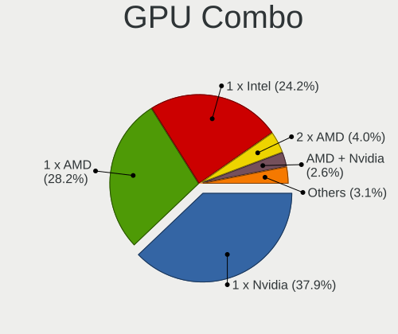

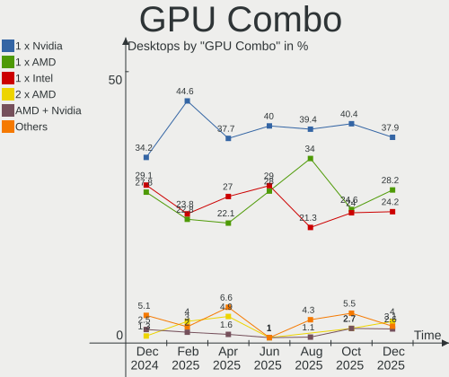

| Name           | Desktops | Percent |
|----------------|----------|---------|
| 1 x Nvidia     | 86       | 37.89%  |
| 1 x AMD        | 64       | 28.19%  |
| 1 x Intel      | 55       | 24.23%  |
| 2 x AMD        | 9        | 3.96%   |
| AMD + Nvidia   | 6        | 2.64%   |
| Intel + Nvidia | 5        | 2.2%    |
| 2 x Nvidia     | 2        | 0.88%   |

GPU Driver
----------

Free vs proprietary

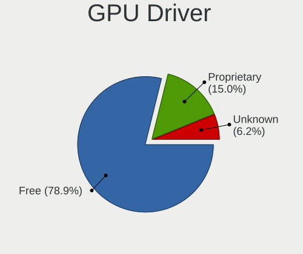

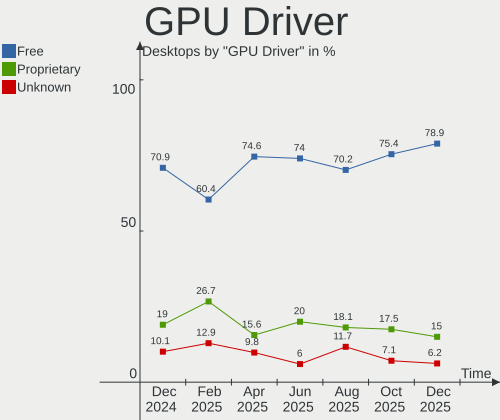

| Driver      | Desktops | Percent |
|-------------|----------|---------|
| Free        | 179      | 78.85%  |
| Proprietary | 34       | 14.98%  |
| Unknown     | 14       | 6.17%   |

GPU Memory
----------

Total video memory

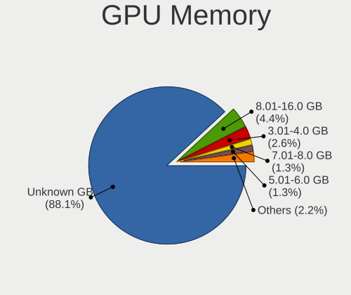

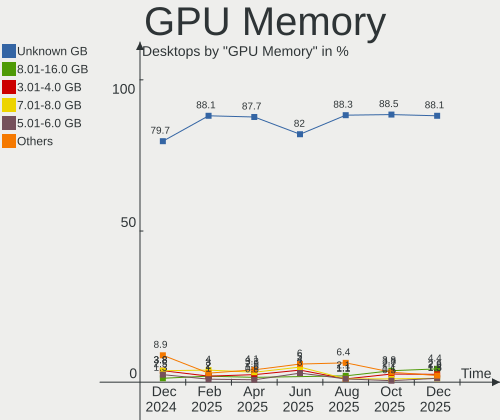

| Size in GB | Desktops | Percent |
|------------|----------|---------|
| Unknown    | 200      | 88.11%  |
| 8.01-16.0  | 10       | 4.41%   |
| 3.01-4.0   | 6        | 2.64%   |
| 7.01-8.0   | 3        | 1.32%   |
| 5.01-6.0   | 3        | 1.32%   |
| 1.01-2.0   | 3        | 1.32%   |
| 16.01-24.0 | 1        | 0.44%   |
| 0.51-1.0   | 1        | 0.44%   |

Monitor
-------

Monitor Vendor
--------------

Monitor vendors

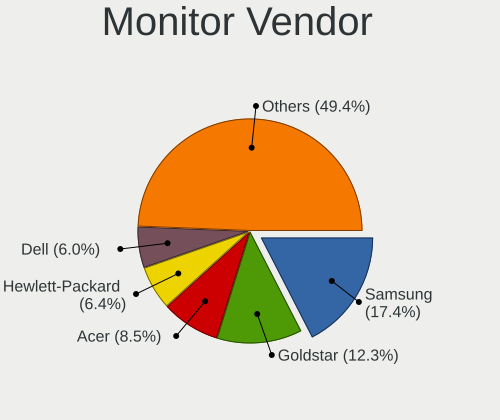

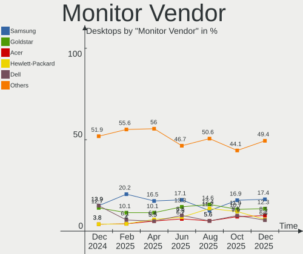

| Vendor               | Desktops | Percent |
|----------------------|----------|---------|
| Samsung Electronics  | 41       | 17.45%  |
| Goldstar             | 29       | 12.34%  |
| Acer                 | 20       | 8.51%   |
| Hewlett-Packard      | 15       | 6.38%   |
| Dell                 | 14       | 5.96%   |
| AOC                  | 12       | 5.11%   |
| Ancor Communications | 10       | 4.26%   |
| Philips              | 9        | 3.83%   |
| BenQ                 | 8        | 3.4%    |
| ViewSonic            | 5        | 2.13%   |
| MSI                  | 5        | 2.13%   |
| Lenovo               | 5        | 2.13%   |
| Gigabyte Technology  | 5        | 2.13%   |
| Unknown              | 4        | 1.7%    |
| Sony                 | 4        | 1.7%    |
| Iiyama               | 4        | 1.7%    |
| ASUSTek Computer     | 3        | 1.28%   |
| Unknown (XXX)        | 2        | 0.85%   |
| Skyworth             | 2        | 0.85%   |
| SKG                  | 2        | 0.85%   |
| Mi                   | 2        | 0.85%   |
| Insignia             | 2        | 0.85%   |
| HKC                  | 2        | 0.85%   |
| Fujitsu Siemens      | 2        | 0.85%   |
| Eizo                 | 2        | 0.85%   |
| ___                  | 1        | 0.43%   |
| Xiaomi               | 1        | 0.43%   |
| VIZTA                | 1        | 0.43%   |
| Vizio                | 1        | 0.43%   |
| Unknown (AAA)        | 1        | 0.43%   |
| SGT                  | 1        | 0.43%   |
| Semp Toshiba         | 1        | 0.43%   |
| Sceptre Tech         | 1        | 0.43%   |
| RTK                  | 1        | 0.43%   |
| Roku                 | 1        | 0.43%   |
| Panasonic            | 1        | 0.43%   |
| Packard Bell         | 1        | 0.43%   |
| ONN                  | 1        | 0.43%   |
| NEC Computers        | 1        | 0.43%   |
| MStar                | 1        | 0.43%   |

Monitor Model
-------------

Monitor models

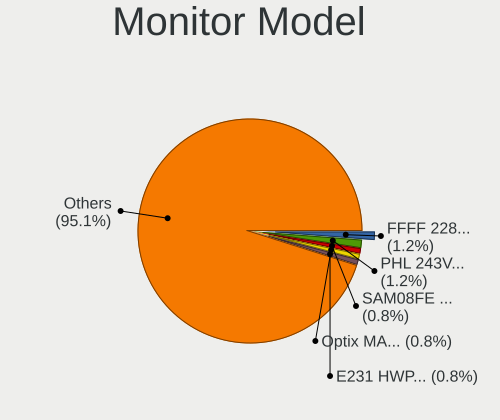

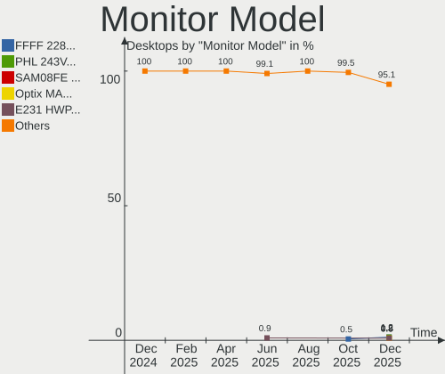

| Model                                                                 | Desktops | Percent |
|-----------------------------------------------------------------------|----------|---------|
| Unknown LCD Monitor FFFF 2288x1287 2550x2550mm 142.0-inch             | 3        | 1.22%   |
| Philips PHL 243V7 PHLC155 1920x1080 527x296mm 23.8-inch               | 3        | 1.22%   |
| Samsung Electronics LCD Monitor SAM08FE 1920x1080                     | 2        | 0.82%   |
| MSI Optix MAG27CQ MSI1462 2560x1440 597x336mm 27.0-inch               | 2        | 0.82%   |
| Hewlett-Packard E231 HWP3063 1920x1080 510x287mm 23.0-inch            | 2        | 0.82%   |
| Hewlett-Packard Compaq W17q HWP26E1 1440x900 408x255mm 18.9-inch      | 2        | 0.82%   |
| Goldstar HDR 4K GSM7707 3840x2160 600x340mm 27.2-inch                 | 2        | 0.82%   |
| Goldstar FULL HD GSM5BDF 1920x1080 480x270mm 21.7-inch                | 2        | 0.82%   |
| Goldstar FULL HD GSM5B55 1920x1080 480x270mm 21.7-inch                | 2        | 0.82%   |
| AOC 1970W AOC1970 1366x768 410x230mm 18.5-inch                        | 2        | 0.82%   |
| Ancor Communications ASUS VS247 ACI249A 1920x1080 521x293mm 23.5-inch | 2        | 0.82%   |
| Acer H274HL ACR0264 1920x1080 598x336mm 27.0-inch                     | 2        | 0.82%   |
| Acer ED270R M ACR0A91 1920x1080 597x336mm 27.0-inch                   | 2        | 0.82%   |
| ___ LCD TV ___9000 1360x768                                           | 1        | 0.41%   |
| Xiaomi Mi TV XMD0076 3840x2160 1110x620mm 50.1-inch                   | 1        | 0.41%   |
| VIZTA 27HQ CURVO JRY2700 1920x1080 698x393mm 31.5-inch                | 1        | 0.41%   |
| Vizio D43f-F1 VIZ1027 1920x1080 940x529mm 42.5-inch                   | 1        | 0.41%   |
| ViewSonic VX2450 SERIES VSCE226 1920x1080 525x297mm 23.7-inch         | 1        | 0.41%   |
| ViewSonic VA3456-WQHD VSCFC3A 3440x1440 800x335mm 34.1-inch           | 1        | 0.41%   |
| ViewSonic VA2746 Series VSC752E 1920x1080 598x336mm 27.0-inch         | 1        | 0.41%   |
| ViewSonic VA2465 SERIES VSCB730 1920x1080 521x293mm 23.5-inch         | 1        | 0.41%   |
| ViewSonic VA240 Series VSCA342 1920x1080 527x296mm 23.8-inch          | 1        | 0.41%   |
| Unknown LCDTV16 9000 1360x768 1600x900mm 72.3-inch                    | 1        | 0.41%   |
| Unknown (XXX) Union TV XXX2841 1920x1080 1209x680mm 54.6-inch         | 1        | 0.41%   |
| Unknown (XXX) HDMI XXX2380 1920x1080 527x296mm 23.8-inch              | 1        | 0.41%   |
| Unknown (AAA) LCDTV AAA3393 1360x768 890x500mm 40.2-inch              | 1        | 0.41%   |
| Sony TV SNY9600 720x480 735x420mm 33.3-inch                           | 1        | 0.41%   |
| Sony TV *00 SNY7E04 3840x2160 952x535mm 43.0-inch                     | 1        | 0.41%   |
| Sony SDM-HX95 SNY5400 1280x1024 376x301mm 19.0-inch                   | 1        | 0.41%   |
| Sony SDM-HS73 SNY2270 1280x1024 338x270mm 17.0-inch                   | 1        | 0.41%   |
| Skyworth TV-monitor SKY1102 3840x2160 708x398mm 32.0-inch             | 1        | 0.41%   |
| Skyworth F24B40Q SKY0001 2560x1440 532x298mm 24.0-inch                | 1        | 0.41%   |
| SKG SFPCB34240QHD SKG3418 3440x1440 1068x612mm 48.5-inch              | 1        | 0.41%   |
| SKG H32S17 SKG3221 2560x1440 530x280mm 23.6-inch                      | 1        | 0.41%   |
| SGT '' SGT2000 1600x900 443x249mm 20.0-inch                           | 1        | 0.41%   |
| Semp Toshiba MLE1951 STI1951 1360x765 410x230mm 18.5-inch             | 1        | 0.41%   |
| Sceptre Tech Sceptre E22 SPT08D5 1920x1080 470x300mm 22.0-inch        | 1        | 0.41%   |
| Samsung Electronics U32J59x SAM0F52 3840x2160 697x392mm 31.5-inch     | 1        | 0.41%   |
| Samsung Electronics U28D590 SAM0B81 3840x2160 608x345mm 27.5-inch     | 1        | 0.41%   |
| Samsung Electronics SyncMaster SAM041F 2048x1152 510x287mm 23.0-inch  | 1        | 0.41%   |

Monitor Resolution
------------------

Monitor screen resolution

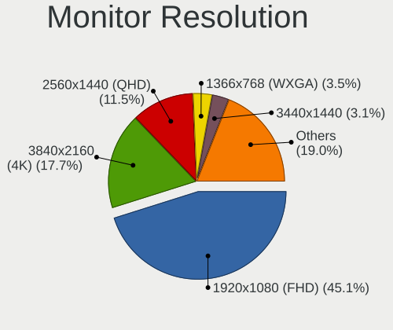

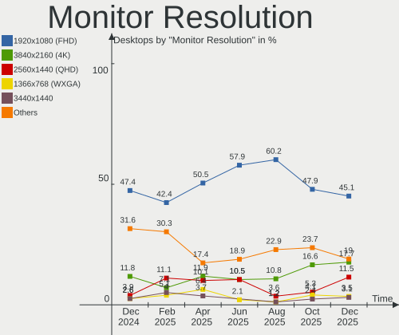

| Resolution         | Desktops | Percent |
|--------------------|----------|---------|
| 1920x1080 (FHD)    | 102      | 45.13%  |
| 3840x2160 (4K)     | 40       | 17.7%   |
| 2560x1440 (QHD)    | 26       | 11.5%   |
| 1366x768 (WXGA)    | 8        | 3.54%   |
| 3440x1440          | 7        | 3.1%    |
| 1600x900 (HD+)     | 7        | 3.1%    |
| 2560x1080          | 6        | 2.65%   |
| 1440x900 (WXGA+)   | 6        | 2.65%   |
| 1280x1024 (SXGA)   | 4        | 1.77%   |
| 3840x1080          | 3        | 1.33%   |
| 2288x1287          | 3        | 1.33%   |
| 1680x1050 (WSXGA+) | 3        | 1.33%   |
| 1360x768           | 3        | 1.33%   |
| 3840x1600          | 2        | 0.88%   |
| 1920x540           | 2        | 0.88%   |
| 1920x1200 (WUXGA)  | 2        | 0.88%   |
| 2048x1152          | 1        | 0.44%   |
| Unknown            | 1        | 0.44%   |

Monitor Diagonal
----------------

Diagonal size in inches

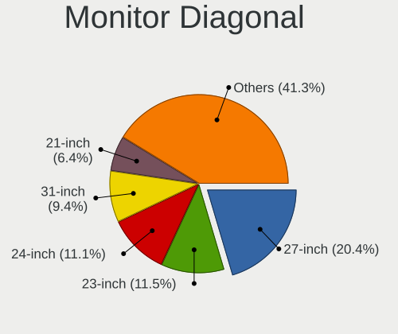

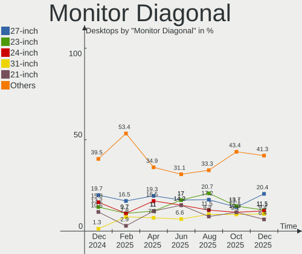

| Inches  | Desktops | Percent |
|---------|----------|---------|
| 27      | 48       | 20.43%  |
| 23      | 27       | 11.49%  |
| 24      | 26       | 11.06%  |
| 31      | 22       | 9.36%   |
| 21      | 15       | 6.38%   |
| 18      | 10       | 4.26%   |
| Unknown | 9        | 3.83%   |
| 34      | 8        | 3.4%    |
| 32      | 8        | 3.4%    |
| 20      | 8        | 3.4%    |
| 84      | 6        | 2.55%   |
| 19      | 5        | 2.13%   |
| 54      | 4        | 1.7%    |
| 48      | 4        | 1.7%    |
| 142     | 3        | 1.28%   |
| 72      | 3        | 1.28%   |
| 63      | 3        | 1.28%   |
| 40      | 3        | 1.28%   |
| 52      | 2        | 0.85%   |
| 37      | 2        | 0.85%   |
| 26      | 2        | 0.85%   |
| 22      | 2        | 0.85%   |
| 17      | 2        | 0.85%   |
| 82      | 1        | 0.43%   |
| 75      | 1        | 0.43%   |
| 65      | 1        | 0.43%   |
| 49      | 1        | 0.43%   |
| 46      | 1        | 0.43%   |
| 44      | 1        | 0.43%   |
| 42      | 1        | 0.43%   |
| 39      | 1        | 0.43%   |
| 36      | 1        | 0.43%   |
| 33      | 1        | 0.43%   |
| 28      | 1        | 0.43%   |
| 25      | 1        | 0.43%   |
| 13      | 1        | 0.43%   |

Monitor Width
-------------

Physical width

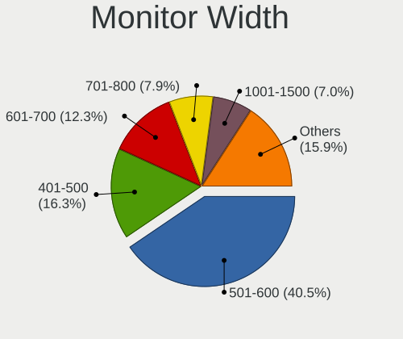

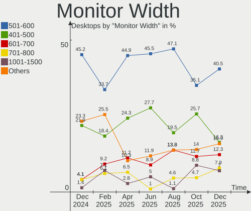

| Width in mm    | Desktops | Percent |
|----------------|----------|---------|
| 501-600        | 92       | 40.53%  |
| 401-500        | 37       | 16.3%   |
| 601-700        | 28       | 12.33%  |
| 701-800        | 18       | 7.93%   |
| 1001-1500      | 16       | 7.05%   |
| 1501-2000      | 11       | 4.85%   |
| Unknown        | 9        | 3.96%   |
| 801-900        | 6        | 2.64%   |
| More than 2000 | 3        | 1.32%   |
| 351-400        | 3        | 1.32%   |
| 301-350        | 2        | 0.88%   |
| 201-300        | 1        | 0.44%   |
| 901-1000       | 1        | 0.44%   |

Aspect Ratio
------------

Proportional relationship between the width and the height

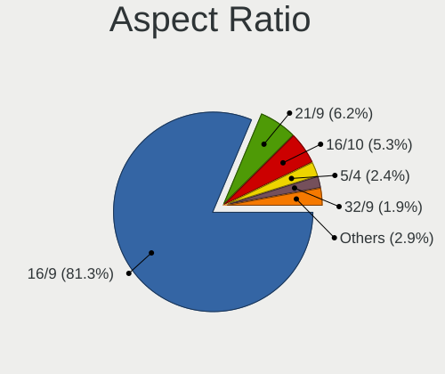

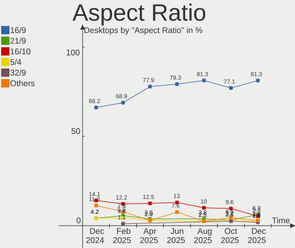

| Ratio   | Desktops | Percent |
|---------|----------|---------|
| 16/9    | 170      | 81.34%  |
| 21/9    | 13       | 6.22%   |
| 16/10   | 11       | 5.26%   |
| 5/4     | 5        | 2.39%   |
| 32/9    | 4        | 1.91%   |
| 1.00    | 3        | 1.44%   |
| Unknown | 3        | 1.44%   |

Monitor Area
------------

Area in inch²

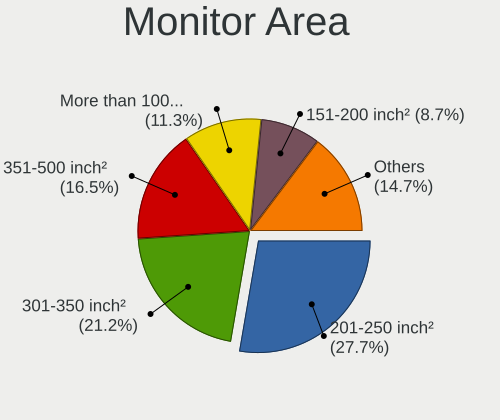

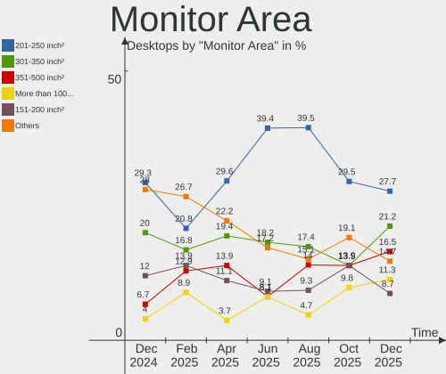

| Area in inch² | Desktops | Percent |
|----------------|----------|---------|
| 201-250        | 64       | 27.71%  |
| 301-350        | 49       | 21.21%  |
| 351-500        | 38       | 16.45%  |
| More than 1000 | 26       | 11.26%  |
| 151-200        | 20       | 8.66%   |
| 501-1000       | 12       | 5.19%   |
| Unknown        | 9        | 3.9%    |
| 141-150        | 8        | 3.46%   |
| 251-300        | 4        | 1.73%   |
| 71-80          | 1        | 0.43%   |

Pixel Density
-------------

Pixels per inch

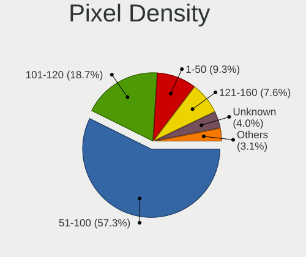

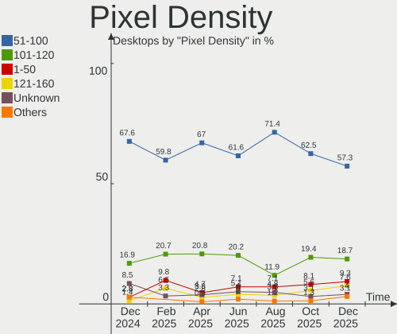

| Density | Desktops | Percent |
|---------|----------|---------|
| 51-100  | 129      | 57.33%  |
| 101-120 | 42       | 18.67%  |
| 1-50    | 21       | 9.33%   |
| 121-160 | 17       | 7.56%   |
| Unknown | 9        | 4%      |
| 161-240 | 7        | 3.11%   |

Multiple Monitors
-----------------

Total monitors connected

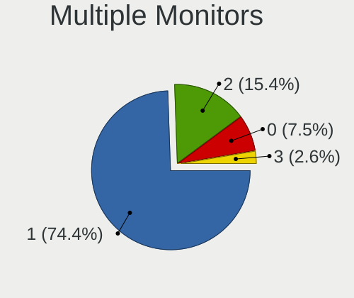

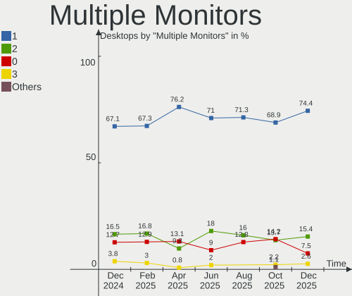

| Total | Desktops | Percent |
|-------|----------|---------|
| 1     | 169      | 74.45%  |
| 2     | 35       | 15.42%  |
| 0     | 17       | 7.49%   |
| 3     | 6        | 2.64%   |

Network
-------

Net Controller Vendor
---------------------

Controller vendors

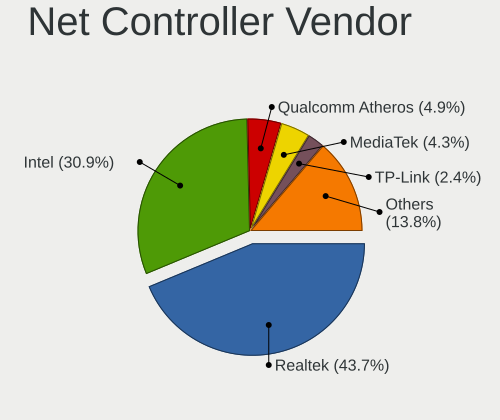

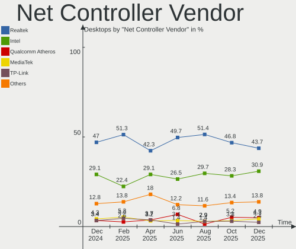

| Vendor                | Desktops | Percent |
|-----------------------|----------|---------|
| Realtek Semiconductor | 143      | 43.73%  |
| Intel                 | 101      | 30.89%  |
| Qualcomm Atheros      | 16       | 4.89%   |
| MediaTek              | 14       | 4.28%   |
| TP-Link               | 8        | 2.45%   |
| Broadcom              | 7        | 2.14%   |
| Ralink Technology     | 6        | 1.83%   |
| Aquantia              | 5        | 1.53%   |
| Nvidia                | 4        | 1.22%   |
| NetGear               | 3        | 0.92%   |
| Ralink                | 2        | 0.61%   |
| Qualcomm Technologies | 2        | 0.61%   |
| Motorola PCS          | 2        | 0.61%   |
| Microsoft             | 2        | 0.61%   |
| ASUSTek Computer      | 2        | 0.61%   |
| ASIX Electronics      | 2        | 0.61%   |
| Xiaomi                | 1        | 0.31%   |
| Tenda                 | 1        | 0.31%   |
| Realtek               | 1        | 0.31%   |
| QinHeng Electronics   | 1        | 0.31%   |
| NetXen Incorporated   | 1        | 0.31%   |
| Mercucys              | 1        | 0.31%   |
| I-O Data Device       | 1        | 0.31%   |
| aicsemi               | 1        | 0.31%   |

Net Controller Model
--------------------

Controller models

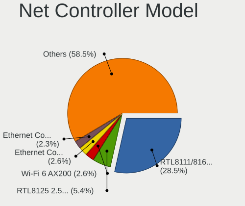

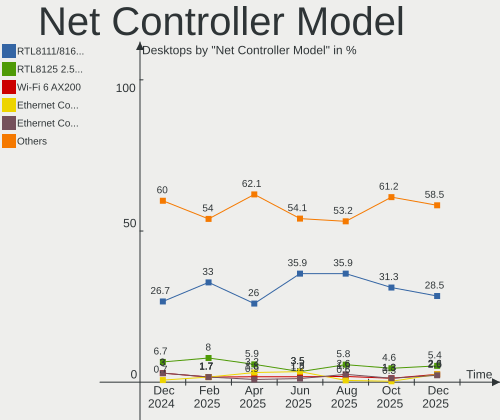

| Model                                                                  | Desktops | Percent |
|------------------------------------------------------------------------|----------|---------|
| Realtek RTL8111/8168/8211/8411 PCI Express Gigabit Ethernet Controller | 110      | 28.5%   |
| Realtek RTL8125 2.5GbE Controller                                      | 21       | 5.44%   |
| Intel Wi-Fi 6 AX200                                                    | 10       | 2.59%   |
| Intel Ethernet Connection (2) I219-V                                   | 10       | 2.59%   |
| Intel Ethernet Controller I225-V                                       | 9        | 2.33%   |
| Realtek RTL8188EUS 802.11n Wireless Network Adapter                    | 7        | 1.81%   |
| MediaTek MT7922 802.11ax PCI Express Wireless Network Adapter          | 7        | 1.81%   |
| Intel I211 Gigabit Network Connection                                  | 7        | 1.81%   |
| Intel 82579LM Gigabit Network Connection (Lewisville)                  | 7        | 1.81%   |
| Intel Ethernet Controller I226-V                                       | 6        | 1.55%   |
| Intel Ethernet Connection I217-LM                                      | 5        | 1.3%    |
| Intel Dual Band Wireless-AC 3168NGW [Stone Peak]                       | 5        | 1.3%    |
| Realtek 802.11ac NIC                                                   | 4        | 1.04%   |
| Intel Wi-Fi 6E(802.11ax) AX210/AX1675* 2x2 [Typhoon Peak]              | 4        | 1.04%   |
| Intel Ethernet Connection (7) I219-V                                   | 4        | 1.04%   |
| Intel Cannon Lake PCH CNVi WiFi                                        | 4        | 1.04%   |
| Intel Alder Lake-S PCH CNVi WiFi                                       | 4        | 1.04%   |
| Intel 82567LM-3 Gigabit Network Connection                             | 4        | 1.04%   |
| Broadcom BCM4360 802.11ac Dual Band Wireless Network Adapter           | 4        | 1.04%   |
| Realtek RTL88x2bu [AC1200 Techkey]                                     | 3        | 0.78%   |
| Realtek RTL8821CE 802.11ac PCIe Wireless Network Adapter               | 3        | 0.78%   |
| Qualcomm Atheros Killer E220x Gigabit Ethernet Controller              | 3        | 0.78%   |
| Intel Wireless 3165                                                    | 3        | 0.78%   |
| Intel Ethernet Connection I217-V                                       | 3        | 0.78%   |
| Intel Ethernet Connection (7) I219-LM                                  | 3        | 0.78%   |
| Intel Ethernet Connection (2) I219-LM                                  | 3        | 0.78%   |
| Intel Ethernet Connection (14) I219-V                                  | 3        | 0.78%   |
| Intel 82579V Gigabit Network Connection                                | 3        | 0.78%   |
| Intel 82574L Gigabit Network Connection                                | 3        | 0.78%   |
| TP-Link TL-WN822N Version 4 RTL8192EU                                  | 2        | 0.52%   |
| Realtek RTL8852BE PCIe 802.11ax Wireless Network Controller            | 2        | 0.52%   |
| Realtek RTL8812AE 802.11ac PCIe Wireless Network Adapter               | 2        | 0.52%   |
| Realtek RTL8192EU 802.11b/g/n WLAN Adapter                             | 2        | 0.52%   |
| Realtek RTL8191SU 802.11n WLAN Adapter                                 | 2        | 0.52%   |
| Realtek RTL810xE PCI Express Fast Ethernet controller                  | 2        | 0.52%   |
| Realtek Killer E3000 2.5GbE Controller                                 | 2        | 0.52%   |
| Realtek 802.11ax WLAN Adapter                                          | 2        | 0.52%   |
| Ralink RT5370 Wireless Adapter                                         | 2        | 0.52%   |
| Ralink MT7601U Wireless Adapter                                        | 2        | 0.52%   |
| Qualcomm WCN785x Wi-Fi 7(802.11be) 320MHz 2x2 [FastConnect 7800]       | 2        | 0.52%   |

Wireless Vendor
---------------

Wireless vendors

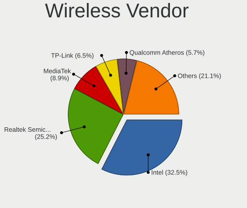

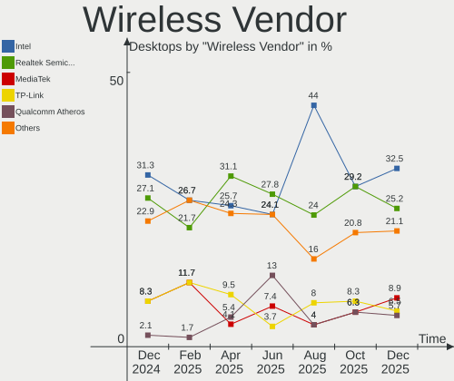

| Vendor                | Desktops | Percent |
|-----------------------|----------|---------|
| Intel                 | 40       | 32.52%  |
| Realtek Semiconductor | 31       | 25.2%   |
| MediaTek              | 11       | 8.94%   |
| TP-Link               | 8        | 6.5%    |
| Qualcomm Atheros      | 7        | 5.69%   |
| Ralink Technology     | 6        | 4.88%   |
| Broadcom              | 6        | 4.88%   |
| NetGear               | 3        | 2.44%   |
| Ralink                | 2        | 1.63%   |
| Microsoft             | 2        | 1.63%   |
| ASUSTek Computer      | 2        | 1.63%   |
| Tenda                 | 1        | 0.81%   |
| Realtek               | 1        | 0.81%   |
| Qualcomm Technologies | 1        | 0.81%   |
| Mercucys              | 1        | 0.81%   |
| I-O Data Device       | 1        | 0.81%   |

Wireless Model
--------------

Wireless models

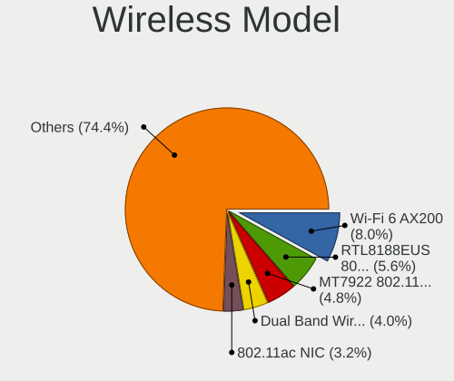

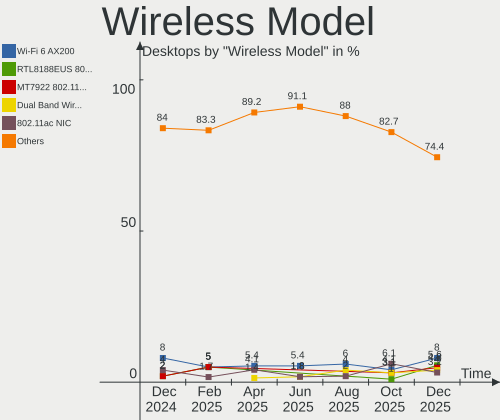

| Model                                                                | Desktops | Percent |
|----------------------------------------------------------------------|----------|---------|
| Intel Wi-Fi 6 AX200                                                  | 10       | 8%      |
| Realtek RTL8188EUS 802.11n Wireless Network Adapter                  | 7        | 5.6%    |
| MediaTek MT7922 802.11ax PCI Express Wireless Network Adapter        | 6        | 4.8%    |
| Intel Dual Band Wireless-AC 3168NGW [Stone Peak]                     | 5        | 4%      |
| Realtek 802.11ac NIC                                                 | 4        | 3.2%    |
| Intel Wi-Fi 6E(802.11ax) AX210/AX1675* 2x2 [Typhoon Peak]            | 4        | 3.2%    |
| Intel Cannon Lake PCH CNVi WiFi                                      | 4        | 3.2%    |
| Broadcom BCM4360 802.11ac Dual Band Wireless Network Adapter         | 4        | 3.2%    |
| Realtek RTL88x2bu [AC1200 Techkey]                                   | 3        | 2.4%    |
| Realtek RTL8821CE 802.11ac PCIe Wireless Network Adapter             | 3        | 2.4%    |
| Intel Wireless 3165                                                  | 3        | 2.4%    |
| Intel Alder Lake-S PCH CNVi WiFi                                     | 3        | 2.4%    |
| TP-Link TL-WN822N Version 4 RTL8192EU                                | 2        | 1.6%    |
| Realtek RTL8812AE 802.11ac PCIe Wireless Network Adapter             | 2        | 1.6%    |
| Realtek RTL8192EU 802.11b/g/n WLAN Adapter                           | 2        | 1.6%    |
| Realtek RTL8191SU 802.11n WLAN Adapter                               | 2        | 1.6%    |
| Realtek 802.11ax WLAN Adapter                                        | 2        | 1.6%    |
| Ralink RT5370 Wireless Adapter                                       | 2        | 1.6%    |
| Ralink MT7601U Wireless Adapter                                      | 2        | 1.6%    |
| Microsoft Xbox 360 Wireless Adapter                                  | 2        | 1.6%    |
| MediaTek MT7902 802.11ax PCIe Wireless Network Adapter [Filogic 310] | 2        | 1.6%    |
| Intel Wireless 7260                                                  | 2        | 1.6%    |
| Intel Tiger Lake PCH CNVi WiFi                                       | 2        | 1.6%    |
| Intel Centrino Advanced-N 6235                                       | 2        | 1.6%    |
| Intel 700 Series Chipset CNVi WiFi                                   | 2        | 1.6%    |
| TP-Link TL-WN722N v2/v3 [Realtek RTL8188EUS]                         | 1        | 0.8%    |
| TP-Link Archer T4U ver.3                                             | 1        | 0.8%    |
| TP-Link Archer T3U [Realtek RTL8812BU]                               | 1        | 0.8%    |
| TP-Link Archer T2U PLUS [RTL8821AU]                                  | 1        | 0.8%    |
| TP-Link AC600 wireless Realtek RTL8811AU [Archer T2U Nano]           | 1        | 0.8%    |
| TP-Link 802.11ac WLAN Adapter                                        | 1        | 0.8%    |
| Tenda U12                                                            | 1        | 0.8%    |
| Realtek RTL8852CE PCIe 802.11ax Wireless Network Controller          | 1        | 0.8%    |
| Realtek RTL8851BE PCIe 802.11ax Wireless Network Controller          | 1        | 0.8%    |
| Realtek RTL8822CE 802.11ac PCIe Wireless Network Adapter             | 1        | 0.8%    |
| Realtek RTL8192EE PCIe Wireless Network Adapter                      | 1        | 0.8%    |
| Realtek RTL8188EE Wireless Network Adapter                           | 1        | 0.8%    |
| Realtek RTL8188CUS 802.11n WLAN Adapter                              | 1        | 0.8%    |
| Realtek 802.11n WLAN Adapter                                         | 1        | 0.8%    |
| Realtek 802.11ac WLAN Adapter                                        | 1        | 0.8%    |

Ethernet Vendor
---------------

Ethernet vendors

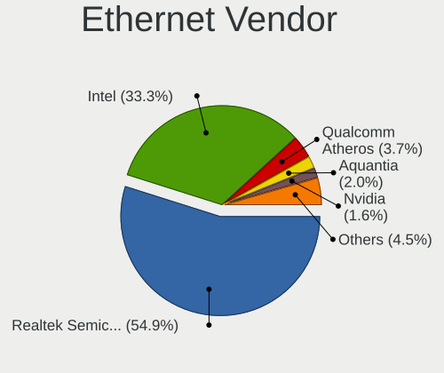

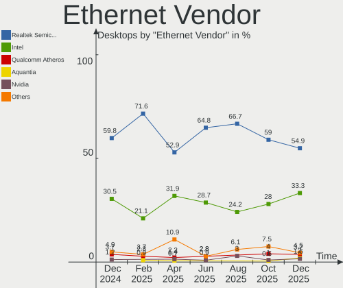

| Vendor                | Desktops | Percent |
|-----------------------|----------|---------|
| Realtek Semiconductor | 135      | 54.88%  |
| Intel                 | 82       | 33.33%  |
| Qualcomm Atheros      | 9        | 3.66%   |
| Aquantia              | 5        | 2.03%   |
| Nvidia                | 4        | 1.63%   |
| Motorola PCS          | 2        | 0.81%   |
| MediaTek              | 2        | 0.81%   |
| Broadcom              | 2        | 0.81%   |
| ASIX Electronics      | 2        | 0.81%   |
| Xiaomi                | 1        | 0.41%   |
| Qualcomm Technologies | 1        | 0.41%   |
| NetXen Incorporated   | 1        | 0.41%   |

Ethernet Model
--------------

Ethernet models

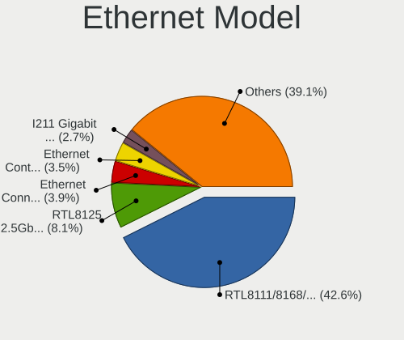

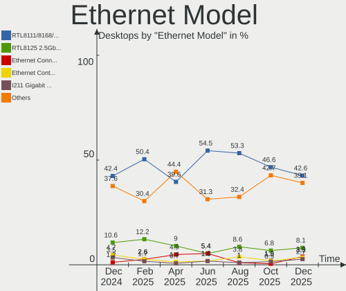

| Model                                                                          | Desktops | Percent |
|--------------------------------------------------------------------------------|----------|---------|
| Realtek RTL8111/8168/8211/8411 PCI Express Gigabit Ethernet Controller         | 110      | 42.64%  |
| Realtek RTL8125 2.5GbE Controller                                              | 21       | 8.14%   |
| Intel Ethernet Connection (2) I219-V                                           | 10       | 3.88%   |
| Intel Ethernet Controller I225-V                                               | 9        | 3.49%   |
| Intel I211 Gigabit Network Connection                                          | 7        | 2.71%   |
| Intel 82579LM Gigabit Network Connection (Lewisville)                          | 7        | 2.71%   |
| Intel Ethernet Controller I226-V                                               | 6        | 2.33%   |
| Intel Ethernet Connection I217-LM                                              | 5        | 1.94%   |
| Intel Ethernet Connection (7) I219-V                                           | 4        | 1.55%   |
| Intel 82567LM-3 Gigabit Network Connection                                     | 4        | 1.55%   |
| Qualcomm Atheros Killer E220x Gigabit Ethernet Controller                      | 3        | 1.16%   |
| Intel Ethernet Connection I217-V                                               | 3        | 1.16%   |
| Intel Ethernet Connection (7) I219-LM                                          | 3        | 1.16%   |
| Intel Ethernet Connection (2) I219-LM                                          | 3        | 1.16%   |
| Intel Ethernet Connection (14) I219-V                                          | 3        | 1.16%   |
| Intel 82579V Gigabit Network Connection                                        | 3        | 1.16%   |
| Intel 82574L Gigabit Network Connection                                        | 3        | 1.16%   |
| Realtek RTL8852BE PCIe 802.11ax Wireless Network Controller                    | 2        | 0.78%   |
| Realtek RTL810xE PCI Express Fast Ethernet controller                          | 2        | 0.78%   |
| Realtek Killer E3000 2.5GbE Controller                                         | 2        | 0.78%   |
| Nvidia MCP61 Ethernet                                                          | 2        | 0.78%   |
| Intel Ethernet Connection I218-V                                               | 2        | 0.78%   |
| Intel Ethernet Connection (2) I218-V                                           | 2        | 0.78%   |
| ASIX AX88179 Gigabit Ethernet                                                  | 2        | 0.78%   |
| Aquantia AQtion AQC107 NBase-T/IEEE 802.3an Ethernet Controller [Atlantic 10G] | 2        | 0.78%   |
| Xiaomi Mi/Redmi series (RNDIS + ADB)                                           | 1        | 0.39%   |
| Realtek USB 10/100/1G/2.5G/5G LAN                                              | 1        | 0.39%   |
| Realtek RTL8922AE 802.11be PCIe Wireless Network Adapter                       | 1        | 0.39%   |
| Realtek RTL8126 5GbE Controller                                                | 1        | 0.39%   |
| Realtek RTL-8100/8101L/8139 PCI Fast Ethernet Adapter                          | 1        | 0.39%   |
| Qualcomm WCN785x Wi-Fi 7(802.11be) 320MHz 2x2 [FastConnect 7800]               | 1        | 0.39%   |
| Qualcomm Atheros Killer E2500 Gigabit Ethernet Controller                      | 1        | 0.39%   |
| Qualcomm Atheros Killer E2400 Gigabit Ethernet Controller                      | 1        | 0.39%   |
| Qualcomm Atheros Attansic L1 Gigabit Ethernet                                  | 1        | 0.39%   |
| Qualcomm Atheros AR8161 Gigabit Ethernet                                       | 1        | 0.39%   |
| Qualcomm Atheros AR8152 v2.0 Fast Ethernet                                     | 1        | 0.39%   |
| Qualcomm Atheros AR8151 v2.0 Gigabit Ethernet                                  | 1        | 0.39%   |
| Nvidia MCP55 Ethernet                                                          | 1        | 0.39%   |
| Nvidia CK804 Ethernet Controller                                               | 1        | 0.39%   |
| NetXen Incorporated NX3031 Multifunction 1/10-Gigabit Server Adapter           | 1        | 0.39%   |

Net Controller Kind
-------------------

Ethernet, WiFi or modem

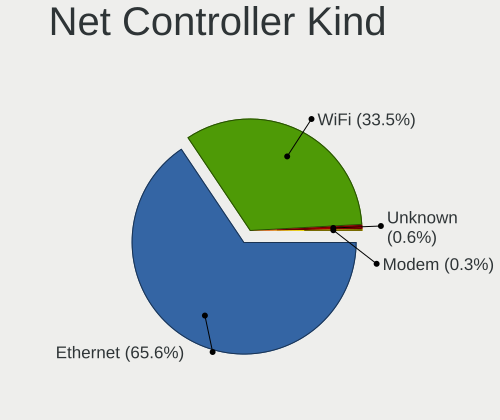

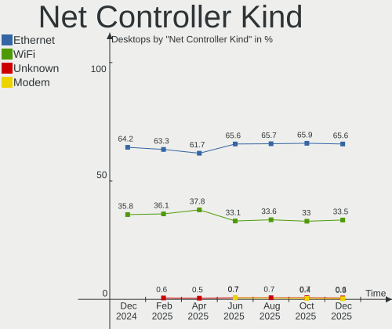

| Kind     | Desktops | Percent |
|----------|----------|---------|
| Ethernet | 225      | 65.6%   |
| WiFi     | 115      | 33.53%  |
| Unknown  | 2        | 0.58%   |
| Modem    | 1        | 0.29%   |

Used Controller
---------------

Currently used network controller

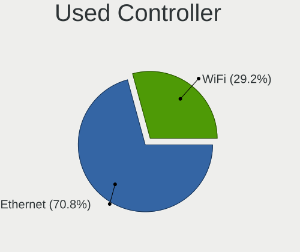

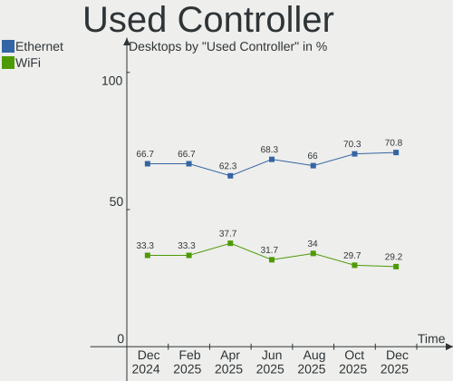

| Kind     | Desktops | Percent |
|----------|----------|---------|
| Ethernet | 167      | 70.76%  |
| WiFi     | 69       | 29.24%  |

NICs
----

Total network controllers on board

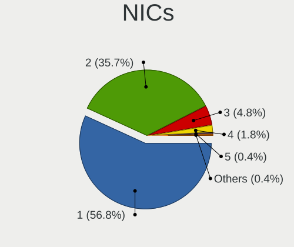

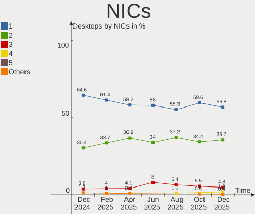

| Total | Desktops | Percent |
|-------|----------|---------|
| 1     | 129      | 56.83%  |
| 2     | 81       | 35.68%  |
| 3     | 11       | 4.85%   |
| 4     | 4        | 1.76%   |
| 5     | 1        | 0.44%   |
| 0     | 1        | 0.44%   |

IPv6
----

IPv6 vs IPv4

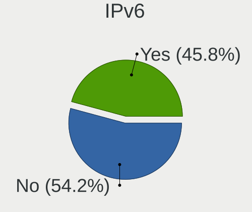

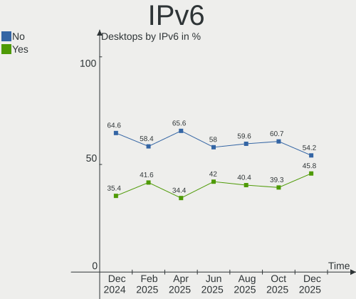

| Used | Desktops | Percent |
|------|----------|---------|
| No   | 123      | 54.19%  |
| Yes  | 104      | 45.81%  |

Bluetooth
---------

Bluetooth Vendor
----------------

Controller vendors

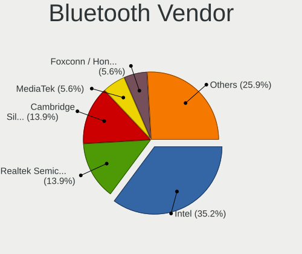

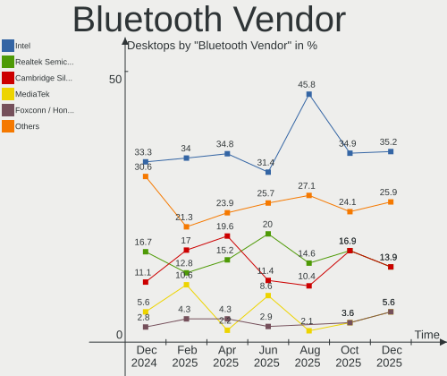

| Vendor                          | Desktops | Percent |
|---------------------------------|----------|---------|
| Intel                           | 38       | 35.19%  |
| Realtek Semiconductor           | 15       | 13.89%  |
| Cambridge Silicon Radio         | 15       | 13.89%  |
| MediaTek                        | 6        | 5.56%   |
| Foxconn / Hon Hai               | 6        | 5.56%   |
| TP-Link                         | 5        | 4.63%   |
| ASUSTek Computer                | 5        | 4.63%   |
| IMC Networks                    | 4        | 3.7%    |
| Qualcomm Atheros Communications | 3        | 2.78%   |
| Unknown                         | 3        | 2.78%   |
| Lite-On Technology              | 2        | 1.85%   |
| Broadcom                        | 2        | 1.85%   |
| Kensington                      | 1        | 0.93%   |
| Apple                           | 1        | 0.93%   |
| AICSemi                         | 1        | 0.93%   |
| Actions                         | 1        | 0.93%   |

Bluetooth Model
---------------

Controller models

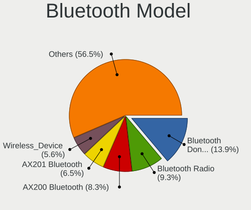

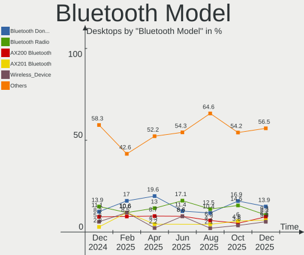

| Model                                                 | Desktops | Percent |
|-------------------------------------------------------|----------|---------|
| Cambridge Silicon Radio Bluetooth Dongle (HCI mode)   | 15       | 13.89%  |
| Realtek Bluetooth Radio                               | 10       | 9.26%   |
| Intel AX200 Bluetooth                                 | 9        | 8.33%   |
| Intel AX201 Bluetooth                                 | 7        | 6.48%   |
| MediaTek Wireless_Device                              | 6        | 5.56%   |
| TP-Link TP-T@- UB500 Adapter                          | 5        | 4.63%   |
| Intel Bluetooth wireless interface                    | 5        | 4.63%   |
| Intel Wireless-AC 3168 Bluetooth                      | 4        | 3.7%    |
| Intel Bluetooth 9460/9560 Jefferson Peak (JfP)        | 4        | 3.7%    |
| Intel AX210 Bluetooth                                 | 4        | 3.7%    |
| Realtek Bluetooth 5.4 Radio                           | 3        | 2.78%   |
| Intel Bluetooth Device                                | 3        | 2.78%   |
| IMC Networks Wireless_Device                          | 3        | 2.78%   |
| Foxconn / Hon Hai Wireless_Device                     | 3        | 2.78%   |
| Foxconn / Hon Hai Bluetooth Device                    | 3        | 2.78%   |
| Unknown                                               | 3        | 2.78%   |
| Qualcomm Atheros AR3011 Bluetooth                     | 2        | 1.85%   |
| Intel Centrino Bluetooth Wireless Transceiver         | 2        | 1.85%   |
| ASUS Broadcom BCM20702 Single-Chip Bluetooth 4.0 + LE | 2        | 1.85%   |
| Realtek  Bluetooth 4.2 Adapter                        | 1        | 0.93%   |
| Realtek 802.11ac WLAN Adapter                         | 1        | 0.93%   |
| Qualcomm Atheros  Bluetooth Device                    | 1        | 0.93%   |
| Lite-On Bluetooth Device                              | 1        | 0.93%   |
| Lite-On Atheros AR3012 Bluetooth                      | 1        | 0.93%   |
| Kensington Bluetooth EDR Dongle                       | 1        | 0.93%   |
| IMC Networks Bluetooth Radio                          | 1        | 0.93%   |
| Broadcom Bluetooth 3.0 USB Dongle                     | 1        | 0.93%   |
| Broadcom BCM2035B3 Bluetooth Adapter                  | 1        | 0.93%   |
| ASUS Qualcomm Bluetooth 4.1                           | 1        | 0.93%   |
| ASUS Broadcom BCM20702A0 Bluetooth                    | 1        | 0.93%   |
| ASUS ASUS USB-BT500                                   | 1        | 0.93%   |
| Apple Bluetooth Host Controller                       | 1        | 0.93%   |
| AICSemi AIC 8800D80                                   | 1        | 0.93%   |
| Actions general adapter                               | 1        | 0.93%   |

Sound
-----

Sound Vendor
------------

Sound card vendors

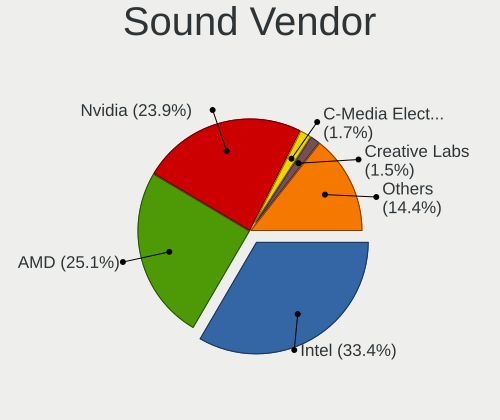

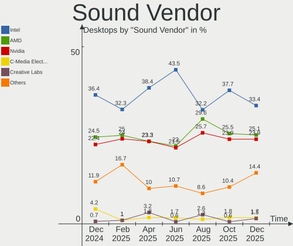

| Vendor                                       | Desktops | Percent |
|----------------------------------------------|----------|---------|
| Intel                                        | 137      | 33.41%  |
| AMD                                          | 103      | 25.12%  |
| Nvidia                                       | 98       | 23.9%   |
| C-Media Electronics                          | 7        | 1.71%   |
| Creative Labs                                | 6        | 1.46%   |
| Jieli Technology                             | 5        | 1.22%   |
| Logitech                                     | 3        | 0.73%   |
| KTMicro                                      | 3        | 0.73%   |
| ASUSTek Computer                             | 3        | 0.73%   |
| Zoran Co. Personal Media Division (Nogatech) | 2        | 0.49%   |
| TTGK Technology                              | 2        | 0.49%   |
| Realtek Semiconductor                        | 2        | 0.49%   |
| PreSonus Audio Electronics                   | 2        | 0.49%   |
| Micro Star International                     | 2        | 0.49%   |
| JMTek                                        | 2        | 0.49%   |
| Hewlett-Packard                              | 2        | 0.49%   |
| GN Netcom                                    | 2        | 0.49%   |
| Yamaha                                       | 1        | 0.24%   |
| XMOS                                         | 1        | 0.24%   |
| Xilinx                                       | 1        | 0.24%   |
| Trust                                        | 1        | 0.24%   |
| Thesycon Systemsoftware & Consulting         | 1        | 0.24%   |
| Texas Instruments                            | 1        | 0.24%   |
| SteelSeries ApS                              | 1        | 0.24%   |
| Schiit Audio                                 | 1        | 0.24%   |
| ROCCAT                                       | 1        | 0.24%   |
| Reloop                                       | 1        | 0.24%   |
| Razer USA                                    | 1        | 0.24%   |
| Native Instruments                           | 1        | 0.24%   |
| MV-SILICON                                   | 1        | 0.24%   |
| Maono                                        | 1        | 0.24%   |
| liyuany                                      | 1        | 0.24%   |
| Kingston Technology                          | 1        | 0.24%   |
| JBL                                          | 1        | 0.24%   |
| Harman International                         | 1        | 0.24%   |
| Generalplus Technology                       | 1        | 0.24%   |
| Focusrite-Novation                           | 1        | 0.24%   |
| FDUCE PRO AUDIO MADE                         | 1        | 0.24%   |
| Corsair                                      | 1        | 0.24%   |
| BigBen Interactive                           | 1        | 0.24%   |

Sound Model
-----------

Sound card models

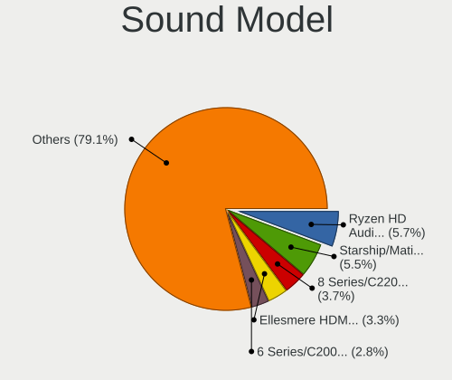

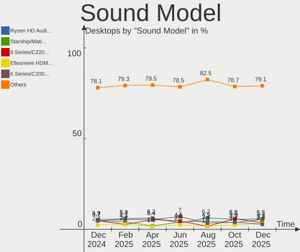

| Model                                                                                           | Desktops | Percent |
|-------------------------------------------------------------------------------------------------|----------|---------|
| AMD Ryzen HD Audio Controller                                                                   | 28       | 5.69%   |
| AMD Starship/Matisse HD Audio Controller                                                        | 27       | 5.49%   |
| Intel 8 Series/C220 Series Chipset High Definition Audio Controller                             | 18       | 3.66%   |
| AMD Ellesmere HDMI Audio [Radeon RX 470/480 / 570/580/590]                                      | 16       | 3.25%   |
| Intel 6 Series/C200 Series Chipset Family High Definition Audio Controller                      | 14       | 2.85%   |
| Intel 100 Series/C230 Series Chipset Family HD Audio Controller                                 | 14       | 2.85%   |
| Intel Xeon E3-1200 v3/4th Gen Core Processor HD Audio Controller                                | 13       | 2.64%   |
| Intel 7 Series/C216 Chipset Family High Definition Audio Controller                             | 12       | 2.44%   |
| Intel 200 Series PCH HD Audio                                                                   | 12       | 2.44%   |
| AMD Radeon High Definition Audio Controller                                                     | 12       | 2.44%   |
| Intel Cannon Lake PCH cAVS                                                                      | 9        | 1.83%   |
| AMD SBx00 Azalia (Intel HDA)                                                                    | 9        | 1.83%   |
| AMD Navi 21/23 HDMI/DP Audio Controller                                                         | 9        | 1.83%   |
| AMD FCH Azalia Controller                                                                       | 9        | 1.83%   |
| Nvidia GK208 HDMI/DP Audio Controller                                                           | 8        | 1.63%   |
| AMD Renoir/Cezanne HDMI/DP Audio Controller                                                     | 8        | 1.63%   |
| AMD Family 17h (Models 00h-0fh) HD Audio Controller                                             | 8        | 1.63%   |
| Nvidia GA104 High Definition Audio Controller                                                   | 7        | 1.42%   |
| Intel Tiger Lake-H HD Audio Controller                                                          | 7        | 1.42%   |
| Intel 9 Series Chipset Family HD Audio Controller                                               | 7        | 1.42%   |
| Nvidia GP107GL High Definition Audio Controller                                                 | 6        | 1.22%   |
| Intel Raptor Lake High Definition Audio Controller                                              | 6        | 1.22%   |
| Intel 5 Series/3400 Series Chipset High Definition Audio                                        | 6        | 1.22%   |
| AMD Navi 31 HDMI/DP Audio                                                                       | 6        | 1.22%   |
| Nvidia GP108 High Definition Audio Controller                                                   | 5        | 1.02%   |
| Nvidia GP104 High Definition Audio Controller                                                   | 5        | 1.02%   |
| Nvidia GA106 High Definition Audio Controller                                                   | 5        | 1.02%   |
| Creative Labs CA0132 Sound Core3D [Sound Blaster Recon3D / Z-Series / Sound BlasterX AE-5 Plus] | 5        | 1.02%   |
| AMD Raven/Raven2/Fenghuang HDMI/DP Audio Controller                                             | 5        | 1.02%   |
| AMD Navi 48 HDMI/DP Audio Controller                                                            | 5        | 1.02%   |
| Nvidia High Definition Audio Controller                                                         | 4        | 0.81%   |
| Nvidia GM107 High Definition Audio Controller [GeForce 940MX]                                   | 4        | 0.81%   |
| Nvidia GF119 HDMI Audio Controller                                                              | 4        | 0.81%   |
| Nvidia AD106M High Definition Audio Controller                                                  | 4        | 0.81%   |
| Jieli Technology UACDemoV1.0                                                                    | 4        | 0.81%   |
| Intel Jasper Lake HD Audio                                                                      | 4        | 0.81%   |
| Intel Alder Lake-S HD Audio Controller                                                          | 4        | 0.81%   |
| Intel 82801JD/DO (ICH10 Family) HD Audio Controller                                             | 4        | 0.81%   |
| Nvidia TU116 High Definition Audio Controller                                                   | 3        | 0.61%   |
| Nvidia TU104 HD Audio Controller                                                                | 3        | 0.61%   |

Memory
------

Memory Vendor
-------------

Memory module vendors

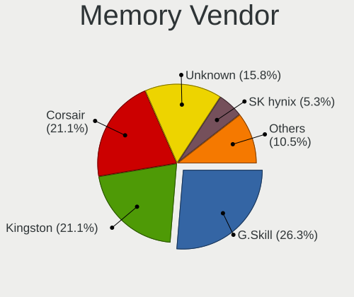

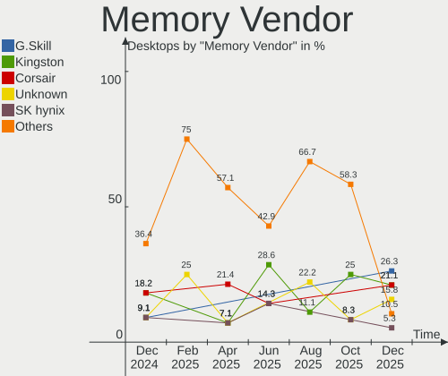

| Vendor            | Desktops | Percent |
|-------------------|----------|---------|
| G.Skill           | 5        | 26.32%  |
| Kingston          | 4        | 21.05%  |
| Corsair           | 4        | 21.05%  |
| Unknown           | 3        | 15.79%  |
| SK hynix          | 1        | 5.26%   |
| Crucial           | 1        | 5.26%   |
| A-DATA Technology | 1        | 5.26%   |

Memory Model
------------

Memory module models

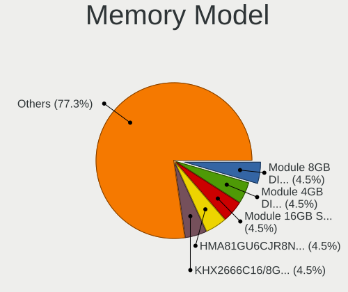

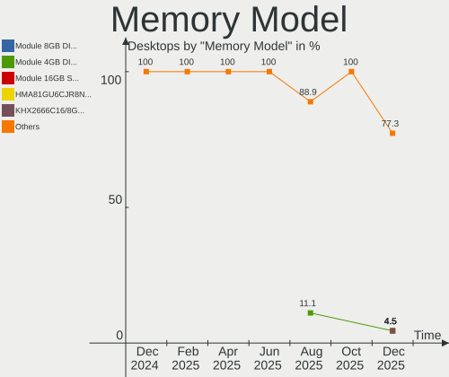

| Model                                                  | Desktops | Percent |
|--------------------------------------------------------|----------|---------|
| Unknown RAM Module 8GB DIMM DDR3 1600MT/s              | 1        | 4.55%   |
| Unknown RAM Module 4GB DIMM DDR3 1333MT/s              | 1        | 4.55%   |
| Unknown RAM Module 16GB SODIMM DDR4 2133MT/s           | 1        | 4.55%   |
| SK hynix RAM HMA81GU6CJR8N-VK 8GB DIMM DDR4 2667MT/s   | 1        | 4.55%   |
| Kingston RAM KHX2666C16/8G 8GiB DIMM DDR4 3466MT/s     | 1        | 4.55%   |
| Kingston RAM KHX1866C10D3/8G 8GB DIMM DDR3 1867MT/s    | 1        | 4.55%   |
| Kingston RAM KF564C32-16 16GB DIMM DDR5 6400MT/s       | 1        | 4.55%   |
| Kingston RAM KF560C36-8 8GB DIMM DDR5 4800MT/s         | 1        | 4.55%   |
| Kingston RAM ACR512X64D3U16C11G 4GB DIMM DDR3 1600MT/s | 1        | 4.55%   |
| G.Skill RAM F4-3600C16-8GTZR 8GB DIMM DDR4 3600MT/s    | 1        | 4.55%   |
| G.Skill RAM F4-3200C16-8GVKB 8GB DIMM DDR4 4000MT/s    | 1        | 4.55%   |
| G.Skill RAM F4-3200C16-8GIS 8GB DIMM DDR4 3600MT/s     | 1        | 4.55%   |
| G.Skill RAM F4-3200C16-16GVK 16GB DIMM DDR4 3600MT/s   | 1        | 4.55%   |
| G.Skill RAM F4-3000C16-8GISB 8GB DIMM DDR4 3200MT/s    | 1        | 4.55%   |
| G.Skill RAM F3-2400C11-8GAB 8GB DIMM DDR3 2400MT/s     | 1        | 4.55%   |
| Crucial RAM CT102464BA160B.M16 8GB DIMM DDR3 1600MT/s  | 1        | 4.55%   |
| Corsair RAM CMW8GX4M1Z3600C18 8GB DIMM DDR4 2666MT/s   | 1        | 4.55%   |
| Corsair RAM CMK8GX4M1Z3600C18 8GB DIMM DDR4 3600MT/s   | 1        | 4.55%   |
| Corsair RAM CMK8GX4M1E3200C16 8GB DIMM DDR4 3200MT/s   | 1        | 4.55%   |
| Corsair RAM CMK32GX4M2B3200C16 16GB DIMM DDR4 3800MT/s | 1        | 4.55%   |
| Corsair RAM CMK16GX4M2B3200C16 8GB DIMM DDR4 3600MT/s  | 1        | 4.55%   |
| A-DATA RAM AEDU1600W8G11-BNAD 8GB DIMM DDR3 1600MT/s   | 1        | 4.55%   |

Memory Kind
-----------

Memory module kinds

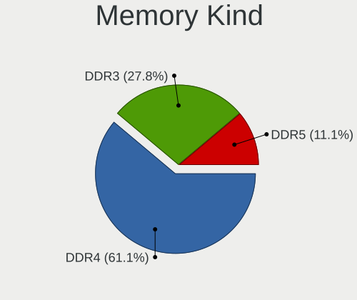

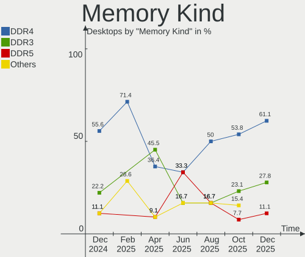

| Kind | Desktops | Percent |
|------|----------|---------|
| DDR4 | 11       | 61.11%  |
| DDR3 | 5        | 27.78%  |
| DDR5 | 2        | 11.11%  |

Memory Form Factor
------------------

Physical design of the memory module

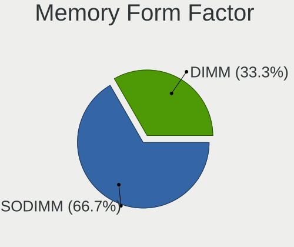

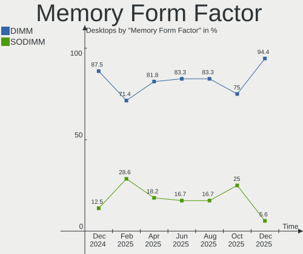

| Name   | Desktops | Percent |
|--------|----------|---------|
| DIMM   | 17       | 94.44%  |
| SODIMM | 1        | 5.56%   |

Memory Size
-----------

Memory module size

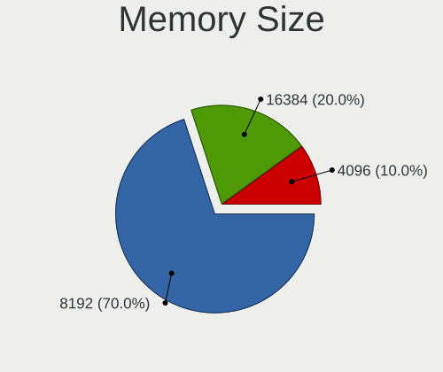

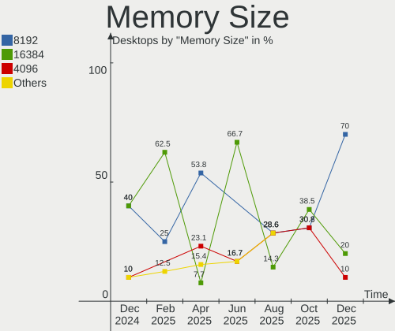

| Size  | Desktops | Percent |
|-------|----------|---------|
| 8192  | 14       | 70%     |
| 16384 | 4        | 20%     |
| 4096  | 2        | 10%     |

Memory Speed
------------

Memory module speed

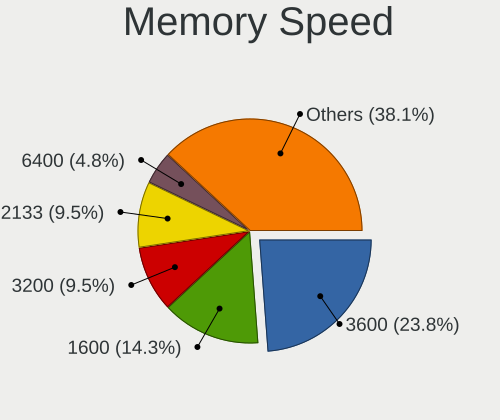

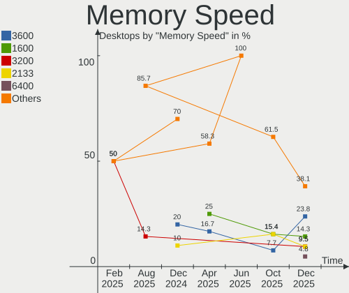

| Speed | Desktops | Percent |
|-------|----------|---------|
| 3600  | 5        | 23.81%  |
| 1600  | 3        | 14.29%  |
| 3200  | 2        | 9.52%   |
| 2133  | 2        | 9.52%   |
| 6400  | 1        | 4.76%   |
| 4800  | 1        | 4.76%   |
| 4000  | 1        | 4.76%   |
| 3800  | 1        | 4.76%   |
| 3466  | 1        | 4.76%   |
| 2667  | 1        | 4.76%   |
| 2666  | 1        | 4.76%   |
| 2400  | 1        | 4.76%   |
| 1333  | 1        | 4.76%   |

Printers & scanners
-------------------

Printer Vendor
--------------

Printer device vendors

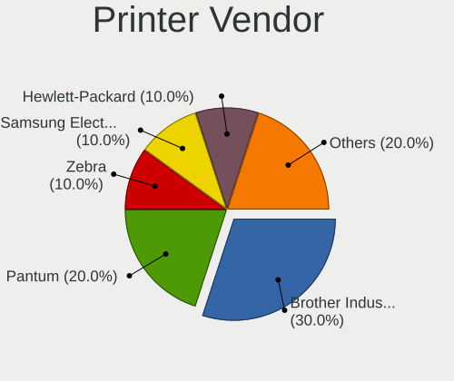

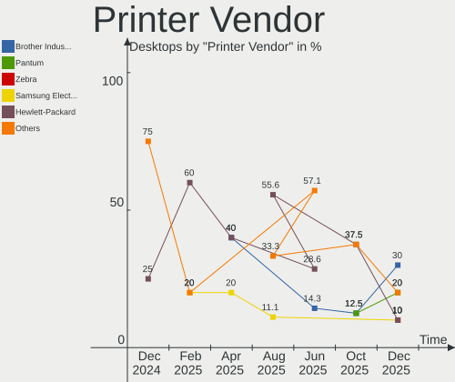

| Vendor              | Desktops | Percent |
|---------------------|----------|---------|
| Brother Industries  | 3        | 30%     |
| Pantum              | 2        | 20%     |
| Zebra               | 1        | 10%     |
| Samsung Electronics | 1        | 10%     |
| Hewlett-Packard     | 1        | 10%     |
| Dymo-CoStar         | 1        | 10%     |
| Canon               | 1        | 10%     |

Printer Model
-------------

Printer device models

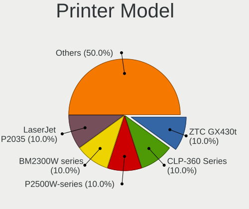

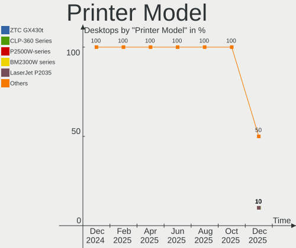

| Model                       | Desktops | Percent |
|-----------------------------|----------|---------|
| Zebra ZTC GX430t            | 1        | 10%     |
| Samsung CLP-360 Series      | 1        | 10%     |
| Pantum P2500W-series        | 1        | 10%     |
| Pantum BM2300W series       | 1        | 10%     |
| HP LaserJet P2035           | 1        | 10%     |
| Dymo-CoStar LabelWriter 450 | 1        | 10%     |
| Canon LiDE 400              | 1        | 10%     |
| Brother MFC-L2713DW         | 1        | 10%     |
| Brother MFC-J4335DW         | 1        | 10%     |
| Brother HL-1200 series      | 1        | 10%     |

Scanner Vendor
--------------

Scanner device vendors

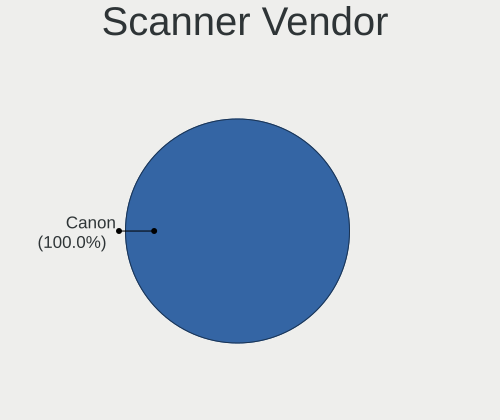

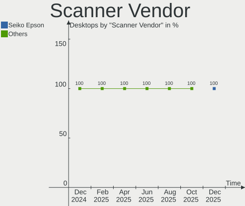

| Vendor      | Desktops | Percent |
|-------------|----------|---------|
| Seiko Epson | 1        | 100%    |

Scanner Model
-------------

Scanner device models

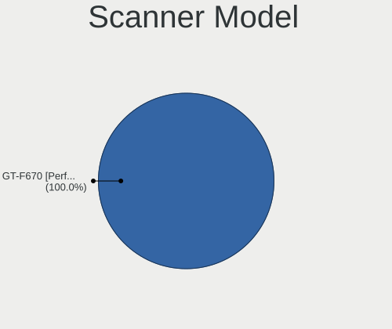

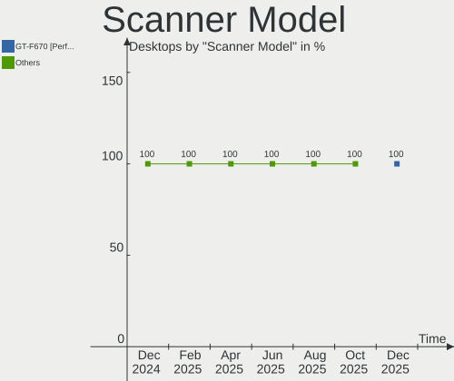

| Model                                       | Desktops | Percent |
|---------------------------------------------|----------|---------|
| Seiko Epson GT-F670 [Perfection V200 Photo] | 1        | 100%    |

Camera
------

Camera Vendor
-------------

Camera device vendors

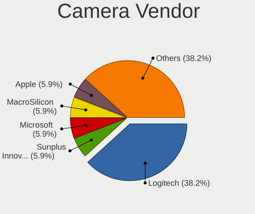

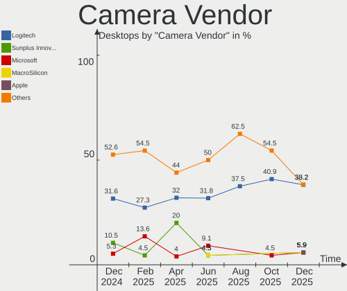

| Vendor                        | Desktops | Percent |
|-------------------------------|----------|---------|
| Logitech                      | 13       | 38.24%  |
| Sunplus Innovation Technology | 2        | 5.88%   |
| Microsoft                     | 2        | 5.88%   |
| MacroSilicon                  | 2        | 5.88%   |
| Apple                         | 2        | 5.88%   |
| webcamvendor                  | 1        | 2.94%   |
| Trust                         | 1        | 2.94%   |
| SHENZHEN EMEET TECHNOLOGY     | 1        | 2.94%   |
| Novatek Microelectronics      | 1        | 2.94%   |
| Microdia                      | 1        | 2.94%   |
| KYE Systems (Mouse Systems)   | 1        | 2.94%   |
| Jieli Technology              | 1        | 2.94%   |
| Guillemot                     | 1        | 2.94%   |
| Generalplus Technology        | 1        | 2.94%   |
| CVT Electronics.Co.           | 1        | 2.94%   |
| ARC International             | 1        | 2.94%   |
| Anker PowerConf C200          | 1        | 2.94%   |
| Unknown                       | 1        | 2.94%   |

Camera Model
------------

Camera device models

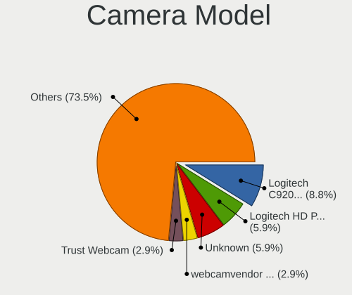

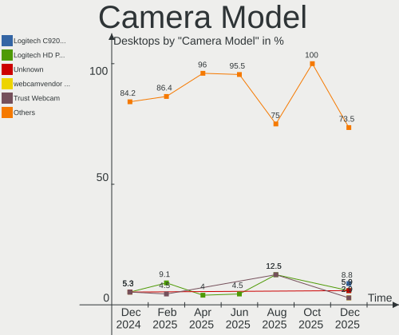

| Model                                                 | Desktops | Percent |
|-------------------------------------------------------|----------|---------|
| Logitech C920 PRO HD Webcam                           | 3        | 8.82%   |
| Logitech HD Pro Webcam C920                           | 2        | 5.88%   |
| Unknown                                               | 2        | 5.88%   |
| webcamvendor NexiGo N60 FHD Webcam                    | 1        | 2.94%   |
| Trust Webcam                                          | 1        | 2.94%   |
| Sunplus HK 5M WebCAM                                  | 1        | 2.94%   |
| Sunplus Full HD webcam                                | 1        | 2.94%   |
| SHENZHEN EMEET TECHNOLOGY HD Webcam eMeet C960        | 1        | 2.94%   |
| Novatek HP High Definition 2MP Webcam                 | 1        | 2.94%   |
| Microsoft LifeCam VX-800                              | 1        | 2.94%   |
| Microsoft LifeCam HD-3000                             | 1        | 2.94%   |
| Microdia Webcam Vitade AF                             | 1        | 2.94%   |
| MacroSilicon MS210x Video Grabber [EasierCAP]         | 1        | 2.94%   |
| Logitech Webcam C930e                                 | 1        | 2.94%   |
| Logitech Webcam C270                                  | 1        | 2.94%   |
| Logitech Webcam C170                                  | 1        | 2.94%   |
| Logitech Webcam B500                                  | 1        | 2.94%   |
| Logitech C930c                                        | 1        | 2.94%   |
| Logitech C922 Pro Stream Webcam                       | 1        | 2.94%   |
| Logitech BRIO Ultra HD Webcam                         | 1        | 2.94%   |
| Logitech BRIO 4K Stream Edition                       | 1        | 2.94%   |
| KYE Systems (Mouse Systems) USB 2.0 HD1080P PC Camera | 1        | 2.94%   |
| Jieli USB PHY 2.0                                     | 1        | 2.94%   |
| Guillemot Hercules Dualpix Exchange                   | 1        | 2.94%   |
| Generalplus GENERAL WEBCAM                            | 1        | 2.94%   |
| CVT Electronics.Co. USB Camera                        | 1        | 2.94%   |
| ARC International Camera                              | 1        | 2.94%   |
| Apple iSight in LED Cinema Display                    | 1        | 2.94%   |
| Apple iPhone 5/5C/5S/6/SE/7/8/X                       | 1        | 2.94%   |
| Anker PowerConf C200 Anker PowerConf C200             | 1        | 2.94%   |

Security
--------

Fingerprint Vendor
------------------

Fingerprint sensor vendors

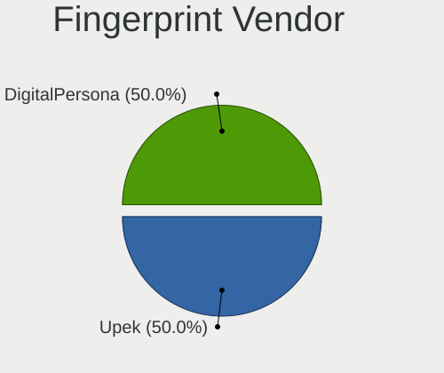

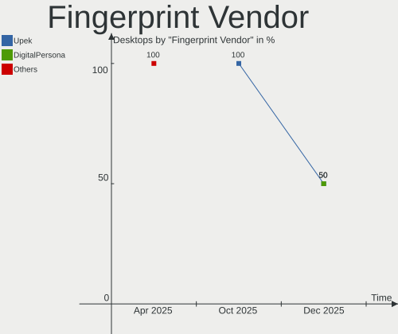

| Vendor         | Desktops | Percent |
|----------------|----------|---------|
| Upek           | 1        | 50%     |
| DigitalPersona | 1        | 50%     |

Fingerprint Model
-----------------

Fingerprint sensor models

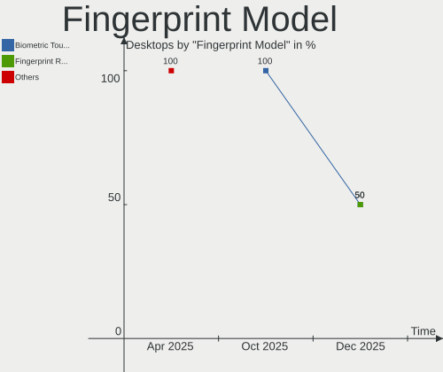

| Model                                                  | Desktops | Percent |
|--------------------------------------------------------|----------|---------|
| Upek Biometric Touchchip/Touchstrip Fingerprint Sensor | 1        | 50%     |
| DigitalPersona Fingerprint Reader                      | 1        | 50%     |

Chipcard Vendor
---------------

Chipcard module vendors

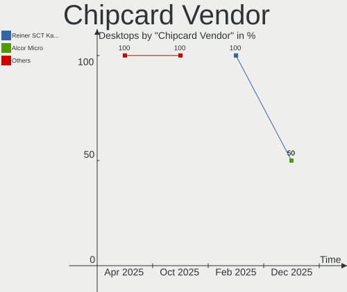

| Vendor                   | Desktops | Percent |
|--------------------------|----------|---------|
| Reiner SCT Kartensysteme | 1        | 50%     |
| Alcor Micro              | 1        | 50%     |

Chipcard Model
--------------

Chipcard module models

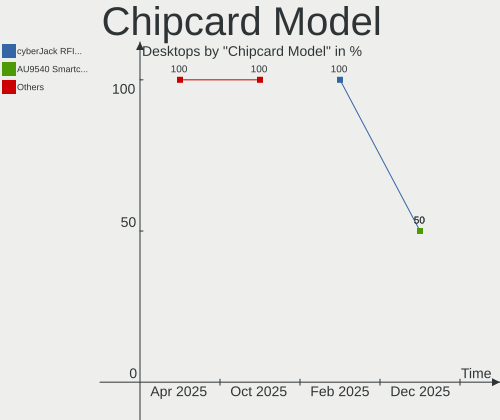

| Model                                                                      | Desktops | Percent |
|----------------------------------------------------------------------------|----------|---------|
| Reiner SCT Kartensysteme cyberJack RFID basis contactless smartcard reader | 1        | 50%     |
| Alcor Micro AU9540 Smartcard Reader                                        | 1        | 50%     |

Unsupported
-----------

Unsupported Devices
-------------------

Total unsupported devices on board

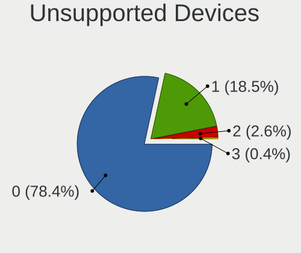

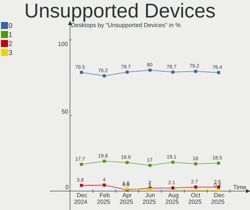

| Total | Desktops | Percent |
|-------|----------|---------|
| 0     | 178      | 78.41%  |
| 1     | 42       | 18.5%   |
| 2     | 6        | 2.64%   |
| 3     | 1        | 0.44%   |

Unsupported Device Types
------------------------

Types of unsupported devices

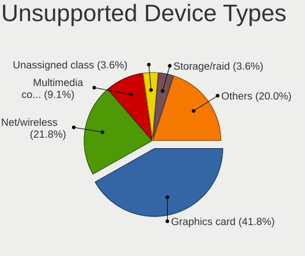

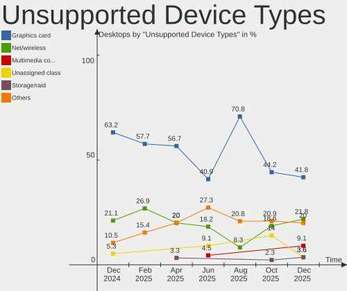

| Type                     | Desktops | Percent |
|--------------------------|----------|---------|
| Graphics card            | 23       | 41.82%  |
| Net/wireless             | 12       | 21.82%  |
| Multimedia controller    | 5        | 9.09%   |
| Unassigned class         | 2        | 3.64%   |
| Storage/raid             | 2        | 3.64%   |
| Sound                    | 2        | 3.64%   |
| Network                  | 2        | 3.64%   |
| Fingerprint reader       | 2        | 3.64%   |
| Chipcard                 | 2        | 3.64%   |
| Storage/ide              | 1        | 1.82%   |
| Communication controller | 1        | 1.82%   |
| Bluetooth                | 1        | 1.82%   |

