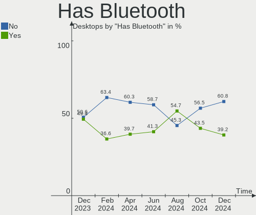
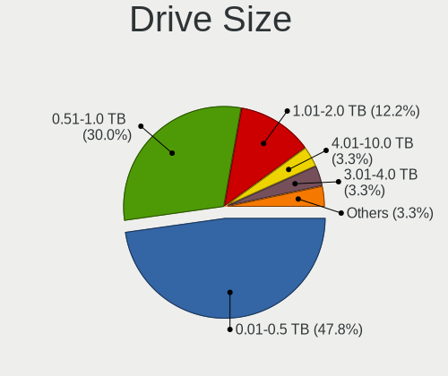
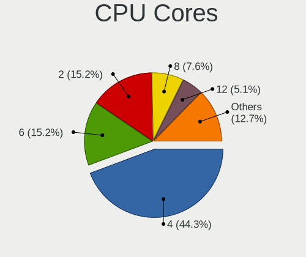
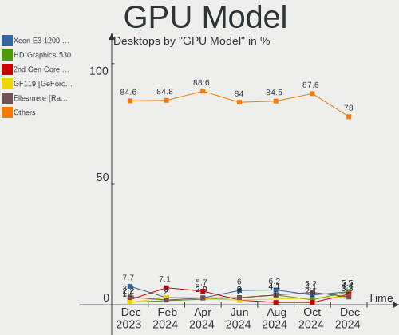
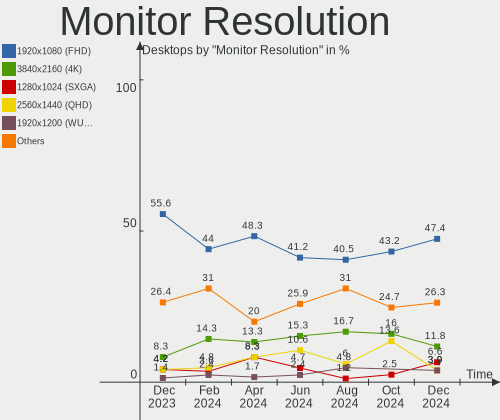
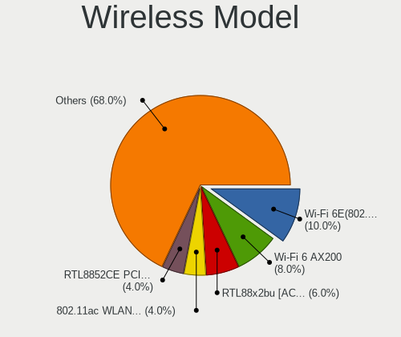
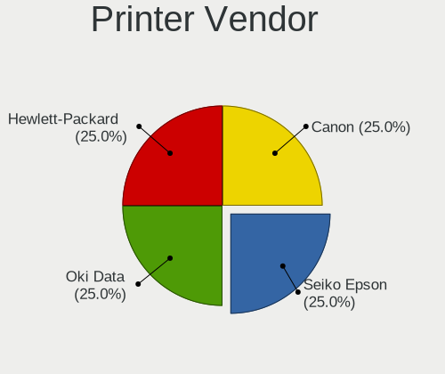

Zorin - Hardware Trends (Desktops)
----------------------------------

A project to identify most popular hardware characteristics and track their change
over time based on data collected by Linux users at https://Linux-Hardware.org.

Anyone can contribute to this report by the [hw-probe](https://github.com/linuxhw/hw-probe) tool:

    sudo -E hw-probe -all -upload

This report is for one last month. Overall report since the beginning of time: [TestDays](https://github.com/linuxhw/TestDays)

Period: Oct, 2023.

Contents
--------

* [ System ](#system)
  - [ OS                       ](#os)
  - [ OS Family                ](#os-family)
  - [ Kernel                   ](#kernel)
  - [ Kernel Family            ](#kernel-family)
  - [ Kernel Major Ver.        ](#kernel-major-ver)
  - [ Arch                     ](#arch)
  - [ DE                       ](#de)
  - [ Display Server           ](#display-server)
  - [ Display Manager          ](#display-manager)
  - [ OS Lang                  ](#os-lang)
  - [ Boot Mode                ](#boot-mode)
  - [ Filesystem               ](#filesystem)
  - [ Part. scheme             ](#part-scheme)
  - [ Dual Boot with Linux/BSD ](#dual-boot-with-linuxbsd)
  - [ Dual Boot (Win)          ](#dual-boot-win)

* [ Board ](#board)
  - [ Vendor                   ](#vendor)
  - [ Model                    ](#model)
  - [ Model Family             ](#model-family)
  - [ MFG Year                 ](#mfg-year)
  - [ Form Factor              ](#form-factor)
  - [ Secure Boot              ](#secure-boot)
  - [ Coreboot                 ](#coreboot)
  - [ RAM Size                 ](#ram-size)
  - [ RAM Used                 ](#ram-used)
  - [ Total Drives             ](#total-drives)
  - [ Has CD-ROM               ](#has-cd-rom)
  - [ Has Ethernet             ](#has-ethernet)
  - [ Has WiFi                 ](#has-wifi)
  - [ Has Bluetooth            ](#has-bluetooth)

* [ Location ](#location)
  - [ Country                  ](#country)
  - [ City                     ](#city)

* [ Drives ](#drives)
  - [ Drive Vendor             ](#drive-vendor)
  - [ Drive Model              ](#drive-model)
  - [ HDD Vendor               ](#hdd-vendor)
  - [ SSD Vendor               ](#ssd-vendor)
  - [ Drive Kind               ](#drive-kind)
  - [ Drive Connector          ](#drive-connector)
  - [ Drive Size               ](#drive-size)
  - [ Space Total              ](#space-total)
  - [ Space Used               ](#space-used)
  - [ Malfunc. Drives          ](#malfunc-drives)
  - [ Malfunc. Drive Vendor    ](#malfunc-drive-vendor)
  - [ Malfunc. HDD Vendor      ](#malfunc-hdd-vendor)
  - [ Malfunc. Drive Kind      ](#malfunc-drive-kind)
  - [ Failed Drives            ](#failed-drives)
  - [ Failed Drive Vendor      ](#failed-drive-vendor)
  - [ Drive Status             ](#drive-status)

* [ Storage controller ](#storage-controller)
  - [ Storage Vendor           ](#storage-vendor)
  - [ Storage Model            ](#storage-model)
  - [ Storage Kind             ](#storage-kind)

* [ Processor ](#processor)
  - [ CPU Vendor               ](#cpu-vendor)
  - [ CPU Model                ](#cpu-model)
  - [ CPU Model Family         ](#cpu-model-family)
  - [ CPU Cores                ](#cpu-cores)
  - [ CPU Sockets              ](#cpu-sockets)
  - [ CPU Threads              ](#cpu-threads)
  - [ CPU Op-Modes             ](#cpu-op-modes)
  - [ CPU Microcode            ](#cpu-microcode)
  - [ CPU Microarch            ](#cpu-microarch)

* [ Graphics ](#graphics)
  - [ GPU Vendor               ](#gpu-vendor)
  - [ GPU Model                ](#gpu-model)
  - [ GPU Combo                ](#gpu-combo)
  - [ GPU Driver               ](#gpu-driver)
  - [ GPU Memory               ](#gpu-memory)

* [ Monitor ](#monitor)
  - [ Monitor Vendor           ](#monitor-vendor)
  - [ Monitor Model            ](#monitor-model)
  - [ Monitor Resolution       ](#monitor-resolution)
  - [ Monitor Diagonal         ](#monitor-diagonal)
  - [ Monitor Width            ](#monitor-width)
  - [ Aspect Ratio             ](#aspect-ratio)
  - [ Monitor Area             ](#monitor-area)
  - [ Pixel Density            ](#pixel-density)
  - [ Multiple Monitors        ](#multiple-monitors)

* [ Network ](#network)
  - [ Net Controller Vendor    ](#net-controller-vendor)
  - [ Net Controller Model     ](#net-controller-model)
  - [ Wireless Vendor          ](#wireless-vendor)
  - [ Wireless Model           ](#wireless-model)
  - [ Ethernet Vendor          ](#ethernet-vendor)
  - [ Ethernet Model           ](#ethernet-model)
  - [ Net Controller Kind      ](#net-controller-kind)
  - [ Used Controller          ](#used-controller)
  - [ NICs                     ](#nics)
  - [ IPv6                     ](#ipv6)

* [ Bluetooth ](#bluetooth)
  - [ Bluetooth Vendor         ](#bluetooth-vendor)
  - [ Bluetooth Model          ](#bluetooth-model)

* [ Sound ](#sound)
  - [ Sound Vendor             ](#sound-vendor)
  - [ Sound Model              ](#sound-model)

* [ Memory ](#memory)
  - [ Memory Vendor            ](#memory-vendor)
  - [ Memory Model             ](#memory-model)
  - [ Memory Kind              ](#memory-kind)
  - [ Memory Form Factor       ](#memory-form-factor)
  - [ Memory Size              ](#memory-size)
  - [ Memory Speed             ](#memory-speed)

* [ Printers & scanners ](#printers--scanners)
  - [ Printer Vendor           ](#printer-vendor)
  - [ Printer Model            ](#printer-model)
  - [ Scanner Vendor           ](#scanner-vendor)
  - [ Scanner Model            ](#scanner-model)

* [ Camera ](#camera)
  - [ Camera Vendor            ](#camera-vendor)
  - [ Camera Model             ](#camera-model)

* [ Security ](#security)
  - [ Fingerprint Vendor       ](#fingerprint-vendor)
  - [ Fingerprint Model        ](#fingerprint-model)
  - [ Chipcard Vendor          ](#chipcard-vendor)
  - [ Chipcard Model           ](#chipcard-model)

* [ Unsupported ](#unsupported)
  - [ Unsupported Devices      ](#unsupported-devices)
  - [ Unsupported Device Types ](#unsupported-device-types)

System
------

OS
--

Installed operating systems

| Name     | Desktops | Percent |
|----------|----------|---------|
| Zorin 16 | 60       | 96.77%  |
| Zorin 15 | 2        | 3.23%   |

OS Family
---------

OS without a version

| Name  | Desktops | Percent |
|-------|----------|---------|
| Zorin | 62       | 100%    |

Kernel
------

Version of the Linux kernel

| Version               | Desktops | Percent |
|-----------------------|----------|---------|
| 5.15.0-87-generic     | 17       | 27.42%  |
| 5.15.0-84-generic     | 17       | 27.42%  |
| 5.15.0-86-generic     | 15       | 24.19%  |
| 5.4.0-150-generic     | 2        | 3.23%   |
| 5.15.0-88-generic     | 2        | 3.23%   |
| 5.15.0-78-generic     | 2        | 3.23%   |
| 6.5.7-060507-generic  | 1        | 1.61%   |
| 6.2.16-060216-generic | 1        | 1.61%   |
| 5.15.0-83-generic     | 1        | 1.61%   |
| 5.15.0-82-generic     | 1        | 1.61%   |
| 5.15.0-76-generic     | 1        | 1.61%   |
| 5.15.0-71-generic     | 1        | 1.61%   |
| 5.15.0-67-generic     | 1        | 1.61%   |

Kernel Family
-------------

Linux kernel without a distro release

| Version | Desktops | Percent |
|---------|----------|---------|
| 5.15.0  | 58       | 93.55%  |
| 5.4.0   | 2        | 3.23%   |
| 6.5.7   | 1        | 1.61%   |
| 6.2.16  | 1        | 1.61%   |

Kernel Major Ver.
-----------------

Linux kernel major version

| Version | Desktops | Percent |
|---------|----------|---------|
| 5.15    | 58       | 93.55%  |
| 5.4     | 2        | 3.23%   |
| 6.5     | 1        | 1.61%   |
| 6.2     | 1        | 1.61%   |

Arch
----

OS architecture (x86_64, i586, etc.)

| Name   | Desktops | Percent |
|--------|----------|---------|
| x86_64 | 61       | 98.39%  |
| i686   | 1        | 1.61%   |

DE
--

Desktop Environment

| Name    | Desktops | Percent |
|---------|----------|---------|
| GNOME   | 53       | 85.48%  |
| XFCE    | 7        | 11.29%  |
| MATE    | 1        | 1.61%   |
| Unknown | 1        | 1.61%   |

Display Server
--------------

X11 or Wayland

| Name | Desktops | Percent |
|------|----------|---------|
| X11  | 62       | 100%    |

Display Manager
---------------

SDDM, LightDM, etc.

| Name    | Desktops | Percent |
|---------|----------|---------|
| Unknown | 51       | 82.26%  |
| GDM     | 5        | 8.06%   |
| LightDM | 3        | 4.84%   |
| GDM3    | 3        | 4.84%   |

OS Lang
-------

Language

| Lang  | Desktops | Percent |
|-------|----------|---------|
| en_US | 20       | 32.26%  |
| en_CA | 8        | 12.9%   |
| fr_FR | 6        | 9.68%   |
| de_DE | 6        | 9.68%   |
| it_IT | 4        | 6.45%   |
| fi_FI | 2        | 3.23%   |
| es_ES | 2        | 3.23%   |
| en_IN | 2        | 3.23%   |
| en_GB | 2        | 3.23%   |
| pt_BR | 1        | 1.61%   |
| pl_PL | 1        | 1.61%   |
| nl_NL | 1        | 1.61%   |
| nl_BE | 1        | 1.61%   |
| es_PY | 1        | 1.61%   |
| es_CL | 1        | 1.61%   |
| es_AR | 1        | 1.61%   |
| en_ZA | 1        | 1.61%   |
| cs_CZ | 1        | 1.61%   |
| ca_ES | 1        | 1.61%   |

Boot Mode
---------

EFI or BIOS

| Mode | Desktops | Percent |
|------|----------|---------|
| EFI  | 32       | 51.61%  |
| BIOS | 30       | 48.39%  |

Filesystem
----------

Type of filesystem

| Type  | Desktops | Percent |
|-------|----------|---------|
| Ext4  | 57       | 91.94%  |
| Tmpfs | 5        | 8.06%   |

Part. scheme
------------

Scheme of partitioning

| Type    | Desktops | Percent |
|---------|----------|---------|
| Unknown | 51       | 82.26%  |
| GPT     | 9        | 14.52%  |
| MBR     | 2        | 3.23%   |

Dual Boot with Linux/BSD
------------------------

Hosting more than one Linux/BSD

| Dual boot | Desktops | Percent |
|-----------|----------|---------|
| No        | 59       | 95.16%  |
| Yes       | 3        | 4.84%   |

Dual Boot (Win)
---------------

Hosting Linux and Windows

| Dual boot | Desktops | Percent |
|-----------|----------|---------|
| No        | 57       | 91.94%  |
| Yes       | 5        | 8.06%   |

Board
-----

Vendor
------

Motherboard manufacturer

| Name                | Desktops | Percent |
|---------------------|----------|---------|
| ASUSTek Computer    | 14       | 22.58%  |
| MSI                 | 10       | 16.13%  |
| Gigabyte Technology | 6        | 9.68%   |
| Dell                | 6        | 9.68%   |
| Lenovo              | 5        | 8.06%   |
| Hewlett-Packard     | 4        | 6.45%   |
| Intel               | 3        | 4.84%   |
| ASRock              | 3        | 4.84%   |
| Pegatron            | 2        | 3.23%   |
| Unknown             | 2        | 3.23%   |
| Toshiba             | 1        | 1.61%   |
| Shuttle             | 1        | 1.61%   |
| LORD ELECTRONICS    | 1        | 1.61%   |
| Fujitsu Siemens     | 1        | 1.61%   |
| EPSON DIRECT        | 1        | 1.61%   |
| AMI                 | 1        | 1.61%   |
| Acer                | 1        | 1.61%   |

Model
-----

Motherboard model

| Name                                                              | Desktops | Percent |
|-------------------------------------------------------------------|----------|---------|
| Unknown                                                           | 2        | 3.23%   |
| Toshiba 4900C45                                                   | 1        | 1.61%   |
| Shuttle DH110                                                     | 1        | 1.61%   |
| Pegatron WH661AA-ABE p6300es                                      | 1        | 1.61%   |
| Pegatron WE277AA-ABF p6352fr                                      | 1        | 1.61%   |
| MSI MS-7D08                                                       | 1        | 1.61%   |
| MSI MS-7B93                                                       | 1        | 1.61%   |
| MSI MS-7B84                                                       | 1        | 1.61%   |
| MSI MS-7B79                                                       | 1        | 1.61%   |
| MSI MS-7B54                                                       | 1        | 1.61%   |
| MSI MS-7921                                                       | 1        | 1.61%   |
| MSI MS-7817                                                       | 1        | 1.61%   |
| MSI MS-7808                                                       | 1        | 1.61%   |
| MSI MS-7592                                                       | 1        | 1.61%   |
| MSI KJ384AA-A2L SR5410F                                           | 1        | 1.61%   |
| LORD ELECTRONICS Guso G4x + ICH7 Series MotherBoard G41I6510V0.1A | 1        | 1.61%   |
| Lenovo ThinkCentre M93p 10AB000KUS                                | 1        | 1.61%   |
| Lenovo ThinkCentre M92 3229A11                                    | 1        | 1.61%   |
| Lenovo ThinkCentre M83 10AHS2TG00                                 | 1        | 1.61%   |
| Lenovo IdeaCentre Q180 10087&3110                                 | 1        | 1.61%   |
| Lenovo IdeaCentre 510A-15ICB 90HV001FCF                           | 1        | 1.61%   |
| Intel X99                                                         | 1        | 1.61%   |
| Intel X79M-S                                                      | 1        | 1.61%   |
| Intel H61                                                         | 1        | 1.61%   |
| HP ProDesk 490 G2 MT                                              | 1        | 1.61%   |
| HP EliteDesk 800 G1 TWR                                           | 1        | 1.61%   |
| HP EliteDesk 800 G1 SFF                                           | 1        | 1.61%   |
| HP EliteDesk 705 G1 MT                                            | 1        | 1.61%   |
| Gigabyte Z270-HD3                                                 | 1        | 1.61%   |
| Gigabyte H61M-DS2                                                 | 1        | 1.61%   |
| Gigabyte H55M-USB3                                                | 1        | 1.61%   |
| Gigabyte H510M H                                                  | 1        | 1.61%   |
| Gigabyte B85M-D3V Plus                                            | 1        | 1.61%   |
| Gigabyte B450 AORUS M                                             | 1        | 1.61%   |
| Fujitsu Siemens ESPRIMO E5730                                     | 1        | 1.61%   |
| EPSON DIRECT Endeavor AT992E                                      | 1        | 1.61%   |
| Dell Precision WorkStation T7400                                  | 1        | 1.61%   |
| Dell Precision T3600                                              | 1        | 1.61%   |
| Dell Precision 3650 Tower                                         | 1        | 1.61%   |
| Dell OptiPlex 9020                                                | 1        | 1.61%   |

Model Family
------------

Motherboard model prefix

| Name                    | Desktops | Percent |
|-------------------------|----------|---------|
| ASUS TUF                | 4        | 6.45%   |
| Lenovo ThinkCentre      | 3        | 4.84%   |
| HP EliteDesk            | 3        | 4.84%   |
| Dell Precision          | 3        | 4.84%   |
| Dell OptiPlex           | 3        | 4.84%   |
| Lenovo IdeaCentre       | 2        | 3.23%   |
| ASUS ROG                | 2        | 3.23%   |
| ASUS PRIME              | 2        | 3.23%   |
| Unknown                 | 2        | 3.23%   |
| Toshiba 4900C45         | 1        | 1.61%   |
| Shuttle DH110           | 1        | 1.61%   |
| Pegatron WH661AA-ABE    | 1        | 1.61%   |
| Pegatron WE277AA-ABF    | 1        | 1.61%   |
| MSI MS-7D08             | 1        | 1.61%   |
| MSI MS-7B93             | 1        | 1.61%   |
| MSI MS-7B84             | 1        | 1.61%   |
| MSI MS-7B79             | 1        | 1.61%   |
| MSI MS-7B54             | 1        | 1.61%   |
| MSI MS-7921             | 1        | 1.61%   |
| MSI MS-7817             | 1        | 1.61%   |
| MSI MS-7808             | 1        | 1.61%   |
| MSI MS-7592             | 1        | 1.61%   |
| MSI KJ384AA-A2L         | 1        | 1.61%   |
| LORD ELECTRONICS Guso   | 1        | 1.61%   |
| Intel X99               | 1        | 1.61%   |
| Intel X79M-S            | 1        | 1.61%   |
| Intel H61               | 1        | 1.61%   |
| HP ProDesk              | 1        | 1.61%   |
| Gigabyte Z270-HD3       | 1        | 1.61%   |
| Gigabyte H61M-DS2       | 1        | 1.61%   |
| Gigabyte H55M-USB3      | 1        | 1.61%   |
| Gigabyte H510M          | 1        | 1.61%   |
| Gigabyte B85M-D3V       | 1        | 1.61%   |
| Gigabyte B450           | 1        | 1.61%   |
| Fujitsu Siemens ESPRIMO | 1        | 1.61%   |
| EPSON DIRECT Endeavor   | 1        | 1.61%   |
| ASUS SABERTOOTH         | 1        | 1.61%   |
| ASUS P8Z77-V            | 1        | 1.61%   |
| ASUS P8B75-M            | 1        | 1.61%   |
| ASUS P7H55-M            | 1        | 1.61%   |

MFG Year
--------

Motherboard manufacture year

| Year | Desktops | Percent |
|------|----------|---------|
| 2019 | 7        | 11.29%  |
| 2013 | 7        | 11.29%  |
| 2021 | 6        | 9.68%   |
| 2018 | 6        | 9.68%   |
| 2017 | 5        | 8.06%   |
| 2014 | 5        | 8.06%   |
| 2009 | 5        | 8.06%   |
| 2012 | 4        | 6.45%   |
| 2011 | 4        | 6.45%   |
| 2023 | 3        | 4.84%   |
| 2015 | 3        | 4.84%   |
| 2022 | 2        | 3.23%   |
| 2020 | 2        | 3.23%   |
| 2010 | 2        | 3.23%   |
| 2008 | 1        | 1.61%   |

Form Factor
-----------

Physical design of the computer

| Name    | Desktops | Percent |
|---------|----------|---------|
| Desktop | 62       | 100%    |

Secure Boot
-----------

Enabled or disabled

| State    | Desktops | Percent |
|----------|----------|---------|
| Disabled | 60       | 96.77%  |
| Enabled  | 2        | 3.23%   |

Coreboot
--------

Have coreboot on board

| Used | Desktops | Percent |
|------|----------|---------|
| No   | 62       | 100%    |

RAM Size
--------

Total RAM memory

| Size in GB  | Desktops | Percent |
|-------------|----------|---------|
| 16.01-24.0  | 13       | 20.97%  |
| 8.01-16.0   | 13       | 20.97%  |
| 4.01-8.0    | 11       | 17.74%  |
| 32.01-64.0  | 11       | 17.74%  |
| 3.01-4.0    | 7        | 11.29%  |
| 64.01-256.0 | 4        | 6.45%   |
| 24.01-32.0  | 3        | 4.84%   |

RAM Used
--------

Used RAM memory

| Used GB   | Desktops | Percent |
|-----------|----------|---------|
| 1.01-2.0  | 23       | 37.1%   |
| 2.01-3.0  | 14       | 22.58%  |
| 4.01-8.0  | 12       | 19.35%  |
| 3.01-4.0  | 9        | 14.52%  |
| 8.01-16.0 | 3        | 4.84%   |
| 0.51-1.0  | 1        | 1.61%   |

Total Drives
------------

Number of drives on board

| Drives | Desktops | Percent |
|--------|----------|---------|
| 2      | 26       | 41.94%  |
| 1      | 26       | 41.94%  |
| 5      | 5        | 8.06%   |
| 3      | 3        | 4.84%   |
| 9      | 1        | 1.61%   |
| 6      | 1        | 1.61%   |

Has CD-ROM
----------

Has CD-ROM on board

| Presented | Desktops | Percent |
|-----------|----------|---------|
| Yes       | 37       | 59.68%  |
| No        | 25       | 40.32%  |

Has Ethernet
------------

Has Ethernet on board

| Presented | Desktops | Percent |
|-----------|----------|---------|
| Yes       | 61       | 98.39%  |
| No        | 1        | 1.61%   |

Has WiFi
--------

Has WiFi module

| Presented | Desktops | Percent |
|-----------|----------|---------|
| Yes       | 31       | 50%     |
| No        | 31       | 50%     |

Has Bluetooth
-------------

Has Bluetooth module

| Presented | Desktops | Percent |
|-----------|----------|---------|
| No        | 35       | 56.45%  |
| Yes       | 27       | 43.55%  |

Location
--------

Country
-------

Geographic location (country)

| Country      | Desktops | Percent |
|--------------|----------|---------|
| USA          | 13       | 20.97%  |
| Canada       | 8        | 12.9%   |
| Germany      | 6        | 9.68%   |
| France       | 6        | 9.68%   |
| Italy        | 4        | 6.45%   |
| Spain        | 3        | 4.84%   |
| UK           | 2        | 3.23%   |
| Poland       | 2        | 3.23%   |
| Netherlands  | 2        | 3.23%   |
| India        | 2        | 3.23%   |
| Finland      | 2        | 3.23%   |
| Czechia      | 2        | 3.23%   |
| South Africa | 1        | 1.61%   |
| Paraguay     | 1        | 1.61%   |
| Myanmar      | 1        | 1.61%   |
| Mexico       | 1        | 1.61%   |
| Jamaica      | 1        | 1.61%   |
| Chile        | 1        | 1.61%   |
| Bulgaria     | 1        | 1.61%   |
| Brazil       | 1        | 1.61%   |
| Belgium      | 1        | 1.61%   |
| Argentina    | 1        | 1.61%   |

City
----

Geographic location (city)

| City                      | Desktops | Percent |
|---------------------------|----------|---------|
| Toronto                   | 2        | 3.23%   |
| Zwickau                   | 1        | 1.61%   |
| Zogno                     | 1        | 1.61%   |
| Wolfville                 | 1        | 1.61%   |
| Wijnegem                  | 1        | 1.61%   |
| West Bend                 | 1        | 1.61%   |
| Vernon                    | 1        | 1.61%   |
| Turin                     | 1        | 1.61%   |
| The Hague                 | 1        | 1.61%   |
| Tampere                   | 1        | 1.61%   |
| Spanish Town              | 1        | 1.61%   |
| Sofia                     | 1        | 1.61%   |
| Siegen                    | 1        | 1.61%   |
| Sheffield                 | 1        | 1.61%   |
| Sarnia                    | 1        | 1.61%   |
| Santiago                  | 1        | 1.61%   |
| Runcorn                   | 1        | 1.61%   |
| Rio de Janeiro            | 1        | 1.61%   |
| Ratingen                  | 1        | 1.61%   |
| Puławy                   | 1        | 1.61%   |
| Puente La Reina – Gares | 1        | 1.61%   |
| Prenzlau                  | 1        | 1.61%   |
| Pognano                   | 1        | 1.61%   |
| Pilsen                    | 1        | 1.61%   |
| Pila                      | 1        | 1.61%   |
| Pescia                    | 1        | 1.61%   |
| Ottawa                    | 1        | 1.61%   |
| Oleiros                   | 1        | 1.61%   |
| Niagara Falls             | 1        | 1.61%   |
| New York                  | 1        | 1.61%   |
| Myeik                     | 1        | 1.61%   |
| Mladá Boleslav           | 1        | 1.61%   |
| Minneapolis               | 1        | 1.61%   |
| Mineral Wells             | 1        | 1.61%   |
| Lyon                      | 1        | 1.61%   |
| Lynwood                   | 1        | 1.61%   |
| Lafayette                 | 1        | 1.61%   |
| Kingfisher                | 1        | 1.61%   |
| Ituzaingo                 | 1        | 1.61%   |
| Hyderabad                 | 1        | 1.61%   |

Drives
------

Drive Vendor
------------

Hard drive vendors

| Vendor                    | Desktops | Drives | Percent |
|---------------------------|----------|--------|---------|
| WDC                       | 21       | 24     | 19.63%  |
| Seagate                   | 13       | 22     | 12.15%  |
| Samsung Electronics       | 12       | 13     | 11.21%  |
| Kingston                  | 9        | 13     | 8.41%   |
| Toshiba                   | 6        | 6      | 5.61%   |
| Sandisk                   | 6        | 6      | 5.61%   |
| Hitachi                   | 5        | 6      | 4.67%   |
| China                     | 5        | 6      | 4.67%   |
| Crucial                   | 3        | 3      | 2.8%    |
| GOODRAM                   | 2        | 2      | 1.87%   |
| WD MediaMax               | 1        | 1      | 0.93%   |
| Verbatim                  | 1        | 1      | 0.93%   |
| USB3.0                    | 1        | 1      | 0.93%   |
| Unknown (CF)              | 1        | 1      | 0.93%   |
| TXRUI                     | 1        | 2      | 0.93%   |
| Transcend                 | 1        | 1      | 0.93%   |
| SPCC                      | 1        | 1      | 0.93%   |
| SK hynix                  | 1        | 1      | 0.93%   |
| Seagate Technology        | 1        | 1      | 0.93%   |
| SABRENT                   | 1        | 1      | 0.93%   |
| Realtek Semiconductor     | 1        | 1      | 0.93%   |
| PNY                       | 1        | 1      | 0.93%   |
| ORTIAL                    | 1        | 1      | 0.93%   |
| Micron/Crucial Technology | 1        | 1      | 0.93%   |
| Micron Technology         | 1        | 1      | 0.93%   |
| Maxtor                    | 1        | 1      | 0.93%   |
| KingSpec                  | 1        | 2      | 0.93%   |
| KingDian                  | 1        | 1      | 0.93%   |
| KEEPDATA                  | 1        | 1      | 0.93%   |
| Intenso                   | 1        | 1      | 0.93%   |
| Intel                     | 1        | 1      | 0.93%   |
| HGST                      | 1        | 1      | 0.93%   |
| Emtec                     | 1        | 1      | 0.93%   |
| ADATA Technology          | 1        | 2      | 0.93%   |
| Unknown                   | 1        | 1      | 0.93%   |

Drive Model
-----------

Hard drive models

| Model                                             | Desktops | Percent |
|---------------------------------------------------|----------|---------|
| Kingston SA400S37240G 240GB SSD                   | 5        | 4.03%   |
| Samsung NVMe SSD Controller SM981/PM981/PM983 1TB | 4        | 3.23%   |
| Seagate ST1000DM010-2EP102 1TB                    | 3        | 2.42%   |
| WDC WDS500G2B0A-00SM50 500GB SSD                  | 2        | 1.61%   |
| Seagate ST31000528AS 1TB                          | 2        | 1.61%   |
| Kingston SV300S37A120G 120GB SSD                  | 2        | 1.61%   |
| China SSD 128GB                                   | 2        | 1.61%   |
| WDC WDS100T2G0A-00JH30 1TB SSD                    | 1        | 0.81%   |
| WDC WDS100T2B0C-00PXH0 1TB                        | 1        | 0.81%   |
| WDC WD6401AALS-00L3B2 640GB                       | 1        | 0.81%   |
| WDC WD5000AAKX-60U6AA0 500GB                      | 1        | 0.81%   |
| WDC WD5000AADS-56S9B0 499GB                       | 1        | 0.81%   |
| WDC WD5000AADS-00S9B0 500GB                       | 1        | 0.81%   |
| WDC WD40EZAZ-00SF3B0 4TB                          | 1        | 0.81%   |
| WDC WD4005FZBX-00K5WB0 4TB                        | 1        | 0.81%   |
| WDC WD3200BPVT-24JJ5T0 320GB                      | 1        | 0.81%   |
| WDC WD3200BPVT-22JJ5T0 320GB                      | 1        | 0.81%   |
| WDC WD2500AAJS-00B4A0 250GB                       | 1        | 0.81%   |
| WDC WD20EZRZ-00Z5HB0 2TB                          | 1        | 0.81%   |
| WDC WD20EZRX-00D8PB0 2TB                          | 1        | 0.81%   |
| WDC WD2003FYYS-50T8B0 2TB                         | 1        | 0.81%   |
| WDC WD1600BEVS-22RST0 160GB                       | 1        | 0.81%   |
| WDC WD1600AAJS-00L7A0 160GB                       | 1        | 0.81%   |
| WDC WD1200JD-00GBB0 120GB                         | 1        | 0.81%   |
| WDC WD10EZEX-22MFCA0 1TB                          | 1        | 0.81%   |
| WDC WD10EZEX-08WN4A0 1TB                          | 1        | 0.81%   |
| WDC WD10EZEX-00KUWA0 1TB                          | 1        | 0.81%   |
| WDC WD10EFRX-68JCSN0 1TB                          | 1        | 0.81%   |
| WDC WD10EALX-009BA0 1TB                           | 1        | 0.81%   |
| WD MediaMax WL2000GSA6472E 0 2TB                  | 1        | 0.81%   |
| Verbatim Vi550 S3 SSD 256GB                       | 1        | 0.81%   |
| USB3.0 Disk 500GB                                 | 1        | 0.81%   |
| Unknown (CF) Card 32GB                            | 1        | 0.81%   |
| TXRUI X500 120GB                                  | 1        | 0.81%   |
| Transcend TS512GSSD230S 512GB                     | 1        | 0.81%   |
| Toshiba MK5061GSY 500GB                           | 1        | 0.81%   |
| Toshiba MK5059GSXP 500GB                          | 1        | 0.81%   |
| Toshiba MK3255GSX 320GB                           | 1        | 0.81%   |
| Toshiba MK2561GSYN 250GB                          | 1        | 0.81%   |
| Toshiba HDWD240 4TB                               | 1        | 0.81%   |

HDD Vendor
----------

Hard disk drive vendors

| Vendor  | Desktops | Drives | Percent |
|---------|----------|--------|---------|
| WDC     | 18       | 20     | 40%     |
| Seagate | 13       | 22     | 28.89%  |
| Toshiba | 6        | 6      | 13.33%  |
| Hitachi | 5        | 6      | 11.11%  |
| USB3.0  | 1        | 1      | 2.22%   |
| Maxtor  | 1        | 1      | 2.22%   |
| HGST    | 1        | 1      | 2.22%   |

SSD Vendor
----------

Solid state drive vendors

| Vendor              | Desktops | Drives | Percent |
|---------------------|----------|--------|---------|
| Kingston            | 8        | 10     | 18.18%  |
| Samsung Electronics | 7        | 7      | 15.91%  |
| China               | 5        | 6      | 11.36%  |
| WDC                 | 3        | 3      | 6.82%   |
| SanDisk             | 3        | 3      | 6.82%   |
| Crucial             | 3        | 3      | 6.82%   |
| GOODRAM             | 2        | 2      | 4.55%   |
| Verbatim            | 1        | 1      | 2.27%   |
| Unknown (CF)        | 1        | 1      | 2.27%   |
| Transcend           | 1        | 1      | 2.27%   |
| SPCC                | 1        | 1      | 2.27%   |
| SABRENT             | 1        | 1      | 2.27%   |
| PNY                 | 1        | 1      | 2.27%   |
| ORTIAL              | 1        | 1      | 2.27%   |
| KingSpec            | 1        | 2      | 2.27%   |
| KingDian            | 1        | 1      | 2.27%   |
| KEEPDATA            | 1        | 1      | 2.27%   |
| Intenso             | 1        | 1      | 2.27%   |
| Intel               | 1        | 1      | 2.27%   |
| Emtec               | 1        | 1      | 2.27%   |

Drive Kind
----------

HDD or SSD

| Kind    | Desktops | Drives | Percent |
|---------|----------|--------|---------|
| SSD     | 36       | 48     | 40.45%  |
| HDD     | 36       | 57     | 40.45%  |
| NVMe    | 14       | 20     | 15.73%  |
| Unknown | 3        | 4      | 3.37%   |

Drive Connector
---------------

SATA, SAS, NVMe, etc.

| Type | Desktops | Drives | Percent |
|------|----------|--------|---------|
| SATA | 55       | 100    | 73.33%  |
| NVMe | 14       | 20     | 18.67%  |
| SAS  | 6        | 9      | 8%      |

Drive Size
----------

Size of hard drive

| Size in TB | Desktops | Drives | Percent |
|------------|----------|--------|---------|
| 0.01-0.5   | 39       | 60     | 49.37%  |
| 0.51-1.0   | 22       | 24     | 27.85%  |
| 1.01-2.0   | 8        | 9      | 10.13%  |
| 3.01-4.0   | 6        | 6      | 7.59%   |
| 4.01-10.0  | 2        | 2      | 2.53%   |
| 2.01-3.0   | 1        | 1      | 1.27%   |
| 10.01-20.0 | 1        | 3      | 1.27%   |

Space Total
-----------

Amount of disk space available on the file system

| Size in GB     | Desktops | Percent |
|----------------|----------|---------|
| 101-250        | 19       | 30.65%  |
| 501-1000       | 15       | 24.19%  |
| 251-500        | 14       | 22.58%  |
| More than 3000 | 7        | 11.29%  |
| 1001-2000      | 4        | 6.45%   |
| 2001-3000      | 2        | 3.23%   |
| 51-100         | 1        | 1.61%   |

Space Used
----------

Amount of used disk space

| Used GB        | Desktops | Percent |
|----------------|----------|---------|
| 21-50          | 21       | 33.87%  |
| 51-100         | 10       | 16.13%  |
| 251-500        | 9        | 14.52%  |
| 1-20           | 9        | 14.52%  |
| More than 3000 | 4        | 6.45%   |
| 501-1000       | 4        | 6.45%   |
| 101-250        | 3        | 4.84%   |
| 1001-2000      | 2        | 3.23%   |

Malfunc. Drives
---------------

Drive models with a malfunction

| Model                            | Desktops | Drives | Percent |
|----------------------------------|----------|--------|---------|
| WDC WDS500G2B0A-00SM50 500GB SSD | 1        | 1      | 33.33%  |
| WDC WD2500AAJS-00B4A0 250GB      | 1        | 1      | 33.33%  |
| WDC WD20EZRX-00D8PB0 2TB         | 1        | 1      | 33.33%  |

Malfunc. Drive Vendor
---------------------

Vendors of faulty drives

| Vendor | Desktops | Drives | Percent |
|--------|----------|--------|---------|
| WDC    | 3        | 3      | 100%    |

Malfunc. HDD Vendor
-------------------

Vendors of faulty HDD drives

| Vendor | Desktops | Drives | Percent |
|--------|----------|--------|---------|
| WDC    | 2        | 2      | 100%    |

Malfunc. Drive Kind
-------------------

Kinds of faulty drives

| Kind | Desktops | Drives | Percent |
|------|----------|--------|---------|
| HDD  | 2        | 2      | 66.67%  |
| SSD  | 1        | 1      | 33.33%  |

Failed Drives
-------------

Failed drive models

Zero info for selected period =(

Failed Drive Vendor
-------------------

Failed drive vendors

Zero info for selected period =(

Drive Status
------------

Number of failed and malfunc. drives

| Status   | Desktops | Drives | Percent |
|----------|----------|--------|---------|
| Detected | 58       | 118    | 87.88%  |
| Works    | 5        | 8      | 7.58%   |
| Malfunc  | 3        | 3      | 4.55%   |

Storage controller
------------------

Storage Vendor
--------------

Storage controller vendors

| Vendor                      | Desktops | Percent |
|-----------------------------|----------|---------|
| Intel                       | 47       | 53.41%  |
| AMD                         | 14       | 15.91%  |
| Samsung Electronics         | 5        | 5.68%   |
| ASMedia Technology          | 4        | 4.55%   |
| Sandisk                     | 3        | 3.41%   |
| Marvell Technology Group    | 3        | 3.41%   |
| JMicron Technology          | 3        | 3.41%   |
| Kingston Technology Company | 2        | 2.27%   |
| VIA Technologies            | 1        | 1.14%   |
| SK hynix                    | 1        | 1.14%   |
| Seagate Technology          | 1        | 1.14%   |
| Realtek Semiconductor       | 1        | 1.14%   |
| Micron/Crucial Technology   | 1        | 1.14%   |
| Micron Technology           | 1        | 1.14%   |
| ADATA Technology            | 1        | 1.14%   |

Storage Model
-------------

Storage controller models

| Model                                                                          | Desktops | Percent |
|--------------------------------------------------------------------------------|----------|---------|
| AMD FCH SATA Controller [AHCI mode]                                            | 12       | 11.11%  |
| Intel NM10/ICH7 Family SATA Controller [IDE mode]                              | 6        | 5.56%   |
| Intel 6 Series/C200 Series Chipset Family 6 port Desktop SATA AHCI Controller  | 6        | 5.56%   |
| Intel 8 Series/C220 Series Chipset Family 6-port SATA Controller 1 [AHCI mode] | 5        | 4.63%   |
| Samsung NVMe SSD Controller SM981/PM981/PM983                                  | 4        | 3.7%    |
| Intel 7 Series/C210 Series Chipset Family 6-port SATA Controller [AHCI mode]   | 4        | 3.7%    |
| Intel 500 Series Chipset Family SATA AHCI Controller                           | 4        | 3.7%    |
| ASMedia ASM1062 Serial ATA Controller                                          | 4        | 3.7%    |
| Intel 200 Series PCH SATA controller [AHCI mode]                               | 3        | 2.78%   |
| AMD 400 Series Chipset SATA Controller                                         | 3        | 2.78%   |
| Marvell Group 88SE9215 PCIe 2.0 x1 4-port SATA 6 Gb/s Controller               | 2        | 1.85%   |
| Kingston Company KC3000/FURY Renegade NVMe SSD E18                             | 2        | 1.85%   |
| Intel Volume Management Device NVMe RAID Controller                            | 2        | 1.85%   |
| Intel SATA Controller [RAID mode]                                              | 2        | 1.85%   |
| Intel 9 Series Chipset Family SATA Controller [AHCI Mode]                      | 2        | 1.85%   |
| Intel 82801G (ICH7 Family) IDE Controller                                      | 2        | 1.85%   |
| Intel 8 Series/C220 Series Chipset Family 4-port SATA Controller 1 [IDE mode]  | 2        | 1.85%   |
| VIA VT6421 IDE/SATA Controller                                                 | 1        | 0.93%   |
| SK hynix Gold P31/BC711/PC711 NVMe Solid State Drive                           | 1        | 0.93%   |
| Seagate FireCuda 520/IronWolf 525 SSD                                          | 1        | 0.93%   |
| Sandisk WD Black SN850X NVMe SSD                                               | 1        | 0.93%   |
| SanDisk WD Black SN770 / PC SN740 256GB / PC SN560 (DRAM-less) NVMe SSD        | 1        | 0.93%   |
| SanDisk Ultra 3D / WD Blue SN570 NVMe SSD (DRAM-less)                          | 1        | 0.93%   |
| SanDisk Ultra 3D / WD Blue SN550 NVMe SSD                                      | 1        | 0.93%   |
| Samsung NVMe SSD Controller PM9A1/PM9A3/980PRO                                 | 1        | 0.93%   |
| Samsung NVMe SSD Controller 980 (DRAM-less)                                    | 1        | 0.93%   |
| Realtek RTS5765DL NVMe SSD Controller (DRAM-less)                              | 1        | 0.93%   |
| Micron/Crucial P2 [Nick P2] / P3 / P3 Plus NVMe PCIe SSD (DRAM-less)           | 1        | 0.93%   |
| Micron 2300 NVMe SSD [Santana]                                                 | 1        | 0.93%   |
| Marvell Group 88SE9172 SATA 6Gb/s Controller                                   | 1        | 0.93%   |
| JMicron JMB363 SATA/IDE Controller                                             | 1        | 0.93%   |
| JMicron JMB362 SATA Controller                                                 | 1        | 0.93%   |
| JMicron JMB361 AHCI/IDE                                                        | 1        | 0.93%   |
| Intel Q170/Q150/B150/H170/H110/Z170/CM236 Chipset SATA Controller [AHCI Mode]  | 1        | 0.93%   |
| Intel Celeron/Pentium Silver Processor SATA Controller                         | 1        | 0.93%   |
| Intel Cannon Lake PCH SATA AHCI Controller                                     | 1        | 0.93%   |
| Intel C610/X99 series chipset 6-Port SATA Controller [AHCI mode]               | 1        | 0.93%   |
| Intel C602 chipset 4-Port SATA Storage Control Unit                            | 1        | 0.93%   |
| Intel C600/X79 series chipset 6-Port SATA AHCI Controller                      | 1        | 0.93%   |
| Intel Alder Lake-S PCH SATA Controller [AHCI Mode]                             | 1        | 0.93%   |

Storage Kind
------------

Kind of storage controller (IDE, SATA, NVMe, SAS, ...)

| Kind | Desktops | Percent |
|------|----------|---------|
| SATA | 47       | 58.02%  |
| NVMe | 14       | 17.28%  |
| IDE  | 13       | 16.05%  |
| RAID | 6        | 7.41%   |
| SAS  | 1        | 1.23%   |

Processor
---------

CPU Vendor
----------

Processor vendors

| Vendor | Desktops | Percent |
|--------|----------|---------|
| Intel  | 48       | 77.42%  |
| AMD    | 14       | 22.58%  |

CPU Model
---------

Processor models

| Model                                       | Desktops | Percent |
|---------------------------------------------|----------|---------|
| AMD Ryzen 5 2600 Six-Core Processor         | 4        | 6.45%   |
| Intel Pentium Dual-Core CPU E5300 @ 2.60GHz | 3        | 4.84%   |
| Intel Core i7-4790 CPU @ 3.60GHz            | 2        | 3.23%   |
| Intel Core i7-2600 CPU @ 3.40GHz            | 2        | 3.23%   |
| Intel Core i5-4590 CPU @ 3.30GHz            | 2        | 3.23%   |
| Intel Core i5-4460 CPU @ 3.20GHz            | 2        | 3.23%   |
| Intel Core i5-3470 CPU @ 3.20GHz            | 2        | 3.23%   |
| Intel Xeon CPU E5430 @ 2.66GHz              | 1        | 1.61%   |
| Intel Xeon CPU E5-2695 v3 @ 2.30GHz         | 1        | 1.61%   |
| Intel Xeon CPU E5-2665 0 @ 2.40GHz          | 1        | 1.61%   |
| Intel Xeon CPU E5-2650 v2 @ 2.60GHz         | 1        | 1.61%   |
| Intel Pentium Dual CPU E2160 @ 1.80GHz      | 1        | 1.61%   |
| Intel Pentium CPU G2030 @ 3.00GHz           | 1        | 1.61%   |
| Intel Core i7-8700 CPU @ 3.20GHz            | 1        | 1.61%   |
| Intel Core i7-7700 CPU @ 3.60GHz            | 1        | 1.61%   |
| Intel Core i7-4790K CPU @ 4.00GHz           | 1        | 1.61%   |
| Intel Core i7-2600K CPU @ 3.40GHz           | 1        | 1.61%   |
| Intel Core i7-1060NG7 CPU @ 1.20GHz         | 1        | 1.61%   |
| Intel Core i5-8400 CPU @ 2.80GHz            | 1        | 1.61%   |
| Intel Core i5-7600K CPU @ 3.80GHz           | 1        | 1.61%   |
| Intel Core i5-6500 CPU @ 3.20GHz            | 1        | 1.61%   |
| Intel Core i5-4690K CPU @ 3.50GHz           | 1        | 1.61%   |
| Intel Core i5-4670 CPU @ 3.40GHz            | 1        | 1.61%   |
| Intel Core i5-4570T CPU @ 2.90GHz           | 1        | 1.61%   |
| Intel Core i5-3570K CPU @ 3.40GHz           | 1        | 1.61%   |
| Intel Core i5-3450 CPU @ 3.10GHz            | 1        | 1.61%   |
| Intel Core i5-10400 CPU @ 2.90GHz           | 1        | 1.61%   |
| Intel Core i3-6100 CPU @ 3.70GHz            | 1        | 1.61%   |
| Intel Core i3 CPU 540 @ 3.07GHz             | 1        | 1.61%   |
| Intel Core i3 CPU 530 @ 2.93GHz             | 1        | 1.61%   |
| Intel Core 2 Quad CPU Q9650 @ 3.00GHz       | 1        | 1.61%   |
| Intel Core 2 Duo CPU E8500 @ 3.16GHz        | 1        | 1.61%   |
| Intel Core 2 Duo CPU E7500 @ 2.93GHz        | 1        | 1.61%   |
| Intel Celeron J4125 CPU @ 2.00GHz           | 1        | 1.61%   |
| Intel Celeron Dual-Core CPU T3100 @ 1.90GHz | 1        | 1.61%   |
| Intel Celeron CPU G460 @ 1.80GHz            | 1        | 1.61%   |
| Intel Atom CPU D2700 @ 2.13GHz              | 1        | 1.61%   |
| Intel 12th Gen Core i9-12900                | 1        | 1.61%   |
| Intel 12th Gen Core i7-12700F               | 1        | 1.61%   |
| Intel 11th Gen Core i9-11900K @ 3.50GHz     | 1        | 1.61%   |

CPU Model Family
----------------

Processor model prefix

| Model                   | Desktops | Percent |
|-------------------------|----------|---------|
| Intel Core i5           | 15       | 24.19%  |
| Intel Core i7           | 9        | 14.52%  |
| AMD Ryzen 5             | 7        | 11.29%  |
| Other                   | 5        | 8.06%   |
| Intel Xeon              | 4        | 6.45%   |
| Intel Pentium Dual-Core | 3        | 4.84%   |
| Intel Core i3           | 3        | 4.84%   |
| AMD Ryzen 9             | 3        | 4.84%   |
| Intel Core 2 Duo        | 2        | 3.23%   |
| Intel Celeron           | 2        | 3.23%   |
| AMD A8                  | 2        | 3.23%   |
| Intel Pentium Dual      | 1        | 1.61%   |
| Intel Pentium           | 1        | 1.61%   |
| Intel Core 2 Quad       | 1        | 1.61%   |
| Intel Celeron Dual-Core | 1        | 1.61%   |
| Intel Atom              | 1        | 1.61%   |
| AMD FX                  | 1        | 1.61%   |
| AMD A10                 | 1        | 1.61%   |

CPU Cores
---------

Number of processor cores

| Number | Desktops | Percent |
|--------|----------|---------|
| 4      | 22       | 35.48%  |
| 2      | 17       | 27.42%  |
| 6      | 11       | 17.74%  |
| 8      | 5        | 8.06%   |
| 12     | 3        | 4.84%   |
| 16     | 2        | 3.23%   |
| 28     | 1        | 1.61%   |
| 1      | 1        | 1.61%   |

CPU Sockets
-----------

Number of sockets

| Number | Desktops | Percent |
|--------|----------|---------|
| 1      | 60       | 96.77%  |
| 2      | 2        | 3.23%   |

CPU Threads
-----------

Threads per core (Hyper-Threading)

| Number | Desktops | Percent |
|--------|----------|---------|
| 2      | 38       | 61.29%  |
| 1      | 24       | 38.71%  |

CPU Op-Modes
------------

CPU Operation Modes (32-bit, 64-bit)

| Op mode        | Desktops | Percent |
|----------------|----------|---------|
| 32-bit, 64-bit | 62       | 100%    |

CPU Microcode
-------------

Microcode number

| Number     | Desktops | Percent |
|------------|----------|---------|
| 0x306c3    | 8        | 12.9%   |
| 0x1067a    | 7        | 11.29%  |
| Unknown    | 6        | 9.68%   |
| 0x306a9    | 5        | 8.06%   |
| 0x0800820d | 5        | 8.06%   |
| 0x206a7    | 4        | 6.45%   |
| 0xa0671    | 2        | 3.23%   |
| 0x906ea    | 2        | 3.23%   |
| 0x906e9    | 2        | 3.23%   |
| 0x506e3    | 2        | 3.23%   |
| 0xa0655    | 1        | 1.61%   |
| 0x90672    | 1        | 1.61%   |
| 0x706e5    | 1        | 1.61%   |
| 0x706a8    | 1        | 1.61%   |
| 0x6fd      | 1        | 1.61%   |
| 0x306f2    | 1        | 1.61%   |
| 0x306e4    | 1        | 1.61%   |
| 0x30661    | 1        | 1.61%   |
| 0x20655    | 1        | 1.61%   |
| 0x20652    | 1        | 1.61%   |
| 0x10676    | 1        | 1.61%   |
| 0x0a601206 | 1        | 1.61%   |
| 0x0a50000d | 1        | 1.61%   |
| 0x08701030 | 1        | 1.61%   |
| 0x08701021 | 1        | 1.61%   |
| 0x08701013 | 1        | 1.61%   |
| 0x0600611a | 1        | 1.61%   |
| 0x06003106 | 1        | 1.61%   |
| 0x0600063e | 1        | 1.61%   |

CPU Microarch
-------------

Microarchitecture

| Name             | Desktops | Percent |
|------------------|----------|---------|
| Haswell          | 11       | 17.74%  |
| Penryn           | 8        | 12.9%   |
| IvyBridge        | 6        | 9.68%   |
| Zen+             | 5        | 8.06%   |
| SandyBridge      | 5        | 8.06%   |
| KabyLake         | 4        | 6.45%   |
| Zen 2            | 3        | 4.84%   |
| IceLake          | 3        | 4.84%   |
| Unknown          | 3        | 4.84%   |
| Westmere         | 2        | 3.23%   |
| Skylake          | 2        | 3.23%   |
| Excavator        | 2        | 3.23%   |
| Zen 3            | 1        | 1.61%   |
| Steamroller      | 1        | 1.61%   |
| Goldmont plus    | 1        | 1.61%   |
| Core             | 1        | 1.61%   |
| CometLake        | 1        | 1.61%   |
| Bulldozer        | 1        | 1.61%   |
| Bonnell          | 1        | 1.61%   |
| Alderlake Hybrid | 1        | 1.61%   |

Graphics
--------

GPU Vendor
----------

Vendors of graphics cards

| Vendor           | Desktops | Percent |
|------------------|----------|---------|
| Intel            | 28       | 41.18%  |
| AMD              | 21       | 30.88%  |
| Nvidia           | 18       | 26.47%  |
| ATI Technologies | 1        | 1.47%   |

GPU Model
---------

Graphics card models

| Model                                                                       | Desktops | Percent |
|-----------------------------------------------------------------------------|----------|---------|
| Intel Xeon E3-1200 v3/4th Gen Core Processor Integrated Graphics Controller | 7        | 10.14%  |
| AMD Ellesmere [Radeon RX 470/480/570/570X/580/580X/590]                     | 4        | 5.8%    |
| AMD RV710 [Radeon HD 4350/4550]                                             | 3        | 4.35%   |
| Nvidia GP107 [GeForce GTX 1050]                                             | 2        | 2.9%    |
| Intel RocketLake-S GT1 [UHD Graphics 750]                                   | 2        | 2.9%    |
| Intel HD Graphics 530                                                       | 2        | 2.9%    |
| Intel Core Processor Integrated Graphics Controller                         | 2        | 2.9%    |
| Intel 4 Series Chipset Integrated Graphics Controller                       | 2        | 2.9%    |
| Intel 2nd Generation Core Processor Family Integrated Graphics Controller   | 2        | 2.9%    |
| Nvidia TU117 [GeForce GTX 1650]                                             | 1        | 1.45%   |
| Nvidia GT218 [NVS 300]                                                      | 1        | 1.45%   |
| Nvidia GT215 [GeForce GT 240]                                               | 1        | 1.45%   |
| Nvidia GP107 [GeForce GTX 1050 Ti]                                          | 1        | 1.45%   |
| Nvidia GP106 [GeForce GTX 1060 3GB]                                         | 1        | 1.45%   |
| Nvidia GP104 [GeForce GTX 1070 Ti]                                          | 1        | 1.45%   |
| Nvidia GM206 [GeForce GTX 960]                                              | 1        | 1.45%   |
| Nvidia GM107 [GeForce GTX 750 Ti]                                           | 1        | 1.45%   |
| Nvidia GK208B [GeForce GT 710]                                              | 1        | 1.45%   |
| Nvidia GK107 [GeForce GT 640]                                               | 1        | 1.45%   |
| Nvidia GK104 [GeForce GTX 770]                                              | 1        | 1.45%   |
| Nvidia GF110 [GeForce GTX 580]                                              | 1        | 1.45%   |
| Nvidia GF106 [GeForce GTS 450]                                              | 1        | 1.45%   |
| Nvidia GA104 [GeForce RTX 3060 Ti Lite Hash Rate]                           | 1        | 1.45%   |
| Nvidia GA102 [GeForce RTX 3090]                                             | 1        | 1.45%   |
| Nvidia AD107 [GeForce RTX 4060]                                             | 1        | 1.45%   |
| Intel Xeon E3-1200 v2/3rd Gen Core processor Graphics Controller            | 1        | 1.45%   |
| Intel RocketLake-S GT1 [UHD Graphics 730]                                   | 1        | 1.45%   |
| Intel Mobile 4 Series Chipset Integrated Graphics Controller                | 1        | 1.45%   |
| Intel Iris Plus Graphics G7 (Ice Lake)                                      | 1        | 1.45%   |
| Intel HD Graphics 630                                                       | 1        | 1.45%   |
| Intel GeminiLake [UHD Graphics 600]                                         | 1        | 1.45%   |
| Intel DG2 [Arc A770]                                                        | 1        | 1.45%   |
| Intel CometLake-S GT2 [UHD Graphics 630]                                    | 1        | 1.45%   |
| Intel CoffeeLake-S GT2 [UHD Graphics 630]                                   | 1        | 1.45%   |
| Intel AlderLake-S GT1                                                       | 1        | 1.45%   |
| Intel 82G33/G31 Express Integrated Graphics Controller                      | 1        | 1.45%   |
| ATI Technologies Wani [Radeon R5/R6/R7 Graphics]                            | 1        | 1.45%   |
| AMD Wani [Radeon R5/R6/R7 Graphics]                                         | 1        | 1.45%   |
| AMD Turks XT [Radeon HD 6670/7670]                                          | 1        | 1.45%   |
| AMD RV730 XT [Radeon HD 4670]                                               | 1        | 1.45%   |

GPU Combo
---------

Combinations of graphics cards

| Name           | Desktops | Percent |
|----------------|----------|---------|
| 1 x Intel      | 23       | 37.1%   |
| 1 x AMD        | 19       | 30.65%  |
| 1 x Nvidia     | 16       | 25.81%  |
| Intel + AMD    | 2        | 3.23%   |
| 2 x AMD        | 1        | 1.61%   |
| Intel + Nvidia | 1        | 1.61%   |

GPU Driver
----------

Free vs proprietary

| Driver      | Desktops | Percent |
|-------------|----------|---------|
| Free        | 48       | 77.42%  |
| Proprietary | 8        | 12.9%   |
| Unknown     | 6        | 9.68%   |

GPU Memory
----------

Total video memory

| Size in GB | Desktops | Percent |
|------------|----------|---------|
| Unknown    | 31       | 50%     |
| 0.01-0.5   | 9        | 14.52%  |
| 7.01-8.0   | 8        | 12.9%   |
| 1.01-2.0   | 8        | 12.9%   |
| 0.51-1.0   | 3        | 4.84%   |
| 3.01-4.0   | 2        | 3.23%   |
| 2.01-3.0   | 1        | 1.61%   |

Monitor
-------

Monitor Vendor
--------------

Monitor vendors

| Vendor               | Desktops | Percent |
|----------------------|----------|---------|
| Samsung Electronics  | 13       | 21.31%  |
| Hewlett-Packard      | 7        | 11.48%  |
| Philips              | 6        | 9.84%   |
| Dell                 | 4        | 6.56%   |
| Sony                 | 3        | 4.92%   |
| Lenovo               | 3        | 4.92%   |
| Goldstar             | 3        | 4.92%   |
| AOC                  | 3        | 4.92%   |
| Acer                 | 3        | 4.92%   |
| BenQ                 | 2        | 3.28%   |
| Ancor Communications | 2        | 3.28%   |
| ViewSonic            | 1        | 1.64%   |
| Unknown              | 1        | 1.64%   |
| RTK                  | 1        | 1.64%   |
| Pixio                | 1        | 1.64%   |
| LG Electronics       | 1        | 1.64%   |
| Insignia             | 1        | 1.64%   |
| Hyundai ImageQuest   | 1        | 1.64%   |
| Gigabyte Technology  | 1        | 1.64%   |
| Fujitsu Siemens      | 1        | 1.64%   |
| CTV                  | 1        | 1.64%   |
| Belinea              | 1        | 1.64%   |
| AMW                  | 1        | 1.64%   |

Monitor Model
-------------

Monitor models

| Model                                                                 | Desktops | Percent |
|-----------------------------------------------------------------------|----------|---------|
| Samsung Electronics LCD Monitor C27F390 1920x1080                     | 2        | 3.13%   |
| ViewSonic XG3220 SERIES VSC1D35 3840x2160 698x393mm 31.5-inch         | 1        | 1.56%   |
| Unknown LCD Monitor FFFF 2288x1287 2550x2550mm 142.0-inch             | 1        | 1.56%   |
| Sony TV SNY7001 1920x1080                                             | 1        | 1.56%   |
| Sony TV SNY4C03 1920x1080 1063x598mm 48.0-inch                        | 1        | 1.56%   |
| Sony TV SNY3002 1920x1080 886x498mm 40.0-inch                         | 1        | 1.56%   |
| Samsung Electronics T23C350 SAM0ABC 1920x1080 510x287mm 23.0-inch     | 1        | 1.56%   |
| Samsung Electronics SyncMaster SAM03D0 1440x900 410x257mm 19.1-inch   | 1        | 1.56%   |
| Samsung Electronics SyncMaster SAM0370 1680x1050 459x296mm 21.5-inch  | 1        | 1.56%   |
| Samsung Electronics SyncMaster SAM0193 1280x1024 376x301mm 19.0-inch  | 1        | 1.56%   |
| Samsung Electronics SyncMaster SAM0091 1600x1200 432x324mm 21.3-inch  | 1        | 1.56%   |
| Samsung Electronics SMB2240W SAM0699 1680x1050 459x296mm 21.5-inch    | 1        | 1.56%   |
| Samsung Electronics LF27T35 SAM707F 1920x1080 598x337mm 27.0-inch     | 1        | 1.56%   |
| Samsung Electronics LF24T40 SAM703D 1920x1080 520x290mm 23.4-inch     | 1        | 1.56%   |
| Samsung Electronics LCD Monitor SAM0509 1920x1080                     | 1        | 1.56%   |
| Samsung Electronics LCD Monitor SAM03BB 1920x1080 886x498mm 40.0-inch | 1        | 1.56%   |
| Samsung Electronics LCD Monitor LF24T40                               | 1        | 1.56%   |
| Samsung Electronics LC49G95T SAM7053 3840x1080 1193x336mm 48.8-inch   | 1        | 1.56%   |
| Samsung Electronics C27F390 SAM0D32 1920x1080 598x336mm 27.0-inch     | 1        | 1.56%   |
| RTK WCS Display RTK1A1B 3840x2160 609x355mm 27.8-inch                 | 1        | 1.56%   |
| Pixio PX277P PNS0277 2560x1440 620x370mm 28.4-inch                    | 1        | 1.56%   |
| Philips PHL 243V5 PHLC0D1 1920x1080 521x293mm 23.5-inch               | 1        | 1.56%   |
| Philips PHL 234E5 PHLC0C7 1920x1080 509x286mm 23.0-inch               | 1        | 1.56%   |
| Philips PHL 223V5 PHLC0CF 1920x1080 477x268mm 21.5-inch               | 1        | 1.56%   |
| Philips FTV PHL01EA 1920x1080 640x360mm 28.9-inch                     | 1        | 1.56%   |
| Philips 24M1N3200V PHLC278 1920x1080 527x296mm 23.8-inch              | 1        | 1.56%   |
| Philips 202EL PHLC05C 1600x900 443x249mm 20.0-inch                    | 1        | 1.56%   |
| LG Electronics LCD Monitor LG TV SSCR2 3840x2160                      | 1        | 1.56%   |
| Lenovo T23d-10 LEN61C3 1920x1200 518x324mm 24.1-inch                  | 1        | 1.56%   |
| Lenovo LEN T22i-10 LEN61A9 1920x1080 476x268mm 21.5-inch              | 1        | 1.56%   |
| Lenovo LEN LT1913pA LEN60AA 1280x1024 376x301mm 19.0-inch             | 1        | 1.56%   |
| Insignia DX46L261A12 BBY0042 1920x1080 1020x570mm 46.0-inch           | 1        | 1.56%   |
| Hyundai ImageQuest HDIT19W DSUB IQT9008 1366x768 413x234mm 18.7-inch  | 1        | 1.56%   |
| Hewlett-Packard V22v G5 HPN3815 1920x1080 478x260mm 21.4-inch         | 1        | 1.56%   |
| Hewlett-Packard LCD Monitor Inc. HP Z24f G3 1920x1080                 | 1        | 1.56%   |
| Hewlett-Packard L1740 HWP2648 1280x1024 338x270mm 17.0-inch           | 1        | 1.56%   |
| Hewlett-Packard E202 HWP3272 1600x900 443x249mm 20.0-inch             | 1        | 1.56%   |
| Hewlett-Packard 2310t HWP289C 1920x1080 510x287mm 23.0-inch           | 1        | 1.56%   |
| Hewlett-Packard 2310 HWP288E 1920x1080 510x287mm 23.0-inch            | 1        | 1.56%   |
| Hewlett-Packard 20xi HWP3044 1600x900 443x249mm 20.0-inch             | 1        | 1.56%   |

Monitor Resolution
------------------

Monitor screen resolution

| Resolution         | Desktops | Percent |
|--------------------|----------|---------|
| 1920x1080 (FHD)    | 29       | 48.33%  |
| 1280x1024 (SXGA)   | 7        | 11.67%  |
| 3840x2160 (4K)     | 4        | 6.67%   |
| 2560x1440 (QHD)    | 3        | 5%      |
| 1600x900 (HD+)     | 3        | 5%      |
| 1366x768 (WXGA)    | 3        | 5%      |
| 3840x1080          | 2        | 3.33%   |
| 1680x1050 (WSXGA+) | 2        | 3.33%   |
| 1440x900 (WXGA+)   | 2        | 3.33%   |
| 2288x1287          | 1        | 1.67%   |
| 1920x1200 (WUXGA)  | 1        | 1.67%   |
| 1600x1200          | 1        | 1.67%   |
| 1360x768           | 1        | 1.67%   |
| Unknown            | 1        | 1.67%   |

Monitor Diagonal
----------------

Diagonal size in inches

| Inches  | Desktops | Percent |
|---------|----------|---------|
| 23      | 11       | 18.03%  |
| Unknown | 8        | 13.11%  |
| 21      | 6        | 9.84%   |
| 19      | 6        | 9.84%   |
| 31      | 4        | 6.56%   |
| 27      | 4        | 6.56%   |
| 17      | 4        | 6.56%   |
| 20      | 3        | 4.92%   |
| 48      | 2        | 3.28%   |
| 40      | 2        | 3.28%   |
| 24      | 2        | 3.28%   |
| 18      | 2        | 3.28%   |
| 142     | 1        | 1.64%   |
| 72      | 1        | 1.64%   |
| 65      | 1        | 1.64%   |
| 61      | 1        | 1.64%   |
| 49      | 1        | 1.64%   |
| 46      | 1        | 1.64%   |
| 22      | 1        | 1.64%   |

Monitor Width
-------------

Physical width

| Width in mm    | Desktops | Percent |
|----------------|----------|---------|
| 501-600        | 15       | 25.42%  |
| 401-500        | 14       | 23.73%  |
| Unknown        | 8        | 13.56%  |
| 1001-1500      | 6        | 10.17%  |
| 601-700        | 5        | 8.47%   |
| 301-350        | 4        | 6.78%   |
| 351-400        | 3        | 5.08%   |
| 801-900        | 2        | 3.39%   |
| More than 2000 | 1        | 1.69%   |
| 1501-2000      | 1        | 1.69%   |

Aspect Ratio
------------

Proportional relationship between the width and the height

| Ratio   | Desktops | Percent |
|---------|----------|---------|
| 16/9    | 36       | 62.07%  |
| 5/4     | 7        | 12.07%  |
| Unknown | 7        | 12.07%  |
| 16/10   | 5        | 8.62%   |
| 4/3     | 1        | 1.72%   |
| 32/9    | 1        | 1.72%   |
| 1.00    | 1        | 1.72%   |

Monitor Area
------------

Area in inch²

| Area in inch² | Desktops | Percent |
|----------------|----------|---------|
| 201-250        | 18       | 29.51%  |
| 151-200        | 10       | 16.39%  |
| Unknown        | 8        | 13.11%  |
| 141-150        | 6        | 9.84%   |
| More than 1000 | 5        | 8.2%    |
| 501-1000       | 5        | 8.2%    |
| 351-500        | 4        | 6.56%   |
| 301-350        | 4        | 6.56%   |
| 251-300        | 1        | 1.64%   |

Pixel Density
-------------

Pixels per inch

| Density | Desktops | Percent |
|---------|----------|---------|
| 51-100  | 32       | 59.26%  |
| Unknown | 8        | 14.81%  |
| 1-50    | 7        | 12.96%  |
| 101-120 | 5        | 9.26%   |
| 121-160 | 2        | 3.7%    |

Multiple Monitors
-----------------

Total monitors connected

| Total | Desktops | Percent |
|-------|----------|---------|
| 1     | 48       | 77.42%  |
| 2     | 7        | 11.29%  |
| 0     | 5        | 8.06%   |
| 3     | 2        | 3.23%   |

Network
-------

Net Controller Vendor
---------------------

Controller vendors

| Vendor                | Desktops | Percent |
|-----------------------|----------|---------|
| Realtek Semiconductor | 38       | 42.22%  |
| Intel                 | 30       | 33.33%  |
| Broadcom              | 5        | 5.56%   |
| TP-Link               | 4        | 4.44%   |
| Qualcomm Atheros      | 3        | 3.33%   |
| Ralink Technology     | 2        | 2.22%   |
| NetGear               | 2        | 2.22%   |
| Microsoft             | 1        | 1.11%   |
| MediaTek              | 1        | 1.11%   |
| Huawei Technologies   | 1        | 1.11%   |
| D-Link System         | 1        | 1.11%   |
| Belkin Components     | 1        | 1.11%   |
| Accton Technology     | 1        | 1.11%   |

Net Controller Model
--------------------

Controller models

| Model                                                                     | Desktops | Percent |
|---------------------------------------------------------------------------|----------|---------|
| Realtek RTL8111/8168/8411 PCI Express Gigabit Ethernet Controller         | 26       | 25.24%  |
| Realtek RTL810xE PCI Express Fast Ethernet controller                     | 5        | 4.85%   |
| Intel Ethernet Connection I217-LM                                         | 5        | 4.85%   |
| Intel I211 Gigabit Network Connection                                     | 4        | 3.88%   |
| Realtek RTL8125 2.5GbE Controller                                         | 3        | 2.91%   |
| Intel Wi-Fi 6 AX210/AX211/AX411 160MHz                                    | 3        | 2.91%   |
| Intel Wi-Fi 6 AX200                                                       | 3        | 2.91%   |
| Intel Ethernet Controller I225-V                                          | 3        | 2.91%   |
| Intel Ethernet Connection (2) I219-V                                      | 3        | 2.91%   |
| TP-Link TL-WN823N v2/v3 [Realtek RTL8192EU]                               | 2        | 1.94%   |
| TP-Link TL-WN722N v2/v3 [Realtek RTL8188EUS]                              | 2        | 1.94%   |
| Intel 82579LM Gigabit Network Connection (Lewisville)                     | 2        | 1.94%   |
| Realtek RTL88x2bu [AC1200 Techkey]                                        | 1        | 0.97%   |
| Realtek RTL8852BE PCIe 802.11ax Wireless Network Controller               | 1        | 0.97%   |
| Realtek RTL8723BU 802.11b/g/n WLAN Adapter                                | 1        | 0.97%   |
| Realtek RTL8192CU 802.11n WLAN Adapter                                    | 1        | 0.97%   |
| Realtek RTL8188CE 802.11b/g/n WiFi Adapter                                | 1        | 0.97%   |
| Realtek RTL8187B Wireless 802.11g 54Mbps Network Adapter                  | 1        | 0.97%   |
| Realtek 802.11ac WLAN Adapter                                             | 1        | 0.97%   |
| Realtek 802.11ac NIC                                                      | 1        | 0.97%   |
| Ralink MT7610U ("Archer T2U" 2.4G+5G WLAN Adapter                         | 1        | 0.97%   |
| Ralink MT7601U Wireless Adapter                                           | 1        | 0.97%   |
| Qualcomm Atheros AR93xx Wireless Network Adapter                          | 1        | 0.97%   |
| Qualcomm Atheros AR9287 Wireless Network Adapter (PCI-Express)            | 1        | 0.97%   |
| Qualcomm Atheros AR8121/AR8113/AR8114 Gigabit or Fast Ethernet            | 1        | 0.97%   |
| NetGear WNDA3100v2 802.11abgn [Broadcom BCM4323]                          | 1        | 0.97%   |
| NetGear Nighthawk A7000 802.11ac Wireless Adapter AC1900 [Realtek 8814AU] | 1        | 0.97%   |
| Microsoft Xbox 360 Wireless Adapter                                       | 1        | 0.97%   |
| MediaTek MT7921 802.11ax PCI Express Wireless Network Adapter             | 1        | 0.97%   |
| Intel Wireless-AC 9260                                                    | 1        | 0.97%   |
| Intel Wireless 7265                                                       | 1        | 0.97%   |
| Intel Tiger Lake PCH CNVi WiFi                                            | 1        | 0.97%   |
| Intel Gemini Lake PCH CNVi WiFi                                           | 1        | 0.97%   |
| Intel Ethernet Controller I226-V                                          | 1        | 0.97%   |
| Intel Ethernet Connection I217-V                                          | 1        | 0.97%   |
| Intel Ethernet Connection (7) I219-V                                      | 1        | 0.97%   |
| Intel Ethernet Connection (5) I219-LM                                     | 1        | 0.97%   |
| Intel Ethernet Connection (2) I219-LM                                     | 1        | 0.97%   |
| Intel Ethernet Connection (14) I219-LM                                    | 1        | 0.97%   |
| Intel Dual Band Wireless-AC 3165 Plus Bluetooth                           | 1        | 0.97%   |

Wireless Vendor
---------------

Wireless vendors

| Vendor                | Desktops | Percent |
|-----------------------|----------|---------|
| Intel                 | 13       | 35.14%  |
| Realtek Semiconductor | 8        | 21.62%  |
| TP-Link               | 4        | 10.81%  |
| Ralink Technology     | 2        | 5.41%   |
| Qualcomm Atheros      | 2        | 5.41%   |
| NetGear               | 2        | 5.41%   |
| Broadcom              | 2        | 5.41%   |
| Microsoft             | 1        | 2.7%    |
| MediaTek              | 1        | 2.7%    |
| D-Link System         | 1        | 2.7%    |
| Belkin Components     | 1        | 2.7%    |

Wireless Model
--------------

Wireless models

| Model                                                                                     | Desktops | Percent |
|-------------------------------------------------------------------------------------------|----------|---------|
| Intel Wi-Fi 6 AX210/AX211/AX411 160MHz                                                    | 3        | 8.11%   |
| Intel Wi-Fi 6 AX200                                                                       | 3        | 8.11%   |
| TP-Link TL-WN823N v2/v3 [Realtek RTL8192EU]                                               | 2        | 5.41%   |
| TP-Link TL-WN722N v2/v3 [Realtek RTL8188EUS]                                              | 2        | 5.41%   |
| Realtek RTL88x2bu [AC1200 Techkey]                                                        | 1        | 2.7%    |
| Realtek RTL8852BE PCIe 802.11ax Wireless Network Controller                               | 1        | 2.7%    |
| Realtek RTL8723BU 802.11b/g/n WLAN Adapter                                                | 1        | 2.7%    |
| Realtek RTL8192CU 802.11n WLAN Adapter                                                    | 1        | 2.7%    |
| Realtek RTL8188CE 802.11b/g/n WiFi Adapter                                                | 1        | 2.7%    |
| Realtek RTL8187B Wireless 802.11g 54Mbps Network Adapter                                  | 1        | 2.7%    |
| Realtek 802.11ac WLAN Adapter                                                             | 1        | 2.7%    |
| Realtek 802.11ac NIC                                                                      | 1        | 2.7%    |
| Ralink MT7610U ("Archer T2U" 2.4G+5G WLAN Adapter                                         | 1        | 2.7%    |
| Ralink MT7601U Wireless Adapter                                                           | 1        | 2.7%    |
| Qualcomm Atheros AR93xx Wireless Network Adapter                                          | 1        | 2.7%    |
| Qualcomm Atheros AR9287 Wireless Network Adapter (PCI-Express)                            | 1        | 2.7%    |
| NetGear WNDA3100v2 802.11abgn [Broadcom BCM4323]                                          | 1        | 2.7%    |
| NetGear Nighthawk A7000 802.11ac Wireless Adapter AC1900 [Realtek 8814AU]                 | 1        | 2.7%    |
| Microsoft Xbox 360 Wireless Adapter                                                       | 1        | 2.7%    |
| MediaTek MT7921 802.11ax PCI Express Wireless Network Adapter                             | 1        | 2.7%    |
| Intel Wireless-AC 9260                                                                    | 1        | 2.7%    |
| Intel Wireless 7265                                                                       | 1        | 2.7%    |
| Intel Tiger Lake PCH CNVi WiFi                                                            | 1        | 2.7%    |
| Intel Gemini Lake PCH CNVi WiFi                                                           | 1        | 2.7%    |
| Intel Dual Band Wireless-AC 3165 Plus Bluetooth                                           | 1        | 2.7%    |
| Intel Centrino Wireless-N 105                                                             | 1        | 2.7%    |
| Intel 700 Series Chipset Family Wi-Fi                                                     | 1        | 2.7%    |
| D-Link System DWA-125 Wireless N 150 Adapter(rev.A2) [Ralink RT3070]                      | 1        | 2.7%    |
| Broadcom BCM4360 802.11ac Dual Band Wireless Network Adapter                              | 1        | 2.7%    |
| Broadcom BCM4318 [AirForce One 54g] 802.11g Wireless LAN Controller                       | 1        | 2.7%    |
| Belkin Components F7D2101 802.11n Surf & Share Wireless Adapter v1000 [Realtek RTL8192SU] | 1        | 2.7%    |

Ethernet Vendor
---------------

Ethernet vendors

| Vendor                | Desktops | Percent |
|-----------------------|----------|---------|
| Realtek Semiconductor | 34       | 52.31%  |
| Intel                 | 25       | 38.46%  |
| Broadcom              | 3        | 4.62%   |
| Qualcomm Atheros      | 1        | 1.54%   |
| Huawei Technologies   | 1        | 1.54%   |
| Accton Technology     | 1        | 1.54%   |

Ethernet Model
--------------

Ethernet models

| Model                                                             | Desktops | Percent |
|-------------------------------------------------------------------|----------|---------|
| Realtek RTL8111/8168/8411 PCI Express Gigabit Ethernet Controller | 26       | 39.39%  |
| Realtek RTL810xE PCI Express Fast Ethernet controller             | 5        | 7.58%   |
| Intel Ethernet Connection I217-LM                                 | 5        | 7.58%   |
| Intel I211 Gigabit Network Connection                             | 4        | 6.06%   |
| Realtek RTL8125 2.5GbE Controller                                 | 3        | 4.55%   |
| Intel Ethernet Controller I225-V                                  | 3        | 4.55%   |
| Intel Ethernet Connection (2) I219-V                              | 3        | 4.55%   |
| Intel 82579LM Gigabit Network Connection (Lewisville)             | 2        | 3.03%   |
| Qualcomm Atheros AR8121/AR8113/AR8114 Gigabit or Fast Ethernet    | 1        | 1.52%   |
| Intel Ethernet Controller I226-V                                  | 1        | 1.52%   |
| Intel Ethernet Connection I217-V                                  | 1        | 1.52%   |
| Intel Ethernet Connection (7) I219-V                              | 1        | 1.52%   |
| Intel Ethernet Connection (5) I219-LM                             | 1        | 1.52%   |
| Intel Ethernet Connection (2) I219-LM                             | 1        | 1.52%   |
| Intel Ethernet Connection (14) I219-LM                            | 1        | 1.52%   |
| Intel 82579V Gigabit Network Connection                           | 1        | 1.52%   |
| Intel 82567LM Gigabit Network Connection                          | 1        | 1.52%   |
| Intel 82567LF-3 Gigabit Network Connection                        | 1        | 1.52%   |
| Huawei ALP-AL00                                                   | 1        | 1.52%   |
| Broadcom NetXtreme II BCM5709 Gigabit Ethernet                    | 1        | 1.52%   |
| Broadcom NetXtreme BCM5762 Gigabit Ethernet PCIe                  | 1        | 1.52%   |
| Broadcom NetXtreme BCM5754 Gigabit Ethernet PCI Express           | 1        | 1.52%   |
| Accton SMC2-1211TX                                                | 1        | 1.52%   |

Net Controller Kind
-------------------

Ethernet, WiFi or modem

| Kind     | Desktops | Percent |
|----------|----------|---------|
| Ethernet | 61       | 66.3%   |
| WiFi     | 31       | 33.7%   |

Used Controller
---------------

Currently used network controller

| Kind     | Desktops | Percent |
|----------|----------|---------|
| Ethernet | 46       | 71.88%  |
| WiFi     | 18       | 28.13%  |

NICs
----

Total network controllers on board

| Total | Desktops | Percent |
|-------|----------|---------|
| 1     | 35       | 56.45%  |
| 2     | 23       | 37.1%   |
| 3     | 2        | 3.23%   |
| 0     | 2        | 3.23%   |

IPv6
----

IPv6 vs IPv4

| Used | Desktops | Percent |
|------|----------|---------|
| No   | 43       | 69.35%  |
| Yes  | 19       | 30.65%  |

Bluetooth
---------

Bluetooth Vendor
----------------

Controller vendors

| Vendor                  | Desktops | Percent |
|-------------------------|----------|---------|
| Intel                   | 10       | 37.04%  |
| Cambridge Silicon Radio | 7        | 25.93%  |
| Realtek Semiconductor   | 3        | 11.11%  |
| Realtek                 | 2        | 7.41%   |
| TP-Link                 | 1        | 3.7%    |
| IMC Networks            | 1        | 3.7%    |
| Broadcom                | 1        | 3.7%    |
| Actions                 | 1        | 3.7%    |
| Unknown                 | 1        | 3.7%    |

Bluetooth Model
---------------

Controller models

| Model                                               | Desktops | Percent |
|-----------------------------------------------------|----------|---------|
| Cambridge Silicon Radio Bluetooth Dongle (HCI mode) | 7        | 25.93%  |
| Realtek Bluetooth Radio                             | 3        | 11.11%  |
| Intel AX210 Bluetooth                               | 3        | 11.11%  |
| Realtek Bluetooth Radio                             | 2        | 7.41%   |
| Intel AX201 Bluetooth                               | 2        | 7.41%   |
| Intel AX200 Bluetooth                               | 2        | 7.41%   |
| TP-Link UB500 Adapter                               | 1        | 3.7%    |
| Intel Wireless-AC 9260 Bluetooth Adapter            | 1        | 3.7%    |
| Intel Bluetooth wireless interface                  | 1        | 3.7%    |
| Intel Bluetooth 9460/9560 Jefferson Peak (JfP)      | 1        | 3.7%    |
| IMC Networks Wireless_Device                        | 1        | 3.7%    |
| Broadcom BCM20702A0 Bluetooth 4.0                   | 1        | 3.7%    |
| Actions general adapter                             | 1        | 3.7%    |
| Unknown                                             | 1        | 3.7%    |

Sound
-----

Sound Vendor
------------

Sound card vendors

| Vendor                   | Desktops | Percent |
|--------------------------|----------|---------|
| Intel                    | 48       | 47.06%  |
| AMD                      | 25       | 24.51%  |
| Nvidia                   | 17       | 16.67%  |
| ZOOM                     | 1        | 0.98%   |
| SOMIC Industrial         | 1        | 0.98%   |
| Nektar                   | 1        | 0.98%   |
| Micro Star International | 1        | 0.98%   |
| Logitech                 | 1        | 0.98%   |
| Kingston Technology      | 1        | 0.98%   |
| JMTek                    | 1        | 0.98%   |
| Generalplus Technology   | 1        | 0.98%   |
| Corsair                  | 1        | 0.98%   |
| ATI Technologies         | 1        | 0.98%   |
| ASUSTek Computer         | 1        | 0.98%   |
| Asahi Kasei Microsystems | 1        | 0.98%   |

Sound Model
-----------

Sound card models

| Model                                                                      | Desktops | Percent |
|----------------------------------------------------------------------------|----------|---------|
| Intel 8 Series/C220 Series Chipset High Definition Audio Controller        | 8        | 6.72%   |
| Intel Xeon E3-1200 v3/4th Gen Core Processor HD Audio Controller           | 7        | 5.88%   |
| Intel NM10/ICH7 Family High Definition Audio Controller                    | 6        | 5.04%   |
| Intel 6 Series/C200 Series Chipset Family High Definition Audio Controller | 6        | 5.04%   |
| Intel 7 Series/C216 Chipset Family High Definition Audio Controller        | 4        | 3.36%   |
| AMD RV710/730 HDMI Audio [Radeon HD 4000 series]                           | 4        | 3.36%   |
| AMD Family 17h (Models 00h-0fh) HD Audio Controller                        | 4        | 3.36%   |
| AMD Ellesmere HDMI Audio [Radeon RX 470/480 / 570/580/590]                 | 4        | 3.36%   |
| Nvidia GP107GL High Definition Audio Controller                            | 3        | 2.52%   |
| Intel Tiger Lake-H HD Audio Controller                                     | 3        | 2.52%   |
| Intel 200 Series PCH HD Audio                                              | 3        | 2.52%   |
| AMD Starship/Matisse HD Audio Controller                                   | 3        | 2.52%   |
| Nvidia High Definition Audio Controller                                    | 2        | 1.68%   |
| Intel 9 Series Chipset Family HD Audio Controller                          | 2        | 1.68%   |
| Intel 5 Series/3400 Series Chipset High Definition Audio                   | 2        | 1.68%   |
| Intel 100 Series/C230 Series Chipset Family HD Audio Controller            | 2        | 1.68%   |
| AMD Navi 21/23 HDMI/DP Audio Controller                                    | 2        | 1.68%   |
| AMD Family 17h/19h HD Audio Controller                                     | 2        | 1.68%   |
| AMD Family 15h (Models 60h-6fh) Audio Controller                           | 2        | 1.68%   |
| ZOOM UAC-2                                                                 | 1        | 0.84%   |
| SOMIC Industrial G941_White_Shark                                          | 1        | 0.84%   |
| Nvidia TU107 GeForce GTX 1650 High Definition Audio Controller             | 1        | 0.84%   |
| Nvidia GP106 High Definition Audio Controller                              | 1        | 0.84%   |
| Nvidia GP104 High Definition Audio Controller                              | 1        | 0.84%   |
| Nvidia GM206 High Definition Audio Controller                              | 1        | 0.84%   |
| Nvidia GM107 High Definition Audio Controller [GeForce 940MX]              | 1        | 0.84%   |
| Nvidia GK208 HDMI/DP Audio Controller                                      | 1        | 0.84%   |
| Nvidia GK104 HDMI Audio Controller                                         | 1        | 0.84%   |
| Nvidia GF110 High Definition Audio Controller                              | 1        | 0.84%   |
| Nvidia GF106 High Definition Audio Controller                              | 1        | 0.84%   |
| Nvidia GA104 High Definition Audio Controller                              | 1        | 0.84%   |
| Nvidia GA102 High Definition Audio Controller                              | 1        | 0.84%   |
| Nvidia Audio device                                                        | 1        | 0.84%   |
| Nektar Impact LX61+                                                        | 1        | 0.84%   |
| Micro Star International USB Audio                                         | 1        | 0.84%   |
| Logitech USB Headset H540                                                  | 1        | 0.84%   |
| Kingston Technology HyperX Cloud II Wireless                               | 1        | 0.84%   |
| JMTek USB PnP Audio Device                                                 | 1        | 0.84%   |
| Intel Smart Sound Technology Audio Controller                              | 1        | 0.84%   |
| Intel Smart Sound Technology (SST) Audio Controller                        | 1        | 0.84%   |

Memory
------

Memory Vendor
-------------

Memory module vendors

| Vendor              | Desktops | Percent |
|---------------------|----------|---------|
| Team                | 2        | 18.18%  |
| Samsung Electronics | 2        | 18.18%  |
| Kingston            | 2        | 18.18%  |
| Crucial             | 2        | 18.18%  |
| SK hynix            | 1        | 9.09%   |
| Micron Technology   | 1        | 9.09%   |
| Corsair             | 1        | 9.09%   |

Memory Model
------------

Memory module models

| Model                                                               | Desktops | Percent |
|---------------------------------------------------------------------|----------|---------|
| Team RAM TEAMGROUP-UD4-3200 8192MB DIMM DDR4 3733MT/s               | 1        | 9.09%   |
| Team RAM TEAMGROUP-UD3-1600 8GB DIMM DDR3 1600MT/s                  | 1        | 9.09%   |
| SK hynix RAM HMA851U6CJR6N-VK 4096MB DIMM DDR4 2667MT/s             | 1        | 9.09%   |
| Samsung RAM MT53D512M64D4RQ-046 8192MB Row Of Chips LPDDR4 3733MT/s | 1        | 9.09%   |
| Samsung RAM M378B5173QH0-CK0 4GB DIMM DDR3 1600MT/s                 | 1        | 9.09%   |
| Micron RAM 8JTF51264AZ-1G6E1 4GB DIMM DDR3 1600MT/s                 | 1        | 9.09%   |
| Kingston RAM KHX3200C16D4/8GX 8GB DIMM DDR4 3733MT/s                | 1        | 9.09%   |
| Kingston RAM KHX1600C10D3L/4G 4096MB DIMM DDR3 1867MT/s             | 1        | 9.09%   |
| Crucial RAM BLS8G4D32AESBK.M8FE1 8192MB DIMM DDR4 3600MT/s          | 1        | 9.09%   |
| Crucial RAM BLS8G3D1609DS1S00. 8GB DIMM DDR3 1800MT/s               | 1        | 9.09%   |
| Corsair RAM CMV8GX4M1A2133C15 8GB DIMM DDR4 2733MT/s                | 1        | 9.09%   |

Memory Kind
-----------

Memory module kinds

| Kind   | Desktops | Percent |
|--------|----------|---------|
| DDR4   | 5        | 55.56%  |
| DDR3   | 3        | 33.33%  |
| LPDDR4 | 1        | 11.11%  |

Memory Form Factor
------------------

Physical design of the memory module

| Name         | Desktops | Percent |
|--------------|----------|---------|
| DIMM         | 8        | 88.89%  |
| Row Of Chips | 1        | 11.11%  |

Memory Size
-----------

Memory module size

| Size  | Desktops | Percent |
|-------|----------|---------|
| 8192  | 5        | 55.56%  |
| 4096  | 3        | 33.33%  |
| 32768 | 1        | 11.11%  |

Memory Speed
------------

Memory module speed

| Speed | Desktops | Percent |
|-------|----------|---------|
| 3733  | 3        | 30%     |
| 3600  | 1        | 10%     |
| 2733  | 1        | 10%     |
| 2667  | 1        | 10%     |
| 1867  | 1        | 10%     |
| 1866  | 1        | 10%     |
| 1800  | 1        | 10%     |
| 1600  | 1        | 10%     |

Printers & scanners
-------------------

Printer Vendor
--------------

Printer device vendors

| Vendor          | Desktops | Percent |
|-----------------|----------|---------|
| Hewlett-Packard | 3        | 60%     |
| Seiko Epson     | 1        | 20%     |
| GG IMAGE        | 1        | 20%     |

Printer Model
-------------

Printer device models

| Model                      | Desktops | Percent |
|----------------------------|----------|---------|
| Seiko Epson ET-2710 Series | 1        | 20%     |
| HP LaserJet 1320           | 1        | 20%     |
| HP DeskJet 3630 series     | 1        | 20%     |
| HP Color LaserJet CP1215   | 1        | 20%     |
| GG IMAGE M4100DW series    | 1        | 20%     |

Scanner Vendor
--------------

Scanner device vendors

| Vendor | Desktops | Percent |
|--------|----------|---------|
| Canon  | 1        | 100%    |

Scanner Model
-------------

Scanner device models

| Model                  | Desktops | Percent |
|------------------------|----------|---------|
| Canon CanoScan LiDE 90 | 1        | 100%    |

Camera
------

Camera Vendor
-------------

Camera device vendors

| Vendor                   | Desktops | Percent |
|--------------------------|----------|---------|
| Logitech                 | 3        | 37.5%   |
| WaveRider Communications | 1        | 12.5%   |
| Sweex                    | 1        | 12.5%   |
| Microsoft                | 1        | 12.5%   |
| Microdia                 | 1        | 12.5%   |
| HD 2MP WEBCAM            | 1        | 12.5%   |

Camera Model
------------

Camera device models

| Model                        | Desktops | Percent |
|------------------------------|----------|---------|
| Logitech Webcam C270         | 2        | 25%     |
| WaveRider USB Live camera    | 1        | 12.5%   |
| Sweex WC060 Series HD Webcam | 1        | 12.5%   |
| Microsoft LifeCam HD-3000    | 1        | 12.5%   |
| Microdia PC-LM1E             | 1        | 12.5%   |
| Logitech HD Webcam C910      | 1        | 12.5%   |
| HD 2MP WEBCAM HD 2MP WEBCAM  | 1        | 12.5%   |

Security
--------

Fingerprint Vendor
------------------

Fingerprint sensor vendors

Zero info for selected period =(

Fingerprint Model
-----------------

Fingerprint sensor models

Zero info for selected period =(

Chipcard Vendor
---------------

Chipcard module vendors

Zero info for selected period =(

Chipcard Model
--------------

Chipcard module models

Zero info for selected period =(

Unsupported
-----------

Unsupported Devices
-------------------

Total unsupported devices on board

| Total | Desktops | Percent |
|-------|----------|---------|
| 0     | 50       | 80.65%  |
| 1     | 10       | 16.13%  |
| 2     | 2        | 3.23%   |

Unsupported Device Types
------------------------

Types of unsupported devices

| Type                     | Desktops | Percent |
|--------------------------|----------|---------|
| Graphics card            | 7        | 53.85%  |
| Net/wireless             | 4        | 30.77%  |
| Unassigned class         | 1        | 7.69%   |
| Communication controller | 1        | 7.69%   |

