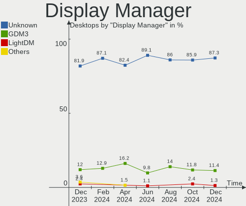
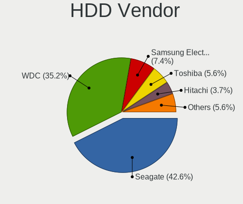
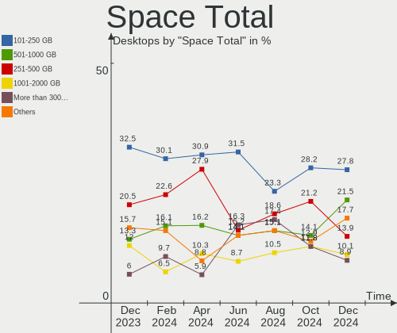
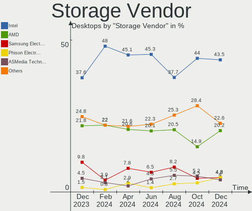
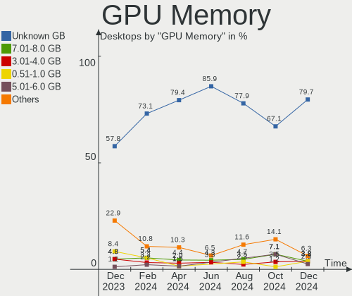
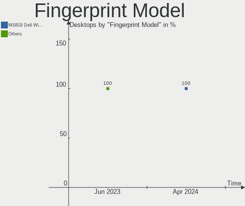

Zorin - Hardware Trends (Desktops)
----------------------------------

A project to identify most popular hardware characteristics and track their change
over time based on data collected by Linux users at https://Linux-Hardware.org.

Anyone can contribute to this report by the [hw-probe](https://github.com/linuxhw/hw-probe) tool:

    sudo -E hw-probe -all -upload

This report is for one last month. Overall report since the beginning of time: [TestDays](https://github.com/linuxhw/TestDays)

Period: Nov, 2023.

Contents
--------

* [ System ](#system)
  - [ OS                       ](#os)
  - [ OS Family                ](#os-family)
  - [ Kernel                   ](#kernel)
  - [ Kernel Family            ](#kernel-family)
  - [ Kernel Major Ver.        ](#kernel-major-ver)
  - [ Arch                     ](#arch)
  - [ DE                       ](#de)
  - [ Display Server           ](#display-server)
  - [ Display Manager          ](#display-manager)
  - [ OS Lang                  ](#os-lang)
  - [ Boot Mode                ](#boot-mode)
  - [ Filesystem               ](#filesystem)
  - [ Part. scheme             ](#part-scheme)
  - [ Dual Boot with Linux/BSD ](#dual-boot-with-linuxbsd)
  - [ Dual Boot (Win)          ](#dual-boot-win)

* [ Board ](#board)
  - [ Vendor                   ](#vendor)
  - [ Model                    ](#model)
  - [ Model Family             ](#model-family)
  - [ MFG Year                 ](#mfg-year)
  - [ Form Factor              ](#form-factor)
  - [ Secure Boot              ](#secure-boot)
  - [ Coreboot                 ](#coreboot)
  - [ RAM Size                 ](#ram-size)
  - [ RAM Used                 ](#ram-used)
  - [ Total Drives             ](#total-drives)
  - [ Has CD-ROM               ](#has-cd-rom)
  - [ Has Ethernet             ](#has-ethernet)
  - [ Has WiFi                 ](#has-wifi)
  - [ Has Bluetooth            ](#has-bluetooth)

* [ Location ](#location)
  - [ Country                  ](#country)
  - [ City                     ](#city)

* [ Drives ](#drives)
  - [ Drive Vendor             ](#drive-vendor)
  - [ Drive Model              ](#drive-model)
  - [ HDD Vendor               ](#hdd-vendor)
  - [ SSD Vendor               ](#ssd-vendor)
  - [ Drive Kind               ](#drive-kind)
  - [ Drive Connector          ](#drive-connector)
  - [ Drive Size               ](#drive-size)
  - [ Space Total              ](#space-total)
  - [ Space Used               ](#space-used)
  - [ Malfunc. Drives          ](#malfunc-drives)
  - [ Malfunc. Drive Vendor    ](#malfunc-drive-vendor)
  - [ Malfunc. HDD Vendor      ](#malfunc-hdd-vendor)
  - [ Malfunc. Drive Kind      ](#malfunc-drive-kind)
  - [ Failed Drives            ](#failed-drives)
  - [ Failed Drive Vendor      ](#failed-drive-vendor)
  - [ Drive Status             ](#drive-status)

* [ Storage controller ](#storage-controller)
  - [ Storage Vendor           ](#storage-vendor)
  - [ Storage Model            ](#storage-model)
  - [ Storage Kind             ](#storage-kind)

* [ Processor ](#processor)
  - [ CPU Vendor               ](#cpu-vendor)
  - [ CPU Model                ](#cpu-model)
  - [ CPU Model Family         ](#cpu-model-family)
  - [ CPU Cores                ](#cpu-cores)
  - [ CPU Sockets              ](#cpu-sockets)
  - [ CPU Threads              ](#cpu-threads)
  - [ CPU Op-Modes             ](#cpu-op-modes)
  - [ CPU Microcode            ](#cpu-microcode)
  - [ CPU Microarch            ](#cpu-microarch)

* [ Graphics ](#graphics)
  - [ GPU Vendor               ](#gpu-vendor)
  - [ GPU Model                ](#gpu-model)
  - [ GPU Combo                ](#gpu-combo)
  - [ GPU Driver               ](#gpu-driver)
  - [ GPU Memory               ](#gpu-memory)

* [ Monitor ](#monitor)
  - [ Monitor Vendor           ](#monitor-vendor)
  - [ Monitor Model            ](#monitor-model)
  - [ Monitor Resolution       ](#monitor-resolution)
  - [ Monitor Diagonal         ](#monitor-diagonal)
  - [ Monitor Width            ](#monitor-width)
  - [ Aspect Ratio             ](#aspect-ratio)
  - [ Monitor Area             ](#monitor-area)
  - [ Pixel Density            ](#pixel-density)
  - [ Multiple Monitors        ](#multiple-monitors)

* [ Network ](#network)
  - [ Net Controller Vendor    ](#net-controller-vendor)
  - [ Net Controller Model     ](#net-controller-model)
  - [ Wireless Vendor          ](#wireless-vendor)
  - [ Wireless Model           ](#wireless-model)
  - [ Ethernet Vendor          ](#ethernet-vendor)
  - [ Ethernet Model           ](#ethernet-model)
  - [ Net Controller Kind      ](#net-controller-kind)
  - [ Used Controller          ](#used-controller)
  - [ NICs                     ](#nics)
  - [ IPv6                     ](#ipv6)

* [ Bluetooth ](#bluetooth)
  - [ Bluetooth Vendor         ](#bluetooth-vendor)
  - [ Bluetooth Model          ](#bluetooth-model)

* [ Sound ](#sound)
  - [ Sound Vendor             ](#sound-vendor)
  - [ Sound Model              ](#sound-model)

* [ Memory ](#memory)
  - [ Memory Vendor            ](#memory-vendor)
  - [ Memory Model             ](#memory-model)
  - [ Memory Kind              ](#memory-kind)
  - [ Memory Form Factor       ](#memory-form-factor)
  - [ Memory Size              ](#memory-size)
  - [ Memory Speed             ](#memory-speed)

* [ Printers & scanners ](#printers--scanners)
  - [ Printer Vendor           ](#printer-vendor)
  - [ Printer Model            ](#printer-model)
  - [ Scanner Vendor           ](#scanner-vendor)
  - [ Scanner Model            ](#scanner-model)

* [ Camera ](#camera)
  - [ Camera Vendor            ](#camera-vendor)
  - [ Camera Model             ](#camera-model)

* [ Security ](#security)
  - [ Fingerprint Vendor       ](#fingerprint-vendor)
  - [ Fingerprint Model        ](#fingerprint-model)
  - [ Chipcard Vendor          ](#chipcard-vendor)
  - [ Chipcard Model           ](#chipcard-model)

* [ Unsupported ](#unsupported)
  - [ Unsupported Devices      ](#unsupported-devices)
  - [ Unsupported Device Types ](#unsupported-device-types)

System
------

OS
--

Installed operating systems

| Name     | Desktops | Percent |
|----------|----------|---------|
| Zorin 16 | 45       | 95.74%  |
| Zorin 15 | 2        | 4.26%   |

OS Family
---------

OS without a version

| Name  | Desktops | Percent |
|-------|----------|---------|
| Zorin | 47       | 100%    |

Kernel
------

Version of the Linux kernel

| Version              | Desktops | Percent |
|----------------------|----------|---------|
| 5.15.0-88-generic    | 26       | 55.32%  |
| 5.15.0-89-generic    | 9        | 19.15%  |
| 5.15.0-87-generic    | 3        | 6.38%   |
| 5.15.0-78-generic    | 2        | 4.26%   |
| 6.3.0-060300-generic | 1        | 2.13%   |
| 5.4.0-150-generic    | 1        | 2.13%   |
| 5.4.0-149-generic    | 1        | 2.13%   |
| 5.15.0-86-generic    | 1        | 2.13%   |
| 5.15.0-84-generic    | 1        | 2.13%   |
| 5.15.0-83-generic    | 1        | 2.13%   |
| 5.15.0-82-generic    | 1        | 2.13%   |

Kernel Family
-------------

Linux kernel without a distro release

| Version | Desktops | Percent |
|---------|----------|---------|
| 5.15.0  | 44       | 93.62%  |
| 5.4.0   | 2        | 4.26%   |
| 6.3.0   | 1        | 2.13%   |

Kernel Major Ver.
-----------------

Linux kernel major version

| Version | Desktops | Percent |
|---------|----------|---------|
| 5.15    | 44       | 93.62%  |
| 5.4     | 2        | 4.26%   |
| 6.3     | 1        | 2.13%   |

Arch
----

OS architecture (x86_64, i586, etc.)

| Name   | Desktops | Percent |
|--------|----------|---------|
| x86_64 | 47       | 100%    |

DE
--

Desktop Environment

| Name  | Desktops | Percent |
|-------|----------|---------|
| GNOME | 35       | 74.47%  |
| XFCE  | 12       | 25.53%  |

Display Server
--------------

X11 or Wayland

| Name | Desktops | Percent |
|------|----------|---------|
| X11  | 47       | 100%    |

Display Manager
---------------

SDDM, LightDM, etc.

| Name    | Desktops | Percent |
|---------|----------|---------|
| Unknown | 41       | 87.23%  |
| GDM     | 4        | 8.51%   |
| LightDM | 1        | 2.13%   |
| GDM3    | 1        | 2.13%   |

OS Lang
-------

Language

| Lang        | Desktops | Percent |
|-------------|----------|---------|
| en_US       | 14       | 29.79%  |
| de_DE       | 7        | 14.89%  |
| pt_BR       | 6        | 12.77%  |
| fr_FR       | 3        | 6.38%   |
| en_GB       | 3        | 6.38%   |
| sr_RS@latin | 1        | 2.13%   |
| ru_RU       | 1        | 2.13%   |
| nl_BE       | 1        | 2.13%   |
| ja_JP       | 1        | 2.13%   |
| it_IT       | 1        | 2.13%   |
| es_MX       | 1        | 2.13%   |
| es_ES       | 1        | 2.13%   |
| en_NZ       | 1        | 2.13%   |
| en_IN       | 1        | 2.13%   |
| en_IE       | 1        | 2.13%   |
| en_CA       | 1        | 2.13%   |
| en_AU       | 1        | 2.13%   |
| el_GR       | 1        | 2.13%   |
| de_CH       | 1        | 2.13%   |

Boot Mode
---------

EFI or BIOS

| Mode | Desktops | Percent |
|------|----------|---------|
| EFI  | 25       | 53.19%  |
| BIOS | 22       | 46.81%  |

Filesystem
----------

Type of filesystem

| Type    | Desktops | Percent |
|---------|----------|---------|
| Ext4    | 43       | 91.49%  |
| Zfs     | 1        | 2.13%   |
| Tmpfs   | 1        | 2.13%   |
| Overlay | 1        | 2.13%   |
| Ext3    | 1        | 2.13%   |

Part. scheme
------------

Scheme of partitioning

| Type    | Desktops | Percent |
|---------|----------|---------|
| Unknown | 41       | 87.23%  |
| GPT     | 5        | 10.64%  |
| MBR     | 1        | 2.13%   |

Dual Boot with Linux/BSD
------------------------

Hosting more than one Linux/BSD

| Dual boot | Desktops | Percent |
|-----------|----------|---------|
| No        | 44       | 93.62%  |
| Yes       | 3        | 6.38%   |

Dual Boot (Win)
---------------

Hosting Linux and Windows

| Dual boot | Desktops | Percent |
|-----------|----------|---------|
| No        | 45       | 95.74%  |
| Yes       | 2        | 4.26%   |

Board
-----

Vendor
------

Motherboard manufacturer

| Name                | Desktops | Percent |
|---------------------|----------|---------|
| Gigabyte Technology | 11       | 23.4%   |
| ASUSTek Computer    | 9        | 19.15%  |
| Hewlett-Packard     | 4        | 8.51%   |
| Dell                | 4        | 8.51%   |
| MSI                 | 3        | 6.38%   |
| Lenovo              | 3        | 6.38%   |
| Intel               | 2        | 4.26%   |
| AZW                 | 2        | 4.26%   |
| Acer                | 2        | 4.26%   |
| Semp Toshiba        | 1        | 2.13%   |
| Samsung Electronics | 1        | 2.13%   |
| JHZD                | 1        | 2.13%   |
| HOUTER              | 1        | 2.13%   |
| Fujitsu             | 1        | 2.13%   |
| ECS                 | 1        | 2.13%   |
| Unknown             | 1        | 2.13%   |

Model
-----

Motherboard model

| Name                               | Desktops | Percent |
|------------------------------------|----------|---------|
| Intel H61                          | 2        | 4.26%   |
| Gigabyte H510M H                   | 2        | 4.26%   |
| Semp Toshiba STI                   | 1        | 2.13%   |
| Samsung DeskTop System             | 1        | 2.13%   |
| MSI MS-7D75                        | 1        | 2.13%   |
| MSI MS-7B98                        | 1        | 2.13%   |
| MSI MS-7921                        | 1        | 2.13%   |
| Lenovo ThinkCentre M90p 5536Y1K    | 1        | 2.13%   |
| Lenovo ThinkCentre M83 10AHS2TG00  | 1        | 2.13%   |
| Lenovo ThinkCentre M73z 10BC0018GE | 1        | 2.13%   |
| JHZD BQM5                          | 1        | 2.13%   |
| HOUTER IPMIP-GS                    | 1        | 2.13%   |
| HP ProLiant ML350e Gen8 v2         | 1        | 2.13%   |
| HP Compaq dc5850 Small Form Factor | 1        | 2.13%   |
| HP Compaq 6200 Pro MT PC           | 1        | 2.13%   |
| HP 750-537cb                       | 1        | 2.13%   |
| Gigabyte Z87X-D3H                  | 1        | 2.13%   |
| Gigabyte Z790 GAMING X AX          | 1        | 2.13%   |
| Gigabyte Z390 UD                   | 1        | 2.13%   |
| Gigabyte M5NM1AI-GB                | 1        | 2.13%   |
| Gigabyte H77N-WIFI                 | 1        | 2.13%   |
| Gigabyte GA-MA78G-DS3H             | 1        | 2.13%   |
| Gigabyte GA-MA74GMT-S2             | 1        | 2.13%   |
| Gigabyte GA-890FXA-UD5             | 1        | 2.13%   |
| Gigabyte GA-870A-UD3               | 1        | 2.13%   |
| Fujitsu ESPRIMO P720               | 1        | 2.13%   |
| ECS H61H2-M2                       | 1        | 2.13%   |
| Dell XPS 8700                      | 1        | 2.13%   |
| Dell Precision WorkStation T7400   | 1        | 2.13%   |
| Dell OptiPlex 9020                 | 1        | 2.13%   |
| Dell OptiPlex 380                  | 1        | 2.13%   |
| AZW MINI S                         | 1        | 2.13%   |
| AZW Green G3                       | 1        | 2.13%   |
| ASUS TUF Gaming Z790-PLUS WIFI D4  | 1        | 2.13%   |
| ASUS TUF Gaming B460M-PLUS AC      | 1        | 2.13%   |
| ASUS TUF B450M-PLUS GAMING         | 1        | 2.13%   |
| ASUS ROG Maximus Z790 HERO         | 1        | 2.13%   |
| ASUS ROG Maximus XII FORMULA       | 1        | 2.13%   |
| ASUS RC667AA-ABA a1657c            | 1        | 2.13%   |
| ASUS P8H61-M LE/USB3               | 1        | 2.13%   |

Model Family
------------

Motherboard model prefix

| Name                   | Desktops | Percent |
|------------------------|----------|---------|
| Lenovo ThinkCentre     | 3        | 6.38%   |
| ASUS TUF               | 3        | 6.38%   |
| Intel H61              | 2        | 4.26%   |
| HP Compaq              | 2        | 4.26%   |
| Gigabyte H510M         | 2        | 4.26%   |
| Dell OptiPlex          | 2        | 4.26%   |
| ASUS ROG               | 2        | 4.26%   |
| Semp Toshiba STI       | 1        | 2.13%   |
| Samsung DeskTop        | 1        | 2.13%   |
| MSI MS-7D75            | 1        | 2.13%   |
| MSI MS-7B98            | 1        | 2.13%   |
| MSI MS-7921            | 1        | 2.13%   |
| JHZD BQM5              | 1        | 2.13%   |
| HOUTER IPMIP-GS        | 1        | 2.13%   |
| HP ProLiant            | 1        | 2.13%   |
| HP 750-537cb           | 1        | 2.13%   |
| Gigabyte Z87X-D3H      | 1        | 2.13%   |
| Gigabyte Z790          | 1        | 2.13%   |
| Gigabyte Z390          | 1        | 2.13%   |
| Gigabyte M5NM1AI-GB    | 1        | 2.13%   |
| Gigabyte H77N-WIFI     | 1        | 2.13%   |
| Gigabyte GA-MA78G-DS3H | 1        | 2.13%   |
| Gigabyte GA-MA74GMT-S2 | 1        | 2.13%   |
| Gigabyte GA-890FXA-UD5 | 1        | 2.13%   |
| Gigabyte GA-870A-UD3   | 1        | 2.13%   |
| Fujitsu ESPRIMO        | 1        | 2.13%   |
| ECS H61H2-M2           | 1        | 2.13%   |
| Dell XPS               | 1        | 2.13%   |
| Dell Precision         | 1        | 2.13%   |
| AZW MINI               | 1        | 2.13%   |
| AZW Green              | 1        | 2.13%   |
| ASUS RC667AA-ABA       | 1        | 2.13%   |
| ASUS P8H61-M           | 1        | 2.13%   |
| ASUS P5G41T-M          | 1        | 2.13%   |
| ASUS Maximus           | 1        | 2.13%   |
| Acer Extensa           | 1        | 2.13%   |
| Acer Aspire            | 1        | 2.13%   |
| Unknown                | 1        | 2.13%   |

MFG Year
--------

Motherboard manufacture year

| Year | Desktops | Percent |
|------|----------|---------|
| 2022 | 6        | 12.77%  |
| 2010 | 6        | 12.77%  |
| 2013 | 5        | 10.64%  |
| 2011 | 4        | 8.51%   |
| 2008 | 4        | 8.51%   |
| 2023 | 3        | 6.38%   |
| 2018 | 3        | 6.38%   |
| 2017 | 3        | 6.38%   |
| 2014 | 3        | 6.38%   |
| 2021 | 2        | 4.26%   |
| 2019 | 2        | 4.26%   |
| 2020 | 1        | 2.13%   |
| 2016 | 1        | 2.13%   |
| 2015 | 1        | 2.13%   |
| 2012 | 1        | 2.13%   |
| 2009 | 1        | 2.13%   |
| 2006 | 1        | 2.13%   |

Form Factor
-----------

Physical design of the computer

| Name    | Desktops | Percent |
|---------|----------|---------|
| Desktop | 47       | 100%    |

Secure Boot
-----------

Enabled or disabled

| State    | Desktops | Percent |
|----------|----------|---------|
| Disabled | 44       | 93.62%  |
| Enabled  | 3        | 6.38%   |

Coreboot
--------

Have coreboot on board

| Used | Desktops | Percent |
|------|----------|---------|
| No   | 47       | 100%    |

RAM Size
--------

Total RAM memory

| Size in GB  | Desktops | Percent |
|-------------|----------|---------|
| 16.01-24.0  | 15       | 31.91%  |
| 4.01-8.0    | 9        | 19.15%  |
| 3.01-4.0    | 6        | 12.77%  |
| 8.01-16.0   | 6        | 12.77%  |
| 64.01-256.0 | 5        | 10.64%  |
| 24.01-32.0  | 3        | 6.38%   |
| 32.01-64.0  | 2        | 4.26%   |
| 2.01-3.0    | 1        | 2.13%   |

RAM Used
--------

Used RAM memory

| Used GB    | Desktops | Percent |
|------------|----------|---------|
| 2.01-3.0   | 13       | 27.66%  |
| 1.01-2.0   | 13       | 27.66%  |
| 3.01-4.0   | 11       | 23.4%   |
| 4.01-8.0   | 8        | 17.02%  |
| 16.01-24.0 | 1        | 2.13%   |
| 0.51-1.0   | 1        | 2.13%   |

Total Drives
------------

Number of drives on board

| Drives | Desktops | Percent |
|--------|----------|---------|
| 1      | 19       | 40.43%  |
| 2      | 14       | 29.79%  |
| 3      | 7        | 14.89%  |
| 4      | 5        | 10.64%  |
| 7      | 1        | 2.13%   |
| 5      | 1        | 2.13%   |

Has CD-ROM
----------

Has CD-ROM on board

| Presented | Desktops | Percent |
|-----------|----------|---------|
| Yes       | 26       | 55.32%  |
| No        | 21       | 44.68%  |

Has Ethernet
------------

Has Ethernet on board

| Presented | Desktops | Percent |
|-----------|----------|---------|
| Yes       | 47       | 100%    |

Has WiFi
--------

Has WiFi module

| Presented | Desktops | Percent |
|-----------|----------|---------|
| Yes       | 25       | 53.19%  |
| No        | 22       | 46.81%  |

Has Bluetooth
-------------

Has Bluetooth module

| Presented | Desktops | Percent |
|-----------|----------|---------|
| No        | 24       | 51.06%  |
| Yes       | 23       | 48.94%  |

Location
--------

Country
-------

Geographic location (country)

| Country     | Desktops | Percent |
|-------------|----------|---------|
| USA         | 12       | 25.53%  |
| Germany     | 7        | 14.89%  |
| Brazil      | 6        | 12.77%  |
| UK          | 3        | 6.38%   |
| Serbia      | 2        | 4.26%   |
| France      | 2        | 4.26%   |
| Belgium     | 2        | 4.26%   |
| Togo        | 1        | 2.13%   |
| Switzerland | 1        | 2.13%   |
| Spain       | 1        | 2.13%   |
| New Zealand | 1        | 2.13%   |
| Mexico      | 1        | 2.13%   |
| Latvia      | 1        | 2.13%   |
| Japan       | 1        | 2.13%   |
| Italy       | 1        | 2.13%   |
| Ireland     | 1        | 2.13%   |
| India       | 1        | 2.13%   |
| Greece      | 1        | 2.13%   |
| Canada      | 1        | 2.13%   |
| Australia   | 1        | 2.13%   |

City
----

Geographic location (city)

| City                  | Desktops | Percent |
|-----------------------|----------|---------|
| Rio de Janeiro        | 3        | 6.38%   |
| Zumbrota              | 1        | 2.13%   |
| Wauwatosa             | 1        | 2.13%   |
| Washington            | 1        | 2.13%   |
| Turnhout              | 1        | 2.13%   |
| Tokushima             | 1        | 2.13%   |
| Thessaloniki          | 1        | 2.13%   |
| Tabernacle            | 1        | 2.13%   |
| Sydney                | 1        | 2.13%   |
| Rho                   | 1        | 2.13%   |
| Pamplona              | 1        | 2.13%   |
| Ogre                  | 1        | 2.13%   |
| Muttenz               | 1        | 2.13%   |
| Mortsel               | 1        | 2.13%   |
| Mladenovo             | 1        | 2.13%   |
| Minneapolis           | 1        | 2.13%   |
| Meiningen             | 1        | 2.13%   |
| Medford               | 1        | 2.13%   |
| Magdeburg             | 1        | 2.13%   |
| Machynlleth           | 1        | 2.13%   |
| Lorena                | 1        | 2.13%   |
| Lomé                 | 1        | 2.13%   |
| Limerick              | 1        | 2.13%   |
| Lencois               | 1        | 2.13%   |
| Leipzig               | 1        | 2.13%   |
| Iztapalapa            | 1        | 2.13%   |
| Indjija               | 1        | 2.13%   |
| Hyderabad             | 1        | 2.13%   |
| Hounslow              | 1        | 2.13%   |
| Heilbad Heiligenstadt | 1        | 2.13%   |
| Hamburg               | 1        | 2.13%   |
| Grain Valley          | 1        | 2.13%   |
| Givors                | 1        | 2.13%   |
| Elyria                | 1        | 2.13%   |
| El Mirage             | 1        | 2.13%   |
| Doncaster             | 1        | 2.13%   |
| Darmstadt             | 1        | 2.13%   |
| Cutler                | 1        | 2.13%   |
| Curitiba              | 1        | 2.13%   |
| Cincinnati            | 1        | 2.13%   |

Drives
------

Drive Vendor
------------

Hard drive vendors

| Vendor                       | Desktops | Drives | Percent |
|------------------------------|----------|--------|---------|
| Seagate                      | 14       | 17     | 15.38%  |
| WDC                          | 13       | 14     | 14.29%  |
| Samsung Electronics          | 13       | 14     | 14.29%  |
| Kingston                     | 7        | 8      | 7.69%   |
| Sandisk                      | 6        | 7      | 6.59%   |
| Hitachi                      | 4        | 4      | 4.4%    |
| Crucial                      | 4        | 4      | 4.4%    |
| China                        | 4        | 4      | 4.4%    |
| Unknown                      | 3        | 3      | 3.3%    |
| SPCC                         | 2        | 2      | 2.2%    |
| Silicon Motion               | 2        | 2      | 2.2%    |
| PNY                          | 2        | 2      | 2.2%    |
| MAXIO Technology (Hangzhou)  | 2        | 2      | 2.2%    |
| Kingston Technology Company  | 2        | 2      | 2.2%    |
| Unknown                      | 2        | 2      | 2.2%    |
| Toshiba                      | 1        | 1      | 1.1%    |
| SK hynix                     | 1        | 1      | 1.1%    |
| Shenzhen Longsys Electronics | 1        | 1      | 1.1%    |
| SABRENT                      | 1        | 1      | 1.1%    |
| Netac                        | 1        | 2      | 1.1%    |
| Micron/Crucial Technology    | 1        | 1      | 1.1%    |
| Maxtor                       | 1        | 1      | 1.1%    |
| KingFast                     | 1        | 1      | 1.1%    |
| HGST HTS                     | 1        | 1      | 1.1%    |
| ASMT                         | 1        | 1      | 1.1%    |
| Apple                        | 1        | 1      | 1.1%    |

Drive Model
-----------

Hard drive models

| Model                                                 | Desktops | Percent |
|-------------------------------------------------------|----------|---------|
| Kingston SA400S37240G 240GB SSD                       | 5        | 5.21%   |
| Unknown SD/MMC/MS PRO 128GB                           | 2        | 2.08%   |
| Silicon Motion SM2263EN/SM2263XT SSD Controller 256GB | 2        | 2.08%   |
| Seagate ST500DM002-1BD142 500GB                       | 2        | 2.08%   |
| Seagate ST1000DM003-1CH162 1TB                        | 2        | 2.08%   |
| Samsung HD105SI 1TB                                   | 2        | 2.08%   |
| China SATA SSD 512GB                                  | 2        | 2.08%   |
| Unknown                                               | 2        | 2.08%   |
| WDC WD5000AZRX-00A8LB0 500GB                          | 1        | 1.04%   |
| WDC WD5000AZLX-21K2TA0 500GB                          | 1        | 1.04%   |
| WDC WD5000AAKX-08U6AA0 500GB                          | 1        | 1.04%   |
| WDC WD4005FZBX-00K5WB0 4TB                            | 1        | 1.04%   |
| WDC WD30EZRZ-00GXCB0 3TB                              | 1        | 1.04%   |
| WDC WD30EFRX-68EUZN0 3TB                              | 1        | 1.04%   |
| WDC WD20EZRX-00D8PB0 2TB                              | 1        | 1.04%   |
| WDC WD20EARS-60MVWB0 2TB                              | 1        | 1.04%   |
| WDC WD20EARS-00MVWB0 2TB                              | 1        | 1.04%   |
| WDC WD1600BEVS-75RST0 160GB                           | 1        | 1.04%   |
| WDC WD10EZEX-60ZF5A0 1TB                              | 1        | 1.04%   |
| WDC WD10EZEX-60WN4A0 1TB                              | 1        | 1.04%   |
| WDC WD10EZEX-08WN4A0 1TB                              | 1        | 1.04%   |
| WDC WD10EARS-00MVWB0 1TB                              | 1        | 1.04%   |
| Unknown SSD_2.5"_TLC_256 256GB                        | 1        | 1.04%   |
| Toshiba NVMe Controller 256GB                         | 1        | 1.04%   |
| SPCC Solid State Disk 2TB                             | 1        | 1.04%   |
| SPCC Solid State Disk 120GB                           | 1        | 1.04%   |
| SK hynix SHPP41-1000GM 1TB                            | 1        | 1.04%   |
| Shenzhen Longsys Lexar SSD NM790 2TB                  | 1        | 1.04%   |
| Seagate ST4000DM004-2CV104 4TB                        | 1        | 1.04%   |
| Seagate ST3320820AS 320GB                             | 1        | 1.04%   |
| Seagate ST3320813AS 320GB                             | 1        | 1.04%   |
| Seagate ST3320310CS 320GB                             | 1        | 1.04%   |
| Seagate ST3250318AS 250GB                             | 1        | 1.04%   |
| Seagate ST3250312AS 250GB                             | 1        | 1.04%   |
| Seagate ST320LT009-9WC142 320GB                       | 1        | 1.04%   |
| Seagate ST22000NT001-3LS101 22TB                      | 1        | 1.04%   |
| Seagate ST2000LM007-1R8174 2TB                        | 1        | 1.04%   |
| Seagate ST2000DM001-1ER164 2TB                        | 1        | 1.04%   |
| Seagate ST1000DM010-2EP102 1TB                        | 1        | 1.04%   |
| Seagate Expansion SW 6TB                              | 1        | 1.04%   |

HDD Vendor
----------

Hard disk drive vendors

| Vendor              | Desktops | Drives | Percent |
|---------------------|----------|--------|---------|
| Seagate             | 14       | 17     | 35.9%   |
| WDC                 | 13       | 14     | 33.33%  |
| Hitachi             | 4        | 4      | 10.26%  |
| Samsung Electronics | 3        | 3      | 7.69%   |
| Unknown             | 2        | 2      | 5.13%   |
| Maxtor              | 1        | 1      | 2.56%   |
| HGST HTS            | 1        | 1      | 2.56%   |
| Apple               | 1        | 1      | 2.56%   |

SSD Vendor
----------

Solid state drive vendors

| Vendor              | Desktops | Drives | Percent |
|---------------------|----------|--------|---------|
| Samsung Electronics | 7        | 7      | 23.33%  |
| Kingston            | 6        | 6      | 20%     |
| China               | 4        | 4      | 13.33%  |
| SanDisk             | 3        | 4      | 10%     |
| Crucial             | 3        | 3      | 10%     |
| SPCC                | 2        | 2      | 6.67%   |
| PNY                 | 2        | 2      | 6.67%   |
| Unknown             | 1        | 1      | 3.33%   |
| Netac               | 1        | 2      | 3.33%   |
| ASMT                | 1        | 1      | 3.33%   |

Drive Kind
----------

HDD or SSD

| Kind    | Desktops | Drives | Percent |
|---------|----------|--------|---------|
| SSD     | 28       | 32     | 38.89%  |
| HDD     | 27       | 43     | 37.5%   |
| NVMe    | 14       | 21     | 19.44%  |
| Unknown | 3        | 3      | 4.17%   |

Drive Connector
---------------

SATA, SAS, NVMe, etc.

| Type | Desktops | Drives | Percent |
|------|----------|--------|---------|
| SATA | 42       | 71     | 68.85%  |
| NVMe | 13       | 20     | 21.31%  |
| SAS  | 6        | 8      | 9.84%   |

Drive Size
----------

Size of hard drive

| Size in TB | Desktops | Drives | Percent |
|------------|----------|--------|---------|
| 0.01-0.5   | 31       | 41     | 53.45%  |
| 0.51-1.0   | 14       | 19     | 24.14%  |
| 1.01-2.0   | 7        | 8      | 12.07%  |
| 3.01-4.0   | 2        | 2      | 3.45%   |
| 2.01-3.0   | 2        | 2      | 3.45%   |
| 20.01-50.0 | 1        | 1      | 1.72%   |
| 4.01-10.0  | 1        | 2      | 1.72%   |

Space Total
-----------

Amount of disk space available on the file system

| Size in GB     | Desktops | Percent |
|----------------|----------|---------|
| 101-250        | 15       | 31.91%  |
| 251-500        | 12       | 25.53%  |
| More than 3000 | 5        | 10.64%  |
| 1001-2000      | 5        | 10.64%  |
| 501-1000       | 5        | 10.64%  |
| 2001-3000      | 2        | 4.26%   |
| 51-100         | 2        | 4.26%   |
| Unknown        | 1        | 2.13%   |

Space Used
----------

Amount of used disk space

| Used GB        | Desktops | Percent |
|----------------|----------|---------|
| 21-50          | 11       | 23.4%   |
| 1-20           | 10       | 21.28%  |
| 51-100         | 8        | 17.02%  |
| 251-500        | 6        | 12.77%  |
| More than 3000 | 4        | 8.51%   |
| 101-250        | 3        | 6.38%   |
| 501-1000       | 3        | 6.38%   |
| 1001-2000      | 1        | 2.13%   |
| Unknown        | 1        | 2.13%   |

Malfunc. Drives
---------------

Drive models with a malfunction

| Model                           | Desktops | Drives | Percent |
|---------------------------------|----------|--------|---------|
| WDC WD30EFRX-68EUZN0 3TB        | 1        | 1      | 25%     |
| Seagate ST500DM002-1BD142 500GB | 1        | 1      | 25%     |
| Seagate ST320LT009-9WC142 320GB | 1        | 1      | 25%     |
| Seagate ST2000LM007-1R8174 2TB  | 1        | 1      | 25%     |

Malfunc. Drive Vendor
---------------------

Vendors of faulty drives

| Vendor  | Desktops | Drives | Percent |
|---------|----------|--------|---------|
| Seagate | 3        | 3      | 75%     |
| WDC     | 1        | 1      | 25%     |

Malfunc. HDD Vendor
-------------------

Vendors of faulty HDD drives

| Vendor  | Desktops | Drives | Percent |
|---------|----------|--------|---------|
| Seagate | 3        | 3      | 75%     |
| WDC     | 1        | 1      | 25%     |

Malfunc. Drive Kind
-------------------

Kinds of faulty drives

| Kind | Desktops | Drives | Percent |
|------|----------|--------|---------|
| HDD  | 4        | 4      | 100%    |

Failed Drives
-------------

Failed drive models

Zero info for selected period =(

Failed Drive Vendor
-------------------

Failed drive vendors

Zero info for selected period =(

Drive Status
------------

Number of failed and malfunc. drives

| Status   | Desktops | Drives | Percent |
|----------|----------|--------|---------|
| Detected | 43       | 86     | 84.31%  |
| Malfunc  | 4        | 4      | 7.84%   |
| Works    | 4        | 9      | 7.84%   |

Storage controller
------------------

Storage Vendor
--------------

Storage controller vendors

| Vendor                       | Desktops | Percent |
|------------------------------|----------|---------|
| Intel                        | 38       | 52.05%  |
| AMD                          | 8        | 10.96%  |
| Samsung Electronics          | 4        | 5.48%   |
| Kingston Technology Company  | 4        | 5.48%   |
| SanDisk                      | 3        | 4.11%   |
| ASMedia Technology           | 3        | 4.11%   |
| Silicon Motion               | 2        | 2.74%   |
| Micron/Crucial Technology    | 2        | 2.74%   |
| MAXIO Technology (Hangzhou)  | 2        | 2.74%   |
| JMicron Technology           | 2        | 2.74%   |
| Toshiba America Info Systems | 1        | 1.37%   |
| SK hynix                     | 1        | 1.37%   |
| Shenzhen Longsys Electronics | 1        | 1.37%   |
| Nvidia                       | 1        | 1.37%   |
| Marvell Technology Group     | 1        | 1.37%   |

Storage Model
-------------

Storage controller models

| Model                                                                          | Desktops | Percent |
|--------------------------------------------------------------------------------|----------|---------|
| Intel 8 Series/C220 Series Chipset Family 6-port SATA Controller 1 [AHCI mode] | 6        | 6.9%    |
| Intel 6 Series/C200 Series Chipset Family 6 port Desktop SATA AHCI Controller  | 5        | 5.75%   |
| AMD SB7x0/SB8x0/SB9x0 SATA Controller [IDE mode]                               | 4        | 4.6%    |
| AMD SB7x0/SB8x0/SB9x0 IDE Controller                                           | 4        | 4.6%    |
| Intel NM10/ICH7 Family SATA Controller [IDE mode]                              | 3        | 3.45%   |
| Intel 700 Series Chipset Family SATA AHCI Controller                           | 3        | 3.45%   |
| AMD FCH SATA Controller [AHCI mode]                                            | 3        | 3.45%   |
| Silicon Motion SM2263EN/SM2263XT (DRAM-less) NVMe SSD Controllers              | 2        | 2.3%    |
| Kingston Company NV2 NVMe SSD SM2267XT                                         | 2        | 2.3%    |
| Kingston Company NV1 NVMe SSD SM2263XT                                         | 2        | 2.3%    |
| JMicron JMB363 SATA/IDE Controller                                             | 2        | 2.3%    |
| Intel SATA controller                                                          | 2        | 2.3%    |
| Intel Q170/Q150/B150/H170/H110/Z170/CM236 Chipset SATA Controller [AHCI Mode]  | 2        | 2.3%    |
| Intel Cannon Lake PCH SATA AHCI Controller                                     | 2        | 2.3%    |
| Intel 82801G (ICH7 Family) IDE Controller                                      | 2        | 2.3%    |
| Intel 500 Series Chipset Family SATA AHCI Controller                           | 2        | 2.3%    |
| ASMedia ASM1062 Serial ATA Controller                                          | 2        | 2.3%    |
| Toshiba America Info Systems XG3 NVMe SSD Controller                           | 1        | 1.15%   |
| SK hynix Platinum P41/PC801 NVMe Solid State Drive                             | 1        | 1.15%   |
| Shenzhen Longsys Non-Volatile memory controller                                | 1        | 1.15%   |
| Sandisk WD Black SN850X NVMe SSD                                               | 1        | 1.15%   |
| SanDisk Ultra 3D / WD Blue SN570 NVMe SSD (DRAM-less)                          | 1        | 1.15%   |
| SanDisk Extreme Pro / WD Black SN750 / PC SN730 / Red SN700 NVMe SSD           | 1        | 1.15%   |
| Samsung S4LN058A01[SSUBX] AHCI SSD Controller (Apple slot)                     | 1        | 1.15%   |
| Samsung NVMe SSD Controller SM981/PM981/PM983                                  | 1        | 1.15%   |
| Samsung NVMe SSD Controller SM961/PM961/SM963                                  | 1        | 1.15%   |
| Samsung NVMe SSD Controller S4LV008[Pascal]                                    | 1        | 1.15%   |
| Nvidia MCP51 Serial ATA Controller                                             | 1        | 1.15%   |
| Nvidia MCP51 IDE                                                               | 1        | 1.15%   |
| Micron/Crucial P5 Plus NVMe PCIe SSD                                           | 1        | 1.15%   |
| Micron/Crucial P2 [Nick P2] / P3 / P3 Plus NVMe PCIe SSD (DRAM-less)           | 1        | 1.15%   |
| MAXIO (Hangzhou) NVMe SSD Controller MAP1602                                   | 1        | 1.15%   |
| MAXIO (Hangzhou) NVMe SSD Controller MAP1202                                   | 1        | 1.15%   |
| Marvell Group 88SE9230 PCIe 2.0 x2 4-port SATA 6 Gb/s RAID Controller          | 1        | 1.15%   |
| Intel Volume Management Device NVMe RAID Controller Intel Corporation          | 1        | 1.15%   |
| Intel Volume Management Device NVMe RAID Controller                            | 1        | 1.15%   |
| Intel SATA Controller [RAID mode]                                              | 1        | 1.15%   |
| Intel NM10/ICH7 Family SATA Controller [AHCI mode]                             | 1        | 1.15%   |
| Intel Jasper Lake SATA AHCI Controller                                         | 1        | 1.15%   |
| Intel Comet Lake PCH-H RAID                                                    | 1        | 1.15%   |

Storage Kind
------------

Kind of storage controller (IDE, SATA, NVMe, SAS, ...)

| Kind | Desktops | Percent |
|------|----------|---------|
| SATA | 39       | 56.52%  |
| NVMe | 13       | 18.84%  |
| IDE  | 12       | 17.39%  |
| RAID | 5        | 7.25%   |

Processor
---------

CPU Vendor
----------

Processor vendors

| Vendor | Desktops | Percent |
|--------|----------|---------|
| Intel  | 38       | 80.85%  |
| AMD    | 9        | 19.15%  |

CPU Model
---------

Processor models

| Model                                       | Desktops | Percent |
|---------------------------------------------|----------|---------|
| Intel Core 2 Duo CPU E7500 @ 2.93GHz        | 2        | 4.26%   |
| AMD Athlon 64 X2 Dual Core Processor 4600+  | 2        | 4.26%   |
| Intel Xeon CPU E5430 @ 2.66GHz              | 1        | 2.13%   |
| Intel Xeon CPU E5-2407 v2 @ 2.40GHz         | 1        | 2.13%   |
| Intel Pentium Dual CPU E2160 @ 1.80GHz      | 1        | 2.13%   |
| Intel Pentium CPU G3260 @ 3.30GHz           | 1        | 2.13%   |
| Intel N95                                   | 1        | 2.13%   |
| Intel N100                                  | 1        | 2.13%   |
| Intel Core i9-10850K CPU @ 3.60GHz          | 1        | 2.13%   |
| Intel Core i7-7700 CPU @ 3.60GHz            | 1        | 2.13%   |
| Intel Core i7-6700K CPU @ 4.00GHz           | 1        | 2.13%   |
| Intel Core i7-4790 CPU @ 3.60GHz            | 1        | 2.13%   |
| Intel Core i7-3770 CPU @ 3.40GHz            | 1        | 2.13%   |
| Intel Core i7-2600 CPU @ 3.40GHz            | 1        | 2.13%   |
| Intel Core i7-10700F CPU @ 2.90GHz          | 1        | 2.13%   |
| Intel Core i7 CPU 860 @ 2.80GHz             | 1        | 2.13%   |
| Intel Core i5-9600K CPU @ 3.70GHz           | 1        | 2.13%   |
| Intel Core i5-4690K CPU @ 3.50GHz           | 1        | 2.13%   |
| Intel Core i5-4670K CPU @ 3.40GHz           | 1        | 2.13%   |
| Intel Core i5-4570 CPU @ 3.20GHz            | 1        | 2.13%   |
| Intel Core i5-4460 CPU @ 3.20GHz            | 1        | 2.13%   |
| Intel Core i5-3470 CPU @ 3.20GHz            | 1        | 2.13%   |
| Intel Core i5-3330 CPU @ 3.00GHz            | 1        | 2.13%   |
| Intel Core i5-2500 CPU @ 3.30GHz            | 1        | 2.13%   |
| Intel Core i5-10400F CPU @ 2.90GHz          | 1        | 2.13%   |
| Intel Core i5-10400 CPU @ 2.90GHz           | 1        | 2.13%   |
| Intel Core i5 CPU 660 @ 3.33GHz             | 1        | 2.13%   |
| Intel Core i3-9100F CPU @ 3.60GHz           | 1        | 2.13%   |
| Intel Core i3-4170 CPU @ 3.70GHz            | 1        | 2.13%   |
| Intel Core i3-4150 CPU @ 3.50GHz            | 1        | 2.13%   |
| Intel Core i3-3210 CPU @ 3.20GHz            | 1        | 2.13%   |
| Intel Core i3-2120T CPU @ 2.60GHz           | 1        | 2.13%   |
| Intel Celeron N5095 @ 2.00GHz               | 1        | 2.13%   |
| Intel Atom CPU D2550 @ 1.86GHz              | 1        | 2.13%   |
| Intel 13th Gen CoreT i7-1360P               | 1        | 2.13%   |
| Intel 13th Gen Core i9-13900K               | 1        | 2.13%   |
| Intel 13th Gen Core i7-13700K               | 1        | 2.13%   |
| Intel 12th Gen Core i7-12700F               | 1        | 2.13%   |
| AMD Ryzen 7 7700X 8-Core Processor          | 1        | 2.13%   |
| AMD Ryzen 5 3400G with Radeon Vega Graphics | 1        | 2.13%   |

CPU Model Family
----------------

Processor model prefix

| Model              | Desktops | Percent |
|--------------------|----------|---------|
| Intel Core i5      | 11       | 23.4%   |
| Intel Core i7      | 7        | 14.89%  |
| Other              | 6        | 12.77%  |
| Intel Core i3      | 5        | 10.64%  |
| Intel Xeon         | 2        | 4.26%   |
| Intel Core 2 Duo   | 2        | 4.26%   |
| AMD Phenom II X4   | 2        | 4.26%   |
| AMD Athlon 64 X2   | 2        | 4.26%   |
| Intel Pentium Dual | 1        | 2.13%   |
| Intel Pentium      | 1        | 2.13%   |
| Intel Core i9      | 1        | 2.13%   |
| Intel Celeron      | 1        | 2.13%   |
| Intel Atom         | 1        | 2.13%   |
| AMD Ryzen 7        | 1        | 2.13%   |
| AMD Ryzen 5        | 1        | 2.13%   |
| AMD Phenom         | 1        | 2.13%   |
| AMD Athlon II X2   | 1        | 2.13%   |
| AMD A10            | 1        | 2.13%   |

CPU Cores
---------

Number of processor cores

| Number | Desktops | Percent |
|--------|----------|---------|
| 4      | 22       | 46.81%  |
| 2      | 14       | 29.79%  |
| 8      | 3        | 6.38%   |
| 6      | 3        | 6.38%   |
| 12     | 2        | 4.26%   |
| 24     | 1        | 2.13%   |
| 16     | 1        | 2.13%   |
| 10     | 1        | 2.13%   |

CPU Sockets
-----------

Number of sockets

| Number | Desktops | Percent |
|--------|----------|---------|
| 1      | 46       | 97.87%  |
| 2      | 1        | 2.13%   |

CPU Threads
-----------

Threads per core (Hyper-Threading)

| Number | Desktops | Percent |
|--------|----------|---------|
| 1      | 25       | 53.19%  |
| 2      | 22       | 46.81%  |

CPU Op-Modes
------------

CPU Operation Modes (32-bit, 64-bit)

| Op mode        | Desktops | Percent |
|----------------|----------|---------|
| 32-bit, 64-bit | 47       | 100%    |

CPU Microcode
-------------

Microcode number

| Number     | Desktops | Percent |
|------------|----------|---------|
| 0x306c3    | 8        | 17.02%  |
| Unknown    | 5        | 10.64%  |
| 0xa0655    | 4        | 8.51%   |
| 0x306a9    | 3        | 6.38%   |
| 0x206a7    | 3        | 6.38%   |
| 0x010000c8 | 3        | 6.38%   |
| 0xb06e0    | 2        | 4.26%   |
| 0xb0671    | 2        | 4.26%   |
| 0x1067a    | 2        | 4.26%   |
| 0xb06a2    | 1        | 2.13%   |
| 0x906ec    | 1        | 2.13%   |
| 0x906e9    | 1        | 2.13%   |
| 0x906c0    | 1        | 2.13%   |
| 0x90672    | 1        | 2.13%   |
| 0x506e3    | 1        | 2.13%   |
| 0x306e4    | 1        | 2.13%   |
| 0x30661    | 1        | 2.13%   |
| 0x20655    | 1        | 2.13%   |
| 0x106e5    | 1        | 2.13%   |
| 0x10676    | 1        | 2.13%   |
| 0x0a601203 | 1        | 2.13%   |
| 0x08108109 | 1        | 2.13%   |
| 0x06003106 | 1        | 2.13%   |
| 0x01000095 | 1        | 2.13%   |

CPU Microarch
-------------

Microarchitecture

| Name             | Desktops | Percent |
|------------------|----------|---------|
| Haswell          | 8        | 17.02%  |
| Unknown          | 6        | 12.77%  |
| IvyBridge        | 5        | 10.64%  |
| K10              | 4        | 8.51%   |
| CometLake        | 4        | 8.51%   |
| SandyBridge      | 3        | 6.38%   |
| Penryn           | 3        | 6.38%   |
| KabyLake         | 3        | 6.38%   |
| K8 Hammer        | 2        | 4.26%   |
| Zen+             | 1        | 2.13%   |
| Westmere         | 1        | 2.13%   |
| Tremont          | 1        | 2.13%   |
| Steamroller      | 1        | 2.13%   |
| Skylake          | 1        | 2.13%   |
| Nehalem          | 1        | 2.13%   |
| Core             | 1        | 2.13%   |
| Bonnell          | 1        | 2.13%   |
| Alderlake Hybrid | 1        | 2.13%   |

Graphics
--------

GPU Vendor
----------

Vendors of graphics cards

| Vendor                     | Desktops | Percent |
|----------------------------|----------|---------|
| Intel                      | 21       | 41.18%  |
| Nvidia                     | 16       | 31.37%  |
| AMD                        | 13       | 25.49%  |
| Matrox Electronics Systems | 1        | 1.96%   |

GPU Model
---------

Graphics card models

| Model                                                                       | Desktops | Percent |
|-----------------------------------------------------------------------------|----------|---------|
| Intel Xeon E3-1200 v3/4th Gen Core Processor Integrated Graphics Controller | 3        | 5.77%   |
| Nvidia GK208B [GeForce GT 710]                                              | 2        | 3.85%   |
| Intel Xeon E3-1200 v2/3rd Gen Core processor Graphics Controller            | 2        | 3.85%   |
| Intel Raptor Lake-S GT1 [UHD Graphics 770]                                  | 2        | 3.85%   |
| Intel Alder Lake-N [UHD Graphics]                                           | 2        | 3.85%   |
| Intel 4th Generation Core Processor Family Integrated Graphics Controller   | 2        | 3.85%   |
| Intel 2nd Generation Core Processor Family Integrated Graphics Controller   | 2        | 3.85%   |
| Nvidia GT218 [GeForce 210]                                                  | 1        | 1.92%   |
| Nvidia GT216 [GeForce 210]                                                  | 1        | 1.92%   |
| Nvidia GP108 [GeForce GT 1030]                                              | 1        | 1.92%   |
| Nvidia GP107 [GeForce GTX 1050]                                             | 1        | 1.92%   |
| Nvidia GP107 [GeForce GTX 1050 Ti]                                          | 1        | 1.92%   |
| Nvidia GP106 [GeForce GTX 1060 6GB]                                         | 1        | 1.92%   |
| Nvidia GP106 [GeForce GTX 1060 3GB]                                         | 1        | 1.92%   |
| Nvidia GM107GL [Quadro K2200]                                               | 1        | 1.92%   |
| Nvidia GK208 [GeForce GT 720]                                               | 1        | 1.92%   |
| Nvidia GK104 [GeForce GTX 770]                                              | 1        | 1.92%   |
| Nvidia GK104 [GeForce GTX 660 Ti]                                           | 1        | 1.92%   |
| Nvidia GA104 [GeForce RTX 3060 Ti Lite Hash Rate]                           | 1        | 1.92%   |
| Nvidia G72 [GeForce 7500 LE]                                                | 1        | 1.92%   |
| Nvidia AD104 [GeForce RTX 4070 Ti]                                          | 1        | 1.92%   |
| Matrox Electronics Systems MGA G200EH                                       | 1        | 1.92%   |
| Intel Raptor Lake-P [Iris Xe Graphics]                                      | 1        | 1.92%   |
| Intel JasperLake [UHD Graphics]                                             | 1        | 1.92%   |
| Intel IvyBridge GT2 [HD Graphics 4000]                                      | 1        | 1.92%   |
| Intel DG2 [Arc A770]                                                        | 1        | 1.92%   |
| Intel Core Processor Integrated Graphics Controller                         | 1        | 1.92%   |
| Intel CometLake-S GT2 [UHD Graphics 630]                                    | 1        | 1.92%   |
| Intel Atom Processor D2xxx/N2xxx Integrated Graphics Controller             | 1        | 1.92%   |
| Intel 4 Series Chipset Integrated Graphics Controller                       | 1        | 1.92%   |
| AMD Tonga PRO [Radeon R9 285/380]                                           | 1        | 1.92%   |
| AMD RV730 XT [Radeon HD 4670]                                               | 1        | 1.92%   |
| AMD RV635 [Radeon HD 3650/3750/4570/4580]                                   | 1        | 1.92%   |
| AMD RS740 [Radeon 2100]                                                     | 1        | 1.92%   |
| AMD Redwood PRO [Radeon HD 5550/5570/5630/6510/6610/7570]                   | 1        | 1.92%   |
| AMD Raphael                                                                 | 1        | 1.92%   |
| AMD Picasso/Raven 2 [Radeon Vega Series / Radeon Vega Mobile Series]        | 1        | 1.92%   |
| AMD Navi 23 [Radeon RX 6650 XT / 6700S / 6800S]                             | 1        | 1.92%   |
| AMD Cedar [Radeon HD 7350/8350 / R5 220]                                    | 1        | 1.92%   |
| AMD Cedar [Radeon HD 5000/6000/7350/8350 Series]                            | 1        | 1.92%   |

GPU Combo
---------

Combinations of graphics cards

| Name           | Desktops | Percent |
|----------------|----------|---------|
| 1 x Intel      | 18       | 38.3%   |
| 1 x Nvidia     | 13       | 27.66%  |
| 1 x AMD        | 11       | 23.4%   |
| Intel + Nvidia | 2        | 4.26%   |
| 2 x AMD        | 1        | 2.13%   |
| 1 x Matrox     | 1        | 2.13%   |
| AMD + Nvidia   | 1        | 2.13%   |

GPU Driver
----------

Free vs proprietary

| Driver      | Desktops | Percent |
|-------------|----------|---------|
| Free        | 29       | 61.7%   |
| Proprietary | 9        | 19.15%  |
| Unknown     | 9        | 19.15%  |

GPU Memory
----------

Total video memory

| Size in GB | Desktops | Percent |
|------------|----------|---------|
| Unknown    | 24       | 51.06%  |
| 1.01-2.0   | 5        | 10.64%  |
| 0.51-1.0   | 5        | 10.64%  |
| 0.01-0.5   | 4        | 8.51%   |
| 2.01-3.0   | 3        | 6.38%   |
| 7.01-8.0   | 2        | 4.26%   |
| 3.01-4.0   | 2        | 4.26%   |
| 5.01-6.0   | 1        | 2.13%   |
| 8.01-16.0  | 1        | 2.13%   |

Monitor
-------

Monitor Vendor
--------------

Monitor vendors

| Vendor               | Desktops | Percent |
|----------------------|----------|---------|
| Samsung Electronics  | 12       | 28.57%  |
| Dell                 | 6        | 14.29%  |
| Acer                 | 6        | 14.29%  |
| Hewlett-Packard      | 3        | 7.14%   |
| Philips              | 2        | 4.76%   |
| Lenovo               | 2        | 4.76%   |
| ViewSonic            | 1        | 2.38%   |
| Unknown              | 1        | 2.38%   |
| Sceptre Tech         | 1        | 2.38%   |
| LG Electronics       | 1        | 2.38%   |
| Iiyama               | 1        | 2.38%   |
| Hyundai ImageQuest   | 1        | 2.38%   |
| Goldstar             | 1        | 2.38%   |
| FUS                  | 1        | 2.38%   |
| CHD                  | 1        | 2.38%   |
| AOC                  | 1        | 2.38%   |
| Ancor Communications | 1        | 2.38%   |

Monitor Model
-------------

Monitor models

| Model                                                                | Desktops | Percent |
|----------------------------------------------------------------------|----------|---------|
| ViewSonic XG3220 SERIES VSC1D35 3840x2160 698x393mm 31.5-inch        | 1        | 2.22%   |
| Unknown LCD Monitor HISENSE 3840x2160                                | 1        | 2.22%   |
| Sceptre Tech E24 SPT099D 1920x1080 521x293mm 23.5-inch               | 1        | 2.22%   |
| Samsung Electronics SyncMaster SAM0370 1680x1050 459x296mm 21.5-inch | 1        | 2.22%   |
| Samsung Electronics SyncMaster SAM02FD 1680x1050 433x271mm 20.1-inch | 1        | 2.22%   |
| Samsung Electronics SyncMaster SAM0285 1440x900 410x257mm 19.1-inch  | 1        | 2.22%   |
| Samsung Electronics SyncMaster SAM021D 1680x1050 433x271mm 20.1-inch | 1        | 2.22%   |
| Samsung Electronics SMB2230H SAM0647 1920x1080 477x268mm 21.5-inch   | 1        | 2.22%   |
| Samsung Electronics SMB2030N SAM0634 1600x900 443x249mm 20.0-inch    | 1        | 2.22%   |
| Samsung Electronics S24E650 SAM0CB7 1920x1080 521x293mm 23.5-inch    | 1        | 2.22%   |
| Samsung Electronics S19B300 SAM08A6 1366x768 410x230mm 18.5-inch     | 1        | 2.22%   |
| Samsung Electronics S19B300 SAM08A5 1366x768 410x230mm 18.5-inch     | 1        | 2.22%   |
| Samsung Electronics LCD Monitor U28E590 3840x2160                    | 1        | 2.22%   |
| Samsung Electronics LCD Monitor S34J55x 3440x1440                    | 1        | 2.22%   |
| Samsung Electronics LCD Monitor S24D330 1920x1080                    | 1        | 2.22%   |
| Samsung Electronics C27F591 SAM0D37 1920x1080 598x336mm 27.0-inch    | 1        | 2.22%   |
| Samsung Electronics C27F591 SAM0D36 1920x1080 598x336mm 27.0-inch    | 1        | 2.22%   |
| Samsung Electronics AIO SEM2301 1920x1080                            | 1        | 2.22%   |
| Philips LCD Monitor FTV 1920x1080                                    | 1        | 2.22%   |
| Philips 190CW PHL084A 1440x900 400x250mm 18.6-inch                   | 1        | 2.22%   |
| LG Electronics LCD Monitor E2050 3520x1080                           | 1        | 2.22%   |
| Lenovo LEN-M73Z-D LEN00A0 1600x900 442x249mm 20.0-inch               | 1        | 2.22%   |
| Lenovo LEN T22i-10 LEN61A9 1920x1080 476x268mm 21.5-inch             | 1        | 2.22%   |
| Iiyama PL2292H IVM563C 1920x1080 476x268mm 21.5-inch                 | 1        | 2.22%   |
| Hyundai ImageQuest HDIT19W DSUB IQT9008 1366x768 413x234mm 18.7-inch | 1        | 2.22%   |
| Hewlett-Packard vs17 HWP2647 1280x1024 337x270mm 17.0-inch           | 1        | 2.22%   |
| Hewlett-Packard f2105 HWP2654 1680x1050 433x271mm 20.1-inch          | 1        | 2.22%   |
| Hewlett-Packard 2309 HWP2822 1920x1080 510x287mm 23.0-inch           | 1        | 2.22%   |
| Goldstar 23MB35 GSM5A3D 1920x1080 510x290mm 23.1-inch                | 1        | 2.22%   |
| FUS LCD Monitor P22W-5 1680x1050                                     | 1        | 2.22%   |
| Dell U2211H DEL405E 1920x1080 475x267mm 21.5-inch                    | 1        | 2.22%   |
| Dell S2721HN DEL41F7 1920x1080 598x336mm 27.0-inch                   | 1        | 2.22%   |
| Dell P2419H DELD0DA 1920x1080 527x296mm 23.8-inch                    | 1        | 2.22%   |
| Dell LCD Monitor P2719H                                              | 1        | 2.22%   |
| Dell LCD Monitor E2414H 1920x1080                                    | 1        | 2.22%   |
| Dell IN1910N DELA04C 1366x768 410x230mm 18.5-inch                    | 1        | 2.22%   |
| CHD DM-MONB2401 CHD2380 1920x1080 527x296mm 23.8-inch                | 1        | 2.22%   |
| AOC 1619w AOC1619 1366x768 340x190mm 15.3-inch                       | 1        | 2.22%   |
| Ancor Communications VW246 ACI24F2 1920x1080 531x299mm 24.0-inch     | 1        | 2.22%   |
| Acer V246HL ACR032E 1920x1080 531x299mm 24.0-inch                    | 1        | 2.22%   |

Monitor Resolution
------------------

Monitor screen resolution

| Resolution         | Desktops | Percent |
|--------------------|----------|---------|
| 1920x1080 (FHD)    | 19       | 47.5%   |
| 1680x1050 (WSXGA+) | 5        | 12.5%   |
| 1366x768 (WXGA)    | 4        | 10%     |
| 3840x2160 (4K)     | 3        | 7.5%    |
| 1600x900 (HD+)     | 2        | 5%      |
| 1440x900 (WXGA+)   | 2        | 5%      |
| 1280x1024 (SXGA)   | 2        | 5%      |
| 3520x1080          | 1        | 2.5%    |
| 3440x1440          | 1        | 2.5%    |
| Unknown            | 1        | 2.5%    |

Monitor Diagonal
----------------

Diagonal size in inches

| Inches  | Desktops | Percent |
|---------|----------|---------|
| Unknown | 9        | 21.43%  |
| 24      | 6        | 14.29%  |
| 21      | 6        | 14.29%  |
| 20      | 5        | 11.9%   |
| 23      | 4        | 9.52%   |
| 27      | 3        | 7.14%   |
| 18      | 3        | 7.14%   |
| 19      | 2        | 4.76%   |
| 17      | 2        | 4.76%   |
| 31      | 1        | 2.38%   |
| 15      | 1        | 2.38%   |

Monitor Width
-------------

Physical width

| Width in mm | Desktops | Percent |
|-------------|----------|---------|
| 401-500     | 15       | 38.46%  |
| 501-600     | 11       | 28.21%  |
| Unknown     | 9        | 23.08%  |
| 301-350     | 3        | 7.69%   |
| 601-700     | 1        | 2.56%   |

Aspect Ratio
------------

Proportional relationship between the width and the height

| Ratio   | Desktops | Percent |
|---------|----------|---------|
| 16/9    | 23       | 60.53%  |
| Unknown | 8        | 21.05%  |
| 16/10   | 5        | 13.16%  |
| 5/4     | 2        | 5.26%   |

Monitor Area
------------

Area in inch²

| Area in inch² | Desktops | Percent |
|----------------|----------|---------|
| 201-250        | 13       | 31.71%  |
| 151-200        | 10       | 24.39%  |
| Unknown        | 9        | 21.95%  |
| 141-150        | 4        | 9.76%   |
| 301-350        | 3        | 7.32%   |
| 351-500        | 1        | 2.44%   |
| 101-110        | 1        | 2.44%   |

Pixel Density
-------------

Pixels per inch

| Density | Desktops | Percent |
|---------|----------|---------|
| 51-100  | 23       | 58.97%  |
| Unknown | 9        | 23.08%  |
| 101-120 | 6        | 15.38%  |
| 121-160 | 1        | 2.56%   |

Multiple Monitors
-----------------

Total monitors connected

| Total | Desktops | Percent |
|-------|----------|---------|
| 1     | 34       | 72.34%  |
| 0     | 8        | 17.02%  |
| 2     | 4        | 8.51%   |
| 4     | 1        | 2.13%   |

Network
-------

Net Controller Vendor
---------------------

Controller vendors

| Vendor                | Desktops | Percent |
|-----------------------|----------|---------|
| Realtek Semiconductor | 30       | 42.25%  |
| Intel                 | 20       | 28.17%  |
| Qualcomm Atheros      | 6        | 8.45%   |
| Broadcom              | 5        | 7.04%   |
| TP-Link               | 2        | 2.82%   |
| D-Link                | 2        | 2.82%   |
| Samsung Electronics   | 1        | 1.41%   |
| Ralink Technology     | 1        | 1.41%   |
| Nvidia                | 1        | 1.41%   |
| MediaTek              | 1        | 1.41%   |
| Broadcom Limited      | 1        | 1.41%   |
| Aquantia              | 1        | 1.41%   |

Net Controller Model
--------------------

Controller models

| Model                                                             | Desktops | Percent |
|-------------------------------------------------------------------|----------|---------|
| Realtek RTL8111/8168/8411 PCI Express Gigabit Ethernet Controller | 21       | 26.25%  |
| Intel Ethernet Controller I226-V                                  | 3        | 3.75%   |
| Intel Ethernet Connection I217-LM                                 | 3        | 3.75%   |
| Realtek RTL88x2bu [AC1200 Techkey]                                | 2        | 2.5%    |
| Realtek RTL8821CE 802.11ac PCIe Wireless Network Adapter          | 2        | 2.5%    |
| Realtek RTL8821AE 802.11ac PCIe Wireless Network Adapter          | 2        | 2.5%    |
| Realtek RTL8125 2.5GbE Controller                                 | 2        | 2.5%    |
| Realtek RTL810xE PCI Express Fast Ethernet controller             | 2        | 2.5%    |
| Realtek 802.11ac NIC                                              | 2        | 2.5%    |
| Qualcomm Atheros AR93xx Wireless Network Adapter                  | 2        | 2.5%    |
| Intel Ethernet Connection I217-V                                  | 2        | 2.5%    |
| Intel 700 Series Chipset Family Wi-Fi                             | 2        | 2.5%    |
| D-Link 802.11ac NIC                                               | 2        | 2.5%    |
| Broadcom BCM43225 802.11b/g/n                                     | 2        | 2.5%    |
| TP-Link TL-WN821N v5/v6 [RTL8192EU]                               | 1        | 1.25%   |
| TP-Link 802.11ac WLAN Adapter                                     | 1        | 1.25%   |
| Samsung Galaxy series, misc. (tethering mode)                     | 1        | 1.25%   |
| Realtek RTL8188EUS 802.11n Wireless Network Adapter               | 1        | 1.25%   |
| Realtek RTL8169 PCI Gigabit Ethernet Controller                   | 1        | 1.25%   |
| Ralink RT2870/RT3070 Wireless Adapter                             | 1        | 1.25%   |
| Qualcomm Atheros AR9485 Wireless Network Adapter                  | 1        | 1.25%   |
| Qualcomm Atheros AR928X Wireless Network Adapter (PCI-Express)    | 1        | 1.25%   |
| Qualcomm Atheros AR8151 v2.0 Gigabit Ethernet                     | 1        | 1.25%   |
| Qualcomm Atheros AR8131 Gigabit Ethernet                          | 1        | 1.25%   |
| Nvidia MCP51 Ethernet Controller                                  | 1        | 1.25%   |
| MediaTek MT7922 802.11ax PCI Express Wireless Network Adapter     | 1        | 1.25%   |
| Intel Wireless 7265                                               | 1        | 1.25%   |
| Intel Wireless 7260                                               | 1        | 1.25%   |
| Intel Wi-Fi 6 AX210/AX211/AX411 160MHz                            | 1        | 1.25%   |
| Intel Raptor Lake PCH CNVi WiFi                                   | 1        | 1.25%   |
| Intel I350 Gigabit Network Connection                             | 1        | 1.25%   |
| Intel Ethernet Connection (7) I219-V                              | 1        | 1.25%   |
| Intel Ethernet Connection (2) I219-V                              | 1        | 1.25%   |
| Intel Ethernet Connection (12) I219-V                             | 1        | 1.25%   |
| Intel Dual Band Wireless-AC 3168NGW [Stone Peak]                  | 1        | 1.25%   |
| Intel CNVi: Wi-Fi                                                 | 1        | 1.25%   |
| Intel Centrino Wireless-N 2230                                    | 1        | 1.25%   |
| Intel 82579LM Gigabit Network Connection (Lewisville)             | 1        | 1.25%   |
| Intel 82578DM Gigabit Network Connection                          | 1        | 1.25%   |
| Intel 82578DC Gigabit Network Connection                          | 1        | 1.25%   |

Wireless Vendor
---------------

Wireless vendors

| Vendor                | Desktops | Percent |
|-----------------------|----------|---------|
| Intel                 | 9        | 30%     |
| Realtek Semiconductor | 8        | 26.67%  |
| Qualcomm Atheros      | 4        | 13.33%  |
| Broadcom              | 3        | 10%     |
| TP-Link               | 2        | 6.67%   |
| D-Link                | 2        | 6.67%   |
| Ralink Technology     | 1        | 3.33%   |
| MediaTek              | 1        | 3.33%   |

Wireless Model
--------------

Wireless models

| Model                                                          | Desktops | Percent |
|----------------------------------------------------------------|----------|---------|
| Realtek RTL88x2bu [AC1200 Techkey]                             | 2        | 6.45%   |
| Realtek RTL8821CE 802.11ac PCIe Wireless Network Adapter       | 2        | 6.45%   |
| Realtek RTL8821AE 802.11ac PCIe Wireless Network Adapter       | 2        | 6.45%   |
| Realtek 802.11ac NIC                                           | 2        | 6.45%   |
| Qualcomm Atheros AR93xx Wireless Network Adapter               | 2        | 6.45%   |
| Intel 700 Series Chipset Family Wi-Fi                          | 2        | 6.45%   |
| D-Link 802.11ac NIC                                            | 2        | 6.45%   |
| Broadcom BCM43225 802.11b/g/n                                  | 2        | 6.45%   |
| TP-Link TL-WN821N v5/v6 [RTL8192EU]                            | 1        | 3.23%   |
| TP-Link 802.11ac WLAN Adapter                                  | 1        | 3.23%   |
| Realtek RTL8188EUS 802.11n Wireless Network Adapter            | 1        | 3.23%   |
| Ralink RT2870/RT3070 Wireless Adapter                          | 1        | 3.23%   |
| Qualcomm Atheros AR9485 Wireless Network Adapter               | 1        | 3.23%   |
| Qualcomm Atheros AR928X Wireless Network Adapter (PCI-Express) | 1        | 3.23%   |
| MediaTek MT7922 802.11ax PCI Express Wireless Network Adapter  | 1        | 3.23%   |
| Intel Wireless 7265                                            | 1        | 3.23%   |
| Intel Wireless 7260                                            | 1        | 3.23%   |
| Intel Wi-Fi 6 AX210/AX211/AX411 160MHz                         | 1        | 3.23%   |
| Intel Raptor Lake PCH CNVi WiFi                                | 1        | 3.23%   |
| Intel Dual Band Wireless-AC 3168NGW [Stone Peak]               | 1        | 3.23%   |
| Intel CNVi: Wi-Fi                                              | 1        | 3.23%   |
| Intel Centrino Wireless-N 2230                                 | 1        | 3.23%   |
| Broadcom BCM4306 802.11b/g Wireless LAN Controller             | 1        | 3.23%   |

Ethernet Vendor
---------------

Ethernet vendors

| Vendor                | Desktops | Percent |
|-----------------------|----------|---------|
| Realtek Semiconductor | 26       | 53.06%  |
| Intel                 | 15       | 30.61%  |
| Qualcomm Atheros      | 2        | 4.08%   |
| Broadcom              | 2        | 4.08%   |
| Samsung Electronics   | 1        | 2.04%   |
| Nvidia                | 1        | 2.04%   |
| Broadcom Limited      | 1        | 2.04%   |
| Aquantia              | 1        | 2.04%   |

Ethernet Model
--------------

Ethernet models

| Model                                                             | Desktops | Percent |
|-------------------------------------------------------------------|----------|---------|
| Realtek RTL8111/8168/8411 PCI Express Gigabit Ethernet Controller | 21       | 42.86%  |
| Intel Ethernet Controller I226-V                                  | 3        | 6.12%   |
| Intel Ethernet Connection I217-LM                                 | 3        | 6.12%   |
| Realtek RTL8125 2.5GbE Controller                                 | 2        | 4.08%   |
| Realtek RTL810xE PCI Express Fast Ethernet controller             | 2        | 4.08%   |
| Intel Ethernet Connection I217-V                                  | 2        | 4.08%   |
| Samsung Galaxy series, misc. (tethering mode)                     | 1        | 2.04%   |
| Realtek RTL8169 PCI Gigabit Ethernet Controller                   | 1        | 2.04%   |
| Qualcomm Atheros AR8151 v2.0 Gigabit Ethernet                     | 1        | 2.04%   |
| Qualcomm Atheros AR8131 Gigabit Ethernet                          | 1        | 2.04%   |
| Nvidia MCP51 Ethernet Controller                                  | 1        | 2.04%   |
| Intel I350 Gigabit Network Connection                             | 1        | 2.04%   |
| Intel Ethernet Connection (7) I219-V                              | 1        | 2.04%   |
| Intel Ethernet Connection (2) I219-V                              | 1        | 2.04%   |
| Intel Ethernet Connection (12) I219-V                             | 1        | 2.04%   |
| Intel 82579LM Gigabit Network Connection (Lewisville)             | 1        | 2.04%   |
| Intel 82578DM Gigabit Network Connection                          | 1        | 2.04%   |
| Intel 82578DC Gigabit Network Connection                          | 1        | 2.04%   |
| Broadcom NetXtreme BCM5754 Gigabit Ethernet PCI Express           | 1        | 2.04%   |
| Broadcom NetLink BCM57780 Gigabit Ethernet PCIe                   | 1        | 2.04%   |
| Broadcom Limited NetXtreme BCM5754 Gigabit Ethernet PCI Express   | 1        | 2.04%   |
| Aquantia AQC107 NBase-T/IEEE 802.3bz Ethernet Controller [AQtion] | 1        | 2.04%   |

Net Controller Kind
-------------------

Ethernet, WiFi or modem

| Kind     | Desktops | Percent |
|----------|----------|---------|
| Ethernet | 47       | 65.28%  |
| WiFi     | 25       | 34.72%  |

Used Controller
---------------

Currently used network controller

| Kind     | Desktops | Percent |
|----------|----------|---------|
| Ethernet | 35       | 70%     |
| WiFi     | 15       | 30%     |

NICs
----

Total network controllers on board

| Total | Desktops | Percent |
|-------|----------|---------|
| 1     | 24       | 51.06%  |
| 2     | 18       | 38.3%   |
| 3     | 5        | 10.64%  |

IPv6
----

IPv6 vs IPv4

| Used | Desktops | Percent |
|------|----------|---------|
| Yes  | 24       | 51.06%  |
| No   | 23       | 48.94%  |

Bluetooth
---------

Bluetooth Vendor
----------------

Controller vendors

| Vendor                          | Desktops | Percent |
|---------------------------------|----------|---------|
| Intel                           | 9        | 39.13%  |
| Cambridge Silicon Radio         | 4        | 17.39%  |
| Realtek Semiconductor           | 2        | 8.7%    |
| Broadcom                        | 2        | 8.7%    |
| Realtek                         | 1        | 4.35%   |
| Qualcomm Atheros Communications | 1        | 4.35%   |
| MediaTek                        | 1        | 4.35%   |
| Marvell Semiconductor           | 1        | 4.35%   |
| IMC Networks                    | 1        | 4.35%   |
| ASUSTek Computer                | 1        | 4.35%   |

Bluetooth Model
---------------

Controller models

| Model                                               | Desktops | Percent |
|-----------------------------------------------------|----------|---------|
| Cambridge Silicon Radio Bluetooth Dongle (HCI mode) | 4        | 17.39%  |
| Intel AX201 Bluetooth                               | 3        | 13.04%  |
| Realtek Bluetooth Radio                             | 2        | 8.7%    |
| Intel Bluetooth wireless interface                  | 2        | 8.7%    |
| Realtek Bluetooth Radio                             | 1        | 4.35%   |
| Qualcomm Atheros Bluetooth USB Host Controller      | 1        | 4.35%   |
| MediaTek Wireless_Device                            | 1        | 4.35%   |
| Marvell Bluetooth and Wireless LAN Composite Device | 1        | 4.35%   |
| Intel Wireless-AC 3168 Bluetooth                    | 1        | 4.35%   |
| Intel Centrino Bluetooth Wireless Transceiver       | 1        | 4.35%   |
| Intel Bluetooth Device                              | 1        | 4.35%   |
| Intel AX210 Bluetooth                               | 1        | 4.35%   |
| IMC Networks Bluetooth Radio                        | 1        | 4.35%   |
| Broadcom Bluetooth Device                           | 1        | 4.35%   |
| Broadcom BCM20702A0 Bluetooth 4.0                   | 1        | 4.35%   |
| ASUS Bluetooth Radio                                | 1        | 4.35%   |

Sound
-----

Sound Vendor
------------

Sound card vendors

| Vendor                                       | Desktops | Percent |
|----------------------------------------------|----------|---------|
| Intel                                        | 35       | 45.45%  |
| Nvidia                                       | 16       | 20.78%  |
| AMD                                          | 15       | 19.48%  |
| Generalplus Technology                       | 2        | 2.6%    |
| Creative Labs                                | 2        | 2.6%    |
| C-Media Electronics                          | 2        | 2.6%    |
| Zoran Co. Personal Media Division (Nogatech) | 1        | 1.3%    |
| Micro Star International                     | 1        | 1.3%    |
| KTMicro                                      | 1        | 1.3%    |
| BR25                                         | 1        | 1.3%    |
| ASUSTek Computer                             | 1        | 1.3%    |

Sound Model
-----------

Sound card models

| Model                                                                      | Desktops | Percent |
|----------------------------------------------------------------------------|----------|---------|
| Intel 8 Series/C220 Series Chipset High Definition Audio Controller        | 7        | 7.95%   |
| Intel 6 Series/C200 Series Chipset Family High Definition Audio Controller | 5        | 5.68%   |
| AMD SBx00 Azalia (Intel HDA)                                               | 5        | 5.68%   |
| Intel Xeon E3-1200 v3/4th Gen Core Processor HD Audio Controller           | 4        | 4.55%   |
| Intel NM10/ICH7 Family High Definition Audio Controller                    | 4        | 4.55%   |
| Nvidia GK208 HDMI/DP Audio Controller                                      | 3        | 3.41%   |
| Intel 700 Series Chipset Family Precise Touch and Stylus Port #1           | 3        | 3.41%   |
| Nvidia GP107GL High Definition Audio Controller                            | 2        | 2.27%   |
| Nvidia GP106 High Definition Audio Controller                              | 2        | 2.27%   |
| Nvidia GK104 HDMI Audio Controller                                         | 2        | 2.27%   |
| Intel Smart Sound Technology (SST) Audio Controller                        | 2        | 2.27%   |
| Intel Cannon Lake PCH cAVS                                                 | 2        | 2.27%   |
| Intel Alder Lake-N HD Graphics SGPC                                        | 2        | 2.27%   |
| Intel 5 Series/3400 Series Chipset High Definition Audio                   | 2        | 2.27%   |
| Intel 100 Series/C230 Series Chipset Family HD Audio Controller            | 2        | 2.27%   |
| Generalplus Technology USB Audio Device                                    | 2        | 2.27%   |
| AMD Family 17h/19h HD Audio Controller                                     | 2        | 2.27%   |
| AMD Cedar HDMI Audio [Radeon HD 5400/6300/7300 Series]                     | 2        | 2.27%   |
| AMD Barts HDMI Audio [Radeon HD 6790/6850/6870 / 7720 OEM]                 | 2        | 2.27%   |
| Zoran Co. Personal Media Division (Nogatech) USB Audio and HID             | 1        | 1.14%   |
| Nvidia MCP51 High Definition Audio                                         | 1        | 1.14%   |
| Nvidia High Definition Audio Controller                                    | 1        | 1.14%   |
| Nvidia GT216 HDMI Audio Controller                                         | 1        | 1.14%   |
| Nvidia GP108 High Definition Audio Controller                              | 1        | 1.14%   |
| Nvidia GM107 High Definition Audio Controller [GeForce 940MX]              | 1        | 1.14%   |
| Nvidia GA104 High Definition Audio Controller                              | 1        | 1.14%   |
| Nvidia Audio device                                                        | 1        | 1.14%   |
| Micro Star International USB Audio                                         | 1        | 1.14%   |
| KTMicro KT USB Audio                                                       | 1        | 1.14%   |
| Intel Raptor Lake-P/U/H cAVS                                               | 1        | 1.14%   |
| Intel Jasper Lake HD Audio                                                 | 1        | 1.14%   |
| Intel DG2 Audio Controller                                                 | 1        | 1.14%   |
| Intel Comet Lake PCH-V cAVS                                                | 1        | 1.14%   |
| Intel Comet Lake PCH cAVS                                                  | 1        | 1.14%   |
| Intel 9 Series Chipset Family HD Audio Controller                          | 1        | 1.14%   |
| Intel 7 Series/C216 Chipset Family High Definition Audio Controller        | 1        | 1.14%   |
| Creative Labs EMU10k2/CA0100/CA0102/CA10200 [Sound Blaster Audigy Series]  | 1        | 1.14%   |
| Creative Labs CA0110 [Sound Blaster X-Fi Xtreme Audio]                     | 1        | 1.14%   |
| C-Media Electronics CMI8738/CMI8768 PCI Audio                              | 1        | 1.14%   |
| C-Media Electronics Audio Adapter (Unitek Y-247A)                          | 1        | 1.14%   |

Memory
------

Memory Vendor
-------------

Memory module vendors

| Vendor              | Desktops | Percent |
|---------------------|----------|---------|
| Unknown             | 3        | 37.5%   |
| Timetec             | 1        | 12.5%   |
| Team                | 1        | 12.5%   |
| Samsung Electronics | 1        | 12.5%   |
| Micron Technology   | 1        | 12.5%   |
| Kingston            | 1        | 12.5%   |

Memory Model
------------

Memory module models

| Model                                                    | Desktops | Percent |
|----------------------------------------------------------|----------|---------|
| Unknown RAM Module 4096MB DIMM DDR3 1333MT/s             | 2        | 25%     |
| Unknown RAM DDR4 NB 8G 2666 8GB SODIMM DDR4 2667MT/s     | 1        | 12.5%   |
| Timetec RAM U8G-1333 8192MB DIMM DDR3 1333MT/s           | 1        | 12.5%   |
| Team RAM UD5-6000 32GB DIMM 6000MT/s                     | 1        | 12.5%   |
| Samsung RAM Module 8192MB DIMM DDR3 1333MT/s             | 1        | 12.5%   |
| Micron RAM F6451U64F9333G 4096MB DIMM DDR3 1333MT/s      | 1        | 12.5%   |
| Kingston RAM 9965525-120.A00LF 8192MB DIMM DDR3 1333MT/s | 1        | 12.5%   |

Memory Kind
-----------

Memory module kinds

| Kind    | Desktops | Percent |
|---------|----------|---------|
| DDR3    | 3        | 60%     |
| DDR4    | 1        | 20%     |
| Unknown | 1        | 20%     |

Memory Form Factor
------------------

Physical design of the memory module

| Name   | Desktops | Percent |
|--------|----------|---------|
| DIMM   | 4        | 80%     |
| SODIMM | 1        | 20%     |

Memory Size
-----------

Memory module size

| Size  | Desktops | Percent |
|-------|----------|---------|
| 8192  | 3        | 50%     |
| 4096  | 2        | 33.33%  |
| 32768 | 1        | 16.67%  |

Memory Speed
------------

Memory module speed

| Speed | Desktops | Percent |
|-------|----------|---------|
| 1333  | 3        | 60%     |
| 6000  | 1        | 20%     |
| 2667  | 1        | 20%     |

Printers & scanners
-------------------

Printer Vendor
--------------

Printer device vendors

| Vendor              | Desktops | Percent |
|---------------------|----------|---------|
| Hewlett-Packard     | 4        | 44.44%  |
| Canon               | 2        | 22.22%  |
| Seiko Epson         | 1        | 11.11%  |
| Samsung Electronics | 1        | 11.11%  |
| Brother Industries  | 1        | 11.11%  |

Printer Model
-------------

Printer device models

| Model                     | Desktops | Percent |
|---------------------------|----------|---------|
| Seiko Epson L365 Series   | 1        | 11.11%  |
| Samsung M2070 Series      | 1        | 11.11%  |
| HP LaserJet Pro M148-M149 | 1        | 11.11%  |
| HP Deskjet 4610 series    | 1        | 11.11%  |
| HP DeskJet 2700 series    | 1        | 11.11%  |
| HP Color LaserJet CP1215  | 1        | 11.11%  |
| Canon TS3400 series       | 1        | 11.11%  |
| Canon PIXMA MG3600 Series | 1        | 11.11%  |
| Brother MFC-7360N         | 1        | 11.11%  |

Scanner Vendor
--------------

Scanner device vendors

| Vendor          | Desktops | Percent |
|-----------------|----------|---------|
| Hewlett-Packard | 1        | 100%    |

Scanner Model
-------------

Scanner device models

| Model          | Desktops | Percent |
|----------------|----------|---------|
| HP Scanjet 200 | 1        | 100%    |

Camera
------

Camera Vendor
-------------

Camera device vendors

| Vendor                        | Desktops | Percent |
|-------------------------------|----------|---------|
| Z-Star Microelectronics       | 1        | 11.11%  |
| Xiaomi                        | 1        | 11.11%  |
| Trust                         | 1        | 11.11%  |
| Sunplus Innovation Technology | 1        | 11.11%  |
| Silicon Motion                | 1        | 11.11%  |
| Logitech                      | 1        | 11.11%  |
| HDR webcam                    | 1        | 11.11%  |
| eMeet                         | 1        | 11.11%  |
| Creative Technology           | 1        | 11.11%  |

Camera Model
------------

Camera device models

| Model                               | Desktops | Percent |
|-------------------------------------|----------|---------|
| Z-Star Integrated Camera            | 1        | 11.11%  |
| Xiaomi Mi 11 Lite                   | 1        | 11.11%  |
| Trust Full HD Webcam                | 1        | 11.11%  |
| Sunplus SPCA2281 Web Camera         | 1        | 11.11%  |
| Silicon Motion WebCam SCB-1100N     | 1        | 11.11%  |
| Logitech Logitech Webcam C925e      | 1        | 11.11%  |
| HDR webcam HDR webcam               | 1        | 11.11%  |
| eMeet SmartCam C960 2K              | 1        | 11.11%  |
| Creative Live! Cam Sync HD [VF0770] | 1        | 11.11%  |

Security
--------

Fingerprint Vendor
------------------

Fingerprint sensor vendors

| Vendor    | Desktops | Percent |
|-----------|----------|---------|
| AuthenTec | 1        | 100%    |

Fingerprint Model
-----------------

Fingerprint sensor models

| Model                                | Desktops | Percent |
|--------------------------------------|----------|---------|
| AuthenTec AES2501 Fingerprint Sensor | 1        | 100%    |

Chipcard Vendor
---------------

Chipcard module vendors

Zero info for selected period =(

Chipcard Model
--------------

Chipcard module models

Zero info for selected period =(

Unsupported
-----------

Unsupported Devices
-------------------

Total unsupported devices on board

| Total | Desktops | Percent |
|-------|----------|---------|
| 0     | 30       | 63.83%  |
| 1     | 12       | 25.53%  |
| 2     | 3        | 6.38%   |
| 3     | 2        | 4.26%   |

Unsupported Device Types
------------------------

Types of unsupported devices

| Type                     | Desktops | Percent |
|--------------------------|----------|---------|
| Graphics card            | 12       | 54.55%  |
| Net/wireless             | 6        | 27.27%  |
| Communication controller | 2        | 9.09%   |
| Storage/raid             | 1        | 4.55%   |
| Fingerprint reader       | 1        | 4.55%   |

