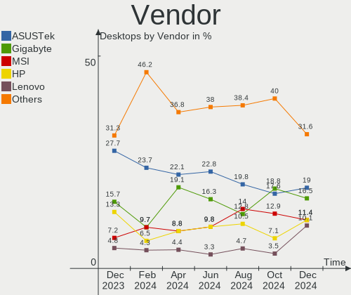
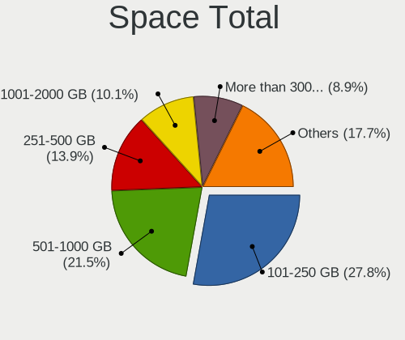

Zorin - Hardware Trends (Desktops)
----------------------------------

A project to identify most popular hardware characteristics and track their change
over time based on data collected by Linux users at https://Linux-Hardware.org.

Anyone can contribute to this report by the [hw-probe](https://github.com/linuxhw/hw-probe) tool:

    sudo -E hw-probe -all -upload

This report is for one last month. Overall report since the beginning of time: [TestCoverage](https://github.com/linuxhw/TestCoverage)

Period: Sep, 2022.

Contents
--------

* [ System ](#system)
  - [ OS                       ](#os)
  - [ OS Family                ](#os-family)
  - [ Kernel                   ](#kernel)
  - [ Kernel Family            ](#kernel-family)
  - [ Kernel Major Ver.        ](#kernel-major-ver)
  - [ Arch                     ](#arch)
  - [ DE                       ](#de)
  - [ Display Server           ](#display-server)
  - [ Display Manager          ](#display-manager)
  - [ OS Lang                  ](#os-lang)
  - [ Boot Mode                ](#boot-mode)
  - [ Filesystem               ](#filesystem)
  - [ Part. scheme             ](#part-scheme)
  - [ Dual Boot with Linux/BSD ](#dual-boot-with-linuxbsd)
  - [ Dual Boot (Win)          ](#dual-boot-win)

* [ Board ](#board)
  - [ Vendor                   ](#vendor)
  - [ Model                    ](#model)
  - [ Model Family             ](#model-family)
  - [ MFG Year                 ](#mfg-year)
  - [ Form Factor              ](#form-factor)
  - [ Secure Boot              ](#secure-boot)
  - [ Coreboot                 ](#coreboot)
  - [ RAM Size                 ](#ram-size)
  - [ RAM Used                 ](#ram-used)
  - [ Total Drives             ](#total-drives)
  - [ Has CD-ROM               ](#has-cd-rom)
  - [ Has Ethernet             ](#has-ethernet)
  - [ Has WiFi                 ](#has-wifi)
  - [ Has Bluetooth            ](#has-bluetooth)

* [ Location ](#location)
  - [ Country                  ](#country)
  - [ City                     ](#city)

* [ Drives ](#drives)
  - [ Drive Vendor             ](#drive-vendor)
  - [ Drive Model              ](#drive-model)
  - [ HDD Vendor               ](#hdd-vendor)
  - [ SSD Vendor               ](#ssd-vendor)
  - [ Drive Kind               ](#drive-kind)
  - [ Drive Connector          ](#drive-connector)
  - [ Drive Size               ](#drive-size)
  - [ Space Total              ](#space-total)
  - [ Space Used               ](#space-used)
  - [ Malfunc. Drives          ](#malfunc-drives)
  - [ Malfunc. Drive Vendor    ](#malfunc-drive-vendor)
  - [ Malfunc. HDD Vendor      ](#malfunc-hdd-vendor)
  - [ Malfunc. Drive Kind      ](#malfunc-drive-kind)
  - [ Failed Drives            ](#failed-drives)
  - [ Failed Drive Vendor      ](#failed-drive-vendor)
  - [ Drive Status             ](#drive-status)

* [ Storage controller ](#storage-controller)
  - [ Storage Vendor           ](#storage-vendor)
  - [ Storage Model            ](#storage-model)
  - [ Storage Kind             ](#storage-kind)

* [ Processor ](#processor)
  - [ CPU Vendor               ](#cpu-vendor)
  - [ CPU Model                ](#cpu-model)
  - [ CPU Model Family         ](#cpu-model-family)
  - [ CPU Cores                ](#cpu-cores)
  - [ CPU Sockets              ](#cpu-sockets)
  - [ CPU Threads              ](#cpu-threads)
  - [ CPU Op-Modes             ](#cpu-op-modes)
  - [ CPU Microcode            ](#cpu-microcode)
  - [ CPU Microarch            ](#cpu-microarch)

* [ Graphics ](#graphics)
  - [ GPU Vendor               ](#gpu-vendor)
  - [ GPU Model                ](#gpu-model)
  - [ GPU Combo                ](#gpu-combo)
  - [ GPU Driver               ](#gpu-driver)
  - [ GPU Memory               ](#gpu-memory)

* [ Monitor ](#monitor)
  - [ Monitor Vendor           ](#monitor-vendor)
  - [ Monitor Model            ](#monitor-model)
  - [ Monitor Resolution       ](#monitor-resolution)
  - [ Monitor Diagonal         ](#monitor-diagonal)
  - [ Monitor Width            ](#monitor-width)
  - [ Aspect Ratio             ](#aspect-ratio)
  - [ Monitor Area             ](#monitor-area)
  - [ Pixel Density            ](#pixel-density)
  - [ Multiple Monitors        ](#multiple-monitors)

* [ Network ](#network)
  - [ Net Controller Vendor    ](#net-controller-vendor)
  - [ Net Controller Model     ](#net-controller-model)
  - [ Wireless Vendor          ](#wireless-vendor)
  - [ Wireless Model           ](#wireless-model)
  - [ Ethernet Vendor          ](#ethernet-vendor)
  - [ Ethernet Model           ](#ethernet-model)
  - [ Net Controller Kind      ](#net-controller-kind)
  - [ Used Controller          ](#used-controller)
  - [ NICs                     ](#nics)
  - [ IPv6                     ](#ipv6)

* [ Bluetooth ](#bluetooth)
  - [ Bluetooth Vendor         ](#bluetooth-vendor)
  - [ Bluetooth Model          ](#bluetooth-model)

* [ Sound ](#sound)
  - [ Sound Vendor             ](#sound-vendor)
  - [ Sound Model              ](#sound-model)

* [ Memory ](#memory)
  - [ Memory Vendor            ](#memory-vendor)
  - [ Memory Model             ](#memory-model)
  - [ Memory Kind              ](#memory-kind)
  - [ Memory Form Factor       ](#memory-form-factor)
  - [ Memory Size              ](#memory-size)
  - [ Memory Speed             ](#memory-speed)

* [ Printers & scanners ](#printers--scanners)
  - [ Printer Vendor           ](#printer-vendor)
  - [ Printer Model            ](#printer-model)
  - [ Scanner Vendor           ](#scanner-vendor)
  - [ Scanner Model            ](#scanner-model)

* [ Camera ](#camera)
  - [ Camera Vendor            ](#camera-vendor)
  - [ Camera Model             ](#camera-model)

* [ Security ](#security)
  - [ Fingerprint Vendor       ](#fingerprint-vendor)
  - [ Fingerprint Model        ](#fingerprint-model)
  - [ Chipcard Vendor          ](#chipcard-vendor)
  - [ Chipcard Model           ](#chipcard-model)

* [ Unsupported ](#unsupported)
  - [ Unsupported Devices      ](#unsupported-devices)
  - [ Unsupported Device Types ](#unsupported-device-types)

System
------

OS
--

Installed operating systems

| Name     | Desktops | Percent |
|----------|----------|---------|
| Zorin 16 | 51       | 94.44%  |
| Zorin 15 | 2        | 3.7%    |
| Zorin 12 | 1        | 1.85%   |

OS Family
---------

OS without a version

| Name  | Desktops | Percent |
|-------|----------|---------|
| Zorin | 54       | 100%    |

Kernel
------

Version of the Linux kernel

| Version            | Desktops | Percent |
|--------------------|----------|---------|
| 5.15.0-46-generic  | 28       | 51.85%  |
| 5.15.0-48-generic  | 18       | 33.33%  |
| 5.4.0-125-generic  | 2        | 3.7%    |
| 5.19.6-xanmod1     | 1        | 1.85%   |
| 5.15.0-41-generic  | 1        | 1.85%   |
| 5.13.0-40-generic  | 1        | 1.85%   |
| 5.13.0-30-generic  | 1        | 1.85%   |
| 5.13.0-28-generic  | 1        | 1.85%   |
| 4.15.0-142-generic | 1        | 1.85%   |

Kernel Family
-------------

Linux kernel without a distro release

| Version | Desktops | Percent |
|---------|----------|---------|
| 5.15.0  | 47       | 87.04%  |
| 5.13.0  | 3        | 5.56%   |
| 5.4.0   | 2        | 3.7%    |
| 5.19.6  | 1        | 1.85%   |
| 4.15.0  | 1        | 1.85%   |

Kernel Major Ver.
-----------------

Linux kernel major version

| Version | Desktops | Percent |
|---------|----------|---------|
| 5.15    | 47       | 87.04%  |
| 5.13    | 3        | 5.56%   |
| 5.4     | 2        | 3.7%    |
| 5.19    | 1        | 1.85%   |
| 4.15    | 1        | 1.85%   |

Arch
----

OS architecture (x86_64, i586, etc.)

| Name   | Desktops | Percent |
|--------|----------|---------|
| x86_64 | 54       | 100%    |

DE
--

Desktop Environment

| Name    | Desktops | Percent |
|---------|----------|---------|
| GNOME   | 48       | 88.89%  |
| XFCE    | 5        | 9.26%   |
| Unknown | 1        | 1.85%   |

Display Server
--------------

X11 or Wayland

| Name | Desktops | Percent |
|------|----------|---------|
| X11  | 54       | 100%    |

Display Manager
---------------

SDDM, LightDM, etc.

| Name    | Desktops | Percent |
|---------|----------|---------|
| Unknown | 40       | 74.07%  |
| GDM3    | 8        | 14.81%  |
| GDM     | 4        | 7.41%   |
| LightDM | 2        | 3.7%    |

OS Lang
-------

Language

| Lang  | Desktops | Percent |
|-------|----------|---------|
| en_US | 26       | 48.15%  |
| de_DE | 8        | 14.81%  |
| pt_BR | 6        | 11.11%  |
| en_GB | 3        | 5.56%   |
| nl_NL | 1        | 1.85%   |
| nl_BE | 1        | 1.85%   |
| it_IT | 1        | 1.85%   |
| fr_FR | 1        | 1.85%   |
| es_AR | 1        | 1.85%   |
| en_PH | 1        | 1.85%   |
| en_IN | 1        | 1.85%   |
| en_IL | 1        | 1.85%   |
| en_AU | 1        | 1.85%   |
| cs_CZ | 1        | 1.85%   |
| ca_ES | 1        | 1.85%   |

Boot Mode
---------

EFI or BIOS

| Mode | Desktops | Percent |
|------|----------|---------|
| BIOS | 31       | 57.41%  |
| EFI  | 23       | 42.59%  |

Filesystem
----------

Type of filesystem

| Type | Desktops | Percent |
|------|----------|---------|
| Ext4 | 53       | 98.15%  |
| Ext2 | 1        | 1.85%   |

Part. scheme
------------

Scheme of partitioning

| Type    | Desktops | Percent |
|---------|----------|---------|
| Unknown | 48       | 88.89%  |
| MBR     | 4        | 7.41%   |
| GPT     | 2        | 3.7%    |

Dual Boot with Linux/BSD
------------------------

Hosting more than one Linux/BSD

| Dual boot | Desktops | Percent |
|-----------|----------|---------|
| No        | 53       | 98.15%  |
| Yes       | 1        | 1.85%   |

Dual Boot (Win)
---------------

Hosting Linux and Windows

| Dual boot | Desktops | Percent |
|-----------|----------|---------|
| No        | 50       | 92.59%  |
| Yes       | 4        | 7.41%   |

Board
-----

Vendor
------

Motherboard manufacturer

| Name                | Desktops | Percent |
|---------------------|----------|---------|
| ASUSTek Computer    | 14       | 25.93%  |
| Hewlett-Packard     | 9        | 16.67%  |
| MSI                 | 5        | 9.26%   |
| Lenovo              | 5        | 9.26%   |
| Gigabyte Technology | 5        | 9.26%   |
| Dell                | 5        | 9.26%   |
| ASRock              | 5        | 9.26%   |
| Fujitsu             | 2        | 3.7%    |
| Intel               | 1        | 1.85%   |
| Gateway             | 1        | 1.85%   |
| ECS                 | 1        | 1.85%   |
| Biostar             | 1        | 1.85%   |

Model
-----

Motherboard model

| Name                                 | Desktops | Percent |
|--------------------------------------|----------|---------|
| ASUS ROG CROSSHAIR VIII HERO         | 2        | 3.7%    |
| MSI MS-7918                          | 1        | 1.85%   |
| MSI MS-7915                          | 1        | 1.85%   |
| MSI MS-7260                          | 1        | 1.85%   |
| MSI H310 Gaming Trident3 (MS-B920)   | 1        | 1.85%   |
| MSI 700-056                          | 1        | 1.85%   |
| Lenovo ThinkCentre M93p 10A9CTO1WW   | 1        | 1.85%   |
| Lenovo ThinkCentre M92 3229A11       | 1        | 1.85%   |
| Lenovo ThinkCentre M71e 3157AE2      | 1        | 1.85%   |
| Lenovo ThinkCentre M58e 7298A76      | 1        | 1.85%   |
| Lenovo H30-05 90BJ00CNMT             | 1        | 1.85%   |
| Intel SKYBAY                         | 1        | 1.85%   |
| HP ProDesk 600 G1 TWR                | 1        | 1.85%   |
| HP Pavilion Gaming Desktop TG01-1xxx | 1        | 1.85%   |
| HP EliteDesk 800 G2 DM 35W           | 1        | 1.85%   |
| HP Compaq dc7900 Small Form Factor   | 1        | 1.85%   |
| HP Compaq dc7800 Small Form Factor   | 1        | 1.85%   |
| HP Compaq dc7700 Small Form Factor   | 1        | 1.85%   |
| HP 500-420qe                         | 1        | 1.85%   |
| HP 290 G2 MT Business PC             | 1        | 1.85%   |
| HP 260-a010                          | 1        | 1.85%   |
| Gigabyte Z77-D3H                     | 1        | 1.85%   |
| Gigabyte Z390 AORUS MASTER           | 1        | 1.85%   |
| Gigabyte GA-870A-UD3                 | 1        | 1.85%   |
| Gigabyte G1.Sniper Z97               | 1        | 1.85%   |
| Gigabyte A320M-S2H V2                | 1        | 1.85%   |
| Gateway LX4800/LX6810                | 1        | 1.85%   |
| Fujitsu ESPRIMO E720                 | 1        | 1.85%   |
| Fujitsu D3222-A1                     | 1        | 1.85%   |
| ECS NP085AA-ABA SR5705F              | 1        | 1.85%   |
| Dell XPS 8700                        | 1        | 1.85%   |
| Dell Precision T5610                 | 1        | 1.85%   |
| Dell OptiPlex 980                    | 1        | 1.85%   |
| Dell OptiPlex 790                    | 1        | 1.85%   |
| Dell OptiPlex 330                    | 1        | 1.85%   |
| Biostar B350ET2                      | 1        | 1.85%   |
| ASUS ROG STRIX Z690-I GAMING WIFI    | 1        | 1.85%   |
| ASUS ROG STRIX B450-F GAMING         | 1        | 1.85%   |
| ASUS PRO A320M-R WI-FI               | 1        | 1.85%   |
| ASUS PRIME Z690-P D4                 | 1        | 1.85%   |

Model Family
------------

Motherboard model prefix

| Name                 | Desktops | Percent |
|----------------------|----------|---------|
| Lenovo ThinkCentre   | 4        | 7.41%   |
| ASUS ROG             | 4        | 7.41%   |
| HP Compaq            | 3        | 5.56%   |
| Dell OptiPlex        | 3        | 5.56%   |
| ASUS PRIME           | 3        | 5.56%   |
| MSI MS-7918          | 1        | 1.85%   |
| MSI MS-7915          | 1        | 1.85%   |
| MSI MS-7260          | 1        | 1.85%   |
| MSI H310             | 1        | 1.85%   |
| MSI 700-056          | 1        | 1.85%   |
| Lenovo H30-05        | 1        | 1.85%   |
| Intel SKYBAY         | 1        | 1.85%   |
| HP ProDesk           | 1        | 1.85%   |
| HP Pavilion          | 1        | 1.85%   |
| HP EliteDesk         | 1        | 1.85%   |
| HP 500-420qe         | 1        | 1.85%   |
| HP 290               | 1        | 1.85%   |
| HP 260-a010          | 1        | 1.85%   |
| Gigabyte Z77-D3H     | 1        | 1.85%   |
| Gigabyte Z390        | 1        | 1.85%   |
| Gigabyte GA-870A-UD3 | 1        | 1.85%   |
| Gigabyte G1.Sniper   | 1        | 1.85%   |
| Gigabyte A320M-S2H   | 1        | 1.85%   |
| Gateway LX4800       | 1        | 1.85%   |
| Fujitsu ESPRIMO      | 1        | 1.85%   |
| Fujitsu D3222-A1     | 1        | 1.85%   |
| ECS NP085AA-ABA      | 1        | 1.85%   |
| Dell XPS             | 1        | 1.85%   |
| Dell Precision       | 1        | 1.85%   |
| Biostar B350ET2      | 1        | 1.85%   |
| ASUS PRO             | 1        | 1.85%   |
| ASUS P8B75-V         | 1        | 1.85%   |
| ASUS P5K             | 1        | 1.85%   |
| ASUS M3A78-EM        | 1        | 1.85%   |
| ASUS GX624AA-ABA     | 1        | 1.85%   |
| ASUS All             | 1        | 1.85%   |
| ASUS A88X-GAMER      | 1        | 1.85%   |
| ASRock QC5000M-ITX   | 1        | 1.85%   |
| ASRock H61M-DGS      | 1        | 1.85%   |
| ASRock B85M          | 1        | 1.85%   |

MFG Year
--------

Motherboard manufacture year

| Year | Desktops | Percent |
|------|----------|---------|
| 2014 | 7        | 12.96%  |
| 2018 | 6        | 11.11%  |
| 2016 | 6        | 11.11%  |
| 2013 | 4        | 7.41%   |
| 2007 | 4        | 7.41%   |
| 2021 | 3        | 5.56%   |
| 2019 | 3        | 5.56%   |
| 2012 | 3        | 5.56%   |
| 2011 | 3        | 5.56%   |
| 2009 | 3        | 5.56%   |
| 2008 | 3        | 5.56%   |
| 2022 | 2        | 3.7%    |
| 2020 | 2        | 3.7%    |
| 2015 | 2        | 3.7%    |
| 2006 | 2        | 3.7%    |
| 2010 | 1        | 1.85%   |

Form Factor
-----------

Physical design of the computer

| Name    | Desktops | Percent |
|---------|----------|---------|
| Desktop | 54       | 100%    |

Secure Boot
-----------

Enabled or disabled

| State    | Desktops | Percent |
|----------|----------|---------|
| Disabled | 52       | 96.3%   |
| Enabled  | 2        | 3.7%    |

Coreboot
--------

Have coreboot on board

| Used | Desktops | Percent |
|------|----------|---------|
| No   | 54       | 100%    |

RAM Size
--------

Total RAM memory

| Size in GB  | Desktops | Percent |
|-------------|----------|---------|
| 16.01-24.0  | 17       | 31.48%  |
| 8.01-16.0   | 13       | 24.07%  |
| 3.01-4.0    | 10       | 18.52%  |
| 4.01-8.0    | 7        | 12.96%  |
| 32.01-64.0  | 4        | 7.41%   |
| 2.01-3.0    | 1        | 1.85%   |
| 64.01-256.0 | 1        | 1.85%   |
| 1.01-2.0    | 1        | 1.85%   |

RAM Used
--------

Used RAM memory

| Used GB   | Desktops | Percent |
|-----------|----------|---------|
| 1.01-2.0  | 20       | 37.04%  |
| 2.01-3.0  | 17       | 31.48%  |
| 4.01-8.0  | 7        | 12.96%  |
| 3.01-4.0  | 4        | 7.41%   |
| 8.01-16.0 | 3        | 5.56%   |
| 0.51-1.0  | 3        | 5.56%   |

Total Drives
------------

Number of drives on board

| Drives | Desktops | Percent |
|--------|----------|---------|
| 1      | 27       | 50%     |
| 2      | 13       | 24.07%  |
| 3      | 8        | 14.81%  |
| 4      | 3        | 5.56%   |
| 8      | 1        | 1.85%   |
| 6      | 1        | 1.85%   |
| 5      | 1        | 1.85%   |

Has CD-ROM
----------

Has CD-ROM on board

| Presented | Desktops | Percent |
|-----------|----------|---------|
| Yes       | 31       | 57.41%  |
| No        | 23       | 42.59%  |

Has Ethernet
------------

Has Ethernet on board

| Presented | Desktops | Percent |
|-----------|----------|---------|
| Yes       | 52       | 96.3%   |
| No        | 2        | 3.7%    |

Has WiFi
--------

Has WiFi module

| Presented | Desktops | Percent |
|-----------|----------|---------|
| Yes       | 29       | 53.7%   |
| No        | 25       | 46.3%   |

Has Bluetooth
-------------

Has Bluetooth module

| Presented | Desktops | Percent |
|-----------|----------|---------|
| No        | 35       | 64.81%  |
| Yes       | 19       | 35.19%  |

Location
--------

Country
-------

Geographic location (country)

| Country       | Desktops | Percent |
|---------------|----------|---------|
| USA           | 17       | 31.48%  |
| Germany       | 8        | 14.81%  |
| Brazil        | 5        | 9.26%   |
| Italy         | 3        | 5.56%   |
| UK            | 2        | 3.7%    |
| Netherlands   | 2        | 3.7%    |
| Egypt         | 2        | 3.7%    |
| Spain         | 1        | 1.85%   |
| Puerto Rico   | 1        | 1.85%   |
| Philippines   | 1        | 1.85%   |
| Malaysia      | 1        | 1.85%   |
| Israel        | 1        | 1.85%   |
| Ireland       | 1        | 1.85%   |
| India         | 1        | 1.85%   |
| France        | 1        | 1.85%   |
| Faroe Islands | 1        | 1.85%   |
| Denmark       | 1        | 1.85%   |
| Czechia       | 1        | 1.85%   |
| Bulgaria      | 1        | 1.85%   |
| Belgium       | 1        | 1.85%   |
| Australia     | 1        | 1.85%   |
| Argentina     | 1        | 1.85%   |

City
----

Geographic location (city)

| City                   | Desktops | Percent |
|------------------------|----------|---------|
| Sao Paulo              | 2        | 3.7%    |
| Phoenix                | 2        | 3.7%    |
| Munich                 | 2        | 3.7%    |
| Leidschendam           | 2        | 3.7%    |
| Denver                 | 2        | 3.7%    |
| Unknown                | 2        | 3.7%    |
| Walled Lake            | 1        | 1.85%   |
| Vilas                  | 1        | 1.85%   |
| Tyler                  | 1        | 1.85%   |
| Tórshavn              | 1        | 1.85%   |
| Tel Aviv               | 1        | 1.85%   |
| Stralsund              | 1        | 1.85%   |
| Sofia                  | 1        | 1.85%   |
| San Miguel de Tucumán | 1        | 1.85%   |
| Saint John             | 1        | 1.85%   |
| Rome                   | 1        | 1.85%   |
| Pforzheim              | 1        | 1.85%   |
| Oberndorf              | 1        | 1.85%   |
| North Kingstown        | 1        | 1.85%   |
| Niederndodeleben       | 1        | 1.85%   |
| Lüneburg              | 1        | 1.85%   |
| Limena                 | 1        | 1.85%   |
| Kuala Lumpur           | 1        | 1.85%   |
| Kiel                   | 1        | 1.85%   |
| Kafr ash Shaykh        | 1        | 1.85%   |
| Jewett City            | 1        | 1.85%   |
| Indianapolis           | 1        | 1.85%   |
| Hatfield               | 1        | 1.85%   |
| Garrochales            | 1        | 1.85%   |
| Forest                 | 1        | 1.85%   |
| Esbjerg                | 1        | 1.85%   |
| Dumaguete              | 1        | 1.85%   |
| Dublin                 | 1        | 1.85%   |
| Darlington             | 1        | 1.85%   |
| Columbus               | 1        | 1.85%   |
| Colatina               | 1        | 1.85%   |
| Cincinnati             | 1        | 1.85%   |
| Caslav                 | 1        | 1.85%   |
| Cairo                  | 1        | 1.85%   |
| Brasília              | 1        | 1.85%   |

Drives
------

Drive Vendor
------------

Hard drive vendors

| Vendor              | Desktops | Drives | Percent |
|---------------------|----------|--------|---------|
| Seagate             | 18       | 19     | 18.95%  |
| WDC                 | 16       | 16     | 16.84%  |
| Samsung Electronics | 11       | 14     | 11.58%  |
| Kingston            | 7        | 9      | 7.37%   |
| Crucial             | 6        | 6      | 6.32%   |
| SanDisk             | 5        | 5      | 5.26%   |
| Toshiba             | 4        | 4      | 4.21%   |
| Intel               | 3        | 3      | 3.16%   |
| Unknown             | 2        | 3      | 2.11%   |
| SK hynix            | 2        | 2      | 2.11%   |
| Patriot             | 2        | 2      | 2.11%   |
| Leven               | 2        | 2      | 2.11%   |
| KingSpec            | 2        | 2      | 2.11%   |
| A-DATA Technology   | 2        | 3      | 2.11%   |
| V300                | 1        | 1      | 1.05%   |
| USB3.0              | 1        | 1      | 1.05%   |
| Team                | 1        | 1      | 1.05%   |
| PNY                 | 1        | 1      | 1.05%   |
| Lite-On Technology  | 1        | 1      | 1.05%   |
| Intenso             | 1        | 1      | 1.05%   |
| HS-SSD-C100         | 1        | 1      | 1.05%   |
| Hitachi             | 1        | 1      | 1.05%   |
| HGST                | 1        | 1      | 1.05%   |
| China               | 1        | 1      | 1.05%   |
| Apple               | 1        | 1      | 1.05%   |
| AFOX                | 1        | 1      | 1.05%   |
| Acer                | 1        | 1      | 1.05%   |

Drive Model
-----------

Hard drive models

| Model                               | Desktops | Percent |
|-------------------------------------|----------|---------|
| Kingston SA400S37240G 240GB SSD     | 3        | 2.94%   |
| WDC WD10EZEX-60M2NA0 1TB            | 2        | 1.96%   |
| WDC WD10EZEX-08M2NA0 1TB            | 2        | 1.96%   |
| Toshiba DT01ACA050 500GB            | 2        | 1.96%   |
| SK hynix NVMe SSD Drive 512GB       | 2        | 1.96%   |
| Seagate ST2000DM008-2FR102 2TB      | 2        | 1.96%   |
| Seagate ST1000DM010-2EP102 1TB      | 2        | 1.96%   |
| Seagate ST1000DM003-1SB102 1TB      | 2        | 1.96%   |
| Samsung SSD 850 EVO 250GB           | 2        | 1.96%   |
| Samsung NVMe SSD Drive 1TB          | 2        | 1.96%   |
| Kingston SA400S37480G 480GB SSD     | 2        | 1.96%   |
| Crucial CT240BX500SSD1 240GB        | 2        | 1.96%   |
| WDC WDBNCE0010PNC 1TB SSD           | 1        | 0.98%   |
| WDC WD5000LPVX-00V0TT0 500GB        | 1        | 0.98%   |
| WDC WD5000LPCX-24C6HT0 500GB        | 1        | 0.98%   |
| WDC WD5000AAKX-22ERMA0 500GB        | 1        | 0.98%   |
| WDC WD5000AAKS-75V0A0 500GB         | 1        | 0.98%   |
| WDC WD5000AAKS-00UU3A0 500GB        | 1        | 0.98%   |
| WDC WD40EZRZ-00GXCB0 4TB            | 1        | 0.98%   |
| WDC WD3200AVJS-63B6A0 320GB         | 1        | 0.98%   |
| WDC WD2500BPVT-22ZEST0 250GB        | 1        | 0.98%   |
| WDC WD1600BEVS-22RST0 160GB         | 1        | 0.98%   |
| WDC WD10EZRX-00A3KB0 1TB            | 1        | 0.98%   |
| WDC WD10EZEX-75WN4A1 1TB            | 1        | 0.98%   |
| V300 60G                            | 1        | 0.98%   |
| USB3.0 Super Speed 240GB            | 1        | 0.98%   |
| Unknown SD/MMC/MS PRO 2GB           | 1        | 0.98%   |
| Unknown SD/MMC 16GB                 | 1        | 0.98%   |
| Unknown M.S./M.S.Pro/HG 16GB        | 1        | 0.98%   |
| Toshiba MQ01ABF050 500GB            | 1        | 0.98%   |
| Toshiba HDWD130 3TB                 | 1        | 0.98%   |
| Team T253512GB SSD                  | 1        | 0.98%   |
| Seagate ST9500325AS 500GB           | 1        | 0.98%   |
| Seagate ST3500630AS 500GB           | 1        | 0.98%   |
| Seagate ST3250318AS 250GB           | 1        | 0.98%   |
| Seagate ST3120827AS 120GB           | 1        | 0.98%   |
| Seagate ST2000DM006-2DM164 2TB      | 1        | 0.98%   |
| Seagate ST2000DM 001-1ER164 2TB     | 1        | 0.98%   |
| Seagate ST20000NM007D-3DJ103 20TB   | 1        | 0.98%   |
| Seagate ST160LM003 HN-M160MBB 160GB | 1        | 0.98%   |

HDD Vendor
----------

Hard disk drive vendors

| Vendor              | Desktops | Drives | Percent |
|---------------------|----------|--------|---------|
| Seagate             | 16       | 17     | 40%     |
| WDC                 | 15       | 15     | 37.5%   |
| Toshiba             | 4        | 4      | 10%     |
| USB3.0              | 1        | 1      | 2.5%    |
| Unknown             | 1        | 1      | 2.5%    |
| Samsung Electronics | 1        | 1      | 2.5%    |
| Hitachi             | 1        | 1      | 2.5%    |
| HGST                | 1        | 1      | 2.5%    |

SSD Vendor
----------

Solid state drive vendors

| Vendor              | Desktops | Drives | Percent |
|---------------------|----------|--------|---------|
| Kingston            | 6        | 7      | 15.79%  |
| Crucial             | 6        | 6      | 15.79%  |
| SanDisk             | 5        | 5      | 13.16%  |
| Samsung Electronics | 4        | 5      | 10.53%  |
| Patriot             | 2        | 2      | 5.26%   |
| Leven               | 2        | 2      | 5.26%   |
| KingSpec            | 2        | 2      | 5.26%   |
| Intel               | 2        | 2      | 5.26%   |
| A-DATA Technology   | 2        | 3      | 5.26%   |
| WDC                 | 1        | 1      | 2.63%   |
| Team                | 1        | 1      | 2.63%   |
| PNY                 | 1        | 1      | 2.63%   |
| Intenso             | 1        | 1      | 2.63%   |
| China               | 1        | 1      | 2.63%   |
| AFOX                | 1        | 1      | 2.63%   |
| Acer                | 1        | 1      | 2.63%   |

Drive Kind
----------

HDD or SSD

| Kind    | Desktops | Drives | Percent |
|---------|----------|--------|---------|
| HDD     | 34       | 41     | 40.96%  |
| SSD     | 31       | 41     | 37.35%  |
| NVMe    | 14       | 16     | 16.87%  |
| Unknown | 4        | 5      | 4.82%   |

Drive Connector
---------------

SATA, SAS, NVMe, etc.

| Type | Desktops | Drives | Percent |
|------|----------|--------|---------|
| SATA | 50       | 78     | 69.44%  |
| NVMe | 14       | 16     | 19.44%  |
| SAS  | 8        | 9      | 11.11%  |

Drive Size
----------

Size of hard drive

| Size in TB | Desktops | Drives | Percent |
|------------|----------|--------|---------|
| 0.01-0.5   | 38       | 51     | 59.38%  |
| 0.51-1.0   | 18       | 23     | 28.13%  |
| 1.01-2.0   | 4        | 4      | 6.25%   |
| 2.01-3.0   | 2        | 2      | 3.13%   |
| 3.01-4.0   | 1        | 1      | 1.56%   |
| 10.01-20.0 | 1        | 1      | 1.56%   |

Space Total
-----------

Amount of disk space available on the file system

| Size in GB     | Desktops | Percent |
|----------------|----------|---------|
| 101-250        | 24       | 44.44%  |
| 251-500        | 9        | 16.67%  |
| 501-1000       | 8        | 14.81%  |
| 1001-2000      | 6        | 11.11%  |
| More than 3000 | 3        | 5.56%   |
| 21-50          | 2        | 3.7%    |
| 1-20           | 1        | 1.85%   |
| 51-100         | 1        | 1.85%   |

Space Used
----------

Amount of used disk space

| Used GB        | Desktops | Percent |
|----------------|----------|---------|
| 1-20           | 20       | 37.04%  |
| 21-50          | 11       | 20.37%  |
| 51-100         | 9        | 16.67%  |
| 101-250        | 5        | 9.26%   |
| 251-500        | 3        | 5.56%   |
| 2001-3000      | 2        | 3.7%    |
| 501-1000       | 2        | 3.7%    |
| More than 3000 | 1        | 1.85%   |
| 1001-2000      | 1        | 1.85%   |

Malfunc. Drives
---------------

Drive models with a malfunction

| Model                          | Desktops | Drives | Percent |
|--------------------------------|----------|--------|---------|
| Seagate ST3250318AS 250GB      | 1        | 1      | 33.33%  |
| Seagate ST2000DM008-2FR102 2TB | 1        | 1      | 33.33%  |
| Intel SSDSC2CW060A3 64GB       | 1        | 1      | 33.33%  |

Malfunc. Drive Vendor
---------------------

Vendors of faulty drives

| Vendor  | Desktops | Drives | Percent |
|---------|----------|--------|---------|
| Seagate | 2        | 2      | 66.67%  |
| Intel   | 1        | 1      | 33.33%  |

Malfunc. HDD Vendor
-------------------

Vendors of faulty HDD drives

| Vendor  | Desktops | Drives | Percent |
|---------|----------|--------|---------|
| Seagate | 2        | 2      | 100%    |

Malfunc. Drive Kind
-------------------

Kinds of faulty drives

| Kind | Desktops | Drives | Percent |
|------|----------|--------|---------|
| HDD  | 2        | 2      | 66.67%  |
| SSD  | 1        | 1      | 33.33%  |

Failed Drives
-------------

Failed drive models

Zero info for selected period =(

Failed Drive Vendor
-------------------

Failed drive vendors

Zero info for selected period =(

Drive Status
------------

Number of failed and malfunc. drives

| Status   | Desktops | Drives | Percent |
|----------|----------|--------|---------|
| Detected | 48       | 96     | 87.27%  |
| Works    | 4        | 4      | 7.27%   |
| Malfunc  | 3        | 3      | 5.45%   |

Storage controller
------------------

Storage Vendor
--------------

Storage controller vendors

| Vendor                      | Desktops | Percent |
|-----------------------------|----------|---------|
| Intel                       | 35       | 50%     |
| AMD                         | 16       | 22.86%  |
| Samsung Electronics         | 7        | 10%     |
| Nvidia                      | 3        | 4.29%   |
| SK hynix                    | 2        | 2.86%   |
| ASMedia Technology          | 2        | 2.86%   |
| Seagate Technology          | 1        | 1.43%   |
| Lite-On Technology          | 1        | 1.43%   |
| Kingston Technology Company | 1        | 1.43%   |
| JMicron Technology          | 1        | 1.43%   |
| Apple                       | 1        | 1.43%   |

Storage Model
-------------

Storage controller models

| Model                                                                            | Desktops | Percent |
|----------------------------------------------------------------------------------|----------|---------|
| AMD FCH SATA Controller [AHCI mode]                                              | 10       | 11.11%  |
| Intel 8 Series/C220 Series Chipset Family 6-port SATA Controller 1 [AHCI mode]   | 8        | 8.89%   |
| Samsung NVMe SSD Controller SM981/PM981/PM983                                    | 3        | 3.33%   |
| Intel SATA Controller [RAID mode]                                                | 3        | 3.33%   |
| Intel 6 Series/C200 Series Chipset Family 6 port Desktop SATA AHCI Controller    | 3        | 3.33%   |
| AMD 400 Series Chipset SATA Controller                                           | 3        | 3.33%   |
| Samsung NVMe SSD Controller PM9A1/PM9A3/980PRO                                   | 2        | 2.22%   |
| Intel Volume Management Device NVMe RAID Controller                              | 2        | 2.22%   |
| Intel Cannon Lake PCH SATA AHCI Controller                                       | 2        | 2.22%   |
| Intel Alder Lake-S PCH SATA Controller [AHCI Mode]                               | 2        | 2.22%   |
| Intel 9 Series Chipset Family SATA Controller [AHCI Mode]                        | 2        | 2.22%   |
| Intel 82801G (ICH7 Family) IDE Controller                                        | 2        | 2.22%   |
| Intel 7 Series/C210 Series Chipset Family 4-port SATA Controller [IDE mode]      | 2        | 2.22%   |
| Intel 7 Series/C210 Series Chipset Family 2-port SATA Controller [IDE mode]      | 2        | 2.22%   |
| ASMedia ASM1062 Serial ATA Controller                                            | 2        | 2.22%   |
| AMD SB7x0/SB8x0/SB9x0 SATA Controller [IDE mode]                                 | 2        | 2.22%   |
| AMD SB7x0/SB8x0/SB9x0 IDE Controller                                             | 2        | 2.22%   |
| AMD FCH SATA Controller [IDE mode]                                               | 2        | 2.22%   |
| AMD 300 Series Chipset SATA Controller                                           | 2        | 2.22%   |
| SK hynix Non-Volatile memory controller                                          | 1        | 1.11%   |
| SK hynix BC511                                                                   | 1        | 1.11%   |
| Seagate FireCuda 520 SSD                                                         | 1        | 1.11%   |
| Samsung NVMe SSD Controller SM961/PM961/SM963                                    | 1        | 1.11%   |
| Samsung NVMe SSD Controller SM951/PM951                                          | 1        | 1.11%   |
| Nvidia MCP79 RAID Controller                                                     | 1        | 1.11%   |
| Nvidia MCP61 SATA Controller                                                     | 1        | 1.11%   |
| Nvidia MCP61 IDE                                                                 | 1        | 1.11%   |
| Nvidia MCP55 SATA Controller                                                     | 1        | 1.11%   |
| Nvidia MCP55 IDE                                                                 | 1        | 1.11%   |
| Lite-On Non-Volatile memory controller                                           | 1        | 1.11%   |
| Kingston Company Company Non-Volatile memory controller                          | 1        | 1.11%   |
| JMicron JMB363 SATA/IDE Controller                                               | 1        | 1.11%   |
| Intel Sunrise Point-LP SATA Controller [AHCI mode]                               | 1        | 1.11%   |
| Intel SSD 600P Series                                                            | 1        | 1.11%   |
| Intel Q170/Q150/B150/H170/H110/Z170/CM236 Chipset SATA Controller [AHCI Mode]    | 1        | 1.11%   |
| Intel NM10/ICH7 Family SATA Controller [IDE mode]                                | 1        | 1.11%   |
| Intel NM10/ICH7 Family SATA Controller [AHCI mode]                               | 1        | 1.11%   |
| Intel C600/X79 series chipset SATA RAID Controller                               | 1        | 1.11%   |
| Intel Atom/Celeron/Pentium Processor x5-E8000/J3xxx/N3xxx Series SATA Controller | 1        | 1.11%   |
| Intel 82Q35 Express PT IDER Controller                                           | 1        | 1.11%   |

Storage Kind
------------

Kind of storage controller (IDE, SATA, NVMe, SAS, ...)

| Kind | Desktops | Percent |
|------|----------|---------|
| SATA | 44       | 56.41%  |
| NVMe | 14       | 17.95%  |
| IDE  | 13       | 16.67%  |
| RAID | 7        | 8.97%   |

Processor
---------

CPU Vendor
----------

Processor vendors

| Vendor | Desktops | Percent |
|--------|----------|---------|
| Intel  | 36       | 66.67%  |
| AMD    | 18       | 33.33%  |

CPU Model
---------

Processor models

| Model                                       | Desktops | Percent |
|---------------------------------------------|----------|---------|
| Intel Core i5-4590 CPU @ 3.30GHz            | 4        | 7.41%   |
| Intel Core i7-3770 CPU @ 3.40GHz            | 2        | 3.7%    |
| Intel Core i5-2400 CPU @ 3.10GHz            | 2        | 3.7%    |
| Intel Core 2 Duo CPU E6550 @ 2.33GHz        | 2        | 3.7%    |
| AMD Phenom II X6 1055T Processor            | 2        | 3.7%    |
| Intel Xeon CPU E5-2650 v2 @ 2.60GHz         | 1        | 1.85%   |
| Intel Xeon CPU E3-1231 v3 @ 3.40GHz         | 1        | 1.85%   |
| Intel Pentium Dual CPU E2140 @ 1.60GHz      | 1        | 1.85%   |
| Intel Pentium CPU J3710 @ 1.60GHz           | 1        | 1.85%   |
| Intel Pentium CPU G850 @ 2.90GHz            | 1        | 1.85%   |
| Intel Pentium CPU G2030 @ 3.00GHz           | 1        | 1.85%   |
| Intel Core i9-9900K CPU @ 3.60GHz           | 1        | 1.85%   |
| Intel Core i7-8700 CPU @ 3.20GHz            | 1        | 1.85%   |
| Intel Core i7-7700K CPU @ 4.20GHz           | 1        | 1.85%   |
| Intel Core i7-4790K CPU @ 4.00GHz           | 1        | 1.85%   |
| Intel Core i7-4790 CPU @ 3.60GHz            | 1        | 1.85%   |
| Intel Core i7-4770 CPU @ 3.40GHz            | 1        | 1.85%   |
| Intel Core i7 CPU 870 @ 2.93GHz             | 1        | 1.85%   |
| Intel Core i5-8500 CPU @ 3.00GHz            | 1        | 1.85%   |
| Intel Core i5-6500T CPU @ 2.50GHz           | 1        | 1.85%   |
| Intel Core i5-4690K CPU @ 3.50GHz           | 1        | 1.85%   |
| Intel Core i3-4160 CPU @ 3.60GHz            | 1        | 1.85%   |
| Intel Core i3-4130 CPU @ 3.40GHz            | 1        | 1.85%   |
| Intel Core 2 Quad CPU Q8200 @ 2.33GHz       | 1        | 1.85%   |
| Intel Core 2 Duo CPU E8400 @ 3.00GHz        | 1        | 1.85%   |
| Intel Core 2 Duo CPU E7300 @ 2.66GHz        | 1        | 1.85%   |
| Intel Core 2 Duo CPU E4500 @ 2.20GHz        | 1        | 1.85%   |
| Intel Core 2 CPU 6300 @ 1.86GHz             | 1        | 1.85%   |
| Intel Celeron CPU 3865U @ 1.80GHz           | 1        | 1.85%   |
| Intel 12th Gen Core i9-12900                | 1        | 1.85%   |
| Intel 12th Gen Core i5-12400F               | 1        | 1.85%   |
| AMD Ryzen 9 5900X 12-Core Processor         | 1        | 1.85%   |
| AMD Ryzen 7 5800X 8-Core Processor          | 1        | 1.85%   |
| AMD Ryzen 7 3800X 8-Core Processor          | 1        | 1.85%   |
| AMD Ryzen 7 3700X 8-Core Processor          | 1        | 1.85%   |
| AMD Ryzen 5 4600G with Radeon Graphics      | 1        | 1.85%   |
| AMD Ryzen 5 3600 6-Core Processor           | 1        | 1.85%   |
| AMD Ryzen 3 3300X 4-Core Processor          | 1        | 1.85%   |
| AMD Ryzen 3 3200G with Radeon Vega Graphics | 1        | 1.85%   |
| AMD Athlon Processor LE-1640                | 1        | 1.85%   |

CPU Model Family
----------------

Processor model prefix

| Model              | Desktops | Percent |
|--------------------|----------|---------|
| Intel Core i5      | 9        | 16.67%  |
| Intel Core i7      | 8        | 14.81%  |
| Intel Core 2 Duo   | 5        | 9.26%   |
| Intel Pentium      | 3        | 5.56%   |
| AMD Ryzen 7        | 3        | 5.56%   |
| Other              | 2        | 3.7%    |
| Intel Xeon         | 2        | 3.7%    |
| Intel Core i3      | 2        | 3.7%    |
| AMD Ryzen 5        | 2        | 3.7%    |
| AMD Ryzen 3        | 2        | 3.7%    |
| AMD Phenom II X6   | 2        | 3.7%    |
| AMD Athlon         | 2        | 3.7%    |
| AMD A6             | 2        | 3.7%    |
| AMD A10            | 2        | 3.7%    |
| Intel Pentium Dual | 1        | 1.85%   |
| Intel Core i9      | 1        | 1.85%   |
| Intel Core 2 Quad  | 1        | 1.85%   |
| Intel Core 2       | 1        | 1.85%   |
| Intel Celeron      | 1        | 1.85%   |
| AMD Ryzen 9        | 1        | 1.85%   |
| AMD Athlon 64 X2   | 1        | 1.85%   |
| AMD A4             | 1        | 1.85%   |

CPU Cores
---------

Number of processor cores

| Number | Desktops | Percent |
|--------|----------|---------|
| 4      | 23       | 42.59%  |
| 2      | 16       | 29.63%  |
| 6      | 7        | 12.96%  |
| 8      | 4        | 7.41%   |
| 16     | 2        | 3.7%    |
| 12     | 1        | 1.85%   |
| 1      | 1        | 1.85%   |

CPU Sockets
-----------

Number of sockets

| Number | Desktops | Percent |
|--------|----------|---------|
| 1      | 53       | 98.15%  |
| 2      | 1        | 1.85%   |

CPU Threads
-----------

Threads per core (Hyper-Threading)

| Number | Desktops | Percent |
|--------|----------|---------|
| 1      | 29       | 53.7%   |
| 2      | 25       | 46.3%   |

CPU Op-Modes
------------

CPU Operation Modes (32-bit, 64-bit)

| Op mode        | Desktops | Percent |
|----------------|----------|---------|
| 32-bit, 64-bit | 54       | 100%    |

CPU Microcode
-------------

Microcode number

| Number     | Desktops | Percent |
|------------|----------|---------|
| 0x306c3    | 10       | 18.52%  |
| Unknown    | 8        | 14.81%  |
| 0x306a9    | 3        | 5.56%   |
| 0x206a7    | 3        | 5.56%   |
| 0x906ea    | 2        | 3.7%    |
| 0x6fd      | 2        | 3.7%    |
| 0x6fb      | 2        | 3.7%    |
| 0x08701021 | 2        | 3.7%    |
| 0x010000dc | 2        | 3.7%    |
| 0x906ed    | 1        | 1.85%   |
| 0x90672    | 1        | 1.85%   |
| 0x806e9    | 1        | 1.85%   |
| 0x6f6      | 1        | 1.85%   |
| 0x506e3    | 1        | 1.85%   |
| 0x406c4    | 1        | 1.85%   |
| 0x306e4    | 1        | 1.85%   |
| 0x106e5    | 1        | 1.85%   |
| 0x1067a    | 1        | 1.85%   |
| 0x10677    | 1        | 1.85%   |
| 0x10676    | 1        | 1.85%   |
| 0x0a201016 | 1        | 1.85%   |
| 0x0a201009 | 1        | 1.85%   |
| 0x08701013 | 1        | 1.85%   |
| 0x08108109 | 1        | 1.85%   |
| 0x08101102 | 1        | 1.85%   |
| 0x0700010f | 1        | 1.85%   |
| 0x06003106 | 1        | 1.85%   |
| 0x06001119 | 1        | 1.85%   |
| 0x03000027 | 1        | 1.85%   |

CPU Microarch
-------------

Microarchitecture

| Name             | Desktops | Percent |
|------------------|----------|---------|
| Haswell          | 11       | 20.37%  |
| Zen 2            | 5        | 9.26%   |
| KabyLake         | 5        | 9.26%   |
| Core             | 5        | 9.26%   |
| IvyBridge        | 4        | 7.41%   |
| SandyBridge      | 3        | 5.56%   |
| Penryn           | 3        | 5.56%   |
| Zen 3            | 2        | 3.7%    |
| K8 Hammer        | 2        | 3.7%    |
| K10              | 2        | 3.7%    |
| Zen+             | 1        | 1.85%   |
| Zen              | 1        | 1.85%   |
| Steamroller      | 1        | 1.85%   |
| Skylake          | 1        | 1.85%   |
| Silvermont       | 1        | 1.85%   |
| Puma             | 1        | 1.85%   |
| Piledriver       | 1        | 1.85%   |
| Nehalem          | 1        | 1.85%   |
| K10 Llano        | 1        | 1.85%   |
| Jaguar           | 1        | 1.85%   |
| Alderlake Hybrid | 1        | 1.85%   |
| Unknown          | 1        | 1.85%   |

Graphics
--------

GPU Vendor
----------

Vendors of graphics cards

| Vendor | Desktops | Percent |
|--------|----------|---------|
| Nvidia | 23       | 38.33%  |
| Intel  | 19       | 31.67%  |
| AMD    | 18       | 30%     |

GPU Model
---------

Graphics card models

| Model                                                                                    | Desktops | Percent |
|------------------------------------------------------------------------------------------|----------|---------|
| Intel Xeon E3-1200 v3/4th Gen Core Processor Integrated Graphics Controller              | 4        | 6.45%   |
| Intel 2nd Generation Core Processor Family Integrated Graphics Controller                | 3        | 4.84%   |
| Nvidia GA102 [GeForce RTX 3080 Lite Hash Rate]                                           | 2        | 3.23%   |
| Intel 4th Generation Core Processor Family Integrated Graphics Controller                | 2        | 3.23%   |
| AMD Ellesmere [Radeon RX 470/480/570/570X/580/580X/590]                                  | 2        | 3.23%   |
| Nvidia TU116 [GeForce GTX 1660 Ti]                                                       | 1        | 1.61%   |
| Nvidia TU116 [GeForce GTX 1660 SUPER]                                                    | 1        | 1.61%   |
| Nvidia TU106 [GeForce RTX 2060 Rev. A]                                                   | 1        | 1.61%   |
| Nvidia NV44 [GeForce 7100 GS]                                                            | 1        | 1.61%   |
| Nvidia GT216 [GeForce 210]                                                               | 1        | 1.61%   |
| Nvidia GP107 [GeForce GTX 1050 Ti]                                                       | 1        | 1.61%   |
| Nvidia GP104 [GeForce GTX 1080]                                                          | 1        | 1.61%   |
| Nvidia GP104 [GeForce GTX 1070]                                                          | 1        | 1.61%   |
| Nvidia GM107 [GeForce GTX 750 Ti]                                                        | 1        | 1.61%   |
| Nvidia GK208B [GeForce GT 730]                                                           | 1        | 1.61%   |
| Nvidia GK208B [GeForce GT 710]                                                           | 1        | 1.61%   |
| Nvidia GK110GL [Tesla K20Xm]                                                             | 1        | 1.61%   |
| Nvidia GK107GL [Quadro K2000]                                                            | 1        | 1.61%   |
| Nvidia GK107 [GeForce GT 740]                                                            | 1        | 1.61%   |
| Nvidia GK106 [GeForce GTX 660]                                                           | 1        | 1.61%   |
| Nvidia GF106GL [Quadro 2000]                                                             | 1        | 1.61%   |
| Nvidia GF100GL [Quadro 4000]                                                             | 1        | 1.61%   |
| Nvidia GA104 [GeForce RTX 3060 Ti Lite Hash Rate]                                        | 1        | 1.61%   |
| Nvidia GA102 [GeForce RTX 3080]                                                          | 1        | 1.61%   |
| Nvidia G98 [GeForce 8400 GS Rev. 2]                                                      | 1        | 1.61%   |
| Nvidia G94 [GeForce 9600 GT]                                                             | 1        | 1.61%   |
| Nvidia G84 [GeForce 8600 GT]                                                             | 1        | 1.61%   |
| Intel Xeon E3-1200 v2/3rd Gen Core processor Graphics Controller                         | 1        | 1.61%   |
| Intel Kaby Lake-U GT1 Integrated Graphics Controller                                     | 1        | 1.61%   |
| Intel IvyBridge GT2 [HD Graphics 4000]                                                   | 1        | 1.61%   |
| Intel HD Graphics 530                                                                    | 1        | 1.61%   |
| Intel CoffeeLake-S GT2 [UHD Graphics 630]                                                | 1        | 1.61%   |
| Intel Atom/Celeron/Pentium Processor x5-E8000/J3xxx/N3xxx Integrated Graphics Controller | 1        | 1.61%   |
| Intel AlderLake-S GT1                                                                    | 1        | 1.61%   |
| Intel 82Q963/Q965 Integrated Graphics Controller                                         | 1        | 1.61%   |
| Intel 82G33/G31 Express Integrated Graphics Controller                                   | 1        | 1.61%   |
| Intel 4 Series Chipset Integrated Graphics Controller                                    | 1        | 1.61%   |
| AMD Tonga PRO [Radeon R9 285/380]                                                        | 1        | 1.61%   |
| AMD RV610 [Radeon HD 2400 PRO]                                                           | 1        | 1.61%   |
| AMD RS780 [Radeon HD 3200]                                                               | 1        | 1.61%   |

GPU Combo
---------

Combinations of graphics cards

| Name           | Desktops | Percent |
|----------------|----------|---------|
| 1 x Nvidia     | 20       | 37.04%  |
| 1 x AMD        | 16       | 29.63%  |
| 1 x Intel      | 14       | 25.93%  |
| 2 x Nvidia     | 1        | 1.85%   |
| 2 x AMD        | 1        | 1.85%   |
| Intel + Nvidia | 1        | 1.85%   |
| AMD + Nvidia   | 1        | 1.85%   |

GPU Driver
----------

Free vs proprietary

| Driver      | Desktops | Percent |
|-------------|----------|---------|
| Free        | 33       | 61.11%  |
| Proprietary | 15       | 27.78%  |
| Unknown     | 6        | 11.11%  |

GPU Memory
----------

Total video memory

| Size in GB | Desktops | Percent |
|------------|----------|---------|
| Unknown    | 25       | 46.3%   |
| 1.01-2.0   | 8        | 14.81%  |
| 0.01-0.5   | 7        | 12.96%  |
| 0.51-1.0   | 4        | 7.41%   |
| 7.01-8.0   | 3        | 5.56%   |
| 3.01-4.0   | 3        | 5.56%   |
| 8.01-16.0  | 3        | 5.56%   |
| 5.01-6.0   | 1        | 1.85%   |

Monitor
-------

Monitor Vendor
--------------

Monitor vendors

| Vendor               | Desktops | Percent |
|----------------------|----------|---------|
| Goldstar             | 6        | 12.24%  |
| Samsung Electronics  | 5        | 10.2%   |
| Philips              | 4        | 8.16%   |
| Hewlett-Packard      | 4        | 8.16%   |
| Dell                 | 3        | 6.12%   |
| AOC                  | 3        | 6.12%   |
| ViewSonic            | 2        | 4.08%   |
| Unknown              | 2        | 4.08%   |
| Sceptre Tech         | 2        | 4.08%   |
| LG Electronics       | 2        | 4.08%   |
| FUS                  | 2        | 4.08%   |
| BenQ                 | 2        | 4.08%   |
| Ancor Communications | 2        | 4.08%   |
| Vizio                | 1        | 2.04%   |
| Ruijiang             | 1        | 2.04%   |
| PKB                  | 1        | 2.04%   |
| Microstep            | 1        | 2.04%   |
| Lenovo               | 1        | 2.04%   |
| KDI                  | 1        | 2.04%   |
| JVC                  | 1        | 2.04%   |
| Idek Iiyama          | 1        | 2.04%   |
| Gateway              | 1        | 2.04%   |
| Fujitsu Siemens      | 1        | 2.04%   |

Monitor Model
-------------

Monitor models

| Model                                                                | Desktops | Percent |
|----------------------------------------------------------------------|----------|---------|
| Vizio E40-D0 VIZ2001 1920x1080 885x498mm 40.0-inch                   | 1        | 1.89%   |
| ViewSonic VA2342 SERIES VSCFA2B 1920x1080 509x286mm 23.0-inch        | 1        | 1.89%   |
| ViewSonic LCD Monitor VX2757 1920x1080                               | 1        | 1.89%   |
| Unknown SMART TV 0563 1920x1080 1209x680mm 54.6-inch                 | 1        | 1.89%   |
| Unknown LCD Monitor SAMSUNG 3840x2160                                | 1        | 1.89%   |
| Sceptre Tech Sceptre F27 SPT0AD7 1920x1080 600x330mm 27.0-inch       | 1        | 1.89%   |
| Sceptre Tech E22 SPT08D5 1920x1080 409x230mm 18.5-inch               | 1        | 1.89%   |
| Samsung Electronics T22B300 SAM092D 1920x1080 477x268mm 21.5-inch    | 1        | 1.89%   |
| Samsung Electronics T22B300 SAM092B 1920x1080 477x268mm 21.5-inch    | 1        | 1.89%   |
| Samsung Electronics SMBX2335 SAM0702 1920x1080 510x287mm 23.0-inch   | 1        | 1.89%   |
| Samsung Electronics LCD Monitor SAM0504 1360x768 410x256mm 19.0-inch | 1        | 1.89%   |
| Samsung Electronics LCD Monitor SAM04FD 1360x768                     | 1        | 1.89%   |
| Ruijiang RJT HDMI RJT1200 1920x1200 320x180mm 14.5-inch              | 1        | 1.89%   |
| PKB LCD Monitor Viseo 223Ws 1680x1050                                | 1        | 1.89%   |
| Philips PHL 246V5 PHLC0C5 1920x1080 531x299mm 24.0-inch              | 1        | 1.89%   |
| Philips PHL 203V5 PHLC0CE 1600x900 434x236mm 19.4-inch               | 1        | 1.89%   |
| Philips LCD Monitor FTV                                              | 1        | 1.89%   |
| Philips 225B PHL088B 1680x1050 474x296mm 22.0-inch                   | 1        | 1.89%   |
| Microstep LCD Monitor MSI G32C4 1920x1080                            | 1        | 1.89%   |
| LG Electronics LCD Monitor W2353 1920x1080                           | 1        | 1.89%   |
| LG Electronics LCD Monitor LG TV SSCR2 3840x2160                     | 1        | 1.89%   |
| Lenovo L1951p Wide LEN0990 1440x900 408x255mm 18.9-inch              | 1        | 1.89%   |
| KDI SC-32HS703N KDI3553 1680x1050 640x384mm 29.4-inch                | 1        | 1.89%   |
| JVC FPDEU-HG22 JVC223A 1920x540                                      | 1        | 1.89%   |
| Idek Iiyama LCD Monitor PL2283H 3840x1080                            | 1        | 1.89%   |
| Hewlett-Packard Z24i HWP309F 1920x1200 518x324mm 24.1-inch           | 1        | 1.89%   |
| Hewlett-Packard P202 HWP322A 1600x900 443x249mm 20.0-inch            | 1        | 1.89%   |
| Hewlett-Packard LA2205 HWP2848 1680x1050 470x300mm 22.0-inch         | 1        | 1.89%   |
| Hewlett-Packard LA1951 HWP285A 1280x1024 380x300mm 19.1-inch         | 1        | 1.89%   |
| Hewlett-Packard L2245w HWP26FC 1680x1050 470x300mm 22.0-inch         | 1        | 1.89%   |
| Goldstar LG ULTRAWIDE GSM76F9 2560x1080 800x340mm 34.2-inch          | 1        | 1.89%   |
| Goldstar HDR 4K GSM7707 3840x2160 600x340mm 27.2-inch                | 1        | 1.89%   |
| Goldstar HD GSM5ACB 1366x768 410x230mm 18.5-inch                     | 1        | 1.89%   |
| Goldstar E2240 GSM57A3 1920x1080 477x268mm 21.5-inch                 | 1        | 1.89%   |
| Goldstar 34GL750 GSM773B 2560x1080 800x340mm 34.2-inch               | 1        | 1.89%   |
| Goldstar 22MB65 GSM5A2E 1680x1050 480x300mm 22.3-inch                | 1        | 1.89%   |
| Goldstar 19EN33 GSM4C18 1366x768 410x230mm 18.5-inch                 | 1        | 1.89%   |
| Gateway GTW KX2303 GTW037D 1920x1080 509x286mm 23.0-inch             | 1        | 1.89%   |
| FUS LCD Monitor E22W-6 LED 5040x1050                                 | 1        | 1.89%   |
| FUS LCD Monitor E22W-6 LED                                           | 1        | 1.89%   |

Monitor Resolution
------------------

Monitor screen resolution

| Resolution         | Desktops | Percent |
|--------------------|----------|---------|
| 1920x1080 (FHD)    | 23       | 43.4%   |
| 1680x1050 (WSXGA+) | 5        | 9.43%   |
| 3840x2160 (4K)     | 3        | 5.66%   |
| 1600x900 (HD+)     | 3        | 5.66%   |
| 1280x1024 (SXGA)   | 3        | 5.66%   |
| 2560x1080          | 2        | 3.77%   |
| 1440x900 (WXGA+)   | 2        | 3.77%   |
| 1366x768 (WXGA)    | 2        | 3.77%   |
| 1360x768           | 2        | 3.77%   |
| Unknown            | 2        | 3.77%   |
| 5040x1050          | 1        | 1.89%   |
| 3840x1080          | 1        | 1.89%   |
| 2560x1440 (QHD)    | 1        | 1.89%   |
| 1920x540           | 1        | 1.89%   |
| 1920x1200 (WUXGA)  | 1        | 1.89%   |
| 1280x720 (HD)      | 1        | 1.89%   |

Monitor Diagonal
----------------

Diagonal size in inches

| Inches  | Desktops | Percent |
|---------|----------|---------|
| Unknown | 10       | 20%     |
| 21      | 6        | 12%     |
| 23      | 5        | 10%     |
| 19      | 5        | 10%     |
| 24      | 4        | 8%      |
| 22      | 4        | 8%      |
| 27      | 3        | 6%      |
| 18      | 3        | 6%      |
| 34      | 2        | 4%      |
| 20      | 2        | 4%      |
| 17      | 2        | 4%      |
| 86      | 1        | 2%      |
| 54      | 1        | 2%      |
| 40      | 1        | 2%      |
| 29      | 1        | 2%      |

Monitor Width
-------------

Physical width

| Width in mm | Desktops | Percent |
|-------------|----------|---------|
| 401-500     | 17       | 34.69%  |
| 501-600     | 12       | 24.49%  |
| Unknown     | 10       | 20.41%  |
| 701-800     | 2        | 4.08%   |
| 351-400     | 2        | 4.08%   |
| 301-350     | 2        | 4.08%   |
| 801-900     | 1        | 2.04%   |
| 601-700     | 1        | 2.04%   |
| 1501-2000   | 1        | 2.04%   |
| 1001-1500   | 1        | 2.04%   |

Aspect Ratio
------------

Proportional relationship between the width and the height

| Ratio   | Desktops | Percent |
|---------|----------|---------|
| 16/9    | 24       | 50%     |
| Unknown | 9        | 18.75%  |
| 16/10   | 8        | 16.67%  |
| 5/4     | 4        | 8.33%   |
| 21/9    | 2        | 4.17%   |
| 32/9    | 1        | 2.08%   |

Monitor Area
------------

Area in inch²

| Area in inch² | Desktops | Percent |
|----------------|----------|---------|
| 201-250        | 13       | 26.53%  |
| 151-200        | 12       | 24.49%  |
| Unknown        | 10       | 20.41%  |
| 351-500        | 3        | 6.12%   |
| 301-350        | 3        | 6.12%   |
| 141-150        | 3        | 6.12%   |
| More than 1000 | 2        | 4.08%   |
| 251-300        | 2        | 4.08%   |
| 501-1000       | 1        | 2.04%   |

Pixel Density
-------------

Pixels per inch

| Density | Desktops | Percent |
|---------|----------|---------|
| 51-100  | 27       | 57.45%  |
| Unknown | 10       | 21.28%  |
| 101-120 | 7        | 14.89%  |
| 1-50    | 2        | 4.26%   |
| 161-240 | 1        | 2.13%   |

Multiple Monitors
-----------------

Total monitors connected

| Total | Desktops | Percent |
|-------|----------|---------|
| 1     | 42       | 77.78%  |
| 2     | 6        | 11.11%  |
| 0     | 5        | 9.26%   |
| 3     | 1        | 1.85%   |

Network
-------

Net Controller Vendor
---------------------

Controller vendors

| Vendor                   | Desktops | Percent |
|--------------------------|----------|---------|
| Realtek Semiconductor    | 28       | 35.9%   |
| Intel                    | 24       | 30.77%  |
| Qualcomm Atheros         | 6        | 7.69%   |
| Nvidia                   | 3        | 3.85%   |
| Broadcom                 | 3        | 3.85%   |
| TP-Link                  | 2        | 2.56%   |
| MediaTek                 | 2        | 2.56%   |
| Marvell Technology Group | 2        | 2.56%   |
| Xiaomi                   | 1        | 1.28%   |
| VIA Technologies         | 1        | 1.28%   |
| Ralink Technology        | 1        | 1.28%   |
| Microsoft                | 1        | 1.28%   |
| Microchip Technology     | 1        | 1.28%   |
| Broadcom Limited         | 1        | 1.28%   |
| AVM                      | 1        | 1.28%   |
| ASUSTek Computer         | 1        | 1.28%   |

Net Controller Model
--------------------

Controller models

| Model                                                             | Desktops | Percent |
|-------------------------------------------------------------------|----------|---------|
| Realtek RTL8111/8168/8411 PCI Express Gigabit Ethernet Controller | 18       | 19.57%  |
| Intel I211 Gigabit Network Connection                             | 4        | 4.35%   |
| Realtek RTL8125 2.5GbE Controller                                 | 3        | 3.26%   |
| Realtek 802.11ac NIC                                              | 3        | 3.26%   |
| Intel Wi-Fi 6 AX200                                               | 3        | 3.26%   |
| Intel Ethernet Connection I217-LM                                 | 3        | 3.26%   |
| Intel 82579LM Gigabit Network Connection (Lewisville)             | 3        | 3.26%   |
| TP-Link TL-WN823N v2/v3 [Realtek RTL8192EU]                       | 2        | 2.17%   |
| Realtek RTL8192CU 802.11n WLAN Adapter                            | 2        | 2.17%   |
| Qualcomm Atheros Killer E220x Gigabit Ethernet Controller         | 2        | 2.17%   |
| MediaTek WiFi                                                     | 2        | 2.17%   |
| Intel Wi-Fi 6 AX210/AX211/AX411 160MHz                            | 2        | 2.17%   |
| Intel Ethernet Connection I217-V                                  | 2        | 2.17%   |
| Intel Ethernet Connection (2) I219-V                              | 2        | 2.17%   |
| Intel Cannon Lake PCH CNVi WiFi                                   | 2        | 2.17%   |
| Xiaomi Mi/Redmi series (RNDIS)                                    | 1        | 1.09%   |
| VIA VT6105/VT6106S [Rhine-III]                                    | 1        | 1.09%   |
| Realtek RTL8822CE 802.11ac PCIe Wireless Network Adapter          | 1        | 1.09%   |
| Realtek RTL8821CE 802.11ac PCIe Wireless Network Adapter          | 1        | 1.09%   |
| Realtek RTL8723BE PCIe Wireless Network Adapter                   | 1        | 1.09%   |
| Realtek RTL8192EE PCIe Wireless Network Adapter                   | 1        | 1.09%   |
| Realtek RTL8190 802.11n PCI Wireless Network Adapter              | 1        | 1.09%   |
| Realtek RTL8188EE Wireless Network Adapter                        | 1        | 1.09%   |
| Realtek RTL8153 Gigabit Ethernet Adapter                          | 1        | 1.09%   |
| Realtek RTL810xE PCI Express Fast Ethernet controller             | 1        | 1.09%   |
| Realtek RTL-8100/8101L/8139 PCI Fast Ethernet Adapter             | 1        | 1.09%   |
| Ralink RT5370 Wireless Adapter                                    | 1        | 1.09%   |
| Qualcomm Atheros QCA9565 / AR9565 Wireless Network Adapter        | 1        | 1.09%   |
| Qualcomm Atheros AR9285 Wireless Network Adapter (PCI-Express)    | 1        | 1.09%   |
| Qualcomm Atheros AR8161 Gigabit Ethernet                          | 1        | 1.09%   |
| Qualcomm Atheros AR8151 v2.0 Gigabit Ethernet                     | 1        | 1.09%   |
| Nvidia MCP79 Ethernet                                             | 1        | 1.09%   |
| Nvidia MCP61 Ethernet                                             | 1        | 1.09%   |
| Nvidia MCP55 Ethernet                                             | 1        | 1.09%   |
| Microsoft XBOX ACC                                                | 1        | 1.09%   |
| Microchip MCP2200 USB Serial Port Emulator                        | 1        | 1.09%   |
| Marvell Group 88w8335 [Libertas] 802.11b/g Wireless               | 1        | 1.09%   |
| Marvell Group 88E8057 PCI-E Gigabit Ethernet Controller           | 1        | 1.09%   |
| Intel Wireless 7265                                               | 1        | 1.09%   |
| Intel Ethernet Controller I225-V                                  | 1        | 1.09%   |

Wireless Vendor
---------------

Wireless vendors

| Vendor                   | Desktops | Percent |
|--------------------------|----------|---------|
| Realtek Semiconductor    | 10       | 30.3%   |
| Intel                    | 9        | 27.27%  |
| Broadcom                 | 3        | 9.09%   |
| TP-Link                  | 2        | 6.06%   |
| Qualcomm Atheros         | 2        | 6.06%   |
| MediaTek                 | 2        | 6.06%   |
| Ralink Technology        | 1        | 3.03%   |
| Microsoft                | 1        | 3.03%   |
| Marvell Technology Group | 1        | 3.03%   |
| AVM                      | 1        | 3.03%   |
| ASUSTek Computer         | 1        | 3.03%   |

Wireless Model
--------------

Wireless models

| Model                                                              | Desktops | Percent |
|--------------------------------------------------------------------|----------|---------|
| Realtek 802.11ac NIC                                               | 3        | 8.82%   |
| Intel Wi-Fi 6 AX200                                                | 3        | 8.82%   |
| TP-Link TL-WN823N v2/v3 [Realtek RTL8192EU]                        | 2        | 5.88%   |
| Realtek RTL8192CU 802.11n WLAN Adapter                             | 2        | 5.88%   |
| MediaTek WiFi                                                      | 2        | 5.88%   |
| Intel Wi-Fi 6 AX210/AX211/AX411 160MHz                             | 2        | 5.88%   |
| Intel Cannon Lake PCH CNVi WiFi                                    | 2        | 5.88%   |
| Realtek RTL8822CE 802.11ac PCIe Wireless Network Adapter           | 1        | 2.94%   |
| Realtek RTL8821CE 802.11ac PCIe Wireless Network Adapter           | 1        | 2.94%   |
| Realtek RTL8723BE PCIe Wireless Network Adapter                    | 1        | 2.94%   |
| Realtek RTL8192EE PCIe Wireless Network Adapter                    | 1        | 2.94%   |
| Realtek RTL8190 802.11n PCI Wireless Network Adapter               | 1        | 2.94%   |
| Realtek RTL8188EE Wireless Network Adapter                         | 1        | 2.94%   |
| Ralink RT5370 Wireless Adapter                                     | 1        | 2.94%   |
| Qualcomm Atheros QCA9565 / AR9565 Wireless Network Adapter         | 1        | 2.94%   |
| Qualcomm Atheros AR9285 Wireless Network Adapter (PCI-Express)     | 1        | 2.94%   |
| Microsoft XBOX ACC                                                 | 1        | 2.94%   |
| Marvell Group 88w8335 [Libertas] 802.11b/g Wireless                | 1        | 2.94%   |
| Intel Wireless 7265                                                | 1        | 2.94%   |
| Intel Dual Band Wireless-AC 3168NGW [Stone Peak]                   | 1        | 2.94%   |
| Broadcom Network controller                                        | 1        | 2.94%   |
| Broadcom BCM4360 802.11ac Wireless Network Adapter                 | 1        | 2.94%   |
| Broadcom BCM43142 802.11b/g/n                                      | 1        | 2.94%   |
| AVM FRITZ!WLAN AC 860                                              | 1        | 2.94%   |
| ASUS USB-N13 802.11n Network Adapter (rev. B1) [Realtek RTL8192CU] | 1        | 2.94%   |

Ethernet Vendor
---------------

Ethernet vendors

| Vendor                   | Desktops | Percent |
|--------------------------|----------|---------|
| Realtek Semiconductor    | 24       | 42.11%  |
| Intel                    | 22       | 38.6%   |
| Qualcomm Atheros         | 4        | 7.02%   |
| Nvidia                   | 3        | 5.26%   |
| Xiaomi                   | 1        | 1.75%   |
| VIA Technologies         | 1        | 1.75%   |
| Marvell Technology Group | 1        | 1.75%   |
| Broadcom Limited         | 1        | 1.75%   |

Ethernet Model
--------------

Ethernet models

| Model                                                             | Desktops | Percent |
|-------------------------------------------------------------------|----------|---------|
| Realtek RTL8111/8168/8411 PCI Express Gigabit Ethernet Controller | 18       | 31.58%  |
| Intel I211 Gigabit Network Connection                             | 4        | 7.02%   |
| Realtek RTL8125 2.5GbE Controller                                 | 3        | 5.26%   |
| Intel Ethernet Connection I217-LM                                 | 3        | 5.26%   |
| Intel 82579LM Gigabit Network Connection (Lewisville)             | 3        | 5.26%   |
| Qualcomm Atheros Killer E220x Gigabit Ethernet Controller         | 2        | 3.51%   |
| Intel Ethernet Connection I217-V                                  | 2        | 3.51%   |
| Intel Ethernet Connection (2) I219-V                              | 2        | 3.51%   |
| Xiaomi Mi/Redmi series (RNDIS)                                    | 1        | 1.75%   |
| VIA VT6105/VT6106S [Rhine-III]                                    | 1        | 1.75%   |
| Realtek RTL8153 Gigabit Ethernet Adapter                          | 1        | 1.75%   |
| Realtek RTL810xE PCI Express Fast Ethernet controller             | 1        | 1.75%   |
| Realtek RTL-8100/8101L/8139 PCI Fast Ethernet Adapter             | 1        | 1.75%   |
| Qualcomm Atheros AR8161 Gigabit Ethernet                          | 1        | 1.75%   |
| Qualcomm Atheros AR8151 v2.0 Gigabit Ethernet                     | 1        | 1.75%   |
| Nvidia MCP79 Ethernet                                             | 1        | 1.75%   |
| Nvidia MCP61 Ethernet                                             | 1        | 1.75%   |
| Nvidia MCP55 Ethernet                                             | 1        | 1.75%   |
| Marvell Group 88E8057 PCI-E Gigabit Ethernet Controller           | 1        | 1.75%   |
| Intel Ethernet Controller I225-V                                  | 1        | 1.75%   |
| Intel Ethernet Connection (7) I219-V                              | 1        | 1.75%   |
| Intel Ethernet Connection (2) I219-LM                             | 1        | 1.75%   |
| Intel Ethernet Connection (2) I218-V                              | 1        | 1.75%   |
| Intel 82578DM Gigabit Network Connection                          | 1        | 1.75%   |
| Intel 82567LM-3 Gigabit Network Connection                        | 1        | 1.75%   |
| Intel 82566DM-2 Gigabit Network Connection                        | 1        | 1.75%   |
| Intel 82566DM Gigabit Network Connection                          | 1        | 1.75%   |
| Broadcom Limited NetLink BCM5787 Gigabit Ethernet PCI Express     | 1        | 1.75%   |

Net Controller Kind
-------------------

Ethernet, WiFi or modem

| Kind     | Desktops | Percent |
|----------|----------|---------|
| Ethernet | 52       | 63.41%  |
| WiFi     | 29       | 35.37%  |
| Modem    | 1        | 1.22%   |

Used Controller
---------------

Currently used network controller

| Kind     | Desktops | Percent |
|----------|----------|---------|
| Ethernet | 37       | 64.91%  |
| WiFi     | 20       | 35.09%  |

NICs
----

Total network controllers on board

| Total | Desktops | Percent |
|-------|----------|---------|
| 1     | 32       | 59.26%  |
| 2     | 19       | 35.19%  |
| 3     | 2        | 3.7%    |
| 0     | 1        | 1.85%   |

IPv6
----

IPv6 vs IPv4

| Used | Desktops | Percent |
|------|----------|---------|
| No   | 33       | 61.11%  |
| Yes  | 21       | 38.89%  |

Bluetooth
---------

Bluetooth Vendor
----------------

Controller vendors

| Vendor                          | Desktops | Percent |
|---------------------------------|----------|---------|
| Intel                           | 7        | 36.84%  |
| Cambridge Silicon Radio         | 6        | 31.58%  |
| Realtek Semiconductor           | 2        | 10.53%  |
| ASUSTek Computer                | 2        | 10.53%  |
| Qualcomm Atheros Communications | 1        | 5.26%   |
| Broadcom                        | 1        | 5.26%   |

Bluetooth Model
---------------

Controller models

| Model                                               | Desktops | Percent |
|-----------------------------------------------------|----------|---------|
| Cambridge Silicon Radio Bluetooth Dongle (HCI mode) | 6        | 31.58%  |
| Realtek Bluetooth Radio                             | 2        | 10.53%  |
| Intel Bluetooth 9460/9560 Jefferson Peak (JfP)      | 2        | 10.53%  |
| Intel AX210 Bluetooth                               | 2        | 10.53%  |
| Qualcomm Atheros AR3012 Bluetooth 4.0               | 1        | 5.26%   |
| Intel Wireless-AC 3168 Bluetooth                    | 1        | 5.26%   |
| Intel Bluetooth wireless interface                  | 1        | 5.26%   |
| Intel AX200 Bluetooth                               | 1        | 5.26%   |
| Broadcom BCM43142 Bluetooth 4.0                     | 1        | 5.26%   |
| ASUS Broadcom BCM20702A0 Bluetooth                  | 1        | 5.26%   |
| ASUS Bluetooth Radio                                | 1        | 5.26%   |

Sound
-----

Sound Vendor
------------

Sound card vendors

| Vendor                 | Desktops | Percent |
|------------------------|----------|---------|
| Intel                  | 35       | 39.77%  |
| AMD                    | 22       | 25%     |
| Nvidia                 | 20       | 22.73%  |
| C-Media Electronics    | 2        | 2.27%   |
| ASUSTek Computer       | 2        | 2.27%   |
| SteelSeries ApS        | 1        | 1.14%   |
| RODE Microphones       | 1        | 1.14%   |
| Realtek Semiconductor  | 1        | 1.14%   |
| Razer USA              | 1        | 1.14%   |
| Logitech               | 1        | 1.14%   |
| Generalplus Technology | 1        | 1.14%   |
| Creative Labs          | 1        | 1.14%   |

Sound Model
-----------

Sound card models

| Model                                                                             | Desktops | Percent |
|-----------------------------------------------------------------------------------|----------|---------|
| Intel 8 Series/C220 Series Chipset High Definition Audio Controller               | 8        | 7.69%   |
| AMD Starship/Matisse HD Audio Controller                                          | 6        | 5.77%   |
| Intel Xeon E3-1200 v3/4th Gen Core Processor HD Audio Controller                  | 5        | 4.81%   |
| AMD FCH Azalia Controller                                                         | 5        | 4.81%   |
| Nvidia GA102 High Definition Audio Controller                                     | 3        | 2.88%   |
| Intel Cannon Lake PCH cAVS                                                        | 3        | 2.88%   |
| Intel 82801I (ICH9 Family) HD Audio Controller                                    | 3        | 2.88%   |
| Intel 7 Series/C216 Chipset Family High Definition Audio Controller               | 3        | 2.88%   |
| Intel 6 Series/C200 Series Chipset Family High Definition Audio Controller        | 3        | 2.88%   |
| AMD Family 17h/19h HD Audio Controller                                            | 3        | 2.88%   |
| Nvidia TU116 High Definition Audio Controller                                     | 2        | 1.92%   |
| Nvidia GP104 High Definition Audio Controller                                     | 2        | 1.92%   |
| Nvidia GK208 HDMI/DP Audio Controller                                             | 2        | 1.92%   |
| Nvidia GK107 HDMI Audio Controller                                                | 2        | 1.92%   |
| Intel NM10/ICH7 Family High Definition Audio Controller                           | 2        | 1.92%   |
| Intel Alder Lake-S HD Audio Controller                                            | 2        | 1.92%   |
| Intel 9 Series Chipset Family HD Audio Controller                                 | 2        | 1.92%   |
| ASUSTek Computer USB Audio                                                        | 2        | 1.92%   |
| AMD SBx00 Azalia (Intel HDA)                                                      | 2        | 1.92%   |
| AMD Raven/Raven2/Fenghuang HDMI/DP Audio Controller                               | 2        | 1.92%   |
| AMD Kabini HDMI/DP Audio                                                          | 2        | 1.92%   |
| AMD Ellesmere HDMI Audio [Radeon RX 470/480 / 570/580/590]                        | 2        | 1.92%   |
| AMD Caicos HDMI Audio [Radeon HD 6450 / 7450/8450/8490 OEM / R5 230/235/235X OEM] | 2        | 1.92%   |
| SteelSeries ApS SteelSeries Arctis 7                                              | 1        | 0.96%   |
| RODE Microphones RODE NT-USB                                                      | 1        | 0.96%   |
| Realtek Semiconductor USB Audio                                                   | 1        | 0.96%   |
| Razer USA Kraken Kitty Edition                                                    | 1        | 0.96%   |
| Nvidia TU106 High Definition Audio Controller                                     | 1        | 0.96%   |
| Nvidia MCP79 High Definition Audio                                                | 1        | 0.96%   |
| Nvidia MCP61 High Definition Audio                                                | 1        | 0.96%   |
| Nvidia MCP55 High Definition Audio                                                | 1        | 0.96%   |
| Nvidia GT216 HDMI Audio Controller                                                | 1        | 0.96%   |
| Nvidia GP107GL High Definition Audio Controller                                   | 1        | 0.96%   |
| Nvidia GM107 High Definition Audio Controller [GeForce 940MX]                     | 1        | 0.96%   |
| Nvidia GK106 HDMI Audio Controller                                                | 1        | 0.96%   |
| Nvidia GF106 High Definition Audio Controller                                     | 1        | 0.96%   |
| Nvidia GF100 High Definition Audio Controller                                     | 1        | 0.96%   |
| Nvidia GA104 High Definition Audio Controller                                     | 1        | 0.96%   |
| Logitech Blue Microphones                                                         | 1        | 0.96%   |
| Intel Sunrise Point-LP HD Audio                                                   | 1        | 0.96%   |

Memory
------

Memory Vendor
-------------

Memory module vendors

| Vendor              | Desktops | Percent |
|---------------------|----------|---------|
| Corsair             | 2        | 20%     |
| Unknown             | 1        | 10%     |
| SK hynix            | 1        | 10%     |
| Samsung Electronics | 1        | 10%     |
| Qimonda             | 1        | 10%     |
| Nanya Technology    | 1        | 10%     |
| Kingston            | 1        | 10%     |
| G.Skill             | 1        | 10%     |
| Crucial             | 1        | 10%     |

Memory Model
------------

Memory module models

| Model                                                    | Desktops | Percent |
|----------------------------------------------------------|----------|---------|
| Unknown RAM Module 2048MB DIMM SDRAM 800MT/s             | 1        | 9.09%   |
| Unknown RAM Module 1024MB DIMM SDRAM 800MT/s             | 1        | 9.09%   |
| SK hynix RAM HMT41GU6AFR8A-PB 8192MB DIMM DDR3 1600MT/s  | 1        | 9.09%   |
| Samsung RAM M378B5273DH0-CK0 4GB DIMM DDR3 2200MT/s      | 1        | 9.09%   |
| Qimonda RAM 64T256020EU2.5C2 2048MB DIMM DDR2 800MT/s    | 1        | 9.09%   |
| Nanya RAM NT4GC64B8HG0NF-CG 4096MB DIMM DDR3 1333MT/s    | 1        | 9.09%   |
| Kingston RAM Module 2048MB DIMM DDR2 800MT/s             | 1        | 9.09%   |
| G.Skill RAM F4-3600C16-8GTZNC 8192MB DIMM DDR4 3800MT/s  | 1        | 9.09%   |
| Crucial RAM CT25664AA800.M16FM 2048MB DIMM DDR2 800MT/s  | 1        | 9.09%   |
| Corsair RAM CMX4GX3M1A1600C11 4GB DIMM DDR3 1600MT/s     | 1        | 9.09%   |
| Corsair RAM CMH16GX4M2E3200C16 8192MB DIMM DDR4 3200MT/s | 1        | 9.09%   |

Memory Kind
-----------

Memory module kinds

| Kind  | Desktops | Percent |
|-------|----------|---------|
| DDR3  | 3        | 37.5%   |
| SDRAM | 2        | 25%     |
| DDR2  | 2        | 25%     |
| DDR4  | 1        | 12.5%   |

Memory Form Factor
------------------

Physical design of the memory module

| Name | Desktops | Percent |
|------|----------|---------|
| DIMM | 7        | 100%    |

Memory Size
-----------

Memory module size

| Size | Desktops | Percent |
|------|----------|---------|
| 4096 | 3        | 33.33%  |
| 2048 | 3        | 33.33%  |
| 8192 | 2        | 22.22%  |
| 1024 | 1        | 11.11%  |

Memory Speed
------------

Memory module speed

| Speed | Desktops | Percent |
|-------|----------|---------|
| 800   | 3        | 33.33%  |
| 1600  | 2        | 22.22%  |
| 3800  | 1        | 11.11%  |
| 3200  | 1        | 11.11%  |
| 2200  | 1        | 11.11%  |
| 1333  | 1        | 11.11%  |

Printers & scanners
-------------------

Printer Vendor
--------------

Printer device vendors

| Vendor              | Desktops | Percent |
|---------------------|----------|---------|
| Canon               | 2        | 66.67%  |
| QinHeng Electronics | 1        | 33.33%  |

Printer Model
-------------

Printer device models

| Model               | Desktops | Percent |
|---------------------|----------|---------|
| QinHeng CH340S      | 1        | 33.33%  |
| Canon TS3100 series | 1        | 33.33%  |
| Canon E410 series   | 1        | 33.33%  |

Scanner Vendor
--------------

Scanner device vendors

| Vendor          | Desktops | Percent |
|-----------------|----------|---------|
| Canon           | 2        | 66.67%  |
| Hewlett-Packard | 1        | 33.33%  |

Scanner Model
-------------

Scanner device models

| Model                   | Desktops | Percent |
|-------------------------|----------|---------|
| HP PSC 1200             | 1        | 33.33%  |
| Canon CanoScan LiDE 110 | 1        | 33.33%  |
| Canon CanoScan LiDE 100 | 1        | 33.33%  |

Camera
------

Camera Vendor
-------------

Camera device vendors

| Vendor              | Desktops | Percent |
|---------------------|----------|---------|
| Logitech            | 5        | 50%     |
| Tobii Technology AB | 1        | 10%     |
| Sunplus Technology  | 1        | 10%     |
| Microsoft           | 1        | 10%     |
| Huawei Technologies | 1        | 10%     |
| A4Tech              | 1        | 10%     |

Camera Model
------------

Camera device models

| Model                           | Desktops | Percent |
|---------------------------------|----------|---------|
| Tobii AB EyeChip                | 1        | 10%     |
| Sunplus General Image Device    | 1        | 10%     |
| Microsoft LifeCam VX-500 [1357] | 1        | 10%     |
| Logitech Webcam Pro 9000        | 1        | 10%     |
| Logitech Webcam C270            | 1        | 10%     |
| Logitech QuickCam E 3500        | 1        | 10%     |
| Logitech HD Webcam C525         | 1        | 10%     |
| Logitech HD Pro Webcam C920     | 1        | 10%     |
| Huawei HiCamera                 | 1        | 10%     |
| A4Tech PC Camera                | 1        | 10%     |

Security
--------

Fingerprint Vendor
------------------

Fingerprint sensor vendors

Zero info for selected period =(

Fingerprint Model
-----------------

Fingerprint sensor models

Zero info for selected period =(

Chipcard Vendor
---------------

Chipcard module vendors

Zero info for selected period =(

Chipcard Model
--------------

Chipcard module models

Zero info for selected period =(

Unsupported
-----------

Unsupported Devices
-------------------

Total unsupported devices on board

| Total | Desktops | Percent |
|-------|----------|---------|
| 0     | 43       | 79.63%  |
| 1     | 10       | 18.52%  |
| 3     | 1        | 1.85%   |

Unsupported Device Types
------------------------

Types of unsupported devices

| Type                     | Desktops | Percent |
|--------------------------|----------|---------|
| Net/wireless             | 6        | 46.15%  |
| Graphics card            | 6        | 46.15%  |
| Communication controller | 1        | 7.69%   |

