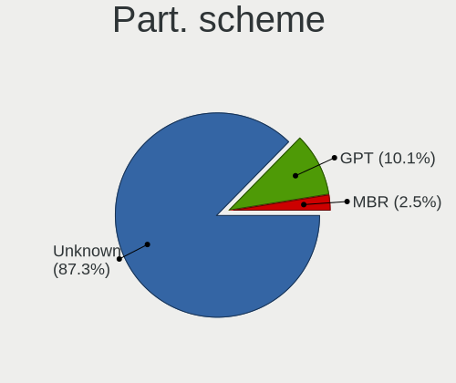
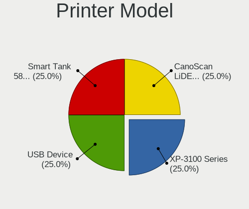

Zorin Hardware Trends (Desktops)
--------------------------------

A project to identify most popular hardware characteristics and track their change
over time based on data collected by Zorin users at https://Linux-Hardware.org.

Anyone can contribute to this report by the [hw-probe](https://github.com/linuxhw/hw-probe) tool:

    sudo -E hw-probe -all -upload

Full-feature report is available here: https://linux-hardware.org/?view=trends

Period: Dec, 2021.

Contents
--------

* [ System ](#system)
  - [ OS                       ](#os)
  - [ OS Family                ](#os-family)
  - [ Kernel                   ](#kernel)
  - [ Kernel Family            ](#kernel-family)
  - [ Kernel Major Ver.        ](#kernel-major-ver)
  - [ Arch                     ](#arch)
  - [ DE                       ](#de)
  - [ Display Server           ](#display-server)
  - [ Display Manager          ](#display-manager)
  - [ OS Lang                  ](#os-lang)
  - [ Boot Mode                ](#boot-mode)
  - [ Filesystem               ](#filesystem)
  - [ Part. scheme             ](#part-scheme)
  - [ Dual Boot with Linux/BSD ](#dual-boot-with-linuxbsd)
  - [ Dual Boot (Win)          ](#dual-boot-win)

* [ Board ](#board)
  - [ Vendor                   ](#vendor)
  - [ Model                    ](#model)
  - [ Model Family             ](#model-family)
  - [ MFG Year                 ](#mfg-year)
  - [ Form Factor              ](#form-factor)
  - [ Secure Boot              ](#secure-boot)
  - [ Coreboot                 ](#coreboot)
  - [ RAM Size                 ](#ram-size)
  - [ RAM Used                 ](#ram-used)
  - [ Total Drives             ](#total-drives)
  - [ Has CD-ROM               ](#has-cd-rom)
  - [ Has Ethernet             ](#has-ethernet)
  - [ Has WiFi                 ](#has-wifi)
  - [ Has Bluetooth            ](#has-bluetooth)

* [ Location ](#location)
  - [ Country                  ](#country)
  - [ City                     ](#city)

* [ Drives ](#drives)
  - [ Drive Vendor             ](#drive-vendor)
  - [ Drive Model              ](#drive-model)
  - [ HDD Vendor               ](#hdd-vendor)
  - [ SSD Vendor               ](#ssd-vendor)
  - [ Drive Kind               ](#drive-kind)
  - [ Drive Connector          ](#drive-connector)
  - [ Drive Size               ](#drive-size)
  - [ Space Total              ](#space-total)
  - [ Space Used               ](#space-used)
  - [ Malfunc. Drives          ](#malfunc-drives)
  - [ Malfunc. Drive Vendor    ](#malfunc-drive-vendor)
  - [ Malfunc. HDD Vendor      ](#malfunc-hdd-vendor)
  - [ Malfunc. Drive Kind      ](#malfunc-drive-kind)
  - [ Failed Drives            ](#failed-drives)
  - [ Failed Drive Vendor      ](#failed-drive-vendor)
  - [ Drive Status             ](#drive-status)

* [ Storage controller ](#storage-controller)
  - [ Storage Vendor           ](#storage-vendor)
  - [ Storage Model            ](#storage-model)
  - [ Storage Kind             ](#storage-kind)

* [ Processor ](#processor)
  - [ CPU Vendor               ](#cpu-vendor)
  - [ CPU Model                ](#cpu-model)
  - [ CPU Model Family         ](#cpu-model-family)
  - [ CPU Cores                ](#cpu-cores)
  - [ CPU Sockets              ](#cpu-sockets)
  - [ CPU Threads              ](#cpu-threads)
  - [ CPU Op-Modes             ](#cpu-op-modes)
  - [ CPU Microcode            ](#cpu-microcode)
  - [ CPU Microarch            ](#cpu-microarch)

* [ Graphics ](#graphics)
  - [ GPU Vendor               ](#gpu-vendor)
  - [ GPU Model                ](#gpu-model)
  - [ GPU Combo                ](#gpu-combo)
  - [ GPU Driver               ](#gpu-driver)
  - [ GPU Memory               ](#gpu-memory)

* [ Monitor ](#monitor)
  - [ Monitor Vendor           ](#monitor-vendor)
  - [ Monitor Model            ](#monitor-model)
  - [ Monitor Resolution       ](#monitor-resolution)
  - [ Monitor Diagonal         ](#monitor-diagonal)
  - [ Monitor Width            ](#monitor-width)
  - [ Aspect Ratio             ](#aspect-ratio)
  - [ Monitor Area             ](#monitor-area)
  - [ Pixel Density            ](#pixel-density)
  - [ Multiple Monitors        ](#multiple-monitors)

* [ Network ](#network)
  - [ Net Controller Vendor    ](#net-controller-vendor)
  - [ Net Controller Model     ](#net-controller-model)
  - [ Wireless Vendor          ](#wireless-vendor)
  - [ Wireless Model           ](#wireless-model)
  - [ Ethernet Vendor          ](#ethernet-vendor)
  - [ Ethernet Model           ](#ethernet-model)
  - [ Net Controller Kind      ](#net-controller-kind)
  - [ Used Controller          ](#used-controller)
  - [ NICs                     ](#nics)
  - [ IPv6                     ](#ipv6)

* [ Bluetooth ](#bluetooth)
  - [ Bluetooth Vendor         ](#bluetooth-vendor)
  - [ Bluetooth Model          ](#bluetooth-model)

* [ Sound ](#sound)
  - [ Sound Vendor             ](#sound-vendor)
  - [ Sound Model              ](#sound-model)

* [ Memory ](#memory)
  - [ Memory Vendor            ](#memory-vendor)
  - [ Memory Model             ](#memory-model)
  - [ Memory Kind              ](#memory-kind)
  - [ Memory Form Factor       ](#memory-form-factor)
  - [ Memory Size              ](#memory-size)
  - [ Memory Speed             ](#memory-speed)

* [ Printers & scanners ](#printers--scanners)
  - [ Printer Vendor           ](#printer-vendor)
  - [ Printer Model            ](#printer-model)
  - [ Scanner Vendor           ](#scanner-vendor)
  - [ Scanner Model            ](#scanner-model)

* [ Camera ](#camera)
  - [ Camera Vendor            ](#camera-vendor)
  - [ Camera Model             ](#camera-model)

* [ Security ](#security)
  - [ Fingerprint Vendor       ](#fingerprint-vendor)
  - [ Fingerprint Model        ](#fingerprint-model)
  - [ Chipcard Vendor          ](#chipcard-vendor)
  - [ Chipcard Model           ](#chipcard-model)

* [ Unsupported ](#unsupported)
  - [ Unsupported Devices      ](#unsupported-devices)
  - [ Unsupported Device Types ](#unsupported-device-types)

System
------

OS
--

Installed operating systems

| Name     | Desktops | Percent |
|----------|----------|---------|
| Zorin 16 | 78       | 92.86%  |
| Zorin 15 | 6        | 7.14%   |

OS Family
---------

OS without a version

| Name  | Desktops | Percent |
|-------|----------|---------|
| Zorin | 84       | 100%    |

Kernel
------

Version of the Linux kernel

| Version                    | Desktops | Percent |
|----------------------------|----------|---------|
| 5.11.0-41-generic          | 37       | 44.05%  |
| 5.11.0-43-generic          | 28       | 33.33%  |
| 5.4.0-91-generic           | 6        | 7.14%   |
| 5.11.0-40-generic          | 6        | 7.14%   |
| 5.11.0-38-generic          | 4        | 4.76%   |
| 5.15.0-10.2-liquorix-amd64 | 1        | 1.19%   |
| 5.14.0-1010-oem            | 1        | 1.19%   |
| 5.11.0-37-generic          | 1        | 1.19%   |

Kernel Family
-------------

Linux kernel without a distro release

| Version | Desktops | Percent |
|---------|----------|---------|
| 5.11.0  | 76       | 90.48%  |
| 5.4.0   | 6        | 7.14%   |
| 5.15.0  | 1        | 1.19%   |
| 5.14.0  | 1        | 1.19%   |

Kernel Major Ver.
-----------------

Linux kernel major version

| Version | Desktops | Percent |
|---------|----------|---------|
| 5.11    | 76       | 90.48%  |
| 5.4     | 6        | 7.14%   |
| 5.15    | 1        | 1.19%   |
| 5.14    | 1        | 1.19%   |

Arch
----

OS architecture (x86_64, i586, etc.)

| Name   | Desktops | Percent |
|--------|----------|---------|
| x86_64 | 82       | 97.62%  |
| i686   | 2        | 2.38%   |

DE
--

Desktop Environment

| Name  | Desktops | Percent |
|-------|----------|---------|
| GNOME | 71       | 84.52%  |
| XFCE  | 13       | 15.48%  |

Display Server
--------------

X11 or Wayland

| Name | Desktops | Percent |
|------|----------|---------|
| X11  | 84       | 100%    |

Display Manager
---------------

SDDM, LightDM, etc.

| Name    | Desktops | Percent |
|---------|----------|---------|
| Unknown | 64       | 76.19%  |
| GDM3    | 10       | 11.9%   |
| GDM     | 7        | 8.33%   |
| LightDM | 3        | 3.57%   |

OS Lang
-------

Language

| Lang        | Desktops | Percent |
|-------------|----------|---------|
| en_US       | 34       | 40.48%  |
| de_DE       | 10       | 11.9%   |
| fr_FR       | 5        | 5.95%   |
| en_GB       | 4        | 4.76%   |
| pl_PL       | 3        | 3.57%   |
| it_IT       | 3        | 3.57%   |
| pt_BR       | 2        | 2.38%   |
| es_ES       | 2        | 2.38%   |
| en_IN       | 2        | 2.38%   |
| zh_TW       | 1        | 1.19%   |
| tr_TR       | 1        | 1.19%   |
| sv_SE       | 1        | 1.19%   |
| sr_RS@latin | 1        | 1.19%   |
| sl_SI       | 1        | 1.19%   |
| ru_RU       | 1        | 1.19%   |
| pt_PT       | 1        | 1.19%   |
| nl_NL       | 1        | 1.19%   |
| nl_BE       | 1        | 1.19%   |
| hu_HU       | 1        | 1.19%   |
| es_CO       | 1        | 1.19%   |
| es_CL       | 1        | 1.19%   |
| es_AR       | 1        | 1.19%   |
| en_ZA       | 1        | 1.19%   |
| en_NZ       | 1        | 1.19%   |
| en_CA       | 1        | 1.19%   |
| en_AU       | 1        | 1.19%   |
| el_GR       | 1        | 1.19%   |
| de_CH       | 1        | 1.19%   |

Boot Mode
---------

EFI or BIOS

| Mode | Desktops | Percent |
|------|----------|---------|
| BIOS | 54       | 64.29%  |
| EFI  | 30       | 35.71%  |

Filesystem
----------

Type of filesystem

| Type     | Desktops | Percent |
|----------|----------|---------|
| Ext4     | 79       | 94.05%  |
| Btrfs    | 2        | 2.38%   |
| Zfs      | 1        | 1.19%   |
| Reiserfs | 1        | 1.19%   |
| Overlay  | 1        | 1.19%   |

Part. scheme
------------

Scheme of partitioning

| Type    | Desktops | Percent |
|---------|----------|---------|
| Unknown | 77       | 91.67%  |
| GPT     | 5        | 5.95%   |
| MBR     | 2        | 2.38%   |

Dual Boot with Linux/BSD
------------------------

Hosting more than one Linux/BSD

| Dual boot | Desktops | Percent |
|-----------|----------|---------|
| No        | 82       | 97.62%  |
| Yes       | 2        | 2.38%   |

Dual Boot (Win)
---------------

Hosting Linux and Windows

| Dual boot | Desktops | Percent |
|-----------|----------|---------|
| No        | 72       | 85.71%  |
| Yes       | 12       | 14.29%  |

Board
-----

Vendor
------

Motherboard manufacturer

| Name                | Desktops | Percent |
|---------------------|----------|---------|
| ASUSTek Computer    | 17       | 20.24%  |
| Dell                | 14       | 16.67%  |
| Hewlett-Packard     | 8        | 9.52%   |
| Gigabyte Technology | 8        | 9.52%   |
| MSI                 | 7        | 8.33%   |
| ASRock              | 7        | 8.33%   |
| Lenovo              | 4        | 4.76%   |
| Intel               | 3        | 3.57%   |
| Foxconn             | 2        | 2.38%   |
| Biostar             | 2        | 2.38%   |
| Acer                | 2        | 2.38%   |
| Unknown             | 2        | 2.38%   |
| Shuttle             | 1        | 1.19%   |
| Pegatron            | 1        | 1.19%   |
| Packard Bell        | 1        | 1.19%   |
| INTELBRAS           | 1        | 1.19%   |
| Fujitsu             | 1        | 1.19%   |
| eMachines           | 1        | 1.19%   |
| ECS                 | 1        | 1.19%   |
| Apple               | 1        | 1.19%   |

Model
-----

Motherboard model

| Name                               | Desktops | Percent |
|------------------------------------|----------|---------|
| Dell OptiPlex 7010                 | 3        | 3.57%   |
| ASUS All Series                    | 2        | 2.38%   |
| ASRock B450M Pro4                  | 2        | 2.38%   |
| Unknown                            | 2        | 2.38%   |
| Shuttle XH61V                      | 1        | 1.19%   |
| Pegatron NY537AA-ABA 300-1025      | 1        | 1.19%   |
| Packard Bell IMEDIA D3610 FR       | 1        | 1.19%   |
| MSI MS-7D17                        | 1        | 1.19%   |
| MSI MS-7C56                        | 1        | 1.19%   |
| MSI MS-7C02                        | 1        | 1.19%   |
| MSI MS-7B51                        | 1        | 1.19%   |
| MSI MS-7817                        | 1        | 1.19%   |
| MSI MS-7693                        | 1        | 1.19%   |
| MSI MS-7053                        | 1        | 1.19%   |
| Lenovo ThinkCentre M93p 10AAS1DP00 | 1        | 1.19%   |
| Lenovo ThinkCentre M83 10AHS0FM00  | 1        | 1.19%   |
| Lenovo ThinkCentre M57e 9489W1U    | 1        | 1.19%   |
| Lenovo H30-50 90B8003BGE           | 1        | 1.19%   |
| INTELBRAS IE-G41T-M7               | 1        | 1.19%   |
| Intel STK1AW32SC                   | 1        | 1.19%   |
| Intel DQ87PG AAG74154-403          | 1        | 1.19%   |
| Intel B75                          | 1        | 1.19%   |
| HP OMEN 30L Desktop GT13-0xxx      | 1        | 1.19%   |
| HP EliteDesk 800 G1 USDT           | 1        | 1.19%   |
| HP EliteDesk 800 G1 SFF            | 1        | 1.19%   |
| HP Compaq Pro 6300 SFF             | 1        | 1.19%   |
| HP Compaq 8100 Elite SFF PC        | 1        | 1.19%   |
| HP Compaq 6005 Pro MT PC           | 1        | 1.19%   |
| HP 260-p026                        | 1        | 1.19%   |
| HP 23-q145d                        | 1        | 1.19%   |
| Gigabyte Z97-HD3                   | 1        | 1.19%   |
| Gigabyte Z170X-Gaming 7            | 1        | 1.19%   |
| Gigabyte H97M-D3H                  | 1        | 1.19%   |
| Gigabyte H57M-USB3                 | 1        | 1.19%   |
| Gigabyte H270M-DS3H                | 1        | 1.19%   |
| Gigabyte GA-MA74GM-S2H             | 1        | 1.19%   |
| Gigabyte EG41MFT-US2H              | 1        | 1.19%   |
| Gigabyte B450M DS3H                | 1        | 1.19%   |
| Fujitsu ESPRIMO_D556               | 1        | 1.19%   |
| Foxconn p6654y                     | 1        | 1.19%   |
| Foxconn CQ3320IX                   | 1        | 1.19%   |
| eMachines EL1850G                  | 1        | 1.19%   |
| ECS G31T-M7                        | 1        | 1.19%   |
| Dell XPS430                        | 1        | 1.19%   |
| Dell Precision 3630 Tower          | 1        | 1.19%   |
| Dell OptiPlex 990                  | 1        | 1.19%   |
| Dell OptiPlex 790                  | 1        | 1.19%   |
| Dell OptiPlex 780                  | 1        | 1.19%   |
| Dell OptiPlex 755                  | 1        | 1.19%   |
| Dell OptiPlex 7050                 | 1        | 1.19%   |
| Dell OptiPlex 7020                 | 1        | 1.19%   |
| Dell OptiPlex 390                  | 1        | 1.19%   |
| Dell OptiPlex 360                  | 1        | 1.19%   |
| Dell Inspiron 3847                 | 1        | 1.19%   |
| Biostar A780L3C                    | 1        | 1.19%   |
| Biostar A320MH                     | 1        | 1.19%   |
| ASUS VM40B                         | 1        | 1.19%   |
| ASUS TUF GAMING X570-PRO WIFI II   | 1        | 1.19%   |
| ASUS SABERTOOTH Z170 MARK 1        | 1        | 1.19%   |
| ASUS RT535AA-ABZ t3795.it          | 1        | 1.19%   |

Model Family
------------

Motherboard model prefix

| Name                   | Desktops | Percent |
|------------------------|----------|---------|
| Dell OptiPlex          | 11       | 13.1%   |
| Lenovo ThinkCentre     | 3        | 3.57%   |
| HP Compaq              | 3        | 3.57%   |
| HP EliteDesk           | 2        | 2.38%   |
| ASUS ROG               | 2        | 2.38%   |
| ASUS PRIME             | 2        | 2.38%   |
| ASUS All               | 2        | 2.38%   |
| ASRock B450M           | 2        | 2.38%   |
| Acer Aspire            | 2        | 2.38%   |
| Unknown                | 2        | 2.38%   |
| Shuttle XH61V          | 1        | 1.19%   |
| Pegatron NY537AA-ABA   | 1        | 1.19%   |
| Packard Bell IMEDIA    | 1        | 1.19%   |
| MSI MS-7D17            | 1        | 1.19%   |
| MSI MS-7C56            | 1        | 1.19%   |
| MSI MS-7C02            | 1        | 1.19%   |
| MSI MS-7B51            | 1        | 1.19%   |
| MSI MS-7817            | 1        | 1.19%   |
| MSI MS-7693            | 1        | 1.19%   |
| MSI MS-7053            | 1        | 1.19%   |
| Lenovo H30-50          | 1        | 1.19%   |
| INTELBRAS IE-G41T-M7   | 1        | 1.19%   |
| Intel STK1AW32SC       | 1        | 1.19%   |
| Intel DQ87PG           | 1        | 1.19%   |
| Intel B75              | 1        | 1.19%   |
| HP OMEN                | 1        | 1.19%   |
| HP 260-p026            | 1        | 1.19%   |
| HP 23-q145d            | 1        | 1.19%   |
| Gigabyte Z97-HD3       | 1        | 1.19%   |
| Gigabyte Z170X-Gaming  | 1        | 1.19%   |
| Gigabyte H97M-D3H      | 1        | 1.19%   |
| Gigabyte H57M-USB3     | 1        | 1.19%   |
| Gigabyte H270M-DS3H    | 1        | 1.19%   |
| Gigabyte GA-MA74GM-S2H | 1        | 1.19%   |
| Gigabyte EG41MFT-US2H  | 1        | 1.19%   |
| Gigabyte B450M         | 1        | 1.19%   |
| Fujitsu ESPRIMO        | 1        | 1.19%   |
| Foxconn p6654y         | 1        | 1.19%   |
| Foxconn CQ3320IX       | 1        | 1.19%   |
| eMachines EL1850G      | 1        | 1.19%   |
| ECS G31T-M7            | 1        | 1.19%   |
| Dell XPS430            | 1        | 1.19%   |
| Dell Precision         | 1        | 1.19%   |
| Dell Inspiron          | 1        | 1.19%   |
| Biostar A780L3C        | 1        | 1.19%   |
| Biostar A320MH         | 1        | 1.19%   |
| ASUS VM40B             | 1        | 1.19%   |
| ASUS TUF               | 1        | 1.19%   |
| ASUS SABERTOOTH        | 1        | 1.19%   |
| ASUS RT535AA-ABZ       | 1        | 1.19%   |
| ASUS P8Z77-M           | 1        | 1.19%   |
| ASUS P5QC              | 1        | 1.19%   |
| ASUS P5Q               | 1        | 1.19%   |
| ASUS M3A78-EM          | 1        | 1.19%   |
| ASUS GX624AA-ABA       | 1        | 1.19%   |
| ASUS GX612AA-ABA       | 1        | 1.19%   |
| ASUS CM6330            | 1        | 1.19%   |
| ASRock Z87             | 1        | 1.19%   |
| ASRock M3A770DE        | 1        | 1.19%   |
| ASRock B450M-HDV       | 1        | 1.19%   |

MFG Year
--------

Motherboard manufacture year

| Year | Desktops | Percent |
|------|----------|---------|
| 2021 | 10       | 11.9%   |
| 2010 | 9        | 10.71%  |
| 2008 | 9        | 10.71%  |
| 2020 | 8        | 9.52%   |
| 2019 | 7        | 8.33%   |
| 2015 | 7        | 8.33%   |
| 2018 | 5        | 5.95%   |
| 2016 | 5        | 5.95%   |
| 2013 | 5        | 5.95%   |
| 2011 | 5        | 5.95%   |
| 2014 | 4        | 4.76%   |
| 2012 | 3        | 3.57%   |
| 2007 | 3        | 3.57%   |
| 2009 | 2        | 2.38%   |
| 2017 | 1        | 1.19%   |
| 2005 | 1        | 1.19%   |

Form Factor
-----------

Physical design of the computer

| Name    | Desktops | Percent |
|---------|----------|---------|
| Desktop | 84       | 100%    |

Secure Boot
-----------

Enabled or disabled

| State    | Desktops | Percent |
|----------|----------|---------|
| Disabled | 82       | 97.62%  |
| Enabled  | 2        | 2.38%   |

Coreboot
--------

Have coreboot on board

| Used | Desktops | Percent |
|------|----------|---------|
| No   | 84       | 100%    |

RAM Size
--------

Total RAM memory

| Size in GB  | Desktops | Percent |
|-------------|----------|---------|
| 16.01-24.0  | 22       | 26.19%  |
| 3.01-4.0    | 19       | 22.62%  |
| 8.01-16.0   | 16       | 19.05%  |
| 4.01-8.0    | 11       | 13.1%   |
| 32.01-64.0  | 7        | 8.33%   |
| 2.01-3.0    | 4        | 4.76%   |
| 1.01-2.0    | 3        | 3.57%   |
| 64.01-256.0 | 2        | 2.38%   |

RAM Used
--------

Used RAM memory

| Used GB   | Desktops | Percent |
|-----------|----------|---------|
| 1.01-2.0  | 44       | 52.38%  |
| 2.01-3.0  | 22       | 26.19%  |
| 4.01-8.0  | 7        | 8.33%   |
| 3.01-4.0  | 7        | 8.33%   |
| 8.01-16.0 | 2        | 2.38%   |
| 0.51-1.0  | 2        | 2.38%   |

Total Drives
------------

Number of drives on board

| Drives | Desktops | Percent |
|--------|----------|---------|
| 1      | 40       | 47.62%  |
| 2      | 23       | 27.38%  |
| 3      | 11       | 13.1%   |
| 4      | 4        | 4.76%   |
| 6      | 2        | 2.38%   |
| 5      | 2        | 2.38%   |
| 8      | 1        | 1.19%   |
| 7      | 1        | 1.19%   |

Has CD-ROM
----------

Has CD-ROM on board

| Presented | Desktops | Percent |
|-----------|----------|---------|
| Yes       | 44       | 52.38%  |
| No        | 40       | 47.62%  |

Has Ethernet
------------

Has Ethernet on board

| Presented | Desktops | Percent |
|-----------|----------|---------|
| Yes       | 82       | 97.62%  |
| No        | 2        | 2.38%   |

Has WiFi
--------

Has WiFi module

| Presented | Desktops | Percent |
|-----------|----------|---------|
| No        | 44       | 52.38%  |
| Yes       | 40       | 47.62%  |

Has Bluetooth
-------------

Has Bluetooth module

| Presented | Desktops | Percent |
|-----------|----------|---------|
| No        | 58       | 69.05%  |
| Yes       | 26       | 30.95%  |

Location
--------

Country
-------

Geographic location (country)

| Country      | Desktops | Percent |
|--------------|----------|---------|
| USA          | 28       | 33.33%  |
| Germany      | 10       | 11.9%   |
| France       | 6        | 7.14%   |
| UK           | 3        | 3.57%   |
| Italy        | 3        | 3.57%   |
| Brazil       | 3        | 3.57%   |
| Poland       | 2        | 2.38%   |
| Netherlands  | 2        | 2.38%   |
| India        | 2        | 2.38%   |
| Greece       | 2        | 2.38%   |
| Croatia      | 2        | 2.38%   |
| Canada       | 2        | 2.38%   |
| Turkey       | 1        | 1.19%   |
| Taiwan       | 1        | 1.19%   |
| Switzerland  | 1        | 1.19%   |
| Sweden       | 1        | 1.19%   |
| Spain        | 1        | 1.19%   |
| South Africa | 1        | 1.19%   |
| Slovenia     | 1        | 1.19%   |
| Russia       | 1        | 1.19%   |
| Romania      | 1        | 1.19%   |
| Portugal     | 1        | 1.19%   |
| New Zealand  | 1        | 1.19%   |
| Malaysia     | 1        | 1.19%   |
| Hungary      | 1        | 1.19%   |
| Cyprus       | 1        | 1.19%   |
| Colombia     | 1        | 1.19%   |
| Chile        | 1        | 1.19%   |
| Belgium      | 1        | 1.19%   |
| Australia    | 1        | 1.19%   |
| Argentina    | 1        | 1.19%   |

City
----

Geographic location (city)

| City                 | Desktops | Percent |
|----------------------|----------|---------|
| Dallas               | 2        | 2.38%   |
| Bernau bei Berlin    | 2        | 2.38%   |
| Athens               | 2        | 2.38%   |
| Zagreb               | 1        | 1.19%   |
| Wuppertal            | 1        | 1.19%   |
| Wilkau-Hasslau       | 1        | 1.19%   |
| West Valley City     | 1        | 1.19%   |
| Wellington           | 1        | 1.19%   |
| Wanstead             | 1        | 1.19%   |
| Valinhos             | 1        | 1.19%   |
| Twickenham           | 1        | 1.19%   |
| Tustin               | 1        | 1.19%   |
| Sydney               | 1        | 1.19%   |
| St Petersburg        | 1        | 1.19%   |
| Santos Lugares       | 1        | 1.19%   |
| San Diego            | 1        | 1.19%   |
| San Antonio          | 1        | 1.19%   |
| Saint-Paul-sur-Isere | 1        | 1.19%   |
| Reutlingen           | 1        | 1.19%   |
| Reinbek              | 1        | 1.19%   |
| Radovljica           | 1        | 1.19%   |
| Queens               | 1        | 1.19%   |
| Porto Velho          | 1        | 1.19%   |
| Portland             | 1        | 1.19%   |
| Pompano Beach        | 1        | 1.19%   |
| Pierrefonds          | 1        | 1.19%   |
| Petaling Jaya        | 1        | 1.19%   |
| Penghu County        | 1        | 1.19%   |
| Palmela              | 1        | 1.19%   |
| Padova               | 1        | 1.19%   |
| Overhornas           | 1        | 1.19%   |
| Osasco               | 1        | 1.19%   |
| Opatija              | 1        | 1.19%   |
| Ocala                | 1        | 1.19%   |
| Noyon                | 1        | 1.19%   |
| Nicosia              | 1        | 1.19%   |
| New Carlisle         | 1        | 1.19%   |
| Montreal             | 1        | 1.19%   |
| Milan                | 1        | 1.19%   |
| Metz                 | 1        | 1.19%   |
| Mentor               | 1        | 1.19%   |
| Medellin             | 1        | 1.19%   |
| Manitowoc            | 1        | 1.19%   |
| Los Angeles          | 1        | 1.19%   |
| Liberty Lake         | 1        | 1.19%   |
| Jacksonville Beach   | 1        | 1.19%   |
| Huntsville           | 1        | 1.19%   |
| Houston              | 1        | 1.19%   |
| Hockessin            | 1        | 1.19%   |
| Herndon              | 1        | 1.19%   |
| Hamme                | 1        | 1.19%   |
| Grenoble             | 1        | 1.19%   |
| Gliwice              | 1        | 1.19%   |
| Ghaziabad            | 1        | 1.19%   |
| Freiburg im Breisgau | 1        | 1.19%   |
| Eugene               | 1        | 1.19%   |
| Dunningen            | 1        | 1.19%   |
| Dourdan              | 1        | 1.19%   |
| Dortmund             | 1        | 1.19%   |
| Desuri               | 1        | 1.19%   |

Drives
------

Drive Vendor
------------

Hard drive vendors

| Vendor                | Desktops | Drives | Percent |
|-----------------------|----------|--------|---------|
| Seagate               | 38       | 50     | 26.95%  |
| WDC                   | 25       | 29     | 17.73%  |
| Samsung Electronics   | 18       | 27     | 12.77%  |
| Toshiba               | 7        | 7      | 4.96%   |
| Kingston              | 7        | 9      | 4.96%   |
| Hitachi               | 7        | 7      | 4.96%   |
| Crucial               | 7        | 7      | 4.96%   |
| SanDisk               | 5        | 5      | 3.55%   |
| Phison                | 3        | 4      | 2.13%   |
| A-DATA Technology     | 3        | 3      | 2.13%   |
| Unknown               | 2        | 3      | 1.42%   |
| MAXTOR                | 2        | 2      | 1.42%   |
| Intel                 | 2        | 2      | 1.42%   |
| China                 | 2        | 2      | 1.42%   |
| Transcend             | 1        | 1      | 0.71%   |
| SK Hynix              | 1        | 1      | 0.71%   |
| SABRENT               | 1        | 1      | 0.71%   |
| Realtek Semiconductor | 1        | 1      | 0.71%   |
| PNY                   | 1        | 2      | 0.71%   |
| Micron Technology     | 1        | 1      | 0.71%   |
| Lexar                 | 1        | 1      | 0.71%   |
| KIOXIA-EXCERIA        | 1        | 1      | 0.71%   |
| KingFast              | 1        | 1      | 0.71%   |
| Intenso               | 1        | 1      | 0.71%   |
| HGST                  | 1        | 1      | 0.71%   |
| Hewlett-Packard       | 1        | 1      | 0.71%   |
| Dogfish               | 1        | 1      | 0.71%   |

Drive Model
-----------

Hard drive models

| Model                            | Desktops | Percent |
|----------------------------------|----------|---------|
| WDC WD10EZEX-08WN4A0 1TB         | 4        | 2.44%   |
| Toshiba DT01ACA100 1TB           | 3        | 1.83%   |
| Seagate ST500DM002-1BD142 500GB  | 3        | 1.83%   |
| Seagate ST3500413AS 500GB        | 3        | 1.83%   |
| WDC WD40EFRX-68WT0N0 4TB         | 2        | 1.22%   |
| Toshiba DT01ACA050 500GB         | 2        | 1.22%   |
| Seagate ST380815AS 80GB          | 2        | 1.22%   |
| Seagate ST3500418AS 500GB        | 2        | 1.22%   |
| Seagate ST2000DM008-2FR102 2TB   | 2        | 1.22%   |
| Seagate ST1000DM010-2EP102 1TB   | 2        | 1.22%   |
| Seagate ST1000DM003-1ER162 1TB   | 2        | 1.22%   |
| Seagate Backup+ Hub BK 8TB       | 2        | 1.22%   |
| Seagate Backup+ Desk 4TB         | 2        | 1.22%   |
| Samsung SSD 860 EVO 500GB        | 2        | 1.22%   |
| Samsung NVMe SSD Drive 250GB     | 2        | 1.22%   |
| Samsung HD322HJ 320GB            | 2        | 1.22%   |
| Phison NVMe SSD Drive 512GB      | 2        | 1.22%   |
| Kingston SA400S37240G 240GB SSD  | 2        | 1.22%   |
| Crucial CT480BX500SSD1 480GB     | 2        | 1.22%   |
| WDC WDS120G2G0A-00JH30 120GB SSD | 1        | 0.61%   |
| WDC WDS100T2B0A-00SM50 1TB SSD   | 1        | 0.61%   |
| WDC WD6400AARS-00Y5B1 640GB      | 1        | 0.61%   |
| WDC WD6400AAKS-22A7B0 640GB      | 1        | 0.61%   |
| WDC WD5000LPVX-60V0TT0 500GB     | 1        | 0.61%   |
| WDC WD5000AADS-00S9B0 500GB      | 1        | 0.61%   |
| WDC WD4002FFWX-68TZ4N0 4TB       | 1        | 0.61%   |
| WDC WD3200AAJS-60Z0A0 320GB      | 1        | 0.61%   |
| WDC WD30EZRX-00DC0B0 3TB         | 1        | 0.61%   |
| WDC WD30EFRX-68EUZN0 3TB         | 1        | 0.61%   |
| WDC WD2500AAKX-753CA1 250GB      | 1        | 0.61%   |
| WDC WD20EZAZ-00GGJB0 2TB         | 1        | 0.61%   |
| WDC WD2002FAEX-007BA0 2TB        | 1        | 0.61%   |
| WDC WD1600AAJS-60Z0A0 160GB      | 1        | 0.61%   |
| WDC WD1600AABS-56PRA0 160GB      | 1        | 0.61%   |
| WDC WD1200JS-00NCB1 120GB        | 1        | 0.61%   |
| WDC WD10JPVX-75JC3T0 1TB         | 1        | 0.61%   |
| WDC WD10EZEX-60WN4A1 1TB         | 1        | 0.61%   |
| WDC WD10EZEX-00WN4A0 1TB         | 1        | 0.61%   |
| WDC WD10EURX-63UY4Y0 1TB         | 1        | 0.61%   |
| WDC WD10EARS-00Y5B1 1TB          | 1        | 0.61%   |
| WDC WD1003FZEX-00MK2A0 1TB       | 1        | 0.61%   |
| Unknown SD/MMC/MS PRO 7GB        | 1        | 0.61%   |
| Unknown MMC Card  32GB           | 1        | 0.61%   |
| Transcend TS480GSSD220S 480GB    | 1        | 0.61%   |
| Toshiba MQ01ABD100 1TB           | 1        | 0.61%   |
| Toshiba HDWD110 1TB              | 1        | 0.61%   |
| SK Hynix NVMe SSD Drive 128GB    | 1        | 0.61%   |
| Seagate ST9320320AS 320GB        | 1        | 0.61%   |
| Seagate ST8000DM004-2CX188 8TB   | 1        | 0.61%   |
| Seagate ST500LM021-1KJ152 500GB  | 1        | 0.61%   |
| Seagate ST500DM002-1BC142 500GB  | 1        | 0.61%   |
| Seagate ST4000NM0033 4TB         | 1        | 0.61%   |
| Seagate ST4000DM004-2U9104 4TB   | 1        | 0.61%   |
| Seagate ST4000DM004-2CV104 4TB   | 1        | 0.61%   |
| Seagate ST3500630NS 500GB        | 1        | 0.61%   |
| Seagate ST3500312CS 500GB        | 1        | 0.61%   |
| Seagate ST3320820AS 320GB        | 1        | 0.61%   |
| Seagate ST3320613AS 320GB        | 1        | 0.61%   |
| Seagate ST3320413AS 320GB        | 1        | 0.61%   |
| Seagate ST3250820A 250GB         | 1        | 0.61%   |

HDD Vendor
----------

Hard disk drive vendors

| Vendor              | Desktops | Drives | Percent |
|---------------------|----------|--------|---------|
| Seagate             | 37       | 44     | 44.58%  |
| WDC                 | 23       | 27     | 27.71%  |
| Toshiba             | 7        | 7      | 8.43%   |
| Hitachi             | 7        | 7      | 8.43%   |
| Samsung Electronics | 4        | 5      | 4.82%   |
| MAXTOR              | 2        | 2      | 2.41%   |
| Unknown             | 1        | 1      | 1.2%    |
| SABRENT             | 1        | 1      | 1.2%    |
| HGST                | 1        | 1      | 1.2%    |

SSD Vendor
----------

Solid state drive vendors

| Vendor              | Desktops | Drives | Percent |
|---------------------|----------|--------|---------|
| Samsung Electronics | 11       | 16     | 26.19%  |
| Crucial             | 7        | 7      | 16.67%  |
| Kingston            | 6        | 7      | 14.29%  |
| SanDisk             | 3        | 3      | 7.14%   |
| A-DATA Technology   | 3        | 3      | 7.14%   |
| WDC                 | 2        | 2      | 4.76%   |
| China               | 2        | 2      | 4.76%   |
| Transcend           | 1        | 1      | 2.38%   |
| PNY                 | 1        | 2      | 2.38%   |
| Micron Technology   | 1        | 1      | 2.38%   |
| Lexar               | 1        | 1      | 2.38%   |
| KIOXIA-EXCERIA      | 1        | 1      | 2.38%   |
| Intenso             | 1        | 1      | 2.38%   |
| Hewlett-Packard     | 1        | 1      | 2.38%   |
| Dogfish             | 1        | 1      | 2.38%   |

Drive Kind
----------

HDD or SSD

| Kind    | Desktops | Drives | Percent |
|---------|----------|--------|---------|
| HDD     | 64       | 95     | 52.89%  |
| SSD     | 36       | 49     | 29.75%  |
| NVMe    | 15       | 19     | 12.4%   |
| Unknown | 5        | 6      | 4.13%   |
| MMC     | 1        | 2      | 0.83%   |

Drive Connector
---------------

SATA, SAS, NVMe, etc.

| Type | Desktops | Drives | Percent |
|------|----------|--------|---------|
| SATA | 80       | 137    | 74.77%  |
| NVMe | 15       | 19     | 14.02%  |
| SAS  | 11       | 13     | 10.28%  |
| MMC  | 1        | 2      | 0.93%   |

Drive Size
----------

Size of hard drive

| Size in TB | Desktops | Drives | Percent |
|------------|----------|--------|---------|
| 0.01-0.5   | 61       | 80     | 52.59%  |
| 0.51-1.0   | 36       | 44     | 31.03%  |
| 1.01-2.0   | 9        | 10     | 7.76%   |
| 3.01-4.0   | 6        | 6      | 5.17%   |
| 2.01-3.0   | 2        | 2      | 1.72%   |
| 4.01-10.0  | 2        | 2      | 1.72%   |

Space Total
-----------

Amount of disk space available on the file system

| Size in GB     | Desktops | Percent |
|----------------|----------|---------|
| 101-250        | 31       | 36.9%   |
| 251-500        | 19       | 22.62%  |
| 501-1000       | 12       | 14.29%  |
| 1001-2000      | 9        | 10.71%  |
| More than 3000 | 6        | 7.14%   |
| 51-100         | 3        | 3.57%   |
| 21-50          | 2        | 2.38%   |
| 2001-3000      | 2        | 2.38%   |

Space Used
----------

Amount of used disk space

| Used GB        | Desktops | Percent |
|----------------|----------|---------|
| 1-20           | 32       | 38.1%   |
| 21-50          | 18       | 21.43%  |
| 51-100         | 12       | 14.29%  |
| 101-250        | 9        | 10.71%  |
| 251-500        | 4        | 4.76%   |
| 1001-2000      | 4        | 4.76%   |
| More than 3000 | 3        | 3.57%   |
| 501-1000       | 2        | 2.38%   |

Malfunc. Drives
---------------

Drive models with a malfunction

| Model                    | Desktops | Drives | Percent |
|--------------------------|----------|--------|---------|
| WDC WD30EFRX-68EUZN0 3TB | 1        | 1      | 100%    |

Malfunc. Drive Vendor
---------------------

Vendors of faulty drives

| Vendor | Desktops | Drives | Percent |
|--------|----------|--------|---------|
| WDC    | 1        | 1      | 100%    |

Malfunc. HDD Vendor
-------------------

Vendors of faulty HDD drives

| Vendor | Desktops | Drives | Percent |
|--------|----------|--------|---------|
| WDC    | 1        | 1      | 100%    |

Malfunc. Drive Kind
-------------------

Kinds of faulty drives

| Kind | Desktops | Drives | Percent |
|------|----------|--------|---------|
| HDD  | 1        | 1      | 100%    |

Failed Drives
-------------

Failed drive models

Zero info for selected period =(

Failed Drive Vendor
-------------------

Failed drive vendors

Zero info for selected period =(

Drive Status
------------

Number of failed and malfunc. drives

| Status   | Desktops | Drives | Percent |
|----------|----------|--------|---------|
| Detected | 78       | 157    | 90.7%   |
| Works    | 7        | 13     | 8.14%   |
| Malfunc  | 1        | 1      | 1.16%   |

Storage controller
------------------

Storage Vendor
--------------

Storage controller vendors

| Vendor                      | Desktops | Percent |
|-----------------------------|----------|---------|
| Intel                       | 58       | 54.21%  |
| AMD                         | 23       | 21.5%   |
| ASMedia Technology          | 5        | 4.67%   |
| Samsung Electronics         | 4        | 3.74%   |
| Phison Electronics          | 3        | 2.8%    |
| Nvidia                      | 3        | 2.8%    |
| Kingston Technology Company | 3        | 2.8%    |
| Sandisk                     | 2        | 1.87%   |
| VIA Technologies            | 1        | 0.93%   |
| SK Hynix                    | 1        | 0.93%   |
| Seagate Technology          | 1        | 0.93%   |
| Realtek Semiconductor       | 1        | 0.93%   |
| Marvell Technology Group    | 1        | 0.93%   |
| JMicron Technology          | 1        | 0.93%   |

Storage Model
-------------

Storage controller models

| Model                                                                                   | Desktops | Percent |
|-----------------------------------------------------------------------------------------|----------|---------|
| AMD FCH SATA Controller [AHCI mode]                                                     | 13       | 8.97%   |
| Intel 8 Series/C220 Series Chipset Family 6-port SATA Controller 1 [AHCI mode]          | 10       | 6.9%    |
| Intel NM10/ICH7 Family SATA Controller [IDE mode]                                       | 8        | 5.52%   |
| Intel 82801G (ICH7 Family) IDE Controller                                               | 8        | 5.52%   |
| AMD 400 Series Chipset SATA Controller                                                  | 7        | 4.83%   |
| Intel 7 Series/C210 Series Chipset Family 6-port SATA Controller [AHCI mode]            | 5        | 3.45%   |
| ASMedia ASM1062 Serial ATA Controller                                                   | 5        | 3.45%   |
| AMD SB7x0/SB8x0/SB9x0 SATA Controller [IDE mode]                                        | 5        | 3.45%   |
| Intel Q170/Q150/B150/H170/H110/Z170/CM236 Chipset SATA Controller [AHCI Mode]           | 4        | 2.76%   |
| Intel Cannon Lake PCH SATA AHCI Controller                                              | 4        | 2.76%   |
| AMD SB7x0/SB8x0/SB9x0 IDE Controller                                                    | 4        | 2.76%   |
| Samsung NVMe SSD Controller SM981/PM981/PM983                                           | 3        | 2.07%   |
| Intel SATA Controller [RAID mode]                                                       | 3        | 2.07%   |
| Intel 6 Series/C200 Series Chipset Family Desktop SATA Controller (IDE mode, ports 4-5) | 3        | 2.07%   |
| Intel 6 Series/C200 Series Chipset Family Desktop SATA Controller (IDE mode, ports 0-3) | 3        | 2.07%   |
| Intel 6 Series/C200 Series Chipset Family 6 port Desktop SATA AHCI Controller           | 3        | 2.07%   |
| AMD SB7x0/SB8x0/SB9x0 SATA Controller [AHCI mode]                                       | 3        | 2.07%   |
| Phison E12 NVMe Controller                                                              | 2        | 1.38%   |
| Intel 9 Series Chipset Family SATA Controller [AHCI Mode]                               | 2        | 1.38%   |
| Intel 82801JI (ICH10 Family) 4 port SATA IDE Controller #1                              | 2        | 1.38%   |
| Intel 82801JI (ICH10 Family) 2 port SATA IDE Controller #2                              | 2        | 1.38%   |
| Intel 5 Series/3400 Series Chipset 4 port SATA IDE Controller                           | 2        | 1.38%   |
| Intel 5 Series/3400 Series Chipset 2 port SATA IDE Controller                           | 2        | 1.38%   |
| Intel 200 Series PCH SATA controller [AHCI mode]                                        | 2        | 1.38%   |
| AMD FCH SATA Controller D                                                               | 2        | 1.38%   |
| VIA VT6410 ATA133 RAID controller                                                       | 1        | 0.69%   |
| SK Hynix BC501 NVMe Solid State Drive                                                   | 1        | 0.69%   |
| Seagate FireCuda 510 SSD                                                                | 1        | 0.69%   |
| Sandisk WD Blue SN550 NVMe SSD                                                          | 1        | 0.69%   |
| Sandisk WD Black 2018/SN750 / PC SN720 NVMe SSD                                         | 1        | 0.69%   |
| Samsung NVMe SSD Controller 980                                                         | 1        | 0.69%   |
| Realtek RTS5763DL NVMe SSD Controller                                                   | 1        | 0.69%   |
| Phison PS5013 E13 NVMe Controller                                                       | 1        | 0.69%   |
| Nvidia MCP73 IDE Controller                                                             | 1        | 0.69%   |
| Nvidia MCP61 SATA Controller                                                            | 1        | 0.69%   |
| Nvidia MCP61 IDE                                                                        | 1        | 0.69%   |
| Nvidia MCP51 Serial ATA Controller                                                      | 1        | 0.69%   |
| Nvidia MCP51 IDE                                                                        | 1        | 0.69%   |
| Nvidia GeForce 7100/nForce 630i SATA                                                    | 1        | 0.69%   |
| Marvell Group 88SE6111/6121 SATA II / PATA Controller                                   | 1        | 0.69%   |
| Kingston Company U-SNS8154P3 NVMe SSD                                                   | 1        | 0.69%   |
| Kingston Company HyperX Predator PCIe AHCI SSD                                          | 1        | 0.69%   |
| Kingston Company A2000 NVMe SSD                                                         | 1        | 0.69%   |
| JMicron JMB363 SATA/IDE Controller                                                      | 1        | 0.69%   |
| Intel Volume Management Device NVMe RAID Controller                                     | 1        | 0.69%   |
| Intel SSD 660P Series                                                                   | 1        | 0.69%   |
| Intel Non-Volatile memory controller                                                    | 1        | 0.69%   |
| Intel 82Q35 Express PT IDER Controller                                                  | 1        | 0.69%   |
| Intel 82801IR/IO/IH (ICH9R/DO/DH) 6 port SATA Controller [AHCI mode]                    | 1        | 0.69%   |
| Intel 82801GR/GDH (ICH7R/ICH7DH) SATA Controller [RAID mode]                            | 1        | 0.69%   |
| Intel 82801FR/FRW (ICH6R/ICH6RW) SATA Controller                                        | 1        | 0.69%   |
| Intel 82801FB/FBM/FR/FW/FRW (ICH6 Family) IDE Controller                                | 1        | 0.69%   |
| Intel 8 Series/C220 Series Chipset Family 4-port SATA Controller 1 [IDE mode]           | 1        | 0.69%   |
| Intel 7 Series/C210 Series Chipset Family 4-port SATA Controller [IDE mode]             | 1        | 0.69%   |
| Intel 7 Series/C210 Series Chipset Family 2-port SATA Controller [IDE mode]             | 1        | 0.69%   |
| Intel 7 Series Chipset Family 6-port SATA Controller [AHCI mode]                        | 1        | 0.69%   |
| Intel 631xESB/632xESB/3100 Chipset SATA IDE Controller                                  | 1        | 0.69%   |
| Intel 631xESB/632xESB IDE Controller                                                    | 1        | 0.69%   |
| Intel 600 Series Chipset Family SATA AHCI Controller                                    | 1        | 0.69%   |
| Intel 500 Series Chipset Family SATA AHCI Controller                                    | 1        | 0.69%   |

Storage Kind
------------

Kind of storage controller (IDE, SATA, NVMe, SAS, ...)

| Kind | Desktops | Percent |
|------|----------|---------|
| SATA | 60       | 54.55%  |
| IDE  | 29       | 26.36%  |
| NVMe | 15       | 13.64%  |
| RAID | 6        | 5.45%   |

Processor
---------

CPU Vendor
----------

Processor vendors

| Vendor | Desktops | Percent |
|--------|----------|---------|
| Intel  | 59       | 70.24%  |
| AMD    | 25       | 29.76%  |

CPU Model
---------

Processor models

| Model                                       | Desktops | Percent |
|---------------------------------------------|----------|---------|
| Intel Core 2 Duo CPU E8400 @ 3.00GHz        | 3        | 3.57%   |
| Intel Pentium Dual CPU E2140 @ 1.60GHz      | 2        | 2.38%   |
| Intel Core i7-4790 CPU @ 3.60GHz            | 2        | 2.38%   |
| Intel Core i5-3570 CPU @ 3.40GHz            | 2        | 2.38%   |
| Intel Core i3-2120 CPU @ 3.30GHz            | 2        | 2.38%   |
| AMD Ryzen 7 2700 Eight-Core Processor       | 2        | 2.38%   |
| AMD Ryzen 5 1600 Six-Core Processor         | 2        | 2.38%   |
| Intel Xeon E-2224G CPU @ 3.50GHz            | 1        | 1.19%   |
| Intel Xeon CPU X5355 @ 2.66GHz              | 1        | 1.19%   |
| Intel Pentium Dual-Core CPU E5700 @ 3.00GHz | 1        | 1.19%   |
| Intel Pentium Dual-Core CPU E5400 @ 2.70GHz | 1        | 1.19%   |
| Intel Pentium Dual-Core CPU E5300 @ 2.60GHz | 1        | 1.19%   |
| Intel Pentium Dual CPU E2220 @ 2.40GHz      | 1        | 1.19%   |
| Intel Pentium Dual CPU E2200 @ 2.20GHz      | 1        | 1.19%   |
| Intel Pentium Dual CPU E2160 @ 1.80GHz      | 1        | 1.19%   |
| Intel Pentium CPU G840 @ 2.80GHz            | 1        | 1.19%   |
| Intel Pentium CPU G3220 @ 3.00GHz           | 1        | 1.19%   |
| Intel Pentium 4 CPU 3.60GHz                 | 1        | 1.19%   |
| Intel Core i7-7700 CPU @ 3.60GHz            | 1        | 1.19%   |
| Intel Core i7-6700K CPU @ 4.00GHz           | 1        | 1.19%   |
| Intel Core i7-6700 CPU @ 3.40GHz            | 1        | 1.19%   |
| Intel Core i7-4770 CPU @ 3.40GHz            | 1        | 1.19%   |
| Intel Core i7-3770 CPU @ 3.40GHz            | 1        | 1.19%   |
| Intel Core i5-9600K CPU @ 3.70GHz           | 1        | 1.19%   |
| Intel Core i5-9400 CPU @ 2.90GHz            | 1        | 1.19%   |
| Intel Core i5-8400 CPU @ 2.80GHz            | 1        | 1.19%   |
| Intel Core i5-7500T CPU @ 2.70GHz           | 1        | 1.19%   |
| Intel Core i5-4690K CPU @ 3.50GHz           | 1        | 1.19%   |
| Intel Core i5-4690 CPU @ 3.50GHz            | 1        | 1.19%   |
| Intel Core i5-4670K CPU @ 3.40GHz           | 1        | 1.19%   |
| Intel Core i5-4590 CPU @ 3.30GHz            | 1        | 1.19%   |
| Intel Core i5-4570T CPU @ 2.90GHz           | 1        | 1.19%   |
| Intel Core i5-4570S CPU @ 2.90GHz           | 1        | 1.19%   |
| Intel Core i5-4460 CPU @ 3.20GHz            | 1        | 1.19%   |
| Intel Core i5-3470 CPU @ 3.20GHz            | 1        | 1.19%   |
| Intel Core i5-2400 CPU @ 3.10GHz            | 1        | 1.19%   |
| Intel Core i5 CPU 750 @ 2.67GHz             | 1        | 1.19%   |
| Intel Core i3-6100T CPU @ 3.20GHz           | 1        | 1.19%   |
| Intel Core i3-4160 CPU @ 3.60GHz            | 1        | 1.19%   |
| Intel Core i3-4130 CPU @ 3.40GHz            | 1        | 1.19%   |
| Intel Core i3-3240 CPU @ 3.40GHz            | 1        | 1.19%   |
| Intel Core i3-3225 CPU @ 3.30GHz            | 1        | 1.19%   |
| Intel Core i3-3220 CPU @ 3.30GHz            | 1        | 1.19%   |
| Intel Core i3 CPU 530 @ 2.93GHz             | 1        | 1.19%   |
| Intel Core 2 Quad CPU Q9450 @ 2.66GHz       | 1        | 1.19%   |
| Intel Core 2 Quad CPU Q8400 @ 2.66GHz       | 1        | 1.19%   |
| Intel Core 2 Duo CPU E8500 @ 3.16GHz        | 1        | 1.19%   |
| Intel Core 2 CPU 6300 @ 1.86GHz             | 1        | 1.19%   |
| Intel Celeron CPU G3900 @ 2.80GHz           | 1        | 1.19%   |
| Intel Celeron CPU G1620T @ 2.40GHz          | 1        | 1.19%   |
| Intel Celeron CPU E3400 @ 2.60GHz           | 1        | 1.19%   |
| Intel Celeron CPU 1007U @ 1.50GHz           | 1        | 1.19%   |
| Intel Atom x5-Z8330 CPU @ 1.44GHz           | 1        | 1.19%   |
| Intel 12th Gen Core i7-12700K               | 1        | 1.19%   |
| Intel 11th Gen Core i5-11400 @ 2.60GHz      | 1        | 1.19%   |
| AMD Ryzen 9 5900X 12-Core Processor         | 1        | 1.19%   |
| AMD Ryzen 7 3700X 8-Core Processor          | 1        | 1.19%   |
| AMD Ryzen 5 3600X 6-Core Processor          | 1        | 1.19%   |
| AMD Ryzen 5 3600 6-Core Processor           | 1        | 1.19%   |
| AMD Ryzen 5 2600 Six-Core Processor         | 1        | 1.19%   |

CPU Model Family
----------------

Processor model prefix

| Model                   | Desktops | Percent |
|-------------------------|----------|---------|
| Intel Core i5           | 16       | 19.05%  |
| Intel Core i3           | 9        | 10.71%  |
| Intel Core i7           | 7        | 8.33%   |
| Intel Pentium Dual      | 5        | 5.95%   |
| AMD Ryzen 5             | 5        | 5.95%   |
| Intel Core 2 Duo        | 4        | 4.76%   |
| Intel Celeron           | 4        | 4.76%   |
| Other                   | 3        | 3.57%   |
| Intel Pentium Dual-Core | 3        | 3.57%   |
| AMD Ryzen 7             | 3        | 3.57%   |
| AMD Athlon II X2        | 3        | 3.57%   |
| Intel Xeon              | 2        | 2.38%   |
| Intel Pentium           | 2        | 2.38%   |
| Intel Core 2 Quad       | 2        | 2.38%   |
| AMD Ryzen 3             | 2        | 2.38%   |
| AMD Athlon II X3        | 2        | 2.38%   |
| AMD A10                 | 2        | 2.38%   |
| Intel Pentium 4         | 1        | 1.19%   |
| Intel Core 2            | 1        | 1.19%   |
| Intel Atom              | 1        | 1.19%   |
| AMD Ryzen 9             | 1        | 1.19%   |
| AMD Phenom II X4        | 1        | 1.19%   |
| AMD Phenom              | 1        | 1.19%   |
| AMD FX                  | 1        | 1.19%   |
| AMD Athlon II X4        | 1        | 1.19%   |
| AMD Athlon 64           | 1        | 1.19%   |
| AMD Athlon              | 1        | 1.19%   |

CPU Cores
---------

Number of processor cores

| Number | Desktops | Percent |
|--------|----------|---------|
| 2      | 35       | 41.67%  |
| 4      | 30       | 35.71%  |
| 6      | 9        | 10.71%  |
| 8      | 5        | 5.95%   |
| 3      | 2        | 2.38%   |
| 1      | 2        | 2.38%   |
| 12     | 1        | 1.19%   |

CPU Sockets
-----------

Number of sockets

| Number | Desktops | Percent |
|--------|----------|---------|
| 1      | 83       | 98.81%  |
| 2      | 1        | 1.19%   |

CPU Threads
-----------

Threads per core (Hyper-Threading)

| Number | Desktops | Percent |
|--------|----------|---------|
| 1      | 52       | 61.9%   |
| 2      | 32       | 38.1%   |

CPU Op-Modes
------------

CPU Operation Modes (32-bit, 64-bit)

| Op mode        | Desktops | Percent |
|----------------|----------|---------|
| 32-bit, 64-bit | 84       | 100%    |

CPU Microcode
-------------

Microcode number

| Number     | Desktops | Percent |
|------------|----------|---------|
| 0x306c3    | 13       | 15.48%  |
| 0x306a9    | 9        | 10.71%  |
| 0x1067a    | 9        | 10.71%  |
| 0x6fd      | 5        | 5.95%   |
| 0x506e3    | 4        | 4.76%   |
| 0x206a7    | 4        | 4.76%   |
| 0x0800820d | 4        | 4.76%   |
| Unknown    | 4        | 4.76%   |
| 0x906ea    | 3        | 3.57%   |
| 0x906e9    | 2        | 2.38%   |
| 0x08701021 | 2        | 2.38%   |
| 0x010000db | 2        | 2.38%   |
| 0x010000c8 | 2        | 2.38%   |
| 0xf4a      | 1        | 1.19%   |
| 0xa0671    | 1        | 1.19%   |
| 0x906ed    | 1        | 1.19%   |
| 0x90672    | 1        | 1.19%   |
| 0x6fb      | 1        | 1.19%   |
| 0x6f6      | 1        | 1.19%   |
| 0x406c4    | 1        | 1.19%   |
| 0x20652    | 1        | 1.19%   |
| 0x10677    | 1        | 1.19%   |
| 0x0a201204 | 1        | 1.19%   |
| 0x08701013 | 1        | 1.19%   |
| 0x08108109 | 1        | 1.19%   |
| 0x08101016 | 1        | 1.19%   |
| 0x08001138 | 1        | 1.19%   |
| 0x0700010f | 1        | 1.19%   |
| 0x06006705 | 1        | 1.19%   |
| 0x0600611a | 1        | 1.19%   |
| 0x06000852 | 1        | 1.19%   |
| 0x010000dc | 1        | 1.19%   |
| 0x010000c7 | 1        | 1.19%   |
| 0x01000083 | 1        | 1.19%   |

CPU Microarch
-------------

Microarchitecture

| Name        | Desktops | Percent |
|-------------|----------|---------|
| Haswell     | 13       | 15.48%  |
| Penryn      | 10       | 11.9%   |
| IvyBridge   | 9        | 10.71%  |
| K10         | 8        | 9.52%   |
| Core        | 7        | 8.33%   |
| KabyLake    | 6        | 7.14%   |
| Zen+        | 5        | 5.95%   |
| Skylake     | 4        | 4.76%   |
| SandyBridge | 4        | 4.76%   |
| Zen 2       | 3        | 3.57%   |
| Excavator   | 3        | 3.57%   |
| Zen         | 2        | 2.38%   |
| Zen 3       | 1        | 1.19%   |
| Westmere    | 1        | 1.19%   |
| Silvermont  | 1        | 1.19%   |
| Piledriver  | 1        | 1.19%   |
| NetBurst    | 1        | 1.19%   |
| Nehalem     | 1        | 1.19%   |
| K8 Hammer   | 1        | 1.19%   |
| Jaguar      | 1        | 1.19%   |
| Icelake     | 1        | 1.19%   |
| Unknown     | 1        | 1.19%   |

Graphics
--------

GPU Vendor
----------

Vendors of graphics cards

| Vendor | Desktops | Percent |
|--------|----------|---------|
| Nvidia | 34       | 38.2%   |
| Intel  | 32       | 35.96%  |
| AMD    | 23       | 25.84%  |

GPU Model
---------

Graphics card models

| Model                                                                                    | Desktops | Percent |
|------------------------------------------------------------------------------------------|----------|---------|
| Intel Xeon E3-1200 v3/4th Gen Core Processor Integrated Graphics Controller              | 8        | 8.79%   |
| Intel Xeon E3-1200 v2/3rd Gen Core processor Graphics Controller                         | 4        | 4.4%    |
| Nvidia GK208B [GeForce GT 710]                                                           | 3        | 3.3%    |
| Nvidia GF108 [GeForce GT 730]                                                            | 3        | 3.3%    |
| Intel 4 Series Chipset Integrated Graphics Controller                                    | 3        | 3.3%    |
| Nvidia GT218 [GeForce 210]                                                               | 2        | 2.2%    |
| Nvidia GP107 [GeForce GTX 1050 Ti]                                                       | 2        | 2.2%    |
| Nvidia GK208B [GeForce GT 730]                                                           | 2        | 2.2%    |
| Nvidia GF116 [GeForce GT 545]                                                            | 2        | 2.2%    |
| Intel 82G33/G31 Express Integrated Graphics Controller                                   | 2        | 2.2%    |
| Intel 2nd Generation Core Processor Family Integrated Graphics Controller                | 2        | 2.2%    |
| AMD RS880 [Radeon HD 4200]                                                               | 2        | 2.2%    |
| AMD Ellesmere [Radeon RX 470/480/570/570X/580/580X/590]                                  | 2        | 2.2%    |
| Nvidia TU117 [GeForce GTX 1650]                                                          | 1        | 1.1%    |
| Nvidia TU116 [GeForce GTX 1660 Ti]                                                       | 1        | 1.1%    |
| Nvidia TU116 [GeForce GTX 1660 SUPER]                                                    | 1        | 1.1%    |
| Nvidia TU116 [GeForce GTX 1650 SUPER]                                                    | 1        | 1.1%    |
| Nvidia TU106 [GeForce RTX 2060 Rev. A]                                                   | 1        | 1.1%    |
| Nvidia GT218 [GeForce 8400 GS Rev. 3]                                                    | 1        | 1.1%    |
| Nvidia GP108 [GeForce GT 1030]                                                           | 1        | 1.1%    |
| Nvidia GP104 [GeForce GTX 1070]                                                          | 1        | 1.1%    |
| Nvidia GP104 [GeForce GTX 1070 Ti]                                                       | 1        | 1.1%    |
| Nvidia GM204 [GeForce GTX 970]                                                           | 1        | 1.1%    |
| Nvidia GM200 [GeForce GTX TITAN X]                                                       | 1        | 1.1%    |
| Nvidia GK208B [GeForce GT 720]                                                           | 1        | 1.1%    |
| Nvidia GK104 [GeForce GTX 680]                                                           | 1        | 1.1%    |
| Nvidia GF119 [GeForce GT 705]                                                            | 1        | 1.1%    |
| Nvidia GF119 [GeForce GT 610]                                                            | 1        | 1.1%    |
| Nvidia GF104 [GeForce GTX 460]                                                           | 1        | 1.1%    |
| Nvidia G98 [GeForce G 100]                                                               | 1        | 1.1%    |
| Nvidia G86 [GeForce 8400 GS]                                                             | 1        | 1.1%    |
| Nvidia G80 [GeForce 8800 GTS]                                                            | 1        | 1.1%    |
| Nvidia C51G [GeForce 6100]                                                               | 1        | 1.1%    |
| Intel RocketLake-S GT1 [UHD Graphics 730]                                                | 1        | 1.1%    |
| Intel IvyBridge GT2 [HD Graphics 4000]                                                   | 1        | 1.1%    |
| Intel HD Graphics 630                                                                    | 1        | 1.1%    |
| Intel HD Graphics 530                                                                    | 1        | 1.1%    |
| Intel HD Graphics 510                                                                    | 1        | 1.1%    |
| Intel Core Processor Integrated Graphics Controller                                      | 1        | 1.1%    |
| Intel CoffeeLake-S GT2 [UHD Graphics P630]                                               | 1        | 1.1%    |
| Intel Atom/Celeron/Pentium Processor x5-E8000/J3xxx/N3xxx Integrated Graphics Controller | 1        | 1.1%    |
| Intel AlderLake-S GT1                                                                    | 1        | 1.1%    |
| Intel 82Q35 Express Integrated Graphics Controller                                       | 1        | 1.1%    |
| Intel 82945G/GZ Integrated Graphics Controller                                           | 1        | 1.1%    |
| Intel 4th Generation Core Processor Family Integrated Graphics Controller                | 1        | 1.1%    |
| Intel 3rd Gen Core processor Graphics Controller                                         | 1        | 1.1%    |
| AMD Wani [Radeon R5/R6/R7 Graphics]                                                      | 1        | 1.1%    |
| AMD Seymour [Radeon HD 6400M/7400M Series]                                               | 1        | 1.1%    |
| AMD RV770 [Radeon HD 4850]                                                               | 1        | 1.1%    |
| AMD RV516 [Radeon X1600/X1650 Series] (Secondary)                                        | 1        | 1.1%    |
| AMD RV516 [Radeon X1600/X1650 Series]                                                    | 1        | 1.1%    |
| AMD RS780M [Mobility Radeon HD 3200]                                                     | 1        | 1.1%    |
| AMD Raven Ridge [Radeon Vega Series / Radeon Vega Mobile Series]                         | 1        | 1.1%    |
| AMD R423 [Radeon X800 GT] (Secondary)                                                    | 1        | 1.1%    |
| AMD R423 [Radeon X800 GT/SE]                                                             | 1        | 1.1%    |
| AMD Oland [Radeon HD 8570 / R5 430 OEM / R7 240/340 / Radeon 520 OEM]                    | 1        | 1.1%    |
| AMD Oland PRO [Radeon R7 240/340]                                                        | 1        | 1.1%    |
| AMD Navi 23 [Radeon RX 6600/6600 XT/6600M]                                               | 1        | 1.1%    |
| AMD Navi 14 [Radeon RX 5500/5500M / Pro 5500M]                                           | 1        | 1.1%    |
| AMD Navi 10 [Radeon RX 5600 OEM/5600 XT / 5700/5700 XT]                                  | 1        | 1.1%    |

GPU Combo
---------

Combinations of graphics cards

| Name           | Desktops | Percent |
|----------------|----------|---------|
| 1 x Nvidia     | 33       | 39.29%  |
| 1 x Intel      | 27       | 32.14%  |
| 1 x AMD        | 19       | 22.62%  |
| 2 x AMD        | 2        | 2.38%   |
| Intel + AMD    | 2        | 2.38%   |
| Intel + Nvidia | 1        | 1.19%   |

GPU Driver
----------

Free vs proprietary

| Driver      | Desktops | Percent |
|-------------|----------|---------|
| Free        | 59       | 70.24%  |
| Proprietary | 22       | 26.19%  |
| Unknown     | 3        | 3.57%   |

GPU Memory
----------

Total video memory

| Size in GB | Desktops | Percent |
|------------|----------|---------|
| Unknown    | 36       | 42.86%  |
| 0.51-1.0   | 12       | 14.29%  |
| 0.01-0.5   | 11       | 13.1%   |
| 1.01-2.0   | 10       | 11.9%   |
| 3.01-4.0   | 7        | 8.33%   |
| 7.01-8.0   | 5        | 5.95%   |
| 5.01-6.0   | 2        | 2.38%   |
| 2.01-3.0   | 1        | 1.19%   |

Monitor
-------

Monitor Vendor
--------------

Monitor vendors

| Vendor               | Desktops | Percent |
|----------------------|----------|---------|
| Hewlett-Packard      | 11       | 13.75%  |
| Samsung Electronics  | 9        | 11.25%  |
| Dell                 | 8        | 10%     |
| Goldstar             | 6        | 7.5%    |
| AOC                  | 6        | 7.5%    |
| Philips              | 5        | 6.25%   |
| Ancor Communications | 5        | 6.25%   |
| Acer                 | 4        | 5%      |
| ViewSonic            | 3        | 3.75%   |
| LG Electronics       | 3        | 3.75%   |
| BenQ                 | 3        | 3.75%   |
| Fujitsu Siemens      | 2        | 2.5%    |
| Unknown              | 2        | 2.5%    |
| Westinghouse         | 1        | 1.25%   |
| WAN                  | 1        | 1.25%   |
| Vizio                | 1        | 1.25%   |
| Viotek               | 1        | 1.25%   |
| Unknown (AAA)        | 1        | 1.25%   |
| Seiki                | 1        | 1.25%   |
| OEM                  | 1        | 1.25%   |
| Mi                   | 1        | 1.25%   |
| Iiyama               | 1        | 1.25%   |
| HPN                  | 1        | 1.25%   |
| HannStar Display     | 1        | 1.25%   |
| HannStar             | 1        | 1.25%   |
| BBY                  | 1        | 1.25%   |

Monitor Model
-------------

Monitor models

| Model                                                                  | Desktops | Percent |
|------------------------------------------------------------------------|----------|---------|
| Hewlett-Packard W2072a HWP3000 1600x900 443x249mm 20.0-inch            | 2        | 2.47%   |
| AOC 2260WG5 AOC2260 1920x1080 477x268mm 21.5-inch                      | 2        | 2.47%   |
| Unknown                                                                | 2        | 2.47%   |
| Westinghouse SK-26H735S WDE6030 1366x768 576x324mm 26.0-inch           | 1        | 1.23%   |
| WAN 27MQ95FSHDRU WAN2700 2560x1440 600x330mm 27.0-inch                 | 1        | 1.23%   |
| Vizio E220MV VIZ0062 1920x1080 509x286mm 23.0-inch                     | 1        | 1.23%   |
| Viotek GNV27DB VTK2700 2560x1440 597x336mm 27.0-inch                   | 1        | 1.23%   |
| ViewSonic VA2445 SERIES VSC712E 1920x1080 521x293mm 23.5-inch          | 1        | 1.23%   |
| ViewSonic VA2252 SERIES VSC7731 1920x1080 476x268mm 21.5-inch          | 1        | 1.23%   |
| ViewSonic VA1931 Series VSCAC25 1366x768 410x230mm 18.5-inch           | 1        | 1.23%   |
| Unknown (AAA) LCDTV AAA3393 1360x768 890x500mm 40.2-inch               | 1        | 1.23%   |
| Seiki SE19HT01 SEK0C76 1360x768 410x230mm 18.5-inch                    | 1        | 1.23%   |
| Samsung Electronics U32J59x SAM0F35 3840x2160 697x392mm 31.5-inch      | 1        | 1.23%   |
| Samsung Electronics T22B300 SAM092B 1920x1080 477x268mm 21.5-inch      | 1        | 1.23%   |
| Samsung Electronics SyncMaster SAM049A 1920x1080 477x268mm 21.5-inch   | 1        | 1.23%   |
| Samsung Electronics SMS23A350H SAM07D4 1920x1080 510x290mm 23.1-inch   | 1        | 1.23%   |
| Samsung Electronics S19B300 SAM08A5 1366x768 410x230mm 18.5-inch       | 1        | 1.23%   |
| Samsung Electronics LCD Monitor SAM0B60 1920x1080 1060x590mm 47.8-inch | 1        | 1.23%   |
| Samsung Electronics LCD Monitor SAM07BC 1360x768                       | 1        | 1.23%   |
| Samsung Electronics LCD Monitor S27B370                                | 1        | 1.23%   |
| Samsung Electronics C27F390 SAM0D32 1920x1080 600x340mm 27.2-inch      | 1        | 1.23%   |
| Samsung Electronics C24F390 SAM0D2C 1920x1080 520x290mm 23.4-inch      | 1        | 1.23%   |
| Philips PHL 436M6VBP PHLC179 3840x2160 941x529mm 42.5-inch             | 1        | 1.23%   |
| Philips PhilipsTV (5) PHL14CA 1360x768 708x398mm 32.0-inch             | 1        | 1.23%   |
| Philips LCD Monitor PHL08D7 1920x1080 620x340mm 27.8-inch              | 1        | 1.23%   |
| Philips LCD Monitor PHL0850 1680x1050 470x300mm 22.0-inch              | 1        | 1.23%   |
| Philips LCD Monitor LCD 1366x768                                       | 1        | 1.23%   |
| OEM 32W_LCD_TV OEM3700 1920x1080                                       | 1        | 1.23%   |
| Mi Monitor XMI3445 3440x1440 797x334mm 34.0-inch                       | 1        | 1.23%   |
| LG Electronics LCD Monitor LG TV SSCR2 3840x2160                       | 1        | 1.23%   |
| LG Electronics LCD Monitor L226W 1680x1050                             | 1        | 1.23%   |
| LG Electronics LCD Monitor IPS225 1920x1080                            | 1        | 1.23%   |
| Iiyama PL2395W IVM5639 1920x1200 488x297mm 22.5-inch                   | 1        | 1.23%   |
| HPN LCD Monitor HP 24f 1920x1080                                       | 1        | 1.23%   |
| Hewlett-Packard TouchSmart HWP4009 1600x900 443x249mm 20.0-inch        | 1        | 1.23%   |
| Hewlett-Packard LCD Monitor w2408 1920x1200                            | 1        | 1.23%   |
| Hewlett-Packard LCD Monitor LP2465 6400x1440                           | 1        | 1.23%   |
| Hewlett-Packard LA2306 HWP2949 1920x1080 509x286mm 23.0-inch           | 1        | 1.23%   |
| Hewlett-Packard L1750 HWP26E9 1280x1024 340x270mm 17.1-inch            | 1        | 1.23%   |
| Hewlett-Packard ALL-in-One HWP4225 1920x1080 509x286mm 23.0-inch       | 1        | 1.23%   |
| Hewlett-Packard 32 Display HPN351A 1920x1080 698x393mm 31.5-inch       | 1        | 1.23%   |
| Hewlett-Packard 24uh HWP3222 1920x1080 531x299mm 24.0-inch             | 1        | 1.23%   |
| Hewlett-Packard 2211 HWP2936 1920x1080 476x268mm 21.5-inch             | 1        | 1.23%   |
| HannStar Hanns.G HA222 HSD4B79 1680x1050 474x296mm 22.0-inch           | 1        | 1.23%   |
| HannStar Display LCD Monitor Hanns.G HA222 1680x1050                   | 1        | 1.23%   |
| Goldstar W1941 GSM4B91 1360x768 406x229mm 18.4-inch                    | 1        | 1.23%   |
| Goldstar L1900E GSM4B00 1280x1024 376x301mm 19.0-inch                  | 1        | 1.23%   |
| Goldstar HDR WQHD GSM7716 3840x1600 879x366mm 37.5-inch                | 1        | 1.23%   |
| Goldstar HD GSM5ACB 1366x768 410x230mm 18.5-inch                       | 1        | 1.23%   |
| Goldstar FULL HD GSM5B55 1920x1080 480x270mm 21.7-inch                 | 1        | 1.23%   |
| Goldstar 20EN33 GSM4EE1 1600x900 443x249mm 20.0-inch                   | 1        | 1.23%   |
| Fujitsu Siemens B27T-7 LED FUS083D 1920x1080 598x336mm 27.0-inch       | 1        | 1.23%   |
| Fujitsu Siemens B24W-7 LED FUS0854 1920x1200 520x320mm 24.0-inch       | 1        | 1.23%   |
| Dell SE177FP DELF001 1280x1024 338x270mm 17.0-inch                     | 1        | 1.23%   |
| Dell P2217H DELA0D7 1920x1080 476x267mm 21.5-inch                      | 1        | 1.23%   |
| Dell P2214H DELA098 1920x1080 480x270mm 21.7-inch                      | 1        | 1.23%   |
| Dell P2210 DEL404E 1680x1050 474x296mm 22.0-inch                       | 1        | 1.23%   |
| Dell 2007WFP DELA018 1680x1050 434x270mm 20.1-inch                     | 1        | 1.23%   |
| Dell 1909W DELA03D 1440x900 408x255mm 18.9-inch                        | 1        | 1.23%   |
| Dell 1905FP DEL400D 1280x1024 376x301mm 19.0-inch                      | 1        | 1.23%   |

Monitor Resolution
------------------

Monitor screen resolution

| Resolution         | Desktops | Percent |
|--------------------|----------|---------|
| 1920x1080 (FHD)    | 28       | 35.9%   |
| 3840x2160 (4K)     | 7        | 8.97%   |
| 1680x1050 (WSXGA+) | 7        | 8.97%   |
| 1366x768 (WXGA)    | 7        | 8.97%   |
| 1600x900 (HD+)     | 6        | 7.69%   |
| 1280x1024 (SXGA)   | 6        | 7.69%   |
| 1360x768           | 4        | 5.13%   |
| 2560x1440 (QHD)    | 3        | 3.85%   |
| 1920x1200 (WUXGA)  | 2        | 2.56%   |
| 1440x900 (WXGA+)   | 2        | 2.56%   |
| 6400x1440          | 1        | 1.28%   |
| 3840x1600          | 1        | 1.28%   |
| 3440x1440          | 1        | 1.28%   |
| 2560x1600          | 1        | 1.28%   |
| 1920x540           | 1        | 1.28%   |
| Unknown            | 1        | 1.28%   |

Monitor Diagonal
----------------

Diagonal size in inches

| Inches  | Desktops | Percent |
|---------|----------|---------|
| Unknown | 14       | 17.95%  |
| 23      | 8        | 10.26%  |
| 22      | 7        | 8.97%   |
| 21      | 7        | 8.97%   |
| 19      | 7        | 8.97%   |
| 18      | 7        | 8.97%   |
| 20      | 6        | 7.69%   |
| 27      | 5        | 6.41%   |
| 31      | 4        | 5.13%   |
| 24      | 3        | 3.85%   |
| 17      | 2        | 2.56%   |
| 54      | 1        | 1.28%   |
| 42      | 1        | 1.28%   |
| 40      | 1        | 1.28%   |
| 37      | 1        | 1.28%   |
| 34      | 1        | 1.28%   |
| 33      | 1        | 1.28%   |
| 32      | 1        | 1.28%   |
| 26      | 1        | 1.28%   |

Monitor Width
-------------

Physical width

| Width in mm | Desktops | Percent |
|-------------|----------|---------|
| 401-500     | 30       | 38.46%  |
| 501-600     | 16       | 20.51%  |
| Unknown     | 14       | 17.95%  |
| 601-700     | 5        | 6.41%   |
| 351-400     | 4        | 5.13%   |
| 701-800     | 3        | 3.85%   |
| 801-900     | 2        | 2.56%   |
| 301-350     | 2        | 2.56%   |
| 1001-1500   | 1        | 1.28%   |
| 901-1000    | 1        | 1.28%   |

Aspect Ratio
------------

Proportional relationship between the width and the height

| Ratio   | Desktops | Percent |
|---------|----------|---------|
| 16/9    | 42       | 55.26%  |
| Unknown | 14       | 18.42%  |
| 16/10   | 12       | 15.79%  |
| 5/4     | 5        | 6.58%   |
| 21/9    | 2        | 2.63%   |
| 6/5     | 1        | 1.32%   |

Monitor Area
------------

Area in inch

| Area in inch | Desktops | Percent |
|----------------|----------|---------|
| 201-250        | 22       | 28.21%  |
| 151-200        | 15       | 19.23%  |
| Unknown        | 14       | 17.95%  |
| 141-150        | 9        | 11.54%  |
| 351-500        | 7        | 8.97%   |
| 301-350        | 5        | 6.41%   |
| 501-1000       | 3        | 3.85%   |
| 251-300        | 2        | 2.56%   |
| More than 1000 | 1        | 1.28%   |

Pixel Density
-------------

Pixels per inch

| Density | Desktops | Percent |
|---------|----------|---------|
| 51-100  | 43       | 55.84%  |
| Unknown | 14       | 18.18%  |
| 101-120 | 13       | 16.88%  |
| 1-50    | 4        | 5.19%   |
| 121-160 | 3        | 3.9%    |

Multiple Monitors
-----------------

Total monitors connected

| Total | Desktops | Percent |
|-------|----------|---------|
| 1     | 76       | 90.48%  |
| 2     | 3        | 3.57%   |
| 0     | 3        | 3.57%   |
| 3     | 2        | 2.38%   |

Network
-------

Net Controller Vendor
---------------------

Controller vendors

| Vendor                          | Desktops | Percent |
|---------------------------------|----------|---------|
| Realtek Semiconductor           | 49       | 40.5%   |
| Intel                           | 33       | 27.27%  |
| Qualcomm Atheros                | 10       | 8.26%   |
| Ralink Technology               | 8        | 6.61%   |
| Broadcom                        | 5        | 4.13%   |
| Ralink                          | 4        | 3.31%   |
| TP-Link                         | 2        | 1.65%   |
| Qualcomm Atheros Communications | 2        | 1.65%   |
| Nvidia                          | 2        | 1.65%   |
| Xiaomi                          | 1        | 0.83%   |
| Research In Motion              | 1        | 0.83%   |
| MEDIATEK                        | 1        | 0.83%   |
| Marvell Technology Group        | 1        | 0.83%   |
| DisplayLink                     | 1        | 0.83%   |
| Broadcom Limited                | 1        | 0.83%   |

Net Controller Model
--------------------

Controller models

| Model                                                                          | Desktops | Percent |
|--------------------------------------------------------------------------------|----------|---------|
| Realtek RTL8111/8168/8411 PCI Express Gigabit Ethernet Controller              | 38       | 27.74%  |
| Realtek RTL810xE PCI Express Fast Ethernet controller                          | 7        | 5.11%   |
| Intel Ethernet Connection I217-LM                                              | 6        | 4.38%   |
| Intel 82579LM Gigabit Network Connection (Lewisville)                          | 6        | 4.38%   |
| Ralink RT2870/RT3070 Wireless Adapter                                          | 3        | 2.19%   |
| Realtek RTL8723BE PCIe Wireless Network Adapter                                | 2        | 1.46%   |
| Realtek RTL8153 Gigabit Ethernet Adapter                                       | 2        | 1.46%   |
| Realtek RTL-8100/8101L/8139 PCI Fast Ethernet Adapter                          | 2        | 1.46%   |
| Realtek 802.11ac NIC                                                           | 2        | 1.46%   |
| Ralink RT5370 Wireless Adapter                                                 | 2        | 1.46%   |
| Ralink MT7601U Wireless Adapter                                                | 2        | 1.46%   |
| Qualcomm Atheros AR9271 802.11n                                                | 2        | 1.46%   |
| Qualcomm Atheros AR8121/AR8113/AR8114 Gigabit or Fast Ethernet                 | 2        | 1.46%   |
| Intel Wi-Fi 6 AX210/AX211/AX411 160MHz                                         | 2        | 1.46%   |
| Intel Wi-Fi 6 AX200                                                            | 2        | 1.46%   |
| Intel Ethernet Controller I225-V                                               | 2        | 1.46%   |
| Intel Ethernet Connection (7) I219-V                                           | 2        | 1.46%   |
| Intel Ethernet Connection (2) I219-V                                           | 2        | 1.46%   |
| Xiaomi Mi/Redmi series (RNDIS)                                                 | 1        | 0.73%   |
| TP-Link Archer T3U [Realtek RTL8812BU]                                         | 1        | 0.73%   |
| TP-Link AC600 wireless Realtek RTL8811AU [Archer T2U Nano]                     | 1        | 0.73%   |
| Research In Motion BlackBerry                                                  | 1        | 0.73%   |
| Realtek RTL8822CE 802.11ac PCIe Wireless Network Adapter                       | 1        | 0.73%   |
| Realtek RTL8821AE 802.11ac PCIe Wireless Network Adapter                       | 1        | 0.73%   |
| Realtek RTL8811AU 802.11a/b/g/n/ac WLAN Adapter                                | 1        | 0.73%   |
| Realtek RTL8192EE PCIe Wireless Network Adapter                                | 1        | 0.73%   |
| Realtek RTL8192CU 802.11n WLAN Adapter                                         | 1        | 0.73%   |
| Realtek RTL8188EUS 802.11n Wireless Network Adapter                            | 1        | 0.73%   |
| Realtek RTL8188CUS 802.11n WLAN Adapter                                        | 1        | 0.73%   |
| Realtek RTL8125 2.5GbE Controller                                              | 1        | 0.73%   |
| Ralink RT5372 Wireless Adapter                                                 | 1        | 0.73%   |
| Ralink RT3092 Wireless 802.11n 2T/2R PCIe                                      | 1        | 0.73%   |
| Ralink RT3090 Wireless 802.11n 1T/1R PCIe                                      | 1        | 0.73%   |
| Ralink RT2790 Wireless 802.11n 1T/2R PCIe                                      | 1        | 0.73%   |
| Ralink RT2561/RT61 802.11g PCI                                                 | 1        | 0.73%   |
| Qualcomm Atheros QCA9565 / AR9565 Wireless Network Adapter                     | 1        | 0.73%   |
| Qualcomm Atheros Killer E2400 Gigabit Ethernet Controller                      | 1        | 0.73%   |
| Qualcomm Atheros Killer E220x Gigabit Ethernet Controller                      | 1        | 0.73%   |
| Qualcomm Atheros Attansic L2 Fast Ethernet                                     | 1        | 0.73%   |
| Qualcomm Atheros AR93xx Wireless Network Adapter                               | 1        | 0.73%   |
| Qualcomm Atheros AR9287 Wireless Network Adapter (PCI-Express)                 | 1        | 0.73%   |
| Qualcomm Atheros AR9227 Wireless Network Adapter                               | 1        | 0.73%   |
| Qualcomm Atheros AR5413/AR5414 Wireless Network Adapter [AR5006X(S) 802.11abg] | 1        | 0.73%   |
| Nvidia MCP61 Ethernet                                                          | 1        | 0.73%   |
| Nvidia MCP51 Ethernet Controller                                               | 1        | 0.73%   |
| MEDIATEK Network controller                                                    | 1        | 0.73%   |
| Marvell Group 88E8056 PCI-E Gigabit Ethernet Controller                        | 1        | 0.73%   |
| Intel Wireless 8265 / 8275                                                     | 1        | 0.73%   |
| Intel Wireless 7265                                                            | 1        | 0.73%   |
| Intel NM10/ICH7 Family LAN Controller                                          | 1        | 0.73%   |
| Intel Ethernet Connection I217-V                                               | 1        | 0.73%   |
| Intel Ethernet Connection (7) I219-LM                                          | 1        | 0.73%   |
| Intel Ethernet Connection (5) I219-LM                                          | 1        | 0.73%   |
| Intel Dual Band Wireless-AC 3168NGW [Stone Peak]                               | 1        | 0.73%   |
| Intel Cannon Lake PCH CNVi WiFi                                                | 1        | 0.73%   |
| Intel 82578DM Gigabit Network Connection                                       | 1        | 0.73%   |
| Intel 82567LM-3 Gigabit Network Connection                                     | 1        | 0.73%   |
| Intel 82566DM-2 Gigabit Network Connection                                     | 1        | 0.73%   |
| Intel 82566DC-2 Gigabit Network Connection                                     | 1        | 0.73%   |
| Intel 82562ET/EZ/GT/GZ - PRO/100 VE (LOM) Ethernet Controller                  | 1        | 0.73%   |

Wireless Vendor
---------------

Wireless vendors

| Vendor                          | Desktops | Percent |
|---------------------------------|----------|---------|
| Realtek Semiconductor           | 11       | 25%     |
| Intel                           | 9        | 20.45%  |
| Ralink Technology               | 8        | 18.18%  |
| Qualcomm Atheros                | 5        | 11.36%  |
| Ralink                          | 4        | 9.09%   |
| TP-Link                         | 2        | 4.55%   |
| Qualcomm Atheros Communications | 2        | 4.55%   |
| MEDIATEK                        | 1        | 2.27%   |
| Broadcom Limited                | 1        | 2.27%   |
| Broadcom                        | 1        | 2.27%   |

Wireless Model
--------------

Wireless models

| Model                                                                          | Desktops | Percent |
|--------------------------------------------------------------------------------|----------|---------|
| Ralink RT2870/RT3070 Wireless Adapter                                          | 3        | 6.82%   |
| Realtek RTL8723BE PCIe Wireless Network Adapter                                | 2        | 4.55%   |
| Realtek 802.11ac NIC                                                           | 2        | 4.55%   |
| Ralink RT5370 Wireless Adapter                                                 | 2        | 4.55%   |
| Ralink MT7601U Wireless Adapter                                                | 2        | 4.55%   |
| Qualcomm Atheros AR9271 802.11n                                                | 2        | 4.55%   |
| Intel Wi-Fi 6 AX210/AX211/AX411 160MHz                                         | 2        | 4.55%   |
| Intel Wi-Fi 6 AX200                                                            | 2        | 4.55%   |
| TP-Link Archer T3U [Realtek RTL8812BU]                                         | 1        | 2.27%   |
| TP-Link AC600 wireless Realtek RTL8811AU [Archer T2U Nano]                     | 1        | 2.27%   |
| Realtek RTL8822CE 802.11ac PCIe Wireless Network Adapter                       | 1        | 2.27%   |
| Realtek RTL8821AE 802.11ac PCIe Wireless Network Adapter                       | 1        | 2.27%   |
| Realtek RTL8811AU 802.11a/b/g/n/ac WLAN Adapter                                | 1        | 2.27%   |
| Realtek RTL8192EE PCIe Wireless Network Adapter                                | 1        | 2.27%   |
| Realtek RTL8192CU 802.11n WLAN Adapter                                         | 1        | 2.27%   |
| Realtek RTL8188EUS 802.11n Wireless Network Adapter                            | 1        | 2.27%   |
| Realtek RTL8188CUS 802.11n WLAN Adapter                                        | 1        | 2.27%   |
| Ralink RT5372 Wireless Adapter                                                 | 1        | 2.27%   |
| Ralink RT3092 Wireless 802.11n 2T/2R PCIe                                      | 1        | 2.27%   |
| Ralink RT3090 Wireless 802.11n 1T/1R PCIe                                      | 1        | 2.27%   |
| Ralink RT2790 Wireless 802.11n 1T/2R PCIe                                      | 1        | 2.27%   |
| Ralink RT2561/RT61 802.11g PCI                                                 | 1        | 2.27%   |
| Qualcomm Atheros QCA9565 / AR9565 Wireless Network Adapter                     | 1        | 2.27%   |
| Qualcomm Atheros AR93xx Wireless Network Adapter                               | 1        | 2.27%   |
| Qualcomm Atheros AR9287 Wireless Network Adapter (PCI-Express)                 | 1        | 2.27%   |
| Qualcomm Atheros AR9227 Wireless Network Adapter                               | 1        | 2.27%   |
| Qualcomm Atheros AR5413/AR5414 Wireless Network Adapter [AR5006X(S) 802.11abg] | 1        | 2.27%   |
| MEDIATEK Network controller                                                    | 1        | 2.27%   |
| Intel Wireless 8265 / 8275                                                     | 1        | 2.27%   |
| Intel Wireless 7265                                                            | 1        | 2.27%   |
| Intel Dual Band Wireless-AC 3168NGW [Stone Peak]                               | 1        | 2.27%   |
| Intel Cannon Lake PCH CNVi WiFi                                                | 1        | 2.27%   |
| Intel 600 Series Chipset Family Wireless-AC 9560                               | 1        | 2.27%   |
| Broadcom Limited BCM4318 [AirForce One 54g] 802.11g Wireless LAN Controller    | 1        | 2.27%   |
| Broadcom BCM43142 802.11b/g/n                                                  | 1        | 2.27%   |

Ethernet Vendor
---------------

Ethernet vendors

| Vendor                   | Desktops | Percent |
|--------------------------|----------|---------|
| Realtek Semiconductor    | 47       | 52.22%  |
| Intel                    | 28       | 31.11%  |
| Qualcomm Atheros         | 5        | 5.56%   |
| Broadcom                 | 4        | 4.44%   |
| Nvidia                   | 2        | 2.22%   |
| Xiaomi                   | 1        | 1.11%   |
| Research In Motion       | 1        | 1.11%   |
| Marvell Technology Group | 1        | 1.11%   |
| DisplayLink              | 1        | 1.11%   |

Ethernet Model
--------------

Ethernet models

| Model                                                             | Desktops | Percent |
|-------------------------------------------------------------------|----------|---------|
| Realtek RTL8111/8168/8411 PCI Express Gigabit Ethernet Controller | 38       | 40.86%  |
| Realtek RTL810xE PCI Express Fast Ethernet controller             | 7        | 7.53%   |
| Intel Ethernet Connection I217-LM                                 | 6        | 6.45%   |
| Intel 82579LM Gigabit Network Connection (Lewisville)             | 6        | 6.45%   |
| Realtek RTL8153 Gigabit Ethernet Adapter                          | 2        | 2.15%   |
| Realtek RTL-8100/8101L/8139 PCI Fast Ethernet Adapter             | 2        | 2.15%   |
| Qualcomm Atheros AR8121/AR8113/AR8114 Gigabit or Fast Ethernet    | 2        | 2.15%   |
| Intel Ethernet Controller I225-V                                  | 2        | 2.15%   |
| Intel Ethernet Connection (7) I219-V                              | 2        | 2.15%   |
| Intel Ethernet Connection (2) I219-V                              | 2        | 2.15%   |
| Xiaomi Mi/Redmi series (RNDIS)                                    | 1        | 1.08%   |
| Research In Motion BlackBerry                                     | 1        | 1.08%   |
| Realtek RTL8125 2.5GbE Controller                                 | 1        | 1.08%   |
| Qualcomm Atheros Killer E2400 Gigabit Ethernet Controller         | 1        | 1.08%   |
| Qualcomm Atheros Killer E220x Gigabit Ethernet Controller         | 1        | 1.08%   |
| Qualcomm Atheros Attansic L2 Fast Ethernet                        | 1        | 1.08%   |
| Nvidia MCP61 Ethernet                                             | 1        | 1.08%   |
| Nvidia MCP51 Ethernet Controller                                  | 1        | 1.08%   |
| Marvell Group 88E8056 PCI-E Gigabit Ethernet Controller           | 1        | 1.08%   |
| Intel NM10/ICH7 Family LAN Controller                             | 1        | 1.08%   |
| Intel Ethernet Connection I217-V                                  | 1        | 1.08%   |
| Intel Ethernet Connection (7) I219-LM                             | 1        | 1.08%   |
| Intel Ethernet Connection (5) I219-LM                             | 1        | 1.08%   |
| Intel 82578DM Gigabit Network Connection                          | 1        | 1.08%   |
| Intel 82567LM-3 Gigabit Network Connection                        | 1        | 1.08%   |
| Intel 82566DM-2 Gigabit Network Connection                        | 1        | 1.08%   |
| Intel 82566DC-2 Gigabit Network Connection                        | 1        | 1.08%   |
| Intel 82562ET/EZ/GT/GZ - PRO/100 VE (LOM) Ethernet Controller     | 1        | 1.08%   |
| Intel 80003ES2LAN Gigabit Ethernet Controller (Copper)            | 1        | 1.08%   |
| DisplayLink PR08 DisplayPort Dock                                 | 1        | 1.08%   |
| Broadcom NetXtreme BCM57762 Gigabit Ethernet PCIe                 | 1        | 1.08%   |
| Broadcom NetXtreme BCM5761 Gigabit Ethernet PCIe                  | 1        | 1.08%   |
| Broadcom NetXtreme BCM5751 Gigabit Ethernet PCI Express           | 1        | 1.08%   |
| Broadcom NetLink BCM5784M Gigabit Ethernet PCIe                   | 1        | 1.08%   |

Net Controller Kind
-------------------

Ethernet, WiFi or modem

| Kind     | Desktops | Percent |
|----------|----------|---------|
| Ethernet | 82       | 67.21%  |
| WiFi     | 40       | 32.79%  |

Used Controller
---------------

Currently used network controller

| Kind     | Desktops | Percent |
|----------|----------|---------|
| Ethernet | 81       | 71.05%  |
| WiFi     | 33       | 28.95%  |

NICs
----

Total network controllers on board

| Total | Desktops | Percent |
|-------|----------|---------|
| 1     | 56       | 66.67%  |
| 2     | 21       | 25%     |
| 3     | 6        | 7.14%   |
| 0     | 1        | 1.19%   |

IPv6
----

IPv6 vs IPv4

| Used | Desktops | Percent |
|------|----------|---------|
| No   | 57       | 67.86%  |
| Yes  | 27       | 32.14%  |

Bluetooth
---------

Bluetooth Vendor
----------------

Controller vendors

| Vendor                          | Desktops | Percent |
|---------------------------------|----------|---------|
| Intel                           | 6        | 23.08%  |
| Realtek Semiconductor           | 5        | 19.23%  |
| Cambridge Silicon Radio         | 5        | 19.23%  |
| Broadcom                        | 5        | 19.23%  |
| Dynex                           | 2        | 7.69%   |
| Qualcomm Atheros Communications | 1        | 3.85%   |
| MediaTek                        | 1        | 3.85%   |
| ASUSTek Computer                | 1        | 3.85%   |

Bluetooth Model
---------------

Controller models

| Model                                                    | Desktops | Percent |
|----------------------------------------------------------|----------|---------|
| Cambridge Silicon Radio Bluetooth Dongle (HCI mode)      | 5        | 19.23%  |
| Realtek Bluetooth Radio                                  | 4        | 15.38%  |
| Intel Bluetooth Device                                   | 4        | 15.38%  |
| Broadcom BCM20702A0 Bluetooth 4.0                        | 3        | 11.54%  |
| Dynex Bluetooth 4.0 Adapter [Broadcom, 1.12, BCM20702A0] | 2        | 7.69%   |
| Realtek RTL8723B Bluetooth                               | 1        | 3.85%   |
| Qualcomm Atheros AR9462 Bluetooth                        | 1        | 3.85%   |
| MediaTek Wireless_Device                                 | 1        | 3.85%   |
| Intel Wireless-AC 3168 Bluetooth                         | 1        | 3.85%   |
| Intel Bluetooth wireless interface                       | 1        | 3.85%   |
| Broadcom HP Bluetooth Module                             | 1        | 3.85%   |
| Broadcom BCM43142A0 Bluetooth 4.0                        | 1        | 3.85%   |
| ASUS Bluetooth Radio                                     | 1        | 3.85%   |

Sound
-----

Sound Vendor
------------

Sound card vendors

| Vendor                   | Desktops | Percent |
|--------------------------|----------|---------|
| Intel                    | 55       | 40.15%  |
| AMD                      | 34       | 24.82%  |
| Nvidia                   | 32       | 23.36%  |
| C-Media Electronics      | 5        | 3.65%   |
| Logitech                 | 2        | 1.46%   |
| VIA Technologies         | 1        | 0.73%   |
| Swissonic                | 1        | 0.73%   |
| Silicon Labs             | 1        | 0.73%   |
| Microsoft                | 1        | 0.73%   |
| Kingston Technology      | 1        | 0.73%   |
| Google                   | 1        | 0.73%   |
| Creative Labs            | 1        | 0.73%   |
| ASUSTek Computer         | 1        | 0.73%   |
| Asahi Kasei Microsystems | 1        | 0.73%   |

Sound Model
-----------

Sound card models

| Model                                                                             | Desktops | Percent |
|-----------------------------------------------------------------------------------|----------|---------|
| Intel 8 Series/C220 Series Chipset High Definition Audio Controller               | 11       | 7.24%   |
| Intel NM10/ICH7 Family High Definition Audio Controller                           | 8        | 5.26%   |
| AMD SBx00 Azalia (Intel HDA)                                                      | 8        | 5.26%   |
| Intel Xeon E3-1200 v3/4th Gen Core Processor HD Audio Controller                  | 7        | 4.61%   |
| Intel 7 Series/C216 Chipset Family High Definition Audio Controller               | 7        | 4.61%   |
| Nvidia GK208 HDMI/DP Audio Controller                                             | 6        | 3.95%   |
| Intel 6 Series/C200 Series Chipset Family High Definition Audio Controller        | 6        | 3.95%   |
| Intel Cannon Lake PCH cAVS                                                        | 4        | 2.63%   |
| Intel 100 Series/C230 Series Chipset Family HD Audio Controller                   | 4        | 2.63%   |
| AMD Starship/Matisse HD Audio Controller                                          | 4        | 2.63%   |
| AMD Family 17h (Models 00h-0fh) HD Audio Controller                               | 4        | 2.63%   |
| Nvidia TU116 High Definition Audio Controller                                     | 3        | 1.97%   |
| Nvidia High Definition Audio Controller                                           | 3        | 1.97%   |
| Nvidia GF108 High Definition Audio Controller                                     | 3        | 1.97%   |
| AMD Oland/Hainan/Cape Verde/Pitcairn HDMI Audio [Radeon HD 7000 Series]           | 3        | 1.97%   |
| AMD Family 15h (Models 60h-6fh) Audio Controller                                  | 3        | 1.97%   |
| Nvidia GP107GL High Definition Audio Controller                                   | 2        | 1.32%   |
| Nvidia GP104 High Definition Audio Controller                                     | 2        | 1.32%   |
| Nvidia GF119 HDMI Audio Controller                                                | 2        | 1.32%   |
| Nvidia GF116 High Definition Audio Controller                                     | 2        | 1.32%   |
| Intel 9 Series Chipset Family HD Audio Controller                                 | 2        | 1.32%   |
| Intel 82801JI (ICH10 Family) HD Audio Controller                                  | 2        | 1.32%   |
| Intel 82801I (ICH9 Family) HD Audio Controller                                    | 2        | 1.32%   |
| Intel 5 Series/3400 Series Chipset High Definition Audio                          | 2        | 1.32%   |
| Intel 200 Series PCH HD Audio                                                     | 2        | 1.32%   |
| C-Media Electronics USB PnP Sound Device                                          | 2        | 1.32%   |
| AMD Navi 10 HDMI Audio                                                            | 2        | 1.32%   |
| AMD Kabini HDMI/DP Audio                                                          | 2        | 1.32%   |
| AMD Family 17h (Models 10h-1fh) HD Audio Controller                               | 2        | 1.32%   |
| AMD Ellesmere HDMI Audio [Radeon RX 470/480 / 570/580/590]                        | 2        | 1.32%   |
| AMD Caicos HDMI Audio [Radeon HD 6450 / 7450/8450/8490 OEM / R5 230/235/235X OEM] | 2        | 1.32%   |
| VIA Technologies VT1720/24 [Envy24PT/HT] PCI Multi-Channel Audio Controller       | 1        | 0.66%   |
| Swissonic UA-2X2                                                                  | 1        | 0.66%   |
| Silicon Labs HIRESFI USB DAC 5122A                                                | 1        | 0.66%   |
| Nvidia TU107 GeForce GTX 1650 High Definition Audio Controller                    | 1        | 0.66%   |
| Nvidia TU106 High Definition Audio Controller                                     | 1        | 0.66%   |
| Nvidia MCP73 High Definition Audio                                                | 1        | 0.66%   |
| Nvidia MCP61 High Definition Audio                                                | 1        | 0.66%   |
| Nvidia MCP51 AC97 Audio Controller                                                | 1        | 0.66%   |
| Nvidia GP108 High Definition Audio Controller                                     | 1        | 0.66%   |
| Nvidia GM204 High Definition Audio Controller                                     | 1        | 0.66%   |
| Nvidia GM200 High Definition Audio                                                | 1        | 0.66%   |
| Nvidia GK104 HDMI Audio Controller                                                | 1        | 0.66%   |
| Nvidia GF104 High Definition Audio Controller                                     | 1        | 0.66%   |
| Microsoft LifeChat LX-3000 Headset                                                | 1        | 0.66%   |
| Logitech [G533 Wireless Headset Dongle]                                           | 1        | 0.66%   |
| Logitech V20 portable speakers (USB powered)                                      | 1        | 0.66%   |
| Kingston Technology HyperX 7.1 Audio                                              | 1        | 0.66%   |
| Intel Tiger Lake-H HD Audio Controller                                            | 1        | 0.66%   |
| Intel 82801JD/DO (ICH10 Family) HD Audio Controller                               | 1        | 0.66%   |
| Intel 82801FB/FBM/FR/FW/FRW (ICH6 Family) High Definition Audio Controller        | 1        | 0.66%   |
| Intel 631xESB/632xESB High Definition Audio Controller                            | 1        | 0.66%   |
| Intel 600 Series Chipset Family Smart Sound Technology (SST) Audio Controller     | 1        | 0.66%   |
| Google Pixel USB-C earbuds                                                        | 1        | 0.66%   |
| Creative Labs EMU20k1 [Sound Blaster X-Fi Series]                                 | 1        | 0.66%   |
| C-Media Electronics CMI8788 [Oxygen HD Audio]                                     | 1        | 0.66%   |
| C-Media Electronics CM106 Like Sound Device                                       | 1        | 0.66%   |
| C-Media Electronics Blue Snowball                                                 | 1        | 0.66%   |
| ASUSTek Computer USB Audio                                                        | 1        | 0.66%   |
| Asahi Kasei Microsystems AK5370 I/F A/D Converter                                 | 1        | 0.66%   |

Memory
------

Memory Vendor
-------------

Memory module vendors

| Vendor              | Desktops | Percent |
|---------------------|----------|---------|
| Unknown             | 3        | 30%     |
| G.Skill             | 3        | 30%     |
| SK Hynix            | 1        | 10%     |
| Samsung Electronics | 1        | 10%     |
| Kingston            | 1        | 10%     |
| Goldkey             | 1        | 10%     |

Memory Model
------------

Memory module models

| Model                                                    | Desktops | Percent |
|----------------------------------------------------------|----------|---------|
| Unknown RAM Module 4096MB DIMM 667MT/s                   | 1        | 8.33%   |
| Unknown RAM Module 2GB DIMM SDRAM                        | 1        | 8.33%   |
| Unknown RAM Module 2048MB DIMM DDR2 1333MT/s             | 1        | 8.33%   |
| Unknown RAM Module 1GB DIMM SDRAM                        | 1        | 8.33%   |
| SK Hynix RAM HMT451U6AFR8C-PB 4GB DIMM DDR3 1600MT/s     | 1        | 8.33%   |
| SK Hynix RAM HMT351U6CFR8C-PB 4GB DIMM DDR3 1800MT/s     | 1        | 8.33%   |
| Samsung RAM M378B1G73EB0-CK0 8192MB DIMM DDR3 1600MT/s   | 1        | 8.33%   |
| Kingston RAM 99U5469-046.A00LF 4GB SODIMM DDR3 1333MT/s  | 1        | 8.33%   |
| Goldkey RAM BKH200UD25608-1333 2048MB DIMM DDR3 1400MT/s | 1        | 8.33%   |
| G.Skill RAM F4-3200C16-8GVKB 8GB DIMM DDR4 3200MT/s      | 1        | 8.33%   |
| G.Skill RAM F4-2400C15-8GNT 8GB DIMM DDR4 2400MT/s       | 1        | 8.33%   |
| G.Skill RAM F4-2400C15-8GIS 8192MB DIMM DDR4 2400MT/s    | 1        | 8.33%   |

Memory Kind
-----------

Memory module kinds

| Kind    | Desktops | Percent |
|---------|----------|---------|
| DDR3    | 4        | 40%     |
| DDR4    | 3        | 30%     |
| SDRAM   | 1        | 10%     |
| DDR2    | 1        | 10%     |
| Unknown | 1        | 10%     |

Memory Form Factor
------------------

Physical design of the memory module

| Name   | Desktops | Percent |
|--------|----------|---------|
| DIMM   | 9        | 90%     |
| SODIMM | 1        | 10%     |

Memory Size
-----------

Memory module size

| Size | Desktops | Percent |
|------|----------|---------|
| 8192 | 4        | 36.36%  |
| 4096 | 3        | 27.27%  |
| 2048 | 3        | 27.27%  |
| 1024 | 1        | 9.09%   |

Memory Speed
------------

Memory module speed

| Speed   | Desktops | Percent |
|---------|----------|---------|
| 2400    | 2        | 18.18%  |
| 1600    | 2        | 18.18%  |
| 1333    | 2        | 18.18%  |
| 3200    | 1        | 9.09%   |
| 1800    | 1        | 9.09%   |
| 1400    | 1        | 9.09%   |
| 667     | 1        | 9.09%   |
| Unknown | 1        | 9.09%   |

Printers & scanners
-------------------

Printer Vendor
--------------

Printer device vendors

| Vendor             | Desktops | Percent |
|--------------------|----------|---------|
| Brother Industries | 1        | 100%    |

Printer Model
-------------

Printer device models

| Model               | Desktops | Percent |
|---------------------|----------|---------|
| Brother MFC-9140CDN | 1        | 100%    |

Scanner Vendor
--------------

Scanner device vendors

Zero info for selected period =(

Scanner Model
-------------

Scanner device models

Zero info for selected period =(

Camera
------

Camera Vendor
-------------

Camera device vendors

| Vendor                | Desktops | Percent |
|-----------------------|----------|---------|
| Logitech              | 6        | 40%     |
| Samsung Electronics   | 2        | 13.33%  |
| Microdia              | 2        | 13.33%  |
| Xiongmai              | 1        | 6.67%   |
| Realtek Semiconductor | 1        | 6.67%   |
| Microsoft             | 1        | 6.67%   |
| IMC Networks          | 1        | 6.67%   |
| Chicony Electronics   | 1        | 6.67%   |

Camera Model
------------

Camera device models

| Model                                 | Desktops | Percent |
|---------------------------------------|----------|---------|
| Samsung Galaxy A5 (MTP)               | 2        | 13.33%  |
| Logitech HD Pro Webcam C920           | 2        | 13.33%  |
| Xiongmai web camera                   | 1        | 6.67%   |
| Realtek HP High Definition 1MP Webcam | 1        | 6.67%   |
| Microsoft LifeCam VX-2000             | 1        | 6.67%   |
| Microdia USB Live camera              | 1        | 6.67%   |
| Microdia USB 2.0 Camera               | 1        | 6.67%   |
| Logitech Webcam Pro 9000              | 1        | 6.67%   |
| Logitech Webcam C260                  | 1        | 6.67%   |
| Logitech QuickCam Pro for Notebooks   | 1        | 6.67%   |
| Logitech HD Webcam B990               | 1        | 6.67%   |
| IMC Networks XHC Camera               | 1        | 6.67%   |
| Chicony CNF8050 Webcam                | 1        | 6.67%   |

Security
--------

Fingerprint Vendor
------------------

Fingerprint sensor vendors

Zero info for selected period =(

Fingerprint Model
-----------------

Fingerprint sensor models

Zero info for selected period =(

Chipcard Vendor
---------------

Chipcard module vendors

Zero info for selected period =(

Chipcard Model
--------------

Chipcard module models

Zero info for selected period =(

Unsupported
-----------

Unsupported Devices
-------------------

Total unsupported devices on board

| Total | Desktops | Percent |
|-------|----------|---------|
| 0     | 72       | 85.71%  |
| 1     | 10       | 11.9%   |
| 2     | 2        | 2.38%   |

Unsupported Device Types
------------------------

Types of unsupported devices

| Type                  | Desktops | Percent |
|-----------------------|----------|---------|
| Net/wireless          | 6        | 46.15%  |
| Graphics card         | 5        | 38.46%  |
| Multimedia controller | 2        | 15.38%  |

