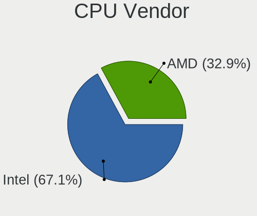

Zorin Hardware Trends (Desktop)
-------------------------------

A project to identify most popular hardware characteristics and track their change
over time based on data collected by Zorin users at https://Linux-Hardware.org.

Anyone can contribute to the study by uploading probes of their computers by
the [hw-probe](https://github.com/linuxhw/hw-probe) tool:

    sudo -E hw-probe -all -upload

Full-feature report is available here: https://linux-hardware.org/?view=trends&formfactor=desktop

Period: Sep, 2020.

Contents
--------

- [ OS                       ](#os)
- [ OS Family                ](#os-family)
- [ Kernel                   ](#kernel)
- [ Kernel Family            ](#kernel-family)
- [ Kernel Major Ver.        ](#kernel-major-ver)
- [ Arch                     ](#arch)
- [ DE                       ](#de)
- [ Display Server           ](#display-server)
- [ Display Manager          ](#display-manager)
- [ OS Lang                  ](#os-lang)
- [ Boot Mode                ](#boot-mode)
- [ Filesystem               ](#filesystem)
- [ Part. scheme             ](#part-scheme)
- [ Dual Boot with Linux/BSD ](#dual-boot-with-linux/bsd)
- [ Dual Boot (Win)          ](#dual-boot-win)
- [ Country                  ](#country)
- [ City                     ](#city)
- [ Vendor                   ](#vendor)
- [ Model                    ](#model)
- [ Model Family             ](#model-family)
- [ MFG Year                 ](#mfg-year)
- [ Form Factor              ](#form-factor)
- [ Secure Boot              ](#secure-boot)
- [ Coreboot                 ](#coreboot)
- [ RAM Size                 ](#ram-size)
- [ RAM Used                 ](#ram-used)
- [ Has CD-ROM               ](#has-cd-rom)
- [ Total Drives             ](#total-drives)
- [ Has Ethernet             ](#has-ethernet)
- [ Drive Vendor             ](#drive-vendor)
- [ HDD Vendor               ](#hdd-vendor)
- [ SSD Vendor               ](#ssd-vendor)
- [ Drive Model              ](#drive-model)
- [ Drive Kind               ](#drive-kind)
- [ Drive Connector          ](#drive-connector)
- [ Drive Size               ](#drive-size)
- [ Space Total              ](#space-total)
- [ Space Used               ](#space-used)
- [ Malfunc. Drives          ](#malfunc-drives)
- [ Malfunc. Drive Vendor    ](#malfunc-drive-vendor)
- [ Malfunc. HDD Vendor      ](#malfunc-hdd-vendor)
- [ Malfunc. Drive Kind      ](#malfunc-drive-kind)
- [ Failed Drives            ](#failed-drives)
- [ Failed Drive Vendor      ](#failed-drive-vendor)
- [ Drive Status             ](#drive-status)
- [ Storage Vendor           ](#storage-vendor)
- [ Storage Model            ](#storage-model)
- [ Storage Kind             ](#storage-kind)
- [ CPU Vendor               ](#cpu-vendor)
- [ CPU Model                ](#cpu-model)
- [ CPU Model Family         ](#cpu-model-family)
- [ CPU Cores                ](#cpu-cores)
- [ CPU Sockets              ](#cpu-sockets)
- [ CPU Threads              ](#cpu-threads)
- [ CPU Op-Modes             ](#cpu-op-modes)
- [ CPU Microcode            ](#cpu-microcode)
- [ CPU Microarch            ](#cpu-microarch)
- [ GPU Vendor               ](#gpu-vendor)
- [ GPU Model                ](#gpu-model)
- [ GPU Combo                ](#gpu-combo)
- [ GPU Driver               ](#gpu-driver)
- [ GPU Memory               ](#gpu-memory)
- [ Monitor Vendor           ](#monitor-vendor)
- [ Monitor Model            ](#monitor-model)
- [ Monitor Resolution       ](#monitor-resolution)
- [ Monitor Diagonal         ](#monitor-diagonal)
- [ Monitor Width            ](#monitor-width)
- [ Aspect Ratio             ](#aspect-ratio)
- [ Monitor Area             ](#monitor-area)
- [ Pixel Density            ](#pixel-density)
- [ Multiple Monitors        ](#multiple-monitors)
- [ Net Controller Vendor    ](#net-controller-vendor)
- [ Net Controller Model     ](#net-controller-model)
- [ Wireless Vendor          ](#wireless-vendor)
- [ Wireless Model           ](#wireless-model)
- [ Ethernet Vendor          ](#ethernet-vendor)
- [ Ethernet Model           ](#ethernet-model)
- [ Net Controller Kind      ](#net-controller-kind)
- [ Used Controller          ](#used-controller)
- [ NICs                     ](#nics)
- [ Memory Vendor            ](#memory-vendor)
- [ Memory Model             ](#memory-model)
- [ Memory Kind              ](#memory-kind)
- [ Memory Form Factor       ](#memory-form-factor)
- [ Memory Size              ](#memory-size)
- [ Memory Speed             ](#memory-speed)
- [ Sound Vendor             ](#sound-vendor)
- [ Sound Model              ](#sound-model)
- [ Camera Vendor            ](#camera-vendor)
- [ Camera Model             ](#camera-model)
- [ Fingerprint Vendor       ](#fingerprint-vendor)
- [ Fingerprint Model        ](#fingerprint-model)
- [ Chipcard Vendor          ](#chipcard-vendor)
- [ Chipcard Model           ](#chipcard-model)
- [ Printer Vendor           ](#printer-vendor)
- [ Printer Model            ](#printer-model)
- [ Scanner Vendor           ](#scanner-vendor)
- [ Scanner Model            ](#scanner-model)
- [ Bluetooth Vendor         ](#bluetooth-vendor)
- [ Bluetooth Model          ](#bluetooth-model)
- [ Unsupported Devices      ](#unsupported-devices)
- [ Unsupported Device Types ](#unsupported-device-types)

OS
--

Installed operating systems

| Name     | Desktops | Percent |
|----------|----------|---------|
| Zorin 15 | 29       | 87.88%  |
| Zorin 12 | 4        | 12.12%  |

OS Family
---------

OS without a version

| Name  | Desktops | Percent |
|-------|----------|---------|
| Zorin | 33       | 100%    |

Kernel
------

Version of the Linux kernel

| Version            | Desktops | Percent |
|--------------------|----------|---------|
| 5.4.0-47-generic   | 10       | 30.3%   |
| 5.4.0-48-generic   | 6        | 18.18%  |
| 5.4.0-45-generic   | 5        | 15.15%  |
| 5.4.0-42-generic   | 5        | 15.15%  |
| 4.15.0-112-generic | 3        | 9.09%   |
| 5.8.5-xanmod1      | 1        | 3.03%   |
| 5.3.0-40-generic   | 1        | 3.03%   |
| 5.0.0-37-generic   | 1        | 3.03%   |
| 4.15.0-118-generic | 1        | 3.03%   |

Kernel Family
-------------

Linux kernel without a distro release

| Version | Desktops | Percent |
|---------|----------|---------|
| 5.4.0   | 26       | 78.79%  |
| 4.15.0  | 4        | 12.12%  |
| 5.8.5   | 1        | 3.03%   |
| 5.3.0   | 1        | 3.03%   |
| 5.0.0   | 1        | 3.03%   |

Kernel Major Ver.
-----------------

Linux kernel major version

| Version | Desktops | Percent |
|---------|----------|---------|
| 5.4     | 26       | 78.79%  |
| 4.15    | 4        | 12.12%  |
| 5.8     | 1        | 3.03%   |
| 5.3     | 1        | 3.03%   |
| 5.0     | 1        | 3.03%   |

Arch
----

OS architecture (x86_64, i586, etc.)

| Name   | Desktops | Percent |
|--------|----------|---------|
| x86_64 | 27       | 81.82%  |
| i686   | 6        | 18.18%  |

DE
--

Desktop Environment

| Name  | Desktops | Percent |
|-------|----------|---------|
| GNOME | 21       | 63.64%  |
| XFCE  | 12       | 36.36%  |

Display Server
--------------

X11 or Wayland

| Name | Desktops | Percent |
|------|----------|---------|
| X11  | 33       | 100%    |

Display Manager
---------------

SDDM, LightDM, etc.

| Name    | Desktops | Percent |
|---------|----------|---------|
| Unknown | 32       | 96.97%  |
| GDM     | 1        | 3.03%   |

OS Lang
-------

Language

| Lang  | Desktops | Percent |
|-------|----------|---------|
| en_US | 16       | 48.48%  |
| es_CO | 3        | 9.09%   |
| pt_BR | 2        | 6.06%   |
| nl_NL | 2        | 6.06%   |
| es_ES | 2        | 6.06%   |
| ro_RO | 1        | 3.03%   |
| pt_PT | 1        | 3.03%   |
| it_IT | 1        | 3.03%   |
| fr_FR | 1        | 3.03%   |
| es_NI | 1        | 3.03%   |
| es_MX | 1        | 3.03%   |
| es_CL | 1        | 3.03%   |
| en_CA | 1        | 3.03%   |

Boot Mode
---------

EFI or BIOS

| Mode | Desktops | Percent |
|------|----------|---------|
| BIOS | 25       | 75.76%  |
| EFI  | 8        | 24.24%  |

Filesystem
----------

Type of filesystem

| Type    | Desktops | Percent |
|---------|----------|---------|
| Ext4    | 30       | 90.91%  |
| Overlay | 1        | 3.03%   |
| Ext3    | 1        | 3.03%   |
| Ext2    | 1        | 3.03%   |

Part. scheme
------------

Scheme of partitioning

| Type    | Desktops | Percent |
|---------|----------|---------|
| Unknown | 32       | 96.97%  |
| GPT     | 1        | 3.03%   |

Dual Boot with Linux/BSD
------------------------

Hosting more than one Linux/BSD

| Dual boot | Desktops | Percent |
|-----------|----------|---------|
| No        | 29       | 87.88%  |
| Yes       | 4        | 12.12%  |

Dual Boot (Win)
---------------

Hosting Linux and Windows

| Dual boot | Desktops | Percent |
|-----------|----------|---------|
| No        | 20       | 60.61%  |
| Yes       | 13       | 39.39%  |

Country
-------

Geographic location (country)

| Country     | Desktops | Percent |
|-------------|----------|---------|
| USA         | 10       | 30.3%   |
| Colombia    | 4        | 12.12%  |
| Netherlands | 3        | 9.09%   |
| Romania     | 2        | 6.06%   |
| Brazil      | 2        | 6.06%   |
| UK          | 1        | 3.03%   |
| Taiwan      | 1        | 3.03%   |
| Spain       | 1        | 3.03%   |
| Serbia      | 1        | 3.03%   |
| Portugal    | 1        | 3.03%   |
| Nicaragua   | 1        | 3.03%   |
| Mexico      | 1        | 3.03%   |
| Italy       | 1        | 3.03%   |
| France      | 1        | 3.03%   |
| Chile       | 1        | 3.03%   |
| Canada      | 1        | 3.03%   |
| Argentina   | 1        | 3.03%   |

City
----

Geographic location (city)

| City                  | Desktops | Percent |
|-----------------------|----------|---------|
| Bogotá               | 3        | 9.09%   |
| Dumbravita            | 2        | 6.06%   |
| Waukegan              | 1        | 3.03%   |
| Toronto               | 1        | 3.03%   |
| Taipei                | 1        | 3.03%   |
| São Paulo            | 1        | 3.03%   |
| St Helens             | 1        | 3.03%   |
| South Bend            | 1        | 3.03%   |
| Santiago de Cali      | 1        | 3.03%   |
| Santiago              | 1        | 3.03%   |
| Sant Fruitos de Bages | 1        | 3.03%   |
| San Diego             | 1        | 3.03%   |
| Sacramento            | 1        | 3.03%   |
| Rotterdam             | 1        | 3.03%   |
| Roanoke               | 1        | 3.03%   |
| Rio de Mouro          | 1        | 3.03%   |
| Puyallup              | 1        | 3.03%   |
| Mexico City           | 1        | 3.03%   |
| Managua               | 1        | 3.03%   |
| Lyon                  | 1        | 3.03%   |
| Los Angeles           | 1        | 3.03%   |
| Leiden                | 1        | 3.03%   |
| La Plata              | 1        | 3.03%   |
| João Pessoa          | 1        | 3.03%   |
| Fort Worth            | 1        | 3.03%   |
| Elgin                 | 1        | 3.03%   |
| Cassino               | 1        | 3.03%   |
| Buenos Aires          | 1        | 3.03%   |
| Belgrade              | 1        | 3.03%   |
| Arnhem                | 1        | 3.03%   |

Vendor
------

Motherboard manufacturer

| Name                | Desktops | Percent |
|---------------------|----------|---------|
| ASUSTek Computer    | 10       | 30.3%   |
| ASRock              | 4        | 12.12%  |
| MSI                 | 3        | 9.09%   |
| Hewlett-Packard     | 3        | 9.09%   |
| Gigabyte Technology | 3        | 9.09%   |
| Intel               | 2        | 6.06%   |
| Foxconn             | 2        | 6.06%   |
| Dell                | 2        | 6.06%   |
| Pegatron            | 1        | 3.03%   |
| Nexcom              | 1        | 3.03%   |
| Biostar             | 1        | 3.03%   |
| Unknown             | 1        | 3.03%   |

Model
-----

Motherboard model

| Name                         | Desktops | Percent |
|------------------------------|----------|---------|
| Pegatron NC701AA-ABA IQ524   | 1        | 3.03%   |
| Nexcom SKLD4-P1              | 1        | 3.03%   |
| MSI MS-7969                  | 1        | 3.03%   |
| MSI MS-7596                  | 1        | 3.03%   |
| MSI MS-7312                  | 1        | 3.03%   |
| Intel DH55PJ AAE93812-301    | 1        | 3.03%   |
| Intel 945GCT-M               | 1        | 3.03%   |
| HP EliteDesk 800 G1 DM       | 1        | 3.03%   |
| HP Compaq dc5850 SFF PC      | 1        | 3.03%   |
| HP Compaq 8200 Elite CMT PC  | 1        | 3.03%   |
| Gigabyte OP-DTW1-BK          | 1        | 3.03%   |
| Gigabyte G31M-S2C            | 1        | 3.03%   |
| Gigabyte A320M-S2H           | 1        | 3.03%   |
| Foxconn SG3-360FR            | 1        | 3.03%   |
| Foxconn BK428AA-ABA s5412p   | 1        | 3.03%   |
| Dell OptiPlex 790            | 1        | 3.03%   |
| Dell OptiPlex 745            | 1        | 3.03%   |
| Biostar N61PC-M2S            | 1        | 3.03%   |
| ASUS UNLOCK INSTALL          | 1        | 3.03%   |
| ASUS ROG Maximus XII FORMULA | 1        | 3.03%   |
| ASUS PRIME Z390-A            | 1        | 3.03%   |
| ASUS PRIME Z270-P            | 1        | 3.03%   |
| ASUS P8H77-M PRO             | 1        | 3.03%   |
| ASUS P8H61-M LX              | 1        | 3.03%   |
| ASUS P5N-D                   | 1        | 3.03%   |
| ASUS M5A97 R2.0              | 1        | 3.03%   |
| ASUS M4A87TD EVO             | 1        | 3.03%   |
| ASUS A55BM-E                 | 1        | 3.03%   |
| ASRock X570 Steel Legend     | 1        | 3.03%   |
| ASRock A320M-HD              | 1        | 3.03%   |
| ASRock 775i65G               | 1        | 3.03%   |
| ASRock 760GM-HDV             | 1        | 3.03%   |
| Unknown                      | 1        | 3.03%   |

Model Family
------------

Motherboard model prefix

| Name                 | Desktops | Percent |
|----------------------|----------|---------|
| HP Compaq            | 2        | 6.06%   |
| Dell OptiPlex        | 2        | 6.06%   |
| ASUS PRIME           | 2        | 6.06%   |
| Pegatron NC701AA-ABA | 1        | 3.03%   |
| Nexcom SKLD4-P1      | 1        | 3.03%   |
| MSI MS-7969          | 1        | 3.03%   |
| MSI MS-7596          | 1        | 3.03%   |
| MSI MS-7312          | 1        | 3.03%   |
| Intel DH55PJ         | 1        | 3.03%   |
| Intel 945GCT-M       | 1        | 3.03%   |
| HP EliteDesk         | 1        | 3.03%   |
| Gigabyte OP-DTW1-BK  | 1        | 3.03%   |
| Gigabyte G31M-S2C    | 1        | 3.03%   |
| Gigabyte A320M-S2H   | 1        | 3.03%   |
| Foxconn SG3-360FR    | 1        | 3.03%   |
| Foxconn BK428AA-ABA  | 1        | 3.03%   |
| Biostar N61PC-M2S    | 1        | 3.03%   |
| ASUS UNLOCK          | 1        | 3.03%   |
| ASUS ROG             | 1        | 3.03%   |
| ASUS P8H77-M         | 1        | 3.03%   |
| ASUS P8H61-M         | 1        | 3.03%   |
| ASUS P5N-D           | 1        | 3.03%   |
| ASUS M5A97           | 1        | 3.03%   |
| ASUS M4A87TD         | 1        | 3.03%   |
| ASUS A55BM-E         | 1        | 3.03%   |
| ASRock X570          | 1        | 3.03%   |
| ASRock A320M-HD      | 1        | 3.03%   |
| ASRock 775i65G       | 1        | 3.03%   |
| ASRock 760GM-HDV     | 1        | 3.03%   |
| Unknown              | 1        | 3.03%   |

MFG Year
--------

Motherboard manufacture year

| Year | Desktops | Percent |
|------|----------|---------|
| 2019 | 4        | 12.12%  |
| 2018 | 4        | 12.12%  |
| 2010 | 4        | 12.12%  |
| 2009 | 4        | 12.12%  |
| 2020 | 2        | 6.06%   |
| 2016 | 2        | 6.06%   |
| 2014 | 2        | 6.06%   |
| 2013 | 2        | 6.06%   |
| 2011 | 2        | 6.06%   |
| 2008 | 2        | 6.06%   |
| 2007 | 2        | 6.06%   |
| 2015 | 1        | 3.03%   |
| 2012 | 1        | 3.03%   |
| 2004 | 1        | 3.03%   |

Form Factor
-----------

Physical design of the computer

| Name    | Desktops | Percent |
|---------|----------|---------|
| Desktop | 33       | 100%    |

Secure Boot
-----------

Enabled or disabled

| State    | Desktops | Percent |
|----------|----------|---------|
| Disabled | 33       | 100%    |

Coreboot
--------

Have coreboot on board

| Used | Desktops | Percent |
|------|----------|---------|
| No   | 33       | 100%    |

RAM Size
--------

Total RAM memory

| Size in GB  | Desktops | Percent |
|-------------|----------|---------|
| 3.01-4.0    | 10       | 30.3%   |
| 8.01-16.0   | 8        | 24.24%  |
| 32.01-64.0  | 3        | 9.09%   |
| 16.01-24.0  | 3        | 9.09%   |
| 4.01-8.0    | 2        | 6.06%   |
| 2.01-3.0    | 2        | 6.06%   |
| 1.01-2.0    | 2        | 6.06%   |
| 0.01-1.0    | 2        | 6.06%   |
| 64.01-256.0 | 1        | 3.03%   |

RAM Used
--------

Used RAM memory

| Used GB  | Desktops | Percent |
|----------|----------|---------|
| 1.01-2.0 | 17       | 51.52%  |
| 2.01-3.0 | 7        | 21.21%  |
| 0.01-1.0 | 6        | 18.18%  |
| 3.01-4.0 | 2        | 6.06%   |
| 4.01-8.0 | 1        | 3.03%   |

Has CD-ROM
----------

Has CD-ROM on board

| Presented | Desktops | Percent |
|-----------|----------|---------|
| Yes       | 17       | 51.52%  |
| No        | 16       | 48.48%  |

Total Drives
------------

Number of drives on board

| Drives | Desktops | Percent |
|--------|----------|---------|
| 1      | 23       | 69.7%   |
| 3      | 4        | 12.12%  |
| 6      | 2        | 6.06%   |
| 4      | 2        | 6.06%   |
| 2      | 2        | 6.06%   |

Has Ethernet
------------

Has Ethernet on board

| Presented | Desktops | Percent |
|-----------|----------|---------|
| Yes       | 33       | 100%    |

Drive Vendor
------------

Hard drive vendors

| Vendor                    | Desktops | Drives | Percent |
|---------------------------|----------|--------|---------|
| Seagate                   | 12       | 15     | 22.64%  |
| WDC                       | 9        | 9      | 16.98%  |
| Samsung Electronics       | 9        | 9      | 16.98%  |
| Toshiba                   | 5        | 6      | 9.43%   |
| Sandisk                   | 3        | 3      | 5.66%   |
| Kingston                  | 3        | 3      | 5.66%   |
| Unknown                   | 2        | 2      | 3.77%   |
| PNY                       | 2        | 2      | 3.77%   |
| Maxtor                    | 2        | 2      | 3.77%   |
| Transcend                 | 1        | 1      | 1.89%   |
| SABRENT                   | 1        | 1      | 1.89%   |
| Phison                    | 1        | 1      | 1.89%   |
| Micron/Crucial Technology | 1        | 1      | 1.89%   |
| Intel                     | 1        | 1      | 1.89%   |
| Corsair                   | 1        | 1      | 1.89%   |

HDD Vendor
----------

Hard disk drive vendors

| Vendor              | Desktops | Drives | Percent |
|---------------------|----------|--------|---------|
| Seagate             | 12       | 15     | 37.5%   |
| WDC                 | 9        | 9      | 28.13%  |
| Samsung Electronics | 5        | 5      | 15.63%  |
| Toshiba             | 4        | 5      | 12.5%   |
| Maxtor              | 2        | 2      | 6.25%   |

SSD Vendor
----------

Solid state drive vendors

| Vendor              | Desktops | Drives | Percent |
|---------------------|----------|--------|---------|
| Samsung Electronics | 4        | 4      | 23.53%  |
| Kingston            | 3        | 3      | 17.65%  |
| SanDisk             | 2        | 2      | 11.76%  |
| PNY                 | 2        | 2      | 11.76%  |
| Unknown             | 1        | 1      | 5.88%   |
| Transcend           | 1        | 1      | 5.88%   |
| Toshiba             | 1        | 1      | 5.88%   |
| SABRENT             | 1        | 1      | 5.88%   |
| Intel               | 1        | 1      | 5.88%   |
| Corsair             | 1        | 1      | 5.88%   |

Drive Model
-----------

Hard drive models

| Model                     | Desktops | Percent |
|---------------------------|----------|---------|
| WD40EZRZ-00GXCB0 4TB      | 2        | 3.57%   |
| ST5000DM002-1XY17X 5TB    | 2        | 3.57%   |
| ST4000DM000-1F2168 4TB    | 2        | 3.57%   |
| SSD 860 EVO 500GB         | 2        | 3.57%   |
| NVMe SSD Drive 1TB        | 2        | 3.57%   |
| CS900 240GB SSD           | 2        | 3.57%   |
| WD5000AAKS-65V0A0 500GB   | 1        | 1.79%   |
| WD20EARX-00PASB0 2TB      | 1        | 1.79%   |
| WD15EADS-22P8B0 1TB       | 1        | 1.79%   |
| WD10PURX-64D85Y0 1TB      | 1        | 1.79%   |
| WD10EZEX-60WN4A0 1TB      | 1        | 1.79%   |
| WD10EZEX-22RKKA0 1TB      | 1        | 1.79%   |
| WD10EZEX-00BN5A0 1TB      | 1        | 1.79%   |
| TS32GSSD630 32GB          | 1        | 1.79%   |
| THNSNJ256GCSU 256GB SSD   | 1        | 1.79%   |
| SV300S37A60G 64GB SSD     | 1        | 1.79%   |
| SV300S37A120G 120GB SSD   | 1        | 1.79%   |
| ST9320423AS 320GB         | 1        | 1.79%   |
| ST3160815AS 160GB         | 1        | 1.79%   |
| ST3160316AS 160GB         | 1        | 1.79%   |
| ST3160023AS 160GB         | 1        | 1.79%   |
| ST31500341AS 1TB          | 1        | 1.79%   |
| ST3120827AS 120GB         | 1        | 1.79%   |
| ST31000528AS 1TB          | 1        | 1.79%   |
| ST31000424CS 1TB          | 1        | 1.79%   |
| ST2000DM001-1ER164 2TB    | 1        | 1.79%   |
| ST1000VM002-1ET162 1TB    | 1        | 1.79%   |
| ST1000DM003-9YN162 1TB    | 1        | 1.79%   |
| SSDSC2BF180A4H 180GB      | 1        | 1.79%   |
| SSD 850 EVO 250GB         | 1        | 1.79%   |
| SP0802N 80GB              | 1        | 1.79%   |
| SDSSDP064G 64GB           | 1        | 1.79%   |
| SD9SB8W256G1122 256GB SSD | 1        | 1.79%   |
| SATA3 120GB SSD           | 1        | 1.79%   |
| SA400S37240G 240GB SSD    | 1        | 1.79%   |
| PSSD T7 Touch 2TB         | 1        | 1.79%   |
| NVMe SSD Drive 250GB      | 1        | 1.79%   |
| NVMe SSD Drive 128GB      | 1        | 1.79%   |
| HDWD120 2TB               | 1        | 1.79%   |
| HDWD110 1TB               | 1        | 1.79%   |
| HD753LJ 752GB             | 1        | 1.79%   |
| HD502IJ 500GB             | 1        | 1.79%   |
| HD200HJ 200GB             | 1        | 1.79%   |
| HD080HJ/ 80GB             | 1        | 1.79%   |
| Force LS SSD 120GB        | 1        | 1.79%   |
| DT01ACA200 2TB            | 1        | 1.79%   |
| DT01ACA100 1TB            | 1        | 1.79%   |
| Disk 1TB                  | 1        | 1.79%   |
| 6Y080L0 81GB              | 1        | 1.79%   |
| 6V080E0 81GB              | 1        | 1.79%   |

Drive Kind
----------

HDD or SSD

| Kind | Desktops | Drives | Percent |
|------|----------|--------|---------|
| HDD  | 26       | 36     | 60.47%  |
| SSD  | 13       | 17     | 30.23%  |
| NVMe | 4        | 4      | 9.3%    |

Drive Connector
---------------

SATA, SAS, NVMe, etc.

| Type | Desktops | Drives | Percent |
|------|----------|--------|---------|
| SATA | 31       | 51     | 83.78%  |
| NVMe | 4        | 4      | 10.81%  |
| SAS  | 2        | 2      | 5.41%   |

Drive Size
----------

Size of hard drive

| Size in TB | Desktops | Drives | Percent |
|------------|----------|--------|---------|
| 0.01-0.5   | 26       | 29     | 57.78%  |
| 0.51-1.0   | 11       | 17     | 24.44%  |
| 1.01-2.0   | 4        | 5      | 8.89%   |
| 3.01-4.0   | 2        | 4      | 4.44%   |
| 4.01-10.0  | 2        | 2      | 4.44%   |

Space Total
-----------

Amount of disk space available on the file system

| Size in GB     | Desktops | Percent |
|----------------|----------|---------|
| 101-250        | 7        | 21.21%  |
| 251-500        | 6        | 18.18%  |
| 51-100         | 5        | 15.15%  |
| 1001-2000      | 4        | 12.12%  |
| 501-1000       | 4        | 12.12%  |
| More than 3000 | 2        | 6.06%   |
| 21-50          | 2        | 6.06%   |
| 1-20           | 2        | 6.06%   |
| 2001-3000      | 1        | 3.03%   |

Space Used
----------

Amount of used disk space

| Used GB   | Desktops | Percent |
|-----------|----------|---------|
| 1-20      | 14       | 42.42%  |
| 21-50     | 6        | 18.18%  |
| 101-250   | 5        | 15.15%  |
| 51-100    | 4        | 12.12%  |
| 251-500   | 2        | 6.06%   |
| 1001-2000 | 1        | 3.03%   |
| 501-1000  | 1        | 3.03%   |

Malfunc. Drives
---------------

Drive models with a malfunction

Zero info for selected period =(

Malfunc. Drive Vendor
---------------------

Vendors of faulty drives

Zero info for selected period =(

Malfunc. HDD Vendor
-------------------

Vendors of faulty HDD drives

Zero info for selected period =(

Malfunc. Drive Kind
-------------------

Kinds of faulty drives

Zero info for selected period =(

Failed Drives
-------------

Failed drive models

Zero info for selected period =(

Failed Drive Vendor
-------------------

Failed drive vendors

Zero info for selected period =(

Drive Status
------------

Number of failed and malfunc. drives

| Status   | Desktops | Drives | Percent |
|----------|----------|--------|---------|
| Detected | 32       | 56     | 96.97%  |
| Works    | 1        | 1      | 3.03%   |

Storage Vendor
--------------

Storage controller vendors

| Vendor                    | Desktops | Percent |
|---------------------------|----------|---------|
| Intel                     | 19       | 47.5%   |
| AMD                       | 11       | 27.5%   |
| Nvidia                    | 2        | 5%      |
| JMicron Technology        | 2        | 5%      |
| VIA Technologies          | 1        | 2.5%    |
| Union Memory (Shenzhen)   | 1        | 2.5%    |
| Sandisk                   | 1        | 2.5%    |
| Phison Electronics        | 1        | 2.5%    |
| Micron/Crucial Technology | 1        | 2.5%    |
| Marvell Technology Group  | 1        | 2.5%    |

Storage Model
-------------

Storage controller models

| Model                                                                             | Desktops | Percent |
|-----------------------------------------------------------------------------------|----------|---------|
| FCH SATA Controller [AHCI mode]                                                   | 5        | 8.93%   |
| SB7x0/SB8x0/SB9x0 SATA Controller [IDE mode]                                      | 4        | 7.14%   |
| SB7x0/SB8x0/SB9x0 IDE Controller                                                  | 3        | 5.36%   |
| NM10/ICH7 Family SATA Controller [IDE mode]                                       | 3        | 5.36%   |
| SB7x0/SB8x0/SB9x0 SATA Controller [AHCI mode]                                     | 2        | 3.57%   |
| Non-Volatile memory controller                                                    | 2        | 3.57%   |
| FCH SATA Controller D                                                             | 2        | 3.57%   |
| Cannon Lake PCH SATA AHCI Controller                                              | 2        | 3.57%   |
| 82801G (ICH7 Family) IDE Controller                                               | 2        | 3.57%   |
| 82801EB/ER (ICH5/ICH5R) IDE Controller                                            | 2        | 3.57%   |
| 6 Series/C200 Series Chipset Family Desktop SATA Controller (IDE mode, ports 4-5) | 2        | 3.57%   |
| 6 Series/C200 Series Chipset Family Desktop SATA Controller (IDE mode, ports 0-3) | 2        | 3.57%   |
| 6 Series/C200 Series Chipset Family 6 port Desktop SATA AHCI Controller           | 2        | 3.57%   |
| VT82C586A/B/VT82C686/A/B/VT823x/A/C PIPC Bus Master IDE                           | 1        | 1.79%   |
| VIA VT6420 SATA RAID Controller                                                   | 1        | 1.79%   |
| Sunrise Point-LP SATA Controller [AHCI mode]                                      | 1        | 1.79%   |
| SATA Controller [RAID mode]                                                       | 1        | 1.79%   |
| P1 NVMe PCIe SSD                                                                  | 1        | 1.79%   |
| MCP61 SATA Controller                                                             | 1        | 1.79%   |
| MCP61 IDE                                                                         | 1        | 1.79%   |
| MCP51 Serial ATA Controller                                                       | 1        | 1.79%   |
| MCP51 IDE                                                                         | 1        | 1.79%   |
| JMB363 SATA/IDE Controller                                                        | 1        | 1.79%   |
| JMB361 AHCI/IDE                                                                   | 1        | 1.79%   |
| E16 PCIe4 NVMe Controller                                                         | 1        | 1.79%   |
| 88SE9172 SATA III 6Gb/s RAID Controller                                           | 1        | 1.79%   |
| 82801IBM/IEM (ICH9M/ICH9M-E) 4 port SATA Controller [AHCI mode]                   | 1        | 1.79%   |
| 82801HR/HO/HH (ICH8R/DO/DH) 2 port SATA Controller [IDE mode]                     | 1        | 1.79%   |
| 82801H (ICH8 Family) 4 port SATA Controller [IDE mode]                            | 1        | 1.79%   |
| 82801EB (ICH5) SATA Controller                                                    | 1        | 1.79%   |
| 8 Series/C220 Series Chipset Family 6-port SATA Controller 1 [AHCI mode]          | 1        | 1.79%   |
| 7 Series/C210 Series Chipset Family 4-port SATA Controller [IDE mode]             | 1        | 1.79%   |
| 7 Series/C210 Series Chipset Family 2-port SATA Controller [IDE mode]             | 1        | 1.79%   |
| 5 Series/3400 Series Chipset PT IDER Controller                                   | 1        | 1.79%   |
| 5 Series/3400 Series Chipset 4 port SATA IDE Controller                           | 1        | 1.79%   |
| 400 Series Chipset Family SATA AHCI Controller                                    | 1        | 1.79%   |

Storage Kind
------------

Kind of storage controller (IDE, SATA, NVMe, SAS, ...)

| Kind | Desktops | Percent |
|------|----------|---------|
| SATA | 19       | 46.34%  |
| IDE  | 17       | 41.46%  |
| NVMe | 4        | 9.76%   |
| RAID | 1        | 2.44%   |

CPU Vendor
----------

Processor vendors

| Vendor | Desktops | Percent |
|--------|----------|---------|
| Intel  | 20       | 60.61%  |
| AMD    | 13       | 39.39%  |

CPU Model
---------

Processor models

| Model                                          | Desktops | Percent |
|------------------------------------------------|----------|---------|
| Intel Core i5-2400 CPU @ 3.10GHz               | 3        | 9.09%   |
| AMD FX-6300 Six-Core Processor                 | 3        | 9.09%   |
| Intel Pentium Dual-Core CPU E5400 @ 2.70GHz    | 1        | 3.03%   |
| Intel Pentium Dual CPU E2180 @ 2.00GHz         | 1        | 3.03%   |
| Intel Pentium 4 CPU 3.00GHz                    | 1        | 3.03%   |
| Intel Core i9-10850K CPU @ 3.60GHz             | 1        | 3.03%   |
| Intel Core i7-9700K CPU @ 3.60GHz              | 1        | 3.03%   |
| Intel Core i7-8700 CPU @ 3.20GHz               | 1        | 3.03%   |
| Intel Core i5-7500 CPU @ 3.40GHz               | 1        | 3.03%   |
| Intel Core i5-6200U CPU @ 2.30GHz              | 1        | 3.03%   |
| Intel Core i5-4590T CPU @ 2.00GHz              | 1        | 3.03%   |
| Intel Core i5-3330 CPU @ 3.00GHz               | 1        | 3.03%   |
| Intel Core i3-2100 CPU @ 3.10GHz               | 1        | 3.03%   |
| Intel Core i3 CPU 530 @ 2.93GHz                | 1        | 3.03%   |
| Intel Core 2 Quad CPU Q6600 @ 2.40GHz          | 1        | 3.03%   |
| Intel Core 2 Duo CPU T6400 @ 2.00GHz           | 1        | 3.03%   |
| Intel Core 2 CPU 4400 @ 2.00GHz                | 1        | 3.03%   |
| Intel Celeron CPU E1400 @ 2.00GHz              | 1        | 3.03%   |
| Intel Celeron CPU 3.20GHz                      | 1        | 3.03%   |
| AMD Sempron Dual Core Processor 2200           | 1        | 3.03%   |
| AMD Ryzen 5 3400G with Radeon Vega Graphics    | 1        | 3.03%   |
| AMD Ryzen 5 2600 Six-Core Processor            | 1        | 3.03%   |
| AMD Phenom II X6 1055T Processor               | 1        | 3.03%   |
| AMD Phenom 8600B Triple-Core Processor         | 1        | 3.03%   |
| AMD Athlon II X2 245 Processor                 | 1        | 3.03%   |
| AMD Athlon 64 X2 Dual Core Processor 4600+     | 1        | 3.03%   |
| AMD A8-9600 RADEON R7, 10 COMPUTE CORES 4C+6G  | 1        | 3.03%   |
| AMD A8-7670K Radeon R7, 10 Compute Cores 4C+6G | 1        | 3.03%   |
| AMD A8-5600K APU with Radeon HD Graphics       | 1        | 3.03%   |

CPU Model Family
----------------

Processor model prefix

| Model                   | Desktops | Percent |
|-------------------------|----------|---------|
| Intel Core i5           | 7        | 21.21%  |
| AMD FX                  | 3        | 9.09%   |
| AMD A8                  | 3        | 9.09%   |
| Intel Core i7           | 2        | 6.06%   |
| Intel Core i3           | 2        | 6.06%   |
| Intel Celeron           | 2        | 6.06%   |
| AMD Ryzen 5             | 2        | 6.06%   |
| Intel Pentium Dual-Core | 1        | 3.03%   |
| Intel Pentium Dual      | 1        | 3.03%   |
| Intel Pentium 4         | 1        | 3.03%   |
| Intel Core i9           | 1        | 3.03%   |
| Intel Core 2 Quad       | 1        | 3.03%   |
| Intel Core 2 Duo        | 1        | 3.03%   |
| Intel Core 2            | 1        | 3.03%   |
| AMD Sempron             | 1        | 3.03%   |
| AMD Phenom II X6        | 1        | 3.03%   |
| AMD Phenom              | 1        | 3.03%   |
| AMD Athlon II X2        | 1        | 3.03%   |
| AMD Athlon 64 X2        | 1        | 3.03%   |

CPU Cores
---------

Number of processor cores

| Number | Desktops | Percent |
|--------|----------|---------|
| 2      | 14       | 42.42%  |
| 4      | 8        | 24.24%  |
| 3      | 4        | 12.12%  |
| 6      | 3        | 9.09%   |
| 1      | 2        | 6.06%   |
| 10     | 1        | 3.03%   |
| 8      | 1        | 3.03%   |

CPU Sockets
-----------

Number of sockets

| Number | Desktops | Percent |
|--------|----------|---------|
| 1      | 33       | 100%    |

CPU Threads
-----------

Threads per core (Hyper-Threading)

| Number | Desktops | Percent |
|--------|----------|---------|
| 1      | 20       | 60.61%  |
| 2      | 13       | 39.39%  |

CPU Op-Modes
------------

CPU Operation Modes (32-bit, 64-bit)

| Op mode        | Desktops | Percent |
|----------------|----------|---------|
| 32-bit, 64-bit | 32       | 96.97%  |
| 32-bit         | 1        | 3.03%   |

CPU Microcode
-------------

Microcode number

| Number     | Desktops | Percent |
|------------|----------|---------|
| Unknown    | 4        | 12.12%  |
| 0x206a7    | 3        | 9.09%   |
| 0x06000852 | 3        | 9.09%   |
| 0x6fd      | 2        | 6.06%   |
| 0x1067a    | 2        | 6.06%   |
| 0xf49      | 1        | 3.03%   |
| 0xf34      | 1        | 3.03%   |
| 0xa0655    | 1        | 3.03%   |
| 0x906ed    | 1        | 3.03%   |
| 0x906ea    | 1        | 3.03%   |
| 0x906e9    | 1        | 3.03%   |
| 0x6f2      | 1        | 3.03%   |
| 0x406e3    | 1        | 3.03%   |
| 0x306c3    | 1        | 3.03%   |
| 0x306a9    | 1        | 3.03%   |
| 0x20652    | 1        | 3.03%   |
| 0x08108109 | 1        | 3.03%   |
| 0x0800820b | 1        | 3.03%   |
| 0x0600611a | 1        | 3.03%   |
| 0x06003106 | 1        | 3.03%   |
| 0x06001119 | 1        | 3.03%   |
| 0x010000dc | 1        | 3.03%   |
| 0x010000c8 | 1        | 3.03%   |
| 0x01000083 | 1        | 3.03%   |

CPU Microarch
-------------

Microarchitecture

| Name        | Desktops | Percent |
|-------------|----------|---------|
| Core        | 6        | 18.18%  |
| Skylake     | 5        | 15.15%  |
| SandyBridge | 4        | 12.12%  |
| Piledriver  | 4        | 12.12%  |
| K10         | 3        | 9.09%   |
| Zen+        | 2        | 6.06%   |
| NetBurst    | 2        | 6.06%   |
| K8 Hammer   | 2        | 6.06%   |
| Westmere    | 1        | 3.03%   |
| Steamroller | 1        | 3.03%   |
| IvyBridge   | 1        | 3.03%   |
| Haswell     | 1        | 3.03%   |
| Excavator   | 1        | 3.03%   |

GPU Vendor
----------

Vendors of graphics cards

| Vendor           | Desktops | Percent |
|------------------|----------|---------|
| AMD              | 12       | 35.29%  |
| Intel            | 11       | 32.35%  |
| Nvidia           | 10       | 29.41%  |
| VIA Technologies | 1        | 2.94%   |

GPU Model
---------

Graphics card models

| Model                                                                 | Desktops | Percent |
|-----------------------------------------------------------------------|----------|---------|
| GP108 [GeForce GT 1030]                                               | 2        | 5.88%   |
| Ellesmere [Radeon RX 470/480/570/570X/580/580X/590]                   | 2        | 5.88%   |
| 2nd Generation Core Processor Family Integrated Graphics Controller   | 2        | 5.88%   |
| Xeon E3-1200 v3/4th Gen Core Processor Integrated Graphics Controller | 1        | 2.94%   |
| Wani [Radeon R5/R6/R7 Graphics]                                       | 1        | 2.94%   |
| UHD Graphics 630 (Desktop 9 Series)                                   | 1        | 2.94%   |
| Turks XT [Radeon HD 6670/7670]                                        | 1        | 2.94%   |
| Trinity [Radeon HD 7560D]                                             | 1        | 2.94%   |
| Skylake GT2 [HD Graphics 520]                                         | 1        | 2.94%   |
| RV730 XT [Radeon HD 4670]                                             | 1        | 2.94%   |
| RV710 [Radeon HD 4350/4550]                                           | 1        | 2.94%   |
| RS780L [Radeon 3000]                                                  | 1        | 2.94%   |
| RS780C [Radeon 3100]                                                  | 1        | 2.94%   |
| Picasso                                                               | 1        | 2.94%   |
| NV34 [GeForce FX 5200]                                                | 1        | 2.94%   |
| Mobile 4 Series Chipset Integrated Graphics Controller                | 1        | 2.94%   |
| Kaveri [Radeon R7 Graphics]                                           | 1        | 2.94%   |
| K8M800/K8N800/K8N800A [S3 UniChrome Pro]                              | 1        | 2.94%   |
| GP104 [GeForce GTX 1070]                                              | 1        | 2.94%   |
| GM206 [GeForce GTX 960]                                               | 1        | 2.94%   |
| GK208B [GeForce GT 710]                                               | 1        | 2.94%   |
| GK110B [GeForce GTX 780 Ti]                                           | 1        | 2.94%   |
| GF114 [GeForce GTX 560 SE]                                            | 1        | 2.94%   |
| G92 [GeForce GTS 250]                                                 | 1        | 2.94%   |
| Core Processor Integrated Graphics Controller                         | 1        | 2.94%   |
| C61 [GeForce 6150SE nForce 430]                                       | 1        | 2.94%   |
| Baffin [Radeon RX 460/560D / Pro 450/455/460/555/555X/560/560X]       | 1        | 2.94%   |
| 82Q963/Q965 Integrated Graphics Controller                            | 1        | 2.94%   |
| 82G33/G31 Express Integrated Graphics Controller                      | 1        | 2.94%   |
| 82865G Integrated Graphics Controller                                 | 1        | 2.94%   |
| 4 Series Chipset Integrated Graphics Controller                       | 1        | 2.94%   |

GPU Combo
---------

Combinations of graphics cards

| Name           | Desktops | Percent |
|----------------|----------|---------|
| 1 x AMD        | 12       | 36.36%  |
| 1 x Intel      | 10       | 30.3%   |
| 1 x Nvidia     | 9        | 27.27%  |
| 1 x VIA        | 1        | 3.03%   |
| Intel + Nvidia | 1        | 3.03%   |

GPU Driver
----------

Free vs proprietary

| Driver      | Desktops | Percent |
|-------------|----------|---------|
| Free        | 24       | 72.73%  |
| Proprietary | 6        | 18.18%  |
| Unknown     | 3        | 9.09%   |

GPU Memory
----------

Total video memory

| Size in GB | Desktops | Percent |
|------------|----------|---------|
| Unknown    | 11       | 33.33%  |
| 0.01-0.5   | 7        | 21.21%  |
| 1.01-2.0   | 5        | 15.15%  |
| 0.51-1.0   | 5        | 15.15%  |
| 3.01-4.0   | 3        | 9.09%   |
| 7.01-8.0   | 1        | 3.03%   |
| 2.01-3.0   | 1        | 3.03%   |

Monitor Vendor
--------------

Monitor vendors

| Vendor               | Desktops | Percent |
|----------------------|----------|---------|
| Samsung Electronics  | 4        | 13.79%  |
| Goldstar             | 3        | 10.34%  |
| Unknown              | 2        | 6.9%    |
| Hewlett-Packard      | 2        | 6.9%    |
| ASUSTek Computer     | 2        | 6.9%    |
| AOC                  | 2        | 6.9%    |
| Acer                 | 2        | 6.9%    |
| Vizio                | 1        | 3.45%   |
| ViewSonic            | 1        | 3.45%   |
| Sceptre              | 1        | 3.45%   |
| Philips              | 1        | 3.45%   |
| KTC                  | 1        | 3.45%   |
| Hyundai ImageQuest   | 1        | 3.45%   |
| HSI                  | 1        | 3.45%   |
| Dell                 | 1        | 3.45%   |
| Compaq Computer      | 1        | 3.45%   |
| CHI                  | 1        | 3.45%   |
| BenQ                 | 1        | 3.45%   |
| Ancor Communications | 1        | 3.45%   |

Monitor Model
-------------

Monitor models

| Model                                              | Desktops | Percent |
|----------------------------------------------------|----------|---------|
| PG349Q AUS343B 3440x1440 798x335mm 34.1-inch       | 2        | 6.06%   |
| X183H ACR0065 1366x768 344x194mm 15.5-inch         | 1        | 3.03%   |
| W2243 GSM56FE 1920x1080 477x269mm 21.6-inch        | 1        | 3.03%   |
| W2010S1 KTC2002 1600x900 443x249mm 20.0-inch       | 1        | 3.03%   |
| VGA DISPLAY CHIBD1B 1920x1080 880x500mm 39.8-inch  | 1        | 3.03%   |
| VA1913 series VSC1A22 1366x768 410x230mm 18.5-inch | 1        | 3.03%   |
| SMB2030N SAM0634 1440x900 440x250mm 19.9-inch      | 1        | 3.03%   |
| S211HL ACR01AA 1920x1080 477x268mm 21.5-inch       | 1        | 3.03%   |
| MP59G GSM5B34 1920x1080 480x270mm 21.7-inch        | 1        | 3.03%   |
| M320NV VIZ0070 1920x1080 700x390mm 31.5-inch       | 1        | 3.03%   |
| LE26W154 AOC2615 1360x768 575x323mm 26.0-inch      | 1        | 3.03%   |
| LCD Monitor T27 6400x1080                          | 1        | 3.03%   |
| LCD Monitor T27 3840x1080                          | 1        | 3.03%   |
| LCD Monitor T27                                    | 1        | 3.03%   |
| LCD Monitor ST2220L                                | 1        | 3.03%   |
| LCD Monitor SAMSUNG 3840x2160                      | 1        | 3.03%   |
| LCD Monitor SAM07C0 1920x1080 700x390mm 31.5-inch  | 1        | 3.03%   |
| LCD Monitor SAM0658 1920x1080 886x498mm 40.0-inch  | 1        | 3.03%   |
| LCD Monitor P30                                    | 1        | 3.03%   |
| LCD Monitor P170S 3200x1080                        | 1        | 3.03%   |
| LCD Monitor C32F391 1920x1080                      | 1        | 3.03%   |
| LCD Monitor AAA LCDTV 1920x1080                    | 1        | 3.03%   |
| L17T IQT0175 1280x1024 330x270mm 16.8-inch         | 1        | 3.03%   |
| L1740 HWP2648 1280x1024 337x270mm 17.0-inch        | 1        | 3.03%   |
| HiTV HSI0001 3840x2160 708x398mm 32.0-inch         | 1        | 3.03%   |
| GL2750H BNQ78AD 1920x1080 598x336mm 27.0-inch      | 1        | 3.03%   |
| FS7600 CPQ1461 1280x1024 312x234mm 15.4-inch       | 1        | 3.03%   |
| ASUS VP247 ACI24C7 1920x1080 521x293mm 23.5-inch   | 1        | 3.03%   |
| 27w HPN3495 1920x1080 598x336mm 27.0-inch          | 1        | 3.03%   |
| 23MP65 GSM5A45 1920x1080 510x290mm 23.1-inch       | 1        | 3.03%   |
| 2270W AOC2270 1920x1080 477x268mm 21.5-inch        | 1        | 3.03%   |
| 190CW PHLC018 1440x900 408x255mm 18.9-inch         | 1        | 3.03%   |

Monitor Resolution
------------------

Monitor screen resolution

| Resolution       | Desktops | Percent |
|------------------|----------|---------|
| 1920x1080 (FHD)  | 15       | 46.88%  |
| 1280x1024 (SXGA) | 3        | 9.38%   |
| 3440x1440        | 2        | 6.25%   |
| 1600x900 (HD+)   | 2        | 6.25%   |
| 1366x768 (WXGA)  | 2        | 6.25%   |
| Unknown          | 2        | 6.25%   |
| 6400x1080        | 1        | 3.13%   |
| 3840x2160 (4K)   | 1        | 3.13%   |
| 3840x1080        | 1        | 3.13%   |
| 3200x1080        | 1        | 3.13%   |
| 1440x900 (WXGA+) | 1        | 3.13%   |
| 1360x768         | 1        | 3.13%   |

Monitor Diagonal
----------------

Diagonal size in inches

| Inches  | Desktops | Percent |
|---------|----------|---------|
| Unknown | 5        | 17.24%  |
| 21      | 4        | 13.79%  |
| 40      | 2        | 6.9%    |
| 34      | 2        | 6.9%    |
| 27      | 2        | 6.9%    |
| 23      | 2        | 6.9%    |
| 20      | 2        | 6.9%    |
| 18      | 2        | 6.9%    |
| 15      | 2        | 6.9%    |
| 39      | 1        | 3.45%   |
| 37      | 1        | 3.45%   |
| 32      | 1        | 3.45%   |
| 26      | 1        | 3.45%   |
| 17      | 1        | 3.45%   |
| 16      | 1        | 3.45%   |

Monitor Width
-------------

Physical width

| Width in mm | Desktops | Percent |
|-------------|----------|---------|
| 401-500     | 8        | 27.59%  |
| 501-600     | 5        | 17.24%  |
| Unknown     | 5        | 17.24%  |
| 801-900     | 4        | 13.79%  |
| 301-350     | 4        | 13.79%  |
| 701-800     | 3        | 10.34%  |

Aspect Ratio
------------

Proportional relationship between the width and the height

| Ratio   | Desktops | Percent |
|---------|----------|---------|
| 16/9    | 17       | 60.71%  |
| Unknown | 5        | 17.86%  |
| 21/9    | 2        | 7.14%   |
| 6/5     | 1        | 3.57%   |
| 5/4     | 1        | 3.57%   |
| 4/3     | 1        | 3.57%   |
| 16/10   | 1        | 3.57%   |

Monitor Area
------------

Area in inch²

| Area in inch² | Desktops | Percent |
|----------------|----------|---------|
| 151-200        | 6        | 20.69%  |
| Unknown        | 5        | 17.24%  |
| 501-1000       | 4        | 13.79%  |
| 351-500        | 3        | 10.34%  |
| 201-250        | 3        | 10.34%  |
| 301-350        | 2        | 6.9%    |
| 141-150        | 2        | 6.9%    |
| 251-300        | 1        | 3.45%   |
| 131-140        | 1        | 3.45%   |
| 111-120        | 1        | 3.45%   |
| 101-110        | 1        | 3.45%   |

Pixel Density
-------------

Pixels per inch

| Density | Desktops | Percent |
|---------|----------|---------|
| 51-100  | 16       | 55.17%  |
| 101-120 | 8        | 27.59%  |
| Unknown | 5        | 17.24%  |

Multiple Monitors
-----------------

Total monitors connected

| Total | Desktops | Percent |
|-------|----------|---------|
| 1     | 27       | 81.82%  |
| 0     | 3        | 9.09%   |
| 2     | 2        | 6.06%   |
| 3     | 1        | 3.03%   |

Net Controller Vendor
---------------------

Controller vendors

| Vendor                         | Desktops | Percent |
|--------------------------------|----------|---------|
| Realtek Semiconductor          | 22       | 46.81%  |
| Intel                          | 10       | 21.28%  |
| Qualcomm Atheros               | 2        | 4.26%   |
| Nvidia                         | 2        | 4.26%   |
| VIA Technologies               | 1        | 2.13%   |
| Ralink Technology              | 1        | 2.13%   |
| Ralink                         | 1        | 2.13%   |
| Qualcomm                       | 1        | 2.13%   |
| NetGear                        | 1        | 2.13%   |
| Motorola                       | 1        | 2.13%   |
| Linksys                        | 1        | 2.13%   |
| D-Link                         | 1        | 2.13%   |
| Broadcom Limited               | 1        | 2.13%   |
| Broadcom Inc. and subsidiaries | 1        | 2.13%   |
| Aquantia                       | 1        | 2.13%   |

Net Controller Model
--------------------

Controller models

| Model                                                     | Desktops | Percent |
|-----------------------------------------------------------|----------|---------|
| RTL8111/8168/8411 PCI Express Gigabit Ethernet Controller | 15       | 28.85%  |
| RTL810xE PCI Express Fast Ethernet controller             | 4        | 7.69%   |
| Wireless 7260                                             | 2        | 3.85%   |
| NetXtreme BCM5754 Gigabit Ethernet PCI Express            | 2        | 3.85%   |
| 82579LM Gigabit Network Connection (Lewisville)           | 2        | 3.85%   |
| 802.11n                                                   | 2        | 3.85%   |
| WUSB6100M 802.11a/b/g/n/ac Wireless Adapter               | 1        | 1.92%   |
| WNDA3100v1 802.11abgn [Atheros AR9170+AR9104]             | 1        | 1.92%   |
| Wi-Fi 6 AX200                                             | 1        | 1.92%   |
| VT6102/VT6103 [Rhine-II]                                  | 1        | 1.92%   |
| SM56 Data Fax Modem                                       | 1        | 1.92%   |
| RTL8192CU 802.11n WLAN Adapter                            | 1        | 1.92%   |
| RTL8191SU 802.11n WLAN Adapter                            | 1        | 1.92%   |
| RTL-8185 IEEE 802.11a/b/g Wireless LAN Controller         | 1        | 1.92%   |
| RTL-8100/8101L/8139 PCI Fast Ethernet Adapter             | 1        | 1.92%   |
| RT2790 Wireless 802.11n 1T/2R PCIe                        | 1        | 1.92%   |
| MT7601U Wireless Adapter                                  | 1        | 1.92%   |
| MCP61 Ethernet                                            | 1        | 1.92%   |
| MCP51 Ethernet Controller                                 | 1        | 1.92%   |
| Lenovo Z5 Pro GT                                          | 1        | 1.92%   |
| I211 Gigabit Network Connection                           | 1        | 1.92%   |
| Ethernet Controller I225-V                                | 1        | 1.92%   |
| Ethernet Connection I217-LM                               | 1        | 1.92%   |
| Ethernet Connection (7) I219-V                            | 1        | 1.92%   |
| DWA-125 Wireless N 150 Adapter(rev.A3) [Ralink RT5370]    | 1        | 1.92%   |
| Comet Lake PCH CNVi WiFi                                  | 1        | 1.92%   |
| AR922X Wireless Network Adapter                           | 1        | 1.92%   |
| AR9227 Wireless Network Adapter                           | 1        | 1.92%   |
| AQC107 NBase-T/IEEE 802.3bz Ethernet Controller [AQtion]  | 1        | 1.92%   |
| 82578DC Gigabit Network Connection                        | 1        | 1.92%   |
| 82562EZ 10/100 Ethernet Controller                        | 1        | 1.92%   |

Wireless Vendor
---------------

Wireless vendors

| Vendor                | Desktops | Percent |
|-----------------------|----------|---------|
| Realtek Semiconductor | 5        | 31.25%  |
| Intel                 | 4        | 25%     |
| Qualcomm Atheros      | 2        | 12.5%   |
| Ralink Technology     | 1        | 6.25%   |
| Ralink                | 1        | 6.25%   |
| NetGear               | 1        | 6.25%   |
| Linksys               | 1        | 6.25%   |
| D-Link                | 1        | 6.25%   |

Wireless Model
--------------

Wireless models

| Model                                                  | Desktops | Percent |
|--------------------------------------------------------|----------|---------|
| Wireless 7260                                          | 2        | 12.5%   |
| 802.11n                                                | 2        | 12.5%   |
| WUSB6100M 802.11a/b/g/n/ac Wireless Adapter            | 1        | 6.25%   |
| WNDA3100v1 802.11abgn [Atheros AR9170+AR9104]          | 1        | 6.25%   |
| Wi-Fi 6 AX200                                          | 1        | 6.25%   |
| RTL8192CU 802.11n WLAN Adapter                         | 1        | 6.25%   |
| RTL8191SU 802.11n WLAN Adapter                         | 1        | 6.25%   |
| RTL-8185 IEEE 802.11a/b/g Wireless LAN Controller      | 1        | 6.25%   |
| RT2790 Wireless 802.11n 1T/2R PCIe                     | 1        | 6.25%   |
| MT7601U Wireless Adapter                               | 1        | 6.25%   |
| DWA-125 Wireless N 150 Adapter(rev.A3) [Ralink RT5370] | 1        | 6.25%   |
| Comet Lake PCH CNVi WiFi                               | 1        | 6.25%   |
| AR922X Wireless Network Adapter                        | 1        | 6.25%   |
| AR9227 Wireless Network Adapter                        | 1        | 6.25%   |

Ethernet Vendor
---------------

Ethernet vendors

| Vendor                         | Desktops | Percent |
|--------------------------------|----------|---------|
| Realtek Semiconductor          | 20       | 58.82%  |
| Intel                          | 8        | 23.53%  |
| Nvidia                         | 2        | 5.88%   |
| VIA Technologies               | 1        | 2.94%   |
| Broadcom Limited               | 1        | 2.94%   |
| Broadcom Inc. and subsidiaries | 1        | 2.94%   |
| Aquantia                       | 1        | 2.94%   |

Ethernet Model
--------------

Ethernet models

| Model                                                     | Desktops | Percent |
|-----------------------------------------------------------|----------|---------|
| RTL8111/8168/8411 PCI Express Gigabit Ethernet Controller | 15       | 44.12%  |
| RTL810xE PCI Express Fast Ethernet controller             | 4        | 11.76%  |
| NetXtreme BCM5754 Gigabit Ethernet PCI Express            | 2        | 5.88%   |
| 82579LM Gigabit Network Connection (Lewisville)           | 2        | 5.88%   |
| VT6102/VT6103 [Rhine-II]                                  | 1        | 2.94%   |
| RTL-8100/8101L/8139 PCI Fast Ethernet Adapter             | 1        | 2.94%   |
| MCP61 Ethernet                                            | 1        | 2.94%   |
| MCP51 Ethernet Controller                                 | 1        | 2.94%   |
| I211 Gigabit Network Connection                           | 1        | 2.94%   |
| Ethernet Controller I225-V                                | 1        | 2.94%   |
| Ethernet Connection I217-LM                               | 1        | 2.94%   |
| Ethernet Connection (7) I219-V                            | 1        | 2.94%   |
| AQC107 NBase-T/IEEE 802.3bz Ethernet Controller [AQtion]  | 1        | 2.94%   |
| 82578DC Gigabit Network Connection                        | 1        | 2.94%   |
| 82562EZ 10/100 Ethernet Controller                        | 1        | 2.94%   |

Net Controller Kind
-------------------

Ethernet, WiFi or modem

| Kind     | Desktops | Percent |
|----------|----------|---------|
| Ethernet | 33       | 66%     |
| WiFi     | 15       | 30%     |
| Modem    | 1        | 2%      |
| Unknown  | 1        | 2%      |

Used Controller
---------------

Currently used network controller

| Kind     | Desktops | Percent |
|----------|----------|---------|
| Ethernet | 24       | 70.59%  |
| WiFi     | 10       | 29.41%  |

NICs
----

Total network controllers on board

| Total | Desktops | Percent |
|-------|----------|---------|
| 1     | 25       | 75.76%  |
| 2     | 7        | 21.21%  |
| 3     | 1        | 3.03%   |

Memory Vendor
-------------

Memory module vendors

| Vendor   | Desktops | Percent |
|----------|----------|---------|
| Unknown  | 2        | 33.33%  |
| SK Hynix | 1        | 16.67%  |
| PNY      | 1        | 16.67%  |
| G.Skill  | 1        | 16.67%  |
| Corsair  | 1        | 16.67%  |

Memory Model
------------

Memory module models

| Model                                             | Desktops | Percent |
|---------------------------------------------------|----------|---------|
| RAM Module 8192MB DIMM SDRAM                      | 1        | 16.67%  |
| RAM Module 8192MB DIMM DDR3 1333MT/s              | 1        | 16.67%  |
| RAM Module 1024MB DIMM 800MT/s                    | 1        | 16.67%  |
| RAM HMT125U6DFR8C-H9 2048MB DIMM DDR3 1333MT/s    | 1        | 16.67%  |
| RAM F4-3600C19-16GVRB 16GB DIMM DDR4 3600MT/s     | 1        | 16.67%  |
| RAM CMK16GX4M1A2666C16 16384MB DIMM DDR4 2667MT/s | 1        | 16.67%  |

Memory Kind
-----------

Memory module kinds

| Kind    | Desktops | Percent |
|---------|----------|---------|
| DDR4    | 2        | 40%     |
| SDRAM   | 1        | 20%     |
| DDR3    | 1        | 20%     |
| Unknown | 1        | 20%     |

Memory Form Factor
------------------

Physical design of the memory module

| Name | Desktops | Percent |
|------|----------|---------|
| DIMM | 5        | 100%    |

Memory Size
-----------

Memory module size

| Size  | Desktops | Percent |
|-------|----------|---------|
| 8192  | 2        | 33.33%  |
| 16384 | 1        | 16.67%  |
| 16000 | 1        | 16.67%  |
| 2048  | 1        | 16.67%  |
| 1024  | 1        | 16.67%  |

Memory Speed
------------

Memory module speed

| Speed   | Desktops | Percent |
|---------|----------|---------|
| 3200    | 1        | 20%     |
| 2133    | 1        | 20%     |
| 1333    | 1        | 20%     |
| 800     | 1        | 20%     |
| Unknown | 1        | 20%     |

Sound Vendor
------------

Sound card vendors

| Vendor           | Desktops | Percent |
|------------------|----------|---------|
| Intel            | 19       | 42.22%  |
| AMD              | 15       | 33.33%  |
| Nvidia           | 9        | 20%     |
| VIA Technologies | 1        | 2.22%   |
| Razer USA        | 1        | 2.22%   |

Sound Model
-----------

Sound card models

| Model                                                                | Desktops | Percent |
|----------------------------------------------------------------------|----------|---------|
| SBx00 Azalia (Intel HDA)                                             | 6        | 11.76%  |
| 6 Series/C200 Series Chipset Family High Definition Audio Controller | 4        | 7.84%   |
| NM10/ICH7 Family High Definition Audio Controller                    | 3        | 5.88%   |
| RV710/730 HDMI Audio [Radeon HD 4000 series]                         | 2        | 3.92%   |
| GP108 High Definition Audio Controller                               | 2        | 3.92%   |
| FCH Azalia Controller                                                | 2        | 3.92%   |
| Ellesmere HDMI Audio [Radeon RX 470/480 / 570/580/590]               | 2        | 3.92%   |
| Cannon Lake PCH cAVS                                                 | 2        | 3.92%   |
| 82801EB/ER (ICH5/ICH5R) AC'97 Audio Controller                       | 2        | 3.92%   |
| Xeon E3-1200 v3/4th Gen Core Processor HD Audio Controller           | 1        | 1.96%   |
| VT8233/A/8235/8237 AC97 Audio Controller                             | 1        | 1.96%   |
| Turks HDMI Audio [Radeon HD 6500/6600 / 6700M Series]                | 1        | 1.96%   |
| Sunrise Point-LP HD Audio                                            | 1        | 1.96%   |
| Razer Kraken Tournament Edition                                      | 1        | 1.96%   |
| Raven/Raven2/Fenghuang HDMI/DP Audio Controller                      | 1        | 1.96%   |
| MCP61 High Definition Audio                                          | 1        | 1.96%   |
| MCP51 High Definition Audio                                          | 1        | 1.96%   |
| Kaveri HDMI/DP Audio Controller                                      | 1        | 1.96%   |
| Kabini HDMI/DP Audio                                                 | 1        | 1.96%   |
| GP104 High Definition Audio Controller                               | 1        | 1.96%   |
| GM206 High Definition Audio Controller                               | 1        | 1.96%   |
| GK208 HDMI/DP Audio Controller                                       | 1        | 1.96%   |
| GK110 High Definition Audio Controller                               | 1        | 1.96%   |
| GF114 HDMI Audio Controller                                          | 1        | 1.96%   |
| Family 17h (Models 10h-1fh) HD Audio Controller                      | 1        | 1.96%   |
| Family 17h (Models 00h-0fh) HD Audio Controller                      | 1        | 1.96%   |
| Family 15h (Models 60h-6fh) Audio Controller                         | 1        | 1.96%   |
| Comet Lake PCH cAVS                                                  | 1        | 1.96%   |
| Baffin HDMI/DP Audio [Radeon RX 550 640SP / RX 560/560X]             | 1        | 1.96%   |
| 82801I (ICH9 Family) HD Audio Controller                             | 1        | 1.96%   |
| 82801H (ICH8 Family) HD Audio Controller                             | 1        | 1.96%   |
| 8 Series/C220 Series Chipset High Definition Audio Controller        | 1        | 1.96%   |
| 7 Series/C216 Chipset Family High Definition Audio Controller        | 1        | 1.96%   |
| 5 Series/3400 Series Chipset High Definition Audio                   | 1        | 1.96%   |
| 200 Series PCH HD Audio                                              | 1        | 1.96%   |

Camera Vendor
-------------

Camera device vendors

| Vendor                | Desktops | Percent |
|-----------------------|----------|---------|
| Logitech              | 1        | 33.33%  |
| Chicony Electronics   | 1        | 33.33%  |
| Arkmicro Technologies | 1        | 33.33%  |

Camera Model
------------

Camera device models

| Model            | Desktops | Percent |
|------------------|----------|---------|
| Webcam Carrefour | 1        | 33.33%  |
| Webcam C310      | 1        | 33.33%  |
| CNF7042          | 1        | 33.33%  |

Fingerprint Vendor
------------------

Fingerprint sensor vendors

Zero info for selected period =(

Fingerprint Model
-----------------

Fingerprint sensor models

Zero info for selected period =(

Chipcard Vendor
---------------

Chipcard module vendors

Zero info for selected period =(

Chipcard Model
--------------

Chipcard module models

Zero info for selected period =(

Printer Vendor
--------------

Printer device vendors

| Vendor              | Desktops | Percent |
|---------------------|----------|---------|
| Canon               | 2        | 50%     |
| Samsung Electronics | 1        | 25%     |
| Brother Industries  | 1        | 25%     |

Printer Model
-------------

Printer device models

| Model           | Desktops | Percent |
|-----------------|----------|---------|
| MF4010 series   | 2        | 50%     |
| HL-2130 series  | 1        | 25%     |
| CLX-3300 Series | 1        | 25%     |

Scanner Vendor
--------------

Scanner device vendors

Zero info for selected period =(

Scanner Model
-------------

Scanner device models

Zero info for selected period =(

Bluetooth Vendor
----------------

Controller vendors

| Vendor                  | Desktops | Percent |
|-------------------------|----------|---------|
| Intel                   | 3        | 42.86%  |
| Cambridge Silicon Radio | 2        | 28.57%  |
| Hewlett-Packard         | 1        | 14.29%  |
| Dynex                   | 1        | 14.29%  |

Bluetooth Model
---------------

Controller models

| Model                                      | Desktops | Percent |
|--------------------------------------------|----------|---------|
| Bluetooth Device                           | 3        | 42.86%  |
| Bluetooth Dongle (HCI mode)                | 2        | 28.57%  |
| Bluetooth 2.0 Interface [Broadcom BCM2045] | 1        | 14.29%  |
| BCM20702A0                                 | 1        | 14.29%  |

Unsupported Devices
-------------------

Total unsupported devices on board

| Total | Desktops | Percent |
|-------|----------|---------|
| 0     | 26       | 78.79%  |
| 1     | 7        | 21.21%  |

Unsupported Device Types
------------------------

Types of unsupported devices

| Type                  | Desktops | Percent |
|-----------------------|----------|---------|
| Graphics card         | 3        | 42.86%  |
| Net/wireless          | 2        | 28.57%  |
| Multimedia controller | 1        | 14.29%  |
| Modem                 | 1        | 14.29%  |

