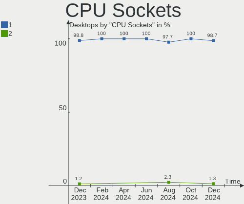
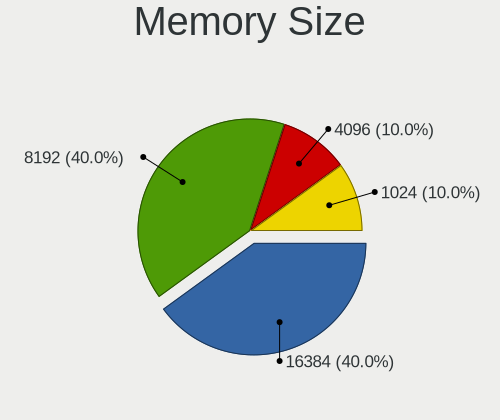

Zorin Hardware Trends (Desktops)
--------------------------------

A project to identify most popular hardware characteristics and track their change
over time based on data collected by Linux users at https://Linux-Hardware.org.

Anyone can contribute to this report by the [hw-probe](https://github.com/linuxhw/hw-probe) tool:

    sudo -E hw-probe -all -upload

Full-feature report is available here: https://linux-hardware.org/?view=trends&formfactor=desktop

Period: Jul, 2021.

Contents
--------

* [ System ](#system)
  - [ OS                       ](#os)
  - [ OS Family                ](#os-family)
  - [ Kernel                   ](#kernel)
  - [ Kernel Family            ](#kernel-family)
  - [ Kernel Major Ver.        ](#kernel-major-ver)
  - [ Arch                     ](#arch)
  - [ DE                       ](#de)
  - [ Display Server           ](#display-server)
  - [ Display Manager          ](#display-manager)
  - [ OS Lang                  ](#os-lang)
  - [ Boot Mode                ](#boot-mode)
  - [ Filesystem               ](#filesystem)
  - [ Part. scheme             ](#part-scheme)
  - [ Dual Boot with Linux/BSD ](#dual-boot-with-linuxbsd)
  - [ Dual Boot (Win)          ](#dual-boot-win)

* [ Board ](#board)
  - [ Vendor                   ](#vendor)
  - [ Model                    ](#model)
  - [ Model Family             ](#model-family)
  - [ MFG Year                 ](#mfg-year)
  - [ Form Factor              ](#form-factor)
  - [ Secure Boot              ](#secure-boot)
  - [ Coreboot                 ](#coreboot)
  - [ RAM Size                 ](#ram-size)
  - [ RAM Used                 ](#ram-used)
  - [ Total Drives             ](#total-drives)
  - [ Has CD-ROM               ](#has-cd-rom)
  - [ Has Ethernet             ](#has-ethernet)
  - [ Has WiFi                 ](#has-wifi)
  - [ Has Bluetooth            ](#has-bluetooth)

* [ Location ](#location)
  - [ Country                  ](#country)
  - [ City                     ](#city)

* [ Drives ](#drives)
  - [ Drive Vendor             ](#drive-vendor)
  - [ Drive Model              ](#drive-model)
  - [ HDD Vendor               ](#hdd-vendor)
  - [ SSD Vendor               ](#ssd-vendor)
  - [ Drive Kind               ](#drive-kind)
  - [ Drive Connector          ](#drive-connector)
  - [ Drive Size               ](#drive-size)
  - [ Space Total              ](#space-total)
  - [ Space Used               ](#space-used)
  - [ Malfunc. Drives          ](#malfunc-drives)
  - [ Malfunc. Drive Vendor    ](#malfunc-drive-vendor)
  - [ Malfunc. HDD Vendor      ](#malfunc-hdd-vendor)
  - [ Malfunc. Drive Kind      ](#malfunc-drive-kind)
  - [ Failed Drives            ](#failed-drives)
  - [ Failed Drive Vendor      ](#failed-drive-vendor)
  - [ Drive Status             ](#drive-status)

* [ Storage controller ](#storage-controller)
  - [ Storage Vendor           ](#storage-vendor)
  - [ Storage Model            ](#storage-model)
  - [ Storage Kind             ](#storage-kind)

* [ Processor ](#processor)
  - [ CPU Vendor               ](#cpu-vendor)
  - [ CPU Model                ](#cpu-model)
  - [ CPU Model Family         ](#cpu-model-family)
  - [ CPU Cores                ](#cpu-cores)
  - [ CPU Sockets              ](#cpu-sockets)
  - [ CPU Threads              ](#cpu-threads)
  - [ CPU Op-Modes             ](#cpu-op-modes)
  - [ CPU Microcode            ](#cpu-microcode)
  - [ CPU Microarch            ](#cpu-microarch)

* [ Graphics ](#graphics)
  - [ GPU Vendor               ](#gpu-vendor)
  - [ GPU Model                ](#gpu-model)
  - [ GPU Combo                ](#gpu-combo)
  - [ GPU Driver               ](#gpu-driver)
  - [ GPU Memory               ](#gpu-memory)

* [ Monitor ](#monitor)
  - [ Monitor Vendor           ](#monitor-vendor)
  - [ Monitor Model            ](#monitor-model)
  - [ Monitor Resolution       ](#monitor-resolution)
  - [ Monitor Diagonal         ](#monitor-diagonal)
  - [ Monitor Width            ](#monitor-width)
  - [ Aspect Ratio             ](#aspect-ratio)
  - [ Monitor Area             ](#monitor-area)
  - [ Pixel Density            ](#pixel-density)
  - [ Multiple Monitors        ](#multiple-monitors)

* [ Network ](#network)
  - [ Net Controller Vendor    ](#net-controller-vendor)
  - [ Net Controller Model     ](#net-controller-model)
  - [ Wireless Vendor          ](#wireless-vendor)
  - [ Wireless Model           ](#wireless-model)
  - [ Ethernet Vendor          ](#ethernet-vendor)
  - [ Ethernet Model           ](#ethernet-model)
  - [ Net Controller Kind      ](#net-controller-kind)
  - [ Used Controller          ](#used-controller)
  - [ NICs                     ](#nics)
  - [ IPv6                     ](#ipv6)

* [ Bluetooth ](#bluetooth)
  - [ Bluetooth Vendor         ](#bluetooth-vendor)
  - [ Bluetooth Model          ](#bluetooth-model)

* [ Sound ](#sound)
  - [ Sound Vendor             ](#sound-vendor)
  - [ Sound Model              ](#sound-model)

* [ Memory ](#memory)
  - [ Memory Vendor            ](#memory-vendor)
  - [ Memory Model             ](#memory-model)
  - [ Memory Kind              ](#memory-kind)
  - [ Memory Form Factor       ](#memory-form-factor)
  - [ Memory Size              ](#memory-size)
  - [ Memory Speed             ](#memory-speed)

* [ Printers & scanners ](#printers-&-scanners)
  - [ Printer Vendor           ](#printer-vendor)
  - [ Printer Model            ](#printer-model)
  - [ Scanner Vendor           ](#scanner-vendor)
  - [ Scanner Model            ](#scanner-model)

* [ Camera ](#camera)
  - [ Camera Vendor            ](#camera-vendor)
  - [ Camera Model             ](#camera-model)

* [ Security ](#security)
  - [ Fingerprint Vendor       ](#fingerprint-vendor)
  - [ Fingerprint Model        ](#fingerprint-model)
  - [ Chipcard Vendor          ](#chipcard-vendor)
  - [ Chipcard Model           ](#chipcard-model)

* [ Unsupported ](#unsupported)
  - [ Unsupported Devices      ](#unsupported-devices)
  - [ Unsupported Device Types ](#unsupported-device-types)

System
------

OS
--

Installed operating systems

| Name     | Desktops | Percent |
|----------|----------|---------|
| Zorin 15 | 20       | 90.91%  |
| Zorin 16 | 2        | 9.09%   |

OS Family
---------

OS without a version

| Name  | Desktops | Percent |
|-------|----------|---------|
| Zorin | 22       | 100%    |

Kernel
------

Version of the Linux kernel

| Version          | Desktops | Percent |
|------------------|----------|---------|
| 5.4.0-77-generic | 11       | 50%     |
| 5.4.0-80-generic | 6        | 27.27%  |
| 5.8.0-59-generic | 2        | 9.09%   |
| 5.4.0-74-generic | 1        | 4.55%   |
| 5.4.0-73-generic | 1        | 4.55%   |
| 5.4.0-72-generic | 1        | 4.55%   |

Kernel Family
-------------

Linux kernel without a distro release

| Version | Desktops | Percent |
|---------|----------|---------|
| 5.4.0   | 20       | 90.91%  |
| 5.8.0   | 2        | 9.09%   |

Kernel Major Ver.
-----------------

Linux kernel major version

| Version | Desktops | Percent |
|---------|----------|---------|
| 5.4     | 20       | 90.91%  |
| 5.8     | 2        | 9.09%   |

Arch
----

OS architecture (x86_64, i586, etc.)

| Name   | Desktops | Percent |
|--------|----------|---------|
| x86_64 | 20       | 90.91%  |
| i686   | 2        | 9.09%   |

DE
--

Desktop Environment

| Name    | Desktops | Percent |
|---------|----------|---------|
| GNOME   | 17       | 77.27%  |
| XFCE    | 3        | 13.64%  |
| Unknown | 2        | 9.09%   |

Display Server
--------------

X11 or Wayland

| Name    | Desktops | Percent |
|---------|----------|---------|
| X11     | 20       | 90.91%  |
| Unknown | 2        | 9.09%   |

Display Manager
---------------

SDDM, LightDM, etc.

| Name    | Desktops | Percent |
|---------|----------|---------|
| Unknown | 21       | 95.45%  |
| GDM     | 1        | 4.55%   |

OS Lang
-------

Language

| Lang  | Desktops | Percent |
|-------|----------|---------|
| en_US | 11       | 50%     |
| pt_BR | 2        | 9.09%   |
| pl_PL | 2        | 9.09%   |
| en_ZA | 2        | 9.09%   |
| hu_HU | 1        | 4.55%   |
| fr_FR | 1        | 4.55%   |
| es_AR | 1        | 4.55%   |
| en_IL | 1        | 4.55%   |
| C     | 1        | 4.55%   |

Boot Mode
---------

EFI or BIOS

| Mode | Desktops | Percent |
|------|----------|---------|
| BIOS | 18       | 81.82%  |
| EFI  | 4        | 18.18%  |

Filesystem
----------

Type of filesystem

| Type | Desktops | Percent |
|------|----------|---------|
| Ext4 | 22       | 100%    |

Part. scheme
------------

Scheme of partitioning

| Type    | Desktops | Percent |
|---------|----------|---------|
| Unknown | 21       | 95.45%  |
| GPT     | 1        | 4.55%   |

Dual Boot with Linux/BSD
------------------------

Hosting more than one Linux/BSD

| Dual boot | Desktops | Percent |
|-----------|----------|---------|
| No        | 19       | 86.36%  |
| Yes       | 3        | 13.64%  |

Dual Boot (Win)
---------------

Hosting Linux and Windows

| Dual boot | Desktops | Percent |
|-----------|----------|---------|
| No        | 15       | 68.18%  |
| Yes       | 7        | 31.82%  |

Board
-----

Vendor
------

Motherboard manufacturer

| Name                | Desktops | Percent |
|---------------------|----------|---------|
| ASUSTek Computer    | 8        | 36.36%  |
| Gigabyte Technology | 6        | 27.27%  |
| Dell                | 3        | 13.64%  |
| Xi3                 | 1        | 4.55%   |
| Pegatron            | 1        | 4.55%   |
| Lenovo              | 1        | 4.55%   |
| Hewlett-Packard     | 1        | 4.55%   |
| Acer                | 1        | 4.55%   |

Model
-----

Motherboard model

| Name                              | Desktops | Percent |
|-----------------------------------|----------|---------|
| Xi3 401-0001-303 303              | 1        | 4.55%   |
| Pegatron HPE-532sc                | 1        | 4.55%   |
| Lenovo ThinkCentre M73 10AY008CUS | 1        | 4.55%   |
| HP rp5700 Business System         | 1        | 4.55%   |
| Gigabyte M61PME-S2                | 1        | 4.55%   |
| Gigabyte H61M-USB3-B3             | 1        | 4.55%   |
| Gigabyte GA-78LMT-USB3            | 1        | 4.55%   |
| Gigabyte G31M-ES2C                | 1        | 4.55%   |
| Gigabyte B460MDS3H                | 1        | 4.55%   |
| Gigabyte 970A-DS3P                | 1        | 4.55%   |
| Dell XPS 8940                     | 1        | 4.55%   |
| Dell OptiPlex 9010                | 1        | 4.55%   |
| Dell OptiPlex 3010                | 1        | 4.55%   |
| ASUS TUF GAMING X570-PLUS         | 1        | 4.55%   |
| ASUS P8H61-M LE                   | 1        | 4.55%   |
| ASUS P7H55-USB3                   | 1        | 4.55%   |
| ASUS P5KC                         | 1        | 4.55%   |
| ASUS P5G41T-M LX3                 | 1        | 4.55%   |
| ASUS M2N68-AM Plus                | 1        | 4.55%   |
| ASUS K30AD_M31AD_M51AD            | 1        | 4.55%   |
| ASUS A58M-A/BR                    | 1        | 4.55%   |
| Acer Aspire X3950                 | 1        | 4.55%   |

Model Family
------------

Motherboard model prefix

| Name                   | Desktops | Percent |
|------------------------|----------|---------|
| Dell OptiPlex          | 2        | 9.09%   |
| Xi3 401-0001-303       | 1        | 4.55%   |
| Pegatron HPE-532sc     | 1        | 4.55%   |
| Lenovo ThinkCentre     | 1        | 4.55%   |
| HP rp5700              | 1        | 4.55%   |
| Gigabyte M61PME-S2     | 1        | 4.55%   |
| Gigabyte H61M-USB3-B3  | 1        | 4.55%   |
| Gigabyte GA-78LMT-USB3 | 1        | 4.55%   |
| Gigabyte G31M-ES2C     | 1        | 4.55%   |
| Gigabyte B460MDS3H     | 1        | 4.55%   |
| Gigabyte 970A-DS3P     | 1        | 4.55%   |
| Dell XPS               | 1        | 4.55%   |
| ASUS TUF               | 1        | 4.55%   |
| ASUS P8H61-M           | 1        | 4.55%   |
| ASUS P7H55-USB3        | 1        | 4.55%   |
| ASUS P5KC              | 1        | 4.55%   |
| ASUS P5G41T-M          | 1        | 4.55%   |
| ASUS M2N68-AM          | 1        | 4.55%   |
| ASUS K30AD             | 1        | 4.55%   |
| ASUS A58M-A            | 1        | 4.55%   |
| Acer Aspire            | 1        | 4.55%   |

MFG Year
--------

Motherboard manufacture year

| Year | Desktops | Percent |
|------|----------|---------|
| 2010 | 5        | 22.73%  |
| 2012 | 3        | 13.64%  |
| 2011 | 3        | 13.64%  |
| 2020 | 2        | 9.09%   |
| 2014 | 2        | 9.09%   |
| 2013 | 2        | 9.09%   |
| 2021 | 1        | 4.55%   |
| 2018 | 1        | 4.55%   |
| 2015 | 1        | 4.55%   |
| 2009 | 1        | 4.55%   |
| 2008 | 1        | 4.55%   |

Form Factor
-----------

Physical design of the computer

| Name    | Desktops | Percent |
|---------|----------|---------|
| Desktop | 22       | 100%    |

Secure Boot
-----------

Enabled or disabled

| State    | Desktops | Percent |
|----------|----------|---------|
| Disabled | 21       | 95.45%  |
| Enabled  | 1        | 4.55%   |

Coreboot
--------

Have coreboot on board

| Used | Desktops | Percent |
|------|----------|---------|
| No   | 22       | 100%    |

RAM Size
--------

Total RAM memory

| Size in GB | Desktops | Percent |
|------------|----------|---------|
| 3.01-4.0   | 6        | 27.27%  |
| 8.01-16.0  | 6        | 27.27%  |
| 4.01-8.0   | 3        | 13.64%  |
| 32.01-64.0 | 3        | 13.64%  |
| 1.01-2.0   | 3        | 13.64%  |
| 2.01-3.0   | 1        | 4.55%   |

RAM Used
--------

Used RAM memory

| Used GB    | Desktops | Percent |
|------------|----------|---------|
| 1.01-2.0   | 11       | 50%     |
| 2.01-3.0   | 4        | 18.18%  |
| 3.01-4.0   | 3        | 13.64%  |
| 0.51-1.0   | 2        | 9.09%   |
| 4.01-8.0   | 1        | 4.55%   |
| 16.01-24.0 | 1        | 4.55%   |

Total Drives
------------

Number of drives on board

| Drives | Desktops | Percent |
|--------|----------|---------|
| 1      | 11       | 50%     |
| 2      | 6        | 27.27%  |
| 3      | 3        | 13.64%  |
| 5      | 2        | 9.09%   |

Has CD-ROM
----------

Has CD-ROM on board

| Presented | Desktops | Percent |
|-----------|----------|---------|
| No        | 12       | 54.55%  |
| Yes       | 10       | 45.45%  |

Has Ethernet
------------

Has Ethernet on board

| Presented | Desktops | Percent |
|-----------|----------|---------|
| Yes       | 22       | 100%    |

Has WiFi
--------

Has WiFi module

| Presented | Desktops | Percent |
|-----------|----------|---------|
| No        | 15       | 68.18%  |
| Yes       | 7        | 31.82%  |

Has Bluetooth
-------------

Has Bluetooth module

| Presented | Desktops | Percent |
|-----------|----------|---------|
| No        | 16       | 72.73%  |
| Yes       | 6        | 27.27%  |

Location
--------

Country
-------

Geographic location (country)

| Country      | Desktops | Percent |
|--------------|----------|---------|
| USA          | 4        | 18.18%  |
| Indonesia    | 3        | 13.64%  |
| South Africa | 2        | 9.09%   |
| Poland       | 2        | 9.09%   |
| Denmark      | 2        | 9.09%   |
| Brazil       | 2        | 9.09%   |
| UK           | 1        | 4.55%   |
| Saudi Arabia | 1        | 4.55%   |
| Palestine    | 1        | 4.55%   |
| Malaysia     | 1        | 4.55%   |
| Hungary      | 1        | 4.55%   |
| France       | 1        | 4.55%   |
| Argentina    | 1        | 4.55%   |

City
----

Geographic location (city)

| City                   | Desktops | Percent |
|------------------------|----------|---------|
| Copenhagen             | 2        | 9.09%   |
| Cape Town              | 2        | 9.09%   |
| Warsaw                 | 1        | 4.55%   |
| Viedma                 | 1        | 4.55%   |
| Riyadh                 | 1        | 4.55%   |
| Puchong Batu Dua Belas | 1        | 4.55%   |
| Prospect Park          | 1        | 4.55%   |
| Pekalongan             | 1        | 4.55%   |
| Malang                 | 1        | 4.55%   |
| Mage                   | 1        | 4.55%   |
| Lubbock                | 1        | 4.55%   |
| London                 | 1        | 4.55%   |
| Killeen                | 1        | 4.55%   |
| Jenin                  | 1        | 4.55%   |
| Gmina Koszęcin        | 1        | 4.55%   |
| Cormeilles-en-Parisis  | 1        | 4.55%   |
| Contagem               | 1        | 4.55%   |
| Caturtunggal           | 1        | 4.55%   |
| Budapest               | 1        | 4.55%   |
| Antioch                | 1        | 4.55%   |

Drives
------

Drive Vendor
------------

Hard drive vendors

| Vendor              | Desktops | Drives | Percent |
|---------------------|----------|--------|---------|
| Seagate             | 9        | 9      | 23.68%  |
| WDC                 | 7        | 7      | 18.42%  |
| Samsung Electronics | 6        | 6      | 15.79%  |
| Kingston            | 6        | 6      | 15.79%  |
| Toshiba             | 2        | 4      | 5.26%   |
| SanDisk             | 2        | 2      | 5.26%   |
| XPG                 | 1        | 1      | 2.63%   |
| Unknown             | 1        | 1      | 2.63%   |
| Lexar               | 1        | 1      | 2.63%   |
| Hitachi             | 1        | 1      | 2.63%   |
| Hewlett-Packard     | 1        | 1      | 2.63%   |
| Crucial             | 1        | 1      | 2.63%   |

Drive Model
-----------

Hard drive models

| Model                            | Desktops | Percent |
|----------------------------------|----------|---------|
| Kingston SA400S37480G 480GB SSD  | 3        | 7.89%   |
| Seagate ST3160813AS 160GB        | 2        | 5.26%   |
| Kingston SV300S37A120G 120GB SSD | 2        | 5.26%   |
| XPG NVMe SSD Drive 1024GB        | 1        | 2.63%   |
| WDC WDS500G2B0A-00SM50 500GB SSD | 1        | 2.63%   |
| WDC WD5000AAKX-75U6AA0 500GB     | 1        | 2.63%   |
| WDC WD5000AAKX-001CA0 500GB      | 1        | 2.63%   |
| WDC WD20EZRX-22D8PB0 2TB         | 1        | 2.63%   |
| WDC WD2003FZEX-00SRLA0 2TB       | 1        | 2.63%   |
| WDC WD10EZEX-08M2NA0 1TB         | 1        | 2.63%   |
| WDC WD10EARS-22Y5B1 1TB          | 1        | 2.63%   |
| Unknown 32GB 6G mSATA w/         | 1        | 2.63%   |
| Toshiba DT01ACA200 2TB           | 1        | 2.63%   |
| Toshiba DT01ACA100 1TB           | 1        | 2.63%   |
| Seagate ST4000DM004-2CV104 4TB   | 1        | 2.63%   |
| Seagate ST3160815AS 160GB        | 1        | 2.63%   |
| Seagate ST1000VX005-2EZ102 1TB   | 1        | 2.63%   |
| Seagate ST1000DM010-2EP102 1TB   | 1        | 2.63%   |
| Seagate ST1000DM003-1ER162 1TB   | 1        | 2.63%   |
| Seagate ST1000DM003-1CH162 1TB   | 1        | 2.63%   |
| Seagate BUP BK 4TB               | 1        | 2.63%   |
| SanDisk SSD PLUS 480 GB          | 1        | 2.63%   |
| SanDisk SSD PLUS 120GB           | 1        | 2.63%   |
| Samsung SSD 860 EVO 500GB        | 1        | 2.63%   |
| Samsung SSD 850 120GB            | 1        | 2.63%   |
| Samsung SSD 830 Series 128GB     | 1        | 2.63%   |
| Samsung NVMe SSD Drive 500GB     | 1        | 2.63%   |
| Samsung HD322HJ 320GB            | 1        | 2.63%   |
| Samsung HD256GJ 250GB            | 1        | 2.63%   |
| Lexar 256GB SSD                  | 1        | 2.63%   |
| Kingston SA400S37240G 240GB SSD  | 1        | 2.63%   |
| Hitachi HDE721010SLA330 1TB      | 1        | 2.63%   |
| HP VK0240GEPQN 240GB SSD         | 1        | 2.63%   |
| Crucial CT500MX500SSD1 500GB     | 1        | 2.63%   |

HDD Vendor
----------

Hard disk drive vendors

| Vendor              | Desktops | Drives | Percent |
|---------------------|----------|--------|---------|
| Seagate             | 9        | 9      | 45%     |
| WDC                 | 6        | 6      | 30%     |
| Toshiba             | 2        | 4      | 10%     |
| Samsung Electronics | 2        | 2      | 10%     |
| Hitachi             | 1        | 1      | 5%      |

SSD Vendor
----------

Solid state drive vendors

| Vendor              | Desktops | Drives | Percent |
|---------------------|----------|--------|---------|
| Kingston            | 6        | 6      | 40%     |
| Samsung Electronics | 3        | 3      | 20%     |
| SanDisk             | 2        | 2      | 13.33%  |
| WDC                 | 1        | 1      | 6.67%   |
| Lexar               | 1        | 1      | 6.67%   |
| Hewlett-Packard     | 1        | 1      | 6.67%   |
| Crucial             | 1        | 1      | 6.67%   |

Drive Kind
----------

HDD or SSD

| Kind    | Desktops | Drives | Percent |
|---------|----------|--------|---------|
| HDD     | 14       | 22     | 46.67%  |
| SSD     | 13       | 15     | 43.33%  |
| NVMe    | 2        | 2      | 6.67%   |
| Unknown | 1        | 1      | 3.33%   |

Drive Connector
---------------

SATA, SAS, NVMe, etc.

| Type | Desktops | Drives | Percent |
|------|----------|--------|---------|
| SATA | 21       | 37     | 87.5%   |
| NVMe | 2        | 2      | 8.33%   |
| SAS  | 1        | 1      | 4.17%   |

Drive Size
----------

Size of hard drive

| Size in TB | Desktops | Drives | Percent |
|------------|----------|--------|---------|
| 0.01-0.5   | 18       | 22     | 64.29%  |
| 0.51-1.0   | 5        | 9      | 17.86%  |
| 1.01-2.0   | 3        | 4      | 10.71%  |
| 3.01-4.0   | 2        | 2      | 7.14%   |

Space Total
-----------

Amount of disk space available on the file system

| Size in GB     | Desktops | Percent |
|----------------|----------|---------|
| 251-500        | 7        | 31.82%  |
| 101-250        | 6        | 27.27%  |
| 21-50          | 3        | 13.64%  |
| More than 3000 | 2        | 9.09%   |
| 51-100         | 2        | 9.09%   |
| 1001-2000      | 1        | 4.55%   |
| 501-1000       | 1        | 4.55%   |

Space Used
----------

Amount of used disk space

| Used GB   | Desktops | Percent |
|-----------|----------|---------|
| 1-20      | 14       | 63.64%  |
| 101-250   | 2        | 9.09%   |
| 51-100    | 2        | 9.09%   |
| 251-500   | 1        | 4.55%   |
| 21-50     | 1        | 4.55%   |
| 1001-2000 | 1        | 4.55%   |
| 501-1000  | 1        | 4.55%   |

Malfunc. Drives
---------------

Drive models with a malfunction

Zero info for selected period =(

Malfunc. Drive Vendor
---------------------

Vendors of faulty drives

Zero info for selected period =(

Malfunc. HDD Vendor
-------------------

Vendors of faulty HDD drives

Zero info for selected period =(

Malfunc. Drive Kind
-------------------

Kinds of faulty drives

Zero info for selected period =(

Failed Drives
-------------

Failed drive models

Zero info for selected period =(

Failed Drive Vendor
-------------------

Failed drive vendors

Zero info for selected period =(

Drive Status
------------

Number of failed and malfunc. drives

| Status   | Desktops | Drives | Percent |
|----------|----------|--------|---------|
| Detected | 21       | 38     | 95.45%  |
| Works    | 1        | 2      | 4.55%   |

Storage controller
------------------

Storage Vendor
--------------

Storage controller vendors

| Vendor              | Desktops | Percent |
|---------------------|----------|---------|
| Intel               | 15       | 60%     |
| AMD                 | 5        | 20%     |
| Nvidia              | 2        | 8%      |
| Samsung Electronics | 1        | 4%      |
| JMicron Technology  | 1        | 4%      |
| ADATA Technology    | 1        | 4%      |

Storage Model
-------------

Storage controller models

| Model                                                                                   | Desktops | Percent |
|-----------------------------------------------------------------------------------------|----------|---------|
| Intel 6 Series/C200 Series Chipset Family 6 port Desktop SATA AHCI Controller           | 3        | 9.09%   |
| Nvidia MCP61 SATA Controller                                                            | 2        | 6.06%   |
| Nvidia MCP61 IDE                                                                        | 2        | 6.06%   |
| Intel NM10/ICH7 Family SATA Controller [IDE mode]                                       | 2        | 6.06%   |
| Intel 8 Series/C220 Series Chipset Family 6-port SATA Controller 1 [AHCI mode]          | 2        | 6.06%   |
| AMD SB7x0/SB8x0/SB9x0 SATA Controller [IDE mode]                                        | 2        | 6.06%   |
| AMD SB7x0/SB8x0/SB9x0 IDE Controller                                                    | 2        | 6.06%   |
| AMD FCH SATA Controller [AHCI mode]                                                     | 2        | 6.06%   |
| Samsung NVMe SSD Controller SM981/PM981/PM983                                           | 1        | 3.03%   |
| JMicron JMB363 SATA/IDE Controller                                                      | 1        | 3.03%   |
| Intel SATA Controller [RAID mode]                                                       | 1        | 3.03%   |
| Intel 82801IB (ICH9) 2 port SATA Controller [IDE mode]                                  | 1        | 3.03%   |
| Intel 82801I (ICH9 Family) 2 port SATA Controller [IDE mode]                            | 1        | 3.03%   |
| Intel 82801H (ICH8 Family) 4 port SATA Controller [IDE mode]                            | 1        | 3.03%   |
| Intel 82801G (ICH7 Family) IDE Controller                                               | 1        | 3.03%   |
| Intel 7 Series/C210 Series Chipset Family 6-port SATA Controller [AHCI mode]            | 1        | 3.03%   |
| Intel 6 Series/C200 Series Chipset Family Desktop SATA Controller (IDE mode, ports 4-5) | 1        | 3.03%   |
| Intel 6 Series/C200 Series Chipset Family Desktop SATA Controller (IDE mode, ports 0-3) | 1        | 3.03%   |
| Intel 5 Series/3400 Series Chipset 6 port SATA AHCI Controller                          | 1        | 3.03%   |
| Intel 5 Series/3400 Series Chipset 4 port SATA IDE Controller                           | 1        | 3.03%   |
| Intel 5 Series/3400 Series Chipset 2 port SATA IDE Controller                           | 1        | 3.03%   |
| Intel 400 Series Chipset Family SATA RAID Controller                                    | 1        | 3.03%   |
| AMD SB7x0/SB8x0/SB9x0 SATA Controller [AHCI mode]                                       | 1        | 3.03%   |
| ADATA XPG SX8200 Pro PCIe Gen3x4 M.2 2280 Solid State Drive                             | 1        | 3.03%   |

Storage Kind
------------

Kind of storage controller (IDE, SATA, NVMe, SAS, ...)

| Kind | Desktops | Percent |
|------|----------|---------|
| SATA | 12       | 46.15%  |
| IDE  | 10       | 38.46%  |
| RAID | 2        | 7.69%   |
| NVMe | 2        | 7.69%   |

Processor
---------

CPU Vendor
----------

Processor vendors

| Vendor | Desktops | Percent |
|--------|----------|---------|
| Intel  | 15       | 68.18%  |
| AMD    | 7        | 31.82%  |

CPU Model
---------

Processor models

| Model                                      | Desktops | Percent |
|--------------------------------------------|----------|---------|
| Intel Core i3-2100 CPU @ 3.10GHz           | 2        | 9.09%   |
| Intel Core 2 Duo CPU E8400 @ 3.00GHz       | 2        | 9.09%   |
| Intel Core 2 Duo CPU E7400 @ 2.80GHz       | 2        | 9.09%   |
| Intel Pentium CPU G850 @ 2.90GHz           | 1        | 4.55%   |
| Intel Core i7-10700K CPU @ 3.80GHz         | 1        | 4.55%   |
| Intel Core i7 CPU 870 @ 2.93GHz            | 1        | 4.55%   |
| Intel Core i5-4590T CPU @ 2.00GHz          | 1        | 4.55%   |
| Intel Core i5-4460 CPU @ 3.20GHz           | 1        | 4.55%   |
| Intel Core i5-3470 CPU @ 3.20GHz           | 1        | 4.55%   |
| Intel Core i5-2500 CPU @ 3.30GHz           | 1        | 4.55%   |
| Intel Core i3 CPU 550 @ 3.20GHz            | 1        | 4.55%   |
| Intel 11th Gen Core i7-11700 @ 2.50GHz     | 1        | 4.55%   |
| AMD Ryzen 7 3700X 8-Core Processor         | 1        | 4.55%   |
| AMD FX-8350 Eight-Core Processor           | 1        | 4.55%   |
| AMD FX-4130 Quad-Core Processor            | 1        | 4.55%   |
| AMD Athlon II X3 400e Processor            | 1        | 4.55%   |
| AMD Athlon 64 X2 Dual Core Processor 4600+ | 1        | 4.55%   |
| AMD Athlon 64 X2 Dual Core Processor 3400+ | 1        | 4.55%   |
| AMD A4-4000 APU with Radeon HD Graphics    | 1        | 4.55%   |

CPU Model Family
----------------

Processor model prefix

| Model            | Desktops | Percent |
|------------------|----------|---------|
| Intel Core i5    | 4        | 18.18%  |
| Intel Core 2 Duo | 4        | 18.18%  |
| Intel Core i3    | 3        | 13.64%  |
| Intel Core i7    | 2        | 9.09%   |
| AMD FX           | 2        | 9.09%   |
| AMD Athlon 64 X2 | 2        | 9.09%   |
| Other            | 1        | 4.55%   |
| Intel Pentium    | 1        | 4.55%   |
| AMD Ryzen 7      | 1        | 4.55%   |
| AMD Athlon II X3 | 1        | 4.55%   |
| AMD A4           | 1        | 4.55%   |

CPU Cores
---------

Number of processor cores

| Number | Desktops | Percent |
|--------|----------|---------|
| 2      | 11       | 50%     |
| 4      | 6        | 27.27%  |
| 8      | 3        | 13.64%  |
| 3      | 1        | 4.55%   |
| 1      | 1        | 4.55%   |

CPU Sockets
-----------

Number of sockets

| Number | Desktops | Percent |
|--------|----------|---------|
| 1      | 22       | 100%    |

CPU Threads
-----------

Threads per core (Hyper-Threading)

| Number | Desktops | Percent |
|--------|----------|---------|
| 1      | 12       | 54.55%  |
| 2      | 10       | 45.45%  |

CPU Op-Modes
------------

CPU Operation Modes (32-bit, 64-bit)

| Op mode        | Desktops | Percent |
|----------------|----------|---------|
| 32-bit, 64-bit | 22       | 100%    |

CPU Microcode
-------------

Microcode number

| Number     | Desktops | Percent |
|------------|----------|---------|
| Unknown    | 6        | 27.27%  |
| 0x206a7    | 4        | 18.18%  |
| 0x1067a    | 3        | 13.64%  |
| 0x306c3    | 2        | 9.09%   |
| 0xa0671    | 1        | 4.55%   |
| 0x20655    | 1        | 4.55%   |
| 0x10676    | 1        | 4.55%   |
| 0x06001119 | 1        | 4.55%   |
| 0x06000852 | 1        | 4.55%   |
| 0x0600063e | 1        | 4.55%   |
| 0x010000db | 1        | 4.55%   |

CPU Microarch
-------------

Microarchitecture

| Name        | Desktops | Percent |
|-------------|----------|---------|
| SandyBridge | 4        | 18.18%  |
| Penryn      | 4        | 18.18%  |
| Piledriver  | 2        | 9.09%   |
| K8 Hammer   | 2        | 9.09%   |
| Haswell     | 2        | 9.09%   |
| Zen 2       | 1        | 4.55%   |
| Westmere    | 1        | 4.55%   |
| Nehalem     | 1        | 4.55%   |
| K10         | 1        | 4.55%   |
| IvyBridge   | 1        | 4.55%   |
| CometLake   | 1        | 4.55%   |
| Bulldozer   | 1        | 4.55%   |
| Unknown     | 1        | 4.55%   |

Graphics
--------

GPU Vendor
----------

Vendors of graphics cards

| Vendor | Desktops | Percent |
|--------|----------|---------|
| Nvidia | 10       | 45.45%  |
| Intel  | 7        | 31.82%  |
| AMD    | 5        | 22.73%  |

GPU Model
---------

Graphics card models

| Model                                                                       | Desktops | Percent |
|-----------------------------------------------------------------------------|----------|---------|
| Nvidia G96C [GeForce 9500 GT]                                               | 2        | 9.09%   |
| Intel 2nd Generation Core Processor Family Integrated Graphics Controller   | 2        | 9.09%   |
| Nvidia TU106 [GeForce RTX 2060 SUPER]                                       | 1        | 4.55%   |
| Nvidia GT218 [GeForce 210]                                                  | 1        | 4.55%   |
| Nvidia GM107 [GeForce GTX 750 Ti]                                           | 1        | 4.55%   |
| Nvidia GK208B [GeForce GT 730]                                              | 1        | 4.55%   |
| Nvidia GK107 [GeForce GTX 650]                                              | 1        | 4.55%   |
| Nvidia GK106GL [Quadro K4000]                                               | 1        | 4.55%   |
| Nvidia GF108 [GeForce GT 420]                                               | 1        | 4.55%   |
| Nvidia G94 [GeForce 9600 GT]                                                | 1        | 4.55%   |
| Intel Xeon E3-1200 v3/4th Gen Core Processor Integrated Graphics Controller | 1        | 4.55%   |
| Intel Core Processor Integrated Graphics Controller                         | 1        | 4.55%   |
| Intel CometLake-S GT2 [UHD Graphics 630]                                    | 1        | 4.55%   |
| Intel 82Q963/Q965 Integrated Graphics Controller                            | 1        | 4.55%   |
| Intel 82G33/G31 Express Integrated Graphics Controller                      | 1        | 4.55%   |
| AMD Turks XT [Radeon HD 6670/7670]                                          | 1        | 4.55%   |
| AMD Tobago PRO [Radeon R7 360 / R9 360 OEM]                                 | 1        | 4.55%   |
| AMD RS780L [Radeon 3000]                                                    | 1        | 4.55%   |
| AMD RS780E [Radeon HD 3200]                                                 | 1        | 4.55%   |
| AMD Ellesmere [Radeon RX 470/480/570/570X/580/580X/590]                     | 1        | 4.55%   |

GPU Combo
---------

Combinations of graphics cards

| Name       | Desktops | Percent |
|------------|----------|---------|
| 1 x Nvidia | 10       | 45.45%  |
| 1 x Intel  | 7        | 31.82%  |
| 1 x AMD    | 5        | 22.73%  |

GPU Driver
----------

Free vs proprietary

| Driver      | Desktops | Percent |
|-------------|----------|---------|
| Free        | 13       | 59.09%  |
| Proprietary | 5        | 22.73%  |
| Unknown     | 4        | 18.18%  |

GPU Memory
----------

Total video memory

| Size in GB | Desktops | Percent |
|------------|----------|---------|
| Unknown    | 11       | 50%     |
| 0.51-1.0   | 4        | 18.18%  |
| 1.01-2.0   | 3        | 13.64%  |
| 0.01-0.5   | 2        | 9.09%   |
| 7.01-8.0   | 1        | 4.55%   |
| 2.01-3.0   | 1        | 4.55%   |

Monitor
-------

Monitor Vendor
--------------

Monitor vendors

| Vendor               | Desktops | Percent |
|----------------------|----------|---------|
| Dell                 | 4        | 17.39%  |
| Samsung Electronics  | 3        | 13.04%  |
| Goldstar             | 3        | 13.04%  |
| Philips              | 2        | 8.7%    |
| AOC                  | 2        | 8.7%    |
| ___                  | 1        | 4.35%   |
| Vizio                | 1        | 4.35%   |
| Unknown              | 1        | 4.35%   |
| Sanyo                | 1        | 4.35%   |
| NEC Computers        | 1        | 4.35%   |
| Hewlett-Packard      | 1        | 4.35%   |
| BenQ                 | 1        | 4.35%   |
| Ancor Communications | 1        | 4.35%   |
| AMI                  | 1        | 4.35%   |

Monitor Model
-------------

Monitor models

| Model                                                              | Desktops | Percent |
|--------------------------------------------------------------------|----------|---------|
| ___ LCDTV16 ___0101 1600x1200 1600x900mm 72.3-inch                 | 1        | 4%      |
| Vizio D32h-F0 VIZ1028 1366x768 698x392mm 31.5-inch                 | 1        | 4%      |
| Unknown LCD TV 0101 1920x1080 1600x900mm 72.3-inch                 | 1        | 4%      |
| Sanyo LCD SAN0A46 1920x540                                         | 1        | 4%      |
| Samsung Electronics SMB2430H SAM064E 1920x1080                     | 1        | 4%      |
| Samsung Electronics SMB2430H SAM064C 1920x1080 531x299mm 24.0-inch | 1        | 4%      |
| Samsung Electronics LCD Monitor S22D300 1920x1080                  | 1        | 4%      |
| Philips PHL 243V5 PHLC0D1 1920x1080 521x293mm 23.5-inch            | 1        | 4%      |
| Philips PHL 242M8 PHLC253 1920x1080 527x296mm 23.8-inch            | 1        | 4%      |
| NEC Computers LCD22WV NEC671E 1680x1050 470x290mm 21.7-inch        | 1        | 4%      |
| Hewlett-Packard LCD Monitor Z23i                                   | 1        | 4%      |
| Hewlett-Packard LCD Monitor P221 1920x1080                         | 1        | 4%      |
| Hewlett-Packard LCD Monitor P221                                   | 1        | 4%      |
| Goldstar StudioWorks 8 80LC GSM4651 1280x1024 359x287mm 18.1-inch  | 1        | 4%      |
| Goldstar MP59G GSM5B34 1920x1080 480x270mm 21.7-inch               | 1        | 4%      |
| Goldstar E2242 GSM58BE 1680x1050 480x270mm 21.7-inch               | 1        | 4%      |
| Dell SE2417HG DELD08C 1920x1080 521x293mm 23.5-inch                | 1        | 4%      |
| Dell LCD Monitor E2311H 5760x1080                                  | 1        | 4%      |
| Dell E2210 DELD036 1680x1050 473x296mm 22.0-inch                   | 1        | 4%      |
| Dell 1907FP DEL4014 1280x1024 376x301mm 19.0-inch                  | 1        | 4%      |
| BenQ BL2480T BNQ802F 1920x1080 527x296mm 23.8-inch                 | 1        | 4%      |
| AOC LCD Monitor 2269W 1920x1080                                    | 1        | 4%      |
| AOC 32G2WG3 AOC3202 1920x1080 698x393mm 31.5-inch                  | 1        | 4%      |
| Ancor Communications LCD Monitor MX259 1920x1080                   | 1        | 4%      |
| AMI Amitech 612 AMI0612 1280x1024 337x270mm 17.0-inch              | 1        | 4%      |

Monitor Resolution
------------------

Monitor screen resolution

| Resolution         | Desktops | Percent |
|--------------------|----------|---------|
| 1920x1080 (FHD)    | 11       | 52.38%  |
| 1280x1024 (SXGA)   | 3        | 14.29%  |
| 1680x1050 (WSXGA+) | 2        | 9.52%   |
| 5760x1080          | 1        | 4.76%   |
| 2560x1440 (QHD)    | 1        | 4.76%   |
| 1920x540           | 1        | 4.76%   |
| 1366x768 (WXGA)    | 1        | 4.76%   |
| Unknown            | 1        | 4.76%   |

Monitor Diagonal
----------------

Diagonal size in inches

| Inches  | Desktops | Percent |
|---------|----------|---------|
| Unknown | 6        | 28.57%  |
| 23      | 4        | 19.05%  |
| 21      | 3        | 14.29%  |
| 31      | 2        | 9.52%   |
| 72      | 1        | 4.76%   |
| 24      | 1        | 4.76%   |
| 22      | 1        | 4.76%   |
| 19      | 1        | 4.76%   |
| 18      | 1        | 4.76%   |
| 17      | 1        | 4.76%   |

Monitor Width
-------------

Physical width

| Width in mm | Desktops | Percent |
|-------------|----------|---------|
| Unknown     | 6        | 28.57%  |
| 501-600     | 5        | 23.81%  |
| 401-500     | 4        | 19.05%  |
| 601-700     | 2        | 9.52%   |
| 351-400     | 2        | 9.52%   |
| 301-350     | 1        | 4.76%   |
| 1501-2000   | 1        | 4.76%   |

Aspect Ratio
------------

Proportional relationship between the width and the height

| Ratio   | Desktops | Percent |
|---------|----------|---------|
| 16/9    | 9        | 47.37%  |
| Unknown | 4        | 21.05%  |
| 5/4     | 3        | 15.79%  |
| 16/10   | 2        | 10.53%  |
| 32/9    | 1        | 5.26%   |

Monitor Area
------------

Area in inch²

| Area in inch² | Desktops | Percent |
|----------------|----------|---------|
| 201-250        | 8        | 40%     |
| Unknown        | 6        | 30%     |
| 351-500        | 2        | 10%     |
| 151-200        | 2        | 10%     |
| More than 1000 | 1        | 5%      |
| 141-150        | 1        | 5%      |

Pixel Density
-------------

Pixels per inch

| Density | Desktops | Percent |
|---------|----------|---------|
| 51-100  | 11       | 52.38%  |
| Unknown | 6        | 28.57%  |
| 1-50    | 2        | 9.52%   |
| 101-120 | 2        | 9.52%   |

Multiple Monitors
-----------------

Total monitors connected

| Total | Desktops | Percent |
|-------|----------|---------|
| 1     | 14       | 63.64%  |
| 0     | 4        | 18.18%  |
| 2     | 3        | 13.64%  |
| 3     | 1        | 4.55%   |

Network
-------

Net Controller Vendor
---------------------

Controller vendors

| Vendor                   | Desktops | Percent |
|--------------------------|----------|---------|
| Realtek Semiconductor    | 14       | 46.67%  |
| Intel                    | 6        | 20%     |
| Qualcomm Atheros         | 3        | 10%     |
| Ralink                   | 2        | 6.67%   |
| Nvidia                   | 2        | 6.67%   |
| Sitecom Europe           | 1        | 3.33%   |
| Marvell Technology Group | 1        | 3.33%   |
| Broadcom                 | 1        | 3.33%   |

Net Controller Model
--------------------

Controller models

| Model                                                             | Desktops | Percent |
|-------------------------------------------------------------------|----------|---------|
| Realtek RTL8111/8168/8411 PCI Express Gigabit Ethernet Controller | 10       | 32.26%  |
| Nvidia MCP61 Ethernet                                             | 2        | 6.45%   |
| Intel Ethernet Connection I217-V                                  | 2        | 6.45%   |
| Sitecom Europe WL-344 Wireless Adapter 300N X2 [Ralink RT3071]    | 1        | 3.23%   |
| Realtek RTL8821AE 802.11ac PCIe Wireless Network Adapter          | 1        | 3.23%   |
| Realtek RTL8152 Fast Ethernet Adapter                             | 1        | 3.23%   |
| Realtek RTL810xE PCI Express Fast Ethernet controller             | 1        | 3.23%   |
| Realtek RTL-8100/8101L/8139 PCI Fast Ethernet Adapter             | 1        | 3.23%   |
| Ralink RT3092 Wireless 802.11n 2T/2R PCIe                         | 1        | 3.23%   |
| Ralink RT2600 802.11 MIMO                                         | 1        | 3.23%   |
| Qualcomm Atheros Attansic L1 Gigabit Ethernet                     | 1        | 3.23%   |
| Qualcomm Atheros AR8151 v2.0 Gigabit Ethernet                     | 1        | 3.23%   |
| Qualcomm Atheros AR8151 v1.0 Gigabit Ethernet                     | 1        | 3.23%   |
| Marvell Group 88E8057 PCI-E Gigabit Ethernet Controller           | 1        | 3.23%   |
| Intel Wireless-AC 9260                                            | 1        | 3.23%   |
| Intel Wireless 7260                                               | 1        | 3.23%   |
| Intel Comet Lake PCH CNVi WiFi                                    | 1        | 3.23%   |
| Intel 82579LM Gigabit Network Connection (Lewisville)             | 1        | 3.23%   |
| Intel 82574L Gigabit Network Connection                           | 1        | 3.23%   |
| Broadcom NetXtreme BCM5755 Gigabit Ethernet PCI Express           | 1        | 3.23%   |

Wireless Vendor
---------------

Wireless vendors

| Vendor                | Desktops | Percent |
|-----------------------|----------|---------|
| Intel                 | 3        | 42.86%  |
| Ralink                | 2        | 28.57%  |
| Sitecom Europe        | 1        | 14.29%  |
| Realtek Semiconductor | 1        | 14.29%  |

Wireless Model
--------------

Wireless models

| Model                                                          | Desktops | Percent |
|----------------------------------------------------------------|----------|---------|
| Sitecom Europe WL-344 Wireless Adapter 300N X2 [Ralink RT3071] | 1        | 14.29%  |
| Realtek RTL8821AE 802.11ac PCIe Wireless Network Adapter       | 1        | 14.29%  |
| Ralink RT3092 Wireless 802.11n 2T/2R PCIe                      | 1        | 14.29%  |
| Ralink RT2600 802.11 MIMO                                      | 1        | 14.29%  |
| Intel Wireless-AC 9260                                         | 1        | 14.29%  |
| Intel Wireless 7260                                            | 1        | 14.29%  |
| Intel Comet Lake PCH CNVi WiFi                                 | 1        | 14.29%  |

Ethernet Vendor
---------------

Ethernet vendors

| Vendor                   | Desktops | Percent |
|--------------------------|----------|---------|
| Realtek Semiconductor    | 13       | 54.17%  |
| Intel                    | 4        | 16.67%  |
| Qualcomm Atheros         | 3        | 12.5%   |
| Nvidia                   | 2        | 8.33%   |
| Marvell Technology Group | 1        | 4.17%   |
| Broadcom                 | 1        | 4.17%   |

Ethernet Model
--------------

Ethernet models

| Model                                                             | Desktops | Percent |
|-------------------------------------------------------------------|----------|---------|
| Realtek RTL8111/8168/8411 PCI Express Gigabit Ethernet Controller | 10       | 41.67%  |
| Nvidia MCP61 Ethernet                                             | 2        | 8.33%   |
| Intel Ethernet Connection I217-V                                  | 2        | 8.33%   |
| Realtek RTL8152 Fast Ethernet Adapter                             | 1        | 4.17%   |
| Realtek RTL810xE PCI Express Fast Ethernet controller             | 1        | 4.17%   |
| Realtek RTL-8100/8101L/8139 PCI Fast Ethernet Adapter             | 1        | 4.17%   |
| Qualcomm Atheros Attansic L1 Gigabit Ethernet                     | 1        | 4.17%   |
| Qualcomm Atheros AR8151 v2.0 Gigabit Ethernet                     | 1        | 4.17%   |
| Qualcomm Atheros AR8151 v1.0 Gigabit Ethernet                     | 1        | 4.17%   |
| Marvell Group 88E8057 PCI-E Gigabit Ethernet Controller           | 1        | 4.17%   |
| Intel 82579LM Gigabit Network Connection (Lewisville)             | 1        | 4.17%   |
| Intel 82574L Gigabit Network Connection                           | 1        | 4.17%   |
| Broadcom NetXtreme BCM5755 Gigabit Ethernet PCI Express           | 1        | 4.17%   |

Net Controller Kind
-------------------

Ethernet, WiFi or modem

| Kind     | Desktops | Percent |
|----------|----------|---------|
| Ethernet | 22       | 75.86%  |
| WiFi     | 7        | 24.14%  |

Used Controller
---------------

Currently used network controller

| Kind     | Desktops | Percent |
|----------|----------|---------|
| Ethernet | 19       | 76%     |
| WiFi     | 6        | 24%     |

NICs
----

Total network controllers on board

| Total | Desktops | Percent |
|-------|----------|---------|
| 1     | 16       | 72.73%  |
| 2     | 5        | 22.73%  |
| 3     | 1        | 4.55%   |

IPv6
----

IPv6 vs IPv4

| Used | Desktops | Percent |
|------|----------|---------|
| No   | 19       | 86.36%  |
| Yes  | 3        | 13.64%  |

Bluetooth
---------

Bluetooth Vendor
----------------

Controller vendors

| Vendor                  | Desktops | Percent |
|-------------------------|----------|---------|
| Intel                   | 3        | 50%     |
| Realtek Semiconductor   | 1        | 16.67%  |
| IMC Networks            | 1        | 16.67%  |
| Cambridge Silicon Radio | 1        | 16.67%  |

Bluetooth Model
---------------

Controller models

| Model                                               | Desktops | Percent |
|-----------------------------------------------------|----------|---------|
| Realtek Bluetooth Radio                             | 1        | 16.67%  |
| Intel Wireless-AC 9260 Bluetooth Adapter            | 1        | 16.67%  |
| Intel Bluetooth wireless interface                  | 1        | 16.67%  |
| Intel AX201 Bluetooth                               | 1        | 16.67%  |
| IMC Networks Bluetooth Radio                        | 1        | 16.67%  |
| Cambridge Silicon Radio Bluetooth Dongle (HCI mode) | 1        | 16.67%  |

Sound
-----

Sound Vendor
------------

Sound card vendors

| Vendor   | Desktops | Percent |
|----------|----------|---------|
| Intel    | 15       | 46.88%  |
| Nvidia   | 8        | 25%     |
| AMD      | 8        | 25%     |
| Logitech | 1        | 3.13%   |

Sound Model
-----------

Sound card models

| Model                                                                      | Desktops | Percent |
|----------------------------------------------------------------------------|----------|---------|
| Intel 6 Series/C200 Series Chipset Family High Definition Audio Controller | 4        | 11.11%  |
| AMD SBx00 Azalia (Intel HDA)                                               | 3        | 8.33%   |
| Nvidia MCP61 High Definition Audio                                         | 2        | 5.56%   |
| Intel NM10/ICH7 Family High Definition Audio Controller                    | 2        | 5.56%   |
| Intel 8 Series/C220 Series Chipset High Definition Audio Controller        | 2        | 5.56%   |
| Intel 5 Series/3400 Series Chipset High Definition Audio                   | 2        | 5.56%   |
| AMD RS780 HDMI Audio [Radeon 3000/3100 / HD 3200/3300]                     | 2        | 5.56%   |
| Nvidia TU106 High Definition Audio Controller                              | 1        | 2.78%   |
| Nvidia High Definition Audio Controller                                    | 1        | 2.78%   |
| Nvidia GM107 High Definition Audio Controller [GeForce 940MX]              | 1        | 2.78%   |
| Nvidia GK208 HDMI/DP Audio Controller                                      | 1        | 2.78%   |
| Nvidia GK107 HDMI Audio Controller                                         | 1        | 2.78%   |
| Nvidia GK106 HDMI Audio Controller                                         | 1        | 2.78%   |
| Nvidia GF108 High Definition Audio Controller                              | 1        | 2.78%   |
| Logitech USB Headset H540                                                  | 1        | 2.78%   |
| Intel Xeon E3-1200 v3/4th Gen Core Processor HD Audio Controller           | 1        | 2.78%   |
| Intel Comet Lake PCH-V Smart Sound Technology Audio Controller             | 1        | 2.78%   |
| Intel Audio device                                                         | 1        | 2.78%   |
| Intel 82801I (ICH9 Family) HD Audio Controller                             | 1        | 2.78%   |
| Intel 82801H (ICH8 Family) HD Audio Controller                             | 1        | 2.78%   |
| Intel 7 Series/C216 Chipset Family High Definition Audio Controller        | 1        | 2.78%   |
| AMD Turks HDMI Audio [Radeon HD 6500/6600 / 6700M Series]                  | 1        | 2.78%   |
| AMD Tobago HDMI Audio [Radeon R7 360 / R9 360 OEM]                         | 1        | 2.78%   |
| AMD Starship/Matisse HD Audio Controller                                   | 1        | 2.78%   |
| AMD FCH Azalia Controller                                                  | 1        | 2.78%   |
| AMD Ellesmere HDMI Audio [Radeon RX 470/480 / 570/580/590]                 | 1        | 2.78%   |

Memory
------

Memory Vendor
-------------

Memory module vendors

| Vendor            | Desktops | Percent |
|-------------------|----------|---------|
| Unknown           | 4        | 66.67%  |
| Micron Technology | 1        | 16.67%  |
| Elpida            | 1        | 16.67%  |

Memory Model
------------

Memory module models

| Model                                               | Desktops | Percent |
|-----------------------------------------------------|----------|---------|
| Unknown RAM Module 8GB DIMM DDR3 1333MT/s           | 1        | 16.67%  |
| Unknown RAM Module 4GB DIMM 1333MT/s                | 1        | 16.67%  |
| Unknown RAM Module 2GB DIMM 800MT/s                 | 1        | 16.67%  |
| Unknown RAM Module 2048MB DIMM 800MT/s              | 1        | 16.67%  |
| Micron RAM 8HTF12864AZ-800H1 1GB DIMM DDR2 800MT/s  | 1        | 16.67%  |
| Elpida RAM EBJ20UF8BCF0-DJ-F 2GB DIMM DDR3 1333MT/s | 1        | 16.67%  |

Memory Kind
-----------

Memory module kinds

| Kind    | Desktops | Percent |
|---------|----------|---------|
| Unknown | 3        | 50%     |
| DDR3    | 2        | 33.33%  |
| DDR2    | 1        | 16.67%  |

Memory Form Factor
------------------

Physical design of the memory module

| Name | Desktops | Percent |
|------|----------|---------|
| DIMM | 6        | 100%    |

Memory Size
-----------

Memory module size

| Size | Desktops | Percent |
|------|----------|---------|
| 2048 | 3        | 50%     |
| 8192 | 1        | 16.67%  |
| 4096 | 1        | 16.67%  |
| 1024 | 1        | 16.67%  |

Memory Speed
------------

Memory module speed

| Speed | Desktops | Percent |
|-------|----------|---------|
| 1333  | 3        | 50%     |
| 800   | 3        | 50%     |

Printers & scanners
-------------------

Printer Vendor
--------------

Printer device vendors

| Vendor              | Desktops | Percent |
|---------------------|----------|---------|
| Samsung Electronics | 1        | 33.33%  |
| Hewlett-Packard     | 1        | 33.33%  |
| Brother Industries  | 1        | 33.33%  |

Printer Model
-------------

Printer device models

| Model                               | Desktops | Percent |
|-------------------------------------|----------|---------|
| Samsung ML-2010P Mono Laser Printer | 1        | 33.33%  |
| HP ENVY 5000 series                 | 1        | 33.33%  |
| Brother DCP-1610W                   | 1        | 33.33%  |

Scanner Vendor
--------------

Scanner device vendors

Zero info for selected period =(

Scanner Model
-------------

Scanner device models

Zero info for selected period =(

Camera
------

Camera Vendor
-------------

Camera device vendors

| Vendor           | Desktops | Percent |
|------------------|----------|---------|
| Jieli Technology | 1        | 100%    |

Camera Model
------------

Camera device models

| Model             | Desktops | Percent |
|-------------------|----------|---------|
| Jieli USB PHY 2.0 | 1        | 100%    |

Security
--------

Fingerprint Vendor
------------------

Fingerprint sensor vendors

Zero info for selected period =(

Fingerprint Model
-----------------

Fingerprint sensor models

Zero info for selected period =(

Chipcard Vendor
---------------

Chipcard module vendors

Zero info for selected period =(

Chipcard Model
--------------

Chipcard module models

Zero info for selected period =(

Unsupported
-----------

Unsupported Devices
-------------------

Total unsupported devices on board

| Total | Desktops | Percent |
|-------|----------|---------|
| 0     | 18       | 81.82%  |
| 1     | 4        | 18.18%  |

Unsupported Device Types
------------------------

Types of unsupported devices

| Type          | Desktops | Percent |
|---------------|----------|---------|
| Graphics card | 4        | 100%    |

