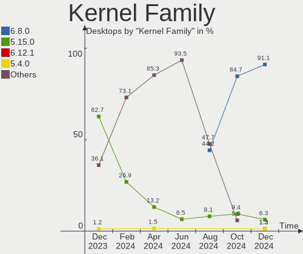
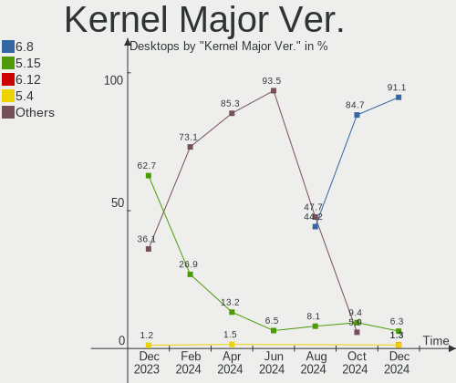
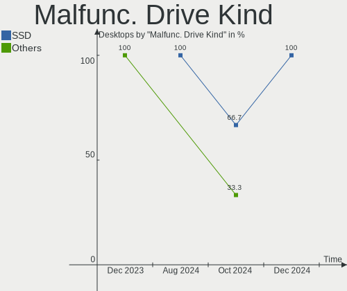
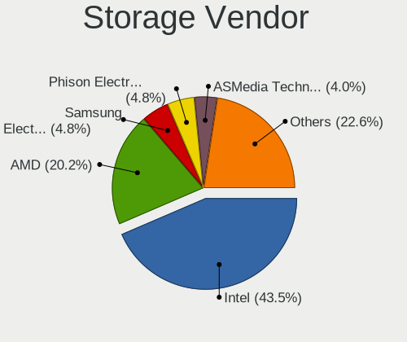
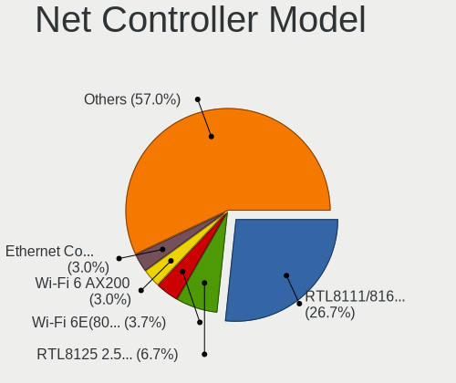
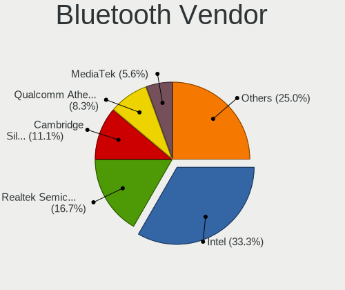

Zorin - Hardware Trends (Desktops)
----------------------------------

A project to identify most popular hardware characteristics and track their change
over time based on data collected by Linux users at https://Linux-Hardware.org.

Anyone can contribute to this report by the [hw-probe](https://github.com/linuxhw/hw-probe) tool:

    sudo -E hw-probe -all -upload

This report is for one last month. Overall report since the beginning of time: [TestDays](https://github.com/linuxhw/TestDays)

Period: Mar, 2023.

Contents
--------

* [ System ](#system)
  - [ OS                       ](#os)
  - [ OS Family                ](#os-family)
  - [ Kernel                   ](#kernel)
  - [ Kernel Family            ](#kernel-family)
  - [ Kernel Major Ver.        ](#kernel-major-ver)
  - [ Arch                     ](#arch)
  - [ DE                       ](#de)
  - [ Display Server           ](#display-server)
  - [ Display Manager          ](#display-manager)
  - [ OS Lang                  ](#os-lang)
  - [ Boot Mode                ](#boot-mode)
  - [ Filesystem               ](#filesystem)
  - [ Part. scheme             ](#part-scheme)
  - [ Dual Boot with Linux/BSD ](#dual-boot-with-linuxbsd)
  - [ Dual Boot (Win)          ](#dual-boot-win)

* [ Board ](#board)
  - [ Vendor                   ](#vendor)
  - [ Model                    ](#model)
  - [ Model Family             ](#model-family)
  - [ MFG Year                 ](#mfg-year)
  - [ Form Factor              ](#form-factor)
  - [ Secure Boot              ](#secure-boot)
  - [ Coreboot                 ](#coreboot)
  - [ RAM Size                 ](#ram-size)
  - [ RAM Used                 ](#ram-used)
  - [ Total Drives             ](#total-drives)
  - [ Has CD-ROM               ](#has-cd-rom)
  - [ Has Ethernet             ](#has-ethernet)
  - [ Has WiFi                 ](#has-wifi)
  - [ Has Bluetooth            ](#has-bluetooth)

* [ Location ](#location)
  - [ Country                  ](#country)
  - [ City                     ](#city)

* [ Drives ](#drives)
  - [ Drive Vendor             ](#drive-vendor)
  - [ Drive Model              ](#drive-model)
  - [ HDD Vendor               ](#hdd-vendor)
  - [ SSD Vendor               ](#ssd-vendor)
  - [ Drive Kind               ](#drive-kind)
  - [ Drive Connector          ](#drive-connector)
  - [ Drive Size               ](#drive-size)
  - [ Space Total              ](#space-total)
  - [ Space Used               ](#space-used)
  - [ Malfunc. Drives          ](#malfunc-drives)
  - [ Malfunc. Drive Vendor    ](#malfunc-drive-vendor)
  - [ Malfunc. HDD Vendor      ](#malfunc-hdd-vendor)
  - [ Malfunc. Drive Kind      ](#malfunc-drive-kind)
  - [ Failed Drives            ](#failed-drives)
  - [ Failed Drive Vendor      ](#failed-drive-vendor)
  - [ Drive Status             ](#drive-status)

* [ Storage controller ](#storage-controller)
  - [ Storage Vendor           ](#storage-vendor)
  - [ Storage Model            ](#storage-model)
  - [ Storage Kind             ](#storage-kind)

* [ Processor ](#processor)
  - [ CPU Vendor               ](#cpu-vendor)
  - [ CPU Model                ](#cpu-model)
  - [ CPU Model Family         ](#cpu-model-family)
  - [ CPU Cores                ](#cpu-cores)
  - [ CPU Sockets              ](#cpu-sockets)
  - [ CPU Threads              ](#cpu-threads)
  - [ CPU Op-Modes             ](#cpu-op-modes)
  - [ CPU Microcode            ](#cpu-microcode)
  - [ CPU Microarch            ](#cpu-microarch)

* [ Graphics ](#graphics)
  - [ GPU Vendor               ](#gpu-vendor)
  - [ GPU Model                ](#gpu-model)
  - [ GPU Combo                ](#gpu-combo)
  - [ GPU Driver               ](#gpu-driver)
  - [ GPU Memory               ](#gpu-memory)

* [ Monitor ](#monitor)
  - [ Monitor Vendor           ](#monitor-vendor)
  - [ Monitor Model            ](#monitor-model)
  - [ Monitor Resolution       ](#monitor-resolution)
  - [ Monitor Diagonal         ](#monitor-diagonal)
  - [ Monitor Width            ](#monitor-width)
  - [ Aspect Ratio             ](#aspect-ratio)
  - [ Monitor Area             ](#monitor-area)
  - [ Pixel Density            ](#pixel-density)
  - [ Multiple Monitors        ](#multiple-monitors)

* [ Network ](#network)
  - [ Net Controller Vendor    ](#net-controller-vendor)
  - [ Net Controller Model     ](#net-controller-model)
  - [ Wireless Vendor          ](#wireless-vendor)
  - [ Wireless Model           ](#wireless-model)
  - [ Ethernet Vendor          ](#ethernet-vendor)
  - [ Ethernet Model           ](#ethernet-model)
  - [ Net Controller Kind      ](#net-controller-kind)
  - [ Used Controller          ](#used-controller)
  - [ NICs                     ](#nics)
  - [ IPv6                     ](#ipv6)

* [ Bluetooth ](#bluetooth)
  - [ Bluetooth Vendor         ](#bluetooth-vendor)
  - [ Bluetooth Model          ](#bluetooth-model)

* [ Sound ](#sound)
  - [ Sound Vendor             ](#sound-vendor)
  - [ Sound Model              ](#sound-model)

* [ Memory ](#memory)
  - [ Memory Vendor            ](#memory-vendor)
  - [ Memory Model             ](#memory-model)
  - [ Memory Kind              ](#memory-kind)
  - [ Memory Form Factor       ](#memory-form-factor)
  - [ Memory Size              ](#memory-size)
  - [ Memory Speed             ](#memory-speed)

* [ Printers & scanners ](#printers--scanners)
  - [ Printer Vendor           ](#printer-vendor)
  - [ Printer Model            ](#printer-model)
  - [ Scanner Vendor           ](#scanner-vendor)
  - [ Scanner Model            ](#scanner-model)

* [ Camera ](#camera)
  - [ Camera Vendor            ](#camera-vendor)
  - [ Camera Model             ](#camera-model)

* [ Security ](#security)
  - [ Fingerprint Vendor       ](#fingerprint-vendor)
  - [ Fingerprint Model        ](#fingerprint-model)
  - [ Chipcard Vendor          ](#chipcard-vendor)
  - [ Chipcard Model           ](#chipcard-model)

* [ Unsupported ](#unsupported)
  - [ Unsupported Devices      ](#unsupported-devices)
  - [ Unsupported Device Types ](#unsupported-device-types)

System
------

OS
--

Installed operating systems

| Name     | Desktops | Percent |
|----------|----------|---------|
| Zorin 16 | 68       | 91.89%  |
| Zorin 15 | 6        | 8.11%   |

OS Family
---------

OS without a version

| Name  | Desktops | Percent |
|-------|----------|---------|
| Zorin | 74       | 100%    |

Kernel
------

Version of the Linux kernel

| Version              | Desktops | Percent |
|----------------------|----------|---------|
| 5.15.0-67-generic    | 55       | 74.32%  |
| 5.15.0-69-generic    | 6        | 8.11%   |
| 5.15.0-60-generic    | 5        | 6.76%   |
| 5.4.0-144-generic    | 4        | 5.41%   |
| 5.4.0-139-generic    | 2        | 2.7%    |
| 6.2.7-060207-generic | 1        | 1.35%   |
| 5.15.0-56-generic    | 1        | 1.35%   |

Kernel Family
-------------

Linux kernel without a distro release

| Version | Desktops | Percent |
|---------|----------|---------|
| 5.15.0  | 67       | 90.54%  |
| 5.4.0   | 6        | 8.11%   |
| 6.2.7   | 1        | 1.35%   |

Kernel Major Ver.
-----------------

Linux kernel major version

| Version | Desktops | Percent |
|---------|----------|---------|
| 5.15    | 67       | 90.54%  |
| 5.4     | 6        | 8.11%   |
| 6.2     | 1        | 1.35%   |

Arch
----

OS architecture (x86_64, i586, etc.)

| Name   | Desktops | Percent |
|--------|----------|---------|
| x86_64 | 72       | 97.3%   |
| i686   | 2        | 2.7%    |

DE
--

Desktop Environment

| Name  | Desktops | Percent |
|-------|----------|---------|
| GNOME | 61       | 82.43%  |
| XFCE  | 13       | 17.57%  |

Display Server
--------------

X11 or Wayland

| Name    | Desktops | Percent |
|---------|----------|---------|
| X11     | 70       | 94.59%  |
| Wayland | 4        | 5.41%   |

Display Manager
---------------

SDDM, LightDM, etc.

| Name    | Desktops | Percent |
|---------|----------|---------|
| Unknown | 58       | 78.38%  |
| LightDM | 7        | 9.46%   |
| GDM     | 6        | 8.11%   |
| GDM3    | 3        | 4.05%   |

OS Lang
-------

Language

| Lang  | Desktops | Percent |
|-------|----------|---------|
| en_US | 24       | 32.43%  |
| pt_BR | 6        | 8.11%   |
| en_GB | 5        | 6.76%   |
| de_DE | 5        | 6.76%   |
| en_AU | 4        | 5.41%   |
| it_IT | 3        | 4.05%   |
| en_IN | 3        | 4.05%   |
| fr_FR | 2        | 2.7%    |
| es_VE | 2        | 2.7%    |
| es_AR | 2        | 2.7%    |
| en_ZA | 2        | 2.7%    |
| en_CA | 2        | 2.7%    |
| ru_RU | 1        | 1.35%   |
| pt_PT | 1        | 1.35%   |
| nl_BE | 1        | 1.35%   |
| nb_NO | 1        | 1.35%   |
| hu_HU | 1        | 1.35%   |
| es_UY | 1        | 1.35%   |
| es_SV | 1        | 1.35%   |
| es_ES | 1        | 1.35%   |
| es_CO | 1        | 1.35%   |
| es_BO | 1        | 1.35%   |
| en_NZ | 1        | 1.35%   |
| en_IE | 1        | 1.35%   |
| el_GR | 1        | 1.35%   |
| cs_CZ | 1        | 1.35%   |

Boot Mode
---------

EFI or BIOS

| Mode | Desktops | Percent |
|------|----------|---------|
| EFI  | 40       | 54.05%  |
| BIOS | 34       | 45.95%  |

Filesystem
----------

Type of filesystem

| Type  | Desktops | Percent |
|-------|----------|---------|
| Ext4  | 71       | 95.95%  |
| Zfs   | 2        | 2.7%    |
| Btrfs | 1        | 1.35%   |

Part. scheme
------------

Scheme of partitioning

| Type    | Desktops | Percent |
|---------|----------|---------|
| Unknown | 60       | 81.08%  |
| MBR     | 7        | 9.46%   |
| GPT     | 7        | 9.46%   |

Dual Boot with Linux/BSD
------------------------

Hosting more than one Linux/BSD

| Dual boot | Desktops | Percent |
|-----------|----------|---------|
| No        | 74       | 100%    |

Dual Boot (Win)
---------------

Hosting Linux and Windows

| Dual boot | Desktops | Percent |
|-----------|----------|---------|
| No        | 66       | 89.19%  |
| Yes       | 8        | 10.81%  |

Board
-----

Vendor
------

Motherboard manufacturer

| Name                | Desktops | Percent |
|---------------------|----------|---------|
| ASUSTek Computer    | 16       | 21.62%  |
| Gigabyte Technology | 13       | 17.57%  |
| Dell                | 10       | 13.51%  |
| ASRock              | 7        | 9.46%   |
| Hewlett-Packard     | 6        | 8.11%   |
| MSI                 | 5        | 6.76%   |
| QIYIDA              | 2        | 2.7%    |
| Lenovo              | 2        | 2.7%    |
| Intel               | 2        | 2.7%    |
| Acer                | 2        | 2.7%    |
| Unknown             | 2        | 2.7%    |
| Soncview            | 1        | 1.35%   |
| Packard Bell        | 1        | 1.35%   |
| Medion              | 1        | 1.35%   |
| HOUTER              | 1        | 1.35%   |
| Fujitsu             | 1        | 1.35%   |
| AZW                 | 1        | 1.35%   |
| Apple               | 1        | 1.35%   |

Model
-----

Motherboard model

| Name                              | Desktops | Percent |
|-----------------------------------|----------|---------|
| QIYIDA X99-H9 V2.0                | 2        | 2.7%    |
| MSI MS-7808                       | 2        | 2.7%    |
| HP Z620 Workstation               | 2        | 2.7%    |
| ASUS All Series                   | 2        | 2.7%    |
| Unknown                           | 2        | 2.7%    |
| Soncview G41D3C                   | 1        | 1.35%   |
| Packard Bell IMEDIA S3720         | 1        | 1.35%   |
| MSI MS-7D20                       | 1        | 1.35%   |
| MSI MS-7B86                       | 1        | 1.35%   |
| MSI MS-7A38                       | 1        | 1.35%   |
| Medion MS-7707                    | 1        | 1.35%   |
| Lenovo ThinkCentre M73 10AXS1AP00 | 1        | 1.35%   |
| Lenovo 11061GG ThinkServer TS130  | 1        | 1.35%   |
| Intel H61                         | 1        | 1.35%   |
| Intel G41                         | 1        | 1.35%   |
| HOUTER ORO-PC                     | 1        | 1.35%   |
| HP ProDesk 600 G2 MT              | 1        | 1.35%   |
| HP EliteDesk 800 G4 SFF           | 1        | 1.35%   |
| HP Compaq dx6120 MT(PW287ES)      | 1        | 1.35%   |
| HP 110-014                        | 1        | 1.35%   |
| Gigabyte X670E AORUS XTREME       | 1        | 1.35%   |
| Gigabyte Wild Dog Pro             | 1        | 1.35%   |
| Gigabyte H61M-S2P-B3              | 1        | 1.35%   |
| Gigabyte H55M-D2H                 | 1        | 1.35%   |
| Gigabyte H310M H 2.0              | 1        | 1.35%   |
| Gigabyte H110M-H                  | 1        | 1.35%   |
| Gigabyte EX58-EXTREME             | 1        | 1.35%   |
| Gigabyte B650M AORUS ELITE AX     | 1        | 1.35%   |
| Gigabyte B550M AORUS PRO-P        | 1        | 1.35%   |
| Gigabyte B460MAORUSPRO            | 1        | 1.35%   |
| Gigabyte B450M DS3H V2            | 1        | 1.35%   |
| Gigabyte B450 GAMING X            | 1        | 1.35%   |
| Gigabyte A320M-S2H                | 1        | 1.35%   |
| Fujitsu ESPRIMO P557              | 1        | 1.35%   |
| Dell Precision WorkStation 490    | 1        | 1.35%   |
| Dell Precision Tower 5810         | 1        | 1.35%   |
| Dell Precision T3610              | 1        | 1.35%   |
| Dell OptiPlex 9020                | 1        | 1.35%   |
| Dell OptiPlex 790                 | 1        | 1.35%   |
| Dell OptiPlex 755                 | 1        | 1.35%   |

Model Family
------------

Motherboard model prefix

| Name                   | Desktops | Percent |
|------------------------|----------|---------|
| Dell OptiPlex          | 5        | 6.76%   |
| Dell Precision         | 3        | 4.05%   |
| ASUS TUF               | 3        | 4.05%   |
| ASUS PRIME             | 3        | 4.05%   |
| QIYIDA X99-H9          | 2        | 2.7%    |
| MSI MS-7808            | 2        | 2.7%    |
| HP Z620                | 2        | 2.7%    |
| ASUS All               | 2        | 2.7%    |
| Unknown                | 2        | 2.7%    |
| Soncview G41D3C        | 1        | 1.35%   |
| Packard Bell IMEDIA    | 1        | 1.35%   |
| MSI MS-7D20            | 1        | 1.35%   |
| MSI MS-7B86            | 1        | 1.35%   |
| MSI MS-7A38            | 1        | 1.35%   |
| Medion MS-7707         | 1        | 1.35%   |
| Lenovo ThinkCentre     | 1        | 1.35%   |
| Lenovo 11061GG         | 1        | 1.35%   |
| Intel H61              | 1        | 1.35%   |
| Intel G41              | 1        | 1.35%   |
| HOUTER ORO-PC          | 1        | 1.35%   |
| HP ProDesk             | 1        | 1.35%   |
| HP EliteDesk           | 1        | 1.35%   |
| HP Compaq              | 1        | 1.35%   |
| HP 110-014             | 1        | 1.35%   |
| Gigabyte X670E         | 1        | 1.35%   |
| Gigabyte Wild          | 1        | 1.35%   |
| Gigabyte H61M-S2P-B3   | 1        | 1.35%   |
| Gigabyte H55M-D2H      | 1        | 1.35%   |
| Gigabyte H310M         | 1        | 1.35%   |
| Gigabyte H110M-H       | 1        | 1.35%   |
| Gigabyte EX58-EXTREME  | 1        | 1.35%   |
| Gigabyte B650M         | 1        | 1.35%   |
| Gigabyte B550M         | 1        | 1.35%   |
| Gigabyte B460MAORUSPRO | 1        | 1.35%   |
| Gigabyte B450M         | 1        | 1.35%   |
| Gigabyte B450          | 1        | 1.35%   |
| Gigabyte A320M-S2H     | 1        | 1.35%   |
| Fujitsu ESPRIMO        | 1        | 1.35%   |
| Dell DV051             | 1        | 1.35%   |
| Dell ASM100            | 1        | 1.35%   |

MFG Year
--------

Motherboard manufacture year

| Year    | Desktops | Percent |
|---------|----------|---------|
| 2012    | 8        | 10.81%  |
| 2018    | 7        | 9.46%   |
| 2011    | 7        | 9.46%   |
| 2017    | 6        | 8.11%   |
| 2022    | 5        | 6.76%   |
| 2021    | 5        | 6.76%   |
| 2020    | 4        | 5.41%   |
| 2015    | 4        | 5.41%   |
| 2013    | 4        | 5.41%   |
| 2009    | 4        | 5.41%   |
| 2007    | 4        | 5.41%   |
| 2019    | 3        | 4.05%   |
| 2016    | 3        | 4.05%   |
| 2010    | 3        | 4.05%   |
| 2014    | 2        | 2.7%    |
| 2005    | 2        | 2.7%    |
| 2023    | 1        | 1.35%   |
| 2006    | 1        | 1.35%   |
| Unknown | 1        | 1.35%   |

Form Factor
-----------

Physical design of the computer

| Name    | Desktops | Percent |
|---------|----------|---------|
| Desktop | 74       | 100%    |

Secure Boot
-----------

Enabled or disabled

| State    | Desktops | Percent |
|----------|----------|---------|
| Disabled | 72       | 97.3%   |
| Enabled  | 2        | 2.7%    |

Coreboot
--------

Have coreboot on board

| Used | Desktops | Percent |
|------|----------|---------|
| No   | 74       | 100%    |

RAM Size
--------

Total RAM memory

| Size in GB  | Desktops | Percent |
|-------------|----------|---------|
| 4.01-8.0    | 19       | 25.68%  |
| 16.01-24.0  | 15       | 20.27%  |
| 32.01-64.0  | 12       | 16.22%  |
| 8.01-16.0   | 9        | 12.16%  |
| 3.01-4.0    | 7        | 9.46%   |
| 1.01-2.0    | 4        | 5.41%   |
| 24.01-32.0  | 3        | 4.05%   |
| 64.01-256.0 | 3        | 4.05%   |
| 2.01-3.0    | 1        | 1.35%   |
| 0.51-1.0    | 1        | 1.35%   |

RAM Used
--------

Used RAM memory

| Used GB    | Desktops | Percent |
|------------|----------|---------|
| 2.01-3.0   | 24       | 32.43%  |
| 1.01-2.0   | 21       | 28.38%  |
| 3.01-4.0   | 14       | 18.92%  |
| 4.01-8.0   | 9        | 12.16%  |
| 0.51-1.0   | 4        | 5.41%   |
| 16.01-24.0 | 1        | 1.35%   |
| 8.01-16.0  | 1        | 1.35%   |

Total Drives
------------

Number of drives on board

| Drives | Desktops | Percent |
|--------|----------|---------|
| 1      | 31       | 41.89%  |
| 2      | 26       | 35.14%  |
| 3      | 10       | 13.51%  |
| 4      | 5        | 6.76%   |
| 6      | 1        | 1.35%   |
| 5      | 1        | 1.35%   |

Has CD-ROM
----------

Has CD-ROM on board

| Presented | Desktops | Percent |
|-----------|----------|---------|
| No        | 38       | 51.35%  |
| Yes       | 36       | 48.65%  |

Has Ethernet
------------

Has Ethernet on board

| Presented | Desktops | Percent |
|-----------|----------|---------|
| Yes       | 72       | 97.3%   |
| No        | 2        | 2.7%    |

Has WiFi
--------

Has WiFi module

| Presented | Desktops | Percent |
|-----------|----------|---------|
| Yes       | 46       | 62.16%  |
| No        | 28       | 37.84%  |

Has Bluetooth
-------------

Has Bluetooth module

| Presented | Desktops | Percent |
|-----------|----------|---------|
| No        | 50       | 67.57%  |
| Yes       | 24       | 32.43%  |

Location
--------

Country
-------

Geographic location (country)

| Country      | Desktops | Percent |
|--------------|----------|---------|
| USA          | 17       | 22.97%  |
| Brazil       | 7        | 9.46%   |
| UK           | 5        | 6.76%   |
| Germany      | 5        | 6.76%   |
| Italy        | 3        | 4.05%   |
| India        | 3        | 4.05%   |
| France       | 3        | 4.05%   |
| Australia    | 3        | 4.05%   |
| Venezuela    | 2        | 2.7%    |
| South Africa | 2        | 2.7%    |
| New Zealand  | 2        | 2.7%    |
| Colombia     | 2        | 2.7%    |
| Canada       | 2        | 2.7%    |
| Argentina    | 2        | 2.7%    |
| Uruguay      | 1        | 1.35%   |
| Switzerland  | 1        | 1.35%   |
| Spain        | 1        | 1.35%   |
| Serbia       | 1        | 1.35%   |
| Russia       | 1        | 1.35%   |
| Puerto Rico  | 1        | 1.35%   |
| Portugal     | 1        | 1.35%   |
| Norway       | 1        | 1.35%   |
| Ireland      | 1        | 1.35%   |
| Hungary      | 1        | 1.35%   |
| Greece       | 1        | 1.35%   |
| El Salvador  | 1        | 1.35%   |
| Czechia      | 1        | 1.35%   |
| Bolivia      | 1        | 1.35%   |
| Belgium      | 1        | 1.35%   |
| Algeria      | 1        | 1.35%   |

City
----

Geographic location (city)

| City                    | Desktops | Percent |
|-------------------------|----------|---------|
| Perth                   | 2        | 2.7%    |
| London                  | 2        | 2.7%    |
| Isle of Arran           | 2        | 2.7%    |
| Delhi                   | 2        | 2.7%    |
| Bogotá                 | 2        | 2.7%    |
| Waterford               | 1        | 1.35%   |
| Vaudreuil-Dorion        | 1        | 1.35%   |
| Utica                   | 1        | 1.35%   |
| The Dalles              | 1        | 1.35%   |
| Sydney                  | 1        | 1.35%   |
| St Petersburg           | 1        | 1.35%   |
| Santa Luzia             | 1        | 1.35%   |
| San Salvador            | 1        | 1.35%   |
| San Juan                | 1        | 1.35%   |
| Resistencia             | 1        | 1.35%   |
| Powell                  | 1        | 1.35%   |
| Porto Alegre            | 1        | 1.35%   |
| Port Saint Lucie        | 1        | 1.35%   |
| Parma                   | 1        | 1.35%   |
| Palo Alto               | 1        | 1.35%   |
| Palmas                  | 1        | 1.35%   |
| Oran                    | 1        | 1.35%   |
| Olomouc                 | 1        | 1.35%   |
| Oklahoma City           | 1        | 1.35%   |
| Munich                  | 1        | 1.35%   |
| Montevideo              | 1        | 1.35%   |
| Messina                 | 1        | 1.35%   |
| Marbella                | 1        | 1.35%   |
| Marabá                 | 1        | 1.35%   |
| Los Angeles             | 1        | 1.35%   |
| Lisbon                  | 1        | 1.35%   |
| Libertador              | 1        | 1.35%   |
| Langley                 | 1        | 1.35%   |
| La Paz                  | 1        | 1.35%   |
| Kissimmee               | 1        | 1.35%   |
| Kingfisher              | 1        | 1.35%   |
| Johannesburg            | 1        | 1.35%   |
| Jaboatao dos Guararapes | 1        | 1.35%   |
| Ituzaingo               | 1        | 1.35%   |
| Indore                  | 1        | 1.35%   |

Drives
------

Drive Vendor
------------

Hard drive vendors

| Vendor                      | Desktops | Drives | Percent |
|-----------------------------|----------|--------|---------|
| Seagate                     | 25       | 29     | 19.08%  |
| Samsung Electronics         | 24       | 30     | 18.32%  |
| WDC                         | 21       | 23     | 16.03%  |
| Sandisk                     | 10       | 10     | 7.63%   |
| Toshiba                     | 8        | 8      | 6.11%   |
| Hitachi                     | 6        | 6      | 4.58%   |
| Kingston                    | 4        | 4      | 3.05%   |
| Crucial                     | 4        | 4      | 3.05%   |
| Micron/Crucial Technology   | 3        | 3      | 2.29%   |
| Maxtor                      | 3        | 3      | 2.29%   |
| China                       | 3        | 3      | 2.29%   |
| XrayDisk                    | 1        | 1      | 0.76%   |
| TDAS                        | 1        | 3      | 0.76%   |
| SK hynix                    | 1        | 1      | 0.76%   |
| Silicon Motion              | 1        | 1      | 0.76%   |
| QUANTUM                     | 1        | 1      | 0.76%   |
| Patriot                     | 1        | 1      | 0.76%   |
| NT-1TB                      | 1        | 1      | 0.76%   |
| NN                          | 1        | 1      | 0.76%   |
| Netac                       | 1        | 1      | 0.76%   |
| Lexar                       | 1        | 1      | 0.76%   |
| Kingston Technology Company | 1        | 1      | 0.76%   |
| JMicron Technology          | 1        | 1      | 0.76%   |
| Intel                       | 1        | 1      | 0.76%   |
| HS-SSD-C100                 | 1        | 1      | 0.76%   |
| HGST                        | 1        | 1      | 0.76%   |
| Emtec                       | 1        | 1      | 0.76%   |
| Corsair                     | 1        | 2      | 0.76%   |
| AirDisk                     | 1        | 1      | 0.76%   |
| A-DATA Technology           | 1        | 1      | 0.76%   |
| 2-Power                     | 1        | 1      | 0.76%   |

Drive Model
-----------

Hard drive models

| Model                                               | Desktops | Percent |
|-----------------------------------------------------|----------|---------|
| Seagate ST500DM002-1BD142 500GB                     | 3        | 2.14%   |
| Seagate ST1000DM010-2EP102 1TB                      | 3        | 2.14%   |
| Samsung SSD 870 EVO 1TB                             | 3        | 2.14%   |
| Samsung NVMe SSD Controller PM9A1/PM9A3/980PRO 1TB  | 3        | 2.14%   |
| WDC WD5000AADS-00S9B0 500GB                         | 2        | 1.43%   |
| Seagate ST9500325AS 500GB                           | 2        | 1.43%   |
| Seagate ST500LT012-1DG142 500GB                     | 2        | 1.43%   |
| Samsung NVMe SSD Controller SM961/PM961/SM963 256GB | 2        | 1.43%   |
| Samsung HD161GJ 160GB                               | 2        | 1.43%   |
| XrayDisk 1TB SSD                                    | 1        | 0.71%   |
| WDC WDS120G2G0B-00EPW0 120GB SSD                    | 1        | 0.71%   |
| WDC WDS100T2G0A-00JH30 1TB SSD                      | 1        | 0.71%   |
| WDC WDBNCE0020PNC 2TB SSD                           | 1        | 0.71%   |
| WDC WDBA3V5000ANC-WRSN 500GB                        | 1        | 0.71%   |
| WDC WD5000AAKX-22ERMA0 500GB                        | 1        | 0.71%   |
| WDC WD5000AAKX-08U6AA0 500GB                        | 1        | 0.71%   |
| WDC WD3200AVVS-63L2B0 320GB                         | 1        | 0.71%   |
| WDC WD3200AAKS-00SBA0 320GB                         | 1        | 0.71%   |
| WDC WD30EZRZ-22Z5HB0 3TB                            | 1        | 0.71%   |
| WDC WD20EARS-00MVWB0 2TB                            | 1        | 0.71%   |
| WDC WD15EARS-00MVWB0 1TB                            | 1        | 0.71%   |
| WDC WD10SPZX-24Z10 1TB                              | 1        | 0.71%   |
| WDC WD10SPZX-22Z10T1 1TB                            | 1        | 0.71%   |
| WDC WD10JPVX-60JC3T1 1TB                            | 1        | 0.71%   |
| WDC WD10EZEX-21WN4A0 1TB                            | 1        | 0.71%   |
| WDC WD10EZEX-08WN4A0 1TB                            | 1        | 0.71%   |
| WDC WD10EURX-63UY4Y0 1TB                            | 1        | 0.71%   |
| WDC WD10EFRX-68JCSN0 1TB                            | 1        | 0.71%   |
| WDC WD10EARS-00Y5B1 1TB                             | 1        | 0.71%   |
| WDC WD Green 2.5 480GB SSD                          | 1        | 0.71%   |
| WDC WD Green 2.5 1000GB SSD                         | 1        | 0.71%   |
| Toshiba Q300. 960GB SSD                             | 1        | 0.71%   |
| Toshiba Q300. 240GB SSD                             | 1        | 0.71%   |
| Toshiba MQ04ABF100 1TB                              | 1        | 0.71%   |
| Toshiba MQ01ABD050 500GB                            | 1        | 0.71%   |
| Toshiba MK1246GSX 120GB                             | 1        | 0.71%   |
| Toshiba DT01ACA300 3TB                              | 1        | 0.71%   |
| Toshiba DT01ACA050 500GB                            | 1        | 0.71%   |
| Toshiba DT01ACA0 500GB                              | 1        | 0.71%   |
| TDAS TerraMaster 1TB                                | 1        | 0.71%   |

HDD Vendor
----------

Hard disk drive vendors

| Vendor              | Desktops | Drives | Percent |
|---------------------|----------|--------|---------|
| Seagate             | 24       | 28     | 40%     |
| WDC                 | 15       | 17     | 25%     |
| Toshiba             | 6        | 6      | 10%     |
| Hitachi             | 6        | 6      | 10%     |
| Samsung Electronics | 4        | 4      | 6.67%   |
| Maxtor              | 3        | 3      | 5%      |
| QUANTUM             | 1        | 1      | 1.67%   |
| HGST                | 1        | 1      | 1.67%   |

SSD Vendor
----------

Solid state drive vendors

| Vendor              | Desktops | Drives | Percent |
|---------------------|----------|--------|---------|
| Samsung Electronics | 14       | 17     | 30.43%  |
| WDC                 | 5        | 5      | 10.87%  |
| SanDisk             | 4        | 4      | 8.7%    |
| Kingston            | 3        | 3      | 6.52%   |
| Crucial             | 3        | 3      | 6.52%   |
| China               | 3        | 3      | 6.52%   |
| Toshiba             | 2        | 2      | 4.35%   |
| XrayDisk            | 1        | 1      | 2.17%   |
| SK hynix            | 1        | 1      | 2.17%   |
| Patriot             | 1        | 1      | 2.17%   |
| NT-1TB              | 1        | 1      | 2.17%   |
| NN                  | 1        | 1      | 2.17%   |
| Netac               | 1        | 1      | 2.17%   |
| Lexar               | 1        | 1      | 2.17%   |
| JMicron Technology  | 1        | 1      | 2.17%   |
| Emtec               | 1        | 1      | 2.17%   |
| Corsair             | 1        | 2      | 2.17%   |
| AirDisk             | 1        | 1      | 2.17%   |
| 2-Power             | 1        | 1      | 2.17%   |

Drive Kind
----------

HDD or SSD

| Kind    | Desktops | Drives | Percent |
|---------|----------|--------|---------|
| HDD     | 48       | 66     | 43.64%  |
| SSD     | 39       | 50     | 35.45%  |
| NVMe    | 20       | 25     | 18.18%  |
| Unknown | 3        | 5      | 2.73%   |

Drive Connector
---------------

SATA, SAS, NVMe, etc.

| Type | Desktops | Drives | Percent |
|------|----------|--------|---------|
| SATA | 69       | 115    | 74.19%  |
| NVMe | 20       | 25     | 21.51%  |
| SAS  | 4        | 6      | 4.3%    |

Drive Size
----------

Size of hard drive

| Size in TB | Desktops | Drives | Percent |
|------------|----------|--------|---------|
| 0.01-0.5   | 51       | 68     | 56.04%  |
| 0.51-1.0   | 26       | 33     | 28.57%  |
| 1.01-2.0   | 10       | 11     | 10.99%  |
| 3.01-4.0   | 2        | 2      | 2.2%    |
| 2.01-3.0   | 2        | 2      | 2.2%    |

Space Total
-----------

Amount of disk space available on the file system

| Size in GB     | Desktops | Percent |
|----------------|----------|---------|
| 101-250        | 20       | 27.03%  |
| 1001-2000      | 15       | 20.27%  |
| 251-500        | 14       | 18.92%  |
| 501-1000       | 9        | 12.16%  |
| 2001-3000      | 5        | 6.76%   |
| More than 3000 | 4        | 5.41%   |
| 51-100         | 3        | 4.05%   |
| 21-50          | 2        | 2.7%    |
| 1-20           | 1        | 1.35%   |
| Unknown        | 1        | 1.35%   |

Space Used
----------

Amount of used disk space

| Used GB   | Desktops | Percent |
|-----------|----------|---------|
| 1-20      | 18       | 24.32%  |
| 21-50     | 15       | 20.27%  |
| 101-250   | 14       | 18.92%  |
| 51-100    | 9        | 12.16%  |
| 251-500   | 7        | 9.46%   |
| 501-1000  | 7        | 9.46%   |
| 1001-2000 | 2        | 2.7%    |
| 2001-3000 | 1        | 1.35%   |
| Unknown   | 1        | 1.35%   |

Malfunc. Drives
---------------

Drive models with a malfunction

| Model                       | Desktops | Drives | Percent |
|-----------------------------|----------|--------|---------|
| WDC WD Green 2.5 1000GB SSD | 1        | 1      | 25%     |
| Seagate ST3160310CS 160GB   | 1        | 1      | 25%     |
| Maxtor STM3320613AS 320GB   | 1        | 1      | 25%     |
| HGST HTS541010A9E680 1TB    | 1        | 1      | 25%     |

Malfunc. Drive Vendor
---------------------

Vendors of faulty drives

| Vendor  | Desktops | Drives | Percent |
|---------|----------|--------|---------|
| WDC     | 1        | 1      | 25%     |
| Seagate | 1        | 1      | 25%     |
| Maxtor  | 1        | 1      | 25%     |
| HGST    | 1        | 1      | 25%     |

Malfunc. HDD Vendor
-------------------

Vendors of faulty HDD drives

| Vendor  | Desktops | Drives | Percent |
|---------|----------|--------|---------|
| Seagate | 1        | 1      | 33.33%  |
| Maxtor  | 1        | 1      | 33.33%  |
| HGST    | 1        | 1      | 33.33%  |

Malfunc. Drive Kind
-------------------

Kinds of faulty drives

| Kind | Desktops | Drives | Percent |
|------|----------|--------|---------|
| HDD  | 3        | 3      | 75%     |
| SSD  | 1        | 1      | 25%     |

Failed Drives
-------------

Failed drive models

Zero info for selected period =(

Failed Drive Vendor
-------------------

Failed drive vendors

Zero info for selected period =(

Drive Status
------------

Number of failed and malfunc. drives

| Status   | Desktops | Drives | Percent |
|----------|----------|--------|---------|
| Detected | 68       | 132    | 86.08%  |
| Works    | 7        | 10     | 8.86%   |
| Malfunc  | 4        | 4      | 5.06%   |

Storage controller
------------------

Storage Vendor
--------------

Storage controller vendors

| Vendor                      | Desktops | Percent |
|-----------------------------|----------|---------|
| Intel                       | 54       | 52.43%  |
| AMD                         | 19       | 18.45%  |
| Samsung Electronics         | 8        | 7.77%   |
| SanDisk                     | 6        | 5.83%   |
| Micron/Crucial Technology   | 4        | 3.88%   |
| JMicron Technology          | 3        | 2.91%   |
| Marvell Technology Group    | 2        | 1.94%   |
| Kingston Technology Company | 2        | 1.94%   |
| ASMedia Technology          | 2        | 1.94%   |
| Silicon Motion              | 1        | 0.97%   |
| Nvidia                      | 1        | 0.97%   |
| ADATA Technology            | 1        | 0.97%   |

Storage Model
-------------

Storage controller models

| Model                                                                          | Desktops | Percent |
|--------------------------------------------------------------------------------|----------|---------|
| AMD FCH SATA Controller [AHCI mode]                                            | 9        | 6.98%   |
| Intel 6 Series/C200 Series Chipset Family 6 port Desktop SATA AHCI Controller  | 8        | 6.2%    |
| Intel 8 Series/C220 Series Chipset Family 6-port SATA Controller 1 [AHCI mode] | 6        | 4.65%   |
| Intel NM10/ICH7 Family SATA Controller [IDE mode]                              | 5        | 3.88%   |
| Intel 82801G (ICH7 Family) IDE Controller                                      | 5        | 3.88%   |
| AMD 400 Series Chipset SATA Controller                                         | 5        | 3.88%   |
| Intel SATA Controller [RAID mode]                                              | 4        | 3.1%    |
| Intel Q170/Q150/B150/H170/H110/Z170/CM236 Chipset SATA Controller [AHCI Mode]  | 4        | 3.1%    |
| Samsung NVMe SSD Controller PM9A1/PM9A3/980PRO                                 | 3        | 2.33%   |
| Intel 82801JI (ICH10 Family) SATA AHCI Controller                              | 3        | 2.33%   |
| Intel 5 Series/3400 Series Chipset 4 port SATA IDE Controller                  | 3        | 2.33%   |
| Intel 5 Series/3400 Series Chipset 2 port SATA IDE Controller                  | 3        | 2.33%   |
| AMD 500 Series Chipset SATA Controller                                         | 3        | 2.33%   |
| SanDisk Non-Volatile memory controller                                         | 2        | 1.55%   |
| Samsung NVMe SSD Controller SM961/PM961/SM963                                  | 2        | 1.55%   |
| Samsung NVMe SSD Controller 980                                                | 2        | 1.55%   |
| Micron/Crucial P2 NVMe PCIe SSD                                                | 2        | 1.55%   |
| Intel C600/X79 series chipset IDE-r Controller                                 | 2        | 1.55%   |
| Intel C600/X79 series chipset 6-Port SATA AHCI Controller                      | 2        | 1.55%   |
| Intel 82801FB/FBM/FR/FW/FRW (ICH6 Family) IDE Controller                       | 2        | 1.55%   |
| Intel 7 Series/C210 Series Chipset Family 6-port SATA Controller [AHCI mode]   | 2        | 1.55%   |
| Intel 200 Series PCH SATA controller [AHCI mode]                               | 2        | 1.55%   |
| ASMedia ASM1062 Serial ATA Controller                                          | 2        | 1.55%   |
| AMD FCH SATA Controller D                                                      | 2        | 1.55%   |
| Silicon Motion Non-Volatile memory controller                                  | 1        | 0.78%   |
| Sandisk Western Digital WD Black SN850X NVMe SSD                               | 1        | 0.78%   |
| SanDisk WD Blue SN550 NVMe SSD                                                 | 1        | 0.78%   |
| SanDisk WD Black 2018/SN750 / PC SN720 NVMe SSD                                | 1        | 0.78%   |
| SanDisk NVMe Controller                                                        | 1        | 0.78%   |
| Samsung NVMe SSD Controller SM981/PM981/PM983                                  | 1        | 0.78%   |
| Nvidia MCP73 IDE Controller                                                    | 1        | 0.78%   |
| Nvidia GeForce 7100/nForce 630i SATA                                           | 1        | 0.78%   |
| Micron/Crucial P1 NVMe PCIe SSD                                                | 1        | 0.78%   |
| Micron/Crucial NVMe Storage Controller                                         | 1        | 0.78%   |
| Marvell Group 88SE9215 PCIe 2.0 x1 4-port SATA 6 Gb/s Controller               | 1        | 0.78%   |
| Marvell Group 88SE9172 SATA 6Gb/s Controller                                   | 1        | 0.78%   |
| Kingston Company SNVS2000G [NV1 NVMe PCIe SSD 2TB]                             | 1        | 0.78%   |
| Kingston Company A2000 NVMe SSD                                                | 1        | 0.78%   |
| JMicron JMB368 IDE controller                                                  | 1        | 0.78%   |
| JMicron JMB363 SATA/IDE Controller                                             | 1        | 0.78%   |

Storage Kind
------------

Kind of storage controller (IDE, SATA, NVMe, SAS, ...)

| Kind | Desktops | Percent |
|------|----------|---------|
| SATA | 57       | 54.81%  |
| NVMe | 20       | 19.23%  |
| IDE  | 19       | 18.27%  |
| RAID | 7        | 6.73%   |
| SAS  | 1        | 0.96%   |

Processor
---------

CPU Vendor
----------

Processor vendors

| Vendor | Desktops | Percent |
|--------|----------|---------|
| Intel  | 55       | 74.32%  |
| AMD    | 19       | 25.68%  |

CPU Model
---------

Processor models

| Model                                       | Desktops | Percent |
|---------------------------------------------|----------|---------|
| AMD Ryzen 5 3600 6-Core Processor           | 4        | 5.41%   |
| Intel Pentium Dual CPU E2140 @ 1.60GHz      | 3        | 4.05%   |
| Intel Pentium 4 CPU 3.00GHz                 | 2        | 2.7%    |
| Intel Core i7-2600 CPU @ 3.40GHz            | 2        | 2.7%    |
| Intel Core i5-6500 CPU @ 3.20GHz            | 2        | 2.7%    |
| Intel Core i5-4590 CPU @ 3.30GHz            | 2        | 2.7%    |
| Intel Core i5-2400 CPU @ 3.10GHz            | 2        | 2.7%    |
| Intel Xeon CPU X5365 @ 3.00GHz              | 1        | 1.35%   |
| Intel Xeon CPU W3520 @ 2.67GHz              | 1        | 1.35%   |
| Intel Xeon CPU E5-2670 0 @ 2.60GHz          | 1        | 1.35%   |
| Intel Xeon CPU E5-2630L v3 @ 1.80GHz        | 1        | 1.35%   |
| Intel Xeon CPU E5-2620 v3 @ 2.40GHz         | 1        | 1.35%   |
| Intel Xeon CPU E5-2609 0 @ 2.40GHz          | 1        | 1.35%   |
| Intel Xeon CPU E5-1620 v2 @ 3.70GHz         | 1        | 1.35%   |
| Intel Xeon CPU E5-1603 v3 @ 2.80GHz         | 1        | 1.35%   |
| Intel Xeon CPU E31235 @ 3.20GHz             | 1        | 1.35%   |
| Intel Xeon CPU E31225 @ 3.10GHz             | 1        | 1.35%   |
| Intel Pentium Dual-Core CPU E6600 @ 3.06GHz | 1        | 1.35%   |
| Intel Pentium Dual-Core CPU E5400 @ 2.70GHz | 1        | 1.35%   |
| Intel Pentium Dual-Core CPU E5300 @ 2.60GHz | 1        | 1.35%   |
| Intel Pentium D CPU 3.00GHz                 | 1        | 1.35%   |
| Intel Pentium CPU G645 @ 2.90GHz            | 1        | 1.35%   |
| Intel Pentium CPU G2030 @ 3.00GHz           | 1        | 1.35%   |
| Intel Core i7-8700 CPU @ 3.20GHz            | 1        | 1.35%   |
| Intel Core i7-6700 CPU @ 3.40GHz            | 1        | 1.35%   |
| Intel Core i7-4790K CPU @ 4.00GHz           | 1        | 1.35%   |
| Intel Core i7-2600K CPU @ 3.40GHz           | 1        | 1.35%   |
| Intel Core i7 CPU 965 @ 3.20GHz             | 1        | 1.35%   |
| Intel Core i5-9400F CPU @ 2.90GHz           | 1        | 1.35%   |
| Intel Core i5-8400 CPU @ 2.80GHz            | 1        | 1.35%   |
| Intel Core i5-7400 CPU @ 3.00GHz            | 1        | 1.35%   |
| Intel Core i5-6400 CPU @ 2.70GHz            | 1        | 1.35%   |
| Intel Core i5-4590T CPU @ 2.00GHz           | 1        | 1.35%   |
| Intel Core i5-4570T CPU @ 2.90GHz           | 1        | 1.35%   |
| Intel Core i5-4460 CPU @ 3.20GHz            | 1        | 1.35%   |
| Intel Core i5-3450 CPU @ 3.10GHz            | 1        | 1.35%   |
| Intel Core i5-2300 CPU @ 2.80GHz            | 1        | 1.35%   |
| Intel Core i5-10400F CPU @ 2.90GHz          | 1        | 1.35%   |
| Intel Core i5-10400 CPU @ 2.90GHz           | 1        | 1.35%   |
| Intel Core i5 CPU 650 @ 3.20GHz             | 1        | 1.35%   |

CPU Model Family
----------------

Processor model prefix

| Model                   | Desktops | Percent |
|-------------------------|----------|---------|
| Intel Core i5           | 18       | 24.32%  |
| Intel Xeon              | 10       | 13.51%  |
| AMD Ryzen 5             | 10       | 13.51%  |
| Intel Core i7           | 7        | 9.46%   |
| Intel Pentium Dual-Core | 3        | 4.05%   |
| Intel Pentium Dual      | 3        | 4.05%   |
| Intel Core i3           | 3        | 4.05%   |
| Intel Celeron           | 3        | 4.05%   |
| AMD Ryzen 7             | 3        | 4.05%   |
| Intel Pentium 4         | 2        | 2.7%    |
| Intel Pentium           | 2        | 2.7%    |
| AMD Ryzen 9             | 2        | 2.7%    |
| Other                   | 1        | 1.35%   |
| Intel Pentium D         | 1        | 1.35%   |
| Intel Core 2 Quad       | 1        | 1.35%   |
| Intel Core 2 Duo        | 1        | 1.35%   |
| AMD Ryzen 3             | 1        | 1.35%   |
| AMD FX                  | 1        | 1.35%   |
| AMD E1                  | 1        | 1.35%   |
| AMD Athlon              | 1        | 1.35%   |

CPU Cores
---------

Number of processor cores

| Number | Desktops | Percent |
|--------|----------|---------|
| 4      | 29       | 39.19%  |
| 2      | 17       | 22.97%  |
| 6      | 15       | 20.27%  |
| 8      | 8        | 10.81%  |
| 1      | 3        | 4.05%   |
| 16     | 2        | 2.7%    |

CPU Sockets
-----------

Number of sockets

| Number | Desktops | Percent |
|--------|----------|---------|
| 1      | 72       | 97.3%   |
| 2      | 2        | 2.7%    |

CPU Threads
-----------

Threads per core (Hyper-Threading)

| Number | Desktops | Percent |
|--------|----------|---------|
| 2      | 39       | 52.7%   |
| 1      | 35       | 47.3%   |

CPU Op-Modes
------------

CPU Operation Modes (32-bit, 64-bit)

| Op mode        | Desktops | Percent |
|----------------|----------|---------|
| 32-bit, 64-bit | 74       | 100%    |

CPU Microcode
-------------

Microcode number

| Number     | Desktops | Percent |
|------------|----------|---------|
| 0x206a7    | 9        | 12.16%  |
| 0x306c3    | 6        | 8.11%   |
| 0x506e3    | 4        | 5.41%   |
| 0x1067a    | 4        | 5.41%   |
| Unknown    | 4        | 5.41%   |
| 0x906ea    | 3        | 4.05%   |
| 0x6fd      | 3        | 4.05%   |
| 0x08701021 | 3        | 4.05%   |
| 0x0800820d | 3        | 4.05%   |
| 0xa0655    | 2        | 2.7%    |
| 0x306f2    | 2        | 2.7%    |
| 0x306a9    | 2        | 2.7%    |
| 0x206d7    | 2        | 2.7%    |
| 0x20655    | 2        | 2.7%    |
| 0x08108109 | 2        | 2.7%    |
| 0x08001138 | 2        | 2.7%    |
| 0xf65      | 1        | 1.35%   |
| 0xf43      | 1        | 1.35%   |
| 0xf41      | 1        | 1.35%   |
| 0xb0671    | 1        | 1.35%   |
| 0xa0653    | 1        | 1.35%   |
| 0x906e9    | 1        | 1.35%   |
| 0x906c0    | 1        | 1.35%   |
| 0x6fb      | 1        | 1.35%   |
| 0x306e4    | 1        | 1.35%   |
| 0x30678    | 1        | 1.35%   |
| 0x20652    | 1        | 1.35%   |
| 0x106a5    | 1        | 1.35%   |
| 0x106a4    | 1        | 1.35%   |
| 0x0a601203 | 1        | 1.35%   |
| 0x0a601201 | 1        | 1.35%   |
| 0x0a50000c | 1        | 1.35%   |
| 0x0a20120a | 1        | 1.35%   |
| 0x0a201204 | 1        | 1.35%   |
| 0x08701030 | 1        | 1.35%   |
| 0x06000852 | 1        | 1.35%   |
| 0x05000119 | 1        | 1.35%   |

CPU Microarch
-------------

Microarchitecture

| Name        | Desktops | Percent |
|-------------|----------|---------|
| SandyBridge | 11       | 14.86%  |
| Haswell     | 9        | 12.16%  |
| Zen+        | 5        | 6.76%   |
| Zen 2       | 5        | 6.76%   |
| Core        | 5        | 6.76%   |
| Skylake     | 4        | 5.41%   |
| Penryn      | 4        | 5.41%   |
| KabyLake    | 4        | 5.41%   |
| IvyBridge   | 4        | 5.41%   |
| Zen 3       | 3        | 4.05%   |
| Westmere    | 3        | 4.05%   |
| NetBurst    | 3        | 4.05%   |
| CometLake   | 3        | 4.05%   |
| Unknown     | 3        | 4.05%   |
| Zen         | 2        | 2.7%    |
| Nehalem     | 2        | 2.7%    |
| Tremont     | 1        | 1.35%   |
| Silvermont  | 1        | 1.35%   |
| Piledriver  | 1        | 1.35%   |
| Bobcat      | 1        | 1.35%   |

Graphics
--------

GPU Vendor
----------

Vendors of graphics cards

| Vendor | Desktops | Percent |
|--------|----------|---------|
| Nvidia | 28       | 36.36%  |
| Intel  | 27       | 35.06%  |
| AMD    | 22       | 28.57%  |

GPU Model
---------

Graphics card models

| Model                                                                       | Desktops | Percent |
|-----------------------------------------------------------------------------|----------|---------|
| AMD Ellesmere [Radeon RX 470/480/570/570X/580/580X/590]                     | 4        | 5%      |
| Intel Xeon E3-1200 v3/4th Gen Core Processor Integrated Graphics Controller | 3        | 3.75%   |
| Intel Core Processor Integrated Graphics Controller                         | 3        | 3.75%   |
| Intel 4 Series Chipset Integrated Graphics Controller                       | 3        | 3.75%   |
| Intel 2nd Generation Core Processor Family Integrated Graphics Controller   | 3        | 3.75%   |
| AMD Navi 10 [Radeon RX 5600 OEM/5600 XT / 5700/5700 XT]                     | 3        | 3.75%   |
| Nvidia TU116 [GeForce GTX 1660]                                             | 2        | 2.5%    |
| Nvidia GT218 [GeForce 210]                                                  | 2        | 2.5%    |
| Nvidia GP107 [GeForce GTX 1050 Ti]                                          | 2        | 2.5%    |
| Nvidia GA106 [GeForce RTX 3060]                                             | 2        | 2.5%    |
| Nvidia GA104 [GeForce RTX 3060 Ti Lite Hash Rate]                           | 2        | 2.5%    |
| Nvidia GA102 [GeForce RTX 3080 Lite Hash Rate]                              | 2        | 2.5%    |
| Intel Xeon E3-1200 v2/3rd Gen Core processor Graphics Controller            | 2        | 2.5%    |
| Intel Xeon E3-1200 Processor Family Integrated Graphics Controller          | 2        | 2.5%    |
| Intel HD Graphics 530                                                       | 2        | 2.5%    |
| Intel 82945G/GZ Integrated Graphics Controller                              | 2        | 2.5%    |
| Intel 82915G/GV/910GL Integrated Graphics Controller                        | 2        | 2.5%    |
| AMD Raphael                                                                 | 2        | 2.5%    |
| AMD Picasso/Raven 2 [Radeon Vega Series / Radeon Vega Mobile Series]        | 2        | 2.5%    |
| Nvidia TU116 [GeForce GTX 1660 SUPER]                                       | 1        | 1.25%   |
| Nvidia TU106 [GeForce GTX 1650]                                             | 1        | 1.25%   |
| Nvidia GT218 [GeForce 310]                                                  | 1        | 1.25%   |
| Nvidia GP104 [GeForce GTX 1080]                                             | 1        | 1.25%   |
| Nvidia GM206 [GeForce GTX 960]                                              | 1        | 1.25%   |
| Nvidia GM107M [GeForce GTX 860M]                                            | 1        | 1.25%   |
| Nvidia GM107 [GeForce GTX 750 Ti]                                           | 1        | 1.25%   |
| Nvidia GK208B [GeForce GT 710]                                              | 1        | 1.25%   |
| Nvidia GK107GL [Quadro K420]                                                | 1        | 1.25%   |
| Nvidia GK107 [GeForce GT 630 OEM]                                           | 1        | 1.25%   |
| Nvidia GF110 [GeForce GTX 560 Ti OEM]                                       | 1        | 1.25%   |
| Nvidia GF100GL [Quadro 4000]                                                | 1        | 1.25%   |
| Nvidia GA106 [Geforce RTX 3050]                                             | 1        | 1.25%   |
| Nvidia GA104 [GeForce RTX 3060]                                             | 1        | 1.25%   |
| Nvidia G96C [GeForce 9500 GT]                                               | 1        | 1.25%   |
| Nvidia G92 [GeForce 9800 GT]                                                | 1        | 1.25%   |
| Intel JasperLake [UHD Graphics]                                             | 1        | 1.25%   |
| Intel HD Graphics 630                                                       | 1        | 1.25%   |
| Intel CoffeeLake-S GT2 [UHD Graphics 630]                                   | 1        | 1.25%   |
| Intel 82Q35 Express Integrated Graphics Controller                          | 1        | 1.25%   |
| Intel 3rd Gen Core processor Graphics Controller                            | 1        | 1.25%   |

GPU Combo
---------

Combinations of graphics cards

| Name           | Desktops | Percent |
|----------------|----------|---------|
| 1 x Intel      | 26       | 35.14%  |
| 1 x Nvidia     | 25       | 33.78%  |
| 1 x AMD        | 19       | 25.68%  |
| 2 x AMD        | 2        | 2.7%    |
| Intel + Nvidia | 1        | 1.35%   |
| AMD + Nvidia   | 1        | 1.35%   |

GPU Driver
----------

Free vs proprietary

| Driver      | Desktops | Percent |
|-------------|----------|---------|
| Free        | 51       | 68.92%  |
| Proprietary | 20       | 27.03%  |
| Unknown     | 3        | 4.05%   |

GPU Memory
----------

Total video memory

| Size in GB | Desktops | Percent |
|------------|----------|---------|
| Unknown    | 34       | 45.95%  |
| 7.01-8.0   | 8        | 10.81%  |
| 3.01-4.0   | 7        | 9.46%   |
| 1.01-2.0   | 7        | 9.46%   |
| 0.51-1.0   | 5        | 6.76%   |
| 0.01-0.5   | 5        | 6.76%   |
| 5.01-6.0   | 3        | 4.05%   |
| 8.01-16.0  | 3        | 4.05%   |
| 2.01-3.0   | 2        | 2.7%    |

Monitor
-------

Monitor Vendor
--------------

Monitor vendors

| Vendor               | Desktops | Percent |
|----------------------|----------|---------|
| Samsung Electronics  | 12       | 17.91%  |
| Goldstar             | 7        | 10.45%  |
| Hewlett-Packard      | 5        | 7.46%   |
| Acer                 | 5        | 7.46%   |
| BenQ                 | 4        | 5.97%   |
| AOC                  | 4        | 5.97%   |
| Dell                 | 3        | 4.48%   |
| Ancor Communications | 3        | 4.48%   |
| Toshiba              | 2        | 2.99%   |
| Sony                 | 2        | 2.99%   |
| Philips              | 2        | 2.99%   |
| MSI                  | 2        | 2.99%   |
| Unknown              | 2        | 2.99%   |
| Vizio                | 1        | 1.49%   |
| Unknown (XXX)        | 1        | 1.49%   |
| Unknown              | 1        | 1.49%   |
| Roku                 | 1        | 1.49%   |
| NEC Computers        | 1        | 1.49%   |
| Mi                   | 1        | 1.49%   |
| LG Electronics       | 1        | 1.49%   |
| Lenovo Group Limited | 1        | 1.49%   |
| Lenovo               | 1        | 1.49%   |
| KTC                  | 1        | 1.49%   |
| Fujitsu Siemens      | 1        | 1.49%   |
| Deco Gear            | 1        | 1.49%   |
| Compal               | 1        | 1.49%   |
| AOpen                | 1        | 1.49%   |

Monitor Model
-------------

Monitor models

| Model                                                                | Desktops | Percent |
|----------------------------------------------------------------------|----------|---------|
| Samsung Electronics LCD Monitor Odyssey G8 3440x1440                 | 2        | 2.9%    |
| Dell E176FP DELA014 1280x1024 338x270mm 17.0-inch                    | 2        | 2.9%    |
| Unknown                                                              | 2        | 2.9%    |
| Vizio D320-B1 VIZ0095 1360x768 697x392mm 31.5-inch                   | 1        | 1.45%   |
| Unknown LCD Monitor SAMSUNG 1920x1080                                | 1        | 1.45%   |
| Unknown (XXX) Beyond TV XXX2851 1920x1080 1209x680mm 54.6-inch       | 1        | 1.45%   |
| Toshiba TV TSB0108 1920x540                                          | 1        | 1.45%   |
| Toshiba LCD-MONITOR LCDE980 1440x900 408x255mm 18.9-inch             | 1        | 1.45%   |
| Sony TV SNY1601 1280x768 1200x900mm 59.1-inch                        | 1        | 1.45%   |
| Sony MFM-HT205 SNY7B00 1680x1050 433x271mm 20.1-inch                 | 1        | 1.45%   |
| Samsung Electronics T23C350 SAM0ABC 1920x1080 510x287mm 23.0-inch    | 1        | 1.45%   |
| Samsung Electronics SyncMaster SAM0626 1920x1080                     | 1        | 1.45%   |
| Samsung Electronics SyncMaster SAM027F 1680x1050 474x296mm 22.0-inch | 1        | 1.45%   |
| Samsung Electronics SyncMaster SAM0107 1280x1024 312x234mm 15.4-inch | 1        | 1.45%   |
| Samsung Electronics SMT27A550 SAM07B8 1920x1080 598x336mm 27.0-inch  | 1        | 1.45%   |
| Samsung Electronics SMB1930N SAM0632 1366x768 410x230mm 18.5-inch    | 1        | 1.45%   |
| Samsung Electronics LCD Monitor SyncMaster 1920x1080                 | 1        | 1.45%   |
| Samsung Electronics LCD Monitor SAM0504 1360x768 410x256mm 19.0-inch | 1        | 1.45%   |
| Samsung Electronics LCD Monitor S23B300 5760x1080                    | 1        | 1.45%   |
| Samsung Electronics LCD Monitor S23B300                              | 1        | 1.45%   |
| Samsung Electronics CF791 SAM0DC4 3440x1440 797x333mm 34.0-inch      | 1        | 1.45%   |
| Roku TV RKU7824 3840x2160 800x450mm 36.1-inch                        | 1        | 1.45%   |
| Philips PHL 242V8 PHLC219 1920x1080 527x296mm 23.8-inch              | 1        | 1.45%   |
| Philips 202EL PHLC05C 1600x900 443x249mm 20.0-inch                   | 1        | 1.45%   |
| NEC Computers LCD1970GX NEC6685 1280x1024 376x301mm 19.0-inch        | 1        | 1.45%   |
| MSI Optix G241VC MSI1462 1920x1080 521x294mm 23.6-inch               | 1        | 1.45%   |
| MSI MAG245R MSI3BA4 1920x1080 527x296mm 23.8-inch                    | 1        | 1.45%   |
| Mi Monitor XMI3445 3440x1440 797x334mm 34.0-inch                     | 1        | 1.45%   |
| LG Electronics LCD Monitor LG ULTRAWIDE                              | 1        | 1.45%   |
| Lenovo LEN L27q-10 LEN65CE 2560x1440 597x336mm 27.0-inch             | 1        | 1.45%   |
| Lenovo Group Limited LCD Monitor P24h-2L 2560x1440                   | 1        | 1.45%   |
| KTC W9023S5 KTC1852 1360x768 410x230mm 18.5-inch                     | 1        | 1.45%   |
| Hewlett-Packard ZR2440w HWP2956 1920x1080 518x324mm 24.1-inch        | 1        | 1.45%   |
| Hewlett-Packard w2007 HWP26A6 1680x1050 433x271mm 20.1-inch          | 1        | 1.45%   |
| Hewlett-Packard LCD Monitor Z24i 1920x1200                           | 1        | 1.45%   |
| Hewlett-Packard LA2006 HWP2945 1600x900 443x249mm 20.0-inch          | 1        | 1.45%   |
| Hewlett-Packard 2310 HWP288E 1920x1080 510x287mm 23.0-inch           | 1        | 1.45%   |
| Goldstar W1942 GSM4B6F 1440x900 408x255mm 18.9-inch                  | 1        | 1.45%   |
| Goldstar MP59G GSM5B35 1920x1080 480x270mm 21.7-inch                 | 1        | 1.45%   |
| Goldstar HDR 4K GSM7707 3840x2160 600x340mm 27.2-inch                | 1        | 1.45%   |

Monitor Resolution
------------------

Monitor screen resolution

| Resolution         | Desktops | Percent |
|--------------------|----------|---------|
| 1920x1080 (FHD)    | 19       | 28.79%  |
| 3840x2160 (4K)     | 7        | 10.61%  |
| 3440x1440          | 7        | 10.61%  |
| 1280x1024 (SXGA)   | 5        | 7.58%   |
| 2560x1440 (QHD)    | 4        | 6.06%   |
| 1680x1050 (WSXGA+) | 4        | 6.06%   |
| 1600x900 (HD+)     | 4        | 6.06%   |
| 1366x768 (WXGA)    | 3        | 4.55%   |
| 1360x768           | 3        | 4.55%   |
| 1440x900 (WXGA+)   | 2        | 3.03%   |
| Unknown            | 2        | 3.03%   |
| 5760x1080          | 1        | 1.52%   |
| 4480x1080          | 1        | 1.52%   |
| 1920x540           | 1        | 1.52%   |
| 1920x1200 (WUXGA)  | 1        | 1.52%   |
| 1280x768           | 1        | 1.52%   |
| 1152x864           | 1        | 1.52%   |

Monitor Diagonal
----------------

Diagonal size in inches

| Inches  | Desktops | Percent |
|---------|----------|---------|
| Unknown | 15       | 23.08%  |
| 23      | 6        | 9.23%   |
| 27      | 5        | 7.69%   |
| 20      | 5        | 7.69%   |
| 19      | 5        | 7.69%   |
| 24      | 4        | 6.15%   |
| 21      | 4        | 6.15%   |
| 18      | 4        | 6.15%   |
| 34      | 3        | 4.62%   |
| 31      | 3        | 4.62%   |
| 22      | 2        | 3.08%   |
| 17      | 2        | 3.08%   |
| 15      | 2        | 3.08%   |
| 72      | 1        | 1.54%   |
| 59      | 1        | 1.54%   |
| 54      | 1        | 1.54%   |
| 36      | 1        | 1.54%   |
| 35      | 1        | 1.54%   |

Monitor Width
-------------

Physical width

| Width in mm | Desktops | Percent |
|-------------|----------|---------|
| 401-500     | 18       | 28.13%  |
| Unknown     | 15       | 23.44%  |
| 501-600     | 14       | 21.88%  |
| 701-800     | 4        | 6.25%   |
| 301-350     | 4        | 6.25%   |
| 601-700     | 3        | 4.69%   |
| 351-400     | 2        | 3.13%   |
| 1001-1500   | 2        | 3.13%   |
| 801-900     | 1        | 1.56%   |
| 1501-2000   | 1        | 1.56%   |

Aspect Ratio
------------

Proportional relationship between the width and the height

| Ratio   | Desktops | Percent |
|---------|----------|---------|
| 16/9    | 28       | 45.9%   |
| Unknown | 14       | 22.95%  |
| 16/10   | 8        | 13.11%  |
| 5/4     | 4        | 6.56%   |
| 21/9    | 4        | 6.56%   |
| 4/3     | 3        | 4.92%   |

Monitor Area
------------

Area in inch²

| Area in inch² | Desktops | Percent |
|----------------|----------|---------|
| Unknown        | 15       | 23.44%  |
| 201-250        | 13       | 20.31%  |
| 151-200        | 12       | 18.75%  |
| 351-500        | 7        | 10.94%  |
| 301-350        | 5        | 7.81%   |
| 141-150        | 5        | 7.81%   |
| More than 1000 | 3        | 4.69%   |
| 111-120        | 2        | 3.13%   |
| 251-300        | 1        | 1.56%   |
| 501-1000       | 1        | 1.56%   |

Pixel Density
-------------

Pixels per inch

| Density | Desktops | Percent |
|---------|----------|---------|
| 51-100  | 34       | 53.97%  |
| Unknown | 15       | 23.81%  |
| 101-120 | 9        | 14.29%  |
| 1-50    | 3        | 4.76%   |
| 161-240 | 1        | 1.59%   |
| 121-160 | 1        | 1.59%   |

Multiple Monitors
-----------------

Total monitors connected

| Total | Desktops | Percent |
|-------|----------|---------|
| 1     | 61       | 82.43%  |
| 2     | 7        | 9.46%   |
| 0     | 5        | 6.76%   |
| 3     | 1        | 1.35%   |

Network
-------

Net Controller Vendor
---------------------

Controller vendors

| Vendor                          | Desktops | Percent |
|---------------------------------|----------|---------|
| Realtek Semiconductor           | 44       | 38.94%  |
| Intel                           | 40       | 35.4%   |
| Qualcomm Atheros                | 9        | 7.96%   |
| Ralink Technology               | 4        | 3.54%   |
| TP-Link                         | 3        | 2.65%   |
| Samsung Electronics             | 2        | 1.77%   |
| Xiaomi                          | 1        | 0.88%   |
| Ralink                          | 1        | 0.88%   |
| Qualcomm Atheros Communications | 1        | 0.88%   |
| Philips (or NXP)                | 1        | 0.88%   |
| Nvidia                          | 1        | 0.88%   |
| NetGear                         | 1        | 0.88%   |
| MediaTek                        | 1        | 0.88%   |
| D-Link                          | 1        | 0.88%   |
| Broadcom Limited                | 1        | 0.88%   |
| Broadcom                        | 1        | 0.88%   |
| Aquantia                        | 1        | 0.88%   |

Net Controller Model
--------------------

Controller models

| Model                                                                                | Desktops | Percent |
|--------------------------------------------------------------------------------------|----------|---------|
| Realtek RTL8111/8168/8411 PCI Express Gigabit Ethernet Controller                    | 28       | 22.58%  |
| Intel Wi-Fi 6 AX210/AX211/AX411 160MHz                                               | 7        | 5.65%   |
| Intel Wi-Fi 6 AX200                                                                  | 6        | 4.84%   |
| Realtek RTL8125 2.5GbE Controller                                                    | 4        | 3.23%   |
| Intel 82579LM Gigabit Network Connection (Lewisville)                                | 4        | 3.23%   |
| Realtek RTL810xE PCI Express Fast Ethernet controller                                | 3        | 2.42%   |
| Intel 82579V Gigabit Network Connection                                              | 3        | 2.42%   |
| Intel 82574L Gigabit Network Connection                                              | 3        | 2.42%   |
| TP-Link TL-WN823N v2/v3 [Realtek RTL8192EU]                                          | 2        | 1.61%   |
| Realtek RTL8192EU 802.11b/g/n WLAN Adapter                                           | 2        | 1.61%   |
| Realtek RTL-8100/8101L/8139 PCI Fast Ethernet Adapter                                | 2        | 1.61%   |
| Realtek 802.11ac NIC                                                                 | 2        | 1.61%   |
| Ralink MT7601U Wireless Adapter                                                      | 2        | 1.61%   |
| Qualcomm Atheros AR8152 v2.0 Fast Ethernet                                           | 2        | 1.61%   |
| Intel Wireless 7265                                                                  | 2        | 1.61%   |
| Intel Wireless 3165                                                                  | 2        | 1.61%   |
| Intel I211 Gigabit Network Connection                                                | 2        | 1.61%   |
| Intel Ethernet Connection I217-V                                                     | 2        | 1.61%   |
| Intel Ethernet Connection I217-LM                                                    | 2        | 1.61%   |
| Intel Ethernet Connection (2) I219-LM                                                | 2        | 1.61%   |
| Xiaomi Mi/Redmi series (RNDIS)                                                       | 1        | 0.81%   |
| TP-Link Archer T9UH v1 [Realtek RTL8814AU]                                           | 1        | 0.81%   |
| Samsung GT-I9070 (network tethering, USB debugging enabled)                          | 1        | 0.81%   |
| Samsung Galaxy series, misc. (tethering mode)                                        | 1        | 0.81%   |
| Realtek RTL8812AE 802.11ac PCIe Wireless Network Adapter                             | 1        | 0.81%   |
| Realtek RTL8192CU 802.11n WLAN Adapter                                               | 1        | 0.81%   |
| Realtek RTL8192CE PCIe Wireless Network Adapter                                      | 1        | 0.81%   |
| Realtek RTL8188FTV 802.11b/g/n 1T1R 2.4G WLAN Adapter                                | 1        | 0.81%   |
| Realtek RTL8187 Wireless Adapter                                                     | 1        | 0.81%   |
| Realtek 802.11n WLAN Adapter                                                         | 1        | 0.81%   |
| Realtek 802.11ac WLAN Adapter                                                        | 1        | 0.81%   |
| Ralink RT5572 Wireless Adapter                                                       | 1        | 0.81%   |
| Ralink RT5372 Wireless Adapter                                                       | 1        | 0.81%   |
| Ralink RT2800 802.11n PCI                                                            | 1        | 0.81%   |
| Qualcomm Atheros TP-Link TL-WN821N v3 / TL-WN822N v2 802.11n [Atheros AR7010+AR9287] | 1        | 0.81%   |
| Qualcomm Atheros Attansic L2 Fast Ethernet                                           | 1        | 0.81%   |
| Qualcomm Atheros AR9485 Wireless Network Adapter                                     | 1        | 0.81%   |
| Qualcomm Atheros AR9462 Wireless Network Adapter                                     | 1        | 0.81%   |
| Qualcomm Atheros AR9287 Wireless Network Adapter (PCI-Express)                       | 1        | 0.81%   |
| Qualcomm Atheros AR8151 v2.0 Gigabit Ethernet                                        | 1        | 0.81%   |

Wireless Vendor
---------------

Wireless vendors

| Vendor                          | Desktops | Percent |
|---------------------------------|----------|---------|
| Intel                           | 18       | 38.3%   |
| Realtek Semiconductor           | 11       | 23.4%   |
| Qualcomm Atheros                | 5        | 10.64%  |
| Ralink Technology               | 4        | 8.51%   |
| TP-Link                         | 3        | 6.38%   |
| Ralink                          | 1        | 2.13%   |
| Qualcomm Atheros Communications | 1        | 2.13%   |
| Philips (or NXP)                | 1        | 2.13%   |
| NetGear                         | 1        | 2.13%   |
| MediaTek                        | 1        | 2.13%   |
| D-Link                          | 1        | 2.13%   |

Wireless Model
--------------

Wireless models

| Model                                                                                | Desktops | Percent |
|--------------------------------------------------------------------------------------|----------|---------|
| Intel Wi-Fi 6 AX210/AX211/AX411 160MHz                                               | 7        | 14.89%  |
| Intel Wi-Fi 6 AX200                                                                  | 6        | 12.77%  |
| TP-Link TL-WN823N v2/v3 [Realtek RTL8192EU]                                          | 2        | 4.26%   |
| Realtek RTL8192EU 802.11b/g/n WLAN Adapter                                           | 2        | 4.26%   |
| Realtek 802.11ac NIC                                                                 | 2        | 4.26%   |
| Ralink MT7601U Wireless Adapter                                                      | 2        | 4.26%   |
| Intel Wireless 7265                                                                  | 2        | 4.26%   |
| Intel Wireless 3165                                                                  | 2        | 4.26%   |
| TP-Link Archer T9UH v1 [Realtek RTL8814AU]                                           | 1        | 2.13%   |
| Realtek RTL8812AE 802.11ac PCIe Wireless Network Adapter                             | 1        | 2.13%   |
| Realtek RTL8192CU 802.11n WLAN Adapter                                               | 1        | 2.13%   |
| Realtek RTL8192CE PCIe Wireless Network Adapter                                      | 1        | 2.13%   |
| Realtek RTL8188FTV 802.11b/g/n 1T1R 2.4G WLAN Adapter                                | 1        | 2.13%   |
| Realtek RTL8187 Wireless Adapter                                                     | 1        | 2.13%   |
| Realtek 802.11n WLAN Adapter                                                         | 1        | 2.13%   |
| Realtek 802.11ac WLAN Adapter                                                        | 1        | 2.13%   |
| Ralink RT5572 Wireless Adapter                                                       | 1        | 2.13%   |
| Ralink RT5372 Wireless Adapter                                                       | 1        | 2.13%   |
| Ralink RT2800 802.11n PCI                                                            | 1        | 2.13%   |
| Qualcomm Atheros TP-Link TL-WN821N v3 / TL-WN822N v2 802.11n [Atheros AR7010+AR9287] | 1        | 2.13%   |
| Qualcomm Atheros AR9485 Wireless Network Adapter                                     | 1        | 2.13%   |
| Qualcomm Atheros AR9462 Wireless Network Adapter                                     | 1        | 2.13%   |
| Qualcomm Atheros AR9287 Wireless Network Adapter (PCI-Express)                       | 1        | 2.13%   |
| Qualcomm Atheros AR5212/5213/2414 Wireless Network Adapter                           | 1        | 2.13%   |
| Qualcomm Atheros AR2413/AR2414 Wireless Network Adapter [AR5005G(S) 802.11bg]        | 1        | 2.13%   |
| Philips (or NXP) PTA01 Wireless Adapter                                              | 1        | 2.13%   |
| NetGear WN111(v2) RangeMax Next Wireless [Atheros AR9170+AR9101]                     | 1        | 2.13%   |
| MediaTek MT7921 802.11ax PCI Express Wireless Network Adapter                        | 1        | 2.13%   |
| Intel 700 Series Chipset Family Wi-Fi                                                | 1        | 2.13%   |
| D-Link DWA-137 Wireless N High-Gain Adapter [Ralink RT5372]                          | 1        | 2.13%   |

Ethernet Vendor
---------------

Ethernet vendors

| Vendor                | Desktops | Percent |
|-----------------------|----------|---------|
| Realtek Semiconductor | 37       | 48.68%  |
| Intel                 | 27       | 35.53%  |
| Qualcomm Atheros      | 5        | 6.58%   |
| Samsung Electronics   | 2        | 2.63%   |
| Xiaomi                | 1        | 1.32%   |
| Nvidia                | 1        | 1.32%   |
| Broadcom Limited      | 1        | 1.32%   |
| Broadcom              | 1        | 1.32%   |
| Aquantia              | 1        | 1.32%   |

Ethernet Model
--------------

Ethernet models

| Model                                                             | Desktops | Percent |
|-------------------------------------------------------------------|----------|---------|
| Realtek RTL8111/8168/8411 PCI Express Gigabit Ethernet Controller | 28       | 36.36%  |
| Realtek RTL8125 2.5GbE Controller                                 | 4        | 5.19%   |
| Intel 82579LM Gigabit Network Connection (Lewisville)             | 4        | 5.19%   |
| Realtek RTL810xE PCI Express Fast Ethernet controller             | 3        | 3.9%    |
| Intel 82579V Gigabit Network Connection                           | 3        | 3.9%    |
| Intel 82574L Gigabit Network Connection                           | 3        | 3.9%    |
| Realtek RTL-8100/8101L/8139 PCI Fast Ethernet Adapter             | 2        | 2.6%    |
| Qualcomm Atheros AR8152 v2.0 Fast Ethernet                        | 2        | 2.6%    |
| Intel I211 Gigabit Network Connection                             | 2        | 2.6%    |
| Intel Ethernet Connection I217-V                                  | 2        | 2.6%    |
| Intel Ethernet Connection I217-LM                                 | 2        | 2.6%    |
| Intel Ethernet Connection (2) I219-LM                             | 2        | 2.6%    |
| Xiaomi Mi/Redmi series (RNDIS)                                    | 1        | 1.3%    |
| Samsung GT-I9070 (network tethering, USB debugging enabled)       | 1        | 1.3%    |
| Samsung Galaxy series, misc. (tethering mode)                     | 1        | 1.3%    |
| Qualcomm Atheros Attansic L2 Fast Ethernet                        | 1        | 1.3%    |
| Qualcomm Atheros AR8151 v2.0 Gigabit Ethernet                     | 1        | 1.3%    |
| Qualcomm Atheros AR8121/AR8113/AR8114 Gigabit or Fast Ethernet    | 1        | 1.3%    |
| Nvidia MCP73 Ethernet                                             | 1        | 1.3%    |
| Intel Ethernet Controller I226-V                                  | 1        | 1.3%    |
| Intel Ethernet Controller I225-V                                  | 1        | 1.3%    |
| Intel Ethernet Connection (7) I219-LM                             | 1        | 1.3%    |
| Intel Ethernet Connection (2) I219-V                              | 1        | 1.3%    |
| Intel Ethernet Connection (2) I218-V                              | 1        | 1.3%    |
| Intel Ethernet Connection (12) I219-V                             | 1        | 1.3%    |
| Intel 82578DC Gigabit Network Connection                          | 1        | 1.3%    |
| Intel 82567V-2 Gigabit Network Connection                         | 1        | 1.3%    |
| Intel 82566DM-2 Gigabit Network Connection                        | 1        | 1.3%    |
| Intel 82562ET/EZ/GT/GZ - PRO/100 VE (LOM) Ethernet Controller     | 1        | 1.3%    |
| Broadcom NetXtreme BCM5752 Gigabit Ethernet PCI Express           | 1        | 1.3%    |
| Broadcom Limited NetXtreme BCM5751 Gigabit Ethernet PCI Express   | 1        | 1.3%    |
| Aquantia FastLinQ Edge 10Gbit Network Adapter                     | 1        | 1.3%    |

Net Controller Kind
-------------------

Ethernet, WiFi or modem

| Kind     | Desktops | Percent |
|----------|----------|---------|
| Ethernet | 72       | 61.02%  |
| WiFi     | 46       | 38.98%  |

Used Controller
---------------

Currently used network controller

| Kind     | Desktops | Percent |
|----------|----------|---------|
| Ethernet | 48       | 60.76%  |
| WiFi     | 31       | 39.24%  |

NICs
----

Total network controllers on board

| Total | Desktops | Percent |
|-------|----------|---------|
| 1     | 42       | 56.76%  |
| 2     | 29       | 39.19%  |
| 0     | 2        | 2.7%    |
| 3     | 1        | 1.35%   |

IPv6
----

IPv6 vs IPv4

| Used | Desktops | Percent |
|------|----------|---------|
| No   | 43       | 58.11%  |
| Yes  | 31       | 41.89%  |

Bluetooth
---------

Bluetooth Vendor
----------------

Controller vendors

| Vendor                     | Desktops | Percent |
|----------------------------|----------|---------|
| Intel                      | 15       | 62.5%   |
| Cambridge Silicon Radio    | 2        | 8.33%   |
| TP-Link                    | 1        | 4.17%   |
| Realtek Semiconductor      | 1        | 4.17%   |
| Lite-On Technology         | 1        | 4.17%   |
| Integrated System Solution | 1        | 4.17%   |
| IMC Networks               | 1        | 4.17%   |
| Apple                      | 1        | 4.17%   |
| Actions                    | 1        | 4.17%   |

Bluetooth Model
---------------

Controller models

| Model                                                 | Desktops | Percent |
|-------------------------------------------------------|----------|---------|
| Intel AX210 Bluetooth                                 | 6        | 25%     |
| Intel AX200 Bluetooth                                 | 5        | 20.83%  |
| Intel Bluetooth wireless interface                    | 3        | 12.5%   |
| Cambridge Silicon Radio Bluetooth Dongle (HCI mode)   | 2        | 8.33%   |
| TP-Link UB500 Adapter                                 | 1        | 4.17%   |
| Realtek Bluetooth 5.1 Radio                           | 1        | 4.17%   |
| Lite-On Bluetooth Device                              | 1        | 4.17%   |
| Intel Bluetooth Device                                | 1        | 4.17%   |
| Integrated System Solution KY-BT100 Bluetooth Adapter | 1        | 4.17%   |
| IMC Networks Wireless_Device                          | 1        | 4.17%   |
| Apple Built-in Bluetooth 2.0+EDR HCI                  | 1        | 4.17%   |
| Actions general adapter                               | 1        | 4.17%   |

Sound
-----

Sound Vendor
------------

Sound card vendors

| Vendor                 | Desktops | Percent |
|------------------------|----------|---------|
| Intel                  | 53       | 43.8%   |
| Nvidia                 | 26       | 21.49%  |
| AMD                    | 26       | 21.49%  |
| C-Media Electronics    | 5        | 4.13%   |
| Logitech               | 2        | 1.65%   |
| Generalplus Technology | 2        | 1.65%   |
| VIA Technologies       | 1        | 0.83%   |
| Trust                  | 1        | 0.83%   |
| RODE Microphones       | 1        | 0.83%   |
| KTMicro                | 1        | 0.83%   |
| Fry's Electronics      | 1        | 0.83%   |
| Blue Microphones       | 1        | 0.83%   |
| Aureal Semiconductor   | 1        | 0.83%   |

Sound Model
-----------

Sound card models

| Model                                                                      | Desktops | Percent |
|----------------------------------------------------------------------------|----------|---------|
| Intel 6 Series/C200 Series Chipset Family High Definition Audio Controller | 9        | 6.38%   |
| Intel 8 Series/C220 Series Chipset High Definition Audio Controller        | 7        | 4.96%   |
| AMD Starship/Matisse HD Audio Controller                                   | 7        | 4.96%   |
| Intel 100 Series/C230 Series Chipset Family HD Audio Controller            | 5        | 3.55%   |
| AMD Family 17h/19h HD Audio Controller                                     | 5        | 3.55%   |
| AMD Family 17h (Models 00h-0fh) HD Audio Controller                        | 5        | 3.55%   |
| Intel NM10/ICH7 Family High Definition Audio Controller                    | 4        | 2.84%   |
| AMD Ellesmere HDMI Audio [Radeon RX 470/480 / 570/580/590]                 | 4        | 2.84%   |
| Nvidia TU116 High Definition Audio Controller                              | 3        | 2.13%   |
| Nvidia High Definition Audio Controller                                    | 3        | 2.13%   |
| Nvidia GA106 High Definition Audio Controller                              | 3        | 2.13%   |
| Nvidia GA104 High Definition Audio Controller                              | 3        | 2.13%   |
| Intel Xeon E3-1200 v3/4th Gen Core Processor HD Audio Controller           | 3        | 2.13%   |
| Intel C600/X79 series chipset High Definition Audio Controller             | 3        | 2.13%   |
| Intel 82801JI (ICH10 Family) HD Audio Controller                           | 3        | 2.13%   |
| Intel 7 Series/C216 Chipset Family High Definition Audio Controller        | 3        | 2.13%   |
| Intel 5 Series/3400 Series Chipset High Definition Audio                   | 3        | 2.13%   |
| AMD Navi 10 HDMI Audio                                                     | 3        | 2.13%   |
| Nvidia GP107GL High Definition Audio Controller                            | 2        | 1.42%   |
| Nvidia GM107 High Definition Audio Controller [GeForce 940MX]              | 2        | 1.42%   |
| Nvidia GK107 HDMI Audio Controller                                         | 2        | 1.42%   |
| Nvidia GA102 High Definition Audio Controller                              | 2        | 1.42%   |
| Intel Comet Lake PCH-V cAVS                                                | 2        | 1.42%   |
| Intel 82801I (ICH9 Family) HD Audio Controller                             | 2        | 1.42%   |
| Intel 200 Series PCH HD Audio                                              | 2        | 1.42%   |
| Generalplus Technology USB Audio Device                                    | 2        | 1.42%   |
| AMD Tahiti HDMI Audio [Radeon HD 7870 XT / 7950/7970]                      | 2        | 1.42%   |
| AMD SBx00 Azalia (Intel HDA)                                               | 2        | 1.42%   |
| AMD Rembrandt Radeon High Definition Audio Controller                      | 2        | 1.42%   |
| AMD Raven/Raven2/Fenghuang HDMI/DP Audio Controller                        | 2        | 1.42%   |
| AMD Navi 21/23 HDMI/DP Audio Controller                                    | 2        | 1.42%   |
| AMD Baffin HDMI/DP Audio [Radeon RX 550 640SP / RX 560/560X]               | 2        | 1.42%   |
| VIA Technologies SMSL AD-18 Amplifier                                      | 1        | 0.71%   |
| Trust GXT 232 Microphone                                                   | 1        | 0.71%   |
| RODE Microphones RODE AI-1                                                 | 1        | 0.71%   |
| Nvidia TU106 High Definition Audio Controller                              | 1        | 0.71%   |
| Nvidia MCP73 High Definition Audio                                         | 1        | 0.71%   |
| Nvidia GP104 High Definition Audio Controller                              | 1        | 0.71%   |
| Nvidia GM206 High Definition Audio Controller                              | 1        | 0.71%   |
| Nvidia GK208 HDMI/DP Audio Controller                                      | 1        | 0.71%   |

Memory
------

Memory Vendor
-------------

Memory module vendors

| Vendor              | Desktops | Percent |
|---------------------|----------|---------|
| Unknown             | 4        | 30.77%  |
| Samsung Electronics | 2        | 15.38%  |
| Unifosa             | 1        | 7.69%   |
| Team                | 1        | 7.69%   |
| SUPER KINGSTEK      | 1        | 7.69%   |
| Kingston            | 1        | 7.69%   |
| Golden Empire       | 1        | 7.69%   |
| G.Skill             | 1        | 7.69%   |
| Crucial             | 1        | 7.69%   |

Memory Model
------------

Memory module models

| Model                                                          | Desktops | Percent |
|----------------------------------------------------------------|----------|---------|
| Unknown RAM Module 4096MB DIMM DDR3 1333MT/s                   | 2        | 14.29%  |
| Unknown RAM Module 4GB DIMM DDR3 1333MT/s                      | 1        | 7.14%   |
| Unknown RAM Module 2048MB DIMM SDRAM                           | 1        | 7.14%   |
| Unifosa RAM GU342G0ALEPR692C6F 2GB DIMM DDR2 800MT/s           | 1        | 7.14%   |
| Team RAM TEAMGROUP-UD4-2666 8192MB DIMM DDR4 2933MT/s          | 1        | 7.14%   |
| SUPER KINGSTEK RAM Module 8192MB DIMM DDR4 2400MT/s            | 1        | 7.14%   |
| Samsung RAM M378B5273DH0-CH9 4GB DIMM DDR3 2133MT/s            | 1        | 7.14%   |
| Samsung RAM M378A1K43CB2-CRC 8GB DIMM DDR4 3500MT/s            | 1        | 7.14%   |
| Kingston RAM 9905702-204.A00G 8192MB DIMM DDR4 2667MT/s        | 1        | 7.14%   |
| Golden Empire RAM CL16-18-18 D4-3000 8192MB DIMM DDR4 2667MT/s | 1        | 7.14%   |
| G.Skill RAM F4-3200C16-16GVK 16GB DIMM DDR4 3600MT/s           | 1        | 7.14%   |
| Crucial RAM CB8GU2666.C8RT 8192MB DIMM DDR4 2667MT/s           | 1        | 7.14%   |
| Crucial RAM CB8GU2666.C8ET 8192MB DIMM DDR4 2667MT/s           | 1        | 7.14%   |

Memory Kind
-----------

Memory module kinds

| Kind  | Desktops | Percent |
|-------|----------|---------|
| DDR4  | 5        | 50%     |
| DDR3  | 3        | 30%     |
| SDRAM | 1        | 10%     |
| DDR2  | 1        | 10%     |

Memory Form Factor
------------------

Physical design of the memory module

| Name | Desktops | Percent |
|------|----------|---------|
| DIMM | 10       | 100%    |

Memory Size
-----------

Memory module size

| Size  | Desktops | Percent |
|-------|----------|---------|
| 16384 | 3        | 27.27%  |
| 8192  | 3        | 27.27%  |
| 4096  | 3        | 27.27%  |
| 2048  | 2        | 18.18%  |

Memory Speed
------------

Memory module speed

| Speed   | Desktops | Percent |
|---------|----------|---------|
| 2667    | 3        | 23.08%  |
| 1333    | 3        | 23.08%  |
| 3600    | 1        | 7.69%   |
| 3500    | 1        | 7.69%   |
| 2933    | 1        | 7.69%   |
| 2400    | 1        | 7.69%   |
| 2133    | 1        | 7.69%   |
| 800     | 1        | 7.69%   |
| Unknown | 1        | 7.69%   |

Printers & scanners
-------------------

Printer Vendor
--------------

Printer device vendors

| Vendor              | Desktops | Percent |
|---------------------|----------|---------|
| Hewlett-Packard     | 2        | 28.57%  |
| Brother Industries  | 2        | 28.57%  |
| Seiko Epson         | 1        | 14.29%  |
| Samsung Electronics | 1        | 14.29%  |
| Konica Minolta      | 1        | 14.29%  |

Printer Model
-------------

Printer device models

| Model                         | Desktops | Percent |
|-------------------------------|----------|---------|
| Seiko Epson ET-2710 Series    | 1        | 14.29%  |
| Samsung C460 Series           | 1        | 14.29%  |
| Konica Minolta PagePro 1380MF | 1        | 14.29%  |
| HP OfficeJet 5600 (USBHUB)    | 1        | 14.29%  |
| HP ENVY 4520 series           | 1        | 14.29%  |
| Brother MFC-7420              | 1        | 14.29%  |
| Brother DCP-J140W             | 1        | 14.29%  |

Scanner Vendor
--------------

Scanner device vendors

Zero info for selected period =(

Scanner Model
-------------

Scanner device models

Zero info for selected period =(

Camera
------

Camera Vendor
-------------

Camera device vendors

| Vendor                        | Desktops | Percent |
|-------------------------------|----------|---------|
| Logitech                      | 5        | 31.25%  |
| Sunplus Innovation Technology | 2        | 12.5%   |
| KYE Systems (Mouse Systems)   | 2        | 12.5%   |
| Z-Star Microelectronics       | 1        | 6.25%   |
| Realtek Semiconductor         | 1        | 6.25%   |
| Microsoft                     | 1        | 6.25%   |
| Jieli Technology              | 1        | 6.25%   |
| GEMBIRD                       | 1        | 6.25%   |
| Cubeternet                    | 1        | 6.25%   |
| ARC International             | 1        | 6.25%   |

Camera Model
------------

Camera device models

| Model                                                               | Desktops | Percent |
|---------------------------------------------------------------------|----------|---------|
| Sunplus WEMISS CM-A1                                                | 2        | 12.5%   |
| Logitech Webcam C270                                                | 2        | 12.5%   |
| Logitech HD Pro Webcam C920                                         | 2        | 12.5%   |
| Z-Star Venus USB2.0 Camera                                          | 1        | 6.25%   |
| Realtek FULL HD 1080P Webcam                                        | 1        | 6.25%   |
| Microsoft Microsoft LifeCam Cinema                                | 1        | 6.25%   |
| Logitech Webcam Pro 9000                                            | 1        | 6.25%   |
| KYE Systems (Mouse Systems) Slim 2020AF camera                      | 1        | 6.25%   |
| KYE Systems (Mouse Systems) PC-W3 Camera                            | 1        | 6.25%   |
| Jieli USB PHY 2.0                                                   | 1        | 6.25%   |
| GEMBIRD USB2.0 PC CAMERA                                            | 1        | 6.25%   |
| Cubeternet EtronTech CMOS based eSP570 WebCam [Onyx Titanium TC101] | 1        | 6.25%   |
| ARC International Camera                                            | 1        | 6.25%   |

Security
--------

Fingerprint Vendor
------------------

Fingerprint sensor vendors

Zero info for selected period =(

Fingerprint Model
-----------------

Fingerprint sensor models

Zero info for selected period =(

Chipcard Vendor
---------------

Chipcard module vendors

Zero info for selected period =(

Chipcard Model
--------------

Chipcard module models

Zero info for selected period =(

Unsupported
-----------

Unsupported Devices
-------------------

Total unsupported devices on board

| Total | Desktops | Percent |
|-------|----------|---------|
| 0     | 57       | 77.03%  |
| 1     | 15       | 20.27%  |
| 2     | 2        | 2.7%    |

Unsupported Device Types
------------------------

Types of unsupported devices

| Type                     | Desktops | Percent |
|--------------------------|----------|---------|
| Net/wireless             | 6        | 31.58%  |
| Graphics card            | 5        | 26.32%  |
| Storage/raid             | 2        | 10.53%  |
| Communication controller | 2        | 10.53%  |
| Unassigned class         | 1        | 5.26%   |
| Network                  | 1        | 5.26%   |
| Multimedia controller    | 1        | 5.26%   |
| Bluetooth                | 1        | 5.26%   |

