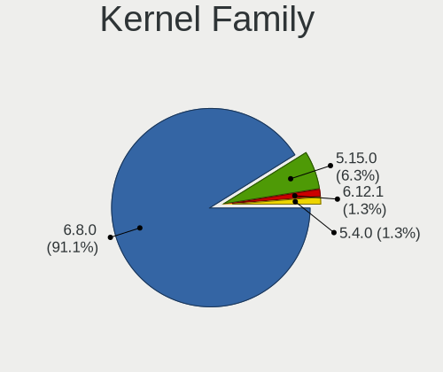
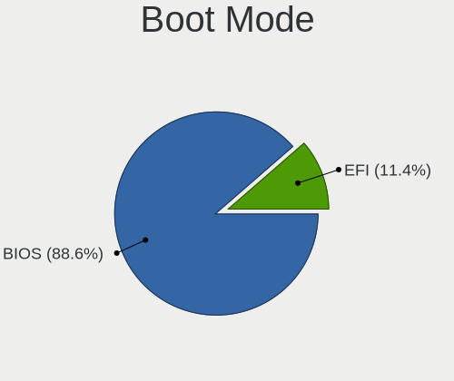
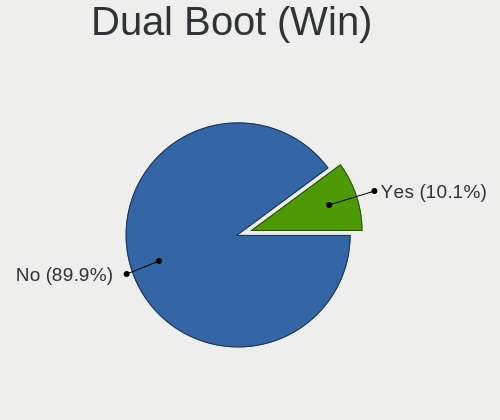
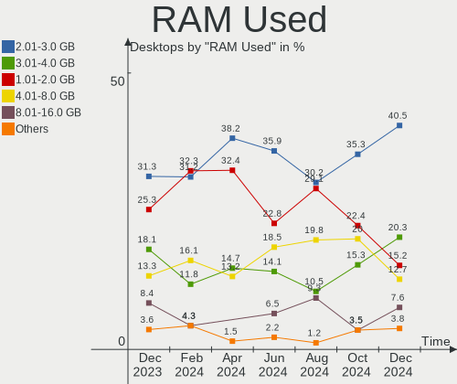
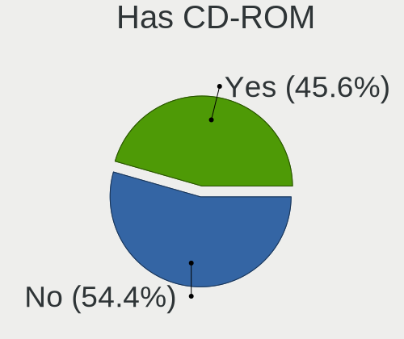
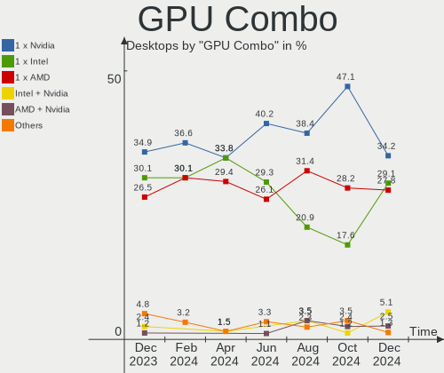
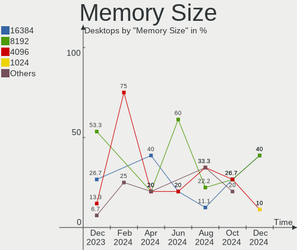

Zorin Hardware Trends (Desktops)
--------------------------------

A project to identify most popular hardware characteristics and track their change
over time based on data collected by Zorin users at https://Linux-Hardware.org.

Anyone can contribute to this report by the [hw-probe](https://github.com/linuxhw/hw-probe) tool:

    sudo -E hw-probe -all -upload

Full-feature report is available here: https://linux-hardware.org/?view=trends

Period: Mar, 2022.

Contents
--------

* [ System ](#system)
  - [ OS                       ](#os)
  - [ OS Family                ](#os-family)
  - [ Kernel                   ](#kernel)
  - [ Kernel Family            ](#kernel-family)
  - [ Kernel Major Ver.        ](#kernel-major-ver)
  - [ Arch                     ](#arch)
  - [ DE                       ](#de)
  - [ Display Server           ](#display-server)
  - [ Display Manager          ](#display-manager)
  - [ OS Lang                  ](#os-lang)
  - [ Boot Mode                ](#boot-mode)
  - [ Filesystem               ](#filesystem)
  - [ Part. scheme             ](#part-scheme)
  - [ Dual Boot with Linux/BSD ](#dual-boot-with-linuxbsd)
  - [ Dual Boot (Win)          ](#dual-boot-win)

* [ Board ](#board)
  - [ Vendor                   ](#vendor)
  - [ Model                    ](#model)
  - [ Model Family             ](#model-family)
  - [ MFG Year                 ](#mfg-year)
  - [ Form Factor              ](#form-factor)
  - [ Secure Boot              ](#secure-boot)
  - [ Coreboot                 ](#coreboot)
  - [ RAM Size                 ](#ram-size)
  - [ RAM Used                 ](#ram-used)
  - [ Total Drives             ](#total-drives)
  - [ Has CD-ROM               ](#has-cd-rom)
  - [ Has Ethernet             ](#has-ethernet)
  - [ Has WiFi                 ](#has-wifi)
  - [ Has Bluetooth            ](#has-bluetooth)

* [ Location ](#location)
  - [ Country                  ](#country)
  - [ City                     ](#city)

* [ Drives ](#drives)
  - [ Drive Vendor             ](#drive-vendor)
  - [ Drive Model              ](#drive-model)
  - [ HDD Vendor               ](#hdd-vendor)
  - [ SSD Vendor               ](#ssd-vendor)
  - [ Drive Kind               ](#drive-kind)
  - [ Drive Connector          ](#drive-connector)
  - [ Drive Size               ](#drive-size)
  - [ Space Total              ](#space-total)
  - [ Space Used               ](#space-used)
  - [ Malfunc. Drives          ](#malfunc-drives)
  - [ Malfunc. Drive Vendor    ](#malfunc-drive-vendor)
  - [ Malfunc. HDD Vendor      ](#malfunc-hdd-vendor)
  - [ Malfunc. Drive Kind      ](#malfunc-drive-kind)
  - [ Failed Drives            ](#failed-drives)
  - [ Failed Drive Vendor      ](#failed-drive-vendor)
  - [ Drive Status             ](#drive-status)

* [ Storage controller ](#storage-controller)
  - [ Storage Vendor           ](#storage-vendor)
  - [ Storage Model            ](#storage-model)
  - [ Storage Kind             ](#storage-kind)

* [ Processor ](#processor)
  - [ CPU Vendor               ](#cpu-vendor)
  - [ CPU Model                ](#cpu-model)
  - [ CPU Model Family         ](#cpu-model-family)
  - [ CPU Cores                ](#cpu-cores)
  - [ CPU Sockets              ](#cpu-sockets)
  - [ CPU Threads              ](#cpu-threads)
  - [ CPU Op-Modes             ](#cpu-op-modes)
  - [ CPU Microcode            ](#cpu-microcode)
  - [ CPU Microarch            ](#cpu-microarch)

* [ Graphics ](#graphics)
  - [ GPU Vendor               ](#gpu-vendor)
  - [ GPU Model                ](#gpu-model)
  - [ GPU Combo                ](#gpu-combo)
  - [ GPU Driver               ](#gpu-driver)
  - [ GPU Memory               ](#gpu-memory)

* [ Monitor ](#monitor)
  - [ Monitor Vendor           ](#monitor-vendor)
  - [ Monitor Model            ](#monitor-model)
  - [ Monitor Resolution       ](#monitor-resolution)
  - [ Monitor Diagonal         ](#monitor-diagonal)
  - [ Monitor Width            ](#monitor-width)
  - [ Aspect Ratio             ](#aspect-ratio)
  - [ Monitor Area             ](#monitor-area)
  - [ Pixel Density            ](#pixel-density)
  - [ Multiple Monitors        ](#multiple-monitors)

* [ Network ](#network)
  - [ Net Controller Vendor    ](#net-controller-vendor)
  - [ Net Controller Model     ](#net-controller-model)
  - [ Wireless Vendor          ](#wireless-vendor)
  - [ Wireless Model           ](#wireless-model)
  - [ Ethernet Vendor          ](#ethernet-vendor)
  - [ Ethernet Model           ](#ethernet-model)
  - [ Net Controller Kind      ](#net-controller-kind)
  - [ Used Controller          ](#used-controller)
  - [ NICs                     ](#nics)
  - [ IPv6                     ](#ipv6)

* [ Bluetooth ](#bluetooth)
  - [ Bluetooth Vendor         ](#bluetooth-vendor)
  - [ Bluetooth Model          ](#bluetooth-model)

* [ Sound ](#sound)
  - [ Sound Vendor             ](#sound-vendor)
  - [ Sound Model              ](#sound-model)

* [ Memory ](#memory)
  - [ Memory Vendor            ](#memory-vendor)
  - [ Memory Model             ](#memory-model)
  - [ Memory Kind              ](#memory-kind)
  - [ Memory Form Factor       ](#memory-form-factor)
  - [ Memory Size              ](#memory-size)
  - [ Memory Speed             ](#memory-speed)

* [ Printers & scanners ](#printers--scanners)
  - [ Printer Vendor           ](#printer-vendor)
  - [ Printer Model            ](#printer-model)
  - [ Scanner Vendor           ](#scanner-vendor)
  - [ Scanner Model            ](#scanner-model)

* [ Camera ](#camera)
  - [ Camera Vendor            ](#camera-vendor)
  - [ Camera Model             ](#camera-model)

* [ Security ](#security)
  - [ Fingerprint Vendor       ](#fingerprint-vendor)
  - [ Fingerprint Model        ](#fingerprint-model)
  - [ Chipcard Vendor          ](#chipcard-vendor)
  - [ Chipcard Model           ](#chipcard-model)

* [ Unsupported ](#unsupported)
  - [ Unsupported Devices      ](#unsupported-devices)
  - [ Unsupported Device Types ](#unsupported-device-types)

System
------

OS
--

Installed operating systems

| Name     | Desktops | Percent |
|----------|----------|---------|
| Zorin 16 | 49       | 94.23%  |
| Zorin 15 | 3        | 5.77%   |

OS Family
---------

OS without a version

| Name  | Desktops | Percent |
|-------|----------|---------|
| Zorin | 52       | 100%    |

Kernel
------

Version of the Linux kernel

| Version           | Desktops | Percent |
|-------------------|----------|---------|
| 5.13.0-35-generic | 26       | 50%     |
| 5.13.0-30-generic | 11       | 21.15%  |
| 5.13.0-37-generic | 8        | 15.38%  |
| 5.4.0-100-generic | 2        | 3.85%   |
| 5.13.0-39-generic | 2        | 3.85%   |
| 5.4.0-105-generic | 1        | 1.92%   |
| 5.11.0-41-generic | 1        | 1.92%   |
| 5.11.0-38-generic | 1        | 1.92%   |

Kernel Family
-------------

Linux kernel without a distro release

| Version | Desktops | Percent |
|---------|----------|---------|
| 5.13.0  | 47       | 90.38%  |
| 5.4.0   | 3        | 5.77%   |
| 5.11.0  | 2        | 3.85%   |

Kernel Major Ver.
-----------------

Linux kernel major version

| Version | Desktops | Percent |
|---------|----------|---------|
| 5.13    | 47       | 90.38%  |
| 5.4     | 3        | 5.77%   |
| 5.11    | 2        | 3.85%   |

Arch
----

OS architecture (x86_64, i586, etc.)

| Name   | Desktops | Percent |
|--------|----------|---------|
| x86_64 | 51       | 98.08%  |
| i686   | 1        | 1.92%   |

DE
--

Desktop Environment

| Name  | Desktops | Percent |
|-------|----------|---------|
| GNOME | 42       | 80.77%  |
| XFCE  | 10       | 19.23%  |

Display Server
--------------

X11 or Wayland

| Name | Desktops | Percent |
|------|----------|---------|
| X11  | 52       | 100%    |

Display Manager
---------------

SDDM, LightDM, etc.

| Name    | Desktops | Percent |
|---------|----------|---------|
| Unknown | 42       | 80.77%  |
| GDM3    | 7        | 13.46%  |
| LightDM | 2        | 3.85%   |
| GDM     | 1        | 1.92%   |

OS Lang
-------

Language

| Lang  | Desktops | Percent |
|-------|----------|---------|
| en_US | 17       | 32.69%  |
| de_DE | 9        | 17.31%  |
| pt_BR | 5        | 9.62%   |
| it_IT | 4        | 7.69%   |
| pl_PL | 3        | 5.77%   |
| nl_NL | 2        | 3.85%   |
| es_ES | 2        | 3.85%   |
| es_EC | 2        | 3.85%   |
| cs_CZ | 2        | 3.85%   |
| hu_HU | 1        | 1.92%   |
| es_AR | 1        | 1.92%   |
| en_ZA | 1        | 1.92%   |
| en_GB | 1        | 1.92%   |
| da_DK | 1        | 1.92%   |
| ar_EG | 1        | 1.92%   |

Boot Mode
---------

EFI or BIOS

| Mode | Desktops | Percent |
|------|----------|---------|
| BIOS | 29       | 55.77%  |
| EFI  | 23       | 44.23%  |

Filesystem
----------

Type of filesystem

| Type    | Desktops | Percent |
|---------|----------|---------|
| Ext4    | 48       | 92.31%  |
| Overlay | 2        | 3.85%   |
| Zfs     | 1        | 1.92%   |
| Ext3    | 1        | 1.92%   |

Part. scheme
------------

Scheme of partitioning

| Type    | Desktops | Percent |
|---------|----------|---------|
| Unknown | 51       | 98.08%  |
| MBR     | 1        | 1.92%   |

Dual Boot with Linux/BSD
------------------------

Hosting more than one Linux/BSD

| Dual boot | Desktops | Percent |
|-----------|----------|---------|
| No        | 50       | 96.15%  |
| Yes       | 2        | 3.85%   |

Dual Boot (Win)
---------------

Hosting Linux and Windows

| Dual boot | Desktops | Percent |
|-----------|----------|---------|
| No        | 47       | 90.38%  |
| Yes       | 5        | 9.62%   |

Board
-----

Vendor
------

Motherboard manufacturer

| Name                | Desktops | Percent |
|---------------------|----------|---------|
| ASUSTek Computer    | 13       | 25%     |
| MSI                 | 7        | 13.46%  |
| Dell                | 7        | 13.46%  |
| Gigabyte Technology | 6        | 11.54%  |
| Hewlett-Packard     | 4        | 7.69%   |
| Biostar             | 3        | 5.77%   |
| ASRock              | 3        | 5.77%   |
| Intel               | 2        | 3.85%   |
| Google              | 2        | 3.85%   |
| TYAN Computer       | 1        | 1.92%   |
| Shuttle             | 1        | 1.92%   |
| Pegatron            | 1        | 1.92%   |
| Lenovo              | 1        | 1.92%   |
| Fujitsu             | 1        | 1.92%   |

Model
-----

Motherboard model

| Name                             | Desktops | Percent |
|----------------------------------|----------|---------|
| ASUS All Series                  | 2        | 3.85%   |
| TYAN CELSIUS R650                | 1        | 1.92%   |
| Shuttle X50V2PLUS                | 1        | 1.92%   |
| Pegatron NY428AA-ABA p6110f      | 1        | 1.92%   |
| MSI MS-7D41                      | 1        | 1.92%   |
| MSI MS-7C37                      | 1        | 1.92%   |
| MSI MS-7A15                      | 1        | 1.92%   |
| MSI MS-7823                      | 1        | 1.92%   |
| MSI MS-7721                      | 1        | 1.92%   |
| MSI MS-7695                      | 1        | 1.92%   |
| MSI MS-7512                      | 1        | 1.92%   |
| Lenovo ThinkCentre M91p 4524WAP  | 1        | 1.92%   |
| Intel H61                        | 1        | 1.92%   |
| Intel DH55HC AAE70933-505        | 1        | 1.92%   |
| HP Z220 SFF Workstation          | 1        | 1.92%   |
| HP EliteDesk 800 G1 USDT         | 1        | 1.92%   |
| HP Compaq 6200 Pro SFF PC        | 1        | 1.92%   |
| HP Compaq 6200 Pro MT PC         | 1        | 1.92%   |
| Google Panther                   | 1        | 1.92%   |
| Google Buddy                     | 1        | 1.92%   |
| Gigabyte Z77-DS3H                | 1        | 1.92%   |
| Gigabyte Z690 UD DDR4            | 1        | 1.92%   |
| Gigabyte H67MA-USB3-B3           | 1        | 1.92%   |
| Gigabyte G1.Sniper B6            | 1        | 1.92%   |
| Gigabyte B360M AORUS Gaming 3    | 1        | 1.92%   |
| Gigabyte A320M-S2H               | 1        | 1.92%   |
| Fujitsu ESPRIMO_D556             | 1        | 1.92%   |
| Dell XPS 8700                    | 1        | 1.92%   |
| Dell Vostro 260                  | 1        | 1.92%   |
| Dell Vostro 200                  | 1        | 1.92%   |
| Dell Studio Hybrid 140g          | 1        | 1.92%   |
| Dell Precision WorkStation T3500 | 1        | 1.92%   |
| Dell OptiPlex 3050               | 1        | 1.92%   |
| Dell OptiPlex 3020               | 1        | 1.92%   |
| Biostar X370GT5                  | 1        | 1.92%   |
| Biostar P4M90-M7A                | 1        | 1.92%   |
| Biostar B460GTQ                  | 1        | 1.92%   |
| ASUS TUF B450-PRO GAMING         | 1        | 1.92%   |
| ASUS TRILINE PROFI               | 1        | 1.92%   |
| ASUS RN663AA-ABA a1737c          | 1        | 1.92%   |
| ASUS PRIME X370-PRO              | 1        | 1.92%   |
| ASUS P8P67                       | 1        | 1.92%   |
| ASUS Maximus VIII GENE           | 1        | 1.92%   |
| ASUS M5A97 R2.0                  | 1        | 1.92%   |
| ASUS M5A78L-M/USB3               | 1        | 1.92%   |
| ASUS M2A-VM HDMI                 | 1        | 1.92%   |
| ASUS Crosshair IV Formula        | 1        | 1.92%   |
| ASUS C51-MCP51                   | 1        | 1.92%   |
| ASRock H61M-HVS                  | 1        | 1.92%   |
| ASRock H510M-HVS R2.0            | 1        | 1.92%   |
| ASRock B550 Steel Legend         | 1        | 1.92%   |

Model Family
------------

Motherboard model prefix

| Name                   | Desktops | Percent |
|------------------------|----------|---------|
| HP Compaq              | 2        | 3.85%   |
| Dell Vostro            | 2        | 3.85%   |
| Dell OptiPlex          | 2        | 3.85%   |
| ASUS All               | 2        | 3.85%   |
| TYAN CELSIUS           | 1        | 1.92%   |
| Shuttle X50V2PLUS      | 1        | 1.92%   |
| Pegatron NY428AA-ABA   | 1        | 1.92%   |
| MSI MS-7D41            | 1        | 1.92%   |
| MSI MS-7C37            | 1        | 1.92%   |
| MSI MS-7A15            | 1        | 1.92%   |
| MSI MS-7823            | 1        | 1.92%   |
| MSI MS-7721            | 1        | 1.92%   |
| MSI MS-7695            | 1        | 1.92%   |
| MSI MS-7512            | 1        | 1.92%   |
| Lenovo ThinkCentre     | 1        | 1.92%   |
| Intel H61              | 1        | 1.92%   |
| Intel DH55HC           | 1        | 1.92%   |
| HP Z220                | 1        | 1.92%   |
| HP EliteDesk           | 1        | 1.92%   |
| Google Panther         | 1        | 1.92%   |
| Google Buddy           | 1        | 1.92%   |
| Gigabyte Z77-DS3H      | 1        | 1.92%   |
| Gigabyte Z690          | 1        | 1.92%   |
| Gigabyte H67MA-USB3-B3 | 1        | 1.92%   |
| Gigabyte G1.Sniper     | 1        | 1.92%   |
| Gigabyte B360M         | 1        | 1.92%   |
| Gigabyte A320M-S2H     | 1        | 1.92%   |
| Fujitsu ESPRIMO        | 1        | 1.92%   |
| Dell XPS               | 1        | 1.92%   |
| Dell Studio            | 1        | 1.92%   |
| Dell Precision         | 1        | 1.92%   |
| Biostar X370GT5        | 1        | 1.92%   |
| Biostar P4M90-M7A      | 1        | 1.92%   |
| Biostar B460GTQ        | 1        | 1.92%   |
| ASUS TUF               | 1        | 1.92%   |
| ASUS TRILINE           | 1        | 1.92%   |
| ASUS RN663AA-ABA       | 1        | 1.92%   |
| ASUS PRIME             | 1        | 1.92%   |
| ASUS P8P67             | 1        | 1.92%   |
| ASUS Maximus           | 1        | 1.92%   |
| ASUS M5A97             | 1        | 1.92%   |
| ASUS M5A78L-M          | 1        | 1.92%   |
| ASUS M2A-VM            | 1        | 1.92%   |
| ASUS Crosshair         | 1        | 1.92%   |
| ASUS C51-MCP51         | 1        | 1.92%   |
| ASRock H61M-HVS        | 1        | 1.92%   |
| ASRock H510M-HVS       | 1        | 1.92%   |
| ASRock B550            | 1        | 1.92%   |

MFG Year
--------

Motherboard manufacture year

| Year | Desktops | Percent |
|------|----------|---------|
| 2011 | 7        | 13.46%  |
| 2012 | 5        | 9.62%   |
| 2021 | 4        | 7.69%   |
| 2018 | 4        | 7.69%   |
| 2017 | 4        | 7.69%   |
| 2010 | 4        | 7.69%   |
| 2014 | 3        | 5.77%   |
| 2013 | 3        | 5.77%   |
| 2009 | 3        | 5.77%   |
| 2007 | 3        | 5.77%   |
| 2020 | 2        | 3.85%   |
| 2019 | 2        | 3.85%   |
| 2015 | 2        | 3.85%   |
| 2008 | 2        | 3.85%   |
| 2006 | 2        | 3.85%   |
| 2022 | 1        | 1.92%   |
| 2016 | 1        | 1.92%   |

Form Factor
-----------

Physical design of the computer

| Name    | Desktops | Percent |
|---------|----------|---------|
| Desktop | 52       | 100%    |

Secure Boot
-----------

Enabled or disabled

| State    | Desktops | Percent |
|----------|----------|---------|
| Disabled | 48       | 92.31%  |
| Enabled  | 4        | 7.69%   |

Coreboot
--------

Have coreboot on board

| Used | Desktops | Percent |
|------|----------|---------|
| No   | 50       | 96.15%  |
| Yes  | 2        | 3.85%   |

RAM Size
--------

Total RAM memory

| Size in GB  | Desktops | Percent |
|-------------|----------|---------|
| 8.01-16.0   | 17       | 32.69%  |
| 16.01-24.0  | 12       | 23.08%  |
| 4.01-8.0    | 8        | 15.38%  |
| 3.01-4.0    | 7        | 13.46%  |
| 32.01-64.0  | 6        | 11.54%  |
| 64.01-256.0 | 1        | 1.92%   |
| 1.01-2.0    | 1        | 1.92%   |

RAM Used
--------

Used RAM memory

| Used GB   | Desktops | Percent |
|-----------|----------|---------|
| 1.01-2.0  | 23       | 44.23%  |
| 2.01-3.0  | 10       | 19.23%  |
| 4.01-8.0  | 8        | 15.38%  |
| 3.01-4.0  | 8        | 15.38%  |
| 0.51-1.0  | 2        | 3.85%   |
| 8.01-16.0 | 1        | 1.92%   |

Total Drives
------------

Number of drives on board

| Drives | Desktops | Percent |
|--------|----------|---------|
| 1      | 25       | 48.08%  |
| 2      | 14       | 26.92%  |
| 3      | 6        | 11.54%  |
| 5      | 2        | 3.85%   |
| 4      | 2        | 3.85%   |
| 7      | 1        | 1.92%   |
| 6      | 1        | 1.92%   |
| 0      | 1        | 1.92%   |

Has CD-ROM
----------

Has CD-ROM on board

| Presented | Desktops | Percent |
|-----------|----------|---------|
| Yes       | 31       | 59.62%  |
| No        | 21       | 40.38%  |

Has Ethernet
------------

Has Ethernet on board

| Presented | Desktops | Percent |
|-----------|----------|---------|
| Yes       | 51       | 98.08%  |
| No        | 1        | 1.92%   |

Has WiFi
--------

Has WiFi module

| Presented | Desktops | Percent |
|-----------|----------|---------|
| No        | 29       | 55.77%  |
| Yes       | 23       | 44.23%  |

Has Bluetooth
-------------

Has Bluetooth module

| Presented | Desktops | Percent |
|-----------|----------|---------|
| No        | 39       | 75%     |
| Yes       | 13       | 25%     |

Location
--------

Country
-------

Geographic location (country)

| Country      | Desktops | Percent |
|--------------|----------|---------|
| USA          | 11       | 21.15%  |
| Germany      | 7        | 13.46%  |
| Brazil       | 6        | 11.54%  |
| Italy        | 4        | 7.69%   |
| Poland       | 3        | 5.77%   |
| Netherlands  | 3        | 5.77%   |
| Switzerland  | 2        | 3.85%   |
| Spain        | 2        | 3.85%   |
| Ecuador      | 2        | 3.85%   |
| Czechia      | 2        | 3.85%   |
| UK           | 1        | 1.92%   |
| Sweden       | 1        | 1.92%   |
| South Africa | 1        | 1.92%   |
| Slovakia     | 1        | 1.92%   |
| Palestine    | 1        | 1.92%   |
| Hungary      | 1        | 1.92%   |
| Denmark      | 1        | 1.92%   |
| Canada       | 1        | 1.92%   |
| Austria      | 1        | 1.92%   |
| Argentina    | 1        | 1.92%   |

City
----

Geographic location (city)

| City                           | Desktops | Percent |
|--------------------------------|----------|---------|
| Prague                         | 2        | 3.85%   |
| Zurich                         | 1        | 1.92%   |
| Żory                          | 1        | 1.92%   |
| Wichita                        | 1        | 1.92%   |
| Werneck                        | 1        | 1.92%   |
| Warsaw                         | 1        | 1.92%   |
| Vienna                         | 1        | 1.92%   |
| Turin                          | 1        | 1.92%   |
| Thousand Oaks                  | 1        | 1.92%   |
| The Hague                      | 1        | 1.92%   |
| Tarquinia                      | 1        | 1.92%   |
| Sao Paulo                      | 1        | 1.92%   |
| Santo Domingo de los Colorados | 1        | 1.92%   |
| Santander                      | 1        | 1.92%   |
| Royersford                     | 1        | 1.92%   |
| Rotterdam                      | 1        | 1.92%   |
| Roosendaal                     | 1        | 1.92%   |
| Riverside                      | 1        | 1.92%   |
| Rio de Janeiro                 | 1        | 1.92%   |
| Rimavská Sobota               | 1        | 1.92%   |
| Quito                          | 1        | 1.92%   |
| Plano                          | 1        | 1.92%   |
| Palmas                         | 1        | 1.92%   |
| Nurtingen                      | 1        | 1.92%   |
| Mount Olive                    | 1        | 1.92%   |
| Milan                          | 1        | 1.92%   |
| Medford                        | 1        | 1.92%   |
| Los Angeles                    | 1        | 1.92%   |
| Lilienthal                     | 1        | 1.92%   |
| Leatherhead                    | 1        | 1.92%   |
| Karlskrona                     | 1        | 1.92%   |
| Joinville                      | 1        | 1.92%   |
| Johannesburg                   | 1        | 1.92%   |
| Jaboatao dos Guararapes        | 1        | 1.92%   |
| Gliwice                        | 1        | 1.92%   |
| Gaza                           | 1        | 1.92%   |
| Fort Lauderdale                | 1        | 1.92%   |
| Florence                       | 1        | 1.92%   |
| Filderstadt                    | 1        | 1.92%   |
| Edmonton                       | 1        | 1.92%   |
| Düsseldorf                    | 1        | 1.92%   |
| Dessau                         | 1        | 1.92%   |
| Buenos Aires                   | 1        | 1.92%   |
| Budapest                       | 1        | 1.92%   |
| Bronshoj                       | 1        | 1.92%   |
| Brasília                      | 1        | 1.92%   |
| Boise                          | 1        | 1.92%   |
| Bern                           | 1        | 1.92%   |
| Bad Durrheim                   | 1        | 1.92%   |
| Almería                       | 1        | 1.92%   |
| Aberdeen                       | 1        | 1.92%   |

Drives
------

Drive Vendor
------------

Hard drive vendors

| Vendor                    | Desktops | Drives | Percent |
|---------------------------|----------|--------|---------|
| Seagate                   | 18       | 24     | 20.93%  |
| Samsung Electronics       | 14       | 15     | 16.28%  |
| WDC                       | 11       | 16     | 12.79%  |
| Kingston                  | 8        | 8      | 9.3%    |
| Hitachi                   | 8        | 8      | 9.3%    |
| SanDisk                   | 4        | 4      | 4.65%   |
| Toshiba                   | 2        | 2      | 2.33%   |
| OCZ                       | 2        | 2      | 2.33%   |
| Gigabyte Technology       | 2        | 2      | 2.33%   |
| Crucial                   | 2        | 2      | 2.33%   |
| China                     | 2        | 2      | 2.33%   |
| WD MediaMax               | 1        | 1      | 1.16%   |
| Unknown                   | 1        | 2      | 1.16%   |
| SK Hynix                  | 1        | 1      | 1.16%   |
| Silicon Motion            | 1        | 1      | 1.16%   |
| PNY                       | 1        | 1      | 1.16%   |
| Phison                    | 1        | 1      | 1.16%   |
| Patriot                   | 1        | 1      | 1.16%   |
| Micron/Crucial Technology | 1        | 1      | 1.16%   |
| KIOXIA-EXCERIA            | 1        | 1      | 1.16%   |
| Intel                     | 1        | 1      | 1.16%   |
| Hewlett-Packard           | 1        | 1      | 1.16%   |
| GOODRAM                   | 1        | 1      | 1.16%   |
| A-DATA Technology         | 1        | 1      | 1.16%   |

Drive Model
-----------

Hard drive models

| Model                               | Desktops | Percent |
|-------------------------------------|----------|---------|
| Seagate ST500DM002-1BD142 500GB     | 2        | 2.06%   |
| Samsung SSD 860 EVO 500GB           | 2        | 2.06%   |
| Samsung HD103SJ 1TB                 | 2        | 2.06%   |
| Kingston SA400S37240G 240GB SSD     | 2        | 2.06%   |
| Hitachi HDS721050CLA362 500GB       | 2        | 2.06%   |
| China SATA3 1TB SSD                 | 2        | 2.06%   |
| WDC WDS500G2B0A-00SM50 500GB SSD    | 1        | 1.03%   |
| WDC WD7500AADS-00M2B0 752GB         | 1        | 1.03%   |
| WDC WD5003ABYX-01WERA1 500GB        | 1        | 1.03%   |
| WDC WD5000LUCT-63Y8HY0 500GB        | 1        | 1.03%   |
| WDC WD5000AZRX-00A8LB0 500GB        | 1        | 1.03%   |
| WDC WD5000AAKX-60U6AA0 500GB        | 1        | 1.03%   |
| WDC WD40EFZX-68AWUN0 4TB            | 1        | 1.03%   |
| WDC WD3200BPVT-00JJ5T0 320GB        | 1        | 1.03%   |
| WDC WD30EZRX-00DC0B0 3TB            | 1        | 1.03%   |
| WDC WD2500AAJS-60Z0A0 250GB         | 1        | 1.03%   |
| WDC WD2000FYYZ-01UL1B2 2TB          | 1        | 1.03%   |
| WDC WD10EZEX-00WN4A0 1TB            | 1        | 1.03%   |
| WDC WD1001FALS-00J7B0 1TB           | 1        | 1.03%   |
| WDC WD10 EADS-65M2B0 1TB            | 1        | 1.03%   |
| WDC WD My Passport 264F 1TB         | 1        | 1.03%   |
| WD MediaMax WL1000GSA6472 1TB       | 1        | 1.03%   |
| Unknown SD/MMC 16GB                 | 1        | 1.03%   |
| Unknown M.S./M.S.Pro/HG 16GB        | 1        | 1.03%   |
| Toshiba DT01ACA050 LENOVO 500GB     | 1        | 1.03%   |
| Toshiba DT01ACA050 500GB            | 1        | 1.03%   |
| SK Hynix NVMe SSD Drive 128GB       | 1        | 1.03%   |
| Silicon Motion NVMe SSD Drive 512GB | 1        | 1.03%   |
| Seagate ST500LM021-1KJ152 500GB     | 1        | 1.03%   |
| Seagate ST500LM000-SSHD-8GB         | 1        | 1.03%   |
| Seagate ST4000DM004-2U9104 4TB      | 1        | 1.03%   |
| Seagate ST380815AS 80GB             | 1        | 1.03%   |
| Seagate ST380211AS 80GB             | 1        | 1.03%   |
| Seagate ST3500413AS 500GB           | 1        | 1.03%   |
| Seagate ST3500321CS 500GB           | 1        | 1.03%   |
| Seagate ST3320820AS 320GB           | 1        | 1.03%   |
| Seagate ST3320620AS 320GB           | 1        | 1.03%   |
| Seagate ST3320418AS 320GB           | 1        | 1.03%   |
| Seagate ST3250310AS 250GB           | 1        | 1.03%   |
| Seagate ST32000641AS 2TB            | 1        | 1.03%   |
| Seagate ST31000524AS 1TB            | 1        | 1.03%   |
| Seagate ST3000LM016-1N217V 3TB      | 1        | 1.03%   |
| Seagate ST2000VX000 2TB             | 1        | 1.03%   |
| Seagate ST2000DM001-1ER164 2TB      | 1        | 1.03%   |
| Seagate ST2000DL003-9VT166 2TB      | 1        | 1.03%   |
| Seagate ST1000DM003-1SB102 1TB      | 1        | 1.03%   |
| Seagate ST1000DM003-1CH162 1TB      | 1        | 1.03%   |
| Seagate SSD 250GB                   | 1        | 1.03%   |
| Seagate Desktop 8TB                 | 1        | 1.03%   |
| Seagate BUP BK 4TB                  | 1        | 1.03%   |
| SanDisk SSD PLUS 240GB              | 1        | 1.03%   |
| SanDisk SSD PLUS 1000GB             | 1        | 1.03%   |
| SanDisk SDSSDHII240G 240GB          | 1        | 1.03%   |
| SanDisk SDSSDA240G 240GB            | 1        | 1.03%   |
| Samsung SSD 870 EVO 500GB           | 1        | 1.03%   |
| Samsung SSD 850 PRO 256GB           | 1        | 1.03%   |
| Samsung SSD 850 EVO 250GB           | 1        | 1.03%   |
| Samsung SSD 840 Series 250GB        | 1        | 1.03%   |
| Samsung NVMe SSD Drive 500GB        | 1        | 1.03%   |
| Samsung NVMe SSD Drive 250GB        | 1        | 1.03%   |

HDD Vendor
----------

Hard disk drive vendors

| Vendor              | Desktops | Drives | Percent |
|---------------------|----------|--------|---------|
| Seagate             | 18       | 23     | 41.86%  |
| WDC                 | 10       | 14     | 23.26%  |
| Hitachi             | 8        | 8      | 18.6%   |
| Samsung Electronics | 4        | 4      | 9.3%    |
| Toshiba             | 2        | 2      | 4.65%   |
| Hewlett-Packard     | 1        | 1      | 2.33%   |

SSD Vendor
----------

Solid state drive vendors

| Vendor              | Desktops | Drives | Percent |
|---------------------|----------|--------|---------|
| Samsung Electronics | 7        | 7      | 21.21%  |
| Kingston            | 6        | 6      | 18.18%  |
| SanDisk             | 4        | 4      | 12.12%  |
| OCZ                 | 2        | 2      | 6.06%   |
| Gigabyte Technology | 2        | 2      | 6.06%   |
| Crucial             | 2        | 2      | 6.06%   |
| China               | 2        | 2      | 6.06%   |
| WDC                 | 1        | 1      | 3.03%   |
| Seagate             | 1        | 1      | 3.03%   |
| PNY                 | 1        | 1      | 3.03%   |
| Patriot             | 1        | 1      | 3.03%   |
| KIOXIA-EXCERIA      | 1        | 1      | 3.03%   |
| Intel               | 1        | 1      | 3.03%   |
| GOODRAM             | 1        | 1      | 3.03%   |
| A-DATA Technology   | 1        | 1      | 3.03%   |

Drive Kind
----------

HDD or SSD

| Kind    | Desktops | Drives | Percent |
|---------|----------|--------|---------|
| HDD     | 33       | 52     | 44%     |
| SSD     | 31       | 33     | 41.33%  |
| NVMe    | 8        | 10     | 10.67%  |
| Unknown | 3        | 4      | 4%      |

Drive Connector
---------------

SATA, SAS, NVMe, etc.

| Type | Desktops | Drives | Percent |
|------|----------|--------|---------|
| SATA | 49       | 83     | 81.67%  |
| NVMe | 8        | 10     | 13.33%  |
| SAS  | 3        | 6      | 5%      |

Drive Size
----------

Size of hard drive

| Size in TB | Desktops | Drives | Percent |
|------------|----------|--------|---------|
| 0.01-0.5   | 42       | 54     | 62.69%  |
| 0.51-1.0   | 10       | 15     | 14.93%  |
| 1.01-2.0   | 8        | 8      | 11.94%  |
| 3.01-4.0   | 3        | 4      | 4.48%   |
| 2.01-3.0   | 3        | 3      | 4.48%   |
| 4.01-10.0  | 1        | 1      | 1.49%   |

Space Total
-----------

Amount of disk space available on the file system

| Size in GB     | Desktops | Percent |
|----------------|----------|---------|
| 101-250        | 16       | 30.77%  |
| 251-500        | 14       | 26.92%  |
| 501-1000       | 5        | 9.62%   |
| More than 3000 | 4        | 7.69%   |
| 21-50          | 3        | 5.77%   |
| 51-100         | 3        | 5.77%   |
| 2001-3000      | 2        | 3.85%   |
| 1001-2000      | 2        | 3.85%   |
| 1-20           | 2        | 3.85%   |
| Unknown        | 1        | 1.92%   |

Space Used
----------

Amount of used disk space

| Used GB        | Desktops | Percent |
|----------------|----------|---------|
| 1-20           | 24       | 46.15%  |
| 21-50          | 13       | 25%     |
| 51-100         | 5        | 9.62%   |
| 501-1000       | 3        | 5.77%   |
| More than 3000 | 2        | 3.85%   |
| 251-500        | 2        | 3.85%   |
| 101-250        | 1        | 1.92%   |
| 1001-2000      | 1        | 1.92%   |
| Unknown        | 1        | 1.92%   |

Malfunc. Drives
---------------

Drive models with a malfunction

| Model                           | Desktops | Drives | Percent |
|---------------------------------|----------|--------|---------|
| Kingston SNS4151S316GD 16GB SSD | 1        | 1      | 100%    |

Malfunc. Drive Vendor
---------------------

Vendors of faulty drives

| Vendor   | Desktops | Drives | Percent |
|----------|----------|--------|---------|
| Kingston | 1        | 1      | 100%    |

Malfunc. HDD Vendor
-------------------

Vendors of faulty HDD drives

Zero info for selected period =(

Malfunc. Drive Kind
-------------------

Kinds of faulty drives

| Kind | Desktops | Drives | Percent |
|------|----------|--------|---------|
| SSD  | 1        | 1      | 100%    |

Failed Drives
-------------

Failed drive models

Zero info for selected period =(

Failed Drive Vendor
-------------------

Failed drive vendors

Zero info for selected period =(

Drive Status
------------

Number of failed and malfunc. drives

| Status   | Desktops | Drives | Percent |
|----------|----------|--------|---------|
| Detected | 49       | 97     | 96.08%  |
| Malfunc  | 1        | 1      | 1.96%   |
| Works    | 1        | 1      | 1.96%   |

Storage controller
------------------

Storage Vendor
--------------

Storage controller vendors

| Vendor                      | Desktops | Percent |
|-----------------------------|----------|---------|
| Intel                       | 37       | 54.41%  |
| AMD                         | 12       | 17.65%  |
| Samsung Electronics         | 3        | 4.41%   |
| JMicron Technology          | 3        | 4.41%   |
| ASMedia Technology          | 3        | 4.41%   |
| Nvidia                      | 2        | 2.94%   |
| Kingston Technology Company | 2        | 2.94%   |
| VIA Technologies            | 1        | 1.47%   |
| SK Hynix                    | 1        | 1.47%   |
| Silicon Motion              | 1        | 1.47%   |
| Phison Electronics          | 1        | 1.47%   |
| Micron/Crucial Technology   | 1        | 1.47%   |
| Marvell Technology Group    | 1        | 1.47%   |

Storage Model
-------------

Storage controller models

| Model                                                                                   | Desktops | Percent |
|-----------------------------------------------------------------------------------------|----------|---------|
| Intel 8 Series/C220 Series Chipset Family 6-port SATA Controller 1 [AHCI mode]          | 7        | 7.95%   |
| Intel 6 Series/C200 Series Chipset Family 6 port Desktop SATA AHCI Controller           | 6        | 6.82%   |
| AMD FCH SATA Controller [AHCI mode]                                                     | 5        | 5.68%   |
| Intel SATA Controller [RAID mode]                                                       | 4        | 4.55%   |
| Intel Q170/Q150/B150/H170/H110/Z170/CM236 Chipset SATA Controller [AHCI Mode]           | 3        | 3.41%   |
| ASMedia ASM1062 Serial ATA Controller                                                   | 3        | 3.41%   |
| Samsung NVMe SSD Controller SM981/PM981/PM983                                           | 2        | 2.27%   |
| Nvidia MCP51 Serial ATA Controller                                                      | 2        | 2.27%   |
| Nvidia MCP51 IDE                                                                        | 2        | 2.27%   |
| JMicron JMB363 SATA/IDE Controller                                                      | 2        | 2.27%   |
| Intel Alder Lake-S PCH SATA Controller [AHCI Mode]                                      | 2        | 2.27%   |
| Intel 82801IR/IO/IH (ICH9R/DO/DH) 4 port SATA Controller [IDE mode]                     | 2        | 2.27%   |
| Intel 82801I (ICH9 Family) 2 port SATA Controller [IDE mode]                            | 2        | 2.27%   |
| Intel 6 Series/C200 Series Chipset Family Desktop SATA Controller (IDE mode, ports 4-5) | 2        | 2.27%   |
| Intel 6 Series/C200 Series Chipset Family Desktop SATA Controller (IDE mode, ports 0-3) | 2        | 2.27%   |
| AMD X370 Series Chipset SATA Controller                                                 | 2        | 2.27%   |
| AMD SB7x0/SB8x0/SB9x0 SATA Controller [AHCI mode]                                       | 2        | 2.27%   |
| AMD SB7x0/SB8x0/SB9x0 IDE Controller                                                    | 2        | 2.27%   |
| VIA VT82C586A/B/VT82C686/A/B/VT823x/A/C PIPC Bus Master IDE                             | 1        | 1.14%   |
| VIA Serial ATA Controller                                                               | 1        | 1.14%   |
| SK Hynix BC501 NVMe Solid State Drive                                                   | 1        | 1.14%   |
| Silicon Motion SM2263EN/SM2263XT SSD Controller                                         | 1        | 1.14%   |
| Samsung NVMe SSD Controller PM9A1/PM9A3/980PRO                                          | 1        | 1.14%   |
| Phison E12 NVMe Controller                                                              | 1        | 1.14%   |
| Micron/Crucial Non-Volatile memory controller                                           | 1        | 1.14%   |
| Marvell Group 88SE9172 SATA 6Gb/s Controller                                            | 1        | 1.14%   |
| Kingston Company KC2000 NVMe SSD                                                        | 1        | 1.14%   |
| Kingston Company A2000 NVMe SSD                                                         | 1        | 1.14%   |
| JMicron JMB368 IDE controller                                                           | 1        | 1.14%   |
| Intel Wildcat Point-LP SATA Controller [AHCI Mode]                                      | 1        | 1.14%   |
| Intel NM10/ICH7 Family SATA Controller [IDE mode]                                       | 1        | 1.14%   |
| Intel 82Q35 Express PT IDER Controller                                                  | 1        | 1.14%   |
| Intel 82801JI (ICH10 Family) SATA AHCI Controller                                       | 1        | 1.14%   |
| Intel 82801JI (ICH10 Family) 4 port SATA IDE Controller #1                              | 1        | 1.14%   |
| Intel 82801JI (ICH10 Family) 2 port SATA IDE Controller #2                              | 1        | 1.14%   |
| Intel 82801HM/HEM (ICH8M/ICH8M-E) SATA Controller [AHCI mode]                           | 1        | 1.14%   |
| Intel 82801HM/HEM (ICH8M/ICH8M-E) IDE Controller                                        | 1        | 1.14%   |
| Intel 8 Series SATA Controller 1 [AHCI mode]                                            | 1        | 1.14%   |
| Intel 7 Series/C210 Series Chipset Family 6-port SATA Controller [AHCI mode]            | 1        | 1.14%   |
| Intel 631xESB/632xESB SATA AHCI Controller                                              | 1        | 1.14%   |
| Intel 631xESB/632xESB IDE Controller                                                    | 1        | 1.14%   |
| Intel 500 Series Chipset Family SATA AHCI Controller                                    | 1        | 1.14%   |
| Intel 5 Series/3400 Series Chipset PT IDER Controller                                   | 1        | 1.14%   |
| Intel 5 Series/3400 Series Chipset 4 port SATA IDE Controller                           | 1        | 1.14%   |
| Intel 5 Series/3400 Series Chipset 2 port SATA IDE Controller                           | 1        | 1.14%   |
| Intel 400 Series Chipset Family SATA AHCI Controller                                    | 1        | 1.14%   |
| AMD SB7x0/SB8x0/SB9x0 SATA Controller [IDE mode]                                        | 1        | 1.14%   |
| AMD SB600 Non-Raid-5 SATA                                                               | 1        | 1.14%   |
| AMD SB600 IDE                                                                           | 1        | 1.14%   |
| AMD FCH SATA Controller [IDE mode]                                                      | 1        | 1.14%   |
| AMD FCH SATA Controller D                                                               | 1        | 1.14%   |
| AMD FCH IDE Controller                                                                  | 1        | 1.14%   |
| AMD 500 Series Chipset SATA Controller                                                  | 1        | 1.14%   |
| AMD 400 Series Chipset SATA Controller                                                  | 1        | 1.14%   |

Storage Kind
------------

Kind of storage controller (IDE, SATA, NVMe, SAS, ...)

| Kind | Desktops | Percent |
|------|----------|---------|
| SATA | 38       | 56.72%  |
| IDE  | 17       | 25.37%  |
| NVMe | 8        | 11.94%  |
| RAID | 4        | 5.97%   |

Processor
---------

CPU Vendor
----------

Processor vendors

| Vendor | Desktops | Percent |
|--------|----------|---------|
| Intel  | 38       | 73.08%  |
| AMD    | 14       | 26.92%  |

CPU Model
---------

Processor models

| Model                                           | Desktops | Percent |
|-------------------------------------------------|----------|---------|
| Intel Core i5-2400 CPU @ 3.10GHz                | 3        | 5.77%   |
| Intel Core i5-3470 CPU @ 3.20GHz                | 2        | 3.85%   |
| Intel Core i3-3240 CPU @ 3.40GHz                | 2        | 3.85%   |
| Intel Xeon CPU X3360 @ 2.83GHz                  | 1        | 1.92%   |
| Intel Xeon CPU W3503 @ 2.40GHz                  | 1        | 1.92%   |
| Intel Xeon CPU E5440 @ 2.83GHz                  | 1        | 1.92%   |
| Intel Pentium Dual-Core CPU E5300 @ 2.60GHz     | 1        | 1.92%   |
| Intel Pentium Dual CPU T3200 @ 2.00GHz          | 1        | 1.92%   |
| Intel Pentium Dual CPU E2140 @ 1.60GHz          | 1        | 1.92%   |
| Intel Pentium D CPU 2.80GHz                     | 1        | 1.92%   |
| Intel Core i7-6700 CPU @ 3.40GHz                | 1        | 1.92%   |
| Intel Core i7-5500U CPU @ 2.40GHz               | 1        | 1.92%   |
| Intel Core i7-4790 CPU @ 3.60GHz                | 1        | 1.92%   |
| Intel Core i7-4770 CPU @ 3.40GHz                | 1        | 1.92%   |
| Intel Core i7-2600K CPU @ 3.40GHz               | 1        | 1.92%   |
| Intel Core i5-4690S CPU @ 3.20GHz               | 1        | 1.92%   |
| Intel Core i5-4690K CPU @ 3.50GHz               | 1        | 1.92%   |
| Intel Core i5-4670 CPU @ 3.40GHz                | 1        | 1.92%   |
| Intel Core i5-4440 CPU @ 3.10GHz                | 1        | 1.92%   |
| Intel Core i5-4430S CPU @ 2.70GHz               | 1        | 1.92%   |
| Intel Core i5-2500K CPU @ 3.30GHz               | 1        | 1.92%   |
| Intel Core i5-2500 CPU @ 3.30GHz                | 1        | 1.92%   |
| Intel Core i5-10400 CPU @ 2.90GHz               | 1        | 1.92%   |
| Intel Core i3-9100F CPU @ 3.60GHz               | 1        | 1.92%   |
| Intel Core i3-7100T CPU @ 3.40GHz               | 1        | 1.92%   |
| Intel Core i3-7100 CPU @ 3.90GHz                | 1        | 1.92%   |
| Intel Core i3-10105F CPU @ 3.70GHz              | 1        | 1.92%   |
| Intel Core i3 CPU 540 @ 3.07GHz                 | 1        | 1.92%   |
| Intel Core 2 Duo CPU E8400 @ 3.00GHz            | 1        | 1.92%   |
| Intel Celeron CPU G3900 @ 2.80GHz               | 1        | 1.92%   |
| Intel Celeron 2955U @ 1.40GHz                   | 1        | 1.92%   |
| Intel Atom CPU D525 @ 1.80GHz                   | 1        | 1.92%   |
| Intel 12th Gen Core i9-12900K                   | 1        | 1.92%   |
| Intel 12th Gen Core i7-12700K                   | 1        | 1.92%   |
| AMD Ryzen 9 3900X 12-Core Processor             | 1        | 1.92%   |
| AMD Ryzen 7 5700G with Radeon Graphics          | 1        | 1.92%   |
| AMD Ryzen 5 5600X 6-Core Processor              | 1        | 1.92%   |
| AMD Ryzen 5 2600 Six-Core Processor             | 1        | 1.92%   |
| AMD Ryzen 5 1600 Six-Core Processor             | 1        | 1.92%   |
| AMD Ryzen 3 1200 Quad-Core Processor            | 1        | 1.92%   |
| AMD Phenom II X6 1090T Processor                | 1        | 1.92%   |
| AMD FX-8350 Eight-Core Processor                | 1        | 1.92%   |
| AMD FX-8320 Eight-Core Processor                | 1        | 1.92%   |
| AMD Athlon 64 X2 Dual Core Processor 5000+      | 1        | 1.92%   |
| AMD Athlon 64 X2 Dual Core Processor 4000+      | 1        | 1.92%   |
| AMD Athlon 64 X2 Dual Core Processor 3800+      | 1        | 1.92%   |
| AMD A6-3670 APU with Radeon HD Graphics         | 1        | 1.92%   |
| AMD A10-7700K Radeon R7, 10 Compute Cores 4C+6G | 1        | 1.92%   |

CPU Model Family
----------------

Processor model prefix

| Model                   | Desktops | Percent |
|-------------------------|----------|---------|
| Intel Core i5           | 13       | 25%     |
| Intel Core i3           | 7        | 13.46%  |
| Intel Core i7           | 5        | 9.62%   |
| Intel Xeon              | 3        | 5.77%   |
| AMD Ryzen 5             | 3        | 5.77%   |
| AMD Athlon 64 X2        | 3        | 5.77%   |
| Other                   | 2        | 3.85%   |
| Intel Pentium Dual      | 2        | 3.85%   |
| Intel Celeron           | 2        | 3.85%   |
| AMD FX                  | 2        | 3.85%   |
| Intel Pentium Dual-Core | 1        | 1.92%   |
| Intel Pentium D         | 1        | 1.92%   |
| Intel Core 2 Duo        | 1        | 1.92%   |
| Intel Atom              | 1        | 1.92%   |
| AMD Ryzen 9             | 1        | 1.92%   |
| AMD Ryzen 7             | 1        | 1.92%   |
| AMD Ryzen 3             | 1        | 1.92%   |
| AMD Phenom II X6        | 1        | 1.92%   |
| AMD A6                  | 1        | 1.92%   |
| AMD A10                 | 1        | 1.92%   |

CPU Cores
---------

Number of processor cores

| Number | Desktops | Percent |
|--------|----------|---------|
| 4      | 22       | 42.31%  |
| 2      | 19       | 36.54%  |
| 6      | 5        | 9.62%   |
| 12     | 2        | 3.85%   |
| 8      | 2        | 3.85%   |
| 16     | 1        | 1.92%   |
| 1      | 1        | 1.92%   |

CPU Sockets
-----------

Number of sockets

| Number | Desktops | Percent |
|--------|----------|---------|
| 1      | 51       | 98.08%  |
| 2      | 1        | 1.92%   |

CPU Threads
-----------

Threads per core (Hyper-Threading)

| Number | Desktops | Percent |
|--------|----------|---------|
| 1      | 31       | 59.62%  |
| 2      | 21       | 40.38%  |

CPU Op-Modes
------------

CPU Operation Modes (32-bit, 64-bit)

| Op mode        | Desktops | Percent |
|----------------|----------|---------|
| 32-bit, 64-bit | 52       | 100%    |

CPU Microcode
-------------

Microcode number

| Number     | Desktops | Percent |
|------------|----------|---------|
| Unknown    | 7        | 13.46%  |
| 0x306c3    | 6        | 11.54%  |
| 0x206a7    | 6        | 11.54%  |
| 0x306a9    | 4        | 7.69%   |
| 0x1067a    | 4        | 7.69%   |
| 0xa0653    | 2        | 3.85%   |
| 0x6fd      | 2        | 3.85%   |
| 0x506e3    | 2        | 3.85%   |
| 0xf47      | 1        | 1.92%   |
| 0x906ea    | 1        | 1.92%   |
| 0x906e9    | 1        | 1.92%   |
| 0x90672    | 1        | 1.92%   |
| 0x40651    | 1        | 1.92%   |
| 0x306d4    | 1        | 1.92%   |
| 0x20655    | 1        | 1.92%   |
| 0x106ca    | 1        | 1.92%   |
| 0x106a5    | 1        | 1.92%   |
| 0x0a50000c | 1        | 1.92%   |
| 0x0a201009 | 1        | 1.92%   |
| 0x08701021 | 1        | 1.92%   |
| 0x0800820d | 1        | 1.92%   |
| 0x0800820c | 1        | 1.92%   |
| 0x08001138 | 1        | 1.92%   |
| 0x06003106 | 1        | 1.92%   |
| 0x06000852 | 1        | 1.92%   |
| 0x03000027 | 1        | 1.92%   |
| 0x010000dc | 1        | 1.92%   |

CPU Microarch
-------------

Microarchitecture

| Name             | Desktops | Percent |
|------------------|----------|---------|
| Haswell          | 8        | 15.38%  |
| SandyBridge      | 6        | 11.54%  |
| Penryn           | 4        | 7.69%   |
| IvyBridge        | 4        | 7.69%   |
| KabyLake         | 3        | 5.77%   |
| K8 Hammer        | 3        | 5.77%   |
| Zen+             | 2        | 3.85%   |
| Zen 3            | 2        | 3.85%   |
| Skylake          | 2        | 3.85%   |
| Piledriver       | 2        | 3.85%   |
| Core             | 2        | 3.85%   |
| CometLake        | 2        | 3.85%   |
| Zen 2            | 1        | 1.92%   |
| Zen              | 1        | 1.92%   |
| Westmere         | 1        | 1.92%   |
| Steamroller      | 1        | 1.92%   |
| NetBurst         | 1        | 1.92%   |
| Nehalem          | 1        | 1.92%   |
| K10 Llano        | 1        | 1.92%   |
| K10              | 1        | 1.92%   |
| Broadwell        | 1        | 1.92%   |
| Bonnell          | 1        | 1.92%   |
| Alderlake Hybrid | 1        | 1.92%   |
| Unknown          | 1        | 1.92%   |

Graphics
--------

GPU Vendor
----------

Vendors of graphics cards

| Vendor           | Desktops | Percent |
|------------------|----------|---------|
| Intel            | 25       | 46.3%   |
| Nvidia           | 18       | 33.33%  |
| AMD              | 10       | 18.52%  |
| VIA Technologies | 1        | 1.85%   |

GPU Model
---------

Graphics card models

| Model                                                                       | Desktops | Percent |
|-----------------------------------------------------------------------------|----------|---------|
| Intel Xeon E3-1200 v3/4th Gen Core Processor Integrated Graphics Controller | 5        | 9.09%   |
| Intel 2nd Generation Core Processor Family Integrated Graphics Controller   | 4        | 7.27%   |
| Nvidia GK208B [GeForce GT 730]                                              | 3        | 5.45%   |
| Intel Xeon E3-1200 v2/3rd Gen Core processor Graphics Controller            | 3        | 5.45%   |
| Nvidia GP108 [GeForce GT 1030]                                              | 2        | 3.64%   |
| Nvidia GK208B [GeForce GT 710]                                              | 2        | 3.64%   |
| Intel HD Graphics 630                                                       | 2        | 3.64%   |
| Intel AlderLake-S GT1                                                       | 2        | 3.64%   |
| Intel 82G33/G31 Express Integrated Graphics Controller                      | 2        | 3.64%   |
| VIA Technologies CN896/VN896/P4M900 [Chrome 9 HC]                           | 1        | 1.82%   |
| Nvidia TU117 [GeForce GTX 1650]                                             | 1        | 1.82%   |
| Nvidia NV43 [GeForce 6600 GT]                                               | 1        | 1.82%   |
| Nvidia GT218 [GeForce 210]                                                  | 1        | 1.82%   |
| Nvidia GT216 [GeForce GT 220]                                               | 1        | 1.82%   |
| Nvidia GM204 [GeForce GTX 970]                                              | 1        | 1.82%   |
| Nvidia GK107GL [Quadro K600]                                                | 1        | 1.82%   |
| Nvidia GF119 [GeForce GT 610]                                               | 1        | 1.82%   |
| Nvidia GF114 [GeForce GTX 560 Ti]                                           | 1        | 1.82%   |
| Nvidia GF104 [GeForce GTX 460]                                              | 1        | 1.82%   |
| Nvidia GA102 [GeForce RTX 3080 Lite Hash Rate]                              | 1        | 1.82%   |
| Nvidia C51 [GeForce 6150 LE]                                                | 1        | 1.82%   |
| Intel Mobile GM965/GL960 Integrated Graphics Controller (secondary)         | 1        | 1.82%   |
| Intel Mobile GM965/GL960 Integrated Graphics Controller (primary)           | 1        | 1.82%   |
| Intel HD Graphics 5500                                                      | 1        | 1.82%   |
| Intel HD Graphics 530                                                       | 1        | 1.82%   |
| Intel HD Graphics 510                                                       | 1        | 1.82%   |
| Intel Haswell-ULT Integrated Graphics Controller                            | 1        | 1.82%   |
| Intel Core Processor Integrated Graphics Controller                         | 1        | 1.82%   |
| Intel Atom Processor D4xx/D5xx/N4xx/N5xx Integrated Graphics Controller     | 1        | 1.82%   |
| AMD Turks XT [Radeon HD 6670/7670]                                          | 1        | 1.82%   |
| AMD Sumo [Radeon HD 6530D]                                                  | 1        | 1.82%   |
| AMD RV635 [Radeon HD 3650/3750/4570/4580]                                   | 1        | 1.82%   |
| AMD Navi 14 [Radeon RX 5500/5500M / Pro 5500M]                              | 1        | 1.82%   |
| AMD Kaveri [Radeon R7 Graphics]                                             | 1        | 1.82%   |
| AMD Juniper XT [Radeon HD 6770]                                             | 1        | 1.82%   |
| AMD Ellesmere [Radeon RX 470/480/570/570X/580/580X/590]                     | 1        | 1.82%   |
| AMD Cezanne                                                                 | 1        | 1.82%   |
| AMD Caicos [Radeon HD 6450/7450/8450 / R5 230 OEM]                          | 1        | 1.82%   |
| AMD Barts XT [Radeon HD 6870]                                               | 1        | 1.82%   |

GPU Combo
---------

Combinations of graphics cards

| Name       | Desktops | Percent |
|------------|----------|---------|
| 1 x Intel  | 23       | 44.23%  |
| 1 x Nvidia | 18       | 34.62%  |
| 1 x AMD    | 10       | 19.23%  |
| 1 x VIA    | 1        | 1.92%   |

GPU Driver
----------

Free vs proprietary

| Driver      | Desktops | Percent |
|-------------|----------|---------|
| Free        | 38       | 73.08%  |
| Proprietary | 10       | 19.23%  |
| Unknown     | 4        | 7.69%   |

GPU Memory
----------

Total video memory

| Size in GB | Desktops | Percent |
|------------|----------|---------|
| Unknown    | 28       | 53.85%  |
| 0.51-1.0   | 10       | 19.23%  |
| 3.01-4.0   | 5        | 9.62%   |
| 0.01-0.5   | 5        | 9.62%   |
| 1.01-2.0   | 3        | 5.77%   |
| 8.01-16.0  | 1        | 1.92%   |

Monitor
-------

Monitor Vendor
--------------

Monitor vendors

| Vendor               | Desktops | Percent |
|----------------------|----------|---------|
| Samsung Electronics  | 8        | 16.33%  |
| Acer                 | 6        | 12.24%  |
| Dell                 | 5        | 10.2%   |
| Philips              | 3        | 6.12%   |
| Goldstar             | 2        | 4.08%   |
| Fujitsu Siemens      | 2        | 4.08%   |
| Eizo                 | 2        | 4.08%   |
| BenQ                 | 2        | 4.08%   |
| Unknown              | 1        | 2.04%   |
| Sceptre Tech         | 1        | 2.04%   |
| PRI                  | 1        | 2.04%   |
| Panasonic            | 1        | 2.04%   |
| OOO                  | 1        | 2.04%   |
| NEC Computers        | 1        | 2.04%   |
| Microstep            | 1        | 2.04%   |
| Medion               | 1        | 2.04%   |
| MEB                  | 1        | 2.04%   |
| LG Electronics       | 1        | 2.04%   |
| LG Display           | 1        | 2.04%   |
| Lenovo               | 1        | 2.04%   |
| Hewlett-Packard      | 1        | 2.04%   |
| FUS                  | 1        | 2.04%   |
| CVT                  | 1        | 2.04%   |
| AU Optronics         | 1        | 2.04%   |
| AOC                  | 1        | 2.04%   |
| Ancor Communications | 1        | 2.04%   |
| Unknown              | 1        | 2.04%   |

Monitor Model
-------------

Monitor models

| Model                                                                  | Desktops | Percent |
|------------------------------------------------------------------------|----------|---------|
| Philips PHL 223V5 PHLC0CF 1920x1080 477x268mm 21.5-inch                | 2        | 3.92%   |
| Acer S240HL ACR0289 1920x1080 531x299mm 24.0-inch                      | 2        | 3.92%   |
| Unknown LCD Monitor SAMSUNG                                            | 1        | 1.96%   |
| Sceptre Tech X505BV-FMQC SPT13C0 1920x1080                             | 1        | 1.96%   |
| Samsung Electronics SyncMaster SAM05CB 1920x1080 530x300mm 24.0-inch   | 1        | 1.96%   |
| Samsung Electronics SyncMaster SAM0288 1680x1050 474x296mm 22.0-inch   | 1        | 1.96%   |
| Samsung Electronics SyncMaster SAM0272 1280x1024 338x270mm 17.0-inch   | 1        | 1.96%   |
| Samsung Electronics S24B350 SAM08DA 1920x1080 531x299mm 24.0-inch      | 1        | 1.96%   |
| Samsung Electronics LCD Monitor SyncMaster 2720x1024                   | 1        | 1.96%   |
| Samsung Electronics LCD Monitor SyncMaster 1680x1050                   | 1        | 1.96%   |
| Samsung Electronics LCD Monitor SAM0D4F 1920x1080 1210x680mm 54.6-inch | 1        | 1.96%   |
| Samsung Electronics LCD Monitor SA300/SA350 1366x768                   | 1        | 1.96%   |
| PRI BBY LCD TV PRI0032 1360x768 484x272mm 21.9-inch                    | 1        | 1.96%   |
| Philips PHL 272V8 PHLC21A 1920x1080 598x336mm 27.0-inch                | 1        | 1.96%   |
| Panasonic TV MEIA0A7 1920x1080 698x392mm 31.5-inch                     | 1        | 1.96%   |
| OOO MA2223J OOO2223 1920x1080 410x230mm 18.5-inch                      | 1        | 1.96%   |
| NEC Computers LCD1760V NEC65EE 1280x1024 338x270mm 17.0-inch           | 1        | 1.96%   |
| Microstep LCD Monitor Optix MAG27CQ 4480x1440                          | 1        | 1.96%   |
| Medion MD30422PV MED86F7 1680x1050 474x296mm 22.0-inch                 | 1        | 1.96%   |
| MEB LCD Monitor MD20491 1920x1080                                      | 1        | 1.96%   |
| LG Electronics LCD Monitor L1953H                                      | 1        | 1.96%   |
| LG Display LM238WF1-SLE1 LGD2380 1920x1080 521x293mm 23.5-inch         | 1        | 1.96%   |
| Lenovo LEN L28u-30 LEN65FA 3840x2160 621x341mm 27.9-inch               | 1        | 1.96%   |
| Hewlett-Packard LCD Monitor 2009 5440x1080                             | 1        | 1.96%   |
| Goldstar ULTRAWIDE GSM59F1 2560x1080 673x284mm 28.8-inch               | 1        | 1.96%   |
| Goldstar IPS WSXGA GSM5B20 1440x900 419x262mm 19.5-inch                | 1        | 1.96%   |
| FUS LCD Monitor 3814 FA 1024x768                                       | 1        | 1.96%   |
| Fujitsu Siemens L20T-3 LED FUS0803 1600x900 442x249mm 20.0-inch        | 1        | 1.96%   |
| Fujitsu Siemens B24W-7 LED FUS0854 1920x1200 518x324mm 24.1-inch       | 1        | 1.96%   |
| Eizo S1931 ENC1834 1280x1024 376x301mm 19.0-inch                       | 1        | 1.96%   |
| Eizo S1931 ENC1833 1280x1024 376x301mm 19.0-inch                       | 1        | 1.96%   |
| Dell P2319H DELD0D7 1920x1080 510x290mm 23.1-inch                      | 1        | 1.96%   |
| Dell P1917S DELD092 1280x1024 375x300mm 18.9-inch                      | 1        | 1.96%   |
| Dell P1917S DELD091 1280x1024 380x300mm 19.1-inch                      | 1        | 1.96%   |
| Dell LCD Monitor E2414H                                                | 1        | 1.96%   |
| Dell E151FPb DELA005 1024x768 304x228mm 15.0-inch                      | 1        | 1.96%   |
| Dell DEL 1908FPBLK DEL4047 1280x1024 376x301mm 19.0-inch               | 1        | 1.96%   |
| CVT CVTE TV CVT1080 1920x1080 735x420mm 33.3-inch                      | 1        | 1.96%   |
| BenQ PD2700U BNQ802E 3840x2160 597x336mm 27.0-inch                     | 1        | 1.96%   |
| BenQ FP547 BNQ7652 1024x768 300x230mm 14.9-inch                        | 1        | 1.96%   |
| AU Optronics LCD Monitor AUO22EC 1366x768 344x193mm 15.5-inch          | 1        | 1.96%   |
| AOC 2360 AOC2360 1920x1080 509x286mm 23.0-inch                         | 1        | 1.96%   |
| Ancor Communications LCD Monitor VE247 3840x1080                       | 1        | 1.96%   |
| Acer V243H ACR00A3 1920x1080 531x298mm 24.0-inch                       | 1        | 1.96%   |
| Acer P244W ACR005E 1920x1080 531x299mm 24.0-inch                       | 1        | 1.96%   |
| Acer LCD Monitor H233H                                                 | 1        | 1.96%   |
| Acer LCD Monitor G226HQL                                               | 1        | 1.96%   |
| Acer AT1926D_M190D ACRAD01 1366x768 410x230mm 18.5-inch                | 1        | 1.96%   |
| Unknown                                                                | 1        | 1.96%   |

Monitor Resolution
------------------

Monitor screen resolution

| Resolution         | Desktops | Percent |
|--------------------|----------|---------|
| 1920x1080 (FHD)    | 18       | 36%     |
| 1280x1024 (SXGA)   | 6        | 12%     |
| Unknown            | 5        | 10%     |
| 1680x1050 (WSXGA+) | 3        | 6%      |
| 1366x768 (WXGA)    | 3        | 6%      |
| 1024x768 (XGA)     | 3        | 6%      |
| 3840x2160 (4K)     | 2        | 4%      |
| 3840x1080          | 2        | 4%      |
| 5440x1080          | 1        | 2%      |
| 4480x1440          | 1        | 2%      |
| 2720x1024          | 1        | 2%      |
| 2560x1080          | 1        | 2%      |
| 1920x1200 (WUXGA)  | 1        | 2%      |
| 1600x900 (HD+)     | 1        | 2%      |
| 1440x900 (WXGA+)   | 1        | 2%      |
| 1360x768           | 1        | 2%      |

Monitor Diagonal
----------------

Diagonal size in inches

| Inches  | Desktops | Percent |
|---------|----------|---------|
| Unknown | 9        | 20%     |
| 24      | 7        | 15.56%  |
| 19      | 5        | 11.11%  |
| 27      | 3        | 6.67%   |
| 23      | 3        | 6.67%   |
| 15      | 3        | 6.67%   |
| 26      | 2        | 4.44%   |
| 22      | 2        | 4.44%   |
| 21      | 2        | 4.44%   |
| 18      | 2        | 4.44%   |
| 17      | 2        | 4.44%   |
| 54      | 1        | 2.22%   |
| 34      | 1        | 2.22%   |
| 33      | 1        | 2.22%   |
| 31      | 1        | 2.22%   |
| 20      | 1        | 2.22%   |

Monitor Width
-------------

Physical width

| Width in mm | Desktops | Percent |
|-------------|----------|---------|
| 501-600     | 14       | 31.11%  |
| Unknown     | 9        | 20%     |
| 401-500     | 8        | 17.78%  |
| 301-350     | 5        | 11.11%  |
| 351-400     | 4        | 8.89%   |
| 701-800     | 2        | 4.44%   |
| 601-700     | 2        | 4.44%   |
| 1001-1500   | 1        | 2.22%   |

Aspect Ratio
------------

Proportional relationship between the width and the height

| Ratio   | Desktops | Percent |
|---------|----------|---------|
| 16/9    | 22       | 48.89%  |
| Unknown | 9        | 20%     |
| 5/4     | 6        | 13.33%  |
| 16/10   | 4        | 8.89%   |
| 4/3     | 3        | 6.67%   |
| 21/9    | 1        | 2.22%   |

Monitor Area
------------

Area in inch²

| Area in inch² | Desktops | Percent |
|----------------|----------|---------|
| 201-250        | 13       | 28.89%  |
| Unknown        | 9        | 20%     |
| 151-200        | 6        | 13.33%  |
| 301-350        | 4        | 8.89%   |
| 141-150        | 4        | 8.89%   |
| 351-500        | 3        | 6.67%   |
| 101-110        | 3        | 6.67%   |
| 251-300        | 2        | 4.44%   |
| More than 1000 | 1        | 2.22%   |

Pixel Density
-------------

Pixels per inch

| Density | Desktops | Percent |
|---------|----------|---------|
| 51-100  | 29       | 64.44%  |
| Unknown | 9        | 20%     |
| 101-120 | 4        | 8.89%   |
| 1-50    | 1        | 2.22%   |
| 161-240 | 1        | 2.22%   |
| 121-160 | 1        | 2.22%   |

Multiple Monitors
-----------------

Total monitors connected

| Total | Desktops | Percent |
|-------|----------|---------|
| 1     | 42       | 80.77%  |
| 2     | 5        | 9.62%   |
| 0     | 4        | 7.69%   |
| 3     | 1        | 1.92%   |

Network
-------

Net Controller Vendor
---------------------

Controller vendors

| Vendor                                | Desktops | Percent |
|---------------------------------------|----------|---------|
| Realtek Semiconductor                 | 33       | 44%     |
| Intel                                 | 16       | 21.33%  |
| Ralink Technology                     | 4        | 5.33%   |
| Qualcomm Atheros                      | 3        | 4%      |
| TP-Link                               | 2        | 2.67%   |
| Nvidia                                | 2        | 2.67%   |
| NetGear                               | 2        | 2.67%   |
| Broadcom                              | 2        | 2.67%   |
| Xiaomi                                | 1        | 1.33%   |
| VIA Technologies                      | 1        | 1.33%   |
| Ralink                                | 1        | 1.33%   |
| Qualcomm Atheros Communications       | 1        | 1.33%   |
| MediaTek                              | 1        | 1.33%   |
| Marvell Technology Group              | 1        | 1.33%   |
| JMicron Technology                    | 1        | 1.33%   |
| Huawei Technologies                   | 1        | 1.33%   |
| Gemtek                                | 1        | 1.33%   |
| AVM                                   | 1        | 1.33%   |
| 802.11g Adapter [Linksys WUSB54GC v3] | 1        | 1.33%   |

Net Controller Model
--------------------

Controller models

| Model                                                                                               | Desktops | Percent |
|-----------------------------------------------------------------------------------------------------|----------|---------|
| Realtek RTL8111/8168/8411 PCI Express Gigabit Ethernet Controller                                   | 25       | 31.65%  |
| Realtek RTL8125 2.5GbE Controller                                                                   | 4        | 5.06%   |
| Intel 82579LM Gigabit Network Connection (Lewisville)                                               | 4        | 5.06%   |
| Ralink MT7601U Wireless Adapter                                                                     | 3        | 3.8%    |
| Realtek RTL810xE PCI Express Fast Ethernet controller                                               | 2        | 2.53%   |
| Realtek 802.11ac NIC                                                                                | 2        | 2.53%   |
| Nvidia MCP51 Ethernet Controller                                                                    | 2        | 2.53%   |
| Intel Wireless 7265                                                                                 | 2        | 2.53%   |
| Xiaomi Mi/Redmi series (RNDIS + ADB)                                                                | 1        | 1.27%   |
| VIA VT6102/VT6103 [Rhine-II]                                                                        | 1        | 1.27%   |
| TP-Link TL-WN722N v2/v3 [Realtek RTL8188EUS]                                                        | 1        | 1.27%   |
| TP-Link Archer T4U ver.3                                                                            | 1        | 1.27%   |
| Realtek RTL8192EE PCIe Wireless Network Adapter                                                     | 1        | 1.27%   |
| Realtek RTL8188ETV Wireless LAN 802.11n Network Adapter                                             | 1        | 1.27%   |
| Realtek RTL8188CE 802.11b/g/n WiFi Adapter                                                          | 1        | 1.27%   |
| Ralink RT5370 Wireless Adapter                                                                      | 1        | 1.27%   |
| Ralink RT2561/RT61 802.11g PCI                                                                      | 1        | 1.27%   |
| Qualcomm Atheros AR9271 802.11n                                                                     | 1        | 1.27%   |
| Qualcomm Atheros AR9485 Wireless Network Adapter                                                    | 1        | 1.27%   |
| Qualcomm Atheros AR9462 Wireless Network Adapter                                                    | 1        | 1.27%   |
| Qualcomm Atheros AR8151 v2.0 Gigabit Ethernet                                                       | 1        | 1.27%   |
| NetGear A6210                                                                                       | 1        | 1.27%   |
| NetGear A6100 AC600 DB Wireless Adapter [Realtek RTL8811AU]                                         | 1        | 1.27%   |
| MediaTek U FEEL                                                                                     | 1        | 1.27%   |
| Marvell Group Yukon Optima 88E8059 [PCIe Gigabit Ethernet Controller with AVB]                      | 1        | 1.27%   |
| JMicron JMC260 PCI Express Fast Ethernet Controller                                                 | 1        | 1.27%   |
| Intel Wireless 7260                                                                                 | 1        | 1.27%   |
| Intel I211 Gigabit Network Connection                                                               | 1        | 1.27%   |
| Intel Ethernet Connection I217-V                                                                    | 1        | 1.27%   |
| Intel Ethernet Connection I217-LM                                                                   | 1        | 1.27%   |
| Intel Ethernet Connection (7) I219-V                                                                | 1        | 1.27%   |
| Intel Ethernet Connection (12) I219-V                                                               | 1        | 1.27%   |
| Intel Alder Lake-S PCH CNVi WiFi                                                                    | 1        | 1.27%   |
| Intel 82578DC Gigabit Network Connection                                                            | 1        | 1.27%   |
| Intel 82566DM-2 Gigabit Network Connection                                                          | 1        | 1.27%   |
| Intel 82562V-2 10/100 Network Connection                                                            | 1        | 1.27%   |
| Intel 80003ES2LAN Gigabit Ethernet Controller (Copper)                                              | 1        | 1.27%   |
| Huawei SNE-LX3                                                                                      | 1        | 1.27%   |
| Gemtek WUBR-177G [Ralink RT2571W]                                                                   | 1        | 1.27%   |
| Broadcom NetXtreme BCM5761 Gigabit Ethernet PCIe                                                    | 1        | 1.27%   |
| Broadcom BCM4352 802.11ac Wireless Network Adapter                                                  | 1        | 1.27%   |
| AVM FRITZ!WLAN AC 860                                                                               | 1        | 1.27%   |
| 802.11g Adapter [Linksys WUSB54GC v3] WUSB100 v2 RangePlus Wireless Network Adapter [Ralink RT3070] | 1        | 1.27%   |

Wireless Vendor
---------------

Wireless vendors

| Vendor                                | Desktops | Percent |
|---------------------------------------|----------|---------|
| Realtek Semiconductor                 | 5        | 20%     |
| Ralink Technology                     | 4        | 16%     |
| Intel                                 | 4        | 16%     |
| TP-Link                               | 2        | 8%      |
| Qualcomm Atheros                      | 2        | 8%      |
| NetGear                               | 2        | 8%      |
| Ralink                                | 1        | 4%      |
| Qualcomm Atheros Communications       | 1        | 4%      |
| Gemtek                                | 1        | 4%      |
| Broadcom                              | 1        | 4%      |
| AVM                                   | 1        | 4%      |
| 802.11g Adapter [Linksys WUSB54GC v3] | 1        | 4%      |

Wireless Model
--------------

Wireless models

| Model                                                                                               | Desktops | Percent |
|-----------------------------------------------------------------------------------------------------|----------|---------|
| Ralink MT7601U Wireless Adapter                                                                     | 3        | 12%     |
| Realtek 802.11ac NIC                                                                                | 2        | 8%      |
| Intel Wireless 7265                                                                                 | 2        | 8%      |
| TP-Link TL-WN722N v2/v3 [Realtek RTL8188EUS]                                                        | 1        | 4%      |
| TP-Link Archer T4U ver.3                                                                            | 1        | 4%      |
| Realtek RTL8192EE PCIe Wireless Network Adapter                                                     | 1        | 4%      |
| Realtek RTL8188ETV Wireless LAN 802.11n Network Adapter                                             | 1        | 4%      |
| Realtek RTL8188CE 802.11b/g/n WiFi Adapter                                                          | 1        | 4%      |
| Ralink RT5370 Wireless Adapter                                                                      | 1        | 4%      |
| Ralink RT2561/RT61 802.11g PCI                                                                      | 1        | 4%      |
| Qualcomm Atheros AR9271 802.11n                                                                     | 1        | 4%      |
| Qualcomm Atheros AR9485 Wireless Network Adapter                                                    | 1        | 4%      |
| Qualcomm Atheros AR9462 Wireless Network Adapter                                                    | 1        | 4%      |
| NetGear A6210                                                                                       | 1        | 4%      |
| NetGear A6100 AC600 DB Wireless Adapter [Realtek RTL8811AU]                                         | 1        | 4%      |
| Intel Wireless 7260                                                                                 | 1        | 4%      |
| Intel Alder Lake-S PCH CNVi WiFi                                                                    | 1        | 4%      |
| Gemtek WUBR-177G [Ralink RT2571W]                                                                   | 1        | 4%      |
| Broadcom BCM4352 802.11ac Wireless Network Adapter                                                  | 1        | 4%      |
| AVM FRITZ!WLAN AC 860                                                                               | 1        | 4%      |
| 802.11g Adapter [Linksys WUSB54GC v3] WUSB100 v2 RangePlus Wireless Network Adapter [Ralink RT3070] | 1        | 4%      |

Ethernet Vendor
---------------

Ethernet vendors

| Vendor                   | Desktops | Percent |
|--------------------------|----------|---------|
| Realtek Semiconductor    | 31       | 57.41%  |
| Intel                    | 13       | 24.07%  |
| Nvidia                   | 2        | 3.7%    |
| Xiaomi                   | 1        | 1.85%   |
| VIA Technologies         | 1        | 1.85%   |
| Qualcomm Atheros         | 1        | 1.85%   |
| MediaTek                 | 1        | 1.85%   |
| Marvell Technology Group | 1        | 1.85%   |
| JMicron Technology       | 1        | 1.85%   |
| Huawei Technologies      | 1        | 1.85%   |
| Broadcom                 | 1        | 1.85%   |

Ethernet Model
--------------

Ethernet models

| Model                                                                          | Desktops | Percent |
|--------------------------------------------------------------------------------|----------|---------|
| Realtek RTL8111/8168/8411 PCI Express Gigabit Ethernet Controller              | 25       | 46.3%   |
| Realtek RTL8125 2.5GbE Controller                                              | 4        | 7.41%   |
| Intel 82579LM Gigabit Network Connection (Lewisville)                          | 4        | 7.41%   |
| Realtek RTL810xE PCI Express Fast Ethernet controller                          | 2        | 3.7%    |
| Nvidia MCP51 Ethernet Controller                                               | 2        | 3.7%    |
| Xiaomi Mi/Redmi series (RNDIS + ADB)                                           | 1        | 1.85%   |
| VIA VT6102/VT6103 [Rhine-II]                                                   | 1        | 1.85%   |
| Qualcomm Atheros AR8151 v2.0 Gigabit Ethernet                                  | 1        | 1.85%   |
| MediaTek U FEEL                                                                | 1        | 1.85%   |
| Marvell Group Yukon Optima 88E8059 [PCIe Gigabit Ethernet Controller with AVB] | 1        | 1.85%   |
| JMicron JMC260 PCI Express Fast Ethernet Controller                            | 1        | 1.85%   |
| Intel I211 Gigabit Network Connection                                          | 1        | 1.85%   |
| Intel Ethernet Connection I217-V                                               | 1        | 1.85%   |
| Intel Ethernet Connection I217-LM                                              | 1        | 1.85%   |
| Intel Ethernet Connection (7) I219-V                                           | 1        | 1.85%   |
| Intel Ethernet Connection (12) I219-V                                          | 1        | 1.85%   |
| Intel 82578DC Gigabit Network Connection                                       | 1        | 1.85%   |
| Intel 82566DM-2 Gigabit Network Connection                                     | 1        | 1.85%   |
| Intel 82562V-2 10/100 Network Connection                                       | 1        | 1.85%   |
| Intel 80003ES2LAN Gigabit Ethernet Controller (Copper)                         | 1        | 1.85%   |
| Huawei SNE-LX3                                                                 | 1        | 1.85%   |
| Broadcom NetXtreme BCM5761 Gigabit Ethernet PCIe                               | 1        | 1.85%   |

Net Controller Kind
-------------------

Ethernet, WiFi or modem

| Kind     | Desktops | Percent |
|----------|----------|---------|
| Ethernet | 51       | 68.92%  |
| WiFi     | 23       | 31.08%  |

Used Controller
---------------

Currently used network controller

| Kind     | Desktops | Percent |
|----------|----------|---------|
| Ethernet | 43       | 74.14%  |
| WiFi     | 15       | 25.86%  |

NICs
----

Total network controllers on board

| Total | Desktops | Percent |
|-------|----------|---------|
| 1     | 40       | 76.92%  |
| 2     | 11       | 21.15%  |
| 0     | 1        | 1.92%   |

IPv6
----

IPv6 vs IPv4

| Used | Desktops | Percent |
|------|----------|---------|
| No   | 38       | 73.08%  |
| Yes  | 14       | 26.92%  |

Bluetooth
---------

Bluetooth Vendor
----------------

Controller vendors

| Vendor                          | Desktops | Percent |
|---------------------------------|----------|---------|
| Cambridge Silicon Radio         | 5        | 38.46%  |
| Realtek Semiconductor           | 3        | 23.08%  |
| Qualcomm Atheros Communications | 2        | 15.38%  |
| Intel                           | 2        | 15.38%  |
| IMC Networks                    | 1        | 7.69%   |

Bluetooth Model
---------------

Controller models

| Model                                               | Desktops | Percent |
|-----------------------------------------------------|----------|---------|
| Cambridge Silicon Radio Bluetooth Dongle (HCI mode) | 5        | 38.46%  |
| Realtek Bluetooth Radio                             | 3        | 23.08%  |
| Intel Bluetooth wireless interface                  | 2        | 15.38%  |
| Qualcomm Atheros Bluetooth USB Host Controller      | 1        | 7.69%   |
| Qualcomm Atheros AR3011 Bluetooth                   | 1        | 7.69%   |
| IMC Networks Bluetooth Device                       | 1        | 7.69%   |

Sound
-----

Sound Vendor
------------

Sound card vendors

| Vendor              | Desktops | Percent |
|---------------------|----------|---------|
| Intel               | 37       | 45.68%  |
| Nvidia              | 18       | 22.22%  |
| AMD                 | 18       | 22.22%  |
| VIA Technologies    | 2        | 2.47%   |
| C-Media Electronics | 2        | 2.47%   |
| Kingston Technology | 1        | 1.23%   |
| JMTek               | 1        | 1.23%   |
| Jieli Technology    | 1        | 1.23%   |
| Creative Labs       | 1        | 1.23%   |

Sound Model
-----------

Sound card models

| Model                                                                             | Desktops | Percent |
|-----------------------------------------------------------------------------------|----------|---------|
| Intel 6 Series/C200 Series Chipset Family High Definition Audio Controller        | 8        | 8.79%   |
| Intel 8 Series/C220 Series Chipset High Definition Audio Controller               | 7        | 7.69%   |
| Nvidia GK208 HDMI/DP Audio Controller                                             | 5        | 5.49%   |
| Intel Xeon E3-1200 v3/4th Gen Core Processor HD Audio Controller                  | 5        | 5.49%   |
| AMD SBx00 Azalia (Intel HDA)                                                      | 4        | 4.4%    |
| Intel 82801I (ICH9 Family) HD Audio Controller                                    | 3        | 3.3%    |
| Intel 100 Series/C230 Series Chipset Family HD Audio Controller                   | 3        | 3.3%    |
| AMD Family 17h (Models 00h-0fh) HD Audio Controller                               | 3        | 3.3%    |
| Nvidia MCP51 High Definition Audio                                                | 2        | 2.2%    |
| Nvidia GP108 High Definition Audio Controller                                     | 2        | 2.2%    |
| Intel Alder Lake-S HD Audio Controller                                            | 2        | 2.2%    |
| Intel 82801JI (ICH10 Family) HD Audio Controller                                  | 2        | 2.2%    |
| Intel 7 Series/C216 Chipset Family High Definition Audio Controller               | 2        | 2.2%    |
| AMD Starship/Matisse HD Audio Controller                                          | 2        | 2.2%    |
| AMD FCH Azalia Controller                                                         | 2        | 2.2%    |
| VIA Technologies VX900/VT8xxx High Definition Audio Controller                    | 1        | 1.1%    |
| VIA Technologies VT1720/24 [Envy24PT/HT] PCI Multi-Channel Audio Controller       | 1        | 1.1%    |
| Nvidia TU107 GeForce GTX 1650 High Definition Audio Controller                    | 1        | 1.1%    |
| Nvidia High Definition Audio Controller                                           | 1        | 1.1%    |
| Nvidia GT216 HDMI Audio Controller                                                | 1        | 1.1%    |
| Nvidia GM204 High Definition Audio Controller                                     | 1        | 1.1%    |
| Nvidia GK107 HDMI Audio Controller                                                | 1        | 1.1%    |
| Nvidia GF119 HDMI Audio Controller                                                | 1        | 1.1%    |
| Nvidia GF114 HDMI Audio Controller                                                | 1        | 1.1%    |
| Nvidia GF104 High Definition Audio Controller                                     | 1        | 1.1%    |
| Nvidia GA102 High Definition Audio Controller                                     | 1        | 1.1%    |
| Kingston Technology HyperX 7.1 Audio                                              | 1        | 1.1%    |
| JMTek Sharkoon 7.1 Sound Extension                                                | 1        | 1.1%    |
| Jieli Technology UACDemoV1.0                                                      | 1        | 1.1%    |
| Intel NM10/ICH7 Family High Definition Audio Controller                           | 1        | 1.1%    |
| Intel Haswell-ULT HD Audio Controller                                             | 1        | 1.1%    |
| Intel Comet Lake PCH-V cAVS                                                       | 1        | 1.1%    |
| Intel Cannon Lake PCH cAVS                                                        | 1        | 1.1%    |
| Intel Broadwell-U Audio Controller                                                | 1        | 1.1%    |
| Intel Audio device                                                                | 1        | 1.1%    |
| Intel 82801H (ICH8 Family) HD Audio Controller                                    | 1        | 1.1%    |
| Intel 8 Series HD Audio Controller                                                | 1        | 1.1%    |
| Intel 631xESB/632xESB High Definition Audio Controller                            | 1        | 1.1%    |
| Intel 5 Series/3400 Series Chipset High Definition Audio                          | 1        | 1.1%    |
| Intel 200 Series PCH HD Audio                                                     | 1        | 1.1%    |
| Creative Labs Sound Core3D [Sound Blaster Recon3D / Z-Series]                     | 1        | 1.1%    |
| C-Media Electronics I'm Fulla Schiit                                              | 1        | 1.1%    |
| C-Media Electronics Audio Adapter (Unitek Y-247A)                                 | 1        | 1.1%    |
| AMD Turks HDMI Audio [Radeon HD 6500/6600 / 6700M Series]                         | 1        | 1.1%    |
| AMD RV635 HDMI Audio [Radeon HD 3650/3730/3750]                                   | 1        | 1.1%    |
| AMD Renoir Radeon High Definition Audio Controller                                | 1        | 1.1%    |
| AMD Navi 10 HDMI Audio                                                            | 1        | 1.1%    |
| AMD Kaveri HDMI/DP Audio Controller                                               | 1        | 1.1%    |
| AMD Juniper HDMI Audio [Radeon HD 5700 Series]                                    | 1        | 1.1%    |
| AMD Family 17h/19h HD Audio Controller                                            | 1        | 1.1%    |
| AMD Ellesmere HDMI Audio [Radeon RX 470/480 / 570/580/590]                        | 1        | 1.1%    |
| AMD Caicos HDMI Audio [Radeon HD 6450 / 7450/8450/8490 OEM / R5 230/235/235X OEM] | 1        | 1.1%    |
| AMD BeaverCreek HDMI Audio [Radeon HD 6500D and 6400G-6600G series]               | 1        | 1.1%    |
| AMD Barts HDMI Audio [Radeon HD 6790/6850/6870 / 7720 OEM]                        | 1        | 1.1%    |

Memory
------

Memory Vendor
-------------

Memory module vendors

| Vendor   | Desktops | Percent |
|----------|----------|---------|
| Unknown  | 1        | 50%     |
| Kingston | 1        | 50%     |

Memory Model
------------

Memory module models

| Model                                           | Desktops | Percent |
|-------------------------------------------------|----------|---------|
| Unknown RAM Module 2048MB SODIMM DDR3 1600MT/s  | 1        | 50%     |
| Kingston RAM 99U5471-033.A00LF 4096MB DIMM DDR3 | 1        | 50%     |

Memory Kind
-----------

Memory module kinds

| Kind | Desktops | Percent |
|------|----------|---------|
| DDR3 | 2        | 100%    |

Memory Form Factor
------------------

Physical design of the memory module

| Name   | Desktops | Percent |
|--------|----------|---------|
| SODIMM | 1        | 50%     |
| DIMM   | 1        | 50%     |

Memory Size
-----------

Memory module size

| Size | Desktops | Percent |
|------|----------|---------|
| 4096 | 1        | 50%     |
| 2048 | 1        | 50%     |

Memory Speed
------------

Memory module speed

| Speed | Desktops | Percent |
|-------|----------|---------|
| 1600  | 2        | 100%    |

Printers & scanners
-------------------

Printer Vendor
--------------

Printer device vendors

| Vendor             | Desktops | Percent |
|--------------------|----------|---------|
| Seiko Epson        | 2        | 66.67%  |
| Brother Industries | 1        | 33.33%  |

Printer Model
-------------

Printer device models

| Model                      | Desktops | Percent |
|----------------------------|----------|---------|
| Seiko Epson XP-7100 Series | 1        | 33.33%  |
| Seiko Epson L3110 Series   | 1        | 33.33%  |
| Brother MFC-J1010DW        | 1        | 33.33%  |

Scanner Vendor
--------------

Scanner device vendors

Zero info for selected period =(

Scanner Model
-------------

Scanner device models

Zero info for selected period =(

Camera
------

Camera Vendor
-------------

Camera device vendors

| Vendor                        | Desktops | Percent |
|-------------------------------|----------|---------|
| Logitech                      | 2        | 28.57%  |
| Suyin                         | 1        | 14.29%  |
| Sunplus Innovation Technology | 1        | 14.29%  |
| Guillemot                     | 1        | 14.29%  |
| Creative Technology           | 1        | 14.29%  |
| ARC International             | 1        | 14.29%  |

Camera Model
------------

Camera device models

| Model                               | Desktops | Percent |
|-------------------------------------|----------|---------|
| Suyin HD WebCam                     | 1        | 14.29%  |
| Sunplus HD 720P webcam              | 1        | 14.29%  |
| Logitech Webcam C270                | 1        | 14.29%  |
| Logitech HD Webcam C615             | 1        | 14.29%  |
| Guillemot Hercules HD Emotion       | 1        | 14.29%  |
| Creative Live! Cam Sync HD [VF0770] | 1        | 14.29%  |
| ARC International Camera            | 1        | 14.29%  |

Security
--------

Fingerprint Vendor
------------------

Fingerprint sensor vendors

Zero info for selected period =(

Fingerprint Model
-----------------

Fingerprint sensor models

Zero info for selected period =(

Chipcard Vendor
---------------

Chipcard module vendors

Zero info for selected period =(

Chipcard Model
--------------

Chipcard module models

Zero info for selected period =(

Unsupported
-----------

Unsupported Devices
-------------------

Total unsupported devices on board

| Total | Desktops | Percent |
|-------|----------|---------|
| 0     | 41       | 78.85%  |
| 1     | 10       | 19.23%  |
| 2     | 1        | 1.92%   |

Unsupported Device Types
------------------------

Types of unsupported devices

| Type                     | Desktops | Percent |
|--------------------------|----------|---------|
| Net/wireless             | 5        | 41.67%  |
| Graphics card            | 5        | 41.67%  |
| Communication controller | 2        | 16.67%  |

