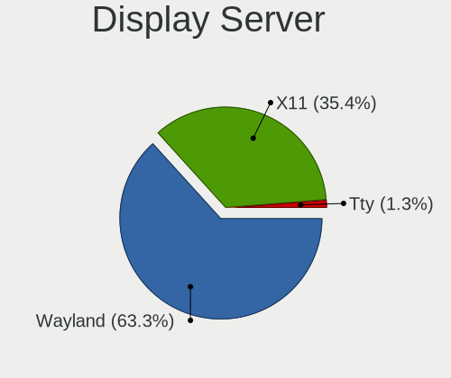

Zorin Hardware Trends (Desktop)
-------------------------------

A project to identify most popular hardware characteristics and track their change
over time based on data collected by Zorin users at https://Linux-Hardware.org.

Anyone can contribute to the study by uploading probes of their computers by
the [hw-probe](https://github.com/linuxhw/hw-probe) tool:

    sudo -E hw-probe -all -upload

Full-feature report is available here: https://linux-hardware.org/?view=trends&formfactor=desktop

Period: May, 2020.

Contents
--------

- [ OS                       ](#os)
- [ OS Family                ](#os-family)
- [ Kernel                   ](#kernel)
- [ Kernel Family            ](#kernel-family)
- [ Kernel Major Ver.        ](#kernel-major-ver)
- [ Arch                     ](#arch)
- [ DE                       ](#de)
- [ Display Server           ](#display-server)
- [ Display Manager          ](#display-manager)
- [ OS Lang                  ](#os-lang)
- [ Boot Mode                ](#boot-mode)
- [ Filesystem               ](#filesystem)
- [ Part. scheme             ](#part-scheme)
- [ Dual Boot with Linux/BSD ](#dual-boot-with-linux/bsd)
- [ Dual Boot (Win)          ](#dual-boot-win)
- [ Country                  ](#country)
- [ City                     ](#city)
- [ Vendor                   ](#vendor)
- [ Model                    ](#model)
- [ Model Family             ](#model-family)
- [ MFG Year                 ](#mfg-year)
- [ Form Factor              ](#form-factor)
- [ Secure Boot              ](#secure-boot)
- [ Coreboot                 ](#coreboot)
- [ RAM Size                 ](#ram-size)
- [ RAM Used                 ](#ram-used)
- [ Drive Vendor             ](#drive-vendor)
- [ Drive Model              ](#drive-model)
- [ Drive Kind               ](#drive-kind)
- [ Drive Connector          ](#drive-connector)
- [ Drive Size               ](#drive-size)
- [ Space Total              ](#space-total)
- [ Space Used               ](#space-used)
- [ Malfunc. Drives          ](#malfunc-drives)
- [ Malfunc. Drive Vendor    ](#malfunc-drive-vendor)
- [ Malfunc. Drive Kind      ](#malfunc-drive-kind)
- [ Failed Drives            ](#failed-drives)
- [ Failed Drive Vendor      ](#failed-drive-vendor)
- [ Drive Status             ](#drive-status)
- [ Storage Vendor           ](#storage-vendor)
- [ Storage Model            ](#storage-model)
- [ Storage Kind             ](#storage-kind)
- [ CPU Vendor               ](#cpu-vendor)
- [ CPU Model                ](#cpu-model)
- [ CPU Model Family         ](#cpu-model-family)
- [ CPU Cores                ](#cpu-cores)
- [ CPU Sockets              ](#cpu-sockets)
- [ CPU Threads              ](#cpu-threads)
- [ CPU Op-Modes             ](#cpu-op-modes)
- [ CPU Microcode            ](#cpu-microcode)
- [ CPU Microarch            ](#cpu-microarch)
- [ GPU Vendor               ](#gpu-vendor)
- [ GPU Model                ](#gpu-model)
- [ GPU Combo                ](#gpu-combo)
- [ GPU Driver               ](#gpu-driver)
- [ GPU Memory               ](#gpu-memory)
- [ Monitor Vendor           ](#monitor-vendor)
- [ Monitor Model            ](#monitor-model)
- [ Monitor Resolution       ](#monitor-resolution)
- [ Monitor Diagonal         ](#monitor-diagonal)
- [ Monitor Width            ](#monitor-width)
- [ Aspect Ratio             ](#aspect-ratio)
- [ Monitor Area             ](#monitor-area)
- [ Pixel Density            ](#pixel-density)
- [ Multiple Monitors        ](#multiple-monitors)
- [ Net Controller Vendor    ](#net-controller-vendor)
- [ Net Controller Model     ](#net-controller-model)
- [ Net Controller Kind      ](#net-controller-kind)
- [ Used Controller          ](#used-controller)
- [ NICs                     ](#nics)
- [ Unsupported Devices      ](#unsupported-devices)
- [ Unsupported Device Types ](#unsupported-device-types)

OS
--

Installed operating systems

| Name     | Computers | Percent |
|----------|-----------|---------|
| Zorin 15 | 31        | 93.94%  |
| Zorin 12 | 2         | 6.06%   |

OS Family
---------

OS without a version

| Name  | Computers | Percent |
|-------|-----------|---------|
| Zorin | 33        | 100%    |

Kernel
------

Version of the Linux kernel

| Version            | Computers | Percent |
|--------------------|-----------|---------|
| 5.3.0-51-generic   | 15        | 45.45%  |
| 5.3.0-53-generic   | 8         | 24.24%  |
| 5.3.0-40-generic   | 3         | 9.09%   |
| 5.0.0-37-generic   | 2         | 6.06%   |
| 5.3.0-46-generic   | 1         | 3.03%   |
| 5.3.0-45-generic   | 1         | 3.03%   |
| 4.18.0-21-generic  | 1         | 3.03%   |
| 4.15.0-99-generic  | 1         | 3.03%   |
| 4.15.0-101-generic | 1         | 3.03%   |

Kernel Family
-------------

Linux kernel without a distro release

| Version | Computers | Percent |
|---------|-----------|---------|
| 5.3.0   | 28        | 84.85%  |
| 5.0.0   | 2         | 6.06%   |
| 4.15.0  | 2         | 6.06%   |
| 4.18.0  | 1         | 3.03%   |

Kernel Major Ver.
-----------------

Linux kernel major version

| Version | Computers | Percent |
|---------|-----------|---------|
| 5.3     | 28        | 84.85%  |
| 5.0     | 2         | 6.06%   |
| 4.15    | 2         | 6.06%   |
| 4.18    | 1         | 3.03%   |

Arch
----

OS architecture (x86_64, i586, etc.)

| Name   | Computers | Percent |
|--------|-----------|---------|
| x86_64 | 27        | 81.82%  |
| i686   | 6         | 18.18%  |

DE
--

Desktop Environment

| Name  | Computers | Percent |
|-------|-----------|---------|
| GNOME | 21        | 63.64%  |
| XFCE  | 12        | 36.36%  |

Display Server
--------------

X11 or Wayland

| Name | Computers | Percent |
|------|-----------|---------|
| X11  | 33        | 100%    |

Display Manager
---------------

SDDM, LightDM, etc.

| Name    | Computers | Percent |
|---------|-----------|---------|
| Unknown | 33        | 100%    |

OS Lang
-------

Language

| Lang  | Computers | Percent |
|-------|-----------|---------|
| en_US | 10        | 30.3%   |
| pt_BR | 3         | 9.09%   |
| en_IN | 3         | 9.09%   |
| en_GB | 2         | 6.06%   |
| en_CA | 2         | 6.06%   |
| ru_RU | 1         | 3.03%   |
| pt_PT | 1         | 3.03%   |
| he_IL | 1         | 3.03%   |
| fr_FR | 1         | 3.03%   |
| fr_CH | 1         | 3.03%   |
| es_UY | 1         | 3.03%   |
| es_PE | 1         | 3.03%   |
| es_NI | 1         | 3.03%   |
| es_MX | 1         | 3.03%   |
| en_ZA | 1         | 3.03%   |
| en_AU | 1         | 3.03%   |
| de_DE | 1         | 3.03%   |
| C     | 1         | 3.03%   |

Boot Mode
---------

EFI or BIOS

| Mode | Computers | Percent |
|------|-----------|---------|
| BIOS | 27        | 81.82%  |
| EFI  | 6         | 18.18%  |

Filesystem
----------

Type of filesystem

| Type    | Computers | Percent |
|---------|-----------|---------|
| Ext4    | 31        | 93.94%  |
| Overlay | 1         | 3.03%   |
| Ext3    | 1         | 3.03%   |

Part. scheme
------------

Scheme of partitioning

| Type    | Computers | Percent |
|---------|-----------|---------|
| Unknown | 33        | 100%    |

Dual Boot with Linux/BSD
------------------------

Hosting more than one Linux/BSD

| Dual boot | Computers | Percent |
|-----------|-----------|---------|
| No        | 28        | 84.85%  |
| Yes       | 5         | 15.15%  |

Dual Boot (Win)
---------------

Hosting Linux and Windows

| Dual boot | Computers | Percent |
|-----------|-----------|---------|
| Yes       | 17        | 51.52%  |
| No        | 16        | 48.48%  |

Country
-------

Geographic location (country)

| Country      | Computers | Percent |
|--------------|-----------|---------|
| USA          | 7         | 21.21%  |
| India        | 3         | 9.09%   |
| Brazil       | 3         | 9.09%   |
| UK           | 2         | 6.06%   |
| Germany      | 2         | 6.06%   |
| Canada       | 2         | 6.06%   |
| Uruguay      | 1         | 3.03%   |
| Switzerland  | 1         | 3.03%   |
| Spain        | 1         | 3.03%   |
| South Africa | 1         | 3.03%   |
| Russia       | 1         | 3.03%   |
| Portugal     | 1         | 3.03%   |
| Peru         | 1         | 3.03%   |
| Pakistan     | 1         | 3.03%   |
| Nicaragua    | 1         | 3.03%   |
| Mexico       | 1         | 3.03%   |
| Israel       | 1         | 3.03%   |
| France       | 1         | 3.03%   |
| Australia    | 1         | 3.03%   |
| Argentina    | 1         | 3.03%   |

City
----

Geographic location (city)

| City             | Computers | Percent |
|------------------|-----------|---------|
| Toronto          | 2         | 6.06%   |
| São Paulo       | 2         | 6.06%   |
| Zurich           | 1         | 3.03%   |
| Vincentown       | 1         | 3.03%   |
| Trujillo         | 1         | 3.03%   |
| Stoke-on-Trent   | 1         | 3.03%   |
| Saint Charles    | 1         | 3.03%   |
| Praia da Vitoria | 1         | 3.03%   |
| Parker           | 1         | 3.03%   |
| Palakkad         | 1         | 3.03%   |
| Osasco           | 1         | 3.03%   |
| Neuss            | 1         | 3.03%   |
| Mumbai           | 1         | 3.03%   |
| Montevideo       | 1         | 3.03%   |
| Mequon           | 1         | 3.03%   |
| Mansfield        | 1         | 3.03%   |
| Managua          | 1         | 3.03%   |
| Madrid           | 1         | 3.03%   |
| Lyon             | 1         | 3.03%   |
| Longwood         | 1         | 3.03%   |
| Lahore           | 1         | 3.03%   |
| Johannesburg     | 1         | 3.03%   |
| Jerusalem        | 1         | 3.03%   |
| Jaipur           | 1         | 3.03%   |
| Ituzaingo        | 1         | 3.03%   |
| Ishimbay         | 1         | 3.03%   |
| Homburg          | 1         | 3.03%   |
| Guadalajara      | 1         | 3.03%   |
| Greeneville      | 1         | 3.03%   |
| Grapeland        | 1         | 3.03%   |
| Adelaide         | 1         | 3.03%   |

Vendor
------

Motherboard manufacturer

| Name                | Computers | Percent |
|---------------------|-----------|---------|
| Gigabyte Technology | 7         | 21.21%  |
| ASUSTek Computer    | 7         | 21.21%  |
| Dell                | 3         | 9.09%   |
| ASRock              | 3         | 9.09%   |
| MSI                 | 2         | 6.06%   |
| Intel               | 2         | 6.06%   |
| Hewlett-Packard     | 2         | 6.06%   |
| ECS                 | 2         | 6.06%   |
| soyocomputer        | 1         | 3.03%   |
| Pegatron            | 1         | 3.03%   |
| Lenovo              | 1         | 3.03%   |
| Foxconn             | 1         | 3.03%   |
| Acer                | 1         | 3.03%   |

Model
-----

Motherboard model

| Name                           | Computers | Percent |
|--------------------------------|-----------|---------|
| soyocomputer P4IPE             | 1         | 3.03%   |
| Pegatron G5329es               | 1         | 3.03%   |
| MSI MS-7721                    | 1         | 3.03%   |
| MSI EP043AA-UUZ a1315.ch       | 1         | 3.03%   |
| Lenovo ThinkCentre M57 6072W2A | 1         | 3.03%   |
| Intel SBC-FITPC2               | 1         | 3.03%   |
| Intel QC6003                   | 1         | 3.03%   |
| HP Z600 Workstation            | 1         | 3.03%   |
| HP ProDesk 600 G1 SFF          | 1         | 3.03%   |
| Gigabyte Z68MA-D2H-B3          | 1         | 3.03%   |
| Gigabyte H61M-S1               | 1         | 3.03%   |
| Gigabyte GA-MA78G-DS3H         | 1         | 3.03%   |
| Gigabyte GA-78LMT-USB3 6.0     | 1         | 3.03%   |
| Gigabyte GA-78LMT-S2PT         | 1         | 3.03%   |
| Gigabyte B75MS                 | 1         | 3.03%   |
| Gigabyte 970A-DS3P             | 1         | 3.03%   |
| Foxconn SG3-360FR              | 1         | 3.03%   |
| ECS G41T-M                     | 1         | 3.03%   |
| ECS A740GM-M                   | 1         | 3.03%   |
| Dell Studio XPS 9100           | 1         | 3.03%   |
| Dell OptiPlex 7010             | 1         | 3.03%   |
| Dell DM051                     | 1         | 3.03%   |
| ASUS PRIME B250M-A             | 1         | 3.03%   |
| ASUS P5VD2-MX                  | 1         | 3.03%   |
| ASUS P5QL/EPU                  | 1         | 3.03%   |
| ASUS P5KPL-CM                  | 1         | 3.03%   |
| ASUS P5GC-MX/1333              | 1         | 3.03%   |
| ASUS F2A85-M PRO               | 1         | 3.03%   |
| ASUS A55BM-E                   | 1         | 3.03%   |
| ASRock N68C-S UCC              | 1         | 3.03%   |
| ASRock A320M-HDV R4.0          | 1         | 3.03%   |
| ASRock 960GC-GS FX             | 1         | 3.03%   |
| Acer Veriton M464              | 1         | 3.03%   |

Model Family
------------

Motherboard model prefix

| Name                   | Computers | Percent |
|------------------------|-----------|---------|
| soyocomputer P4IPE     | 1         | 3.03%   |
| Pegatron G5329es       | 1         | 3.03%   |
| MSI MS-7721            | 1         | 3.03%   |
| MSI EP043AA-UUZ        | 1         | 3.03%   |
| Lenovo ThinkCentre     | 1         | 3.03%   |
| Intel SBC-FITPC2       | 1         | 3.03%   |
| Intel QC6003           | 1         | 3.03%   |
| HP Z600                | 1         | 3.03%   |
| HP ProDesk             | 1         | 3.03%   |
| Gigabyte Z68MA-D2H-B3  | 1         | 3.03%   |
| Gigabyte H61M-S1       | 1         | 3.03%   |
| Gigabyte GA-MA78G-DS3H | 1         | 3.03%   |
| Gigabyte GA-78LMT-USB3 | 1         | 3.03%   |
| Gigabyte GA-78LMT-S2PT | 1         | 3.03%   |
| Gigabyte B75MS         | 1         | 3.03%   |
| Gigabyte 970A-DS3P     | 1         | 3.03%   |
| Foxconn SG3-360FR      | 1         | 3.03%   |
| ECS G41T-M             | 1         | 3.03%   |
| ECS A740GM-M           | 1         | 3.03%   |
| Dell Studio            | 1         | 3.03%   |
| Dell OptiPlex          | 1         | 3.03%   |
| Dell DM051             | 1         | 3.03%   |
| ASUS PRIME             | 1         | 3.03%   |
| ASUS P5VD2-MX          | 1         | 3.03%   |
| ASUS P5QL              | 1         | 3.03%   |
| ASUS P5KPL-CM          | 1         | 3.03%   |
| ASUS P5GC-MX           | 1         | 3.03%   |
| ASUS F2A85-M           | 1         | 3.03%   |
| ASUS A55BM-E           | 1         | 3.03%   |
| ASRock N68C-S          | 1         | 3.03%   |
| ASRock A320M-HDV       | 1         | 3.03%   |
| ASRock 960GC-GS        | 1         | 3.03%   |
| Acer Veriton           | 1         | 3.03%   |

MFG Year
--------

Motherboard manufacture year

| Year | Computers | Percent |
|------|-----------|---------|
| 2010 | 4         | 12.12%  |
| 2009 | 4         | 12.12%  |
| 2011 | 3         | 9.09%   |
| 2008 | 3         | 9.09%   |
| 2018 | 2         | 6.06%   |
| 2017 | 2         | 6.06%   |
| 2016 | 2         | 6.06%   |
| 2014 | 2         | 6.06%   |
| 2013 | 2         | 6.06%   |
| 2012 | 2         | 6.06%   |
| 2007 | 2         | 6.06%   |
| 2019 | 1         | 3.03%   |
| 2015 | 1         | 3.03%   |
| 2006 | 1         | 3.03%   |
| 2005 | 1         | 3.03%   |
| 2004 | 1         | 3.03%   |

Form Factor
-----------

Physical design of the computer

| Name    | Computers | Percent |
|---------|-----------|---------|
| Desktop | 33        | 100%    |

Secure Boot
-----------

Enabled or disabled

| State    | Computers | Percent |
|----------|-----------|---------|
| Disabled | 33        | 100%    |

Coreboot
--------

Have coreboot on board

| Used | Computers | Percent |
|------|-----------|---------|
| No   | 33        | 100%    |

RAM Size
--------

Total RAM memory

| Size in GB | Computers | Percent |
|------------|-----------|---------|
| 3.01-4.0   | 11        | 33.33%  |
| 4.01-8.0   | 9         | 27.27%  |
| 8.01-16.0  | 4         | 12.12%  |
| 2.01-3.0   | 2         | 6.06%   |
| 16.01-24.0 | 2         | 6.06%   |
| 1.01-2.0   | 2         | 6.06%   |
| 0.01-1.0   | 2         | 6.06%   |
| 32.01-64.0 | 1         | 3.03%   |

RAM Used
--------

Used RAM memory

| Used GB  | Computers | Percent |
|----------|-----------|---------|
| 1.01-2.0 | 16        | 48.48%  |
| 0.01-1.0 | 8         | 24.24%  |
| 2.01-3.0 | 5         | 15.15%  |
| 4.01-8.0 | 2         | 6.06%   |
| 3.01-4.0 | 2         | 6.06%   |

Drive Vendor
------------

Hard drive vendors

| Vendor              | Computers | Drives | Percent |
|---------------------|-----------|--------|---------|
| WDC                 | 13        | 14     | 29.55%  |
| Seagate             | 11        | 11     | 25%     |
| Samsung Electronics | 5         | 5      | 11.36%  |
| Kingston            | 3         | 3      | 6.82%   |
| Hitachi             | 3         | 3      | 6.82%   |
| Toshiba             | 2         | 2      | 4.55%   |
| Unknown             | 1         | 1      | 2.27%   |
| SanDisk             | 1         | 1      | 2.27%   |
| Patriot             | 1         | 1      | 2.27%   |
| OCZ                 | 1         | 1      | 2.27%   |
| MAXTOR              | 1         | 1      | 2.27%   |
| Intel               | 1         | 1      | 2.27%   |
| Corsair             | 1         | 1      | 2.27%   |

Drive Model
-----------

Hard drive models

| Model                        | Computers | Percent |
|------------------------------|-----------|---------|
| SA400S37240G 240GB SSD       | 2         | 4.44%   |
| WDS240G2G0A-00JH30 240GB SSD | 1         | 2.22%   |
| WD800JD-60LUA0 80GB          | 1         | 2.22%   |
| WD6400AAKS-00A7B0 640GB      | 1         | 2.22%   |
| WD5000LPVX-80V0TT0 500GB     | 1         | 2.22%   |
| WD5000AVVS-63ZWB0 500GB      | 1         | 2.22%   |
| WD5000AAKX-00ERMA0 500GB     | 1         | 2.22%   |
| WD5000AAKS-00D2B0 500GB      | 1         | 2.22%   |
| WD3200AAJS-60Z0A0 320GB      | 1         | 2.22%   |
| WD2500JB-00REA0 250GB        | 1         | 2.22%   |
| WD2500AAJS-00VTA0 250GB      | 1         | 2.22%   |
| WD2002FAEX-007BA0 2TB        | 1         | 2.22%   |
| WD15EARS-00MVWB0 1TB         | 1         | 2.22%   |
| WD10EZRX-00A3KB0 1TB         | 1         | 2.22%   |
| WD10EARX-00N0YB0 1TB         | 1         | 2.22%   |
| TRION150 240GB SSD           | 1         | 2.22%   |
| SV4012H 40GB                 | 1         | 2.22%   |
| STM3160815AS 160GB           | 1         | 2.22%   |
| ST500DM002-1BD142 500GB      | 1         | 2.22%   |
| ST3750630AS 752GB            | 1         | 2.22%   |
| ST3500630AS 500GB            | 1         | 2.22%   |
| ST3500312CS 500GB            | 1         | 2.22%   |
| ST3160212SCE 160GB           | 1         | 2.22%   |
| ST31500341AS 1TB             | 1         | 2.22%   |
| ST31000528AS 1TB             | 1         | 2.22%   |
| ST31000520AS 1TB             | 1         | 2.22%   |
| ST2000DM006-2DM164 2TB       | 1         | 2.22%   |
| ST1000DM003-1ER162 1TB       | 1         | 2.22%   |
| SSDSA2CW160G3 160GB          | 1         | 2.22%   |
| SSD PLUS 240GB               | 1         | 2.22%   |
| SSD 840 EVO 250GB            | 1         | 2.22%   |
| SP1604N 160GB                | 1         | 2.22%   |
| SA400S37480G 480GB SSD       | 1         | 2.22%   |
| OSSD512GBTSS2                | 1         | 2.22%   |
| HDWD120 2TB                  | 1         | 2.22%   |
| HDWD110 1TB                  | 1         | 2.22%   |
| HDT722525DLA380 250GB        | 1         | 2.22%   |
| HDS723020BLA642 2TB          | 1         | 2.22%   |
| HDS721032CLA362 320GB        | 1         | 2.22%   |
| HD503HI 500GB                | 1         | 2.22%   |
| HD502HI 500GB                | 1         | 2.22%   |
| Expansion Desk 2TB           | 1         | 2.22%   |
| CSSD-V32GB2                  | 1         | 2.22%   |
| Burst 240GB SSD              | 1         | 2.22%   |

Drive Kind
----------

HDD or SSD

| Kind | Computers | Drives | Percent |
|------|-----------|--------|---------|
| HDD  | 27        | 34     | 72.97%  |
| SSD  | 10        | 11     | 27.03%  |

Drive Connector
---------------

SATA, SAS, NVMe, etc.

| Type | Computers | Drives | Percent |
|------|-----------|--------|---------|
| SATA | 32        | 44     | 96.97%  |
| SAS  | 1         | 1      | 3.03%   |

Drive Size
----------

Size of hard drive

| Size in TB | Computers | Drives | Percent |
|------------|-----------|--------|---------|
| 0.01-0.5   | 23        | 29     | 62.16%  |
| 0.51-1.0   | 10        | 11     | 27.03%  |
| 1.01-2.0   | 4         | 5      | 10.81%  |

Space Total
-----------

Amount of disk space available on the file system

| Size in GB     | Computers | Percent |
|----------------|-----------|---------|
| 251-500        | 9         | 27.27%  |
| 101-250        | 8         | 24.24%  |
| 501-1000       | 4         | 12.12%  |
| 21-50          | 3         | 9.09%   |
| 51-100         | 3         | 9.09%   |
| 2001-3000      | 2         | 6.06%   |
| 1-20           | 2         | 6.06%   |
| More than 3000 | 1         | 3.03%   |
| 1001-2000      | 1         | 3.03%   |

Space Used
----------

Amount of used disk space

| Used GB   | Computers | Percent |
|-----------|-----------|---------|
| 1-20      | 18        | 54.55%  |
| 21-50     | 7         | 21.21%  |
| 101-250   | 3         | 9.09%   |
| 1001-2000 | 2         | 6.06%   |
| 51-100    | 2         | 6.06%   |
| 2001-3000 | 1         | 3.03%   |

Malfunc. Drives
---------------

Drive models with a malfunction

Zero info for selected period =(

Malfunc. Drive Vendor
---------------------

Vendors of faulty drives

Zero info for selected period =(

Malfunc. Drive Kind
-------------------

Kinds of faulty drives

Zero info for selected period =(

Failed Drives
-------------

Failed drive models

Zero info for selected period =(

Failed Drive Vendor
-------------------

Failed drive vendors

Zero info for selected period =(

Drive Status
------------

Number of failed and malfunc. drives

| Status   | Computers | Drives | Percent |
|----------|-----------|--------|---------|
| Detected | 32        | 45     | 100%    |

Storage Vendor
--------------

Storage controller vendors

| Vendor              | Computers | Percent |
|---------------------|-----------|---------|
| Intel               | 17        | 45.95%  |
| AMD                 | 12        | 32.43%  |
| Nvidia              | 3         | 8.11%   |
| JMicron Technology  | 3         | 8.11%   |
| VIA Technologies    | 1         | 2.7%    |
| Samsung Electronics | 1         | 2.7%    |

Storage Model
-------------

Storage controller models

| Model                                                                             | Computers | Percent |
|-----------------------------------------------------------------------------------|-----------|---------|
| SB7x0/SB8x0/SB9x0 SATA Controller [IDE mode]                                      | 6         | 10%     |
| SB7x0/SB8x0/SB9x0 IDE Controller                                                  | 6         | 10%     |
| NM10/ICH7 Family SATA Controller [IDE mode]                                       | 4         | 6.67%   |
| FCH SATA Controller [AHCI mode]                                                   | 4         | 6.67%   |
| 82801G (ICH7 Family) IDE Controller                                               | 4         | 6.67%   |
| MCP61 SATA Controller                                                             | 2         | 3.33%   |
| 82801JI (ICH10 Family) 4 port SATA IDE Controller #1                              | 2         | 3.33%   |
| 82801JI (ICH10 Family) 2 port SATA IDE Controller #2                              | 2         | 3.33%   |
| 6 Series/C200 Series Chipset Family Desktop SATA Controller (IDE mode, ports 4-5) | 2         | 3.33%   |
| 6 Series/C200 Series Chipset Family Desktop SATA Controller (IDE mode, ports 0-3) | 2         | 3.33%   |
| VT82C586A/B/VT82C686/A/B/VT823x/A/C PIPC Bus Master IDE                           | 1         | 1.67%   |
| VT8237A SATA 2-Port Controller                                                    | 1         | 1.67%   |
| US15W/US15X/US15L/UL11L SCH [Poulsbo] IDE Controller                              | 1         | 1.67%   |
| SB7x0/SB8x0/SB9x0 SATA Controller [AHCI mode]                                     | 1         | 1.67%   |
| SATA Controller [RAID mode]                                                       | 1         | 1.67%   |
| NVMe SSD Controller SM981/PM981/PM983                                             | 1         | 1.67%   |
| MCP73 SATA Controller (IDE mode)                                                  | 1         | 1.67%   |
| MCP73 IDE Controller                                                              | 1         | 1.67%   |
| MCP61 IDE                                                                         | 1         | 1.67%   |
| JMB368 IDE controller                                                             | 1         | 1.67%   |
| JMB363 SATA/IDE Controller                                                        | 1         | 1.67%   |
| JMB360 AHCI Controller                                                            | 1         | 1.67%   |
| IXP SB4x0 Serial ATA Controller                                                   | 1         | 1.67%   |
| IXP SB4x0 IDE Controller                                                          | 1         | 1.67%   |
| FCH SATA Controller D                                                             | 1         | 1.67%   |
| 82801JI (ICH10 Family) SATA AHCI Controller                                       | 1         | 1.67%   |
| 82801IR/IO/IH (ICH9R/DO/DH) 4 port SATA Controller [IDE mode]                     | 1         | 1.67%   |
| 82801I (ICH9 Family) 2 port SATA Controller [IDE mode]                            | 1         | 1.67%   |
| 82801EB/ER (ICH5/ICH5R) IDE Controller                                            | 1         | 1.67%   |
| 82801EB (ICH5) SATA Controller                                                    | 1         | 1.67%   |
| 8 Series/C220 Series Chipset Family 6-port SATA Controller 1 [AHCI mode]          | 1         | 1.67%   |
| 7 Series/C210 Series Chipset Family 6-port SATA Controller [AHCI mode]            | 1         | 1.67%   |
| 7 Series/C210 Series Chipset Family 4-port SATA Controller [IDE mode]             | 1         | 1.67%   |
| 7 Series/C210 Series Chipset Family 2-port SATA Controller [IDE mode]             | 1         | 1.67%   |
| 4 Series Chipset PT IDER Controller                                               | 1         | 1.67%   |
| 200 Series PCH SATA controller [AHCI mode]                                        | 1         | 1.67%   |

Storage Kind
------------

Kind of storage controller (IDE, SATA, NVMe, SAS, ...)

| Kind | Computers | Percent |
|------|-----------|---------|
| IDE  | 23        | 57.5%   |
| SATA | 15        | 37.5%   |
| RAID | 1         | 2.5%    |
| NVMe | 1         | 2.5%    |

CPU Vendor
----------

Processor vendors

| Vendor | Computers | Percent |
|--------|-----------|---------|
| Intel  | 19        | 57.58%  |
| AMD    | 14        | 42.42%  |

CPU Model
---------

Processor models

| Model                                        | Computers | Percent |
|----------------------------------------------|-----------|---------|
| Intel Core 2 Duo CPU E7500 @ 2.93GHz         | 2         | 6.06%   |
| AMD A8-5600K APU with Radeon HD Graphics     | 2         | 6.06%   |
| Intel Xeon CPU E5520 @ 2.27GHz               | 1         | 3.03%   |
| Intel Pentium Dual CPU E2220 @ 2.40GHz       | 1         | 3.03%   |
| Intel Pentium Dual CPU E2200 @ 2.20GHz       | 1         | 3.03%   |
| Intel Pentium D CPU 3.00GHz                  | 1         | 3.03%   |
| Intel Pentium D CPU 2.80GHz                  | 1         | 3.03%   |
| Intel Pentium 4 CPU 3.00GHz                  | 1         | 3.03%   |
| Intel Core i7-4790 CPU @ 3.60GHz             | 1         | 3.03%   |
| Intel Core i7-2600 CPU @ 3.40GHz             | 1         | 3.03%   |
| Intel Core i7 CPU 930 @ 2.80GHz              | 1         | 3.03%   |
| Intel Core i5-7600K CPU @ 3.80GHz            | 1         | 3.03%   |
| Intel Core i3-3240 CPU @ 3.40GHz             | 1         | 3.03%   |
| Intel Core i3-2100 CPU @ 3.10GHz             | 1         | 3.03%   |
| Intel Core 2 Quad CPU Q8200 @ 2.33GHz        | 1         | 3.03%   |
| Intel Core 2 Duo CPU E4500 @ 2.20GHz         | 1         | 3.03%   |
| Intel Core 2 CPU 6300 @ 1.86GHz              | 1         | 3.03%   |
| Intel Celeron CPU G550 @ 2.60GHz             | 1         | 3.03%   |
| Intel Atom CPU Z530 @ 1.60GHz                | 1         | 3.03%   |
| AMD Phenom II X4 945 Processor               | 1         | 3.03%   |
| AMD Phenom II X2 560 Processor               | 1         | 3.03%   |
| AMD Phenom 9650 Quad-Core Processor          | 1         | 3.03%   |
| AMD FX-8350 Eight-Core Processor             | 1         | 3.03%   |
| AMD FX-8320 Eight-Core Processor             | 1         | 3.03%   |
| AMD FX-4300 Quad-Core Processor              | 1         | 3.03%   |
| AMD Athlon II X2 250 Processor               | 1         | 3.03%   |
| AMD Athlon II X2 245 Processor               | 1         | 3.03%   |
| AMD Athlon 64 X2 Dual Core Processor 5200+   | 1         | 3.03%   |
| AMD Athlon 64 Processor 3400+                | 1         | 3.03%   |
| AMD A6-9500 RADEON R5, 8 COMPUTE CORES 2C+6G | 1         | 3.03%   |
| AMD A4-4000 APU with Radeon HD Graphics      | 1         | 3.03%   |

CPU Model Family
----------------

Processor model prefix

| Model              | Computers | Percent |
|--------------------|-----------|---------|
| Intel Core i7      | 3         | 9.09%   |
| Intel Core 2 Duo   | 3         | 9.09%   |
| AMD FX             | 3         | 9.09%   |
| Intel Pentium Dual | 2         | 6.06%   |
| Intel Pentium D    | 2         | 6.06%   |
| Intel Core i3      | 2         | 6.06%   |
| AMD Athlon II X2   | 2         | 6.06%   |
| AMD A8             | 2         | 6.06%   |
| Intel Xeon         | 1         | 3.03%   |
| Intel Pentium 4    | 1         | 3.03%   |
| Intel Core i5      | 1         | 3.03%   |
| Intel Core 2 Quad  | 1         | 3.03%   |
| Intel Core 2       | 1         | 3.03%   |
| Intel Celeron      | 1         | 3.03%   |
| Intel Atom         | 1         | 3.03%   |
| AMD Phenom II X4   | 1         | 3.03%   |
| AMD Phenom II X2   | 1         | 3.03%   |
| AMD Phenom         | 1         | 3.03%   |
| AMD Athlon 64 X2   | 1         | 3.03%   |
| AMD Athlon 64      | 1         | 3.03%   |
| AMD A6             | 1         | 3.03%   |
| AMD A4             | 1         | 3.03%   |

CPU Cores
---------

Number of processor cores

| Number | Computers | Percent |
|--------|-----------|---------|
| 2      | 18        | 54.55%  |
| 4      | 10        | 30.3%   |
| 1      | 5         | 15.15%  |

CPU Sockets
-----------

Number of sockets

| Number | Computers | Percent |
|--------|-----------|---------|
| 1      | 33        | 100%    |

CPU Threads
-----------

Threads per core (Hyper-Threading)

| Number | Computers | Percent |
|--------|-----------|---------|
| 1      | 19        | 57.58%  |
| 2      | 14        | 42.42%  |

CPU Op-Modes
------------

CPU Operation Modes (32-bit, 64-bit)

| Op mode        | Computers | Percent |
|----------------|-----------|---------|
| 32-bit, 64-bit | 31        | 93.94%  |
| 32-bit         | 2         | 6.06%   |

CPU Microcode
-------------

Microcode number

| Number     | Computers | Percent |
|------------|-----------|---------|
| 0x010000c8 | 4         | 12.12%  |
| 0x6fd      | 3         | 9.09%   |
| 0x206a7    | 3         | 9.09%   |
| 0x06001119 | 3         | 9.09%   |
| 0x06000852 | 3         | 9.09%   |
| Unknown    | 3         | 9.09%   |
| 0x1067a    | 2         | 6.06%   |
| 0xf65      | 1         | 3.03%   |
| 0xf47      | 1         | 3.03%   |
| 0xf41      | 1         | 3.03%   |
| 0x906e9    | 1         | 3.03%   |
| 0x6f6      | 1         | 3.03%   |
| 0x306c3    | 1         | 3.03%   |
| 0x306a9    | 1         | 3.03%   |
| 0x106c2    | 1         | 3.03%   |
| 0x106a5    | 1         | 3.03%   |
| 0x10677    | 1         | 3.03%   |
| 0x0600611a | 1         | 3.03%   |
| 0x01000095 | 1         | 3.03%   |

CPU Microarch
-------------

Microarchitecture

| Name        | Computers | Percent |
|-------------|-----------|---------|
| Core        | 7         | 21.21%  |
| Piledriver  | 6         | 18.18%  |
| K10         | 5         | 15.15%  |
| SandyBridge | 3         | 9.09%   |
| NetBurst    | 3         | 9.09%   |
| Nehalem     | 2         | 6.06%   |
| K8 Hammer   | 2         | 6.06%   |
| Skylake     | 1         | 3.03%   |
| IvyBridge   | 1         | 3.03%   |
| Haswell     | 1         | 3.03%   |
| Excavator   | 1         | 3.03%   |
| Bonnell     | 1         | 3.03%   |

GPU Vendor
----------

Vendors of graphics cards

| Vendor | Computers | Percent |
|--------|-----------|---------|
| Nvidia | 15        | 42.86%  |
| AMD    | 13        | 37.14%  |
| Intel  | 7         | 20%     |

GPU Model
---------

Graphics card models

| Model                                                                 | Computers | Percent |
|-----------------------------------------------------------------------|-----------|---------|
| RS780L [Radeon 3000]                                                  | 3         | 8.33%   |
| GT218 [GeForce 8400 GS Rev. 3]                                        | 3         | 8.33%   |
| Trinity [Radeon HD 7560D]                                             | 2         | 5.56%   |
| GK208B [GeForce GT 710]                                               | 2         | 5.56%   |
| Xeon E3-1200 v3/4th Gen Core Processor Integrated Graphics Controller | 1         | 2.78%   |
| Wani [Radeon R5/R6/R7 Graphics]                                       | 1         | 2.78%   |
| US15W/US15X SCH [Poulsbo] Graphics Controller                         | 1         | 2.78%   |
| Trinity 2 [Radeon HD 7480D]                                           | 1         | 2.78%   |
| RV730 PRO [Radeon HD 4650]                                            | 1         | 2.78%   |
| RV380 [Radeon X300/X550/X1050 Series] (Secondary)                     | 1         | 2.78%   |
| RV370 [Radeon X600/X600 SE]                                           | 1         | 2.78%   |
| RS740 [Radeon 2100]                                                   | 1         | 2.78%   |
| Rage 128 PRO Ultra AGP 4x                                             | 1         | 2.78%   |
| NV44 [GeForce 6200 SE TurboCache]                                     | 1         | 2.78%   |
| NV43 [GeForce 6600 GT]                                                | 1         | 2.78%   |
| Juniper XT [Radeon HD 5770]                                           | 1         | 2.78%   |
| HD Graphics 630                                                       | 1         | 2.78%   |
| GM107 [GeForce GTX 750 Ti]                                            | 1         | 2.78%   |
| GK208B [GeForce GT 720]                                               | 1         | 2.78%   |
| GK106 [GeForce GTX 660]                                               | 1         | 2.78%   |
| GF119 [GeForce GT 610]                                                | 1         | 2.78%   |
| GF114 [GeForce GTX 560 Ti]                                            | 1         | 2.78%   |
| G96CGL [Quadro FX 580]                                                | 1         | 2.78%   |
| G84 [GeForce 8600 GT]                                                 | 1         | 2.78%   |
| Cedar [Radeon HD 5000/6000/7350/8350 Series]                          | 1         | 2.78%   |
| C73 [GeForce 7050 / nForce 630i]                                      | 1         | 2.78%   |
| 82Q35 Express Integrated Graphics Controller                          | 1         | 2.78%   |
| 82G33/G31 Express Integrated Graphics Controller                      | 1         | 2.78%   |
| 4 Series Chipset Integrated Graphics Controller                       | 1         | 2.78%   |
| 2nd Generation Core Processor Family Integrated Graphics Controller   | 1         | 2.78%   |

GPU Combo
---------

Combinations of graphics cards

| Name         | Computers | Percent |
|--------------|-----------|---------|
| 1 x Nvidia   | 13        | 39.39%  |
| 1 x AMD      | 11        | 33.33%  |
| 1 x Intel    | 7         | 21.21%  |
| 2 x AMD      | 1         | 3.03%   |
| AMD + Nvidia | 1         | 3.03%   |

GPU Driver
----------

Free vs proprietary

| Driver      | Computers | Percent |
|-------------|-----------|---------|
| Free        | 22        | 66.67%  |
| Proprietary | 7         | 21.21%  |
| Unknown     | 4         | 12.12%  |

GPU Memory
----------

Total video memory

| Size in GB | Computers | Percent |
|------------|-----------|---------|
| Unknown    | 11        | 33.33%  |
| 0.01-0.5   | 10        | 30.3%   |
| 0.51-1.0   | 6         | 18.18%  |
| 1.01-2.0   | 5         | 15.15%  |
| 3.01-4.0   | 1         | 3.03%   |

Monitor Vendor
--------------

Monitor vendors

| Vendor               | Computers | Percent |
|----------------------|-----------|---------|
| Samsung Electronics  | 4         | 14.29%  |
| Goldstar             | 3         | 10.71%  |
| Ancor Communications | 3         | 10.71%  |
| ViewSonic            | 2         | 7.14%   |
| Hewlett-Packard      | 2         | 7.14%   |
| Dell                 | 2         | 7.14%   |
| BenQ                 | 2         | 7.14%   |
| AOC                  | 2         | 7.14%   |
| VIZ                  | 1         | 3.57%   |
| Vita                 | 1         | 3.57%   |
| Unknown              | 1         | 3.57%   |
| PRI                  | 1         | 3.57%   |
| Philips              | 1         | 3.57%   |
| Medion               | 1         | 3.57%   |
| CVT                  | 1         | 3.57%   |
| Acer                 | 1         | 3.57%   |

Monitor Model
-------------

Monitor models

| Model                                              | Computers | Percent |
|----------------------------------------------------|-----------|---------|
| X193HQ ACR0064 1366x768 344x194mm 15.5-inch        | 1         | 3.57%   |
| W1942 GSM4B70 1440x900 408x255mm 18.9-inch         | 1         | 3.57%   |
| W1941 GSM4B91 1360x768 406x229mm 18.4-inch         | 1         | 3.57%   |
| VX248 ACI24C5 1920x1080 530x300mm 24.0-inch        | 1         | 3.57%   |
| VT988 VIT03DC 1280x1024 376x301mm 19.0-inch        | 1         | 3.57%   |
| vs19x HWP2658 1280x1024 376x301mm 19.0-inch        | 1         | 3.57%   |
| VA1913 series VSC1A22 1366x768 410x230mm 18.5-inch | 1         | 3.57%   |
| U2415 DELA0B9 1920x1080 518x324mm 24.1-inch        | 1         | 3.57%   |
| SA300/SA350 SAM0788 1366x768 410x230mm 18.5-inch   | 1         | 3.57%   |
| PD271F AOC2710 1920x1080 598x336mm 27.0-inch       | 1         | 3.57%   |
| MD30219PH MED09B9 1280x1024 376x301mm 19.0-inch    | 1         | 3.57%   |
| LCD Monitor VX2262wm 3600x1080                     | 1         | 3.57%   |
| LCD Monitor SyncMaster 1440x900                    | 1         | 3.57%   |
| LCD Monitor SMB2230 1920x1080                      | 1         | 3.57%   |
| LCD Monitor SAMSUNG 1920x1080                      | 1         | 3.57%   |
| LCD Monitor SA300/SA350 1366x768                   | 1         | 3.57%   |
| LCD Monitor EW2775ZH 1920x1080                     | 1         | 3.57%   |
| LCD Monitor E220VA                                 | 1         | 3.57%   |
| LCD Monitor E178FP 1280x1024                       | 1         | 3.57%   |
| LC-32HC36 PRI3218 1920x1080 700x390mm 31.5-inch    | 1         | 3.57%   |
| IPS FULLHD GSM5AB8 1920x1080 480x270mm 21.7-inch   | 1         | 3.57%   |
| FP222W BNQ76F2 1680x1050 376x301mm 19.0-inch       | 1         | 3.57%   |
| f2105 HWP2655 1680x1050 433x271mm 20.1-inch        | 1         | 3.57%   |
| CVTE TV CVT0003 1920x1080 575x323mm 26.0-inch      | 1         | 3.57%   |
| ASUS VS247 ACI249A 1920x1080 521x293mm 23.5-inch   | 1         | 3.57%   |
| ASUS VG278HE ACI27E3 1920x1080 598x336mm 27.0-inch | 1         | 3.57%   |
| 2243W AOC2243 1920x1080 477x268mm 21.5-inch        | 1         | 3.57%   |
| 190CW PHLC018 1440x900 408x255mm 18.9-inch         | 1         | 3.57%   |

Monitor Resolution
------------------

Monitor screen resolution

| Resolution         | Computers | Percent |
|--------------------|-----------|---------|
| 1920x1080 (FHD)    | 11        | 39.29%  |
| 1280x1024 (SXGA)   | 4         | 14.29%  |
| 1440x900 (WXGA+)   | 3         | 10.71%  |
| 1366x768 (WXGA)    | 3         | 10.71%  |
| 1680x1050 (WSXGA+) | 2         | 7.14%   |
| 1360x768           | 2         | 7.14%   |
| 3600x1080          | 1         | 3.57%   |
| 2560x1440 (QHD)    | 1         | 3.57%   |
| Unknown            | 1         | 3.57%   |

Monitor Diagonal
----------------

Diagonal size in inches

| Inches  | Computers | Percent |
|---------|-----------|---------|
| Unknown | 7         | 25.93%  |
| 18      | 5         | 18.52%  |
| 19      | 4         | 14.81%  |
| 27      | 2         | 7.41%   |
| 24      | 2         | 7.41%   |
| 21      | 2         | 7.41%   |
| 31      | 1         | 3.7%    |
| 26      | 1         | 3.7%    |
| 23      | 1         | 3.7%    |
| 20      | 1         | 3.7%    |
| 15      | 1         | 3.7%    |

Monitor Width
-------------

Physical width

| Width in mm | Computers | Percent |
|-------------|-----------|---------|
| 401-500     | 8         | 29.63%  |
| Unknown     | 7         | 25.93%  |
| 501-600     | 6         | 22.22%  |
| 351-400     | 4         | 14.81%  |
| 601-700     | 1         | 3.7%    |
| 301-350     | 1         | 3.7%    |

Aspect Ratio
------------

Proportional relationship between the width and the height

| Ratio   | Computers | Percent |
|---------|-----------|---------|
| 16/9    | 12        | 44.44%  |
| Unknown | 7         | 25.93%  |
| 5/4     | 4         | 14.81%  |
| 16/10   | 4         | 14.81%  |

Monitor Area
------------

Area in inch²

| Area in inch² | Computers | Percent |
|----------------|-----------|---------|
| 151-200        | 8         | 29.63%  |
| Unknown        | 7         | 25.93%  |
| 201-250        | 3         | 11.11%  |
| 141-150        | 3         | 11.11%  |
| 301-350        | 2         | 7.41%   |
| 251-300        | 2         | 7.41%   |
| 351-500        | 1         | 3.7%    |
| 101-110        | 1         | 3.7%    |

Pixel Density
-------------

Pixels per inch

| Density | Computers | Percent |
|---------|-----------|---------|
| 51-100  | 15        | 55.56%  |
| Unknown | 7         | 25.93%  |
| 101-120 | 5         | 18.52%  |

Multiple Monitors
-----------------

Total monitors connected

| Total | Computers | Percent |
|-------|-----------|---------|
| 1     | 31        | 93.94%  |
| 2     | 1         | 3.03%   |
| 0     | 1         | 3.03%   |

Net Controller Vendor
---------------------

Controller vendors

| Vendor                | Computers | Percent |
|-----------------------|-----------|---------|
| Intel                 | 4         | 50%     |
| Nvidia                | 2         | 25%     |
| VIA Technologies      | 1         | 12.5%   |
| Realtek Semiconductor | 1         | 12.5%   |

Net Controller Model
--------------------

Controller models

| Model                                           | Computers | Percent |
|-------------------------------------------------|-----------|---------|
| MCP61 Ethernet                                  | 2         | 25%     |
| VT6102/VT6103 [Rhine-II]                        | 1         | 12.5%   |
| RTL8187 Wireless Adapter                        | 1         | 12.5%   |
| NM10/ICH7 Family LAN Controller                 | 1         | 12.5%   |
| 82579LM Gigabit Network Connection (Lewisville) | 1         | 12.5%   |
| 82567LF-2 Gigabit Network Connection            | 1         | 12.5%   |
| 82566DM-2 Gigabit Network Connection            | 1         | 12.5%   |

Net Controller Kind
-------------------

Ethernet, WiFi or modem

| Kind     | Computers | Percent |
|----------|-----------|---------|
| Ethernet | 7         | 87.5%   |
| WiFi     | 1         | 12.5%   |

Used Controller
---------------

Currently used network controller

| Kind     | Computers | Percent |
|----------|-----------|---------|
| Ethernet | 3         | 75%     |
| WiFi     | 1         | 25%     |

NICs
----

Total network controllers on board

| Total | Computers | Percent |
|-------|-----------|---------|
| 1     | 29        | 87.88%  |
| 2     | 4         | 12.12%  |

Unsupported Devices
-------------------

Total unsupported devices on board

| Total | Computers | Percent |
|-------|-----------|---------|
| 0     | 26        | 78.79%  |
| 1     | 6         | 18.18%  |
| 2     | 1         | 3.03%   |

Unsupported Device Types
------------------------

Types of unsupported devices

| Type                     | Computers | Percent |
|--------------------------|-----------|---------|
| Graphics card            | 5         | 62.5%   |
| Net/wireless             | 1         | 12.5%   |
| Multimedia controller    | 1         | 12.5%   |
| Communication controller | 1         | 12.5%   |

