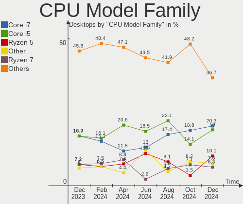
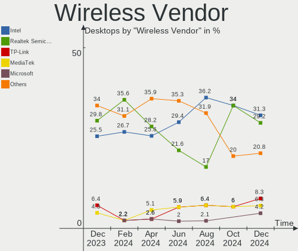
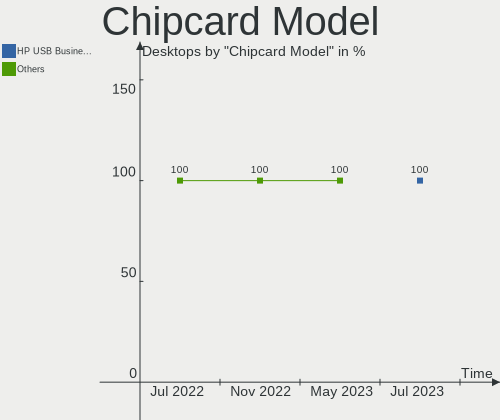

Zorin - Hardware Trends (Desktops)
----------------------------------

A project to identify most popular hardware characteristics and track their change
over time based on data collected by Linux users at https://Linux-Hardware.org.

Anyone can contribute to this report by the [hw-probe](https://github.com/linuxhw/hw-probe) tool:

    sudo -E hw-probe -all -upload

This report is for one last month. Overall report since the beginning of time: [TestDays](https://github.com/linuxhw/TestDays)

Period: Feb, 2023.

Contents
--------

* [ System ](#system)
  - [ OS                       ](#os)
  - [ OS Family                ](#os-family)
  - [ Kernel                   ](#kernel)
  - [ Kernel Family            ](#kernel-family)
  - [ Kernel Major Ver.        ](#kernel-major-ver)
  - [ Arch                     ](#arch)
  - [ DE                       ](#de)
  - [ Display Server           ](#display-server)
  - [ Display Manager          ](#display-manager)
  - [ OS Lang                  ](#os-lang)
  - [ Boot Mode                ](#boot-mode)
  - [ Filesystem               ](#filesystem)
  - [ Part. scheme             ](#part-scheme)
  - [ Dual Boot with Linux/BSD ](#dual-boot-with-linuxbsd)
  - [ Dual Boot (Win)          ](#dual-boot-win)

* [ Board ](#board)
  - [ Vendor                   ](#vendor)
  - [ Model                    ](#model)
  - [ Model Family             ](#model-family)
  - [ MFG Year                 ](#mfg-year)
  - [ Form Factor              ](#form-factor)
  - [ Secure Boot              ](#secure-boot)
  - [ Coreboot                 ](#coreboot)
  - [ RAM Size                 ](#ram-size)
  - [ RAM Used                 ](#ram-used)
  - [ Total Drives             ](#total-drives)
  - [ Has CD-ROM               ](#has-cd-rom)
  - [ Has Ethernet             ](#has-ethernet)
  - [ Has WiFi                 ](#has-wifi)
  - [ Has Bluetooth            ](#has-bluetooth)

* [ Location ](#location)
  - [ Country                  ](#country)
  - [ City                     ](#city)

* [ Drives ](#drives)
  - [ Drive Vendor             ](#drive-vendor)
  - [ Drive Model              ](#drive-model)
  - [ HDD Vendor               ](#hdd-vendor)
  - [ SSD Vendor               ](#ssd-vendor)
  - [ Drive Kind               ](#drive-kind)
  - [ Drive Connector          ](#drive-connector)
  - [ Drive Size               ](#drive-size)
  - [ Space Total              ](#space-total)
  - [ Space Used               ](#space-used)
  - [ Malfunc. Drives          ](#malfunc-drives)
  - [ Malfunc. Drive Vendor    ](#malfunc-drive-vendor)
  - [ Malfunc. HDD Vendor      ](#malfunc-hdd-vendor)
  - [ Malfunc. Drive Kind      ](#malfunc-drive-kind)
  - [ Failed Drives            ](#failed-drives)
  - [ Failed Drive Vendor      ](#failed-drive-vendor)
  - [ Drive Status             ](#drive-status)

* [ Storage controller ](#storage-controller)
  - [ Storage Vendor           ](#storage-vendor)
  - [ Storage Model            ](#storage-model)
  - [ Storage Kind             ](#storage-kind)

* [ Processor ](#processor)
  - [ CPU Vendor               ](#cpu-vendor)
  - [ CPU Model                ](#cpu-model)
  - [ CPU Model Family         ](#cpu-model-family)
  - [ CPU Cores                ](#cpu-cores)
  - [ CPU Sockets              ](#cpu-sockets)
  - [ CPU Threads              ](#cpu-threads)
  - [ CPU Op-Modes             ](#cpu-op-modes)
  - [ CPU Microcode            ](#cpu-microcode)
  - [ CPU Microarch            ](#cpu-microarch)

* [ Graphics ](#graphics)
  - [ GPU Vendor               ](#gpu-vendor)
  - [ GPU Model                ](#gpu-model)
  - [ GPU Combo                ](#gpu-combo)
  - [ GPU Driver               ](#gpu-driver)
  - [ GPU Memory               ](#gpu-memory)

* [ Monitor ](#monitor)
  - [ Monitor Vendor           ](#monitor-vendor)
  - [ Monitor Model            ](#monitor-model)
  - [ Monitor Resolution       ](#monitor-resolution)
  - [ Monitor Diagonal         ](#monitor-diagonal)
  - [ Monitor Width            ](#monitor-width)
  - [ Aspect Ratio             ](#aspect-ratio)
  - [ Monitor Area             ](#monitor-area)
  - [ Pixel Density            ](#pixel-density)
  - [ Multiple Monitors        ](#multiple-monitors)

* [ Network ](#network)
  - [ Net Controller Vendor    ](#net-controller-vendor)
  - [ Net Controller Model     ](#net-controller-model)
  - [ Wireless Vendor          ](#wireless-vendor)
  - [ Wireless Model           ](#wireless-model)
  - [ Ethernet Vendor          ](#ethernet-vendor)
  - [ Ethernet Model           ](#ethernet-model)
  - [ Net Controller Kind      ](#net-controller-kind)
  - [ Used Controller          ](#used-controller)
  - [ NICs                     ](#nics)
  - [ IPv6                     ](#ipv6)

* [ Bluetooth ](#bluetooth)
  - [ Bluetooth Vendor         ](#bluetooth-vendor)
  - [ Bluetooth Model          ](#bluetooth-model)

* [ Sound ](#sound)
  - [ Sound Vendor             ](#sound-vendor)
  - [ Sound Model              ](#sound-model)

* [ Memory ](#memory)
  - [ Memory Vendor            ](#memory-vendor)
  - [ Memory Model             ](#memory-model)
  - [ Memory Kind              ](#memory-kind)
  - [ Memory Form Factor       ](#memory-form-factor)
  - [ Memory Size              ](#memory-size)
  - [ Memory Speed             ](#memory-speed)

* [ Printers & scanners ](#printers--scanners)
  - [ Printer Vendor           ](#printer-vendor)
  - [ Printer Model            ](#printer-model)
  - [ Scanner Vendor           ](#scanner-vendor)
  - [ Scanner Model            ](#scanner-model)

* [ Camera ](#camera)
  - [ Camera Vendor            ](#camera-vendor)
  - [ Camera Model             ](#camera-model)

* [ Security ](#security)
  - [ Fingerprint Vendor       ](#fingerprint-vendor)
  - [ Fingerprint Model        ](#fingerprint-model)
  - [ Chipcard Vendor          ](#chipcard-vendor)
  - [ Chipcard Model           ](#chipcard-model)

* [ Unsupported ](#unsupported)
  - [ Unsupported Devices      ](#unsupported-devices)
  - [ Unsupported Device Types ](#unsupported-device-types)

System
------

OS
--

Installed operating systems

| Name     | Desktops | Percent |
|----------|----------|---------|
| Zorin 16 | 65       | 94.2%   |
| Zorin 15 | 4        | 5.8%    |

OS Family
---------

OS without a version

| Name  | Desktops | Percent |
|-------|----------|---------|
| Zorin | 69       | 100%    |

Kernel
------

Version of the Linux kernel

| Version           | Desktops | Percent |
|-------------------|----------|---------|
| 5.15.0-60-generic | 39       | 56.52%  |
| 5.15.0-58-generic | 22       | 31.88%  |
| 5.4.0-137-generic | 3        | 4.35%   |
| 5.15.0-56-generic | 2        | 2.9%    |
| 5.4.0-139-generic | 1        | 1.45%   |
| 5.15.0-57-generic | 1        | 1.45%   |
| 5.11.0-25-generic | 1        | 1.45%   |

Kernel Family
-------------

Linux kernel without a distro release

| Version | Desktops | Percent |
|---------|----------|---------|
| 5.15.0  | 64       | 92.75%  |
| 5.4.0   | 4        | 5.8%    |
| 5.11.0  | 1        | 1.45%   |

Kernel Major Ver.
-----------------

Linux kernel major version

| Version | Desktops | Percent |
|---------|----------|---------|
| 5.15    | 64       | 92.75%  |
| 5.4     | 4        | 5.8%    |
| 5.11    | 1        | 1.45%   |

Arch
----

OS architecture (x86_64, i586, etc.)

| Name   | Desktops | Percent |
|--------|----------|---------|
| x86_64 | 65       | 94.2%   |
| i686   | 4        | 5.8%    |

DE
--

Desktop Environment

| Name     | Desktops | Percent |
|----------|----------|---------|
| GNOME    | 56       | 81.16%  |
| XFCE     | 12       | 17.39%  |
| Cinnamon | 1        | 1.45%   |

Display Server
--------------

X11 or Wayland

| Name    | Desktops | Percent |
|---------|----------|---------|
| X11     | 68       | 98.55%  |
| Wayland | 1        | 1.45%   |

Display Manager
---------------

SDDM, LightDM, etc.

| Name    | Desktops | Percent |
|---------|----------|---------|
| Unknown | 52       | 75.36%  |
| GDM     | 7        | 10.14%  |
| LightDM | 6        | 8.7%    |
| GDM3    | 4        | 5.8%    |

OS Lang
-------

Language

| Lang  | Desktops | Percent |
|-------|----------|---------|
| en_US | 30       | 43.48%  |
| de_DE | 11       | 15.94%  |
| pt_BR | 4        | 5.8%    |
| en_GB | 3        | 4.35%   |
| pt_PT | 2        | 2.9%    |
| it_IT | 2        | 2.9%    |
| fr_FR | 2        | 2.9%    |
| en_CA | 2        | 2.9%    |
| zh_CN | 1        | 1.45%   |
| sv_SE | 1        | 1.45%   |
| ru_RU | 1        | 1.45%   |
| pl_PL | 1        | 1.45%   |
| nl_BE | 1        | 1.45%   |
| hu_HU | 1        | 1.45%   |
| fr_BE | 1        | 1.45%   |
| fi_FI | 1        | 1.45%   |
| es_MX | 1        | 1.45%   |
| es_ES | 1        | 1.45%   |
| en_PH | 1        | 1.45%   |
| en_NZ | 1        | 1.45%   |
| en_IN | 1        | 1.45%   |

Boot Mode
---------

EFI or BIOS

| Mode | Desktops | Percent |
|------|----------|---------|
| EFI  | 35       | 50.72%  |
| BIOS | 34       | 49.28%  |

Filesystem
----------

Type of filesystem

| Type  | Desktops | Percent |
|-------|----------|---------|
| Ext4  | 65       | 94.2%   |
| Xfs   | 2        | 2.9%    |
| Zfs   | 1        | 1.45%   |
| Btrfs | 1        | 1.45%   |

Part. scheme
------------

Scheme of partitioning

| Type    | Desktops | Percent |
|---------|----------|---------|
| Unknown | 56       | 81.16%  |
| GPT     | 9        | 13.04%  |
| MBR     | 4        | 5.8%    |

Dual Boot with Linux/BSD
------------------------

Hosting more than one Linux/BSD

| Dual boot | Desktops | Percent |
|-----------|----------|---------|
| No        | 65       | 94.2%   |
| Yes       | 4        | 5.8%    |

Dual Boot (Win)
---------------

Hosting Linux and Windows

| Dual boot | Desktops | Percent |
|-----------|----------|---------|
| No        | 64       | 92.75%  |
| Yes       | 5        | 7.25%   |

Board
-----

Vendor
------

Motherboard manufacturer

| Name                | Desktops | Percent |
|---------------------|----------|---------|
| ASUSTek Computer    | 15       | 21.74%  |
| MSI                 | 11       | 15.94%  |
| Gigabyte Technology | 11       | 15.94%  |
| Hewlett-Packard     | 9        | 13.04%  |
| Dell                | 6        | 8.7%    |
| Lenovo              | 4        | 5.8%    |
| Intel               | 2        | 2.9%    |
| Google              | 2        | 2.9%    |
| Unknown             | 2        | 2.9%    |
| IBM                 | 1        | 1.45%   |
| HOUTER              | 1        | 1.45%   |
| Fujitsu             | 1        | 1.45%   |
| Foxconn             | 1        | 1.45%   |
| eMachines           | 1        | 1.45%   |
| ASRock              | 1        | 1.45%   |
| Alienware           | 1        | 1.45%   |

Model
-----

Motherboard model

| Name                                   | Desktops | Percent |
|----------------------------------------|----------|---------|
| MSI MS-7817                            | 2        | 2.9%    |
| Gigabyte AB350-Gaming 3                | 2        | 2.9%    |
| Dell OptiPlex 380                      | 2        | 2.9%    |
| Unknown                                | 2        | 2.9%    |
| MSI Z1-7641                            | 1        | 1.45%   |
| MSI MS-7C91                            | 1        | 1.45%   |
| MSI MS-7C02                            | 1        | 1.45%   |
| MSI MS-7B54                            | 1        | 1.45%   |
| MSI MS-7A72                            | 1        | 1.45%   |
| MSI MS-7808                            | 1        | 1.45%   |
| MSI MS-7597                            | 1        | 1.45%   |
| MSI H310 Gaming Codex S (MS-B927)      | 1        | 1.45%   |
| MSI B360 Gaming Aegis 3 8 (MS-B918)    | 1        | 1.45%   |
| Lenovo ThinkCentre M900 10FGS0MX08     | 1        | 1.45%   |
| Lenovo ThinkCentre M715q 10M2A00YLS    | 1        | 1.45%   |
| Lenovo IdeaCentre 510-15ABR 90G7002RGE | 1        | 1.45%   |
| Lenovo 70A40083UX ThinkServer TS140    | 1        | 1.45%   |
| Intel X64                              | 1        | 1.45%   |
| Intel CRESCENTBAY                      | 1        | 1.45%   |
| IBM 819046G                            | 1        | 1.45%   |
| HOUTER ORO-PC                          | 1        | 1.45%   |
| HP Z840 Workstation                    | 1        | 1.45%   |
| HP Pavilion Gaming Desktop TG01-0xxx   | 1        | 1.45%   |
| HP EliteDesk 800 G2 SFF                | 1        | 1.45%   |
| HP EliteDesk 800 G1 SFF                | 1        | 1.45%   |
| HP EliteDesk 800 G1 DM                 | 1        | 1.45%   |
| HP Compaq Pro 6305 SFF                 | 1        | 1.45%   |
| HP Compaq dc7600 Small Form Factor     | 1        | 1.45%   |
| HP 750-177c                            | 1        | 1.45%   |
| HP 500-420qe                           | 1        | 1.45%   |
| Google Teemo                           | 1        | 1.45%   |
| Google Buddy                           | 1        | 1.45%   |
| Gigabyte X570 GAMING X                 | 1        | 1.45%   |
| Gigabyte H97M-D3H                      | 1        | 1.45%   |
| Gigabyte GA-MA74GM-S2H                 | 1        | 1.45%   |
| Gigabyte GA-H81M-S2H                   | 1        | 1.45%   |
| Gigabyte B660 DS3H AX DDR4             | 1        | 1.45%   |
| Gigabyte B560M AORUS ELITE             | 1        | 1.45%   |
| Gigabyte B560 HD3                      | 1        | 1.45%   |
| Gigabyte B450M DS3H V2                 | 1        | 1.45%   |

Model Family
------------

Motherboard model prefix

| Name                      | Desktops | Percent |
|---------------------------|----------|---------|
| Dell OptiPlex             | 5        | 7.25%   |
| HP EliteDesk              | 3        | 4.35%   |
| ASUS ROG                  | 3        | 4.35%   |
| MSI MS-7817               | 2        | 2.9%    |
| Lenovo ThinkCentre        | 2        | 2.9%    |
| HP Compaq                 | 2        | 2.9%    |
| Gigabyte AB350-Gaming     | 2        | 2.9%    |
| Unknown                   | 2        | 2.9%    |
| MSI Z1-7641               | 1        | 1.45%   |
| MSI MS-7C91               | 1        | 1.45%   |
| MSI MS-7C02               | 1        | 1.45%   |
| MSI MS-7B54               | 1        | 1.45%   |
| MSI MS-7A72               | 1        | 1.45%   |
| MSI MS-7808               | 1        | 1.45%   |
| MSI MS-7597               | 1        | 1.45%   |
| MSI H310                  | 1        | 1.45%   |
| MSI B360                  | 1        | 1.45%   |
| Lenovo IdeaCentre         | 1        | 1.45%   |
| Lenovo 70A40083UX         | 1        | 1.45%   |
| Intel X64                 | 1        | 1.45%   |
| Intel CRESCENTBAY         | 1        | 1.45%   |
| IBM 819046G               | 1        | 1.45%   |
| HOUTER ORO-PC             | 1        | 1.45%   |
| HP Z840                   | 1        | 1.45%   |
| HP Pavilion               | 1        | 1.45%   |
| HP 750-177c               | 1        | 1.45%   |
| HP 500-420qe              | 1        | 1.45%   |
| Google Teemo              | 1        | 1.45%   |
| Google Buddy              | 1        | 1.45%   |
| Gigabyte X570             | 1        | 1.45%   |
| Gigabyte H97M-D3H         | 1        | 1.45%   |
| Gigabyte GA-MA74GM-S2H    | 1        | 1.45%   |
| Gigabyte GA-H81M-S2H      | 1        | 1.45%   |
| Gigabyte B660             | 1        | 1.45%   |
| Gigabyte B560M            | 1        | 1.45%   |
| Gigabyte B560             | 1        | 1.45%   |
| Gigabyte B450M            | 1        | 1.45%   |
| Gigabyte 990FXA-UD3       | 1        | 1.45%   |
| Fujitsu ESPRIMO           | 1        | 1.45%   |
| Foxconn NT-A2400&NT-A3500 | 1        | 1.45%   |

MFG Year
--------

Motherboard manufacture year

| Year    | Desktops | Percent |
|---------|----------|---------|
| 2020    | 6        | 8.7%    |
| 2013    | 6        | 8.7%    |
| 2011    | 6        | 8.7%    |
| 2017    | 5        | 7.25%   |
| 2014    | 5        | 7.25%   |
| 2012    | 5        | 7.25%   |
| 2022    | 4        | 5.8%    |
| 2021    | 4        | 5.8%    |
| 2018    | 4        | 5.8%    |
| 2016    | 4        | 5.8%    |
| 2015    | 4        | 5.8%    |
| 2010    | 4        | 5.8%    |
| 2019    | 3        | 4.35%   |
| 2023    | 2        | 2.9%    |
| 2007    | 2        | 2.9%    |
| 2005    | 2        | 2.9%    |
| 2009    | 1        | 1.45%   |
| 2008    | 1        | 1.45%   |
| Unknown | 1        | 1.45%   |

Form Factor
-----------

Physical design of the computer

| Name    | Desktops | Percent |
|---------|----------|---------|
| Desktop | 69       | 100%    |

Secure Boot
-----------

Enabled or disabled

| State    | Desktops | Percent |
|----------|----------|---------|
| Disabled | 60       | 86.96%  |
| Enabled  | 9        | 13.04%  |

Coreboot
--------

Have coreboot on board

| Used | Desktops | Percent |
|------|----------|---------|
| No   | 67       | 97.1%   |
| Yes  | 2        | 2.9%    |

RAM Size
--------

Total RAM memory

| Size in GB      | Desktops | Percent |
|-----------------|----------|---------|
| 16.01-24.0      | 16       | 23.19%  |
| 32.01-64.0      | 13       | 18.84%  |
| 4.01-8.0        | 11       | 15.94%  |
| 8.01-16.0       | 11       | 15.94%  |
| 3.01-4.0        | 10       | 14.49%  |
| 1.01-2.0        | 3        | 4.35%   |
| 64.01-256.0     | 2        | 2.9%    |
| More than 256.0 | 1        | 1.45%   |
| 24.01-32.0      | 1        | 1.45%   |
| 2.01-3.0        | 1        | 1.45%   |

RAM Used
--------

Used RAM memory

| Used GB    | Desktops | Percent |
|------------|----------|---------|
| 1.01-2.0   | 25       | 36.23%  |
| 2.01-3.0   | 19       | 27.54%  |
| 4.01-8.0   | 12       | 17.39%  |
| 3.01-4.0   | 7        | 10.14%  |
| 0.51-1.0   | 3        | 4.35%   |
| 8.01-16.0  | 2        | 2.9%    |
| 32.01-64.0 | 1        | 1.45%   |

Total Drives
------------

Number of drives on board

| Drives | Desktops | Percent |
|--------|----------|---------|
| 1      | 34       | 49.28%  |
| 2      | 16       | 23.19%  |
| 3      | 8        | 11.59%  |
| 4      | 7        | 10.14%  |
| 6      | 2        | 2.9%    |
| 7      | 1        | 1.45%   |
| 5      | 1        | 1.45%   |

Has CD-ROM
----------

Has CD-ROM on board

| Presented | Desktops | Percent |
|-----------|----------|---------|
| No        | 41       | 59.42%  |
| Yes       | 28       | 40.58%  |

Has Ethernet
------------

Has Ethernet on board

| Presented | Desktops | Percent |
|-----------|----------|---------|
| Yes       | 68       | 98.55%  |
| No        | 1        | 1.45%   |

Has WiFi
--------

Has WiFi module

| Presented | Desktops | Percent |
|-----------|----------|---------|
| Yes       | 40       | 57.97%  |
| No        | 29       | 42.03%  |

Has Bluetooth
-------------

Has Bluetooth module

| Presented | Desktops | Percent |
|-----------|----------|---------|
| No        | 39       | 56.52%  |
| Yes       | 30       | 43.48%  |

Location
--------

Country
-------

Geographic location (country)

| Country     | Desktops | Percent |
|-------------|----------|---------|
| USA         | 21       | 30.43%  |
| Germany     | 11       | 15.94%  |
| Brazil      | 4        | 5.8%    |
| UK          | 3        | 4.35%   |
| Poland      | 3        | 4.35%   |
| Portugal    | 2        | 2.9%    |
| Italy       | 2        | 2.9%    |
| Canada      | 2        | 2.9%    |
| Belgium     | 2        | 2.9%    |
| Algeria     | 2        | 2.9%    |
| Turkey      | 1        | 1.45%   |
| Sweden      | 1        | 1.45%   |
| Sri Lanka   | 1        | 1.45%   |
| Spain       | 1        | 1.45%   |
| Russia      | 1        | 1.45%   |
| Philippines | 1        | 1.45%   |
| New Zealand | 1        | 1.45%   |
| Netherlands | 1        | 1.45%   |
| Mexico      | 1        | 1.45%   |
| Malaysia    | 1        | 1.45%   |
| India       | 1        | 1.45%   |
| Hungary     | 1        | 1.45%   |
| Greece      | 1        | 1.45%   |
| France      | 1        | 1.45%   |
| Finland     | 1        | 1.45%   |
| Denmark     | 1        | 1.45%   |
| China       | 1        | 1.45%   |

City
----

Geographic location (city)

| City                      | Desktops | Percent |
|---------------------------|----------|---------|
| Wyoming                   | 1        | 1.45%   |
| Walsall                   | 1        | 1.45%   |
| Upplands Vasby            | 1        | 1.45%   |
| Upper Marlboro            | 1        | 1.45%   |
| Toluca                    | 1        | 1.45%   |
| Świętochłowice         | 1        | 1.45%   |
| Stuttgart                 | 1        | 1.45%   |
| Somme-Leuze               | 1        | 1.45%   |
| Shenzhen                  | 1        | 1.45%   |
| Schomberg                 | 1        | 1.45%   |
| Saoula                    | 1        | 1.45%   |
| Santo André              | 1        | 1.45%   |
| Santa Luzia               | 1        | 1.45%   |
| Salzgitter                | 1        | 1.45%   |
| Salt Lake City            | 1        | 1.45%   |
| Saint-Yrieix-sur-Charente | 1        | 1.45%   |
| Saint Paul                | 1        | 1.45%   |
| Rotterdam                 | 1        | 1.45%   |
| Porto                     | 1        | 1.45%   |
| Pompano Beach             | 1        | 1.45%   |
| Peterborough              | 1        | 1.45%   |
| Palmer                    | 1        | 1.45%   |
| Osnabrück                | 1        | 1.45%   |
| Newport                   | 1        | 1.45%   |
| Mittel-Gruendau           | 1        | 1.45%   |
| Milwaukee                 | 1        | 1.45%   |
| Milan                     | 1        | 1.45%   |
| Memphis                   | 1        | 1.45%   |
| Manaus                    | 1        | 1.45%   |
| Magnolia                  | 1        | 1.45%   |
| London                    | 1        | 1.45%   |
| Lohe-Rickelshof           | 1        | 1.45%   |
| Lisbon                    | 1        | 1.45%   |
| Lexington                 | 1        | 1.45%   |
| Lebanon                   | 1        | 1.45%   |
| Kota Kinabalu             | 1        | 1.45%   |
| Kostroma                  | 1        | 1.45%   |
| Katowice                  | 1        | 1.45%   |
| Kanpur                    | 1        | 1.45%   |
| Istanbul                  | 1        | 1.45%   |

Drives
------

Drive Vendor
------------

Hard drive vendors

| Vendor                      | Desktops | Drives | Percent |
|-----------------------------|----------|--------|---------|
| Seagate                     | 26       | 37     | 22.22%  |
| WDC                         | 19       | 20     | 16.24%  |
| Samsung Electronics         | 14       | 19     | 11.97%  |
| Kingston                    | 7        | 7      | 5.98%   |
| Toshiba                     | 6        | 6      | 5.13%   |
| SanDisk                     | 6        | 9      | 5.13%   |
| Crucial                     | 5        | 6      | 4.27%   |
| Intenso                     | 4        | 4      | 3.42%   |
| Hitachi                     | 4        | 6      | 3.42%   |
| Intel                       | 3        | 3      | 2.56%   |
| Maxtor                      | 2        | 2      | 1.71%   |
| HGST                        | 2        | 2      | 1.71%   |
| ADATA Technology            | 2        | 2      | 1.71%   |
| VERICO                      | 1        | 1      | 0.85%   |
| Unknown                     | 1        | 1      | 0.85%   |
| Timetec                     | 1        | 1      | 0.85%   |
| Team                        | 1        | 1      | 0.85%   |
| SPCC                        | 1        | 1      | 0.85%   |
| Phison Electronics          | 1        | 1      | 0.85%   |
| NN                          | 1        | 1      | 0.85%   |
| MAXIO Technology (Hangzhou) | 1        | 1      | 0.85%   |
| LITEON                      | 1        | 1      | 0.85%   |
| Kingston Technology Company | 1        | 1      | 0.85%   |
| HS-SSD-C100                 | 1        | 1      | 0.85%   |
| Hoodisk                     | 1        | 1      | 0.85%   |
| Feishuo                     | 1        | 1      | 0.85%   |
| Bliksem                     | 1        | 1      | 0.85%   |
| Acer                        | 1        | 1      | 0.85%   |
| ACASIS                      | 1        | 1      | 0.85%   |
| A-DATA Technology           | 1        | 1      | 0.85%   |

Drive Model
-----------

Hard drive models

| Model                                                           | Desktops | Percent |
|-----------------------------------------------------------------|----------|---------|
| Seagate ST500DM002-1BD142 500GB                                 | 4        | 3.03%   |
| Samsung NVMe SSD Controller SM981/PM981/PM983 250GB             | 3        | 2.27%   |
| Seagate ST3250310AS 250GB                                       | 2        | 1.52%   |
| Seagate ST2000DX002-2DV164 2TB                                  | 2        | 1.52%   |
| Seagate ST2000DM001-1ER164 2TB                                  | 2        | 1.52%   |
| Samsung SSD 850 EVO 250GB                                       | 2        | 1.52%   |
| Samsung NVMe SSD Controller SM961/PM961/SM963 512GB             | 2        | 1.52%   |
| Crucial CT2000MX500SSD1 2TB                                     | 2        | 1.52%   |
| ADATA XPG SX8200 Pro PCIe Gen3x4 M.2 2280 Solid State Drive 2TB | 2        | 1.52%   |
| WDC WDS100T2G0A-00JH30 1TB SSD                                  | 1        | 0.76%   |
| WDC WDBNCE2500PNC 250GB SSD                                     | 1        | 0.76%   |
| WDC WD6400AAKS-22A7B2 640GB                                     | 1        | 0.76%   |
| WDC WD5000LPCX-60VHAT0 500GB                                    | 1        | 0.76%   |
| WDC WD5000AVDS-63U7B1 500GB                                     | 1        | 0.76%   |
| WDC WD5000AAKX-60U6AA0 500GB                                    | 1        | 0.76%   |
| WDC WD5000AADS-00S9B0 500GB                                     | 1        | 0.76%   |
| WDC WD3003FZEX-00Z4SA0 3TB                                      | 1        | 0.76%   |
| WDC WD20EZRX-60D8PB0 2TB                                        | 1        | 0.76%   |
| WDC WD20EZRX-00D8PB0 2TB                                        | 1        | 0.76%   |
| WDC WD20EARX-00PASB0 2TB                                        | 1        | 0.76%   |
| WDC WD2003FZEX-00SRLA0 2TB                                      | 1        | 0.76%   |
| WDC WD1600AAJS-75B4A0 160GB                                     | 1        | 0.76%   |
| WDC WD1502FAEX-007BA0 1TB                                       | 1        | 0.76%   |
| WDC WD10SPZX-24Z10 1TB                                          | 1        | 0.76%   |
| WDC WD10EZEX-22MFCA0 1TB                                        | 1        | 0.76%   |
| WDC WD10EURX-83UY4Y0 1TB                                        | 1        | 0.76%   |
| WDC WD10EFRX-68JCSN0 1TB                                        | 1        | 0.76%   |
| WDC WD1003FBYX-18Y7B0 1TB                                       | 1        | 0.76%   |
| WDC WD Blue SA510 2.5 1000GB                                    | 1        | 0.76%   |
| VERICO SSD 240GB                                                | 1        | 0.76%   |
| Unknown SD/MMC/MS PRO 16GB                                      | 1        | 0.76%   |
| Toshiba THNSNK256GVN8 M.2 2280 256GB SSD                        | 1        | 0.76%   |
| Toshiba MQ01ACF032 320GB                                        | 1        | 0.76%   |
| Toshiba MQ01ABD100 1TB                                          | 1        | 0.76%   |
| Toshiba HDWD240 4TB                                             | 1        | 0.76%   |
| Toshiba DT01ACA200 2TB                                          | 1        | 0.76%   |
| Toshiba DT01ACA100 1TB                                          | 1        | 0.76%   |
| Timetec SD08 512GB                                              | 1        | 0.76%   |
| Team T253X6256G 256GB SSD                                       | 1        | 0.76%   |
| SPCC Solid State Disk 128GB                                     | 1        | 0.76%   |

HDD Vendor
----------

Hard disk drive vendors

| Vendor              | Desktops | Drives | Percent |
|---------------------|----------|--------|---------|
| Seagate             | 26       | 37     | 44.07%  |
| WDC                 | 16       | 17     | 27.12%  |
| Toshiba             | 5        | 5      | 8.47%   |
| Hitachi             | 4        | 6      | 6.78%   |
| Samsung Electronics | 2        | 2      | 3.39%   |
| Maxtor              | 2        | 2      | 3.39%   |
| HGST                | 2        | 2      | 3.39%   |
| Unknown             | 1        | 1      | 1.69%   |
| ACASIS              | 1        | 1      | 1.69%   |

SSD Vendor
----------

Solid state drive vendors

| Vendor              | Desktops | Drives | Percent |
|---------------------|----------|--------|---------|
| Samsung Electronics | 8        | 8      | 22.22%  |
| Kingston            | 5        | 5      | 13.89%  |
| Crucial             | 4        | 5      | 11.11%  |
| WDC                 | 3        | 3      | 8.33%   |
| Intenso             | 3        | 3      | 8.33%   |
| SanDisk             | 2        | 2      | 5.56%   |
| VERICO              | 1        | 1      | 2.78%   |
| Toshiba             | 1        | 1      | 2.78%   |
| Timetec             | 1        | 1      | 2.78%   |
| Team                | 1        | 1      | 2.78%   |
| SPCC                | 1        | 1      | 2.78%   |
| NN                  | 1        | 1      | 2.78%   |
| LITEON              | 1        | 1      | 2.78%   |
| Intel               | 1        | 1      | 2.78%   |
| Hoodisk             | 1        | 1      | 2.78%   |
| Acer                | 1        | 1      | 2.78%   |
| A-DATA Technology   | 1        | 1      | 2.78%   |

Drive Kind
----------

HDD or SSD

| Kind    | Desktops | Drives | Percent |
|---------|----------|--------|---------|
| HDD     | 50       | 73     | 49.02%  |
| SSD     | 31       | 37     | 30.39%  |
| NVMe    | 17       | 26     | 16.67%  |
| Unknown | 4        | 4      | 3.92%   |

Drive Connector
---------------

SATA, SAS, NVMe, etc.

| Type | Desktops | Drives | Percent |
|------|----------|--------|---------|
| SATA | 62       | 107    | 73.81%  |
| NVMe | 17       | 26     | 20.24%  |
| SAS  | 5        | 7      | 5.95%   |

Drive Size
----------

Size of hard drive

| Size in TB | Desktops | Drives | Percent |
|------------|----------|--------|---------|
| 0.01-0.5   | 44       | 51     | 50%     |
| 0.51-1.0   | 25       | 33     | 28.41%  |
| 1.01-2.0   | 15       | 20     | 17.05%  |
| 3.01-4.0   | 2        | 4      | 2.27%   |
| 2.01-3.0   | 1        | 1      | 1.14%   |
| 4.01-10.0  | 1        | 1      | 1.14%   |

Space Total
-----------

Amount of disk space available on the file system

| Size in GB     | Desktops | Percent |
|----------------|----------|---------|
| 101-250        | 19       | 27.54%  |
| 501-1000       | 16       | 23.19%  |
| 251-500        | 13       | 18.84%  |
| 1001-2000      | 10       | 14.49%  |
| 51-100         | 5        | 7.25%   |
| More than 3000 | 3        | 4.35%   |
| 2001-3000      | 1        | 1.45%   |
| 1-20           | 1        | 1.45%   |
| Unknown        | 1        | 1.45%   |

Space Used
----------

Amount of used disk space

| Used GB        | Desktops | Percent |
|----------------|----------|---------|
| 1-20           | 22       | 31.88%  |
| 21-50          | 20       | 28.99%  |
| 251-500        | 7        | 10.14%  |
| 51-100         | 7        | 10.14%  |
| 101-250        | 6        | 8.7%    |
| 501-1000       | 4        | 5.8%    |
| More than 3000 | 1        | 1.45%   |
| 2001-3000      | 1        | 1.45%   |
| Unknown        | 1        | 1.45%   |

Malfunc. Drives
---------------

Drive models with a malfunction

| Model                                    | Desktops | Drives | Percent |
|------------------------------------------|----------|--------|---------|
| WDC WD5000LPCX-60VHAT0 500GB             | 1        | 1      | 20%     |
| Toshiba THNSNK256GVN8 M.2 2280 256GB SSD | 1        | 1      | 20%     |
| Toshiba MQ01ABD100 1TB                   | 1        | 1      | 20%     |
| Seagate ST2000DX002-2DV164 2TB           | 1        | 1      | 20%     |
| HGST HTS541010A9E680 1TB                 | 1        | 1      | 20%     |

Malfunc. Drive Vendor
---------------------

Vendors of faulty drives

| Vendor  | Desktops | Drives | Percent |
|---------|----------|--------|---------|
| Toshiba | 2        | 2      | 40%     |
| WDC     | 1        | 1      | 20%     |
| Seagate | 1        | 1      | 20%     |
| HGST    | 1        | 1      | 20%     |

Malfunc. HDD Vendor
-------------------

Vendors of faulty HDD drives

| Vendor  | Desktops | Drives | Percent |
|---------|----------|--------|---------|
| WDC     | 1        | 1      | 25%     |
| Toshiba | 1        | 1      | 25%     |
| Seagate | 1        | 1      | 25%     |
| HGST    | 1        | 1      | 25%     |

Malfunc. Drive Kind
-------------------

Kinds of faulty drives

| Kind | Desktops | Drives | Percent |
|------|----------|--------|---------|
| HDD  | 3        | 4      | 75%     |
| SSD  | 1        | 1      | 25%     |

Failed Drives
-------------

Failed drive models

Zero info for selected period =(

Failed Drive Vendor
-------------------

Failed drive vendors

Zero info for selected period =(

Drive Status
------------

Number of failed and malfunc. drives

| Status   | Desktops | Drives | Percent |
|----------|----------|--------|---------|
| Detected | 61       | 118    | 83.56%  |
| Works    | 8        | 17     | 10.96%  |
| Malfunc  | 4        | 5      | 5.48%   |

Storage controller
------------------

Storage Vendor
--------------

Storage controller vendors

| Vendor                      | Desktops | Percent |
|-----------------------------|----------|---------|
| Intel                       | 43       | 43.88%  |
| AMD                         | 23       | 23.47%  |
| Samsung Electronics         | 6        | 6.12%   |
| SanDisk                     | 5        | 5.1%    |
| Marvell Technology Group    | 5        | 5.1%    |
| Kingston Technology Company | 3        | 3.06%   |
| ASMedia Technology          | 3        | 3.06%   |
| Nvidia                      | 2        | 2.04%   |
| JMicron Technology          | 2        | 2.04%   |
| ADATA Technology            | 2        | 2.04%   |
| Phison Electronics          | 1        | 1.02%   |
| Micron/Crucial Technology   | 1        | 1.02%   |
| MAXIO Technology (Hangzhou) | 1        | 1.02%   |
| HighPoint Technologies      | 1        | 1.02%   |

Storage Model
-------------

Storage controller models

| Model                                                                          | Desktops | Percent |
|--------------------------------------------------------------------------------|----------|---------|
| AMD FCH SATA Controller [AHCI mode]                                            | 10       | 8.06%   |
| Intel 8 Series/C220 Series Chipset Family 6-port SATA Controller 1 [AHCI mode] | 9        | 7.26%   |
| Intel NM10/ICH7 Family SATA Controller [IDE mode]                              | 6        | 4.84%   |
| Intel 82801G (ICH7 Family) IDE Controller                                      | 5        | 4.03%   |
| AMD SB7x0/SB8x0/SB9x0 IDE Controller                                           | 5        | 4.03%   |
| Intel Q170/Q150/B150/H170/H110/Z170/CM236 Chipset SATA Controller [AHCI Mode]  | 4        | 3.23%   |
| AMD SB7x0/SB8x0/SB9x0 SATA Controller [AHCI mode]                              | 4        | 3.23%   |
| AMD 400 Series Chipset SATA Controller                                         | 4        | 3.23%   |
| SanDisk Non-Volatile memory controller                                         | 3        | 2.42%   |
| Samsung NVMe SSD Controller SM981/PM981/PM983                                  | 3        | 2.42%   |
| Intel 6 Series/C200 Series Chipset Family 6 port Desktop SATA AHCI Controller  | 3        | 2.42%   |
| Intel 500 Series Chipset Family SATA AHCI Controller                           | 3        | 2.42%   |
| Intel 200 Series PCH SATA controller [AHCI mode]                               | 3        | 2.42%   |
| ASMedia ASM1062 Serial ATA Controller                                          | 3        | 2.42%   |
| AMD 500 Series Chipset SATA Controller                                         | 3        | 2.42%   |
| Samsung NVMe SSD Controller SM961/PM961/SM963                                  | 2        | 1.61%   |
| Nvidia MCP61 SATA Controller                                                   | 2        | 1.61%   |
| Nvidia MCP61 IDE                                                               | 2        | 1.61%   |
| Marvell Group 88SE9172 SATA 6Gb/s Controller                                   | 2        | 1.61%   |
| Kingston Company A2000 NVMe SSD                                                | 2        | 1.61%   |
| Intel SSD Pro 7600p/760p/E 6100p Series                                        | 2        | 1.61%   |
| Intel 82801IB (ICH9) 2 port SATA Controller [IDE mode]                         | 2        | 1.61%   |
| Intel 82801I (ICH9 Family) 2 port SATA Controller [IDE mode]                   | 2        | 1.61%   |
| Intel 5 Series/3400 Series Chipset 4 port SATA IDE Controller                  | 2        | 1.61%   |
| Intel 5 Series/3400 Series Chipset 2 port SATA IDE Controller                  | 2        | 1.61%   |
| AMD SB7x0/SB8x0/SB9x0 SATA Controller [IDE mode]                               | 2        | 1.61%   |
| AMD 300 Series Chipset SATA Controller                                         | 2        | 1.61%   |
| ADATA XPG SX8200 Pro PCIe Gen3x4 M.2 2280 Solid State Drive                    | 2        | 1.61%   |
| SanDisk WD Blue SN570 NVMe SSD                                                 | 1        | 0.81%   |
| SanDisk WD Black 2018/SN750 / PC SN720 NVMe SSD                                | 1        | 0.81%   |
| Samsung NVMe SSD Controller PM9A1/PM9A3/980PRO                                 | 1        | 0.81%   |
| Samsung NVMe SSD Controller 980                                                | 1        | 0.81%   |
| Phison E12 NVMe Controller                                                     | 1        | 0.81%   |
| Micron/Crucial P2 NVMe PCIe SSD                                                | 1        | 0.81%   |
| MAXIO (Hangzhou) NVMe SSD Controller MAP1202                                   | 1        | 0.81%   |
| Marvell Group 88SE9215 PCIe 2.0 x1 4-port SATA 6 Gb/s Controller               | 1        | 0.81%   |
| Marvell Group 88SE914D SATA-600 Controller                                     | 1        | 0.81%   |
| Marvell Group 88SE912x IDE Controller                                          | 1        | 0.81%   |
| Kingston Company SNVS2000G [NV1 NVMe PCIe SSD 2TB]                             | 1        | 0.81%   |
| JMicron JMB363 SATA/IDE Controller                                             | 1        | 0.81%   |

Storage Kind
------------

Kind of storage controller (IDE, SATA, NVMe, SAS, ...)

| Kind | Desktops | Percent |
|------|----------|---------|
| SATA | 54       | 58.06%  |
| IDE  | 20       | 21.51%  |
| NVMe | 17       | 18.28%  |
| RAID | 2        | 2.15%   |

Processor
---------

CPU Vendor
----------

Processor vendors

| Vendor | Desktops | Percent |
|--------|----------|---------|
| Intel  | 44       | 63.77%  |
| AMD    | 25       | 36.23%  |

CPU Model
---------

Processor models

| Model                                       | Desktops | Percent |
|---------------------------------------------|----------|---------|
| Intel Pentium 4 CPU 3.00GHz                 | 3        | 4.35%   |
| AMD Ryzen 5 3600 6-Core Processor           | 3        | 4.35%   |
| Intel Pentium Dual-Core CPU E5700 @ 3.00GHz | 2        | 2.9%    |
| Intel Core i7-6700 CPU @ 3.40GHz            | 2        | 2.9%    |
| Intel Core i5-8400 CPU @ 2.80GHz            | 2        | 2.9%    |
| Intel Core i5-6500 CPU @ 3.20GHz            | 2        | 2.9%    |
| AMD Ryzen 5 1600 Six-Core Processor         | 2        | 2.9%    |
| Intel Xeon CPU X5650 @ 2.67GHz              | 1        | 1.45%   |
| Intel Xeon CPU E5-2680 v4 @ 2.40GHz         | 1        | 1.45%   |
| Intel Pentium CPU G645 @ 2.90GHz            | 1        | 1.45%   |
| Intel Core i9-10900F CPU @ 2.80GHz          | 1        | 1.45%   |
| Intel Core i7-8700 CPU @ 3.20GHz            | 1        | 1.45%   |
| Intel Core i7-8550U CPU @ 1.80GHz           | 1        | 1.45%   |
| Intel Core i7-4790 CPU @ 3.60GHz            | 1        | 1.45%   |
| Intel Core i7-4770K CPU @ 3.50GHz           | 1        | 1.45%   |
| Intel Core i7-2600K CPU @ 3.40GHz           | 1        | 1.45%   |
| Intel Core i7-2600 CPU @ 3.40GHz            | 1        | 1.45%   |
| Intel Core i5-6600 CPU @ 3.30GHz            | 1        | 1.45%   |
| Intel Core i5-4690K CPU @ 3.50GHz           | 1        | 1.45%   |
| Intel Core i5-4690 CPU @ 3.50GHz            | 1        | 1.45%   |
| Intel Core i5-4590 CPU @ 3.30GHz            | 1        | 1.45%   |
| Intel Core i5-4570S CPU @ 2.90GHz           | 1        | 1.45%   |
| Intel Core i5-4570 CPU @ 3.20GHz            | 1        | 1.45%   |
| Intel Core i5-4460 CPU @ 3.20GHz            | 1        | 1.45%   |
| Intel Core i5-4200U CPU @ 1.60GHz           | 1        | 1.45%   |
| Intel Core i5-2400 CPU @ 3.10GHz            | 1        | 1.45%   |
| Intel Core i5-10600KF CPU @ 4.10GHz         | 1        | 1.45%   |
| Intel Core i5-10400 CPU @ 2.90GHz           | 1        | 1.45%   |
| Intel Core i3-4170 CPU @ 3.70GHz            | 1        | 1.45%   |
| Intel Core i3-4160 CPU @ 3.60GHz            | 1        | 1.45%   |
| Intel Core i3-3240 CPU @ 3.40GHz            | 1        | 1.45%   |
| Intel Core i3 CPU 550 @ 3.20GHz             | 1        | 1.45%   |
| Intel Core i3 CPU 530 @ 2.93GHz             | 1        | 1.45%   |
| Intel Core 2 Quad CPU Q9400 @ 2.66GHz       | 1        | 1.45%   |
| Intel Core 2 Duo CPU E8400 @ 3.00GHz        | 1        | 1.45%   |
| Intel Core 2 Duo CPU E7500 @ 2.93GHz        | 1        | 1.45%   |
| Intel Core 2 CPU 6600 @ 2.40GHz             | 1        | 1.45%   |
| Intel Celeron CPU 3215U @ 1.70GHz           | 1        | 1.45%   |
| Intel 13th Gen Core i5-13400F               | 1        | 1.45%   |
| Intel 11th Gen Core i7-11700K @ 3.60GHz     | 1        | 1.45%   |

CPU Model Family
----------------

Processor model prefix

| Model                   | Desktops | Percent |
|-------------------------|----------|---------|
| Intel Core i5           | 15       | 21.74%  |
| Intel Core i7           | 8        | 11.59%  |
| AMD Ryzen 5             | 8        | 11.59%  |
| Intel Core i3           | 5        | 7.25%   |
| AMD FX                  | 4        | 5.8%    |
| Other                   | 3        | 4.35%   |
| Intel Pentium 4         | 3        | 4.35%   |
| Intel Xeon              | 2        | 2.9%    |
| Intel Pentium Dual-Core | 2        | 2.9%    |
| Intel Core 2 Duo        | 2        | 2.9%    |
| AMD Ryzen 9             | 2        | 2.9%    |
| AMD Ryzen 7             | 2        | 2.9%    |
| AMD Athlon II X2        | 2        | 2.9%    |
| AMD A10                 | 2        | 2.9%    |
| Intel Pentium           | 1        | 1.45%   |
| Intel Core i9           | 1        | 1.45%   |
| Intel Core 2 Quad       | 1        | 1.45%   |
| Intel Core 2            | 1        | 1.45%   |
| Intel Celeron           | 1        | 1.45%   |
| AMD Ryzen 5 PRO         | 1        | 1.45%   |
| AMD Phenom II X3        | 1        | 1.45%   |
| AMD E                   | 1        | 1.45%   |
| AMD A4                  | 1        | 1.45%   |

CPU Cores
---------

Number of processor cores

| Number | Desktops | Percent |
|--------|----------|---------|
| 4      | 21       | 30.43%  |
| 2      | 19       | 27.54%  |
| 6      | 15       | 21.74%  |
| 1      | 5        | 7.25%   |
| 8      | 3        | 4.35%   |
| 10     | 2        | 2.9%    |
| 28     | 1        | 1.45%   |
| 16     | 1        | 1.45%   |
| 12     | 1        | 1.45%   |
| 3      | 1        | 1.45%   |

CPU Sockets
-----------

Number of sockets

| Number | Desktops | Percent |
|--------|----------|---------|
| 1      | 68       | 98.55%  |
| 2      | 1        | 1.45%   |

CPU Threads
-----------

Threads per core (Hyper-Threading)

| Number | Desktops | Percent |
|--------|----------|---------|
| 2      | 43       | 62.32%  |
| 1      | 26       | 37.68%  |

CPU Op-Modes
------------

CPU Operation Modes (32-bit, 64-bit)

| Op mode        | Desktops | Percent |
|----------------|----------|---------|
| 32-bit, 64-bit | 67       | 97.1%   |
| 32-bit         | 2        | 2.9%    |

CPU Microcode
-------------

Microcode number

| Number     | Desktops | Percent |
|------------|----------|---------|
| 0x306c3    | 9        | 13.04%  |
| 0x506e3    | 5        | 7.25%   |
| Unknown    | 5        | 7.25%   |
| 0x1067a    | 4        | 5.8%    |
| 0x08701021 | 4        | 5.8%    |
| 0x06000852 | 4        | 5.8%    |
| 0x906ea    | 3        | 4.35%   |
| 0x206a7    | 3        | 4.35%   |
| 0xa0655    | 2        | 2.9%    |
| 0x20655    | 2        | 2.9%    |
| 0x0a50000d | 2        | 2.9%    |
| 0x0a20120a | 2        | 2.9%    |
| 0x06006118 | 2        | 2.9%    |
| 0x06001119 | 2        | 2.9%    |
| 0xf43      | 1        | 1.45%   |
| 0xf41      | 1        | 1.45%   |
| 0xf34      | 1        | 1.45%   |
| 0xb06f2    | 1        | 1.45%   |
| 0xa0653    | 1        | 1.45%   |
| 0x806ea    | 1        | 1.45%   |
| 0x6f6      | 1        | 1.45%   |
| 0x406f1    | 1        | 1.45%   |
| 0x40651    | 1        | 1.45%   |
| 0x306d4    | 1        | 1.45%   |
| 0x306a9    | 1        | 1.45%   |
| 0x206c2    | 1        | 1.45%   |
| 0x10676    | 1        | 1.45%   |
| 0x0a601203 | 1        | 1.45%   |
| 0x08701013 | 1        | 1.45%   |
| 0x08001138 | 1        | 1.45%   |
| 0x0800111c | 1        | 1.45%   |
| 0x05000029 | 1        | 1.45%   |
| 0x010000db | 1        | 1.45%   |
| 0x010000c8 | 1        | 1.45%   |

CPU Microarch
-------------

Microarchitecture

| Name        | Desktops | Percent |
|-------------|----------|---------|
| Haswell     | 11       | 15.94%  |
| Zen 2       | 6        | 8.7%    |
| Piledriver  | 6        | 8.7%    |
| Skylake     | 5        | 7.25%   |
| Penryn      | 5        | 7.25%   |
| Zen 3       | 4        | 5.8%    |
| SandyBridge | 4        | 5.8%    |
| KabyLake    | 4        | 5.8%    |
| Westmere    | 3        | 4.35%   |
| NetBurst    | 3        | 4.35%   |
| K10         | 3        | 4.35%   |
| CometLake   | 3        | 4.35%   |
| Unknown     | 3        | 4.35%   |
| Zen         | 2        | 2.9%    |
| Excavator   | 2        | 2.9%    |
| Broadwell   | 2        | 2.9%    |
| IvyBridge   | 1        | 1.45%   |
| Core        | 1        | 1.45%   |
| Bobcat      | 1        | 1.45%   |

Graphics
--------

GPU Vendor
----------

Vendors of graphics cards

| Vendor | Desktops | Percent |
|--------|----------|---------|
| AMD    | 26       | 35.62%  |
| Intel  | 25       | 34.25%  |
| Nvidia | 22       | 30.14%  |

GPU Model
---------

Graphics card models

| Model                                                                       | Desktops | Percent |
|-----------------------------------------------------------------------------|----------|---------|
| Intel Xeon E3-1200 v3/4th Gen Core Processor Integrated Graphics Controller | 6        | 8.11%   |
| Intel HD Graphics 530                                                       | 4        | 5.41%   |
| Nvidia GP107 [GeForce GTX 1050 Ti]                                          | 3        | 4.05%   |
| Intel 4 Series Chipset Integrated Graphics Controller                       | 3        | 4.05%   |
| Nvidia TU106 [GeForce RTX 2060 Rev. A]                                      | 2        | 2.7%    |
| Nvidia GP106 [GeForce GTX 1060 6GB]                                         | 2        | 2.7%    |
| Intel 4th Generation Core Processor Family Integrated Graphics Controller   | 2        | 2.7%    |
| Intel 2nd Generation Core Processor Family Integrated Graphics Controller   | 2        | 2.7%    |
| AMD Ellesmere [Radeon RX 470/480/570/570X/580/580X/590]                     | 2        | 2.7%    |
| AMD Cezanne [Radeon Vega Series / Radeon Vega Mobile Series]                | 2        | 2.7%    |
| AMD Baffin [Radeon RX 460/560D / Pro 450/455/460/555/555X/560/560X]         | 2        | 2.7%    |
| Nvidia TU117 [GeForce GTX 1650]                                             | 1        | 1.35%   |
| Nvidia TU116 [GeForce GTX 1650 SUPER]                                       | 1        | 1.35%   |
| Nvidia TU106 [GeForce RTX 2060 SUPER]                                       | 1        | 1.35%   |
| Nvidia TU104 [GeForce RTX 2080 SUPER]                                       | 1        | 1.35%   |
| Nvidia GT218 [GeForce 8400 GS Rev. 3]                                       | 1        | 1.35%   |
| Nvidia GP108 [GeForce GT 1030]                                              | 1        | 1.35%   |
| Nvidia GM206 [GeForce GTX 960]                                              | 1        | 1.35%   |
| Nvidia GM107 [GeForce GTX 750 Ti]                                           | 1        | 1.35%   |
| Nvidia GF108 [GeForce GT 730]                                               | 1        | 1.35%   |
| Nvidia GF108 [GeForce GT 630]                                               | 1        | 1.35%   |
| Nvidia GA104 [GeForce RTX 3070]                                             | 1        | 1.35%   |
| Nvidia GA104 [GeForce RTX 3060]                                             | 1        | 1.35%   |
| Nvidia GA104 [GeForce RTX 3060 Ti Lite Hash Rate]                           | 1        | 1.35%   |
| Nvidia GA103 [GeForce RTX 3060 Ti]                                          | 1        | 1.35%   |
| Nvidia G80 [GeForce 8800 GTS]                                               | 1        | 1.35%   |
| Nvidia C61 [GeForce 6150SE nForce 430]                                      | 1        | 1.35%   |
| Intel Xeon E3-1200 v2/3rd Gen Core processor Graphics Controller            | 1        | 1.35%   |
| Intel UHD Graphics 620                                                      | 1        | 1.35%   |
| Intel HD Graphics                                                           | 1        | 1.35%   |
| Intel Haswell-ULT Integrated Graphics Controller                            | 1        | 1.35%   |
| Intel Core Processor Integrated Graphics Controller                         | 1        | 1.35%   |
| Intel CometLake-S GT2 [UHD Graphics 630]                                    | 1        | 1.35%   |
| Intel 82945G/GZ Integrated Graphics Controller                              | 1        | 1.35%   |
| Intel 82865G Integrated Graphics Controller                                 | 1        | 1.35%   |
| AMD Wrestler [Radeon HD 6310]                                               | 1        | 1.35%   |
| AMD Wani [Radeon R5/R6/R7 Graphics]                                         | 1        | 1.35%   |
| AMD Trinity 2 [Radeon HD 7480D]                                             | 1        | 1.35%   |
| AMD Tonga PRO [Radeon R9 285/380]                                           | 1        | 1.35%   |
| AMD RV630 XT [Radeon HD 2600 XT]                                            | 1        | 1.35%   |

GPU Combo
---------

Combinations of graphics cards

| Name           | Desktops | Percent |
|----------------|----------|---------|
| 1 x AMD        | 24       | 34.78%  |
| 1 x Intel      | 23       | 33.33%  |
| 1 x Nvidia     | 18       | 26.09%  |
| 2 x Nvidia     | 1        | 1.45%   |
| Intel + Nvidia | 1        | 1.45%   |
| Intel + AMD    | 1        | 1.45%   |
| AMD + Nvidia   | 1        | 1.45%   |

GPU Driver
----------

Free vs proprietary

| Driver      | Desktops | Percent |
|-------------|----------|---------|
| Free        | 48       | 69.57%  |
| Proprietary | 15       | 21.74%  |
| Unknown     | 6        | 8.7%    |

GPU Memory
----------

Total video memory

| Size in GB | Desktops | Percent |
|------------|----------|---------|
| Unknown    | 36       | 52.17%  |
| 3.01-4.0   | 8        | 11.59%  |
| 0.01-0.5   | 8        | 11.59%  |
| 7.01-8.0   | 7        | 10.14%  |
| 0.51-1.0   | 5        | 7.25%   |
| 1.01-2.0   | 3        | 4.35%   |
| 5.01-6.0   | 2        | 2.9%    |

Monitor
-------

Monitor Vendor
--------------

Monitor vendors

| Vendor               | Desktops | Percent |
|----------------------|----------|---------|
| Samsung Electronics  | 7        | 11.86%  |
| Goldstar             | 7        | 11.86%  |
| Acer                 | 7        | 11.86%  |
| Dell                 | 6        | 10.17%  |
| Hewlett-Packard      | 5        | 8.47%   |
| Philips              | 4        | 6.78%   |
| Ancor Communications | 3        | 5.08%   |
| MSI                  | 2        | 3.39%   |
| Toshiba              | 1        | 1.69%   |
| Skyworth             | 1        | 1.69%   |
| Sceptre Tech         | 1        | 1.69%   |
| S2-Tek               | 1        | 1.69%   |
| RTK                  | 1        | 1.69%   |
| Roku                 | 1        | 1.69%   |
| Plain Tree Systems   | 1        | 1.69%   |
| MStar                | 1        | 1.69%   |
| LG Display           | 1        | 1.69%   |
| Lenovo               | 1        | 1.69%   |
| IBM                  | 1        | 1.69%   |
| Gateway              | 1        | 1.69%   |
| FUS                  | 1        | 1.69%   |
| Eizo                 | 1        | 1.69%   |
| Denver               | 1        | 1.69%   |
| BenQ                 | 1        | 1.69%   |
| AOC                  | 1        | 1.69%   |
| Unknown              | 1        | 1.69%   |

Monitor Model
-------------

Monitor models

| Model                                                                | Desktops | Percent |
|----------------------------------------------------------------------|----------|---------|
| Toshiba TV TSB0106 1920x540 708x398mm 32.0-inch                      | 1        | 1.61%   |
| Skyworth SII SPRT RPT SII9575 1920x1080 698x392mm 31.5-inch          | 1        | 1.61%   |
| Sceptre Tech Sceptre C27 SPT0AD7 1920x1080 598x336mm 27.0-inch       | 1        | 1.61%   |
| Samsung Electronics T23C350 SAM0ABC 1920x1080 510x287mm 23.0-inch    | 1        | 1.61%   |
| Samsung Electronics SyncMaster SAM021C 1400x1050 408x300mm 19.9-inch | 1        | 1.61%   |
| Samsung Electronics SMT27A550 SAM07B8 1920x1080 598x336mm 27.0-inch  | 1        | 1.61%   |
| Samsung Electronics SMB2030 SAM063C 1600x900 443x249mm 20.0-inch     | 1        | 1.61%   |
| Samsung Electronics SAMTRON STN0006 1024x768 312x234mm 15.4-inch     | 1        | 1.61%   |
| Samsung Electronics S22D300 SAM0B3E 1920x1080 477x268mm 21.5-inch    | 1        | 1.61%   |
| Samsung Electronics C24F390 SAM0D2C 1920x1080 521x293mm 23.5-inch    | 1        | 1.61%   |
| S2-Tek TV STK531A 1920x1080 930x530mm 42.1-inch                      | 1        | 1.61%   |
| RTK ARZOPA RTK3B3D 1920x1080 344x195mm 15.6-inch                     | 1        | 1.61%   |
| Roku TV RKU7824 3840x2160 800x450mm 36.1-inch                        | 1        | 1.61%   |
| Plain Tree Systems EC-1992-LCD PTS07CA 1440x900 410x256mm 19.0-inch  | 1        | 1.61%   |
| Philips PHL 345E2 PHLC237 3440x1440 800x335mm 34.1-inch              | 1        | 1.61%   |
| Philips PHL 243V5 PHLC0D1 1920x1080 521x293mm 23.5-inch              | 1        | 1.61%   |
| Philips LCD Monitor FTV 3840x2160                                    | 1        | 1.61%   |
| Philips 190VW PHLC021 1440x900 408x255mm 18.9-inch                   | 1        | 1.61%   |
| MStar Demo MST0030 1920x540 708x398mm 32.0-inch                      | 1        | 1.61%   |
| MSI MAG301CR2 MSI3CB4 2560x1080 690x291mm 29.5-inch                  | 1        | 1.61%   |
| MSI G272 MSI4CB5 1920x1080 598x336mm 27.0-inch                       | 1        | 1.61%   |
| LG Display LM238WF1-SLE1 LGD2380 1920x1080 521x293mm 23.5-inch       | 1        | 1.61%   |
| Lenovo E1922 Wide LEN60B8 1366x768 410x230mm 18.5-inch               | 1        | 1.61%   |
| IBM L191p IBM24CB 1280x1024 376x301mm 19.0-inch                      | 1        | 1.61%   |
| Hewlett-Packard X27qc HPN3735 2560x1440 597x336mm 27.0-inch          | 1        | 1.61%   |
| Hewlett-Packard w2207 HWP26A9 1680x1050 473x296mm 22.0-inch          | 1        | 1.61%   |
| Hewlett-Packard W2072a HWP3000 1600x900 443x249mm 20.0-inch          | 1        | 1.61%   |
| Hewlett-Packard LE1901w HWP2842 1440x900 410x256mm 19.0-inch         | 1        | 1.61%   |
| Hewlett-Packard ENVY 23 HWP310C 1920x1080 509x286mm 23.0-inch        | 1        | 1.61%   |
| Hewlett-Packard E190i HWP3118 1280x1024 374x299mm 18.9-inch          | 1        | 1.61%   |
| Goldstar W2046 GSM4EAC 1600x900 443x249mm 20.0-inch                  | 1        | 1.61%   |
| Goldstar W1942 GSM4B6F 1440x900 408x255mm 18.9-inch                  | 1        | 1.61%   |
| Goldstar ULTRAWIDE GSM59F1 2560x1080 798x334mm 34.1-inch             | 1        | 1.61%   |
| Goldstar ULTRAGEAR GSM5B7F 2560x1440 597x336mm 27.0-inch             | 1        | 1.61%   |
| Goldstar 32 FHD GSM7700 1920x1080 698x392mm 31.5-inch                | 1        | 1.61%   |
| Goldstar 26LG3000 GSM2600 1366x768 696x392mm 31.4-inch               | 1        | 1.61%   |
| Goldstar 23EA63 GSM598C 1920x1080 510x290mm 23.1-inch                | 1        | 1.61%   |
| Gateway MR19 GWY00C4 1280x1024 376x301mm 19.0-inch                   | 1        | 1.61%   |
| FUS LCD Monitor L22T-7 LED 1920x1080                                 | 1        | 1.61%   |
| Eizo EV2336W ENC2392 1920x1080 510x287mm 23.0-inch                   | 1        | 1.61%   |

Monitor Resolution
------------------

Monitor screen resolution

| Resolution         | Desktops | Percent |
|--------------------|----------|---------|
| 1920x1080 (FHD)    | 26       | 42.62%  |
| 3840x2160 (4K)     | 6        | 9.84%   |
| 2560x1440 (QHD)    | 4        | 6.56%   |
| 1280x1024 (SXGA)   | 4        | 6.56%   |
| 1680x1050 (WSXGA+) | 3        | 4.92%   |
| 1600x900 (HD+)     | 3        | 4.92%   |
| 1440x900 (WXGA+)   | 3        | 4.92%   |
| 1366x768 (WXGA)    | 3        | 4.92%   |
| 3440x1440          | 2        | 3.28%   |
| 2560x1080          | 2        | 3.28%   |
| 3840x1080          | 1        | 1.64%   |
| 1920x540           | 1        | 1.64%   |
| 1920x1200 (WUXGA)  | 1        | 1.64%   |
| 1400x1050          | 1        | 1.64%   |
| Unknown            | 1        | 1.64%   |

Monitor Diagonal
----------------

Diagonal size in inches

| Inches  | Desktops | Percent |
|---------|----------|---------|
| 23      | 9        | 15%     |
| 24      | 8        | 13.33%  |
| 27      | 7        | 11.67%  |
| 20      | 5        | 8.33%   |
| 19      | 5        | 8.33%   |
| Unknown | 5        | 8.33%   |
| 34      | 3        | 5%      |
| 31      | 3        | 5%      |
| 18      | 3        | 5%      |
| 29      | 2        | 3.33%   |
| 22      | 2        | 3.33%   |
| 15      | 2        | 3.33%   |
| 57      | 1        | 1.67%   |
| 52      | 1        | 1.67%   |
| 47      | 1        | 1.67%   |
| 42      | 1        | 1.67%   |
| 36      | 1        | 1.67%   |
| 21      | 1        | 1.67%   |

Monitor Width
-------------

Physical width

| Width in mm | Desktops | Percent |
|-------------|----------|---------|
| 501-600     | 23       | 38.98%  |
| 401-500     | 13       | 22.03%  |
| 601-700     | 5        | 8.47%   |
| Unknown     | 5        | 8.47%   |
| 701-800     | 4        | 6.78%   |
| 351-400     | 3        | 5.08%   |
| 1001-1500   | 3        | 5.08%   |
| 301-350     | 2        | 3.39%   |
| 901-1000    | 1        | 1.69%   |

Aspect Ratio
------------

Proportional relationship between the width and the height

| Ratio   | Desktops | Percent |
|---------|----------|---------|
| 16/9    | 33       | 58.93%  |
| 16/10   | 8        | 14.29%  |
| 21/9    | 5        | 8.93%   |
| Unknown | 5        | 8.93%   |
| 5/4     | 3        | 5.36%   |
| 4/3     | 2        | 3.57%   |

Monitor Area
------------

Area in inch²

| Area in inch² | Desktops | Percent |
|----------------|----------|---------|
| 201-250        | 17       | 28.33%  |
| 151-200        | 11       | 18.33%  |
| 301-350        | 9        | 15%     |
| 351-500        | 6        | 10%     |
| Unknown        | 5        | 8.33%   |
| 251-300        | 3        | 5%      |
| 501-1000       | 3        | 5%      |
| More than 1000 | 2        | 3.33%   |
| 141-150        | 2        | 3.33%   |
| 111-120        | 1        | 1.67%   |
| 101-110        | 1        | 1.67%   |

Pixel Density
-------------

Pixels per inch

| Density | Desktops | Percent |
|---------|----------|---------|
| 51-100  | 39       | 67.24%  |
| 101-120 | 8        | 13.79%  |
| Unknown | 5        | 8.62%   |
| 1-50    | 3        | 5.17%   |
| 121-160 | 3        | 5.17%   |

Multiple Monitors
-----------------

Total monitors connected

| Total | Desktops | Percent |
|-------|----------|---------|
| 1     | 55       | 79.71%  |
| 2     | 7        | 10.14%  |
| 0     | 6        | 8.7%    |
| 3     | 1        | 1.45%   |

Network
-------

Net Controller Vendor
---------------------

Controller vendors

| Vendor                            | Desktops | Percent |
|-----------------------------------|----------|---------|
| Realtek Semiconductor             | 44       | 41.12%  |
| Intel                             | 29       | 27.1%   |
| Qualcomm Atheros                  | 6        | 5.61%   |
| Broadcom                          | 4        | 3.74%   |
| Ralink Technology                 | 3        | 2.8%    |
| Xiaomi                            | 2        | 1.87%   |
| TP-Link                           | 2        | 1.87%   |
| MediaTek                          | 2        | 1.87%   |
| D-Link                            | 2        | 1.87%   |
| Broadcom Limited                  | 2        | 1.87%   |
| Sundance Technology Inc / IC Plus | 1        | 0.93%   |
| Samsung Electronics               | 1        | 0.93%   |
| Qualcomm Atheros Communications   | 1        | 0.93%   |
| OPPO                              | 1        | 0.93%   |
| Nvidia                            | 1        | 0.93%   |
| NetGear                           | 1        | 0.93%   |
| Motorola                          | 1        | 0.93%   |
| Microsoft                         | 1        | 0.93%   |
| LSI                               | 1        | 0.93%   |
| ASUSTek Computer                  | 1        | 0.93%   |
| ASIX Electronics                  | 1        | 0.93%   |

Net Controller Model
--------------------

Controller models

| Model                                                                                | Desktops | Percent |
|--------------------------------------------------------------------------------------|----------|---------|
| Realtek RTL8111/8168/8411 PCI Express Gigabit Ethernet Controller                    | 30       | 24.19%  |
| Intel Wi-Fi 6 AX200                                                                  | 5        | 4.03%   |
| Realtek RTL8125 2.5GbE Controller                                                    | 4        | 3.23%   |
| Intel Ethernet Connection (2) I219-V                                                 | 4        | 3.23%   |
| Realtek RTL8188FTV 802.11b/g/n 1T1R 2.4G WLAN Adapter                                | 3        | 2.42%   |
| Realtek RTL810xE PCI Express Fast Ethernet controller                                | 3        | 2.42%   |
| Realtek 802.11ac NIC                                                                 | 3        | 2.42%   |
| Intel I211 Gigabit Network Connection                                                | 3        | 2.42%   |
| Intel Ethernet Connection I217-LM                                                    | 3        | 2.42%   |
| Intel Ethernet Connection (2) I219-LM                                                | 3        | 2.42%   |
| Xiaomi Mi/Redmi series (RNDIS)                                                       | 2        | 1.61%   |
| Ralink MT7601U Wireless Adapter                                                      | 2        | 1.61%   |
| Qualcomm Atheros Attansic L1 Gigabit Ethernet                                        | 2        | 1.61%   |
| Qualcomm Atheros AR9285 Wireless Network Adapter (PCI-Express)                       | 2        | 1.61%   |
| Intel Wireless 7265                                                                  | 2        | 1.61%   |
| Intel 82579V Gigabit Network Connection                                              | 2        | 1.61%   |
| Broadcom NetLink BCM57780 Gigabit Ethernet PCIe                                      | 2        | 1.61%   |
| Broadcom BCM4360 802.11ac Wireless Network Adapter                                   | 2        | 1.61%   |
| TP-Link Archer T9UH v1 [Realtek RTL8814AU]                                           | 1        | 0.81%   |
| TP-Link 802.11ac NIC                                                                 | 1        | 0.81%   |
| Sundance Inc / IC Plus IC Plus IP100A Integrated 10/100 Ethernet MAC + PHY           | 1        | 0.81%   |
| Samsung GT-I9070 (network tethering, USB debugging enabled)                          | 1        | 0.81%   |
| Realtek RTL88x2bu [AC1200 Techkey]                                                   | 1        | 0.81%   |
| Realtek RTL8821CE 802.11ac PCIe Wireless Network Adapter                             | 1        | 0.81%   |
| Realtek RTL8821AE 802.11ac PCIe Wireless Network Adapter                             | 1        | 0.81%   |
| Realtek RTL8812AU 802.11a/b/g/n/ac 2T2R DB WLAN Adapter                              | 1        | 0.81%   |
| Realtek RTL8192EE PCIe Wireless Network Adapter                                      | 1        | 0.81%   |
| Realtek RTL8188EUS 802.11n Wireless Network Adapter                                  | 1        | 0.81%   |
| Realtek RTL8188EE Wireless Network Adapter                                           | 1        | 0.81%   |
| Realtek RTL8188CUS 802.11n WLAN Adapter                                              | 1        | 0.81%   |
| Realtek RTL-8185 IEEE 802.11a/b/g Wireless LAN Controller                            | 1        | 0.81%   |
| Realtek RTL-8100/8101L/8139 PCI Fast Ethernet Adapter                                | 1        | 0.81%   |
| Realtek Killer E3000 2.5GbE Controller                                               | 1        | 0.81%   |
| Ralink RT2870/RT3070 Wireless Adapter                                                | 1        | 0.81%   |
| Qualcomm Atheros QCA9377 802.11ac Wireless Network Adapter                           | 1        | 0.81%   |
| Qualcomm Atheros TP-Link TL-WN821N v3 / TL-WN822N v2 802.11n [Atheros AR7010+AR9287] | 1        | 0.81%   |
| Qualcomm Atheros AR9287 Wireless Network Adapter (PCI-Express)                       | 1        | 0.81%   |
| OPPO CPH1923                                                                         | 1        | 0.81%   |
| Nvidia MCP61 Ethernet                                                                | 1        | 0.81%   |
| NetGear WN111(v2) RangeMax Next Wireless [Atheros AR9170+AR9101]                     | 1        | 0.81%   |

Wireless Vendor
---------------

Wireless vendors

| Vendor                          | Desktops | Percent |
|---------------------------------|----------|---------|
| Realtek Semiconductor           | 14       | 30.43%  |
| Intel                           | 13       | 28.26%  |
| Qualcomm Atheros                | 4        | 8.7%    |
| Ralink Technology               | 3        | 6.52%   |
| TP-Link                         | 2        | 4.35%   |
| MediaTek                        | 2        | 4.35%   |
| D-Link                          | 2        | 4.35%   |
| Broadcom                        | 2        | 4.35%   |
| Qualcomm Atheros Communications | 1        | 2.17%   |
| NetGear                         | 1        | 2.17%   |
| Microsoft                       | 1        | 2.17%   |
| ASUSTek Computer                | 1        | 2.17%   |

Wireless Model
--------------

Wireless models

| Model                                                                                | Desktops | Percent |
|--------------------------------------------------------------------------------------|----------|---------|
| Intel Wi-Fi 6 AX200                                                                  | 5        | 10.64%  |
| Realtek RTL8188FTV 802.11b/g/n 1T1R 2.4G WLAN Adapter                                | 3        | 6.38%   |
| Realtek 802.11ac NIC                                                                 | 3        | 6.38%   |
| Ralink MT7601U Wireless Adapter                                                      | 2        | 4.26%   |
| Qualcomm Atheros AR9285 Wireless Network Adapter (PCI-Express)                       | 2        | 4.26%   |
| Intel Wireless 7265                                                                  | 2        | 4.26%   |
| Broadcom BCM4360 802.11ac Wireless Network Adapter                                   | 2        | 4.26%   |
| TP-Link Archer T9UH v1 [Realtek RTL8814AU]                                           | 1        | 2.13%   |
| TP-Link 802.11ac NIC                                                                 | 1        | 2.13%   |
| Realtek RTL88x2bu [AC1200 Techkey]                                                   | 1        | 2.13%   |
| Realtek RTL8821CE 802.11ac PCIe Wireless Network Adapter                             | 1        | 2.13%   |
| Realtek RTL8821AE 802.11ac PCIe Wireless Network Adapter                             | 1        | 2.13%   |
| Realtek RTL8812AU 802.11a/b/g/n/ac 2T2R DB WLAN Adapter                              | 1        | 2.13%   |
| Realtek RTL8192EE PCIe Wireless Network Adapter                                      | 1        | 2.13%   |
| Realtek RTL8188EUS 802.11n Wireless Network Adapter                                  | 1        | 2.13%   |
| Realtek RTL8188EE Wireless Network Adapter                                           | 1        | 2.13%   |
| Realtek RTL8188CUS 802.11n WLAN Adapter                                              | 1        | 2.13%   |
| Realtek RTL-8185 IEEE 802.11a/b/g Wireless LAN Controller                            | 1        | 2.13%   |
| Ralink RT2870/RT3070 Wireless Adapter                                                | 1        | 2.13%   |
| Qualcomm Atheros QCA9377 802.11ac Wireless Network Adapter                           | 1        | 2.13%   |
| Qualcomm Atheros TP-Link TL-WN821N v3 / TL-WN822N v2 802.11n [Atheros AR7010+AR9287] | 1        | 2.13%   |
| Qualcomm Atheros AR9287 Wireless Network Adapter (PCI-Express)                       | 1        | 2.13%   |
| NetGear WN111(v2) RangeMax Next Wireless [Atheros AR9170+AR9101]                     | 1        | 2.13%   |
| Microsoft Xbox 360 Wireless Adapter                                                  | 1        | 2.13%   |
| MediaTek MT7921K (RZ608) Wi-Fi 6E 80MHz                                              | 1        | 2.13%   |
| MediaTek MT7921 802.11ax PCI Express Wireless Network Adapter                        | 1        | 2.13%   |
| Intel Wireless 8260                                                                  | 1        | 2.13%   |
| Intel Wireless 7260                                                                  | 1        | 2.13%   |
| Intel Wireless 3165                                                                  | 1        | 2.13%   |
| Intel Wi-Fi 6 AX210/AX211/AX411 160MHz                                               | 1        | 2.13%   |
| Intel Comet Lake PCH CNVi WiFi                                                       | 1        | 2.13%   |
| Intel Cannon Lake PCH CNVi WiFi                                                      | 1        | 2.13%   |
| D-Link DWA-140 RangeBooster N Adapter(rev.B3) [Ralink RT5372]                        | 1        | 2.13%   |
| D-Link 802.11ac NIC                                                                  | 1        | 2.13%   |
| ASUS USB-N14 802.11b/g/n (2x2) Wireless Adapter [Ralink RT5372]                      | 1        | 2.13%   |

Ethernet Vendor
---------------

Ethernet vendors

| Vendor                            | Desktops | Percent |
|-----------------------------------|----------|---------|
| Realtek Semiconductor             | 39       | 52.7%   |
| Intel                             | 22       | 29.73%  |
| Xiaomi                            | 2        | 2.7%    |
| Qualcomm Atheros                  | 2        | 2.7%    |
| Broadcom Limited                  | 2        | 2.7%    |
| Broadcom                          | 2        | 2.7%    |
| Sundance Technology Inc / IC Plus | 1        | 1.35%   |
| Samsung Electronics               | 1        | 1.35%   |
| OPPO                              | 1        | 1.35%   |
| Nvidia                            | 1        | 1.35%   |
| ASIX Electronics                  | 1        | 1.35%   |

Ethernet Model
--------------

Ethernet models

| Model                                                                      | Desktops | Percent |
|----------------------------------------------------------------------------|----------|---------|
| Realtek RTL8111/8168/8411 PCI Express Gigabit Ethernet Controller          | 30       | 40%     |
| Realtek RTL8125 2.5GbE Controller                                          | 4        | 5.33%   |
| Intel Ethernet Connection (2) I219-V                                       | 4        | 5.33%   |
| Realtek RTL810xE PCI Express Fast Ethernet controller                      | 3        | 4%      |
| Intel I211 Gigabit Network Connection                                      | 3        | 4%      |
| Intel Ethernet Connection I217-LM                                          | 3        | 4%      |
| Intel Ethernet Connection (2) I219-LM                                      | 3        | 4%      |
| Xiaomi Mi/Redmi series (RNDIS)                                             | 2        | 2.67%   |
| Qualcomm Atheros Attansic L1 Gigabit Ethernet                              | 2        | 2.67%   |
| Intel 82579V Gigabit Network Connection                                    | 2        | 2.67%   |
| Broadcom NetLink BCM57780 Gigabit Ethernet PCIe                            | 2        | 2.67%   |
| Sundance Inc / IC Plus IC Plus IP100A Integrated 10/100 Ethernet MAC + PHY | 1        | 1.33%   |
| Samsung GT-I9070 (network tethering, USB debugging enabled)                | 1        | 1.33%   |
| Realtek RTL-8100/8101L/8139 PCI Fast Ethernet Adapter                      | 1        | 1.33%   |
| Realtek Killer E3000 2.5GbE Controller                                     | 1        | 1.33%   |
| OPPO CPH1923                                                               | 1        | 1.33%   |
| Nvidia MCP61 Ethernet                                                      | 1        | 1.33%   |
| Intel I210 Gigabit Network Connection                                      | 1        | 1.33%   |
| Intel Ethernet Controller I225-V                                           | 1        | 1.33%   |
| Intel Ethernet Connection I217-V                                           | 1        | 1.33%   |
| Intel Ethernet Connection (2) I218-LM                                      | 1        | 1.33%   |
| Intel Ethernet Connection (14) I219-V                                      | 1        | 1.33%   |
| Intel 82579LM Gigabit Network Connection (Lewisville)                      | 1        | 1.33%   |
| Intel 82578DC Gigabit Network Connection                                   | 1        | 1.33%   |
| Intel 82541EI Gigabit Ethernet Controller                                  | 1        | 1.33%   |
| Broadcom Limited NetXtreme BCM5761 Gigabit Ethernet PCIe                   | 1        | 1.33%   |
| Broadcom Limited NetXtreme BCM5752 Gigabit Ethernet PCI Express            | 1        | 1.33%   |
| ASIX AX88179 Gigabit Ethernet                                              | 1        | 1.33%   |

Net Controller Kind
-------------------

Ethernet, WiFi or modem

| Kind     | Desktops | Percent |
|----------|----------|---------|
| Ethernet | 68       | 61.82%  |
| WiFi     | 40       | 36.36%  |
| Modem    | 2        | 1.82%   |

Used Controller
---------------

Currently used network controller

| Kind     | Desktops | Percent |
|----------|----------|---------|
| Ethernet | 50       | 65.79%  |
| WiFi     | 26       | 34.21%  |

NICs
----

Total network controllers on board

| Total | Desktops | Percent |
|-------|----------|---------|
| 1     | 43       | 62.32%  |
| 2     | 24       | 34.78%  |
| 3     | 2        | 2.9%    |

IPv6
----

IPv6 vs IPv4

| Used | Desktops | Percent |
|------|----------|---------|
| No   | 43       | 62.32%  |
| Yes  | 26       | 37.68%  |

Bluetooth
---------

Bluetooth Vendor
----------------

Controller vendors

| Vendor                          | Desktops | Percent |
|---------------------------------|----------|---------|
| Intel                           | 13       | 43.33%  |
| Cambridge Silicon Radio         | 7        | 23.33%  |
| Realtek Semiconductor           | 4        | 13.33%  |
| TP-Link                         | 1        | 3.33%   |
| Qualcomm Atheros Communications | 1        | 3.33%   |
| Mobile Action Technology        | 1        | 3.33%   |
| Integrated System Solution      | 1        | 3.33%   |
| IMC Networks                    | 1        | 3.33%   |
| Dynex                           | 1        | 3.33%   |

Bluetooth Model
---------------

Controller models

| Model                                                    | Desktops | Percent |
|----------------------------------------------------------|----------|---------|
| Cambridge Silicon Radio Bluetooth Dongle (HCI mode)      | 7        | 23.33%  |
| Intel Bluetooth wireless interface                       | 5        | 16.67%  |
| Intel AX200 Bluetooth                                    | 5        | 16.67%  |
| Realtek Bluetooth Radio                                  | 3        | 10%     |
| TP-Link TPuLink UB500 Adapter                            | 1        | 3.33%   |
| Realtek  Bluetooth 4.2 Adapter                           | 1        | 3.33%   |
| Qualcomm Atheros  Bluetooth Device                       | 1        | 3.33%   |
| Mobile Action MA-700 Bluetooth Adapter                   | 1        | 3.33%   |
| Intel Bluetooth 9460/9560 Jefferson Peak (JfP)           | 1        | 3.33%   |
| Intel AX210 Bluetooth                                    | 1        | 3.33%   |
| Intel AX201 Bluetooth                                    | 1        | 3.33%   |
| Integrated System Solution KY-BT100 Bluetooth Adapter    | 1        | 3.33%   |
| IMC Networks Wireless_Device                             | 1        | 3.33%   |
| Dynex Bluetooth 4.0 Adapter [Broadcom, 1.12, BCM20702A0] | 1        | 3.33%   |

Sound
-----

Sound Vendor
------------

Sound card vendors

| Vendor                                       | Desktops | Percent |
|----------------------------------------------|----------|---------|
| Intel                                        | 42       | 36.52%  |
| AMD                                          | 32       | 27.83%  |
| Nvidia                                       | 21       | 18.26%  |
| Creative Labs                                | 3        | 2.61%   |
| Zoran Co. Personal Media Division (Nogatech) | 1        | 0.87%   |
| Yamaha                                       | 1        | 0.87%   |
| Universal Audio                              | 1        | 0.87%   |
| Tenx Technology                              | 1        | 0.87%   |
| Sony                                         | 1        | 0.87%   |
| Razer USA                                    | 1        | 0.87%   |
| Micro Star International                     | 1        | 0.87%   |
| Logitech                                     | 1        | 0.87%   |
| Kingston Technology                          | 1        | 0.87%   |
| Generalplus Technology                       | 1        | 0.87%   |
| Focusrite-Novation                           | 1        | 0.87%   |
| Dell                                         | 1        | 0.87%   |
| DCMT Technology                              | 1        | 0.87%   |
| Creative Technology                          | 1        | 0.87%   |
| C-Media Electronics                          | 1        | 0.87%   |
| ASUSTek Computer                             | 1        | 0.87%   |
| Antlion Audio                                | 1        | 0.87%   |

Sound Model
-----------

Sound card models

| Model                                                                      | Desktops | Percent |
|----------------------------------------------------------------------------|----------|---------|
| Intel 8 Series/C220 Series Chipset High Definition Audio Controller        | 9        | 6.43%   |
| AMD Starship/Matisse HD Audio Controller                                   | 7        | 5%      |
| Intel Xeon E3-1200 v3/4th Gen Core Processor HD Audio Controller           | 6        | 4.29%   |
| AMD SBx00 Azalia (Intel HDA)                                               | 6        | 4.29%   |
| Intel NM10/ICH7 Family High Definition Audio Controller                    | 5        | 3.57%   |
| Intel 6 Series/C200 Series Chipset Family High Definition Audio Controller | 4        | 2.86%   |
| Intel 100 Series/C230 Series Chipset Family HD Audio Controller            | 4        | 2.86%   |
| Nvidia TU106 High Definition Audio Controller                              | 3        | 2.14%   |
| Nvidia GP107GL High Definition Audio Controller                            | 3        | 2.14%   |
| Nvidia GA104 High Definition Audio Controller                              | 3        | 2.14%   |
| Intel 200 Series PCH HD Audio                                              | 3        | 2.14%   |
| AMD Renoir Radeon High Definition Audio Controller                         | 3        | 2.14%   |
| AMD Family 17h/19h HD Audio Controller                                     | 3        | 2.14%   |
| AMD Ellesmere HDMI Audio [Radeon RX 470/480 / 570/580/590]                 | 3        | 2.14%   |
| AMD Baffin HDMI/DP Audio [Radeon RX 550 640SP / RX 560/560X]               | 3        | 2.14%   |
| Nvidia MCP61 High Definition Audio                                         | 2        | 1.43%   |
| Nvidia GP106 High Definition Audio Controller                              | 2        | 1.43%   |
| Nvidia GF108 High Definition Audio Controller                              | 2        | 1.43%   |
| Intel Audio device                                                         | 2        | 1.43%   |
| Intel 5 Series/3400 Series Chipset High Definition Audio                   | 2        | 1.43%   |
| AMD Trinity HDMI Audio Controller                                          | 2        | 1.43%   |
| AMD Redwood HDMI Audio [Radeon HD 5000 Series]                             | 2        | 1.43%   |
| AMD Navi 21/23 HDMI/DP Audio Controller                                    | 2        | 1.43%   |
| AMD FCH Azalia Controller                                                  | 2        | 1.43%   |
| AMD Family 17h (Models 00h-0fh) HD Audio Controller                        | 2        | 1.43%   |
| AMD Family 15h (Models 60h-6fh) Audio Controller                           | 2        | 1.43%   |
| Zoran Co. Personal Media Division (Nogatech) USB Audio and HID             | 1        | 0.71%   |
| Yamaha AG06/AG03                                                           | 1        | 0.71%   |
| Universal Audio Volt 4                                                     | 1        | 0.71%   |
| Tenx Technology USB AUDIO                                                  | 1        | 0.71%   |
| Sony Wireless Headset                                                      | 1        | 0.71%   |
| Razer USA RZ04-0318 Gaming Headset [Kraken Ultimate]                       | 1        | 0.71%   |
| Nvidia TU116 High Definition Audio Controller                              | 1        | 0.71%   |
| Nvidia TU107 GeForce GTX 1650 High Definition Audio Controller             | 1        | 0.71%   |
| Nvidia TU104 HD Audio Controller                                           | 1        | 0.71%   |
| Nvidia High Definition Audio Controller                                    | 1        | 0.71%   |
| Nvidia GP108 High Definition Audio Controller                              | 1        | 0.71%   |
| Nvidia GM206 High Definition Audio Controller                              | 1        | 0.71%   |
| Nvidia GM107 High Definition Audio Controller [GeForce 940MX]              | 1        | 0.71%   |
| Nvidia Audio device                                                        | 1        | 0.71%   |

Memory
------

Memory Vendor
-------------

Memory module vendors

| Vendor              | Desktops | Percent |
|---------------------|----------|---------|
| Unknown             | 3        | 20%     |
| SK hynix            | 2        | 13.33%  |
| Kingston            | 2        | 13.33%  |
| G.Skill             | 2        | 13.33%  |
| Wilk                | 1        | 6.67%   |
| Transcend           | 1        | 6.67%   |
| Team                | 1        | 6.67%   |
| Samsung Electronics | 1        | 6.67%   |
| Patriot Memory      | 1        | 6.67%   |
| Crucial             | 1        | 6.67%   |

Memory Model
------------

Memory module models

| Model                                                        | Desktops | Percent |
|--------------------------------------------------------------|----------|---------|
| Unknown RAM Module 4GB DIMM DDR3 1333MT/s                    | 2        | 12.5%   |
| Wilk RAM GX3236D464S/8GSBS1 8192MB DIMM DDR4 3467MT/s        | 1        | 6.25%   |
| Unknown RAM Module 2GB DIMM 667MT/s                          | 1        | 6.25%   |
| Transcend RAM JM1333KLN-4G 4GB DIMM DDR3 1600MT/s            | 1        | 6.25%   |
| Team RAM TEAMGROUP-UD4-3200 16384MB DIMM DDR4 3733MT/s       | 1        | 6.25%   |
| SK hynix RAM HMT425S6CFR6A-PB 2048MB SODIMM DDR3 1600MT/s    | 1        | 6.25%   |
| SK hynix RAM HMT41GU7BFR8A-H9 8192MB DIMM DDR3 1333MT/s      | 1        | 6.25%   |
| Samsung RAM M393A5143DB0-CRC 4096MB DIMM DDR4 2400MT/s       | 1        | 6.25%   |
| Samsung RAM M393A4K40BB1-CRC 32GB DIMM DDR4 2400MT/s         | 1        | 6.25%   |
| Patriot Memory RAM 3200 C16 Series 8192MB DIMM DDR4 3200MT/s | 1        | 6.25%   |
| Kingston RAM ASU16D3LU1KBG/4G 4GB DIMM DDR3 3200MT/s         | 1        | 6.25%   |
| Kingston RAM 9905474-019.A00LF 2048MB DIMM DDR3 1333MT/s     | 1        | 6.25%   |
| G.Skill RAM F4-3200C16-16GVK 16GB DIMM DDR4 3600MT/s         | 1        | 6.25%   |
| G.Skill RAM F4-2400C16-16GRS 16GB SODIMM DDR4 2667MT/s       | 1        | 6.25%   |
| Crucial RAM BLS8G3D1609DS1S00. 8GB DIMM DDR3 1600MT/s        | 1        | 6.25%   |

Memory Kind
-----------

Memory module kinds

| Kind    | Desktops | Percent |
|---------|----------|---------|
| DDR4    | 6        | 46.15%  |
| DDR3    | 6        | 46.15%  |
| Unknown | 1        | 7.69%   |

Memory Form Factor
------------------

Physical design of the memory module

| Name   | Desktops | Percent |
|--------|----------|---------|
| DIMM   | 11       | 84.62%  |
| SODIMM | 2        | 15.38%  |

Memory Size
-----------

Memory module size

| Size  | Desktops | Percent |
|-------|----------|---------|
| 4096  | 5        | 31.25%  |
| 32768 | 3        | 18.75%  |
| 8192  | 3        | 18.75%  |
| 2048  | 3        | 18.75%  |
| 16384 | 2        | 12.5%   |

Memory Speed
------------

Memory module speed

| Speed | Desktops | Percent |
|-------|----------|---------|
| 1333  | 4        | 26.67%  |
| 1600  | 3        | 20%     |
| 3200  | 2        | 13.33%  |
| 3733  | 1        | 6.67%   |
| 3600  | 1        | 6.67%   |
| 3467  | 1        | 6.67%   |
| 2667  | 1        | 6.67%   |
| 2400  | 1        | 6.67%   |
| 667   | 1        | 6.67%   |

Printers & scanners
-------------------

Printer Vendor
--------------

Printer device vendors

| Vendor              | Desktops | Percent |
|---------------------|----------|---------|
| Seiko Epson         | 3        | 37.5%   |
| Canon               | 3        | 37.5%   |
| Samsung Electronics | 1        | 12.5%   |
| Brother Industries  | 1        | 12.5%   |

Printer Model
-------------

Printer device models

| Model                                        | Desktops | Percent |
|----------------------------------------------|----------|---------|
| Seiko Epson XP-225 Series                    | 1        | 12.5%   |
| Seiko Epson ME 320/330 Series [Stylus SX125] | 1        | 12.5%   |
| Seiko Epson ET-2710 Series                   | 1        | 12.5%   |
| Samsung SCX-4623 Series                      | 1        | 12.5%   |
| Canon PIXMA MG3200 Series                    | 1        | 12.5%   |
| Canon MF240 Series UFRII LT                  | 1        | 12.5%   |
| Canon LiDE 400                               | 1        | 12.5%   |
| Brother VC-500W                              | 1        | 12.5%   |

Scanner Vendor
--------------

Scanner device vendors

Zero info for selected period =(

Scanner Model
-------------

Scanner device models

Zero info for selected period =(

Camera
------

Camera Vendor
-------------

Camera device vendors

| Vendor              | Desktops | Percent |
|---------------------|----------|---------|
| Microsoft           | 2        | 20%     |
| Tobii AB            | 1        | 10%     |
| Suyin               | 1        | 10%     |
| Razer USA           | 1        | 10%     |
| Microdia            | 1        | 10%     |
| MacroSilicon        | 1        | 10%     |
| Logitech            | 1        | 10%     |
| GEMBIRD             | 1        | 10%     |
| Creative Technology | 1        | 10%     |

Camera Model
------------

Camera device models

| Model                                         | Desktops | Percent |
|-----------------------------------------------|----------|---------|
| Tobii AB EyeChip                              | 1        | 10%     |
| Suyin HD WebCam                               | 1        | 10%     |
| Razer USA Razer Kiyo                          | 1        | 10%     |
| Microsoft LifeCam VX-500 [1357]               | 1        | 10%     |
| Microsoft LifeCam HD-3000                     | 1        | 10%     |
| Microdia CameraA                              | 1        | 10%     |
| MacroSilicon MS210x Video Grabber [EasierCAP] | 1        | 10%     |
| Logitech HD Webcam C910                       | 1        | 10%     |
| GEMBIRD USB2.0 PC CAMERA                      | 1        | 10%     |
| Creative PC-Cam 600                           | 1        | 10%     |

Security
--------

Fingerprint Vendor
------------------

Fingerprint sensor vendors

Zero info for selected period =(

Fingerprint Model
-----------------

Fingerprint sensor models

Zero info for selected period =(

Chipcard Vendor
---------------

Chipcard module vendors

| Vendor                            | Desktops | Percent |
|-----------------------------------|----------|---------|
| VASCO Data Security International | 1        | 100%    |

Chipcard Model
--------------

Chipcard module models

| Model                                                           | Desktops | Percent |
|-----------------------------------------------------------------|----------|---------|
| VASCO Data Security International Digipass 905 SmartCard Reader | 1        | 100%    |

Unsupported
-----------

Unsupported Devices
-------------------

Total unsupported devices on board

| Total | Desktops | Percent |
|-------|----------|---------|
| 0     | 49       | 71.01%  |
| 1     | 16       | 23.19%  |
| 2     | 3        | 4.35%   |
| 4     | 1        | 1.45%   |

Unsupported Device Types
------------------------

Types of unsupported devices

| Type             | Desktops | Percent |
|------------------|----------|---------|
| Graphics card    | 8        | 34.78%  |
| Net/wireless     | 7        | 30.43%  |
| Sound            | 2        | 8.7%    |
| Modem            | 2        | 8.7%    |
| Unassigned class | 1        | 4.35%   |
| Storage/raid     | 1        | 4.35%   |
| Chipcard         | 1        | 4.35%   |
| Bluetooth        | 1        | 4.35%   |

