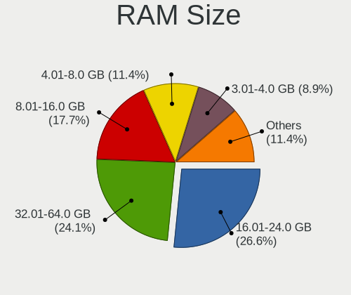
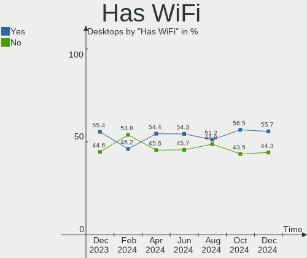
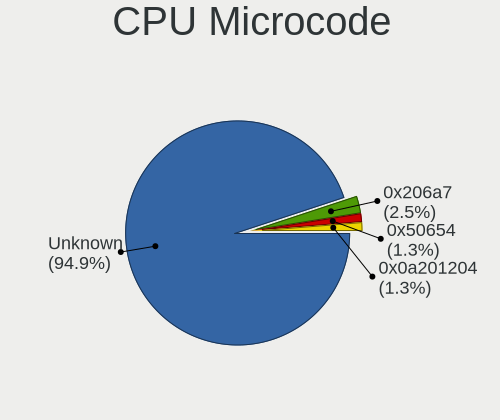
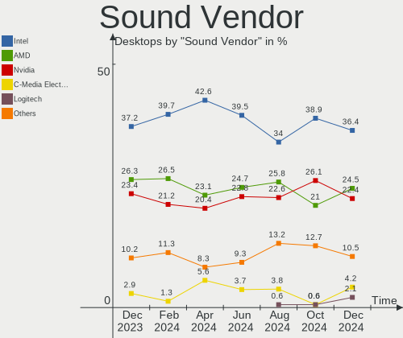
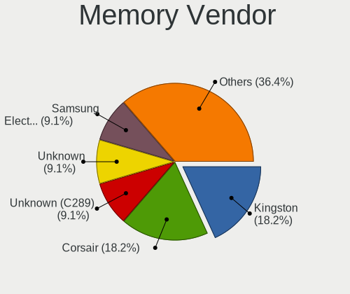
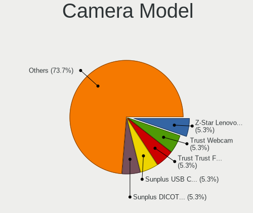

Zorin - Hardware Trends (Desktops)
----------------------------------

A project to identify most popular hardware characteristics and track their change
over time based on data collected by Linux users at https://Linux-Hardware.org.

Anyone can contribute to this report by the [hw-probe](https://github.com/linuxhw/hw-probe) tool:

    sudo -E hw-probe -all -upload

This report is for one last month. Overall report since the beginning of time: [TestDays](https://github.com/linuxhw/TestDays)

Period: May, 2023.

Contents
--------

* [ System ](#system)
  - [ OS                       ](#os)
  - [ OS Family                ](#os-family)
  - [ Kernel                   ](#kernel)
  - [ Kernel Family            ](#kernel-family)
  - [ Kernel Major Ver.        ](#kernel-major-ver)
  - [ Arch                     ](#arch)
  - [ DE                       ](#de)
  - [ Display Server           ](#display-server)
  - [ Display Manager          ](#display-manager)
  - [ OS Lang                  ](#os-lang)
  - [ Boot Mode                ](#boot-mode)
  - [ Filesystem               ](#filesystem)
  - [ Part. scheme             ](#part-scheme)
  - [ Dual Boot with Linux/BSD ](#dual-boot-with-linuxbsd)
  - [ Dual Boot (Win)          ](#dual-boot-win)

* [ Board ](#board)
  - [ Vendor                   ](#vendor)
  - [ Model                    ](#model)
  - [ Model Family             ](#model-family)
  - [ MFG Year                 ](#mfg-year)
  - [ Form Factor              ](#form-factor)
  - [ Secure Boot              ](#secure-boot)
  - [ Coreboot                 ](#coreboot)
  - [ RAM Size                 ](#ram-size)
  - [ RAM Used                 ](#ram-used)
  - [ Total Drives             ](#total-drives)
  - [ Has CD-ROM               ](#has-cd-rom)
  - [ Has Ethernet             ](#has-ethernet)
  - [ Has WiFi                 ](#has-wifi)
  - [ Has Bluetooth            ](#has-bluetooth)

* [ Location ](#location)
  - [ Country                  ](#country)
  - [ City                     ](#city)

* [ Drives ](#drives)
  - [ Drive Vendor             ](#drive-vendor)
  - [ Drive Model              ](#drive-model)
  - [ HDD Vendor               ](#hdd-vendor)
  - [ SSD Vendor               ](#ssd-vendor)
  - [ Drive Kind               ](#drive-kind)
  - [ Drive Connector          ](#drive-connector)
  - [ Drive Size               ](#drive-size)
  - [ Space Total              ](#space-total)
  - [ Space Used               ](#space-used)
  - [ Malfunc. Drives          ](#malfunc-drives)
  - [ Malfunc. Drive Vendor    ](#malfunc-drive-vendor)
  - [ Malfunc. HDD Vendor      ](#malfunc-hdd-vendor)
  - [ Malfunc. Drive Kind      ](#malfunc-drive-kind)
  - [ Failed Drives            ](#failed-drives)
  - [ Failed Drive Vendor      ](#failed-drive-vendor)
  - [ Drive Status             ](#drive-status)

* [ Storage controller ](#storage-controller)
  - [ Storage Vendor           ](#storage-vendor)
  - [ Storage Model            ](#storage-model)
  - [ Storage Kind             ](#storage-kind)

* [ Processor ](#processor)
  - [ CPU Vendor               ](#cpu-vendor)
  - [ CPU Model                ](#cpu-model)
  - [ CPU Model Family         ](#cpu-model-family)
  - [ CPU Cores                ](#cpu-cores)
  - [ CPU Sockets              ](#cpu-sockets)
  - [ CPU Threads              ](#cpu-threads)
  - [ CPU Op-Modes             ](#cpu-op-modes)
  - [ CPU Microcode            ](#cpu-microcode)
  - [ CPU Microarch            ](#cpu-microarch)

* [ Graphics ](#graphics)
  - [ GPU Vendor               ](#gpu-vendor)
  - [ GPU Model                ](#gpu-model)
  - [ GPU Combo                ](#gpu-combo)
  - [ GPU Driver               ](#gpu-driver)
  - [ GPU Memory               ](#gpu-memory)

* [ Monitor ](#monitor)
  - [ Monitor Vendor           ](#monitor-vendor)
  - [ Monitor Model            ](#monitor-model)
  - [ Monitor Resolution       ](#monitor-resolution)
  - [ Monitor Diagonal         ](#monitor-diagonal)
  - [ Monitor Width            ](#monitor-width)
  - [ Aspect Ratio             ](#aspect-ratio)
  - [ Monitor Area             ](#monitor-area)
  - [ Pixel Density            ](#pixel-density)
  - [ Multiple Monitors        ](#multiple-monitors)

* [ Network ](#network)
  - [ Net Controller Vendor    ](#net-controller-vendor)
  - [ Net Controller Model     ](#net-controller-model)
  - [ Wireless Vendor          ](#wireless-vendor)
  - [ Wireless Model           ](#wireless-model)
  - [ Ethernet Vendor          ](#ethernet-vendor)
  - [ Ethernet Model           ](#ethernet-model)
  - [ Net Controller Kind      ](#net-controller-kind)
  - [ Used Controller          ](#used-controller)
  - [ NICs                     ](#nics)
  - [ IPv6                     ](#ipv6)

* [ Bluetooth ](#bluetooth)
  - [ Bluetooth Vendor         ](#bluetooth-vendor)
  - [ Bluetooth Model          ](#bluetooth-model)

* [ Sound ](#sound)
  - [ Sound Vendor             ](#sound-vendor)
  - [ Sound Model              ](#sound-model)

* [ Memory ](#memory)
  - [ Memory Vendor            ](#memory-vendor)
  - [ Memory Model             ](#memory-model)
  - [ Memory Kind              ](#memory-kind)
  - [ Memory Form Factor       ](#memory-form-factor)
  - [ Memory Size              ](#memory-size)
  - [ Memory Speed             ](#memory-speed)

* [ Printers & scanners ](#printers--scanners)
  - [ Printer Vendor           ](#printer-vendor)
  - [ Printer Model            ](#printer-model)
  - [ Scanner Vendor           ](#scanner-vendor)
  - [ Scanner Model            ](#scanner-model)

* [ Camera ](#camera)
  - [ Camera Vendor            ](#camera-vendor)
  - [ Camera Model             ](#camera-model)

* [ Security ](#security)
  - [ Fingerprint Vendor       ](#fingerprint-vendor)
  - [ Fingerprint Model        ](#fingerprint-model)
  - [ Chipcard Vendor          ](#chipcard-vendor)
  - [ Chipcard Model           ](#chipcard-model)

* [ Unsupported ](#unsupported)
  - [ Unsupported Devices      ](#unsupported-devices)
  - [ Unsupported Device Types ](#unsupported-device-types)

System
------

OS
--

Installed operating systems

| Name     | Desktops | Percent |
|----------|----------|---------|
| Zorin 16 | 57       | 95%     |
| Zorin 15 | 3        | 5%      |

OS Family
---------

OS without a version

| Name  | Desktops | Percent |
|-------|----------|---------|
| Zorin | 60       | 100%    |

Kernel
------

Version of the Linux kernel

| Version                | Desktops | Percent |
|------------------------|----------|---------|
| 5.15.0-71-generic      | 31       | 51.67%  |
| 5.15.0-72-generic      | 19       | 31.67%  |
| 5.15.0-69-generic      | 2        | 3.33%   |
| 6.3.2-1-liquorix-amd64 | 1        | 1.67%   |
| 5.4.0-94-generic       | 1        | 1.67%   |
| 5.4.0-47-generic       | 1        | 1.67%   |
| 5.4.0-149-generic      | 1        | 1.67%   |
| 5.15.0-60-generic      | 1        | 1.67%   |
| 5.15.0-53-generic      | 1        | 1.67%   |
| 5.15.0-52-generic      | 1        | 1.67%   |
| 5.13.0-30-generic      | 1        | 1.67%   |

Kernel Family
-------------

Linux kernel without a distro release

| Version | Desktops | Percent |
|---------|----------|---------|
| 5.15.0  | 55       | 91.67%  |
| 5.4.0   | 3        | 5%      |
| 6.3.2   | 1        | 1.67%   |
| 5.13.0  | 1        | 1.67%   |

Kernel Major Ver.
-----------------

Linux kernel major version

| Version | Desktops | Percent |
|---------|----------|---------|
| 5.15    | 55       | 91.67%  |
| 5.4     | 3        | 5%      |
| 6.3     | 1        | 1.67%   |
| 5.13    | 1        | 1.67%   |

Arch
----

OS architecture (x86_64, i586, etc.)

| Name   | Desktops | Percent |
|--------|----------|---------|
| x86_64 | 58       | 96.67%  |
| i686   | 2        | 3.33%   |

DE
--

Desktop Environment

| Name  | Desktops | Percent |
|-------|----------|---------|
| GNOME | 47       | 78.33%  |
| XFCE  | 13       | 21.67%  |

Display Server
--------------

X11 or Wayland

| Name | Desktops | Percent |
|------|----------|---------|
| X11  | 60       | 100%    |

Display Manager
---------------

SDDM, LightDM, etc.

| Name    | Desktops | Percent |
|---------|----------|---------|
| Unknown | 50       | 83.33%  |
| LightDM | 5        | 8.33%   |
| GDM3    | 4        | 6.67%   |
| GDM     | 1        | 1.67%   |

OS Lang
-------

Language

| Lang        | Desktops | Percent |
|-------------|----------|---------|
| en_US       | 21       | 35%     |
| pt_PT       | 4        | 6.67%   |
| it_IT       | 4        | 6.67%   |
| fr_FR       | 4        | 6.67%   |
| es_AR       | 4        | 6.67%   |
| en_GB       | 4        | 6.67%   |
| de_DE       | 4        | 6.67%   |
| pt_BR       | 3        | 5%      |
| en_CA       | 2        | 3.33%   |
| sv_SE       | 1        | 1.67%   |
| sr_RS@latin | 1        | 1.67%   |
| pl_PL       | 1        | 1.67%   |
| ja_JP       | 1        | 1.67%   |
| es_GT       | 1        | 1.67%   |
| es_ES       | 1        | 1.67%   |
| es_CR       | 1        | 1.67%   |
| en_ZA       | 1        | 1.67%   |
| en_IN       | 1        | 1.67%   |
| cs_CZ       | 1        | 1.67%   |

Boot Mode
---------

EFI or BIOS

| Mode | Desktops | Percent |
|------|----------|---------|
| BIOS | 32       | 53.33%  |
| EFI  | 28       | 46.67%  |

Filesystem
----------

Type of filesystem

| Type  | Desktops | Percent |
|-------|----------|---------|
| Ext4  | 52       | 86.67%  |
| Tmpfs | 6        | 10%     |
| Zfs   | 2        | 3.33%   |

Part. scheme
------------

Scheme of partitioning

| Type    | Desktops | Percent |
|---------|----------|---------|
| Unknown | 52       | 86.67%  |
| MBR     | 5        | 8.33%   |
| GPT     | 3        | 5%      |

Dual Boot with Linux/BSD
------------------------

Hosting more than one Linux/BSD

| Dual boot | Desktops | Percent |
|-----------|----------|---------|
| No        | 58       | 96.67%  |
| Yes       | 2        | 3.33%   |

Dual Boot (Win)
---------------

Hosting Linux and Windows

| Dual boot | Desktops | Percent |
|-----------|----------|---------|
| No        | 56       | 93.33%  |
| Yes       | 4        | 6.67%   |

Board
-----

Vendor
------

Motherboard manufacturer

| Name                | Desktops | Percent |
|---------------------|----------|---------|
| Gigabyte Technology | 11       | 18.33%  |
| ASUSTek Computer    | 11       | 18.33%  |
| MSI                 | 7        | 11.67%  |
| Hewlett-Packard     | 6        | 10%     |
| Dell                | 6        | 10%     |
| ASRock              | 5        | 8.33%   |
| Intel               | 3        | 5%      |
| Pegatron            | 2        | 3.33%   |
| Acer                | 2        | 3.33%   |
| Unknown             | 2        | 3.33%   |
| Vorke               | 1        | 1.67%   |
| Lenovo              | 1        | 1.67%   |
| ECS                 | 1        | 1.67%   |
| ASRockRack          | 1        | 1.67%   |
| 16280-BM-32691      | 1        | 1.67%   |

Model
-----

Motherboard model

| Name                               | Desktops | Percent |
|------------------------------------|----------|---------|
| MSI MS-7C02                        | 2        | 3.33%   |
| ASUS PRIME X370-PRO                | 2        | 3.33%   |
| Unknown                            | 2        | 3.33%   |
| Vorke V1 Plus                      | 1        | 1.67%   |
| Pegatron p7-1080t                  | 1        | 1.67%   |
| Pegatron NC825AA-ABA a6807c        | 1        | 1.67%   |
| MSI MS-7C95                        | 1        | 1.67%   |
| MSI MS-7C37                        | 1        | 1.67%   |
| MSI MS-7B86                        | 1        | 1.67%   |
| MSI MS-7923                        | 1        | 1.67%   |
| MSI MS-7817                        | 1        | 1.67%   |
| Lenovo ThinkCentre M93p 10AAS3VB00 | 1        | 1.67%   |
| Intel Tiger Hill                   | 1        | 1.67%   |
| Intel H55                          | 1        | 1.67%   |
| Intel D946GZIS AAD66165-301        | 1        | 1.67%   |
| HP t520 Flexible Series TC         | 1        | 1.67%   |
| HP ProDesk 600 G1 DM               | 1        | 1.67%   |
| HP Pavilion Desktop TP01-2xxx      | 1        | 1.67%   |
| HP EliteDesk 800 G1 USDT           | 1        | 1.67%   |
| HP Compaq Pro 6300 MT              | 1        | 1.67%   |
| HP 23-b231                         | 1        | 1.67%   |
| Gigabyte Z77-DS3H                  | 1        | 1.67%   |
| Gigabyte Z590 VISION G             | 1        | 1.67%   |
| Gigabyte X570 GAMING X             | 1        | 1.67%   |
| Gigabyte P55A-UD3                  | 1        | 1.67%   |
| Gigabyte M68MT-S2                  | 1        | 1.67%   |
| Gigabyte H81M-DS2                  | 1        | 1.67%   |
| Gigabyte H110M-H                   | 1        | 1.67%   |
| Gigabyte GB-BRi5(H)-8250           | 1        | 1.67%   |
| Gigabyte GA-78LMT-USB3 6.0         | 1        | 1.67%   |
| Gigabyte GA-78LMT-S2               | 1        | 1.67%   |
| Gigabyte A520M DS3H                | 1        | 1.67%   |
| ECS H510H6-M2                      | 1        | 1.67%   |
| Dell Vostro 260                    | 1        | 1.67%   |
| Dell Precision WorkStation T3500   | 1        | 1.67%   |
| Dell Precision WorkStation 380     | 1        | 1.67%   |
| Dell Precision Tower 3620          | 1        | 1.67%   |
| Dell OptiPlex 390                  | 1        | 1.67%   |
| Dell OptiPlex 3070                 | 1        | 1.67%   |
| ASUS ROG STRIX Z590-E GAMING WIFI  | 1        | 1.67%   |

Model Family
------------

Motherboard model prefix

| Name                     | Desktops | Percent |
|--------------------------|----------|---------|
| ASUS PRIME               | 4        | 6.67%   |
| Dell Precision           | 3        | 5%      |
| MSI MS-7C02              | 2        | 3.33%   |
| Dell OptiPlex            | 2        | 3.33%   |
| Unknown                  | 2        | 3.33%   |
| Vorke V1                 | 1        | 1.67%   |
| Pegatron p7-1080t        | 1        | 1.67%   |
| Pegatron NC825AA-ABA     | 1        | 1.67%   |
| MSI MS-7C95              | 1        | 1.67%   |
| MSI MS-7C37              | 1        | 1.67%   |
| MSI MS-7B86              | 1        | 1.67%   |
| MSI MS-7923              | 1        | 1.67%   |
| MSI MS-7817              | 1        | 1.67%   |
| Lenovo ThinkCentre       | 1        | 1.67%   |
| Intel Tiger              | 1        | 1.67%   |
| Intel H55                | 1        | 1.67%   |
| Intel D946GZIS           | 1        | 1.67%   |
| HP t520                  | 1        | 1.67%   |
| HP ProDesk               | 1        | 1.67%   |
| HP Pavilion              | 1        | 1.67%   |
| HP EliteDesk             | 1        | 1.67%   |
| HP Compaq                | 1        | 1.67%   |
| HP 23-b231               | 1        | 1.67%   |
| Gigabyte Z77-DS3H        | 1        | 1.67%   |
| Gigabyte Z590            | 1        | 1.67%   |
| Gigabyte X570            | 1        | 1.67%   |
| Gigabyte P55A-UD3        | 1        | 1.67%   |
| Gigabyte M68MT-S2        | 1        | 1.67%   |
| Gigabyte H81M-DS2        | 1        | 1.67%   |
| Gigabyte H110M-H         | 1        | 1.67%   |
| Gigabyte GB-BRi5(H)-8250 | 1        | 1.67%   |
| Gigabyte GA-78LMT-USB3   | 1        | 1.67%   |
| Gigabyte GA-78LMT-S2     | 1        | 1.67%   |
| Gigabyte A520M           | 1        | 1.67%   |
| ECS H510H6-M2            | 1        | 1.67%   |
| Dell Vostro              | 1        | 1.67%   |
| ASUS ROG                 | 1        | 1.67%   |
| ASUS P8Z68               | 1        | 1.67%   |
| ASUS P5N73-CM            | 1        | 1.67%   |
| ASUS M2V-MX              | 1        | 1.67%   |

MFG Year
--------

Motherboard manufacture year

| Year | Desktops | Percent |
|------|----------|---------|
| 2014 | 8        | 13.33%  |
| 2013 | 8        | 13.33%  |
| 2021 | 5        | 8.33%   |
| 2020 | 5        | 8.33%   |
| 2012 | 5        | 8.33%   |
| 2011 | 5        | 8.33%   |
| 2019 | 4        | 6.67%   |
| 2018 | 4        | 6.67%   |
| 2017 | 4        | 6.67%   |
| 2009 | 3        | 5%      |
| 2007 | 2        | 3.33%   |
| 2006 | 2        | 3.33%   |
| 2022 | 1        | 1.67%   |
| 2016 | 1        | 1.67%   |
| 2015 | 1        | 1.67%   |
| 2010 | 1        | 1.67%   |
| 2008 | 1        | 1.67%   |

Form Factor
-----------

Physical design of the computer

| Name    | Desktops | Percent |
|---------|----------|---------|
| Desktop | 60       | 100%    |

Secure Boot
-----------

Enabled or disabled

| State    | Desktops | Percent |
|----------|----------|---------|
| Disabled | 58       | 96.67%  |
| Enabled  | 2        | 3.33%   |

Coreboot
--------

Have coreboot on board

| Used | Desktops | Percent |
|------|----------|---------|
| No   | 60       | 100%    |

RAM Size
--------

Total RAM memory

| Size in GB  | Desktops | Percent |
|-------------|----------|---------|
| 16.01-24.0  | 14       | 23.33%  |
| 8.01-16.0   | 13       | 21.67%  |
| 4.01-8.0    | 12       | 20%     |
| 3.01-4.0    | 10       | 16.67%  |
| 32.01-64.0  | 7        | 11.67%  |
| 64.01-256.0 | 2        | 3.33%   |
| 24.01-32.0  | 1        | 1.67%   |
| 2.01-3.0    | 1        | 1.67%   |

RAM Used
--------

Used RAM memory

| Used GB   | Desktops | Percent |
|-----------|----------|---------|
| 1.01-2.0  | 19       | 31.67%  |
| 2.01-3.0  | 17       | 28.33%  |
| 3.01-4.0  | 11       | 18.33%  |
| 4.01-8.0  | 7        | 11.67%  |
| 8.01-16.0 | 3        | 5%      |
| 0.51-1.0  | 3        | 5%      |

Total Drives
------------

Number of drives on board

| Drives | Desktops | Percent |
|--------|----------|---------|
| 1      | 29       | 48.33%  |
| 2      | 13       | 21.67%  |
| 4      | 8        | 13.33%  |
| 3      | 8        | 13.33%  |
| 5      | 2        | 3.33%   |

Has CD-ROM
----------

Has CD-ROM on board

| Presented | Desktops | Percent |
|-----------|----------|---------|
| Yes       | 30       | 50%     |
| No        | 30       | 50%     |

Has Ethernet
------------

Has Ethernet on board

| Presented | Desktops | Percent |
|-----------|----------|---------|
| Yes       | 60       | 100%    |

Has WiFi
--------

Has WiFi module

| Presented | Desktops | Percent |
|-----------|----------|---------|
| No        | 36       | 60%     |
| Yes       | 24       | 40%     |

Has Bluetooth
-------------

Has Bluetooth module

| Presented | Desktops | Percent |
|-----------|----------|---------|
| No        | 40       | 66.67%  |
| Yes       | 20       | 33.33%  |

Location
--------

Country
-------

Geographic location (country)

| Country      | Desktops | Percent |
|--------------|----------|---------|
| USA          | 16       | 26.67%  |
| UK           | 5        | 8.33%   |
| Portugal     | 4        | 6.67%   |
| Italy        | 4        | 6.67%   |
| Germany      | 4        | 6.67%   |
| Argentina    | 4        | 6.67%   |
| France       | 3        | 5%      |
| Canada       | 3        | 5%      |
| Brazil       | 3        | 5%      |
| Thailand     | 1        | 1.67%   |
| Sweden       | 1        | 1.67%   |
| South Africa | 1        | 1.67%   |
| Slovakia     | 1        | 1.67%   |
| Poland       | 1        | 1.67%   |
| Nicaragua    | 1        | 1.67%   |
| Mexico       | 1        | 1.67%   |
| Japan        | 1        | 1.67%   |
| India        | 1        | 1.67%   |
| Guatemala    | 1        | 1.67%   |
| Finland      | 1        | 1.67%   |
| Czechia      | 1        | 1.67%   |
| Colombia     | 1        | 1.67%   |
| Belgium      | 1        | 1.67%   |

City
----

Geographic location (city)

| City                         | Desktops | Percent |
|------------------------------|----------|---------|
| Rosario                      | 2        | 3.33%   |
| Zielona Góra                | 1        | 1.67%   |
| Wismar                       | 1        | 1.67%   |
| Washington                   | 1        | 1.67%   |
| Voorhees Township            | 1        | 1.67%   |
| Vankleek Hill                | 1        | 1.67%   |
| Upper Marlboro               | 1        | 1.67%   |
| Tunja                        | 1        | 1.67%   |
| Trenton                      | 1        | 1.67%   |
| Toms River                   | 1        | 1.67%   |
| Tijuana                      | 1        | 1.67%   |
| Tampere                      | 1        | 1.67%   |
| Straubing                    | 1        | 1.67%   |
| Spring Hill                  | 1        | 1.67%   |
| Setúbal                     | 1        | 1.67%   |
| Servon                       | 1        | 1.67%   |
| Sao Paulo                    | 1        | 1.67%   |
| Santo André                 | 1        | 1.67%   |
| Sankt Georgen im Schwarzwald | 1        | 1.67%   |
| San Francisco                | 1        | 1.67%   |
| Roswell                      | 1        | 1.67%   |
| Rome                         | 1        | 1.67%   |
| Rio Maior                    | 1        | 1.67%   |
| Rho                          | 1        | 1.67%   |
| Resistencia                  | 1        | 1.67%   |
| Rancho Palos Verdes          | 1        | 1.67%   |
| Porto                        | 1        | 1.67%   |
| Ostrava                      | 1        | 1.67%   |
| Niigata                      | 1        | 1.67%   |
| Newcastle upon Tyne          | 1        | 1.67%   |
| Montreal                     | 1        | 1.67%   |
| Milano                       | 1        | 1.67%   |
| Miami                        | 1        | 1.67%   |
| Marion                       | 1        | 1.67%   |
| Marietta                     | 1        | 1.67%   |
| Managua                      | 1        | 1.67%   |
| Lucknow                      | 1        | 1.67%   |
| Louisville                   | 1        | 1.67%   |
| Lisbon                       | 1        | 1.67%   |
| Khon Kaen                    | 1        | 1.67%   |

Drives
------

Drive Vendor
------------

Hard drive vendors

| Vendor                    | Desktops | Drives | Percent |
|---------------------------|----------|--------|---------|
| WDC                       | 21       | 28     | 20.39%  |
| Seagate                   | 16       | 23     | 15.53%  |
| Samsung Electronics       | 11       | 13     | 10.68%  |
| Toshiba                   | 6        | 6      | 5.83%   |
| SanDisk                   | 5        | 5      | 4.85%   |
| Kingston                  | 4        | 4      | 3.88%   |
| Crucial                   | 4        | 4      | 3.88%   |
| Hitachi                   | 3        | 3      | 2.91%   |
| A-DATA Technology         | 3        | 3      | 2.91%   |
| PNY                       | 2        | 2      | 1.94%   |
| Phison Electronics        | 2        | 3      | 1.94%   |
| Micron/Crucial Technology | 2        | 2      | 1.94%   |
| Kimtigo                   | 2        | 2      | 1.94%   |
| China                     | 2        | 2      | 1.94%   |
| Verbatim                  | 1        | 1      | 0.97%   |
| Unknown                   | 1        | 1      | 0.97%   |
| SPCC                      | 1        | 2      | 0.97%   |
| SK hynix                  | 1        | 1      | 0.97%   |
| Seagate Technology        | 1        | 1      | 0.97%   |
| OCZ                       | 1        | 1      | 0.97%   |
| NN                        | 1        | 1      | 0.97%   |
| Micron Technology         | 1        | 1      | 0.97%   |
| Lexar                     | 1        | 1      | 0.97%   |
| KIOXIA-E                  | 1        | 1      | 0.97%   |
| Intenso                   | 1        | 1      | 0.97%   |
| Intel                     | 1        | 1      | 0.97%   |
| HS-SSD-E100               | 1        | 1      | 0.97%   |
| GOODRAM                   | 1        | 1      | 0.97%   |
| FORESEE                   | 1        | 1      | 0.97%   |
| Fanxiang                  | 1        | 1      | 0.97%   |
| Emtec                     | 1        | 1      | 0.97%   |
| Apple                     | 1        | 1      | 0.97%   |
| Apacer                    | 1        | 1      | 0.97%   |
| Unknown                   | 1        | 1      | 0.97%   |

Drive Model
-----------

Hard drive models

| Model                                               | Desktops | Percent |
|-----------------------------------------------------|----------|---------|
| Seagate ST1000DM003-1CH162 1TB                      | 3        | 2.61%   |
| Samsung NVMe SSD Controller SM981/PM981/PM983 256GB | 3        | 2.61%   |
| Toshiba DT01ACA200 2TB                              | 2        | 1.74%   |
| Seagate ST2000DM001-9YN164 2TB                      | 2        | 1.74%   |
| Seagate ST1000DM003-9YN162 1TB                      | 2        | 1.74%   |
| Samsung SSD 870 EVO 500GB                           | 2        | 1.74%   |
| Micron/Crucial P2 NVMe PCIe SSD 1TB                 | 2        | 1.74%   |
| Kimtigo SSD 256GB HNSA215062Z                       | 2        | 1.74%   |
| Crucial CT240BX500SSD1 240GB                        | 2        | 1.74%   |
| WDC WDS500G2B0A-00SM50 500GB SSD                    | 1        | 0.87%   |
| WDC WDS250G2B0A-00SM50 250GB SSD                    | 1        | 0.87%   |
| WDC WDS240G2G0A-00JH30 240GB SSD                    | 1        | 0.87%   |
| WDC WD800JD-75MSA3 80GB                             | 1        | 0.87%   |
| WDC WD8000AARS-00Y5B1 800GB                         | 1        | 0.87%   |
| WDC WD6400BPVT-80HXZT1 640GB                        | 1        | 0.87%   |
| WDC WD5000AAKX-22ERMA0 500GB                        | 1        | 0.87%   |
| WDC WD5000AAKS-60A7B0 500GB                         | 1        | 0.87%   |
| WDC WD5000AAKS-007AA0 500GB                         | 1        | 0.87%   |
| WDC WD400BB-00DEA0 40GB                             | 1        | 0.87%   |
| WDC WD30EFRX-68EUZN0 3TB                            | 1        | 0.87%   |
| WDC WD20EZRX-00D8PB0 2TB                            | 1        | 0.87%   |
| WDC WD20EZBX-00AYRA0 2TB                            | 1        | 0.87%   |
| WDC WD161KRYZ-01AGBB0 16TB                          | 1        | 0.87%   |
| WDC WD1600AAJS-60WAA0 160GB                         | 1        | 0.87%   |
| WDC WD10SPZX-24Z10 1TB                              | 1        | 0.87%   |
| WDC WD10EZEX-60ZF5A0 1TB                            | 1        | 0.87%   |
| WDC WD10EZEX-60WN4A1 1TB                            | 1        | 0.87%   |
| WDC WD10EZEX-60WN4A0 1TB                            | 1        | 0.87%   |
| WDC WD10EZEX-00WN4A0 1TB                            | 1        | 0.87%   |
| WDC WD10EURX-73C57Y0 1TB                            | 1        | 0.87%   |
| WDC WD10EADS-65M2B0 1TB                             | 1        | 0.87%   |
| WDC WD1002FAEX-00Y9A0 1TB                           | 1        | 0.87%   |
| WDC WD Green 2.5 480GB                              | 1        | 0.87%   |
| Verbatim Vi550 S3 SSD 128GB                         | 1        | 0.87%   |
| Unknown MMC Card  32GB                              | 1        | 0.87%   |
| Toshiba Q300. 960GB SSD                             | 1        | 0.87%   |
| Toshiba Q300. 240GB SSD                             | 1        | 0.87%   |
| Toshiba MQ01ABD100 1TB                              | 1        | 0.87%   |
| Toshiba DT01ACA050 500GB                            | 1        | 0.87%   |
| SPCC Solid State Disk 256GB                         | 1        | 0.87%   |

HDD Vendor
----------

Hard disk drive vendors

| Vendor              | Desktops | Drives | Percent |
|---------------------|----------|--------|---------|
| WDC                 | 18       | 24     | 39.13%  |
| Seagate             | 16       | 22     | 34.78%  |
| Toshiba             | 4        | 4      | 8.7%    |
| Samsung Electronics | 4        | 5      | 8.7%    |
| Hitachi             | 3        | 3      | 6.52%   |
| Apple               | 1        | 1      | 2.17%   |

SSD Vendor
----------

Solid state drive vendors

| Vendor              | Desktops | Drives | Percent |
|---------------------|----------|--------|---------|
| WDC                 | 4        | 4      | 9.3%    |
| Crucial             | 4        | 4      | 9.3%    |
| SanDisk             | 3        | 3      | 6.98%   |
| Samsung Electronics | 3        | 3      | 6.98%   |
| Kingston            | 3        | 3      | 6.98%   |
| A-DATA Technology   | 3        | 3      | 6.98%   |
| Toshiba             | 2        | 2      | 4.65%   |
| PNY                 | 2        | 2      | 4.65%   |
| Kimtigo             | 2        | 2      | 4.65%   |
| China               | 2        | 2      | 4.65%   |
| Verbatim            | 1        | 1      | 2.33%   |
| SPCC                | 1        | 2      | 2.33%   |
| SK hynix            | 1        | 1      | 2.33%   |
| Seagate             | 1        | 1      | 2.33%   |
| OCZ                 | 1        | 1      | 2.33%   |
| NN                  | 1        | 1      | 2.33%   |
| Micron Technology   | 1        | 1      | 2.33%   |
| Lexar               | 1        | 1      | 2.33%   |
| KIOXIA-E            | 1        | 1      | 2.33%   |
| Intenso             | 1        | 1      | 2.33%   |
| Intel               | 1        | 1      | 2.33%   |
| GOODRAM             | 1        | 1      | 2.33%   |
| FORESEE             | 1        | 1      | 2.33%   |
| Emtec               | 1        | 1      | 2.33%   |
| Apacer              | 1        | 1      | 2.33%   |

Drive Kind
----------

HDD or SSD

| Kind    | Desktops | Drives | Percent |
|---------|----------|--------|---------|
| HDD     | 39       | 59     | 44.32%  |
| SSD     | 34       | 44     | 38.64%  |
| NVMe    | 11       | 14     | 12.5%   |
| Unknown | 3        | 3      | 3.41%   |
| MMC     | 1        | 1      | 1.14%   |

Drive Connector
---------------

SATA, SAS, NVMe, etc.

| Type | Desktops | Drives | Percent |
|------|----------|--------|---------|
| SATA | 56       | 105    | 81.16%  |
| NVMe | 11       | 14     | 15.94%  |
| SAS  | 1        | 1      | 1.45%   |
| MMC  | 1        | 1      | 1.45%   |

Drive Size
----------

Size of hard drive

| Size in TB | Desktops | Drives | Percent |
|------------|----------|--------|---------|
| 0.01-0.5   | 46       | 56     | 58.97%  |
| 0.51-1.0   | 20       | 31     | 25.64%  |
| 1.01-2.0   | 8        | 12     | 10.26%  |
| 2.01-3.0   | 2        | 2      | 2.56%   |
| 10.01-20.0 | 1        | 1      | 1.28%   |
| 4.01-10.0  | 1        | 1      | 1.28%   |

Space Total
-----------

Amount of disk space available on the file system

| Size in GB     | Desktops | Percent |
|----------------|----------|---------|
| 101-250        | 19       | 31.67%  |
| 1001-2000      | 12       | 20%     |
| 251-500        | 10       | 16.67%  |
| 501-1000       | 7        | 11.67%  |
| 21-50          | 4        | 6.67%   |
| More than 3000 | 3        | 5%      |
| 2001-3000      | 2        | 3.33%   |
| 51-100         | 2        | 3.33%   |
| Unknown        | 1        | 1.67%   |

Space Used
----------

Amount of used disk space

| Used GB        | Desktops | Percent |
|----------------|----------|---------|
| 21-50          | 16       | 26.67%  |
| 1-20           | 15       | 25%     |
| 51-100         | 9        | 15%     |
| 251-500        | 8        | 13.33%  |
| 101-250        | 4        | 6.67%   |
| 501-1000       | 4        | 6.67%   |
| More than 3000 | 1        | 1.67%   |
| 2001-3000      | 1        | 1.67%   |
| 1001-2000      | 1        | 1.67%   |
| Unknown        | 1        | 1.67%   |

Malfunc. Drives
---------------

Drive models with a malfunction

Zero info for selected period =(

Malfunc. Drive Vendor
---------------------

Vendors of faulty drives

Zero info for selected period =(

Malfunc. HDD Vendor
-------------------

Vendors of faulty HDD drives

Zero info for selected period =(

Malfunc. Drive Kind
-------------------

Kinds of faulty drives

Zero info for selected period =(

Failed Drives
-------------

Failed drive models

Zero info for selected period =(

Failed Drive Vendor
-------------------

Failed drive vendors

Zero info for selected period =(

Drive Status
------------

Number of failed and malfunc. drives

| Status   | Desktops | Drives | Percent |
|----------|----------|--------|---------|
| Detected | 58       | 116    | 96.67%  |
| Works    | 2        | 5      | 3.33%   |

Storage controller
------------------

Storage Vendor
--------------

Storage controller vendors

| Vendor                        | Desktops | Percent |
|-------------------------------|----------|---------|
| Intel                         | 37       | 47.44%  |
| AMD                           | 19       | 24.36%  |
| Samsung Electronics           | 5        | 6.41%   |
| Nvidia                        | 3        | 3.85%   |
| SanDisk                       | 2        | 2.56%   |
| Phison Electronics            | 2        | 2.56%   |
| Micron/Crucial Technology     | 2        | 2.56%   |
| Marvell Technology Group      | 2        | 2.56%   |
| VIA Technologies              | 1        | 1.28%   |
| Seagate Technology            | 1        | 1.28%   |
| Kingston Technology Company   | 1        | 1.28%   |
| JMicron Technology            | 1        | 1.28%   |
| Integrated Technology Express | 1        | 1.28%   |
| ASMedia Technology            | 1        | 1.28%   |

Storage Model
-------------

Storage controller models

| Model                                                                                   | Desktops | Percent |
|-----------------------------------------------------------------------------------------|----------|---------|
| AMD FCH SATA Controller [AHCI mode]                                                     | 11       | 11.46%  |
| Intel 8 Series/C220 Series Chipset Family 6-port SATA Controller 1 [AHCI mode]          | 9        | 9.38%   |
| AMD 400 Series Chipset SATA Controller                                                  | 5        | 5.21%   |
| Intel 82801G (ICH7 Family) IDE Controller                                               | 4        | 4.17%   |
| Samsung NVMe SSD Controller SM981/PM981/PM983                                           | 3        | 3.13%   |
| Intel NM10/ICH7 Family SATA Controller [IDE mode]                                       | 3        | 3.13%   |
| Intel 7 Series/C210 Series Chipset Family 6-port SATA Controller [AHCI mode]            | 3        | 3.13%   |
| Intel 6 Series/C200 Series Chipset Family 6 port Desktop SATA AHCI Controller           | 3        | 3.13%   |
| Intel 500 Series Chipset Family SATA AHCI Controller                                    | 3        | 3.13%   |
| AMD SB7x0/SB8x0/SB9x0 IDE Controller                                                    | 3        | 3.13%   |
| AMD 500 Series Chipset SATA Controller                                                  | 3        | 3.13%   |
| Micron/Crucial P2 NVMe PCIe SSD                                                         | 2        | 2.08%   |
| Intel SATA Controller [RAID mode]                                                       | 2        | 2.08%   |
| Intel Q170/Q150/B150/H170/H110/Z170/CM236 Chipset SATA Controller [AHCI Mode]           | 2        | 2.08%   |
| Intel NM10/ICH7 Family SATA Controller [AHCI mode]                                      | 2        | 2.08%   |
| Intel 6 Series/C200 Series Chipset Family Desktop SATA Controller (IDE mode, ports 4-5) | 2        | 2.08%   |
| Intel 6 Series/C200 Series Chipset Family Desktop SATA Controller (IDE mode, ports 0-3) | 2        | 2.08%   |
| AMD X370 Series Chipset SATA Controller                                                 | 2        | 2.08%   |
| AMD SB7x0/SB8x0/SB9x0 SATA Controller [IDE mode]                                        | 2        | 2.08%   |
| VIA VT82C586A/B/VT82C686/A/B/VT823x/A/C PIPC Bus Master IDE                             | 1        | 1.04%   |
| VIA VT8237/8251 Serial ATA Controller                                                   | 1        | 1.04%   |
| Seagate FireCuda 510 SSD                                                                | 1        | 1.04%   |
| SanDisk WD Blue SN570 NVMe SSD 1TB                                                      | 1        | 1.04%   |
| SanDisk WD Black SN770 NVMe SSD                                                         | 1        | 1.04%   |
| Samsung NVMe SSD Controller SM961/PM961/SM963                                           | 1        | 1.04%   |
| Samsung NVMe SSD Controller 980                                                         | 1        | 1.04%   |
| Phison PS5013 E13 NVMe Controller                                                       | 1        | 1.04%   |
| Phison E12 NVMe Controller                                                              | 1        | 1.04%   |
| Nvidia MCP73 SATA Controller (IDE mode)                                                 | 1        | 1.04%   |
| Nvidia MCP73 IDE Controller                                                             | 1        | 1.04%   |
| Nvidia MCP61 SATA Controller                                                            | 1        | 1.04%   |
| Nvidia CK804 Serial ATA Controller                                                      | 1        | 1.04%   |
| Nvidia CK804 IDE                                                                        | 1        | 1.04%   |
| Marvell Group 88SE9128 PCIe SATA 6 Gb/s RAID controller with HyperDuo                   | 1        | 1.04%   |
| Marvell Group 88SE9128 PCIe SATA 6 Gb/s RAID controller                                 | 1        | 1.04%   |
| Kingston Company Company Non-Volatile memory controller                                 | 1        | 1.04%   |
| JMicron JMB362 SATA Controller                                                          | 1        | 1.04%   |
| Intel Sunrise Point-LP SATA Controller [AHCI mode]                                      | 1        | 1.04%   |
| Intel Celeron/Pentium Silver Processor SATA Controller                                  | 1        | 1.04%   |
| Intel Celeron N3350/Pentium N4200/Atom E3900 Series SATA AHCI Controller                | 1        | 1.04%   |

Storage Kind
------------

Kind of storage controller (IDE, SATA, NVMe, SAS, ...)

| Kind | Desktops | Percent |
|------|----------|---------|
| SATA | 49       | 64.47%  |
| IDE  | 14       | 18.42%  |
| NVMe | 11       | 14.47%  |
| RAID | 2        | 2.63%   |

Processor
---------

CPU Vendor
----------

Processor vendors

| Vendor | Desktops | Percent |
|--------|----------|---------|
| Intel  | 38       | 63.33%  |
| AMD    | 22       | 36.67%  |

CPU Model
---------

Processor models

| Model                                       | Desktops | Percent |
|---------------------------------------------|----------|---------|
| AMD Ryzen 7 1700 Eight-Core Processor       | 4        | 6.67%   |
| AMD Ryzen 5 3600 6-Core Processor           | 3        | 5%      |
| Intel Core i5-4460 CPU @ 3.20GHz            | 2        | 3.33%   |
| Intel Core i5-2400 CPU @ 3.10GHz            | 2        | 3.33%   |
| AMD Athlon II X2 250 Processor              | 2        | 3.33%   |
| Intel Xeon CPU W3680 @ 3.33GHz              | 1        | 1.67%   |
| Intel Xeon CPU E3-1240 v5 @ 3.50GHz         | 1        | 1.67%   |
| Intel Xeon CPU D-1521 @ 2.40GHz             | 1        | 1.67%   |
| Intel Pentium Gold G6405 CPU @ 4.10GHz      | 1        | 1.67%   |
| Intel Pentium Dual-Core CPU E5300 @ 2.60GHz | 1        | 1.67%   |
| Intel Pentium Dual CPU E2220 @ 2.40GHz      | 1        | 1.67%   |
| Intel Pentium Dual CPU E2200 @ 2.20GHz      | 1        | 1.67%   |
| Intel Pentium CPU G2030 @ 3.00GHz           | 1        | 1.67%   |
| Intel Pentium 4 CPU 3.40GHz                 | 1        | 1.67%   |
| Intel Pentium 4 CPU 3.00GHz                 | 1        | 1.67%   |
| Intel Core i9-10850K CPU @ 3.60GHz          | 1        | 1.67%   |
| Intel Core i7-4790 CPU @ 3.60GHz            | 1        | 1.67%   |
| Intel Core i7-4771 CPU @ 3.50GHz            | 1        | 1.67%   |
| Intel Core i7-4770S CPU @ 3.10GHz           | 1        | 1.67%   |
| Intel Core i7-3770 CPU @ 3.40GHz            | 1        | 1.67%   |
| Intel Core i7-2600K CPU @ 3.40GHz           | 1        | 1.67%   |
| Intel Core i7 CPU 860 @ 2.80GHz             | 1        | 1.67%   |
| Intel Core i5-9500T CPU @ 2.20GHz           | 1        | 1.67%   |
| Intel Core i5-8250U CPU @ 1.60GHz           | 1        | 1.67%   |
| Intel Core i5-6400 CPU @ 2.70GHz            | 1        | 1.67%   |
| Intel Core i5-4590T CPU @ 2.00GHz           | 1        | 1.67%   |
| Intel Core i5-4570T CPU @ 2.90GHz           | 1        | 1.67%   |
| Intel Core i5-2500S CPU @ 2.70GHz           | 1        | 1.67%   |
| Intel Core i5-10400F CPU @ 2.90GHz          | 1        | 1.67%   |
| Intel Core i5 CPU 760 @ 2.80GHz             | 1        | 1.67%   |
| Intel Core i3-4160 CPU @ 3.60GHz            | 1        | 1.67%   |
| Intel Core i3-4130 CPU @ 3.40GHz            | 1        | 1.67%   |
| Intel Core i3-3240 CPU @ 3.40GHz            | 1        | 1.67%   |
| Intel Core i3-3220 CPU @ 3.30GHz            | 1        | 1.67%   |
| Intel Core 2 CPU 6400 @ 2.13GHz             | 1        | 1.67%   |
| Intel Celeron J4125 CPU @ 2.00GHz           | 1        | 1.67%   |
| Intel Celeron CPU J3455 @ 1.50GHz           | 1        | 1.67%   |
| Intel Atom CPU N2600 @ 1.60GHz              | 1        | 1.67%   |
| Intel 11th Gen Core i9-11900F @ 2.50GHz     | 1        | 1.67%   |
| AMD Sempron Processor 3800+                 | 1        | 1.67%   |

CPU Model Family
----------------

Processor model prefix

| Model                   | Desktops | Percent |
|-------------------------|----------|---------|
| Intel Core i5           | 12       | 20%     |
| Intel Core i7           | 6        | 10%     |
| AMD Ryzen 7             | 5        | 8.33%   |
| AMD Ryzen 5             | 5        | 8.33%   |
| Intel Core i3           | 4        | 6.67%   |
| Intel Xeon              | 3        | 5%      |
| Intel Pentium Dual      | 2        | 3.33%   |
| Intel Pentium 4         | 2        | 3.33%   |
| Intel Celeron           | 2        | 3.33%   |
| AMD Ryzen 3             | 2        | 3.33%   |
| AMD Athlon II X2        | 2        | 3.33%   |
| Other                   | 1        | 1.67%   |
| Intel Pentium Gold      | 1        | 1.67%   |
| Intel Pentium Dual-Core | 1        | 1.67%   |
| Intel Pentium           | 1        | 1.67%   |
| Intel Core i9           | 1        | 1.67%   |
| Intel Core 2            | 1        | 1.67%   |
| Intel Atom              | 1        | 1.67%   |
| AMD Sempron             | 1        | 1.67%   |
| AMD Ryzen 9             | 1        | 1.67%   |
| AMD Phenom II X6        | 1        | 1.67%   |
| AMD GX                  | 1        | 1.67%   |
| AMD E2                  | 1        | 1.67%   |
| AMD E                   | 1        | 1.67%   |
| AMD Dual Core Opteron   | 1        | 1.67%   |
| AMD A4                  | 1        | 1.67%   |

CPU Cores
---------

Number of processor cores

| Number | Desktops | Percent |
|--------|----------|---------|
| 4      | 22       | 36.67%  |
| 2      | 18       | 30%     |
| 6      | 8        | 13.33%  |
| 8      | 6        | 10%     |
| 1      | 4        | 6.67%   |
| 12     | 1        | 1.67%   |
| 10     | 1        | 1.67%   |

CPU Sockets
-----------

Number of sockets

| Number | Desktops | Percent |
|--------|----------|---------|
| 1      | 60       | 100%    |

CPU Threads
-----------

Threads per core (Hyper-Threading)

| Number | Desktops | Percent |
|--------|----------|---------|
| 2      | 34       | 56.67%  |
| 1      | 26       | 43.33%  |

CPU Op-Modes
------------

CPU Operation Modes (32-bit, 64-bit)

| Op mode        | Desktops | Percent |
|----------------|----------|---------|
| 32-bit, 64-bit | 60       | 100%    |

CPU Microcode
-------------

Microcode number

| Number     | Desktops | Percent |
|------------|----------|---------|
| 0x306c3    | 9        | 15%     |
| Unknown    | 6        | 10%     |
| 0x306a9    | 4        | 6.67%   |
| 0x206a7    | 4        | 6.67%   |
| 0x08001138 | 4        | 6.67%   |
| 0x6fd      | 2        | 3.33%   |
| 0x506e3    | 2        | 3.33%   |
| 0x106e5    | 2        | 3.33%   |
| 0x08108109 | 2        | 3.33%   |
| 0x010000c8 | 2        | 3.33%   |
| 0xf65      | 1        | 1.67%   |
| 0xf43      | 1        | 1.67%   |
| 0xa0671    | 1        | 1.67%   |
| 0xa0655    | 1        | 1.67%   |
| 0xa0653    | 1        | 1.67%   |
| 0x906ea    | 1        | 1.67%   |
| 0x806ea    | 1        | 1.67%   |
| 0x706a8    | 1        | 1.67%   |
| 0x6f6      | 1        | 1.67%   |
| 0x506c9    | 1        | 1.67%   |
| 0x50663    | 1        | 1.67%   |
| 0x30661    | 1        | 1.67%   |
| 0x206c2    | 1        | 1.67%   |
| 0x1067a    | 1        | 1.67%   |
| 0x0a50000d | 1        | 1.67%   |
| 0x08701030 | 1        | 1.67%   |
| 0x08701021 | 1        | 1.67%   |
| 0x08600106 | 1        | 1.67%   |
| 0x07030106 | 1        | 1.67%   |
| 0x06001119 | 1        | 1.67%   |
| 0x05000119 | 1        | 1.67%   |
| 0x010000dc | 1        | 1.67%   |
| 0x00000000 | 1        | 1.67%   |

CPU Microarch
-------------

Microarchitecture

| Name          | Desktops | Percent |
|---------------|----------|---------|
| Haswell       | 9        | 15%     |
| Zen 2         | 5        | 8.33%   |
| Zen           | 4        | 6.67%   |
| SandyBridge   | 4        | 6.67%   |
| IvyBridge     | 4        | 6.67%   |
| K10           | 3        | 5%      |
| Core          | 3        | 5%      |
| CometLake     | 3        | 5%      |
| Zen+          | 2        | 3.33%   |
| Zen 3         | 2        | 3.33%   |
| Skylake       | 2        | 3.33%   |
| NetBurst      | 2        | 3.33%   |
| Nehalem       | 2        | 3.33%   |
| KabyLake      | 2        | 3.33%   |
| K8 Hammer     | 2        | 3.33%   |
| Bobcat        | 2        | 3.33%   |
| Westmere      | 1        | 1.67%   |
| Puma          | 1        | 1.67%   |
| Piledriver    | 1        | 1.67%   |
| Penryn        | 1        | 1.67%   |
| Icelake       | 1        | 1.67%   |
| Goldmont plus | 1        | 1.67%   |
| Goldmont      | 1        | 1.67%   |
| Broadwell     | 1        | 1.67%   |
| Bonnell       | 1        | 1.67%   |

Graphics
--------

GPU Vendor
----------

Vendors of graphics cards

| Vendor            | Desktops | Percent |
|-------------------|----------|---------|
| Nvidia            | 23       | 35.94%  |
| Intel             | 20       | 31.25%  |
| AMD               | 19       | 29.69%  |
| VIA Technologies  | 1        | 1.56%   |
| ASPEED Technology | 1        | 1.56%   |

GPU Model
---------

Graphics card models

| Model                                                                       | Desktops | Percent |
|-----------------------------------------------------------------------------|----------|---------|
| Intel Xeon E3-1200 v3/4th Gen Core Processor Integrated Graphics Controller | 5        | 7.58%   |
| AMD Cedar [Radeon HD 5000/6000/7350/8350 Series]                            | 3        | 4.55%   |
| Nvidia GT218 [GeForce 210]                                                  | 2        | 3.03%   |
| Nvidia GM107 [GeForce GTX 750 Ti]                                           | 2        | 3.03%   |
| Nvidia GF108 [GeForce GT 730]                                               | 2        | 3.03%   |
| Intel Xeon E3-1200 v2/3rd Gen Core processor Graphics Controller            | 2        | 3.03%   |
| Intel 4th Generation Core Processor Family Integrated Graphics Controller   | 2        | 3.03%   |
| Intel 2nd Generation Core Processor Family Integrated Graphics Controller   | 2        | 3.03%   |
| AMD Picasso/Raven 2 [Radeon Vega Series / Radeon Vega Mobile Series]        | 2        | 3.03%   |
| AMD Ellesmere [Radeon RX 470/480/570/570X/580/580X/590]                     | 2        | 3.03%   |
| VIA Technologies K8M890CE/K8N890CE [Chrome 9]                               | 1        | 1.52%   |
| Nvidia TU116 [GeForce GTX 1660 Ti]                                          | 1        | 1.52%   |
| Nvidia TU116 [GeForce GTX 1660 SUPER]                                       | 1        | 1.52%   |
| Nvidia TU106 [GeForce GTX 1650]                                             | 1        | 1.52%   |
| Nvidia GP107GL [Quadro P620]                                                | 1        | 1.52%   |
| Nvidia GP107 [GeForce GTX 1050 Ti]                                          | 1        | 1.52%   |
| Nvidia GP106 [GeForce GTX 1060 3GB]                                         | 1        | 1.52%   |
| Nvidia GM107GL [Quadro K620]                                                | 1        | 1.52%   |
| Nvidia GM107 [GeForce GTX 750]                                              | 1        | 1.52%   |
| Nvidia GK208B [GeForce GT 730]                                              | 1        | 1.52%   |
| Nvidia GK208B [GeForce GT 710]                                              | 1        | 1.52%   |
| Nvidia GK104 [GeForce GTX 760 OEM]                                          | 1        | 1.52%   |
| Nvidia GA106 [Geforce RTX 3050]                                             | 1        | 1.52%   |
| Nvidia GA103 [GeForce RTX 3060 Ti]                                          | 1        | 1.52%   |
| Nvidia GA102 [GeForce RTX 3080]                                             | 1        | 1.52%   |
| Nvidia G96CGL [Quadro FX 580]                                               | 1        | 1.52%   |
| Nvidia G84 [GeForce 8600 GT]                                                | 1        | 1.52%   |
| Nvidia C73 [GeForce 7100 / nForce 630i]                                     | 1        | 1.52%   |
| Nvidia C61 [GeForce 7025 / nForce 630a]                                     | 1        | 1.52%   |
| Intel UHD Graphics 620                                                      | 1        | 1.52%   |
| Intel IvyBridge GT2 [HD Graphics 4000]                                      | 1        | 1.52%   |
| Intel HD Graphics 500                                                       | 1        | 1.52%   |
| Intel GeminiLake [UHD Graphics 600]                                         | 1        | 1.52%   |
| Intel CometLake-S GT1 [UHD Graphics 610]                                    | 1        | 1.52%   |
| Intel CoffeeLake-S GT2 [UHD Graphics 630]                                   | 1        | 1.52%   |
| Intel Atom Processor D2xxx/N2xxx Integrated Graphics Controller             | 1        | 1.52%   |
| Intel 82G33/G31 Express Integrated Graphics Controller                      | 1        | 1.52%   |
| Intel 82946GZ/GL Integrated Graphics Controller                             | 1        | 1.52%   |
| ASPEED Technology ASPEED Graphics Family                                    | 1        | 1.52%   |
| AMD Wrestler [Radeon HD 7340]                                               | 1        | 1.52%   |

GPU Combo
---------

Combinations of graphics cards

| Name           | Desktops | Percent |
|----------------|----------|---------|
| 1 x Nvidia     | 21       | 35%     |
| 1 x AMD        | 18       | 30%     |
| 1 x Intel      | 17       | 28.33%  |
| 2 x Nvidia     | 1        | 1.67%   |
| 1 x VIA        | 1        | 1.67%   |
| Intel + Nvidia | 1        | 1.67%   |
| 1 x ASPEED     | 1        | 1.67%   |

GPU Driver
----------

Free vs proprietary

| Driver      | Desktops | Percent |
|-------------|----------|---------|
| Free        | 43       | 71.67%  |
| Proprietary | 14       | 23.33%  |
| Unknown     | 3        | 5%      |

GPU Memory
----------

Total video memory

| Size in GB | Desktops | Percent |
|------------|----------|---------|
| Unknown    | 29       | 48.33%  |
| 1.01-2.0   | 8        | 13.33%  |
| 0.01-0.5   | 7        | 11.67%  |
| 0.51-1.0   | 6        | 10%     |
| 7.01-8.0   | 4        | 6.67%   |
| 3.01-4.0   | 4        | 6.67%   |
| 5.01-6.0   | 1        | 1.67%   |
| 2.01-3.0   | 1        | 1.67%   |

Monitor
-------

Monitor Vendor
--------------

Monitor vendors

| Vendor              | Desktops | Percent |
|---------------------|----------|---------|
| Samsung Electronics | 8        | 14.81%  |
| Goldstar            | 8        | 14.81%  |
| Dell                | 7        | 12.96%  |
| Hewlett-Packard     | 5        | 9.26%   |
| Acer                | 3        | 5.56%   |
| Philips             | 2        | 3.7%    |
| ITE                 | 2        | 3.7%    |
| Eizo                | 2        | 3.7%    |
| BenQ                | 2        | 3.7%    |
| AOC                 | 2        | 3.7%    |
| Unknown             | 2        | 3.7%    |
| ViewSonic           | 1        | 1.85%   |
| Sony                | 1        | 1.85%   |
| Onkyo               | 1        | 1.85%   |
| NEC Computers       | 1        | 1.85%   |
| MSI                 | 1        | 1.85%   |
| Microstep           | 1        | 1.85%   |
| Medion              | 1        | 1.85%   |
| IOD                 | 1        | 1.85%   |
| HannStar Display    | 1        | 1.85%   |
| Envision            | 1        | 1.85%   |
| Compaq Computer     | 1        | 1.85%   |

Monitor Model
-------------

Monitor models

| Model                                                                 | Desktops | Percent |
|-----------------------------------------------------------------------|----------|---------|
| Unknown                                                               | 2        | 3.64%   |
| ViewSonic LCD Monitor VX3276-QHD 5120x1440                            | 1        | 1.82%   |
| Sony TV *00 SNYF303 1920x1080 952x535mm 43.0-inch                     | 1        | 1.82%   |
| Samsung Electronics SyncMaster SAM03E4 1680x1050 474x296mm 22.0-inch  | 1        | 1.82%   |
| Samsung Electronics SyncMaster SAM03C2 1680x1050 459x296mm 21.5-inch  | 1        | 1.82%   |
| Samsung Electronics SyncMaster SAM0107 1280x1024 312x234mm 15.4-inch  | 1        | 1.82%   |
| Samsung Electronics S34J55x SAM0F72 3440x1440 797x333mm 34.0-inch     | 1        | 1.82%   |
| Samsung Electronics S24F350 SAM0D20 1920x1080 521x293mm 23.5-inch     | 1        | 1.82%   |
| Samsung Electronics LF27T35 SAM707F 1920x1080 598x337mm 27.0-inch     | 1        | 1.82%   |
| Samsung Electronics LCD Monitor SAM07C0 1920x1080 890x500mm 40.2-inch | 1        | 1.82%   |
| Samsung Electronics LCD Monitor SAM0530 1360x768                      | 1        | 1.82%   |
| Philips PHL 273V7 PHLC156 1920x1080 598x336mm 27.0-inch               | 1        | 1.82%   |
| Philips PHL 203V5 PHLC0CE 1600x900 434x236mm 19.4-inch                | 1        | 1.82%   |
| Onkyo TX-NR535 ONK0E51 1920x1080 698x392mm 31.5-inch                  | 1        | 1.82%   |
| NEC Computers LCD22WMGX NEC671F 1680x1050 473x296mm 22.0-inch         | 1        | 1.82%   |
| MSI G27C5 MSI3CA9 1920x1080 598x336mm 27.0-inch                       | 1        | 1.82%   |
| Microstep LCD Monitor MSI MAG301CR2                                   | 1        | 1.82%   |
| Medion MD30422PV MED86F7 1680x1050 474x296mm 22.0-inch                | 1        | 1.82%   |
| ITE DP2VGA V273 ITE6517 1920x1080 600x340mm 27.2-inch                 | 1        | 1.82%   |
| ITE DP2VGA V168 ITE6512 1680x1050 600x340mm 27.2-inch                 | 1        | 1.82%   |
| IOD LCD-AD201X IOD1483 1600x900 442x249mm 20.0-inch                   | 1        | 1.82%   |
| Hewlett-Packard X27qc HPN3736 2560x1440 597x336mm 27.0-inch           | 1        | 1.82%   |
| Hewlett-Packard L1908w HWP26F0 1440x900 410x256mm 19.0-inch           | 1        | 1.82%   |
| Hewlett-Packard All-in-One HWP4211 1920x1080 509x286mm 23.0-inch      | 1        | 1.82%   |
| Hewlett-Packard 27vx HWP329E 1920x1080 600x340mm 27.2-inch            | 1        | 1.82%   |
| Hewlett-Packard 2009 HWP2827 1600x900 443x250mm 20.0-inch             | 1        | 1.82%   |
| HannStar Display LCD Monitor HU196D 1280x1024                         | 1        | 1.82%   |
| Goldstar ULTRAWIDE GSM76F6 3440x1440 800x335mm 34.1-inch              | 1        | 1.82%   |
| Goldstar ULTRAGEAR GSM7766 2560x1440 697x392mm 31.5-inch              | 1        | 1.82%   |
| Goldstar M2380A GSM57EE 1920x1080 509x286mm 23.0-inch                 | 1        | 1.82%   |
| Goldstar M2280A GSM57EC 1920x1080 476x268mm 21.5-inch                 | 1        | 1.82%   |
| Goldstar L192WS GSM4B32 1440x900 410x256mm 19.0-inch                  | 1        | 1.82%   |
| Goldstar FULL HD GSM5B55 1920x1080 480x270mm 21.7-inch                | 1        | 1.82%   |
| Goldstar 2D HD TV GSM59C8 1366x768 509x286mm 23.0-inch                | 1        | 1.82%   |
| Goldstar 19EN33 GSM4C18 1366x768 410x230mm 18.5-inch                  | 1        | 1.82%   |
| Envision EN7410e EPI1CF2 1280x1024 338x270mm 17.0-inch                | 1        | 1.82%   |
| Eizo EV2456 ENC2798 1920x1080 519x324mm 24.1-inch                     | 1        | 1.82%   |
| Eizo CE240W ENC1814 1920x1200 519x324mm 24.1-inch                     | 1        | 1.82%   |
| Dell U2913WM DEL4089 2560x1080 673x284mm 28.8-inch                    | 1        | 1.82%   |
| Dell S2409W DELA037 1920x1080 531x298mm 24.0-inch                     | 1        | 1.82%   |

Monitor Resolution
------------------

Monitor screen resolution

| Resolution         | Desktops | Percent |
|--------------------|----------|---------|
| 1920x1080 (FHD)    | 18       | 33.33%  |
| 1680x1050 (WSXGA+) | 5        | 9.26%   |
| 1600x900 (HD+)     | 5        | 9.26%   |
| 3840x2160 (4K)     | 4        | 7.41%   |
| 1280x1024 (SXGA)   | 4        | 7.41%   |
| 2560x1440 (QHD)    | 3        | 5.56%   |
| 3440x1440          | 2        | 3.7%    |
| 1920x1200 (WUXGA)  | 2        | 3.7%    |
| 1440x900 (WXGA+)   | 2        | 3.7%    |
| 1366x768 (WXGA)    | 2        | 3.7%    |
| Unknown            | 2        | 3.7%    |
| 5120x1440          | 1        | 1.85%   |
| 3840x1080          | 1        | 1.85%   |
| 2560x1080          | 1        | 1.85%   |
| 1360x768           | 1        | 1.85%   |
| 1024x768 (XGA)     | 1        | 1.85%   |

Monitor Diagonal
----------------

Diagonal size in inches

| Inches  | Desktops | Percent |
|---------|----------|---------|
| Unknown | 9        | 17.31%  |
| 27      | 7        | 13.46%  |
| 23      | 5        | 9.62%   |
| 24      | 4        | 7.69%   |
| 22      | 4        | 7.69%   |
| 19      | 4        | 7.69%   |
| 21      | 3        | 5.77%   |
| 20      | 3        | 5.77%   |
| 18      | 2        | 3.85%   |
| 15      | 2        | 3.85%   |
| 75      | 1        | 1.92%   |
| 49      | 1        | 1.92%   |
| 46      | 1        | 1.92%   |
| 40      | 1        | 1.92%   |
| 34      | 1        | 1.92%   |
| 31      | 1        | 1.92%   |
| 28      | 1        | 1.92%   |
| 26      | 1        | 1.92%   |
| 17      | 1        | 1.92%   |

Monitor Width
-------------

Physical width

| Width in mm | Desktops | Percent |
|-------------|----------|---------|
| 501-600     | 17       | 33.33%  |
| 401-500     | 14       | 27.45%  |
| Unknown     | 9        | 17.65%  |
| 301-350     | 3        | 5.88%   |
| 601-700     | 2        | 3.92%   |
| 1001-1500   | 2        | 3.92%   |
| 801-900     | 1        | 1.96%   |
| 701-800     | 1        | 1.96%   |
| 351-400     | 1        | 1.96%   |
| 1501-2000   | 1        | 1.96%   |

Aspect Ratio
------------

Proportional relationship between the width and the height

| Ratio   | Desktops | Percent |
|---------|----------|---------|
| 16/9    | 28       | 54.9%   |
| 16/10   | 9        | 17.65%  |
| Unknown | 8        | 15.69%  |
| 5/4     | 2        | 3.92%   |
| 4/3     | 2        | 3.92%   |
| 21/9    | 2        | 3.92%   |

Monitor Area
------------

Area in inch²

| Area in inch² | Desktops | Percent |
|----------------|----------|---------|
| 201-250        | 13       | 25.49%  |
| Unknown        | 9        | 17.65%  |
| 151-200        | 8        | 15.69%  |
| 301-350        | 7        | 13.73%  |
| 251-300        | 4        | 7.84%   |
| More than 1000 | 2        | 3.92%   |
| 351-500        | 2        | 3.92%   |
| 141-150        | 2        | 3.92%   |
| 501-1000       | 2        | 3.92%   |
| 111-120        | 1        | 1.96%   |
| 101-110        | 1        | 1.96%   |

Pixel Density
-------------

Pixels per inch

| Density | Desktops | Percent |
|---------|----------|---------|
| 51-100  | 33       | 67.35%  |
| Unknown | 9        | 18.37%  |
| 101-120 | 5        | 10.2%   |
| 1-50    | 2        | 4.08%   |

Multiple Monitors
-----------------

Total monitors connected

| Total | Desktops | Percent |
|-------|----------|---------|
| 1     | 51       | 85%     |
| 2     | 5        | 8.33%   |
| 0     | 4        | 6.67%   |

Network
-------

Net Controller Vendor
---------------------

Controller vendors

| Vendor                | Desktops | Percent |
|-----------------------|----------|---------|
| Realtek Semiconductor | 42       | 50.6%   |
| Intel                 | 17       | 20.48%  |
| Ralink Technology     | 4        | 4.82%   |
| Qualcomm Atheros      | 4        | 4.82%   |
| TP-Link               | 3        | 3.61%   |
| Broadcom              | 3        | 3.61%   |
| Nvidia                | 2        | 2.41%   |
| VIA Technologies      | 1        | 1.2%    |
| Oculus VR             | 1        | 1.2%    |
| NetGear               | 1        | 1.2%    |
| Microsoft             | 1        | 1.2%    |
| D-Link System         | 1        | 1.2%    |
| Broadcom Limited      | 1        | 1.2%    |
| ASIX Electronics      | 1        | 1.2%    |
| Arduino SA            | 1        | 1.2%    |

Net Controller Model
--------------------

Controller models

| Model                                                             | Desktops | Percent |
|-------------------------------------------------------------------|----------|---------|
| Realtek RTL8111/8168/8411 PCI Express Gigabit Ethernet Controller | 37       | 40.66%  |
| Realtek RTL810xE PCI Express Fast Ethernet controller             | 3        | 3.3%    |
| Intel Ethernet Connection I217-LM                                 | 3        | 3.3%    |
| Realtek RTL88x2bu [AC1200 Techkey]                                | 2        | 2.2%    |
| Realtek RTL8821CE 802.11ac PCIe Wireless Network Adapter          | 2        | 2.2%    |
| Intel I211 Gigabit Network Connection                             | 2        | 2.2%    |
| Intel Ethernet Controller I225-V                                  | 2        | 2.2%    |
| VIA VT6102/VT6103 [Rhine-II]                                      | 1        | 1.1%    |
| TP-Link TL-WN823N v2/v3 [Realtek RTL8192EU]                       | 1        | 1.1%    |
| TP-Link M7200                                                     | 1        | 1.1%    |
| TP-Link Archer T2U PLUS [RTL8821AU]                               | 1        | 1.1%    |
| Realtek RTL8812AE 802.11ac PCIe Wireless Network Adapter          | 1        | 1.1%    |
| Realtek RTL8192EE PCIe Wireless Network Adapter                   | 1        | 1.1%    |
| Realtek RTL8188EE Wireless Network Adapter                        | 1        | 1.1%    |
| Ralink RT5370 Wireless Adapter                                    | 1        | 1.1%    |
| Ralink RT2870/RT3070 Wireless Adapter                             | 1        | 1.1%    |
| Ralink RT2501/RT2573 Wireless Adapter                             | 1        | 1.1%    |
| Ralink MT7601U Wireless Adapter                                   | 1        | 1.1%    |
| Qualcomm Atheros AR9485 Wireless Network Adapter                  | 1        | 1.1%    |
| Qualcomm Atheros AR9462 Wireless Network Adapter                  | 1        | 1.1%    |
| Qualcomm Atheros AR928X Wireless Network Adapter (PCI-Express)    | 1        | 1.1%    |
| Qualcomm Atheros AR8151 v2.0 Gigabit Ethernet                     | 1        | 1.1%    |
| Oculus VR Rift S                                                  | 1        | 1.1%    |
| Nvidia MCP73 Ethernet                                             | 1        | 1.1%    |
| Nvidia MCP61 Ethernet                                             | 1        | 1.1%    |
| NetGear A6100 AC600 DB Wireless Adapter [Realtek RTL8811AU]       | 1        | 1.1%    |
| Microsoft Wireless XBox Controller Dongle                         | 1        | 1.1%    |
| Intel Wireless 3165                                               | 1        | 1.1%    |
| Intel Wi-Fi 6 AX210/AX211/AX411 160MHz                            | 1        | 1.1%    |
| Intel Wi-Fi 6 AX200                                               | 1        | 1.1%    |
| Intel Ultimate N WiFi Link 5300                                   | 1        | 1.1%    |
| Intel PRO/100 VE Network Connection                               | 1        | 1.1%    |
| Intel I210 Gigabit Network Connection                             | 1        | 1.1%    |
| Intel Ethernet Connection I219-V                                  | 1        | 1.1%    |
| Intel Ethernet Connection I217-V                                  | 1        | 1.1%    |
| Intel Ethernet Connection (2) I219-LM                             | 1        | 1.1%    |
| Intel Dual Band Wireless-AC 3168NGW [Stone Peak]                  | 1        | 1.1%    |
| Intel Centrino Wireless-N 105                                     | 1        | 1.1%    |
| Intel 82579V Gigabit Network Connection                           | 1        | 1.1%    |
| Intel 82579LM Gigabit Network Connection (Lewisville)             | 1        | 1.1%    |

Wireless Vendor
---------------

Wireless vendors

| Vendor                | Desktops | Percent |
|-----------------------|----------|---------|
| Realtek Semiconductor | 7        | 28%     |
| Intel                 | 6        | 24%     |
| Ralink Technology     | 4        | 16%     |
| Qualcomm Atheros      | 3        | 12%     |
| TP-Link               | 1        | 4%      |
| NetGear               | 1        | 4%      |
| Microsoft             | 1        | 4%      |
| D-Link System         | 1        | 4%      |
| Broadcom              | 1        | 4%      |

Wireless Model
--------------

Wireless models

| Model                                                                             | Desktops | Percent |
|-----------------------------------------------------------------------------------|----------|---------|
| Realtek RTL88x2bu [AC1200 Techkey]                                                | 2        | 8%      |
| Realtek RTL8821CE 802.11ac PCIe Wireless Network Adapter                          | 2        | 8%      |
| TP-Link TL-WN823N v2/v3 [Realtek RTL8192EU]                                       | 1        | 4%      |
| Realtek RTL8812AE 802.11ac PCIe Wireless Network Adapter                          | 1        | 4%      |
| Realtek RTL8192EE PCIe Wireless Network Adapter                                   | 1        | 4%      |
| Realtek RTL8188EE Wireless Network Adapter                                        | 1        | 4%      |
| Ralink RT5370 Wireless Adapter                                                    | 1        | 4%      |
| Ralink RT2870/RT3070 Wireless Adapter                                             | 1        | 4%      |
| Ralink RT2501/RT2573 Wireless Adapter                                             | 1        | 4%      |
| Ralink MT7601U Wireless Adapter                                                   | 1        | 4%      |
| Qualcomm Atheros AR9485 Wireless Network Adapter                                  | 1        | 4%      |
| Qualcomm Atheros AR9462 Wireless Network Adapter                                  | 1        | 4%      |
| Qualcomm Atheros AR928X Wireless Network Adapter (PCI-Express)                    | 1        | 4%      |
| NetGear A6100 AC600 DB Wireless Adapter [Realtek RTL8811AU]                       | 1        | 4%      |
| Microsoft Wireless XBox Controller Dongle                                         | 1        | 4%      |
| Intel Wireless 3165                                                               | 1        | 4%      |
| Intel Wi-Fi 6 AX210/AX211/AX411 160MHz                                            | 1        | 4%      |
| Intel Wi-Fi 6 AX200                                                               | 1        | 4%      |
| Intel Ultimate N WiFi Link 5300                                                   | 1        | 4%      |
| Intel Dual Band Wireless-AC 3168NGW [Stone Peak]                                  | 1        | 4%      |
| Intel Centrino Wireless-N 105                                                     | 1        | 4%      |
| D-Link System DWA-131 802.11n Wireless N Nano Adapter(rev.A1) [Realtek RTL8192SU] | 1        | 4%      |
| Broadcom BCM43142 802.11b/g/n                                                     | 1        | 4%      |

Ethernet Vendor
---------------

Ethernet vendors

| Vendor                | Desktops | Percent |
|-----------------------|----------|---------|
| Realtek Semiconductor | 40       | 62.5%   |
| Intel                 | 14       | 21.88%  |
| TP-Link               | 2        | 3.13%   |
| Nvidia                | 2        | 3.13%   |
| Broadcom              | 2        | 3.13%   |
| VIA Technologies      | 1        | 1.56%   |
| Qualcomm Atheros      | 1        | 1.56%   |
| Broadcom Limited      | 1        | 1.56%   |
| ASIX Electronics      | 1        | 1.56%   |

Ethernet Model
--------------

Ethernet models

| Model                                                             | Desktops | Percent |
|-------------------------------------------------------------------|----------|---------|
| Realtek RTL8111/8168/8411 PCI Express Gigabit Ethernet Controller | 37       | 57.81%  |
| Realtek RTL810xE PCI Express Fast Ethernet controller             | 3        | 4.69%   |
| Intel Ethernet Connection I217-LM                                 | 3        | 4.69%   |
| Intel I211 Gigabit Network Connection                             | 2        | 3.13%   |
| Intel Ethernet Controller I225-V                                  | 2        | 3.13%   |
| VIA VT6102/VT6103 [Rhine-II]                                      | 1        | 1.56%   |
| TP-Link M7200                                                     | 1        | 1.56%   |
| TP-Link Archer T2U PLUS [RTL8821AU]                               | 1        | 1.56%   |
| Qualcomm Atheros AR8151 v2.0 Gigabit Ethernet                     | 1        | 1.56%   |
| Nvidia MCP73 Ethernet                                             | 1        | 1.56%   |
| Nvidia MCP61 Ethernet                                             | 1        | 1.56%   |
| Intel PRO/100 VE Network Connection                               | 1        | 1.56%   |
| Intel I210 Gigabit Network Connection                             | 1        | 1.56%   |
| Intel Ethernet Connection I219-V                                  | 1        | 1.56%   |
| Intel Ethernet Connection I217-V                                  | 1        | 1.56%   |
| Intel Ethernet Connection (2) I219-LM                             | 1        | 1.56%   |
| Intel 82579V Gigabit Network Connection                           | 1        | 1.56%   |
| Intel 82579LM Gigabit Network Connection (Lewisville)             | 1        | 1.56%   |
| Broadcom NetXtreme BCM5761 Gigabit Ethernet PCIe                  | 1        | 1.56%   |
| Broadcom NetXtreme BCM5721 Gigabit Ethernet PCI Express           | 1        | 1.56%   |
| Broadcom Limited NetXtreme BCM5751 Gigabit Ethernet PCI Express   | 1        | 1.56%   |
| ASIX AX88179 Gigabit Ethernet                                     | 1        | 1.56%   |

Net Controller Kind
-------------------

Ethernet, WiFi or modem

| Kind     | Desktops | Percent |
|----------|----------|---------|
| Ethernet | 60       | 70.59%  |
| WiFi     | 24       | 28.24%  |
| Modem    | 1        | 1.18%   |

Used Controller
---------------

Currently used network controller

| Kind     | Desktops | Percent |
|----------|----------|---------|
| Ethernet | 46       | 74.19%  |
| WiFi     | 16       | 25.81%  |

NICs
----

Total network controllers on board

| Total | Desktops | Percent |
|-------|----------|---------|
| 1     | 42       | 70%     |
| 2     | 17       | 28.33%  |
| 3     | 1        | 1.67%   |

IPv6
----

IPv6 vs IPv4

| Used | Desktops | Percent |
|------|----------|---------|
| No   | 37       | 61.67%  |
| Yes  | 23       | 38.33%  |

Bluetooth
---------

Bluetooth Vendor
----------------

Controller vendors

| Vendor                  | Desktops | Percent |
|-------------------------|----------|---------|
| Cambridge Silicon Radio | 6        | 30%     |
| Realtek Semiconductor   | 4        | 20%     |
| Intel                   | 3        | 15%     |
| Broadcom                | 2        | 10%     |
| Belkin Components       | 2        | 10%     |
| ASUSTek Computer        | 2        | 10%     |
| Lite-On Technology      | 1        | 5%      |

Bluetooth Model
---------------

Controller models

| Model                                                 | Desktops | Percent |
|-------------------------------------------------------|----------|---------|
| Cambridge Silicon Radio Bluetooth Dongle (HCI mode)   | 6        | 30%     |
| Realtek Bluetooth Radio                               | 4        | 20%     |
| Lite-On Bluetooth Device                              | 1        | 5%      |
| Intel Wireless-AC 3168 Bluetooth                      | 1        | 5%      |
| Intel Bluetooth wireless interface                    | 1        | 5%      |
| Intel AX210 Bluetooth                                 | 1        | 5%      |
| Broadcom BCM43142A0 Bluetooth Device                  | 1        | 5%      |
| Broadcom ANYCOM Blue USB-200/250                      | 1        | 5%      |
| Belkin Components F8T065BF Mini Bluetooth 4.0 Adapter | 1        | 5%      |
| Belkin Components Bluetooth Mini Dongle               | 1        | 5%      |
| ASUS Broadcom BCM20702A0 Bluetooth                    | 1        | 5%      |
| ASUS Bluetooth Adapter                                | 1        | 5%      |

Sound
-----

Sound Vendor
------------

Sound card vendors

| Vendor               | Desktops | Percent |
|----------------------|----------|---------|
| Intel                | 36       | 38.71%  |
| AMD                  | 26       | 27.96%  |
| Nvidia               | 21       | 22.58%  |
| C-Media Electronics  | 3        | 3.23%   |
| VIA Technologies     | 2        | 2.15%   |
| Texas Instruments    | 1        | 1.08%   |
| Tenx Technology      | 1        | 1.08%   |
| Giga-Byte Technology | 1        | 1.08%   |
| Creative Technology  | 1        | 1.08%   |
| ASUSTek Computer     | 1        | 1.08%   |

Sound Model
-----------

Sound card models

| Model                                                                       | Desktops | Percent |
|-----------------------------------------------------------------------------|----------|---------|
| Intel Xeon E3-1200 v3/4th Gen Core Processor HD Audio Controller            | 7        | 6.25%   |
| Intel 8 Series/C220 Series Chipset High Definition Audio Controller         | 7        | 6.25%   |
| Intel NM10/ICH7 Family High Definition Audio Controller                     | 5        | 4.46%   |
| Intel 6 Series/C200 Series Chipset Family High Definition Audio Controller  | 5        | 4.46%   |
| AMD Starship/Matisse HD Audio Controller                                    | 5        | 4.46%   |
| Nvidia GM107 High Definition Audio Controller [GeForce 940MX]               | 4        | 3.57%   |
| AMD Family 17h/19h HD Audio Controller                                      | 4        | 3.57%   |
| AMD Family 17h (Models 00h-0fh) HD Audio Controller                         | 4        | 3.57%   |
| Intel 7 Series/C216 Chipset Family High Definition Audio Controller         | 3        | 2.68%   |
| AMD SBx00 Azalia (Intel HDA)                                                | 3        | 2.68%   |
| AMD FCH Azalia Controller                                                   | 3        | 2.68%   |
| AMD Cedar HDMI Audio [Radeon HD 5400/6300/7300 Series]                      | 3        | 2.68%   |
| Nvidia TU116 High Definition Audio Controller                               | 2        | 1.79%   |
| Nvidia High Definition Audio Controller                                     | 2        | 1.79%   |
| Nvidia GP107GL High Definition Audio Controller                             | 2        | 1.79%   |
| Nvidia GK208 HDMI/DP Audio Controller                                       | 2        | 1.79%   |
| Intel Smart Sound Technology (SST) Audio Controller                         | 2        | 1.79%   |
| Intel 5 Series/3400 Series Chipset High Definition Audio                    | 2        | 1.79%   |
| Intel 100 Series/C230 Series Chipset Family HD Audio Controller             | 2        | 1.79%   |
| C-Media Electronics Audio Adapter (Unitek Y-247A)                           | 2        | 1.79%   |
| AMD Renoir Radeon High Definition Audio Controller                          | 2        | 1.79%   |
| AMD Raven/Raven2/Fenghuang HDMI/DP Audio Controller                         | 2        | 1.79%   |
| AMD Navi 21/23 HDMI/DP Audio Controller                                     | 2        | 1.79%   |
| AMD Ellesmere HDMI Audio [Radeon RX 470/480 / 570/580/590]                  | 2        | 1.79%   |
| VIA Technologies VX900/VT8xxx High Definition Audio Controller              | 1        | 0.89%   |
| VIA Technologies VT1720/24 [Envy24PT/HT] PCI Multi-Channel Audio Controller | 1        | 0.89%   |
| Texas Instruments PCM2902 Audio Codec                                       | 1        | 0.89%   |
| Tenx Technology USB AUDIO                                                   | 1        | 0.89%   |
| Nvidia TU106 High Definition Audio Controller                               | 1        | 0.89%   |
| Nvidia MCP73 High Definition Audio                                          | 1        | 0.89%   |
| Nvidia MCP61 High Definition Audio                                          | 1        | 0.89%   |
| Nvidia GP106 High Definition Audio Controller                               | 1        | 0.89%   |
| Nvidia GK104 HDMI Audio Controller                                          | 1        | 0.89%   |
| Nvidia GF119 HDMI Audio Controller                                          | 1        | 0.89%   |
| Nvidia GF108 High Definition Audio Controller                               | 1        | 0.89%   |
| Nvidia GA106 High Definition Audio Controller                               | 1        | 0.89%   |
| Nvidia GA102 High Definition Audio Controller                               | 1        | 0.89%   |
| Nvidia Audio device                                                         | 1        | 0.89%   |
| Intel Tiger Lake-H HD Audio Controller                                      | 1        | 0.89%   |
| Intel Sunrise Point-LP HD Audio                                             | 1        | 0.89%   |

Memory
------

Memory Vendor
-------------

Memory module vendors

| Vendor   | Desktops | Percent |
|----------|----------|---------|
| Unknown  | 1        | 25%     |
| SK hynix | 1        | 25%     |
| Kingston | 1        | 25%     |
| Unknown  | 1        | 25%     |

Memory Model
------------

Memory module models

| Model                                                 | Desktops | Percent |
|-------------------------------------------------------|----------|---------|
| Unknown RAM Module 8GB DIMM SDRAM                     | 1        | 20%     |
| SK hynix RAM HMA81GU6AFR8N-UH 8GB DIMM DDR4 2400MT/s  | 1        | 20%     |
| SK hynix RAM HMA41GU6AFR8N-TF 8GB DIMM DDR4 2465MT/s  | 1        | 20%     |
| Kingston RAM 99U5584-005.A00LF 4GB DIMM DDR3 1600MT/s | 1        | 20%     |
| Unknown                                               | 1        | 20%     |

Memory Kind
-----------

Memory module kinds

| Kind  | Desktops | Percent |
|-------|----------|---------|
| SDRAM | 1        | 25%     |
| DDR4  | 1        | 25%     |
| DDR3  | 1        | 25%     |
| DDR   | 1        | 25%     |

Memory Form Factor
------------------

Physical design of the memory module

| Name | Desktops | Percent |
|------|----------|---------|
| DIMM | 4        | 100%    |

Memory Size
-----------

Memory module size

| Size | Desktops | Percent |
|------|----------|---------|
| 8192 | 2        | 50%     |
| 4096 | 1        | 25%     |
| 2048 | 1        | 25%     |

Memory Speed
------------

Memory module speed

| Speed   | Desktops | Percent |
|---------|----------|---------|
| 2465    | 1        | 20%     |
| 2400    | 1        | 20%     |
| 1600    | 1        | 20%     |
| 266     | 1        | 20%     |
| Unknown | 1        | 20%     |

Printers & scanners
-------------------

Printer Vendor
--------------

Printer device vendors

| Vendor             | Desktops | Percent |
|--------------------|----------|---------|
| Hewlett-Packard    | 2        | 50%     |
| Seiko Epson        | 1        | 25%     |
| Brother Industries | 1        | 25%     |

Printer Model
-------------

Printer device models

| Model                           | Desktops | Percent |
|---------------------------------|----------|---------|
| Seiko Epson XP-7100 Series      | 1        | 25%     |
| HP LaserJet Professional P1102w | 1        | 25%     |
| HP ENVY Photo 7800 series       | 1        | 25%     |
| Brother MFC-1810                | 1        | 25%     |

Scanner Vendor
--------------

Scanner device vendors

| Vendor | Desktops | Percent |
|--------|----------|---------|
| Canon  | 1        | 100%    |

Scanner Model
-------------

Scanner device models

| Model                              | Desktops | Percent |
|------------------------------------|----------|---------|
| Canon CanoScan N670U/N676U/LiDE 20 | 1        | 100%    |

Camera
------

Camera Vendor
-------------

Camera device vendors

| Vendor                 | Desktops | Percent |
|------------------------|----------|---------|
| Logitech               | 2        | 25%     |
| Samsung Electronics    | 1        | 12.5%   |
| MacroSilicon           | 1        | 12.5%   |
| Jieli Technology       | 1        | 12.5%   |
| Intel                  | 1        | 12.5%   |
| Generalplus Technology | 1        | 12.5%   |
| Chicony Electronics    | 1        | 12.5%   |

Camera Model
------------

Camera device models

| Model                                    | Desktops | Percent |
|------------------------------------------|----------|---------|
| Samsung Galaxy series, misc. (MTP mode)  | 1        | 12.5%   |
| MacroSilicon usb video                   | 1        | 12.5%   |
| Logitech Webcam C925e                    | 1        | 12.5%   |
| Logitech BRIO Ultra HD Webcam            | 1        | 12.5%   |
| Jieli USB PHY 2.0                        | 1        | 12.5%   |
| Intel RealSense SR300                    | 1        | 12.5%   |
| Generalplus 808 Camera #9 (web-cam mode) | 1        | 12.5%   |
| Chicony HP High Definition 1MP Webcam    | 1        | 12.5%   |

Security
--------

Fingerprint Vendor
------------------

Fingerprint sensor vendors

Zero info for selected period =(

Fingerprint Model
-----------------

Fingerprint sensor models

Zero info for selected period =(

Chipcard Vendor
---------------

Chipcard module vendors

| Vendor              | Desktops | Percent |
|---------------------|----------|---------|
| Chicony Electronics | 1        | 100%    |

Chipcard Model
--------------

Chipcard module models

| Model                                                | Desktops | Percent |
|------------------------------------------------------|----------|---------|
| Chicony Electronics HP Skylab USB Smartcard Keyboard | 1        | 100%    |

Unsupported
-----------

Unsupported Devices
-------------------

Total unsupported devices on board

| Total | Desktops | Percent |
|-------|----------|---------|
| 0     | 50       | 83.33%  |
| 1     | 8        | 13.33%  |
| 2     | 2        | 3.33%   |

Unsupported Device Types
------------------------

Types of unsupported devices

| Type                     | Desktops | Percent |
|--------------------------|----------|---------|
| Graphics card            | 5        | 45.45%  |
| Net/wireless             | 4        | 36.36%  |
| Communication controller | 1        | 9.09%   |
| Bluetooth                | 1        | 9.09%   |

