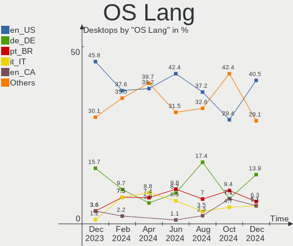
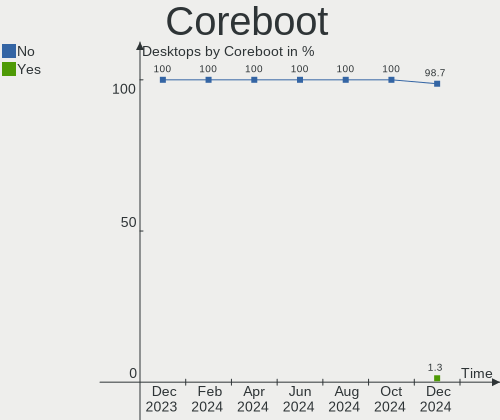
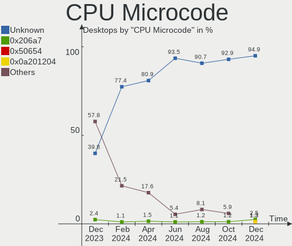
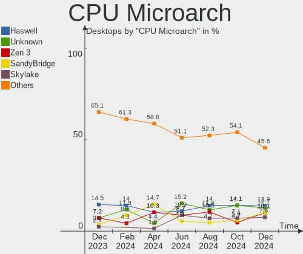
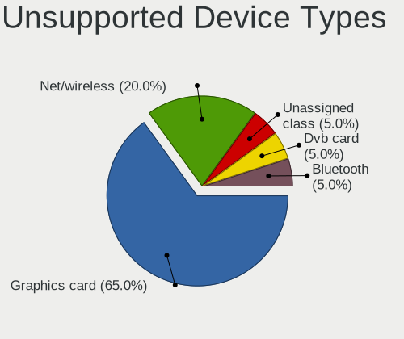

Zorin - Hardware Trends (Desktops)
----------------------------------

A project to identify most popular hardware characteristics and track their change
over time based on data collected by Linux users at https://Linux-Hardware.org.

Anyone can contribute to this report by the [hw-probe](https://github.com/linuxhw/hw-probe) tool:

    sudo -E hw-probe -all -upload

This report is for one last month. Overall report since the beginning of time: [TestDays](https://github.com/linuxhw/TestDays)

Period: Apr, 2023.

Contents
--------

* [ System ](#system)
  - [ OS                       ](#os)
  - [ OS Family                ](#os-family)
  - [ Kernel                   ](#kernel)
  - [ Kernel Family            ](#kernel-family)
  - [ Kernel Major Ver.        ](#kernel-major-ver)
  - [ Arch                     ](#arch)
  - [ DE                       ](#de)
  - [ Display Server           ](#display-server)
  - [ Display Manager          ](#display-manager)
  - [ OS Lang                  ](#os-lang)
  - [ Boot Mode                ](#boot-mode)
  - [ Filesystem               ](#filesystem)
  - [ Part. scheme             ](#part-scheme)
  - [ Dual Boot with Linux/BSD ](#dual-boot-with-linuxbsd)
  - [ Dual Boot (Win)          ](#dual-boot-win)

* [ Board ](#board)
  - [ Vendor                   ](#vendor)
  - [ Model                    ](#model)
  - [ Model Family             ](#model-family)
  - [ MFG Year                 ](#mfg-year)
  - [ Form Factor              ](#form-factor)
  - [ Secure Boot              ](#secure-boot)
  - [ Coreboot                 ](#coreboot)
  - [ RAM Size                 ](#ram-size)
  - [ RAM Used                 ](#ram-used)
  - [ Total Drives             ](#total-drives)
  - [ Has CD-ROM               ](#has-cd-rom)
  - [ Has Ethernet             ](#has-ethernet)
  - [ Has WiFi                 ](#has-wifi)
  - [ Has Bluetooth            ](#has-bluetooth)

* [ Location ](#location)
  - [ Country                  ](#country)
  - [ City                     ](#city)

* [ Drives ](#drives)
  - [ Drive Vendor             ](#drive-vendor)
  - [ Drive Model              ](#drive-model)
  - [ HDD Vendor               ](#hdd-vendor)
  - [ SSD Vendor               ](#ssd-vendor)
  - [ Drive Kind               ](#drive-kind)
  - [ Drive Connector          ](#drive-connector)
  - [ Drive Size               ](#drive-size)
  - [ Space Total              ](#space-total)
  - [ Space Used               ](#space-used)
  - [ Malfunc. Drives          ](#malfunc-drives)
  - [ Malfunc. Drive Vendor    ](#malfunc-drive-vendor)
  - [ Malfunc. HDD Vendor      ](#malfunc-hdd-vendor)
  - [ Malfunc. Drive Kind      ](#malfunc-drive-kind)
  - [ Failed Drives            ](#failed-drives)
  - [ Failed Drive Vendor      ](#failed-drive-vendor)
  - [ Drive Status             ](#drive-status)

* [ Storage controller ](#storage-controller)
  - [ Storage Vendor           ](#storage-vendor)
  - [ Storage Model            ](#storage-model)
  - [ Storage Kind             ](#storage-kind)

* [ Processor ](#processor)
  - [ CPU Vendor               ](#cpu-vendor)
  - [ CPU Model                ](#cpu-model)
  - [ CPU Model Family         ](#cpu-model-family)
  - [ CPU Cores                ](#cpu-cores)
  - [ CPU Sockets              ](#cpu-sockets)
  - [ CPU Threads              ](#cpu-threads)
  - [ CPU Op-Modes             ](#cpu-op-modes)
  - [ CPU Microcode            ](#cpu-microcode)
  - [ CPU Microarch            ](#cpu-microarch)

* [ Graphics ](#graphics)
  - [ GPU Vendor               ](#gpu-vendor)
  - [ GPU Model                ](#gpu-model)
  - [ GPU Combo                ](#gpu-combo)
  - [ GPU Driver               ](#gpu-driver)
  - [ GPU Memory               ](#gpu-memory)

* [ Monitor ](#monitor)
  - [ Monitor Vendor           ](#monitor-vendor)
  - [ Monitor Model            ](#monitor-model)
  - [ Monitor Resolution       ](#monitor-resolution)
  - [ Monitor Diagonal         ](#monitor-diagonal)
  - [ Monitor Width            ](#monitor-width)
  - [ Aspect Ratio             ](#aspect-ratio)
  - [ Monitor Area             ](#monitor-area)
  - [ Pixel Density            ](#pixel-density)
  - [ Multiple Monitors        ](#multiple-monitors)

* [ Network ](#network)
  - [ Net Controller Vendor    ](#net-controller-vendor)
  - [ Net Controller Model     ](#net-controller-model)
  - [ Wireless Vendor          ](#wireless-vendor)
  - [ Wireless Model           ](#wireless-model)
  - [ Ethernet Vendor          ](#ethernet-vendor)
  - [ Ethernet Model           ](#ethernet-model)
  - [ Net Controller Kind      ](#net-controller-kind)
  - [ Used Controller          ](#used-controller)
  - [ NICs                     ](#nics)
  - [ IPv6                     ](#ipv6)

* [ Bluetooth ](#bluetooth)
  - [ Bluetooth Vendor         ](#bluetooth-vendor)
  - [ Bluetooth Model          ](#bluetooth-model)

* [ Sound ](#sound)
  - [ Sound Vendor             ](#sound-vendor)
  - [ Sound Model              ](#sound-model)

* [ Memory ](#memory)
  - [ Memory Vendor            ](#memory-vendor)
  - [ Memory Model             ](#memory-model)
  - [ Memory Kind              ](#memory-kind)
  - [ Memory Form Factor       ](#memory-form-factor)
  - [ Memory Size              ](#memory-size)
  - [ Memory Speed             ](#memory-speed)

* [ Printers & scanners ](#printers--scanners)
  - [ Printer Vendor           ](#printer-vendor)
  - [ Printer Model            ](#printer-model)
  - [ Scanner Vendor           ](#scanner-vendor)
  - [ Scanner Model            ](#scanner-model)

* [ Camera ](#camera)
  - [ Camera Vendor            ](#camera-vendor)
  - [ Camera Model             ](#camera-model)

* [ Security ](#security)
  - [ Fingerprint Vendor       ](#fingerprint-vendor)
  - [ Fingerprint Model        ](#fingerprint-model)
  - [ Chipcard Vendor          ](#chipcard-vendor)
  - [ Chipcard Model           ](#chipcard-model)

* [ Unsupported ](#unsupported)
  - [ Unsupported Devices      ](#unsupported-devices)
  - [ Unsupported Device Types ](#unsupported-device-types)

System
------

OS
--

Installed operating systems

| Name     | Desktops | Percent |
|----------|----------|---------|
| Zorin 16 | 63       | 96.92%  |
| Zorin 15 | 2        | 3.08%   |

OS Family
---------

OS without a version

| Name  | Desktops | Percent |
|-------|----------|---------|
| Zorin | 65       | 100%    |

Kernel
------

Version of the Linux kernel

| Version              | Desktops | Percent |
|----------------------|----------|---------|
| 5.15.0-69-generic    | 49       | 75.38%  |
| 5.15.0-71-generic    | 5        | 7.69%   |
| 5.15.0-67-generic    | 3        | 4.62%   |
| 5.15.0-58-generic    | 2        | 3.08%   |
| 6.1.8-060108-generic | 1        | 1.54%   |
| 5.4.0-147-generic    | 1        | 1.54%   |
| 5.4.0-136-generic    | 1        | 1.54%   |
| 5.15.0-57-generic    | 1        | 1.54%   |
| 5.15.0-56-generic    | 1        | 1.54%   |
| 5.13.0-48-generic    | 1        | 1.54%   |

Kernel Family
-------------

Linux kernel without a distro release

| Version | Desktops | Percent |
|---------|----------|---------|
| 5.15.0  | 61       | 93.85%  |
| 5.4.0   | 2        | 3.08%   |
| 6.1.8   | 1        | 1.54%   |
| 5.13.0  | 1        | 1.54%   |

Kernel Major Ver.
-----------------

Linux kernel major version

| Version | Desktops | Percent |
|---------|----------|---------|
| 5.15    | 61       | 93.85%  |
| 5.4     | 2        | 3.08%   |
| 6.1     | 1        | 1.54%   |
| 5.13    | 1        | 1.54%   |

Arch
----

OS architecture (x86_64, i586, etc.)

| Name   | Desktops | Percent |
|--------|----------|---------|
| x86_64 | 64       | 98.46%  |
| i686   | 1        | 1.54%   |

DE
--

Desktop Environment

| Name  | Desktops | Percent |
|-------|----------|---------|
| GNOME | 45       | 69.23%  |
| XFCE  | 20       | 30.77%  |

Display Server
--------------

X11 or Wayland

| Name | Desktops | Percent |
|------|----------|---------|
| X11  | 65       | 100%    |

Display Manager
---------------

SDDM, LightDM, etc.

| Name    | Desktops | Percent |
|---------|----------|---------|
| Unknown | 53       | 81.54%  |
| LightDM | 6        | 9.23%   |
| GDM     | 4        | 6.15%   |
| GDM3    | 2        | 3.08%   |

OS Lang
-------

Language

| Lang  | Desktops | Percent |
|-------|----------|---------|
| en_US | 21       | 32.31%  |
| pt_BR | 8        | 12.31%  |
| de_DE | 8        | 12.31%  |
| fr_FR | 5        | 7.69%   |
| en_GB | 5        | 7.69%   |
| fi_FI | 2        | 3.08%   |
| en_CA | 2        | 3.08%   |
| sv_SE | 1        | 1.54%   |
| ru_RU | 1        | 1.54%   |
| nl_NL | 1        | 1.54%   |
| it_IT | 1        | 1.54%   |
| hu_HU | 1        | 1.54%   |
| es_VE | 1        | 1.54%   |
| es_MX | 1        | 1.54%   |
| es_GT | 1        | 1.54%   |
| es_AR | 1        | 1.54%   |
| en_SG | 1        | 1.54%   |
| en_IN | 1        | 1.54%   |
| en_AU | 1        | 1.54%   |
| cs_CZ | 1        | 1.54%   |
| ca_ES | 1        | 1.54%   |

Boot Mode
---------

EFI or BIOS

| Mode | Desktops | Percent |
|------|----------|---------|
| BIOS | 38       | 58.46%  |
| EFI  | 27       | 41.54%  |

Filesystem
----------

Type of filesystem

| Type | Desktops | Percent |
|------|----------|---------|
| Ext4 | 65       | 100%    |

Part. scheme
------------

Scheme of partitioning

| Type    | Desktops | Percent |
|---------|----------|---------|
| Unknown | 54       | 83.08%  |
| GPT     | 6        | 9.23%   |
| MBR     | 5        | 7.69%   |

Dual Boot with Linux/BSD
------------------------

Hosting more than one Linux/BSD

| Dual boot | Desktops | Percent |
|-----------|----------|---------|
| No        | 63       | 96.92%  |
| Yes       | 2        | 3.08%   |

Dual Boot (Win)
---------------

Hosting Linux and Windows

| Dual boot | Desktops | Percent |
|-----------|----------|---------|
| No        | 59       | 90.77%  |
| Yes       | 6        | 9.23%   |

Board
-----

Vendor
------

Motherboard manufacturer

| Name                | Desktops | Percent |
|---------------------|----------|---------|
| ASUSTek Computer    | 15       | 23.08%  |
| Gigabyte Technology | 11       | 16.92%  |
| Dell                | 8        | 12.31%  |
| MSI                 | 4        | 6.15%   |
| Pegatron            | 3        | 4.62%   |
| Lenovo              | 3        | 4.62%   |
| Intel               | 3        | 4.62%   |
| Hewlett-Packard     | 3        | 4.62%   |
| Unknown             | 3        | 4.62%   |
| Medion              | 2        | 3.08%   |
| Foxconn             | 2        | 3.08%   |
| ASRock              | 2        | 3.08%   |
| QIYIDA              | 1        | 1.54%   |
| HOUTER              | 1        | 1.54%   |
| eMachines           | 1        | 1.54%   |
| Biostar             | 1        | 1.54%   |
| ASL                 | 1        | 1.54%   |
| Acer                | 1        | 1.54%   |

Model
-----

Motherboard model

| Name                                 | Desktops | Percent |
|--------------------------------------|----------|---------|
| Unknown                              | 3        | 4.62%   |
| Gigabyte GA-MA74GM-S2H               | 2        | 3.08%   |
| ASUS All Series                      | 2        | 3.08%   |
| QIYIDA X99-H9 V2.0                   | 1        | 1.54%   |
| Pegatron p6-2001cs                   | 1        | 1.54%   |
| Pegatron IPM41-D3                    | 1        | 1.54%   |
| Pegatron Elite 7300 Series MT        | 1        | 1.54%   |
| MSI WC963AA-ABF p6355fr              | 1        | 1.54%   |
| MSI MS-7C35                          | 1        | 1.54%   |
| MSI MS-7B84                          | 1        | 1.54%   |
| MSI MS-7808                          | 1        | 1.54%   |
| Medion MS-7707                       | 1        | 1.54%   |
| Medion H61H2-LM3                     | 1        | 1.54%   |
| Lenovo ThinkCentre M715q 10M2A00YLS  | 1        | 1.54%   |
| Lenovo ThinkCentre M700 10J0S2QU00   | 1        | 1.54%   |
| Lenovo H530s 10131                   | 1        | 1.54%   |
| Intel H61                            | 1        | 1.54%   |
| Intel ECO 44 G4                      | 1        | 1.54%   |
| Intel D946GZIS AAD66165-301          | 1        | 1.54%   |
| HOUTER IPMIP-GS                      | 1        | 1.54%   |
| HP Pavilion Gaming Desktop TG01-2xxx | 1        | 1.54%   |
| HP EliteDesk 800 G2 SFF              | 1        | 1.54%   |
| HP Compaq Pro 4300 SFF PC            | 1        | 1.54%   |
| Gigabyte M68MT-S2                    | 1        | 1.54%   |
| Gigabyte H410M S2 V3                 | 1        | 1.54%   |
| Gigabyte GA-78LMT-USB3 6.0           | 1        | 1.54%   |
| Gigabyte EX58-EXTREME                | 1        | 1.54%   |
| Gigabyte B760M GAMING X AX DDR4      | 1        | 1.54%   |
| Gigabyte B650M DS3H                  | 1        | 1.54%   |
| Gigabyte B550M AORUS ELITE           | 1        | 1.54%   |
| Gigabyte B550 AORUS ELITE AX V2      | 1        | 1.54%   |
| Gigabyte B450 AORUS PRO WIFI         | 1        | 1.54%   |
| Foxconn G41S/G41S-K                  | 1        | 1.54%   |
| Foxconn G31MVP FAB:1.0               | 1        | 1.54%   |
| eMachines ET1331G                    | 1        | 1.54%   |
| Dell Precision WorkStation T5500     | 1        | 1.54%   |
| Dell OptiPlex 780                    | 1        | 1.54%   |
| Dell OptiPlex 760                    | 1        | 1.54%   |
| Dell OptiPlex 7020                   | 1        | 1.54%   |
| Dell OptiPlex 7010                   | 1        | 1.54%   |

Model Family
------------

Motherboard model prefix

| Name                   | Desktops | Percent |
|------------------------|----------|---------|
| Dell OptiPlex          | 7        | 10.77%  |
| ASUS TUF               | 3        | 4.62%   |
| ASUS PRIME             | 3        | 4.62%   |
| Unknown                | 3        | 4.62%   |
| Lenovo ThinkCentre     | 2        | 3.08%   |
| Gigabyte GA-MA74GM-S2H | 2        | 3.08%   |
| ASUS All               | 2        | 3.08%   |
| QIYIDA X99-H9          | 1        | 1.54%   |
| Pegatron p6-2001cs     | 1        | 1.54%   |
| Pegatron IPM41-D3      | 1        | 1.54%   |
| Pegatron Elite         | 1        | 1.54%   |
| MSI WC963AA-ABF        | 1        | 1.54%   |
| MSI MS-7C35            | 1        | 1.54%   |
| MSI MS-7B84            | 1        | 1.54%   |
| MSI MS-7808            | 1        | 1.54%   |
| Medion MS-7707         | 1        | 1.54%   |
| Medion H61H2-LM3       | 1        | 1.54%   |
| Lenovo H530s           | 1        | 1.54%   |
| Intel H61              | 1        | 1.54%   |
| Intel ECO              | 1        | 1.54%   |
| Intel D946GZIS         | 1        | 1.54%   |
| HOUTER IPMIP-GS        | 1        | 1.54%   |
| HP Pavilion            | 1        | 1.54%   |
| HP EliteDesk           | 1        | 1.54%   |
| HP Compaq              | 1        | 1.54%   |
| Gigabyte M68MT-S2      | 1        | 1.54%   |
| Gigabyte H410M         | 1        | 1.54%   |
| Gigabyte GA-78LMT-USB3 | 1        | 1.54%   |
| Gigabyte EX58-EXTREME  | 1        | 1.54%   |
| Gigabyte B760M         | 1        | 1.54%   |
| Gigabyte B650M         | 1        | 1.54%   |
| Gigabyte B550M         | 1        | 1.54%   |
| Gigabyte B550          | 1        | 1.54%   |
| Gigabyte B450          | 1        | 1.54%   |
| Foxconn G41S           | 1        | 1.54%   |
| Foxconn G31MVP         | 1        | 1.54%   |
| eMachines ET1331G      | 1        | 1.54%   |
| Dell Precision         | 1        | 1.54%   |
| Biostar TZ75B          | 1        | 1.54%   |
| ASUS ROG               | 1        | 1.54%   |

MFG Year
--------

Motherboard manufacture year

| Year | Desktops | Percent |
|------|----------|---------|
| 2012 | 8        | 12.31%  |
| 2008 | 7        | 10.77%  |
| 2017 | 6        | 9.23%   |
| 2011 | 6        | 9.23%   |
| 2010 | 5        | 7.69%   |
| 2022 | 4        | 6.15%   |
| 2021 | 4        | 6.15%   |
| 2019 | 4        | 6.15%   |
| 2014 | 4        | 6.15%   |
| 2009 | 4        | 6.15%   |
| 2020 | 3        | 4.62%   |
| 2018 | 2        | 3.08%   |
| 2015 | 2        | 3.08%   |
| 2013 | 2        | 3.08%   |
| 2023 | 1        | 1.54%   |
| 2016 | 1        | 1.54%   |
| 2007 | 1        | 1.54%   |
| 2006 | 1        | 1.54%   |

Form Factor
-----------

Physical design of the computer

| Name    | Desktops | Percent |
|---------|----------|---------|
| Desktop | 65       | 100%    |

Secure Boot
-----------

Enabled or disabled

| State    | Desktops | Percent |
|----------|----------|---------|
| Disabled | 57       | 87.69%  |
| Enabled  | 8        | 12.31%  |

Coreboot
--------

Have coreboot on board

| Used | Desktops | Percent |
|------|----------|---------|
| No   | 65       | 100%    |

RAM Size
--------

Total RAM memory

| Size in GB  | Desktops | Percent |
|-------------|----------|---------|
| 16.01-24.0  | 20       | 30.77%  |
| 3.01-4.0    | 13       | 20%     |
| 8.01-16.0   | 11       | 16.92%  |
| 4.01-8.0    | 8        | 12.31%  |
| 32.01-64.0  | 5        | 7.69%   |
| 24.01-32.0  | 3        | 4.62%   |
| 64.01-256.0 | 2        | 3.08%   |
| 1.01-2.0    | 2        | 3.08%   |
| 2.01-3.0    | 1        | 1.54%   |

RAM Used
--------

Used RAM memory

| Used GB   | Desktops | Percent |
|-----------|----------|---------|
| 1.01-2.0  | 24       | 36.92%  |
| 2.01-3.0  | 19       | 29.23%  |
| 3.01-4.0  | 12       | 18.46%  |
| 4.01-8.0  | 7        | 10.77%  |
| 0.51-1.0  | 2        | 3.08%   |
| 8.01-16.0 | 1        | 1.54%   |

Total Drives
------------

Number of drives on board

| Drives | Desktops | Percent |
|--------|----------|---------|
| 1      | 36       | 55.38%  |
| 2      | 11       | 16.92%  |
| 5      | 6        | 9.23%   |
| 3      | 6        | 9.23%   |
| 4      | 5        | 7.69%   |
| 7      | 1        | 1.54%   |

Has CD-ROM
----------

Has CD-ROM on board

| Presented | Desktops | Percent |
|-----------|----------|---------|
| Yes       | 36       | 55.38%  |
| No        | 29       | 44.62%  |

Has Ethernet
------------

Has Ethernet on board

| Presented | Desktops | Percent |
|-----------|----------|---------|
| Yes       | 64       | 98.46%  |
| No        | 1        | 1.54%   |

Has WiFi
--------

Has WiFi module

| Presented | Desktops | Percent |
|-----------|----------|---------|
| Yes       | 37       | 56.92%  |
| No        | 28       | 43.08%  |

Has Bluetooth
-------------

Has Bluetooth module

| Presented | Desktops | Percent |
|-----------|----------|---------|
| No        | 44       | 67.69%  |
| Yes       | 21       | 32.31%  |

Location
--------

Country
-------

Geographic location (country)

| Country     | Desktops | Percent |
|-------------|----------|---------|
| USA         | 14       | 21.54%  |
| Germany     | 9        | 13.85%  |
| Brazil      | 8        | 12.31%  |
| UK          | 5        | 7.69%   |
| France      | 4        | 6.15%   |
| Russia      | 2        | 3.08%   |
| Netherlands | 2        | 3.08%   |
| Italy       | 2        | 3.08%   |
| Finland     | 2        | 3.08%   |
| Czechia     | 2        | 3.08%   |
| Canada      | 2        | 3.08%   |
| Venezuela   | 1        | 1.54%   |
| Sweden      | 1        | 1.54%   |
| Spain       | 1        | 1.54%   |
| Singapore   | 1        | 1.54%   |
| Mexico      | 1        | 1.54%   |
| Malaysia    | 1        | 1.54%   |
| Madagascar  | 1        | 1.54%   |
| Indonesia   | 1        | 1.54%   |
| India       | 1        | 1.54%   |
| Hungary     | 1        | 1.54%   |
| Guatemala   | 1        | 1.54%   |
| Australia   | 1        | 1.54%   |
| Argentina   | 1        | 1.54%   |

City
----

Geographic location (city)

| City                  | Desktops | Percent |
|-----------------------|----------|---------|
| Rome                  | 2        | 3.08%   |
| Dortmund              | 2        | 3.08%   |
| Würzburg             | 1        | 1.54%   |
| Wisconsin Rapids      | 1        | 1.54%   |
| Viedma                | 1        | 1.54%   |
| Vernon                | 1        | 1.54%   |
| Toluca                | 1        | 1.54%   |
| The Hague             | 1        | 1.54%   |
| Swansea               | 1        | 1.54%   |
| Stockholm             | 1        | 1.54%   |
| Singapore             | 1        | 1.54%   |
| Schomberg             | 1        | 1.54%   |
| Sarnia                | 1        | 1.54%   |
| Sao Jose do Rio Preto | 1        | 1.54%   |
| Sao Caetano do Sul    | 1        | 1.54%   |
| Sant Celoni           | 1        | 1.54%   |
| Rovaniemi             | 1        | 1.54%   |
| Rio de Janeiro        | 1        | 1.54%   |
| Recife                | 1        | 1.54%   |
| Prescot               | 1        | 1.54%   |
| Prague                | 1        | 1.54%   |
| Port Saint Lucie      | 1        | 1.54%   |
| Phoenix               | 1        | 1.54%   |
| Palmer                | 1        | 1.54%   |
| Palmas                | 1        | 1.54%   |
| Oosterwolde           | 1        | 1.54%   |
| Novosibirsk           | 1        | 1.54%   |
| Neuss                 | 1        | 1.54%   |
| Mittel-Gruendau       | 1        | 1.54%   |
| Miskolc               | 1        | 1.54%   |
| Melbourne             | 1        | 1.54%   |
| Mason                 | 1        | 1.54%   |
| Mandaguari            | 1        | 1.54%   |
| Lucknow               | 1        | 1.54%   |
| Lorena                | 1        | 1.54%   |
| London                | 1        | 1.54%   |
| Liverpool             | 1        | 1.54%   |
| Latonia               | 1        | 1.54%   |
| Lady Lake             | 1        | 1.54%   |
| Kuala Lumpur          | 1        | 1.54%   |

Drives
------

Drive Vendor
------------

Hard drive vendors

| Vendor                    | Desktops | Drives | Percent |
|---------------------------|----------|--------|---------|
| Seagate                   | 21       | 27     | 18.42%  |
| WDC                       | 19       | 21     | 16.67%  |
| Samsung Electronics       | 16       | 19     | 14.04%  |
| Toshiba                   | 7        | 7      | 6.14%   |
| Kingston                  | 7        | 11     | 6.14%   |
| SanDisk                   | 5        | 7      | 4.39%   |
| JMicron Technology        | 3        | 3      | 2.63%   |
| Crucial                   | 3        | 4      | 2.63%   |
| A-DATA Technology         | 3        | 3      | 2.63%   |
| Micron/Crucial Technology | 2        | 2      | 1.75%   |
| Intenso                   | 2        | 2      | 1.75%   |
| Hitachi                   | 2        | 2      | 1.75%   |
| China                     | 2        | 2      | 1.75%   |
| Unknown                   | 2        | 2      | 1.75%   |
| XrayDisk                  | 1        | 1      | 0.88%   |
| X12                       | 1        | 1      | 0.88%   |
| VERICO                    | 1        | 1      | 0.88%   |
| Unknown                   | 1        | 1      | 0.88%   |
| Silicon Motion            | 1        | 1      | 0.88%   |
| Realtek Semiconductor     | 1        | 1      | 0.88%   |
| PNY                       | 1        | 1      | 0.88%   |
| Patriot                   | 1        | 1      | 0.88%   |
| Netac                     | 1        | 1      | 0.88%   |
| LaCie                     | 1        | 1      | 0.88%   |
| KLEVV                     | 1        | 1      | 0.88%   |
| KIOXIA                    | 1        | 1      | 0.88%   |
| HUSKY                     | 1        | 1      | 0.88%   |
| HUAWEI                    | 1        | 1      | 0.88%   |
| HGST                      | 1        | 1      | 0.88%   |
| Gigabyte Technology       | 1        | 1      | 0.88%   |
| Corsair                   | 1        | 2      | 0.88%   |
| Colorful                  | 1        | 1      | 0.88%   |
| AMD                       | 1        | 1      | 0.88%   |
| AFOX                      | 1        | 1      | 0.88%   |

Drive Model
-----------

Hard drive models

| Model                                              | Desktops | Percent |
|----------------------------------------------------|----------|---------|
| Toshiba DT01ACA100 1TB                             | 3        | 2.33%   |
| Kingston SA400S37240G 240GB SSD                    | 3        | 2.33%   |
| JMicron Generic 1TB                                | 3        | 2.33%   |
| WDC WDS240G2G0A-00JH30 240GB SSD                   | 2        | 1.55%   |
| Seagate ST500DM002-1BD142 500GB                    | 2        | 1.55%   |
| Seagate ST1000DM010-2EP102 1TB                     | 2        | 1.55%   |
| Seagate ST1000DM003-1SB10C 1TB                     | 2        | 1.55%   |
| Samsung SSD 860 EVO 250GB                          | 2        | 1.55%   |
| Samsung NVMe SSD Controller SM981/PM981/PM983 1TB  | 2        | 1.55%   |
| Samsung NVMe SSD Controller PM9A1/PM9A3/980PRO 2TB | 2        | 1.55%   |
| Micron/Crucial P2 NVMe PCIe SSD 1TB                | 2        | 1.55%   |
| Kingston SV300S37A120G 120GB SSD                   | 2        | 1.55%   |
| Crucial CT2000MX500SSD1 2TB                        | 2        | 1.55%   |
| Unknown                                            | 2        | 1.55%   |
| XrayDisk 1TB SSD                                   | 1        | 0.78%   |
| X12 SSD 1TB                                        | 1        | 0.78%   |
| WDC WDS120G2G0B-00EPW0 120GB SSD                   | 1        | 0.78%   |
| WDC WD6401AALS-00L3B2 640GB                        | 1        | 0.78%   |
| WDC WD6400AAKS-75A7B2 640GB                        | 1        | 0.78%   |
| WDC WD60EZRX-11MVLB1 6TB                           | 1        | 0.78%   |
| WDC WD60EZAZ-00ZGHB0 6TB                           | 1        | 0.78%   |
| WDC WD5003AZEX-00K1GA0 500GB                       | 1        | 0.78%   |
| WDC WD5000AAKX-22ERMA0 500GB                       | 1        | 0.78%   |
| WDC WD5000AAKX-00U6AA0 500GB                       | 1        | 0.78%   |
| WDC WD5000AAKX-001CA0 500GB                        | 1        | 0.78%   |
| WDC WD40EZAZ-00SF3B0 4TB                           | 1        | 0.78%   |
| WDC WD3200AAJS-65M0A0 320GB                        | 1        | 0.78%   |
| WDC WD30EZRZ-22Z5HB0 3TB                           | 1        | 0.78%   |
| WDC WD30EZRX-00D8PB0 3TB                           | 1        | 0.78%   |
| WDC WD2500JS-58NCB1 250GB                          | 1        | 0.78%   |
| WDC WD10SPZX-22Z10T1 1TB                           | 1        | 0.78%   |
| WDC WD10EZEX-60WN4A2 1TB                           | 1        | 0.78%   |
| WDC WD10EFRX-68FYTN0 1TB                           | 1        | 0.78%   |
| WDC WD10EADS-00L5B1 1TB                            | 1        | 0.78%   |
| WDC PC SN530 SDBPNPZ-512G-1006 512GB               | 1        | 0.78%   |
| VERICO SSD 240GB                                   | 1        | 0.78%   |
| Unknown NVMe SSD Drive 500GB                       | 1        | 0.78%   |
| Toshiba MQ01ACF032 320GB                           | 1        | 0.78%   |
| Toshiba HDWD240 4TB                                | 1        | 0.78%   |
| Toshiba HDWD130 3TB                                | 1        | 0.78%   |

HDD Vendor
----------

Hard disk drive vendors

| Vendor              | Desktops | Drives | Percent |
|---------------------|----------|--------|---------|
| Seagate             | 21       | 26     | 37.5%   |
| WDC                 | 16       | 17     | 28.57%  |
| Toshiba             | 7        | 7      | 12.5%   |
| Samsung Electronics | 6        | 6      | 10.71%  |
| JMicron Technology  | 3        | 3      | 5.36%   |
| Hitachi             | 2        | 2      | 3.57%   |
| HGST                | 1        | 1      | 1.79%   |

SSD Vendor
----------

Solid state drive vendors

| Vendor              | Desktops | Drives | Percent |
|---------------------|----------|--------|---------|
| Kingston            | 7        | 10     | 16.67%  |
| Samsung Electronics | 6        | 7      | 14.29%  |
| SanDisk             | 4        | 5      | 9.52%   |
| WDC                 | 3        | 3      | 7.14%   |
| Crucial             | 3        | 4      | 7.14%   |
| A-DATA Technology   | 3        | 3      | 7.14%   |
| Intenso             | 2        | 2      | 4.76%   |
| China               | 2        | 2      | 4.76%   |
| XrayDisk            | 1        | 1      | 2.38%   |
| X12                 | 1        | 1      | 2.38%   |
| VERICO              | 1        | 1      | 2.38%   |
| PNY                 | 1        | 1      | 2.38%   |
| Patriot             | 1        | 1      | 2.38%   |
| Netac               | 1        | 1      | 2.38%   |
| KLEVV               | 1        | 1      | 2.38%   |
| HUSKY               | 1        | 1      | 2.38%   |
| Gigabyte Technology | 1        | 1      | 2.38%   |
| Corsair             | 1        | 2      | 2.38%   |
| AFOX                | 1        | 1      | 2.38%   |
| Unknown             | 1        | 1      | 2.38%   |

Drive Kind
----------

HDD or SSD

| Kind    | Desktops | Drives | Percent |
|---------|----------|--------|---------|
| HDD     | 45       | 62     | 48.39%  |
| SSD     | 30       | 49     | 32.26%  |
| NVMe    | 15       | 19     | 16.13%  |
| Unknown | 3        | 3      | 3.23%   |

Drive Connector
---------------

SATA, SAS, NVMe, etc.

| Type | Desktops | Drives | Percent |
|------|----------|--------|---------|
| SATA | 59       | 108    | 73.75%  |
| NVMe | 15       | 19     | 18.75%  |
| SAS  | 6        | 6      | 7.5%    |

Drive Size
----------

Size of hard drive

| Size in TB | Desktops | Drives | Percent |
|------------|----------|--------|---------|
| 0.01-0.5   | 44       | 62     | 53.66%  |
| 0.51-1.0   | 21       | 31     | 25.61%  |
| 1.01-2.0   | 7        | 8      | 8.54%   |
| 3.01-4.0   | 4        | 4      | 4.88%   |
| 2.01-3.0   | 3        | 3      | 3.66%   |
| 4.01-10.0  | 3        | 3      | 3.66%   |

Space Total
-----------

Amount of disk space available on the file system

| Size in GB     | Desktops | Percent |
|----------------|----------|---------|
| 101-250        | 21       | 32.31%  |
| 251-500        | 16       | 24.62%  |
| 501-1000       | 11       | 16.92%  |
| 1001-2000      | 7        | 10.77%  |
| 51-100         | 4        | 6.15%   |
| More than 3000 | 3        | 4.62%   |
| 1-20           | 2        | 3.08%   |
| 2001-3000      | 1        | 1.54%   |

Space Used
----------

Amount of used disk space

| Used GB        | Desktops | Percent |
|----------------|----------|---------|
| 1-20           | 22       | 33.85%  |
| 51-100         | 12       | 18.46%  |
| 21-50          | 11       | 16.92%  |
| 101-250        | 10       | 15.38%  |
| 251-500        | 5        | 7.69%   |
| 1001-2000      | 2        | 3.08%   |
| 501-1000       | 2        | 3.08%   |
| More than 3000 | 1        | 1.54%   |

Malfunc. Drives
---------------

Drive models with a malfunction

| Model                            | Desktops | Drives | Percent |
|----------------------------------|----------|--------|---------|
| Toshiba DT01ACA100 1TB           | 1        | 1      | 33.33%  |
| Seagate ST3360320AS 360GB        | 1        | 1      | 33.33%  |
| Kingston SV300S37A120G 120GB SSD | 1        | 1      | 33.33%  |

Malfunc. Drive Vendor
---------------------

Vendors of faulty drives

| Vendor   | Desktops | Drives | Percent |
|----------|----------|--------|---------|
| Toshiba  | 1        | 1      | 33.33%  |
| Seagate  | 1        | 1      | 33.33%  |
| Kingston | 1        | 1      | 33.33%  |

Malfunc. HDD Vendor
-------------------

Vendors of faulty HDD drives

| Vendor  | Desktops | Drives | Percent |
|---------|----------|--------|---------|
| Toshiba | 1        | 1      | 50%     |
| Seagate | 1        | 1      | 50%     |

Malfunc. Drive Kind
-------------------

Kinds of faulty drives

| Kind | Desktops | Drives | Percent |
|------|----------|--------|---------|
| SSD  | 1        | 1      | 50%     |
| HDD  | 1        | 2      | 50%     |

Failed Drives
-------------

Failed drive models

Zero info for selected period =(

Failed Drive Vendor
-------------------

Failed drive vendors

Zero info for selected period =(

Drive Status
------------

Number of failed and malfunc. drives

| Status   | Desktops | Drives | Percent |
|----------|----------|--------|---------|
| Detected | 59       | 114    | 85.51%  |
| Works    | 8        | 16     | 11.59%  |
| Malfunc  | 2        | 3      | 2.9%    |

Storage controller
------------------

Storage Vendor
--------------

Storage controller vendors

| Vendor                      | Desktops | Percent |
|-----------------------------|----------|---------|
| Intel                       | 43       | 50%     |
| AMD                         | 20       | 23.26%  |
| Samsung Electronics         | 4        | 4.65%   |
| SanDisk                     | 3        | 3.49%   |
| Silicon Motion              | 2        | 2.33%   |
| Nvidia                      | 2        | 2.33%   |
| Micron/Crucial Technology   | 2        | 2.33%   |
| Marvell Technology Group    | 2        | 2.33%   |
| VIA Technologies            | 1        | 1.16%   |
| TenaFe                      | 1        | 1.16%   |
| Seagate Technology          | 1        | 1.16%   |
| Realtek Semiconductor       | 1        | 1.16%   |
| KIOXIA                      | 1        | 1.16%   |
| Kingston Technology Company | 1        | 1.16%   |
| JMicron Technology          | 1        | 1.16%   |
| ASMedia Technology          | 1        | 1.16%   |

Storage Model
-------------

Storage controller models

| Model                                                                                   | Desktops | Percent |
|-----------------------------------------------------------------------------------------|----------|---------|
| AMD FCH SATA Controller [AHCI mode]                                                     | 9        | 8.18%   |
| Intel NM10/ICH7 Family SATA Controller [IDE mode]                                       | 7        | 6.36%   |
| Intel 82801G (ICH7 Family) IDE Controller                                               | 6        | 5.45%   |
| Intel 8 Series/C220 Series Chipset Family 6-port SATA Controller 1 [AHCI mode]          | 6        | 5.45%   |
| Intel 6 Series/C200 Series Chipset Family 6 port Desktop SATA AHCI Controller           | 6        | 5.45%   |
| AMD SB7x0/SB8x0/SB9x0 IDE Controller                                                    | 4        | 3.64%   |
| AMD 500 Series Chipset SATA Controller                                                  | 4        | 3.64%   |
| Intel SATA Controller [RAID mode]                                                       | 3        | 2.73%   |
| Intel Q170/Q150/B150/H170/H110/Z170/CM236 Chipset SATA Controller [AHCI Mode]           | 3        | 2.73%   |
| AMD SB7x0/SB8x0/SB9x0 SATA Controller [IDE mode]                                        | 3        | 2.73%   |
| AMD 400 Series Chipset SATA Controller                                                  | 3        | 2.73%   |
| Silicon Motion SM2263EN/SM2263XT SSD Controller                                         | 2        | 1.82%   |
| Samsung NVMe SSD Controller SM981/PM981/PM983                                           | 2        | 1.82%   |
| Samsung NVMe SSD Controller PM9A1/PM9A3/980PRO                                          | 2        | 1.82%   |
| Nvidia MCP61 SATA Controller                                                            | 2        | 1.82%   |
| Micron/Crucial P2 NVMe PCIe SSD                                                         | 2        | 1.82%   |
| Intel 82801JI (ICH10 Family) SATA AHCI Controller                                       | 2        | 1.82%   |
| Intel 7 Series/C210 Series Chipset Family 6-port SATA Controller [AHCI mode]            | 2        | 1.82%   |
| Intel 6 Series/C200 Series Chipset Family Desktop SATA Controller (IDE mode, ports 4-5) | 2        | 1.82%   |
| Intel 6 Series/C200 Series Chipset Family Desktop SATA Controller (IDE mode, ports 0-3) | 2        | 1.82%   |
| Intel 5 Series/3400 Series Chipset 6 port SATA AHCI Controller                          | 2        | 1.82%   |
| AMD SB7x0/SB8x0/SB9x0 SATA Controller [AHCI mode]                                       | 2        | 1.82%   |
| VIA VT6415 PATA IDE Host Controller                                                     | 1        | 0.91%   |
| TenaFe Non-Volatile memory controller                                                   | 1        | 0.91%   |
| Seagate FireCuda 530 SSD                                                                | 1        | 0.91%   |
| SanDisk WD Blue SN550 NVMe SSD                                                          | 1        | 0.91%   |
| SanDisk WD Black SN770 NVMe SSD                                                         | 1        | 0.91%   |
| SanDisk WD Black SN750 / PC SN730 NVMe SSD                                              | 1        | 0.91%   |
| Realtek RTS5763DL NVMe SSD Controller                                                   | 1        | 0.91%   |
| Nvidia MCP61 IDE                                                                        | 1        | 0.91%   |
| Marvell Group 88SE9215 PCIe 2.0 x1 4-port SATA 6 Gb/s Controller                        | 1        | 0.91%   |
| Marvell Group 88SE6111/6121 SATA II / PATA Controller                                   | 1        | 0.91%   |
| KIOXIA NVMe SSD Controller BG4                                                          | 1        | 0.91%   |
| Kingston Company A2000 NVMe SSD                                                         | 1        | 0.91%   |
| JMicron JMB363 SATA/IDE Controller                                                      | 1        | 0.91%   |
| Intel Volume Management Device NVMe RAID Controller                                     | 1        | 0.91%   |
| Intel Jasper Lake SATA AHCI Controller                                                  | 1        | 0.91%   |
| Intel Atom Processor E3800 Series SATA AHCI Controller                                  | 1        | 0.91%   |
| Intel Alder Lake-S PCH SATA Controller [AHCI Mode]                                      | 1        | 0.91%   |
| Intel 82801JD/DO (ICH10 Family) 4-port SATA IDE Controller                              | 1        | 0.91%   |

Storage Kind
------------

Kind of storage controller (IDE, SATA, NVMe, SAS, ...)

| Kind | Desktops | Percent |
|------|----------|---------|
| SATA | 47       | 52.81%  |
| IDE  | 22       | 24.72%  |
| NVMe | 15       | 16.85%  |
| RAID | 5        | 5.62%   |

Processor
---------

CPU Vendor
----------

Processor vendors

| Vendor | Desktops | Percent |
|--------|----------|---------|
| Intel  | 43       | 66.15%  |
| AMD    | 22       | 33.85%  |

CPU Model
---------

Processor models

| Model                                       | Desktops | Percent |
|---------------------------------------------|----------|---------|
| AMD Ryzen 5 5600G with Radeon Graphics      | 5        | 7.69%   |
| Intel Core i7-2600 CPU @ 3.40GHz            | 3        | 4.62%   |
| Intel Core i7-4790 CPU @ 3.60GHz            | 2        | 3.08%   |
| Intel Core i5-6500 CPU @ 3.20GHz            | 2        | 3.08%   |
| Intel Core 2 Duo CPU E7500 @ 2.93GHz        | 2        | 3.08%   |
| Intel Xeon CPU E5506 @ 2.13GHz              | 1        | 1.54%   |
| Intel Xeon CPU E5-2630L v3 @ 1.80GHz        | 1        | 1.54%   |
| Intel Pentium Dual-Core CPU E5700 @ 3.00GHz | 1        | 1.54%   |
| Intel Pentium Dual CPU E2140 @ 1.60GHz      | 1        | 1.54%   |
| Intel Pentium CPU G3420 @ 3.20GHz           | 1        | 1.54%   |
| Intel Pentium CPU G2030 @ 3.00GHz           | 1        | 1.54%   |
| Intel Pentium 4 CPU 3.40GHz                 | 1        | 1.54%   |
| Intel Core i7-8700K CPU @ 3.70GHz           | 1        | 1.54%   |
| Intel Core i7-4770 CPU @ 3.40GHz            | 1        | 1.54%   |
| Intel Core i7 CPU 965 @ 3.20GHz             | 1        | 1.54%   |
| Intel Core i7 CPU 860 @ 2.80GHz             | 1        | 1.54%   |
| Intel Core i5-7500 CPU @ 3.40GHz            | 1        | 1.54%   |
| Intel Core i5-6500T CPU @ 2.50GHz           | 1        | 1.54%   |
| Intel Core i5-3470S CPU @ 2.90GHz           | 1        | 1.54%   |
| Intel Core i5-3470 CPU @ 3.20GHz            | 1        | 1.54%   |
| Intel Core i5-2400 CPU @ 3.10GHz            | 1        | 1.54%   |
| Intel Core i5-2300 CPU @ 2.80GHz            | 1        | 1.54%   |
| Intel Core i3-4160 CPU @ 3.60GHz            | 1        | 1.54%   |
| Intel Core i3-4010U CPU @ 1.70GHz           | 1        | 1.54%   |
| Intel Core i3-3220 CPU @ 3.30GHz            | 1        | 1.54%   |
| Intel Core i3-2120 CPU @ 3.30GHz            | 1        | 1.54%   |
| Intel Core i3-2100 CPU @ 3.10GHz            | 1        | 1.54%   |
| Intel Core i3-10105F CPU @ 3.70GHz          | 1        | 1.54%   |
| Intel Core i3 CPU 530 @ 2.93GHz             | 1        | 1.54%   |
| Intel Core 2 Quad CPU Q9500 @ 2.83GHz       | 1        | 1.54%   |
| Intel Core 2 Duo CPU E8400 @ 3.00GHz        | 1        | 1.54%   |
| Intel Core 2 Duo CPU E7300 @ 2.66GHz        | 1        | 1.54%   |
| Intel Core 2 Duo CPU E6550 @ 2.33GHz        | 1        | 1.54%   |
| Intel Core 2 CPU 6400 @ 2.13GHz             | 1        | 1.54%   |
| Intel Celeron N5105 @ 2.00GHz               | 1        | 1.54%   |
| Intel Celeron CPU J1900 @ 1.99GHz           | 1        | 1.54%   |
| Intel Celeron CPU E1400 @ 2.00GHz           | 1        | 1.54%   |
| Intel 13th Gen Core i5-13500                | 1        | 1.54%   |
| Intel 12th Gen Core i9-12900F               | 1        | 1.54%   |
| AMD Ryzen 9 7950X 16-Core Processor         | 1        | 1.54%   |

CPU Model Family
----------------

Processor model prefix

| Model                   | Desktops | Percent |
|-------------------------|----------|---------|
| Intel Core i7           | 9        | 13.85%  |
| AMD Ryzen 5             | 9        | 13.85%  |
| Intel Core i5           | 8        | 12.31%  |
| Intel Core i3           | 7        | 10.77%  |
| Intel Core 2 Duo        | 5        | 7.69%   |
| AMD Athlon II X2        | 4        | 6.15%   |
| Other                   | 3        | 4.62%   |
| Intel Celeron           | 3        | 4.62%   |
| Intel Xeon              | 2        | 3.08%   |
| Intel Pentium           | 2        | 3.08%   |
| AMD Ryzen 9             | 2        | 3.08%   |
| AMD FX                  | 2        | 3.08%   |
| Intel Pentium Dual-Core | 1        | 1.54%   |
| Intel Pentium Dual      | 1        | 1.54%   |
| Intel Pentium 4         | 1        | 1.54%   |
| Intel Core 2 Quad       | 1        | 1.54%   |
| Intel Core 2            | 1        | 1.54%   |
| AMD Ryzen 7             | 1        | 1.54%   |
| AMD Ryzen 3             | 1        | 1.54%   |
| AMD Phenom II X6        | 1        | 1.54%   |
| AMD A8                  | 1        | 1.54%   |

CPU Cores
---------

Number of processor cores

| Number | Desktops | Percent |
|--------|----------|---------|
| 4      | 23       | 35.38%  |
| 2      | 22       | 33.85%  |
| 6      | 11       | 16.92%  |
| 16     | 2        | 3.08%   |
| 8      | 2        | 3.08%   |
| 1      | 2        | 3.08%   |
| 14     | 1        | 1.54%   |
| 12     | 1        | 1.54%   |
| 3      | 1        | 1.54%   |

CPU Sockets
-----------

Number of sockets

| Number | Desktops | Percent |
|--------|----------|---------|
| 1      | 65       | 100%    |

CPU Threads
-----------

Threads per core (Hyper-Threading)

| Number | Desktops | Percent |
|--------|----------|---------|
| 2      | 34       | 52.31%  |
| 1      | 31       | 47.69%  |

CPU Op-Modes
------------

CPU Operation Modes (32-bit, 64-bit)

| Op mode        | Desktops | Percent |
|----------------|----------|---------|
| 32-bit, 64-bit | 65       | 100%    |

CPU Microcode
-------------

Microcode number

| Number     | Desktops | Percent |
|------------|----------|---------|
| Unknown    | 8        | 12.31%  |
| 0x206a7    | 7        | 10.77%  |
| 0x306c3    | 5        | 7.69%   |
| 0x1067a    | 4        | 6.15%   |
| 0x506e3    | 3        | 4.62%   |
| 0x306a9    | 3        | 4.62%   |
| 0x0a50000d | 3        | 4.62%   |
| 0x6fd      | 2        | 3.08%   |
| 0x0a601203 | 2        | 3.08%   |
| 0x010000c8 | 2        | 3.08%   |
| 0xf65      | 1        | 1.54%   |
| 0xa0653    | 1        | 1.54%   |
| 0x906ea    | 1        | 1.54%   |
| 0x906e9    | 1        | 1.54%   |
| 0x906c0    | 1        | 1.54%   |
| 0x90672    | 1        | 1.54%   |
| 0x6fb      | 1        | 1.54%   |
| 0x6f6      | 1        | 1.54%   |
| 0x40651    | 1        | 1.54%   |
| 0x306f2    | 1        | 1.54%   |
| 0x30678    | 1        | 1.54%   |
| 0x20652    | 1        | 1.54%   |
| 0x106a5    | 1        | 1.54%   |
| 0x10676    | 1        | 1.54%   |
| 0x0a50000c | 1        | 1.54%   |
| 0x0a201025 | 1        | 1.54%   |
| 0x0a201009 | 1        | 1.54%   |
| 0x08701021 | 1        | 1.54%   |
| 0x08108109 | 1        | 1.54%   |
| 0x08001138 | 1        | 1.54%   |
| 0x08001126 | 1        | 1.54%   |
| 0x06006118 | 1        | 1.54%   |
| 0x06000852 | 1        | 1.54%   |
| 0x0600063e | 1        | 1.54%   |
| 0x03000027 | 1        | 1.54%   |
| 0x010000dc | 1        | 1.54%   |

CPU Microarch
-------------

Microarchitecture

| Name             | Desktops | Percent |
|------------------|----------|---------|
| Zen 3            | 7        | 10.77%  |
| SandyBridge      | 7        | 10.77%  |
| Haswell          | 7        | 10.77%  |
| Penryn           | 6        | 9.23%   |
| K10              | 5        | 7.69%   |
| IvyBridge        | 4        | 6.15%   |
| Core             | 4        | 6.15%   |
| Skylake          | 3        | 4.62%   |
| Nehalem          | 3        | 4.62%   |
| Unknown          | 3        | 4.62%   |
| Zen              | 2        | 3.08%   |
| KabyLake         | 2        | 3.08%   |
| Zen+             | 1        | 1.54%   |
| Zen 2            | 1        | 1.54%   |
| Westmere         | 1        | 1.54%   |
| Tremont          | 1        | 1.54%   |
| Silvermont       | 1        | 1.54%   |
| Piledriver       | 1        | 1.54%   |
| NetBurst         | 1        | 1.54%   |
| K10 Llano        | 1        | 1.54%   |
| Excavator        | 1        | 1.54%   |
| CometLake        | 1        | 1.54%   |
| Bulldozer        | 1        | 1.54%   |
| Alderlake Hybrid | 1        | 1.54%   |

Graphics
--------

GPU Vendor
----------

Vendors of graphics cards

| Vendor | Desktops | Percent |
|--------|----------|---------|
| Intel  | 25       | 35.71%  |
| Nvidia | 23       | 32.86%  |
| AMD    | 22       | 31.43%  |

GPU Model
---------

Graphics card models

| Model                                                                       | Desktops | Percent |
|-----------------------------------------------------------------------------|----------|---------|
| Intel 4 Series Chipset Integrated Graphics Controller                       | 5        | 7.04%   |
| Intel HD Graphics 530                                                       | 3        | 4.23%   |
| Intel 82G33/G31 Express Integrated Graphics Controller                      | 3        | 4.23%   |
| Intel 2nd Generation Core Processor Family Integrated Graphics Controller   | 3        | 4.23%   |
| Nvidia GP102 [GeForce GTX 1080 Ti]                                          | 2        | 2.82%   |
| Nvidia GK208B [GeForce GT 710]                                              | 2        | 2.82%   |
| Intel Xeon E3-1200 v3/4th Gen Core Processor Integrated Graphics Controller | 2        | 2.82%   |
| Intel Xeon E3-1200 v2/3rd Gen Core processor Graphics Controller            | 2        | 2.82%   |
| AMD RS740 [Radeon 2100]                                                     | 2        | 2.82%   |
| AMD Raphael                                                                 | 2        | 2.82%   |
| AMD Navi 22 [Radeon RX 6700/6700 XT/6750 XT / 6800M/6850M XT]               | 2        | 2.82%   |
| AMD Cedar [Radeon HD 5000/6000/7350/8350 Series]                            | 2        | 2.82%   |
| AMD Baffin [Radeon RX 550 640SP / RX 560/560X]                              | 2        | 2.82%   |
| Nvidia TU117 [GeForce GTX 1650]                                             | 1        | 1.41%   |
| Nvidia GP108 [GeForce GT 1030]                                              | 1        | 1.41%   |
| Nvidia GP107 [GeForce GTX 1050]                                             | 1        | 1.41%   |
| Nvidia GP107 [GeForce GTX 1050 Ti]                                          | 1        | 1.41%   |
| Nvidia GM206 [GeForce GTX 960]                                              | 1        | 1.41%   |
| Nvidia GK208B [GeForce GT 730]                                              | 1        | 1.41%   |
| Nvidia GK208 [GeForce GT 720]                                               | 1        | 1.41%   |
| Nvidia GK107 [GeForce GT 740]                                               | 1        | 1.41%   |
| Nvidia GK104 [GeForce GTX 760]                                              | 1        | 1.41%   |
| Nvidia GF119 [GeForce GT 610]                                               | 1        | 1.41%   |
| Nvidia GF119 [GeForce GT 520]                                               | 1        | 1.41%   |
| Nvidia GF116 [GeForce GT 545]                                               | 1        | 1.41%   |
| Nvidia GF108 [GeForce GT 730]                                               | 1        | 1.41%   |
| Nvidia GA106 [GeForce RTX 3060]                                             | 1        | 1.41%   |
| Nvidia GA106 [Geforce RTX 3050]                                             | 1        | 1.41%   |
| Nvidia GA104 [GeForce RTX 3060 Ti Lite Hash Rate]                           | 1        | 1.41%   |
| Nvidia G92 [GeForce 9800 GT]                                                | 1        | 1.41%   |
| Nvidia C61 [GeForce 7025 / nForce 630a]                                     | 1        | 1.41%   |
| Nvidia C61 [GeForce 6150SE nForce 430]                                      | 1        | 1.41%   |
| Nvidia AD102 [GeForce RTX 4090]                                             | 1        | 1.41%   |
| Intel JasperLake [UHD Graphics]                                             | 1        | 1.41%   |
| Intel HD Graphics 630                                                       | 1        | 1.41%   |
| Intel Haswell-ULT Integrated Graphics Controller                            | 1        | 1.41%   |
| Intel Atom Processor Z36xxx/Z37xxx Series Graphics & Display                | 1        | 1.41%   |
| Intel AlderLake-S GT1                                                       | 1        | 1.41%   |
| Intel 82946GZ/GL Integrated Graphics Controller                             | 1        | 1.41%   |
| Intel 4th Generation Core Processor Family Integrated Graphics Controller   | 1        | 1.41%   |

GPU Combo
---------

Combinations of graphics cards

| Name         | Desktops | Percent |
|--------------|----------|---------|
| 1 x Intel    | 24       | 36.92%  |
| 1 x Nvidia   | 19       | 29.23%  |
| 1 x AMD      | 18       | 27.69%  |
| AMD + Nvidia | 3        | 4.62%   |
| Intel + AMD  | 1        | 1.54%   |

GPU Driver
----------

Free vs proprietary

| Driver      | Desktops | Percent |
|-------------|----------|---------|
| Free        | 50       | 76.92%  |
| Proprietary | 11       | 16.92%  |
| Unknown     | 4        | 6.15%   |

GPU Memory
----------

Total video memory

| Size in GB | Desktops | Percent |
|------------|----------|---------|
| Unknown    | 35       | 53.85%  |
| 0.01-0.5   | 8        | 12.31%  |
| 1.01-2.0   | 5        | 7.69%   |
| 0.51-1.0   | 5        | 7.69%   |
| 7.01-8.0   | 4        | 6.15%   |
| 8.01-16.0  | 4        | 6.15%   |
| 3.01-4.0   | 3        | 4.62%   |
| 2.01-3.0   | 1        | 1.54%   |

Monitor
-------

Monitor Vendor
--------------

Monitor vendors

| Vendor               | Desktops | Percent |
|----------------------|----------|---------|
| Samsung Electronics  | 10       | 17.54%  |
| AOC                  | 5        | 8.77%   |
| Goldstar             | 4        | 7.02%   |
| Acer                 | 4        | 7.02%   |
| Fujitsu Siemens      | 3        | 5.26%   |
| Dell                 | 3        | 5.26%   |
| Philips              | 2        | 3.51%   |
| LG Electronics       | 2        | 3.51%   |
| Hewlett-Packard      | 2        | 3.51%   |
| Ancor Communications | 2        | 3.51%   |
| Xiangye              | 1        | 1.75%   |
| Vizio                | 1        | 1.75%   |
| ViewSonic            | 1        | 1.75%   |
| Vestel               | 1        | 1.75%   |
| Unknown (XXX)        | 1        | 1.75%   |
| Sceptre Tech         | 1        | 1.75%   |
| SANYO                | 1        | 1.75%   |
| Roku                 | 1        | 1.75%   |
| MSI                  | 1        | 1.75%   |
| Lenovo               | 1        | 1.75%   |
| JRY                  | 1        | 1.75%   |
| Iiyama               | 1        | 1.75%   |
| Idek Iiyama          | 1        | 1.75%   |
| Hisense              | 1        | 1.75%   |
| HannStar             | 1        | 1.75%   |
| GDH                  | 1        | 1.75%   |
| FUS                  | 1        | 1.75%   |
| CTV                  | 1        | 1.75%   |
| AOpen                | 1        | 1.75%   |
| Unknown              | 1        | 1.75%   |

Monitor Model
-------------

Monitor models

| Model                                                                   | Desktops | Percent |
|-------------------------------------------------------------------------|----------|---------|
| Xiangye XY2400 XYE2400 2560x1440 531x299mm 24.0-inch                    | 1        | 1.72%   |
| Vizio E50-D1 VIZ1003 1920x1080 1095x616mm 49.5-inch                     | 1        | 1.72%   |
| ViewSonic VE710b-2 VSC3919 1280x1024 338x270mm 17.0-inch                | 1        | 1.72%   |
| Vestel LCD Monitor 43FHD_LCD_TV 1920x1080                               | 1        | 1.72%   |
| Unknown (XXX) Beyond TV XXX2851 3840x2160 1209x680mm 54.6-inch          | 1        | 1.72%   |
| Sceptre Tech E20 SPT0812 1366x768 575x323mm 26.0-inch                   | 1        | 1.72%   |
| SANYO LCD-32K40H* SAN0B85 1024x768 679x392mm 30.9-inch                  | 1        | 1.72%   |
| Samsung Electronics SyncMaster SAM0626 1920x1080                        | 1        | 1.72%   |
| Samsung Electronics SyncMaster SAM05B0 1920x1080                        | 1        | 1.72%   |
| Samsung Electronics SyncMaster SAM03E4 1680x1050 474x296mm 22.0-inch    | 1        | 1.72%   |
| Samsung Electronics SyncMaster SAM03E3 1680x1050 433x271mm 20.1-inch    | 1        | 1.72%   |
| Samsung Electronics S22D300 SAM0B3B 1920x1080 477x268mm 21.5-inch       | 1        | 1.72%   |
| Samsung Electronics LCD Monitor SAM0FEE 3840x2160 1872x1053mm 84.6-inch | 1        | 1.72%   |
| Samsung Electronics LCD Monitor SAM0B7C 1920x1080 886x498mm 40.0-inch   | 1        | 1.72%   |
| Samsung Electronics LCD Monitor C24F390                                 | 1        | 1.72%   |
| Samsung Electronics C49RG9x SAM0F9C 3840x1080 1193x336mm 48.8-inch      | 1        | 1.72%   |
| Samsung Electronics C27F390 SAM0D33 1920x1080 598x336mm 27.0-inch       | 1        | 1.72%   |
| Samsung Electronics C27F390 SAM0D32 1920x1080 598x336mm 27.0-inch       | 1        | 1.72%   |
| Roku TV RKU8520 1920x1080 698x392mm 31.5-inch                           | 1        | 1.72%   |
| Philips PHL 241V8 PHLC212 1920x1080 527x296mm 23.8-inch                 | 1        | 1.72%   |
| Philips PHL 203V5 PHLC0CE 1600x900 434x236mm 19.4-inch                  | 1        | 1.72%   |
| MSI MAG341CQ MSI1462 3440x1440 797x333mm 34.0-inch                      | 1        | 1.72%   |
| LG Electronics LCD Monitor E2050 3520x1080                              | 1        | 1.72%   |
| LG Electronics LCD Monitor 24MB35 1920x1080                             | 1        | 1.72%   |
| Lenovo E1922 Wide LEN60B8 1366x768 410x230mm 18.5-inch                  | 1        | 1.72%   |
| JRY HDMI JRY1910 1440x900 410x230mm 18.5-inch                           | 1        | 1.72%   |
| Iiyama PL2530H IVM6132 1920x1080 544x303mm 24.5-inch                    | 1        | 1.72%   |
| Idek Iiyama LCD Monitor PL2473HD 1920x1080                              | 1        | 1.72%   |
| Hisense LCD Monitor HDMI 3840x1080                                      | 1        | 1.72%   |
| Hewlett-Packard vs15 HWP2646 1024x768 300x220mm 14.6-inch               | 1        | 1.72%   |
| Hewlett-Packard LA1951 HWP285B 1280x960 380x300mm 19.1-inch             | 1        | 1.72%   |
| HannStar HU196D HSD899A 1280x1024 376x301mm 19.0-inch                   | 1        | 1.72%   |
| Goldstar L226W GSM566A 1680x1050 474x296mm 22.0-inch                    | 1        | 1.72%   |
| Goldstar 2D HD TV GSM59C8 1366x768 575x323mm 26.0-inch                  | 1        | 1.72%   |
| Goldstar 26LG3000 GSM2600 1366x768 696x392mm 31.4-inch                  | 1        | 1.72%   |
| Goldstar 23MP65 GSM5A45 1920x1080 510x290mm 23.1-inch                   | 1        | 1.72%   |
| GDH TV PHILCO GDH9001 1920x1080                                         | 1        | 1.72%   |
| FUS LCD Monitor L22T-3 LED 1920x1080                                    | 1        | 1.72%   |
| Fujitsu Siemens P20W-3 FUS0738 1680x1050 433x271mm 20.1-inch            | 1        | 1.72%   |
| Fujitsu Siemens L22W-9 FUS075E 1680x1050 474x296mm 22.0-inch            | 1        | 1.72%   |

Monitor Resolution
------------------

Monitor screen resolution

| Resolution         | Desktops | Percent |
|--------------------|----------|---------|
| 1920x1080 (FHD)    | 22       | 38.6%   |
| 1680x1050 (WSXGA+) | 5        | 8.77%   |
| 1366x768 (WXGA)    | 5        | 8.77%   |
| 3840x2160 (4K)     | 4        | 7.02%   |
| 2560x1440 (QHD)    | 4        | 7.02%   |
| 1280x1024 (SXGA)   | 3        | 5.26%   |
| 3840x1080          | 2        | 3.51%   |
| 1920x1200 (WUXGA)  | 2        | 3.51%   |
| 1600x900 (HD+)     | 2        | 3.51%   |
| 1024x768 (XGA)     | 2        | 3.51%   |
| Unknown            | 2        | 3.51%   |
| 3520x1080          | 1        | 1.75%   |
| 3440x1440          | 1        | 1.75%   |
| 1440x900 (WXGA+)   | 1        | 1.75%   |
| 1280x960           | 1        | 1.75%   |

Monitor Diagonal
----------------

Diagonal size in inches

| Inches  | Desktops | Percent |
|---------|----------|---------|
| Unknown | 9        | 16.67%  |
| 31      | 5        | 9.26%   |
| 24      | 5        | 9.26%   |
| 21      | 4        | 7.41%   |
| 27      | 3        | 5.56%   |
| 23      | 3        | 5.56%   |
| 22      | 3        | 5.56%   |
| 20      | 3        | 5.56%   |
| 19      | 3        | 5.56%   |
| 18      | 3        | 5.56%   |
| 26      | 2        | 3.7%    |
| 84      | 1        | 1.85%   |
| 58      | 1        | 1.85%   |
| 54      | 1        | 1.85%   |
| 49      | 1        | 1.85%   |
| 48      | 1        | 1.85%   |
| 40      | 1        | 1.85%   |
| 34      | 1        | 1.85%   |
| 32      | 1        | 1.85%   |
| 30      | 1        | 1.85%   |
| 17      | 1        | 1.85%   |
| 15      | 1        | 1.85%   |

Monitor Width
-------------

Physical width

| Width in mm | Desktops | Percent |
|-------------|----------|---------|
| 401-500     | 14       | 26.42%  |
| 501-600     | 12       | 22.64%  |
| Unknown     | 9        | 16.98%  |
| 601-700     | 7        | 13.21%  |
| 1001-1500   | 3        | 5.66%   |
| 701-800     | 2        | 3.77%   |
| 351-400     | 2        | 3.77%   |
| 301-350     | 2        | 3.77%   |
| 801-900     | 1        | 1.89%   |
| 1501-2000   | 1        | 1.89%   |

Aspect Ratio
------------

Proportional relationship between the width and the height

| Ratio   | Desktops | Percent |
|---------|----------|---------|
| 16/9    | 33       | 61.11%  |
| 16/10   | 8        | 14.81%  |
| Unknown | 7        | 12.96%  |
| 5/4     | 3        | 5.56%   |
| 4/3     | 1        | 1.85%   |
| 32/9    | 1        | 1.85%   |
| 21/9    | 1        | 1.85%   |

Monitor Area
------------

Area in inch²

| Area in inch² | Desktops | Percent |
|----------------|----------|---------|
| 201-250        | 11       | 20.37%  |
| Unknown        | 9        | 16.67%  |
| 351-500        | 8        | 14.81%  |
| 151-200        | 7        | 12.96%  |
| 251-300        | 5        | 9.26%   |
| More than 1000 | 4        | 7.41%   |
| 141-150        | 4        | 7.41%   |
| 301-350        | 3        | 5.56%   |
| 501-1000       | 2        | 3.7%    |
| 101-110        | 1        | 1.85%   |

Pixel Density
-------------

Pixels per inch

| Density | Desktops | Percent |
|---------|----------|---------|
| 51-100  | 35       | 64.81%  |
| Unknown | 9        | 16.67%  |
| 101-120 | 5        | 9.26%   |
| 1-50    | 4        | 7.41%   |
| 121-160 | 1        | 1.85%   |

Multiple Monitors
-----------------

Total monitors connected

| Total | Desktops | Percent |
|-------|----------|---------|
| 1     | 56       | 86.15%  |
| 2     | 5        | 7.69%   |
| 0     | 4        | 6.15%   |

Network
-------

Net Controller Vendor
---------------------

Controller vendors

| Vendor                | Desktops | Percent |
|-----------------------|----------|---------|
| Realtek Semiconductor | 45       | 51.14%  |
| Intel                 | 23       | 26.14%  |
| MediaTek              | 5        | 5.68%   |
| Ralink Technology     | 3        | 3.41%   |
| TP-Link               | 2        | 2.27%   |
| Qualcomm Atheros      | 2        | 2.27%   |
| Nvidia                | 2        | 2.27%   |
| Broadcom              | 2        | 2.27%   |
| Ralink                | 1        | 1.14%   |
| NetGear               | 1        | 1.14%   |
| LSI                   | 1        | 1.14%   |
| Broadcom Limited      | 1        | 1.14%   |

Net Controller Model
--------------------

Controller models

| Model                                                             | Desktops | Percent |
|-------------------------------------------------------------------|----------|---------|
| Realtek RTL8111/8168/8411 PCI Express Gigabit Ethernet Controller | 32       | 30.77%  |
| Realtek RTL8125 2.5GbE Controller                                 | 6        | 5.77%   |
| MediaTek MT7921K (RZ608) Wi-Fi 6E 80MHz                           | 4        | 3.85%   |
| Realtek RTL88x2bu [AC1200 Techkey]                                | 3        | 2.88%   |
| Realtek RTL810xE PCI Express Fast Ethernet controller             | 3        | 2.88%   |
| Intel Wi-Fi 6 AX210/AX211/AX411 160MHz                            | 3        | 2.88%   |
| Realtek RTL8188EUS 802.11n Wireless Network Adapter               | 2        | 1.92%   |
| Realtek RTL8188EE Wireless Network Adapter                        | 2        | 1.92%   |
| Ralink MT7601U Wireless Adapter                                   | 2        | 1.92%   |
| Nvidia MCP61 Ethernet                                             | 2        | 1.92%   |
| Intel Wi-Fi 6 AX200                                               | 2        | 1.92%   |
| Intel I211 Gigabit Network Connection                             | 2        | 1.92%   |
| Intel Ethernet Controller I225-V                                  | 2        | 1.92%   |
| Intel Ethernet Connection (2) I219-V                              | 2        | 1.92%   |
| Intel 82579LM Gigabit Network Connection (Lewisville)             | 2        | 1.92%   |
| Intel 82567LM-3 Gigabit Network Connection                        | 2        | 1.92%   |
| TP-Link TL-WN823N v2/v3 [Realtek RTL8192EU]                       | 1        | 0.96%   |
| TP-Link AC600 wireless Realtek RTL8811AU [Archer T2U Nano]        | 1        | 0.96%   |
| Realtek RTL8822CE 802.11ac PCIe Wireless Network Adapter          | 1        | 0.96%   |
| Realtek RTL8812AU 802.11a/b/g/n/ac 2T2R DB WLAN Adapter           | 1        | 0.96%   |
| Realtek RTL8192CU 802.11n WLAN Adapter                            | 1        | 0.96%   |
| Realtek RTL8188GU 802.11n WLAN Adapter (After Modeswitch)         | 1        | 0.96%   |
| Realtek RTL8188FTV 802.11b/g/n 1T1R 2.4G WLAN Adapter             | 1        | 0.96%   |
| Realtek RTL8188CUS 802.11n WLAN Adapter                           | 1        | 0.96%   |
| Realtek RTL-8100/8101L/8139 PCI Fast Ethernet Adapter             | 1        | 0.96%   |
| Realtek 802.11ac NIC                                              | 1        | 0.96%   |
| Ralink RT5370 Wireless Adapter                                    | 1        | 0.96%   |
| Ralink RT5390 Wireless 802.11n 1T/1R PCIe                         | 1        | 0.96%   |
| Qualcomm Atheros AR9227 Wireless Network Adapter                  | 1        | 0.96%   |
| Qualcomm Atheros AR8121/AR8113/AR8114 Gigabit or Fast Ethernet    | 1        | 0.96%   |
| NetGear A6100 AC600 DB Wireless Adapter [Realtek RTL8811AU]       | 1        | 0.96%   |
| MediaTek WiFi                                                     | 1        | 0.96%   |
| LSI 56k WinModem                                                  | 1        | 0.96%   |
| Intel Wireless-AC 9260                                            | 1        | 0.96%   |
| Intel Wireless 7265                                               | 1        | 0.96%   |
| Intel Wireless 7260                                               | 1        | 0.96%   |
| Intel Wi-Fi 6 AX201 160MHz                                        | 1        | 0.96%   |
| Intel PRO/Wireless 4965 AG or AGN [Kedron] Network Connection     | 1        | 0.96%   |
| Intel PRO/100 VE Network Connection                               | 1        | 0.96%   |
| Intel Ethernet Connection I218-V                                  | 1        | 0.96%   |

Wireless Vendor
---------------

Wireless vendors

| Vendor                | Desktops | Percent |
|-----------------------|----------|---------|
| Realtek Semiconductor | 13       | 34.21%  |
| Intel                 | 12       | 31.58%  |
| MediaTek              | 5        | 13.16%  |
| Ralink Technology     | 3        | 7.89%   |
| TP-Link               | 2        | 5.26%   |
| Ralink                | 1        | 2.63%   |
| Qualcomm Atheros      | 1        | 2.63%   |
| NetGear               | 1        | 2.63%   |

Wireless Model
--------------

Wireless models

| Model                                                         | Desktops | Percent |
|---------------------------------------------------------------|----------|---------|
| MediaTek MT7921K (RZ608) Wi-Fi 6E 80MHz                       | 4        | 10.26%  |
| Realtek RTL88x2bu [AC1200 Techkey]                            | 3        | 7.69%   |
| Intel Wi-Fi 6 AX210/AX211/AX411 160MHz                        | 3        | 7.69%   |
| Realtek RTL8188EUS 802.11n Wireless Network Adapter           | 2        | 5.13%   |
| Realtek RTL8188EE Wireless Network Adapter                    | 2        | 5.13%   |
| Ralink MT7601U Wireless Adapter                               | 2        | 5.13%   |
| Intel Wi-Fi 6 AX200                                           | 2        | 5.13%   |
| TP-Link TL-WN823N v2/v3 [Realtek RTL8192EU]                   | 1        | 2.56%   |
| TP-Link AC600 wireless Realtek RTL8811AU [Archer T2U Nano]    | 1        | 2.56%   |
| Realtek RTL8822CE 802.11ac PCIe Wireless Network Adapter      | 1        | 2.56%   |
| Realtek RTL8812AU 802.11a/b/g/n/ac 2T2R DB WLAN Adapter       | 1        | 2.56%   |
| Realtek RTL8192CU 802.11n WLAN Adapter                        | 1        | 2.56%   |
| Realtek RTL8188GU 802.11n WLAN Adapter (After Modeswitch)     | 1        | 2.56%   |
| Realtek RTL8188FTV 802.11b/g/n 1T1R 2.4G WLAN Adapter         | 1        | 2.56%   |
| Realtek RTL8188CUS 802.11n WLAN Adapter                       | 1        | 2.56%   |
| Realtek 802.11ac NIC                                          | 1        | 2.56%   |
| Ralink RT5370 Wireless Adapter                                | 1        | 2.56%   |
| Ralink RT5390 Wireless 802.11n 1T/1R PCIe                     | 1        | 2.56%   |
| Qualcomm Atheros AR9227 Wireless Network Adapter              | 1        | 2.56%   |
| NetGear A6100 AC600 DB Wireless Adapter [Realtek RTL8811AU]   | 1        | 2.56%   |
| MediaTek WiFi                                                 | 1        | 2.56%   |
| Intel Wireless-AC 9260                                        | 1        | 2.56%   |
| Intel Wireless 7265                                           | 1        | 2.56%   |
| Intel Wireless 7260                                           | 1        | 2.56%   |
| Intel Wi-Fi 6 AX201 160MHz                                    | 1        | 2.56%   |
| Intel PRO/Wireless 4965 AG or AGN [Kedron] Network Connection | 1        | 2.56%   |
| Intel Dual Band Wireless-AC 3168NGW [Stone Peak]              | 1        | 2.56%   |
| Intel Alder Lake-S PCH CNVi WiFi                              | 1        | 2.56%   |

Ethernet Vendor
---------------

Ethernet vendors

| Vendor                | Desktops | Percent |
|-----------------------|----------|---------|
| Realtek Semiconductor | 42       | 65.63%  |
| Intel                 | 16       | 25%     |
| Nvidia                | 2        | 3.13%   |
| Broadcom              | 2        | 3.13%   |
| Qualcomm Atheros      | 1        | 1.56%   |
| Broadcom Limited      | 1        | 1.56%   |

Ethernet Model
--------------

Ethernet models

| Model                                                             | Desktops | Percent |
|-------------------------------------------------------------------|----------|---------|
| Realtek RTL8111/8168/8411 PCI Express Gigabit Ethernet Controller | 32       | 50%     |
| Realtek RTL8125 2.5GbE Controller                                 | 6        | 9.38%   |
| Realtek RTL810xE PCI Express Fast Ethernet controller             | 3        | 4.69%   |
| Nvidia MCP61 Ethernet                                             | 2        | 3.13%   |
| Intel I211 Gigabit Network Connection                             | 2        | 3.13%   |
| Intel Ethernet Controller I225-V                                  | 2        | 3.13%   |
| Intel Ethernet Connection (2) I219-V                              | 2        | 3.13%   |
| Intel 82579LM Gigabit Network Connection (Lewisville)             | 2        | 3.13%   |
| Intel 82567LM-3 Gigabit Network Connection                        | 2        | 3.13%   |
| Realtek RTL-8100/8101L/8139 PCI Fast Ethernet Adapter             | 1        | 1.56%   |
| Qualcomm Atheros AR8121/AR8113/AR8114 Gigabit or Fast Ethernet    | 1        | 1.56%   |
| Intel PRO/100 VE Network Connection                               | 1        | 1.56%   |
| Intel Ethernet Connection I218-V                                  | 1        | 1.56%   |
| Intel Ethernet Connection I217-LM                                 | 1        | 1.56%   |
| Intel Ethernet Connection (2) I219-LM                             | 1        | 1.56%   |
| Intel 82579V Gigabit Network Connection                           | 1        | 1.56%   |
| Intel 82578DC Gigabit Network Connection                          | 1        | 1.56%   |
| Broadcom NetXtreme BCM5761 Gigabit Ethernet PCIe                  | 1        | 1.56%   |
| Broadcom NetLink BCM5784M Gigabit Ethernet PCIe                   | 1        | 1.56%   |
| Broadcom Limited NetLink BCM57788 Gigabit Ethernet PCIe           | 1        | 1.56%   |

Net Controller Kind
-------------------

Ethernet, WiFi or modem

| Kind     | Desktops | Percent |
|----------|----------|---------|
| Ethernet | 64       | 62.75%  |
| WiFi     | 37       | 36.27%  |
| Modem    | 1        | 0.98%   |

Used Controller
---------------

Currently used network controller

| Kind     | Desktops | Percent |
|----------|----------|---------|
| Ethernet | 51       | 76.12%  |
| WiFi     | 16       | 23.88%  |

NICs
----

Total network controllers on board

| Total | Desktops | Percent |
|-------|----------|---------|
| 1     | 41       | 63.08%  |
| 2     | 23       | 35.38%  |
| 0     | 1        | 1.54%   |

IPv6
----

IPv6 vs IPv4

| Used | Desktops | Percent |
|------|----------|---------|
| No   | 42       | 64.62%  |
| Yes  | 23       | 35.38%  |

Bluetooth
---------

Bluetooth Vendor
----------------

Controller vendors

| Vendor                  | Desktops | Percent |
|-------------------------|----------|---------|
| Intel                   | 10       | 47.62%  |
| MediaTek                | 4        | 19.05%  |
| Cambridge Silicon Radio | 3        | 14.29%  |
| Realtek Semiconductor   | 2        | 9.52%   |
| Broadcom                | 1        | 4.76%   |
| Unknown                 | 1        | 4.76%   |

Bluetooth Model
---------------

Controller models

| Model                                               | Desktops | Percent |
|-----------------------------------------------------|----------|---------|
| MediaTek Wireless_Device                            | 4        | 19.05%  |
| Cambridge Silicon Radio Bluetooth Dongle (HCI mode) | 3        | 14.29%  |
| Realtek Bluetooth Radio                             | 2        | 9.52%   |
| Intel Bluetooth wireless interface                  | 2        | 9.52%   |
| Intel AX210 Bluetooth                               | 2        | 9.52%   |
| Intel AX201 Bluetooth                               | 2        | 9.52%   |
| Intel AX200 Bluetooth                               | 2        | 9.52%   |
| Intel Wireless-AC 9260 Bluetooth Adapter            | 1        | 4.76%   |
| Intel Wireless-AC 3168 Bluetooth                    | 1        | 4.76%   |
| Broadcom BCM20702A0 Bluetooth 4.0                   | 1        | 4.76%   |
| Unknown                                             | 1        | 4.76%   |

Sound
-----

Sound Vendor
------------

Sound card vendors

| Vendor                                       | Desktops | Percent |
|----------------------------------------------|----------|---------|
| Intel                                        | 43       | 42.16%  |
| AMD                                          | 27       | 26.47%  |
| Nvidia                                       | 22       | 21.57%  |
| Creative Labs                                | 2        | 1.96%   |
| C-Media Electronics                          | 2        | 1.96%   |
| Zoran Co. Personal Media Division (Nogatech) | 1        | 0.98%   |
| Yamaha                                       | 1        | 0.98%   |
| Logitech                                     | 1        | 0.98%   |
| Focusrite-Novation                           | 1        | 0.98%   |
| ASUSTek Computer                             | 1        | 0.98%   |
| Astro Gaming                                 | 1        | 0.98%   |

Sound Model
-----------

Sound card models

| Model                                                                      | Desktops | Percent |
|----------------------------------------------------------------------------|----------|---------|
| Intel 6 Series/C200 Series Chipset Family High Definition Audio Controller | 8        | 6.45%   |
| AMD Family 17h/19h HD Audio Controller                                     | 8        | 6.45%   |
| Intel NM10/ICH7 Family High Definition Audio Controller                    | 7        | 5.65%   |
| Intel 8 Series/C220 Series Chipset High Definition Audio Controller        | 6        | 4.84%   |
| AMD SBx00 Azalia (Intel HDA)                                               | 5        | 4.03%   |
| AMD Renoir Radeon High Definition Audio Controller                         | 5        | 4.03%   |
| Nvidia GK208 HDMI/DP Audio Controller                                      | 4        | 3.23%   |
| Intel Xeon E3-1200 v3/4th Gen Core Processor HD Audio Controller           | 3        | 2.42%   |
| Intel 82801JI (ICH10 Family) HD Audio Controller                           | 3        | 2.42%   |
| Intel 7 Series/C216 Chipset Family High Definition Audio Controller        | 3        | 2.42%   |
| Intel 100 Series/C230 Series Chipset Family HD Audio Controller            | 3        | 2.42%   |
| AMD Starship/Matisse HD Audio Controller                                   | 3        | 2.42%   |
| AMD Navi 21/23 HDMI/DP Audio Controller                                    | 3        | 2.42%   |
| Nvidia MCP61 High Definition Audio                                         | 2        | 1.61%   |
| Nvidia GP102 HDMI Audio Controller                                         | 2        | 1.61%   |
| Nvidia GF119 HDMI Audio Controller                                         | 2        | 1.61%   |
| Nvidia GA106 High Definition Audio Controller                              | 2        | 1.61%   |
| Intel 82801JD/DO (ICH10 Family) HD Audio Controller                        | 2        | 1.61%   |
| Intel 5 Series/3400 Series Chipset High Definition Audio                   | 2        | 1.61%   |
| Intel 200 Series PCH HD Audio                                              | 2        | 1.61%   |
| AMD RS690 HDMI Audio [Radeon Xpress 1200 Series]                           | 2        | 1.61%   |
| AMD Rembrandt Radeon High Definition Audio Controller                      | 2        | 1.61%   |
| AMD Navi 10 HDMI Audio                                                     | 2        | 1.61%   |
| AMD Family 17h (Models 00h-0fh) HD Audio Controller                        | 2        | 1.61%   |
| AMD Cedar HDMI Audio [Radeon HD 5400/6300/7300 Series]                     | 2        | 1.61%   |
| AMD Baffin HDMI/DP Audio [Radeon RX 550 640SP / RX 560/560X]               | 2        | 1.61%   |
| Zoran Co. Personal Media Division (Nogatech) USB Audio and HID             | 1        | 0.81%   |
| Yamaha Steinberg UR22C                                                     | 1        | 0.81%   |
| Nvidia TU107 GeForce GTX 1650 High Definition Audio Controller             | 1        | 0.81%   |
| Nvidia GP108 High Definition Audio Controller                              | 1        | 0.81%   |
| Nvidia GP107GL High Definition Audio Controller                            | 1        | 0.81%   |
| Nvidia GM206 High Definition Audio Controller                              | 1        | 0.81%   |
| Nvidia GK107 HDMI Audio Controller                                         | 1        | 0.81%   |
| Nvidia GK104 HDMI Audio Controller                                         | 1        | 0.81%   |
| Nvidia GF116 High Definition Audio Controller                              | 1        | 0.81%   |
| Nvidia GF108 High Definition Audio Controller                              | 1        | 0.81%   |
| Nvidia GA104 High Definition Audio Controller                              | 1        | 0.81%   |
| Nvidia AD102 High Definition Audio Controller                              | 1        | 0.81%   |
| Logitech G935 Gaming Headset                                               | 1        | 0.81%   |
| Intel Smart Sound Technology (SST) Audio Controller                        | 1        | 0.81%   |

Memory
------

Memory Vendor
-------------

Memory module vendors

| Vendor              | Desktops | Percent |
|---------------------|----------|---------|
| Unknown             | 3        | 30%     |
| Team                | 1        | 10%     |
| SK hynix            | 1        | 10%     |
| Samsung Electronics | 1        | 10%     |
| Nanya Technology    | 1        | 10%     |
| Kingston            | 1        | 10%     |
| Crucial             | 1        | 10%     |
| Unknown             | 1        | 10%     |

Memory Model
------------

Memory module models

| Model                                                     | Desktops | Percent |
|-----------------------------------------------------------|----------|---------|
| Unknown RAM Module 8192MB DIMM DDR3 1333MT/s              | 1        | 9.09%   |
| Unknown RAM Module 4096MB DIMM DDR3 1333MT/s              | 1        | 9.09%   |
| Unknown RAM Module 2048MB DIMM 5354MT/s                   | 1        | 9.09%   |
| Unknown RAM 4400 C19 Series 8GB DIMM DDR4 2133MT/s        | 1        | 9.09%   |
| Team RAM TEAMGROUP-UD4-2666 8GB DIMM DDR4 3000MT/s        | 1        | 9.09%   |
| SK hynix RAM HMT112U6BFR8C-H9 1GB DIMM DDR3 1333MT/s      | 1        | 9.09%   |
| Samsung RAM M378A1K43EB2-CWE 8192MB DIMM DDR4 3200MT/s    | 1        | 9.09%   |
| Nanya RAM M2F2G64CB88G7N-CG 2GB DIMM DDR3 1333MT/s        | 1        | 9.09%   |
| Kingston RAM 99P5471-011.A00LF 4GB DIMM DDR3 1333MT/s     | 1        | 9.09%   |
| Crucial RAM CT8G4DFD8213.C16FHP 8192MB DIMM DDR4 2133MT/s | 1        | 9.09%   |
| Unknown                                                   | 1        | 9.09%   |

Memory Kind
-----------

Memory module kinds

| Kind    | Desktops | Percent |
|---------|----------|---------|
| DDR4    | 5        | 50%     |
| DDR3    | 4        | 40%     |
| Unknown | 1        | 10%     |

Memory Form Factor
------------------

Physical design of the memory module

| Name | Desktops | Percent |
|------|----------|---------|
| DIMM | 10       | 100%    |

Memory Size
-----------

Memory module size

| Size  | Desktops | Percent |
|-------|----------|---------|
| 8192  | 5        | 45.45%  |
| 4096  | 2        | 18.18%  |
| 2048  | 2        | 18.18%  |
| 32768 | 1        | 9.09%   |
| 1024  | 1        | 9.09%   |

Memory Speed
------------

Memory module speed

| Speed | Desktops | Percent |
|-------|----------|---------|
| 1333  | 3        | 30%     |
| 3000  | 2        | 20%     |
| 5354  | 1        | 10%     |
| 4266  | 1        | 10%     |
| 3200  | 1        | 10%     |
| 2133  | 1        | 10%     |
| 1600  | 1        | 10%     |

Printers & scanners
-------------------

Printer Vendor
--------------

Printer device vendors

| Vendor                | Desktops | Percent |
|-----------------------|----------|---------|
| Hewlett-Packard       | 2        | 33.33%  |
| Brother Industries    | 2        | 33.33%  |
| Seiko Epson           | 1        | 16.67%  |
| Lexmark International | 1        | 16.67%  |

Printer Model
-------------

Printer device models

| Model                         | Desktops | Percent |
|-------------------------------|----------|---------|
| Seiko Epson L365 Series       | 1        | 16.67%  |
| Lexmark International MX317dn | 1        | 16.67%  |
| HP ENVY 4520 series           | 1        | 16.67%  |
| HP Deskjet 4610 series        | 1        | 16.67%  |
| Brother MFC-9330CDW           | 1        | 16.67%  |
| Brother MFC-1810              | 1        | 16.67%  |

Scanner Vendor
--------------

Scanner device vendors

Zero info for selected period =(

Scanner Model
-------------

Scanner device models

Zero info for selected period =(

Camera
------

Camera Vendor
-------------

Camera device vendors

| Vendor                | Desktops | Percent |
|-----------------------|----------|---------|
| Logitech              | 3        | 37.5%   |
| Tobii Technology AB   | 1        | 12.5%   |
| Realtek Semiconductor | 1        | 12.5%   |
| Microsoft             | 1        | 12.5%   |
| Microdia              | 1        | 12.5%   |
| GEMBIRD               | 1        | 12.5%   |

Camera Model
------------

Camera device models

| Model                             | Desktops | Percent |
|-----------------------------------|----------|---------|
| Tobii AB EyeChip                  | 1        | 12.5%   |
| Realtek USB Camera                | 1        | 12.5%   |
| Microsoft LifeCam HD-3000         | 1        | 12.5%   |
| Microdia Webcam Vitade AF         | 1        | 12.5%   |
| Logitech Webcam C310              | 1        | 12.5%   |
| Logitech Webcam C270              | 1        | 12.5%   |
| Logitech QuickCam Orbit/Sphere AF | 1        | 12.5%   |
| GEMBIRD GENERAL - AUDIO           | 1        | 12.5%   |

Security
--------

Fingerprint Vendor
------------------

Fingerprint sensor vendors

Zero info for selected period =(

Fingerprint Model
-----------------

Fingerprint sensor models

Zero info for selected period =(

Chipcard Vendor
---------------

Chipcard module vendors

Zero info for selected period =(

Chipcard Model
--------------

Chipcard module models

Zero info for selected period =(

Unsupported
-----------

Unsupported Devices
-------------------

Total unsupported devices on board

| Total | Desktops | Percent |
|-------|----------|---------|
| 0     | 54       | 83.08%  |
| 1     | 6        | 9.23%   |
| 2     | 4        | 6.15%   |
| 3     | 1        | 1.54%   |

Unsupported Device Types
------------------------

Types of unsupported devices

| Type                  | Desktops | Percent |
|-----------------------|----------|---------|
| Net/wireless          | 6        | 42.86%  |
| Graphics card         | 4        | 28.57%  |
| Storage/raid          | 1        | 7.14%   |
| Net/ethernet          | 1        | 7.14%   |
| Multimedia controller | 1        | 7.14%   |
| Modem                 | 1        | 7.14%   |

