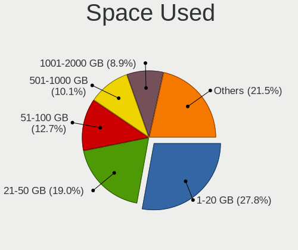
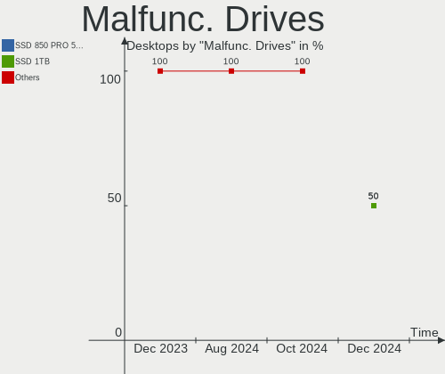
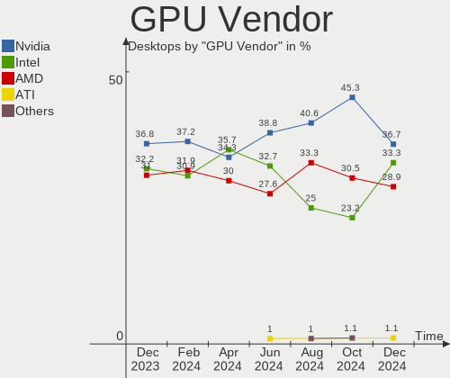
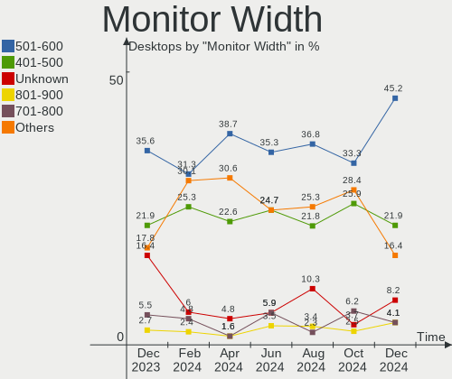
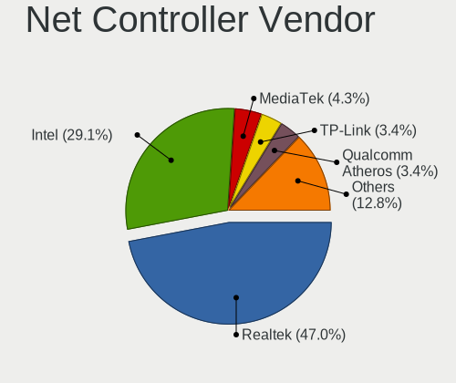

Zorin - Hardware Trends (Desktops)
----------------------------------

A project to identify most popular hardware characteristics and track their change
over time based on data collected by Linux users at https://Linux-Hardware.org.

Anyone can contribute to this report by the [hw-probe](https://github.com/linuxhw/hw-probe) tool:

    sudo -E hw-probe -all -upload

This report is for one last month. Overall report since the beginning of time: [TestDays](https://github.com/linuxhw/TestDays)

Period: Dec, 2023.

Contents
--------

* [ System ](#system)
  - [ OS                       ](#os)
  - [ OS Family                ](#os-family)
  - [ Kernel                   ](#kernel)
  - [ Kernel Family            ](#kernel-family)
  - [ Kernel Major Ver.        ](#kernel-major-ver)
  - [ Arch                     ](#arch)
  - [ DE                       ](#de)
  - [ Display Server           ](#display-server)
  - [ Display Manager          ](#display-manager)
  - [ OS Lang                  ](#os-lang)
  - [ Boot Mode                ](#boot-mode)
  - [ Filesystem               ](#filesystem)
  - [ Part. scheme             ](#part-scheme)
  - [ Dual Boot with Linux/BSD ](#dual-boot-with-linuxbsd)
  - [ Dual Boot (Win)          ](#dual-boot-win)

* [ Board ](#board)
  - [ Vendor                   ](#vendor)
  - [ Model                    ](#model)
  - [ Model Family             ](#model-family)
  - [ MFG Year                 ](#mfg-year)
  - [ Form Factor              ](#form-factor)
  - [ Secure Boot              ](#secure-boot)
  - [ Coreboot                 ](#coreboot)
  - [ RAM Size                 ](#ram-size)
  - [ RAM Used                 ](#ram-used)
  - [ Total Drives             ](#total-drives)
  - [ Has CD-ROM               ](#has-cd-rom)
  - [ Has Ethernet             ](#has-ethernet)
  - [ Has WiFi                 ](#has-wifi)
  - [ Has Bluetooth            ](#has-bluetooth)

* [ Location ](#location)
  - [ Country                  ](#country)
  - [ City                     ](#city)

* [ Drives ](#drives)
  - [ Drive Vendor             ](#drive-vendor)
  - [ Drive Model              ](#drive-model)
  - [ HDD Vendor               ](#hdd-vendor)
  - [ SSD Vendor               ](#ssd-vendor)
  - [ Drive Kind               ](#drive-kind)
  - [ Drive Connector          ](#drive-connector)
  - [ Drive Size               ](#drive-size)
  - [ Space Total              ](#space-total)
  - [ Space Used               ](#space-used)
  - [ Malfunc. Drives          ](#malfunc-drives)
  - [ Malfunc. Drive Vendor    ](#malfunc-drive-vendor)
  - [ Malfunc. HDD Vendor      ](#malfunc-hdd-vendor)
  - [ Malfunc. Drive Kind      ](#malfunc-drive-kind)
  - [ Failed Drives            ](#failed-drives)
  - [ Failed Drive Vendor      ](#failed-drive-vendor)
  - [ Drive Status             ](#drive-status)

* [ Storage controller ](#storage-controller)
  - [ Storage Vendor           ](#storage-vendor)
  - [ Storage Model            ](#storage-model)
  - [ Storage Kind             ](#storage-kind)

* [ Processor ](#processor)
  - [ CPU Vendor               ](#cpu-vendor)
  - [ CPU Model                ](#cpu-model)
  - [ CPU Model Family         ](#cpu-model-family)
  - [ CPU Cores                ](#cpu-cores)
  - [ CPU Sockets              ](#cpu-sockets)
  - [ CPU Threads              ](#cpu-threads)
  - [ CPU Op-Modes             ](#cpu-op-modes)
  - [ CPU Microcode            ](#cpu-microcode)
  - [ CPU Microarch            ](#cpu-microarch)

* [ Graphics ](#graphics)
  - [ GPU Vendor               ](#gpu-vendor)
  - [ GPU Model                ](#gpu-model)
  - [ GPU Combo                ](#gpu-combo)
  - [ GPU Driver               ](#gpu-driver)
  - [ GPU Memory               ](#gpu-memory)

* [ Monitor ](#monitor)
  - [ Monitor Vendor           ](#monitor-vendor)
  - [ Monitor Model            ](#monitor-model)
  - [ Monitor Resolution       ](#monitor-resolution)
  - [ Monitor Diagonal         ](#monitor-diagonal)
  - [ Monitor Width            ](#monitor-width)
  - [ Aspect Ratio             ](#aspect-ratio)
  - [ Monitor Area             ](#monitor-area)
  - [ Pixel Density            ](#pixel-density)
  - [ Multiple Monitors        ](#multiple-monitors)

* [ Network ](#network)
  - [ Net Controller Vendor    ](#net-controller-vendor)
  - [ Net Controller Model     ](#net-controller-model)
  - [ Wireless Vendor          ](#wireless-vendor)
  - [ Wireless Model           ](#wireless-model)
  - [ Ethernet Vendor          ](#ethernet-vendor)
  - [ Ethernet Model           ](#ethernet-model)
  - [ Net Controller Kind      ](#net-controller-kind)
  - [ Used Controller          ](#used-controller)
  - [ NICs                     ](#nics)
  - [ IPv6                     ](#ipv6)

* [ Bluetooth ](#bluetooth)
  - [ Bluetooth Vendor         ](#bluetooth-vendor)
  - [ Bluetooth Model          ](#bluetooth-model)

* [ Sound ](#sound)
  - [ Sound Vendor             ](#sound-vendor)
  - [ Sound Model              ](#sound-model)

* [ Memory ](#memory)
  - [ Memory Vendor            ](#memory-vendor)
  - [ Memory Model             ](#memory-model)
  - [ Memory Kind              ](#memory-kind)
  - [ Memory Form Factor       ](#memory-form-factor)
  - [ Memory Size              ](#memory-size)
  - [ Memory Speed             ](#memory-speed)

* [ Printers & scanners ](#printers--scanners)
  - [ Printer Vendor           ](#printer-vendor)
  - [ Printer Model            ](#printer-model)
  - [ Scanner Vendor           ](#scanner-vendor)
  - [ Scanner Model            ](#scanner-model)

* [ Camera ](#camera)
  - [ Camera Vendor            ](#camera-vendor)
  - [ Camera Model             ](#camera-model)

* [ Security ](#security)
  - [ Fingerprint Vendor       ](#fingerprint-vendor)
  - [ Fingerprint Model        ](#fingerprint-model)
  - [ Chipcard Vendor          ](#chipcard-vendor)
  - [ Chipcard Model           ](#chipcard-model)

* [ Unsupported ](#unsupported)
  - [ Unsupported Devices      ](#unsupported-devices)
  - [ Unsupported Device Types ](#unsupported-device-types)

System
------

OS
--

Installed operating systems

| Name     | Desktops | Percent |
|----------|----------|---------|
| Zorin 16 | 52       | 62.65%  |
| Zorin 17 | 30       | 36.14%  |
| Zorin 15 | 1        | 1.2%    |

OS Family
---------

OS without a version

| Name  | Desktops | Percent |
|-------|----------|---------|
| Zorin | 83       | 100%    |

Kernel
------

Version of the Linux kernel

| Version           | Desktops | Percent |
|-------------------|----------|---------|
| 5.15.0-91-generic | 29       | 34.94%  |
| 6.2.0-39-generic  | 28       | 33.73%  |
| 5.15.0-89-generic | 15       | 18.07%  |
| 5.15.0-78-generic | 3        | 3.61%   |
| 6.2.0-37-generic  | 2        | 2.41%   |
| 5.15.0-88-generic | 2        | 2.41%   |
| 5.4.0-150-generic | 1        | 1.2%    |
| 5.15.0-82-generic | 1        | 1.2%    |
| 5.15.0-71-generic | 1        | 1.2%    |
| 5.15.0-56-generic | 1        | 1.2%    |

Kernel Family
-------------

Linux kernel without a distro release

| Version | Desktops | Percent |
|---------|----------|---------|
| 5.15.0  | 52       | 62.65%  |
| 6.2.0   | 30       | 36.14%  |
| 5.4.0   | 1        | 1.2%    |

Kernel Major Ver.
-----------------

Linux kernel major version

| Version | Desktops | Percent |
|---------|----------|---------|
| 5.15    | 52       | 62.65%  |
| 6.2     | 30       | 36.14%  |
| 5.4     | 1        | 1.2%    |

Arch
----

OS architecture (x86_64, i586, etc.)

| Name   | Desktops | Percent |
|--------|----------|---------|
| x86_64 | 82       | 98.8%   |
| i686   | 1        | 1.2%    |

DE
--

Desktop Environment

| Name  | Desktops | Percent |
|-------|----------|---------|
| GNOME | 71       | 85.54%  |
| XFCE  | 12       | 14.46%  |

Display Server
--------------

X11 or Wayland

| Name    | Desktops | Percent |
|---------|----------|---------|
| X11     | 64       | 77.11%  |
| Wayland | 18       | 21.69%  |
| Unknown | 1        | 1.2%    |

Display Manager
---------------

SDDM, LightDM, etc.

| Name    | Desktops | Percent |
|---------|----------|---------|
| Unknown | 68       | 81.93%  |
| GDM3    | 10       | 12.05%  |
| GDM     | 3        | 3.61%   |
| LightDM | 2        | 2.41%   |

OS Lang
-------

Language

| Lang  | Desktops | Percent |
|-------|----------|---------|
| en_US | 38       | 45.78%  |
| de_DE | 13       | 15.66%  |
| nl_NL | 4        | 4.82%   |
| pt_BR | 3        | 3.61%   |
| en_GB | 3        | 3.61%   |
| en_CA | 3        | 3.61%   |
| en_AU | 3        | 3.61%   |
| fr_FR | 2        | 2.41%   |
| es_ES | 2        | 2.41%   |
| cs_CZ | 2        | 2.41%   |
| sr_RS | 1        | 1.2%    |
| sk_SK | 1        | 1.2%    |
| ru_RU | 1        | 1.2%    |
| nb_NO | 1        | 1.2%    |
| it_IT | 1        | 1.2%    |
| es_VE | 1        | 1.2%    |
| en_ZA | 1        | 1.2%    |
| en_NZ | 1        | 1.2%    |
| en_IN | 1        | 1.2%    |
| de_AT | 1        | 1.2%    |

Boot Mode
---------

EFI or BIOS

| Mode | Desktops | Percent |
|------|----------|---------|
| BIOS | 56       | 67.47%  |
| EFI  | 27       | 32.53%  |

Filesystem
----------

Type of filesystem

| Type    | Desktops | Percent |
|---------|----------|---------|
| Ext4    | 69       | 83.13%  |
| Tmpfs   | 7        | 8.43%   |
| Zfs     | 3        | 3.61%   |
| Overlay | 2        | 2.41%   |
| Btrfs   | 2        | 2.41%   |

Part. scheme
------------

Scheme of partitioning

| Type    | Desktops | Percent |
|---------|----------|---------|
| Unknown | 69       | 83.13%  |
| GPT     | 11       | 13.25%  |
| MBR     | 3        | 3.61%   |

Dual Boot with Linux/BSD
------------------------

Hosting more than one Linux/BSD

| Dual boot | Desktops | Percent |
|-----------|----------|---------|
| No        | 82       | 98.8%   |
| Yes       | 1        | 1.2%    |

Dual Boot (Win)
---------------

Hosting Linux and Windows

| Dual boot | Desktops | Percent |
|-----------|----------|---------|
| No        | 73       | 87.95%  |
| Yes       | 10       | 12.05%  |

Board
-----

Vendor
------

Motherboard manufacturer

| Name                | Desktops | Percent |
|---------------------|----------|---------|
| ASUSTek Computer    | 23       | 27.71%  |
| Gigabyte Technology | 13       | 15.66%  |
| Dell                | 12       | 14.46%  |
| Hewlett-Packard     | 11       | 13.25%  |
| MSI                 | 6        | 7.23%   |
| Lenovo              | 4        | 4.82%   |
| ASRock              | 4        | 4.82%   |
| Pegatron            | 2        | 2.41%   |
| Intel               | 2        | 2.41%   |
| Unknown             | 2        | 2.41%   |
| Positivo            | 1        | 1.2%    |
| MACHINIST           | 1        | 1.2%    |
| Gateway             | 1        | 1.2%    |
| Apple               | 1        | 1.2%    |

Model
-----

Motherboard model

| Name                                    | Desktops | Percent |
|-----------------------------------------|----------|---------|
| HP EliteDesk 800 G1 SFF                 | 2        | 2.41%   |
| ASUS TUF Gaming X570-PLUS               | 2        | 2.41%   |
| Unknown                                 | 2        | 2.41%   |
| Positivo POS-PIQ57BQ                    | 1        | 1.2%    |
| Pegatron 600-1352                       | 1        | 1.2%    |
| Pegatron 600-1265qd                     | 1        | 1.2%    |
| MSI p6-2317c                            | 1        | 1.2%    |
| MSI MS-7D75                             | 1        | 1.2%    |
| MSI MS-7D12                             | 1        | 1.2%    |
| MSI MS-7C75                             | 1        | 1.2%    |
| MSI MS-7599                             | 1        | 1.2%    |
| MSI MS-7309                             | 1        | 1.2%    |
| MACHINIST X99-RS9 V2.0                  | 1        | 1.2%    |
| Lenovo ThinkCentre M93p 10AB0010US      | 1        | 1.2%    |
| Lenovo ThinkCentre M93 10A4S03D00       | 1        | 1.2%    |
| Lenovo IdeaCentre 510A-15ICB 90HV001FCF | 1        | 1.2%    |
| Lenovo 10AU003GMC                       | 1        | 1.2%    |
| Intel X99-P4 V1.0                       | 1        | 1.2%    |
| Intel Certified Data                    | 1        | 1.2%    |
| HP Z400 Workstation                     | 1        | 1.2%    |
| HP ENVY TE01-0xxx                       | 1        | 1.2%    |
| HP EliteDesk 800 G3 SFF                 | 1        | 1.2%    |
| HP EliteDesk 800 G2 DM 35W              | 1        | 1.2%    |
| HP Desktop M01-F0xxx                    | 1        | 1.2%    |
| HP Compaq dx6120 MT(PW287ES)            | 1        | 1.2%    |
| HP Compaq dc7900 Small Form Factor      | 1        | 1.2%    |
| HP 750-537cb                            | 1        | 1.2%    |
| HP 500-420qe                            | 1        | 1.2%    |
| Gigabyte Z790 GAMING X AX               | 1        | 1.2%    |
| Gigabyte Z790 AORUS ELITE AX            | 1        | 1.2%    |
| Gigabyte Z170X-UD5                      | 1        | 1.2%    |
| Gigabyte P55A-UD4                       | 1        | 1.2%    |
| Gigabyte H81M-S2H                       | 1        | 1.2%    |
| Gigabyte H61M-D2H-USB3                  | 1        | 1.2%    |
| Gigabyte H410M H V3                     | 1        | 1.2%    |
| Gigabyte GA-890GPA-UD3H                 | 1        | 1.2%    |
| Gigabyte B650 GAMING X AX               | 1        | 1.2%    |
| Gigabyte B450 AORUS M                   | 1        | 1.2%    |
| Gigabyte B365M DS3H                     | 1        | 1.2%    |
| Gigabyte AX370-Gaming K5                | 1        | 1.2%    |

Model Family
------------

Motherboard model prefix

| Name                    | Desktops | Percent |
|-------------------------|----------|---------|
| Dell OptiPlex           | 6        | 7.23%   |
| ASUS TUF                | 5        | 6.02%   |
| ASUS PRIME              | 5        | 6.02%   |
| HP EliteDesk            | 4        | 4.82%   |
| Dell Inspiron           | 4        | 4.82%   |
| ASUS ROG                | 3        | 3.61%   |
| Lenovo ThinkCentre      | 2        | 2.41%   |
| HP Compaq               | 2        | 2.41%   |
| Gigabyte Z790           | 2        | 2.41%   |
| Dell Precision          | 2        | 2.41%   |
| Unknown                 | 2        | 2.41%   |
| Positivo POS-PIQ57BQ    | 1        | 1.2%    |
| Pegatron 600-1352       | 1        | 1.2%    |
| Pegatron 600-1265qd     | 1        | 1.2%    |
| MSI p6-2317c            | 1        | 1.2%    |
| MSI MS-7D75             | 1        | 1.2%    |
| MSI MS-7D12             | 1        | 1.2%    |
| MSI MS-7C75             | 1        | 1.2%    |
| MSI MS-7599             | 1        | 1.2%    |
| MSI MS-7309             | 1        | 1.2%    |
| MACHINIST X99-RS9       | 1        | 1.2%    |
| Lenovo IdeaCentre       | 1        | 1.2%    |
| Lenovo 10AU003GMC       | 1        | 1.2%    |
| Intel X99-P4            | 1        | 1.2%    |
| Intel Certified         | 1        | 1.2%    |
| HP Z400                 | 1        | 1.2%    |
| HP ENVY                 | 1        | 1.2%    |
| HP Desktop              | 1        | 1.2%    |
| HP 750-537cb            | 1        | 1.2%    |
| HP 500-420qe            | 1        | 1.2%    |
| Gigabyte Z170X-UD5      | 1        | 1.2%    |
| Gigabyte P55A-UD4       | 1        | 1.2%    |
| Gigabyte H81M-S2H       | 1        | 1.2%    |
| Gigabyte H61M-D2H-USB3  | 1        | 1.2%    |
| Gigabyte H410M          | 1        | 1.2%    |
| Gigabyte GA-890GPA-UD3H | 1        | 1.2%    |
| Gigabyte B650           | 1        | 1.2%    |
| Gigabyte B450           | 1        | 1.2%    |
| Gigabyte B365M          | 1        | 1.2%    |
| Gigabyte AX370-Gaming   | 1        | 1.2%    |

MFG Year
--------

Motherboard manufacture year

| Year    | Desktops | Percent |
|---------|----------|---------|
| 2010    | 9        | 10.84%  |
| 2022    | 8        | 9.64%   |
| 2019    | 7        | 8.43%   |
| 2020    | 6        | 7.23%   |
| 2018    | 6        | 7.23%   |
| 2013    | 6        | 7.23%   |
| 2011    | 6        | 7.23%   |
| 2017    | 5        | 6.02%   |
| 2016    | 4        | 4.82%   |
| 2012    | 4        | 4.82%   |
| 2009    | 4        | 4.82%   |
| 2021    | 3        | 3.61%   |
| 2015    | 3        | 3.61%   |
| 2014    | 3        | 3.61%   |
| 2023    | 2        | 2.41%   |
| 2008    | 2        | 2.41%   |
| 2006    | 2        | 2.41%   |
| 2007    | 1        | 1.2%    |
| 2005    | 1        | 1.2%    |
| Unknown | 1        | 1.2%    |

Form Factor
-----------

Physical design of the computer

| Name    | Desktops | Percent |
|---------|----------|---------|
| Desktop | 83       | 100%    |

Secure Boot
-----------

Enabled or disabled

| State    | Desktops | Percent |
|----------|----------|---------|
| Disabled | 79       | 95.18%  |
| Enabled  | 4        | 4.82%   |

Coreboot
--------

Have coreboot on board

| Used | Desktops | Percent |
|------|----------|---------|
| No   | 83       | 100%    |

RAM Size
--------

Total RAM memory

| Size in GB  | Desktops | Percent |
|-------------|----------|---------|
| 4.01-8.0    | 17       | 20.48%  |
| 32.01-64.0  | 17       | 20.48%  |
| 16.01-24.0  | 16       | 19.28%  |
| 8.01-16.0   | 11       | 13.25%  |
| 3.01-4.0    | 8        | 9.64%   |
| 64.01-256.0 | 8        | 9.64%   |
| 24.01-32.0  | 3        | 3.61%   |
| 2.01-3.0    | 3        | 3.61%   |

RAM Used
--------

Used RAM memory

| Used GB    | Desktops | Percent |
|------------|----------|---------|
| 2.01-3.0   | 27       | 32.53%  |
| 1.01-2.0   | 19       | 22.89%  |
| 3.01-4.0   | 15       | 18.07%  |
| 4.01-8.0   | 12       | 14.46%  |
| 8.01-16.0  | 7        | 8.43%   |
| 24.01-32.0 | 1        | 1.2%    |
| 16.01-24.0 | 1        | 1.2%    |
| 0.51-1.0   | 1        | 1.2%    |

Total Drives
------------

Number of drives on board

| Drives | Desktops | Percent |
|--------|----------|---------|
| 1      | 30       | 36.14%  |
| 2      | 29       | 34.94%  |
| 3      | 9        | 10.84%  |
| 4      | 8        | 9.64%   |
| 8      | 2        | 2.41%   |
| 6      | 2        | 2.41%   |
| 5      | 2        | 2.41%   |
| 11     | 1        | 1.2%    |

Has CD-ROM
----------

Has CD-ROM on board

| Presented | Desktops | Percent |
|-----------|----------|---------|
| No        | 42       | 50.6%   |
| Yes       | 41       | 49.4%   |

Has Ethernet
------------

Has Ethernet on board

| Presented | Desktops | Percent |
|-----------|----------|---------|
| Yes       | 82       | 98.8%   |
| No        | 1        | 1.2%    |

Has WiFi
--------

Has WiFi module

| Presented | Desktops | Percent |
|-----------|----------|---------|
| Yes       | 46       | 55.42%  |
| No        | 37       | 44.58%  |

Has Bluetooth
-------------

Has Bluetooth module

| Presented | Desktops | Percent |
|-----------|----------|---------|
| No        | 42       | 50.6%   |
| Yes       | 41       | 49.4%   |

Location
--------

Country
-------

Geographic location (country)

| Country         | Desktops | Percent |
|-----------------|----------|---------|
| USA             | 27       | 32.53%  |
| Germany         | 16       | 19.28%  |
| Brazil          | 4        | 4.82%   |
| UK              | 3        | 3.61%   |
| Netherlands     | 3        | 3.61%   |
| Canada          | 3        | 3.61%   |
| Australia       | 3        | 3.61%   |
| Serbia          | 2        | 2.41%   |
| Italy           | 2        | 2.41%   |
| India           | 2        | 2.41%   |
| Czechia         | 2        | 2.41%   |
| Venezuela       | 1        | 1.2%    |
| Ukraine         | 1        | 1.2%    |
| The Netherlands | 1        | 1.2%    |
| Sweden          | 1        | 1.2%    |
| Spain           | 1        | 1.2%    |
| South Africa    | 1        | 1.2%    |
| Slovakia        | 1        | 1.2%    |
| Norway          | 1        | 1.2%    |
| New Zealand     | 1        | 1.2%    |
| Morocco         | 1        | 1.2%    |
| Indonesia       | 1        | 1.2%    |
| Greece          | 1        | 1.2%    |
| France          | 1        | 1.2%    |
| Finland         | 1        | 1.2%    |
| Austria         | 1        | 1.2%    |
| Argentina       | 1        | 1.2%    |

City
----

Geographic location (city)

| City                 | Desktops | Percent |
|----------------------|----------|---------|
| Mumbai               | 2        | 2.41%   |
| Berlin               | 2        | 2.41%   |
| Atlanta              | 2        | 2.41%   |
| Zumbrota             | 1        | 1.2%    |
| Zaragoza             | 1        | 1.2%    |
| Wylie                | 1        | 1.2%    |
| Würzburg            | 1        | 1.2%    |
| Woerden              | 1        | 1.2%    |
| Winfield             | 1        | 1.2%    |
| West Warwick         | 1        | 1.2%    |
| Waterloo             | 1        | 1.2%    |
| Waldorf              | 1        | 1.2%    |
| Verona               | 1        | 1.2%    |
| Utrecht              | 1        | 1.2%    |
| Uppsala              | 1        | 1.2%    |
| Tuban                | 1        | 1.2%    |
| Tres Arroyos         | 1        | 1.2%    |
| Trenčín            | 1        | 1.2%    |
| Taboao da Serra      | 1        | 1.2%    |
| Sarnia               | 1        | 1.2%    |
| Sao Paulo            | 1        | 1.2%    |
| Sangerhausen         | 1        | 1.2%    |
| San Jose             | 1        | 1.2%    |
| Rüsselsheim am Main | 1        | 1.2%    |
| Rosmalen             | 1        | 1.2%    |
| Rome                 | 1        | 1.2%    |
| Rio Rancho           | 1        | 1.2%    |
| Richville            | 1        | 1.2%    |
| Ravensburg           | 1        | 1.2%    |
| Poplar Bluff         | 1        | 1.2%    |
| Pompano Beach        | 1        | 1.2%    |
| Phoenix              | 1        | 1.2%    |
| Perchtoldsdorf       | 1        | 1.2%    |
| Peoria               | 1        | 1.2%    |
| Ornes                | 1        | 1.2%    |
| Olomouc              | 1        | 1.2%    |
| Nipigon              | 1        | 1.2%    |
| Neuwied              | 1        | 1.2%    |
| Miami                | 1        | 1.2%    |
| Melbourne            | 1        | 1.2%    |

Drives
------

Drive Vendor
------------

Hard drive vendors

| Vendor                       | Desktops | Drives | Percent |
|------------------------------|----------|--------|---------|
| Samsung Electronics          | 27       | 50     | 18.12%  |
| WDC                          | 24       | 33     | 16.11%  |
| Seagate                      | 18       | 19     | 12.08%  |
| Sandisk                      | 9        | 12     | 6.04%   |
| Kingston                     | 9        | 10     | 6.04%   |
| Crucial                      | 8        | 8      | 5.37%   |
| Toshiba                      | 6        | 6      | 4.03%   |
| Hitachi                      | 6        | 6      | 4.03%   |
| China                        | 5        | 5      | 3.36%   |
| PNY                          | 4        | 6      | 2.68%   |
| Micron Technology            | 3        | 3      | 2.01%   |
| Lexar                        | 3        | 3      | 2.01%   |
| Intenso                      | 3        | 3      | 2.01%   |
| Unknown                      | 2        | 2      | 1.34%   |
| Micron/Crucial Technology    | 2        | 2      | 1.34%   |
| Verbatim                     | 1        | 2      | 0.67%   |
| SK hynix                     | 1        | 2      | 0.67%   |
| Shenzhen Longsys Electronics | 1        | 1      | 0.67%   |
| ROG                          | 1        | 1      | 0.67%   |
| Realtek                      | 1        | 1      | 0.67%   |
| Phison Electronics           | 1        | 1      | 0.67%   |
| Netac                        | 1        | 1      | 0.67%   |
| LITEONIT                     | 1        | 1      | 0.67%   |
| KIOXIA                       | 1        | 1      | 0.67%   |
| Kingston Technology Company  | 1        | 1      | 0.67%   |
| KingFast                     | 1        | 1      | 0.67%   |
| Integral                     | 1        | 1      | 0.67%   |
| HGST                         | 1        | 4      | 0.67%   |
| Fanxiang                     | 1        | 1      | 0.67%   |
| Drevo                        | 1        | 2      | 0.67%   |
| Corsair                      | 1        | 2      | 0.67%   |
| ATOM                         | 1        | 1      | 0.67%   |
| Apple                        | 1        | 1      | 0.67%   |
| Apacer                       | 1        | 1      | 0.67%   |
| Unknown                      | 1        | 1      | 0.67%   |

Drive Model
-----------

Hard drive models

| Model                                               | Desktops | Percent |
|-----------------------------------------------------|----------|---------|
| Samsung NVMe SSD Controller PM9A1/PM9A3/980PRO 2TB  | 4        | 2.27%   |
| Kingston SA400S37120G 120GB SSD                     | 4        | 2.27%   |
| WDC WD5000AAKS-00V1A0 500GB                         | 2        | 1.14%   |
| WDC WD10JPVX-22JC3T0 1TB                            | 2        | 1.14%   |
| WDC WD10EZEX-60WN4A0 1TB                            | 2        | 1.14%   |
| WDC WD10EZEX-08WN4A0 1TB                            | 2        | 1.14%   |
| Samsung SSD 990 PRO 2TB                             | 2        | 1.14%   |
| Samsung SSD 860 PRO 256GB                           | 2        | 1.14%   |
| Samsung SSD 860 EVO 500GB                           | 2        | 1.14%   |
| Samsung SSD 850 EVO 250GB                           | 2        | 1.14%   |
| Samsung SSD 840 Series 120GB                        | 2        | 1.14%   |
| Samsung NVMe SSD Controller SM981/PM981/PM983 512GB | 2        | 1.14%   |
| Micron/Crucial P2 NVMe PCIe SSD 4TB                 | 2        | 1.14%   |
| Lexar 128GB SSD                                     | 2        | 1.14%   |
| Kingston SA400S37480G 480GB SSD                     | 2        | 1.14%   |
| Crucial CT240BX200SSD1 240GB                        | 2        | 1.14%   |
| Crucial CT1000BX500SSD1 1TB                         | 2        | 1.14%   |
| WDC WUH721414ALE6L4 14TB                            | 1        | 0.57%   |
| WDC WDS500G2B0B 500GB SSD                           | 1        | 0.57%   |
| WDC WDS240G2G0A-00JH30 240GB SSD                    | 1        | 0.57%   |
| WDC WDBNCE5000PNC 500GB SSD                         | 1        | 0.57%   |
| WDC WD6400AAKS-00A7B2 640GB                         | 1        | 0.57%   |
| WDC WD5000LPCX-60VHAT0 500GB                        | 1        | 0.57%   |
| WDC WD5000AAKX-00ERMA0 500GB                        | 1        | 0.57%   |
| WDC WD5000AAKS-75A7B0 500GB                         | 1        | 0.57%   |
| WDC WD5000AACS-00ZUB0 500GB                         | 1        | 0.57%   |
| WDC WD4005FZBX-00K5WB0 4TB                          | 1        | 0.57%   |
| WDC WD4000FYYZ-01UL1B1 4TB                          | 1        | 0.57%   |
| WDC WD3200AAKX-001CA0 320GB                         | 1        | 0.57%   |
| WDC WD30EZRX-00D8PB0 3TB                            | 1        | 0.57%   |
| WDC WD20EZRX-22D8PB0 2TB                            | 1        | 0.57%   |
| WDC WD20EFRX-68EUZN0 2TB                            | 1        | 0.57%   |
| WDC WD10EZRZ-00Z5HB0 1TB                            | 1        | 0.57%   |
| WDC WD10EZEX-75WN4A0 1TB                            | 1        | 0.57%   |
| WDC WD10EZEX-60WN4A1 1TB                            | 1        | 0.57%   |
| WDC WD10EZEX-21WN4A0 1TB                            | 1        | 0.57%   |
| WDC WD10EZEX-21M2NA0 1TB                            | 1        | 0.57%   |
| WDC WD10EZEX-08M2NA0 1TB                            | 1        | 0.57%   |
| WDC WD1003FZEX-00MK2A0 1TB                          | 1        | 0.57%   |
| WDC WD1002FAEX-00Z3A0 1TB                           | 1        | 0.57%   |

HDD Vendor
----------

Hard disk drive vendors

| Vendor              | Desktops | Drives | Percent |
|---------------------|----------|--------|---------|
| WDC                 | 23       | 29     | 39.66%  |
| Seagate             | 16       | 17     | 27.59%  |
| Hitachi             | 6        | 6      | 10.34%  |
| Toshiba             | 5        | 5      | 8.62%   |
| Samsung Electronics | 5        | 5      | 8.62%   |
| Unknown             | 1        | 1      | 1.72%   |
| Intenso             | 1        | 1      | 1.72%   |
| HGST                | 1        | 4      | 1.72%   |

SSD Vendor
----------

Solid state drive vendors

| Vendor              | Desktops | Drives | Percent |
|---------------------|----------|--------|---------|
| Samsung Electronics | 14       | 20     | 23.33%  |
| Crucial             | 8        | 8      | 13.33%  |
| Kingston            | 7        | 7      | 11.67%  |
| China               | 5        | 5      | 8.33%   |
| SanDisk             | 4        | 5      | 6.67%   |
| PNY                 | 4        | 6      | 6.67%   |
| WDC                 | 3        | 4      | 5%      |
| Lexar               | 3        | 3      | 5%      |
| Micron Technology   | 2        | 2      | 3.33%   |
| Verbatim            | 1        | 2      | 1.67%   |
| Seagate             | 1        | 1      | 1.67%   |
| ROG                 | 1        | 1      | 1.67%   |
| Netac               | 1        | 1      | 1.67%   |
| LITEONIT            | 1        | 1      | 1.67%   |
| Intenso             | 1        | 1      | 1.67%   |
| Integral            | 1        | 1      | 1.67%   |
| Drevo               | 1        | 2      | 1.67%   |
| Apple               | 1        | 1      | 1.67%   |
| Apacer              | 1        | 1      | 1.67%   |

Drive Kind
----------

HDD or SSD

| Kind    | Desktops | Drives | Percent |
|---------|----------|--------|---------|
| SSD     | 46       | 72     | 36.8%   |
| HDD     | 46       | 68     | 36.8%   |
| NVMe    | 29       | 51     | 23.2%   |
| Unknown | 4        | 4      | 3.2%    |

Drive Connector
---------------

SATA, SAS, NVMe, etc.

| Type | Desktops | Drives | Percent |
|------|----------|--------|---------|
| SATA | 71       | 141    | 68.27%  |
| NVMe | 29       | 50     | 27.88%  |
| SAS  | 4        | 4      | 3.85%   |

Drive Size
----------

Size of hard drive

| Size in TB | Desktops | Drives | Percent |
|------------|----------|--------|---------|
| 0.01-0.5   | 52       | 75     | 52%     |
| 0.51-1.0   | 32       | 44     | 32%     |
| 1.01-2.0   | 7        | 8      | 7%      |
| 3.01-4.0   | 3        | 3      | 3%      |
| 2.01-3.0   | 2        | 2      | 2%      |
| 10.01-20.0 | 2        | 2      | 2%      |
| 20.01-50.0 | 1        | 1      | 1%      |
| 4.01-10.0  | 1        | 5      | 1%      |

Space Total
-----------

Amount of disk space available on the file system

| Size in GB     | Desktops | Percent |
|----------------|----------|---------|
| 101-250        | 26       | 31.33%  |
| 251-500        | 17       | 20.48%  |
| 501-1000       | 11       | 13.25%  |
| 1001-2000      | 9        | 10.84%  |
| More than 3000 | 6        | 7.23%   |
| 51-100         | 5        | 6.02%   |
| 2001-3000      | 4        | 4.82%   |
| 1-20           | 3        | 3.61%   |
| 21-50          | 1        | 1.2%    |
| Unknown        | 1        | 1.2%    |

Space Used
----------

Amount of used disk space

| Used GB        | Desktops | Percent |
|----------------|----------|---------|
| 21-50          | 27       | 32.53%  |
| 1-20           | 24       | 28.92%  |
| 51-100         | 9        | 10.84%  |
| 251-500        | 8        | 9.64%   |
| 101-250        | 6        | 7.23%   |
| 501-1000       | 4        | 4.82%   |
| More than 3000 | 2        | 2.41%   |
| 2001-3000      | 1        | 1.2%    |
| 1001-2000      | 1        | 1.2%    |
| Unknown        | 1        | 1.2%    |

Malfunc. Drives
---------------

Drive models with a malfunction

| Model                          | Desktops | Drives | Percent |
|--------------------------------|----------|--------|---------|
| WDC WD20EZRX-22D8PB0 2TB       | 1        | 1      | 33.33%  |
| Seagate ST2000LM007-1R8174 2TB | 1        | 1      | 33.33%  |
| Hitachi HDS721680PLA380 80GB   | 1        | 1      | 33.33%  |

Malfunc. Drive Vendor
---------------------

Vendors of faulty drives

| Vendor  | Desktops | Drives | Percent |
|---------|----------|--------|---------|
| WDC     | 1        | 1      | 33.33%  |
| Seagate | 1        | 1      | 33.33%  |
| Hitachi | 1        | 1      | 33.33%  |

Malfunc. HDD Vendor
-------------------

Vendors of faulty HDD drives

| Vendor  | Desktops | Drives | Percent |
|---------|----------|--------|---------|
| WDC     | 1        | 1      | 33.33%  |
| Seagate | 1        | 1      | 33.33%  |
| Hitachi | 1        | 1      | 33.33%  |

Malfunc. Drive Kind
-------------------

Kinds of faulty drives

| Kind | Desktops | Drives | Percent |
|------|----------|--------|---------|
| HDD  | 3        | 3      | 100%    |

Failed Drives
-------------

Failed drive models

Zero info for selected period =(

Failed Drive Vendor
-------------------

Failed drive vendors

Zero info for selected period =(

Drive Status
------------

Number of failed and malfunc. drives

| Status   | Desktops | Drives | Percent |
|----------|----------|--------|---------|
| Detected | 75       | 167    | 86.21%  |
| Works    | 9        | 25     | 10.34%  |
| Malfunc  | 3        | 3      | 3.45%   |

Storage controller
------------------

Storage Vendor
--------------

Storage controller vendors

| Vendor                        | Desktops | Percent |
|-------------------------------|----------|---------|
| Intel                         | 50       | 37.59%  |
| AMD                           | 29       | 21.8%   |
| Samsung Electronics           | 13       | 9.77%   |
| JMicron Technology            | 7        | 5.26%   |
| Sandisk                       | 6        | 4.51%   |
| ASMedia Technology            | 6        | 4.51%   |
| Kingston Technology Company   | 4        | 3.01%   |
| Marvell Technology Group      | 3        | 2.26%   |
| Phison Electronics            | 2        | 1.5%    |
| Micron/Crucial Technology     | 2        | 1.5%    |
| VIA Technologies              | 1        | 0.75%   |
| Toshiba America Info Systems  | 1        | 0.75%   |
| SK hynix                      | 1        | 0.75%   |
| Shenzhen Longsys Electronics  | 1        | 0.75%   |
| Seagate Technology            | 1        | 0.75%   |
| Nvidia                        | 1        | 0.75%   |
| Nextorage                     | 1        | 0.75%   |
| Micron Technology             | 1        | 0.75%   |
| KIOXIA                        | 1        | 0.75%   |
| Integrated Technology Express | 1        | 0.75%   |
| HighPoint Technologies        | 1        | 0.75%   |

Storage Model
-------------

Storage controller models

| Model                                                                                   | Desktops | Percent |
|-----------------------------------------------------------------------------------------|----------|---------|
| AMD FCH SATA Controller [AHCI mode]                                                     | 11       | 6.67%   |
| Intel 8 Series/C220 Series Chipset Family 6-port SATA Controller 1 [AHCI mode]          | 10       | 6.06%   |
| AMD SB7x0/SB8x0/SB9x0 IDE Controller                                                    | 8        | 4.85%   |
| Samsung NVMe SSD Controller PM9A1/PM9A3/980PRO                                          | 6        | 3.64%   |
| ASMedia ASM1062 Serial ATA Controller                                                   | 6        | 3.64%   |
| AMD SB7x0/SB8x0/SB9x0 SATA Controller [AHCI mode]                                       | 6        | 3.64%   |
| AMD SB7x0/SB8x0/SB9x0 SATA Controller [IDE mode]                                        | 5        | 3.03%   |
| AMD 500 Series Chipset SATA Controller                                                  | 5        | 3.03%   |
| Samsung NVMe SSD Controller S4LV008[Pascal]                                             | 4        | 2.42%   |
| Intel 700 Series Chipset Family SATA AHCI Controller                                    | 4        | 2.42%   |
| Intel 7 Series/C210 Series Chipset Family 6-port SATA Controller [AHCI mode]            | 4        | 2.42%   |
| Intel 5 Series/3400 Series Chipset 6 port SATA AHCI Controller                          | 4        | 2.42%   |
| AMD 400 Series Chipset SATA Controller                                                  | 4        | 2.42%   |
| SanDisk Ultra 3D / WD Blue SN570 NVMe SSD (DRAM-less)                                   | 3        | 1.82%   |
| JMicron JMB368 IDE controller                                                           | 3        | 1.82%   |
| Intel Q170/Q150/B150/H170/H110/Z170/CM236 Chipset SATA Controller [AHCI Mode]           | 3        | 1.82%   |
| Intel Cannon Lake PCH SATA AHCI Controller                                              | 3        | 1.82%   |
| Intel 6 Series/C200 Series Chipset Family Desktop SATA Controller (IDE mode, ports 4-5) | 3        | 1.82%   |
| Intel 6 Series/C200 Series Chipset Family Desktop SATA Controller (IDE mode, ports 0-3) | 3        | 1.82%   |
| Intel 200 Series PCH SATA controller [AHCI mode]                                        | 3        | 1.82%   |
| Samsung NVMe SSD Controller SM981/PM981/PM983                                           | 2        | 1.21%   |
| Micron/Crucial P2 [Nick P2] / P3 / P3 Plus NVMe PCIe SSD (DRAM-less)                    | 2        | 1.21%   |
| Kingston Company NV2 NVMe SSD SM2267XT                                                  | 2        | 1.21%   |
| JMicron JMB363 SATA/IDE Controller                                                      | 2        | 1.21%   |
| JMicron JMB362 SATA Controller                                                          | 2        | 1.21%   |
| Intel 6 Series/C200 Series Chipset Family 6 port Desktop SATA AHCI Controller           | 2        | 1.21%   |
| Intel 500 Series Chipset Family SATA AHCI Controller                                    | 2        | 1.21%   |
| Intel 5 Series/3400 Series Chipset 4 port SATA IDE Controller                           | 2        | 1.21%   |
| Intel 5 Series/3400 Series Chipset 2 port SATA IDE Controller                           | 2        | 1.21%   |
| VIA VT82C586A/B/VT82C686/A/B/VT823x/A/C PIPC Bus Master IDE                             | 1        | 0.61%   |
| VIA VT8237A SATA 2-Port Controller                                                      | 1        | 0.61%   |
| Toshiba America Info Systems XG5 NVMe SSD Controller                                    | 1        | 0.61%   |
| SK hynix Platinum P41/PC801 NVMe Solid State Drive                                      | 1        | 0.61%   |
| Shenzhen Longsys Non-Volatile memory controller                                         | 1        | 0.61%   |
| Seagate BarraCuda Q5 NVMe SSD (DRAM-less)                                               | 1        | 0.61%   |
| Sandisk WD Blue SN580 NVMe SSD (DRAM-less)                                              | 1        | 0.61%   |
| Sandisk WD Black SN850X NVMe SSD                                                        | 1        | 0.61%   |
| SanDisk Ultra 3D / WD Blue SN550 NVMe SSD                                               | 1        | 0.61%   |
| SanDisk Extreme Pro / WD Black SN750 / PC SN730 / Red SN700 NVMe SSD                    | 1        | 0.61%   |
| Samsung S4LN058A01[SSUBX] AHCI SSD Controller (Apple slot)                              | 1        | 0.61%   |

Storage Kind
------------

Kind of storage controller (IDE, SATA, NVMe, SAS, ...)

| Kind | Desktops | Percent |
|------|----------|---------|
| SATA | 70       | 56.91%  |
| NVMe | 29       | 23.58%  |
| IDE  | 21       | 17.07%  |
| RAID | 3        | 2.44%   |

Processor
---------

CPU Vendor
----------

Processor vendors

| Vendor | Desktops | Percent |
|--------|----------|---------|
| Intel  | 52       | 62.65%  |
| AMD    | 31       | 37.35%  |

CPU Model
---------

Processor models

| Model                                  | Desktops | Percent |
|----------------------------------------|----------|---------|
| AMD Phenom II X4 955 Processor         | 4        | 4.82%   |
| Intel Core i7-4770 CPU @ 3.40GHz       | 2        | 2.41%   |
| Intel Core i7-3770 CPU @ 3.40GHz       | 2        | 2.41%   |
| Intel 13th Gen Core i9-13900K          | 2        | 2.41%   |
| AMD Ryzen 7 3700X 8-Core Processor     | 2        | 2.41%   |
| AMD Ryzen 5 5600G with Radeon Graphics | 2        | 2.41%   |
| AMD Ryzen 5 3600 6-Core Processor      | 2        | 2.41%   |
| AMD Phenom II X4 945 Processor         | 2        | 2.41%   |
| Intel Xeon CPU W3565 @ 3.20GHz         | 1        | 1.2%    |
| Intel Xeon CPU E5430 @ 2.66GHz         | 1        | 1.2%    |
| Intel Xeon CPU E5-2699 v3 @ 2.30GHz    | 1        | 1.2%    |
| Intel Xeon CPU E5-2696 v2 @ 2.50GHz    | 1        | 1.2%    |
| Intel Xeon CPU E5-2630 v4 @ 2.20GHz    | 1        | 1.2%    |
| Intel Xeon CPU E5-1650 v3 @ 3.50GHz    | 1        | 1.2%    |
| Intel Pentium Dual CPU E2180 @ 2.00GHz | 1        | 1.2%    |
| Intel Pentium CPU P6100 @ 2.00GHz      | 1        | 1.2%    |
| Intel Pentium CPU G4560T @ 2.90GHz     | 1        | 1.2%    |
| Intel Pentium 4 CPU 3.00GHz            | 1        | 1.2%    |
| Intel Core i7-9700K CPU @ 3.60GHz      | 1        | 1.2%    |
| Intel Core i7-8700K CPU @ 3.70GHz      | 1        | 1.2%    |
| Intel Core i7-7700 CPU @ 3.60GHz       | 1        | 1.2%    |
| Intel Core i7-6700K CPU @ 4.00GHz      | 1        | 1.2%    |
| Intel Core i7-4790K CPU @ 4.00GHz      | 1        | 1.2%    |
| Intel Core i7-4770S CPU @ 3.10GHz      | 1        | 1.2%    |
| Intel Core i7-4765T CPU @ 2.00GHz      | 1        | 1.2%    |
| Intel Core i7-3770S CPU @ 3.10GHz      | 1        | 1.2%    |
| Intel Core i7-10700 CPU @ 2.90GHz      | 1        | 1.2%    |
| Intel Core i7 CPU Q 720 @ 1.60GHz      | 1        | 1.2%    |
| Intel Core i5-9400 CPU @ 2.90GHz       | 1        | 1.2%    |
| Intel Core i5-8400 CPU @ 2.80GHz       | 1        | 1.2%    |
| Intel Core i5-7500 CPU @ 3.40GHz       | 1        | 1.2%    |
| Intel Core i5-6500T CPU @ 2.50GHz      | 1        | 1.2%    |
| Intel Core i5-4590 CPU @ 3.30GHz       | 1        | 1.2%    |
| Intel Core i5-4570T CPU @ 2.90GHz      | 1        | 1.2%    |
| Intel Core i5-4570 CPU @ 3.20GHz       | 1        | 1.2%    |
| Intel Core i5-4460 CPU @ 3.20GHz       | 1        | 1.2%    |
| Intel Core i5-3340 CPU @ 3.10GHz       | 1        | 1.2%    |
| Intel Core i5-3330 CPU @ 3.00GHz       | 1        | 1.2%    |
| Intel Core i5-2500K CPU @ 3.30GHz      | 1        | 1.2%    |
| Intel Core i5-2400 CPU @ 3.10GHz       | 1        | 1.2%    |

CPU Model Family
----------------

Processor model prefix

| Model                  | Desktops | Percent |
|------------------------|----------|---------|
| Intel Core i7          | 14       | 16.87%  |
| Intel Core i5          | 14       | 16.87%  |
| Intel Xeon             | 6        | 7.23%   |
| Intel Core i3          | 6        | 7.23%   |
| AMD Ryzen 7            | 6        | 7.23%   |
| AMD Ryzen 5            | 6        | 7.23%   |
| AMD Phenom II X4       | 6        | 7.23%   |
| Other                  | 5        | 6.02%   |
| AMD FX                 | 5        | 6.02%   |
| AMD Ryzen 9            | 3        | 3.61%   |
| Intel Pentium          | 2        | 2.41%   |
| Intel Pentium Dual     | 1        | 1.2%    |
| Intel Pentium 4        | 1        | 1.2%    |
| Intel Core 2 Quad      | 1        | 1.2%    |
| Intel Core 2 Duo       | 1        | 1.2%    |
| Intel Celeron          | 1        | 1.2%    |
| AMD Ryzen Threadripper | 1        | 1.2%    |
| AMD Ryzen 3            | 1        | 1.2%    |
| AMD Athlon II X2       | 1        | 1.2%    |
| AMD Athlon 64 X2       | 1        | 1.2%    |
| AMD A6                 | 1        | 1.2%    |

CPU Cores
---------

Number of processor cores

| Number | Desktops | Percent |
|--------|----------|---------|
| 4      | 33       | 39.76%  |
| 2      | 15       | 18.07%  |
| 6      | 10       | 12.05%  |
| 8      | 9        | 10.84%  |
| 16     | 5        | 6.02%   |
| 1      | 3        | 3.61%   |
| 24     | 2        | 2.41%   |
| 3      | 2        | 2.41%   |
| 18     | 1        | 1.2%    |
| 14     | 1        | 1.2%    |
| 12     | 1        | 1.2%    |
| 10     | 1        | 1.2%    |

CPU Sockets
-----------

Number of sockets

| Number | Desktops | Percent |
|--------|----------|---------|
| 1      | 82       | 98.8%   |
| 2      | 1        | 1.2%    |

CPU Threads
-----------

Threads per core (Hyper-Threading)

| Number | Desktops | Percent |
|--------|----------|---------|
| 2      | 52       | 62.65%  |
| 1      | 31       | 37.35%  |

CPU Op-Modes
------------

CPU Operation Modes (32-bit, 64-bit)

| Op mode        | Desktops | Percent |
|----------------|----------|---------|
| 32-bit, 64-bit | 83       | 100%    |

CPU Microcode
-------------

Microcode number

| Number     | Desktops | Percent |
|------------|----------|---------|
| Unknown    | 33       | 39.76%  |
| 0x306c3    | 7        | 8.43%   |
| 0x306a9    | 4        | 4.82%   |
| 0x20655    | 3        | 3.61%   |
| 0x010000db | 3        | 3.61%   |
| 0x206a7    | 2        | 2.41%   |
| 0x0a601206 | 2        | 2.41%   |
| 0x0a50000d | 2        | 2.41%   |
| 0x0a20120a | 2        | 2.41%   |
| 0x08701030 | 2        | 2.41%   |
| 0x010000c8 | 2        | 2.41%   |
| 0xf41      | 1        | 1.2%    |
| 0xb0671    | 1        | 1.2%    |
| 0xa0671    | 1        | 1.2%    |
| 0xa0655    | 1        | 1.2%    |
| 0xa0653    | 1        | 1.2%    |
| 0x906ed    | 1        | 1.2%    |
| 0x906ea    | 1        | 1.2%    |
| 0x906e9    | 1        | 1.2%    |
| 0x306e4    | 1        | 1.2%    |
| 0x106e5    | 1        | 1.2%    |
| 0x106a5    | 1        | 1.2%    |
| 0x1067a    | 1        | 1.2%    |
| 0x10677    | 1        | 1.2%    |
| 0x10676    | 1        | 1.2%    |
| 0x0a601203 | 1        | 1.2%    |
| 0x08701021 | 1        | 1.2%    |
| 0x08701013 | 1        | 1.2%    |
| 0x08108109 | 1        | 1.2%    |
| 0x06001119 | 1        | 1.2%    |
| 0x06000852 | 1        | 1.2%    |
| 0x0600063e | 1        | 1.2%    |

CPU Microarch
-------------

Microarchitecture

| Name             | Desktops | Percent |
|------------------|----------|---------|
| Haswell          | 12       | 14.46%  |
| KabyLake         | 7        | 8.43%   |
| K10              | 7        | 8.43%   |
| IvyBridge        | 7        | 8.43%   |
| Zen 3            | 6        | 7.23%   |
| Unknown          | 6        | 7.23%   |
| Zen 2            | 5        | 6.02%   |
| Westmere         | 4        | 4.82%   |
| SandyBridge      | 3        | 3.61%   |
| Piledriver       | 3        | 3.61%   |
| Penryn           | 3        | 3.61%   |
| Nehalem          | 3        | 3.61%   |
| Bulldozer        | 3        | 3.61%   |
| Zen              | 2        | 2.41%   |
| Skylake          | 2        | 2.41%   |
| CometLake        | 2        | 2.41%   |
| Zen+             | 1        | 1.2%    |
| NetBurst         | 1        | 1.2%    |
| K8 Hammer        | 1        | 1.2%    |
| Icelake          | 1        | 1.2%    |
| Goldmont plus    | 1        | 1.2%    |
| Core             | 1        | 1.2%    |
| Broadwell        | 1        | 1.2%    |
| Alderlake Hybrid | 1        | 1.2%    |

Graphics
--------

GPU Vendor
----------

Vendors of graphics cards

| Vendor | Desktops | Percent |
|--------|----------|---------|
| Nvidia | 32       | 36.78%  |
| Intel  | 28       | 32.18%  |
| AMD    | 27       | 31.03%  |

GPU Model
---------

Graphics card models

| Model                                                                       | Desktops | Percent |
|-----------------------------------------------------------------------------|----------|---------|
| Intel Xeon E3-1200 v3/4th Gen Core Processor Integrated Graphics Controller | 7        | 7.69%   |
| Intel Core Processor Integrated Graphics Controller                         | 4        | 4.4%    |
| Nvidia GA106 [GeForce RTX 3060 Lite Hash Rate]                              | 3        | 3.3%    |
| AMD Raphael                                                                 | 3        | 3.3%    |
| AMD Ellesmere [Radeon RX 470/480/570/570X/580/580X/590]                     | 3        | 3.3%    |
| AMD Caicos [Radeon HD 6450/7450/8450 / R5 230 OEM]                          | 3        | 3.3%    |
| Nvidia GK208B [GeForce GT 710]                                              | 2        | 2.2%    |
| Nvidia GA104 [GeForce RTX 3070 Lite Hash Rate]                              | 2        | 2.2%    |
| Intel Xeon E3-1200 v2/3rd Gen Core processor Graphics Controller            | 2        | 2.2%    |
| Intel CoffeeLake-S GT2 [UHD Graphics 630]                                   | 2        | 2.2%    |
| Intel 2nd Generation Core Processor Family Integrated Graphics Controller   | 2        | 2.2%    |
| AMD RV635 [Radeon HD 3650/3750/4570/4580]                                   | 2        | 2.2%    |
| AMD Navi 32 [Radeon RX 7700 XT / 7800 XT]                                   | 2        | 2.2%    |
| AMD Lexa PRO [Radeon 540/540X/550/550X / RX 540X/550/550X]                  | 2        | 2.2%    |
| Nvidia TU117 [GeForce GTX 1650]                                             | 1        | 1.1%    |
| Nvidia TU116 [GeForce GTX 1660 SUPER]                                       | 1        | 1.1%    |
| Nvidia GT218 [GeForce 210]                                                  | 1        | 1.1%    |
| Nvidia GT216M [GeForce GT 230M]                                             | 1        | 1.1%    |
| Nvidia GT215 [GeForce GT 240]                                               | 1        | 1.1%    |
| Nvidia GP108 [GeForce GT 1030]                                              | 1        | 1.1%    |
| Nvidia GP107 [GeForce GTX 1050]                                             | 1        | 1.1%    |
| Nvidia GP107 [GeForce GTX 1050 Ti]                                          | 1        | 1.1%    |
| Nvidia GP104 [GeForce GTX 1080]                                             | 1        | 1.1%    |
| Nvidia GM206 [GeForce GTX 960]                                              | 1        | 1.1%    |
| Nvidia GM206 [GeForce GTX 950]                                              | 1        | 1.1%    |
| Nvidia GM107GL [Quadro K2200]                                               | 1        | 1.1%    |
| Nvidia GM107 [GeForce GTX 750]                                              | 1        | 1.1%    |
| Nvidia GM107 [GeForce GTX 750 Ti]                                           | 1        | 1.1%    |
| Nvidia GK208B [GeForce GT 730]                                              | 1        | 1.1%    |
| Nvidia GK107 [NVS 510]                                                      | 1        | 1.1%    |
| Nvidia GK106 [GeForce GTX 650 Ti]                                           | 1        | 1.1%    |
| Nvidia GF119 [GeForce GT 610]                                               | 1        | 1.1%    |
| Nvidia GA104 [GeForce RTX 3060 Ti Lite Hash Rate]                           | 1        | 1.1%    |
| Nvidia GA102 [GeForce RTX 3090]                                             | 1        | 1.1%    |
| Nvidia GA102 [GeForce RTX 3080]                                             | 1        | 1.1%    |
| Nvidia G96CGL [Quadro FX 580]                                               | 1        | 1.1%    |
| Nvidia AD107 [GeForce RTX 4060]                                             | 1        | 1.1%    |
| Nvidia AD104 [GeForce RTX 4070 Ti]                                          | 1        | 1.1%    |
| Nvidia AD102 [GeForce RTX 4090]                                             | 1        | 1.1%    |
| Intel Raptor Lake-S GT1 [UHD Graphics 770]                                  | 1        | 1.1%    |

GPU Combo
---------

Combinations of graphics cards

| Name           | Desktops | Percent |
|----------------|----------|---------|
| 1 x Nvidia     | 29       | 34.94%  |
| 1 x Intel      | 25       | 30.12%  |
| 1 x AMD        | 22       | 26.51%  |
| 2 x AMD        | 4        | 4.82%   |
| Intel + Nvidia | 2        | 2.41%   |
| AMD + Nvidia   | 1        | 1.2%    |

GPU Driver
----------

Free vs proprietary

| Driver      | Desktops | Percent |
|-------------|----------|---------|
| Free        | 56       | 67.47%  |
| Proprietary | 20       | 24.1%   |
| Unknown     | 7        | 8.43%   |

GPU Memory
----------

Total video memory

| Size in GB | Desktops | Percent |
|------------|----------|---------|
| Unknown    | 47       | 56.63%  |
| 1.01-2.0   | 8        | 9.64%   |
| 0.51-1.0   | 7        | 8.43%   |
| 0.01-0.5   | 7        | 8.43%   |
| 8.01-16.0  | 5        | 6.02%   |
| 7.01-8.0   | 4        | 4.82%   |
| 3.01-4.0   | 4        | 4.82%   |
| 5.01-6.0   | 1        | 1.2%    |

Monitor
-------

Monitor Vendor
--------------

Monitor vendors

| Vendor               | Desktops | Percent |
|----------------------|----------|---------|
| Samsung Electronics  | 14       | 18.18%  |
| Dell                 | 9        | 11.69%  |
| Goldstar             | 8        | 10.39%  |
| Acer                 | 8        | 10.39%  |
| Ancor Communications | 5        | 6.49%   |
| ViewSonic            | 4        | 5.19%   |
| Hewlett-Packard      | 4        | 5.19%   |
| Sony                 | 3        | 3.9%    |
| AOC                  | 3        | 3.9%    |
| Lenovo               | 2        | 2.6%    |
| BenQ                 | 2        | 2.6%    |
| ASUSTek Computer     | 2        | 2.6%    |
| Xiaomi               | 1        | 1.3%    |
| Vizio                | 1        | 1.3%    |
| Vestel               | 1        | 1.3%    |
| Unknown              | 1        | 1.3%    |
| Toshiba              | 1        | 1.3%    |
| Sceptre Tech         | 1        | 1.3%    |
| RTK                  | 1        | 1.3%    |
| MSI                  | 1        | 1.3%    |
| JINGLITAI            | 1        | 1.3%    |
| Iiyama               | 1        | 1.3%    |
| Idek Iiyama          | 1        | 1.3%    |
| Compal               | 1        | 1.3%    |
| Unknown              | 1        | 1.3%    |

Monitor Model
-------------

Monitor models

| Model                                                                 | Desktops | Percent |
|-----------------------------------------------------------------------|----------|---------|
| Xiaomi Mi TV XMD0002 1920x1080 708x398mm 32.0-inch                    | 1        | 1.23%   |
| Vizio E280-A1 VIZ0095 1360x768 607x345mm 27.5-inch                    | 1        | 1.23%   |
| ViewSonic VX2457 VSCB931 1920x1080 521x293mm 23.5-inch                | 1        | 1.23%   |
| ViewSonic VX2025wm VSCE51D 1680x1050 433x271mm 20.1-inch              | 1        | 1.23%   |
| ViewSonic VA2855 SERIES VSCD62F 1920x1080 621x341mm 27.9-inch         | 1        | 1.23%   |
| ViewSonic LCD Monitor VX2457 1920x1080                                | 1        | 1.23%   |
| Vestel LCD Monitor 55UHD_LCD_TV                                       | 1        | 1.23%   |
| Unknown LCD Monitor SAMSUNG 1366x768                                  | 1        | 1.23%   |
| Toshiba LCD-MONITOR LCDE980 1440x900 408x255mm 18.9-inch              | 1        | 1.23%   |
| Sony TV *01 SNYD902 1920x1080 1107x623mm 50.0-inch                    | 1        | 1.23%   |
| Sony SDM-S75A/E SNY3400 1280x1024 338x270mm 17.0-inch                 | 1        | 1.23%   |
| Sony LCD Monitor TV  *30 3840x2160                                    | 1        | 1.23%   |
| Sceptre Tech Sceptre F27 SPT0AD7 1920x1080 600x330mm 27.0-inch        | 1        | 1.23%   |
| Samsung Electronics T22D390 SAM0B6B 1920x1080 477x268mm 21.5-inch     | 1        | 1.23%   |
| Samsung Electronics T22C300 SAM0AB3 1920x1080 480x270mm 21.7-inch     | 1        | 1.23%   |
| Samsung Electronics SyncMaster SAM05CB 1920x1080 530x300mm 24.0-inch  | 1        | 1.23%   |
| Samsung Electronics SyncMaster SAM0471 1360x768 344x194mm 15.5-inch   | 1        | 1.23%   |
| Samsung Electronics SyncMaster SAM037C 1680x1050 474x296mm 22.0-inch  | 1        | 1.23%   |
| Samsung Electronics LS49AG95 SAM71AA 3840x1080 1193x336mm 48.8-inch   | 1        | 1.23%   |
| Samsung Electronics LF27T35 SAM707F 1920x1080 598x337mm 27.0-inch     | 1        | 1.23%   |
| Samsung Electronics LCD Monitor SAM0D47 1920x1080 480x270mm 21.7-inch | 1        | 1.23%   |
| Samsung Electronics LCD Monitor SAM091F 1280x720                      | 1        | 1.23%   |
| Samsung Electronics LCD Monitor SAM07C1 1920x1080 886x498mm 40.0-inch | 1        | 1.23%   |
| Samsung Electronics LCD Monitor S27C390 1920x1080                     | 1        | 1.23%   |
| Samsung Electronics LCD Monitor C32JG5x 2560x1440                     | 1        | 1.23%   |
| Samsung Electronics LC49G95T SAM7053 3840x1080 1193x336mm 48.8-inch   | 1        | 1.23%   |
| Samsung Electronics LC24RG50 SAM0F91 1920x1080 530x300mm 24.0-inch    | 1        | 1.23%   |
| Samsung Electronics C27F591 SAM0D37 1920x1080 598x336mm 27.0-inch     | 1        | 1.23%   |
| RTK LCD Monitor RTK1D1A 1920x1080 1020x570mm 46.0-inch                | 1        | 1.23%   |
| MSI MAG272C MSI3CA5 1920x1080 598x336mm 27.0-inch                     | 1        | 1.23%   |
| MSI G27C4 MSI3CA9 1920x1080 598x336mm 27.0-inch                       | 1        | 1.23%   |
| Lenovo MR LENB800 2880x1440                                           | 1        | 1.23%   |
| Lenovo LEN T22i-10 LEN61A9 1920x1080 476x268mm 21.5-inch              | 1        | 1.23%   |
| JINGLITAI JRP7006 JRP7006 1280x1024 476x268mm 21.5-inch               | 1        | 1.23%   |
| Iiyama PLE2483H IVM6113 1920x1080 531x299mm 24.0-inch                 | 1        | 1.23%   |
| Idek Iiyama LCD Monitor PL2440HS 1920x1080                            | 1        | 1.23%   |
| Hewlett-Packard x2301 HWP2973 1920x1080 509x286mm 23.0-inch           | 1        | 1.23%   |
| Hewlett-Packard x2301 HWP2972 1920x1080 509x286mm 23.0-inch           | 1        | 1.23%   |
| Hewlett-Packard TouchSmart HWP4000 1920x1080 708x398mm 32.0-inch      | 1        | 1.23%   |
| Hewlett-Packard LE1902x HWP2965 1366x768 410x230mm 18.5-inch          | 1        | 1.23%   |

Monitor Resolution
------------------

Monitor screen resolution

| Resolution         | Desktops | Percent |
|--------------------|----------|---------|
| 1920x1080 (FHD)    | 40       | 55.56%  |
| 3840x2160 (4K)     | 6        | 8.33%   |
| 2560x1440 (QHD)    | 3        | 4.17%   |
| 1680x1050 (WSXGA+) | 3        | 4.17%   |
| 1366x768 (WXGA)    | 3        | 4.17%   |
| 1280x1024 (SXGA)   | 3        | 4.17%   |
| 3840x1080          | 2        | 2.78%   |
| 2560x1080          | 2        | 2.78%   |
| 1440x900 (WXGA+)   | 2        | 2.78%   |
| 7680x2160          | 1        | 1.39%   |
| 3440x1440          | 1        | 1.39%   |
| 2880x1440          | 1        | 1.39%   |
| 1920x1200 (WUXGA)  | 1        | 1.39%   |
| 1600x900 (HD+)     | 1        | 1.39%   |
| 1360x768           | 1        | 1.39%   |
| 1280x720 (HD)      | 1        | 1.39%   |
| Unknown            | 1        | 1.39%   |

Monitor Diagonal
----------------

Diagonal size in inches

| Inches  | Desktops | Percent |
|---------|----------|---------|
| 27      | 13       | 17.33%  |
| Unknown | 12       | 16%     |
| 23      | 9        | 12%     |
| 24      | 8        | 10.67%  |
| 21      | 8        | 10.67%  |
| 20      | 4        | 5.33%   |
| 34      | 3        | 4%      |
| 48      | 2        | 2.67%   |
| 40      | 2        | 2.67%   |
| 31      | 2        | 2.67%   |
| 18      | 2        | 2.67%   |
| 17      | 2        | 2.67%   |
| 72      | 1        | 1.33%   |
| 65      | 1        | 1.33%   |
| 55      | 1        | 1.33%   |
| 46      | 1        | 1.33%   |
| 32      | 1        | 1.33%   |
| 22      | 1        | 1.33%   |
| 19      | 1        | 1.33%   |
| 15      | 1        | 1.33%   |

Monitor Width
-------------

Physical width

| Width in mm | Desktops | Percent |
|-------------|----------|---------|
| 501-600     | 26       | 35.62%  |
| 401-500     | 16       | 21.92%  |
| Unknown     | 12       | 16.44%  |
| 1001-1500   | 5        | 6.85%   |
| 701-800     | 4        | 5.48%   |
| 601-700     | 4        | 5.48%   |
| 301-350     | 3        | 4.11%   |
| 801-900     | 2        | 2.74%   |
| 1501-2000   | 1        | 1.37%   |

Aspect Ratio
------------

Proportional relationship between the width and the height

| Ratio   | Desktops | Percent |
|---------|----------|---------|
| 16/9    | 45       | 65.22%  |
| Unknown | 10       | 14.49%  |
| 16/10   | 6        | 8.7%    |
| 21/9    | 3        | 4.35%   |
| 5/4     | 2        | 2.9%    |
| 32/9    | 2        | 2.9%    |
| 2.00    | 1        | 1.45%   |

Monitor Area
------------

Area in inch²

| Area in inch² | Desktops | Percent |
|----------------|----------|---------|
| 201-250        | 20       | 27.03%  |
| 301-350        | 13       | 17.57%  |
| Unknown        | 12       | 16.22%  |
| 151-200        | 11       | 14.86%  |
| 351-500        | 6        | 8.11%   |
| 501-1000       | 5        | 6.76%   |
| 141-150        | 3        | 4.05%   |
| More than 1000 | 2        | 2.7%    |
| 251-300        | 1        | 1.35%   |
| 101-110        | 1        | 1.35%   |

Pixel Density
-------------

Pixels per inch

| Density | Desktops | Percent |
|---------|----------|---------|
| 51-100  | 45       | 61.64%  |
| Unknown | 12       | 16.44%  |
| 101-120 | 11       | 15.07%  |
| 1-50    | 4        | 5.48%   |
| 161-240 | 1        | 1.37%   |

Multiple Monitors
-----------------

Total monitors connected

| Total | Desktops | Percent |
|-------|----------|---------|
| 1     | 65       | 78.31%  |
| 2     | 8        | 9.64%   |
| 0     | 8        | 9.64%   |
| 4     | 1        | 1.2%    |
| 3     | 1        | 1.2%    |

Network
-------

Net Controller Vendor
---------------------

Controller vendors

| Vendor                                | Desktops | Percent |
|---------------------------------------|----------|---------|
| Realtek Semiconductor                 | 55       | 45.45%  |
| Intel                                 | 31       | 25.62%  |
| Qualcomm Atheros                      | 8        | 6.61%   |
| Broadcom                              | 6        | 4.96%   |
| TP-Link                               | 3        | 2.48%   |
| Ralink                                | 3        | 2.48%   |
| Ralink Technology                     | 2        | 1.65%   |
| MediaTek                              | 2        | 1.65%   |
| ZyDAS                                 | 1        | 0.83%   |
| Samsung Electronics                   | 1        | 0.83%   |
| Nvidia                                | 1        | 0.83%   |
| NetGear                               | 1        | 0.83%   |
| DisplayLink                           | 1        | 0.83%   |
| D-Link System                         | 1        | 0.83%   |
| Compal Electronics                    | 1        | 0.83%   |
| Broadcom Limited                      | 1        | 0.83%   |
| ASUSTek Computer                      | 1        | 0.83%   |
| ASIX Electronics                      | 1        | 0.83%   |
| 802.11g Adapter [Linksys WUSB54GC v3] | 1        | 0.83%   |

Net Controller Model
--------------------

Controller models

| Model                                                             | Desktops | Percent |
|-------------------------------------------------------------------|----------|---------|
| Realtek RTL8111/8168/8411 PCI Express Gigabit Ethernet Controller | 38       | 27.74%  |
| Realtek RTL8125 2.5GbE Controller                                 | 10       | 7.3%    |
| Intel Ethernet Connection I217-LM                                 | 6        | 4.38%   |
| Intel I211 Gigabit Network Connection                             | 3        | 2.19%   |
| Intel 700 Series Chipset Family Wi-Fi                             | 3        | 2.19%   |
| Realtek RTL8192EU 802.11b/g/n WLAN Adapter                        | 2        | 1.46%   |
| Realtek RTL8192CU 802.11n WLAN Adapter                            | 2        | 1.46%   |
| Realtek RTL8192CE PCIe Wireless Network Adapter                   | 2        | 1.46%   |
| Intel Wireless 7260                                               | 2        | 1.46%   |
| Intel Wi-Fi 6 AX210/AX211/AX411 160MHz                            | 2        | 1.46%   |
| Intel Ethernet Controller I225-V                                  | 2        | 1.46%   |
| Intel Ethernet Connection (7) I219-V                              | 2        | 1.46%   |
| Intel Dual Band Wireless-AC 3168NGW [Stone Peak]                  | 2        | 1.46%   |
| Intel 82579V Gigabit Network Connection                           | 2        | 1.46%   |
| Broadcom BCM4360 802.11ac Dual Band Wireless Network Adapter      | 2        | 1.46%   |
| ZyDAS ZD1211B 802.11g                                             | 1        | 0.73%   |
| TP-Link TL-WN722N v2/v3 [Realtek RTL8188EUS]                      | 1        | 0.73%   |
| TP-Link AC600 wireless Realtek RTL8811AU [Archer T2U Nano]        | 1        | 0.73%   |
| TP-Link 802.11ac NIC                                              | 1        | 0.73%   |
| Samsung Galaxy series, misc. (tethering mode)                     | 1        | 0.73%   |
| Realtek USB 10/100/1G/2.5G LAN                                    | 1        | 0.73%   |
| Realtek RTL88x2bu [AC1200 Techkey]                                | 1        | 0.73%   |
| Realtek RTL8822CE 802.11ac PCIe Wireless Network Adapter          | 1        | 0.73%   |
| Realtek RTL8821CE 802.11ac PCIe Wireless Network Adapter          | 1        | 0.73%   |
| Realtek RTL8188EUS 802.11n Wireless Network Adapter               | 1        | 0.73%   |
| Realtek RTL8188EE Wireless Network Adapter                        | 1        | 0.73%   |
| Realtek RTL810xE PCI Express Fast Ethernet controller             | 1        | 0.73%   |
| Realtek RTL-8100/8101L/8139 PCI Fast Ethernet Adapter             | 1        | 0.73%   |
| Realtek Realtek WLAN controller                                   | 1        | 0.73%   |
| Realtek 802.11ac WLAN Adapter                                     | 1        | 0.73%   |
| Realtek 802.11ac NIC                                              | 1        | 0.73%   |
| Ralink MT7610U ("Archer T2U" 2.4G+5G WLAN Adapter                 | 1        | 0.73%   |
| Ralink MT7601U Wireless Adapter                                   | 1        | 0.73%   |
| Ralink RT5390R 802.11bgn PCIe Wireless Network Adapter            | 1        | 0.73%   |
| Ralink RT3092 Wireless 802.11n 2T/2R PCIe                         | 1        | 0.73%   |
| Ralink RT3062 Wireless 802.11n 2T/2R                              | 1        | 0.73%   |
| Qualcomm Atheros Attansic L1 Gigabit Ethernet                     | 1        | 0.73%   |
| Qualcomm Atheros AR9485 Wireless Network Adapter                  | 1        | 0.73%   |
| Qualcomm Atheros AR928X Wireless Network Adapter (PCI-Express)    | 1        | 0.73%   |
| Qualcomm Atheros AR9287 Wireless Network Adapter (PCI-Express)    | 1        | 0.73%   |

Wireless Vendor
---------------

Wireless vendors

| Vendor                                | Desktops | Percent |
|---------------------------------------|----------|---------|
| Realtek Semiconductor                 | 14       | 29.79%  |
| Intel                                 | 12       | 25.53%  |
| Qualcomm Atheros                      | 5        | 10.64%  |
| TP-Link                               | 3        | 6.38%   |
| Ralink                                | 3        | 6.38%   |
| Ralink Technology                     | 2        | 4.26%   |
| MediaTek                              | 2        | 4.26%   |
| Broadcom                              | 2        | 4.26%   |
| ZyDAS                                 | 1        | 2.13%   |
| NetGear                               | 1        | 2.13%   |
| D-Link System                         | 1        | 2.13%   |
| 802.11g Adapter [Linksys WUSB54GC v3] | 1        | 2.13%   |

Wireless Model
--------------

Wireless models

| Model                                                                                               | Desktops | Percent |
|-----------------------------------------------------------------------------------------------------|----------|---------|
| Intel 700 Series Chipset Family Wi-Fi                                                               | 3        | 6.38%   |
| Realtek RTL8192EU 802.11b/g/n WLAN Adapter                                                          | 2        | 4.26%   |
| Realtek RTL8192CU 802.11n WLAN Adapter                                                              | 2        | 4.26%   |
| Realtek RTL8192CE PCIe Wireless Network Adapter                                                     | 2        | 4.26%   |
| Intel Wireless 7260                                                                                 | 2        | 4.26%   |
| Intel Wi-Fi 6 AX210/AX211/AX411 160MHz                                                              | 2        | 4.26%   |
| Intel Dual Band Wireless-AC 3168NGW [Stone Peak]                                                    | 2        | 4.26%   |
| Broadcom BCM4360 802.11ac Dual Band Wireless Network Adapter                                        | 2        | 4.26%   |
| ZyDAS ZD1211B 802.11g                                                                               | 1        | 2.13%   |
| TP-Link TL-WN722N v2/v3 [Realtek RTL8188EUS]                                                        | 1        | 2.13%   |
| TP-Link AC600 wireless Realtek RTL8811AU [Archer T2U Nano]                                          | 1        | 2.13%   |
| TP-Link 802.11ac NIC                                                                                | 1        | 2.13%   |
| Realtek RTL88x2bu [AC1200 Techkey]                                                                  | 1        | 2.13%   |
| Realtek RTL8822CE 802.11ac PCIe Wireless Network Adapter                                            | 1        | 2.13%   |
| Realtek RTL8821CE 802.11ac PCIe Wireless Network Adapter                                            | 1        | 2.13%   |
| Realtek RTL8188EUS 802.11n Wireless Network Adapter                                                 | 1        | 2.13%   |
| Realtek RTL8188EE Wireless Network Adapter                                                          | 1        | 2.13%   |
| Realtek Realtek WLAN controller                                                                     | 1        | 2.13%   |
| Realtek 802.11ac WLAN Adapter                                                                       | 1        | 2.13%   |
| Realtek 802.11ac NIC                                                                                | 1        | 2.13%   |
| Ralink MT7610U ("Archer T2U" 2.4G+5G WLAN Adapter                                                   | 1        | 2.13%   |
| Ralink MT7601U Wireless Adapter                                                                     | 1        | 2.13%   |
| Ralink RT5390R 802.11bgn PCIe Wireless Network Adapter                                              | 1        | 2.13%   |
| Ralink RT3092 Wireless 802.11n 2T/2R PCIe                                                           | 1        | 2.13%   |
| Ralink RT3062 Wireless 802.11n 2T/2R                                                                | 1        | 2.13%   |
| Qualcomm Atheros AR9485 Wireless Network Adapter                                                    | 1        | 2.13%   |
| Qualcomm Atheros AR928X Wireless Network Adapter (PCI-Express)                                      | 1        | 2.13%   |
| Qualcomm Atheros AR9287 Wireless Network Adapter (PCI-Express)                                      | 1        | 2.13%   |
| Qualcomm Atheros AR9285 Wireless Network Adapter (PCI-Express)                                      | 1        | 2.13%   |
| Qualcomm Atheros AR922X Wireless Network Adapter                                                    | 1        | 2.13%   |
| NetGear Nighthawk A7000 802.11ac Wireless Adapter AC1900 [Realtek 8814AU]                           | 1        | 2.13%   |
| MediaTek Wi-Fi 6E MT7902 Wireless Network Adapter                                                   | 1        | 2.13%   |
| MediaTek MT7922 802.11ax PCI Express Wireless Network Adapter                                       | 1        | 2.13%   |
| Intel Wireless-AC 9260                                                                              | 1        | 2.13%   |
| Intel Wi-Fi 6 AX200                                                                                 | 1        | 2.13%   |
| Intel Cannon Lake PCH CNVi WiFi                                                                     | 1        | 2.13%   |
| D-Link System AirPlus G DWL-G122 Wireless Adapter(rev.C1) [Ralink RT2571W]                          | 1        | 2.13%   |
| 802.11g Adapter [Linksys WUSB54GC v3] WUSB100 v2 RangePlus Wireless Network Adapter [Ralink RT3070] | 1        | 2.13%   |

Ethernet Vendor
---------------

Ethernet vendors

| Vendor                | Desktops | Percent |
|-----------------------|----------|---------|
| Realtek Semiconductor | 51       | 57.95%  |
| Intel                 | 23       | 26.14%  |
| Broadcom              | 5        | 5.68%   |
| Qualcomm Atheros      | 3        | 3.41%   |
| Samsung Electronics   | 1        | 1.14%   |
| Nvidia                | 1        | 1.14%   |
| DisplayLink           | 1        | 1.14%   |
| Broadcom Limited      | 1        | 1.14%   |
| ASUSTek Computer      | 1        | 1.14%   |
| ASIX Electronics      | 1        | 1.14%   |

Ethernet Model
--------------

Ethernet models

| Model                                                             | Desktops | Percent |
|-------------------------------------------------------------------|----------|---------|
| Realtek RTL8111/8168/8411 PCI Express Gigabit Ethernet Controller | 38       | 42.7%   |
| Realtek RTL8125 2.5GbE Controller                                 | 10       | 11.24%  |
| Intel Ethernet Connection I217-LM                                 | 6        | 6.74%   |
| Intel I211 Gigabit Network Connection                             | 3        | 3.37%   |
| Intel Ethernet Controller I225-V                                  | 2        | 2.25%   |
| Intel Ethernet Connection (7) I219-V                              | 2        | 2.25%   |
| Intel 82579V Gigabit Network Connection                           | 2        | 2.25%   |
| Samsung Galaxy series, misc. (tethering mode)                     | 1        | 1.12%   |
| Realtek USB 10/100/1G/2.5G LAN                                    | 1        | 1.12%   |
| Realtek RTL810xE PCI Express Fast Ethernet controller             | 1        | 1.12%   |
| Realtek RTL-8100/8101L/8139 PCI Fast Ethernet Adapter             | 1        | 1.12%   |
| Qualcomm Atheros Attansic L1 Gigabit Ethernet                     | 1        | 1.12%   |
| Qualcomm Atheros AR8161 Gigabit Ethernet                          | 1        | 1.12%   |
| Qualcomm Atheros AR8151 v2.0 Gigabit Ethernet                     | 1        | 1.12%   |
| Nvidia MCP61 Ethernet                                             | 1        | 1.12%   |
| Intel Ethernet Controller I226-V                                  | 1        | 1.12%   |
| Intel Ethernet Connection (5) I219-LM                             | 1        | 1.12%   |
| Intel Ethernet Connection (2) I219-V                              | 1        | 1.12%   |
| Intel Ethernet Connection (2) I219-LM                             | 1        | 1.12%   |
| Intel Ethernet Connection (2) I218-V                              | 1        | 1.12%   |
| Intel 82579LM Gigabit Network Connection (Lewisville)             | 1        | 1.12%   |
| Intel 82578DM Gigabit Network Connection                          | 1        | 1.12%   |
| Intel 82567LM-3 Gigabit Network Connection                        | 1        | 1.12%   |
| Intel 82562V-2 10/100 Network Connection                          | 1        | 1.12%   |
| DisplayLink Dell 4-in-1 Adapter                                   | 1        | 1.12%   |
| Broadcom NetXtreme BCM57762 Gigabit Ethernet PCIe                 | 1        | 1.12%   |
| Broadcom NetXtreme BCM5764M Gigabit Ethernet PCIe                 | 1        | 1.12%   |
| Broadcom NetXtreme BCM5754 Gigabit Ethernet PCI Express           | 1        | 1.12%   |
| Broadcom NetLink BCM57788 Gigabit Ethernet PCIe                   | 1        | 1.12%   |
| Broadcom NetLink BCM57781 Gigabit Ethernet PCIe                   | 1        | 1.12%   |
| Broadcom Limited NetXtreme BCM5751 Gigabit Ethernet PCI Express   | 1        | 1.12%   |
| ASUS USB 10/100/1G/2.5G LAN                                       | 1        | 1.12%   |
| ASIX AX88179 Gigabit Ethernet                                     | 1        | 1.12%   |

Net Controller Kind
-------------------

Ethernet, WiFi or modem

| Kind     | Desktops | Percent |
|----------|----------|---------|
| Ethernet | 82       | 63.57%  |
| WiFi     | 46       | 35.66%  |
| Unknown  | 1        | 0.78%   |

Used Controller
---------------

Currently used network controller

| Kind     | Desktops | Percent |
|----------|----------|---------|
| Ethernet | 61       | 67.78%  |
| WiFi     | 28       | 31.11%  |
| Unknown  | 1        | 1.11%   |

NICs
----

Total network controllers on board

| Total | Desktops | Percent |
|-------|----------|---------|
| 1     | 49       | 59.04%  |
| 2     | 27       | 32.53%  |
| 3     | 5        | 6.02%   |
| 0     | 2        | 2.41%   |

IPv6
----

IPv6 vs IPv4

| Used | Desktops | Percent |
|------|----------|---------|
| No   | 56       | 67.47%  |
| Yes  | 27       | 32.53%  |

Bluetooth
---------

Bluetooth Vendor
----------------

Controller vendors

| Vendor                  | Desktops | Percent |
|-------------------------|----------|---------|
| Intel                   | 13       | 32.5%   |
| Cambridge Silicon Radio | 9        | 22.5%   |
| Realtek Semiconductor   | 6        | 15%     |
| Broadcom                | 4        | 10%     |
| ASUSTek Computer        | 3        | 7.5%    |
| TP-Link                 | 1        | 2.5%    |
| MediaTek                | 1        | 2.5%    |
| IMC Networks            | 1        | 2.5%    |
| Apple                   | 1        | 2.5%    |
| Actions                 | 1        | 2.5%    |

Bluetooth Model
---------------

Controller models

| Model                                               | Desktops | Percent |
|-----------------------------------------------------|----------|---------|
| Cambridge Silicon Radio Bluetooth Dongle (HCI mode) | 9        | 22.5%   |
| Realtek Bluetooth Radio                             | 4        | 10%     |
| Intel Bluetooth wireless interface                  | 3        | 7.5%    |
| Intel Bluetooth Device                              | 3        | 7.5%    |
| Intel Wireless-AC 3168 Bluetooth                    | 2        | 5%      |
| Intel AX210 Bluetooth                               | 2        | 5%      |
| Broadcom BCM20702A0 Bluetooth 4.0                   | 2        | 5%      |
| ASUS Bluetooth Device                               | 2        | 5%      |
| TP-Link UB500 Adapter                               | 1        | 2.5%    |
| Realtek  Bluetooth 4.2 Adapter                      | 1        | 2.5%    |
| Realtek Bluetooth 5.1 Radio                         | 1        | 2.5%    |
| MediaTek Wireless_Device                            | 1        | 2.5%    |
| Intel Wireless-AC 9260 Bluetooth Adapter            | 1        | 2.5%    |
| Intel Bluetooth 9460/9560 Jefferson Peak (JfP)      | 1        | 2.5%    |
| Intel AX200 Bluetooth                               | 1        | 2.5%    |
| IMC Networks Wireless_Device                        | 1        | 2.5%    |
| Broadcom HP Bluetooth Module                        | 1        | 2.5%    |
| Broadcom Bluetooth 2.0+eDR dongle                   | 1        | 2.5%    |
| ASUS Broadcom BCM20702A0 Bluetooth                  | 1        | 2.5%    |
| Apple Bluetooth USB Host Controller                 | 1        | 2.5%    |
| Actions general adapter                             | 1        | 2.5%    |

Sound
-----

Sound Vendor
------------

Sound card vendors

| Vendor                   | Desktops | Percent |
|--------------------------|----------|---------|
| Intel                    | 51       | 37.23%  |
| AMD                      | 36       | 26.28%  |
| Nvidia                   | 32       | 23.36%  |
| Creative Labs            | 4        | 2.92%   |
| C-Media Electronics      | 4        | 2.92%   |
| JMTek                    | 3        | 2.19%   |
| Micro Star International | 2        | 1.46%   |
| VIA Technologies         | 1        | 0.73%   |
| USB Audio                | 1        | 0.73%   |
| Realtek Semiconductor    | 1        | 0.73%   |
| KORG                     | 1        | 0.73%   |
| ASUSTek Computer         | 1        | 0.73%   |

Sound Model
-----------

Sound card models

| Model                                                                                           | Desktops | Percent |
|-------------------------------------------------------------------------------------------------|----------|---------|
| Intel 8 Series/C220 Series Chipset High Definition Audio Controller                             | 11       | 6.63%   |
| AMD SBx00 Azalia (Intel HDA)                                                                    | 10       | 6.02%   |
| AMD Starship/Matisse HD Audio Controller                                                        | 8        | 4.82%   |
| Intel Xeon E3-1200 v3/4th Gen Core Processor HD Audio Controller                                | 7        | 4.22%   |
| AMD Family 17h/19h HD Audio Controller                                                          | 7        | 4.22%   |
| Intel 5 Series/3400 Series Chipset High Definition Audio                                        | 6        | 3.61%   |
| Intel 6 Series/C200 Series Chipset Family High Definition Audio Controller                      | 5        | 3.01%   |
| Intel 700 Series Chipset Family Precise Touch and Stylus Port #1                                | 4        | 2.41%   |
| Intel 7 Series/C216 Chipset Family High Definition Audio Controller                             | 4        | 2.41%   |
| Nvidia GM107 High Definition Audio Controller [GeForce 940MX]                                   | 3        | 1.81%   |
| Nvidia GK208 HDMI/DP Audio Controller                                                           | 3        | 1.81%   |
| Nvidia GA106 High Definition Audio Controller                                                   | 3        | 1.81%   |
| Nvidia GA104 High Definition Audio Controller                                                   | 3        | 1.81%   |
| Intel Cannon Lake PCH cAVS                                                                      | 3        | 1.81%   |
| Intel 200 Series PCH HD Audio                                                                   | 3        | 1.81%   |
| Intel 100 Series/C230 Series Chipset Family HD Audio Controller                                 | 3        | 1.81%   |
| AMD Renoir Radeon High Definition Audio Controller                                              | 3        | 1.81%   |
| AMD Rembrandt Radeon High Definition Audio Controller                                           | 3        | 1.81%   |
| AMD Navi 31 HDMI/DP Audio                                                                       | 3        | 1.81%   |
| AMD Ellesmere HDMI Audio [Radeon RX 470/480 / 570/580/590]                                      | 3        | 1.81%   |
| AMD Caicos HDMI Audio [Radeon HD 6450 / 7450/8450/8490 OEM / R5 230/235/235X OEM]               | 3        | 1.81%   |
| Nvidia High Definition Audio Controller                                                         | 2        | 1.2%    |
| Nvidia GP107GL High Definition Audio Controller                                                 | 2        | 1.2%    |
| Nvidia GM206 High Definition Audio Controller                                                   | 2        | 1.2%    |
| Nvidia GA102 High Definition Audio Controller                                                   | 2        | 1.2%    |
| Nvidia Audio device                                                                             | 2        | 1.2%    |
| Micro Star International USB Audio                                                              | 2        | 1.2%    |
| JMTek USB PnP Audio Device                                                                      | 2        | 1.2%    |
| Intel Smart Sound Technology (SST) Audio Controller                                             | 2        | 1.2%    |
| Creative Labs CA0132 Sound Core3D [Sound Blaster Recon3D / Z-Series / Sound BlasterX AE-5 Plus] | 2        | 1.2%    |
| C-Media Electronics Audio Adapter (Unitek Y-247A)                                               | 2        | 1.2%    |
| AMD RV710/730 HDMI Audio [Radeon HD 4000 series]                                                | 2        | 1.2%    |
| AMD RV635 HDMI Audio [Radeon HD 3650/3730/3750]                                                 | 2        | 1.2%    |
| AMD Oland/Hainan/Cape Verde/Pitcairn HDMI Audio [Radeon HD 7000 Series]                         | 2        | 1.2%    |
| AMD Family 17h (Models 00h-0fh) HD Audio Controller                                             | 2        | 1.2%    |
| AMD Baffin HDMI/DP Audio [Radeon RX 550 640SP / RX 560/560X]                                    | 2        | 1.2%    |
| VIA Technologies VX900/VT8xxx High Definition Audio Controller                                  | 1        | 0.6%    |
| USB Audio SliverCrest USB Gaming                                                                | 1        | 0.6%    |
| Realtek Semiconductor USB Audio                                                                 | 1        | 0.6%    |
| Nvidia TU116 High Definition Audio Controller                                                   | 1        | 0.6%    |

Memory
------

Memory Vendor
-------------

Memory module vendors

| Vendor              | Desktops | Percent |
|---------------------|----------|---------|
| Corsair             | 6        | 33.33%  |
| G.Skill             | 3        | 16.67%  |
| Samsung Electronics | 2        | 11.11%  |
| Micron Technology   | 2        | 11.11%  |
| Kingston            | 2        | 11.11%  |
| Team                | 1        | 5.56%   |
| SK hynix            | 1        | 5.56%   |
| Crucial             | 1        | 5.56%   |

Memory Model
------------

Memory module models

| Model                                                    | Desktops | Percent |
|----------------------------------------------------------|----------|---------|
| Corsair RAM CMK16GX4M2B3200C16 8GB DIMM DDR4 3600MT/s    | 2        | 11.11%  |
| Team RAM TEAMGROUP-UD4-3200 8GB DIMM DDR4 3733MT/s       | 1        | 5.56%   |
| SK hynix RAM HMA81GU6DJR8N-VK 8GB DIMM DDR4 2667MT/s     | 1        | 5.56%   |
| Samsung RAM M378B5173DB0-CK0 4GB DIMM DDR3 1600MT/s      | 1        | 5.56%   |
| Samsung RAM M378B1G73QH0-CK0 8GB DIMM DDR3 1600MT/s      | 1        | 5.56%   |
| Micron RAM 8JTF51264AZ-1G6E1 4GB DIMM DDR3 1600MT/s      | 1        | 5.56%   |
| Micron RAM 18JSF51272AZ-1G6K1 4GB DIMM 1333MT/s          | 1        | 5.56%   |
| Kingston RAM KVT8FP-HYC 4GB DIMM 1600MT/s                | 1        | 5.56%   |
| Kingston RAM KVR16N11/8 8GB DIMM DDR3 1600MT/s           | 1        | 5.56%   |
| G.Skill RAM F5-6400J3239G16G 16GB DIMM DDR5 7000MT/s     | 1        | 5.56%   |
| G.Skill RAM F4-3200C16-8GIS 8GB DIMM DDR4 3200MT/s       | 1        | 5.56%   |
| G.Skill RAM F4-3000C16-8GISB 8192MB DIMM DDR4 3200MT/s   | 1        | 5.56%   |
| Crucial RAM CT102464BD160B.M16 8GB DIMM DDR3 1600MT/s    | 1        | 5.56%   |
| Corsair RAM CMW32GX4M4C3200C16 8192MB DIMM DDR4 3200MT/s | 1        | 5.56%   |
| Corsair RAM CMK32GX4M2E3200C16 16GB DIMM DDR4 3534MT/s   | 1        | 5.56%   |
| Corsair RAM CMH32GX5M2E6000C36 16GB DIMM DDR5 4800MT/s   | 1        | 5.56%   |
| Corsair RAM CMH32GX5M2B6000Z30 16GB DIMM DDR5 4800MT/s   | 1        | 5.56%   |

Memory Kind
-----------

Memory module kinds

| Kind    | Desktops | Percent |
|---------|----------|---------|
| DDR4    | 7        | 46.67%  |
| DDR3    | 4        | 26.67%  |
| DDR5    | 3        | 20%     |
| Unknown | 1        | 6.67%   |

Memory Form Factor
------------------

Physical design of the memory module

| Name | Desktops | Percent |
|------|----------|---------|
| DIMM | 14       | 100%    |

Memory Size
-----------

Memory module size

| Size  | Desktops | Percent |
|-------|----------|---------|
| 8192  | 8        | 53.33%  |
| 16384 | 4        | 26.67%  |
| 4096  | 2        | 13.33%  |
| 32768 | 1        | 6.67%   |

Memory Speed
------------

Memory module speed

| Speed | Desktops | Percent |
|-------|----------|---------|
| 1600  | 4        | 25%     |
| 3200  | 3        | 18.75%  |
| 4800  | 2        | 12.5%   |
| 3600  | 2        | 12.5%   |
| 7000  | 1        | 6.25%   |
| 3733  | 1        | 6.25%   |
| 3534  | 1        | 6.25%   |
| 2667  | 1        | 6.25%   |
| 1333  | 1        | 6.25%   |

Printers & scanners
-------------------

Printer Vendor
--------------

Printer device vendors

| Vendor                | Desktops | Percent |
|-----------------------|----------|---------|
| Lexmark International | 1        | 25%     |
| Hewlett-Packard       | 1        | 25%     |
| Canon                 | 1        | 25%     |
| Brother Industries    | 1        | 25%     |

Printer Model
-------------

Printer device models

| Model                         | Desktops | Percent |
|-------------------------------|----------|---------|
| Lexmark International CX310dn | 1        | 25%     |
| HP Deskjet D1400 series       | 1        | 25%     |
| Canon PIXMA MP230             | 1        | 25%     |
| Brother HL-L2350DW series     | 1        | 25%     |

Scanner Vendor
--------------

Scanner device vendors

| Vendor | Desktops | Percent |
|--------|----------|---------|
| Canon  | 3        | 100%    |

Scanner Model
-------------

Scanner device models

| Model                                  | Desktops | Percent |
|----------------------------------------|----------|---------|
| Canon CanoScan LiDE 90                 | 1        | 33.33%  |
| Canon CanoScan LiDE 50/LiDE 35/LiDE 40 | 1        | 33.33%  |
| Canon CanoScan LiDE 220                | 1        | 33.33%  |

Camera
------

Camera Vendor
-------------

Camera device vendors

| Vendor                        | Desktops | Percent |
|-------------------------------|----------|---------|
| Logitech                      | 3        | 25%     |
| Chicony Electronics           | 2        | 16.67%  |
| Sunplus Innovation Technology | 1        | 8.33%   |
| Microsoft                     | 1        | 8.33%   |
| Microdia                      | 1        | 8.33%   |
| IMC Networks                  | 1        | 8.33%   |
| Generalplus Technology        | 1        | 8.33%   |
| GEMBIRD                       | 1        | 8.33%   |
| Apple                         | 1        | 8.33%   |

Camera Model
------------

Camera device models

| Model                                             | Desktops | Percent |
|---------------------------------------------------|----------|---------|
| Chicony CNF8050 Webcam                            | 2        | 16.67%  |
| Sunplus Integrated_Webcam_HD                      | 1        | 8.33%   |
| Microsoft LifeCam HD-3000                         | 1        | 8.33%   |
| Microdia Webcam Vitade AF                         | 1        | 8.33%   |
| Logitech Webcam C930e                             | 1        | 8.33%   |
| Logitech Webcam C925e                             | 1        | 8.33%   |
| Logitech HD Webcam C615                           | 1        | 8.33%   |
| IMC Networks Integrated Camera                    | 1        | 8.33%   |
| Generalplus WEB CAM                               | 1        | 8.33%   |
| GEMBIRD Generic UVC 1.00 camera [AppoTech AX2311] | 1        | 8.33%   |
| Apple iPhone 5/5C/5S/6/SE                         | 1        | 8.33%   |

Security
--------

Fingerprint Vendor
------------------

Fingerprint sensor vendors

Zero info for selected period =(

Fingerprint Model
-----------------

Fingerprint sensor models

Zero info for selected period =(

Chipcard Vendor
---------------

Chipcard module vendors

Zero info for selected period =(

Chipcard Model
--------------

Chipcard module models

Zero info for selected period =(

Unsupported
-----------

Unsupported Devices
-------------------

Total unsupported devices on board

| Total | Desktops | Percent |
|-------|----------|---------|
| 0     | 67       | 80.72%  |
| 1     | 14       | 16.87%  |
| 2     | 2        | 2.41%   |

Unsupported Device Types
------------------------

Types of unsupported devices

| Type             | Desktops | Percent |
|------------------|----------|---------|
| Graphics card    | 11       | 64.71%  |
| Net/wireless     | 5        | 29.41%  |
| Unassigned class | 1        | 5.88%   |

