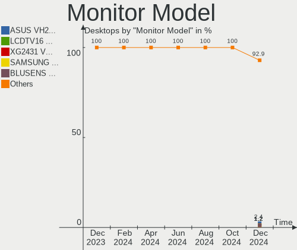
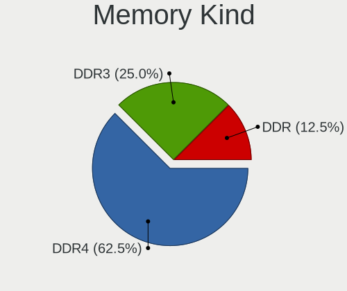

Zorin - Hardware Trends (Desktops)
----------------------------------

A project to identify most popular hardware characteristics and track their change
over time based on data collected by Linux users at https://Linux-Hardware.org.

Anyone can contribute to this report by the [hw-probe](https://github.com/linuxhw/hw-probe) tool:

    sudo -E hw-probe -all -upload

This report is for one last month. Overall report since the beginning of time: [TestCoverage](https://github.com/linuxhw/TestCoverage)

Period: Aug, 2022.

Contents
--------

* [ System ](#system)
  - [ OS                       ](#os)
  - [ OS Family                ](#os-family)
  - [ Kernel                   ](#kernel)
  - [ Kernel Family            ](#kernel-family)
  - [ Kernel Major Ver.        ](#kernel-major-ver)
  - [ Arch                     ](#arch)
  - [ DE                       ](#de)
  - [ Display Server           ](#display-server)
  - [ Display Manager          ](#display-manager)
  - [ OS Lang                  ](#os-lang)
  - [ Boot Mode                ](#boot-mode)
  - [ Filesystem               ](#filesystem)
  - [ Part. scheme             ](#part-scheme)
  - [ Dual Boot with Linux/BSD ](#dual-boot-with-linuxbsd)
  - [ Dual Boot (Win)          ](#dual-boot-win)

* [ Board ](#board)
  - [ Vendor                   ](#vendor)
  - [ Model                    ](#model)
  - [ Model Family             ](#model-family)
  - [ MFG Year                 ](#mfg-year)
  - [ Form Factor              ](#form-factor)
  - [ Secure Boot              ](#secure-boot)
  - [ Coreboot                 ](#coreboot)
  - [ RAM Size                 ](#ram-size)
  - [ RAM Used                 ](#ram-used)
  - [ Total Drives             ](#total-drives)
  - [ Has CD-ROM               ](#has-cd-rom)
  - [ Has Ethernet             ](#has-ethernet)
  - [ Has WiFi                 ](#has-wifi)
  - [ Has Bluetooth            ](#has-bluetooth)

* [ Location ](#location)
  - [ Country                  ](#country)
  - [ City                     ](#city)

* [ Drives ](#drives)
  - [ Drive Vendor             ](#drive-vendor)
  - [ Drive Model              ](#drive-model)
  - [ HDD Vendor               ](#hdd-vendor)
  - [ SSD Vendor               ](#ssd-vendor)
  - [ Drive Kind               ](#drive-kind)
  - [ Drive Connector          ](#drive-connector)
  - [ Drive Size               ](#drive-size)
  - [ Space Total              ](#space-total)
  - [ Space Used               ](#space-used)
  - [ Malfunc. Drives          ](#malfunc-drives)
  - [ Malfunc. Drive Vendor    ](#malfunc-drive-vendor)
  - [ Malfunc. HDD Vendor      ](#malfunc-hdd-vendor)
  - [ Malfunc. Drive Kind      ](#malfunc-drive-kind)
  - [ Failed Drives            ](#failed-drives)
  - [ Failed Drive Vendor      ](#failed-drive-vendor)
  - [ Drive Status             ](#drive-status)

* [ Storage controller ](#storage-controller)
  - [ Storage Vendor           ](#storage-vendor)
  - [ Storage Model            ](#storage-model)
  - [ Storage Kind             ](#storage-kind)

* [ Processor ](#processor)
  - [ CPU Vendor               ](#cpu-vendor)
  - [ CPU Model                ](#cpu-model)
  - [ CPU Model Family         ](#cpu-model-family)
  - [ CPU Cores                ](#cpu-cores)
  - [ CPU Sockets              ](#cpu-sockets)
  - [ CPU Threads              ](#cpu-threads)
  - [ CPU Op-Modes             ](#cpu-op-modes)
  - [ CPU Microcode            ](#cpu-microcode)
  - [ CPU Microarch            ](#cpu-microarch)

* [ Graphics ](#graphics)
  - [ GPU Vendor               ](#gpu-vendor)
  - [ GPU Model                ](#gpu-model)
  - [ GPU Combo                ](#gpu-combo)
  - [ GPU Driver               ](#gpu-driver)
  - [ GPU Memory               ](#gpu-memory)

* [ Monitor ](#monitor)
  - [ Monitor Vendor           ](#monitor-vendor)
  - [ Monitor Model            ](#monitor-model)
  - [ Monitor Resolution       ](#monitor-resolution)
  - [ Monitor Diagonal         ](#monitor-diagonal)
  - [ Monitor Width            ](#monitor-width)
  - [ Aspect Ratio             ](#aspect-ratio)
  - [ Monitor Area             ](#monitor-area)
  - [ Pixel Density            ](#pixel-density)
  - [ Multiple Monitors        ](#multiple-monitors)

* [ Network ](#network)
  - [ Net Controller Vendor    ](#net-controller-vendor)
  - [ Net Controller Model     ](#net-controller-model)
  - [ Wireless Vendor          ](#wireless-vendor)
  - [ Wireless Model           ](#wireless-model)
  - [ Ethernet Vendor          ](#ethernet-vendor)
  - [ Ethernet Model           ](#ethernet-model)
  - [ Net Controller Kind      ](#net-controller-kind)
  - [ Used Controller          ](#used-controller)
  - [ NICs                     ](#nics)
  - [ IPv6                     ](#ipv6)

* [ Bluetooth ](#bluetooth)
  - [ Bluetooth Vendor         ](#bluetooth-vendor)
  - [ Bluetooth Model          ](#bluetooth-model)

* [ Sound ](#sound)
  - [ Sound Vendor             ](#sound-vendor)
  - [ Sound Model              ](#sound-model)

* [ Memory ](#memory)
  - [ Memory Vendor            ](#memory-vendor)
  - [ Memory Model             ](#memory-model)
  - [ Memory Kind              ](#memory-kind)
  - [ Memory Form Factor       ](#memory-form-factor)
  - [ Memory Size              ](#memory-size)
  - [ Memory Speed             ](#memory-speed)

* [ Printers & scanners ](#printers--scanners)
  - [ Printer Vendor           ](#printer-vendor)
  - [ Printer Model            ](#printer-model)
  - [ Scanner Vendor           ](#scanner-vendor)
  - [ Scanner Model            ](#scanner-model)

* [ Camera ](#camera)
  - [ Camera Vendor            ](#camera-vendor)
  - [ Camera Model             ](#camera-model)

* [ Security ](#security)
  - [ Fingerprint Vendor       ](#fingerprint-vendor)
  - [ Fingerprint Model        ](#fingerprint-model)
  - [ Chipcard Vendor          ](#chipcard-vendor)
  - [ Chipcard Model           ](#chipcard-model)

* [ Unsupported ](#unsupported)
  - [ Unsupported Devices      ](#unsupported-devices)
  - [ Unsupported Device Types ](#unsupported-device-types)

System
------

OS
--

Installed operating systems

| Name     | Desktops | Percent |
|----------|----------|---------|
| Zorin 16 | 59       | 98.33%  |
| Zorin 15 | 1        | 1.67%   |

OS Family
---------

OS without a version

| Name  | Desktops | Percent |
|-------|----------|---------|
| Zorin | 60       | 100%    |

Kernel
------

Version of the Linux kernel

| Version               | Desktops | Percent |
|-----------------------|----------|---------|
| 5.15.0-46-generic     | 28       | 46.67%  |
| 5.15.0-41-generic     | 14       | 23.33%  |
| 5.15.0-43-generic     | 13       | 21.67%  |
| 5.4.0-124-generic     | 1        | 1.67%   |
| 5.19.2-051902-generic | 1        | 1.67%   |
| 5.17.5-051705-generic | 1        | 1.67%   |
| 5.13.0-51-generic     | 1        | 1.67%   |
| 5.13.0-48-generic     | 1        | 1.67%   |

Kernel Family
-------------

Linux kernel without a distro release

| Version | Desktops | Percent |
|---------|----------|---------|
| 5.15.0  | 55       | 91.67%  |
| 5.13.0  | 2        | 3.33%   |
| 5.4.0   | 1        | 1.67%   |
| 5.19.2  | 1        | 1.67%   |
| 5.17.5  | 1        | 1.67%   |

Kernel Major Ver.
-----------------

Linux kernel major version

| Version | Desktops | Percent |
|---------|----------|---------|
| 5.15    | 55       | 91.67%  |
| 5.13    | 2        | 3.33%   |
| 5.4     | 1        | 1.67%   |
| 5.19    | 1        | 1.67%   |
| 5.17    | 1        | 1.67%   |

Arch
----

OS architecture (x86_64, i586, etc.)

| Name   | Desktops | Percent |
|--------|----------|---------|
| x86_64 | 59       | 98.33%  |
| i686   | 1        | 1.67%   |

DE
--

Desktop Environment

| Name       | Desktops | Percent |
|------------|----------|---------|
| GNOME      | 50       | 83.33%  |
| XFCE       | 9        | 15%     |
| X-Cinnamon | 1        | 1.67%   |

Display Server
--------------

X11 or Wayland

| Name | Desktops | Percent |
|------|----------|---------|
| X11  | 60       | 100%    |

Display Manager
---------------

SDDM, LightDM, etc.

| Name    | Desktops | Percent |
|---------|----------|---------|
| Unknown | 48       | 80%     |
| GDM3    | 5        | 8.33%   |
| GDM     | 5        | 8.33%   |
| LightDM | 2        | 3.33%   |

OS Lang
-------

Language

| Lang  | Desktops | Percent |
|-------|----------|---------|
| en_US | 23       | 38.33%  |
| de_DE | 6        | 10%     |
| pt_BR | 5        | 8.33%   |
| en_GB | 4        | 6.67%   |
| en_IN | 3        | 5%      |
| en_AU | 3        | 5%      |
| nl_NL | 2        | 3.33%   |
| fr_CA | 2        | 3.33%   |
| sk_SK | 1        | 1.67%   |
| nl_BE | 1        | 1.67%   |
| nb_NO | 1        | 1.67%   |
| ko_KR | 1        | 1.67%   |
| it_IT | 1        | 1.67%   |
| fr_FR | 1        | 1.67%   |
| fi_FI | 1        | 1.67%   |
| es_US | 1        | 1.67%   |
| es_CL | 1        | 1.67%   |
| en_CA | 1        | 1.67%   |
| da_DK | 1        | 1.67%   |
| cs_CZ | 1        | 1.67%   |

Boot Mode
---------

EFI or BIOS

| Mode | Desktops | Percent |
|------|----------|---------|
| BIOS | 30       | 50%     |
| EFI  | 30       | 50%     |

Filesystem
----------

Type of filesystem

| Type  | Desktops | Percent |
|-------|----------|---------|
| Ext4  | 55       | 91.67%  |
| Xfs   | 2        | 3.33%   |
| Zfs   | 1        | 1.67%   |
| Ext2  | 1        | 1.67%   |
| Btrfs | 1        | 1.67%   |

Part. scheme
------------

Scheme of partitioning

| Type    | Desktops | Percent |
|---------|----------|---------|
| Unknown | 54       | 90%     |
| GPT     | 5        | 8.33%   |
| MBR     | 1        | 1.67%   |

Dual Boot with Linux/BSD
------------------------

Hosting more than one Linux/BSD

| Dual boot | Desktops | Percent |
|-----------|----------|---------|
| No        | 59       | 98.33%  |
| Yes       | 1        | 1.67%   |

Dual Boot (Win)
---------------

Hosting Linux and Windows

| Dual boot | Desktops | Percent |
|-----------|----------|---------|
| No        | 56       | 93.33%  |
| Yes       | 4        | 6.67%   |

Board
-----

Vendor
------

Motherboard manufacturer

| Name                | Desktops | Percent |
|---------------------|----------|---------|
| ASUSTek Computer    | 16       | 26.67%  |
| MSI                 | 9        | 15%     |
| Hewlett-Packard     | 8        | 13.33%  |
| Gigabyte Technology | 7        | 11.67%  |
| ASRock              | 5        | 8.33%   |
| Lenovo              | 4        | 6.67%   |
| Dell                | 3        | 5%      |
| BESSTAR Tech        | 2        | 3.33%   |
| WIPRO               | 1        | 1.67%   |
| Pegatron            | 1        | 1.67%   |
| MP                  | 1        | 1.67%   |
| MAXSUN              | 1        | 1.67%   |
| LORD ELECTRONICS    | 1        | 1.67%   |
| JGINYUE             | 1        | 1.67%   |

Model
-----

Motherboard model

| Name                                    | Desktops | Percent |
|-----------------------------------------|----------|---------|
| ASUS All Series                         | 3        | 5%      |
| HP Compaq Pro 6300 SFF                  | 2        | 3.33%   |
| WIPRO G31T-M                            | 1        | 1.67%   |
| Pegatron NE502AV-ABA a6750t             | 1        | 1.67%   |
| MSI MS-7D54                             | 1        | 1.67%   |
| MSI MS-7C94                             | 1        | 1.67%   |
| MSI MS-7C91                             | 1        | 1.67%   |
| MSI MS-7C89                             | 1        | 1.67%   |
| MSI MS-7C02                             | 1        | 1.67%   |
| MSI MS-7A74                             | 1        | 1.67%   |
| MSI MS-7917                             | 1        | 1.67%   |
| MSI MS-7885                             | 1        | 1.67%   |
| MSI FJ452AA-AC4 a6615br                 | 1        | 1.67%   |
| MP MS-7848                              | 1        | 1.67%   |
| MAXSUN MS-TZZ A520M                     | 1        | 1.67%   |
| LORD ELECTRONICS GM965 Series           | 1        | 1.67%   |
| Lenovo ThinkCentre M72e 4004H1U         | 1        | 1.67%   |
| Lenovo ThinkCentre M57 6087YD2          | 1        | 1.67%   |
| Lenovo IdeaCentre 310S-08ASR 90G9002XNY | 1        | 1.67%   |
| Lenovo H30-05 90BJ00CNMT                | 1        | 1.67%   |
| JGINYUE B85M VH PLUS V1.0               | 1        | 1.67%   |
| HP Z420 Workstation                     | 1        | 1.67%   |
| HP ProDesk 600 G1 SFF                   | 1        | 1.67%   |
| HP Compaq Pro 6300 MT                   | 1        | 1.67%   |
| HP 500-420qe                            | 1        | 1.67%   |
| HP 300-0xx                              | 1        | 1.67%   |
| HP 110-020ea                            | 1        | 1.67%   |
| Gigabyte Z77-D3H                        | 1        | 1.67%   |
| Gigabyte M4HM87P-00                     | 1        | 1.67%   |
| Gigabyte H61M-D2H-USB3                  | 1        | 1.67%   |
| Gigabyte G1.Sniper Z97                  | 1        | 1.67%   |
| Gigabyte B450M DS3H                     | 1        | 1.67%   |
| Gigabyte 970A-DS3P                      | 1        | 1.67%   |
| Gigabyte 970-GAMING                     | 1        | 1.67%   |
| Dell OptiPlex 780                       | 1        | 1.67%   |
| Dell OptiPlex 7010                      | 1        | 1.67%   |
| Dell OptiPlex 360                       | 1        | 1.67%   |
| BESSTAR Tech UM350                      | 1        | 1.67%   |
| BESSTAR Tech HM90                       | 1        | 1.67%   |
| ASUS TUF Gaming X570-PLUS               | 1        | 1.67%   |
| ASUS ROG STRIX X570-E GAMING            | 1        | 1.67%   |
| ASUS ProArt B660-CREATOR D4             | 1        | 1.67%   |
| ASUS PRIME Z690-P WIFI D4               | 1        | 1.67%   |
| ASUS PRIME Z390-A                       | 1        | 1.67%   |
| ASUS PRIME X570-P                       | 1        | 1.67%   |
| ASUS PRIME H370-A                       | 1        | 1.67%   |
| ASUS P9X79 LE                           | 1        | 1.67%   |
| ASUS P8B75-V                            | 1        | 1.67%   |
| ASUS P7H55-M LX                         | 1        | 1.67%   |
| ASUS P5GC-MX                            | 1        | 1.67%   |
| ASUS KB009AA-AKB m9140.cs               | 1        | 1.67%   |
| ASUS ET2701I-W8                         | 1        | 1.67%   |
| ASRock Z170 Pro4                        | 1        | 1.67%   |
| ASRock H61M-DGS                         | 1        | 1.67%   |
| ASRock B550M Pro4                       | 1        | 1.67%   |
| ASRock B450 Pro4                        | 1        | 1.67%   |
| ASRock B450 Gaming-ITX/ac               | 1        | 1.67%   |

Model Family
------------

Motherboard model prefix

| Name                   | Desktops | Percent |
|------------------------|----------|---------|
| ASUS PRIME             | 4        | 6.67%   |
| HP Compaq              | 3        | 5%      |
| Dell OptiPlex          | 3        | 5%      |
| ASUS All               | 3        | 5%      |
| Lenovo ThinkCentre     | 2        | 3.33%   |
| ASRock B450            | 2        | 3.33%   |
| WIPRO G31T-M           | 1        | 1.67%   |
| Pegatron NE502AV-ABA   | 1        | 1.67%   |
| MSI MS-7D54            | 1        | 1.67%   |
| MSI MS-7C94            | 1        | 1.67%   |
| MSI MS-7C91            | 1        | 1.67%   |
| MSI MS-7C89            | 1        | 1.67%   |
| MSI MS-7C02            | 1        | 1.67%   |
| MSI MS-7A74            | 1        | 1.67%   |
| MSI MS-7917            | 1        | 1.67%   |
| MSI MS-7885            | 1        | 1.67%   |
| MSI FJ452AA-AC4        | 1        | 1.67%   |
| MP MS-7848             | 1        | 1.67%   |
| MAXSUN MS-TZZ          | 1        | 1.67%   |
| LORD ELECTRONICS GM965 | 1        | 1.67%   |
| Lenovo IdeaCentre      | 1        | 1.67%   |
| Lenovo H30-05          | 1        | 1.67%   |
| JGINYUE B85M           | 1        | 1.67%   |
| HP Z420                | 1        | 1.67%   |
| HP ProDesk             | 1        | 1.67%   |
| HP 500-420qe           | 1        | 1.67%   |
| HP 300-0xx             | 1        | 1.67%   |
| HP 110-020ea           | 1        | 1.67%   |
| Gigabyte Z77-D3H       | 1        | 1.67%   |
| Gigabyte M4HM87P-00    | 1        | 1.67%   |
| Gigabyte H61M-D2H-USB3 | 1        | 1.67%   |
| Gigabyte G1.Sniper     | 1        | 1.67%   |
| Gigabyte B450M         | 1        | 1.67%   |
| Gigabyte 970A-DS3P     | 1        | 1.67%   |
| Gigabyte 970-GAMING    | 1        | 1.67%   |
| BESSTAR Tech UM350     | 1        | 1.67%   |
| BESSTAR Tech HM90      | 1        | 1.67%   |
| ASUS TUF               | 1        | 1.67%   |
| ASUS ROG               | 1        | 1.67%   |
| ASUS ProArt            | 1        | 1.67%   |
| ASUS P9X79             | 1        | 1.67%   |
| ASUS P8B75-V           | 1        | 1.67%   |
| ASUS P7H55-M           | 1        | 1.67%   |
| ASUS P5GC-MX           | 1        | 1.67%   |
| ASUS KB009AA-AKB       | 1        | 1.67%   |
| ASUS ET2701I-W8        | 1        | 1.67%   |
| ASRock Z170            | 1        | 1.67%   |
| ASRock H61M-DGS        | 1        | 1.67%   |
| ASRock B550M           | 1        | 1.67%   |

MFG Year
--------

Motherboard manufacture year

| Year | Desktops | Percent |
|------|----------|---------|
| 2012 | 10       | 16.67%  |
| 2014 | 8        | 13.33%  |
| 2020 | 6        | 10%     |
| 2018 | 5        | 8.33%   |
| 2016 | 5        | 8.33%   |
| 2013 | 5        | 8.33%   |
| 2021 | 4        | 6.67%   |
| 2019 | 4        | 6.67%   |
| 2008 | 4        | 6.67%   |
| 2022 | 2        | 3.33%   |
| 2011 | 2        | 3.33%   |
| 2007 | 2        | 3.33%   |
| 2015 | 1        | 1.67%   |
| 2010 | 1        | 1.67%   |
| 2009 | 1        | 1.67%   |

Form Factor
-----------

Physical design of the computer

| Name    | Desktops | Percent |
|---------|----------|---------|
| Desktop | 60       | 100%    |

Secure Boot
-----------

Enabled or disabled

| State    | Desktops | Percent |
|----------|----------|---------|
| Disabled | 56       | 93.33%  |
| Enabled  | 4        | 6.67%   |

Coreboot
--------

Have coreboot on board

| Used | Desktops | Percent |
|------|----------|---------|
| No   | 60       | 100%    |

RAM Size
--------

Total RAM memory

| Size in GB  | Desktops | Percent |
|-------------|----------|---------|
| 8.01-16.0   | 14       | 23.33%  |
| 16.01-24.0  | 13       | 21.67%  |
| 32.01-64.0  | 11       | 18.33%  |
| 3.01-4.0    | 8        | 13.33%  |
| 4.01-8.0    | 6        | 10%     |
| 2.01-3.0    | 2        | 3.33%   |
| 64.01-256.0 | 2        | 3.33%   |
| 1.01-2.0    | 2        | 3.33%   |
| 24.01-32.0  | 1        | 1.67%   |
| 0.51-1.0    | 1        | 1.67%   |

RAM Used
--------

Used RAM memory

| Used GB    | Desktops | Percent |
|------------|----------|---------|
| 2.01-3.0   | 22       | 36.67%  |
| 1.01-2.0   | 17       | 28.33%  |
| 4.01-8.0   | 6        | 10%     |
| 3.01-4.0   | 6        | 10%     |
| 8.01-16.0  | 5        | 8.33%   |
| 16.01-24.0 | 2        | 3.33%   |
| 0.51-1.0   | 2        | 3.33%   |

Total Drives
------------

Number of drives on board

| Drives | Desktops | Percent |
|--------|----------|---------|
| 1      | 31       | 51.67%  |
| 2      | 17       | 28.33%  |
| 3      | 7        | 11.67%  |
| 4      | 3        | 5%      |
| 5      | 2        | 3.33%   |

Has CD-ROM
----------

Has CD-ROM on board

| Presented | Desktops | Percent |
|-----------|----------|---------|
| Yes       | 35       | 58.33%  |
| No        | 25       | 41.67%  |

Has Ethernet
------------

Has Ethernet on board

| Presented | Desktops | Percent |
|-----------|----------|---------|
| Yes       | 58       | 96.67%  |
| No        | 2        | 3.33%   |

Has WiFi
--------

Has WiFi module

| Presented | Desktops | Percent |
|-----------|----------|---------|
| Yes       | 33       | 55%     |
| No        | 27       | 45%     |

Has Bluetooth
-------------

Has Bluetooth module

| Presented | Desktops | Percent |
|-----------|----------|---------|
| No        | 39       | 65%     |
| Yes       | 21       | 35%     |

Location
--------

Country
-------

Geographic location (country)

| Country     | Desktops | Percent |
|-------------|----------|---------|
| USA         | 10       | 16.67%  |
| Germany     | 8        | 13.33%  |
| Brazil      | 5        | 8.33%   |
| Netherlands | 4        | 6.67%   |
| India       | 3        | 5%      |
| Denmark     | 3        | 5%      |
| Canada      | 3        | 5%      |
| Australia   | 3        | 5%      |
| UK          | 2        | 3.33%   |
| Vietnam     | 1        | 1.67%   |
| Sweden      | 1        | 1.67%   |
| Spain       | 1        | 1.67%   |
| South Korea | 1        | 1.67%   |
| Slovenia    | 1        | 1.67%   |
| Slovakia    | 1        | 1.67%   |
| Serbia      | 1        | 1.67%   |
| Norway      | 1        | 1.67%   |
| Malta       | 1        | 1.67%   |
| Lithuania   | 1        | 1.67%   |
| Italy       | 1        | 1.67%   |
| Hungary     | 1        | 1.67%   |
| Greece      | 1        | 1.67%   |
| France      | 1        | 1.67%   |
| Finland     | 1        | 1.67%   |
| Czechia     | 1        | 1.67%   |
| Cyprus      | 1        | 1.67%   |
| Chile       | 1        | 1.67%   |
| Belgium     | 1        | 1.67%   |

City
----

Geographic location (city)

| City              | Desktops | Percent |
|-------------------|----------|---------|
| Oosterbeek        | 2        | 3.33%   |
| Copenhagen        | 2        | 3.33%   |
| Vrhnika           | 1        | 1.67%   |
| Vilnius           | 1        | 1.67%   |
| Umeå             | 1        | 1.67%   |
| Stuttgart         | 1        | 1.67%   |
| Seoul             | 1        | 1.67%   |
| Sarpsborg         | 1        | 1.67%   |
| Santiago          | 1        | 1.67%   |
| Rome              | 1        | 1.67%   |
| Prague            | 1        | 1.67%   |
| Perth             | 1        | 1.67%   |
| Oklahoma City     | 1        | 1.67%   |
| Ogdensburg        | 1        | 1.67%   |
| Northampton       | 1        | 1.67%   |
| Niederndodeleben  | 1        | 1.67%   |
| Mumbai            | 1        | 1.67%   |
| Montbrio del Camp | 1        | 1.67%   |
| Montague          | 1        | 1.67%   |
| Meiningen         | 1        | 1.67%   |
| Marseille         | 1        | 1.67%   |
| Manchester        | 1        | 1.67%   |
| Manaus            | 1        | 1.67%   |
| Maineville        | 1        | 1.67%   |
| Laval             | 1        | 1.67%   |
| Larnaca           | 1        | 1.67%   |
| Langley           | 1        | 1.67%   |
| Kokkedal          | 1        | 1.67%   |
| Joliette          | 1        | 1.67%   |
| Jersey City       | 1        | 1.67%   |
| Isleworth         | 1        | 1.67%   |
| Houston           | 1        | 1.67%   |
| Hoogeveen         | 1        | 1.67%   |
| Ho Chi Minh City  | 1        | 1.67%   |
| Helsinki          | 1        | 1.67%   |
| Gurgaon           | 1        | 1.67%   |
| Gloucester        | 1        | 1.67%   |
| Gielert           | 1        | 1.67%   |
| Frankfurt am Main | 1        | 1.67%   |
| Forest            | 1        | 1.67%   |
| Duisburg          | 1        | 1.67%   |
| Deventer          | 1        | 1.67%   |
| Cypress           | 1        | 1.67%   |
| Cologne           | 1        | 1.67%   |
| Cierny Balog      | 1        | 1.67%   |
| Cambe             | 1        | 1.67%   |
| Budapest          | 1        | 1.67%   |
| Brasília         | 1        | 1.67%   |
| Blacktown         | 1        | 1.67%   |
| Birkirkara        | 1        | 1.67%   |
| Bexley            | 1        | 1.67%   |
| Berlin            | 1        | 1.67%   |
| Belgrade          | 1        | 1.67%   |
| Belford Roxo      | 1        | 1.67%   |
| Athens            | 1        | 1.67%   |
| Ashti             | 1        | 1.67%   |
| Apucarana         | 1        | 1.67%   |
| Andover           | 1        | 1.67%   |

Drives
------

Drive Vendor
------------

Hard drive vendors

| Vendor                      | Desktops | Drives | Percent |
|-----------------------------|----------|--------|---------|
| Seagate                     | 17       | 20     | 18.09%  |
| WDC                         | 14       | 17     | 14.89%  |
| Samsung Electronics         | 10       | 13     | 10.64%  |
| Kingston                    | 9        | 10     | 9.57%   |
| SanDisk                     | 8        | 8      | 8.51%   |
| Crucial                     | 6        | 6      | 6.38%   |
| MAXIO Technology (Hangzhou) | 2        | 2      | 2.13%   |
| Intenso                     | 2        | 3      | 2.13%   |
| Hitachi                     | 2        | 3      | 2.13%   |
| China                       | 2        | 3      | 2.13%   |
| A-DATA Technology           | 2        | 2      | 2.13%   |
| Zheino                      | 1        | 1      | 1.06%   |
| WD MediaMax                 | 1        | 1      | 1.06%   |
| Toshiba                     | 1        | 1      | 1.06%   |
| Team                        | 1        | 1      | 1.06%   |
| T-CREATE                    | 1        | 1      | 1.06%   |
| SK hynix                    | 1        | 1      | 1.06%   |
| Phison                      | 1        | 1      | 1.06%   |
| Patriot                     | 1        | 1      | 1.06%   |
| Micron Technology           | 1        | 1      | 1.06%   |
| KingSpec                    | 1        | 1      | 1.06%   |
| KingDian                    | 1        | 1      | 1.06%   |
| Intel                       | 1        | 1      | 1.06%   |
| HGST                        | 1        | 1      | 1.06%   |
| Corsair                     | 1        | 1      | 1.06%   |
| ASMedia                     | 1        | 1      | 1.06%   |
| AFOX                        | 1        | 1      | 1.06%   |
| addlink                     | 1        | 2      | 1.06%   |
| ADATA Technology            | 1        | 1      | 1.06%   |
| Acer                        | 1        | 1      | 1.06%   |
| Unknown                     | 1        | 1      | 1.06%   |

Drive Model
-----------

Hard drive models

| Model                              | Desktops | Percent |
|------------------------------------|----------|---------|
| Seagate ST500DM002-1BD142 500GB    | 3        | 2.88%   |
| SanDisk NVMe SSD Drive 1TB         | 3        | 2.88%   |
| Crucial CT240BX500SSD1 240GB       | 3        | 2.88%   |
| Seagate ST1000DM003-1SB102 1TB     | 2        | 1.92%   |
| Seagate Expansion Desk 4TB         | 2        | 1.92%   |
| SanDisk NVMe SSD Drive 500GB       | 2        | 1.92%   |
| Kingston SA400S37120G 120GB SSD    | 2        | 1.92%   |
| Crucial CT2000MX500SSD1 2TB        | 2        | 1.92%   |
| China SATA SSD 120GB               | 2        | 1.92%   |
| Zheino CHN-25SATAC3-128 128GB      | 1        | 0.96%   |
| WDC WUH721816ALE6L4 16TB           | 1        | 0.96%   |
| WDC WDS100T2B0B 1TB SSD            | 1        | 0.96%   |
| WDC WDS100T2B0A-00SM50 1TB SSD     | 1        | 0.96%   |
| WDC WDBNCE5000PNC 500GB SSD        | 1        | 0.96%   |
| WDC WD60EFZX-68B3FN0 6TB           | 1        | 0.96%   |
| WDC WD5000BEVT-22ZAT0 500GB        | 1        | 0.96%   |
| WDC WD5000AAKX-22ERMA0 500GB       | 1        | 0.96%   |
| WDC WD5000AAKX-00U6AA0 500GB       | 1        | 0.96%   |
| WDC WD5000AAKS-00UU3A0 500GB       | 1        | 0.96%   |
| WDC WD40EZAZ-19SF3B0 4TB           | 1        | 0.96%   |
| WDC WD3200AVVS-63L2B0 320GB        | 1        | 0.96%   |
| WDC WD3200AAKS-00SBA0 320GB        | 1        | 0.96%   |
| WDC WD20EARX-00PASB0 2TB           | 1        | 0.96%   |
| WDC WD10EZEX-75WN4A1 1TB           | 1        | 0.96%   |
| WDC WD10EZEX-00WN4A0 1TB           | 1        | 0.96%   |
| WDC WD My Passport 25F3 512GB      | 1        | 0.96%   |
| WD MediaMax WL500GSA1672B 500GB    | 1        | 0.96%   |
| Toshiba HDWE150 5TB                | 1        | 0.96%   |
| Team T253X6256G 256GB SSD          | 1        | 0.96%   |
| T-CREATE T253TA001T 1024GB         | 1        | 0.96%   |
| SK hynix SHGS31-500GS-2 500GB SSD  | 1        | 0.96%   |
| Seagate ST380815AS 80GB            | 1        | 0.96%   |
| Seagate ST3500418AS 500GB          | 1        | 0.96%   |
| Seagate ST3250310AS 250GB          | 1        | 0.96%   |
| Seagate ST3160215AS 160GB          | 1        | 0.96%   |
| Seagate ST31000528AS 1TB           | 1        | 0.96%   |
| Seagate ST2000LM003 HN-M201RAD 2TB | 1        | 0.96%   |
| Seagate ST2000DM008-2UB102 2TB     | 1        | 0.96%   |
| Seagate ST2000DM001-1CH164 2TB     | 1        | 0.96%   |
| Seagate ST2000DM 001-1ER164 2TB    | 1        | 0.96%   |
| Seagate ST1000DM010-2EP102 1TB     | 1        | 0.96%   |
| Seagate ST1000DM003-1SB10C 1TB     | 1        | 0.96%   |
| Seagate ST1000DM003-1ER162 1TB     | 1        | 0.96%   |
| Seagate ST1000DM003-1CH162 1TB     | 1        | 0.96%   |
| SanDisk SSD PLUS 480GB             | 1        | 0.96%   |
| SanDisk SDSSDHP256G 256GB          | 1        | 0.96%   |
| SanDisk SDSSDH3 250G               | 1        | 0.96%   |
| Samsung SSD 980 PRO 1TB            | 1        | 0.96%   |
| Samsung SSD 980 500GB              | 1        | 0.96%   |
| Samsung SSD 970 EVO Plus 500GB     | 1        | 0.96%   |
| Samsung SSD 870 EVO 500GB          | 1        | 0.96%   |
| Samsung SSD 870 EVO 250GB          | 1        | 0.96%   |
| Samsung SSD 860 EVO 500GB          | 1        | 0.96%   |
| Samsung SSD 860 EVO 250GB          | 1        | 0.96%   |
| Samsung SSD 860 EVO 1TB            | 1        | 0.96%   |
| Samsung SSD 850 EVO 250GB          | 1        | 0.96%   |
| Samsung SSD 840 EVO 1TB mSATA      | 1        | 0.96%   |
| Samsung SSD 840 EVO 120GB          | 1        | 0.96%   |
| Samsung NVMe SSD Drive 250GB       | 1        | 0.96%   |
| Samsung NVMe SSD Drive 1TB         | 1        | 0.96%   |

HDD Vendor
----------

Hard disk drive vendors

| Vendor  | Desktops | Drives | Percent |
|---------|----------|--------|---------|
| Seagate | 17       | 20     | 53.13%  |
| WDC     | 11       | 13     | 34.38%  |
| Hitachi | 2        | 3      | 6.25%   |
| Toshiba | 1        | 1      | 3.13%   |
| HGST    | 1        | 1      | 3.13%   |

SSD Vendor
----------

Solid state drive vendors

| Vendor              | Desktops | Drives | Percent |
|---------------------|----------|--------|---------|
| Samsung Electronics | 7        | 8      | 17.5%   |
| Kingston            | 6        | 6      | 15%     |
| Crucial             | 6        | 6      | 15%     |
| SanDisk             | 3        | 3      | 7.5%    |
| WDC                 | 2        | 3      | 5%      |
| China               | 2        | 3      | 5%      |
| A-DATA Technology   | 2        | 2      | 5%      |
| Team                | 1        | 1      | 2.5%    |
| T-CREATE            | 1        | 1      | 2.5%    |
| SK hynix            | 1        | 1      | 2.5%    |
| Patriot             | 1        | 1      | 2.5%    |
| Micron Technology   | 1        | 1      | 2.5%    |
| KingSpec            | 1        | 1      | 2.5%    |
| KingDian            | 1        | 1      | 2.5%    |
| Intenso             | 1        | 2      | 2.5%    |
| Intel               | 1        | 1      | 2.5%    |
| AFOX                | 1        | 1      | 2.5%    |
| addlink             | 1        | 1      | 2.5%    |
| Acer                | 1        | 1      | 2.5%    |

Drive Kind
----------

HDD or SSD

| Kind    | Desktops | Drives | Percent |
|---------|----------|--------|---------|
| SSD     | 36       | 44     | 41.86%  |
| HDD     | 29       | 38     | 33.72%  |
| NVMe    | 15       | 19     | 17.44%  |
| Unknown | 6        | 7      | 6.98%   |

Drive Connector
---------------

SATA, SAS, NVMe, etc.

| Type | Desktops | Drives | Percent |
|------|----------|--------|---------|
| SATA | 53       | 82     | 72.6%   |
| NVMe | 15       | 19     | 20.55%  |
| SAS  | 5        | 7      | 6.85%   |

Drive Size
----------

Size of hard drive

| Size in TB | Desktops | Drives | Percent |
|------------|----------|--------|---------|
| 0.01-0.5   | 39       | 45     | 56.52%  |
| 0.51-1.0   | 15       | 19     | 21.74%  |
| 1.01-2.0   | 8        | 10     | 11.59%  |
| 3.01-4.0   | 3        | 3      | 4.35%   |
| 4.01-10.0  | 2        | 3      | 2.9%    |
| 2.01-3.0   | 1        | 1      | 1.45%   |
| 10.01-20.0 | 1        | 1      | 1.45%   |

Space Total
-----------

Amount of disk space available on the file system

| Size in GB     | Desktops | Percent |
|----------------|----------|---------|
| 101-250        | 25       | 41.67%  |
| 251-500        | 12       | 20%     |
| 501-1000       | 8        | 13.33%  |
| More than 3000 | 5        | 8.33%   |
| 2001-3000      | 3        | 5%      |
| 1001-2000      | 3        | 5%      |
| 51-100         | 2        | 3.33%   |
| 21-50          | 1        | 1.67%   |
| Unknown        | 1        | 1.67%   |

Space Used
----------

Amount of used disk space

| Used GB        | Desktops | Percent |
|----------------|----------|---------|
| 21-50          | 20       | 33.33%  |
| 1-20           | 17       | 28.33%  |
| 51-100         | 7        | 11.67%  |
| 251-500        | 4        | 6.67%   |
| 101-250        | 4        | 6.67%   |
| 2001-3000      | 2        | 3.33%   |
| 1001-2000      | 2        | 3.33%   |
| 501-1000       | 2        | 3.33%   |
| More than 3000 | 1        | 1.67%   |
| Unknown        | 1        | 1.67%   |

Malfunc. Drives
---------------

Drive models with a malfunction

| Model                           | Desktops | Drives | Percent |
|---------------------------------|----------|--------|---------|
| Seagate ST500DM002-1BD142 500GB | 1        | 1      | 100%    |

Malfunc. Drive Vendor
---------------------

Vendors of faulty drives

| Vendor  | Desktops | Drives | Percent |
|---------|----------|--------|---------|
| Seagate | 1        | 1      | 100%    |

Malfunc. HDD Vendor
-------------------

Vendors of faulty HDD drives

| Vendor  | Desktops | Drives | Percent |
|---------|----------|--------|---------|
| Seagate | 1        | 1      | 100%    |

Malfunc. Drive Kind
-------------------

Kinds of faulty drives

| Kind | Desktops | Drives | Percent |
|------|----------|--------|---------|
| HDD  | 1        | 1      | 100%    |

Failed Drives
-------------

Failed drive models

Zero info for selected period =(

Failed Drive Vendor
-------------------

Failed drive vendors

Zero info for selected period =(

Drive Status
------------

Number of failed and malfunc. drives

| Status   | Desktops | Drives | Percent |
|----------|----------|--------|---------|
| Detected | 55       | 95     | 90.16%  |
| Works    | 5        | 12     | 8.2%    |
| Malfunc  | 1        | 1      | 1.64%   |

Storage controller
------------------

Storage Vendor
--------------

Storage controller vendors

| Vendor                      | Desktops | Percent |
|-----------------------------|----------|---------|
| Intel                       | 42       | 51.85%  |
| AMD                         | 18       | 22.22%  |
| SanDisk                     | 5        | 6.17%   |
| Samsung Electronics         | 3        | 3.7%    |
| Kingston Technology Company | 3        | 3.7%    |
| ASMedia Technology          | 3        | 3.7%    |
| Silicon Image               | 2        | 2.47%   |
| Phison Electronics          | 2        | 2.47%   |
| MAXIO Technology (Hangzhou) | 2        | 2.47%   |
| ADATA Technology            | 1        | 1.23%   |

Storage Model
-------------

Storage controller models

| Model                                                                                   | Desktops | Percent |
|-----------------------------------------------------------------------------------------|----------|---------|
| AMD FCH SATA Controller [AHCI mode]                                                     | 10       | 9.8%    |
| Intel 8 Series/C220 Series Chipset Family 6-port SATA Controller 1 [AHCI mode]          | 7        | 6.86%   |
| Intel NM10/ICH7 Family SATA Controller [IDE mode]                                       | 4        | 3.92%   |
| Intel 82801G (ICH7 Family) IDE Controller                                               | 4        | 3.92%   |
| Intel 7 Series/C210 Series Chipset Family 6-port SATA Controller [AHCI mode]            | 4        | 3.92%   |
| Intel 6 Series/C200 Series Chipset Family 6 port Desktop SATA AHCI Controller           | 4        | 3.92%   |
| AMD 500 Series Chipset SATA Controller                                                  | 4        | 3.92%   |
| AMD 400 Series Chipset SATA Controller                                                  | 4        | 3.92%   |
| Intel 82801IR/IO/IH (ICH9R/DO/DH) 6 port SATA Controller [AHCI mode]                    | 3        | 2.94%   |
| ASMedia ASM1062 Serial ATA Controller                                                   | 3        | 2.94%   |
| SanDisk WD Blue SN550 NVMe SSD                                                          | 2        | 1.96%   |
| Samsung NVMe SSD Controller SM981/PM981/PM983                                           | 2        | 1.96%   |
| Phison E12 NVMe Controller                                                              | 2        | 1.96%   |
| MAXIO (Hangzhou) NVMe SSD Controller MAP1202                                            | 2        | 1.96%   |
| Intel Volume Management Device NVMe RAID Controller                                     | 2        | 1.96%   |
| Intel SATA Controller [RAID mode]                                                       | 2        | 1.96%   |
| Intel Alder Lake-S PCH SATA Controller [AHCI Mode]                                      | 2        | 1.96%   |
| Intel 9 Series Chipset Family SATA Controller [AHCI Mode]                               | 2        | 1.96%   |
| Intel 7 Series/C210 Series Chipset Family 4-port SATA Controller [IDE mode]             | 2        | 1.96%   |
| Intel 7 Series/C210 Series Chipset Family 2-port SATA Controller [IDE mode]             | 2        | 1.96%   |
| AMD SB7x0/SB8x0/SB9x0 SATA Controller [AHCI mode]                                       | 2        | 1.96%   |
| Silicon Image SiI 3132 Serial ATA Raid II Controller                                    | 1        | 0.98%   |
| Silicon Image SiI 3114 [SATALink/SATARaid] Serial ATA Controller                        | 1        | 0.98%   |
| SanDisk WD Blue SN570 NVMe SSD                                                          | 1        | 0.98%   |
| SanDisk WD Black SN750 / PC SN730 NVMe SSD                                              | 1        | 0.98%   |
| SanDisk Non-Volatile memory controller                                                  | 1        | 0.98%   |
| Samsung NVMe SSD Controller SM961/PM961/SM963                                           | 1        | 0.98%   |
| Samsung NVMe SSD Controller PM9A1/PM9A3/980PRO                                          | 1        | 0.98%   |
| Samsung NVMe SSD Controller 980                                                         | 1        | 0.98%   |
| Kingston Company U-SNS8154P3 NVMe SSD                                                   | 1        | 0.98%   |
| Kingston Company Company Non-Volatile memory controller                                 | 1        | 0.98%   |
| Kingston Company OM3PDP3 NVMe SSD                                                       | 1        | 0.98%   |
| Kingston Company A2000 NVMe SSD                                                         | 1        | 0.98%   |
| Intel Cannon Lake PCH SATA AHCI Controller                                              | 1        | 0.98%   |
| Intel C610/X99 series chipset 6-Port SATA Controller [AHCI mode]                        | 1        | 0.98%   |
| Intel C602 chipset 4-Port SATA Storage Control Unit                                     | 1        | 0.98%   |
| Intel C600/X79 series chipset SATA RAID Controller                                      | 1        | 0.98%   |
| Intel C600/X79 series chipset IDE-r Controller                                          | 1        | 0.98%   |
| Intel C600/X79 series chipset 6-Port SATA AHCI Controller                               | 1        | 0.98%   |
| Intel Atom Processor E3800 Series SATA AHCI Controller                                  | 1        | 0.98%   |
| Intel 82Q35 Express PT IDER Controller                                                  | 1        | 0.98%   |
| Intel 82801JD/DO (ICH10 Family) 4-port SATA IDE Controller                              | 1        | 0.98%   |
| Intel 82801JD/DO (ICH10 Family) 2-port SATA IDE Controller                              | 1        | 0.98%   |
| Intel 82801GBM/GHM (ICH7-M Family) SATA Controller [IDE mode]                           | 1        | 0.98%   |
| Intel 8 Series SATA Controller 1 [AHCI mode]                                            | 1        | 0.98%   |
| Intel 6 Series/C200 Series Chipset Family Desktop SATA Controller (IDE mode, ports 4-5) | 1        | 0.98%   |
| Intel 6 Series/C200 Series Chipset Family Desktop SATA Controller (IDE mode, ports 0-3) | 1        | 0.98%   |
| Intel 5 Series/3400 Series Chipset 4 port SATA IDE Controller                           | 1        | 0.98%   |
| Intel 5 Series/3400 Series Chipset 2 port SATA IDE Controller                           | 1        | 0.98%   |
| Intel 400 Series Chipset Family SATA AHCI Controller                                    | 1        | 0.98%   |
| Intel 4 Series Chipset PT IDER Controller                                               | 1        | 0.98%   |
| Intel 200 Series PCH SATA controller [AHCI mode]                                        | 1        | 0.98%   |
| AMD SB7x0/SB8x0/SB9x0 IDE Controller                                                    | 1        | 0.98%   |
| ADATA A Non-Volatile memory controller                                                  | 1        | 0.98%   |

Storage Kind
------------

Kind of storage controller (IDE, SATA, NVMe, SAS, ...)

| Kind | Desktops | Percent |
|------|----------|---------|
| SATA | 47       | 56.63%  |
| NVMe | 15       | 18.07%  |
| IDE  | 13       | 15.66%  |
| RAID | 7        | 8.43%   |
| SAS  | 1        | 1.2%    |

Processor
---------

CPU Vendor
----------

Processor vendors

| Vendor | Desktops | Percent |
|--------|----------|---------|
| Intel  | 42       | 70%     |
| AMD    | 18       | 30%     |

CPU Model
---------

Processor models

| Model                                           | Desktops | Percent |
|-------------------------------------------------|----------|---------|
| Intel Core i7-3770 CPU @ 3.40GHz                | 3        | 5%      |
| Intel Core i5-3470 CPU @ 3.20GHz                | 2        | 3.33%   |
| AMD Ryzen 7 5800X 8-Core Processor              | 2        | 3.33%   |
| Intel Xeon CPU E5-1650 v3 @ 3.50GHz             | 1        | 1.67%   |
| Intel Xeon CPU E5-1650 0 @ 3.20GHz              | 1        | 1.67%   |
| Intel Xeon CPU E3-1231 v3 @ 3.40GHz             | 1        | 1.67%   |
| Intel Pentium Dual-Core CPU E5800 @ 3.20GHz     | 1        | 1.67%   |
| Intel Pentium Dual-Core CPU E5300 @ 2.60GHz     | 1        | 1.67%   |
| Intel Pentium Dual-Core CPU E5200 @ 2.50GHz     | 1        | 1.67%   |
| Intel Pentium Dual CPU E2200 @ 2.20GHz          | 1        | 1.67%   |
| Intel Pentium Dual CPU E2140 @ 1.60GHz          | 1        | 1.67%   |
| Intel Pentium CPU G3220 @ 3.00GHz               | 1        | 1.67%   |
| Intel Pentium CPU G2030T @ 2.60GHz              | 1        | 1.67%   |
| Intel Pentium CPU G2030 @ 3.00GHz               | 1        | 1.67%   |
| Intel Core i9-9900KS CPU @ 4.00GHz              | 1        | 1.67%   |
| Intel Core i7-4790K CPU @ 4.00GHz               | 1        | 1.67%   |
| Intel Core i7-4770R CPU @ 3.20GHz               | 1        | 1.67%   |
| Intel Core i7-4770K CPU @ 3.50GHz               | 1        | 1.67%   |
| Intel Core i7-3820 CPU @ 3.60GHz                | 1        | 1.67%   |
| Intel Core i5-9400 CPU @ 2.90GHz                | 1        | 1.67%   |
| Intel Core i5-6600 CPU @ 3.30GHz                | 1        | 1.67%   |
| Intel Core i5-4590 CPU @ 3.30GHz                | 1        | 1.67%   |
| Intel Core i5-4570 CPU @ 3.20GHz                | 1        | 1.67%   |
| Intel Core i5-4460 CPU @ 3.20GHz                | 1        | 1.67%   |
| Intel Core i5-3450 CPU @ 3.10GHz                | 1        | 1.67%   |
| Intel Core i5-3330 CPU @ 3.00GHz                | 1        | 1.67%   |
| Intel Core i3-7100 CPU @ 3.90GHz                | 1        | 1.67%   |
| Intel Core i3-4160 CPU @ 3.60GHz                | 1        | 1.67%   |
| Intel Core i3-4025U CPU @ 1.90GHz               | 1        | 1.67%   |
| Intel Core i3-3220T CPU @ 2.80GHz               | 1        | 1.67%   |
| Intel Core i3-2120 CPU @ 3.30GHz                | 1        | 1.67%   |
| Intel Core i3-10100 CPU @ 3.60GHz               | 1        | 1.67%   |
| Intel Core i3 CPU 540 @ 3.07GHz                 | 1        | 1.67%   |
| Intel Core 2 Quad CPU Q9550 @ 2.83GHz           | 1        | 1.67%   |
| Intel Core 2 Quad CPU Q6600 @ 2.40GHz           | 1        | 1.67%   |
| Intel Core 2 Duo CPU E7500 @ 2.93GHz            | 1        | 1.67%   |
| Intel Core 2 Duo CPU E4600 @ 2.40GHz            | 1        | 1.67%   |
| Intel Celeron CPU J1800 @ 2.41GHz               | 1        | 1.67%   |
| Intel 12th Gen Core i9-12900K                   | 1        | 1.67%   |
| Intel 12th Gen Core i5-12500                    | 1        | 1.67%   |
| AMD Ryzen 9 5900X 12-Core Processor             | 1        | 1.67%   |
| AMD Ryzen 9 4900H with Radeon Graphics          | 1        | 1.67%   |
| AMD Ryzen 7 5700G with Radeon Graphics          | 1        | 1.67%   |
| AMD Ryzen 7 3800X 8-Core Processor              | 1        | 1.67%   |
| AMD Ryzen 7 3700X 8-Core Processor              | 1        | 1.67%   |
| AMD Ryzen 5 5600X 6-Core Processor              | 1        | 1.67%   |
| AMD Ryzen 5 5600 6-Core Processor               | 1        | 1.67%   |
| AMD Ryzen 5 4500 6-Core Processor               | 1        | 1.67%   |
| AMD Ryzen 5 3550H with Radeon Vega Mobile Gfx   | 1        | 1.67%   |
| AMD Ryzen 5 2400G with Radeon Vega Graphics     | 1        | 1.67%   |
| AMD Ryzen 5 1600X Six-Core Processor            | 1        | 1.67%   |
| AMD Ryzen 3 PRO 3200G with Radeon Vega Graphics | 1        | 1.67%   |
| AMD FX-8350 Eight-Core Processor                | 1        | 1.67%   |
| AMD FX-8320 Eight-Core Processor                | 1        | 1.67%   |
| AMD A6-9230 RADEON R4, 5 COMPUTE CORES 2C+3G    | 1        | 1.67%   |
| AMD A6-7310 APU with AMD Radeon R4 Graphics     | 1        | 1.67%   |

CPU Model Family
----------------

Processor model prefix

| Model                   | Desktops | Percent |
|-------------------------|----------|---------|
| Intel Core i5           | 9        | 15%     |
| Intel Core i7           | 7        | 11.67%  |
| Intel Core i3           | 7        | 11.67%  |
| AMD Ryzen 5             | 6        | 10%     |
| AMD Ryzen 7             | 5        | 8.33%   |
| Intel Xeon              | 3        | 5%      |
| Intel Pentium Dual-Core | 3        | 5%      |
| Intel Pentium           | 3        | 5%      |
| Other                   | 2        | 3.33%   |
| Intel Pentium Dual      | 2        | 3.33%   |
| Intel Core 2 Quad       | 2        | 3.33%   |
| Intel Core 2 Duo        | 2        | 3.33%   |
| AMD Ryzen 9             | 2        | 3.33%   |
| AMD FX                  | 2        | 3.33%   |
| AMD A6                  | 2        | 3.33%   |
| Intel Core i9           | 1        | 1.67%   |
| Intel Celeron           | 1        | 1.67%   |
| AMD Ryzen 3 PRO         | 1        | 1.67%   |

CPU Cores
---------

Number of processor cores

| Number | Desktops | Percent |
|--------|----------|---------|
| 4      | 25       | 41.67%  |
| 2      | 18       | 30%     |
| 6      | 8        | 13.33%  |
| 8      | 7        | 11.67%  |
| 16     | 1        | 1.67%   |
| 12     | 1        | 1.67%   |

CPU Sockets
-----------

Number of sockets

| Number | Desktops | Percent |
|--------|----------|---------|
| 1      | 60       | 100%    |

CPU Threads
-----------

Threads per core (Hyper-Threading)

| Number | Desktops | Percent |
|--------|----------|---------|
| 2      | 35       | 58.33%  |
| 1      | 25       | 41.67%  |

CPU Op-Modes
------------

CPU Operation Modes (32-bit, 64-bit)

| Op mode        | Desktops | Percent |
|----------------|----------|---------|
| 32-bit, 64-bit | 60       | 100%    |

CPU Microcode
-------------

Microcode number

| Number     | Desktops | Percent |
|------------|----------|---------|
| 0x306a9    | 10       | 16.67%  |
| 0x306c3    | 6        | 10%     |
| 0x1067a    | 5        | 8.33%   |
| 0x6fd      | 3        | 5%      |
| 0x0a201016 | 3        | 5%      |
| Unknown    | 3        | 5%      |
| 0x206d7    | 2        | 3.33%   |
| 0x08108109 | 2        | 3.33%   |
| 0x06000852 | 2        | 3.33%   |
| 0xa0653    | 1        | 1.67%   |
| 0x906ed    | 1        | 1.67%   |
| 0x906ea    | 1        | 1.67%   |
| 0x906e9    | 1        | 1.67%   |
| 0x90675    | 1        | 1.67%   |
| 0x90672    | 1        | 1.67%   |
| 0x6fb      | 1        | 1.67%   |
| 0x506e3    | 1        | 1.67%   |
| 0x40661    | 1        | 1.67%   |
| 0x40651    | 1        | 1.67%   |
| 0x306f2    | 1        | 1.67%   |
| 0x30678    | 1        | 1.67%   |
| 0x206a7    | 1        | 1.67%   |
| 0x20655    | 1        | 1.67%   |
| 0x0a50000b | 1        | 1.67%   |
| 0x0a201205 | 1        | 1.67%   |
| 0x08701021 | 1        | 1.67%   |
| 0x08701013 | 1        | 1.67%   |
| 0x08600106 | 1        | 1.67%   |
| 0x08101016 | 1        | 1.67%   |
| 0x08001138 | 1        | 1.67%   |
| 0x07030105 | 1        | 1.67%   |
| 0x06006705 | 1        | 1.67%   |
| 0x00000000 | 1        | 1.67%   |

CPU Microarch
-------------

Microarchitecture

| Name             | Desktops | Percent |
|------------------|----------|---------|
| Haswell          | 11       | 18.33%  |
| IvyBridge        | 10       | 16.67%  |
| Zen 3            | 6        | 10%     |
| Penryn           | 5        | 8.33%   |
| Zen 2            | 4        | 6.67%   |
| Core             | 4        | 6.67%   |
| SandyBridge      | 3        | 5%      |
| KabyLake         | 3        | 5%      |
| Zen+             | 2        | 3.33%   |
| Zen              | 2        | 3.33%   |
| Piledriver       | 2        | 3.33%   |
| Alderlake Hybrid | 2        | 3.33%   |
| Westmere         | 1        | 1.67%   |
| Skylake          | 1        | 1.67%   |
| Silvermont       | 1        | 1.67%   |
| Puma             | 1        | 1.67%   |
| Excavator        | 1        | 1.67%   |
| CometLake        | 1        | 1.67%   |

Graphics
--------

GPU Vendor
----------

Vendors of graphics cards

| Vendor | Desktops | Percent |
|--------|----------|---------|
| Nvidia | 24       | 36.92%  |
| Intel  | 24       | 36.92%  |
| AMD    | 17       | 26.15%  |

GPU Model
---------

Graphics card models

| Model                                                                       | Desktops | Percent |
|-----------------------------------------------------------------------------|----------|---------|
| Intel Xeon E3-1200 v2/3rd Gen Core processor Graphics Controller            | 5        | 7.58%   |
| Intel 82G33/G31 Express Integrated Graphics Controller                      | 3        | 4.55%   |
| Nvidia GM206 [GeForce GTX 960]                                              | 2        | 3.03%   |
| Nvidia GM204 [GeForce GTX 980]                                              | 2        | 3.03%   |
| Nvidia GK208B [GeForce GT 730]                                              | 2        | 3.03%   |
| Nvidia GK106 [GeForce GTX 660]                                              | 2        | 3.03%   |
| Nvidia GA104 [GeForce RTX 3060 Ti Lite Hash Rate]                           | 2        | 3.03%   |
| Intel Xeon E3-1200 v3/4th Gen Core Processor Integrated Graphics Controller | 2        | 3.03%   |
| Intel IvyBridge GT2 [HD Graphics 4000]                                      | 2        | 3.03%   |
| AMD Picasso/Raven 2 [Radeon Vega Series / Radeon Vega Mobile Series]        | 2        | 3.03%   |
| Nvidia TU117 [GeForce GTX 1650]                                             | 1        | 1.52%   |
| Nvidia TU116 [GeForce GTX 1660 Ti]                                          | 1        | 1.52%   |
| Nvidia TU116 [GeForce GTX 1660 SUPER]                                       | 1        | 1.52%   |
| Nvidia GP108 [GeForce GT 1030]                                              | 1        | 1.52%   |
| Nvidia GP107 [GeForce GTX 1050 Ti]                                          | 1        | 1.52%   |
| Nvidia GP106 [GeForce GTX 1060 3GB]                                         | 1        | 1.52%   |
| Nvidia GP102 [GeForce GTX 1080 Ti]                                          | 1        | 1.52%   |
| Nvidia GM107 [GeForce GTX 745]                                              | 1        | 1.52%   |
| Nvidia GK208 [GeForce GT 630 Rev. 2]                                        | 1        | 1.52%   |
| Nvidia GK107M [GeForce GT 640M]                                             | 1        | 1.52%   |
| Nvidia GK107 [GeForce GT 740]                                               | 1        | 1.52%   |
| Nvidia GK104 [GeForce GTX 760]                                              | 1        | 1.52%   |
| Nvidia GF108 [GeForce GT 730]                                               | 1        | 1.52%   |
| Nvidia GF108 [GeForce GT 430]                                               | 1        | 1.52%   |
| Intel Mobile GM965/GL960 Integrated Graphics Controller (secondary)         | 1        | 1.52%   |
| Intel Mobile GM965/GL960 Integrated Graphics Controller (primary)           | 1        | 1.52%   |
| Intel HD Graphics 530                                                       | 1        | 1.52%   |
| Intel Haswell-ULT Integrated Graphics Controller                            | 1        | 1.52%   |
| Intel Crystal Well Integrated Iris Pro Graphics 5200                        | 1        | 1.52%   |
| Intel Core Processor Integrated Graphics Controller                         | 1        | 1.52%   |
| Intel Atom Processor Z36xxx/Z37xxx Series Graphics & Display                | 1        | 1.52%   |
| Intel AlderLake-S GT1                                                       | 1        | 1.52%   |
| Intel 82Q35 Express Integrated Graphics Controller                          | 1        | 1.52%   |
| Intel 82945G/GZ Integrated Graphics Controller                              | 1        | 1.52%   |
| Intel 4th Generation Core Processor Family Integrated Graphics Controller   | 1        | 1.52%   |
| Intel 4 Series Chipset Integrated Graphics Controller                       | 1        | 1.52%   |
| Intel 2nd Generation Core Processor Family Integrated Graphics Controller   | 1        | 1.52%   |
| AMD Tonga PRO [Radeon R9 285/380]                                           | 1        | 1.52%   |
| AMD Stoney [Radeon R2/R3/R4/R5 Graphics]                                    | 1        | 1.52%   |
| AMD Renoir                                                                  | 1        | 1.52%   |
| AMD Raven Ridge [Radeon Vega Series / Radeon Vega Mobile Series]            | 1        | 1.52%   |
| AMD Oland XT [Radeon HD 8670 / R5 340X OEM / R7 250/350/350X OEM]           | 1        | 1.52%   |
| AMD Oland PRO [Radeon R7 240/340 / Radeon 520]                              | 1        | 1.52%   |
| AMD Navi 23 [Radeon RX 6600/6600 XT/6600M]                                  | 1        | 1.52%   |
| AMD Navi 21 [Radeon RX 6800/6800 XT / 6900 XT]                              | 1        | 1.52%   |
| AMD Navi 10 [Radeon RX 5600 OEM/5600 XT / 5700/5700 XT]                     | 1        | 1.52%   |
| AMD Mullins [Radeon R4/R5 Graphics]                                         | 1        | 1.52%   |
| AMD Juniper XT [Radeon HD 5770]                                             | 1        | 1.52%   |
| AMD Curacao XT / Trinidad XT [Radeon R7 370 / R9 270X/370X]                 | 1        | 1.52%   |
| AMD Cezanne                                                                 | 1        | 1.52%   |
| AMD Caicos PRO [Radeon HD 7450]                                             | 1        | 1.52%   |
| AMD Baffin [Radeon RX 550 640SP / RX 560/560X]                              | 1        | 1.52%   |

GPU Combo
---------

Combinations of graphics cards

| Name           | Desktops | Percent |
|----------------|----------|---------|
| 1 x Nvidia     | 21       | 35%     |
| 1 x Intel      | 20       | 33.33%  |
| 1 x AMD        | 17       | 28.33%  |
| Intel + Nvidia | 2        | 3.33%   |

GPU Driver
----------

Free vs proprietary

| Driver      | Desktops | Percent |
|-------------|----------|---------|
| Free        | 39       | 65%     |
| Proprietary | 20       | 33.33%  |
| Unknown     | 1        | 1.67%   |

GPU Memory
----------

Total video memory

| Size in GB | Desktops | Percent |
|------------|----------|---------|
| Unknown    | 24       | 40%     |
| 1.01-2.0   | 11       | 18.33%  |
| 3.01-4.0   | 10       | 16.67%  |
| 0.51-1.0   | 4        | 6.67%   |
| 7.01-8.0   | 3        | 5%      |
| 0.01-0.5   | 3        | 5%      |
| 5.01-6.0   | 2        | 3.33%   |
| 8.01-16.0  | 2        | 3.33%   |
| 2.01-3.0   | 1        | 1.67%   |

Monitor
-------

Monitor Vendor
--------------

Monitor vendors

| Vendor               | Desktops | Percent |
|----------------------|----------|---------|
| Philips              | 9        | 14.52%  |
| Samsung Electronics  | 8        | 12.9%   |
| Dell                 | 8        | 12.9%   |
| Goldstar             | 5        | 8.06%   |
| AOC                  | 5        | 8.06%   |
| Acer                 | 4        | 6.45%   |
| LG Electronics       | 3        | 4.84%   |
| ViewSonic            | 2        | 3.23%   |
| Sceptre Tech         | 2        | 3.23%   |
| PKB                  | 2        | 3.23%   |
| Unknown              | 2        | 3.23%   |
| Unknown              | 1        | 1.61%   |
| TFG                  | 1        | 1.61%   |
| Sony                 | 1        | 1.61%   |
| OOO                  | 1        | 1.61%   |
| MSI                  | 1        | 1.61%   |
| JRY                  | 1        | 1.61%   |
| HPN                  | 1        | 1.61%   |
| Hewlett-Packard      | 1        | 1.61%   |
| Gateway              | 1        | 1.61%   |
| Eizo                 | 1        | 1.61%   |
| BenQ                 | 1        | 1.61%   |
| Ancor Communications | 1        | 1.61%   |

Monitor Model
-------------

Monitor models

| Model                                                                   | Desktops | Percent |
|-------------------------------------------------------------------------|----------|---------|
| Goldstar IPS225 GSM587B 1920x1080 510x290mm 23.1-inch                   | 2        | 3.13%   |
| Dell P2719H DEL4185 1920x1080 598x336mm 27.0-inch                       | 2        | 3.13%   |
| Unknown                                                                 | 2        | 3.13%   |
| ViewSonic LCD Monitor VX2703 SERIES 1920x1080                           | 1        | 1.56%   |
| ViewSonic LCD Monitor VSCDE2E 1920x1080 520x290mm 23.4-inch             | 1        | 1.56%   |
| Unknown LCD Monitor XMI Mi Monitor 3440x1440                            | 1        | 1.56%   |
| TFG WET TV TFG5633 3840x2160 800x450mm 36.1-inch                        | 1        | 1.56%   |
| Sony LCD Monitor TV XV 1920x1080                                        | 1        | 1.56%   |
| Sceptre Tech Sceptre C27 SPT0AD7 1920x1080 598x336mm 27.0-inch          | 1        | 1.56%   |
| Sceptre Tech H32 SPT0CB8 1920x1080 575x323mm 26.0-inch                  | 1        | 1.56%   |
| Samsung Electronics U32R59x SAM0F94 3840x2160 697x392mm 31.5-inch       | 1        | 1.56%   |
| Samsung Electronics SMBX2335 SAM0702 1920x1080 510x287mm 23.0-inch      | 1        | 1.56%   |
| Samsung Electronics S24D300 SAM0B43 1920x1080 531x299mm 24.0-inch       | 1        | 1.56%   |
| Samsung Electronics LCD Monitor SAM0F9F 3840x2160 1872x1053mm 84.6-inch | 1        | 1.56%   |
| Samsung Electronics LCD Monitor SAM0D4F 1920x1080 1210x680mm 54.6-inch  | 1        | 1.56%   |
| Samsung Electronics LCD Monitor SAM0C3C 1366x768 609x347mm 27.6-inch    | 1        | 1.56%   |
| Samsung Electronics LC27G5xT SAM7079 2560x1440 597x336mm 27.0-inch      | 1        | 1.56%   |
| Samsung Electronics C27F390 SAM0D32 1920x1080 600x340mm 27.2-inch       | 1        | 1.56%   |
| PKB LCD Monitor Viseo 223Ws 1680x1050                                   | 1        | 1.56%   |
| PKB LCD Monitor Maestro 242DX 3840x1080                                 | 1        | 1.56%   |
| PKB LCD Monitor Maestro 242DX                                           | 1        | 1.56%   |
| Philips PHL 277E6 PHLC0E6 1920x1080 598x336mm 27.0-inch                 | 1        | 1.56%   |
| Philips PHL 221S8L PHL091C 1920x1080 477x268mm 21.5-inch                | 1        | 1.56%   |
| Philips PHL 221S6L PHL08F9 1920x1080 477x268mm 21.5-inch                | 1        | 1.56%   |
| Philips PHL 203V5 PHLC0CE 1600x900 434x236mm 19.4-inch                  | 1        | 1.56%   |
| Philips LCD Monitor PHL 288E2 3840x2160                                 | 1        | 1.56%   |
| Philips LCD Monitor FTV 1920x1080                                       | 1        | 1.56%   |
| Philips FTV PHL01EA 1920x1080 1440x810mm 65.0-inch                      | 1        | 1.56%   |
| Philips 202EL PHLC05C 1600x900 443x249mm 20.0-inch                      | 1        | 1.56%   |
| Philips 170C5 PHLC00B 1280x1024 338x270mm 17.0-inch                     | 1        | 1.56%   |
| OOO 23.8' monitor OOO0001 1920x1080 409x230mm 18.5-inch                 | 1        | 1.56%   |
| MSI G271 MSI3CB5 1920x1080 598x336mm 27.0-inch                          | 1        | 1.56%   |
| LG Electronics LCD Monitor W2353 1920x1080                              | 1        | 1.56%   |
| LG Electronics LCD Monitor W1942 1440x900                               | 1        | 1.56%   |
| LG Electronics LCD Monitor W1934 1440x900                               | 1        | 1.56%   |
| JRY HDMI 1 JRY0001 2560x1440 697x392mm 31.5-inch                        | 1        | 1.56%   |
| HPN LCD Monitor HP Z23n G2 1920x1080                                    | 1        | 1.56%   |
| Hewlett-Packard w2007 HWP26A6 1680x1050 433x271mm 20.1-inch             | 1        | 1.56%   |
| Goldstar W1642 GSM3E86 1360x768 344x194mm 15.5-inch                     | 1        | 1.56%   |
| Goldstar FULL HD GSM5B55 1920x1080 480x270mm 21.7-inch                  | 1        | 1.56%   |
| Goldstar 38GN950 GSM7754 3840x1600 879x366mm 37.5-inch                  | 1        | 1.56%   |
| Gateway FPD1560 GWY0618 1024x768 304x228mm 15.0-inch                    | 1        | 1.56%   |
| Eizo FS2331 ENC2211 1920x1080 510x287mm 23.0-inch                       | 1        | 1.56%   |
| Dell U3415W DELA0A7 3440x1440 798x335mm 34.1-inch                       | 1        | 1.56%   |
| Dell U2412M DELA079 1920x1200 518x324mm 24.1-inch                       | 1        | 1.56%   |
| Dell P2210 DEL404C 1680x1050 474x296mm 22.0-inch                        | 1        | 1.56%   |
| Dell IN2030M DELF03C 1600x900 443x249mm 20.0-inch                       | 1        | 1.56%   |
| Dell E2014H DELD03B 1600x900 432x240mm 19.5-inch                        | 1        | 1.56%   |
| Dell E173FP DELA00B 1280x1024 338x270mm 17.0-inch                       | 1        | 1.56%   |
| BenQ GW2480 BNQ78E7 1920x1080 527x296mm 23.8-inch                       | 1        | 1.56%   |
| AOC LCD Monitor Q3279WG5B 2560x1440                                     | 1        | 1.56%   |
| AOC LCD Monitor 2476WM 1920x1080                                        | 1        | 1.56%   |
| AOC E2219 AOC2219 1680x1050 470x300mm 22.0-inch                         | 1        | 1.56%   |
| AOC 24G2W1G4 AOC2402 1920x1080 527x296mm 23.8-inch                      | 1        | 1.56%   |
| AOC 1950W AOC1950 1366x768 410x230mm 18.5-inch                          | 1        | 1.56%   |
| Ancor Communications ET2701I ACIE340 1920x1080 597x336mm 27.0-inch      | 1        | 1.56%   |
| Acer QG271 ACR06FA 1920x1080 597x336mm 27.0-inch                        | 1        | 1.56%   |
| Acer LCD Monitor GN246HL 1920x1080                                      | 1        | 1.56%   |
| Acer LCD Monitor AL1916W 1440x900                                       | 1        | 1.56%   |
| Acer K272HL ACR03DC 1920x1080 598x336mm 27.0-inch                       | 1        | 1.56%   |

Monitor Resolution
------------------

Monitor screen resolution

| Resolution         | Desktops | Percent |
|--------------------|----------|---------|
| 1920x1080 (FHD)    | 26       | 44.07%  |
| 3840x2160 (4K)     | 5        | 8.47%   |
| 1680x1050 (WSXGA+) | 4        | 6.78%   |
| 1600x900 (HD+)     | 4        | 6.78%   |
| 2560x1440 (QHD)    | 3        | 5.08%   |
| 1440x900 (WXGA+)   | 3        | 5.08%   |
| 3840x1600          | 2        | 3.39%   |
| 3440x1440          | 2        | 3.39%   |
| 1366x768 (WXGA)    | 2        | 3.39%   |
| 1280x1024 (SXGA)   | 2        | 3.39%   |
| Unknown            | 2        | 3.39%   |
| 3840x1080          | 1        | 1.69%   |
| 1920x1200 (WUXGA)  | 1        | 1.69%   |
| 1360x768           | 1        | 1.69%   |
| 1024x768 (XGA)     | 1        | 1.69%   |

Monitor Diagonal
----------------

Diagonal size in inches

| Inches  | Desktops | Percent |
|---------|----------|---------|
| Unknown | 16       | 26.23%  |
| 27      | 8        | 13.11%  |
| 23      | 7        | 11.48%  |
| 31      | 5        | 8.2%    |
| 24      | 4        | 6.56%   |
| 21      | 3        | 4.92%   |
| 20      | 3        | 4.92%   |
| 22      | 2        | 3.28%   |
| 19      | 2        | 3.28%   |
| 17      | 2        | 3.28%   |
| 15      | 2        | 3.28%   |
| 84      | 1        | 1.64%   |
| 65      | 1        | 1.64%   |
| 54      | 1        | 1.64%   |
| 37      | 1        | 1.64%   |
| 36      | 1        | 1.64%   |
| 34      | 1        | 1.64%   |
| 18      | 1        | 1.64%   |

Monitor Width
-------------

Physical width

| Width in mm | Desktops | Percent |
|-------------|----------|---------|
| Unknown     | 16       | 28.07%  |
| 501-600     | 15       | 26.32%  |
| 401-500     | 11       | 19.3%   |
| 601-700     | 5        | 8.77%   |
| 301-350     | 4        | 7.02%   |
| 701-800     | 2        | 3.51%   |
| 1001-1500   | 2        | 3.51%   |
| 801-900     | 1        | 1.75%   |
| 1501-2000   | 1        | 1.75%   |

Aspect Ratio
------------

Proportional relationship between the width and the height

| Ratio   | Desktops | Percent |
|---------|----------|---------|
| 16/9    | 31       | 55.36%  |
| Unknown | 16       | 28.57%  |
| 16/10   | 4        | 7.14%   |
| 5/4     | 2        | 3.57%   |
| 21/9    | 2        | 3.57%   |
| 4/3     | 1        | 1.79%   |

Monitor Area
------------

Area in inch²

| Area in inch² | Desktops | Percent |
|----------------|----------|---------|
| Unknown        | 16       | 26.67%  |
| 201-250        | 12       | 20%     |
| 301-350        | 8        | 13.33%  |
| 351-500        | 7        | 11.67%  |
| 151-200        | 7        | 11.67%  |
| More than 1000 | 3        | 5%      |
| 141-150        | 3        | 5%      |
| 101-110        | 2        | 3.33%   |
| 251-300        | 1        | 1.67%   |
| 501-1000       | 1        | 1.67%   |

Pixel Density
-------------

Pixels per inch

| Density | Desktops | Percent |
|---------|----------|---------|
| 51-100  | 29       | 51.79%  |
| Unknown | 16       | 28.57%  |
| 101-120 | 6        | 10.71%  |
| 1-50    | 3        | 5.36%   |
| 121-160 | 2        | 3.57%   |

Multiple Monitors
-----------------

Total monitors connected

| Total | Desktops | Percent |
|-------|----------|---------|
| 1     | 48       | 80%     |
| 2     | 9        | 15%     |
| 0     | 2        | 3.33%   |
| 3     | 1        | 1.67%   |

Network
-------

Net Controller Vendor
---------------------

Controller vendors

| Vendor                          | Desktops | Percent |
|---------------------------------|----------|---------|
| Realtek Semiconductor           | 44       | 48.89%  |
| Intel                           | 22       | 24.44%  |
| Qualcomm Atheros                | 9        | 10%     |
| Broadcom                        | 4        | 4.44%   |
| TP-Link                         | 3        | 3.33%   |
| Ralink Technology               | 3        | 3.33%   |
| Samsung Electronics             | 1        | 1.11%   |
| Qualcomm Atheros Communications | 1        | 1.11%   |
| MediaTek                        | 1        | 1.11%   |
| HMD Global                      | 1        | 1.11%   |
| ASUSTek Computer                | 1        | 1.11%   |

Net Controller Model
--------------------

Controller models

| Model                                                                                | Desktops | Percent |
|--------------------------------------------------------------------------------------|----------|---------|
| Realtek RTL8111/8168/8411 PCI Express Gigabit Ethernet Controller                    | 28       | 27.45%  |
| Realtek RTL8125 2.5GbE Controller                                                    | 6        | 5.88%   |
| Intel 82579LM Gigabit Network Connection (Lewisville)                                | 5        | 4.9%    |
| Realtek RTL810xE PCI Express Fast Ethernet controller                                | 4        | 3.92%   |
| Qualcomm Atheros Killer E220x Gigabit Ethernet Controller                            | 4        | 3.92%   |
| Realtek 802.11ac NIC                                                                 | 3        | 2.94%   |
| Realtek RTL88x2bu [AC1200 Techkey]                                                   | 2        | 1.96%   |
| Realtek RTL8821AE 802.11ac PCIe Wireless Network Adapter                             | 2        | 1.96%   |
| Realtek RTL8192EE PCIe Wireless Network Adapter                                      | 2        | 1.96%   |
| Qualcomm Atheros AR8151 v2.0 Gigabit Ethernet                                        | 2        | 1.96%   |
| Intel Wireless 7265                                                                  | 2        | 1.96%   |
| Intel Wi-Fi 6 AX210/AX211/AX411 160MHz                                               | 2        | 1.96%   |
| Intel Wi-Fi 6 AX200                                                                  | 2        | 1.96%   |
| Intel I211 Gigabit Network Connection                                                | 2        | 1.96%   |
| Intel Ethernet Controller I225-V                                                     | 2        | 1.96%   |
| Broadcom BCM4360 802.11ac Wireless Network Adapter                                   | 2        | 1.96%   |
| TP-Link TL-WN823N v2/v3 [Realtek RTL8192EU]                                          | 1        | 0.98%   |
| TP-Link TL-WN821N v5/v6 [RTL8192EU]                                                  | 1        | 0.98%   |
| TP-Link AC600 wireless Realtek RTL8811AU [Archer T2U Nano]                           | 1        | 0.98%   |
| Samsung Galaxy series, misc. (tethering mode)                                        | 1        | 0.98%   |
| Realtek RTL8192EU 802.11b/g/n WLAN Adapter                                           | 1        | 0.98%   |
| Realtek RTL8188FTV 802.11b/g/n 1T1R 2.4G WLAN Adapter                                | 1        | 0.98%   |
| Realtek RTL8188EUS 802.11n Wireless Network Adapter                                  | 1        | 0.98%   |
| Realtek RTL8188EE Wireless Network Adapter                                           | 1        | 0.98%   |
| Realtek RTL8153 Gigabit Ethernet Adapter                                             | 1        | 0.98%   |
| Ralink RT2870/RT3070 Wireless Adapter                                                | 1        | 0.98%   |
| Ralink MT7610U ("Archer T2U" 2.4G+5G WLAN Adapter                                    | 1        | 0.98%   |
| Ralink MT7601U Wireless Adapter                                                      | 1        | 0.98%   |
| Qualcomm Atheros QCA9565 / AR9565 Wireless Network Adapter                           | 1        | 0.98%   |
| Qualcomm Atheros TP-Link TL-WN821N v3 / TL-WN822N v2 802.11n [Atheros AR7010+AR9287] | 1        | 0.98%   |
| Qualcomm Atheros Attansic L2 Fast Ethernet                                           | 1        | 0.98%   |
| Qualcomm Atheros AR9485 Wireless Network Adapter                                     | 1        | 0.98%   |
| Qualcomm Atheros AR5212/5213/2414 Wireless Network Adapter                           | 1        | 0.98%   |
| MediaTek MT7921K (RZ608) Wi-Fi 6E 80MHz                                              | 1        | 0.98%   |
| Intel Ethernet Connection I217-V                                                     | 1        | 0.98%   |
| Intel Ethernet Connection I217-LM                                                    | 1        | 0.98%   |
| Intel Ethernet Connection (7) I219-V                                                 | 1        | 0.98%   |
| Intel Ethernet Connection (2) I219-V                                                 | 1        | 0.98%   |
| Intel Ethernet Connection (17) I219-V                                                | 1        | 0.98%   |
| Intel Ethernet Connection (12) I219-V                                                | 1        | 0.98%   |
| Intel Dual Band Wireless-AC 3168NGW [Stone Peak]                                     | 1        | 0.98%   |
| Intel Alder Lake-S PCH CNVi WiFi                                                     | 1        | 0.98%   |
| Intel 82567LM-3 Gigabit Network Connection                                           | 1        | 0.98%   |
| Intel 82566DM-2 Gigabit Network Connection                                           | 1        | 0.98%   |
| HMD Global TA-1032                                                                   | 1        | 0.98%   |
| Broadcom NetLink BCM5784M Gigabit Ethernet PCIe                                      | 1        | 0.98%   |
| Broadcom BCM43142 802.11b/g/n                                                        | 1        | 0.98%   |
| ASUS 802.11n WLAN Adapter                                                            | 1        | 0.98%   |

Wireless Vendor
---------------

Wireless vendors

| Vendor                          | Desktops | Percent |
|---------------------------------|----------|---------|
| Realtek Semiconductor           | 13       | 36.11%  |
| Intel                           | 8        | 22.22%  |
| TP-Link                         | 3        | 8.33%   |
| Ralink Technology               | 3        | 8.33%   |
| Qualcomm Atheros                | 3        | 8.33%   |
| Broadcom                        | 3        | 8.33%   |
| Qualcomm Atheros Communications | 1        | 2.78%   |
| MediaTek                        | 1        | 2.78%   |
| ASUSTek Computer                | 1        | 2.78%   |

Wireless Model
--------------

Wireless models

| Model                                                                                | Desktops | Percent |
|--------------------------------------------------------------------------------------|----------|---------|
| Realtek 802.11ac NIC                                                                 | 3        | 8.33%   |
| Realtek RTL88x2bu [AC1200 Techkey]                                                   | 2        | 5.56%   |
| Realtek RTL8821AE 802.11ac PCIe Wireless Network Adapter                             | 2        | 5.56%   |
| Realtek RTL8192EE PCIe Wireless Network Adapter                                      | 2        | 5.56%   |
| Intel Wireless 7265                                                                  | 2        | 5.56%   |
| Intel Wi-Fi 6 AX210/AX211/AX411 160MHz                                               | 2        | 5.56%   |
| Intel Wi-Fi 6 AX200                                                                  | 2        | 5.56%   |
| Broadcom BCM4360 802.11ac Wireless Network Adapter                                   | 2        | 5.56%   |
| TP-Link TL-WN823N v2/v3 [Realtek RTL8192EU]                                          | 1        | 2.78%   |
| TP-Link TL-WN821N v5/v6 [RTL8192EU]                                                  | 1        | 2.78%   |
| TP-Link AC600 wireless Realtek RTL8811AU [Archer T2U Nano]                           | 1        | 2.78%   |
| Realtek RTL8192EU 802.11b/g/n WLAN Adapter                                           | 1        | 2.78%   |
| Realtek RTL8188FTV 802.11b/g/n 1T1R 2.4G WLAN Adapter                                | 1        | 2.78%   |
| Realtek RTL8188EUS 802.11n Wireless Network Adapter                                  | 1        | 2.78%   |
| Realtek RTL8188EE Wireless Network Adapter                                           | 1        | 2.78%   |
| Ralink RT2870/RT3070 Wireless Adapter                                                | 1        | 2.78%   |
| Ralink MT7610U ("Archer T2U" 2.4G+5G WLAN Adapter                                    | 1        | 2.78%   |
| Ralink MT7601U Wireless Adapter                                                      | 1        | 2.78%   |
| Qualcomm Atheros QCA9565 / AR9565 Wireless Network Adapter                           | 1        | 2.78%   |
| Qualcomm Atheros TP-Link TL-WN821N v3 / TL-WN822N v2 802.11n [Atheros AR7010+AR9287] | 1        | 2.78%   |
| Qualcomm Atheros AR9485 Wireless Network Adapter                                     | 1        | 2.78%   |
| Qualcomm Atheros AR5212/5213/2414 Wireless Network Adapter                           | 1        | 2.78%   |
| MediaTek MT7921K (RZ608) Wi-Fi 6E 80MHz                                              | 1        | 2.78%   |
| Intel Dual Band Wireless-AC 3168NGW [Stone Peak]                                     | 1        | 2.78%   |
| Intel Alder Lake-S PCH CNVi WiFi                                                     | 1        | 2.78%   |
| Broadcom BCM43142 802.11b/g/n                                                        | 1        | 2.78%   |
| ASUS 802.11n WLAN Adapter                                                            | 1        | 2.78%   |

Ethernet Vendor
---------------

Ethernet vendors

| Vendor                | Desktops | Percent |
|-----------------------|----------|---------|
| Realtek Semiconductor | 37       | 57.81%  |
| Intel                 | 17       | 26.56%  |
| Qualcomm Atheros      | 7        | 10.94%  |
| Samsung Electronics   | 1        | 1.56%   |
| HMD Global            | 1        | 1.56%   |
| Broadcom              | 1        | 1.56%   |

Ethernet Model
--------------

Ethernet models

| Model                                                             | Desktops | Percent |
|-------------------------------------------------------------------|----------|---------|
| Realtek RTL8111/8168/8411 PCI Express Gigabit Ethernet Controller | 28       | 42.42%  |
| Realtek RTL8125 2.5GbE Controller                                 | 6        | 9.09%   |
| Intel 82579LM Gigabit Network Connection (Lewisville)             | 5        | 7.58%   |
| Realtek RTL810xE PCI Express Fast Ethernet controller             | 4        | 6.06%   |
| Qualcomm Atheros Killer E220x Gigabit Ethernet Controller         | 4        | 6.06%   |
| Qualcomm Atheros AR8151 v2.0 Gigabit Ethernet                     | 2        | 3.03%   |
| Intel I211 Gigabit Network Connection                             | 2        | 3.03%   |
| Intel Ethernet Controller I225-V                                  | 2        | 3.03%   |
| Samsung Galaxy series, misc. (tethering mode)                     | 1        | 1.52%   |
| Realtek RTL8153 Gigabit Ethernet Adapter                          | 1        | 1.52%   |
| Qualcomm Atheros Attansic L2 Fast Ethernet                        | 1        | 1.52%   |
| Intel Ethernet Connection I217-V                                  | 1        | 1.52%   |
| Intel Ethernet Connection I217-LM                                 | 1        | 1.52%   |
| Intel Ethernet Connection (7) I219-V                              | 1        | 1.52%   |
| Intel Ethernet Connection (2) I219-V                              | 1        | 1.52%   |
| Intel Ethernet Connection (17) I219-V                             | 1        | 1.52%   |
| Intel Ethernet Connection (12) I219-V                             | 1        | 1.52%   |
| Intel 82567LM-3 Gigabit Network Connection                        | 1        | 1.52%   |
| Intel 82566DM-2 Gigabit Network Connection                        | 1        | 1.52%   |
| HMD Global TA-1032                                                | 1        | 1.52%   |
| Broadcom NetLink BCM5784M Gigabit Ethernet PCIe                   | 1        | 1.52%   |

Net Controller Kind
-------------------

Ethernet, WiFi or modem

| Kind     | Desktops | Percent |
|----------|----------|---------|
| Ethernet | 58       | 63.04%  |
| WiFi     | 34       | 36.96%  |

Used Controller
---------------

Currently used network controller

| Kind     | Desktops | Percent |
|----------|----------|---------|
| Ethernet | 43       | 69.35%  |
| WiFi     | 19       | 30.65%  |

NICs
----

Total network controllers on board

| Total | Desktops | Percent |
|-------|----------|---------|
| 1     | 37       | 61.67%  |
| 2     | 19       | 31.67%  |
| 3     | 3        | 5%      |
| 0     | 1        | 1.67%   |

IPv6
----

IPv6 vs IPv4

| Used | Desktops | Percent |
|------|----------|---------|
| No   | 40       | 66.67%  |
| Yes  | 20       | 33.33%  |

Bluetooth
---------

Bluetooth Vendor
----------------

Controller vendors

| Vendor                          | Desktops | Percent |
|---------------------------------|----------|---------|
| Intel                           | 6        | 28.57%  |
| ASUSTek Computer                | 4        | 19.05%  |
| Cambridge Silicon Radio         | 3        | 14.29%  |
| Realtek Semiconductor           | 2        | 9.52%   |
| Qualcomm Atheros Communications | 1        | 4.76%   |
| MediaTek                        | 1        | 4.76%   |
| IMC Networks                    | 1        | 4.76%   |
| Edimax Technology               | 1        | 4.76%   |
| Broadcom                        | 1        | 4.76%   |
| Apple                           | 1        | 4.76%   |

Bluetooth Model
---------------

Controller models

| Model                                               | Desktops | Percent |
|-----------------------------------------------------|----------|---------|
| Cambridge Silicon Radio Bluetooth Dongle (HCI mode) | 3        | 14.29%  |
| ASUS Broadcom BCM20702A0 Bluetooth                  | 3        | 14.29%  |
| Intel Bluetooth wireless interface                  | 2        | 9.52%   |
| Realtek RTL8821A Bluetooth                          | 1        | 4.76%   |
| Realtek Bluetooth Radio                             | 1        | 4.76%   |
| Qualcomm Atheros AR3012 Bluetooth 4.0               | 1        | 4.76%   |
| MediaTek Wireless_Device                            | 1        | 4.76%   |
| Intel Wireless-AC 3168 Bluetooth                    | 1        | 4.76%   |
| Intel AX210 Bluetooth                               | 1        | 4.76%   |
| Intel AX201 Bluetooth                               | 1        | 4.76%   |
| Intel AX200 Bluetooth                               | 1        | 4.76%   |
| IMC Networks Bluetooth Radio                        | 1        | 4.76%   |
| Edimax Bluetooth Adapter                            | 1        | 4.76%   |
| Broadcom BCM43142A0 Bluetooth 4.0                   | 1        | 4.76%   |
| ASUS ASUS USB-BT500                                 | 1        | 4.76%   |
| Apple Bluetooth USB Host Controller                 | 1        | 4.76%   |

Sound
-----

Sound Vendor
------------

Sound card vendors

| Vendor                    | Desktops | Percent |
|---------------------------|----------|---------|
| Intel                     | 41       | 38.32%  |
| Nvidia                    | 23       | 21.5%   |
| AMD                       | 23       | 21.5%   |
| C-Media Electronics       | 4        | 3.74%   |
| Texas Instruments         | 2        | 1.87%   |
| Sennheiser Communications | 2        | 1.87%   |
| SteelSeries ApS           | 1        | 0.93%   |
| Samsung Electronics       | 1        | 0.93%   |
| Plantronics               | 1        | 0.93%   |
| Micro Star International  | 1        | 0.93%   |
| Logitech                  | 1        | 0.93%   |
| Kingston Technology       | 1        | 0.93%   |
| GN Netcom                 | 1        | 0.93%   |
| EGO SYStems               | 1        | 0.93%   |
| DigiTech                  | 1        | 0.93%   |
| Creative Labs             | 1        | 0.93%   |
| Cambridge Audio           | 1        | 0.93%   |
| ASUSTek Computer          | 1        | 0.93%   |

Sound Model
-----------

Sound card models

| Model                                                                      | Desktops | Percent |
|----------------------------------------------------------------------------|----------|---------|
| Intel 8 Series/C220 Series Chipset High Definition Audio Controller        | 7        | 5.69%   |
| AMD Starship/Matisse HD Audio Controller                                   | 7        | 5.69%   |
| Intel 7 Series/C216 Chipset Family High Definition Audio Controller        | 6        | 4.88%   |
| Intel NM10/ICH7 Family High Definition Audio Controller                    | 5        | 4.07%   |
| Intel 6 Series/C200 Series Chipset Family High Definition Audio Controller | 5        | 4.07%   |
| AMD Family 17h/19h HD Audio Controller                                     | 5        | 4.07%   |
| Nvidia GK208 HDMI/DP Audio Controller                                      | 3        | 2.44%   |
| AMD Raven/Raven2/Fenghuang HDMI/DP Audio Controller                        | 3        | 2.44%   |
| AMD Oland/Hainan/Cape Verde/Pitcairn HDMI Audio [Radeon HD 7000 Series]    | 3        | 2.44%   |
| Sennheiser Communications Sennheiser USB headset                           | 2        | 1.63%   |
| Nvidia TU116 High Definition Audio Controller                              | 2        | 1.63%   |
| Nvidia GM206 High Definition Audio Controller                              | 2        | 1.63%   |
| Nvidia GM204 High Definition Audio Controller                              | 2        | 1.63%   |
| Nvidia GK106 HDMI Audio Controller                                         | 2        | 1.63%   |
| Nvidia GF108 High Definition Audio Controller                              | 2        | 1.63%   |
| Nvidia GA104 High Definition Audio Controller                              | 2        | 1.63%   |
| Intel Xeon E3-1200 v3/4th Gen Core Processor HD Audio Controller           | 2        | 1.63%   |
| Intel Cannon Lake PCH cAVS                                                 | 2        | 1.63%   |
| Intel C600/X79 series chipset High Definition Audio Controller             | 2        | 1.63%   |
| Intel Alder Lake-S HD Audio Controller                                     | 2        | 1.63%   |
| Intel 9 Series Chipset Family HD Audio Controller                          | 2        | 1.63%   |
| Intel 82801I (ICH9 Family) HD Audio Controller                             | 2        | 1.63%   |
| C-Media Electronics Audio Adapter (Unitek Y-247A)                          | 2        | 1.63%   |
| AMD SBx00 Azalia (Intel HDA)                                               | 2        | 1.63%   |
| AMD Renoir Radeon High Definition Audio Controller                         | 2        | 1.63%   |
| AMD Navi 21/23 HDMI/DP Audio Controller                                    | 2        | 1.63%   |
| Texas Instruments PCM2902 Audio Codec                                      | 1        | 0.81%   |
| Texas Instruments PCM2704 16-bit stereo audio DAC                          | 1        | 0.81%   |
| SteelSeries ApS SteelSeries GameDAC                                        | 1        | 0.81%   |
| Samsung Electronics USBC Headset                                           | 1        | 0.81%   |
| Plantronics RIG WD1                                                        | 1        | 0.81%   |
| Nvidia TU107 GeForce GTX 1650 High Definition Audio Controller             | 1        | 0.81%   |
| Nvidia GP108 High Definition Audio Controller                              | 1        | 0.81%   |
| Nvidia GP107GL High Definition Audio Controller                            | 1        | 0.81%   |
| Nvidia GP106 High Definition Audio Controller                              | 1        | 0.81%   |
| Nvidia GP102 HDMI Audio Controller                                         | 1        | 0.81%   |
| Nvidia GM107 High Definition Audio Controller [GeForce 940MX]              | 1        | 0.81%   |
| Nvidia GK107 HDMI Audio Controller                                         | 1        | 0.81%   |
| Nvidia GK104 HDMI Audio Controller                                         | 1        | 0.81%   |
| Micro Star International USB Audio                                         | 1        | 0.81%   |
| Logitech G560 Gaming Speaker                                               | 1        | 0.81%   |
| Kingston Technology HyperX Cloud Flight Wireless                           | 1        | 0.81%   |
| Intel USB PnP Sound Device                                                 | 1        | 0.81%   |
| Intel Haswell-ULT HD Audio Controller                                      | 1        | 0.81%   |
| Intel Crystal Well HD Audio Controller                                     | 1        | 0.81%   |
| Intel Comet Lake PCH-V cAVS                                                | 1        | 0.81%   |
| Intel C610/X99 series chipset HD Audio Controller                          | 1        | 0.81%   |
| Intel Atom Processor Z36xxx/Z37xxx Series High Definition Audio Controller | 1        | 0.81%   |
| Intel 82801JD/DO (ICH10 Family) HD Audio Controller                        | 1        | 0.81%   |
| Intel 8 Series HD Audio Controller                                         | 1        | 0.81%   |
| Intel 5 Series/3400 Series Chipset High Definition Audio                   | 1        | 0.81%   |
| Intel 200 Series PCH HD Audio                                              | 1        | 0.81%   |
| Intel 100 Series/C230 Series Chipset Family HD Audio Controller            | 1        | 0.81%   |
| GN Netcom Jabra Link 370                                                   | 1        | 0.81%   |
| EGO SYStems MIDI Mate                                                      | 1        | 0.81%   |
| DigiTech Lexicon MX200                                                     | 1        | 0.81%   |
| Creative Labs Sound Core3D [Sound Blaster Recon3D / Z-Series]              | 1        | 0.81%   |
| Cambridge Audio Azur DacMagic 100                                          | 1        | 0.81%   |
| C-Media Electronics CMI8788 [Oxygen HD Audio]                              | 1        | 0.81%   |
| C-Media Electronics CMI8738/CMI8768 PCI Audio                              | 1        | 0.81%   |

Memory
------

Memory Vendor
-------------

Memory module vendors

| Vendor   | Desktops | Percent |
|----------|----------|---------|
| Kingston | 2        | 28.57%  |
| G.Skill  | 2        | 28.57%  |
| Unknown  | 1        | 14.29%  |
| SK hynix | 1        | 14.29%  |
| Crucial  | 1        | 14.29%  |

Memory Model
------------

Memory module models

| Model                                                    | Desktops | Percent |
|----------------------------------------------------------|----------|---------|
| Unknown RAM Module 4GB DIMM DDR 1333MT/s                 | 1        | 12.5%   |
| SK hynix RAM HMT351U6CFR8C-PB 4GB DIMM DDR3 1800MT/s     | 1        | 12.5%   |
| Kingston RAM KF3600C16D4/16GX 16384MB DIMM DDR4 3600MT/s | 1        | 12.5%   |
| Kingston RAM KF3200C16D4/16GX 16GB DIMM DDR4 3200MT/s    | 1        | 12.5%   |
| G.Skill RAM F4-3600C18-16GTZN 16GB DIMM DDR4 3666MT/s    | 1        | 12.5%   |
| G.Skill RAM F4-3200C16-16GTZR 16384MB DIMM DDR4 3333MT/s | 1        | 12.5%   |
| G.Skill RAM F4-3000C16-8GISB 8GB DIMM DDR4 3200MT/s      | 1        | 12.5%   |
| Crucial RAM CT51264BA160B.C16F 4GB DIMM DDR3 1600MT/s    | 1        | 12.5%   |

Memory Kind
-----------

Memory module kinds

| Kind | Desktops | Percent |
|------|----------|---------|
| DDR4 | 4        | 66.67%  |
| DDR3 | 1        | 16.67%  |
| DDR  | 1        | 16.67%  |

Memory Form Factor
------------------

Physical design of the memory module

| Name | Desktops | Percent |
|------|----------|---------|
| DIMM | 6        | 100%    |

Memory Size
-----------

Memory module size

| Size  | Desktops | Percent |
|-------|----------|---------|
| 16384 | 3        | 50%     |
| 4096  | 2        | 33.33%  |
| 8192  | 1        | 16.67%  |

Memory Speed
------------

Memory module speed

| Speed | Desktops | Percent |
|-------|----------|---------|
| 3200  | 2        | 25%     |
| 3666  | 1        | 12.5%   |
| 3600  | 1        | 12.5%   |
| 3333  | 1        | 12.5%   |
| 1800  | 1        | 12.5%   |
| 1600  | 1        | 12.5%   |
| 1333  | 1        | 12.5%   |

Printers & scanners
-------------------

Printer Vendor
--------------

Printer device vendors

| Vendor             | Desktops | Percent |
|--------------------|----------|---------|
| Canon              | 1        | 50%     |
| Brother Industries | 1        | 50%     |

Printer Model
-------------

Printer device models

| Model              | Desktops | Percent |
|--------------------|----------|---------|
| Canon G3010 series | 1        | 50%     |
| Brother MFC-1810   | 1        | 50%     |

Scanner Vendor
--------------

Scanner device vendors

| Vendor | Desktops | Percent |
|--------|----------|---------|
| Canon  | 2        | 100%    |

Scanner Model
-------------

Scanner device models

| Model                   | Desktops | Percent |
|-------------------------|----------|---------|
| Canon CanoScan LiDE 60  | 1        | 50%     |
| Canon CanoScan LiDE 100 | 1        | 50%     |

Camera
------

Camera Vendor
-------------

Camera device vendors

| Vendor                        | Desktops | Percent |
|-------------------------------|----------|---------|
| Sunplus Innovation Technology | 2        | 20%     |
| Logitech                      | 2        | 20%     |
| ARC International             | 2        | 20%     |
| webcam                        | 1        | 10%     |
| Sunplus Technology            | 1        | 10%     |
| Jieli Technology              | 1        | 10%     |
| Cubeternet                    | 1        | 10%     |

Camera Model
------------

Camera device models

| Model                           | Desktops | Percent |
|---------------------------------|----------|---------|
| Logitech Webcam C270            | 2        | 20%     |
| ARC International Camera        | 2        | 20%     |
| webcam webcam                   | 1        | 10%     |
| Sunplus General Image Device    | 1        | 10%     |
| Sunplus Integrated Camera       | 1        | 10%     |
| Sunplus 5Mega Webcam            | 1        | 10%     |
| Jieli USB PHY 2.0               | 1        | 10%     |
| Cubeternet GL-UPC822 UVC WebCam | 1        | 10%     |

Security
--------

Fingerprint Vendor
------------------

Fingerprint sensor vendors

Zero info for selected period =(

Fingerprint Model
-----------------

Fingerprint sensor models

Zero info for selected period =(

Chipcard Vendor
---------------

Chipcard module vendors

Zero info for selected period =(

Chipcard Model
--------------

Chipcard module models

Zero info for selected period =(

Unsupported
-----------

Unsupported Devices
-------------------

Total unsupported devices on board

| Total | Desktops | Percent |
|-------|----------|---------|
| 0     | 50       | 83.33%  |
| 1     | 10       | 16.67%  |

Unsupported Device Types
------------------------

Types of unsupported devices

| Type                     | Desktops | Percent |
|--------------------------|----------|---------|
| Net/wireless             | 5        | 45.45%  |
| Graphics card            | 2        | 18.18%  |
| Unassigned class         | 1        | 9.09%   |
| Multimedia controller    | 1        | 9.09%   |
| Dvb card                 | 1        | 9.09%   |
| Communication controller | 1        | 9.09%   |

