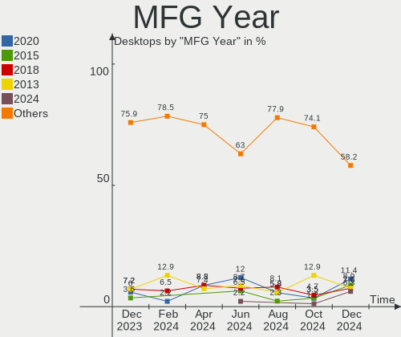
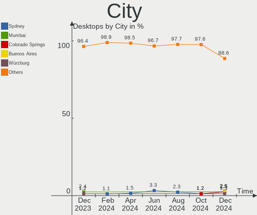
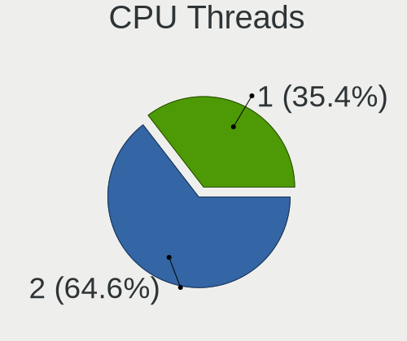
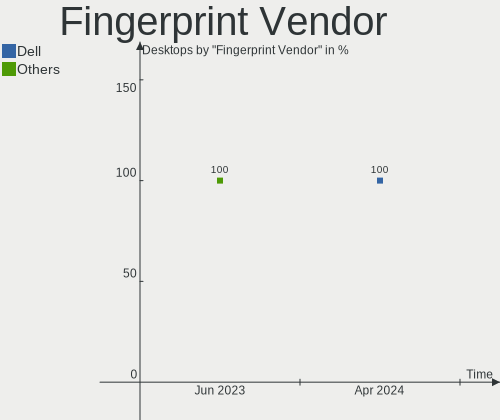

Zorin - Hardware Trends (Desktops)
----------------------------------

A project to identify most popular hardware characteristics and track their change
over time based on data collected by Linux users at https://Linux-Hardware.org.

Anyone can contribute to this report by the [hw-probe](https://github.com/linuxhw/hw-probe) tool:

    sudo -E hw-probe -all -upload

This report is for one last month. Overall report since the beginning of time: [TestDays](https://github.com/linuxhw/TestDays)

Period: Apr, 2024.

Contents
--------

* [ System ](#system)
  - [ OS                       ](#os)
  - [ OS Family                ](#os-family)
  - [ Kernel                   ](#kernel)
  - [ Kernel Family            ](#kernel-family)
  - [ Kernel Major Ver.        ](#kernel-major-ver)
  - [ Arch                     ](#arch)
  - [ DE                       ](#de)
  - [ Display Server           ](#display-server)
  - [ Display Manager          ](#display-manager)
  - [ OS Lang                  ](#os-lang)
  - [ Boot Mode                ](#boot-mode)
  - [ Filesystem               ](#filesystem)
  - [ Part. scheme             ](#part-scheme)
  - [ Dual Boot with Linux/BSD ](#dual-boot-with-linuxbsd)
  - [ Dual Boot (Win)          ](#dual-boot-win)

* [ Board ](#board)
  - [ Vendor                   ](#vendor)
  - [ Model                    ](#model)
  - [ Model Family             ](#model-family)
  - [ MFG Year                 ](#mfg-year)
  - [ Form Factor              ](#form-factor)
  - [ Secure Boot              ](#secure-boot)
  - [ Coreboot                 ](#coreboot)
  - [ RAM Size                 ](#ram-size)
  - [ RAM Used                 ](#ram-used)
  - [ Total Drives             ](#total-drives)
  - [ Has CD-ROM               ](#has-cd-rom)
  - [ Has Ethernet             ](#has-ethernet)
  - [ Has WiFi                 ](#has-wifi)
  - [ Has Bluetooth            ](#has-bluetooth)

* [ Location ](#location)
  - [ Country                  ](#country)
  - [ City                     ](#city)

* [ Drives ](#drives)
  - [ Drive Vendor             ](#drive-vendor)
  - [ Drive Model              ](#drive-model)
  - [ HDD Vendor               ](#hdd-vendor)
  - [ SSD Vendor               ](#ssd-vendor)
  - [ Drive Kind               ](#drive-kind)
  - [ Drive Connector          ](#drive-connector)
  - [ Drive Size               ](#drive-size)
  - [ Space Total              ](#space-total)
  - [ Space Used               ](#space-used)
  - [ Malfunc. Drives          ](#malfunc-drives)
  - [ Malfunc. Drive Vendor    ](#malfunc-drive-vendor)
  - [ Malfunc. HDD Vendor      ](#malfunc-hdd-vendor)
  - [ Malfunc. Drive Kind      ](#malfunc-drive-kind)
  - [ Failed Drives            ](#failed-drives)
  - [ Failed Drive Vendor      ](#failed-drive-vendor)
  - [ Drive Status             ](#drive-status)

* [ Storage controller ](#storage-controller)
  - [ Storage Vendor           ](#storage-vendor)
  - [ Storage Model            ](#storage-model)
  - [ Storage Kind             ](#storage-kind)

* [ Processor ](#processor)
  - [ CPU Vendor               ](#cpu-vendor)
  - [ CPU Model                ](#cpu-model)
  - [ CPU Model Family         ](#cpu-model-family)
  - [ CPU Cores                ](#cpu-cores)
  - [ CPU Sockets              ](#cpu-sockets)
  - [ CPU Threads              ](#cpu-threads)
  - [ CPU Op-Modes             ](#cpu-op-modes)
  - [ CPU Microcode            ](#cpu-microcode)
  - [ CPU Microarch            ](#cpu-microarch)

* [ Graphics ](#graphics)
  - [ GPU Vendor               ](#gpu-vendor)
  - [ GPU Model                ](#gpu-model)
  - [ GPU Combo                ](#gpu-combo)
  - [ GPU Driver               ](#gpu-driver)
  - [ GPU Memory               ](#gpu-memory)

* [ Monitor ](#monitor)
  - [ Monitor Vendor           ](#monitor-vendor)
  - [ Monitor Model            ](#monitor-model)
  - [ Monitor Resolution       ](#monitor-resolution)
  - [ Monitor Diagonal         ](#monitor-diagonal)
  - [ Monitor Width            ](#monitor-width)
  - [ Aspect Ratio             ](#aspect-ratio)
  - [ Monitor Area             ](#monitor-area)
  - [ Pixel Density            ](#pixel-density)
  - [ Multiple Monitors        ](#multiple-monitors)

* [ Network ](#network)
  - [ Net Controller Vendor    ](#net-controller-vendor)
  - [ Net Controller Model     ](#net-controller-model)
  - [ Wireless Vendor          ](#wireless-vendor)
  - [ Wireless Model           ](#wireless-model)
  - [ Ethernet Vendor          ](#ethernet-vendor)
  - [ Ethernet Model           ](#ethernet-model)
  - [ Net Controller Kind      ](#net-controller-kind)
  - [ Used Controller          ](#used-controller)
  - [ NICs                     ](#nics)
  - [ IPv6                     ](#ipv6)

* [ Bluetooth ](#bluetooth)
  - [ Bluetooth Vendor         ](#bluetooth-vendor)
  - [ Bluetooth Model          ](#bluetooth-model)

* [ Sound ](#sound)
  - [ Sound Vendor             ](#sound-vendor)
  - [ Sound Model              ](#sound-model)

* [ Memory ](#memory)
  - [ Memory Vendor            ](#memory-vendor)
  - [ Memory Model             ](#memory-model)
  - [ Memory Kind              ](#memory-kind)
  - [ Memory Form Factor       ](#memory-form-factor)
  - [ Memory Size              ](#memory-size)
  - [ Memory Speed             ](#memory-speed)

* [ Printers & scanners ](#printers--scanners)
  - [ Printer Vendor           ](#printer-vendor)
  - [ Printer Model            ](#printer-model)
  - [ Scanner Vendor           ](#scanner-vendor)
  - [ Scanner Model            ](#scanner-model)

* [ Camera ](#camera)
  - [ Camera Vendor            ](#camera-vendor)
  - [ Camera Model             ](#camera-model)

* [ Security ](#security)
  - [ Fingerprint Vendor       ](#fingerprint-vendor)
  - [ Fingerprint Model        ](#fingerprint-model)
  - [ Chipcard Vendor          ](#chipcard-vendor)
  - [ Chipcard Model           ](#chipcard-model)

* [ Unsupported ](#unsupported)
  - [ Unsupported Devices      ](#unsupported-devices)
  - [ Unsupported Device Types ](#unsupported-device-types)

System
------

OS
--

Installed operating systems

| Name     | Desktops | Percent |
|----------|----------|---------|
| Zorin 17 | 58       | 85.29%  |
| Zorin 16 | 9        | 13.24%  |
| Zorin 15 | 1        | 1.47%   |

OS Family
---------

OS without a version

| Name  | Desktops | Percent |
|-------|----------|---------|
| Zorin | 68       | 100%    |

Kernel
------

Version of the Linux kernel

| Version            | Desktops | Percent |
|--------------------|----------|---------|
| 6.5.0-27-generic   | 20       | 29.41%  |
| 6.5.0-26-generic   | 19       | 27.94%  |
| 6.5.0-28-generic   | 17       | 25%     |
| 5.15.0-101-generic | 4        | 5.88%   |
| 5.15.0-105-generic | 2        | 2.94%   |
| 5.15.0-102-generic | 2        | 2.94%   |
| 6.5.0-21-generic   | 1        | 1.47%   |
| 6.5.0-18-generic   | 1        | 1.47%   |
| 5.4.0-148-generic  | 1        | 1.47%   |
| 5.15.0-94-generic  | 1        | 1.47%   |

Kernel Family
-------------

Linux kernel without a distro release

| Version | Desktops | Percent |
|---------|----------|---------|
| 6.5.0   | 58       | 85.29%  |
| 5.15.0  | 9        | 13.24%  |
| 5.4.0   | 1        | 1.47%   |

Kernel Major Ver.
-----------------

Linux kernel major version

| Version | Desktops | Percent |
|---------|----------|---------|
| 6.5     | 58       | 85.29%  |
| 5.15    | 9        | 13.24%  |
| 5.4     | 1        | 1.47%   |

Arch
----

OS architecture (x86_64, i586, etc.)

| Name   | Desktops | Percent |
|--------|----------|---------|
| x86_64 | 68       | 100%    |

DE
--

Desktop Environment

| Name  | Desktops | Percent |
|-------|----------|---------|
| GNOME | 63       | 92.65%  |
| XFCE  | 5        | 7.35%   |

Display Server
--------------

X11 or Wayland

| Name    | Desktops | Percent |
|---------|----------|---------|
| Wayland | 41       | 60.29%  |
| X11     | 27       | 39.71%  |

Display Manager
---------------

SDDM, LightDM, etc.

| Name    | Desktops | Percent |
|---------|----------|---------|
| Unknown | 56       | 82.35%  |
| GDM3    | 11       | 16.18%  |
| GDM     | 1        | 1.47%   |

OS Lang
-------

Language

| Lang  | Desktops | Percent |
|-------|----------|---------|
| en_US | 26       | 38.24%  |
| it_IT | 6        | 8.82%   |
| pt_BR | 5        | 7.35%   |
| fr_FR | 4        | 5.88%   |
| en_GB | 4        | 5.88%   |
| de_DE | 4        | 5.88%   |
| nl_NL | 3        | 4.41%   |
| en_ZA | 2        | 2.94%   |
| en_IN | 2        | 2.94%   |
| ru_UA | 1        | 1.47%   |
| ru_RU | 1        | 1.47%   |
| pl_PL | 1        | 1.47%   |
| ja_JP | 1        | 1.47%   |
| es_VE | 1        | 1.47%   |
| es_HN | 1        | 1.47%   |
| es_ES | 1        | 1.47%   |
| es_AR | 1        | 1.47%   |
| en_AU | 1        | 1.47%   |
| el_GR | 1        | 1.47%   |
| cs_CZ | 1        | 1.47%   |
| bg_BG | 1        | 1.47%   |

Boot Mode
---------

EFI or BIOS

| Mode | Desktops | Percent |
|------|----------|---------|
| BIOS | 58       | 85.29%  |
| EFI  | 10       | 14.71%  |

Filesystem
----------

Type of filesystem

| Type  | Desktops | Percent |
|-------|----------|---------|
| Ext4  | 61       | 89.71%  |
| Tmpfs | 3        | 4.41%   |
| Zfs   | 2        | 2.94%   |
| Xfs   | 1        | 1.47%   |
| Btrfs | 1        | 1.47%   |

Part. scheme
------------

Scheme of partitioning

| Type    | Desktops | Percent |
|---------|----------|---------|
| Unknown | 56       | 82.35%  |
| GPT     | 9        | 13.24%  |
| MBR     | 3        | 4.41%   |

Dual Boot with Linux/BSD
------------------------

Hosting more than one Linux/BSD

| Dual boot | Desktops | Percent |
|-----------|----------|---------|
| No        | 67       | 98.53%  |
| Yes       | 1        | 1.47%   |

Dual Boot (Win)
---------------

Hosting Linux and Windows

| Dual boot | Desktops | Percent |
|-----------|----------|---------|
| No        | 61       | 89.71%  |
| Yes       | 7        | 10.29%  |

Board
-----

Vendor
------

Motherboard manufacturer

| Name                | Desktops | Percent |
|---------------------|----------|---------|
| ASUSTek Computer    | 15       | 22.06%  |
| Gigabyte Technology | 13       | 19.12%  |
| Dell                | 8        | 11.76%  |
| MSI                 | 6        | 8.82%   |
| Hewlett-Packard     | 6        | 8.82%   |
| Lenovo              | 3        | 4.41%   |
| ASRock              | 3        | 4.41%   |
| Pegatron            | 2        | 2.94%   |
| Unknown             | 2        | 2.94%   |
| STGAUBRON           | 1        | 1.47%   |
| Positivo            | 1        | 1.47%   |
| NCR                 | 1        | 1.47%   |
| Intel               | 1        | 1.47%   |
| Gateway             | 1        | 1.47%   |
| Foxconn             | 1        | 1.47%   |
| Biostar             | 1        | 1.47%   |
| Apple               | 1        | 1.47%   |
| AOpen               | 1        | 1.47%   |
| Alienware           | 1        | 1.47%   |

Model
-----

Motherboard model

| Name                              | Desktops | Percent |
|-----------------------------------|----------|---------|
| MSI MS-7C56                       | 2        | 2.94%   |
| Gigabyte AB350-Gaming 3           | 2        | 2.94%   |
| ASRock A520M-HDV                  | 2        | 2.94%   |
| Unknown                           | 2        | 2.94%   |
| STGAUBRON B75M4 V1.1              | 1        | 1.47%   |
| Positivo Master D570a             | 1        | 1.47%   |
| Pegatron Compaq dx2400 Microtower | 1        | 1.47%   |
| Pegatron AZ224AV-ABA 300-1100z    | 1        | 1.47%   |
| NCR xxxx-xxxx-xxxx                | 1        | 1.47%   |
| MSI MS-7C52                       | 1        | 1.47%   |
| MSI MS-7C37                       | 1        | 1.47%   |
| MSI MS-7A70                       | 1        | 1.47%   |
| MSI MS-7817                       | 1        | 1.47%   |
| Lenovo ThinkCentre M91p 7005AK8   | 1        | 1.47%   |
| Lenovo ThinkCentre M73 10B6001SUS | 1        | 1.47%   |
| Lenovo ThinkCentre M58 7360C12    | 1        | 1.47%   |
| Intel H61                         | 1        | 1.47%   |
| HP Z230 Tower Workstation         | 1        | 1.47%   |
| HP rp5800                         | 1        | 1.47%   |
| HP EliteDesk 800 G3 SFF           | 1        | 1.47%   |
| HP Compaq Pro 6300 SFF            | 1        | 1.47%   |
| HP Compaq Elite 8300 USDT         | 1        | 1.47%   |
| HP Compaq 8200 Elite MT PC        | 1        | 1.47%   |
| Gigabyte Z790 AORUS ELITE AX      | 1        | 1.47%   |
| Gigabyte Z390 GAMING X            | 1        | 1.47%   |
| Gigabyte Z390 AORUS MASTER        | 1        | 1.47%   |
| Gigabyte X570S AORUS ELITE AX     | 1        | 1.47%   |
| Gigabyte H61M-S2PV                | 1        | 1.47%   |
| Gigabyte H61M-S1                  | 1        | 1.47%   |
| Gigabyte G41M-Combo               | 1        | 1.47%   |
| Gigabyte F2A68HM-HD2              | 1        | 1.47%   |
| Gigabyte F2A68HM-DS2              | 1        | 1.47%   |
| Gigabyte B550I AORUS PRO AX       | 1        | 1.47%   |
| Gigabyte B450M S2H                | 1        | 1.47%   |
| Gateway SX2851                    | 1        | 1.47%   |
| Foxconn G31MX Series              | 1        | 1.47%   |
| Dell Precision Tower 7910, DBE    | 1        | 1.47%   |
| Dell Precision T3600              | 1        | 1.47%   |
| Dell OptiPlex 990                 | 1        | 1.47%   |
| Dell OptiPlex 9020                | 1        | 1.47%   |

Model Family
------------

Motherboard model prefix

| Name                  | Desktops | Percent |
|-----------------------|----------|---------|
| Dell OptiPlex         | 5        | 7.35%   |
| Lenovo ThinkCentre    | 3        | 4.41%   |
| HP Compaq             | 3        | 4.41%   |
| ASUS TUF              | 3        | 4.41%   |
| MSI MS-7C56           | 2        | 2.94%   |
| Gigabyte Z390         | 2        | 2.94%   |
| Gigabyte AB350-Gaming | 2        | 2.94%   |
| Dell Precision        | 2        | 2.94%   |
| ASRock A520M-HDV      | 2        | 2.94%   |
| Unknown               | 2        | 2.94%   |
| STGAUBRON B75M4       | 1        | 1.47%   |
| Positivo Master       | 1        | 1.47%   |
| Pegatron Compaq       | 1        | 1.47%   |
| Pegatron AZ224AV-ABA  | 1        | 1.47%   |
| NCR xxxx-xxxx-xxxx    | 1        | 1.47%   |
| MSI MS-7C52           | 1        | 1.47%   |
| MSI MS-7C37           | 1        | 1.47%   |
| MSI MS-7A70           | 1        | 1.47%   |
| MSI MS-7817           | 1        | 1.47%   |
| Intel H61             | 1        | 1.47%   |
| HP Z230               | 1        | 1.47%   |
| HP rp5800             | 1        | 1.47%   |
| HP EliteDesk          | 1        | 1.47%   |
| Gigabyte Z790         | 1        | 1.47%   |
| Gigabyte X570S        | 1        | 1.47%   |
| Gigabyte H61M-S2PV    | 1        | 1.47%   |
| Gigabyte H61M-S1      | 1        | 1.47%   |
| Gigabyte G41M-Combo   | 1        | 1.47%   |
| Gigabyte F2A68HM-HD2  | 1        | 1.47%   |
| Gigabyte F2A68HM-DS2  | 1        | 1.47%   |
| Gigabyte B550I        | 1        | 1.47%   |
| Gigabyte B450M        | 1        | 1.47%   |
| Gateway SX2851        | 1        | 1.47%   |
| Foxconn G31MX         | 1        | 1.47%   |
| Dell Inspiron         | 1        | 1.47%   |
| Biostar H61MLV3       | 1        | 1.47%   |
| ASUS TERRA            | 1        | 1.47%   |
| ASUS ROG              | 1        | 1.47%   |
| ASUS PRIME            | 1        | 1.47%   |
| ASUS P8Z77-M          | 1        | 1.47%   |

MFG Year
--------

Motherboard manufacture year

| Year | Desktops | Percent |
|------|----------|---------|
| 2012 | 8        | 11.76%  |
| 2014 | 7        | 10.29%  |
| 2011 | 7        | 10.29%  |
| 2020 | 6        | 8.82%   |
| 2018 | 6        | 8.82%   |
| 2021 | 5        | 7.35%   |
| 2013 | 5        | 7.35%   |
| 2019 | 4        | 5.88%   |
| 2017 | 4        | 5.88%   |
| 2022 | 3        | 4.41%   |
| 2016 | 3        | 4.41%   |
| 2009 | 3        | 4.41%   |
| 2010 | 2        | 2.94%   |
| 2008 | 2        | 2.94%   |
| 2023 | 1        | 1.47%   |
| 2007 | 1        | 1.47%   |
| 2006 | 1        | 1.47%   |

Form Factor
-----------

Physical design of the computer

| Name    | Desktops | Percent |
|---------|----------|---------|
| Desktop | 68       | 100%    |

Secure Boot
-----------

Enabled or disabled

| State    | Desktops | Percent |
|----------|----------|---------|
| Disabled | 65       | 95.59%  |
| Enabled  | 3        | 4.41%   |

Coreboot
--------

Have coreboot on board

| Used | Desktops | Percent |
|------|----------|---------|
| No   | 68       | 100%    |

RAM Size
--------

Total RAM memory

| Size in GB  | Desktops | Percent |
|-------------|----------|---------|
| 16.01-24.0  | 21       | 30.88%  |
| 8.01-16.0   | 12       | 17.65%  |
| 3.01-4.0    | 10       | 14.71%  |
| 4.01-8.0    | 9        | 13.24%  |
| 32.01-64.0  | 9        | 13.24%  |
| 64.01-256.0 | 6        | 8.82%   |
| 24.01-32.0  | 1        | 1.47%   |

RAM Used
--------

Used RAM memory

| Used GB  | Desktops | Percent |
|----------|----------|---------|
| 2.01-3.0 | 26       | 38.24%  |
| 1.01-2.0 | 22       | 32.35%  |
| 3.01-4.0 | 10       | 14.71%  |
| 4.01-8.0 | 9        | 13.24%  |
| 0.51-1.0 | 1        | 1.47%   |

Total Drives
------------

Number of drives on board

| Drives | Desktops | Percent |
|--------|----------|---------|
| 1      | 34       | 50%     |
| 2      | 21       | 30.88%  |
| 3      | 6        | 8.82%   |
| 4      | 3        | 4.41%   |
| 6      | 2        | 2.94%   |
| 5      | 2        | 2.94%   |

Has CD-ROM
----------

Has CD-ROM on board

| Presented | Desktops | Percent |
|-----------|----------|---------|
| No        | 39       | 57.35%  |
| Yes       | 29       | 42.65%  |

Has Ethernet
------------

Has Ethernet on board

| Presented | Desktops | Percent |
|-----------|----------|---------|
| Yes       | 68       | 100%    |

Has WiFi
--------

Has WiFi module

| Presented | Desktops | Percent |
|-----------|----------|---------|
| Yes       | 37       | 54.41%  |
| No        | 31       | 45.59%  |

Has Bluetooth
-------------

Has Bluetooth module

| Presented | Desktops | Percent |
|-----------|----------|---------|
| No        | 41       | 60.29%  |
| Yes       | 27       | 39.71%  |

Location
--------

Country
-------

Geographic location (country)

| Country         | Desktops | Percent |
|-----------------|----------|---------|
| USA             | 17       | 25%     |
| Italy           | 6        | 8.82%   |
| UK              | 5        | 7.35%   |
| Germany         | 5        | 7.35%   |
| Brazil          | 5        | 7.35%   |
| France          | 4        | 5.88%   |
| South Africa    | 2        | 2.94%   |
| Netherlands     | 2        | 2.94%   |
| India           | 2        | 2.94%   |
| Venezuela       | 1        | 1.47%   |
| Uruguay         | 1        | 1.47%   |
| Ukraine         | 1        | 1.47%   |
| Turkey          | 1        | 1.47%   |
| The Netherlands | 1        | 1.47%   |
| Sweden          | 1        | 1.47%   |
| Spain           | 1        | 1.47%   |
| Russia          | 1        | 1.47%   |
| Romania         | 1        | 1.47%   |
| Portugal        | 1        | 1.47%   |
| Pakistan        | 1        | 1.47%   |
| Kuwait          | 1        | 1.47%   |
| Japan           | 1        | 1.47%   |
| Iran            | 1        | 1.47%   |
| Honduras        | 1        | 1.47%   |
| Egypt           | 1        | 1.47%   |
| Czechia         | 1        | 1.47%   |
| Canada          | 1        | 1.47%   |
| Bulgaria        | 1        | 1.47%   |
| Australia       | 1        | 1.47%   |

City
----

Geographic location (city)

| City                 | Desktops | Percent |
|----------------------|----------|---------|
| Johannesburg         | 2        | 2.94%   |
| Bellaria-Igea Marina | 2        | 2.94%   |
| Amsterdam            | 2        | 2.94%   |
| Zero Branco          | 1        | 1.47%   |
| West Chester         | 1        | 1.47%   |
| Warrington           | 1        | 1.47%   |
| Volta Redonda        | 1        | 1.47%   |
| Viry-Châtillon      | 1        | 1.47%   |
| Valatie              | 1        | 1.47%   |
| Union                | 1        | 1.47%   |
| Turmero              | 1        | 1.47%   |
| Tehran               | 1        | 1.47%   |
| Tegucigalpa          | 1        | 1.47%   |
| Sydney               | 1        | 1.47%   |
| Silistra             | 1        | 1.47%   |
| Sibiu                | 1        | 1.47%   |
| Seeheim-Jugenheim    | 1        | 1.47%   |
| Sao Paulo            | 1        | 1.47%   |
| Salt Lake City       | 1        | 1.47%   |
| Saint-Laurent-du-Var | 1        | 1.47%   |
| Rio de Janeiro       | 1        | 1.47%   |
| Reichelsheim         | 1        | 1.47%   |
| Punta del Este       | 1        | 1.47%   |
| Pimenta Bueno        | 1        | 1.47%   |
| Phoenix              | 1        | 1.47%   |
| Osipenko             | 1        | 1.47%   |
| Opocno               | 1        | 1.47%   |
| Nuenen               | 1        | 1.47%   |
| Munich               | 1        | 1.47%   |
| Motril               | 1        | 1.47%   |
| Moscow               | 1        | 1.47%   |
| Minneapolis          | 1        | 1.47%   |
| Milano               | 1        | 1.47%   |
| Medford              | 1        | 1.47%   |
| Linköping           | 1        | 1.47%   |
| Leeds                | 1        | 1.47%   |
| L'Isle-Adam          | 1        | 1.47%   |
| Kuwait City          | 1        | 1.47%   |
| Korle                | 1        | 1.47%   |
| Kolkata              | 1        | 1.47%   |

Drives
------

Drive Vendor
------------

Hard drive vendors

| Vendor                    | Desktops | Drives | Percent |
|---------------------------|----------|--------|---------|
| WDC                       | 17       | 20     | 14.78%  |
| Seagate                   | 17       | 21     | 14.78%  |
| Samsung Electronics       | 16       | 19     | 13.91%  |
| SanDisk                   | 7        | 7      | 6.09%   |
| China                     | 7        | 7      | 6.09%   |
| Kingston                  | 6        | 6      | 5.22%   |
| Toshiba                   | 5        | 5      | 4.35%   |
| Crucial                   | 5        | 5      | 4.35%   |
| Micron/Crucial Technology | 3        | 3      | 2.61%   |
| Intenso                   | 3        | 3      | 2.61%   |
| Silicon Motion            | 2        | 2      | 1.74%   |
| Phison Electronics        | 2        | 2      | 1.74%   |
| Lexar                     | 2        | 2      | 1.74%   |
| KIOXIA-EXCERIA            | 2        | 2      | 1.74%   |
| Intel                     | 2        | 2      | 1.74%   |
| Hitachi                   | 2        | 2      | 1.74%   |
| ASMT                      | 2        | 2      | 1.74%   |
| A-DATA Technology         | 2        | 2      | 1.74%   |
| Team                      | 1        | 1      | 0.87%   |
| SPCC                      | 1        | 1      | 0.87%   |
| ROG                       | 1        | 1      | 0.87%   |
| Phison                    | 1        | 1      | 0.87%   |
| OCZ                       | 1        | 1      | 0.87%   |
| Micron Technology         | 1        | 1      | 0.87%   |
| Maxtor                    | 1        | 1      | 0.87%   |
| LITEONIT                  | 1        | 1      | 0.87%   |
| HGST                      | 1        | 1      | 0.87%   |
| Hewlett-Packard           | 1        | 1      | 0.87%   |
| Fanxiang                  | 1        | 1      | 0.87%   |
| Apacer                    | 1        | 1      | 0.87%   |
| ADATA Technology          | 1        | 1      | 0.87%   |

Drive Model
-----------

Hard drive models

| Model                                                 | Desktops | Percent |
|-------------------------------------------------------|----------|---------|
| WDC WDS120G2G0A-00JH30 120GB SSD                      | 2        | 1.64%   |
| Toshiba HDWD110 1TB                                   | 2        | 1.64%   |
| Seagate ST3160812AS 160GB                             | 2        | 1.64%   |
| Seagate ST2000DM001-1ER164 2TB                        | 2        | 1.64%   |
| Sandisk WD Black SN750 / PC SN730 NVMe SSD 512GB      | 2        | 1.64%   |
| Samsung SSD 980 1TB                                   | 2        | 1.64%   |
| Samsung NVMe SSD Controller SM981/PM981/PM983 1TB     | 2        | 1.64%   |
| Samsung HD103UJ 1TB                                   | 2        | 1.64%   |
| Phison PS5013 E13 NVMe Controller 512GB               | 2        | 1.64%   |
| Kingston SA400S37240G 240GB SSD                       | 2        | 1.64%   |
| Intenso SSD 256GB                                     | 2        | 1.64%   |
| Crucial CT500BX500SSD1 500GB                          | 2        | 1.64%   |
| China SATA SSD 512GB                                  | 2        | 1.64%   |
| WDC WD6400AAVS-00G9B1 640GB                           | 1        | 0.82%   |
| WDC WD5000AZRZ-00HTKB0 500GB                          | 1        | 0.82%   |
| WDC WD5000AAKX-60U6AA0 500GB                          | 1        | 0.82%   |
| WDC WD40EZAZ-00SF3B0 4TB                              | 1        | 0.82%   |
| WDC WD3200BPVT-00ZEST0 320GB                          | 1        | 0.82%   |
| WDC WD3200AVVS-63L2B0 320GB                           | 1        | 0.82%   |
| WDC WD30EZRX-00D8PB0 3TB                              | 1        | 0.82%   |
| WDC WD2500LPLX-00ZNTT0 250GB                          | 1        | 0.82%   |
| WDC WD20EFRX-68EUZN0 2TB                              | 1        | 0.82%   |
| WDC WD20EARX-00PASB0 2TB                              | 1        | 0.82%   |
| WDC WD15EADS-00P8B0 1TB                               | 1        | 0.82%   |
| WDC WD10EZEX-75WN4A1 1TB                              | 1        | 0.82%   |
| WDC WD10EZEX-22MFCA0 1TB                              | 1        | 0.82%   |
| WDC WD10EZEX-00BN5A0 1TB                              | 1        | 0.82%   |
| WDC WD1002FAEX-00Z3A0 1TB                             | 1        | 0.82%   |
| WDC WD Green 2.5 240GB                                | 1        | 0.82%   |
| Toshiba XG6 NVMe SSD Controller 1024GB                | 1        | 0.82%   |
| Toshiba HDWD130 3TB                                   | 1        | 0.82%   |
| Toshiba DT01ACA100 1TB                                | 1        | 0.82%   |
| Team T253X2512G 512GB SSD                             | 1        | 0.82%   |
| SPCC Solid State Disk 1024GB                          | 1        | 0.82%   |
| Silicon Motion SM2263EN/SM2263XT SSD Controller 256GB | 1        | 0.82%   |
| Silicon Motion OWC Aura Pro X SSD 960GB               | 1        | 0.82%   |
| Seagate ST500DM002-1ER14C 500GB                       | 1        | 0.82%   |
| Seagate ST3500414CS 500GB                             | 1        | 0.82%   |
| Seagate ST3250318AS 250GB                             | 1        | 0.82%   |
| Seagate ST3250310AS 250GB                             | 1        | 0.82%   |

HDD Vendor
----------

Hard disk drive vendors

| Vendor              | Desktops | Drives | Percent |
|---------------------|----------|--------|---------|
| Seagate             | 16       | 20     | 37.21%  |
| WDC                 | 15       | 17     | 34.88%  |
| Toshiba             | 4        | 4      | 9.3%    |
| Samsung Electronics | 3        | 3      | 6.98%   |
| Hitachi             | 2        | 2      | 4.65%   |
| Maxtor              | 1        | 1      | 2.33%   |
| HGST                | 1        | 1      | 2.33%   |
| ASMT                | 1        | 1      | 2.33%   |

SSD Vendor
----------

Solid state drive vendors

| Vendor              | Desktops | Drives | Percent |
|---------------------|----------|--------|---------|
| Samsung Electronics | 7        | 7      | 16.67%  |
| China               | 6        | 6      | 14.29%  |
| Crucial             | 5        | 5      | 11.9%   |
| Kingston            | 4        | 4      | 9.52%   |
| WDC                 | 3        | 3      | 7.14%   |
| Intenso             | 3        | 3      | 7.14%   |
| Lexar               | 2        | 2      | 4.76%   |
| A-DATA Technology   | 2        | 2      | 4.76%   |
| Team                | 1        | 1      | 2.38%   |
| SPCC                | 1        | 1      | 2.38%   |
| SanDisk             | 1        | 1      | 2.38%   |
| ROG                 | 1        | 1      | 2.38%   |
| OCZ                 | 1        | 1      | 2.38%   |
| LITEONIT            | 1        | 1      | 2.38%   |
| KIOXIA-EXCERIA      | 1        | 1      | 2.38%   |
| Intel               | 1        | 1      | 2.38%   |
| Hewlett-Packard     | 1        | 1      | 2.38%   |
| Apacer              | 1        | 1      | 2.38%   |

Drive Kind
----------

HDD or SSD

| Kind    | Desktops | Drives | Percent |
|---------|----------|--------|---------|
| SSD     | 36       | 42     | 37.11%  |
| HDD     | 35       | 49     | 36.08%  |
| NVMe    | 24       | 32     | 24.74%  |
| Unknown | 2        | 2      | 2.06%   |

Drive Connector
---------------

SATA, SAS, NVMe, etc.

| Type | Desktops | Drives | Percent |
|------|----------|--------|---------|
| SATA | 56       | 90     | 66.67%  |
| NVMe | 24       | 31     | 28.57%  |
| SAS  | 4        | 4      | 4.76%   |

Drive Size
----------

Size of hard drive

| Size in TB | Desktops | Drives | Percent |
|------------|----------|--------|---------|
| 0.01-0.5   | 38       | 44     | 49.35%  |
| 0.51-1.0   | 23       | 26     | 29.87%  |
| 1.01-2.0   | 12       | 17     | 15.58%  |
| 3.01-4.0   | 2        | 2      | 2.6%    |
| 2.01-3.0   | 2        | 2      | 2.6%    |

Space Total
-----------

Amount of disk space available on the file system

| Size in GB     | Desktops | Percent |
|----------------|----------|---------|
| 101-250        | 21       | 30.88%  |
| 251-500        | 19       | 27.94%  |
| 501-1000       | 11       | 16.18%  |
| 1001-2000      | 7        | 10.29%  |
| More than 3000 | 4        | 5.88%   |
| 2001-3000      | 2        | 2.94%   |
| 51-100         | 2        | 2.94%   |
| 0              | 1        | 1.47%   |
| Unknown        | 1        | 1.47%   |

Space Used
----------

Amount of used disk space

| Used GB   | Desktops | Percent |
|-----------|----------|---------|
| 21-50     | 19       | 27.94%  |
| 1-20      | 18       | 26.47%  |
| 51-100    | 12       | 17.65%  |
| 101-250   | 6        | 8.82%   |
| 251-500   | 5        | 7.35%   |
| 1001-2000 | 4        | 5.88%   |
| 2001-3000 | 1        | 1.47%   |
| 501-1000  | 1        | 1.47%   |
| 0         | 1        | 1.47%   |
| Unknown   | 1        | 1.47%   |

Malfunc. Drives
---------------

Drive models with a malfunction

Zero info for selected period =(

Malfunc. Drive Vendor
---------------------

Vendors of faulty drives

Zero info for selected period =(

Malfunc. HDD Vendor
-------------------

Vendors of faulty HDD drives

Zero info for selected period =(

Malfunc. Drive Kind
-------------------

Kinds of faulty drives

Zero info for selected period =(

Failed Drives
-------------

Failed drive models

Zero info for selected period =(

Failed Drive Vendor
-------------------

Failed drive vendors

Zero info for selected period =(

Drive Status
------------

Number of failed and malfunc. drives

| Status   | Desktops | Drives | Percent |
|----------|----------|--------|---------|
| Detected | 63       | 112    | 90%     |
| Works    | 7        | 13     | 10%     |

Storage controller
------------------

Storage Vendor
--------------

Storage controller vendors

| Vendor                       | Desktops | Percent |
|------------------------------|----------|---------|
| Intel                        | 46       | 45.1%   |
| AMD                          | 21       | 20.59%  |
| Samsung Electronics          | 8        | 7.84%   |
| SanDisk                      | 6        | 5.88%   |
| Phison Electronics           | 3        | 2.94%   |
| Micron/Crucial Technology    | 3        | 2.94%   |
| Silicon Motion               | 2        | 1.96%   |
| Kingston Technology Company  | 2        | 1.96%   |
| ASMedia Technology           | 2        | 1.96%   |
| Toshiba America Info Systems | 1        | 0.98%   |
| Silicon Image                | 1        | 0.98%   |
| Seagate Technology           | 1        | 0.98%   |
| Micron Technology            | 1        | 0.98%   |
| Marvell Technology Group     | 1        | 0.98%   |
| KIOXIA                       | 1        | 0.98%   |
| JMicron Technology           | 1        | 0.98%   |
| Broadcom / LSI               | 1        | 0.98%   |
| ADATA Technology             | 1        | 0.98%   |

Storage Model
-------------

Storage controller models

| Model                                                                                   | Desktops | Percent |
|-----------------------------------------------------------------------------------------|----------|---------|
| Intel 6 Series/C200 Series Chipset Family 6 port Desktop SATA AHCI Controller           | 8        | 6.45%   |
| Intel 7 Series/C210 Series Chipset Family 6-port SATA Controller [AHCI mode]            | 7        | 5.65%   |
| AMD FCH SATA Controller [AHCI mode]                                                     | 7        | 5.65%   |
| AMD 500 Series Chipset SATA Controller                                                  | 7        | 5.65%   |
| Intel 8 Series/C220 Series Chipset Family 6-port SATA Controller 1 [AHCI mode]          | 5        | 4.03%   |
| Intel 6 Series/C200 Series Chipset Family Desktop SATA Controller (IDE mode, ports 4-5) | 4        | 3.23%   |
| Intel 6 Series/C200 Series Chipset Family Desktop SATA Controller (IDE mode, ports 0-3) | 4        | 3.23%   |
| Samsung NVMe SSD Controller SM981/PM981/PM983                                           | 3        | 2.42%   |
| Samsung NVMe SSD Controller 980 (DRAM-less)                                             | 3        | 2.42%   |
| Intel NM10/ICH7 Family SATA Controller [IDE mode]                                       | 3        | 2.42%   |
| Intel 200 Series PCH SATA controller [AHCI mode]                                        | 3        | 2.42%   |
| Sandisk WD Black SN850X NVMe SSD                                                        | 2        | 1.61%   |
| SanDisk Extreme Pro / WD Black SN750 / PC SN730 / Red SN700 NVMe SSD                    | 2        | 1.61%   |
| Samsung NVMe SSD Controller PM9A1/PM9A3/980PRO                                          | 2        | 1.61%   |
| Phison PS5013-E13 PCIe3 NVMe Controller (DRAM-less)                                     | 2        | 1.61%   |
| Intel Volume Management Device NVMe RAID Controller                                     | 2        | 1.61%   |
| Intel SATA Controller [RAID mode]                                                       | 2        | 1.61%   |
| Intel Raptor Lake SATA AHCI Controller                                                  | 2        | 1.61%   |
| Intel Cannon Lake PCH SATA AHCI Controller                                              | 2        | 1.61%   |
| Intel 82801G (ICH7 Family) IDE Controller                                               | 2        | 1.61%   |
| ASMedia ASM1061/ASM1062 Serial ATA Controller                                           | 2        | 1.61%   |
| AMD SB7x0/SB8x0/SB9x0 SATA Controller [IDE mode]                                        | 2        | 1.61%   |
| AMD SB7x0/SB8x0/SB9x0 IDE Controller                                                    | 2        | 1.61%   |
| AMD 400 Series Chipset SATA Controller                                                  | 2        | 1.61%   |
| AMD 300 Series Chipset SATA Controller                                                  | 2        | 1.61%   |
| Toshiba America Info Systems XG6 NVMe SSD Controller                                    | 1        | 0.81%   |
| Silicon Motion SM2263EN/SM2263XT (DRAM-less) NVMe SSD Controllers                       | 1        | 0.81%   |
| Silicon Motion SM2260 NVMe SSD Controller                                               | 1        | 0.81%   |
| Silicon Image PCI0680 Ultra ATA-133 Host Controller                                     | 1        | 0.81%   |
| Seagate BarraCuda Q5 NVMe SSD (DRAM-less)                                               | 1        | 0.81%   |
| SanDisk WD Black SN770 / PC SN740 256GB / PC SN560 (DRAM-less) NVMe SSD                 | 1        | 0.81%   |
| SanDisk Ultra 3D / WD Blue SN570 NVMe SSD (DRAM-less)                                   | 1        | 0.81%   |
| Samsung NVMe SSD Controller S4LV008[Pascal]                                             | 1        | 0.81%   |
| Phison E12 NVMe Controller                                                              | 1        | 0.81%   |
| Micron/Crucial P5 Plus NVMe PCIe SSD                                                    | 1        | 0.81%   |
| Micron/Crucial P2 [Nick P2] / P3 / P3 Plus NVMe PCIe SSD (DRAM-less)                    | 1        | 0.81%   |
| Micron/Crucial P1 NVMe PCIe SSD[Frampton]                                               | 1        | 0.81%   |
| Micron 2200S NVMe SSD [Cassandra]                                                       | 1        | 0.81%   |
| Marvell Group 88SE9230 PCIe 2.0 x2 4-port SATA 6 Gb/s RAID Controller                   | 1        | 0.81%   |
| KIOXIA NVMe SSD                                                                         | 1        | 0.81%   |

Storage Kind
------------

Kind of storage controller (IDE, SATA, NVMe, SAS, ...)

| Kind | Desktops | Percent |
|------|----------|---------|
| SATA | 55       | 54.46%  |
| NVMe | 24       | 23.76%  |
| IDE  | 13       | 12.87%  |
| RAID | 7        | 6.93%   |
| SAS  | 2        | 1.98%   |

Processor
---------

CPU Vendor
----------

Processor vendors

| Vendor | Desktops | Percent |
|--------|----------|---------|
| Intel  | 47       | 69.12%  |
| AMD    | 21       | 30.88%  |

CPU Model
---------

Processor models

| Model                                  | Desktops | Percent |
|----------------------------------------|----------|---------|
| Intel Core i5-3470 CPU @ 3.20GHz       | 4        | 5.88%   |
| AMD Ryzen 9 5900X 12-Core Processor    | 3        | 4.41%   |
| Intel Core i7-4790 CPU @ 3.60GHz       | 2        | 2.94%   |
| Intel Core i7-3770 CPU @ 3.40GHz       | 2        | 2.94%   |
| Intel Core i5-2400 CPU @ 3.10GHz       | 2        | 2.94%   |
| Intel Core i3-2100 CPU @ 3.10GHz       | 2        | 2.94%   |
| Intel Core 2 Duo CPU E7500 @ 2.93GHz   | 2        | 2.94%   |
| AMD Ryzen 5 5600X 6-Core Processor     | 2        | 2.94%   |
| AMD Ryzen 5 4600G with Radeon Graphics | 2        | 2.94%   |
| Intel Xeon CPU E5-2698 v3 @ 2.30GHz    | 1        | 1.47%   |
| Intel Xeon CPU E5-2697 v2 @ 2.70GHz    | 1        | 1.47%   |
| Intel Xeon CPU E5-2665 0 @ 2.40GHz     | 1        | 1.47%   |
| Intel Pentium CPU G850 @ 2.90GHz       | 1        | 1.47%   |
| Intel Pentium CPU G3258 @ 3.20GHz      | 1        | 1.47%   |
| Intel Core i9-9900K CPU @ 3.60GHz      | 1        | 1.47%   |
| Intel Core i9-14900K                   | 1        | 1.47%   |
| Intel Core i7-9700 CPU @ 3.00GHz       | 1        | 1.47%   |
| Intel Core i7-4785T CPU @ 2.20GHz      | 1        | 1.47%   |
| Intel Core i7-3770K CPU @ 3.50GHz      | 1        | 1.47%   |
| Intel Core i7-2600K CPU @ 3.40GHz      | 1        | 1.47%   |
| Intel Core i5-7500 CPU @ 3.40GHz       | 1        | 1.47%   |
| Intel Core i5-6500 CPU @ 3.20GHz       | 1        | 1.47%   |
| Intel Core i5-4570 CPU @ 3.20GHz       | 1        | 1.47%   |
| Intel Core i5-3570S CPU @ 3.10GHz      | 1        | 1.47%   |
| Intel Core i5-3470S CPU @ 2.90GHz      | 1        | 1.47%   |
| Intel Core i5-3330 CPU @ 3.00GHz       | 1        | 1.47%   |
| Intel Core i5-2500K CPU @ 3.30GHz      | 1        | 1.47%   |
| Intel Core i5-2500 CPU @ 3.30GHz       | 1        | 1.47%   |
| Intel Core i3-9350K CPU @ 4.00GHz      | 1        | 1.47%   |
| Intel Core i3-7100 CPU @ 3.90GHz       | 1        | 1.47%   |
| Intel Core i3-4130 CPU @ 3.40GHz       | 1        | 1.47%   |
| Intel Core i3-3220 CPU @ 3.30GHz       | 1        | 1.47%   |
| Intel Core i3-2310M CPU @ 2.10GHz      | 1        | 1.47%   |
| Intel Core i3 CPU 550 @ 3.20GHz        | 1        | 1.47%   |
| Intel Core 2 Quad CPU Q9650 @ 3.00GHz  | 1        | 1.47%   |
| Intel Core 2 Quad CPU Q6600 @ 2.40GHz  | 1        | 1.47%   |
| Intel Core 2 Duo CPU E4700 @ 2.60GHz   | 1        | 1.47%   |
| Intel Celeron CPU J3455 @ 1.50GHz      | 1        | 1.47%   |
| Intel Celeron CPU G1620 @ 2.70GHz      | 1        | 1.47%   |
| Intel 12th Gen Core i7-12700K          | 1        | 1.47%   |

CPU Model Family
----------------

Processor model prefix

| Model             | Desktops | Percent |
|-------------------|----------|---------|
| Intel Core i5     | 14       | 20.59%  |
| Intel Core i7     | 8        | 11.76%  |
| Intel Core i3     | 8        | 11.76%  |
| AMD Ryzen 7       | 6        | 8.82%   |
| AMD Ryzen 5       | 5        | 7.35%   |
| AMD Ryzen 9       | 4        | 5.88%   |
| Other             | 3        | 4.41%   |
| Intel Xeon        | 3        | 4.41%   |
| Intel Core 2 Duo  | 3        | 4.41%   |
| Intel Pentium     | 2        | 2.94%   |
| Intel Core i9     | 2        | 2.94%   |
| Intel Core 2 Quad | 2        | 2.94%   |
| Intel Celeron     | 2        | 2.94%   |
| AMD Athlon 64 X2  | 2        | 2.94%   |
| AMD A8            | 2        | 2.94%   |
| AMD FX            | 1        | 1.47%   |
| AMD Athlon II X3  | 1        | 1.47%   |

CPU Cores
---------

Number of processor cores

| Number | Desktops | Percent |
|--------|----------|---------|
| 4      | 26       | 38.24%  |
| 2      | 18       | 26.47%  |
| 8      | 9        | 13.24%  |
| 12     | 7        | 10.29%  |
| 6      | 5        | 7.35%   |
| 24     | 1        | 1.47%   |
| 16     | 1        | 1.47%   |
| 3      | 1        | 1.47%   |

CPU Sockets
-----------

Number of sockets

| Number | Desktops | Percent |
|--------|----------|---------|
| 1      | 68       | 100%    |

CPU Threads
-----------

Threads per core (Hyper-Threading)

| Number | Desktops | Percent |
|--------|----------|---------|
| 2      | 39       | 57.35%  |
| 1      | 29       | 42.65%  |

CPU Op-Modes
------------

CPU Operation Modes (32-bit, 64-bit)

| Op mode        | Desktops | Percent |
|----------------|----------|---------|
| 32-bit, 64-bit | 68       | 100%    |

CPU Microcode
-------------

Microcode number

| Number     | Desktops | Percent |
|------------|----------|---------|
| Unknown    | 55       | 80.88%  |
| 0x306c3    | 3        | 4.41%   |
| 0x0800820d | 2        | 2.94%   |
| 0x306a9    | 1        | 1.47%   |
| 0x206a7    | 1        | 1.47%   |
| 0x1067a    | 1        | 1.47%   |
| 0x0a20120a | 1        | 1.47%   |
| 0x0a201016 | 1        | 1.47%   |
| 0x08701030 | 1        | 1.47%   |
| 0x08701021 | 1        | 1.47%   |
| 0x08001138 | 1        | 1.47%   |

CPU Microarch
-------------

Microarchitecture

| Name        | Desktops | Percent |
|-------------|----------|---------|
| IvyBridge   | 13       | 19.12%  |
| SandyBridge | 10       | 14.71%  |
| Zen 3       | 7        | 10.29%  |
| Haswell     | 7        | 10.29%  |
| KabyLake    | 5        | 7.35%   |
| Zen 2       | 4        | 5.88%   |
| Zen+        | 3        | 4.41%   |
| Penryn      | 3        | 4.41%   |
| Unknown     | 3        | 4.41%   |
| Steamroller | 2        | 2.94%   |
| K8 Hammer   | 2        | 2.94%   |
| Core        | 2        | 2.94%   |
| Zen         | 1        | 1.47%   |
| Westmere    | 1        | 1.47%   |
| TigerLake   | 1        | 1.47%   |
| Skylake     | 1        | 1.47%   |
| K10         | 1        | 1.47%   |
| Goldmont    | 1        | 1.47%   |
| Bulldozer   | 1        | 1.47%   |

Graphics
--------

GPU Vendor
----------

Vendors of graphics cards

| Vendor | Desktops | Percent |
|--------|----------|---------|
| Intel  | 25       | 35.71%  |
| Nvidia | 24       | 34.29%  |
| AMD    | 21       | 30%     |

GPU Model
---------

Graphics card models

| Model                                                                       | Desktops | Percent |
|-----------------------------------------------------------------------------|----------|---------|
| Intel Xeon E3-1200 v2/3rd Gen Core processor Graphics Controller            | 6        | 8.57%   |
| Intel 2nd Generation Core Processor Family Integrated Graphics Controller   | 4        | 5.71%   |
| Intel 4 Series Chipset Integrated Graphics Controller                       | 3        | 4.29%   |
| Nvidia GP106 [GeForce GTX 1060 3GB]                                         | 2        | 2.86%   |
| Intel Xeon E3-1200 v3/4th Gen Core Processor Integrated Graphics Controller | 2        | 2.86%   |
| Intel HD Graphics 630                                                       | 2        | 2.86%   |
| Intel CoffeeLake-S GT2 [UHD Graphics 630]                                   | 2        | 2.86%   |
| AMD Renoir [Radeon RX Vega 6 (Ryzen 4000/5000 Mobile Series)]               | 2        | 2.86%   |
| AMD Navi 23 [Radeon RX 6600/6600 XT/6600M]                                  | 2        | 2.86%   |
| AMD Kaveri [Radeon R7 Graphics]                                             | 2        | 2.86%   |
| AMD Ellesmere [Radeon RX 470/480/570/570X/580/580X/590]                     | 2        | 2.86%   |
| Nvidia TU116 [GeForce GTX 1660]                                             | 1        | 1.43%   |
| Nvidia TU104 [GeForce RTX 2080 SUPER]                                       | 1        | 1.43%   |
| Nvidia TU102 [GeForce RTX 2080 Ti Rev. A]                                   | 1        | 1.43%   |
| Nvidia GT218 [NVS 300]                                                      | 1        | 1.43%   |
| Nvidia GT200GL [Quadro FX 5800]                                             | 1        | 1.43%   |
| Nvidia GP107 [GeForce GTX 1050 3GB]                                         | 1        | 1.43%   |
| Nvidia GP106 [GeForce GTX 1060 6GB]                                         | 1        | 1.43%   |
| Nvidia GP104 [GeForce GTX 1080]                                             | 1        | 1.43%   |
| Nvidia GP104 [GeForce GTX 1070]                                             | 1        | 1.43%   |
| Nvidia GM204GL [Quadro M4000]                                               | 1        | 1.43%   |
| Nvidia GM204 [GeForce GTX 970]                                              | 1        | 1.43%   |
| Nvidia GM107 [GeForce GTX 750 Ti]                                           | 1        | 1.43%   |
| Nvidia GK208B [GeForce GT 710]                                              | 1        | 1.43%   |
| Nvidia GK106 [GeForce GTX 660]                                              | 1        | 1.43%   |
| Nvidia GK104 [GeForce GTX 660 Ti]                                           | 1        | 1.43%   |
| Nvidia GF114 [GeForce GTX 560 Ti]                                           | 1        | 1.43%   |
| Nvidia GF108 [GeForce GT 730]                                               | 1        | 1.43%   |
| Nvidia GA106 [GeForce RTX 3060 Lite Hash Rate]                              | 1        | 1.43%   |
| Nvidia GA104 [GeForce RTX 3070 Ti]                                          | 1        | 1.43%   |
| Nvidia G98 [GeForce G 100]                                                  | 1        | 1.43%   |
| Nvidia AD104 [GeForce RTX 4070]                                             | 1        | 1.43%   |
| Nvidia AD103 [GeForce RTX 4070 Ti SUPER]                                    | 1        | 1.43%   |
| Intel TigerLake-LP GT2 [Iris Xe Graphics]                                   | 1        | 1.43%   |
| Intel Raptor Lake-S GT1 [UHD Graphics 770]                                  | 1        | 1.43%   |
| Intel HD Graphics 500                                                       | 1        | 1.43%   |
| Intel Core Processor Integrated Graphics Controller                         | 1        | 1.43%   |
| Intel 82G33/G31 Express Integrated Graphics Controller                      | 1        | 1.43%   |
| Intel 4th Generation Core Processor Family Integrated Graphics Controller   | 1        | 1.43%   |
| AMD Turks PRO [Radeon HD 6570/7570/8550 / R5 230]                           | 1        | 1.43%   |

GPU Combo
---------

Combinations of graphics cards

| Name           | Desktops | Percent |
|----------------|----------|---------|
| 1 x Nvidia     | 23       | 33.82%  |
| 1 x Intel      | 23       | 33.82%  |
| 1 x AMD        | 20       | 29.41%  |
| 2 x AMD        | 1        | 1.47%   |
| Intel + Nvidia | 1        | 1.47%   |

GPU Driver
----------

Free vs proprietary

| Driver      | Desktops | Percent |
|-------------|----------|---------|
| Free        | 54       | 79.41%  |
| Proprietary | 11       | 16.18%  |
| Unknown     | 3        | 4.41%   |

GPU Memory
----------

Total video memory

| Size in GB | Desktops | Percent |
|------------|----------|---------|
| Unknown    | 54       | 79.41%  |
| 7.01-8.0   | 3        | 4.41%   |
| 3.01-4.0   | 2        | 2.94%   |
| 1.01-2.0   | 2        | 2.94%   |
| 8.01-16.0  | 2        | 2.94%   |
| 0.01-0.5   | 2        | 2.94%   |
| 5.01-6.0   | 1        | 1.47%   |
| 2.01-3.0   | 1        | 1.47%   |
| 0.51-1.0   | 1        | 1.47%   |

Monitor
-------

Monitor Vendor
--------------

Monitor vendors

| Vendor               | Desktops | Percent |
|----------------------|----------|---------|
| Goldstar             | 10       | 15.63%  |
| Dell                 | 10       | 15.63%  |
| Samsung Electronics  | 7        | 10.94%  |
| Hewlett-Packard      | 6        | 9.38%   |
| Acer                 | 5        | 7.81%   |
| Philips              | 4        | 6.25%   |
| Sony                 | 3        | 4.69%   |
| BenQ                 | 3        | 4.69%   |
| AOC                  | 3        | 4.69%   |
| ViewSonic            | 2        | 3.13%   |
| Ancor Communications | 2        | 3.13%   |
| Sharp                | 1        | 1.56%   |
| RGT                  | 1        | 1.56%   |
| Panasonic            | 1        | 1.56%   |
| Lenovo               | 1        | 1.56%   |
| Iiyama               | 1        | 1.56%   |
| HUAWEI               | 1        | 1.56%   |
| HKC                  | 1        | 1.56%   |
| Element              | 1        | 1.56%   |
| CHD                  | 1        | 1.56%   |

Monitor Model
-------------

Monitor models

| Model                                                                  | Desktops | Percent |
|------------------------------------------------------------------------|----------|---------|
| Goldstar FULL HD GSM5B55 1920x1080 480x270mm 21.7-inch                 | 2        | 3.03%   |
| Dell U2715H DELD065 2560x1440 597x336mm 27.0-inch                      | 2        | 3.03%   |
| ViewSonic XG3220 SERIES VSC1D35 3840x2160 698x393mm 31.5-inch          | 1        | 1.52%   |
| ViewSonic VA2465 SERIES VSCB730 1920x1080 521x293mm 23.5-inch          | 1        | 1.52%   |
| Sony TV SNYF600 1360x768                                               | 1        | 1.52%   |
| Sony TV *00 SNYF303 1920x1080 1218x685mm 55.0-inch                     | 1        | 1.52%   |
| Sony SDM-HS95P SNY2600 1280x1024 376x301mm 19.0-inch                   | 1        | 1.52%   |
| Sharp HDMI SHP1022 1920x1080 700x400mm 31.7-inch                       | 1        | 1.52%   |
| Samsung Electronics T22D390 SAM0B6B 1920x1080 477x268mm 21.5-inch      | 1        | 1.52%   |
| Samsung Electronics SMB2030N SAM0634 1600x900 443x249mm 20.0-inch      | 1        | 1.52%   |
| Samsung Electronics SA300/SA350 SAM0795 1920x1080 521x293mm 23.5-inch  | 1        | 1.52%   |
| Samsung Electronics S24D330 SAM0D92 1920x1080 531x299mm 24.0-inch      | 1        | 1.52%   |
| Samsung Electronics LCD Monitor U28E570 3840x2160                      | 1        | 1.52%   |
| Samsung Electronics LCD Monitor SAM0C26 1920x1080 1209x680mm 54.6-inch | 1        | 1.52%   |
| Samsung Electronics LCD Monitor SAM065F 1360x768                       | 1        | 1.52%   |
| Samsung Electronics LCD Monitor SAM0357 1920x1080                      | 1        | 1.52%   |
| RGT LCD Monitor RGT1352 1920x1080 480x270mm 21.7-inch                  | 1        | 1.52%   |
| Philips PHL 240B4LPY PHL08CC 1920x1200 518x324mm 24.1-inch             | 1        | 1.52%   |
| Philips PHL 221V8 PHLC211 1920x1080 477x268mm 21.5-inch                | 1        | 1.52%   |
| Philips PHL 221B8L PHL091D 1920x1080 477x268mm 21.5-inch               | 1        | 1.52%   |
| Philips FTV PHL04C3 3840x2160 1440x810mm 65.0-inch                     | 1        | 1.52%   |
| Panasonic TV MEIA296 1920x1080 698x392mm 31.5-inch                     | 1        | 1.52%   |
| Lenovo LEN L193pC LEN114F 1280x1024 376x301mm 19.0-inch                | 1        | 1.52%   |
| Iiyama PLE1900 IVM482C 1280x1024 376x301mm 19.0-inch                   | 1        | 1.52%   |
| HUAWEI AD80HW HWV2402 1920x1080 527x296mm 23.8-inch                    | 1        | 1.52%   |
| HKC 24E3 HKC2431 1920x1080 527x296mm 23.8-inch                         | 1        | 1.52%   |
| Hewlett-Packard vs17 HWP2647 1280x1024 337x270mm 17.0-inch             | 1        | 1.52%   |
| Hewlett-Packard TouchSmart HWP4009 1600x900 443x249mm 20.0-inch        | 1        | 1.52%   |
| Hewlett-Packard LA2306 HWP294A 1920x1080 509x286mm 23.0-inch           | 1        | 1.52%   |
| Hewlett-Packard 27vc HWP3314 1920x1080 600x340mm 27.2-inch             | 1        | 1.52%   |
| Hewlett-Packard 27f HPN354C 1920x1080 598x336mm 27.0-inch              | 1        | 1.52%   |
| Hewlett-Packard 27f HPN354B 1920x1080 598x336mm 27.0-inch              | 1        | 1.52%   |
| Goldstar TV SSCR2 GSMC0C8 3840x2160                                    | 1        | 1.52%   |
| Goldstar MP59G GSM5B33 1920x1080 480x270mm 21.7-inch                   | 1        | 1.52%   |
| Goldstar LG ULTRAGEAR GSM774B 3440x1440 800x330mm 34.1-inch            | 1        | 1.52%   |
| Goldstar IPS WSXGA GSM5B20 1440x900 419x262mm 19.5-inch                | 1        | 1.52%   |
| Goldstar FHD GSM5BCA 1920x1080 480x270mm 21.7-inch                     | 1        | 1.52%   |
| Goldstar E2350 GSM5791 1920x1080 510x290mm 23.1-inch                   | 1        | 1.52%   |
| Goldstar 24MP55 GSM5A20 1920x1080 510x290mm 23.1-inch                  | 1        | 1.52%   |
| Goldstar 24EN43 GSM59DD 1920x1080 510x290mm 23.1-inch                  | 1        | 1.52%   |

Monitor Resolution
------------------

Monitor screen resolution

| Resolution         | Desktops | Percent |
|--------------------|----------|---------|
| 1920x1080 (FHD)    | 29       | 48.33%  |
| 3840x2160 (4K)     | 8        | 13.33%  |
| 2560x1440 (QHD)    | 5        | 8.33%   |
| 1280x1024 (SXGA)   | 5        | 8.33%   |
| 1600x900 (HD+)     | 3        | 5%      |
| 1680x1050 (WSXGA+) | 2        | 3.33%   |
| 1366x768 (WXGA)    | 2        | 3.33%   |
| 1360x768           | 2        | 3.33%   |
| 3440x1440          | 1        | 1.67%   |
| 2288x1287          | 1        | 1.67%   |
| 1920x1200 (WUXGA)  | 1        | 1.67%   |
| 1440x900 (WXGA+)   | 1        | 1.67%   |

Monitor Diagonal
----------------

Diagonal size in inches

| Inches  | Desktops | Percent |
|---------|----------|---------|
| 23      | 10       | 15.87%  |
| 21      | 9        | 14.29%  |
| 24      | 8        | 12.7%   |
| 27      | 7        | 11.11%  |
| 19      | 6        | 9.52%   |
| 72      | 3        | 4.76%   |
| 31      | 3        | 4.76%   |
| 20      | 3        | 4.76%   |
| Unknown | 3        | 4.76%   |
| 22      | 2        | 3.17%   |
| 18      | 2        | 3.17%   |
| 84      | 1        | 1.59%   |
| 75      | 1        | 1.59%   |
| 65      | 1        | 1.59%   |
| 60      | 1        | 1.59%   |
| 37      | 1        | 1.59%   |
| 34      | 1        | 1.59%   |
| 17      | 1        | 1.59%   |

Monitor Width
-------------

Physical width

| Width in mm | Desktops | Percent |
|-------------|----------|---------|
| 501-600     | 24       | 38.1%   |
| 401-500     | 17       | 26.98%  |
| 351-400     | 5        | 7.94%   |
| 1501-2000   | 5        | 7.94%   |
| 601-700     | 4        | 6.35%   |
| Unknown     | 3        | 4.76%   |
| 1001-1500   | 2        | 3.17%   |
| 801-900     | 1        | 1.59%   |
| 701-800     | 1        | 1.59%   |
| 301-350     | 1        | 1.59%   |

Aspect Ratio
------------

Proportional relationship between the width and the height

| Ratio   | Desktops | Percent |
|---------|----------|---------|
| 16/9    | 45       | 78.95%  |
| 5/4     | 6        | 10.53%  |
| 16/10   | 4        | 7.02%   |
| 21/9    | 1        | 1.75%   |
| Unknown | 1        | 1.75%   |

Monitor Area
------------

Area in inch²

| Area in inch² | Desktops | Percent |
|----------------|----------|---------|
| 201-250        | 23       | 37.1%   |
| 151-200        | 12       | 19.35%  |
| More than 1000 | 7        | 11.29%  |
| 301-350        | 7        | 11.29%  |
| 351-500        | 4        | 6.45%   |
| 141-150        | 3        | 4.84%   |
| Unknown        | 3        | 4.84%   |
| 251-300        | 2        | 3.23%   |
| 501-1000       | 1        | 1.61%   |

Pixel Density
-------------

Pixels per inch

| Density | Desktops | Percent |
|---------|----------|---------|
| 51-100  | 41       | 64.06%  |
| 101-120 | 13       | 20.31%  |
| 1-50    | 5        | 7.81%   |
| Unknown | 3        | 4.69%   |
| 161-240 | 1        | 1.56%   |
| 121-160 | 1        | 1.56%   |

Multiple Monitors
-----------------

Total monitors connected

| Total | Desktops | Percent |
|-------|----------|---------|
| 1     | 51       | 75%     |
| 2     | 11       | 16.18%  |
| 0     | 6        | 8.82%   |

Network
-------

Net Controller Vendor
---------------------

Controller vendors

| Vendor                          | Desktops | Percent |
|---------------------------------|----------|---------|
| Realtek Semiconductor           | 48       | 47.52%  |
| Intel                           | 29       | 28.71%  |
| Qualcomm Atheros                | 5        | 4.95%   |
| Ralink Technology               | 3        | 2.97%   |
| Ralink                          | 2        | 1.98%   |
| MediaTek                        | 2        | 1.98%   |
| ZTopInc                         | 1        | 0.99%   |
| TP-Link                         | 1        | 0.99%   |
| Samsung Electronics             | 1        | 0.99%   |
| Qualcomm Atheros Communications | 1        | 0.99%   |
| Panini                          | 1        | 0.99%   |
| NetGear                         | 1        | 0.99%   |
| Motorola PCS                    | 1        | 0.99%   |
| Microsoft                       | 1        | 0.99%   |
| BUFFALO                         | 1        | 0.99%   |
| Broadcom                        | 1        | 0.99%   |
| Belkin Components               | 1        | 0.99%   |
| ASUSTek Computer                | 1        | 0.99%   |

Net Controller Model
--------------------

Controller models

| Model                                                                         | Desktops | Percent |
|-------------------------------------------------------------------------------|----------|---------|
| Realtek RTL8111/8168/8211/8411 PCI Express Gigabit Ethernet Controller        | 33       | 28.7%   |
| Intel 82579LM Gigabit Network Connection (Lewisville)                         | 11       | 9.57%   |
| Realtek RTL8125 2.5GbE Controller                                             | 6        | 5.22%   |
| Realtek 802.11ac NIC                                                          | 3        | 2.61%   |
| Intel Wi-Fi 5(802.11ac) Wireless-AC 9x6x [Thunder Peak]                       | 3        | 2.61%   |
| Intel Ethernet Connection I217-LM                                             | 3        | 2.61%   |
| Realtek RTL8192EE PCIe Wireless Network Adapter                               | 2        | 1.74%   |
| Realtek RTL8188EE Wireless Network Adapter                                    | 2        | 1.74%   |
| Realtek RTL810xE PCI Express Fast Ethernet controller                         | 2        | 1.74%   |
| Ralink MT7601U Wireless Adapter                                               | 2        | 1.74%   |
| Intel Wi-Fi 6 AX200                                                           | 2        | 1.74%   |
| Intel Raptor Lake-S PCH CNVi WiFi                                             | 2        | 1.74%   |
| Intel Ethernet Controller I225-V                                              | 2        | 1.74%   |
| Intel Ethernet Connection (7) I219-V                                          | 2        | 1.74%   |
| ZTopInc 802.11n NIC                                                           | 1        | 0.87%   |
| TP-Link AC600 wireless Realtek RTL8811AU [Archer T2U Nano]                    | 1        | 0.87%   |
| Samsung Galaxy series, misc. (tethering mode)                                 | 1        | 0.87%   |
| Realtek RTL8821CE 802.11ac PCIe Wireless Network Adapter                      | 1        | 0.87%   |
| Realtek RTL8723AE PCIe Wireless Network Adapter                               | 1        | 0.87%   |
| Realtek RTL8192EU 802.11b/g/n WLAN Adapter                                    | 1        | 0.87%   |
| Realtek RTL8188EUS 802.11n Wireless Network Adapter                           | 1        | 0.87%   |
| Realtek RTL8188ETV Wireless LAN 802.11n Network Adapter                       | 1        | 0.87%   |
| Realtek RTL8111/8168/8411 PCI Express Gigabit Ethernet Controller             | 1        | 0.87%   |
| Realtek RTL-8100/8101L/8139 PCI Fast Ethernet Adapter                         | 1        | 0.87%   |
| Ralink RT2070 Wireless Adapter                                                | 1        | 0.87%   |
| Ralink RT5392 PCIe Wireless Network Adapter                                   | 1        | 0.87%   |
| Ralink RT3092 Wireless 802.11n 2T/2R PCIe                                     | 1        | 0.87%   |
| Qualcomm Atheros QCA9377 802.11ac Wireless Network Adapter                    | 1        | 0.87%   |
| Qualcomm Atheros Killer E2500 Gigabit Ethernet Controller                     | 1        | 0.87%   |
| Qualcomm Atheros TP-Link TL-WN322G v3 / TL-WN422G v2 802.11g [Atheros AR9271] | 1        | 0.87%   |
| Qualcomm Atheros AR93xx Wireless Network Adapter                              | 1        | 0.87%   |
| Qualcomm Atheros AR8151 v2.0 Gigabit Ethernet                                 | 1        | 0.87%   |
| Qualcomm Atheros AR8121/AR8113/AR8114 Gigabit or Fast Ethernet                | 1        | 0.87%   |
| Panini mI:Deal Check Scanner                                                  | 1        | 0.87%   |
| NetGear Nighthawk A7000 802.11ac Wireless Adapter AC1900 [Realtek 8814AU]     | 1        | 0.87%   |
| NetGear A6210                                                                 | 1        | 0.87%   |
| Motorola PCS moto g(7) power                                                  | 1        | 0.87%   |
| Microsoft XBOX ACC                                                            | 1        | 0.87%   |
| MediaTek MT7921K (RZ608) Wi-Fi 6E 80MHz                                       | 1        | 0.87%   |
| MediaTek MT7921 802.11ax PCI Express Wireless Network Adapter                 | 1        | 0.87%   |

Wireless Vendor
---------------

Wireless vendors

| Vendor                          | Desktops | Percent |
|---------------------------------|----------|---------|
| Realtek Semiconductor           | 11       | 28.21%  |
| Intel                           | 10       | 25.64%  |
| Ralink Technology               | 3        | 7.69%   |
| Ralink                          | 2        | 5.13%   |
| Qualcomm Atheros                | 2        | 5.13%   |
| MediaTek                        | 2        | 5.13%   |
| ZTopInc                         | 1        | 2.56%   |
| TP-Link                         | 1        | 2.56%   |
| Qualcomm Atheros Communications | 1        | 2.56%   |
| NetGear                         | 1        | 2.56%   |
| Microsoft                       | 1        | 2.56%   |
| BUFFALO                         | 1        | 2.56%   |
| Broadcom                        | 1        | 2.56%   |
| Belkin Components               | 1        | 2.56%   |
| ASUSTek Computer                | 1        | 2.56%   |

Wireless Model
--------------

Wireless models

| Model                                                                                  | Desktops | Percent |
|----------------------------------------------------------------------------------------|----------|---------|
| Realtek 802.11ac NIC                                                                   | 3        | 7.32%   |
| Intel Wi-Fi 5(802.11ac) Wireless-AC 9x6x [Thunder Peak]                                | 3        | 7.32%   |
| Realtek RTL8192EE PCIe Wireless Network Adapter                                        | 2        | 4.88%   |
| Realtek RTL8188EE Wireless Network Adapter                                             | 2        | 4.88%   |
| Ralink MT7601U Wireless Adapter                                                        | 2        | 4.88%   |
| Intel Wi-Fi 6 AX200                                                                    | 2        | 4.88%   |
| Intel Raptor Lake-S PCH CNVi WiFi                                                      | 2        | 4.88%   |
| ZTopInc 802.11n NIC                                                                    | 1        | 2.44%   |
| TP-Link AC600 wireless Realtek RTL8811AU [Archer T2U Nano]                             | 1        | 2.44%   |
| Realtek RTL8821CE 802.11ac PCIe Wireless Network Adapter                               | 1        | 2.44%   |
| Realtek RTL8723AE PCIe Wireless Network Adapter                                        | 1        | 2.44%   |
| Realtek RTL8192EU 802.11b/g/n WLAN Adapter                                             | 1        | 2.44%   |
| Realtek RTL8188EUS 802.11n Wireless Network Adapter                                    | 1        | 2.44%   |
| Realtek RTL8188ETV Wireless LAN 802.11n Network Adapter                                | 1        | 2.44%   |
| Ralink RT2070 Wireless Adapter                                                         | 1        | 2.44%   |
| Ralink RT5392 PCIe Wireless Network Adapter                                            | 1        | 2.44%   |
| Ralink RT3092 Wireless 802.11n 2T/2R PCIe                                              | 1        | 2.44%   |
| Qualcomm Atheros QCA9377 802.11ac Wireless Network Adapter                             | 1        | 2.44%   |
| Qualcomm Atheros TP-Link TL-WN322G v3 / TL-WN422G v2 802.11g [Atheros AR9271]          | 1        | 2.44%   |
| Qualcomm Atheros AR93xx Wireless Network Adapter                                       | 1        | 2.44%   |
| NetGear Nighthawk A7000 802.11ac Wireless Adapter AC1900 [Realtek 8814AU]              | 1        | 2.44%   |
| NetGear A6210                                                                          | 1        | 2.44%   |
| Microsoft XBOX ACC                                                                     | 1        | 2.44%   |
| MediaTek MT7921K (RZ608) Wi-Fi 6E 80MHz                                                | 1        | 2.44%   |
| MediaTek MT7921 802.11ax PCI Express Wireless Network Adapter                          | 1        | 2.44%   |
| Intel Wi-Fi 6E(802.11ax) AX210/AX1675* 2x2 [Typhoon Peak]                              | 1        | 2.44%   |
| Intel Cannon Lake PCH CNVi WiFi                                                        | 1        | 2.44%   |
| Intel Alder Lake-S PCH CNVi WiFi                                                       | 1        | 2.44%   |
| BUFFALO 802.11ac WLAN Adapter                                                          | 1        | 2.44%   |
| Broadcom BCM4360 802.11ac Dual Band Wireless Network Adapter                           | 1        | 2.44%   |
| Belkin Components F6D4050 N150 Enhanced Wireless Network Adapter v1000 [Ralink RT3070] | 1        | 2.44%   |
| ASUS 802.11ac WLAN Adapter                                                             | 1        | 2.44%   |

Ethernet Vendor
---------------

Ethernet vendors

| Vendor                | Desktops | Percent |
|-----------------------|----------|---------|
| Realtek Semiconductor | 42       | 59.15%  |
| Intel                 | 22       | 30.99%  |
| Qualcomm Atheros      | 3        | 4.23%   |
| Samsung Electronics   | 1        | 1.41%   |
| Panini                | 1        | 1.41%   |
| Motorola PCS          | 1        | 1.41%   |
| Broadcom              | 1        | 1.41%   |

Ethernet Model
--------------

Ethernet models

| Model                                                                  | Desktops | Percent |
|------------------------------------------------------------------------|----------|---------|
| Realtek RTL8111/8168/8211/8411 PCI Express Gigabit Ethernet Controller | 33       | 44.59%  |
| Intel 82579LM Gigabit Network Connection (Lewisville)                  | 11       | 14.86%  |
| Realtek RTL8125 2.5GbE Controller                                      | 6        | 8.11%   |
| Intel Ethernet Connection I217-LM                                      | 3        | 4.05%   |
| Realtek RTL810xE PCI Express Fast Ethernet controller                  | 2        | 2.7%    |
| Intel Ethernet Controller I225-V                                       | 2        | 2.7%    |
| Intel Ethernet Connection (7) I219-V                                   | 2        | 2.7%    |
| Samsung Galaxy series, misc. (tethering mode)                          | 1        | 1.35%   |
| Realtek RTL8111/8168/8411 PCI Express Gigabit Ethernet Controller      | 1        | 1.35%   |
| Realtek RTL-8100/8101L/8139 PCI Fast Ethernet Adapter                  | 1        | 1.35%   |
| Qualcomm Atheros Killer E2500 Gigabit Ethernet Controller              | 1        | 1.35%   |
| Qualcomm Atheros AR8151 v2.0 Gigabit Ethernet                          | 1        | 1.35%   |
| Qualcomm Atheros AR8121/AR8113/AR8114 Gigabit or Fast Ethernet         | 1        | 1.35%   |
| Panini mI:Deal Check Scanner                                           | 1        | 1.35%   |
| Motorola PCS moto g(7) power                                           | 1        | 1.35%   |
| Intel I210 Gigabit Network Connection                                  | 1        | 1.35%   |
| Intel Ethernet Controller I226-V                                       | 1        | 1.35%   |
| Intel Ethernet Connection (5) I219-LM                                  | 1        | 1.35%   |
| Intel 82579V Gigabit Network Connection                                | 1        | 1.35%   |
| Intel 82567LM-3 Gigabit Network Connection                             | 1        | 1.35%   |
| Intel 82557/8/9/0/1 Ethernet Pro 100                                   | 1        | 1.35%   |
| Broadcom NetXtreme BCM57762 Gigabit Ethernet PCIe                      | 1        | 1.35%   |

Net Controller Kind
-------------------

Ethernet, WiFi or modem

| Kind     | Desktops | Percent |
|----------|----------|---------|
| Ethernet | 68       | 64.76%  |
| WiFi     | 37       | 35.24%  |

Used Controller
---------------

Currently used network controller

| Kind     | Desktops | Percent |
|----------|----------|---------|
| Ethernet | 53       | 72.6%   |
| WiFi     | 20       | 27.4%   |

NICs
----

Total network controllers on board

| Total | Desktops | Percent |
|-------|----------|---------|
| 1     | 43       | 63.24%  |
| 2     | 23       | 33.82%  |
| 3     | 2        | 2.94%   |

IPv6
----

IPv6 vs IPv4

| Used | Desktops | Percent |
|------|----------|---------|
| No   | 42       | 61.76%  |
| Yes  | 26       | 38.24%  |

Bluetooth
---------

Bluetooth Vendor
----------------

Controller vendors

| Vendor                          | Desktops | Percent |
|---------------------------------|----------|---------|
| Intel                           | 10       | 35.71%  |
| Cambridge Silicon Radio         | 6        | 21.43%  |
| ASUSTek Computer                | 3        | 10.71%  |
| Realtek Semiconductor           | 2        | 7.14%   |
| IMC Networks                    | 2        | 7.14%   |
| Qualcomm Atheros Communications | 1        | 3.57%   |
| Qcom                            | 1        | 3.57%   |
| MediaTek                        | 1        | 3.57%   |
| Broadcom                        | 1        | 3.57%   |
| Apple                           | 1        | 3.57%   |

Bluetooth Model
---------------

Controller models

| Model                                               | Desktops | Percent |
|-----------------------------------------------------|----------|---------|
| Cambridge Silicon Radio Bluetooth Dongle (HCI mode) | 6        | 21.43%  |
| Intel Wireless-AC 9260 Bluetooth Adapter            | 3        | 10.71%  |
| Realtek Bluetooth Radio                             | 2        | 7.14%   |
| Intel AX201 Bluetooth                               | 2        | 7.14%   |
| Intel AX200 Bluetooth                               | 2        | 7.14%   |
| ASUS Broadcom BCM20702A0 Bluetooth                  | 2        | 7.14%   |
| Qualcomm Atheros  Bluetooth Device                  | 1        | 3.57%   |
| Qcom Bluetooth USB                                  | 1        | 3.57%   |
| MediaTek Wireless_Device                            | 1        | 3.57%   |
| Intel Bluetooth 9460/9560 Jefferson Peak (JfP)      | 1        | 3.57%   |
| Intel AX211 Bluetooth                               | 1        | 3.57%   |
| Intel AX210 Bluetooth                               | 1        | 3.57%   |
| IMC Networks Wireless_Device                        | 1        | 3.57%   |
| IMC Networks Bluetooth                              | 1        | 3.57%   |
| Broadcom BCM20702A0 Bluetooth 4.0                   | 1        | 3.57%   |
| ASUS ASUS USB-BT500                                 | 1        | 3.57%   |
| Apple Bluetooth Host Controller                     | 1        | 3.57%   |

Sound
-----

Sound Vendor
------------

Sound card vendors

| Vendor                                       | Desktops | Percent |
|----------------------------------------------|----------|---------|
| Intel                                        | 46       | 42.59%  |
| AMD                                          | 25       | 23.15%  |
| Nvidia                                       | 22       | 20.37%  |
| C-Media Electronics                          | 6        | 5.56%   |
| Creative Labs                                | 2        | 1.85%   |
| Zoran Co. Personal Media Division (Nogatech) | 1        | 0.93%   |
| Tenx Technology                              | 1        | 0.93%   |
| Plantronics                                  | 1        | 0.93%   |
| ONN                                          | 1        | 0.93%   |
| Generalplus Technology                       | 1        | 0.93%   |
| Corsair                                      | 1        | 0.93%   |
| BR25                                         | 1        | 0.93%   |

Sound Model
-----------

Sound card models

| Model                                                                      | Desktops | Percent |
|----------------------------------------------------------------------------|----------|---------|
| Intel 6 Series/C200 Series Chipset Family High Definition Audio Controller | 14       | 11.11%  |
| Intel 7 Series/C216 Chipset Family High Definition Audio Controller        | 7        | 5.56%   |
| AMD Starship/Matisse HD Audio Controller                                   | 7        | 5.56%   |
| Intel 8 Series/C220 Series Chipset High Definition Audio Controller        | 5        | 3.97%   |
| AMD SBx00 Azalia (Intel HDA)                                               | 4        | 3.17%   |
| AMD Navi 21/23 HDMI/DP Audio Controller                                    | 4        | 3.17%   |
| AMD Family 17h (Models 00h-0fh) HD Audio Controller                        | 4        | 3.17%   |
| Nvidia GP106 High Definition Audio Controller                              | 3        | 2.38%   |
| Intel Xeon E3-1200 v3/4th Gen Core Processor HD Audio Controller           | 3        | 2.38%   |
| Intel NM10/ICH7 Family High Definition Audio Controller                    | 3        | 2.38%   |
| Intel 200 Series PCH HD Audio                                              | 3        | 2.38%   |
| C-Media Electronics Audio Adapter (Unitek Y-247A)                          | 3        | 2.38%   |
| AMD Renoir Radeon High Definition Audio Controller                         | 3        | 2.38%   |
| AMD Family 17h/19h HD Audio Controller                                     | 3        | 2.38%   |
| AMD Ellesmere HDMI Audio [Radeon RX 470/480 / 570/580/590]                 | 3        | 2.38%   |
| Nvidia GP104 High Definition Audio Controller                              | 2        | 1.59%   |
| Nvidia GM204 High Definition Audio Controller                              | 2        | 1.59%   |
| Nvidia Audio device                                                        | 2        | 1.59%   |
| Intel Raptor Lake High Definition Audio Controller                         | 2        | 1.59%   |
| Intel Cannon Lake PCH cAVS                                                 | 2        | 1.59%   |
| Intel C600/X79 series chipset High Definition Audio Controller             | 2        | 1.59%   |
| AMD Kaveri HDMI/DP Audio Controller                                        | 2        | 1.59%   |
| AMD FCH Azalia Controller                                                  | 2        | 1.59%   |
| AMD Cedar HDMI Audio [Radeon HD 5400/6300/7300 Series]                     | 2        | 1.59%   |
| Zoran Co. Personal Media Division (Nogatech) USB Audio and HID             | 1        | 0.79%   |
| Tenx Technology USB AUDIO                                                  | 1        | 0.79%   |
| Plantronics Poly Calisto 3200-M                                            | 1        | 0.79%   |
| ONN 100009002                                                              | 1        | 0.79%   |
| Nvidia TU116 High Definition Audio Controller                              | 1        | 0.79%   |
| Nvidia TU104 HD Audio Controller                                           | 1        | 0.79%   |
| Nvidia TU102 High Definition Audio Controller                              | 1        | 0.79%   |
| Nvidia High Definition Audio Controller                                    | 1        | 0.79%   |
| Nvidia GP107GL High Definition Audio Controller                            | 1        | 0.79%   |
| Nvidia GM107 High Definition Audio Controller [GeForce 940MX]              | 1        | 0.79%   |
| Nvidia GK208 HDMI/DP Audio Controller                                      | 1        | 0.79%   |
| Nvidia GK106 HDMI Audio Controller                                         | 1        | 0.79%   |
| Nvidia GK104 HDMI Audio Controller                                         | 1        | 0.79%   |
| Nvidia GF119 HDMI Audio Controller                                         | 1        | 0.79%   |
| Nvidia GF114 HDMI Audio Controller                                         | 1        | 0.79%   |
| Nvidia GA106 High Definition Audio Controller                              | 1        | 0.79%   |

Memory
------

Memory Vendor
-------------

Memory module vendors

| Vendor              | Desktops | Percent |
|---------------------|----------|---------|
| Corsair             | 4        | 36.36%  |
| Unknown             | 2        | 18.18%  |
| Unknown (0x0B38)    | 1        | 9.09%   |
| Team                | 1        | 9.09%   |
| Samsung Electronics | 1        | 9.09%   |
| Nanya Technology    | 1        | 9.09%   |
| G.Skill             | 1        | 9.09%   |

Memory Model
------------

Memory module models

| Model                                                            | Desktops | Percent |
|------------------------------------------------------------------|----------|---------|
| Unknown RAM Module 4GB DIMM DDR3 1333MT/s                        | 2        | 18.18%  |
| Unknown (0x0B38) RAM GMA16G4SCL196P-26 16GB SODIMM DDR4 2667MT/s | 1        | 9.09%   |
| Team RAM TEAMGROUP-UD4-3200 8GB DIMM DDR4 3800MT/s               | 1        | 9.09%   |
| Samsung RAM Module 2GB DIMM DDR3 1333MT/s                        | 1        | 9.09%   |
| Nanya RAM Module 4GB DIMM DDR3 1333MT/s                          | 1        | 9.09%   |
| G.Skill RAM F4-3600C19-16GTRS 16GB DIMM DDR4 3600MT/s            | 1        | 9.09%   |
| Corsair RAM CMW32GX4M2C3200C16 16GB DIMM DDR4 3400MT/s           | 1        | 9.09%   |
| Corsair RAM CMW16GX4M2C3000C15 8GB DIMM DDR4 3400MT/s            | 1        | 9.09%   |
| Corsair RAM CMK8GX4M1A2400C14 8GB DIMM DDR4 2800MT/s             | 1        | 9.09%   |
| Corsair RAM CMK16GX4M2B3000C15 8GB DIMM DDR4 3600MT/s            | 1        | 9.09%   |

Memory Kind
-----------

Memory module kinds

| Kind | Desktops | Percent |
|------|----------|---------|
| DDR4 | 7        | 77.78%  |
| DDR3 | 2        | 22.22%  |

Memory Form Factor
------------------

Physical design of the memory module

| Name   | Desktops | Percent |
|--------|----------|---------|
| DIMM   | 8        | 88.89%  |
| SODIMM | 1        | 11.11%  |

Memory Size
-----------

Memory module size

| Size  | Desktops | Percent |
|-------|----------|---------|
| 16384 | 4        | 40%     |
| 8192  | 2        | 20%     |
| 4096  | 2        | 20%     |
| 32768 | 1        | 10%     |
| 2048  | 1        | 10%     |

Memory Speed
------------

Memory module speed

| Speed | Desktops | Percent |
|-------|----------|---------|
| 3600  | 2        | 22.22%  |
| 3400  | 2        | 22.22%  |
| 1333  | 2        | 22.22%  |
| 3800  | 1        | 11.11%  |
| 2800  | 1        | 11.11%  |
| 2667  | 1        | 11.11%  |

Printers & scanners
-------------------

Printer Vendor
--------------

Printer device vendors

| Vendor                | Desktops | Percent |
|-----------------------|----------|---------|
| Hewlett-Packard       | 2        | 28.57%  |
| Brother Industries    | 2        | 28.57%  |
| Seiko Epson           | 1        | 14.29%  |
| Samsung Electronics   | 1        | 14.29%  |
| Lexmark International | 1        | 14.29%  |

Printer Model
-------------

Printer device models

| Model                       | Desktops | Percent |
|-----------------------------|----------|---------|
| Seiko Epson ET-2710 Series  | 1        | 14.29%  |
| Samsung M2070 Series        | 1        | 14.29%  |
| Lexmark International MS710 | 1        | 14.29%  |
| HP LaserJet 1020            | 1        | 14.29%  |
| HP ENVY 5540 series         | 1        | 14.29%  |
| Brother MFC-7360N           | 1        | 14.29%  |
| Brother HL-L2320D series    | 1        | 14.29%  |

Scanner Vendor
--------------

Scanner device vendors

Zero info for selected period =(

Scanner Model
-------------

Scanner device models

Zero info for selected period =(

Camera
------

Camera Vendor
-------------

Camera device vendors

| Vendor                        | Desktops | Percent |
|-------------------------------|----------|---------|
| Logitech                      | 4        | 30.77%  |
| Sunplus Innovation Technology | 2        | 15.38%  |
| OmniVision Technologies       | 1        | 7.69%   |
| IPEVO                         | 1        | 7.69%   |
| Huawei Technologies           | 1        | 7.69%   |
| Generalplus Technology        | 1        | 7.69%   |
| Chicony Electronics           | 1        | 7.69%   |
| AVerMedia Technologies        | 1        | 7.69%   |
| ARC International             | 1        | 7.69%   |

Camera Model
------------

Camera device models

| Model                           | Desktops | Percent |
|---------------------------------|----------|---------|
| Logitech Webcam C270            | 2        | 15.38%  |
| Sunplus USB 2.0 Camera          | 1        | 7.69%   |
| Sunplus Full HD webcam          | 1        | 7.69%   |
| OmniVision Monitor Webcam       | 1        | 7.69%   |
| Logitech HD Webcam C525         | 1        | 7.69%   |
| Logitech HD Pro Webcam C920     | 1        | 7.69%   |
| IPEVO V4K                       | 1        | 7.69%   |
| Huawei HiCamera                 | 1        | 7.69%   |
| Generalplus CAMERA - UVC        | 1        | 7.69%   |
| Chicony CNF8050 Webcam          | 1        | 7.69%   |
| AVerMedia Live Streamer CAM 313 | 1        | 7.69%   |
| ARC International Camera        | 1        | 7.69%   |

Security
--------

Fingerprint Vendor
------------------

Fingerprint sensor vendors

| Vendor | Desktops | Percent |
|--------|----------|---------|
| Dell   | 1        | 100%    |

Fingerprint Model
-----------------

Fingerprint sensor models

| Model                                               | Desktops | Percent |
|-----------------------------------------------------|----------|---------|
| Dell MS819 Dell Wired Mouse With Fingerprint Reader | 1        | 100%    |

Chipcard Vendor
---------------

Chipcard module vendors

Zero info for selected period =(

Chipcard Model
--------------

Chipcard module models

Zero info for selected period =(

Unsupported
-----------

Unsupported Devices
-------------------

Total unsupported devices on board

| Total | Desktops | Percent |
|-------|----------|---------|
| 0     | 56       | 82.35%  |
| 1     | 9        | 13.24%  |
| 2     | 3        | 4.41%   |

Unsupported Device Types
------------------------

Types of unsupported devices

| Type                  | Desktops | Percent |
|-----------------------|----------|---------|
| Net/wireless          | 6        | 46.15%  |
| Graphics card         | 4        | 30.77%  |
| Multimedia controller | 2        | 15.38%  |
| Unassigned class      | 1        | 7.69%   |

