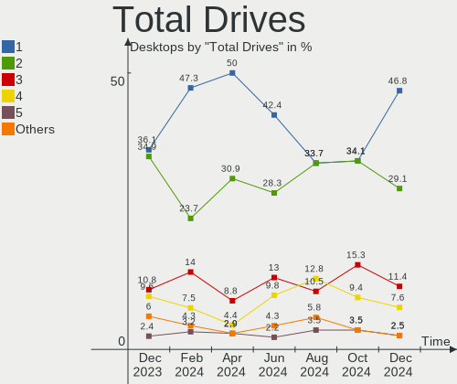
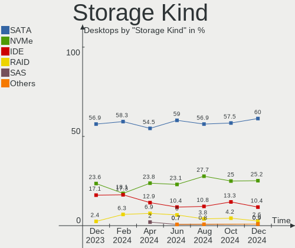
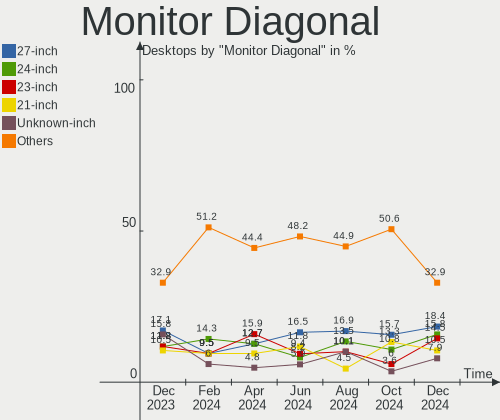
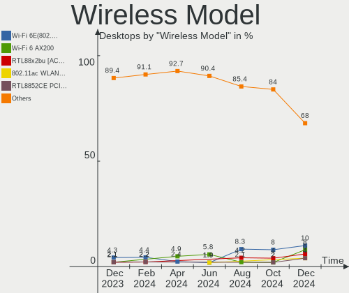
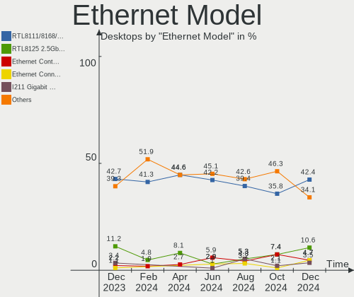
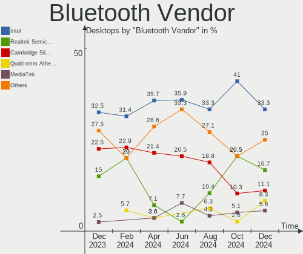

Zorin Hardware Trends (Desktop)
-------------------------------

A project to identify most popular hardware characteristics and track their change
over time based on data collected by Zorin users at https://Linux-Hardware.org.

Anyone can contribute to the study by uploading probes of their computers by
the [hw-probe](https://github.com/linuxhw/hw-probe) tool:

    sudo -E hw-probe -all -upload

Full-feature report is available here: https://linux-hardware.org/?view=trends&formfactor=desktop

Period: Jun, 2021.

Contents
--------

- [ OS                       ](#os)
- [ OS Family                ](#os-family)
- [ Kernel                   ](#kernel)
- [ Kernel Family            ](#kernel-family)
- [ Kernel Major Ver.        ](#kernel-major-ver)
- [ Arch                     ](#arch)
- [ DE                       ](#de)
- [ Display Server           ](#display-server)
- [ Display Manager          ](#display-manager)
- [ OS Lang                  ](#os-lang)
- [ Boot Mode                ](#boot-mode)
- [ Filesystem               ](#filesystem)
- [ Part. scheme             ](#part-scheme)
- [ Dual Boot with Linux/BSD ](#dual-boot-with-linux/bsd)
- [ Dual Boot (Win)          ](#dual-boot-win)
- [ Country                  ](#country)
- [ City                     ](#city)
- [ Vendor                   ](#vendor)
- [ Model                    ](#model)
- [ Model Family             ](#model-family)
- [ MFG Year                 ](#mfg-year)
- [ Form Factor              ](#form-factor)
- [ Secure Boot              ](#secure-boot)
- [ Coreboot                 ](#coreboot)
- [ RAM Size                 ](#ram-size)
- [ RAM Used                 ](#ram-used)
- [ Has CD-ROM               ](#has-cd-rom)
- [ Total Drives             ](#total-drives)
- [ Has Ethernet             ](#has-ethernet)
- [ Has WiFi                 ](#has-wifi)
- [ Has Bluetooth            ](#has-bluetooth)
- [ Drive Vendor             ](#drive-vendor)
- [ Drive Model              ](#drive-model)
- [ HDD Vendor               ](#hdd-vendor)
- [ SSD Vendor               ](#ssd-vendor)
- [ Drive Kind               ](#drive-kind)
- [ Drive Connector          ](#drive-connector)
- [ Drive Size               ](#drive-size)
- [ Space Total              ](#space-total)
- [ Space Used               ](#space-used)
- [ Malfunc. Drives          ](#malfunc-drives)
- [ Malfunc. Drive Vendor    ](#malfunc-drive-vendor)
- [ Malfunc. HDD Vendor      ](#malfunc-hdd-vendor)
- [ Malfunc. Drive Kind      ](#malfunc-drive-kind)
- [ Failed Drives            ](#failed-drives)
- [ Failed Drive Vendor      ](#failed-drive-vendor)
- [ Drive Status             ](#drive-status)
- [ Storage Vendor           ](#storage-vendor)
- [ Storage Model            ](#storage-model)
- [ Storage Kind             ](#storage-kind)
- [ CPU Vendor               ](#cpu-vendor)
- [ CPU Model                ](#cpu-model)
- [ CPU Model Family         ](#cpu-model-family)
- [ CPU Cores                ](#cpu-cores)
- [ CPU Sockets              ](#cpu-sockets)
- [ CPU Threads              ](#cpu-threads)
- [ CPU Op-Modes             ](#cpu-op-modes)
- [ CPU Microcode            ](#cpu-microcode)
- [ CPU Microarch            ](#cpu-microarch)
- [ GPU Vendor               ](#gpu-vendor)
- [ GPU Model                ](#gpu-model)
- [ GPU Combo                ](#gpu-combo)
- [ GPU Driver               ](#gpu-driver)
- [ GPU Memory               ](#gpu-memory)
- [ Monitor Vendor           ](#monitor-vendor)
- [ Monitor Model            ](#monitor-model)
- [ Monitor Resolution       ](#monitor-resolution)
- [ Monitor Diagonal         ](#monitor-diagonal)
- [ Monitor Width            ](#monitor-width)
- [ Aspect Ratio             ](#aspect-ratio)
- [ Monitor Area             ](#monitor-area)
- [ Pixel Density            ](#pixel-density)
- [ Multiple Monitors        ](#multiple-monitors)
- [ Net Controller Vendor    ](#net-controller-vendor)
- [ Net Controller Model     ](#net-controller-model)
- [ Wireless Vendor          ](#wireless-vendor)
- [ Wireless Model           ](#wireless-model)
- [ Ethernet Vendor          ](#ethernet-vendor)
- [ Ethernet Model           ](#ethernet-model)
- [ Net Controller Kind      ](#net-controller-kind)
- [ Used Controller          ](#used-controller)
- [ NICs                     ](#nics)
- [ IPv6                     ](#ipv6)
- [ Memory Vendor            ](#memory-vendor)
- [ Memory Model             ](#memory-model)
- [ Memory Kind              ](#memory-kind)
- [ Memory Form Factor       ](#memory-form-factor)
- [ Memory Size              ](#memory-size)
- [ Memory Speed             ](#memory-speed)
- [ Sound Vendor             ](#sound-vendor)
- [ Sound Model              ](#sound-model)
- [ Camera Vendor            ](#camera-vendor)
- [ Camera Model             ](#camera-model)
- [ Fingerprint Vendor       ](#fingerprint-vendor)
- [ Fingerprint Model        ](#fingerprint-model)
- [ Chipcard Vendor          ](#chipcard-vendor)
- [ Chipcard Model           ](#chipcard-model)
- [ Printer Vendor           ](#printer-vendor)
- [ Printer Model            ](#printer-model)
- [ Scanner Vendor           ](#scanner-vendor)
- [ Scanner Model            ](#scanner-model)
- [ Bluetooth Vendor         ](#bluetooth-vendor)
- [ Bluetooth Model          ](#bluetooth-model)
- [ Unsupported Devices      ](#unsupported-devices)
- [ Unsupported Device Types ](#unsupported-device-types)

OS
--

Installed operating systems

| Name     | Desktops | Percent |
|----------|----------|---------|
| Zorin 15 | 17       | 65.38%  |
| Zorin 16 | 8        | 30.77%  |
| Zorin 12 | 1        | 3.85%   |

OS Family
---------

OS without a version

| Name  | Desktops | Percent |
|-------|----------|---------|
| Zorin | 26       | 100%    |

Kernel
------

Version of the Linux kernel

| Version            | Desktops | Percent |
|--------------------|----------|---------|
| 5.4.0-74-generic   | 13       | 50%     |
| 5.8.0-55-generic   | 5        | 19.23%  |
| 5.8.0-53-generic   | 2        | 7.69%   |
| 5.4.0-45-generic   | 2        | 7.69%   |
| 5.8.0-59-generic   | 1        | 3.85%   |
| 5.4.0-77-generic   | 1        | 3.85%   |
| 5.4.0-73-generic   | 1        | 3.85%   |
| 4.15.0-117-generic | 1        | 3.85%   |

Kernel Family
-------------

Linux kernel without a distro release

| Version | Desktops | Percent |
|---------|----------|---------|
| 5.4.0   | 17       | 65.38%  |
| 5.8.0   | 8        | 30.77%  |
| 4.15.0  | 1        | 3.85%   |

Kernel Major Ver.
-----------------

Linux kernel major version

| Version | Desktops | Percent |
|---------|----------|---------|
| 5.4     | 17       | 65.38%  |
| 5.8     | 8        | 30.77%  |
| 4.15    | 1        | 3.85%   |

Arch
----

OS architecture (x86_64, i586, etc.)

| Name   | Desktops | Percent |
|--------|----------|---------|
| x86_64 | 23       | 88.46%  |
| i686   | 3        | 11.54%  |

DE
--

Desktop Environment

| Name    | Desktops | Percent |
|---------|----------|---------|
| GNOME   | 20       | 76.92%  |
| XFCE    | 5        | 19.23%  |
| Unknown | 1        | 3.85%   |

Display Server
--------------

X11 or Wayland

| Name    | Desktops | Percent |
|---------|----------|---------|
| X11     | 25       | 96.15%  |
| Unknown | 1        | 3.85%   |

Display Manager
---------------

SDDM, LightDM, etc.

| Name    | Desktops | Percent |
|---------|----------|---------|
| Unknown | 26       | 100%    |

OS Lang
-------

Language

| Lang  | Desktops | Percent |
|-------|----------|---------|
| en_US | 11       | 42.31%  |
| pt_BR | 2        | 7.69%   |
| fr_FR | 2        | 7.69%   |
| es_ES | 2        | 7.69%   |
| de_DE | 2        | 7.69%   |
| sv_SE | 1        | 3.85%   |
| sr_RS | 1        | 3.85%   |
| nb_NO | 1        | 3.85%   |
| ja_JP | 1        | 3.85%   |
| es_AR | 1        | 3.85%   |
| en_PH | 1        | 3.85%   |
| en_IN | 1        | 3.85%   |

Boot Mode
---------

EFI or BIOS

| Mode | Desktops | Percent |
|------|----------|---------|
| BIOS | 14       | 53.85%  |
| EFI  | 12       | 46.15%  |

Filesystem
----------

Type of filesystem

| Type    | Desktops | Percent |
|---------|----------|---------|
| Ext4    | 24       | 92.31%  |
| Overlay | 1        | 3.85%   |
| Btrfs   | 1        | 3.85%   |

Part. scheme
------------

Scheme of partitioning

| Type    | Desktops | Percent |
|---------|----------|---------|
| Unknown | 26       | 100%    |

Dual Boot with Linux/BSD
------------------------

Hosting more than one Linux/BSD

| Dual boot | Desktops | Percent |
|-----------|----------|---------|
| No        | 25       | 96.15%  |
| Yes       | 1        | 3.85%   |

Dual Boot (Win)
---------------

Hosting Linux and Windows

| Dual boot | Desktops | Percent |
|-----------|----------|---------|
| No        | 21       | 80.77%  |
| Yes       | 5        | 19.23%  |

Country
-------

Geographic location (country)

| Country                | Desktops | Percent |
|------------------------|----------|---------|
| USA                    | 7        | 26.92%  |
| Spain                  | 2        | 7.69%   |
| Norway                 | 2        | 7.69%   |
| Germany                | 2        | 7.69%   |
| France                 | 2        | 7.69%   |
| Brazil                 | 2        | 7.69%   |
| Sweden                 | 1        | 3.85%   |
| Philippines            | 1        | 3.85%   |
| Malaysia               | 1        | 3.85%   |
| Japan                  | 1        | 3.85%   |
| Iran                   | 1        | 3.85%   |
| Indonesia              | 1        | 3.85%   |
| India                  | 1        | 3.85%   |
| Bosnia and Herzegovina | 1        | 3.85%   |
| Argentina              | 1        | 3.85%   |

City
----

Geographic location (city)

| City                  | Desktops | Percent |
|-----------------------|----------|---------|
| Rio de Janeiro        | 2        | 7.69%   |
| Subang Jaya           | 1        | 3.85%   |
| Sorreisa              | 1        | 3.85%   |
| Sacramento            | 1        | 3.85%   |
| Roestanga             | 1        | 3.85%   |
| Pilar                 | 1        | 3.85%   |
| Pascoag               | 1        | 3.85%   |
| Paris                 | 1        | 3.85%   |
| Oslo                  | 1        | 3.85%   |
| Málaga               | 1        | 3.85%   |
| Myrtle Beach          | 1        | 3.85%   |
| Ludwigsburg           | 1        | 3.85%   |
| Kumamoto              | 1        | 3.85%   |
| Kerman                | 1        | 3.85%   |
| Hamburg               | 1        | 3.85%   |
| Foca                  | 1        | 3.85%   |
| Cormeilles-en-Parisis | 1        | 3.85%   |
| Columbia              | 1        | 3.85%   |
| Charlottesville       | 1        | 3.85%   |
| Caturtunggal          | 1        | 3.85%   |
| Cagayan de Oro        | 1        | 3.85%   |
| Bengaluru             | 1        | 3.85%   |
| Bellingham            | 1        | 3.85%   |
| Baltimore             | 1        | 3.85%   |
| Aldaia                | 1        | 3.85%   |

Vendor
------

Motherboard manufacturer

| Name                | Desktops | Percent |
|---------------------|----------|---------|
| Hewlett-Packard     | 4        | 15.38%  |
| Dell                | 4        | 15.38%  |
| ASUSTek Computer    | 3        | 11.54%  |
| MSI                 | 2        | 7.69%   |
| Lenovo              | 2        | 7.69%   |
| Gigabyte Technology | 2        | 7.69%   |
| Wistron             | 1        | 3.85%   |
| Shuttle             | 1        | 3.85%   |
| Positivo            | 1        | 3.85%   |
| Intel               | 1        | 3.85%   |
| ECS                 | 1        | 3.85%   |
| Biostar             | 1        | 3.85%   |
| ASRock              | 1        | 3.85%   |
| Acer                | 1        | 3.85%   |
| Unknown             | 1        | 3.85%   |

Model
-----

Motherboard model

| Name                                    | Desktops | Percent |
|-----------------------------------------|----------|---------|
| Wistron ProLiant ML110 G5               | 1        | 3.85%   |
| Shuttle SH61R                           | 1        | 3.85%   |
| Positivo POS-MI945AA                    | 1        | 3.85%   |
| MSI Pro 3515 Series                     | 1        | 3.85%   |
| MSI MS-7721                             | 1        | 3.85%   |
| Lenovo ThinkCentre M70e 0830WK7         | 1        | 3.85%   |
| Lenovo IdeaCentre 510S-08IKL 90GB004RUS | 1        | 3.85%   |
| Intel DG31GL AAE33912-200               | 1        | 3.85%   |
| HP Z840 Workstation                     | 1        | 3.85%   |
| HP Z1 Entry Tower G5                    | 1        | 3.85%   |
| HP Compaq dc5750 Microtower             | 1        | 3.85%   |
| HP 290 G2 MT Business PC                | 1        | 3.85%   |
| Gigabyte B85-HD3                        | 1        | 3.85%   |
| Gigabyte 8IPE1000-G/L                   | 1        | 3.85%   |
| ECS G41T-M2                             | 1        | 3.85%   |
| Dell XPS 8940                           | 1        | 3.85%   |
| Dell Precision T1600                    | 1        | 3.85%   |
| Dell OptiPlex 7020                      | 1        | 3.85%   |
| Dell OptiPlex 390                       | 1        | 3.85%   |
| Biostar TA870+                          | 1        | 3.85%   |
| ASUS Z170-P D3                          | 1        | 3.85%   |
| ASUS PRIME X570-P                       | 1        | 3.85%   |
| ASUS PRIME B450M-GAMING/BR              | 1        | 3.85%   |
| ASRock 990FX Extreme6                   | 1        | 3.85%   |
| Acer Veriton L480G                      | 1        | 3.85%   |
| Unknown                                 | 1        | 3.85%   |

Model Family
------------

Motherboard model prefix

| Name                 | Desktops | Percent |
|----------------------|----------|---------|
| Dell OptiPlex        | 2        | 7.69%   |
| ASUS PRIME           | 2        | 7.69%   |
| Wistron ProLiant     | 1        | 3.85%   |
| Shuttle SH61R        | 1        | 3.85%   |
| Positivo POS-MI945AA | 1        | 3.85%   |
| MSI Pro              | 1        | 3.85%   |
| MSI MS-7721          | 1        | 3.85%   |
| Lenovo ThinkCentre   | 1        | 3.85%   |
| Lenovo IdeaCentre    | 1        | 3.85%   |
| Intel DG31GL         | 1        | 3.85%   |
| HP Z840              | 1        | 3.85%   |
| HP Z1                | 1        | 3.85%   |
| HP Compaq            | 1        | 3.85%   |
| HP 290               | 1        | 3.85%   |
| Gigabyte B85-HD3     | 1        | 3.85%   |
| Gigabyte 8IPE1000-G  | 1        | 3.85%   |
| ECS G41T-M2          | 1        | 3.85%   |
| Dell XPS             | 1        | 3.85%   |
| Dell Precision       | 1        | 3.85%   |
| Biostar TA870+       | 1        | 3.85%   |
| ASUS Z170-P          | 1        | 3.85%   |
| ASRock 990FX         | 1        | 3.85%   |
| Acer Veriton         | 1        | 3.85%   |
| Unknown              | 1        | 3.85%   |

MFG Year
--------

Motherboard manufacture year

| Year | Desktops | Percent |
|------|----------|---------|
| 2021 | 4        | 15.38%  |
| 2020 | 3        | 11.54%  |
| 2009 | 3        | 11.54%  |
| 2018 | 2        | 7.69%   |
| 2016 | 2        | 7.69%   |
| 2015 | 2        | 7.69%   |
| 2011 | 2        | 7.69%   |
| 2008 | 2        | 7.69%   |
| 2019 | 1        | 3.85%   |
| 2014 | 1        | 3.85%   |
| 2013 | 1        | 3.85%   |
| 2012 | 1        | 3.85%   |
| 2010 | 1        | 3.85%   |
| 2005 | 1        | 3.85%   |

Form Factor
-----------

Physical design of the computer

| Name    | Desktops | Percent |
|---------|----------|---------|
| Desktop | 26       | 100%    |

Secure Boot
-----------

Enabled or disabled

| State    | Desktops | Percent |
|----------|----------|---------|
| Disabled | 24       | 92.31%  |
| Enabled  | 2        | 7.69%   |

Coreboot
--------

Have coreboot on board

| Used | Desktops | Percent |
|------|----------|---------|
| No   | 26       | 100%    |

RAM Size
--------

Total RAM memory

| Size in GB  | Desktops | Percent |
|-------------|----------|---------|
| 16.01-24.0  | 7        | 26.92%  |
| 3.01-4.0    | 6        | 23.08%  |
| 1.01-2.0    | 5        | 19.23%  |
| 4.01-8.0    | 2        | 7.69%   |
| 32.01-64.0  | 2        | 7.69%   |
| 8.01-16.0   | 2        | 7.69%   |
| 2.01-3.0    | 1        | 3.85%   |
| 64.01-256.0 | 1        | 3.85%   |

RAM Used
--------

Used RAM memory

| Used GB   | Desktops | Percent |
|-----------|----------|---------|
| 1.01-2.0  | 13       | 50%     |
| 2.01-3.0  | 4        | 15.38%  |
| 4.01-8.0  | 3        | 11.54%  |
| 0.51-1.0  | 3        | 11.54%  |
| 3.01-4.0  | 2        | 7.69%   |
| 8.01-16.0 | 1        | 3.85%   |

Has CD-ROM
----------

Has CD-ROM on board

| Presented | Desktops | Percent |
|-----------|----------|---------|
| Yes       | 17       | 65.38%  |
| No        | 9        | 34.62%  |

Total Drives
------------

Number of drives on board

| Drives | Desktops | Percent |
|--------|----------|---------|
| 1      | 14       | 53.85%  |
| 4      | 4        | 15.38%  |
| 2      | 4        | 15.38%  |
| 3      | 3        | 11.54%  |
| 5      | 1        | 3.85%   |

Has Ethernet
------------

Has Ethernet on board

| Presented | Desktops | Percent |
|-----------|----------|---------|
| Yes       | 25       | 96.15%  |
| No        | 1        | 3.85%   |

Has WiFi
--------

Has WiFi module

| Presented | Desktops | Percent |
|-----------|----------|---------|
| No        | 15       | 57.69%  |
| Yes       | 11       | 42.31%  |

Has Bluetooth
-------------

Has Bluetooth module

| Presented | Desktops | Percent |
|-----------|----------|---------|
| No        | 19       | 73.08%  |
| Yes       | 7        | 26.92%  |

Drive Vendor
------------

Hard drive vendors

| Vendor                    | Desktops | Drives | Percent |
|---------------------------|----------|--------|---------|
| WDC                       | 9        | 11     | 20.93%  |
| Seagate                   | 8        | 8      | 18.6%   |
| Samsung Electronics       | 6        | 7      | 13.95%  |
| Kingston                  | 5        | 6      | 11.63%  |
| Sandisk                   | 3        | 3      | 6.98%   |
| Maxtor                    | 2        | 2      | 4.65%   |
| Unknown                   | 1        | 2      | 2.33%   |
| Silicon Motion            | 1        | 2      | 2.33%   |
| QUANTUM                   | 1        | 1      | 2.33%   |
| PNY                       | 1        | 1      | 2.33%   |
| Phison                    | 1        | 1      | 2.33%   |
| Micron/Crucial Technology | 1        | 1      | 2.33%   |
| Hitachi                   | 1        | 1      | 2.33%   |
| Hewlett-Packard           | 1        | 1      | 2.33%   |
| G-RAID                    | 1        | 1      | 2.33%   |
| Crucial                   | 1        | 1      | 2.33%   |

Drive Model
-----------

Hard drive models

| Model                                | Desktops | Percent |
|--------------------------------------|----------|---------|
| Kingston SA400S37240G 240GB SSD      | 2        | 4.17%   |
| WDC WD800JD-22MSA1 80GB              | 1        | 2.08%   |
| WDC WD800JD-00LSA0 80GB              | 1        | 2.08%   |
| WDC WD5000AAVS-57ZTB0 500GB          | 1        | 2.08%   |
| WDC WD5000AAKX-221CA1 500GB          | 1        | 2.08%   |
| WDC WD40EZAZ-00SF3B0 4TB             | 1        | 2.08%   |
| WDC WD3200AAJS-00L7A0 320GB          | 1        | 2.08%   |
| WDC WD30EFRX-68EUZN0 3TB             | 1        | 2.08%   |
| WDC WD10EZEX-60M2NA0 1TB             | 1        | 2.08%   |
| WDC WD10EZEX-08WN4A0 1TB             | 1        | 2.08%   |
| WDC WD10EZEX-08M2NA0 1TB             | 1        | 2.08%   |
| WDC WD10EURX-63FH1Y0 1TB             | 1        | 2.08%   |
| Unknown SD/MMC/MS PRO 128GB          | 1        | 2.08%   |
| Unknown GSDSM128TY2F1QGCX 128GB      | 1        | 2.08%   |
| Silicon Motion NVMe SSD Drive 128GB  | 1        | 2.08%   |
| Silicon Motion NVME SSD 128GB        | 1        | 2.08%   |
| Seagate ST500LM012 HN-M500MBB 500GB  | 1        | 2.08%   |
| Seagate ST4000DM004-2CV104 4TB       | 1        | 2.08%   |
| Seagate ST3500312CS 500GB            | 1        | 2.08%   |
| Seagate ST3250310AS 250GB            | 1        | 2.08%   |
| Seagate ST1000DM010-2EP102 1TB       | 1        | 2.08%   |
| Seagate ST1000DM003-1SB10C 1TB       | 1        | 2.08%   |
| Seagate ST1000DM003-1SB102 1TB       | 1        | 2.08%   |
| Seagate Backup+ Hub BK 8TB           | 1        | 2.08%   |
| SanDisk SSD PLUS 240GB               | 1        | 2.08%   |
| SanDisk SDSSDA120G 120GB             | 1        | 2.08%   |
| Sandisk NVMe SSD Drive 250GB         | 1        | 2.08%   |
| Samsung SSD 860 QVO 1TB              | 1        | 2.08%   |
| Samsung SSD 850 120GB                | 1        | 2.08%   |
| Samsung SSD 840 EVO 250GB            | 1        | 2.08%   |
| Samsung SSD 840 EVO 120GB            | 1        | 2.08%   |
| Samsung NVMe SSD Drive 512GB         | 1        | 2.08%   |
| Samsung MZ7LN128HCHP-000H1 128GB SSD | 1        | 2.08%   |
| Samsung HD103UJ 1TB                  | 1        | 2.08%   |
| QUANTUM FIREBALLlct15 30 32GB        | 1        | 2.08%   |
| PNY CS900 480GB SSD                  | 1        | 2.08%   |
| Phison NVMe SSD Drive 1TB            | 1        | 2.08%   |
| Micron/Crucial NVMe SSD Drive 1TB    | 1        | 2.08%   |
| MAXTOR STM380211AS 80GB              | 1        | 2.08%   |
| Maxtor 6Y080L0 81GB                  | 1        | 2.08%   |
| Kingston SA400S37480G 480GB SSD      | 1        | 2.08%   |
| Kingston SA400S37120G 120GB SSD      | 1        | 2.08%   |
| Kingston NVMe SSD Drive 480GB        | 1        | 2.08%   |
| Hitachi HDT721032SLA380 320GB        | 1        | 2.08%   |
| HP MB2000GCWDA 2TB                   | 1        | 2.08%   |
| G-RAID with Thunderbolt 20TB         | 1        | 2.08%   |
| Crucial CT240BX500SSD1 240GB         | 1        | 2.08%   |

HDD Vendor
----------

Hard disk drive vendors

| Vendor              | Desktops | Drives | Percent |
|---------------------|----------|--------|---------|
| WDC                 | 9        | 11     | 40.91%  |
| Seagate             | 7        | 7      | 31.82%  |
| MAXTOR              | 2        | 2      | 9.09%   |
| Samsung Electronics | 1        | 1      | 4.55%   |
| QUANTUM             | 1        | 1      | 4.55%   |
| Hitachi             | 1        | 1      | 4.55%   |
| Hewlett-Packard     | 1        | 1      | 4.55%   |

SSD Vendor
----------

Solid state drive vendors

| Vendor              | Desktops | Drives | Percent |
|---------------------|----------|--------|---------|
| Samsung Electronics | 5        | 5      | 38.46%  |
| Kingston            | 4        | 5      | 30.77%  |
| SanDisk             | 2        | 2      | 15.38%  |
| PNY                 | 1        | 1      | 7.69%   |
| Crucial             | 1        | 1      | 7.69%   |

Drive Kind
----------

HDD or SSD

| Kind    | Desktops | Drives | Percent |
|---------|----------|--------|---------|
| HDD     | 19       | 24     | 50%     |
| SSD     | 12       | 14     | 31.58%  |
| NVMe    | 5        | 7      | 13.16%  |
| Unknown | 2        | 4      | 5.26%   |

Drive Connector
---------------

SATA, SAS, NVMe, etc.

| Type | Desktops | Drives | Percent |
|------|----------|--------|---------|
| SATA | 26       | 40     | 78.79%  |
| NVMe | 5        | 7      | 15.15%  |
| SAS  | 2        | 2      | 6.06%   |

Drive Size
----------

Size of hard drive

| Size in TB | Desktops | Drives | Percent |
|------------|----------|--------|---------|
| 0.01-0.5   | 20       | 25     | 64.52%  |
| 0.51-1.0   | 7        | 9      | 22.58%  |
| 3.01-4.0   | 2        | 2      | 6.45%   |
| 2.01-3.0   | 1        | 1      | 3.23%   |
| 1.01-2.0   | 1        | 1      | 3.23%   |

Space Total
-----------

Amount of disk space available on the file system

| Size in GB     | Desktops | Percent |
|----------------|----------|---------|
| 251-500        | 7        | 26.92%  |
| 101-250        | 7        | 26.92%  |
| More than 3000 | 3        | 11.54%  |
| 51-100         | 3        | 11.54%  |
| 1-20           | 2        | 7.69%   |
| 501-1000       | 2        | 7.69%   |
| 21-50          | 1        | 3.85%   |
| 2001-3000      | 1        | 3.85%   |

Space Used
----------

Amount of used disk space

| Used GB        | Desktops | Percent |
|----------------|----------|---------|
| 1-20           | 13       | 50%     |
| 21-50          | 4        | 15.38%  |
| 51-100         | 3        | 11.54%  |
| More than 3000 | 2        | 7.69%   |
| 251-500        | 2        | 7.69%   |
| 101-250        | 1        | 3.85%   |
| 1001-2000      | 1        | 3.85%   |

Malfunc. Drives
---------------

Drive models with a malfunction

Zero info for selected period =(

Malfunc. Drive Vendor
---------------------

Vendors of faulty drives

Zero info for selected period =(

Malfunc. HDD Vendor
-------------------

Vendors of faulty HDD drives

Zero info for selected period =(

Malfunc. Drive Kind
-------------------

Kinds of faulty drives

Zero info for selected period =(

Failed Drives
-------------

Failed drive models

Zero info for selected period =(

Failed Drive Vendor
-------------------

Failed drive vendors

Zero info for selected period =(

Drive Status
------------

Number of failed and malfunc. drives

| Status   | Desktops | Drives | Percent |
|----------|----------|--------|---------|
| Detected | 25       | 47     | 92.59%  |
| Works    | 2        | 2      | 7.41%   |

Storage Vendor
--------------

Storage controller vendors

| Vendor                      | Desktops | Percent |
|-----------------------------|----------|---------|
| Intel                       | 19       | 54.29%  |
| AMD                         | 7        | 20%     |
| VIA Technologies            | 1        | 2.86%   |
| Silicon Motion              | 1        | 2.86%   |
| Sandisk                     | 1        | 2.86%   |
| Samsung Electronics         | 1        | 2.86%   |
| Phison Electronics          | 1        | 2.86%   |
| Micron/Crucial Technology   | 1        | 2.86%   |
| Kingston Technology Company | 1        | 2.86%   |
| Broadcom / LSI              | 1        | 2.86%   |
| ASMedia Technology          | 1        | 2.86%   |

Storage Model
-------------

Storage controller models

| Model                                                                                   | Desktops | Percent |
|-----------------------------------------------------------------------------------------|----------|---------|
| Intel NM10/ICH7 Family SATA Controller [IDE mode]                                       | 4        | 8.7%    |
| Intel 82801G (ICH7 Family) IDE Controller                                               | 4        | 8.7%    |
| AMD FCH SATA Controller [AHCI mode]                                                     | 3        | 6.52%   |
| Intel Cannon Lake PCH SATA AHCI Controller                                              | 2        | 4.35%   |
| Intel 8 Series/C220 Series Chipset Family 6-port SATA Controller 1 [AHCI mode]          | 2        | 4.35%   |
| AMD SB7x0/SB8x0/SB9x0 SATA Controller [AHCI mode]                                       | 2        | 4.35%   |
| AMD SB7x0/SB8x0/SB9x0 IDE Controller                                                    | 2        | 4.35%   |
| VIA VT6415 PATA IDE Host Controller                                                     | 1        | 2.17%   |
| Silicon Motion SM2263EN/SM2263XT SSD Controller                                         | 1        | 2.17%   |
| Sandisk WD Black 2018/SN750 / PC SN720 NVMe SSD                                         | 1        | 2.17%   |
| Samsung NVMe SSD Controller SM961/PM961/SM963                                           | 1        | 2.17%   |
| Phison E16 PCIe4 NVMe Controller                                                        | 1        | 2.17%   |
| Micron/Crucial NVMe Controller                                                          | 1        | 2.17%   |
| Kingston Company U-SNS8154P3 NVMe SSD                                                   | 1        | 2.17%   |
| Intel SATA Controller [RAID mode]                                                       | 1        | 2.17%   |
| Intel Q170/Q150/B150/H170/H110/Z170/CM236 Chipset SATA Controller [AHCI Mode]           | 1        | 2.17%   |
| Intel Celeron/Pentium Silver Processor SATA Controller                                  | 1        | 2.17%   |
| Intel C610/X99 series chipset sSATA Controller [RAID mode]                              | 1        | 2.17%   |
| Intel C600/X79 series chipset SATA RAID Controller                                      | 1        | 2.17%   |
| Intel 82801JI (ICH10 Family) SATA AHCI Controller                                       | 1        | 2.17%   |
| Intel 82801IR/IO/IH (ICH9R/DO/DH) 4 port SATA Controller [IDE mode]                     | 1        | 2.17%   |
| Intel 82801I (ICH9 Family) 2 port SATA Controller [IDE mode]                            | 1        | 2.17%   |
| Intel 82801EB/ER (ICH5/ICH5R) IDE Controller                                            | 1        | 2.17%   |
| Intel 82801EB (ICH5) SATA Controller                                                    | 1        | 2.17%   |
| Intel 6 Series/C200 Series Chipset Family Desktop SATA Controller (IDE mode, ports 4-5) | 1        | 2.17%   |
| Intel 6 Series/C200 Series Chipset Family Desktop SATA Controller (IDE mode, ports 0-3) | 1        | 2.17%   |
| Intel 6 Series/C200 Series Chipset Family 6 port Desktop SATA AHCI Controller           | 1        | 2.17%   |
| Intel 400 Series Chipset Family SATA RAID Controller                                    | 1        | 2.17%   |
| Intel 200 Series PCH SATA controller [AHCI mode]                                        | 1        | 2.17%   |
| Broadcom / LSI SAS2308 PCI-Express Fusion-MPT SAS-2                                     | 1        | 2.17%   |
| ASMedia 106x SATA/RAID Controller                                                       | 1        | 2.17%   |
| AMD SB600 Non-Raid-5 SATA                                                               | 1        | 2.17%   |
| AMD SB600 IDE                                                                           | 1        | 2.17%   |
| AMD 400 Series Chipset SATA Controller                                                  | 1        | 2.17%   |

Storage Kind
------------

Kind of storage controller (IDE, SATA, NVMe, SAS, ...)

| Kind | Desktops | Percent |
|------|----------|---------|
| SATA | 17       | 47.22%  |
| IDE  | 10       | 27.78%  |
| NVMe | 5        | 13.89%  |
| RAID | 3        | 8.33%   |
| SAS  | 1        | 2.78%   |

CPU Vendor
----------

Processor vendors

| Vendor | Desktops | Percent |
|--------|----------|---------|
| Intel  | 19       | 73.08%  |
| AMD    | 7        | 26.92%  |

CPU Model
---------

Processor models

| Model                                       | Desktops | Percent |
|---------------------------------------------|----------|---------|
| Intel Core i3-8100 CPU @ 3.60GHz            | 2        | 7.69%   |
| Intel Xeon CPU X3210 @ 2.13GHz              | 1        | 3.85%   |
| Intel Xeon CPU E5-2630 v4 @ 2.20GHz         | 1        | 3.85%   |
| Intel Xeon CPU E31225 @ 3.10GHz             | 1        | 3.85%   |
| Intel Pentium Dual-Core CPU E5700 @ 3.00GHz | 1        | 3.85%   |
| Intel Pentium Dual-Core CPU E5400 @ 2.70GHz | 1        | 3.85%   |
| Intel Pentium Dual CPU E2140 @ 1.60GHz      | 1        | 3.85%   |
| Intel Pentium 4 CPU 2.80GHz                 | 1        | 3.85%   |
| Intel Core i7-4790 CPU @ 3.60GHz            | 1        | 3.85%   |
| Intel Core i5-6600K CPU @ 3.50GHz           | 1        | 3.85%   |
| Intel Core i5-4590 CPU @ 3.30GHz            | 1        | 3.85%   |
| Intel Core i5-2500 CPU @ 3.30GHz            | 1        | 3.85%   |
| Intel Core i5-2400 CPU @ 3.10GHz            | 1        | 3.85%   |
| Intel Core i3-7100 CPU @ 3.90GHz            | 1        | 3.85%   |
| Intel Core 2 Duo CPU E7300 @ 2.66GHz        | 1        | 3.85%   |
| Intel Celeron J4125 CPU @ 2.00GHz           | 1        | 3.85%   |
| Intel Celeron CPU E3200 @ 2.40GHz           | 1        | 3.85%   |
| Intel 11th Gen Core i7-11700 @ 2.50GHz      | 1        | 3.85%   |
| AMD Ryzen 7 3700X 8-Core Processor          | 1        | 3.85%   |
| AMD Ryzen 3 2200G with Radeon Vega Graphics | 1        | 3.85%   |
| AMD FX-9590 Eight-Core Processor            | 1        | 3.85%   |
| AMD Athlon II X2 260 Processor              | 1        | 3.85%   |
| AMD Athlon 64 X2 Dual Core Processor 4600+  | 1        | 3.85%   |
| AMD A6-6400K APU with Radeon HD Graphics    | 1        | 3.85%   |
| AMD A6-5400K APU with Radeon HD Graphics    | 1        | 3.85%   |

CPU Model Family
----------------

Processor model prefix

| Model                   | Desktops | Percent |
|-------------------------|----------|---------|
| Intel Core i5           | 4        | 15.38%  |
| Intel Xeon              | 3        | 11.54%  |
| Intel Core i3           | 3        | 11.54%  |
| Intel Pentium Dual-Core | 2        | 7.69%   |
| Intel Celeron           | 2        | 7.69%   |
| AMD A6                  | 2        | 7.69%   |
| Other                   | 1        | 3.85%   |
| Intel Pentium Dual      | 1        | 3.85%   |
| Intel Pentium 4         | 1        | 3.85%   |
| Intel Core i7           | 1        | 3.85%   |
| Intel Core 2 Duo        | 1        | 3.85%   |
| AMD Ryzen 7             | 1        | 3.85%   |
| AMD Ryzen 3             | 1        | 3.85%   |
| AMD FX                  | 1        | 3.85%   |
| AMD Athlon II X2        | 1        | 3.85%   |
| AMD Athlon 64 X2        | 1        | 3.85%   |

CPU Cores
---------

Number of processor cores

| Number | Desktops | Percent |
|--------|----------|---------|
| 4      | 12       | 46.15%  |
| 2      | 8        | 30.77%  |
| 1      | 3        | 11.54%  |
| 8      | 2        | 7.69%   |
| 20     | 1        | 3.85%   |

CPU Sockets
-----------

Number of sockets

| Number | Desktops | Percent |
|--------|----------|---------|
| 1      | 25       | 96.15%  |
| 2      | 1        | 3.85%   |

CPU Threads
-----------

Threads per core (Hyper-Threading)

| Number | Desktops | Percent |
|--------|----------|---------|
| 1      | 17       | 65.38%  |
| 2      | 9        | 34.62%  |

CPU Op-Modes
------------

CPU Operation Modes (32-bit, 64-bit)

| Op mode        | Desktops | Percent |
|----------------|----------|---------|
| 32-bit, 64-bit | 25       | 96.15%  |
| 32-bit         | 1        | 3.85%   |

CPU Microcode
-------------

Microcode number

| Number     | Desktops | Percent |
|------------|----------|---------|
| 0x206a7    | 3        | 11.54%  |
| 0x1067a    | 3        | 11.54%  |
| Unknown    | 3        | 11.54%  |
| 0x906eb    | 2        | 7.69%   |
| 0x306c3    | 2        | 7.69%   |
| 0xf33      | 1        | 3.85%   |
| 0xa0671    | 1        | 3.85%   |
| 0x706a8    | 1        | 3.85%   |
| 0x6fd      | 1        | 3.85%   |
| 0x6fb      | 1        | 3.85%   |
| 0x506e3    | 1        | 3.85%   |
| 0x406f1    | 1        | 3.85%   |
| 0x10676    | 1        | 3.85%   |
| 0x08701021 | 1        | 3.85%   |
| 0x08101016 | 1        | 3.85%   |
| 0x06001119 | 1        | 3.85%   |
| 0x06000852 | 1        | 3.85%   |
| 0x010000c8 | 1        | 3.85%   |

CPU Microarch
-------------

Microarchitecture

| Name          | Desktops | Percent |
|---------------|----------|---------|
| Penryn        | 4        | 15.38%  |
| SandyBridge   | 3        | 11.54%  |
| Piledriver    | 3        | 11.54%  |
| KabyLake      | 3        | 11.54%  |
| Haswell       | 2        | 7.69%   |
| Core          | 2        | 7.69%   |
| Zen 2         | 1        | 3.85%   |
| Zen           | 1        | 3.85%   |
| Skylake       | 1        | 3.85%   |
| NetBurst      | 1        | 3.85%   |
| K8 Hammer     | 1        | 3.85%   |
| K10           | 1        | 3.85%   |
| Goldmont plus | 1        | 3.85%   |
| Broadwell     | 1        | 3.85%   |
| Unknown       | 1        | 3.85%   |

GPU Vendor
----------

Vendors of graphics cards

| Vendor                     | Desktops | Percent |
|----------------------------|----------|---------|
| Intel                      | 12       | 44.44%  |
| Nvidia                     | 8        | 29.63%  |
| AMD                        | 5        | 18.52%  |
| Trident Microsystems       | 1        | 3.7%    |
| Matrox Electronics Systems | 1        | 3.7%    |

GPU Model
---------

Graphics card models

| Model                                                                       | Desktops | Percent |
|-----------------------------------------------------------------------------|----------|---------|
| Intel 4 Series Chipset Integrated Graphics Controller                       | 3        | 10.34%  |
| Nvidia GM107 [GeForce GTX 750 Ti]                                           | 2        | 6.9%    |
| Intel CoffeeLake-S GT2 [UHD Graphics 630]                                   | 2        | 6.9%    |
| Trident Microsystems XGI Volari XP5                                         | 1        | 3.45%   |
| Nvidia TU106 [GeForce RTX 2060 Rev. A]                                      | 1        | 3.45%   |
| Nvidia GP107 [GeForce GTX 1050 Ti]                                          | 1        | 3.45%   |
| Nvidia GM204GL [Quadro M5000]                                               | 1        | 3.45%   |
| Nvidia GM204 [GeForce GTX 970]                                              | 1        | 3.45%   |
| Nvidia GF108GL [Quadro 600]                                                 | 1        | 3.45%   |
| Nvidia GA106 [GeForce RTX 3060]                                             | 1        | 3.45%   |
| Matrox Electronics Systems MGA G200e [Pilot] ServerEngines (SEP1)           | 1        | 3.45%   |
| Intel Xeon E3-1200 v3/4th Gen Core Processor Integrated Graphics Controller | 1        | 3.45%   |
| Intel RocketLake-S GT1 [UHD Graphics 750]                                   | 1        | 3.45%   |
| Intel HD Graphics 630                                                       | 1        | 3.45%   |
| Intel GeminiLake [UHD Graphics 600]                                         | 1        | 3.45%   |
| Intel 82G33/G31 Express Integrated Graphics Controller                      | 1        | 3.45%   |
| Intel 82945G/GZ Integrated Graphics Controller                              | 1        | 3.45%   |
| Intel 2nd Generation Core Processor Family Integrated Graphics Controller   | 1        | 3.45%   |
| AMD Trinity 2 [Radeon HD 7540D]                                             | 1        | 3.45%   |
| AMD Tobago PRO [Radeon R7 360 / R9 360 OEM]                                 | 1        | 3.45%   |
| AMD RS482/RS485 [Radeon Xpress 1100/1150]                                   | 1        | 3.45%   |
| AMD RS480 [Radeon Xpress 1150] (Secondary)                                  | 1        | 3.45%   |
| AMD Richland [Radeon HD 8470D]                                              | 1        | 3.45%   |
| AMD Raven Ridge [Radeon Vega Series / Radeon Vega Mobile Series]            | 1        | 3.45%   |
| AMD Baffin [Radeon RX 550 640SP / RX 560/560X]                              | 1        | 3.45%   |

GPU Combo
---------

Combinations of graphics cards

| Name                     | Desktops | Percent |
|--------------------------|----------|---------|
| 1 x Intel                | 11       | 42.31%  |
| 1 x Nvidia               | 7        | 26.92%  |
| 1 x AMD                  | 3        | 11.54%  |
| 2 x AMD                  | 2        | 7.69%   |
| 1 x Trident Microsystems | 1        | 3.85%   |
| 1 x Matrox               | 1        | 3.85%   |
| Intel + Nvidia           | 1        | 3.85%   |

GPU Driver
----------

Free vs proprietary

| Driver      | Desktops | Percent |
|-------------|----------|---------|
| Free        | 18       | 69.23%  |
| Proprietary | 5        | 19.23%  |
| Unknown     | 3        | 11.54%  |

GPU Memory
----------

Total video memory

| Size in GB | Desktops | Percent |
|------------|----------|---------|
| Unknown    | 15       | 57.69%  |
| 1.01-2.0   | 5        | 19.23%  |
| 0.01-0.5   | 2        | 7.69%   |
| 7.01-8.0   | 1        | 3.85%   |
| 5.01-6.0   | 1        | 3.85%   |
| 3.01-4.0   | 1        | 3.85%   |
| 0.51-1.0   | 1        | 3.85%   |

Monitor Vendor
--------------

Monitor vendors

| Vendor               | Desktops | Percent |
|----------------------|----------|---------|
| Hewlett-Packard      | 4        | 16.67%  |
| Samsung Electronics  | 3        | 12.5%   |
| Philips              | 2        | 8.33%   |
| Lenovo               | 2        | 8.33%   |
| Dell                 | 2        | 8.33%   |
| AOC                  | 2        | 8.33%   |
| Acer                 | 2        | 8.33%   |
| Vizio                | 1        | 4.17%   |
| ViewSonic            | 1        | 4.17%   |
| UTV                  | 1        | 4.17%   |
| OPD                  | 1        | 4.17%   |
| NEC Computers        | 1        | 4.17%   |
| Gigabyte Technology  | 1        | 4.17%   |
| Ancor Communications | 1        | 4.17%   |

Monitor Model
-------------

Monitor models

| Model                                                               | Desktops | Percent |
|---------------------------------------------------------------------|----------|---------|
| Vizio E241i-A1 VIZ1005 1920x1080 521x293mm 23.5-inch                | 1        | 4%      |
| ViewSonic VA2432-FHD VSCB639 1920x1080 527x296mm 23.8-inch          | 1        | 4%      |
| UTV MONITOR UTV0030 3840x2160 1872x1053mm 84.6-inch                 | 1        | 4%      |
| Samsung Electronics U32R59x SAM0F96 3840x2160 697x392mm 31.5-inch   | 1        | 4%      |
| Samsung Electronics U28E590 SAM0C4E 3840x2160 608x345mm 27.5-inch   | 1        | 4%      |
| Samsung Electronics SyncMaster SAM0564 1024x768 410x230mm 18.5-inch | 1        | 4%      |
| Philips PHL 328E8Q PHLC164 1920x1080 698x393mm 31.5-inch            | 1        | 4%      |
| Philips PHL 242M8 PHLC253 1920x1080 527x296mm 23.8-inch             | 1        | 4%      |
| OPD WBXML32 OPD0001 1920x1080 597x335mm 27.0-inch                   | 1        | 4%      |
| NEC Computers LCD2070NX NEC667B 1600x1200 408x306mm 20.1-inch       | 1        | 4%      |
| Lenovo LEN T23i-10 LEN61AB 1920x1080 509x286mm 23.0-inch            | 1        | 4%      |
| Lenovo D22-20 LEN66AD 1920x1080 477x268mm 21.5-inch                 | 1        | 4%      |
| Hewlett-Packard LCD Monitor Z27n 1920x1080                          | 1        | 4%      |
| Hewlett-Packard LCD Monitor P221                                    | 1        | 4%      |
| Hewlett-Packard LCD Monitor P201 5440x1080                          | 1        | 4%      |
| Hewlett-Packard Compaq S1922 HWP290A 1366x768 413x234mm 18.7-inch   | 1        | 4%      |
| Hewlett-Packard 22cwa HWP3183 1920x1080 476x268mm 21.5-inch         | 1        | 4%      |
| Gigabyte Technology G34WQC GBT3400 3440x1440 797x334mm 34.0-inch    | 1        | 4%      |
| Dell S1709W DELD018 1440x900 370x230mm 17.2-inch                    | 1        | 4%      |
| Dell LCD Monitor E2311H                                             | 1        | 4%      |
| AOC LCD Monitor 2243W 1920x1080                                     | 1        | 4%      |
| AOC AG323FWG3R3 AOC3230 1920x1080 698x393mm 31.5-inch               | 1        | 4%      |
| Ancor Communications MW221 ACI22B1 1680x1050 473x296mm 22.0-inch    | 1        | 4%      |
| Acer LCD Monitor S271HL 1920x1080                                   | 1        | 4%      |
| Acer EB192Q ACR0517 1366x768 410x230mm 18.5-inch                    | 1        | 4%      |

Monitor Resolution
------------------

Monitor screen resolution

| Resolution         | Desktops | Percent |
|--------------------|----------|---------|
| 1920x1080 (FHD)    | 12       | 50%     |
| 3840x2160 (4K)     | 3        | 12.5%   |
| 1366x768 (WXGA)    | 2        | 8.33%   |
| 5440x1080          | 1        | 4.17%   |
| 3440x1440          | 1        | 4.17%   |
| 1680x1050 (WSXGA+) | 1        | 4.17%   |
| 1600x1200          | 1        | 4.17%   |
| 1440x900 (WXGA+)   | 1        | 4.17%   |
| 1360x768           | 1        | 4.17%   |
| Unknown            | 1        | 4.17%   |

Monitor Diagonal
----------------

Diagonal size in inches

| Inches  | Desktops | Percent |
|---------|----------|---------|
| 31      | 4        | 17.39%  |
| Unknown | 4        | 17.39%  |
| 23      | 3        | 13.04%  |
| 18      | 3        | 13.04%  |
| 27      | 2        | 8.7%    |
| 21      | 2        | 8.7%    |
| 84      | 1        | 4.35%   |
| 34      | 1        | 4.35%   |
| 22      | 1        | 4.35%   |
| 20      | 1        | 4.35%   |
| 17      | 1        | 4.35%   |

Monitor Width
-------------

Physical width

| Width in mm | Desktops | Percent |
|-------------|----------|---------|
| 401-500     | 6        | 28.57%  |
| 601-700     | 4        | 19.05%  |
| 501-600     | 4        | 19.05%  |
| Unknown     | 4        | 19.05%  |
| 701-800     | 1        | 4.76%   |
| 351-400     | 1        | 4.76%   |
| 1501-2000   | 1        | 4.76%   |

Aspect Ratio
------------

Proportional relationship between the width and the height

| Ratio   | Desktops | Percent |
|---------|----------|---------|
| 16/9    | 14       | 63.64%  |
| Unknown | 4        | 18.18%  |
| 16/10   | 2        | 9.09%   |
| 4/3     | 1        | 4.55%   |
| 21/9    | 1        | 4.55%   |

Monitor Area
------------

Area in inch²

| Area in inch² | Desktops | Percent |
|----------------|----------|---------|
| 351-500        | 5        | 21.74%  |
| 201-250        | 5        | 21.74%  |
| Unknown        | 4        | 17.39%  |
| 141-150        | 3        | 13.04%  |
| 301-350        | 2        | 8.7%    |
| 151-200        | 2        | 8.7%    |
| More than 1000 | 1        | 4.35%   |
| 131-140        | 1        | 4.35%   |

Pixel Density
-------------

Pixels per inch

| Density | Desktops | Percent |
|---------|----------|---------|
| 51-100  | 13       | 59.09%  |
| Unknown | 4        | 18.18%  |
| 101-120 | 3        | 13.64%  |
| 121-160 | 2        | 9.09%   |

Multiple Monitors
-----------------

Total monitors connected

| Total | Desktops | Percent |
|-------|----------|---------|
| 1     | 22       | 84.62%  |
| 0     | 2        | 7.69%   |
| 3     | 1        | 3.85%   |
| 2     | 1        | 3.85%   |

Net Controller Vendor
---------------------

Controller vendors

| Vendor                          | Desktops | Percent |
|---------------------------------|----------|---------|
| Realtek Semiconductor           | 15       | 45.45%  |
| Intel                           | 8        | 24.24%  |
| Qualcomm Atheros                | 3        | 9.09%   |
| Marvell Technology Group        | 2        | 6.06%   |
| Broadcom Limited                | 2        | 6.06%   |
| Qualcomm Atheros Communications | 1        | 3.03%   |
| OPPO Electronics                | 1        | 3.03%   |
| D-Link                          | 1        | 3.03%   |

Net Controller Model
--------------------

Controller models

| Model                                                                | Desktops | Percent |
|----------------------------------------------------------------------|----------|---------|
| Realtek RTL8111/8168/8411 PCI Express Gigabit Ethernet Controller    | 11       | 28.21%  |
| Intel I210 Gigabit Network Connection                                | 2        | 5.13%   |
| Realtek RTL8821CE 802.11ac PCIe Wireless Network Adapter             | 1        | 2.56%   |
| Realtek RTL8188EUS 802.11n Wireless Network Adapter                  | 1        | 2.56%   |
| Realtek RTL8188ETV Wireless LAN 802.11n Network Adapter              | 1        | 2.56%   |
| Realtek RTL8169 PCI Gigabit Ethernet Controller                      | 1        | 2.56%   |
| Realtek RTL810xE PCI Express Fast Ethernet controller                | 1        | 2.56%   |
| Realtek Killer E2600 Gigabit Ethernet Controller                     | 1        | 2.56%   |
| Realtek 802.11ac NIC                                                 | 1        | 2.56%   |
| Qualcomm Atheros QCA8171 Gigabit Ethernet                            | 1        | 2.56%   |
| Qualcomm Atheros AR9271 802.11n                                      | 1        | 2.56%   |
| Qualcomm Atheros AR9485 Wireless Network Adapter                     | 1        | 2.56%   |
| Qualcomm Atheros AR8161 Gigabit Ethernet                             | 1        | 2.56%   |
| OPPO OPPO A83                                                        | 1        | 2.56%   |
| Marvell Group 88E8071 PCI-E Gigabit Ethernet Controller              | 1        | 2.56%   |
| Marvell Group 88E8057 PCI-E Gigabit Ethernet Controller              | 1        | 2.56%   |
| Intel Wireless 8265 / 8275                                           | 1        | 2.56%   |
| Intel Ultimate N WiFi Link 5300                                      | 1        | 2.56%   |
| Intel PRO/100 VE Network Connection                                  | 1        | 2.56%   |
| Intel Ethernet Connection I217-LM                                    | 1        | 2.56%   |
| Intel Ethernet Connection (7) I219-LM                                | 1        | 2.56%   |
| Intel Ethernet Connection (2) I218-LM                                | 1        | 2.56%   |
| Intel Dual Band Wireless-AC 3165 Plus Bluetooth                      | 1        | 2.56%   |
| Intel Comet Lake PCH CNVi WiFi                                       | 1        | 2.56%   |
| Intel 82579LM Gigabit Network Connection (Lewisville)                | 1        | 2.56%   |
| D-Link DWA-131 Wireless N Nano Adapter (Rev. E1) [Realtek RTL8192EU] | 1        | 2.56%   |
| Broadcom Limited NetXtreme BCM5755 Gigabit Ethernet PCI Express      | 1        | 2.56%   |
| Broadcom Limited NetXtreme BCM5722 Gigabit Ethernet PCI Express      | 1        | 2.56%   |

Wireless Vendor
---------------

Wireless vendors

| Vendor                          | Desktops | Percent |
|---------------------------------|----------|---------|
| Realtek Semiconductor           | 4        | 36.36%  |
| Intel                           | 4        | 36.36%  |
| Qualcomm Atheros Communications | 1        | 9.09%   |
| Qualcomm Atheros                | 1        | 9.09%   |
| D-Link                          | 1        | 9.09%   |

Wireless Model
--------------

Wireless models

| Model                                                                | Desktops | Percent |
|----------------------------------------------------------------------|----------|---------|
| Realtek RTL8821CE 802.11ac PCIe Wireless Network Adapter             | 1        | 9.09%   |
| Realtek RTL8188EUS 802.11n Wireless Network Adapter                  | 1        | 9.09%   |
| Realtek RTL8188ETV Wireless LAN 802.11n Network Adapter              | 1        | 9.09%   |
| Realtek 802.11ac NIC                                                 | 1        | 9.09%   |
| Qualcomm Atheros AR9271 802.11n                                      | 1        | 9.09%   |
| Qualcomm Atheros AR9485 Wireless Network Adapter                     | 1        | 9.09%   |
| Intel Wireless 8265 / 8275                                           | 1        | 9.09%   |
| Intel Ultimate N WiFi Link 5300                                      | 1        | 9.09%   |
| Intel Dual Band Wireless-AC 3165 Plus Bluetooth                      | 1        | 9.09%   |
| Intel Comet Lake PCH CNVi WiFi                                       | 1        | 9.09%   |
| D-Link DWA-131 Wireless N Nano Adapter (Rev. E1) [Realtek RTL8192EU] | 1        | 9.09%   |

Ethernet Vendor
---------------

Ethernet vendors

| Vendor                   | Desktops | Percent |
|--------------------------|----------|---------|
| Realtek Semiconductor    | 14       | 53.85%  |
| Intel                    | 5        | 19.23%  |
| Qualcomm Atheros         | 2        | 7.69%   |
| Marvell Technology Group | 2        | 7.69%   |
| Broadcom Limited         | 2        | 7.69%   |
| OPPO Electronics         | 1        | 3.85%   |

Ethernet Model
--------------

Ethernet models

| Model                                                             | Desktops | Percent |
|-------------------------------------------------------------------|----------|---------|
| Realtek RTL8111/8168/8411 PCI Express Gigabit Ethernet Controller | 11       | 39.29%  |
| Intel I210 Gigabit Network Connection                             | 2        | 7.14%   |
| Realtek RTL8169 PCI Gigabit Ethernet Controller                   | 1        | 3.57%   |
| Realtek RTL810xE PCI Express Fast Ethernet controller             | 1        | 3.57%   |
| Realtek Killer E2600 Gigabit Ethernet Controller                  | 1        | 3.57%   |
| Qualcomm Atheros QCA8171 Gigabit Ethernet                         | 1        | 3.57%   |
| Qualcomm Atheros AR8161 Gigabit Ethernet                          | 1        | 3.57%   |
| OPPO OPPO A83                                                     | 1        | 3.57%   |
| Marvell Group 88E8071 PCI-E Gigabit Ethernet Controller           | 1        | 3.57%   |
| Marvell Group 88E8057 PCI-E Gigabit Ethernet Controller           | 1        | 3.57%   |
| Intel PRO/100 VE Network Connection                               | 1        | 3.57%   |
| Intel Ethernet Connection I217-LM                                 | 1        | 3.57%   |
| Intel Ethernet Connection (7) I219-LM                             | 1        | 3.57%   |
| Intel Ethernet Connection (2) I218-LM                             | 1        | 3.57%   |
| Intel 82579LM Gigabit Network Connection (Lewisville)             | 1        | 3.57%   |
| Broadcom Limited NetXtreme BCM5755 Gigabit Ethernet PCI Express   | 1        | 3.57%   |
| Broadcom Limited NetXtreme BCM5722 Gigabit Ethernet PCI Express   | 1        | 3.57%   |

Net Controller Kind
-------------------

Ethernet, WiFi or modem

| Kind     | Desktops | Percent |
|----------|----------|---------|
| Ethernet | 25       | 69.44%  |
| WiFi     | 11       | 30.56%  |

Used Controller
---------------

Currently used network controller

| Kind     | Desktops | Percent |
|----------|----------|---------|
| Ethernet | 22       | 73.33%  |
| WiFi     | 8        | 26.67%  |

NICs
----

Total network controllers on board

| Total | Desktops | Percent |
|-------|----------|---------|
| 1     | 19       | 73.08%  |
| 2     | 7        | 26.92%  |

IPv6
----

IPv6 vs IPv4

| Used | Desktops | Percent |
|------|----------|---------|
| No   | 19       | 73.08%  |
| Yes  | 7        | 26.92%  |

Memory Vendor
-------------

Memory module vendors

| Vendor            | Desktops | Percent |
|-------------------|----------|---------|
| Unknown           | 3        | 75%     |
| Micron Technology | 1        | 25%     |

Memory Model
------------

Memory module models

| Model                                                   | Desktops | Percent |
|---------------------------------------------------------|----------|---------|
| Unknown RAM TM44D18UD04MU-NUK 4096MB DIMM DDR4 2400MT/s | 1        | 16.67%  |
| Unknown RAM Module 8GB DIMM DDR4 2400MT/s               | 1        | 16.67%  |
| Unknown RAM Module 2GB DIMM SDRAM 800MT/s               | 1        | 16.67%  |
| Unknown RAM Module 2GB DIMM 667MT/s                     | 1        | 16.67%  |
| Unknown RAM 04S2400CL17A 4096MB DIMM DDR4 2400MT/s      | 1        | 16.67%  |
| Micron RAM V01D3LF2GB18818813 2GB DIMM 1333MT/s         | 1        | 16.67%  |

Memory Kind
-----------

Memory module kinds

| Kind    | Desktops | Percent |
|---------|----------|---------|
| SDRAM   | 1        | 25%     |
| DDR4    | 1        | 25%     |
| DDR3    | 1        | 25%     |
| Unknown | 1        | 25%     |

Memory Form Factor
------------------

Physical design of the memory module

| Name | Desktops | Percent |
|------|----------|---------|
| DIMM | 3        | 100%    |

Memory Size
-----------

Memory module size

| Size | Desktops | Percent |
|------|----------|---------|
| 2048 | 2        | 50%     |
| 8192 | 1        | 25%     |
| 4096 | 1        | 25%     |

Memory Speed
------------

Memory module speed

| Speed | Desktops | Percent |
|-------|----------|---------|
| 2400  | 1        | 25%     |
| 1333  | 1        | 25%     |
| 800   | 1        | 25%     |
| 667   | 1        | 25%     |

Sound Vendor
------------

Sound card vendors

| Vendor              | Desktops | Percent |
|---------------------|----------|---------|
| Intel               | 19       | 51.35%  |
| Nvidia              | 8        | 21.62%  |
| AMD                 | 6        | 16.22%  |
| Logitech            | 1        | 2.7%    |
| Klipsch Audio       | 1        | 2.7%    |
| Creative Labs       | 1        | 2.7%    |
| C-Media Electronics | 1        | 2.7%    |

Sound Model
-----------

Sound card models

| Model                                                                      | Desktops | Percent |
|----------------------------------------------------------------------------|----------|---------|
| Intel NM10/ICH7 Family High Definition Audio Controller                    | 4        | 9.52%   |
| Intel 6 Series/C200 Series Chipset Family High Definition Audio Controller | 3        | 7.14%   |
| AMD SBx00 Azalia (Intel HDA)                                               | 3        | 7.14%   |
| Nvidia GM204 High Definition Audio Controller                              | 2        | 4.76%   |
| Nvidia GM107 High Definition Audio Controller [GeForce 940MX]              | 2        | 4.76%   |
| Intel Cannon Lake PCH cAVS                                                 | 2        | 4.76%   |
| Intel 8 Series/C220 Series Chipset High Definition Audio Controller        | 2        | 4.76%   |
| AMD FCH Azalia Controller                                                  | 2        | 4.76%   |
| Nvidia TU106 High Definition Audio Controller                              | 1        | 2.38%   |
| Nvidia GP107GL High Definition Audio Controller                            | 1        | 2.38%   |
| Nvidia GF108 High Definition Audio Controller                              | 1        | 2.38%   |
| Nvidia Audio device                                                        | 1        | 2.38%   |
| Logitech USB Headset H540                                                  | 1        | 2.38%   |
| Klipsch Audio Klipsch KG-200 Headphones                                    | 1        | 2.38%   |
| Intel Xeon E3-1200 v3/4th Gen Core Processor HD Audio Controller           | 1        | 2.38%   |
| Intel USB PnP Sound Device                                                 | 1        | 2.38%   |
| Intel Celeron/Pentium Silver Processor High Definition Audio               | 1        | 2.38%   |
| Intel C610/X99 series chipset HD Audio Controller                          | 1        | 2.38%   |
| Intel Audio device                                                         | 1        | 2.38%   |
| Intel 82801JI (ICH10 Family) HD Audio Controller                           | 1        | 2.38%   |
| Intel 82801EB/ER (ICH5/ICH5R) AC'97 Audio Controller                       | 1        | 2.38%   |
| Intel 200 Series PCH HD Audio                                              | 1        | 2.38%   |
| Intel 100 Series/C230 Series Chipset Family HD Audio Controller            | 1        | 2.38%   |
| Creative Labs CA0108/CA10300 [Sound Blaster Audigy Series]                 | 1        | 2.38%   |
| C-Media Electronics Audio Adapter (Unitek Y-247A)                          | 1        | 2.38%   |
| AMD Trinity HDMI Audio Controller                                          | 1        | 2.38%   |
| AMD Tobago HDMI Audio [Radeon R7 360 / R9 360 OEM]                         | 1        | 2.38%   |
| AMD Raven/Raven2/Fenghuang HDMI/DP Audio Controller                        | 1        | 2.38%   |
| AMD Family 17h (Models 10h-1fh) HD Audio Controller                        | 1        | 2.38%   |
| AMD Baffin HDMI/DP Audio [Radeon RX 550 640SP / RX 560/560X]               | 1        | 2.38%   |

Camera Vendor
-------------

Camera device vendors

| Vendor      | Desktops | Percent |
|-------------|----------|---------|
| Alcor Micro | 1        | 100%    |

Camera Model
------------

Camera device models

| Model                      | Desktops | Percent |
|----------------------------|----------|---------|
| Alcor Micro USB 2.0 Camera | 1        | 100%    |

Fingerprint Vendor
------------------

Fingerprint sensor vendors

Zero info for selected period =(

Fingerprint Model
-----------------

Fingerprint sensor models

Zero info for selected period =(

Chipcard Vendor
---------------

Chipcard module vendors

Zero info for selected period =(

Chipcard Model
--------------

Chipcard module models

Zero info for selected period =(

Printer Vendor
--------------

Printer device vendors

| Vendor          | Desktops | Percent |
|-----------------|----------|---------|
| Pantum          | 1        | 50%     |
| Hewlett-Packard | 1        | 50%     |

Printer Model
-------------

Printer device models

| Model                | Desktops | Percent |
|----------------------|----------|---------|
| Pantum P2500W series | 1        | 50%     |
| HP ENVY 5000 series  | 1        | 50%     |

Scanner Vendor
--------------

Scanner device vendors

Zero info for selected period =(

Scanner Model
-------------

Scanner device models

Zero info for selected period =(

Bluetooth Vendor
----------------

Controller vendors

| Vendor                          | Desktops | Percent |
|---------------------------------|----------|---------|
| Intel                           | 3        | 42.86%  |
| Cambridge Silicon Radio         | 2        | 28.57%  |
| Realtek Semiconductor           | 1        | 14.29%  |
| Qualcomm Atheros Communications | 1        | 14.29%  |

Bluetooth Model
---------------

Controller models

| Model                                               | Desktops | Percent |
|-----------------------------------------------------|----------|---------|
| Intel Bluetooth wireless interface                  | 2        | 28.57%  |
| Cambridge Silicon Radio Bluetooth Dongle (HCI mode) | 2        | 28.57%  |
| Realtek Bluetooth Radio                             | 1        | 14.29%  |
| Qualcomm Atheros Bluetooth                          | 1        | 14.29%  |
| Intel Bluetooth Device                              | 1        | 14.29%  |

Unsupported Devices
-------------------

Total unsupported devices on board

| Total | Desktops | Percent |
|-------|----------|---------|
| 0     | 20       | 76.92%  |
| 1     | 5        | 19.23%  |
| 2     | 1        | 3.85%   |

Unsupported Device Types
------------------------

Types of unsupported devices

| Type             | Desktops | Percent |
|------------------|----------|---------|
| Graphics card    | 4        | 57.14%  |
| Net/wireless     | 2        | 28.57%  |
| Unassigned class | 1        | 14.29%  |

