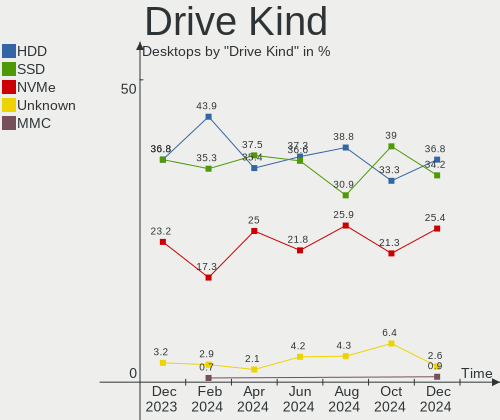

Zorin Hardware Trends (Desktop)
-------------------------------

A project to identify most popular hardware characteristics and track their change
over time based on data collected by Zorin users at https://Linux-Hardware.org.

Anyone can contribute to the study by uploading probes of their computers by
the [hw-probe](https://github.com/linuxhw/hw-probe) tool:

    sudo -E hw-probe -all -upload

Full-feature report is available here: https://linux-hardware.org/?view=trends&formfactor=desktop

Period: Nov, 2020.

Contents
--------

- [ OS                       ](#os)
- [ OS Family                ](#os-family)
- [ Kernel                   ](#kernel)
- [ Kernel Family            ](#kernel-family)
- [ Kernel Major Ver.        ](#kernel-major-ver)
- [ Arch                     ](#arch)
- [ DE                       ](#de)
- [ Display Server           ](#display-server)
- [ Display Manager          ](#display-manager)
- [ OS Lang                  ](#os-lang)
- [ Boot Mode                ](#boot-mode)
- [ Filesystem               ](#filesystem)
- [ Part. scheme             ](#part-scheme)
- [ Dual Boot with Linux/BSD ](#dual-boot-with-linux/bsd)
- [ Dual Boot (Win)          ](#dual-boot-win)
- [ Country                  ](#country)
- [ City                     ](#city)
- [ Vendor                   ](#vendor)
- [ Model                    ](#model)
- [ Model Family             ](#model-family)
- [ MFG Year                 ](#mfg-year)
- [ Form Factor              ](#form-factor)
- [ Secure Boot              ](#secure-boot)
- [ Coreboot                 ](#coreboot)
- [ RAM Size                 ](#ram-size)
- [ RAM Used                 ](#ram-used)
- [ Has CD-ROM               ](#has-cd-rom)
- [ Total Drives             ](#total-drives)
- [ Has Ethernet             ](#has-ethernet)
- [ Drive Vendor             ](#drive-vendor)
- [ Drive Model              ](#drive-model)
- [ HDD Vendor               ](#hdd-vendor)
- [ SSD Vendor               ](#ssd-vendor)
- [ Drive Kind               ](#drive-kind)
- [ Drive Connector          ](#drive-connector)
- [ Drive Size               ](#drive-size)
- [ Space Total              ](#space-total)
- [ Space Used               ](#space-used)
- [ Malfunc. Drives          ](#malfunc-drives)
- [ Malfunc. Drive Vendor    ](#malfunc-drive-vendor)
- [ Malfunc. HDD Vendor      ](#malfunc-hdd-vendor)
- [ Malfunc. Drive Kind      ](#malfunc-drive-kind)
- [ Failed Drives            ](#failed-drives)
- [ Failed Drive Vendor      ](#failed-drive-vendor)
- [ Drive Status             ](#drive-status)
- [ Storage Vendor           ](#storage-vendor)
- [ Storage Model            ](#storage-model)
- [ Storage Kind             ](#storage-kind)
- [ CPU Vendor               ](#cpu-vendor)
- [ CPU Model                ](#cpu-model)
- [ CPU Model Family         ](#cpu-model-family)
- [ CPU Cores                ](#cpu-cores)
- [ CPU Sockets              ](#cpu-sockets)
- [ CPU Threads              ](#cpu-threads)
- [ CPU Op-Modes             ](#cpu-op-modes)
- [ CPU Microcode            ](#cpu-microcode)
- [ CPU Microarch            ](#cpu-microarch)
- [ GPU Vendor               ](#gpu-vendor)
- [ GPU Model                ](#gpu-model)
- [ GPU Combo                ](#gpu-combo)
- [ GPU Driver               ](#gpu-driver)
- [ GPU Memory               ](#gpu-memory)
- [ Monitor Vendor           ](#monitor-vendor)
- [ Monitor Model            ](#monitor-model)
- [ Monitor Resolution       ](#monitor-resolution)
- [ Monitor Diagonal         ](#monitor-diagonal)
- [ Monitor Width            ](#monitor-width)
- [ Aspect Ratio             ](#aspect-ratio)
- [ Monitor Area             ](#monitor-area)
- [ Pixel Density            ](#pixel-density)
- [ Multiple Monitors        ](#multiple-monitors)
- [ Net Controller Vendor    ](#net-controller-vendor)
- [ Net Controller Model     ](#net-controller-model)
- [ Wireless Vendor          ](#wireless-vendor)
- [ Wireless Model           ](#wireless-model)
- [ Ethernet Vendor          ](#ethernet-vendor)
- [ Ethernet Model           ](#ethernet-model)
- [ Net Controller Kind      ](#net-controller-kind)
- [ Used Controller          ](#used-controller)
- [ NICs                     ](#nics)
- [ Memory Vendor            ](#memory-vendor)
- [ Memory Model             ](#memory-model)
- [ Memory Kind              ](#memory-kind)
- [ Memory Form Factor       ](#memory-form-factor)
- [ Memory Size              ](#memory-size)
- [ Memory Speed             ](#memory-speed)
- [ Sound Vendor             ](#sound-vendor)
- [ Sound Model              ](#sound-model)
- [ Camera Vendor            ](#camera-vendor)
- [ Camera Model             ](#camera-model)
- [ Fingerprint Vendor       ](#fingerprint-vendor)
- [ Fingerprint Model        ](#fingerprint-model)
- [ Chipcard Vendor          ](#chipcard-vendor)
- [ Chipcard Model           ](#chipcard-model)
- [ Printer Vendor           ](#printer-vendor)
- [ Printer Model            ](#printer-model)
- [ Scanner Vendor           ](#scanner-vendor)
- [ Scanner Model            ](#scanner-model)
- [ Bluetooth Vendor         ](#bluetooth-vendor)
- [ Bluetooth Model          ](#bluetooth-model)
- [ Unsupported Devices      ](#unsupported-devices)
- [ Unsupported Device Types ](#unsupported-device-types)

OS
--

Installed operating systems

| Name     | Desktops | Percent |
|----------|----------|---------|
| Zorin 15 | 15       | 88.24%  |
| Zorin 12 | 2        | 11.76%  |

OS Family
---------

OS without a version

| Name  | Desktops | Percent |
|-------|----------|---------|
| Zorin | 17       | 100%    |

Kernel
------

Version of the Linux kernel

| Version            | Desktops | Percent |
|--------------------|----------|---------|
| 5.4.0-54-generic   | 8        | 47.06%  |
| 5.4.0-52-generic   | 4        | 23.53%  |
| 5.4.0-53-generic   | 3        | 17.65%  |
| 4.15.0-123-generic | 2        | 11.76%  |

Kernel Family
-------------

Linux kernel without a distro release

| Version | Desktops | Percent |
|---------|----------|---------|
| 5.4.0   | 15       | 88.24%  |
| 4.15.0  | 2        | 11.76%  |

Kernel Major Ver.
-----------------

Linux kernel major version

| Version | Desktops | Percent |
|---------|----------|---------|
| 5.4     | 15       | 88.24%  |
| 4.15    | 2        | 11.76%  |

Arch
----

OS architecture (x86_64, i586, etc.)

| Name   | Desktops | Percent |
|--------|----------|---------|
| x86_64 | 14       | 82.35%  |
| i686   | 3        | 17.65%  |

DE
--

Desktop Environment

| Name  | Desktops | Percent |
|-------|----------|---------|
| XFCE  | 9        | 52.94%  |
| GNOME | 8        | 47.06%  |

Display Server
--------------

X11 or Wayland

| Name | Desktops | Percent |
|------|----------|---------|
| X11  | 17       | 100%    |

Display Manager
---------------

SDDM, LightDM, etc.

| Name    | Desktops | Percent |
|---------|----------|---------|
| Unknown | 17       | 100%    |

OS Lang
-------

Language

| Lang  | Desktops | Percent |
|-------|----------|---------|
| en_US | 7        | 41.18%  |
| en_GB | 2        | 11.76%  |
| pt_BR | 1        | 5.88%   |
| pl_PL | 1        | 5.88%   |
| nl_NL | 1        | 5.88%   |
| nl_BE | 1        | 5.88%   |
| ja_JP | 1        | 5.88%   |
| it_IT | 1        | 5.88%   |
| en_CA | 1        | 5.88%   |
| de_DE | 1        | 5.88%   |

Boot Mode
---------

EFI or BIOS

| Mode | Desktops | Percent |
|------|----------|---------|
| BIOS | 15       | 88.24%  |
| EFI  | 2        | 11.76%  |

Filesystem
----------

Type of filesystem

| Type | Desktops | Percent |
|------|----------|---------|
| Ext4 | 17       | 100%    |

Part. scheme
------------

Scheme of partitioning

| Type    | Desktops | Percent |
|---------|----------|---------|
| Unknown | 17       | 100%    |

Dual Boot with Linux/BSD
------------------------

Hosting more than one Linux/BSD

| Dual boot | Desktops | Percent |
|-----------|----------|---------|
| No        | 12       | 70.59%  |
| Yes       | 5        | 29.41%  |

Dual Boot (Win)
---------------

Hosting Linux and Windows

| Dual boot | Desktops | Percent |
|-----------|----------|---------|
| No        | 11       | 64.71%  |
| Yes       | 6        | 35.29%  |

Country
-------

Geographic location (country)

| Country     | Desktops | Percent |
|-------------|----------|---------|
| USA         | 3        | 17.65%  |
| UK          | 2        | 11.76%  |
| Netherlands | 2        | 11.76%  |
| Greece      | 2        | 11.76%  |
| Germany     | 2        | 11.76%  |
| Serbia      | 1        | 5.88%   |
| Japan       | 1        | 5.88%   |
| Italy       | 1        | 5.88%   |
| Canada      | 1        | 5.88%   |
| Brazil      | 1        | 5.88%   |
| Belgium     | 1        | 5.88%   |

City
----

Geographic location (city)

| City            | Desktops | Percent |
|-----------------|----------|---------|
| Wennigsen       | 1        | 5.88%   |
| Someren         | 1        | 5.88%   |
| Sint Willebrord | 1        | 5.88%   |
| Richmond        | 1        | 5.88%   |
| Nustrow         | 1        | 5.88%   |
| Newmarket       | 1        | 5.88%   |
| Minato-ku       | 1        | 5.88%   |
| Milan           | 1        | 5.88%   |
| Mesquita        | 1        | 5.88%   |
| Lovendegem      | 1        | 5.88%   |
| Littleton       | 1        | 5.88%   |
| Kilsby          | 1        | 5.88%   |
| Ialysos         | 1        | 5.88%   |
| Haviland        | 1        | 5.88%   |
| Gilbertsville   | 1        | 5.88%   |
| Belgrade        | 1        | 5.88%   |
| Athens          | 1        | 5.88%   |

Vendor
------

Motherboard manufacturer

| Name                | Desktops | Percent |
|---------------------|----------|---------|
| Gigabyte Technology | 5        | 29.41%  |
| Hewlett-Packard     | 2        | 11.76%  |
| Dell                | 2        | 11.76%  |
| ASUSTek Computer    | 2        | 11.76%  |
| ASRock              | 2        | 11.76%  |
| MSI                 | 1        | 5.88%   |
| Medion              | 1        | 5.88%   |
| Acer                | 1        | 5.88%   |
| Unknown             | 1        | 5.88%   |

Model
-----

Motherboard model

| Name                               | Desktops | Percent |
|------------------------------------|----------|---------|
| MSI EG763AA-B14 a1209.be           | 1        | 5.88%   |
| Medion MS-7857                     | 1        | 5.88%   |
| HP Compaq dc7600 Small Form Factor | 1        | 5.88%   |
| HP Compaq 8100 Elite SFF PC        | 1        | 5.88%   |
| Gigabyte H87M-HD3                  | 1        | 5.88%   |
| Gigabyte GA-770TA-UD3              | 1        | 5.88%   |
| Gigabyte G31M-S2C                  | 1        | 5.88%   |
| Gigabyte AM1M-S2H                  | 1        | 5.88%   |
| Gigabyte 970A-DS3P                 | 1        | 5.88%   |
| Dell OptiPlex 755                  | 1        | 5.88%   |
| Dell Dimension E521                | 1        | 5.88%   |
| ASUS P5KPL-CM                      | 1        | 5.88%   |
| ASUS GN566AA-ABA s3200n            | 1        | 5.88%   |
| ASRock X370 Professional Gaming    | 1        | 5.88%   |
| ASRock ConRoeXFire-eSATA2          | 1        | 5.88%   |
| Acer Aspire T180                   | 1        | 5.88%   |
| Unknown                            | 1        | 5.88%   |

Model Family
------------

Motherboard model prefix

| Name                      | Desktops | Percent |
|---------------------------|----------|---------|
| HP Compaq                 | 2        | 11.76%  |
| MSI EG763AA-B14           | 1        | 5.88%   |
| Medion MS-7857            | 1        | 5.88%   |
| Gigabyte H87M-HD3         | 1        | 5.88%   |
| Gigabyte GA-770TA-UD3     | 1        | 5.88%   |
| Gigabyte G31M-S2C         | 1        | 5.88%   |
| Gigabyte AM1M-S2H         | 1        | 5.88%   |
| Gigabyte 970A-DS3P        | 1        | 5.88%   |
| Dell OptiPlex             | 1        | 5.88%   |
| Dell Dimension            | 1        | 5.88%   |
| ASUS P5KPL-CM             | 1        | 5.88%   |
| ASUS GN566AA-ABA          | 1        | 5.88%   |
| ASRock X370               | 1        | 5.88%   |
| ASRock ConRoeXFire-eSATA2 | 1        | 5.88%   |
| Acer Aspire               | 1        | 5.88%   |
| Unknown                   | 1        | 5.88%   |

MFG Year
--------

Motherboard manufacture year

| Year | Desktops | Percent |
|------|----------|---------|
| 2013 | 2        | 11.76%  |
| 2010 | 2        | 11.76%  |
| 2009 | 2        | 11.76%  |
| 2007 | 2        | 11.76%  |
| 2006 | 2        | 11.76%  |
| 2018 | 1        | 5.88%   |
| 2017 | 1        | 5.88%   |
| 2016 | 1        | 5.88%   |
| 2014 | 1        | 5.88%   |
| 2012 | 1        | 5.88%   |
| 2011 | 1        | 5.88%   |
| 2005 | 1        | 5.88%   |

Form Factor
-----------

Physical design of the computer

| Name    | Desktops | Percent |
|---------|----------|---------|
| Desktop | 17       | 100%    |

Secure Boot
-----------

Enabled or disabled

| State    | Desktops | Percent |
|----------|----------|---------|
| Disabled | 17       | 100%    |

Coreboot
--------

Have coreboot on board

| Used | Desktops | Percent |
|------|----------|---------|
| No   | 17       | 100%    |

RAM Size
--------

Total RAM memory

| Size in GB | Desktops | Percent |
|------------|----------|---------|
| 3.01-4.0   | 7        | 41.18%  |
| 2.01-3.0   | 3        | 17.65%  |
| 16.01-24.0 | 3        | 17.65%  |
| 4.01-8.0   | 2        | 11.76%  |
| 8.01-16.0  | 1        | 5.88%   |
| 0.01-1.0   | 1        | 5.88%   |

RAM Used
--------

Used RAM memory

| Used GB  | Desktops | Percent |
|----------|----------|---------|
| 1.01-2.0 | 9        | 52.94%  |
| 0.01-1.0 | 6        | 35.29%  |
| 2.01-3.0 | 2        | 11.76%  |

Has CD-ROM
----------

Has CD-ROM on board

| Presented | Desktops | Percent |
|-----------|----------|---------|
| Yes       | 12       | 70.59%  |
| No        | 5        | 29.41%  |

Total Drives
------------

Number of drives on board

| Drives | Desktops | Percent |
|--------|----------|---------|
| 2      | 7        | 41.18%  |
| 1      | 7        | 41.18%  |
| 3      | 2        | 11.76%  |
| 4      | 1        | 5.88%   |

Has Ethernet
------------

Has Ethernet on board

| Presented | Desktops | Percent |
|-----------|----------|---------|
| Yes       | 17       | 100%    |

Drive Vendor
------------

Hard drive vendors

| Vendor              | Desktops | Drives | Percent |
|---------------------|----------|--------|---------|
| Seagate             | 6        | 8      | 25%     |
| WDC                 | 3        | 4      | 12.5%   |
| Samsung Electronics | 3        | 3      | 12.5%   |
| Toshiba             | 2        | 2      | 8.33%   |
| Hitachi             | 2        | 2      | 8.33%   |
| SPCC                | 1        | 1      | 4.17%   |
| SanDisk             | 1        | 1      | 4.17%   |
| PNY                 | 1        | 1      | 4.17%   |
| Maxtor              | 1        | 1      | 4.17%   |
| Leven               | 1        | 1      | 4.17%   |
| Intenso             | 1        | 1      | 4.17%   |
| DREVO               | 1        | 1      | 4.17%   |
| China               | 1        | 1      | 4.17%   |

Drive Model
-----------

Hard drive models

| Model                          | Desktops | Percent |
|--------------------------------|----------|---------|
| WDC WD40EZRZ-00GXCB0 4TB       | 1        | 3.7%    |
| WDC WD40EZRX-00SPEB0 4TB       | 1        | 3.7%    |
| WDC WD2500AAJS-07M0A0 250GB    | 1        | 3.7%    |
| WDC WD1600AAJS-75WAA0 160GB    | 1        | 3.7%    |
| Toshiba MK1246GSX 120GB        | 1        | 3.7%    |
| Toshiba HDWD110 1TB            | 1        | 3.7%    |
| SPCC Solid State Disk 256GB    | 1        | 3.7%    |
| Seagate ST9500325AS 500GB      | 1        | 3.7%    |
| Seagate ST4000DM004-2CV104 4TB | 1        | 3.7%    |
| Seagate ST3250318AS 250GB      | 1        | 3.7%    |
| Seagate ST3160815AS 160GB      | 1        | 3.7%    |
| Seagate ST3160023AS 160GB      | 1        | 3.7%    |
| Seagate ST3120827AS 120GB      | 1        | 3.7%    |
| Seagate ST3000DM001-1CH166 3TB | 1        | 3.7%    |
| Seagate ST2000DM001-1CH164 2TB | 1        | 3.7%    |
| SanDisk SDSSDHP256G 256GB      | 1        | 3.7%    |
| Samsung SSD 860 EVO 500GB      | 1        | 3.7%    |
| Samsung SSD 850 EVO 500GB      | 1        | 3.7%    |
| Samsung HD161GJ 160GB          | 1        | 3.7%    |
| PNY CS1311 120GB SSD           | 1        | 3.7%    |
| Maxtor 6L250S0 250GB           | 1        | 3.7%    |
| Leven JAJS300M120C 120GB       | 1        | 3.7%    |
| Intenso SSD Sata III 128GB     | 1        | 3.7%    |
| Hitachi HDT722516DLA380 164GB  | 1        | 3.7%    |
| Hitachi HDS721050CLA362 500GB  | 1        | 3.7%    |
| DREVO X1 SSD 120GB             | 1        | 3.7%    |
| China SATA3 120GB SSD          | 1        | 3.7%    |

HDD Vendor
----------

Hard disk drive vendors

| Vendor              | Desktops | Drives | Percent |
|---------------------|----------|--------|---------|
| Seagate             | 6        | 8      | 40%     |
| WDC                 | 3        | 4      | 20%     |
| Toshiba             | 2        | 2      | 13.33%  |
| Hitachi             | 2        | 2      | 13.33%  |
| Samsung Electronics | 1        | 1      | 6.67%   |
| Maxtor              | 1        | 1      | 6.67%   |

SSD Vendor
----------

Solid state drive vendors

| Vendor              | Desktops | Drives | Percent |
|---------------------|----------|--------|---------|
| Samsung Electronics | 2        | 2      | 22.22%  |
| SPCC                | 1        | 1      | 11.11%  |
| SanDisk             | 1        | 1      | 11.11%  |
| PNY                 | 1        | 1      | 11.11%  |
| Leven               | 1        | 1      | 11.11%  |
| Intenso             | 1        | 1      | 11.11%  |
| DREVO               | 1        | 1      | 11.11%  |
| China               | 1        | 1      | 11.11%  |

Drive Kind
----------

HDD or SSD

| Kind | Desktops | Drives | Percent |
|------|----------|--------|---------|
| HDD  | 13       | 18     | 61.9%   |
| SSD  | 8        | 9      | 38.1%   |

Drive Connector
---------------

SATA, SAS, NVMe, etc.

| Type | Desktops | Drives | Percent |
|------|----------|--------|---------|
| SATA | 17       | 27     | 100%    |

Drive Size
----------

Size of hard drive

| Size in TB | Desktops | Drives | Percent |
|------------|----------|--------|---------|
| 0.01-0.5   | 17       | 21     | 77.27%  |
| 3.01-4.0   | 2        | 3      | 9.09%   |
| 2.01-3.0   | 1        | 1      | 4.55%   |
| 1.01-2.0   | 1        | 1      | 4.55%   |
| 0.51-1.0   | 1        | 1      | 4.55%   |

Space Total
-----------

Amount of disk space available on the file system

| Size in GB     | Desktops | Percent |
|----------------|----------|---------|
| 101-250        | 11       | 64.71%  |
| More than 3000 | 2        | 11.76%  |
| 21-50          | 2        | 11.76%  |
| 251-500        | 1        | 5.88%   |
| 1-20           | 1        | 5.88%   |

Space Used
----------

Amount of used disk space

| Used GB        | Desktops | Percent |
|----------------|----------|---------|
| 1-20           | 11       | 64.71%  |
| 21-50          | 3        | 17.65%  |
| More than 3000 | 1        | 5.88%   |
| 2001-3000      | 1        | 5.88%   |
| 51-100         | 1        | 5.88%   |

Malfunc. Drives
---------------

Drive models with a malfunction

Zero info for selected period =(

Malfunc. Drive Vendor
---------------------

Vendors of faulty drives

Zero info for selected period =(

Malfunc. HDD Vendor
-------------------

Vendors of faulty HDD drives

Zero info for selected period =(

Malfunc. Drive Kind
-------------------

Kinds of faulty drives

Zero info for selected period =(

Failed Drives
-------------

Failed drive models

Zero info for selected period =(

Failed Drive Vendor
-------------------

Failed drive vendors

Zero info for selected period =(

Drive Status
------------

Number of failed and malfunc. drives

| Status   | Desktops | Drives | Percent |
|----------|----------|--------|---------|
| Detected | 17       | 27     | 100%    |

Storage Vendor
--------------

Storage controller vendors

| Vendor                   | Desktops | Percent |
|--------------------------|----------|---------|
| Intel                    | 9        | 45%     |
| AMD                      | 5        | 25%     |
| Nvidia                   | 3        | 15%     |
| Marvell Technology Group | 1        | 5%      |
| JMicron Technology       | 1        | 5%      |
| ASMedia Technology       | 1        | 5%      |

Storage Model
-------------

Storage controller models

| Model                                                                          | Desktops | Percent |
|--------------------------------------------------------------------------------|----------|---------|
| Intel NM10/ICH7 Family SATA Controller [IDE mode]                              | 4        | 13.33%  |
| Intel 82801G (ICH7 Family) IDE Controller                                      | 4        | 13.33%  |
| AMD FCH SATA Controller [AHCI mode]                                            | 3        | 10%     |
| Nvidia MCP61 SATA Controller                                                   | 2        | 6.67%   |
| Nvidia MCP61 IDE                                                               | 2        | 6.67%   |
| Nvidia MCP51 Serial ATA Controller                                             | 1        | 3.33%   |
| Marvell Technology Group 88SE91A3 SATA-600 Controller                          | 1        | 3.33%   |
| JMicron Technology JMB363 SATA/IDE Controller                                  | 1        | 3.33%   |
| Intel NM10/ICH7 Family SATA Controller [AHCI mode]                             | 1        | 3.33%   |
| Intel 82Q35 Express PT IDER Controller                                         | 1        | 3.33%   |
| Intel 82801IR/IO/IH (ICH9R/DO/DH) 6 port SATA Controller [AHCI mode]           | 1        | 3.33%   |
| Intel 82801FB/FW (ICH6/ICH6W) SATA Controller                                  | 1        | 3.33%   |
| Intel 8 Series/C220 Series Chipset Family 6-port SATA Controller 1 [AHCI mode] | 1        | 3.33%   |
| Intel 5 Series/3400 Series Chipset 4 port SATA IDE Controller                  | 1        | 3.33%   |
| Intel 5 Series/3400 Series Chipset 2 port SATA IDE Controller                  | 1        | 3.33%   |
| ASMedia Technology ASM1062 Serial ATA Controller                               | 1        | 3.33%   |
| AMD X370 Series Chipset SATA Controller                                        | 1        | 3.33%   |
| AMD SB7x0/SB8x0/SB9x0 SATA Controller [IDE mode]                               | 1        | 3.33%   |
| AMD SB7x0/SB8x0/SB9x0 SATA Controller [AHCI mode]                              | 1        | 3.33%   |
| AMD SB7x0/SB8x0/SB9x0 IDE Controller                                           | 1        | 3.33%   |

Storage Kind
------------

Kind of storage controller (IDE, SATA, NVMe, SAS, ...)

| Kind | Desktops | Percent |
|------|----------|---------|
| IDE  | 12       | 60%     |
| SATA | 8        | 40%     |

CPU Vendor
----------

Processor vendors

| Vendor | Desktops | Percent |
|--------|----------|---------|
| Intel  | 9        | 52.94%  |
| AMD    | 8        | 47.06%  |

CPU Model
---------

Processor models

| Model                                       | Desktops | Percent |
|---------------------------------------------|----------|---------|
| Intel Pentium Dual-Core CPU E5300 @ 2.60GHz | 1        | 5.88%   |
| Intel Pentium Dual CPU E2160 @ 1.80GHz      | 1        | 5.88%   |
| Intel Pentium D CPU 3.00GHz                 | 1        | 5.88%   |
| Intel Pentium 4 CPU 2.93GHz                 | 1        | 5.88%   |
| Intel Core i5-4430 CPU @ 3.00GHz            | 1        | 5.88%   |
| Intel Core i5 CPU 650 @ 3.20GHz             | 1        | 5.88%   |
| Intel Core 2 Duo CPU E8400 @ 3.00GHz        | 1        | 5.88%   |
| Intel Core 2 Duo CPU E4500 @ 2.20GHz        | 1        | 5.88%   |
| Intel Celeron CPU E1400 @ 2.00GHz           | 1        | 5.88%   |
| AMD Sempron 2650 APU with Radeon R3         | 1        | 5.88%   |
| AMD Ryzen 7 1700X Eight-Core Processor      | 1        | 5.88%   |
| AMD Phenom II X2 555 Processor              | 1        | 5.88%   |
| AMD FX-6300 Six-Core Processor              | 1        | 5.88%   |
| AMD Athlon 64 X2 Dual Core Processor 4800+  | 1        | 5.88%   |
| AMD Athlon 64 X2 Dual Core Processor 3800+  | 1        | 5.88%   |
| AMD Athlon 64 Processor 3500+               | 1        | 5.88%   |
| AMD A8-6500 APU with Radeon HD Graphics     | 1        | 5.88%   |

CPU Model Family
----------------

Processor model prefix

| Model                   | Desktops | Percent |
|-------------------------|----------|---------|
| Intel Core i5           | 2        | 11.76%  |
| Intel Core 2 Duo        | 2        | 11.76%  |
| AMD Athlon 64 X2        | 2        | 11.76%  |
| Intel Pentium Dual-Core | 1        | 5.88%   |
| Intel Pentium Dual      | 1        | 5.88%   |
| Intel Pentium D         | 1        | 5.88%   |
| Intel Pentium 4         | 1        | 5.88%   |
| Intel Celeron           | 1        | 5.88%   |
| AMD Sempron             | 1        | 5.88%   |
| AMD Ryzen 7             | 1        | 5.88%   |
| AMD Phenom II X2        | 1        | 5.88%   |
| AMD FX                  | 1        | 5.88%   |
| AMD Athlon 64           | 1        | 5.88%   |
| AMD A8                  | 1        | 5.88%   |

CPU Cores
---------

Number of processor cores

| Number | Desktops | Percent |
|--------|----------|---------|
| 2      | 12       | 70.59%  |
| 1      | 2        | 11.76%  |
| 8      | 1        | 5.88%   |
| 4      | 1        | 5.88%   |
| 3      | 1        | 5.88%   |

CPU Sockets
-----------

Number of sockets

| Number | Desktops | Percent |
|--------|----------|---------|
| 1      | 17       | 100%    |

CPU Threads
-----------

Threads per core (Hyper-Threading)

| Number | Desktops | Percent |
|--------|----------|---------|
| 1      | 13       | 76.47%  |
| 2      | 4        | 23.53%  |

CPU Op-Modes
------------

CPU Operation Modes (32-bit, 64-bit)

| Op mode        | Desktops | Percent |
|----------------|----------|---------|
| 32-bit, 64-bit | 17       | 100%    |

CPU Microcode
-------------

Microcode number

| Number     | Desktops | Percent |
|------------|----------|---------|
| Unknown    | 4        | 23.53%  |
| 0x6fd      | 3        | 17.65%  |
| 0x1067a    | 2        | 11.76%  |
| 0xf41      | 1        | 5.88%   |
| 0x306c3    | 1        | 5.88%   |
| 0x20655    | 1        | 5.88%   |
| 0x08001129 | 1        | 5.88%   |
| 0x0700010f | 1        | 5.88%   |
| 0x06001119 | 1        | 5.88%   |
| 0x06000852 | 1        | 5.88%   |
| 0x010000c8 | 1        | 5.88%   |

CPU Microarch
-------------

Microarchitecture

| Name       | Desktops | Percent |
|------------|----------|---------|
| K8 Hammer  | 3        | 17.65%  |
| Core       | 3        | 17.65%  |
| Piledriver | 2        | 11.76%  |
| Penryn     | 2        | 11.76%  |
| NetBurst   | 2        | 11.76%  |
| Zen        | 1        | 5.88%   |
| Westmere   | 1        | 5.88%   |
| K10        | 1        | 5.88%   |
| Jaguar     | 1        | 5.88%   |
| Haswell    | 1        | 5.88%   |

GPU Vendor
----------

Vendors of graphics cards

| Vendor | Desktops | Percent |
|--------|----------|---------|
| Nvidia | 8        | 44.44%  |
| Intel  | 5        | 27.78%  |
| AMD    | 5        | 27.78%  |

GPU Model
---------

Graphics card models

| Model                                                                       | Desktops | Percent |
|-----------------------------------------------------------------------------|----------|---------|
| AMD Caicos XT [Radeon HD 7470/8470 / R5 235/310 OEM]                        | 2        | 11.11%  |
| Nvidia NV43 [GeForce 6600]                                                  | 1        | 5.56%   |
| Nvidia NV43 [GeForce 6600 LE]                                               | 1        | 5.56%   |
| Nvidia GM206 [GeForce GTX 950]                                              | 1        | 5.56%   |
| Nvidia GM107 [GeForce GTX 750]                                              | 1        | 5.56%   |
| Nvidia GK107 [GeForce GT 640]                                               | 1        | 5.56%   |
| Nvidia GF119 [GeForce GT 610]                                               | 1        | 5.56%   |
| Nvidia GF116 [GeForce GTX 550 Ti]                                           | 1        | 5.56%   |
| Nvidia C61 [GeForce 6100 nForce 405]                                        | 1        | 5.56%   |
| Intel Xeon E3-1200 v3/4th Gen Core Processor Integrated Graphics Controller | 1        | 5.56%   |
| Intel Core Processor Integrated Graphics Controller                         | 1        | 5.56%   |
| Intel 82G33/G31 Express Integrated Graphics Controller                      | 1        | 5.56%   |
| Intel 82915G/GV/910GL Integrated Graphics Controller                        | 1        | 5.56%   |
| Intel 4 Series Chipset Integrated Graphics Controller                       | 1        | 5.56%   |
| AMD RV710 [Radeon HD 4350/4550]                                             | 1        | 5.56%   |
| AMD Richland [Radeon HD 8570D]                                              | 1        | 5.56%   |
| AMD Kabini [Radeon HD 8240 / R3 Series]                                     | 1        | 5.56%   |

GPU Combo
---------

Combinations of graphics cards

| Name           | Desktops | Percent |
|----------------|----------|---------|
| 1 x Nvidia     | 7        | 41.18%  |
| 1 x AMD        | 5        | 29.41%  |
| 1 x Intel      | 4        | 23.53%  |
| Intel + Nvidia | 1        | 5.88%   |

GPU Driver
----------

Free vs proprietary

| Driver      | Desktops | Percent |
|-------------|----------|---------|
| Free        | 11       | 64.71%  |
| Proprietary | 4        | 23.53%  |
| Unknown     | 2        | 11.76%  |

GPU Memory
----------

Total video memory

| Size in GB | Desktops | Percent |
|------------|----------|---------|
| Unknown    | 8        | 47.06%  |
| 0.51-1.0   | 4        | 23.53%  |
| 0.01-0.5   | 4        | 23.53%  |
| 1.01-2.0   | 1        | 5.88%   |

Monitor Vendor
--------------

Monitor vendors

| Vendor               | Desktops | Percent |
|----------------------|----------|---------|
| Toshiba              | 1        | 9.09%   |
| Targa                | 1        | 9.09%   |
| SKY                  | 1        | 9.09%   |
| Samsung Electronics  | 1        | 9.09%   |
| Philips              | 1        | 9.09%   |
| Packard Bell         | 1        | 9.09%   |
| HannStar             | 1        | 9.09%   |
| Elo Touch            | 1        | 9.09%   |
| AOC                  | 1        | 9.09%   |
| Ancor Communications | 1        | 9.09%   |
| Acer                 | 1        | 9.09%   |

Monitor Model
-------------

Monitor models

| Model                                                             | Desktops | Percent |
|-------------------------------------------------------------------|----------|---------|
| Toshiba TV TSB0206 1920x1080 886x498mm 40.0-inch                  | 1        | 9.09%   |
| Targa LCD Monitor LCDTV16 3200x1204                               | 1        | 9.09%   |
| SKY TV-monitor SKY0402 1920x1080 885x498mm 40.0-inch              | 1        | 9.09%   |
| Samsung Electronics S27B550 SAM091B 1920x1080 598x336mm 27.0-inch | 1        | 9.09%   |
| Philips 190C PHL0849 1280x1024 376x301mm 19.0-inch                | 1        | 9.09%   |
| Packard Bell PKB VIS191WS PKB5067 1440x900 410x257mm 19.1-inch    | 1        | 9.09%   |
| HannStar M19W2 HSP4D37 1440x900 408x255mm 18.9-inch               | 1        | 9.09%   |
| Elo Touch ET1727L-7CWF ELO1004 1280x1024 330x270mm 16.8-inch      | 1        | 9.09%   |
| AOC 2270W AOC2270 1920x1080 477x268mm 21.5-inch                   | 1        | 9.09%   |
| Ancor Communications VS248 ACI2498 1920x1080 531x299mm 24.0-inch  | 1        | 9.09%   |
| Acer X163W ACR0015 1366x768 344x193mm 15.5-inch                   | 1        | 9.09%   |

Monitor Resolution
------------------

Monitor screen resolution

| Resolution       | Desktops | Percent |
|------------------|----------|---------|
| 1920x1080 (FHD)  | 5        | 45.45%  |
| 1440x900 (WXGA+) | 2        | 18.18%  |
| 1280x1024 (SXGA) | 2        | 18.18%  |
| 3200x1204        | 1        | 9.09%   |
| 1366x768 (WXGA)  | 1        | 9.09%   |

Monitor Diagonal
----------------

Diagonal size in inches

| Inches  | Desktops | Percent |
|---------|----------|---------|
| 19      | 2        | 18.18%  |
| 74      | 1        | 9.09%   |
| 40      | 1        | 9.09%   |
| 27      | 1        | 9.09%   |
| 24      | 1        | 9.09%   |
| 21      | 1        | 9.09%   |
| 18      | 1        | 9.09%   |
| 16      | 1        | 9.09%   |
| 15      | 1        | 9.09%   |
| Unknown | 1        | 9.09%   |

Monitor Width
-------------

Physical width

| Width in mm | Desktops | Percent |
|-------------|----------|---------|
| 401-500     | 3        | 27.27%  |
| 501-600     | 2        | 18.18%  |
| 301-350     | 2        | 18.18%  |
| 801-900     | 1        | 9.09%   |
| 351-400     | 1        | 9.09%   |
| 1501-2000   | 1        | 9.09%   |
| Unknown     | 1        | 9.09%   |

Aspect Ratio
------------

Proportional relationship between the width and the height

| Ratio   | Desktops | Percent |
|---------|----------|---------|
| 16/9    | 5        | 45.45%  |
| 16/10   | 3        | 27.27%  |
| 6/5     | 1        | 9.09%   |
| 5/4     | 1        | 9.09%   |
| Unknown | 1        | 9.09%   |

Monitor Area
------------

Area in inch²

| Area in inch² | Desktops | Percent |
|----------------|----------|---------|
| 151-200        | 4        | 36.36%  |
| More than 1000 | 1        | 9.09%   |
| 301-350        | 1        | 9.09%   |
| 201-250        | 1        | 9.09%   |
| 131-140        | 1        | 9.09%   |
| 101-110        | 1        | 9.09%   |
| 501-1000       | 1        | 9.09%   |
| Unknown        | 1        | 9.09%   |

Pixel Density
-------------

Pixels per inch

| Density | Desktops | Percent |
|---------|----------|---------|
| 51-100  | 7        | 63.64%  |
| 101-120 | 2        | 18.18%  |
| 1-50    | 1        | 9.09%   |
| Unknown | 1        | 9.09%   |

Multiple Monitors
-----------------

Total monitors connected

| Total | Desktops | Percent |
|-------|----------|---------|
| 1     | 14       | 82.35%  |
| 0     | 3        | 17.65%  |

Net Controller Vendor
---------------------

Controller vendors

| Vendor                         | Desktops | Percent |
|--------------------------------|----------|---------|
| Realtek Semiconductor          | 9        | 33.33%  |
| Intel                          | 4        | 14.81%  |
| Qualcomm Atheros               | 3        | 11.11%  |
| Ralink Technology              | 2        | 7.41%   |
| Broadcom Inc. and subsidiaries | 2        | 7.41%   |
| TP-Link                        | 1        | 3.7%    |
| Nvidia                         | 1        | 3.7%    |
| Marvell Technology Group       | 1        | 3.7%    |
| Linksys                        | 1        | 3.7%    |
| Gemtek                         | 1        | 3.7%    |
| Broadcom Limited               | 1        | 3.7%    |
| Aquantia                       | 1        | 3.7%    |

Net Controller Model
--------------------

Controller models

| Model                                                                                     | Desktops | Percent |
|-------------------------------------------------------------------------------------------|----------|---------|
| Realtek RTL8111/8168/8411 PCI Express Gigabit Ethernet Controller                         | 5        | 16.67%  |
| Realtek RTL810xE PCI Express Fast Ethernet controller                                     | 2        | 6.67%   |
| TP-Link TL-WN823N v2/v3 [Realtek RTL8192EU]                                               | 1        | 3.33%   |
| Realtek RTL8723BU 802.11b/g/n WLAN Adapter                                                | 1        | 3.33%   |
| Realtek RTL8188CUS 802.11n WLAN Adapter                                                   | 1        | 3.33%   |
| Realtek RTL8187 Wireless Adapter                                                          | 1        | 3.33%   |
| Realtek RTL8169 PCI Gigabit Ethernet Controller                                           | 1        | 3.33%   |
| Ralink RT2870/RT3070 Wireless Adapter                                                     | 1        | 3.33%   |
| Ralink RT2501/RT2573 Wireless Adapter                                                     | 1        | 3.33%   |
| Qualcomm Atheros AR922X Wireless Network Adapter                                          | 1        | 3.33%   |
| Qualcomm Atheros AR9227 Wireless Network Adapter                                          | 1        | 3.33%   |
| Qualcomm Atheros AR8121/AR8113/AR8114 Gigabit or Fast Ethernet                            | 1        | 3.33%   |
| Nvidia MCP61 Ethernet                                                                     | 1        | 3.33%   |
| Marvell Group 88E8056 PCI-E Gigabit Ethernet Controller                                   | 1        | 3.33%   |
| Linksys AE1000 v1 802.11n [Ralink RT3572]                                                 | 1        | 3.33%   |
| Intel I211 Gigabit Network Connection                                                     | 1        | 3.33%   |
| Intel Dual Band Wireless-AC 3168NGW [Stone Peak]                                          | 1        | 3.33%   |
| Intel 82578DM Gigabit Network Connection                                                  | 1        | 3.33%   |
| Intel 82566DM-2 Gigabit Network Connection                                                | 1        | 3.33%   |
| Intel 82562ET/EZ/GT/GZ - PRO/100 VE (LOM) Ethernet Controller                             | 1        | 3.33%   |
| Gemtek WUBR-177G [Ralink RT2571W]                                                         | 1        | 3.33%   |
| Broadcom Limited NetXtreme BCM5752 Gigabit Ethernet PCI Express                           | 1        | 3.33%   |
| Broadcom Inc. and subsidiaries BCM4401-B0 100Base-TX                                      | 1        | 3.33%   |
| Broadcom Inc. and subsidiaries BCM4318 [AirForce One 54g] 802.11g Wireless LAN Controller | 1        | 3.33%   |
| Aquantia AQC108 NBase-T/IEEE 802.3bz Ethernet Controller [AQtion]                         | 1        | 3.33%   |

Wireless Vendor
---------------

Wireless vendors

| Vendor                         | Desktops | Percent |
|--------------------------------|----------|---------|
| Realtek Semiconductor          | 3        | 25%     |
| Ralink Technology              | 2        | 16.67%  |
| Qualcomm Atheros               | 2        | 16.67%  |
| TP-Link                        | 1        | 8.33%   |
| Linksys                        | 1        | 8.33%   |
| Intel                          | 1        | 8.33%   |
| Gemtek                         | 1        | 8.33%   |
| Broadcom Inc. and subsidiaries | 1        | 8.33%   |

Wireless Model
--------------

Wireless models

| Model                                                                                     | Desktops | Percent |
|-------------------------------------------------------------------------------------------|----------|---------|
| TP-Link TL-WN823N v2/v3 [Realtek RTL8192EU]                                               | 1        | 8.33%   |
| Realtek RTL8723BU 802.11b/g/n WLAN Adapter                                                | 1        | 8.33%   |
| Realtek RTL8188CUS 802.11n WLAN Adapter                                                   | 1        | 8.33%   |
| Realtek RTL8187 Wireless Adapter                                                          | 1        | 8.33%   |
| Ralink RT2870/RT3070 Wireless Adapter                                                     | 1        | 8.33%   |
| Ralink RT2501/RT2573 Wireless Adapter                                                     | 1        | 8.33%   |
| Qualcomm Atheros AR922X Wireless Network Adapter                                          | 1        | 8.33%   |
| Qualcomm Atheros AR9227 Wireless Network Adapter                                          | 1        | 8.33%   |
| Linksys AE1000 v1 802.11n [Ralink RT3572]                                                 | 1        | 8.33%   |
| Intel Dual Band Wireless-AC 3168NGW [Stone Peak]                                          | 1        | 8.33%   |
| Gemtek WUBR-177G [Ralink RT2571W]                                                         | 1        | 8.33%   |
| Broadcom Inc. and subsidiaries BCM4318 [AirForce One 54g] 802.11g Wireless LAN Controller | 1        | 8.33%   |

Ethernet Vendor
---------------

Ethernet vendors

| Vendor                         | Desktops | Percent |
|--------------------------------|----------|---------|
| Realtek Semiconductor          | 8        | 44.44%  |
| Intel                          | 4        | 22.22%  |
| Qualcomm Atheros               | 1        | 5.56%   |
| Nvidia                         | 1        | 5.56%   |
| Marvell Technology Group       | 1        | 5.56%   |
| Broadcom Limited               | 1        | 5.56%   |
| Broadcom Inc. and subsidiaries | 1        | 5.56%   |
| Aquantia                       | 1        | 5.56%   |

Ethernet Model
--------------

Ethernet models

| Model                                                             | Desktops | Percent |
|-------------------------------------------------------------------|----------|---------|
| Realtek RTL8111/8168/8411 PCI Express Gigabit Ethernet Controller | 5        | 27.78%  |
| Realtek RTL810xE PCI Express Fast Ethernet controller             | 2        | 11.11%  |
| Realtek RTL8169 PCI Gigabit Ethernet Controller                   | 1        | 5.56%   |
| Qualcomm Atheros AR8121/AR8113/AR8114 Gigabit or Fast Ethernet    | 1        | 5.56%   |
| Nvidia MCP61 Ethernet                                             | 1        | 5.56%   |
| Marvell Group 88E8056 PCI-E Gigabit Ethernet Controller           | 1        | 5.56%   |
| Intel I211 Gigabit Network Connection                             | 1        | 5.56%   |
| Intel 82578DM Gigabit Network Connection                          | 1        | 5.56%   |
| Intel 82566DM-2 Gigabit Network Connection                        | 1        | 5.56%   |
| Intel 82562ET/EZ/GT/GZ - PRO/100 VE (LOM) Ethernet Controller     | 1        | 5.56%   |
| Broadcom Limited NetXtreme BCM5752 Gigabit Ethernet PCI Express   | 1        | 5.56%   |
| Broadcom Inc. and subsidiaries BCM4401-B0 100Base-TX              | 1        | 5.56%   |
| Aquantia AQC108 NBase-T/IEEE 802.3bz Ethernet Controller [AQtion] | 1        | 5.56%   |

Net Controller Kind
-------------------

Ethernet, WiFi or modem

| Kind     | Desktops | Percent |
|----------|----------|---------|
| Ethernet | 17       | 62.96%  |
| WiFi     | 10       | 37.04%  |

Used Controller
---------------

Currently used network controller

| Kind     | Desktops | Percent |
|----------|----------|---------|
| Ethernet | 11       | 57.89%  |
| WiFi     | 8        | 42.11%  |

NICs
----

Total network controllers on board

| Total | Desktops | Percent |
|-------|----------|---------|
| 1     | 13       | 76.47%  |
| 2     | 3        | 17.65%  |
| 3     | 1        | 5.88%   |

Memory Vendor
-------------

Memory module vendors

| Vendor              | Desktops | Percent |
|---------------------|----------|---------|
| Unknown             | 1        | 25%     |
| Samsung Electronics | 1        | 25%     |
| Elpida              | 1        | 25%     |
| CSX                 | 1        | 25%     |

Memory Model
------------

Memory module models

| Model                                                 | Desktops | Percent |
|-------------------------------------------------------|----------|---------|
| Unknown RAM Module 1GB DIMM 800MT/s                   | 1        | 25%     |
| Samsung RAM M3 78T2953EZ3-CE6 1024MB DIMM DDR 667MT/s | 1        | 25%     |
| Elpida RAM EBE11UD8AJWA-6E-E 1GB DIMM DDR2 667MT/s    | 1        | 25%     |
| CSX RAM V01D2L81GB18818867 1GB DIMM DDR2 667MT/s      | 1        | 25%     |

Memory Kind
-----------

Memory module kinds

| Kind    | Desktops | Percent |
|---------|----------|---------|
| SDRAM   | 1        | 33.33%  |
| DDR2    | 1        | 33.33%  |
| Unknown | 1        | 33.33%  |

Memory Form Factor
------------------

Physical design of the memory module

| Name | Desktops | Percent |
|------|----------|---------|
| DIMM | 2        | 100%    |

Memory Size
-----------

Memory module size

| Size | Desktops | Percent |
|------|----------|---------|
| 1024 | 2        | 100%    |

Memory Speed
------------

Memory module speed

| Speed | Desktops | Percent |
|-------|----------|---------|
| 800   | 1        | 50%     |
| 667   | 1        | 50%     |

Sound Vendor
------------

Sound card vendors

| Vendor | Desktops | Percent |
|--------|----------|---------|
| Intel  | 9        | 36%     |
| Nvidia | 8        | 32%     |
| AMD    | 8        | 32%     |

Sound Model
-----------

Sound card models

| Model                                                                             | Desktops | Percent |
|-----------------------------------------------------------------------------------|----------|---------|
| Intel NM10/ICH7 Family High Definition Audio Controller                           | 5        | 17.86%  |
| Nvidia MCP61 High Definition Audio                                                | 2        | 7.14%   |
| AMD SBx00 Azalia (Intel HDA)                                                      | 2        | 7.14%   |
| AMD FCH Azalia Controller                                                         | 2        | 7.14%   |
| AMD Caicos HDMI Audio [Radeon HD 6450 / 7450/8450/8490 OEM / R5 230/235/235X OEM] | 2        | 7.14%   |
| Nvidia MCP51 High Definition Audio                                                | 1        | 3.57%   |
| Nvidia GM206 High Definition Audio Controller                                     | 1        | 3.57%   |
| Nvidia GM107 High Definition Audio Controller [GeForce 940MX]                     | 1        | 3.57%   |
| Nvidia GK107 HDMI Audio Controller                                                | 1        | 3.57%   |
| Nvidia GF119 HDMI Audio Controller                                                | 1        | 3.57%   |
| Nvidia GF116 High Definition Audio Controller                                     | 1        | 3.57%   |
| Intel Xeon E3-1200 v3/4th Gen Core Processor HD Audio Controller                  | 1        | 3.57%   |
| Intel 82801I (ICH9 Family) HD Audio Controller                                    | 1        | 3.57%   |
| Intel 82801FB/FBM/FR/FW/FRW (ICH6 Family) High Definition Audio Controller        | 1        | 3.57%   |
| Intel 8 Series/C220 Series Chipset High Definition Audio Controller               | 1        | 3.57%   |
| Intel 5 Series/3400 Series Chipset High Definition Audio                          | 1        | 3.57%   |
| AMD Trinity HDMI Audio Controller                                                 | 1        | 3.57%   |
| AMD RV710/730 HDMI Audio [Radeon HD 4000 series]                                  | 1        | 3.57%   |
| AMD Kabini HDMI/DP Audio                                                          | 1        | 3.57%   |
| AMD Family 17h (Models 00h-0fh) HD Audio Controller                               | 1        | 3.57%   |

Camera Vendor
-------------

Camera device vendors

| Vendor   | Desktops | Percent |
|----------|----------|---------|
| Microdia | 2        | 66.67%  |
| Logitech | 1        | 33.33%  |

Camera Model
------------

Camera device models

| Model                      | Desktops | Percent |
|----------------------------|----------|---------|
| Microdia MSI Starcam Racer | 1        | 33.33%  |
| Microdia Camera            | 1        | 33.33%  |
| Logitech QuickCam Pro 9000 | 1        | 33.33%  |

Fingerprint Vendor
------------------

Fingerprint sensor vendors

Zero info for selected period =(

Fingerprint Model
-----------------

Fingerprint sensor models

Zero info for selected period =(

Chipcard Vendor
---------------

Chipcard module vendors

Zero info for selected period =(

Chipcard Model
--------------

Chipcard module models

Zero info for selected period =(

Printer Vendor
--------------

Printer device vendors

Zero info for selected period =(

Printer Model
-------------

Printer device models

Zero info for selected period =(

Scanner Vendor
--------------

Scanner device vendors

Zero info for selected period =(

Scanner Model
-------------

Scanner device models

Zero info for selected period =(

Bluetooth Vendor
----------------

Controller vendors

| Vendor   | Desktops | Percent |
|----------|----------|---------|
| Intel    | 1        | 50%     |
| Broadcom | 1        | 50%     |

Bluetooth Model
---------------

Controller models

| Model                             | Desktops | Percent |
|-----------------------------------|----------|---------|
| Intel Wireless-AC 3168 Bluetooth  | 1        | 50%     |
| Broadcom BCM2035 Bluetooth dongle | 1        | 50%     |

Unsupported Devices
-------------------

Total unsupported devices on board

| Total | Desktops | Percent |
|-------|----------|---------|
| 0     | 14       | 82.35%  |
| 1     | 3        | 17.65%  |

Unsupported Device Types
------------------------

Types of unsupported devices

| Type                     | Desktops | Percent |
|--------------------------|----------|---------|
| Graphics card            | 2        | 66.67%  |
| Communication controller | 1        | 33.33%  |

