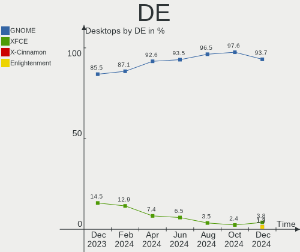
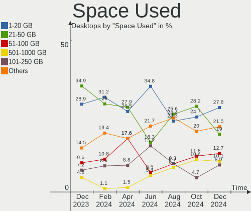
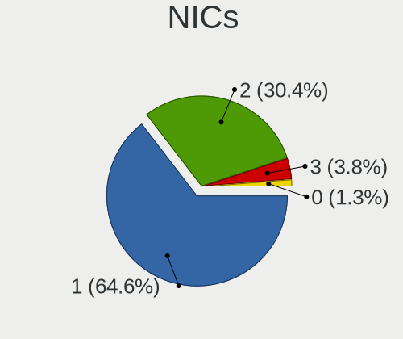
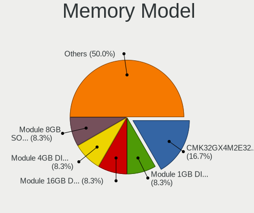

Zorin Hardware Trends (Desktops)
--------------------------------

A project to identify most popular hardware characteristics and track their change
over time based on data collected by Zorin users at https://Linux-Hardware.org.

Anyone can contribute to this report by the [hw-probe](https://github.com/linuxhw/hw-probe) tool:

    sudo -E hw-probe -all -upload

Full-feature report is available here: https://linux-hardware.org/?view=trends

Period: Feb, 2022.

Contents
--------

* [ System ](#system)
  - [ OS                       ](#os)
  - [ OS Family                ](#os-family)
  - [ Kernel                   ](#kernel)
  - [ Kernel Family            ](#kernel-family)
  - [ Kernel Major Ver.        ](#kernel-major-ver)
  - [ Arch                     ](#arch)
  - [ DE                       ](#de)
  - [ Display Server           ](#display-server)
  - [ Display Manager          ](#display-manager)
  - [ OS Lang                  ](#os-lang)
  - [ Boot Mode                ](#boot-mode)
  - [ Filesystem               ](#filesystem)
  - [ Part. scheme             ](#part-scheme)
  - [ Dual Boot with Linux/BSD ](#dual-boot-with-linuxbsd)
  - [ Dual Boot (Win)          ](#dual-boot-win)

* [ Board ](#board)
  - [ Vendor                   ](#vendor)
  - [ Model                    ](#model)
  - [ Model Family             ](#model-family)
  - [ MFG Year                 ](#mfg-year)
  - [ Form Factor              ](#form-factor)
  - [ Secure Boot              ](#secure-boot)
  - [ Coreboot                 ](#coreboot)
  - [ RAM Size                 ](#ram-size)
  - [ RAM Used                 ](#ram-used)
  - [ Total Drives             ](#total-drives)
  - [ Has CD-ROM               ](#has-cd-rom)
  - [ Has Ethernet             ](#has-ethernet)
  - [ Has WiFi                 ](#has-wifi)
  - [ Has Bluetooth            ](#has-bluetooth)

* [ Location ](#location)
  - [ Country                  ](#country)
  - [ City                     ](#city)

* [ Drives ](#drives)
  - [ Drive Vendor             ](#drive-vendor)
  - [ Drive Model              ](#drive-model)
  - [ HDD Vendor               ](#hdd-vendor)
  - [ SSD Vendor               ](#ssd-vendor)
  - [ Drive Kind               ](#drive-kind)
  - [ Drive Connector          ](#drive-connector)
  - [ Drive Size               ](#drive-size)
  - [ Space Total              ](#space-total)
  - [ Space Used               ](#space-used)
  - [ Malfunc. Drives          ](#malfunc-drives)
  - [ Malfunc. Drive Vendor    ](#malfunc-drive-vendor)
  - [ Malfunc. HDD Vendor      ](#malfunc-hdd-vendor)
  - [ Malfunc. Drive Kind      ](#malfunc-drive-kind)
  - [ Failed Drives            ](#failed-drives)
  - [ Failed Drive Vendor      ](#failed-drive-vendor)
  - [ Drive Status             ](#drive-status)

* [ Storage controller ](#storage-controller)
  - [ Storage Vendor           ](#storage-vendor)
  - [ Storage Model            ](#storage-model)
  - [ Storage Kind             ](#storage-kind)

* [ Processor ](#processor)
  - [ CPU Vendor               ](#cpu-vendor)
  - [ CPU Model                ](#cpu-model)
  - [ CPU Model Family         ](#cpu-model-family)
  - [ CPU Cores                ](#cpu-cores)
  - [ CPU Sockets              ](#cpu-sockets)
  - [ CPU Threads              ](#cpu-threads)
  - [ CPU Op-Modes             ](#cpu-op-modes)
  - [ CPU Microcode            ](#cpu-microcode)
  - [ CPU Microarch            ](#cpu-microarch)

* [ Graphics ](#graphics)
  - [ GPU Vendor               ](#gpu-vendor)
  - [ GPU Model                ](#gpu-model)
  - [ GPU Combo                ](#gpu-combo)
  - [ GPU Driver               ](#gpu-driver)
  - [ GPU Memory               ](#gpu-memory)

* [ Monitor ](#monitor)
  - [ Monitor Vendor           ](#monitor-vendor)
  - [ Monitor Model            ](#monitor-model)
  - [ Monitor Resolution       ](#monitor-resolution)
  - [ Monitor Diagonal         ](#monitor-diagonal)
  - [ Monitor Width            ](#monitor-width)
  - [ Aspect Ratio             ](#aspect-ratio)
  - [ Monitor Area             ](#monitor-area)
  - [ Pixel Density            ](#pixel-density)
  - [ Multiple Monitors        ](#multiple-monitors)

* [ Network ](#network)
  - [ Net Controller Vendor    ](#net-controller-vendor)
  - [ Net Controller Model     ](#net-controller-model)
  - [ Wireless Vendor          ](#wireless-vendor)
  - [ Wireless Model           ](#wireless-model)
  - [ Ethernet Vendor          ](#ethernet-vendor)
  - [ Ethernet Model           ](#ethernet-model)
  - [ Net Controller Kind      ](#net-controller-kind)
  - [ Used Controller          ](#used-controller)
  - [ NICs                     ](#nics)
  - [ IPv6                     ](#ipv6)

* [ Bluetooth ](#bluetooth)
  - [ Bluetooth Vendor         ](#bluetooth-vendor)
  - [ Bluetooth Model          ](#bluetooth-model)

* [ Sound ](#sound)
  - [ Sound Vendor             ](#sound-vendor)
  - [ Sound Model              ](#sound-model)

* [ Memory ](#memory)
  - [ Memory Vendor            ](#memory-vendor)
  - [ Memory Model             ](#memory-model)
  - [ Memory Kind              ](#memory-kind)
  - [ Memory Form Factor       ](#memory-form-factor)
  - [ Memory Size              ](#memory-size)
  - [ Memory Speed             ](#memory-speed)

* [ Printers & scanners ](#printers--scanners)
  - [ Printer Vendor           ](#printer-vendor)
  - [ Printer Model            ](#printer-model)
  - [ Scanner Vendor           ](#scanner-vendor)
  - [ Scanner Model            ](#scanner-model)

* [ Camera ](#camera)
  - [ Camera Vendor            ](#camera-vendor)
  - [ Camera Model             ](#camera-model)

* [ Security ](#security)
  - [ Fingerprint Vendor       ](#fingerprint-vendor)
  - [ Fingerprint Model        ](#fingerprint-model)
  - [ Chipcard Vendor          ](#chipcard-vendor)
  - [ Chipcard Model           ](#chipcard-model)

* [ Unsupported ](#unsupported)
  - [ Unsupported Devices      ](#unsupported-devices)
  - [ Unsupported Device Types ](#unsupported-device-types)

System
------

OS
--

Installed operating systems

| Name     | Desktops | Percent |
|----------|----------|---------|
| Zorin 16 | 58       | 86.57%  |
| Zorin 15 | 8        | 11.94%  |
| Zorin 12 | 1        | 1.49%   |

OS Family
---------

OS without a version

| Name  | Desktops | Percent |
|-------|----------|---------|
| Zorin | 67       | 100%    |

Kernel
------

Version of the Linux kernel

| Version            | Desktops | Percent |
|--------------------|----------|---------|
| 5.13.0-28-generic  | 30       | 44.78%  |
| 5.13.0-30-generic  | 16       | 23.88%  |
| 5.11.0-38-generic  | 5        | 7.46%   |
| 5.4.0-99-generic   | 3        | 4.48%   |
| 5.4.0-97-generic   | 3        | 4.48%   |
| 5.13.0-27-generic  | 3        | 4.48%   |
| 5.11.0-46-generic  | 2        | 2.99%   |
| 5.4.0-84-generic   | 1        | 1.49%   |
| 5.4.0-100-generic  | 1        | 1.49%   |
| 5.11.0-27-generic  | 1        | 1.49%   |
| 5.11.0-25-generic  | 1        | 1.49%   |
| 4.15.0-142-generic | 1        | 1.49%   |

Kernel Family
-------------

Linux kernel without a distro release

| Version | Desktops | Percent |
|---------|----------|---------|
| 5.13.0  | 49       | 73.13%  |
| 5.11.0  | 9        | 13.43%  |
| 5.4.0   | 8        | 11.94%  |
| 4.15.0  | 1        | 1.49%   |

Kernel Major Ver.
-----------------

Linux kernel major version

| Version | Desktops | Percent |
|---------|----------|---------|
| 5.13    | 49       | 73.13%  |
| 5.11    | 9        | 13.43%  |
| 5.4     | 8        | 11.94%  |
| 4.15    | 1        | 1.49%   |

Arch
----

OS architecture (x86_64, i586, etc.)

| Name   | Desktops | Percent |
|--------|----------|---------|
| x86_64 | 64       | 95.52%  |
| i686   | 3        | 4.48%   |

DE
--

Desktop Environment

| Name  | Desktops | Percent |
|-------|----------|---------|
| GNOME | 57       | 85.07%  |
| XFCE  | 10       | 14.93%  |

Display Server
--------------

X11 or Wayland

| Name    | Desktops | Percent |
|---------|----------|---------|
| X11     | 66       | 98.51%  |
| Wayland | 1        | 1.49%   |

Display Manager
---------------

SDDM, LightDM, etc.

| Name    | Desktops | Percent |
|---------|----------|---------|
| Unknown | 46       | 68.66%  |
| GDM3    | 11       | 16.42%  |
| LightDM | 5        | 7.46%   |
| GDM     | 5        | 7.46%   |

OS Lang
-------

Language

| Lang  | Desktops | Percent |
|-------|----------|---------|
| en_US | 26       | 38.81%  |
| de_DE | 10       | 14.93%  |
| pt_BR | 5        | 7.46%   |
| en_GB | 4        | 5.97%   |
| es_ES | 3        | 4.48%   |
| ru_RU | 2        | 2.99%   |
| pt_PT | 2        | 2.99%   |
| en_AU | 2        | 2.99%   |
| cs_CZ | 2        | 2.99%   |
| tr_TR | 1        | 1.49%   |
| ru_UA | 1        | 1.49%   |
| pl_PL | 1        | 1.49%   |
| ja_JP | 1        | 1.49%   |
| it_IT | 1        | 1.49%   |
| fr_FR | 1        | 1.49%   |
| es_PY | 1        | 1.49%   |
| es_NI | 1        | 1.49%   |
| es_AR | 1        | 1.49%   |
| en_IN | 1        | 1.49%   |
| C     | 1        | 1.49%   |

Boot Mode
---------

EFI or BIOS

| Mode | Desktops | Percent |
|------|----------|---------|
| BIOS | 41       | 61.19%  |
| EFI  | 26       | 38.81%  |

Filesystem
----------

Type of filesystem

| Type    | Desktops | Percent |
|---------|----------|---------|
| Ext4    | 62       | 92.54%  |
| Overlay | 2        | 2.99%   |
| Btrfs   | 2        | 2.99%   |
| Zfs     | 1        | 1.49%   |

Part. scheme
------------

Scheme of partitioning

| Type    | Desktops | Percent |
|---------|----------|---------|
| Unknown | 62       | 92.54%  |
| GPT     | 5        | 7.46%   |

Dual Boot with Linux/BSD
------------------------

Hosting more than one Linux/BSD

| Dual boot | Desktops | Percent |
|-----------|----------|---------|
| No        | 64       | 95.52%  |
| Yes       | 3        | 4.48%   |

Dual Boot (Win)
---------------

Hosting Linux and Windows

| Dual boot | Desktops | Percent |
|-----------|----------|---------|
| No        | 53       | 79.1%   |
| Yes       | 14       | 20.9%   |

Board
-----

Vendor
------

Motherboard manufacturer

| Name                | Desktops | Percent |
|---------------------|----------|---------|
| ASUSTek Computer    | 17       | 25.37%  |
| Gigabyte Technology | 15       | 22.39%  |
| MSI                 | 6        | 8.96%   |
| Hewlett-Packard     | 6        | 8.96%   |
| Dell                | 5        | 7.46%   |
| ASRock              | 4        | 5.97%   |
| Intel               | 3        | 4.48%   |
| Acer                | 3        | 4.48%   |
| Lenovo              | 2        | 2.99%   |
| IBM                 | 2        | 2.99%   |
| Pegatron            | 1        | 1.49%   |
| Medion              | 1        | 1.49%   |
| BESSTAR Tech        | 1        | 1.49%   |
| Unknown             | 1        | 1.49%   |

Model
-----

Motherboard model

| Name                               | Desktops | Percent |
|------------------------------------|----------|---------|
| Intel X79M-S                       | 2        | 2.99%   |
| Pegatron h8-1217c                  | 1        | 1.49%   |
| MSI MS-7D19                        | 1        | 1.49%   |
| MSI MS-7D06                        | 1        | 1.49%   |
| MSI MS-7B24                        | 1        | 1.49%   |
| MSI MS-7817                        | 1        | 1.49%   |
| MSI MS-7695                        | 1        | 1.49%   |
| MSI 500-017c                       | 1        | 1.49%   |
| Medion MS-7707                     | 1        | 1.49%   |
| Lenovo ThinkCentre M91p 4480B2G    | 1        | 1.49%   |
| Lenovo ThinkCentre M700 10J0S55S00 | 1        | 1.49%   |
| Intel H61                          | 1        | 1.49%   |
| IBM 819046G                        | 1        | 1.49%   |
| IBM 81077AG                        | 1        | 1.49%   |
| HP Z600 Workstation                | 1        | 1.49%   |
| HP Z230 SFF Workstation            | 1        | 1.49%   |
| HP ProDesk 400 G2 MT               | 1        | 1.49%   |
| HP 290 G1 MT                       | 1        | 1.49%   |
| HP 260-a105nc                      | 1        | 1.49%   |
| HP 19-2113w                        | 1        | 1.49%   |
| Gigabyte Z87N-WIFI                 | 1        | 1.49%   |
| Gigabyte Z87-HD3                   | 1        | 1.49%   |
| Gigabyte X570 AORUS PRO WIFI       | 1        | 1.49%   |
| Gigabyte X570 AORUS MASTER         | 1        | 1.49%   |
| Gigabyte N3160TN                   | 1        | 1.49%   |
| Gigabyte H81M-S2V                  | 1        | 1.49%   |
| Gigabyte H270M-DS3H                | 1        | 1.49%   |
| Gigabyte GA-990FXA-D3              | 1        | 1.49%   |
| Gigabyte GA-790XTA-UD4             | 1        | 1.49%   |
| Gigabyte GA-78LMT-S2               | 1        | 1.49%   |
| Gigabyte G1.Sniper Z97             | 1        | 1.49%   |
| Gigabyte EP43T-UD3L                | 1        | 1.49%   |
| Gigabyte B560M AORUS ELITE         | 1        | 1.49%   |
| Gigabyte B450 AORUS M              | 1        | 1.49%   |
| Gigabyte AX370-Gaming K5           | 1        | 1.49%   |
| Dell Precision WorkStation 390     | 1        | 1.49%   |
| Dell OptiPlex 755                  | 1        | 1.49%   |
| Dell OptiPlex 7040                 | 1        | 1.49%   |
| Dell OptiPlex 380                  | 1        | 1.49%   |
| Dell OptiPlex 3010                 | 1        | 1.49%   |
| BESSTAR Tech TL50                  | 1        | 1.49%   |
| ASUS TUF GAMING Z690-PLUS WIFI D4  | 1        | 1.49%   |
| ASUS TUF GAMING X570-PRO WIFI II   | 1        | 1.49%   |
| ASUS TUF GAMING B460M-PLUS         | 1        | 1.49%   |
| ASUS TRILINE PROFI                 | 1        | 1.49%   |
| ASUS ROG STRIX B365-F GAMING       | 1        | 1.49%   |
| ASUS PRIME X370-PRO                | 1        | 1.49%   |
| ASUS PRIME H510M-D                 | 1        | 1.49%   |
| ASUS P8P67                         | 1        | 1.49%   |
| ASUS P8H61-M EVO                   | 1        | 1.49%   |
| ASUS P5KPL-AM EPU                  | 1        | 1.49%   |
| ASUS P5G41T-M                      | 1        | 1.49%   |
| ASUS Maximus V GENE                | 1        | 1.49%   |
| ASUS M5A97 R2.0                    | 1        | 1.49%   |
| ASUS M4A87TD/USB3                  | 1        | 1.49%   |
| ASUS M4A785-M                      | 1        | 1.49%   |
| ASUS H110M-CS/BR                   | 1        | 1.49%   |
| ASUS A88XM-PLUS                    | 1        | 1.49%   |
| ASRock X299 Taichi                 | 1        | 1.49%   |
| ASRock H77M                        | 1        | 1.49%   |

Model Family
------------

Motherboard model prefix

| Name                   | Desktops | Percent |
|------------------------|----------|---------|
| Dell OptiPlex          | 4        | 5.97%   |
| ASUS TUF               | 3        | 4.48%   |
| Acer Aspire            | 3        | 4.48%   |
| Lenovo ThinkCentre     | 2        | 2.99%   |
| Intel X79M-S           | 2        | 2.99%   |
| Gigabyte X570          | 2        | 2.99%   |
| ASUS PRIME             | 2        | 2.99%   |
| Pegatron h8-1217c      | 1        | 1.49%   |
| MSI MS-7D19            | 1        | 1.49%   |
| MSI MS-7D06            | 1        | 1.49%   |
| MSI MS-7B24            | 1        | 1.49%   |
| MSI MS-7817            | 1        | 1.49%   |
| MSI MS-7695            | 1        | 1.49%   |
| MSI 500-017c           | 1        | 1.49%   |
| Medion MS-7707         | 1        | 1.49%   |
| Intel H61              | 1        | 1.49%   |
| IBM 819046G            | 1        | 1.49%   |
| IBM 81077AG            | 1        | 1.49%   |
| HP Z600                | 1        | 1.49%   |
| HP Z230                | 1        | 1.49%   |
| HP ProDesk             | 1        | 1.49%   |
| HP 290                 | 1        | 1.49%   |
| HP 260-a105nc          | 1        | 1.49%   |
| HP 19-2113w            | 1        | 1.49%   |
| Gigabyte Z87N-WIFI     | 1        | 1.49%   |
| Gigabyte Z87-HD3       | 1        | 1.49%   |
| Gigabyte N3160TN       | 1        | 1.49%   |
| Gigabyte H81M-S2V      | 1        | 1.49%   |
| Gigabyte H270M-DS3H    | 1        | 1.49%   |
| Gigabyte GA-990FXA-D3  | 1        | 1.49%   |
| Gigabyte GA-790XTA-UD4 | 1        | 1.49%   |
| Gigabyte GA-78LMT-S2   | 1        | 1.49%   |
| Gigabyte G1.Sniper     | 1        | 1.49%   |
| Gigabyte EP43T-UD3L    | 1        | 1.49%   |
| Gigabyte B560M         | 1        | 1.49%   |
| Gigabyte B450          | 1        | 1.49%   |
| Gigabyte AX370-Gaming  | 1        | 1.49%   |
| Dell Precision         | 1        | 1.49%   |
| BESSTAR Tech TL50      | 1        | 1.49%   |
| ASUS TRILINE           | 1        | 1.49%   |
| ASUS ROG               | 1        | 1.49%   |
| ASUS P8P67             | 1        | 1.49%   |
| ASUS P8H61-M           | 1        | 1.49%   |
| ASUS P5KPL-AM          | 1        | 1.49%   |
| ASUS P5G41T-M          | 1        | 1.49%   |
| ASUS Maximus           | 1        | 1.49%   |
| ASUS M5A97             | 1        | 1.49%   |
| ASUS M4A87TD           | 1        | 1.49%   |
| ASUS M4A785-M          | 1        | 1.49%   |
| ASUS H110M-CS          | 1        | 1.49%   |
| ASUS A88XM-PLUS        | 1        | 1.49%   |
| ASRock X299            | 1        | 1.49%   |
| ASRock H77M            | 1        | 1.49%   |
| ASRock H110M-DGS       | 1        | 1.49%   |
| ASRock 970A-G          | 1        | 1.49%   |
| Unknown                | 1        | 1.49%   |

MFG Year
--------

Motherboard manufacture year

| Year | Desktops | Percent |
|------|----------|---------|
| 2021 | 8        | 11.94%  |
| 2013 | 8        | 11.94%  |
| 2017 | 6        | 8.96%   |
| 2014 | 5        | 7.46%   |
| 2012 | 5        | 7.46%   |
| 2011 | 5        | 7.46%   |
| 2009 | 5        | 7.46%   |
| 2019 | 4        | 5.97%   |
| 2016 | 4        | 5.97%   |
| 2010 | 4        | 5.97%   |
| 2018 | 3        | 4.48%   |
| 2020 | 2        | 2.99%   |
| 2006 | 2        | 2.99%   |
| 2005 | 2        | 2.99%   |
| 2022 | 1        | 1.49%   |
| 2015 | 1        | 1.49%   |
| 2007 | 1        | 1.49%   |
| 2004 | 1        | 1.49%   |

Form Factor
-----------

Physical design of the computer

| Name    | Desktops | Percent |
|---------|----------|---------|
| Desktop | 67       | 100%    |

Secure Boot
-----------

Enabled or disabled

| State    | Desktops | Percent |
|----------|----------|---------|
| Disabled | 65       | 97.01%  |
| Enabled  | 2        | 2.99%   |

Coreboot
--------

Have coreboot on board

| Used | Desktops | Percent |
|------|----------|---------|
| No   | 67       | 100%    |

RAM Size
--------

Total RAM memory

| Size in GB  | Desktops | Percent |
|-------------|----------|---------|
| 16.01-24.0  | 16       | 23.88%  |
| 8.01-16.0   | 13       | 19.4%   |
| 4.01-8.0    | 12       | 17.91%  |
| 32.01-64.0  | 11       | 16.42%  |
| 3.01-4.0    | 6        | 8.96%   |
| 24.01-32.0  | 2        | 2.99%   |
| 64.01-256.0 | 2        | 2.99%   |
| 1.01-2.0    | 2        | 2.99%   |
| 0.51-1.0    | 2        | 2.99%   |
| 2.01-3.0    | 1        | 1.49%   |

RAM Used
--------

Used RAM memory

| Used GB   | Desktops | Percent |
|-----------|----------|---------|
| 1.01-2.0  | 25       | 37.31%  |
| 2.01-3.0  | 24       | 35.82%  |
| 3.01-4.0  | 9        | 13.43%  |
| 4.01-8.0  | 4        | 5.97%   |
| 0.51-1.0  | 2        | 2.99%   |
| 0.01-0.5  | 2        | 2.99%   |
| 8.01-16.0 | 1        | 1.49%   |

Total Drives
------------

Number of drives on board

| Drives | Desktops | Percent |
|--------|----------|---------|
| 1      | 30       | 44.78%  |
| 2      | 20       | 29.85%  |
| 3      | 8        | 11.94%  |
| 4      | 3        | 4.48%   |
| 5      | 2        | 2.99%   |
| 11     | 1        | 1.49%   |
| 7      | 1        | 1.49%   |
| 6      | 1        | 1.49%   |
| 0      | 1        | 1.49%   |

Has CD-ROM
----------

Has CD-ROM on board

| Presented | Desktops | Percent |
|-----------|----------|---------|
| Yes       | 40       | 59.7%   |
| No        | 27       | 40.3%   |

Has Ethernet
------------

Has Ethernet on board

| Presented | Desktops | Percent |
|-----------|----------|---------|
| Yes       | 65       | 97.01%  |
| No        | 2        | 2.99%   |

Has WiFi
--------

Has WiFi module

| Presented | Desktops | Percent |
|-----------|----------|---------|
| Yes       | 36       | 53.73%  |
| No        | 31       | 46.27%  |

Has Bluetooth
-------------

Has Bluetooth module

| Presented | Desktops | Percent |
|-----------|----------|---------|
| No        | 49       | 73.13%  |
| Yes       | 18       | 26.87%  |

Location
--------

Country
-------

Geographic location (country)

| Country     | Desktops | Percent |
|-------------|----------|---------|
| USA         | 17       | 25.37%  |
| Germany     | 9        | 13.43%  |
| UK          | 4        | 5.97%   |
| Spain       | 4        | 5.97%   |
| Brazil      | 4        | 5.97%   |
| Australia   | 3        | 4.48%   |
| Russia      | 2        | 2.99%   |
| Portugal    | 2        | 2.99%   |
| Poland      | 2        | 2.99%   |
| Japan       | 2        | 2.99%   |
| Egypt       | 2        | 2.99%   |
| Czechia     | 2        | 2.99%   |
| Ukraine     | 1        | 1.49%   |
| Turkey      | 1        | 1.49%   |
| Romania     | 1        | 1.49%   |
| Philippines | 1        | 1.49%   |
| Paraguay    | 1        | 1.49%   |
| Nicaragua   | 1        | 1.49%   |
| Netherlands | 1        | 1.49%   |
| Italy       | 1        | 1.49%   |
| India       | 1        | 1.49%   |
| Greece      | 1        | 1.49%   |
| China       | 1        | 1.49%   |
| Belgium     | 1        | 1.49%   |
| Bangladesh  | 1        | 1.49%   |
| Argentina   | 1        | 1.49%   |

City
----

Geographic location (city)

| City                     | Desktops | Percent |
|--------------------------|----------|---------|
| Mount Olive              | 2        | 2.99%   |
| Cairo                    | 2        | 2.99%   |
| Athens                   | 2        | 2.99%   |
| Yekaterinburg            | 1        | 1.49%   |
| Waldbroel                | 1        | 1.49%   |
| Stockton                 | 1        | 1.49%   |
| Sterling                 | 1        | 1.49%   |
| St Louis                 | 1        | 1.49%   |
| Sirinhaem                | 1        | 1.49%   |
| Saint Paul               | 1        | 1.49%   |
| Richmond                 | 1        | 1.49%   |
| Radomsko                 | 1        | 1.49%   |
| Prague                   | 1        | 1.49%   |
| Portland                 | 1        | 1.49%   |
| Port Angeles             | 1        | 1.49%   |
| Perth                    | 1        | 1.49%   |
| Palma                    | 1        | 1.49%   |
| Novosibirsk              | 1        | 1.49%   |
| Niederndodeleben         | 1        | 1.49%   |
| Montijo                  | 1        | 1.49%   |
| Mönchengladbach         | 1        | 1.49%   |
| Milwaukee                | 1        | 1.49%   |
| Mexborough               | 1        | 1.49%   |
| Methuen                  | 1        | 1.49%   |
| Mesa                     | 1        | 1.49%   |
| Mengkofen                | 1        | 1.49%   |
| Managua                  | 1        | 1.49%   |
| Maliano                  | 1        | 1.49%   |
| Madison Heights          | 1        | 1.49%   |
| Macerata                 | 1        | 1.49%   |
| Kornwestheim             | 1        | 1.49%   |
| Kolkata                  | 1        | 1.49%   |
| Kolaczyce                | 1        | 1.49%   |
| Karlsruhe                | 1        | 1.49%   |
| Joetsu                   | 1        | 1.49%   |
| Gummersbach              | 1        | 1.49%   |
| Gipsy Hill               | 1        | 1.49%   |
| Gillingham               | 1        | 1.49%   |
| Ghent                    | 1        | 1.49%   |
| Fortaleza                | 1        | 1.49%   |
| Ferraz de Vasconcelos    | 1        | 1.49%   |
| Essen                    | 1        | 1.49%   |
| Esposende                | 1        | 1.49%   |
| Elgin                    | 1        | 1.49%   |
| Eilenburg                | 1        | 1.49%   |
| Donostia / San Sebastian | 1        | 1.49%   |
| Dnipro                   | 1        | 1.49%   |
| Del Viso                 | 1        | 1.49%   |
| Dayton                   | 1        | 1.49%   |
| Dallas                   | 1        | 1.49%   |
| Caucaia                  | 1        | 1.49%   |
| Brisbane                 | 1        | 1.49%   |
| Bogra                    | 1        | 1.49%   |
| Bilthoven                | 1        | 1.49%   |
| Bilovec                  | 1        | 1.49%   |
| Beijing                  | 1        | 1.49%   |
| Bacolod City             | 1        | 1.49%   |
| Bacau                    | 1        | 1.49%   |
| Asunción              | 1        | 1.49%   |
| Antalya                  | 1        | 1.49%   |

Drives
------

Drive Vendor
------------

Hard drive vendors

| Vendor                | Desktops | Drives | Percent |
|-----------------------|----------|--------|---------|
| Seagate               | 28       | 37     | 23.53%  |
| Samsung Electronics   | 15       | 22     | 12.61%  |
| Kingston              | 14       | 16     | 11.76%  |
| WDC                   | 13       | 15     | 10.92%  |
| Hitachi               | 7        | 7      | 5.88%   |
| SanDisk               | 6        | 6      | 5.04%   |
| MAXTOR                | 3        | 4      | 2.52%   |
| A-DATA Technology     | 3        | 3      | 2.52%   |
| Toshiba               | 2        | 2      | 1.68%   |
| SPCC                  | 2        | 2      | 1.68%   |
| Crucial               | 2        | 3      | 1.68%   |
| Corsair               | 2        | 2      | 1.68%   |
| XrayDisk              | 1        | 1      | 0.84%   |
| WD MediaMax           | 1        | 1      | 0.84%   |
| Unknown               | 1        | 1      | 0.84%   |
| Teclast               | 1        | 1      | 0.84%   |
| Super Talent          | 1        | 1      | 0.84%   |
| SK Hynix              | 1        | 1      | 0.84%   |
| Silicon Motion        | 1        | 2      | 0.84%   |
| Realtek Semiconductor | 1        | 1      | 0.84%   |
| Phison                | 1        | 1      | 0.84%   |
| OCZ-VERTEX            | 1        | 1      | 0.84%   |
| OCZ                   | 1        | 1      | 0.84%   |
| Netac                 | 1        | 1      | 0.84%   |
| LaCie                 | 1        | 1      | 0.84%   |
| KingSpec              | 1        | 1      | 0.84%   |
| JMicron               | 1        | 1      | 0.84%   |
| HGST                  | 1        | 1      | 0.84%   |
| Hewlett-Packard       | 1        | 1      | 0.84%   |
| GOODRAM               | 1        | 1      | 0.84%   |
| GALAX                 | 1        | 1      | 0.84%   |
| China                 | 1        | 1      | 0.84%   |
| Apple                 | 1        | 1      | 0.84%   |
| Apacer                | 1        | 1      | 0.84%   |

Drive Model
-----------

Hard drive models

| Model                                | Desktops | Percent |
|--------------------------------------|----------|---------|
| Seagate ST500DM002-1BD142 500GB      | 4        | 2.96%   |
| Seagate ST3500312CS 500GB            | 3        | 2.22%   |
| SanDisk SSD PLUS 240GB               | 3        | 2.22%   |
| Samsung NVMe SSD Drive 1TB           | 3        | 2.22%   |
| Kingston SA400S37480G 480GB SSD      | 3        | 2.22%   |
| WDC WDBNCE5000PNC 500GB SSD          | 2        | 1.48%   |
| WDC WD5000LPLX-08ZNTT0 500GB         | 2        | 1.48%   |
| WDC WD5000AAKS-00V1A0 500GB          | 2        | 1.48%   |
| WDC WD30EZRX-00DC0B0 3TB             | 2        | 1.48%   |
| Seagate ST3500413AS 500GB            | 2        | 1.48%   |
| Samsung SSD 850 EVO 250GB            | 2        | 1.48%   |
| Hitachi HDS723020BLA642 2TB          | 2        | 1.48%   |
| Hitachi HDS721050CLA362 500GB        | 2        | 1.48%   |
| XrayDisk 128GB                       | 1        | 0.74%   |
| WDC WD7500AADS-00M2B0 752GB          | 1        | 0.74%   |
| WDC WD15EARS-00MVWB0 1TB             | 1        | 0.74%   |
| WDC WD10EZEX-60WN4A0 1TB             | 1        | 0.74%   |
| WDC WD10EZEX-08WN4A0 1TB             | 1        | 0.74%   |
| WDC WD10EZEX-08M2NA0 1TB             | 1        | 0.74%   |
| WDC WD10EALX-009BA0 1TB              | 1        | 0.74%   |
| WDC WD1001FALS-00J7B0 1TB            | 1        | 0.74%   |
| WD MediaMax WL1000GSA6472 1TB        | 1        | 0.74%   |
| Unknown SD/MMC/MS PRO 64GB           | 1        | 0.74%   |
| Toshiba HDWD110 1TB                  | 1        | 0.74%   |
| Toshiba DT01ACA050 500GB             | 1        | 0.74%   |
| Teclast 480GB A800 SSD               | 1        | 0.74%   |
| Super Talent FTM51N325H 512GB        | 1        | 0.74%   |
| SPCC Solid State Disk 256GB          | 1        | 0.74%   |
| SPCC Solid State Disk 120GB          | 1        | 0.74%   |
| SK Hynix SHGS31-500GS-2 500GB SSD    | 1        | 0.74%   |
| Silicon Motion NVMe SSD Drive 1024GB | 1        | 0.74%   |
| Seagate STM3500418AS 500GB           | 1        | 0.74%   |
| Seagate ST95005620AS 500GB           | 1        | 0.74%   |
| Seagate ST9250315AS 250GB            | 1        | 0.74%   |
| Seagate ST9160310AS 160GB            | 1        | 0.74%   |
| Seagate ST8000VN004-2M2101 8TB       | 1        | 0.74%   |
| Seagate ST8000DM004-2CX188 8TB       | 1        | 0.74%   |
| Seagate ST8000AS0002-1NA17Z 8TB      | 1        | 0.74%   |
| Seagate ST6000NM0044 6TB             | 1        | 0.74%   |
| Seagate ST4000DM004-2U9104 4TB       | 1        | 0.74%   |
| Seagate ST4000DM000-1F2168 4TB       | 1        | 0.74%   |
| Seagate ST380211AS 80GB              | 1        | 0.74%   |
| Seagate ST380013AS 80GB              | 1        | 0.74%   |
| Seagate ST380011A 80GB               | 1        | 0.74%   |
| Seagate ST3500414CS 500GB            | 1        | 0.74%   |
| Seagate ST3320310CS 320GB            | 1        | 0.74%   |
| Seagate ST3250312AS 250GB            | 1        | 0.74%   |
| Seagate ST3250310AS 250GB            | 1        | 0.74%   |
| Seagate ST31500541AS 1TB             | 1        | 0.74%   |
| Seagate ST250DM000-1BD141 250GB      | 1        | 0.74%   |
| Seagate ST2000LM003 HN-M201RAD 2TB   | 1        | 0.74%   |
| Seagate ST2000DM001-1CH164 2TB       | 1        | 0.74%   |
| Seagate ST1000VM002-1ET162 1TB       | 1        | 0.74%   |
| Seagate ST1000LM024 HN-M101MBB 1TB   | 1        | 0.74%   |
| Seagate ST1000DM010-2EP102 1TB       | 1        | 0.74%   |
| Seagate Expansion+ 2TB               | 1        | 0.74%   |
| SanDisk SDSSDX480GG25 480GB          | 1        | 0.74%   |
| Sandisk NVMe SSD Drive 512GB         | 1        | 0.74%   |
| Sandisk NVMe SSD Drive 1TB           | 1        | 0.74%   |
| Samsung SSD 980 PRO 500GB            | 1        | 0.74%   |

HDD Vendor
----------

Hard disk drive vendors

| Vendor              | Desktops | Drives | Percent |
|---------------------|----------|--------|---------|
| Seagate             | 28       | 37     | 48.28%  |
| WDC                 | 13       | 13     | 22.41%  |
| Hitachi             | 7        | 7      | 12.07%  |
| MAXTOR              | 3        | 4      | 5.17%   |
| Toshiba             | 2        | 2      | 3.45%   |
| Unknown             | 1        | 1      | 1.72%   |
| Samsung Electronics | 1        | 1      | 1.72%   |
| HGST                | 1        | 1      | 1.72%   |
| Hewlett-Packard     | 1        | 1      | 1.72%   |
| Apple               | 1        | 1      | 1.72%   |

SSD Vendor
----------

Solid state drive vendors

| Vendor              | Desktops | Drives | Percent |
|---------------------|----------|--------|---------|
| Kingston            | 12       | 13     | 26.09%  |
| Samsung Electronics | 10       | 12     | 21.74%  |
| SanDisk             | 4        | 4      | 8.7%    |
| WDC                 | 2        | 2      | 4.35%   |
| SPCC                | 2        | 2      | 4.35%   |
| Crucial             | 2        | 3      | 4.35%   |
| A-DATA Technology   | 2        | 2      | 4.35%   |
| Teclast             | 1        | 1      | 2.17%   |
| Super Talent        | 1        | 1      | 2.17%   |
| SK Hynix            | 1        | 1      | 2.17%   |
| OCZ-VERTEX          | 1        | 1      | 2.17%   |
| OCZ                 | 1        | 1      | 2.17%   |
| Netac               | 1        | 1      | 2.17%   |
| KingSpec            | 1        | 1      | 2.17%   |
| GOODRAM             | 1        | 1      | 2.17%   |
| GALAX               | 1        | 1      | 2.17%   |
| Corsair             | 1        | 1      | 2.17%   |
| China               | 1        | 1      | 2.17%   |
| Apacer              | 1        | 1      | 2.17%   |

Drive Kind
----------

HDD or SSD

| Kind    | Desktops | Drives | Percent |
|---------|----------|--------|---------|
| HDD     | 45       | 68     | 46.88%  |
| SSD     | 33       | 50     | 34.38%  |
| NVMe    | 15       | 21     | 15.63%  |
| Unknown | 3        | 3      | 3.13%   |

Drive Connector
---------------

SATA, SAS, NVMe, etc.

| Type | Desktops | Drives | Percent |
|------|----------|--------|---------|
| SATA | 61       | 118    | 77.22%  |
| NVMe | 14       | 20     | 17.72%  |
| SAS  | 4        | 4      | 5.06%   |

Drive Size
----------

Size of hard drive

| Size in TB | Desktops | Drives | Percent |
|------------|----------|--------|---------|
| 0.01-0.5   | 50       | 76     | 62.5%   |
| 0.51-1.0   | 15       | 19     | 18.75%  |
| 1.01-2.0   | 7        | 10     | 8.75%   |
| 2.01-3.0   | 4        | 4      | 5%      |
| 3.01-4.0   | 2        | 4      | 2.5%    |
| 4.01-10.0  | 2        | 5      | 2.5%    |

Space Total
-----------

Amount of disk space available on the file system

| Size in GB     | Desktops | Percent |
|----------------|----------|---------|
| 101-250        | 17       | 25.37%  |
| 251-500        | 14       | 20.9%   |
| 501-1000       | 9        | 13.43%  |
| More than 3000 | 8        | 11.94%  |
| 51-100         | 7        | 10.45%  |
| 21-50          | 4        | 5.97%   |
| 1-20           | 4        | 5.97%   |
| 1001-2000      | 2        | 2.99%   |
| 2001-3000      | 1        | 1.49%   |
| Unknown        | 1        | 1.49%   |

Space Used
----------

Amount of used disk space

| Used GB        | Desktops | Percent |
|----------------|----------|---------|
| 1-20           | 26       | 38.81%  |
| 21-50          | 15       | 22.39%  |
| 51-100         | 9        | 13.43%  |
| 101-250        | 4        | 5.97%   |
| 1001-2000      | 4        | 5.97%   |
| 501-1000       | 4        | 5.97%   |
| More than 3000 | 2        | 2.99%   |
| 251-500        | 2        | 2.99%   |
| Unknown        | 1        | 1.49%   |

Malfunc. Drives
---------------

Drive models with a malfunction

| Model                              | Desktops | Drives | Percent |
|------------------------------------|----------|--------|---------|
| Seagate ST2000LM003 HN-M201RAD 2TB | 1        | 1      | 50%     |
| A-DATA Technology SX8200PNP 256GB  | 1        | 1      | 50%     |

Malfunc. Drive Vendor
---------------------

Vendors of faulty drives

| Vendor            | Desktops | Drives | Percent |
|-------------------|----------|--------|---------|
| Seagate           | 1        | 1      | 50%     |
| A-DATA Technology | 1        | 1      | 50%     |

Malfunc. HDD Vendor
-------------------

Vendors of faulty HDD drives

| Vendor  | Desktops | Drives | Percent |
|---------|----------|--------|---------|
| Seagate | 1        | 1      | 100%    |

Malfunc. Drive Kind
-------------------

Kinds of faulty drives

| Kind | Desktops | Drives | Percent |
|------|----------|--------|---------|
| NVMe | 1        | 1      | 50%     |
| HDD  | 1        | 1      | 50%     |

Failed Drives
-------------

Failed drive models

Zero info for selected period =(

Failed Drive Vendor
-------------------

Failed drive vendors

Zero info for selected period =(

Drive Status
------------

Number of failed and malfunc. drives

| Status   | Desktops | Drives | Percent |
|----------|----------|--------|---------|
| Detected | 62       | 129    | 88.57%  |
| Works    | 6        | 11     | 8.57%   |
| Malfunc  | 2        | 2      | 2.86%   |

Storage controller
------------------

Storage Vendor
--------------

Storage controller vendors

| Vendor                      | Desktops | Percent |
|-----------------------------|----------|---------|
| Intel                       | 48       | 54.55%  |
| AMD                         | 17       | 19.32%  |
| Samsung Electronics         | 6        | 6.82%   |
| JMicron Technology          | 3        | 3.41%   |
| ASMedia Technology          | 3        | 3.41%   |
| Sandisk                     | 2        | 2.27%   |
| Marvell Technology Group    | 2        | 2.27%   |
| Kingston Technology Company | 2        | 2.27%   |
| VIA Technologies            | 1        | 1.14%   |
| Silicon Motion              | 1        | 1.14%   |
| Realtek Semiconductor       | 1        | 1.14%   |
| Phison Electronics          | 1        | 1.14%   |
| ADATA Technology            | 1        | 1.14%   |

Storage Model
-------------

Storage controller models

| Model                                                                                   | Desktops | Percent |
|-----------------------------------------------------------------------------------------|----------|---------|
| AMD FCH SATA Controller [AHCI mode]                                                     | 9        | 8.11%   |
| Intel 6 Series/C200 Series Chipset Family 6 port Desktop SATA AHCI Controller           | 8        | 7.21%   |
| AMD SB7x0/SB8x0/SB9x0 IDE Controller                                                    | 6        | 5.41%   |
| Intel Q170/Q150/B150/H170/H110/Z170/CM236 Chipset SATA Controller [AHCI Mode]           | 5        | 4.5%    |
| Intel 8 Series/C220 Series Chipset Family 6-port SATA Controller 1 [AHCI mode]          | 5        | 4.5%    |
| Samsung NVMe SSD Controller SM981/PM981/PM983                                           | 4        | 3.6%    |
| Intel 82801G (ICH7 Family) IDE Controller                                               | 4        | 3.6%    |
| Intel 500 Series Chipset Family SATA AHCI Controller                                    | 4        | 3.6%    |
| AMD SB7x0/SB8x0/SB9x0 SATA Controller [IDE mode]                                        | 4        | 3.6%    |
| Intel NM10/ICH7 Family SATA Controller [IDE mode]                                       | 3        | 2.7%    |
| Intel 200 Series PCH SATA controller [AHCI mode]                                        | 3        | 2.7%    |
| ASMedia ASM1062 Serial ATA Controller                                                   | 3        | 2.7%    |
| AMD SB7x0/SB8x0/SB9x0 SATA Controller [AHCI mode]                                       | 3        | 2.7%    |
| Samsung NVMe SSD Controller PM9A1/PM9A3/980PRO                                          | 2        | 1.8%    |
| JMicron JMB368 IDE controller                                                           | 2        | 1.8%    |
| Intel Atom/Celeron/Pentium Processor x5-E8000/J3xxx/N3xxx Series SATA Controller        | 2        | 1.8%    |
| Intel 82Q35 Express PT IDER Controller                                                  | 2        | 1.8%    |
| Intel 82801EB/ER (ICH5/ICH5R) IDE Controller                                            | 2        | 1.8%    |
| Intel 7 Series/C210 Series Chipset Family 6-port SATA Controller [AHCI mode]            | 2        | 1.8%    |
| Intel 400 Series Chipset Family SATA AHCI Controller                                    | 2        | 1.8%    |
| AMD X370 Series Chipset SATA Controller                                                 | 2        | 1.8%    |
| VIA VT82C586A/B/VT82C686/A/B/VT823x/A/C PIPC Bus Master IDE                             | 1        | 0.9%    |
| VIA VIA VT6420 SATA RAID Controller                                                     | 1        | 0.9%    |
| Silicon Motion SM2263EN/SM2263XT SSD Controller                                         | 1        | 0.9%    |
| Sandisk WD Blue SN550 NVMe SSD                                                          | 1        | 0.9%    |
| Sandisk WD Blue SN500 / PC SN520 NVMe SSD                                               | 1        | 0.9%    |
| Realtek Realtek Non-Volatile memory controller                                          | 1        | 0.9%    |
| Phison E12 NVMe Controller                                                              | 1        | 0.9%    |
| Marvell Group 88SE9215 PCIe 2.0 x1 4-port SATA 6 Gb/s Controller                        | 1        | 0.9%    |
| Marvell Group 88SE91A3 SATA-600 Controller                                              | 1        | 0.9%    |
| Marvell Group 88SE9172 SATA 6Gb/s Controller                                            | 1        | 0.9%    |
| Kingston Company Company Non-Volatile memory controller                                 | 1        | 0.9%    |
| Kingston Company OM3PDP3 NVMe SSD                                                       | 1        | 0.9%    |
| Kingston Company A2000 NVMe SSD                                                         | 1        | 0.9%    |
| JMicron JMB363 SATA/IDE Controller                                                      | 1        | 0.9%    |
| Intel Volume Management Device NVMe RAID Controller                                     | 1        | 0.9%    |
| Intel Tiger Lake-LP SATA Controller [AHCI mode]                                         | 1        | 0.9%    |
| Intel SATA Controller [RAID mode]                                                       | 1        | 0.9%    |
| Intel NM10/ICH7 Family SATA Controller [AHCI mode]                                      | 1        | 0.9%    |
| Intel Cannon Lake PCH SATA AHCI Controller                                              | 1        | 0.9%    |
| Intel Atom Processor E3800 Series SATA AHCI Controller                                  | 1        | 0.9%    |
| Intel Alder Lake-S PCH SATA Controller [AHCI Mode]                                      | 1        | 0.9%    |
| Intel 9 Series Chipset Family SATA Controller [AHCI Mode]                               | 1        | 0.9%    |
| Intel 82801JI (ICH10 Family) SATA AHCI Controller                                       | 1        | 0.9%    |
| Intel 82801IR/IO/IH (ICH9R/DO/DH) 6 port SATA Controller [AHCI mode]                    | 1        | 0.9%    |
| Intel 82801IR/IO/IH (ICH9R/DO/DH) 4 port SATA Controller [IDE mode]                     | 1        | 0.9%    |
| Intel 82801I (ICH9 Family) 2 port SATA Controller [IDE mode]                            | 1        | 0.9%    |
| Intel 82801FB/FW (ICH6/ICH6W) SATA Controller                                           | 1        | 0.9%    |
| Intel 82801EB (ICH5) SATA Controller                                                    | 1        | 0.9%    |
| Intel 6 Series/C200 Series Chipset Family Desktop SATA Controller (IDE mode, ports 4-5) | 1        | 0.9%    |
| Intel 6 Series/C200 Series Chipset Family Desktop SATA Controller (IDE mode, ports 0-3) | 1        | 0.9%    |
| AMD FCH SATA Controller [IDE mode]                                                      | 1        | 0.9%    |
| AMD FCH IDE Controller                                                                  | 1        | 0.9%    |
| AMD 400 Series Chipset SATA Controller                                                  | 1        | 0.9%    |
| ADATA XPG SX8200 Pro PCIe Gen3x4 M.2 2280 Solid State Drive                             | 1        | 0.9%    |

Storage Kind
------------

Kind of storage controller (IDE, SATA, NVMe, SAS, ...)

| Kind | Desktops | Percent |
|------|----------|---------|
| SATA | 57       | 61.96%  |
| IDE  | 19       | 20.65%  |
| NVMe | 14       | 15.22%  |
| RAID | 2        | 2.17%   |

Processor
---------

CPU Vendor
----------

Processor vendors

| Vendor | Desktops | Percent |
|--------|----------|---------|
| Intel  | 49       | 73.13%  |
| AMD    | 18       | 26.87%  |

CPU Model
---------

Processor models

| Model                                       | Desktops | Percent |
|---------------------------------------------|----------|---------|
| Intel Pentium 4 CPU 3.00GHz                 | 2        | 2.99%   |
| Intel Core i5-2400 CPU @ 3.10GHz            | 2        | 2.99%   |
| Intel Core i5-10600K CPU @ 4.10GHz          | 2        | 2.99%   |
| Intel Core i5-10400 CPU @ 2.90GHz           | 2        | 2.99%   |
| Intel Core i3-3220 CPU @ 3.30GHz            | 2        | 2.99%   |
| AMD FX-8350 Eight-Core Processor            | 2        | 2.99%   |
| Intel Xeon CPU X5650 @ 2.67GHz              | 1        | 1.49%   |
| Intel Xeon CPU E5-2650 v2 @ 2.60GHz         | 1        | 1.49%   |
| Intel Xeon CPU E5-2630 0 @ 2.30GHz          | 1        | 1.49%   |
| Intel Xeon CPU E3-1240 v3 @ 3.40GHz         | 1        | 1.49%   |
| Intel Xeon CPU E3-1231 v3 @ 3.40GHz         | 1        | 1.49%   |
| Intel Pentium Dual-Core CPU E6700 @ 3.20GHz | 1        | 1.49%   |
| Intel Pentium Dual CPU E2220 @ 2.40GHz      | 1        | 1.49%   |
| Intel Pentium CPU J3710 @ 1.60GHz           | 1        | 1.49%   |
| Intel Pentium CPU G4560 @ 3.50GHz           | 1        | 1.49%   |
| Intel Pentium 4 CPU 3.06GHz                 | 1        | 1.49%   |
| Intel Core i7-9700K CPU @ 3.60GHz           | 1        | 1.49%   |
| Intel Core i7-7820X CPU @ 3.60GHz           | 1        | 1.49%   |
| Intel Core i7-6700 CPU @ 3.40GHz            | 1        | 1.49%   |
| Intel Core i7-3770K CPU @ 3.50GHz           | 1        | 1.49%   |
| Intel Core i7-2600 CPU @ 3.40GHz            | 1        | 1.49%   |
| Intel Core i5-7400 CPU @ 3.00GHz            | 1        | 1.49%   |
| Intel Core i5-6500T CPU @ 2.50GHz           | 1        | 1.49%   |
| Intel Core i5-6400T CPU @ 2.20GHz           | 1        | 1.49%   |
| Intel Core i5-4590S CPU @ 3.00GHz           | 1        | 1.49%   |
| Intel Core i5-4590 CPU @ 3.30GHz            | 1        | 1.49%   |
| Intel Core i5-4460 CPU @ 3.20GHz            | 1        | 1.49%   |
| Intel Core i5-4440 CPU @ 3.10GHz            | 1        | 1.49%   |
| Intel Core i5-2500K CPU @ 3.30GHz           | 1        | 1.49%   |
| Intel Core i5-2300 CPU @ 2.80GHz            | 1        | 1.49%   |
| Intel Core i3-8100 CPU @ 3.60GHz            | 1        | 1.49%   |
| Intel Core i3-7100 CPU @ 3.90GHz            | 1        | 1.49%   |
| Intel Core i3-4160 CPU @ 3.60GHz            | 1        | 1.49%   |
| Intel Core i3-3240 CPU @ 3.40GHz            | 1        | 1.49%   |
| Intel Core 2 Quad CPU Q9650 @ 3.00GHz       | 1        | 1.49%   |
| Intel Core 2 Quad CPU Q9550 @ 2.83GHz       | 1        | 1.49%   |
| Intel Core 2 Duo CPU E8400 @ 3.00GHz        | 1        | 1.49%   |
| Intel Core 2 Duo CPU E7500 @ 2.93GHz        | 1        | 1.49%   |
| Intel Core 2 CPU 6600 @ 2.40GHz             | 1        | 1.49%   |
| Intel Celeron CPU N3160 @ 1.60GHz           | 1        | 1.49%   |
| Intel Celeron CPU J1800 @ 2.41GHz           | 1        | 1.49%   |
| Intel 12th Gen Core i5-12600K               | 1        | 1.49%   |
| Intel 11th Gen Core i5-11500 @ 2.70GHz      | 1        | 1.49%   |
| Intel 11th Gen Core i5-11400 @ 2.60GHz      | 1        | 1.49%   |
| Intel 11th Gen Core i5-1135G7 @ 2.40GHz     | 1        | 1.49%   |
| AMD Sempron Processor 3100+                 | 1        | 1.49%   |
| AMD Ryzen 9 5900X 12-Core Processor         | 1        | 1.49%   |
| AMD Ryzen 7 5800X 8-Core Processor          | 1        | 1.49%   |
| AMD Ryzen 7 3800X 8-Core Processor          | 1        | 1.49%   |
| AMD Ryzen 7 3700X 8-Core Processor          | 1        | 1.49%   |
| AMD Ryzen 5 5600X 6-Core Processor          | 1        | 1.49%   |
| AMD Ryzen 5 2600 Six-Core Processor         | 1        | 1.49%   |
| AMD Phenom II X6 1090T Processor            | 1        | 1.49%   |
| AMD Phenom II X4 965 Processor              | 1        | 1.49%   |
| AMD FX-8370 Eight-Core Processor            | 1        | 1.49%   |
| AMD FX-4100 Quad-Core Processor             | 1        | 1.49%   |
| AMD Athlon II X4 620 Processor              | 1        | 1.49%   |
| AMD A8-5500 APU with Radeon HD Graphics     | 1        | 1.49%   |
| AMD A6-6310 APU with AMD Radeon R4 Graphics | 1        | 1.49%   |
| AMD A6-3670 APU with Radeon HD Graphics     | 1        | 1.49%   |

CPU Model Family
----------------

Processor model prefix

| Model                   | Desktops | Percent |
|-------------------------|----------|---------|
| Intel Core i5           | 15       | 22.39%  |
| Intel Core i3           | 6        | 8.96%   |
| Intel Xeon              | 5        | 7.46%   |
| Intel Core i7           | 5        | 7.46%   |
| Other                   | 4        | 5.97%   |
| AMD FX                  | 4        | 5.97%   |
| Intel Pentium 4         | 3        | 4.48%   |
| AMD Ryzen 7             | 3        | 4.48%   |
| Intel Pentium           | 2        | 2.99%   |
| Intel Core 2 Quad       | 2        | 2.99%   |
| Intel Core 2 Duo        | 2        | 2.99%   |
| Intel Celeron           | 2        | 2.99%   |
| AMD Ryzen 5             | 2        | 2.99%   |
| AMD A6                  | 2        | 2.99%   |
| Intel Pentium Dual-Core | 1        | 1.49%   |
| Intel Pentium Dual      | 1        | 1.49%   |
| Intel Core 2            | 1        | 1.49%   |
| AMD Sempron             | 1        | 1.49%   |
| AMD Ryzen 9             | 1        | 1.49%   |
| AMD Phenom II X6        | 1        | 1.49%   |
| AMD Phenom II X4        | 1        | 1.49%   |
| AMD Athlon II X4        | 1        | 1.49%   |
| AMD A8                  | 1        | 1.49%   |
| AMD A10                 | 1        | 1.49%   |

CPU Cores
---------

Number of processor cores

| Number | Desktops | Percent |
|--------|----------|---------|
| 4      | 29       | 43.28%  |
| 2      | 15       | 22.39%  |
| 6      | 10       | 14.93%  |
| 8      | 6        | 8.96%   |
| 1      | 4        | 5.97%   |
| 12     | 2        | 2.99%   |
| 10     | 1        | 1.49%   |

CPU Sockets
-----------

Number of sockets

| Number | Desktops | Percent |
|--------|----------|---------|
| 1      | 66       | 98.51%  |
| 2      | 1        | 1.49%   |

CPU Threads
-----------

Threads per core (Hyper-Threading)

| Number | Desktops | Percent |
|--------|----------|---------|
| 2      | 36       | 53.73%  |
| 1      | 31       | 46.27%  |

CPU Op-Modes
------------

CPU Operation Modes (32-bit, 64-bit)

| Op mode        | Desktops | Percent |
|----------------|----------|---------|
| 32-bit, 64-bit | 65       | 97.01%  |
| 32-bit         | 2        | 2.99%   |

CPU Microcode
-------------

Microcode number

| Number     | Desktops | Percent |
|------------|----------|---------|
| 0x306c3    | 6        | 8.96%   |
| 0x206a7    | 5        | 7.46%   |
| 0x1067a    | 5        | 7.46%   |
| 0x306a9    | 4        | 5.97%   |
| Unknown    | 4        | 5.97%   |
| 0x906e9    | 3        | 4.48%   |
| 0x506e3    | 3        | 4.48%   |
| 0x06000852 | 3        | 4.48%   |
| 0xa0671    | 2        | 2.99%   |
| 0xa0655    | 2        | 2.99%   |
| 0x406c4    | 2        | 2.99%   |
| 0x0a201016 | 2        | 2.99%   |
| 0xf49      | 1        | 1.49%   |
| 0xf41      | 1        | 1.49%   |
| 0xf34      | 1        | 1.49%   |
| 0xa0653    | 1        | 1.49%   |
| 0x906ed    | 1        | 1.49%   |
| 0x906eb    | 1        | 1.49%   |
| 0x90672    | 1        | 1.49%   |
| 0x806c1    | 1        | 1.49%   |
| 0x6fd      | 1        | 1.49%   |
| 0x6f6      | 1        | 1.49%   |
| 0x50654    | 1        | 1.49%   |
| 0x306e4    | 1        | 1.49%   |
| 0x30678    | 1        | 1.49%   |
| 0x206d7    | 1        | 1.49%   |
| 0x206c2    | 1        | 1.49%   |
| 0x0a201204 | 1        | 1.49%   |
| 0x08701021 | 1        | 1.49%   |
| 0x08701013 | 1        | 1.49%   |
| 0x0800820d | 1        | 1.49%   |
| 0x07030104 | 1        | 1.49%   |
| 0x06003106 | 1        | 1.49%   |
| 0x06001119 | 1        | 1.49%   |
| 0x0600063e | 1        | 1.49%   |
| 0x03000027 | 1        | 1.49%   |
| 0x010000dc | 1        | 1.49%   |
| 0x010000db | 1        | 1.49%   |

CPU Microarch
-------------

Microarchitecture

| Name             | Desktops | Percent |
|------------------|----------|---------|
| Haswell          | 7        | 10.45%  |
| SandyBridge      | 6        | 8.96%   |
| Penryn           | 5        | 7.46%   |
| KabyLake         | 5        | 7.46%   |
| IvyBridge        | 5        | 7.46%   |
| Skylake          | 4        | 5.97%   |
| Piledriver       | 4        | 5.97%   |
| CometLake        | 4        | 5.97%   |
| Zen 3            | 3        | 4.48%   |
| Silvermont       | 3        | 4.48%   |
| NetBurst         | 3        | 4.48%   |
| K10              | 3        | 4.48%   |
| Zen 2            | 2        | 2.99%   |
| Icelake          | 2        | 2.99%   |
| Core             | 2        | 2.99%   |
| Zen+             | 1        | 1.49%   |
| Westmere         | 1        | 1.49%   |
| TigerLake        | 1        | 1.49%   |
| Steamroller      | 1        | 1.49%   |
| Puma             | 1        | 1.49%   |
| K8 Hammer        | 1        | 1.49%   |
| K10 Llano        | 1        | 1.49%   |
| Bulldozer        | 1        | 1.49%   |
| Alderlake Hybrid | 1        | 1.49%   |

Graphics
--------

GPU Vendor
----------

Vendors of graphics cards

| Vendor | Desktops | Percent |
|--------|----------|---------|
| Intel  | 25       | 34.72%  |
| AMD    | 24       | 33.33%  |
| Nvidia | 23       | 31.94%  |

GPU Model
---------

Graphics card models

| Model                                                                                    | Desktops | Percent |
|------------------------------------------------------------------------------------------|----------|---------|
| Intel Xeon E3-1200 v3/4th Gen Core Processor Integrated Graphics Controller              | 3        | 4.05%   |
| AMD Ellesmere [Radeon RX 470/480/570/570X/580/580X/590]                                  | 3        | 4.05%   |
| Nvidia GP107 [GeForce GTX 1050 Ti]                                                       | 2        | 2.7%    |
| Nvidia GP106 [GeForce GTX 1060 6GB]                                                      | 2        | 2.7%    |
| Nvidia GK208B [GeForce GT 710]                                                           | 2        | 2.7%    |
| Intel Xeon E3-1200 v2/3rd Gen Core processor Graphics Controller                         | 2        | 2.7%    |
| Intel HD Graphics 530                                                                    | 2        | 2.7%    |
| Intel CometLake-S GT2 [UHD Graphics 630]                                                 | 2        | 2.7%    |
| Intel Atom/Celeron/Pentium Processor x5-E8000/J3xxx/N3xxx Integrated Graphics Controller | 2        | 2.7%    |
| Intel 4 Series Chipset Integrated Graphics Controller                                    | 2        | 2.7%    |
| Intel 2nd Generation Core Processor Family Integrated Graphics Controller                | 2        | 2.7%    |
| Nvidia TU106 [GeForce GTX 1650]                                                          | 1        | 1.35%   |
| Nvidia NV44 [Quadro NVS 285]                                                             | 1        | 1.35%   |
| Nvidia NV43 [GeForce 6600 GT]                                                            | 1        | 1.35%   |
| Nvidia NV34 [GeForce FX 5200]                                                            | 1        | 1.35%   |
| Nvidia GP104 [GeForce GTX 1070 Ti]                                                       | 1        | 1.35%   |
| Nvidia GP104 [GeForce GTX 1060 6GB]                                                      | 1        | 1.35%   |
| Nvidia GM107 [GeForce GTX 750 Ti]                                                        | 1        | 1.35%   |
| Nvidia GK106 [GeForce GTX 660]                                                           | 1        | 1.35%   |
| Nvidia GF119 [NVS 315]                                                                   | 1        | 1.35%   |
| Nvidia GF119 [GeForce GT 705]                                                            | 1        | 1.35%   |
| Nvidia GF119 [GeForce GT 610]                                                            | 1        | 1.35%   |
| Nvidia GF116 [GeForce GT 545]                                                            | 1        | 1.35%   |
| Nvidia GF108 [GeForce GT 630]                                                            | 1        | 1.35%   |
| Nvidia GA102 [GeForce RTX 3090]                                                          | 1        | 1.35%   |
| Nvidia G98 [GeForce 8400 GS Rev. 2]                                                      | 1        | 1.35%   |
| Nvidia G96C [GeForce 9500 GT]                                                            | 1        | 1.35%   |
| Nvidia G86 [Quadro NVS 290]                                                              | 1        | 1.35%   |
| Intel TigerLake-LP GT2 [Iris Xe Graphics]                                                | 1        | 1.35%   |
| Intel RocketLake-S GT1 [UHD Graphics 750]                                                | 1        | 1.35%   |
| Intel RocketLake-S GT1 [UHD Graphics 730]                                                | 1        | 1.35%   |
| Intel HD Graphics 630                                                                    | 1        | 1.35%   |
| Intel Atom Processor Z36xxx/Z37xxx Series Graphics & Display                             | 1        | 1.35%   |
| Intel AlderLake-S GT1                                                                    | 1        | 1.35%   |
| Intel 82Q35 Express Integrated Graphics Controller                                       | 1        | 1.35%   |
| Intel 82915G/GV/910GL Integrated Graphics Controller                                     | 1        | 1.35%   |
| Intel 82865G Integrated Graphics Controller                                              | 1        | 1.35%   |
| Intel 4th Generation Core Processor Family Integrated Graphics Controller                | 1        | 1.35%   |
| AMD Vega 20 [Radeon VII]                                                                 | 1        | 1.35%   |
| AMD Turks XT [Radeon HD 6670/7670]                                                       | 1        | 1.35%   |
| AMD Turks PRO [Radeon HD 6570/7570/8550 / R5 230]                                        | 1        | 1.35%   |
| AMD Trinity [Radeon HD 7560D]                                                            | 1        | 1.35%   |
| AMD Tonga PRO [Radeon R9 285/380]                                                        | 1        | 1.35%   |
| AMD Sumo [Radeon HD 6530D]                                                               | 1        | 1.35%   |
| AMD RV710 [Radeon HD 4350/4550]                                                          | 1        | 1.35%   |
| AMD RV380 [Radeon X300/X550/X1050 Series] (Secondary)                                    | 1        | 1.35%   |
| AMD RV370 [Radeon X600/X600 SE]                                                          | 1        | 1.35%   |
| AMD RV280 [Radeon 9200 PRO] (Secondary)                                                  | 1        | 1.35%   |
| AMD RV280 [Radeon 9200 PRO / 9250]                                                       | 1        | 1.35%   |
| AMD RS880 [Radeon HD 4200]                                                               | 1        | 1.35%   |
| AMD RS780L [Radeon 3000]                                                                 | 1        | 1.35%   |
| AMD Radeon R7 240                                                                        | 1        | 1.35%   |
| AMD Navi 23 [Radeon RX 6600/6600 XT/6600M]                                               | 1        | 1.35%   |
| AMD Navi 22 [Radeon RX 6700/6700 XT / 6800M]                                             | 1        | 1.35%   |
| AMD Kaveri [Radeon R7 Graphics]                                                          | 1        | 1.35%   |
| AMD Cypress PRO [Radeon HD 5850]                                                         | 1        | 1.35%   |
| AMD Curacao PRO [Radeon R7 370 / R9 270/370 OEM]                                         | 1        | 1.35%   |
| AMD Cedar [Radeon HD 5000/6000/7350/8350 Series]                                         | 1        | 1.35%   |
| AMD Cayman PRO [Radeon HD 6950]                                                          | 1        | 1.35%   |
| AMD Barts PRO [Radeon HD 6850]                                                           | 1        | 1.35%   |

GPU Combo
---------

Combinations of graphics cards

| Name         | Desktops | Percent |
|--------------|----------|---------|
| 1 x Intel    | 23       | 34.33%  |
| 1 x Nvidia   | 20       | 29.85%  |
| 1 x AMD      | 19       | 28.36%  |
| 2 x AMD      | 2        | 2.99%   |
| Intel + AMD  | 2        | 2.99%   |
| AMD + Nvidia | 1        | 1.49%   |

GPU Driver
----------

Free vs proprietary

| Driver      | Desktops | Percent |
|-------------|----------|---------|
| Free        | 50       | 74.63%  |
| Proprietary | 14       | 20.9%   |
| Unknown     | 3        | 4.48%   |

GPU Memory
----------

Total video memory

| Size in GB | Desktops | Percent |
|------------|----------|---------|
| Unknown    | 24       | 35.82%  |
| 0.51-1.0   | 11       | 16.42%  |
| 0.01-0.5   | 9        | 13.43%  |
| 3.01-4.0   | 7        | 10.45%  |
| 1.01-2.0   | 7        | 10.45%  |
| 7.01-8.0   | 3        | 4.48%   |
| 5.01-6.0   | 3        | 4.48%   |
| 2.01-3.0   | 1        | 1.49%   |
| 16.01-24.0 | 1        | 1.49%   |
| 8.01-16.0  | 1        | 1.49%   |

Monitor
-------

Monitor Vendor
--------------

Monitor vendors

| Vendor               | Desktops | Percent |
|----------------------|----------|---------|
| Hewlett-Packard      | 9        | 14.29%  |
| Samsung Electronics  | 8        | 12.7%   |
| Goldstar             | 7        | 11.11%  |
| AOC                  | 6        | 9.52%   |
| LG Electronics       | 5        | 7.94%   |
| Dell                 | 4        | 6.35%   |
| Philips              | 3        | 4.76%   |
| Sceptre Tech         | 2        | 3.17%   |
| Ancor Communications | 2        | 3.17%   |
| ViewSonic            | 1        | 1.59%   |
| Sharp                | 1        | 1.59%   |
| Panasonic            | 1        | 1.59%   |
| Medion               | 1        | 1.59%   |
| Lenovo               | 1        | 1.59%   |
| IOD                  | 1        | 1.59%   |
| Iiyama               | 1        | 1.59%   |
| HPN                  | 1        | 1.59%   |
| HCG                  | 1        | 1.59%   |
| HannStar Display     | 1        | 1.59%   |
| HannStar             | 1        | 1.59%   |
| Eizo                 | 1        | 1.59%   |
| BenQ                 | 1        | 1.59%   |
| AUS                  | 1        | 1.59%   |
| ASUSTek Computer     | 1        | 1.59%   |
| Acer                 | 1        | 1.59%   |
| Unknown              | 1        | 1.59%   |

Monitor Model
-------------

Monitor models

| Model                                                                  | Desktops | Percent |
|------------------------------------------------------------------------|----------|---------|
| ViewSonic Q9-2 Series VSCC01D 1280x1024 380x300mm 19.1-inch            | 1        | 1.54%   |
| Sharp LC-32LB261U SHP3243 1920x1080 698x392mm 31.5-inch                | 1        | 1.54%   |
| Sceptre Tech X505BV-FMQC SPT13C0 1920x1080                             | 1        | 1.54%   |
| Sceptre Tech Sceptre H40 SPT0FF1 1920x1080 575x323mm 26.0-inch         | 1        | 1.54%   |
| Samsung Electronics SyncMaster SAM0626 1920x1080                       | 1        | 1.54%   |
| Samsung Electronics SyncMaster SAM0467 1920x1200 518x324mm 24.1-inch   | 1        | 1.54%   |
| Samsung Electronics SyncMaster SAM0115 1280x1024 376x301mm 19.0-inch   | 1        | 1.54%   |
| Samsung Electronics SMBX2335 SAM0702 1920x1080 510x287mm 23.0-inch     | 1        | 1.54%   |
| Samsung Electronics LCD Monitor SyncMaster 1680x1050                   | 1        | 1.54%   |
| Samsung Electronics LCD Monitor SAM0E35 1920x1080 1210x680mm 54.6-inch | 1        | 1.54%   |
| Samsung Electronics LCD Monitor SAM08FC 1366x768                       | 1        | 1.54%   |
| Samsung Electronics LCD Monitor SAM0658 1920x1080 886x498mm 40.0-inch  | 1        | 1.54%   |
| Samsung Electronics C32F391 SAM0D35 1920x1080 698x393mm 31.5-inch      | 1        | 1.54%   |
| Philips LCD Monitor PHL 284E5 1920x1080                                | 1        | 1.54%   |
| Philips LCD Monitor PHL 223V5 1920x1080                                | 1        | 1.54%   |
| Philips LCD Monitor 226V4 1920x1080                                    | 1        | 1.54%   |
| Panasonic TV MEIC13C 1920x540 708x398mm 32.0-inch                      | 1        | 1.54%   |
| Medion MD 20310 MED3647 1920x1080 521x293mm 23.5-inch                  | 1        | 1.54%   |
| LG Electronics LCD Monitor W2252 1680x1050                             | 1        | 1.54%   |
| LG Electronics LCD Monitor LG ULTRAWIDE 2560x1080                      | 1        | 1.54%   |
| LG Electronics LCD Monitor LG FULL HD 1920x1080                        | 1        | 1.54%   |
| LG Electronics LCD Monitor L194W                                       | 1        | 1.54%   |
| LG Electronics LCD Monitor E2441                                       | 1        | 1.54%   |
| Lenovo LEN T24i-20 LEN61F7 1920x1080 530x300mm 24.0-inch               | 1        | 1.54%   |
| IOD KH2750V-UHD IOD1B2A 3840x2160 598x336mm 27.0-inch                  | 1        | 1.54%   |
| Iiyama PL2409HD IVM560C 1920x1080 521x293mm 23.5-inch                  | 1        | 1.54%   |
| HPN LCD Monitor HP P224 3360x1080                                      | 1        | 1.54%   |
| Hewlett-Packard V221 HWP3112 1920x1080 477x268mm 21.5-inch             | 1        | 1.54%   |
| Hewlett-Packard S2331 HWP2907 1920x1080 509x286mm 23.0-inch            | 1        | 1.54%   |
| Hewlett-Packard LP2475w HWP26F7 1920x1200 546x352mm 25.6-inch          | 1        | 1.54%   |
| Hewlett-Packard LE1711 HWP2856 1280x1024 340x270mm 17.1-inch           | 1        | 1.54%   |
| Hewlett-Packard L1906 HWP265E 1280x1024 337x270mm 17.0-inch            | 1        | 1.54%   |
| Hewlett-Packard L1706 HWP265C 1280x1024 337x270mm 17.0-inch            | 1        | 1.54%   |
| Hewlett-Packard E232 HWP327A 1920x1080 509x286mm 23.0-inch             | 1        | 1.54%   |
| Hewlett-Packard All-in-One HWP4245 1600x900 434x237mm 19.5-inch        | 1        | 1.54%   |
| Hewlett-Packard 22yh HPN3532 1920x1080 477x268mm 21.5-inch             | 1        | 1.54%   |
| HCG H/K AV AMP HCG6040 1920x540                                        | 1        | 1.54%   |
| HannStar HL249DPB HSD6505 1920x1080 521x293mm 23.5-inch                | 1        | 1.54%   |
| HannStar Display LCD Monitor Hanns.G HA222 1680x1050                   | 1        | 1.54%   |
| Goldstar W2242 GSM5677 1680x1050 474x296mm 22.0-inch                   | 1        | 1.54%   |
| Goldstar ULTRAWIDE GSM76D8 3440x1440 800x335mm 34.1-inch               | 1        | 1.54%   |
| Goldstar Ultra HD GSM5B08 3840x2160 600x340mm 27.2-inch                | 1        | 1.54%   |
| Goldstar LG HDR 4K GSM7706 3840x2160 600x340mm 27.2-inch               | 1        | 1.54%   |
| Goldstar L194W GSM4B6A 1440x900 408x255mm 18.9-inch                    | 1        | 1.54%   |
| Goldstar HD GSM5ACB 1366x768 410x230mm 18.5-inch                       | 1        | 1.54%   |
| Goldstar E2441 GSM581F 1920x1080 530x300mm 24.0-inch                   | 1        | 1.54%   |
| Eizo S1931 ENC1834 1280x1024 376x301mm 19.0-inch                       | 1        | 1.54%   |
| Dell SE198WFP DELF003 1440x900 408x255mm 18.9-inch                     | 1        | 1.54%   |
| Dell IN1910N DELA04C 1366x768 410x230mm 18.5-inch                      | 1        | 1.54%   |
| Dell E2213 DELD04E 1680x1050 473x296mm 22.0-inch                       | 1        | 1.54%   |
| Dell E1910 DELD034 1440x900 408x255mm 18.9-inch                        | 1        | 1.54%   |
| BenQ GL2460 BNQ78CE 1920x1080 531x299mm 24.0-inch                      | 1        | 1.54%   |
| AUS LCD Monitor MG248 1920x1080                                        | 1        | 1.54%   |
| ASUSTek Computer VG278 AUS27AD 1920x1080 598x336mm 27.0-inch           | 1        | 1.54%   |
| AOC LM942 AOCC942 1280x1024 376x301mm 19.0-inch                        | 1        | 1.54%   |
| AOC LM729 AOCA784 1280x1024 340x270mm 17.1-inch                        | 1        | 1.54%   |
| AOC LE40H157 AOC3217 1920x1080 885x498mm 40.0-inch                     | 1        | 1.54%   |
| AOC 22B1WG5 AOC2201 1920x1080 479x260mm 21.5-inch                      | 1        | 1.54%   |
| AOC 2251w AOC2251 1920x1080 477x268mm 21.5-inch                        | 1        | 1.54%   |
| AOC 2050W AOC2050 1600x900 432x240mm 19.5-inch                         | 1        | 1.54%   |

Monitor Resolution
------------------

Monitor screen resolution

| Resolution         | Desktops | Percent |
|--------------------|----------|---------|
| 1920x1080 (FHD)    | 31       | 48.44%  |
| 1280x1024 (SXGA)   | 7        | 10.94%  |
| 1680x1050 (WSXGA+) | 5        | 7.81%   |
| 3840x2160 (4K)     | 3        | 4.69%   |
| 1440x900 (WXGA+)   | 3        | 4.69%   |
| 1366x768 (WXGA)    | 3        | 4.69%   |
| 1920x1200 (WUXGA)  | 2        | 3.13%   |
| 1600x900 (HD+)     | 2        | 3.13%   |
| Unknown            | 2        | 3.13%   |
| 3840x1080          | 1        | 1.56%   |
| 3440x1440          | 1        | 1.56%   |
| 3360x1080          | 1        | 1.56%   |
| 2560x1080          | 1        | 1.56%   |
| 1920x540           | 1        | 1.56%   |
| 1280x960           | 1        | 1.56%   |

Monitor Diagonal
----------------

Diagonal size in inches

| Inches  | Desktops | Percent |
|---------|----------|---------|
| Unknown | 14       | 22.58%  |
| 23      | 8        | 12.9%   |
| 19      | 7        | 11.29%  |
| 27      | 5        | 8.06%   |
| 24      | 5        | 8.06%   |
| 21      | 4        | 6.45%   |
| 31      | 3        | 4.84%   |
| 18      | 3        | 4.84%   |
| 17      | 3        | 4.84%   |
| 40      | 2        | 3.23%   |
| 26      | 2        | 3.23%   |
| 54      | 1        | 1.61%   |
| 34      | 1        | 1.61%   |
| 32      | 1        | 1.61%   |
| 25      | 1        | 1.61%   |
| 22      | 1        | 1.61%   |
| 20      | 1        | 1.61%   |

Monitor Width
-------------

Physical width

| Width in mm | Desktops | Percent |
|-------------|----------|---------|
| 501-600     | 19       | 30.65%  |
| Unknown     | 14       | 22.58%  |
| 401-500     | 13       | 20.97%  |
| 351-400     | 5        | 8.06%   |
| 601-700     | 3        | 4.84%   |
| 301-350     | 3        | 4.84%   |
| 801-900     | 2        | 3.23%   |
| 701-800     | 2        | 3.23%   |
| 1001-1500   | 1        | 1.61%   |

Aspect Ratio
------------

Proportional relationship between the width and the height

| Ratio   | Desktops | Percent |
|---------|----------|---------|
| 16/9    | 34       | 54.84%  |
| Unknown | 12       | 19.35%  |
| 5/4     | 8        | 12.9%   |
| 16/10   | 6        | 9.68%   |
| 3/2     | 1        | 1.61%   |
| 21/9    | 1        | 1.61%   |

Monitor Area
------------

Area in inch²

| Area in inch² | Desktops | Percent |
|----------------|----------|---------|
| Unknown        | 14       | 22.58%  |
| 201-250        | 13       | 20.97%  |
| 151-200        | 13       | 20.97%  |
| 351-500        | 5        | 8.06%   |
| 301-350        | 5        | 8.06%   |
| 141-150        | 5        | 8.06%   |
| 251-300        | 4        | 6.45%   |
| 501-1000       | 2        | 3.23%   |
| More than 1000 | 1        | 1.61%   |

Pixel Density
-------------

Pixels per inch

| Density | Desktops | Percent |
|---------|----------|---------|
| 51-100  | 37       | 61.67%  |
| Unknown | 14       | 23.33%  |
| 101-120 | 5        | 8.33%   |
| 161-240 | 3        | 5%      |
| 1-50    | 1        | 1.67%   |

Multiple Monitors
-----------------

Total monitors connected

| Total | Desktops | Percent |
|-------|----------|---------|
| 1     | 61       | 91.04%  |
| 2     | 4        | 5.97%   |
| 0     | 2        | 2.99%   |

Network
-------

Net Controller Vendor
---------------------

Controller vendors

| Vendor                            | Desktops | Percent |
|-----------------------------------|----------|---------|
| Realtek Semiconductor             | 40       | 43.01%  |
| Intel                             | 24       | 25.81%  |
| Qualcomm Atheros                  | 7        | 7.53%   |
| TP-Link                           | 3        | 3.23%   |
| Ralink                            | 3        | 3.23%   |
| Broadcom                          | 3        | 3.23%   |
| Qualcomm Atheros Communications   | 2        | 2.15%   |
| MEDIATEK                          | 2        | 2.15%   |
| ZyDAS                             | 1        | 1.08%   |
| Sundance Technology Inc / IC Plus | 1        | 1.08%   |
| Ralink Technology                 | 1        | 1.08%   |
| NetGear                           | 1        | 1.08%   |
| Motorola PCS                      | 1        | 1.08%   |
| Microsoft                         | 1        | 1.08%   |
| D-Link                            | 1        | 1.08%   |
| Broadcom Limited                  | 1        | 1.08%   |
| Belkin Components                 | 1        | 1.08%   |

Net Controller Model
--------------------

Controller models

| Model                                                                          | Desktops | Percent |
|--------------------------------------------------------------------------------|----------|---------|
| Realtek RTL8111/8168/8411 PCI Express Gigabit Ethernet Controller              | 33       | 29.2%   |
| Intel I211 Gigabit Network Connection                                          | 5        | 4.42%   |
| Intel Ethernet Controller I225-V                                               | 4        | 3.54%   |
| Realtek RTL8125 2.5GbE Controller                                              | 3        | 2.65%   |
| Realtek 802.11ac NIC                                                           | 3        | 2.65%   |
| Intel Wi-Fi 6 AX200                                                            | 3        | 2.65%   |
| Intel Ethernet Connection (2) I219-V                                           | 3        | 2.65%   |
| Qualcomm Atheros AR9271 802.11n                                                | 2        | 1.77%   |
| Qualcomm Atheros AR8161 Gigabit Ethernet                                       | 2        | 1.77%   |
| Intel Wireless 8260                                                            | 2        | 1.77%   |
| Intel 82579V Gigabit Network Connection                                        | 2        | 1.77%   |
| Intel 82566DM-2 Gigabit Network Connection                                     | 2        | 1.77%   |
| ZyDAS ZD1211B 802.11g                                                          | 1        | 0.88%   |
| TP-Link UE300 10/100/1000 LAN (ethernet mode) [Realtek RTL8153]                | 1        | 0.88%   |
| TP-Link TL-WN821N v5/v6 [RTL8192EU]                                            | 1        | 0.88%   |
| TP-Link AC600 wireless Realtek RTL8811AU [Archer T2U Nano]                     | 1        | 0.88%   |
| Sundance Inc / IC Plus IC Plus IP100A Integrated 10/100 Ethernet MAC + PHY     | 1        | 0.88%   |
| Realtek RTL88x2bu [AC1200 Techkey]                                             | 1        | 0.88%   |
| Realtek RTL8821AE 802.11ac PCIe Wireless Network Adapter                       | 1        | 0.88%   |
| Realtek RTL8811AU 802.11a/b/g/n/ac WLAN Adapter                                | 1        | 0.88%   |
| Realtek RTL8723BE PCIe Wireless Network Adapter                                | 1        | 0.88%   |
| Realtek RTL8192EE PCIe Wireless Network Adapter                                | 1        | 0.88%   |
| Realtek RTL8191SU 802.11n WLAN Adapter                                         | 1        | 0.88%   |
| Realtek RTL8188FTV 802.11b/g/n 1T1R 2.4G WLAN Adapter                          | 1        | 0.88%   |
| Realtek RTL8188EUS 802.11n Wireless Network Adapter                            | 1        | 0.88%   |
| Realtek RTL8188ETV Wireless LAN 802.11n Network Adapter                        | 1        | 0.88%   |
| Realtek RTL8169 PCI Gigabit Ethernet Controller                                | 1        | 0.88%   |
| Realtek RTL810xE PCI Express Fast Ethernet controller                          | 1        | 0.88%   |
| Realtek RTL-8100/8101L/8139 PCI Fast Ethernet Adapter                          | 1        | 0.88%   |
| Ralink MT7601U Wireless Adapter                                                | 1        | 0.88%   |
| Ralink RT5390R 802.11bgn PCIe Wireless Network Adapter                         | 1        | 0.88%   |
| Ralink RT5390 Wireless 802.11n 1T/1R PCIe                                      | 1        | 0.88%   |
| Ralink RT2561/RT61 802.11g PCI                                                 | 1        | 0.88%   |
| Qualcomm Atheros Killer E220x Gigabit Ethernet Controller                      | 1        | 0.88%   |
| Qualcomm Atheros AR9485 Wireless Network Adapter                               | 1        | 0.88%   |
| Qualcomm Atheros AR9287 Wireless Network Adapter (PCI-Express)                 | 1        | 0.88%   |
| Qualcomm Atheros AR9285 Wireless Network Adapter (PCI-Express)                 | 1        | 0.88%   |
| Qualcomm Atheros AR5413/AR5414 Wireless Network Adapter [AR5006X(S) 802.11abg] | 1        | 0.88%   |
| NetGear A6210                                                                  | 1        | 0.88%   |
| Motorola PCS moto g stylus                                                     | 1        | 0.88%   |
| Microsoft Xbox 360 Wireless Adapter                                            | 1        | 0.88%   |
| MEDIATEK Network controller                                                    | 1        | 0.88%   |
| MediaTek MT7612U 802.11a/b/g/n/ac Wireless Adapter                             | 1        | 0.88%   |
| Intel Wireless-AC 9260                                                         | 1        | 0.88%   |
| Intel Wi-Fi 6 AX210/AX211/AX411 160MHz                                         | 1        | 0.88%   |
| Intel Ethernet Connection I217-V                                               | 1        | 0.88%   |
| Intel Ethernet Connection I217-LM                                              | 1        | 0.88%   |
| Intel Ethernet Connection (14) I219-V                                          | 1        | 0.88%   |
| Intel Ethernet Connection (12) I219-V                                          | 1        | 0.88%   |
| Intel Dual Band Wireless-AC 3168NGW [Stone Peak]                               | 1        | 0.88%   |
| Intel Centrino Wireless-N 2230                                                 | 1        | 0.88%   |
| Intel Alder Lake-S PCH CNVi WiFi                                               | 1        | 0.88%   |
| Intel 82579LM Gigabit Network Connection (Lewisville)                          | 1        | 0.88%   |
| Intel 82562EZ 10/100 Ethernet Controller                                       | 1        | 0.88%   |
| Intel 82541EI Gigabit Ethernet Controller                                      | 1        | 0.88%   |
| D-Link DWA-171                                                                 | 1        | 0.88%   |
| Broadcom NetXtreme BCM5764M Gigabit Ethernet PCIe                              | 1        | 0.88%   |
| Broadcom NetXtreme BCM5705_2 Gigabit Ethernet                                  | 1        | 0.88%   |
| Broadcom NetLink BCM57780 Gigabit Ethernet PCIe                                | 1        | 0.88%   |
| Broadcom Limited NetXtreme BCM5754 Gigabit Ethernet PCI Express                | 1        | 0.88%   |

Wireless Vendor
---------------

Wireless vendors

| Vendor                          | Desktops | Percent |
|---------------------------------|----------|---------|
| Realtek Semiconductor           | 11       | 27.5%   |
| Intel                           | 10       | 25%     |
| Qualcomm Atheros                | 4        | 10%     |
| Ralink                          | 3        | 7.5%    |
| TP-Link                         | 2        | 5%      |
| Qualcomm Atheros Communications | 2        | 5%      |
| MEDIATEK                        | 2        | 5%      |
| ZyDAS                           | 1        | 2.5%    |
| Ralink Technology               | 1        | 2.5%    |
| NetGear                         | 1        | 2.5%    |
| Microsoft                       | 1        | 2.5%    |
| D-Link                          | 1        | 2.5%    |
| Belkin Components               | 1        | 2.5%    |

Wireless Model
--------------

Wireless models

| Model                                                                          | Desktops | Percent |
|--------------------------------------------------------------------------------|----------|---------|
| Realtek 802.11ac NIC                                                           | 3        | 7.32%   |
| Intel Wi-Fi 6 AX200                                                            | 3        | 7.32%   |
| Qualcomm Atheros AR9271 802.11n                                                | 2        | 4.88%   |
| Intel Wireless 8260                                                            | 2        | 4.88%   |
| ZyDAS ZD1211B 802.11g                                                          | 1        | 2.44%   |
| TP-Link TL-WN821N v5/v6 [RTL8192EU]                                            | 1        | 2.44%   |
| TP-Link AC600 wireless Realtek RTL8811AU [Archer T2U Nano]                     | 1        | 2.44%   |
| Realtek RTL88x2bu [AC1200 Techkey]                                             | 1        | 2.44%   |
| Realtek RTL8821AE 802.11ac PCIe Wireless Network Adapter                       | 1        | 2.44%   |
| Realtek RTL8811AU 802.11a/b/g/n/ac WLAN Adapter                                | 1        | 2.44%   |
| Realtek RTL8723BE PCIe Wireless Network Adapter                                | 1        | 2.44%   |
| Realtek RTL8192EE PCIe Wireless Network Adapter                                | 1        | 2.44%   |
| Realtek RTL8191SU 802.11n WLAN Adapter                                         | 1        | 2.44%   |
| Realtek RTL8188FTV 802.11b/g/n 1T1R 2.4G WLAN Adapter                          | 1        | 2.44%   |
| Realtek RTL8188EUS 802.11n Wireless Network Adapter                            | 1        | 2.44%   |
| Realtek RTL8188ETV Wireless LAN 802.11n Network Adapter                        | 1        | 2.44%   |
| Ralink MT7601U Wireless Adapter                                                | 1        | 2.44%   |
| Ralink RT5390R 802.11bgn PCIe Wireless Network Adapter                         | 1        | 2.44%   |
| Ralink RT5390 Wireless 802.11n 1T/1R PCIe                                      | 1        | 2.44%   |
| Ralink RT2561/RT61 802.11g PCI                                                 | 1        | 2.44%   |
| Qualcomm Atheros AR9485 Wireless Network Adapter                               | 1        | 2.44%   |
| Qualcomm Atheros AR9287 Wireless Network Adapter (PCI-Express)                 | 1        | 2.44%   |
| Qualcomm Atheros AR9285 Wireless Network Adapter (PCI-Express)                 | 1        | 2.44%   |
| Qualcomm Atheros AR5413/AR5414 Wireless Network Adapter [AR5006X(S) 802.11abg] | 1        | 2.44%   |
| NetGear A6210                                                                  | 1        | 2.44%   |
| Microsoft Xbox 360 Wireless Adapter                                            | 1        | 2.44%   |
| MEDIATEK Network controller                                                    | 1        | 2.44%   |
| MediaTek MT7612U 802.11a/b/g/n/ac Wireless Adapter                             | 1        | 2.44%   |
| Intel Wireless-AC 9260                                                         | 1        | 2.44%   |
| Intel Wi-Fi 6 AX210/AX211/AX411 160MHz                                         | 1        | 2.44%   |
| Intel Dual Band Wireless-AC 3168NGW [Stone Peak]                               | 1        | 2.44%   |
| Intel Centrino Wireless-N 2230                                                 | 1        | 2.44%   |
| Intel Alder Lake-S PCH CNVi WiFi                                               | 1        | 2.44%   |
| D-Link DWA-171                                                                 | 1        | 2.44%   |
| Belkin Components F5D8053 N Wireless USB Adapter v6000 [Realtek RTL8192SU]     | 1        | 2.44%   |

Ethernet Vendor
---------------

Ethernet vendors

| Vendor                            | Desktops | Percent |
|-----------------------------------|----------|---------|
| Realtek Semiconductor             | 38       | 55.07%  |
| Intel                             | 22       | 31.88%  |
| Qualcomm Atheros                  | 3        | 4.35%   |
| Broadcom                          | 3        | 4.35%   |
| TP-Link                           | 1        | 1.45%   |
| Sundance Technology Inc / IC Plus | 1        | 1.45%   |
| Broadcom Limited                  | 1        | 1.45%   |

Ethernet Model
--------------

Ethernet models

| Model                                                                      | Desktops | Percent |
|----------------------------------------------------------------------------|----------|---------|
| Realtek RTL8111/8168/8411 PCI Express Gigabit Ethernet Controller          | 33       | 46.48%  |
| Intel I211 Gigabit Network Connection                                      | 5        | 7.04%   |
| Intel Ethernet Controller I225-V                                           | 4        | 5.63%   |
| Realtek RTL8125 2.5GbE Controller                                          | 3        | 4.23%   |
| Intel Ethernet Connection (2) I219-V                                       | 3        | 4.23%   |
| Qualcomm Atheros AR8161 Gigabit Ethernet                                   | 2        | 2.82%   |
| Intel 82579V Gigabit Network Connection                                    | 2        | 2.82%   |
| Intel 82566DM-2 Gigabit Network Connection                                 | 2        | 2.82%   |
| TP-Link UE300 10/100/1000 LAN (ethernet mode) [Realtek RTL8153]            | 1        | 1.41%   |
| Sundance Inc / IC Plus IC Plus IP100A Integrated 10/100 Ethernet MAC + PHY | 1        | 1.41%   |
| Realtek RTL8169 PCI Gigabit Ethernet Controller                            | 1        | 1.41%   |
| Realtek RTL810xE PCI Express Fast Ethernet controller                      | 1        | 1.41%   |
| Realtek RTL-8100/8101L/8139 PCI Fast Ethernet Adapter                      | 1        | 1.41%   |
| Qualcomm Atheros Killer E220x Gigabit Ethernet Controller                  | 1        | 1.41%   |
| Intel Ethernet Connection I217-V                                           | 1        | 1.41%   |
| Intel Ethernet Connection I217-LM                                          | 1        | 1.41%   |
| Intel Ethernet Connection (14) I219-V                                      | 1        | 1.41%   |
| Intel Ethernet Connection (12) I219-V                                      | 1        | 1.41%   |
| Intel 82579LM Gigabit Network Connection (Lewisville)                      | 1        | 1.41%   |
| Intel 82562EZ 10/100 Ethernet Controller                                   | 1        | 1.41%   |
| Intel 82541EI Gigabit Ethernet Controller                                  | 1        | 1.41%   |
| Broadcom NetXtreme BCM5764M Gigabit Ethernet PCIe                          | 1        | 1.41%   |
| Broadcom NetXtreme BCM5705_2 Gigabit Ethernet                              | 1        | 1.41%   |
| Broadcom NetLink BCM57780 Gigabit Ethernet PCIe                            | 1        | 1.41%   |
| Broadcom Limited NetXtreme BCM5754 Gigabit Ethernet PCI Express            | 1        | 1.41%   |

Net Controller Kind
-------------------

Ethernet, WiFi or modem

| Kind     | Desktops | Percent |
|----------|----------|---------|
| Ethernet | 65       | 63.73%  |
| WiFi     | 36       | 35.29%  |
| Unknown  | 1        | 0.98%   |

Used Controller
---------------

Currently used network controller

| Kind     | Desktops | Percent |
|----------|----------|---------|
| Ethernet | 64       | 66.67%  |
| WiFi     | 32       | 33.33%  |

NICs
----

Total network controllers on board

| Total | Desktops | Percent |
|-------|----------|---------|
| 1     | 44       | 65.67%  |
| 2     | 18       | 26.87%  |
| 3     | 4        | 5.97%   |
| 0     | 1        | 1.49%   |

IPv6
----

IPv6 vs IPv4

| Used | Desktops | Percent |
|------|----------|---------|
| No   | 46       | 68.66%  |
| Yes  | 21       | 31.34%  |

Bluetooth
---------

Bluetooth Vendor
----------------

Controller vendors

| Vendor                          | Desktops | Percent |
|---------------------------------|----------|---------|
| Intel                           | 8        | 44.44%  |
| Cambridge Silicon Radio         | 3        | 16.67%  |
| Realtek Semiconductor           | 2        | 11.11%  |
| MediaTek                        | 2        | 11.11%  |
| Qualcomm Atheros Communications | 1        | 5.56%   |
| D-Link System                   | 1        | 5.56%   |
| Broadcom                        | 1        | 5.56%   |

Bluetooth Model
---------------

Controller models

| Model                                               | Desktops | Percent |
|-----------------------------------------------------|----------|---------|
| Intel Bluetooth Device                              | 3        | 16.67%  |
| Cambridge Silicon Radio Bluetooth Dongle (HCI mode) | 3        | 16.67%  |
| Realtek Bluetooth Radio                             | 2        | 11.11%  |
| MediaTek Wireless_Device                            | 2        | 11.11%  |
| Intel AX200 Bluetooth                               | 2        | 11.11%  |
| Qualcomm Atheros AR3011 Bluetooth                   | 1        | 5.56%   |
| Intel Wireless-AC 9260 Bluetooth Adapter            | 1        | 5.56%   |
| Intel Wireless-AC 3168 Bluetooth                    | 1        | 5.56%   |
| Intel Centrino Bluetooth Wireless Transceiver       | 1        | 5.56%   |
| D-Link System DBT-122 Bluetooth                     | 1        | 5.56%   |
| Broadcom Bluetooth 2.0+EDR dongle                   | 1        | 5.56%   |

Sound
-----

Sound Vendor
------------

Sound card vendors

| Vendor                   | Desktops | Percent |
|--------------------------|----------|---------|
| Intel                    | 49       | 48.04%  |
| AMD                      | 25       | 24.51%  |
| Nvidia                   | 17       | 16.67%  |
| C-Media Electronics      | 3        | 2.94%   |
| VIA Technologies         | 2        | 1.96%   |
| Realtek Semiconductor    | 1        | 0.98%   |
| Plantronics              | 1        | 0.98%   |
| Micro Star International | 1        | 0.98%   |
| Kingston Technology      | 1        | 0.98%   |
| Creative Labs            | 1        | 0.98%   |
| AudioQuest               | 1        | 0.98%   |

Sound Model
-----------

Sound card models

| Model                                                                                             | Desktops | Percent |
|---------------------------------------------------------------------------------------------------|----------|---------|
| Intel 6 Series/C200 Series Chipset Family High Definition Audio Controller                        | 9        | 7.76%   |
| Intel 8 Series/C220 Series Chipset High Definition Audio Controller                               | 6        | 5.17%   |
| AMD SBx00 Azalia (Intel HDA)                                                                      | 6        | 5.17%   |
| Intel 100 Series/C230 Series Chipset Family HD Audio Controller                                   | 5        | 4.31%   |
| AMD Starship/Matisse HD Audio Controller                                                          | 5        | 4.31%   |
| Intel NM10/ICH7 Family High Definition Audio Controller                                           | 4        | 3.45%   |
| AMD FCH Azalia Controller                                                                         | 4        | 3.45%   |
| Nvidia GF119 HDMI Audio Controller                                                                | 3        | 2.59%   |
| Intel Xeon E3-1200 v3/4th Gen Core Processor HD Audio Controller                                  | 3        | 2.59%   |
| Intel 200 Series PCH HD Audio                                                                     | 3        | 2.59%   |
| AMD Ellesmere HDMI Audio [Radeon RX 470/480 / 570/580/590]                                        | 3        | 2.59%   |
| Nvidia GP107GL High Definition Audio Controller                                                   | 2        | 1.72%   |
| Nvidia GP106 High Definition Audio Controller                                                     | 2        | 1.72%   |
| Nvidia GP104 High Definition Audio Controller                                                     | 2        | 1.72%   |
| Nvidia GK208 HDMI/DP Audio Controller                                                             | 2        | 1.72%   |
| Intel Tiger Lake-H HD Audio Controller                                                            | 2        | 1.72%   |
| Intel Comet Lake PCH-V cAVS                                                                       | 2        | 1.72%   |
| Intel Audio device                                                                                | 2        | 1.72%   |
| Intel Atom/Celeron/Pentium Processor x5-E8000/J3xxx/N3xxx Series High Definition Audio Controller | 2        | 1.72%   |
| Intel 82801JI (ICH10 Family) HD Audio Controller                                                  | 2        | 1.72%   |
| Intel 82801I (ICH9 Family) HD Audio Controller                                                    | 2        | 1.72%   |
| Intel 82801EB/ER (ICH5/ICH5R) AC'97 Audio Controller                                              | 2        | 1.72%   |
| Intel 7 Series/C216 Chipset Family High Definition Audio Controller                               | 2        | 1.72%   |
| AMD Turks HDMI Audio [Radeon HD 6500/6600 / 6700M Series]                                         | 2        | 1.72%   |
| AMD Oland/Hainan/Cape Verde/Pitcairn HDMI Audio [Radeon HD 7000 Series]                           | 2        | 1.72%   |
| AMD Navi 21 HDMI Audio [Radeon RX 6800/6800 XT / 6900 XT]                                         | 2        | 1.72%   |
| VIA Technologies VT8233/A/8235/8237 AC97 Audio Controller                                         | 1        | 0.86%   |
| VIA Technologies MAYA U5                                                                          | 1        | 0.86%   |
| Realtek Semiconductor USB Audio                                                                   | 1        | 0.86%   |
| Plantronics Audio 628 USB                                                                         | 1        | 0.86%   |
| Nvidia TU106 High Definition Audio Controller                                                     | 1        | 0.86%   |
| Nvidia GM107 High Definition Audio Controller [GeForce 940MX]                                     | 1        | 0.86%   |
| Nvidia GK106 HDMI Audio Controller                                                                | 1        | 0.86%   |
| Nvidia GF116 High Definition Audio Controller                                                     | 1        | 0.86%   |
| Nvidia GF108 High Definition Audio Controller                                                     | 1        | 0.86%   |
| Nvidia GA102 High Definition Audio Controller                                                     | 1        | 0.86%   |
| Micro Star International USB Audio                                                                | 1        | 0.86%   |
| Kingston Technology HyperX 7.1 Audio                                                              | 1        | 0.86%   |
| Intel Tiger Lake-LP Smart Sound Technology Audio Controller                                       | 1        | 0.86%   |
| Intel Cannon Lake PCH cAVS                                                                        | 1        | 0.86%   |
| Intel Atom Processor Z36xxx/Z37xxx Series High Definition Audio Controller                        | 1        | 0.86%   |
| Intel Alder Lake-S HD Audio Controller                                                            | 1        | 0.86%   |
| Intel 9 Series Chipset Family HD Audio Controller                                                 | 1        | 0.86%   |
| Intel 82801FB/FBM/FR/FW/FRW (ICH6 Family) AC'97 Audio Controller                                  | 1        | 0.86%   |
| Creative Labs EMU10k1 [Sound Blaster Live! Series]                                                | 1        | 0.86%   |
| C-Media Electronics TONOR TC30 Audio Device                                                       | 1        | 0.86%   |
| C-Media Electronics CMI8738/CMI8768 PCI Audio                                                     | 1        | 0.86%   |
| C-Media Electronics CM8888 [Oxygen Express]                                                       | 1        | 0.86%   |
| AudioQuest DragonFly                                                                              | 1        | 0.86%   |
| AMD Vega 20 HDMI Audio [Radeon VII]                                                               | 1        | 0.86%   |
| AMD Tonga HDMI Audio [Radeon R9 285/380]                                                          | 1        | 0.86%   |
| AMD RV710/730 HDMI Audio [Radeon HD 4000 series]                                                  | 1        | 0.86%   |
| AMD RS880 HDMI Audio [Radeon HD 4200 Series]                                                      | 1        | 0.86%   |
| AMD Kaveri HDMI/DP Audio Controller                                                               | 1        | 0.86%   |
| AMD Family 17h (Models 00h-0fh) HD Audio Controller                                               | 1        | 0.86%   |
| AMD Cypress HDMI Audio [Radeon HD 5830/5850/5870 / 6850/6870 Rebrand]                             | 1        | 0.86%   |
| AMD Cedar HDMI Audio [Radeon HD 5400/6300/7300 Series]                                            | 1        | 0.86%   |
| AMD Cayman/Antilles HDMI Audio [Radeon HD 6930/6950/6970/6990]                                    | 1        | 0.86%   |
| AMD BeaverCreek HDMI Audio [Radeon HD 6500D and 6400G-6600G series]                               | 1        | 0.86%   |
| AMD Barts HDMI Audio [Radeon HD 6790/6850/6870 / 7720 OEM]                                        | 1        | 0.86%   |

Memory
------

Memory Vendor
-------------

Memory module vendors

| Vendor              | Desktops | Percent |
|---------------------|----------|---------|
| Unknown             | 3        | 20%     |
| SK Hynix            | 2        | 13.33%  |
| Samsung Electronics | 2        | 13.33%  |
| Kingston            | 2        | 13.33%  |
| G.Skill             | 2        | 13.33%  |
| Micron Technology   | 1        | 6.67%   |
| Crucial             | 1        | 6.67%   |
| Corsair             | 1        | 6.67%   |
| Unknown             | 1        | 6.67%   |

Memory Model
------------

Memory module models

| Model                                                             | Desktops | Percent |
|-------------------------------------------------------------------|----------|---------|
| Unknown RAM Module 512MB DIMM 400MT/s                             | 1        | 5.88%   |
| Unknown RAM Module 512MB DIMM 333MT/s                             | 1        | 5.88%   |
| Unknown RAM Module 4GB DIMM 1333MT/s                              | 1        | 5.88%   |
| Unknown RAM Module 4096MB DIMM DDR3 1333MT/s                      | 1        | 5.88%   |
| SK Hynix RAM HMT351U6CFR8C-H9 4GB DIMM DDR3 1600MT/s              | 1        | 5.88%   |
| SK Hynix RAM HKNNNFBMAVAR-NEH 2048MB Row Of Chips LPDDR4 3200MT/s | 1        | 5.88%   |
| Samsung RAM M378B5273DH0-CH9 4096MB DIMM DDR3 2133MT/s            | 1        | 5.88%   |
| Samsung RAM M378B5173QH0-CK0 4GB DIMM DDR3 1866MT/s               | 1        | 5.88%   |
| Micron RAM 36KSF1G72PZ-1 8192MB DIMM DDR3 1600MT/s                | 1        | 5.88%   |
| Kingston RAM KHX2666C16/8G 8GB DIMM DDR4 3200MT/s                 | 1        | 5.88%   |
| Kingston RAM KHX2666C15D4/4G 4096MB DIMM DDR4 3200MT/s            | 1        | 5.88%   |
| Kingston RAM 99U5471-056.A00LF 8GB DIMM DDR3 1600MT/s             | 1        | 5.88%   |
| G.Skill RAM F4-3600C16-16GTZNC 16GB DIMM DDR4 3600MT/s            | 1        | 5.88%   |
| G.Skill RAM F4-3200C16-16GTZR 16384MB DIMM DDR4 3333MT/s          | 1        | 5.88%   |
| Crucial RAM ST102464BA1339.16F 8GB DIMM DDR3 1333MT/s             | 1        | 5.88%   |
| Corsair RAM CMK16GX4M2Z2933C16 8192MB DIMM DDR4 3000MT/s          | 1        | 5.88%   |
| Unknown                                                           | 1        | 5.88%   |

Memory Kind
-----------

Memory module kinds

| Kind    | Desktops | Percent |
|---------|----------|---------|
| DDR3    | 5        | 38.46%  |
| DDR4    | 4        | 30.77%  |
| Unknown | 3        | 23.08%  |
| LPDDR4  | 1        | 7.69%   |

Memory Form Factor
------------------

Physical design of the memory module

| Name         | Desktops | Percent |
|--------------|----------|---------|
| DIMM         | 12       | 92.31%  |
| Row Of Chips | 1        | 7.69%   |

Memory Size
-----------

Memory module size

| Size  | Desktops | Percent |
|-------|----------|---------|
| 8192  | 6        | 40%     |
| 4096  | 5        | 33.33%  |
| 16384 | 2        | 13.33%  |
| 2048  | 1        | 6.67%   |
| 512   | 1        | 6.67%   |

Memory Speed
------------

Memory module speed

| Speed | Desktops | Percent |
|-------|----------|---------|
| 1600  | 3        | 18.75%  |
| 1333  | 3        | 18.75%  |
| 3200  | 2        | 12.5%   |
| 3600  | 1        | 6.25%   |
| 3333  | 1        | 6.25%   |
| 3000  | 1        | 6.25%   |
| 2133  | 1        | 6.25%   |
| 1866  | 1        | 6.25%   |
| 1800  | 1        | 6.25%   |
| 400   | 1        | 6.25%   |
| 333   | 1        | 6.25%   |

Printers & scanners
-------------------

Printer Vendor
--------------

Printer device vendors

| Vendor          | Desktops | Percent |
|-----------------|----------|---------|
| Hewlett-Packard | 1        | 100%    |

Printer Model
-------------

Printer device models

| Model                | Desktops | Percent |
|----------------------|----------|---------|
| HP Deskjet 1050 J410 | 1        | 100%    |

Scanner Vendor
--------------

Scanner device vendors

| Vendor | Desktops | Percent |
|--------|----------|---------|
| Canon  | 1        | 100%    |

Scanner Model
-------------

Scanner device models

| Model                   | Desktops | Percent |
|-------------------------|----------|---------|
| Canon CanoScan LiDE 100 | 1        | 100%    |

Camera
------

Camera Vendor
-------------

Camera device vendors

| Vendor              | Desktops | Percent |
|---------------------|----------|---------|
| Samsung Electronics | 1        | 25%     |
| Logitech            | 1        | 25%     |
| Genesys Logic       | 1        | 25%     |
| Chicony Electronics | 1        | 25%     |

Camera Model
------------

Camera device models

| Model                                 | Desktops | Percent |
|---------------------------------------|----------|---------|
| Samsung Galaxy A5 (MTP)               | 1        | 25%     |
| Logitech QuickCam Pro 4000            | 1        | 25%     |
| Genesys Logic USB2.0 UVC PC Camera    | 1        | 25%     |
| Chicony HP High Definition 1MP Webcam | 1        | 25%     |

Security
--------

Fingerprint Vendor
------------------

Fingerprint sensor vendors

Zero info for selected period =(

Fingerprint Model
-----------------

Fingerprint sensor models

Zero info for selected period =(

Chipcard Vendor
---------------

Chipcard module vendors

| Vendor                | Desktops | Percent |
|-----------------------|----------|---------|
| Realtek Semiconductor | 1        | 100%    |

Chipcard Model
--------------

Chipcard module models

| Model                                             | Desktops | Percent |
|---------------------------------------------------|----------|---------|
| Realtek Semiconductor Smart Card Reader Interface | 1        | 100%    |

Unsupported
-----------

Unsupported Devices
-------------------

Total unsupported devices on board

| Total | Desktops | Percent |
|-------|----------|---------|
| 0     | 57       | 85.07%  |
| 1     | 8        | 11.94%  |
| 3     | 1        | 1.49%   |
| 2     | 1        | 1.49%   |

Unsupported Device Types
------------------------

Types of unsupported devices

| Type                  | Desktops | Percent |
|-----------------------|----------|---------|
| Graphics card         | 5        | 45.45%  |
| Net/wireless          | 4        | 36.36%  |
| Multimedia controller | 1        | 9.09%   |
| Chipcard              | 1        | 9.09%   |

