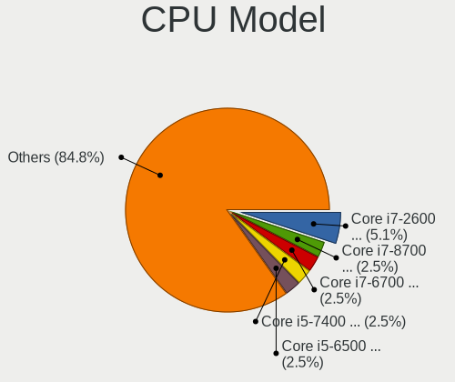

Zorin Hardware Trends (Desktop)
-------------------------------

A project to identify most popular hardware characteristics and track their change
over time based on data collected by Zorin users at https://Linux-Hardware.org.

Anyone can contribute to the study by uploading probes of their computers by
the [hw-probe](https://github.com/linuxhw/hw-probe) tool:

    sudo hw-probe -all -upload

Full-feature report is available here: https://linux-hardware.org/?view=trends&formfactor=desktop

Period: Feb, 2020.

Contents
--------

- [ OS                       ](#os)
- [ OS Family                ](#os-family)
- [ Kernel                   ](#kernel)
- [ Kernel Family            ](#kernel-family)
- [ Kernel Major Ver.        ](#kernel-major-ver)
- [ Arch                     ](#arch)
- [ DE                       ](#de)
- [ Display Server           ](#display-server)
- [ OS Lang                  ](#os-lang)
- [ Boot Mode                ](#boot-mode)
- [ Filesystem               ](#filesystem)
- [ Dual Boot with Linux     ](#dual-boot-with-linux)
- [ Dual Boot (Win)          ](#dual-boot-win)
- [ Country                  ](#country)
- [ City                     ](#city)
- [ Vendor                   ](#vendor)
- [ Model                    ](#model)
- [ Model Family             ](#model-family)
- [ MFG Year                 ](#mfg-year)
- [ Form Factor              ](#form-factor)
- [ Secure Boot              ](#secure-boot)
- [ Coreboot                 ](#coreboot)
- [ RAM Size                 ](#ram-size)
- [ RAM Used                 ](#ram-used)
- [ Drive Vendor             ](#drive-vendor)
- [ Drive Model              ](#drive-model)
- [ Drive Kind               ](#drive-kind)
- [ Drive Connector          ](#drive-connector)
- [ Drive Size               ](#drive-size)
- [ Space Total              ](#space-total)
- [ Space Used               ](#space-used)
- [ Malfunc. Drives          ](#malfunc-drives)
- [ Malfunc. Drive Vendor    ](#malfunc-drive-vendor)
- [ Malfunc. Drive Kind      ](#malfunc-drive-kind)
- [ Failed Drives            ](#failed-drives)
- [ Failed Drive Vendor      ](#failed-drive-vendor)
- [ Drive Status             ](#drive-status)
- [ Storage Vendor           ](#storage-vendor)
- [ Storage Model            ](#storage-model)
- [ Storage Kind             ](#storage-kind)
- [ CPU Vendor               ](#cpu-vendor)
- [ CPU Model                ](#cpu-model)
- [ CPU Model Family         ](#cpu-model-family)
- [ CPU Cores                ](#cpu-cores)
- [ CPU Sockets              ](#cpu-sockets)
- [ CPU Threads              ](#cpu-threads)
- [ CPU Op-Modes             ](#cpu-op-modes)
- [ CPU Microarch            ](#cpu-microarch)
- [ CPU Microcode            ](#cpu-microcode)
- [ GPU Vendor               ](#gpu-vendor)
- [ GPU Model                ](#gpu-model)
- [ GPU Combo                ](#gpu-combo)
- [ GPU Driver               ](#gpu-driver)
- [ GPU Memory               ](#gpu-memory)
- [ Monitor Vendor           ](#monitor-vendor)
- [ Monitor Model            ](#monitor-model)
- [ Monitor Resolution       ](#monitor-resolution)
- [ Monitor Diagonal         ](#monitor-diagonal)
- [ Monitor Width            ](#monitor-width)
- [ Aspect Ratio             ](#aspect-ratio)
- [ Monitor Area             ](#monitor-area)
- [ Pixel Density            ](#pixel-density)
- [ Multiple Monitors        ](#multiple-monitors)
- [ Net Controller Vendor    ](#net-controller-vendor)
- [ Net Controller Model     ](#net-controller-model)
- [ Net Controller Kind      ](#net-controller-kind)
- [ Used Controller          ](#used-controller)
- [ NICs                     ](#nics)
- [ Unsupported Devices      ](#unsupported-devices)
- [ Unsupported Device Types ](#unsupported-device-types)

OS
--

Installed operating systems

| Name     | Computers | Percent |
|----------|-----------|---------|
| Zorin 15 | 25        | 96.15%  |
| Zorin 12 | 1         | 3.85%   |

OS Family
---------

OS without a version

| Name  | Computers | Percent |
|-------|-----------|---------|
| Zorin | 26        | 100%    |

Kernel
------

Version of the Linux kernel

| Version           | Computers | Percent |
|-------------------|-----------|---------|
| 5.3.0-28-generic  | 13        | 50%     |
| 5.3.0-40-generic  | 10        | 38.46%  |
| 5.0.0-37-generic  | 1         | 3.85%   |
| 4.18.0-21-generic | 1         | 3.85%   |
| 4.15.0-70-generic | 1         | 3.85%   |

Kernel Family
-------------

Linux kernel without a distro release

| Version | Computers | Percent |
|---------|-----------|---------|
| 5.3.0   | 23        | 88.46%  |
| 5.0.0   | 1         | 3.85%   |
| 4.18.0  | 1         | 3.85%   |
| 4.15.0  | 1         | 3.85%   |

Kernel Major Ver.
-----------------

Linux kernel major version

| Version | Computers | Percent |
|---------|-----------|---------|
| 5.3     | 23        | 88.46%  |
| 5.0     | 1         | 3.85%   |
| 4.18    | 1         | 3.85%   |
| 4.15    | 1         | 3.85%   |

Arch
----

OS architecture (x86_64, i586, etc.)

| Name   | Computers | Percent |
|--------|-----------|---------|
| x86_64 | 23        | 88.46%  |
| i686   | 3         | 11.54%  |

DE
--

Desktop Environment

| Name    | Computers | Percent |
|---------|-----------|---------|
| GNOME   | 20        | 76.92%  |
| XFCE    | 5         | 19.23%  |
| Unknown | 1         | 3.85%   |

Display Server
--------------

X11 or Wayland

| Name    | Computers | Percent |
|---------|-----------|---------|
| X11     | 25        | 96.15%  |
| Wayland | 1         | 3.85%   |

OS Lang
-------

Language

| Lang  | Computers | Percent |
|-------|-----------|---------|
| en_US | 9         | 34.62%  |
| en_GB | 4         | 15.38%  |
| ru_RU | 2         | 7.69%   |
| pt_BR | 2         | 7.69%   |
| de_DE | 2         | 7.69%   |
| nb_NO | 1         | 3.85%   |
| it_IT | 1         | 3.85%   |
| id_ID | 1         | 3.85%   |
| fr_CA | 1         | 3.85%   |
| es_PE | 1         | 3.85%   |
| es_MX | 1         | 3.85%   |
| es_AR | 1         | 3.85%   |

Boot Mode
---------

EFI or BIOS

| Mode | Computers | Percent |
|------|-----------|---------|
| BIOS | 20        | 76.92%  |
| EFI  | 6         | 23.08%  |

Filesystem
----------

Type of filesystem

| Type    | Computers | Percent |
|---------|-----------|---------|
| Ext4    | 24        | 92.31%  |
| Overlay | 2         | 7.69%   |

Dual Boot with Linux
--------------------

Hosting more than one Linux

| Dual boot | Computers | Percent |
|-----------|-----------|---------|
| No        | 23        | 88.46%  |
| Yes       | 3         | 11.54%  |

Dual Boot (Win)
---------------

Hosting Linux and Windows

| Dual boot | Computers | Percent |
|-----------|-----------|---------|
| Yes       | 15        | 57.69%  |
| No        | 11        | 42.31%  |

Country
-------

Geographic location (country)

| Country   | Computers | Percent |
|-----------|-----------|---------|
| USA       | 7         | 26.92%  |
| UK        | 3         | 11.54%  |
| Indonesia | 2         | 7.69%   |
| Brazil    | 2         | 7.69%   |
| Thailand  | 1         | 3.85%   |
| Russia    | 1         | 3.85%   |
| Peru      | 1         | 3.85%   |
| Norway    | 1         | 3.85%   |
| Mexico    | 1         | 3.85%   |
| Italy     | 1         | 3.85%   |
| Germany   | 1         | 3.85%   |
| Georgia   | 1         | 3.85%   |
| Denmark   | 1         | 3.85%   |
| Canada    | 1         | 3.85%   |
| Austria   | 1         | 3.85%   |
| Argentina | 1         | 3.85%   |

City
----

Geographic location (city)

| City                  | Computers | Percent |
|-----------------------|-----------|---------|
| Las Vegas             | 2         | 7.69%   |
| Warrington            | 1         | 3.85%   |
| Vienna                | 1         | 3.85%   |
| Trujillo              | 1         | 3.85%   |
| Tbilisi               | 1         | 3.85%   |
| São Paulo            | 1         | 3.85%   |
| Summerville           | 1         | 3.85%   |
| Stary Oskol           | 1         | 3.85%   |
| San Luis Potosí City | 1         | 3.85%   |
| Roverbella            | 1         | 3.85%   |
| Probolinggo           | 1         | 3.85%   |
| Pinellas Park         | 1         | 3.85%   |
| Pattaya               | 1         | 3.85%   |
| National City         | 1         | 3.85%   |
| Montreal              | 1         | 3.85%   |
| Manchester            | 1         | 3.85%   |
| Mahopac               | 1         | 3.85%   |
| Lohne                 | 1         | 3.85%   |
| Kenosha               | 1         | 3.85%   |
| Honefoss              | 1         | 3.85%   |
| Corrientes            | 1         | 3.85%   |
| Copenhagen            | 1         | 3.85%   |
| Bristol               | 1         | 3.85%   |
| Bojongkalong          | 1         | 3.85%   |
| Araruama              | 1         | 3.85%   |

Vendor
------

Motherboard manufacturer

| Name                | Computers | Percent |
|---------------------|-----------|---------|
| Gigabyte Technology | 5         | 19.23%  |
| ASUSTek Computer    | 5         | 19.23%  |
| ASRock              | 3         | 11.54%  |
| Pegatron            | 2         | 7.69%   |
| MSI                 | 2         | 7.69%   |
| Hewlett-Packard     | 2         | 7.69%   |
| Dell                | 2         | 7.69%   |
| QDI                 | 1         | 3.85%   |
| Packard Bell        | 1         | 3.85%   |
| Lenovo              | 1         | 3.85%   |
| Alienware           | 1         | 3.85%   |
| Acer                | 1         | 3.85%   |

Model
-----

Motherboard model

| Name                             | Computers | Percent |
|----------------------------------|-----------|---------|
| MSI MS-7C02                      | 2         | 7.69%   |
| QDI P4I865MA                     | 1         | 3.85%   |
| Pegatron NE502AV-ABA a6750t      | 1         | 3.85%   |
| Pegatron FZ116AA-ACP a6551.at    | 1         | 3.85%   |
| Packard Bell imedia S3720        | 1         | 3.85%   |
| Lenovo XXXX 2222222              | 1         | 3.85%   |
| HP EliteDesk 800 G1 SFF          | 1         | 3.85%   |
| HP Compaq 8000 Elite USDT PC     | 1         | 3.85%   |
| Gigabyte Mission one             | 1         | 3.85%   |
| Gigabyte M68MT-S2                | 1         | 3.85%   |
| Gigabyte B450M DS3H              | 1         | 3.85%   |
| Gigabyte B450 AORUS M            | 1         | 3.85%   |
| Gigabyte 945GCM-S2C              | 1         | 3.85%   |
| Dell Precision WorkStation T3500 | 1         | 3.85%   |
| Dell OptiPlex 790                | 1         | 3.85%   |
| ASUS P8H61                       | 1         | 3.85%   |
| ASUS P4R800-VM                   | 1         | 3.85%   |
| ASUS H61M-K                      | 1         | 3.85%   |
| ASUS CG8580                      | 1         | 3.85%   |
| ASUS All Series                  | 1         | 3.85%   |
| ASRock H81M-ITX/WiFi             | 1         | 3.85%   |
| ASRock FM2A75M-HD+               | 1         | 3.85%   |
| ASRock 970 Pro3 R2.0             | 1         | 3.85%   |
| Alienware X51                    | 1         | 3.85%   |
| Acer Aspire M5811                | 1         | 3.85%   |

Model Family
------------

Motherboard model prefix

| Name                 | Computers | Percent |
|----------------------|-----------|---------|
| MSI MS-7C02          | 2         | 7.69%   |
| QDI P4I865MA         | 1         | 3.85%   |
| Pegatron NE502AV-ABA | 1         | 3.85%   |
| Pegatron FZ116AA-ACP | 1         | 3.85%   |
| Packard Bell imedia  | 1         | 3.85%   |
| Lenovo XXXX          | 1         | 3.85%   |
| HP EliteDesk         | 1         | 3.85%   |
| HP Compaq            | 1         | 3.85%   |
| Gigabyte Mission     | 1         | 3.85%   |
| Gigabyte M68MT-S2    | 1         | 3.85%   |
| Gigabyte B450M       | 1         | 3.85%   |
| Gigabyte B450        | 1         | 3.85%   |
| Gigabyte 945GCM-S2C  | 1         | 3.85%   |
| Dell Precision       | 1         | 3.85%   |
| Dell OptiPlex        | 1         | 3.85%   |
| ASUS P8H61           | 1         | 3.85%   |
| ASUS P4R800-VM       | 1         | 3.85%   |
| ASUS H61M-K          | 1         | 3.85%   |
| ASUS CG8580          | 1         | 3.85%   |
| ASUS All             | 1         | 3.85%   |
| ASRock H81M-ITX      | 1         | 3.85%   |
| ASRock FM2A75M-HD+   | 1         | 3.85%   |
| ASRock 970           | 1         | 3.85%   |
| Alienware X51        | 1         | 3.85%   |
| Acer Aspire          | 1         | 3.85%   |

MFG Year
--------

Motherboard manufacture year

| Year | Computers | Percent |
|------|-----------|---------|
| 2019 | 5         | 19.23%  |
| 2014 | 3         | 11.54%  |
| 2010 | 3         | 11.54%  |
| 2009 | 3         | 11.54%  |
| 2018 | 2         | 7.69%   |
| 2012 | 2         | 7.69%   |
| 2008 | 2         | 7.69%   |
| 2003 | 2         | 7.69%   |
| 2016 | 1         | 3.85%   |
| 2015 | 1         | 3.85%   |
| 2013 | 1         | 3.85%   |
| 2011 | 1         | 3.85%   |

Form Factor
-----------

Physical design of the computer

| Name    | Computers | Percent |
|---------|-----------|---------|
| Desktop | 26        | 100%    |

Secure Boot
-----------

Enabled or disabled

| State    | Computers | Percent |
|----------|-----------|---------|
| Disabled | 26        | 100%    |

Coreboot
--------

Have coreboot on board

| Used | Computers | Percent |
|------|-----------|---------|
| No   | 26        | 100%    |

RAM Size
--------

Total RAM memory

| Size in GB | Computers | Percent |
|------------|-----------|---------|
| 16.01-24.0 | 7         | 26.92%  |
| 4.01-8.0   | 5         | 19.23%  |
| 8.01-16.0  | 5         | 19.23%  |
| 3.01-4.0   | 4         | 15.38%  |
| 1.01-2.0   | 3         | 11.54%  |
| 32.01-64.0 | 1         | 3.85%   |
| 0.01-1.0   | 1         | 3.85%   |

RAM Used
--------

Used RAM memory

| Used GB  | Computers | Percent |
|----------|-----------|---------|
| 1.01-2.0 | 17        | 65.38%  |
| 0.01-1.0 | 6         | 23.08%  |
| 4.01-8.0 | 1         | 3.85%   |
| 3.01-4.0 | 1         | 3.85%   |
| 2.01-3.0 | 1         | 3.85%   |

Drive Vendor
------------

Hard drive vendors

| Vendor              | Computers | Drives | Percent |
|---------------------|-----------|--------|---------|
| Seagate             | 13        | 15     | 37.14%  |
| WDC                 | 7         | 10     | 20%     |
| Samsung Electronics | 3         | 3      | 8.57%   |
| Toshiba             | 2         | 3      | 5.71%   |
| Maxtor              | 2         | 3      | 5.71%   |
| Intel               | 2         | 2      | 5.71%   |
| Unknown             | 1         | 1      | 2.86%   |
| SanDisk             | 1         | 1      | 2.86%   |
| OCZ                 | 1         | 1      | 2.86%   |
| Integral            | 1         | 1      | 2.86%   |
| ASMT                | 1         | 1      | 2.86%   |
| A-DATA Technology   | 1         | 1      | 2.86%   |

Drive Model
-----------

Hard drive models

| Model                        | Computers | Percent |
|------------------------------|-----------|---------|
| ST500DM002-1BD142 500GB      | 3         | 7.32%   |
| WD10EZEX-08WN4A0 1TB         | 2         | 4.88%   |
| WDS500G2B0A-00SM50 500GB SSD | 1         | 2.44%   |
| WD800JD-75JNA0 80GB          | 1         | 2.44%   |
| WD6400AAKS-65A7B0 640GB      | 1         | 2.44%   |
| WD5000AAKX-753CA1 500GB      | 1         | 2.44%   |
| WD5000AAKX-60U6AA0 500GB     | 1         | 2.44%   |
| WD2500AAKX-08ERMA0 250GB     | 1         | 2.44%   |
| WD20EARX-00PASB0 2TB         | 1         | 2.44%   |
| VERTEX4 128GB SSD            | 1         | 2.44%   |
| V Series SATA SSD 240GB      | 1         | 2.44%   |
| SU650 240GB SSD              | 1         | 2.44%   |
| STM3160212A 160GB            | 1         | 2.44%   |
| ST9160412AS 160GB            | 1         | 2.44%   |
| ST3750640NS 752GB            | 1         | 2.44%   |
| ST3500413AS 500GB            | 1         | 2.44%   |
| ST340016A 40GB               | 1         | 2.44%   |
| ST340014A 40GB               | 1         | 2.44%   |
| ST3320418AS 320GB            | 1         | 2.44%   |
| ST31500341AS 1TB             | 1         | 2.44%   |
| ST2000VM003-1CT164 2TB       | 1         | 2.44%   |
| ST2000DM006-2DM164 2TB       | 1         | 2.44%   |
| ST2000DM001-1ER164 2TB       | 1         | 2.44%   |
| ST2000DM001-1CH164 2TB       | 1         | 2.44%   |
| ST1000DM003-1ER162 1TB       | 1         | 2.44%   |
| SSDSC2BW120A4 120GB          | 1         | 2.44%   |
| SSDMCEAW120A4 120GB          | 1         | 2.44%   |
| SSD 850 EVO 500GB            | 1         | 2.44%   |
| SDSSDA240G 240GB             | 1         | 2.44%   |
| MQ01ABD075 752GB             | 1         | 2.44%   |
| HDWD110 1TB                  | 1         | 2.44%   |
| HD501LJ 500GB                | 1         | 2.44%   |
| HD250HJ 250GB                | 1         | 2.44%   |
| DT01ACA100 1TB               | 1         | 2.44%   |
| APS-SL3N-120 120GB           | 1         | 2.44%   |
| 6L250R0 256GB                | 1         | 2.44%   |
| 6L200P0 208GB                | 1         | 2.44%   |
| 2115 250GB                   | 1         | 2.44%   |

Drive Kind
----------

HDD or SSD

| Kind    | Computers | Drives | Percent |
|---------|-----------|--------|---------|
| HDD     | 21        | 33     | 70%     |
| SSD     | 8         | 8      | 26.67%  |
| Unknown | 1         | 1      | 3.33%   |

Drive Connector
---------------

SATA, SAS, NVMe, etc.

| Type | Computers | Drives | Percent |
|------|-----------|--------|---------|
| SATA | 24        | 41     | 96%     |
| SAS  | 1         | 1      | 4%      |

Drive Size
----------

Size of hard drive

| Size in TB | Computers | Drives | Percent |
|------------|-----------|--------|---------|
| 0.01-0.5   | 17        | 27     | 56.67%  |
| 0.51-1.0   | 8         | 10     | 26.67%  |
| 1.01-2.0   | 5         | 5      | 16.67%  |

Space Total
-----------

Amount of disk space available on the file system

| Size in GB | Computers | Percent |
|------------|-----------|---------|
| 101-250    | 7         | 26.92%  |
| 501-1000   | 5         | 19.23%  |
| 1001-2000  | 4         | 15.38%  |
| 1-20       | 3         | 11.54%  |
| 51-100     | 3         | 11.54%  |
| 21-50      | 2         | 7.69%   |
| 251-500    | 1         | 3.85%   |
| 2001-3000  | 1         | 3.85%   |

Space Used
----------

Amount of used disk space

| Used GB   | Computers | Percent |
|-----------|-----------|---------|
| 1-20      | 19        | 73.08%  |
| 101-250   | 2         | 7.69%   |
| 51-100    | 2         | 7.69%   |
| 251-500   | 1         | 3.85%   |
| 1001-2000 | 1         | 3.85%   |
| 501-1000  | 1         | 3.85%   |

Malfunc. Drives
---------------

Drive models with a malfunction

Zero info for selected period =(

Malfunc. Drive Vendor
---------------------

Vendors of faulty drives

Zero info for selected period =(

Malfunc. Drive Kind
-------------------

Kinds of faulty drives

Zero info for selected period =(

Failed Drives
-------------

Failed drive models

Zero info for selected period =(

Failed Drive Vendor
-------------------

Failed drive vendors

Zero info for selected period =(

Drive Status
------------

Number of failed and malfunc. drives

| Status   | Computers | Drives | Percent |
|----------|-----------|--------|---------|
| Detected | 24        | 42     | 100%    |

Storage Vendor
--------------

Storage controller vendors

| Vendor             | Computers | Percent |
|--------------------|-----------|---------|
| Intel              | 17        | 54.84%  |
| AMD                | 7         | 22.58%  |
| Phison Electronics | 2         | 6.45%   |
| Nvidia             | 2         | 6.45%   |
| Sandisk            | 1         | 3.23%   |
| JMicron Technology | 1         | 3.23%   |
| ASMedia Technology | 1         | 3.23%   |

Storage Model
-------------

Storage controller models

| Model                                                                             | Computers | Percent |
|-----------------------------------------------------------------------------------|-----------|---------|
| FCH SATA Controller [AHCI mode]                                                   | 5         | 12.5%   |
| 400 Series Chipset SATA Controller                                                | 4         | 10%     |
| 8 Series/C220 Series Chipset Family 6-port SATA Controller 1 [AHCI mode]          | 3         | 7.5%    |
| 6 Series/C200 Series Chipset Family 6 port Desktop SATA AHCI Controller           | 3         | 7.5%    |
| SATA Controller [RAID mode]                                                       | 2         | 5%      |
| NM10/ICH7 Family SATA Controller [IDE mode]                                       | 2         | 5%      |
| E12 NVMe Controller                                                               | 2         | 5%      |
| 82801IR/IO/IH (ICH9R/DO/DH) 6 port SATA Controller [AHCI mode]                    | 2         | 5%      |
| WD Black 2018/PC SN520 NVMe SSD                                                   | 1         | 2.5%    |
| SB7x0/SB8x0/SB9x0 SATA Controller [AHCI mode]                                     | 1         | 2.5%    |
| SB200 IDE Controller                                                              | 1         | 2.5%    |
| MCP73 IDE Controller                                                              | 1         | 2.5%    |
| MCP61 SATA Controller                                                             | 1         | 2.5%    |
| JMB363 SATA/IDE Controller                                                        | 1         | 2.5%    |
| GeForce 7100/nForce 630i SATA                                                     | 1         | 2.5%    |
| FCH IDE Controller                                                                | 1         | 2.5%    |
| Atom Processor E3800 Series SATA AHCI Controller                                  | 1         | 2.5%    |
| ASM1062 Serial ATA Controller                                                     | 1         | 2.5%    |
| 82801JI (ICH10 Family) SATA AHCI Controller                                       | 1         | 2.5%    |
| 82801JD/DO (ICH10 Family) SATA AHCI Controller                                    | 1         | 2.5%    |
| 82801EB/ER (ICH5/ICH5R) IDE Controller                                            | 1         | 2.5%    |
| 82801EB (ICH5) SATA Controller                                                    | 1         | 2.5%    |
| 6 Series/C200 Series Chipset Family Desktop SATA Controller (IDE mode, ports 4-5) | 1         | 2.5%    |
| 6 Series/C200 Series Chipset Family Desktop SATA Controller (IDE mode, ports 0-3) | 1         | 2.5%    |
| 4 Series Chipset PT IDER Controller                                               | 1         | 2.5%    |

Storage Kind
------------

Kind of storage controller (IDE, SATA, NVMe, SAS, ...)

| Kind | Computers | Percent |
|------|-----------|---------|
| SATA | 19        | 55.88%  |
| IDE  | 10        | 29.41%  |
| NVMe | 3         | 8.82%   |
| RAID | 2         | 5.88%   |

CPU Vendor
----------

Processor vendors

| Vendor | Computers | Percent |
|--------|-----------|---------|
| Intel  | 19        | 73.08%  |
| AMD    | 7         | 26.92%  |

CPU Model
---------

Processor models

| Model                                       | Computers | Percent |
|---------------------------------------------|-----------|---------|
| AMD Ryzen 7 2700 Eight-Core Processor       | 2         | 7.69%   |
| Intel Xeon CPU W3530 @ 2.80GHz              | 1         | 3.85%   |
| Intel Pentium Dual-Core CPU E5300 @ 2.60GHz | 1         | 3.85%   |
| Intel Pentium Dual CPU E2200 @ 2.20GHz      | 1         | 3.85%   |
| Intel Pentium 4 CPU 2.40GHz                 | 1         | 3.85%   |
| Intel Core i7-3770K CPU @ 3.50GHz           | 1         | 3.85%   |
| Intel Core i5-4440 CPU @ 3.10GHz            | 1         | 3.85%   |
| Intel Core i5-3570 CPU @ 3.40GHz            | 1         | 3.85%   |
| Intel Core i5-3470S CPU @ 2.90GHz           | 1         | 3.85%   |
| Intel Core i5-2400 CPU @ 3.10GHz            | 1         | 3.85%   |
| Intel Core i5 CPU 650 @ 3.20GHz             | 1         | 3.85%   |
| Intel Core i3-4170 CPU @ 3.70GHz            | 1         | 3.85%   |
| Intel Core i3-4160 CPU @ 3.60GHz            | 1         | 3.85%   |
| Intel Core i3-2100 CPU @ 3.10GHz            | 1         | 3.85%   |
| Intel Core 2 Quad CPU Q8300 @ 2.50GHz       | 1         | 3.85%   |
| Intel Core 2 Quad CPU Q6600 @ 2.40GHz       | 1         | 3.85%   |
| Intel Core 2 Duo CPU E8400 @ 3.00GHz        | 1         | 3.85%   |
| Intel Core 2 Duo CPU E7400 @ 2.80GHz        | 1         | 3.85%   |
| Intel Celeron CPU N2807 @ 1.58GHz           | 1         | 3.85%   |
| Intel Celeron CPU 2.40GHz                   | 1         | 3.85%   |
| AMD Sempron 140 Processor                   | 1         | 3.85%   |
| AMD Ryzen 5 3600 6-Core Processor           | 1         | 3.85%   |
| AMD Ryzen 5 1600 Six-Core Processor         | 1         | 3.85%   |
| AMD Phenom II X4 B50 Processor              | 1         | 3.85%   |
| AMD A4-5300 APU with Radeon HD Graphics     | 1         | 3.85%   |

CPU Model Family
----------------

Processor model prefix

| Model                   | Computers | Percent |
|-------------------------|-----------|---------|
| Intel Core i5           | 5         | 19.23%  |
| Intel Core i3           | 3         | 11.54%  |
| Intel Core 2 Quad       | 2         | 7.69%   |
| Intel Core 2 Duo        | 2         | 7.69%   |
| Intel Celeron           | 2         | 7.69%   |
| AMD Ryzen 7             | 2         | 7.69%   |
| AMD Ryzen 5             | 2         | 7.69%   |
| Intel Xeon              | 1         | 3.85%   |
| Intel Pentium Dual-Core | 1         | 3.85%   |
| Intel Pentium Dual      | 1         | 3.85%   |
| Intel Pentium 4         | 1         | 3.85%   |
| Intel Core i7           | 1         | 3.85%   |
| AMD Sempron             | 1         | 3.85%   |
| AMD Phenom II X4        | 1         | 3.85%   |
| AMD A4                  | 1         | 3.85%   |

CPU Cores
---------

Number of processor cores

| Number | Computers | Percent |
|--------|-----------|---------|
| 4      | 9         | 34.62%  |
| 2      | 9         | 34.62%  |
| 1      | 4         | 15.38%  |
| 8      | 2         | 7.69%   |
| 6      | 2         | 7.69%   |

CPU Sockets
-----------

Number of sockets

| Number | Computers | Percent |
|--------|-----------|---------|
| 1      | 26        | 100%    |

CPU Threads
-----------

Threads per core (Hyper-Threading)

| Number | Computers | Percent |
|--------|-----------|---------|
| 1      | 14        | 53.85%  |
| 2      | 12        | 46.15%  |

CPU Op-Modes
------------

CPU Operation Modes (32-bit, 64-bit)

| Op mode        | Computers | Percent |
|----------------|-----------|---------|
| 32-bit, 64-bit | 24        | 92.31%  |
| 32-bit         | 2         | 7.69%   |

CPU Microarch
-------------

Microarchitecture

| Name        | Computers | Percent |
|-------------|-----------|---------|
| Core        | 6         | 23.08%  |
| Zen+        | 3         | 11.54%  |
| IvyBridge   | 3         | 11.54%  |
| Haswell     | 3         | 11.54%  |
| SandyBridge | 2         | 7.69%   |
| NetBurst    | 2         | 7.69%   |
| K10         | 2         | 7.69%   |
| Zen 2       | 1         | 3.85%   |
| Westmere    | 1         | 3.85%   |
| Silvermont  | 1         | 3.85%   |
| Piledriver  | 1         | 3.85%   |
| Nehalem     | 1         | 3.85%   |

CPU Microcode
-------------

Microcode number

| Number     | Computers | Percent |
|------------|-----------|---------|
| 0x1067a    | 4         | 15.38%  |
| 0x306c3    | 3         | 11.54%  |
| 0x306a9    | 3         | 11.54%  |
| 0xf29      | 2         | 7.69%   |
| 0x206a7    | 2         | 7.69%   |
| 0x0800820d | 2         | 7.69%   |
| 0x6fd      | 1         | 3.85%   |
| 0x6fb      | 1         | 3.85%   |
| 0x30678    | 1         | 3.85%   |
| 0x20652    | 1         | 3.85%   |
| 0x106a5    | 1         | 3.85%   |
| 0x08701013 | 1         | 3.85%   |
| 0x0800820b | 1         | 3.85%   |
| 0x06001119 | 1         | 3.85%   |
| 0x010000c8 | 1         | 3.85%   |
| 0x010000c7 | 1         | 3.85%   |

GPU Vendor
----------

Vendors of graphics cards

| Vendor | Computers | Percent |
|--------|-----------|---------|
| Nvidia | 12        | 42.86%  |
| AMD    | 9         | 32.14%  |
| Intel  | 7         | 25%     |

GPU Model
---------

Graphics card models

| Model                                                                 | Computers | Percent |
|-----------------------------------------------------------------------|-----------|---------|
| GK208B [GeForce GT 710]                                               | 2         | 7.14%   |
| GF108 [GeForce GT 730]                                                | 2         | 7.14%   |
| Ellesmere [Radeon RX 470/480/570/570X/580/580X/590]                   | 2         | 7.14%   |
| Xeon E3-1200 v3/4th Gen Core Processor Integrated Graphics Controller | 1         | 3.57%   |
| Xeon E3-1200 v2/3rd Gen Core processor Graphics Controller            | 1         | 3.57%   |
| Trinity 2 [Radeon HD 7480D]                                           | 1         | 3.57%   |
| RV610 [Radeon HD 2400 PRO]                                            | 1         | 3.57%   |
| RS300 [Radeon 9100 IGP]                                               | 1         | 3.57%   |
| Oland PRO [Radeon R7 240/340]                                         | 1         | 3.57%   |
| Navi 10 [Radeon RX 5600 OEM/5600 XT / 5700/5700 XT]                   | 1         | 3.57%   |
| GT218 [GeForce G210]                                                  | 1         | 3.57%   |
| GT218 [GeForce 210]                                                   | 1         | 3.57%   |
| GP104 [GeForce GTX 1070]                                              | 1         | 3.57%   |
| GK208B [GeForce GT 730]                                               | 1         | 3.57%   |
| GK104 [GeForce GTX 660 OEM]                                           | 1         | 3.57%   |
| GF114 [GeForce GTX 560 Ti]                                            | 1         | 3.57%   |
| G96C [GeForce 9400 GT]                                                | 1         | 3.57%   |
| Cedar [Radeon HD 5000/6000/7350/8350 Series]                          | 1         | 3.57%   |
| C61 [GeForce 7025 / nForce 630a]                                      | 1         | 3.57%   |
| Baffin [Radeon RX 460/560D / Pro 450/455/460/555/555X/560/560X]       | 1         | 3.57%   |
| Atom Processor Z36xxx/Z37xxx Series Graphics & Display                | 1         | 3.57%   |
| 82945G/GZ Integrated Graphics Controller                              | 1         | 3.57%   |
| 82865G Integrated Graphics Controller                                 | 1         | 3.57%   |
| 4th Generation Core Processor Family Integrated Graphics Controller   | 1         | 3.57%   |
| 4 Series Chipset Integrated Graphics Controller                       | 1         | 3.57%   |

GPU Combo
---------

Combinations of graphics cards

| Name       | Computers | Percent |
|------------|-----------|---------|
| 1 x Nvidia | 12        | 46.15%  |
| 1 x AMD    | 9         | 34.62%  |
| 1 x Intel  | 5         | 19.23%  |

GPU Driver
----------

Free vs proprietary

| Driver      | Computers | Percent |
|-------------|-----------|---------|
| Free        | 18        | 69.23%  |
| Proprietary | 5         | 19.23%  |
| Unknown     | 3         | 11.54%  |

GPU Memory
----------

Total video memory

| Size in GB | Computers | Percent |
|------------|-----------|---------|
| Unknown    | 8         | 30.77%  |
| 1.01-2.0   | 6         | 23.08%  |
| 0.01-0.5   | 5         | 19.23%  |
| 7.01-8.0   | 3         | 11.54%  |
| 0.51-1.0   | 2         | 7.69%   |
| 5.01-6.0   | 1         | 3.85%   |
| 3.01-4.0   | 1         | 3.85%   |

Monitor Vendor
--------------

Monitor vendors

| Vendor               | Computers | Percent |
|----------------------|-----------|---------|
| Samsung Electronics  | 4         | 17.39%  |
| Acer                 | 4         | 17.39%  |
| Philips              | 2         | 8.7%    |
| Goldstar             | 2         | 8.7%    |
| Ancor Communications | 2         | 8.7%    |
| Vizio                | 1         | 4.35%   |
| VIZ                  | 1         | 4.35%   |
| ViewSonic            | 1         | 4.35%   |
| MStar                | 1         | 4.35%   |
| MSI                  | 1         | 4.35%   |
| LG Electronics       | 1         | 4.35%   |
| Iiyama               | 1         | 4.35%   |
| Hewlett-Packard      | 1         | 4.35%   |
| BenQ                 | 1         | 4.35%   |

Monitor Model
-------------

Monitor models

| Model                                               | Computers | Percent |
|-----------------------------------------------------|-----------|---------|
| X34 ACR0462 3440x1440 797x333mm 34.0-inch           | 1         | 4.35%   |
| W1643 GSM3E88 1360x768 406x229mm 18.4-inch          | 1         | 4.35%   |
| VX2260WM VSCFC21 1920x1080 477x268mm 21.5-inch      | 1         | 4.35%   |
| vs17 HWP2647 1280x1024 340x270mm 17.1-inch          | 1         | 4.35%   |
| VN279 ACI27A4 1920x1080 597x336mm 27.0-inch         | 1         | 4.35%   |
| VA19L HDTV10T VIZ0019 1360x768 410x230mm 18.5-inch  | 1         | 4.35%   |
| V173 ACR0019 1280x1024 340x270mm 17.1-inch          | 1         | 4.35%   |
| TV_MONITOR MST0030 1440x900 1150x650mm 52.0-inch    | 1         | 4.35%   |
| SyncMaster SAM03E5 1680x1050 470x300mm 22.0-inch    | 1         | 4.35%   |
| S19D300 SAM0B35 1366x768 410x230mm 18.5-inch        | 1         | 4.35%   |
| PL2730H IVM663A 1920x1080 598x336mm 27.0-inch       | 1         | 4.35%   |
| Optix MAG27CQ MSI1462 2560x1440 597x336mm 27.0-inch | 1         | 4.35%   |
| LCD Monitor X223W 1680x1050                         | 1         | 4.35%   |
| LCD Monitor SAM03D4 1920x1080                       | 1         | 4.35%   |
| LCD Monitor PHILIPS FTV 1920x1080                   | 1         | 4.35%   |
| LCD Monitor LG TV 1280x720                          | 1         | 4.35%   |
| LCD Monitor GW2765 2560x1440                        | 1         | 4.35%   |
| LCD Monitor E320VT 1920x1080                        | 1         | 4.35%   |
| K222HQL ACR040D 1920x1080 480x270mm 21.7-inch       | 1         | 4.35%   |
| FTV PHL01EA 1920x1080 1440x810mm 65.0-inch          | 1         | 4.35%   |
| E2041 GSM4EC9 1600x900 443x249mm 20.0-inch          | 1         | 4.35%   |
| C24F390 SAM0D2C 1920x1080 520x290mm 23.4-inch       | 1         | 4.35%   |
| ASUS VE278 ACI27F6 1920x1080 598x336mm 27.0-inch    | 1         | 4.35%   |

Monitor Resolution
------------------

Monitor screen resolution

| Resolution         | Computers | Percent |
|--------------------|-----------|---------|
| 1920x1080 (FHD)    | 11        | 47.83%  |
| 1680x1050 (WSXGA+) | 2         | 8.7%    |
| 1360x768           | 2         | 8.7%    |
| 1280x720 (HD)      | 2         | 8.7%    |
| 1280x1024 (SXGA)   | 2         | 8.7%    |
| 3440x1440          | 1         | 4.35%   |
| 2560x1440 (QHD)    | 1         | 4.35%   |
| 1600x900 (HD+)     | 1         | 4.35%   |
| 1366x768 (WXGA)    | 1         | 4.35%   |

Monitor Diagonal
----------------

Diagonal size in inches

| Inches  | Computers | Percent |
|---------|-----------|---------|
| Unknown | 6         | 26.09%  |
| 27      | 4         | 17.39%  |
| 18      | 3         | 13.04%  |
| 21      | 2         | 8.7%    |
| 17      | 2         | 8.7%    |
| 65      | 1         | 4.35%   |
| 34      | 1         | 4.35%   |
| 32      | 1         | 4.35%   |
| 23      | 1         | 4.35%   |
| 22      | 1         | 4.35%   |
| 20      | 1         | 4.35%   |

Monitor Width
-------------

Physical width

| Width in mm | Computers | Percent |
|-------------|-----------|---------|
| 401-500     | 7         | 30.43%  |
| Unknown     | 6         | 26.09%  |
| 501-600     | 5         | 21.74%  |
| 701-800     | 2         | 8.7%    |
| 301-350     | 2         | 8.7%    |
| 1001-1500   | 1         | 4.35%   |

Aspect Ratio
------------

Proportional relationship between the width and the height

| Ratio   | Computers | Percent |
|---------|-----------|---------|
| 16/9    | 14        | 60.87%  |
| Unknown | 5         | 21.74%  |
| 5/4     | 2         | 8.7%    |
| 21/9    | 1         | 4.35%   |
| 16/10   | 1         | 4.35%   |

Monitor Area
------------

Area in inch²

| Area in inch² | Computers | Percent |
|----------------|-----------|---------|
| Unknown        | 6         | 26.09%  |
| 141-150        | 5         | 21.74%  |
| 301-350        | 4         | 17.39%  |
| 151-200        | 3         | 13.04%  |
| 351-500        | 2         | 8.7%    |
| 201-250        | 2         | 8.7%    |
| More than 1000 | 1         | 4.35%   |

Pixel Density
-------------

Pixels per inch

| Density | Computers | Percent |
|---------|-----------|---------|
| 51-100  | 13        | 56.52%  |
| Unknown | 6         | 26.09%  |
| 101-120 | 3         | 13.04%  |
| 1-50    | 1         | 4.35%   |

Multiple Monitors
-----------------

Total monitors connected

| Total | Computers | Percent |
|-------|-----------|---------|
| 1     | 23        | 88.46%  |
| 0     | 3         | 11.54%  |

Net Controller Vendor
---------------------

Controller vendors

| Vendor        | Computers | Percent |
|---------------|-----------|---------|
| Intel         | 5         | 62.5%   |
| Xiaomi        | 1         | 12.5%   |
| Nvidia        | 1         | 12.5%   |
| D-Link System | 1         | 12.5%   |

Net Controller Model
--------------------

Controller models

| Model                                                  | Computers | Percent |
|--------------------------------------------------------|-----------|---------|
| NM10/ICH7 Family LAN Controller                        | 1         | 12.5%   |
| MCP61 Ethernet                                         | 1         | 12.5%   |
| DWA-140 RangeBooster N Adapter(rev.B2) [Ralink RT3072] | 1         | 12.5%   |
| 82579V Gigabit Network Connection                      | 1         | 12.5%   |
| 82579LM Gigabit Network Connection (Lewisville)        | 1         | 12.5%   |
| 82578DC Gigabit Network Connection                     | 1         | 12.5%   |
| 82567LM-3 Gigabit Network Connection                   | 1         | 12.5%   |
| 100Mbps Network Card Adapter                           | 1         | 12.5%   |

Net Controller Kind
-------------------

Ethernet, WiFi or modem

| Kind     | Computers | Percent |
|----------|-----------|---------|
| Ethernet | 7         | 87.5%   |
| WiFi     | 1         | 12.5%   |

Used Controller
---------------

Currently used network controller

| Kind     | Computers | Percent |
|----------|-----------|---------|
| Ethernet | 4         | 80%     |
| WiFi     | 1         | 20%     |

NICs
----

Total network controllers on board

| Total | Computers | Percent |
|-------|-----------|---------|
| 1     | 21        | 80.77%  |
| 2     | 4         | 15.38%  |
| 3     | 1         | 3.85%   |

Unsupported Devices
-------------------

Total unsupported devices on board

| Total | Computers | Percent |
|-------|-----------|---------|
| 0     | 20        | 76.92%  |
| 1     | 5         | 19.23%  |
| 2     | 1         | 3.85%   |

Unsupported Device Types
------------------------

Types of unsupported devices

| Type                  | Computers | Percent |
|-----------------------|-----------|---------|
| Graphics card         | 3         | 50%     |
| Net/wireless          | 2         | 33.33%  |
| Multimedia controller | 1         | 16.67%  |

