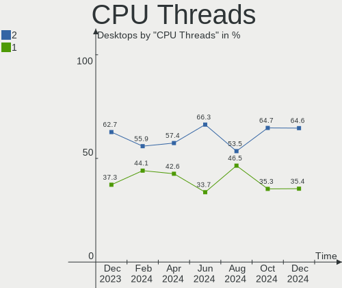
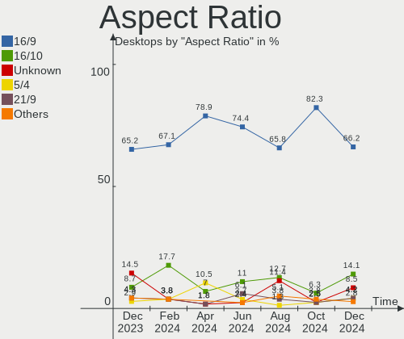
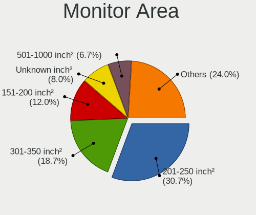
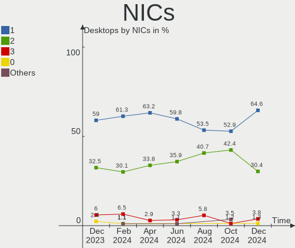
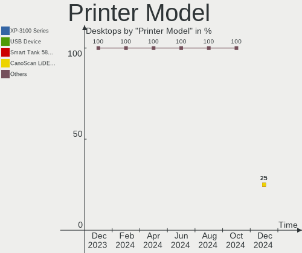

Zorin - Hardware Trends (Desktops)
----------------------------------

A project to identify most popular hardware characteristics and track their change
over time based on data collected by Linux users at https://Linux-Hardware.org.

Anyone can contribute to this report by the [hw-probe](https://github.com/linuxhw/hw-probe) tool:

    sudo -E hw-probe -all -upload

This report is for one last month. Overall report since the beginning of time: [TestDays](https://github.com/linuxhw/TestDays)

Period: Dec, 2024.

Contents
--------

* [ System ](#system)
  - [ OS                       ](#os)
  - [ OS Family                ](#os-family)
  - [ Kernel                   ](#kernel)
  - [ Kernel Family            ](#kernel-family)
  - [ Kernel Major Ver.        ](#kernel-major-ver)
  - [ Arch                     ](#arch)
  - [ DE                       ](#de)
  - [ Display Server           ](#display-server)
  - [ Display Manager          ](#display-manager)
  - [ OS Lang                  ](#os-lang)
  - [ Boot Mode                ](#boot-mode)
  - [ Filesystem               ](#filesystem)
  - [ Part. scheme             ](#part-scheme)
  - [ Dual Boot with Linux/BSD ](#dual-boot-with-linuxbsd)
  - [ Dual Boot (Win)          ](#dual-boot-win)

* [ Board ](#board)
  - [ Vendor                   ](#vendor)
  - [ Model                    ](#model)
  - [ Model Family             ](#model-family)
  - [ MFG Year                 ](#mfg-year)
  - [ Form Factor              ](#form-factor)
  - [ Secure Boot              ](#secure-boot)
  - [ Coreboot                 ](#coreboot)
  - [ RAM Size                 ](#ram-size)
  - [ RAM Used                 ](#ram-used)
  - [ Total Drives             ](#total-drives)
  - [ Has CD-ROM               ](#has-cd-rom)
  - [ Has Ethernet             ](#has-ethernet)
  - [ Has WiFi                 ](#has-wifi)
  - [ Has Bluetooth            ](#has-bluetooth)

* [ Location ](#location)
  - [ Country                  ](#country)
  - [ City                     ](#city)

* [ Drives ](#drives)
  - [ Drive Vendor             ](#drive-vendor)
  - [ Drive Model              ](#drive-model)
  - [ HDD Vendor               ](#hdd-vendor)
  - [ SSD Vendor               ](#ssd-vendor)
  - [ Drive Kind               ](#drive-kind)
  - [ Drive Connector          ](#drive-connector)
  - [ Drive Size               ](#drive-size)
  - [ Space Total              ](#space-total)
  - [ Space Used               ](#space-used)
  - [ Malfunc. Drives          ](#malfunc-drives)
  - [ Malfunc. Drive Vendor    ](#malfunc-drive-vendor)
  - [ Malfunc. HDD Vendor      ](#malfunc-hdd-vendor)
  - [ Malfunc. Drive Kind      ](#malfunc-drive-kind)
  - [ Failed Drives            ](#failed-drives)
  - [ Failed Drive Vendor      ](#failed-drive-vendor)
  - [ Drive Status             ](#drive-status)

* [ Storage controller ](#storage-controller)
  - [ Storage Vendor           ](#storage-vendor)
  - [ Storage Model            ](#storage-model)
  - [ Storage Kind             ](#storage-kind)

* [ Processor ](#processor)
  - [ CPU Vendor               ](#cpu-vendor)
  - [ CPU Model                ](#cpu-model)
  - [ CPU Model Family         ](#cpu-model-family)
  - [ CPU Cores                ](#cpu-cores)
  - [ CPU Sockets              ](#cpu-sockets)
  - [ CPU Threads              ](#cpu-threads)
  - [ CPU Op-Modes             ](#cpu-op-modes)
  - [ CPU Microcode            ](#cpu-microcode)
  - [ CPU Microarch            ](#cpu-microarch)

* [ Graphics ](#graphics)
  - [ GPU Vendor               ](#gpu-vendor)
  - [ GPU Model                ](#gpu-model)
  - [ GPU Combo                ](#gpu-combo)
  - [ GPU Driver               ](#gpu-driver)
  - [ GPU Memory               ](#gpu-memory)

* [ Monitor ](#monitor)
  - [ Monitor Vendor           ](#monitor-vendor)
  - [ Monitor Model            ](#monitor-model)
  - [ Monitor Resolution       ](#monitor-resolution)
  - [ Monitor Diagonal         ](#monitor-diagonal)
  - [ Monitor Width            ](#monitor-width)
  - [ Aspect Ratio             ](#aspect-ratio)
  - [ Monitor Area             ](#monitor-area)
  - [ Pixel Density            ](#pixel-density)
  - [ Multiple Monitors        ](#multiple-monitors)

* [ Network ](#network)
  - [ Net Controller Vendor    ](#net-controller-vendor)
  - [ Net Controller Model     ](#net-controller-model)
  - [ Wireless Vendor          ](#wireless-vendor)
  - [ Wireless Model           ](#wireless-model)
  - [ Ethernet Vendor          ](#ethernet-vendor)
  - [ Ethernet Model           ](#ethernet-model)
  - [ Net Controller Kind      ](#net-controller-kind)
  - [ Used Controller          ](#used-controller)
  - [ NICs                     ](#nics)
  - [ IPv6                     ](#ipv6)

* [ Bluetooth ](#bluetooth)
  - [ Bluetooth Vendor         ](#bluetooth-vendor)
  - [ Bluetooth Model          ](#bluetooth-model)

* [ Sound ](#sound)
  - [ Sound Vendor             ](#sound-vendor)
  - [ Sound Model              ](#sound-model)

* [ Memory ](#memory)
  - [ Memory Vendor            ](#memory-vendor)
  - [ Memory Model             ](#memory-model)
  - [ Memory Kind              ](#memory-kind)
  - [ Memory Form Factor       ](#memory-form-factor)
  - [ Memory Size              ](#memory-size)
  - [ Memory Speed             ](#memory-speed)

* [ Printers & scanners ](#printers--scanners)
  - [ Printer Vendor           ](#printer-vendor)
  - [ Printer Model            ](#printer-model)
  - [ Scanner Vendor           ](#scanner-vendor)
  - [ Scanner Model            ](#scanner-model)

* [ Camera ](#camera)
  - [ Camera Vendor            ](#camera-vendor)
  - [ Camera Model             ](#camera-model)

* [ Security ](#security)
  - [ Fingerprint Vendor       ](#fingerprint-vendor)
  - [ Fingerprint Model        ](#fingerprint-model)
  - [ Chipcard Vendor          ](#chipcard-vendor)
  - [ Chipcard Model           ](#chipcard-model)

* [ Unsupported ](#unsupported)
  - [ Unsupported Devices      ](#unsupported-devices)
  - [ Unsupported Device Types ](#unsupported-device-types)

System
------

OS
--

Installed operating systems

| Name     | Desktops | Percent |
|----------|----------|---------|
| Zorin 17 | 73       | 92.41%  |
| Zorin 16 | 5        | 6.33%   |
| Zorin 15 | 1        | 1.27%   |

OS Family
---------

OS without a version

| Name  | Desktops | Percent |
|-------|----------|---------|
| Zorin | 79       | 100%    |

Kernel
------

Version of the Linux kernel

| Version                 | Desktops | Percent |
|-------------------------|----------|---------|
| 6.8.0-49-generic        | 45       | 56.96%  |
| 6.8.0-50-generic        | 21       | 26.58%  |
| 6.8.0-40-generic        | 4        | 5.06%   |
| 5.15.0-126-generic      | 3        | 3.8%    |
| 6.8.0-48-generic        | 2        | 2.53%   |
| 6.12.1-1-liquorix-amd64 | 1        | 1.27%   |
| 5.4.0-150-generic       | 1        | 1.27%   |
| 5.15.0-127-generic      | 1        | 1.27%   |
| 5.15.0-100-generic      | 1        | 1.27%   |

Kernel Family
-------------

Linux kernel without a distro release

| Version | Desktops | Percent |
|---------|----------|---------|
| 6.8.0   | 72       | 91.14%  |
| 5.15.0  | 5        | 6.33%   |
| 6.12.1  | 1        | 1.27%   |
| 5.4.0   | 1        | 1.27%   |

Kernel Major Ver.
-----------------

Linux kernel major version

| Version | Desktops | Percent |
|---------|----------|---------|
| 6.8     | 72       | 91.14%  |
| 5.15    | 5        | 6.33%   |
| 6.12    | 1        | 1.27%   |
| 5.4     | 1        | 1.27%   |

Arch
----

OS architecture (x86_64, i586, etc.)

| Name   | Desktops | Percent |
|--------|----------|---------|
| x86_64 | 79       | 100%    |

DE
--

Desktop Environment

| Name          | Desktops | Percent |
|---------------|----------|---------|
| GNOME         | 74       | 93.67%  |
| XFCE          | 3        | 3.8%    |
| X-Cinnamon    | 1        | 1.27%   |
| Enlightenment | 1        | 1.27%   |

Display Server
--------------

X11 or Wayland

| Name    | Desktops | Percent |
|---------|----------|---------|
| Wayland | 50       | 63.29%  |
| X11     | 28       | 35.44%  |
| Tty     | 1        | 1.27%   |

Display Manager
---------------

SDDM, LightDM, etc.

| Name    | Desktops | Percent |
|---------|----------|---------|
| Unknown | 69       | 87.34%  |
| GDM3    | 9        | 11.39%  |
| LightDM | 1        | 1.27%   |

OS Lang
-------

Language

| Lang  | Desktops | Percent |
|-------|----------|---------|
| en_US | 32       | 40.51%  |
| de_DE | 11       | 13.92%  |
| pt_BR | 5        | 6.33%   |
| it_IT | 4        | 5.06%   |
| en_CA | 4        | 5.06%   |
| fr_FR | 3        | 3.8%    |
| en_AU | 3        | 3.8%    |
| es_ES | 2        | 2.53%   |
| en_GB | 2        | 2.53%   |
| tr_TR | 1        | 1.27%   |
| pl_PL | 1        | 1.27%   |
| nl_NL | 1        | 1.27%   |
| nl_BE | 1        | 1.27%   |
| nb_NO | 1        | 1.27%   |
| es_MX | 1        | 1.27%   |
| es_CO | 1        | 1.27%   |
| es_BO | 1        | 1.27%   |
| es_AR | 1        | 1.27%   |
| en_ZA | 1        | 1.27%   |
| en_NZ | 1        | 1.27%   |
| en_IN | 1        | 1.27%   |
| en_IE | 1        | 1.27%   |

Boot Mode
---------

EFI or BIOS

| Mode | Desktops | Percent |
|------|----------|---------|
| BIOS | 70       | 88.61%  |
| EFI  | 9        | 11.39%  |

Filesystem
----------

Type of filesystem

| Type  | Desktops | Percent |
|-------|----------|---------|
| Ext4  | 73       | 92.41%  |
| Tmpfs | 5        | 6.33%   |
| Btrfs | 1        | 1.27%   |

Part. scheme
------------

Scheme of partitioning

| Type    | Desktops | Percent |
|---------|----------|---------|
| Unknown | 69       | 87.34%  |
| GPT     | 8        | 10.13%  |
| MBR     | 2        | 2.53%   |

Dual Boot with Linux/BSD
------------------------

Hosting more than one Linux/BSD

| Dual boot | Desktops | Percent |
|-----------|----------|---------|
| No        | 75       | 94.94%  |
| Yes       | 4        | 5.06%   |

Dual Boot (Win)
---------------

Hosting Linux and Windows

| Dual boot | Desktops | Percent |
|-----------|----------|---------|
| No        | 71       | 89.87%  |
| Yes       | 8        | 10.13%  |

Board
-----

Vendor
------

Motherboard manufacturer

| Name                | Desktops | Percent |
|---------------------|----------|---------|
| ASUSTek Computer    | 15       | 18.99%  |
| Gigabyte Technology | 13       | 16.46%  |
| MSI                 | 9        | 11.39%  |
| Hewlett-Packard     | 9        | 11.39%  |
| Lenovo              | 8        | 10.13%  |
| Dell                | 7        | 8.86%   |
| ASRock              | 4        | 5.06%   |
| Intel               | 2        | 2.53%   |
| Acer                | 2        | 2.53%   |
| wpc                 | 1        | 1.27%   |
| Positivo            | 1        | 1.27%   |
| Packard Bell        | 1        | 1.27%   |
| Login Informatica   | 1        | 1.27%   |
| Huanan              | 1        | 1.27%   |
| Google              | 1        | 1.27%   |
| Fujitsu Siemens     | 1        | 1.27%   |
| Fujitsu             | 1        | 1.27%   |
| AZW                 | 1        | 1.27%   |
| Unknown             | 1        | 1.27%   |

Model
-----

Motherboard model

| Name                                   | Desktops | Percent |
|----------------------------------------|----------|---------|
| Gigabyte X570 AORUS ULTRA              | 2        | 2.53%   |
| wpc wpc616                             | 1        | 1.27%   |
| Positivo Positivo Master D380          | 1        | 1.27%   |
| Packard Bell IXTREME I9632 FR          | 1        | 1.27%   |
| MSI MS-7E16                            | 1        | 1.27%   |
| MSI MS-7D99                            | 1        | 1.27%   |
| MSI MS-7D30                            | 1        | 1.27%   |
| MSI MS-7D08                            | 1        | 1.27%   |
| MSI MS-7C56                            | 1        | 1.27%   |
| MSI MS-7A38                            | 1        | 1.27%   |
| MSI MS-7A34                            | 1        | 1.27%   |
| MSI MS-7792                            | 1        | 1.27%   |
| MSI MS-7566                            | 1        | 1.27%   |
| Login Informatica LOG-BAT-I            | 1        | 1.27%   |
| Lenovo ThinkCentre M93p 10A8001HUS     | 1        | 1.27%   |
| Lenovo ThinkCentre M910t 10MNS1Y900    | 1        | 1.27%   |
| Lenovo ThinkCentre M83 10AN0000AU      | 1        | 1.27%   |
| Lenovo ThinkCentre M700 10KQ001XAU     | 1        | 1.27%   |
| Lenovo ThinkCentre A55 870577G         | 1        | 1.27%   |
| Lenovo IdeaCentre B520 10064           | 1        | 1.27%   |
| Lenovo IdeaCentre 510-15ICB 90HU004QIX | 1        | 1.27%   |
| Lenovo H30-05 90BJ005BUS               | 1        | 1.27%   |
| Intel X79F1 V2.0                       | 1        | 1.27%   |
| Intel H55                              | 1        | 1.27%   |
| Huanan B85                             | 1        | 1.27%   |
| HP Z4 G4 Workstation                   | 1        | 1.27%   |
| HP ProDesk 400 G5 SFF                  | 1        | 1.27%   |
| HP ProDesk 400 G2.5 SFF                | 1        | 1.27%   |
| HP ProDesk 400 G1 MT                   | 1        | 1.27%   |
| HP EliteDesk 800 G2 SFF                | 1        | 1.27%   |
| HP EliteDesk 705 G4 DM 35W (TAA)       | 1        | 1.27%   |
| HP Compaq dc7900 Convertible Minitower | 1        | 1.27%   |
| HP Compaq 6200 Pro SFF PC              | 1        | 1.27%   |
| HP 260-a103ns                          | 1        | 1.27%   |
| Google Teemo                           | 1        | 1.27%   |
| Gigabyte Z97X-Gaming 5                 | 1        | 1.27%   |
| Gigabyte Z97X-Gaming 3                 | 1        | 1.27%   |
| Gigabyte Z77-DS3H                      | 1        | 1.27%   |
| Gigabyte Z690 AORUS ELITE AX DDR4      | 1        | 1.27%   |
| Gigabyte GA-MA790XT-UD4P               | 1        | 1.27%   |

Model Family
------------

Motherboard model prefix

| Name                        | Desktops | Percent |
|-----------------------------|----------|---------|
| Lenovo ThinkCentre          | 5        | 6.33%   |
| Dell OptiPlex               | 4        | 5.06%   |
| ASUS TUF                    | 4        | 5.06%   |
| ASUS PRIME                  | 4        | 5.06%   |
| HP ProDesk                  | 3        | 3.8%    |
| Lenovo IdeaCentre           | 2        | 2.53%   |
| HP EliteDesk                | 2        | 2.53%   |
| HP Compaq                   | 2        | 2.53%   |
| Gigabyte Z97X-Gaming        | 2        | 2.53%   |
| Gigabyte X570               | 2        | 2.53%   |
| Dell Precision              | 2        | 2.53%   |
| ASUS ROG                    | 2        | 2.53%   |
| wpc wpc616                  | 1        | 1.27%   |
| Positivo Positivo           | 1        | 1.27%   |
| Packard Bell IXTREME        | 1        | 1.27%   |
| MSI MS-7E16                 | 1        | 1.27%   |
| MSI MS-7D99                 | 1        | 1.27%   |
| MSI MS-7D30                 | 1        | 1.27%   |
| MSI MS-7D08                 | 1        | 1.27%   |
| MSI MS-7C56                 | 1        | 1.27%   |
| MSI MS-7A38                 | 1        | 1.27%   |
| MSI MS-7A34                 | 1        | 1.27%   |
| MSI MS-7792                 | 1        | 1.27%   |
| MSI MS-7566                 | 1        | 1.27%   |
| Login Informatica LOG-BAT-I | 1        | 1.27%   |
| Lenovo H30-05               | 1        | 1.27%   |
| Intel X79F1                 | 1        | 1.27%   |
| Intel H55                   | 1        | 1.27%   |
| Huanan B85                  | 1        | 1.27%   |
| HP Z4                       | 1        | 1.27%   |
| HP 260-a103ns               | 1        | 1.27%   |
| Google Teemo                | 1        | 1.27%   |
| Gigabyte Z77-DS3H           | 1        | 1.27%   |
| Gigabyte Z690               | 1        | 1.27%   |
| Gigabyte GA-MA790XT-UD4P    | 1        | 1.27%   |
| Gigabyte EP43-UD3L          | 1        | 1.27%   |
| Gigabyte B760               | 1        | 1.27%   |
| Gigabyte B550               | 1        | 1.27%   |
| Gigabyte B450M              | 1        | 1.27%   |
| Gigabyte B250M-Gaming       | 1        | 1.27%   |

MFG Year
--------

Motherboard manufacture year

| Year | Desktops | Percent |
|------|----------|---------|
| 2020 | 9        | 11.39%  |
| 2015 | 7        | 8.86%   |
| 2018 | 6        | 7.59%   |
| 2013 | 6        | 7.59%   |
| 2024 | 5        | 6.33%   |
| 2021 | 5        | 6.33%   |
| 2019 | 5        | 6.33%   |
| 2017 | 5        | 6.33%   |
| 2011 | 5        | 6.33%   |
| 2022 | 4        | 5.06%   |
| 2014 | 4        | 5.06%   |
| 2010 | 4        | 5.06%   |
| 2016 | 3        | 3.8%    |
| 2012 | 3        | 3.8%    |
| 2023 | 2        | 2.53%   |
| 2009 | 2        | 2.53%   |
| 2008 | 2        | 2.53%   |
| 2007 | 2        | 2.53%   |

Form Factor
-----------

Physical design of the computer

| Name    | Desktops | Percent |
|---------|----------|---------|
| Desktop | 79       | 100%    |

Secure Boot
-----------

Enabled or disabled

| State    | Desktops | Percent |
|----------|----------|---------|
| Disabled | 79       | 100%    |

Coreboot
--------

Have coreboot on board

| Used | Desktops | Percent |
|------|----------|---------|
| No   | 78       | 98.73%  |
| Yes  | 1        | 1.27%   |

RAM Size
--------

Total RAM memory

| Size in GB  | Desktops | Percent |
|-------------|----------|---------|
| 16.01-24.0  | 21       | 26.58%  |
| 32.01-64.0  | 19       | 24.05%  |
| 8.01-16.0   | 14       | 17.72%  |
| 4.01-8.0    | 9        | 11.39%  |
| 3.01-4.0    | 7        | 8.86%   |
| 64.01-256.0 | 6        | 7.59%   |
| 24.01-32.0  | 2        | 2.53%   |
| 1.01-2.0    | 1        | 1.27%   |

RAM Used
--------

Used RAM memory

| Used GB    | Desktops | Percent |
|------------|----------|---------|
| 2.01-3.0   | 32       | 40.51%  |
| 3.01-4.0   | 16       | 20.25%  |
| 1.01-2.0   | 12       | 15.19%  |
| 4.01-8.0   | 10       | 12.66%  |
| 8.01-16.0  | 6        | 7.59%   |
| 16.01-24.0 | 3        | 3.8%    |

Total Drives
------------

Number of drives on board

| Drives | Desktops | Percent |
|--------|----------|---------|
| 1      | 37       | 46.84%  |
| 2      | 23       | 29.11%  |
| 3      | 9        | 11.39%  |
| 4      | 6        | 7.59%   |
| 5      | 2        | 2.53%   |
| 8      | 1        | 1.27%   |
| 7      | 1        | 1.27%   |

Has CD-ROM
----------

Has CD-ROM on board

| Presented | Desktops | Percent |
|-----------|----------|---------|
| No        | 43       | 54.43%  |
| Yes       | 36       | 45.57%  |

Has Ethernet
------------

Has Ethernet on board

| Presented | Desktops | Percent |
|-----------|----------|---------|
| Yes       | 79       | 100%    |

Has WiFi
--------

Has WiFi module

| Presented | Desktops | Percent |
|-----------|----------|---------|
| Yes       | 44       | 55.7%   |
| No        | 35       | 44.3%   |

Has Bluetooth
-------------

Has Bluetooth module

| Presented | Desktops | Percent |
|-----------|----------|---------|
| No        | 48       | 60.76%  |
| Yes       | 31       | 39.24%  |

Location
--------

Country
-------

Geographic location (country)

| Country         | Desktops | Percent |
|-----------------|----------|---------|
| USA             | 19       | 24.05%  |
| Germany         | 12       | 15.19%  |
| Canada          | 6        | 7.59%   |
| Brazil          | 5        | 6.33%   |
| Italy           | 4        | 5.06%   |
| France          | 3        | 3.8%    |
| Australia       | 3        | 3.8%    |
| UK              | 2        | 2.53%   |
| Spain           | 2        | 2.53%   |
| Saudi Arabia    | 2        | 2.53%   |
| India           | 2        | 2.53%   |
| Belgium         | 2        | 2.53%   |
| Argentina       | 2        | 2.53%   |
| Turkey          | 1        | 1.27%   |
| The Netherlands | 1        | 1.27%   |
| Taiwan          | 1        | 1.27%   |
| Sweden          | 1        | 1.27%   |
| South Africa    | 1        | 1.27%   |
| Poland          | 1        | 1.27%   |
| Norway          | 1        | 1.27%   |
| New Zealand     | 1        | 1.27%   |
| Myanmar         | 1        | 1.27%   |
| Mexico          | 1        | 1.27%   |
| Ireland         | 1        | 1.27%   |
| Colombia        | 1        | 1.27%   |
| Chile           | 1        | 1.27%   |
| Bulgaria        | 1        | 1.27%   |
| Bolivia         | 1        | 1.27%   |

City
----

Geographic location (city)

| City                  | Desktops | Percent |
|-----------------------|----------|---------|
| Sydney                | 2        | 2.53%   |
| Mumbai                | 2        | 2.53%   |
| Colorado Springs      | 2        | 2.53%   |
| Buenos Aires          | 2        | 2.53%   |
| Würzburg             | 1        | 1.27%   |
| Windsor               | 1        | 1.27%   |
| Vitinia               | 1        | 1.27%   |
| Varna                 | 1        | 1.27%   |
| Turbigo               | 1        | 1.27%   |
| Tracadie–Sheila     | 1        | 1.27%   |
| Toronto               | 1        | 1.27%   |
| Taichung              | 1        | 1.27%   |
| Stockholm             | 1        | 1.27%   |
| Sterling              | 1        | 1.27%   |
| Sisteron              | 1        | 1.27%   |
| Simbach am Inn        | 1        | 1.27%   |
| Selm                  | 1        | 1.27%   |
| Sao José dos Pinhais | 1        | 1.27%   |
| Santiago              | 1        | 1.27%   |
| Santana do Araguaia   | 1        | 1.27%   |
| San Michele Mondovì  | 1        | 1.27%   |
| Saint-Saulve          | 1        | 1.27%   |
| Richmond Hill         | 1        | 1.27%   |
| Recife                | 1        | 1.27%   |
| Potsdam               | 1        | 1.27%   |
| Poole                 | 1        | 1.27%   |
| Pitalito              | 1        | 1.27%   |
| Overhalla             | 1        | 1.27%   |
| Naucalpan             | 1        | 1.27%   |
| Natal                 | 1        | 1.27%   |
| Moyock                | 1        | 1.27%   |
| Moana                 | 1        | 1.27%   |
| Milan                 | 1        | 1.27%   |
| Mechanicsburg         | 1        | 1.27%   |
| McAllen               | 1        | 1.27%   |
| Masontown             | 1        | 1.27%   |
| Martinopolis          | 1        | 1.27%   |
| Mandalay              | 1        | 1.27%   |
| Lubbeek               | 1        | 1.27%   |
| Longview              | 1        | 1.27%   |

Drives
------

Drive Vendor
------------

Hard drive vendors

| Vendor                       | Desktops | Drives | Percent |
|------------------------------|----------|--------|---------|
| Seagate                      | 24       | 29     | 17.27%  |
| WDC                          | 23       | 28     | 16.55%  |
| Samsung Electronics          | 14       | 17     | 10.07%  |
| Crucial                      | 8        | 10     | 5.76%   |
| Phison Electronics           | 6        | 8      | 4.32%   |
| Kingston                     | 6        | 6      | 4.32%   |
| Toshiba                      | 4        | 4      | 2.88%   |
| SanDisk                      | 4        | 4      | 2.88%   |
| OCZ                          | 4        | 4      | 2.88%   |
| Micron/Crucial Technology    | 4        | 4      | 2.88%   |
| Intel                        | 4        | 4      | 2.88%   |
| Unknown                      | 3        | 4      | 2.16%   |
| Silicon Motion               | 3        | 3      | 2.16%   |
| Kingston Technology Company  | 3        | 3      | 2.16%   |
| China                        | 3        | 3      | 2.16%   |
| Unknown                      | 3        | 4      | 2.16%   |
| MAXIO Technology (Hangzhou)  | 2        | 3      | 1.44%   |
| Hitachi                      | 2        | 6      | 1.44%   |
| Verbatim                     | 1        | 2      | 0.72%   |
| Timetec                      | 1        | 1      | 0.72%   |
| Team                         | 1        | 1      | 0.72%   |
| SPCC                         | 1        | 1      | 0.72%   |
| SK hynix                     | 1        | 1      | 0.72%   |
| Shenzhen Longsys Electronics | 1        | 1      | 0.72%   |
| SABRENT                      | 1        | 1      | 0.72%   |
| PNY                          | 1        | 1      | 0.72%   |
| LITEON                       | 1        | 1      | 0.72%   |
| KingSpec                     | 1        | 1      | 0.72%   |
| Kingchuxing                  | 1        | 1      | 0.72%   |
| KimMiDi                      | 1        | 1      | 0.72%   |
| Intenso                      | 1        | 1      | 0.72%   |
| Inland                       | 1        | 1      | 0.72%   |
| Hewlett-Packard              | 1        | 1      | 0.72%   |
| GOODRAM                      | 1        | 1      | 0.72%   |
| EAGET                        | 1        | 1      | 0.72%   |
| Biwin Storage Technology     | 1        | 1      | 0.72%   |
| ADATA Technology             | 1        | 1      | 0.72%   |

Drive Model
-----------

Hard drive models

| Model                                                 | Desktops | Percent |
|-------------------------------------------------------|----------|---------|
| Seagate ST1000DM003-1CH162 1TB                        | 5        | 3.29%   |
| Crucial CT1000MX500SSD1 1TB                           | 4        | 2.63%   |
| Unknown                                               | 3        | 1.97%   |
| WDC WDS200T2B0A-00SM50 2TB SSD                        | 2        | 1.32%   |
| Silicon Motion SM2263EN/SM2263XT SSD Controller 256GB | 2        | 1.32%   |
| Seagate ST6000DM003-2CY186 6TB                        | 2        | 1.32%   |
| Seagate ST3500413AS 500GB                             | 2        | 1.32%   |
| Seagate ST1000DM003-1ER162 1TB                        | 2        | 1.32%   |
| Samsung NVMe SSD Controller SM981/PM981/PM983 512GB   | 2        | 1.32%   |
| Samsung NVMe SSD Controller PM9A1/PM9A3/980PRO 512GB  | 2        | 1.32%   |
| Phison E16 PCIe4 NVMe Controller 1TB                  | 2        | 1.32%   |
| OCZ VERTEX3 120GB SSD                                 | 2        | 1.32%   |
| Micron/Crucial P2 NVMe PCIe SSD 500GB                 | 2        | 1.32%   |
| Crucial CT500MX500SSD1 500GB                          | 2        | 1.32%   |
| WDC WDS250G2B0B 250GB SSD                             | 1        | 0.66%   |
| WDC WDS100T2G0A-00JH30 1TB SSD                        | 1        | 0.66%   |
| WDC WDS100T1XHE-00AFY0 1TB                            | 1        | 0.66%   |
| WDC WD63PURZ-85B4VY0 6TB                              | 1        | 0.66%   |
| WDC WD5000AAKX-75U6AA0 500GB                          | 1        | 0.66%   |
| WDC WD5000AAKX-08U6AA0 500GB                          | 1        | 0.66%   |
| WDC WD5000AAKX-08ANVA0 500GB                          | 1        | 0.66%   |
| WDC WD5000AAKS-65YGA0 500GB                           | 1        | 0.66%   |
| WDC WD40EZRZ-00GXCB0 4TB                              | 1        | 0.66%   |
| WDC WD3200BPVT-22JJ5T0 320GB                          | 1        | 0.66%   |
| WDC WD3200BEVT-22ZCT0 320GB                           | 1        | 0.66%   |
| WDC WD20EZRX-00D8PB0 2TB                              | 1        | 0.66%   |
| WDC WD20EARX-00PASB0 2TB                              | 1        | 0.66%   |
| WDC WD20EADS-00R6B0 2TB                               | 1        | 0.66%   |
| WDC WD1602ABYS-23B7A0 39M4507 42C0462IBM 160GB        | 1        | 0.66%   |
| WDC WD1600AVVS-63L2B0 160GB                           | 1        | 0.66%   |
| WDC WD1600AABS-00H4A0 160GB                           | 1        | 0.66%   |
| WDC WD10EZEX-75WN4A0 1TB                              | 1        | 0.66%   |
| WDC WD10EZEX-60ZF5A0 1TB                              | 1        | 0.66%   |
| WDC WD10EZEX-60WN4A0 1TB                              | 1        | 0.66%   |
| WDC WD10EZEX-08WN4A0 1TB                              | 1        | 0.66%   |
| WDC WD10EALS-00Z8A0 1TB                               | 1        | 0.66%   |
| WDC WD10EADS-00M2B0 1TB                               | 1        | 0.66%   |
| WDC WD1003FZEX-00MK2A0 1TB                            | 1        | 0.66%   |
| WDC WD1003FZEX-00K3CA0 1TB                            | 1        | 0.66%   |
| Verbatim Vi550 S3 1TB SSD                             | 1        | 0.66%   |

HDD Vendor
----------

Hard disk drive vendors

| Vendor              | Desktops | Drives | Percent |
|---------------------|----------|--------|---------|
| Seagate             | 23       | 28     | 42.59%  |
| WDC                 | 19       | 22     | 35.19%  |
| Samsung Electronics | 4        | 4      | 7.41%   |
| Toshiba             | 3        | 3      | 5.56%   |
| Hitachi             | 2        | 6      | 3.7%    |
| Unknown             | 1        | 1      | 1.85%   |
| SABRENT             | 1        | 1      | 1.85%   |
| Hewlett-Packard     | 1        | 1      | 1.85%   |

SSD Vendor
----------

Solid state drive vendors

| Vendor              | Desktops | Drives | Percent |
|---------------------|----------|--------|---------|
| Crucial             | 8        | 10     | 16.33%  |
| Samsung Electronics | 6        | 6      | 12.24%  |
| Kingston            | 5        | 5      | 10.2%   |
| WDC                 | 4        | 5      | 8.16%   |
| SanDisk             | 4        | 4      | 8.16%   |
| OCZ                 | 4        | 4      | 8.16%   |
| China               | 3        | 3      | 6.12%   |
| Intel               | 2        | 2      | 4.08%   |
| Verbatim            | 1        | 2      | 2.04%   |
| Timetec             | 1        | 1      | 2.04%   |
| Team                | 1        | 1      | 2.04%   |
| SPCC                | 1        | 1      | 2.04%   |
| Seagate             | 1        | 1      | 2.04%   |
| PNY                 | 1        | 1      | 2.04%   |
| LITEON              | 1        | 1      | 2.04%   |
| KingSpec            | 1        | 1      | 2.04%   |
| KimMiDi             | 1        | 1      | 2.04%   |
| Intenso             | 1        | 1      | 2.04%   |
| GOODRAM             | 1        | 1      | 2.04%   |
| EAGET               | 1        | 1      | 2.04%   |
| Unknown             | 1        | 1      | 2.04%   |

Drive Kind
----------

HDD or SSD

| Kind    | Desktops | Drives | Percent |
|---------|----------|--------|---------|
| HDD     | 42       | 66     | 36.84%  |
| SSD     | 39       | 53     | 34.21%  |
| NVMe    | 29       | 40     | 25.44%  |
| Unknown | 3        | 4      | 2.63%   |
| MMC     | 1        | 1      | 0.88%   |

Drive Connector
---------------

SATA, SAS, NVMe, etc.

| Type | Desktops | Drives | Percent |
|------|----------|--------|---------|
| SATA | 65       | 118    | 65.66%  |
| NVMe | 29       | 40     | 29.29%  |
| SAS  | 4        | 5      | 4.04%   |
| MMC  | 1        | 1      | 1.01%   |

Drive Size
----------

Size of hard drive

| Size in TB | Desktops | Drives | Percent |
|------------|----------|--------|---------|
| 0.01-0.5   | 43       | 51     | 47.78%  |
| 0.51-1.0   | 27       | 39     | 30%     |
| 1.01-2.0   | 11       | 19     | 12.22%  |
| 3.01-4.0   | 3        | 3      | 3.33%   |
| 4.01-10.0  | 3        | 3      | 3.33%   |
| 2.01-3.0   | 2        | 3      | 2.22%   |
| 10.01-20.0 | 1        | 1      | 1.11%   |

Space Total
-----------

Amount of disk space available on the file system

| Size in GB     | Desktops | Percent |
|----------------|----------|---------|
| 101-250        | 22       | 27.85%  |
| 501-1000       | 17       | 21.52%  |
| 251-500        | 11       | 13.92%  |
| 1001-2000      | 8        | 10.13%  |
| More than 3000 | 7        | 8.86%   |
| 2001-3000      | 7        | 8.86%   |
| 51-100         | 3        | 3.8%    |
| 21-50          | 2        | 2.53%   |
| 1-20           | 2        | 2.53%   |

Space Used
----------

Amount of used disk space

| Used GB        | Desktops | Percent |
|----------------|----------|---------|
| 1-20           | 22       | 27.85%  |
| 21-50          | 15       | 18.99%  |
| 51-100         | 10       | 12.66%  |
| 501-1000       | 8        | 10.13%  |
| 101-250        | 7        | 8.86%   |
| 1001-2000      | 7        | 8.86%   |
| 251-500        | 6        | 7.59%   |
| More than 3000 | 3        | 3.8%    |
| 2001-3000      | 1        | 1.27%   |

Malfunc. Drives
---------------

Drive models with a malfunction

| Model                                 | Desktops | Drives | Percent |
|---------------------------------------|----------|--------|---------|
| Samsung Electronics SSD 850 PRO 512GB | 1        | 1      | 50%     |
| China SSD 1TB                         | 1        | 1      | 50%     |

Malfunc. Drive Vendor
---------------------

Vendors of faulty drives

| Vendor              | Desktops | Drives | Percent |
|---------------------|----------|--------|---------|
| Samsung Electronics | 1        | 1      | 50%     |
| China               | 1        | 1      | 50%     |

Malfunc. HDD Vendor
-------------------

Vendors of faulty HDD drives

Zero info for selected period =(

Malfunc. Drive Kind
-------------------

Kinds of faulty drives

| Kind | Desktops | Drives | Percent |
|------|----------|--------|---------|
| SSD  | 2        | 2      | 100%    |

Failed Drives
-------------

Failed drive models

Zero info for selected period =(

Failed Drive Vendor
-------------------

Failed drive vendors

Zero info for selected period =(

Drive Status
------------

Number of failed and malfunc. drives

| Status   | Desktops | Drives | Percent |
|----------|----------|--------|---------|
| Detected | 74       | 152    | 90.24%  |
| Works    | 6        | 10     | 7.32%   |
| Malfunc  | 2        | 2      | 2.44%   |

Storage controller
------------------

Storage Vendor
--------------

Storage controller vendors

| Vendor                       | Desktops | Percent |
|------------------------------|----------|---------|
| Intel                        | 54       | 43.55%  |
| AMD                          | 25       | 20.16%  |
| Samsung Electronics          | 6        | 4.84%   |
| Phison Electronics           | 6        | 4.84%   |
| ASMedia Technology           | 5        | 4.03%   |
| Micron/Crucial Technology    | 4        | 3.23%   |
| Kingston Technology Company  | 4        | 3.23%   |
| JMicron Technology           | 4        | 3.23%   |
| Silicon Motion               | 3        | 2.42%   |
| MAXIO Technology (Hangzhou)  | 2        | 1.61%   |
| Marvell Technology Group     | 2        | 1.61%   |
| Toshiba America Info Systems | 1        | 0.81%   |
| SK hynix                     | 1        | 0.81%   |
| Shenzhen Longsys Electronics | 1        | 0.81%   |
| SanDisk                      | 1        | 0.81%   |
| Nvidia                       | 1        | 0.81%   |
| LSI Logic / Symbios Logic    | 1        | 0.81%   |
| Broadcom / LSI               | 1        | 0.81%   |
| Biwin Storage Technology     | 1        | 0.81%   |
| ADATA Technology             | 1        | 0.81%   |

Storage Model
-------------

Storage controller models

| Model                                                                          | Desktops | Percent |
|--------------------------------------------------------------------------------|----------|---------|
| AMD FCH SATA Controller [AHCI mode]                                            | 15       | 10.14%  |
| Intel 8 Series/C220 Series Chipset Family 6-port SATA Controller 1 [AHCI mode] | 8        | 5.41%   |
| Intel 6 Series/C200 Series Chipset Family 6 port Desktop SATA AHCI Controller  | 7        | 4.73%   |
| Intel Q170/Q150/B150/H170/H110/Z170/CM236 Chipset SATA Controller [AHCI Mode]  | 5        | 3.38%   |
| ASMedia ASM1061/ASM1062 Serial ATA Controller                                  | 4        | 2.7%    |
| AMD 600 Series Chipset SATA Controller                                         | 4        | 2.7%    |
| AMD 500 Series Chipset SATA Controller                                         | 4        | 2.7%    |
| AMD 400 Series Chipset SATA Controller                                         | 4        | 2.7%    |
| JMicron JMB363 SATA/IDE Controller                                             | 3        | 2.03%   |
| Intel Alder Lake-S PCH SATA Controller [AHCI Mode]                             | 3        | 2.03%   |
| Intel 7 Series/C210 Series Chipset Family 6-port SATA Controller [AHCI mode]   | 3        | 2.03%   |
| AMD A320 Chipset SATA Controller [AHCI mode]                                   | 3        | 2.03%   |
| Silicon Motion SM2263EN/SM2263XT (DRAM-less) NVMe SSD Controllers              | 2        | 1.35%   |
| Samsung NVMe SSD Controller SM981/PM981/PM983                                  | 2        | 1.35%   |
| Samsung NVMe SSD Controller S4LV008[Pascal]                                    | 2        | 1.35%   |
| Samsung NVMe SSD Controller PM9A1/PM9A3/980PRO                                 | 2        | 1.35%   |
| Phison E18 PCIe4 NVMe Controller                                               | 2        | 1.35%   |
| Phison E16 PCIe4 NVMe Controller                                               | 2        | 1.35%   |
| Micron/Crucial P2 [Nick P2] / P3 / P3 Plus NVMe PCIe SSD (DRAM-less)           | 2        | 1.35%   |
| MAXIO (Hangzhou) NVMe SSD Controller MAP1602 (DRAM-less)                       | 2        | 1.35%   |
| Intel SATA Controller [RAID mode]                                              | 2        | 1.35%   |
| Intel Raptor Lake SATA AHCI Controller                                         | 2        | 1.35%   |
| Intel Comet Lake SATA AHCI Controller                                          | 2        | 1.35%   |
| Intel Cannon Lake PCH SATA AHCI Controller                                     | 2        | 1.35%   |
| Intel 9 Series Chipset Family SATA Controller [AHCI Mode]                      | 2        | 1.35%   |
| Intel 82801JI (ICH10 Family) SATA AHCI Controller                              | 2        | 1.35%   |
| Intel 82801JI (ICH10 Family) 4 port SATA IDE Controller #1                     | 2        | 1.35%   |
| Intel 82801JI (ICH10 Family) 2 port SATA IDE Controller #2                     | 2        | 1.35%   |
| Intel 4 Series Chipset PT IDER Controller                                      | 2        | 1.35%   |
| Intel 200 Series PCH SATA controller [AHCI mode]                               | 2        | 1.35%   |
| AMD 300 Series Chipset SATA Controller                                         | 2        | 1.35%   |
| Toshiba America Info Systems XG5 NVMe SSD Controller                           | 1        | 0.68%   |
| SK hynix BC501 NVMe Solid State Drive                                          | 1        | 0.68%   |
| Silicon Motion SM2262/SM2262EN SSD Controller                                  | 1        | 0.68%   |
| Shenzhen Longsys Lexar NM790 NVME SSD (DRAM-less)                              | 1        | 0.68%   |
| SanDisk WD PC SN810 / Black SN850 NVMe SSD                                     | 1        | 0.68%   |
| Phison PS5026-E26 PCIe5 NVMe Controller                                        | 1        | 0.68%   |
| Phison PS5021-E21 PCIe4 NVMe Controller (DRAM-less)                            | 1        | 0.68%   |
| Phison E8 PCIe3 x2 NVMe Controller                                             | 1        | 0.68%   |
| Nvidia MCP51 Serial ATA Controller                                             | 1        | 0.68%   |

Storage Kind
------------

Kind of storage controller (IDE, SATA, NVMe, SAS, ...)

| Kind | Desktops | Percent |
|------|----------|---------|
| SATA | 69       | 60%     |
| NVMe | 29       | 25.22%  |
| IDE  | 12       | 10.43%  |
| RAID | 3        | 2.61%   |
| SAS  | 1        | 0.87%   |
| SCSI | 1        | 0.87%   |

Processor
---------

CPU Vendor
----------

Processor vendors

| Vendor | Desktops | Percent |
|--------|----------|---------|
| Intel  | 53       | 67.09%  |
| AMD    | 26       | 32.91%  |

CPU Model
---------

Processor models

| Model                                  | Desktops | Percent |
|----------------------------------------|----------|---------|
| Intel Core i7-2600 CPU @ 3.40GHz       | 4        | 5.06%   |
| Intel Core i7-8700 CPU @ 3.20GHz       | 2        | 2.53%   |
| Intel Core i7-6700 CPU @ 3.40GHz       | 2        | 2.53%   |
| Intel Core i5-7400 CPU @ 3.00GHz       | 2        | 2.53%   |
| Intel Core i5-6500 CPU @ 3.20GHz       | 2        | 2.53%   |
| Intel Core i5-4570 CPU @ 3.20GHz       | 2        | 2.53%   |
| AMD Ryzen 7 5800X 8-Core Processor     | 2        | 2.53%   |
| AMD Ryzen 5 7600 6-Core Processor      | 2        | 2.53%   |
| AMD Ryzen 5 5600G with Radeon Graphics | 2        | 2.53%   |
| Intel Xeon W-2133 CPU @ 3.60GHz        | 1        | 1.27%   |
| Intel Xeon CPU X5675 @ 3.07GHz         | 1        | 1.27%   |
| Intel Xeon CPU E5-2699 v3 @ 2.30GHz    | 1        | 1.27%   |
| Intel Xeon CPU E5-2690 v2 @ 3.00GHz    | 1        | 1.27%   |
| Intel Pentium Dual CPU E2140 @ 1.60GHz | 1        | 1.27%   |
| Intel Pentium CPU J2900 @ 2.41GHz      | 1        | 1.27%   |
| Intel Pentium CPU G640 @ 2.80GHz       | 1        | 1.27%   |
| Intel Core i9-10900 CPU @ 2.80GHz      | 1        | 1.27%   |
| Intel Core i7-8550U CPU @ 1.80GHz      | 1        | 1.27%   |
| Intel Core i7-4790K CPU @ 4.00GHz      | 1        | 1.27%   |
| Intel Core i7-4790 CPU @ 3.60GHz       | 1        | 1.27%   |
| Intel Core i7-4770 CPU @ 3.40GHz       | 1        | 1.27%   |
| Intel Core i7-3770K CPU @ 3.50GHz      | 1        | 1.27%   |
| Intel Core i7-14700K                   | 1        | 1.27%   |
| Intel Core i7 CPU 940 @ 2.93GHz        | 1        | 1.27%   |
| Intel Core i7 CPU 920 @ 2.67GHz        | 1        | 1.27%   |
| Intel Core i5-6400 CPU @ 2.70GHz       | 1        | 1.27%   |
| Intel Core i5-4690 CPU @ 3.50GHz       | 1        | 1.27%   |
| Intel Core i5-4570S CPU @ 2.90GHz      | 1        | 1.27%   |
| Intel Core i5-4440 CPU @ 3.10GHz       | 1        | 1.27%   |
| Intel Core i5-4430 CPU @ 3.00GHz       | 1        | 1.27%   |
| Intel Core i5-3570 CPU @ 3.40GHz       | 1        | 1.27%   |
| Intel Core i5-2500K CPU @ 3.30GHz      | 1        | 1.27%   |
| Intel Core i5-10400 CPU @ 2.90GHz      | 1        | 1.27%   |
| Intel Core i5 CPU 650 @ 3.20GHz        | 1        | 1.27%   |
| Intel Core i3-4170 CPU @ 3.70GHz       | 1        | 1.27%   |
| Intel Core i3-2100 CPU @ 3.10GHz       | 1        | 1.27%   |
| Intel Core 2 Quad CPU Q9550 @ 2.83GHz  | 1        | 1.27%   |
| Intel Core 2 Duo CPU E8500 @ 3.16GHz   | 1        | 1.27%   |
| Intel Core 2 Duo CPU E6750 @ 2.66GHz   | 1        | 1.27%   |
| Intel Celeron J4105 CPU @ 1.50GHz      | 1        | 1.27%   |

CPU Model Family
----------------

Processor model prefix

| Model              | Desktops | Percent |
|--------------------|----------|---------|
| Intel Core i7      | 16       | 20.25%  |
| Intel Core i5      | 15       | 18.99%  |
| AMD Ryzen 5        | 8        | 10.13%  |
| Other              | 6        | 7.59%   |
| AMD Ryzen 7        | 5        | 6.33%   |
| Intel Xeon         | 4        | 5.06%   |
| Intel Celeron      | 3        | 3.8%    |
| AMD Ryzen 9        | 3        | 3.8%    |
| Intel Pentium      | 2        | 2.53%   |
| Intel Core i3      | 2        | 2.53%   |
| Intel Core 2 Duo   | 2        | 2.53%   |
| AMD Ryzen 3        | 2        | 2.53%   |
| AMD A6             | 2        | 2.53%   |
| Intel Pentium Dual | 1        | 1.27%   |
| Intel Core i9      | 1        | 1.27%   |
| Intel Core 2 Quad  | 1        | 1.27%   |
| AMD Ryzen 5 PRO    | 1        | 1.27%   |
| AMD Phenom II X4   | 1        | 1.27%   |
| AMD E1             | 1        | 1.27%   |
| AMD Athlon 64 X2   | 1        | 1.27%   |
| AMD A8             | 1        | 1.27%   |
| AMD A10            | 1        | 1.27%   |

CPU Cores
---------

Number of processor cores

| Number | Desktops | Percent |
|--------|----------|---------|
| 4      | 35       | 44.3%   |
| 6      | 12       | 15.19%  |
| 2      | 12       | 15.19%  |
| 8      | 6        | 7.59%   |
| 12     | 4        | 5.06%   |
| 16     | 2        | 2.53%   |
| 14     | 2        | 2.53%   |
| 10     | 2        | 2.53%   |
| 1      | 2        | 2.53%   |
| 20     | 1        | 1.27%   |
| 18     | 1        | 1.27%   |

CPU Sockets
-----------

Number of sockets

| Number | Desktops | Percent |
|--------|----------|---------|
| 1      | 78       | 98.73%  |
| 2      | 1        | 1.27%   |

CPU Threads
-----------

Threads per core (Hyper-Threading)

| Number | Desktops | Percent |
|--------|----------|---------|
| 2      | 51       | 64.56%  |
| 1      | 28       | 35.44%  |

CPU Op-Modes
------------

CPU Operation Modes (32-bit, 64-bit)

| Op mode        | Desktops | Percent |
|----------------|----------|---------|
| 32-bit, 64-bit | 79       | 100%    |

CPU Microcode
-------------

Microcode number

| Number     | Desktops | Percent |
|------------|----------|---------|
| Unknown    | 75       | 94.94%  |
| 0x206a7    | 2        | 2.53%   |
| 0x50654    | 1        | 1.27%   |
| 0x0a201204 | 1        | 1.27%   |

CPU Microarch
-------------

Microarchitecture

| Name          | Desktops | Percent |
|---------------|----------|---------|
| Haswell       | 11       | 13.92%  |
| Unknown       | 10       | 12.66%  |
| Zen 3         | 8        | 10.13%  |
| SandyBridge   | 8        | 10.13%  |
| Skylake       | 6        | 7.59%   |
| KabyLake      | 5        | 6.33%   |
| Zen+          | 3        | 3.8%    |
| IvyBridge     | 3        | 3.8%    |
| Zen 2         | 2        | 2.53%   |
| Zen           | 2        | 2.53%   |
| Westmere      | 2        | 2.53%   |
| Silvermont    | 2        | 2.53%   |
| Penryn        | 2        | 2.53%   |
| Nehalem       | 2        | 2.53%   |
| Excavator     | 2        | 2.53%   |
| Core          | 2        | 2.53%   |
| CometLake     | 2        | 2.53%   |
| Puma          | 1        | 1.27%   |
| Piledriver    | 1        | 1.27%   |
| K8 Hammer     | 1        | 1.27%   |
| K10 Llano     | 1        | 1.27%   |
| K10           | 1        | 1.27%   |
| Icelake       | 1        | 1.27%   |
| Goldmont plus | 1        | 1.27%   |

Graphics
--------

GPU Vendor
----------

Vendors of graphics cards

| Vendor           | Desktops | Percent |
|------------------|----------|---------|
| Nvidia           | 33       | 36.67%  |
| Intel            | 30       | 33.33%  |
| AMD              | 26       | 28.89%  |
| ATI Technologies | 1        | 1.11%   |

GPU Model
---------

Graphics card models

| Model                                                                       | Desktops | Percent |
|-----------------------------------------------------------------------------|----------|---------|
| Intel Xeon E3-1200 v3/4th Gen Core Processor Integrated Graphics Controller | 5        | 5.49%   |
| Intel HD Graphics 530                                                       | 5        | 5.49%   |
| Intel 2nd Generation Core Processor Family Integrated Graphics Controller   | 4        | 4.4%    |
| Nvidia GF119 [GeForce GT 610]                                               | 3        | 3.3%    |
| AMD Ellesmere [Radeon RX 470/480/570/570X/580/580X/590]                     | 3        | 3.3%    |
| Nvidia TU117 [GeForce GTX 1650]                                             | 2        | 2.2%    |
| Nvidia GP106 [GeForce GTX 1060 6GB]                                         | 2        | 2.2%    |
| Nvidia GK208B [GeForce GT 730]                                              | 2        | 2.2%    |
| Nvidia GK208B [GeForce GT 710]                                              | 2        | 2.2%    |
| Nvidia AD107 [GeForce RTX 4060]                                             | 2        | 2.2%    |
| Intel Raptor Lake-S GT1 [UHD Graphics 770]                                  | 2        | 2.2%    |
| Intel CoffeeLake-S GT2 [UHD Graphics 630]                                   | 2        | 2.2%    |
| Intel AlderLake-S GT1                                                       | 2        | 2.2%    |
| AMD Raphael                                                                 | 2        | 2.2%    |
| AMD Picasso/Raven 2 [Radeon Vega Series / Radeon Vega Mobile Series]        | 2        | 2.2%    |
| AMD Navi 23 [Radeon RX 6600/6600 XT/6600M]                                  | 2        | 2.2%    |
| AMD Juniper XT [Radeon HD 5770]                                             | 2        | 2.2%    |
| AMD Caicos XT [Radeon HD 7470/8470 / R5 235/310 OEM]                        | 2        | 2.2%    |
| Nvidia TU116 [GeForce GTX 1660 Ti]                                          | 1        | 1.1%    |
| Nvidia TU104 [GeForce RTX 2080 Rev. A]                                      | 1        | 1.1%    |
| Nvidia TU104 [GeForce RTX 2060]                                             | 1        | 1.1%    |
| Nvidia GP108 [GeForce GT 1030]                                              | 1        | 1.1%    |
| Nvidia GP107 [GeForce GTX 1050]                                             | 1        | 1.1%    |
| Nvidia GP106GL [Quadro P2000]                                               | 1        | 1.1%    |
| Nvidia GP102 [GeForce GTX 1080 Ti]                                          | 1        | 1.1%    |
| Nvidia GM204 [GeForce GTX 970]                                              | 1        | 1.1%    |
| Nvidia GM107M [GeForce GTX 860M]                                            | 1        | 1.1%    |
| Nvidia GM107GL [Quadro K620]                                                | 1        | 1.1%    |
| Nvidia GF114 [GeForce GTX 560 Ti]                                           | 1        | 1.1%    |
| Nvidia GF108M [GeForce GT 555M]                                             | 1        | 1.1%    |
| Nvidia GF100GL [Quadro 5000]                                                | 1        | 1.1%    |
| Nvidia GA106 [GeForce RTX 3060 Lite Hash Rate]                              | 1        | 1.1%    |
| Nvidia GA104 [GeForce RTX 3070 Lite Hash Rate]                              | 1        | 1.1%    |
| Nvidia GA102 [GeForce RTX 3080 Lite Hash Rate]                              | 1        | 1.1%    |
| Nvidia G98 [GeForce 8400 GS Rev. 2]                                         | 1        | 1.1%    |
| Nvidia AD106 [GeForce RTX 4060 Ti]                                          | 1        | 1.1%    |
| Nvidia AD104 [GeForce RTX 4070 Ti]                                          | 1        | 1.1%    |
| Nvidia AD103 [GeForce RTX 4080 SUPER]                                       | 1        | 1.1%    |
| Intel Xeon E3-1200 v2/3rd Gen Core processor Graphics Controller            | 1        | 1.1%    |
| Intel UHD Graphics 620                                                      | 1        | 1.1%    |

GPU Combo
---------

Combinations of graphics cards

| Name           | Desktops | Percent |
|----------------|----------|---------|
| 1 x Nvidia     | 27       | 34.18%  |
| 1 x Intel      | 23       | 29.11%  |
| 1 x AMD        | 22       | 27.85%  |
| Intel + Nvidia | 4        | 5.06%   |
| AMD + Nvidia   | 2        | 2.53%   |
| 2 x AMD        | 1        | 1.27%   |

GPU Driver
----------

Free vs proprietary

| Driver      | Desktops | Percent |
|-------------|----------|---------|
| Free        | 54       | 68.35%  |
| Proprietary | 17       | 21.52%  |
| Unknown     | 8        | 10.13%  |

GPU Memory
----------

Total video memory

| Size in GB | Desktops | Percent |
|------------|----------|---------|
| Unknown    | 63       | 79.75%  |
| 7.01-8.0   | 3        | 3.8%    |
| 3.01-4.0   | 3        | 3.8%    |
| 0.51-1.0   | 3        | 3.8%    |
| 5.01-6.0   | 2        | 2.53%   |
| 1.01-2.0   | 2        | 2.53%   |
| 4.01-5.0   | 1        | 1.27%   |
| 8.01-16.0  | 1        | 1.27%   |
| 0.01-0.5   | 1        | 1.27%   |

Monitor
-------

Monitor Vendor
--------------

Monitor vendors

| Vendor               | Desktops | Percent |
|----------------------|----------|---------|
| Samsung Electronics  | 11       | 13.92%  |
| Dell                 | 11       | 13.92%  |
| Goldstar             | 10       | 12.66%  |
| Ancor Communications | 7        | 8.86%   |
| Philips              | 4        | 5.06%   |
| Hewlett-Packard      | 3        | 3.8%    |
| AOC                  | 3        | 3.8%    |
| Acer                 | 3        | 3.8%    |
| Unknown              | 2        | 2.53%   |
| Sceptre Tech         | 2        | 2.53%   |
| Lenovo               | 2        | 2.53%   |
| ___                  | 1        | 1.27%   |
| ViewSonic            | 1        | 1.27%   |
| UGD                  | 1        | 1.27%   |
| Sony                 | 1        | 1.27%   |
| Seiko/Epson          | 1        | 1.27%   |
| Sceptre              | 1        | 1.27%   |
| MSI                  | 1        | 1.27%   |
| Mi                   | 1        | 1.27%   |
| Medion               | 1        | 1.27%   |
| Iiyama               | 1        | 1.27%   |
| HKC                  | 1        | 1.27%   |
| Hitachi              | 1        | 1.27%   |
| HannStar             | 1        | 1.27%   |
| Fujitsu Siemens      | 1        | 1.27%   |
| DTV                  | 1        | 1.27%   |
| CTV                  | 1        | 1.27%   |
| CS_                  | 1        | 1.27%   |
| CHO                  | 1        | 1.27%   |
| BenQ                 | 1        | 1.27%   |
| ASUSTek Computer     | 1        | 1.27%   |
| Unknown              | 1        | 1.27%   |

Monitor Model
-------------

Monitor models

| Model                                                                 | Desktops | Percent |
|-----------------------------------------------------------------------|----------|---------|
| Ancor Communications ASUS VH242 ACI24FA 1920x1080 521x293mm 23.5-inch | 2        | 2.38%   |
| ___ LCDTV16 ___0101 1920x1080                                         | 1        | 1.19%   |
| ViewSonic XG2431 VSC3B3B 1920x1080 527x296mm 23.8-inch                | 1        | 1.19%   |
| Unknown LCD Monitor SAMSUNG 3840x2160                                 | 1        | 1.19%   |
| Unknown BLUSENS TV 0101 1920x1080 476x268mm 21.5-inch                 | 1        | 1.19%   |
| UGD CD220F (H) UGD2210 1920x1080 527x296mm 23.8-inch                  | 1        | 1.19%   |
| Sony TV SNYEF03 1600x900                                              | 1        | 1.19%   |
| Seiko/Epson LCD Monitor EPSON PJ 5120x1080                            | 1        | 1.19%   |
| Sceptre Tech X240T-1920 SPT2405 1920x1080 531x299mm 24.0-inch         | 1        | 1.19%   |
| Sceptre Tech Sceptre J20 SPT080D 1600x900 440x230mm 19.5-inch         | 1        | 1.19%   |
| Sceptre LCD Monitor T27                                               | 1        | 1.19%   |
| Samsung Electronics SyncMaster SAM03E0 1440x900 410x257mm 19.1-inch   | 1        | 1.19%   |
| Samsung Electronics SyncMaster SAM01D0 1600x1200 432x324mm 21.3-inch  | 1        | 1.19%   |
| Samsung Electronics SyncMaster SAM011F 1280x1024 376x301mm 19.0-inch  | 1        | 1.19%   |
| Samsung Electronics SMBX2240 SAM0684 1920x1080 477x268mm 21.5-inch    | 1        | 1.19%   |
| Samsung Electronics S22B300 SAM08C8 1920x1080 477x268mm 21.5-inch     | 1        | 1.19%   |
| Samsung Electronics LS24AG30x SAM7179 1920x1080 527x296mm 23.8-inch   | 1        | 1.19%   |
| Samsung Electronics LCD Monitor SAM7102 3840x2160 700x390mm 31.5-inch | 1        | 1.19%   |
| Samsung Electronics LCD Monitor SAM0D47 1920x1080 480x270mm 21.7-inch | 1        | 1.19%   |
| Samsung Electronics LCD Monitor SAM0658 1920x1080 886x498mm 40.0-inch | 1        | 1.19%   |
| Samsung Electronics EPSON PJ SECA610 1920x1080                        | 1        | 1.19%   |
| Samsung Electronics C27FG7x SAM0E41 1920x1080 598x337mm 27.0-inch     | 1        | 1.19%   |
| Philips Philips185Vw9 PHL1851 1366x768 410x230mm 18.5-inch            | 1        | 1.19%   |
| Philips LCD Monitor PHL 325E8 5120x1440                               | 1        | 1.19%   |
| Philips LCD Monitor PHL 325E8                                         | 1        | 1.19%   |
| Philips 27M2N3200 PHLC339 1920x1080 598x336mm 27.0-inch               | 1        | 1.19%   |
| Philips 192E PHLC032 1366x768 413x234mm 18.7-inch                     | 1        | 1.19%   |
| MSI G24C4 MSI3BA0 1920x1080 521x293mm 23.5-inch                       | 1        | 1.19%   |
| Mi Monitor XMI23C3 1920x1080 527x293mm 23.7-inch                      | 1        | 1.19%   |
| Medion MD1786PA MED8762 1280x960 310x230mm 15.2-inch                  | 1        | 1.19%   |
| Lenovo T24t-20 LEN62C5 1920x1080 527x296mm 23.8-inch                  | 1        | 1.19%   |
| Lenovo LEN T24i-20 LEN61F7 1920x1080 527x296mm 23.8-inch              | 1        | 1.19%   |
| Iiyama PLX2783H IVM6611 1920x1080 598x336mm 27.0-inch                 | 1        | 1.19%   |
| HKC K-M24FP2 HKC0001 1920x1080 527x296mm 23.8-inch                    | 1        | 1.19%   |
| Hitachi HISENSE HEC0030 3840x2160 1872x1053mm 84.6-inch               | 1        | 1.19%   |
| Hewlett-Packard P202 HWP3229 1600x900 443x249mm 20.0-inch             | 1        | 1.19%   |
| Hewlett-Packard 27m HPN3579 1920x1080 598x336mm 27.0-inch             | 1        | 1.19%   |
| Hewlett-Packard 27f HPN354A 1920x1080 598x336mm 27.0-inch             | 1        | 1.19%   |
| HannStar HZ281H HSD6735 1920x1200 593x371mm 27.5-inch                 | 1        | 1.19%   |
| Goldstar W2240 GSM57A1 1920x1080 477x268mm 21.5-inch                  | 1        | 1.19%   |

Monitor Resolution
------------------

Monitor screen resolution

| Resolution         | Desktops | Percent |
|--------------------|----------|---------|
| 1920x1080 (FHD)    | 36       | 47.37%  |
| 3840x2160 (4K)     | 9        | 11.84%  |
| 1280x1024 (SXGA)   | 5        | 6.58%   |
| 2560x1440 (QHD)    | 3        | 3.95%   |
| 1920x1200 (WUXGA)  | 3        | 3.95%   |
| 1600x900 (HD+)     | 3        | 3.95%   |
| 1440x900 (WXGA+)   | 3        | 3.95%   |
| Unknown            | 3        | 3.95%   |
| 3440x1440          | 2        | 2.63%   |
| 1366x768 (WXGA)    | 2        | 2.63%   |
| 5120x1440          | 1        | 1.32%   |
| 5120x1080          | 1        | 1.32%   |
| 3840x1600          | 1        | 1.32%   |
| 2560x1600          | 1        | 1.32%   |
| 2560x1080          | 1        | 1.32%   |
| 1680x1050 (WSXGA+) | 1        | 1.32%   |
| 1600x1200          | 1        | 1.32%   |

Monitor Diagonal
----------------

Diagonal size in inches

| Inches  | Desktops | Percent |
|---------|----------|---------|
| 27      | 14       | 18.42%  |
| 24      | 12       | 15.79%  |
| 23      | 11       | 14.47%  |
| 21      | 8        | 10.53%  |
| Unknown | 6        | 7.89%   |
| 19      | 4        | 5.26%   |
| 40      | 2        | 2.63%   |
| 32      | 2        | 2.63%   |
| 20      | 2        | 2.63%   |
| 18      | 2        | 2.63%   |
| 17      | 2        | 2.63%   |
| 84      | 1        | 1.32%   |
| 72      | 1        | 1.32%   |
| 62      | 1        | 1.32%   |
| 43      | 1        | 1.32%   |
| 39      | 1        | 1.32%   |
| 37      | 1        | 1.32%   |
| 34      | 1        | 1.32%   |
| 31      | 1        | 1.32%   |
| 29      | 1        | 1.32%   |
| 22      | 1        | 1.32%   |
| 15      | 1        | 1.32%   |

Monitor Width
-------------

Physical width

| Width in mm | Desktops | Percent |
|-------------|----------|---------|
| 501-600     | 33       | 45.21%  |
| 401-500     | 16       | 21.92%  |
| Unknown     | 6        | 8.22%   |
| 801-900     | 3        | 4.11%   |
| 701-800     | 3        | 4.11%   |
| 601-700     | 3        | 4.11%   |
| 301-350     | 3        | 4.11%   |
| 1501-2000   | 2        | 2.74%   |
| 901-1000    | 2        | 2.74%   |
| 351-400     | 1        | 1.37%   |
| 1001-1500   | 1        | 1.37%   |

Aspect Ratio
------------

Proportional relationship between the width and the height

| Ratio   | Desktops | Percent |
|---------|----------|---------|
| 16/9    | 47       | 66.2%   |
| 16/10   | 10       | 14.08%  |
| Unknown | 6        | 8.45%   |
| 5/4     | 3        | 4.23%   |
| 21/9    | 3        | 4.23%   |
| 4/3     | 2        | 2.82%   |

Monitor Area
------------

Area in inch²

| Area in inch² | Desktops | Percent |
|----------------|----------|---------|
| 201-250        | 23       | 30.67%  |
| 301-350        | 14       | 18.67%  |
| 151-200        | 9        | 12%     |
| Unknown        | 6        | 8%      |
| 351-500        | 5        | 6.67%   |
| 251-300        | 5        | 6.67%   |
| 501-1000       | 5        | 6.67%   |
| 141-150        | 4        | 5.33%   |
| More than 1000 | 3        | 4%      |
| 111-120        | 1        | 1.33%   |

Pixel Density
-------------

Pixels per inch

| Density | Desktops | Percent |
|---------|----------|---------|
| 51-100  | 48       | 67.61%  |
| 101-120 | 12       | 16.9%   |
| Unknown | 6        | 8.45%   |
| 1-50    | 2        | 2.82%   |
| 161-240 | 2        | 2.82%   |
| 121-160 | 1        | 1.41%   |

Multiple Monitors
-----------------

Total monitors connected

| Total | Desktops | Percent |
|-------|----------|---------|
| 1     | 53       | 67.09%  |
| 2     | 13       | 16.46%  |
| 0     | 10       | 12.66%  |
| 3     | 3        | 3.8%    |

Network
-------

Net Controller Vendor
---------------------

Controller vendors

| Vendor                          | Desktops | Percent |
|---------------------------------|----------|---------|
| Realtek Semiconductor           | 55       | 47.01%  |
| Intel                           | 34       | 29.06%  |
| MediaTek                        | 5        | 4.27%   |
| TP-Link                         | 4        | 3.42%   |
| Qualcomm Atheros                | 4        | 3.42%   |
| Microsoft                       | 2        | 1.71%   |
| Broadcom                        | 2        | 1.71%   |
| vivo                            | 1        | 0.85%   |
| Sitecom Europe                  | 1        | 0.85%   |
| Ralink Technology               | 1        | 0.85%   |
| Qualcomm Technologies           | 1        | 0.85%   |
| Qualcomm Atheros Communications | 1        | 0.85%   |
| Nvidia                          | 1        | 0.85%   |
| NetGear                         | 1        | 0.85%   |
| Edimax Technology               | 1        | 0.85%   |
| D-Link System                   | 1        | 0.85%   |
| D-Link                          | 1        | 0.85%   |
| ASUSTek Computer                | 1        | 0.85%   |

Net Controller Model
--------------------

Controller models

| Model                                                                  | Desktops | Percent |
|------------------------------------------------------------------------|----------|---------|
| Realtek RTL8111/8168/8211/8411 PCI Express Gigabit Ethernet Controller | 36       | 26.67%  |
| Realtek RTL8125 2.5GbE Controller                                      | 9        | 6.67%   |
| Intel Wi-Fi 6E(802.11ax) AX210/AX1675* 2x2 [Typhoon Peak]              | 5        | 3.7%    |
| Intel Wi-Fi 6 AX200                                                    | 4        | 2.96%   |
| Intel Ethernet Controller I225-V                                       | 4        | 2.96%   |
| Intel Ethernet Connection (2) I219-LM                                  | 4        | 2.96%   |
| Realtek RTL88x2bu [AC1200 Techkey]                                     | 3        | 2.22%   |
| Intel I211 Gigabit Network Connection                                  | 3        | 2.22%   |
| Intel Ethernet Connection I217-LM                                      | 3        | 2.22%   |
| Intel 82579V Gigabit Network Connection                                | 3        | 2.22%   |
| TP-Link 802.11ac WLAN Adapter                                          | 2        | 1.48%   |
| Realtek RTL8852CE PCIe 802.11ax Wireless Network Controller            | 2        | 1.48%   |
| Realtek RTL8153 Gigabit Ethernet Adapter                               | 2        | 1.48%   |
| Realtek RTL810xE PCI Express Fast Ethernet controller                  | 2        | 1.48%   |
| Realtek 802.11ac NIC                                                   | 2        | 1.48%   |
| Qualcomm Atheros Killer E220x Gigabit Ethernet Controller              | 2        | 1.48%   |
| Microsoft Xbox Wireless Adapter for Windows                            | 2        | 1.48%   |
| Intel 82579LM Gigabit Network Connection (Lewisville)                  | 2        | 1.48%   |
| Intel 82567LM-3 Gigabit Network Connection                             | 2        | 1.48%   |
| vivo 1906                                                              | 1        | 0.74%   |
| TP-Link TL-WN823N v2/v3 [Realtek RTL8192EU]                            | 1        | 0.74%   |
| TP-Link TL-WN821N v5/v6 [RTL8192EU]                                    | 1        | 0.74%   |
| TP-Link 802.11ac NIC                                                   | 1        | 0.74%   |
| Sitecom Europe RTL8188S WLAN Adapter                                   | 1        | 0.74%   |
| Realtek RTL8852BE PCIe 802.11ax Wireless Network Controller            | 1        | 0.74%   |
| Realtek RTL8821AE 802.11ac PCIe Wireless Network Adapter               | 1        | 0.74%   |
| Realtek RTL8811AU 802.11a/b/g/n/ac WLAN Adapter                        | 1        | 0.74%   |
| Realtek RTL8723BE PCIe Wireless Network Adapter                        | 1        | 0.74%   |
| Realtek RTL8188FTV 802.11b/g/n 1T1R 2.4G WLAN Adapter                  | 1        | 0.74%   |
| Realtek RTL8188EUS 802.11n Wireless Network Adapter                    | 1        | 0.74%   |
| Realtek RTL8188CE 802.11b/g/n WiFi Adapter                             | 1        | 0.74%   |
| Realtek RTL8111/8168/8411 PCI Express Gigabit Ethernet Controller      | 1        | 0.74%   |
| Realtek 802.11ac WLAN Adapter                                          | 1        | 0.74%   |
| Ralink MT7601U Wireless Adapter                                        | 1        | 0.74%   |
| Qualcomm WCN785x Wi-Fi 7(802.11be) 320MHz 2x2 [FastConnect 7800]       | 1        | 0.74%   |
| Qualcomm Atheros AR9271 802.11n                                        | 1        | 0.74%   |
| Qualcomm Atheros AR9485 Wireless Network Adapter                       | 1        | 0.74%   |
| Qualcomm Atheros AR8151 v2.0 Gigabit Ethernet                          | 1        | 0.74%   |
| Nvidia MCP51 Ethernet Controller                                       | 1        | 0.74%   |
| NetGear A6100 AC600 DB Wireless Adapter [Realtek RTL8811AU]            | 1        | 0.74%   |

Wireless Vendor
---------------

Wireless vendors

| Vendor                          | Desktops | Percent |
|---------------------------------|----------|---------|
| Intel                           | 15       | 31.25%  |
| Realtek Semiconductor           | 14       | 29.17%  |
| TP-Link                         | 4        | 8.33%   |
| MediaTek                        | 3        | 6.25%   |
| Microsoft                       | 2        | 4.17%   |
| Sitecom Europe                  | 1        | 2.08%   |
| Ralink Technology               | 1        | 2.08%   |
| Qualcomm Technologies           | 1        | 2.08%   |
| Qualcomm Atheros Communications | 1        | 2.08%   |
| Qualcomm Atheros                | 1        | 2.08%   |
| NetGear                         | 1        | 2.08%   |
| Edimax Technology               | 1        | 2.08%   |
| D-Link System                   | 1        | 2.08%   |
| D-Link                          | 1        | 2.08%   |
| ASUSTek Computer                | 1        | 2.08%   |

Wireless Model
--------------

Wireless models

| Model                                                                                       | Desktops | Percent |
|---------------------------------------------------------------------------------------------|----------|---------|
| Intel Wi-Fi 6E(802.11ax) AX210/AX1675* 2x2 [Typhoon Peak]                                   | 5        | 10%     |
| Intel Wi-Fi 6 AX200                                                                         | 4        | 8%      |
| Realtek RTL88x2bu [AC1200 Techkey]                                                          | 3        | 6%      |
| TP-Link 802.11ac WLAN Adapter                                                               | 2        | 4%      |
| Realtek RTL8852CE PCIe 802.11ax Wireless Network Controller                                 | 2        | 4%      |
| Realtek 802.11ac NIC                                                                        | 2        | 4%      |
| Microsoft Xbox Wireless Adapter for Windows                                                 | 2        | 4%      |
| TP-Link TL-WN823N v2/v3 [Realtek RTL8192EU]                                                 | 1        | 2%      |
| TP-Link TL-WN821N v5/v6 [RTL8192EU]                                                         | 1        | 2%      |
| TP-Link 802.11ac NIC                                                                        | 1        | 2%      |
| Sitecom Europe RTL8188S WLAN Adapter                                                        | 1        | 2%      |
| Realtek RTL8852BE PCIe 802.11ax Wireless Network Controller                                 | 1        | 2%      |
| Realtek RTL8821AE 802.11ac PCIe Wireless Network Adapter                                    | 1        | 2%      |
| Realtek RTL8811AU 802.11a/b/g/n/ac WLAN Adapter                                             | 1        | 2%      |
| Realtek RTL8723BE PCIe Wireless Network Adapter                                             | 1        | 2%      |
| Realtek RTL8188FTV 802.11b/g/n 1T1R 2.4G WLAN Adapter                                       | 1        | 2%      |
| Realtek RTL8188EUS 802.11n Wireless Network Adapter                                         | 1        | 2%      |
| Realtek RTL8188CE 802.11b/g/n WiFi Adapter                                                  | 1        | 2%      |
| Realtek 802.11ac WLAN Adapter                                                               | 1        | 2%      |
| Ralink MT7601U Wireless Adapter                                                             | 1        | 2%      |
| Qualcomm WCN785x Wi-Fi 7(802.11be) 320MHz 2x2 [FastConnect 7800]                            | 1        | 2%      |
| Qualcomm Atheros AR9271 802.11n                                                             | 1        | 2%      |
| Qualcomm Atheros AR9485 Wireless Network Adapter                                            | 1        | 2%      |
| NetGear A6100 AC600 DB Wireless Adapter [Realtek RTL8811AU]                                 | 1        | 2%      |
| MediaTek Wi-Fi 6E MT7902 Wireless Network Adapter                                           | 1        | 2%      |
| MediaTek MT7922 802.11ax PCI Express Wireless Network Adapter                               | 1        | 2%      |
| MediaTek MT7921 802.11ax PCI Express Wireless Network Adapter                               | 1        | 2%      |
| Intel Wireless 7265                                                                         | 1        | 2%      |
| Intel Wireless 7260                                                                         | 1        | 2%      |
| Intel Wireless 3165                                                                         | 1        | 2%      |
| Intel Wi-Fi 5(802.11ac) Wireless-AC 9x6x [Thunder Peak]                                     | 1        | 2%      |
| Intel Raptor Lake-S PCH CNVi WiFi                                                           | 1        | 2%      |
| Intel Alder Lake-S PCH CNVi WiFi                                                            | 1        | 2%      |
| Edimax Edimax N150 Adapter                                                                  | 1        | 2%      |
| D-Link System DWA-160 802.11abgn Xtreme N Dual Band Adapter(rev.A2) [Atheros AR9170+AR9104] | 1        | 2%      |
| D-Link DWL-G132 [Atheros AR5523]                                                            | 1        | 2%      |
| ASUS Realtek 8188EUS [USB-N10 Nano]                                                         | 1        | 2%      |

Ethernet Vendor
---------------

Ethernet vendors

| Vendor                | Desktops | Percent |
|-----------------------|----------|---------|
| Realtek Semiconductor | 49       | 59.04%  |
| Intel                 | 25       | 30.12%  |
| Qualcomm Atheros      | 3        | 3.61%   |
| MediaTek              | 2        | 2.41%   |
| Broadcom              | 2        | 2.41%   |
| vivo                  | 1        | 1.2%    |
| Nvidia                | 1        | 1.2%    |

Ethernet Model
--------------

Ethernet models

| Model                                                                  | Desktops | Percent |
|------------------------------------------------------------------------|----------|---------|
| Realtek RTL8111/8168/8211/8411 PCI Express Gigabit Ethernet Controller | 36       | 42.35%  |
| Realtek RTL8125 2.5GbE Controller                                      | 9        | 10.59%  |
| Intel Ethernet Controller I225-V                                       | 4        | 4.71%   |
| Intel Ethernet Connection (2) I219-LM                                  | 4        | 4.71%   |
| Intel I211 Gigabit Network Connection                                  | 3        | 3.53%   |
| Intel Ethernet Connection I217-LM                                      | 3        | 3.53%   |
| Intel 82579V Gigabit Network Connection                                | 3        | 3.53%   |
| Realtek RTL8153 Gigabit Ethernet Adapter                               | 2        | 2.35%   |
| Realtek RTL810xE PCI Express Fast Ethernet controller                  | 2        | 2.35%   |
| Qualcomm Atheros Killer E220x Gigabit Ethernet Controller              | 2        | 2.35%   |
| Intel 82579LM Gigabit Network Connection (Lewisville)                  | 2        | 2.35%   |
| Intel 82567LM-3 Gigabit Network Connection                             | 2        | 2.35%   |
| vivo 1906                                                              | 1        | 1.18%   |
| Realtek RTL8111/8168/8411 PCI Express Gigabit Ethernet Controller      | 1        | 1.18%   |
| Qualcomm Atheros AR8151 v2.0 Gigabit Ethernet                          | 1        | 1.18%   |
| Nvidia MCP51 Ethernet Controller                                       | 1        | 1.18%   |
| MediaTek WLAN controller                                               | 1        | 1.18%   |
| MediaTek Infinix SMART 5                                               | 1        | 1.18%   |
| Intel I210 Gigabit Network Connection                                  | 1        | 1.18%   |
| Intel Ethernet Connection (7) I219-V                                   | 1        | 1.18%   |
| Intel Ethernet Connection (2) I219-V                                   | 1        | 1.18%   |
| Intel Ethernet Connection (2) I218-V                                   | 1        | 1.18%   |
| Intel 82567LF-2 Gigabit Network Connection                             | 1        | 1.18%   |
| Broadcom NetXtreme BCM5761 Gigabit Ethernet PCIe                       | 1        | 1.18%   |
| Broadcom NetLink BCM5786 Gigabit Ethernet PCI Express                  | 1        | 1.18%   |

Net Controller Kind
-------------------

Ethernet, WiFi or modem

| Kind     | Desktops | Percent |
|----------|----------|---------|
| Ethernet | 79       | 64.23%  |
| WiFi     | 44       | 35.77%  |

Used Controller
---------------

Currently used network controller

| Kind     | Desktops | Percent |
|----------|----------|---------|
| Ethernet | 54       | 66.67%  |
| WiFi     | 27       | 33.33%  |

NICs
----

Total network controllers on board

| Total | Desktops | Percent |
|-------|----------|---------|
| 1     | 51       | 64.56%  |
| 2     | 24       | 30.38%  |
| 3     | 3        | 3.8%    |
| 0     | 1        | 1.27%   |

IPv6
----

IPv6 vs IPv4

| Used | Desktops | Percent |
|------|----------|---------|
| No   | 51       | 64.56%  |
| Yes  | 28       | 35.44%  |

Bluetooth
---------

Bluetooth Vendor
----------------

Controller vendors

| Vendor                          | Desktops | Percent |
|---------------------------------|----------|---------|
| Intel                           | 12       | 33.33%  |
| Realtek Semiconductor           | 6        | 16.67%  |
| Cambridge Silicon Radio         | 4        | 11.11%  |
| Qualcomm Atheros Communications | 3        | 8.33%   |
| MediaTek                        | 2        | 5.56%   |
| IMC Networks                    | 2        | 5.56%   |
| ASUSTek Computer                | 2        | 5.56%   |
| TP-Link                         | 1        | 2.78%   |
| Kensington                      | 1        | 2.78%   |
| Foxconn / Hon Hai               | 1        | 2.78%   |
| Dynex                           | 1        | 2.78%   |
| Actions                         | 1        | 2.78%   |

Bluetooth Model
---------------

Controller models

| Model                                                    | Desktops | Percent |
|----------------------------------------------------------|----------|---------|
| Realtek Bluetooth Radio                                  | 5        | 13.89%  |
| Intel AX210 Bluetooth                                    | 5        | 13.89%  |
| Cambridge Silicon Radio Bluetooth Dongle (HCI mode)      | 4        | 11.11%  |
| Qualcomm Atheros AR3011 Bluetooth                        | 3        | 8.33%   |
| Intel AX200 Bluetooth                                    | 3        | 8.33%   |
| MediaTek Wireless_Device                                 | 2        | 5.56%   |
| Intel Bluetooth wireless interface                       | 2        | 5.56%   |
| IMC Networks Wireless_Device                             | 2        | 5.56%   |
| TP-Link TP-Link Bluetooth USB Adapter                    | 1        | 2.78%   |
| Realtek RTL8821A Bluetooth                               | 1        | 2.78%   |
| Kensington Bluetooth EDR Dongle                          | 1        | 2.78%   |
| Intel AX211 Bluetooth                                    | 1        | 2.78%   |
| Intel AX201 Bluetooth                                    | 1        | 2.78%   |
| Foxconn / Hon Hai Bluetooth Device                       | 1        | 2.78%   |
| Dynex Bluetooth 4.0 Adapter [Broadcom, 1.12, BCM20702A0] | 1        | 2.78%   |
| ASUS Broadcom BCM20702A0 Bluetooth                       | 1        | 2.78%   |
| ASUS ASUS USB-BT500                                      | 1        | 2.78%   |
| Actions general adapter                                  | 1        | 2.78%   |

Sound
-----

Sound Vendor
------------

Sound card vendors

| Vendor                   | Desktops | Percent |
|--------------------------|----------|---------|
| Intel                    | 52       | 36.36%  |
| AMD                      | 35       | 24.48%  |
| Nvidia                   | 32       | 22.38%  |
| C-Media Electronics      | 6        | 4.2%    |
| Logitech                 | 3        | 2.1%    |
| Micro Star International | 2        | 1.4%    |
| USB Audio                | 1        | 0.7%    |
| TEAC                     | 1        | 0.7%    |
| Samson Technologies      | 1        | 0.7%    |
| Razer USA                | 1        | 0.7%    |
| KTMicro                  | 1        | 0.7%    |
| Kingston Technology      | 1        | 0.7%    |
| Hewlett-Packard          | 1        | 0.7%    |
| Generalplus Technology   | 1        | 0.7%    |
| DSEA A/S                 | 1        | 0.7%    |
| Creative Labs            | 1        | 0.7%    |
| ATI Technologies         | 1        | 0.7%    |
| Astro Gaming             | 1        | 0.7%    |
| Afatech                  | 1        | 0.7%    |

Sound Model
-----------

Sound card models

| Model                                                                             | Desktops | Percent |
|-----------------------------------------------------------------------------------|----------|---------|
| AMD Family 17h/19h/1ah HD Audio Controller                                        | 9        | 5.33%   |
| Intel 8 Series/C220 Series Chipset High Definition Audio Controller               | 8        | 4.73%   |
| Intel 6 Series/C200 Series Chipset Family High Definition Audio Controller        | 8        | 4.73%   |
| AMD Starship/Matisse HD Audio Controller                                          | 8        | 4.73%   |
| Intel Xeon E3-1200 v3/4th Gen Core Processor HD Audio Controller                  | 5        | 2.96%   |
| Intel 100 Series/C230 Series Chipset Family HD Audio Controller                   | 5        | 2.96%   |
| Nvidia GK208 HDMI/DP Audio Controller                                             | 4        | 2.37%   |
| Intel 82801JI (ICH10 Family) HD Audio Controller                                  | 4        | 2.37%   |
| AMD FCH Azalia Controller                                                         | 4        | 2.37%   |
| AMD Ellesmere HDMI Audio [Radeon RX 470/480 / 570/580/590]                        | 4        | 2.37%   |
| Nvidia GP106 High Definition Audio Controller                                     | 3        | 1.78%   |
| Nvidia GF119 HDMI Audio Controller                                                | 3        | 1.78%   |
| Intel Alder Lake-S HD Audio Controller                                            | 3        | 1.78%   |
| Intel 7 Series/C216 Chipset Family High Definition Audio Controller               | 3        | 1.78%   |
| Intel 200 Series PCH HD Audio                                                     | 3        | 1.78%   |
| AMD Rembrandt Radeon High Definition Audio Controller                             | 3        | 1.78%   |
| AMD Raven/Raven2/Fenghuang HDMI/DP Audio Controller                               | 3        | 1.78%   |
| Nvidia TU107 GeForce GTX 1650 High Definition Audio Controller                    | 2        | 1.18%   |
| Nvidia TU104 HD Audio Controller                                                  | 2        | 1.18%   |
| Nvidia GM107 High Definition Audio Controller [GeForce 940MX]                     | 2        | 1.18%   |
| Nvidia AD107 High Definition Audio Controller                                     | 2        | 1.18%   |
| Micro Star International USB Audio                                                | 2        | 1.18%   |
| Intel Raptor Lake High Definition Audio Controller                                | 2        | 1.18%   |
| Intel Cannon Lake PCH cAVS                                                        | 2        | 1.18%   |
| Intel 9 Series Chipset Family HD Audio Controller                                 | 2        | 1.18%   |
| Intel 82801JD/DO (ICH10 Family) HD Audio Controller                               | 2        | 1.18%   |
| C-Media Electronics CM106 Like Sound Device                                       | 2        | 1.18%   |
| C-Media Electronics Blue Snowball                                                 | 2        | 1.18%   |
| AMD Renoir Radeon High Definition Audio Controller                                | 2        | 1.18%   |
| AMD Oland/Hainan/Cape Verde/Pitcairn HDMI Audio [Radeon HD 7000 Series]           | 2        | 1.18%   |
| AMD Navi 21/23 HDMI/DP Audio Controller                                           | 2        | 1.18%   |
| AMD Kabini HDMI/DP Audio                                                          | 2        | 1.18%   |
| AMD Juniper HDMI Audio [Radeon HD 5700 Series]                                    | 2        | 1.18%   |
| AMD Family 17h (Models 00h-0fh) HD Audio Controller                               | 2        | 1.18%   |
| AMD Caicos HDMI Audio [Radeon HD 6450 / 7450/8450/8490 OEM / R5 230/235/235X OEM] | 2        | 1.18%   |
| AMD Baffin HDMI/DP Audio [Radeon RX 550 640SP / RX 560/560X]                      | 2        | 1.18%   |
| USB Audio SliverCrest USB Gaming                                                  | 1        | 0.59%   |
| TEAC US-4x4                                                                       | 1        | 0.59%   |
| Samson Technologies C01U condenser microphone                                     | 1        | 0.59%   |
| Razer USA Nommo Chroma                                                            | 1        | 0.59%   |

Memory
------

Memory Vendor
-------------

Memory module vendors

| Vendor              | Desktops | Percent |
|---------------------|----------|---------|
| Kingston            | 2        | 18.18%  |
| Corsair             | 2        | 18.18%  |
| Unknown (C289)      | 1        | 9.09%   |
| Unknown             | 1        | 9.09%   |
| SK hynix            | 1        | 9.09%   |
| Samsung Electronics | 1        | 9.09%   |
| Multilaser          | 1        | 9.09%   |
| G.Skill             | 1        | 9.09%   |
| Crucial             | 1        | 9.09%   |

Memory Model
------------

Memory module models

| Model                                                  | Desktops | Percent |
|--------------------------------------------------------|----------|---------|
| Corsair RAM CMK32GX4M2E3200C16 16GB DIMM DDR4 3534MT/s | 2        | 16.67%  |
| Unknown RAM Module 1GB DIMM DDR 133MT/s                | 1        | 8.33%   |
| Unknown (C289) RAM Module 16GB DIMM DDR4 2133MT/s      | 1        | 8.33%   |
| SK hynix RAM Module 8GB SODIMM DDR4 2667MT/s           | 1        | 8.33%   |
| Samsung RAM Module 4GB DIMM DDR4 2133MT/s              | 1        | 8.33%   |
| Multilaser RAM MD308GNMA-1SA6B2 8GB DIMM DDR3 1333MT/s | 1        | 8.33%   |
| Kingston RAM KHX2400C14/16G 16GB DIMM DDR4 2400MT/s    | 1        | 8.33%   |
| Kingston RAM 99U5428-063.A00LF 16GB DIMM DDR4 2400MT/s | 1        | 8.33%   |
| Kingston RAM 9905700-017.A00G 8GB SODIMM DDR4 2667MT/s | 1        | 8.33%   |
| G.Skill RAM F3-14900CL10-8GBXL 8GB DIMM DDR3 1867MT/s  | 1        | 8.33%   |
| Crucial RAM CT8G4DFS824A.C8FE 8GB DIMM DDR4 3000MT/s   | 1        | 8.33%   |

Memory Kind
-----------

Memory module kinds

| Kind | Desktops | Percent |
|------|----------|---------|
| DDR4 | 5        | 62.5%   |
| DDR3 | 2        | 25%     |
| DDR  | 1        | 12.5%   |

Memory Form Factor
------------------

Physical design of the memory module

| Name   | Desktops | Percent |
|--------|----------|---------|
| DIMM   | 7        | 87.5%   |
| SODIMM | 1        | 12.5%   |

Memory Size
-----------

Memory module size

| Size  | Desktops | Percent |
|-------|----------|---------|
| 16384 | 4        | 40%     |
| 8192  | 4        | 40%     |
| 4096  | 1        | 10%     |
| 1024  | 1        | 10%     |

Memory Speed
------------

Memory module speed

| Speed | Desktops | Percent |
|-------|----------|---------|
| 3534  | 2        | 20%     |
| 3200  | 1        | 10%     |
| 3000  | 1        | 10%     |
| 2667  | 1        | 10%     |
| 2400  | 1        | 10%     |
| 2133  | 1        | 10%     |
| 1867  | 1        | 10%     |
| 1333  | 1        | 10%     |
| 133   | 1        | 10%     |

Printers & scanners
-------------------

Printer Vendor
--------------

Printer device vendors

| Vendor          | Desktops | Percent |
|-----------------|----------|---------|
| Seiko Epson     | 1        | 25%     |
| Oki Data        | 1        | 25%     |
| Hewlett-Packard | 1        | 25%     |
| Canon           | 1        | 25%     |

Printer Model
-------------

Printer device models

| Model                        | Desktops | Percent |
|------------------------------|----------|---------|
| Seiko Epson XP-3100 Series   | 1        | 25%     |
| Oki Data USB Device          | 1        | 25%     |
| HP Smart Tank 580-590 series | 1        | 25%     |
| Canon CanoScan LiDE 300      | 1        | 25%     |

Scanner Vendor
--------------

Scanner device vendors

| Vendor | Desktops | Percent |
|--------|----------|---------|
| Canon  | 1        | 100%    |

Scanner Model
-------------

Scanner device models

| Model                   | Desktops | Percent |
|-------------------------|----------|---------|
| Canon CanoScan LiDE 220 | 1        | 100%    |

Camera
------

Camera Vendor
-------------

Camera device vendors

| Vendor                        | Desktops | Percent |
|-------------------------------|----------|---------|
| Logitech                      | 6        | 31.58%  |
| Trust                         | 2        | 10.53%  |
| Sunplus Innovation Technology | 2        | 10.53%  |
| Sonix Technology              | 2        | 10.53%  |
| Microdia                      | 2        | 10.53%  |
| Z-Star Microelectronics       | 1        | 5.26%   |
| Realtek Semiconductor         | 1        | 5.26%   |
| Microsoft                     | 1        | 5.26%   |
| 2M UVC CAMERA                 | 1        | 5.26%   |
| Unknown                       | 1        | 5.26%   |

Camera Model
------------

Camera device models

| Model                               | Desktops | Percent |
|-------------------------------------|----------|---------|
| Z-Star Lenovo IdeaCentre Web Camera | 1        | 5.26%   |
| Trust Webcam                        | 1        | 5.26%   |
| Trust Trust Full HD Webcam          | 1        | 5.26%   |
| Sunplus USB Camera                  | 1        | 5.26%   |
| Sunplus DICOTA 4K                   | 1        | 5.26%   |
| Sonix NexiGo HD Webcam              | 1        | 5.26%   |
| Sonix HDF Webcam USB                | 1        | 5.26%   |
| Realtek FULL HD 1080P Webcam        | 1        | 5.26%   |
| Microsoft LifeCam HD-3000           | 1        | 5.26%   |
| Microdia Webcam Vitade AF           | 1        | 5.26%   |
| Microdia Streaming Camera W8GS      | 1        | 5.26%   |
| Logitech Webcam C270                | 1        | 5.26%   |
| Logitech Logitech Webcam C925e      | 1        | 5.26%   |
| Logitech HD Webcam C615             | 1        | 5.26%   |
| Logitech HD Webcam C525             | 1        | 5.26%   |
| Logitech HD Pro Webcam C920         | 1        | 5.26%   |
| Logitech BCC950 ConferenceCam       | 1        | 5.26%   |
| 2M UVC CAMERA NexiGo N60 FHD Webcam | 1        | 5.26%   |
| Unknown                             | 1        | 5.26%   |

Security
--------

Fingerprint Vendor
------------------

Fingerprint sensor vendors

Zero info for selected period =(

Fingerprint Model
-----------------

Fingerprint sensor models

Zero info for selected period =(

Chipcard Vendor
---------------

Chipcard module vendors

Zero info for selected period =(

Chipcard Model
--------------

Chipcard module models

Zero info for selected period =(

Unsupported
-----------

Unsupported Devices
-------------------

Total unsupported devices on board

| Total | Desktops | Percent |
|-------|----------|---------|
| 0     | 61       | 77.22%  |
| 1     | 15       | 18.99%  |
| 2     | 3        | 3.8%    |

Unsupported Device Types
------------------------

Types of unsupported devices

| Type             | Desktops | Percent |
|------------------|----------|---------|
| Graphics card    | 13       | 65%     |
| Net/wireless     | 4        | 20%     |
| Unassigned class | 1        | 5%      |
| Dvb card         | 1        | 5%      |
| Bluetooth        | 1        | 5%      |

