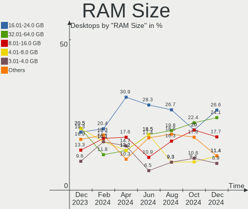
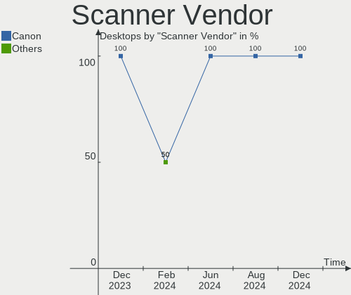
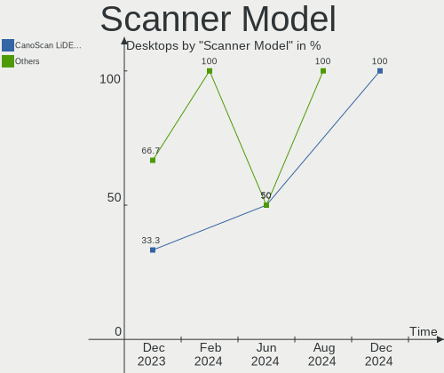

Zorin - Hardware Trends (Desktops)
----------------------------------

A project to identify most popular hardware characteristics and track their change
over time based on data collected by Linux users at https://Linux-Hardware.org.

Anyone can contribute to this report by the [hw-probe](https://github.com/linuxhw/hw-probe) tool:

    sudo -E hw-probe -all -upload

This report is for one last month. Overall report since the beginning of time: [TestDays](https://github.com/linuxhw/TestDays)

Period: Aug, 2023.

Contents
--------

* [ System ](#system)
  - [ OS                       ](#os)
  - [ OS Family                ](#os-family)
  - [ Kernel                   ](#kernel)
  - [ Kernel Family            ](#kernel-family)
  - [ Kernel Major Ver.        ](#kernel-major-ver)
  - [ Arch                     ](#arch)
  - [ DE                       ](#de)
  - [ Display Server           ](#display-server)
  - [ Display Manager          ](#display-manager)
  - [ OS Lang                  ](#os-lang)
  - [ Boot Mode                ](#boot-mode)
  - [ Filesystem               ](#filesystem)
  - [ Part. scheme             ](#part-scheme)
  - [ Dual Boot with Linux/BSD ](#dual-boot-with-linuxbsd)
  - [ Dual Boot (Win)          ](#dual-boot-win)

* [ Board ](#board)
  - [ Vendor                   ](#vendor)
  - [ Model                    ](#model)
  - [ Model Family             ](#model-family)
  - [ MFG Year                 ](#mfg-year)
  - [ Form Factor              ](#form-factor)
  - [ Secure Boot              ](#secure-boot)
  - [ Coreboot                 ](#coreboot)
  - [ RAM Size                 ](#ram-size)
  - [ RAM Used                 ](#ram-used)
  - [ Total Drives             ](#total-drives)
  - [ Has CD-ROM               ](#has-cd-rom)
  - [ Has Ethernet             ](#has-ethernet)
  - [ Has WiFi                 ](#has-wifi)
  - [ Has Bluetooth            ](#has-bluetooth)

* [ Location ](#location)
  - [ Country                  ](#country)
  - [ City                     ](#city)

* [ Drives ](#drives)
  - [ Drive Vendor             ](#drive-vendor)
  - [ Drive Model              ](#drive-model)
  - [ HDD Vendor               ](#hdd-vendor)
  - [ SSD Vendor               ](#ssd-vendor)
  - [ Drive Kind               ](#drive-kind)
  - [ Drive Connector          ](#drive-connector)
  - [ Drive Size               ](#drive-size)
  - [ Space Total              ](#space-total)
  - [ Space Used               ](#space-used)
  - [ Malfunc. Drives          ](#malfunc-drives)
  - [ Malfunc. Drive Vendor    ](#malfunc-drive-vendor)
  - [ Malfunc. HDD Vendor      ](#malfunc-hdd-vendor)
  - [ Malfunc. Drive Kind      ](#malfunc-drive-kind)
  - [ Failed Drives            ](#failed-drives)
  - [ Failed Drive Vendor      ](#failed-drive-vendor)
  - [ Drive Status             ](#drive-status)

* [ Storage controller ](#storage-controller)
  - [ Storage Vendor           ](#storage-vendor)
  - [ Storage Model            ](#storage-model)
  - [ Storage Kind             ](#storage-kind)

* [ Processor ](#processor)
  - [ CPU Vendor               ](#cpu-vendor)
  - [ CPU Model                ](#cpu-model)
  - [ CPU Model Family         ](#cpu-model-family)
  - [ CPU Cores                ](#cpu-cores)
  - [ CPU Sockets              ](#cpu-sockets)
  - [ CPU Threads              ](#cpu-threads)
  - [ CPU Op-Modes             ](#cpu-op-modes)
  - [ CPU Microcode            ](#cpu-microcode)
  - [ CPU Microarch            ](#cpu-microarch)

* [ Graphics ](#graphics)
  - [ GPU Vendor               ](#gpu-vendor)
  - [ GPU Model                ](#gpu-model)
  - [ GPU Combo                ](#gpu-combo)
  - [ GPU Driver               ](#gpu-driver)
  - [ GPU Memory               ](#gpu-memory)

* [ Monitor ](#monitor)
  - [ Monitor Vendor           ](#monitor-vendor)
  - [ Monitor Model            ](#monitor-model)
  - [ Monitor Resolution       ](#monitor-resolution)
  - [ Monitor Diagonal         ](#monitor-diagonal)
  - [ Monitor Width            ](#monitor-width)
  - [ Aspect Ratio             ](#aspect-ratio)
  - [ Monitor Area             ](#monitor-area)
  - [ Pixel Density            ](#pixel-density)
  - [ Multiple Monitors        ](#multiple-monitors)

* [ Network ](#network)
  - [ Net Controller Vendor    ](#net-controller-vendor)
  - [ Net Controller Model     ](#net-controller-model)
  - [ Wireless Vendor          ](#wireless-vendor)
  - [ Wireless Model           ](#wireless-model)
  - [ Ethernet Vendor          ](#ethernet-vendor)
  - [ Ethernet Model           ](#ethernet-model)
  - [ Net Controller Kind      ](#net-controller-kind)
  - [ Used Controller          ](#used-controller)
  - [ NICs                     ](#nics)
  - [ IPv6                     ](#ipv6)

* [ Bluetooth ](#bluetooth)
  - [ Bluetooth Vendor         ](#bluetooth-vendor)
  - [ Bluetooth Model          ](#bluetooth-model)

* [ Sound ](#sound)
  - [ Sound Vendor             ](#sound-vendor)
  - [ Sound Model              ](#sound-model)

* [ Memory ](#memory)
  - [ Memory Vendor            ](#memory-vendor)
  - [ Memory Model             ](#memory-model)
  - [ Memory Kind              ](#memory-kind)
  - [ Memory Form Factor       ](#memory-form-factor)
  - [ Memory Size              ](#memory-size)
  - [ Memory Speed             ](#memory-speed)

* [ Printers & scanners ](#printers--scanners)
  - [ Printer Vendor           ](#printer-vendor)
  - [ Printer Model            ](#printer-model)
  - [ Scanner Vendor           ](#scanner-vendor)
  - [ Scanner Model            ](#scanner-model)

* [ Camera ](#camera)
  - [ Camera Vendor            ](#camera-vendor)
  - [ Camera Model             ](#camera-model)

* [ Security ](#security)
  - [ Fingerprint Vendor       ](#fingerprint-vendor)
  - [ Fingerprint Model        ](#fingerprint-model)
  - [ Chipcard Vendor          ](#chipcard-vendor)
  - [ Chipcard Model           ](#chipcard-model)

* [ Unsupported ](#unsupported)
  - [ Unsupported Devices      ](#unsupported-devices)
  - [ Unsupported Device Types ](#unsupported-device-types)

System
------

OS
--

Installed operating systems

| Name     | Desktops | Percent |
|----------|----------|---------|
| Zorin 16 | 49       | 96.08%  |
| Zorin 15 | 2        | 3.92%   |

OS Family
---------

OS without a version

| Name  | Desktops | Percent |
|-------|----------|---------|
| Zorin | 51       | 100%    |

Kernel
------

Version of the Linux kernel

| Version              | Desktops | Percent |
|----------------------|----------|---------|
| 5.15.0-78-generic    | 26       | 50.98%  |
| 5.15.0-79-generic    | 17       | 33.33%  |
| 5.15.0-82-generic    | 3        | 5.88%   |
| 5.4.0-148-generic    | 2        | 3.92%   |
| 6.1.8-060108-generic | 1        | 1.96%   |
| 5.15.0-76-generic    | 1        | 1.96%   |
| 5.15.0-71-generic    | 1        | 1.96%   |

Kernel Family
-------------

Linux kernel without a distro release

| Version | Desktops | Percent |
|---------|----------|---------|
| 5.15.0  | 48       | 94.12%  |
| 5.4.0   | 2        | 3.92%   |
| 6.1.8   | 1        | 1.96%   |

Kernel Major Ver.
-----------------

Linux kernel major version

| Version | Desktops | Percent |
|---------|----------|---------|
| 5.15    | 48       | 94.12%  |
| 5.4     | 2        | 3.92%   |
| 6.1     | 1        | 1.96%   |

Arch
----

OS architecture (x86_64, i586, etc.)

| Name   | Desktops | Percent |
|--------|----------|---------|
| x86_64 | 49       | 96.08%  |
| i686   | 2        | 3.92%   |

DE
--

Desktop Environment

| Name  | Desktops | Percent |
|-------|----------|---------|
| GNOME | 44       | 86.27%  |
| XFCE  | 7        | 13.73%  |

Display Server
--------------

X11 or Wayland

| Name | Desktops | Percent |
|------|----------|---------|
| X11  | 51       | 100%    |

Display Manager
---------------

SDDM, LightDM, etc.

| Name    | Desktops | Percent |
|---------|----------|---------|
| Unknown | 38       | 74.51%  |
| GDM3    | 5        | 9.8%    |
| GDM     | 5        | 9.8%    |
| LightDM | 3        | 5.88%   |

OS Lang
-------

Language

| Lang  | Desktops | Percent |
|-------|----------|---------|
| en_US | 25       | 49.02%  |
| de_DE | 5        | 9.8%    |
| pt_BR | 3        | 5.88%   |
| en_GB | 3        | 5.88%   |
| en_CA | 3        | 5.88%   |
| it_IT | 2        | 3.92%   |
| es_ES | 2        | 3.92%   |
| en_IN | 2        | 3.92%   |
| tr_TR | 1        | 1.96%   |
| nl_NL | 1        | 1.96%   |
| hu_HU | 1        | 1.96%   |
| fr_FR | 1        | 1.96%   |
| es_AR | 1        | 1.96%   |
| cs_CZ | 1        | 1.96%   |

Boot Mode
---------

EFI or BIOS

| Mode | Desktops | Percent |
|------|----------|---------|
| EFI  | 26       | 50.98%  |
| BIOS | 25       | 49.02%  |

Filesystem
----------

Type of filesystem

| Type    | Desktops | Percent |
|---------|----------|---------|
| Ext4    | 43       | 84.31%  |
| Tmpfs   | 6        | 11.76%  |
| Overlay | 1        | 1.96%   |
| Btrfs   | 1        | 1.96%   |

Part. scheme
------------

Scheme of partitioning

| Type    | Desktops | Percent |
|---------|----------|---------|
| Unknown | 40       | 78.43%  |
| MBR     | 7        | 13.73%  |
| GPT     | 4        | 7.84%   |

Dual Boot with Linux/BSD
------------------------

Hosting more than one Linux/BSD

| Dual boot | Desktops | Percent |
|-----------|----------|---------|
| No        | 50       | 98.04%  |
| Yes       | 1        | 1.96%   |

Dual Boot (Win)
---------------

Hosting Linux and Windows

| Dual boot | Desktops | Percent |
|-----------|----------|---------|
| No        | 46       | 90.2%   |
| Yes       | 5        | 9.8%    |

Board
-----

Vendor
------

Motherboard manufacturer

| Name                | Desktops | Percent |
|---------------------|----------|---------|
| ASUSTek Computer    | 9        | 17.65%  |
| Hewlett-Packard     | 7        | 13.73%  |
| MSI                 | 6        | 11.76%  |
| Gigabyte Technology | 5        | 9.8%    |
| Dell                | 5        | 9.8%    |
| Lenovo              | 4        | 7.84%   |
| Intel               | 4        | 7.84%   |
| Pegatron            | 2        | 3.92%   |
| Biostar             | 2        | 3.92%   |
| ASRock              | 2        | 3.92%   |
| Unknown             | 2        | 3.92%   |
| GuoGuang            | 1        | 1.96%   |
| eMachines           | 1        | 1.96%   |
| AZW                 | 1        | 1.96%   |

Model
-----

Motherboard model

| Name                                      | Desktops | Percent |
|-------------------------------------------|----------|---------|
| Unknown                                   | 2        | 3.92%   |
| Pegatron T5060                            | 1        | 1.96%   |
| Pegatron Compaq dx2450                    | 1        | 1.96%   |
| MSI MS-7E12                               | 1        | 1.96%   |
| MSI MS-7D43                               | 1        | 1.96%   |
| MSI MS-7C37                               | 1        | 1.96%   |
| MSI MS-7A12                               | 1        | 1.96%   |
| MSI MS-7815                               | 1        | 1.96%   |
| MSI 500-136es                             | 1        | 1.96%   |
| Lenovo ThinkCentre M92P 3237EJ3           | 1        | 1.96%   |
| Lenovo ThinkCentre M700 10KNS0H900        | 1        | 1.96%   |
| Lenovo ThinkCentre M700 10J0S6CH00        | 1        | 1.96%   |
| Lenovo ThinkCentre E73 10AU00G4RU         | 1        | 1.96%   |
| Intel X79M-S                              | 1        | 1.96%   |
| Intel H61                                 | 1        | 1.96%   |
| Intel DZ68BC AAG30742-401                 | 1        | 1.96%   |
| Intel DB85FL AAG89861-201                 | 1        | 1.96%   |
| HP Victus by 15L Gaming Desktop TG02-0xxx | 1        | 1.96%   |
| HP EliteDesk 800 G3 SFF                   | 1        | 1.96%   |
| HP EliteDesk 800 G2 SFF                   | 1        | 1.96%   |
| HP Compaq dx6120 MT(PW287ES)              | 1        | 1.96%   |
| HP Compaq dc7900 Convertible Minitower    | 1        | 1.96%   |
| HP Compaq 8200 Elite USDT PC              | 1        | 1.96%   |
| HP Compaq 6005 Pro SFF PC                 | 1        | 1.96%   |
| GuoGuang IC2M1028N                        | 1        | 1.96%   |
| Gigabyte Z97X-UD5H                        | 1        | 1.96%   |
| Gigabyte H61M-DS2V                        | 1        | 1.96%   |
| Gigabyte H110M-H                          | 1        | 1.96%   |
| Gigabyte B550M DS3H AC                    | 1        | 1.96%   |
| Gigabyte B450 AORUS M                     | 1        | 1.96%   |
| eMachines EL1352                          | 1        | 1.96%   |
| Dell OptiPlex 7010                        | 1        | 1.96%   |
| Dell OptiPlex 3050                        | 1        | 1.96%   |
| Dell OptiPlex 3020                        | 1        | 1.96%   |
| Dell Inspiron 3647                        | 1        | 1.96%   |
| Dell G5 5000                              | 1        | 1.96%   |
| Biostar H410MH                            | 1        | 1.96%   |
| Biostar A780X-A2                          | 1        | 1.96%   |
| AZW MINI S                                | 1        | 1.96%   |
| ASUS TUF Gaming Z790-PLUS WIFI D4         | 1        | 1.96%   |

Model Family
------------

Motherboard model prefix

| Name               | Desktops | Percent |
|--------------------|----------|---------|
| Lenovo ThinkCentre | 4        | 7.84%   |
| HP Compaq          | 4        | 7.84%   |
| Dell OptiPlex      | 3        | 5.88%   |
| ASUS TUF           | 3        | 5.88%   |
| HP EliteDesk       | 2        | 3.92%   |
| Unknown            | 2        | 3.92%   |
| Pegatron T5060     | 1        | 1.96%   |
| Pegatron Compaq    | 1        | 1.96%   |
| MSI MS-7E12        | 1        | 1.96%   |
| MSI MS-7D43        | 1        | 1.96%   |
| MSI MS-7C37        | 1        | 1.96%   |
| MSI MS-7A12        | 1        | 1.96%   |
| MSI MS-7815        | 1        | 1.96%   |
| MSI 500-136es      | 1        | 1.96%   |
| Intel X79M-S       | 1        | 1.96%   |
| Intel H61          | 1        | 1.96%   |
| Intel DZ68BC       | 1        | 1.96%   |
| Intel DB85FL       | 1        | 1.96%   |
| HP Victus          | 1        | 1.96%   |
| GuoGuang IC2M1028N | 1        | 1.96%   |
| Gigabyte Z97X-UD5H | 1        | 1.96%   |
| Gigabyte H61M-DS2V | 1        | 1.96%   |
| Gigabyte H110M-H   | 1        | 1.96%   |
| Gigabyte B550M     | 1        | 1.96%   |
| Gigabyte B450      | 1        | 1.96%   |
| eMachines EL1352   | 1        | 1.96%   |
| Dell Inspiron      | 1        | 1.96%   |
| Dell G5            | 1        | 1.96%   |
| Biostar H410MH     | 1        | 1.96%   |
| Biostar A780X-A2   | 1        | 1.96%   |
| AZW MINI           | 1        | 1.96%   |
| ASUS PRIME         | 1        | 1.96%   |
| ASUS P8H61-M       | 1        | 1.96%   |
| ASUS P5L-MX        | 1        | 1.96%   |
| ASUS M5A97         | 1        | 1.96%   |
| ASUS B150M-C       | 1        | 1.96%   |
| ASUS All           | 1        | 1.96%   |
| ASRock N68-VS3     | 1        | 1.96%   |
| ASRock 970         | 1        | 1.96%   |

MFG Year
--------

Motherboard manufacture year

| Year | Desktops | Percent |
|------|----------|---------|
| 2013 | 8        | 15.69%  |
| 2014 | 5        | 9.8%    |
| 2022 | 4        | 7.84%   |
| 2019 | 4        | 7.84%   |
| 2011 | 4        | 7.84%   |
| 2017 | 3        | 5.88%   |
| 2016 | 3        | 5.88%   |
| 2012 | 3        | 5.88%   |
| 2023 | 2        | 3.92%   |
| 2021 | 2        | 3.92%   |
| 2020 | 2        | 3.92%   |
| 2018 | 2        | 3.92%   |
| 2015 | 2        | 3.92%   |
| 2010 | 2        | 3.92%   |
| 2008 | 2        | 3.92%   |
| 2009 | 1        | 1.96%   |
| 2006 | 1        | 1.96%   |
| 2005 | 1        | 1.96%   |

Form Factor
-----------

Physical design of the computer

| Name    | Desktops | Percent |
|---------|----------|---------|
| Desktop | 51       | 100%    |

Secure Boot
-----------

Enabled or disabled

| State    | Desktops | Percent |
|----------|----------|---------|
| Disabled | 48       | 94.12%  |
| Enabled  | 3        | 5.88%   |

Coreboot
--------

Have coreboot on board

| Used | Desktops | Percent |
|------|----------|---------|
| No   | 51       | 100%    |

RAM Size
--------

Total RAM memory

| Size in GB  | Desktops | Percent |
|-------------|----------|---------|
| 16.01-24.0  | 15       | 29.41%  |
| 4.01-8.0    | 13       | 25.49%  |
| 3.01-4.0    | 7        | 13.73%  |
| 32.01-64.0  | 6        | 11.76%  |
| 8.01-16.0   | 5        | 9.8%    |
| 64.01-256.0 | 4        | 7.84%   |
| 2.01-3.0    | 1        | 1.96%   |

RAM Used
--------

Used RAM memory

| Used GB   | Desktops | Percent |
|-----------|----------|---------|
| 2.01-3.0  | 16       | 31.37%  |
| 1.01-2.0  | 15       | 29.41%  |
| 4.01-8.0  | 9        | 17.65%  |
| 3.01-4.0  | 9        | 17.65%  |
| 8.01-16.0 | 1        | 1.96%   |
| 0.51-1.0  | 1        | 1.96%   |

Total Drives
------------

Number of drives on board

| Drives | Desktops | Percent |
|--------|----------|---------|
| 1      | 26       | 50.98%  |
| 2      | 14       | 27.45%  |
| 3      | 7        | 13.73%  |
| 4      | 3        | 5.88%   |
| 6      | 1        | 1.96%   |

Has CD-ROM
----------

Has CD-ROM on board

| Presented | Desktops | Percent |
|-----------|----------|---------|
| No        | 30       | 58.82%  |
| Yes       | 21       | 41.18%  |

Has Ethernet
------------

Has Ethernet on board

| Presented | Desktops | Percent |
|-----------|----------|---------|
| Yes       | 51       | 100%    |

Has WiFi
--------

Has WiFi module

| Presented | Desktops | Percent |
|-----------|----------|---------|
| Yes       | 28       | 54.9%   |
| No        | 23       | 45.1%   |

Has Bluetooth
-------------

Has Bluetooth module

| Presented | Desktops | Percent |
|-----------|----------|---------|
| No        | 35       | 68.63%  |
| Yes       | 16       | 31.37%  |

Location
--------

Country
-------

Geographic location (country)

| Country     | Desktops | Percent |
|-------------|----------|---------|
| USA         | 16       | 31.37%  |
| Germany     | 7        | 13.73%  |
| India       | 3        | 5.88%   |
| Canada      | 3        | 5.88%   |
| Brazil      | 3        | 5.88%   |
| UK          | 2        | 3.92%   |
| Spain       | 2        | 3.92%   |
| Italy       | 2        | 3.92%   |
| France      | 2        | 3.92%   |
| Vietnam     | 1        | 1.96%   |
| Turkey      | 1        | 1.96%   |
| Romania     | 1        | 1.96%   |
| Netherlands | 1        | 1.96%   |
| Mexico      | 1        | 1.96%   |
| Hungary     | 1        | 1.96%   |
| Czechia     | 1        | 1.96%   |
| Bulgaria    | 1        | 1.96%   |
| Belgium     | 1        | 1.96%   |
| Bangladesh  | 1        | 1.96%   |
| Argentina   | 1        | 1.96%   |

City
----

Geographic location (city)

| City                | Desktops | Percent |
|---------------------|----------|---------|
| Shoreview           | 2        | 3.92%   |
| Rome                | 2        | 3.92%   |
| Niles               | 2        | 3.92%   |
| Hyderabad           | 2        | 3.92%   |
| Coventry            | 2        | 3.92%   |
| White Lake          | 1        | 1.96%   |
| Vendin-le-Vieil     | 1        | 1.96%   |
| Varna               | 1        | 1.96%   |
| Trivandrum          | 1        | 1.96%   |
| Tijuana             | 1        | 1.96%   |
| Thunder Bay         | 1        | 1.96%   |
| Szigetszentmiklos   | 1        | 1.96%   |
| Surrey              | 1        | 1.96%   |
| Sneek               | 1        | 1.96%   |
| Santo Amaro         | 1        | 1.96%   |
| Sankt Wendel        | 1        | 1.96%   |
| Runcorn             | 1        | 1.96%   |
| Rockford            | 1        | 1.96%   |
| Rio de Janeiro      | 1        | 1.96%   |
| Richardson          | 1        | 1.96%   |
| Resistencia         | 1        | 1.96%   |
| Pritzwalk           | 1        | 1.96%   |
| Pozuelo de Alarcón | 1        | 1.96%   |
| Phoenix             | 1        | 1.96%   |
| Olomouc             | 1        | 1.96%   |
| Montreal            | 1        | 1.96%   |
| Mönchengladbach    | 1        | 1.96%   |
| Loreggia            | 1        | 1.96%   |
| Kernersville        | 1        | 1.96%   |
| Iowa City           | 1        | 1.96%   |
| Inca                | 1        | 1.96%   |
| Idaho Falls         | 1        | 1.96%   |
| Houston             | 1        | 1.96%   |
| Ho Chi Minh City    | 1        | 1.96%   |
| Hamburg             | 1        | 1.96%   |
| Gunzenhausen        | 1        | 1.96%   |
| Goiânia            | 1        | 1.96%   |
| Ferney-Voltaire     | 1        | 1.96%   |
| Dhaka               | 1        | 1.96%   |
| Craiova             | 1        | 1.96%   |

Drives
------

Drive Vendor
------------

Hard drive vendors

| Vendor                      | Desktops | Drives | Percent |
|-----------------------------|----------|--------|---------|
| Seagate                     | 18       | 21     | 21.43%  |
| WDC                         | 10       | 11     | 11.9%   |
| Sandisk                     | 7        | 10     | 8.33%   |
| Samsung Electronics         | 7        | 7      | 8.33%   |
| Kingston                    | 5        | 6      | 5.95%   |
| Hitachi                     | 4        | 4      | 4.76%   |
| Crucial                     | 4        | 5      | 4.76%   |
| SK hynix                    | 2        | 2      | 2.38%   |
| Intenso                     | 2        | 2      | 2.38%   |
| Fanxiang                    | 2        | 2      | 2.38%   |
| China                       | 2        | 2      | 2.38%   |
| XPG                         | 1        | 1      | 1.19%   |
| VERICO                      | 1        | 1      | 1.19%   |
| Unknown                     | 1        | 1      | 1.19%   |
| Transcend                   | 1        | 1      | 1.19%   |
| Toshiba                     | 1        | 1      | 1.19%   |
| SPCC                        | 1        | 2      | 1.19%   |
| Silicon Motion              | 1        | 1      | 1.19%   |
| Realtek                     | 1        | 1      | 1.19%   |
| Phison                      | 1        | 1      | 1.19%   |
| OCZ                         | 1        | 1      | 1.19%   |
| NGFF                        | 1        | 1      | 1.19%   |
| Mushkin                     | 1        | 1      | 1.19%   |
| Micron/Crucial Technology   | 1        | 1      | 1.19%   |
| Micron Technology           | 1        | 1      | 1.19%   |
| MAXIO Technology (Hangzhou) | 1        | 1      | 1.19%   |
| KIOXIA                      | 1        | 1      | 1.19%   |
| Kingston Technology Company | 1        | 1      | 1.19%   |
| HGST                        | 1        | 1      | 1.19%   |
| Hewlett-Packard             | 1        | 1      | 1.19%   |
| AFOX                        | 1        | 1      | 1.19%   |
| Unknown                     | 1        | 1      | 1.19%   |

Drive Model
-----------

Hard drive models

| Model                                                 | Desktops | Percent |
|-------------------------------------------------------|----------|---------|
| Seagate ST3500312CS 500GB                             | 2        | 2.2%    |
| Seagate ST3250312AS 250GB                             | 2        | 2.2%    |
| Kingston SV300S37A120G 120GB SSD                      | 2        | 2.2%    |
| Kingston SA400S37240G 240GB SSD                       | 2        | 2.2%    |
| Hitachi HDS721050CLA362 500GB                         | 2        | 2.2%    |
| XPG NVMe SSD Drive 2TB                                | 1        | 1.1%    |
| WDC WD800BEVT-75ZCT2 80GB                             | 1        | 1.1%    |
| WDC WD6400AAKS-00A7B0 640GB                           | 1        | 1.1%    |
| WDC WD5000AVVS-63ZWB0 500GB                           | 1        | 1.1%    |
| WDC WD5000AAKS-60A7B0 500GB                           | 1        | 1.1%    |
| WDC WD40EZAZ-00ZGHB0 4TB                              | 1        | 1.1%    |
| WDC WD20EZRZ-00Z5HB0 2TB                              | 1        | 1.1%    |
| WDC WD20EJRX-89G3VY0 2TB                              | 1        | 1.1%    |
| WDC WD20EARS-00MVWB0 2TB                              | 1        | 1.1%    |
| WDC WD1600BEKT-60A25T1 160GB                          | 1        | 1.1%    |
| WDC WD1600AAJS-00B4A0 160GB                           | 1        | 1.1%    |
| WDC WD Green 2.5 480GB                                | 1        | 1.1%    |
| VERICO SSD 240GB                                      | 1        | 1.1%    |
| Unknown NVMe SSD Drive 500GB                          | 1        | 1.1%    |
| Transcend TS120GSSD220S 120GB                         | 1        | 1.1%    |
| Toshiba HDWD220 2TB                                   | 1        | 1.1%    |
| SPCC Solid State Disk 512GB                           | 1        | 1.1%    |
| SPCC Solid State Disk 2TB                             | 1        | 1.1%    |
| SK hynix SC311 SATA 256GB SSD                         | 1        | 1.1%    |
| SK hynix BC711 HFM512GD3JX013N 512GB                  | 1        | 1.1%    |
| Silicon Motion SM2263EN/SM2263XT SSD Controller 256GB | 1        | 1.1%    |
| Seagate ST9160412AS 160GB                             | 1        | 1.1%    |
| Seagate ST500DM002-1BD142 500GB                       | 1        | 1.1%    |
| Seagate ST4000DM004-2CV104 4TB                        | 1        | 1.1%    |
| Seagate ST4000DM000-1F2168 4TB                        | 1        | 1.1%    |
| Seagate ST380819AS 80GB                               | 1        | 1.1%    |
| Seagate ST3500418AS 500GB                             | 1        | 1.1%    |
| Seagate ST3320310CS 320GB                             | 1        | 1.1%    |
| Seagate ST3160828AS 160GB                             | 1        | 1.1%    |
| Seagate ST3160812AS Q 160GB                           | 1        | 1.1%    |
| Seagate ST3160316CS 160GB                             | 1        | 1.1%    |
| Seagate ST3000DM001-1E6166 3TB                        | 1        | 1.1%    |
| Seagate ST2000DM001-1ER164 2TB                        | 1        | 1.1%    |
| Seagate ST1000LM024 HN-M101MBB 1TB                    | 1        | 1.1%    |
| Seagate ST1000DM003-9YN162 1TB                        | 1        | 1.1%    |

HDD Vendor
----------

Hard disk drive vendors

| Vendor              | Desktops | Drives | Percent |
|---------------------|----------|--------|---------|
| Seagate             | 17       | 20     | 50%     |
| WDC                 | 9        | 10     | 26.47%  |
| Hitachi             | 4        | 4      | 11.76%  |
| Toshiba             | 1        | 1      | 2.94%   |
| Samsung Electronics | 1        | 1      | 2.94%   |
| Intenso             | 1        | 1      | 2.94%   |
| HGST                | 1        | 1      | 2.94%   |

SSD Vendor
----------

Solid state drive vendors

| Vendor              | Desktops | Drives | Percent |
|---------------------|----------|--------|---------|
| Samsung Electronics | 5        | 5      | 15.15%  |
| Kingston            | 5        | 6      | 15.15%  |
| Crucial             | 4        | 5      | 12.12%  |
| SanDisk             | 3        | 5      | 9.09%   |
| China               | 2        | 2      | 6.06%   |
| WDC                 | 1        | 1      | 3.03%   |
| VERICO              | 1        | 1      | 3.03%   |
| Transcend           | 1        | 1      | 3.03%   |
| SPCC                | 1        | 2      | 3.03%   |
| SK hynix            | 1        | 1      | 3.03%   |
| OCZ                 | 1        | 1      | 3.03%   |
| NGFF                | 1        | 1      | 3.03%   |
| Mushkin             | 1        | 1      | 3.03%   |
| Micron Technology   | 1        | 1      | 3.03%   |
| Intenso             | 1        | 1      | 3.03%   |
| Hewlett-Packard     | 1        | 1      | 3.03%   |
| Fanxiang            | 1        | 1      | 3.03%   |
| AFOX                | 1        | 1      | 3.03%   |
| Unknown             | 1        | 1      | 3.03%   |

Drive Kind
----------

HDD or SSD

| Kind    | Desktops | Drives | Percent |
|---------|----------|--------|---------|
| SSD     | 30       | 38     | 40.54%  |
| HDD     | 29       | 38     | 39.19%  |
| NVMe    | 14       | 17     | 18.92%  |
| Unknown | 1        | 1      | 1.35%   |

Drive Connector
---------------

SATA, SAS, NVMe, etc.

| Type | Desktops | Drives | Percent |
|------|----------|--------|---------|
| SATA | 48       | 74     | 73.85%  |
| NVMe | 13       | 16     | 20%     |
| SAS  | 4        | 4      | 6.15%   |

Drive Size
----------

Size of hard drive

| Size in TB | Desktops | Drives | Percent |
|------------|----------|--------|---------|
| 0.01-0.5   | 35       | 48     | 59.32%  |
| 0.51-1.0   | 12       | 15     | 20.34%  |
| 1.01-2.0   | 8        | 8      | 13.56%  |
| 3.01-4.0   | 3        | 4      | 5.08%   |
| 2.01-3.0   | 1        | 1      | 1.69%   |

Space Total
-----------

Amount of disk space available on the file system

| Size in GB     | Desktops | Percent |
|----------------|----------|---------|
| 101-250        | 18       | 35.29%  |
| 251-500        | 13       | 25.49%  |
| 501-1000       | 6        | 11.76%  |
| More than 3000 | 4        | 7.84%   |
| 21-50          | 3        | 5.88%   |
| 51-100         | 3        | 5.88%   |
| 2001-3000      | 2        | 3.92%   |
| 1001-2000      | 1        | 1.96%   |
| 1-20           | 1        | 1.96%   |

Space Used
----------

Amount of used disk space

| Used GB        | Desktops | Percent |
|----------------|----------|---------|
| 1-20           | 21       | 41.18%  |
| 21-50          | 14       | 27.45%  |
| 51-100         | 7        | 13.73%  |
| 101-250        | 3        | 5.88%   |
| More than 3000 | 2        | 3.92%   |
| 1001-2000      | 2        | 3.92%   |
| 251-500        | 1        | 1.96%   |
| 501-1000       | 1        | 1.96%   |

Malfunc. Drives
---------------

Drive models with a malfunction

| Model                      | Desktops | Drives | Percent |
|----------------------------|----------|--------|---------|
| Seagate ST3500312CS 500GB  | 1        | 1      | 33.33%  |
| HGST HTS545050A7E680 500GB | 1        | 1      | 33.33%  |
| China MSATA 32GB SSD       | 1        | 1      | 33.33%  |

Malfunc. Drive Vendor
---------------------

Vendors of faulty drives

| Vendor  | Desktops | Drives | Percent |
|---------|----------|--------|---------|
| Seagate | 1        | 1      | 33.33%  |
| HGST    | 1        | 1      | 33.33%  |
| China   | 1        | 1      | 33.33%  |

Malfunc. HDD Vendor
-------------------

Vendors of faulty HDD drives

| Vendor  | Desktops | Drives | Percent |
|---------|----------|--------|---------|
| Seagate | 1        | 1      | 50%     |
| HGST    | 1        | 1      | 50%     |

Malfunc. Drive Kind
-------------------

Kinds of faulty drives

| Kind | Desktops | Drives | Percent |
|------|----------|--------|---------|
| HDD  | 2        | 2      | 66.67%  |
| SSD  | 1        | 1      | 33.33%  |

Failed Drives
-------------

Failed drive models

Zero info for selected period =(

Failed Drive Vendor
-------------------

Failed drive vendors

Zero info for selected period =(

Drive Status
------------

Number of failed and malfunc. drives

| Status   | Desktops | Drives | Percent |
|----------|----------|--------|---------|
| Detected | 45       | 84     | 86.54%  |
| Works    | 5        | 7      | 9.62%   |
| Malfunc  | 2        | 3      | 3.85%   |

Storage controller
------------------

Storage Vendor
--------------

Storage controller vendors

| Vendor                      | Desktops | Percent |
|-----------------------------|----------|---------|
| Intel                       | 36       | 51.43%  |
| AMD                         | 12       | 17.14%  |
| Sandisk                     | 5        | 7.14%   |
| Nvidia                      | 3        | 4.29%   |
| ASMedia Technology          | 2        | 2.86%   |
| TenaFe                      | 1        | 1.43%   |
| SK hynix                    | 1        | 1.43%   |
| Silicon Motion              | 1        | 1.43%   |
| Seagate Technology          | 1        | 1.43%   |
| Samsung Electronics         | 1        | 1.43%   |
| Phison Electronics          | 1        | 1.43%   |
| Micron/Crucial Technology   | 1        | 1.43%   |
| MAXIO Technology (Hangzhou) | 1        | 1.43%   |
| Marvell Technology Group    | 1        | 1.43%   |
| KIOXIA                      | 1        | 1.43%   |
| Kingston Technology Company | 1        | 1.43%   |
| INNOGRIT                    | 1        | 1.43%   |

Storage Model
-------------

Storage controller models

| Model                                                                                   | Desktops | Percent |
|-----------------------------------------------------------------------------------------|----------|---------|
| AMD FCH SATA Controller [AHCI mode]                                                     | 7        | 8.64%   |
| Intel Q170/Q150/B150/H170/H110/Z170/CM236 Chipset SATA Controller [AHCI Mode]           | 6        | 7.41%   |
| Intel 8 Series/C220 Series Chipset Family 6-port SATA Controller 1 [AHCI mode]          | 6        | 7.41%   |
| Intel 6 Series/C200 Series Chipset Family 6 port Desktop SATA AHCI Controller           | 5        | 6.17%   |
| Nvidia MCP61 SATA Controller                                                            | 3        | 3.7%    |
| Intel 7 Series/C210 Series Chipset Family 6-port SATA Controller [AHCI mode]            | 3        | 3.7%    |
| Intel 200 Series PCH SATA controller [AHCI mode]                                        | 3        | 3.7%    |
| AMD SB7x0/SB8x0/SB9x0 SATA Controller [AHCI mode]                                       | 3        | 3.7%    |
| SanDisk WD Blue SN570 NVMe SSD 1TB                                                      | 2        | 2.47%   |
| Nvidia MCP61 IDE                                                                        | 2        | 2.47%   |
| Intel Volume Management Device NVMe RAID Controller                                     | 2        | 2.47%   |
| Intel NM10/ICH7 Family SATA Controller [IDE mode]                                       | 2        | 2.47%   |
| Intel Alder Lake-S PCH SATA Controller [AHCI Mode]                                      | 2        | 2.47%   |
| Intel 9 Series Chipset Family SATA Controller [AHCI Mode]                               | 2        | 2.47%   |
| ASMedia ASM1062 Serial ATA Controller                                                   | 2        | 2.47%   |
| TenaFe TC2200/TC2201 NVMe Controller (DRAM-less)                                        | 1        | 1.23%   |
| SK hynix Gold P31/BC711/PC711 NVMe Solid State Drive                                    | 1        | 1.23%   |
| Silicon Motion SM2263EN/SM2263XT (DRAM-less) NVMe SSD Controllers                       | 1        | 1.23%   |
| Seagate BarraCuda Q5 NVMe SSD (DRAM-less)                                               | 1        | 1.23%   |
| Sandisk Western Digital WD Black SN850X NVMe SSD                                        | 1        | 1.23%   |
| SanDisk WD PC SN810 / Black SN850 NVMe SSD                                              | 1        | 1.23%   |
| SanDisk WD Blue SN550 NVMe SSD                                                          | 1        | 1.23%   |
| Samsung NVMe SSD Controller PM9A1/PM9A3/980PRO                                          | 1        | 1.23%   |
| Phison E18 PCIe4 NVMe Controller                                                        | 1        | 1.23%   |
| Micron/Crucial P2 [Nick P2] / P3 / P3 Plus NVMe PCIe SSD (DRAM-less)                    | 1        | 1.23%   |
| MAXIO (Hangzhou) NVMe SSD Controller MAP1602                                            | 1        | 1.23%   |
| Marvell Group 88SE9172 SATA 6Gb/s Controller                                            | 1        | 1.23%   |
| KIOXIA NVMe SSD Controller BG4 (DRAM-less)                                              | 1        | 1.23%   |
| Kingston Company A2000 NVMe SSD                                                         | 1        | 1.23%   |
| Intel Jasper Lake SATA AHCI Controller                                                  | 1        | 1.23%   |
| Intel Comet Lake SATA AHCI Controller                                                   | 1        | 1.23%   |
| Intel 82801JD/DO (ICH10 Family) SATA AHCI Controller                                    | 1        | 1.23%   |
| Intel 82801G (ICH7 Family) IDE Controller                                               | 1        | 1.23%   |
| Intel 82801FB/FW (ICH6/ICH6W) SATA Controller                                           | 1        | 1.23%   |
| Intel 82801FB/FBM/FR/FW/FRW (ICH6 Family) IDE Controller                                | 1        | 1.23%   |
| Intel 700 Series Chipset Family SATA AHCI Controller                                    | 1        | 1.23%   |
| Intel 6 Series/C200 Series Chipset Family Desktop SATA Controller (IDE mode, ports 4-5) | 1        | 1.23%   |
| Intel 6 Series/C200 Series Chipset Family Desktop SATA Controller (IDE mode, ports 0-3) | 1        | 1.23%   |
| Intel 400 Series Chipset Family SATA AHCI Controller                                    | 1        | 1.23%   |
| Intel 4 Series Chipset PT IDER Controller                                               | 1        | 1.23%   |

Storage Kind
------------

Kind of storage controller (IDE, SATA, NVMe, SAS, ...)

| Kind | Desktops | Percent |
|------|----------|---------|
| SATA | 44       | 63.77%  |
| NVMe | 13       | 18.84%  |
| IDE  | 10       | 14.49%  |
| RAID | 2        | 2.9%    |

Processor
---------

CPU Vendor
----------

Processor vendors

| Vendor | Desktops | Percent |
|--------|----------|---------|
| Intel  | 36       | 70.59%  |
| AMD    | 15       | 29.41%  |

CPU Model
---------

Processor models

| Model                                   | Desktops | Percent |
|-----------------------------------------|----------|---------|
| Intel Core i5-6500 CPU @ 3.20GHz        | 2        | 3.92%   |
| AMD Ryzen 5 5600G with Radeon Graphics  | 2        | 3.92%   |
| Intel Xeon CPU E5-2650 v2 @ 2.60GHz     | 1        | 1.96%   |
| Intel Pentium CPU G4400 @ 3.30GHz       | 1        | 1.96%   |
| Intel Pentium CPU G2130 @ 3.20GHz       | 1        | 1.96%   |
| Intel Pentium 4 CPU 3.00GHz             | 1        | 1.96%   |
| Intel Core i7-6700 CPU @ 3.40GHz        | 1        | 1.96%   |
| Intel Core i7-4790K CPU @ 4.00GHz       | 1        | 1.96%   |
| Intel Core i7-4771 CPU @ 3.50GHz        | 1        | 1.96%   |
| Intel Core i7-4770K CPU @ 3.50GHz       | 1        | 1.96%   |
| Intel Core i7-2600K CPU @ 3.40GHz       | 1        | 1.96%   |
| Intel Core i7-10700F CPU @ 2.90GHz      | 1        | 1.96%   |
| Intel Core i5-9400F CPU @ 2.90GHz       | 1        | 1.96%   |
| Intel Core i5-7500 CPU @ 3.40GHz        | 1        | 1.96%   |
| Intel Core i5-6600 CPU @ 3.30GHz        | 1        | 1.96%   |
| Intel Core i5-6400 CPU @ 2.70GHz        | 1        | 1.96%   |
| Intel Core i5-4590 CPU @ 3.30GHz        | 1        | 1.96%   |
| Intel Core i5-4460 CPU @ 3.20GHz        | 1        | 1.96%   |
| Intel Core i5-4440 CPU @ 3.10GHz        | 1        | 1.96%   |
| Intel Core i5-3470T CPU @ 2.90GHz       | 1        | 1.96%   |
| Intel Core i5-3470 CPU @ 3.20GHz        | 1        | 1.96%   |
| Intel Core i5-2500 CPU @ 3.30GHz        | 1        | 1.96%   |
| Intel Core i5-2400S CPU @ 2.50GHz       | 1        | 1.96%   |
| Intel Core i3-6100T CPU @ 3.20GHz       | 1        | 1.96%   |
| Intel Core i3-4160 CPU @ 3.60GHz        | 1        | 1.96%   |
| Intel Core i3-4150 CPU @ 3.50GHz        | 1        | 1.96%   |
| Intel Core i3-2120 CPU @ 3.30GHz        | 1        | 1.96%   |
| Intel Core i3-10100 CPU @ 3.60GHz       | 1        | 1.96%   |
| Intel Core 2 Quad CPU Q9650 @ 3.00GHz   | 1        | 1.96%   |
| Intel Core 2 Duo CPU E4500 @ 2.20GHz    | 1        | 1.96%   |
| Intel Celeron N5095 @ 2.00GHz           | 1        | 1.96%   |
| Intel Celeron CPU G460 @ 1.80GHz        | 1        | 1.96%   |
| Intel Atom CPU D2550 @ 1.86GHz          | 1        | 1.96%   |
| Intel 12th Gen Core i7-12700F           | 1        | 1.96%   |
| Intel 12th Gen Core i3-12100F           | 1        | 1.96%   |
| Intel 12th Gen Core i3-12100            | 1        | 1.96%   |
| AMD Ryzen 9 7950X 16-Core Processor     | 1        | 1.96%   |
| AMD Ryzen 9 5900X 12-Core Processor     | 1        | 1.96%   |
| AMD Ryzen 7 7735HS with Radeon Graphics | 1        | 1.96%   |
| AMD Ryzen 7 3700X 8-Core Processor      | 1        | 1.96%   |

CPU Model Family
----------------

Processor model prefix

| Model                | Desktops | Percent |
|----------------------|----------|---------|
| Intel Core i5        | 13       | 25.49%  |
| Intel Core i7        | 6        | 11.76%  |
| Intel Core i3        | 5        | 9.8%    |
| Other                | 3        | 5.88%   |
| AMD Ryzen 5          | 3        | 5.88%   |
| Intel Pentium        | 2        | 3.92%   |
| Intel Celeron        | 2        | 3.92%   |
| AMD Ryzen 9          | 2        | 3.92%   |
| AMD Ryzen 7          | 2        | 3.92%   |
| AMD Athlon II X2     | 2        | 3.92%   |
| Intel Xeon           | 1        | 1.96%   |
| Intel Pentium 4      | 1        | 1.96%   |
| Intel Core 2 Quad    | 1        | 1.96%   |
| Intel Core 2 Duo     | 1        | 1.96%   |
| Intel Atom           | 1        | 1.96%   |
| AMD Phenom II X6     | 1        | 1.96%   |
| AMD FX               | 1        | 1.96%   |
| AMD Athlon II X3     | 1        | 1.96%   |
| AMD Athlon Dual Core | 1        | 1.96%   |
| AMD Athlon 64 X2     | 1        | 1.96%   |
| AMD A6               | 1        | 1.96%   |

CPU Cores
---------

Number of processor cores

| Number | Desktops | Percent |
|--------|----------|---------|
| 4      | 22       | 43.14%  |
| 2      | 13       | 25.49%  |
| 6      | 5        | 9.8%    |
| 8      | 4        | 7.84%   |
| 1      | 3        | 5.88%   |
| 12     | 2        | 3.92%   |
| 16     | 1        | 1.96%   |
| 3      | 1        | 1.96%   |

CPU Sockets
-----------

Number of sockets

| Number | Desktops | Percent |
|--------|----------|---------|
| 1      | 51       | 100%    |

CPU Threads
-----------

Threads per core (Hyper-Threading)

| Number | Desktops | Percent |
|--------|----------|---------|
| 2      | 28       | 54.9%   |
| 1      | 23       | 45.1%   |

CPU Op-Modes
------------

CPU Operation Modes (32-bit, 64-bit)

| Op mode        | Desktops | Percent |
|----------------|----------|---------|
| 32-bit, 64-bit | 51       | 100%    |

CPU Microcode
-------------

Microcode number

| Number     | Desktops | Percent |
|------------|----------|---------|
| 0x306c3    | 8        | 15.69%  |
| 0x506e3    | 7        | 13.73%  |
| Unknown    | 5        | 9.8%    |
| 0x206a7    | 4        | 7.84%   |
| 0x306a9    | 3        | 5.88%   |
| 0x90675    | 2        | 3.92%   |
| 0xf41      | 1        | 1.96%   |
| 0xa0655    | 1        | 1.96%   |
| 0xa0653    | 1        | 1.96%   |
| 0x906ea    | 1        | 1.96%   |
| 0x906e9    | 1        | 1.96%   |
| 0x906c0    | 1        | 1.96%   |
| 0x90672    | 1        | 1.96%   |
| 0x6fd      | 1        | 1.96%   |
| 0x306e4    | 1        | 1.96%   |
| 0x30661    | 1        | 1.96%   |
| 0x1067a    | 1        | 1.96%   |
| 0x0a601203 | 1        | 1.96%   |
| 0x0a50000d | 1        | 1.96%   |
| 0x0a404102 | 1        | 1.96%   |
| 0x0a201016 | 1        | 1.96%   |
| 0x08701021 | 1        | 1.96%   |
| 0x0800820d | 1        | 1.96%   |
| 0x06001119 | 1        | 1.96%   |
| 0x0600063e | 1        | 1.96%   |
| 0x010000dc | 1        | 1.96%   |
| 0x010000c8 | 1        | 1.96%   |
| 0x010000c7 | 1        | 1.96%   |

CPU Microarch
-------------

Microarchitecture

| Name             | Desktops | Percent |
|------------------|----------|---------|
| Haswell          | 8        | 15.69%  |
| Skylake          | 7        | 13.73%  |
| SandyBridge      | 5        | 9.8%    |
| K10              | 4        | 7.84%   |
| IvyBridge        | 4        | 7.84%   |
| Zen 3            | 3        | 5.88%   |
| Alderlake Hybrid | 3        | 5.88%   |
| KabyLake         | 2        | 3.92%   |
| K8 Hammer        | 2        | 3.92%   |
| CometLake        | 2        | 3.92%   |
| Unknown          | 2        | 3.92%   |
| Zen+             | 1        | 1.96%   |
| Zen 2            | 1        | 1.96%   |
| Tremont          | 1        | 1.96%   |
| Piledriver       | 1        | 1.96%   |
| Penryn           | 1        | 1.96%   |
| NetBurst         | 1        | 1.96%   |
| Core             | 1        | 1.96%   |
| Bulldozer        | 1        | 1.96%   |
| Bonnell          | 1        | 1.96%   |

Graphics
--------

GPU Vendor
----------

Vendors of graphics cards

| Vendor | Desktops | Percent |
|--------|----------|---------|
| Nvidia | 19       | 34.55%  |
| Intel  | 19       | 34.55%  |
| AMD    | 17       | 30.91%  |

GPU Model
---------

Graphics card models

| Model                                                                       | Desktops | Percent |
|-----------------------------------------------------------------------------|----------|---------|
| Intel Xeon E3-1200 v3/4th Gen Core Processor Integrated Graphics Controller | 3        | 5.36%   |
| Intel 2nd Generation Core Processor Family Integrated Graphics Controller   | 3        | 5.36%   |
| AMD Cedar [Radeon HD 5000/6000/7350/8350 Series]                            | 3        | 5.36%   |
| Nvidia TU116 [GeForce GTX 1660 Ti]                                          | 2        | 3.57%   |
| Nvidia GM206 [GeForce GTX 960]                                              | 2        | 3.57%   |
| Nvidia GK208B [GeForce GT 730]                                              | 2        | 3.57%   |
| Nvidia GK208B [GeForce GT 710]                                              | 2        | 3.57%   |
| Intel Xeon E3-1200 v2/3rd Gen Core processor Graphics Controller            | 2        | 3.57%   |
| Intel HD Graphics 530                                                       | 2        | 3.57%   |
| Intel 4th Generation Core Processor Family Integrated Graphics Controller   | 2        | 3.57%   |
| AMD Cezanne [Radeon Vega Series / Radeon Vega Mobile Series]                | 2        | 3.57%   |
| Nvidia TU116 [GeForce GTX 1650]                                             | 1        | 1.79%   |
| Nvidia GM107 [GeForce GTX 750 Ti]                                           | 1        | 1.79%   |
| Nvidia GK106 [GeForce GTX 650 Ti]                                           | 1        | 1.79%   |
| Nvidia GF119 [GeForce GT 610]                                               | 1        | 1.79%   |
| Nvidia GF116 [GeForce GTX 550 Ti]                                           | 1        | 1.79%   |
| Nvidia GF108 [GeForce GT 730]                                               | 1        | 1.79%   |
| Nvidia GF108 [GeForce GT 420]                                               | 1        | 1.79%   |
| Nvidia GA106 [GeForce RTX 3060 Lite Hash Rate]                              | 1        | 1.79%   |
| Nvidia GA104 [GeForce RTX 3060 Ti Lite Hash Rate]                           | 1        | 1.79%   |
| Nvidia GA102 [GeForce RTX 3080]                                             | 1        | 1.79%   |
| Nvidia C61 [GeForce 6150SE nForce 430]                                      | 1        | 1.79%   |
| Intel JasperLake [UHD Graphics]                                             | 1        | 1.79%   |
| Intel HD Graphics 630                                                       | 1        | 1.79%   |
| Intel HD Graphics 510                                                       | 1        | 1.79%   |
| Intel CometLake-S GT2 [UHD Graphics 630]                                    | 1        | 1.79%   |
| Intel Atom Processor D2xxx/N2xxx Integrated Graphics Controller             | 1        | 1.79%   |
| Intel Alder Lake-S GT1 [UHD Graphics 730]                                   | 1        | 1.79%   |
| Intel 82915G/GV/910GL Integrated Graphics Controller                        | 1        | 1.79%   |
| AMD Tonga PRO [Radeon R9 285/380]                                           | 1        | 1.79%   |
| AMD Richland [Radeon HD 8470D]                                              | 1        | 1.79%   |
| AMD Rembrandt [Radeon 680M]                                                 | 1        | 1.79%   |
| AMD Raphael                                                                 | 1        | 1.79%   |
| AMD Polaris 20 XL [Radeon RX 580 2048SP]                                    | 1        | 1.79%   |
| AMD Navi 31 [Radeon RX 7900 XT/7900 XTX]                                    | 1        | 1.79%   |
| AMD Navi 23 [Radeon RX 6600/6600 XT/6600M]                                  | 1        | 1.79%   |
| AMD Ellesmere [Radeon RX 470/480/570/570X/580/580X/590]                     | 1        | 1.79%   |
| AMD Cape Verde XT [Radeon HD 7770/8760 / R7 250X]                           | 1        | 1.79%   |
| AMD Caicos [Radeon HD 6450/7450/8450 / R5 230 OEM]                          | 1        | 1.79%   |
| AMD Caicos XT [Radeon HD 7470/8470 / R5 235/310 OEM]                        | 1        | 1.79%   |

GPU Combo
---------

Combinations of graphics cards

| Name           | Desktops | Percent |
|----------------|----------|---------|
| 1 x Nvidia     | 17       | 33.33%  |
| 1 x Intel      | 17       | 33.33%  |
| 1 x AMD        | 15       | 29.41%  |
| 2 x AMD        | 1        | 1.96%   |
| Intel + Nvidia | 1        | 1.96%   |

GPU Driver
----------

Free vs proprietary

| Driver      | Desktops | Percent |
|-------------|----------|---------|
| Free        | 36       | 70.59%  |
| Proprietary | 13       | 25.49%  |
| Unknown     | 2        | 3.92%   |

GPU Memory
----------

Total video memory

| Size in GB | Desktops | Percent |
|------------|----------|---------|
| Unknown    | 25       | 49.02%  |
| 0.51-1.0   | 8        | 15.69%  |
| 1.01-2.0   | 7        | 13.73%  |
| 7.01-8.0   | 3        | 5.88%   |
| 5.01-6.0   | 2        | 3.92%   |
| 3.01-4.0   | 2        | 3.92%   |
| 8.01-16.0  | 2        | 3.92%   |
| 0.01-0.5   | 2        | 3.92%   |

Monitor
-------

Monitor Vendor
--------------

Monitor vendors

| Vendor               | Desktops | Percent |
|----------------------|----------|---------|
| Samsung Electronics  | 7        | 14.58%  |
| Dell                 | 6        | 12.5%   |
| Philips              | 4        | 8.33%   |
| BenQ                 | 3        | 6.25%   |
| AOC                  | 3        | 6.25%   |
| Ancor Communications | 3        | 6.25%   |
| Acer                 | 3        | 6.25%   |
| ViewSonic            | 2        | 4.17%   |
| Lenovo               | 2        | 4.17%   |
| Hewlett-Packard      | 2        | 4.17%   |
| Goldstar             | 2        | 4.17%   |
| Unknown (XXX)        | 1        | 2.08%   |
| Sony                 | 1        | 2.08%   |
| SKY                  | 1        | 2.08%   |
| NCS                  | 1        | 2.08%   |
| LG Electronics       | 1        | 2.08%   |
| IDS                  | 1        | 2.08%   |
| Idek Iiyama          | 1        | 2.08%   |
| Gigabyte Technology  | 1        | 2.08%   |
| Fujitsu Siemens      | 1        | 2.08%   |
| Envision             | 1        | 2.08%   |
| DZX                  | 1        | 2.08%   |

Monitor Model
-------------

Monitor models

| Model                                                                 | Desktops | Percent |
|-----------------------------------------------------------------------|----------|---------|
| Philips PHL 223V5 PHLC0CF 1920x1080 477x268mm 21.5-inch               | 2        | 3.77%   |
| ViewSonic XG3220 SERIES VSC1D35 3840x2160 698x393mm 31.5-inch         | 1        | 1.89%   |
| ViewSonic LCD Monitor XG3220 SERIES 3840x2160                         | 1        | 1.89%   |
| Unknown (XXX) Beyond TV XXX2851 1920x1080 1209x680mm 54.6-inch        | 1        | 1.89%   |
| Sony TV SNY3002 1920x1080 886x498mm 40.0-inch                         | 1        | 1.89%   |
| Sony LCD Monitor TV 1920x1080                                         | 1        | 1.89%   |
| SKY TV Monitor SKY0030 1920x1080 708x398mm 32.0-inch                  | 1        | 1.89%   |
| Samsung Electronics SyncMaster SAM02F3 1680x1050 474x296mm 22.0-inch  | 1        | 1.89%   |
| Samsung Electronics SyncMaster SAM010B 1280x1024 340x270mm 17.1-inch  | 1        | 1.89%   |
| Samsung Electronics SyncMaster SAM0107 1280x720 312x234mm 15.4-inch   | 1        | 1.89%   |
| Samsung Electronics S39C SAM7307 1920x1080 609x349mm 27.6-inch        | 1        | 1.89%   |
| Samsung Electronics S22D300 SAM0B3F 1920x1080 477x268mm 21.5-inch     | 1        | 1.89%   |
| Samsung Electronics LCD Monitor SAM0B7C 1920x1080 886x498mm 40.0-inch | 1        | 1.89%   |
| Samsung Electronics LCD Monitor S24C750 3840x1080                     | 1        | 1.89%   |
| Samsung Electronics LCD Monitor S24C750                               | 1        | 1.89%   |
| Philips LCD Monitor PHL 327E8QJ 3840x1080                             | 1        | 1.89%   |
| Philips LCD Monitor FTV                                               | 1        | 1.89%   |
| Philips 236VL PHLC082 1920x1080 509x286mm 23.0-inch                   | 1        | 1.89%   |
| NCS LCD Monitor NCS2275 1920x1080 256x192mm 12.6-inch                 | 1        | 1.89%   |
| LG Electronics LCD Monitor 27GL850 2560x1440                          | 1        | 1.89%   |
| Lenovo LEN LT2223zwC LEN60A2 1920x1080 477x268mm 21.5-inch            | 1        | 1.89%   |
| Lenovo LEN E2002bA LEN60BB 1600x900 432x240mm 19.5-inch               | 1        | 1.89%   |
| IDS PT-185DW IDS0001 1366x768 340x190mm 15.3-inch                     | 1        | 1.89%   |
| Idek Iiyama LCD Monitor PL2480H 1920x1080                             | 1        | 1.89%   |
| Hewlett-Packard 24f HPN3546 1920x1080 527x296mm 23.8-inch             | 1        | 1.89%   |
| Hewlett-Packard 2009 HWP2827 1600x900 443x250mm 20.0-inch             | 1        | 1.89%   |
| Goldstar ULTRAWIDE GSM5C0C 2560x1080 601x254mm 25.7-inch              | 1        | 1.89%   |
| Goldstar ULTRAWIDE GSM59F1 2560x1080 673x284mm 28.8-inch              | 1        | 1.89%   |
| Gigabyte Technology G32QC A GBT3206 2560x1440 697x392mm 31.5-inch     | 1        | 1.89%   |
| Fujitsu Siemens C19-6 FUS0589 1280x1024 376x301mm 19.0-inch           | 1        | 1.89%   |
| Envision EN7410e EPI1CF2 1280x1024 310x230mm 15.2-inch                | 1        | 1.89%   |
| DZX K3-1 DZX1580 1920x1080 350x200mm 15.9-inch                        | 1        | 1.89%   |
| Dell U2410 DELF014 1920x1200 518x324mm 24.1-inch                      | 1        | 1.89%   |
| Dell S2721HGF DEL41E6 1920x1080 600x340mm 27.2-inch                   | 1        | 1.89%   |
| Dell P2213 DELF043 1680x1050 473x296mm 22.0-inch                      | 1        | 1.89%   |
| Dell LCD Monitor E2318HX 1920x1080                                    | 1        | 1.89%   |
| Dell E228WFP DELD014 1680x1050 473x296mm 22.0-inch                    | 1        | 1.89%   |
| Dell 1905FP DEL400D 1280x1024 376x301mm 19.0-inch                     | 1        | 1.89%   |
| Dell 1905FP DEL400C 1280x1024 376x301mm 19.0-inch                     | 1        | 1.89%   |
| BenQ GW2270 BNQ78DB 1920x1080 476x268mm 21.5-inch                     | 1        | 1.89%   |

Monitor Resolution
------------------

Monitor screen resolution

| Resolution         | Desktops | Percent |
|--------------------|----------|---------|
| 1920x1080 (FHD)    | 19       | 38.78%  |
| 3840x2160 (4K)     | 5        | 10.2%   |
| 1280x1024 (SXGA)   | 5        | 10.2%   |
| 1680x1050 (WSXGA+) | 4        | 8.16%   |
| 2560x1440 (QHD)    | 3        | 6.12%   |
| 3840x1080          | 2        | 4.08%   |
| 2560x1080          | 2        | 4.08%   |
| 1920x1200 (WUXGA)  | 2        | 4.08%   |
| 1600x900 (HD+)     | 2        | 4.08%   |
| 1366x768 (WXGA)    | 2        | 4.08%   |
| Unknown            | 2        | 4.08%   |
| 1440x900 (WXGA+)   | 1        | 2.04%   |

Monitor Diagonal
----------------

Diagonal size in inches

| Inches  | Desktops | Percent |
|---------|----------|---------|
| Unknown | 7        | 14.29%  |
| 24      | 5        | 10.2%   |
| 21      | 5        | 10.2%   |
| 19      | 4        | 8.16%   |
| 31      | 3        | 6.12%   |
| 27      | 3        | 6.12%   |
| 23      | 3        | 6.12%   |
| 22      | 3        | 6.12%   |
| 15      | 3        | 6.12%   |
| 20      | 2        | 4.08%   |
| 18      | 2        | 4.08%   |
| 17      | 2        | 4.08%   |
| 58      | 1        | 2.04%   |
| 54      | 1        | 2.04%   |
| 46      | 1        | 2.04%   |
| 34      | 1        | 2.04%   |
| 32      | 1        | 2.04%   |
| 25      | 1        | 2.04%   |
| 12      | 1        | 2.04%   |

Monitor Width
-------------

Physical width

| Width in mm | Desktops | Percent |
|-------------|----------|---------|
| 401-500     | 13       | 26.53%  |
| 501-600     | 9        | 18.37%  |
| Unknown     | 7        | 14.29%  |
| 601-700     | 6        | 12.24%  |
| 301-350     | 5        | 10.2%   |
| 351-400     | 3        | 6.12%   |
| 1001-1500   | 3        | 6.12%   |
| 701-800     | 2        | 4.08%   |
| 201-300     | 1        | 2.04%   |

Aspect Ratio
------------

Proportional relationship between the width and the height

| Ratio   | Desktops | Percent |
|---------|----------|---------|
| 16/9    | 25       | 51.02%  |
| 16/10   | 8        | 16.33%  |
| Unknown | 7        | 14.29%  |
| 5/4     | 4        | 8.16%   |
| 4/3     | 2        | 4.08%   |
| 21/9    | 2        | 4.08%   |
| 6/5     | 1        | 2.04%   |

Monitor Area
------------

Area in inch²

| Area in inch² | Desktops | Percent |
|----------------|----------|---------|
| 201-250        | 13       | 27.08%  |
| 151-200        | 7        | 14.58%  |
| Unknown        | 7        | 14.58%  |
| 351-500        | 5        | 10.42%  |
| 301-350        | 3        | 6.25%   |
| 251-300        | 3        | 6.25%   |
| 141-150        | 3        | 6.25%   |
| More than 1000 | 2        | 4.17%   |
| 71-80          | 1        | 2.08%   |
| 111-120        | 1        | 2.08%   |
| 101-110        | 1        | 2.08%   |
| 501-1000       | 1        | 2.08%   |
| 91-100         | 1        | 2.08%   |

Pixel Density
-------------

Pixels per inch

| Density | Desktops | Percent |
|---------|----------|---------|
| 51-100  | 25       | 54.35%  |
| 101-120 | 8        | 17.39%  |
| Unknown | 7        | 15.22%  |
| 121-160 | 3        | 6.52%   |
| 1-50    | 2        | 4.35%   |
| 161-240 | 1        | 2.17%   |

Multiple Monitors
-----------------

Total monitors connected

| Total | Desktops | Percent |
|-------|----------|---------|
| 1     | 43       | 84.31%  |
| 2     | 6        | 11.76%  |
| 0     | 2        | 3.92%   |

Network
-------

Net Controller Vendor
---------------------

Controller vendors

| Vendor                | Desktops | Percent |
|-----------------------|----------|---------|
| Realtek Semiconductor | 31       | 41.89%  |
| Intel                 | 21       | 28.38%  |
| Qualcomm Atheros      | 6        | 8.11%   |
| TP-Link               | 4        | 5.41%   |
| Nvidia                | 3        | 4.05%   |
| Ralink Technology     | 2        | 2.7%    |
| MediaTek              | 2        | 2.7%    |
| Ralink                | 1        | 1.35%   |
| Edimax Technology     | 1        | 1.35%   |
| Broadcom Limited      | 1        | 1.35%   |
| Broadcom              | 1        | 1.35%   |
| ASIX Electronics      | 1        | 1.35%   |

Net Controller Model
--------------------

Controller models

| Model                                                             | Desktops | Percent |
|-------------------------------------------------------------------|----------|---------|
| Realtek RTL8111/8168/8411 PCI Express Gigabit Ethernet Controller | 23       | 27.38%  |
| Intel 82579LM Gigabit Network Connection (Lewisville)             | 4        | 4.76%   |
| Realtek RTL8188EUS 802.11n Wireless Network Adapter               | 3        | 3.57%   |
| Nvidia MCP61 Ethernet                                             | 3        | 3.57%   |
| Realtek RTL8125 2.5GbE Controller                                 | 2        | 2.38%   |
| Qualcomm Atheros Killer E220x Gigabit Ethernet Controller         | 2        | 2.38%   |
| Intel Ethernet Connection I217-V                                  | 2        | 2.38%   |
| Intel Ethernet Connection (2) I219-V                              | 2        | 2.38%   |
| TP-Link TL-WN823N v2/v3 [Realtek RTL8192EU]                       | 1        | 1.19%   |
| TP-Link TL-WN822N Version 4 RTL8192EU                             | 1        | 1.19%   |
| TP-Link Archer T4U ver.3                                          | 1        | 1.19%   |
| TP-Link Archer T3U [Realtek RTL8812BU]                            | 1        | 1.19%   |
| Realtek RTL8852BE PCIe 802.11ax Wireless Network Controller       | 1        | 1.19%   |
| Realtek RTL8852AE 802.11ax PCIe Wireless Network Adapter          | 1        | 1.19%   |
| Realtek RTL8821CE 802.11ac PCIe Wireless Network Adapter          | 1        | 1.19%   |
| Realtek RTL8192EU 802.11b/g/n WLAN Adapter                        | 1        | 1.19%   |
| Realtek RTL8192CE PCIe Wireless Network Adapter                   | 1        | 1.19%   |
| Realtek RTL8188CUS 802.11n WLAN Adapter                           | 1        | 1.19%   |
| Realtek RTL810xE PCI Express Fast Ethernet controller             | 1        | 1.19%   |
| Realtek RTL-8100/8101L/8139 PCI Fast Ethernet Adapter             | 1        | 1.19%   |
| Realtek Killer E2600 Gigabit Ethernet Controller                  | 1        | 1.19%   |
| Ralink RT2870/RT3070 Wireless Adapter                             | 1        | 1.19%   |
| Ralink MT7601U Wireless Adapter                                   | 1        | 1.19%   |
| Ralink RT3290 Wireless 802.11n 1T/1R PCIe                         | 1        | 1.19%   |
| Qualcomm Atheros QCA9565 / AR9565 Wireless Network Adapter        | 1        | 1.19%   |
| Qualcomm Atheros Attansic L1 Gigabit Ethernet                     | 1        | 1.19%   |
| Qualcomm Atheros AR9485 Wireless Network Adapter                  | 1        | 1.19%   |
| Qualcomm Atheros AR9227 Wireless Network Adapter                  | 1        | 1.19%   |
| Qualcomm Atheros AR8161 Gigabit Ethernet                          | 1        | 1.19%   |
| MediaTek MT7922 802.11ax PCI Express Wireless Network Adapter     | 1        | 1.19%   |
| MediaTek MT7921K (RZ608) Wi-Fi 6E 80MHz                           | 1        | 1.19%   |
| Intel Wireless-AC 9260                                            | 1        | 1.19%   |
| Intel Wireless 8265 / 8275                                        | 1        | 1.19%   |
| Intel Wireless 7265                                               | 1        | 1.19%   |
| Intel Wireless 3165                                               | 1        | 1.19%   |
| Intel I211 Gigabit Network Connection                             | 1        | 1.19%   |
| Intel Ethernet Controller I226-V                                  | 1        | 1.19%   |
| Intel Ethernet Connection I217-LM                                 | 1        | 1.19%   |
| Intel Ethernet Connection (5) I219-LM                             | 1        | 1.19%   |
| Intel Ethernet Connection (2) I219-LM                             | 1        | 1.19%   |

Wireless Vendor
---------------

Wireless vendors

| Vendor                | Desktops | Percent |
|-----------------------|----------|---------|
| Realtek Semiconductor | 9        | 30%     |
| Intel                 | 8        | 26.67%  |
| TP-Link               | 4        | 13.33%  |
| Qualcomm Atheros      | 3        | 10%     |
| Ralink Technology     | 2        | 6.67%   |
| MediaTek              | 2        | 6.67%   |
| Ralink                | 1        | 3.33%   |
| Edimax Technology     | 1        | 3.33%   |

Wireless Model
--------------

Wireless models

| Model                                                          | Desktops | Percent |
|----------------------------------------------------------------|----------|---------|
| Realtek RTL8188EUS 802.11n Wireless Network Adapter            | 3        | 10%     |
| TP-Link TL-WN823N v2/v3 [Realtek RTL8192EU]                    | 1        | 3.33%   |
| TP-Link TL-WN822N Version 4 RTL8192EU                          | 1        | 3.33%   |
| TP-Link Archer T4U ver.3                                       | 1        | 3.33%   |
| TP-Link Archer T3U [Realtek RTL8812BU]                         | 1        | 3.33%   |
| Realtek RTL8852BE PCIe 802.11ax Wireless Network Controller    | 1        | 3.33%   |
| Realtek RTL8852AE 802.11ax PCIe Wireless Network Adapter       | 1        | 3.33%   |
| Realtek RTL8821CE 802.11ac PCIe Wireless Network Adapter       | 1        | 3.33%   |
| Realtek RTL8192EU 802.11b/g/n WLAN Adapter                     | 1        | 3.33%   |
| Realtek RTL8192CE PCIe Wireless Network Adapter                | 1        | 3.33%   |
| Realtek RTL8188CUS 802.11n WLAN Adapter                        | 1        | 3.33%   |
| Ralink RT2870/RT3070 Wireless Adapter                          | 1        | 3.33%   |
| Ralink MT7601U Wireless Adapter                                | 1        | 3.33%   |
| Ralink RT3290 Wireless 802.11n 1T/1R PCIe                      | 1        | 3.33%   |
| Qualcomm Atheros QCA9565 / AR9565 Wireless Network Adapter     | 1        | 3.33%   |
| Qualcomm Atheros AR9485 Wireless Network Adapter               | 1        | 3.33%   |
| Qualcomm Atheros AR9227 Wireless Network Adapter               | 1        | 3.33%   |
| MediaTek MT7922 802.11ax PCI Express Wireless Network Adapter  | 1        | 3.33%   |
| MediaTek MT7921K (RZ608) Wi-Fi 6E 80MHz                        | 1        | 3.33%   |
| Intel Wireless-AC 9260                                         | 1        | 3.33%   |
| Intel Wireless 8265 / 8275                                     | 1        | 3.33%   |
| Intel Wireless 7265                                            | 1        | 3.33%   |
| Intel Wireless 3165                                            | 1        | 3.33%   |
| Intel Dual Band Wireless-AC 3168NGW [Stone Peak]               | 1        | 3.33%   |
| Intel Centrino Wireless-N 2230                                 | 1        | 3.33%   |
| Intel Alder Lake-S PCH CNVi WiFi                               | 1        | 3.33%   |
| Intel 700 Series Chipset Family Wi-Fi                          | 1        | 3.33%   |
| Edimax EW-7811Un 802.11n Wireless Adapter [Realtek RTL8188CUS] | 1        | 3.33%   |

Ethernet Vendor
---------------

Ethernet vendors

| Vendor                | Desktops | Percent |
|-----------------------|----------|---------|
| Realtek Semiconductor | 28       | 52.83%  |
| Intel                 | 15       | 28.3%   |
| Qualcomm Atheros      | 4        | 7.55%   |
| Nvidia                | 3        | 5.66%   |
| Broadcom Limited      | 1        | 1.89%   |
| Broadcom              | 1        | 1.89%   |
| ASIX Electronics      | 1        | 1.89%   |

Ethernet Model
--------------

Ethernet models

| Model                                                             | Desktops | Percent |
|-------------------------------------------------------------------|----------|---------|
| Realtek RTL8111/8168/8411 PCI Express Gigabit Ethernet Controller | 23       | 42.59%  |
| Intel 82579LM Gigabit Network Connection (Lewisville)             | 4        | 7.41%   |
| Nvidia MCP61 Ethernet                                             | 3        | 5.56%   |
| Realtek RTL8125 2.5GbE Controller                                 | 2        | 3.7%    |
| Qualcomm Atheros Killer E220x Gigabit Ethernet Controller         | 2        | 3.7%    |
| Intel Ethernet Connection I217-V                                  | 2        | 3.7%    |
| Intel Ethernet Connection (2) I219-V                              | 2        | 3.7%    |
| Realtek RTL810xE PCI Express Fast Ethernet controller             | 1        | 1.85%   |
| Realtek RTL-8100/8101L/8139 PCI Fast Ethernet Adapter             | 1        | 1.85%   |
| Realtek Killer E2600 Gigabit Ethernet Controller                  | 1        | 1.85%   |
| Qualcomm Atheros Attansic L1 Gigabit Ethernet                     | 1        | 1.85%   |
| Qualcomm Atheros AR8161 Gigabit Ethernet                          | 1        | 1.85%   |
| Intel I211 Gigabit Network Connection                             | 1        | 1.85%   |
| Intel Ethernet Controller I226-V                                  | 1        | 1.85%   |
| Intel Ethernet Connection I217-LM                                 | 1        | 1.85%   |
| Intel Ethernet Connection (5) I219-LM                             | 1        | 1.85%   |
| Intel Ethernet Connection (2) I219-LM                             | 1        | 1.85%   |
| Intel Ethernet Connection (2) I218-V                              | 1        | 1.85%   |
| Intel 82579V Gigabit Network Connection                           | 1        | 1.85%   |
| Intel 82567LM-3 Gigabit Network Connection                        | 1        | 1.85%   |
| Broadcom NetXtreme BCM5761 Gigabit Ethernet PCIe                  | 1        | 1.85%   |
| Broadcom Limited NetXtreme BCM5751 Gigabit Ethernet PCI Express   | 1        | 1.85%   |
| ASIX AX88179 Gigabit Ethernet                                     | 1        | 1.85%   |

Net Controller Kind
-------------------

Ethernet, WiFi or modem

| Kind     | Desktops | Percent |
|----------|----------|---------|
| Ethernet | 51       | 64.56%  |
| WiFi     | 28       | 35.44%  |

Used Controller
---------------

Currently used network controller

| Kind     | Desktops | Percent |
|----------|----------|---------|
| Ethernet | 34       | 65.38%  |
| WiFi     | 18       | 34.62%  |

NICs
----

Total network controllers on board

| Total | Desktops | Percent |
|-------|----------|---------|
| 1     | 31       | 60.78%  |
| 2     | 19       | 37.25%  |
| 3     | 1        | 1.96%   |

IPv6
----

IPv6 vs IPv4

| Used | Desktops | Percent |
|------|----------|---------|
| No   | 36       | 70.59%  |
| Yes  | 15       | 29.41%  |

Bluetooth
---------

Bluetooth Vendor
----------------

Controller vendors

| Vendor                          | Desktops | Percent |
|---------------------------------|----------|---------|
| Intel                           | 7        | 43.75%  |
| Realtek Semiconductor           | 2        | 12.5%   |
| MediaTek                        | 2        | 12.5%   |
| TP-Link                         | 1        | 6.25%   |
| Ralink                          | 1        | 6.25%   |
| Qualcomm Atheros Communications | 1        | 6.25%   |
| Integrated System Solution      | 1        | 6.25%   |
| IMC Networks                    | 1        | 6.25%   |

Bluetooth Model
---------------

Controller models

| Model                                         | Desktops | Percent |
|-----------------------------------------------|----------|---------|
| Realtek Bluetooth Radio                       | 2        | 12.5%   |
| MediaTek Wireless_Device                      | 2        | 12.5%   |
| Intel Bluetooth wireless interface            | 2        | 12.5%   |
| Intel AX201 Bluetooth                         | 2        | 12.5%   |
| TP-Link UB5A Adapter                          | 1        | 6.25%   |
| Ralink RT3290 Bluetooth                       | 1        | 6.25%   |
| Qualcomm Atheros AR9462 Bluetooth             | 1        | 6.25%   |
| Intel Wireless-AC 9260 Bluetooth Adapter      | 1        | 6.25%   |
| Intel Centrino Bluetooth Wireless Transceiver | 1        | 6.25%   |
| Intel Bluetooth Device                        | 1        | 6.25%   |
| Integrated System Solution Bluetooth Device   | 1        | 6.25%   |
| IMC Networks Bluetooth Radio                  | 1        | 6.25%   |

Sound
-----

Sound Vendor
------------

Sound card vendors

| Vendor                     | Desktops | Percent |
|----------------------------|----------|---------|
| Intel                      | 36       | 41.86%  |
| AMD                        | 21       | 24.42%  |
| Nvidia                     | 20       | 23.26%  |
| C-Media Electronics        | 2        | 2.33%   |
| Tenx Technology            | 1        | 1.16%   |
| PreSonus Audio Electronics | 1        | 1.16%   |
| Plantronics                | 1        | 1.16%   |
| Logitech                   | 1        | 1.16%   |
| KTMicro                    | 1        | 1.16%   |
| Jieli Technology           | 1        | 1.16%   |
| ASUSTek Computer           | 1        | 1.16%   |

Sound Model
-----------

Sound card models

| Model                                                                             | Desktops | Percent |
|-----------------------------------------------------------------------------------|----------|---------|
| Intel 8 Series/C220 Series Chipset High Definition Audio Controller               | 6        | 6.06%   |
| Intel 6 Series/C200 Series Chipset Family High Definition Audio Controller        | 6        | 6.06%   |
| Intel 100 Series/C230 Series Chipset Family HD Audio Controller                   | 6        | 6.06%   |
| Intel Xeon E3-1200 v3/4th Gen Core Processor HD Audio Controller                  | 5        | 5.05%   |
| Nvidia GK208 HDMI/DP Audio Controller                                             | 4        | 4.04%   |
| AMD SBx00 Azalia (Intel HDA)                                                      | 4        | 4.04%   |
| AMD Family 17h/19h HD Audio Controller                                            | 4        | 4.04%   |
| Nvidia TU116 High Definition Audio Controller                                     | 3        | 3.03%   |
| Nvidia MCP61 High Definition Audio                                                | 3        | 3.03%   |
| Intel 7 Series/C216 Chipset Family High Definition Audio Controller               | 3        | 3.03%   |
| Intel 200 Series PCH HD Audio                                                     | 3        | 3.03%   |
| AMD Caicos HDMI Audio [Radeon HD 6450 / 7450/8450/8490 OEM / R5 230/235/235X OEM] | 3        | 3.03%   |
| Nvidia GM206 High Definition Audio Controller                                     | 2        | 2.02%   |
| Nvidia GF108 High Definition Audio Controller                                     | 2        | 2.02%   |
| Intel NM10/ICH7 Family High Definition Audio Controller                           | 2        | 2.02%   |
| Intel Alder Lake-S HD Audio Controller                                            | 2        | 2.02%   |
| Intel 9 Series Chipset Family HD Audio Controller                                 | 2        | 2.02%   |
| AMD Starship/Matisse HD Audio Controller                                          | 2        | 2.02%   |
| AMD Renoir Radeon High Definition Audio Controller                                | 2        | 2.02%   |
| AMD Rembrandt Radeon High Definition Audio Controller                             | 2        | 2.02%   |
| AMD Ellesmere HDMI Audio [Radeon RX 470/480 / 570/580/590]                        | 2        | 2.02%   |
| AMD Cedar HDMI Audio [Radeon HD 5400/6300/7300 Series]                            | 2        | 2.02%   |
| Tenx Technology USB AUDIO                                                         | 1        | 1.01%   |
| PreSonus Audio Electronics AudioBox USB 96                                        | 1        | 1.01%   |
| Plantronics C320-M                                                                | 1        | 1.01%   |
| Nvidia GM107 High Definition Audio Controller [GeForce 940MX]                     | 1        | 1.01%   |
| Nvidia GK106 HDMI Audio Controller                                                | 1        | 1.01%   |
| Nvidia GF119 HDMI Audio Controller                                                | 1        | 1.01%   |
| Nvidia GF116 High Definition Audio Controller                                     | 1        | 1.01%   |
| Nvidia GA106 High Definition Audio Controller                                     | 1        | 1.01%   |
| Nvidia GA104 High Definition Audio Controller                                     | 1        | 1.01%   |
| Nvidia GA102 High Definition Audio Controller                                     | 1        | 1.01%   |
| Logitech [G533 Wireless Headset Dongle]                                           | 1        | 1.01%   |
| KTMicro KT USB Audio                                                              | 1        | 1.01%   |
| Jieli Technology UACDemoV1.0                                                      | 1        | 1.01%   |
| Intel Jasper Lake HD Audio                                                        | 1        | 1.01%   |
| Intel Comet Lake PCH-V cAVS                                                       | 1        | 1.01%   |
| Intel Comet Lake PCH cAVS                                                         | 1        | 1.01%   |
| Intel 82801JD/DO (ICH10 Family) HD Audio Controller                               | 1        | 1.01%   |
| Intel 82801FB/FBM/FR/FW/FRW (ICH6 Family) AC'97 Audio Controller                  | 1        | 1.01%   |

Memory
------

Memory Vendor
-------------

Memory module vendors

| Vendor              | Desktops | Percent |
|---------------------|----------|---------|
| Samsung Electronics | 2        | 33.33%  |
| Unknown             | 1        | 16.67%  |
| Micron Technology   | 1        | 16.67%  |
| G.Skill             | 1        | 16.67%  |
| Corsair             | 1        | 16.67%  |

Memory Model
------------

Memory module models

| Model                                                   | Desktops | Percent |
|---------------------------------------------------------|----------|---------|
| Unknown RAM Module 8192MB DIMM 400MT/s                  | 1        | 16.67%  |
| Samsung RAM M378B5173EB0-CK0 4GB DIMM DDR3 1600MT/s     | 1        | 16.67%  |
| Samsung RAM M378A1K43CB2-CRC 8GB DIMM DDR4 3500MT/s     | 1        | 16.67%  |
| Micron RAM 16ATF2G64AZ-3G2J1 16384MB DIMM DDR4 3200MT/s | 1        | 16.67%  |
| G.Skill RAM F3-2400C11-8GSR 8192MB DIMM DDR3 1600MT/s   | 1        | 16.67%  |
| Corsair RAM CMK64GX5M2B5200C40 32GB DIMM DDR5 5200MT/s  | 1        | 16.67%  |

Memory Kind
-----------

Memory module kinds

| Kind    | Desktops | Percent |
|---------|----------|---------|
| DDR4    | 2        | 33.33%  |
| DDR3    | 2        | 33.33%  |
| DDR5    | 1        | 16.67%  |
| Unknown | 1        | 16.67%  |

Memory Form Factor
------------------

Physical design of the memory module

| Name | Desktops | Percent |
|------|----------|---------|
| DIMM | 6        | 100%    |

Memory Size
-----------

Memory module size

| Size  | Desktops | Percent |
|-------|----------|---------|
| 8192  | 3        | 50%     |
| 32768 | 1        | 16.67%  |
| 16384 | 1        | 16.67%  |
| 4096  | 1        | 16.67%  |

Memory Speed
------------

Memory module speed

| Speed | Desktops | Percent |
|-------|----------|---------|
| 1600  | 2        | 33.33%  |
| 5200  | 1        | 16.67%  |
| 3500  | 1        | 16.67%  |
| 3200  | 1        | 16.67%  |
| 400   | 1        | 16.67%  |

Printers & scanners
-------------------

Printer Vendor
--------------

Printer device vendors

| Vendor             | Desktops | Percent |
|--------------------|----------|---------|
| Hewlett-Packard    | 2        | 33.33%  |
| Canon              | 2        | 33.33%  |
| Seiko Epson        | 1        | 16.67%  |
| Brother Industries | 1        | 16.67%  |

Printer Model
-------------

Printer device models

| Model                      | Desktops | Percent |
|----------------------------|----------|---------|
| HP OfficeJet 6950          | 2        | 33.33%  |
| Seiko Epson ET-3850 Series | 1        | 16.67%  |
| Canon PIXMA MG3600 Series  | 1        | 16.67%  |
| Canon GX6000 series        | 1        | 16.67%  |
| Brother HL-52x0 series     | 1        | 16.67%  |

Scanner Vendor
--------------

Scanner device vendors

| Vendor      | Desktops | Percent |
|-------------|----------|---------|
| Seiko Epson | 1        | 100%    |

Scanner Model
-------------

Scanner device models

| Model               | Desktops | Percent |
|---------------------|----------|---------|
| Seiko Epson Scanner | 1        | 100%    |

Camera
------

Camera Vendor
-------------

Camera device vendors

| Vendor   | Desktops | Percent |
|----------|----------|---------|
| Microdia | 1        | 50%     |
| Logitech | 1        | 50%     |

Camera Model
------------

Camera device models

| Model                       | Desktops | Percent |
|-----------------------------|----------|---------|
| Microdia Webcam Vitade AF   | 1        | 50%     |
| Logitech HD Pro Webcam C920 | 1        | 50%     |

Security
--------

Fingerprint Vendor
------------------

Fingerprint sensor vendors

Zero info for selected period =(

Fingerprint Model
-----------------

Fingerprint sensor models

Zero info for selected period =(

Chipcard Vendor
---------------

Chipcard module vendors

Zero info for selected period =(

Chipcard Model
--------------

Chipcard module models

Zero info for selected period =(

Unsupported
-----------

Unsupported Devices
-------------------

Total unsupported devices on board

| Total | Desktops | Percent |
|-------|----------|---------|
| 0     | 44       | 86.27%  |
| 1     | 6        | 11.76%  |
| 2     | 1        | 1.96%   |

Unsupported Device Types
------------------------

Types of unsupported devices

| Type          | Desktops | Percent |
|---------------|----------|---------|
| Net/wireless  | 4        | 50%     |
| Graphics card | 3        | 37.5%   |
| Bluetooth     | 1        | 12.5%   |

