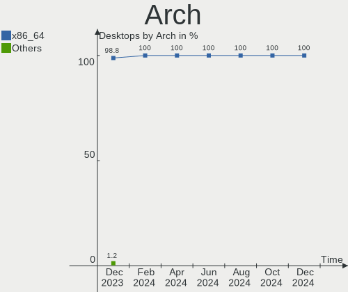
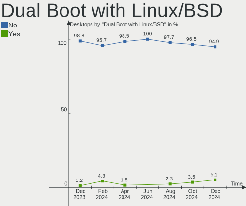
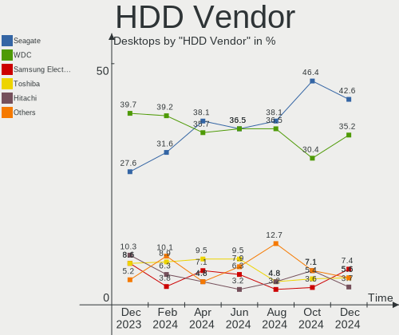
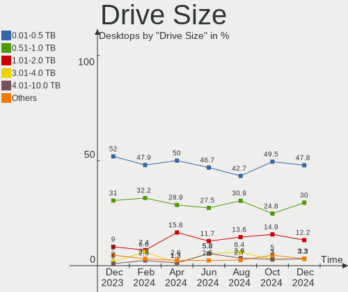
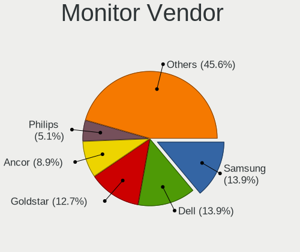

Zorin - Hardware Trends (Desktops)
----------------------------------

A project to identify most popular hardware characteristics and track their change
over time based on data collected by Linux users at https://Linux-Hardware.org.

Anyone can contribute to this report by the [hw-probe](https://github.com/linuxhw/hw-probe) tool:

    sudo -E hw-probe -all -upload

This report is for one last month. Overall report since the beginning of time: [TestCoverage](https://github.com/linuxhw/TestCoverage)

Period: Jan, 2023.

Contents
--------

* [ System ](#system)
  - [ OS                       ](#os)
  - [ OS Family                ](#os-family)
  - [ Kernel                   ](#kernel)
  - [ Kernel Family            ](#kernel-family)
  - [ Kernel Major Ver.        ](#kernel-major-ver)
  - [ Arch                     ](#arch)
  - [ DE                       ](#de)
  - [ Display Server           ](#display-server)
  - [ Display Manager          ](#display-manager)
  - [ OS Lang                  ](#os-lang)
  - [ Boot Mode                ](#boot-mode)
  - [ Filesystem               ](#filesystem)
  - [ Part. scheme             ](#part-scheme)
  - [ Dual Boot with Linux/BSD ](#dual-boot-with-linuxbsd)
  - [ Dual Boot (Win)          ](#dual-boot-win)

* [ Board ](#board)
  - [ Vendor                   ](#vendor)
  - [ Model                    ](#model)
  - [ Model Family             ](#model-family)
  - [ MFG Year                 ](#mfg-year)
  - [ Form Factor              ](#form-factor)
  - [ Secure Boot              ](#secure-boot)
  - [ Coreboot                 ](#coreboot)
  - [ RAM Size                 ](#ram-size)
  - [ RAM Used                 ](#ram-used)
  - [ Total Drives             ](#total-drives)
  - [ Has CD-ROM               ](#has-cd-rom)
  - [ Has Ethernet             ](#has-ethernet)
  - [ Has WiFi                 ](#has-wifi)
  - [ Has Bluetooth            ](#has-bluetooth)

* [ Location ](#location)
  - [ Country                  ](#country)
  - [ City                     ](#city)

* [ Drives ](#drives)
  - [ Drive Vendor             ](#drive-vendor)
  - [ Drive Model              ](#drive-model)
  - [ HDD Vendor               ](#hdd-vendor)
  - [ SSD Vendor               ](#ssd-vendor)
  - [ Drive Kind               ](#drive-kind)
  - [ Drive Connector          ](#drive-connector)
  - [ Drive Size               ](#drive-size)
  - [ Space Total              ](#space-total)
  - [ Space Used               ](#space-used)
  - [ Malfunc. Drives          ](#malfunc-drives)
  - [ Malfunc. Drive Vendor    ](#malfunc-drive-vendor)
  - [ Malfunc. HDD Vendor      ](#malfunc-hdd-vendor)
  - [ Malfunc. Drive Kind      ](#malfunc-drive-kind)
  - [ Failed Drives            ](#failed-drives)
  - [ Failed Drive Vendor      ](#failed-drive-vendor)
  - [ Drive Status             ](#drive-status)

* [ Storage controller ](#storage-controller)
  - [ Storage Vendor           ](#storage-vendor)
  - [ Storage Model            ](#storage-model)
  - [ Storage Kind             ](#storage-kind)

* [ Processor ](#processor)
  - [ CPU Vendor               ](#cpu-vendor)
  - [ CPU Model                ](#cpu-model)
  - [ CPU Model Family         ](#cpu-model-family)
  - [ CPU Cores                ](#cpu-cores)
  - [ CPU Sockets              ](#cpu-sockets)
  - [ CPU Threads              ](#cpu-threads)
  - [ CPU Op-Modes             ](#cpu-op-modes)
  - [ CPU Microcode            ](#cpu-microcode)
  - [ CPU Microarch            ](#cpu-microarch)

* [ Graphics ](#graphics)
  - [ GPU Vendor               ](#gpu-vendor)
  - [ GPU Model                ](#gpu-model)
  - [ GPU Combo                ](#gpu-combo)
  - [ GPU Driver               ](#gpu-driver)
  - [ GPU Memory               ](#gpu-memory)

* [ Monitor ](#monitor)
  - [ Monitor Vendor           ](#monitor-vendor)
  - [ Monitor Model            ](#monitor-model)
  - [ Monitor Resolution       ](#monitor-resolution)
  - [ Monitor Diagonal         ](#monitor-diagonal)
  - [ Monitor Width            ](#monitor-width)
  - [ Aspect Ratio             ](#aspect-ratio)
  - [ Monitor Area             ](#monitor-area)
  - [ Pixel Density            ](#pixel-density)
  - [ Multiple Monitors        ](#multiple-monitors)

* [ Network ](#network)
  - [ Net Controller Vendor    ](#net-controller-vendor)
  - [ Net Controller Model     ](#net-controller-model)
  - [ Wireless Vendor          ](#wireless-vendor)
  - [ Wireless Model           ](#wireless-model)
  - [ Ethernet Vendor          ](#ethernet-vendor)
  - [ Ethernet Model           ](#ethernet-model)
  - [ Net Controller Kind      ](#net-controller-kind)
  - [ Used Controller          ](#used-controller)
  - [ NICs                     ](#nics)
  - [ IPv6                     ](#ipv6)

* [ Bluetooth ](#bluetooth)
  - [ Bluetooth Vendor         ](#bluetooth-vendor)
  - [ Bluetooth Model          ](#bluetooth-model)

* [ Sound ](#sound)
  - [ Sound Vendor             ](#sound-vendor)
  - [ Sound Model              ](#sound-model)

* [ Memory ](#memory)
  - [ Memory Vendor            ](#memory-vendor)
  - [ Memory Model             ](#memory-model)
  - [ Memory Kind              ](#memory-kind)
  - [ Memory Form Factor       ](#memory-form-factor)
  - [ Memory Size              ](#memory-size)
  - [ Memory Speed             ](#memory-speed)

* [ Printers & scanners ](#printers--scanners)
  - [ Printer Vendor           ](#printer-vendor)
  - [ Printer Model            ](#printer-model)
  - [ Scanner Vendor           ](#scanner-vendor)
  - [ Scanner Model            ](#scanner-model)

* [ Camera ](#camera)
  - [ Camera Vendor            ](#camera-vendor)
  - [ Camera Model             ](#camera-model)

* [ Security ](#security)
  - [ Fingerprint Vendor       ](#fingerprint-vendor)
  - [ Fingerprint Model        ](#fingerprint-model)
  - [ Chipcard Vendor          ](#chipcard-vendor)
  - [ Chipcard Model           ](#chipcard-model)

* [ Unsupported ](#unsupported)
  - [ Unsupported Devices      ](#unsupported-devices)
  - [ Unsupported Device Types ](#unsupported-device-types)

System
------

OS
--

Installed operating systems

| Name     | Desktops | Percent |
|----------|----------|---------|
| Zorin 16 | 48       | 90.57%  |
| Zorin 15 | 5        | 9.43%   |

OS Family
---------

OS without a version

| Name  | Desktops | Percent |
|-------|----------|---------|
| Zorin | 53       | 100%    |

Kernel
------

Version of the Linux kernel

| Version              | Desktops | Percent |
|----------------------|----------|---------|
| 5.15.0-58-generic    | 24       | 45.28%  |
| 5.15.0-57-generic    | 9        | 16.98%  |
| 5.15.0-56-generic    | 9        | 16.98%  |
| 5.4.0-136-generic    | 3        | 5.66%   |
| 6.1.7-060107-generic | 1        | 1.89%   |
| 5.4.0-89-generic     | 1        | 1.89%   |
| 5.4.0-117-generic    | 1        | 1.89%   |
| 5.15.0-53-generic    | 1        | 1.89%   |
| 5.15.0-52-generic    | 1        | 1.89%   |
| 5.15.0-48-generic    | 1        | 1.89%   |
| 5.15.0-46-generic    | 1        | 1.89%   |
| 5.13.0-30-generic    | 1        | 1.89%   |

Kernel Family
-------------

Linux kernel without a distro release

| Version | Desktops | Percent |
|---------|----------|---------|
| 5.15.0  | 46       | 86.79%  |
| 5.4.0   | 5        | 9.43%   |
| 6.1.7   | 1        | 1.89%   |
| 5.13.0  | 1        | 1.89%   |

Kernel Major Ver.
-----------------

Linux kernel major version

| Version | Desktops | Percent |
|---------|----------|---------|
| 5.15    | 46       | 86.79%  |
| 5.4     | 5        | 9.43%   |
| 6.1     | 1        | 1.89%   |
| 5.13    | 1        | 1.89%   |

Arch
----

OS architecture (x86_64, i586, etc.)

| Name   | Desktops | Percent |
|--------|----------|---------|
| x86_64 | 51       | 96.23%  |
| i686   | 2        | 3.77%   |

DE
--

Desktop Environment

| Name  | Desktops | Percent |
|-------|----------|---------|
| GNOME | 41       | 77.36%  |
| XFCE  | 11       | 20.75%  |
| KDE5  | 1        | 1.89%   |

Display Server
--------------

X11 or Wayland

| Name    | Desktops | Percent |
|---------|----------|---------|
| X11     | 52       | 98.11%  |
| Wayland | 1        | 1.89%   |

Display Manager
---------------

SDDM, LightDM, etc.

| Name    | Desktops | Percent |
|---------|----------|---------|
| Unknown | 42       | 79.25%  |
| GDM3    | 5        | 9.43%   |
| LightDM | 3        | 5.66%   |
| GDM     | 2        | 3.77%   |
| SDDM    | 1        | 1.89%   |

OS Lang
-------

Language

| Lang  | Desktops | Percent |
|-------|----------|---------|
| en_US | 29       | 54.72%  |
| it_IT | 3        | 5.66%   |
| en_CA | 3        | 5.66%   |
| de_DE | 3        | 5.66%   |
| nl_NL | 2        | 3.77%   |
| es_CL | 2        | 3.77%   |
| en_GB | 2        | 3.77%   |
| ru_RU | 1        | 1.89%   |
| pt_BR | 1        | 1.89%   |
| pl_PL | 1        | 1.89%   |
| hu_HU | 1        | 1.89%   |
| es_ES | 1        | 1.89%   |
| es_AR | 1        | 1.89%   |
| en_NZ | 1        | 1.89%   |
| en_AU | 1        | 1.89%   |
| cs_CZ | 1        | 1.89%   |

Boot Mode
---------

EFI or BIOS

| Mode | Desktops | Percent |
|------|----------|---------|
| BIOS | 31       | 58.49%  |
| EFI  | 22       | 41.51%  |

Filesystem
----------

Type of filesystem

| Type    | Desktops | Percent |
|---------|----------|---------|
| Ext4    | 51       | 96.23%  |
| Zfs     | 1        | 1.89%   |
| Overlay | 1        | 1.89%   |

Part. scheme
------------

Scheme of partitioning

| Type    | Desktops | Percent |
|---------|----------|---------|
| Unknown | 44       | 83.02%  |
| GPT     | 5        | 9.43%   |
| MBR     | 4        | 7.55%   |

Dual Boot with Linux/BSD
------------------------

Hosting more than one Linux/BSD

| Dual boot | Desktops | Percent |
|-----------|----------|---------|
| No        | 50       | 94.34%  |
| Yes       | 3        | 5.66%   |

Dual Boot (Win)
---------------

Hosting Linux and Windows

| Dual boot | Desktops | Percent |
|-----------|----------|---------|
| No        | 48       | 90.57%  |
| Yes       | 5        | 9.43%   |

Board
-----

Vendor
------

Motherboard manufacturer

| Name                | Desktops | Percent |
|---------------------|----------|---------|
| ASUSTek Computer    | 13       | 24.53%  |
| Hewlett-Packard     | 12       | 22.64%  |
| ASRock              | 5        | 9.43%   |
| MSI                 | 4        | 7.55%   |
| Dell                | 4        | 7.55%   |
| Gigabyte Technology | 2        | 3.77%   |
| Fujitsu             | 2        | 3.77%   |
| Acer                | 2        | 3.77%   |
| Standard            | 1        | 1.89%   |
| Medion              | 1        | 1.89%   |
| MAXSUN              | 1        | 1.89%   |
| Lenovo              | 1        | 1.89%   |
| Huanan              | 1        | 1.89%   |
| HC                  | 1        | 1.89%   |
| Foxconn             | 1        | 1.89%   |
| Alienware           | 1        | 1.89%   |
| Unknown             | 1        | 1.89%   |

Model
-----

Motherboard model

| Name                                                                | Desktops | Percent |
|---------------------------------------------------------------------|----------|---------|
| HP Compaq Elite 8300 SFF                                            | 2        | 3.77%   |
| Dell OptiPlex 380                                                   | 2        | 3.77%   |
| Standard X50-V2                                                     | 1        | 1.89%   |
| MSI Pentino H-Series                                                | 1        | 1.89%   |
| MSI MS-7D46                                                         | 1        | 1.89%   |
| MSI MS-7A32                                                         | 1        | 1.89%   |
| MSI MS-7641                                                         | 1        | 1.89%   |
| Medion MS-7707                                                      | 1        | 1.89%   |
| MAXSUN MS-TZZ A320M.2-VH                                            | 1        | 1.89%   |
| Lenovo ThinkCentre M92P 3237EJ3                                     | 1        | 1.89%   |
| Huanan X79 INTEL (INTEL Xeon E5/Corei7 DMI2 - C600/C200 Cipset V3.1 | 1        | 1.89%   |
| HP Z840 Workstation                                                 | 1        | 1.89%   |
| HP Z400 Workstation                                                 | 1        | 1.89%   |
| HP Z220 SFF Workstation                                             | 1        | 1.89%   |
| HP Slim Desktop 290-p0xxx                                           | 1        | 1.89%   |
| HP ProDesk 600 G1 SFF                                               | 1        | 1.89%   |
| HP Pavilion Desktop TP01-3xxx                                       | 1        | 1.89%   |
| HP Pavilion Desktop 595-p0xxx                                       | 1        | 1.89%   |
| HP Compaq Pro 4300 SFF PC                                           | 1        | 1.89%   |
| HP 750-177c                                                         | 1        | 1.89%   |
| HP 290 G1 MT                                                        | 1        | 1.89%   |
| HC HCAR357-MI                                                       | 1        | 1.89%   |
| Gigabyte M68MT-S2                                                   | 1        | 1.89%   |
| Gigabyte EX58-EXTREME                                               | 1        | 1.89%   |
| Fujitsu ESPRIMO_D556                                                | 1        | 1.89%   |
| Fujitsu ESPRIMO E720                                                | 1        | 1.89%   |
| Foxconn H67S/H61SP                                                  | 1        | 1.89%   |
| Dell OptiPlex 790                                                   | 1        | 1.89%   |
| Dell Inspiron 560s                                                  | 1        | 1.89%   |
| ASUS Z170 PRO GAMING/AURA                                           | 1        | 1.89%   |
| ASUS TUF Gaming X570-PRO                                            | 1        | 1.89%   |
| ASUS TUF Gaming X570-PLUS_BR                                        | 1        | 1.89%   |
| ASUS ROG STRIX X670E-I GAMING WIFI                                  | 1        | 1.89%   |
| ASUS ROG STRIX B350-F GAMING                                        | 1        | 1.89%   |
| ASUS ROG Maximus XI HERO                                            | 1        | 1.89%   |
| ASUS PRIME B450-PLUS                                                | 1        | 1.89%   |
| ASUS P7P55D-E                                                       | 1        | 1.89%   |
| ASUS P5Q                                                            | 1        | 1.89%   |
| ASUS M4A88T-M                                                       | 1        | 1.89%   |
| ASUS M4A3000E                                                       | 1        | 1.89%   |

Model Family
------------

Motherboard model prefix

| Name                  | Desktops | Percent |
|-----------------------|----------|---------|
| HP Compaq             | 3        | 5.66%   |
| Dell OptiPlex         | 3        | 5.66%   |
| ASUS ROG              | 3        | 5.66%   |
| HP Pavilion           | 2        | 3.77%   |
| Fujitsu ESPRIMO       | 2        | 3.77%   |
| ASUS TUF              | 2        | 3.77%   |
| Standard X50-V2       | 1        | 1.89%   |
| MSI Pentino           | 1        | 1.89%   |
| MSI MS-7D46           | 1        | 1.89%   |
| MSI MS-7A32           | 1        | 1.89%   |
| MSI MS-7641           | 1        | 1.89%   |
| Medion MS-7707        | 1        | 1.89%   |
| MAXSUN MS-TZZ         | 1        | 1.89%   |
| Lenovo ThinkCentre    | 1        | 1.89%   |
| Huanan X79            | 1        | 1.89%   |
| HP Z840               | 1        | 1.89%   |
| HP Z400               | 1        | 1.89%   |
| HP Z220               | 1        | 1.89%   |
| HP Slim               | 1        | 1.89%   |
| HP ProDesk            | 1        | 1.89%   |
| HP 750-177c           | 1        | 1.89%   |
| HP 290                | 1        | 1.89%   |
| HC HCAR357-MI         | 1        | 1.89%   |
| Gigabyte M68MT-S2     | 1        | 1.89%   |
| Gigabyte EX58-EXTREME | 1        | 1.89%   |
| Foxconn H67S          | 1        | 1.89%   |
| Dell Inspiron         | 1        | 1.89%   |
| ASUS Z170             | 1        | 1.89%   |
| ASUS PRIME            | 1        | 1.89%   |
| ASUS P7P55D-E         | 1        | 1.89%   |
| ASUS P5Q              | 1        | 1.89%   |
| ASUS M4A88T-M         | 1        | 1.89%   |
| ASUS M4A3000E         | 1        | 1.89%   |
| ASUS ASUS             | 1        | 1.89%   |
| ASUS All              | 1        | 1.89%   |
| ASRock X670E          | 1        | 1.89%   |
| ASRock H87            | 1        | 1.89%   |
| ASRock H61M-DGS       | 1        | 1.89%   |
| ASRock H61M           | 1        | 1.89%   |
| ASRock B450           | 1        | 1.89%   |

MFG Year
--------

Motherboard manufacture year

| Year | Desktops | Percent |
|------|----------|---------|
| 2010 | 8        | 15.09%  |
| 2022 | 7        | 13.21%  |
| 2012 | 7        | 13.21%  |
| 2018 | 6        | 11.32%  |
| 2013 | 6        | 11.32%  |
| 2011 | 4        | 7.55%   |
| 2020 | 3        | 5.66%   |
| 2017 | 2        | 3.77%   |
| 2015 | 2        | 3.77%   |
| 2009 | 2        | 3.77%   |
| 2008 | 2        | 3.77%   |
| 2021 | 1        | 1.89%   |
| 2019 | 1        | 1.89%   |
| 2016 | 1        | 1.89%   |
| 2007 | 1        | 1.89%   |

Form Factor
-----------

Physical design of the computer

| Name    | Desktops | Percent |
|---------|----------|---------|
| Desktop | 53       | 100%    |

Secure Boot
-----------

Enabled or disabled

| State    | Desktops | Percent |
|----------|----------|---------|
| Disabled | 50       | 94.34%  |
| Enabled  | 3        | 5.66%   |

Coreboot
--------

Have coreboot on board

| Used | Desktops | Percent |
|------|----------|---------|
| No   | 53       | 100%    |

RAM Size
--------

Total RAM memory

| Size in GB  | Desktops | Percent |
|-------------|----------|---------|
| 16.01-24.0  | 15       | 28.3%   |
| 8.01-16.0   | 10       | 18.87%  |
| 3.01-4.0    | 9        | 16.98%  |
| 32.01-64.0  | 7        | 13.21%  |
| 4.01-8.0    | 5        | 9.43%   |
| 1.01-2.0    | 3        | 5.66%   |
| 64.01-256.0 | 2        | 3.77%   |
| 24.01-32.0  | 1        | 1.89%   |
| 2.01-3.0    | 1        | 1.89%   |

RAM Used
--------

Used RAM memory

| Used GB    | Desktops | Percent |
|------------|----------|---------|
| 1.01-2.0   | 20       | 37.74%  |
| 2.01-3.0   | 15       | 28.3%   |
| 4.01-8.0   | 10       | 18.87%  |
| 3.01-4.0   | 6        | 11.32%  |
| 24.01-32.0 | 1        | 1.89%   |
| 8.01-16.0  | 1        | 1.89%   |

Total Drives
------------

Number of drives on board

| Drives | Desktops | Percent |
|--------|----------|---------|
| 1      | 25       | 47.17%  |
| 2      | 17       | 32.08%  |
| 3      | 5        | 9.43%   |
| 4      | 3        | 5.66%   |
| 7      | 1        | 1.89%   |
| 6      | 1        | 1.89%   |
| 5      | 1        | 1.89%   |

Has CD-ROM
----------

Has CD-ROM on board

| Presented | Desktops | Percent |
|-----------|----------|---------|
| Yes       | 30       | 56.6%   |
| No        | 23       | 43.4%   |

Has Ethernet
------------

Has Ethernet on board

| Presented | Desktops | Percent |
|-----------|----------|---------|
| Yes       | 51       | 96.23%  |
| No        | 2        | 3.77%   |

Has WiFi
--------

Has WiFi module

| Presented | Desktops | Percent |
|-----------|----------|---------|
| Yes       | 32       | 60.38%  |
| No        | 21       | 39.62%  |

Has Bluetooth
-------------

Has Bluetooth module

| Presented | Desktops | Percent |
|-----------|----------|---------|
| No        | 34       | 64.15%  |
| Yes       | 19       | 35.85%  |

Location
--------

Country
-------

Geographic location (country)

| Country     | Desktops | Percent |
|-------------|----------|---------|
| USA         | 18       | 33.96%  |
| Germany     | 5        | 9.43%   |
| Italy       | 4        | 7.55%   |
| Netherlands | 3        | 5.66%   |
| Chile       | 3        | 5.66%   |
| Canada      | 3        | 5.66%   |
| UK          | 2        | 3.77%   |
| Brazil      | 2        | 3.77%   |
| Switzerland | 1        | 1.89%   |
| Spain       | 1        | 1.89%   |
| Russia      | 1        | 1.89%   |
| Romania     | 1        | 1.89%   |
| Poland      | 1        | 1.89%   |
| New Zealand | 1        | 1.89%   |
| Jordan      | 1        | 1.89%   |
| Hungary     | 1        | 1.89%   |
| Finland     | 1        | 1.89%   |
| Czechia     | 1        | 1.89%   |
| Belgium     | 1        | 1.89%   |
| Australia   | 1        | 1.89%   |
| Argentina   | 1        | 1.89%   |

City
----

Geographic location (city)

| City                | Desktops | Percent |
|---------------------|----------|---------|
| Santiago            | 2        | 3.77%   |
| Wesley Chapel       | 1        | 1.89%   |
| Werneuchen          | 1        | 1.89%   |
| Valparaiso de Goias | 1        | 1.89%   |
| Valparaíso         | 1        | 1.89%   |
| UEllo               | 1        | 1.89%   |
| Toronto             | 1        | 1.89%   |
| Tonbridge           | 1        | 1.89%   |
| Sun City            | 1        | 1.89%   |
| Stoutland           | 1        | 1.89%   |
| St Louis            | 1        | 1.89%   |
| Seville             | 1        | 1.89%   |
| Rome                | 1        | 1.89%   |
| Rochester           | 1        | 1.89%   |
| Rio de Janeiro      | 1        | 1.89%   |
| Richmond            | 1        | 1.89%   |
| Providence          | 1        | 1.89%   |
| Port Saint Lucie    | 1        | 1.89%   |
| Pequot Lakes        | 1        | 1.89%   |
| Ostseebad Binz      | 1        | 1.89%   |
| New York            | 1        | 1.89%   |
| Milwaukee           | 1        | 1.89%   |
| Mequon              | 1        | 1.89%   |
| Melbourne           | 1        | 1.89%   |
| Medford             | 1        | 1.89%   |
| Marano di Napoli    | 1        | 1.89%   |
| Madison Heights     | 1        | 1.89%   |
| Las Vegas           | 1        | 1.89%   |
| Kirov               | 1        | 1.89%   |
| Kiel                | 1        | 1.89%   |
| Katowice            | 1        | 1.89%   |
| Karlsruhe           | 1        | 1.89%   |
| Järvenpää        | 1        | 1.89%   |
| Ionia               | 1        | 1.89%   |
| Hockessin           | 1        | 1.89%   |
| Herentals           | 1        | 1.89%   |
| Hamilton            | 1        | 1.89%   |
| Greater Sudbury     | 1        | 1.89%   |
| Genoa               | 1        | 1.89%   |
| Fribourg            | 1        | 1.89%   |

Drives
------

Drive Vendor
------------

Hard drive vendors

| Vendor                      | Desktops | Drives | Percent |
|-----------------------------|----------|--------|---------|
| Seagate                     | 20       | 24     | 21.98%  |
| Samsung Electronics         | 17       | 19     | 18.68%  |
| WDC                         | 14       | 19     | 15.38%  |
| Kingston                    | 5        | 6      | 5.49%   |
| Silicon Motion              | 4        | 4      | 4.4%    |
| Unknown                     | 2        | 2      | 2.2%    |
| Toshiba                     | 2        | 3      | 2.2%    |
| Sandisk                     | 2        | 3      | 2.2%    |
| Patriot                     | 2        | 2      | 2.2%    |
| Maxtor                      | 2        | 2      | 2.2%    |
| Intel                       | 2        | 2      | 2.2%    |
| Hitachi                     | 2        | 2      | 2.2%    |
| Crucial                     | 2        | 2      | 2.2%    |
| China                       | 2        | 2      | 2.2%    |
| SK hynix                    | 1        | 1      | 1.1%    |
| Realtek Semiconductor       | 1        | 1      | 1.1%    |
| PNY                         | 1        | 1      | 1.1%    |
| KIOXIA-EXCERIA              | 1        | 1      | 1.1%    |
| KIOXIA                      | 1        | 1      | 1.1%    |
| Kingston Technology Company | 1        | 1      | 1.1%    |
| JMicron Technology          | 1        | 1      | 1.1%    |
| HUAWEI                      | 1        | 1      | 1.1%    |
| HGST                        | 1        | 1      | 1.1%    |
| Corsair                     | 1        | 2      | 1.1%    |
| AFOX                        | 1        | 1      | 1.1%    |
| Acer                        | 1        | 1      | 1.1%    |
| A-DATA Technology           | 1        | 1      | 1.1%    |

Drive Model
-----------

Hard drive models

| Model                                                 | Desktops | Percent |
|-------------------------------------------------------|----------|---------|
| Samsung NVMe SSD Controller SM981/PM981/PM983 500GB   | 5        | 5%      |
| Silicon Motion SM2263EN/SM2263XT SSD Controller 512GB | 4        | 4%      |
| Samsung SSD 860 EVO 500GB                             | 3        | 3%      |
| WDC WD30EZRX-00D8PB0 3TB                              | 2        | 2%      |
| WDC WD20EARS-00MVWB0 2TB                              | 2        | 2%      |
| Seagate ST3500418AS 500GB                             | 2        | 2%      |
| Seagate ST1000LM035-1RK172 1TB                        | 2        | 2%      |
| Intel SSD 660P Series 512GB                           | 2        | 2%      |
| WDC WDS100T3XHC-00SJG0 1TB                            | 1        | 1%      |
| WDC WD6400AAKS-75A7B2 640GB                           | 1        | 1%      |
| WDC WD5000LUCT-63C26Y0 500GB                          | 1        | 1%      |
| WDC WD5000LPCX-16VHAT1 500GB                          | 1        | 1%      |
| WDC WD5000AAKX-22ERMA0 500GB                          | 1        | 1%      |
| WDC WD3200AVJS-63WDA0 320GB                           | 1        | 1%      |
| WDC WD3200AAKS-75L9A0 320GB                           | 1        | 1%      |
| WDC WD30EFRX-68EUZN0 3TB                              | 1        | 1%      |
| WDC WD20EZRX-60D8PB0 2TB                              | 1        | 1%      |
| WDC WD15EARS-00MVWB0 1TB                              | 1        | 1%      |
| WDC WD10SPZX-22Z10T1 1TB                              | 1        | 1%      |
| WDC WD10EADX-22TDHB0 1TB                              | 1        | 1%      |
| WDC WD10EADS-00L5B1 1TB                               | 1        | 1%      |
| WDC WD1003FZEX-00K3CA0 1TB                            | 1        | 1%      |
| Unknown SD/MMC/MS PRO 2GB                             | 1        | 1%      |
| Unknown NVMe SSD Drive 500GB                          | 1        | 1%      |
| Toshiba MQ01ABD100 1TB                                | 1        | 1%      |
| Toshiba MK3265GSX 320GB                               | 1        | 1%      |
| Toshiba KSG60ZMV256G M.2 256GB SSD                    | 1        | 1%      |
| SK hynix BC501 NVMe Solid State Drive 512GB           | 1        | 1%      |
| Seagate STM31000528AS 1TB                             | 1        | 1%      |
| Seagate ST9160314AS 160GB                             | 1        | 1%      |
| Seagate ST500DM002-1BD142 500GB                       | 1        | 1%      |
| Seagate ST4000VN008-2DR166 4TB                        | 1        | 1%      |
| Seagate ST4000DM005-2DP166 4TB                        | 1        | 1%      |
| Seagate ST4000DM004-2CV104 4TB                        | 1        | 1%      |
| Seagate ST3500413AS 500GB                             | 1        | 1%      |
| Seagate ST3320310CS 320GB                             | 1        | 1%      |
| Seagate ST3250318AS 249GB                             | 1        | 1%      |
| Seagate ST3250310AS 250GB                             | 1        | 1%      |
| Seagate ST2000DM008-2UB102 2TB                        | 1        | 1%      |
| Seagate ST2000DM001-1ER164 2TB                        | 1        | 1%      |

HDD Vendor
----------

Hard disk drive vendors

| Vendor              | Desktops | Drives | Percent |
|---------------------|----------|--------|---------|
| Seagate             | 20       | 24     | 42.55%  |
| WDC                 | 14       | 18     | 29.79%  |
| Samsung Electronics | 5        | 5      | 10.64%  |
| Toshiba             | 2        | 2      | 4.26%   |
| Maxtor              | 2        | 2      | 4.26%   |
| Hitachi             | 2        | 2      | 4.26%   |
| Unknown             | 1        | 1      | 2.13%   |
| HGST                | 1        | 1      | 2.13%   |

SSD Vendor
----------

Solid state drive vendors

| Vendor              | Desktops | Drives | Percent |
|---------------------|----------|--------|---------|
| Samsung Electronics | 7        | 7      | 28%     |
| Kingston            | 4        | 5      | 16%     |
| Patriot             | 2        | 2      | 8%      |
| Crucial             | 2        | 2      | 8%      |
| China               | 2        | 2      | 8%      |
| Toshiba             | 1        | 1      | 4%      |
| PNY                 | 1        | 1      | 4%      |
| KIOXIA-EXCERIA      | 1        | 1      | 4%      |
| JMicron Technology  | 1        | 1      | 4%      |
| Corsair             | 1        | 2      | 4%      |
| AFOX                | 1        | 1      | 4%      |
| Acer                | 1        | 1      | 4%      |
| A-DATA Technology   | 1        | 1      | 4%      |

Drive Kind
----------

HDD or SSD

| Kind    | Desktops | Drives | Percent |
|---------|----------|--------|---------|
| HDD     | 37       | 55     | 47.44%  |
| SSD     | 21       | 27     | 26.92%  |
| NVMe    | 19       | 23     | 24.36%  |
| Unknown | 1        | 1      | 1.28%   |

Drive Connector
---------------

SATA, SAS, NVMe, etc.

| Type | Desktops | Drives | Percent |
|------|----------|--------|---------|
| SATA | 45       | 77     | 65.22%  |
| NVMe | 19       | 23     | 27.54%  |
| SAS  | 5        | 6      | 7.25%   |

Drive Size
----------

Size of hard drive

| Size in TB | Desktops | Drives | Percent |
|------------|----------|--------|---------|
| 0.01-0.5   | 35       | 48     | 56.45%  |
| 0.51-1.0   | 15       | 20     | 24.19%  |
| 1.01-2.0   | 6        | 7      | 9.68%   |
| 3.01-4.0   | 3        | 4      | 4.84%   |
| 2.01-3.0   | 3        | 3      | 4.84%   |

Space Total
-----------

Amount of disk space available on the file system

| Size in GB     | Desktops | Percent |
|----------------|----------|---------|
| 251-500        | 17       | 32.08%  |
| 101-250        | 12       | 22.64%  |
| 1001-2000      | 7        | 13.21%  |
| 501-1000       | 6        | 11.32%  |
| More than 3000 | 3        | 5.66%   |
| 51-100         | 3        | 5.66%   |
| 2001-3000      | 2        | 3.77%   |
| 1-20           | 2        | 3.77%   |
| Unknown        | 1        | 1.89%   |

Space Used
----------

Amount of used disk space

| Used GB        | Desktops | Percent |
|----------------|----------|---------|
| 1-20           | 16       | 30.19%  |
| 101-250        | 11       | 20.75%  |
| 21-50          | 8        | 15.09%  |
| 51-100         | 8        | 15.09%  |
| 501-1000       | 7        | 13.21%  |
| More than 3000 | 1        | 1.89%   |
| 251-500        | 1        | 1.89%   |
| Unknown        | 1        | 1.89%   |

Malfunc. Drives
---------------

Drive models with a malfunction

Zero info for selected period =(

Malfunc. Drive Vendor
---------------------

Vendors of faulty drives

Zero info for selected period =(

Malfunc. HDD Vendor
-------------------

Vendors of faulty HDD drives

Zero info for selected period =(

Malfunc. Drive Kind
-------------------

Kinds of faulty drives

Zero info for selected period =(

Failed Drives
-------------

Failed drive models

Zero info for selected period =(

Failed Drive Vendor
-------------------

Failed drive vendors

Zero info for selected period =(

Drive Status
------------

Number of failed and malfunc. drives

| Status   | Desktops | Drives | Percent |
|----------|----------|--------|---------|
| Detected | 52       | 102    | 98.11%  |
| Works    | 1        | 4      | 1.89%   |

Storage controller
------------------

Storage Vendor
--------------

Storage controller vendors

| Vendor                      | Desktops | Percent |
|-----------------------------|----------|---------|
| Intel                       | 36       | 46.15%  |
| AMD                         | 15       | 19.23%  |
| Samsung Electronics         | 5        | 6.41%   |
| Silicon Motion              | 4        | 5.13%   |
| SanDisk                     | 3        | 3.85%   |
| Nvidia                      | 2        | 2.56%   |
| Marvell Technology Group    | 2        | 2.56%   |
| Kingston Technology Company | 2        | 2.56%   |
| JMicron Technology          | 2        | 2.56%   |
| ASMedia Technology          | 2        | 2.56%   |
| SK hynix                    | 1        | 1.28%   |
| Realtek Semiconductor       | 1        | 1.28%   |
| KIOXIA                      | 1        | 1.28%   |
| Broadcom / LSI              | 1        | 1.28%   |
| Unknown                     | 1        | 1.28%   |

Storage Model
-------------

Storage controller models

| Model                                                                                   | Desktops | Percent |
|-----------------------------------------------------------------------------------------|----------|---------|
| AMD FCH SATA Controller [AHCI mode]                                                     | 7        | 7.29%   |
| Samsung NVMe SSD Controller SM981/PM981/PM983                                           | 5        | 5.21%   |
| Intel 8 Series/C220 Series Chipset Family 6-port SATA Controller 1 [AHCI mode]          | 5        | 5.21%   |
| Intel 6 Series/C200 Series Chipset Family 6 port Desktop SATA AHCI Controller           | 5        | 5.21%   |
| Silicon Motion SM2263EN/SM2263XT SSD Controller                                         | 4        | 4.17%   |
| Intel Q170/Q150/B150/H170/H110/Z170/CM236 Chipset SATA Controller [AHCI Mode]           | 4        | 4.17%   |
| Intel NM10/ICH7 Family SATA Controller [IDE mode]                                       | 3        | 3.13%   |
| Intel Cannon Lake PCH SATA AHCI Controller                                              | 3        | 3.13%   |
| Intel 7 Series/C210 Series Chipset Family 6-port SATA Controller [AHCI mode]            | 3        | 3.13%   |
| AMD SB7x0/SB8x0/SB9x0 SATA Controller [AHCI mode]                                       | 3        | 3.13%   |
| AMD SB7x0/SB8x0/SB9x0 IDE Controller                                                    | 3        | 3.13%   |
| JMicron JMB363 SATA/IDE Controller                                                      | 2        | 2.08%   |
| Intel SSD 660P Series                                                                   | 2        | 2.08%   |
| Intel SATA Controller [RAID mode]                                                       | 2        | 2.08%   |
| Intel Alder Lake-S PCH SATA Controller [AHCI Mode]                                      | 2        | 2.08%   |
| Intel 82801JI (ICH10 Family) SATA AHCI Controller                                       | 2        | 2.08%   |
| Intel 82801G (ICH7 Family) IDE Controller                                               | 2        | 2.08%   |
| AMD SATA controller                                                                     | 2        | 2.08%   |
| AMD 400 Series Chipset SATA Controller                                                  | 2        | 2.08%   |
| SK hynix BC501 NVMe Solid State Drive                                                   | 1        | 1.04%   |
| SanDisk WD Blue SN550 NVMe SSD                                                          | 1        | 1.04%   |
| SanDisk WD Black 2018/SN750 / PC SN720 NVMe SSD                                         | 1        | 1.04%   |
| SanDisk Non-Volatile memory controller                                                  | 1        | 1.04%   |
| Samsung NVMe SSD Controller SM961/PM961/SM963                                           | 1        | 1.04%   |
| Realtek Realtek Non-Volatile memory controller                                          | 1        | 1.04%   |
| Nvidia MCP61 SATA Controller                                                            | 1        | 1.04%   |
| Nvidia MCP55 SATA Controller                                                            | 1        | 1.04%   |
| Nvidia MCP55 IDE                                                                        | 1        | 1.04%   |
| Marvell Group 88SE912x SATA 6Gb/s Controller [IDE mode]                                 | 1        | 1.04%   |
| Marvell Group 88SE6111/6121 SATA II / PATA Controller                                   | 1        | 1.04%   |
| KIOXIA NVMe SSD Controller BG4                                                          | 1        | 1.04%   |
| Kingston Company U-SNS8154P3 NVMe SSD                                                   | 1        | 1.04%   |
| Kingston Company Company Non-Volatile memory controller                                 | 1        | 1.04%   |
| Intel Volume Management Device NVMe RAID Controller                                     | 1        | 1.04%   |
| Intel Celeron/Pentium Silver Processor SATA Controller                                  | 1        | 1.04%   |
| Intel C610/X99 series chipset sSATA Controller [RAID mode]                              | 1        | 1.04%   |
| Intel C600/X79 series chipset SATA RAID Controller                                      | 1        | 1.04%   |
| Intel C600/X79 series chipset 6-Port SATA AHCI Controller                               | 1        | 1.04%   |
| Intel 82801JI (ICH10 Family) 4 port SATA IDE Controller #1                              | 1        | 1.04%   |
| Intel 6 Series/C200 Series Chipset Family Desktop SATA Controller (IDE mode, ports 4-5) | 1        | 1.04%   |

Storage Kind
------------

Kind of storage controller (IDE, SATA, NVMe, SAS, ...)

| Kind | Desktops | Percent |
|------|----------|---------|
| SATA | 42       | 53.16%  |
| NVMe | 19       | 24.05%  |
| IDE  | 13       | 16.46%  |
| RAID | 4        | 5.06%   |
| SAS  | 1        | 1.27%   |

Processor
---------

CPU Vendor
----------

Processor vendors

| Vendor | Desktops | Percent |
|--------|----------|---------|
| Intel  | 36       | 67.92%  |
| AMD    | 17       | 32.08%  |

CPU Model
---------

Processor models

| Model                                       | Desktops | Percent |
|---------------------------------------------|----------|---------|
| Intel Core i5-3570 CPU @ 3.40GHz            | 2        | 3.77%   |
| Intel Core i5-3470 CPU @ 3.20GHz            | 2        | 3.77%   |
| Intel Core 2 Duo CPU E7500 @ 2.93GHz        | 2        | 3.77%   |
| AMD Ryzen 5 5600G with Radeon Graphics      | 2        | 3.77%   |
| AMD Ryzen 5 2400G with Radeon Vega Graphics | 2        | 3.77%   |
| Intel Xeon CPU W3550 @ 3.07GHz              | 1        | 1.89%   |
| Intel Xeon CPU E5-2690 0 @ 2.90GHz          | 1        | 1.89%   |
| Intel Xeon CPU E5-2637 v4 @ 3.50GHz         | 1        | 1.89%   |
| Intel Pentium Dual-Core CPU E5700 @ 3.00GHz | 1        | 1.89%   |
| Intel Pentium CPU G860 @ 3.00GHz            | 1        | 1.89%   |
| Intel Pentium CPU G2030 @ 3.00GHz           | 1        | 1.89%   |
| Intel Core i9-9900K CPU @ 3.60GHz           | 1        | 1.89%   |
| Intel Core i7-9700F CPU @ 3.00GHz           | 1        | 1.89%   |
| Intel Core i7-7700K CPU @ 4.20GHz           | 1        | 1.89%   |
| Intel Core i7-6700 CPU @ 3.40GHz            | 1        | 1.89%   |
| Intel Core i7-4790 CPU @ 3.60GHz            | 1        | 1.89%   |
| Intel Core i7-4770 CPU @ 3.40GHz            | 1        | 1.89%   |
| Intel Core i7-3770T CPU @ 2.50GHz           | 1        | 1.89%   |
| Intel Core i7-10700 CPU @ 2.90GHz           | 1        | 1.89%   |
| Intel Core i7 CPU 965 @ 3.20GHz             | 1        | 1.89%   |
| Intel Core i5-4590 CPU @ 3.30GHz            | 1        | 1.89%   |
| Intel Core i5-4570 CPU @ 3.20GHz            | 1        | 1.89%   |
| Intel Core i5-4440 CPU @ 3.10GHz            | 1        | 1.89%   |
| Intel Core i5-3470T CPU @ 2.90GHz           | 1        | 1.89%   |
| Intel Core i5-2400 CPU @ 3.10GHz            | 1        | 1.89%   |
| Intel Core i5-2300 CPU @ 2.80GHz            | 1        | 1.89%   |
| Intel Core i5 CPU 760 @ 2.80GHz             | 1        | 1.89%   |
| Intel Core i3-7100 CPU @ 3.90GHz            | 1        | 1.89%   |
| Intel Core 2 Duo CPU E8400 @ 3.00GHz        | 1        | 1.89%   |
| Intel Celeron J4125 CPU @ 2.00GHz           | 1        | 1.89%   |
| Intel Celeron G4900 CPU @ 3.10GHz           | 1        | 1.89%   |
| Intel Celeron CPU G3900 @ 2.80GHz           | 1        | 1.89%   |
| Intel Atom CPU D525 @ 1.80GHz               | 1        | 1.89%   |
| Intel 12th Gen Core i5-12400F               | 1        | 1.89%   |
| Intel 12th Gen Core i5-12400                | 1        | 1.89%   |
| AMD Ryzen 9 7900X 12-Core Processor         | 1        | 1.89%   |
| AMD Ryzen 7 5700G with Radeon Graphics      | 1        | 1.89%   |
| AMD Ryzen 7 1800X Eight-Core Processor      | 1        | 1.89%   |
| AMD Ryzen 7 1700X Eight-Core Processor      | 1        | 1.89%   |
| AMD Ryzen 5 7600X 6-Core Processor          | 1        | 1.89%   |

CPU Model Family
----------------

Processor model prefix

| Model                   | Desktops | Percent |
|-------------------------|----------|---------|
| Intel Core i5           | 11       | 20.75%  |
| Intel Core i7           | 8        | 15.09%  |
| AMD Ryzen 5             | 6        | 11.32%  |
| Intel Xeon              | 3        | 5.66%   |
| Intel Core 2 Duo        | 3        | 5.66%   |
| Intel Celeron           | 3        | 5.66%   |
| AMD Ryzen 7             | 3        | 5.66%   |
| AMD Athlon II X2        | 3        | 5.66%   |
| Other                   | 2        | 3.77%   |
| Intel Pentium           | 2        | 3.77%   |
| AMD Athlon 64 X2        | 2        | 3.77%   |
| Intel Pentium Dual-Core | 1        | 1.89%   |
| Intel Core i9           | 1        | 1.89%   |
| Intel Core i3           | 1        | 1.89%   |
| Intel Atom              | 1        | 1.89%   |
| AMD Ryzen 9             | 1        | 1.89%   |
| AMD Phenom II X4        | 1        | 1.89%   |
| AMD FX                  | 1        | 1.89%   |

CPU Cores
---------

Number of processor cores

| Number | Desktops | Percent |
|--------|----------|---------|
| 4      | 22       | 41.51%  |
| 2      | 17       | 32.08%  |
| 8      | 8        | 15.09%  |
| 6      | 5        | 9.43%   |
| 12     | 1        | 1.89%   |

CPU Sockets
-----------

Number of sockets

| Number | Desktops | Percent |
|--------|----------|---------|
| 1      | 52       | 98.11%  |
| 2      | 1        | 1.89%   |

CPU Threads
-----------

Threads per core (Hyper-Threading)

| Number | Desktops | Percent |
|--------|----------|---------|
| 2      | 27       | 50.94%  |
| 1      | 26       | 49.06%  |

CPU Op-Modes
------------

CPU Operation Modes (32-bit, 64-bit)

| Op mode        | Desktops | Percent |
|----------------|----------|---------|
| 32-bit, 64-bit | 53       | 100%    |

CPU Microcode
-------------

Microcode number

| Number     | Desktops | Percent |
|------------|----------|---------|
| 0x306a9    | 6        | 11.32%  |
| Unknown    | 6        | 11.32%  |
| 0x306c3    | 5        | 9.43%   |
| 0x206a7    | 3        | 5.66%   |
| 0x1067a    | 3        | 5.66%   |
| 0x906e9    | 2        | 3.77%   |
| 0x506e3    | 2        | 3.77%   |
| 0x08001138 | 2        | 3.77%   |
| 0x010000c8 | 2        | 3.77%   |
| 0xa0655    | 1        | 1.89%   |
| 0x906ed    | 1        | 1.89%   |
| 0x906ec    | 1        | 1.89%   |
| 0x906eb    | 1        | 1.89%   |
| 0x90675    | 1        | 1.89%   |
| 0x90672    | 1        | 1.89%   |
| 0x706a8    | 1        | 1.89%   |
| 0x406f1    | 1        | 1.89%   |
| 0x206d7    | 1        | 1.89%   |
| 0x106e5    | 1        | 1.89%   |
| 0x106ca    | 1        | 1.89%   |
| 0x106a5    | 1        | 1.89%   |
| 0x10676    | 1        | 1.89%   |
| 0x0a601203 | 1        | 1.89%   |
| 0x0a601201 | 1        | 1.89%   |
| 0x0a50000d | 1        | 1.89%   |
| 0x0a50000c | 1        | 1.89%   |
| 0x08108102 | 1        | 1.89%   |
| 0x08101016 | 1        | 1.89%   |
| 0x0810100b | 1        | 1.89%   |
| 0x0600063e | 1        | 1.89%   |
| 0x010000db | 1        | 1.89%   |

CPU Microarch
-------------

Microarchitecture

| Name             | Desktops | Percent |
|------------------|----------|---------|
| IvyBridge        | 7        | 13.21%  |
| KabyLake         | 5        | 9.43%   |
| Haswell          | 5        | 9.43%   |
| Zen              | 4        | 7.55%   |
| SandyBridge      | 4        | 7.55%   |
| Penryn           | 4        | 7.55%   |
| K10              | 4        | 7.55%   |
| Zen 3            | 3        | 5.66%   |
| Nehalem          | 3        | 5.66%   |
| Skylake          | 2        | 3.77%   |
| K8 Hammer        | 2        | 3.77%   |
| Alderlake Hybrid | 2        | 3.77%   |
| Unknown          | 2        | 3.77%   |
| Zen+             | 1        | 1.89%   |
| Goldmont plus    | 1        | 1.89%   |
| CometLake        | 1        | 1.89%   |
| Bulldozer        | 1        | 1.89%   |
| Broadwell        | 1        | 1.89%   |
| Bonnell          | 1        | 1.89%   |

Graphics
--------

GPU Vendor
----------

Vendors of graphics cards

| Vendor | Desktops | Percent |
|--------|----------|---------|
| Intel  | 22       | 39.29%  |
| AMD    | 21       | 37.5%   |
| Nvidia | 13       | 23.21%  |

GPU Model
---------

Graphics card models

| Model                                                                       | Desktops | Percent |
|-----------------------------------------------------------------------------|----------|---------|
| Intel Xeon E3-1200 v2/3rd Gen Core processor Graphics Controller            | 5        | 8.47%   |
| Intel Xeon E3-1200 v3/4th Gen Core Processor Integrated Graphics Controller | 4        | 6.78%   |
| Intel 4 Series Chipset Integrated Graphics Controller                       | 3        | 5.08%   |
| Nvidia GP107 [GeForce GTX 1050 Ti]                                          | 2        | 3.39%   |
| Intel 2nd Generation Core Processor Family Integrated Graphics Controller   | 2        | 3.39%   |
| AMD RS880 [Radeon HD 4250]                                                  | 2        | 3.39%   |
| AMD Raven Ridge [Radeon Vega Series / Radeon Vega Mobile Series]            | 2        | 3.39%   |
| AMD Navi 22 [Radeon RX 6700/6700 XT/6750 XT / 6800M]                        | 2        | 3.39%   |
| AMD Ellesmere [Radeon RX 470/480/570/570X/580/580X/590]                     | 2        | 3.39%   |
| AMD Cezanne [Radeon Vega Series / Radeon Vega Mobile Series]                | 2        | 3.39%   |
| AMD Baffin [Radeon RX 550 640SP / RX 560/560X]                              | 2        | 3.39%   |
| Nvidia GP107 [GeForce GTX 1050 3GB]                                         | 1        | 1.69%   |
| Nvidia GP104 [GeForce GTX 1080]                                             | 1        | 1.69%   |
| Nvidia GP104 [GeForce GTX 1070]                                             | 1        | 1.69%   |
| Nvidia GM206 [GeForce GTX 960]                                              | 1        | 1.69%   |
| Nvidia GM107 [GeForce GTX 750 Ti]                                           | 1        | 1.69%   |
| Nvidia GK208B [GeForce GT 710]                                              | 1        | 1.69%   |
| Nvidia GK107GL [Quadro K600]                                                | 1        | 1.69%   |
| Nvidia GK107 [GeForce GTX 650]                                              | 1        | 1.69%   |
| Nvidia G94 [GeForce 9600 GS]                                                | 1        | 1.69%   |
| Nvidia G80 [GeForce 8800 GTX]                                               | 1        | 1.69%   |
| Nvidia C61 [GeForce 7025 / nForce 630a]                                     | 1        | 1.69%   |
| Intel IvyBridge GT2 [HD Graphics 4000]                                      | 1        | 1.69%   |
| Intel HD Graphics 530                                                       | 1        | 1.69%   |
| Intel HD Graphics 510                                                       | 1        | 1.69%   |
| Intel GeminiLake [UHD Graphics 600]                                         | 1        | 1.69%   |
| Intel CometLake-S GT2 [UHD Graphics 630]                                    | 1        | 1.69%   |
| Intel CoffeeLake-S GT1 [UHD Graphics 610]                                   | 1        | 1.69%   |
| Intel Atom Processor D4xx/D5xx/N4xx/N5xx Integrated Graphics Controller     | 1        | 1.69%   |
| Intel Alder Lake-S GT1 [UHD Graphics 730]                                   | 1        | 1.69%   |
| AMD Vega 20 [Radeon VII]                                                    | 1        | 1.69%   |
| AMD Turks XT [Radeon HD 6670/7670]                                          | 1        | 1.69%   |
| AMD RV770 [Radeon HD 4850]                                                  | 1        | 1.69%   |
| AMD RS780L [Radeon 3000]                                                    | 1        | 1.69%   |
| AMD RS690 [Radeon X1200]                                                    | 1        | 1.69%   |
| AMD Raphael                                                                 | 1        | 1.69%   |
| AMD Picasso/Raven 2 [Radeon Vega Series / Radeon Vega Mobile Series]        | 1        | 1.69%   |
| AMD Navi 23 [Radeon RX 6600/6600 XT/6600M]                                  | 1        | 1.69%   |
| AMD Ellesmere [Radeon Pro WX 5100]                                          | 1        | 1.69%   |
| AMD Cypress XT [Radeon HD 5870]                                             | 1        | 1.69%   |

GPU Combo
---------

Combinations of graphics cards

| Name           | Desktops | Percent |
|----------------|----------|---------|
| 1 x Intel      | 19       | 35.85%  |
| 1 x AMD        | 18       | 33.96%  |
| 1 x Nvidia     | 12       | 22.64%  |
| 2 x AMD        | 3        | 5.66%   |
| Intel + Nvidia | 1        | 1.89%   |

GPU Driver
----------

Free vs proprietary

| Driver      | Desktops | Percent |
|-------------|----------|---------|
| Free        | 47       | 88.68%  |
| Proprietary | 5        | 9.43%   |
| Unknown     | 1        | 1.89%   |

GPU Memory
----------

Total video memory

| Size in GB | Desktops | Percent |
|------------|----------|---------|
| Unknown    | 24       | 45.28%  |
| 0.01-0.5   | 7        | 13.21%  |
| 0.51-1.0   | 6        | 11.32%  |
| 7.01-8.0   | 4        | 7.55%   |
| 3.01-4.0   | 4        | 7.55%   |
| 1.01-2.0   | 4        | 7.55%   |
| 8.01-16.0  | 3        | 5.66%   |
| 2.01-3.0   | 1        | 1.89%   |

Monitor
-------

Monitor Vendor
--------------

Monitor vendors

| Vendor               | Desktops | Percent |
|----------------------|----------|---------|
| Samsung Electronics  | 8        | 15.38%  |
| Hewlett-Packard      | 5        | 9.62%   |
| Goldstar             | 5        | 9.62%   |
| Acer                 | 5        | 9.62%   |
| BenQ                 | 4        | 7.69%   |
| Vizio                | 2        | 3.85%   |
| MStar                | 2        | 3.85%   |
| Lenovo               | 2        | 3.85%   |
| Dell                 | 2        | 3.85%   |
| AOC                  | 2        | 3.85%   |
| ViewSonic            | 1        | 1.92%   |
| Sony                 | 1        | 1.92%   |
| Skyworth             | 1        | 1.92%   |
| Plain Tree Systems   | 1        | 1.92%   |
| Philips              | 1        | 1.92%   |
| LaCie                | 1        | 1.92%   |
| JRY                  | 1        | 1.92%   |
| InfoVision           | 1        | 1.92%   |
| Iiyama               | 1        | 1.92%   |
| HKC                  | 1        | 1.92%   |
| Fujitsu Siemens      | 1        | 1.92%   |
| DVL                  | 1        | 1.92%   |
| ASUSTek Computer     | 1        | 1.92%   |
| Ancor Communications | 1        | 1.92%   |
| AGO                  | 1        | 1.92%   |

Monitor Model
-------------

Monitor models

| Model                                                                   | Desktops | Percent |
|-------------------------------------------------------------------------|----------|---------|
| Vizio V435-J01 VIZ1039 3840x2160 941x529mm 42.5-inch                    | 1        | 1.79%   |
| Vizio E320VT VIZ0067 1920x1080 698x392mm 31.5-inch                      | 1        | 1.79%   |
| ViewSonic VX2255wm-4 VSC9B1F 1680x1050 470x300mm 22.0-inch              | 1        | 1.79%   |
| Sony TV *02 SNYC403 1920x1080 1085x610mm 49.0-inch                      | 1        | 1.79%   |
| Sony TV *02 SNY045B 1920x1080 1085x610mm 49.0-inch                      | 1        | 1.79%   |
| Skyworth SII SPRT RPT SII9575 1920x1080 698x392mm 31.5-inch             | 1        | 1.79%   |
| Samsung Electronics SyncMaster SAM0626 1920x1080                        | 1        | 1.79%   |
| Samsung Electronics SyncMaster SAM03E3 1680x1050 433x271mm 20.1-inch    | 1        | 1.79%   |
| Samsung Electronics SyncMaster SAM011E 1280x1024 338x270mm 17.0-inch    | 1        | 1.79%   |
| Samsung Electronics LCD Monitor SAM7210 3840x2160 1872x1053mm 84.6-inch | 1        | 1.79%   |
| Samsung Electronics LCD Monitor SAM7017 3840x2160 1872x1053mm 84.6-inch | 1        | 1.79%   |
| Samsung Electronics LCD Monitor SAM7016 3840x2160 1872x1053mm 84.6-inch | 1        | 1.79%   |
| Samsung Electronics LCD Monitor SAM0C39 1920x1080 885x498mm 40.0-inch   | 1        | 1.79%   |
| Samsung Electronics LCD Monitor SAM03D4 1280x720                        | 1        | 1.79%   |
| Samsung Electronics C27F390 SAM0D32 1920x1080 598x336mm 27.0-inch       | 1        | 1.79%   |
| Plain Tree Systems Monitor PTS0899 1680x1050 474x296mm 22.0-inch        | 1        | 1.79%   |
| Philips PHL 203V5 PHLC0CE 1600x900 434x236mm 19.4-inch                  | 1        | 1.79%   |
| MStar MST Demo** MST0B01 1920x1080 700x390mm 31.5-inch                  | 1        | 1.79%   |
| MStar Demo MST0030 1920x1080 708x398mm 32.0-inch                        | 1        | 1.79%   |
| Lenovo LEN T22i-10 LEN61A9 1920x1080 476x268mm 21.5-inch                | 1        | 1.79%   |
| Lenovo LEN L192p LEN4BDB 1280x1024 376x301mm 19.0-inch                  | 1        | 1.79%   |
| LaCie 324 LCA24B2 1920x1200 518x324mm 24.1-inch                         | 1        | 1.79%   |
| JRY HDMI1 JRY2700 1920x1080 368x207mm 16.6-inch                         | 1        | 1.79%   |
| InfoVision LCD Monitor IVO061A 1366x768 344x193mm 15.5-inch             | 1        | 1.79%   |
| Iiyama PL2488H IVM611A 1920x1080 531x299mm 24.0-inch                    | 1        | 1.79%   |
| HKC LCD Monitor HKC1900 1440x900 410x256mm 19.0-inch                    | 1        | 1.79%   |
| Hewlett-Packard X32 HPN3727 2560x1440 698x393mm 31.5-inch               | 1        | 1.79%   |
| Hewlett-Packard X32 HPN3726 2560x1440 698x393mm 31.5-inch               | 1        | 1.79%   |
| Hewlett-Packard LCD Monitor ZR30w 4480x1600                             | 1        | 1.79%   |
| Hewlett-Packard E232 HWP327B 1920x1080 509x286mm 23.0-inch              | 1        | 1.79%   |
| Hewlett-Packard 27w HPN3494 1920x1080 598x336mm 27.0-inch               | 1        | 1.79%   |
| Hewlett-Packard 23vx HWP3298 1920x1080 509x286mm 23.0-inch              | 1        | 1.79%   |
| Goldstar W2361 GSM56FB 1920x1080 510x290mm 23.1-inch                    | 1        | 1.79%   |
| Goldstar W2046 GSM4EAC 1600x900 443x249mm 20.0-inch                     | 1        | 1.79%   |
| Goldstar ULTRAFINE GSM5BC1 3840x2160 600x340mm 27.2-inch                | 1        | 1.79%   |
| Goldstar L1750SQ GSM43E8 1280x1024 338x270mm 17.0-inch                  | 1        | 1.79%   |
| Goldstar 32 FHD GSM7700 1920x1080 698x392mm 31.5-inch                   | 1        | 1.79%   |
| Fujitsu Siemens B24W-7 LED FUS0854 1920x1200 518x324mm 24.1-inch        | 1        | 1.79%   |
| DVL TLD1280 DVLF017 1600x1200 580x360mm 26.9-inch                       | 1        | 1.79%   |
| Dell U2414H DELA0B2 1920x1080 527x296mm 23.8-inch                       | 1        | 1.79%   |

Monitor Resolution
------------------

Monitor screen resolution

| Resolution         | Desktops | Percent |
|--------------------|----------|---------|
| 1920x1080 (FHD)    | 21       | 40.38%  |
| 3840x2160 (4K)     | 5        | 9.62%   |
| 2560x1440 (QHD)    | 5        | 9.62%   |
| 1680x1050 (WSXGA+) | 3        | 5.77%   |
| 1280x1024 (SXGA)   | 3        | 5.77%   |
| 1920x540           | 2        | 3.85%   |
| 1920x1200 (WUXGA)  | 2        | 3.85%   |
| 1600x900 (HD+)     | 2        | 3.85%   |
| 1366x768 (WXGA)    | 2        | 3.85%   |
| 4480x1600          | 1        | 1.92%   |
| 3840x1600          | 1        | 1.92%   |
| 1600x1200          | 1        | 1.92%   |
| 1440x900 (WXGA+)   | 1        | 1.92%   |
| 1360x768           | 1        | 1.92%   |
| 1024x768 (XGA)     | 1        | 1.92%   |
| Unknown            | 1        | 1.92%   |

Monitor Diagonal
----------------

Diagonal size in inches

| Inches  | Desktops | Percent |
|---------|----------|---------|
| 24      | 7        | 13.46%  |
| 31      | 6        | 11.54%  |
| 27      | 5        | 9.62%   |
| Unknown | 5        | 9.62%   |
| 23      | 4        | 7.69%   |
| 22      | 3        | 5.77%   |
| 20      | 3        | 5.77%   |
| 84      | 2        | 3.85%   |
| 21      | 2        | 3.85%   |
| 19      | 2        | 3.85%   |
| 17      | 2        | 3.85%   |
| 69      | 1        | 1.92%   |
| 65      | 1        | 1.92%   |
| 57      | 1        | 1.92%   |
| 55      | 1        | 1.92%   |
| 52      | 1        | 1.92%   |
| 47      | 1        | 1.92%   |
| 40      | 1        | 1.92%   |
| 32      | 1        | 1.92%   |
| 26      | 1        | 1.92%   |
| 18      | 1        | 1.92%   |
| 15      | 1        | 1.92%   |

Monitor Width
-------------

Physical width

| Width in mm | Desktops | Percent |
|-------------|----------|---------|
| 501-600     | 15       | 30.61%  |
| 401-500     | 10       | 20.41%  |
| 601-700     | 6        | 12.24%  |
| Unknown     | 5        | 10.2%   |
| 1001-1500   | 4        | 8.16%   |
| 301-350     | 3        | 6.12%   |
| 1501-2000   | 3        | 6.12%   |
| 801-900     | 1        | 2.04%   |
| 701-800     | 1        | 2.04%   |
| 351-400     | 1        | 2.04%   |

Aspect Ratio
------------

Proportional relationship between the width and the height

| Ratio   | Desktops | Percent |
|---------|----------|---------|
| 16/9    | 31       | 68.89%  |
| 16/10   | 8        | 17.78%  |
| 5/4     | 3        | 6.67%   |
| Unknown | 3        | 6.67%   |

Monitor Area
------------

Area in inch²

| Area in inch² | Desktops | Percent |
|----------------|----------|---------|
| 201-250        | 13       | 25.49%  |
| 351-500        | 7        | 13.73%  |
| More than 1000 | 6        | 11.76%  |
| 301-350        | 6        | 11.76%  |
| 151-200        | 5        | 9.8%    |
| Unknown        | 5        | 9.8%    |
| 251-300        | 3        | 5.88%   |
| 141-150        | 3        | 5.88%   |
| 501-1000       | 2        | 3.92%   |
| 101-110        | 1        | 1.96%   |

Pixel Density
-------------

Pixels per inch

| Density | Desktops | Percent |
|---------|----------|---------|
| 51-100  | 33       | 68.75%  |
| 101-120 | 5        | 10.42%  |
| Unknown | 5        | 10.42%  |
| 1-50    | 4        | 8.33%   |
| 121-160 | 1        | 2.08%   |

Multiple Monitors
-----------------

Total monitors connected

| Total | Desktops | Percent |
|-------|----------|---------|
| 1     | 46       | 86.79%  |
| 2     | 5        | 9.43%   |
| 3     | 2        | 3.77%   |

Network
-------

Net Controller Vendor
---------------------

Controller vendors

| Vendor                | Desktops | Percent |
|-----------------------|----------|---------|
| Realtek Semiconductor | 34       | 41.98%  |
| Intel                 | 20       | 24.69%  |
| Ralink Technology     | 4        | 4.94%   |
| Qualcomm Atheros      | 4        | 4.94%   |
| Broadcom              | 4        | 4.94%   |
| TP-Link               | 2        | 2.47%   |
| Nvidia                | 2        | 2.47%   |
| MediaTek              | 2        | 2.47%   |
| Huawei Technologies   | 2        | 2.47%   |
| VIA Technologies      | 1        | 1.23%   |
| Smart Link            | 1        | 1.23%   |
| Samsung Electronics   | 1        | 1.23%   |
| Linksys               | 1        | 1.23%   |
| JMicron Technology    | 1        | 1.23%   |
| Edimax Technology     | 1        | 1.23%   |
| Broadcom Limited      | 1        | 1.23%   |

Net Controller Model
--------------------

Controller models

| Model                                                             | Desktops | Percent |
|-------------------------------------------------------------------|----------|---------|
| Realtek RTL8111/8168/8411 PCI Express Gigabit Ethernet Controller | 22       | 23.4%   |
| Realtek RTL8821CE 802.11ac PCIe Wireless Network Adapter          | 5        | 5.32%   |
| Intel 82579LM Gigabit Network Connection (Lewisville)             | 5        | 5.32%   |
| Realtek RTL88x2bu [AC1200 Techkey]                                | 2        | 2.13%   |
| Ralink MT7601U Wireless Adapter                                   | 2        | 2.13%   |
| Intel Wi-Fi 6 AX210/AX211/AX411 160MHz                            | 2        | 2.13%   |
| Intel Wi-Fi 6 AX200                                               | 2        | 2.13%   |
| Intel I211 Gigabit Network Connection                             | 2        | 2.13%   |
| Intel Ethernet Controller I225-V                                  | 2        | 2.13%   |
| Intel Ethernet Connection I217-V                                  | 2        | 2.13%   |
| Broadcom NetLink BCM57780 Gigabit Ethernet PCIe                   | 2        | 2.13%   |
| VIA VT6105/VT6106S [Rhine-III]                                    | 1        | 1.06%   |
| TP-Link TL-WN722N v2/v3 [Realtek RTL8188EUS]                      | 1        | 1.06%   |
| TP-Link AC600 wireless Realtek RTL8811AU [Archer T2U Nano]        | 1        | 1.06%   |
| Smart Link LM-I56N                                                | 1        | 1.06%   |
| Samsung Galaxy series, misc. (tethering mode)                     | 1        | 1.06%   |
| Realtek RTL8822BE 802.11a/b/g/n/ac WiFi adapter                   | 1        | 1.06%   |
| Realtek RTL8821AE 802.11ac PCIe Wireless Network Adapter          | 1        | 1.06%   |
| Realtek RTL8814AU 802.11a/b/g/n/ac Wireless Adapter               | 1        | 1.06%   |
| Realtek RTL8812AU 802.11a/b/g/n/ac 2T2R DB WLAN Adapter           | 1        | 1.06%   |
| Realtek RTL8188FTV 802.11b/g/n 1T1R 2.4G WLAN Adapter             | 1        | 1.06%   |
| Realtek RTL8188EUS 802.11n Wireless Network Adapter               | 1        | 1.06%   |
| Realtek RTL8188EE Wireless Network Adapter                        | 1        | 1.06%   |
| Realtek RTL8188CUS 802.11n WLAN Adapter                           | 1        | 1.06%   |
| Realtek RTL8188CE 802.11b/g/n WiFi Adapter                        | 1        | 1.06%   |
| Realtek RTL8187 Wireless Adapter                                  | 1        | 1.06%   |
| Realtek RTL8125 2.5GbE Controller                                 | 1        | 1.06%   |
| Realtek RTL-8129                                                  | 1        | 1.06%   |
| Ralink RT5370 Wireless Adapter                                    | 1        | 1.06%   |
| Ralink MT7610U ("Archer T2U" 2.4G+5G WLAN Adapter                 | 1        | 1.06%   |
| Qualcomm Atheros AR9285 Wireless Network Adapter (PCI-Express)    | 1        | 1.06%   |
| Qualcomm Atheros AR8151 v2.0 Gigabit Ethernet                     | 1        | 1.06%   |
| Qualcomm Atheros AR8131 Gigabit Ethernet                          | 1        | 1.06%   |
| Qualcomm Atheros AR8121/AR8113/AR8114 Gigabit or Fast Ethernet    | 1        | 1.06%   |
| Nvidia MCP61 Ethernet                                             | 1        | 1.06%   |
| Nvidia MCP55 Ethernet                                             | 1        | 1.06%   |
| MediaTek MT7922 802.11ax PCI Express Wireless Network Adapter     | 1        | 1.06%   |
| MediaTek MT7921K (RZ608) Wi-Fi 6E 80MHz                           | 1        | 1.06%   |
| Linksys AE1200 802.11bgn Wireless Adapter [Broadcom BCM43235]     | 1        | 1.06%   |
| JMicron JMC260 PCI Express Fast Ethernet Controller               | 1        | 1.06%   |

Wireless Vendor
---------------

Wireless vendors

| Vendor                | Desktops | Percent |
|-----------------------|----------|---------|
| Realtek Semiconductor | 16       | 45.71%  |
| Intel                 | 7        | 20%     |
| Ralink Technology     | 4        | 11.43%  |
| TP-Link               | 2        | 5.71%   |
| MediaTek              | 2        | 5.71%   |
| Qualcomm Atheros      | 1        | 2.86%   |
| Linksys               | 1        | 2.86%   |
| Edimax Technology     | 1        | 2.86%   |
| Broadcom              | 1        | 2.86%   |

Wireless Model
--------------

Wireless models

| Model                                                          | Desktops | Percent |
|----------------------------------------------------------------|----------|---------|
| Realtek RTL8821CE 802.11ac PCIe Wireless Network Adapter       | 5        | 13.89%  |
| Realtek RTL88x2bu [AC1200 Techkey]                             | 2        | 5.56%   |
| Ralink MT7601U Wireless Adapter                                | 2        | 5.56%   |
| Intel Wi-Fi 6 AX210/AX211/AX411 160MHz                         | 2        | 5.56%   |
| Intel Wi-Fi 6 AX200                                            | 2        | 5.56%   |
| TP-Link TL-WN722N v2/v3 [Realtek RTL8188EUS]                   | 1        | 2.78%   |
| TP-Link AC600 wireless Realtek RTL8811AU [Archer T2U Nano]     | 1        | 2.78%   |
| Realtek RTL8822BE 802.11a/b/g/n/ac WiFi adapter                | 1        | 2.78%   |
| Realtek RTL8821AE 802.11ac PCIe Wireless Network Adapter       | 1        | 2.78%   |
| Realtek RTL8814AU 802.11a/b/g/n/ac Wireless Adapter            | 1        | 2.78%   |
| Realtek RTL8812AU 802.11a/b/g/n/ac 2T2R DB WLAN Adapter        | 1        | 2.78%   |
| Realtek RTL8188FTV 802.11b/g/n 1T1R 2.4G WLAN Adapter          | 1        | 2.78%   |
| Realtek RTL8188EUS 802.11n Wireless Network Adapter            | 1        | 2.78%   |
| Realtek RTL8188EE Wireless Network Adapter                     | 1        | 2.78%   |
| Realtek RTL8188CUS 802.11n WLAN Adapter                        | 1        | 2.78%   |
| Realtek RTL8188CE 802.11b/g/n WiFi Adapter                     | 1        | 2.78%   |
| Realtek RTL8187 Wireless Adapter                               | 1        | 2.78%   |
| Ralink RT5370 Wireless Adapter                                 | 1        | 2.78%   |
| Ralink MT7610U ("Archer T2U" 2.4G+5G WLAN Adapter              | 1        | 2.78%   |
| Qualcomm Atheros AR9285 Wireless Network Adapter (PCI-Express) | 1        | 2.78%   |
| MediaTek MT7922 802.11ax PCI Express Wireless Network Adapter  | 1        | 2.78%   |
| MediaTek MT7921K (RZ608) Wi-Fi 6E 80MHz                        | 1        | 2.78%   |
| Linksys AE1200 802.11bgn Wireless Adapter [Broadcom BCM43235]  | 1        | 2.78%   |
| Intel Wireless 7265                                            | 1        | 2.78%   |
| Intel Wireless 3165                                            | 1        | 2.78%   |
| Intel Cannon Lake PCH CNVi WiFi                                | 1        | 2.78%   |
| Edimax EW-7811Un 802.11n Wireless Adapter [Realtek RTL8188CUS] | 1        | 2.78%   |
| Broadcom Network controller                                    | 1        | 2.78%   |

Ethernet Vendor
---------------

Ethernet vendors

| Vendor                | Desktops | Percent |
|-----------------------|----------|---------|
| Realtek Semiconductor | 24       | 43.64%  |
| Intel                 | 17       | 30.91%  |
| Qualcomm Atheros      | 3        | 5.45%   |
| Broadcom              | 3        | 5.45%   |
| Nvidia                | 2        | 3.64%   |
| Huawei Technologies   | 2        | 3.64%   |
| VIA Technologies      | 1        | 1.82%   |
| Samsung Electronics   | 1        | 1.82%   |
| JMicron Technology    | 1        | 1.82%   |
| Broadcom Limited      | 1        | 1.82%   |

Ethernet Model
--------------

Ethernet models

| Model                                                             | Desktops | Percent |
|-------------------------------------------------------------------|----------|---------|
| Realtek RTL8111/8168/8411 PCI Express Gigabit Ethernet Controller | 22       | 38.6%   |
| Intel 82579LM Gigabit Network Connection (Lewisville)             | 5        | 8.77%   |
| Intel I211 Gigabit Network Connection                             | 2        | 3.51%   |
| Intel Ethernet Controller I225-V                                  | 2        | 3.51%   |
| Intel Ethernet Connection I217-V                                  | 2        | 3.51%   |
| Broadcom NetLink BCM57780 Gigabit Ethernet PCIe                   | 2        | 3.51%   |
| VIA VT6105/VT6106S [Rhine-III]                                    | 1        | 1.75%   |
| Samsung Galaxy series, misc. (tethering mode)                     | 1        | 1.75%   |
| Realtek RTL8125 2.5GbE Controller                                 | 1        | 1.75%   |
| Realtek RTL-8129                                                  | 1        | 1.75%   |
| Qualcomm Atheros AR8151 v2.0 Gigabit Ethernet                     | 1        | 1.75%   |
| Qualcomm Atheros AR8131 Gigabit Ethernet                          | 1        | 1.75%   |
| Qualcomm Atheros AR8121/AR8113/AR8114 Gigabit or Fast Ethernet    | 1        | 1.75%   |
| Nvidia MCP61 Ethernet                                             | 1        | 1.75%   |
| Nvidia MCP55 Ethernet                                             | 1        | 1.75%   |
| JMicron JMC260 PCI Express Fast Ethernet Controller               | 1        | 1.75%   |
| Intel I210 Gigabit Network Connection                             | 1        | 1.75%   |
| Intel Ethernet Connection I217-LM                                 | 1        | 1.75%   |
| Intel Ethernet Connection (7) I219-V                              | 1        | 1.75%   |
| Intel Ethernet Connection (2) I219-V                              | 1        | 1.75%   |
| Intel Ethernet Connection (2) I218-LM                             | 1        | 1.75%   |
| Intel Ethernet Connection (17) I219-V                             | 1        | 1.75%   |
| Intel 82579V Gigabit Network Connection                           | 1        | 1.75%   |
| Intel 82574L Gigabit Network Connection                           | 1        | 1.75%   |
| Huawei ELS-NX9                                                    | 1        | 1.75%   |
| Huawei E353/E3131                                                 | 1        | 1.75%   |
| Broadcom NetXtreme BCM5764M Gigabit Ethernet PCIe                 | 1        | 1.75%   |
| Broadcom Limited NetLink BCM57788 Gigabit Ethernet PCIe           | 1        | 1.75%   |

Net Controller Kind
-------------------

Ethernet, WiFi or modem

| Kind     | Desktops | Percent |
|----------|----------|---------|
| Ethernet | 51       | 60.71%  |
| WiFi     | 32       | 38.1%   |
| Modem    | 1        | 1.19%   |

Used Controller
---------------

Currently used network controller

| Kind     | Desktops | Percent |
|----------|----------|---------|
| Ethernet | 35       | 67.31%  |
| WiFi     | 17       | 32.69%  |

NICs
----

Total network controllers on board

| Total | Desktops | Percent |
|-------|----------|---------|
| 1     | 31       | 58.49%  |
| 2     | 20       | 37.74%  |
| 4     | 1        | 1.89%   |
| 3     | 1        | 1.89%   |

IPv6
----

IPv6 vs IPv4

| Used | Desktops | Percent |
|------|----------|---------|
| No   | 28       | 52.83%  |
| Yes  | 25       | 47.17%  |

Bluetooth
---------

Bluetooth Vendor
----------------

Controller vendors

| Vendor                     | Desktops | Percent |
|----------------------------|----------|---------|
| Intel                      | 6        | 31.58%  |
| Realtek Semiconductor      | 5        | 26.32%  |
| Cambridge Silicon Radio    | 2        | 10.53%  |
| Realtek                    | 1        | 5.26%   |
| MediaTek                   | 1        | 5.26%   |
| Integrated System Solution | 1        | 5.26%   |
| IMC Networks               | 1        | 5.26%   |
| Foxconn / Hon Hai          | 1        | 5.26%   |
| Broadcom                   | 1        | 5.26%   |

Bluetooth Model
---------------

Controller models

| Model                                                 | Desktops | Percent |
|-------------------------------------------------------|----------|---------|
| Realtek Bluetooth Radio                               | 3        | 15.79%  |
| Realtek  Bluetooth 4.2 Adapter                        | 2        | 10.53%  |
| Intel Bluetooth wireless interface                    | 2        | 10.53%  |
| Intel AX210 Bluetooth                                 | 2        | 10.53%  |
| Cambridge Silicon Radio Bluetooth Dongle (HCI mode)   | 2        | 10.53%  |
| Realtek Bluetooth Radio                               | 1        | 5.26%   |
| MediaTek Wireless_Device                              | 1        | 5.26%   |
| Intel Bluetooth 9460/9560 Jefferson Peak (JfP)        | 1        | 5.26%   |
| Intel AX200 Bluetooth                                 | 1        | 5.26%   |
| Integrated System Solution KY-BT100 Bluetooth Adapter | 1        | 5.26%   |
| IMC Networks Bluetooth Radio                          | 1        | 5.26%   |
| Foxconn / Hon Hai Wireless_Device                     | 1        | 5.26%   |
| Broadcom BCM92046DG-CL1ROM Bluetooth 2.1 Adapter      | 1        | 5.26%   |

Sound
-----

Sound Vendor
------------

Sound card vendors

| Vendor                 | Desktops | Percent |
|------------------------|----------|---------|
| Intel                  | 36       | 45.57%  |
| AMD                    | 21       | 26.58%  |
| Nvidia                 | 12       | 15.19%  |
| C-Media Electronics    | 3        | 3.8%    |
| Texas Instruments      | 1        | 1.27%   |
| Jieli Technology       | 1        | 1.27%   |
| Hewlett-Packard        | 1        | 1.27%   |
| Generalplus Technology | 1        | 1.27%   |
| Creative Technology    | 1        | 1.27%   |
| Cambridge Audio        | 1        | 1.27%   |
| ASUSTek Computer       | 1        | 1.27%   |

Sound Model
-----------

Sound card models

| Model                                                                      | Desktops | Percent |
|----------------------------------------------------------------------------|----------|---------|
| Intel 6 Series/C200 Series Chipset Family High Definition Audio Controller | 6        | 6.19%   |
| AMD Family 17h/19h HD Audio Controller                                     | 6        | 6.19%   |
| Intel 8 Series/C220 Series Chipset High Definition Audio Controller        | 5        | 5.15%   |
| AMD SBx00 Azalia (Intel HDA)                                               | 5        | 5.15%   |
| Intel Xeon E3-1200 v3/4th Gen Core Processor HD Audio Controller           | 4        | 4.12%   |
| Intel 82801JI (ICH10 Family) HD Audio Controller                           | 4        | 4.12%   |
| Intel 7 Series/C216 Chipset Family High Definition Audio Controller        | 4        | 4.12%   |
| Intel 100 Series/C230 Series Chipset Family HD Audio Controller            | 4        | 4.12%   |
| Nvidia GP107GL High Definition Audio Controller                            | 3        | 3.09%   |
| Intel NM10/ICH7 Family High Definition Audio Controller                    | 3        | 3.09%   |
| Intel Cannon Lake PCH cAVS                                                 | 3        | 3.09%   |
| AMD Renoir Radeon High Definition Audio Controller                         | 3        | 3.09%   |
| AMD Raven/Raven2/Fenghuang HDMI/DP Audio Controller                        | 3        | 3.09%   |
| AMD Navi 21/23 HDMI/DP Audio Controller                                    | 3        | 3.09%   |
| Nvidia GP104 High Definition Audio Controller                              | 2        | 2.06%   |
| Nvidia GK107 HDMI Audio Controller                                         | 2        | 2.06%   |
| Intel Alder Lake-S HD Audio Controller                                     | 2        | 2.06%   |
| AMD Family 17h (Models 00h-0fh) HD Audio Controller                        | 2        | 2.06%   |
| AMD Ellesmere HDMI Audio [Radeon RX 470/480 / 570/580/590]                 | 2        | 2.06%   |
| AMD Cypress HDMI Audio [Radeon HD 5830/5850/5870 / 6850/6870 Rebrand]      | 2        | 2.06%   |
| AMD Baffin HDMI/DP Audio [Radeon RX 550 640SP / RX 560/560X]               | 2        | 2.06%   |
| Texas Instruments PCM2901 Audio Codec                                      | 1        | 1.03%   |
| Nvidia MCP61 High Definition Audio                                         | 1        | 1.03%   |
| Nvidia MCP55 High Definition Audio                                         | 1        | 1.03%   |
| Nvidia GM206 High Definition Audio Controller                              | 1        | 1.03%   |
| Nvidia GM107 High Definition Audio Controller [GeForce 940MX]              | 1        | 1.03%   |
| Nvidia GK208 HDMI/DP Audio Controller                                      | 1        | 1.03%   |
| Jieli Technology UACDemoV1.0                                               | 1        | 1.03%   |
| Intel Comet Lake PCH-V cAVS                                                | 1        | 1.03%   |
| Intel Celeron/Pentium Silver Processor High Definition Audio               | 1        | 1.03%   |
| Intel C610/X99 series chipset HD Audio Controller                          | 1        | 1.03%   |
| Intel C600/X79 series chipset High Definition Audio Controller             | 1        | 1.03%   |
| Intel 5 Series/3400 Series Chipset High Definition Audio                   | 1        | 1.03%   |
| Hewlett-Packard Gaming Speakers X1000                                      | 1        | 1.03%   |
| Generalplus Technology USB Audio Device                                    | 1        | 1.03%   |
| Creative Technology HS-1200 Headset                                        | 1        | 1.03%   |
| Cambridge Audio Azur DacMagic 100                                          | 1        | 1.03%   |
| C-Media Electronics USB Audio Device                                       | 1        | 1.03%   |
| C-Media Electronics TONOR TC-777 Audio Device                              | 1        | 1.03%   |
| C-Media Electronics Blue Snowball                                          | 1        | 1.03%   |

Memory
------

Memory Vendor
-------------

Memory module vendors

| Vendor            | Desktops | Percent |
|-------------------|----------|---------|
| Kingston          | 1        | 50%     |
| A-DATA Technology | 1        | 50%     |

Memory Model
------------

Memory module models

| Model                                                   | Desktops | Percent |
|---------------------------------------------------------|----------|---------|
| Kingston RAM 9905678-027.A00G 8192MB DIMM DDR4 2133MT/s | 1        | 50%     |
| A-DATA RAM DDR4 3600 8192MB DIMM DDR4 3800MT/s          | 1        | 50%     |

Memory Kind
-----------

Memory module kinds

| Kind | Desktops | Percent |
|------|----------|---------|
| DDR4 | 2        | 100%    |

Memory Form Factor
------------------

Physical design of the memory module

| Name | Desktops | Percent |
|------|----------|---------|
| DIMM | 2        | 100%    |

Memory Size
-----------

Memory module size

| Size  | Desktops | Percent |
|-------|----------|---------|
| 16384 | 1        | 50%     |
| 8192  | 1        | 50%     |

Memory Speed
------------

Memory module speed

| Speed | Desktops | Percent |
|-------|----------|---------|
| 3800  | 1        | 50%     |
| 2133  | 1        | 50%     |

Printers & scanners
-------------------

Printer Vendor
--------------

Printer device vendors

| Vendor             | Desktops | Percent |
|--------------------|----------|---------|
| Hewlett-Packard    | 1        | 50%     |
| Brother Industries | 1        | 50%     |

Printer Model
-------------

Printer device models

| Model               | Desktops | Percent |
|---------------------|----------|---------|
| HP ENVY 4520 series | 1        | 50%     |
| Brother MFC-1810    | 1        | 50%     |

Scanner Vendor
--------------

Scanner device vendors

| Vendor | Desktops | Percent |
|--------|----------|---------|
| Canon  | 1        | 100%    |

Scanner Model
-------------

Scanner device models

| Model                   | Desktops | Percent |
|-------------------------|----------|---------|
| Canon CanoScan LiDE 110 | 1        | 100%    |

Camera
------

Camera Vendor
-------------

Camera device vendors

| Vendor    | Desktops | Percent |
|-----------|----------|---------|
| Logitech  | 4        | 50%     |
| Microsoft | 2        | 25%     |
| lihappe8  | 1        | 12.5%   |
| Apple     | 1        | 12.5%   |

Camera Model
------------

Camera device models

| Model                           | Desktops | Percent |
|---------------------------------|----------|---------|
| Logitech HD Pro Webcam C920     | 3        | 37.5%   |
| Microsoft LifeCam VX-500 [1357] | 1        | 12.5%   |
| Microsoft LifeCam HD-5000       | 1        | 12.5%   |
| Logitech Webcam C270            | 1        | 12.5%   |
| lihappe8 USB 2.0 Camera         | 1        | 12.5%   |
| Apple iPhone 5/5C/5S/6/SE       | 1        | 12.5%   |

Security
--------

Fingerprint Vendor
------------------

Fingerprint sensor vendors

Zero info for selected period =(

Fingerprint Model
-----------------

Fingerprint sensor models

Zero info for selected period =(

Chipcard Vendor
---------------

Chipcard module vendors

Zero info for selected period =(

Chipcard Model
--------------

Chipcard module models

Zero info for selected period =(

Unsupported
-----------

Unsupported Devices
-------------------

Total unsupported devices on board

| Total | Desktops | Percent |
|-------|----------|---------|
| 0     | 42       | 79.25%  |
| 1     | 8        | 15.09%  |
| 2     | 3        | 5.66%   |

Unsupported Device Types
------------------------

Types of unsupported devices

| Type                  | Desktops | Percent |
|-----------------------|----------|---------|
| Net/wireless          | 7        | 50%     |
| Graphics card         | 3        | 21.43%  |
| Unassigned class      | 1        | 7.14%   |
| Net/ethernet          | 1        | 7.14%   |
| Multimedia controller | 1        | 7.14%   |
| Modem                 | 1        | 7.14%   |

