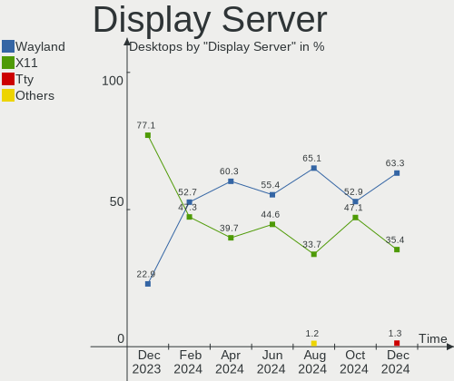
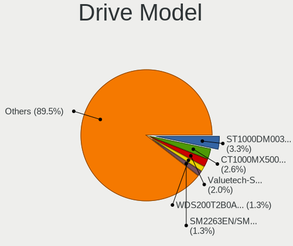

Zorin Hardware Trends (Desktop)
-------------------------------

A project to identify most popular hardware characteristics and track their change
over time based on data collected by Zorin users at https://Linux-Hardware.org.

Anyone can contribute to the study by uploading probes of their computers by
the [hw-probe](https://github.com/linuxhw/hw-probe) tool:

    sudo hw-probe -all -upload

Full-feature report is available here: https://linux-hardware.org/?view=trends&formfactor=desktop

Period: Apr, 2020.

Contents
--------

- [ OS                       ](#os)
- [ OS Family                ](#os-family)
- [ Kernel                   ](#kernel)
- [ Kernel Family            ](#kernel-family)
- [ Kernel Major Ver.        ](#kernel-major-ver)
- [ Arch                     ](#arch)
- [ DE                       ](#de)
- [ Display Server           ](#display-server)
- [ Display Manager          ](#display-manager)
- [ OS Lang                  ](#os-lang)
- [ Boot Mode                ](#boot-mode)
- [ Filesystem               ](#filesystem)
- [ Dual Boot with Linux/BSD ](#dual-boot-with-linux/bsd)
- [ Dual Boot (Win)          ](#dual-boot-win)
- [ Country                  ](#country)
- [ City                     ](#city)
- [ Vendor                   ](#vendor)
- [ Model                    ](#model)
- [ Model Family             ](#model-family)
- [ MFG Year                 ](#mfg-year)
- [ Form Factor              ](#form-factor)
- [ Secure Boot              ](#secure-boot)
- [ Coreboot                 ](#coreboot)
- [ RAM Size                 ](#ram-size)
- [ RAM Used                 ](#ram-used)
- [ Drive Vendor             ](#drive-vendor)
- [ Drive Model              ](#drive-model)
- [ Drive Kind               ](#drive-kind)
- [ Drive Connector          ](#drive-connector)
- [ Drive Size               ](#drive-size)
- [ Space Total              ](#space-total)
- [ Space Used               ](#space-used)
- [ Malfunc. Drives          ](#malfunc-drives)
- [ Malfunc. Drive Vendor    ](#malfunc-drive-vendor)
- [ Malfunc. Drive Kind      ](#malfunc-drive-kind)
- [ Failed Drives            ](#failed-drives)
- [ Failed Drive Vendor      ](#failed-drive-vendor)
- [ Drive Status             ](#drive-status)
- [ Storage Vendor           ](#storage-vendor)
- [ Storage Model            ](#storage-model)
- [ Storage Kind             ](#storage-kind)
- [ CPU Vendor               ](#cpu-vendor)
- [ CPU Model                ](#cpu-model)
- [ CPU Model Family         ](#cpu-model-family)
- [ CPU Cores                ](#cpu-cores)
- [ CPU Sockets              ](#cpu-sockets)
- [ CPU Threads              ](#cpu-threads)
- [ CPU Op-Modes             ](#cpu-op-modes)
- [ CPU Microarch            ](#cpu-microarch)
- [ CPU Microcode            ](#cpu-microcode)
- [ GPU Vendor               ](#gpu-vendor)
- [ GPU Model                ](#gpu-model)
- [ GPU Combo                ](#gpu-combo)
- [ GPU Driver               ](#gpu-driver)
- [ GPU Memory               ](#gpu-memory)
- [ Monitor Vendor           ](#monitor-vendor)
- [ Monitor Model            ](#monitor-model)
- [ Monitor Resolution       ](#monitor-resolution)
- [ Monitor Diagonal         ](#monitor-diagonal)
- [ Monitor Width            ](#monitor-width)
- [ Aspect Ratio             ](#aspect-ratio)
- [ Monitor Area             ](#monitor-area)
- [ Pixel Density            ](#pixel-density)
- [ Multiple Monitors        ](#multiple-monitors)
- [ Net Controller Vendor    ](#net-controller-vendor)
- [ Net Controller Model     ](#net-controller-model)
- [ Net Controller Kind      ](#net-controller-kind)
- [ Used Controller          ](#used-controller)
- [ NICs                     ](#nics)
- [ Unsupported Devices      ](#unsupported-devices)
- [ Unsupported Device Types ](#unsupported-device-types)

OS
--

Installed operating systems

| Name     | Computers | Percent |
|----------|-----------|---------|
| Zorin 15 | 24        | 82.76%  |
| Zorin 12 | 5         | 17.24%  |

OS Family
---------

OS without a version

| Name  | Computers | Percent |
|-------|-----------|---------|
| Zorin | 29        | 100%    |

Kernel
------

Version of the Linux kernel

| Version           | Computers | Percent |
|-------------------|-----------|---------|
| 5.3.0-46-generic  | 15        | 51.72%  |
| 5.3.0-45-generic  | 7         | 24.14%  |
| 4.15.0-91-generic | 4         | 13.79%  |
| 5.3.0-51-generic  | 1         | 3.45%   |
| 5.3.0-42-generic  | 1         | 3.45%   |
| 4.15.0-30-generic | 1         | 3.45%   |

Kernel Family
-------------

Linux kernel without a distro release

| Version | Computers | Percent |
|---------|-----------|---------|
| 5.3.0   | 24        | 82.76%  |
| 4.15.0  | 5         | 17.24%  |

Kernel Major Ver.
-----------------

Linux kernel major version

| Version | Computers | Percent |
|---------|-----------|---------|
| 5.3     | 24        | 82.76%  |
| 4.15    | 5         | 17.24%  |

Arch
----

OS architecture (x86_64, i586, etc.)

| Name   | Computers | Percent |
|--------|-----------|---------|
| x86_64 | 25        | 86.21%  |
| i686   | 4         | 13.79%  |

DE
--

Desktop Environment

| Name  | Computers | Percent |
|-------|-----------|---------|
| GNOME | 21        | 72.41%  |
| XFCE  | 8         | 27.59%  |

Display Server
--------------

X11 or Wayland

| Name | Computers | Percent |
|------|-----------|---------|
| X11  | 29        | 100%    |

Display Manager
---------------

SDDM, LightDM, etc.

| Name    | Computers | Percent |
|---------|-----------|---------|
| Unknown | 29        | 100%    |

OS Lang
-------

Language

| Lang  | Computers | Percent |
|-------|-----------|---------|
| en_US | 10        | 34.48%  |
| pt_BR | 3         | 10.34%  |
| en_CA | 3         | 10.34%  |
| de_DE | 3         | 10.34%  |
| es_PE | 2         | 6.9%    |
| es_ES | 2         | 6.9%    |
| sv_SE | 1         | 3.45%   |
| ru_RU | 1         | 3.45%   |
| it_IT | 1         | 3.45%   |
| es_US | 1         | 3.45%   |
| es_AR | 1         | 3.45%   |
| en_GB | 1         | 3.45%   |

Boot Mode
---------

EFI or BIOS

| Mode | Computers | Percent |
|------|-----------|---------|
| BIOS | 26        | 89.66%  |
| EFI  | 3         | 10.34%  |

Filesystem
----------

Type of filesystem

| Type | Computers | Percent |
|------|-----------|---------|
| Ext4 | 29        | 100%    |

Dual Boot with Linux/BSD
------------------------

Hosting more than one Linux/BSD

| Dual boot | Computers | Percent |
|-----------|-----------|---------|
| No        | 27        | 93.1%   |
| Yes       | 2         | 6.9%    |

Dual Boot (Win)
---------------

Hosting Linux and Windows

| Dual boot | Computers | Percent |
|-----------|-----------|---------|
| Yes       | 16        | 55.17%  |
| No        | 13        | 44.83%  |

Country
-------

Geographic location (country)

| Country   | Computers | Percent |
|-----------|-----------|---------|
| USA       | 9         | 31.03%  |
| Germany   | 3         | 10.34%  |
| Canada    | 3         | 10.34%  |
| Brazil    | 3         | 10.34%  |
| Peru      | 2         | 6.9%    |
| UK        | 1         | 3.45%   |
| Sweden    | 1         | 3.45%   |
| Spain     | 1         | 3.45%   |
| Serbia    | 1         | 3.45%   |
| Russia    | 1         | 3.45%   |
| Italy     | 1         | 3.45%   |
| Greece    | 1         | 3.45%   |
| Bulgaria  | 1         | 3.45%   |
| Argentina | 1         | 3.45%   |

City
----

Geographic location (city)

| City                 | Computers | Percent |
|----------------------|-----------|---------|
| Zulpich              | 1         | 3.45%   |
| Wimborne Minster     | 1         | 3.45%   |
| Villaviciosa de Odon | 1         | 3.45%   |
| Trujillo             | 1         | 3.45%   |
| Toronto              | 1         | 3.45%   |
| Timmins              | 1         | 3.45%   |
| Sorocaba             | 1         | 3.45%   |
| Sofia                | 1         | 3.45%   |
| Sestri Levante       | 1         | 3.45%   |
| Scarborough          | 1         | 3.45%   |
| Saeffle              | 1         | 3.45%   |
| Rialto               | 1         | 3.45%   |
| Osasco               | 1         | 3.45%   |
| Novi Sad             | 1         | 3.45%   |
| McAllen              | 1         | 3.45%   |
| Kalamazoo            | 1         | 3.45%   |
| Jundiaí             | 1         | 3.45%   |
| Ituzaingo            | 1         | 3.45%   |
| Hyattsville          | 1         | 3.45%   |
| Houston              | 1         | 3.45%   |
| Hickam Field         | 1         | 3.45%   |
| Fort Dodge           | 1         | 3.45%   |
| Columbus             | 1         | 3.45%   |
| Chiclayo             | 1         | 3.45%   |
| Chicago Heights      | 1         | 3.45%   |
| Bronnitsy            | 1         | 3.45%   |
| Berlin               | 1         | 3.45%   |
| Athens               | 1         | 3.45%   |
| Aalen                | 1         | 3.45%   |

Vendor
------

Motherboard manufacturer

| Name                | Computers | Percent |
|---------------------|-----------|---------|
| Dell                | 6         | 20.69%  |
| ASUSTek Computer    | 6         | 20.69%  |
| Gigabyte Technology | 4         | 13.79%  |
| ASRock              | 3         | 10.34%  |
| MSI                 | 2         | 6.9%    |
| Hewlett-Packard     | 2         | 6.9%    |
| Pegatron            | 1         | 3.45%   |
| PCChips             | 1         | 3.45%   |
| Lenovo              | 1         | 3.45%   |
| Fujitsu             | 1         | 3.45%   |
| ECS                 | 1         | 3.45%   |
| Acer                | 1         | 3.45%   |

Model
-----

Motherboard model

| Name                               | Computers | Percent |
|------------------------------------|-----------|---------|
| Pegatron AY643AA-ABA s5310f        | 1         | 3.45%   |
| PCChips P49G                       | 1         | 3.45%   |
| MSI MS-7721                        | 1         | 3.45%   |
| MSI MS-7267                        | 1         | 3.45%   |
| Lenovo IdeaCentre Q180 10087&3110  | 1         | 3.45%   |
| HP rp5800                          | 1         | 3.45%   |
| HP Compaq dc5850 Small Form Factor | 1         | 3.45%   |
| Gigabyte H67M-D2-B3                | 1         | 3.45%   |
| Gigabyte GA-78LMT-USB3 6.0         | 1         | 3.45%   |
| Gigabyte AM1M-S2H                  | 1         | 3.45%   |
| Gigabyte 970A-DS3P                 | 1         | 3.45%   |
| Fujitsu ESPRIMO P700               | 1         | 3.45%   |
| ECS MCP61M-M3                      | 1         | 3.45%   |
| Dell Vostro 200                    | 1         | 3.45%   |
| Dell Precision T1600               | 1         | 3.45%   |
| Dell OptiPlex 790                  | 1         | 3.45%   |
| Dell OptiPlex 780                  | 1         | 3.45%   |
| Dell OptiPlex 330                  | 1         | 3.45%   |
| Dell DM051                         | 1         | 3.45%   |
| ASUS ROG STRIX X399-E GAMING       | 1         | 3.45%   |
| ASUS P5Q-VM DO                     | 1         | 3.45%   |
| ASUS P5PL2                         | 1         | 3.45%   |
| ASUS P5KPL-AM                      | 1         | 3.45%   |
| ASUS M2A-MX                        | 1         | 3.45%   |
| ASUS All Series                    | 1         | 3.45%   |
| ASRock N68C-S UCC                  | 1         | 3.45%   |
| ASRock A320M-HDV R3.0              | 1         | 3.45%   |
| ASRock 775Dual-VSTA                | 1         | 3.45%   |
| Acer Nitro N50-600                 | 1         | 3.45%   |

Model Family
------------

Motherboard model prefix

| Name                   | Computers | Percent |
|------------------------|-----------|---------|
| Dell OptiPlex          | 3         | 10.34%  |
| Pegatron AY643AA-ABA   | 1         | 3.45%   |
| PCChips P49G           | 1         | 3.45%   |
| MSI MS-7721            | 1         | 3.45%   |
| MSI MS-7267            | 1         | 3.45%   |
| Lenovo IdeaCentre      | 1         | 3.45%   |
| HP rp5800              | 1         | 3.45%   |
| HP Compaq              | 1         | 3.45%   |
| Gigabyte H67M-D2-B3    | 1         | 3.45%   |
| Gigabyte GA-78LMT-USB3 | 1         | 3.45%   |
| Gigabyte AM1M-S2H      | 1         | 3.45%   |
| Gigabyte 970A-DS3P     | 1         | 3.45%   |
| Fujitsu ESPRIMO        | 1         | 3.45%   |
| ECS MCP61M-M3          | 1         | 3.45%   |
| Dell Vostro            | 1         | 3.45%   |
| Dell Precision         | 1         | 3.45%   |
| Dell DM051             | 1         | 3.45%   |
| ASUS ROG               | 1         | 3.45%   |
| ASUS P5Q-VM            | 1         | 3.45%   |
| ASUS P5PL2             | 1         | 3.45%   |
| ASUS P5KPL-AM          | 1         | 3.45%   |
| ASUS M2A-MX            | 1         | 3.45%   |
| ASUS All               | 1         | 3.45%   |
| ASRock N68C-S          | 1         | 3.45%   |
| ASRock A320M-HDV       | 1         | 3.45%   |
| ASRock 775Dual-VSTA    | 1         | 3.45%   |
| Acer Nitro             | 1         | 3.45%   |

MFG Year
--------

Motherboard manufacture year

| Year | Computers | Percent |
|------|-----------|---------|
| 2008 | 6         | 20.69%  |
| 2011 | 4         | 13.79%  |
| 2013 | 3         | 10.34%  |
| 2010 | 3         | 10.34%  |
| 2019 | 2         | 6.9%    |
| 2018 | 2         | 6.9%    |
| 2014 | 2         | 6.9%    |
| 2007 | 2         | 6.9%    |
| 2016 | 1         | 3.45%   |
| 2015 | 1         | 3.45%   |
| 2012 | 1         | 3.45%   |
| 2009 | 1         | 3.45%   |
| 2005 | 1         | 3.45%   |

Form Factor
-----------

Physical design of the computer

| Name    | Computers | Percent |
|---------|-----------|---------|
| Desktop | 29        | 100%    |

Secure Boot
-----------

Enabled or disabled

| State    | Computers | Percent |
|----------|-----------|---------|
| Disabled | 28        | 96.55%  |
| Enabled  | 1         | 3.45%   |

Coreboot
--------

Have coreboot on board

| Used | Computers | Percent |
|------|-----------|---------|
| No   | 29        | 100%    |

RAM Size
--------

Total RAM memory

| Size in GB  | Computers | Percent |
|-------------|-----------|---------|
| 3.01-4.0    | 8         | 27.59%  |
| 8.01-16.0   | 8         | 27.59%  |
| 1.01-2.0    | 5         | 17.24%  |
| 4.01-8.0    | 3         | 10.34%  |
| 16.01-24.0  | 3         | 10.34%  |
| 2.01-3.0    | 1         | 3.45%   |
| 64.01-256.0 | 1         | 3.45%   |

RAM Used
--------

Used RAM memory

| Used GB   | Computers | Percent |
|-----------|-----------|---------|
| 1.01-2.0  | 16        | 55.17%  |
| 2.01-3.0  | 6         | 20.69%  |
| 0.01-1.0  | 5         | 17.24%  |
| 3.01-4.0  | 1         | 3.45%   |
| 8.01-16.0 | 1         | 3.45%   |

Drive Vendor
------------

Hard drive vendors

| Vendor              | Computers | Drives | Percent |
|---------------------|-----------|--------|---------|
| Seagate             | 17        | 18     | 36.17%  |
| WDC                 | 8         | 9      | 17.02%  |
| Samsung Electronics | 8         | 12     | 17.02%  |
| Toshiba             | 2         | 2      | 4.26%   |
| Kingston            | 2         | 3      | 4.26%   |
| Hitachi             | 2         | 2      | 4.26%   |
| TO Exter            | 1         | 1      | 2.13%   |
| SPCC                | 1         | 1      | 2.13%   |
| SABRENT             | 1         | 1      | 2.13%   |
| Patriot             | 1         | 1      | 2.13%   |
| Maxtor              | 1         | 2      | 2.13%   |
| LITEONIT            | 1         | 1      | 2.13%   |
| Intenso             | 1         | 1      | 2.13%   |
| HL-DT-ST            | 1         | 1      | 2.13%   |

Drive Model
-----------

Hard drive models

| Model                        | Computers | Percent |
|------------------------------|-----------|---------|
| ST500DM002-1BD142 500GB      | 2         | 3.7%    |
| ST31000528AS 1TB             | 2         | 3.7%    |
| HD161HJ 160GB                | 2         | 3.7%    |
| WDS120G2G0B-00EPW0 120GB SSD | 1         | 1.85%   |
| WD800BD-22MRA1 80GB          | 1         | 1.85%   |
| WD6400AAKS-65A7B2 640GB      | 1         | 1.85%   |
| WD5000AZLX-60K2TA0 500GB     | 1         | 1.85%   |
| WD5000AAKS-75A7B0 500GB      | 1         | 1.85%   |
| WD40EFRX-68N32N0 4TB         | 1         | 1.85%   |
| WD3200AAJS-56B4A0 320GB      | 1         | 1.85%   |
| WD10EZRX-00L4HB0 1TB         | 1         | 1.85%   |
| WD10EZEX-00RKKA0 1TB         | 1         | 1.85%   |
| SV2001H 20GB                 | 1         | 1.85%   |
| SUV500120G 120GB SSD         | 1         | 1.85%   |
| ST500LT012-1DG142 500GB      | 1         | 1.85%   |
| ST500DM002-1SB10A 500GB      | 1         | 1.85%   |
| ST380815AS 80GB              | 1         | 1.85%   |
| ST380013AS 80GB              | 1         | 1.85%   |
| ST3500312CS 500GB            | 1         | 1.85%   |
| ST3400633AS 400GB            | 1         | 1.85%   |
| ST3200826AS 200GB            | 1         | 1.85%   |
| ST31000525SV 1TB             | 1         | 1.85%   |
| ST31000524AS 1TB             | 1         | 1.85%   |
| ST3000DM001-1CH166 3TB       | 1         | 1.85%   |
| ST2000DM001-1ER164 2TB       | 1         | 1.85%   |
| ST1000DM010-2EP102 1TB       | 1         | 1.85%   |
| SSD 860 EVO 250GB            | 1         | 1.85%   |
| SSD 850 EVO 500GB            | 1         | 1.85%   |
| SSD 840 PRO Series 256GB     | 1         | 1.85%   |
| SSD 840 EVO 250GB            | 1         | 1.85%   |
| SSD 128GB                    | 1         | 1.85%   |
| Solid State Disk 480GB       | 1         | 1.85%   |
| SA400S37480G 480GB SSD       | 1         | 1.85%   |
| SA400S37120G 120GB SSD       | 1         | 1.85%   |
| nal USB 3.0 2TB              | 1         | 1.85%   |
| MK8034GSX 80GB               | 1         | 1.85%   |
| M3 Portable 2TB              | 1         | 1.85%   |
| LAT-128M2S 128GB SSD         | 1         | 1.85%   |
| HTS545032B9A300 320GB        | 1         | 1.85%   |
| HDP725050GLA360 500GB        | 1         | 1.85%   |
| HD502IJ 500GB                | 1         | 1.85%   |
| HD502HI 500GB                | 1         | 1.85%   |
| HD252HJ 250GB                | 1         | 1.85%   |
| HD103SI 1TB                  | 1         | 1.85%   |
| DVDRAM GUE1N 3GB             | 1         | 1.85%   |
| DT01ACA100 1TB               | 1         | 1.85%   |
| Disk 160GB                   | 1         | 1.85%   |
| Burst 240GB SSD              | 1         | 1.85%   |
| BUP Slim BK 1TB              | 1         | 1.85%   |
| 6Y080P0 81GB                 | 1         | 1.85%   |
| 6Y080L0 81GB                 | 1         | 1.85%   |

Drive Kind
----------

HDD or SSD

| Kind    | Computers | Drives | Percent |
|---------|-----------|--------|---------|
| HDD     | 28        | 40     | 68.29%  |
| SSD     | 10        | 12     | 24.39%  |
| Unknown | 3         | 3      | 7.32%   |

Drive Connector
---------------

SATA, SAS, NVMe, etc.

| Type | Computers | Drives | Percent |
|------|-----------|--------|---------|
| SATA | 30        | 50     | 85.71%  |
| SAS  | 5         | 5      | 14.29%  |

Drive Size
----------

Size of hard drive

| Size in TB | Computers | Drives | Percent |
|------------|-----------|--------|---------|
| 0.01-0.5   | 26        | 38     | 63.41%  |
| 0.51-1.0   | 10        | 12     | 24.39%  |
| 1.01-2.0   | 3         | 3      | 7.32%   |
| 3.01-4.0   | 1         | 1      | 2.44%   |
| 2.01-3.0   | 1         | 1      | 2.44%   |

Space Total
-----------

Amount of disk space available on the file system

| Size in GB     | Computers | Percent |
|----------------|-----------|---------|
| 101-250        | 9         | 31.03%  |
| 251-500        | 6         | 20.69%  |
| 21-50          | 3         | 10.34%  |
| 1001-2000      | 3         | 10.34%  |
| 501-1000       | 3         | 10.34%  |
| More than 3000 | 2         | 6.9%    |
| 51-100         | 2         | 6.9%    |
| 2001-3000      | 1         | 3.45%   |

Space Used
----------

Amount of used disk space

| Used GB   | Computers | Percent |
|-----------|-----------|---------|
| 1-20      | 15        | 51.72%  |
| 21-50     | 4         | 13.79%  |
| 101-250   | 4         | 13.79%  |
| 251-500   | 2         | 6.9%    |
| 1001-2000 | 2         | 6.9%    |
| 51-100    | 2         | 6.9%    |

Malfunc. Drives
---------------

Drive models with a malfunction

Zero info for selected period =(

Malfunc. Drive Vendor
---------------------

Vendors of faulty drives

Zero info for selected period =(

Malfunc. Drive Kind
-------------------

Kinds of faulty drives

Zero info for selected period =(

Failed Drives
-------------

Failed drive models

Zero info for selected period =(

Failed Drive Vendor
-------------------

Failed drive vendors

Zero info for selected period =(

Drive Status
------------

Number of failed and malfunc. drives

| Status   | Computers | Drives | Percent |
|----------|-----------|--------|---------|
| Detected | 30        | 55     | 100%    |

Storage Vendor
--------------

Storage controller vendors

| Vendor              | Computers | Percent |
|---------------------|-----------|---------|
| Intel               | 17        | 54.84%  |
| AMD                 | 8         | 25.81%  |
| Nvidia              | 3         | 9.68%   |
| VIA Technologies    | 1         | 3.23%   |
| Silicon Image       | 1         | 3.23%   |
| Samsung Electronics | 1         | 3.23%   |

Storage Model
-------------

Storage controller models

| Model                                                                             | Computers | Percent |
|-----------------------------------------------------------------------------------|-----------|---------|
| NM10/ICH7 Family SATA Controller [IDE mode]                                       | 6         | 12.77%  |
| 82801G (ICH7 Family) IDE Controller                                               | 6         | 12.77%  |
| FCH SATA Controller [AHCI mode]                                                   | 4         | 8.51%   |
| 6 Series/C200 Series Chipset Family 6 port Desktop SATA AHCI Controller           | 4         | 8.51%   |
| SB7x0/SB8x0/SB9x0 SATA Controller [IDE mode]                                      | 3         | 6.38%   |
| SATA Controller [RAID mode]                                                       | 3         | 6.38%   |
| MCP61 SATA Controller                                                             | 3         | 6.38%   |
| SB7x0/SB8x0/SB9x0 IDE Controller                                                  | 2         | 4.26%   |
| MCP61 IDE                                                                         | 2         | 4.26%   |
| X399 Series Chipset SATA Controller                                               | 1         | 2.13%   |
| VT82C586A/B/VT82C686/A/B/VT823x/A/C PIPC Bus Master IDE                           | 1         | 2.13%   |
| VT8237A SATA 2-Port Controller                                                    | 1         | 2.13%   |
| SB600 Non-Raid-5 SATA                                                             | 1         | 2.13%   |
| SB600 IDE                                                                         | 1         | 2.13%   |
| PCI0680 Ultra ATA-133 Host Controller                                             | 1         | 2.13%   |
| NVMe SSD Controller SM981/PM981/PM983                                             | 1         | 2.13%   |
| NM10/ICH7 Family SATA Controller [AHCI mode]                                      | 1         | 2.13%   |
| FCH SATA Controller D                                                             | 1         | 2.13%   |
| 9 Series Chipset Family SATA Controller [AHCI Mode]                               | 1         | 2.13%   |
| 82801JD/DO (ICH10 Family) SATA AHCI Controller                                    | 1         | 2.13%   |
| 6 Series/C200 Series Chipset Family Desktop SATA Controller (IDE mode, ports 4-5) | 1         | 2.13%   |
| 6 Series/C200 Series Chipset Family Desktop SATA Controller (IDE mode, ports 0-3) | 1         | 2.13%   |
| 4 Series Chipset PT IDER Controller                                               | 1         | 2.13%   |

Storage Kind
------------

Kind of storage controller (IDE, SATA, NVMe, SAS, ...)

| Kind | Computers | Percent |
|------|-----------|---------|
| IDE  | 16        | 44.44%  |
| SATA | 15        | 41.67%  |
| RAID | 4         | 11.11%  |
| NVMe | 1         | 2.78%   |

CPU Vendor
----------

Processor vendors

| Vendor | Computers | Percent |
|--------|-----------|---------|
| Intel  | 18        | 62.07%  |
| AMD    | 11        | 37.93%  |

CPU Model
---------

Processor models

| Model                                          | Computers | Percent |
|------------------------------------------------|-----------|---------|
| Intel Core i5-2400 CPU @ 3.10GHz               | 3         | 10.34%  |
| Intel Pentium Dual CPU E2180 @ 2.00GHz         | 2         | 6.9%    |
| Intel Xeon CPU E31245 @ 3.30GHz                | 1         | 3.45%   |
| Intel Pentium Dual-Core CPU E5300 @ 2.60GHz    | 1         | 3.45%   |
| Intel Pentium D CPU 2.80GHz                    | 1         | 3.45%   |
| Intel Pentium 4 CPU 3.00GHz                    | 1         | 3.45%   |
| Intel Core i7-9700 CPU @ 3.00GHz               | 1         | 3.45%   |
| Intel Core i5-4690K CPU @ 3.50GHz              | 1         | 3.45%   |
| Intel Core i3-2120 CPU @ 3.30GHz               | 1         | 3.45%   |
| Intel Core 2 Quad CPU Q9650 @ 3.00GHz          | 1         | 3.45%   |
| Intel Core 2 Duo CPU E8600 @ 3.33GHz           | 1         | 3.45%   |
| Intel Core 2 Duo CPU E8400 @ 3.00GHz           | 1         | 3.45%   |
| Intel Core 2 Duo CPU E8200 @ 2.66GHz           | 1         | 3.45%   |
| Intel Core 2 Duo CPU E4600 @ 2.40GHz           | 1         | 3.45%   |
| Intel Atom CPU D2700 @ 2.13GHz                 | 1         | 3.45%   |
| AMD Sempron Processor LE-1300                  | 1         | 3.45%   |
| AMD Ryzen Threadripper 2950X 16-Core Processor | 1         | 3.45%   |
| AMD Ryzen 5 2600 Six-Core Processor            | 1         | 3.45%   |
| AMD Phenom II X4 945 Processor                 | 1         | 3.45%   |
| AMD Phenom 9350e Quad-Core Processor           | 1         | 3.45%   |
| AMD FX-8320 Eight-Core Processor               | 1         | 3.45%   |
| AMD FX-4300 Quad-Core Processor                | 1         | 3.45%   |
| AMD Athlon II X4 630 Processor                 | 1         | 3.45%   |
| AMD Athlon II X2 250 Processor                 | 1         | 3.45%   |
| AMD Athlon 5150 APU with Radeon R3             | 1         | 3.45%   |
| AMD A4-4000 APU with Radeon HD Graphics        | 1         | 3.45%   |

CPU Model Family
----------------

Processor model prefix

| Model                   | Computers | Percent |
|-------------------------|-----------|---------|
| Intel Core i5           | 4         | 13.79%  |
| Intel Core 2 Duo        | 4         | 13.79%  |
| Intel Pentium Dual      | 2         | 6.9%    |
| AMD FX                  | 2         | 6.9%    |
| Intel Xeon              | 1         | 3.45%   |
| Intel Pentium Dual-Core | 1         | 3.45%   |
| Intel Pentium D         | 1         | 3.45%   |
| Intel Pentium 4         | 1         | 3.45%   |
| Intel Core i7           | 1         | 3.45%   |
| Intel Core i3           | 1         | 3.45%   |
| Intel Core 2 Quad       | 1         | 3.45%   |
| Intel Atom              | 1         | 3.45%   |
| AMD Sempron             | 1         | 3.45%   |
| AMD Ryzen Threadripper  | 1         | 3.45%   |
| AMD Ryzen 5             | 1         | 3.45%   |
| AMD Phenom II X4        | 1         | 3.45%   |
| AMD Phenom              | 1         | 3.45%   |
| AMD Athlon II X4        | 1         | 3.45%   |
| AMD Athlon II X2        | 1         | 3.45%   |
| AMD Athlon              | 1         | 3.45%   |
| AMD A4                  | 1         | 3.45%   |

CPU Cores
---------

Number of processor cores

| Number | Computers | Percent |
|--------|-----------|---------|
| 2      | 12        | 41.38%  |
| 4      | 11        | 37.93%  |
| 1      | 3         | 10.34%  |
| 16     | 1         | 3.45%   |
| 8      | 1         | 3.45%   |
| 6      | 1         | 3.45%   |

CPU Sockets
-----------

Number of sockets

| Number | Computers | Percent |
|--------|-----------|---------|
| 1      | 29        | 100%    |

CPU Threads
-----------

Threads per core (Hyper-Threading)

| Number | Computers | Percent |
|--------|-----------|---------|
| 1      | 20        | 68.97%  |
| 2      | 9         | 31.03%  |

CPU Op-Modes
------------

CPU Operation Modes (32-bit, 64-bit)

| Op mode        | Computers | Percent |
|----------------|-----------|---------|
| 32-bit, 64-bit | 29        | 100%    |

CPU Microarch
-------------

Microarchitecture

| Name        | Computers | Percent |
|-------------|-----------|---------|
| Core        | 8         | 27.59%  |
| SandyBridge | 5         | 17.24%  |
| K10         | 4         | 13.79%  |
| Piledriver  | 3         | 10.34%  |
| Zen+        | 2         | 6.9%    |
| NetBurst    | 2         | 6.9%    |
| Skylake     | 1         | 3.45%   |
| K8 Hammer   | 1         | 3.45%   |
| Jaguar      | 1         | 3.45%   |
| Haswell     | 1         | 3.45%   |
| Bonnell     | 1         | 3.45%   |

CPU Microcode
-------------

Microcode number

| Number     | Computers | Percent |
|------------|-----------|---------|
| 0x206a7    | 5         | 17.24%  |
| 0x1067a    | 4         | 13.79%  |
| 0x6fd      | 3         | 10.34%  |
| Unknown    | 3         | 10.34%  |
| 0x06000852 | 2         | 6.9%    |
| 0xf49      | 1         | 3.45%   |
| 0xf47      | 1         | 3.45%   |
| 0x906ed    | 1         | 3.45%   |
| 0x306c3    | 1         | 3.45%   |
| 0x30661    | 1         | 3.45%   |
| 0x10676    | 1         | 3.45%   |
| 0x0800820b | 1         | 3.45%   |
| 0x0700010f | 1         | 3.45%   |
| 0x06001119 | 1         | 3.45%   |
| 0x010000db | 1         | 3.45%   |
| 0x010000c8 | 1         | 3.45%   |
| 0x01000083 | 1         | 3.45%   |

GPU Vendor
----------

Vendors of graphics cards

| Vendor | Computers | Percent |
|--------|-----------|---------|
| AMD    | 17        | 56.67%  |
| Nvidia | 10        | 33.33%  |
| Intel  | 3         | 10%     |

GPU Model
---------

Graphics card models

| Model                                                           | Computers | Percent |
|-----------------------------------------------------------------|-----------|---------|
| Cedar [Radeon HD 5000/6000/7350/8350 Series]                    | 2         | 6.06%   |
| Vega 20 [Radeon VII]                                            | 1         | 3.03%   |
| TU116 [GeForce GTX 1660 Ti]                                     | 1         | 3.03%   |
| Trinity 2 [Radeon HD 7480D]                                     | 1         | 3.03%   |
| RV710 [Radeon HD 4350/4550]                                     | 1         | 3.03%   |
| RV620 LE [Radeon HD 3450]                                       | 1         | 3.03%   |
| RV610 [Radeon HD 2400 PRO]                                      | 1         | 3.03%   |
| RV380 [Radeon X300/X550/X1050 Series] (Secondary)               | 1         | 3.03%   |
| RV370 [Radeon X600/X600 SE]                                     | 1         | 3.03%   |
| RS780C [Radeon 3100]                                            | 1         | 3.03%   |
| RS690 [Radeon X1200]                                            | 1         | 3.03%   |
| Redwood XT GL [FirePro V4800]                                   | 1         | 3.03%   |
| Kabini [Radeon HD 8400 / R3 Series]                             | 1         | 3.03%   |
| Juniper PRO [Radeon HD 5750]                                    | 1         | 3.03%   |
| GT218 [NVS 300]                                                 | 1         | 3.03%   |
| GT218 [GeForce 8400 GS Rev. 3]                                  | 1         | 3.03%   |
| GT215 [GeForce GT 240]                                          | 1         | 3.03%   |
| GP107 [GeForce GTX 1050 Ti]                                     | 1         | 3.03%   |
| GK208B [GeForce GT 710]                                         | 1         | 3.03%   |
| GK106 [GeForce GTX 660]                                         | 1         | 3.03%   |
| GF119 [GeForce GT 610]                                          | 1         | 3.03%   |
| GF119 [GeForce GT 520]                                          | 1         | 3.03%   |
| Ellesmere [Radeon RX 470/480/570/570X/580/580X/590]             | 1         | 3.03%   |
| Curacao PRO [Radeon R7 370 / R9 270/370 OEM]                    | 1         | 3.03%   |
| Cape Verde PRO [Radeon HD 7750/8740 / R7 250E]                  | 1         | 3.03%   |
| Caicos [Radeon HD 6450A/7450A]                                  | 1         | 3.03%   |
| Caicos XTX [Radeon HD 8490 / R5 235X OEM]                       | 1         | 3.03%   |
| C61 [GeForce 6150SE nForce 430]                                 | 1         | 3.03%   |
| Baffin [Radeon RX 460/560D / Pro 450/455/460/555/555X/560/560X] | 1         | 3.03%   |
| 82G33/G31 Express Integrated Graphics Controller                | 1         | 3.03%   |
| 82945G/GZ Integrated Graphics Controller                        | 1         | 3.03%   |
| 4 Series Chipset Integrated Graphics Controller                 | 1         | 3.03%   |

GPU Combo
---------

Combinations of graphics cards

| Name       | Computers | Percent |
|------------|-----------|---------|
| 1 x AMD    | 13        | 44.83%  |
| 1 x Nvidia | 10        | 34.48%  |
| 2 x AMD    | 3         | 10.34%  |
| 1 x Intel  | 3         | 10.34%  |

GPU Driver
----------

Free vs proprietary

| Driver      | Computers | Percent |
|-------------|-----------|---------|
| Free        | 22        | 75.86%  |
| Proprietary | 4         | 13.79%  |
| Unknown     | 3         | 10.34%  |

GPU Memory
----------

Total video memory

| Size in GB | Computers | Percent |
|------------|-----------|---------|
| 0.51-1.0   | 9         | 31.03%  |
| 0.01-0.5   | 9         | 31.03%  |
| Unknown    | 7         | 24.14%  |
| 3.01-4.0   | 2         | 6.9%    |
| 5.01-6.0   | 1         | 3.45%   |
| 1.01-2.0   | 1         | 3.45%   |

Monitor Vendor
--------------

Monitor vendors

| Vendor              | Computers | Percent |
|---------------------|-----------|---------|
| Samsung Electronics | 8         | 30.77%  |
| Hewlett-Packard     | 4         | 15.38%  |
| Goldstar            | 2         | 7.69%   |
| BenQ                | 2         | 7.69%   |
| Vita                | 1         | 3.85%   |
| ViewSonic           | 1         | 3.85%   |
| Videoseven          | 1         | 3.85%   |
| Unknown             | 1         | 3.85%   |
| Philips             | 1         | 3.85%   |
| MStar               | 1         | 3.85%   |
| Lenovo              | 1         | 3.85%   |
| Dell                | 1         | 3.85%   |
| Apple               | 1         | 3.85%   |
| Acer                | 1         | 3.85%   |

Monitor Model
-------------

Monitor models

| Model                                                | Computers | Percent |
|------------------------------------------------------|-----------|---------|
| VT988 VIT03DC 1280x1024 376x301mm 19.0-inch          | 1         | 3.85%   |
| VG2021wm-2 VSCD91E 1680x1050 433x270mm 20.1-inch     | 1         | 3.85%   |
| TV_MONITOR MST0030 1440x900 1150x650mm 52.0-inch     | 1         | 3.85%   |
| SyncMaster SAM0598 1360x768 410x230mm 18.5-inch      | 1         | 3.85%   |
| SyncMaster SAM0564 1024x768 410x230mm 18.5-inch      | 1         | 3.85%   |
| SyncMaster SAM0322 1440x900 428x255mm 19.6-inch      | 1         | 3.85%   |
| SyncMaster SAM0304 1680x1050 494x320mm 23.2-inch     | 1         | 3.85%   |
| SyncMaster SAM0088 1024x768 304x228mm 15.0-inch      | 1         | 3.85%   |
| S27D360 SAM0B27 1920x1080 598x336mm 27.0-inch        | 1         | 3.85%   |
| PHL 436M6VBP PHLC179 3840x2160 941x529mm 42.5-inch   | 1         | 3.85%   |
| P2012H DEL4079 1600x900 443x249mm 20.0-inch          | 1         | 3.85%   |
| LP2065 HWP0A72 1600x1200 408x306mm 20.1-inch         | 1         | 3.85%   |
| LEN L171 LEN240B 1280x1024 337x270mm 17.0-inch       | 1         | 3.85%   |
| LCD Monitor SMB2230 1920x1080                        | 1         | 3.85%   |
| LCD Monitor SAM04FA 1920x1080 886x498mm 40.0-inch    | 1         | 3.85%   |
| LCD Monitor KA270H 1920x1080                         | 1         | 3.85%   |
| LCD Monitor GW2765 2560x1440                         | 1         | 3.85%   |
| LCD Monitor AAA LCDTV 1360x768                       | 1         | 3.85%   |
| L1970HR GSM4AE9 1280x1024 376x301mm 19.0-inch        | 1         | 3.85%   |
| L17FM IGM0508 1280x1024 338x270mm 17.0-inch          | 1         | 3.85%   |
| L1710 HWP26EB 1280x1024 340x270mm 17.1-inch          | 1         | 3.85%   |
| GL2450H BNQ78A7 1920x1080 530x300mm 24.0-inch        | 1         | 3.85%   |
| E190i HWP3118 1280x1024 374x299mm 18.9-inch          | 1         | 3.85%   |
| Cinema Display APP9219 1680x1050 433x270mm 20.1-inch | 1         | 3.85%   |
| 2D FHD LG TV GSM59C6 1920x1080 509x286mm 23.0-inch   | 1         | 3.85%   |
| 2009 HWP2827 1600x900 442x249mm 20.0-inch            | 1         | 3.85%   |

Monitor Resolution
------------------

Monitor screen resolution

| Resolution         | Computers | Percent |
|--------------------|-----------|---------|
| 1920x1080 (FHD)    | 7         | 26.92%  |
| 1280x1024 (SXGA)   | 6         | 23.08%  |
| 1680x1050 (WSXGA+) | 3         | 11.54%  |
| 1360x768           | 3         | 11.54%  |
| 1600x900 (HD+)     | 2         | 7.69%   |
| 3840x2160 (4K)     | 1         | 3.85%   |
| 2560x1440 (QHD)    | 1         | 3.85%   |
| 1600x1200          | 1         | 3.85%   |
| 1440x900 (WXGA+)   | 1         | 3.85%   |
| 1024x768 (XGA)     | 1         | 3.85%   |

Monitor Diagonal
----------------

Diagonal size in inches

| Inches  | Computers | Percent |
|---------|-----------|---------|
| 20      | 5         | 19.23%  |
| Unknown | 4         | 15.38%  |
| 19      | 3         | 11.54%  |
| 18      | 3         | 11.54%  |
| 17      | 3         | 11.54%  |
| 23      | 2         | 7.69%   |
| 42      | 1         | 3.85%   |
| 40      | 1         | 3.85%   |
| 32      | 1         | 3.85%   |
| 27      | 1         | 3.85%   |
| 24      | 1         | 3.85%   |
| 15      | 1         | 3.85%   |

Monitor Width
-------------

Physical width

| Width in mm | Computers | Percent |
|-------------|-----------|---------|
| 401-500     | 9         | 34.62%  |
| 301-350     | 4         | 15.38%  |
| Unknown     | 4         | 15.38%  |
| 501-600     | 3         | 11.54%  |
| 351-400     | 3         | 11.54%  |
| 801-900     | 1         | 3.85%   |
| 701-800     | 1         | 3.85%   |
| 901-1000    | 1         | 3.85%   |

Aspect Ratio
------------

Proportional relationship between the width and the height

| Ratio   | Computers | Percent |
|---------|-----------|---------|
| 16/9    | 11        | 42.31%  |
| 5/4     | 6         | 23.08%  |
| Unknown | 4         | 15.38%  |
| 4/3     | 2         | 7.69%   |
| 16/10   | 2         | 7.69%   |
| 3/2     | 1         | 3.85%   |

Monitor Area
------------

Area in inch²

| Area in inch² | Computers | Percent |
|----------------|-----------|---------|
| 151-200        | 9         | 34.62%  |
| 141-150        | 5         | 19.23%  |
| Unknown        | 4         | 15.38%  |
| 201-250        | 3         | 11.54%  |
| 501-1000       | 2         | 7.69%   |
| 351-500        | 1         | 3.85%   |
| 301-350        | 1         | 3.85%   |
| 101-110        | 1         | 3.85%   |

Pixel Density
-------------

Pixels per inch

| Density | Computers | Percent |
|---------|-----------|---------|
| 51-100  | 20        | 80%     |
| Unknown | 4         | 16%     |
| 101-120 | 1         | 4%      |

Multiple Monitors
-----------------

Total monitors connected

| Total | Computers | Percent |
|-------|-----------|---------|
| 1     | 27        | 93.1%   |
| 0     | 2         | 6.9%    |

Net Controller Vendor
---------------------

Controller vendors

| Vendor                     | Computers | Percent |
|----------------------------|-----------|---------|
| Intel                      | 9         | 60%     |
| Nvidia                     | 3         | 20%     |
| ZTE WCDMA Technologies MSM | 1         | 6.67%   |
| VIA Technologies           | 1         | 6.67%   |
| Apple                      | 1         | 6.67%   |

Net Controller Model
--------------------

Controller models

| Model                                           | Computers | Percent |
|-------------------------------------------------|-----------|---------|
| MCP61 Ethernet                                  | 3         | 20%     |
| 82579LM Gigabit Network Connection (Lewisville) | 3         | 20%     |
| 82567LM-3 Gigabit Network Connection            | 2         | 13.33%  |
| VT6102/VT6103 [Rhine-II]                        | 1         | 6.67%   |
| NM10/ICH7 Family LAN Controller                 | 1         | 6.67%   |
| iPad 4/Mini1                                    | 1         | 6.67%   |
| I211 Gigabit Network Connection                 | 1         | 6.67%   |
| Android                                         | 1         | 6.67%   |
| 82579V Gigabit Network Connection               | 1         | 6.67%   |
| 82562V-2 10/100 Network Connection              | 1         | 6.67%   |

Net Controller Kind
-------------------

Ethernet, WiFi or modem

| Kind     | Computers | Percent |
|----------|-----------|---------|
| Ethernet | 13        | 92.86%  |
| Unknown  | 1         | 7.14%   |

Used Controller
---------------

Currently used network controller

| Kind     | Computers | Percent |
|----------|-----------|---------|
| Ethernet | 10        | 100%    |

NICs
----

Total network controllers on board

| Total | Computers | Percent |
|-------|-----------|---------|
| 1     | 23        | 79.31%  |
| 2     | 6         | 20.69%  |

Unsupported Devices
-------------------

Total unsupported devices on board

| Total | Computers | Percent |
|-------|-----------|---------|
| 0     | 22        | 75.86%  |
| 1     | 7         | 24.14%  |

Unsupported Device Types
------------------------

Types of unsupported devices

| Type                     | Computers | Percent |
|--------------------------|-----------|---------|
| Graphics card            | 3         | 42.86%  |
| Net/wireless             | 2         | 28.57%  |
| Communication controller | 2         | 28.57%  |

