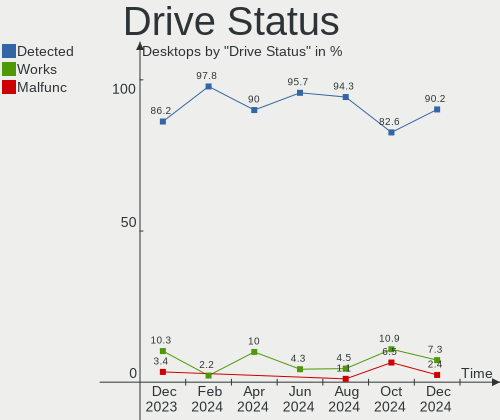
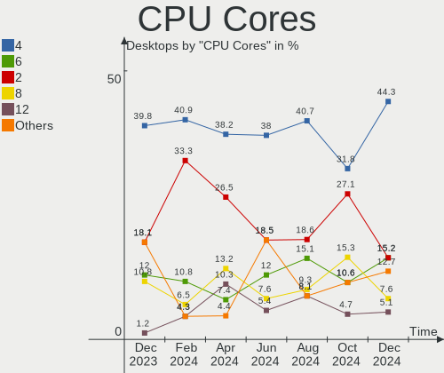
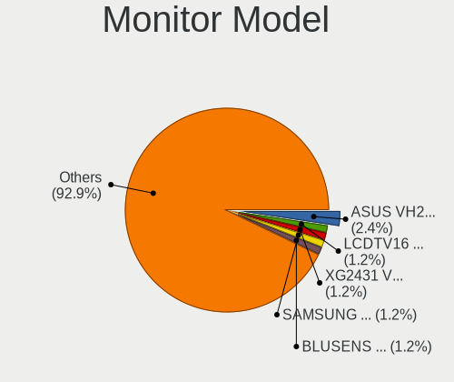
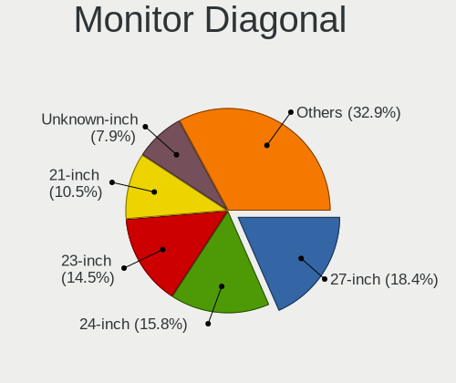
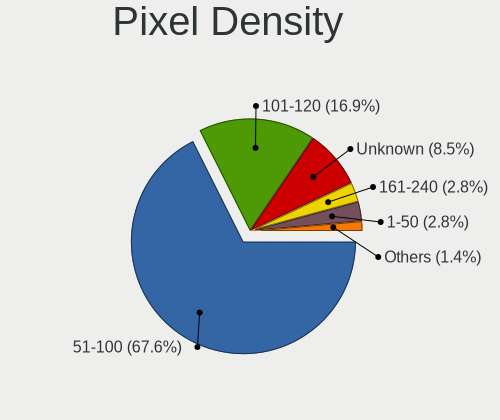
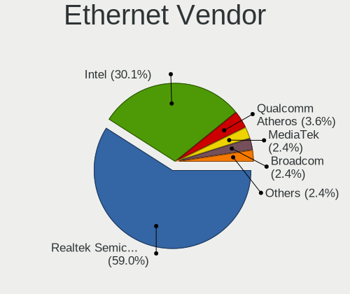
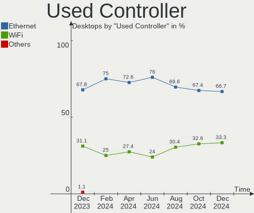
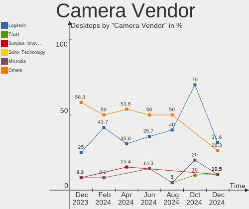

Zorin - Hardware Trends (Desktops)
----------------------------------

A project to identify most popular hardware characteristics and track their change
over time based on data collected by Linux users at https://Linux-Hardware.org.

Anyone can contribute to this report by the [hw-probe](https://github.com/linuxhw/hw-probe) tool:

    sudo -E hw-probe -all -upload

This report is for one last month. Overall report since the beginning of time: [TestDays](https://github.com/linuxhw/TestDays)

Period: Sep, 2023.

Contents
--------

* [ System ](#system)
  - [ OS                       ](#os)
  - [ OS Family                ](#os-family)
  - [ Kernel                   ](#kernel)
  - [ Kernel Family            ](#kernel-family)
  - [ Kernel Major Ver.        ](#kernel-major-ver)
  - [ Arch                     ](#arch)
  - [ DE                       ](#de)
  - [ Display Server           ](#display-server)
  - [ Display Manager          ](#display-manager)
  - [ OS Lang                  ](#os-lang)
  - [ Boot Mode                ](#boot-mode)
  - [ Filesystem               ](#filesystem)
  - [ Part. scheme             ](#part-scheme)
  - [ Dual Boot with Linux/BSD ](#dual-boot-with-linuxbsd)
  - [ Dual Boot (Win)          ](#dual-boot-win)

* [ Board ](#board)
  - [ Vendor                   ](#vendor)
  - [ Model                    ](#model)
  - [ Model Family             ](#model-family)
  - [ MFG Year                 ](#mfg-year)
  - [ Form Factor              ](#form-factor)
  - [ Secure Boot              ](#secure-boot)
  - [ Coreboot                 ](#coreboot)
  - [ RAM Size                 ](#ram-size)
  - [ RAM Used                 ](#ram-used)
  - [ Total Drives             ](#total-drives)
  - [ Has CD-ROM               ](#has-cd-rom)
  - [ Has Ethernet             ](#has-ethernet)
  - [ Has WiFi                 ](#has-wifi)
  - [ Has Bluetooth            ](#has-bluetooth)

* [ Location ](#location)
  - [ Country                  ](#country)
  - [ City                     ](#city)

* [ Drives ](#drives)
  - [ Drive Vendor             ](#drive-vendor)
  - [ Drive Model              ](#drive-model)
  - [ HDD Vendor               ](#hdd-vendor)
  - [ SSD Vendor               ](#ssd-vendor)
  - [ Drive Kind               ](#drive-kind)
  - [ Drive Connector          ](#drive-connector)
  - [ Drive Size               ](#drive-size)
  - [ Space Total              ](#space-total)
  - [ Space Used               ](#space-used)
  - [ Malfunc. Drives          ](#malfunc-drives)
  - [ Malfunc. Drive Vendor    ](#malfunc-drive-vendor)
  - [ Malfunc. HDD Vendor      ](#malfunc-hdd-vendor)
  - [ Malfunc. Drive Kind      ](#malfunc-drive-kind)
  - [ Failed Drives            ](#failed-drives)
  - [ Failed Drive Vendor      ](#failed-drive-vendor)
  - [ Drive Status             ](#drive-status)

* [ Storage controller ](#storage-controller)
  - [ Storage Vendor           ](#storage-vendor)
  - [ Storage Model            ](#storage-model)
  - [ Storage Kind             ](#storage-kind)

* [ Processor ](#processor)
  - [ CPU Vendor               ](#cpu-vendor)
  - [ CPU Model                ](#cpu-model)
  - [ CPU Model Family         ](#cpu-model-family)
  - [ CPU Cores                ](#cpu-cores)
  - [ CPU Sockets              ](#cpu-sockets)
  - [ CPU Threads              ](#cpu-threads)
  - [ CPU Op-Modes             ](#cpu-op-modes)
  - [ CPU Microcode            ](#cpu-microcode)
  - [ CPU Microarch            ](#cpu-microarch)

* [ Graphics ](#graphics)
  - [ GPU Vendor               ](#gpu-vendor)
  - [ GPU Model                ](#gpu-model)
  - [ GPU Combo                ](#gpu-combo)
  - [ GPU Driver               ](#gpu-driver)
  - [ GPU Memory               ](#gpu-memory)

* [ Monitor ](#monitor)
  - [ Monitor Vendor           ](#monitor-vendor)
  - [ Monitor Model            ](#monitor-model)
  - [ Monitor Resolution       ](#monitor-resolution)
  - [ Monitor Diagonal         ](#monitor-diagonal)
  - [ Monitor Width            ](#monitor-width)
  - [ Aspect Ratio             ](#aspect-ratio)
  - [ Monitor Area             ](#monitor-area)
  - [ Pixel Density            ](#pixel-density)
  - [ Multiple Monitors        ](#multiple-monitors)

* [ Network ](#network)
  - [ Net Controller Vendor    ](#net-controller-vendor)
  - [ Net Controller Model     ](#net-controller-model)
  - [ Wireless Vendor          ](#wireless-vendor)
  - [ Wireless Model           ](#wireless-model)
  - [ Ethernet Vendor          ](#ethernet-vendor)
  - [ Ethernet Model           ](#ethernet-model)
  - [ Net Controller Kind      ](#net-controller-kind)
  - [ Used Controller          ](#used-controller)
  - [ NICs                     ](#nics)
  - [ IPv6                     ](#ipv6)

* [ Bluetooth ](#bluetooth)
  - [ Bluetooth Vendor         ](#bluetooth-vendor)
  - [ Bluetooth Model          ](#bluetooth-model)

* [ Sound ](#sound)
  - [ Sound Vendor             ](#sound-vendor)
  - [ Sound Model              ](#sound-model)

* [ Memory ](#memory)
  - [ Memory Vendor            ](#memory-vendor)
  - [ Memory Model             ](#memory-model)
  - [ Memory Kind              ](#memory-kind)
  - [ Memory Form Factor       ](#memory-form-factor)
  - [ Memory Size              ](#memory-size)
  - [ Memory Speed             ](#memory-speed)

* [ Printers & scanners ](#printers--scanners)
  - [ Printer Vendor           ](#printer-vendor)
  - [ Printer Model            ](#printer-model)
  - [ Scanner Vendor           ](#scanner-vendor)
  - [ Scanner Model            ](#scanner-model)

* [ Camera ](#camera)
  - [ Camera Vendor            ](#camera-vendor)
  - [ Camera Model             ](#camera-model)

* [ Security ](#security)
  - [ Fingerprint Vendor       ](#fingerprint-vendor)
  - [ Fingerprint Model        ](#fingerprint-model)
  - [ Chipcard Vendor          ](#chipcard-vendor)
  - [ Chipcard Model           ](#chipcard-model)

* [ Unsupported ](#unsupported)
  - [ Unsupported Devices      ](#unsupported-devices)
  - [ Unsupported Device Types ](#unsupported-device-types)

System
------

OS
--

Installed operating systems

| Name     | Desktops | Percent |
|----------|----------|---------|
| Zorin 16 | 58       | 100%    |

OS Family
---------

OS without a version

| Name  | Desktops | Percent |
|-------|----------|---------|
| Zorin | 58       | 100%    |

Kernel
------

Version of the Linux kernel

| Version              | Desktops | Percent |
|----------------------|----------|---------|
| 5.15.0-83-generic    | 22       | 37.93%  |
| 5.15.0-84-generic    | 17       | 29.31%  |
| 5.15.0-82-generic    | 10       | 17.24%  |
| 5.15.0-79-generic    | 2        | 3.45%   |
| 6.1.8-060108-generic | 1        | 1.72%   |
| 5.15.0-78-generic    | 1        | 1.72%   |
| 5.15.0-72-generic    | 1        | 1.72%   |
| 5.15.0-71-generic    | 1        | 1.72%   |
| 5.15.0-52-generic    | 1        | 1.72%   |
| 5.15.0-48-generic    | 1        | 1.72%   |
| 5.15.0-46-generic    | 1        | 1.72%   |

Kernel Family
-------------

Linux kernel without a distro release

| Version | Desktops | Percent |
|---------|----------|---------|
| 5.15.0  | 57       | 98.28%  |
| 6.1.8   | 1        | 1.72%   |

Kernel Major Ver.
-----------------

Linux kernel major version

| Version | Desktops | Percent |
|---------|----------|---------|
| 5.15    | 57       | 98.28%  |
| 6.1     | 1        | 1.72%   |

Arch
----

OS architecture (x86_64, i586, etc.)

| Name   | Desktops | Percent |
|--------|----------|---------|
| x86_64 | 58       | 100%    |

DE
--

Desktop Environment

| Name  | Desktops | Percent |
|-------|----------|---------|
| GNOME | 49       | 84.48%  |
| XFCE  | 8        | 13.79%  |
| KDE5  | 1        | 1.72%   |

Display Server
--------------

X11 or Wayland

| Name    | Desktops | Percent |
|---------|----------|---------|
| X11     | 57       | 98.28%  |
| Wayland | 1        | 1.72%   |

Display Manager
---------------

SDDM, LightDM, etc.

| Name    | Desktops | Percent |
|---------|----------|---------|
| Unknown | 48       | 82.76%  |
| GDM3    | 5        | 8.62%   |
| GDM     | 3        | 5.17%   |
| LightDM | 2        | 3.45%   |

OS Lang
-------

Language

| Lang  | Desktops | Percent |
|-------|----------|---------|
| en_US | 25       | 43.1%   |
| it_IT | 5        | 8.62%   |
| de_DE | 5        | 8.62%   |
| pt_BR | 3        | 5.17%   |
| en_IN | 3        | 5.17%   |
| en_GB | 3        | 5.17%   |
| hu_HU | 2        | 3.45%   |
| pl_PL | 1        | 1.72%   |
| fr_FR | 1        | 1.72%   |
| fr_CA | 1        | 1.72%   |
| fi_FI | 1        | 1.72%   |
| es_CL | 1        | 1.72%   |
| en_PH | 1        | 1.72%   |
| en_NZ | 1        | 1.72%   |
| en_CA | 1        | 1.72%   |
| en_AU | 1        | 1.72%   |
| de_CH | 1        | 1.72%   |
| da_DK | 1        | 1.72%   |
| bg_BG | 1        | 1.72%   |

Boot Mode
---------

EFI or BIOS

| Mode | Desktops | Percent |
|------|----------|---------|
| EFI  | 33       | 56.9%   |
| BIOS | 25       | 43.1%   |

Filesystem
----------

Type of filesystem

| Type  | Desktops | Percent |
|-------|----------|---------|
| Ext4  | 48       | 82.76%  |
| Tmpfs | 7        | 12.07%  |
| Btrfs | 2        | 3.45%   |
| Zfs   | 1        | 1.72%   |

Part. scheme
------------

Scheme of partitioning

| Type    | Desktops | Percent |
|---------|----------|---------|
| Unknown | 48       | 82.76%  |
| GPT     | 8        | 13.79%  |
| MBR     | 2        | 3.45%   |

Dual Boot with Linux/BSD
------------------------

Hosting more than one Linux/BSD

| Dual boot | Desktops | Percent |
|-----------|----------|---------|
| No        | 57       | 98.28%  |
| Yes       | 1        | 1.72%   |

Dual Boot (Win)
---------------

Hosting Linux and Windows

| Dual boot | Desktops | Percent |
|-----------|----------|---------|
| No        | 54       | 93.1%   |
| Yes       | 4        | 6.9%    |

Board
-----

Vendor
------

Motherboard manufacturer

| Name                | Desktops | Percent |
|---------------------|----------|---------|
| ASUSTek Computer    | 14       | 24.14%  |
| Gigabyte Technology | 8        | 13.79%  |
| MSI                 | 6        | 10.34%  |
| Dell                | 6        | 10.34%  |
| Hewlett-Packard     | 4        | 6.9%    |
| Intel               | 3        | 5.17%   |
| Acer                | 3        | 5.17%   |
| Pegatron            | 2        | 3.45%   |
| Lenovo              | 2        | 3.45%   |
| AZW                 | 2        | 3.45%   |
| Unknown             | 2        | 3.45%   |
| MP                  | 1        | 1.72%   |
| Inventec            | 1        | 1.72%   |
| Colorful Technology | 1        | 1.72%   |
| Biostar             | 1        | 1.72%   |
| ASRock              | 1        | 1.72%   |
| Alienware           | 1        | 1.72%   |

Model
-----

Motherboard model

| Name                                | Desktops | Percent |
|-------------------------------------|----------|---------|
| Unknown                             | 2        | 3.45%   |
| Pegatron IPXSB-H61                  | 1        | 1.72%   |
| Pegatron h8-1350eo                  | 1        | 1.72%   |
| MSI MS-7D54                         | 1        | 1.72%   |
| MSI MS-7C56                         | 1        | 1.72%   |
| MSI MS-7C52                         | 1        | 1.72%   |
| MSI MS-7B86                         | 1        | 1.72%   |
| MSI MS-7B10                         | 1        | 1.72%   |
| MSI MS-7977                         | 1        | 1.72%   |
| MP MS-7848                          | 1        | 1.72%   |
| Lenovo ThinkCentre M910t 10MNS1Y900 | 1        | 1.72%   |
| Lenovo H320 10044                   | 1        | 1.72%   |
| Inventec Z90 / 909702-93L           | 1        | 1.72%   |
| Intel X79M-S                        | 1        | 1.72%   |
| Intel X79                           | 1        | 1.72%   |
| Intel DB85FL AAG89861-201           | 1        | 1.72%   |
| HP Z600 Workstation                 | 1        | 1.72%   |
| HP EliteDesk 800 G3 SFF             | 1        | 1.72%   |
| HP Compaq 6005 Pro MT PC            | 1        | 1.72%   |
| HP 500-543nf                        | 1        | 1.72%   |
| Gigabyte Z97X-UD5H                  | 1        | 1.72%   |
| Gigabyte Z790 UD AC                 | 1        | 1.72%   |
| Gigabyte Z170X-GamingG1             | 1        | 1.72%   |
| Gigabyte GA-890FXA-UD5              | 1        | 1.72%   |
| Gigabyte GA-870A-UD3                | 1        | 1.72%   |
| Gigabyte B85M-HD3                   | 1        | 1.72%   |
| Gigabyte B450M DS3H WIFI            | 1        | 1.72%   |
| Gigabyte AB350M-Gaming 3            | 1        | 1.72%   |
| Dell OptiPlex 9020M                 | 1        | 1.72%   |
| Dell OptiPlex 790                   | 1        | 1.72%   |
| Dell OptiPlex 780                   | 1        | 1.72%   |
| Dell OptiPlex 7050                  | 1        | 1.72%   |
| Dell OptiPlex 7020                  | 1        | 1.72%   |
| Dell OptiPlex 380                   | 1        | 1.72%   |
| Colorful C.A68HM-K PLUS YV18        | 1        | 1.72%   |
| Biostar H61MLC                      | 1        | 1.72%   |
| AZW MINI S                          | 1        | 1.72%   |
| AZW GTR                             | 1        | 1.72%   |
| ASUS TUF Gaming Z790-PLUS WIFI D4   | 1        | 1.72%   |
| ASUS TUF Gaming X570-PLUS_BR        | 1        | 1.72%   |

Model Family
------------

Motherboard model prefix

| Name                    | Desktops | Percent |
|-------------------------|----------|---------|
| Dell OptiPlex           | 6        | 10.34%  |
| ASUS TUF                | 3        | 5.17%   |
| ASUS SABERTOOTH         | 2        | 3.45%   |
| ASUS PRIME              | 2        | 3.45%   |
| Acer Aspire             | 2        | 3.45%   |
| Unknown                 | 2        | 3.45%   |
| Pegatron IPXSB-H61      | 1        | 1.72%   |
| Pegatron h8-1350eo      | 1        | 1.72%   |
| MSI MS-7D54             | 1        | 1.72%   |
| MSI MS-7C56             | 1        | 1.72%   |
| MSI MS-7C52             | 1        | 1.72%   |
| MSI MS-7B86             | 1        | 1.72%   |
| MSI MS-7B10             | 1        | 1.72%   |
| MSI MS-7977             | 1        | 1.72%   |
| MP MS-7848              | 1        | 1.72%   |
| Lenovo ThinkCentre      | 1        | 1.72%   |
| Lenovo H320             | 1        | 1.72%   |
| Inventec Z90            | 1        | 1.72%   |
| Intel X79M-S            | 1        | 1.72%   |
| Intel X79               | 1        | 1.72%   |
| Intel DB85FL            | 1        | 1.72%   |
| HP Z600                 | 1        | 1.72%   |
| HP EliteDesk            | 1        | 1.72%   |
| HP Compaq               | 1        | 1.72%   |
| HP 500-543nf            | 1        | 1.72%   |
| Gigabyte Z97X-UD5H      | 1        | 1.72%   |
| Gigabyte Z790           | 1        | 1.72%   |
| Gigabyte Z170X-GamingG1 | 1        | 1.72%   |
| Gigabyte GA-890FXA-UD5  | 1        | 1.72%   |
| Gigabyte GA-870A-UD3    | 1        | 1.72%   |
| Gigabyte B85M-HD3       | 1        | 1.72%   |
| Gigabyte B450M          | 1        | 1.72%   |
| Gigabyte AB350M-Gaming  | 1        | 1.72%   |
| Colorful C.A68HM-K      | 1        | 1.72%   |
| Biostar H61MLC          | 1        | 1.72%   |
| AZW MINI                | 1        | 1.72%   |
| AZW GTR                 | 1        | 1.72%   |
| ASUS ROG                | 1        | 1.72%   |
| ASUS P8Z77-V            | 1        | 1.72%   |
| ASUS P5KPL-VM           | 1        | 1.72%   |

MFG Year
--------

Motherboard manufacture year

| Year | Desktops | Percent |
|------|----------|---------|
| 2017 | 7        | 12.07%  |
| 2019 | 6        | 10.34%  |
| 2011 | 6        | 10.34%  |
| 2010 | 6        | 10.34%  |
| 2023 | 4        | 6.9%    |
| 2014 | 4        | 6.9%    |
| 2022 | 3        | 5.17%   |
| 2020 | 3        | 5.17%   |
| 2018 | 3        | 5.17%   |
| 2015 | 3        | 5.17%   |
| 2012 | 3        | 5.17%   |
| 2009 | 3        | 5.17%   |
| 2021 | 2        | 3.45%   |
| 2016 | 2        | 3.45%   |
| 2013 | 2        | 3.45%   |
| 2007 | 1        | 1.72%   |

Form Factor
-----------

Physical design of the computer

| Name    | Desktops | Percent |
|---------|----------|---------|
| Desktop | 58       | 100%    |

Secure Boot
-----------

Enabled or disabled

| State    | Desktops | Percent |
|----------|----------|---------|
| Disabled | 55       | 94.83%  |
| Enabled  | 3        | 5.17%   |

Coreboot
--------

Have coreboot on board

| Used | Desktops | Percent |
|------|----------|---------|
| No   | 58       | 100%    |

RAM Size
--------

Total RAM memory

| Size in GB  | Desktops | Percent |
|-------------|----------|---------|
| 16.01-24.0  | 18       | 31.03%  |
| 4.01-8.0    | 10       | 17.24%  |
| 32.01-64.0  | 10       | 17.24%  |
| 8.01-16.0   | 8        | 13.79%  |
| 3.01-4.0    | 7        | 12.07%  |
| 64.01-256.0 | 4        | 6.9%    |
| 24.01-32.0  | 1        | 1.72%   |

RAM Used
--------

Used RAM memory

| Used GB   | Desktops | Percent |
|-----------|----------|---------|
| 2.01-3.0  | 20       | 34.48%  |
| 1.01-2.0  | 14       | 24.14%  |
| 3.01-4.0  | 13       | 22.41%  |
| 4.01-8.0  | 10       | 17.24%  |
| 8.01-16.0 | 1        | 1.72%   |

Total Drives
------------

Number of drives on board

| Drives | Desktops | Percent |
|--------|----------|---------|
| 1      | 23       | 39.66%  |
| 2      | 16       | 27.59%  |
| 3      | 9        | 15.52%  |
| 4      | 6        | 10.34%  |
| 6      | 2        | 3.45%   |
| 5      | 2        | 3.45%   |

Has CD-ROM
----------

Has CD-ROM on board

| Presented | Desktops | Percent |
|-----------|----------|---------|
| No        | 30       | 51.72%  |
| Yes       | 28       | 48.28%  |

Has Ethernet
------------

Has Ethernet on board

| Presented | Desktops | Percent |
|-----------|----------|---------|
| Yes       | 58       | 100%    |

Has WiFi
--------

Has WiFi module

| Presented | Desktops | Percent |
|-----------|----------|---------|
| Yes       | 36       | 62.07%  |
| No        | 22       | 37.93%  |

Has Bluetooth
-------------

Has Bluetooth module

| Presented | Desktops | Percent |
|-----------|----------|---------|
| No        | 32       | 55.17%  |
| Yes       | 26       | 44.83%  |

Location
--------

Country
-------

Geographic location (country)

| Country     | Desktops | Percent |
|-------------|----------|---------|
| USA         | 15       | 25.86%  |
| Germany     | 6        | 10.34%  |
| Italy       | 5        | 8.62%   |
| UK          | 4        | 6.9%    |
| India       | 3        | 5.17%   |
| Brazil      | 3        | 5.17%   |
| Netherlands | 2        | 3.45%   |
| Hungary     | 2        | 3.45%   |
| Denmark     | 2        | 3.45%   |
| Canada      | 2        | 3.45%   |
| Bulgaria    | 2        | 3.45%   |
| Turkey      | 1        | 1.72%   |
| Switzerland | 1        | 1.72%   |
| Sweden      | 1        | 1.72%   |
| Poland      | 1        | 1.72%   |
| Philippines | 1        | 1.72%   |
| New Zealand | 1        | 1.72%   |
| Greece      | 1        | 1.72%   |
| France      | 1        | 1.72%   |
| Finland     | 1        | 1.72%   |
| Chile       | 1        | 1.72%   |
| Bahrain     | 1        | 1.72%   |
| Australia   | 1        | 1.72%   |

City
----

Geographic location (city)

| City                          | Desktops | Percent |
|-------------------------------|----------|---------|
| Montreal                      | 2        | 3.45%   |
| Minneapolis                   | 2        | 3.45%   |
| Arnhem                        | 2        | 3.45%   |
| Zogno                         | 1        | 1.72%   |
| Wroclaw                       | 1        | 1.72%   |
| Wetzlar                       | 1        | 1.72%   |
| Turbigo                       | 1        | 1.72%   |
| Trappes                       | 1        | 1.72%   |
| Teresina                      | 1        | 1.72%   |
| Tampere                       | 1        | 1.72%   |
| Tamasi                        | 1        | 1.72%   |
| Selanovtsi                    | 1        | 1.72%   |
| Seattle                       | 1        | 1.72%   |
| San Angelo                    | 1        | 1.72%   |
| Salt Lake City                | 1        | 1.72%   |
| Rio de Janeiro                | 1        | 1.72%   |
| Rancagua                      | 1        | 1.72%   |
| Quezon City                   | 1        | 1.72%   |
| Pune                          | 1        | 1.72%   |
| Profesor Ishirkovo            | 1        | 1.72%   |
| Portland                      | 1        | 1.72%   |
| Odense                        | 1        | 1.72%   |
| Norwich                       | 1        | 1.72%   |
| Nordmaling                    | 1        | 1.72%   |
| Niles                         | 1        | 1.72%   |
| Nevis                         | 1        | 1.72%   |
| Mytilene                      | 1        | 1.72%   |
| Merchantville                 | 1        | 1.72%   |
| Meiningen                     | 1        | 1.72%   |
| Maricopa                      | 1        | 1.72%   |
| Manama                        | 1        | 1.72%   |
| Mablethorpe                   | 1        | 1.72%   |
| Louisville                    | 1        | 1.72%   |
| Littlehampton                 | 1        | 1.72%   |
| LaFayette                     | 1        | 1.72%   |
| Jaboatao dos Guararapes       | 1        | 1.72%   |
| Hyderabad                     | 1        | 1.72%   |
| Henstedt-Ulzburg Municipality | 1        | 1.72%   |
| Hanover                       | 1        | 1.72%   |
| Hamilton                      | 1        | 1.72%   |

Drives
------

Drive Vendor
------------

Hard drive vendors

| Vendor                       | Desktops | Drives | Percent |
|------------------------------|----------|--------|---------|
| WDC                          | 20       | 25     | 18.69%  |
| Seagate                      | 15       | 20     | 14.02%  |
| Samsung Electronics          | 12       | 16     | 11.21%  |
| SanDisk                      | 10       | 14     | 9.35%   |
| Kingston                     | 8        | 11     | 7.48%   |
| Hitachi                      | 6        | 6      | 5.61%   |
| Toshiba                      | 4        | 4      | 3.74%   |
| Micron/Crucial Technology    | 3        | 3      | 2.8%    |
| Unknown                      | 2        | 2      | 1.87%   |
| Silicon Motion               | 2        | 2      | 1.87%   |
| Phison Electronics           | 2        | 3      | 1.87%   |
| MAXIO Technology (Hangzhou)  | 2        | 2      | 1.87%   |
| Crucial                      | 2        | 2      | 1.87%   |
| Teclast                      | 1        | 1      | 0.93%   |
| Team                         | 1        | 1      | 0.93%   |
| T-FORCE                      | 1        | 1      | 0.93%   |
| SPCC                         | 1        | 2      | 0.93%   |
| SK hynix                     | 1        | 1      | 0.93%   |
| Shenzhen Longsys Electronics | 1        | 1      | 0.93%   |
| Realtek Semiconductor        | 1        | 1      | 0.93%   |
| PNY                          | 1        | 1      | 0.93%   |
| Patriot                      | 1        | 1      | 0.93%   |
| Netac                        | 1        | 1      | 0.93%   |
| KIOXIA                       | 1        | 1      | 0.93%   |
| Kingston Technology Company  | 1        | 1      | 0.93%   |
| KingSpec                     | 1        | 1      | 0.93%   |
| KingFast                     | 1        | 1      | 0.93%   |
| Intel                        | 1        | 1      | 0.93%   |
| Hewlett-Packard              | 1        | 1      | 0.93%   |
| China                        | 1        | 1      | 0.93%   |
| Apacer                       | 1        | 2      | 0.93%   |
| AFOX                         | 1        | 1      | 0.93%   |

Drive Model
-----------

Hard drive models

| Model                                                 | Desktops | Percent |
|-------------------------------------------------------|----------|---------|
| Samsung NVMe SSD Controller SM981/PM981/PM983 256GB   | 3        | 2.34%   |
| Micron/Crucial P2 NVMe PCIe SSD 1TB                   | 3        | 2.34%   |
| Silicon Motion SM2263EN/SM2263XT SSD Controller 512GB | 2        | 1.56%   |
| Seagate ST1000DM010-2EP102 1TB                        | 2        | 1.56%   |
| Seagate Backup+ Hub BK 8TB                            | 2        | 1.56%   |
| Samsung SSD 850 EVO 250GB                             | 2        | 1.56%   |
| Samsung SSD 850 EVO 1TB                               | 2        | 1.56%   |
| Phison E12 NVMe Controller 2TB                        | 2        | 1.56%   |
| Kingston SV300S37A120G 120GB SSD                      | 2        | 1.56%   |
| Kingston SA400S37120G 120GB SSD                       | 2        | 1.56%   |
| Hitachi HDS721016CLA382 160GB                         | 2        | 1.56%   |
| WDC WUH721816ALE6L4 16TB                              | 1        | 0.78%   |
| WDC WDS240G2G0A-00JH30 240GB SSD                      | 1        | 0.78%   |
| WDC WDS240G1G0B-00RC30 240GB SSD                      | 1        | 0.78%   |
| WDC WD5000LPCX-24C6HT0 500GB                          | 1        | 0.78%   |
| WDC WD5000AAKX-753CA1 500GB                           | 1        | 0.78%   |
| WDC WD5000AAKX-22ERMA0 500GB                          | 1        | 0.78%   |
| WDC WD5000AAKX-001CA0 500GB                           | 1        | 0.78%   |
| WDC WD5000AADS-00S9B0 500GB                           | 1        | 0.78%   |
| WDC WD40EZAZ-19SF3B0 4TB                              | 1        | 0.78%   |
| WDC WD4002FFWX-68TZ4N0 4TB                            | 1        | 0.78%   |
| WDC WD3200AAJS-65M0A0 320GB                           | 1        | 0.78%   |
| WDC WD3200AAJS-00L7A0 320GB                           | 1        | 0.78%   |
| WDC WD20EFAX-68FB5N0 2TB                              | 1        | 0.78%   |
| WDC WD20EARX-22PASB0 2TB                              | 1        | 0.78%   |
| WDC WD2003FZEX-00Z4SA0 2TB                            | 1        | 0.78%   |
| WDC WD2003FYYS-50T8B0 2TB                             | 1        | 0.78%   |
| WDC WD1600AAJS-00B4A0 160GB                           | 1        | 0.78%   |
| WDC WD10EZEX-60WN4A0 1TB                              | 1        | 0.78%   |
| WDC WD10EZEX-08W 1TB                                  | 1        | 0.78%   |
| WDC WD10EZEX-08M2NA0 1TB                              | 1        | 0.78%   |
| WDC WD10EFRX-68JCSN0 1TB                              | 1        | 0.78%   |
| WDC WD10EARS-00MVWB0 1TB                              | 1        | 0.78%   |
| WDC WD1003FZEX-00MK2A0 1TB                            | 1        | 0.78%   |
| WDC WD1001FAES-00W7A0 1TB                             | 1        | 0.78%   |
| WDC WD Green 2.5 1000GB                               | 1        | 0.78%   |
| Unknown NVMe SSD Drive 500GB                          | 1        | 0.78%   |
| Unknown NVMe SSD Drive 256GB                          | 1        | 0.78%   |
| Toshiba MQ01ABD050V 500GB                             | 1        | 0.78%   |
| Toshiba MK1656GSY 160GB                               | 1        | 0.78%   |

HDD Vendor
----------

Hard disk drive vendors

| Vendor              | Desktops | Drives | Percent |
|---------------------|----------|--------|---------|
| WDC                 | 19       | 22     | 40.43%  |
| Seagate             | 15       | 19     | 31.91%  |
| Hitachi             | 6        | 6      | 12.77%  |
| Toshiba             | 4        | 4      | 8.51%   |
| Samsung Electronics | 2        | 2      | 4.26%   |
| Hewlett-Packard     | 1        | 1      | 2.13%   |

SSD Vendor
----------

Solid state drive vendors

| Vendor              | Desktops | Drives | Percent |
|---------------------|----------|--------|---------|
| Samsung Electronics | 8        | 9      | 24.24%  |
| Kingston            | 7        | 8      | 21.21%  |
| SanDisk             | 4        | 6      | 12.12%  |
| WDC                 | 2        | 3      | 6.06%   |
| Crucial             | 2        | 2      | 6.06%   |
| Teclast             | 1        | 1      | 3.03%   |
| Team                | 1        | 1      | 3.03%   |
| SPCC                | 1        | 2      | 3.03%   |
| PNY                 | 1        | 1      | 3.03%   |
| Patriot             | 1        | 1      | 3.03%   |
| Netac               | 1        | 1      | 3.03%   |
| KingSpec            | 1        | 1      | 3.03%   |
| China               | 1        | 1      | 3.03%   |
| Apacer              | 1        | 2      | 3.03%   |
| AFOX                | 1        | 1      | 3.03%   |

Drive Kind
----------

HDD or SSD

| Kind    | Desktops | Drives | Percent |
|---------|----------|--------|---------|
| HDD     | 36       | 54     | 40.45%  |
| SSD     | 29       | 40     | 32.58%  |
| NVMe    | 22       | 34     | 24.72%  |
| Unknown | 2        | 3      | 2.25%   |

Drive Connector
---------------

SATA, SAS, NVMe, etc.

| Type | Desktops | Drives | Percent |
|------|----------|--------|---------|
| SATA | 53       | 92     | 67.95%  |
| NVMe | 22       | 34     | 28.21%  |
| SAS  | 3        | 5      | 3.85%   |

Drive Size
----------

Size of hard drive

| Size in TB | Desktops | Drives | Percent |
|------------|----------|--------|---------|
| 0.01-0.5   | 35       | 47     | 47.3%   |
| 0.51-1.0   | 22       | 28     | 29.73%  |
| 1.01-2.0   | 10       | 12     | 13.51%  |
| 3.01-4.0   | 2        | 2      | 2.7%    |
| 2.01-3.0   | 2        | 2      | 2.7%    |
| 4.01-10.0  | 2        | 2      | 2.7%    |
| 10.01-20.0 | 1        | 1      | 1.35%   |

Space Total
-----------

Amount of disk space available on the file system

| Size in GB     | Desktops | Percent |
|----------------|----------|---------|
| 251-500        | 17       | 29.31%  |
| 101-250        | 15       | 25.86%  |
| 501-1000       | 8        | 13.79%  |
| More than 3000 | 6        | 10.34%  |
| 1001-2000      | 6        | 10.34%  |
| 51-100         | 3        | 5.17%   |
| 21-50          | 1        | 1.72%   |
| 2001-3000      | 1        | 1.72%   |
| 1-20           | 1        | 1.72%   |

Space Used
----------

Amount of used disk space

| Used GB        | Desktops | Percent |
|----------------|----------|---------|
| 21-50          | 19       | 32.76%  |
| 1-20           | 11       | 18.97%  |
| 51-100         | 10       | 17.24%  |
| 101-250        | 6        | 10.34%  |
| 501-1000       | 4        | 6.9%    |
| More than 3000 | 3        | 5.17%   |
| 251-500        | 2        | 3.45%   |
| 1001-2000      | 2        | 3.45%   |
| 2001-3000      | 1        | 1.72%   |

Malfunc. Drives
---------------

Drive models with a malfunction

Zero info for selected period =(

Malfunc. Drive Vendor
---------------------

Vendors of faulty drives

Zero info for selected period =(

Malfunc. HDD Vendor
-------------------

Vendors of faulty HDD drives

Zero info for selected period =(

Malfunc. Drive Kind
-------------------

Kinds of faulty drives

Zero info for selected period =(

Failed Drives
-------------

Failed drive models

Zero info for selected period =(

Failed Drive Vendor
-------------------

Failed drive vendors

Zero info for selected period =(

Drive Status
------------

Number of failed and malfunc. drives

| Status   | Desktops | Drives | Percent |
|----------|----------|--------|---------|
| Detected | 59       | 129    | 96.72%  |
| Works    | 2        | 2      | 3.28%   |

Storage controller
------------------

Storage Vendor
--------------

Storage controller vendors

| Vendor                       | Desktops | Percent |
|------------------------------|----------|---------|
| Intel                        | 34       | 36.56%  |
| AMD                          | 21       | 22.58%  |
| SanDisk                      | 7        | 7.53%   |
| ASMedia Technology           | 4        | 4.3%    |
| Samsung Electronics          | 3        | 3.23%   |
| Micron/Crucial Technology    | 3        | 3.23%   |
| MAXIO Technology (Hangzhou)  | 3        | 3.23%   |
| Kingston Technology Company  | 3        | 3.23%   |
| JMicron Technology           | 3        | 3.23%   |
| Silicon Motion               | 2        | 2.15%   |
| Phison Electronics           | 2        | 2.15%   |
| Marvell Technology Group     | 2        | 2.15%   |
| TenaFe                       | 1        | 1.08%   |
| SK hynix                     | 1        | 1.08%   |
| Shenzhen Longsys Electronics | 1        | 1.08%   |
| Realtek Semiconductor        | 1        | 1.08%   |
| Nvidia                       | 1        | 1.08%   |
| KIOXIA                       | 1        | 1.08%   |

Storage Model
-------------

Storage controller models

| Model                                                                          | Desktops | Percent |
|--------------------------------------------------------------------------------|----------|---------|
| AMD FCH SATA Controller [AHCI mode]                                            | 13       | 11.02%  |
| Intel 8 Series/C220 Series Chipset Family 6-port SATA Controller 1 [AHCI mode] | 5        | 4.24%   |
| Intel 6 Series/C200 Series Chipset Family 6 port Desktop SATA AHCI Controller  | 4        | 3.39%   |
| AMD SB7x0/SB8x0/SB9x0 SATA Controller [IDE mode]                               | 4        | 3.39%   |
| Samsung NVMe SSD Controller SM981/PM981/PM983                                  | 3        | 2.54%   |
| Micron/Crucial P2 [Nick P2] / P3 / P3 Plus NVMe PCIe SSD (DRAM-less)           | 3        | 2.54%   |
| Intel SATA Controller [RAID mode]                                              | 3        | 2.54%   |
| Intel Q170/Q150/B150/H170/H110/Z170/CM236 Chipset SATA Controller [AHCI Mode]  | 3        | 2.54%   |
| Intel NM10/ICH7 Family SATA Controller [IDE mode]                              | 3        | 2.54%   |
| Intel 82801G (ICH7 Family) IDE Controller                                      | 3        | 2.54%   |
| Intel 200 Series PCH SATA controller [AHCI mode]                               | 3        | 2.54%   |
| ASMedia ASM1062 Serial ATA Controller                                          | 3        | 2.54%   |
| AMD SB7x0/SB8x0/SB9x0 IDE Controller                                           | 3        | 2.54%   |
| AMD 400 Series Chipset SATA Controller                                         | 3        | 2.54%   |
| Silicon Motion SM2263EN/SM2263XT (DRAM-less) NVMe SSD Controllers              | 2        | 1.69%   |
| Sandisk Western Digital WD Black SN850X NVMe SSD                               | 2        | 1.69%   |
| SanDisk WD Black SN770 / PC SN740 256GB / PC SN560 (DRAM-less) NVMe SSD        | 2        | 1.69%   |
| Phison E12 NVMe Controller                                                     | 2        | 1.69%   |
| MAXIO (Hangzhou) NVMe SSD Controller MAP1202                                   | 2        | 1.69%   |
| Marvell Group 88SE9172 SATA 6Gb/s Controller                                   | 2        | 1.69%   |
| Kingston Company NVMe Controller                                               | 2        | 1.69%   |
| JMicron JMB363 SATA/IDE Controller                                             | 2        | 1.69%   |
| Intel Volume Management Device NVMe RAID Controller                            | 2        | 1.69%   |
| Intel Cannon Lake PCH SATA AHCI Controller                                     | 2        | 1.69%   |
| Intel 7 Series/C210 Series Chipset Family 6-port SATA Controller [AHCI mode]   | 2        | 1.69%   |
| AMD SB7x0/SB8x0/SB9x0 SATA Controller [AHCI mode]                              | 2        | 1.69%   |
| AMD FCH IDE Controller                                                         | 2        | 1.69%   |
| AMD 300 Series Chipset SATA Controller                                         | 2        | 1.69%   |
| TenaFe TC2200/TC2201 NVMe Controller (DRAM-less)                               | 1        | 0.85%   |
| SK hynix Platinum P41/PC801 NVMe Solid State Drive                             | 1        | 0.85%   |
| Shenzhen Longsys Lexar NM620 NVME SSD (DRAM-less)                              | 1        | 0.85%   |
| SanDisk WD Blue SN570 NVMe SSD 1TB                                             | 1        | 0.85%   |
| SanDisk WD Blue SN550 NVMe SSD                                                 | 1        | 0.85%   |
| SanDisk WD Black SN750 / PC SN730 NVMe SSD                                     | 1        | 0.85%   |
| SanDisk PC SN735 NVMe SSD (DRAM-less)                                          | 1        | 0.85%   |
| Samsung NVMe SSD Controller SM951/PM951                                        | 1        | 0.85%   |
| Realtek RTS5765DL NVMe SSD Controller (DRAM-less)                              | 1        | 0.85%   |
| Nvidia MCP61 SATA Controller                                                   | 1        | 0.85%   |
| Nvidia MCP61 IDE                                                               | 1        | 0.85%   |
| MAXIO (Hangzhou) NVMe SSD Controller MAP1001                                   | 1        | 0.85%   |

Storage Kind
------------

Kind of storage controller (IDE, SATA, NVMe, SAS, ...)

| Kind | Desktops | Percent |
|------|----------|---------|
| SATA | 46       | 52.27%  |
| NVMe | 22       | 25%     |
| IDE  | 14       | 15.91%  |
| RAID | 6        | 6.82%   |

Processor
---------

CPU Vendor
----------

Processor vendors

| Vendor | Desktops | Percent |
|--------|----------|---------|
| Intel  | 35       | 60.34%  |
| AMD    | 23       | 39.66%  |

CPU Model
---------

Processor models

| Model                                         | Desktops | Percent |
|-----------------------------------------------|----------|---------|
| Intel Core i7-6700K CPU @ 4.00GHz             | 2        | 3.45%   |
| Intel Core i5-2400 CPU @ 3.10GHz              | 2        | 3.45%   |
| Intel 12th Gen Core i7-12700F                 | 2        | 3.45%   |
| AMD Ryzen 7 2700 Eight-Core Processor         | 2        | 3.45%   |
| AMD Phenom II X6 1055T Processor              | 2        | 3.45%   |
| AMD A8-7600 Radeon R7, 10 Compute Cores 4C+6G | 2        | 3.45%   |
| Intel Xeon CPU E5606 @ 2.13GHz                | 1        | 1.72%   |
| Intel Xeon CPU E5-2650 v2 @ 2.60GHz           | 1        | 1.72%   |
| Intel Xeon CPU E5-1620 v2 @ 3.70GHz           | 1        | 1.72%   |
| Intel Pentium Dual-Core CPU E6600 @ 3.06GHz   | 1        | 1.72%   |
| Intel Pentium Dual-Core CPU E5800 @ 3.20GHz   | 1        | 1.72%   |
| Intel N95                                     | 1        | 1.72%   |
| Intel Core i7-8700K CPU @ 3.70GHz             | 1        | 1.72%   |
| Intel Core i7-7700 CPU @ 3.60GHz              | 1        | 1.72%   |
| Intel Core i7-6700 CPU @ 3.40GHz              | 1        | 1.72%   |
| Intel Core i7-4790K CPU @ 4.00GHz             | 1        | 1.72%   |
| Intel Core i7-3770 CPU @ 3.40GHz              | 1        | 1.72%   |
| Intel Core i7-2600K CPU @ 3.40GHz             | 1        | 1.72%   |
| Intel Core i7-2600 CPU @ 3.40GHz              | 1        | 1.72%   |
| Intel Core i7-10700 CPU @ 2.90GHz             | 1        | 1.72%   |
| Intel Core i5-9400 CPU @ 2.90GHz              | 1        | 1.72%   |
| Intel Core i5-6600K CPU @ 3.50GHz             | 1        | 1.72%   |
| Intel Core i5-6500 CPU @ 3.20GHz              | 1        | 1.72%   |
| Intel Core i5-4590S CPU @ 3.00GHz             | 1        | 1.72%   |
| Intel Core i5-4590 CPU @ 3.30GHz              | 1        | 1.72%   |
| Intel Core i5-4570T CPU @ 2.90GHz             | 1        | 1.72%   |
| Intel Core i5-4440 CPU @ 3.10GHz              | 1        | 1.72%   |
| Intel Core i5-3570 CPU @ 3.40GHz              | 1        | 1.72%   |
| Intel Core i5-2300 CPU @ 2.80GHz              | 1        | 1.72%   |
| Intel Core i3-4160 CPU @ 3.60GHz              | 1        | 1.72%   |
| Intel Core i3-2120 CPU @ 3.30GHz              | 1        | 1.72%   |
| Intel Core i3 CPU 540 @ 3.07GHz               | 1        | 1.72%   |
| Intel Core 2 Duo CPU E7500 @ 2.93GHz          | 1        | 1.72%   |
| Intel Core 2 Duo CPU E7400 @ 2.80GHz          | 1        | 1.72%   |
| Intel 13th Gen Core i7-13700KF                | 1        | 1.72%   |
| AMD Ryzen 9 7900X 12-Core Processor           | 1        | 1.72%   |
| AMD Ryzen 9 6900HX with Radeon Graphics       | 1        | 1.72%   |
| AMD Ryzen 9 5900X 12-Core Processor           | 1        | 1.72%   |
| AMD Ryzen 7 7840HS w/ Radeon 780M Graphics    | 1        | 1.72%   |
| AMD Ryzen 7 5800X 8-Core Processor            | 1        | 1.72%   |

CPU Model Family
----------------

Processor model prefix

| Model                   | Desktops | Percent |
|-------------------------|----------|---------|
| Intel Core i5           | 11       | 18.97%  |
| Intel Core i7           | 10       | 17.24%  |
| AMD Ryzen 7             | 5        | 8.62%   |
| Other                   | 4        | 6.9%    |
| Intel Xeon              | 3        | 5.17%   |
| Intel Core i3           | 3        | 5.17%   |
| AMD Ryzen 9             | 3        | 5.17%   |
| AMD Ryzen 5             | 3        | 5.17%   |
| Intel Pentium Dual-Core | 2        | 3.45%   |
| Intel Core 2 Duo        | 2        | 3.45%   |
| AMD Phenom II X6        | 2        | 3.45%   |
| AMD FX                  | 2        | 3.45%   |
| AMD A8                  | 2        | 3.45%   |
| AMD A6                  | 2        | 3.45%   |
| AMD Phenom II X4        | 1        | 1.72%   |
| AMD G                   | 1        | 1.72%   |
| AMD Athlon II X2        | 1        | 1.72%   |
| AMD Athlon              | 1        | 1.72%   |

CPU Cores
---------

Number of processor cores

| Number | Desktops | Percent |
|--------|----------|---------|
| 4      | 24       | 41.38%  |
| 2      | 15       | 25.86%  |
| 8      | 8        | 13.79%  |
| 6      | 6        | 10.34%  |
| 12     | 4        | 6.9%    |
| 16     | 1        | 1.72%   |

CPU Sockets
-----------

Number of sockets

| Number | Desktops | Percent |
|--------|----------|---------|
| 1      | 58       | 100%    |

CPU Threads
-----------

Threads per core (Hyper-Threading)

| Number | Desktops | Percent |
|--------|----------|---------|
| 2      | 35       | 60.34%  |
| 1      | 23       | 39.66%  |

CPU Op-Modes
------------

CPU Operation Modes (32-bit, 64-bit)

| Op mode        | Desktops | Percent |
|----------------|----------|---------|
| 32-bit, 64-bit | 58       | 100%    |

CPU Microcode
-------------

Microcode number

| Number     | Desktops | Percent |
|------------|----------|---------|
| 0x306c3    | 6        | 10.34%  |
| 0x206a7    | 6        | 10.34%  |
| 0x506e3    | 5        | 8.62%   |
| Unknown    | 5        | 8.62%   |
| 0x1067a    | 4        | 6.9%    |
| 0x0800820d | 3        | 5.17%   |
| 0x90672    | 2        | 3.45%   |
| 0x306e4    | 2        | 3.45%   |
| 0x0a20120a | 2        | 3.45%   |
| 0x06000852 | 2        | 3.45%   |
| 0x010000dc | 2        | 3.45%   |
| 0xb06e0    | 1        | 1.72%   |
| 0xb0671    | 1        | 1.72%   |
| 0xa0655    | 1        | 1.72%   |
| 0x906ea    | 1        | 1.72%   |
| 0x906e9    | 1        | 1.72%   |
| 0x306a9    | 1        | 1.72%   |
| 0x206c2    | 1        | 1.72%   |
| 0x20652    | 1        | 1.72%   |
| 0x0a704103 | 1        | 1.72%   |
| 0x0a601203 | 1        | 1.72%   |
| 0x0a404102 | 1        | 1.72%   |
| 0x0a201016 | 1        | 1.72%   |
| 0x08108109 | 1        | 1.72%   |
| 0x08001129 | 1        | 1.72%   |
| 0x06003106 | 1        | 1.72%   |
| 0x06003104 | 1        | 1.72%   |
| 0x05000119 | 1        | 1.72%   |
| 0x03000027 | 1        | 1.72%   |
| 0x010000c8 | 1        | 1.72%   |

CPU Microarch
-------------

Microarchitecture

| Name             | Desktops | Percent |
|------------------|----------|---------|
| SandyBridge      | 6        | 10.34%  |
| Haswell          | 6        | 10.34%  |
| Skylake          | 5        | 8.62%   |
| Unknown          | 5        | 8.62%   |
| Zen+             | 4        | 6.9%    |
| Zen 3            | 4        | 6.9%    |
| Penryn           | 4        | 6.9%    |
| K10              | 4        | 6.9%    |
| IvyBridge        | 4        | 6.9%    |
| KabyLake         | 3        | 5.17%   |
| Westmere         | 2        | 3.45%   |
| Steamroller      | 2        | 3.45%   |
| Piledriver       | 2        | 3.45%   |
| Alderlake Hybrid | 2        | 3.45%   |
| Zen              | 1        | 1.72%   |
| K10 Llano        | 1        | 1.72%   |
| Excavator        | 1        | 1.72%   |
| CometLake        | 1        | 1.72%   |
| Bobcat           | 1        | 1.72%   |

Graphics
--------

GPU Vendor
----------

Vendors of graphics cards

| Vendor | Desktops | Percent |
|--------|----------|---------|
| Nvidia | 25       | 41.67%  |
| AMD    | 20       | 33.33%  |
| Intel  | 15       | 25%     |

GPU Model
---------

Graphics card models

| Model                                                                       | Desktops | Percent |
|-----------------------------------------------------------------------------|----------|---------|
| Intel Xeon E3-1200 v3/4th Gen Core Processor Integrated Graphics Controller | 4        | 6.67%   |
| Nvidia TU116 [GeForce GTX 1660 Ti]                                          | 3        | 5%      |
| Nvidia GA104 [GeForce RTX 3060 Ti Lite Hash Rate]                           | 3        | 5%      |
| AMD Ellesmere [Radeon RX 470/480/570/570X/580/580X/590]                     | 3        | 5%      |
| Intel 2nd Generation Core Processor Family Integrated Graphics Controller   | 2        | 3.33%   |
| Nvidia TU117 [GeForce GTX 1650]                                             | 1        | 1.67%   |
| Nvidia TU116 [GeForce GTX 1660 SUPER]                                       | 1        | 1.67%   |
| Nvidia GP107 [GeForce GTX 1050]                                             | 1        | 1.67%   |
| Nvidia GP107 [GeForce GTX 1050 Ti]                                          | 1        | 1.67%   |
| Nvidia GP106 [GeForce GTX 1060 6GB]                                         | 1        | 1.67%   |
| Nvidia GP104 [GeForce GTX 1080]                                             | 1        | 1.67%   |
| Nvidia GP104 [GeForce GTX 1070]                                             | 1        | 1.67%   |
| Nvidia GK208B [GeForce GT 730]                                              | 1        | 1.67%   |
| Nvidia GF119 [GeForce GT 705]                                               | 1        | 1.67%   |
| Nvidia GF119 [GeForce GT 610]                                               | 1        | 1.67%   |
| Nvidia GF110 [GeForce GTX 560 Ti OEM]                                       | 1        | 1.67%   |
| Nvidia GF108 [GeForce GT 630]                                               | 1        | 1.67%   |
| Nvidia GF104 [GeForce GTX 460 SE]                                           | 1        | 1.67%   |
| Nvidia GA106 [GeForce RTX 3060 Lite Hash Rate]                              | 1        | 1.67%   |
| Nvidia GA104 [GeForce RTX 3070 Lite Hash Rate]                              | 1        | 1.67%   |
| Nvidia GA104 [GeForce RTX 3060 Ti]                                          | 1        | 1.67%   |
| Nvidia AD107 [GeForce RTX 4060]                                             | 1        | 1.67%   |
| Nvidia AD106 [GeForce RTX 4060 Ti]                                          | 1        | 1.67%   |
| Nvidia AD102 [GeForce RTX 4090]                                             | 1        | 1.67%   |
| Intel Xeon E3-1200 v2/3rd Gen Core processor Graphics Controller            | 1        | 1.67%   |
| Intel IvyBridge GT2 [HD Graphics 4000]                                      | 1        | 1.67%   |
| Intel HD Graphics 630                                                       | 1        | 1.67%   |
| Intel HD Graphics 530                                                       | 1        | 1.67%   |
| Intel Core Processor Integrated Graphics Controller                         | 1        | 1.67%   |
| Intel Alder Lake-N [UHD Graphics]                                           | 1        | 1.67%   |
| Intel 82G33/G31 Express Integrated Graphics Controller                      | 1        | 1.67%   |
| Intel 4th Generation Core Processor Family Integrated Graphics Controller   | 1        | 1.67%   |
| Intel 4 Series Chipset Integrated Graphics Controller                       | 1        | 1.67%   |
| AMD Wrestler [Radeon HD 6320]                                               | 1        | 1.67%   |
| AMD Stoney [Radeon R2/R3/R4/R5 Graphics]                                    | 1        | 1.67%   |
| AMD RV730 XT [Radeon HD 4670]                                               | 1        | 1.67%   |
| AMD RV710 [Radeon HD 4550]                                                  | 1        | 1.67%   |
| AMD RV630 XT [Radeon HD 2600 XT]                                            | 1        | 1.67%   |
| AMD RV610 [Radeon HD 2400 PRO]                                              | 1        | 1.67%   |
| AMD RS780L [Radeon 3000]                                                    | 1        | 1.67%   |

GPU Combo
---------

Combinations of graphics cards

| Name         | Desktops | Percent |
|--------------|----------|---------|
| 1 x Nvidia   | 23       | 39.66%  |
| 1 x AMD      | 19       | 32.76%  |
| 1 x Intel    | 15       | 25.86%  |
| AMD + Nvidia | 1        | 1.72%   |

GPU Driver
----------

Free vs proprietary

| Driver      | Desktops | Percent |
|-------------|----------|---------|
| Free        | 36       | 62.07%  |
| Proprietary | 20       | 34.48%  |
| Unknown     | 2        | 3.45%   |

GPU Memory
----------

Total video memory

| Size in GB | Desktops | Percent |
|------------|----------|---------|
| Unknown    | 27       | 46.55%  |
| 7.01-8.0   | 10       | 17.24%  |
| 1.01-2.0   | 7        | 12.07%  |
| 0.01-0.5   | 6        | 10.34%  |
| 5.01-6.0   | 3        | 5.17%   |
| 0.51-1.0   | 3        | 5.17%   |
| 3.01-4.0   | 2        | 3.45%   |

Monitor
-------

Monitor Vendor
--------------

Monitor vendors

| Vendor               | Desktops | Percent |
|----------------------|----------|---------|
| Samsung Electronics  | 9        | 15.52%  |
| Goldstar             | 6        | 10.34%  |
| AOC                  | 5        | 8.62%   |
| Hewlett-Packard      | 4        | 6.9%    |
| ViewSonic            | 3        | 5.17%   |
| Dell                 | 3        | 5.17%   |
| BenQ                 | 3        | 5.17%   |
| Unknown              | 3        | 5.17%   |
| Sony                 | 2        | 3.45%   |
| Pixio                | 2        | 3.45%   |
| Philips              | 2        | 3.45%   |
| NEC Computers        | 2        | 3.45%   |
| LG Electronics       | 2        | 3.45%   |
| Lenovo               | 2        | 3.45%   |
| Ancor Communications | 2        | 3.45%   |
| Wacom Tech           | 1        | 1.72%   |
| RTK                  | 1        | 1.72%   |
| Panasonic            | 1        | 1.72%   |
| MStar                | 1        | 1.72%   |
| Insignia             | 1        | 1.72%   |
| Iiyama               | 1        | 1.72%   |
| Gigabyte Technology  | 1        | 1.72%   |
| Beko                 | 1        | 1.72%   |

Monitor Model
-------------

Monitor models

| Model                                                                 | Desktops | Percent |
|-----------------------------------------------------------------------|----------|---------|
| Unknown                                                               | 3        | 4.92%   |
| Wacom Tech LCD Monitor Cintiq 16                                      | 1        | 1.64%   |
| ViewSonic XG3220 SERIES VSC1D35 3840x2160 698x393mm 31.5-inch         | 1        | 1.64%   |
| ViewSonic VX2753 SERIES VSC7228 1920x1080 597x336mm 27.0-inch         | 1        | 1.64%   |
| ViewSonic LCD Monitor XG3220 SERIES 3840x2160                         | 1        | 1.64%   |
| Sony TV SNY3002 1920x1080 710x400mm 32.1-inch                         | 1        | 1.64%   |
| Sony LCD Monitor TV 1360x768                                          | 1        | 1.64%   |
| Samsung Electronics U32J59x SAM0F35 3840x2160 697x392mm 31.5-inch     | 1        | 1.64%   |
| Samsung Electronics T23C350 SAM0ABC 1920x1080 510x287mm 23.0-inch     | 1        | 1.64%   |
| Samsung Electronics SyncMaster SAM0372 1680x1050 459x296mm 21.5-inch  | 1        | 1.64%   |
| Samsung Electronics S34J55x SAM0F71 3440x1440 797x333mm 34.0-inch     | 1        | 1.64%   |
| Samsung Electronics S34J55x SAM0F70 3440x1440 797x333mm 34.0-inch     | 1        | 1.64%   |
| Samsung Electronics S24D390 SAM0B65 1920x1080 521x293mm 23.5-inch     | 1        | 1.64%   |
| Samsung Electronics LCD Monitor SAM04FA 1920x1080 886x498mm 40.0-inch | 1        | 1.64%   |
| Samsung Electronics LCD Monitor S27D390 1920x1080                     | 1        | 1.64%   |
| Samsung Electronics C32HG7x SAM0E13 2560x1440 697x392mm 31.5-inch     | 1        | 1.64%   |
| Samsung Electronics C27F591 SAM0D38 1920x1080 521x293mm 23.5-inch     | 1        | 1.64%   |
| RTK Verbatim M14 RTK0001 1920x1080 300x190mm 14.0-inch                | 1        | 1.64%   |
| Pixio SFP24DFI FLAT WAM2380 1920x1080 527x296mm 23.8-inch             | 1        | 1.64%   |
| Pixio PXC243 PNS0243 1920x1080 521x297mm 23.6-inch                    | 1        | 1.64%   |
| Philips PHL 221S6L PHL08F9 1920x1080 477x268mm 21.5-inch              | 1        | 1.64%   |
| Philips LCD Monitor PHILIPS FTV 3840x1080                             | 1        | 1.64%   |
| Panasonic LCD Monitor TV 1920x1080                                    | 1        | 1.64%   |
| NEC Computers LCD195VXM+ NEC66C1 1280x1024 376x301mm 19.0-inch        | 1        | 1.64%   |
| NEC Computers LCD1770NX NEC6664 1280x1024 338x270mm 17.0-inch         | 1        | 1.64%   |
| MStar Demo MST0030 1360x765 1150x650mm 52.0-inch                      | 1        | 1.64%   |
| LG Electronics LCD Monitor LG TV SSCR2 3840x2160                      | 1        | 1.64%   |
| LG Electronics LCD Monitor 47LV4400 3840x1080                         | 1        | 1.64%   |
| Lenovo LEN LT2252pwA LEN0A0C 1680x1050 474x296mm 22.0-inch            | 1        | 1.64%   |
| Lenovo LEN L2060wA LEN114A 1600x900 443x249mm 20.0-inch               | 1        | 1.64%   |
| Insignia NS-32E320A13 BBY3213 1680x1050 698x392mm 31.5-inch           | 1        | 1.64%   |
| Iiyama PL2493H IVM6145 1920x1080 530x300mm 24.0-inch                  | 1        | 1.64%   |
| Hewlett-Packard w1907 HWP26A3 1440x900 408x255mm 18.9-inch            | 1        | 1.64%   |
| Hewlett-Packard M27f FHD HPN370A 1920x1080 597x336mm 27.0-inch        | 1        | 1.64%   |
| Hewlett-Packard LCD Monitor Inc. HP E344c 6880x1440                   | 1        | 1.64%   |
| Hewlett-Packard LCD Monitor Inc. HP E344c                             | 1        | 1.64%   |
| Hewlett-Packard LCD Monitor Inc. HP 27w 1920x1080                     | 1        | 1.64%   |
| Goldstar ULTRAWIDE GSM59F2 2560x1080 677x290mm 29.0-inch              | 1        | 1.64%   |
| Goldstar ULTRAWIDE GSM59F1 2560x1080 673x284mm 28.8-inch              | 1        | 1.64%   |
| Goldstar L1753S GSM446F 1280x1024 338x270mm 17.0-inch                 | 1        | 1.64%   |

Monitor Resolution
------------------

Monitor screen resolution

| Resolution         | Desktops | Percent |
|--------------------|----------|---------|
| 1920x1080 (FHD)    | 18       | 30%     |
| 3840x2160 (4K)     | 11       | 18.33%  |
| 3440x1440          | 4        | 6.67%   |
| 2560x1440 (QHD)    | 4        | 6.67%   |
| 1280x1024 (SXGA)   | 4        | 6.67%   |
| Unknown            | 4        | 6.67%   |
| 1440x900 (WXGA+)   | 3        | 5%      |
| 3840x1080          | 2        | 3.33%   |
| 2560x1080          | 2        | 3.33%   |
| 1680x1050 (WSXGA+) | 2        | 3.33%   |
| 1360x768           | 2        | 3.33%   |
| 6880x1440          | 1        | 1.67%   |
| 2966x900           | 1        | 1.67%   |
| 1600x900 (HD+)     | 1        | 1.67%   |
| 1366x768 (WXGA)    | 1        | 1.67%   |

Monitor Diagonal
----------------

Diagonal size in inches

| Inches  | Desktops | Percent |
|---------|----------|---------|
| Unknown | 12       | 21.05%  |
| 34      | 6        | 10.53%  |
| 27      | 6        | 10.53%  |
| 23      | 6        | 10.53%  |
| 31      | 5        | 8.77%   |
| 21      | 5        | 8.77%   |
| 19      | 3        | 5.26%   |
| 17      | 3        | 5.26%   |
| 72      | 2        | 3.51%   |
| 24      | 2        | 3.51%   |
| 18      | 2        | 3.51%   |
| 52      | 1        | 1.75%   |
| 46      | 1        | 1.75%   |
| 40      | 1        | 1.75%   |
| 22      | 1        | 1.75%   |
| 20      | 1        | 1.75%   |

Monitor Width
-------------

Physical width

| Width in mm | Desktops | Percent |
|-------------|----------|---------|
| 501-600     | 12       | 21.43%  |
| Unknown     | 12       | 21.43%  |
| 401-500     | 11       | 19.64%  |
| 701-800     | 6        | 10.71%  |
| 601-700     | 6        | 10.71%  |
| 301-350     | 3        | 5.36%   |
| 1501-2000   | 2        | 3.57%   |
| 1001-1500   | 2        | 3.57%   |
| 801-900     | 1        | 1.79%   |
| 351-400     | 1        | 1.79%   |

Aspect Ratio
------------

Proportional relationship between the width and the height

| Ratio   | Desktops | Percent |
|---------|----------|---------|
| 16/9    | 27       | 50%     |
| Unknown | 12       | 22.22%  |
| 21/9    | 6        | 11.11%  |
| 16/10   | 5        | 9.26%   |
| 5/4     | 4        | 7.41%   |

Monitor Area
------------

Area in inch

| Area in inch | Desktops | Percent |
|----------------|----------|---------|
| 201-250        | 12       | 21.82%  |
| Unknown        | 12       | 21.82%  |
| 351-500        | 10       | 18.18%  |
| 301-350        | 6        | 10.91%  |
| 151-200        | 6        | 10.91%  |
| 141-150        | 4        | 7.27%   |
| More than 1000 | 3        | 5.45%   |
| 501-1000       | 2        | 3.64%   |

Pixel Density
-------------

Pixels per inch

| Density | Desktops | Percent |
|---------|----------|---------|
| 51-100  | 28       | 50%     |
| Unknown | 12       | 21.43%  |
| 101-120 | 7        | 12.5%   |
| 1-50    | 5        | 8.93%   |
| 121-160 | 3        | 5.36%   |
| 161-240 | 1        | 1.79%   |

Multiple Monitors
-----------------

Total monitors connected

| Total | Desktops | Percent |
|-------|----------|---------|
| 1     | 45       | 77.59%  |
| 2     | 10       | 17.24%  |
| 0     | 3        | 5.17%   |

Network
-------

Net Controller Vendor
---------------------

Controller vendors

| Vendor                | Desktops | Percent |
|-----------------------|----------|---------|
| Realtek Semiconductor | 38       | 43.68%  |
| Intel                 | 25       | 28.74%  |
| Qualcomm Atheros      | 7        | 8.05%   |
| Broadcom              | 4        | 4.6%    |
| Ralink Technology     | 3        | 3.45%   |
| MediaTek              | 3        | 3.45%   |
| TP-Link               | 2        | 2.3%    |
| Ralink                | 1        | 1.15%   |
| QinHeng Electronics   | 1        | 1.15%   |
| Nvidia                | 1        | 1.15%   |
| ICS Advent            | 1        | 1.15%   |
| D-Link System         | 1        | 1.15%   |

Net Controller Model
--------------------

Controller models

| Model                                                             | Desktops | Percent |
|-------------------------------------------------------------------|----------|---------|
| Realtek RTL8111/8168/8411 PCI Express Gigabit Ethernet Controller | 28       | 28.28%  |
| Realtek RTL8125 2.5GbE Controller                                 | 3        | 3.03%   |
| Realtek RTL810xE PCI Express Fast Ethernet controller             | 3        | 3.03%   |
| Intel Wi-Fi 6 AX210/AX211/AX411 160MHz                            | 3        | 3.03%   |
| Intel Wi-Fi 6 AX200                                               | 3        | 3.03%   |
| Realtek RTL8188EUS 802.11n Wireless Network Adapter               | 2        | 2.02%   |
| Realtek 802.11ac NIC                                              | 2        | 2.02%   |
| Ralink MT7601U Wireless Adapter                                   | 2        | 2.02%   |
| Qualcomm Atheros Killer E2400 Gigabit Ethernet Controller         | 2        | 2.02%   |
| Intel Wireless-AC 9260                                            | 2        | 2.02%   |
| Intel Wireless 8265 / 8275                                        | 2        | 2.02%   |
| Intel Ethernet Controller I225-V                                  | 2        | 2.02%   |
| Intel Ethernet Connection I217-V                                  | 2        | 2.02%   |
| Intel Ethernet Connection I217-LM                                 | 2        | 2.02%   |
| Intel Ethernet Connection (5) I219-LM                             | 2        | 2.02%   |
| Intel Dual Band Wireless-AC 3168NGW [Stone Peak]                  | 2        | 2.02%   |
| TP-Link RTL8812AU Archer T4U 802.11ac                             | 1        | 1.01%   |
| TP-Link Archer T3U [Realtek RTL8812BU]                            | 1        | 1.01%   |
| Realtek RTL88x2bu [AC1200 Techkey]                                | 1        | 1.01%   |
| Realtek RTL8852BE PCIe 802.11ax Wireless Network Controller       | 1        | 1.01%   |
| Realtek RTL8821CE 802.11ac PCIe Wireless Network Adapter          | 1        | 1.01%   |
| Realtek RTL8814AU 802.11a/b/g/n/ac Wireless Adapter               | 1        | 1.01%   |
| Realtek RTL8192EU 802.11b/g/n WLAN Adapter                        | 1        | 1.01%   |
| Realtek RTL8188EE Wireless Network Adapter                        | 1        | 1.01%   |
| Realtek Killer E3000 2.5GbE Controller                            | 1        | 1.01%   |
| Ralink RT3573 Wireless Adapter                                    | 1        | 1.01%   |
| Ralink RT5390 Wireless 802.11n 1T/1R PCIe                         | 1        | 1.01%   |
| Qualcomm Atheros QCA6174 802.11ac Wireless Network Adapter        | 1        | 1.01%   |
| Qualcomm Atheros Killer E2500 Gigabit Ethernet Controller         | 1        | 1.01%   |
| Qualcomm Atheros Killer E220x Gigabit Ethernet Controller         | 1        | 1.01%   |
| Qualcomm Atheros Attansic L1 Gigabit Ethernet                     | 1        | 1.01%   |
| Qualcomm Atheros AR9287 Wireless Network Adapter (PCI-Express)    | 1        | 1.01%   |
| Qualcomm Atheros AR8161 Gigabit Ethernet                          | 1        | 1.01%   |
| QinHeng UsbMonitor                                                | 1        | 1.01%   |
| Nvidia MCP61 Ethernet                                             | 1        | 1.01%   |
| MediaTek WiFi                                                     | 1        | 1.01%   |
| MediaTek MT7922 802.11ax PCI Express Wireless Network Adapter     | 1        | 1.01%   |
| MediaTek MT7921K (RZ608) Wi-Fi 6E 80MHz                           | 1        | 1.01%   |
| Intel Wireless 7265                                               | 1        | 1.01%   |
| Intel Ethernet Controller I226-V                                  | 1        | 1.01%   |

Wireless Vendor
---------------

Wireless vendors

| Vendor                | Desktops | Percent |
|-----------------------|----------|---------|
| Intel                 | 14       | 37.84%  |
| Realtek Semiconductor | 10       | 27.03%  |
| Ralink Technology     | 3        | 8.11%   |
| MediaTek              | 3        | 8.11%   |
| TP-Link               | 2        | 5.41%   |
| Qualcomm Atheros      | 2        | 5.41%   |
| Ralink                | 1        | 2.7%    |
| D-Link System         | 1        | 2.7%    |
| Broadcom              | 1        | 2.7%    |

Wireless Model
--------------

Wireless models

| Model                                                                     | Desktops | Percent |
|---------------------------------------------------------------------------|----------|---------|
| Intel Wi-Fi 6 AX210/AX211/AX411 160MHz                                    | 3        | 8.11%   |
| Intel Wi-Fi 6 AX200                                                       | 3        | 8.11%   |
| Realtek RTL8188EUS 802.11n Wireless Network Adapter                       | 2        | 5.41%   |
| Realtek 802.11ac NIC                                                      | 2        | 5.41%   |
| Ralink MT7601U Wireless Adapter                                           | 2        | 5.41%   |
| Intel Wireless-AC 9260                                                    | 2        | 5.41%   |
| Intel Wireless 8265 / 8275                                                | 2        | 5.41%   |
| Intel Dual Band Wireless-AC 3168NGW [Stone Peak]                          | 2        | 5.41%   |
| TP-Link RTL8812AU Archer T4U 802.11ac                                     | 1        | 2.7%    |
| TP-Link Archer T3U [Realtek RTL8812BU]                                    | 1        | 2.7%    |
| Realtek RTL88x2bu [AC1200 Techkey]                                        | 1        | 2.7%    |
| Realtek RTL8852BE PCIe 802.11ax Wireless Network Controller               | 1        | 2.7%    |
| Realtek RTL8821CE 802.11ac PCIe Wireless Network Adapter                  | 1        | 2.7%    |
| Realtek RTL8814AU 802.11a/b/g/n/ac Wireless Adapter                       | 1        | 2.7%    |
| Realtek RTL8192EU 802.11b/g/n WLAN Adapter                                | 1        | 2.7%    |
| Realtek RTL8188EE Wireless Network Adapter                                | 1        | 2.7%    |
| Ralink RT3573 Wireless Adapter                                            | 1        | 2.7%    |
| Ralink RT5390 Wireless 802.11n 1T/1R PCIe                                 | 1        | 2.7%    |
| Qualcomm Atheros QCA6174 802.11ac Wireless Network Adapter                | 1        | 2.7%    |
| Qualcomm Atheros AR9287 Wireless Network Adapter (PCI-Express)            | 1        | 2.7%    |
| MediaTek WiFi                                                             | 1        | 2.7%    |
| MediaTek MT7922 802.11ax PCI Express Wireless Network Adapter             | 1        | 2.7%    |
| MediaTek MT7921K (RZ608) Wi-Fi 6E 80MHz                                   | 1        | 2.7%    |
| Intel Wireless 7265                                                       | 1        | 2.7%    |
| Intel 700 Series Chipset Family Wi-Fi                                     | 1        | 2.7%    |
| D-Link System AirPlus G DWL-G122 Wireless Adapter(rev.E1) [Ralink RT2070] | 1        | 2.7%    |
| Broadcom BCM4306 802.11b/g Wireless LAN Controller                        | 1        | 2.7%    |

Ethernet Vendor
---------------

Ethernet vendors

| Vendor                | Desktops | Percent |
|-----------------------|----------|---------|
| Realtek Semiconductor | 35       | 57.38%  |
| Intel                 | 15       | 24.59%  |
| Qualcomm Atheros      | 6        | 9.84%   |
| Broadcom              | 3        | 4.92%   |
| Nvidia                | 1        | 1.64%   |
| ICS Advent            | 1        | 1.64%   |

Ethernet Model
--------------

Ethernet models

| Model                                                             | Desktops | Percent |
|-------------------------------------------------------------------|----------|---------|
| Realtek RTL8111/8168/8411 PCI Express Gigabit Ethernet Controller | 28       | 45.9%   |
| Realtek RTL8125 2.5GbE Controller                                 | 3        | 4.92%   |
| Realtek RTL810xE PCI Express Fast Ethernet controller             | 3        | 4.92%   |
| Qualcomm Atheros Killer E2400 Gigabit Ethernet Controller         | 2        | 3.28%   |
| Intel Ethernet Controller I225-V                                  | 2        | 3.28%   |
| Intel Ethernet Connection I217-V                                  | 2        | 3.28%   |
| Intel Ethernet Connection I217-LM                                 | 2        | 3.28%   |
| Intel Ethernet Connection (5) I219-LM                             | 2        | 3.28%   |
| Realtek Killer E3000 2.5GbE Controller                            | 1        | 1.64%   |
| Qualcomm Atheros Killer E2500 Gigabit Ethernet Controller         | 1        | 1.64%   |
| Qualcomm Atheros Killer E220x Gigabit Ethernet Controller         | 1        | 1.64%   |
| Qualcomm Atheros Attansic L1 Gigabit Ethernet                     | 1        | 1.64%   |
| Qualcomm Atheros AR8161 Gigabit Ethernet                          | 1        | 1.64%   |
| Nvidia MCP61 Ethernet                                             | 1        | 1.64%   |
| Intel Ethernet Controller I226-V                                  | 1        | 1.64%   |
| Intel Ethernet Connection (2) I219-V                              | 1        | 1.64%   |
| Intel Ethernet Connection (2) I219-LM                             | 1        | 1.64%   |
| Intel 82579V Gigabit Network Connection                           | 1        | 1.64%   |
| Intel 82579LM Gigabit Network Connection (Lewisville)             | 1        | 1.64%   |
| Intel 82578DC Gigabit Network Connection                          | 1        | 1.64%   |
| Intel 82567LM-3 Gigabit Network Connection                        | 1        | 1.64%   |
| ICS Advent DM9601 Fast Ethernet Adapter                           | 1        | 1.64%   |
| Broadcom NetXtreme BCM5764M Gigabit Ethernet PCIe                 | 1        | 1.64%   |
| Broadcom NetXtreme BCM5761 Gigabit Ethernet PCIe                  | 1        | 1.64%   |
| Broadcom NetLink BCM57780 Gigabit Ethernet PCIe                   | 1        | 1.64%   |

Net Controller Kind
-------------------

Ethernet, WiFi or modem

| Kind     | Desktops | Percent |
|----------|----------|---------|
| Ethernet | 58       | 61.05%  |
| WiFi     | 36       | 37.89%  |
| Modem    | 1        | 1.05%   |

Used Controller
---------------

Currently used network controller

| Kind     | Desktops | Percent |
|----------|----------|---------|
| Ethernet | 41       | 69.49%  |
| WiFi     | 18       | 30.51%  |

NICs
----

Total network controllers on board

| Total | Desktops | Percent |
|-------|----------|---------|
| 1     | 34       | 58.62%  |
| 2     | 19       | 32.76%  |
| 3     | 5        | 8.62%   |

IPv6
----

IPv6 vs IPv4

| Used | Desktops | Percent |
|------|----------|---------|
| No   | 35       | 60.34%  |
| Yes  | 23       | 39.66%  |

Bluetooth
---------

Bluetooth Vendor
----------------

Controller vendors

| Vendor                          | Desktops | Percent |
|---------------------------------|----------|---------|
| Intel                           | 12       | 44.44%  |
| Cambridge Silicon Radio         | 5        | 18.52%  |
| Realtek Semiconductor           | 3        | 11.11%  |
| Qualcomm Atheros Communications | 1        | 3.7%    |
| MediaTek                        | 1        | 3.7%    |
| Logitech                        | 1        | 3.7%    |
| Integrated System Solution      | 1        | 3.7%    |
| IMC Networks                    | 1        | 3.7%    |
| Foxconn / Hon Hai               | 1        | 3.7%    |
| Broadcom                        | 1        | 3.7%    |

Bluetooth Model
---------------

Controller models

| Model                                                 | Desktops | Percent |
|-------------------------------------------------------|----------|---------|
| Cambridge Silicon Radio Bluetooth Dongle (HCI mode)   | 5        | 18.52%  |
| Realtek Bluetooth Radio                               | 3        | 11.11%  |
| Intel Bluetooth wireless interface                    | 3        | 11.11%  |
| Intel Wireless-AC 9260 Bluetooth Adapter              | 2        | 7.41%   |
| Intel Wireless-AC 3168 Bluetooth                      | 2        | 7.41%   |
| Intel AX210 Bluetooth                                 | 2        | 7.41%   |
| Intel AX200 Bluetooth                                 | 2        | 7.41%   |
| Qualcomm Atheros QCA61x4 Bluetooth 4.0                | 1        | 3.7%    |
| MediaTek Wireless_Device                              | 1        | 3.7%    |
| Logitech BT Mini-Receiver (HCI mode)                  | 1        | 3.7%    |
| Intel AX201 Bluetooth                                 | 1        | 3.7%    |
| Integrated System Solution KY-BT100 Bluetooth Adapter | 1        | 3.7%    |
| IMC Networks Bluetooth Radio                          | 1        | 3.7%    |
| Foxconn / Hon Hai Wireless_Device                     | 1        | 3.7%    |
| Broadcom BCM92046DG-CL1ROM Bluetooth 2.1 Adapter      | 1        | 3.7%    |

Sound
-----

Sound Vendor
------------

Sound card vendors

| Vendor                  | Desktops | Percent |
|-------------------------|----------|---------|
| Intel                   | 34       | 34.34%  |
| AMD                     | 26       | 26.26%  |
| Nvidia                  | 25       | 25.25%  |
| C-Media Electronics     | 3        | 3.03%   |
| Creative Labs           | 2        | 2.02%   |
| ASUSTek Computer        | 2        | 2.02%   |
| Nektar                  | 1        | 1.01%   |
| Microsoft               | 1        | 1.01%   |
| Logitech                | 1        | 1.01%   |
| JMTek                   | 1        | 1.01%   |
| GN Netcom               | 1        | 1.01%   |
| Focusrite-Novation      | 1        | 1.01%   |
| Cambridge Silicon Radio | 1        | 1.01%   |

Sound Model
-----------

Sound card models

| Model                                                                      | Desktops | Percent |
|----------------------------------------------------------------------------|----------|---------|
| Intel 6 Series/C200 Series Chipset Family High Definition Audio Controller | 6        | 5.13%   |
| AMD SBx00 Azalia (Intel HDA)                                               | 6        | 5.13%   |
| Nvidia GA104 High Definition Audio Controller                              | 5        | 4.27%   |
| Intel Xeon E3-1200 v3/4th Gen Core Processor HD Audio Controller           | 5        | 4.27%   |
| Intel 8 Series/C220 Series Chipset High Definition Audio Controller        | 5        | 4.27%   |
| Nvidia TU116 High Definition Audio Controller                              | 4        | 3.42%   |
| AMD Family 17h/19h HD Audio Controller                                     | 4        | 3.42%   |
| Intel NM10/ICH7 Family High Definition Audio Controller                    | 3        | 2.56%   |
| Intel 7 Series/C216 Chipset Family High Definition Audio Controller        | 3        | 2.56%   |
| Intel 200 Series PCH HD Audio                                              | 3        | 2.56%   |
| AMD Rembrandt Radeon High Definition Audio Controller                      | 3        | 2.56%   |
| AMD FCH Azalia Controller                                                  | 3        | 2.56%   |
| AMD Family 17h (Models 00h-0fh) HD Audio Controller                        | 3        | 2.56%   |
| AMD Ellesmere HDMI Audio [Radeon RX 470/480 / 570/580/590]                 | 3        | 2.56%   |
| Nvidia GP107GL High Definition Audio Controller                            | 2        | 1.71%   |
| Nvidia GP104 High Definition Audio Controller                              | 2        | 1.71%   |
| Nvidia GF119 HDMI Audio Controller                                         | 2        | 1.71%   |
| Nvidia Audio device                                                        | 2        | 1.71%   |
| Intel Cannon Lake PCH cAVS                                                 | 2        | 1.71%   |
| Intel 700 Series Chipset Family Precise Touch and Stylus Port #1           | 2        | 1.71%   |
| Intel 100 Series/C230 Series Chipset Family HD Audio Controller            | 2        | 1.71%   |
| AMD Starship/Matisse HD Audio Controller                                   | 2        | 1.71%   |
| AMD RV710/730 HDMI Audio [Radeon HD 4000 series]                           | 2        | 1.71%   |
| Nvidia TU107 GeForce GTX 1650 High Definition Audio Controller             | 1        | 0.85%   |
| Nvidia MCP61 High Definition Audio                                         | 1        | 0.85%   |
| Nvidia GP106 High Definition Audio Controller                              | 1        | 0.85%   |
| Nvidia GK208 HDMI/DP Audio Controller                                      | 1        | 0.85%   |
| Nvidia GF110 High Definition Audio Controller                              | 1        | 0.85%   |
| Nvidia GF108 High Definition Audio Controller                              | 1        | 0.85%   |
| Nvidia GF104 High Definition Audio Controller                              | 1        | 0.85%   |
| Nvidia GA106 High Definition Audio Controller                              | 1        | 0.85%   |
| Nvidia AD102 High Definition Audio Controller                              | 1        | 0.85%   |
| Nektar Impact LX61+                                                        | 1        | 0.85%   |
| Microsoft Modern USB-C Speaker                                             | 1        | 0.85%   |
| Logitech Headset H390                                                      | 1        | 0.85%   |
| JMTek USB PnP Audio Device                                                 | 1        | 0.85%   |
| Intel Comet Lake PCH-V cAVS                                                | 1        | 0.85%   |
| Intel C600/X79 series chipset High Definition Audio Controller             | 1        | 0.85%   |
| Intel Alder Lake-S HD Audio Controller                                     | 1        | 0.85%   |
| Intel Alder Lake-N HD Graphics SGPC                                        | 1        | 0.85%   |

Memory
------

Memory Vendor
-------------

Memory module vendors

| Vendor  | Desktops | Percent |
|---------|----------|---------|
| Corsair | 1        | 33.33%  |
| Apacer  | 1        | 33.33%  |
| Unknown | 1        | 33.33%  |

Memory Model
------------

Memory module models

| Model                                                   | Desktops | Percent |
|---------------------------------------------------------|----------|---------|
| Corsair RAM CMH32GX5M2B6200C36 16384MB DIMM 4800MT/s    | 1        | 33.33%  |
| Apacer RAM 37352E4238344445 4096MB SODIMM DDR3 1600MT/s | 1        | 33.33%  |
| Unknown                                                 | 1        | 33.33%  |

Memory Kind
-----------

Memory module kinds

| Kind    | Desktops | Percent |
|---------|----------|---------|
| DDR4    | 1        | 33.33%  |
| DDR3    | 1        | 33.33%  |
| Unknown | 1        | 33.33%  |

Memory Form Factor
------------------

Physical design of the memory module

| Name   | Desktops | Percent |
|--------|----------|---------|
| SODIMM | 2        | 66.67%  |
| DIMM   | 1        | 33.33%  |

Memory Size
-----------

Memory module size

| Size  | Desktops | Percent |
|-------|----------|---------|
| 16384 | 1        | 33.33%  |
| 8192  | 1        | 33.33%  |
| 4096  | 1        | 33.33%  |

Memory Speed
------------

Memory module speed

| Speed | Desktops | Percent |
|-------|----------|---------|
| 4800  | 1        | 33.33%  |
| 3200  | 1        | 33.33%  |
| 1600  | 1        | 33.33%  |

Printers & scanners
-------------------

Printer Vendor
--------------

Printer device vendors

| Vendor             | Desktops | Percent |
|--------------------|----------|---------|
| Canon              | 2        | 40%     |
| Seiko Epson        | 1        | 20%     |
| Hewlett-Packard    | 1        | 20%     |
| Brother Industries | 1        | 20%     |

Printer Model
-------------

Printer device models

| Model                        | Desktops | Percent |
|------------------------------|----------|---------|
| Seiko Epson ET-2710 Series   | 1        | 20%     |
| HP Color LaserJet CP1215     | 1        | 20%     |
| Canon TS3300 series          | 1        | 20%     |
| Canon LBP6020                | 1        | 20%     |
| Brother QL-500 label printer | 1        | 20%     |

Scanner Vendor
--------------

Scanner device vendors

Zero info for selected period =(

Scanner Model
-------------

Scanner device models

Zero info for selected period =(

Camera
------

Camera Vendor
-------------

Camera device vendors

| Vendor                  | Desktops | Percent |
|-------------------------|----------|---------|
| Logitech                | 3        | 25%     |
| Microdia                | 2        | 16.67%  |
| Z-Star Microelectronics | 1        | 8.33%   |
| Trust                   | 1        | 8.33%   |
| Razer USA               | 1        | 8.33%   |
| Jieli Technology        | 1        | 8.33%   |
| Apple                   | 1        | 8.33%   |
| Anker PowerConf C200    | 1        | 8.33%   |
| A4Tech                  | 1        | 8.33%   |

Camera Model
------------

Camera device models

| Model                                     | Desktops | Percent |
|-------------------------------------------|----------|---------|
| Z-Star USB 2.0 Camera                     | 1        | 8.33%   |
| Trust Webcam                              | 1        | 8.33%   |
| Razer USA Gaming Webcam [Kiyo]            | 1        | 8.33%   |
| Microdia Webcam Vitade AF                 | 1        | 8.33%   |
| Microdia USB 2.0 Camera                   | 1        | 8.33%   |
| Logitech Webcam C270                      | 1        | 8.33%   |
| Logitech HD Pro Webcam C920               | 1        | 8.33%   |
| Logitech BRIO 4K Stream Edition           | 1        | 8.33%   |
| Jieli USB PHY 2.0                         | 1        | 8.33%   |
| Apple iPhone 5/5C/5S/6/SE/7/8/X/XR        | 1        | 8.33%   |
| Anker PowerConf C200 Anker PowerConf C200 | 1        | 8.33%   |
| A4Tech HD 720P PC Camera                  | 1        | 8.33%   |

Security
--------

Fingerprint Vendor
------------------

Fingerprint sensor vendors

| Vendor                | Desktops | Percent |
|-----------------------|----------|---------|
| LighTuning Technology | 1        | 100%    |

Fingerprint Model
-----------------

Fingerprint sensor models

| Model                         | Desktops | Percent |
|-------------------------------|----------|---------|
| LighTuning Fingerprint Sensor | 1        | 100%    |

Chipcard Vendor
---------------

Chipcard module vendors

Zero info for selected period =(

Chipcard Model
--------------

Chipcard module models

Zero info for selected period =(

Unsupported
-----------

Unsupported Devices
-------------------

Total unsupported devices on board

| Total | Desktops | Percent |
|-------|----------|---------|
| 0     | 44       | 75.86%  |
| 1     | 14       | 24.14%  |

Unsupported Device Types
------------------------

Types of unsupported devices

| Type                     | Desktops | Percent |
|--------------------------|----------|---------|
| Net/wireless             | 6        | 40%     |
| Graphics card            | 6        | 40%     |
| Fingerprint reader       | 1        | 6.67%   |
| Communication controller | 1        | 6.67%   |
| Bluetooth                | 1        | 6.67%   |

