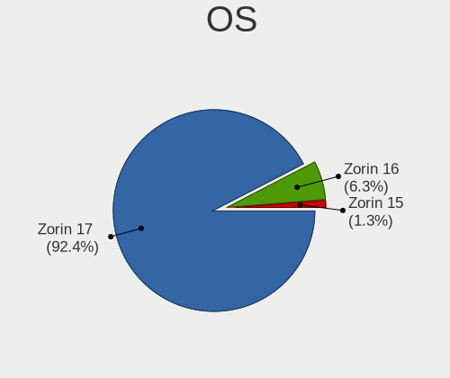
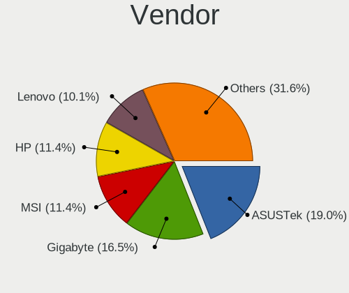
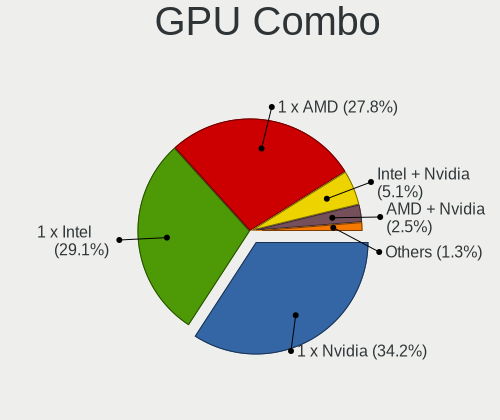

Zorin - Hardware Trends (Desktops)
----------------------------------

A project to identify most popular hardware characteristics and track their change
over time based on data collected by Linux users at https://Linux-Hardware.org.

Anyone can contribute to this report by the [hw-probe](https://github.com/linuxhw/hw-probe) tool:

    sudo -E hw-probe -all -upload

This report is for one last month. Overall report since the beginning of time: [TestCoverage](https://github.com/linuxhw/TestCoverage)

Period: Nov, 2022.

Contents
--------

* [ System ](#system)
  - [ OS                       ](#os)
  - [ OS Family                ](#os-family)
  - [ Kernel                   ](#kernel)
  - [ Kernel Family            ](#kernel-family)
  - [ Kernel Major Ver.        ](#kernel-major-ver)
  - [ Arch                     ](#arch)
  - [ DE                       ](#de)
  - [ Display Server           ](#display-server)
  - [ Display Manager          ](#display-manager)
  - [ OS Lang                  ](#os-lang)
  - [ Boot Mode                ](#boot-mode)
  - [ Filesystem               ](#filesystem)
  - [ Part. scheme             ](#part-scheme)
  - [ Dual Boot with Linux/BSD ](#dual-boot-with-linuxbsd)
  - [ Dual Boot (Win)          ](#dual-boot-win)

* [ Board ](#board)
  - [ Vendor                   ](#vendor)
  - [ Model                    ](#model)
  - [ Model Family             ](#model-family)
  - [ MFG Year                 ](#mfg-year)
  - [ Form Factor              ](#form-factor)
  - [ Secure Boot              ](#secure-boot)
  - [ Coreboot                 ](#coreboot)
  - [ RAM Size                 ](#ram-size)
  - [ RAM Used                 ](#ram-used)
  - [ Total Drives             ](#total-drives)
  - [ Has CD-ROM               ](#has-cd-rom)
  - [ Has Ethernet             ](#has-ethernet)
  - [ Has WiFi                 ](#has-wifi)
  - [ Has Bluetooth            ](#has-bluetooth)

* [ Location ](#location)
  - [ Country                  ](#country)
  - [ City                     ](#city)

* [ Drives ](#drives)
  - [ Drive Vendor             ](#drive-vendor)
  - [ Drive Model              ](#drive-model)
  - [ HDD Vendor               ](#hdd-vendor)
  - [ SSD Vendor               ](#ssd-vendor)
  - [ Drive Kind               ](#drive-kind)
  - [ Drive Connector          ](#drive-connector)
  - [ Drive Size               ](#drive-size)
  - [ Space Total              ](#space-total)
  - [ Space Used               ](#space-used)
  - [ Malfunc. Drives          ](#malfunc-drives)
  - [ Malfunc. Drive Vendor    ](#malfunc-drive-vendor)
  - [ Malfunc. HDD Vendor      ](#malfunc-hdd-vendor)
  - [ Malfunc. Drive Kind      ](#malfunc-drive-kind)
  - [ Failed Drives            ](#failed-drives)
  - [ Failed Drive Vendor      ](#failed-drive-vendor)
  - [ Drive Status             ](#drive-status)

* [ Storage controller ](#storage-controller)
  - [ Storage Vendor           ](#storage-vendor)
  - [ Storage Model            ](#storage-model)
  - [ Storage Kind             ](#storage-kind)

* [ Processor ](#processor)
  - [ CPU Vendor               ](#cpu-vendor)
  - [ CPU Model                ](#cpu-model)
  - [ CPU Model Family         ](#cpu-model-family)
  - [ CPU Cores                ](#cpu-cores)
  - [ CPU Sockets              ](#cpu-sockets)
  - [ CPU Threads              ](#cpu-threads)
  - [ CPU Op-Modes             ](#cpu-op-modes)
  - [ CPU Microcode            ](#cpu-microcode)
  - [ CPU Microarch            ](#cpu-microarch)

* [ Graphics ](#graphics)
  - [ GPU Vendor               ](#gpu-vendor)
  - [ GPU Model                ](#gpu-model)
  - [ GPU Combo                ](#gpu-combo)
  - [ GPU Driver               ](#gpu-driver)
  - [ GPU Memory               ](#gpu-memory)

* [ Monitor ](#monitor)
  - [ Monitor Vendor           ](#monitor-vendor)
  - [ Monitor Model            ](#monitor-model)
  - [ Monitor Resolution       ](#monitor-resolution)
  - [ Monitor Diagonal         ](#monitor-diagonal)
  - [ Monitor Width            ](#monitor-width)
  - [ Aspect Ratio             ](#aspect-ratio)
  - [ Monitor Area             ](#monitor-area)
  - [ Pixel Density            ](#pixel-density)
  - [ Multiple Monitors        ](#multiple-monitors)

* [ Network ](#network)
  - [ Net Controller Vendor    ](#net-controller-vendor)
  - [ Net Controller Model     ](#net-controller-model)
  - [ Wireless Vendor          ](#wireless-vendor)
  - [ Wireless Model           ](#wireless-model)
  - [ Ethernet Vendor          ](#ethernet-vendor)
  - [ Ethernet Model           ](#ethernet-model)
  - [ Net Controller Kind      ](#net-controller-kind)
  - [ Used Controller          ](#used-controller)
  - [ NICs                     ](#nics)
  - [ IPv6                     ](#ipv6)

* [ Bluetooth ](#bluetooth)
  - [ Bluetooth Vendor         ](#bluetooth-vendor)
  - [ Bluetooth Model          ](#bluetooth-model)

* [ Sound ](#sound)
  - [ Sound Vendor             ](#sound-vendor)
  - [ Sound Model              ](#sound-model)

* [ Memory ](#memory)
  - [ Memory Vendor            ](#memory-vendor)
  - [ Memory Model             ](#memory-model)
  - [ Memory Kind              ](#memory-kind)
  - [ Memory Form Factor       ](#memory-form-factor)
  - [ Memory Size              ](#memory-size)
  - [ Memory Speed             ](#memory-speed)

* [ Printers & scanners ](#printers--scanners)
  - [ Printer Vendor           ](#printer-vendor)
  - [ Printer Model            ](#printer-model)
  - [ Scanner Vendor           ](#scanner-vendor)
  - [ Scanner Model            ](#scanner-model)

* [ Camera ](#camera)
  - [ Camera Vendor            ](#camera-vendor)
  - [ Camera Model             ](#camera-model)

* [ Security ](#security)
  - [ Fingerprint Vendor       ](#fingerprint-vendor)
  - [ Fingerprint Model        ](#fingerprint-model)
  - [ Chipcard Vendor          ](#chipcard-vendor)
  - [ Chipcard Model           ](#chipcard-model)

* [ Unsupported ](#unsupported)
  - [ Unsupported Devices      ](#unsupported-devices)
  - [ Unsupported Device Types ](#unsupported-device-types)

System
------

OS
--

Installed operating systems

| Name     | Desktops | Percent |
|----------|----------|---------|
| Zorin 16 | 55       | 94.83%  |
| Zorin 15 | 3        | 5.17%   |

OS Family
---------

OS without a version

| Name  | Desktops | Percent |
|-------|----------|---------|
| Zorin | 58       | 100%    |

Kernel
------

Version of the Linux kernel

| Version                | Desktops | Percent |
|------------------------|----------|---------|
| 5.15.0-52-generic      | 27       | 46.55%  |
| 5.15.0-53-generic      | 21       | 36.21%  |
| 5.4.0-131-generic      | 2        | 3.45%   |
| 5.15.0-41-generic      | 2        | 3.45%   |
| 5.13.0-30-generic      | 2        | 3.45%   |
| 6.0.8-060008-generic   | 1        | 1.72%   |
| 5.4.0-132-generic      | 1        | 1.72%   |
| 5.19.12-051912-generic | 1        | 1.72%   |
| 5.15.0-48-generic      | 1        | 1.72%   |

Kernel Family
-------------

Linux kernel without a distro release

| Version | Desktops | Percent |
|---------|----------|---------|
| 5.15.0  | 51       | 87.93%  |
| 5.4.0   | 3        | 5.17%   |
| 5.13.0  | 2        | 3.45%   |
| 6.0.8   | 1        | 1.72%   |
| 5.19.12 | 1        | 1.72%   |

Kernel Major Ver.
-----------------

Linux kernel major version

| Version | Desktops | Percent |
|---------|----------|---------|
| 5.15    | 51       | 87.93%  |
| 5.4     | 3        | 5.17%   |
| 5.13    | 2        | 3.45%   |
| 6.0     | 1        | 1.72%   |
| 5.19    | 1        | 1.72%   |

Arch
----

OS architecture (x86_64, i586, etc.)

| Name   | Desktops | Percent |
|--------|----------|---------|
| x86_64 | 57       | 98.28%  |
| i686   | 1        | 1.72%   |

DE
--

Desktop Environment

| Name  | Desktops | Percent |
|-------|----------|---------|
| GNOME | 47       | 81.03%  |
| XFCE  | 11       | 18.97%  |

Display Server
--------------

X11 or Wayland

| Name | Desktops | Percent |
|------|----------|---------|
| X11  | 58       | 100%    |

Display Manager
---------------

SDDM, LightDM, etc.

| Name    | Desktops | Percent |
|---------|----------|---------|
| Unknown | 49       | 84.48%  |
| GDM3    | 4        | 6.9%    |
| LightDM | 3        | 5.17%   |
| GDM     | 2        | 3.45%   |

OS Lang
-------

Language

| Lang  | Desktops | Percent |
|-------|----------|---------|
| en_US | 23       | 39.66%  |
| pt_BR | 7        | 12.07%  |
| de_DE | 5        | 8.62%   |
| en_GB | 4        | 6.9%    |
| it_IT | 3        | 5.17%   |
| en_IN | 3        | 5.17%   |
| fr_FR | 2        | 3.45%   |
| en_AU | 2        | 3.45%   |
| ru_RU | 1        | 1.72%   |
| fr_CA | 1        | 1.72%   |
| et_EE | 1        | 1.72%   |
| es_US | 1        | 1.72%   |
| es_CR | 1        | 1.72%   |
| es_AR | 1        | 1.72%   |
| en_PH | 1        | 1.72%   |
| en_CA | 1        | 1.72%   |
| el_GR | 1        | 1.72%   |

Boot Mode
---------

EFI or BIOS

| Mode | Desktops | Percent |
|------|----------|---------|
| BIOS | 32       | 55.17%  |
| EFI  | 26       | 44.83%  |

Filesystem
----------

Type of filesystem

| Type | Desktops | Percent |
|------|----------|---------|
| Ext4 | 56       | 96.55%  |
| Zfs  | 2        | 3.45%   |

Part. scheme
------------

Scheme of partitioning

| Type    | Desktops | Percent |
|---------|----------|---------|
| Unknown | 50       | 86.21%  |
| MBR     | 4        | 6.9%    |
| GPT     | 4        | 6.9%    |

Dual Boot with Linux/BSD
------------------------

Hosting more than one Linux/BSD

| Dual boot | Desktops | Percent |
|-----------|----------|---------|
| No        | 57       | 98.28%  |
| Yes       | 1        | 1.72%   |

Dual Boot (Win)
---------------

Hosting Linux and Windows

| Dual boot | Desktops | Percent |
|-----------|----------|---------|
| No        | 51       | 87.93%  |
| Yes       | 7        | 12.07%  |

Board
-----

Vendor
------

Motherboard manufacturer

| Name                | Desktops | Percent |
|---------------------|----------|---------|
| Gigabyte Technology | 9        | 15.52%  |
| Dell                | 8        | 13.79%  |
| MSI                 | 7        | 12.07%  |
| Hewlett-Packard     | 7        | 12.07%  |
| ASRock              | 6        | 10.34%  |
| ASUSTek Computer    | 5        | 8.62%   |
| Lenovo              | 2        | 3.45%   |
| Acer                | 2        | 3.45%   |
| Pegatron            | 1        | 1.72%   |
| OEM                 | 1        | 1.72%   |
| Megaware            | 1        | 1.72%   |
| JGINYUE             | 1        | 1.72%   |
| Intel               | 1        | 1.72%   |
| Huanan              | 1        | 1.72%   |
| HOUTER              | 1        | 1.72%   |
| Gateway             | 1        | 1.72%   |
| Fujitsu Siemens     | 1        | 1.72%   |
| Biostar             | 1        | 1.72%   |
| BESSTAR Tech        | 1        | 1.72%   |
| Unknown             | 1        | 1.72%   |

Model
-----

Motherboard model

| Name                                 | Desktops | Percent |
|--------------------------------------|----------|---------|
| Dell OptiPlex 380                    | 3        | 5.17%   |
| Pegatron Pro 3405 Series             | 1        | 1.72%   |
| OEM H110                             | 1        | 1.72%   |
| MSI Pentino H-Series                 | 1        | 1.72%   |
| MSI MS-7C75                          | 1        | 1.72%   |
| MSI MS-7C52                          | 1        | 1.72%   |
| MSI MS-7A36                          | 1        | 1.72%   |
| MSI MS-7817                          | 1        | 1.72%   |
| MSI MS-7758                          | 1        | 1.72%   |
| MSI 700-056                          | 1        | 1.72%   |
| Megaware MW-NM70HD-MI                | 1        | 1.72%   |
| Lenovo ThinkCentre M91p 4524WAP      | 1        | 1.72%   |
| Lenovo ThinkCentre M55E 898578G      | 1        | 1.72%   |
| JGINYUE X79M-PLUS V2.3               | 1        | 1.72%   |
| Intel D946GZAB AAD66610-302          | 1        | 1.72%   |
| Huanan X99-8M-F V1.1                 | 1        | 1.72%   |
| HOUTER IPMIP-GS                      | 1        | 1.72%   |
| HP Z220 CMT Workstation              | 1        | 1.72%   |
| HP ProDesk 600 G1 TWR                | 1        | 1.72%   |
| HP ProDesk 600 G1 SFF                | 1        | 1.72%   |
| HP Compaq Pro 6305 SFF               | 1        | 1.72%   |
| HP Compaq dc7800p Ultra-slim Desktop | 1        | 1.72%   |
| HP 510-p189na                        | 1        | 1.72%   |
| HP 260 G2 DM                         | 1        | 1.72%   |
| Gigabyte Z68X-UD3H-B3                | 1        | 1.72%   |
| Gigabyte TERRA_PC                    | 1        | 1.72%   |
| Gigabyte P55-UD6                     | 1        | 1.72%   |
| Gigabyte H510M H                     | 1        | 1.72%   |
| Gigabyte H110M-H                     | 1        | 1.72%   |
| Gigabyte GA-890GPA-UD3H              | 1        | 1.72%   |
| Gigabyte EG41MF-US2H                 | 1        | 1.72%   |
| Gigabyte B560 DS3H AC-Y1             | 1        | 1.72%   |
| Gigabyte 990XA-UD3                   | 1        | 1.72%   |
| Gateway SX2851                       | 1        | 1.72%   |
| Fujitsu Siemens MS-7304VP-A13        | 1        | 1.72%   |
| Dell Vostro 260                      | 1        | 1.72%   |
| Dell OptiPlex 780                    | 1        | 1.72%   |
| Dell OptiPlex 3010                   | 1        | 1.72%   |
| Dell Inspiron 660s                   | 1        | 1.72%   |
| Dell Inspiron 560s                   | 1        | 1.72%   |

Model Family
------------

Motherboard model prefix

| Name                          | Desktops | Percent |
|-------------------------------|----------|---------|
| Dell OptiPlex                 | 5        | 8.62%   |
| Lenovo ThinkCentre            | 2        | 3.45%   |
| HP ProDesk                    | 2        | 3.45%   |
| HP Compaq                     | 2        | 3.45%   |
| Dell Inspiron                 | 2        | 3.45%   |
| ASUS ROG                      | 2        | 3.45%   |
| ASRock B450M                  | 2        | 3.45%   |
| Acer Veriton                  | 2        | 3.45%   |
| Pegatron Pro                  | 1        | 1.72%   |
| OEM H110                      | 1        | 1.72%   |
| MSI Pentino                   | 1        | 1.72%   |
| MSI MS-7C75                   | 1        | 1.72%   |
| MSI MS-7C52                   | 1        | 1.72%   |
| MSI MS-7A36                   | 1        | 1.72%   |
| MSI MS-7817                   | 1        | 1.72%   |
| MSI MS-7758                   | 1        | 1.72%   |
| MSI 700-056                   | 1        | 1.72%   |
| Megaware MW-NM70HD-MI         | 1        | 1.72%   |
| JGINYUE X79M-PLUS             | 1        | 1.72%   |
| Intel D946GZAB                | 1        | 1.72%   |
| Huanan X99-8M-F               | 1        | 1.72%   |
| HOUTER IPMIP-GS               | 1        | 1.72%   |
| HP Z220                       | 1        | 1.72%   |
| HP 510-p189na                 | 1        | 1.72%   |
| HP 260                        | 1        | 1.72%   |
| Gigabyte Z68X-UD3H-B3         | 1        | 1.72%   |
| Gigabyte TERRA                | 1        | 1.72%   |
| Gigabyte P55-UD6              | 1        | 1.72%   |
| Gigabyte H510M                | 1        | 1.72%   |
| Gigabyte H110M-H              | 1        | 1.72%   |
| Gigabyte GA-890GPA-UD3H       | 1        | 1.72%   |
| Gigabyte EG41MF-US2H          | 1        | 1.72%   |
| Gigabyte B560                 | 1        | 1.72%   |
| Gigabyte 990XA-UD3            | 1        | 1.72%   |
| Gateway SX2851                | 1        | 1.72%   |
| Fujitsu Siemens MS-7304VP-A13 | 1        | 1.72%   |
| Dell Vostro                   | 1        | 1.72%   |
| Biostar TPower                | 1        | 1.72%   |
| BESSTAR Tech HM90             | 1        | 1.72%   |
| ASUS PRIME                    | 1        | 1.72%   |

MFG Year
--------

Motherboard manufacture year

| Year | Desktops | Percent |
|------|----------|---------|
| 2021 | 8        | 13.79%  |
| 2013 | 7        | 12.07%  |
| 2010 | 7        | 12.07%  |
| 2009 | 6        | 10.34%  |
| 2011 | 5        | 8.62%   |
| 2012 | 4        | 6.9%    |
| 2020 | 3        | 5.17%   |
| 2018 | 3        | 5.17%   |
| 2016 | 3        | 5.17%   |
| 2014 | 3        | 5.17%   |
| 2006 | 3        | 5.17%   |
| 2019 | 2        | 3.45%   |
| 2017 | 2        | 3.45%   |
| 2022 | 1        | 1.72%   |
| 2007 | 1        | 1.72%   |

Form Factor
-----------

Physical design of the computer

| Name    | Desktops | Percent |
|---------|----------|---------|
| Desktop | 58       | 100%    |

Secure Boot
-----------

Enabled or disabled

| State    | Desktops | Percent |
|----------|----------|---------|
| Disabled | 54       | 93.1%   |
| Enabled  | 4        | 6.9%    |

Coreboot
--------

Have coreboot on board

| Used | Desktops | Percent |
|------|----------|---------|
| No   | 58       | 100%    |

RAM Size
--------

Total RAM memory

| Size in GB  | Desktops | Percent |
|-------------|----------|---------|
| 8.01-16.0   | 16       | 27.59%  |
| 4.01-8.0    | 13       | 22.41%  |
| 3.01-4.0    | 10       | 17.24%  |
| 16.01-24.0  | 8        | 13.79%  |
| 32.01-64.0  | 6        | 10.34%  |
| 2.01-3.0    | 2        | 3.45%   |
| 1.01-2.0    | 2        | 3.45%   |
| 64.01-256.0 | 1        | 1.72%   |

RAM Used
--------

Used RAM memory

| Used GB   | Desktops | Percent |
|-----------|----------|---------|
| 1.01-2.0  | 23       | 39.66%  |
| 2.01-3.0  | 16       | 27.59%  |
| 3.01-4.0  | 10       | 17.24%  |
| 4.01-8.0  | 8        | 13.79%  |
| 8.01-16.0 | 1        | 1.72%   |

Total Drives
------------

Number of drives on board

| Drives | Desktops | Percent |
|--------|----------|---------|
| 1      | 33       | 56.9%   |
| 2      | 13       | 22.41%  |
| 3      | 6        | 10.34%  |
| 4      | 3        | 5.17%   |
| 5      | 2        | 3.45%   |
| 6      | 1        | 1.72%   |

Has CD-ROM
----------

Has CD-ROM on board

| Presented | Desktops | Percent |
|-----------|----------|---------|
| Yes       | 34       | 58.62%  |
| No        | 24       | 41.38%  |

Has Ethernet
------------

Has Ethernet on board

| Presented | Desktops | Percent |
|-----------|----------|---------|
| Yes       | 58       | 100%    |

Has WiFi
--------

Has WiFi module

| Presented | Desktops | Percent |
|-----------|----------|---------|
| Yes       | 33       | 56.9%   |
| No        | 25       | 43.1%   |

Has Bluetooth
-------------

Has Bluetooth module

| Presented | Desktops | Percent |
|-----------|----------|---------|
| No        | 38       | 65.52%  |
| Yes       | 20       | 34.48%  |

Location
--------

Country
-------

Geographic location (country)

| Country     | Desktops | Percent |
|-------------|----------|---------|
| USA         | 13       | 22.41%  |
| Brazil      | 7        | 12.07%  |
| Germany     | 6        | 10.34%  |
| UK          | 4        | 6.9%    |
| Italy       | 3        | 5.17%   |
| India       | 3        | 5.17%   |
| Greece      | 3        | 5.17%   |
| Canada      | 3        | 5.17%   |
| France      | 2        | 3.45%   |
| Australia   | 2        | 3.45%   |
| Serbia      | 1        | 1.72%   |
| Romania     | 1        | 1.72%   |
| Portugal    | 1        | 1.72%   |
| Philippines | 1        | 1.72%   |
| Pakistan    | 1        | 1.72%   |
| Mexico      | 1        | 1.72%   |
| Malaysia    | 1        | 1.72%   |
| Estonia     | 1        | 1.72%   |
| Costa Rica  | 1        | 1.72%   |
| Chile       | 1        | 1.72%   |
| Bulgaria    | 1        | 1.72%   |
| Argentina   | 1        | 1.72%   |

City
----

Geographic location (city)

| City                   | Desktops | Percent |
|------------------------|----------|---------|
| Rio de Janeiro         | 2        | 3.45%   |
| Gex                    | 2        | 3.45%   |
| Athens                 | 2        | 3.45%   |
| Tatuí                 | 1        | 1.72%   |
| Tallinn                | 1        | 1.72%   |
| Tabaco                 | 1        | 1.72%   |
| Surprise               | 1        | 1.72%   |
| Surbiton               | 1        | 1.72%   |
| Stafford               | 1        | 1.72%   |
| St. Petersburg         | 1        | 1.72%   |
| Sofia                  | 1        | 1.72%   |
| Santa Barbara de Goias | 1        | 1.72%   |
| Phoenix                | 1        | 1.72%   |
| Perth                  | 1        | 1.72%   |
| Nurtingen              | 1        | 1.72%   |
| Nova Iguaçu           | 1        | 1.72%   |
| New York               | 1        | 1.72%   |
| Munich                 | 1        | 1.72%   |
| Mumbai                 | 1        | 1.72%   |
| Multan                 | 1        | 1.72%   |
| Montreal               | 1        | 1.72%   |
| Milwaukee              | 1        | 1.72%   |
| Milan                  | 1        | 1.72%   |
| Miami                  | 1        | 1.72%   |
| Madison Heights        | 1        | 1.72%   |
| Loutraki               | 1        | 1.72%   |
| Los Angeles            | 1        | 1.72%   |
| Lisbon                 | 1        | 1.72%   |
| Lafayette              | 1        | 1.72%   |
| Joliette               | 1        | 1.72%   |
| Hildesheim             | 1        | 1.72%   |
| Hermosillo             | 1        | 1.72%   |
| Guarulhos              | 1        | 1.72%   |
| Guaratingueta          | 1        | 1.72%   |
| George Town            | 1        | 1.72%   |
| Fayetteville           | 1        | 1.72%   |
| Erftstadt              | 1        | 1.72%   |
| Dresden                | 1        | 1.72%   |
| Dallas                 | 1        | 1.72%   |
| Córdoba               | 1        | 1.72%   |

Drives
------

Drive Vendor
------------

Hard drive vendors

| Vendor                      | Desktops | Drives | Percent |
|-----------------------------|----------|--------|---------|
| Seagate                     | 22       | 30     | 23.66%  |
| WDC                         | 13       | 16     | 13.98%  |
| Samsung Electronics         | 6        | 8      | 6.45%   |
| Toshiba                     | 5        | 6      | 5.38%   |
| Patriot                     | 5        | 5      | 5.38%   |
| Kingston                    | 5        | 8      | 5.38%   |
| Hitachi                     | 4        | 4      | 4.3%    |
| SanDisk                     | 3        | 3      | 3.23%   |
| Crucial                     | 3        | 3      | 3.23%   |
| SPCC                        | 2        | 2      | 2.15%   |
| Phison Electronics          | 2        | 2      | 2.15%   |
| Maxtor                      | 2        | 3      | 2.15%   |
| Apacer                      | 2        | 3      | 2.15%   |
| ZADAK                       | 1        | 1      | 1.08%   |
| Unknown                     | 1        | 1      | 1.08%   |
| T-FORCE                     | 1        | 1      | 1.08%   |
| Silicon Motion              | 1        | 1      | 1.08%   |
| PNY                         | 1        | 1      | 1.08%   |
| Phison                      | 1        | 1      | 1.08%   |
| Neo                         | 1        | 1      | 1.08%   |
| Lexar                       | 1        | 1      | 1.08%   |
| Kingston Technology Company | 1        | 1      | 1.08%   |
| KingSpec                    | 1        | 1      | 1.08%   |
| KingFast                    | 1        | 1      | 1.08%   |
| JMicron Technology          | 1        | 1      | 1.08%   |
| Intenso                     | 1        | 1      | 1.08%   |
| HS-SSD-C100                 | 1        | 1      | 1.08%   |
| Drevo                       | 1        | 1      | 1.08%   |
| China                       | 1        | 1      | 1.08%   |
| AGI                         | 1        | 1      | 1.08%   |
| Acer                        | 1        | 1      | 1.08%   |
| Unknown                     | 1        | 1      | 1.08%   |

Drive Model
-----------

Hard drive models

| Model                                                 | Desktops | Percent |
|-------------------------------------------------------|----------|---------|
| Seagate ST500DM002-1BD142 500GB                       | 3        | 2.78%   |
| Seagate ST1000DM010-2EP102 1TB                        | 3        | 2.78%   |
| Toshiba HDWD110 1TB                                   | 2        | 1.85%   |
| Phison E12 NVMe Controller 2TB                        | 2        | 1.85%   |
| Patriot Burst 120GB SSD                               | 2        | 1.85%   |
| ZADAK TWSS3 512GB                                     | 1        | 0.93%   |
| WDC WDS480G2G0B-00EPW0 480GB SSD                      | 1        | 0.93%   |
| WDC WDS240G2G0C-00AJM0 240GB                          | 1        | 0.93%   |
| WDC WDS240G2G0A-00JH30 240GB SSD                      | 1        | 0.93%   |
| WDC WDBNCE0010PNC 1TB SSD                             | 1        | 0.93%   |
| WDC WD5003ABYX-01WERA1 500GB                          | 1        | 0.93%   |
| WDC WD5000AZLX-22JKKA0 500GB                          | 1        | 0.93%   |
| WDC WD5000AAKX-75U6AA0 500GB                          | 1        | 0.93%   |
| WDC WD5000AAKX-00ERMA0 500GB                          | 1        | 0.93%   |
| WDC WD3200AVVS-63L2B0 320GB                           | 1        | 0.93%   |
| WDC WD3000BLHX-88A56V0 304GB                          | 1        | 0.93%   |
| WDC WD2500BPVT-22ZEST0 250GB                          | 1        | 0.93%   |
| WDC WD2003FZEX-00SRLA0 2TB                            | 1        | 0.93%   |
| WDC WD1600HLFS-60G6U2 160GB                           | 1        | 0.93%   |
| WDC WD15EARX-22PASB0 1TB                              | 1        | 0.93%   |
| WDC WD15EARS-60MVWB0 1TB                              | 1        | 0.93%   |
| WDC WD10EZRX-00A8LB0 1TB                              | 1        | 0.93%   |
| Unknown SD/MMC/MS PRO 8GB                             | 1        | 0.93%   |
| Toshiba MK3265GSX 320GB                               | 1        | 0.93%   |
| Toshiba MK1656GSY 160GB                               | 1        | 0.93%   |
| Toshiba KSG60ZMV256G M.2 256GB SSD                    | 1        | 0.93%   |
| Toshiba DT01ACA100 1TB                                | 1        | 0.93%   |
| T-FORCE 2TB                                           | 1        | 0.93%   |
| SPCC Solid State Disk 256GB                           | 1        | 0.93%   |
| SPCC Solid State Disk 1024GB                          | 1        | 0.93%   |
| Silicon Motion SM2263EN/SM2263XT SSD Controller 128GB | 1        | 0.93%   |
| Seagate ST500LT012-9WS142 500GB                       | 1        | 0.93%   |
| Seagate ST4000DM000-2AE166 4TB                        | 1        | 0.93%   |
| Seagate ST3500630AS 500GB                             | 1        | 0.93%   |
| Seagate ST3500418AS 500GB                             | 1        | 0.93%   |
| Seagate ST3500312CS 500GB                             | 1        | 0.93%   |
| Seagate ST3320820SCE 320GB                            | 1        | 0.93%   |
| Seagate ST3320310CS 320GB                             | 1        | 0.93%   |
| Seagate ST320LT012-9WS14C 320GB                       | 1        | 0.93%   |
| Seagate ST3160318AS 160GB                             | 1        | 0.93%   |

HDD Vendor
----------

Hard disk drive vendors

| Vendor              | Desktops | Drives | Percent |
|---------------------|----------|--------|---------|
| Seagate             | 22       | 29     | 46.81%  |
| WDC                 | 10       | 12     | 21.28%  |
| Toshiba             | 5        | 5      | 10.64%  |
| Hitachi             | 4        | 4      | 8.51%   |
| Samsung Electronics | 3        | 4      | 6.38%   |
| Maxtor              | 2        | 3      | 4.26%   |
| Unknown             | 1        | 1      | 2.13%   |

SSD Vendor
----------

Solid state drive vendors

| Vendor              | Desktops | Drives | Percent |
|---------------------|----------|--------|---------|
| Patriot             | 4        | 4      | 12.12%  |
| Kingston            | 4        | 5      | 12.12%  |
| WDC                 | 3        | 3      | 9.09%   |
| Sandisk             | 3        | 3      | 9.09%   |
| Samsung Electronics | 3        | 3      | 9.09%   |
| Crucial             | 3        | 3      | 9.09%   |
| SPCC                | 2        | 2      | 6.06%   |
| Apacer              | 2        | 3      | 6.06%   |
| Toshiba             | 1        | 1      | 3.03%   |
| Seagate             | 1        | 1      | 3.03%   |
| PNY                 | 1        | 1      | 3.03%   |
| Neo                 | 1        | 1      | 3.03%   |
| Lexar               | 1        | 1      | 3.03%   |
| KingSpec            | 1        | 1      | 3.03%   |
| JMicron Technology  | 1        | 1      | 3.03%   |
| Drevo               | 1        | 1      | 3.03%   |
| Acer                | 1        | 1      | 3.03%   |

Drive Kind
----------

HDD or SSD

| Kind    | Desktops | Drives | Percent |
|---------|----------|--------|---------|
| HDD     | 42       | 58     | 48.28%  |
| SSD     | 28       | 35     | 32.18%  |
| NVMe    | 9        | 11     | 10.34%  |
| Unknown | 8        | 8      | 9.2%    |

Drive Connector
---------------

SATA, SAS, NVMe, etc.

| Type | Desktops | Drives | Percent |
|------|----------|--------|---------|
| SATA | 57       | 94     | 81.43%  |
| NVMe | 9        | 11     | 12.86%  |
| SAS  | 4        | 7      | 5.71%   |

Drive Size
----------

Size of hard drive

| Size in TB | Desktops | Drives | Percent |
|------------|----------|--------|---------|
| 0.01-0.5   | 44       | 60     | 67.69%  |
| 0.51-1.0   | 13       | 21     | 20%     |
| 1.01-2.0   | 5        | 6      | 7.69%   |
| 3.01-4.0   | 2        | 2      | 3.08%   |
| 10.01-20.0 | 1        | 4      | 1.54%   |

Space Total
-----------

Amount of disk space available on the file system

| Size in GB     | Desktops | Percent |
|----------------|----------|---------|
| 101-250        | 20       | 34.48%  |
| 251-500        | 19       | 32.76%  |
| 501-1000       | 7        | 12.07%  |
| More than 3000 | 2        | 3.45%   |
| 21-50          | 2        | 3.45%   |
| 1001-2000      | 2        | 3.45%   |
| 1-20           | 2        | 3.45%   |
| 51-100         | 2        | 3.45%   |
| 2001-3000      | 1        | 1.72%   |
| Unknown        | 1        | 1.72%   |

Space Used
----------

Amount of used disk space

| Used GB        | Desktops | Percent |
|----------------|----------|---------|
| 1-20           | 23       | 39.66%  |
| 21-50          | 12       | 20.69%  |
| 51-100         | 10       | 17.24%  |
| 101-250        | 6        | 10.34%  |
| More than 3000 | 2        | 3.45%   |
| 501-1000       | 2        | 3.45%   |
| 251-500        | 1        | 1.72%   |
| 1001-2000      | 1        | 1.72%   |
| Unknown        | 1        | 1.72%   |

Malfunc. Drives
---------------

Drive models with a malfunction

Zero info for selected period =(

Malfunc. Drive Vendor
---------------------

Vendors of faulty drives

Zero info for selected period =(

Malfunc. HDD Vendor
-------------------

Vendors of faulty HDD drives

Zero info for selected period =(

Malfunc. Drive Kind
-------------------

Kinds of faulty drives

Zero info for selected period =(

Failed Drives
-------------

Failed drive models

Zero info for selected period =(

Failed Drive Vendor
-------------------

Failed drive vendors

Zero info for selected period =(

Drive Status
------------

Number of failed and malfunc. drives

| Status   | Desktops | Drives | Percent |
|----------|----------|--------|---------|
| Detected | 56       | 105    | 93.33%  |
| Works    | 4        | 7      | 6.67%   |

Storage controller
------------------

Storage Vendor
--------------

Storage controller vendors

| Vendor                      | Desktops | Percent |
|-----------------------------|----------|---------|
| Intel                       | 42       | 58.33%  |
| AMD                         | 16       | 22.22%  |
| Phison Electronics          | 3        | 4.17%   |
| JMicron Technology          | 3        | 4.17%   |
| Kingston Technology Company | 2        | 2.78%   |
| Silicon Motion              | 1        | 1.39%   |
| SanDisk                     | 1        | 1.39%   |
| Samsung Electronics         | 1        | 1.39%   |
| Marvell Technology Group    | 1        | 1.39%   |
| INNOGRIT                    | 1        | 1.39%   |
| ASMedia Technology          | 1        | 1.39%   |

Storage Model
-------------

Storage controller models

| Model                                                                          | Desktops | Percent |
|--------------------------------------------------------------------------------|----------|---------|
| AMD FCH SATA Controller [AHCI mode]                                            | 10       | 10.75%  |
| Intel NM10/ICH7 Family SATA Controller [IDE mode]                              | 6        | 6.45%   |
| Intel 8 Series/C220 Series Chipset Family 6-port SATA Controller 1 [AHCI mode] | 6        | 6.45%   |
| Intel 82801G (ICH7 Family) IDE Controller                                      | 4        | 4.3%    |
| Intel 7 Series/C210 Series Chipset Family 6-port SATA Controller [AHCI mode]   | 4        | 4.3%    |
| Intel SATA Controller [RAID mode]                                              | 3        | 3.23%   |
| Intel Q170/Q150/B150/H170/H110/Z170/CM236 Chipset SATA Controller [AHCI Mode]  | 3        | 3.23%   |
| Intel 6 Series/C200 Series Chipset Family 6 port Desktop SATA AHCI Controller  | 3        | 3.23%   |
| Intel 5 Series/3400 Series Chipset 6 port SATA AHCI Controller                 | 3        | 3.23%   |
| AMD SB7x0/SB8x0/SB9x0 IDE Controller                                           | 3        | 3.23%   |
| AMD 400 Series Chipset SATA Controller                                         | 3        | 3.23%   |
| Phison E12 NVMe Controller                                                     | 2        | 2.15%   |
| Kingston Company Company Non-Volatile memory controller                        | 2        | 2.15%   |
| JMicron JMB363 SATA/IDE Controller                                             | 2        | 2.15%   |
| Intel Alder Lake-S PCH SATA Controller [AHCI Mode]                             | 2        | 2.15%   |
| Intel 500 Series Chipset Family SATA AHCI Controller                           | 2        | 2.15%   |
| AMD SB7x0/SB8x0/SB9x0 SATA Controller [IDE mode]                               | 2        | 2.15%   |
| AMD SB7x0/SB8x0/SB9x0 SATA Controller [AHCI mode]                              | 2        | 2.15%   |
| AMD FCH SATA Controller D                                                      | 2        | 2.15%   |
| Silicon Motion SM2263EN/SM2263XT SSD Controller                                | 1        | 1.08%   |
| SanDisk Non-Volatile memory controller                                         | 1        | 1.08%   |
| Samsung NVMe SSD Controller SM981/PM981/PM983                                  | 1        | 1.08%   |
| Phison E18 PCIe4 NVMe Controller                                               | 1        | 1.08%   |
| Marvell Group 88SE9172 SATA III 6Gb/s RAID Controller                          | 1        | 1.08%   |
| Kingston Company U-SNS8154P3 NVMe SSD                                          | 1        | 1.08%   |
| JMicron JMB368 IDE controller                                                  | 1        | 1.08%   |
| Intel Volume Management Device NVMe RAID Controller                            | 1        | 1.08%   |
| Intel Sunrise Point-LP SATA Controller [AHCI mode]                             | 1        | 1.08%   |
| Intel Comet Lake SATA AHCI Controller                                          | 1        | 1.08%   |
| Intel Cannon Lake PCH SATA AHCI Controller                                     | 1        | 1.08%   |
| Intel C600/X79 series chipset 6-Port SATA AHCI Controller                      | 1        | 1.08%   |
| Intel 82Q35 Express PT IDER Controller                                         | 1        | 1.08%   |
| Intel 82801JI (ICH10 Family) SATA AHCI Controller                              | 1        | 1.08%   |
| Intel 82801JI (ICH10 Family) 4 port SATA IDE Controller #1                     | 1        | 1.08%   |
| Intel 82801JD/DO (ICH10 Family) SATA AHCI Controller                           | 1        | 1.08%   |
| Intel 82801IR/IO/IH (ICH9R/DO/DH) 4 port SATA Controller [IDE mode]            | 1        | 1.08%   |
| Intel 82801I (ICH9 Family) 2 port SATA Controller [IDE mode]                   | 1        | 1.08%   |
| Intel 82801EB/ER (ICH5/ICH5R) IDE Controller                                   | 1        | 1.08%   |
| Intel 82801EB (ICH5) SATA Controller                                           | 1        | 1.08%   |
| Intel 7 Series Chipset Family 6-port SATA Controller [AHCI mode]               | 1        | 1.08%   |

Storage Kind
------------

Kind of storage controller (IDE, SATA, NVMe, SAS, ...)

| Kind | Desktops | Percent |
|------|----------|---------|
| SATA | 46       | 60.53%  |
| IDE  | 17       | 22.37%  |
| NVMe | 9        | 11.84%  |
| RAID | 4        | 5.26%   |

Processor
---------

CPU Vendor
----------

Processor vendors

| Vendor | Desktops | Percent |
|--------|----------|---------|
| Intel  | 42       | 72.41%  |
| AMD    | 16       | 27.59%  |

CPU Model
---------

Processor models

| Model                                       | Desktops | Percent |
|---------------------------------------------|----------|---------|
| Intel Core i5-4570 CPU @ 3.20GHz            | 2        | 3.45%   |
| Intel Core 2 Duo CPU E7500 @ 2.93GHz        | 2        | 3.45%   |
| Intel Xeon CPU X5450 @ 3.00GHz              | 1        | 1.72%   |
| Intel Xeon CPU E5-2670 0 @ 2.60GHz          | 1        | 1.72%   |
| Intel Xeon CPU E5-2640 v3 @ 2.60GHz         | 1        | 1.72%   |
| Intel Pentium Dual-Core CPU E6500 @ 2.93GHz | 1        | 1.72%   |
| Intel Pentium Dual-Core CPU E5700 @ 3.00GHz | 1        | 1.72%   |
| Intel Pentium CPU G3260 @ 3.30GHz           | 1        | 1.72%   |
| Intel Pentium CPU G2020 @ 2.90GHz           | 1        | 1.72%   |
| Intel Pentium CPU 4405U @ 2.10GHz           | 1        | 1.72%   |
| Intel Pentium 4 CPU 3.40GHz                 | 1        | 1.72%   |
| Intel Core i7-4790 CPU @ 3.60GHz            | 1        | 1.72%   |
| Intel Core i7-3770 CPU @ 3.40GHz            | 1        | 1.72%   |
| Intel Core i7 CPU 920 @ 2.67GHz             | 1        | 1.72%   |
| Intel Core i7 CPU 860 @ 2.80GHz             | 1        | 1.72%   |
| Intel Core i5-9400 CPU @ 2.90GHz            | 1        | 1.72%   |
| Intel Core i5-7400 CPU @ 3.00GHz            | 1        | 1.72%   |
| Intel Core i5-6600 CPU @ 3.30GHz            | 1        | 1.72%   |
| Intel Core i5-6500 CPU @ 3.20GHz            | 1        | 1.72%   |
| Intel Core i5-3570K CPU @ 3.40GHz           | 1        | 1.72%   |
| Intel Core i5-3470 CPU @ 3.20GHz            | 1        | 1.72%   |
| Intel Core i5-3330 CPU @ 3.00GHz            | 1        | 1.72%   |
| Intel Core i5-2500 CPU @ 3.30GHz            | 1        | 1.72%   |
| Intel Core i5-2400 CPU @ 3.10GHz            | 1        | 1.72%   |
| Intel Core i5 CPU 750 @ 2.67GHz             | 1        | 1.72%   |
| Intel Core i3-4160 CPU @ 3.60GHz            | 1        | 1.72%   |
| Intel Core i3-2120 CPU @ 3.30GHz            | 1        | 1.72%   |
| Intel Core i3-10105 CPU @ 3.70GHz           | 1        | 1.72%   |
| Intel Core i3 CPU 550 @ 3.20GHz             | 1        | 1.72%   |
| Intel Core i3 CPU 540 @ 3.07GHz             | 1        | 1.72%   |
| Intel Core 2 Duo CPU E8600 @ 3.33GHz        | 1        | 1.72%   |
| Intel Core 2 Duo CPU E6550 @ 2.33GHz        | 1        | 1.72%   |
| Intel Core 2 Duo CPU E4500 @ 2.20GHz        | 1        | 1.72%   |
| Intel Core 2 CPU 6300 @ 1.86GHz             | 1        | 1.72%   |
| Intel Celeron CPU G3900T @ 2.60GHz          | 1        | 1.72%   |
| Intel Celeron CPU 847 @ 1.10GHz             | 1        | 1.72%   |
| Intel 12th Gen Core i9-12900                | 1        | 1.72%   |
| Intel 12th Gen Core i5-12400                | 1        | 1.72%   |
| Intel 11th Gen Core i7-11700F @ 2.50GHz     | 1        | 1.72%   |
| Intel 11th Gen Core i5-11600KF @ 3.90GHz    | 1        | 1.72%   |

CPU Model Family
----------------

Processor model prefix

| Model                   | Desktops | Percent |
|-------------------------|----------|---------|
| Intel Core i5           | 12       | 20.69%  |
| Intel Core i3           | 5        | 8.62%   |
| Intel Core 2 Duo        | 5        | 8.62%   |
| Other                   | 4        | 6.9%    |
| Intel Core i7           | 4        | 6.9%    |
| Intel Xeon              | 3        | 5.17%   |
| Intel Pentium           | 3        | 5.17%   |
| Intel Pentium Dual-Core | 2        | 3.45%   |
| Intel Celeron           | 2        | 3.45%   |
| AMD Ryzen 9             | 2        | 3.45%   |
| AMD Ryzen 5             | 2        | 3.45%   |
| AMD Ryzen 3             | 2        | 3.45%   |
| AMD FX                  | 2        | 3.45%   |
| AMD A8                  | 2        | 3.45%   |
| Intel Pentium 4         | 1        | 1.72%   |
| Intel Core 2            | 1        | 1.72%   |
| AMD Ryzen 7             | 1        | 1.72%   |
| AMD Ryzen 5 PRO         | 1        | 1.72%   |
| AMD Phenom II X4        | 1        | 1.72%   |
| AMD E2                  | 1        | 1.72%   |
| AMD Athlon 64 X2        | 1        | 1.72%   |
| AMD A10                 | 1        | 1.72%   |

CPU Cores
---------

Number of processor cores

| Number | Desktops | Percent |
|--------|----------|---------|
| 2      | 22       | 37.93%  |
| 4      | 21       | 36.21%  |
| 8      | 5        | 8.62%   |
| 6      | 5        | 8.62%   |
| 3      | 2        | 3.45%   |
| 16     | 1        | 1.72%   |
| 12     | 1        | 1.72%   |
| 1      | 1        | 1.72%   |

CPU Sockets
-----------

Number of sockets

| Number | Desktops | Percent |
|--------|----------|---------|
| 1      | 58       | 100%    |

CPU Threads
-----------

Threads per core (Hyper-Threading)

| Number | Desktops | Percent |
|--------|----------|---------|
| 1      | 31       | 53.45%  |
| 2      | 27       | 46.55%  |

CPU Op-Modes
------------

CPU Operation Modes (32-bit, 64-bit)

| Op mode        | Desktops | Percent |
|----------------|----------|---------|
| 32-bit, 64-bit | 58       | 100%    |

CPU Microcode
-------------

Microcode number

| Number     | Desktops | Percent |
|------------|----------|---------|
| 0x306c3    | 5        | 8.62%   |
| 0x306a9    | 5        | 8.62%   |
| 0x1067a    | 5        | 8.62%   |
| 0x206a7    | 4        | 6.9%    |
| 0x506e3    | 3        | 5.17%   |
| Unknown    | 3        | 5.17%   |
| 0xa0671    | 2        | 3.45%   |
| 0xf62      | 1        | 1.72%   |
| 0xa0653    | 1        | 1.72%   |
| 0x906ea    | 1        | 1.72%   |
| 0x906e9    | 1        | 1.72%   |
| 0x90675    | 1        | 1.72%   |
| 0x6fd      | 1        | 1.72%   |
| 0x6fb      | 1        | 1.72%   |
| 0x6f6      | 1        | 1.72%   |
| 0x406e3    | 1        | 1.72%   |
| 0x306f2    | 1        | 1.72%   |
| 0x206d7    | 1        | 1.72%   |
| 0x20655    | 1        | 1.72%   |
| 0x20652    | 1        | 1.72%   |
| 0x106e5    | 1        | 1.72%   |
| 0x106a4    | 1        | 1.72%   |
| 0x10676    | 1        | 1.72%   |
| 0x0a20120a | 1        | 1.72%   |
| 0x0a201205 | 1        | 1.72%   |
| 0x08600106 | 1        | 1.72%   |
| 0x08600104 | 1        | 1.72%   |
| 0x08108109 | 1        | 1.72%   |
| 0x08101013 | 1        | 1.72%   |
| 0x08101007 | 1        | 1.72%   |
| 0x0800820d | 1        | 1.72%   |
| 0x06006118 | 1        | 1.72%   |
| 0x0600111f | 1        | 1.72%   |
| 0x06001119 | 1        | 1.72%   |
| 0x06000852 | 1        | 1.72%   |
| 0x0600063e | 1        | 1.72%   |
| 0x03000027 | 1        | 1.72%   |
| 0x010000db | 1        | 1.72%   |

CPU Microarch
-------------

Microarchitecture

| Name             | Desktops | Percent |
|------------------|----------|---------|
| Penryn           | 6        | 10.34%  |
| Haswell          | 6        | 10.34%  |
| SandyBridge      | 5        | 8.62%   |
| IvyBridge        | 5        | 8.62%   |
| Skylake          | 4        | 6.9%    |
| Piledriver       | 3        | 5.17%   |
| Nehalem          | 3        | 5.17%   |
| Core             | 3        | 5.17%   |
| Zen+             | 2        | 3.45%   |
| Zen 3            | 2        | 3.45%   |
| Zen 2            | 2        | 3.45%   |
| Zen              | 2        | 3.45%   |
| Westmere         | 2        | 3.45%   |
| KabyLake         | 2        | 3.45%   |
| Icelake          | 2        | 3.45%   |
| NetBurst         | 1        | 1.72%   |
| K8 Hammer        | 1        | 1.72%   |
| K10 Llano        | 1        | 1.72%   |
| K10              | 1        | 1.72%   |
| Excavator        | 1        | 1.72%   |
| CometLake        | 1        | 1.72%   |
| Bulldozer        | 1        | 1.72%   |
| Alderlake Hybrid | 1        | 1.72%   |
| Unknown          | 1        | 1.72%   |

Graphics
--------

GPU Vendor
----------

Vendors of graphics cards

| Vendor | Desktops | Percent |
|--------|----------|---------|
| Intel  | 24       | 39.34%  |
| AMD    | 19       | 31.15%  |
| Nvidia | 18       | 29.51%  |

GPU Model
---------

Graphics card models

| Model                                                                       | Desktops | Percent |
|-----------------------------------------------------------------------------|----------|---------|
| Intel 4 Series Chipset Integrated Graphics Controller                       | 4        | 6.45%   |
| Intel 2nd Generation Core Processor Family Integrated Graphics Controller   | 3        | 4.84%   |
| AMD Cedar [Radeon HD 5000/6000/7350/8350 Series]                            | 3        | 4.84%   |
| Nvidia GK208B [GeForce GT 710]                                              | 2        | 3.23%   |
| Nvidia GF108 [GeForce GT 630]                                               | 2        | 3.23%   |
| Intel Xeon E3-1200 v3/4th Gen Core Processor Integrated Graphics Controller | 2        | 3.23%   |
| Intel Xeon E3-1200 v2/3rd Gen Core processor Graphics Controller            | 2        | 3.23%   |
| Intel HD Graphics 530                                                       | 2        | 3.23%   |
| Intel HD Graphics 510                                                       | 2        | 3.23%   |
| AMD Renoir                                                                  | 2        | 3.23%   |
| AMD Raven Ridge [Radeon Vega Series / Radeon Vega Mobile Series]            | 2        | 3.23%   |
| Nvidia TU116 [GeForce GTX 1660 Ti]                                          | 1        | 1.61%   |
| Nvidia TU116 [GeForce GTX 1650]                                             | 1        | 1.61%   |
| Nvidia TU116 [GeForce GTX 1650 SUPER]                                       | 1        | 1.61%   |
| Nvidia TU106 [GeForce RTX 2060 Rev. A]                                      | 1        | 1.61%   |
| Nvidia GT218 [GeForce 210]                                                  | 1        | 1.61%   |
| Nvidia GP108 [GeForce GT 1030]                                              | 1        | 1.61%   |
| Nvidia GP107 [GeForce GTX 1050]                                             | 1        | 1.61%   |
| Nvidia GP107 [GeForce GTX 1050 Ti]                                          | 1        | 1.61%   |
| Nvidia GP106 [GeForce GTX 1060 3GB]                                         | 1        | 1.61%   |
| Nvidia GM206GL [Quadro M2000]                                               | 1        | 1.61%   |
| Nvidia GM107 [GeForce GTX 750]                                              | 1        | 1.61%   |
| Nvidia GF116 [GeForce GTX 550 Ti]                                           | 1        | 1.61%   |
| Nvidia GA106 [Geforce RTX 3050]                                             | 1        | 1.61%   |
| Nvidia G94 [GeForce 9600 GT]                                                | 1        | 1.61%   |
| Intel IvyBridge GT2 [HD Graphics 4000]                                      | 1        | 1.61%   |
| Intel HD Graphics 630                                                       | 1        | 1.61%   |
| Intel Core Processor Integrated Graphics Controller                         | 1        | 1.61%   |
| Intel CometLake-S GT2 [UHD Graphics 630]                                    | 1        | 1.61%   |
| Intel CoffeeLake-S GT2 [UHD Graphics 630]                                   | 1        | 1.61%   |
| Intel AlderLake-S GT1                                                       | 1        | 1.61%   |
| Intel 82Q35 Express Integrated Graphics Controller                          | 1        | 1.61%   |
| Intel 82946GZ/GL Integrated Graphics Controller                             | 1        | 1.61%   |
| Intel 4th Generation Core Processor Family Integrated Graphics Controller   | 1        | 1.61%   |
| AMD Wani [Radeon R5/R6/R7 Graphics]                                         | 1        | 1.61%   |
| AMD SuperSumo [Radeon HD 6370D]                                             | 1        | 1.61%   |
| AMD RV280 [Radeon 9200 PRO] (Secondary)                                     | 1        | 1.61%   |
| AMD RV280 [Radeon 9200 PRO / 9250]                                          | 1        | 1.61%   |
| AMD RS880 [Radeon HD 4250]                                                  | 1        | 1.61%   |
| AMD Richland [Radeon HD 8670D]                                              | 1        | 1.61%   |

GPU Combo
---------

Combinations of graphics cards

| Name         | Desktops | Percent |
|--------------|----------|---------|
| 1 x Intel    | 22       | 37.93%  |
| 1 x Nvidia   | 17       | 29.31%  |
| 1 x AMD      | 17       | 29.31%  |
| 2 x AMD      | 1        | 1.72%   |
| AMD + Nvidia | 1        | 1.72%   |

GPU Driver
----------

Free vs proprietary

| Driver      | Desktops | Percent |
|-------------|----------|---------|
| Free        | 42       | 72.41%  |
| Proprietary | 14       | 24.14%  |
| Unknown     | 2        | 3.45%   |

GPU Memory
----------

Total video memory

| Size in GB | Desktops | Percent |
|------------|----------|---------|
| Unknown    | 28       | 48.28%  |
| 1.01-2.0   | 8        | 13.79%  |
| 0.01-0.5   | 7        | 12.07%  |
| 3.01-4.0   | 6        | 10.34%  |
| 0.51-1.0   | 6        | 10.34%  |
| 5.01-6.0   | 1        | 1.72%   |
| 2.01-3.0   | 1        | 1.72%   |
| 8.01-16.0  | 1        | 1.72%   |

Monitor
-------

Monitor Vendor
--------------

Monitor vendors

| Vendor               | Desktops | Percent |
|----------------------|----------|---------|
| Goldstar             | 7        | 12.73%  |
| Samsung Electronics  | 6        | 10.91%  |
| Dell                 | 6        | 10.91%  |
| Acer                 | 5        | 9.09%   |
| Unknown              | 4        | 7.27%   |
| Philips              | 4        | 7.27%   |
| LG Electronics       | 2        | 3.64%   |
| AUS                  | 2        | 3.64%   |
| AGO                  | 2        | 3.64%   |
| ___                  | 1        | 1.82%   |
| Vizio                | 1        | 1.82%   |
| ViewSonic            | 1        | 1.82%   |
| Sony                 | 1        | 1.82%   |
| RTK                  | 1        | 1.82%   |
| Positivo             | 1        | 1.82%   |
| Lenovo Group Limited | 1        | 1.82%   |
| ITE                  | 1        | 1.82%   |
| Iiyama               | 1        | 1.82%   |
| HPN                  | 1        | 1.82%   |
| Hewlett-Packard      | 1        | 1.82%   |
| HannStar             | 1        | 1.82%   |
| Eizo                 | 1        | 1.82%   |
| ASUSTek Computer     | 1        | 1.82%   |
| AOC                  | 1        | 1.82%   |
| Ancor Communications | 1        | 1.82%   |
| Unknown              | 1        | 1.82%   |

Monitor Model
-------------

Monitor models

| Model                                                                 | Desktops | Percent |
|-----------------------------------------------------------------------|----------|---------|
| Unknown LCD Monitor SAMSUNG 1920x1080                                 | 2        | 3.45%   |
| Philips PHL 277E6 PHLC0E6 1920x1080 598x336mm 27.0-inch               | 2        | 3.45%   |
| Acer P206HV ACR01ED 1600x900 443x249mm 20.0-inch                      | 2        | 3.45%   |
| ___ LCD TV ___9000 1360x768                                           | 1        | 1.72%   |
| Vizio E40-D0 VIZ2001 1920x1080 885x498mm 40.0-inch                    | 1        | 1.72%   |
| ViewSonic VX1935wm-3 VSCB81E 1440x900 410x256mm 19.0-inch             | 1        | 1.72%   |
| Unknown LCD TV 9000 1360x768 1600x900mm 72.3-inch                     | 1        | 1.72%   |
| Unknown LCD Monitor DellSP2008WFP 1680x1050                           | 1        | 1.72%   |
| Sony TV XV SNY8300 1920x1080                                          | 1        | 1.72%   |
| Sony LCD Monitor TV XV                                                | 1        | 1.72%   |
| Samsung Electronics S24D300 SAM0B43 1920x1080 531x299mm 24.0-inch     | 1        | 1.72%   |
| Samsung Electronics LF22T35 SAM707B 1920x1080 480x270mm 21.7-inch     | 1        | 1.72%   |
| Samsung Electronics LCD Monitor SAM0FEE 3840x2160 950x540mm 43.0-inch | 1        | 1.72%   |
| Samsung Electronics LCD Monitor SAM0658 1920x1080 886x498mm 40.0-inch | 1        | 1.72%   |
| Samsung Electronics LCD Monitor SAM04FC 1360x768 410x256mm 19.0-inch  | 1        | 1.72%   |
| Samsung Electronics LC27G7xT SAM105C 2560x1440 597x336mm 27.0-inch    | 1        | 1.72%   |
| RTK WCS Display RTK1A1B 3840x2160 609x355mm 27.8-inch                 | 1        | 1.72%   |
| Positivo HDMI NON2000 1600x900 443x249mm 20.0-inch                    | 1        | 1.72%   |
| Philips PHL 243V5 PHLC0D1 1920x1080 521x293mm 23.5-inch               | 1        | 1.72%   |
| Philips 191EL PHLC03D 1366x768 410x230mm 18.5-inch                    | 1        | 1.72%   |
| LG Electronics LCD Monitor E2050 3520x1080                            | 1        | 1.72%   |
| LG Electronics LCD Monitor 47LV4400                                   | 1        | 1.72%   |
| Lenovo Group Limited LCD Monitor LEN T2254pC 1680x1050                | 1        | 1.72%   |
| ITE DP2VGA V226 ITE6516 1920x1080 600x340mm 27.2-inch                 | 1        | 1.72%   |
| Iiyama PLE2483H IVM6113 1920x1080 531x299mm 24.0-inch                 | 1        | 1.72%   |
| HPN LCD Monitor HP V24                                                | 1        | 1.72%   |
| Hewlett-Packard LP2065 HWP0A72 1600x1200 408x306mm 20.1-inch          | 1        | 1.72%   |
| HannStar HX194DPB HSD30E0 1280x1024 376x301mm 19.0-inch               | 1        | 1.72%   |
| Goldstar W2253 GSM56DB 1920x1080 474x296mm 22.0-inch                  | 1        | 1.72%   |
| Goldstar ULTRAWIDE GSM76E4 3440x1440 800x335mm 34.1-inch              | 1        | 1.72%   |
| Goldstar M197WDP GSM4BC1 1360x768 410x230mm 18.5-inch                 | 1        | 1.72%   |
| Goldstar FULL HD GSM5B55 1920x1080 480x270mm 21.7-inch                | 1        | 1.72%   |
| Goldstar E2240 GSM57A3 1920x1080 477x268mm 21.5-inch                  | 1        | 1.72%   |
| Goldstar E2050 GSM4EAE 1600x900 443x249mm 20.0-inch                   | 1        | 1.72%   |
| Goldstar 25BL56WY GSM5B83 1920x1200 540x340mm 25.1-inch               | 1        | 1.72%   |
| Eizo EV3285 ENC2971 3840x2160 698x393mm 31.5-inch                     | 1        | 1.72%   |
| Dell S2440L DELA08B 1920x1080 531x299mm 24.0-inch                     | 1        | 1.72%   |
| Dell S2340M DELD059 1920x1080 509x286mm 23.0-inch                     | 1        | 1.72%   |
| Dell LCD Monitor P2719H                                               | 1        | 1.72%   |
| Dell IN1910N DELA04C 1366x768 410x230mm 18.5-inch                     | 1        | 1.72%   |

Monitor Resolution
------------------

Monitor screen resolution

| Resolution         | Desktops | Percent |
|--------------------|----------|---------|
| 1920x1080 (FHD)    | 18       | 33.33%  |
| 3840x2160 (4K)     | 5        | 9.26%   |
| 1600x900 (HD+)     | 4        | 7.41%   |
| 1280x1024 (SXGA)   | 4        | 7.41%   |
| 2560x1440 (QHD)    | 3        | 5.56%   |
| 1360x768           | 3        | 5.56%   |
| Unknown            | 3        | 5.56%   |
| 1920x1200 (WUXGA)  | 2        | 3.7%    |
| 1680x1050 (WSXGA+) | 2        | 3.7%    |
| 1440x900 (WXGA+)   | 2        | 3.7%    |
| 1366x768 (WXGA)    | 2        | 3.7%    |
| 5760x1080          | 1        | 1.85%   |
| 3520x1080          | 1        | 1.85%   |
| 3440x1440          | 1        | 1.85%   |
| 2944x1080          | 1        | 1.85%   |
| 1600x1200          | 1        | 1.85%   |
| 1024x768 (XGA)     | 1        | 1.85%   |

Monitor Diagonal
----------------

Diagonal size in inches

| Inches  | Desktops | Percent |
|---------|----------|---------|
| Unknown | 11       | 20.75%  |
| 27      | 7        | 13.21%  |
| 24      | 6        | 11.32%  |
| 20      | 5        | 9.43%   |
| 23      | 4        | 7.55%   |
| 19      | 4        | 7.55%   |
| 21      | 3        | 5.66%   |
| 18      | 3        | 5.66%   |
| 72      | 2        | 3.77%   |
| 40      | 2        | 3.77%   |
| 84      | 1        | 1.89%   |
| 34      | 1        | 1.89%   |
| 31      | 1        | 1.89%   |
| 25      | 1        | 1.89%   |
| 22      | 1        | 1.89%   |
| 17      | 1        | 1.89%   |

Monitor Width
-------------

Physical width

| Width in mm | Desktops | Percent |
|-------------|----------|---------|
| 501-600     | 16       | 30.77%  |
| 401-500     | 14       | 26.92%  |
| Unknown     | 11       | 21.15%  |
| 1501-2000   | 3        | 5.77%   |
| 801-900     | 2        | 3.85%   |
| 601-700     | 2        | 3.85%   |
| 351-400     | 2        | 3.85%   |
| 701-800     | 1        | 1.92%   |
| 301-350     | 1        | 1.92%   |

Aspect Ratio
------------

Proportional relationship between the width and the height

| Ratio   | Desktops | Percent |
|---------|----------|---------|
| 16/9    | 29       | 59.18%  |
| Unknown | 10       | 20.41%  |
| 16/10   | 5        | 10.2%   |
| 5/4     | 3        | 6.12%   |
| 4/3     | 1        | 2.04%   |
| 21/9    | 1        | 2.04%   |

Monitor Area
------------

Area in inch²

| Area in inch² | Desktops | Percent |
|----------------|----------|---------|
| 201-250        | 12       | 23.08%  |
| Unknown        | 11       | 21.15%  |
| 151-200        | 9        | 17.31%  |
| 301-350        | 7        | 13.46%  |
| 141-150        | 4        | 7.69%   |
| More than 1000 | 3        | 5.77%   |
| 351-500        | 2        | 3.85%   |
| 251-300        | 2        | 3.85%   |
| 501-1000       | 2        | 3.85%   |

Pixel Density
-------------

Pixels per inch

| Density | Desktops | Percent |
|---------|----------|---------|
| 51-100  | 29       | 56.86%  |
| Unknown | 11       | 21.57%  |
| 101-120 | 7        | 13.73%  |
| 1-50    | 2        | 3.92%   |
| 121-160 | 2        | 3.92%   |

Multiple Monitors
-----------------

Total monitors connected

| Total | Desktops | Percent |
|-------|----------|---------|
| 1     | 49       | 84.48%  |
| 2     | 6        | 10.34%  |
| 0     | 2        | 3.45%   |
| 4     | 1        | 1.72%   |

Network
-------

Net Controller Vendor
---------------------

Controller vendors

| Vendor                          | Desktops | Percent |
|---------------------------------|----------|---------|
| Realtek Semiconductor           | 44       | 51.76%  |
| Intel                           | 16       | 18.82%  |
| Broadcom                        | 5        | 5.88%   |
| Ralink Technology               | 3        | 3.53%   |
| TP-Link                         | 2        | 2.35%   |
| Qualcomm Atheros                | 2        | 2.35%   |
| NetGear                         | 2        | 2.35%   |
| MediaTek                        | 2        | 2.35%   |
| Linksys                         | 2        | 2.35%   |
| Broadcom Limited                | 2        | 2.35%   |
| Xiaomi                          | 1        | 1.18%   |
| Qualcomm Atheros Communications | 1        | 1.18%   |
| Ovislink                        | 1        | 1.18%   |
| Belkin Components               | 1        | 1.18%   |
| ASUSTek Computer                | 1        | 1.18%   |

Net Controller Model
--------------------

Controller models

| Model                                                               | Desktops | Percent |
|---------------------------------------------------------------------|----------|---------|
| Realtek RTL8111/8168/8411 PCI Express Gigabit Ethernet Controller   | 37       | 38.54%  |
| Intel Wi-Fi 6 AX200                                                 | 3        | 3.13%   |
| Broadcom NetLink BCM57780 Gigabit Ethernet PCIe                     | 3        | 3.13%   |
| Realtek RTL88x2bu [AC1200 Techkey]                                  | 2        | 2.08%   |
| Realtek RTL8125 2.5GbE Controller                                   | 2        | 2.08%   |
| Intel Wi-Fi 6 AX210/AX211/AX411 160MHz                              | 2        | 2.08%   |
| Intel Ethernet Controller I225-V                                    | 2        | 2.08%   |
| Intel Ethernet Connection I217-LM                                   | 2        | 2.08%   |
| Intel 82579LM Gigabit Network Connection (Lewisville)               | 2        | 2.08%   |
| Xiaomi Mi/Redmi series (RNDIS)                                      | 1        | 1.04%   |
| TP-Link TL-WN821N v5/v6 [RTL8192EU]                                 | 1        | 1.04%   |
| TP-Link 802.11n NIC                                                 | 1        | 1.04%   |
| Realtek RTL8821CE 802.11ac PCIe Wireless Network Adapter            | 1        | 1.04%   |
| Realtek RTL8821AE 802.11ac PCIe Wireless Network Adapter            | 1        | 1.04%   |
| Realtek RTL8812AE 802.11ac PCIe Wireless Network Adapter            | 1        | 1.04%   |
| Realtek RTL8811AU 802.11a/b/g/n/ac WLAN Adapter                     | 1        | 1.04%   |
| Realtek RTL8192EE PCIe Wireless Network Adapter                     | 1        | 1.04%   |
| Realtek RTL8192CU 802.11n WLAN Adapter                              | 1        | 1.04%   |
| Realtek RTL8188CUS 802.11n WLAN Adapter                             | 1        | 1.04%   |
| Realtek RTL810xE PCI Express Fast Ethernet controller               | 1        | 1.04%   |
| Realtek RTL-8185 IEEE 802.11a/b/g Wireless LAN Controller           | 1        | 1.04%   |
| Realtek RTL-8100/8101L/8139 PCI Fast Ethernet Adapter               | 1        | 1.04%   |
| Realtek 802.11n                                                     | 1        | 1.04%   |
| Realtek 802.11ac NIC                                                | 1        | 1.04%   |
| Ralink RT5370 Wireless Adapter                                      | 1        | 1.04%   |
| Ralink RT2770 Wireless Adapter                                      | 1        | 1.04%   |
| Ralink MT7601U Wireless Adapter                                     | 1        | 1.04%   |
| Qualcomm Atheros AR9271 802.11n                                     | 1        | 1.04%   |
| Qualcomm Atheros AR9485 Wireless Network Adapter                    | 1        | 1.04%   |
| Qualcomm Atheros AR8161 Gigabit Ethernet                            | 1        | 1.04%   |
| Ovislink AirLive WN-360USB adapter                                  | 1        | 1.04%   |
| NetGear WNDA4100 802.11abgn 3x3:3 [Ralink RT3573]                   | 1        | 1.04%   |
| NetGear A6100 AC600 DB Wireless Adapter [Realtek RTL8811AU]         | 1        | 1.04%   |
| MediaTek N152DL                                                     | 1        | 1.04%   |
| MediaTek MT7921K (RZ608) Wi-Fi 6E 80MHz                             | 1        | 1.04%   |
| Linksys AE6000 802.11a/b/g/n/ac Wireless Adapter [MediaTek MT7610U] | 1        | 1.04%   |
| Linksys AE1200 802.11bgn Wireless Adapter [Broadcom BCM43235]       | 1        | 1.04%   |
| Intel PRO/100 VM Network Connection                                 | 1        | 1.04%   |
| Intel I211 Gigabit Network Connection                               | 1        | 1.04%   |
| Intel Ethernet Connection (2) I219-V                                | 1        | 1.04%   |

Wireless Vendor
---------------

Wireless vendors

| Vendor                          | Desktops | Percent |
|---------------------------------|----------|---------|
| Realtek Semiconductor           | 12       | 34.29%  |
| Intel                           | 6        | 17.14%  |
| Ralink Technology               | 3        | 8.57%   |
| TP-Link                         | 2        | 5.71%   |
| NetGear                         | 2        | 5.71%   |
| Linksys                         | 2        | 5.71%   |
| Qualcomm Atheros Communications | 1        | 2.86%   |
| Qualcomm Atheros                | 1        | 2.86%   |
| Ovislink                        | 1        | 2.86%   |
| MediaTek                        | 1        | 2.86%   |
| Broadcom Limited                | 1        | 2.86%   |
| Broadcom                        | 1        | 2.86%   |
| Belkin Components               | 1        | 2.86%   |
| ASUSTek Computer                | 1        | 2.86%   |

Wireless Model
--------------

Wireless models

| Model                                                                                 | Desktops | Percent |
|---------------------------------------------------------------------------------------|----------|---------|
| Intel Wi-Fi 6 AX200                                                                   | 3        | 8.57%   |
| Realtek RTL88x2bu [AC1200 Techkey]                                                    | 2        | 5.71%   |
| Intel Wi-Fi 6 AX210/AX211/AX411 160MHz                                                | 2        | 5.71%   |
| TP-Link TL-WN821N v5/v6 [RTL8192EU]                                                   | 1        | 2.86%   |
| TP-Link 802.11n NIC                                                                   | 1        | 2.86%   |
| Realtek RTL8821CE 802.11ac PCIe Wireless Network Adapter                              | 1        | 2.86%   |
| Realtek RTL8821AE 802.11ac PCIe Wireless Network Adapter                              | 1        | 2.86%   |
| Realtek RTL8812AE 802.11ac PCIe Wireless Network Adapter                              | 1        | 2.86%   |
| Realtek RTL8811AU 802.11a/b/g/n/ac WLAN Adapter                                       | 1        | 2.86%   |
| Realtek RTL8192EE PCIe Wireless Network Adapter                                       | 1        | 2.86%   |
| Realtek RTL8192CU 802.11n WLAN Adapter                                                | 1        | 2.86%   |
| Realtek RTL8188CUS 802.11n WLAN Adapter                                               | 1        | 2.86%   |
| Realtek RTL-8185 IEEE 802.11a/b/g Wireless LAN Controller                             | 1        | 2.86%   |
| Realtek 802.11n                                                                       | 1        | 2.86%   |
| Realtek 802.11ac NIC                                                                  | 1        | 2.86%   |
| Ralink RT5370 Wireless Adapter                                                        | 1        | 2.86%   |
| Ralink RT2770 Wireless Adapter                                                        | 1        | 2.86%   |
| Ralink MT7601U Wireless Adapter                                                       | 1        | 2.86%   |
| Qualcomm Atheros AR9271 802.11n                                                       | 1        | 2.86%   |
| Qualcomm Atheros AR9485 Wireless Network Adapter                                      | 1        | 2.86%   |
| Ovislink AirLive WN-360USB adapter                                                    | 1        | 2.86%   |
| NetGear WNDA4100 802.11abgn 3x3:3 [Ralink RT3573]                                     | 1        | 2.86%   |
| NetGear A6100 AC600 DB Wireless Adapter [Realtek RTL8811AU]                           | 1        | 2.86%   |
| MediaTek MT7921K (RZ608) Wi-Fi 6E 80MHz                                               | 1        | 2.86%   |
| Linksys AE6000 802.11a/b/g/n/ac Wireless Adapter [MediaTek MT7610U]                   | 1        | 2.86%   |
| Linksys AE1200 802.11bgn Wireless Adapter [Broadcom BCM43235]                         | 1        | 2.86%   |
| Intel Dual Band Wireless-AC 3168NGW [Stone Peak]                                      | 1        | 2.86%   |
| Broadcom Limited BCM4318 [AirForce One 54g] 802.11g Wireless LAN Controller           | 1        | 2.86%   |
| Broadcom BCM4360 802.11ac Wireless Network Adapter                                    | 1        | 2.86%   |
| Belkin Components F7D1102 N150/Surf Micro Wireless Adapter v1000 [Realtek RTL8188CUS] | 1        | 2.86%   |
| ASUS 802.11n NIC                                                                      | 1        | 2.86%   |

Ethernet Vendor
---------------

Ethernet vendors

| Vendor                | Desktops | Percent |
|-----------------------|----------|---------|
| Realtek Semiconductor | 41       | 67.21%  |
| Intel                 | 12       | 19.67%  |
| Broadcom              | 4        | 6.56%   |
| Xiaomi                | 1        | 1.64%   |
| Qualcomm Atheros      | 1        | 1.64%   |
| MediaTek              | 1        | 1.64%   |
| Broadcom Limited      | 1        | 1.64%   |

Ethernet Model
--------------

Ethernet models

| Model                                                             | Desktops | Percent |
|-------------------------------------------------------------------|----------|---------|
| Realtek RTL8111/8168/8411 PCI Express Gigabit Ethernet Controller | 37       | 60.66%  |
| Broadcom NetLink BCM57780 Gigabit Ethernet PCIe                   | 3        | 4.92%   |
| Realtek RTL8125 2.5GbE Controller                                 | 2        | 3.28%   |
| Intel Ethernet Controller I225-V                                  | 2        | 3.28%   |
| Intel Ethernet Connection I217-LM                                 | 2        | 3.28%   |
| Intel 82579LM Gigabit Network Connection (Lewisville)             | 2        | 3.28%   |
| Xiaomi Mi/Redmi series (RNDIS)                                    | 1        | 1.64%   |
| Realtek RTL810xE PCI Express Fast Ethernet controller             | 1        | 1.64%   |
| Realtek RTL-8100/8101L/8139 PCI Fast Ethernet Adapter             | 1        | 1.64%   |
| Qualcomm Atheros AR8161 Gigabit Ethernet                          | 1        | 1.64%   |
| MediaTek N152DL                                                   | 1        | 1.64%   |
| Intel PRO/100 VM Network Connection                               | 1        | 1.64%   |
| Intel I211 Gigabit Network Connection                             | 1        | 1.64%   |
| Intel Ethernet Connection (2) I219-V                              | 1        | 1.64%   |
| Intel 82578DC Gigabit Network Connection                          | 1        | 1.64%   |
| Intel 82567LM-3 Gigabit Network Connection                        | 1        | 1.64%   |
| Intel 82566DM-2 Gigabit Network Connection                        | 1        | 1.64%   |
| Broadcom NetLink BCM5786 Gigabit Ethernet PCI Express             | 1        | 1.64%   |
| Broadcom Limited NetXtreme BCM5761 Gigabit Ethernet PCIe          | 1        | 1.64%   |

Net Controller Kind
-------------------

Ethernet, WiFi or modem

| Kind     | Desktops | Percent |
|----------|----------|---------|
| Ethernet | 58       | 64.44%  |
| WiFi     | 32       | 35.56%  |

Used Controller
---------------

Currently used network controller

| Kind     | Desktops | Percent |
|----------|----------|---------|
| Ethernet | 44       | 75.86%  |
| WiFi     | 14       | 24.14%  |

NICs
----

Total network controllers on board

| Total | Desktops | Percent |
|-------|----------|---------|
| 1     | 41       | 70.69%  |
| 2     | 16       | 27.59%  |
| 3     | 1        | 1.72%   |

IPv6
----

IPv6 vs IPv4

| Used | Desktops | Percent |
|------|----------|---------|
| No   | 33       | 56.9%   |
| Yes  | 25       | 43.1%   |

Bluetooth
---------

Bluetooth Vendor
----------------

Controller vendors

| Vendor                  | Desktops | Percent |
|-------------------------|----------|---------|
| Intel                   | 6        | 30%     |
| Cambridge Silicon Radio | 6        | 30%     |
| Realtek Semiconductor   | 4        | 20%     |
| TP-Link                 | 1        | 5%      |
| MediaTek                | 1        | 5%      |
| IMC Networks            | 1        | 5%      |
| Broadcom                | 1        | 5%      |

Bluetooth Model
---------------

Controller models

| Model                                               | Desktops | Percent |
|-----------------------------------------------------|----------|---------|
| Cambridge Silicon Radio Bluetooth Dongle (HCI mode) | 6        | 30%     |
| Realtek Bluetooth Radio                             | 4        | 20%     |
| Intel AX200 Bluetooth                               | 3        | 15%     |
| Intel AX210 Bluetooth                               | 2        | 10%     |
| TP-Link UB500 Adapter                               | 1        | 5%      |
| MediaTek Wireless_Device                            | 1        | 5%      |
| Intel Wireless-AC 3168 Bluetooth                    | 1        | 5%      |
| IMC Networks Bluetooth Radio                        | 1        | 5%      |
| Broadcom BCM92046DG-CL1ROM Bluetooth 2.1 Adapter    | 1        | 5%      |

Sound
-----

Sound Vendor
------------

Sound card vendors

| Vendor                | Desktops | Percent |
|-----------------------|----------|---------|
| Intel                 | 41       | 44.57%  |
| AMD                   | 21       | 22.83%  |
| Nvidia                | 17       | 18.48%  |
| C-Media Electronics   | 4        | 4.35%   |
| Schiit Audio          | 1        | 1.09%   |
| RODE Microphones      | 1        | 1.09%   |
| Realtek Semiconductor | 1        | 1.09%   |
| Oculus                | 1        | 1.09%   |
| Logitech              | 1        | 1.09%   |
| JMTek                 | 1        | 1.09%   |
| Creative Labs         | 1        | 1.09%   |
| ASUSTek Computer      | 1        | 1.09%   |
| Astro Gaming          | 1        | 1.09%   |

Sound Model
-----------

Sound card models

| Model                                                                      | Desktops | Percent |
|----------------------------------------------------------------------------|----------|---------|
| Intel NM10/ICH7 Family High Definition Audio Controller                    | 6        | 5.66%   |
| Intel 8 Series/C220 Series Chipset High Definition Audio Controller        | 6        | 5.66%   |
| Intel 7 Series/C216 Chipset Family High Definition Audio Controller        | 5        | 4.72%   |
| AMD Family 17h/19h HD Audio Controller                                     | 5        | 4.72%   |
| Intel 6 Series/C200 Series Chipset Family High Definition Audio Controller | 4        | 3.77%   |
| Intel 5 Series/3400 Series Chipset High Definition Audio                   | 4        | 3.77%   |
| Intel 100 Series/C230 Series Chipset Family HD Audio Controller            | 4        | 3.77%   |
| AMD SBx00 Azalia (Intel HDA)                                               | 4        | 3.77%   |
| Nvidia TU116 High Definition Audio Controller                              | 3        | 2.83%   |
| AMD Raven/Raven2/Fenghuang HDMI/DP Audio Controller                        | 3        | 2.83%   |
| AMD FCH Azalia Controller                                                  | 3        | 2.83%   |
| Nvidia GP107GL High Definition Audio Controller                            | 2        | 1.89%   |
| Nvidia GK208 HDMI/DP Audio Controller                                      | 2        | 1.89%   |
| Nvidia GF108 High Definition Audio Controller                              | 2        | 1.89%   |
| Intel Xeon E3-1200 v3/4th Gen Core Processor HD Audio Controller           | 2        | 1.89%   |
| Intel USB PnP Sound Device                                                 | 2        | 1.89%   |
| Intel Audio device                                                         | 2        | 1.89%   |
| Intel Alder Lake-S HD Audio Controller                                     | 2        | 1.89%   |
| Intel 82801JI (ICH10 Family) HD Audio Controller                           | 2        | 1.89%   |
| AMD Starship/Matisse HD Audio Controller                                   | 2        | 1.89%   |
| AMD Renoir Radeon High Definition Audio Controller                         | 2        | 1.89%   |
| AMD Oland/Hainan/Cape Verde/Pitcairn HDMI Audio [Radeon HD 7000 Series]    | 2        | 1.89%   |
| AMD Cedar HDMI Audio [Radeon HD 5400/6300/7300 Series]                     | 2        | 1.89%   |
| Schiit Audio Schiit Yggdrasil Unison USB                                   | 1        | 0.94%   |
| RODE Microphones RODE NT-USB Mini                                          | 1        | 0.94%   |
| Realtek Semiconductor Maono AU-PM401                                       | 1        | 0.94%   |
| Oculus Rift Audio                                                          | 1        | 0.94%   |
| Nvidia TU106 High Definition Audio Controller                              | 1        | 0.94%   |
| Nvidia High Definition Audio Controller                                    | 1        | 0.94%   |
| Nvidia GP108 High Definition Audio Controller                              | 1        | 0.94%   |
| Nvidia GP106 High Definition Audio Controller                              | 1        | 0.94%   |
| Nvidia GM206 High Definition Audio Controller                              | 1        | 0.94%   |
| Nvidia GM107 High Definition Audio Controller [GeForce 940MX]              | 1        | 0.94%   |
| Nvidia GF116 High Definition Audio Controller                              | 1        | 0.94%   |
| Nvidia GA106 High Definition Audio Controller                              | 1        | 0.94%   |
| Logitech H390 headset with microphone                                      | 1        | 0.94%   |
| JMTek USB PnP Audio Device                                                 | 1        | 0.94%   |
| Intel Tiger Lake-H HD Audio Controller                                     | 1        | 0.94%   |
| Intel Sunrise Point-LP HD Audio                                            | 1        | 0.94%   |
| Intel Cannon Lake PCH cAVS                                                 | 1        | 0.94%   |

Memory
------

Memory Vendor
-------------

Memory module vendors

| Vendor              | Desktops | Percent |
|---------------------|----------|---------|
| SK hynix            | 1        | 14.29%  |
| Samsung Electronics | 1        | 14.29%  |
| Kingston            | 1        | 14.29%  |
| Corsair             | 1        | 14.29%  |
| Avant               | 1        | 14.29%  |
| A-DATA Technology   | 1        | 14.29%  |
| Unknown             | 1        | 14.29%  |

Memory Model
------------

Memory module models

| Model                                                    | Desktops | Percent |
|----------------------------------------------------------|----------|---------|
| SK hynix RAM HMT41GU6AFR8A-PB 8192MB DIMM DDR3 1600MT/s  | 1        | 11.11%  |
| Samsung RAM M378B5273DH0-CK0 4096MB DIMM DDR3 2200MT/s   | 1        | 11.11%  |
| Kingston RAM KTW149-ELD 1024MB DIMM DDR3 1333MT/s        | 1        | 11.11%  |
| Kingston RAM 9905471-006.A00LF 4096MB DIMM DDR3 1333MT/s | 1        | 11.11%  |
| Corsair RAM CMK8GX4M1A2666C16 8192MB DIMM DDR4 3000MT/s  | 1        | 11.11%  |
| Corsair RAM CM4X8GE2666C16K2 8192MB DIMM DDR4 2667MT/s   | 1        | 11.11%  |
| Avant RAM W641GU42J2320NN 8192MB DIMM DDR4 2666MT/s      | 1        | 11.11%  |
| A-DATA RAM DDR4 3000 8GB DIMM DDR4 3600MT/s              | 1        | 11.11%  |
| Unknown                                                  | 1        | 11.11%  |

Memory Kind
-----------

Memory module kinds

| Kind | Desktops | Percent |
|------|----------|---------|
| DDR4 | 4        | 66.67%  |
| DDR3 | 2        | 33.33%  |

Memory Form Factor
------------------

Physical design of the memory module

| Name | Desktops | Percent |
|------|----------|---------|
| DIMM | 6        | 100%    |

Memory Size
-----------

Memory module size

| Size  | Desktops | Percent |
|-------|----------|---------|
| 8192  | 3        | 37.5%   |
| 16384 | 2        | 25%     |
| 4096  | 2        | 25%     |
| 1024  | 1        | 12.5%   |

Memory Speed
------------

Memory module speed

| Speed | Desktops | Percent |
|-------|----------|---------|
| 3600  | 1        | 12.5%   |
| 3000  | 1        | 12.5%   |
| 2933  | 1        | 12.5%   |
| 2667  | 1        | 12.5%   |
| 2666  | 1        | 12.5%   |
| 2200  | 1        | 12.5%   |
| 1600  | 1        | 12.5%   |
| 1333  | 1        | 12.5%   |

Printers & scanners
-------------------

Printer Vendor
--------------

Printer device vendors

| Vendor          | Desktops | Percent |
|-----------------|----------|---------|
| Hewlett-Packard | 3        | 100%    |

Printer Model
-------------

Printer device models

| Model                  | Desktops | Percent |
|------------------------|----------|---------|
| HP DeskJet 2130 series | 2        | 66.67%  |
| HP Deskjet 4610 series | 1        | 33.33%  |

Scanner Vendor
--------------

Scanner device vendors

Zero info for selected period =(

Scanner Model
-------------

Scanner device models

Zero info for selected period =(

Camera
------

Camera Vendor
-------------

Camera device vendors

| Vendor                 | Desktops | Percent |
|------------------------|----------|---------|
| Apple                  | 2        | 22.22%  |
| Samsung Electronics    | 1        | 11.11%  |
| Razer USA              | 1        | 11.11%  |
| Microsoft              | 1        | 11.11%  |
| Microdia               | 1        | 11.11%  |
| Logitech               | 1        | 11.11%  |
| Generalplus Technology | 1        | 11.11%  |
| EC2U200                | 1        | 11.11%  |

Camera Model
------------

Camera device models

| Model                                   | Desktops | Percent |
|-----------------------------------------|----------|---------|
| Apple iPhone 5/5C/5S/6/SE               | 2        | 22.22%  |
| Samsung Galaxy series, misc. (MTP mode) | 1        | 11.11%  |
| Razer USA Gaming Webcam [Kiyo]          | 1        | 11.11%  |
| Microsoft LifeCam HD-5000               | 1        | 11.11%  |
| Microdia Integrated Camera              | 1        | 11.11%  |
| Logitech HD Pro Webcam C920             | 1        | 11.11%  |
| Generalplus WEB CAM                     | 1        | 11.11%  |
| EC2U200 EC2U200                         | 1        | 11.11%  |

Security
--------

Fingerprint Vendor
------------------

Fingerprint sensor vendors

Zero info for selected period =(

Fingerprint Model
-----------------

Fingerprint sensor models

Zero info for selected period =(

Chipcard Vendor
---------------

Chipcard module vendors

| Vendor           | Desktops | Percent |
|------------------|----------|---------|
| SCM Microsystems | 1        | 100%    |

Chipcard Model
--------------

Chipcard module models

| Model                                                  | Desktops | Percent |
|--------------------------------------------------------|----------|---------|
| SCM Microsystems SCR331-LC1 / SCR3310 SmartCard Reader | 1        | 100%    |

Unsupported
-----------

Unsupported Devices
-------------------

Total unsupported devices on board

| Total | Desktops | Percent |
|-------|----------|---------|
| 0     | 48       | 82.76%  |
| 1     | 10       | 17.24%  |

Unsupported Device Types
------------------------

Types of unsupported devices

| Type                     | Desktops | Percent |
|--------------------------|----------|---------|
| Net/wireless             | 4        | 40%     |
| Graphics card            | 3        | 30%     |
| Multimedia controller    | 1        | 10%     |
| Communication controller | 1        | 10%     |
| Chipcard                 | 1        | 10%     |

