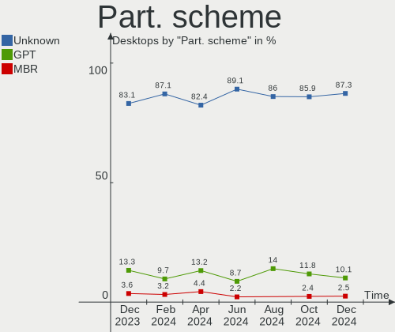
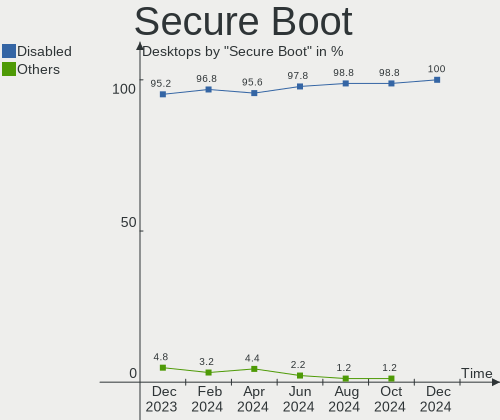
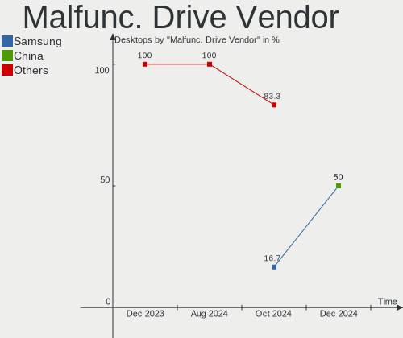
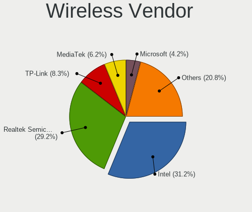
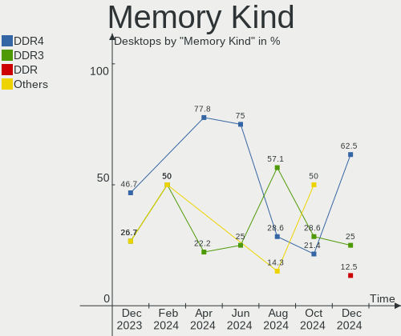

Zorin Hardware Trends (Desktops)
--------------------------------

A project to identify most popular hardware characteristics and track their change
over time based on data collected by Zorin users at https://Linux-Hardware.org.

Anyone can contribute to this report by the [hw-probe](https://github.com/linuxhw/hw-probe) tool:

    sudo -E hw-probe -all -upload

Full-feature report is available here: https://linux-hardware.org/?view=trends&formfactor=desktop

Period: Oct, 2021.

Contents
--------

* [ System ](#system)
  - [ OS                       ](#os)
  - [ OS Family                ](#os-family)
  - [ Kernel                   ](#kernel)
  - [ Kernel Family            ](#kernel-family)
  - [ Kernel Major Ver.        ](#kernel-major-ver)
  - [ Arch                     ](#arch)
  - [ DE                       ](#de)
  - [ Display Server           ](#display-server)
  - [ Display Manager          ](#display-manager)
  - [ OS Lang                  ](#os-lang)
  - [ Boot Mode                ](#boot-mode)
  - [ Filesystem               ](#filesystem)
  - [ Part. scheme             ](#part-scheme)
  - [ Dual Boot with Linux/BSD ](#dual-boot-with-linuxbsd)
  - [ Dual Boot (Win)          ](#dual-boot-win)

* [ Board ](#board)
  - [ Vendor                   ](#vendor)
  - [ Model                    ](#model)
  - [ Model Family             ](#model-family)
  - [ MFG Year                 ](#mfg-year)
  - [ Form Factor              ](#form-factor)
  - [ Secure Boot              ](#secure-boot)
  - [ Coreboot                 ](#coreboot)
  - [ RAM Size                 ](#ram-size)
  - [ RAM Used                 ](#ram-used)
  - [ Total Drives             ](#total-drives)
  - [ Has CD-ROM               ](#has-cd-rom)
  - [ Has Ethernet             ](#has-ethernet)
  - [ Has WiFi                 ](#has-wifi)
  - [ Has Bluetooth            ](#has-bluetooth)

* [ Location ](#location)
  - [ Country                  ](#country)
  - [ City                     ](#city)

* [ Drives ](#drives)
  - [ Drive Vendor             ](#drive-vendor)
  - [ Drive Model              ](#drive-model)
  - [ HDD Vendor               ](#hdd-vendor)
  - [ SSD Vendor               ](#ssd-vendor)
  - [ Drive Kind               ](#drive-kind)
  - [ Drive Connector          ](#drive-connector)
  - [ Drive Size               ](#drive-size)
  - [ Space Total              ](#space-total)
  - [ Space Used               ](#space-used)
  - [ Malfunc. Drives          ](#malfunc-drives)
  - [ Malfunc. Drive Vendor    ](#malfunc-drive-vendor)
  - [ Malfunc. HDD Vendor      ](#malfunc-hdd-vendor)
  - [ Malfunc. Drive Kind      ](#malfunc-drive-kind)
  - [ Failed Drives            ](#failed-drives)
  - [ Failed Drive Vendor      ](#failed-drive-vendor)
  - [ Drive Status             ](#drive-status)

* [ Storage controller ](#storage-controller)
  - [ Storage Vendor           ](#storage-vendor)
  - [ Storage Model            ](#storage-model)
  - [ Storage Kind             ](#storage-kind)

* [ Processor ](#processor)
  - [ CPU Vendor               ](#cpu-vendor)
  - [ CPU Model                ](#cpu-model)
  - [ CPU Model Family         ](#cpu-model-family)
  - [ CPU Cores                ](#cpu-cores)
  - [ CPU Sockets              ](#cpu-sockets)
  - [ CPU Threads              ](#cpu-threads)
  - [ CPU Op-Modes             ](#cpu-op-modes)
  - [ CPU Microcode            ](#cpu-microcode)
  - [ CPU Microarch            ](#cpu-microarch)

* [ Graphics ](#graphics)
  - [ GPU Vendor               ](#gpu-vendor)
  - [ GPU Model                ](#gpu-model)
  - [ GPU Combo                ](#gpu-combo)
  - [ GPU Driver               ](#gpu-driver)
  - [ GPU Memory               ](#gpu-memory)

* [ Monitor ](#monitor)
  - [ Monitor Vendor           ](#monitor-vendor)
  - [ Monitor Model            ](#monitor-model)
  - [ Monitor Resolution       ](#monitor-resolution)
  - [ Monitor Diagonal         ](#monitor-diagonal)
  - [ Monitor Width            ](#monitor-width)
  - [ Aspect Ratio             ](#aspect-ratio)
  - [ Monitor Area             ](#monitor-area)
  - [ Pixel Density            ](#pixel-density)
  - [ Multiple Monitors        ](#multiple-monitors)

* [ Network ](#network)
  - [ Net Controller Vendor    ](#net-controller-vendor)
  - [ Net Controller Model     ](#net-controller-model)
  - [ Wireless Vendor          ](#wireless-vendor)
  - [ Wireless Model           ](#wireless-model)
  - [ Ethernet Vendor          ](#ethernet-vendor)
  - [ Ethernet Model           ](#ethernet-model)
  - [ Net Controller Kind      ](#net-controller-kind)
  - [ Used Controller          ](#used-controller)
  - [ NICs                     ](#nics)
  - [ IPv6                     ](#ipv6)

* [ Bluetooth ](#bluetooth)
  - [ Bluetooth Vendor         ](#bluetooth-vendor)
  - [ Bluetooth Model          ](#bluetooth-model)

* [ Sound ](#sound)
  - [ Sound Vendor             ](#sound-vendor)
  - [ Sound Model              ](#sound-model)

* [ Memory ](#memory)
  - [ Memory Vendor            ](#memory-vendor)
  - [ Memory Model             ](#memory-model)
  - [ Memory Kind              ](#memory-kind)
  - [ Memory Form Factor       ](#memory-form-factor)
  - [ Memory Size              ](#memory-size)
  - [ Memory Speed             ](#memory-speed)

* [ Printers & scanners ](#printers--scanners)
  - [ Printer Vendor           ](#printer-vendor)
  - [ Printer Model            ](#printer-model)
  - [ Scanner Vendor           ](#scanner-vendor)
  - [ Scanner Model            ](#scanner-model)

* [ Camera ](#camera)
  - [ Camera Vendor            ](#camera-vendor)
  - [ Camera Model             ](#camera-model)

* [ Security ](#security)
  - [ Fingerprint Vendor       ](#fingerprint-vendor)
  - [ Fingerprint Model        ](#fingerprint-model)
  - [ Chipcard Vendor          ](#chipcard-vendor)
  - [ Chipcard Model           ](#chipcard-model)

* [ Unsupported ](#unsupported)
  - [ Unsupported Devices      ](#unsupported-devices)
  - [ Unsupported Device Types ](#unsupported-device-types)

System
------

OS
--

Installed operating systems

| Name     | Desktops | Percent |
|----------|----------|---------|
| Zorin 16 | 56       | 83.58%  |
| Zorin 15 | 10       | 14.93%  |
| Zorin 12 | 1        | 1.49%   |

OS Family
---------

OS without a version

| Name  | Desktops | Percent |
|-------|----------|---------|
| Zorin | 67       | 100%    |

Kernel
------

Version of the Linux kernel

| Version            | Desktops | Percent |
|--------------------|----------|---------|
| 5.11.0-37-generic  | 28       | 41.79%  |
| 5.11.0-38-generic  | 24       | 35.82%  |
| 5.4.0-89-generic   | 3        | 4.48%   |
| 5.4.0-87-generic   | 3        | 4.48%   |
| 5.11.0-27-generic  | 3        | 4.48%   |
| 5.8.0-55-generic   | 1        | 1.49%   |
| 5.4.0-86-generic   | 1        | 1.49%   |
| 5.4.0-81-generic   | 1        | 1.49%   |
| 5.4.0-66-generic   | 1        | 1.49%   |
| 5.4.0-47-generic   | 1        | 1.49%   |
| 4.15.0-142-generic | 1        | 1.49%   |

Kernel Family
-------------

Linux kernel without a distro release

| Version | Desktops | Percent |
|---------|----------|---------|
| 5.11.0  | 55       | 82.09%  |
| 5.4.0   | 10       | 14.93%  |
| 5.8.0   | 1        | 1.49%   |
| 4.15.0  | 1        | 1.49%   |

Kernel Major Ver.
-----------------

Linux kernel major version

| Version | Desktops | Percent |
|---------|----------|---------|
| 5.11    | 55       | 82.09%  |
| 5.4     | 10       | 14.93%  |
| 5.8     | 1        | 1.49%   |
| 4.15    | 1        | 1.49%   |

Arch
----

OS architecture (x86_64, i586, etc.)

| Name   | Desktops | Percent |
|--------|----------|---------|
| x86_64 | 65       | 97.01%  |
| i686   | 2        | 2.99%   |

DE
--

Desktop Environment

| Name    | Desktops | Percent |
|---------|----------|---------|
| GNOME   | 58       | 86.57%  |
| XFCE    | 6        | 8.96%   |
| Unknown | 2        | 2.99%   |
| MATE    | 1        | 1.49%   |

Display Server
--------------

X11 or Wayland

| Name | Desktops | Percent |
|------|----------|---------|
| X11  | 67       | 100%    |

Display Manager
---------------

SDDM, LightDM, etc.

| Name    | Desktops | Percent |
|---------|----------|---------|
| Unknown | 56       | 83.58%  |
| GDM3    | 7        | 10.45%  |
| LightDM | 4        | 5.97%   |

OS Lang
-------

Language

| Lang  | Desktops | Percent |
|-------|----------|---------|
| en_US | 33       | 49.25%  |
| de_DE | 7        | 10.45%  |
| en_GB | 6        | 8.96%   |
| pt_BR | 3        | 4.48%   |
| en_IN | 3        | 4.48%   |
| fr_FR | 2        | 2.99%   |
| es_MX | 2        | 2.99%   |
| tr_TR | 1        | 1.49%   |
| ru_RU | 1        | 1.49%   |
| pl_PL | 1        | 1.49%   |
| nl_NL | 1        | 1.49%   |
| it_IT | 1        | 1.49%   |
| hu_HU | 1        | 1.49%   |
| fr_CH | 1        | 1.49%   |
| es_ES | 1        | 1.49%   |
| en_NZ | 1        | 1.49%   |
| de_CH | 1        | 1.49%   |
| C     | 1        | 1.49%   |

Boot Mode
---------

EFI or BIOS

| Mode | Desktops | Percent |
|------|----------|---------|
| BIOS | 39       | 58.21%  |
| EFI  | 28       | 41.79%  |

Filesystem
----------

Type of filesystem

| Type    | Desktops | Percent |
|---------|----------|---------|
| Ext4    | 62       | 92.54%  |
| Btrfs   | 2        | 2.99%   |
| Ext3    | 1        | 1.49%   |
| Ext2    | 1        | 1.49%   |
| Unknown | 1        | 1.49%   |

Part. scheme
------------

Scheme of partitioning

| Type    | Desktops | Percent |
|---------|----------|---------|
| Unknown | 65       | 97.01%  |
| GPT     | 2        | 2.99%   |

Dual Boot with Linux/BSD
------------------------

Hosting more than one Linux/BSD

| Dual boot | Desktops | Percent |
|-----------|----------|---------|
| No        | 65       | 97.01%  |
| Yes       | 2        | 2.99%   |

Dual Boot (Win)
---------------

Hosting Linux and Windows

| Dual boot | Desktops | Percent |
|-----------|----------|---------|
| No        | 61       | 91.04%  |
| Yes       | 6        | 8.96%   |

Board
-----

Vendor
------

Motherboard manufacturer

| Name                | Desktops | Percent |
|---------------------|----------|---------|
| ASUSTek Computer    | 18       | 26.87%  |
| Gigabyte Technology | 13       | 19.4%   |
| Dell                | 9        | 13.43%  |
| ASRock              | 6        | 8.96%   |
| MSI                 | 5        | 7.46%   |
| Hewlett-Packard     | 5        | 7.46%   |
| Lenovo              | 2        | 2.99%   |
| eMachines           | 2        | 2.99%   |
| Biostar             | 2        | 2.99%   |
| Unknown             | 2        | 2.99%   |
| Intel               | 1        | 1.49%   |
| Fujitsu             | 1        | 1.49%   |
| Alienware           | 1        | 1.49%   |

Model
-----

Motherboard model

| Name                                | Desktops | Percent |
|-------------------------------------|----------|---------|
| ASUS All Series                     | 3        | 4.48%   |
| Dell OptiPlex 990                   | 2        | 2.99%   |
| Unknown                             | 2        | 2.99%   |
| MSI Pro 3515 Series                 | 1        | 1.49%   |
| MSI MS-7C94                         | 1        | 1.49%   |
| MSI MS-7C79                         | 1        | 1.49%   |
| MSI MS-7751                         | 1        | 1.49%   |
| MSI MS-7750                         | 1        | 1.49%   |
| Lenovo ThinkStation P510 30B4S0F616 | 1        | 1.49%   |
| Lenovo ThinkCentre M93p 10AAS0ME00  | 1        | 1.49%   |
| Intel DH67CL AAG10212-210           | 1        | 1.49%   |
| HP Z420 Workstation                 | 1        | 1.49%   |
| HP Z1 Entry Tower G5                | 1        | 1.49%   |
| HP Compaq Pro 6305 SFF              | 1        | 1.49%   |
| HP Compaq dc5100 SFF(EK698UC)       | 1        | 1.49%   |
| HP 200-010                          | 1        | 1.49%   |
| Gigabyte Z490 AORUS ELITE           | 1        | 1.49%   |
| Gigabyte X570 AORUS MASTER          | 1        | 1.49%   |
| Gigabyte X570 AORUS ELITE           | 1        | 1.49%   |
| Gigabyte H81M-S2PV                  | 1        | 1.49%   |
| Gigabyte GA-78LMT-USB3 6.0          | 1        | 1.49%   |
| Gigabyte GA-78LMT-USB3              | 1        | 1.49%   |
| Gigabyte B75M-D2V                   | 1        | 1.49%   |
| Gigabyte B560M AORUS ELITE          | 1        | 1.49%   |
| Gigabyte B550 AORUS ELITE V2        | 1        | 1.49%   |
| Gigabyte B450M DS3H WIFI            | 1        | 1.49%   |
| Gigabyte A320M-S2H                  | 1        | 1.49%   |
| Gigabyte 970A-UD3P                  | 1        | 1.49%   |
| Gigabyte 970A-DS3P                  | 1        | 1.49%   |
| Fujitsu D2950-A1                    | 1        | 1.49%   |
| eMachines EL1850G                   | 1        | 1.49%   |
| eMachines EL1352                    | 1        | 1.49%   |
| Dell XPS 8920                       | 1        | 1.49%   |
| Dell Precision T1600                | 1        | 1.49%   |
| Dell OptiPlex 790                   | 1        | 1.49%   |
| Dell OptiPlex 755                   | 1        | 1.49%   |
| Dell OptiPlex 7010                  | 1        | 1.49%   |
| Dell OptiPlex 3060                  | 1        | 1.49%   |
| Dell Inspiron 620                   | 1        | 1.49%   |
| Biostar G41-M7                      | 1        | 1.49%   |
| Biostar A68N-5100                   | 1        | 1.49%   |
| ASUS TUF GAMING Z590-PLUS WIFI      | 1        | 1.49%   |
| ASUS STRIX Z270E GAMING             | 1        | 1.49%   |
| ASUS SABERTOOTH Z170 MARK 1         | 1        | 1.49%   |
| ASUS ROG STRIX B450-F GAMING        | 1        | 1.49%   |
| ASUS PRIME Z270-P                   | 1        | 1.49%   |
| ASUS PRIME B360M-K                  | 1        | 1.49%   |
| ASUS P8H61-M LE/CSM R2.0            | 1        | 1.49%   |
| ASUS P7H55-M SI                     | 1        | 1.49%   |
| ASUS P7H55-M PRO                    | 1        | 1.49%   |
| ASUS P6T                            | 1        | 1.49%   |
| ASUS P5K SE/EPU                     | 1        | 1.49%   |
| ASUS M5A97 LE R2.0                  | 1        | 1.49%   |
| ASUS M5A78L                         | 1        | 1.49%   |
| ASUS CM5570                         | 1        | 1.49%   |
| ASUS 970 PRO GAMING/AURA            | 1        | 1.49%   |
| ASRock H110M-HDS R3.0               | 1        | 1.49%   |
| ASRock FM2A88X Extreme6+            | 1        | 1.49%   |
| ASRock FM2A55M-HD+                  | 1        | 1.49%   |
| ASRock B85M-HDS                     | 1        | 1.49%   |

Model Family
------------

Motherboard model prefix

| Name                   | Desktops | Percent |
|------------------------|----------|---------|
| Dell OptiPlex          | 6        | 8.96%   |
| ASUS All               | 3        | 4.48%   |
| HP Compaq              | 2        | 2.99%   |
| Gigabyte X570          | 2        | 2.99%   |
| Gigabyte GA-78LMT-USB3 | 2        | 2.99%   |
| ASUS PRIME             | 2        | 2.99%   |
| ASUS P7H55-M           | 2        | 2.99%   |
| Unknown                | 2        | 2.99%   |
| MSI Pro                | 1        | 1.49%   |
| MSI MS-7C94            | 1        | 1.49%   |
| MSI MS-7C79            | 1        | 1.49%   |
| MSI MS-7751            | 1        | 1.49%   |
| MSI MS-7750            | 1        | 1.49%   |
| Lenovo ThinkStation    | 1        | 1.49%   |
| Lenovo ThinkCentre     | 1        | 1.49%   |
| Intel DH67CL           | 1        | 1.49%   |
| HP Z420                | 1        | 1.49%   |
| HP Z1                  | 1        | 1.49%   |
| HP 200-010             | 1        | 1.49%   |
| Gigabyte Z490          | 1        | 1.49%   |
| Gigabyte H81M-S2PV     | 1        | 1.49%   |
| Gigabyte B75M-D2V      | 1        | 1.49%   |
| Gigabyte B560M         | 1        | 1.49%   |
| Gigabyte B550          | 1        | 1.49%   |
| Gigabyte B450M         | 1        | 1.49%   |
| Gigabyte A320M-S2H     | 1        | 1.49%   |
| Gigabyte 970A-UD3P     | 1        | 1.49%   |
| Gigabyte 970A-DS3P     | 1        | 1.49%   |
| Fujitsu D2950-A1       | 1        | 1.49%   |
| eMachines EL1850G      | 1        | 1.49%   |
| eMachines EL1352       | 1        | 1.49%   |
| Dell XPS               | 1        | 1.49%   |
| Dell Precision         | 1        | 1.49%   |
| Dell Inspiron          | 1        | 1.49%   |
| Biostar G41-M7         | 1        | 1.49%   |
| Biostar A68N-5100      | 1        | 1.49%   |
| ASUS TUF               | 1        | 1.49%   |
| ASUS STRIX             | 1        | 1.49%   |
| ASUS SABERTOOTH        | 1        | 1.49%   |
| ASUS ROG               | 1        | 1.49%   |
| ASUS P8H61-M           | 1        | 1.49%   |
| ASUS P6T               | 1        | 1.49%   |
| ASUS P5K               | 1        | 1.49%   |
| ASUS M5A97             | 1        | 1.49%   |
| ASUS M5A78L            | 1        | 1.49%   |
| ASUS CM5570            | 1        | 1.49%   |
| ASUS 970               | 1        | 1.49%   |
| ASRock H110M-HDS       | 1        | 1.49%   |
| ASRock FM2A88X         | 1        | 1.49%   |
| ASRock FM2A55M-HD+     | 1        | 1.49%   |
| ASRock B85M-HDS        | 1        | 1.49%   |
| ASRock B450            | 1        | 1.49%   |
| ASRock 970             | 1        | 1.49%   |
| Alienware X51          | 1        | 1.49%   |

MFG Year
--------

Motherboard manufacture year

| Year | Desktops | Percent |
|------|----------|---------|
| 2021 | 8        | 11.94%  |
| 2020 | 8        | 11.94%  |
| 2018 | 6        | 8.96%   |
| 2016 | 6        | 8.96%   |
| 2013 | 6        | 8.96%   |
| 2012 | 6        | 8.96%   |
| 2010 | 6        | 8.96%   |
| 2015 | 5        | 7.46%   |
| 2019 | 3        | 4.48%   |
| 2017 | 3        | 4.48%   |
| 2014 | 3        | 4.48%   |
| 2011 | 2        | 2.99%   |
| 2009 | 2        | 2.99%   |
| 2008 | 1        | 1.49%   |
| 2007 | 1        | 1.49%   |
| 2005 | 1        | 1.49%   |

Form Factor
-----------

Physical design of the computer

| Name    | Desktops | Percent |
|---------|----------|---------|
| Desktop | 67       | 100%    |

Secure Boot
-----------

Enabled or disabled

| State    | Desktops | Percent |
|----------|----------|---------|
| Disabled | 62       | 92.54%  |
| Enabled  | 5        | 7.46%   |

Coreboot
--------

Have coreboot on board

| Used | Desktops | Percent |
|------|----------|---------|
| No   | 67       | 100%    |

RAM Size
--------

Total RAM memory

| Size in GB  | Desktops | Percent |
|-------------|----------|---------|
| 8.01-16.0   | 16       | 23.88%  |
| 16.01-24.0  | 13       | 19.4%   |
| 3.01-4.0    | 12       | 17.91%  |
| 4.01-8.0    | 10       | 14.93%  |
| 32.01-64.0  | 10       | 14.93%  |
| 1.01-2.0    | 3        | 4.48%   |
| 24.01-32.0  | 2        | 2.99%   |
| 64.01-256.0 | 1        | 1.49%   |

RAM Used
--------

Used RAM memory

| Used GB   | Desktops | Percent |
|-----------|----------|---------|
| 1.01-2.0  | 28       | 41.79%  |
| 2.01-3.0  | 20       | 29.85%  |
| 3.01-4.0  | 9        | 13.43%  |
| 4.01-8.0  | 7        | 10.45%  |
| 8.01-16.0 | 2        | 2.99%   |
| 0.51-1.0  | 1        | 1.49%   |

Total Drives
------------

Number of drives on board

| Drives | Desktops | Percent |
|--------|----------|---------|
| 1      | 29       | 43.28%  |
| 2      | 20       | 29.85%  |
| 3      | 7        | 10.45%  |
| 5      | 5        | 7.46%   |
| 4      | 3        | 4.48%   |
| 6      | 2        | 2.99%   |
| 8      | 1        | 1.49%   |

Has CD-ROM
----------

Has CD-ROM on board

| Presented | Desktops | Percent |
|-----------|----------|---------|
| No        | 34       | 50.75%  |
| Yes       | 33       | 49.25%  |

Has Ethernet
------------

Has Ethernet on board

| Presented | Desktops | Percent |
|-----------|----------|---------|
| Yes       | 67       | 100%    |

Has WiFi
--------

Has WiFi module

| Presented | Desktops | Percent |
|-----------|----------|---------|
| Yes       | 34       | 50.75%  |
| No        | 33       | 49.25%  |

Has Bluetooth
-------------

Has Bluetooth module

| Presented | Desktops | Percent |
|-----------|----------|---------|
| No        | 48       | 71.64%  |
| Yes       | 19       | 28.36%  |

Location
--------

Country
-------

Geographic location (country)

| Country     | Desktops | Percent |
|-------------|----------|---------|
| USA         | 23       | 34.33%  |
| Germany     | 7        | 10.45%  |
| UK          | 5        | 7.46%   |
| Netherlands | 3        | 4.48%   |
| Italy       | 3        | 4.48%   |
| India       | 3        | 4.48%   |
| Brazil      | 3        | 4.48%   |
| Turkey      | 2        | 2.99%   |
| Switzerland | 2        | 2.99%   |
| Norway      | 2        | 2.99%   |
| Mexico      | 2        | 2.99%   |
| France      | 2        | 2.99%   |
| Denmark     | 2        | 2.99%   |
| Spain       | 1        | 1.49%   |
| Russia      | 1        | 1.49%   |
| Poland      | 1        | 1.49%   |
| New Zealand | 1        | 1.49%   |
| Jamaica     | 1        | 1.49%   |
| Hungary     | 1        | 1.49%   |
| El Salvador | 1        | 1.49%   |
| Austria     | 1        | 1.49%   |

City
----

Geographic location (city)

| City              | Desktops | Percent |
|-------------------|----------|---------|
| The Hague         | 2        | 2.99%   |
| Munich            | 2        | 2.99%   |
| Zephyrhills       | 1        | 1.49%   |
| Williamsburg      | 1        | 1.49%   |
| Warsaw            | 1        | 1.49%   |
| Warrenton         | 1        | 1.49%   |
| Vienna            | 1        | 1.49%   |
| Titusville        | 1        | 1.49%   |
| Stuttgart         | 1        | 1.49%   |
| Spanish Town      | 1        | 1.49%   |
| Shimla            | 1        | 1.49%   |
| Serra             | 1        | 1.49%   |
| S??o Paulo        | 1        | 1.49%   |
| Saratov           | 1        | 1.49%   |
| Sanremo           | 1        | 1.49%   |
| San Salvador      | 1        | 1.49%   |
| San Francisco     | 1        | 1.49%   |
| Richmond          | 1        | 1.49%   |
| Queens            | 1        | 1.49%   |
| Prilly            | 1        | 1.49%   |
| Parkville         | 1        | 1.49%   |
| Ovrebo            | 1        | 1.49%   |
| Osnabr??ck        | 1        | 1.49%   |
| Oslo              | 1        | 1.49%   |
| Nyborg            | 1        | 1.49%   |
| New Braunfels     | 1        | 1.49%   |
| Neath             | 1        | 1.49%   |
| Naucalpan         | 1        | 1.49%   |
| Mugla             | 1        | 1.49%   |
| Mooresville       | 1        | 1.49%   |
| Marseille         | 1        | 1.49%   |
| Manhattan         | 1        | 1.49%   |
| Lynchburg         | 1        | 1.49%   |
| Lincoln           | 1        | 1.49%   |
| Hemet             | 1        | 1.49%   |
| Hampstead         | 1        | 1.49%   |
| Hamburg           | 1        | 1.49%   |
| Haderslev         | 1        | 1.49%   |
| Gwalior           | 1        | 1.49%   |
| Guadalajara       | 1        | 1.49%   |
| Glasgow           | 1        | 1.49%   |
| Gilmer            | 1        | 1.49%   |
| Frankfurt am Main | 1        | 1.49%   |
| Florence          | 1        | 1.49%   |
| East Northport    | 1        | 1.49%   |
| East Boldon       | 1        | 1.49%   |
| Dunedin           | 1        | 1.49%   |
| Denver            | 1        | 1.49%   |
| Dayton            | 1        | 1.49%   |
| Converse          | 1        | 1.49%   |
| Camanducaia       | 1        | 1.49%   |
| Budapest          | 1        | 1.49%   |
| Bryan             | 1        | 1.49%   |
| Braunschweig      | 1        | 1.49%   |
| Borne             | 1        | 1.49%   |
| Boos              | 1        | 1.49%   |
| Bologna           | 1        | 1.49%   |
| Bengaluru         | 1        | 1.49%   |
| Beckenham         | 1        | 1.49%   |
| Basel             | 1        | 1.49%   |

Drives
------

Drive Vendor
------------

Hard drive vendors

| Vendor              | Desktops | Drives | Percent |
|---------------------|----------|--------|---------|
| Seagate             | 24       | 40     | 21.24%  |
| Samsung Electronics | 18       | 28     | 15.93%  |
| WDC                 | 15       | 15     | 13.27%  |
| Toshiba             | 8        | 10     | 7.08%   |
| Hitachi             | 7        | 7      | 6.19%   |
| SanDisk             | 5        | 6      | 4.42%   |
| MAXTOR              | 5        | 5      | 4.42%   |
| Phison              | 4        | 4      | 3.54%   |
| Kingston            | 3        | 3      | 2.65%   |
| JMicron             | 2        | 2      | 1.77%   |
| HGST                | 2        | 2      | 1.77%   |
| Hewlett-Packard     | 2        | 2      | 1.77%   |
| Crucial             | 2        | 5      | 1.77%   |
| A-DATA Technology   | 2        | 2      | 1.77%   |
| XPG                 | 1        | 1      | 0.88%   |
| Unknown             | 1        | 1      | 0.88%   |
| Team                | 1        | 1      | 0.88%   |
| SuperSSpeed         | 1        | 1      | 0.88%   |
| Super Talent        | 1        | 1      | 0.88%   |
| Smartbuy            | 1        | 1      | 0.88%   |
| SK Hynix            | 1        | 1      | 0.88%   |
| PNY                 | 1        | 1      | 0.88%   |
| OCZ                 | 1        | 1      | 0.88%   |
| MyDigitalSSD        | 1        | 1      | 0.88%   |
| Mushkin             | 1        | 1      | 0.88%   |
| INNOVATION IT       | 1        | 1      | 0.88%   |
| Gigabyte Technology | 1        | 2      | 0.88%   |
| ASMT109x            | 1        | 1      | 0.88%   |

Drive Model
-----------

Hard drive models

| Model                               | Desktops | Percent |
|-------------------------------------|----------|---------|
| Samsung SSD 860 EVO 500GB           | 4        | 3.01%   |
| Samsung NVMe SSD Drive 500GB        | 3        | 2.26%   |
| Toshiba DT01ACA100 1TB              | 2        | 1.5%    |
| Seagate ST500DM002-1BD142 500GB     | 2        | 1.5%    |
| Seagate ST3500418AS 500GB           | 2        | 1.5%    |
| Seagate ST3250310AS 250GB           | 2        | 1.5%    |
| Seagate ST2000DM001-1ER164 2TB      | 2        | 1.5%    |
| Seagate ST2000DM001-1CH164 2TB      | 2        | 1.5%    |
| Samsung SSD 870 EVO 1TB             | 2        | 1.5%    |
| Samsung SSD 850 EVO 250GB           | 2        | 1.5%    |
| Phison NVMe SSD Drive 1TB           | 2        | 1.5%    |
| JMicron Tech 250GB                  | 2        | 1.5%    |
| XPG NVMe SSD Drive 512GB            | 1        | 0.75%   |
| WDC WD800JD-75MSA3 80GB             | 1        | 0.75%   |
| WDC WD60EZAZ-00SF3B0 6TB            | 1        | 0.75%   |
| WDC WD4002FFWX-68TZ4N0 4TB          | 1        | 0.75%   |
| WDC WD2500JS-60NCB1 250GB           | 1        | 0.75%   |
| WDC WD2500BEVS-22UST0 250GB         | 1        | 0.75%   |
| WDC WD20EZRZ-00Z5HB0 2TB            | 1        | 0.75%   |
| WDC WD1600AAJS-75M0A0 160GB         | 1        | 0.75%   |
| WDC WD1600AAJS-00L7A0 160GB         | 1        | 0.75%   |
| WDC WD10EZEX-75WN4A0 1TB            | 1        | 0.75%   |
| WDC WD10EZEX-60M2NA0 1TB            | 1        | 0.75%   |
| WDC WD10EARX-32N0YB0 1TB            | 1        | 0.75%   |
| WDC WD10EADX-22TDHB0 1TB            | 1        | 0.75%   |
| WDC WD10EADS-00P8B0 1TB             | 1        | 0.75%   |
| WDC WD101KRYZ-01JPDB1 10TB          | 1        | 0.75%   |
| WDC WD1002FBYS-02A6B0 1TB           | 1        | 0.75%   |
| Unknown Avolusion PRO-5X 8TB        | 1        | 0.75%   |
| Toshiba TR200 240GB SSD             | 1        | 0.75%   |
| Toshiba MQ01ACF032 320GB            | 1        | 0.75%   |
| Toshiba MK2555GSX 250GB             | 1        | 0.75%   |
| Toshiba HDWE140 4TB                 | 1        | 0.75%   |
| Toshiba HDWD110 1TB                 | 1        | 0.75%   |
| Toshiba DT01ACA200 2TB              | 1        | 0.75%   |
| Toshiba DT01ACA050 500GB            | 1        | 0.75%   |
| Team TEAML5Lite3D1T 1TB SSD         | 1        | 0.75%   |
| SuperSSpeed S540 240GB              | 1        | 0.75%   |
| Super Talent FTM51N325H 512GB SSD   | 1        | 0.75%   |
| Smartbuy SSD 60GB                   | 1        | 0.75%   |
| SK Hynix SC311 SATA 256GB SSD       | 1        | 0.75%   |
| Seagate ST9750420AS 752GB           | 1        | 0.75%   |
| Seagate ST9250311CS 250GB           | 1        | 0.75%   |
| Seagate ST8000NC0002-1XX112 8TB     | 1        | 0.75%   |
| Seagate ST500LM012 HN-M500MBB 500GB | 1        | 0.75%   |
| Seagate ST4000DM000-1F2168 4TB      | 1        | 0.75%   |
| Seagate ST3750528AS 752GB           | 1        | 0.75%   |
| Seagate ST3500413AS 500GB           | 1        | 0.75%   |
| Seagate ST3500312CS 500GB           | 1        | 0.75%   |
| Seagate ST3320418AS 320GB           | 1        | 0.75%   |
| Seagate ST3200822AS 192GB           | 1        | 0.75%   |
| Seagate ST32000542AS 2TB            | 1        | 0.75%   |
| Seagate ST3160023AS 160GB           | 1        | 0.75%   |
| Seagate ST31500341AS 1TB            | 1        | 0.75%   |
| Seagate ST31000524AS 1TB            | 1        | 0.75%   |
| Seagate ST3000DM001-1CH166 3TB      | 1        | 0.75%   |
| Seagate ST2000DX002-2DV164 2TB      | 1        | 0.75%   |
| Seagate ST2000DM009-2G4100 2TB      | 1        | 0.75%   |
| Seagate ST2000DM001-9YN164 2TB      | 1        | 0.75%   |
| Seagate ST2000DL003-9VT166 2TB      | 1        | 0.75%   |

HDD Vendor
----------

Hard disk drive vendors

| Vendor              | Desktops | Drives | Percent |
|---------------------|----------|--------|---------|
| Seagate             | 24       | 40     | 38.1%   |
| WDC                 | 15       | 15     | 23.81%  |
| Toshiba             | 7        | 9      | 11.11%  |
| Hitachi             | 7        | 7      | 11.11%  |
| MAXTOR              | 4        | 4      | 6.35%   |
| Samsung Electronics | 2        | 3      | 3.17%   |
| HGST                | 2        | 2      | 3.17%   |
| Hewlett-Packard     | 1        | 1      | 1.59%   |
| ASMT109x            | 1        | 1      | 1.59%   |

SSD Vendor
----------

Solid state drive vendors

| Vendor              | Desktops | Drives | Percent |
|---------------------|----------|--------|---------|
| Samsung Electronics | 13       | 17     | 34.21%  |
| SanDisk             | 4        | 5      | 10.53%  |
| Kingston            | 3        | 3      | 7.89%   |
| Crucial             | 2        | 5      | 5.26%   |
| A-DATA Technology   | 2        | 2      | 5.26%   |
| Toshiba             | 1        | 1      | 2.63%   |
| Team                | 1        | 1      | 2.63%   |
| SuperSSpeed         | 1        | 1      | 2.63%   |
| Super Talent        | 1        | 1      | 2.63%   |
| Smartbuy            | 1        | 1      | 2.63%   |
| SK Hynix            | 1        | 1      | 2.63%   |
| PNY                 | 1        | 1      | 2.63%   |
| OCZ                 | 1        | 1      | 2.63%   |
| MyDigitalSSD        | 1        | 1      | 2.63%   |
| Mushkin             | 1        | 1      | 2.63%   |
| MAXTOR              | 1        | 1      | 2.63%   |
| INNOVATION IT       | 1        | 1      | 2.63%   |
| Hewlett-Packard     | 1        | 1      | 2.63%   |
| Gigabyte Technology | 1        | 2      | 2.63%   |

Drive Kind
----------

HDD or SSD

| Kind    | Desktops | Drives | Percent |
|---------|----------|--------|---------|
| HDD     | 47       | 82     | 50.54%  |
| SSD     | 32       | 47     | 34.41%  |
| NVMe    | 12       | 14     | 12.9%   |
| Unknown | 2        | 3      | 2.15%   |

Drive Connector
---------------

SATA, SAS, NVMe, etc.

| Type | Desktops | Drives | Percent |
|------|----------|--------|---------|
| SATA | 66       | 125    | 79.52%  |
| NVMe | 12       | 14     | 14.46%  |
| SAS  | 5        | 7      | 6.02%   |

Drive Size
----------

Size of hard drive

| Size in TB | Desktops | Drives | Percent |
|------------|----------|--------|---------|
| 0.01-0.5   | 47       | 68     | 52.81%  |
| 0.51-1.0   | 20       | 29     | 22.47%  |
| 1.01-2.0   | 13       | 17     | 14.61%  |
| 3.01-4.0   | 5        | 9      | 5.62%   |
| 4.01-10.0  | 3        | 4      | 3.37%   |
| 2.01-3.0   | 1        | 2      | 1.12%   |

Space Total
-----------

Amount of disk space available on the file system

| Size in GB     | Desktops | Percent |
|----------------|----------|---------|
| 251-500        | 19       | 28.36%  |
| 101-250        | 16       | 23.88%  |
| 501-1000       | 10       | 14.93%  |
| More than 3000 | 9        | 13.43%  |
| 1001-2000      | 5        | 7.46%   |
| 2001-3000      | 3        | 4.48%   |
| 51-100         | 2        | 2.99%   |
| 21-50          | 1        | 1.49%   |
| 1-20           | 1        | 1.49%   |
| Unknown        | 1        | 1.49%   |

Space Used
----------

Amount of used disk space

| Used GB        | Desktops | Percent |
|----------------|----------|---------|
| 1-20           | 22       | 32.84%  |
| 21-50          | 16       | 23.88%  |
| 51-100         | 7        | 10.45%  |
| More than 3000 | 6        | 8.96%   |
| 101-250        | 6        | 8.96%   |
| 1001-2000      | 4        | 5.97%   |
| 501-1000       | 3        | 4.48%   |
| 251-500        | 1        | 1.49%   |
| 2001-3000      | 1        | 1.49%   |
| Unknown        | 1        | 1.49%   |

Malfunc. Drives
---------------

Drive models with a malfunction

| Model                          | Desktops | Drives | Percent |
|--------------------------------|----------|--------|---------|
| Seagate ST2000DM001-9YN164 2TB | 1        | 1      | 50%     |
| Seagate ST2000DL003-9VT166 2TB | 1        | 1      | 50%     |

Malfunc. Drive Vendor
---------------------

Vendors of faulty drives

| Vendor  | Desktops | Drives | Percent |
|---------|----------|--------|---------|
| Seagate | 2        | 2      | 100%    |

Malfunc. HDD Vendor
-------------------

Vendors of faulty HDD drives

| Vendor  | Desktops | Drives | Percent |
|---------|----------|--------|---------|
| Seagate | 2        | 2      | 100%    |

Malfunc. Drive Kind
-------------------

Kinds of faulty drives

| Kind | Desktops | Drives | Percent |
|------|----------|--------|---------|
| HDD  | 2        | 2      | 100%    |

Failed Drives
-------------

Failed drive models

Zero info for selected period =(

Failed Drive Vendor
-------------------

Failed drive vendors

Zero info for selected period =(

Drive Status
------------

Number of failed and malfunc. drives

| Status   | Desktops | Drives | Percent |
|----------|----------|--------|---------|
| Detected | 65       | 139    | 94.2%   |
| Malfunc  | 2        | 2      | 2.9%    |
| Works    | 2        | 5      | 2.9%    |

Storage controller
------------------

Storage Vendor
--------------

Storage controller vendors

| Vendor              | Desktops | Percent |
|---------------------|----------|---------|
| Intel               | 44       | 51.16%  |
| AMD                 | 21       | 24.42%  |
| Samsung Electronics | 6        | 6.98%   |
| Phison Electronics  | 4        | 4.65%   |
| JMicron Technology  | 3        | 3.49%   |
| Nvidia              | 2        | 2.33%   |
| ASMedia Technology  | 2        | 2.33%   |
| Silicon Image       | 1        | 1.16%   |
| Sandisk             | 1        | 1.16%   |
| Broadcom / LSI      | 1        | 1.16%   |
| ADATA Technology    | 1        | 1.16%   |

Storage Model
-------------

Storage controller models

| Model                                                                                   | Desktops | Percent |
|-----------------------------------------------------------------------------------------|----------|---------|
| AMD FCH SATA Controller [AHCI mode]                                                     | 10       | 8.47%   |
| AMD SB7x0/SB8x0/SB9x0 SATA Controller [AHCI mode]                                       | 6        | 5.08%   |
| Intel 8 Series/C220 Series Chipset Family 6-port SATA Controller 1 [AHCI mode]          | 5        | 4.24%   |
| AMD SB7x0/SB8x0/SB9x0 IDE Controller                                                    | 5        | 4.24%   |
| Intel SATA Controller [RAID mode]                                                       | 4        | 3.39%   |
| Intel NM10/ICH7 Family SATA Controller [IDE mode]                                       | 4        | 3.39%   |
| Intel 82801G (ICH7 Family) IDE Controller                                               | 4        | 3.39%   |
| Intel 6 Series/C200 Series Chipset Family Desktop SATA Controller (IDE mode, ports 4-5) | 4        | 3.39%   |
| Intel 6 Series/C200 Series Chipset Family 6 port Desktop SATA AHCI Controller           | 4        | 3.39%   |
| Samsung NVMe SSD Controller PM9A1/PM9A3/980PRO                                          | 3        | 2.54%   |
| Phison E12 NVMe Controller                                                              | 3        | 2.54%   |
| Intel 6 Series/C200 Series Chipset Family Desktop SATA Controller (IDE mode, ports 0-3) | 3        | 2.54%   |
| Intel 200 Series PCH SATA controller [AHCI mode]                                        | 3        | 2.54%   |
| AMD 400 Series Chipset SATA Controller                                                  | 3        | 2.54%   |
| Samsung NVMe SSD Controller SM981/PM981/PM983                                           | 2        | 1.69%   |
| JMicron JMB368 IDE controller                                                           | 2        | 1.69%   |
| Intel Q170/Q150/B150/H170/H110/Z170/CM236 Chipset SATA Controller [AHCI Mode]           | 2        | 1.69%   |
| Intel Cannon Lake PCH SATA AHCI Controller                                              | 2        | 1.69%   |
| Intel 82801JI (ICH10 Family) 4 port SATA IDE Controller #1                              | 2        | 1.69%   |
| Intel 82801JI (ICH10 Family) 2 port SATA IDE Controller #2                              | 2        | 1.69%   |
| Intel 7 Series/C210 Series Chipset Family 4-port SATA Controller [IDE mode]             | 2        | 1.69%   |
| Intel 7 Series/C210 Series Chipset Family 2-port SATA Controller [IDE mode]             | 2        | 1.69%   |
| Intel 500 Series Chipset Family SATA AHCI Controller                                    | 2        | 1.69%   |
| Intel 5 Series/3400 Series Chipset 4 port SATA IDE Controller                           | 2        | 1.69%   |
| Intel 5 Series/3400 Series Chipset 2 port SATA IDE Controller                           | 2        | 1.69%   |
| ASMedia ASM1062 Serial ATA Controller                                                   | 2        | 1.69%   |
| AMD Starship/Matisse Chipset SATA Controller [AHCI mode]                                | 2        | 1.69%   |
| AMD SB7x0/SB8x0/SB9x0 SATA Controller [IDE mode]                                        | 2        | 1.69%   |
| AMD FCH IDE Controller                                                                  | 2        | 1.69%   |
| Silicon Image SiI 3114 [SATALink/SATARaid] Serial ATA Controller                        | 1        | 0.85%   |
| Sandisk WD Blue SN550 NVMe SSD                                                          | 1        | 0.85%   |
| Samsung NVMe SSD Controller SM961/PM961/SM963                                           | 1        | 0.85%   |
| Samsung NVMe SSD Controller SM951/PM951                                                 | 1        | 0.85%   |
| Phison NVMe Storage Controller                                                          | 1        | 0.85%   |
| Nvidia MCP61 SATA Controller                                                            | 1        | 0.85%   |
| Nvidia MCP61 IDE                                                                        | 1        | 0.85%   |
| Nvidia GeForce 7100/nForce 630i SATA                                                    | 1        | 0.85%   |
| JMicron JMB363 SATA/IDE Controller                                                      | 1        | 0.85%   |
| Intel Comet Lake PCH-H RAID                                                             | 1        | 0.85%   |
| Intel C610/X99 series chipset sSATA Controller [AHCI mode]                              | 1        | 0.85%   |
| Intel C610/X99 series chipset IDE-r Controller                                          | 1        | 0.85%   |
| Intel C610/X99 series chipset 6-Port SATA Controller [AHCI mode]                        | 1        | 0.85%   |
| Intel C602 chipset 4-Port SATA Storage Control Unit                                     | 1        | 0.85%   |
| Intel C600/X79 series chipset IDE-r Controller                                          | 1        | 0.85%   |
| Intel C600/X79 series chipset 6-Port SATA AHCI Controller                               | 1        | 0.85%   |
| Intel 9 Series Chipset Family SATA Controller [AHCI Mode]                               | 1        | 0.85%   |
| Intel 82801IR/IO/IH (ICH9R/DO/DH) 6 port SATA Controller [AHCI mode]                    | 1        | 0.85%   |
| Intel 82801IB (ICH9) 4 port SATA Controller [AHCI mode]                                 | 1        | 0.85%   |
| Intel 82801FB/FW (ICH6/ICH6W) SATA Controller                                           | 1        | 0.85%   |
| Intel 82801FB/FBM/FR/FW/FRW (ICH6 Family) IDE Controller                                | 1        | 0.85%   |
| Intel 8 Series SATA Controller 1 [AHCI mode]                                            | 1        | 0.85%   |
| Intel 7 Series/C210 Series Chipset Family 6-port SATA Controller [AHCI mode]            | 1        | 0.85%   |
| Broadcom / LSI SAS1068E PCI-Express Fusion-MPT SAS                                      | 1        | 0.85%   |
| AMD FCH SATA Controller [IDE mode]                                                      | 1        | 0.85%   |
| AMD FCH SATA Controller D                                                               | 1        | 0.85%   |
| ADATA XPG SX8200 Pro PCIe Gen3x4 M.2 2280 Solid State Drive                             | 1        | 0.85%   |

Storage Kind
------------

Kind of storage controller (IDE, SATA, NVMe, SAS, ...)

| Kind | Desktops | Percent |
|------|----------|---------|
| SATA | 48       | 52.17%  |
| IDE  | 25       | 27.17%  |
| NVMe | 12       | 13.04%  |
| RAID | 5        | 5.43%   |
| SAS  | 1        | 1.09%   |
| SCSI | 1        | 1.09%   |

Processor
---------

CPU Vendor
----------

Processor vendors

| Vendor | Desktops | Percent |
|--------|----------|---------|
| Intel  | 45       | 67.16%  |
| AMD    | 22       | 32.84%  |

CPU Model
---------

Processor models

| Model                                       | Desktops | Percent |
|---------------------------------------------|----------|---------|
| Intel Core i5-4570 CPU @ 3.20GHz            | 2        | 2.99%   |
| Intel Core i5-2400 CPU @ 3.10GHz            | 2        | 2.99%   |
| Intel Core i3-8100 CPU @ 3.60GHz            | 2        | 2.99%   |
| AMD Ryzen 7 3700X 8-Core Processor          | 2        | 2.99%   |
| AMD FX-6100 Six-Core Processor              | 2        | 2.99%   |
| Intel Xeon CPU X5450 @ 3.00GHz              | 1        | 1.49%   |
| Intel Xeon CPU E5-1620 v4 @ 3.50GHz         | 1        | 1.49%   |
| Intel Xeon CPU E5-1620 0 @ 3.60GHz          | 1        | 1.49%   |
| Intel Xeon CPU E31225 @ 3.10GHz             | 1        | 1.49%   |
| Intel Xeon CPU E31220 @ 3.10GHz             | 1        | 1.49%   |
| Intel Pentium Dual-Core CPU E6700 @ 3.20GHz | 1        | 1.49%   |
| Intel Pentium Dual-Core CPU E5700 @ 3.00GHz | 1        | 1.49%   |
| Intel Pentium Dual-Core CPU E5400 @ 2.70GHz | 1        | 1.49%   |
| Intel Pentium CPU G3420 @ 3.20GHz           | 1        | 1.49%   |
| Intel Pentium 4 CPU 3.00GHz                 | 1        | 1.49%   |
| Intel Core i7-7700K CPU @ 4.20GHz           | 1        | 1.49%   |
| Intel Core i7-6700K CPU @ 4.00GHz           | 1        | 1.49%   |
| Intel Core i7-4790K CPU @ 4.00GHz           | 1        | 1.49%   |
| Intel Core i7-2600 CPU @ 3.40GHz            | 1        | 1.49%   |
| Intel Core i7-10700K CPU @ 3.80GHz          | 1        | 1.49%   |
| Intel Core i7-10700F CPU @ 2.90GHz          | 1        | 1.49%   |
| Intel Core i7 CPU 920 @ 2.67GHz             | 1        | 1.49%   |
| Intel Core i5-8500 CPU @ 3.00GHz            | 1        | 1.49%   |
| Intel Core i5-7400 CPU @ 3.00GHz            | 1        | 1.49%   |
| Intel Core i5-4570T CPU @ 2.90GHz           | 1        | 1.49%   |
| Intel Core i5-4570S CPU @ 2.90GHz           | 1        | 1.49%   |
| Intel Core i5-3570 CPU @ 3.40GHz            | 1        | 1.49%   |
| Intel Core i5-3470 CPU @ 3.20GHz            | 1        | 1.49%   |
| Intel Core i5-2500 CPU @ 3.30GHz            | 1        | 1.49%   |
| Intel Core i5-2320 CPU @ 3.00GHz            | 1        | 1.49%   |
| Intel Core i3-7100 CPU @ 3.90GHz            | 1        | 1.49%   |
| Intel Core i3-6100 CPU @ 3.70GHz            | 1        | 1.49%   |
| Intel Core i3-3220 CPU @ 3.30GHz            | 1        | 1.49%   |
| Intel Core i3-2120 CPU @ 3.30GHz            | 1        | 1.49%   |
| Intel Core i3 CPU 540 @ 3.07GHz             | 1        | 1.49%   |
| Intel Core i3 CPU 530 @ 2.93GHz             | 1        | 1.49%   |
| Intel Core 2 Quad CPU Q8300 @ 2.50GHz       | 1        | 1.49%   |
| Intel Core 2 Quad CPU Q8200 @ 2.33GHz       | 1        | 1.49%   |
| Intel Core 2 Duo CPU E8600 @ 3.33GHz        | 1        | 1.49%   |
| Intel Celeron CPU G555 @ 2.70GHz            | 1        | 1.49%   |
| Intel Celeron CPU E3400 @ 2.60GHz           | 1        | 1.49%   |
| Intel Celeron 2957U @ 1.40GHz               | 1        | 1.49%   |
| Intel 11th Gen Core i7-11700 @ 2.50GHz      | 1        | 1.49%   |
| Intel 11th Gen Core i5-11600KF @ 3.90GHz    | 1        | 1.49%   |
| AMD Ryzen 9 5950X 16-Core Processor         | 1        | 1.49%   |
| AMD Ryzen 9 5900X 12-Core Processor         | 1        | 1.49%   |
| AMD Ryzen 7 2700X Eight-Core Processor      | 1        | 1.49%   |
| AMD Ryzen 5 PRO 4650G with Radeon Graphics  | 1        | 1.49%   |
| AMD Ryzen 5 1600 Six-Core Processor         | 1        | 1.49%   |
| AMD Ryzen 3 1200 Quad-Core Processor        | 1        | 1.49%   |
| AMD Phenom II X6 1055T Processor            | 1        | 1.49%   |
| AMD FX-8320 Eight-Core Processor            | 1        | 1.49%   |
| AMD FX-8120 Eight-Core Processor            | 1        | 1.49%   |
| AMD FX-6300 Six-Core Processor              | 1        | 1.49%   |
| AMD FX-4300 Quad-Core Processor             | 1        | 1.49%   |
| AMD FX-4100 Quad-Core Processor             | 1        | 1.49%   |
| AMD Athlon X4 760K Quad Core Processor      | 1        | 1.49%   |
| AMD Athlon II X2 220 Processor              | 1        | 1.49%   |
| AMD A8-5500B APU with Radeon HD Graphics    | 1        | 1.49%   |
| AMD A6-5400K APU with Radeon HD Graphics    | 1        | 1.49%   |

CPU Model Family
----------------

Processor model prefix

| Model                   | Desktops | Percent |
|-------------------------|----------|---------|
| Intel Core i5           | 12       | 17.91%  |
| Intel Core i3           | 8        | 11.94%  |
| Intel Core i7           | 7        | 10.45%  |
| AMD FX                  | 7        | 10.45%  |
| Intel Xeon              | 5        | 7.46%   |
| Intel Pentium Dual-Core | 3        | 4.48%   |
| Intel Celeron           | 3        | 4.48%   |
| AMD Ryzen 7             | 3        | 4.48%   |
| Other                   | 2        | 2.99%   |
| Intel Core 2 Quad       | 2        | 2.99%   |
| AMD Ryzen 9             | 2        | 2.99%   |
| Intel Pentium 4         | 1        | 1.49%   |
| Intel Pentium           | 1        | 1.49%   |
| Intel Core 2 Duo        | 1        | 1.49%   |
| AMD Ryzen 5 PRO         | 1        | 1.49%   |
| AMD Ryzen 5             | 1        | 1.49%   |
| AMD Ryzen 3             | 1        | 1.49%   |
| AMD Phenom II X6        | 1        | 1.49%   |
| AMD Athlon X4           | 1        | 1.49%   |
| AMD Athlon II X2        | 1        | 1.49%   |
| AMD A8                  | 1        | 1.49%   |
| AMD A6                  | 1        | 1.49%   |
| AMD A4                  | 1        | 1.49%   |
| AMD A10                 | 1        | 1.49%   |

CPU Cores
---------

Number of processor cores

| Number | Desktops | Percent |
|--------|----------|---------|
| 4      | 28       | 41.79%  |
| 2      | 21       | 31.34%  |
| 8      | 6        | 8.96%   |
| 6      | 5        | 7.46%   |
| 3      | 3        | 4.48%   |
| 1      | 2        | 2.99%   |
| 16     | 1        | 1.49%   |
| 12     | 1        | 1.49%   |

CPU Sockets
-----------

Number of sockets

| Number | Desktops | Percent |
|--------|----------|---------|
| 1      | 67       | 100%    |

CPU Threads
-----------

Threads per core (Hyper-Threading)

| Number | Desktops | Percent |
|--------|----------|---------|
| 2      | 37       | 55.22%  |
| 1      | 30       | 44.78%  |

CPU Op-Modes
------------

CPU Operation Modes (32-bit, 64-bit)

| Op mode        | Desktops | Percent |
|----------------|----------|---------|
| 32-bit, 64-bit | 67       | 100%    |

CPU Microcode
-------------

Microcode number

| Number     | Desktops | Percent |
|------------|----------|---------|
| 0x206a7    | 9        | 13.43%  |
| 0x1067a    | 8        | 11.94%  |
| 0x306c3    | 5        | 7.46%   |
| 0x0600063e | 4        | 5.97%   |
| Unknown    | 4        | 5.97%   |
| 0x906e9    | 3        | 4.48%   |
| 0x306a9    | 3        | 4.48%   |
| 0x06001119 | 3        | 4.48%   |
| 0xa0671    | 2        | 2.99%   |
| 0x906eb    | 2        | 2.99%   |
| 0x506e3    | 2        | 2.99%   |
| 0x20652    | 2        | 2.99%   |
| 0x0a201016 | 2        | 2.99%   |
| 0x06000852 | 2        | 2.99%   |
| 0xf43      | 1        | 1.49%   |
| 0xa0655    | 1        | 1.49%   |
| 0x906ea    | 1        | 1.49%   |
| 0x406f1    | 1        | 1.49%   |
| 0x40651    | 1        | 1.49%   |
| 0x206d7    | 1        | 1.49%   |
| 0x106a4    | 1        | 1.49%   |
| 0x08701021 | 1        | 1.49%   |
| 0x08701013 | 1        | 1.49%   |
| 0x08600106 | 1        | 1.49%   |
| 0x0800820d | 1        | 1.49%   |
| 0x0800820c | 1        | 1.49%   |
| 0x08001137 | 1        | 1.49%   |
| 0x0700010f | 1        | 1.49%   |
| 0x06003106 | 1        | 1.49%   |
| 0x010000dc | 1        | 1.49%   |

CPU Microarch
-------------

Microarchitecture

| Name        | Desktops | Percent |
|-------------|----------|---------|
| SandyBridge | 10       | 14.93%  |
| Penryn      | 8        | 11.94%  |
| Haswell     | 7        | 10.45%  |
| Piledriver  | 6        | 8.96%   |
| KabyLake    | 6        | 8.96%   |
| Bulldozer   | 4        | 5.97%   |
| Zen 2       | 3        | 4.48%   |
| IvyBridge   | 3        | 4.48%   |
| Zen+        | 2        | 2.99%   |
| Zen 3       | 2        | 2.99%   |
| Westmere    | 2        | 2.99%   |
| Skylake     | 2        | 2.99%   |
| K10         | 2        | 2.99%   |
| CometLake   | 2        | 2.99%   |
| Zen         | 1        | 1.49%   |
| Steamroller | 1        | 1.49%   |
| NetBurst    | 1        | 1.49%   |
| Nehalem     | 1        | 1.49%   |
| Jaguar      | 1        | 1.49%   |
| Icelake     | 1        | 1.49%   |
| Broadwell   | 1        | 1.49%   |
| Unknown     | 1        | 1.49%   |

Graphics
--------

GPU Vendor
----------

Vendors of graphics cards

| Vendor | Desktops | Percent |
|--------|----------|---------|
| Nvidia | 33       | 45.21%  |
| Intel  | 22       | 30.14%  |
| AMD    | 18       | 24.66%  |

GPU Model
---------

Graphics card models

| Model                                                                       | Desktops | Percent |
|-----------------------------------------------------------------------------|----------|---------|
| Intel 2nd Generation Core Processor Family Integrated Graphics Controller   | 5        | 6.85%   |
| Intel Xeon E3-1200 v3/4th Gen Core Processor Integrated Graphics Controller | 4        | 5.48%   |
| Nvidia GK208B [GeForce GT 710]                                              | 3        | 4.11%   |
| Nvidia GT218 [GeForce 8400 GS Rev. 3]                                       | 2        | 2.74%   |
| Nvidia GM206 [GeForce GTX 960]                                              | 2        | 2.74%   |
| Nvidia GF108 [GeForce GT 630]                                               | 2        | 2.74%   |
| Nvidia G96C [GeForce GT 120]                                                | 2        | 2.74%   |
| Intel CoffeeLake-S GT2 [UHD Graphics 630]                                   | 2        | 2.74%   |
| Intel 4 Series Chipset Integrated Graphics Controller                       | 2        | 2.74%   |
| AMD Tahiti XT [Radeon HD 7970/8970 OEM / R9 280X]                           | 2        | 2.74%   |
| AMD Ellesmere [Radeon RX 470/480/570/570X/580/580X/590]                     | 2        | 2.74%   |
| Nvidia TU116 [GeForce GTX 1660]                                             | 1        | 1.37%   |
| Nvidia TU116 [GeForce GTX 1660 Ti]                                          | 1        | 1.37%   |
| Nvidia TU116 [GeForce GTX 1650 SUPER]                                       | 1        | 1.37%   |
| Nvidia TU106 [GeForce RTX 2070 Rev. A]                                      | 1        | 1.37%   |
| Nvidia TU104 [GeForce RTX 2070 SUPER]                                       | 1        | 1.37%   |
| Nvidia GT218 [GeForce 210]                                                  | 1        | 1.37%   |
| Nvidia GM206GL [Quadro M2000]                                               | 1        | 1.37%   |
| Nvidia GM204 [GeForce GTX 970]                                              | 1        | 1.37%   |
| Nvidia GM200 [GeForce GTX 980 Ti]                                           | 1        | 1.37%   |
| Nvidia GK208B [GeForce GT 730]                                              | 1        | 1.37%   |
| Nvidia GK104 [GeForce GTX 760]                                              | 1        | 1.37%   |
| Nvidia GK104 [GeForce GTX 670]                                              | 1        | 1.37%   |
| Nvidia GF119 [GeForce GT 610]                                               | 1        | 1.37%   |
| Nvidia GF116 [GeForce GT 545 OEM]                                           | 1        | 1.37%   |
| Nvidia GF110 [GeForce GTX 570 Rev. 2]                                       | 1        | 1.37%   |
| Nvidia GF108 [GeForce GT 730]                                               | 1        | 1.37%   |
| Nvidia GF108 [GeForce GT 430]                                               | 1        | 1.37%   |
| Nvidia GA106 [GeForce RTX 3060]                                             | 1        | 1.37%   |
| Nvidia GA102 [GeForce RTX 3080 Lite Hash Rate]                              | 1        | 1.37%   |
| Nvidia G98 [GeForce G 100]                                                  | 1        | 1.37%   |
| Nvidia G92 [GeForce 9800 GT]                                                | 1        | 1.37%   |
| Nvidia C61 [GeForce 6150SE nForce 430]                                      | 1        | 1.37%   |
| Intel Xeon E3-1200 Processor Family Integrated Graphics Controller          | 1        | 1.37%   |
| Intel RocketLake-S GT1 [UHD Graphics 750]                                   | 1        | 1.37%   |
| Intel HD Graphics 630                                                       | 1        | 1.37%   |
| Intel HD Graphics 530                                                       | 1        | 1.37%   |
| Intel Haswell-ULT Integrated Graphics Controller                            | 1        | 1.37%   |
| Intel Core Processor Integrated Graphics Controller                         | 1        | 1.37%   |
| Intel CometLake-S GT2 [UHD Graphics 630]                                    | 1        | 1.37%   |
| Intel 82G33/G31 Express Integrated Graphics Controller                      | 1        | 1.37%   |
| Intel 82915G/GV/910GL Integrated Graphics Controller                        | 1        | 1.37%   |
| AMD Trinity [Radeon HD 7560D]                                               | 1        | 1.37%   |
| AMD Trinity 2 [Radeon HD 7540D]                                             | 1        | 1.37%   |
| AMD RV710/M92 [Mobility Radeon HD 4530/4570/545v]                           | 1        | 1.37%   |
| AMD RV620 LE [Radeon HD 3450]                                               | 1        | 1.37%   |
| AMD RS780L [Radeon 3000]                                                    | 1        | 1.37%   |
| AMD Renoir                                                                  | 1        | 1.37%   |
| AMD Park [Mobility Radeon HD 5430]                                          | 1        | 1.37%   |
| AMD Oland XT [Radeon HD 8670 / R5 340X OEM / R7 250/350/350X OEM]           | 1        | 1.37%   |
| AMD Navi 10 [Radeon RX 5600 OEM/5600 XT / 5700/5700 XT]                     | 1        | 1.37%   |
| AMD Kaveri [Radeon R7 Graphics]                                             | 1        | 1.37%   |
| AMD Hawaii PRO [Radeon R9 290/390]                                          | 1        | 1.37%   |
| AMD Cedar [Radeon HD 5000/6000/7350/8350 Series]                            | 1        | 1.37%   |
| AMD Cayman LE GL [FirePro V5900]                                            | 1        | 1.37%   |
| AMD Cape Verde XT [Radeon HD 7770/8760 / R7 250X]                           | 1        | 1.37%   |

GPU Combo
---------

Combinations of graphics cards

| Name           | Desktops | Percent |
|----------------|----------|---------|
| 1 x Nvidia     | 31       | 46.27%  |
| 1 x AMD        | 17       | 25.37%  |
| 1 x Intel      | 16       | 23.88%  |
| Intel + Nvidia | 2        | 2.99%   |
| Intel + AMD    | 1        | 1.49%   |

GPU Driver
----------

Free vs proprietary

| Driver      | Desktops | Percent |
|-------------|----------|---------|
| Free        | 42       | 62.69%  |
| Proprietary | 21       | 31.34%  |
| Unknown     | 4        | 5.97%   |

GPU Memory
----------

Total video memory

| Size in GB | Desktops | Percent |
|------------|----------|---------|
| Unknown    | 24       | 35.82%  |
| 0.51-1.0   | 11       | 16.42%  |
| 1.01-2.0   | 9        | 13.43%  |
| 0.01-0.5   | 8        | 11.94%  |
| 7.01-8.0   | 5        | 7.46%   |
| 3.01-4.0   | 4        | 5.97%   |
| 5.01-6.0   | 2        | 2.99%   |
| 2.01-3.0   | 2        | 2.99%   |
| 8.01-16.0  | 2        | 2.99%   |

Monitor
-------

Monitor Vendor
--------------

Monitor vendors

| Vendor               | Desktops | Percent |
|----------------------|----------|---------|
| Dell                 | 12       | 18.75%  |
| Samsung Electronics  | 8        | 12.5%   |
| Goldstar             | 5        | 7.81%   |
| BenQ                 | 5        | 7.81%   |
| Acer                 | 5        | 7.81%   |
| Hewlett-Packard      | 4        | 6.25%   |
| AOC                  | 4        | 6.25%   |
| ViewSonic            | 2        | 3.13%   |
| Philips              | 2        | 3.13%   |
| Microstep            | 2        | 3.13%   |
| Vizio                | 1        | 1.56%   |
| Toshiba              | 1        | 1.56%   |
| Sceptre Tech         | 1        | 1.56%   |
| Sceptre              | 1        | 1.56%   |
| Sanyo                | 1        | 1.56%   |
| Medion               | 1        | 1.56%   |
| Lenovo Group Limited | 1        | 1.56%   |
| Lenovo               | 1        | 1.56%   |
| HPN                  | 1        | 1.56%   |
| HCL                  | 1        | 1.56%   |
| GDH                  | 1        | 1.56%   |
| FUS                  | 1        | 1.56%   |
| Eizo                 | 1        | 1.56%   |
| Ancor Communications | 1        | 1.56%   |
| Unknown              | 1        | 1.56%   |

Monitor Model
-------------

Monitor models

| Model                                                                | Desktops | Percent |
|----------------------------------------------------------------------|----------|---------|
| Goldstar IPS FULLHD GSM5AB6 1920x1080 480x270mm 21.7-inch            | 2        | 2.94%   |
| Vizio VO37LFHDTV10A VIZ0043 1920x1080 820x460mm 37.0-inch            | 1        | 1.47%   |
| ViewSonic VX3258 series VSCA037 1920x1080 700x390mm 31.5-inch        | 1        | 1.47%   |
| ViewSonic LCD Monitor VA2718-FHD 1920x1080                           | 1        | 1.47%   |
| Toshiba TV TSB0206 1920x1080 886x498mm 40.0-inch                     | 1        | 1.47%   |
| Sceptre Tech E248W-1920 SPT099D 1920x1080 443x249mm 20.0-inch        | 1        | 1.47%   |
| Sceptre LCD Monitor M24 3840x1080                                    | 1        | 1.47%   |
| Sceptre LCD Monitor M24                                              | 1        | 1.47%   |
| Sanyo LED MONITOR SAN952D 1920x1080 443x249mm 20.0-inch              | 1        | 1.47%   |
| Samsung Electronics U32J59x SAM0F33 3840x2160 697x392mm 31.5-inch    | 1        | 1.47%   |
| Samsung Electronics U28E590 SAM0C4C 3840x2160 608x345mm 27.5-inch    | 1        | 1.47%   |
| Samsung Electronics SyncMaster SAM03E5 1680x1050 470x300mm 22.0-inch | 1        | 1.47%   |
| Samsung Electronics SMS27A550H SAM07CB 1680x1050 600x340mm 27.2-inch | 1        | 1.47%   |
| Samsung Electronics SME1920N SAM06A3 1366x768 410x230mm 18.5-inch    | 1        | 1.47%   |
| Samsung Electronics S19C450 SAM09C0 1440x900 408x255mm 18.9-inch     | 1        | 1.47%   |
| Samsung Electronics LCD Monitor SAM052F 1360x768 410x256mm 19.0-inch | 1        | 1.47%   |
| Samsung Electronics LCD Monitor S27A950D 4480x1440                   | 1        | 1.47%   |
| Samsung Electronics LCD Monitor LC32G7xT                             | 1        | 1.47%   |
| Philips LCD Monitor PHL 278M1R 5760x2160                             | 1        | 1.47%   |
| Philips LCD Monitor PHILIPS FTV 1920x1080                            | 1        | 1.47%   |
| Microstep LCD Monitor Optix MAG27C 3840x1080                         | 1        | 1.47%   |
| Microstep LCD Monitor MSI MAG342CQR 3440x1440                        | 1        | 1.47%   |
| Medion MD 21147 MED3661 1920x1080 597x336mm 27.0-inch                | 1        | 1.47%   |
| Lenovo LEN T23i-10 LEN61AB 1920x1080 509x286mm 23.0-inch             | 1        | 1.47%   |
| Lenovo Group Limited LCD Monitor LEN T2254pC 3360x1050               | 1        | 1.47%   |
| Lenovo Group Limited LCD Monitor LEN T2254pC                         | 1        | 1.47%   |
| HPN LCD Monitor HP 24fw 1920x1080                                    | 1        | 1.47%   |
| Hewlett-Packard ZR2330w HWP306A 1920x1080 509x286mm 23.0-inch        | 1        | 1.47%   |
| Hewlett-Packard X27 HPN3722 1920x1080 597x336mm 27.0-inch            | 1        | 1.47%   |
| Hewlett-Packard LA2205 HWP2847 1680x1050 473x296mm 22.0-inch         | 1        | 1.47%   |
| Hewlett-Packard 27es HWP3326 1920x1080 598x336mm 27.0-inch           | 1        | 1.47%   |
| HCL HCMELWBN11 HCME444 1366x768 410x230mm 18.5-inch                  | 1        | 1.47%   |
| Goldstar W1942 GSM4B6F 1440x900 408x255mm 18.9-inch                  | 1        | 1.47%   |
| Goldstar TV SSCR GSMC0C8 3840x2160 1600x900mm 72.3-inch              | 1        | 1.47%   |
| Goldstar 2D HD TV GSM59C8 1366x768 509x286mm 23.0-inch               | 1        | 1.47%   |
| GDH Smart TV GDH0030 3840x2160 708x398mm 32.0-inch                   | 1        | 1.47%   |
| FUS LCD Monitor 3814 FA 1024x768                                     | 1        | 1.47%   |
| Eizo CE210W ENC1812 1680x1050 454x284mm 21.1-inch                    | 1        | 1.47%   |
| Dell P2419H DELD0DA 1920x1080 527x296mm 23.8-inch                    | 1        | 1.47%   |
| Dell P2214H DELA099 1920x1080 477x268mm 21.5-inch                    | 1        | 1.47%   |
| Dell P2211H DEL4061 1920x1080 477x268mm 21.5-inch                    | 1        | 1.47%   |
| Dell LCD Monitor ST2410 1920x1080                                    | 1        | 1.47%   |
| Dell LCD Monitor P2719H 1920x1080                                    | 1        | 1.47%   |
| Dell LCD Monitor P2714H 1920x1080                                    | 1        | 1.47%   |
| Dell LCD Monitor 2001FP 3200x1200                                    | 1        | 1.47%   |
| Dell LCD Monitor 2001FP                                              | 1        | 1.47%   |
| Dell E2216H DELF069 1920x1080 480x270mm 21.7-inch                    | 1        | 1.47%   |
| Dell E2213 DELD04E 1680x1050 473x296mm 22.0-inch                     | 1        | 1.47%   |
| Dell E1913 DELD052 1440x900 408x255mm 18.9-inch                      | 1        | 1.47%   |
| Dell E171FP DEL300F 1280x1024 338x270mm 17.0-inch                    | 1        | 1.47%   |
| Dell 1909W DELA03C 1440x900 408x255mm 18.9-inch                      | 1        | 1.47%   |
| BenQ XL2420T BNQ7F04 1920x1080 521x293mm 23.5-inch                   | 1        | 1.47%   |
| BenQ LCD Monitor XL2420G                                             | 1        | 1.47%   |
| BenQ LCD Monitor LCD 3840x2160                                       | 1        | 1.47%   |
| BenQ LCD Monitor GW2255                                              | 1        | 1.47%   |
| BenQ BenQG2222HDL BNQ785A 1920x1080 478x269mm 21.6-inch              | 1        | 1.47%   |
| AOC LCD Monitor Q3279WG5B 2560x1440                                  | 1        | 1.47%   |
| AOC L19W931 AOC1993 1360x768 410x256mm 19.0-inch                     | 1        | 1.47%   |
| AOC 912Vwa AOC1912 1440x900 408x255mm 18.9-inch                      | 1        | 1.47%   |
| AOC 2060W3 AOC2060 1920x1080 435x239mm 19.5-inch                     | 1        | 1.47%   |

Monitor Resolution
------------------

Monitor screen resolution

| Resolution         | Desktops | Percent |
|--------------------|----------|---------|
| 1920x1080 (FHD)    | 28       | 42.42%  |
| Unknown            | 7        | 10.61%  |
| 3840x2160 (4K)     | 5        | 7.58%   |
| 1680x1050 (WSXGA+) | 5        | 7.58%   |
| 1440x900 (WXGA+)   | 5        | 7.58%   |
| 3840x1080          | 3        | 4.55%   |
| 1366x768 (WXGA)    | 3        | 4.55%   |
| 1360x768           | 2        | 3.03%   |
| 5760x2160          | 1        | 1.52%   |
| 4480x1440          | 1        | 1.52%   |
| 3440x1440          | 1        | 1.52%   |
| 3360x1050          | 1        | 1.52%   |
| 3200x1200          | 1        | 1.52%   |
| 2560x1440 (QHD)    | 1        | 1.52%   |
| 1280x1024 (SXGA)   | 1        | 1.52%   |
| 1024x768 (XGA)     | 1        | 1.52%   |

Monitor Diagonal
----------------

Diagonal size in inches

| Inches  | Desktops | Percent |
|---------|----------|---------|
| Unknown | 18       | 30%     |
| 21      | 9        | 15%     |
| 27      | 6        | 10%     |
| 18      | 5        | 8.33%   |
| 22      | 4        | 6.67%   |
| 19      | 4        | 6.67%   |
| 24      | 3        | 5%      |
| 31      | 2        | 3.33%   |
| 23      | 2        | 3.33%   |
| 74      | 1        | 1.67%   |
| 72      | 1        | 1.67%   |
| 41      | 1        | 1.67%   |
| 32      | 1        | 1.67%   |
| 26      | 1        | 1.67%   |
| 20      | 1        | 1.67%   |
| 17      | 1        | 1.67%   |

Monitor Width
-------------

Physical width

| Width in mm | Desktops | Percent |
|-------------|----------|---------|
| 401-500     | 22       | 37.29%  |
| Unknown     | 18       | 30.51%  |
| 501-600     | 10       | 16.95%  |
| 601-700     | 4        | 6.78%   |
| 1501-2000   | 2        | 3.39%   |
| 701-800     | 1        | 1.69%   |
| 301-350     | 1        | 1.69%   |
| 901-1000    | 1        | 1.69%   |

Aspect Ratio
------------

Proportional relationship between the width and the height

| Ratio   | Desktops | Percent |
|---------|----------|---------|
| 16/9    | 27       | 46.55%  |
| Unknown | 18       | 31.03%  |
| 16/10   | 12       | 20.69%  |
| 5/4     | 1        | 1.72%   |

Monitor Area
------------

Area in inch

| Area in inch | Desktops | Percent |
|----------------|----------|---------|
| Unknown        | 18       | 30.51%  |
| 201-250        | 16       | 27.12%  |
| 151-200        | 9        | 15.25%  |
| 301-350        | 6        | 10.17%  |
| 351-500        | 3        | 5.08%   |
| 141-150        | 3        | 5.08%   |
| More than 1000 | 2        | 3.39%   |
| 251-300        | 1        | 1.69%   |
| 501-1000       | 1        | 1.69%   |

Pixel Density
-------------

Pixels per inch

| Density | Desktops | Percent |
|---------|----------|---------|
| 51-100  | 28       | 48.28%  |
| Unknown | 18       | 31.03%  |
| 101-120 | 8        | 13.79%  |
| 121-160 | 3        | 5.17%   |
| 1-50    | 1        | 1.72%   |

Multiple Monitors
-----------------

Total monitors connected

| Total | Desktops | Percent |
|-------|----------|---------|
| 1     | 49       | 73.13%  |
| 2     | 13       | 19.4%   |
| 0     | 5        | 7.46%   |

Network
-------

Net Controller Vendor
---------------------

Controller vendors

| Vendor                 | Desktops | Percent |
|------------------------|----------|---------|
| Realtek Semiconductor  | 43       | 42.16%  |
| Intel                  | 27       | 26.47%  |
| Ralink Technology      | 7        | 6.86%   |
| Qualcomm Atheros       | 6        | 5.88%   |
| TP-Link                | 3        | 2.94%   |
| Broadcom               | 3        | 2.94%   |
| Nvidia                 | 2        | 1.96%   |
| Broadcom Limited       | 2        | 1.96%   |
| Samsung Electronics    | 1        | 0.98%   |
| Realtek                | 1        | 0.98%   |
| Ralink                 | 1        | 0.98%   |
| Qualcomm               | 1        | 0.98%   |
| Panasonic (Matsushita) | 1        | 0.98%   |
| Microsoft              | 1        | 0.98%   |
| D-Link System          | 1        | 0.98%   |
| D-Link                 | 1        | 0.98%   |
| ADMtek                 | 1        | 0.98%   |

Net Controller Model
--------------------

Controller models

| Model                                                                                   | Desktops | Percent |
|-----------------------------------------------------------------------------------------|----------|---------|
| Realtek RTL8111/8168/8411 PCI Express Gigabit Ethernet Controller                       | 32       | 28.57%  |
| Realtek RTL8125 2.5GbE Controller                                                       | 6        | 5.36%   |
| Intel 82579LM Gigabit Network Connection (Lewisville)                                   | 6        | 5.36%   |
| Intel Wi-Fi 6 AX200                                                                     | 5        | 4.46%   |
| Ralink MT7601U Wireless Adapter                                                         | 4        | 3.57%   |
| Intel I211 Gigabit Network Connection                                                   | 4        | 3.57%   |
| Realtek RTL810xE PCI Express Fast Ethernet controller                                   | 3        | 2.68%   |
| Ralink RT2870/RT3070 Wireless Adapter                                                   | 3        | 2.68%   |
| TP-Link TL-WN722N v2/v3 [Realtek RTL8188EUS]                                            | 2        | 1.79%   |
| Qualcomm Atheros QCA8171 Gigabit Ethernet                                               | 2        | 1.79%   |
| Intel Ethernet Connection (2) I219-V                                                    | 2        | 1.79%   |
| Intel 82579V Gigabit Network Connection                                                 | 2        | 1.79%   |
| TP-Link AC600 wireless Realtek RTL8811AU [Archer T2U Nano]                              | 1        | 0.89%   |
| Samsung GT-I9070 (network tethering, USB debugging enabled)                             | 1        | 0.89%   |
| Realtek RTL88x2bu [AC1200 Techkey]                                                      | 1        | 0.89%   |
| Realtek RTL8812AU 802.11a/b/g/n/ac 2T2R DB WLAN Adapter                                 | 1        | 0.89%   |
| Realtek RTL8192EE PCIe Wireless Network Adapter                                         | 1        | 0.89%   |
| Realtek RTL8192CU 802.11n WLAN Adapter                                                  | 1        | 0.89%   |
| Realtek RTL8188FTV 802.11b/g/n 1T1R 2.4G WLAN Adapter                                   | 1        | 0.89%   |
| Realtek RTL8188CE 802.11b/g/n WiFi Adapter                                              | 1        | 0.89%   |
| Realtek RTL-8100/8101L/8139 PCI Fast Ethernet Adapter                                   | 1        | 0.89%   |
| Realtek 802.11n NIC                                                                     | 1        | 0.89%   |
| Ralink RT3062 Wireless 802.11n 2T/2R                                                    | 1        | 0.89%   |
| Qualcomm Mobile Router                                                                  | 1        | 0.89%   |
| Qualcomm Atheros QCA6174 802.11ac Wireless Network Adapter                              | 1        | 0.89%   |
| Qualcomm Atheros AR9285 Wireless Network Adapter (PCI-Express)                          | 1        | 0.89%   |
| Qualcomm Atheros AR9227 Wireless Network Adapter                                        | 1        | 0.89%   |
| Qualcomm Atheros AR8161 Gigabit Ethernet                                                | 1        | 0.89%   |
| Panasonic (Matsushita) N5HBZ0000055 802.11abgn Wireless Adapter [Atheros AR7010+AR9280] | 1        | 0.89%   |
| Nvidia MCP73 Ethernet                                                                   | 1        | 0.89%   |
| Nvidia MCP61 Ethernet                                                                   | 1        | 0.89%   |
| Microsoft Wireless XBox Controller Dongle                                               | 1        | 0.89%   |
| Intel Wireless 7265                                                                     | 1        | 0.89%   |
| Intel Wireless 3165                                                                     | 1        | 0.89%   |
| Intel Wi-Fi 6 AX210/AX211/AX411 160MHz                                                  | 1        | 0.89%   |
| Intel Tiger Lake PCH CNVi WiFi                                                          | 1        | 0.89%   |
| Intel I210 Gigabit Network Connection                                                   | 1        | 0.89%   |
| Intel Ethernet Controller I225-V                                                        | 1        | 0.89%   |
| Intel Ethernet Connection I217-LM                                                       | 1        | 0.89%   |
| Intel Ethernet Connection (7) I219-LM                                                   | 1        | 0.89%   |
| Intel Ethernet Connection (2) I218-V                                                    | 1        | 0.89%   |
| Intel Ethernet Connection (2) I218-LM                                                   | 1        | 0.89%   |
| Intel Dual Band Wireless-AC 3168NGW [Stone Peak]                                        | 1        | 0.89%   |
| Intel Comet Lake PCH CNVi WiFi                                                          | 1        | 0.89%   |
| Intel 82566DM-2 Gigabit Network Connection                                              | 1        | 0.89%   |
| D-Link System DWA-125 Wireless N 150 Adapter(rev.A2) [Ralink RT3070]                    | 1        | 0.89%   |
| D-Link DWA-131 Wireless N Nano Adapter (Rev. E1) [Realtek RTL8192EU]                    | 1        | 0.89%   |
| Broadcom Limited NetXtreme BCM5761 Gigabit Ethernet PCIe                                | 1        | 0.89%   |
| Broadcom Limited NetXtreme BCM5751 Gigabit Ethernet PCI Express                         | 1        | 0.89%   |
| Broadcom BCM4360 802.11ac Wireless Network Adapter                                      | 1        | 0.89%   |
| Broadcom BCM4318 [AirForce One 54g] 802.11g Wireless LAN Controller                     | 1        | 0.89%   |
| Broadcom BCM43142 802.11b/g/n                                                           | 1        | 0.89%   |
| ADMtek ADM8211 802.11b Wireless Interface                                               | 1        | 0.89%   |

Wireless Vendor
---------------

Wireless vendors

| Vendor                 | Desktops | Percent |
|------------------------|----------|---------|
| Intel                  | 11       | 27.5%   |
| Ralink Technology      | 7        | 17.5%   |
| Realtek Semiconductor  | 6        | 15%     |
| TP-Link                | 3        | 7.5%    |
| Qualcomm Atheros       | 3        | 7.5%    |
| Broadcom               | 3        | 7.5%    |
| Realtek                | 1        | 2.5%    |
| Ralink                 | 1        | 2.5%    |
| Panasonic (Matsushita) | 1        | 2.5%    |
| Microsoft              | 1        | 2.5%    |
| D-Link System          | 1        | 2.5%    |
| D-Link                 | 1        | 2.5%    |
| ADMtek                 | 1        | 2.5%    |

Wireless Model
--------------

Wireless models

| Model                                                                                   | Desktops | Percent |
|-----------------------------------------------------------------------------------------|----------|---------|
| Intel Wi-Fi 6 AX200                                                                     | 5        | 12.5%   |
| Ralink MT7601U Wireless Adapter                                                         | 4        | 10%     |
| Ralink RT2870/RT3070 Wireless Adapter                                                   | 3        | 7.5%    |
| TP-Link TL-WN722N v2/v3 [Realtek RTL8188EUS]                                            | 2        | 5%      |
| TP-Link AC600 wireless Realtek RTL8811AU [Archer T2U Nano]                              | 1        | 2.5%    |
| Realtek RTL88x2bu [AC1200 Techkey]                                                      | 1        | 2.5%    |
| Realtek RTL8812AU 802.11a/b/g/n/ac 2T2R DB WLAN Adapter                                 | 1        | 2.5%    |
| Realtek RTL8192EE PCIe Wireless Network Adapter                                         | 1        | 2.5%    |
| Realtek RTL8192CU 802.11n WLAN Adapter                                                  | 1        | 2.5%    |
| Realtek RTL8188FTV 802.11b/g/n 1T1R 2.4G WLAN Adapter                                   | 1        | 2.5%    |
| Realtek RTL8188CE 802.11b/g/n WiFi Adapter                                              | 1        | 2.5%    |
| Realtek 802.11n NIC                                                                     | 1        | 2.5%    |
| Ralink RT3062 Wireless 802.11n 2T/2R                                                    | 1        | 2.5%    |
| Qualcomm Atheros QCA6174 802.11ac Wireless Network Adapter                              | 1        | 2.5%    |
| Qualcomm Atheros AR9285 Wireless Network Adapter (PCI-Express)                          | 1        | 2.5%    |
| Qualcomm Atheros AR9227 Wireless Network Adapter                                        | 1        | 2.5%    |
| Panasonic (Matsushita) N5HBZ0000055 802.11abgn Wireless Adapter [Atheros AR7010+AR9280] | 1        | 2.5%    |
| Microsoft Wireless XBox Controller Dongle                                               | 1        | 2.5%    |
| Intel Wireless 7265                                                                     | 1        | 2.5%    |
| Intel Wireless 3165                                                                     | 1        | 2.5%    |
| Intel Wi-Fi 6 AX210/AX211/AX411 160MHz                                                  | 1        | 2.5%    |
| Intel Tiger Lake PCH CNVi WiFi                                                          | 1        | 2.5%    |
| Intel Dual Band Wireless-AC 3168NGW [Stone Peak]                                        | 1        | 2.5%    |
| Intel Comet Lake PCH CNVi WiFi                                                          | 1        | 2.5%    |
| D-Link System DWA-125 Wireless N 150 Adapter(rev.A2) [Ralink RT3070]                    | 1        | 2.5%    |
| D-Link DWA-131 Wireless N Nano Adapter (Rev. E1) [Realtek RTL8192EU]                    | 1        | 2.5%    |
| Broadcom BCM4360 802.11ac Wireless Network Adapter                                      | 1        | 2.5%    |
| Broadcom BCM4318 [AirForce One 54g] 802.11g Wireless LAN Controller                     | 1        | 2.5%    |
| Broadcom BCM43142 802.11b/g/n                                                           | 1        | 2.5%    |
| ADMtek ADM8211 802.11b Wireless Interface                                               | 1        | 2.5%    |

Ethernet Vendor
---------------

Ethernet vendors

| Vendor                | Desktops | Percent |
|-----------------------|----------|---------|
| Realtek Semiconductor | 42       | 59.15%  |
| Intel                 | 20       | 28.17%  |
| Qualcomm Atheros      | 3        | 4.23%   |
| Nvidia                | 2        | 2.82%   |
| Broadcom Limited      | 2        | 2.82%   |
| Samsung Electronics   | 1        | 1.41%   |
| Qualcomm              | 1        | 1.41%   |

Ethernet Model
--------------

Ethernet models

| Model                                                             | Desktops | Percent |
|-------------------------------------------------------------------|----------|---------|
| Realtek RTL8111/8168/8411 PCI Express Gigabit Ethernet Controller | 32       | 44.44%  |
| Realtek RTL8125 2.5GbE Controller                                 | 6        | 8.33%   |
| Intel 82579LM Gigabit Network Connection (Lewisville)             | 6        | 8.33%   |
| Intel I211 Gigabit Network Connection                             | 4        | 5.56%   |
| Realtek RTL810xE PCI Express Fast Ethernet controller             | 3        | 4.17%   |
| Qualcomm Atheros QCA8171 Gigabit Ethernet                         | 2        | 2.78%   |
| Intel Ethernet Connection (2) I219-V                              | 2        | 2.78%   |
| Intel 82579V Gigabit Network Connection                           | 2        | 2.78%   |
| Samsung GT-I9070 (network tethering, USB debugging enabled)       | 1        | 1.39%   |
| Realtek RTL-8100/8101L/8139 PCI Fast Ethernet Adapter             | 1        | 1.39%   |
| Qualcomm Mobile Router                                            | 1        | 1.39%   |
| Qualcomm Atheros AR8161 Gigabit Ethernet                          | 1        | 1.39%   |
| Nvidia MCP73 Ethernet                                             | 1        | 1.39%   |
| Nvidia MCP61 Ethernet                                             | 1        | 1.39%   |
| Intel I210 Gigabit Network Connection                             | 1        | 1.39%   |
| Intel Ethernet Controller I225-V                                  | 1        | 1.39%   |
| Intel Ethernet Connection I217-LM                                 | 1        | 1.39%   |
| Intel Ethernet Connection (7) I219-LM                             | 1        | 1.39%   |
| Intel Ethernet Connection (2) I218-V                              | 1        | 1.39%   |
| Intel Ethernet Connection (2) I218-LM                             | 1        | 1.39%   |
| Intel 82566DM-2 Gigabit Network Connection                        | 1        | 1.39%   |
| Broadcom Limited NetXtreme BCM5761 Gigabit Ethernet PCIe          | 1        | 1.39%   |
| Broadcom Limited NetXtreme BCM5751 Gigabit Ethernet PCI Express   | 1        | 1.39%   |

Net Controller Kind
-------------------

Ethernet, WiFi or modem

| Kind     | Desktops | Percent |
|----------|----------|---------|
| Ethernet | 67       | 65.69%  |
| WiFi     | 35       | 34.31%  |

Used Controller
---------------

Currently used network controller

| Kind     | Desktops | Percent |
|----------|----------|---------|
| Ethernet | 62       | 68.89%  |
| WiFi     | 28       | 31.11%  |

NICs
----

Total network controllers on board

| Total | Desktops | Percent |
|-------|----------|---------|
| 1     | 44       | 65.67%  |
| 2     | 21       | 31.34%  |
| 3     | 2        | 2.99%   |

IPv6
----

IPv6 vs IPv4

| Used | Desktops | Percent |
|------|----------|---------|
| No   | 44       | 65.67%  |
| Yes  | 23       | 34.33%  |

Bluetooth
---------

Bluetooth Vendor
----------------

Controller vendors

| Vendor                  | Desktops | Percent |
|-------------------------|----------|---------|
| Intel                   | 7        | 33.33%  |
| Cambridge Silicon Radio | 7        | 33.33%  |
| Realtek Semiconductor   | 3        | 14.29%  |
| Broadcom                | 3        | 14.29%  |
| ASUSTek Computer        | 1        | 4.76%   |

Bluetooth Model
---------------

Controller models

| Model                                               | Desktops | Percent |
|-----------------------------------------------------|----------|---------|
| Cambridge Silicon Radio Bluetooth Dongle (HCI mode) | 7        | 33.33%  |
| Realtek Bluetooth Radio                             | 3        | 14.29%  |
| Intel AX201 Bluetooth                               | 2        | 9.52%   |
| Intel AX200 Bluetooth                               | 2        | 9.52%   |
| Intel Wireless-AC 9260 Bluetooth Adapter            | 1        | 4.76%   |
| Intel Wireless-AC 3168 Bluetooth                    | 1        | 4.76%   |
| Intel Bluetooth wireless interface                  | 1        | 4.76%   |
| Broadcom BCM92046DG-CL1ROM Bluetooth 2.1 Adapter    | 1        | 4.76%   |
| Broadcom BCM43142A0 Bluetooth 4.0                   | 1        | 4.76%   |
| Broadcom BCM20702A0 Bluetooth 4.0                   | 1        | 4.76%   |
| ASUS Qualcomm Bluetooth 4.1                         | 1        | 4.76%   |

Sound
-----

Sound Vendor
------------

Sound card vendors

| Vendor              | Desktops | Percent |
|---------------------|----------|---------|
| Intel               | 42       | 35.59%  |
| Nvidia              | 30       | 25.42%  |
| AMD                 | 29       | 24.58%  |
| Texas Instruments   | 2        | 1.69%   |
| Logitech            | 2        | 1.69%   |
| Creative Labs       | 2        | 1.69%   |
| C-Media Electronics | 2        | 1.69%   |
| SAVITECH            | 1        | 0.85%   |
| ROCCAT              | 1        | 0.85%   |
| Micronas            | 1        | 0.85%   |
| Klipsch Audio       | 1        | 0.85%   |
| Kingston Technology | 1        | 0.85%   |
| JMTek               | 1        | 0.85%   |
| Insignia (Best Buy) | 1        | 0.85%   |
| GN Netcom           | 1        | 0.85%   |
| Focusrite-Novation  | 1        | 0.85%   |

Sound Model
-----------

Sound card models

| Model                                                                      | Desktops | Percent |
|----------------------------------------------------------------------------|----------|---------|
| Intel 6 Series/C200 Series Chipset Family High Definition Audio Controller | 9        | 6.87%   |
| AMD SBx00 Azalia (Intel HDA)                                               | 8        | 6.11%   |
| Intel 8 Series/C220 Series Chipset High Definition Audio Controller        | 5        | 3.82%   |
| AMD FCH Azalia Controller                                                  | 5        | 3.82%   |
| Nvidia GK208 HDMI/DP Audio Controller                                      | 4        | 3.05%   |
| Nvidia GF108 High Definition Audio Controller                              | 4        | 3.05%   |
| Intel Xeon E3-1200 v3/4th Gen Core Processor HD Audio Controller           | 4        | 3.05%   |
| Intel NM10/ICH7 Family High Definition Audio Controller                    | 4        | 3.05%   |
| AMD Starship/Matisse HD Audio Controller                                   | 4        | 3.05%   |
| Nvidia TU116 High Definition Audio Controller                              | 3        | 2.29%   |
| Nvidia High Definition Audio Controller                                    | 3        | 2.29%   |
| Nvidia GM206 High Definition Audio Controller                              | 3        | 2.29%   |
| Intel Cannon Lake PCH cAVS                                                 | 3        | 2.29%   |
| Intel 7 Series/C216 Chipset Family High Definition Audio Controller        | 3        | 2.29%   |
| Intel 200 Series PCH HD Audio                                              | 3        | 2.29%   |
| AMD Family 17h (Models 00h-0fh) HD Audio Controller                        | 3        | 2.29%   |
| Nvidia GK104 HDMI Audio Controller                                         | 2        | 1.53%   |
| Intel Tiger Lake-H HD Audio Controller                                     | 2        | 1.53%   |
| Intel Comet Lake PCH cAVS                                                  | 2        | 1.53%   |
| Intel 82801JI (ICH10 Family) HD Audio Controller                           | 2        | 1.53%   |
| Intel 5 Series/3400 Series Chipset High Definition Audio                   | 2        | 1.53%   |
| C-Media Electronics USB Advanced Audio Device                              | 2        | 1.53%   |
| AMD Tahiti HDMI Audio [Radeon HD 7870 XT / 7950/7970]                      | 2        | 1.53%   |
| AMD Oland/Hainan/Cape Verde/Pitcairn HDMI Audio [Radeon HD 7000 Series]    | 2        | 1.53%   |
| AMD Ellesmere HDMI Audio [Radeon RX 470/480 / 570/580/590]                 | 2        | 1.53%   |
| Texas Instruments PCM2904 Audio Codec                                      | 1        | 0.76%   |
| Texas Instruments PCM2902 Audio Codec                                      | 1        | 0.76%   |
| SAVITECH JDS Labs Element DAC                                              | 1        | 0.76%   |
| ROCCAT KAVE XTD Headset                                                    | 1        | 0.76%   |
| Nvidia TU106 High Definition Audio Controller                              | 1        | 0.76%   |
| Nvidia TU104 HD Audio Controller                                           | 1        | 0.76%   |
| Nvidia MCP73 High Definition Audio                                         | 1        | 0.76%   |
| Nvidia MCP61 High Definition Audio                                         | 1        | 0.76%   |
| Nvidia GM204 High Definition Audio Controller                              | 1        | 0.76%   |
| Nvidia GM200 High Definition Audio                                         | 1        | 0.76%   |
| Nvidia GF119 HDMI Audio Controller                                         | 1        | 0.76%   |
| Nvidia GF116 High Definition Audio Controller                              | 1        | 0.76%   |
| Nvidia GF110 High Definition Audio Controller                              | 1        | 0.76%   |
| Nvidia GA102 High Definition Audio Controller                              | 1        | 0.76%   |
| Nvidia Audio device                                                        | 1        | 0.76%   |
| Micronas BLUE USB Audio 2.0                                                | 1        | 0.76%   |
| Logitech G930                                                              | 1        | 0.76%   |
| Logitech G635 Gaming Headset                                               | 1        | 0.76%   |
| Klipsch Audio Klipsch KG-200 Headphones                                    | 1        | 0.76%   |
| Kingston Technology HyperX QuadCast                                        | 1        | 0.76%   |
| JMTek SSS Headphone Set                                                    | 1        | 0.76%   |
| Intel Haswell-ULT HD Audio Controller                                      | 1        | 0.76%   |
| Intel C610/X99 series chipset HD Audio Controller                          | 1        | 0.76%   |
| Intel C600/X79 series chipset High Definition Audio Controller             | 1        | 0.76%   |
| Intel 9 Series Chipset Family HD Audio Controller                          | 1        | 0.76%   |
| Intel 82801I (ICH9 Family) HD Audio Controller                             | 1        | 0.76%   |
| Intel 82801FB/FBM/FR/FW/FRW (ICH6 Family) AC'97 Audio Controller           | 1        | 0.76%   |
| Intel 8 Series HD Audio Controller                                         | 1        | 0.76%   |
| Intel 100 Series/C230 Series Chipset Family HD Audio Controller            | 1        | 0.76%   |
| Insignia (Best Buy) Desktop Microphone NS-PAUM50                           | 1        | 0.76%   |
| GN Netcom Jabra Link 370                                                   | 1        | 0.76%   |
| Focusrite-Novation Launchpad Mini                                          | 1        | 0.76%   |
| Creative Labs EMU20k2 [Sound Blaster X-Fi Titanium Series]                 | 1        | 0.76%   |
| Creative Labs EMU10k1 [Sound Blaster Live! Series]                         | 1        | 0.76%   |
| AMD Trinity HDMI Audio Controller                                          | 1        | 0.76%   |

Memory
------

Memory Vendor
-------------

Memory module vendors

| Vendor              | Desktops | Percent |
|---------------------|----------|---------|
| Kingston            | 2        | 22.22%  |
| Crucial             | 2        | 22.22%  |
| Unknown             | 1        | 11.11%  |
| SK Hynix            | 1        | 11.11%  |
| Samsung Electronics | 1        | 11.11%  |
| Micron Technology   | 1        | 11.11%  |
| Corsair             | 1        | 11.11%  |

Memory Model
------------

Memory module models

| Model                                                    | Desktops | Percent |
|----------------------------------------------------------|----------|---------|
| Unknown RAM Module 8GB DIMM 1333MT/s                     | 1        | 11.11%  |
| SK Hynix RAM HMT451U6AFR8C-PB 4096MB DIMM DDR3 1600MT/s  | 1        | 11.11%  |
| Samsung RAM M3 78T2863DZS-CE6 1GB DIMM DDR2 667MT/s      | 1        | 11.11%  |
| Micron RAM 8KTF51264AZ-1G6E1 4GB DIMM DDR3 1600MT/s      | 1        | 11.11%  |
| Kingston RAM KCM633-ELC 1GB DIMM DDR2 2048MT/s           | 1        | 11.11%  |
| Kingston RAM 99U5471-012.A00LF 4096MB DIMM DDR3 1600MT/s | 1        | 11.11%  |
| Crucial RAM CT102464BA160B.C16 8GB DIMM DDR3 1600MT/s    | 1        | 11.11%  |
| Crucial RAM BLT4G3D1608ET3LX0. 4GB DIMM DDR3 1600MT/s    | 1        | 11.11%  |
| Corsair RAM CMH32GX4M2D3600C18 16GB DIMM DDR4 2133MT/s   | 1        | 11.11%  |

Memory Kind
-----------

Memory module kinds

| Kind    | Desktops | Percent |
|---------|----------|---------|
| DDR3    | 4        | 57.14%  |
| DDR4    | 1        | 14.29%  |
| DDR2    | 1        | 14.29%  |
| Unknown | 1        | 14.29%  |

Memory Form Factor
------------------

Physical design of the memory module

| Name | Desktops | Percent |
|------|----------|---------|
| DIMM | 7        | 100%    |

Memory Size
-----------

Memory module size

| Size  | Desktops | Percent |
|-------|----------|---------|
| 4096  | 3        | 42.86%  |
| 8192  | 2        | 28.57%  |
| 16384 | 1        | 14.29%  |
| 1024  | 1        | 14.29%  |

Memory Speed
------------

Memory module speed

| Speed | Desktops | Percent |
|-------|----------|---------|
| 1600  | 4        | 50%     |
| 2133  | 1        | 12.5%   |
| 2048  | 1        | 12.5%   |
| 1333  | 1        | 12.5%   |
| 667   | 1        | 12.5%   |

Printers & scanners
-------------------

Printer Vendor
--------------

Printer device vendors

| Vendor             | Desktops | Percent |
|--------------------|----------|---------|
| Seiko Epson        | 1        | 25%     |
| Hewlett-Packard    | 1        | 25%     |
| Canon              | 1        | 25%     |
| Brother Industries | 1        | 25%     |

Printer Model
-------------

Printer device models

| Model                             | Desktops | Percent |
|-----------------------------------|----------|---------|
| Seiko Epson XP-202 203 206 Series | 1        | 25%     |
| HP Deskjet 3050A                  | 1        | 25%     |
| Canon TR4500 series               | 1        | 25%     |
| Brother DCP-L2540DW               | 1        | 25%     |

Scanner Vendor
--------------

Scanner device vendors

| Vendor          | Desktops | Percent |
|-----------------|----------|---------|
| Hewlett-Packard | 1        | 100%    |

Scanner Model
-------------

Scanner device models

| Model            | Desktops | Percent |
|------------------|----------|---------|
| HP ScanJet 2400c | 1        | 100%    |

Camera
------

Camera Vendor
-------------

Camera device vendors

| Vendor                        | Desktops | Percent |
|-------------------------------|----------|---------|
| webcam vendor                 | 1        | 11.11%  |
| Sunplus Innovation Technology | 1        | 11.11%  |
| Sonix Technology              | 1        | 11.11%  |
| Samsung Electronics           | 1        | 11.11%  |
| Razer USA                     | 1        | 11.11%  |
| Microsoft                     | 1        | 11.11%  |
| Logitech                      | 1        | 11.11%  |
| Genesys Logic                 | 1        | 11.11%  |
| Generalplus Technology        | 1        | 11.11%  |

Camera Model
------------

Camera device models

| Model                          | Desktops | Percent |
|--------------------------------|----------|---------|
| webcam vendor webcam product   | 1        | 11.11%  |
| Sunplus Integrated_Webcam_HD   | 1        | 11.11%  |
| Sonix USB 2.0 Camera           | 1        | 11.11%  |
| Samsung Galaxy A5 (MTP)        | 1        | 11.11%  |
| Razer USA Gaming Webcam [Kiyo] | 1        | 11.11%  |
| Microsoft LifeCam HD-3000      | 1        | 11.11%  |
| Logitech HD Webcam C910        | 1        | 11.11%  |
| Genesys Logic Camera           | 1        | 11.11%  |
| Generalplus GENERAL WEBCAM     | 1        | 11.11%  |

Security
--------

Fingerprint Vendor
------------------

Fingerprint sensor vendors

Zero info for selected period =(

Fingerprint Model
-----------------

Fingerprint sensor models

Zero info for selected period =(

Chipcard Vendor
---------------

Chipcard module vendors

| Vendor      | Desktops | Percent |
|-------------|----------|---------|
| Alcor Micro | 1        | 100%    |

Chipcard Model
--------------

Chipcard module models

| Model                               | Desktops | Percent |
|-------------------------------------|----------|---------|
| Alcor Micro AU9540 Smartcard Reader | 1        | 100%    |

Unsupported
-----------

Unsupported Devices
-------------------

Total unsupported devices on board

| Total | Desktops | Percent |
|-------|----------|---------|
| 0     | 56       | 83.58%  |
| 1     | 9        | 13.43%  |
| 2     | 2        | 2.99%   |

Unsupported Device Types
------------------------

Types of unsupported devices

| Type                     | Desktops | Percent |
|--------------------------|----------|---------|
| Net/wireless             | 5        | 38.46%  |
| Graphics card            | 5        | 38.46%  |
| Unassigned class         | 1        | 7.69%   |
| Communication controller | 1        | 7.69%   |
| Chipcard                 | 1        | 7.69%   |

