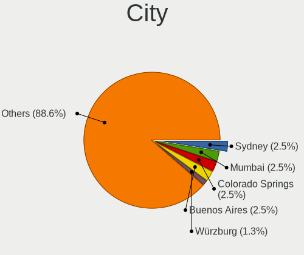
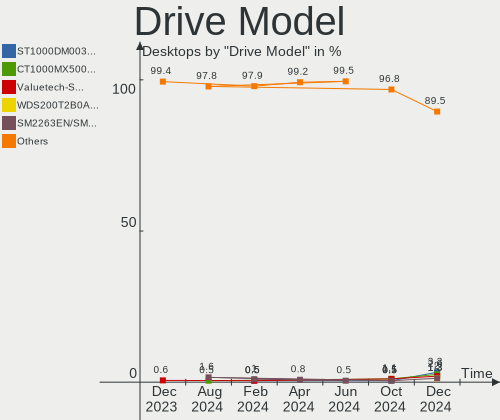
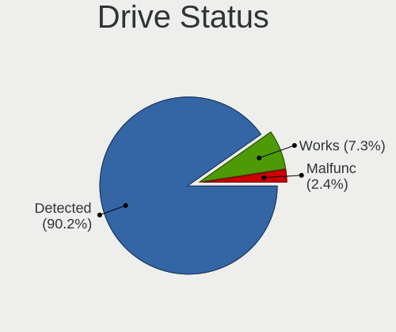
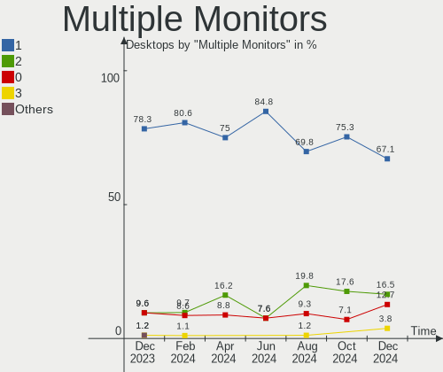
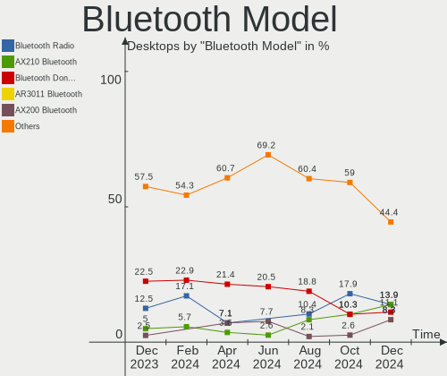
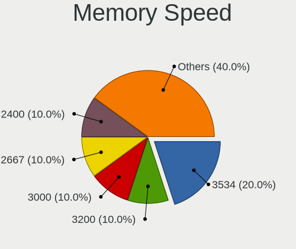
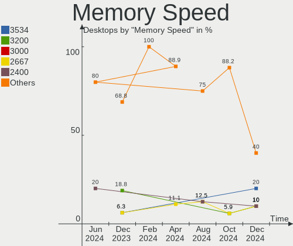
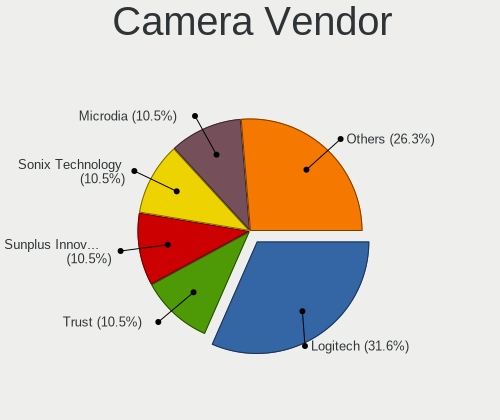

Zorin - Hardware Trends (Desktops)
----------------------------------

A project to identify most popular hardware characteristics and track their change
over time based on data collected by Linux users at https://Linux-Hardware.org.

Anyone can contribute to this report by the [hw-probe](https://github.com/linuxhw/hw-probe) tool:

    sudo -E hw-probe -all -upload

This report is for one last month. Overall report since the beginning of time: [TestDays](https://github.com/linuxhw/TestDays)

Period: Jul, 2023.

Contents
--------

* [ System ](#system)
  - [ OS                       ](#os)
  - [ OS Family                ](#os-family)
  - [ Kernel                   ](#kernel)
  - [ Kernel Family            ](#kernel-family)
  - [ Kernel Major Ver.        ](#kernel-major-ver)
  - [ Arch                     ](#arch)
  - [ DE                       ](#de)
  - [ Display Server           ](#display-server)
  - [ Display Manager          ](#display-manager)
  - [ OS Lang                  ](#os-lang)
  - [ Boot Mode                ](#boot-mode)
  - [ Filesystem               ](#filesystem)
  - [ Part. scheme             ](#part-scheme)
  - [ Dual Boot with Linux/BSD ](#dual-boot-with-linuxbsd)
  - [ Dual Boot (Win)          ](#dual-boot-win)

* [ Board ](#board)
  - [ Vendor                   ](#vendor)
  - [ Model                    ](#model)
  - [ Model Family             ](#model-family)
  - [ MFG Year                 ](#mfg-year)
  - [ Form Factor              ](#form-factor)
  - [ Secure Boot              ](#secure-boot)
  - [ Coreboot                 ](#coreboot)
  - [ RAM Size                 ](#ram-size)
  - [ RAM Used                 ](#ram-used)
  - [ Total Drives             ](#total-drives)
  - [ Has CD-ROM               ](#has-cd-rom)
  - [ Has Ethernet             ](#has-ethernet)
  - [ Has WiFi                 ](#has-wifi)
  - [ Has Bluetooth            ](#has-bluetooth)

* [ Location ](#location)
  - [ Country                  ](#country)
  - [ City                     ](#city)

* [ Drives ](#drives)
  - [ Drive Vendor             ](#drive-vendor)
  - [ Drive Model              ](#drive-model)
  - [ HDD Vendor               ](#hdd-vendor)
  - [ SSD Vendor               ](#ssd-vendor)
  - [ Drive Kind               ](#drive-kind)
  - [ Drive Connector          ](#drive-connector)
  - [ Drive Size               ](#drive-size)
  - [ Space Total              ](#space-total)
  - [ Space Used               ](#space-used)
  - [ Malfunc. Drives          ](#malfunc-drives)
  - [ Malfunc. Drive Vendor    ](#malfunc-drive-vendor)
  - [ Malfunc. HDD Vendor      ](#malfunc-hdd-vendor)
  - [ Malfunc. Drive Kind      ](#malfunc-drive-kind)
  - [ Failed Drives            ](#failed-drives)
  - [ Failed Drive Vendor      ](#failed-drive-vendor)
  - [ Drive Status             ](#drive-status)

* [ Storage controller ](#storage-controller)
  - [ Storage Vendor           ](#storage-vendor)
  - [ Storage Model            ](#storage-model)
  - [ Storage Kind             ](#storage-kind)

* [ Processor ](#processor)
  - [ CPU Vendor               ](#cpu-vendor)
  - [ CPU Model                ](#cpu-model)
  - [ CPU Model Family         ](#cpu-model-family)
  - [ CPU Cores                ](#cpu-cores)
  - [ CPU Sockets              ](#cpu-sockets)
  - [ CPU Threads              ](#cpu-threads)
  - [ CPU Op-Modes             ](#cpu-op-modes)
  - [ CPU Microcode            ](#cpu-microcode)
  - [ CPU Microarch            ](#cpu-microarch)

* [ Graphics ](#graphics)
  - [ GPU Vendor               ](#gpu-vendor)
  - [ GPU Model                ](#gpu-model)
  - [ GPU Combo                ](#gpu-combo)
  - [ GPU Driver               ](#gpu-driver)
  - [ GPU Memory               ](#gpu-memory)

* [ Monitor ](#monitor)
  - [ Monitor Vendor           ](#monitor-vendor)
  - [ Monitor Model            ](#monitor-model)
  - [ Monitor Resolution       ](#monitor-resolution)
  - [ Monitor Diagonal         ](#monitor-diagonal)
  - [ Monitor Width            ](#monitor-width)
  - [ Aspect Ratio             ](#aspect-ratio)
  - [ Monitor Area             ](#monitor-area)
  - [ Pixel Density            ](#pixel-density)
  - [ Multiple Monitors        ](#multiple-monitors)

* [ Network ](#network)
  - [ Net Controller Vendor    ](#net-controller-vendor)
  - [ Net Controller Model     ](#net-controller-model)
  - [ Wireless Vendor          ](#wireless-vendor)
  - [ Wireless Model           ](#wireless-model)
  - [ Ethernet Vendor          ](#ethernet-vendor)
  - [ Ethernet Model           ](#ethernet-model)
  - [ Net Controller Kind      ](#net-controller-kind)
  - [ Used Controller          ](#used-controller)
  - [ NICs                     ](#nics)
  - [ IPv6                     ](#ipv6)

* [ Bluetooth ](#bluetooth)
  - [ Bluetooth Vendor         ](#bluetooth-vendor)
  - [ Bluetooth Model          ](#bluetooth-model)

* [ Sound ](#sound)
  - [ Sound Vendor             ](#sound-vendor)
  - [ Sound Model              ](#sound-model)

* [ Memory ](#memory)
  - [ Memory Vendor            ](#memory-vendor)
  - [ Memory Model             ](#memory-model)
  - [ Memory Kind              ](#memory-kind)
  - [ Memory Form Factor       ](#memory-form-factor)
  - [ Memory Size              ](#memory-size)
  - [ Memory Speed             ](#memory-speed)

* [ Printers & scanners ](#printers--scanners)
  - [ Printer Vendor           ](#printer-vendor)
  - [ Printer Model            ](#printer-model)
  - [ Scanner Vendor           ](#scanner-vendor)
  - [ Scanner Model            ](#scanner-model)

* [ Camera ](#camera)
  - [ Camera Vendor            ](#camera-vendor)
  - [ Camera Model             ](#camera-model)

* [ Security ](#security)
  - [ Fingerprint Vendor       ](#fingerprint-vendor)
  - [ Fingerprint Model        ](#fingerprint-model)
  - [ Chipcard Vendor          ](#chipcard-vendor)
  - [ Chipcard Model           ](#chipcard-model)

* [ Unsupported ](#unsupported)
  - [ Unsupported Devices      ](#unsupported-devices)
  - [ Unsupported Device Types ](#unsupported-device-types)

System
------

OS
--

Installed operating systems

| Name     | Desktops | Percent |
|----------|----------|---------|
| Zorin 16 | 59       | 96.72%  |
| Zorin 15 | 2        | 3.28%   |

OS Family
---------

OS without a version

| Name  | Desktops | Percent |
|-------|----------|---------|
| Zorin | 61       | 100%    |

Kernel
------

Version of the Linux kernel

| Version           | Desktops | Percent |
|-------------------|----------|---------|
| 5.15.0-76-generic | 34       | 55.74%  |
| 5.15.0-78-generic | 12       | 19.67%  |
| 5.15.0-75-generic | 4        | 6.56%   |
| 5.15.0-73-generic | 3        | 4.92%   |
| 5.15.0-71-generic | 2        | 3.28%   |
| 5.4.0-153-generic | 1        | 1.64%   |
| 5.4.0-148-generic | 1        | 1.64%   |
| 5.4.0-120-generic | 1        | 1.64%   |
| 5.15.0-58-generic | 1        | 1.64%   |
| 5.15.0-56-generic | 1        | 1.64%   |
| 5.15.0-52-generic | 1        | 1.64%   |

Kernel Family
-------------

Linux kernel without a distro release

| Version | Desktops | Percent |
|---------|----------|---------|
| 5.15.0  | 58       | 95.08%  |
| 5.4.0   | 3        | 4.92%   |

Kernel Major Ver.
-----------------

Linux kernel major version

| Version | Desktops | Percent |
|---------|----------|---------|
| 5.15    | 58       | 95.08%  |
| 5.4     | 3        | 4.92%   |

Arch
----

OS architecture (x86_64, i586, etc.)

| Name   | Desktops | Percent |
|--------|----------|---------|
| x86_64 | 59       | 96.72%  |
| i686   | 2        | 3.28%   |

DE
--

Desktop Environment

| Name  | Desktops | Percent |
|-------|----------|---------|
| GNOME | 48       | 78.69%  |
| XFCE  | 12       | 19.67%  |
| KDE5  | 1        | 1.64%   |

Display Server
--------------

X11 or Wayland

| Name    | Desktops | Percent |
|---------|----------|---------|
| X11     | 59       | 96.72%  |
| Wayland | 2        | 3.28%   |

Display Manager
---------------

SDDM, LightDM, etc.

| Name    | Desktops | Percent |
|---------|----------|---------|
| Unknown | 52       | 85.25%  |
| LightDM | 4        | 6.56%   |
| GDM3    | 4        | 6.56%   |
| GDM     | 1        | 1.64%   |

OS Lang
-------

Language

| Lang  | Desktops | Percent |
|-------|----------|---------|
| en_US | 25       | 40.98%  |
| en_GB | 6        | 9.84%   |
| de_DE | 5        | 8.2%    |
| pl_PL | 4        | 6.56%   |
| pt_BR | 3        | 4.92%   |
| en_ZA | 3        | 4.92%   |
| es_MX | 2        | 3.28%   |
| es_AR | 2        | 3.28%   |
| tr_TR | 1        | 1.64%   |
| sk_SK | 1        | 1.64%   |
| it_IT | 1        | 1.64%   |
| fr_FR | 1        | 1.64%   |
| es_VE | 1        | 1.64%   |
| en_NZ | 1        | 1.64%   |
| en_IN | 1        | 1.64%   |
| en_CA | 1        | 1.64%   |
| de_CH | 1        | 1.64%   |
| C     | 1        | 1.64%   |
| ar_EG | 1        | 1.64%   |

Boot Mode
---------

EFI or BIOS

| Mode | Desktops | Percent |
|------|----------|---------|
| BIOS | 37       | 60.66%  |
| EFI  | 24       | 39.34%  |

Filesystem
----------

Type of filesystem

| Type    | Desktops | Percent |
|---------|----------|---------|
| Ext4    | 52       | 85.25%  |
| Tmpfs   | 7        | 11.48%  |
| Zfs     | 1        | 1.64%   |
| Overlay | 1        | 1.64%   |

Part. scheme
------------

Scheme of partitioning

| Type    | Desktops | Percent |
|---------|----------|---------|
| Unknown | 54       | 88.52%  |
| GPT     | 4        | 6.56%   |
| MBR     | 3        | 4.92%   |

Dual Boot with Linux/BSD
------------------------

Hosting more than one Linux/BSD

| Dual boot | Desktops | Percent |
|-----------|----------|---------|
| No        | 57       | 93.44%  |
| Yes       | 4        | 6.56%   |

Dual Boot (Win)
---------------

Hosting Linux and Windows

| Dual boot | Desktops | Percent |
|-----------|----------|---------|
| No        | 59       | 96.72%  |
| Yes       | 2        | 3.28%   |

Board
-----

Vendor
------

Motherboard manufacturer

| Name                | Desktops | Percent |
|---------------------|----------|---------|
| ASUSTek Computer    | 12       | 19.67%  |
| Dell                | 10       | 16.39%  |
| MSI                 | 7        | 11.48%  |
| Hewlett-Packard     | 7        | 11.48%  |
| Gigabyte Technology | 7        | 11.48%  |
| ASRock              | 6        | 9.84%   |
| Lenovo              | 2        | 3.28%   |
| Fujitsu             | 2        | 3.28%   |
| Acer                | 2        | 3.28%   |
| Win Element         | 1        | 1.64%   |
| Positivo            | 1        | 1.64%   |
| Pegatron            | 1        | 1.64%   |
| MP                  | 1        | 1.64%   |
| Intel               | 1        | 1.64%   |
| Foxconn             | 1        | 1.64%   |

Model
-----

Motherboard model

| Name                                 | Desktops | Percent |
|--------------------------------------|----------|---------|
| Dell OptiPlex 7010                   | 2        | 3.28%   |
| ASUS All Series                      | 2        | 3.28%   |
| Win Element M9                       | 1        | 1.64%   |
| Positivo POS-EIH61CE                 | 1        | 1.64%   |
| Pegatron Compaq dx2450               | 1        | 1.64%   |
| MSI Z1-7641                          | 1        | 1.64%   |
| MSI MS-7D75                          | 1        | 1.64%   |
| MSI MS-7D25                          | 1        | 1.64%   |
| MSI MS-7C09                          | 1        | 1.64%   |
| MSI MS-7B86                          | 1        | 1.64%   |
| MSI MS-7808                          | 1        | 1.64%   |
| MSI H310 Gaming Infinite S (MS-B928) | 1        | 1.64%   |
| MP MS-7848                           | 1        | 1.64%   |
| Lenovo ThinkCentre M900 10FLS27400   | 1        | 1.64%   |
| Lenovo ThinkCentre M700 10J0S2QU00   | 1        | 1.64%   |
| Intel H55                            | 1        | 1.64%   |
| HP ProDesk 490 G2 MT                 | 1        | 1.64%   |
| HP Pavilion Gaming Desktop TG01-1xxx | 1        | 1.64%   |
| HP EliteDesk 800 G3 SFF              | 1        | 1.64%   |
| HP Compaq Elite 8300 SFF             | 1        | 1.64%   |
| HP Compaq 6005 Pro SFF PC            | 1        | 1.64%   |
| HP Compaq 6000 Pro MT PC             | 1        | 1.64%   |
| HP 290 G1 MT                         | 1        | 1.64%   |
| Gigabyte Z370M AORUS Gaming          | 1        | 1.64%   |
| Gigabyte Z170XP-SLI                  | 1        | 1.64%   |
| Gigabyte X470 AORUS GAMING 7 WIFI    | 1        | 1.64%   |
| Gigabyte M68MT-S2                    | 1        | 1.64%   |
| Gigabyte GA-890GPA-UD3H              | 1        | 1.64%   |
| Gigabyte B75M-D3H                    | 1        | 1.64%   |
| Gigabyte B450 AORUS M                | 1        | 1.64%   |
| Fujitsu ESPRIMO P420                 | 1        | 1.64%   |
| Fujitsu ESPRIMO E720                 | 1        | 1.64%   |
| Foxconn G41S/G41S-K                  | 1        | 1.64%   |
| Dell Precision Tower 3620            | 1        | 1.64%   |
| Dell OptiPlex 980                    | 1        | 1.64%   |
| Dell OptiPlex 780                    | 1        | 1.64%   |
| Dell OptiPlex 7020                   | 1        | 1.64%   |
| Dell OptiPlex 5050                   | 1        | 1.64%   |
| Dell OptiPlex 380                    | 1        | 1.64%   |
| Dell Inspiron 3847                   | 1        | 1.64%   |

Model Family
------------

Motherboard model prefix

| Name                    | Desktops | Percent |
|-------------------------|----------|---------|
| Dell OptiPlex           | 7        | 11.48%  |
| ASUS TUF                | 4        | 6.56%   |
| HP Compaq               | 3        | 4.92%   |
| Lenovo ThinkCentre      | 2        | 3.28%   |
| Fujitsu ESPRIMO         | 2        | 3.28%   |
| ASUS All                | 2        | 3.28%   |
| Win Element M9          | 1        | 1.64%   |
| Positivo POS-EIH61CE    | 1        | 1.64%   |
| Pegatron Compaq         | 1        | 1.64%   |
| MSI Z1-7641             | 1        | 1.64%   |
| MSI MS-7D75             | 1        | 1.64%   |
| MSI MS-7D25             | 1        | 1.64%   |
| MSI MS-7C09             | 1        | 1.64%   |
| MSI MS-7B86             | 1        | 1.64%   |
| MSI MS-7808             | 1        | 1.64%   |
| MSI H310                | 1        | 1.64%   |
| MP MS-7848              | 1        | 1.64%   |
| Intel H55               | 1        | 1.64%   |
| HP ProDesk              | 1        | 1.64%   |
| HP Pavilion             | 1        | 1.64%   |
| HP EliteDesk            | 1        | 1.64%   |
| HP 290                  | 1        | 1.64%   |
| Gigabyte Z370M          | 1        | 1.64%   |
| Gigabyte Z170XP-SLI     | 1        | 1.64%   |
| Gigabyte X470           | 1        | 1.64%   |
| Gigabyte M68MT-S2       | 1        | 1.64%   |
| Gigabyte GA-890GPA-UD3H | 1        | 1.64%   |
| Gigabyte B75M-D3H       | 1        | 1.64%   |
| Gigabyte B450           | 1        | 1.64%   |
| Foxconn G41S            | 1        | 1.64%   |
| Dell Precision          | 1        | 1.64%   |
| Dell Inspiron           | 1        | 1.64%   |
| Dell DM051              | 1        | 1.64%   |
| ASUS ROG                | 1        | 1.64%   |
| ASUS PRIME              | 1        | 1.64%   |
| ASUS P7H55-M            | 1        | 1.64%   |
| ASUS M4N68T-M           | 1        | 1.64%   |
| ASUS F1A55-M            | 1        | 1.64%   |
| ASUS B250               | 1        | 1.64%   |
| ASRock Z97M             | 1        | 1.64%   |

MFG Year
--------

Motherboard manufacture year

| Year | Desktops | Percent |
|------|----------|---------|
| 2014 | 7        | 11.48%  |
| 2010 | 7        | 11.48%  |
| 2020 | 6        | 9.84%   |
| 2017 | 6        | 9.84%   |
| 2013 | 6        | 9.84%   |
| 2022 | 4        | 6.56%   |
| 2018 | 4        | 6.56%   |
| 2012 | 4        | 6.56%   |
| 2009 | 4        | 6.56%   |
| 2019 | 3        | 4.92%   |
| 2015 | 3        | 4.92%   |
| 2021 | 2        | 3.28%   |
| 2011 | 2        | 3.28%   |
| 2023 | 1        | 1.64%   |
| 2008 | 1        | 1.64%   |
| 2006 | 1        | 1.64%   |

Form Factor
-----------

Physical design of the computer

| Name    | Desktops | Percent |
|---------|----------|---------|
| Desktop | 61       | 100%    |

Secure Boot
-----------

Enabled or disabled

| State    | Desktops | Percent |
|----------|----------|---------|
| Disabled | 60       | 98.36%  |
| Enabled  | 1        | 1.64%   |

Coreboot
--------

Have coreboot on board

| Used | Desktops | Percent |
|------|----------|---------|
| No   | 61       | 100%    |

RAM Size
--------

Total RAM memory

| Size in GB  | Desktops | Percent |
|-------------|----------|---------|
| 16.01-24.0  | 17       | 27.87%  |
| 8.01-16.0   | 17       | 27.87%  |
| 4.01-8.0    | 9        | 14.75%  |
| 32.01-64.0  | 6        | 9.84%   |
| 3.01-4.0    | 5        | 8.2%    |
| 24.01-32.0  | 3        | 4.92%   |
| 64.01-256.0 | 2        | 3.28%   |
| 1.01-2.0    | 2        | 3.28%   |

RAM Used
--------

Used RAM memory

| Used GB   | Desktops | Percent |
|-----------|----------|---------|
| 2.01-3.0  | 16       | 26.23%  |
| 1.01-2.0  | 16       | 26.23%  |
| 4.01-8.0  | 12       | 19.67%  |
| 3.01-4.0  | 9        | 14.75%  |
| 0.51-1.0  | 5        | 8.2%    |
| 8.01-16.0 | 3        | 4.92%   |

Total Drives
------------

Number of drives on board

| Drives | Desktops | Percent |
|--------|----------|---------|
| 1      | 30       | 49.18%  |
| 2      | 16       | 26.23%  |
| 3      | 11       | 18.03%  |
| 4      | 2        | 3.28%   |
| 6      | 1        | 1.64%   |
| 5      | 1        | 1.64%   |

Has CD-ROM
----------

Has CD-ROM on board

| Presented | Desktops | Percent |
|-----------|----------|---------|
| Yes       | 32       | 52.46%  |
| No        | 29       | 47.54%  |

Has Ethernet
------------

Has Ethernet on board

| Presented | Desktops | Percent |
|-----------|----------|---------|
| Yes       | 60       | 98.36%  |
| No        | 1        | 1.64%   |

Has WiFi
--------

Has WiFi module

| Presented | Desktops | Percent |
|-----------|----------|---------|
| Yes       | 32       | 52.46%  |
| No        | 29       | 47.54%  |

Has Bluetooth
-------------

Has Bluetooth module

| Presented | Desktops | Percent |
|-----------|----------|---------|
| No        | 44       | 72.13%  |
| Yes       | 17       | 27.87%  |

Location
--------

Country
-------

Geographic location (country)

| Country                | Desktops | Percent |
|------------------------|----------|---------|
| USA                    | 17       | 27.87%  |
| UK                     | 6        | 9.84%   |
| Poland                 | 4        | 6.56%   |
| Mexico                 | 4        | 6.56%   |
| Germany                | 4        | 6.56%   |
| Brazil                 | 4        | 6.56%   |
| South Africa           | 3        | 4.92%   |
| Argentina              | 2        | 3.28%   |
| Venezuela              | 1        | 1.64%   |
| Turkey                 | 1        | 1.64%   |
| Switzerland            | 1        | 1.64%   |
| Slovakia               | 1        | 1.64%   |
| Portugal               | 1        | 1.64%   |
| New Zealand            | 1        | 1.64%   |
| Netherlands            | 1        | 1.64%   |
| Luxembourg             | 1        | 1.64%   |
| Italy                  | 1        | 1.64%   |
| India                  | 1        | 1.64%   |
| France                 | 1        | 1.64%   |
| Egypt                  | 1        | 1.64%   |
| Canada                 | 1        | 1.64%   |
| Bulgaria               | 1        | 1.64%   |
| Bosnia and Herzegovina | 1        | 1.64%   |
| Belgium                | 1        | 1.64%   |
| Australia              | 1        | 1.64%   |

City
----

Geographic location (city)

| City                 | Desktops | Percent |
|----------------------|----------|---------|
| Tijuana              | 2        | 3.28%   |
| Cape Town            | 2        | 3.28%   |
| Zielona Góra        | 1        | 1.64%   |
| Yambol               | 1        | 1.64%   |
| Wauwatosa            | 1        | 1.64%   |
| Washington           | 1        | 1.64%   |
| Warsaw               | 1        | 1.64%   |
| Vespasiano           | 1        | 1.64%   |
| Tukh                 | 1        | 1.64%   |
| Trivero              | 1        | 1.64%   |
| Toronto              | 1        | 1.64%   |
| Tlalpan              | 1        | 1.64%   |
| Swindon              | 1        | 1.64%   |
| Spokane              | 1        | 1.64%   |
| Sarajevo             | 1        | 1.64%   |
| Santa Rosa           | 1        | 1.64%   |
| Runcorn              | 1        | 1.64%   |
| Rockville            | 1        | 1.64%   |
| Rochester            | 1        | 1.64%   |
| Rio de Janeiro       | 1        | 1.64%   |
| Recife               | 1        | 1.64%   |
| Radosina             | 1        | 1.64%   |
| Quarteira            | 1        | 1.64%   |
| Palm Coast           | 1        | 1.64%   |
| Opole                | 1        | 1.64%   |
| Norwalk              | 1        | 1.64%   |
| North Richland Hills | 1        | 1.64%   |
| Newham               | 1        | 1.64%   |
| Namur                | 1        | 1.64%   |
| Montemorelos         | 1        | 1.64%   |
| Menziken             | 1        | 1.64%   |
| Machynlleth          | 1        | 1.64%   |
| Lilburn              | 1        | 1.64%   |
| Les Essarts-le-Roi   | 1        | 1.64%   |
| Kingfisher           | 1        | 1.64%   |
| Kiel                 | 1        | 1.64%   |
| Johannesburg         | 1        | 1.64%   |
| Hennessey            | 1        | 1.64%   |
| Greater Noida        | 1        | 1.64%   |
| Gdansk               | 1        | 1.64%   |

Drives
------

Drive Vendor
------------

Hard drive vendors

| Vendor                       | Desktops | Drives | Percent |
|------------------------------|----------|--------|---------|
| WDC                          | 25       | 28     | 25.25%  |
| Seagate                      | 14       | 16     | 14.14%  |
| Toshiba                      | 9        | 9      | 9.09%   |
| Samsung Electronics          | 9        | 11     | 9.09%   |
| SanDisk                      | 6        | 8      | 6.06%   |
| Kingston                     | 4        | 4      | 4.04%   |
| A-DATA Technology            | 4        | 4      | 4.04%   |
| Patriot                      | 3        | 3      | 3.03%   |
| GOODRAM                      | 3        | 4      | 3.03%   |
| China                        | 3        | 3      | 3.03%   |
| SPCC                         | 2        | 3      | 2.02%   |
| Micron/Crucial Technology    | 2        | 2      | 2.02%   |
| Crucial                      | 2        | 3      | 2.02%   |
| X12                          | 1        | 1      | 1.01%   |
| Team                         | 1        | 1      | 1.01%   |
| Solid State Storage          | 1        | 1      | 1.01%   |
| Shenzhen Longsys Electronics | 1        | 1      | 1.01%   |
| Realtek Semiconductor        | 1        | 1      | 1.01%   |
| PNY                          | 1        | 1      | 1.01%   |
| Phison Electronics           | 1        | 1      | 1.01%   |
| MAXIO Technology (Hangzhou)  | 1        | 1      | 1.01%   |
| Lexar                        | 1        | 1      | 1.01%   |
| Hitachi                      | 1        | 1      | 1.01%   |
| Apple                        | 1        | 1      | 1.01%   |
| AMD                          | 1        | 2      | 1.01%   |
| Unknown                      | 1        | 1      | 1.01%   |

Drive Model
-----------

Hard drive models

| Model                            | Desktops | Percent |
|----------------------------------|----------|---------|
| Toshiba HDWD110 1TB              | 4        | 3.57%   |
| Kingston SA400S37240G 240GB SSD  | 3        | 2.68%   |
| Seagate ST500DM002-1BD142 500GB  | 2        | 1.79%   |
| Seagate ST1000DM003-1CH162 1TB   | 2        | 1.79%   |
| Sandisk WD Blue SN570 1TB        | 2        | 1.79%   |
| Samsung SSD 980 1TB              | 2        | 1.79%   |
| GOODRAM SSDPR-CX400-512 512GB    | 2        | 1.79%   |
| X12 SSD 1TB                      | 1        | 0.89%   |
| WDC WDS500G2B0B-00YS70 500GB SSD | 1        | 0.89%   |
| WDC WDS240G2G0A-00JH30 240GB SSD | 1        | 0.89%   |
| WDC WDBNCE0010PNC 1TB SSD        | 1        | 0.89%   |
| WDC WD800JD-75MSA2 80GB          | 1        | 0.89%   |
| WDC WD5000LPCX-16VHAT1 500GB     | 1        | 0.89%   |
| WDC WD5000BPVT-24HXZT3 500GB     | 1        | 0.89%   |
| WDC WD5000AAKX-001CA0 500GB      | 1        | 0.89%   |
| WDC WD5000AAKS-60A7B0 500GB      | 1        | 0.89%   |
| WDC WD5000AAKS-00TMA0 500GB      | 1        | 0.89%   |
| WDC WD40EFRX-68N32N0 4TB         | 1        | 0.89%   |
| WDC WD3200BPVT-75ZEST0 320GB     | 1        | 0.89%   |
| WDC WD3200AAKS-75VYA0 320GB      | 1        | 0.89%   |
| WDC WD3200AAKS-75L9A0 320GB      | 1        | 0.89%   |
| WDC WD3200AAKS-00WWPA0 320GB     | 1        | 0.89%   |
| WDC WD3200AAKS-00L9A0 320GB      | 1        | 0.89%   |
| WDC WD2500KS-00MJB0 250GB        | 1        | 0.89%   |
| WDC WD2500JS-58NCB1 250GB        | 1        | 0.89%   |
| WDC WD2500AAKX-603CA0 250GB      | 1        | 0.89%   |
| WDC WD2500AAJS-41RYA0 250GB      | 1        | 0.89%   |
| WDC WD20EZRZ-00Z5HB0 2TB         | 1        | 0.89%   |
| WDC WD1600AAJS-75M0A0 160GB      | 1        | 0.89%   |
| WDC WD1600AAJS-08L7A0 160GB      | 1        | 0.89%   |
| WDC WD1600AAJS-00L7A0 160GB      | 1        | 0.89%   |
| WDC WD10EZEX-75M2NA0 1TB         | 1        | 0.89%   |
| WDC WD10EZEX-08WN4A0 1TB         | 1        | 0.89%   |
| WDC WD10EURX-63FH1Y0 1TB         | 1        | 0.89%   |
| WDC WD10EARS-00MVWB0 1TB         | 1        | 0.89%   |
| WDC WD10EADS-65L5B1 1TB          | 1        | 0.89%   |
| Toshiba MQ04ABD200 2TB           | 1        | 0.89%   |
| Toshiba MK5076GSXN 500GB         | 1        | 0.89%   |
| Toshiba MK1656GSY 160GB          | 1        | 0.89%   |
| Toshiba HDWD260 6TB              | 1        | 0.89%   |

HDD Vendor
----------

Hard disk drive vendors

| Vendor              | Desktops | Drives | Percent |
|---------------------|----------|--------|---------|
| WDC                 | 22       | 25     | 45.83%  |
| Seagate             | 14       | 16     | 29.17%  |
| Toshiba             | 9        | 9      | 18.75%  |
| Samsung Electronics | 1        | 1      | 2.08%   |
| Hitachi             | 1        | 1      | 2.08%   |
| Apple               | 1        | 1      | 2.08%   |

SSD Vendor
----------

Solid state drive vendors

| Vendor              | Desktops | Drives | Percent |
|---------------------|----------|--------|---------|
| Samsung Electronics | 7        | 7      | 18.92%  |
| Kingston            | 4        | 4      | 10.81%  |
| A-DATA Technology   | 4        | 4      | 10.81%  |
| WDC                 | 3        | 3      | 8.11%   |
| Patriot             | 3        | 3      | 8.11%   |
| GOODRAM             | 3        | 4      | 8.11%   |
| China               | 3        | 3      | 8.11%   |
| SPCC                | 2        | 3      | 5.41%   |
| SanDisk             | 2        | 2      | 5.41%   |
| Crucial             | 2        | 3      | 5.41%   |
| X12                 | 1        | 1      | 2.7%    |
| Team                | 1        | 1      | 2.7%    |
| PNY                 | 1        | 1      | 2.7%    |
| Lexar               | 1        | 1      | 2.7%    |

Drive Kind
----------

HDD or SSD

| Kind    | Desktops | Drives | Percent |
|---------|----------|--------|---------|
| HDD     | 37       | 53     | 44.05%  |
| SSD     | 31       | 40     | 36.9%   |
| NVMe    | 15       | 18     | 17.86%  |
| Unknown | 1        | 1      | 1.19%   |

Drive Connector
---------------

SATA, SAS, NVMe, etc.

| Type | Desktops | Drives | Percent |
|------|----------|--------|---------|
| SATA | 56       | 93     | 77.78%  |
| NVMe | 15       | 18     | 20.83%  |
| SAS  | 1        | 1      | 1.39%   |

Drive Size
----------

Size of hard drive

| Size in TB | Desktops | Drives | Percent |
|------------|----------|--------|---------|
| 0.01-0.5   | 40       | 57     | 54.79%  |
| 0.51-1.0   | 24       | 27     | 32.88%  |
| 1.01-2.0   | 7        | 7      | 9.59%   |
| 3.01-4.0   | 1        | 1      | 1.37%   |
| 4.01-10.0  | 1        | 1      | 1.37%   |

Space Total
-----------

Amount of disk space available on the file system

| Size in GB     | Desktops | Percent |
|----------------|----------|---------|
| 101-250        | 25       | 40.98%  |
| 251-500        | 10       | 16.39%  |
| 501-1000       | 10       | 16.39%  |
| 1001-2000      | 7        | 11.48%  |
| More than 3000 | 2        | 3.28%   |
| 2001-3000      | 2        | 3.28%   |
| 1-20           | 2        | 3.28%   |
| 21-50          | 1        | 1.64%   |
| 51-100         | 1        | 1.64%   |
| Unknown        | 1        | 1.64%   |

Space Used
----------

Amount of used disk space

| Used GB        | Desktops | Percent |
|----------------|----------|---------|
| 1-20           | 16       | 26.23%  |
| 21-50          | 15       | 24.59%  |
| 251-500        | 9        | 14.75%  |
| 51-100         | 8        | 13.11%  |
| 101-250        | 7        | 11.48%  |
| 501-1000       | 3        | 4.92%   |
| More than 3000 | 1        | 1.64%   |
| 1001-2000      | 1        | 1.64%   |
| Unknown        | 1        | 1.64%   |

Malfunc. Drives
---------------

Drive models with a malfunction

Zero info for selected period =(

Malfunc. Drive Vendor
---------------------

Vendors of faulty drives

Zero info for selected period =(

Malfunc. HDD Vendor
-------------------

Vendors of faulty HDD drives

Zero info for selected period =(

Malfunc. Drive Kind
-------------------

Kinds of faulty drives

Zero info for selected period =(

Failed Drives
-------------

Failed drive models

Zero info for selected period =(

Failed Drive Vendor
-------------------

Failed drive vendors

Zero info for selected period =(

Drive Status
------------

Number of failed and malfunc. drives

| Status   | Desktops | Drives | Percent |
|----------|----------|--------|---------|
| Detected | 59       | 110    | 96.72%  |
| Works    | 2        | 2      | 3.28%   |

Storage controller
------------------

Storage Vendor
--------------

Storage controller vendors

| Vendor                         | Desktops | Percent |
|--------------------------------|----------|---------|
| Intel                          | 43       | 54.43%  |
| AMD                            | 14       | 17.72%  |
| SanDisk                        | 5        | 6.33%   |
| Samsung Electronics            | 4        | 5.06%   |
| Nvidia                         | 3        | 3.8%    |
| Micron/Crucial Technology      | 2        | 2.53%   |
| ASMedia Technology             | 2        | 2.53%   |
| Solid State Storage Technology | 1        | 1.27%   |
| Shenzhen Longsys Electronics   | 1        | 1.27%   |
| Realtek Semiconductor          | 1        | 1.27%   |
| Phison Electronics             | 1        | 1.27%   |
| MAXIO Technology (Hangzhou)    | 1        | 1.27%   |
| JMicron Technology             | 1        | 1.27%   |

Storage Model
-------------

Storage controller models

| Model                                                                          | Desktops | Percent |
|--------------------------------------------------------------------------------|----------|---------|
| AMD FCH SATA Controller [AHCI mode]                                            | 8        | 8.08%   |
| Intel 8 Series/C220 Series Chipset Family 6-port SATA Controller 1 [AHCI mode] | 7        | 7.07%   |
| Intel Q170/Q150/B150/H170/H110/Z170/CM236 Chipset SATA Controller [AHCI Mode]  | 5        | 5.05%   |
| Intel 200 Series PCH SATA controller [AHCI mode]                               | 5        | 5.05%   |
| Intel SATA Controller [RAID mode]                                              | 4        | 4.04%   |
| Intel NM10/ICH7 Family SATA Controller [IDE mode]                              | 4        | 4.04%   |
| Intel 82801G (ICH7 Family) IDE Controller                                      | 4        | 4.04%   |
| Nvidia MCP61 SATA Controller                                                   | 3        | 3.03%   |
| Intel 7 Series/C210 Series Chipset Family 6-port SATA Controller [AHCI mode]   | 3        | 3.03%   |
| AMD 400 Series Chipset SATA Controller                                         | 3        | 3.03%   |
| SanDisk WD Blue SN570 NVMe SSD 1TB                                             | 2        | 2.02%   |
| Samsung NVMe SSD Controller 980                                                | 2        | 2.02%   |
| Intel 9 Series Chipset Family SATA Controller [AHCI Mode]                      | 2        | 2.02%   |
| Intel 7 Series/C210 Series Chipset Family 4-port SATA Controller [IDE mode]    | 2        | 2.02%   |
| Intel 7 Series/C210 Series Chipset Family 2-port SATA Controller [IDE mode]    | 2        | 2.02%   |
| Intel 6 Series/C200 Series Chipset Family 6 port Desktop SATA AHCI Controller  | 2        | 2.02%   |
| Intel 400 Series Chipset Family SATA AHCI Controller                           | 2        | 2.02%   |
| Intel 4 Series Chipset PT IDER Controller                                      | 2        | 2.02%   |
| ASMedia ASM1062 Serial ATA Controller                                          | 2        | 2.02%   |
| AMD SB7x0/SB8x0/SB9x0 SATA Controller [AHCI mode]                              | 2        | 2.02%   |
| AMD SB7x0/SB8x0/SB9x0 IDE Controller                                           | 2        | 2.02%   |
| AMD 500 Series Chipset SATA Controller                                         | 2        | 2.02%   |
| Solid State Storage CL1-3D256-Q11 NVMe SSD M.2                                 | 1        | 1.01%   |
| Shenzhen Longsys Non-Volatile memory controller                                | 1        | 1.01%   |
| SanDisk WD Blue SN570 NVMe SSD 2TB                                             | 1        | 1.01%   |
| SanDisk WD Black SN770 / PC SN740 256GB / PC SN560 (DRAM-less) NVMe SSD        | 1        | 1.01%   |
| SanDisk WD Black 2018/SN750 / PC SN720 NVMe SSD                                | 1        | 1.01%   |
| Samsung S4LN058A01[SSUBX] AHCI SSD Controller (Apple slot)                     | 1        | 1.01%   |
| Samsung NVMe SSD Controller SM961/PM961/SM963                                  | 1        | 1.01%   |
| Realtek RTS5763DL NVMe SSD Controller                                          | 1        | 1.01%   |
| Phison E12 NVMe Controller                                                     | 1        | 1.01%   |
| Nvidia MCP61 IDE                                                               | 1        | 1.01%   |
| Micron/Crucial P5 Plus NVMe PCIe SSD                                           | 1        | 1.01%   |
| Micron/Crucial P2 [Nick P2] / P3 / P3 Plus NVMe PCIe SSD (DRAM-less)           | 1        | 1.01%   |
| MAXIO (Hangzhou) NVMe SSD Controller MAP1202                                   | 1        | 1.01%   |
| JMicron JMB363 SATA/IDE Controller                                             | 1        | 1.01%   |
| Intel SATA controller                                                          | 1        | 1.01%   |
| Intel Comet Lake SATA AHCI Controller                                          | 1        | 1.01%   |
| Intel Alder Lake-S PCH SATA Controller [AHCI Mode]                             | 1        | 1.01%   |
| Intel 82801JD/DO (ICH10 Family) SATA AHCI Controller                           | 1        | 1.01%   |

Storage Kind
------------

Kind of storage controller (IDE, SATA, NVMe, SAS, ...)

| Kind | Desktops | Percent |
|------|----------|---------|
| SATA | 45       | 55.56%  |
| IDE  | 16       | 19.75%  |
| NVMe | 15       | 18.52%  |
| RAID | 5        | 6.17%   |

Processor
---------

CPU Vendor
----------

Processor vendors

| Vendor | Desktops | Percent |
|--------|----------|---------|
| Intel  | 43       | 70.49%  |
| AMD    | 18       | 29.51%  |

CPU Model
---------

Processor models

| Model                                  | Desktops | Percent |
|----------------------------------------|----------|---------|
| Intel Core 2 Duo CPU E7500 @ 2.93GHz   | 3        | 4.92%   |
| Intel Core i7-4790 CPU @ 3.60GHz       | 2        | 3.28%   |
| Intel Core i5-6500T CPU @ 2.50GHz      | 2        | 3.28%   |
| Intel Core i5-4590 CPU @ 3.30GHz       | 2        | 3.28%   |
| Intel Core i5-4460 CPU @ 3.20GHz       | 2        | 3.28%   |
| Intel Core i5 CPU 650 @ 3.20GHz        | 2        | 3.28%   |
| Intel Core i3-4160 CPU @ 3.60GHz       | 2        | 3.28%   |
| Intel Xeon CPU E3-1240 v5 @ 3.50GHz    | 1        | 1.64%   |
| Intel Pentium Dual CPU E2160 @ 1.80GHz | 1        | 1.64%   |
| Intel Pentium Dual CPU E2140 @ 1.60GHz | 1        | 1.64%   |
| Intel Pentium D CPU 2.80GHz            | 1        | 1.64%   |
| Intel Pentium CPU G4400 @ 3.30GHz      | 1        | 1.64%   |
| Intel N100                             | 1        | 1.64%   |
| Intel Core i7-4771 CPU @ 3.50GHz       | 1        | 1.64%   |
| Intel Core i7-3770S CPU @ 3.10GHz      | 1        | 1.64%   |
| Intel Core i7-3770 CPU @ 3.40GHz       | 1        | 1.64%   |
| Intel Core i7-2600 CPU @ 3.40GHz       | 1        | 1.64%   |
| Intel Core i7-10700K CPU @ 3.80GHz     | 1        | 1.64%   |
| Intel Core i7-10700F CPU @ 2.90GHz     | 1        | 1.64%   |
| Intel Core i5-8400 CPU @ 2.80GHz       | 1        | 1.64%   |
| Intel Core i5-7500 CPU @ 3.40GHz       | 1        | 1.64%   |
| Intel Core i5-6500 CPU @ 3.20GHz       | 1        | 1.64%   |
| Intel Core i5-4670K CPU @ 3.40GHz      | 1        | 1.64%   |
| Intel Core i5-3470 CPU @ 3.20GHz       | 1        | 1.64%   |
| Intel Core i5-10400F CPU @ 2.90GHz     | 1        | 1.64%   |
| Intel Core i3-9100F CPU @ 3.60GHz      | 1        | 1.64%   |
| Intel Core i3-8100 CPU @ 3.60GHz       | 1        | 1.64%   |
| Intel Core i3-7350K CPU @ 4.20GHz      | 1        | 1.64%   |
| Intel Core i3-7100 CPU @ 3.90GHz       | 1        | 1.64%   |
| Intel Core i3-3220 CPU @ 3.30GHz       | 1        | 1.64%   |
| Intel Core i3-2120 CPU @ 3.30GHz       | 1        | 1.64%   |
| Intel Core i3-2100 CPU @ 3.10GHz       | 1        | 1.64%   |
| Intel Core i3-10100 CPU @ 3.60GHz      | 1        | 1.64%   |
| Intel Core i3 CPU 540 @ 3.07GHz        | 1        | 1.64%   |
| Intel 13th Gen Core i5-13600K          | 1        | 1.64%   |
| AMD Ryzen 9 7900X 12-Core Processor    | 1        | 1.64%   |
| AMD Ryzen 9 3900X 12-Core Processor    | 1        | 1.64%   |
| AMD Ryzen 7 7700X 8-Core Processor     | 1        | 1.64%   |
| AMD Ryzen 7 1700X Eight-Core Processor | 1        | 1.64%   |
| AMD Ryzen 5 5600X 6-Core Processor     | 1        | 1.64%   |

CPU Model Family
----------------

Processor model prefix

| Model                | Desktops | Percent |
|----------------------|----------|---------|
| Intel Core i5        | 14       | 22.95%  |
| Intel Core i3        | 11       | 18.03%  |
| Intel Core i7        | 8        | 13.11%  |
| AMD Ryzen 5          | 6        | 9.84%   |
| Intel Core 2 Duo     | 3        | 4.92%   |
| AMD Athlon II X2     | 3        | 4.92%   |
| Other                | 2        | 3.28%   |
| Intel Pentium Dual   | 2        | 3.28%   |
| AMD Ryzen 9          | 2        | 3.28%   |
| AMD Ryzen 7          | 2        | 3.28%   |
| Intel Xeon           | 1        | 1.64%   |
| Intel Pentium D      | 1        | 1.64%   |
| Intel Pentium        | 1        | 1.64%   |
| AMD Ryzen 3          | 1        | 1.64%   |
| AMD Phenom II X4     | 1        | 1.64%   |
| AMD FX               | 1        | 1.64%   |
| AMD Athlon Dual Core | 1        | 1.64%   |
| AMD A6               | 1        | 1.64%   |

CPU Cores
---------

Number of processor cores

| Number | Desktops | Percent |
|--------|----------|---------|
| 4      | 24       | 39.34%  |
| 2      | 22       | 36.07%  |
| 6      | 7        | 11.48%  |
| 8      | 4        | 6.56%   |
| 12     | 2        | 3.28%   |
| 14     | 1        | 1.64%   |
| 3      | 1        | 1.64%   |

CPU Sockets
-----------

Number of sockets

| Number | Desktops | Percent |
|--------|----------|---------|
| 1      | 61       | 100%    |

CPU Threads
-----------

Threads per core (Hyper-Threading)

| Number | Desktops | Percent |
|--------|----------|---------|
| 2      | 32       | 52.46%  |
| 1      | 29       | 47.54%  |

CPU Op-Modes
------------

CPU Operation Modes (32-bit, 64-bit)

| Op mode        | Desktops | Percent |
|----------------|----------|---------|
| 32-bit, 64-bit | 61       | 100%    |

CPU Microcode
-------------

Microcode number

| Number     | Desktops | Percent |
|------------|----------|---------|
| 0x306c3    | 10       | 16.39%  |
| 0x506e3    | 5        | 8.2%    |
| 0x306a9    | 4        | 6.56%   |
| 0x906e9    | 3        | 4.92%   |
| 0x206a7    | 3        | 4.92%   |
| 0x20655    | 3        | 4.92%   |
| 0x1067a    | 3        | 4.92%   |
| 0x010000c8 | 3        | 4.92%   |
| 0xa0653    | 2        | 3.28%   |
| 0x906eb    | 2        | 3.28%   |
| 0x6fd      | 2        | 3.28%   |
| 0x0a601203 | 2        | 3.28%   |
| 0x0800820d | 2        | 3.28%   |
| 0x08001138 | 2        | 3.28%   |
| Unknown    | 2        | 3.28%   |
| 0xf47      | 1        | 1.64%   |
| 0xb06e0    | 1        | 1.64%   |
| 0xb0671    | 1        | 1.64%   |
| 0xa0655    | 1        | 1.64%   |
| 0x906ea    | 1        | 1.64%   |
| 0x0a50000d | 1        | 1.64%   |
| 0x0a20120a | 1        | 1.64%   |
| 0x08701021 | 1        | 1.64%   |
| 0x08600104 | 1        | 1.64%   |
| 0x0810100b | 1        | 1.64%   |
| 0x06000852 | 1        | 1.64%   |
| 0x03000027 | 1        | 1.64%   |
| 0x010000db | 1        | 1.64%   |

CPU Microarch
-------------

Microarchitecture

| Name        | Desktops | Percent |
|-------------|----------|---------|
| Haswell     | 10       | 16.39%  |
| KabyLake    | 6        | 9.84%   |
| Skylake     | 5        | 8.2%    |
| K10         | 4        | 6.56%   |
| IvyBridge   | 4        | 6.56%   |
| CometLake   | 4        | 6.56%   |
| Unknown     | 4        | 6.56%   |
| Zen         | 3        | 4.92%   |
| Westmere    | 3        | 4.92%   |
| SandyBridge | 3        | 4.92%   |
| Penryn      | 3        | 4.92%   |
| Zen+        | 2        | 3.28%   |
| Zen 3       | 2        | 3.28%   |
| Zen 2       | 2        | 3.28%   |
| Core        | 2        | 3.28%   |
| Piledriver  | 1        | 1.64%   |
| NetBurst    | 1        | 1.64%   |
| K8 Hammer   | 1        | 1.64%   |
| K10 Llano   | 1        | 1.64%   |

Graphics
--------

GPU Vendor
----------

Vendors of graphics cards

| Vendor | Desktops | Percent |
|--------|----------|---------|
| Intel  | 23       | 35.94%  |
| AMD    | 23       | 35.94%  |
| Nvidia | 18       | 28.13%  |

GPU Model
---------

Graphics card models

| Model                                                                       | Desktops | Percent |
|-----------------------------------------------------------------------------|----------|---------|
| Intel Xeon E3-1200 v3/4th Gen Core Processor Integrated Graphics Controller | 6        | 9.23%   |
| AMD Ellesmere [Radeon RX 470/480/570/570X/580/580X/590]                     | 4        | 6.15%   |
| Nvidia GK208B [GeForce GT 710]                                              | 3        | 4.62%   |
| Intel Core Processor Integrated Graphics Controller                         | 3        | 4.62%   |
| AMD Cedar [Radeon HD 5000/6000/7350/8350 Series]                            | 3        | 4.62%   |
| Nvidia GP107 [GeForce GTX 1050 Ti]                                          | 2        | 3.08%   |
| Intel IvyBridge GT2 [HD Graphics 4000]                                      | 2        | 3.08%   |
| Intel HD Graphics 530                                                       | 2        | 3.08%   |
| Intel 4th Generation Core Processor Family Integrated Graphics Controller   | 2        | 3.08%   |
| Intel 4 Series Chipset Integrated Graphics Controller                       | 2        | 3.08%   |
| AMD Raphael                                                                 | 2        | 3.08%   |
| Nvidia TU117 [GeForce GTX 1650]                                             | 1        | 1.54%   |
| Nvidia TU116 [GeForce GTX 1660]                                             | 1        | 1.54%   |
| Nvidia GP107 [GeForce GTX 1050]                                             | 1        | 1.54%   |
| Nvidia GP107 [GeForce GTX 1050 3GB]                                         | 1        | 1.54%   |
| Nvidia GP106 [GeForce GTX 1060 3GB]                                         | 1        | 1.54%   |
| Nvidia GM206 [GeForce GTX 960]                                              | 1        | 1.54%   |
| Nvidia GM107 [GeForce GTX 750]                                              | 1        | 1.54%   |
| Nvidia GK208B [GeForce GT 730]                                              | 1        | 1.54%   |
| Nvidia GK110B [GeForce GTX 780 Ti]                                          | 1        | 1.54%   |
| Nvidia GF116 [GeForce GTX 550 Ti]                                           | 1        | 1.54%   |
| Nvidia GA104 [GeForce RTX 3070]                                             | 1        | 1.54%   |
| Nvidia G96C [GeForce 9500 GT]                                               | 1        | 1.54%   |
| Nvidia C61 [GeForce 7025 / nForce 630a]                                     | 1        | 1.54%   |
| Intel Raptor Lake-S GT1 [UHD Graphics 770]                                  | 1        | 1.54%   |
| Intel HD Graphics 630                                                       | 1        | 1.54%   |
| Intel CoffeeLake-S GT2 [UHD Graphics 630]                                   | 1        | 1.54%   |
| Intel Alder Lake-N [UHD Graphics]                                           | 1        | 1.54%   |
| Intel 82G33/G31 Express Integrated Graphics Controller                      | 1        | 1.54%   |
| Intel 2nd Generation Core Processor Family Integrated Graphics Controller   | 1        | 1.54%   |
| AMD Tonga PRO [Radeon R9 285/380]                                           | 1        | 1.54%   |
| AMD RV380 [Radeon X300/X550/X1050 Series] (Secondary)                       | 1        | 1.54%   |
| AMD RV370 [Radeon X600/X600 SE]                                             | 1        | 1.54%   |
| AMD Renoir                                                                  | 1        | 1.54%   |
| AMD Redwood XT GL [FirePro V4800]                                           | 1        | 1.54%   |
| AMD Oland XT [Radeon HD 8670 / R5 340X OEM / R7 250/350/350X OEM]           | 1        | 1.54%   |
| AMD Navi 23 [Radeon RX 6650 XT / 6700S / 6800S]                             | 1        | 1.54%   |
| AMD Navi 21 [Radeon RX 6800/6800 XT / 6900 XT]                              | 1        | 1.54%   |
| AMD Navi 14 [Radeon RX 5500/5500M / Pro 5500M]                              | 1        | 1.54%   |
| AMD Cezanne [Radeon Vega Series / Radeon Vega Mobile Series]                | 1        | 1.54%   |

GPU Combo
---------

Combinations of graphics cards

| Name         | Desktops | Percent |
|--------------|----------|---------|
| 1 x Intel    | 21       | 34.43%  |
| 1 x AMD      | 20       | 32.79%  |
| 1 x Nvidia   | 17       | 27.87%  |
| 2 x AMD      | 1        | 1.64%   |
| Intel + AMD  | 1        | 1.64%   |
| AMD + Nvidia | 1        | 1.64%   |

GPU Driver
----------

Free vs proprietary

| Driver      | Desktops | Percent |
|-------------|----------|---------|
| Free        | 50       | 81.97%  |
| Proprietary | 7        | 11.48%  |
| Unknown     | 4        | 6.56%   |

GPU Memory
----------

Total video memory

| Size in GB | Desktops | Percent |
|------------|----------|---------|
| Unknown    | 28       | 45.9%   |
| 0.51-1.0   | 8        | 13.11%  |
| 1.01-2.0   | 7        | 11.48%  |
| 3.01-4.0   | 6        | 9.84%   |
| 0.01-0.5   | 5        | 8.2%    |
| 7.01-8.0   | 3        | 4.92%   |
| 2.01-3.0   | 3        | 4.92%   |
| 8.01-16.0  | 1        | 1.64%   |

Monitor
-------

Monitor Vendor
--------------

Monitor vendors

| Vendor              | Desktops | Percent |
|---------------------|----------|---------|
| Goldstar            | 8        | 15.69%  |
| Dell                | 7        | 13.73%  |
| Samsung Electronics | 6        | 11.76%  |
| Hewlett-Packard     | 4        | 7.84%   |
| AOC                 | 4        | 7.84%   |
| Acer                | 4        | 7.84%   |
| Philips             | 3        | 5.88%   |
| BenQ                | 3        | 5.88%   |
| Vita                | 1        | 1.96%   |
| Toshiba             | 1        | 1.96%   |
| STB                 | 1        | 1.96%   |
| Plain Tree Systems  | 1        | 1.96%   |
| LG Electronics      | 1        | 1.96%   |
| Lenovo              | 1        | 1.96%   |
| Iiyama              | 1        | 1.96%   |
| Idek Iiyama         | 1        | 1.96%   |
| HUAWEI              | 1        | 1.96%   |
| HKC                 | 1        | 1.96%   |
| Gigabyte Technology | 1        | 1.96%   |
| ASUSTek Computer    | 1        | 1.96%   |

Monitor Model
-------------

Monitor models

| Model                                                                 | Desktops | Percent |
|-----------------------------------------------------------------------|----------|---------|
| Goldstar FULL HD GSM5B55 1920x1080 480x270mm 21.7-inch                | 2        | 3.7%    |
| Vita VT988 VIT03DC 1280x1024 376x301mm 19.0-inch                      | 1        | 1.85%   |
| Toshiba TV TSB0206 1920x1080 1600x1000mm 74.3-inch                    | 1        | 1.85%   |
| STB DTV STB5456 1600x1200 708x398mm 32.0-inch                         | 1        | 1.85%   |
| Samsung Electronics SyncMaster SAM02B5 1920x1200 518x324mm 24.1-inch  | 1        | 1.85%   |
| Samsung Electronics SyncMaster SAM027C 1680x1050 433x271mm 20.1-inch  | 1        | 1.85%   |
| Samsung Electronics LCD Monitor SAM0C39 1920x1080 885x498mm 40.0-inch | 1        | 1.85%   |
| Samsung Electronics LCD Monitor SAM065D 1920x1080                     | 1        | 1.85%   |
| Samsung Electronics LCD Monitor S34J55x 3440x1440                     | 1        | 1.85%   |
| Samsung Electronics C24F390 SAM0D2C 1920x1080 521x293mm 23.5-inch     | 1        | 1.85%   |
| Plain Tree Systems Monitor PTS0770 1440x900 410x256mm 19.0-inch       | 1        | 1.85%   |
| Philips PHL 221S6L PHL08F9 1920x1080 477x268mm 21.5-inch              | 1        | 1.85%   |
| Philips LCD Monitor PHL0001 1920x1080 708x398mm 32.0-inch             | 1        | 1.85%   |
| Philips 202EL PHLC05C 1600x900 443x249mm 20.0-inch                    | 1        | 1.85%   |
| LG Electronics LCD Monitor LG TV 1366x768                             | 1        | 1.85%   |
| Lenovo LEN LT1913pA LEN60AA 1280x1024 376x301mm 19.0-inch             | 1        | 1.85%   |
| Iiyama PLE2483H IVM6113 1920x1080 531x299mm 24.0-inch                 | 1        | 1.85%   |
| Idek Iiyama LCD Monitor PL2792Q 5120x1440                             | 1        | 1.85%   |
| HUAWEI SSN-24 HWV6E4E 1920x1080 530x300mm 24.0-inch                   | 1        | 1.85%   |
| HKC '' HKC1922 1440x900 409x307mm 20.1-inch                           | 1        | 1.85%   |
| Hewlett-Packard vs15 HWP2646 1024x768 300x220mm 14.6-inch             | 1        | 1.85%   |
| Hewlett-Packard LCD Monitor 27sv 1920x1080                            | 1        | 1.85%   |
| Hewlett-Packard E232 HWP327B 1920x1080 509x286mm 23.0-inch            | 1        | 1.85%   |
| Hewlett-Packard 2009 HWP2828 1600x900 443x250mm 20.0-inch             | 1        | 1.85%   |
| Goldstar W2486 GSM5729 1920x1080 530x300mm 24.0-inch                  | 1        | 1.85%   |
| Goldstar W2243C GSM575E 1920x1080 477x268mm 21.5-inch                 | 1        | 1.85%   |
| Goldstar L194WT GSM4B06 1440x900 408x255mm 18.9-inch                  | 1        | 1.85%   |
| Goldstar L1718S GSM443C 1280x1024 338x270mm 17.0-inch                 | 1        | 1.85%   |
| Goldstar E2442 GSM58C4 1920x1080 531x299mm 24.0-inch                  | 1        | 1.85%   |
| Goldstar 27GN7 GSM5B8D 1920x1080 600x303mm 26.5-inch                  | 1        | 1.85%   |
| Gigabyte Technology G32QC A GBT3206 2560x1440 697x392mm 31.5-inch     | 1        | 1.85%   |
| Dell SE2717H/HX DELD0A1 1920x1080 598x336mm 27.0-inch                 | 1        | 1.85%   |
| Dell SE2422H DEL424A 1920x1080 527x296mm 23.8-inch                    | 1        | 1.85%   |
| Dell SE198WFP DELF003 1440x900 408x255mm 18.9-inch                    | 1        | 1.85%   |
| Dell IN1910N DELA04C 1366x768 410x230mm 18.5-inch                     | 1        | 1.85%   |
| Dell E178FP DELA027 1280x1024 338x270mm 17.0-inch                     | 1        | 1.85%   |
| Dell E177FP DELA023 1280x1024 340x270mm 17.1-inch                     | 1        | 1.85%   |
| Dell 1908FP DEL4025 1280x1024 376x301mm 19.0-inch                     | 1        | 1.85%   |
| Dell 1905FP DEL400D 1280x1024 376x301mm 19.0-inch                     | 1        | 1.85%   |
| BenQ LCD Monitor SW270C                                               | 1        | 1.85%   |

Monitor Resolution
------------------

Monitor screen resolution

| Resolution         | Desktops | Percent |
|--------------------|----------|---------|
| 1920x1080 (FHD)    | 21       | 42%     |
| 1280x1024 (SXGA)   | 6        | 12%     |
| 1440x900 (WXGA+)   | 5        | 10%     |
| 3840x2160 (4K)     | 3        | 6%      |
| 3440x1440          | 2        | 4%      |
| 2560x1440 (QHD)    | 2        | 4%      |
| 1920x1200 (WUXGA)  | 2        | 4%      |
| 1600x900 (HD+)     | 2        | 4%      |
| 1366x768 (WXGA)    | 2        | 4%      |
| 5120x1440          | 1        | 2%      |
| 1680x1050 (WSXGA+) | 1        | 2%      |
| 1360x768           | 1        | 2%      |
| 1024x768 (XGA)     | 1        | 2%      |
| Unknown            | 1        | 2%      |

Monitor Diagonal
----------------

Diagonal size in inches

| Inches  | Desktops | Percent |
|---------|----------|---------|
| 19      | 8        | 16.33%  |
| 24      | 7        | 14.29%  |
| 21      | 6        | 12.24%  |
| Unknown | 6        | 12.24%  |
| 31      | 4        | 8.16%   |
| 20      | 4        | 8.16%   |
| 27      | 3        | 6.12%   |
| 23      | 2        | 4.08%   |
| 17      | 2        | 4.08%   |
| 74      | 1        | 2.04%   |
| 47      | 1        | 2.04%   |
| 40      | 1        | 2.04%   |
| 34      | 1        | 2.04%   |
| 32      | 1        | 2.04%   |
| 18      | 1        | 2.04%   |
| 15      | 1        | 2.04%   |

Monitor Width
-------------

Physical width

| Width in mm | Desktops | Percent |
|-------------|----------|---------|
| 401-500     | 14       | 29.17%  |
| 501-600     | 10       | 20.83%  |
| Unknown     | 6        | 12.5%   |
| 601-700     | 5        | 10.42%  |
| 351-400     | 5        | 10.42%  |
| 301-350     | 3        | 6.25%   |
| 701-800     | 2        | 4.17%   |
| 801-900     | 1        | 2.08%   |
| 1501-2000   | 1        | 2.08%   |
| 1001-1500   | 1        | 2.08%   |

Aspect Ratio
------------

Proportional relationship between the width and the height

| Ratio   | Desktops | Percent |
|---------|----------|---------|
| 16/9    | 25       | 53.19%  |
| 16/10   | 7        | 14.89%  |
| 5/4     | 6        | 12.77%  |
| Unknown | 5        | 10.64%  |
| 4/3     | 2        | 4.26%   |
| 6/5     | 1        | 2.13%   |
| 21/9    | 1        | 2.13%   |

Monitor Area
------------

Area in inch²

| Area in inch² | Desktops | Percent |
|----------------|----------|---------|
| 151-200        | 14       | 28%     |
| 201-250        | 11       | 22%     |
| 351-500        | 6        | 12%     |
| Unknown        | 6        | 12%     |
| 301-350        | 3        | 6%      |
| 251-300        | 3        | 6%      |
| 141-150        | 3        | 6%      |
| 501-1000       | 2        | 4%      |
| More than 1000 | 1        | 2%      |
| 101-110        | 1        | 2%      |

Pixel Density
-------------

Pixels per inch

| Density | Desktops | Percent |
|---------|----------|---------|
| 51-100  | 32       | 66.67%  |
| 101-120 | 7        | 14.58%  |
| Unknown | 6        | 12.5%   |
| 1-50    | 3        | 6.25%   |

Multiple Monitors
-----------------

Total monitors connected

| Total | Desktops | Percent |
|-------|----------|---------|
| 1     | 47       | 77.05%  |
| 2     | 9        | 14.75%  |
| 0     | 5        | 8.2%    |

Network
-------

Net Controller Vendor
---------------------

Controller vendors

| Vendor                | Desktops | Percent |
|-----------------------|----------|---------|
| Intel                 | 34       | 37.36%  |
| Realtek Semiconductor | 27       | 29.67%  |
| Ralink Technology     | 6        | 6.59%   |
| Qualcomm Atheros      | 4        | 4.4%    |
| TP-Link               | 3        | 3.3%    |
| Nvidia                | 3        | 3.3%    |
| MediaTek              | 3        | 3.3%    |
| Broadcom              | 3        | 3.3%    |
| Xiaomi                | 2        | 2.2%    |
| Samsung Electronics   | 1        | 1.1%    |
| Ralink                | 1        | 1.1%    |
| NetGear               | 1        | 1.1%    |
| Huawei Technologies   | 1        | 1.1%    |
| ASIX Electronics      | 1        | 1.1%    |
| Apple                 | 1        | 1.1%    |

Net Controller Model
--------------------

Controller models

| Model                                                             | Desktops | Percent |
|-------------------------------------------------------------------|----------|---------|
| Realtek RTL8111/8168/8411 PCI Express Gigabit Ethernet Controller | 18       | 18.56%  |
| Intel Ethernet Connection (2) I219-V                              | 5        | 5.15%   |
| Intel 82579LM Gigabit Network Connection (Lewisville)             | 4        | 4.12%   |
| Realtek RTL8188EUS 802.11n Wireless Network Adapter               | 3        | 3.09%   |
| Realtek RTL8125 2.5GbE Controller                                 | 3        | 3.09%   |
| Ralink MT7601U Wireless Adapter                                   | 3        | 3.09%   |
| Nvidia MCP61 Ethernet                                             | 3        | 3.09%   |
| Intel Ethernet Controller I225-V                                  | 3        | 3.09%   |
| Intel Ethernet Connection (12) I219-V                             | 3        | 3.09%   |
| TP-Link TL-WN823N v2/v3 [Realtek RTL8192EU]                       | 2        | 2.06%   |
| Ralink RT5370 Wireless Adapter                                    | 2        | 2.06%   |
| MediaTek MT7922 802.11ax PCI Express Wireless Network Adapter     | 2        | 2.06%   |
| Intel Wi-Fi 6 AX200                                               | 2        | 2.06%   |
| Intel I211 Gigabit Network Connection                             | 2        | 2.06%   |
| Intel Ethernet Connection I217-V                                  | 2        | 2.06%   |
| Intel Ethernet Connection (2) I219-LM                             | 2        | 2.06%   |
| Intel Ethernet Connection (2) I218-V                              | 2        | 2.06%   |
| Intel 82567LM-3 Gigabit Network Connection                        | 2        | 2.06%   |
| Xiaomi Mi/Redmi series (RNDIS)                                    | 1        | 1.03%   |
| Xiaomi Mi/Redmi series (RNDIS + ADB)                              | 1        | 1.03%   |
| TP-Link TL-WN822N Version 4 RTL8192EU                             | 1        | 1.03%   |
| Samsung GT-I9070 (network tethering, USB debugging enabled)       | 1        | 1.03%   |
| Realtek RTL8821CE 802.11ac PCIe Wireless Network Adapter          | 1        | 1.03%   |
| Realtek RTL8821AE 802.11ac PCIe Wireless Network Adapter          | 1        | 1.03%   |
| Realtek RTL8192EU 802.11b/g/n WLAN Adapter                        | 1        | 1.03%   |
| Realtek RTL810xE PCI Express Fast Ethernet controller             | 1        | 1.03%   |
| Ralink RT5572 Wireless Adapter                                    | 1        | 1.03%   |
| Ralink RT2561/RT61 802.11g PCI                                    | 1        | 1.03%   |
| Qualcomm Atheros QCA9565 / AR9565 Wireless Network Adapter        | 1        | 1.03%   |
| Qualcomm Atheros QCA8171 Gigabit Ethernet                         | 1        | 1.03%   |
| Qualcomm Atheros AR9227 Wireless Network Adapter                  | 1        | 1.03%   |
| Qualcomm Atheros AR8152 v2.0 Fast Ethernet                        | 1        | 1.03%   |
| NetGear WNA3100M(v1) Wireless-N 300 [Realtek RTL8192CU]           | 1        | 1.03%   |
| MediaTek MT7921 802.11ax PCI Express Wireless Network Adapter     | 1        | 1.03%   |
| Intel Wireless-AC 9260                                            | 1        | 1.03%   |
| Intel Wireless 8265 / 8275                                        | 1        | 1.03%   |
| Intel Wireless 7265                                               | 1        | 1.03%   |
| Intel Wi-Fi 6 AX210/AX211/AX411 160MHz                            | 1        | 1.03%   |
| Intel NM10/ICH7 Family LAN Controller                             | 1        | 1.03%   |
| Intel Ethernet Connection I217-LM                                 | 1        | 1.03%   |

Wireless Vendor
---------------

Wireless vendors

| Vendor                | Desktops | Percent |
|-----------------------|----------|---------|
| Intel                 | 9        | 28.13%  |
| Realtek Semiconductor | 6        | 18.75%  |
| Ralink Technology     | 6        | 18.75%  |
| TP-Link               | 3        | 9.38%   |
| MediaTek              | 3        | 9.38%   |
| Qualcomm Atheros      | 2        | 6.25%   |
| Ralink                | 1        | 3.13%   |
| NetGear               | 1        | 3.13%   |
| Broadcom              | 1        | 3.13%   |

Wireless Model
--------------

Wireless models

| Model                                                         | Desktops | Percent |
|---------------------------------------------------------------|----------|---------|
| Realtek RTL8188EUS 802.11n Wireless Network Adapter           | 3        | 9.38%   |
| Ralink MT7601U Wireless Adapter                               | 3        | 9.38%   |
| TP-Link TL-WN823N v2/v3 [Realtek RTL8192EU]                   | 2        | 6.25%   |
| Ralink RT5370 Wireless Adapter                                | 2        | 6.25%   |
| MediaTek MT7922 802.11ax PCI Express Wireless Network Adapter | 2        | 6.25%   |
| Intel Wi-Fi 6 AX200                                           | 2        | 6.25%   |
| TP-Link TL-WN822N Version 4 RTL8192EU                         | 1        | 3.13%   |
| Realtek RTL8821CE 802.11ac PCIe Wireless Network Adapter      | 1        | 3.13%   |
| Realtek RTL8821AE 802.11ac PCIe Wireless Network Adapter      | 1        | 3.13%   |
| Realtek RTL8192EU 802.11b/g/n WLAN Adapter                    | 1        | 3.13%   |
| Ralink RT5572 Wireless Adapter                                | 1        | 3.13%   |
| Ralink RT2561/RT61 802.11g PCI                                | 1        | 3.13%   |
| Qualcomm Atheros QCA9565 / AR9565 Wireless Network Adapter    | 1        | 3.13%   |
| Qualcomm Atheros AR9227 Wireless Network Adapter              | 1        | 3.13%   |
| NetGear WNA3100M(v1) Wireless-N 300 [Realtek RTL8192CU]       | 1        | 3.13%   |
| MediaTek MT7921 802.11ax PCI Express Wireless Network Adapter | 1        | 3.13%   |
| Intel Wireless-AC 9260                                        | 1        | 3.13%   |
| Intel Wireless 8265 / 8275                                    | 1        | 3.13%   |
| Intel Wireless 7265                                           | 1        | 3.13%   |
| Intel Wi-Fi 6 AX210/AX211/AX411 160MHz                        | 1        | 3.13%   |
| Intel Dual Band Wireless-AC 3168NGW [Stone Peak]              | 1        | 3.13%   |
| Intel CNVi: Wi-Fi                                             | 1        | 3.13%   |
| Intel Alder Lake-S PCH CNVi WiFi                              | 1        | 3.13%   |
| Broadcom Network controller                                   | 1        | 3.13%   |

Ethernet Vendor
---------------

Ethernet vendors

| Vendor                | Desktops | Percent |
|-----------------------|----------|---------|
| Intel                 | 30       | 46.88%  |
| Realtek Semiconductor | 22       | 34.38%  |
| Nvidia                | 3        | 4.69%   |
| Xiaomi                | 2        | 3.13%   |
| Qualcomm Atheros      | 2        | 3.13%   |
| Broadcom              | 2        | 3.13%   |
| Huawei Technologies   | 1        | 1.56%   |
| ASIX Electronics      | 1        | 1.56%   |
| Apple                 | 1        | 1.56%   |

Ethernet Model
--------------

Ethernet models

| Model                                                             | Desktops | Percent |
|-------------------------------------------------------------------|----------|---------|
| Realtek RTL8111/8168/8411 PCI Express Gigabit Ethernet Controller | 18       | 28.13%  |
| Intel Ethernet Connection (2) I219-V                              | 5        | 7.81%   |
| Intel 82579LM Gigabit Network Connection (Lewisville)             | 4        | 6.25%   |
| Realtek RTL8125 2.5GbE Controller                                 | 3        | 4.69%   |
| Nvidia MCP61 Ethernet                                             | 3        | 4.69%   |
| Intel Ethernet Controller I225-V                                  | 3        | 4.69%   |
| Intel Ethernet Connection (12) I219-V                             | 3        | 4.69%   |
| Intel I211 Gigabit Network Connection                             | 2        | 3.13%   |
| Intel Ethernet Connection I217-V                                  | 2        | 3.13%   |
| Intel Ethernet Connection (2) I219-LM                             | 2        | 3.13%   |
| Intel Ethernet Connection (2) I218-V                              | 2        | 3.13%   |
| Intel 82567LM-3 Gigabit Network Connection                        | 2        | 3.13%   |
| Xiaomi Mi/Redmi series (RNDIS)                                    | 1        | 1.56%   |
| Xiaomi Mi/Redmi series (RNDIS + ADB)                              | 1        | 1.56%   |
| Realtek RTL810xE PCI Express Fast Ethernet controller             | 1        | 1.56%   |
| Qualcomm Atheros QCA8171 Gigabit Ethernet                         | 1        | 1.56%   |
| Qualcomm Atheros AR8152 v2.0 Fast Ethernet                        | 1        | 1.56%   |
| Intel NM10/ICH7 Family LAN Controller                             | 1        | 1.56%   |
| Intel Ethernet Connection I217-LM                                 | 1        | 1.56%   |
| Intel Ethernet Connection (5) I219-V                              | 1        | 1.56%   |
| Intel Ethernet Connection (5) I219-LM                             | 1        | 1.56%   |
| Intel 82578DM Gigabit Network Connection                          | 1        | 1.56%   |
| Huawei WLZ-AN00                                                   | 1        | 1.56%   |
| Broadcom NetXtreme BCM5761 Gigabit Ethernet PCIe                  | 1        | 1.56%   |
| Broadcom NetLink BCM57780 Gigabit Ethernet PCIe                   | 1        | 1.56%   |
| ASIX AX88179 Gigabit Ethernet                                     | 1        | 1.56%   |
| Apple iPad 4/Mini1                                                | 1        | 1.56%   |

Net Controller Kind
-------------------

Ethernet, WiFi or modem

| Kind     | Desktops | Percent |
|----------|----------|---------|
| Ethernet | 60       | 64.52%  |
| WiFi     | 32       | 34.41%  |
| Modem    | 1        | 1.08%   |

Used Controller
---------------

Currently used network controller

| Kind     | Desktops | Percent |
|----------|----------|---------|
| Ethernet | 43       | 67.19%  |
| WiFi     | 21       | 32.81%  |

NICs
----

Total network controllers on board

| Total | Desktops | Percent |
|-------|----------|---------|
| 1     | 40       | 65.57%  |
| 2     | 19       | 31.15%  |
| 0     | 2        | 3.28%   |

IPv6
----

IPv6 vs IPv4

| Used | Desktops | Percent |
|------|----------|---------|
| No   | 39       | 63.93%  |
| Yes  | 22       | 36.07%  |

Bluetooth
---------

Bluetooth Vendor
----------------

Controller vendors

| Vendor                          | Desktops | Percent |
|---------------------------------|----------|---------|
| Intel                           | 8        | 47.06%  |
| Cambridge Silicon Radio         | 3        | 17.65%  |
| ASUSTek Computer                | 2        | 11.76%  |
| Qualcomm Atheros Communications | 1        | 5.88%   |
| MediaTek                        | 1        | 5.88%   |
| IMC Networks                    | 1        | 5.88%   |
| Foxconn / Hon Hai               | 1        | 5.88%   |

Bluetooth Model
---------------

Controller models

| Model                                               | Desktops | Percent |
|-----------------------------------------------------|----------|---------|
| Cambridge Silicon Radio Bluetooth Dongle (HCI mode) | 3        | 17.65%  |
| Intel AX200 Bluetooth                               | 2        | 11.76%  |
| Qualcomm Atheros AR9462 Bluetooth                   | 1        | 5.88%   |
| MediaTek Wireless_Device                            | 1        | 5.88%   |
| Intel Wireless-AC 9260 Bluetooth Adapter            | 1        | 5.88%   |
| Intel Wireless-AC 3168 Bluetooth                    | 1        | 5.88%   |
| Intel Bluetooth wireless interface                  | 1        | 5.88%   |
| Intel Bluetooth Device                              | 1        | 5.88%   |
| Intel AX210 Bluetooth                               | 1        | 5.88%   |
| Intel AX201 Bluetooth                               | 1        | 5.88%   |
| IMC Networks Wireless_Device                        | 1        | 5.88%   |
| Foxconn / Hon Hai Wireless_Device                   | 1        | 5.88%   |
| ASUS Bluetooth Radio                                | 1        | 5.88%   |
| ASUS ASUS USB-BT500                                 | 1        | 5.88%   |

Sound
-----

Sound Vendor
------------

Sound card vendors

| Vendor                                       | Desktops | Percent |
|----------------------------------------------|----------|---------|
| Intel                                        | 43       | 42.57%  |
| AMD                                          | 24       | 23.76%  |
| Nvidia                                       | 19       | 18.81%  |
| JMTek                                        | 2        | 1.98%   |
| C-Media Electronics                          | 2        | 1.98%   |
| ASUSTek Computer                             | 2        | 1.98%   |
| Zoran Co. Personal Media Division (Nogatech) | 1        | 0.99%   |
| Tenx Technology                              | 1        | 0.99%   |
| Razer USA                                    | 1        | 0.99%   |
| Plantronics                                  | 1        | 0.99%   |
| Micro Star International                     | 1        | 0.99%   |
| Kingston Technology                          | 1        | 0.99%   |
| Generalplus Technology                       | 1        | 0.99%   |
| Creative Technology                          | 1        | 0.99%   |
| Asahi Kasei Microsystems                     | 1        | 0.99%   |

Sound Model
-----------

Sound card models

| Model                                                                             | Desktops | Percent |
|-----------------------------------------------------------------------------------|----------|---------|
| Intel Xeon E3-1200 v3/4th Gen Core Processor HD Audio Controller                  | 7        | 5.93%   |
| Intel 8 Series/C220 Series Chipset High Definition Audio Controller               | 7        | 5.93%   |
| Intel 200 Series PCH HD Audio                                                     | 6        | 5.08%   |
| Intel 7 Series/C216 Chipset Family High Definition Audio Controller               | 5        | 4.24%   |
| Intel 100 Series/C230 Series Chipset Family HD Audio Controller                   | 5        | 4.24%   |
| Nvidia GP107GL High Definition Audio Controller                                   | 4        | 3.39%   |
| Nvidia GK208 HDMI/DP Audio Controller                                             | 4        | 3.39%   |
| Intel NM10/ICH7 Family High Definition Audio Controller                           | 4        | 3.39%   |
| AMD Family 17h/19h HD Audio Controller                                            | 4        | 3.39%   |
| AMD Family 17h (Models 00h-0fh) HD Audio Controller                               | 4        | 3.39%   |
| AMD Ellesmere HDMI Audio [Radeon RX 470/480 / 570/580/590]                        | 4        | 3.39%   |
| Nvidia MCP61 High Definition Audio                                                | 3        | 2.54%   |
| Intel Comet Lake PCH-V cAVS                                                       | 3        | 2.54%   |
| Intel 9 Series Chipset Family HD Audio Controller                                 | 3        | 2.54%   |
| Intel 5 Series/3400 Series Chipset High Definition Audio                          | 3        | 2.54%   |
| AMD SBx00 Azalia (Intel HDA)                                                      | 3        | 2.54%   |
| AMD Caicos HDMI Audio [Radeon HD 6450 / 7450/8450/8490 OEM / R5 230/235/235X OEM] | 3        | 2.54%   |
| JMTek USB PnP Audio Device                                                        | 2        | 1.69%   |
| Intel 82801JD/DO (ICH10 Family) HD Audio Controller                               | 2        | 1.69%   |
| Intel 6 Series/C200 Series Chipset Family High Definition Audio Controller        | 2        | 1.69%   |
| AMD Starship/Matisse HD Audio Controller                                          | 2        | 1.69%   |
| AMD Renoir Radeon High Definition Audio Controller                                | 2        | 1.69%   |
| AMD Rembrandt Radeon High Definition Audio Controller                             | 2        | 1.69%   |
| AMD Oland/Hainan/Cape Verde/Pitcairn HDMI Audio [Radeon HD 7000 Series]           | 2        | 1.69%   |
| AMD Navi 21/23 HDMI/DP Audio Controller                                           | 2        | 1.69%   |
| Zoran Co. Personal Media Division (Nogatech) USB Audio and HID                    | 1        | 0.85%   |
| Tenx Technology USB AUDIO                                                         | 1        | 0.85%   |
| Razer USA Kraken 7.1 Chroma                                                       | 1        | 0.85%   |
| Plantronics Blackwire 3220 Series                                                 | 1        | 0.85%   |
| Nvidia TU116 High Definition Audio Controller                                     | 1        | 0.85%   |
| Nvidia TU107 GeForce GTX 1650 High Definition Audio Controller                    | 1        | 0.85%   |
| Nvidia GP106 High Definition Audio Controller                                     | 1        | 0.85%   |
| Nvidia GM206 High Definition Audio Controller                                     | 1        | 0.85%   |
| Nvidia GM107 High Definition Audio Controller [GeForce 940MX]                     | 1        | 0.85%   |
| Nvidia GK110 High Definition Audio Controller                                     | 1        | 0.85%   |
| Nvidia GF116 High Definition Audio Controller                                     | 1        | 0.85%   |
| Nvidia GA104 High Definition Audio Controller                                     | 1        | 0.85%   |
| Micro Star International USB Audio                                                | 1        | 0.85%   |
| Kingston Technology HyperX QuadCast S                                             | 1        | 0.85%   |
| Intel Comet Lake PCH cAVS                                                         | 1        | 0.85%   |

Memory
------

Memory Vendor
-------------

Memory module vendors

| Vendor              | Desktops | Percent |
|---------------------|----------|---------|
| SK hynix            | 2        | 50%     |
| Samsung Electronics | 1        | 25%     |
| A-DATA Technology   | 1        | 25%     |

Memory Model
------------

Memory module models

| Model                                                | Desktops | Percent |
|------------------------------------------------------|----------|---------|
| SK hynix RAM HMT41GU6BFR8A-PB 8GB DIMM DDR3 2000MT/s | 1        | 25%     |
| SK hynix RAM HMT351U6CFR8C-H9 4GB DIMM DDR3 1600MT/s | 1        | 25%     |
| Samsung RAM M378B5173QH0-CK0 4GB DIMM DDR3 1600MT/s  | 1        | 25%     |
| A-DATA RAM Module 4096MB DIMM 1600MT/s               | 1        | 25%     |

Memory Kind
-----------

Memory module kinds

| Kind    | Desktops | Percent |
|---------|----------|---------|
| DDR3    | 3        | 75%     |
| Unknown | 1        | 25%     |

Memory Form Factor
------------------

Physical design of the memory module

| Name | Desktops | Percent |
|------|----------|---------|
| DIMM | 4        | 100%    |

Memory Size
-----------

Memory module size

| Size | Desktops | Percent |
|------|----------|---------|
| 4096 | 3        | 75%     |
| 8192 | 1        | 25%     |

Memory Speed
------------

Memory module speed

| Speed | Desktops | Percent |
|-------|----------|---------|
| 1600  | 2        | 50%     |
| 2000  | 1        | 25%     |
| 1866  | 1        | 25%     |

Printers & scanners
-------------------

Printer Vendor
--------------

Printer device vendors

| Vendor      | Desktops | Percent |
|-------------|----------|---------|
| Seiko Epson | 1        | 50%     |
| Ricoh       | 1        | 50%     |

Printer Model
-------------

Printer device models

| Model                   | Desktops | Percent |
|-------------------------|----------|---------|
| Seiko Epson L805 Series | 1        | 50%     |
| Ricoh SP 112SU          | 1        | 50%     |

Scanner Vendor
--------------

Scanner device vendors

| Vendor | Desktops | Percent |
|--------|----------|---------|
| Canon  | 1        | 100%    |

Scanner Model
-------------

Scanner device models

| Model                   | Desktops | Percent |
|-------------------------|----------|---------|
| Canon CanoScan LiDE 220 | 1        | 100%    |

Camera
------

Camera Vendor
-------------

Camera device vendors

| Vendor                        | Desktops | Percent |
|-------------------------------|----------|---------|
| Logitech                      | 5        | 55.56%  |
| Sunplus Innovation Technology | 2        | 22.22%  |
| Microdia                      | 2        | 22.22%  |

Camera Model
------------

Camera device models

| Model                       | Desktops | Percent |
|-----------------------------|----------|---------|
| Sunplus HD 720P webcam      | 1        | 11.11%  |
| Sunplus Depstech webcam     | 1        | 11.11%  |
| Microdia USB 2.0 Camera     | 1        | 11.11%  |
| Microdia Front camera       | 1        | 11.11%  |
| Logitech Webcam C925e       | 1        | 11.11%  |
| Logitech Webcam C270        | 1        | 11.11%  |
| Logitech Webcam C250        | 1        | 11.11%  |
| Logitech Webcam C170        | 1        | 11.11%  |
| Logitech C920 PRO HD Webcam | 1        | 11.11%  |

Security
--------

Fingerprint Vendor
------------------

Fingerprint sensor vendors

| Vendor    | Desktops | Percent |
|-----------|----------|---------|
| AuthenTec | 1        | 100%    |

Fingerprint Model
-----------------

Fingerprint sensor models

| Model                                | Desktops | Percent |
|--------------------------------------|----------|---------|
| AuthenTec AES2501 Fingerprint Sensor | 1        | 100%    |

Chipcard Vendor
---------------

Chipcard module vendors

| Vendor               | Desktops | Percent |
|----------------------|----------|---------|
| Jing-Mold Enterprise | 1        | 100%    |

Chipcard Model
--------------

Chipcard module models

| Model                                                             | Desktops | Percent |
|-------------------------------------------------------------------|----------|---------|
| Jing-Mold Enterprise HP USB Business Slim Smartcard CCID Keyboard | 1        | 100%    |

Unsupported
-----------

Unsupported Devices
-------------------

Total unsupported devices on board

| Total | Desktops | Percent |
|-------|----------|---------|
| 0     | 52       | 85.25%  |
| 1     | 8        | 13.11%  |
| 2     | 1        | 1.64%   |

Unsupported Device Types
------------------------

Types of unsupported devices

| Type                     | Desktops | Percent |
|--------------------------|----------|---------|
| Graphics card            | 5        | 50%     |
| Communication controller | 2        | 20%     |
| Network                  | 1        | 10%     |
| Multimedia controller    | 1        | 10%     |
| Fingerprint reader       | 1        | 10%     |

